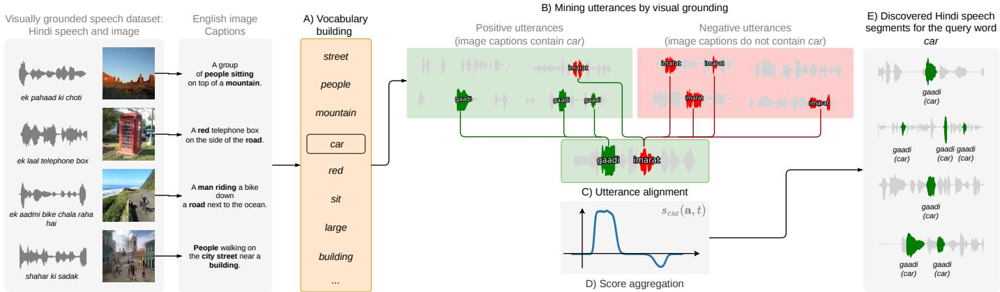
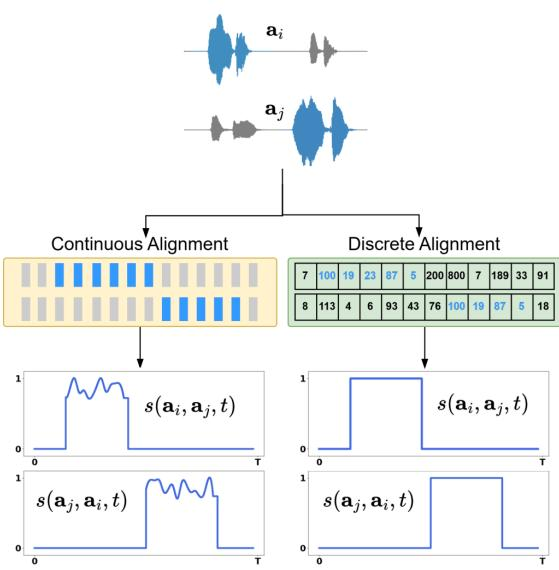
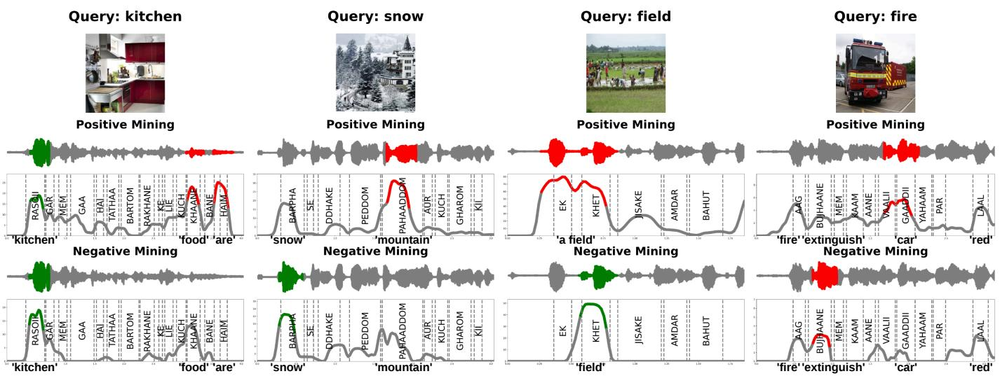
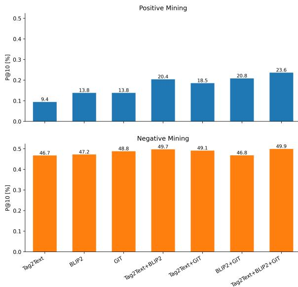
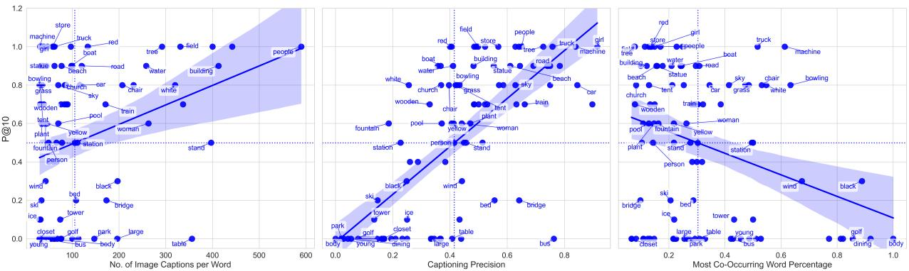

# Mapping Written Words to Spoken Words in a Different Language Using Only Visual Grounding

Gabriel Pirlogeanu, Dan Oneata, Horia Cucu, Herman Kamper

Abstract—In many low-resource settings, even just eliciting speech for data collection is difficult. One promising approach has been to ask speakers to describe images. But how do we build models from such visually grounded speech data? Given a dataset of images with Hindi spoken captions, we consider how we can map a written English keyword to spoken realisations of that word in Hindi. Previous work trained end-to-end multimodal neural models. Instead, we explore a simpler alignment-based approach built on self-supervised speech representations. Written English tags are automatically obtained from images using off-the-shelf image captioning systems. Hindi utterances associated with the same keyword are then aligned (using self-supervised features), and alignment evidence is aggregated to identify recurring speech segments corresponding to the target word. Experiments evaluating keyword spotting and localization show that our alignment-based approach outperforms a previous attention-based neural model. We also show the benefit of incorporating negative examples during alignment. Our work demonstrates that crosslingual word-to-speech mappings can be learned directly from visual grounding without transcriptions or explicit model training.

Index Terms—visually grounded speech models, multimodal learning, vocabulary learning, keyword localization

## I. INTRODUCTION

ODERN speech technology has become ubiquitous, reach. For many of the world’s 7000 living languages, even eliciting speech for data collection is challenging because many languages lack a writing systems or are spoken in low literacy communities. One promising solution is to collect speech through visual grounding: start with a set of images, ask people to describe them, and record their utterances. This approach is being adopted by the project Vaani [1], [2], an ongoing effort to preserve the linguistic diversity of India.

In this work we ask whether such a visually grounded speech dataset can be used to document a foreign language. As a concrete case study, we consider a collection of images paired with Hindi spoken captions and aim to (i) discover audio segments corresponding to Hindi words, and (ii) link the Hindi speech segments to their corresponding English words. Previous work has explored using visual grounding to map speech to image regions [3] or even speech to speech across languages [4], but less emphasis has been placed on mapping speech to written words. Connecting speech in a foreign language to written words in a high-resource language establishes a clear semantic correspondence and directly supports language documentation.

To obtain textual supervision from images, we propose using off-the-shelf image captioning systems. For each image in the dataset, we generate a written description in English using several automatic image captioning systems. From these captions, we can generate a vocabulary of written words that have a visual correspondence. To map a keyword to an audio segment, we adapt unsupervised word discovery [5] to incorporate visual grounding. The idea is to partition the utterances into positive and negative sets based on whether their corresponding image captions contain the target keyword. A speech alignment method is then run to find the segments that align best with the utterances in the positive set and least with those in the negative set.

Olaleye et al. [6] proposed an approach for the related task of keyword localization in visually grounded speech: given an image–speech corpus and a written keyword, locate the keyword in the speech corpus. Their main idea was to use an image tagger to provide weak supervision for an attentionbased audio-to-keyword neural network. The keywords that can be retrieved are limited and fixed to the codomain of the single image tagger used. In our case, the vocabulary is dynamically created, based on the corpus at hand. Moreover, by replying on unsupervised speech segmentation methods for discovering spoken terms, we are able to more precisely segment the words.

We evaluate two variants for the alignment approach: one that uses continuous self-supervised features, while the other relies on discrete features. Both convincingly outperforms an updated version of the parametric method of Olaleye et al. [6], with the continuous approach achieving the best overall performance. Through a series of ablation studies, we show that our approach is robust to the choice of speech representations, image captioning systems, and hyperparameters. Since we operate in a cross-lingual setting, a challenge is accounting for differences in how speakers from different cultures perceive the same image. We provide cross-lingual analyses and contextualize the results against a monolingual setting.

This paper extends our previous work in a conference paper [7]. That study established the core methodology and validated it in a controlled monolingual setting, where both speech and the target keywords were in English. Here, we move to a more realistic cross-lingual setting by using the Places Hindi dataset [8], in which the speech is in Hindi and the target keywords in English. In addition, we improve the method by integrating negative information in the alignment process, and provide more comprehensive analyses, including an investigation of the impact of the speech representations and a detailed word-level error analysis.

  
Fig. 1. Given a visually grounded speech corpus, we learn a mapping between English written words and their spoken Hindi counterparts. (A) A vocabulary is constructed from the most frequent words in English captions, obtained automatically from images. (B) We partition all utterances based on whether their corresponding image captions contain the target word, e.g., car. (C) Then we align a positive utterance with all other utterances and (D) aggregate the alignments: positive alignments are added and negatives subtracted. (E) We retrieve the most aligned Hindi audio segments for a given English keyword.

## II. RELATED WORK

Our work is related to visually grounded speech models and cross-lingual learning through the visual modality.

Connecting Speech to Images. A large body of work studies how to connect speech with images, often by learning shared representations between audio and visual data [9]. Some methods go further and align parts of speech with parts of an image, such as linking spoken segments to objects or regions in the image [3], [10]–[12]. In these approaches, the model is typically trained to directly align speech features with visual features. In contrast, our method does not rely on learning a fine-grained speech–image alignment model. Instead, we use images only as a bridge to introduce weak textual supervision, and we rely on speech alignment to discover recurring spoken patterns that can later be linked to written words.

Connecting Languages via Images. Vision provides a common grounding signal across languages, and as such it was used to learn cross-lingual connections. Prior work has shown that visual context can support speech-to-speech retrieval across languages [8], [13], [14], as well as mapping words across languages using images or videos [15], [16]. These studies demonstrate that vision can act as a common reference point between languages. Particularly relevant to our work is the approach of Azuh et al. [4], where cross-lingual speech associations are discovered based on two spoken captions of the same image in two different languages. Differently, we do not assume that we have an English spoken caption, but automatically generate a text description using an image captioning system.

Connecting Speech to Words via Images. The most related line of work uses images as an intermediate step to connect speech and written words. Early approaches used image tags to define visual concepts and mapped whole speech utterances to sets of words [17], [18]. Later work improved this idea by using automatic image captions as richer supervision signals. Particularly relevant to our work are the findings in [19], which showed how image captions can guide speech translation, and [6], which focused on locating words in speech using image-based supervision. We combine these ideas for the first time and show that image captions can also guide localisation of particular keywords in a cross-lingual setting.

## III. METHODOLOGY

## A. Overview

We consider a visually grounded speech setting in which images are paired with spoken descriptions in a target foreign language (e.g., Hindi). Given this data, our goal is to automatically discover recurring acoustic segments and associate them with English written words.

Our approach, illustrated in Figure 1, starts by first defining a vocabulary of English words that can be linked to audio segments (step A). These are words that have visual grounding and, as such, are likely to be mentioned in the spoken captions. To obtain the vocabulary, we generate descriptions for the images using pretrained English image captioning models. The generated descriptions are then lemmatized, and the most frequent concrete words are selected to form the vocabulary (e.g., street, red, car).

Next, given a query word from the vocabulary (e.g., car), we want to retrieve corresponding Hindi audio segments. We propose a new keyword localization method inspired by unsupervised word discovery [5], [20]–[22], but which uses the query word to guide the search. Specifically, we partition the utterances into positive and negative sets according to whether the query word appears in their associated English image captions (step B; Section III-B). Each positive utterance, which is likely to contain the query, is aligned with all other utterances (step C; Section III-C). Finally, the alignments are aggregated using an interval piling technique: alignments with positive utterances are added, whereas alignments between positive and negative utterances are subtracted (step D; Section III-D). The highest-scoring segments across the positive utterances are most likely to contain the query word (step E).

## B. Mining Utterances Using Visual Information

Positive Mining. Given an audio–image corpus and a query word, we would like to focus our search on those audio utterances that are likely to contain the query word w. We use the automatically generated image captions as a source of visual supervision: if the image caption of image i contains w, then the audio–image pair (a, i) is included in the positive set:

$$
P _ { w } = \{ ( \mathbf { a } , \mathbf { i } ) ~ | ~ w \in \mathrm { I m a g e C a p t i o n e r } ( \mathbf { i } ) \} .\tag{1}
$$

This filtering is shown in Figure 1 (step B) in the green left block, where we retrieve all utterances containing the word car (gaadii) in the associated image caption.

Negative Mining. The positive set $P _ { w }$ also covers words that do not match the query word. In one case, you could have words that just very often co-occur with the query, $e . g .$ road (sadak) often occurs in utterances tagged with car (gaadi). In other cases, common function words (e.g., hai, an auxiliary verb) may dominate. To avoid such cases, we incorporate contrastive evidence by defining a negative set, which contains those utterances whose corresponding image captions do not contain the query word:

$$
N _ { w } = \left\{ ( \mathbf { a } , \mathbf { i } ) \mid w \not \in \mathrm { I m a g e C a p t i o n e r } ( \mathbf { i } ) \right\} .\tag{2}
$$

In practice, we use a random subset from $N _ { w }$ with the same size as $P _ { w }$ or a minimum of 50 samples. Negative sampling is illustrated in the red block of Figure 1 (step B), where we retrieve utterances that do not contain the word car (gaadii) in their captions.

Semantically Negative Mining. To directly target cooccurrences, we also define a set of negative utterances that specifically contain words that co-occur with the query w:

$$
\begin{array} { r l } & { N _ { w } ^ { \prime } = \{ ( \mathbf { a } , \mathbf { i } ) \mid \mathrm { I s C o o c c u r e n c e } ( c , w ) , } \\ & { ~ c \gets \mathrm { I m a g e C a p t i o n e r } ( \mathbf { i } ) , } \\ & { ~ ( \mathbf { a } , \mathbf { i } ) \gets N _ { w } \} . } \end{array}\tag{3}
$$

A word c is considered to co-occur with the vocabulary word w if it is one of the two most frequent co-occurring words with w. As with the negative set, we use a random subset from $N _ { w } ^ { \prime }$ with the same size as $P _ { w }$ or at a minimum of 50 samples.

## C. Aligning Utterances

Next, we align the utterances with each other. The goal of this step is to identify recurring audio subsequences that consistently appear in the corpus. The query word will then be found among these subsequences. We extract the common subsequences using an unsupervised word discovery approach. This is illustrated in Figure 1 (step C), where we align each positive utterance with all other positive utterances, as well as with all negative utterances.

Formally, for any two audio utterances ${ \bf a } _ { i }$ and $\mathbf { a } _ { j } .$ , we define a scoring function $s ( \mathbf { a } _ { i } , \mathbf { a } _ { j } , t )$ for how likely it is that segment t from utterance ${ \bf a } _ { i }$ appears anywhere in utterance $\mathbf { a } _ { j }$ . We explore two variants: one based on continuous selfsupervised representations, and the other on discrete ones. Both variants rely internally on HuBERT representations [23] and are illustrated in Figure 2.

  
Fig. 2. Continuous and discrete alignment methods are applied to a pair of input utterances. The discrete method takes cluster codes as input and produces a binary alignment signal. The continuous approach yields alignment scores in the range [0, 1].

Discrete Features Alignment (DFA). As in [5], HuBERT features are first encoded to discrete units using k-means clustering, and then each pair of unit sequences are aligned using the Smith-Waterman dynamic programming algorithm [24]. From the resulting alignment, we construct a binary scoring function s: 1 if the segment in ${ \bf a } _ { i }$ is matched, and 0 otherwise. A similarity threshold τ sets a minimum score required for a pair of sub-sequences to be considered a match, thereby controlling the trade-off between the quantity and quality of the discovered patterns.

Continuous Features Alignment (CFA). Following [4], we estimate the alignment of two utterances by computing the similarity directly in the feature space. We use cosine similarity between features: we define the score between a pair of utterances as the maximum similarity between the features $\phi _ { i t } .$ , extracted from the ${ \bf a } _ { i }$ at time t, and all the other features $\phi _ { j }$ from the second utterance: $s ( \mathbf { a } _ { i } , \mathbf { a } _ { j } , t ) = \mathrm { m a x } _ { t ^ { \prime } } \langle \phi _ { i t } , \phi _ { j t ^ { \prime } } \rangle$ To obtain a less noisy and sparse signal, we apply a smoothing filter (using a standard Gaussian) and set the values below γ · max(s) to 0, where $\gamma$ is the local threshold hyperparameter. While continuous features have more capacity than discrete ones, framewise comparisons are much slower.

## D. Ranking Segments by Aggregation

Given the alignments between a positive audio file and the rest of the utterances, we can locate the query word. The idea is that the query is likely to appear in the subsequences shared with the other positive utterances, and is likely to be absent from those shared with the negative utterances. This is illustrated in Figure 1 (step D), where we show the score for a given audio sample, a, while searching for the word car. As noted, we expect the queried word to be well-aligned, whereas cooccurring terms should be penalized through negative mining.

Concretely, given a positive sample a, we define the utterance-wise score by summing its alignment scores with all other positive samples $\mathbf { a } ^ { \prime }$ and subtracting its alignment scores with all negative samples a¯:

$$
s ( \mathbf { a } , t ) = \sum _ { \mathbf { a } \ \in P _ { w } \atop \mathbf { a } ^ { \prime } \neq \mathbf { a } } s ( \mathbf { a } , \mathbf { a } ^ { \prime } , t ) \ - \ \sum _ { \bar { \mathbf { a } } \in N _ { w } } s ( \mathbf { a } , \bar { \mathbf { a } } , t ) .\tag{4}
$$

This formulation extends the “interval piling” [20] approach with a contrastive component: alignments across positive pairs increase the score, while alignments with negative samples are penalized. This suppresses frequent but non-informative segments such as co-occurrences and function words. For the negative set we can also use the semantic negative set $N _ { w } ^ { \prime }$ ; we also consider a no-negatives (only-positives) variant as a baseline. The benefits of negative samples are explicitly investigated in our experiments.

To eliminate noisy alignments, we discard values below a global threshold $\theta ,$ defined as a fraction of the maximum aggregated score within the utterance. The speech is then segmented in contiguous regions delimited by silence. Each resulting segment is scored using the average of its frame-level values. The high-scoring segments are selected as candidate instances of the query word spoken in the foreign language.

## IV. EXPERIMENTAL SETUP

## A. Data and Groundtruth

We use the MIT Place Audio Captions Hindi dataset [8], a speech–image dataset of 100k images paired with spoken Hindi descriptions. The images come from the Places dataset [25], and contain scenes such as forests, kindergarten classrooms, or car interiors. The spoken captions were collected via Amazon Mechanical Turk and are spontaneously spoken rather than read. For our experiments, we sample 20k speech–image pairs and use 10k for development purposes and the other 10k for the final evaluation. The selected samples are at most seven seconds long; this improves alignment, while still preserving enough content. For comparative monolingual experiments, we also use the English variant of the dataset, Places Audio Captions [3], [11], [26], which is similarly constructed, but with English spoken captions; we use the spoken English descriptions for the same 20k images as for the Hindi set.

To evaluate our approach, we need to know where an English word appears in a Hindi spoken caption. This requires Hindi transcriptions, word-level forced alignments, and English–Hindi translations. The original dataset does not provide these, so we construct the groundtruth ourselves. First, we obtain automatic Hindi transcriptions using the Conformer Large CTC model [27] from NVIDIA NeMo [28]; this model achieves a word error rate of 9.4% on the MUCS 2021 dataset [29]. The transcriptions are then aligned using a CTC-based forced aligner based on the Massively Multilingual Speech [30] model. Finally, the transcripts are romanized using the uroman library [31] and lemmatized using Stanza [32]. This enables the use of a simple bilingual dictionary that maps English keywords to romanized Hindi lemmas. The dictionary is obtained with ChatGPT (as well as manually checked) and is one-to-many, including multiple valid translations (car → {gaadi, kaar}) and near synonyms (road → {sadak (road), gali (alley)}).

TABLE I  
HYPERPARAMETERS SELECTED ON THE MONOLINGUAL ENGLISH DEVELOPMENT SET FOR THE TWO ALIGNMENT METHODS.
<table><tr><td></td><td></td><td></td><td></td><td colspan="2">min. duration</td><td></td><td></td></tr><tr><td>Method</td><td>T</td><td>γ</td><td>θ</td><td>local</td><td>global</td><td>pad_on</td><td>pad_off</td></tr><tr><td>CFA</td><td>N/A</td><td>0.7</td><td>0.6</td><td>0.2</td><td>0.2</td><td>0.0</td><td>0.1</td></tr><tr><td>DFA</td><td>3</td><td>N/A</td><td>0.7</td><td>0.2</td><td>0.2</td><td>0.0</td><td>0.1</td></tr></table>

## B. Implementation Details

We generate image decriptions using three image captioning systems: Tag2Text [33], BLIP-2 [34], and GIT [35]. For each image, captions are produced via beam search and then processed to remove stopwords and lemmatized with the en\_core\_web\_sm SpaCy model [36]. The final set of words associated with each image is the intersection of the words produced by all three captioners for that image. These words are used to ensemble the vocabulary and for the utterance selection step (Section III-B). The vocabulary contains the most frequent 100 words (e.g., chair, red, sit), except for visually ungrounded terms (e.g. background, picture, view), which were manually removed. The vocabulary is constructed independently on both development and test splits.

For both alignment methods, we extract features from the seventh layer of the English HuBERT Base model, the optimal layer for phone discrimination [23]. To prevent the alignment of silence or background noise across utterances, we apply voice activity detection using Pyannote3 [37]. Additionaly, the pipeline’s postprocessing hyperparameters prevent short segments: we remove segments resulted from pair-wise alignment that are shorter than a min. duration local value; aggregated segments are discarded if shorter than a min. duration global value; we add padding at the start of retrieved segments with a pad on value; and also pad them at the end with a pad off value. All hyperparameters are tuned in the monolingual setting, on the English development set, and the exact values are given in Table I. We observe that the two sets of hyperparaters are similar across the two alignment variants. Moreover, they are also similar to what we obtain if we were to tune on the Hindi development set (results not shown here). This confirms the robustness of the approach.

## C. Evaluation Protocol

We evaluate our models in terms of two retrieval metrics: keyword localization and keyword spotting. For keyword localization, a retrieved segment for a given keyword is considered correct if it overlaps sufficiently with a Hindi translation of that keyword; overlap is computed in terms of the intersection over union (IoU) of the two segments and it has to exceed a predefined threshold (we use 0.5 throughout) For keyword spotting, a retrieved segment is considered correct if the Hindi translation of the query keyword appears anywhere in the utterance; this metric is a strict upper-bound on the localization performance. Since the mapping is one-to-many, a retrieval is counted correct if it matches any of the valid translations. For both localization and spotting, we take the top 10 retrieved audio segments for each word in the vocabulary and report the number of correct predictions (P@10). The scores are averaged over the vocabulary words.

## D. Alternative Approach and Toplines

Attention CNN. For comparison, we consider our own updated version of the neural-based model of Olaleye et al. [6], [38], the only other work to look at a related task. The model has two inputs, an audio utterance and a word from the vocabulary, and predicts whether that word appears anywhere in the utterance (based on the associated image captions). We use HuBERT features from the seventh transformer layer as input, to ensure a fair comparison with our method. The model consists of a convolutional neural network, an attention layer (to pool the audio embeddings over time, based on the input word), and a two-layer perceptron (to project the pooled embedding to a binary prediction). To localize a word, we find the peak of the attention weights and return a fixed-sized segment around the peak (from 0.1s before to 0.3s after the peak). This is necessary since the attention plots are very peaky, resulting in poor performance for this approach on our benchmark ( [38] only evaluated whether the peak occurred within the true word, not whether a segment can be extracted). The displacement hyperparameters were tuned on the English development set.

Transcript Topline. Image captions only approximate the words in an utterance. To understand the system’s potential under ideal conditions, we evaluate its performance using the utterance’s actual transcript. Specifically, we carry out the selection step (Section III-B) by checking whether any of the translations of the English word appear anywhere in the Hindi transcript.

Monolingual Topline. We also consider a monolingual setting in which both the query word and the target spoken language are English. This setting is still challenging because, although the spoken captions are in English, they are not per fectly aligned with the generated image captions. Nevertheless, it serves as an upper bound for our main cross-lingual setting, as it avoids cultural biases in the image descriptions and uses speech representations that are optimized for English.

## V. RESULTS

## A. Main Results

Table II presents our main results. We consider two settings: a topline setting in which transcripts are used for supervision, and the actual visually grounded models in which models are supervised directly with images. In each setting, we compare the two proposed alignment variants (continuous feature alignment, CFA; discrete feature alignment, DFA; Section III-C), and the three ways of mining variants (positives only; positives and negatives; positives and semantic negatives; Section III-B). In the realistic visually grounded setting, we also compare to the attention-based baseline (Attention CNN; Section IV-D). We now summarize our main findings.

Continuous Features Perform Best. Across all settings, alignment based on continuous features (CFA) consistently achieves the strongest results. For example, the best visually grounded localization result is 49.9% P@10, obtained by CFA with positive and negative selection; DFA achieves only

TABLE II  
P@10 (%) FOR CROSS-LINGUAL KEYWORD SPOTTING AND LOCALIZATION USING CONTINUOUS (CFA) OR DISCRETE (DFA) FEATURE ALIGNMENT. TOPLINES USE TRANSCRIPTS; VISUALLY GROUNDED SYSTEMS USE THE INTERSECTION OF THREE IMAGE TAGGERS.
<table><tr><td>Method</td><td>Mining</td><td>Spotting</td><td>Localization</td></tr><tr><td colspan="4">Toplines: Use transcripts for supervision</td></tr><tr><td rowspan="3">DFA</td><td>pos</td><td>100</td><td>40.8</td></tr><tr><td>pos vs neg</td><td>100</td><td>69.4</td></tr><tr><td>pos vs sem neg</td><td>100</td><td>71.8</td></tr><tr><td rowspan="3">CFA</td><td colspan="3"></td></tr><tr><td>pos pos vs neg</td><td>100 100</td><td>75.7 89.8</td></tr><tr><td>pos vs sem neg</td><td>100</td><td>89.2</td></tr><tr><td colspan="4">Visually grounded systems: Use images for supervision</td></tr><tr><td>Attention CNN [6]</td><td>N/A</td><td>18.8</td><td>10.4</td></tr><tr><td colspan="4"></td></tr><tr><td rowspan="3">DFA</td><td>pos</td><td>49.7</td><td>16.8</td></tr><tr><td>pos vs neg</td><td>56.8</td><td>34.2</td></tr><tr><td>pos vs sem neg</td><td>55.7</td><td>34.6</td></tr><tr><td colspan="4"></td></tr><tr><td rowspan="3">CFA</td><td></td><td>47.7</td><td>23.6</td></tr><tr><td>pos pos vs neg</td><td>63.0</td><td>49.9</td></tr><tr><td>pos vs sem neg</td><td>61.5</td><td>47.5</td></tr></table>

34.2% in the same setting. This gap likely arises because continuous features retain more information since information is not discarded through a discretizing clustering step. This advantage, however, comes at an efficiency cost: aligning 250 audio clips takes 2m15s with CFA, compared to only 24s with DFA. Importantly, both CFA and DFA outperform the Attention CNN method [6], thereby improving on the current state-of-the art.

Negative Mining Consistently Helps. Incorporating contrastive information through the negative samples helps across all settings, for both CFA and DFA and for both the toplines and visually grounded systems. For example, in the visually grounded localization task, DFA improves from 16.8% to 34.6%, and CFA from 23.6% to 49.9%. Restricting negatives to semantic negatives yields similar, but slightly weaker performance than using unrestricted negatives. Interestingly, negatives have a greater impact on localization than on keyword spotting: 23.6% to 49.9% (a 111% relative improvement) versus 47.7% to 63.0% (a 32% relative improvement). This is because negatives suppress co-occurrening words, which primarily affect localization, not keyword spotting.

Figure 3 illustrates this qualitatively. For the query kitchen (rasoi), negative mining suppresses the alignment with the auxiliary word are (hain) and the semantically related word food (khaana). In the second example, negative mining helps correctly retrieve the word snow (barf) by reducing the alignment with the frequently co-occurring word mountain (pahaad). The third example shows an improvement in localization, removing the alignment with the neighbouring numeral one (ek). However, co-occurrence errors can still persist. In the fourth example, the query fire (aag) is aligned with car (gaadi) when using positive mining, and with the verb extinguish (bujhaane) when using negative mining. Since most images depict fire trucks or fire stations together, the concept of fire is associated with many co-occurring words such as car, red, extinguish, and parking.

  
Fig. 3. Examples of the top retrieved segments for four query words with the baseline filtering mechanism (top) and with negative mining (bottom). CFA is used for audio alignment. For better visualization, we overlap the forced alignments over the aggregated signal plot. Images correspond to the utterances below.

TABLE III  
P@10 (%) FOR KEYWORD SPOTTING AND LOCALIZATION IN THE MONOLINGUAL (ENGLISH–ENGLISH) AND CROSS-LINGUAL (HINDI–ENGLISH) SETTINGS. WE USE CONTINUOUS ALIGNMENT (CFA) WITH NEGATIVE MINING.
<table><tr><td></td><td></td><td colspan="2">Language</td><td></td><td></td></tr><tr><td></td><td>Setting</td><td>Utterances</td><td>Keywords</td><td>Spotting</td><td>Localization</td></tr><tr><td colspan="6">Toplines: Use transcripts for supervision</td></tr><tr><td>1</td><td>Mono-lingual</td><td>English</td><td>English</td><td>100</td><td>94.3</td></tr><tr><td>2</td><td>Cross-lingual</td><td>Hindi</td><td>English</td><td>100</td><td>89.8</td></tr><tr><td colspan="6">Visually grounded systems: Use images for supervision</td></tr><tr><td>3</td><td>Mono-lingual</td><td>English</td><td>English</td><td>86.3</td><td>75.4</td></tr><tr><td>4</td><td>Cross-lingual</td><td>Hindi</td><td>English</td><td>63.0</td><td>49.9</td></tr></table>

Weak Supervision is the Primary Source of Performance Loss. For the transcript topline, we are guaranteed that a word is present in the utterance. Under this idealized scenario, results are very strong: spotting is perfect, localization performance is approaching 90% with CFA (top section of Table II). This suggests that the proposed methodology (alignment and utterance mining) performs well as long as the data is not noisy. The invariable mismatch between what is spoken and what is seen is what degrades performance. This mismatch is not unique to machine-generated captions: it also affects human-generated ones [39], since two people may describe the same image using different words. In our case, the issue is further compounded by cultural and linguistic gaps. We analyse this aspect further next.

## B. The Cross-Lingual Gap

As we saw, the inherent variation in how an image is described makes the studied task challenging. This gaps widens further in a cross-lingual setting. Since captioning models are trained on English-centric data from Western culture, while the spoken captions come from speakers based in India, concepts

## TABLE IV

ALIGNMENT BETWEEN CAPTIONS GENERATED EITHER AUTOMATICALLY OR MANUALLY BY ENGLISH OR HINDI ANNOTATORS. ALIGNMENT IS MEASURED IN TERMS OF PRECISION AND RECALL AND AVERAGED OVER ALL 10K SAMPLES IN DEVELOPMENT SET AND 100 WORDS IN THE VOCABULARY.
<table><tr><td></td><td>Prediction</td><td>Groundtruth</td><td>Prec. (%)</td><td>Rec. (%)</td></tr><tr><td>1</td><td>Automatic (English)</td><td>English annotators</td><td>50</td><td>47</td></tr><tr><td>2</td><td>Automatic (English)</td><td>Hindi annotators</td><td>26</td><td>40</td></tr><tr><td>3</td><td>English annotators</td><td>Hindi annotators</td><td>22</td><td>37</td></tr></table>

of interest to a Westerner, such as golf, might not be referred to at all by a native of India [40]. Here we analyse the challenges that arise from the cross-lingual and cultural gap.

Cross-linguality Partially Explains the Performance Gap. To quantify the performance drop due to working with a foreign language, we compare our default cross-lingual setting to a monolingual setting, in which both the utterances and the keywords are in English. The monolingual English–English setting places an upperbound on performance, since English is also the language on which the image captions and speech representations are trained. Table III reports results in both idealized (transcript-based) and visually grounded (imagebased) settings for the two languages. We observe that, in the monolingual setting, the visually grounded model partially closes the gap to the cross-lingual topline: localization improves from 49.9% (row 4) to 75.4% (row 3), with the topline being at 89.8% (row 2). A gap still remains, due to the imperfect supervision provided by image captions. We also observe that the cross-lingual topline is close to the mono-lingual one: 89.8% (row 2) and 94.3% (row 1). Since the idealized setting removes the effect of image captioning, we conclude that the language of the speech representations—the only remaining difference—is not a crucial factor. But we do formally analyse the impact of speech representations in Section VI-B.

English and Hindi Speakers Describe Images Differently. To measure the cross-lingual gap directly, we compare Hindi and English captions provided for the same set of images by human annotators. An English keyword is said to occur in the Hindi caption if one of its translations appears in the lemmatized Hindi caption. To contextualize the results, we also compare automatically generated captions with captions from English or Hindi annotators. Table IV shows precision and recall on the 10k images from the development set, averaged over the 100 keywords in the vocabulary. We observe moderate alignment in the English–English setting between automatic captions and manual ones. Alignment drops in the cross-lingual setting, with the larger drop being in precision (words used in English captions do not occur in the Hindi ones). Interestingly, Hindi annotations align better with automatic captions (row 2) than other English annotators (row 3), confirming that the issue does not lie with the captioning system, but is more fundamental in the way that humans describe the images.

We investigate particular cases and observe that systematic differences appear for some categories. One such case is sports: English speakers naturally name the specific sport being depicted, baseball, golf, or bowling. Hindi speakers tend to conflate them under a single category—e.g., game (khel)—or do not name the sport at all, instead referring to other parts of the image, e.g. field (maidaan) or players (khiladi). A similar pattern emerges for scene-level concepts: instances that might be labelled a castle (kilaa, mahal) in English are more commonly described in Hindi using broader terms such as old/ancient building (purani imaarat) or structure (sanrachna). Instead of specifically naming a scene restaurant, Hindi speakers often refer to its constituent elements, e.g., table (mez) or chair (kursi).

## VI. FURTHER ANALYSES

To further understand our system, we investigate how the choice of image captioning systems (Section VI-A) and speech representations (Section VI-B) impact the final performance. At the end, we take a more granular look and inspect how the keyword-level performance is impacted by factors such as number of samples or co-occurrence percentage (Section VI-C).

## A. Impact of Image Captioning Systems

Image captions are used in the mining stage to select positive and negative utterances. We now examine how the choice of captioning systems affect downstream performance. For the main experiments we used the intersection of three captioning systems. Here, we report performance when captions are taken from a single system or from the intersection of any two pairs of systems.

Figure 4 shows results for positive and negative mining strategies across all combinations of captioning systems. For the proposed negative mining variant, performance is largely insensitive to the underlying captioning system: all captioning combinations give very similar—and strong—results (between 46.7% and 49.9%). In contrast, the baseline positive mining strategy is strongly affected by the choice of captioning system. Combining multiple systems tends to have a positive impact, increasing localization performance from 13.8% P@10 with the best single captioner, BLIP2, to 23.6% with the intersection of three. This is likely because the intersection of captions produces more precise annotations: captioning precision increases from 33.37% (best single captioner) to 41.5% (intersection of three captioners). As we show later (Section VI-C), precision at the word-level also correlates positively with performance.

  
Fig. 4. Localization performance P@10 on the Hindi test set using CFA as the captioning system for image-based supervision is changed. The top plot uses positive mining as the filtering mechanism, while the bottom plot uses negative mining.

TABLE V  
P@10 (%) FOR LOCALIZATION ON THE HINDI TEST SET WHEN VARYING THE SELF-SUPERVISED SPEECH REPRESENTATIONS: MODEL ARCHITECTURE, FEATURE EXTRACTION LAYER, AND PRETRAINING LANGUAGE. RESULTS USE THE CFA METHOD WITH NEGATIVE MINING.
<table><tr><td>Architecture</td><td>Layer</td><td>Language</td><td>Hours</td><td>P@10</td></tr><tr><td>Default configuration HuBERT Base [23]</td><td>7</td><td>English</td><td>960</td><td>49.9</td></tr><tr><td>Other configurations</td><td></td><td></td><td></td><td></td></tr><tr><td>HuBERT Large [23]</td><td>24</td><td>English</td><td>60k</td><td>38.5</td></tr><tr><td>HuBERT Large [23]</td><td>24</td><td>Mandarin</td><td>10k</td><td>36.7</td></tr><tr><td>mHuBERT [41]</td><td>8</td><td>Multilingual</td><td>90k</td><td>50.7</td></tr><tr><td>WavLM Base [42]</td><td>8</td><td>English</td><td>960</td><td>45.4</td></tr><tr><td>WavLM Large [42]</td><td>24</td><td>English</td><td>94k</td><td>39.4</td></tr><tr><td>wav2vec 2.0 Base [43]</td><td>6</td><td>English</td><td>960</td><td>36.7</td></tr><tr><td>wav2vec 2.0 Base [43]</td><td>6</td><td>Hindi</td><td>10k</td><td>44.4</td></tr></table>

## B. Impact of Speech Representations

The speech representations are critical for the alignment step (Section III-C). Here, we investigate multiple options for speech representations by considering models of different scales, trained on different data and different training languages.

Table V shows the results when using the continuous feature alignment (CFA) variant with negative mining. The hyperpa rameters (includling the layer at which the representations are extracted) are tuned on the English development set. The default model is HuBERT Base and achieves a 49.9% P@10 localization performance. Increasing the scale of the model and data (HuBERT Large trained on 60k hours of English) or changing the architecture (WavLM Base and WavLM Large) degrade performance. The only setting in which we observe a slight improvement is for the multilingual variant (mHuBERT), with the precision reaching 50.7%, but the difference is negligible, despite mHuBERT being trained on 147 languages. We also evaluate speech representations pretrained on the target language (Hindi) using a wav2vec 2.0 model. This model achieves a slightly lower localization performance (44.4% P@10) than HuBERT Base. However, this difference is likely due to the architecture rather than the pretraining language, as an English wav2vec 2.0 model performs substantially worse (36.7% P@10). Overall, while the speech representations matter, the current choice (HuBERT Base) is strong enough.

  
Fig. 5. Word-level performance (P@10 at IoU = 0.5) as a function of three factors: (left) number of image captions for each word; (middle) captioning precision for each word; (right) percentage of times the best co-occurrence co-occurs with each word. Results are obtained using CFA with negative mining on the Hindi test set. Each plot shows a linear regression fit and the 95% confidence interval computed by bootstrapping. Dotted lines represent mean values.

## C. Word-Level Error Analysis

Up to now we looked at the performance in the aggregate over words in the vocabulary. We now zoom in on performance per word.

To understand the impact of the various components, Figure 5 shows how the downstream localization performance (P@10) varies with three factors: the number of image captions per word, captioning precision, and the relative frequency of the most co-occurring word in captions with respect to the query word. These metrics are computed using the intersection of the three captioners. For this experiment, we consider the CFA model with negative mining. We also plot the linear regression fit and 95% confidence intervals.

First, in Figure 5–left we see that performance correlates with the number of captions, indicating that the more frequent a word is the more likely it is to be correctly retrieved. However, the correlation is weak, especially at the low end: rare words such as machine, girl, or store perform well even if they have fewer than 50 utterances. This suggests that large sample counts are not strictly necessary for good retrieval, offering a promising direction for future work on very low-resource languages.

Figure 5–middle shows a strong positive relationship between performance and captioning precision. This highlights the importance of precise captions, and partially explains why the cross-lingual setting performs worse that the monolingual one: cross-lingual precision is worse than monolingual precision (Table IV). Notable exceptions are bus, bed, bridge, which have well-aligned captions, but low retrieval scores. Taking a closer look at these, we observe that the co-occurrences are causing problems for these cases: bus (bas) is always retrieved with the postposition ke (e.g., bas ke); bed (bistar) is often confused with the word room (kamre); and the word bridge (pul, brij) is confused with words like above (upar) or segmented with auxiliary words like a bridge (ek pul).

Finally, Figure 5–right shows that performance correlates inversely with the relative frequency of the most common cooccurring word: if a word co-occurs often with the query, then performance suffers. For example, image captioners most often describe lakes or rivers with the phrase body of water (e.g., a small shack sits on the edge of a body of water). So body gets assigned to words such as water (paani) or river (nadi) rather than its actual translation.

## VII. CONCLUSIONS

We showed how spoken captions in a foreign language (Hindi) can be mapped to written words in English using visual grounding. Our approach extends unsupervised word discovery by incorporating information extracted from the images being described. Concretely, we split utterances into positive and negative sets based on whether a query keyword appears in the image captions. The utterances are then aligned, and a spoken segment is retrieved based on how it aligns with each set: alignment with segments from the positive set serves as positive evidence, while alignment with segments from the negative set serves as negative evidence.

We find that the alignment based on continuous features achieves the best overall results. Aligning with discrete features performs worse, but is computationally more efficient. Our best setup outperforms a neural baseline by roughly 39% absolute for P@10 in keyword localization and by 44% for P@10 in keyword spotting. We show that incorporating negative evidence through negative mining is crucial for good performance and makes the system robust to the image captioning system.

A gap still remains relative to a topline that uses transcripts for supervision instead of visual grounding. This is natural, given the inherent variability in how images are described, but it is further exacerbated by the cultural gap between English and Hindi speakers: the two groups tend to describe the images differently. In this work, we used images that were of interest to Westerners, which were then annotated by Hindi speakers. Future work should explore selecting images that are more relevant to the target culture [44], so as to narrow this gap.

Overall, our work demonstrates that visually grounded speech can be used to build cross-lingual vocabularies without textual resources in the target language. We hope that this approach can help linguists and researchers develop technology that supports and helps preserve all the world’s languages [45]– [47].

## REFERENCES

[1] S. Pulikodan, A. Singh, A. Basu, N. Desai, P. D. Bhat, R. Dharmaraju, R. Gupta, S. Udupa, S. Kumar, S. Sharma et al., “VAANI: Capturing the language landscape for an inclusive digital India,” arXiv preprint arXiv:2603.28714, 2026.

[2] S. Pulikodan, A. Basu, S. Kumar, P. Bhat, V. Sanka, N. Desai, P. K. Ghosh et al., “Vaani benchmark v1. 0: An inclusive multimodal benchmark dataset for Hindi,” arXiv preprint arXiv:2606.21408, 2026.

[3] D. Harwath, A. Recasens, D. Sur´ıs, G. Chuang, A. Torralba, and J. Glass, “Jointly discovering visual objects and spoken words from raw sensory input,” in Proc. ECCV, 2018.

[4] E. Azuh, D. Harwath, and J. R. Glass, “Towards bilingual lexicon discovery from visually grounded speech audio,” in Proc. Interspeech, 2019.

[5] B. van Niekerk, J. Za¨ıdi, M.-A. Carbonneau, and H. Kamper, “Spoken term discovery using discrete speech units,” in Proc. Interspeech, 2024.

[6] K. Olaleye, D. Oneata, and H. Kamper, “Keyword localisation in untranscribed speech using visually grounded speech models,” IEEE J. Sel. Top. Signal Process., vol. 16, 2022.

[7] G. Pirlogeanu, D. Oneata, H. Cucu, and H. Kamper, “Connecting speech to words through images,” in Proc. EUSIPCO, 2026.

[8] D. Harwath, G. Chuang, and J. R. Glass, “Vision as an interlingua: Learning multilingual semantic embeddings of untranscribed speech,” in Proc. ICASSP, 2018.

[9] G. Chrupała, “Visually grounded models of spoken language: A survey of datasets, architectures and evaluation techniques,” J. Artif. Intell. Res., vol. 73, 2022.

[10] D. Harwath and J. Glass, “Deep multimodal semantic embeddings for speech and images,” in Proc. ASRU, 2015.

[11] D. Harwath and J. R. Glass, “Learning word-like units from joint audiovisual analysis,” in Proc. ACL, 2017.

[12] K. Khorrami and O. Ras¨ anen, “Evaluation of audio-visual alignments in¨ visually grounded speech models,” in Proc. Interspeech, 2021.

[13] W. N. Havard, J. Chevrot, and L. Besacier, “Models of visually grounded speech signal pay attention to nouns: A bilingual experiment on english and japanese,” in Proc. ICASSP, 2019.

[14] Y. Ohishi, A. Kimura, T. Kawanishi, K. Kashino, D. Harwath, and J. Glass, “Trilingual semantic embeddings of visually grounded speech with self-attention mechanisms,” in Proc. ICASSP, 2020.

[15] D. Sur´ıs, D. Epstein, and C. Vondrick, “Globetrotter: Connecting languages by connecting images,” in Proc. CVPR, 2022.

[16] G. A. Sigurdsson, J. Alayrac, A. Nematzadeh, L. Smaira, M. Malinowski, J. Carreira, P. Blunsom, and A. Zisserman, “Visual grounding in video for unsupervised word translation,” in Proc. CVPR, 2020.

[17] H. Kamper and M. Roth, “Visually grounded cross-lingual keyword spotting in speech,” in Proc. SLTU, 2018.

[18] H. Kamper, G. Shakhnarovich, and K. Livescu, “Semantic speech retrieval with a visually grounded model of untranscribed speech,” IEEE ACM Trans. Audio Speech Lang. Process., vol. 27, 2019.

[19] D. Oneata and H. Kamper, “Translating speech with just images,” in Proc. Interspeech, 2024.

[20] A. Park and J. Glass, “Unsupervised pattern discovery in speech,” IEEE ACM Trans. Audio Speech Lang. Process., vol. 16, 2008.

[21] K. K. R, L. Birla, and S. R. K, “A robust unsupervised pattern discovery and clustering of speech signals,” Pattern Recognit. Lett., vol. 116, 2018.

[22] E. Dunbar, M. Bernard, N. Hamilakis, T.-A. Nguyen, M. d. Seyssel, P. Roze, M. Rivi´ ere, E. Kharitonov, and E. Dupoux, “The zero resource\` speech challenge 2021: Spoken language modelling,” in Proc. Interspeech, 2021.

[23] W.-N. Hsu, B. Bolte, Y.-H. H. Tsai, K. Lakhotia, R. Salakhutdinov, and A. Mohamed, “HuBERT: Self-supervised speech representation learning by masked prediction of hidden units,” IEEE ACM Trans. Audio Speech Lang. Process., vol. 29, 2021.

[24] T. Smith and M. Waterman, “Identification of common molecular subsequences,” Journal of Molecular Biology, vol. 147, 1981.

[25] B. Zhou, A. Lapedriza, J. Xiao, A. Torralba, and A. Oliva, “Learning deep features for scene recognition using places database,” in Proc. NeurIPS, 2014.

[26] D. Harwath, A. Torralba, and J. Glass, “Unsupervised learning of spoken language with visual context,” in Proc. NIPS, 2016.

[27] A. Gulati, J. Qin, C.-C. Chiu, N. Parmar, Y. Zhang, J. Yu, W. Han, S. Wang, Z. Zhang, Y. Wu, and R. Pang, “Conformer: Convolutionaugmented transformer for speech recognition.” in Proc. Interspeech, 2020.

[28] O. Kuchaiev, J. Li, H. Nguyen, O. Hrinchuk, R. Leary, B. Ginsburg, S. Kriman, S. Beliaev, V. Lavrukhin, J. Cook et al., “NeMo: A toolkit for building AI applications using neural modules,” arXiv preprint arXiv:1909.09577, 2019.

[29] A. Diwan, R. Vaideeswaran, S. Shah, A. Singh, S. Raghavan, S. Khare, V. Unni, S. Vyas, A. Rajpuria, C. Yarra, A. Mittal, P. K. Ghosh, P. Jyothi, K. Bali, V. Seshadri, S. Sitaram, S. Bharadwaj, J. Nanavati, R. Nanavati, and K. Sankaranarayanan, “MUCS 2021: Multilingual and code-switching ASR challenges for low resource Indian languages,” in Proc. Interspeech, 2021.

[30] V. Pratap, A. Tjandra, B. Shi, P. Tomasello, A. Babu, S. Kundu, A. Elkahky, Z. Ni, A. Vyas, M. Fazel-Zarandi, A. Baevski, Y. Adi, X. Zhang, W.-N. Hsu, A. Conneau, and M. Auli, “Scaling speech technology to 1,000+ languages,” J. Mach. Learn. Res., vol. 25, 2024.

[31] U. Hermjakob, J. May, and K. Knight, “Out-of-the-box universal Romanization tool uroman,” in Proc. ACL, 2018.

[32] P. Qi, Y. Zhang, Y. Zhang, J. Bolton, and C. D. Manning, “Stanza: A python natural language processing toolkit for many human languages,” in Proc. ACL, 2020.

[33] X. Huang, Y. Zhang, J. Ma, W. Tian, R. Feng, Y. Zhang, Y. Li, Y. Guo, and L. Zhang, “Tag2Text: Guiding vision-language model via image tagging,” in Proc. ICLR, 2024.

[34] J. Li, D. Li, S. Savarese, and S. Hoi, “BLIP-2: bootstrapping languageimage pre-training with frozen image encoders and large language models,” in Proc. ICML, 2023.

[35] J. Wang, Z. Yang, X. Hu, L. Li, K. Lin, Z. Gan, Z. Liu, C. Liu, and L. Wang, “GIT: A generative image-to-text transformer for vision and language,” in Trans. Mach. Learn. Res., 2022.

[36] M. Honnibal, I. Montani, S. Van Landeghem, and A. Boyd, “spaCy: Industrial-strength natural language processing in Python,” 2020. [Online]. Available: https://doi.org/10.5281/zenodo.1212303

[37] A. Plaquet and H. Bredin, “Powerset multi-class cross entropy loss for neural speaker diarization,” in Proc. Interspeech, 2023.

[38] K. Olaleye and H. Kamper, “Attention-based keyword localisation in speech using visual grounding,” in Proc. Interspeech, 2021.

[39] J. Wang and R. J. Gaizauskas, “Cross-validating image description datasets and evaluation metrics,” in Proc. LREC, 2016.

[40] D. Hershcovich, S. Frank, H. Lent, M. De Lhoneux, M. Abdou, S. Brandl, E. Bugliarello, L. C. Piqueras, I. Chalkidis, R. Cui et al., “Challenges and strategies in cross-cultural nlp,” in Proc. ACL, 2022.

[41] M. Z. Boito, V. Iyer, N. Lagos, L. Besacier, and I. Calapodescu, “mHuBERT-147: A compact multilingual HuBERT model,” in Proc. Interspeech, 2024.

[42] S. Chen, C. Wang, Z. Chen, Y. Wu, S. Liu, Z. Chen, J. Li, N. Kanda, T. Yoshioka, X. Xiao, J. Wu, L. Zhou, S. Ren, Y. Qian, Y. Qian, M. Zeng, and F. Wei, “Wavlm: Large-scale self-supervised pre-training for full stack speech processing,” IEEE J. Sel. Top. Signal Process., vol. 16, 2021.

[43] A. Baevski, H. Zhou, A. Mohamed, and M. Auli, “wav2vec 2.0: a framework for self-supervised learning of speech representations,” in Proc. NIPS, 2020.

[44] F. Liu, E. Bugliarello, E. M. Ponti, S. Reddy, N. Collier, and D. Elliott, “Visually grounded reasoning across languages and cultures,” in Proc. EMNLP, 2021.

[45] S. Bird, “Local languages, third spaces, and other high-resource scenarios,” in Proc. ACL, 2022.

[46] S. Bird and D. Yibarbuk, “Centering the speech community,” in Proc. EACL, 2024.

[47] A. Tapo, E. Le Ferrand, Z. Liu, C. Homan, and E. Prud’hommeaux, ´ “Leveraging speech data diversity to document indigenous heritage and culture,” in Proc. Interspeech, 2024.