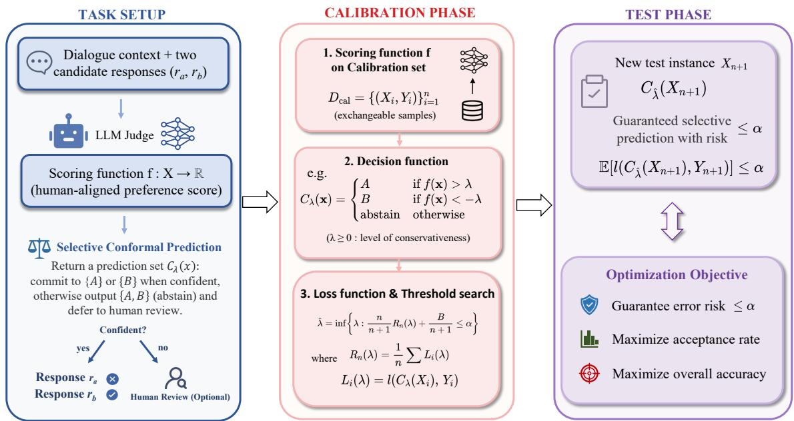
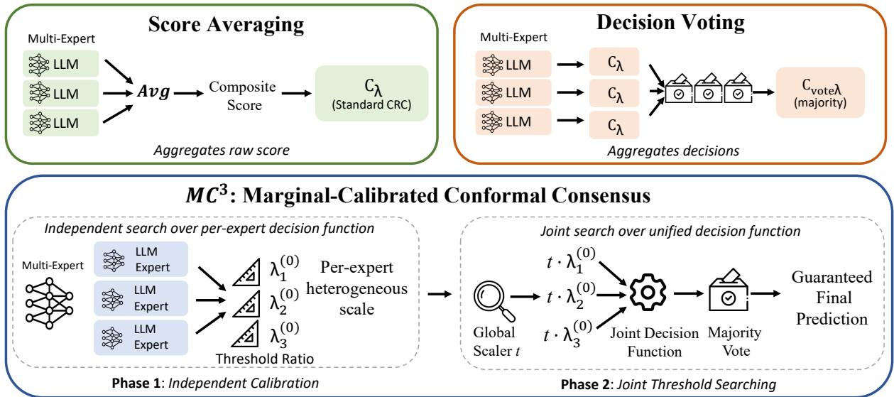
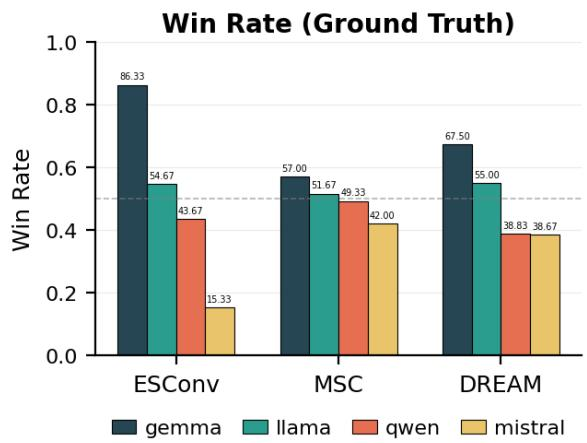
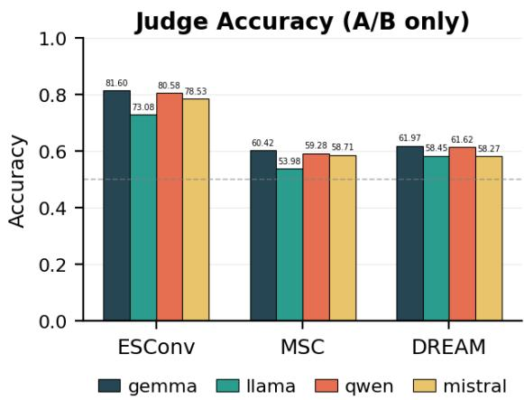

# Multi-Expert Conformal Risk Control for Pairwise LLM Judging in Open-Ended Dialogue

Ming Cheng Yusheng Dai Qiuhong Ke<sup>†</sup> Zhaolin Chen Lizhen Qu<sup>†</sup>

Monash University

{ming.cheng, yusheng.dai, qiuhong.ke, zhaolin.chen, lizhen.qu}@monash.edu

## Abstract

In this paper, we explore multi-expert Conformal Risk Control (CRC) algorithms for pair wise LLM-as-a-Judge evaluation in open-ended dialogue. Our core insight is that multi-expert aggregation offers a complementary remedy to CRC: whereas CRC controls risk at the de cision threshold through abstention, aggregation sanitizes the scoring function at its source. Guided by this, we first design two multi-expert CRC methods: Score Averaging and Decision Voting, which aggregate at the score and decision levels, respectively. While both strategies outperform single-expert methods on homogeneous expert panels, on heterogeneous LLM judges they remain risk-valid but recover only limited coverage, because a uniform thresh old cannot match the experts’ distinct scoring scales. To resolve this issue, we further pro pose Marginal-Calibrated Conformal Consensus (MC<sup>3</sup>): it captures distinct per-expert scales via initial threshold ratios, while jointly tuning a unified decision function C<sub>t</sub>(x) applied identically in both calibration and test, thereby preserving exchangeability. To evaluate our framework, we construct Panel, a 1,800-pair human pairwise-preference benchmark for open-ended dialogue. It is built on responses generated by four open-weight LLMs over dialogue contexts from three domains (ESConv, MSC, DREAM), with full logit access. In experiments, we find that both Score Averaging and Decision Voting substantially improve accuracy and acceptance rate on homogeneous panels. Notably, MC<sup>3</sup> extends these gains to heterogeneous panels by accommodating distinct per-expert scoring scales across all three datasets.

## 1 Introduction

LLM-as-a-judge has become the standard for evaluating open-ended dialogue, replacing costly human preference labels with model-based pairwise comparisons (Zheng et al., 2023; Kim et al., 2024).

Yet, in high-stakes domains such as mental-health support, relying on automated judges carries significant risk: even minor misjudgments, driven by overconfidence or systematic biases, can have severe consequences (Wang et al., 2024; Koo et al., 2024). Consequently, the safe and reliable use of these LLM evaluators in such settings demands explicit mechanisms for strict risk control.

To operationalize this risk control, we formulate LLM-based pairwise evaluation as a selective prediction problem (Jung et al., 2025; Chen et al., 2023) under the Conformal Risk Control (CRC) framework (Angelopoulos et al., 2024) (detailed in Section 2). Instead of forcing a verdict, the LLM judge commits to a preference only when sufficiently confident; otherwise, it abstains and returns the full candidate set (optionally deferring the pair to human review). By calibrating the abstention threshold λ on the calibration set, CRC provides a formal guarantee that the error risk on the unseen test set is bounded by a user-specified level α (Angelopoulos et al., 2024). Such a guarantee is finitesample and distribution-free, requiring only two conditions: the exchangeability of the calibration and test pairs and the non-increasing monotonicity of the loss function in λ. Fundamentally, this selective paradigm achieves risk control by trading coverage for accuracy, abstaining whenever the judge is unsure. Consequently, preserving the practical utility of this approach requires a discriminative, human-aligned scoring function to maximize evaluation coverage while strictly adhering to the specified risk bound.

However, prior work on CRC for LLM evaluation commonly relies on a single-expert paradigm, which is empirically miscalibrated for pairwise comparisons (Jung et al., 2025; Badshah et al., 2026). While advanced models partially mitigate shallow artifacts such as position bias (Zheng et al., 2023) and self-enhancement (Panickssery et al., 2024) (Table 1), deeper model-specific biases persist as a fundamental bottleneck (Koo et al., 2024; Dorner et al., 2025): intrinsic preferences shaped by training data, prompt sensitivities, and domainspecific competence gaps remain embedded in any individual evaluator (Feuer et al., 2025; Stureborg et al., 2024). Lacking explicit ground truth, openended dialogues severely amplify these idiosyncrasies, exposing a structural limitation unsolvable by any solitary judge. Judge ensembles offer a natural solution (Verga et al., 2024): whether implemented through multi-agent debate or multimodel panels, they build a robust consensus that yields more discriminative and human-aligned evaluation (Chan et al., 2024; Zhao et al., 2025b; Verga et al., 2024; Zhao et al., 2025a; Qian et al., 2026). Yet how multi-expert mechanisms can be integrated into CRC, and how much coverage they could recover at a fixed risk level, therefore remain largely unexplored.

  
Figure 1: Overview of the selective prediction pipeline under Conformal Risk Control (CRC). Left: the task setup defines evaluation instances and the calibration set. Middle: the calibration phase constructs a scoring function f and a parameterized decision function $C _ { \lambda }$ , then searches for the smallest threshold λ<sup>ˆ</sup> that keeps the empirical risk below α. Right: the test phase deploys $C _ { \hat { \lambda } }$ on new instances with a distribution-free guarantee, while the optimization objective is to maximize acceptance rate and accuracy under the risk constraint.

In this paper, we present the first formal multiexpert CRC framework for pairwise LLM-as-a-Judge evaluation in open-ended dialogue settings. Our framework is built on the core insight that multi-expert aggregation offers a complementary remedy to CRC: whereas CRC controls risk at the decision threshold through abstention, multiexpert aggregation sanitizes the scoring function at its source. Guided by this, we design two CRCadapted multi-expert strategies: Score Averaging, which aggregates at the scoring function f, and Decision Voting, which aggregates at the decision function $C _ { \lambda }$ . We study these strategies on two kinds of expert panels: homogeneous (the same model under varied prompts or random seeds) and heterogeneous (different models evaluating independently). While both clearly improve over singleexpert approaches in the homogeneous setting, in the heterogeneous setting they remain risk-valid yet recover less coverage, because a single shared threshold cannot match the experts’ distinct scoring scales and silences the narrow-range ones (§3.2).

To further address the heterogeneous setting, we propose Marginal-Calibrated Conformal Consensus $( \mathbf { M C ^ { 3 } } )$ $\mathbf { M C ^ { 3 } }$ uses per-expert independent calibration as initialization to estimate the ratio between experts’ thresholds, then performs joint threshold searching over a single global scalar t that scales all per-expert thresholds proportionally as $\lambda _ { j } ( t ) = t \cdot \bar { \lambda } _ { j } ^ { ( 0 ) }$ . By defining a unified joint vote decision function $C _ { t } ( x )$ used identically in both calibration and test phases, $\mathbf { M C ^ { 3 } }$ preserves exchangeability and the finite-sample, distribution-free risk guarantee of CRC (Appendix C). Empirically, by retaining the multi-expert ensemble while explicitly accounting for the heterogeneity across experts, $\mathbf { M C ^ { 3 } }$ attains the highest acceptance rate among

CRC-compliant methods on all three datasets, at accuracy comparable to Decision Voting and while preserving the formal risk guarantee throughout.

Existing dialogue benchmarks either annotate within-model preferences (e.g., ESC-Pro (Zhao et al., 2025c), EmPO (Sotolar et al., 2024)) or rely on closed-source LLMs without logit access $( \mathrm { e . g . }$ , HEART (Iyer et al., 2026), o2mDial (Lee et al., 2025)), leaving white-box CRC evaluation unsupported. To fill this gap, we construct PANEL: 1,800 exhaustive pairwise comparisons between four open-weight LLMs across three openended dialogue domains (ESConv (Liu et al., 2021), MSC (Xu et al., 2022), DREAM (Sun et al., 2019)), with human preference labels under a multidimensional rubric and full logit access.

We make three key contributions:

• Through a systematic empirical study, we identify the optimal conformity score for pairwise LLM-as-a-Judge CRC in the open-ended dialogue settings, filling a gap in prior work.

• Based on this, we propose the first formal multiexpert CRC framework, with Score Averaging and Decision Voting for homogeneous expert settings, and $\mathbf { M C ^ { 3 } }$ for heterogeneous expert settings.

• We construct PANEL, on which our framework substantially improves accuracy and acceptance rate over single-expert baselines while maintaining the target risk level.

## 2 Problem Formulation

Overview. As illustrated in Figure 1, we formulate LLM-based pairwise evaluation as a selective prediction problem under the Conformal Risk Control (CRC) framework (Angelopoulos et al., 2024). Let X denote the space of evaluation instances, where each $x \in \mathcal { X }$ comprises a dialogue context paired with two candidate responses $( r _ { a } , r _ { b } )$ , and let $\mathcal { D } _ { \mathrm { c a l } } = \{ ( X _ { i } , Y _ { i } ) \} _ { i = 1 } ^ { n }$ denote an exchangeable calibration set of instances with human preference labels. Given an LLM judge that compares such pairs, our system performs selective prediction by returning a prediction set $C _ { \lambda } ( x ) \subseteq \mathcal { y }$ . A singleton output, $C _ { \lambda } ( x ) = \{ A \}$ or $\{ B \}$ , indicates that the judge is confident enough to commit to a preference $( r _ { a } \ \mathrm { o r } \ r _ { b } ,$ respectively). Conversely, when uncertain, the judge outputs the full set $C _ { \lambda } ( x ) = \{ A , B \}$ , effectively abstaining and deferring the instance to human evaluation. The CRC pipeline consists of (i) a calibration phase that uses $\mathcal { D } _ { \mathrm { c a l } }$ to search a threshold $\hat { \lambda } ,$ and (ii) a test phase that deploys $\hat { \lambda }$ on unseen instances with the formal risk guarantee. Our objective is to maximize both the accuracy, which measures the judge’s alignment with human preferences over all pairs regardless of acceptance, and the acceptance rate, which represents the overall coverage of accepted predictions across all samples.

Scoring Function and Decision Function. A scoring function f : X → R assigns each instance a real-valued preference score reflecting the confidence of the LLM judge in preferring one response. A threshold parameter $\lambda \geq 0$ then defines the prediction set:

$$
C _ { \lambda } ( x ) = { \left\{ \begin{array} { l l } { \{ A \} } & { { \mathrm { i f ~ } } f ( x ) > \lambda } \\ { \{ B \} } & { { \mathrm { i f ~ } } f ( x ) < - \lambda } \\ { \{ A , B \} } & { { \mathrm { o t h e r w i s e ~ ( a b s t a i n ) } } } \end{array} \right. }\tag{1}
$$

Here $\lambda$ controls conservativeness: larger λ raises the acceptance bar, increasing abstentions at the cost of coverage.

Loss Function and Threshold Searching. For each calibration instance $( X _ { i } , Y _ { i } )$ , the loss is the miscoverage of the prediction set:

$$
L _ { i } ( \lambda ) = \mathbf { 1 } [ Y _ { i } \not \in C _ { \lambda } ( X _ { i } ) ]\tag{2}
$$

which is non-increasing in $\lambda$ (Lemmas 2 and 4): larger λ accepts fewer instances and thus incurs fewer errors. CRC then selects $\hat { \lambda }$ as:

$$
\hat { \lambda } = \operatorname* { i n f } \left\{ \lambda : \frac { n } { n + 1 } R _ { n } ( \lambda ) + \frac { B } { n + 1 } \leq \alpha \right\}\tag{3}
$$

where $\begin{array} { r } { R _ { n } ( \lambda ) \ = \ \frac { 1 } { n } \sum _ { i = 1 } ^ { n } L _ { i } ( \lambda ) } \end{array}$ is the empirical risk and B is a uniform upper bound on the loss $( L _ { i } ( \lambda ) \ \leq \ B$ for every λ). The term $B / ( n { + } 1 )$ bounds the worst-case contribution of the single unseen test point to the risk, which is what lets the guarantee hold at any finite $n .$ Since the loss in Eq. 2 is the $0 / 1$ miscoverage indicator, it deterministically takes values in {0, 1}: $L _ { i } ( \lambda )$ = 1 only when the judge commits to a single response that disagrees with the human label, whereas an abstention returns $\{ A , B \}$ which trivially contains $Y _ { i }$ and hence $L _ { i } = 0$ . Consequently, $B = 1$ is the tightest valid upper bound throughout. The inf yields the smallest qualifying $\lambda ,$ maximizing acceptance under the risk constraint.

  
Figure 2: Overview of the three multi-expert CRC strategies. Score Averaging (top left) aggregates per-expert scores into a composite $f _ { \mathrm { a v g } } ^ { \mathrm { ~ ~ } } ,$ . Decision Voting (top right) lets each expert make an independent decision $\bar { C } _ { \lambda } ^ { ( j ) }$ with a shared threshold $\lambda ,$ then aggregates via majority vote. $\mathbf { M } \mathbf { C } ^ { 3 }$ (bottom) first initializes per-expert threshold ratios $\lambda _ { j } ^ { ( 0 ) }$ via independent calibration (Phase 1), then scales them proportionally by a global scalar t and performs joint threshold searching over a unified decision function $C _ { t } ( x )$ (Phase 2), simultaneously preserving per-expert heterogeneity and the exchangeability required by CRC.

Deployment Guarantee. For a new test instance $X _ { n + 1 }$ drawn exchangeably with the calibration data, the calibrated predictor $C _ { \hat { \lambda } }$ satisfies:

$$
\mathbb { E } \big [ \ell ( C _ { \hat { \lambda } } ( X _ { n + 1 } ) , Y _ { n + 1 } ) \big ] \leq \alpha\tag{4}
$$

This guarantee is distribution-free, model-agnostic, and finite-sample, requiring only exchangeability and loss monotonicity in λ.

## 3 Multi-Expert Conformal Consensus

Surface biases such as position bias and selfenhancement fade as models scale up (Table 1), but model-specific tendencies, distinct scoring scales, domain preferences, and prompt sensitivities, persist regardless of scale (Koo et al., 2024). Multiexpert aggregation reduces the variance from these residual biases, which single-model improvements cannot. Yet no prior work has studied multi-expert CRC with formal risk guarantees, a gap we address in this section.

## 3.1 Per-Expert Base Score Selection

We first conduct an extensive empirical study of base scoring functions for CRC in open-ended dialogue (see §6 for full results). Among all candidates, logit-based pairwise preference probability emerges as the optimal single-expert conformity score. Let $z _ { A } ^ { ( j ) } , z _ { B } ^ { ( \bar { j } ) }$ denote the judge’s logits at the first generated token position for tokens A, B on instance x. Each expert’s scoring function is a binary softmax over these two logits:

$$
f _ { j } ( x ) = \frac { \exp ( z _ { A } ^ { ( j ) } ) } { \exp ( z _ { A } ^ { ( j ) } ) + \exp ( z _ { B } ^ { ( j ) } ) } - 0 . 5\tag{5}
$$

Being continuous, this score allows the threshold to be searched at fine granularity, and it satisfies the monotonicity required by CRC. It also achieves the strongest alignment with human preferences among all candidates (Table 1). We therefore adopt $f _ { j } ( x )$ as the default per-expert base score for multiexpert CRC throughout this work.

## 3.2 Score Averaging and Decision Voting

Within the CRC pipeline of §2, multiple experts can be combined at two natural points: the scoring function f and the decision function $C _ { \lambda }$ . We design one CRC-adapted strategy for each point, with all experts sharing a single threshold λ for simplicity:

Score Averaging modifies the scoring function f while leaving the pipeline unchanged. The $K$ perexpert scores are averaged into a composite:

$$
f _ { \mathrm { a v g } } ( x ) = \frac { 1 } { K } \sum _ { j = 1 } ^ { K } f _ { j } ( x )\tag{6}
$$

and standard CRC is applied to $f _ { \mathrm { a v g } } \colon$ decision function $C _ { \lambda }$ , loss $L _ { i } ( \lambda )$ , and threshold searching all remain identical to the single-expert case.

Decision Voting retains each per-expert scoring function $f _ { j } ( x )$ but modifies the decision function $C _ { \lambda }$ . All experts share a unified threshold $\lambda ;$ each independently produces a per-expert decision $C _ { \lambda } ^ { ( j ) } ( x )$ following Eq. 1, and a majority vote aggregates them into a joint decision function:

$$
{ \cal C } _ { \lambda } ^ { \mathrm { v o t e } } ( x ) = \mathrm { M a j V o t e } \bigl ( { \cal C } _ { \lambda } ^ { ( 1 ) } ( x ) , ~ \ldots , ~ { \cal C } _ { \lambda } ^ { ( K ) } ( x ) \bigr )\tag{7}
$$

The system accepts a prediction when a strict majority of experts agree on a direction, and abstains otherwise.

Adaptation on Homogeneous and Heterogeneous multi-experts. When all K experts are instances of the same model under varied prompts or seeds (homogeneous setting), every $f _ { j }$ shares the same scoring scale by construction. Score Averaging and Decision Voting therefore preserve the underlying distribution, and a shared λ treats all experts fairly: both strategies maintain the risk guarantee (Appendix C.3 and C.4) and substantially improve accuracy over a single expert (Table 2). When experts come from different models (heterogeneous setting), their scoring distributions become incompatible. When experts operate at different scoring scales $( \mathbf { e . g . , } \lambda \approx 0 . 0 5$ for a 12B model vs. $\lambda \approx 0 . 2 0$ for an 8B model), a single shared threshold treats them asymmetrically: the narrow-scale expert never crosses the threshold and is effectively silenced, always casting an abstain vote. The system thereby degrades from a multi-expert ensemble into a single-expert one, since only the wide-scale expert can ever contribute a non-abstaining vote. Score Averaging compounds this by first collapsing the incompatible $f _ { j }$ distributions into a composite whose scale matches no individual expert; perexpert calibration (e.g., Platt scaling (Platt et al., 1999)) could address this but at prohibitive complexity. Neither strategy resolves the underlying issue, so both attain low acceptance rates and fail to fully exploit multi-expert benefits.

## 4 Marginal-Calibrated Conformal Consensus

## 4.1 Marginal Calibration Initialization

A natural approach to this is Test-time Voting: assign each expert j an independent threshold via the

```latex
Algorithm 1 $\mathbf { M C ^ { 3 } }$
Require: Calibration set $\mathcal { D } _ { \mathrm { c a l } } = \{ ( X _ { i } , Y _ { i } ) \} _ { i = 1 } ^ { n } ,$ per-expert
scores $f _ { 1 } , \ldots , f _ { K } ,$ , risk level $\alpha ,$ loss ℓ with upper
bound B; per-expert decision $C _ { \lambda } ^ { ( j ) }$ from Eq. 1.
Phase 1: Marginal Calibration ▷ per-expert scale
1: for $j = 1 , \ldots , K$ do
2: $\begin{array} { r } { \bar { R } _ { n } ^ { ( j ) } ( \lambda )  \frac { 1 } { n } \sum _ { i = 1 } ^ { n } \ell ( C _ { \lambda } ^ { ( j ) } ( X _ { i } ) , Y _ { i } ) } \end{array}$
3: $\lambda _ { j } ^ { ( 0 ) }  \operatorname* { i n f } \{ \lambda \geq 0 : R _ { n } ^ { ( j ) } ( \lambda ) \leq \alpha \}$
4: end for
Phase 2: Joint Threshold Searching ▷ global scalar t
5: Define $\lambda _ { j } ( t )  t \cdot \lambda _ { j } ^ { ( 0 ) }$ for all j
6: $\mathrm { : } \ C _ { t } ( x ) \gets \mathrm { M a j V o t e } \big ( C _ { \lambda _ { 1 } ( t ) } ^ { ( 1 ) } ( x ) , \ldots , C _ { \lambda _ { K } ( t ) } ^ { ( K ) } ( x ) \big )$
7: $\begin{array} { r } { R _ { n } ( t ) \gets \frac { 1 } { n } \sum _ { i = 1 } ^ { n } \ell \big ( \ddot { C } _ { t } ( X _ { i } ) , Y _ { i } \big ) } \end{array}$
8: $\begin{array} { r } { \hat { t }  \operatorname* { i n f } \{ t \geq 0 : \frac { \overline { { n } } } { n + 1 } R _ { n } ( t ) + \frac { B } { n + 1 } \leq \alpha \} } \end{array}$
9: return t<sup>ˆ</sup>and $\{ \lambda _ { j } = \hat { t } \cdot \lambda _ { j } ^ { ( 0 ) } \} _ { j = 1 } ^ { K }$
Deployment. On test $X _ { n + 1 } ,$ output $C _ { \hat { t } } ( X _ { n + 1 } )$
Guarantee (Theorem 2): $\mathbb { E } [ \ell ( C _ { \hat { t } } ( X _ { n + 1 } ) , Y _ { n + 1 } ) ] \ \leq$
α.
```

per-expert analogue of Eq. 3:

$$
\lambda _ { j } ^ { ( 0 ) } = \operatorname* { i n f } \left\{ \lambda : R _ { n } ^ { ( j ) } ( \lambda ) \leq \alpha \right\}\tag{8}
$$

and aggregate via majority vote at test time. These thresholds capture the scoring-scale heterogeneity identified in §3.2, but $\lambda _ { j } ^ { ( 0 ) }$ cannot serve as the final threshold: during calibration each expert is evaluated in isolation, while at test time a collective vote produces the prediction. This mismatch breaks exchangeability of the loss random variables required by CRC (Appendix C.6).

Our insight is to use $\lambda _ { j } ^ { ( 0 ) }$ as ratio initialization, not as the final threshold. It estimates the approximate ratio between per-expert thresholds at the target risk level. §4.2 uses this ratio as a fixed shape to define a unified decision function $C _ { t } ( x )$ that preserves exchangeability (Theorem 2).

## 4.2 Joint Threshold Searching

Using the ratios from §4.1 as a fixed shape, we introduce a single global scalar $t \geq 0$ that scales all per-expert thresholds proportionally:

$$
\lambda _ { j } ( t ) = t \cdot \lambda _ { j } ^ { ( 0 ) }\tag{9}
$$

We define the joint vote decision function, replacing $C _ { \lambda } ( x )$ in §2:

$$
C _ { t } ( x ) = \mathrm { M a j V o t e } \big ( C _ { \lambda _ { 1 } ( t ) } ^ { ( 1 ) } ( x ) , ~ . ~ . ~ , ~ C _ { \lambda _ { K } ( t ) } ^ { ( K ) } ( x ) \big )\tag{10}
$$

Analogous to λ in Eq. 1, t encodes the level of conservativeness: as t increases, all $\lambda _ { j } ( t )$ scale up proportionally, raising the abstention bar for each expert and producing more abstentions, so $\ell ( C _ { t } ( X _ { i } ) , Y _ { i } )$ is non-increasing in t (Lemma 4), satisfying the monotonicity requirement of CRC. Threshold searching is performed directly over t:

$$
\hat { t } = \operatorname* { i n f } \left\{ t \geq 0 : \frac { n } { n + 1 } R _ { n } ( t ) + \frac { B } { n + 1 } \leq \alpha \right\}\tag{11}
$$

yielding final per-expert thresholds $\lambda _ { j } = \boldsymbol { \hat { t } } \cdot \boldsymbol { \lambda } _ { j } ^ { ( 0 ) }$ Sharing a single scalar t across experts is primarily a search-efficiency choice, reducing a $K \cdot$ dimensional joint search to a one-dimensional problem along the linear ray $\lambda _ { j } ( t ) = t \cdot \lambda _ { j } ^ { ( 0 ) }$ , rather than the mechanism securing the CRC bound; the bound itself rests on the two conditions (P1) monotonicity and (P2) exchangeability. Concretely, because each calibration loss $L _ { i } = \ell ( C _ { t } ( X _ { i } )$ , Y<sub>i</sub>) and the test loss $L _ { n + 1 } = \ell ( C _ { t } ( X _ { n + 1 } ) , Y _ { n + 1 } )$ are computed by the same function applied to exchangeable data, the loss random variables $\{ L _ { 1 } , \ldots , L _ { n + 1 } \}$ remain exchangeable, and the CRC bound applies (Theorem 2). Appendix C shows formal proofs for multi-expert methods.

$\mathbf { M C ^ { 3 } }$ simultaneously achieves three properties that no approach from §3 provides: (1) risk guarantee via a shared $C _ { t }$ across phases; (2) per-expert heterogeneity, as $\lambda _ { j }$ differ across experts; and (3) continuous parameterization over the scalar t. The procedure is summarized in Algorithm 1.

## 5 Benchmark Construction

Evaluating CRC for open-ended dialogue requires a pairwise preference benchmark in which every candidate model exposes its logits, yet no such benchmark currently exists. We construct such a benchmark by sampling 100 dialogue contexts from each of three datasets spanning diverse conversational scenarios: ESConv (Liu et al., 2021) (emotional support), MSC (Xu et al., 2022) (multisession social chat), and DREAM (Sun et al., 2019) (dialogue comprehension). For each context, candidate responses are generated by four openweight LLMs: gemma-3-12b-it (Kamath et al., 2025), Mistral-Nemo-Instruct-2407 (Mistral AI, 2024), Qwen2.5-7B-Instruct (Yang et al., 2024), and Llama-3.1-8B-Instruct (Grattafiori et al., 2024). We enumerate all ${ \binom { 4 } { 2 } } = 6$ response pairs per context, yielding 1,800 annotated pairs in total with human pairwise preference labels across five quality dimensions.<sup>1</sup> The detailed annotation protocol is provided in Appendix A. Regarding potential data contamination: although the dialogue contexts predate the judge models’ pre-training cutoffs, both the candidate responses and the human preference labels are newly produced in this work, so the response–label pairs used for CRC calibration remain uncontaminated; our meta-evaluation of judge–human alignment therefore gains no shortcut from context memorization.

The four LLMs in PANEL admit two complementary orderings: generation quality (measured by human preference win rates) and single-judge evaluation accuracy (measured against human pairwise labels). We report both in Appendix A (Figs. 3 and 4); they agree on the same model being strongest along both axes but otherwise diverge, motivating a multi-expert framework robust to individual-judge weakness. The generator ordering directly governs CRC calibration difficulty: well-separated generators (e.g., on ESConv) yield large pairwise margins that make calibration tractable, whereas clustered generators (e.g., on MSC) compress margins and demand more discriminative conformity scores.

## 6 Experiments

## 6.1 Experimental Setup

Setup. We evaluate all scoring functions on each dataset and report results averaged over 5 random 1:1 calibration/test splits, partitioned by conversation ID to prevent leakage between turns of the same conversation. The risk level is set to $\alpha = 0 . 1$ throughout for all methods. All multi-expert methods are based on pairwise logit-based preference unless otherwise noted. All experiments are conducted on NVIDIA A800 80GB GPUs.

Scoring Functions. We evaluate pointwise scores (log probability, Self-Certainty (Kang et al., 2025), DeepConf (Fu et al., 2025), Causal (Feng et al., 2025), Consistency (Wang et al., 2022)) and pairwise scores (Pref. Prob., Verbalized Confidence, Rubric). For pointwise scores, the pairwise conformity signal is the difference between the two response scores, with the sign indicating preference and the magnitude indicating confidence. Permethod implementation details are in Appendix B.

Evaluator Selection. We use the top-K strongest evaluators throughout: K=1 for singlejudge experiments, and $K { = } 3$ for multi-expert experiments, with the joint decision committed via standard majority voting. Evaluators are ranked by single-judge accuracy against human pairwise labels; detailed rankings are reported in Appendix A. Rows marked “w/ swap” implement Badshah et al. (2026)’s bidirectional preference scoring (BPE): the judge is queried twice with candidate order swapped, and the preference probabilities are averaged. In the multi-expert setting, a homogeneous ensemble queries the same model K times with varied random seeds and prompt templates at temperature 0.7; a heterogeneous ensemble uses the top-K distinct models.

Table 1: Main results across scoring functions and three datasets (α = 0.1). Pointwise: each response scored independently, pairwise signal derived from score difference. Pairwise: a separate judge LLM directly compares two responses via logit extraction. Multi.: multi-expert ensembles using homogeneous experts (same model, varied prompts/seeds). AccR: acceptance rate; Acc: pairwise accuracy; AUC: area under the ROC curve; Risk: fraction of all pairs committed to an incorrect preference. CRC requires Risk ≤ α. Within each category and dataset, the best result is in bold. <sup>†</sup>Pref. Prob. w/ swap is the bidirectional preference scoring (BPE) of Badshah et al. (2026).
<table><tr><td rowspan="2" colspan="2">Score</td><td colspan="4">ESConv</td><td colspan="4">MSC</td><td colspan="4">DREAM</td></tr><tr><td>AccR↑</td><td>Acc↑</td><td>AUC↑</td><td>Risk↓</td><td>AccR↑</td><td>Acc↑</td><td>AUC↑</td><td>Risk↓</td><td>AccR↑</td><td>Acc↑</td><td>AUC↑</td><td>Risk↓</td></tr><tr><td rowspan="6">Poinwise</td><td>Causal</td><td>.644</td><td>.743</td><td>.828</td><td>.124</td><td>.351</td><td>.629</td><td>.677</td><td>.121</td><td>.473</td><td>.590</td><td>.685</td><td>.140</td></tr><tr><td>Consistency</td><td>.356</td><td>.654</td><td>.687</td><td>.116</td><td>.158</td><td>.553</td><td>.528</td><td>.082</td><td>.158</td><td>.522</td><td>.497</td><td>.069</td></tr><tr><td>Self-Certainty</td><td>.481</td><td>.661</td><td>.684</td><td>.122</td><td>.381</td><td>.618</td><td>.753</td><td>.064</td><td>.322</td><td>.556</td><td>.628</td><td>.076</td></tr><tr><td>DeepConf</td><td>.480</td><td>.668</td><td>.624</td><td>.185</td><td>.309</td><td>.667</td><td>.690</td><td>.094</td><td>.255</td><td>.532</td><td>.565</td><td>.096</td></tr><tr><td>Log Prob</td><td>.794</td><td>.834</td><td>.910</td><td>.091</td><td>.389</td><td>.647</td><td>.676</td><td>.118</td><td>.547</td><td>.702</td><td>.738</td><td>.135</td></tr><tr><td>w/ self-judge</td><td>.388</td><td>.643</td><td>.684</td><td>.087</td><td>.377</td><td>.688</td><td>.693</td><td>.097</td><td>.396</td><td>.620</td><td>.687</td><td>.100</td></tr><tr><td rowspan="6">Pdaiwise</td><td>Rubric</td><td>.314</td><td>.619</td><td>.713</td><td>.042</td><td>.196</td><td>.486</td><td>.535</td><td>.079</td><td>.172</td><td>.573</td><td>.678</td><td>.036</td></tr><tr><td>Verb. Conf.</td><td>.747</td><td>.769</td><td>.880</td><td>.107</td><td>.390</td><td>.641</td><td>.699</td><td>.108</td><td>.447</td><td>.662</td><td>.791</td><td>.084</td></tr><tr><td>Pref. Prob.</td><td>.815</td><td>.873</td><td>.937</td><td>.094</td><td>.346</td><td>.654</td><td>.692</td><td>.103</td><td>.463</td><td>.720</td><td>.796</td><td>.093</td></tr><tr><td>w/ swap†</td><td>.847</td><td>.854</td><td>.913</td><td>.097</td><td>.348</td><td>.663</td><td>.743</td><td>.074</td><td>.479</td><td>.728</td><td>.809</td><td>.094</td></tr><tr><td>w/ self-judge</td><td>.852</td><td>.876</td><td>.936</td><td>.092</td><td>.405</td><td>.672</td><td>.736</td><td>.095</td><td>.548</td><td>.692</td><td>.784</td><td>.101</td></tr><tr><td>Score Averaging</td><td>.951</td><td>.882</td><td>.940</td><td>.094</td><td>.489</td><td>.712</td><td>.800</td><td>.088</td><td>.550</td><td>.751</td><td>.830</td><td>.085</td></tr><tr><td>Mlit.</td><td>Decision Voting</td><td>.973</td><td>.887</td><td>.945</td><td>.098</td><td>.495</td><td>.732</td><td>.798</td><td>.097</td><td>.566</td><td>.755</td><td>.830</td><td>.082</td></tr></table>

Metrics. Within CRC, risk is held below α by abstaining on uncertain pairs, so the operative question is how much coverage a method retains under this guarantee. We report four metrics, all computed over non-tie pairs (human-annotated ties are excluded): Acceptance Rate (AccR ↑, the fraction of pairs not abstained), the coverage recovered under the risk constraint; Accuracy (Acc ↑, the fraction of pairs whose score-difference sign matches the human preference label, computed over all pairs regardless of CRC acceptance), which gauges the quality of the aggregated decision independently of abstention; AUC (↑, area under the ROC curve, capturing the threshold-independent discriminative power of the scoring function); and Risk (↓, the rate of wrong-and-accepted predictions, with abstentions incurring zero loss; CRC ensures Risk ≤ α, with a value closer to α indicating tighter calibration), the quantity CRC provably controls.

## 6.2 Results and Analysis

Base score selection (Table 1). Table 1 reports our empirical study of base scoring functions for CRC in open-ended dialogue. The base score is the most critical component of CRC: it determines whether the calibrated threshold reflects genuine preference uncertainty. Yet no prior work has systematically identified the most effective scoring functions. We address this gap by comparing two families: pointwise scores (e.g., Log Prob, Self-Certainty, DeepConf), where each response is scored independently, and pairwise scores (e.g., Pref. Prob., Verbalized Confidence, Rubric), where the judge directly compares two responses. Empirically, logit-based pairwise extraction (Pref. Prob.) outperforms the strongest pointwise score (Log Prob) in both accuracy and AUC across all three datasets, while keeping risk near α. This advantage reflects a deeper alignment between pairwise judgment and CRC: since openended dialogue lacks an absolute quality criterion, relative preference within a shared context provides a more natural conformity signal. We therefore adopt Pref. Prob. as the per-expert base score for all multi-expert experiments.

Bias robustness (Table 1). Known biases in LLM-as-a-Judge evaluation have a diminishing impact with pairwise logit-based scoring. Selfjudge bias, which is severe under pointwise scoring (Log Prob drops by 19.1 pp on ESConv), becomes negligible in the pairwise setting: enabling self-judging changes accuracy by less than 3 pp across all datasets and in both directions, well within typical run-to-run variation. Position bias likewise yields only marginal gains under swap correction (around 1 pp on average), suggesting its impact is limited at current model scale. These surface biases cannot explain the broader gains of multi-expert aggregation, which addresses modelidiosyncratic tendencies that simple rotation alone cannot reach. Take-away: surface biases (position, self-enhancement) are largely resolved at current model scale under pairwise-logit scoring, yet the persistent gains from multi-expert aggregation in Table 2 point to a deeper, model-specific bias that no single-expert correction can reach, motivating consensus prediction across experts.

Table 2: Multi-expert aggregation results across three datasets (α = 0.1, 5 random 1:1 cal/test splits). AccR: acceptance rate; Acc: pairwise accuracy; Risk: fraction of all pairs committed to an incorrect preference. CRC requires $\operatorname { R i s k } \leq \alpha .$ . The best result is in bold. <sup>†</sup>Test-time Voting breaks exchangeability between calibration and test, voiding its CRC guarantee, and is excluded from the ranking.
<table><tr><td rowspan="2">Ensemble</td><td rowspan="2">Strategy</td><td colspan="3">ESConv</td><td colspan="3">MSC</td><td colspan="3">DREAM</td></tr><tr><td>AccR↑</td><td>Acc↑</td><td>Risk↓</td><td>AccR↑</td><td>Acc↑</td><td>Risk↓</td><td>AccR↑</td><td>Acc↑</td><td>Risk↓</td></tr><tr><td rowspan="2">Homogeneous</td><td>Score Averaging</td><td>.951</td><td>.882</td><td>.094</td><td>.489</td><td>.712</td><td>.088</td><td>.550</td><td>.751</td><td>.085</td></tr><tr><td>Decision Voting</td><td>.973</td><td>.887</td><td>.098</td><td>.495</td><td>.732</td><td>.097</td><td>.566</td><td>.755</td><td>.082</td></tr><tr><td rowspan="4">Heterogeneous</td><td>Score Averaging</td><td>.845</td><td>.853</td><td>.092</td><td>.396</td><td>.685</td><td>.086</td><td>.508</td><td>.715</td><td>.089</td></tr><tr><td>Decision Voting</td><td>.846</td><td>.866</td><td>.090</td><td>.364</td><td>.677</td><td>.083</td><td>.449</td><td>.725</td><td>.089</td></tr><tr><td>Test-time  $\operatorname { V o t i n g } _ { - } ^ { \dag }$ </td><td>.962</td><td>.866</td><td>.118</td><td>.670</td><td>.677</td><td>.139</td><td>.692</td><td>.725</td><td>.154</td></tr><tr><td> $\mathbf { M C ^ { 3 } }$ </td><td>.894</td><td>.866</td><td>.092</td><td>.462</td><td>.677</td><td>.083</td><td>.540</td><td>.725</td><td>.081</td></tr></table>

Multi-expert in homogeneous settings (Tables 1, 2). When all K experts share the same model (varied prompts and seeds), Decision Voting improves over a single Pref. Prob. judge on both acceptance rate and accuracy across all three datasets, most strongly on acceptance rate (up to +15.8 pp), while Score Averaging gives smaller, less consistent gains. Risk stays at or below α throughout (at most .098), so the guarantee holds with no violation. The edge of Decision Voting reflects vote-level CRC acting directly on the decision function rather than on a composite score. This matches §3.2: homogeneous experts share one scoring scale, so neither score-level nor threshold-level aggregation introduces a distributional mismatch.

The heterogeneous challenge (Table 2). The calibration strategy becomes decisive when experts come from different models. Both Score Averaging and Decision Voting stay risk-valid here, yet recover only limited coverage, for a shared reason: a single uniform threshold cannot match the experts’ distinct scoring scales, so narrow-range experts are silenced and the ensemble abstains more often. Score Averaging compounds this by first collapsing the incompatible per-expert scores into one composite. Test-time Voting instead appears to recover high coverage, but it calibrates each expert in isolation and votes only at test time, so the decision function differs between calibration and test; exchangeability breaks, risk climbs above α (up to .154), and we exclude it from the ranking. Take-away: under a single shared threshold, heterogeneous ensembles collapse toward their most wide-scale expert; recovering true multi-expert coverage requires a decision function that preserves per-expert scales while remaining shared across calibration and test, which is exactly what $\mathbf { M C ^ { 3 } }$ delivers.

$\mathbf { M } \mathbf { C } ^ { 3 }$ in the heterogeneous setting (Table 2). Ratio initialization (§4.1) captures each expert’s native scale via $\lambda _ { j } ^ { ( 0 ) }$ , and joint threshold searching (§4.2) finds a global scalar t<sup>ˆ</sup> that proportionally rescales all per-expert thresholds through the unified decision function $C _ { t } ( x )$ . As a result, ${ \bf M C } ^ { 3 } { \bf \Psi } _ { \bf r e } .$ covers the highest acceptance rate among the CRCvalid methods on all three datasets, while keeping risk within $\alpha .$ Its accuracy closely tracks that of the other voting methods, since all use the same majority vote and differ only in threshold selection; the methods separate on AccR and Risk, not on Acc, which scores every pair regardless of acceptance. The full benefit of multi-expert evaluation emerges only when calibration and aggregation use the same decision function. Aggregation should therefore act at the decision level with per-expert thresholds, rather than at the score level through a shared composite.

## 7 Related Work

Conformal Prediction in LLMs. Conformal prediction has been increasingly applied to quantify uncertainty in LLM generation tasks. Early extensions apply conformal methods to multiple-choice QA (Kumar et al., 2023), open-ended language modeling (Quach et al., 2023), and API-based settings without logit access (Su et al., 2024). Two recent works extend CRC to pairwise LLM-as-a-Judge evaluation: Jung et al. (2025) calibrates a single LLM judge by sampling multiple simulated annotators from one model to provide a provable guarantee on human agreement, and Badshah et al. (2026) optimizes the conformity score function itself to improve selective pairwise judging. However, neither addresses multi-expert pairwise LLMas-a-Judge CRC.

Preference Datasets for Open-Ended Dialogues. Preference datasets for LLM alignment have grown rapidly (e.g., HH-RLHF (Bai et al., 2022), Ultra-Feedback (Cui et al., 2024)), yet primarily target general instruction-following along a single quality dimension. Open-ended conversational scenarios remain underserved. Many dialogue-focused datasets rely on within-model preference pairs and provide no human pairwise comparisons across different LLMs; ESC-Pro (Zhao et al., 2025c) and EmPO (Sotolar et al., 2024) are representative cases. Among the few that attempt between-model evaluation, HEART (Iyer et al., 2026) evaluates proprietary black-box models without logit access, and o2mDial (Lee et al., 2025) covers only simple chitchat via closed-source APIs. Neither supports white-box calibration.

## 8 Discussion

Two design choices in our framework merit clarification. Our framework requires logit access, restricting applicability to open-weight LLMs. This aligns with how LLM judges are actually deployed in high-stakes, privacy-sensitive settings, e.g., clinical or enterprise pipelines under HIPAA/GDPR, where local open-weight judges such as Prometheus (Kim et al., 2024) are the norm; API-only judges instead require alternative conformity scores (Su et al., 2024). Our 0/1 loss further treats abstention as free, an intentional fit for highstakes settings where errors are intolerable and human deferral is a safe fallback, keeping the target risk directly interpretable as an exact error rate. Deferral cost is tracked transparently via Acceptance Rate (e.g., $\mathbf { M C ^ { 3 } \bar { s } }$ AccR of 0.462 on MSC at $\alpha { = } 0 . 1$ acknowledges a ∼54% deferral rate); extending to cost-sensitive settings only requires swapping the abstention cost in the loss.

## 9 Conclusion

We formulated pairwise LLM-as-a-Judge evaluation as selective prediction under CRC and conducted the first systematic study of multi-expert CRC. We designed two CRC-adapted strategies, Score Averaging and Decision Voting, that work well for homogeneous experts but recover only limited coverage for heterogeneous ones. To resolve this, we proposed $\mathbf { M C ^ { 3 } }$ , which uses perexpert threshold ratios under a unified decision function $C _ { t } ( x )$ shared by calibration and test, preserving exchangeability. On PANEL, our 1,800- pair human pairwise-preference benchmark with full logit access, $\mathbf { M C ^ { 3 } }$ recovers the highest acceptance rate among CRC-valid methods across all three domains, at comparable accuracy and while maintaining the formal risk guarantee.

## Acknowledgements

This research was supported by the Australian Government through the Australian Research Council’s Discovery Project funding scheme (Grant No.: DP260100218). Dr Qiuhong Ke is the recipient of an Australian Research Council Discovery Early Career Researcher Award (project number DE250100030) funded by the Australian Government.

## Limitations

Our framework has two open limitations. First, we address only the selective-prediction frontend (commit vs. abstain); the design of the downstream human-review workflow for abstained cases remains open. Second, the CRC guarantee relies on exchangeability, which can break under distribution shift. A practical mitigation is to monitor per-expert threshold ratios $\lambda _ { j } ^ { ( 0 ) }$ on a rolling window and rerun Algorithm 1 once drift exceeds a preset threshold; this recalibration is cheap because CRC is a training-free threshold search.

## Ethics Statement

All preference labels in PANEL are produced in-house by three annotators from our research team, without crowdsourcing, following the multidimensional rubric in Appendix A; no separate institutional ethics review was required, as annotation was carried out internally over publicly released, non-identifying dialogue data. All dialogue contexts are used consistent with their original licenses: ESConv (Liu et al., 2021) (CC BY-NC 4.0), MSC (Xu et al., 2022) (CC BY-NC 4.0, Meta ParlAI), and DREAM (Sun et al., 2019) (non-commercial research use); none contain PII, and ESConv’s emotionally sensitive conversations are pseudonymous in the original release. The four candidate response models are used under their public licenses: gemma-3- 12b-it (Kamath et al., 2025) (Gemma Terms of Use), Mistral-Nemo-Instruct-2407 (Mistral AI, 2024) (Apache 2.0), Qwen2.5-7B-Instruct (Yang et al., 2024) (Apache 2.0), and Llama-3.1-8B-Instruct (Grattafiori et al., 2024) (Llama 3.1 Community License). All response generation and judge evaluation run locally on institutional GPUs, without transmitting dialogue content to third-party APIs.

## References

Anastasios N Angelopoulos, Stephen Bates, Adam Fisch, Lihua Lei, and Tal Schuster. 2024. Conformal risk control. In The Twelfth International Conference on Learning Representations (ICLR).

Sher Badshah, Ali Emami, and Hassan Sajjad. 2026. SCOPE: Selective conformal optimized pairwise LLM judging. arXiv preprint arXiv:2602.13110.

Yuntao Bai, Andy Jones, Kamal Ndousse, et al. 2022. Training a helpful and harmless assistant with reinforcement learning from human feedback. arXiv preprint arXiv:2204.05862.

Chi-Min Chan, Weize Chen, Yusheng Su, Jianxuan Yu, Wei Xue, Shanghang Zhang, Jie Fu, and Zhiyuan Liu. 2024. ChatEval: Towards better LLM-based evaluators through multi-agent debate. In International Conference on Learning Representations (ICLR).

Jiefeng Chen, Jinsung Yoon, Sayna Ebrahimi, Sercan O. Arik, Tomas Pfister, and Somesh Jha. 2023. Adaptation with self-evaluation to improve selective prediction in LLMs. In Findings ofthe Associationfor Computational Linguistics: EMNLP 2023.

Ganqu Cui, Lifan Yuan, Ning Ding, Guanming Yao, Bingxiang He, Ruobing Xie, Yankai Lin, Wei Zhu, Yuan Ni, Guotong Xie, Zhiyuan Liu, and Maosong Sun. 2024. Ultrafeedback: Boosting language models with scaled AI feedback. In Proceedings of the 41st International Conference on Machine Learning.

Florian E. Dorner, Vivian Y. Nastl, and Moritz Hardt. 2025. Limits to scalable evaluation at the frontier: LLM as judge won’t beat twice the data. In International Conference on Learning Representations (ICLR). Oral presentation.

Tao Feng, Lizhen Qu, Xiaoxi Kang, and Gholamreza Haffari. 2025. Causalscore: an automatic referencefree metric for assessing response relevance in opendomain dialogue systems. In Proceedings ofthe 31st International Conference on Computational Linguistics, pages 2351–2369.

Benjamin Feuer, Micah Goldblum, et al. 2025. Style outweighs substance: Failure modes of LLM judges in alignment benchmarking. In International Conference on Learning Representations (ICLR).

Yichao Fu, Xuewei Wang, Yuandong Tian, and Jiawei Zhao. 2025. Deep think with confidence. arXiv preprint arXiv:2508.15260.

Aaron Grattafiori, Abhimanyu Dubey, Abhinav Jauhri, et al. 2024. The llama 3 herd of models. arXiv preprint arXiv:2407.21783.

Laya Iyer, Kriti Aggarwal, Sanmi Koyejo, Gail Heyman, Desmond C. Ong, and Subhabrata Mukherjee. 2026. HEART: A unified benchmark for assessing humans and LLMs in emotional support dialogue. arXiv preprint arXiv:2601.19922.

Jaehun Jung, Faeze Brahman, and Yejin Choi. 2025. Trust or escalate: LLM judges with provable guarantees for human agreement. In International Conference on Learning Representations.

Aishwarya Kamath, Johan Ferret, Shreya Pathak, et al. 2025. Gemma 3 technical report. arXiv preprint arXiv:2503.19786.

Zhewei Kang, Xuandong Zhao, and Dawn Song. 2025. Scalable best-of-n selection for large language models via self-certainty. arXiv preprint arXiv:2502.18581.

Seungone Kim, Jamin Shin, Yejin Cho, et al. 2024. Prometheus: Inducing fine-grained evaluation capability in language models. In International Conference on Learning Representations (ICLR).

Ryan Koo, Minhwa Lee, Vipul Raheja, Jong Inn Park, Zae Myung Kim, and Dongyeop Kang. 2024. Benchmarking cognitive biases in large language models as evaluators. In Findings ofthe Associationfor Computational Linguistics: ACL 2024.

Bhawesh Kumar, Charlie Lu, Gauri Gupta, Anil Palepu, David Bellamy, Ramesh Raskar, and Andrew Beam. 2023. Conformal prediction with large language models for multi-choice question answering. arXiv preprint arXiv:2305.18404.

Jing Yang Lee, Kong Aik Lee, and Woon Seng Gan. 2025. Modeling the one-to-many property in opendomain dialogue with LLMs. In Proceedings ofthe

Fourth Workshop on Generation, Evaluation and Metrics (GEM), pages 276–290.

Siyang Liu, Chujie Zheng, Orianna Demasi, Sahand Sabour, Yu Li, Zhou Yu, Yong Jiang, and Minlie Huang. 2021. Towards emotional support dialog systems. In Proceedings ofthe 59th annual meeting ofthe associationfor computational linguistics and the 11th international joint conference on natural language processing (volume 1: Long papers), pages 3469–3483.

Mistral AI. 2024. Mistral NeMo. https://mistral. ai/news/mistral-nemo/.

Arjun Panickssery, Samuel R Bowman, and Shi Feng. 2024. LLM evaluators recognize and favor their own generations. arXiv preprint arXiv:2404.13076.

John Platt et al. 1999. Probabilistic outputs for support vector machines and comparisons to regularized likelihood methods. Advances in large margin classifiers, 10(3):61–74.

Mengjie Qian, Guangzhi Sun, Mark J.F. Gales, and Kate M. Knill. 2026. Who can we trust? LLM-asa-jury for comparative assessment. arXiv preprint arXiv:2602.16610.

Victor Quach, Adam Fisch, Tal Schuster, Adam Yala, Jae Ho Sohn, Tommi S. Jaakkola, and Regina Barzilay. 2023. Conformal language modeling. arXiv preprint arXiv:2306.10193.

Ondrej Sotolar, Vojtech Formanek, Alok Debnath, Allison Lahnala, Charles Welch, and Lucie Flek. 2024. Empo: Emotion grounding for empathetic response generation through preference optimization. arXiv preprint arXiv:2406.19071.

Rickard Stureborg, Dimitris Alikaniotis, and Yoshi Suhara. 2024. Large language models are inconsistent and biased evaluators. arXiv preprint arXiv:2405.01724.

Jiayuan Su, Jing Luo, Hongwei Wang, and Lu Cheng. 2024. Api is enough: Conformal prediction for large language models without logit-access. In Findings of the Association for Computational Linguistics: EMNLP 2024, pages 979–995.

Kai Sun, Dian Yu, Jianshu Chen, Dong Yu, Yejin Choi, and Claire Cardie. 2019. Dream: A challenge data set and models for dialogue-based reading comprehension. Transactions ofthe Associationfor Computational Linguistics, 7:217–231.

Pat Verga, Sebastian Hofstätter, Sophia Althammer, Yixuan Su, Aleksandra Piktus, Arkady Arkhangorodsky, Minjie Xu, Naomi White, and Patrick Lewis. 2024. Replacing judges with juries: Evaluating LLM generations with a panel of diverse models.

Peiyi Wang, Lei Li, Liang Chen, Zefan Cai, Dawei Zhu, Binghuai Lin, Yunbo Cao, Lingpeng Kong,

Qi Liu, Tianyu Liu, and Zhifang Sui. 2024. Large language models are not fair evaluators. In Proceedings of the 62nd Annual Meeting of the Association for Computational Linguistics (Volume 1: Long Papers), pages 9440–9450, Bangkok, Thailand. Association for Computational Linguistics.

Xuezhi Wang, Jason Wei, Dale Schuurmans, Quoc Le, Ed Chi, Sharan Narang, Aakanksha Chowdhery, and Denny Zhou. 2022. Self-consistency improves chain of thought reasoning in language models. arXiv preprint arXiv:2203.11171.

Jing Xu, Arthur Szlam, and Jason Weston. 2022. Beyond goldfish memory: Long-term open-domain conversation. In Proceedings ofthe 60th annual meeting ofthe associationfor computational linguistics (volume 1: long papers), pages 5180–5197.

An Yang, Baosong Yang, Beichen Zhang, et al. 2024. Qwen2.5 technical report. arXiv preprint arXiv:2412.15115.

Justin Zhao, Flor Miriam Plaza-del Arco, Benjamin Genchel, and Amanda Cercas Curry. 2025a. Language model council: Democratically benchmarking foundation models on highly subjective tasks. In Proceedings of the 2025 Conference of the Nations of the Americas Chapter ofthe Associationfor Computational Linguistics (NAACL).

Ruochen Zhao, Wenxuan Zhang, Yew Ken Chia, Weiwen Xu, Deli Zhao, and Lidong Bing. 2025b. Autoarena: Automating LLM evaluations with agent peer battles and committee discussions. arXiv preprint arXiv:2405.20267.

Weixiang Zhao, Xingyu Sui, Xinyang Han, et al. 2025c. Chain of strategy optimization makes large language models better emotional supporter. In Findings ofthe Associationfor Computational Linguistics: EMNLP 2025, pages 15361–15381.

Lianmin Zheng, Wei-Lin Chiang, Ying Sheng, et al. 2023. Judging LLM-as-a-judge with MT-bench and chatbot arena. In Advances in Neural Information Processing Systems (NeurIPS) Datasets and Benchmarks Track.

## A Dataset and Annotation Details

Datasets. ESConv (Liu et al., 2021) contains dialogues between help-seekers and supporters discussing personal challenges, with emotionally sensitive exchanges that require empathy and strategic support. MSC (Xu et al., 2022) consists of long-term, persona-grounded conversations spanning multiple sessions. DREAM (Sun et al., 2019) is a dialogue-based reading-comprehension dataset comprising short, multi-turn exchanges drawn from English exam materials. Together, these datasets span three complementary registers: short comprehension-oriented exchanges (DREAM), extended persona-grounded social conversation (MSC), and emotionally complex support dialogues (ESConv).

Human Annotation. All pairwise preference labels are obtained via manual annotation by three independent annotators. For each response pair generated from the same dialogue context, each annotator independently determines which response is superior along five dimensions: relevance to the immediate dialogue history, specificity of the information provided, consistency with conversational context and common sense, empathy in understanding and responding to emotional states, and overall quality. The overall dimension serves as the final preference label in all subsequent experiments. Annotators may also indicate a Tie when the two responses are of comparable quality. To mitigate position bias, the presentation order is randomized for each pair.

Adjudication Protocol. Each of the 1,800 pairs is labeled independently by all three annotators. Pairs on which all three annotators agree on the overall dimension are assigned the consensus label directly. For pairs with at least one disagreement, the three annotators convene in a joint discussion session, review the pair together to surface their underlying reasoning, and reach a consensus label through deliberation. Adjudication is applied to the overall dimension, which serves as the preference label in all experiments.

Model Quality Rankings. Figures 3 and 4 report the two complementary orderings of the four LLMs in PANEL: human-annotated win rates (generation quality) and pairwise evaluation accuracy (judge quality), respectively.

## B Experimental Details

Scoring Function Implementations. The pointwise scores we consider are log probability, Self-Certainty (Kang et al., 2025), and DeepConf (Fu et al., 2025); each requires only a single forward pass per response. The Causal score (Feng et al., 2025) uses fine-tuned RoBERTa classifiers. Consistency (Wang et al., 2022) scoring uses 5 independent samples per response with temperature 0.7, clustered via DeBERTa-based NLI. For Pref. Prob., we extract logits at the first generated token position for the tokens A and B as encoded by each model’s own tokenizer; we verified that A and B are single-token under all four model tokenizers given our prompt formatting. The conformity score in Eq. 5 is then computed as a binary softmax restricted to these two logits, deliberately excluding the rest of the vocabulary. A full-vocabulary softmax would otherwise absorb probability mass into tokens such as The, leading whitespace, or end-ofsequence that carry no preference content under our prompt template, diluting the comparative signal that motivates pairwise judging. The “w/ swap” variant of Pref. Prob. is the bidirectional preference scoring (BPE) introduced by Badshah et al. (2026): we query the judge twice with the candidate order swapped, extract the binary-softmax probabilities under both orderings via the same protocol above, and average them into a position-symmetric perexpert score. We therefore include Badshah et al. (2026)’s BPE directly in our base-score comparison under the “Pref. Prob. w/ swap” row of Table 1. Verbalized Confidence (Verb. Conf.) prompts the judge to output a numerical confidence score along with its preference, while Rubric prompts the judge to select from a 7-point preference scale.

## C Proofs of CRC Validity for Multi-Expert Methods

This appendix establishes that the three multiexpert methods of §3 and §4, namely Score Averaging, Decision Voting, and $M C ^ { 3 }$ , each satisfy the conditions of the Conformal Risk Control (CRC) theorem of Angelopoulos et al. (2024) and therefore inherit its finite-sample, distribution-free risk guarantee

$$
\mathbb { E } \big [ \ell ( C _ { \hat { \lambda } } ( X _ { n + 1 } ) , Y _ { n + 1 } ) \big ] \ \leq \ \alpha\tag{12}
$$

for an exchangeable sequence of calibration and test pairs $( X _ { i } , Y _ { i } ) _ { i = 1 } ^ { n + 1 }$ . Throughout, $\ell ( \hat { y } , y ) : =$

  
Figure 3: Human-annotated model win rates across the three dialogue datasets. The generator ranking is Gemma-3-12B > Llama-3.1-8B > Qwen2.5-7B > Mistral-Nemo on every dataset.

$1 [ \hat { y } \in \mathcal { V } \wedge \hat { y } \neq y ]$ is the indicator loss of Eq. 2, so $\ell \in \{ 0 , 1 \}$ and the loss upper bound is $B = 1$

## C.1 Proof Goal and Strategy

Goal. For each of the three methods, with its associated calibrated threshold (denoted $\hat { \lambda }$ for Score Averaging and Decision Voting, and $\hat { t }$ for $\mathbf { M C } ^ { 3 } )$ we wish to verify Eq. 12.

Strategy. We invoke Theorem 1 of Angelopoulos et al. (2024), which we restate here for completeness:

Theorem 1 (CRC; Angelopoulos et al. 2024, Theorem 1). Let $\{ L _ { i } ( \cdot ) \} _ { i = 1 } ^ { n + 1 }$ be an exchangeable collection of random functions $L _ { i } : \Lambda \to ( - \infty , B ]$ satisfying, almost surely, $L _ { i } ( \lambda _ { \operatorname* { m a x } } ) \leq$ α and $L _ { i } ( \lambda )$ non-increasing and right-continuous in λ. Define

$$
\begin{array} { r } { \widehat { \lambda } \ = \ \operatorname* { i n f } \biggr \{ \lambda : \ \frac { n } { n + 1 } \widehat { R } _ { n } ( \lambda ) + \frac { B } { n + 1 } \leq \alpha \biggr \} , } \end{array}
$$

where $\begin{array} { r l r } { \widehat { R } _ { n } ( \lambda ) } & { { } = } & { \frac { 1 } { n } \sum _ { i = 1 } ^ { n } L _ { i } ( \lambda ) . } \end{array}$ Then $\mathbb { E } [ L _ { n + 1 } ( \hat { \lambda } ) ] \leq \alpha$

It suffices to verify two properties for each method:

(P1) Monotonicity. For every sample $( X _ { i } , Y _ { i } )$ the function $\lambda \mapsto L _ { i } ( \lambda )$ (or $t \mapsto L _ { i } ( t )$ for $\mathbf { M C } ^ { 3 } )$ is non-increasing.

(P2) Exchangeability. The collection $\{ L _ { i } ( \cdot ) \} _ { i = 1 } ^ { n + 1 }$ is exchangeable as a sequence of random functions. Boundedness $( L _ { i } \in [ 0 , 1 ] )$ and right-continuity (each $L _ { i }$ is a step function in its threshold variable) are immediate. Existence of $\lambda _ { \mathrm { m a x } }$ with $L _ { i } ( \lambda _ { \operatorname* { m a x } } ) = 0$ follows because for any threshold strictly exceeding max $_ j \mathinner { | { f _ { j } ( X _ { i } ) } | }$ (resp. max<sub>j</sub> $| f _ { j } ( X _ { i } ) | / \lambda _ { j } ^ { ( 0 ) }$ for $\mathbf { M C ^ { 3 } }$ , assuming $\lambda _ { j } ^ { ( 0 ) } > 0 )$ every expert abstains and the loss vanishes. We can then take $\lambda _ { \operatorname* { m a x } } = \infty$ (or any finite upper bound satisfying the same).

  
Figure 4: Single-judge accuracy of each LLM against human pairwise labels across the three dialogue datasets. The dataset-averaged ranking is Gemma $> \mathrm { Q w e n } >$ Mistral > Llama.

We establish (P1) via the voting lemmas of §C.2, and (P2) via the following one-line observation, used uniformly across all three methods:

Lemma 1 (Pointwise exchangeability). Let $\{ Z _ { i } \} _ { i = 1 } ^ { n + 1 }$ be an exchangeable sequence ofrandom variables and $g$ a deterministic measurable function. Then $\{ g ( Z _ { i } ) \} _ { i = 1 } ^ { n + 1 }$ is exchangeable.

Proof. For any permutation π of $\{ 1 , \ldots , n + 1 \} , ( g ( Z _ { \pi ( 1 ) } ) , \ldots , g ( Z _ { \pi ( n + 1 ) } ) ) =$ $g _ { * } ( Z _ { \pi ( 1 ) } , \ldots , Z _ { \pi ( n + 1 ) } ) \ \stackrel { d } { = } \ g _ { * } ( Z _ { 1 } , \ldots , Z _ { n + 1 } ) \ =$ $( g ( Z _ { 1 } ) , \dotsc , g ( Z _ { n + 1 } ) )$ , where $g _ { * }$ denotes pointwise application of $g .$ □

## C.2 Voting Lemmas

Throughout this subsection, let K be the number of experts and $M = \lfloor K / 2 \rfloor + 1$ the strict-majority threshold, satisfying $K - M < M$

Lemma 2 (Per-expert and vote-count monotonicity). For each expert $j ,$ the per-expert decision $C _ { \lambda } ^ { ( j ) } ( x )$ defined in Eq. 1 satisfies, for any $\lambda _ { 1 } \leq \lambda _ { 2 } .$

$$
C _ { \lambda _ { 1 } } ^ { ( j ) } ( x ) = A \implies C _ { \lambda _ { 2 } } ^ { ( j ) } ( x ) \in \{ A , a b s t a i n \} ,
$$

$$
C _ { \lambda _ { 1 } } ^ { ( j ) } ( x ) = B \implies C _ { \lambda _ { 2 } } ^ { ( j ) } ( x ) \in \{ B , a b s t a i n \} ,
$$

$$
C _ { \lambda _ { 1 } } ^ { ( j ) } ( x ) = a b s t a i n \implies C _ { \lambda _ { 2 } } ^ { ( j ) } ( x ) = a b s t a i n .
$$

Consequently, the vote counts $v _ { A } ( \lambda ) \ : = \ | \{ j \ :$ $C _ { \lambda } ^ { ( j ) } ( x ) = A \} | , v _ { B } ( \lambda ) : = | \{ j : C _ { \lambda } ^ { ( j ) } ( x ) = B \} | ,$ and $v _ { \perp } ( \lambda ) : = | \{ j : C _ { \lambda } ^ { ( j ) } ( x ) = a b s t a i n \} |$ (with $v _ { A } + v _ { B } + v _ { \perp } = K ) ~ s a t i s f y \mathrm { { : } } ~ \lambda \mapsto v _ { A } ( \lambda )$ and $\lambda \mapsto v _ { B } ( \lambda )$ are non-increasing, while $\lambda \mapsto v _ { \perp } ( \lambda )$ is non-decreasing.

Proof. By Eq. 1, $C _ { \lambda } ^ { ( j ) } ( x ) = A \iff f _ { j } ( x ) > \lambda$ and $C _ { \lambda } ^ { ( j ) } ( x ) = B \iff f _ { j } ( x ) < - \lambda ;$ as λ increases, both events can only turn from true to false and abstention is absorbing, giving the perexpert containment. Each expert transition is therefore one of $A \  \ A , \ A \ $ abstain, $B \  \ B$ $B $ abstain, or abstain → abstain, so $v _ { A }$ and $v _ { B }$ can only decrease and $v _ { \perp }$ can only increase.

Lemma 3 (No vote-flip). For any $\lambda _ { 1 } ~ \leq ~ \lambda _ { 2 }$ the majority-vote decision $\begin{array} { r l } { C _ { \lambda } ^ { \mathrm { v o t e } } ( x ) } & { { } = } \end{array}$ $\mathrm { M a j V o t e } ( C _ { \lambda } ^ { ( 1 ) } ( x ) , \dots , C _ { \lambda } ^ { ( K ) } ( x ) )$ satisfies the same containment as Lemma 2 (with $C ^ { ( j ) }$ replaced $b y C ^ { \mathrm { v o t e } } )$

Proof. We treat the three cases, using throughout the identity $v _ { A } + v _ { B } + v _ { \perp } = K$ from Lemma 2.

Case 1: $C _ { \lambda _ { 1 } } ^ { \mathrm { v o t e } } ( x ) = A$ . Then $v _ { A } ( \lambda _ { 1 } ) \geq M$ so $v _ { B } ( \lambda _ { 1 } ) \le K ^ { \because } - v _ { A } ( \lambda _ { 1 } ) \le K - M$ . By Lemma 2, $v _ { B } ( \lambda _ { 2 } ) \le v _ { B } ( \lambda _ { 1 } ) \le K - M < M$ , so the vote at $\lambda _ { 2 }$ cannot produce B. Therefore $C _ { \lambda _ { 2 } } ^ { \mathrm { v o t e } } ( x ) \ \in$ {A, abstain}.

Case $\pmb { 2 } \colon C _ { \lambda _ { 1 } } ^ { \mathrm { v o t e } } ( x ) = B$ . By the symmetric argument, $C _ { \lambda _ { 2 } } ^ { \mathrm { v o t e } } ( \dot { x } ) \in \{ B , \mathrm { a b s t a i n } \}$

Case $\begin{array} { r l r l } { \mathfrak { Z } \colon } & { { } C _ { \lambda _ { 1 } } ^ { \mathrm { v o t e } } ( x ) } & { = } \end{array}$ abstain. Then $\begin{array} { r l r } { v _ { A } ( \lambda _ { 1 } ) } & { { } < } & { M } \end{array}$ and $\begin{array} { r l r } { v _ { B } ( \lambda _ { 1 } ) } & { { } < } & { M . } \end{array}$ By Lemma 2, $v _ { A } ( \lambda _ { 2 } ) , v _ { B } ( \lambda _ { 2 } ) < M$ . So $C _ { \lambda _ { 2 } } ^ { \mathrm { v o t e } } ( x ) =$ abstain. □

Lemma 4 (Loss monotonicity from no-flip). Let $\lambda \mapsto C _ { \lambda } ( x )$ be any decision rule taking values in {A, B, abstain} that satisfies the no-flip property of Lemma 3 (equivalently, of Lemma 2). Then for any (X, Y ), the loss $\lambda \mapsto \ell ( C _ { \lambda } ( X ) , Y )$ is nonincreasing in λ.

Proof. Fix $\lambda _ { 1 } \le \lambda _ { 2 } . \mathrm { ~ I f ~ } \ell ( C _ { \lambda _ { 1 } } ( X ) , Y ) = 0$ , then $C _ { \lambda _ { 1 } } ( X ) \in \{ Y$ , abstain}; by the no-flip property, $C _ { \lambda _ { 2 } } ( X ) \in \{ C _ { \lambda _ { 1 } } ( X )$ , abstain} $\} \subseteq \{ Y _ { i }$ , abstain}, so $\ell ( C _ { \lambda _ { 2 } } ( X ) , Y ) = 0$ . If $\ell ( C _ { \lambda _ { 1 } } ( X ) , Y ) = 1$ , then $\ell ( C _ { \lambda _ { 2 } } ( X ) , Y ) \in \{ 0 , 1 \} \leq 1$ □

## C.3 CRC Validity for Score Averaging

For Score Averaging, the scoring function $\begin{array} { r } { f _ { \mathrm { a v g } } ( x ) = \frac { 1 } { K } \sum _ { j = 1 } ^ { K } f _ { j } ( x ) } \end{array}$ is a deterministic function of the data-independent $\{ f _ { j } \} _ { j = 1 } ^ { K } .$ Standard CRC is applied to $f _ { \mathrm { a v g } } ^ { \mathrm { ~ ~ } } ,$ , giving $L _ { i } ( \lambda )$ $\ell ( C _ { \lambda } ( X _ { i } ) , Y _ { i } )$ with $C _ { \lambda }$ from Eq. 1.

(P1) Lemma 2, applied with $f _ { \mathrm { a v g } }$ in place of $f _ { j } .$ , gives the no-flip property for $\lambda \mapsto C _ { \lambda } ( X _ { i } )$ Lemma 4 then yields monotonicity of $L _ { i }$ in λ.

(P2) At any fixed $\lambda ,$ the map $( X _ { i } , Y _ { i } ) \mapsto L _ { i } ( \lambda )$ is a single deterministic function; Lemma 1 gives exchangeability.

Both conditions of Theorem 1 hold; the CRC guarantee (12) applies.

## C.4 CRC Validity for Decision Voting

Decision Voting uses a single shared threshold λ and aggregates via $\begin{array} { r l } { C _ { \lambda } ^ { \mathrm { v o t e } } } & { { } = } \end{array}$ $\mathrm { M a j V o t e } ( C _ { \lambda } ^ { ( 1 ) } , \dots , C _ { \lambda } ^ { ( K ) } )$ with $\{ f _ { j } \}$ data-independent. The loss is $L _ { i } ( \lambda )$ $\ell ( C _ { \lambda } ^ { \mathrm { v o t e } } ( X _ { i } ) , Y _ { i } )$

(P1) Lemma 3 gives the no-flip property for $\lambda \mapsto$ $C _ { \lambda } ^ { \mathrm { v o t e } } ( X _ { i } )$ ; Lemma 4 yields monotonicity of $L _ { i }$ in λ.

(P2) At any fixed $\lambda , C _ { \lambda } ^ { \mathrm { v o t e } }$ is a deterministic function of $\{ f _ { j } \} _ { j = 1 } ^ { K } , \operatorname { s o } \ ( X _ { i } , Y _ { i } ) \mapsto L _ { i } ( \lambda )$ is a single deterministic function; Lemma 1 gives exchangeability.

Both conditions of Theorem 1 hold; the CRC guarantee (12) applies.

## C.5 CRC Validity for MC<sup>3</sup>

$\mathbf { M C ^ { 3 } }$ uses Phase 1 to compute per-expert ratios $\{ \lambda _ { i } ^ { ( 0 ) } \} _ { j = 1 } ^ { K } ~ \ge ~ 0 ~ ( \mathrm { E q . } ~ 8 )$ . Phase 2 introduces a global scalar $t \_ \mathrm { ~ { ~ \scriptsize ~ 2 ~ } ~ } 0$ and defines $C _ { t } ( x ) \ =$ $\mathrm { M a j V o t e } ( C _ { \lambda _ { 1 } ( t ) } ^ { ( 1 ) } ( x ) , \dots , C _ { \lambda _ { K } ( t ) } ^ { ( K ) } ( x ) )$ with $\lambda _ { j } ( t ) =$ $t \cdot \lambda _ { j } ^ { ( 0 ) } ( \mathrm { E q . } 9 )$ . The loss is $L _ { i } ( t ) = \ell ( C _ { t } ( X _ { i } ) , Y _ { i } )$ Theorem 2 (CRC validity for $\mathbf { M C } ^ { 3 } )$ . Under the exchangeability of $( X _ { i } , Y _ { i } ) _ { i = 1 } ^ { n + 1 }$ , the $M C ^ { 3 }$ threshold t<sup>ˆ</sup> defined in Eq. 11 satisfies $\mathbb { E } [ \ell ( C _ { \hat { t } } ( X _ { n + 1 } ) , Y _ { n + 1 } ) ] \leq \alpha$

Proof. (P1) Each $\lambda _ { j } ( t ) = t \cdot \lambda _ { j } ^ { ( 0 ) }$ is non-decreasing in $t \left( \mathrm { s i n c e } \lambda _ { j } ^ { ( 0 ) } \geq 0 \right)$ , so Lemma 2 applies to each expert’s threshold trajectory. Lemma 3 then gives the no-flip property for $t \mapsto C _ { t } ( X _ { i } )$ ; Lemma 4 yields monotonicity of $L _ { i } ( t )$ in t.

(P2) Phase 1 produces a vector of per-expert ratios $( \lambda _ { 1 } ^ { ( 0 ) } , \dots , \bar { \lambda } _ { K } ^ { ( 0 ) } )$ that fixes the shape of the decision function. At any fixed $t \geq 0$ and given these ratios, the joint decision function

$$
C _ { t } ( x ) = \mathrm { M a j V o t e } \big ( C _ { t \lambda _ { 1 } ^ { ( 0 ) } } ^ { ( 1 ) } ( x ) , \dots , C _ { t \lambda _ { K } ^ { ( 0 ) } } ^ { ( K ) } ( x ) \big )
$$

is a deterministic function of $x ,$ so the map $( X _ { i } , Y _ { i } ) \mapsto L _ { i } ( t ) = \ell ( C _ { t } ( X _ { i } ) , Y _ { i } )$ is a single deterministic function. Lemma 1 gives exchangeability of $\{ L _ { i } ( t ) \} _ { i = 1 } ^ { n + 1 }$

Conclusion. Both (P1) and (P2) hold; the boundedness, right-continuity, and $\lambda _ { \mathrm { m a x } }$ conditions are addressed in §C.1. Applying Theorem 1 with t<sup>ˆ</sup>as in Eq. 11 yields $\mathbb { E } [ L _ { n + 1 } ( \hat { t } ) ] \leq \alpha$ □

## C.6 Remarks

Why $\mathbf { M C } ^ { 3 }$ preserves exchangeability while Testtime Voting does not. In $\mathbf { M C ^ { 3 } }$ , the per-expert thresholds $\lambda _ { j } ( t ) = t \cdot \lambda _ { j } ^ { ( 0 ) }$ define a single joint decision function $C _ { t }$ that is used identically in calibration and at test. By contrast, the Test-time Voting baseline of $\ S 4 . 1$ calibrates each expert independently at level $\alpha$ to obtain $\lambda _ { j } ^ { ( 0 ) }$ , and aggregates them through a majority vote only at test time. The mismatch between the calibration-time decision (per-expert independent) and the test-time decision (collective vote) breaks the symmetry required by (P2), and the CRC bound no longer applies.

Generality. The proofs above use only the structure of the per-expert decisions in Eq. 1 and the majority-vote aggregation. They do not depend on the specific choice of conformity score $f _ { j }$ (any score satisfying the structure of Eq. 1 suffices), nor on the dimension or number of experts $K$ , nor on the dataset.