# Naive Prompt Optimization: Rethinking the Need for Complex Prompt Search

Yuan Chang Xiaoqi Chen Purdue University

## Abstract

Efficiently improving autonomous agents across diverse tasks is central to accelerating recursive self-improvement (RSI) in agentic AI, with prompt optimization emerging as a promising approach capable of delivering performance gains comparable to those achieved by fine-tuning model weights, while reducing computational costs in both optimization and serving. However, recent developments increasingly favor unnecessarily complex prompt optimizers. We introduce Naive Prompt Optimization (NPO), a lightweight single-lineage method that iteratively revises prompts using a teacher model with rollout feedback. NPO achieves comparable or better performance than GEPA with fewer rollouts, and its advantage increases with stronger teacher models, suggesting that stronger teacher reasoning can partially substitute for optimizer-side search complexity. In interactive games, NPO remains broadly competitive with GEPA, while GRPO performs better on some tasks less amenable to prompt optimization. We also show that NPO-optimized prompts elicit similar performance improvements when applied verbatim to other student models, especially across models within the same family. Overall, our preliminary results show that simple, linear prompt optimization can rival substantially more sophisticated and complex search procedures.

## 1 Introduction

Reinforcement learning (RL) and automatic prompt optimization offer two complementary ways to improve LLM performance. RL methods, including PPO [22], RLHF [15], and GRPO [23], update model parameters from reward signals, while prompt optimization keeps model parameters fixed and instead improves the instructions guiding model behavior, enabling lightweight, portable adaptation to individual users and tasks at deployment time through standard third-party inference APIs, without the cost and complexity of maintaining and serving user- or task-specific model weights.

Recent prompt optimization methods increasingly use sophisticated search strategies. OPRO [27] treats an LLM as an optimizer that proposes new instructions from previously evaluated solutions and scores. AI4AI [19] studied how a teacher model builds an inference-time harness for weaker student models. ProTeGi [17] combines textual gradients with beam search, MIPRO [14] uses model-generated proposals and Bayesian optimization, and GEPA [1] maintains multiple candidates through reflection and Pareto-based selection.

Against this background, we introduce Naive Prompt Optimization (NPO), a lightweight singlelineage method that iteratively revises the prompt by providing rollout traces and rewards to a teacher model (also referred to as a reviser or reflection model), which generates the next prompt version without maintaining multiple prompt lineages or using explicit search algorithms. We then systematically compare different prompt optimization methods and GRPO across established benchmarks [18, 28] and interactive game environments [4].

Across these settings, we vary the teacher model used for prompt revision and find that NPO’s advantage over GEPA widens as the teacher model becomes stronger. We also vary the student model and demonstrate that prompts optimized on one student model can be applied directly to other models to show similar performance gains.

## Our main contributions are:

1. We propose Naive Prompt Optimization (NPO), a simple LLM-as-optimizer method that iteratively revises prompts for a fixed student LLM using full rollout trajectories and rich feedback, rather than only previous prompts and scores as in OPRO.

2. We develop a controlled, low-variance methodology for isolating improvements in decisionmaking performance from prompt optimization and reinforcement learning, using shared pseudorandomness in environment generation to enable fair comparisons and constrained decoding to eliminate formatting-induced penalties.

3. We show prompts resulted from NPO brings transferable improvements, yielding similar performance gains when applied verbatim to other student models within and across families.

Empirically, NPO achieves comparable or better performance while using fewer rollouts than the substantially more complex GEPA search procedure on IFBench, which evaluates instruction following under verifiable constraints [18], and HotpotQA, a multi-hop question-answering benchmark [8, 21, 28]. NPO’s advantage is particularly pronounced with stronger teacher models, suggesting that stronger teachers combined with rich feedback can reduce the need for complex prompt-search procedures. Across 22 TextArena games involving complex strategic planning and decision-making, NPO and GEPA remain broadly comparable, while GRPO provides complementary gains on several tasks where prompt optimization is less effective. The performance gains observed in NPO also generally transfer across model scales and families, with only minor variation, when the optimized prompts are directly applied unmodified on different student models.

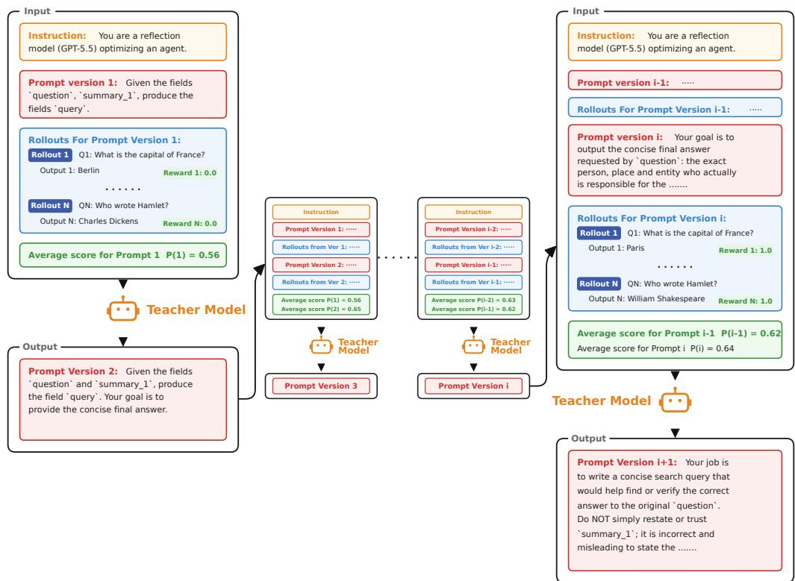  
Figure 1: Overview of the Naive Prompt Optimization (NPO) workflow.

Algorithm 1 Naive Prompt Optimization with Sliding-Window Rollout Feedback   
Require: Initial prompt $\mathcal { P } ^ { ( 0 ) }$ , sample task dataset D from environment, minibatch size N, window size W, teacher $\tau ,$   
iterations $Y$   
1: for i = 0 to $Y - 1$ do   
2: Sample minibatch $\boldsymbol { B } _ { i }$ of size N from D   
3: Run the target model with prompt $\mathcal { P } ^ { ( i ) }$ on $\boldsymbol { B } _ { i }$   
4: Collect rollout traces and rewards $\mathcal { R } _ { i }$   
5: Construct sliding-window feedback:   
$\{ \mathcal { R } _ { j } \} _ { j = \operatorname* { m a x } ( 0 , i - W + 1 ) } ^ { i }$   
6: Generate the next prompt:   
$\mathcal { P } ^ { ( i + 1 ) }  \mathcal { T } \Big ( \mathcal { P } ^ { ( i ) } , \{ \mathcal { R } _ { j } \} _ { j = \operatorname* { m a x } ( 0 , i - W + 1 ) } ^ { i } \Big )$   
7: end for   
8: return Prompt sequence $\{ \mathcal { P } ^ { ( 0 ) } , . . . , \mathcal { P } ^ { ( Y ) } \}$ and best candidate

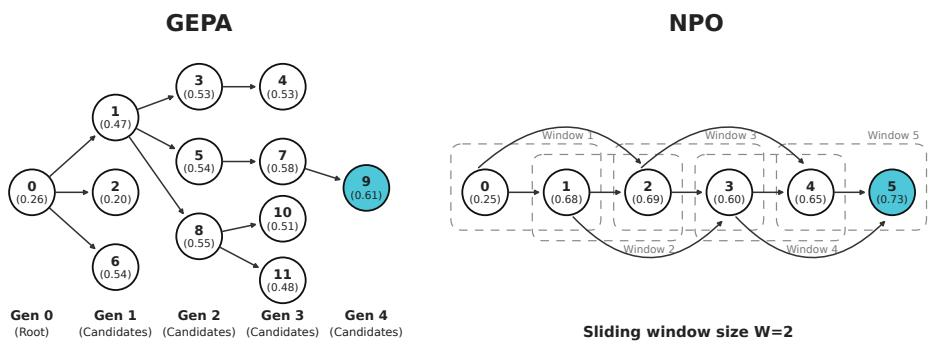  
Figure 2: GEPA evolves candidate prompts in a pool, while NPO follows a simple lineage.

## 2 Methodologies and Experiment Setup

We first introduce our proposed method, Naive Prompt Optimization (NPO), and then briefly review the established GEPA and GRPO methods, together with our experimental setup.

## 2.1 Naive Prompt Optimization (NPO)

Naive Prompt Optimization maintains a single prompt lineage and iteratively updates it using execution feedback. As illustrated in Figure 1, at iteration i, we execute the student model with the current version of the prompt P(i), repeating N times for a minibatch of rewards and rollout traces $\mathcal { R } _ { i }$ We then feed the teacher model a sliding window of the W most recent iterations—from version $( i - W + 1 )$ through i—including the prompts, corresponding rollout traces, and rewards. Using this rich context, the teacher revises the previous prompts to produce the next prompt, $\mathcal { P } ^ { ( i + 1 ) }$

NPO uses an LLM as an iterative prompt optimizer (teacher), which was first proposed in OPRO [27]; unlike OPRO, which conditions optimization only on previously evaluated prompts and their scalar scores, NPO revises prompts using complete rollout traces and rollout-specific rewards.

## 2.2 GEneric-PAreto (GEPA)

GEPA [1] maintains a pool of prompt candidates and expands it through reflection and Pareto-based selection. A parent prompt is sampled from the candidate pool, revised using feedback from a reflection minibatch, and retained only if the revision improves on that minibatch. Accepted revisions are then evaluated on the validation set and added to the candidate pool, where instance-level validation performance informs subsequent Pareto-based parent selection. Figure 2 illustrates GEPA’s prompt heritage tree, compared to NPO’s linear evolution.

We use the standard GEPA procedure without the GEPA-merge variant. For IFBench and HotpotQA, we follow the original GEPA algorithm directly. For TextArena, we make only a minor adaptation to accommodate interactive game episodes: each reflection example corresponds to a complete target-player game trajectory together with its episode-level reward, while the underlying candidate selection, reflection, acceptance, and Pareto-based selection mechanisms remain unchanged.

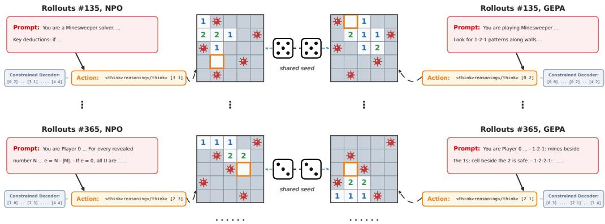  
Figure 3: We use shared pseudo-randomness to reduce environment-induced noise when comparing.

## 2.3 Group Relative Policy Optimization (GRPO)

We use Group Relative Policy Optimization (GRPO) [23] as a weight-based fine-tuning baseline for comparison with prompt optimization. For each rollout group, GRPO centers the rollout rewards by subtracting their group mean and rescales them by their standard deviation to obtain relative advantages for policy updates. We hold the default game prompt and backbone weights fixed while training only a task-specific low-rank adapter (LoRA) [5].

In two-player environments, the target policy plays against a fixed opponent instantiated from the unmodified base model; only the target policy’s LoRA parameters are updated. Because many such games yield different reward distributions depending on whether a player moves first or second, during environment randomization we balance the target policy’s move order within every rollout group: it moves first in exactly half of the randomized episodes and second in the remaining half.

## 2.4 Experiment Setup

To enable controlled, low-variance comparisons across optimization methods, we carefully design and instrument the evaluation pipeline to minimize sources of variation unrelated to the methods themselves. In particular, our setup controls randomness in environment generation and separates improvements in decision-making from artifacts introduced by output formatting. These designs allow performance differences to be attributed more directly to the optimization method being evaluated.

When generating rollout traces, we use shared pseudorandomness to evaluate all methods on matched environment instances. For each environment, we generate a pool of instances from predefined random seeds and reuse the same seed sequence across optimization methods, as illustrated in Figure 3. Corresponding rollouts therefore begin from the same randomly generated configuration, even though their actions and subsequent trajectories may differ. This paired evaluation design reduces noise arising from variation in instance difficulty and enables fairer comparisons between optimization methods.

When decoding actions, we use constrained generation to isolate decision-making performance from formatting noise. Our preliminary experiments showed that formatting errors accounted for a nontrivial fraction of observed failures and could therefore distort the comparison between optimization methods. We instead require each LLM response to exactly follow the structure <think> reasoning </think> [action]. After the initial prompt and environmental observation, we prefill the response with the opening <think> token, allowing the model to begin generating its reasoning trace immediately.1 Once the model emits </think>, the decoder switches from unconstrained reasoning to constrained action generation. For environments that expose a finite list of legitimate actions, we compile this environment-provided set of strings into token-level decoding constraints [3, 7], requiring the model to choose among the actions allowed under the current environment state.

Invalid Format under Free Form Decoding ⇒ Enforced Choice from the Legitimate Action Se   
<think> I think I should go to row 3 column 4 <think> I think I should go to row 3 column 4   
</think> row 3 and then column 4 </think> [3,4]

If the model reaches its allotted reasoning budget without closing the reasoning segment using </think>, we do not mechanically count the missing action as a failure, which would conflate decision quality with awareness of the token limit. Instead, the decoder inserts the closing token right before the reasoning-budget cutoff and uses a small reserved action budget to require the model to choose among the legitimate actions.

Reasoning Budget Exhausted ⇒ Enforced Choice After Cutoff   
<think> I think I should go to row 3 column 4, <think> I think I should go to row 3 column 4,   
but I need to verify ... (too long) ... [limit but I need to verify ... (too long)   
reached] </think> [3,4]

Together, these decoding-time designs isolate improvements in decision-making performance from noise introduced by the random variation in seeding and format-following, while preserving the model’s freedom to generate unconstrained reasoning. Details of the constrained-decoding procedure, including the estimation of probabilities over legitimate actions, are provided in Appendix D.

## 2.5 Teacher Variation and Cross-Student Prompt Transfer

Our experimental design varies both the teacher model used for prompt revision and the student model executing the optimized prompt. To investigate how teacher capability affects prompt optimization, we hold the student fixed as Qwen3-8B and begin with Qwen3-8B also serving as the teacher, following the same self-revision setting used in GEPA [1], and then replace it with progressively stronger teachers: DeepSeek-V4-Flash-preview-0424 [2] and GPT-5.5 [13]. All other components of the setup remain unchanged, allowing us to directly compare the effects of different teacher models.

Besides rerunning prompt optimization separately for every student model, we also investigate the more practically useful scenario of reusing the same prompts optimized on one student directly on other students, without re-running prompt optimization. For prompts optimized on Qwen3-8B, we evaluate transfer to larger models from the same family, Qwen3-14B and Qwen3-32B [26], as well as models from different families, Llama-3.1-70B-Instruct [10] and Llama-3.3-70B-Instruct [11]. We repeat this experiment for prompts optimized on Llama-3.1-8B as the student, transferring to Llama-3.1-70B-Instruct and Llama-3.3-70B-Instruct models from the same family and Qwen3-32B and StepFun-3.7-Flash [24] models across families. This design directly tests whether prompt improvements transfer across model scales and families without requiring student-specific re-optimization.

## 2.6 Optimization Budgets and Iteration Settings

For IFBench and HotpotQA, we tune NPO’s reflection minibatch and sliding-window sizes to provide rich feedback while remaining within the teacher model’s context window. NPO uses larger reflection minibatches than GEPA’s size of 3 [1], which was selected in the original GEPA study for GEPA’s own optimization procedure, yielding minibatch/iteration settings of 50/10 for IFBench and 40/20 for HotpotQA. Each revised prompt is evaluated on a separate 300-example validation set. The resulting NPO rollout budgets are 3,500 and 6,800, slightly below GEPA’s 3,593 and 6,871, respectively [1]. Despite larger reflection minibatches, NPO consistently reaches comparable or higher peak performance with fewer total rollouts.

For the 22 TextArena games, NPO and GEPA each use 408 complete episodes. NPO runs 24 episodes per iteration for 17 iterations, while GEPA uses 6 pseudo-reflection and 18 pseudo-validation episodes per cycle. Because TextArena episodes contain substantially longer interaction trajectories, these settings are chosen to control token cost while providing rich feedback within the teacher model’s context window limit (1 million tokens for both GPT-5.5 and DeepSeek-V4-Flash-preview-0424).

For GRPO, we train a LoRA adapter [5] on Qwen3-8B while keeping the backbone and prompt fixed. Based on group-size experiments from 6 to 48, we use 8–12 episodes per iteration for approximately 100 iterations, yielding 800–1,200 training rollouts per game in addition to separate evaluation rollouts. Although GRPO training continues beyond the NPO and GEPA optimization budgets, all three methods are compared over the same 0–408-rollout range using the same task-specific evaluation metric. Episode-level rewards are used to construct the GRPO training signal, with the specific reward formulation depending on the game. GRPO is implemented with DSPy’s dspy.GRPO interface [31], the Arbor RL backend [30], and ZeRO-3 [20] on two NVIDIA H100 GPUs. Additional group-size analysis is provided in Appendix C.

For output generation, we use a fixed 2,000-token context window covering the prompt, current observation, and model response, balancing reasoning capacity with training efficiency and computational cost. In practice, we observed student models typically use only 300–500 reasoning tokens and do not exhaust the available budget. We further verify that forcing them to continue reasoning beyond their natural termination point until the remaining budget is exhausted does not improve performance; we therefore treat the context window as an upper bound and allow reasoning to terminate naturally.

## 3 Results

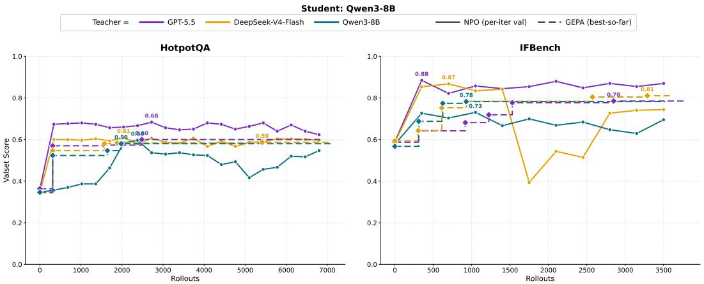  
Figure 4: Performance of NPO and GEPA on IFBench and HotpotQA under different teacher models, showing NPO’s advantage with stronger teachers.

## 3.1 Is NPO more Rollout-Efficient than GEPA Given Stronger Teachers?

Figure 4 compares NPO and GEPA on IFBench and HotpotQA using Qwen3-8B as the fixed student and Qwen3-8B, DeepSeek-V4-Flash-preview-0424, and GPT-5.5 as teachers, with lines color-coded to refer to different teacher models. As we can see, NPO benefits more consistently from stronger teachers: NPO with GPT-5.5 achieves the fastest convergence and highest validation performance on both tasks. In particular, NPO can achieve the same improved performance using fewer rollouts than GEPA. In contrast, GEPA shows smaller gains from stronger teachers, with GEPA+GPT-5.5 performing broadly on par with GEPA+Qwen3-8B in several settings. These results suggest that stronger teacher reasoning, combined with richer context feedback, can reduce the marginal benefit of more complex prompt-search mechanisms, allowing a simple iterative method such as NPO to outperform with a more limited rollout budget.

## 3.2 Do Optimized Prompts Transfer Across Student Models?

One important practical advantage of prompt optimization over weight-based reinforcement learning is portability: an optimized prompt can, in principle, be applied directly to other models, whereas weight-based fine-tuning produces model-specific parameter updates. We now test whether this advantage holds empirically by applying prompts optimized on Qwen3-8B and Llama-3.1-8B unchanged to larger student models, both within and across model families, without re-optimization. Overall, transfer is strongest within model families but remains effective across families. For both Qwen and Llama, prompts optimized on small models also yield substantial performance gains on larger models within the same family, showing that the benefits of prompt optimization can persist across model scales. Cross-family transfer also produces meaningful gains, although the improvements are generally slightly weaker and more variable across tasks and optimization methods.

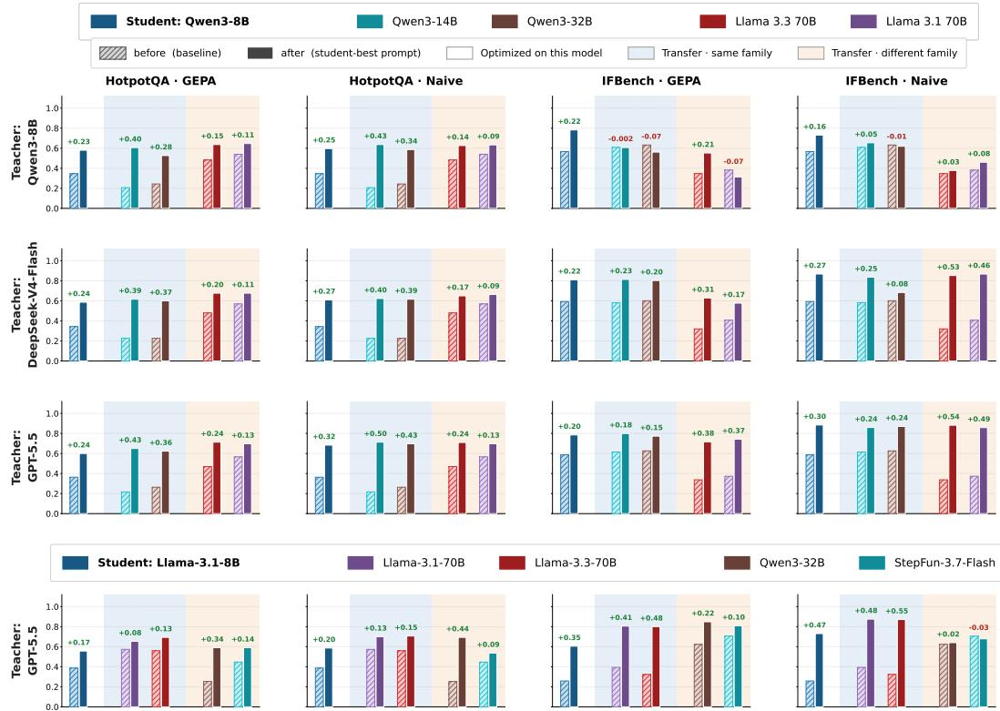  
Figure 5: Performance improvements when prompts learned by NPO are transferred verbatim to different student models, within and across model families.

Figure 5 is organized by tasks and optimization methods across columns and by teachers across rows. Each plot compares the performance improvement of the original student model with the performance improvements obtained by applying prompts transferred from the optimization student. Qwen3-8B and Llama-3.1-8B, which serve as the target students during prompt optimization, are shown in dark blue within the unshaded white region. The light-blue shaded region denotes within-family transfer experiments, whereas the yellow shaded region denotes cross-family transfer experiments. Most settings exhibit positive performance gains, with only a few exceptions, suggesting that transfer performance can still vary across specific model, task, and optimization-method combinations. Detailed optimization trajectories for each teacher–method–dataset combination, including transfer performance across evaluated student models, are provided in Appendix A.

## 3.3 Comparison against GRPO

Figure 6 compares compares the performance gains of NPO, GEPA, and GRPO, across 22 different game environments from TextArena, controlled for the same rollout budget. The student model is Qwen3-8B, while GPT-5.5 is used as teacher for NPO and GEPA. The results show no universal winner across the diverse interactive environments. Contrary to earlier reports, GEPA does not consistently outperform GRPO across all tasks. NPO achieves similar gains to GRPO on several games, with GEPA showing no consistent advantage over the much simpler NPO method. Detailed results across all games, evaluation metrics, and optimization methods are provided as heatmaps and per-game plots in Appendices B and E.

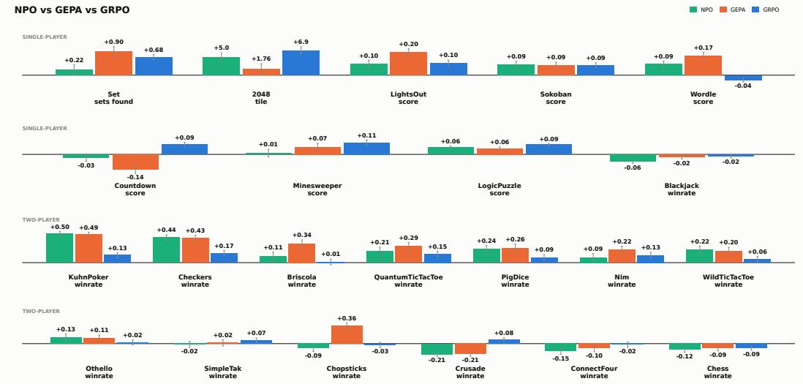  
Figure 6: Performance improvement under different optimization methods for 22 TextArena games.  
trainset (of 18,090) valset (of 300)

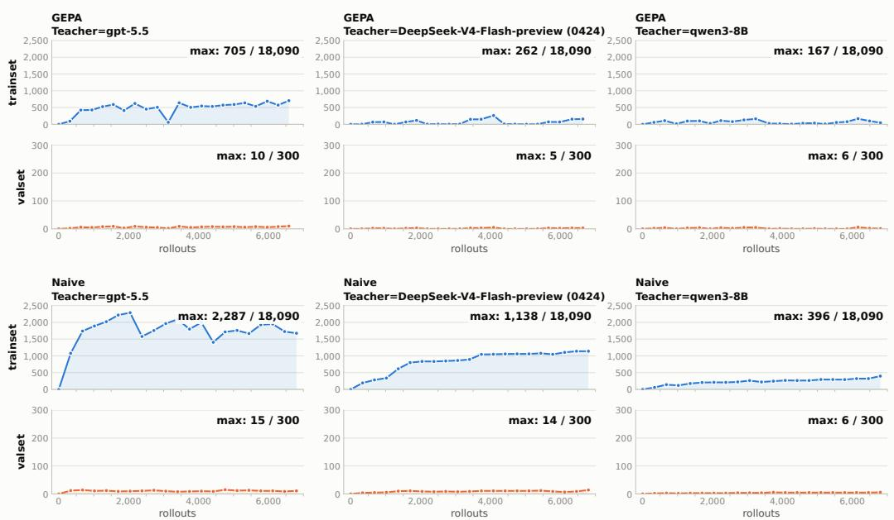  
Figure 7: Measuring gold-answer leakage into optimized prompts (HotpotQA).

## 3.4 Do Optimized Prompts Leak Evaluation Answers?

NPO, particularly when paired with stronger teachers such as GPT-5.5, often produces substantially longer prompts than GEPA. Because the teacher revises prompts using feedback from training rollouts, optimized prompts may naturally incorporate information specific to the training examples. Such incorporation is not necessarily problematic: like few-shot prompting, prompt optimization is intended to extract useful information from training examples and encode it in the resulting prompt. However, if gold answers from the held-out validation set had leaked into the teacher model’s training data, become encoded in the teacher’s parametric knowledge, and subsequently been incorporated into an optimized prompt, the measured gains could reflect such contamination rather than improved task-solving ability.

To assess this possibility, we compare every prompt version generated during optimization against gold answers from both the training and validation sets, allowing us to examine whether answer overlap accumulates over successive revisions. As shown in Figure 7, both NPO and GEPA yield prompts whose overlap with training set answers grows naturally, whereas overlap with validation answers remains negligible. Manual inspection further shows that the small amount of nonzero validation overlap arises from distinct training and validation questions that share the same answer, rather than from direct exposure to validation examples. These results suggest that the observed performance gains are unlikely to be explained by evaluation-answer leakage.

## 4 Discussion and Conclusion

We introduce NPO as a simple iterative baseline for testing whether sophisticated prompt search is necessary. On IFBench and HotpotQA, NPO remains broadly comparable to GEPA and benefits more from stronger teachers and rich trajectory-level feedback, suggesting that these factors can partially substitute for optimizer-side search complexity. Optimized prompts also transfer meaningfully across larger and cross-family student models without re-optimization, with some variation across model, task, and optimization-method combinations. Across 22 TextArena games, NPO and GEPA again show broadly comparable performance, while GRPO provides complementary gains on several games where prompt optimization is less effective. Overall, the results establish simple iterative prompt optimization as a strong baseline and suggest that added prompt-search or parameter-optimization complexity is most valuable when it yields clear task-dependent benefits.

Responsible-Use Statement. Our results suggest a strong teacher model might be able to improve student performance for arbitrary tasks with very few rollouts, lowering the cost of rapidly optimizing small, locally deployed models for malicious tasks; this efficiency could be misused to quickly develop or strengthen malicious agents. A key mitigation is to preserve the teacher model’s safety guardrails: the teacher should not only refuse to perform harmful tasks itself, but also avoid generating optimized prompts that would help another model perform them. Because modern multi-layered AI safeguards commonly include dedicated content- and intent-filtering components, we expect them to exhibit similar refusal whether the teacher is asked to perform a harmful task directly or to optimize another model for that task; nevertheless, this behavior should be explicitly verified and monitored in deployment. NPO also requires sharing the student’s rollout traces with the teacher model, which may be hosted on untrusted third-party infrastructure, particularly when a closed model is used as the teacher. Thus, masking and sanitization are required for tasks involving sensitive data.

Limitations. Our preliminary study used only a limited set of tasks, leaving open whether NPO’s advantage extends to more complex, long-horizon agent environments. We also do not evaluate frontier-scale closed models like GPT-5.5 as students, primarily due to temporal performance inconsistencies and the lack of token-level logits and sufficient fine-grained decoding control exposed via APIs. In addition, we observe that RL training remains unstable on some tasks and that different task may favor different RL algorithms or reward designs. Long-horizon environments further increase both RL instability and the context required to provide NPO teachers with sufficiently large sliding windows over rollout histories; therefore, our results do not yet establish the relative effectiveness of prompt optimization and RL in longer-horizon settings.

Future Directions. Building on these preliminary findings, we identify two potential directions for future work. First, for prompt tuning techniques in general, it may be worthwhile to investigate whether prompts optimized independently for multiple diverse tasks can be consolidated into a compact multi-task prompt while preserving their task-specific gains, followed by few additional rounds of NPO on the consolidated multi-task prompt. Second, we propose systematically searching, using smaller teacher and student models, for a compact set of representative eigen-tasks such that prompts optimized on this small basis can be distilled into a general-purpose prompt that yields substantial improvements across the broader task space, while remaining transferable to larger student models. For example, optimizing prompts on a basis consisting of a board game, a card game, and a knowledge-retrieval task might yield a prompt that produces generalizable improvements across diverse board games, card games, and knowledge-retrieval tasks.

## References

[1] Lakshya A. Agrawal, Shangyin Tan, Dilara Soylu, Noah Ziems, Rishi Khare, Krista Opsahl-Ong, Arnav Singhvi, Herumb Shandilya, Michael J. Ryan, Meng Jiang, Christopher Potts, Koushik Sen, Alexandros G. Dimakis, Ion Stoica, Dan Klein, Matei Zaharia, and Omar Khattab. GEPA: Reflective prompt evolution can outperform reinforcement learning. In International Conference on Learning Representations, 2026.

[2] DeepSeek-AI. DeepSeek V4 Preview Release. Official model release documentation, 2026. https://api-docs.deepseek.com/news/news260424/.

[3] Noam Gat. LM Format Enforcer: Enforce the output format (JSON Schema, Regex, etc.) of a language model. GitHub repository, 2023. https://github.com/noamgat/ lm-format-enforcer.

[4] Leon Guertler, Bobby Cheng, Simon Yu, Bo Liu, Leshem Choshen, and Cheston Tan. TextArena. arXiv preprint arXiv:2504.11442, 2025.

[5] Edward J. Hu, Yelong Shen, Phillip Wallis, Zeyuan Allen-Zhu, Yuanzhi Li, Shean Wang, Lu Wang, and Weizhu Chen. LoRA: Low-rank adaptation of large language models. In International Conference on Learning Representations, 2022.

[6] Takeshi Kojima, Shixiang Shane Gu, Machel Reid, Yutaka Matsuo, and Yusuke Iwasawa. Large language models are zero-shot reasoners. In Advances in Neural Information Processing Systems, volume 35, pages 22199–22213. Curran Associates, Inc., 2022. doi: 10.52202/068431-1613. URL https://proceedings.neurips.cc/paper\_files/paper/ 2022/hash/8bb0d291acd4acf06ef112099c16f326-Abstract-Conference.html.

[7] Woosuk Kwon, Zhuohan Li, Siyuan Zhuang, Ying Sheng, Lianmin Zheng, Cody Hao Yu, Joseph E. Gonzalez, Hao Zhang, and Ion Stoica. Efficient memory management for large language model serving with PagedAttention. In Proceedings of the 29th Symposium on Operating Systems Principles, pages 611–626. Association for Computing Machinery, 2023. doi: 10.1145/3600006.3613165.

[8] Patrick Lewis, Ethan Perez, Aleksandra Piktus, Fabio Petroni, Vladimir Karpukhin, Naman Goyal, Heinrich Küttler, Mike Lewis, Wen-tau Yih, Tim Rocktäschel, Sebastian Riedel, and Douwe Kiela. Retrieval-augmented generation for knowledge-intensive NLP tasks. In Advances in Neural Information Processing Systems, volume 33, pages 9459–9474, 2020.

[9] João Loula, Benjamin LeBrun, Li Du, Ben Lipkin, Clemente Pasti, Gabriel Grand, Tianyu Liu, Yahya Emara, Marjorie Freedman, Jason Eisner, Ryan Cotterell, Vikash Mansinghka, Alexander K. Lew, Tim Vieira, and Timothy J. O’Donnell. Syntactic and semantic control of large language models via Sequential Monte Carlo. In International Conference on Learning Representations, 2025.

[10] Meta. Llama-3.1-8B-Instruct. Official model card, 2024. https://huggingface.co/ meta-llama/Llama-3.1-8B-Instruct.

[11] Meta. Llama-3.3-70B-Instruct. Official model card, 2024. https://huggingface.co/ meta-llama/Llama-3.3-70B-Instruct.

[12] Johan Obando Ceron, Marc G. Bellemare, and Pablo Samuel Castro. Small batch deep reinforcement learning. In Advances in Neural Information Processing Systems, volume 36, pages 26003–26024, 2023. doi: 10.52202/075280-1132.

[13] OpenAI. GPT-5.5 Model. Official model documentation, 2026. https://developers. openai.com/api/docs/models/gpt-5.5.

[14] Krista Opsahl-Ong, Michael J. Ryan, Josh Purtell, David Broman, Christopher Potts, Matei Zaharia, and Omar Khattab. Optimizing instructions and demonstrations for multi-stage language model programs. In Proceedings of the 2024 Conference on Empirical Methods in Natural Language Processing, pages 9340–9366. Association for Computational Linguistics, 2024. doi: 10.18653/v1/2024.emnlp-main.525.

[15] Long Ouyang, Jeff Wu, Xu Jiang, Diogo Almeida, Carroll L. Wainwright, Pamela Mishkin, Chong Zhang, Sandhini Agarwal, Katarina Slama, Alex Ray, John Schulman, Jacob Hilton, Fraser Kelton, Luke Miller, Maddie Simens, Amanda Askell, Peter Welinder, Paul Christiano, Jan Leike, and Ryan Lowe. Training language models to follow instructions with human feedback. In Advances in Neural Information Processing Systems, volume 35, pages 27730– 27744, 2022.

[16] Kanghee Park, Jiayu Wang, Taylor Berg-Kirkpatrick, Nadia Polikarpova, and Loris D’Antoni. Grammar-aligned decoding. In Advances in Neural Information Processing Systems, volume 37, pages 24547–24568, 2024. doi: 10.52202/079017-0774.

[17] Reid Pryzant, Dan Iter, Jerry Li, Yin Tat Lee, Chenguang Zhu, and Michael Zeng. Automatic prompt optimization with “gradient descent” and beam search. In Proceedings of the 2023 Conference on Empirical Methods in Natural Language Processing, pages 7957–7968. Association for Computational Linguistics, 2023. doi: 10.18653/v1/2023.emnlp-main.494.

[18] Valentina Pyatkin, Saumya Malik, Victoria Graf, Hamish Ivison, Shengyi Huang, Pradeep Dasigi, Nathan Lambert, and Hannaneh Hajishirzi. Generalizing verifiable instruction following. In Advances in Neural Information Processing Systems, volume 38, pages 54870–54896, 2025. doi: 10.52202/085713-1645.

[19] Cheng Qian, Wenting Zhao, Liangwei Yang, Heng Wang, Jielin Qiu, Heng Ji, Silvio Savarese, Huan Wang, and Shelby Heinecke. AI4AI at test-time: Strong-to-weak capability transfer via harnesses. arXiv preprint arXiv:2608.12307, 2026.

[20] Samyam Rajbhandari, Jeff Rasley, Olatunji Ruwase, and Yuxiong He. ZeRO: Memory optimizations toward training trillion parameter models. In SC20: International Conference for High Performance Computing, Networking, Storage and Analysis, pages 1–16, 2020. doi: 10.1109/SC41405.2020.00024.

[21] Stephen Robertson and Hugo Zaragoza. The probabilistic relevance framework: BM25 and beyond. Foundations and Trends in Information Retrieval, 3(4):333–389, 2009. doi: 10.1561/ 1500000019.

[22] John Schulman, Filip Wolski, Prafulla Dhariwal, Alec Radford, and Oleg Klimov. Proximal policy optimization algorithms. arXiv preprint arXiv:1707.06347, 2017.

[23] Zhihong Shao, Peiyi Wang, Qihao Zhu, Runxin Xu, Junxiao Song, Xiao Bi, Haowei Zhang, Mingchuan Zhang, Y. K. Li, Y. Wu, and Daya Guo. DeepSeekMath: Pushing the limits of mathematical reasoning in open language models. arXiv preprint arXiv:2402.03300, 2024.

[24] StepFun. Step 3.7 flash. Official model release documentation, 2026. URL https://static. stepfun.com/blog/step-3.7-flash/.

[25] Jason Wei, Xuezhi Wang, Dale Schuurmans, Maarten Bosma, Brian Ichter, Fei Xia, Ed H. Chi, Quoc V. Le, and Denny Zhou. Chain-of-thought prompting elicits reasoning in large language models. In Advances in Neural Information Processing Systems, volume 35, pages 24824–24837. Curran Associates, Inc., 2022. doi: 10.52202/ 068431-1800. URL https://proceedings.neurips.cc/paper\_files/paper/2022/ hash/9d5609613524ecf4f15af0f7b31abca4-Abstract-Conference.html.

[26] An Yang et al. Qwen3 technical report. arXiv preprint arXiv:2505.09388, 2025.

[27] Chengrun Yang, Xuezhi Wang, Yifeng Lu, Hanxiao Liu, Quoc V. Le, Denny Zhou, and Xinyun Chen. Large language models as optimizers. In International Conference on Learning Representations, 2024.

[28] Zhilin Yang, Peng Qi, Saizheng Zhang, Yoshua Bengio, William W. Cohen, Ruslan Salakhutdinov, and Christopher D. Manning. HotpotQA: A dataset for diverse, explainable multi-hop question answering. In Proceedings ofthe 2018 Conference on Empirical Methods in Natural Language Processing, pages 2369–2380. Association for Computational Linguistics, 2018. doi: 10.18653/v1/D18-1259.

[29] Zhi Zhang, Zhen Han, Costas Mavromatis, Qi Zhu, Yunyi Zhang, Sheng Guan, Dingmin Wang, Xiong Zhou, Shuai Wang, Soji Adeshina, Vassilis Ioannidis, and Huzefa Rangwala. Train less, learn more: Adaptive efficient rollout optimization for group-based reinforcement learning. arXiv preprint arXiv:2602.14338, 2026.

[30] Noah Ziems. Arbor: A framework for optimizing DSPy programs with RL. GitHub repository, 2025. https://github.com/Ziems/arbor.

[31] Noah Ziems, Dilara Soylu, Lakshya A. Agrawal, Isaac Miller, Liheng Lai, Chen Qian, Kaiqiang Song, Meng Jiang, Dan Klein, Matei Zaharia, Karel D’Oosterlinck, Christopher Potts, and Omar Khattab. Multi-module GRPO: Composing policy gradients and prompt optimization for language model programs. arXiv preprint arXiv:2508.04660, 2025.

## A Detailed Optimization Trajectories in Cross-Student Transfer Experiments

Figure 8 presents the detailed optimization trajectories for the cross-student transfer experiments in IFBench and HotpotQA. Columns correspond to different dataset–optimization-method combinations, while rows correspond to different teacher models. Each curve shows how prompts from successive NPO iterations or candidates from the GEPA pool transfer to larger and cross-family student models, leading to similar performance gains.

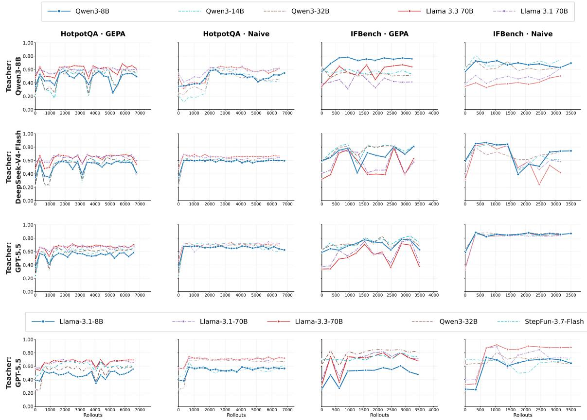  
Figure 8: Optimization trajectories for the cross-student transfer experiments. Columns correspond to dataset–optimization-method combinations; rows correspond to teacher models.

## B Heatmap for the evaluated games in TextArena

Figure 9 contains six sections: Sections 1–3 show the unoptimized Qwen3-8B baseline, GRPO results, and held-out NPO/GEPA performance using DeepSeek-V4-Flash-preview-0424 and GPT-5.5 as teachers. GRPO achieves strong gains on several tasks with larger budgets and carefully designed rewards, while NPO and GEPA remain broadly comparable. Sections 4–6 evaluate transfer by applying prompts optimized on Qwen3-8B unchanged to Llama-3.3-70B-Instruct, Qwen3-14B, and Qwen3-32B. Same-family Qwen transfer largely preserves performance gains, while cross-family transfer to Llama-3.3-70B-Instruct is less consistent. Cells report average performance for each game–method combination; win rates are shown as decimals.

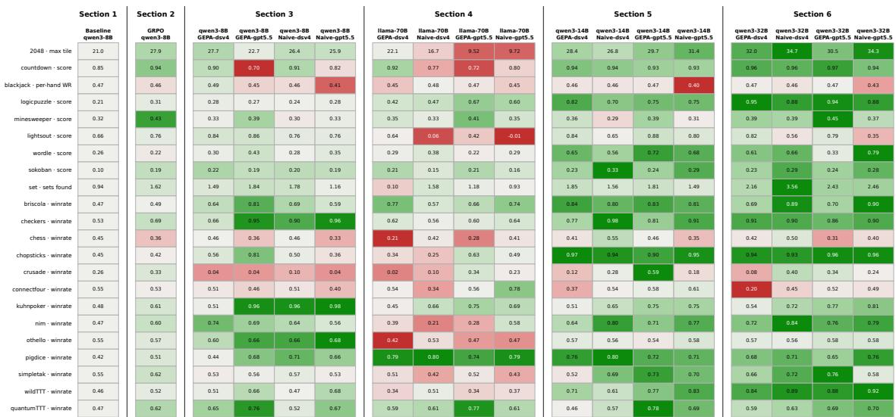  
Fig. 9. Performance heatmap across 22 TextArena games for prompt optimization, weight-based RL fine-tuning, and cross-student prompt transfer.

## C Extended Analysis of GRPO Group Size

We conducted a small experiment to examine how rollout group size affects GRPO training quality on TextArena games. We first supervised-fine-tuned Qwen3-8B on GPT-4o-mini responses [5, 15], which typically contain about 300 tokens. We then train the SFT-initialized model with GRPO under a fixed setup using different rollout group sizes. We show the results under Minesweeper environment, with others leading to similar results. As shown below in Figure 10, larger group sizes doe not lead to significantly better training, and the model’s skill improvement behaved similarly under the same rollout budget. This might be because the significant variation in TextArena’s reward signal means that a very large group size is not required for group-relative normalization to take effect. This observation is consistent with prior work reporting similar group-size effects [29], as well as broader evidence that larger batch sizes might not always be beneficial in RL training [12].

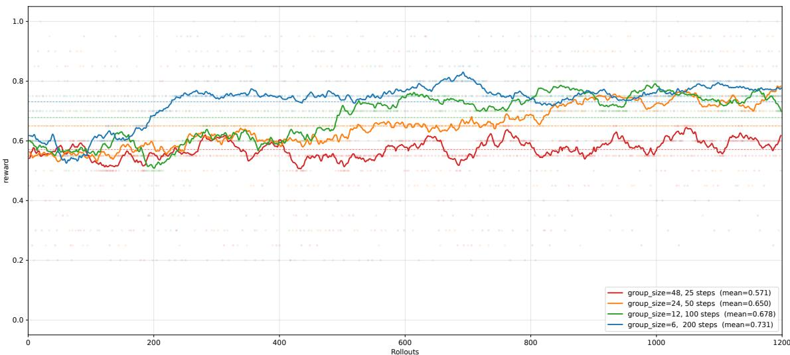  
Fig. 10. GRPO training performance under different rollout group sizes.

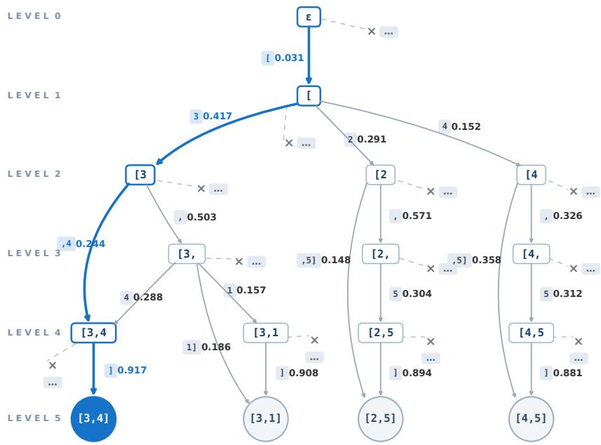  
Figure 11: Token-prefix trie used for constrained decoding over the set of legitimate action strings. At each node, next-token probabilities are renormalized over the valid outgoing edges that lead to legitimate actions.

We describe how we use constrained decoding to sample an action from the set of legitimate actions supplied by the environment. Given a finite set of legitimate action strings, we organize all token sequences that decode to these strings into a prefix trie, in which each node represents a string prefix, each edge represents a token, and each leaf represents a complete legitimate action string, as illustrated in Figure 11.

At each node with prefix s, we mask tokens that are not legitimate continuations and locally renormalize the logits over the remaining outgoing edges (legitimate next-token set) A(s), following standard token-level constrained decoding [9]:

$$
q ( t \mid s ) = { \frac { \exp z _ { t } ( s ) } { \sum _ { u \in A ( s ) } \exp z _ { u } ( s ) } } , \qquad t \in A ( s ) .
$$

The probability of a leaf is the product of the locally normalized probabilities along its root-to-leaf path, with probabilities summed across paths if multiple token sequences decode to the same action string.

There are two approaches to computing probabilities over the leaf nodes. In locally constrained decoding, also referred to as a local product of experts, outgoing-edge probabilities are normalized at each node before being multiplied along each root-to-leaf path [9]. In a globally conditioned distribution, the base-model per-token probabilities along each complete path are multiplied first, followed by a single normalization across all legitimate leaves [16].

We use the former, locally renormalized formulation throughout our evaluation to prevent mechanically required formatting tokens from influencing the relative probabilities assigned to actions. TextArena actions often contain formatting tokens required by the environment’s output syntax. For example, an action such as [3,4] contains delimiters including "[", ",", and "]". At any prefix where only one such formatting token is permitted, locally constrained decoding assigns the corresponding forced transition probability 1, effectively eliminating its effect on choices between actions. Under global conditioning, by contrast, each leaf retains the base-model probabilities assigned to mandatory formatting tokens like "]". The probabilities of these mandatory formatting tokens can exhibit spurious variation due to preceding choices in the partial action string, causing the same required delimiter to receive different probabilities after different action prefixes. This variation reflects only the model’s prefix-dependent likelihood of format compliance, yet it unnecessarily alters each leaf’s path probability under global conditioning.

## E Detailed Optimization Trajectories

This appendix presents the complete optimization trajectories for all 22 TextArena environments. For each game, NPO, GEPA, and GRPO are overlaid on shared axes, with the cumulative number of rollouts on the horizontal axis and the game-specific training metric on the vertical axis. These trajectories provide a direct comparison of the optimization dynamics and relative performance improvements achieved by the three methods across diverse interactive environments.

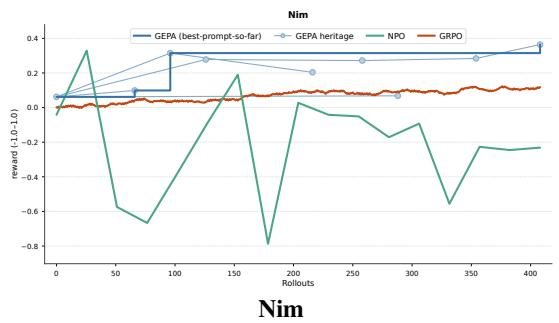

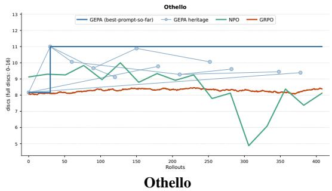

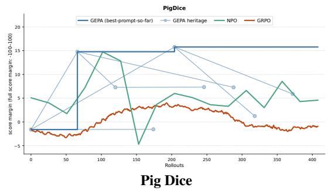

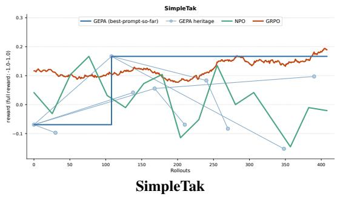

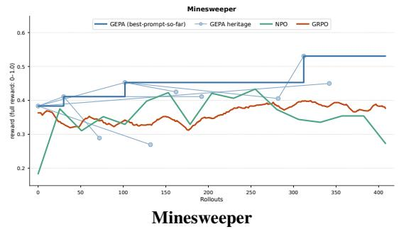

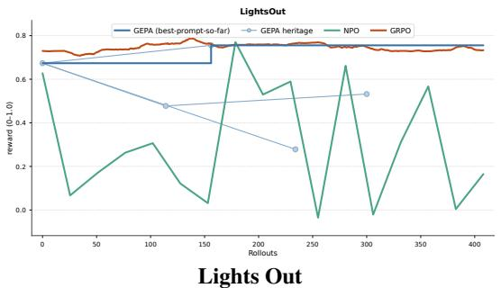  
Figure 12: Performance trajectories of NPO, GEPA, and GRPO across different games.

Countdown  
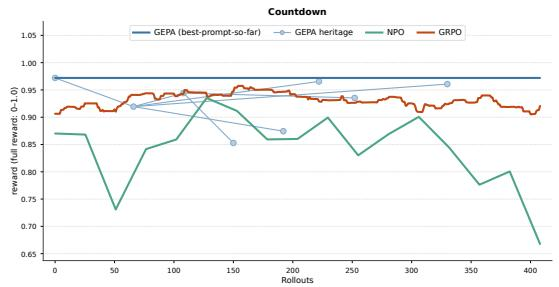

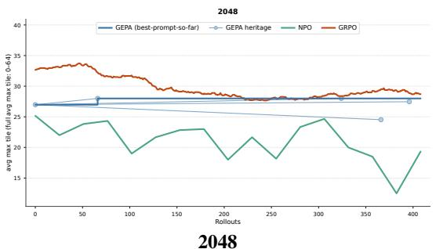

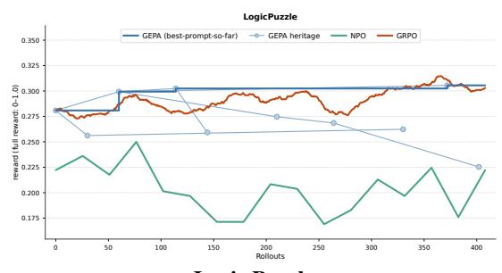  
Logic Puzzle

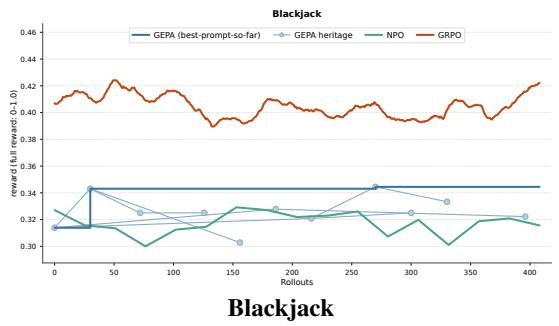

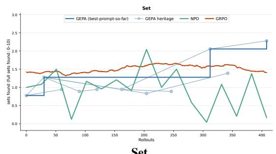  
Set

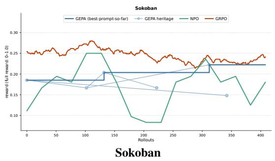

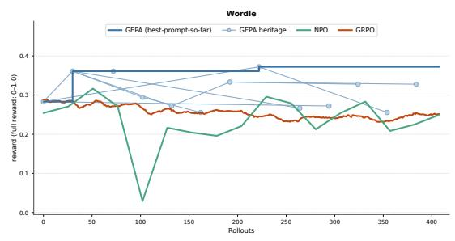  
Wordle

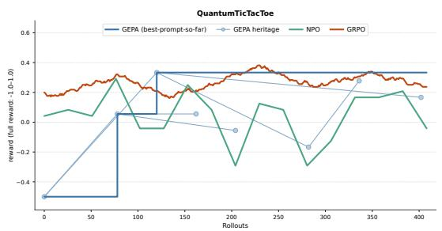  
Quantum Tic-Tac-Toe  
Figure 12: Performance trajectories of NPO, GEPA, and GRPO across different games (continued).

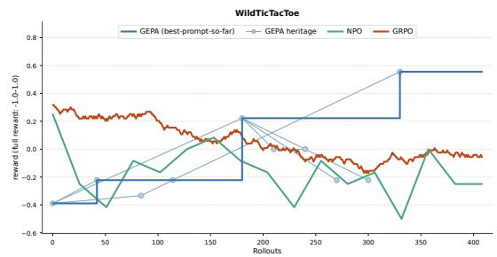  
Wild Tic-Tac-Toe

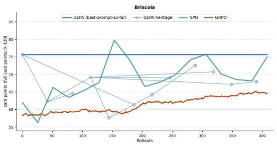  
Briscola

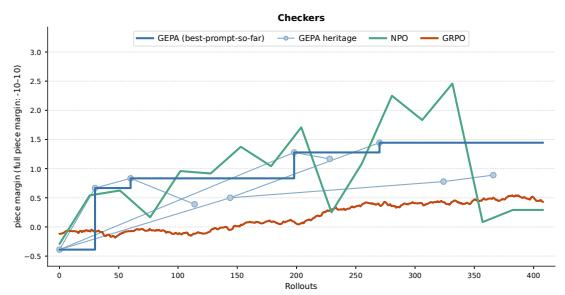  
Checkers

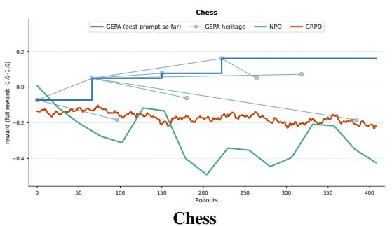

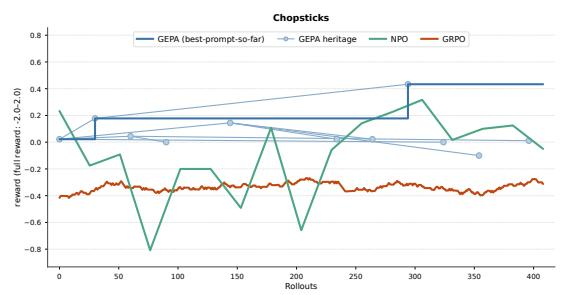  
Chopsticks

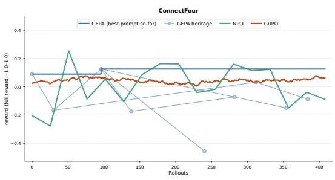  
Connect Four

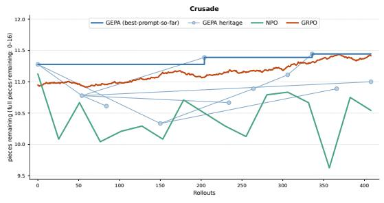  
Crusade

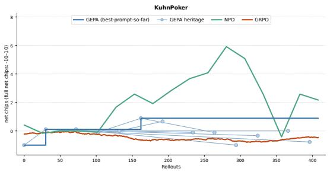  
Kuhn Poker  
Figure 12: Performance trajectories of NPO, GEPA, and GRPO across different games (continued).

## F Optimized prompts at a glance

In Table 1 we report the optimized prompts for each task produced using GPT-5.5 as the teacher and Qwen3-8B as the student, under GEPA and NPO, respectively. Note that HotpotQA and IFBench are multi-hop tasks and the prompts for each hop are optimized jointly.

Despite using fewer rollouts, NPO appears to produce prompts similar in detail and depth to those produced by GEPA.

Table 1: Optimized prompts for each task produced by NPO and GEPA.
<table><tr><td>Task / Game</td><td></td><td>Optimized prompt</td></tr><tr><td rowspan="4">HotpotQA GEPA</td><td>hop1</td><td>Given the fieldsquestionand passages`, produce the field summary`. Your task is to answer the question accurately and concisely using the provided passages and, when necessary, relevant factual knowledge implied by the question. This is typically a multi-hop question-answering task: identify the entity being asked about, connect it through . . . (truncated)</td></tr><tr><td>hop2 hop3</td><td>Given the fieldsquestion`, summary_1, produce the fieldsquery. Given the fieldsquestion,context, andpassages, produce the fieldsummary`. Your task is to</td></tr><tr><td></td><td>answer the question accurately and concisely, using the provided passages as the primary evidence source. The context may be helpful, but it can be incomplete or contain incorrect assumptions, so always verify important facts against the . . . (truncated)</td></tr><tr><td>hop4</td><td>Given the fieldsquestion, summary_1, and summary_2`, produce the field `answer. Your task is to answer the question as a concise factoid answer. Use the two summaries as evidence when they contain the needed information, but do not blindly trust summaries that say the information is unavailable, unknown, or that no connection exists. If the .. . (truncated)</td></tr><tr><td rowspan="4">HotpotQA NPO</td><td>hop1</td><td>You are the first-hop evidence summarization module in a multi-hop QA system. INPUT - question: the user&#x27;s question - passages: a ranked list of retrieved passages, each with: - title - text OUTPUT FORMAT — STRICT - Output exactly ONE valid JSON object. - The object must have exactly ONE key: &quot;summary&quot;. - Do not output any other keys, including . . . (truncated)</td></tr><tr><td>hop2</td><td>You are generating the SECOND-HOP retrieval query for a multi-hop QA system. INPUT FORMAT You will receive: - question: the original natural-language question. - summary_1: a short summary of documents/evidence retrieved in the first hop. It may include correct evidence, wrong/ambiguous entities, partial answers, or statements such as . . . (truncated)</td></tr><tr><td>hop3</td><td>You are the summary generation module in a multi-hop QA system. INPUT FORMAT You will receive: - question: the final question to be answered. - context: an intermediate/previous summary. It may be useful, incomplete, misleading, or wrong. - passages: newly retrieved passages, each with a title and text. Passages may be relevant, partially . . . (truncated)</td></tr><tr><td>hop4</td><td>You are given three input fields: - question - summary_1 - summary_2 Produce exactly one output field: - answer Task: Answer the question with the most concise factual answer that satisfies the exact wording of the question. This is a multi-hop QA task: identify the entity or fact being asked about, connect it through the clues in the question . . . (truncated)</td></tr><tr><td rowspan="2">IFBench GEPA</td><td>hop1</td><td>respond directly to the user&#x27;s query while satisfying every explicit requirement in the query. before answering, identify and obey all constraints in the prompt, including: - required language, casing, wording, keywords, exact phrases, section counts, headings, markdown formatting, and ending text. - if the user specifies exact labels or phrases . . . (truncated)</td></tr><tr><td>hop2</td><td>You are producing the final answer to the user&#x27;s query. First solve the underlying task correctly, then format the final response so that every stated constraint is satisfied exactly. General process: 1. Parse the query for: - The actual task to solve, such as math, translation, natural language inference, or</td></tr><tr><td rowspan="2">IFBench NPO</td><td>hop1</td><td>explanation. - Output-format . . . (truncated) You are an assistant whose job is to respond directly to the provided query`while strictly satisfying every explicit instruction inside it. Core response rules: 1. Do not reveal hidden reasoning or internal chain-of-thought. Provide only the final answer requested by the user. 2. Carefully parse all formatting,</td></tr><tr><td>hop2</td><td>length, word-count . . . (truncated) You are given a task input containing at least: - query: the user&#x27;s original request, including all formatting/content constraints - response: a prior assistant response that may be incomplete, incorrect, or may violate constraints Your job is to produce the corrected final answer that should be returned to</td></tr><tr><td>2048 GEPA</td><td></td><td>You play 2048 on a 3 × 3 board. Output one move only. STRICT OUTPUT: - Final non-empty line must be exactly one of: [up] [down] [left] [right] - No coordinates, no multiple moves, no extra words on final line. - If legal/valid actions are listed, choose only a listed direction. - Prefer no reasoning; if reasoning, keep it to one short line before . . . (truncated)</td></tr><tr><td>2048 NPO</td><td></td><td>You play 2048 on a 3× 3 board. OUTPUT FORMAT IS CRITICAL: Your entire response must be exactly one line and exactly one of: [up] [down] [left] [right] No &lt;think&gt;, no explanation, no coordinates, no punctuation, no extra text. Never output more than one move. If you previously made</td></tr></table>

Table 1: Optimized prompts for each task produced by NPO and GEPA (continued).
<table><tr><td>Task / Game</td><td>Optimized prompt</td></tr><tr><td>Blackjack GEPA</td><td>You are Plaver 0 in Blackiack. Choose the action that maximizes win rate. Output exactly one line. with exactly one valid action: [Hit] or [Stand] No explanation, no extra text, no thinking tags. Use only the current hand and dealer upcard. Ignore past results. Hand type: - Soft = an Ace can be counted as 11 in the displayed score without busting. . . . (truncated)</td></tr><tr><td>Blackjack NPO</td><td>You are Player 0 in TextArena Blackjack. Maximize final reward across 20 hands. Dealer draws to 17. CRITICAL OUTPUT RULE: Your entire response must be exactly one line: [Hit] or [Stand] No reasoning, no &lt;think&gt;, no explanation, no extra text. IMPORTANT STRATEGY FOR THIS ENV: There is a 21-turn limit and unplayed hands score as zero. Each [Hit] . . . (truncated)</td></tr><tr><td>Briscola GEPA</td><td>You are Player 1 in 2-player Briscola. You see only your hand plus public info. Goal: maximize raw points captured out of 120. Rules: - Italian 40-card deck. Each player holds up to 3 cards and draws after each trick while deck lasts. - Points: A=11, 3=10, K=4, Q=3, J=2, 7/6/5/4/2=0. - Power within a suit: A &gt; 3 &gt; K &gt; Q &gt; J &gt; 7 &gt; 6 &gt; 5 &gt; 4 &gt; 2. . . . (truncated)</td></tr><tr><td>Briscola NPO</td><td>You are Player 1 in 2-player Briscola. Maximize RAW POINTS captured out of 120; &gt;60 wins, but keep taking points for the biggest margin. Rules: 40-card Italian deck, suits, ranks A,2,3,4,5,6,7,J,Q,K. Up to 3 cards in hand; winner of each trick takes both cards' points, leads next, and draws first while deck remains. Points: A=11, 3=10, K=4 . . . (truncated)</td></tr><tr><td>Checkers GEPA</td><td>You are Player 1: Black. Your pieces are b/B (●/); Red is r/R (•). Move only Black. Black men move toward row 7 (increasing row). Black kings move both directions. A Black man reaching row 7 becomes a king. Use ONLY the current Valid Moves list. Do not invent moves from the board. Do not change, reorder, or "fix" coordinates. Before answering . . . (truncated)</td></tr><tr><td>Checkers NPO</td><td>You are Player 1, Black. Black pieces are ●/ ( b/ B`); Red pieces are •/(r/ R`). Move only Black. Black men move toward row 7; Black kings move both directions. Absolute legality: 1. Your final line must be exactly one bracketed move with four numbers, e.g. [2 1 3 2]. 2. Normally, copy exactly ONE move from `Valid Moves verbatim. Do not . . . (truncated)</td></tr><tr><td>Chess GEPA</td><td>You are Player 1: Black. Use only one move copied exactly from the Valid Moves list. Final line must be exactly one bracketed UCI move, e.g. [g8f6]. No commentary. Do not get confused by board orientation or Player Id text: valid moves are legal. Choose the best legal move from the list. Selection priority: 1. If in check, get safe; prefer . . . (truncated)</td></tr><tr><td>Chess NPO</td><td>You are Player 1. Usually play Black (lowercase), but the observation is final authority: always move the “Side to move" shown, using only moves from Valid Moves. OUTPUT — absolute priority: - Output exactly one line only: one bracketed UCI move copied verbatim from Valid Moves, e.g. [e7e5]. - No analysis, no &lt;think&gt;, no explanation, no extra . . . (truncated)</td></tr><tr><td>Chopsticks GEPA</td><td>You are Player 1 in Chopsticks. Win by making Player 0 hands  [0,0]. Rules: - Hands 0 and 1 hold 0-4 fingers; 0 is dead. - Attack  [attack M O]: your live hand M adds its value to Player 0's live hand O. If target becomes 5 or more, it becomes 0. Your hand does not change. Never use a 0 hand; never target a 0 hand. - Split ` [split L R] . . . (truncated)</td></tr><tr><td>Chopsticks NPO</td><td>You are Player 1 in Chopsticks. Opponent is Player 0. Win by making Player 0 hands [0,0]. Always output one LEGAL move. Rules: - Hands are indexed 0 and 1. Values 1-4 are live; 0 is dead. - Attack [attack M O] : my live hand M adds its value to Player 0's live target O. If target becomes 5 or more, it becomes 0. My attacking hand does not change. . . . (truncated)</td></tr><tr><td>ConnectFour GEPA</td><td>You are Player 1 in Connect Four. Your disc is O. Opponent/Player 0 is X. Board/rules: - Board is 6 rows × 7 columns. - Columns are indexed left to right: 0 1 2 345 6. - A move chooses exactly one column; the disc falls to the lowest empty cell in that column. - Win by connecting four of your O discs</td></tr><tr><td>ConnectFour NPO</td><td>vertically, horizontally, or diagonally. . . . (truncated) You are Player 1 in Connect Four. Your disc is O. Opponent is X. Board/rules: - 6 rows × 7 columns. - Choose exactly one column: 0,1,2,3,4,5,6. - A disc falls to the lowest empty cell in that column. - Win by connecting four O discs vertically, horizontally, or diagonally. - First identify O as yours and X as</td></tr><tr><td>Countdown GEPA</td><td>opponent. Legal move rule is . . . (truncated) You are Player 0 in single-player Countdown. Each turn, read the CURRENT TARGET and CURRENT Available numbers list, then output one legal move. MOVE FORMAT / LEGALITY - A move is exactly [i j op]`. - i and j are 0-based INDICES into the CURRENT list only. Re-read the list every turn because indices change after each move. - If there are n . . . (truncated)</td></tr><tr><td>Countdown NPO</td><td>You are Player 0 in single-player Countdown. Each turn choose exactly ONE legal move that helps hit the TARGET or get closest. LEGALITY IS FIRST - Re-read the CURRENT Available numbers list every turn. The list shrinks by one after each move and indices change. - A move is exactly [i j op] : i and `jare 0-based indices in the CURRENT list, `i. . . (truncated)</td></tr><tr><td>Crusade GEPA</td><td>You are Player 1 in Crusade, playing Black ('B'). Opponent is White ('W'); empty squares are '.'. Use only the current board and the current "Available Moves" list. Rules: every piece moves like a chess knight (L-shape). A legal move is  [from to]. You may move a Black piece to an empty square or</td></tr><tr><td>Crusade NPO</td><td>You are Player 1 in Crusade. You play Black ( B`). White ( W`) is the opponent. Empty squares are .. OUTPUT RULES: - Use only the current Board and current Available Moves. - The final non-empty line must be exactly one move copied verbatim from Available Moves, like [g8 f6]. Nothing after the final move line. - Never output a move not in . . . (truncated)</td></tr><tr><td>KuhnPoker GEPA</td><td>You are Player 1 in 2-player Kuhn Poker against fixed Player 0. Each round both players ante 1 chip, receive one private card from {J,Q,K} with J &lt; Q &lt; K, then check/bet/call/fold. You see only your own card. If both check or someone calls, higher card wins at showdown; if someone folds, the other wins the pot. Net chips accumulate across rounds. . . . (truncated)</td></tr><tr><td>KuhnPoker NPO</td><td>You are Player 1 in 2-player Kuhn Poker. Maximize Player 1 raw net chips across all rounds CRITICAL OUTPUT RULE: Output ONE LINE ONLY: exactly one lowercase bracketed action: [check], [bet], [call], or [fold]. Do not write reasoning, &lt;think&gt;, explanations, or extra text. The single line you output must be the action you intend. Game facts: each . .. (truncated)</td></tr><tr><td>LightsOut GEPA</td><td>You are Player 0 in single-player 5x5 Lights Out. Goal: make every light OFF (.). Rules: - Press [row col] toggles that cell plus orthogonal neighbors only. - Rows/cols are 0-indexed integers 0-4. Never repeat the same press unless the board changed and it is clearly useful. Move policy: 1. Parse ONLY the current displayed board. Do not use .. . (truncated)</td></tr><tr><td>LightsOut NPO</td><td>You are Player 0 playing single-player 5x5 Lights Out. Goal: make every cell .. Rules: - A press  [r c] toggles that cell and its orthogonal neighbors only: up/down/left/right. - Rows and columns are 0-indexed integers 0-4. - Pressing the same cell twice cancels out. Do not repeat a coordinate already pressed in this episode unless it is part . . . (truncated)</td></tr><tr><td>LogicPuzzle GEPA</td><td>You are Player 0 solving a TextArena logic-grid puzzle. Make exactly one forced mark per turn. Critical board-reading rules: - Row labels are on the LEFT. Column labels are at the TOP. Ignore the grid title except to know which two categories are paired. - Your action must use  [row col O] or `[row col X] with the row label first and column . . . (truncated)</td></tr><tr><td>LogicPuzzle NPO</td><td>You solve ONE turn of a TextArena logic-grid puzzle. Mark exactly ONE forced, visibly BLANK cell Never guess. MANDATORY FINAL ACTION: - The final non-empty line must be exactly  [row col O] or [row col X] - Use row label from the LEFT and column label from the TOP exactly as printed. - `O = this pair is true. `X = this pair is false. . . . (truncated)</td></tr><tr><td>Minesweeper GEPA</td><td>You are Player 0 playing single-player Minesweeper. Reveal one safe unrevealed cell and avoid mines. Rules: - Coordinates are 0-indexed row col from the shown axes. - "." means unrevealed and is the ONLY legal target. - Numbers are already revealed safe cells; NEVER choose them. - Minesweeper adjacency is all 8 surrounding cells, including . . . (truncated)</td></tr><tr><td>Minesweeper NPO</td><td>You are Player 0 playing single-player Minesweeper. Think internally, but OUTPUT EXACTLY 4 LINES ONLY. No &lt;think&gt;, no markdown, no extra text. Line 1: Known safe: coordinates or none Line 2: Known mines: coordinates or none Line 3: Move reason: brief Line 4: [row col] STRICT FORMAT: - Line 4 must be exactly one coordinate copied from a current . . . (truncated)</td></tr><tr><td>Nim GEPA</td><td>You are a Nim agent. You are player 1; opponent is player 0. Count objects by counting • in each row; empty rows have 0. A move removes at least 1 object from exactly ONE nonempty row. Taking the last object means all rows become empty. Strategy: 1. If only one row has objects, take all of it and win. 2</td></tr><tr><td>Nim NPO</td><td>Compute nim-sum XOR of all row counts. 3. . . . (truncated) You are Player 1 in normal-play Nim. Each Row is one pile. Pile size is ONLY the count of ● symbols in that row; empty cells are 0. Output format must be exactly: [pile index quantity removed] The second number is the number to remove, NOT the target pile size. Move policy: 1. Count all pile sizes</td></tr><tr><td>Othello GEPA</td><td>from •. 2. If exactly one pile is nonempty, remove . . . (truncated) You are Player 1 (White) on a 4x4 Othello board, rows/cols 0-3. Opponent is Player 0 (Black). Win by final disc count. Use ONLY the listed Valid Moves. Never invent a move, never play occupied cells, never play outside the list. If only one valid move, play it. Think briefly before moving: 1. If a legal</td></tr><tr><td>Othello NPO</td><td>corner [0 0], [0 3], [3 0], or [3 3] is . . . (truncated) You are Player 1, White, in 4x4 Othello. Rows/cols are 0-3. Black is Player 0. Win by final disc count. The shown Valid Moves list is authoritative. Choose exactly one coordinate from it. Do NOT reject or second-guess a listed valid move. Never play outside Valid Moves. Think briefly, then choose by this</td></tr><tr><td>PigDice GEPA</td><td>order: 1. If only one Valid Move, play it. . . . (truncated) You are Player 1 in Pig. Use only these fields: Scores [Player0, Player1], Turn Total, Turn, Winning Score. Ignore Board/Current roli/Goal if inconsistent. Your entire response must be exactly one line: [roll] or [hold]. No explanation. No &lt;think&gt;. Policy: 1. If Turn Total = 0: [roll]. 2. If Player1 score +</td></tr><tr><td>PigDice NPO</td><td>Turn Total &gt;= Winning Score: [hold]. 3. . . . (truncated) You are Player 1 in Pig. Read only: Scores [Player0, Player1], Turn Total T, Turn number, and board Goal = 100. Ignore “Winning Score", Current roll, and Turn Rolls. OUTPUT RULE: Your entire response must be exactly one line: [roll] or [hold] No &lt;think&gt;, no explanation, no extra text. Let my =</td></tr><tr><td>QuantumTicTac Toe GEPA</td><td>Player1 score, opp = Player0 score, lead = my - opp. . . . (truncated) You are Player 1 (X). Your move numbers are ODD: X1, X3, X5... Opponent is Player 0 (O), EVEN moves. Trust "Current Player: 1" even if the printed turn number is confusing. Board: 01 2 3 4 5 6 7 8 Winning lines: 012, 345, 678, 036, 147, 258, 048, 246. Win by getting 3 CLASSICAL solid X marks in</td></tr><tr><td>QuantumTicTac Toe NPO</td><td>a line. If both players complete a line in one . . . (truncated) You are Player 1 in Quantum Tic Tac Toe. You are X and your move numbers are odd (X1, X3, X5...). Act only when Current Player is 1. Board cells: 0 1 2 3 4 5 6 7 8 LEGALITY FIRST: - Your final non-empty line must be exactly [a,b]with no extra text. - aand bmust be two DIFFERENT numbers from 0-8. - The exact pair [a,b] must appear in . . . (truncated)</td></tr><tr><td>Set GEPA</td><td>You are Player 0 playing single-player Set. Goal: maximize correct Sets. Wrong Sets waste turns. Format errors are forbidden. Card attributes are exactly: - number: one, two, three - color: red, green, purple - fill: open, solid, striped - shape: diamond, oval, squiggle A valid Set is exactly 3 cards where, for EACH attribute, the 3 values are all . . . (truncated)</td></tr><tr><td>Set NPO</td><td>You are Player 0 playing single-player Set. Choose exactly ONE valid Set from the CURRENT board. Set rule: for EACH attribute (number, color, fill, shape), the 3 cards must have either 1 distinct value (all same) or 3 distinct values (all different). If any attribute has exactly 2 distinct values, the trio is invalid. Strict procedure: 1. Parse . . . (truncated)</td></tr><tr><td>SimpleTak GEPA</td><td>You are Player 1 (X) in SimpleTak on a 4x4 board: 0 12 3 45 6 7 89 10 11 12 13 14 15 Win with an orthogonally connected X-chain touching TOP+BOTTOM or LEFT+RIGHT. Diagonals never connect. Critical rules: - Choose ONLY a cell listed in Valid Moves. - Trust the board rows above: below 3 is 7,</td></tr><tr><td>SimpleTak NPO</td><td>below 7 is 11, below 11 is 15. - Before strategy . . . (truncated) You are Player 1 (X) in SimpleTak. Output exactly one legal move. LAST line must be only  [cell]. No explanation. Use Valid Moves as the legality source: choose only a bracketed cell listed there. Board indices: 0 1 2 3 45 6 7 8 9 10 11 12 13 14 15 Edges: Top={0,1,2,3}; Bottom={12,13,14,15};</td></tr><tr><td>Sokoban GEPA</td><td>Left={0,4,8,12}; Right={3,7,11,15}. Rows: {0,1,2,3} . . . (truncated) You are Player 0 playing Sokoban. Your entire response must be exactly one line: [up], [down], [left], or [right]. No reasoning text. Before outputting, silently do this checklist: 1. Parse ONLY the Current Board. Rows/columns are the space-separated symbols. Locate P exactly. 2. Symbols: # wall, _ floor,</td></tr><tr><td>Sokoban NPO</td><td>O target, X box, √ box on target. 3. For . . . (truncated) You are Player 0 playing Sokoban. Reply with exactly ONE legal move and nothing else: [up], `[down], [left]`, or [right]. No reasoning, no &lt;think&gt;`, no extra text. Use the latestCurrent Board:. Symbols:#wall,_floor, Pplayer, Xbox,`Otarget,√box on target. Critical</td></tr><tr><td>WildTicTacToe GEPA</td><td>invalid-retry rule: - If the observation says . . . (truncated) You are Player 1 in Wild Tic Tac Toe. Board cells: 0 1 2 3 4 5 6 7 8 Lines: 012, 345, 678, 036, 147, 258, 048, 246. Rules: On every turn you choose BOTH a mark (X or O) and an empty cell. Either player may place either mark. Whoever completes any line of three identical marks wins immediately,</td></tr><tr><td>WildTicTacToe NPO</td><td>no matter who placed the earlier marks. Critical .. . (truncated) You are Player 1 in Wild Tic Tac Toe. Board cells: 0 1 2 3 4 5 6 7 8 Winning lines: 012, 345, 678, 036, 147, 258, 048, 246. Rules: - On every turn choose BOTH a mark ( X or `O`) and an EMPTY cell. - Either player may place either mark. Marks are shared. - Whoever places the third identical mark in</td></tr><tr><td>Wordle GEPA</td><td>any line wins immediately: `XXX or `OOO, no . . . (truncated) You are Player 0 playing single-player Wordle. Each turn output one valid guess only. Think privately and very briefly, then output only the action line. Do NOT write &lt;think&gt;, explanations, notes, or invented filler. Never output nonwords such as resub/respc/rescd/rescg/ixsos. Use all board feedback</td></tr><tr><td>Wordle NPO</td><td>together: - G: keep that letter fixed in that . . . (truncated) You are Player 0 playing single-player Wordle. Make exactly one valid 5-letter English word guess. CRITICAL OUTPUT RULES: - Keep reasoning very brief or silent; do NOT write long analysis. - The LAST non-empty line must be exactly [word]. - word must be one real common English word, exactly 5 lowercase letters, not previously guessed. - Never . . . (truncated)</td></tr></table>