# Not Just Reason, Not Just Scan: Reinforcement Learning for Proactive Scientific Error Verification over Academic Papers

Rongjin Li1, Yuanxin Liu2, Hao Zhou3, Fandong Meng3, Jie Zhou3, Xu Sun2\*

1Beijing University of Posts and Telecommunications 2State Key Laboratory for Multimedia Information Processing, School of Computer Science, Peking University 3WeChat AI, Tencent Inc., China lirongjin@bupt.edu.cn, xusun@pku.edu.cn

## Abstract

Multimodal large language models (MLLMs) are increasingly capable scientific assistants, yet they remain far from fully autonomous research. This transition requires models to actively inspect academic papers, build global evidence views, and make traceable judgments without prespecified issues or evidence. However, existing work provides limited task paradigms or training studies for such issueand evidence-absent verification. We study this challenge through scientific error detection, where models must determine whether errors exist and justify them with evidence-based reasoning. To fill this gap, we present VERA-RL, a reinforcement-learning formulation for scientific error detection over academic papers. Following a Reason–Verify–Scan progression, we construct VERA-13K, a 12,900-sample dataset organized into 4,300 matched chains, covering 6 scientific-error categories across the research workflow and broad natural-science domains. We further introduce fine-grained rewards for reasoning completeness, evidence alignment, and error precision. Training Qwen3-VL-8B with VERA-RL substantially improves verifiable reasoning, approaching flagship MLLMs such as Gemini 3 Pro and Qwen3-VL-235B-A22B on Scan.

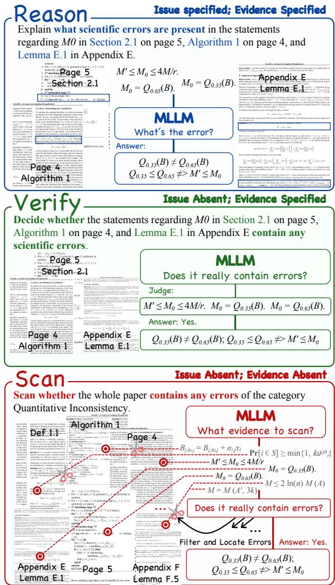  
Figure 1: Overview of Reason-Verify-Scan paradigm.

## 1 Introduction

End-to-end independent scientific research by multimodal large language models (MLLMs) (Bai et al., 2025; ByteDance Seed Team, 2025; OpenAI, 2026; Anthropic, 2025) is a long-standing goal of Deep Research and a milestone toward AGI (Ge et al., 2023; Morris et al., 2024). In recent years, MLLMs have become increasingly embedded in the research workflow, automating various aspects of scientific work (He et al., 2025). For example, Google Deep Research (Comanici et al., 2025)

aggregates multi-source materials into structured reports, while Paper Decision (Zhang et al., 2026) synthesizes reviews and rebuttals with multi-agent systems to predict final decisions. Together, these systems point to a broader shift from passive information synthesis toward active scientific inquiry.

As research tasks move beyond answering given questions or summarizing existing work, paperlevel judgment becomes central to autonomous research: deciding what should be checked, gathering dispersed evidence, and assessing whether claims are supported by the paper. Such judgment underlies research-quality assessment, idea discovery, and refinement of scientific work.

However, current MLLMs remain far from this goal. A key limitation is that most existing methods still operate in specified settings, where both the target problem and the supporting evidence are provided in advance (Xu et al., 2025; Wang et al., 2025a). Recently, ScholScan (Li et al., 2026) explicitly defined the Scan task paradigm, which requires models to perform global verification and consistency checking across the full text, rather than relying on evidence anchored in specific sections. However, existing work still provides limited discussion on methodologies and training paths for systematically enhancing the Scan capability.

Building on ScholScan, we study how to systematically train MLLMs for Scan rather than treating it only as an evaluation task. We instantiate this setting as scientific error detection and propose VERA-RL, a training formulation that couples progressive task decomposition with reinforcement learning (RL) rewards for verifiable reasoning over academic papers (Rafailov et al., 2024; Schulman et al., 2017; Shao et al., 2024; Yu et al., 2025). To support training, we construct VERA-13K from controlled edits on accepted papers and objective errors extracted from peer reviews, converting each error into Reason–Verify–Scan chains (Figure 1) across six categories.

In our experiments, we observe that evidencespecified reasoning does not naturally transfer to Scan, leading to a cue-removal gap and making direct end-to-end training on the full Scan setting less effective. VERA-RL substantially improves Qwen3-VL-8B on VERA-13K and shows measurable transfer to ScholScan. Further analyses show that Reason provides an internal-knowledge reference, while ablations confirm that both staged tasks and multi-dimensional rewards are necessary for stable gains.

In summary, our contributions are as follows:

• We formulate a three-stage Reason–Verify–Scan paradigm that turns Scan into a trainable progression from evidence-specified reasoning to issueand evidence-absent verification.

• We build VERA-13K with a reusable construction pipeline and 12,900 filtered samples covering 6 scientific-error categories across typical risk points in the research process and a wide range of natural-science domains.

• We introduce fine-grained rewards for reasoning completeness, evidence alignment, and error precision, enabling RL to target the core dimensions required by scientific error verification.

• Experiments show that VERA-RL substantially improves Qwen3-VL-8B-Instruct and reaches performance comparable to the Qwen3-VL-235B-A22B series. Ablations further show that both the staged task paradigm and the reward system are essential for stable gains.

## 2 Related Work

## 2.1 Academic Paper Understanding

Academic papers differ from general documents in their dense domain knowledge and rigorous logic. While previous work focused on isolated elements such as paragraphs or figures, it often overlooked the added challenge of reasoning over complete documents. (Chen et al., 2026; Wang et al., 2024; Auer et al., 2023; Li et al., 2024) Recent studies have adopted full-document inputs, but often treat the paper as a sparse mix of key passages and irrelevant text. (Ma et al., 2024; Yan et al., 2025; Lou et al., 2025; Zhao et al., 2024) This framing narrows the evaluation scope, reducing it to longcontext retrieval paired with localized reasoning.

More critically, most benchmarks still adopt a QA paradigm, diverging from real-world scientific tasks. Efforts like PRISMM-Bench (Selch et al., 2025; Xi et al., 2025; Tu et al., 2026) simulate reviewer-style understanding, yet still embed explicit clues and presuppose answer existence. ScholScan (Li et al., 2026) introduces the Scan-oriented task, targeting assumption-absent and evidence-absent conditions. However, it treats Scan as a static capability without examining how it can be effectively trained. A summary table comparing representative benchmarks is provided in Appendix A.

## 2.2 RL for LLM Reasoning

Since DeepSeek-R1 and OpenAI-o1 (Guo et al., 2025; OpenAI et al., 2024), large-scale reinforcement learning has become a key approach for improving the reasoning capabilities of LLMs. Recent studies have extended RL to more complex settings, including multimodal and long-context inputs. However, their task and data designs are not yet well aligned with document-level scientific verification. LoongRL and QwenLong-L1 (Wang et al., 2025c; Wan et al., 2025) extend RL to long-context settings through paragraph concatenation, while

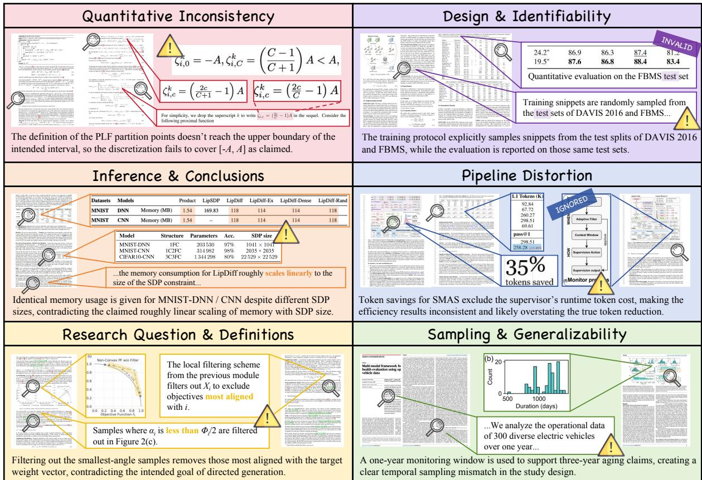  
Figure 2: Sampled VERA-13K examples with 6 error types. We consolidate and extend the taxonomy proposed in ScholScan, resulting in a more coherent and well-structured categorization scheme.

VRAG-RL (Wang et al., 2025b) incorporates retrieval into the RL pipeline. These designs improve long-context grounding or retrieval-conditioned reasoning, but provide limited guidance for training Scan-style verification over full academic papers.

## 3 Methodology

## 3.1 Task Definition

We formulate scientific error detection as producing a structured answer from a paper input, consisting of evidence points, reasoning steps, and a final judgment. Based on the availability of issue and evidence cues, we define 3 stages: Reason assumes an error with specified evidence; Verify provides candidate evidence without assuming an error; and Scan is both issue- and evidence-absent, specifying only a broad scanning target such as an error type. Question examples are shown in Figure 1, and the prompt and answer format is provided in Table 2.

Each underlying error instance can be converted into a matched Reason–Verify–Scan chain by rewriting the query while preserving the corresponding evidence and reasoning structure.

## 3.2 Dataset Construction

Overview Following ScholScan, we consolidate and extend its error taxonomy into 6 categories aligned with major failure points in the research workflow (Figure 2). We construct VERA-13K, a dataset of 12,900 samples for training and evaluation, derived by rewriting 4,300 errors into Reason–Verify–Scan chains. Table 1 summarizes the splits and composition of VERA-13K, where each subset consists of complete three-stage task chains.

Data Collection We collect data from two complementary sources. First, we curate accepted papers from top-tier journals (e.g., Nature Communications) and premier conferences (e.g., ICML), which provide high-quality and clean materials. Second, we incorporate reviews from ICLR submissions, which provide human-written feedback on potential weaknesses in submitted papers. Additional statistics are provided in Appendix A.

Data Generation and Quality Control For accepted papers, we instruct Gemini 3 Flash (Google DeepMind, 2025) to inject scientific errors through paragraph-level edits spanning multiple sections,

Table 1: Detailed statistics and distributions of our train and test datasets. Length is calculated by the Qwen3 tokenizer. Scan, Verify, and Reason are strictly balanced in every split and are constructed as a chained curriculum from the same underlying instances. QI: Quantitative Inconsistency; DI: Design & Identifiability; IC: Inference & Conclusions; PD: Pipeline Distortion; RQD: Research Question & Definitions; SG: Sampling & Generalizability.
<table><tr><td rowspan="2">Statistics</td><td colspan="2">Train Dataset</td><td colspan="7">Test Dataset</td></tr><tr><td>SFT</td><td>RL</td><td> $\mathbf { A v } \mathbf { g } .$ </td><td>QI</td><td>DI</td><td>IC</td><td>PD</td><td>RQD</td><td>SG</td></tr><tr><td># Examples</td><td>10,500</td><td>1,500</td><td></td><td>150</td><td>150</td><td>150</td><td>150</td><td>150</td><td>150</td></tr><tr><td>Avg. Length</td><td>31,134</td><td>30,649</td><td>31,837</td><td>29,956</td><td>37,066</td><td>31,985</td><td>31,100</td><td>32,792</td><td>28,124</td></tr><tr><td>Avg. Evidence</td><td>3.54</td><td>3.52</td><td>3.58</td><td>3.28</td><td>3.28</td><td>3.80</td><td>3.60</td><td>3.92</td><td>3.62</td></tr><tr><td>Avg. Reasoning Step</td><td>3.81</td><td>3.79</td><td>3.79</td><td>3.77</td><td>3.85</td><td>3.72</td><td>3.84</td><td>3.81</td><td>3.74</td></tr></table>

Table 2: QA format used in VERA-13K.

Read the provided paper and answer the question. The question will ask you to check and reason about scientific errors in specific parts of the paper. In your answer, show your reasoning process and explain in detail the exact nature of the errors.

<Question> <Interleaved context of the paper>   
Gold Answer:   
Evidence: (Only for Scan questions)   
- <Evidence 1> - <Evidence n>   
Reasoning:   
- <Step 1> - <Step n>   
Answer: ...

under strict category definitions and constraints. For review-derived papers, it extracts objective scientific errors while filtering out subjective feedback. Each instance is rewritten into a Reason–Verify– Scan chain, with formulations standardized as in Table 2. We then use Seed-1.6-Thinking for Pass@4 filtering, retaining a sample only judged as correct or partially correct. This step filters out unverifiable or weakly supported annotations. Prompts and other details are provided in our repository; see Appendix G.

## 3.3 RL for Verifiable Reasoning

Algorithm We optimize the policy with DAPO, a mature RL algorithm suitable for the structured outputs required by academic-paper verification, and use it to study whether the Scan capability can be learned through Reason–Verify–Scan staged tasks. For each training sample $( q , L , a )$ , where $q$ is the question, $L$ is the input paper, and a is the gold answer, DAPO samples $G$ trajectories $\{ y _ { i } \} _ { i = 1 } ^ { G }$ from the old policy $\pi _ { \theta _ { \mathrm { o l d } } }$ and updates the current policy $\pi _ { \theta }$ by maximizing:

$$
\begin{array} { r l } & { J _ { \mathrm { D A P O } } ( \theta ) = \mathbb { E } _ { ( q , L ) \sim \mathcal { D } , \{ y _ { i } \} _ { i = 1 } ^ { G } \sim \pi _ { \theta _ { \mathrm { d d } } } } [ \frac { 1 } { \sum _ { i = 1 } ^ { G } | y _ { i } | } ] \cdot \Bigg ( } \\ & { \qquad \displaystyle \sum _ { i = 1 } ^ { G } \sum _ { t = 1 } ^ { | y _ { i } | } \operatorname* { m i n } ( \frac { \pi _ { \theta } ( y _ { i , t } , \lfloor q , L , y _ { i , < t } ) } { \pi _ { \theta _ { \mathrm { d d } } } ( y _ { i , t } , \lfloor q , L , y _ { i , < t } ) } A _ { i , t } ,   } \\ & { \qquad  \mathrm { c l i p } ( \frac { \pi _ { \theta } ( y _ { i , t } , \lfloor q , L , y _ { i , < t } ) } { \pi _ { \theta _ { \mathrm { o d } } } ( y _ { i , t } , \lfloor q , L , y _ { i , < t } ) } , 1 - \epsilon _ { \mathrm { l o w } , \ 1 } + \epsilon _ { \mathrm { h i g h } } ) A _ { i , t } ) \Bigg ) } \\ & { \qquad - \beta \cdot \operatorname* { D } _ { \mathrm { K L } } [ \pi _ { \theta } ( \cdot , \cdot \lfloor q , L ) ]    \pi _ { \mathrm { r e f } } ( \cdot , \ \lfloor q , L )  \pi _ { \mathrm { r e f } } ( \cdot \lfloor q , L ) ] } \end{array}
$$

Here $A _ { i , t }$ is the token-level advantage for trajectory $y _ { i }$ at token $t , \epsilon _ { \mathrm { l o w } }$ and $\epsilon _ { \mathrm { h i g h } }$ are asymmetric clipping bounds, $\beta$ controls the KL penalty, and $\pi _ { \mathrm { r e f } }$ is the reference policy. The advantage is normalized within the sampled trajectory group:

$$
A _ { i , t } = \frac { r _ { i } - \mathrm { m e a n } ( \{ r _ { i } \} _ { i = 1 } ^ { G } ) } { \mathrm { s t d } ( \{ r _ { i } \} _ { i = 1 } ^ { G } ) }
$$

where $r _ { i }$ is the reward assigned to trajectory yi.

Rewards For a given question q, reference answer a, and model trajectory y, we design rewards to capture both process-level correctness and taskspecific verification requirements. Rcompleteness extends conventional answer correctness to the reasoning process. Since scientific error detection often admits partially correct answers, it measures the proportion of reference answer points covered by the trajectory rather than only judging the final answer. Beyond this correctness-oriented signal, Scan-style verification imposes two additional requirements. First, the model must ground its judgment in the paper rather than produce unsupported explanations, so $R _ { \mathrm { a l i g n m e n t } }$ measures the overlap between generated and reference evidence points. Second, open-ended error detection may incentivize excessive candidate errors, so $R _ { \mathrm { p r e c i s i o n } }$ penalizes unsupported error claims. Together, these terms define rewards for reasoning completeness, evidence grounding, and error precision:

$$
\begin{array} { r l } & { R _ { \mathrm { f i n a l } } = \omega _ { 1 } R _ { \mathrm { c o m p l e t e n e s s } } + \omega _ { 2 } R _ { \mathrm { a l i g n m e n t } } + \omega _ { 3 } R _ { \mathrm { p r e c i s i o n } } } \\ & { \qquad = \omega _ { 1 } \frac { \left| \hat { \mathcal { R } } \cap \mathcal { R } ^ { * } \right| } { \left| \mathcal { R } ^ { * } \right| } + \omega _ { 2 } \frac { 2 \left| \hat { \mathcal { E } } \cap \mathcal { E } ^ { * } \right| } { \left| \hat { \mathcal { E } } \right| + \left| \mathcal { E } ^ { * } \right| } } \\ & { \qquad + \omega _ { 3 } \mathbb { I } _ { \mathrm { e r r o r } } e ^ { - 0 . 4 m } . } \end{array}
$$

Here $\hat { \mathcal { R } }$ and $\hat { \mathcal { E } }$ denote the reasoning points and evidence points extracted from the trajectory, while $\mathcal { R } ^ { * }$ and $\mathcal { E } ^ { * }$ denote the corresponding reference points. m denotes the number of unsupported error claims, and $\mathbb { I } _ { \mathrm { e r r o r } }$ is 1 for an error prediction and 0 otherwise. These quantities are extracted and matched by Seed-1.6-Thinking as a fixed structured evaluator, while the final reward is computed by the above rule rather than directly assigned by the evaluator. This structured evaluation is less dependent on unconstrained LLM-as-a-Judge preferences.

For Reason and $V e r i f y$ , evidence is specified, so we disable $R _ { \mathrm { a l i g n m e n t } }$ and set $( \omega _ { 1 } , \omega _ { 2 } , \omega _ { 3 } ) \ =$ $( 0 . 6 , 0 , 0 . 4 )$ , keeping reasoning as the main target while using precision as a constraint. For Scan, where evidence must be identified rather than given, we set $( 0 . 4 , 0 . 4 , 0 . 2 )$ so that $R _ { \mathrm { a l i g n m e n t } }$ receives a role comparable to Rcompleteness. Appendix D reports statistics supporting this choice.

## 4 Experiments

## 4.1 Setup

Inputs Prior work typically relies on either plaintext OCR, which discards all visual elements, or full-page image rendering, which demands high resolution to retain dense textual content. (Ma et al., 2024; Selch et al., 2025) These approaches fall short for our task, where figure-text alignment and layout preservation are essential. We instead adopt DeepSeek-OCR (Wei et al., 2025) to convert papers into interleaved text and images, preserving most of the original information.

Training Setup We train Qwen3-VL-8B-Instruct with 1 epoch of SFT using a batch size of 8, followed by 30 RL steps with a batch size of 32 and random sampling over all task types. Further details are provided in Appendix B.

Baselines We evaluate 8 models spanning flagship proprietary models and Qwen3-VL variants. For selected Qwen3-VL models, we compare their Instruct and Thinking versions to assess how training schemes affect verifiable reasoning.

## 4.2 Main Results

Table 3 reports the main Scan results, with the full Reason and Verify results provided in Appendix B. Based on these results, we make 5 observations.

Current MLLMs remain generally weak. Although Gemini 3 Pro is among the strongest baselines, it only reaches 60.0 on Reason, near the passing threshold, and remains far from reliable on Scan (24.3), revealing a persistent limitation of current MLLMs in constructing and reasoning over global evidence views.

Evidence removal creates a sharp capability gap. Even Gemini 3 Pro, the strongest baseline on Reason, only barely achieves a passing threshold on the Reason task, while performing considerably worse on Scan. This reveals fundamental limitations in current models and training paradigms when it comes to constructing and reasoning over global evidence views. The two instruction-tuned versions of Qwen3-VL perform especially poorly, scoring below 10 and 20 points on Verify and Scan respectively, highlighting the difficulty of these higher-level tasks.

Post-training leads to significant performance improvements. The SFT- and RL-finetuned variants of Qwen3-VL-8B demonstrate consistent overall improvements across all rewards. A similar pattern of improvement is observed for the Qwen3- VL-235B-A22B series. Our RL-trained model achieves substantial improvements on both Ver-$i f y$ and Scan. It approaches the Qwen3-VL-235B-A22B-Thinking on $R _ { \mathrm { c o m p l e t e n e s s } }$ and $R _ { \mathrm { a l i g n m e n t } } .$ , surpasses it in terms of the overall composite score, and further narrows the gap to Gemini 3 Pro. In particular, SFT helps regularize the output through basic format and distributional constraints, leading to a noticeable increase in $R _ { \mathrm { p r e c i s i o n } }$ . This improvement is still evident in the RL phase, where the reward metrics continue to grow, indicating that all 3 metrics play a crucial role in the final performance.

VERA-RL shows measurable transfer to ScholScan. We further evaluate on ScholScan (Table 4), and the results mirror those observed above. Notably, although absolute scores remain low in this harder cross-benchmark setting, VERA-RL moves Qwen3-VL-8B from near-zero performance to non-trivial scores and brings it close to Qwen3- VL-235B-A22B-Instruct on several metrics. This suggests that the learned Reason–Verify–Scan capability is not limited to VERA-13K. More details and analysis are provided in Appendix C.

Table 3: Scan-task evaluation results (scaled by 100) for baselines and models trained in the main experiments.
<table><tr><td>Models</td><td>Avg.</td><td>QI</td><td>DI</td><td>IC</td><td>PD</td><td>RQD</td><td>SG</td></tr><tr><td colspan="8">Scan Rcompleteness</td></tr><tr><td>Gemini 3 Pro</td><td>22.8</td><td>24.4</td><td>13.2</td><td>30.0</td><td>17.7</td><td>25.8</td><td>26.0</td></tr><tr><td>Qwen3-VL-235B-A22B (Thinking)</td><td>16.7</td><td>22.2</td><td>12.5</td><td>21.7</td><td>10.2</td><td>13.3</td><td>20.3</td></tr><tr><td>Qwen3-VL-235B-A22B (Instruct)</td><td>3.4</td><td>7.0</td><td>3.3</td><td>7.8</td><td>1.5</td><td>0.0</td><td>0.5</td></tr><tr><td>Qwen3-VL-8B (Instruct)</td><td>1.5</td><td>0.0</td><td>0.0</td><td>5.3</td><td>1.5</td><td>0.0</td><td>2.0</td></tr><tr><td>Qwen3-VL-8B (SFT, ours)</td><td>5.3</td><td>5.2</td><td>1.3</td><td>5.8</td><td>6.3</td><td>3.0</td><td>10.3</td></tr><tr><td>Qwen3-VL-8B (SFT+RL, ours)</td><td>8.2</td><td>7.8</td><td>0.5</td><td>10.0</td><td>6.8</td><td>11.3</td><td>12.8</td></tr><tr><td colspan="8">Scan</td></tr><tr><td>Gemini 3 Pro</td><td>17.8</td><td>Ralignment 22.7</td><td>9.4</td><td>25.7</td><td>15.0</td><td>17.4</td><td>16.9</td></tr><tr><td>Qwen3-VL-235B-A22B (Thinking)</td><td>13.0</td><td>21.4</td><td>8.9</td><td>17.5</td><td>7.1</td><td>11.0</td><td>12.2</td></tr><tr><td>Qwen3-VL-235B-A22B (Instruct)</td><td>2.4</td><td>4.7</td><td>2.0</td><td>6.3</td><td>0.8</td><td>0.0</td><td>0.8</td></tr><tr><td>Qwen3-VL-8B (Instruct)</td><td>1.0</td><td>0.0</td><td>0.0</td><td>3.9</td><td>2.0</td><td>0.0</td><td>0.0</td></tr><tr><td>Qwen3-VL-8B (SFT, ours)</td><td>2.5</td><td>1.1</td><td>0.8</td><td>5.3</td><td>1.1</td><td>0.8</td><td>4.8</td></tr><tr><td>Qwen3-VL-8B (SFT+RL, ours)</td><td>6.2</td><td>9.2</td><td>1.0</td><td>7.7</td><td>4.5</td><td>6.4</td><td>8.4</td></tr><tr><td colspan="8">Scan Rprecision</td></tr><tr><td>Gemini 3 Pro</td><td>40.4</td><td>45.7</td><td>43.5</td><td>41.3</td><td>42.1</td><td>35.3</td><td>34.4</td></tr><tr><td>Qwen3-VL-235B-A22B (Thinking)</td><td>27.5</td><td>38.2</td><td>32.1</td><td>26.5</td><td>26.2</td><td>21.3</td><td>20.9</td></tr><tr><td>Qwen3-VL-235B-A22B (Instruct)</td><td>5.4</td><td>6.8</td><td>3.8</td><td>19.0</td><td>0.4</td><td>0.0</td><td>2.3</td></tr><tr><td>Qwen3-VL-8B (Instruct)</td><td>5.0</td><td>3.0</td><td>3.3</td><td>14.8</td><td>2.2</td><td>2.3</td><td>4.5</td></tr><tr><td>Qwen3-VL-8B (SFT, ours)</td><td>56.3</td><td>52.3</td><td>57.1</td><td>55.7</td><td>54.0</td><td>58.3</td><td>60.2</td></tr><tr><td>Qwen3-VL-8B (SFT+RL, ours)</td><td>68.6</td><td>67.0</td><td>65.2</td><td>68.9</td><td>70.4</td><td>69.6</td><td>70.3</td></tr><tr><td colspan="8">Scan Rfinal</td></tr><tr><td>GPT-5.4</td><td>29.9</td><td>49.9</td><td>26.2</td><td>22.8</td><td>31.8</td><td>26.2</td><td>23.8</td></tr><tr><td>Gemini 3 Pro</td><td>24.3</td><td>28.0</td><td>17.7</td><td>30.3</td><td>21.5</td><td>24.4</td><td>24.0</td></tr><tr><td>Seed-1.6-Thinking</td><td>21.2</td><td>25.9</td><td>17.1</td><td>27.5</td><td>16.1</td><td>22.6</td><td>17.6</td></tr><tr><td>Qwen3-VL-Plus</td><td>26.2</td><td>35.7</td><td>17.7</td><td>30.0</td><td>22.1</td><td>24.5</td><td>27.3</td></tr><tr><td>Qwen3-VL-235B-A22B (Thinking)</td><td>17.4</td><td>25.1</td><td>15.0</td><td>21.0</td><td>12.2</td><td>14.0</td><td>17.2</td></tr><tr><td>Qwen3-VL-235B-A22B (Instruct)</td><td>3.4</td><td>6.0</td><td>2.9</td><td>9.4</td><td>1.0</td><td>0.0</td><td>1.0</td></tr><tr><td>Qwen3-VL-8B (Instruct)</td><td>2.0</td><td>0.6</td><td>0.7</td><td>6.7</td><td>1.8</td><td>0.5</td><td>1.7</td></tr><tr><td>Qwen3-VL-8B (SFT, ours)</td><td>14.4</td><td>13.0</td><td>12.3</td><td>15.6</td><td>14.2</td><td>13.2</td><td>18.1</td></tr><tr><td>Qwen3-VL-8B (SFT+RL, ours)</td><td>19.5</td><td>20.2</td><td>13.6</td><td>20.9</td><td>18.6</td><td>21.0</td><td>22.5</td></tr></table>

Reason provides a reference for the internalknowledge upper bound. We observe that Reason shows relatively limited improvement during posttraining, while Verify approaches Reason. We consider Reason and Rcompleteness to be more strongly shaped by the model’s parametric prior knowledge, making them useful reference points for the upper bound of capability under internal knowledge alone. In contrast, Verify and Scan demand stronger external evidence grounding and higher-level verifiable reasoning, thus reflecting a shift in the nature of capability from internal recall to evidence-based inference.

## 4.3 Additional Analysis

Training Dynamics. Figure 3 shows the rollout dynamics of the main experiment. Rewards increase in phases with moderate oscillations, indicating that the staged tasks provide usable optimization signals despite the long and structured outputs. Additionally, Reason and Verify exhibit converging patterns in the fine-grained perspective of a single training run. This is consistent with our observation that Reason serves as an internal-knowledge reference point.

The improvements also vary across error categories. For RQD, PD, and SG, post-training brings larger gains than parameter scaling. These error types often involve domain-specific concepts introduced within the paper, reducing reliance on the model’s parametric knowledge and shifting the demand toward evidence-grounded verification. DI and IC yield limited improvements, suggesting that errors involving experimental design and final conclusions require stronger holistic understanding and a higher degree of internal scientific knowledge. For QI, the model shows broad improvements under both paths, which we attribute to its additional demand on numerical computation and analysis.

Table 4: Evaluation results (scaled by 100) for baselines and models trained in the main experiments. $S _ { \mathrm { r e a s o n } } ,$ $S _ { \mathrm { l o c a t i o n } } , P _ { \mathrm { u n r e l a t e d \_ e r r } } ,$ and $S ( m )$ are evaluation metrics introduced in ScholScan, with detailed definitions provided in Appendix C. $R _ { \mathrm { p r e c i s i o n } }$ is not applicable in this evaluation setting and is therefore omitted.
<table><tr><td>Models</td><td> $R _ { \mathrm { c o m p l e t e n e s s } }$ </td><td> $R _ { \mathrm { a l i g n m e n t } }$ </td><td> $S _ { \mathrm { r e a s o n } }$ </td><td> $S _ { \mathrm { l o c a t i o n } }$ </td><td> $P _ { \mathrm { u n r e l a t e d \_ e r r } }$ </td><td> $S ( m )$ </td></tr><tr><td>Gemini 3 Pro</td><td>11.3</td><td>7.2</td><td>11.0</td><td>6.0</td><td>10.2</td><td>5.5</td></tr><tr><td>Qwen3-VL-235B-A22B-Thinking</td><td>4.7</td><td>2.8</td><td>4.6</td><td>2.4</td><td>5.3</td><td>2.6</td></tr><tr><td>Qwen3-VL-235B-A22B-Instruct</td><td>0.8</td><td>0.4</td><td>0.8</td><td>0.3</td><td>0.4</td><td>0.1</td></tr><tr><td>Qwen3-VL-8B-Instruct</td><td>0.0</td><td>0.0</td><td>0.0</td><td>0.0</td><td>0.0</td><td>0.0</td></tr><tr><td>Qwen3-VL-8B (SFT)</td><td>0.4</td><td>0.1</td><td>0.4</td><td>0.0</td><td>3.8</td><td>0.0</td></tr><tr><td>Qwen3-VL-8B (SFT+RL)</td><td>0.5</td><td>0.3</td><td>0.5</td><td>0.2</td><td>0.5</td><td>0.2</td></tr></table>

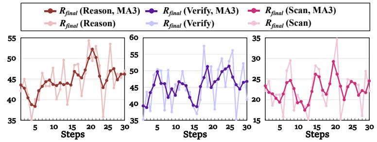

<table><tr><td></td><td>Rfinal</td><td>Rcompleteness</td><td>Ralignment</td><td> $R _ { \mathbf { p r e c i s i o n } }$ </td></tr><tr><td>↑</td><td>285</td><td>40</td><td>36</td><td>287</td></tr><tr><td>↓</td><td>6</td><td>5</td><td>4</td><td>3</td></tr><tr><td>二</td><td>9</td><td>255</td><td>260</td><td>10</td></tr><tr><td>Total</td><td>300</td><td>300</td><td>300</td><td>300</td></tr></table>

Figure 3: Left: Training dynamics of main experiments. Right: Metrics change after VERA-RL on Scan (test set).  
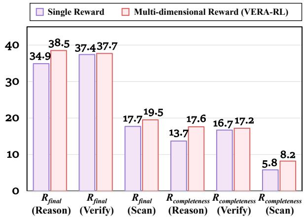  
Figure 4: Performance comparison between multidimensional and single reward configurations.

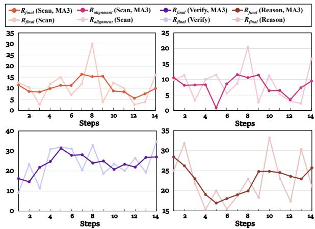  
Figure 5: Training dynamics of the ablation study using only Rcompleteness.

## 4.4 Ablation Study of Reward Design

To explore the necessity of our multi-dimensional reward system, we compare it with a single-reward variant using only $R _ { \mathrm { c o m p l e t e n e s s } } .$ . As shown in Figure 4, the multi-dimensional reward consistently outperforms the single-reward variant on both $R _ { \mathrm { f i n a l } }$ and $R _ { \mathrm { c o m p l e t e n e s s } }$ . Furthermore, the training dynamics in Figure 5 reveal that reverting to such a sparse reward signal leads to degradation in overall performance. From a task-paradigm perspective, the model shows little meaningful improvement on Reason and Verify, while its performance on the Scan task collapses. More notably, from the perspective of reward optimization itself, the model struggles to stably improve even the explicitly rewarded metric, with training exhibiting clear signs of instability and regression. The reward components are not independent. Instead, they form a tightly coupled positive-feedback structure that collectively and precisely defines the capability dimensions required by the task.

## 4.5 Ablation Study of Task Framework

To evaluate the effectiveness of the three-stage task paradigm, we compare the main setting with two alternatives in Table 5. The first setting, Pure Scan, trains the model only on Scan samples. When controlling for the amount of Scan exposure at step 10, Pure Scan performs worse than the main setting not only on Reason and Verify, but also on Scan itself. Extending Pure Scan training to step 20 still fails to close the gap. Just as the reward components are complementary, the task stages are also coupled in training. Reason and Verify remain non-trivial, and removing their supervision weakens the evidence-conditioned reasoning and judgment needed for Scan. Neglecting the training of these tasks may hinder the development of Scan performance.

Table 5: Performance comparison across different configurations for Reason, Verify, and Scan tasks. The metric $R _ { \mathrm { c o m } }$ refers to $R _ { \mathrm { c o m p l e t e n e s s } }$ and $R _ { \mathrm { a l i g n } }$ refers to $R _ { \mathrm { a l i g n m e n t } }$ . The Pure Scan configuration isolates the Scan task for training.
<table><tr><td rowspan="2">Config.</td><td rowspan="2">Step</td><td colspan="3">Reason</td><td colspan="3">Verify</td><td colspan="4">Scan</td></tr><tr><td> $R _ { \mathrm { f i n a l } }$ </td><td> $R _ { \mathrm { c o m } }$ </td><td> $R _ { \mathrm { p r e c i s i o n } }$ </td><td> $R _ { \mathrm { f i n a l } }$ </td><td> $R _ { \mathrm { c o m } }$ </td><td> $R _ { \mathrm { p r e c i s i o n } }$ </td><td> $R _ { \mathrm { f i n a l } }$ </td><td> $R _ { \mathrm { c o m } }$ </td><td> $R _ { \mathrm { a l i g n } }$ </td><td> $R _ { \mathrm { p r e c i s i o n } }$ </td></tr><tr><td>Main</td><td>30</td><td>38.5</td><td>17.6</td><td>69.9</td><td>37.7</td><td>17.2</td><td>68.5</td><td>19.5</td><td>8.2</td><td>6.2</td><td>68.6</td></tr><tr><td>Main</td><td>15</td><td>36.1</td><td>14.6</td><td>68.4</td><td>35.0</td><td>14.9</td><td>65.2</td><td>15.0</td><td>2.8</td><td>2.3</td><td>65.0</td></tr><tr><td>Pure Scan</td><td>10</td><td>37.0</td><td>16.7</td><td>67.4</td><td>34.0</td><td>12.8</td><td>65.8</td><td>16.8</td><td>5.3</td><td>3.7</td><td>66.0</td></tr><tr><td>∆ to Main(30)</td><td>-</td><td>-1.5</td><td>-0.9</td><td>-2.5</td><td>-3.7</td><td>-4.4</td><td>-2.7</td><td>-2.7</td><td>-2.9</td><td>-2.5</td><td>-2.6</td></tr><tr><td>Pure Scan</td><td>20</td><td>37.2</td><td>15.9</td><td>69.1</td><td>34.1</td><td>12.6</td><td>66.3</td><td>16.9</td><td>5.3</td><td>4.2</td><td>65.4</td></tr><tr><td>∆ to Main(30)</td><td>-</td><td>-1.3</td><td>-1.7</td><td>-0.8</td><td>-3.6</td><td>-4.6</td><td>-2.2</td><td>-2.6</td><td>-2.9</td><td>-2.0</td><td>-3.2</td></tr><tr><td>Curricular</td><td>20</td><td>36.3</td><td>14.3</td><td>69.2</td><td>35.8</td><td>15.1</td><td>66.8</td><td>18.2</td><td>6.8</td><td>5.2</td><td>67.3</td></tr><tr><td>∆ to Main(30)</td><td></td><td>-2.2</td><td>-3.3</td><td>-0.7</td><td>-1.9</td><td>-2.1</td><td>-1.7</td><td>-1.3</td><td>-1.4</td><td>-1.0</td><td>-1.3</td></tr><tr><td>Curricular</td><td>30</td><td>36.5</td><td>15.5</td><td>67.9</td><td>36.1</td><td>15.1</td><td>67.6</td><td>16.5</td><td>4.5</td><td>4.2</td><td>64.8</td></tr><tr><td>∆ to Main(30)</td><td>-</td><td>-2.0</td><td>-2.1</td><td>-2.0</td><td>-1.6</td><td>-2.1</td><td>-0.9</td><td>-3.0</td><td>-3.7</td><td>-2.0</td><td>-3.8</td></tr></table>

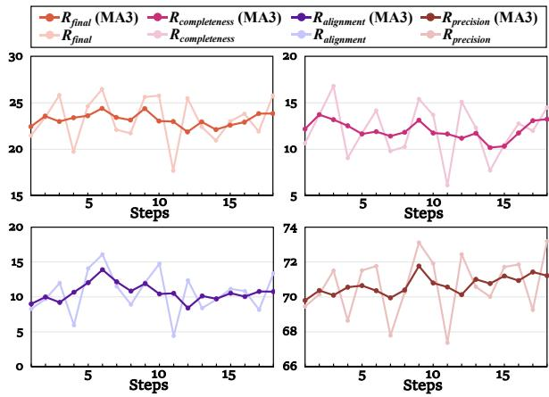  
Figure 6: Training dynamics of the ablation experiment using only Scan tasks.

Further training does not yield stable improvement on Reason, and Scan also improves slowly. Figure 6 illustrates the reward dynamics when training solely on the Scan task, which reveal the struggle across nearly all metrics from a fine-grained perspective.

Furthermore, we introduced an attempt with curricular learning (Yuan et al., 2025). Specifically, we used the main experiment setup for the first 15 steps, then switched to training using only Scan samples, and evaluated models at total steps 20 and 30. The results in Table 5 indicate that this setup faces similar challenges as the setup using only Scan task samples. This further underscores the tight coupling of our task paradigm framework. From a more practical perspective, it enables the expansion of sample size by breaking down capability dimensions, efficiently utilizing valuable high-quality papers, and reserving greater potential for scaling up.

## 4.6 Case Study

We further examine Scan samples improved by VERA-RL. Statistics in Figure 3 show broad gains across many instances, and the cases are provided in Appendix E. Qualitatively, the base Qwen3-VL-8B-Instruct often stops at surface-level consistency checks and gives broad no-error judgments. After VERA-RL, the model searches more actively across the paper, identifies localized evidence from dispersed content, and connects it into traceable error reasoning. These cases suggest that the gains are not merely from catering to evaluator heuristics, but reflect stronger full-paper exploration and evidence-grounded verification required by Scan.

## 5 Conclusion

We presented VERA-RL for training verifiable scientific error detection over academic papers. By decomposing Scan into Reason, Verify, and Scan, and by using rewards for reasoning completeness, evidence alignment, and error precision, VERA-RL provides a principled training path from evidencespecified reasoning to issue- and evidence-absent verification. We also constructed VERA-13K, a 12,900-sample dataset of matched three-stage chains across 6 scientific-error categories. Experiments on VERA-13K and ScholScan show consistent improvements, and ablations confirm that both task staging and reward design are necessary for stable gains. These results demonstrate that Scanstyle verification is a trainable capability that can be systematically improved through aligned task design, data construction, and reward modeling, offering a concrete step from scientific assistance toward more autonomous scientific research.

## Limitations

This work focuses on scientific error detection as a concrete setting for Scan-style verification over academic papers. It does not cover the full range of peer-review judgments, such as novelty, significance, writing quality, or broader research impact, which often depend on community context and subjective assessment. VERA-13K emphasizes errors that can be verified from the paper itself, making supervision and reward computation more structured. As a result, more implicit weaknesses or errors requiring extensive external domain knowledge may be underrepresented. Our training experiments are mainly conducted on Qwen3-VL-8B. Although we compare with multiple strong MLLMs and external benchmarks, larger-scale RL training, broader model families, and alternative paper representations remain for future study.

## Acknowledgments

This work is supported by WeChat AI, Tencent Inc., China and “The Fundamental Research Funds for the Central Universities, Peking University”. We would also like to thank the anonymous reviewers and area chairs for constructive discussions and feedback.

## References

Anthropic. 2025. System card: Claude opus 4 & claude sonnet 4. https://www.anthropic.com/ claude-4-system-card. Updated Sep 2, 2025.

S. Auer, Dante Augusto Couto Barone, Cassiano Bartz, E. Cortes, Mohamad Yaser Jaradeh, Oliver Karras, Manolis Koubarakis, Dmitry I. Mouromtsev, Dmitrii Pliukhin, Daniil Radyush, Ivan Shilin, Markus Stocker, and Eleni Tsalapati. 2023. The sciqa scientific question answering benchmark for scholarly knowledge. Scientific Reports, 13.

Shuai Bai, Yuxuan Cai, Ruizhe Chen, Keqin Chen, Xionghui Chen, Zesen Cheng, Lianghao Deng, Wei

Ding, Chang Gao, Chunjiang Ge, Wenbin Ge, Zhifang Guo, Qidong Huang, Jie Huang, Fei Huang, Binyuan Hui, Shutong Jiang, Zhaohai Li, Mingsheng Li, and 45 others. 2025. Qwen3-vl technical report. Preprint, arXiv:2511.21631.

ByteDance Seed Team. 2025. Introduction to techniques used in seed1.6. https://seed.bytedance.com/en/blog/ introduction-to-techniques-used-in-seed1-6. Official blog post describing Seed1.6 techniques.

Yelin Chen, Fanjin Zhang, Suping Sun, Yunhe Pang, Yuanchun Wang, Jian Song, XiaoYan Li, Lei Hou, Shu Zhao, Jie Tang, and Juanzi Li. 2026. RPC-bench: A fine-grained benchmark for research paper comprehension.

Gheorghe Comanici and 1 others. 2025. Gemini 2.5: Pushing the frontier with advanced reasoning, multimodality, long context, and next generation agentic capabilities. Preprint, arXiv:2507.06261.

Yingqiang Ge, Wenyue Hua, Kai Mei, jianchao ji, Juntao Tan, Shuyuan Xu, Zelong Li, and Yongfeng Zhang. 2023. Openagi: When llm meets domain experts. In Advances in Neural Information Processing Systems, volume 36, pages 5539–5568. Curran Associates, Inc.

Google DeepMind. 2025. Gemini 3 Pro Model Card. https://storage.googleapis. com/deepmind-media/Model-Cards/ Gemini-3-Pro-Model-Card.pdf.

Daming Guo, Dongdong Yang, Hongyi Zhang, and 1 others. 2025. Deepseek-r1 incentivizes reasoning in llms through reinforcement learning. Nature, 645:633–638.

Yichen He, Guanhua Huang, Peiyuan Feng, Yuan Lin, Yuchen Zhang, Hang Li, and Weinan E. 2025. Pasa: An llm agent for comprehensive academic paper search. Preprint, arXiv:2501.10120.

Lei Li, Yuqi Wang, Runxin Xu, Peiyi Wang, Xiachong Feng, Lingpeng Kong, and Qi Liu. 2024. Multimodal ArXiv: A dataset for improving scientific comprehension of large vision-language models. In Proceedings of the 62nd Annual Meeting of the Association for Computational Linguistics (Volume 1: Long Papers), pages 14369–14387, Bangkok, Thailand. Association for Computational Linguistics.

Rongjin Li, Zichen Tang, Xianghe Wang, Xinyi Hu, Zhengyu Wang, Zhengyu Lu, Yiling Huang, Jiayuan Chen, Weisheng Tan, Jiacheng Liu, Zhongjun Yang, and Haihong E. 2026. Not search, but scan: Benchmarking MLLMs on scan-oriented academic paper reasoning. In The Fourteenth International Conference on Learning Representations.

Renze Lou, Hanzi Xu, Sijia Wang, Jiangshu Du, Ryo Kamoi, Xiaoxin Lu, Jian Xie, Yuxuan Sun, Yusen Zhang, Jihyun Janice Ahn, Hongchao Fang,

Zhuoyang Zou, Wenchao Ma, Xi Li, Kai Zhang, Congying Xia, Lifu Huang, and Wenpeng Yin. 2025. AAAR-1.0: Assessing AI’s potential to assist research. In Forty-second International Conference on Machine Learning.

Yubo Ma, Yuhang Zang, Liangyu Chen, Meiqi Chen, Yizhu Jiao, Xinze Li, Xinyuan Lu, Ziyu Liu, Yan Ma, Xiaoyi Dong, Pan Zhang, Liangming Pan, Yu-Gang Jiang, Jiaqi Wang, Yixin Cao, and Aixin Sun. 2024. MMLONGBENCH-DOC: Benchmarking long-context document understanding with visualizations. In The Thirty-eight Conference on Neural Information Processing Systems Datasets and Benchmarks Track.

Meredith Ringel Morris, Jascha Sohl-Dickstein, Noah Fiedel, Tris Warkentin, Allan Dafoe, Aleksandra Faust, Clement Farabet, and Shane Legg. 2024. Position: Levels of AGI for operationalizing progress on the path to AGI. In Forty-first International Conference on Machine Learning.

OpenAI, :, Aaron Jaech, Adam Kalai, Adam Lerer, Adam Richardson, Ahmed El-Kishky, Aiden Low, Alec Helyar, Aleksander Madry, Alex Beutel, Alex Carney, Alex Iftimie, Alex Karpenko, Alex Tachard Passos, Alexander Neitz, Alexander Prokofiev, Alexander Wei, Allison Tam, and 244 others. 2024. Openai o1 system card. Preprint, arXiv:2412.16720.

OpenAI. 2026. GPT-5.4 Thinking System Card. https://openai.com/index/ gpt-5-4-thinking-system-card/.

Rafael Rafailov, Archit Sharma, Eric Mitchell, Stefano Ermon, Christopher D. Manning, and Chelsea Finn. 2024. Direct preference optimization: Your language model is secretly a reward model. Preprint, arXiv:2305.18290.

John Schulman, Filip Wolski, Prafulla Dhariwal, Alec Radford, and Oleg Klimov. 2017. Proximal policy optimization algorithms. Preprint, arXiv:1707.06347.

Lukas Selch, Yufang Hou, M. Jehanzeb Mirza, Sivan Doveh, James Glass, Rogerio Feris, and Wei Lin. 2025. Prismm-bench: A benchmark of peer-review grounded multimodal inconsistencies. Preprint, arXiv:2510.16505.

Zhihong Shao, Peiyi Wang, Qihao Zhu, Runxin Xu, Junxiao Song, Xiao Bi, Haowei Zhang, Mingchuan Zhang, Y. K. Li, Y. Wu, and Daya Guo. 2024. Deepseekmath: Pushing the limits of mathematical reasoning in open language models. Preprint, arXiv:2402.03300.

Songjun Tu, Yiwen Ma, Jiahao Lin, Qichao Zhang, Xiangyuan Lan, Junfeng. Li, Nan Xu, Linjing Li, and Dongbin Zhao. 2026. Paperaudit-bench: Benchmarking error detection in research papers for critical automated peer review. Preprint, arXiv:2601.19916.

Fanqi Wan, Weizhou Shen, Shengyi Liao, Yingcheng Shi, Chenliang Li, Ziyi Yang, Ji Zhang, Fei Huang, Jingren Zhou, and Ming Yan. 2025. Qwenlong-l1: Towards long-context large reasoning models with reinforcement learning. Preprint, arXiv:2505.17667.

Chengye Wang, Yifei Shen, Zexi Kuang, Arman Cohan, and Yilun Zhao. 2025a. SciVer: Evaluating foundation models for multimodal scientific claim verification. In Proceedings of the 63rd Annual Meeting of the Association for Computational Linguistics (Volume 1: Long Papers), pages 8562–8579, Vienna, Austria. Association for Computational Linguistics.

Qiuchen Wang, Ruixue Ding, Yu Zeng, Zehui Chen, Lin Chen, Shihang Wang, Pengjun Xie, Fei Huang, and Feng Zhao. 2025b. Vrag-rl: Empower visionperception-based rag for visually rich information understanding via iterative reasoning with reinforcement learning. Preprint, arXiv:2505.22019.

Siyuan Wang, Gaokai Zhang, Li Lyna Zhang, Ning Shang, Fan Yang, Dongyao Chen, and Mao Yang. 2025c. Loongrl: Reinforcement learning for advanced reasoning over long contexts. Preprint, arXiv:2510.19363.

Zirui Wang, Mengzhou Xia, Luxi He, Howard Chen, Yitao Liu, Richard Zhu, Kaiqu Liang, Xindi Wu, Haotian Liu, Sadhika Malladi, Alexis Chevalier, Sanjeev Arora, and Danqi Chen. 2024. Charxiv: Charting gaps in realistic chart understanding in multimodal llms. Preprint, arXiv:2406.18521.

Haoran Wei, Yaofeng Sun, and Yukun Li. 2025. Deepseek-ocr: Contexts optical compression. Preprint, arXiv:2510.18234.

Sarina Xi, Vishisht Rao, Justin Payan, and Nihar B. Shah. 2025. Flaws: A benchmark for error identification and localization in scientific papers. Preprint, arXiv:2511.21843.

Zhijian Xu, Yilun Zhao, Manasi Patwardhan, Lovekesh Vig, and Arman Cohan. 2025. Can LLMs identify critical limitations within scientific research? a systematic evaluation on AI research papers. In Proceedings ofthe 63rd Annual Meeting ofthe Associationfor Computational Linguistics (Volume 1: Long Papers), pages 20652–20706, Vienna, Austria. Association for Computational Linguistics.

Dawei Yan, Yang Li, Qing-Guo Chen, Weihua Luo, Peng Wang, Haokui Zhang, and Chunhua Shen. 2025. Mmcr: Advancing visual language model in multimodal multi-turn contextual reasoning. Preprint, arXiv:2503.18533.

Qiying Yu, Zheng Zhang, Ruofei Zhu, Yufeng Yuan, Xiaochen Zuo, Yu Yue, Weinan Dai, Tiantian Fan, Gaohong Liu, Lingjun Liu, Xin Liu, Haibin Lin, Zhiqi Lin, Bole Ma, Guangming Sheng, Yuxuan Tong, Chi Zhang, Mofan Zhang, Wang Zhang, and 16 others. 2025. Dapo: An open-source llm reinforcement learning system at scale. Preprint, arXiv:2503.14476.

Ruifeng Yuan, Chenghao Xiao, Sicong Leng, Jianyu Wang, Long Li, Weiwen Xu, Hou Pong Chan, Deli Zhao, Tingyang Xu, Zhongyu Wei, Hao Zhang, and Yu Rong. 2025. Vl-cogito: Progressive curriculum reinforcement learning for advanced multimodal reasoning. Preprint, arXiv:2507.22607.

Yi-Fan Zhang, Yuhao Dong, Saining Zhang, Kai Wu, Liang Wang, Caifeng Shan, Ziwei Liu, Ran He, Hao Zhao, and Chaoyou Fu. 2026. Iclr 2026 acceptance prediction: Benchmarking decision process with a multi-agent system. https://github.com/ PaperDecision/PaperDecision. Accessed: 2026- 01-18.

Yilun Zhao, Yitao Long, Hongjun Liu, Ryo Kamoi, Linyong Nan, Lyuhao Chen, Yixin Liu, Xiangru Tang, Rui Zhang, and Arman Cohan. 2024. DocMath-eval: Evaluating math reasoning capabilities of LLMs in understanding long and specialized documents. In Proceedings ofthe 62nd Annual Meeting of the Association for Computational Linguistics (Volume 1: Long Papers), pages 16103–16120, Bangkok, Thailand. Association for Computational Linguistics.

Table 6: Comparison with representative academic document understanding benchmarks. T: text; I: image; MD: multimodal document; CS: Computer Science.
<table><tr><td>Benchmark</td><td>Modality</td><td>Paradigm</td><td>Eval.</td><td>Domains</td><td>Count (K)</td></tr><tr><td>CharXiv</td><td>I</td><td>Reason</td><td>Close</td><td>8</td><td>11.6</td></tr><tr><td>ArXivQA</td><td>I</td><td>Reason</td><td>Close</td><td>10</td><td>100</td></tr><tr><td>MMCR</td><td>T+MD</td><td>Reason</td><td>Close</td><td>CS</td><td>310</td></tr><tr><td>AAAR-1.0</td><td>T+MD</td><td>Reason</td><td>Mixed</td><td>CS</td><td>13.5</td></tr><tr><td>PRISMM-Bench</td><td>I</td><td>Reason</td><td>Close</td><td>CS</td><td>0.4</td></tr><tr><td>ScholScan</td><td>T+MD</td><td>Scan</td><td>Open</td><td>13</td><td>1.8</td></tr><tr><td>VERA-13K (ours)</td><td>T+MD</td><td>Reason+Verify+Scan</td><td>Open</td><td>9</td><td>12.9</td></tr></table>

## A Details of VERA-13K

Comparison with other benchmarks Table 6 summarizes the differences in modality, task paradigm, etc. with existing academic document understanding benchmarks.

Distribution Figure 7 presents the source distribution of papers in VERA-13K. Table 9 reports the distribution of the 6 categories in the train subset. The categories cover typical risk points across the research process, from problem formulation and experimental design to quantitative analysis and final inference.

AI/ML papers are used as a major source because they represent a rapidly growing and highly active research area with abundant public materials and reviews. Also, they contain diverse subfields. We further categorize them according to the ICML call-for-papers taxonomy and report the major represented subfields in Table 8.

Beyond computer science, VERA-13K includes 655 papers and 1,605 samples from broader scientific domains. We group these papers into highlevel scientific domains. As shown in Table 7, VERA-13K covers diverse areas beyond computer science.

Source Composition. VERA-13K combines two complementary data sources: controlled-edit samples constructed from accepted papers and review-derived samples based on objective errors extracted from peer reviews. Table 10 reports their proportions in each split. Review-derived samples account for 27.2%, 32.8%, and 30.7% of the SFT, RL, and test sets, respectively, yielding a similar source composition across training and evaluation splits.

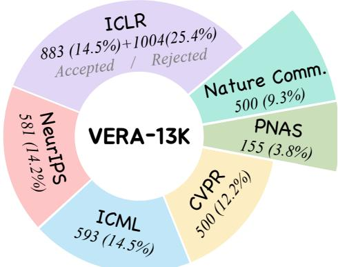  
Figure 7: Distribution of paper sources.

## B Supplementary Materials of Experiments

## B.1 Supplementary Results

Table 11 provides supplementary Scan sub-metrics for additional baseline models. Tables 12 and 13 report the full Reason and Verify results across error categories. For Reason and $V e r i f y$ , we report Rcompleteness, $R _ { \mathrm { p r e c i s i o n } } .$ , and $R _ { \mathrm { f i n a l } }$ , since evidence alignment is disabled in these evidence-specified settings. All scores are scaled by 100.

Beyond ScholScan, we further evaluate the model on three related external benchmarks covering long-document understanding and scientific reasoning. As shown in Table 14, VERA-RL maintains or modestly improves performance across all three benchmarks, suggesting that its gains do not come at the cost of related general capabilities.

We further remove test samples whose source papers overlap with the training set and reevaluate the models. As shown in Table 15, the results remain nearly unchanged, and the gains from SFT and RL persist under the paper-disjoint setting.

Table 7: Broad-domain distribution beyond Computer Science.
<table><tr><td>Domain</td><td>Count</td></tr><tr><td>Life Sciences</td><td>227</td></tr><tr><td>Medicine</td><td>107</td></tr><tr><td>Materials</td><td>67</td></tr><tr><td>Ecology</td><td>34</td></tr><tr><td>Chemistry</td><td>32</td></tr><tr><td>Environment</td><td>30</td></tr><tr><td>Physics</td><td>23</td></tr><tr><td></td><td></td></tr><tr><td>Interdisciplinary</td><td>135</td></tr><tr><td>Total</td><td>655</td></tr></table>

Table 8: Major AI/ML subdomain distribution. Counts are paper-level statistics, and only the most represented subfields are listed.
<table><tr><td colspan="2">Subdomain Count</td></tr><tr><td>Foundation Models &amp; LLM</td><td>424</td></tr><tr><td>Computer Vision</td><td>412</td></tr><tr><td>Multimodal Learning</td><td>287</td></tr><tr><td>Generative Modeling</td><td>243</td></tr><tr><td>Reinforcement Learning</td><td>194</td></tr><tr><td>Evaluation</td><td>190</td></tr><tr><td>Graph ML</td><td></td></tr><tr><td>Safety</td><td>162 156</td></tr><tr><td>Learning Theory</td><td>119</td></tr><tr><td>AI Agents</td><td>115</td></tr><tr><td>Efficiency</td><td>94</td></tr></table>

## B.2 Training Configurations

SFT Training We perform SFT training on Qwen3-VL-8B-Instruct using a standard teacherforcing objective. Training is conducted for 1 epoch with a global batch size of 8 and a microbatch size of 1 per GPU. Optimization is performed using the AdamW optimizer with a learning rate of $5 \times 1 0 ^ { - 6 }$ , no weight decay, and a cosine learning rate schedule. A warm-up ratio of 0.03 is applied, and gradient norms are clipped at 1.0. All experiments use a fixed random seed of 42.

RL Training We fine-tune the SFT-initialized model using the DAPO setup. The base model is Qwen3-VL-8B initialized from the SFT checkpoint. We sample 8 responses per prompt. Policy optimization is performed with a global training batch size of 32. We use asymmetric clipping with clip ratios $( \epsilon _ { \mathrm { l o w } } , \epsilon _ { \mathrm { h i g h } } ) \ = \ ( 0 . 1 , 0 . 5 )$ and adopt a token-level loss aggregation strategy (token-mean) to mitigate length bias. The learning rate is set to $2 \times 1 0 ^ { - 6 } .$ , with no weight decay and a cosine scheduler with a warm-up ratio of 0.03. Training is run for 30 optimization steps with a fixed random seed of 42. We enable gradient checkpointing, activation offloading, and FSDP with parameter and optimizer offloading.

Table 9: Train-subset distribution across 6 scientificerror categories.
<table><tr><td>Category</td><td>Count</td></tr><tr><td>QI</td><td>3450</td></tr><tr><td>DI</td><td>540</td></tr><tr><td>IC</td><td>2190</td></tr><tr><td>PD</td><td>1470</td></tr><tr><td>RQD</td><td>3450</td></tr><tr><td>SG</td><td>900</td></tr></table>

## B.3 Training Dynamics

We further evaluate the step-200 SFT checkpoint to test whether the early plateau in training loss is sufficient. As shown in Table 16, step 200 already improves over the Instruct model, but the 1-epoch checkpoint achieves stronger Scan completeness and a higher overall Scan score, so we use the latter to initialize RL training.

## C Metrics Definition in ScholScan

Given a model answer $^ { a , }$ ScholScan first parses it into a structured tuple:

$$
\Psi ( a ) = \Big ( I _ { \mathrm { e x i s t } } , I _ { \mathrm { c o n t a i n } } , \hat { \mathcal { E } } , \hat { \mathcal { R } } , n \Big ) ,
$$

where $I _ { \mathrm { e x i s t } }$ indicates whether the answer asserts any error, $I _ { \mathrm { { c o n t a i n } } }$ indicates whether it contains the annotated target error, $\hat { \mathcal { E } }$ and $\hat { \mathcal { R } }$ are the predicted evidence set and reasoning chain, and n is the number of unrelated error claims. Let $\mathcal { E } ^ { * }$ and $\mathcal { R } ^ { * }$ denote the gold evidence set and reasoning chain.

The detection score requires the target error to be identified:

$$
S _ { \mathrm { d e t } } = I _ { \mathrm { e x i s t } } I _ { \mathrm { c o n t a i n } } .
$$

The evidence location score measures overlap with the gold evidence while penalizing overreporting:

$$
D _ { \mathcal { E } } = \frac { 2 | \hat { \mathcal { E } } \cap \mathcal { E } ^ { * } | + \mathbf { 1 } \{ | \hat { \mathcal { E } } | + | \mathcal { E } ^ { * } | = 0 \} } { \operatorname* { m a x } ( | \hat { \mathcal { E } } | + | \mathcal { E } ^ { * } | , 1 ) } ,
$$

Table 10: Source composition of VERA-13K. Review-derived samples are constructed from objective errors extracted from peer reviews, while controlled-edit samples are generated by injecting errors into accepted papers.
<table><tr><td>Split</td><td>Total</td><td>Review-derived</td><td>Controlled-edit</td><td>Review (%)</td></tr><tr><td>SFT Train</td><td>10,500</td><td>2,856</td><td>7,644</td><td>27.2</td></tr><tr><td>RL Train</td><td>1,500</td><td>492</td><td>1,008</td><td>32.8</td></tr><tr><td>Test</td><td>900</td><td>276</td><td>624</td><td>30.7</td></tr><tr><td>Total</td><td>12,900</td><td>3,624</td><td>9,276</td><td>28.1</td></tr></table>

Table 11: Supplementary sub-metric scores on the Scan task (scaled by 100).
<table><tr><td>Models</td><td>Avg.</td><td>QI</td><td>DI</td><td>IC</td><td>PD</td><td>RQD</td><td>SG</td></tr><tr><td colspan="8">Scan  $R _ { \mathrm { { c o m p l e t e n e s s } } }$ </td></tr><tr><td>GPT-5.4</td><td>39.5</td><td>54.3</td><td>42.6</td><td>33.0</td><td>36.8</td><td>37.7</td><td>32.9</td></tr><tr><td>Qwen3-VL-Plus</td><td>20.6</td><td>34.2</td><td>7.5</td><td>28.5</td><td>16.0</td><td>19.2</td><td>18.3</td></tr><tr><td>Qwen3-VL-32B</td><td>12.7</td><td>9.0</td><td>6.7</td><td>19.5</td><td>10.0</td><td>13.8</td><td>17.3</td></tr><tr><td>Seed-1.6-Thinking</td><td>13.4</td><td>19.1</td><td>11.2</td><td>15.7</td><td>8.8</td><td>14.0</td><td>11.5</td></tr><tr><td colspan="8">Scan  $R _ { \mathrm { a l i g n m e n t } }$ </td></tr><tr><td>GPT-5.4</td><td>28.5</td><td>60.0</td><td>17.0</td><td>19.5</td><td>37.5</td><td>23.1</td><td>16.7</td></tr><tr><td>Qwen3-VL-Plus</td><td>15.3</td><td>26.2</td><td>6.1</td><td>21.4</td><td>11.8</td><td>12.7</td><td>13.9</td></tr><tr><td>Qwen3-VL-32B</td><td>10.1</td><td>12.1</td><td>5.0</td><td>16.6</td><td>7.3</td><td>9.1</td><td>10.3</td></tr><tr><td>Seed-1.6-Thinking</td><td>11.1</td><td>20.1</td><td>8.1</td><td>14.7</td><td>6.6</td><td>9.2</td><td>8.2</td></tr><tr><td colspan="8">Scan  $R _ { \mathrm { p r e c i s i o n } }$ </td></tr><tr><td>GPT-5.4</td><td>13.7</td><td>20.6</td><td>11.5</td><td>9.1</td><td>10.4</td><td>9.7</td><td>19.9</td></tr><tr><td>Qwen3-VL-Plus</td><td>59.2</td><td>57.9</td><td>61.4</td><td>50.1</td><td>54.8</td><td>58.9</td><td>71.9</td></tr><tr><td>Qwen3-VL-32B</td><td>60.2</td><td>63.1</td><td>56.2</td><td>58.5</td><td>67.7</td><td>58.1</td><td>57.7</td></tr><tr><td>Seed-1.6-Thinking</td><td>56.7</td><td>51.4</td><td>47.0</td><td>77.0</td><td>49.6</td><td>66.8</td><td>48.6</td></tr></table>

$$
S _ { \mathrm { l o c } } = \operatorname* { m a x } \left\{ 0 , D \varepsilon - 0 . 8 \left( \frac { | \hat { \mathcal { E } } \setminus \mathcal { E } ^ { * } | } { \operatorname* { m a x } ( | \hat { \mathcal { E } } | , 1 ) } \right) ^ { 2 } \right\}
$$

For reasoning, ScholScan counts the matched prefix length between the predicted and gold reasoning chains:

$$
\hat { g } = \mathrm { p r e f i x \_ m a t c h } ( \hat { \mathcal { R } } , \mathcal { R } ^ { * } ) , \qquad g _ { r } = | \mathcal { R } ^ { * } | .
$$

The reasoning score is then defined as

$$
S _ { \mathrm { r e a s o n } } = { \bf 1 } \{ g _ { r } = 0 \} + { \bf 1 } \{ g _ { r } > 0 \} \left( \frac { \hat { g } } { g _ { r } } \right) ^ { 2 } .
$$

To penalize unrelated error claims, it defines

$$
P _ { \mathrm { u n r e l } } ( n ) = 0 . 9 ^ { \mathrm { m i n } ( n , 2 ) } e ^ { - 0 . 6 [ \mathrm { m a x } ( n - 2 , 0 ) ] ^ { 1 . 5 } } .
$$

The overall score combines target-error detection, evidence location, reasoning faithfulness, and the unrelated-error penalty:

$$
S ( a ) = S _ { \mathrm { d e t } } \cdot \sqrt { S _ { \mathrm { l o c a t i o n } } \cdot S _ { \mathrm { r e a s o n i n g } } } \cdot P _ { \mathrm { u n r e l } } ( n ) .
$$

## D Reward Weight Analysis

We further analyze the choice of reward weights through rollout statistics and post-hoc reweighting. For Reason and $V e r i f y$ , the evidence is specified, so we disable $R _ { \mathrm { a l i g n m e n t } }$ and use $( \omega _ { 1 } , \omega _ { 2 } , \omega _ { 3 } ) =$ $( 0 . 6 , 0 , 0 . 4 )$ , keeping reasoning completeness as the primary signal while retaining precision as a constraint against unsupported error claims. For Scan, both issue and evidence cues are absent, so we use $( \omega _ { 1 } , \omega _ { 2 } , \omega _ { 3 } ) \ = \ ( 0 . 4 , 0 . 4 , 0 . 2 )$ , assigning symmetric primary weights to reasoning completeness and evidence alignment while using precision as an auxiliary constraint.

Table 17 reports the standard deviation of reward components over rollout steps. For Reason and Ver-$i f y , R _ { \mathrm { c o m p l e t e n e s s } }$ consistently shows larger variance than $R _ { \mathrm { p r e c i s i o n } } .$ suggesting that it better differentiates reasoning quality across sampled trajectories. For Scan, $R _ { \mathrm { { c o m p l e t e n e s s } } }$ and $R _ { \mathrm { a l i g n m e n t } }$ have comparable variability, while $R _ { \mathrm { p r e c i s i o n } }$ is more stable. This supports treating completeness and alignment as the main objectives in Scan, with precision used to suppress excessive error reporting.

Table 12: Sub-metric scores on the Reason task (scaled by 100).
<table><tr><td>Models</td><td>Avg.</td><td>QI</td><td>DI</td><td>IC</td><td>PD</td><td>RQD</td><td>SG</td></tr><tr><td colspan="8">Reason Rcompleteness</td></tr><tr><td>GPT-5.4</td><td>71.1</td><td>82.1</td><td>62.8</td><td>58.4</td><td>78.6</td><td>72.0</td><td>71.9</td></tr><tr><td>Gemini 3 Pro</td><td>59.2</td><td>64.7</td><td>55.3</td><td>63.0</td><td>57.0</td><td>65.2</td><td>49.9</td></tr><tr><td>Seed-1.6-Thinking</td><td>52.4</td><td>58.4</td><td>49.8</td><td>52.0</td><td>58.4</td><td>59.6</td><td>36.3</td></tr><tr><td>Qwen3-VL-Plus</td><td>60.7</td><td>68.8</td><td>52.3</td><td>68.0</td><td>60.8</td><td>64.8</td><td>49.6</td></tr><tr><td>Qwen3-VL-235B-A22B (Thinking)</td><td>54.7</td><td>67.1</td><td>42.7</td><td>64.0</td><td>58.1</td><td>55.2</td><td>40.9</td></tr><tr><td>Qwen3-VL-235B-A22B (Instruct)</td><td>46.8</td><td>52.4</td><td>36.1</td><td>52.4</td><td>49.5</td><td>49.9</td><td>40.4</td></tr><tr><td>Qwen3-VL-32B</td><td>52.2</td><td>63.7</td><td>45.4</td><td>46.2</td><td>61.6</td><td>53.5</td><td>42.8</td></tr><tr><td>Qwen3-VL-8B (Instruct)</td><td>23.3</td><td>25.3</td><td>17.3</td><td>27.2</td><td>26.6</td><td>27.3</td><td>15.9</td></tr><tr><td>Qwen3-VL-8B (SFT)</td><td>13.9</td><td>16.1</td><td>13.6</td><td>4.7</td><td>20.6</td><td>19.5</td><td>8.9</td></tr><tr><td>Qwen3-VL-8B (SFT+RL)</td><td>17.6</td><td>12.7</td><td>9.8</td><td>17.3</td><td>24.2</td><td>24.0</td><td>17.6</td></tr><tr><td colspan="8">Reason i Rprecision</td></tr><tr><td>GPT-5.4</td><td>34.4</td><td>40.8</td><td>28.3</td><td>26.0</td><td>44.7</td><td>43.9</td><td>24.0</td></tr><tr><td>Gemini 3 Pro</td><td>61.2</td><td>63.1</td><td>57.6</td><td>58.0</td><td>65.0</td><td>67.1</td><td>56.6</td></tr><tr><td>Seed-1.6-Thinking</td><td>49.8</td><td>55.6</td><td>44.3</td><td>48.2</td><td>50.7</td><td>56.5</td><td>43.7</td></tr><tr><td>Qwen3-VL-Plus</td><td>53.3</td><td>58.1</td><td>50.8</td><td>50.9</td><td>62.8</td><td>53.0</td><td>44.1</td></tr><tr><td>Qwen3-VL-235B-A22B (Thinking)</td><td>47.4</td><td>58.2</td><td>39.7</td><td>41.4</td><td>53.5</td><td>51.5</td><td>39.9</td></tr><tr><td>Qwen3-VL-235B-A22B (Instruct)</td><td>44.5</td><td>55.2</td><td>42.2</td><td>39.1</td><td>49.6</td><td>44.7</td><td>36.3</td></tr><tr><td>Qwen3-VL-32B</td><td>44.8</td><td>54.3</td><td>40.2</td><td>38.2</td><td>49.4</td><td>47.3</td><td>39.4</td></tr><tr><td>Qwen3-VL-8B (Instruct)</td><td>38.8</td><td>40.9</td><td>38.2</td><td>42.1</td><td>46.8</td><td>38.1</td><td>26.8</td></tr><tr><td>Qwen3-VL-8B (SFT)</td><td>54.9</td><td>53.8</td><td>53.6</td><td>51.6</td><td>58.4</td><td>58.6</td><td>53.3</td></tr><tr><td>Qwen3-VL-8B (SFT+RL)</td><td>69.9</td><td>68.1</td><td>66.3</td><td>71.3</td><td>71.7</td><td>71.9</td><td>69.9</td></tr><tr><td colspan="8">Reason</td></tr><tr><td>GPT-5.4</td><td>56.4</td><td> $R _ { \mathrm { f i n a l } }$  65.6</td><td>49.0</td><td>45.4</td><td>65.0</td><td>60.7</td><td>52.7</td></tr><tr><td>Gemini 3 Pro</td><td>60.0</td><td>64.0</td><td>56.2</td><td>61.0</td><td>60.2</td><td>66.0</td><td>52.6</td></tr><tr><td>Seed-1.6-Thinking</td><td>51.4</td><td>57.3</td><td>47.6</td><td>50.5</td><td>55.3</td><td>58.4</td><td>39.3</td></tr><tr><td>Qwen3-VL-Plus</td><td>57.7</td><td>64.5</td><td>51.7</td><td>61.2</td><td>61.6</td><td>60.1</td><td>47.4</td></tr><tr><td>Qwen3-VL-235B-A22B (Thinking)</td><td>51.8</td><td>63.5</td><td>41.5</td><td>55.0</td><td>56.3</td><td>53.7</td><td>40.5</td></tr><tr><td>Qwen3-VL-235B-A22B (Instruct)</td><td>45.9</td><td>53.5</td><td>38.5</td><td>47.1</td><td>49.5</td><td>47.8</td><td>38.8</td></tr><tr><td>Qwen3-VL-32B</td><td>49.2</td><td>59.9</td><td>43.3</td><td>43.0</td><td>56.7</td><td>51.0</td><td>41.5</td></tr><tr><td>Qwen3-VL-8B (Instruct)</td><td>29.5</td><td>31.5</td><td>25.7</td><td>33.2</td><td>34.7</td><td>31.6</td><td>20.3</td></tr><tr><td>Qwen3-VL-8B (SFT)</td><td>30.3</td><td>31.2</td><td>29.6</td><td>23.5</td><td>35.7</td><td>35.1</td><td>26.6</td></tr><tr><td>Qwen3-VL-8B (SFT+RL)</td><td>38.5</td><td>34.8</td><td>32.4</td><td>38.9</td><td>43.2</td><td>43.2</td><td>38.5</td></tr><tr><td></td><td></td><td></td><td></td><td></td><td></td><td></td><td></td></tr></table>

We also perform post-hoc reweighting of $R _ { \mathrm { f i n a l } }$ without retraining, as shown in Table 18. The default setting corresponds to the weights used in the main experiments. The completeness-heavy setting increases the weight of Rcompleteness to (0.7, 0, 0.3) for Reason/Verify and (0.5, 0.3, 0.2) for Scan. We additionally test an equal-weight setting for Reason/Verify, using (0.5, 0, 0.5). Across these variants, the main conclusions remain stable: the trained Qwen3-VL-8B model consistently improves over its base and SFT variants, and the relative difficulty of Scan remains unchanged.

These analyses do not replace full retraining under alternative rewards, but they show that the reported trends are not an artifact of one exact coefficient choice. The selected weights follow the cue structure of the tasks: evidence alignment is disabled when evidence is already specified, becomes central when evidence must be discovered, and precision remains a constraint against unsupported error reporting.

## E Case Study

Figures 8, 9, 10, 11 and 12 provide qualitative examples showing how VERA-RL improves Qwen3- VL-8B-Instruct on Scan-style scientific error detection. Across the three cases, the original instructiontuned model tends to give broad no-error judgments based on surface-level checks, such as whether metrics, tables, or experimental descriptions appear generally consistent. After VERA-RL, the model more often identifies the specific evidence needed for verification and connects it to the corresponding error. In the quantitative inconsistency case, it compares numerical claims in the abstract with table values and detects inconsistent performance gains.

Table 13: Sub-metric scores on the Verify task (scaled by 100).
<table><tr><td>Models</td><td>Avg.</td><td>QI</td><td>DI</td><td>IC</td><td>PD</td><td>RQD</td><td>SG</td></tr><tr><td colspan="8">Verify Rcompleteness</td></tr><tr><td>GPT-5.4</td><td>62.3</td><td>74.7</td><td>51.2</td><td>67.6</td><td>65.5</td><td>71.0</td><td>49.7</td></tr><tr><td>Gemini 3 Pro</td><td>52.3</td><td>68.8</td><td>40.5</td><td>46.3</td><td>62.4</td><td>55.0</td><td>40.5</td></tr><tr><td>Seed-1.6-Thinking</td><td>32.8</td><td>37.3</td><td>22.0</td><td>27.2</td><td>39.9</td><td>42.2</td><td>28.4</td></tr><tr><td>Qwen3-VL-Plus</td><td>46.4</td><td>64.2</td><td>36.7</td><td>43.0</td><td>52.1</td><td>46.9</td><td>35.7</td></tr><tr><td>Qwen3-VL-235B-A22B (Thinking)</td><td>41.0</td><td>57.6</td><td>15.8</td><td>42.0</td><td>50.3</td><td>47.5</td><td>32.5</td></tr><tr><td>Qwen3-VL-235B-A22B (Instruct)</td><td>13.0</td><td>14.2</td><td>9.0</td><td>16.0</td><td>16.2</td><td>13.0</td><td>9.3</td></tr><tr><td>Qwen3-VL-32B</td><td>40.7</td><td>53.6</td><td>29.5</td><td>49.4</td><td>41.0</td><td>42.2</td><td>28.7</td></tr><tr><td>Qwen3-VL-8B (Instruct)</td><td>3.9</td><td>4.3</td><td>5.5</td><td>5.0</td><td>3.3</td><td>3.7</td><td>1.5</td></tr><tr><td>Qwen3-VL-8B (SFT)</td><td>12.6</td><td>11.8</td><td>5.5</td><td>15.5</td><td>9.8</td><td>19.7</td><td>13.1</td></tr><tr><td>Qwen3-VL-8B (SFT+RL)</td><td>17.2</td><td>14.9</td><td>9.2</td><td>20.3</td><td>22.9</td><td>18.3</td><td>17.7</td></tr><tr><td colspan="8">Verify  $R _ { \mathrm { p r e c i s i o n } }$ </td></tr><tr><td>GPT-5.4</td><td>46.1</td><td>60.4</td><td>36.2</td><td>46.9</td><td>51.8</td><td>45.4</td><td>39.2</td></tr><tr><td>Gemini 3 Pro</td><td>57.8</td><td>64.2</td><td>46.1</td><td>54.7</td><td>69.2</td><td>57.8</td><td>55.0</td></tr><tr><td>Seed-1.6-Thinking</td><td>79.4</td><td>77.5</td><td>82.4</td><td>78.1</td><td>79.9</td><td>80.4</td><td>77.9</td></tr><tr><td>Qwen3-VL-Plus</td><td>70.4</td><td>70.6</td><td>65.7</td><td>73.6</td><td>74.1</td><td>73.0</td><td>65.2</td></tr><tr><td>Qwen3-VL-235B-A22B (Thinking)</td><td>55.5</td><td>70.2</td><td>33.2</td><td>49.9</td><td>62.3</td><td>65.3</td><td>52.2</td></tr><tr><td>Qwen3-VL-235B-A22B (Instruct)</td><td>16.1</td><td>19.9</td><td>7.6</td><td>21.1</td><td>22.2</td><td>13.6</td><td>12.2</td></tr><tr><td>Qwen3-VL-32B</td><td>66.8</td><td>69.1</td><td>61.3</td><td>65.6</td><td>68.0</td><td>72.2</td><td>64.7</td></tr><tr><td>Qwen3-VL-8B (Instruct)</td><td>8.5</td><td>14.4</td><td>9.1</td><td>10.9</td><td>7.0</td><td>4.2</td><td>5.3</td></tr><tr><td>Qwen3-VL-8B (SFT)</td><td>52.8</td><td>50.2</td><td>49.0</td><td>55.3</td><td>54.5</td><td>57.1</td><td>50.4</td></tr><tr><td>Qwen3-VL-8B (SFT+RL)</td><td>68.5</td><td>67.5</td><td>66.9</td><td>70.7</td><td>72.4</td><td>67.0</td><td>66.6</td></tr><tr><td colspan="8">Verify</td></tr><tr><td>GPT-5.4</td><td>55.8</td><td> $R _ { \mathrm { f i n a l } }$  69.0</td><td>45.2</td><td>59.3</td><td>60.0</td><td>60.7</td><td>45.5</td></tr><tr><td>Gemini 3 Pro</td><td>54.5</td><td>67.0</td><td>42.7</td><td>50.0</td><td>65.1</td><td>56.1</td><td>46.3</td></tr><tr><td>Seed-1.6-Thinking</td><td>51.4</td><td>53.4</td><td>46.2</td><td>47.5</td><td>55.9</td><td>57.5</td><td>48.2</td></tr><tr><td>Qwen3-VL-Plus</td><td>56.0</td><td>66.8</td><td>48.3</td><td>55.2</td><td>60.9</td><td>57.4</td><td>47.5</td></tr><tr><td>Qwen3-VL-235B-A22B (Thinking)</td><td>46.8</td><td>62.7</td><td>22.8</td><td>45.2</td><td>55.1</td><td>54.5</td><td>40.3</td></tr><tr><td>Qwen3-VL-235B-A22B (Instruct)</td><td>14.2</td><td>16.5</td><td>8.4</td><td>18.0</td><td>18.6</td><td>13.2</td><td>10.5</td></tr><tr><td>Qwen3-VL-32B</td><td>51.2</td><td>59.8</td><td>42.2</td><td>55.9</td><td>51.8</td><td>54.2</td><td>43.1</td></tr><tr><td>Qwen3-VL-8B (Instruct)</td><td>5.7</td><td>8.4</td><td>6.9</td><td>7.4</td><td>4.8</td><td>3.9</td><td>3.0</td></tr><tr><td>Qwen3-VL-8B (SFT)</td><td>28.6</td><td>27.2</td><td>22.9</td><td>31.4</td><td>27.7</td><td>34.7</td><td>28.0</td></tr><tr><td>Qwen3-VL-8B (SFT+RL)</td><td>37.7</td><td>35.9</td><td>32.3</td><td>40.5</td><td>42.7</td><td>37.8</td><td>37.3</td></tr><tr><td></td><td></td><td></td><td></td><td></td><td></td><td></td><td></td></tr></table>

Table 14: Additional external evaluation results.
<table><tr><td>Benchmark</td><td>Instruct</td><td>SFT+RL</td></tr><tr><td>MMLongBench-Doc</td><td>22.9</td><td>23.3</td></tr><tr><td>MMMU</td><td>44.3</td><td>46.1</td></tr><tr><td>PRISMM-Bench</td><td>51.6</td><td>52.0</td></tr></table>

In the pipeline-distortion case, it traces the retrieval procedure across the main text, equation, algorithm, and appendix, identifying that the method starts from answer entities and therefore introduces information leakage. In the inference-and-conclusions case, it compares ablation results with the textual interpretation and detects a contradiction between the reported score and the claimed necessity of the current-state information. These examples illustrate that VERA-RL improves not only response format, but also evidence selection, cross-section consistency checking, and the ability to turn paperlevel evidence into verifiable error judgments.

Table 15: Performance on the full and paper-disjoint test sets. All scores are $R _ { \mathrm { f i n a l } }$ and scaled by 100.
<table><tr><td>Model</td><td>Split</td><td>Reason</td><td>Verify</td><td>Scan</td></tr><tr><td rowspan="2">Instruct</td><td>Full</td><td>29.5</td><td>5.7</td><td>2.0</td></tr><tr><td>Disjoint</td><td>30.2</td><td>5.2</td><td>1.6</td></tr><tr><td rowspan="2">SFT</td><td>Full</td><td>30.3</td><td>28.6</td><td>14.4</td></tr><tr><td>Disjoint</td><td>31.3</td><td>28.6</td><td>14.3</td></tr><tr><td rowspan="2">SFT+RL</td><td>Full</td><td>38.5</td><td>37.7</td><td>19.5</td></tr><tr><td>Disjoint</td><td>39.3</td><td>39.1</td><td>19.3</td></tr></table>

Table 16: Performance of the intermediate SFT checkpoint at step 200, compared with the original base model and the 1-epoch SFT model. Scores are scaled by 100.
<table><tr><td>Metric</td><td>0 step</td><td>200 steps</td><td>1 epoch</td></tr><tr><td>Scan  $R _ { \mathrm { { c o m p l e t e n e s s } } }$ </td><td>1.5</td><td>1.6</td><td>5.3</td></tr><tr><td>Scan  $R _ { \mathrm { a l i g n m e n t } }$ </td><td>1.0</td><td>2.4</td><td>2.5</td></tr><tr><td>Scan  $R _ { \mathrm { p r e c i s i o n } }$ </td><td>5.0</td><td>61.4</td><td>56.3</td></tr><tr><td>Scan  $R _ { \mathrm { f i n a l } }$ </td><td>2.0</td><td>13.8</td><td>14.4</td></tr><tr><td>Verify  $R _ { \mathrm { f i n a l } }$ </td><td>5.7</td><td>29.2</td><td>28.6</td></tr><tr><td>Reason  $R _ { \mathrm { f i n a l } }$ </td><td>29.5</td><td>31.1</td><td>30.3</td></tr></table>

## F Reliability Analysis

Cross-Evaluator Agreement. We independently rescore the step-30 RL rollouts using Qwen3-27B and Gemini 2.5 Flash. As shown in Table 19, both evaluators show high correlation with the original scores across Reason, Verify, and Scan, suggesting that the reward signals are not specific to a single evaluator.

## G Reproducibility and Ethics Statement

VERA-13K is constructed by the authors and does not reuse samples from previously released benchmarks. For papers from international conferences such as ICML, ICLR (including reviews), and NeurIPS, all content was crawled from the Open-Review platform. Papers from Nature Communications and PNAS were obtained entirely from openaccess sources, ensuring that no privacy, ethical, or conflict-of-interest concerns arise.

The code and data are publicly available at https://github.com/Staudinger0325/ VERA-RL.

Table 17: Standard deviation of reward components over rollout steps.
<table><tr><td rowspan="2">Step</td><td colspan="2">Reason</td><td colspan="2">Verify</td><td colspan="3">Scan</td></tr><tr><td> $\sigma ( R _ { \mathrm { c o m } } )$ </td><td> $\sigma ( R _ { \mathrm { p r e c } } )$ </td><td> $\sigma ( R _ { \mathrm { c o m } } )$ </td><td> $\sigma ( R _ { \mathrm { p r e c } } )$ </td><td> $\sigma ( R _ { \mathrm { c o m } } )$ </td><td> $\sigma ( R _ { \mathrm { a l i g n } } )$ </td><td> $\sigma ( R _ { \mathrm { p r e c } } )$ </td></tr><tr><td>1</td><td>0.36</td><td>0.16</td><td>0.42</td><td>0.21</td><td>0.34</td><td>0.28</td><td>0.19</td></tr><tr><td>5</td><td>0.24</td><td>0.14</td><td>0.34</td><td>0.20</td><td>0.28</td><td>0.23</td><td>0.17</td></tr><tr><td>10</td><td>0.29</td><td>0.21</td><td>0.26</td><td>0.19</td><td>0.20</td><td>0.15</td><td>0.13</td></tr><tr><td>15</td><td>0.32</td><td>0.17</td><td>0.32</td><td>0.18</td><td>0.28</td><td>0.24</td><td>0.14</td></tr><tr><td>20</td><td>0.35</td><td>0.17</td><td>0.37</td><td>0.23</td><td>0.29</td><td>0.29</td><td>0.14</td></tr><tr><td>25</td><td>0.28</td><td>0.13</td><td>0.32</td><td>0.18</td><td>0.30</td><td>0.25</td><td>0.16</td></tr><tr><td>30</td><td>0.34</td><td>0.20</td><td>0.41</td><td>0.19</td><td>0.30</td><td>0.26</td><td>0.16</td></tr></table>

Table 18: Post-hoc reward reweighting results. Scores are scaled by 100. Default weights are (0.6, 0, 0.4) for Reason/Verify and (0.4, 0.4, 0.2) for Scan. Completeness-heavy weights are (0.7, 0, 0.3) for Reason/Verify and (0.5, 0.3, 0.2) for Scan. Equal R/V uses (0.5, 0, 0.5) for Reason/Verify.
<table><tr><td rowspan="2">Model</td><td colspan="3">Default</td><td colspan="3">Completeness-heavy</td><td colspan="2">Equal R/V</td></tr><tr><td>Reason</td><td>Verify</td><td>Scan</td><td>Reason</td><td>Verify</td><td>Scan</td><td>Reason</td><td>Verify</td></tr><tr><td>Gemini 3 Pro</td><td>60.0</td><td>54.5</td><td>24.3</td><td>59.8</td><td>54.0</td><td>24.8</td><td>60.2</td><td>55.1</td></tr><tr><td>Qwen3-VL-235B-A22B Thinking</td><td>51.8</td><td>46.8</td><td>17.4</td><td>52.5</td><td>45.4</td><td>17.8</td><td>51.0</td><td>48.3</td></tr><tr><td>Qwen3-VL-235B-A22B Instruct</td><td>45.9</td><td>14.2</td><td>3.4</td><td>46.1</td><td>13.9</td><td>3.5</td><td>45.7</td><td>14.6</td></tr><tr><td>Qwen3-VL-8B Instruct</td><td>29.5</td><td>5.7</td><td>2.0</td><td>28.0</td><td>5.3</td><td>2.1</td><td>31.1</td><td>6.2</td></tr><tr><td>Qwen3-VL-8B SFT</td><td>30.3</td><td>28.6</td><td>14.4</td><td>26.2</td><td>24.7</td><td>14.7</td><td>34.4</td><td>32.7</td></tr><tr><td>Qwen3-VL-8B SFT+RL</td><td>38.5</td><td>37.7</td><td>19.5</td><td>33.3</td><td>32.6</td><td>19.7</td><td>43.8</td><td>42.9</td></tr></table>

Table 19: Correlation (%) between reward scores extracted by alternative evaluators and those from Seed-1.6- Thinking on the step-30 RL rollouts.
<table><tr><td>Setup</td><td>Reason  $( R _ { \mathrm { f i n a l } } )$ </td><td> ${ \mathrm { V e r i f y } } \left( R _ { \mathrm { f i n a l } } \right)$ </td><td>Scan  $\left( R _ { \mathrm { f i n a l } } \right)$ </td></tr><tr><td>Qwen3-27B</td><td>78.3</td><td>88.4</td><td>88.7</td></tr><tr><td>Gemini 2.5 Flash</td><td>84.4</td><td>82.3</td><td>82.2</td></tr></table>

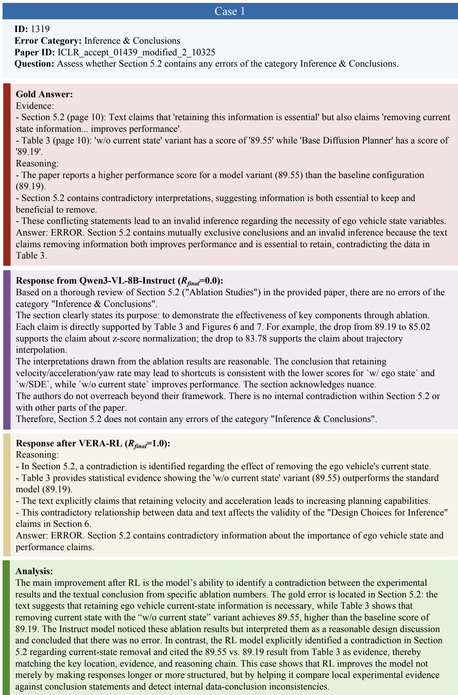  
Figure 8: Case study on inference and conclusions.

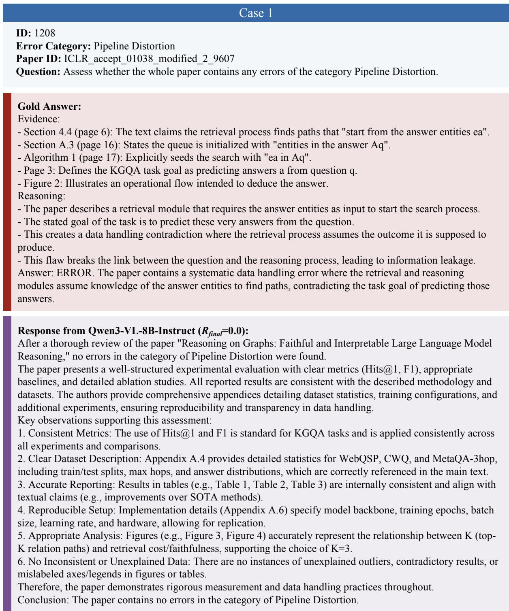  
Figure 9: Case study on the first part of pipeline distortion.

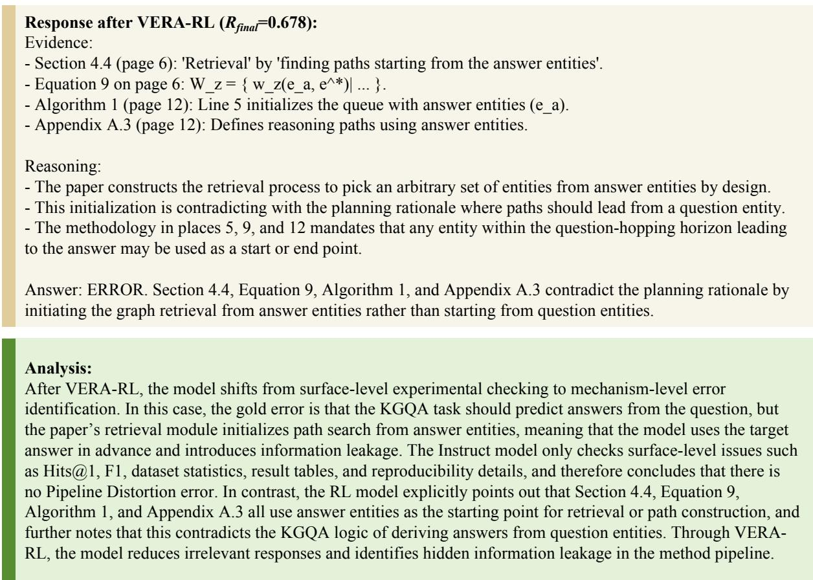  
Figure 10: Case study on the second part of pipeline distortion.

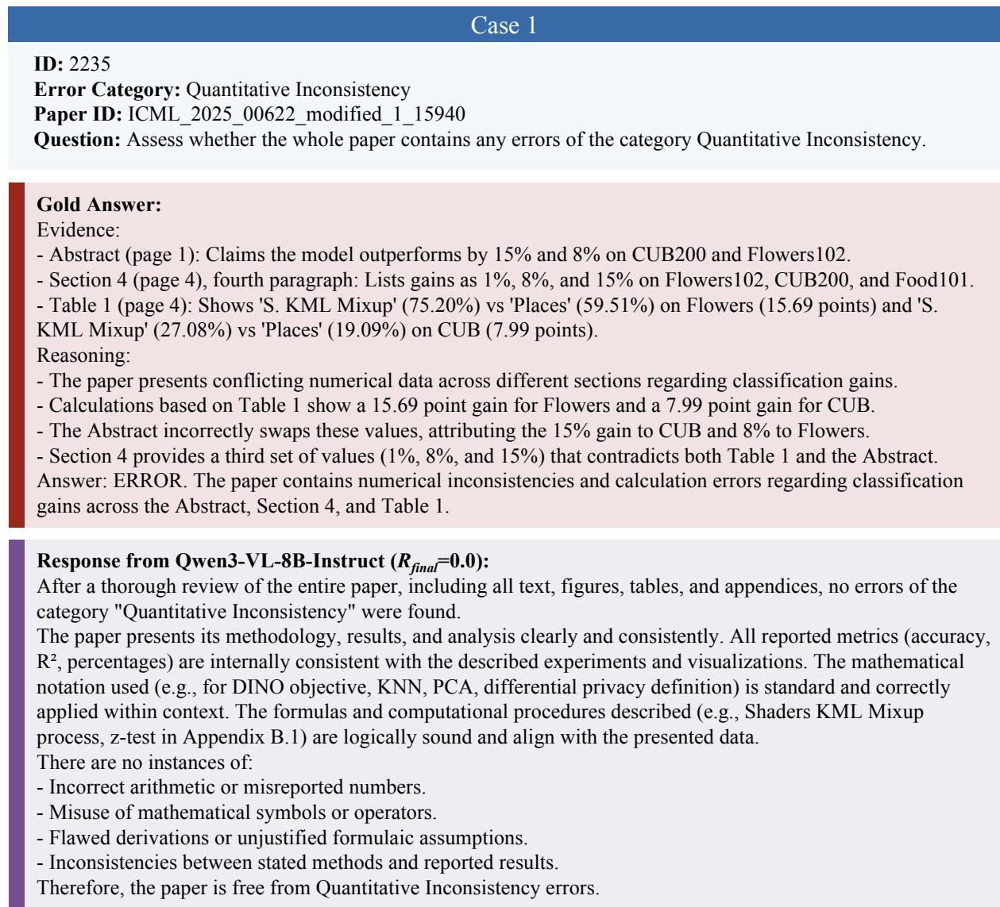  
Figure 11: Case study on the first part of quantitative inconsistency.

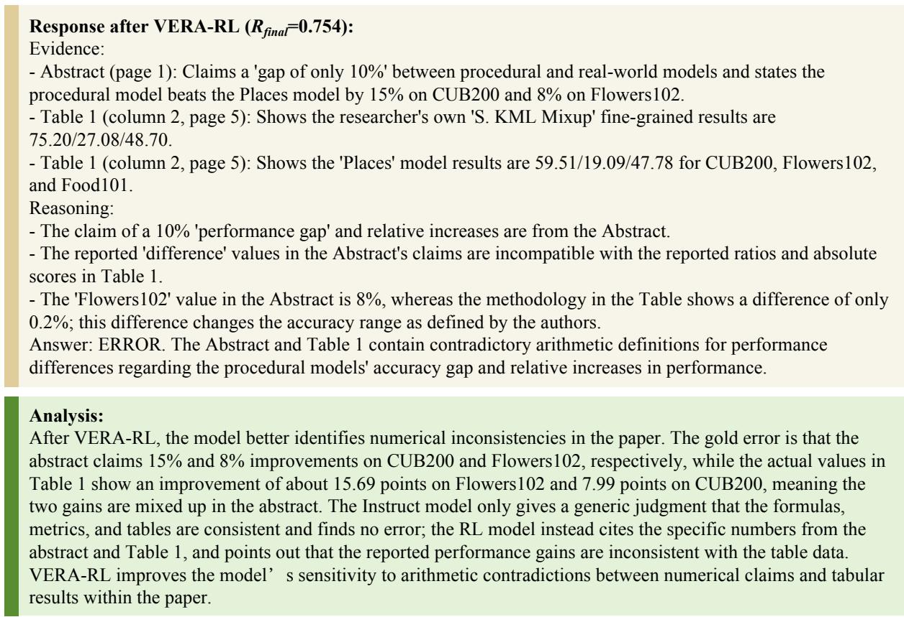  
Figure 12: Case study on the second part of quantitative inconsistency.