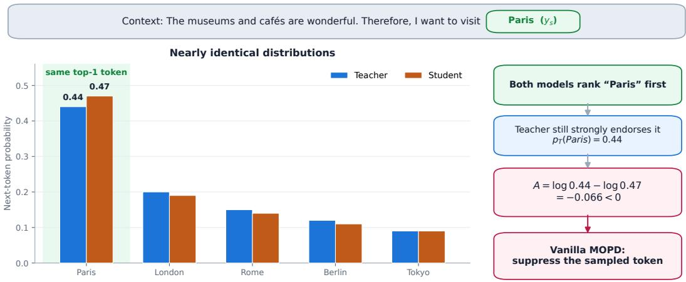
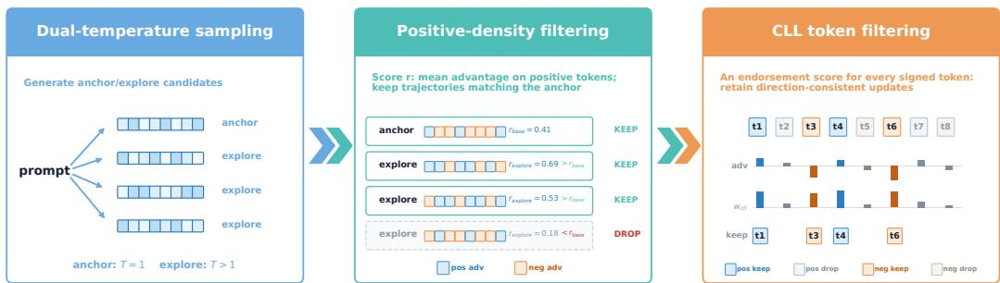
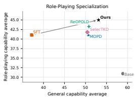
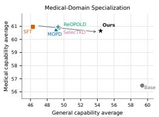
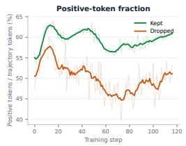
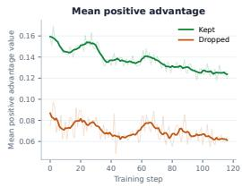

# PRESERVING GENERAL CAPABILITIES DURING DOMAIN SPECIALIZATION WITH UNCERTAINTY-CALIBRATED MOPD

Ziyuan Liu\*‡, Jiao Ou\*†, Jian Liang, Ruiming Tang† & Cheng Luo Kuaishou Technology

Beijing, China

liuziyuan@stu.pku.edu.cn, ojiao1111@gmail.com,

{liangjian03,tangruiming}@kuaishou.com

\*Equal contribution. †Corresponding authors.

## ABSTRACT

Specializing large language models to vertical domains improves domain-specific behavior but often degrades general capabilities such as reasoning, coding, instruction following, and creative writing. We study this domain–general tradeoff in Multi-Teacher On-Policy Distillation (MOPD), where a specialized student is supervised on its own sampled trajectories by domain and general teachers. Standard MOPD faces two limitations: ordinary on-policy sampling rarely exposes tokens with large positive teacher–student advantages, while the advantage sign alone does not establish whether the resulting update direction is reliable. We propose uncertainty-calibrated MOPD to address these limitations. Dual-temperature sampling broadens the candidate trajectory pool, and positiveadvantage-density filtering selects trajectories with stronger positive learning signals. Centered log-likelihood (CLL) filtering then computes an entropy-calibrated teacher-endorsement score and probabilistically retains token updates according to direction–endorsement consistency. Experiments on role-playing and medicaldomain specialization show that our method improves the general-capability average over standard MOPD by 4.73% and 10.84%, respectively, while maintaining vertical-domain performance. Ablations and diagnostic analyses further confirm that the gains do not merely result from a larger rollout budget and that the proposed trajectory- and token-level mechanisms address their intended failure modes.

## 1 INTRODUCTION

Large language models have demonstrated strong general-purpose capabilities across reasoning, coding, instruction following, and open-ended generation, and are increasingly adapted into vertical domain systems (Chen et al., 2024b; Lu et al., 2024; Yang et al., 2025b). In domains such as roleplaying and medical consultation, specialization is essential: the model must internalize domainspecific knowledge and capabilities (Wang et al., 2026; Dou et al., 2026; Jin et al., 2021). At the same time, practical vertical-domain systems cannot specialize at the expense of general capabilities, because domain tasks often require combining domain knowledge with general reasoning, instruction following, and open-ended communication skills (Liu et al., 2024; Luo et al., 2023; Dong et al., 2024). After supervised fine-tuning or preference-based optimization on domain data, the model may become better at the target domain while losing part of its general ability, including reasoning, mathematical problem solving, coding, instruction following, and open-ended writing. This domain–general trade-off is especially problematic when the final system is expected to remain a capable general assistant while exhibiting strong domain behavior.

A straightforward remedy is to mix vertical-domain and general-domain data during specialization. Although technically simple, this strategy creates additional practical burdens. Beyond constructing a large, high-quality vertical-domain corpus, developers must invest further effort in collecting and filtering high-quality general data. Even after both sources are available, their mixture ratio must be tuned heuristically: too little general data may fail to preserve general capabilities, whereas too much may weaken domain specialization (Bethune et al., 2025). Maintaining general capability during specialization therefore adds substantial data-construction and mixture-tuning costs. This raises a natural question: can training first focus exclusively on domain capability and then use an open general model to integrate domain and general capabilities into a single model?

Multi-Teacher On-Policy Distillation (MOPD) (Xiao et al., 2026; Dou et al., 2026; Yang et al., 2026b; Xu et al., 2026a) offers a viable solution. Training can first focus exclusively on verticaldomain capability to obtain a domain model that serves as the domain-expert teacher, while an open general model serves as the general-expert teacher; MOPD then integrates the capabilities of both experts into a single student. Because vertical-domain models are typically obtained by continuing training from general models, the overall problem can be viewed as restoring general capability after vertical-domain training. A standard setup initializes the student from the vertical-domain model and uses a frozen copy of that model and the original general model as the domain and general teachers, respectively. The student generates responses on vertical-domain and general prompts matched to the two teachers’ capability domains, and the corresponding teacher provides supervision, thereby preserving vertical-domain capability while restoring general capability (Chen et al., 2026).

We nevertheless face a distinctive difficulty: the training data of open general models are typically unavailable. Although the community has released many post-training datasets, even collecting a large number of them may not cover the complete training data used by the open general model. General-capability recovery can therefore be substantially weakened. To avoid another cumbersome round of general-data construction, we seek to improve recovery by making MOPD distillation more effective. Given a prompt, the student autoregressively samples a complete rollout trajectory from its own conditional distribution, after which the teacher evaluates each sampled token under the same prefix. The difference between the conditional log-probabilities assigned to that token by the teacher and student defines the distillation advantage, $A _ { t } = \log \pi _ { T } ( y _ { t } \mid q , y _ { < t } ) - \log \pi _ { S } ( y _ { t } \mid q , y _ { < t } )$ When $A _ { t } ~ > ~ 0$ , the corresponding update increases the student’s conditional log-probability of the sampled token; when $A _ { t } \ < \ 0 .$ , it decreases that conditional log-probability. More importantly, a larger positive advantage induces a stronger positive update, allowing the student to move toward the teacher more rapidly (Gu et al., 2024).

Existing MOPD still faces two important problems. (1) Because the student samples each token according to its own conditional distribution, sampled tokens tend to have relatively high student probabilities. Positive advantage requires the teacher probability to exceed the student probability, so large positive advantages are difficult to observe under ordinary sampling, limiting learning from strong positive signals. (2) Using only the sign of advantage to decide whether to increase or de crease the sampled token’s probability is not always reliable. For example, as illustrated in Figure 1, a student-sampled token may itself be strongly endorsed by the teacher, yet receive a slightly higher probability from the student and therefore have $A _ { t } < 0$ . Decreasing the token’s probability solely because its advantage is negative may disrupt already aligned behavior and destabilize training. In other words, the advantage sign provides only a candidate update direction; whether that direction is reliable must be assessed independently using the teacher’s own endorsement of the current token. Here, teacher endorsement refers to the teacher’s judgment of the current token’s plausibility based solely on its own distribution, without reference to the student’s probability.

The above analysis points to two complementary needs. First, we seek to increase the proportion of signals with large positive advantages in training trajectories; we call these golden-gain opportunities. Second, we seek to use teacher endorsement to validate, in a unified manner, the update direction proposed at each retained token. When the advantage indicates reinforcing a token, stronger teacher endorsement makes that direction more reliable; when it indicates suppressing a token, weaker teacher endorsement makes that direction more reliable. Our method directly reflects this division of labor: trajectory-level sampling and selection search for stronger positive-advantage opportunities, whereas token-level endorsement filtering determines whether each candidate update direction is reliable.

In this paper, we propose uncertainty-calibrated MOPD. The method first uses dual-temperature sampling to generate an anchor response and more exploratory candidate responses, thereby in creasing the chance of sampling tokens with large positive advantages. It then applies positive advantage-density trajectory filtering at the sequence level and retains only trajectories whose positive learning signal is no weaker than that of the anchor response, ensuring that high-temperature exploration is effective. Finally, we use centered log-likelihood (CLL) to validate update directions at the token level. Specifically, CLL compares the teacher log-probability of the current token with the probability-weighted mean log-probability over the teacher’s entire vocabulary, thereby quantifying the teacher’s endorsement of that token on its own probability scale. Dual-temperature sam pling and sequence-level filtering thus expose and select more golden-gain opportunities, whereas CLL probabilistically filters token updates within the retained trajectories according to their agreement with teacher endorsement. Experiments in role-playing and medical specialization show that our method preserves vertical-domain performance while improving the average general-capability score across nine benchmarks, including GPQA-Diamond, AIME25, IF-Eval, and Arena-Hard v2, by 4.73% and 10.84%, respectively, relative to standard MOPD. Further component ablations, a rollout-budget control, and diagnostic analyses show that exploration broadens the candidate trajectory pool, positive-advantage-density filtering retains trajectories with stronger positive signals, and CLL yields stronger capability recovery; they also demonstrate that the performance gains do not merely result from sampling more responses.

  
Figure 1: A failure case of vanilla MOPD. Both models rank the student-sampled token ys (Paris) first, but $p _ { S } ( y _ { s } ) > p _ { T } ( y _ { s } )$ yields a negative advantage, causing vanilla MOPD to suppress a token that the teacher strongly endorses.

The contributions of this paper are as follows:

• We provide a comprehensive token-level analysis of MOPD signal utilization, showing that advantage sign alone is insufficient for deciding whether teacher feedback should be trusted.

• Guided by this analysis, we design uncertainty-calibrated MOPD, combining dualtemperature sampling and positive-density filtering for signal discovery with a unified CLL direction-consistency gate for token-level validation.

• We validate the method in role-playing and medical-domain specialization, showing that it improves general-capability recovery over vanilla MOPD while preserving or improving vertical-domain performance.

## 2 RELATED WORK

On-policy distillation. Knowledge distillation was originally introduced as a way to transfer soft predictive structure from a teacher to a student (Hinton et al., 2015), and sequence-level variants later adapted this idea to autoregressive generation (Kim & Rush, 2016). For large language models, however, off-policy distillation on fixed teacher or dataset prefixes suffers from exposure bias: the student is optimized on states that differ from those induced by its own generations at inference time. On-policy distillation (OPD) addresses this mismatch by querying the teacher on student-sampled trajectories, echoing the motivation of interactive imitation learning (Ross et al., 2011). Recent OPD methods differ in objective geometry and signal usage. GKD trains on student-generated outputs under several divergences (Agarwal et al., 2024); MiniLLM formulates reverse-KL distillation as a policy-gradient objective and directly emphasizes single-step log-ratio quality (Gu et al., 2024); DistiLLM and DistiLLM-2 improve stability through skewed or contrastive distillation losses (Ko et al., 2024; 2025); and subsequent work studies relaxed, selective, calibrated, prefix-based, curriculumstyle, and other variants of OPD (Ko et al., 2026; Huang et al., 2025a; Zheng et al., 2026; Zhang et al., 2026a; Xu et al., 2026b; 2025; Xie et al., 2026; Kim & Baek, 2026; Jin et al., 2026; Yang et al., 2026a). A recent survey organizes this rapidly growing area around objective functions, signal sources, and training dynamics (Song & Zheng, 2026). Our work follows the white-box OPD setting but focuses on a different failure mode: advantage sign determines whether an update increases or decreases a sampled token, but not whether that direction is consistent with the teacher’ own endorsement of the token.

Multi-teacher distillation and capability recovery. Multi-teacher distillation has long been used to aggregate complementary teachers or tasks (You et al., 2017; Fukuda et al., 2017), and recent LLM post-training systems increasingly use multiple teachers to integrate broad capabilities. In MOPD-style systems, student rollouts are supervised by teacher policies selected according to the capability domain, allowing a model to recover or consolidate skills without reconstructing the original training mixture. MiMo-V2-Flash, Baichuan-M3, Nemotron-Cascade 2, and DeepSeek-V4 all report variants of on-policy or staged distillation for capability integration, medical adaptation, or general reasoning recovery (Xiao et al., 2026; Dou et al., 2026; Yang et al., 2026b; Xu et al., 2026a). The closest concurrent work is Counteraction-Aware MOPD, which studies capability recovery with domain preservation and uses sample selection to reduce cross-domain gradient counteraction (Chen et al., 2026). Our setting is similar in that a domain-specialized student is guided by domain and general teachers on its own trajectories. The distinction is that we analyze MOPD at token level and retain updates according to a unified measure of consistency between their direction and entropycalibrated teacher endorsement.

Vertical specialization and catastrophic forgetting. Specializing LLMs to vertical domains through supervised fine-tuning, instruction tuning, preference optimization, or domain-specific posttraining can improve targeted behavior, but often degrades broad general abilities. This phenomenon is closely related to catastrophic forgetting in continual learning (McCloskey & Cohen, 1989; Kirkpatrick et al., 2017; Lopez-Paz & Ranzato, 2017; Rolnick et al., 2019; Lesort, 2020). For LLMs, continual fine-tuning studies show that specialization can erase previously acquired skills, and that the degree of forgetting depends strongly on data composition, task overlap, and injected generaldomain data (Luo et al., 2023; Dong et al., 2024; Bethune et al., 2025). Replay and rehearsal methods mitigate forgetting by revisiting old data or self-synthesized examples (Huang et al., 2024), while general-data injection and domain-specific capability-integration recipes attempt to balance specialization against broad capability preservation (Bethune et al., 2025; Liu et al., 2024; Dong et al., 2024). These approaches typically require access to suitable general data or carefully curated mixtures. In contrast, our method assumes that the original general training data are unavailable and uses teacher supervision on student-sampled trajectories as the recovery substrate, with uncertaintycalibrated filtering to avoid over-trusting noisy token-level MOPD updates.

## 3 METHOD

## 3.1 PROBLEM SETUP

We study Multi-Teacher On-Policy Distillation (MOPD) from frozen teacher policies to a student policy $\pi _ { S }$ . Each prompt is associated with a domain label d and is routed to the corresponding teacher $\pi _ { T ( d ) } ;$ for example, role-playing prompts use the domain teacher, while general prompts use the general teacher. This gives a teacher distribution matched to the intended capability of each sampled trajectory without mixing teacher distributions at the token level. Following the onpolicy distillation formulation in MOPD (Xiao et al., 2026), the student samples a response $y =$ $( y _ { 1 } , \dots , y _ { T } )$ from a rollout policy $\mu _ { S }$ , while the training policy is denoted by $\pi _ { S }$ . MOPD uses reverse-KL distillation on student-sampled tokens and optimizes the surrogate

  
Figure 2: Overview of uncertainty-calibrated MOPD. Dual-temperature sampling broadens the candidate pool, positive-density filtering selects trajectories with stronger positive-advantage signals, and centered log-likelihood (CLL) filtering retains token updates according to direction– endorsement consistency.

$$
\mathcal { L } _ { \mathrm { M O P D } } ( \pi _ { S } ) = - \mathbb { E } _ { q , d , y \sim \mu _ { S } } \left[ \frac { 1 } { T } \sum _ { t = 1 } ^ { T } \widehat { A } _ { t } ^ { \mathrm { M O P D } } \log \pi _ { S } ( y _ { t } \mid q , y _ { < t } ) \right] ,
$$

where the stop-gradient MOPD distillation advantage is

$$
A _ { t } ^ { \mathrm { d i s t i l l } } = \log \frac { \pi _ { T ( d ) } ( y _ { t } \mid q , y _ { < t } ) } { \pi _ { S } ( y _ { t } \mid q , y _ { < t } ) } .
$$

In our setting, the token-level training signal is the clipped teacher-student likelihood $\mathrm { g a p } , \widehat { A } _ { t } ^ { \mathrm { M O P D } } =$ $\mathrm { c l i p } ( A _ { t } ^ { \mathrm { d i s t i l l } } , c _ { \mathrm { m i n } } , c _ { \mathrm { m a x } } )$ . Positive values indicate that the routed teacher assigns higher probability than the student to the sampled token, so reinforcing the token moves the student toward the teacher. Negative values indicate that the teacher assigns lower probability than the student, so a naive update suppresses the sampled token. For brevity, we write $A _ { t }$ for $A _ { t } ^ { \mathrm { { d i s t i l l } } }$ and $\pi _ { T }$ for the routed teacher $\pi _ { T ( d ) }$ when the domain label is clear from context.

In domain specialization, sign alone is insufficient because it specifies the update direction without establishing its reliability. Reinforcing a positive-advantage token is questionable when it receives weak endorsement within the teacher distribution, while suppressing a negative-advantage token is questionable when the teacher still considers it plausible. We therefore pair the directional signal with a teacher-internal endorsement score whose reference scale adapts to the teacher distribution.

The training objective remains an online policy-gradient/distillation objective, but the effective training signal is restricted to retained tokens and retained trajectories. Dropped tokens or trajectories simply do not contribute to the corresponding MOPD update.

## 3.2 LEARNING OPPORTUNITY AND UPDATE RELIABILITY

Token-level MOPD supervision raises two complementary questions. The first is how much the student can learn from a sampled token. For positive advantages, the magnitude of the teacher– student likelihood gap provides a continuous opportunity score: a large positive gap indicates that the token is substantially under-modeled by the student relative to the teacher. We refer to such high-value positive signals as golden-gain opportunities. The second question is whether the update direction proposed by the advantage sign is reliable. This requires a teacher-internal endorsement estimate that does not depend on the student probability.

Advantage sign and teacher endorsement therefore play distinct roles. The sign proposes reinforcement or suppression, while endorsement determines whether that direction agrees with the teacher. Table 1 summarizes the resulting four conceptual cases. The strong/weak endorsement distinction is used only for exposition; Section 3.5 implements the same logic with a continuous keep probability.

Table 1: Direction–endorsement decomposition of token updates. CLL implements these retention tendencies continuously rather than assigning hard endorsement labels.
<table><tr><td>Advantage direction</td><td>Teacher endorsement</td><td>Retention tendency</td></tr><tr><td> $A _ { t } > 0$ </td><td>Strong</td><td>More likely to retain reinforcement</td></tr><tr><td> $A _ { t } > 0$ </td><td>Weak</td><td>More likely to filter reinforcement</td></tr><tr><td> $A _ { t } < 0$ </td><td>Strong</td><td>More likely to filter suppression</td></tr><tr><td> $A _ { t } < 0$ </td><td>Weak</td><td>More likely to retain suppression</td></tr></table>

This decomposition leads naturally to a three-stage selection pipeline. Dual-temperature sampling first broadens the set of student-generated candidates in search of larger positive-advantage opportunities. Positive-density trajectory filtering then removes exploratory trajectories whose positive signal is weaker than a prompt-specific anchor. Finally, CLL evaluates the token updates in each retained trajectory by the agreement between the proposed direction and teacher endorsement. The following sections introduce the motivation and implementation of each stage in this order.

## 3.3 DUAL-TEMPERATURE CANDIDATE SAMPLING

Standard on-policy sampling concentrates on continuations that the student already assigns high probability. This is appropriate for matching the deployment distribution, but it can repeatedly visit well-modeled regions and provide few opportunities with large positive teacher–student gaps. Merely drawing more responses from the same distribution increases sample count without directly broadening the search region. We therefore introduce a higher-temperature branch that explores less familiar student continuations, together with a standard-temperature branch that preserves a stable reference for each prompt.

Concretely, for every prompt q, we sample one anchor response and m exploration responses,

$$
y ^ { a } \sim \pi _ { S } ( \cdot \mid q ; T _ { a } ) , \qquad y _ { j } ^ { e } \sim \pi _ { S } ( \cdot \mid q ; T _ { e } ) , \quad j = 1 , \ldots , m ,
$$

where $T _ { a } = 1 . 0$ and $T _ { e } > T _ { a }$ . The anchor represents the student’s ordinary sampling behavior. The exploration branch uses top-p truncation in addition to the higher temperature, broadening token coverage while limiting the low-probability tail. This construction increases the chance of exposing strong positive-advantage signals, but does not assume that every exploratory trajectory is useful; the next stage compares each one against its prompt-matched anchor.

## 3.4 POSITIVE-DENSITY TRAJECTORY FILTERING

Higher-temperature sampling expands the candidate pool but inevitably also produces trajectories whose novelty comes from noise rather than useful teacher–student differences. Token-level validation alone does not determine whether an exploratory response carries sufficiently strong positive learning signal at the sequence level. We therefore filter trajectories before applying CLL. Because advantage scales and response difficulty vary across prompts, the standard-temperature response provides a prompt-specific baseline instead of relying on a single global threshold.

We score each response with its positive-advantage density,

$$
r ( y ) = { \frac { 1 } { \operatorname* { m a x } ( n _ { + } , 1 ) } } \sum _ { t : A _ { t } > 0 } \left( \log \pi _ { T } ( y _ { t } \mid q , y _ { < t } ) - \log \pi _ { S } ( y _ { t } \mid q , y _ { < t } ) \right) ,
$$

where $n _ { + }$ is the number of positive-advantage tokens in the response; when $n _ { + } = 0 ,$ , the score is zero. This score measures the average strength of the response’s positive teacher–student gaps. The anchor score $r ( y ^ { a } )$ defines the prompt-specific threshold: the anchor is always retained, and an exploration response is retained only when

$$
r ( y _ { j } ^ { e } ) \geq r ( y ^ { a } ) .
$$

The comparison keeps exploratory responses whose positive learning signal is at least as strong as the student’s ordinary response for the same prompt, while rejecting exploration that adds diversity without a commensurate distillation opportunity.

## 3.5 CLL DIRECTION-CONSISTENCY FILTERING

Sequence-level filtering selects trajectories with useful aggregate signal, but it cannot establish that every token update within a retained response is reliable. The advantage remains a teacher–student comparison: a positive value can occur even when the teacher itself gives the token little endorsement, and a negative value can occur even when the token remains plausible to the teacher. We therefore need a token-level criterion that evaluates teacher endorsement independently of the student and then checks whether that endorsement agrees with the proposed update direction.

A fixed likelihood threshold is poorly calibrated across positions, because the same token probability has different meanings under sharp and broad teacher distributions. A hard top-k rule is similarly brittle near the rank boundary. We instead compare the selected token with the teacher’s own typical likelihood scale. Inspired by centered log-likelihood for distribution discrimination (Zhang et al., 2026b), which traces back to Cox’s tests of separate families of hypotheses (Cox, 1961), CLL estimates endorsement once from the teacher distribution and uses the resulting score to evaluate either update direction.

For a sampled token $x = y _ { t }$ , CLL centers the teacher log-likelihood by the teacher entropy,

$$
c _ { \mathrm { c l l } } ( x ) = \log p _ { T } ( x ) + H [ p _ { T } ] = \log p _ { T } ( x ) - \mathbb { E } _ { z \sim p _ { T } } [ \log p _ { T } ( z ) ] .
$$

Thus $c _ { \mathrm { c l l } } ( x )$ compares the selected token’s log-probability with the teacher’s probability-weighted mean log-probability over the vocabulary. We convert it into a bounded teacher-endorsement score,

$$
s _ { \mathrm { c l l } } ( x ) = \exp \left( \operatorname* { m i n } \left( \log p _ { T } ( x ) + H [ p _ { T } ] , 0 \right) \right) ,
$$

where $p _ { T } ( x ) = \pi _ { T } ( x \mid q , y _ { < t } )$ and $H [ p _ { T } ]$ is the teacher entropy estimate. A token at or above the entropy-induced typical probability scale receives maximal endorsement, whereas a lowerprobability token receives proportionally weaker endorsement. This score is independent of advantage sign.

Advantage sign enters only when endorsement is converted into update reliability. Let $d _ { t } \ =$ $\mathrm { s g n } ( A _ { t } ) \mathbf { \bar { \epsilon } } \in \{ - 1 , + 1 \}$ . For every nonzero-advantage token, we define a single keep probability

$$
w _ { \mathrm { c l l } } ( A _ { t } , x ) = \mathbf { 1 } [ A _ { t } > 0 ] s _ { \mathrm { c l l } } ( x ) + \mathbf { 1 } [ A _ { t } < 0 ] \big ( 1 - s _ { \mathrm { c l l } } ( x ) \big ) = \frac { 1 + d _ { t } \big ( 2 s _ { \mathrm { c l l } } ( x ) - 1 \big ) } { 2 } .
$$

Equivalently, its two directional instances are

$$
\begin{array} { r } { w _ { \mathrm { c l l } } ^ { + } ( x ) = s _ { \mathrm { c l l } } ( x ) = \exp ( \operatorname* { m i n } \left( \log p _ { T } ( x ) + H [ p _ { T } ] , 0 \right) ) , } \\ { w _ { \mathrm { c l l } } ^ { - } ( x ) = 1 - s _ { \mathrm { c l l } } ( x ) = 1 - \exp ( \operatorname* { m i n } \left( \log p _ { T } ( x ) + H [ p _ { T } ] , 0 \right) ) . } \end{array}
$$

These are not separate endorsement criteria. CLL always computes the same $s _ { \mathrm { c l l } } ( x )$ ; the sign merely specifies whether the proposed update increases or decreases the token probability. Strong endorsement agrees with reinforcement and conflicts with suppression, while weak endorsement induces the opposite retention preference.

During training, every nonzero-advantage token receives a Bernoulli mask sampled with probability $w _ { \mathrm { c l l } } ( A _ { t } , y _ { t } )$ . Updates whose direction agrees with teacher endorsement therefore remain more often, while endorsement-inconsistent updates are removed more often. No hard endorsement threshold is introduced into the executable rule. We discuss an alternative weighting variant, which multiplies rather than samples the same keep probability, in Appendix B.1.

## 3.6 THEORETICAL JUSTIFICATION

We give two simple properties that justify the trajectory and token selection rules used by uncertainty-calibrated MOPD. These results are not intended as a global convergence guarantee for neural policy optimization. Instead, they show that the proposed filters implement the intended local behavior: positive-signal enrichment at the trajectory level and entropy-adaptive directionconsistency control at the token level.

Positive-density filtering enriches retained positive signal. For each prompt, let $y ^ { a }$ be the anchor response and let E be the set of exploration responses. The filter retains

$$
\mathcal { E } _ { \mathrm { k e e p } } = \{ y \in \mathcal { E } : r ( y ) \geq r ( y ^ { a } ) \} .
$$

By construction, every retained exploration response satisfies

$$
r ( y ) - r ( y ^ { a } ) \geq 0 , \qquad \forall y \in \mathcal { E } _ { \mathrm { k e e p } } .
$$

Consequently, $\operatorname { i f } \mathcal { E } _ { \mathrm { k e e p } }$ is nonempty, its average positive-density score is lower bounded by the anchor score:

$$
\frac { 1 } { | \mathcal { E } _ { \mathrm { k e e p } } | } \sum _ { y \in \mathcal { E } _ { \mathrm { k e e p } } } r ( y ) \geq r ( y ^ { a } ) .
$$

Including the always-retained anchor preserves the same lower bound for the retained candidate set $\{ y ^ { a } \} \cup { \bar { \mathcal { E } } } _ { \mathrm { k e e p } }$ . The trajectory filter therefore cannot admit an exploration response whose positiveadvantage density is below the prompt-specific anchor threshold.

CLL measures entropy-adaptive direction–endorsement consistency. Let $b _ { T } = \exp ( - H [ p _ { T } ] )$ denote the entropy-induced typical probability scale of the teacher distribution at a token position. The CLL endorsement score can be rewritten as

$$
s _ { \mathrm { c l l } } ( x ) = \exp \left( \operatorname* { m i n } \left( \log p _ { T } ( x ) + H [ p _ { T } ] , 0 \right) \right) = \operatorname* { m i n } \left( { \frac { p _ { T } ( x ) } { b _ { T } } } , 1 \right) .
$$

Accordingly, the unified keep probability becomes

$$
w _ { \mathrm { c l l } } ( A _ { t } , x ) = { \bf 1 } [ A _ { t } > 0 ] \operatorname* { m i n } \left( \frac { p _ { T } ( x ) } { b _ { T } } , 1 \right) + { \bf 1 } [ A _ { t } < 0 ] \left[ 1 - \frac { p _ { T } ( x ) } { b _ { T } } \right] _ { + } ,
$$

where $[ z ] _ { + } = \operatorname* { m a x } ( z , 0 )$ . Thus CLL compares the sampled-token probability against an entropyadaptive baseline rather than a fixed top-k set, and then measures whether the proposed update direction agrees with the resulting endorsement. If $p _ { T } ( x ) \ge b _ { T }$ , endorsement is maximal: increasing the token is fully consistent, while decreasing it is inconsistent. If $p _ { T } ( x ) < b _ { T }$ , endorsement decreases smoothly as $p _ { T } ( x ) / b _ { T }$ , continuously transferring retention probability from reinforcement to suppression.

This form also gives the desired entropy dependence. For fixed $p _ { T } ( x )$ below the typical scale, $s _ { \mathrm { c l l } } ( x ) ~ = ~ p _ { T } ( \bar { x ) } \exp ( H [ p _ { T } ] )$ is non-decreasing in teacher entropy. A broader teacher distribution therefore recognizes more tokens as plausible, while a confident teacher assigns lower relative endorsement to the same low-probability token. The unified consistency rule automatically turns this single change in endorsement into opposite retention tendencies for probability-increasing and probability-decreasing updates.

## 3.7 OVERALL TRAINING PROCEDURE

The resulting training step first samples anchor and exploratory trajectories, then keeps trajectories whose positive-advantage density at least matches the prompt-specific anchor baseline, and finally applies CLL to every nonzero-advantage token in the retained trajectories. Thus the first two stages discover and select learning opportunities according to positive-advantage magnitude, whereas the final stage validates individual update directions against teacher-internal endorsement. Both signals remain continuous in the executable method. This preserves the teacher-guided MOPD objective while making its supervision more selective at both sequence and token levels.

## 4 EXPERIMENTS

## 4.1 EXPERIMENTAL SETUP

We evaluate domain specialization recovery in two vertical settings: role-playing and medicaldomain adaptation. In each setting, the student is initialized from the supervised domain-specialized model, and MOPD uses a domain teacher and a general teacher to provide token-level on-policy supervision. We compare against the original general model, the supervised fine-tuned (SFT) domain model, vanilla MOPD, and two additional distillation baselines, SelecTKD (Huang et al., 2025a) and ReOPOLD (Ko et al., 2026). Our dual-temperature rollout uses one anchor response at temperature 1.0 in both domains. The role-playing setting uses seven exploration responses at temperature

Algorithm 1 Uncertainty-Calibrated MOPD   
Require: Student policy πS, teacher policies {πT}, prompt batch $\mathcal { Q } ,$ anchor temperature $T _ { a } = 1 . 0 ,$ , explo  
ration temperature $\dot { T } _ { e }$   
Ensure: Updated student policy πS   
1: for each prompt $q \in \bar { \mathcal { Q } }$ do   
2: Sample anchor response $y ^ { a } \sim \pi _ { S } ( \cdot \mid q ; T _ { a } )$   
3: Sample exploration responses $\{ y _ { j } ^ { e } \} _ { j = 1 } ^ { { \dot { m } } } \sim { \tilde { \pi } } _ { S } ( \cdot \mid q ; T _ { e } )$   
4: $\mathcal { V } _ { q } \stackrel { \cdot } {  } \{ y ^ { a } \} \cup \{ y _ { j } ^ { e } \} _ { j = 1 } ^ { m }$   
5: for each response $\dot { y \in \mathcal { V } _ { q } }$ do   
6: Compute student and teacher log probabilities for each token   
7: Compute token advantages $A _ { t } = \log \pi _ { T } ( y _ { t } \mid q , y _ { < t } ) - \log \pi _ { S } ( y _ { t } \mid q , y _ { < t } )$   
8: Compute positive-advantage density $r ( y )$ over tokens with $A _ { t } > 0$   
9: end for   
10: Keep $y ^ { a }$ and keep each exploration response $y _ { j } ^ { e }$ only if $r ( y _ { j } ^ { e } ) \geq r ( y ^ { a } )$   
11: for each retained response $_ y$ do   
12: for each token position t with $A _ { t } \neq 0$ do   
13: Estimate teacher entropy $H _ { T } ( t )$ at position t   
14: $s _ { t } \gets \exp ( \operatorname* { m i n } ( \log \pi _ { T } ( y _ { t } \mid q , y _ { < t } ) + H _ { T } ( t ) , 0 ) )$   
15: wt $ \mathbf { 1 } [ \dot { A _ { t } } > \dot { 0 } ] s _ { t } + \mathbf { 1 } [ A _ { t } < 0 ] ( \dot { 1 } - s _ { t } )$   
16: Keep token update t with probability wt   
17: end for   
18: end for   
19: end for   
20: Update $\pi _ { S }$ with the MOPD loss on retained responses and retained tokens

1.5, while the medical setting uses three exploration responses at temperature 1.5. Appendix A provides the complete checkpoints, teacher–student scale relationship, routing rules, prompt sources, precision, and optimization configuration.

We report both general capabilities and vertical-domain performance. General capability is measured by GPQA-Diamond (Rein et al., 2023), AIME25 and HMMT25 (Balunovic et al., 2025), ZebraLogic (Lin et al., 2025), LiveCodeBench v5 (Jain et al., 2024), IF-Eval (Zhou et al., 2023), WritingBench (Wu et al., 2025b), Arena-Hard v2 (HP and CW) (Li et al., 2024), and LiveBench (White et al., 2025). Role-playing ability is measured by storyline consistency, anthropomorphism, character fidelity, and storyline quality following the CoSER evaluation setting (Wang et al., 2026). Medical-domain ability is measured by MedQA-USMLE (Jin et al., 2021), MedXpertQA Text (Zuo et al., 2025), and PubMedQA (Jin et al., 2019). Unless otherwise stated, higher is better for all metrics.

## 4.2 MAIN RESULTS

Table 2 and Figure 3 summarize the role-playing results. SFT substantially improves role-playing ability, raising the vertical average from 30.92 to 41.08, but it causes a large drop in the general average from 58.90 to 37.21. Vanilla MOPD recovers much of the general ability (50.70) but barely improves the role-playing average over SFT (41.22). Our uncertainty-calibrated MOPD obtains the strongest trade-off among the compared methods: it reaches the best general average (53.10) among post-specialization methods and the best role-playing average (45.00). Compared with vanilla MOPD, our method improves the general average by +2.40 points and the role-playing average by +3.78 points.

The medical-domain results show a complementary pattern. Medical SFT improves the medical average from 56.48 to 60.96, but reduces the general average from 59.36 to 46.28. Vanilla MOPD recovers only part of the general capability (49.06). In contrast, uncertainty-calibrated MOPD reaches a general average of 54.38, improving over vanilla MOPD by +5.32 points while keeping the medical average close to the best recovery baseline (60.65 versus 60.95). This indicates that the proposed selection mechanism is especially helpful when the domain-specialized model suffers a large general-capability drop.

Table 2: Main specialization results. The left and right panels report role-playing and medicaldomain specialization, respectively. Base denotes the model before vertical-domain training, and SFT denotes the corresponding supervised domain-specialized model. The last four columns compare general-capability recovery methods; bold numbers mark the best result among these methods. “Gen. Avg.” averages the listed general benchmarks. “Vertical $\mathrm { A v g . } ^ { \mathrm { \prime } }$ denotes the average roleplaying score in the left panel and the average medical-domain score in the right panel.
<table><tr><td rowspan="2">Metric</td><td colspan="6">Role-playing specialization</td><td colspan="6">Medical-domain specialization</td></tr><tr><td>Base</td><td>SFT</td><td>MOPD</td><td>SelecTKD</td><td>ReOPOLD</td><td>Ours</td><td>Base</td><td>SFT</td><td>MOPD</td><td>SelecTKD</td><td>ReOPOLD</td><td>Ours</td></tr><tr><td>GPQA-Diamond</td><td>61.49</td><td>54.29</td><td>59.60</td><td>60.98</td><td>63.51</td><td>63.64</td><td>62.50</td><td>62.37</td><td>60.10</td><td>58.46</td><td>61.49</td><td>61.74</td></tr><tr><td>AIME25</td><td>45.21</td><td>40.62</td><td>47.29</td><td>45.00</td><td>43.12</td><td>43.54 65.00</td><td></td><td>41.67</td><td>54.37</td><td>53.75</td><td>52.08</td><td>56.25</td></tr><tr><td>ZebraLogic</td><td>79.50</td><td>31.50</td><td>71.10</td><td>70.60</td><td>71.40</td><td>76.20  84.80</td><td></td><td>71.60</td><td>72.60</td><td>72.10</td><td>73.20</td><td>73.70</td></tr><tr><td>HMMT25</td><td>33.12</td><td>26.67</td><td>31.04</td><td>31.04</td><td>31.25</td><td>30.4245.00</td><td></td><td>28.33</td><td>33.96</td><td>33.54</td><td>32.92</td><td>35.62</td></tr><tr><td>LiveCodeBench v5</td><td>34.76</td><td>25.09</td><td>35.12</td><td>34.41</td><td>32.26</td><td>35.13</td><td>58.42</td><td>48.75</td><td>51.25</td><td>54.48</td><td>53.76</td><td>54.84</td></tr><tr><td>IF-Eval</td><td>83.18</td><td>67.65</td><td>78.00</td><td>78.93</td><td>79.67</td><td>80.96 1</td><td>84.66</td><td>48.98</td><td>48.06</td><td>49.17</td><td>48.61</td><td>71.53</td></tr><tr><td>WritingBench</td><td>83.80</td><td>69.58</td><td>80.30</td><td>80.53</td><td>80.39</td><td>81.71 1</td><td>79.87</td><td>79.42</td><td>79.62</td><td>79.78</td><td>79.84</td><td>79.73</td></tr><tr><td>Arena-Hard v2 (HP)</td><td>36.50</td><td>9.70</td><td>27.00</td><td>27.10</td><td>30.10</td><td>31.90 24.80</td><td></td><td>10.90</td><td>14.80</td><td>15.20</td><td>15.40</td><td>17.20</td></tr><tr><td>Arena-Hard v2 (CW)</td><td>65.80</td><td>4.20</td><td>18.20</td><td>16.90</td><td>17.30</td><td>26.80</td><td>36.50</td><td>36.40</td><td>33.00</td><td>35.60</td><td>34.90</td><td>34.90</td></tr><tr><td>LiveBench</td><td>65.60</td><td>42.80</td><td>59.40</td><td>58.90</td><td>59.00</td><td>60.70</td><td>52.10</td><td>34.40</td><td>42.80</td><td>41.80</td><td>40.70</td><td>58.30</td></tr><tr><td>Gen. Avg.</td><td>58.90</td><td>37.21</td><td>50.70</td><td>50.44</td><td>50.80</td><td>53.10</td><td>59.36</td><td>46.28</td><td>49.06</td><td>49.39</td><td>49.29</td><td>54.38</td></tr><tr><td>Vertical Avg.</td><td>30.92</td><td>41.08</td><td>41.22</td><td>41.79</td><td>43.28</td><td>45.00  56.48</td><td></td><td>60.96</td><td>60.78</td><td>60.90</td><td>60.95</td><td>60.65</td></tr></table>

Table 3: Component ablation on role-playing specialization.
<table><tr><td>Method</td><td>Gen. Avg.</td><td>Vertical Avg.</td><td>IF-Eval</td><td>GPQA</td><td>Zebra</td><td>Arena-Hard CW</td></tr><tr><td>MOPD</td><td>50.70</td><td>41.22</td><td>78.00</td><td>59.60</td><td>71.10</td><td>18.20</td></tr><tr><td>+ CLL sample mask</td><td>51.01</td><td>43.36</td><td>77.63</td><td>62.63</td><td>72.00</td><td>20.50</td></tr><tr><td>+ CLL + dual-temp.</td><td>52.83</td><td>43.24</td><td>80.04</td><td>63.13</td><td>74.30</td><td>26.40</td></tr><tr><td>+ CLL + dual-temp. + density filter</td><td>53.10</td><td>45.00</td><td>80.96</td><td>63.64</td><td>76.20</td><td>26.80</td></tr></table>

  
Base SFT MOPD SelecTKD ReOPOLD Ours

  
Figure 3: Domain–general trade-off in roleplaying and medical specialization. Our method improves general recovery while preserving vertical-domain ability.  
Figure 4: Step-wise positive-density filtering diagnostics before CLL masking. Retained trajectories contain more positive-advantage tokens with a higher mean positive advantage.

## 4.3 ABLATIONS

Unless otherwise specified, the following ablation studies and diagnostic analyses are conducted in the role-playing specialization setting. We next isolate the token- and trajectory-level components. Table 3 compares vanilla MOPD, CLL direction-consistency masking, CLL with dual-temperature sampling, and the full method. CLL sample masking improves both the general average and the roleplaying average over vanilla MOPD, showing the benefit of validating every token update against a shared entropy-adaptive endorsement score. Dual-temperature sampling improves the general average by exposing additional candidate trajectories, and positive-density filtering gives the best role-playing average and the strongest overall trade-off by selecting trajectories with denser useful positive signal before token-level CLL refinement.

To verify that the improvement is not simply caused by using more sampled responses per prompt, we compare against a rollout-budget-matched vanilla MOPD baseline in Table 4. Both methods use eight sampled responses per prompt. Under the same rollout budget, uncertainty-calibrated MOPD obtains a higher general average and a higher role-playing average than vanilla MOPD, indicating that the gain comes from how the method selects and filters token/trajectory signals rather than from a larger sampling budget alone.

Table 4: Rollout-budget control with eight sampled responses per prompt.
<table><tr><td>Method</td><td>Gen. Avg.</td><td>Vertical Avg.</td><td>IF-Eval</td><td>GPQA</td><td>Zebra</td><td>Arena-Hard CW</td></tr><tr><td>MOPD, 8 rollouts</td><td>52.23</td><td>43.38</td><td>80.22</td><td>60.98</td><td>72.90</td><td>24.90</td></tr><tr><td>Ours, 8 rollouts</td><td>53.10</td><td>45.00</td><td>80.96</td><td>63.64</td><td>76.20</td><td>26.80</td></tr></table>

We use an exploration temperature of $T = 1 . 5$ because it yields the strongest role-playing average among the temperatures evaluated. The full temperature sensitivity study is reported in Appendix B.3.

## 4.4 ANALYSIS OF THE TWO FAILURE MODES

Do the proposed mechanisms address the two failure modes? We organize the analysis around the two problems identified in the introduction and examine the corresponding solution to each one.

(1) Discovering and selecting strong positive signals. Ordinary on-policy sampling favors tokens that the student already assigns high probability, making large positive teacher–student gaps difficult to encounter. Our trajectory-level pipeline addresses this problem in two stages: the highertemperature branch broadens the candidate set, and the positive-density filter retains exploration responses only when their mean positive advantage is at least as large as that of the prompt-matched anchor. The component ablation in Table 3 shows that adding dual-temperature sampling to CLL raises the general average from 51.01 to 52.83, while adding positive-density filtering further raises the general average to 53.10 and the role-playing average from 43.24 to 45.00. The rollout-budget control in Table 4 further shows that this improvement cannot be explained by the number of sam pled responses alone.

Figure 4 directly examines the trajectories selected by the second stage before CLL masking. Across training, retained trajectories consistently contain a larger fraction of positive-advantage tokens and a higher mean positive advantage than rejected trajectories. The aggregate values in Table 5 show the same separation: the positive-token fraction increases from 0.5026 to 0.5939, and the mean positive advantage increases from 0.0705 to 0.1375. Thus, exploration supplies a broader candidate pool, while the anchor-relative filter prevents that additional diversity from being used indiscriminately and concentrates training on trajectories with stronger positive learning opportunities.

## (2) Validating advantage-proposed update

directions. The second failure mode is different: the advantage sign compares teacher and student probabilities but does not measure the teacher’s absolute endorsement of the sampled token. Consequently, as Figure 1 illustrates, a teacher-endorsed token can still receive a negative advantage and be incorrectly suppressed. CLL addresses this problem after

Table 5: Positive-density trajectory filtering diagnostics before CLL masking.
<table><tr><td>Subset</td><td>Positive-token fraction ↑</td><td>Mean positive advantage ↑</td></tr><tr><td>Kept trajectories</td><td>0.5939</td><td>0.1375</td></tr><tr><td>Dropped trajectories</td><td>0.5026</td><td>0.0705</td></tr><tr><td>Kept — dropped</td><td>0.0912</td><td>0.0670</td></tr></table>

trajectory selection: for each token update in a retained trajectory, it computes endorsement solely from the teacher distribution and uses direction–endorsement consistency to determine whether the update should contribute. In the component ablation, adding CLL masking to vanilla MOPD improves the general average from 50.70 to 51.01 and the role-playing average from 41.22 to 43.36, supporting the value of validating rather than blindly following advantage-proposed directions.

We further isolate how teacher endorsement should be represented. A hard alternative treats teacher top-k membership as endorsement, retaining reinforcement inside the set and suppression outside it. Because a fixed rank cutoff ignores the shape of the teacher distribution, it can be overly strict for diffuse distributions and overly permissive for concentrated ones. Table 6 shows that continuous, entropy-centered CLL gives the best general and role-playing averages among these directionconsistency variants and improves representative benchmarks including AIME25 and Arena-Hard CW. Together, these results support the division of labor proposed in the introduction: trajectorylevel sampling and filtering discover stronger positive learning opportunities, while token-level CLL independently checks whether each proposed update direction agrees with teacher endorsement.

Table 6: Token-endorsement criterion comparison. Both criteria retain updates whose direction agrees with estimated teacher endorsement; CLL replaces hard top-k membership with a continuous entropy-centered score.
<table><tr><td>Criterion</td><td>Gen. Avg.</td><td>Vertical Avg.</td><td>AIME25</td><td>GPQA</td><td>Zebra</td><td>Arena-Hard CW</td></tr><tr><td>Hard top-k endorsement (k = 3)</td><td>50.74</td><td>42.31</td><td>43.33</td><td>60.73</td><td>74.40</td><td>17.70</td></tr><tr><td>Hard top-k endorsement (k = 1)</td><td>50.76</td><td>41.32</td><td>42.71</td><td>63.26</td><td>71.90</td><td>18.00</td></tr><tr><td>CLL sample mask</td><td>51.01</td><td>43.36</td><td>44.58</td><td>62.63</td><td>72.00</td><td>20.50</td></tr></table>

## 5 CONCLUSION

This paper studies capability recovery after vertical-domain specialization. Rather than treating domain and general ability as a coarse model-level trade-off, we formulate the problem as a tokenlevel signal-selection problem in Multi-Teacher On-Policy Distillation. Positive-advantage magnitude identifies potentially valuable learning opportunities, while the consistency between advantage direction and teacher-internal endorsement determines update reliability. This motivates an uncertainty-calibrated view of MOPD in which signal discovery and signal validation play complementary roles.

We instantiate this view with uncertainty-calibrated MOPD. Dual-temperature sampling broadens the candidate pool, and positive-density trajectory filtering selects trajectories with stronger positiveadvantage signals. CLL is then applied to the token updates in the retained trajectories and keeps them according to direction–endorsement consistency. These components keep the teacher-guided MOPD objective intact, but change the granularity at which supervision is selected: from all sampled trajectories and tokens to the ones that carry more informative and reliable recovery signal.

Experiments in role-playing and medical-domain specialization test whether this selection princi ple improves the domain–general trade-off. Across both settings, uncertainty-calibrated MOPD achieves stronger general-capability recovery than standard MOPD. In role-playing, it also improves vertical-domain performance over the recovery baselines; in medical adaptation, it keeps medical domain ability close to the best recovery baseline while providing a much larger general-capability recovery. Ablations show that the gain is not merely a consequence of a larger rollout budget, while diagnostic analysis confirms that trajectory filtering enriches positive learning signals before unified CLL validation. Overall, these results suggest that uncertainty-aware signal discovery and direction-consistency filtering are promising principles for preserving general capabilities during domain specialization.

## AI USE STATEMENT

In this work, we used generative AI tools for assisting with translation, supporting qualitative and thematic data analysis, interpreting results. We have not used generative AI tools for generating synthetic data sets, helping to develop theoretical models or conceptual frameworks, assisting in the writing of proofs, proposing or refining hypotheses, designing or providing feedback on research methodology or experiments, implementing methods, cleaning and reformatting dataset. Formulating mathematical claims, providing critical ingredients for proving mathematical claims are not applicable to this work. Additionally, we used generative AI tools for creating or editing software code, creating artifacts, sourcing/searching for information, editing a research paper to improve readability. We have reviewed all AI-assisted work. AI-assisted text and analyses were checked against the source materials and experimental results, and AI-assisted code was manually reviewed and tested for correctness by the authors. We take responsibility for the final content of this work, including text, claims or artifacts produced with the aid of generative AI.

## REFERENCES

Rishabh Agarwal, Nino Vieillard, Yongchao Zhou, Piotr Stanczyk, Sabela Ramos, Matthieu Geist, and Olivier Bachem. On-policy distillation of language models: Learning from self-generated mistakes. In International Conference on Learning Representations, 2024. URL https:// arxiv.org/abs/2306.13649.

Mislav Balunovic, Jasper Dekoninck, Ivo Petrov, Nikola Jovanovic, and Martin Vechev. MathArena: Evaluating LLMs on uncontaminated math competitions. arXiv preprint arXiv:2505.23281, 2025. URL https://arxiv.org/abs/2505.23281.

Akhiad Bercovich, Itay Levy, Izik Golan, Mohammad Dabbah, Ran El-Yaniv, et al. Llama-Nemotron: Efficient reasoning models. arXiv preprint arXiv:2505.00949, 2025. URL https: //arxiv.org/abs/2505.00949.

Louis Bethune, David Grangier, Dan Busbridge, Eleonora Gualdoni, Marco Cuturi, and Pierre Ablin. Scaling laws for forgetting during finetuning with pretraining data injection. In Proceedings of the 42nd International Conference on Machine Learning, 2025. URL https: //arxiv.org/abs/2502.06042.

Junying Chen, Zhenyang Cai, Ke Ji, Xidong Wang, Wanlong Liu, Rongsheng Wang, Jianye Hou, and Benyou Wang. HuatuoGPT-o1: Towards medical complex reasoning with LLMs. arXiv preprint arXiv:2412.18925, 2024a. URL https://arxiv.org/abs/2412.18925.

Tianlei Chen, Jiao Ou, Ziyuan Liu, Ruiming Tang, Jian Liang, and Han Li. Counteraction-aware multi-teacher on-policy distillation for general capability recovery with domain preservation. arXiv preprint arXiv:2605.27115, 2026. URL https://arxiv.org/abs/2605.27115.

Zhiyu Zoey Chen, Jing Ma, Xinlu Zhang, Nan Hao, An Yan, Armineh Nourbakhsh, Xianjun Yang, Julian McAuley, Linda Petzold, and William Yang Wang. A survey on large language models for critical societal domains: Finance, healthcare, and law. arXiv preprint arXiv:2405.01769, 2024b. URL https://arxiv.org/abs/2405.01769.

David Roxbee Cox. Tests of separate families of hypotheses. 1961.

Guanting Dong, Hongyi Yuan, Keming Lu, Chengpeng Li, Mingfeng Xue, Dayiheng Liu, Wei Wang, Zheng Yuan, Chang Zhou, and Jingren Zhou. How abilities in large language models are affected by supervised fine-tuning data composition. In Proceedings of the 62nd Annual Meeting of the Association for Computational Linguistics, 2024. URL https://arxiv.org/abs/ 2310.05492.

Chengfeng Dou, Fan Yang, Fei Li, Jiyuan Jia, Qiang Ju, Shuai Wang, Tianpeng Li, Xiangrong Zeng, Yijie Zhou, Hongda Zhang, et al. Baichuan-M3: Modeling clinical inquiry for reliable medical decision-making. arXiv preprint arXiv:2602.06570, 2026. URL https://arxiv.org/abs/ 2602.06570.

Takashi Fukuda, Masayuki Suzuki, Gakuto Kurata, Samuel Thomas, Jia Cui, and Bhuvana Ramabhadran. Efficient knowledge distillation from an ensemble of teachers. In Interspeech, pp. 3697–3701, 2017.

Yuxian Gu, Li Dong, Furu Wei, and Minlie Huang. MiniLLM: On-policy distillation of large language models. In International Conference on Learning Representations, 2024. URL https://arxiv.org/abs/2306.08543.

Geoffrey Hinton, Oriol Vinyals, and Jeff Dean. Distilling the knowledge in a neural network. arXiv preprint arXiv:1503.02531, 2015. URL https://arxiv.org/abs/1503.02531.

Haiduo Huang, Jiangcheng Song, Yadong Zhang, and Pengju Ren. SelecTKD: Selective tokenweighted knowledge distillation for LLMs. arXiv preprint arXiv:2510.24021, 2025a. URL https://arxiv.org/abs/2510.24021.

Jianheng Huang, Leyang Cui, Ante Wang, Chengyi Yang, Xinting Liao, Linfeng Song, Junfeng Yao, and Jinsong Su. Mitigating catastrophic forgetting in large language models with self-synthesized rehearsal. In Proceedings of the 62nd Annual Meeting of the Association for Computational Linguistics, pp. 1416–1428, 2024. URL https://aclanthology.org/2024.acl-long. 77/.

Xiaoke Huang, Juncheng Wu, Hui Liu, Xianfeng Tang, and Yuyin Zhou. m1: Unleash the potential of test-time scaling for medical reasoning with large language models. arXiv preprint arXiv:2504.00869, 2025b. URL https://arxiv.org/abs/2504.00869.

Intelligent Internet. Ii-medical-7b-preview: Medical reasoning model, 2025. URL https:// huggingface.co/Intelligent-Internet/II-Medical-7B-Preview.

Naman Jain, King Han, Alex Gu, Wen-Ding Li, Fanjia Yan, Tianjun Zhang, Sida Wang, Armando Solar-Lezama, Koushik Sen, and Ion Stoica. LiveCodeBench: Holistic and contamination free evaluation of large language models for code. arXiv preprint arXiv:2403.07974, 2024. URL https://arxiv.org/abs/2403.07974.

Di Jin, Eileen Pan, Nassim Oufattole, Wei-Hung Weng, Hanyi Fang, and Peter Szolovits. What disease does this patient have? a large-scale open domain question answering dataset from medical exams. Applied Sciences, 11(14):6421, 2021. URL https://www.mdpi.com/ 2076-3417/11/14/6421.

Qiao Jin, Bhuwan Dhingra, Zhengping Liu, William W. Cohen, and Xinghua Lu. PubMedQA: A dataset for biomedical research question answering. In Proceedings of the 2019 Conference on Empirical Methods in Natural Language Processing and the 9th International Joint Conference on Natural Language Processing, pp. 2567–2577, 2019. URL https://aclanthology. org/D19-1259/.

Woogyeol Jin, Taywon Min, Yongjin Yang, Swanand Ravindra Kadhe, Yi Zhou, Dennis Wei, Nathalie Baracaldo, and Kimin Lee. Entropy-aware on-policy distillation of language models. arXiv preprint arXiv:2603.07079, 2026. URL https://arxiv.org/abs/2603.07079.

Minsang Kim and Seung Jun Baek. Explain in your own words: Improving reasoning via tokenselective dual knowledge distillation. arXiv preprint arXiv:2603.13260, 2026. URL https: //arxiv.org/abs/2603.13260.

Yoon Kim and Alexander M. Rush. Sequence-level knowledge distillation. In Proceedings of the 2016 Conference on Empirical Methods in Natural Language Processing, pp. 1317–1327, 2016. URL https://arxiv.org/abs/1606.07947.

James Kirkpatrick, Razvan Pascanu, Neil Rabinowitz, Joel Veness, Guillaume Desjardins, Andrei A. Rusu, Kieran Milan, John Quan, Tiago Ramalho, Agnieszka Grabska-Barwinska, et al. Overcoming catastrophic forgetting in neural networks. Proceedings ofthe National Academy ofSciences, 114(13):3521–3526, 2017. URL https://arxiv.org/abs/1612.00796.

Jongwoo Ko, Sungnyun Kim, Tianyi Chen, and Se-Young Yun. DistiLLM: Towards streamlined distillation for large language models. In Proceedings of the 41st International Conference on Machine Learning, 2024. URL https://arxiv.org/abs/2402.03898.

Jongwoo Ko, Tianyi Chen, Sungnyun Kim, Tianyu Ding, Luming Liang, Ilya Zharkov, and Se-Young Yun. DistiLLM-2: A contrastive approach boosts the distillation of LLMs. In Proceedings of the 42nd International Conference on Machine Learning, 2025. URL https://arxiv. org/abs/2503.07067.

Jongwoo Ko, Sara Abdali, Young Jin Kim, Tianyi Chen, and Pashmina Cameron. Scaling reasoning efficiently via relaxed on-policy distillation. arXiv preprint arXiv:2603.11137, 2026. URL https://arxiv.org/abs/2603.11137.

Timothee Lesort. Continual learning: Tackling catastrophic forgetting in deep neural networks with´ replay processes. arXiv preprint arXiv:2007.00487, 2020.

Tianle Li, Wei-Lin Chiang, Evan Frick, Lisa Dunlap, Tianhao Wu, Banghua Zhu, Joseph E. Gonzalez, and Ion Stoica. From crowdsourced data to high-quality benchmarks: Arena-Hard and BenchBuilder pipeline. arXiv preprint arXiv:2406.11939, 2024. URL https://arxiv.org/ abs/2406.11939.

Bill Yuchen Lin, Ronan Le Bras, Kyle Richardson, Ashish Sabharwal, Radha Poovendran, Peter Clark, and Yejin Choi. ZebraLogic: On the scaling limits of LLMs for logical reasoning. arXiv preprint arXiv:2502.01100, 2025. URL https://arxiv.org/abs/2502.01100.

Chengyuan Liu, Yangyang Kang, Shihang Wang, Lizhi Qing, Fubang Zhao, Chao Wu, Changlong Sun, Kun Kuang, and Fei Wu. More than catastrophic forgetting: Integrating general capabilities for domain-specific llms. In Proceedings ofthe 2024 Conference on Empirical Methods in Natural Language Processing, pp. 7531–7548, 2024.

David Lopez-Paz and Marc’Aurelio Ranzato. Gradient episodic memory for continual learning. volume 30, 2017.

Wei Lu, Rachel K. Luu, and Markus J. Buehler. Fine-tuning large language models for domain adaptation: Exploration of training strategies, scaling, model merging and synergistic capabilities. arXiv preprint arXiv:2409.03444, 2024. URL https://arxiv.org/abs/2409.03444.

Yun Luo, Zhen Yang, Fandong Meng, Yafu Li, Jie Zhou, and Yue Zhang. An empirical study of catastrophic forgetting in large language models during continual fine-tuning. arXiv preprint arXiv:2308.08747, 2023. URL https://arxiv.org/abs/2308.08747.

Michael McCloskey and Neal J. Cohen. Catastrophic interference in connectionist networks: The sequential learning problem. Psychology ofLearning and Motivation, 24:109–165, 1989.

Ankit Pal, Logesh Kumar Umapathi, and Malaikannan Sankarasubbu. MedMCQA: A large-scale multi-subject multi-choice dataset for medical domain question answering. In Proceedings ofthe Conference on Health, Inference, and Learning, volume 174, pp. 248–260, 2022. URL https: //proceedings.mlr.press/v174/pal22a.html.

David Rein, Betty Li Hou, Asa Cooper Stickland, Jackson Petty, Richard Yuanzhe Pang, Julien Dirani, Julian Michael, and Samuel R. Bowman. GPQA: A graduate-level google-proof q&a benchmark. arXiv preprint arXiv:2311.12022, 2023. URL https://arxiv.org/abs/2311. 12022.

David Rolnick, Arun Ahuja, Jonathan Schwarz, Timothy Lillicrap, and Gregory Wayne. Experience replay for continual learning. Advances in neural information processing systems, 32, 2019.

Stephane Ross, Geoffrey J. Gordon, and J. Andrew Bagnell. A reduction of imitation learning and structured prediction to no-regret online learning. In Proceedings of the Fourteenth International Conference on Artificial Intelligence and Statistics, pp. 627–635, 2011. URL https://arxiv.org/abs/1011.0686.

Mingyang Song and Mao Zheng. A survey of on-policy distillation for large language models. arXiv preprint arXiv:2604.00626, 2026. URL https://arxiv.org/abs/2604.00626.

Xintao Wang, Heng Wang, Yifei Zhang, Xinfeng Yuan, Rui Xu, Jen tse Huang, Siyu Yuan, Haoran Guo, Jiangjie Chen, Shuchang Zhou, Wei Wang, and Yanghua Xiao. Coser: A comprehensive literary dataset and framework for training and evaluating llm role-playing and persona simulation, 2026. URL https://arxiv.org/abs/2502.09082.

Colin White, Samuel Dooley, Manley Roberts, Arka Pal, Benjamin Feuer, Siddhartha Jain, Ravid Shwartz-Ziv, Neel Jain, Khalid Saifullah, Sreemanti Dey, Shubh-Agrawal, Sandeep Singh Sandha, Siddartha Naidu, Chinmay Hegde, Yann LeCun, Tom Goldstein, Willie Neiswanger, and Micah Goldblum. LiveBench: A challenging, contamination-limited LLM benchmark. In International Conference on Learning Representations, 2025. URL https://arxiv.org/ abs/2406.19314.

Juncheng Wu, Wenlong Deng, Xingxuan Li, Sheng Liu, Taomian Mi, Yifan Peng, Ziyang Xu, Yi Liu, Hyunjin Cho, Chang-In Choi, et al. MedReason: Eliciting factual medical reasoning steps in LLMs via knowledge graphs. arXiv preprint arXiv:2504.00993, 2025a. URL https://arxiv.org/abs/2504.00993.

Yuning Wu, Jiahao Mei, Ming Yan, Chenliang Li, Shaopeng Lai, Yuran Ren, Zijia Wang, Ji Zhang, Mengyue Wu, Qin Jin, and Fei Huang. WritingBench: A comprehensive benchmark for generative writing. arXiv preprint arXiv:2503.05244, 2025b. URL https://arxiv.org/abs/ 2503.05244.

Bangjun Xiao, Bingquan Xia, Bo Yang, Bofei Gao, Bowen Shen, Chenhong He, Chiheng Lou, Fuli Luo, Gang Wang, et al. MiMo-V2-Flash technical report. arXiv preprint arXiv:2601.02780, 2026. URL https://arxiv.org/abs/2601.02780.

Xurong Xie, Zhucun Xue, Jiafu Wu, Jian Li, Yabiao Wang, Xiaobin Hu, Yong Liu, and Jiangning Zhang. LLM-oriented token-adaptive knowledge distillation. In Proceedings ofthe AAAI Conference on Artificial Intelligence, 2026. URL https://arxiv.org/abs/2510.11615. Also available as arXiv:2510.11615.

Anyi Xu, Bangcai Lin, Bing Xue, Bingxuan Wang, Bingzheng Xu, Bochao Wu, Bowei Zhang, Chaofan Lin, Chen Dong, Chenchen Ling, et al. Deepseek-v4: Towards highly efficient milliontoken context intelligence. arXiv preprint arXiv:2606.19348, 2026a.

Wenda Xu, Rujun Han, Zifeng Wang, Long T. Le, Dhruv Madeka, Lei Li, William Yang Wang, Rishabh Agarwal, Chen-Yu Lee, and Tomas Pfister. Speculative knowledge distillation: Bridging the teacher-student gap through interleaved sampling. In International Conference on Learning Representations, 2025. URL https://arxiv.org/abs/2410.11325.

Yuanda Xu, Hejian Sang, Zhengze Zhou, Ran He, and Zhipeng Wang. PACED: Distillation and onpolicy self-distillation at the frontier of student competence. arXiv preprint arXiv:2603.11178, 2026b. URL https://arxiv.org/abs/2603.11178.

An Yang, Anfeng Li, Baosong Yang, Beichen Zhang, Binyuan Hui, Bo Zheng, Bowen Yu, Chang Gao, Chengen Huang, Chenxu Lv, Chujie Zheng, Dayiheng Liu, Fan Zhou, Fei Huang, Feng Hu, Hao Ge, Haoran Wei, Huan Lin, Jialong Tang, Jian Yang, Jianhong Tu, Jianwei Zhang, Jianxin Yang, Jiaxi Yang, Jing Zhou, Jingren Zhou, Junyang Lin, Kai Dang, Keqin Bao, Kexin Yang, Le Yu, Lianghao Deng, Mei Li, Mingfeng Xue, Mingze Li, Pei Zhang, Peng Wang, Qin Zhu, Rui Men, Ruize Gao, Shixuan Liu, Shuang Luo, Tianhao Li, Tianyi Tang, Wenbiao Yin, Xingzhang Ren, Xinyu Wang, Xinyu Zhang, Xuancheng Ren, Yang Fan, Yang Su, Yichang Zhang, Yinger Zhang, Yu Wan, Yuqiong Liu, Zekun Wang, Zeyu Cui, Zhenru Zhang, Zhipeng Zhou, and Zihan Qiu. Qwen3 technical report, 2025a. URL https://arxiv.org/abs/2505.09388.

Chenghan Yang, Ruiyu Zhao, Yang Liu, and Ling Jiang. Survey of specialized large language model. arXiv preprint arXiv:2508.19667, 2025b. URL https://arxiv.org/abs/2508.19667.

Wenkai Yang, Weijie Liu, Ruobing Xie, Kai Yang, Saiyong Yang, and Yankai Lin. Learning beyond teacher: Generalized on-policy distillation with reward extrapolation. arXiv preprint arXiv:2602.12125, 2026a. URL https://arxiv.org/abs/2602.12125.

Zhuolin Yang, Zihan Liu, Yang Chen, Wenliang Dai, Boxin Wang, Sheng-Chieh Lin, Chankyu Lee, Yangyi Chen, Dongfu Jiang, Jiafan He, et al. Nemotron-Cascade 2: Post-training LLMs with cascade RL and multi-domain on-policy distillation. arXiv preprint arXiv:2603.19220, 2026b. URL https://arxiv.org/abs/2603.19220.

Shan You, Chang Xu, Chao Xu, and Dacheng Tao. Learning from multiple teacher networks. In Proceedings of the 23rd ACM SIGKDD international conference on knowledge discovery and data mining, pp. 1285–1294, 2017.

Dongxu Zhang, Zhichao Yang, Sepehr Janghorbani, Jun Han, Andrew Ressler, Qian Qian, Gregory D. Lyng, Sanjit Singh Batra, and Robert E. Tillman. Fast and effective on-policy distillation from reasoning prefixes. arXiv preprint arXiv:2602.15260, 2026a. URL https: //arxiv.org/abs/2602.15260.

Miaosen Zhang, Yishan Liu, Shuxia Lin, Xu Yang, Qi Dai, Chong Luo, Weihao Jiang, Peng Hou, Anxiang Zeng, Xin Geng, and Baining Guo. Towards on-policy sft: Distribution discriminant theory and its applications in llm training. arXiv preprint arXiv:2602.12222, 2026b. URL https://arxiv.org/abs/2602.12222.

Binbin Zheng, Xing Ma, Yiheng Liang, Jingqing Ruan, Xiaoliang Fu, Kepeng Lin, Benchang Zhu, Ke Zeng, and Xunliang Cai. SCOPE: Signal-calibrated on-policy distillation enhancement with dual-path adaptive weighting. arXiv preprint arXiv:2604.10688, 2026. URL https://arxiv. org/abs/2604.10688.

Jeffrey Zhou, Tianjian Lu, Swaroop Mishra, Siddhartha Brahma, Sujoy Basu, Yi Luan, Denny Zhou, and Le Hou. Instruction-following evaluation for large language models. arXiv preprint arXiv:2311.07911, 2023. URL https://arxiv.org/abs/2311.07911.

Yuxin Zuo, Shang Qu, Yifei Li, Zhangren Chen, Xuekai Zhu, Ermo Hua, Kaiyan Zhang, Ning Ding, and Bowen Zhou. MedXpertQA: Benchmarking expert-level medical reasoning and understanding. arXiv preprint arXiv:2501.18362, 2025. URL https://arxiv.org/abs/2501. 18362.

## A DETAILED EXPERIMENTAL SETUP

## A.1 MODELS AND SYSTEMS

For role-playing, a CoSER-fine-tuned Qwen3-4B-Instruct-2507 checkpoint (Yang et al., 2025a; Wang et al., 2026) initializes the student and serves as the frozen domain teacher; the original checkpoint serves as the general teacher. Medical adaptation uses II-Medical-7B-Preview (Internet, 2025) for student initialization and the domain teacher, with Qwen3-8B as the general teacher. Table 7 summarizes these model roles.

Both settings therefore use homogeneous, same-scale MOPD: the student and both teachers share the same Qwen3 architecture and parameter count. The teachers differ in specialization rather than scale, and only the student parameters are updated.

Table 7: Model checkpoints and precision. “Same as student initialization” means that the domain teacher is a frozen copy of the SFT checkpoint from which the trainable student is initialized.
<table><tr><td>Setting</td><td>Role</td><td>Checkpoint</td><td>Size</td><td>Training dtype</td><td>Inference dtype</td></tr><tr><td>Role-playing</td><td>Student</td><td>Our CoSER SFT of Qwen3-4B-Instruct-2507</td><td>4B</td><td>BF16</td><td>BF16</td></tr><tr><td>Role-playing</td><td>Domain teacher</td><td>Same as student initialization (frozen)</td><td>4B</td><td></td><td>BF16</td></tr><tr><td>Role-playing</td><td>General teacher</td><td>Qwen3-4B-Instruct-2507 (frozen)</td><td>4B</td><td></td><td>BF16</td></tr><tr><td>Medical</td><td>Student</td><td>II-Medical-7B-Preview</td><td>8B</td><td>BF16</td><td>BF16</td></tr><tr><td>Medical</td><td>Domain teacher</td><td>Same as student initialization (frozen)</td><td>8B</td><td></td><td>BF16</td></tr><tr><td>Medical</td><td>General teacher</td><td>Qwen3-8B (frozen)</td><td>8B</td><td></td><td>BF16</td></tr></table>

Student optimization uses Megatron-Core with BF16 parameters, while student rollout generation and both teachers’ log-probability inference use asynchronous SGLang with BF16 weights; no model is quantized. Actor training uses pipeline parallelism of 2 for role-playing and 4 for the larger medical model. Student and teacher rollout inference use tensor parallelism of 1. Both settings run on 4 nodes with 8 NVIDIA H800 GPUs per node.

## A.2 DATA CONSTRUCTION AND ROUTING

Each recovery corpus concatenates a vertical-domain prompt set with a general prompt set and is globally shuffled before training. The role-playing corpus contains 10,000 CoSER prompts and 10,000 general prompts. The medical corpus contains 9,926 medical prompts and the same 10,000 general prompts. The two mixtures are therefore exactly 1:1 and approximately 1:1, respectively.

Role-playing data. We rank the CoSER conversations (Wang et al., 2026) by their number of dialogue turns and reserve the 10,000 longest conversations as unseen role-playing prompts for MOPD. For each reserved conversation, the first n − 1 turns form the prompt and context, while the final continuation is generated on-policy by the current student. These reserved conversations are never used for role-playing SFT. The remaining approximately 300,000 conversations are used to fine-tune Qwen3-4B-Instruct-2507 and obtain the role-playing initialization and domain teacher.

General recovery data. We draw the general prompts from the chat, code, math, and STEM subsets of the Nemotron Post-Training Dataset v1 (Bercovich et al., 2025). We sample 10,000 prompts while preserving the relative proportions of these four selected subsets. MOPD uses only the prompt and conversational context; reference responses from the source dataset are not included in the distillation loss.

Medical data. We construct the medical prompt pool from four public sources: 4,000 prompts from MedMCQA (Pal et al., 2022), 3,000 from MedReason (Wu et al., 2025a), 2,000 English prompts from Medical-R1-Distill-Data (Chen et al., 2024a), and 1,000 from m23k-tokenized (Huang et al., 2025b). After preprocessing, 9,926 valid prompts remain. This stream is promptonly: gold answers and explanations are not provided during MOPD training. The current student generates on-policy responses, and the medical teacher supplies token-level log-probability feedback on those responses.

Overlap control and teacher routing. We verify that none of the role-playing, general, or medical training prompts overlaps with any instance in the evaluation sets used in this paper. Teacher routing is deterministic and defined at the prompt level. Each example carries a source label that is preserved through rollout generation. Role-playing labels coser and general route to the CoSER SFT teacher and Qwen3-4B-Instruct-2507 teacher, respectively; medical labels medical and general route to the medical SFT teacher and Qwen3-8B teacher, respectively. All anchor and exploration responses sampled from one prompt inherit the same label and are scored by the same routed teacher at every token. We do not average, interpolate, or otherwise mix teacher distributions within a trajectory.

## A.3 TRAINING CONFIGURATION

Table 8 reports the optimization and sampling configuration. A “prompt batch” counts distinct prompts before rollout replication. The role-playing setting samples eight responses per prompt (one anchor and seven exploration responses), whereas the medical setting samples four (one anchor and three exploration responses); both therefore process 1,024 candidate responses per outer update before positive-density filtering. The anchor uses temperature 1.0 and top-p = 1.0, and exploration uses temperature 1.5 and $\mathrm { t o p } { - } p = 0 . 9$ . We train for three passes over each shuffled prompt mixture. Because the dataloader drops the last incomplete batch, this gives $\lfloor 2 0 0 0 0 / 1 2 8 \rfloor \times 3 = 4 6 8$ outer updates for role-playing and $\lfloor 1 9 9 2 6 / 2 5 6 \rfloor \times \mathbf { \bar { 3 } } = 2 3 1$ for medical adaptation.

Table 8: Training and rollout configuration. Batch sizes are global prompt counts before response replication.
<table><tr><td>Configuration</td><td>Role-playing</td><td>Medical</td></tr><tr><td>Domain prompts</td><td>10,000</td><td>9,926</td></tr><tr><td>General prompts</td><td>10,000</td><td>10,000</td></tr><tr><td>Global prompt batch size</td><td>128</td><td>256</td></tr><tr><td>Responses per prompt</td><td>8 (1+7)</td><td>4(1+3)</td></tr><tr><td>Candidate responses/update</td><td>1,024</td><td>1,024</td></tr><tr><td>Training epochs</td><td>3</td><td>3</td></tr><tr><td>Outer training updates</td><td>468</td><td>231</td></tr><tr><td>Actor updates per batch</td><td>1</td><td>1</td></tr><tr><td>Learning rate</td><td> $2 \times 1 0 ^ { - 6 }$ </td><td> $2 \times 1 0 ^ { - 6 }$ </td></tr><tr><td>Gradient clipping</td><td>1.0</td><td>1.0</td></tr><tr><td>Prompt/response limit</td><td> $4 { , } 0 9 6 / 3 2 { , } 7 6 8$ </td><td> $4 , 0 9 6 / 3 2 , 7 6 8$ </td></tr></table>

## B ADDITIONAL ABLATIONS

## B.1 CLL SAMPLE MASKING VERSUS WEIGHTING

The main method uses CLL in sample-mask mode: every nonzero-advantage token update is stochastically kept or dropped according to the unified direction-consistency probability $w _ { \mathrm { c l l } } ( A _ { t } , y _ { t } )$ . We also evaluate a weighting variant that keeps the full token set but multiplies each update by the same probability. Table 9 shows that both variants improve over vanilla MOPD on the general average, but sample masking gives a stronger role-playing average and substantially better GPQA than weighting. Weighting gives a slightly higher general average and slightly better scores on some individual benchmarks in this early CLL-only comparison, but continues to apply reduced updates where masking removes unreliable signals entirely. We therefore use sample masking as the default CLL mechanism in the main method.

Table 9: CLL mode comparison without dual-temperature sampling or trajectory filtering.
<table><tr><td>Method</td><td>Gen. Avg.</td><td>Vertical Avg.</td><td>WritingBench</td><td>GPQA</td><td>Zebra</td><td>LCB v5</td></tr><tr><td>MOPD</td><td>50.70</td><td>41.22</td><td>80.30</td><td>59.60</td><td>71.10</td><td>35.12</td></tr><tr><td>CLL sample mask</td><td>51.01</td><td>43.36</td><td>80.62</td><td>62.63</td><td>72.00</td><td>34.76</td></tr><tr><td>CLL weighting</td><td>51.04</td><td>42.92</td><td>80.71</td><td>59.09</td><td>72.30</td><td>31.90</td></tr></table>

## B.2 TRAJECTORY-FILTERING CRITERION

Table 10 studies the trajectory-level filtering criterion under the same dual-temperature setting. Positive-density filtering outperforms trajectory-likelihood filtering under both strict and non-strict keep rules, matching our hypothesis that the useful signal is not generic teacher likelihood but the density of teacher-student improvement opportunities. We therefore use the non-strict positivedensity rule in the full method because it provides the strongest role-playing score among the positive-density variants while retaining a competitive general average.

## B.3 EXPLORATION-TEMPERATURE SENSITIVITY

Table 11 varies the exploration temperature for positive-density trajectory filtering. Moderate exploration works best among the retained settings: T = 1.5 gives the strongest role-playing average and is used as the default in our main configuration. Higher temperatures occasionally improve individual benchmarks such as LiveCodeBench v5 and LiveBench, but they are less stable overall, consistent with the view that exploration should expose additional positive learning opportunities without overwhelming the filter with noisy trajectories.

Table 10: Auxiliary comparison of trajectory filtering criteria under the same dual-temperature setting.
<table><tr><td>Filtering criterion</td><td>Gen. Avg.</td><td>Vertical Avg.</td><td>WritingBench</td><td>ZebraLogic</td></tr><tr><td>Positive-density (&gt;)</td><td>51.42</td><td>41.46</td><td>81.26</td><td>72.10</td></tr><tr><td>Likelihood (&gt;)</td><td>50.22</td><td>41.32</td><td>79.48</td><td>71.40</td></tr><tr><td>Positive-density (≥)</td><td>51.69</td><td>42.66</td><td>81.32</td><td>72.80</td></tr><tr><td>Likelihood (≥)</td><td>50.45</td><td>41.54</td><td>80.47</td><td>74.20</td></tr></table>

Table 11: Exploration-temperature ablation for positive-density trajectory filtering.
<table><tr><td>Temperature</td><td>Gen. Avg.</td><td>Vertical Avg.</td><td>IF-Eval</td><td>Zebra</td><td>LCB v5</td><td>LiveBench</td></tr><tr><td>1.2</td><td>51.42</td><td>42.09</td><td>79.11</td><td>73.90</td><td>31.54</td><td>60.30</td></tr><tr><td>1.5</td><td>51.69</td><td>42.66</td><td>79.48</td><td>72.80</td><td>34.76</td><td>61.30</td></tr><tr><td>1.8</td><td>51.65</td><td>41.10</td><td>78.19</td><td>72.20</td><td>39.78</td><td>61.00</td></tr><tr><td>2.0</td><td>51.54</td><td>42.30</td><td>79.11</td><td>73.30</td><td>33.69</td><td>62.30</td></tr></table>