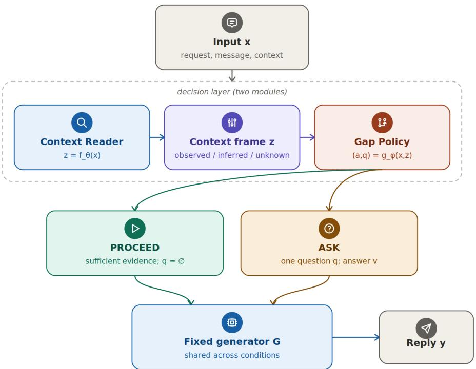
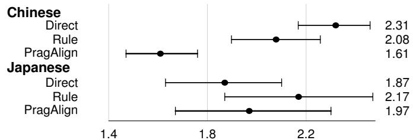
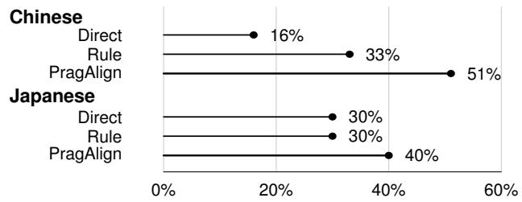
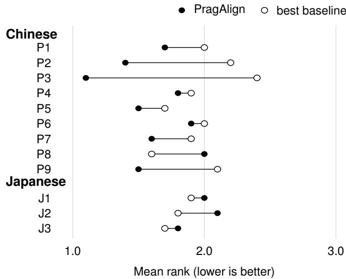
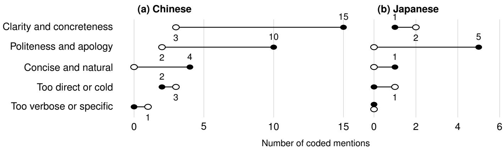

# PragAlign: Evidence-Sensitive Reply Assistance Across Chinese and Japanese Appropriateness Judgments

Xin Zhong†, Satori Hachisuka

The University of Tokyo

Emails: zhongxin@g.ecc.u-tokyo.ac.jp

Abstract—Reply assistance in multilingual settings requires linguistic competence and culturally situated judgments of appropriateness. We present PragAlign, which separates context reading from selective clarification, and evaluate it alongside Direct and Rule. Nine native Chinese speakers judged Chinese materials; three native Japanese speakers judged matched Japanese versions. In Chinese, PragAlign received significantly better ranks than both baselines. In Japanese, Direct had the lowest mean rank, PragAlign had the highest top-rank rate, and the omnibus difference was not significant. The groups selected the same top condition in 5 of 10 scenarios, including four shared PragAlign selections. The results identify shared and languagespecific judgment patterns and inform reply assistance designed to support linguistic and cultural understanding.

Index Terms—reply appropriateness, cross-language evaluation, pragmatic competence, clarification questions, large language models

## I. INTRODUCTION

LLMs increasingly draft messages for professors, colleagues, and collaborators, yet fluent wording can still sound evasive, too direct, overly specific, or socially misaligned. Cross-cultural pragmatic failure arises when intended meaning and social interpretation diverge [1]; politeness and rapport also depend on distance, power, imposition, rights, and obligations [2], [3].

The problem is not only missing cultural knowledge. Culturally grounded data improve norm coverage [4], but cannot establish whether a recipient was informed, an audience is private, or a deadline is flexible in a particular exchange. Conversely, asking about every missing detail creates an interaction burden. We therefore label reply-relevant fields as observed, inferred, or unknown, and ask at most one question only when the answer could materially change the reply. This connects clarification research [5] with pragmatic assistance.

We introduce PragAlign, a two-module decision layer before a fixed generator. The Context Reader structures the evidence, and the Gap Policy chooses whether to proceed or ask one question. Our broader objective is reply assistance that supports linguistic and cultural understanding. This initial study compares three reply conditions through matched ownlanguage judgments by native Chinese and Japanese speakers.

Native Chinese speakers evaluated Chinese materials, while native Japanese speakers evaluated matched Japanese versions. Thus, the study compares language-matched appropriateness judgments, not the accuracy of composing replies in a nonnative language.

We ask: RQ1 What ranking patterns emerge for Direct, Rule, and PragAlign within the Chinese and Japanese language versions? RQ2 In which matched scenarios do the two nativespeaker groups select the same or different reply condition? RQ3 Which judgment criteria explain these shared and divergent preferences?

Our contributions are:

• an evidence-sensitive formulation and two-module decision layer for selective clarification before fixed reply generation;

• controlled scenarios grounded in pragmatic and social-norm variables; and

• a two-language human evaluation that applies the same ranking analysis to both groups and examines convergence and divergence across matched cases.

## II. BACKGROUND AND RELATED WORK

## A. Pragmatic Competence and Appropriateness

Pragmatic competence selects language that fits a social situation. Politeness theory links choice to face, distance, power, and imposition [2]; rapport management adds rights, obligations, and expectations [3]. These accounts motivate our scenario variables—relationship, channel, audience, responsibility, factual commitment, and urgency—and our refusal to infer a correct reply directly from a cultural label.

## B. Culturally Aware LLMs and Controlled Data

CulturePark uses cross-cultural dialogue data to improve cultural understanding [4]. Controlled resources likewise support analysis of social norms and style: NormDial uses comparable bilingual synthetic dialogues [6], while GYAFC benchmarks formality-sensitive rewriting [7]. We follow this controlled-data tradition, structuring synthetic scenarios around literature-grounded dimensions and auditing public versus withheld information.

## C. Clarification as Interaction

Clarification research separates when to ask, what to ask, and how to use the answer [5]. PragAlign adapts this decomposition, asking only when an unknown field could change content, tone, responsibility, channel, or audience.

## III. PROBLEM FORMULATION

Let x denote the public material available before clarification: the user’s request, the incoming message, and any explicitly supplied scenario context. The PragAlign decision layer consists of two modules. The Context Reader maps x to an evidence-tagged frame z, and the Gap Policy selects an action $a \in$ {PROCEED, ASK} and, when needed, one clarification question q:

$$
z = f _ { \theta } ( x ) , \qquad ( a , q ) = g _ { \phi } ( x , z ) ,\tag{1}
$$

where $q = \emptyset$ when $a = \mathrm { \tt P R O C E E D }$ . A fixed generator G then produces the final reply:

$$
y = \left\{ { \begin{array} { l l } { G ( x , z ) , } & { a = { \mathrm { P R O C E E D } } , } \\ { G ( x , z , q , v ) , } & { a = \mathrm { A S K } , } \end{array} } \right.\tag{2}
$$

where v is the user’s answer to the clarification question. This notation does not introduce a separately trained update module; in implementation, the clarification answer is inserted into the final generation prompt.

Each field in z is labeled OBSERVED, INFERRED, or UN-KNOWN. A consequential context gap is an unknown whose resolution could change the reply. Preserving UNKNOWN prevents unmentioned relationships, audiences, attitudes, or cultural expectations from becoming confident assumptions.

## IV. PRAGALIGN METHOD

PragAlign is a pre-generation decision layer, not a replacement generator. Direct sends public input to the generator; Rule adds a generic relationship/channel/tone instruction; PragAlign supplies a case-specific frame, uncertainty status, and optional clarification answer. The Context Reader emits a compact frame, while the Gap Policy predicts PROCEED or ASK and targets one unknown field. Gap types cover facts, audience, permission, channel, urgency, recipient goal, and reply language.

## V. DATA CONSTRUCTION AND MODEL TRAINING

## A. Scenario Construction

Each controlled pragmatic vignette specifies a request, incoming message, role, relationship, channel, audience, factual constraints, and reply language. These variables follow politeness and rapport theory [2], [3] and controlled socialnorm/style resources [6], [7].

Each accepted root yields a matched counterfactual pair: PROCEED exposes all consequential information, whereas ASK withholds one decisive variable while holding other material constant. Supervision thus depends on evidence availability rather than topic or length. Roots are filtered for grounding, public/withheld separation, language consistency, and one answerable gap. These synthetic cases provide auditable supervision, not an estimate of naturally occurring communication.

## B. Training Views and Configuration

View-specific tasks supervise the Context Reader with evidence-tagged frames, and the Gap Policy with the action, the gap type, and one clarification question. Their train/validation/test splits contain 1,520/305/311 and 1,627/343/368 examples, respectively. PROCEED cases and multiple gap types discourage an always-ask policy.

Both modules initialize from Qwen3-8B [8] and use LoRA/QLoRA-style parameter-efficient adaptation [9], [10]. The shared final generator is not fine-tuned.

## C. Diagnostic Scope

Held-out counterfactual diagnostics check structured outputs and PROCEED/ASK discrimination. Because synthetic splits may contain lexical cues, the primary evidence comes from human evaluation of final replies.

## VI. HUMAN EVALUATION

## A. Scenario Set and Procedure

The evaluation used ten matched scenario specifications: five simple cases with two or three visible reply-relevant constraints, and five complex cases with at least five constraints spanning relationship, audience, responsibility, factual commitment, channel, and urgency. Complexity therefore denotes decision density rather than text length. Each specification was realized naturally in Chinese and Japanese while preserving role, public and withheld information, channel, and allowable facts (Table I).

Nine native Chinese speakers evaluated Chinese materials (90 participant–case blocks), and three native Japanese speakers evaluated the matched Japanese versions (30 blocks). Both groups ranked three anonymized, randomized replies from 1 (most appropriate) to 3 (least appropriate) and briefly explained each judgment. The task structure and analysis were identical across versions. The study compares languagematched judgments, not non-native-language reply composition.

## B. Statistical Analysis

For each group, we compare condition-level ranks using Friedman’s test [11] and report mean rank, bootstrap confidence intervals [12], top- and worst-rank rates, and Kendall’s W [13]. Significant omnibus effects are followed by Wilcoxon tests [14] with Holm correction [15]. Cross-language comparison uses matched cases rather than pooled blocks.

## C. Experimental Controls

Conditions shared the same scenario facts and fixed generator; only the pre-generation path differed. Labels were hidden and reply order randomized. Both groups were analyzed with the same summary measures and omnibus test.

  
Fig. 1. PragAlign architecture. The two-module decision layer selects PROCEED or one targeted clarification before fixed reply generation.

TABLE I  
LANGUAGE-MATCHED EVALUATION DESIGN AND CHINESE RESULTS BY SCENARIO COMPLEXITY. LOWER MEAN RANK IS BETTER.
<table><tr><td>Design item</td><td>Chinese version Japanese version</td></tr><tr><td>Scenario roots</td><td>10 matched (5 simple, 5 complex)</td></tr><tr><td>Materials</td><td>Chinese replies Japanese replies</td></tr><tr><td>Native speakers Task</td><td>9 (90 blocks) 3 (30 blocks) Rank three replies and explain</td></tr><tr><td></td><td></td></tr><tr><td>Chinese result by complexity</td><td></td></tr><tr><td>Condition Direct</td><td>Simple Complex 2.27 2.36</td></tr><tr><td>Rule</td><td>2.16 2.00</td></tr><tr><td>PragAlign</td><td></td></tr><tr><td>PragAlign top-rank rate</td><td>1.58 1.64 53% 49%</td></tr></table>

## D. Overall Two-Language Pattern

With equal language weights, PragAlign has the lowest mean rank (1.79), highest top-rank rate (45.6%), and lowest worst-rank rate (24.4%) (Table II); Direct and Rule have mean ranks of 2.09 and 2.12. The aggregate weights the two languages equally rather than pooling participant–case blocks, which would give the Chinese group three times as much weight. It is a summary statistic, not a pooled inferential test. Fig. 2 reports the same measures by language.

## E. Chinese-Language Judgment Pattern

In the Chinese evaluation, PragAlign achieved a mean rank of 1.61 (95% CI [1.47, 1.76]) and was ranked first in 51% of blocks. The overall difference was significant $( \chi ^ { 2 } ( 2 ) = 2 2 . 8 7 $ $p < . 0 0 1$ , Kendall’s $W = 0 . 1 3 )$ . Holm-corrected tests favored

(a) Mean rank and 95% CI (lower is better)  

(b) Top-rank rate (higher is better)  
  
Fig. 2. Mean rank with bootstrap confidence intervals and top-rank rate by language.

PragAlign over Direct $( p < . 0 0 1 )$ and Rule $( p = . 0 0 2 )$ ; Rule and Direct did not differ significantly $( p = . 0 7 6 )$ . PragAlign also won 70 of 90 paired comparisons against Direct and 55 against Rule.

The advantage persisted in both complexity strata (Table I): the three conditions differed for simple $\begin{array} { l } { \displaystyle { ( p ~ = ~ . 0 0 2 ) } } \end{array}$ and complex cases $( p = . 0 0 3 )$ .

The result was not driven by one rater: PragAlign had the lowest mean rank for eight of nine Chinese participants and won seven of ten scenarios. Exceptions favored brevity or clearer boundaries, rather than longer replies.

Winner by matched scenario
<table><tr><td colspan="6">simple cases</td><td colspan="5">complex cases</td></tr><tr><td></td><td>1</td><td>2</td><td>3</td><td>4</td><td>5</td><td>6</td><td>7</td><td>8</td><td>9</td><td>10</td></tr><tr><td>Chinese</td><td>R</td><td>P</td><td>P</td><td>P</td><td>P</td><td>P</td><td>P</td><td>P</td><td>R</td><td>D</td></tr><tr><td>Japanese</td><td>R</td><td>P</td><td>D</td><td>R</td><td>P</td><td>P</td><td>P</td><td>R</td><td>D</td><td>P</td></tr><tr><td></td><td>Same winner: 5/10</td><td></td><td></td><td></td><td></td><td></td><td></td><td></td><td>Shared PragAlign wins: 4</td><td></td></tr><tr><td colspan="9">D = Direct, R = Rule, P = PragAlign.</td></tr></table>

Fig. 3. Scenario-level convergence across the matched Chinese and Japanese versions.

  
Fig. 4. Participant-level mean ranks in both language groups; participant identifiers are anonymized. PragAlign had a lower mean rank than the better baseline for eight of nine Chinese participants and none of the three Japanese participants.

## F. Japanese-Language and Matched-Case Patterns

In Japanese, Direct had the lowest mean rank (1.87), while PragAlign had the highest top-rank rate (40%). The Friedman test found no overall condition difference $( p = . 4 9 7 )$ ; under the same criterion used for Chinese, pairwise follow-up was therefore not conducted. The discrepancy between mean and top-rank rate shows that PragAlign was often selected first but not consistently preferred across all positions and scenarios.

The groups selected the same winner in 5 of 10 matched scenarios; four shared winners were PragAlign (Fig. 3). Agreement occurred in three simple and two complex cases, and shared PragAlign wins spanned both levels. This is scenariolevel convergence rather than inter-rater reliability because each group judged its own-language version. Agreement centered on factual handling and commitments; divergence concerned brevity, boundaries, and explanation length.

## G. Qualitative Explanations

The coded Chinese explanations support the ranking pattern (Fig. 5a): clarity and politeness were concentrated in favorable

TABLE II  
CONDITION-LEVEL OUTCOMES. LOWER MEAN/WORST RANKS ARE BETTER; HIGHER TOP-RANK RATES ARE BETTER.
<table><tr><td>Eval.</td><td>Condition</td><td>Mean</td><td>Top</td><td>Worst</td></tr><tr><td rowspan="3">Chinese</td><td>Direct</td><td>2.31</td><td>15.6%</td><td>46.7%</td></tr><tr><td>Rule</td><td>2.08</td><td>33.3%</td><td>41.1%</td></tr><tr><td>PragAlign</td><td>1.61</td><td>51.1%</td><td>12.2%</td></tr><tr><td rowspan="3">Japanese</td><td>Direct</td><td>1.87</td><td>30.0%</td><td>16.7%</td></tr><tr><td>Rule</td><td>2.17</td><td>30.0%</td><td>46.7%</td></tr><tr><td>PragAlign</td><td>1.97</td><td>40.0%</td><td>36.7%</td></tr><tr><td>Equal-lang.</td><td>Direct</td><td>2.09</td><td>22.8%</td><td>31.7%</td></tr><tr><td rowspan="2">aggregate</td><td>Rule</td><td>2.12</td><td>31.7%</td><td>43.9%</td></tr><tr><td>PragAlign</td><td>1.79</td><td>45.6%</td><td>24.4%</td></tr></table>

The aggregate weights languages equally. Chinese pairwise wins: 77.8% vs. Direct, 61.1% vs. Rule. No Japanese pairwise follow-up (omnibus n.s.).

PragAlign judgments, whereas unfavorable judgments were more often associated with directness or excess specificity. The Japanese explanations, coded with the same scheme (Fig. 5b), yielded fewer coded mentions overall; favorable judgments centered on politeness, while the few unfavorable mentions concerned clarity and directness.

Because comments could receive multiple codes, the counts profile recurring considerations rather than exclusive categories. In the Chinese data, favorable judgments emphasize actionable commitments and social fit, while unfavorable judgments cluster around length and detail. Thus, the benefit is not reducible to reply length, and over-elaboration remains a failure mode.

## VII. DISCUSSION

## A. What the Current Study Can Claim

The Chinese evaluation showed a significant condition effect, with PragAlign favored over both baselines. In Japanese, the omnibus effect was not significant, and mean rank and toprank rate yielded different patterns. The equal-language aggregate is reported only as an equal-weight summary, not a pooled test. Agreement in 5 of 10 matched cases, including four shared PragAlign selections, identifies common judgments and language-dependent preferences in directness and detail. These findings provide an initial basis for culturally and linguistically informed reply assistance.

## B. Implications for Reply Assistance

Rule is strong because it prompts for relationship, channel, and tone, but a checklist cannot determine whether a field is observed, inferred, unknown, or consequential. PragAlign makes this epistemic distinction explicit before generation. In the Chinese evaluation, its favorable ranks in both complexity strata suggest that the decision layer can prevent unsupported additions in simple cases and coordinate multiple constraints in complex ones.

The results support a division of labor: the decision layer controls evidence and clarification, while the generator realizes that decision with language-specific brevity, politeness, and explicitness. Rankings measure relative appropriateness; explanations diagnose grounded commitments and over-elaboration.

PragAlign ranked 1st PragAlign ranked 3rd

  
Fig. 5. Themes coded in explanations when PragAlign ranked first or third, using the same coding scheme for both groups: (a) Chinese, (b) Japanese. A comment may receive multiple codes; absolute counts are not directly comparable across panels because the Chinese group contributed three times as many blocks. Unlabeled markers on the zero line denote zero mentions.

## C. Implications for Additional Experiments

Evaluating non-native-language reply composition requires a separate shared-language design. Identical materials or bilingual evaluators under controlled uncertainty would better separate language expression from cultural background and support generator comparisons.

## VIII. LIMITATIONS AND FUTURE WORK

Synthetic data do not replace natural interactions or human labels. Group sizes differ (nine Chinese and three Japanese participants), reducing between-group precision despite identical analyses. Block-level tests treat participant–case blocks as exchangeable; Fig. 4 mitigates but does not remove this concern. The Japanese panels in Figs. 4 and 5 are reported for presentation parity, but with three participants their perparticipant and per-theme counts should be read as descriptive rather than precise. Because each group judged its ownlanguage materials, differences may reflect expression, cultural background, or both. The design does not compare non-nativelanguage reply composition. A preregistered replication should balance groups, use a shared language, independently annotate clarification quality, and test multiple generators.

## IX. CONCLUSION

This study provides an empirical foundation for culturally and linguistically informed reply assistance. PragAlign received significantly better ranks than both baselines in Chinese; in Japanese, it had the highest top-rank rate but no significant omnibus effect. Agreement in 5 of 10 matched cases identifies shared and language-specific judgment patterns and motivates a balanced, shared-language follow-up study.

## REFERENCES

[1] J. Thomas, “Cross-cultural pragmatic failure,” Applied Linguistics, vol. 4, no. 2, pp. 91–112, 1983.

[2] P. Brown and S. C. Levinson, Politeness: Some Universals in Language Usage, ser. Studies in Interactional Sociolinguistics. Cambridge, UK: Cambridge University Press, 1987, no. 4.

[3] H. Spencer-Oatey, Ed., Culturally Speaking: Culture, Communication and Politeness Theory, 2nd ed. London, UK: Continuum, 2008.

[4] C. Li, D. Teney, L. Yang, Q. Wen, X. Xie, and J. Wang, “CulturePark: Boosting cross-cultural understanding in large language models,” in Advances in Neural Information Processing Systems, vol. 37, 2024, pp. 65 183–65 216.

[5] M. J. Zhang and E. Choi, “Clarify when necessary: Resolving ambiguity through interaction with LMs,” in Findings of the Association for Computational Linguistics: NAACL 2025. Albuquerque, New Mexico: Association for Computational Linguistics, Apr. 2025, pp. 5541–5558.

[6] O. Li, M. Subramanian, A. Saakyan, S. CH-Wang, and S. Muresan, “NormDial: A comparable bilingual synthetic dialog dataset for modeling social norm adherence and violation,” in Proceedings of the 2023 Conference on Empirical Methods in Natural Language Processing. Singapore: Association for Computational Linguistics, Dec. 2023, pp. 15 732–15 744.

[7] S. Rao and J. Tetreault, “Dear sir or madam, may I introduce the GYAFC dataset: Corpus, benchmarks and metrics for formality style transfer,” in Proceedings of the 2018 Conference of the North American Chapter of the Association for Computational Linguistics: Human Language Technologies, Volume 1 (Long Papers). New Orleans, Louisiana: Association for Computational Linguistics, Jun. 2018, pp. 129–140.

[8] A. Yang et al., “Qwen3 technical report,” arXiv preprint arXiv:2505.09388, 2025.

[9] E. J. Hu, Y. Shen, P. Wallis, Z. Allen-Zhu, Y. Li, S. Wang, L. Wang, and W. Chen, “LoRA: Low-rank adaptation of large language models,” in International Conference on Learning Representations, 2022.

[10] T. Dettmers, A. Pagnoni, A. Holtzman, and L. Zettlemoyer, “QLoRA: Efficient finetuning of quantized LLMs,” in Advances in Neural Information Processing Systems, vol. 36, 2023, pp. 10 088–10 115.

[11] M. Friedman, “The use of ranks to avoid the assumption of normality implicit in the analysis of variance,” Journal of the American Statistical Association, vol. 32, no. 200, pp. 675–701, 1937.

[12] B. Efron and R. J. Tibshirani, An Introduction to the Bootstrap. New York, NY, USA: Chapman & Hall, 1993.

[13] M. G. Kendall and B. Babington Smith, “The problem of m rankings,” The Annals ofMathematical Statistics, vol. 10, no. 3, pp. 275–287, 1939.

[14] F. Wilcoxon, “Individual comparisons by ranking methods,” Biometrics Bulletin, vol. 1, no. 6, pp. 80–83, 1945.

[15] S. Holm, “A simple sequentially rejective multiple test procedure,” Scandinavian Journal of Statistics, vol. 6, no. 2, pp. 65–70, 1979.