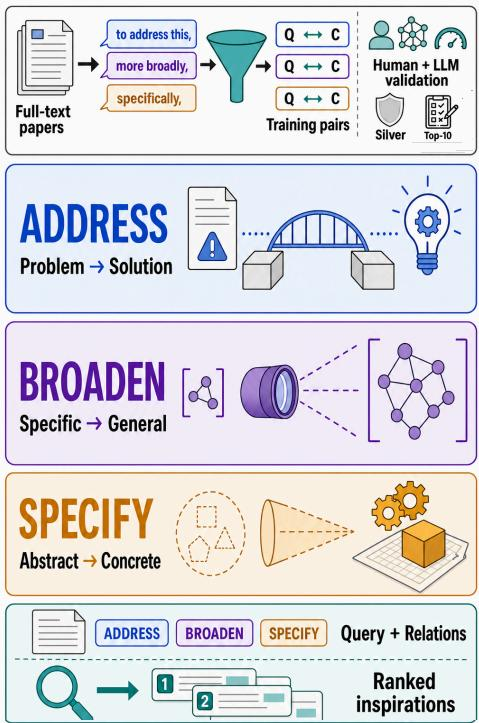
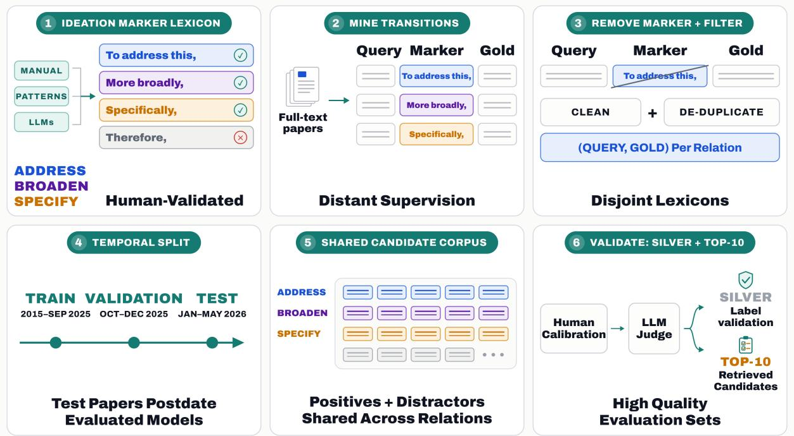
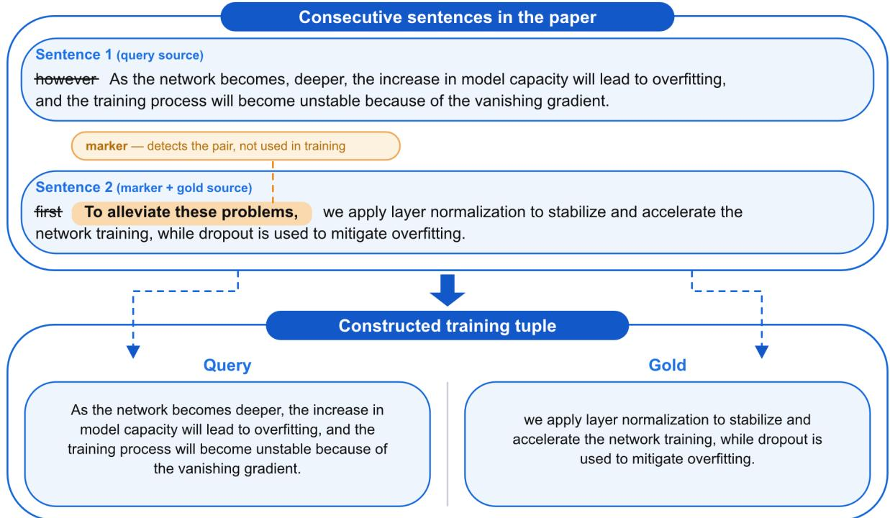
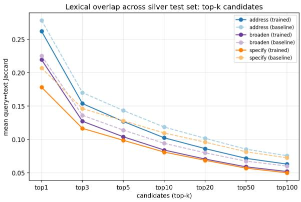

# RATIO: A Benchmark for Retrieval Across Typed Ideation Operations in Scientific Literature

Maayan Sharon The Hebrew University of Jerusalem

Œ Project ‡ Github

Tom Hope The Hebrew University of Jerusalem The Allen Institute for AI (AI2)

 Data & Models

## Abstract

Retrieved scientific literature can serve as inspiration for both human and AI scientists. Inspiration can take different forms: prior work may directly suggest how to address a problem, or surface directions at different levels of abstraction—zooming out to a more general view or zooming in to a concrete realization. We introduce RATIO (Retrieval Across Typed Ideation Operations), a large-scale benchmark in which relevance is defined by three operations which we name ideation moves: AD-DRESS retrieves potential approaches for stated problems, BROADEN retrieves more general formulations, and SPECIFY retrieves concrete instantiations. RATIO is constructed from millions of full-text scientific papers across CS literature via a general recipe that extends discourse-marker distant supervision— previously used only for classification—to corpus-scale retrieval, combined with extensive LLM and human vetting. Experiments show that operation-specific fine-tuning substantially boosts retrievers but leaves much room for further improvements. RATIO provides a scalable training and evaluation framework for retrieval components that support literature-grounded ideation, opening up new research avenues on scientific inspiration retrieval.

## 1 Introduction

Engaging with prior work is central to how researchers develop new ideas: the literature can spark analogical transfer, conceptual recombination, and problem reframing (Sweed et al., 2025; Sternlicht and Hope, 2025). Consider for example a researcher grappling with reward hacking in RL-trained LLMs. Three different inspirations may be helpful: one proposing a method (e.g., rewardmodel ensembles), one zooming out to a more general principle (e.g., Goodhart’s law), and one zooming in on a concrete instantiation of that principle in a new setting (e.g., recommender systems gaming engagement metrics) to provide an inspiration from another problem. Each one enables a distinct move through the ideation space—addressing a problem, abstracting it, or instantiating it.

  
Figure 1: We construct RATIO from full-text scientific papers using discourse-marker supervision and human–LLM validation to support retrieval across three ideation moves: ADDRESS, BROADEN, SPECIFY.

This distinction matters for systems that assist scientific research with literature-grounded hypothesis generation (Wang et al., 2024; Garikaparthi et al., 2025; Radensky et al., 2026; Vasu et al., 2025; Liu et al., 2026; Gu et al., 2026). In this setting, retrieval determines which prior mechanisms, abstractions, and problem formulations are available as inspirations to move the ideation process forward. For both human researchers and AI agents, retrieval helps define the reachable ideation space; showing inspirational stimuli for problem-solving in the form of potentially related mechanisms at different levels of abstraction is known to boost ideation (Hope et al., 2022; Sweed et al., 2025).

Most scholarly retrieval benchmarks, however, evaluate topical relevance or whether a document answers a search query (Ajith et al., 2024). These criteria are necessary for literature search but do not distinguish between passages that play different ideation roles. We introduce RATIO (Retrieval Across Typed Ideation Operations), a benchmark for scientific inspiration retrieval (Fig. 1). Grounded in cognitive theories of ideation, we view external inspirations as possible moves through an ideation space (Dorst and Cross, 2001; Goldschmidt, 2014). Under this view, a retrieved statement is useful when it suggests a particular next move. RATIO organizes retrieval around three moves or operations that capture complementary forms of inspiration. ADDRESS retrieves an approach or insight that responds to a problem in the query. BROADEN retrieves a formulation at a broader scope or greater generality. SPECIFY retrieves a concrete instance or narrower formulation. These relevance criteria are determined by latent patterns with often limited surface expression, making the task difficult for retrieval systems (Tchuindjo et al., 2026).

Constructing such a benchmark at the scale required for retriever training and evaluation is challenging. We propose a scalable distant supervision approach that uses explicit high-precision discourse markers in full-text papers. Phrases such as to address this problem, more generally, and as an example, identify adjacent sentences that authors themselves present as problem-addressing, broader, or more specific. Unlike prior discourse-marker distant supervision, which is confined to sentencepair classification (Sadat and Caragea, 2022; Sileo et al., 2019), we extend markers to define relationconditioned ideation retrieval over a corpus of millions of candidates (§2).

RATIO is constructed through a multi-stage supervision and validation pipeline. We first build move-specific lexicons of discourse cues for AD-DRESS, BROADEN, and SPECIFY, combining manual corpus analysis, rule-based expansion, and generation by multiple LLMs. Candidate cues are filtered through expert review and LLM validation before being used to mine sentence pairs from fulltext papers. We further create a higher-precision silver evaluation set, using human vetting of discourse markers and human-calibrated LLM judgments. Finally, we also validate top-10 retrieved candidates to account for false negatives.

Experiments with retrievers show that the proposed operations are not captured reliably by generic models, and operation fine-tuning yields substantial improvements for all three operations, while absolute performance remains limited.

## Our contributions:

• We define scientific ideation-move inspiration retrieval, where relevance is specified by an ideation operation: addressing a problem, broadening a formulation, or providing a concrete instantiation.

• We introduce a general methodology for constructing relation-conditioned retrieval benchmarks from raw corpora via discourse-marker supervision— including a multi-stage construction pipeline and human-calibrated LLM validation—extending marker-based distant supervision from its traditional classification setting to retrieval.

• We instantiate this methodology as RATIO, a largescale full-text benchmark for the three ideation operations, with temporally held-out, high-quality evaluation sets with human vetting. We benchmark retrievers, showing that relation-specific finetuning substantially improves results and finds valid cross-paper inspiration candidates while leaving a considerable performance gap.

## 2 Related Work

Literature-grounded scientific ideation A growing body of work uses scientific literature to support hypothesis generation and research planning (Wang et al., 2024; Hu et al., 2025; Vasu et al., 2025; Liu et al., 2026; Gu et al., 2026). These tasks evaluate generation or reasoning conditioned on scientific evidence; RATIO focuses on the retrieval capability that determines which inspirations are made available to such systems.

Hope et al. (2022) and Sweed et al. (2025) represented problems, mechanisms, and abstractions through functional concept graphs, enabling crossdomain navigation from problems to potentially relevant mechanisms. CHIMERA mined and retrieved naturally occurring recombinations of scientific ideas (Ye et al., 2024; Sternlicht and Hope, 2025). RATIO shares the overarching motivation that scientific relevance extends beyond topical similarity, and focuses on introducing a novel automated benchmark for sentence-level retrieval under three explicit ideation-move operations, for addressing problems and zooming in and out (abstraction). In recent work, Garikaparthi et al. (2025) formulated methodology-inspiration retrieval at the paper level primarily over abstracts, using research proposals extracted from abstracts as queries and citation-derived methodological lineage as supervision. RATIO extends this direction to full-text, sentence-level retrieval and decomposes inspirational relevance into three typed operations: AD-DRESS, BROADEN, and SPECIFY. Like MIR, our focus is on retrieval as the principal capability under evaluation rather than measuring downstream scientific ideation.

  
Figure 2: Construction of RATIO. Validated discourse markers identify ADDRESS, BROADEN, and SPECIFY transitions in full-text papers. The marker is removed from the candidate text, publication dates determine the temporal partitions, and all operations retrieve from a candidate corpus shared across relations.

Scientific retrieval Scholarly retrieval benchmarks such as LitSearch evaluate the retrieval of papers satisfying literature-search questions (Ajith et al., 2024), and thus primarily characterize topical or informational relevance. RATIO instead conditions relevance on the ideation function the candidate serves: addressing a stated problem, broadening its formulation, or supplying a concrete instantiation. We also contribute an automated construction approach in which relevance labels are mined from discourse signals rather than annotations, citations, or search logs.

Scientific sentence relations SciNLI introduces natural-language inference relations for scientific text, and MSciNLI extends scientific NLI across multiple domains (Sadat and Caragea, 2022, 2024).

These resources only classify given sentence pairs, and only use entailment-oriented labels: they do not evaluate the more challenging and realistic setting of retrieval from a large corpus, and their relations do not represent our ideation motivation: problem-addressing utility or movement in opposite directions along an abstraction hierarchy. In addition, the set of discourse markers used in these resources is highly limited in size and scope, only a tiny fraction of the markers in our work.

Discourse markers as distant supervision Beyond scientific NLI, discourse markers have long served as distant supervision in the general domain. For example, Sileo et al. (2019) predict markers or marker categories to learn sentence representations, using 174 automatically discovered markers mined from web text. In this line of work, the marker is the prediction target in a sentence-pair task. RA-TIO instead uses markers to define relevance: the marker is stripped from the input and determines which relation a candidate must instantiate with respect to a query, evaluated by ranking against a large-scale corpus of sentences.

## 3 Problem Definition

We formulate the task of scientific ideation-move inspiration retrieval. Given a scientific statement and a desired move through the ideation space, the task is to retrieve a candidate inspiration statement corresponding to that move.

Formally, a query q may be a sentence describing scientific research problem, claim, observation, or methodological objective; a relation $r \in \mathcal { R } =$ {ADDRESS, BROADEN, SPECIFY} is the discourse relation that must hold between two sentences; and a scientific literature corpus $\mathcal { C } = \{ c _ { 1 } , \ldots , c _ { N } \}$ is the set of all candidate sentences from scientific papers. Given q and r, the task is to produce a ranking

$$
\widehat { \mathcal { C } } _ { r } ^ { k } ( q ) = \left. \widehat { c } _ { 1 } , \ldots , \widehat { c } _ { k } \right.\tag{1}
$$

of the top-k sentences in C by how well each candidate c instantiates r with respect to q.

We define the relations as follows, for a query q and a candidate $c \in { \mathcal { C } }$

• ADDRESS: $q$ articulates a problem, and c an approach or insight that can help address it.

• BROADEN: c reformulates q at a broader scope or greater generality, such that q can be viewed as a particular instance or manifestation of c.

• SPECIFY: c instantiates q through a concrete case, mechanism, or example.

BROADEN and SPECIFY represent opposite movements along an abstraction hierarchy, while ADDRESS represents a functional response to a stated research need. Throughout, we use “inspiration” operationally to denote a statement that validly instantiates the requested ideation move. As in recent work (Garikaparthi et al., 2025), RATIO focuses its evaluation on this retrieval capability, not the downstream effect of retrieved statements on idea generation or their novelty to a particular researcher.

Operation-specific models. We represent the relation-conditioned scoring function $s ( q , c \mid r )$ using a separate retriever s<sub>r</sub> for each operation. Because r is an observed task input, selecting the corresponding retriever is equivalent to hard routing to an operation-specific expert. This routing does not restrict the search space: all retrievers rank candidates from the same heterogeneous corpus within each split, which contains positives from all three target operations as well as candidates introduced by non-target discourse relations.

Moreover, during relation-specific contrastive training (§5), the in-batch negatives are positive candidates for other queries under the same operation. Thus, a model cannot succeed merely by identifying a candidate as solution-like, broad, or specific, which cannot distinguish the positive from the negatives; it must match the candidate to the particular query by learning query-conditioned compatibility.

Selecting $s _ { r }$ reveals the requested relevance criterion, but it does not reveal which candidate satisfies that criterion for the particular query. Selecting the ADDRESS retriever, for example, corresponds to that specific relevance criterion, but does not reveal which candidates address the particular query; an operation-specific retriever must still distinguish relation-relevant candidates from topically related candidates serving different discourse and ideation roles. Furthermore, separate training isolates the learnability of each operation and avoids confounding the results. It also represents a plausible modular system in which a user selects a specialized retrieval expert. A unified model that receives r as an instruction is an alternative parameterization supported by RATIO and left for future work.

## 4 Benchmark Construction

Authors routinely signal how a sentence relates to its predecessor with discourse markers $\left( \mathrm { e . g . , ~ } ^ { \prime \prime } T o \right.$ mitigate these risks,”, "Even more specifically,”, "From a broader perspective,”). We exploit this to harvest tuples $( q , \ell , g ) $ : in "Our model is prone to overfitting. To address this issue, we apply dropout.” the first sentence is the query $q ,$ "To address this issue” is the marker $\ell ,$ and the remaining proposition "we apply dropout” is the gold sentence $g .$ For each relation r we construct a lexicon $L _ { r } ,$ , the set of validated markers whose presence signals $( q , g ) \in r$ . Lexicons are pairwise disjoint, so every marker determines a unique relation (§4.1). These markers provide high-precision, author-generated distant supervision for the target relations. For example, “To address this issue,” explicitly indicates that the author presents the following statement as a response to the preceding problem.

We segment each paper $P$ into sentences and scan consecutive pairs $( s _ { i } , s _ { i + 1 } )$ . Whenever the second sentence decomposes as $\boldsymbol { s } _ { i + 1 } = \boldsymbol { \ell } \oplus \boldsymbol { g }$ with $\ell \in L _ { r }$ (where ⊕ denotes concatenation), we extract the tuple $( s _ { i } , \ell , g )$ . Writing $\mathcal { E } _ { r } ( P )$ for the set of all tuples mined from paper $P$ under relation r:

$$
\mathcal E _ { r } ( P ) = \big \{ ( s _ { i } , \ell , g ) \big | s _ { i + 1 } = \ell \oplus g , \ell \in L _ { r } \big \} .\tag{2}
$$

The marker is stripped from the gold sentence and kept only as construction metadata.

We work with a corpus of full-text papers (Kinney et al., 2023)<sup>1</sup>. Each paper is segmented into sentences, cleaned and normalized, and split into consecutive pairs $( s _ { i } , s _ { i + 1 } )$ that will later become candidates for (q, g) (Appendix B).

## 4.1 Ideation Move Marker Lexicons

The ideation move discourse marker lexicon L is the union of the per-relation lexicons,

$$
L = \bigcup _ { r \in \mathcal { R } } L _ { r } = L _ { \mathrm { A D D R E S S } } \cup L _ { \mathrm { B R o A D E N } } \cup L _ { \mathrm { S P E C I F Y } } .\tag{3}
$$

Each $L _ { r }$ is built by an iterative, multi-stage process that we describe next (see Appendix A, B for full details and examples).

Manual curation In scientific writing, when (implicitly) referring to our ideation moves, authors often use linking phrases that end with a comma at the start of a sentence. We take each sentence’s leading pre-comma span $( \leq 7$ words), since sentenceinitial markers are typically comma-delimited, isolating them from substantive content. Spans are counted across all sentences and the 400 most frequent are manually inspected as marker candidates.

For each candidate, two NLP experts inspected 15 randomly sampled sentence pairs containing it. A marker was retained if in every inspected pair it clearly signaled the target operation and referred to the preceding sentence. For example, "To mitigate this limitation," is added to ADDRESS since it satisfies both conditions: it commits the following sentence to a remedy, and its demonstrative explicitly resolves to the preceding sentence. In contrast, "Therefore,", used in prior work (Sadat and Caragea, 2022) for creating NLI pairs, does not signal any of our three target ideation moves.

"In general," does signal generalization, but is non-anaphoric: it does not explicitly refer to any particular preceding sentence. In total, 84 markers passed both experts for ADDRESS, 13 for BROADEN, and 72 for SPECIFY (see Appendix A).

We also manually selected a small set of discourse markers, for which we automatically added their extensions as markers. For example, we selected the marker "To address", for which all extensions (of at most five consecutive words up to a comma) were collected. That is, "To address this potential bias,", "To address this limitation," etc. were all added as markers.

LLM expansion We expanded the manually curated markers with several SOTA LLMs, using more than one model for diversity. An LLM labels all 4,256 generated candidates as strong-true, weaktrue, or false (3,779, 270, and 207 respectively), according to whether it estimated the marker to hold in almost all contexts, only in some, or in none. Only strong-true markers were kept, contributing 3,779 of the 4,252 markers in the final lexicon (89%). An NLP expert then further screened a random sample of 1,500 markers, confirming that each signals the target operation and plausibly refers to the preceding sentence.

Rule-Based Pattern Expansion Similarly to Roller et al. (2018), who apply Hearst-style templates to extract hypernym–hyponym pairs, we use a template-based approach to obtain candidate markers in two stages. First, we manually construct relation-specific templates and instantiate them using curated term lists. For example, consider the common template of "to [solution-term] [demonstrative] [problem-term]", associated with ADDRESS. By choosing different combinations of solution and problem terms, candidates such as "to solve this limitation", "to mitigate these risks" were instantiated. We then validate these candidates using a SOTA LLM to eliminate nongrammatical candidates. Even though this stage produced a large number of candidates (6k and 810 for ADDRESS and BROADEN respectively), most of the valid markers overlapped with the LLMgeneration step. This stage yielded 397 markers, of which 297 were new; the remaining 100 had already been produced in earlier steps. We obtain 4,252 markers in total (Table 2).

Filtering stage For each sentence pair, we checked whether the second sentence begins with a marker $\ell \in L$ . If so, ℓ is the prefix, the remainder is the gold sentence $^ { g , }$ and the first sentence is the query q; we assign the tuple $( q , g )$ to the relation r with $\ell \in L _ { r } ;$ all $L _ { r }$ are disjoint by construction. This yields a set of tuples per relation for each of ADDRESS, BROADEN, and SPECIFY.

We matched the full lexicon against all ∼366.6M consecutive sentence pairs; 809 of the 4,252 markers fired at least once, yielding ∼3M pairs across 1.1M papers. Two NLP experts independently vetted these 809 markers and agreed that every one of them was valid, qualitatively observing that all markers were clear-cut.

<table><tr><td rowspan="2">Relation</td><td colspan="2">Train</td><td colspan="2">Validation</td><td colspan="2">Test</td></tr><tr><td>Queries</td><td>Candidates</td><td>Queries</td><td>Candidates</td><td>Queries</td><td>Candidates</td></tr><tr><td>SPECIFY</td><td>2,605,515</td><td></td><td>79,583</td><td></td><td>94,079</td><td></td></tr><tr><td>ADDRESS</td><td>195,605</td><td>13,787,834</td><td>13,082</td><td>361,172</td><td>14,020</td><td>404,371</td></tr><tr><td>BROADEN</td><td>13,687</td><td></td><td>495</td><td></td><td>1,410</td><td></td></tr></table>

Table 1: Temporal split with a shared candidate pool across relations. Each query is paired with a single gold candidate; the candidate corpus of each split is shared by all relations. Train uses papers from 2015 to Sept. 30th, 2025; validation uses Oct. 1st to Dec. 31st, 2025; test uses Jan. 1st to May 5th, 2026 (Appendix B).

<table><tr><td></td><td colspan="2">ADDRESS</td><td colspan="2">BROADEN</td><td colspan="2">SPECIFY</td><td colspan="2">Total</td></tr><tr><td>Type</td><td>Cand.</td><td>Data</td><td>Cand.</td><td>Data</td><td>Cand.</td><td>Data</td><td>Cand.</td><td>Data</td></tr><tr><td>Manual</td><td>84</td><td>49</td><td>13</td><td>7</td><td>72</td><td>52</td><td>169</td><td>108</td></tr><tr><td>Extendable connective</td><td>5</td><td>4</td><td>0</td><td>0</td><td>2</td><td>2</td><td>7</td><td>6</td></tr><tr><td>LLM-generated</td><td>3516</td><td>473</td><td>263</td><td>25</td><td>0</td><td>0</td><td>3779</td><td>498</td></tr><tr><td>Pattern expansion</td><td>257</td><td>191</td><td>40</td><td>6</td><td>0</td><td>0</td><td>297</td><td>197</td></tr><tr><td>Total</td><td>3862</td><td>717</td><td>316</td><td>38</td><td>74</td><td>54</td><td>4252</td><td>809</td></tr></table>

Table 2: Discourse markers breakdown. Candidates vs. found in data after corpus filtering. Manual curation and extendable connectives alone were sufficient for SPEC-IFY, yielding 2.8M (q, g) pairs, so we did not apply LLM generation or pattern expansion to this operation.

## 4.2 Temporal Split

First, we de-duplicate the dataset, ensuring that each (q, g) pair appears at most once. Pairs are then partitioned by publication date: the training set contains sentences from papers from 2015 through September 2025; the validation set the remainder of 2025. Sentences from 2026 are exclusive to the test set (Table 1; stage 4, Figure 2).

The temporal split was applied after deduplicating the full dataset. It was chosen to enforce a strict approach against contamination: no test query and no test candidate could have been seen during training, and test pairs are drawn from papers published after the public release of every model we evaluate, so no backbone could have encountered them during pre-training.

The resulting benchmark is comprised of 3,017,476 (q, g) pairs: 2,779,177 SPECIFY, 222,707 ADDRESS and 15,592 BROADEN. The train, validation and test sets are comprised of three disjoint query subsets corresponding to three different ideation move retrieval tasks.

In addition, we enrich the corpus with hard negatives, introduced by markers rejected during curation (§4.1), which we name distractor discourse markers. These are cues that resemble valid markers but signal relations outside our three target ideation moves, as in "On the other hand," (contrast), or do not explicitly refer to the immediately preceding sentence, as in "In general,". The sentences they introduce are added to the candidate pool, where they are gold for no query. Every other sentence in the pool is gold for exactly one query, so pool membership alone would carry a relevance signal; the distractors remove that shortcut.

In total, including the negatives, our training, validation, and test candidate pools contain 13,787,834, 361,172, and 404,371 sentences, respectively. Within each temporal partition, we use a partition-specific candidate set shared across the three retrieval tasks. This design is important for preventing a relation-specific corpus shortcut; an ADDRESS retriever, for example, cannot search an ADDRESS-only collection. Table 1 shows the corpus-size breakdown. See Appendix A for more implementation details, lexicon construction, and Appendix B.2 for temporal split.

Although the candidate pool is not an exhaustive collection of every sentence in the source corpus, it is not restricted to sentences expressing the three target operations. Target positives constitute only about 20% of the 13.8M training candidates; the remaining approximately 80% are distractors mined using roughly 10,000 non-target discourse markers. These include contrast, similarity, continuation, inference, and other common scientific discourse patterns, spanning more than one million papers. Thus, the pool is highly heterogeneous in topic, rhetorical function, and linguistic form, and is substantially closer to broad scientific-sentence retrieval than to ranking within a small, relation-specific collection.

This construction also makes the task challenging as it acts as a form of hard-negative sampling. Candidates are coherent scientific statements extracted under the same procedure as the positives and often resemble them in topic, style, and residual discourse structure, even after the marker is removed. Moreover, because the pool is shared across operations, it contains sentences that may be topically compatible with a query but instantiate the wrong ideation move. A retriever must therefore distinguish query-conditioned relational compatibility rather than merely reject malformed, out-of-domain, or topically unrelated sentences. By contrast, an exhaustive pool of arbitrary corpus sentences would add many easy negatives. Nevertheless, evaluating retrieval over every sentence in the underlying corpus may be explored for testing deployment-scale coverage.

## 4.3 Silver Test Set Construction

Our data is mined by distant supervision. While our training set serves primarily for noisy labeled training data, to rigorously evaluate generalization we create a human-calibrated, LLM-validated silver test set. This is our primary evaluation set, as opposed to the “raw” test set above. We sample 10k SPECIFY test pairs by stratified sampling with equal allocation across markers, capped at each marker’s size, so that frequent markers do not dominate the sample, and take all 14,020 ADDRESS and 1,410 BROADEN test set pairs. We then instruct an LLM to go over the initial sampled set and filter out candidates. We apply strict criteria to ensure high quality (q, g) pairs. Two LLM judges first judge query and gold independently for grammar, coherence, and self-containment, i.e., interpretable without surrounding context or references to other parts of the paper. They then enforce the relation itself: for ADDRESS, we require the query to be phrased as a problem and the gold to directly mitigate that problem. BROADEN and SPECIFY require the two sentences to share a main topic rather than overlap in part of it; a BROADEN gold may sit at a higher level of abstraction, but a pair whose main themes are not clearly aligned is dropped. Direction is enforced throughout: a SPECIFY gold must be a specific case of the query rather than merely something lower in a hierarchy, and pairs are dropped when the roles are inverted or when the gold continues the topic at the same level without specifying or broadening it respectively.

Prompt Calibration We calibrate the LLM against human annotations. In practice, we find that a single prompt may be strict on some (q, g) pairs and lenient on others; thus, for each relation we write 4–6 candidate validation prompts, and keep the two that best match expert judgments (Appendix I). We compare the prompts per relation to 300 expert annotations (100 per relation), and only keep the two highest-scoring prompts per relation. These prompts reach F<sub>1</sub> scores .83–.84, .86–.87, and .76 for ADDRESS, SPECIFY, and BROADEN respectively. 60 pairs were additionally labeled by four NLP experts; inter-annotator $F _ { 1 }$ agreement scores among the five experts were .87, .90, and .82 for ADDRESS, SPECIFY, and BROADEN respectively. Inter-annotator and prompt–annotator rates are high for an intrinsically difficult annotation task.

LLM Validation We apply SOTA LLM using the two retained prompts per relation to the initial sampled test set. A pair is kept only if both prompts accept it. The final result is a high-quality test set with a total of 17,579 queries and corresponding gold candidates (see Appendix E for more details).

## 5 Experiments and Evaluation

In this section, we evaluate several pre-trained and fine-tuned retrieval models on RATIO. We conduct analysis of the results, including an evaluation of Top-K retrieved inspirations.

## 5.1 Retrievers Training

We compare three dense retrievers: ALL-MPNET-BASE-V2 (Sentence-Transformers, 2021), MODERNBERT-EMBED-LARGE (Chaffin, 2025), instruction-following retriever STELLA-EN-1.5B-V5 (Zhang et al., 2024) (SOTA on MIR Garikaparthi et al. (2025)), and also BM25. Each model is evaluated as a pre-trained baseline and after relation-specific contrastive fine-tuning with inbatch negatives. We train multiple model-prefix setups: each model with a generic prefix and the recommended prefix for ModernBERT-embedlarge and Stella (see prefixes in Appendix C). We note that all three backbones were extensively pretrained on scientific texts. We train each setup separately on ADDRESS, BROADEN, and SPEC-IFY—15 fine-tuned variations in total. BROADEN was fine-tuned on a single GPU, ADDRESS and SPECIFY on four GPUs, for a total of 1,800 GPU hours and 282 hours of evaluation and retrieval (see Appendix C for more training details).

## 5.2 Effect of Move-Specific Fine-Tuning

Table 3 reports results on the silver test set by ideation move (see Appendix D for the unfiltered test set, where the relative fine-tuning gains are preserved but Stella-en-1.5B-v5 leads on SPEC-IFY and ADDRESS). Baseline pre-trained models provide limited gains over BM25, whereas movespecific fine-tuning yields substantial improvements, increasing MRR@10 by 1.6×–2.4× for

<table><tr><td rowspan="2">Model</td><td rowspan="2">Setup</td><td colspan="3">SPECIFY</td><td rowspan="2"></td><td colspan="3">ADDRESS</td><td rowspan="2"></td><td colspan="3">BROADEN</td></tr><tr><td>R@1</td><td>R@10 M@10</td><td>M@100</td><td>R@1</td><td>R@10 M@10</td><td>M@100</td><td>R@1</td><td>R@10 M@10</td><td>M@100</td></tr><tr><td>BM25</td><td>unigram</td><td>13.0</td><td>27.3</td><td>17.6</td><td>18.1</td><td>5.3</td><td>15.2</td><td>8.3</td><td>8.7</td><td>7.9 17.6</td><td>10.9</td><td>11.3</td></tr><tr><td rowspan="2">all-mpnet- base-v2</td><td>Baseline</td><td>12.3</td><td>26.6</td><td>16.9</td><td>17.5</td><td>6.1 16.5</td><td>9.2</td><td>9.7</td><td>11.6</td><td>24.3</td><td>15.6</td><td>16.1</td></tr><tr><td>Tuned</td><td>28.5</td><td>54.3</td><td>37.0</td><td>37.8</td><td>12.8</td><td>31.7</td><td>18.7</td><td>19.4 16.3</td><td>32.5</td><td>21.8</td><td>22.4</td></tr><tr><td rowspan="2">modernbert- embed-large</td><td>Baseline</td><td>20.5</td><td>39.1</td><td>26.7</td><td>27.3</td><td>6.7</td><td>17.8 10.2</td><td>10.6</td><td>13.4</td><td>26.0</td><td>17.3</td><td>17.9</td></tr><tr><td>Tuned</td><td>37.2</td><td>65.5</td><td>46.7</td><td>47.4</td><td>17.2</td><td>40.0 24.5</td><td>25.3</td><td>20.9</td><td>41.4</td><td>27.3</td><td>27.8</td></tr><tr><td rowspan="2">stella- en-1.5B-v5</td><td>Baseline</td><td>20.1</td><td>39.8</td><td>26.4</td><td>27.0</td><td>7.2 20.1</td><td>11.0</td><td>11.6</td><td>13.7</td><td>29.6</td><td>18.5</td><td>19.1</td></tr><tr><td>Tuned</td><td>31.6</td><td>59.7</td><td>40.9</td><td>41.6</td><td>13.7</td><td>34.5</td><td>20.2 20.9</td><td>15.4</td><td>32.4</td><td>20.9</td><td>21.6</td></tr></table>

Table 3: Silver test set results (%), per operation (n=7,327 / 9,668 / 584 queries for SPECIFY/ADDRESS/BROADEN respectively). R@k=Recall@k, M@k=MRR@k. ModernBERT-embed-large and Stella use recommended prefixes.

ModernBERT-embed-large. ModernBERT-embedlarge is the strongest model on every operation on the silver set, and its two prefix setups become on par once tuned, differing by at most 2.7 points on any operation and metric reported.

Interestingly, relative improvement does not necessarily correlate with training set size. ADDRESS gains the most in relative terms (∼2.4×) on 7.5% of SPECIFY’s training pairs, while BROADEN has both the smallest training set and the smallest absolute gain (+10.0).

Absolute performance is low: Even the best model fails for most ADDRESS and BROADEN queries, and MRR@100 exceeds MRR@10 by at most 0.8 points, so these failures are not near-hits. These results show the task is far from solved.

We note that a superficial candidate-side operation classification cannot by itself explain the results. Even an oracle that perfectly filtered the corpus to candidates from the requested operation but ranked them independently of the query would return the same top-10 list for every query. Such a ranker would have Recall@10 of at most 0.011%, 0.071%, and 0.71% for SPECIFY, ADDRESS, and BROADEN, respectively. These bounds are far below the tuned retriever’s corresponding scores, showing that query-conditioned matching is necessary to explain the single-positive results.

## 5.3 Top-K Candidate Evaluation

Single-positive metrics are a scalable lower bound: they test whether the retriever ranks one known inspiration highly, not whether the mined positive is the only valid one. The general problem of false negatives in IR and inspiration retrieval (Garikaparthi et al., 2025) is generally known. We thus additionally evaluate the prevalence of false negatives by judging Top-K retrieved candidates.

Each top-10 candidate is independently judged for whether it constitutes a valid solution (resp.

broader/more specific formulation) of the query, which also serves as an evaluation measure of inspiration retrieval: our evaluation shows that the large majority of accepted candidates originate from papers other than the query’s, i.e., tuned retrievers surface cross-paper candidates that satisfy the requested relation under our candidate-level judgment—“inspiration” under our operational definition. Moreover, the accepted candidate is often not the mined adjacent-sentence positive. For the tuned ADDRESS retriever, 41.2% of queries have an accepted alternative in the top 10 despite the mined positive being absent (Table 16 in the Appendix); the corresponding rates are 24.0% for SPECIFY and 12.0% for BROADEN. Thus, candidate-level evaluation tests whether the model retrieves relation-valid alternatives from the corpus rather than merely reconstructing the sentence continuation.

Construction For each ideation-move relation we sample 400 queries from the silver test set by stratified sampling with equal allocation across markers, capped at each marker’s size, 1200 in total. For each query, the judge (GPT-5.4, using the same human-calibrated prompts in §4.3) independently evaluates each (q, c) pair among the top 10 candidates retrieved by the selected fine-tuned retriever and by its pre-trained baseline. Acceptance by the judge is therefore a human-anchored decision: the prompts explicitly require the candidate to be a valid, self-contained solution that directly targets the stated problem (resp. a genuine broadening/instantiation), and were selected for agreement with a five-expert panel, matching inter-expert agreement levels (F1 .87/.90/.82 vs. prompt–annotator .73–.91; Table 10 in the Appendix). The judge is not shown the gold, the candidate’s rank, or the other candidates. We run two prompts on each (q, c) pair: Hard agreement requires both prompts to accept a candidate; soft agreement requires either. Per-prompt results appear in Table 14. We judge 24K (q, c) pairs (1,200 queries × 10 candidates × 2 systems, baseline and tuned), each under both prompts, for 48K judgments in total. In this setup a query can have multiple valid candidates other than the gold, so we report Hit Rates (fraction of queries with at least one accepted candidate in the top 10), Precision, NDCG, and MAP, all at rank 10. Full sampling, calibration, and prompt details appear in Appendix E.

<table><tr><td>Relation</td><td>Model</td><td>HR@10</td><td>P@10</td><td>N@10</td><td>M@10</td><td>MAP@10</td></tr><tr><td rowspan="2">SPECIFY</td><td>Baseline</td><td>65.5</td><td>11.4</td><td>45.9</td><td>41.0</td><td>38.0</td></tr><tr><td>Tuned</td><td>89.0</td><td>23.0</td><td>68.5</td><td>64.1</td><td>58.3</td></tr><tr><td rowspan="2">ADDRESS</td><td>Baseline</td><td>40.5</td><td>6.1</td><td>25.9</td><td>21.9</td><td>20.7</td></tr><tr><td>Tuned</td><td>76.5</td><td>16.7</td><td>48.6</td><td>41.2</td><td>37.0</td></tr><tr><td rowspan="2">BROADEN</td><td>Baseline</td><td>19.3</td><td>2.2</td><td>13.4</td><td>11.6</td><td>11.4</td></tr><tr><td>Tuned</td><td>29.0</td><td>3.6</td><td>18.7</td><td>15.9</td><td>15.1</td></tr></table>

Table 4: Top-10 retrieved candidate evaluation under hard LLM prompt agreement (%). 400 queries per relation. Model=ModernBERT-embed-large; showing Hit-Rate@10, Precision@10, nDCG@10, MRR@10 and MAP@10. Full results in Table 13.

Model selection Candidate-level validation is costly and cannot cover all 15 trained models and their respective baselines. We select ModernBERT-embed-large with the recommended search\_query prefix setup: it is the strongest model on all three relations on the silver test set and substantially smaller than the 1.5B-parameter alternative, and its prefix variants are within 2.6 MRR@10 after fine-tuning on silver test set. These results characterize one retriever before and after fine-tuning.

## 5.4 Results and Analysis

The judge scores the top-10 candidates per query (Table 4). Under hard agreement, fine-tuned ModernBERT-embed-large (recommended prefix) reaches at least one accepted candidate for 89.0% of SPECIFY and 76.5% of ADDRESS queries, returning 1.67 accepted candidates per ADDRESS list against 0.61 for baseline.

Across all settings, the tuned ModernBERTembed-large retrieves candidates with lower lexical overlap with the query (Jaccard over non-stopword tokens) than its baseline counterpart. Further, the tuned SPECIFY model’s top-10 candidates overlap with the query less than the gold does (−.019 on silver, −.029 on the judged sample); rank correlates negatively with overlap in every setting (Spearman ρ ≈ −.20 and −0.28). Tuned models more often retrieve pairs the judge accepts, with the largest gain on SPECIFY (Recall@10 of 63% on accepted vs. 39.1% on rejected pairs; Appendix F). We also find that for ADDRESS and BROADEN lexical overlap with gold or LLM-accepted candidates is lower than for SPECIFY, explaining its higher results (Tables 3-4).

The mined positive is not the only valid inspiration For each query we record whether the gold was retrieved in the top-10 and whether the judge accepted the top candidates. On tuned AD-DRESS, for 41.2% of queries the gold is not ranked in the top 10 yet the judge accepts an alternative candidate: the model often finds a valid candidate other than the original gold (See Table 16). These discovered positives overlap (Jaccard) with the query less than the mined positives do (e.g., .086 vs. .124 on ADDRESS; all $p < . 0 0 1 )$ , and are not near-duplicate restatements. We additionally find that 88–90% of all top-10 accepted candidates other than the mined gold are cross-paper for the tuned models across all three relations (Table 15 in the Appendix). Single-positive scores underestimate performance: counting any accepted candidate raises ADDRESS MRR@10 from 24.5 to 41.2 (full analysis in Appendix G).

Taken together with our construction and training, these results strongly indicate that models have learned meaningful patterns beyond pure shortcuts such as an operation classifier, and show that the learned compatibility transfers to relation-valid candidates outside the query’s paper. Although the model often does not retrieve the adjacent gold, it nevertheless retrieves a relation-valid alternative, and that alternative is usually from another paper. Operation-associated style may therefore provide a coarse prior, but cannot account for the retrieval results without matching each candidate to the content of its query. This does not imply that rhetorical compatibility is irrelevant—indeed, it is part of the supervision—but that operation style or adjacency alone cannot explain the results. We next test the complementary question of whether the resulting ranked lists are also preferred under a referencefree assessment of inspiration potential.

## 5.5 Evaluation of Inspiration Potential

We additionally perform a preliminary exploration of whether fine-tuning improves the inspiration potential of the retrieved list as a whole. Motivated by pairwise LLM evaluation in prior inspirationretrieval work (Garikaparthi et al., 2025), we conduct a reference-free comparison in which the judge never observes the mined gold.

For each of the 400 queries per relation in the RATIO ranking validation set, an LLM judge (GPT-5.4) is given the query sentence and two ranked lists of top five retrieved candidates, one from the fine-tuned retriever and one from the same encoder off the shelf, labeled only as List A and List B. It is asked which list has more inspiration potential — which would be more useful as a source of ideas for addressing the problem raised in the query (ADDRESS), making it more specific (SPECIFY), or broadening it (BROADEN) — and answers A, B, or tie. Every query is judged twice with the list labels swapped to account for position bias. We assign a system preference only when both orders select the same underlying system. Full prompts and further details appear in Appendix H.

The fine-tuned retriever is preferred for all three operations (Table 17), in particular for ADDRESS (70.2%). For SPECIFY we obtain 61.6%, and for BROADEN 56.2%; BROADEN is least stable (see Appendix H). All three rates exceed chance under two-sided binomial tests. This ordering matches the relative MRR@10 gain of fine-tuning for ModernBERT-embed-large—approximately 2.4×, 1.7×, and 1.6× for ADDRESS, SPECIFY, and BROADEN, respectively—despite the judge never seeing the gold. At the same time, performance remains limited, especially for BROADEN, and indicates that the task is far from solved.

## 6 Conclusion

We introduced RATIO, a benchmark for scientific inspiration retrieval where relevance depends on ideation roles. We establish ideation operationconditioned retrieval and provide scalable resources for exploring it. RATIO focuses on three operations: ADDRESS retrieves responses to problems; BROADEN retrieves more general formulations; and SPECIFY retrieves more concrete instances. RATIO contains over 3 million query– positive pairs from full-text papers, using vetted discourse markers. Human-calibrated LLM judgments provide a higher-quality silver test set.

Our experiments show that generic retrievers do not capture these ideation moves, while movespecific fine-tuning substantially improves all models. Tuned models frequently retrieve valid inspirations other than the mined positive, especially for ADDRESS. At the same time, overall performance leaves substantial room for improvement.

Although we instantiate RATIO for three ideation moves in CS, our methodology can be extended to other relations and other domains, offering a general recipe for operation-conditioned retrieval supervision. Future work could extend the task beyond adjacent sentences and CS, collect extensive (costly) human annotations, and integrate these retrieval operations into end-to-end models and systems for scientific reasoning and idea development.

## References

Anirudh Ajith, Mengzhou Xia, Alexis Chevalier, Tanya Goyal, Danqi Chen, and Tianyu Gao. 2024. Lit-Search: A retrieval benchmark for scientific literature search. In Proceedings of the 2024 Conference on Empirical Methods in Natural Language Processing, pages 15068–15083. Association for Computational Linguistics.

Anthropic. 2026. Claude (4.6 opus version). Large language model.

Lukas Biewald. 2020. Experiment tracking with weights and biases. Software available from wandb.com.

Antoine Chaffin. 2025. ModernBERT-embed-large.

Kees Dorst and Nigel Cross. 2001. Creativity in the design process: Co-evolution of problem–solution. Design Studies, 22(5):425–437.

Matthijs Douze, Alexandr Guzhva, Chengqi Deng, Jeff Johnson, Lucas Hosseini, Leïla Lowengrub, and Hervé Jégou. 2024. The Faiss library. arXiv preprint arXiv:2401.08284.

Aniketh Garikaparthi, Manasi Patwardhan, Aditya Sanjiv Kanade, Aman Hassan, Lovekesh Vig, and Arman Cohan. 2025. MIR: Methodology inspiration retrieval for scientific research problems. In Proceedings ofthe 63rd Annual Meeting ofthe Association for Computational Linguistics (Volume 1: Long Papers), pages 28614–28659, Vienna, Austria. Association for Computational Linguistics.

Gabriela Goldschmidt. 2014. Linkography: Unfolding the Design Process. The MIT Press, Cambridge, MA.

Google. 2026. Gemini. Large language model.

Chenyang Gu, Jiahao Cheng, Meicong Zhang, Pujun Zheng, Jinquan Zheng, and Guoxiu He. 2026. MoRI: Learning motivation-grounded reasoning for scientific ideation in large language models. In Proceedings of the 64th Annual Meeting of the Association for Computational Linguistics (Volume 1: Long Papers), pages 34838–34869. Association for Computational Linguistics.

Marti A. Hearst. 1992. Automatic acquisition of hyponyms from large text corpora. In Proceedings of the 14th conference on Computational linguistics, volume 2, pages 539–545.

Matthew Henderson, Rami Al-Rfou, Brian Strope, Yunhsuan Sung, László Lukács, Ruiqi Guo, Sanjiv Kumar, Balint Miklos, and Ray Kurzweil. 2017. Efficient natural language response suggestion for smart reply. Preprint, arXiv:1705.00652.

Tom Hope, Ronen Tamari, Hyeonsu B Kang, Daniel Hershcovich, Joel Chan, Aniket Kittur, and Dafna Shahaf. 2022. Scaling creative inspiration with finegrained functional aspects of ideas. Proceedings of the 2022 CHI Conference on Human Factors in Computing Systems.

Xiang Hu, Hongyu Fu, Jinge Wang, Yifeng Wang, Zhikun Li, Renjun Xu, Yu Lu, Yaochu Jin, Lili Pan, and Zhenzhong Lan. 2025. Nova: An iterative planning framework for enhancing scientific innovation with large language models. In Annual Meeting of the Associationfor Computational Linguistics.

Hervé Jégou, Matthijs Douze, and Jeff Johnson. 2017. Faiss: A library for efficient similarity search and clustering of dense vectors.

Rodney Michael Kinney, Chloe Anastasiades, Russell Authur, Iz Beltagy, Jonathan Bragg, Alexandra Buraczynski, Isabel Cachola, Stefan Candra, Yoganand Chandrasekhar, Arman Cohan, Miles Crawford, Doug Downey, Jason Dunkelberger, Oren Etzioni, Rob Evans, Sergey Feldman, Joseph Gorney, David W. Graham, F.Q. Hu, and 29 others. 2023. The semantic scholar open data platform. ArXiv, abs/2301.10140.

Yujie Liu, Zonglin Yang, Tong Xie, Jinjie Ni, Ben Gao, Yuqiang Li, Shixiang Tang, Wanli Ouyang, Erik Cambria, and Dongzhan Zhou. 2026. Research-Bench: Benchmarking LLMs in scientific discovery via inspiration-based task decomposition. In Findings of the Association for Computational Linguistics: ACL 2026, pages 13187–13207. Association for Computational Linguistics.

Xing Han Lù. 2024. Bm25s: Orders of magnitude faster lexical search via eager sparse scoring. ArXiv, abs/2407.03618.

OpenAI. 2026. ChatGPT (version GPT-5.4). Large language model.

Marissa Radensky, Simra Shahid, Raymond Fok, Pao Siangliulue, Tom Hope, and Daniel S Weld. 2026. Scideator: Human-llm compound system for scientific ideation through facet recombination and novelty evaluation. In Proceedings ofthe ACM Conference on AI and Agentic Systems, pages 348–374.

Nils Reimers and Iryna Gurevych. 2019. Sentence-bert: Sentence embeddings using siamese bert-networks. In Proceedings of the 2019 Conference on Empirical Methods in Natural Language Processing. Association for Computational Linguistics.

Stephen Roller, Douwe Kiela, and Maximilian Nickel. 2018. Hearst patterns revisited: Automatic hypernym detection from large text corpora. In Proceedings of the 56th Annual Meeting of the Association for Computational Linguistics (Volume 2: Short Papers), pages 358–363, Melbourne, Australia. Association for Computational Linguistics.

Mobashir Sadat and Cornelia Caragea. 2022. SciNLI: A corpus for natural language inference on scientific text. In Proceedings ofthe 60th Annual Meeting of the Associationfor Computational Linguistics (Volume 1: Long Papers), pages 7399–7409, Dublin, Ireland. Association for Computational Linguistics.

Mobashir Sadat and Cornelia Caragea. 2024. MSciNLI: A diverse benchmark for scientific natural language inference. In Proceedings of the 2024 Conference of the North American Chapter of the Association for Computational Linguistics: Human Language Technologies (Volume 1: Long Papers), pages 1610– 1629. Association for Computational Linguistics.

Sentence-Transformers. 2021. all-mpnet-base-v2.

Damien Sileo, Tim Van De Cruys, Camille Pradel, and Philippe Muller. 2019. Mining discourse markers for unsupervised sentence representation learning. In Proceedings of the 2019 Conference of the North American Chapter of the Association for Computational Linguistics: Human Language Technologies, Volume 1 (Long and Short Papers), pages 3477–3486.

Noy Sternlicht and Tom Hope. 2025. Chimera: A knowledge base of scientific idea recombinations for research analysis and ideation. In Annual Meeting of the Associationfor Computational Linguistics.

Nir Sweed, Hanit Hakim, Ben Wolfson, Hila Lifshitz, and Dafna Shahaf. 2025. Finding your MUSE: Mining unexpected solutions engine. In Proceedings of the 2025 Conference on Empirical Methods in Natural Language Processing, pages 30419–30434. Association for Computational Linguistics.

Diane Tchuindjo, Devavrat Shah, and Omar Khattab. 2026. Obliq-bench: Exposing overlooked bottlenecks in modern retrievers with latent and implicit queries. EMNLP.

Aaron van den Oord, Yazhe Li, and Oriol Vinyals. 2019. Representation learning with contrastive predictive coding. Preprint, arXiv:1807.03748.

Rosni Vasu, Chandrayee Basu, Bhavana Dalvi Mishra, Cristina Sarasua, Peter Clark, and Abraham Bernstein. 2025. HypER: Literature-grounded hypothesis generation and distillation with provenance. In Proceedings ofthe 2025 Conference on Empirical Methods in Natural Language Processing, pages 25413– 25438. Association for Computational Linguistics.

Qingyun Wang, Doug Downey, Heng Ji, and Tom Hope. 2024. SciMON: Scientific inspiration machines optimized for novelty. In Proceedings ofthe 62nd Annual Meeting ofthe Associationfor Computational

Linguistics (Volume 1: Long Papers), pages 279–299. Association for Computational Linguistics.

Benjamin Warner, Antoine Chaffin, Benjamin Clavié, Orion Weller, Oskar Hallström, Said Taghadouini, Alexis Gallagher, Raja Biswas, Faisal Ladhak, Tom Aarsen, Nathan Cooper, Griffin Adams, Jeremy Howard, and Iacopo Poli. 2024. Smarter, better, faster, longer: A modern bidirectional encoder for fast, memory efficient, and long context finetuning and inference. Preprint, arXiv:2412.13663.

Xiao Ye, Andrew Wang, Jacob Choi, Yining Lu, Shreya Sharma, Lingfeng Shen, Vijay Murari Tiyyala, Nicholas Andrews, and Daniel Khashabi. 2024. AnaloBench: Benchmarking the identification of abstract and long-context analogies. In Proceedings of the 2024 Conference on Empirical Methods in Natural Language Processing, pages 13060–13082. Association for Computational Linguistics.

Dun Zhang, Jiacheng Li, Ziyang Zeng, and Fu-Yun Wang. 2024. Jasper and stella: distillation of sota embedding models. ArXiv, abs/2412.19048.

## A Relation-Marker Vocabulary: Full Construction

Note about annotators Human annotators were five graduate students in computer science, all with research experience and text annotation background, and a university professor. Annotators received the same prompts as the LLM judge.

Marker Lexicon Generation In an iterative process, three models — Claude Opus 4.6 (Anthropic, 2026), Gemini 3 Flash (Google, 2026), and GPT-5.4 (OpenAI, 2026) — received the task definitions, the relation subcategories, and the Hearst-inspired seeds, and generated variants tagged strong-true, where the marker signals the relation independently of the surrounding context; weak-true, where it does so only in some contexts; or false, where it does not signal the relation. ADDRESS subcategories included alleviate, avoid or eliminate, bypass, mitigate, and solve. Three model families were used so that the lexicon does not inherit the phrasing preferences of a single model.

Pattern expansion We expanded the discourse markers using Hearst-inspired templates. Hearst (1992) observed that certain lexico-syntactic patterns reliably signal an is-a relation in running text. For example, in $" / N P _ { 1 } I$ such as $I N P _ { 2 } J ^ { \prime \prime } , \mathrm { N P _ { 1 } }$ is almost always a hypernym of $\mathrm { N P _ { 2 } }$ . Such patterns can therefore mine hypernym–hyponym pairs from a corpus without supervision (Roller et al., 2018).

We apply the same idea to discourse relations. Each Hearst-inspired template consists of fixed text and typed slots, for example the ADDRESS template to [solT] [dem-pron] [probT]. Slots were filled from per-type term lists, and NLTK, spaCy, and PyInflect expanded each filled string into its morphological variants, so one template yields every grammatical form of its verbs and nouns. GPT-5.4 then filtered the resulting candidates (Table 5).

For ADDRESS, templates combining 116 problem words, 81 response words, and 18 modifiers generated roughly 6K candidates, of which 257 novel markers were valid, beyond manual and LLM-generated markers. For BROADEN, two generalization verbs (generalize, broaden) over ten case nouns (observation, result, finding, analysis, case, phenomenon, insight, experiment, example, problem) produced 810 candidates and 40 valid markers. SPECIFY was not expanded with templates.

<table><tr><td>Pattern Address</td><td>Example</td></tr><tr><td>(in order) to [response] this ([problem]) [response]-ing this ([problem])</td><td>in order to mitigate this limitation addressing this challenge a ([modifier]) [response]-noun for a possible solution for</td></tr><tr><td>this ([problem]) Broaden</td><td>this issue</td></tr><tr><td>(to) [generalize]-ing this to [generalize] this [case] [broaden cue] this [report verb] this {more generally suggests this more more broadly} this [report verb] {in general | a more general}</td><td>generalizing this to generalize these observations zooming out from this generally this indicates a more general</td></tr></table>

Table 5: Examples for expansion patterns per relation. Square brackets mark slots filled from curated word lists, (parentheses) mark optional elements, {braces} mark a choice of one. this stands for any demonstrative (this, that, these, those), agreeing in number with the following noun. Patterns are stored lemmatized and expanded by inflection, but listed here as inflected for clarity.

Embedding discovery The pipeline extracted 9.5M sentence-initial comma-terminated phrases of at most five words. ALL-MPNET-BASE-V2 retrieved ten neighbors for each of 82 foundational markers (picked from Manual and extendable), producing 820 candidates. GPT-4 validation yielded roughly 30 additional markers, although overlap with LLM-generated and pattern expansion based markers limited their incremental contribution, therefore we do not report them.

Distractor Discourse Markers Distractor markers are discourse markers which were rejected from any of the three tested relations — ADDRESS, BROADEN, SPECIFY. They often yield sentences that resemble target examples in genre, location, and extraction characteristics but do not instantiate the target relation.

Most Distractor markers fall into two categories. First, overly general markers that do not reliably refer to the immediately preceding sentence (e.g. therefore, which can often point back to an earlier paragraph). Second, markers signaling relations outside our target set, which are very common in our corpus, and could be classified as contrast (in contrast) or similarity (similarly, in other words). 1,000 markers were validated as distractors by an NLP expert, and the rest by LLM.

Published lexicon The full lexicon will be publicly available and will include the three target relations and distractor subcategories for contrast, similarity, and common but irrelevant markers for public use.

## B Data Extraction Details and Figures

## B.1 Text normalization and cleaning.

Before pairing, we apply regex-based heuristics to each sentence:

• Normalization: lowercasing for consistent downstream processing.

• Noise removal: malformed text, invalid characters, redundant whitespace, and stray list markers (bracketed numbers, leading ordinals, 1)- style prefixes).

• Introduction-clause removal: leading discourse markers in the antecedent sentence (e.g. however, first, in particular).

• Gold-sentence prefix cleaning: ordinal and list prefixes in gold sentences (e.g. firstly, second) that would distort the target, producing clean continuations.

• Short-sentences removal: Sentences shorter than 35 characters were dropped (all such cases were inspected manually).

Each stored tuple carries metadata including corpusid, publication date, field labels, and section category. We later ran several analyses on the discarded prefixes, none of which surfaced anything of note. A worked example appears in Figure 3.

## B.2 Temporal Split: Full Rationale and Composition

To make the benchmark more challenging, pairs of $( q , g )$ derived from distractor markers are also added to the corpus pool (See Appendix A).

Boundaries balance three constraints: an earlier training cutoff would place evaluation inside likely model pretraining windows; allocating all of 2025 to validation would overinflate it after rapid growth in computer-science publishing; and a single-year test partition starves BROADEN. Partitioning by marker rather than by date produced inflated metrics, consistent with exposure to older evaluation papers. Full details in Table 6.

## C Training, Evaluation, Objectives, and Hyperparameters

Models and software The experiments use $\scriptstyle \mathrm { A L L - M P N E T - B A S E - V } 2 ^ { 2 }$ , MODERNBERT-EMBED-$\mathrm { L A R G E } ^ { 3 }$ (Warner et al., 2024; Chaffin, 2025), and $\mathrm { S T E L L A - E N - 1 } . 5 \mathrm { B - V } 5 ^ { 4 }$ (Zhang et al., 2024) with sentence-transformers (Reimers and Gurevych, 2019).

Loss We use Multiple Negatives Ranking Loss with in-batch negatives for contrastive learning (Henderson et al., 2017; van den Oord et al., 2019):

$$
\mathcal { L } = - \frac { 1 } { N } \sum _ { i = 1 } ^ { N } \log \frac { e ^ { s \cos ( q _ { i } , p _ { i } ) } } { \sum _ { j = 1 } ^ { N } e ^ { s \cos ( q _ { i } , p _ { j } ) } } ,\tag{4}
$$

with the library default scale $s = 2 0 , \mathrm { i } . \mathbf { e } . , \tau = . 0 5$

Metric definitions For one positive per query with rank $\boldsymbol { r } _ { q } .$

$$
{ \mathrm { R e c a l l @ } } k = { \frac { 1 } { | Q | } } \sum _ { q \in Q } \mathcal { H } [ r _ { q } \leq k ] ,\tag{5}
$$

which coincides with Accuracy $@ k ,$ , and

$$
\mathrm { M R R @ } k \mathrm { = } \frac { 1 } { | Q | } \sum _ { q \in Q } \frac { \mathcal { H } [ r _ { q } \leq k ] } { r _ { q } } .\tag{6}
$$

Setups We trained and evaluated a total of 15 combinations across relations and setups. All three models with a generic prefix ( "query: " for query/candidate sentences and "document: " per gold); ModernBERTembed-large with additional search query prefix (search\_query:/search\_document:); and Stella with additional system-recommended instruction (Instruct: Given a web search query, retrieve relevant passages that answer the query. Query:). Appending the marker at the end of the query was evaluated on smaller subsets, yielded slightly better but similar results to the generic setup, so ultimately rejected as unrealistic; per-relation instructions gave no gain.

Baselines BM25 used unigrams, unigrams+bigrams, and unigrams+trigrams, with English stopword removal and Snowball stemming, implemented with BM25S (Lù, 2024) and a Faiss index (Jégou et al., 2017; Douze et al., 2024). Precision@k equals Recall@k/k, and nDCG is a monotone discount of the same rank; MRR@10 is therefore primary. In Table 8 M@100 is reported to show that performance is not merely a matter of rank depth, it exceeds M@10 by at most 0.8 points for every system.

  
Figure 3: Worked extraction example, including marker removal and cleaning of the query–marker–positive triple.

Optimization Each one of the 15 combinations used a manual search of three to five hyperparameter configurations, seeded from published recommendations (See Table 7). Checkpoints were evaluated after each epoch using validation MRR@10. The best validation checkpoint was restored. The best trial per setup was likewise selected on validation MRR@10. The test set was used once, for final reporting. SPECIFY and ADDRESS used four NVIDIA L40S GPUs with cross-device negative gathering (DDP). Runs were tracked with Weights & Biases (Biewald, 2020).

Training results These results show the task is far from solved. With ModernBERT-embedlarge using the recommended prefix, MRR@10 reaches 39.1 on SPECIFY, 21.5 on ADDRESS and 22.2 on BROADEN (Table 8), with the mined positive reaching the top ten for 56.7%, 35.4% and 34.6% of queries respectively. MRR@100 exceeds MRR@10 by at most 0.8 points, so the misses do not sit just below the cutoff.

Interestingly, the input prefix matters most for ModernBERT-embed-large in baseline, where the recommended prefix gains 3.3 MRR@10 points on ADDRESS over the generic one; the gap nearly vanishes after tuning (0.1). For Stella-en-1.5B-v5 the two prefixes are indistinguishable in baseline (0.0) and differ by 0.6 once tuned.

LLM as a judge We use GPT-5.4 as an automatic judge via the OpenAI Batch API, which halves per-token cost relative to synchronous calls. Each request places the full judging prompt (Appendix I) in the system message and the instance to score — (q, g) or (q, ℓ, g) — in the user message, with responses constrained to JSON (response\_format=json\_object), reasoning\_effort=medium, and verbosity=low.

## D Full Automatic Results

Full retrieval automatic results on the test set, per relation and setup, are reported in Table 8, silver test set in Table 9.

## E Relevance-Judge Calibration and Construction

Calibration One hundred pairs per relation were manually annotated for coherence, direction, and validity by an NLP expert. Four to six prompts per relation were tested and the two highest-F<sub>1</sub> prompts were retained (Table 10).

<table><tr><td rowspan="2">Partition</td><td colspan="3">Train</td><td colspan="3">Validation</td><td colspan="3">Test</td></tr><tr><td>Queries</td><td>Golds</td><td>Candidates</td><td>Queries</td><td>Golds</td><td>Candidates</td><td>Queries</td><td>Golds</td><td>Candidates</td></tr><tr><td>Target relations</td><td></td><td></td><td></td><td></td><td></td><td></td><td></td><td></td><td></td></tr><tr><td>SPECIFY</td><td>2,605,515</td><td>2,605,515</td><td></td><td>79,583</td><td>79,583</td><td></td><td>94,079</td><td>94,079</td><td></td></tr><tr><td>ADDRESS</td><td>195,605</td><td>195,605</td><td></td><td>13,082</td><td>13,082</td><td></td><td>14,020</td><td>14,020</td><td></td></tr><tr><td>BROADEN</td><td>13,687</td><td>13,687</td><td></td><td>495</td><td>495</td><td></td><td>1,410</td><td>1,410</td><td></td></tr><tr><td>Distractors</td><td></td><td></td><td>13,787,834</td><td></td><td></td><td>361,172</td><td></td><td></td><td></td></tr><tr><td>Explicit contrast</td><td></td><td>1,135,357</td><td></td><td></td><td>48,963</td><td></td><td></td><td>63,086</td><td>404,371</td></tr><tr><td>Implicit similarity</td><td></td><td>15,440</td><td></td><td></td><td>426</td><td></td><td></td><td>401</td><td></td></tr><tr><td>Explicit similarity</td><td></td><td>567,983</td><td></td><td></td><td>12,636</td><td></td><td></td><td>12,518</td><td></td></tr><tr><td>Common irrelevant</td><td></td><td>9,254,247</td><td></td><td></td><td>205,987</td><td></td><td></td><td>218,857</td><td></td></tr><tr><td>All</td><td>2,814,807</td><td>13,787,834</td><td>13,787,834</td><td>93,160</td><td>361,172</td><td>361,172</td><td>109,509</td><td>404,371</td><td>404,371</td></tr></table>

Table 6: Full Temporal split. Each query is paired with a single gold; distractors contribute golds to the candidate corpus but are never issued as queries. The candidate corpus of each split is shared by all relations and equals its total gold count.

<table><tr><td>Model</td><td># Ep</td><td></td><td>Batch</td><td>LR</td><td>Reg. / Rationale</td></tr><tr><td>BROADEN</td><td></td><td></td><td></td><td></td><td></td></tr><tr><td></td><td>0</td><td></td><td>64</td><td>2e-5</td><td>- / best-so-far</td></tr><tr><td></td><td>1</td><td></td><td>64</td><td>2e-5</td><td>wd .01  / published</td></tr><tr><td>mpnet</td><td>2</td><td>5</td><td>64</td><td>3e-5</td><td>– / higher capacity</td></tr><tr><td></td><td>3</td><td>4 4</td><td>16</td><td>1e-5</td><td>wd .01, frz .15 / anti-overfit</td></tr><tr><td></td><td>4</td><td></td><td>32</td><td>1e-5</td><td>– / best-practice</td></tr><tr><td></td><td>0</td><td></td><td>32</td><td>2e-5</td><td>– / best-so-far</td></tr><tr><td></td><td>1</td><td></td><td>32</td><td>2e-5</td><td>wd .01, wu .06 / Nomic recipe</td></tr><tr><td>ModernBERT</td><td>2</td><td></td><td>32</td><td>3e-5</td><td>– / higher capacity</td></tr><tr><td></td><td>3 4</td><td></td><td>16</td><td>1e-5</td><td>wd .01, frz .15 / anti-overfit</td></tr><tr><td></td><td></td><td></td><td>32</td><td>8e-5</td><td>mgn .5 / probe</td></tr><tr><td></td><td>0</td><td></td><td>16</td><td>2e-5</td><td>mgn .5 / higher capacity</td></tr><tr><td></td><td>1</td><td></td><td>16</td><td>5e-6</td><td>frz .75 / anti-overfit</td></tr><tr><td>stella</td><td>2</td><td></td><td>16</td><td>1e-5</td><td>mgn .5 / best-so-far</td></tr><tr><td></td><td>3</td><td></td><td>16</td><td>2e-6</td><td>– / reference</td></tr><tr><td></td><td>4</td><td></td><td>4</td><td>5e-5</td><td>wu .05 / reference</td></tr><tr><td>ADDRESS</td><td></td><td></td><td></td><td></td><td></td></tr><tr><td></td><td>0</td><td></td><td>32</td><td>3e-5</td><td> – / prior winner</td></tr><tr><td></td><td>1</td><td></td><td>32</td><td>3e-5</td><td>– / prior winner, more epochs</td></tr><tr><td>mpnet</td><td>2</td><td></td><td>16</td><td>2e-5</td><td>wd .01  / published</td></tr><tr><td></td><td>3</td><td></td><td>32</td><td>1e-5</td><td>− / probe</td></tr><tr><td></td><td>0</td><td></td><td>24</td><td>3e-5</td><td>– / prior winner</td></tr><tr><td>ModernBERT</td><td>1</td><td></td><td>24</td><td>3e-5</td><td>– / prior winner, more epochs</td></tr><tr><td></td><td>2</td><td></td><td>16</td><td>8e-5</td><td>mgn .5 / probe</td></tr><tr><td></td><td>3</td><td></td><td>16</td><td>2e-5</td><td>wd .01, wu .06 / Nomic recipe</td></tr><tr><td></td><td>0</td><td></td><td>16</td><td>2e-6</td><td>– / prior winner</td></tr><tr><td>stella</td><td>1</td><td></td><td>16</td><td>2e-6</td><td>– / prior winner, more epochs</td></tr><tr><td></td><td>2</td><td></td><td>16</td><td>2e-5</td><td>mgn .5 / improve</td></tr><tr><td></td><td>3</td><td></td><td>4</td><td>5e-5</td><td>wu .05 / reference</td></tr><tr><td>SPECIFY</td><td></td><td></td><td></td><td></td><td></td></tr><tr><td></td><td>0</td><td>64</td><td></td><td>2e-5</td><td>– / prior regime</td></tr><tr><td>mpnet</td><td>1</td><td></td><td>16</td><td>2e-5</td><td>wd .01 / published</td></tr><tr><td></td><td>2</td><td></td><td>32</td><td>3e-5</td><td>– / improve</td></tr><tr><td></td><td>0</td><td></td><td>24</td><td>2e-5</td><td>– / prior regime</td></tr><tr><td>ModernBERT</td><td>1</td><td></td><td>24</td><td>3e-5</td><td>- / improve</td></tr><tr><td></td><td>2</td><td></td><td>16</td><td>2e-5</td><td>wd .01, wu .06 / Nomic recipe</td></tr><tr><td></td><td>0</td><td></td><td>16</td><td>5e-6</td><td>wd .01, wu .05, mgn .5 / GTE recipe</td></tr><tr><td>stella</td><td>1</td><td>1</td><td>8</td><td>2e-5</td><td>wd .01, wu .05, mgn .5 / improve</td></tr><tr><td></td><td>2</td><td></td><td>4</td><td>5e-5</td><td>wu .05 / reference</td></tr></table>

Table 7: Hyperparameter configurations per ideation operation. Negatives = batch size × world size (1 for BROADEN and four for ADDRESS and SPECIFY). wd=weight decay, wu=warmup, mgn=max-gradient norm, frz=freeze ratio.

Retrieved candidate set construction Four hundred silver queries per relation were sampled using the same allocation procedure. For SPEC-IFY, the sample came from an earlier confidencefiltered subset of 5,707 pairs, although all remain valid under the final silver rule. The retriever’s top 100 candidates were retained and its top 10 judged. The judge did not observe the mined positive, rank, or other candidates. Silver input was querySentence. discourse-marker, goldSentence; ranking validation set input was querySentence, candidateSentence. Hard agreement uses conjunction; soft agreement uses disjunction.

## F Extended Analyses

## F.1 Lexical Overlap

For each query, mean word-level Jaccard overlap was computed between the query and top-k candidates and compared with query–positive overlap. Text was lowercased, tokenized on word characters, stripped of English stopwords, and Snowballstemmed, matching the BM25 representation.

Tuned retrieval has lower overlap than off-theshelf retrieval in all 36 comparisons over k ∈ {1, 3, 5, 10}, three operations, and three query sets. On SPECIFY, tuned top-10 overlap falls below the positive reference: −.010 on test, −.019 on silver, and −.029 on gold. Rank–overlap Spearman correlation is negative in every relation and setup, ranging from −.20 to −.28 (Figure 4).

<table><tr><td colspan="2"></td><td colspan="4">SPECIFY</td><td colspan="4">ADDRESS</td><td colspan="4">BROADEN</td></tr><tr><td>System</td><td>Setup</td><td>R@1</td><td>R@10 M@10</td><td></td><td>M@100</td><td>R@1</td><td></td><td>R@10 M@10</td><td>M@100</td><td>R@1</td><td></td><td>R@10 M@10</td><td>M@100</td></tr><tr><td>Lexical baselines</td><td></td><td></td><td></td><td></td><td></td><td></td><td></td><td></td><td></td><td></td><td></td><td></td><td></td></tr><tr><td rowspan="2">BM25-unigram BM25-bigram</td><td></td><td>10.6</td><td>23.3</td><td>14.6</td><td>15.1</td><td>5.0</td><td>14.0</td><td>7.7</td><td>8.1</td><td>6.5</td><td>14.2</td><td>8.8</td><td>9.2</td></tr><tr><td></td><td>8.4</td><td>19.8</td><td>11.9</td><td>12.4</td><td>4.4</td><td>12.7</td><td>6.9</td><td>7.3</td><td>5.7</td><td>13.6</td><td>8.0</td><td>8.3</td></tr><tr><td colspan="2">BM25-trigram generic-Baseline</td><td>7.0</td><td>18.7</td><td>10.5</td><td>11.0</td><td>3.7</td><td>11.9</td><td>6.1</td><td>6.5</td><td>5.0</td><td>13.1</td><td>7.3</td><td>7.6</td></tr><tr><td colspan="2">all-mpnet- base-v2</td><td>10.0</td><td>22.7</td><td>13.9</td><td>14.4</td><td>5.7</td><td>15.5</td><td>8.6</td><td>9.1</td><td>9.8</td><td>20.4</td><td>13.1</td><td>13.6</td></tr><tr><td rowspan="4">modernbert-</td><td>generic-Tuned</td><td>25.2</td><td>48.9</td><td>32.8</td><td>33.6</td><td>11.3</td><td>28.3</td><td>16.6</td><td>17.3</td><td>13.4</td><td>26.8</td><td>17.7</td><td>18.2</td></tr><tr><td>generic-Baseline</td><td>15.1</td><td>32.1</td><td>20.4</td><td>21.0</td><td>4.0</td><td>11.9</td><td>6.4</td><td>6.8</td><td>11.0</td><td>23.5</td><td>14.9</td><td>15.4</td></tr><tr><td>generic-Tuned</td><td>30.5</td><td>56.5</td><td>39.0</td><td>39.8</td><td>14.8</td><td>35.5</td><td>21.4</td><td>22.2</td><td>15.8</td><td>34.4</td><td>21.7</td><td>22.3</td></tr><tr><td>recommended-Baseline</td><td>16.3</td><td>33.0</td><td>21.7</td><td>22.2</td><td>6.5</td><td>16.8</td><td>9.7</td><td>10.1</td><td>11.8</td><td>23.3</td><td>15.5</td><td>16.0</td></tr><tr><td rowspan="4">stella- en-1.5B-v5</td><td>recommended-Tuned</td><td>30.5</td><td>56.7</td><td>39.1</td><td>39.8</td><td>15.0</td><td>35.4</td><td>21.5</td><td>22.2</td><td>16.4</td><td>34.6</td><td>22.2</td><td>22.7</td></tr><tr><td>generic-Baseline</td><td>16.3</td><td>34.3</td><td>22.0</td><td>22.6</td><td>6.8</td><td>19.0</td><td>10.5</td><td>11.0</td><td>11.7</td><td>26.0</td><td>16.0</td><td>16.6</td></tr><tr><td>generic-Tuned</td><td>31.9</td><td>59.0</td><td>40.8</td><td>41.5</td><td>15.7</td><td>37.6</td><td>22.7</td><td>23.5</td><td>15.6</td><td>32.1</td><td>20.7</td><td>21.5</td></tr><tr><td>recommended-Baseline</td><td>16.2</td><td>34.2</td><td>21.9</td><td>22.5</td><td>6.8</td><td>18.9</td><td>10.5</td><td>11.0</td><td>11.7</td><td>25.8</td><td>16.0</td><td>16.5</td></tr><tr><td></td><td>recommended-Tuned</td><td>32.2</td><td>59.2</td><td>41.1</td><td>41.8</td><td>16.3</td><td>38.4</td><td>23.3</td><td>24.1</td><td>14.8</td><td>32.2</td><td>20.1</td><td>20.8</td></tr></table>

Table 8: Retrieval automatic results on the test set (%), per relation. R@k=Recall@k;M@k=MRR@k; M@10 is the primary metric. Each model is shown per input setup - baseline vs trained and prefix type (recommended prefix vs generic ). All systems retrieve against the relation-shared corpus.
<table><tr><td colspan="2"></td><td colspan="4">SPECIFY</td><td colspan="4">ADDRESS</td><td colspan="4">BROADEN</td></tr><tr><td>System</td><td>Setup</td><td>R@1</td><td>R@10 M@10</td><td></td><td>M@100</td><td>R@1</td><td>R@10 M@10</td><td></td><td>M@100</td><td>R@1</td><td>R@10 M@10</td><td></td><td>M@100</td></tr><tr><td colspan="2">Lexical baselines</td><td></td><td></td><td></td><td></td><td></td><td></td><td></td><td></td><td></td><td></td><td></td><td></td></tr><tr><td colspan="2">BM25-unigram</td><td>13.0</td><td>27.3</td><td>17.6</td><td>18.1</td><td>5.3</td><td>15.2</td><td>8.3</td><td>8.7</td><td>7.9</td><td>17.6</td><td>10.9</td><td>11.3</td></tr><tr><td colspan="2">BM25-bigram</td><td>10.6</td><td>23.5</td><td>14.6</td><td>15.1</td><td>4.7</td><td>13.4</td><td>7.4</td><td>7.8</td><td>7.9</td><td>16.4</td><td>10.4</td><td>10.7</td></tr><tr><td colspan="2">BM25-trigram</td><td>9.0</td><td>22.5</td><td>13.0</td><td>13.5</td><td>4.0</td><td>12.5</td><td>6.5</td><td>6.9</td><td>6.5</td><td>15.9</td><td>9.3</td><td>9.6</td></tr><tr><td>all-mpnet- base-v2</td><td>generic-Baseline</td><td>12.3</td><td>26.6</td><td>16.9</td><td>17.5</td><td>6.1</td><td>16.5</td><td>9.2</td><td>9.7</td><td>11.6</td><td>24.3</td><td>15.6</td><td>16.1</td></tr><tr><td rowspan="4">modernbert-</td><td>generic-Tuned</td><td>28.5</td><td>54.3</td><td>37.0</td><td>37.8</td><td>12.8</td><td>31.7</td><td>18.7</td><td>19.4</td><td>16.3</td><td>32.5</td><td>21.8</td><td>22.4</td></tr><tr><td>generic-Baseline</td><td>18.5</td><td>38.2</td><td>24.9</td><td>25.5</td><td>3.9</td><td>11.8</td><td>6.3</td><td>6.7</td><td>13.2</td><td>27.4</td><td>17.6</td><td>18.2</td></tr><tr><td>generic-Tuned</td><td>34.9</td><td>62.8</td><td>44.1</td><td>44.8</td><td>16.9</td><td>40.2</td><td>24.4</td><td>25.2</td><td>19.3</td><td>40.6</td><td>26.2</td><td>26.9</td></tr><tr><td>recommended-Baseline</td><td>20.5</td><td>39.1</td><td>26.7</td><td>27.3</td><td>6.7</td><td>17.8</td><td>10.2</td><td>10.6</td><td>13.4</td><td>26.0</td><td>17.3</td><td>17.9</td></tr><tr><td rowspan="4">stella- en-1.5B-v5</td><td>recommended-Tuned</td><td>37.2</td><td>65.5</td><td>46.7</td><td>47.4</td><td>17.2</td><td>40.0</td><td>24.5</td><td>25.3</td><td>20.9</td><td>41.4</td><td>27.3</td><td>27.8</td></tr><tr><td>generic-Baseline</td><td>20.0</td><td>39.9</td><td>26.5</td><td>27.1</td><td>7.2</td><td>20.2</td><td>11.1</td><td>11.6</td><td>13.5</td><td>29.6</td><td>18.4</td><td>19.0</td></tr><tr><td>generic-Tuned</td><td>30.9</td><td>57.4</td><td>39.7</td><td>40.4</td><td>11.4</td><td>30.3</td><td>17.3</td><td>18.0</td><td>15.1</td><td>32.4</td><td>21.0</td><td>21.6</td></tr><tr><td>recommended-Baseline recommended-Tuned</td><td>20.1 31.6</td><td>39.8 59.7</td><td>26.4 40.9</td><td>27.0 41.6</td><td>7.2 13.7</td><td>20.1 34.5</td><td>11.0 20.2</td><td>11.6 20.9</td><td>13.7 15.4</td><td>29.6 32.4</td><td>18.5 20.9</td><td>19.1 21.6</td></tr></table>

Table 9: Full Retrieval results on the silver test set (%), per relation group. R@k=Recall@k, M@k=MRR@k; M@10 is the primary metric. ADDRESS column reflects the silver set (9,668 queries). Each model is presented per input setup, prefix (recommended or generic). All systems retrieve against the relation-shared candidate pool.

Relative query–gold Jaccard change from test set to silver test set can be found in Table 11.

## F.2 Retriever–Judge Agreement

On sampled test pairs before filtering, Recall@10 is higher for accepted than rejected pairs in every relation and model state. Fine-tuning increases the separation, particularly for ADDRESS (Table 12).

## G Discovered Positives: Ranking validation set

Discovered positives overlap the query less than mined positives: (discovered vs. mined): .075 vs. .137 on SPECIFY, .086 vs. .124 on ADDRESS, and .093 vs. .129 on BROADEN. Mann–Whitney rankbiserial effects are .46, .29, and .27; all $p < . 0 0 1$ only relation with a significant position effect, favoring the second-listed option (Slot A 45.4%). Table 17 breaks the inspiration judge down by relation. Prompts can be found in Appendix I.4.

  
Figure 4: Query–candidate lexical overlap by relation, over retrieval depth for silver set and ModernBERTembed-large. Lexical overlap is Jaccard score with unigram, stopwords removed, snowball-stemmed.

<table><tr><td></td><td></td><td colspan="3">Annotator panel</td><td colspan="5">Single annotator</td></tr><tr><td>Relation</td><td>Source</td><td> $\operatorname { A g r } .$ </td><td> $F _ { 1 }$ </td><td>α</td><td> $\operatorname { A g r } .$ </td><td> $F _ { 1 }$ </td><td>κ</td><td>P</td><td>R</td></tr><tr><td rowspan="3">ADDRESS</td><td>Human annotators</td><td>83.3</td><td>.87</td><td>.61</td><td></td><td>一</td><td></td><td>一</td><td>一</td></tr><tr><td>Minimal  $- \mathbf { v } 2$ </td><td>75.0</td><td>.76</td><td>.41</td><td>79.0</td><td>.84</td><td>.55</td><td>.83</td><td>.84</td></tr><tr><td>Ordered-v2</td><td>71.7</td><td>.73</td><td>.40</td><td>78.0</td><td>.83</td><td>.52</td><td>.82</td><td>.84</td></tr><tr><td rowspan="3">SPECIFY</td><td>Human annotators</td><td>86.7</td><td>.90</td><td>.67</td><td></td><td>一</td><td>一</td><td>一</td><td>一</td></tr><tr><td>Anchor-full-v2</td><td>86.7</td><td>.91</td><td>.66</td><td>81.0</td><td>.87</td><td>.51</td><td>.82</td><td>.93</td></tr><tr><td>Anchor-compact</td><td>80.0</td><td>.87</td><td>.20</td><td>79.0</td><td>.86</td><td>.46</td><td>.82</td><td>.90</td></tr><tr><td rowspan="3">BROADEN</td><td>Human annotators</td><td>83.3</td><td>.82</td><td>.68</td><td></td><td></td><td></td><td></td><td></td></tr><tr><td>Directional</td><td>80.0</td><td>.81</td><td>.62</td><td>73.0</td><td>.76</td><td>.46</td><td>.83</td><td>.71</td></tr><tr><td>Relaxed</td><td>70.0</td><td>.75</td><td>.40</td><td>70.0</td><td>.76</td><td>.36</td><td>.74</td><td>.79</td></tr></table>

Table 10: Prompt agreement with human labels. Left: 60 pairs from a five-annotator panel, averaged over annotator pairs (human row) or prompt–annotator pairs (prompt rows), so the rows are directly comparable. Right: 300 pairs from the single annotator the prompts were calibrated on. P, R and κ require a designated reference and so appear only on the right; the same reason means no human–human agreement exists there, hence the dashes. α is Krippendorff’s α. Agreement is high for this difficult annotation task.

<table><tr><td></td><td>Content words</td><td>All words</td></tr><tr><td>SPECIFY</td><td>+10.0</td><td>+7.3</td></tr><tr><td>BROADEN</td><td>+11.6</td><td>+6.0</td></tr><tr><td>ADDRESS</td><td>+7.1</td><td>+4.9</td></tr></table>

Table 11: Relative query–gold Jaccard change from test to silver (%).

<table><tr><td>Relation</td><td>Model</td><td>Accepted</td><td>Rejected</td><td>∆</td><td>OR</td></tr><tr><td>SPECIFY</td><td>base</td><td>38.6</td><td>25.7</td><td>12.9</td><td>1.82</td></tr><tr><td rowspan="2">ADDRESS</td><td>trained</td><td>63.0</td><td>39.1</td><td>23.9</td><td>2.65</td></tr><tr><td>base</td><td>17.9</td><td>14.5</td><td>3.3</td><td>1.28</td></tr><tr><td rowspan="2">BROADEN</td><td>trained</td><td>40.0</td><td>25.3</td><td>14.8</td><td>1.97</td></tr><tr><td>base</td><td>26.0</td><td>21.4</td><td>4.6</td><td>1.29</td></tr><tr><td></td><td>trained</td><td>41.4</td><td>29.8</td><td>11.7</td><td>1.67</td></tr></table>

Table 12: Recall@10 conditioned on relevance-judge acceptance top-10(%). ModernBERT-embed-large, search\_query prefix, baseline and fine-tuned.

Favoring anaphoric relations Explicit anaphors (this, these, such, it, the above) appear in 93.4% of sampled ADDRESS pairs but only three SPEC-IFY and two BROADEN pairs. Within ADDRESS, explicit-anaphor pairs are accepted at a rate of 71.9% versus 27.7% for bare markers (Fisher OR $6 . 7 , p < . 0 0 1 )$ . This property is relation-specific.

## H TOP-10 Judge Inspiration

Inspiration across relations. Of the three winrate differences, only ADDRESS over BROADEN $( p < 1 0 ^ { - 3 } )$ and ADDRESS over SPECIFY $( p =$ 0.02) are significant; SPECIFY and BROADEN are indistinguishable. BROADEN is also where the judge is least reliable: its verdicts flip between list orders most often (82.2% stable), and it is the

You are an expert linguistic judge evaluating connective phrases in scientific text. Your job is to decide, with high certainty, whether a given connective phrase

<table><tr><td></td><td></td><td colspan="5">Hard agreement</td><td colspan="5">Soft agreement</td></tr><tr><td>Relation</td><td>Setup</td><td>HR@10</td><td>P@10</td><td>N@10</td><td>M@10</td><td>MAP@10</td><td>HR@10</td><td>P@10</td><td>N@10</td><td>M@10</td><td>MAP@10</td></tr><tr><td rowspan="2">SPECIFY</td><td>Recommended prefix-Baseline</td><td>65.5</td><td>11.4</td><td>45.9</td><td>41.0</td><td>38.0</td><td>78.3</td><td>16.2</td><td>54.5</td><td>49.0</td><td>44.3</td></tr><tr><td>Recommended prefix-Tuned</td><td>89.0</td><td>23.0</td><td>68.5</td><td>64.1</td><td>58.3</td><td>93.3</td><td>30.1</td><td>73.1</td><td>70.6</td><td>61.9</td></tr><tr><td rowspan="2">ADDRESS</td><td>Recommended prefix-Baseline</td><td>40.5</td><td>6.1</td><td>25.9</td><td>21.9</td><td>20.7</td><td>52.8</td><td>8.5</td><td>32.4</td><td>26.8</td><td>25.1</td></tr><tr><td>Recommended prefix-Tuned</td><td>76.5</td><td>16.7</td><td>48.6</td><td>41.2</td><td>37.0</td><td>86.3</td><td>20.8</td><td>55.1</td><td>47.3</td><td>41.6</td></tr><tr><td rowspan="2">BROADEN</td><td>Recommended prefix-Baseline</td><td>19.3</td><td>2.2</td><td>13.4</td><td>11.6</td><td>11.4</td><td>43.5</td><td>6.0</td><td>28.7</td><td>24.3</td><td>23.4</td></tr><tr><td>Recommended prefix-Tuned</td><td>29.0</td><td>3.6</td><td>18.7</td><td>15.9</td><td>15.1</td><td>62.0</td><td>9.9</td><td>38.8</td><td>33.0</td><td>30.0</td></tr></table>

Table 13: Ranking validation results (%) under hard agreement (both judge prompts accept) and soft agreement (either accepts), 400 queries per relation. ModernBERT-embed-large, search\_query setup; -Baseline off-the-shelf, -Tuned fine-tuned on the matching relation. HR@10=Hit-Rate@10, P@10=Precision@10, N@10=nDCG@10, M@10=MRR@10. Better of Baseline/Tuned per relation in bold.
<table><tr><td></td><td></td><td colspan="5">Prompt 1</td><td colspan="5"></td></tr><tr><td>Relation</td><td>Model</td><td>Cov</td><td>P</td><td>NDCG</td><td>MRR</td><td>MAP</td><td>Cov</td><td>P</td><td>Prompt 2 NDCG</td><td>MRR</td><td>MAP</td></tr><tr><td>SPECIFY</td><td>Recommended prefix-Baseline</td><td>71.0</td><td>13.0</td><td>50.1</td><td>45.1</td><td>41.3</td><td>73.5</td><td>14.6</td><td>50.7</td><td>45.1</td><td>41.1</td></tr><tr><td></td><td>Recommended prefix-Tuned</td><td>89.8</td><td>24.6</td><td>70.0</td><td>66.4</td><td>59.7</td><td>93.0</td><td>28.5</td><td>71.8</td><td>68.5</td><td>60.6</td></tr><tr><td>ADDRESS</td><td>Recommended prefix-Baseline</td><td>44.2</td><td>6.8</td><td>28.0</td><td>23.6</td><td>22.2</td><td>50.2</td><td>7.8</td><td>30.8</td><td>25.3</td><td>23.9</td></tr><tr><td></td><td>Recommended prefix-Tuned</td><td>80.2</td><td>18.4</td><td>50.9</td><td>43.5</td><td>38.4</td><td>83.5</td><td>19.1</td><td>53.1</td><td>45.2</td><td>40.4</td></tr><tr><td>BROADEN</td><td>Recommended prefix-Baseline</td><td>27.3</td><td>3.4</td><td>18.2</td><td>15.6</td><td>15.2</td><td>37.0</td><td>4.8</td><td>24.3</td><td>20.7</td><td>19.8</td></tr><tr><td></td><td>Recommended prefix-Tuned</td><td>41.5</td><td>5.6</td><td>26.0</td><td>21.9</td><td>20.6</td><td>54.0</td><td>7.9</td><td>33.3</td><td>28.0</td><td>25.8</td></tr></table>

Table 14: Top-10 candidate evaluation by individual judge prompt (%), 400 queries per relation. ModernBERTembed-large, search\_query setup. Prompts 1 and 2 are the two human-calibrated prompts retained per relation (Table 10); Table 13 reports their conjunction and disjunction. Cov=Hit-Rate@10, P=Precision@10, all metrics at rank 10.

<table><tr><td>Relation</td><td>Model</td><td>Acc.</td><td>Cross-paper %</td><td>Papers</td></tr><tr><td rowspan="2">SPECIFY</td><td>Baseline</td><td>298</td><td>82.6</td><td>415</td></tr><tr><td>Tuned</td><td>666</td><td>89.2</td><td>836</td></tr><tr><td rowspan="2">ADDRESS</td><td>Baseline</td><td>173</td><td>80.3</td><td>219</td></tr><tr><td>Tuned</td><td>537</td><td>89.9</td><td>616</td></tr><tr><td rowspan="2">BROADEN</td><td>Baseline</td><td>46</td><td>78.3</td><td>86</td></tr><tr><td>Tuned</td><td>84</td><td>88.1</td><td>140</td></tr></table>

Table 15: Origin of judge-accepted candidates other than the mined gold, in the top-10 of ModernBERTembed-large (hard agreement, 400 queries per relation). Acc. = number of such candidates; Cross-paper = share retrieved from a different paper than the query; Papers = number of distinct papers among all judge-accepted candidates. For reference, 86–91% of all top-10 candidates are cross-paper in every setting, so acceptance does not skew retrieval toward the query’s own paper.
<table><tr><td rowspan="2">Relation</td><td rowspan="2">Model</td><td colspan="2">Gold in top-10</td><td colspan="2">Gold missed</td></tr><tr><td>| Judge √</td><td>Judge ×</td><td>Alt. √</td><td>Alt. ×</td></tr><tr><td rowspan="2">SPECIFY</td><td>Baseline</td><td>38</td><td>4</td><td>26</td><td>32</td></tr><tr><td>Tuned</td><td>62</td><td>6</td><td>24</td><td>9</td></tr><tr><td rowspan="2">ADDRESS</td><td>Baseline</td><td>18</td><td>2</td><td>23</td><td>57</td></tr><tr><td>Tuned</td><td>33</td><td>6</td><td>41</td><td>20</td></tr><tr><td rowspan="2">BROADEN</td><td>Baseline</td><td>11</td><td>17</td><td>7</td><td>65</td></tr><tr><td>Tuned</td><td>14</td><td>30</td><td>12</td><td>44</td></tr></table>

Table 16: Top-10 retrieval candidate evaluation outcome groups (400 queries per relation, hard agreement). Columns pair whether the mined gold appears in the top 10 (Judge ✓/× = judge accepts/rejects the gold), and whether any non-gold candidate is accepted (Alt. ✓/×).

## I Prompts

## I.1 Discourse Markers Classifier: ADDRESS, BROADEN

SPECIFY lexicon generated the largest pool with minimal discourse markers, so all were evaluated by two NLP experts, and there was no need for an LLM classifier.

A "problem-solution" relationship means sentence 1 describes a problem, limitation, challenge, or gap, and sentence 2 proposes an approach, method, or remedy that is directly motivated by that specific problem. This is the "to address this, we..." relationship - the solution must be a direct response to the prior problem, not merely a related contribution that happens to follow.

Return True ONLY if, across the vast majority of plausible scientific contexts, the phrase forces a reading in which the following sentence is a remedy DIRECTLY inspired by the prior problem. Return False if the phrase could plausibly introduce other relationships such as generalization, specification, consequence,

<table><tr><td colspan="4"></td></tr><tr><td>Listing 1:</td><td>Discourse</td><td>Markers</td><td>Classifier:</td></tr><tr><td></td><td></td><td></td><td></td></tr><tr><td>Address</td><td></td><td></td><td></td></tr></table>

<table><tr><td rowspan="2">Relation</td><td colspan="2">Preferred</td><td>Win</td><td>Stable</td><td>Slot A</td></tr><tr><td>-T</td><td>-B</td><td>(%)</td><td>(%)</td><td>(%)</td></tr><tr><td>ADDRESS</td><td>240</td><td>102</td><td>70.2</td><td>85.8</td><td>48.6</td></tr><tr><td>SPECIFY</td><td>217</td><td>135</td><td>61.6</td><td>88.5</td><td>50.0</td></tr><tr><td>BROADEN</td><td>185</td><td>144</td><td>56.2</td><td>82.2</td><td>45.4*</td></tr></table>

Table 17: Inspiration judge, 400 queries per relation judged in both list orders. Win is the share of stable, decisive queries preferring the fine-tuned retriever; Stable the share given the same verdict under both orders; Slot A how often the first-listed option was chosen, where 50% indicates no position bias (<sup>∗</sup>p < 0.01).

paraphrase, emphasis, exemplification, contrast   
without a tied remedy, or continuation of the problem   
description.   
When uncertain, return False. The bar for True is not "a   
solution follows" but "a solution clearly tied to the   
specific problem just stated follows."   
Edge cases and guidance:   
- The phrase must anaphorically or purposively tie the   
solution to the prior problem. Generic cues that do   
not reference the problem are False.   
Contrast phrases ("however", "on the other hand", "in   
contrast", "nevertheless", "yet", "nonetheless") are   
always False - they mark opposition without committing   
to a remedy tied to the prior problem.   
- Causal/inferential phrases ("therefore", "thus") are False   
- they can mark consequence or takeaway, not reliably   
a targeted remedy.   
Additive phrases ("furthermore", "moreover",   
"additionally", "in addition") are False - they extend   
discourse without tying what follows to the prior   
problem.   
- Generalization ("more generally", "more broadly"),   
exemplification ("for example", "for instance",   
"e.g."), restatement ("in other words", "that is",   
"i.e.", "namely"), and emphasis ("notably",   
"importantly", "crucially", "indeed") phrases are all   
False.   
- Bare purposive phrases without an anaphoric tie ("to   
address", "to overcome", "to mitigate", "to solve",   
"to tackle", "to alleviate", "to circumvent", "to   
remedy") are False - they can head infinitival clauses   
for any purpose.   
Bare first-person contribution verbs without an anaphoric   
tie ("we propose", "we introduce", "we present", "we   
develop", "our approach", "our method") are False -   
they often open contributions cold, without direct   
motivation from the prior sentence.   
- Anaphoric purposive phrases that explicitly reference the   
prior problem are True: "to address this", "to address   
this issue", "to address this problem", "to address   
this limitation", "to address these challenges", "to   
address the above", "to overcome this", "to overcome   
this limitation", "to overcome these limitations", "to   
mitigate this", "to tackle this issue", "to alleviate   
this", "to resolve this", "to solve this problem", "to   
circumvent this", "to remedy this".   
- Explicit solution-pivots with back-reference are True: "as   
a solution to this", "our solution to this", "to fix   
this".   
- Contribution verbs combined with an anaphoric tie are True   
(e.g., "to address this, we propose").   
Output strictly valid JSON with this schema:   
{   
"label": <true | false>,   
"rationale": "<one sentence explaining the decision>",   
"confidence": <"high" | "medium" | "low">   
}   
Do not include any text outside the JSON object. Do not wrap   
the JSON in markdown fences.

You are an expert linguistic judge evaluating connective   
phrases in scientific text.   
Your job is to decide, with high certainty, whether a given   
connective phrase reliably signals that the sentence   
following it is a GENERALIZATION of the sentence   
preceding it.   
A "generalization" relationship means sentence 2 broadens,   
abstracts, or extends the scope of sentence 1 - moving   
from a specific claim to a wider one.   
This is the "more generally" relationship.   
Return True ONLY if, across the vast majority of plausible   
scientific contexts, the phrase forces a   
generalization reading.   
Return False if the phrase is ambiguous and could plausibly   
introduce other relationships such as:   
- Specification or narrowing (opposite direction)   
- Implication, consequence, or takeaway   
- Paraphrase or restatement   
Emphasis or highlighting   
Example or illustration   
- Contrast or qualification   
When uncertain, return False. We prefer to discard ambiguous   
dataset.   
Edge cases and guidance:   
- Phrases like "in general" or "generally" are ambiguous   
because they can introduce a default/baseline claim   
rather than a genuine broadening. Return False for   
these unless the generalization reading clearly   
dominates.   
- Phrases that combine generalization with another function   
(e.g., "more generally speaking, therefore") should be   
judged on the dominant function. If generalization is   
dominant and reliable, return True.   
- Purely additive or continuative phrases ("furthermore",   
"moreover", "additionally") are False - they extend   
discourse but do not necessarily broaden scope.   
- Causal or inferential phrases ("therefore", "thus",   
"hence") are False - they mark inference, not   
generalization.   
- Exemplification phrases ("for example", "for instance",   
"such as", "e.g.") are False - they move from general   
to specific, the opposite direction.   
- Restatement phrases ("in other words", "that is", "i.e.",   
"namely") are False - they paraphrase at the same   
level of abstraction.   
- Contrast phrases ("however", "on the other hand", "in   
contrast", "nevertheless") are False - they mark   
opposition, not generalization.   
- Emphasis phrases ("notably", "importantly", "crucially",   
"indeed") are False - they highlight salience, not   
broaden scope.   
- Phrases explicitly marking scope expansion ("more   
generally", "more broadly", "in a broader sense", "in   
a more general sense", "at a higher level of   
abstraction") are True.   
Output strictly valid JSON with this schema:   
{   
"label": <true | false>,   
"rationale": "<one sentence explaining the decision>",   
"confidence": <"high" | "medium" | "low">   
}   
Do not include any text outside the JSON object. Do not wrap   
the JSON in markdown fences.   
Listing 2: Discourse Markers Classifier:   
Broaden.

## I.2 Silver Test Set: Query-Gold ADDRESS, SPECIFY and BROADEN

You judge whether SENTENCE\_2 is "more specific" than   
SENTENCE\_1.   
Both sentences are drawn from the same scientific paper.   
INPUT FORMAT   
The input is "S1. <connecting phrase>, S2". The connecting   
phrase was chosen because it signals this relation,   
but it only marks the AUTHOR'S INTENT - it does not   
guarantee the content fits. Judge the actual   
sentences, not the phrase. A "specifically" / "for   
example" cue is a hint, not proof.   
DEFINITION   
S2 is "more specific" when it instantiates, elaborates, or   
narrows a claim made generally in S1. S2 takes the   
general statement and supplies a concrete case, a   
named example, exact figures, an enumerated set of   
members, or the detailed mechanism that realizes it.   
The direction runs from general (S1) to particular   
(S2).   
THE CORE TEST (apply in order)   
1. Identify the general claim in S1.   
2. Ask: is S2 an INSTANCE OF, or a FINER-GRAINED ACCOUNT OF,   
that exact claim? It must narrow the SAME proposition,   
not introduce a different one. Valid forms of "more   
specific":   
- exemplification: S2 gives a named example of S1's   
general class (e.g. S1 "several studies explored X";   
S2 "Smith et al. did X via Y")   
- enumeration: S2 lists the concrete members S1   
generalized over (e.g. S1 "we evaluate distinct LLM   
families"; S2 "GPT, LLaMA, Claude...")   
- quantification: S2 gives the exact numbers behind S1's   
qualitative claim (e.g. S1 "model improves"; S2   
"+2.4% on benchmark Z")   
- mechanism/elaboration: S2 spells out HOW S1's stated   
operation works (e.g. S1 "tunable embeddings replace   
[v]"; S2 "'a photo of a [v] dog' becomes 'a photo of   
a [v\_l] dog' per layer")   
- worked case/scenario: S2 grounds S1's principle in one   
concrete situation.   
ANCHOR CHECK   
S2's referring expressions ("this", "it", "these results",   
"the method") must resolve cleanly to S1's content.   
If S2's anchor instead points to the paper as a whole ("this   
work shows...") and is NOT recoverable from S1, the   
pair is loose - decide false.   
DECIDE true (more specific) ONLY IF ALL HOLD:   
- S1 states something more general than S2.   
- S2 narrows the SAME proposition (instance / detail /   
enumeration / numbers / mechanism), not a different or   
sibling proposition.   
- Both sentences are individually coherent and not too vague   
to assess.   
- S2's anchor resolves to S1.   
DECIDE false IF ANY HOLD:   
- S2 is MORE GENERAL than S1 (abstracts it) - that is the   
inverse relation.   
- S1 and S2 are PARALLEL/SIBLING points at the same level:   
two coordinate effects, two advantages, two   
future-work directions, a contrast ("however", "in   
contrast"), or two restatements of one claim.

Given a passage from scientific literature of the form "S1   
(the problem). connecting phrase, S2 (the   
solution/mitigation).", evaluate whether it forms a   
valid problem-solution pair for an information   
retrieval test set. S1 is the problem, S2 is the   
solution/mitigation. Execute the steps in order.   
Note: The connecting phrase is consistent with a   
\*problem-solution\* relation, but its presence does not   
guarantee that this is the actual relation between the   
sentences. Judge the relation from the sentence   
content itself, not from the connecting phrase alone.   
Ignore the connecting phrase when assessing the match.   
1. Problem (S1)   
Return "True" only if:   
- S1 states a clear, specific problem (expert terminology an   
expert recognizes as a problem, OR a descriptive   
articulation of one). Naming a problem category   
without saying what makes it a problem is NOT clear   
and specific.   
- Self-contained: the core problem is articulated in S1. A   
pronoun/reference pointing outside S1 is acceptable   
only if it is NOT the core problem.   
Return "False" if: grammatically incorrect/incoherent; it   
states a problem exists but not what it is; the core   
problem is hidden behind a reference pointing outside   
S1; or S1 isn't actually a problem - it's a   
capability, requirement, or assumption.   
2. Solution (S2)   
Return "True" only if:   
- S2 describes a solution/mitigation an expert would   
understand from its terms (established domain   
terminology counts as sufficiently described).   
- Self-contained: the core solution is articulated in S2. A   
reference to the problem sentence is acceptable; a   
reference elsewhere is acceptable only if it is NOT   
the core solution.   
Return "False" if: grammatically incorrect/incoherent; it   
only states a solution exists / gives a bare name /

```jsonl
Input is "S1 (the problem). connecting phrase, S2 (the
solution/mitigation)." Judge S1 and S2 independently,
then the match.
Note: The connecting phrase is consistent with a
*problem-solution* relation, but its presence does not
guarantee that this is the actual relation between the
sentences. Judge the relation from the sentence
content itself, not from the connecting phrase alone.
Ignore the connecting phrase when assessing the match.
is_problem_valid = True only if S1 states a clear, specific
problem AND the core problem is articulated in S1
itself (a pronoun pointing outside S1 is OK only if it
is NOT the core problem). False if garbled, if it only
says a problem exists without saying what, or if the
core problem hides behind an external reference. False
if S1 isn't actually a problem - it's a capability,
requirement, or assumption.
is_solution_valid = True only if S2 describes a specific
solution/mitigation an expert would recognize from its
terms, with the core solution articulated in S2 (a
reference back to the problem sentence is fine). False
if garbled, or if it only names/asserts a solution
exists or defers details ("the following ..."). False
if S2 only explains how a method works, or is a
diagnostic/experimental setup, or is a
consequence/derivation, not a remedy.
match = True only if both are valid AND S2 directly targets
the core problem in S1.
OUTPUT (JSON only):
{"is_problem_valid":{"is_valid":"True|False","reason":"<1
sentence>"},
"is_solution_valid":{"is_valid":"True|False","reason":"<1
sentence>"},
"match_evaluation":{"is_match":"True|False","reason":"<1
sentence>"}}
```

Address - Prompt 1.

defers details ("the following ...") without saying   
what it is or does; or S2 only explains how a method   
works, or is a diagnostic/experimental setup, or is a   
consequence/derivation, not a remedy.   
3. Match   
Return "True" only if both S1 and S2 are valid AND S2   
directly targets the core problem in S1. Otherwise   
"False".   
OUTPUT (JSON only):   
{"is\_problem\_valid":{"is\_valid":"True|False","reason":"<1   
sentence>"},"is\_solution\_valid":{"is\_valid":"True|False","reason":"<1   
sentence>"},"match\_evaluation":{"is\_match":"True|False","reason":"<1   
sentence>"}}

```jsonl
- ELABORATION/JUSTIFICATION: S2 explains the mechanism or
objective rather than giving a narrower case of S1, or
S2 justifies why S1 holds rather than narrowing it.
- CO-LEVEL RESULT: S1 is a result/performance claim and S2
is co-level evidence or numbers (same-level result
reporting), rather than a general claim that S2
instantiates.
- S2 introduces NEW content (a different mechanism, a
contrasting concept, a separate finding) rather than
narrowing S1.
- S2 is an INFERENCE/CONSEOUENCE drawn from S1 rather than a
concrete instance of it.
- The two sentences are on DIFFERENT TOPICS with no instance
relation.
- Either sentence is garbled, truncated mid-clause, or too
vague to evaluate - if so, decide false and say so in
the reason.
PARTIAL SPECIFICATION
If S1 makes a multi-part claim and S2 instantiates only ONE
part, this still counts as true, but note the partial
coverage in the reason and lower confidence slightly.
MIXED S2
If S2 begins by specifying S1 but then adds a
new/contrasting clause, label on the DOMINANT move; if
specification leads, true with a note; if the new
material dominates, false.
OUTPUT (JSON only, no preamble, no markdown):
{"decision": true|false, "confidence": <float 0.0-1.0>,
"reason": "<one short sentence>"}
```

## Listing 5: Silver Query sentence-Gold sentence: Specify - Prompt 1.

You judge whether SENTENCE\_2 is "more specific" than   
SENTENCE\_1.   
INPUT FORMAT   
The input is "S1. <connecting phrase>, S2". The connecting   
phrase was chosen because it signals this relation,   
but it only marks the AUTHOR'S   
INTENT - it does not guarantee the content fits. Judge the   
sentences, not the phrase. A "specifically" / "for   
example" cue is a hint, not proof.   
DEFINITION   
S2 is "more specific" when it narrows the SAME claim S1   
makes generally - via a concrete example, an   
enumeration of the members S1 generalized over,   
exact figures behind a qualitative claim, or the detailed   
mechanism that realizes it. Direction: general (S1) ->   
particular (S2).   
TEST: is S2 an instance of, or a finer-grained account of,   
S1's exact claim?   
Decide true only if: S1 is more general; S2 narrows the SAME   
proposition; both sentences are coherent and not too   
vague: S2's references resolve to S1   
Decide false if: S2 is more GENERAL than S1 (inverse); the   
two are PARALLEL/sibling points (two effects, two   
advantages, a contrast, a restatement); S2 adds NEW   
content or is an inference/consequence rather than an   
instance; the topics differ; or either sentence is   
garbled or too vague.   
If S1 is multi-part and S2 instantiates only one part, still   
true - note the partial coverage and lower confidence.   
If S2 specifies then adds new material, label on the   
dominant move.   
OUTPUT (JSON only, no preamble or markdown):   
{"decision": true|false, "confidence": <float 0.0-1.0>,   
"reason": "<one short sentence>"}

Listing 6: Silver Query sentence-Gold sentence: Specify - Prompt 2.

You are given a single string of the form "S1. connecting   
term, S2". Determine whether S2 is a \*more-general\*   
expansion of S1.   
Note: The connecting term is consistent with a   
\*more-general\* relation, but its presence does not   
guarantee that this is the actual relation between the   
sentences. Judge the relation from the sentence   
content itself, not from the connecting term alone.   
Ignore the connecting term when assessing direction   
and scope.   
Definition of the "more-general" relation:   
S2 expands on S1 by stating something broader, higher-level,   
or more general than S1. S1 is the specific; S2   
broadens it. Broadening is meant inclusively - S2   
counts as more general if it does ANY of the following   
relative to S1:   
- abstracts S1 into a wider principle, category, or claim;   
- states the cross-domain applicability of S1 ("not specific   
to X; any domain where ... can do the same");   
- frames S1's specific result/method at the paper level -   
its broader significance, contribution, or implication;   
- draws a broader implication, recommendation, or future   
direction from S1;   
- states a related but higher-level claim that S1's content   
falls under.   
The relation is DIRECTIONAL: S1 is the specific, S2 is the   
broader/higher-level statement. It does NOT require S1   
to be a literal instance of S2's exact proposition - a   
looser "S1 is an aspect of / contributes to /   
motivates the broader statement S2" is acceptable, as   
long as S2 is genuinely broader and connected to S1.   
Evaluate the criteria below in order. Return 'true' only if   
ALL hold:   
1. Grammar/coherence: Both S1 and S2 are grammatically   
correct and coherent on their own.   
2. Connection: S2 directly continues from or refers back to   
S1. If S2 contains references ("this", "these",   
"such", "our findings", "the principles demonstrated   
here", "table N", etc.), they must resolve to content   
present in S1 - not to a prior sentence, a   
figure/table, or external context.   
3. Direction & scope: S2 is broader / higher-level than S1   
in any of the inclusive senses above.   
Return 'false' if ANY of the following hold (checked in the   
same order):   
- GRAMMAR: Either sentence is grammatically incorrect,   
garbled, or incoherent.   
- CONNECTION: S2 refers to a sentence other than S1, or to   
references cannot be resolved from S1 alone.   
- INVERSE: S2 is MORE specific than S1 (the inverse   
relation). A pair may be coherent and well-connected   
and still fail here.   
- SAME LEVEL: S2 merely restates S1 or continues the topic   
at the same level of specificity without broadening   
scope.   
- UNRELATED: S2 is not topically connected to S1.   
Do NOT reject solely because S2 frames things at the paper   
level ("this work / the approach / the benchmark shows   
..."), broadens to other domains, or draws a broader   
implication - these are valid forms of more-general   
here, provided S2 is broader than S1 and its   
references resolve to S1.   
Reason field:   
incorrect or incoherent, set "reason" to exactly   
"grammar\_fail".   
- Otherwise, give one short sentence naming the failing   
criterion: inverse / same-level / unrelated /   
connection.   
Output format: Return only a JSON object:   
{"decision": true/false, "confidence": [0-1], "reason":   
"<one short sentence>"}   
Input:   
{input\_string}

## Listing 7: Silver Query sentence-Gold sentence:

Broaden - Prompt 1.

Listing 10: Inspiration Judge: Address.  
You are evaluating sentence pairs from scientific literature   
for an information retrieval benchmark.   
You are given a single string of the form "S1. connecting   
term, S2". Determine whether S2 is a \*more-general\*   
expansion of S1.   
Note: The connecting term is consistent with a   
\*more-general\* relation, but its presence does not   
guarantee that this is the actual relation between the   
sentences. Judge the relation from the sentence   
content itself, not from the connecting term alone.   
Ignore the connecting term when assessing direction   
and scope.   
Definition of the "more-general" relation:   
S2 expands on S1 by stating something broader, higher-level,   
abstracting, or more general than S1. That is, S1   
expresses a specific case, instance, or detail, and S2   
generalizes from it to a wider principle, category, or   
claim. The relation is DIRECTIONAL: S1 is the   
specific, S2 is the general.   
Evaluate the criteria below in order. Return 'true' only if   
ALL hold:   
1. Grammar/coherence: Both S1 and S2 are grammatically   
correct and coherent on their own.   
2. Connection: S2 directly continues from or refers back to   
S1. If S2 contains references ("this", "these",   
"such", "the above", etc.), they must resolve to   
content present in S1 - not to a prior sentence or   
external context.   
3. Direction & scope: S2 is strictly broader in scope than   
S1. S1 must read as the specific case and S2 as the   
generalization of it.   
Return 'false' if ANY of the following hold (checked in the   
same order):   
- GRAMMAR: Either sentence is grammatically incorrect,   
garbled, or incoherent.   
- CONNECTION: S2 refers to a sentence other than S1, or its   
references cannot be resolved from S1 alone (assumes   
missing context).   
- INVERSE: S2 is MORE specific than S1 (this is the inverse   
relation, not more-general). A pair may be coherent   
and well-connected and still fail here.   
- SAME LEVEL: S2 merely continues the topic at the same   
level of specificity without broadening scope.   
- UNRELATED: S2 is not topically connected to S1.   
- Other: Any other reason that prevents S2 from being a   
more-general expansion of S1.   
Note: criteria 2 (connection) and 3 (direction) are   
independent. A pair can be correctly connected via   
anaphora yet still be same-level or inverse - such   
pairs are 'false'.   
Reason field:   
- If the decision is 'false' because either sentence is   
grammatically incorrect or incoherent, set "reason" to   
exactly "grammar\_fail".   
- Otherwise, give one short sentence explaining the decision   
(e.g., naming the failing criterion: inverse /   
same-level / unrelated / connection).   
Output format: Return only a JSON object:   
{"decision": true/false, "confidence": [0-1], "reason":   
"<one short sentence>"}   
Input:   
{input\_string}  
Listing 8: Silver Query sentence-Gold sentence: Broaden - Prompt 2.

## I.3 Top 10 Candidate Evaluation Prompts

Prompts for top-10 candidates evaluation for AD-DRESS, SPECIFY and BROADEN are identical to silver prompts (two per relation), with only two changes across all prompts and relations:

• "NOTE" about connecting term (discourse

marker) is dropped.   
• The sentence "You are given a single string of the   
form "S1. connecting term, S2". is replaced with   
"You are given s1 - a query sentence, and s2 - a   
candidate sentence."

## I.4 Inspiration Judge: ADDRESS, SPECIFY and BROADEN

Unlike the silver and top-10 prompts, the input format is not described in the prompt itself: the system message holds only the task, and the user message carries only the data, in the form shown in Listing 9. Lists are labelled A and B only, so the judge is blind to which retriever produced which.

Query: <query sentence>   
Candidate List A:   
1. <candidate sentence>   
5. <candidate sentence>   
Candidate List B:   
1. <candidate sentence>   
5. <candidate sentence>

Listing 9: Inspiration Judge: user message format.

You are helping a researcher who is looking for their next   
research move.   
The researcher wrote a query. You will be shown that query   
and two ranked lists of retrieved candidates from   
scientific papers, List A and List B.   
Decide which list has more INSPIRATION POTENTIAL for the   
researcher: which list would be more useful to them as   
a source of ideas for addressing the problem,   
limitation, or challenge raised in the query.   
Judge each list as a whole.   
Reply with JSON only, in exactly this shape:   
{"winner": "<A or B or tie>", "confidence": <number from 0   
to 1>, "reason": "<one short sentence>"}   
- "winner" must be one of: "A", "B", "tie".   
- "confidence" is how sure you are of that choice, from 0 to   
1.   
- Use "tie" only when the two lists are genuinely equivalent   
in inspiration potential.

The SPECIFY and BROADEN prompts are identical to Listing 10, with one change across both: the phrase "addressing the problem, limitation, or challenge raised in the query" is replaced with

• SPECIFY: "making the query more specific or concrete"

• BROADEN: "broadening or generalizing the query"