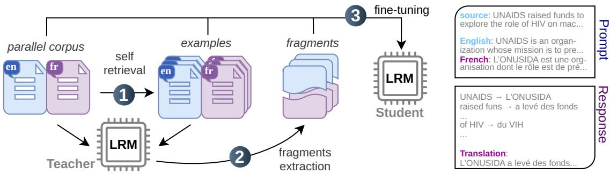
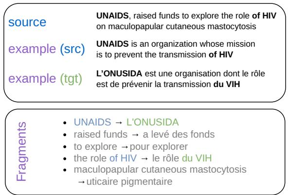
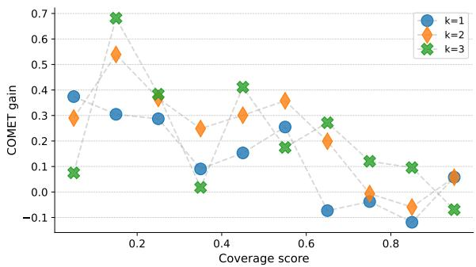
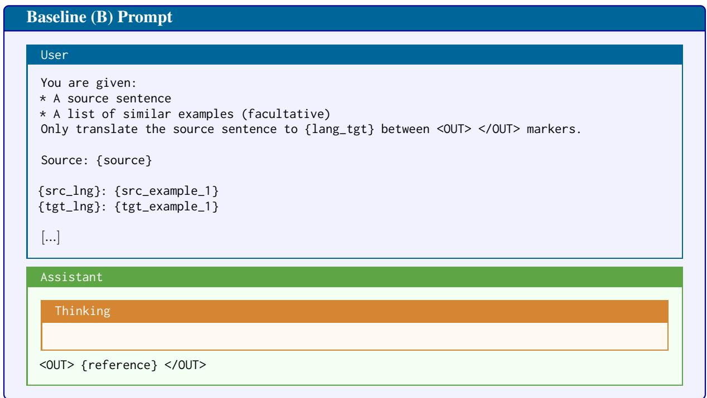
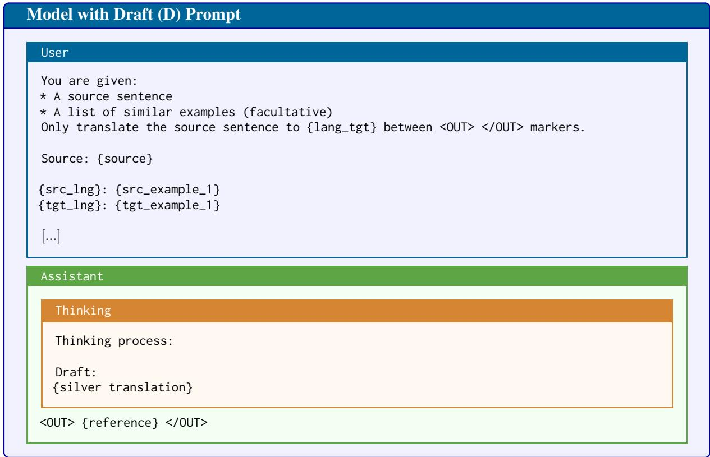
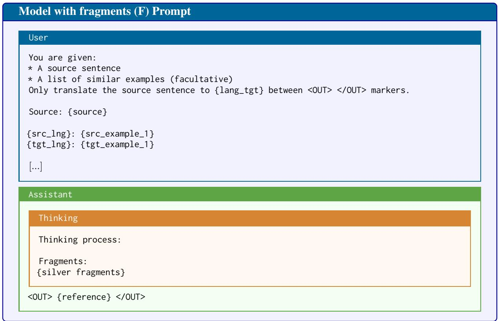
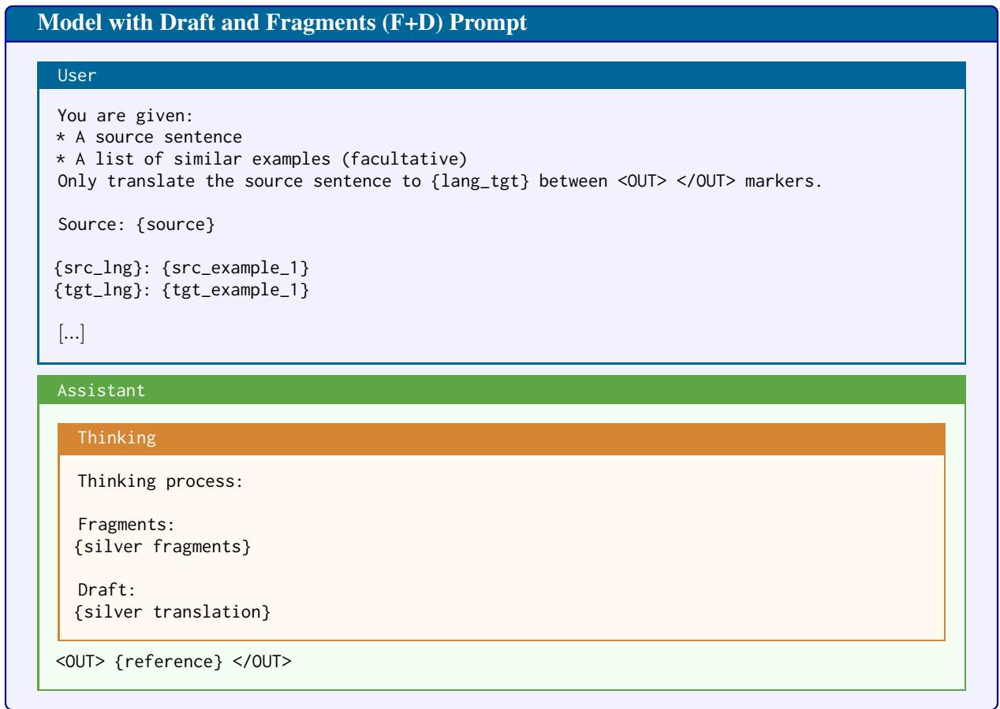
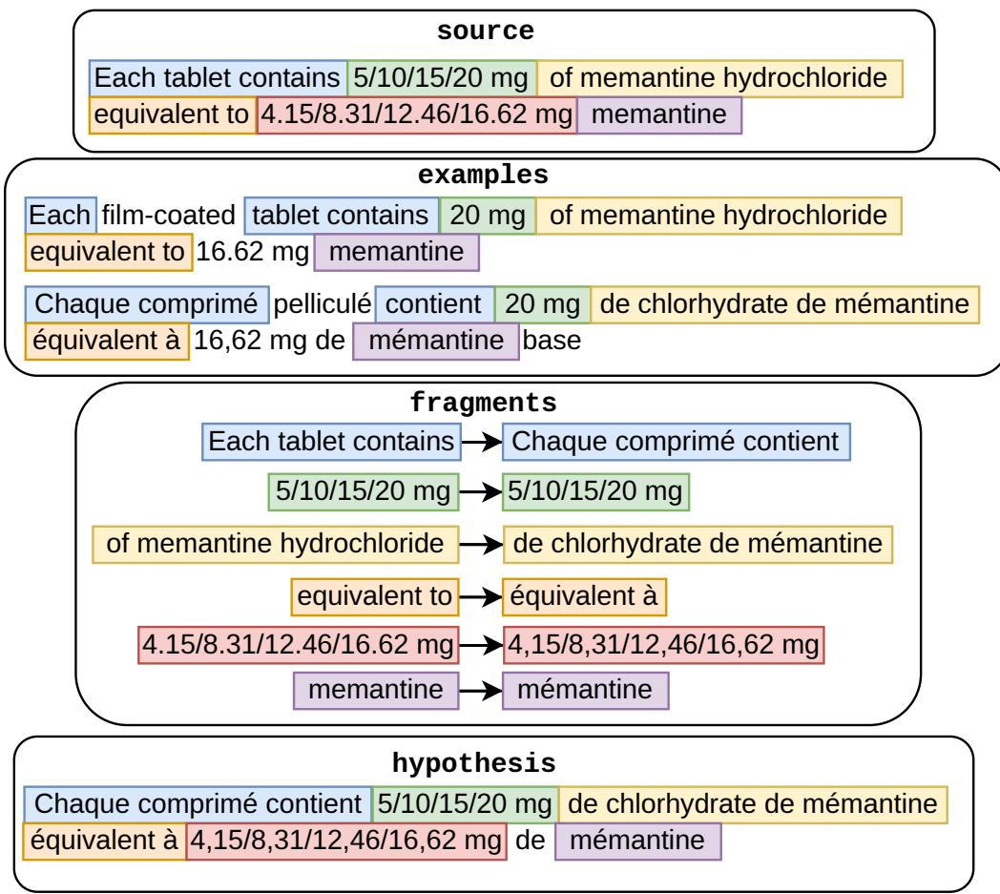

# Reasoning about In-Context Samples for Machine-Translation

Maxime Bouthors<sup>†</sup> Josep Crego<sup>†</sup> François Yvon<sup>‡</sup> <sup>†</sup>SYSTRAN by ChapsVision, 5 rue Feydeau, F-75002 Paris, France <sup>‡</sup>Sorbonne Université, CNRS, ISIR, F-75005 Paris, France {mbouthors,jcrego}@chapsvision.com yvon@isir.upmc.fr

## Abstract

Large Language Models (LLMs) can be trained to perform chain-of-thoughts reasoning in order to improve the reliability of their responses. In this work, we investigate how explicit reasoning can be leveraged for LLM-Based Machine Translation (MT) with in-context samples. We introduce a novel fragment-based reasoning framework in which the model first extracts parallel source-target fragments from retrieved similar exemplars, and uses these fragments as intermediate reasoning traces to produce the final translation. To train our model, we distill silver fragments and drafts from a large teacher model. Our experiments with the Qwen3 model family, over 6 languages, including up to 5 domains per language, demonstrate that fragmentbased MT significantly outperforms alternative methods like standard k-shot or basic drafting.<sup>1</sup>

## 1 Introduction

Large Language Models (LLMs) have proven to be successful in a wide variety of tasks (Touvron et al., 2023), incuding Machine Translation (MT) (Vilar et al., 2022; Zhang et al., 2022). In-context learning (ICL) (Brown et al., 2020) successfully improves MT-tailored LLMs (Zhang et al., 2023a), as it provides a simple mechanism to input additional taskspecific, lexical, terminological or stylistic context to guide the generation algorithm towards more accurate translations (Moslem et al., 2023).

LLMs have recently evolved into Large Reasoning Models (LRMs), which first generate “thinking” tokens before computing their final output (Wei et al., 2022). LRMs can be further instructed, e.g., through supervised fine-tuning (SFT) or reinforcement learning (RL), to reproduce human reasoning steps in formal domains such as mathematics or coding (DeepSeek-AI, 2025). In the context of MT, these extra tokens serve, for instance, to simulate linguistic analyses, partial translations or drafts before generating the final translation (Raunak et al., 2023; He et al., 2024; Briakou et al., 2024; Zebaze et al., 2025a).

Most works on Chain-of-Thoughts (CoT) for MT thus take inspiration from the activities of human translators, modeled as a series of logically organized steps, from dictionary search to terminological analysis, translation and then revision(s), and make their models simulate the corresponding “thinking” tokens. Our inspiration is different, as we would like to model the reasoning process associated with the edition of one or several close exemplar(s) in translation-memory (TM) augmented translation (Bowker and Fisher, 2010). Despite the advances of NMT systems, TMs remain important tools in professional translators’ workbench, as they enable the transparent reuse of high-quality translations, which have already been validated for their correct terminology and phraseology – two key aspects in specialized translation. The integration of TMs with NMT, then with in-context learning and LLMs, is thus an important issue, studied e.g., in (Gu et al., 2018; Bulte and Tezcan, 2019).

As discussed in early works on Example-Based Machine Translation (EBMT) (Somers, 1999), reasoning with TMs can also logically be decomposed in several steps: (a) retrieving relevant exemplars<sup>2</sup> for the current source sentence, typically based on fuzzy surface similarity scores; (b) matching segments in the retrieved exemplars that also occur in the source sentence and retrieving their target side equivalent; (c) selecting, recombining, adapting and completing these segments into a translation; (d - optional) revising this draft translation.

In this work, our main focus is on steps (b), and to a lesser extent (c). We rely on external retrieval modules for (a), and on the built-in generation abilities of LLMs for (d). We accordingly ask the following research questions: (RQ1) can LLMs/LRMs reliably perform the matching step and identify, rather than generate, actual translation fragments in retrieved exemplar(s)? (RQ2) Are the corresponding fragments improving the MT quality? (RQ3) Does fragment extraction (henceforth FE) benefit more when multiple exemplars are retrieved? In other words, can they sort valuable information from noise? (RQ4) Does FE benefit more for some specific domains or languages than for others?

  
Figure 1: Overview of the training pipeline of the model: (1) exemplars are retrieved from the TM; (2) A teacher model performs FE from the exemplars; (3) A student model is trained to reproduce FE as a reasoning trace.

To study these questions, we develop a complete pipeline, illustrated in Figure 1, relying on the Qwen3-32B model (Yang et al., 2025) as a teacher to generate training samples for the matching task, and on a finetuned version of Qwen3-8B to perform the reasoning and translation generation tasks. Our main findings are the following: (a) LLMs can learn to match, select or generate useful parallel fragments in parallel sentences; (b) Extracting such fragments during the reasoning process – even when noisy – significantly improves the translation quality for all metrics considered in this work; (c) The gains are independant of the number of retrieved exemplars, suggesting that FE produces a robust signal that can be exploited to generate the final translation; (d) This method generalizes to domains that are unseen during fine-tuning; (e) Combining segment retrieval with drafting techniques seems to undermine translation quality for domains seen in training, but yields improvement for unseen domains.

## 2 Related Work

Retrieval Augmented Machine Translation Retrieval-augmented MT (RAMT) leverages similar exemplars to improve translation quality. As for other cognitive tasks, relying on exemplars which can be inspected increases the transparency of the translation process (Rudin, 2019); for specialized MT, exemplars also implicitly provide some domain adaptation capabilities. RAMT is readily implemented in encoder-decoder models by augmenting the source-side with one or multiple similar target sentence(s) retrieved from the TM, while the target side decoder module remains mostly unchanged, as proposed in (Bulte and Tezcan, 2019; Xia et al., 2019; He et al., 2021; Cheng et al., 2022; Agrawal et al., 2023),

LLM-based MT also bode well with exemplars: once integrated through in-context learning (ICL), they provide task-specific contexts along with lexical and stylistic suggestions (Radford et al., 2019). Multiple follow-up works have further explored the impact of the prompt, of the quality and number of exemplars and of the retrieval procedure (Moslem et al., 2023; Vilar et al., 2023; Zhang et al., 2023a; Hendy et al., 2023; Bawden and Yvon, 2023; Zebaze et al., 2025c).

A parallel strand of research focuses on editbased models (Gu et al., 2019), viewing RAMT as a new instance of example-based NMT (Nagao, 1984; Somers, 1999; Carl et al., 2004). Contrary to NMT or LLM-based approaches, where the output is computed from scratch, the output is computed by minimally patching an existing translation. This requires to identify the parts that respectively need to be kept, adapted, or retranslated from scratch, then to perform the prescribed operations. Such methods are especially effective when very close exemplars, necessitating a small number of edits, can be found; in this way, the output is very likely to contain large, error-free, fragments of the retrieved translation. Recent implementations of these ideas, relying on non-autoregressive decoders, are presented in e.g., (Xu and Carpuat, 2021; Niwa et al., 2022; Xu et al., 2023; Zheng et al., 2023; Bouthors et al., 2023).

Large Reasoning Models Large Reasoning Models (LRMs) are able to perform reasoning steps and solve complex tasks (Cobbe et al., 2021). These models are tuned to perform additional steps of intermediary text generation, dubbed “chain-ofthoughts” (CoT) steps, before generating their final answer (Wei et al., 2022). CoT can be toggled via prompting ("Let us think step by step") or supervised fine-tuning (Kojima et al., 2022; Zhang et al., 2023b; Yasunaga et al., 2024). RL can further improve such reasoning capabilities, especially for code or problem-solving tasks where the validity of answers can be automatically checked (Setlur et al., 2024; DeepSeek-AI et al., 2025).

Large Reasoning Machine Translation Models Raunak et al. (2023) explore various ways to perform automatic post-editing through prompting GPT-4, contrasting prompts for (a) generation of a refined translation, (b) generation of a list of edits, then of the revision (dubbed CoT), (c) generation of MQM-like<sup>3</sup> annotations, then edits, then of the revision (structured CoT). In their setting, CoTbased refinements underperform the baseline, yet produce valuable lists of possible edits. Work on iterative refinement is continued, e.g., by Feng et al. (2024); Xu et al. (2024); Chen et al. (2024).

In contrast to these works, which focus on postgeneration steps, MAPS (Multi-Aspect Prompting and Selection, (He et al., 2024)) focuses on pretranslation. This approach prompts an LLM to analyze the source sentence and generate a list of topics, of keywords, and demonstrations in the form of similar exemplars. This background information is then used to produce three candidate translations, each conditioned on a different knowledge source. The most promising candidate, as evaluated by a quality estimation (QE) metric, is finally selected.

Briakou et al. (2024) combine both viewpoints, integrating subtasks that translators perform prior and posterior to translation. Their experiments use one pre-translation (explain “difficult” source terms), and three post-translation (draft, refine, proofread) steps, focussing on document’-level MT.<sup>4</sup> This approach is extended by He et al. (2025), who simulate various “reasoning” strategies used by translators (e.g., decomposition, back translation, pivot translation), combining SFT and RL.

  
Figure 2: Illustration of the fragment extraction (FE) step, with k = 1 exemplar. Extracted fragments are colored while generated parts are grayed.

Chen et al. (2025); Nguyen and Xu (2025) more directly attempt to evaluate “reasoning” models for MT using prompting techniques. Feng et al. (2025) reuse training strategies of DeepSeek-R1 (DeepSeek-AI et al., 2025) to tune MT-adapted LRMs. For this, they study several reward models, combining format and content conformity metrics. Their results suggest that training an effective MT engine with pure RL pays off. Zebaze et al. (2025a) implement CoT via pure SFT and find that standard CoT – i.e., allowing “thinking” tokens – is not helping MT performance in their setting. Two types of CoT are considered: (a) translation introspection, simulating the reasoning process of a trained translator in 6 different ways (He et al., 2025); (b) auxiliary tasks, where CoT tokens correspond to tasks that can help translation, termed “modular prompting strategies”. These various “pretranslation” tasks, such as paraphrasing the source, or identifying translation difficulties, are distilled from teacher models, then assembled into SFT examples for the student model. Similar experiments are reported by Rajaee et al. (2026).

## 3 Method

## 3.1 Principles

From a bird’s-eye view, EBMT is characterized by three main operations: retrieval, matching and recombination (Somers, 1999). Optionally, a revision step can finally be applied. In this study, we mostly focus on the second and third steps. Given relevant exemplars retrieved from memory, the matching step first locates source chunks that are relevant for the current translation task, then matches these with the corresponding target chunks. The recombination step then reassembles these target fragments to form a complete translation hypothesis. During this step, some adaptation (e.g., morphological changes, local reorderings, etc) may be required to ensure the syntactic well-formedness of the hypothesis.

We approach the training of a translation system capable of simulating these processes as follows: we first prompt a strong teacher model to generate reasoning traces from inputs made of the source sentence x, augmented with k relevant exemplars $\left\{ ( \mathbf { x } _ { 1 } , \mathbf { y } _ { 1 } ) , \dotsc , ( \mathbf { x } _ { k } , \mathbf { y } _ { k } ) \right\}$ retrieved from a TM. Details are in § 3.2. Once (artificial) reasoning traces are available for each training sample, we fine-tune a student model in a supervised manner to reproduce similar reasoning steps during the translation process (see § 3.3).

This training pipeline heavily relies on automatically generated “reasoning” tokens, as is custom in CoT approaches (Shum et al., 2023; Zhang et al., 2023b). This is because these tokens are rarely observed and available in the training data, except in very specific cases (e.g., mathematical problems). Machine Translation is no exception to this stateof-affair, prompting us to simulate translators’ reasoning operations. In the next sections, we first document the teacher, then the student models.

## 3.2 Silver fragments extraction

Given a source sentence x and a set of k similar exemplars $E ( k ) = \left\{ ( \mathbf { x } _ { 1 } , \mathbf { y } _ { 1 } ) , \dotsc , ( \mathbf { x } _ { k } , \mathbf { y } _ { k } ) \right\}$ retrieved from a TM, we would like to generate traces of the following sequential reasoning process:

1. Decompose x into a set of minimal translatable semantic units $\left( u _ { 1 } , \ldots , u _ { m } \right)$ forming an ordered partition of x, with potentially missing punctuations or function words;

2. For each unit $u _ { i }$ , propose a translation $v _ { i }$ that is either (a) a translation of $u _ { i }$ attested in at least one exemplars, or (b) an adaptated version of a segment resembling $u _ { i }$ or (c) novel translation generated from scratch;

3. Compute a draft translation $\tilde { \mathbf { y } }$ obtained by recombining the $v _ { i } \mathrm { { ' s } }$ together, with possible additional inserts or reformulations to fill the gaps between the $v _ { i } \mathrm { { ' } } s$

Steps 1 and 2 are illustrated in Figure 2. Each of these steps is reminiscent of processes already well studied in MT systems from previous generations. For instance, step 1 and 2 are similar to the generation of a (weightless) translation table in statistical MT systems, while step 3 is akin to decoding with this table (Koehn, 2010). Step 1 and 2 are also standard in EBMT, where step 1 would resort to some sort of syntactic parsing, while step 2 would use lexical access or automatic word alignment. Drafting (step 3) is used in several contemporary MT reasoning models e.g., (Xu et al., 2024; Briakou et al., 2024). Focusing on low-resource MT, (Zebaze et al., 2025b) also combines steps 1-3, generating translations of short fragments, that are then used as in-context samples for the full sentence.

The difficulties of these steps are thus well known: Step 1 is ill-defined and ambiguous, as there may be multiple ways to decompose x. Step 2 is also very difficult, as it implies the computation of fuzzy alignments between source and target units, then the selection of one target translation for each source unit, whenever several are available (see e.g., Bouthors et al. (2023) for an attempt to implement these computations with conventional alignment techniques). Finally, step 3 might also imply significant structural changes to reassemble the extracted fragments.

Rather than implementing each step with a dedicated tool, we resort here to prompting and ask a strong teacher LLM (as indicated in Appendix C) to successively generate the relevant set of fragments $F = \{ ( u _ { 1 } , v _ { 1 } ) , \dots , ( u _ { n } , v _ { n } ) \}$ , which we call silver fragments, and a draft translation $\tilde { \mathbf { y } }$ . After applying this process to the entire parallel training corpus, we obtain annotations that can be used to extend the training data with additional supervision traces of a simulated “reasoning” process.

## 3.3 Translating with Example-Based Reasoning

Using the artificial traces computed by the teacher model, we fine-tune a student LLM to augment the generation process with similar “thinking” tokens before computing its final translation y. Denoting F the set of fragments $\left\{ ( u _ { 1 } , v _ { 1 } ) , \ldots , ( u _ { m } , v _ { m } ) \right\}$ we adapt the parameters θ of an existing model to compute:<sup>5</sup>

$$
p _ { \theta } ( F \circ \tilde { \mathbf { y } } \circ \mathbf { y } | \mathbf { x } ; ( ( \mathbf { x } _ { 1 } , \mathbf { y } _ { 1 } ) , \dots , ( \mathbf { x } _ { k } , \mathbf { y } _ { k } ) ) ) ,
$$

where ◦ is the concatenation operator. This model is refered to as Fragments+Draft, abbreviated as (F+D) below.

For comparison purposes, we also fine-tune the following variants on the same dataset, where we selectively ablate sections of the reasoning traces:

$$
\begin{array} { r l } & { \bullet \operatorname { F r a g m e n t s } \mathrm { o n l y } ( \operatorname { F } ) \colon } \\ & { \quad p _ { \theta } ( F \circ \mathbf { y } | \mathbf { x } ; ( ( \mathbf { x } _ { 1 } , \mathbf { y } _ { 1 } ) , \dots , ( \mathbf { x } _ { k } , \mathbf { y } _ { k } ) ) ) , } \end{array}
$$

$$
\begin{array} { r l } & { \bullet \ \mathrm { D r a f t ~ o n l y ~ ( D ) } \colon } \\ & { \quad p _ { \theta } \big ( \tilde { y } \circ \mathbf { y } \big | \mathbf { x } ; ( ( \mathbf { x } _ { 1 } , \mathbf { y } _ { 1 } ) , \ldots , ( \mathbf { x } _ { k } , \mathbf { y } _ { k } ) ) \big ) , } \end{array}
$$

$$
\begin{array} { r l } & { \bullet \mathrm { ~ B a s e l i n e ~ ( B ) } \colon } \\ & { \quad p _ { \theta } ( \mathbf { y } | \mathbf { x } ; ( ( \mathbf { x } _ { 1 } , \mathbf { y } _ { 1 } ) , \ldots , ( \mathbf { x } _ { k } , \mathbf { y } _ { k } ) ) ) . } \end{array}
$$

For all these models, adaptation is performed by optimizing the cross-entropy loss on the artificial fine-tuning data. Details regarding the fine-tuning process and the prompts are in Appendix D.

## 4 Data and Metrics

## 4.1 Data

The corpus used for the experiments comprises five language pairs, associating English with a European language. All these data are publicly available on the OPUS website<sup>6</sup> (Tiedemann, 2012). It includes the five English-German domains used by Aharoni and Goldberg (2020) and five of the English-French domains of Xu et al. (2022). Additionally, we use three English-Polish, two English-Ukrainian and one English-Spanish domains. These corpora are filtered, and split into train/dev/test when necessary.

For each of the 16 domains and language pairs, a subset of high-quality 10k samples is selected for training and concatenated into a multilingual dataset of size 160k. For each training instance, we uniformly sample between k = 0 and k = 3 examples by retrieving in-domain similar sentences from the pool of all parallel sentences.<sup>7</sup> The retrieval setting leverages both BM25 and the Levenshtein distance, as advised by (Bouthors et al.,

2024). We reserve a distinct test set (respectively development set) of 1,000 (resp. 100) examples for each domain, composing a multi-domain testset of 16k samples. Additionally, we consider a “surprise” English-French test set GNOME, which is not included in the training data, to evaluate the generalization capabilities of the method.

Details regarding the data are in Appendix A.

## 4.2 Metrics

We assess machine translation quality with BLEU (Papineni et al., 2002) computed with SacreBLEU (Post, 2018),<sup>8</sup> as well as COMET<sup>9</sup> (Rei et al., 2020), and MetricX<sup>10</sup> (Juraska et al., 2024).

## 5 Experimental Settings

## 5.1 Models

The teacher model mentioned in Section 3.2 is Qwen3-32B,<sup>11</sup> which we query with the prompt described in Appendix C. As for the student model, we use a smaller model, Qwen3-8B.<sup>12</sup> Note that the prompt used for the teacher model is quite long, as it includes detailed instructions and an illustration of the task. The use of a smaller student with a minimal prompt is motivated by the computational cost and constraints of deploying or fine-tuning a large model at scale, as well as by the desire to demonstrate that the proposed method can be effective even with a small model and a simple prompt.

Each model equally observes samples with k = 0, 1, 2, 3 exemplars during training. Notably, 20% of the training samples have an empty reasoning trace, thereby allowing us to perform inference in two different ways: with thinking enabled vs. thinking disabled. These two inference modes are compared below. All fine-tuning processes run for 2 epochs. Detailed settings are in Appendix B.

## 5.2 Baselines

In addition to the fine-tuned baseline model (B), with which we generate the translation without any thinking process,<sup>13</sup> we also consider the instruct Qwen3-8B model without fine-tuning, which we denote (I). Since its reasoning<sup>14</sup> often requires thousands of tokens, it is very costly to run on our large multi-domain test set. Therefore, we only use it with the reasoning ability turned off.

## 6 Results and Analysis

## 6.1 Fragment-based MT

We first study the translation quality (RQ1) of various configurations (fragments, drafting) and its dependency to the number of retrieved exemplars k. The main results are reported in Table 1. A clear trend across all metrics indicates that the use of fragments significantly improves the translation quality, with or without drafting ((F) and (F+D)). Detailed results broken down by domains / languages are in Appendix E, see also §6.6.

A second observation is that drafting alone seems to degrade the translation quality (both (D) vs. (B) and (F+D) vs. (F)). This is somewhat unexpected, as drafting is supposed to provide a useful intermediate step for the final translation. This may be because the draft is not sufficiently accurate, and thus provides a noisy signal for the final translation, or because the model is not able to properly leverage this information. However, in most cases, the draft is a mere combination of the previously generated silver fragments, which clearly contribute to the improvement. See discussion in §6.4. Finally, we find that the gains provided by reasoning are observed for all values of k, which suggests that the model can successfully benefit from fragments of sufficient quality.

Table 2 displays an alternative view of these results via the win rate of (F) against (B) with respect to three metrics across our 16 domains. Fragmentbased translation outperforms the baseline in 14 out of 16 cases on average, with no clear dependency on the number of exemplars k > 0.

## 6.2 Out-of-domain generalization

We now challenge the generalization abilities of the reasoning module, evaluating our approach on a domain unseen in fine-tuning: GNOME. Results are in Table 3. The results are similar to those obtained on the in-domain test sets (Table 1) for the fragment settings, suggesting that fragment-based reasoning is a robust method that can generalize to new domains. Here, the drafting step also yields gains, both with and without fragments.

## 6.3 Assessing fragment quality

Beyond translation scores, a natural follow-up question concerns the validity of extracted fragments: do they correspond to actual chunks matched in the source and the exemplars (RQ1)? To answer this question, we first check whether the source-side fragments are faithful to the source side. Table 4 reports BLEU scores, unigram recalls and precisions between the concatenated source-side fragments and the source computed with SacreBLEU.

The precision is high, meaning that fragments almost always correspond to spans from the source sentence. The recall is lower, about 80%, meaning that the source sentence is not represented in its integrality in the fragments. In most cases, this is simply due to ignored punctuation or function words, exactly like in the illustration given in the silver fragment generation prompt (Figure 4). It is finally noteworthy that the inferred fragments ((F) and (F+D)) obtain higher source recall than the silver fragments – highlighting the positive net effect of SFT for this task.

## 6.4 Silver vs. infered fragments and drafts

As the student model attempts to reproduce the silver fragments and/or drafts, errors in the reasoning process may propagate and ultimately degrade the quality of hypotheses. One way to evaluate the quality of the inferred fragments and drafts with respect to the silver ones is to examine the evolution of the translation metrics when the silver fragments and drafts are prefixed to the response as reasoning traces, thereby reducing the generation task to only compute the final translation. Table 5 shows that providing the silver fragments alone (F) does not lead to better translations compared to fully inferring them (except for BLEU). COMET scores even hint at a slight negative effect. In contrast, the use of silver drafts yields a clear improvement in all translation scores. These results confirm that the inferred drafts are of comparatively lower quality with respect to the silver drafts.

To further study the difference between silver and generated fragments, we compute their extraction rate (ER), which measures how often a fragment is copied into the final translation. ER is the ratio of target-side exact matches between the fragments and the exemplars, conditioned on the source side already being an exact match. Silver fragments obtain an ER of ≈70%, while student fragments ((F) and (F+D)) land around 35%. This loss is fully explained by the fact that the student model sometimes generates fragments instead of extracting them from the exemplars. This does not however impact the overall translation quality.

<table><tr><td colspan="2"></td><td colspan="4">BLEU↑</td><td colspan="4">COMET ↑</td><td colspan="4">MetricX↓</td></tr><tr><td>Model</td><td>think</td><td>k=0</td><td>k=1</td><td>k=2</td><td>k=3</td><td>k=0</td><td>k=1</td><td>k=2</td><td>k=3</td><td>k=0</td><td>k=1</td><td>k=2</td><td>k=3</td></tr><tr><td>(I)</td><td>x</td><td>28.6</td><td>33.0</td><td>35.6</td><td>36.0</td><td>82.3</td><td>79.9</td><td>81.9</td><td>82.1</td><td>7.43</td><td>2.15</td><td>2.12</td><td>2.10</td></tr><tr><td>(B)</td><td>x</td><td>38.3</td><td>45.3</td><td>46.0</td><td>46.3</td><td>85.3</td><td>86.3</td><td>86.4</td><td>86.5</td><td>2.27</td><td>2.11</td><td>2.09</td><td>2.07</td></tr><tr><td>(D)</td><td>x</td><td>36.7</td><td>44.7</td><td>45.5</td><td>45.8</td><td>85.0</td><td>86.1</td><td>86.2</td><td>86.4</td><td>2.36</td><td>2.16</td><td>2.13</td><td>2.11</td></tr><tr><td>(D)</td><td>V</td><td>36.8</td><td>44.1</td><td>45.0</td><td>46.0</td><td>84.9</td><td>85.0</td><td>85.6</td><td>85.6</td><td>2.34</td><td>2.66</td><td>2.43</td><td>2.11</td></tr><tr><td>(F)</td><td>x</td><td>37.4</td><td>44.8</td><td>45.5</td><td>45.9</td><td>85.1</td><td>86.2</td><td>86.3</td><td>86.4</td><td>2.33</td><td>2.13</td><td>2.11</td><td>2.09</td></tr><tr><td>(F)</td><td>V</td><td>38.5</td><td>45.7</td><td>46.4</td><td>46.7</td><td>85.6</td><td>86.3</td><td>86.7</td><td>86.7</td><td>2.16</td><td>2.03</td><td>1.98</td><td>1.99</td></tr><tr><td>(F+D)</td><td>x</td><td>37.5</td><td>44.7</td><td>45.5</td><td>45.8</td><td>85.0</td><td>86.1</td><td>86.3</td><td>86.4</td><td>2.34</td><td>2.15</td><td>2.11</td><td>2.10</td></tr><tr><td>(F+D)</td><td>√</td><td>38.2</td><td>45.6</td><td>46.3</td><td>46.6</td><td>85.5</td><td>86.5</td><td>86.6</td><td>86.6</td><td>2.20</td><td>2.04</td><td>2.01</td><td>2.01</td></tr></table>

Table 1: Average BLEU, COMET, and MetricX scores on the multi-domain test set for the different models and number of examples k. Note that fine-tuned models can be run with or without reasoning. Results significantly better (p<1%) than the baseline (B) are in bold. The significance is assessed with a paired t-test for COMET and MetricX, and with bootstrapping for BLEU with SacreBLEU (n=1000).

<table><tr><td>k =</td><td>0 1</td><td>2</td><td>3</td></tr><tr><td>BLEU</td><td>8/16</td><td>12/16 14/16</td><td>14/16</td></tr><tr><td>COMET</td><td>14/16</td><td>14/16 14/16</td><td>14/16</td></tr><tr><td>MetricX</td><td>6/16</td><td>13/16 15/16</td><td>14/16</td></tr></table>

Table 2: Win rates of (F) (with thinking on) against (B) using BLEU, COMET, and MetricX across 16 domains.

Finally, we investigate the extent to which the draft constitutes a genuine recombination of fragments, both for the silver traces and the inferred ones (in setting (F+D)). On average, fragment unigrams cover 81% of the draft (for silver fragments and drafts), while this proportion rises to 98% for (F+D). These results suggest that silver drafts involve a genuine rephrasing of the target-side fragments, while the student-generated drafts simply amount to recombinations. The poor quality of generated drafts is finally reflected in their BLEU scores: ≈ 38 for silver fragments, with generated drafts lagging 8 points behind (≈ 30 in the (F+D) setting). All this further supports the hypothesis that the drafting stage is unlikely to be beneficial in this setting.

## 6.5 Sorting relevant from irrelevant information

In our scenario, the retrieved exemplars provided to the model are not always close to the source sentence. Some lexical, terminological or phraseological information might be present, but surrounded by less relevant content. The additional FE step performed during inference should help the identification of these pieces, and their reuse to improve the MT quality. To assess whether this is the case, we study the link between the coverage of the source sentence by the exemplars, and the gain in translation quality between the fragment-based model (F) and the baseline (B), as measured by COMET.

The coverage is here defined as the proportion of words in the reference sentence that are also present in the target side of at least one retrieved exemplar. Figure 3 reveals that when coverage is low, the COMET gain is substantially higher than when it is high, for all values of k. This is because a high coverage usually entails a very close exemplar, which by itself ensures a very good translation for the baseline MT. In the low coverage case, where the baseline model can struggle with a lot of irrelevant text, prompting the model to generate fragments has a clear positive effect, as it helps the model to extract relevant information from the exemplars.

## 6.6 Domain and language analysis

Results in Appendix E display clear and consistent improvements for six domain/language pairs: Wikipedia en-pl, TED en-uk, Europarl en-fr, Wikipedia en-fr, Koran en-de, and Subtitles ende. French and German generally exhibit stronger gains, probably as they account for 60% of the training data. In contrast, some domains (e.g., JRC and ECB) and languages (e.g., Spanish and Polish) show more limited improvements. Notably, the majority of the observed gains occur in domains characterized by greater stylistic freedom.

<table><tr><td colspan="4"></td><td colspan="3">BLEU↑</td><td colspan="4">COMET ↑</td><td colspan="4">MetricX↓</td></tr><tr><td>Model</td><td>think</td><td>k=0</td><td>k=1</td><td>k=2</td><td>k=3</td><td>k=0</td><td>k=1</td><td>k=2</td><td>k=3</td><td>k=0</td><td>k=1</td><td>k=2</td><td>k=3</td></tr><tr><td>(I)</td><td>x</td><td>44.6</td><td>55.7</td><td>56.9</td><td>57.4</td><td>85.6</td><td>84.3</td><td>85.8</td><td>85.7</td><td>1.68</td><td>2.21</td><td>2.01</td><td>2.07</td></tr><tr><td>(B)</td><td>X</td><td>45.9</td><td>64.4</td><td>65.2</td><td>65.4</td><td>86.0</td><td>89.4</td><td>89.8</td><td>89.8</td><td>1.65</td><td>1.27</td><td>1.22</td><td>1.20</td></tr><tr><td>(D)</td><td>x</td><td>44.9</td><td>64.5</td><td>65.5</td><td>65.8</td><td>85.8</td><td>89.2</td><td>89.8</td><td>89.9</td><td>1.74</td><td>1.31</td><td>1.26</td><td>1.26</td></tr><tr><td>(D)</td><td>V</td><td>46.2</td><td>63.6</td><td>65.8</td><td>66.1</td><td>86.1</td><td>86.4</td><td>89.7</td><td>89.9</td><td>1.68</td><td>1.89</td><td>1.26</td><td>1.24</td></tr><tr><td>(F)</td><td>x</td><td>45.5</td><td>63.7</td><td>64.4</td><td>65.1</td><td>86.3</td><td>89.2</td><td>89.7</td><td>89.9</td><td>1.67</td><td>1.30</td><td>1.25</td><td>1.23</td></tr><tr><td>(F)</td><td>V</td><td>46.7</td><td>64.8</td><td>65.6</td><td>65.6</td><td>86.5</td><td>89.6</td><td>90.0</td><td>90.1</td><td>1.59</td><td>1.24</td><td>1.20</td><td>1.20</td></tr><tr><td>(F+D)</td><td>x</td><td>46.4</td><td>64.5</td><td>65.4</td><td>65.3</td><td>86.4</td><td>89.3</td><td>89.8</td><td>89.8</td><td>1.65</td><td>1.28</td><td>1.23</td><td>1.23</td></tr><tr><td>(F+D)</td><td>√</td><td>44.1</td><td>65.6</td><td>66.3</td><td>66.4</td><td>86.7</td><td>89.6</td><td>90.1</td><td>90.1</td><td>1.55</td><td>1.21</td><td>1.17</td><td>1.17</td></tr></table>

Table 3: BLEU, COMET, and MetricX scores on the GNOME domain, for several models and number of exemplars k. Results significantly better (p<5%) than the baseline (B) are in bold. The significance is assessed with a paired t-test for COMET and MetricX, and with bootstrapping for BLEU (using SacreBLEU, n = 1000).

<table><tr><td>fragments</td><td>Prec.</td><td>Rec.</td><td>BLEU</td></tr><tr><td>silver</td><td>98.5</td><td>81.1</td><td>77.1</td></tr><tr><td>(F)</td><td>99.7</td><td>89.2</td><td>80.8</td></tr><tr><td>(F+D)</td><td>99.7</td><td>89.1</td><td>80.8</td></tr></table>

Table 4: Assessing the faithfulness of the source fragments w.r.t. the source sentence.

  
Figure 3: Differences in COMET score gain between (F) and (B) w.r.t the coverage of the reference sentence.

## 6.7 Traceability

Fragments offer a form of traceability of the translation process, as some spans in the hypothesis can be directly linked to spans in the exemplars. Indeed, fragments correspond to an alignment that can be inspected and connected to both the source and the TM exemplars. This traceability feature is illustrated in Appendix F. However, our model remains free to generate a translation that does not reuse any generated fragments – and sometimes this is necessary – making the traceability process sometimes unreliable. Only fragments that are directly copied from the exemplars can be transparently identified.

## 7 Conclusions and Outlook

In this paper, we explore how LLM-based MT can be augmented with a reasoning process that focuses on exemplar matching and recombination. We introduce a fragment-based reasoning framework in which fragments are extracted and/or generated to guide the overall translation process. We run experiments with six languages and ten domains and observe that our strategy consistently improves translation scores, outperforming standard k-shot prompting and drafting-based approaches. We also noted that the generated fragments mostly correspond to source-side matches; but that the associated draft quality was overall quite low.

Several directions remain open for future work. Our current approach relies on supervised distillation from a large teacher model to learn reasoning traces. Recent advances in reasoning-focused LLMs have shown the effectiveness of RL techniques for improving the quality and utility of intermediate reasoning steps, constituting a first promising direction for future research. Other avenues for future work are the increase of k beyond 3, as FE seems to robustly handle the additional noise introduced in irrelevant examples. Finally, we would like to better understand the value of the added traceability in user studies involving translators.

<table><tr><td></td><td colspan="4">BLEU↑</td><td colspan="4">COMET ↑</td><td colspan="4">MetricX↓</td></tr><tr><td>Model</td><td>k=0</td><td>k=1</td><td>k=2</td><td>k=3</td><td>k=0</td><td>k=1</td><td>k=2</td><td>k=3</td><td>k=0</td><td>k=1</td><td>k=2</td><td>k=3</td></tr><tr><td>(D)</td><td>+2.2</td><td>+1.2</td><td>+0.7</td><td>0.0</td><td>+0.2</td><td>+1.0</td><td>+0.5</td><td>+0.5</td><td>-0.2</td><td>-0.6</td><td>-0.4</td><td>0.0</td></tr><tr><td>(F)</td><td>+1.1</td><td>+0.3</td><td>+0.1</td><td>0.0</td><td>0.0</td><td>-0.1</td><td>-0.4</td><td>-0.4</td><td>0.0</td><td>0.0</td><td>+0.1</td><td>+0.1</td></tr><tr><td>(F+D)</td><td>+1.3</td><td>+0.1</td><td>0.0</td><td>+0.1</td><td>+0.1</td><td>-0.1</td><td>-0.1</td><td>0.0</td><td>-0.1</td><td>0.0</td><td>0.0</td><td>0.0</td></tr></table>

Table 5: BLEU, COMET, and MetricX scores average gains on the multi-domain test set when prefixing the silver drafts and/or fragments instead of having them be inferred during reasoning.

## Limitations

Our work presents several limitations that should be acknowledged. First, although our experiments cover multiple language pairs and a variety of domains, the overall evaluation remains limited in scale. Further validation on a broader and more diverse set of languages, domains, and translation conditions would be necessary to fully assess the generalization and robustness of the proposed approach.

Second, our approach assumes the availability of translation memories (TMs) or large bilingual corpora from which relevant exemplars can be retrieved. In practice, such resources may not always be available, especially for low-resource languages, emerging domains, or highly specialized applications.

Finally, the quality of the proposed reasoning traces strongly depends on the quality of the silver fragments generated by the teacher LLM. In practice, the teacher model may produce suboptimal outputs, including malformed fragments, hallucinated content, incomplete extractions, or incorrect bilingual correspondences. Such errors can propagate to the student models during supervised distillation and ultimately degrade translation quality. More broadly, the extraction process itself remains constrained by the capabilities and inductive biases of current LLMs. While the generated fragments often capture useful translation correspondences, they do not necessarily reflect linguistically optimal decompositions of the source sentence. Improving the reliability, consistency, and faithfulness of FE therefore remains an important challenge for future work.

## Ethical Statement

There are no ethical issues with this work.

## Acknowledgments

This research was funded by the French “Agence Nationale de la Recherche” (ANR) under the project TraLaLaM (ANR-23-IAS1-0006). It was provided with computing AI and storage resources by GENCI at IDRIS thanks to grants 2025- A0161015117 and 2026-AD011017822 on the supercomputer Jean Zay. The authors wish to thank Newman Chen for its contribution to the early stages of this project, and the ARR reviewers and meta-reviewer for their constructive comments.

## References

Sweta Agrawal, Chunting Zhou, Mike Lewis, Luke Zettlemoyer, and Marjan Ghazvininejad. 2023. Incontext examples selection for machine translation. In Findings of the Association for Computational Linguistics: ACL 2023, pages 8857–8873, Toronto, Canada. Association for Computational Linguistics.

Roee Aharoni and Yoav Goldberg. 2020. Unsupervised domain clusters in pretrained language models. In Proceedings of the 58th Annual Meeting of the Association for Computational Linguistics, pages 7747– 7763, Online. Association for Computational Linguistics.

Rachel Bawden and François Yvon. 2023. Investigating the translation performance of a large multilingual language model: the case of BLOOM. In Proceedings of the 24th Annual Conference of the European Association for Machine Translation, pages 157–170, Tampere, Finland. European Association for Machine Translation.

Nikolay Bogoychev, Jelmer van der Linde, Graeme Nail, Barry Haddow, Jaume Zaragoza-Bernabeu, Gema Ramírez-Sánchez, Lukas Weymann, Tudor Nicolae Mateiu, Jindˇrich Helcl, and Mikko Aulamo. 2023. Opuscleaner and opustrainer, open source toolkits for training machine translation and large language models. CoRR, abs/2311.14838.

Maxime Bouthors, Josep Crego, and François Yvon. 2023. Towards example-based NMT with multi-Levenshtein transformers. In Proceedings of the 2023 Conference on Empirical Methods in Natural

Language Processing, pages 1830–1846, Singapore. Association for Computational Linguistics.

Maxime Bouthors, Josep Crego, and François Yvon. 2024. Retrieving examples from memory for retrieval augmented neural machine translation: A systematic comparison. In Findings ofthe Association for Computational Linguistics: NAACL 2024, pages 3022–3039, Mexico City, Mexico. Association for Computational Linguistics.

Lynne Bowker and Desmond Fisher. 2010. Computeraided translation, pages 60–65. Handbook of translation studies. Vol. 1. Amsterdam: Benjamins.

Eleftheria Briakou, Jiaming Luo, Colin Cherry, and Markus Freitag. 2024. Translating step-by-step: Decomposing the translation process for improved translation quality of long-form texts. In Proceedings of the Ninth Conference on Machine Translation, pages 1301–1317, Miami, Florida, USA. Association for Computational Linguistics.

Tom Brown, Benjamin Mann, Nick Ryder, Melanie Subbiah, Jared D Kaplan, Prafulla Dhariwal, Arvind Neelakantan, Pranav Shyam, Girish Sastry, Amanda Askell, Sandhini Agarwal, Ariel Herbert-Voss, Gretchen Krueger, Tom Henighan, Rewon Child, Aditya Ramesh, Daniel Ziegler, Jeffrey Wu, Clemens Winter, and 12 others. 2020. Language models are few-shot learners. In Advances in Neural Information Processing Systems, volume 33, pages 1877–1901. Curran Associates, Inc.

Bram Bulte and Arda Tezcan. 2019. Neural fuzzy repair: Integrating fuzzy matches into neural machine translation. In Proceedings ofthe 57th Annual Meeting of the Association for Computational Linguistics, pages 1800–1809, Florence, Italy. Association for Computational Linguistics.

Michael Carl, Andy Way, and Walter Daelemans. 2004. Recent advances in example-based machine translation. Computational Linguistics, 30:516–520.

Andong Chen, Yuchen Song, Wenxin Zhu, Kehai Chen, Muyun Yang, Tiejun Zhao, and Min zhang. 2025. Evaluating o1-like LLMs: Unlocking reasoning for translation through comprehensive analysis. Preprint, arXiv:2502.11544.

Pinzhen Chen, Zhicheng Guo, Barry Haddow, and Kenneth Heafield. 2024. Iterative translation refinement with large language models. In Proceedings of the 25th Annual Conference of the European Association for Machine Translation (Volume 1), pages 181–190, Sheffield, UK. European Association for Machine Translation (EAMT).

Xin Cheng, Shen Gao, Lemao Liu, Dongyan Zhao, and Rui Yan. 2022. Neural machine translation with contrastive translation memories. In Proceedings ofthe 2022 Conference on Empirical Methods in Natural Language Processing, pages 3591–3601, Abu Dhabi, United Arab Emirates. Association for Computational Linguistics.

Karl Cobbe, Vineet Kosaraju, Mohammad Bavarian, Mark Chen, Heewoo Jun, Lukasz Kaiser, Matthias Plappert, Jerry Tworek, Jacob Hilton, Reiichiro Nakano, Christopher Hesse, and John Schulman. 2021. Training verifiers to solve math word problems. CoRR, abs/2110.14168.

DeepSeek-AI. 2025. Deepseek-r1: Incentivizing reasoning capability in llms via reinforcement learning. Preprint, arXiv:2501.12948.

DeepSeek-AI, Daya Guo, Dejian Yang, Haowei Zhang, Junxiao Song, Ruoyu Zhang, Runxin Xu, Qihao Zhu, Shirong Ma, Peiyi Wang, Xiao Bi, Xiaokang Zhang, Xingkai Yu, Yu Wu, Z. F. Wu, Zhibin Gou, Zhihong Shao, Zhuoshu Li, Ziyi Gao, and 181 others. 2025. Deepseek-r1: Incentivizing reasoning capability in llms via reinforcement learning. Preprint, arXiv:2501.12948.

Zhaopeng Feng, Shaosheng Cao, Jiahan Ren, Jiayuan Su, Ruizhe Chen, Yan Zhang, Zhe Xu, Yao Hu, Jian Wu, and Zuozhu Liu. 2025. MT-R1-Zero: Advancing LLM-based Machine Translation via R1-Zero-like Reinforcement Learning. Preprint, arXiv:2504.10160.

Zhaopeng Feng, Yan Zhang, Hao Li, Bei Wu, Jiayu Liao, Wenqiang Liu, Jun Lang, Yang Feng, Jian Wu, and Zuozhu Liu. 2024. Tear: Improving llm-based machine translation with systematic self-refinement. Preprint, arXiv:2402.16379.

Jiatao Gu, Changhan Wang, and Junbo Zhao. 2019. Levenshtein transformer. In Advances in Neural Information Processing Systems, volume 32. Curran Associates, Inc.

Jiatao Gu, Yong Wang, Kyunghyun Cho, and Victor O.K. Li. 2018. Search Engine Guided Neural Machine Translation. Proceedings ofthe AAAI Conference on Artificial Intelligence, 32(1).

Minggui He, Yilun Liu, Shimin Tao, Yuanchang Luo, Hongyong Zeng, Chang Su, Li Zhang, Hongxia Ma, Daimeng Wei, Weibin Meng, Hao Yang, Boxing Chen, and Osamu Yoshie. 2025. R1-T1: fully incentivizing translation capability in LLMs via reasoning learning. Preprint, arXiv:2502.19735.

Qiuxiang He, Guoping Huang, Qu Cui, Li Li, and Lemao Liu. 2021. Fast and accurate neural machine translation with translation memory. In Proceedings of the 59th Annual Meeting of the Association for Computational Linguistics and the 11th International Joint Conference on Natural Language Processing (Volume 1: Long Papers), pages 3170–3180, Online. Association for Computational Linguistics.

Zhiwei He, Tian Liang, Wenxiang Jiao, Zhuosheng Zhang, Yujiu Yang, Rui Wang, Zhaopeng Tu, Shuming Shi, and Xing Wang. 2024. Exploring humanlike translation strategy with large language models. Transactions of the Association for Computational Linguistics, 12:229–246.

Amr Hendy, Mohamed Abdelrehim, Amr Sharaf, Vikas Raunak, Mohamed Gabr, Hitokazu Matsushita, Young Jin Kim, Mohamed Afify, and Hany Hassan Awadalla. 2023. How good are GPT models at machine translation? a comprehensive evaluation. CoRR, abs/2302.09210.

Juraj Juraska, Daniel Deutsch, Mara Finkelstein, and Markus Freitag. 2024. MetricX-24: The Google submission to the WMT 2024 metrics shared task. In Proceedings ofthe Ninth Conference on Machine Translation, pages 492–504, Miami, Florida, USA. Association for Computational Linguistics.

Philipp Koehn. 2010. Statistical machine translation. Cambridge University Press.

Takeshi Kojima, Shixiang (Shane) Gu, Machel Reid, Yutaka Matsuo, and Yusuke Iwasawa. 2022. Large language models are zero-shot reasoners. In Advances in Neural Information Processing Systems, volume 35, pages 22199–22213.

Arle Richard Lommel, Aljoscha Burchardt, and Hans Uszkoreit. 2013. Multidimensional quality metrics: a flexible system for assessing translation quality. In Proceedings of Translating and the Computer 35, London, UK. Aslib.

Yasmin Moslem, Rejwanul Haque, John D. Kelleher, and Andy Way. 2023. Adaptive machine translation with large language models. In Proceedings of the 24th Annual Conference ofthe European Association for Machine Translation, pages 227–237, Tampere, Finland. European Association for Machine Translation.

Makoto Nagao. 1984. A framework of a mechanical translation between Japanese and English by analogy principle. In Artificial and human intelligence. Elsevier Science Publishers. B.V.

Lam Nguyen and Yang Xu. 2025. Reasoning for translation: Comparative analysis of chain-of-thought and tree-of-thought prompting for LLM translation. In Proceedings of the 63rd Annual Meeting of the Associationfor Computational Linguistics (Volume 4: Student Research Workshop), pages 259–275, Vienna, Austria. Association for Computational Linguistics.

Ayana Niwa, Sho Takase, and Naoaki Okazaki. 2022. Nearest neighbor non-autoregressive text generation. CoRR, abs/2208.12496.

Kishore Papineni, Salim Roukos, Todd Ward, and Wei-Jing Zhu. 2002. Bleu: a method for automatic evaluation of machine translation. In Proceedings ofthe 40th Annual Meeting ofthe Associationfor Computational Linguistics, pages 311–318, Philadelphia, Pennsylvania, USA. Association for Computational Linguistics.

Matt Post. 2018. A call for clarity in reporting BLEU scores. In Proceedings of the Third Conference on Machine Translation: Research Papers, pages 186– 191, Brussels, Belgium. Association for Computational Linguistics.

Lorenzo Proietti, Stefano Perrella, Vilém Zouhar, Roberto Navigli, and Tom Kocmi. 2025. Estimating machine translation difficulty. In Findings ofthe Associationfor Computational Linguistics: EMNLP 2025, pages 24261–24285, Suzhou, China. Association for Computational Linguistics.

Alec Radford, Jeffrey Wu, Rewon Child, David Luan, Dario Amodei, Ilya Sutskever, and 1 others. 2019. Language models are unsupervised multitask learners. OpenAI blog, 1(8):9.

Sara Rajaee, Sebastian Vincent, Alexandre Berard, Marzieh Fadaee, Kelly Marchisio, and Tom Kocmi. 2026. Unlocking reasoning capability on machine translation in large language models. Preprint, arXiv:2602.14763.

Vikas Raunak, Amr Sharaf, Yiren Wang, Hany Awadalla, and Arul Menezes. 2023. Leveraging GPT-4 for automatic translation post-editing. In Findings of the Association for Computational Linguistics: EMNLP 2023, pages 12009–12024, Singapore. Association for Computational Linguistics.

Ricardo Rei, Craig Stewart, Ana C Farinha, and Alon Lavie. 2020. COMET: A neural framework for MT evaluation. In Proceedings ofthe 2020 Conference on Empirical Methods in Natural Language Processing (EMNLP), pages 2685–2702, Online. Association for Computational Linguistics.

Cynthia Rudin. 2019. Stop explaining black box machine learning models for high stakes decisions and use interpretable models instead. Nature Machine Intelligence, 1(5):206–215.

Amrith Setlur, Chirag Nagpal, Adam Fisch, Xinyang Geng, Jacob Eisenstein, Rishabh Agarwal, Alekh Agarwal, Jonathan Berant, and Aviral Kumar. 2024. Rewarding progress: Scaling automated process verifiers for llm reasoning. Preprint, arXiv:2410.08146.

Kashun Shum, Shizhe Diao, and Tong Zhang. 2023. Automatic prompt augmentation and selection with chain-of-thought from labeled data. In Findings of the Association for Computational Linguistics: EMNLP 2023, pages 12113–12139, Singapore. Association for Computational Linguistics.

Harold Somers. 1999. Review article: Examplebased machine translation. Machine Translation, 14(2):113–157.

Jörg Tiedemann. 2012. Parallel data, tools and interfaces in OPUS. In Proceedings of the Eighth International Conference on Language Resources and Evaluation (LREC’12), pages 2214–2218, Istanbul, Turkey. European Language Resources Association (ELRA).

Hugo Touvron, Louis Martin, Kevin Stone, Peter Albert, Amjad Almahairi, Yasmine Babaei, Nikolay Bashlykov, Soumya Batra, Prajjwal Bhargava, Shruti Bhosale, Dan Bikel, Lukas Blecher, Cristian Canton Ferrer, Moya Chen, Guillem Cucurull, David Esiobu,

Jude Fernandes, Jeremy Fu, Wenyin Fu, and 49 others. 2023. Llama 2: Open foundation and fine-tuned chat models. CoRR, abs/2307.09288.

David Vilar, Markus Freitag, Colin Cherry, Jiaming Luo, Viresh Ratnakar, and George Foster. 2023. Prompting PaLM for translation: Assessing strategies and performance. In Proceedings of the 61st Annual Meeting of the Association for Computational Linguistics (Volume 1: Long Papers), pages 15406– 15427, Toronto, Canada. Association for Computational Linguistics.

David Vilar, Markus Freitag, Colin Cherry, Jiaming Luo, Viresh Ratnakar, and George F. Foster. 2022. Prompting PaLM for Translation: Assessing Strategies and Performance. CoRR, abs/2211.09102.

Jason Wei, Xuezhi Wang, Dale Schuurmans, Maarten Bosma, brian ichter, Fei Xia, Ed Chi, Quoc V Le, and Denny Zhou. 2022. Chain-of-thought prompting elicits reasoning in large language models. In Advances in Neural Information Processing Systems, volume 35, pages 24824–24837. Curran Associates, Inc.

Mengzhou Xia, Guoping Huang, Lemao Liu, and Shuming Shi. 2019. Graph Based Translation-Memory for Neural Machine Translation. In Proceedings ofthe AAAI Conference on Artificial Intelligence, AAAAI, pages 7297–7304.

Jitao Xu, Josep Crego, and Jean Senellart. 2022. Boosting neural machine translation with similar translations. In Proceedings of the 15th Biennial Conference ofthe Associationfor Machine Translation in the Americas (Volume 2: Users and Providers Track and Government Track), pages 282–292, Orlando, USA. Association for Machine Translation in the Americas.

Jitao Xu, Josep Crego, and François Yvon. 2023. Integrating translation memories into non-autoregressive machine translation. In Proceedings ofthe 17th Conference of the European Chapter of the Association for Computational Linguistics, pages 1326–1338, Dubrovnik, Croatia. Association for Computational Linguistics.

Weijia Xu and Marine Carpuat. 2021. EDITOR: An Edit-Based Transformer with Repositioning for Neural Machine Translation with Soft Lexical Constraints. Transactions of the Association for Computational Linguistics, 9:311–328.

Wenda Xu, Daniel Deutsch, Mara Finkelstein, Juraj Juraska, Biao Zhang, Zhongtao Liu, William Yang Wang, Lei Li, and Markus Freitag. 2024. LLMRefine: Pinpointing and refining large language models via fine-grained actionable feedback. In Findings of the Associationfor Computational Linguistics: NAACL 2024, pages 1429–1445, Mexico City, Mexico. Association for Computational Linguistics.

An Yang, Anfeng Li, Baosong Yang, Beichen Zhang, Binyuan Hui, Bo Zheng, Bowen Yu, Chang Gao,

Chengen Huang, Chenxu Lv, Chujie Zheng, Dayiheng Liu, Fan Zhou, Fei Huang, Feng Hu, Hao Ge, Haoran Wei, Huan Lin, Jialong Tang, and 41 others. 2025. Qwen3 technical report. Preprint, arXiv:2505.09388.

Michihiro Yasunaga, Xinyun Chen, Yujia Li, Panupong Pasupat, Jure Leskovec, Percy Liang, Ed H. Chi, and Denny Zhou. 2024. Large language models as analogical reasoners. In The Twelfth International Conference on Learning Representations.

Armel Zebaze, Rachel Bawden, and Benoît Sagot. 2025a. LLM reasoning for machine translation: Synthetic data generation over thinking tokens. Preprint, arXiv:2510.11919.

Armel Randy Zebaze, Benoît Sagot, and Rachel Bawden. 2025b. Compositional translation: A novel LLM-based approach for low-resource machine translation. In Findings of the Association for Computational Linguistics: EMNLP 2025, pages 22328– 22357, Suzhou, China. Association for Computational Linguistics.

Armel Randy Zebaze, Benoît Sagot, and Rachel Bawden. 2025c. In-context example selection via similarity search improves low-resource machine translation. In Findings ofthe Associationfor Computational Linguistics: NAACL 2025, pages 1222–1252, Albuquerque, New Mexico. Association for Computational Linguistics.

Biao Zhang, Barry Haddow, and Alexandra Birch. 2023a. Prompting large language model for machine translation: A case study. In Proceedings of the 40th International Conference on Machine Learning, ICML’23. JMLR.org.

Susan Zhang, Stephen Roller, Naman Goyal, Mikel Artetxe, Moya Chen, Shuohui Chen, Christopher Dewan, Mona Diab, Xian Li, Xi Victoria Lin, Todor Mihaylov, Myle Ott, Sam Shleifer, Kurt Shuster, Daniel Simig, Punit Singh Koura, Anjali Sridhar, Tianlu Wang, and Luke Zettlemoyer. 2022. Opt: Open pre-trained transformer language models. CoRR, abs/2205.01068.

Zhuosheng Zhang, Aston Zhang, Mu Li, and Alex Smola. 2023b. Automatic chain of thought prompting in large language models. In The Eleventh International Conference on Learning Representations.

Kangjie Zheng, Longyue Wang, Zhihao Wang, Binqi Chen, Ming Zhang, and Zhaopeng Tu. 2023. Towards a unified training for Levenshtein transformer. In Proceedings of the IEEE International Conference on Acoustics, Speech and Signal Processing (ICASSP), pages 1–5.

## A Datasets

The corpus comprises various domains:

• IT (KDE)

<table><tr><td>domain</td><td>ECB</td><td>JRC</td><td>Wiki</td><td>JRC</td><td>KDE</td><td>TED</td><td>ECB</td><td>EMEA</td><td>Epp</td><td>JRC</td><td>Wiki</td><td>KDE EMEA</td><td></td><td>JRC</td><td>Kor</td><td>Sub</td></tr><tr><td>en-xx pair</td><td>pl</td><td>pl</td><td>pl</td><td>es</td><td>uk</td><td>uk</td><td>fr</td><td>fr</td><td>fr</td><td>fr</td><td>fr</td><td>de</td><td>de</td><td>de</td><td>de</td><td>de</td></tr><tr><td>size</td><td>46K</td><td>1.0M</td><td>111K</td><td>480K</td><td>93K</td><td>177K</td><td>140K</td><td>242K</td><td>1.9M</td><td>475K</td><td>538K</td><td>223K</td><td>18K</td><td>467K</td><td>248K</td><td>500K</td></tr></table>

Table 6: List of domains with the size of the full available training datasets.

• Legal (JRC)

• Finance (ECB)

• Medical (EMEA)

• Religion (Kor)

• Politics (Europarl)

• TED talks

• Wikipedia

• Subtitles

The French-English and German-English datasets are respectively from Bouthors et al. (2024) and Aharoni and Goldberg (2020), and are already filtered and split into train/dev/test. The other datasets, are downloaded from OPUS (Tiedemann, 2012) with OpusCleaner<sup>15</sup> (Bogoychev et al., 2023) in order to remove noisy samples: empty sentences and too short/long sentences (4-150 words). In a second step, we compute COMETKiwi scores (Rei et al., 2020) for all the parallel sentences in order to filter out those with a score below a threshold computed automatically.<sup>16</sup>

The remaining data is split into train/dev/test sets when not already available (like for the en-de domains of Aharoni and Goldberg (2020) or the enfr domains of (Bouthors et al., 2024)). Our custom dev sets each contain 100 samples, while test sets contain 1000 samples.

In order to select challenging high quality data for training, we select a subset of 10K samples for each domain that obtain the highest "quality" scores. This quality score is an aggregation of the COMETKiwi score and sentinel-src-25 score<sup>17</sup> (Proietti et al., 2025). COMETKiwi estimates the parallel quality of a sentence pair, while sentinel-src-25 estimates the difficulty of translating a given source sentence. The quality score is computed as:

$$
\begin{array} { r } { \mathrm { Q u a l i t y } ( \mathbf x , \mathbf y ) = \mathbf { Q } \mathbf { E } ( \mathbf x , \mathbf y ) ^ { 2 } \cdot \mathbf { D } \mathbf { I } \mathbf { F } \mathbf { F } ( \mathbf x ) ; } \end{array}\tag{1}
$$

where $\mathbf { Q E } ( \mathbf { x } , \mathbf { y } )$ is the COMETKiwi score of the sentence pair and DIFF(x) is one minus the sentinel-src-25 score of the source sentence. The COMETKiwi score is squared in order to give more weight to parallelism, in order to avoid having difficult low quality samples in the training data.

For each domain, we select a subset of 10k samples for training, and concatenate these subsets into a multilingual dataset of size 160k. Eventually, we perform a retrieval step to obtain similar exemplars for each of the training, validation and test samples. For each instance, we uniformly sample between k = 0 and k = 3 exemplars by retrieving in-domain similar sentences from the pool of all parallel sentences (excluding dev and test splits). The retrieval setting leverages BM25 and the Levenshtein distance, as advised by Bouthors et al. (2024) using an open-source fuzzy-matching tool<sup>18</sup>.

## B Fine-tuning of Qwen-8B for fragment-based MT

The supervised fine-tuning of the Qwen3-8B models is performed with HuggingFace. The setting uses LoRA with rank 16, α = 16, and a dropout of 0.05 on layers Q, K, V, O, Gates, Up and Down. The training lasts for exactly two epochs (according to preliminary results which suggest that it is the optimal number of epochs), with a learning rate of 2e-4 and a cosine scheduler, a warmup ratio of 0.05, AdamW as the optimizer with a weight decay of 0.01, and an effective batch size of 32.

## C Prompting Qwen to extract silver fragments

Figure 4 presents the FE prompt used to extract both the silver fragments and the draft. Notably, the prompt does not incorporate the reference translation. This design choice is motivated by preliminary experiments indicating that, when the reference is provided, the target-side fragments tend to be copied directly from it rather than extracted from the exemplars. Furthermore, in such cases, there is no guarantee that the generated draft is genuinely a draft rather than a simple reproduction of the reference. This behavior is mitigated by completely withholding the reference from the teacher model.

## D Prompting Qwen-8B for fragment-based MT

The following figures (5, 6, 7, 8) illustrate the prompts used to train the different student models. All prompts use the chatML format, already used by the Qwen3 model family. The prompt used for the baseline model (B) is quite simple, as it only requires to generate the translation without any extra information. Note that in every prompts, only the thinking changes. The expected reasoning format is induced by the the training data during SFT, since there is one model for each prompt. Notably, around 20% of the prompts given to the (D), (F), and (F+D) models during training contain empty reasoning responses like in the baseline (B).

## E Detailed results per domain

We mostly presented aggregated results across all 16 domains/languages, even though the scores and gains may vary depending on them. The full picture of BLEU, COMET and MetricX scores for each model ((I), (B), (D), (F) and (F+D)) are displayed repectively in tables 7, 8, 9, 10 and 11.

## F Tracing Translation

Figure 9 illustrates the enhanced traceability provided by the fragment-based translation process. We can trace back spans in the generated translations to both the source sentence and the retrieved exemplars.

```tcl
Silver Fragment & Draft Generation Prompt
User
Given a source sentence, and a potential list of similar examples:
* Identify the translation of the spans constituting the source from the examples
* Draft a candidate translation of the source sentence
# STEP 1: SPANS
First, extract a list of small parallel spans from the source sentence whose translation may
be present in the examples in the target language. Spans should be small semantic units.
# STEP 2: DRAFTING
Combine the useful spans to form a candidate translation of the source sentence.
# ILLUSTRATION
The output must comply with this illustration:
Source: For the next years, the amount of such standardised deductions will be published by
the ECB.
Example 1:
English: For the next weeks, the Commission shall draw up a list of the agents.
French: Pour les semaines suivantes, la Commission établit la liste des agents.
Example 2:
English: The standard deduction shall be published by the ECB in the same manner as the
publication of the list referred to in Article 2(3).
French: La déduction forfaitaire est publié par la BCE de la même manière que la liste
mentionnée à l’article 2, paragraphe 3.
The output should follow this format:
<OUT>
* Extracted spans:
* For the next years -> Pour les années suivantes
* the amount of -> le montant de
* standardised deductions -> déductions forfaitaires
* will be published -> sera publié
* by the ECB -> par la BCE
* Drafting:
Pour les années suivantes, le montant de ces déductions forfaitaires sera publié par la BCE.
</OUT>
# CONTENT
Here are the source sentence along with the similar {src_lng}-{tgt_lng} examples:
Source: {source}
Example 1:
{src_lng}: {src_example_1}
{tgt_lng}: {tgt_example_1}
[...]
Example k:
{src_lng}: {src_example_k}
{tgt_lng}: {tgt_example_k}
```  
Figure 4: FE prompt used to generate the silver fragments an the draft with Qwen3-32B. Thinking is disabled.

  
Figure 5: Prompt used to train the baseline model (B). The thinking process is empty, as the model is only trained to generate a translation.

  
Figure 6: Prompt used to train the draft model (D).

  
Figure 7: Prompt used to train the fragments model (F).

  
Figure 8: Prompt used to train the draft+fragments model (F+D).

<table><tr><td></td><td></td><td>ECB</td><td>JRC</td><td>Wiki</td><td>JRC</td><td>KDE</td><td>TED</td><td>ECB</td><td>EMEA</td><td>Epp</td><td>JRC</td><td>Wiki</td><td>KDE</td><td>EMEA</td><td>JRC</td><td>Kor</td><td>Sub</td></tr><tr><td>think</td><td>k</td><td>pl</td><td>pl</td><td>pl</td><td>es</td><td>uk</td><td>uk</td><td>fr</td><td>fr</td><td>fr</td><td>fr</td><td>fr</td><td>de</td><td>de</td><td>de</td><td>de</td><td>de</td></tr><tr><td></td><td>0</td><td>21.2</td><td></td><td></td><td></td><td></td><td></td><td></td><td>BLEU↑ 39.5</td><td>32.8</td><td>38.9</td><td>33.4</td><td>30.0</td><td>33.0</td><td></td><td>9.8</td><td>20.9</td></tr><tr><td>x x</td><td>1</td><td>32.2</td><td>27.2 40.9</td><td>28.2 25.6</td><td>35.3 43.0</td><td>22.1 25.1</td><td>18.7 17.7</td><td>40.0 48.4</td><td>48.4</td><td>27.8</td><td>49.1</td><td>34.6</td><td>29.0</td><td>37.8</td><td>26.1 36.9</td><td>13.4</td><td>18.0</td></tr><tr><td>x</td><td>2</td><td>35.0</td><td>43.4</td><td>29.0</td><td>46.9</td><td>26.5</td><td>18.6</td><td>52.7</td><td>51.3</td><td>31.5</td><td>52.2</td><td>36.8</td><td>32.0</td><td>40.4</td><td>40.6</td><td>14.5</td><td>19.0</td></tr><tr><td>x</td><td>3</td><td>35.5</td><td>43.2</td><td>28.7</td><td>46.8</td><td>27.7</td><td>18.7</td><td>53.4</td><td>51.1</td><td>31.6</td><td>52.7</td><td>37.9</td><td>32.5</td><td>40.3</td><td>41.0</td><td>15.1</td><td>19.2</td></tr><tr><td></td><td></td><td></td><td></td><td></td><td></td><td></td><td></td><td></td><td>COMET ↑</td><td></td><td></td><td></td><td></td><td></td><td></td><td></td><td></td></tr><tr><td></td><td>0</td><td>84.3</td><td>80.1</td><td>84.2</td><td>80.7</td><td>85.8</td><td>80.8</td><td>86.2</td><td>86.2</td><td>86.2</td><td>86.3</td><td>83.8</td><td>79.9</td><td>81.9</td><td>83.6</td><td>71.0</td><td>76.2</td></tr><tr><td>x</td><td>1</td><td>84.5</td><td>83.6</td><td>80.8</td><td>79.4</td><td>83.3</td><td>77.3</td><td>83.5</td><td>85.8</td><td>81.7</td><td>84.9</td><td>81.8</td><td>74.5</td><td>80.0</td><td>81.3</td><td>66.1</td><td>70.0</td></tr><tr><td>x</td><td>2</td><td>85.9</td><td>85.1</td><td>83.5</td><td>81.1</td><td>85.2</td><td>79.4</td><td>85.7</td><td>86.8</td><td>84.5</td><td>86.1</td><td>83.9</td><td>76.7</td><td>81.3</td><td>83.2</td><td>69.3</td><td>73.1</td></tr><tr><td>x</td><td>3</td><td>86.0</td><td>84.7</td><td>83.3</td><td>81.3</td><td>86.0</td><td>79.3</td><td>86.5</td><td>86.8</td><td>84.4</td><td>86.0</td><td>84.1</td><td>77.3</td><td>81.6</td><td>83.4</td><td>69.2</td><td>73.5</td></tr><tr><td></td><td></td><td></td><td></td><td></td><td></td><td></td><td></td><td></td><td>MetricX↓</td><td></td><td></td><td></td><td></td><td></td><td></td><td></td><td></td></tr><tr><td>x</td><td>0</td><td>7.22</td><td>9.35</td><td>7.33</td><td>10.75</td><td>3.46</td><td>6.40</td><td>8.43</td><td>6.03</td><td>7.43</td><td>9.29</td><td>9.20</td><td>3.91</td><td>7.16</td><td>9.15</td><td>9.09</td><td>4.76</td></tr><tr><td>x</td><td>1</td><td>2.05</td><td>2.60</td><td>3.35</td><td>1.92</td><td>1.94</td><td>4.36</td><td>1.83</td><td>1.40</td><td>1.73</td><td>1.38</td><td>2.53</td><td>1.49</td><td>1.54</td><td>1.13</td><td>3.27</td><td>1.91</td></tr><tr><td>x</td><td>2</td><td>1.96</td><td>2.55</td><td>3.28</td><td>1.89</td><td>1.97</td><td>4.42</td><td>1.78</td><td>1.34</td><td>1.70</td><td>1.35</td><td>2.52</td><td>1.47</td><td>1.53</td><td>1.08</td><td>3.26</td><td>1.88</td></tr><tr><td>x</td><td>3</td><td>1.98</td><td>2.46</td><td>3.20</td><td>1.85</td><td>1.96</td><td>4.40</td><td>1.76</td><td>1.33</td><td>1.75</td><td>1.32</td><td>2.52</td><td>1.47</td><td>1.53</td><td>1.09</td><td>3.20</td><td>1.87</td></tr></table>

Table 7: BLEU, COMET, and MetricX scores on the multi-domain test sets for the pre-trained Qwen3-8B Instruct model (I).

<table><tr><td></td><td></td><td>ECB</td><td>JRC</td><td>Wiki</td><td>JRC</td><td>KDE</td><td>TED</td><td>ECB</td><td>EMEA</td><td>Epp</td><td>JRC</td><td>Wiki</td><td>KDE</td><td>EMEA</td><td>JRC</td><td>Kor</td><td>Sub</td></tr><tr><td>think</td><td>k</td><td>pl</td><td>pl</td><td>pl</td><td>es</td><td>uk</td><td>uk</td><td>fr</td><td>fr</td><td>fr</td><td>fr</td><td>fr</td><td>de</td><td>de</td><td>de</td><td>de</td><td>de</td></tr><tr><td></td><td></td><td></td><td></td><td></td><td></td><td></td><td></td><td></td><td>BLEU↑</td><td></td><td></td><td></td><td></td><td></td><td></td><td></td><td></td></tr><tr><td>x</td><td>0</td><td>40.8</td><td>44.5</td><td>36.5</td><td>50.4</td><td>37.6</td><td>21.4</td><td>51.3</td><td>49.0</td><td>36.1</td><td>52.2</td><td>40.3</td><td>34.5</td><td>39.4</td><td>37.0</td><td>19.4</td><td>23.1</td></tr><tr><td>x</td><td>1</td><td>48.3</td><td>54.7</td><td>38.0</td><td>60.7</td><td>42.9</td><td>21.7</td><td>63.6</td><td>64.0</td><td>36.6</td><td>65.8</td><td>43.4</td><td>41.1</td><td>47.2</td><td>53.6</td><td>22.2</td><td>20.9</td></tr><tr><td>x</td><td>2</td><td>48.8</td><td>55.2</td><td>38.2</td><td>61.3</td><td>43.3</td><td>21.6</td><td>64.8</td><td>64.9</td><td>37.0</td><td>67.1</td><td>43.7</td><td>41.7</td><td>47.8</td><td>54.3</td><td>23.3</td><td>23.5</td></tr><tr><td>x</td><td>3</td><td>49.0</td><td>55.5</td><td>38.6</td><td>61.9</td><td>43.4</td><td>21.7</td><td>65.2</td><td>65.2</td><td>36.9</td><td>67.5</td><td>43.9</td><td>42.2</td><td>47.8</td><td>54.8</td><td>24.0</td><td>23.6</td></tr><tr><td></td><td></td><td></td><td></td><td></td><td></td><td></td><td></td><td></td><td>COMET ↑</td><td></td><td></td><td></td><td></td><td></td><td></td><td></td><td></td></tr><tr><td>x x</td><td>0</td><td>89.6</td><td>88.0</td><td>88.2</td><td>84.5</td><td>89.8</td><td>83.9</td><td>88.2</td><td>88.3</td><td>86.8</td><td>88.5</td><td>85.8</td><td>82.7</td><td>84.0</td><td>85.7</td><td>72.8</td><td>78.1</td></tr><tr><td>x</td><td>1 2</td><td>90.6 90.4</td><td>89.8 90.0</td><td>88.3</td><td>85.7</td><td>90.5</td><td>83.9 84.0</td><td>89.9</td><td>90.0</td><td>86.9</td><td>90.1</td><td>86.5</td><td>84.0</td><td>85.1</td><td>87.7</td><td>73.2</td><td>78.3</td></tr><tr><td>x</td><td>3</td><td>90.5</td><td>90.3</td><td>88.5 88.6</td><td>85.8 85.9</td><td>90.6 90.7</td><td>84.0</td><td>90.1 90.2</td><td>90.2 90.2</td><td>87.0 87.0</td><td>90.3</td><td>86.6 86.7</td><td>84.2 84.3</td><td>85.2 85.3</td><td>88.0 88.1</td><td>73.5 73.6</td><td>78.3 78.5</td></tr><tr><td></td><td></td><td></td><td></td><td></td><td></td><td></td><td></td><td></td><td></td><td></td><td>90.4</td><td></td><td></td><td></td><td></td><td></td><td></td></tr><tr><td></td><td>0</td><td>2.13</td><td></td><td></td><td></td><td></td><td>4.49</td><td></td><td>MetricX↓</td><td></td><td></td><td></td><td></td><td></td><td></td><td></td><td></td></tr><tr><td>x x</td><td>1</td><td>1.85</td><td>3.22 2.49</td><td>3.24 3.21</td><td>2.04 1.85</td><td>2.02</td><td></td><td>2.01</td><td>1.55</td><td>1.76</td><td>1.57</td><td>2.57</td><td>1.59</td><td>1.62</td><td>1.31</td><td>3.27</td><td>1.94</td></tr><tr><td></td><td>2</td><td>1.86</td><td>2.43</td><td></td><td></td><td>1.94</td><td>4.45</td><td>1.78</td><td>1.36</td><td>1.75</td><td>1.35</td><td>2.47</td><td>1.48</td><td>1.53</td><td>1.11</td><td>3.28</td><td>1.89</td></tr><tr><td>x</td><td>3</td><td></td><td></td><td>3.18</td><td>1.80</td><td>1.94</td><td>4.45</td><td>1.73</td><td>1.35</td><td>1.72</td><td>1.32</td><td>2.48</td><td>1.46</td><td>1.51</td><td>1.09</td><td>3.23</td><td>1.89</td></tr><tr><td>x</td><td></td><td>1.84</td><td>2.31</td><td>3.10</td><td>1.79</td><td>1.93</td><td>4.44</td><td>1.72</td><td>1.34</td><td>1.72</td><td>1.31</td><td>2.45</td><td>1.46</td><td>1.49</td><td>1.07</td><td>3.23</td><td>1.89</td></tr><tr><td></td><td></td><td>ECB</td><td>JRC pl</td><td>Wiki pl</td><td>JRC</td><td>KDE</td><td>TED</td><td></td><td>ECB fr</td><td>EMEA Epp</td><td>JRC</td><td>Wiki</td><td>KDE</td><td>EMEA</td><td>JRC</td><td>Kor</td><td>Sub</td></tr><tr><td>think</td><td>k</td><td>pl</td><td></td><td></td><td>es</td><td>uk</td><td>uk</td><td></td><td>fr</td><td>fr</td><td>fr</td><td>fr</td><td>de</td><td>de</td><td>de</td><td>de</td><td>de</td></tr><tr><td></td><td>0</td><td>36.3</td><td></td><td></td><td></td><td></td><td>21.2</td><td></td><td>BLEU↑</td><td></td><td></td><td></td><td></td><td></td><td></td><td></td><td>21.1</td></tr><tr><td>x x</td><td>1</td><td>46.3</td><td>40.5 53.2</td><td>34.6 36.9</td><td>48.0 59.4</td><td>34.8 40.9</td><td>21.8</td><td>49.6 63.3</td><td>47.5 63.6</td><td>35.7 36.2</td><td>50.5 64.8</td><td>39.4</td><td>33.9</td><td>39.2</td><td>36.4</td><td>17.6 20.6</td><td>23.7</td></tr><tr><td>x</td><td>2</td><td>47.0</td><td>54.0</td><td>37.5</td><td>60.3</td><td>41.3</td><td>21.6</td><td>64.7</td><td>64.7</td><td>36.3</td><td></td><td>43.5 44.0</td><td>41.1 41.6</td><td>47.6</td><td>52.7 54.2</td><td>21.6</td><td>24.0</td></tr><tr><td>x</td><td>3</td><td>47.5</td><td>54.5</td><td>37.8</td><td>60.7</td><td>41.5</td><td>21.8</td><td>65.1</td><td>64.9</td><td>36.6</td><td>66.7 67.1</td><td>44.2</td><td>41.7</td><td>48.1 48.4</td><td>54.6</td><td>22.7</td><td>24.3</td></tr><tr><td>√</td><td>0</td><td>37.0</td><td>40.7</td><td>36.0</td><td>48.3</td><td>34.5</td><td>21.4</td><td>49.5</td><td>46.3</td><td>35.7</td><td>49.9</td><td></td><td></td><td>38.9</td><td></td><td>17.0</td><td>22.9</td></tr><tr><td>√</td><td>1</td><td>46.8</td><td>53.1</td><td></td><td>59.3</td><td>41.1</td><td>21.6</td><td>62.0</td><td></td><td></td><td></td><td>40.4</td><td>34.1</td><td></td><td>36.9</td><td></td><td>21.9</td></tr><tr><td>√</td><td>2</td><td>47.4</td><td>53.7</td><td>36.8 37.5</td><td>60.4</td><td>40.9</td><td>21.8</td><td>63.4</td><td>62.4</td><td>34.5 34.4</td><td>63.9 65.2</td><td>41.1</td><td>41.1</td><td>47.2</td><td>52.9</td><td>20.8 21.3</td><td>23.7</td></tr><tr><td>√</td><td>3</td><td>47.9</td><td>54.4</td><td>38.1</td><td>61.2</td><td>41.8</td><td>21.8</td><td>65.0</td><td>64.1 65.1</td><td>36.6</td><td>67.8</td><td>43.0 44.0</td><td>41.8 42.2</td><td>48.1 48.4</td><td>54.0 54.5</td><td>23.0</td><td>23.7</td></tr><tr><td></td><td></td><td></td><td></td><td></td><td></td><td></td><td></td><td></td><td></td><td></td><td></td><td></td><td></td><td></td><td></td><td></td><td></td></tr><tr><td></td><td></td><td></td><td></td><td></td><td></td><td></td><td></td><td></td><td>COMET ↑</td><td></td><td></td><td></td><td></td><td></td><td></td><td></td><td>77.9</td></tr><tr><td>x x</td><td>0 1</td><td>88.5 89.9</td><td>87.0 89.3</td><td>87.7 88.2</td><td>84.0 85.4</td><td>88.9 90.1</td><td>83.6 83.7</td><td>88.2 89.9</td><td>88.1 90.1</td><td>86.8</td><td>88.2</td><td>86.1</td><td>82.5</td><td>83.8</td><td>85.5</td><td>72.9 73.3</td><td>77.9</td></tr><tr><td>x</td><td>2</td><td>90.0</td><td>89.5</td><td>88.3</td><td>85.5</td><td>90.3</td><td>83.7</td><td>90.1</td><td>90.2</td><td>86.9 86.9</td><td>90.0 90.3</td><td>86.6 86.7</td><td>83.6 83.9</td><td>85.0 85.1</td><td>87.6 87.9</td><td>73.4</td><td>78.1</td></tr><tr><td>x</td><td>3</td><td>90.2</td><td>89.8</td><td>88.4</td><td>85.5</td><td>90.4</td><td>84.0</td><td>90.1</td><td>90.2</td><td>87.0</td><td>90.4</td><td>86.7</td><td>84.0</td><td>85.2</td><td>88.0</td><td>73.7</td><td>78.2</td></tr><tr><td>√</td><td>0</td><td>88.8</td><td>86.9</td><td>88.2</td><td>84.1</td><td>88.9</td><td>82.8</td><td>88.0</td><td>88.1</td><td>87.0</td><td>88.2</td><td>85.9</td><td>82.4</td><td>83.7</td><td>85.6</td><td>72.8</td><td>77.1</td></tr><tr><td>√</td><td>1</td><td>90.0</td><td>89.1</td><td>87.7</td><td>85.1</td><td>90.1</td><td>82.7</td><td>88.7</td><td>89.0</td><td>85.0</td><td>88.4</td><td>83.0</td><td>83.2</td><td>84.6</td><td>87.1</td><td>72.1</td><td>74.7</td></tr><tr><td>√</td><td>2</td><td>90.2</td><td>89.1</td><td>88.1</td><td>85.5</td><td>90.2</td><td>82.9</td><td>89.5</td><td>90.0</td><td>85.0</td><td>89.1</td><td>84.9</td><td>83.9</td><td>85.0</td><td>87.4</td><td>72.3</td><td>77.2</td></tr><tr><td>√</td><td>3</td><td>90.2</td><td>89.1</td><td>88.1</td><td>85.5</td><td>90.2</td><td>82.9</td><td>89.5</td><td>90.0</td><td>85.0</td><td>89.1</td><td>84.9</td><td>83.9</td><td>85.0</td><td>87.4</td><td>72.3</td><td>77.2</td></tr><tr><td></td><td></td><td></td><td></td><td></td><td></td><td></td><td></td><td></td><td>MetricX↓</td><td></td><td></td><td></td><td></td><td></td><td></td><td></td><td></td></tr><tr><td></td><td>0</td><td>2.52</td><td>3.56</td><td>3.51</td><td>2.16</td><td>2.23</td><td>4.66</td><td>1.98</td><td>1.60</td><td>1.78</td><td>1.63</td><td>2.51</td><td>1.61</td><td>1.66</td><td>1.29</td><td>3.09</td><td>1.91</td></tr><tr><td>x x</td><td>1</td><td>2.11</td><td>2.73</td><td>3.29</td><td>1.90</td><td>2.04</td><td>4.63</td><td>1.77</td><td>1.35</td><td>1.75</td><td>1.39</td><td>2.46</td><td>1.54</td><td>1.54</td><td>1.09</td><td>3.12</td><td>1.92</td></tr><tr><td>x</td><td>2</td><td>2.07</td><td>2.59</td><td>3.22</td><td>1.86</td><td>2.01</td><td>4.59</td><td>1.74</td><td>1.33</td><td>1.72</td><td>1.36</td><td>2.50</td><td>1.49</td><td>1.53</td><td>1.07</td><td>3.12</td><td>1.91</td></tr><tr><td>x</td><td>3</td><td>1.99</td><td>2.50</td><td>3.18</td><td>1.86</td><td>2.00</td><td>4.54</td><td>1.75</td><td>1.32</td><td>1.71</td><td>1.34</td><td>2.50</td><td>1.48</td><td>1.53</td><td>1.07</td><td>3.08</td><td>1.89 2.04</td></tr><tr><td>√</td><td>0</td><td>2.46</td><td>3.53</td><td>3.16</td><td>2.14</td><td>2.23</td><td>4.87</td><td>2.05</td><td>1.58</td><td>1.72</td><td>1.64</td><td>2.41</td><td>1.63</td><td>1.66</td><td>1.27</td><td>3.05</td></tr></table>

Table 8: BLEU, COMET, and MetricX scores on the multi-domain test sets for the fine-tuned Qwen3-8B baseline model (B).

Table 9: BLEU, COMET, and MetricX scores on the multi-domain test sets for the fine-tuned Qwen3-8B drafting model (D).

<table><tr><td></td><td></td><td>ECB</td><td>JRC pl</td><td>Wiki</td><td>JRC</td><td>KDE</td><td>TED</td><td>ECB</td><td>EMEA</td><td>Epp</td><td>JRC</td><td>Wiki</td><td>KDE</td><td>EMEA</td><td>JRC</td><td>Kor</td><td>Sub</td></tr><tr><td>think</td><td>k</td><td>pl</td><td></td><td>pl</td><td>es</td><td>uk</td><td>uk</td><td>fr</td><td>fr</td><td>fr</td><td>fr</td><td>fr</td><td>de</td><td>de</td><td>de</td><td>de</td><td>de</td></tr><tr><td></td><td></td><td></td><td></td><td></td><td></td><td></td><td></td><td></td><td>BLEU↑</td><td></td><td></td><td></td><td></td><td></td><td></td><td></td><td></td></tr><tr><td>x</td><td>0</td><td>38.0</td><td>42.5</td><td>35.4</td><td>49.1</td><td>36.5</td><td>21.5</td><td>50.8</td><td>47.9</td><td>35.8</td><td>51.4</td><td>36.5</td><td>33.8</td><td>39.0</td><td>37.3</td><td>18.9</td><td>23.2</td></tr><tr><td>x</td><td>1</td><td>46.5</td><td>53.9</td><td>37.3</td><td>59.5</td><td>41.7</td><td>21.6</td><td>63.1</td><td>63.5</td><td>36.2</td><td>65.0</td><td>43.4</td><td>40.8</td><td>47.0</td><td>52.7</td><td>21.8</td><td>23.3</td></tr><tr><td>x</td><td>2</td><td>47.4</td><td>54.7</td><td>37.7</td><td>60.7</td><td>42.3</td><td>21.6</td><td>64.3</td><td>64.2</td><td>36.2</td><td>66.6</td><td>43.9</td><td>41.3</td><td>47.9</td><td>54.1</td><td>22.5</td><td>23.4</td></tr><tr><td>x</td><td>3</td><td>48.1</td><td>55.1</td><td>38.0</td><td>61.2</td><td>42.3</td><td>21.5</td><td>64.9</td><td>64.7</td><td>36.2</td><td>66.9</td><td>44.2</td><td>41.7</td><td>48.0</td><td>54.8</td><td>23.4</td><td>23.5</td></tr><tr><td>√</td><td>0</td><td>39.2</td><td>43.5</td><td>36.5</td><td>49.9</td><td>37.2</td><td>22.5</td><td>51.3</td><td>49.9</td><td>36.6</td><td>52.1</td><td>41.7</td><td>34.7</td><td>40.1</td><td>38.4</td><td>19.1</td><td>23.8</td></tr><tr><td>√</td><td>1</td><td>48.0</td><td>54.2</td><td>38.3</td><td>60.1</td><td>43.1</td><td>22.7</td><td>63.9</td><td>64.4</td><td>37.3</td><td>64.1</td><td>43.8</td><td>41.9</td><td>47.7</td><td>53.8</td><td>22.8</td><td>24.3</td></tr><tr><td>√</td><td>2</td><td>48.6</td><td>55.5</td><td>38.7</td><td>61.2</td><td>43.6</td><td>22.8</td><td>64.8</td><td>65.2</td><td>37.4</td><td>67.6</td><td>43.9</td><td>42.4</td><td>48.6</td><td>54.7</td><td>23.7</td><td>24.3</td></tr><tr><td>√</td><td>3</td><td>49.0</td><td>55.6</td><td>38.7</td><td>62.0</td><td>43.6</td><td>22.8</td><td>65.2</td><td>65.5</td><td>37.4</td><td>67.9</td><td>44.1</td><td>42.5</td><td>48.8</td><td>55.2</td><td>24.1</td><td>24.2</td></tr><tr><td></td><td></td><td></td><td></td><td></td><td></td><td></td><td></td><td></td><td>COMET ↑</td><td></td><td></td><td></td><td></td><td></td><td></td><td></td><td></td></tr><tr><td>x</td><td>0</td><td>88.9</td><td>87.5</td><td>87.8</td><td>84.2</td><td>89.5</td><td>84.0</td><td>88.2</td><td>88.2</td><td>86.8</td><td>88.3</td><td>84.6</td><td>82.5</td><td>83.8</td><td>85.7</td><td>73.1</td><td>78.0</td></tr><tr><td>x x</td><td>1</td><td>90.2</td><td>89.6</td><td>88.1</td><td>85.5</td><td>90.3</td><td>84.0</td><td>89.8</td><td>90.0</td><td>86.9</td><td>90.1</td><td>86.5</td><td>83.7</td><td>84.8</td><td>87.6</td><td>73.5</td><td>78.2</td></tr><tr><td></td><td>2</td><td>90.3</td><td>89.8</td><td>88.4</td><td>85.7</td><td>90.4</td><td>84.3</td><td>89.9</td><td>90.1</td><td>87.0</td><td>90.3</td><td>86.6</td><td>84.1</td><td>85.0</td><td>87.8</td><td>73.5</td><td>78.2</td></tr><tr><td>x</td><td>3</td><td>90.4</td><td>89.9</td><td>88.4</td><td>85.7</td><td>90.5</td><td>84.1</td><td>90.0</td><td>90.0</td><td>87.0</td><td>90.4</td><td>86.6</td><td>84.2</td><td>85.1</td><td>88.1</td><td>73.8</td><td>78.3</td></tr><tr><td>√ √</td><td>0</td><td>89.5</td><td>88.1</td><td>88.7</td><td>84.5</td><td>89.9</td><td>84.7</td><td>88.5</td><td>88.8</td><td>87.2</td><td>88.5</td><td>86.3</td><td>82.7</td><td>84.2</td><td>86.2</td><td>73.3</td><td>78.6</td></tr><tr><td>√</td><td>1</td><td>90.7 90.7</td><td>89.8</td><td>88.9</td><td>85.6</td><td>90.7</td><td>84.7</td><td>89.8</td><td>90.0</td><td>86.9</td><td>90.1</td><td>86.5</td><td>83.7</td><td>84.8</td><td>87.6</td><td>73.5</td><td>78.2</td></tr><tr><td>S</td><td>23</td><td>90.8</td><td>90.1 90.2</td><td>89.0 89.0</td><td>85.9 86.0</td><td>90.8 90.9</td><td>85.0 84.9</td><td>90.1 90.3</td><td>90.3 90.3</td><td>87.3</td><td>90.4</td><td>86.8</td><td>84.2</td><td>85.3</td><td>88.1</td><td>74.2</td><td>78.6</td></tr><tr><td></td><td></td><td></td><td></td><td></td><td></td><td></td><td></td><td></td><td></td><td>87.3</td><td>90.5</td><td>86.8</td><td>84.3</td><td>85.2</td><td>88.3</td><td>74.1</td><td>78.7</td></tr><tr><td></td><td></td><td></td><td></td><td></td><td></td><td></td><td></td><td></td><td>MetricX↓</td><td></td><td></td><td></td><td></td><td></td><td></td><td></td><td></td></tr><tr><td>x x</td><td>0</td><td>2.40</td><td>3.33</td><td>3.36</td><td>2.13</td><td>2.14</td><td>4.41</td><td>2.02</td><td>1.55</td><td>1.78</td><td>1.60</td><td>2.94</td><td>1.62</td><td>1.63</td><td>1.30</td><td>3.13</td><td>1.91</td></tr><tr><td>x</td><td>1</td><td>2.06</td><td>2.55</td><td>3.31</td><td>1.88</td><td>2.00</td><td>4.42</td><td>1.79</td><td>1.37</td><td>1.74</td><td>1.33</td><td>2.46</td><td>1.51</td><td>1.55</td><td>1.10</td><td>3.12</td><td>1.89</td></tr><tr><td></td><td>2</td><td>2.01</td><td>2.49</td><td>3.26</td><td>1.86</td><td>2.00</td><td>4.34</td><td>1.77</td><td>1.34</td><td>1.72</td><td>1.31</td><td>2.49</td><td>1.48</td><td>1.52</td><td>1.08</td><td>3.12</td><td>1.90 1.88</td></tr><tr><td>x √</td><td>3 0</td><td>1.92 2.11</td><td>2.40 3.11</td><td>3.28 2.89</td><td>1.82 2.03</td><td>1.95 2.01</td><td>4.43 4.16</td><td>1.76 1.93</td><td>1.37 1.48</td><td>1.72 1.66</td><td>1.32 1.54</td><td>2.47 2.37</td><td>1.47 1.57</td><td>1.52 1.59</td><td>1.05 1.21</td><td>3.08 3.05</td></table>

Table 10: BLEU, COMET, and MetricX scores on the multi-domain test sets for the fine-tuned Qwen3-8B fragmentbased model (F).

  
Figure 9: Illustration of the traceability provided by the FE step.

<table><tr><td></td><td></td><td>ECB</td><td>JRC pl</td><td>Wiki pl</td><td>JRC es</td><td>KDE</td><td>TED</td><td>ECB</td><td>EMEA</td><td>Epp</td><td>JRC</td><td>Wiki</td><td>KDE</td><td>EMEA</td><td>JRC</td><td>Kor</td><td>Sub</td></tr><tr><td>think</td><td>k</td><td>pl</td><td></td><td></td><td></td><td>uk</td><td>uk</td><td>fr</td><td>fr</td><td>fr</td><td>fr</td><td>fr</td><td>de</td><td>de</td><td>de</td><td>de</td><td>de</td></tr><tr><td>x</td><td>0</td><td>37.9</td><td></td><td>35.1</td><td></td><td>35.9</td><td></td><td></td><td>BLEU↑ 49.0</td><td>35.5</td><td>51.2</td><td>41.2</td><td>33.9</td><td>39.2</td><td>37.0</td><td>18.6</td><td>23.2</td></tr><tr><td>x</td><td>1</td><td>46.4</td><td>41.8 53.7</td><td>37.1</td><td>49.0 59.6</td><td>41.3</td><td>21.1 21.3</td><td>50.2 63.1</td><td>63.0</td><td>35.9</td><td>64.3</td><td>43.5</td><td>41.3</td><td>46.7</td><td>52.4</td><td>21.7</td><td>23.4</td></tr><tr><td>x</td><td>2</td><td>47.4</td><td>54.5</td><td>37.4</td><td>60.6</td><td>42.0</td><td>21.3</td><td>64.2</td><td>64.3</td><td>36.1</td><td>66.3</td><td>43.8</td><td>41.6</td><td>47.7</td><td>53.9</td><td>22.7</td><td>23.7</td></tr><tr><td>x</td><td>3</td><td>47.8</td><td>55.0</td><td>37.8</td><td>61.1</td><td>42.0</td><td>21.4</td><td>64.8</td><td>64.5</td><td>36.1</td><td>66.7</td><td>43.9</td><td>41.6</td><td>48.1</td><td>54.3</td><td>23.3</td><td>23.6</td></tr><tr><td>√</td><td>0</td><td>39.1</td><td>42.6</td><td>36.6</td><td>50.1</td><td>36.9</td><td>22.0</td><td>49.6</td><td>49.3</td><td>36.7</td><td>52.1</td><td>41.8</td><td>34.6</td><td>40.0</td><td>37.9</td><td>18.6</td><td>23.9</td></tr><tr><td>√</td><td>1</td><td>47.9</td><td>54.3</td><td>37.9</td><td>60.3</td><td>42.8</td><td>22.2</td><td>64.1</td><td>64.2</td><td>37.4</td><td>65.8</td><td></td><td></td><td>47.8</td><td>53.4</td><td>22.5</td><td>24.1</td></tr><tr><td>√</td><td>2</td><td>48.3</td><td>55.3</td><td>38.6</td><td>61.2</td><td>43.5</td><td>22.4</td><td>64.9</td><td>64.7</td><td></td><td>67.5</td><td>44.0</td><td>41.8</td><td></td><td></td><td>23.3</td><td>24.2</td></tr><tr><td>√</td><td>3</td><td>48.7</td><td>55.6</td><td>38.8</td><td>62.1</td><td>43.5</td><td>22.4</td><td>65.4</td><td>65.3</td><td>37.4 37.6</td><td>67.7</td><td>44.5 44.4</td><td>42.5 42.9</td><td>48.3 48.0</td><td>54.5 55.0</td><td>24.3</td><td>24.3</td></tr><tr><td></td><td></td><td></td><td></td><td></td><td></td><td></td><td></td><td></td><td></td><td></td><td></td><td></td><td></td><td></td><td></td><td></td><td></td></tr><tr><td></td><td>0</td><td>88.6</td><td></td><td></td><td></td><td>89.4</td><td>83.4</td><td></td><td>COMET ↑</td><td></td><td></td><td></td><td></td><td></td><td></td><td></td><td>78.1</td></tr><tr><td>x x</td><td>1</td><td>90.2</td><td>87.4 89.6</td><td>87.7 88.1</td><td>84.1 85.5</td><td>90.2</td><td>83.7</td><td>87.9 89.7</td><td>88.1 89.8</td><td>86.8 86.9</td><td>88.3 89.8</td><td>85.8</td><td>82.4</td><td>83.7</td><td>85.5</td><td>73.1 73.5</td><td>78.1</td></tr><tr><td>x</td><td>2</td><td>90.4</td><td>89.8</td><td>88.2</td><td>85.6</td><td>90.4</td><td>83.7</td><td>90.0</td><td>90.0</td><td>86.9</td><td>90.1</td><td>86.5 86.7</td><td>83.7 83.9</td><td>84.9 85.1</td><td>87.6 87.9</td><td>73.8</td><td>78.2</td></tr><tr><td>x</td><td>3</td><td>90.4</td><td>90.0</td><td>88.4</td><td>85.7</td><td>90.5</td><td>83.9</td><td>90.0</td><td>90.1</td><td>87.0</td><td>90.3</td><td>86.6</td><td>84.1</td><td>85.1</td><td>88.0</td><td>73.7</td><td>78.2</td></tr><tr><td>√</td><td>0</td><td>89.3</td><td>87.9</td><td>88.6</td><td>84.4</td><td>89.8</td><td>84.2</td><td>88.4</td><td>88.6</td><td>87.0</td><td>88.6</td><td>86.3</td><td>82.7</td><td>84.2</td><td>86.2</td><td>73.4</td><td>78.3</td></tr><tr><td>√</td><td>1</td><td>90.6</td><td>89.8</td><td>88.8</td><td>85.7</td><td>90.6</td><td>84.4</td><td>90.0</td><td>90.1</td><td>87.2</td><td>90.2</td><td>86.6</td><td>84.0</td><td>85.2</td><td>87.9</td><td>73.7</td><td>78.6</td></tr><tr><td>√</td><td>2</td><td>90.7</td><td>90.0</td><td>89.0</td><td>85.8</td><td>90.8</td><td>84.5</td><td>90.1</td><td>90.2</td><td>87.1</td><td>90.4</td><td>86.7</td><td>84.1</td><td>85.3</td><td>88.1</td><td>73.6</td><td>78.6</td></tr><tr><td>√</td><td>3</td><td>90.7</td><td>90.0</td><td>88.9</td><td>86.0</td><td>90.8</td><td>84.5</td><td>90.2</td><td>90.3</td><td>87.2</td><td>90.5</td><td>86.8</td><td>84.3</td><td>85.3</td><td>88.2</td><td>73.9</td><td>78.7</td></tr><tr><td></td><td></td><td></td><td></td><td></td><td></td><td></td><td></td><td></td><td>MetricX↓</td><td></td><td></td><td></td><td></td><td></td><td></td><td></td><td></td></tr><tr><td>0</td><td></td><td>2.39</td><td>3.53</td><td></td><td>2.14</td><td>2.19</td><td>4.59</td><td>1.59</td><td></td><td>1.74</td><td>1.61</td><td>2.58</td><td>1.61</td><td>1.66</td><td>1.33</td><td>3.14</td><td>1.91</td></tr><tr><td>x x</td><td>1</td><td>1.99</td><td>3.39 2.58</td><td>3.39</td><td>1.89</td><td>2.03</td><td>4.58</td><td>2.11 1.81</td><td>1.37</td><td>1.74</td><td>1.41</td><td>2.43</td><td>1.51</td><td>1.56</td><td>1.11</td><td>3.11</td><td>1.91</td></tr><tr><td>x</td><td>2</td><td>1.93</td><td>2.51</td><td>3.24</td><td>1.84</td><td>2.00</td><td>4.55</td><td>1.74</td><td>1.33</td><td>1.72</td><td>1.35</td><td>2.45</td><td>1.49</td><td>1.53</td><td>1.08</td><td>3.06</td><td>1.91</td></tr><tr><td>x</td><td>3</td><td>1.91</td><td>2.43</td><td>3.20</td><td>1.84</td><td>2.00</td><td>4.48</td><td>1.74</td><td>1.33</td><td>1.72</td><td>1.34</td><td>2.49</td><td>1.48</td><td>1.53</td><td>1.09</td><td>3.03</td><td>1.92</td></tr><tr><td>√</td><td>0</td><td>2.14</td><td>3.21</td><td>3.01</td><td>2.05</td><td>2.07</td><td>4.34</td><td>1.94</td><td>1.50</td><td>1.68</td><td>1.53</td><td>2.36</td><td>1.55</td><td>1.59</td><td>1.25</td><td>3.09</td></table>

Table 11: BLEU, COMET, and MetricX scores on the multi-domain test sets for the fine-tuned Qwen3-8B fragmentbased drafting model (F+D).