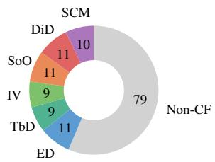
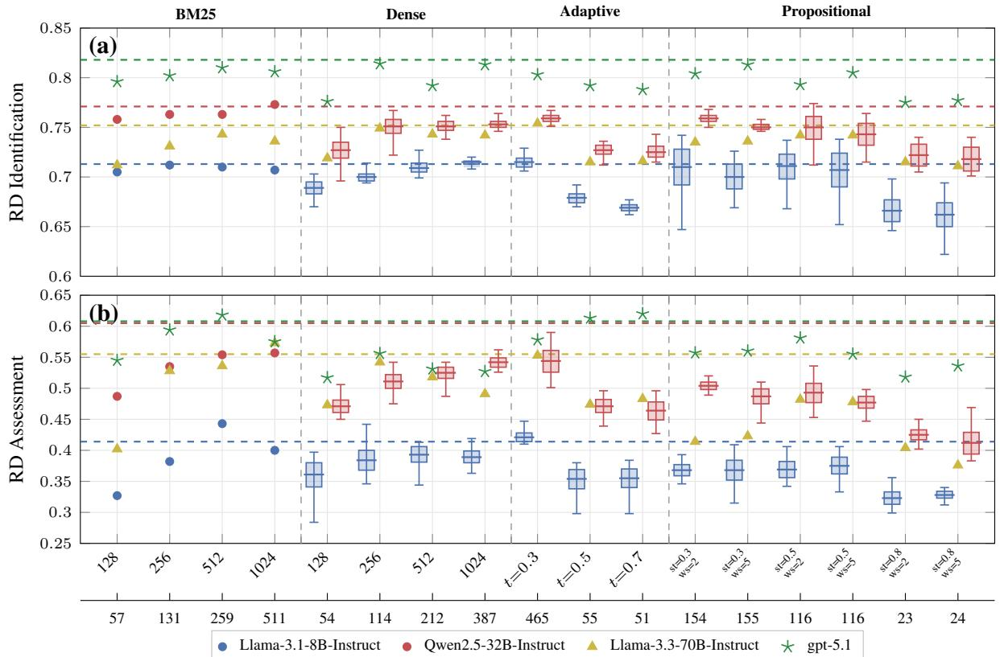
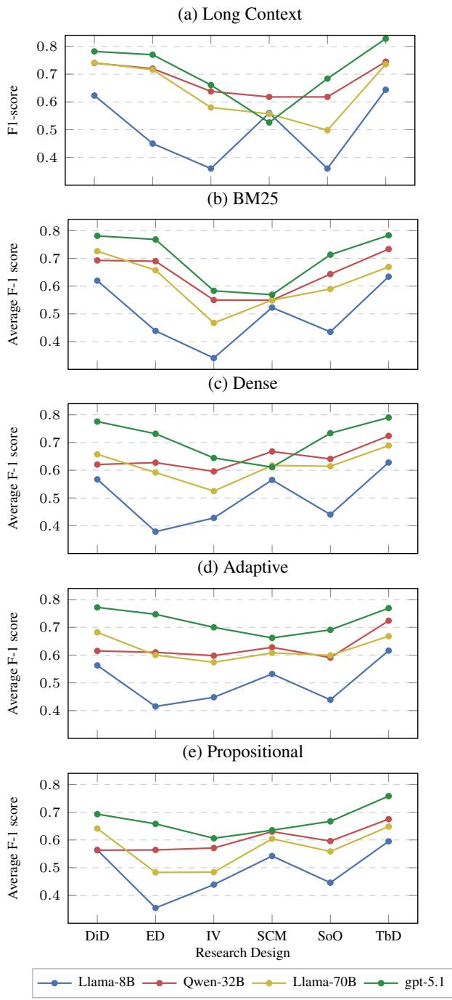

# Research Design Tracking and Assessment for the Social Sciences

Marco Rovera, Sergiu Burlacu, Dominique Cappelletti, Alessio Tomelleri, Sonia Marzadro, Martina Bazzoli, Annalisa Tassi, Jessica Gagete-Miranda

Fondazione Bruno Kessler

Trento, Italy

m.rovera@fbk.eu

{sburlacu, dcappelletti, atomelleri, marzadro, bazzoli, atassi, jgagetemiranda}@irvapp.it

## Abstract

Reliable assessment of causal research designs in the social sciences is critical for evidencebased policy-making, yet has so far relied entirely on manual expert analysis. We introduce Automated Research Design Tracking and Assessment (ARDTrA), a task that involves detecting the research design used in a paper and assessing the quality of its application. We create an expert-annotated dataset of papers covering six families of counterfactual research designs and evaluate the task using a multi-turn RAG-based conversational pipeline. Across four retrieval strategies, four LLMs and six embedding models, we find that passage length is the main driver of performance, explaining 52–66% of the variance. A per-research-design analysis also shows that human and machine difficulty do not align: the designs that prove hardest for the system are not those on which expert annotators disagree most, pointing to two independent sources of task difficulty.

## 1 Introduction

Identifying and assessing the causal research designs employed in social science papers is a key yet underexplored NLP task. The demand for such automation is driven by a concrete use case: when policy advisors survey the scientific literature to inform decision-making on a specific topic, they need to quickly isolate studies whose methodology supports credible causal claims. In the social sciences, this translates into selecting studies that adopt a counterfactual research design (RD), as for causal effect estimation, contributions employing such designs are generally regarded as providing more reliable evidence. Furthermore, even among papers that adopt a counterfactual RD, there are important differences in how the method is applied, which can affect the quality and robustness of the resulting evidence. Due to the specialist knowledge required, regarding both RDs and their application caveats, this literature selection and assessment process has so far been carried out manually by social scientists. Despite its practical relevance, the task has received limited attention within the NLP community, likely due to the lack of both a formalized analytical framework and a public, expert-curated evaluation dataset. In this paper we address these gaps by introducing Automated Research Design Tracking and Assessment (ARD TrA). The task involves two steps: (1) detecting which Research Design a paper employs, and (2) assessing the credibility, validity, and robustness of its application in the specific application context. Both steps require locating and interpreting finegrained methodological details scattered through out a paper. Using an evaluation framework de signed by experts in counterfactual policy evaluation, we first create and manually annotate an original corpus of 140 scientific papers drawn from a diverse range of social science fields, spanning applied economics, sociology, political science, and related disciplines. The framework considers six families of RDs identified by the causal inference literature (Rubin, 1974; Holland, 1986) and subse quently consolidated by the so-called “credibility revolution” (Angrist and Pischke, 2010), and de velops an ad hoc analytical scheme for each one. We then use the annotated dataset to evaluate different retrieval strategies within a multi-turn conversational RAG pipeline, across a set of LLMs and embedding models. From an NLP perspective, our primary goal is to evaluate the performance of various indexing and retrieval strategies on a challenging domain-specific document analysis task, where answers require synthesizing fine-grained methodological information from long scientific texts. From a Computational Social Science per spective, the study additionally demonstrates the feasibility of automating RD assessment and pro vides social scientists with a reliable estimate of current system performance. The contribution of this paper is threefold: i) we define the task of Research Design Tracking and Assessment, along with an expert-designed analytical schema; ii) we create a dataset of 140 papers annotated by domain experts according to this schema; and iii) we benchmark different retrieval strategies within a multi-turn RAG-based conversational agent, providing a systematic comparison across chunking methods, embedding models, and LLMs.

## 2 Related Work

In the last few years, a growing body of literature has focused on automatic analysis of causal inference methods in the social sciences. Currie et al. (2020) used basic text-mining techniques to track the incidence of keywords associated with causal inference methods in NBER1 working papers and five leading economics journals. Goldsmith-Pinkham (2024) extended this analysis to additional fields including finance and macroeconomics. More recently, Garg and Fetzer (2025) employed GPT-4o-mini to extract causal inference methods from NBER and CEPR2 working paper series, validating their approach against the annotated dataset of Brodeur et al. (2024), which covers four RDs (DiD, RCT, RDD, IV) across 1,106 economics articles. While reporting accuracy scores between 70% and 93% depending on the RD, this study uses a single LLM without systematic evaluation of retrieval configurations, and focuses exclusively on RD detection without addressing the quality of the method’s application. Other related efforts in clude Hooper et al. (2024), who combine NLP with causal mapping for extracting causal evidence from policy literature, and Imai and Nakamura (2026), who address causal inference methodology from a complementary perspective. OpenScholar (Asai et al., 2026) used RAG on 45 million open-access papers, showing that retrieval-augmented systems substantially outperform parametric LLMs on scientific synthesis tasks. Our work differs in two ways: we introduce the assessment dimension, i.e we evaluate not only which RD a paper uses but how credibly it is applied, and we provide a systematic NLP evaluation across retrieval strategies, embedding models, and LLMs.

## 3 Counterfactual Research Designs

In the social sciences, the credibility of a causal claim depends not only on the method employed but also on the specific empirical setting in which it is applied, as the causal identification strategy plays a major role. For instance, in Card and Krueger’s study of the employment effects of the minimum wage (Card and Krueger, 1993), the Difference-in-Differences design is credible precisely because it exploits a specific institutional contrast: New Jersey increased its minimum wage while neighboring Pennsylvania did not, providing a context-specific comparison group. Causal claims are typically supported through research designs that attempt to construct or approximate such a comparison group, one that estimates the outcome that would have been observed in the absence of the intervention or treatment under study. Rather than relying exclusively on statistical associations, these approaches aim to exploit sources of variation that can plausibly isolate causal effects. Although the boundaries between causal and noncausal empirical strategies are not always sharp, the literature associated with the “credibility revolution” has identified a relatively consolidated set of design-based approaches that are widely regarded as suitable for causal inference in both experimental and observational settings (Imbens, 2024). In this paper, we operationalize this literature by focusing on six broad families of research designs that cover the vast majority of causal designs encountered in applied social science research:

1. Experimental Designs (ED), e.g. field experiments, survey experiments and lab experiments (Fisher and Fisher, 1966; Athey and Imbens, 2017);

2. Threshold-based Designs (TbD), e.g. regression discontinuity, regression kink or bunching (Thistlethwaite and Campbell, 1960; Cattaneo and Titiunik, 2022);

3. Instrumental Variables (IV) (Angrist et al., 1996; Mogstad and Torgovitsky, 2018);

4. Selection-on-Observables (SoO), e.g. regression adjustment, matching, weighting, doubly robust (Rubin, 1974; Heckman, 1979; Stuart, 2010; Imbens, 2015);

5. Difference-in-Differences (DiD) and related designs, e.g., event studies, changes-inchanges and triple differences (Ashenfelter and Card, 1985; Roth et al., 2023);

6. Synthetic Control Methods (SCM) and related designs, e.g. augmented synthetic control, synthetic difference-in-differences (Abadie and Gardeazabal, 2003; Abadie et al., 2010; Abadie, 2021).

It is worth noting that the analytical framework proposed in this work (see Section 4.1 and Appendix D) is not specific to economics: many of its elements originate in, and are widely shared across, the empirical sciences as part of a common causal-inference toolkit (Imbens and Rubin, 2015; Hernán and Robins, 2020). Experimental Designs, for instance, are foundational in psychology and medicine. Selection-on-Observables methods are central to epidemiology and public health, while other research designs, such as Differencein-Differences, are increasingly adopted in related fields, like health policy (Feng et al., 2025). Beyond academia, the same designs increasingly underpin large-scale experimentation and observational causal analysis in industry, particularly at large technology firms (Larsen et al., 2024). Collaborations between biostatisticians, econometricians and methodological experts in political science and sociology are common, and cross-referencing across these literatures is the norm in published work. While some differences exist, terminology is largely shared across disciplines, and our annotation scheme explicitly accounts for differences in use of certain terms (for example, “unconfoundedness”, “ignorability”, and “conditional independence assumption”, which refer to the same core assumption in Selection-on-Observables, are favored in different disciplines).

## 4 Dataset

The dataset3 consists of 140 papers in English, sampled from an initial pool of 6,554 articles drawn from journals selected using the Combes-Linnemer classification (Combes and Linnemer, 2010) and IDEAS/RePEc rankings, spanning multiple quality tiers and subfields, such as labour, health, education, environmental, urban and regional economics and was designed to maintain a reasonable balance between papers that use counterfactual and noncounterfactual RDs on the one hand, and between the various RDs on the other. The distribution of RDs across the dataset is depicted in Figure 1.

  
Figure 1: Distribution of RDs in the ARDTrA dataset.

## 4.1 Analytical Framework

The analytical schema developed for ARDTrA is used for the manual annotation of papers in the dataset. The full text is provided in Appendix D. The schema consists of a set of methodological questions, each provided with instructions for answering (one or more valid answers) and with a finite set of possible answer options. The dataset was annotated by 8 domain experts with specialized knowledge of causal inference methodology and research design application. The task of each annotator is to read through the paper and answer the full set of questions. The schema is divided into two parts, which define the two subtasks: RD Identification and RD Assessment.

RD Identification This subtask comprises 6 questions, arranged from general to specific, that progressively narrow down the methodological profile of a paper. The first three questions characterize the paper along broad dimensions: its type (e.g. empirical, theoretical, methodological, review), the nature of its data and research design (quantitative vs. qualitative), and the type of analysis it performs (causal, descriptive, or predictive/simulation). Question 4 then asks whether the paper employs any of the six counterfactual RDs introduced in Section 3, as a binary yes/no decision. If the answer is negative, the paper is classified as non-counterfactual and the analysis terminates. If a counterfactual design is detected, Question 5 asks the annotator to identify which of the six families constitutes the paper’s main RD. Finally, Question 6 captures whether the paper employs any additional counterfactual RDs beyond the primary one, allowing for multi-method designs. Papers identified as counterfactual at this stage proceed to the RD Assessment subtask.

<table><tr><td></td><td>Krippendorff&#x27;s α</td></tr><tr><td>Full Task RD Identification</td><td>.814 .926</td></tr><tr><td>RD Assessment</td><td>.753</td></tr><tr><td rowspan="3">Experimental Designs (ED) Synthetic Control Methods (SCM) Threshold-based Desings (TbD)</td><td></td></tr><tr><td>.821 .833</td></tr><tr><td>.784</td></tr><tr><td>Difference-in-Differences (DiD)</td><td>.688</td></tr><tr><td>Instrumental Variables (IV)</td><td>.681</td></tr><tr><td>Selection-on-Observables (SoO)</td><td>.649</td></tr></table>

Table 1: Krippendorff’s α between 3 expert annotators, computed on the I-AA set (24 papers). Specific RD’s scores have been computed on the 12 papers using a counterfactual RD (2 papers for RD).
<table><tr><td>Annotator pair</td><td>Full Task</td><td>RD-I</td><td>RD-A</td></tr><tr><td>A1 - A2</td><td>.820</td><td>.922</td><td>.767</td></tr><tr><td>A1 - A3</td><td>.771</td><td>.925</td><td>.686</td></tr><tr><td>A2 - A3</td><td>.851</td><td>.935</td><td>.805</td></tr></table>

Table 2: Pairwise Krippendorff’s α across the three tasks. A1, A2, A3 denote the three annotators.

RD Assessment Once a counterfactual RD has been identified, the analysis proceeds to an assessment subtask tailored to the specific design identified in Question 5. Each of the six RD families has its own set of questions, ranging from 9 (Selectionon-Observables) to 16 (Instrumental Variables and Synthetic Control Methods), for a total of 76 questions across all designs. While the specific questions differ, reflecting the distinct assumptions and methodological concerns of each RD, the assessment schemes share a common structure organized around four broad dimensions: (a) the study context and specific features of the research design, (b) the features of the data available in the study, (c) the estimation and inference procedures employed, and (d) falsification tests and and sensitivity analyses. For instance, the TbD schema asks about the features of the running variable, bandwidth selection and specific robustness checks, while the DiD schema focuses on the treatment assignment structure (blocked vs. staggered), parallel trends evidence, and the choice of estimator. All questions are closed-ended, with predefined answer options, and most allow multiple selections.

## 4.2 Inter-Annotator Agreement

In order to estimate the complexity of the task, we asked three experts to independently annotate 24 scientific papers and computed inter-annotator agreement (I-AA) scores. The I-AA set consists of 12 papers using counterfactual methods (2 papers for each method) and 12 papers using noncounterfactual methods. Results are reported in Table 1). The overall agreement on the Full Task (alpha = .81) is well above the .67 threshold commonly considered acceptable for reliable annotation (Krippendorff, 2004). Agreement is notably higher for RD Identification (.92) than for RD Assessment (.75), confirming that detecting a research design is substantially easier than evaluating how credibly it is applied, even for trained experts. The pairwise scores (Table 2) support this observation: RD Identification is uniformly high and stable across all annotator pairs (.92–.94), whereas RD Assessment is both lower and more variable, consistent with its more subjective nature. At the per-RD level, agreement varies considerably, ranging from ED and SCM at the top (.83 and .82) down to SoO (.64), IV (.68) and DiD (.69).

## 5 Methodology

We frame the ARDTrA task as a RAG-based (Lewis et al., 2020; Guu et al., 2020) multi-turn conversation with closed-ended questions. In this setup, the system processes one question at a time, in sequence: at each turn, the LLM receives (a) a question q, (b) its predefined answer options $a _ { 1 } , a _ { 2 } , . . . a _ { n } ~ \in ~ A$ and (c) a list of k passages $p _ { 1 } , p _ { 2 } , . . . p _ { n } \in P$ dynamically retrieved from the paper under examination. The question q and the answer options A are concatenated and used jointly as the retrieval query, since the answer options contain method-specific terminology that improves passage selection. The conversation is maintained across turns within a fixed context window of 20K tokens, so that the model can leverage its previous answers when responding to subsequent, more specific assessment questions. This design provides two key advantages. First, it makes the model’s answers traceable: because retrieval selects a small set of passages for each question, every answer can be verified against specific spans of the source paper, a form of explainability that full-document prompting does not enable. Second, and more importantly, it closely replicates the human annotation process: the model answers the exact same closedended questions, with the same predefined answer options, in the same order as the human annotators, making human-machine comparison immediate. We compare four retrieval strategies that vary along the dimensions of chunking granularity (fixed vs. variable) and retrieval method (sparse vs. dense), using four LLMs of different sizes and six state-of-the-art embedding models. The four strategies are described below4.

Best Match 25 (BM25) BM25 (Robertson and Zaragoza, 2009) is included due to its low computational cost and its established effectiveness as a retrieval baseline. At indexing time, documents are chunked at fixed lengths and indexed in a sparse, keyword-based index. At retrieval time, the system uses the Okapi BM25 scoring function.

Dense Retrieval At indexing time, documents are chunked at fixed lengths and each chunk is represented as a dense vector embedding. At retrieval time, passages are ranked by cosine similarity between the query embedding and the chunk embeddings.

Adaptive Auto-merging Retrieval Adaptive retrieval is based on hierarchical indexing. At indexing time, the document is chunked at different lengths (we used 1024, 512, 256 and 128 tokens respectively). During parsing, chunks from each layer are structured into a tree, by keeping child/parent relations, as well as sibling relations. All nodes, at all levels, are then stored, but only leaf nodes are embedded, using dense embeddings. At retrieval time, similarity search is performed against the leaf-node index to retrieve an initial candidate set. A bottom-up merging pass then consolidates these candidates: for each parent node, the ratio of retrieved children to total children is computed, and when this ratio exceeds a threshold t (we experimented with $t \in \{ 0 . 3 , 0 . 5 , 0 . 7 \}$ , the children are replaced by the parent node. This check recurses upward through the tree until no further merges are triggered. Lower t values promote merging into fewer, larger chunks, while higher values keep the output closer to leaf retrieval, resulting in shorter and more specific chunks.

Propositional Topic-aware Retrieval In this strategy, the document is first split into paragraphs. Each paragraph is then decomposed by an LLM (we used Llama-3.1-8B-Instruct) and rewritten into a set of propositions, each representing an atomic statement contained in the paragraph (Chen et al., 2024b). Propositions are the result of splitting compound sentences and resolving extrapropositional pronoun co-reference so that they are interpretable independently. Once paragraphs are converted into propositions, a parser iterates over propositions and builds “topic-aware” chunks by choosing whether to merge a new proposition into the current chunk or to create a new chunk. This decision is made by the parser based on a similarity threshold st, computed as the cosine similarity between the current chunk and the new proposition. Higher st values result in smaller, topically more coherent chunks, whereas lower values produce larger, more inclusive and potentially more heterogeneous chunks. We experiment with st $\in \ \{ 0 . 3 , 0 . 5 , 0 . 8 \}$ . Also, a sliding window of size ws is used by the parser to limit the context used in the chunk definition process. A small value of the ws parameter will make the parser more sensitive to local topic switch, while a larger value results in more stable and inclusive topic chunks. We experiment with $w s \in \{ 2 , 5 \}$ . It is worth noting that, unlike all other strategies, in this case the chunks produced are not original text but consist of variable-length sequences of rewritten atomic propositions.

Long-Context As a non-retrieval baseline, we additionally evaluate a Long-Context (LC) setting in which the full text of the paper, truncated to a 32K-token window for comparability across models, is provided directly in the model’s context window without any retrieval. The model answers the same closed-ended questions, in the same multiturn conversational format, but instead of receiving dynamically retrieved passages, it has access to the entire document. This baseline tests whether retrieval is beneficial at all, or whether a sufficiently large context window makes it unnecessary.

## 5.1 Experimental Setup

The described methodology is instantiated on six embedding models of varying size and architecture: mxbai-embed-large-v1 (335M), bge-large-en-v1.5 (335M; Chen et al., 2024a), e5-large-v2 (335M; Wang et al., 2022), SFR-Embedding-Mistral (7B; Meng et al., 2024), Qwen3-Embedding-8B (8B; Zhang et al., 2025), and a proprietary model, Cohere-embed-english-v3.0. In the main phase, all experiments are run using two LLMs, Llama-3.1-8B-Instruct and Qwen2.5-32B-Instruct. The top k = 5 passages are retrieved at each turn. For each combination of strategy, hyperparameter values, embedding model and LLM, a complete run is conducted on the full dataset (140 documents). Considering the hyperparameter and embedding model combination, we run a total of 82 rounds for each LLM (4 for BM25, 24 for Dense, 18 for Adaptive and 36 for Propositional), summing up to 164 experimental rounds. Based on the evidence collected in the main experimental phase, the best-performing embedding model is selected and a further set of experiments is then run with a single embedding model, using Llama-3.3-70B-Instruct and gpt-5.1, in order to benchmark larger LLMs while mitigating computational costs.

## 6 Evaluation and Results

Given the mixed nature of answer formats (binary, single-answer, and multiple-answer questions) we frame evaluation as a classification problem at the level of individual answer options. Each correct answer option selected by the model is considered a true positive, each option selected by the model but absent from the gold annotation counts as a false positive, and each gold answer option missed by the model counts as a false negative. This peroption evaluation is strict: for a binary question where the model answers “yes” and the gold answer is “no”, both a false positive and a false negative are counted. On this basis, we compute Precision, Recall and F1. We report results for the Full Task, as well as separately for the two subtasks: RD Identification and RD Assessment. Results are depicted in Figure 2 and additionally in Appendix C. In what follows, we analyze the results along three dimensions: the impact of retrieval strategy, the role of text embeddings and the variation of performance across Research Designs.

## 6.1 Retrieval Strategies

When comparing strategies at their best configuration, by selecting the top-performing embedding and hyperparameter combination for each, Adaptive achieves the highest F1 on the Full Task for both Llama-8B (.563) and Qwen-32B (.660), slightly ahead of BM25 (.555 and .645 respectively). However, when we average over embeddings to remove the dependency on a favorable embedding choice, the picture changes: BM25 matches or outperforms all dense strategies across both LLMs and all subtasks, proving to be the most

reliable strategy overall (see Table 7, Appendix A).
<table><tr><td>LLM</td><td>Full Task</td><td>RD-I</td><td>RD-A</td></tr><tr><td>Llama-8B</td><td> $. 7 7 9 \left( \mathrm { p } < . 0 0 1 \right)$ </td><td> $. 6 2 0 \left( \mathrm { p } < . 0 1 \right)$ </td><td> $. 7 5 7 \left( { \mathrm { p } } < . 0 0 1 \right)$ </td></tr><tr><td> $\mathrm { Q w e n } { - 3 2 \mathrm { B } }$ </td><td> $. 8 1 5 \ : ( \mathrm { p } < . 0 0 1 )$ </td><td> $. 7 0 3 \ : ( \mathrm { p } < . 0 1 )$ </td><td> $. 8 1 0 \left( \mathrm { p } < . 0 0 1 \right)$ </td></tr><tr><td>Llama-70B</td><td> $. 7 2 7 \left( \mathrm { p } < . 0 1 \right)$ </td><td> $. 5 3 2 \left( \mathrm { p } < . 0 5 \right)$ </td><td> $. 6 5 5 \left( \mathrm { p } < . 0 1 \right)$ </td></tr><tr><td>gpt-5.1</td><td> $. 2 9 2 \left( \mathrm { p } = \mathrm { n . s . } \right)$ </td><td> $. 5 3 4 \left( \mathrm { p } < . 0 5 \right)$ </td><td> $. 2 9 9 \left( \mathrm { p = n . s . } \right)$ </td></tr></table>

Table 3: Pearson correlation (r) between average chunk length and F1 score across the 17 hyperparameter configurations. For Llama-8B and Qwen-32B, F1 scores of dense strategies are averaged over 6 embedding models.

Within each strategy, then, performance is maximized around certain hyperparameters, i.e. 512- 1024 for fixed-size strategies (BM25 and Dense), $t ~ = ~ 0 . 3$ for Adaptive and $s t \ = \ 0 . 3$ for Propositional. Sensitivity to hyperparameters is much higher in variable-size strategies, in particular higher values of t for Adaptive and st for Proposi tional (which in both cases yield shorter passages) cause a significant drop in performance, and this holds in both RD-I and RD-A. To test whether passage length, rather than other strategy related properties, drive these differences, we first computed the average passage length (Figure 2, ruler) produced by each hyperparameter value for all the strategies across the whole dataset and then correlated them with the performance. This reveals that the overall performance, at least for the three smallest LLMs, has a high linear correla tion with average passage length: 0.779 Pearson r for Llama-8B, 0.815 for Qwen-32B and 0.727 for Llama-70B respectively. Correlation values are significantly higher for Assessment than for Iden tification (see Table 3). Different evidence holds for gpt-5.1, whose performance does not correlate significantly with passage length. Crucially, this provides a very clear indication for our task: between 52% and 66% of the task variance (R squared) is explained by chunk length, showing that context is relevant to enable correct answering patterns in a RAG-baseline pipeline. Also, the lack of correlation for gpt-5.1 suggests that very strong LLMs can compensate for the lack of context, possibly with a better use of conversational history or via parametric knowledge. Since the observed correlation between passage length and performance could in principle be confounded with other strategy-related properties, we conducted a further analysis by comparing different strategies at matched passage lengths. The underlying idea is that, if a given strategy holds a systematic advantage over another, this should be reflected in consistent performance differences when comparing configurations that yield similar average passage lengths. We compared 5 pairs of configurations (reported in Table 4) with Llama-8B and Qwen-32B, for which we have results across all 6 embedding models, allowing us to average out the effect of embedding choice. Across 30 comparisons (5 pairs with 2 LLMs and 3 tasks), the average performance difference between strategies is 1.0 F1-points (with the worst case lying at 3.1 points) and no strategy shows a consistent advantage over the others. Overall, this indicates that, while differences in strategies might exist, they probably lie at other levels (lexical, boundaries), and that passage length is the strongest driver for performance across strategies.

  
Figure 2: F1-scores for (a) RD Identification and (b) RD Assessment across retrieval strategies and LLM configurations. Numbers on the ruler refer to the average passage length (in words) associated to the given hyperparameter value. For example: Adaptive strategy with t = 0.3 produces passages of 465 words on average. Dashed horizontal lines indicate the Long Context (non-retrieval) baseline, in the corrisponding colour.

## 6.2 Text Embeddings

Using the F1 scores from single experimental rounds with Llama-8B and Qwen-32B, we aggregated the results of different embedding models by subtask, retrieval strategy and across strategy parameters. Based on simple win count (see Table 9, Appendix B), bge leads the ranking, being the best model in 41.5% of cases, followed by SFR (20.7%) and mxbai (13.4%). This trend holds for Dense and Adaptive strategies, while for Propositional SFR clearly dominates. As for subtasks, bge is noticeably the best in the RD-I task and in the Full Task, while in RD-A it ties with SFR. bge also shows the top mean F1 across the three subtasks and the second lowest standard deviation across hyperparameters, after SFR. Overall, bge offers the best trade-off between performance and stability among the models tested. Looking at the broader picture, we observe that the gap between the best and the worst embedding drops with larger

<table><tr><td></td><td>Config A</td><td>len</td><td>VS.</td><td>Config B</td><td>len</td></tr><tr><td>(a)</td><td>Dense 128</td><td>54</td><td></td><td>Adaptive t=0.5</td><td>55</td></tr><tr><td>(b)</td><td>BM25 256</td><td>131</td><td></td><td>Propositional st=0.3, ws=2</td><td>154</td></tr><tr><td>(c)</td><td>Dense 256</td><td>114</td><td></td><td>Propositional st=0.5</td><td>116</td></tr><tr><td>(d)</td><td>Dense 1024</td><td>387</td><td></td><td>Adaptive t=0.3</td><td>465</td></tr><tr><td>(e)</td><td>BM25 1024</td><td>511</td><td></td><td>Adaptive t=0.3</td><td>465</td></tr></table>

Table 4: Values for the 5 configuration pairs used for matched length comparison. The len columns refer to the average passage length generated by the given configuration, measured in words (split on whitespace).

LLMs, passing from 2.5 to 2.1 F1 points in the RD-I task and from 4.7 to 3.3 points in the more difficult RD-A task. A similar but less pronounced trend is followed by the standard deviation, which decreases from 0.010 to 0.008 in RD-I and from 0.017 to 0.014 in RD-A (see Table 8). Both observations, combined, indicate that the choice of embedding is less relevant with stronger models, but also that it becomes more important with the growing difficulty of the task.

## 6.3 Research Design Analysis

Based on their specific methodological architecture, Research Designs differ in many respects: in their degree of formalization, the type of technical language used, the way argumentation is constructed and the density of relevant information throughout the paper. We therefore analyzed the performance per-RD, by computing performance for each LLM (across strategies, Figure 3) and a ranking for each strategy (see Table 5). The results provide a nuanced picture. At the two opposite ends of the spectrum, we observe that TbD are consistently the easiest to identify and assess by models, followed by DiD, while IV are quite consistently the most difficult. SCM and ED, in turn, are more sensitive to the specific LLM. SoO, meanwhile, shows a more consistent ranking across all four models. When results are grouped by strategy, BM25 appears to show the highest variability across RDs, possibly because its lexical matching is more sensitive to how explicitly each design’s methodology is described.

<table><tr><td>RD</td><td>L-8B</td><td>Q-32B</td><td>L-70B</td><td>gpt-5.1</td><td>MR</td><td>Std</td></tr><tr><td>TbD</td><td>1</td><td>1</td><td>3</td><td>1</td><td>1.5</td><td>0.9</td></tr><tr><td>DiD</td><td>2</td><td>2</td><td>1</td><td>2</td><td>1.8</td><td>0.4</td></tr><tr><td>SCM</td><td>3</td><td>4</td><td>2</td><td>6</td><td>3.8</td><td>1.5</td></tr><tr><td>SoO</td><td>4</td><td>5</td><td>4</td><td>4</td><td>4.2</td><td>0.4</td></tr><tr><td>ED</td><td>6</td><td>3</td><td>5</td><td>3</td><td>4.2</td><td>1.3</td></tr><tr><td>IV</td><td>5</td><td>6</td><td>6</td><td>5</td><td>5.5</td><td>0.5</td></tr></table>

Table 5: Difficulty ranking of the six RDs (rank 1 = easiest) for each LLM. For each (LLM, RD) pair, F1 is averaged within each retrieval strategy and then across the four strategies (equal weight per strategy); RDs are then ranked within each LLM. Mean Rank and Std are computed across the four LLM ranks.

We further correlated each of the 4 sets of F1- averages per Research Design with the human agreement, in order to test the hypothesis that RDs that are difficult for humans to annotate would also be harder for models to predict correctly. As showed in Table 6, we observed no statistically significant correlation. Indeed, several cases exhibited an inverse pattern, with RDs characterized by lower human agreement being comparatively easier for models to predict (for example DiD), and vice versa (e.g. ED). The only RD where human and machine difficulty align is IV, which proves challenging for both. Although surprising, this suggests that the RDs on which humans disagree the most are not the same on which automated system struggle the most. In other words, human difficulty, i.e. the subjectivity inherent to expert judgment, and machine difficulty, that of correctly retrieving the right passages from the text, appear to be two largely independent dimensions in expert tasks like ARDTrA. This finding is in line with recent debate in IR and NLP (Amiraz et al., 2025; Trappolini et al., 2026), who show that at the passage level, human relevance judgments and actual machine utility in RAG systems are fundamentally misaligned. Our results suggest that a similar misalignment exists at the task level. Understanding how this misalignment operates remains an open challenge, with direct implications for the design and evaluation of RAG systems in expert domains.

  
Figure 3: Performance of four LLMs, by RD. Except for the Long Context baseline, results for Llama-8B and Qwen-32B refer to the average performance of 6 embedding models for the given RD. Llama-70B and gpt-5.1 used only bge-large-en-v1.5.

<table><tr><td></td><td>Llama-8B</td><td>Qwen-32B</td><td>Llama-70B</td><td>gpt-5.1</td></tr><tr><td>BM25</td><td>.27/.49</td><td>.06/-.09</td><td>.14/.09</td><td>-.04/-.09</td></tr><tr><td>Dense</td><td>.21/.09</td><td>.49/.43</td><td>.21/.26</td><td>-.20/-.31</td></tr><tr><td>Adaptive</td><td>.20/.14</td><td>.44/.71</td><td>.04/.43</td><td>.00/-.09</td></tr><tr><td>TopicNode</td><td>.05/.09</td><td>.40/.20</td><td>.07/.09</td><td>.12/-.09</td></tr></table>

Table 6: Pearson r / Spearman ρ correlations between Krippendorff’s α and model performance across the six Research Designs. None of the correlations is statistically significant (p > .05).

## 6.4 Long Context vs. RAG

Long-Context document prompting proves a strong baseline: across both subtasks and all four LLMs, most retrieval configurations fail to outperform it (dashed lines in Figure 2). On RD-I, the baseline is only locally surpassed, and mainly by the smaller models, suggesting that when the task is comparatively easy, retrieval offers little advantage over simply reading the whole document. On RD-A, the picture is similar but the exceptions are more systematic: only BM25 and the Adaptive strategy manage to beat the LC baseline at specific configurations. These results indicate that retrieval is not, in itself, necessary to achieve competitive performance on this task; rather, its value lies in focusing the model on a small set of passages that can be stored and inspected, providing the interpretability that a black-box LC pipeline cannot.

## 7 Conclusions and Future Work

In this work, we introduced the task of Automatic Research Design Tracking and Assessment (ARDTrA), meant to help social scientists and pol icy advisors quickly and reliably estimate the robustness of scientific papers based on an extensive analysis of their application of Research Designs. This contribution bridges a gap in existing NLP-CSS research, in particular by providing an expert-designed analytical framework and an annotated dataset of 140 papers from the social sciences. We evaluated four different retrieval strategies, based on fixed and variable chunking, with four LLMs and six embedding models, as well as a Long Context setting. Based on ex tensive experimental evidence, our findings show that: (a) low-cost, sparse BM25-based retrieval matches and often outperforms dense embedding based strategies; (b) passage length, rather than retrieval strategy, explains between 52% and 66% of the performance variance across configurations, and at matched passage lengths different strategies perform comparably, though this effect diminishes with stronger LLMs such as gpt-5.1, whose performance is largely independent of pas sage length; (c) for embedding-based strategies, the impact of embedding model choice is smaller than that of retrieval strategy or hyperparameter configuration, with smaller encoder-based models like bge-large-en-v1.5 proving the most robust across settings; moreover, (d) Long-Context document prompting proves to be a strong base line when compared to RAG. Finally, (e) per-RD analysis reveals that human and machine difficulty are driven by different factors: the Research De signs on which experts disagree most are not the same ones on which the automated system struggles, suggesting that subjective judgment and in formation retrievability represent two independent dimensions of task difficulty. Findings (b) and (e), in particular, open up promising research directions that we aim to address in future work. First, while passage length accounts for a substantial share of the variance, a significant portion remains unexplained; we plan to explore whether lexical factors (how methodological choices are expressed linguistically) and structural ones (where in the document the relevant information appears) con tribute to the residual variance. Second, our finding that human and machine difficulty diverge raises the question of whether experts and retrieval-based systems attend to fundamentally different textual cues when performing methodological assessment, and whether this divergence generalizes to other expert analytical tasks.

## 8 Limitations

The main limitation of this work is the size of the dataset. This is due to the depth of the annotation schema and the high effort required from annotators, who must closely read papers of up to 50 pages and answer subtle methodological questions. With the current size of the dataset, therefore, per-RD estimates should be interpreted with caution. We tried to counterbalance the limited scale by carefully selecting papers to be representative of each RD and to cover a range of application domains. Additionally, the dataset focuses on papers in English, which limits the generalizability of our findings to other languages.

## 9 Use of AI Assistants

We used AI Assistants to support the revision of the manuscript and the creation of complex plots/tables. All scientific content, experimental design, data analysis, and interpretation of results are the sole responsibility of the authors.

## 10 Ethics Statement

This work analyzes published scientific papers and does not involve human subjects, personal data, or sensitive content. All annotators are co-authors and participated as part of their regular institutional duties. The dataset release (see Supplemental Materials) contains only bibliographic metadata as most of the papers are copyrighted. To the best of our knowledge, the work described in this paper does not raise any ethical concerns.

## References

Alberto Abadie. 2021. Using synthetic controls: Feasibility, data requirements, and methodological aspects. Journal ofeconomic literature, 59(2):391–425.

Alberto Abadie, Alexis Diamond, and Jens Hainmueller. 2010. Synthetic control methods for comparative case studies: Estimating the effect of california’s tobacco control program. Journal of the American statistical Association, 105(490):493–505.

Alberto Abadie and Javier Gardeazabal. 2003. The economic costs of conflict: A case study of the basque country. American economic review, 93(1):113–132.

Chen Amiraz, Florin Cuconasu, Simone Filice, and Zohar Karnin. 2025. The distracting effect: Understanding irrelevant passages in RAG. In Proceedings of the 63rd Annual Meeting of the Association for Computational Linguistics (Volume 1: Long Papers),

pages 18228–18258, Vienna, Austria. Association for Computational Linguistics.

Joshua D Angrist, Guido W Imbens, and Donald B Rubin. 1996. Identification of causal effects using instrumental variables. Journal ofthe American statistical Association, 91(434):444–455.

Joshua D Angrist and Jörn-Steffen Pischke. 2010. The credibility revolution in empirical economics: How better research design is taking the con out of econometrics. Journal ofeconomic perspectives, 24(2):3– 30.

Akari Asai, Jacqueline He, Rulin Shao, Weijia Shi, Amanpreet Singh, Joseph Chee Chang, Kyle Lo, Luca Soldaini, Sergey Feldman, Mike D’Arcy, and 1 others. 2026. Synthesizing scientific literature with retrieval-augmented language models. Nature, pages 1–7.

Orley Ashenfelter and David Card. 1985. Using the longitudinal structure of earnings to estimate the effect of training programs. The Review ofEconomics and Statistics, 67:648–660.

Susan Athey and Guido Wilhelmus Imbens. 2017. The econometrics of randomized experiments. In Handbook of economic field experiments, volume 1, pages 73–140. Elsevier.

Abel Brodeur, Nikolai Cook, and Carina Neisser. 2024. P-hacking, data type and data-sharing policy. The Economic Journal, 134(659):985–1018.

David Card and Alan B Krueger. 1993. Minimum wages and employment: A case study of the fast food industry in new jersey and pennsylvania.

Matias D Cattaneo and Rocio Titiunik. 2022. Regression discontinuity designs. Annual Review of Economics, 14(1):821–851.

Jianlyu Chen, Shitao Xiao, Peitian Zhang, Kun Luo, Defu Lian, and Zheng Liu. 2024a. M3- embedding: Multi-linguality, multi-functionality, multi-granularity text embeddings through selfknowledge distillation. In Findings of the Association for Computational Linguistics: ACL 2024, pages 2318–2335, Bangkok, Thailand. Association for Computational Linguistics.

Tong Chen, Hongwei Wang, Sihao Chen, Wenhao Yu, Kaixin Ma, Xinran Zhao, Hongming Zhang, and Dong Yu. 2024b. Dense X retrieval: What retrieval granularity should we use? In Proceedings of the 2024 Conference on Empirical Methods in Natural Language Processing, pages 15159–15177, Miami, Florida, USA. Association for Computational Linguistics.

Pierre-Philippe Combes and Laurent Linnemer. 2010. Inferring missing citations: A quantitative multicriteria ranking of all journals in economics.

Janet Currie, Henrik Kleven, and Esmée Zwiers. 2020. Technology and big data are changing economics: Mining text to track methods. In AEA Papers and Proceedings, volume 110, pages 42–48. American Economic Association 2014 Broadway, Suite 305, Nashville, TN 37203.

Shuo Feng, Ishani Ganguli, Youjin Lee, John Poe, Andrew Ryan, and Alyssa Bilinski. 2025. Difference-indifferences for health policy and practice: A review of modern methods. Statistics in medicine, 44(23- 24):e70247.

Sir Ronald Aylmer Fisher and Ronald A Fisher. 1966. The design of experiments, volume 21. Springer.

Prashant Garg and Thiemo Fetzer. 2025. Causal claims in economics. arXiv preprint arXiv:2501.06873.

Paul Goldsmith-Pinkham. 2024. Tracking the credibility revolution across fields. arXiv preprint arXiv:2405.20604.

Kelvin Guu, Kenton Lee, Zora Tung, Panupong Pasupat, and Mingwei Chang. 2020. Retrieval augmented language model pre-training. In International conference on machine learning, pages 3929–3938. PMLR.

J Heckman. 1979. Sample selection bias as a specification error. Econometrica.

Miguel A. Hernán and James M. Robins. 2020. Causal Inference: What If . Chapman & Hall/CRC, Boca Raton.

Paul W. Holland. 1986. Statistics and causal inference. Journal ofthe American Statistical Association, 81(396):945–960.

Rory Hooper, Nihit Goyal, Kornelis Blok, and Lisa Scholten. 2024. A semi-automated approach to policy-relevant evidence synthesis: combining natural language processing, causal mapping, and graph analytics for public policy. Policy Sciences, pages 1–26.

Kosuke Imai and Kentaro Nakamura. 2026. Causal inference with generative artificial intelligence: Application to texts as treatments. Journal ofthe American Statistical Association, (just-accepted):1–27.

Guido W Imbens. 2015. Matching methods in practice: Three examples. Journal ofHuman Resources, 50(2):373–419.

Guido W Imbens. 2024. Causal inference in the social sciences. Annual Review of Statistics and Its Application, 11.

Guido W. Imbens and Donald B. Rubin. 2015. Causal Inferencefor Statistics, Social, and Biomedical Sciences: An Introduction. Cambridge University Press, New York.

Klaus Krippendorff. 2004. Reliability in content analysis: Some common misconceptions and recommendations. Human communication research, 30(3):411– 433.

Nicholas Larsen, Jonathan Stallrich, Srijan Sengupta, Alex Deng, Ron Kohavi, and Nathaniel T Stevens. 2024. Statistical challenges in online controlled experiments: A review of a/b testing methodology. The American Statistician, 78(2):135–149.

Patrick Lewis, Ethan Perez, Aleksandra Piktus, Fabio Petroni, Vladimir Karpukhin, Naman Goyal, Heinrich Küttler, Mike Lewis, Wen-tau Yih, Tim Rocktäschel, and 1 others. 2020. Retrieval-augmented generation for knowledge-intensive nlp tasks. Advances in Neural Information Processing Systems, 33:9459–9474.

Rui Meng, Ye Liu, Shafiq Rayhan Joty, Caiming Xiong, Yingbo Zhou, and Semih Yavuz. 2024. Sfrembedding-mistral:enhance text retrieval with transfer learning. Salesforce AI Research Blog.

Magne Mogstad and Alexander Torgovitsky. 2018. Identification and extrapolation of causal effects with instrumental variables. Annual Review of Economics, 10(1):577–613.

Stephen Robertson and Hugo Zaragoza. 2009. The probabilistic relevance framework: BM25 and beyond, volume 4. Now Publishers Inc.

Jonathan Roth, Pedro HC Sant’Anna, Alyssa Bilinski, and John Poe. 2023. What’s trending in difference-indifferences? a synthesis of the recent econometrics literature. Journal of Econometrics, 235(2):2218– 2244.

Donald B Rubin. 1974. Estimating causal effects of treatments in randomized and nonrandomized studies. Journal ofeducational Psychology, 66(5):688.

Elizabeth A Stuart. 2010. Matching methods for causal inference: A review and a look forward. Statistical science: a review journal of the Institute of Mathematical Statistics, 25(1):1.

Donald L Thistlethwaite and Donald T Campbell. 1960. Regression-discontinuity analysis: An alternative to the ex post facto experiment. Journal ofEducational psychology, 51(6):309.

Giovanni Trappolini, Florin Cuconasu, Simone Filice, Yoelle Maarek, and Fabrizio Silvestri. 2026. Redefining retrieval evaluation in the era of LLMs. In Proceedings of the 19th Conference of the European Chapter of the Association for Computational Linguistics (Volume 1: Long Papers), pages 8359–8375, Rabat, Morocco. Association for Computational Linguistics.

Liang Wang, Nan Yang, Xiaolong Huang, Binxing Jiao, Linjun Yang, Daxin Jiang, Rangan Majumder, and Furu Wei. 2022. Text embeddings by weaklysupervised contrastive pre-training. arXiv preprint arXiv:2212.03533.

Yanzhao Zhang, Mingxin Li, Dingkun Long, Xin Zhang, Huan Lin, Baosong Yang, Pengjun Xie, An Yang, Dayiheng Liu, Junyang Lin, Fei Huang, and Jingren

Zhou. 2025. Qwen3 embedding: Advancing text embedding and reranking through foundation models. arXiv preprint arXiv:2506.05176.

## A Retrieval Strategies

In this Section we report the results of the analysis conducted on Retrieval Strategies (Section 6.1).

<table><tr><td>LLM</td><td>Task</td><td>BM25</td><td>DENSE</td><td>ADAPT</td><td>PROP</td></tr><tr><td colspan="6">Best overall score</td></tr><tr><td rowspan="3">Ll-8B</td><td>Full Task</td><td>.555</td><td>.541 (b)</td><td>.563 (Q)</td><td>.543 (S)</td></tr><tr><td>RD-I</td><td>.712</td><td>.727 (b)</td><td>.729 (Q)</td><td>.742 (e)</td></tr><tr><td>RD-A</td><td>.443</td><td>.442 (b)</td><td>.447 (Q)</td><td>.409 (S)</td></tr><tr><td rowspan="3">Qw-32B</td><td>Full Task</td><td>.645</td><td>.641 (b)</td><td>.660 (b)</td><td>.629 (m)</td></tr><tr><td>RD-I</td><td>.773</td><td>.764 (b)</td><td>.767 (m)</td><td>.774 (S)</td></tr><tr><td>RD-A</td><td>.557</td><td>.562 (Q)</td><td>.590 (b)</td><td>.536 (m)</td></tr><tr><td colspan="6">Best score embedding average</td></tr><tr><td rowspan="3">Ll-8B</td><td>Full Task</td><td>.555</td><td>.526</td><td>.539</td><td>.513</td></tr><tr><td>RD-I</td><td>.712</td><td>.715</td><td>.715</td><td>.711</td></tr><tr><td>RD-A</td><td>.443</td><td>.393</td><td>.421</td><td>.375</td></tr><tr><td rowspan="3">Qw-32B</td><td>Full Task</td><td>.645</td><td>.627</td><td>.630</td><td>.607</td></tr><tr><td>RD-I</td><td>.773</td><td>.753</td><td>.715</td><td>.759</td></tr><tr><td>RD-A</td><td>.557</td><td>.542</td><td>.544</td><td>.504</td></tr><tr><td colspan="6">Single embedding (bge-large-en-v1.5)</td></tr><tr><td rowspan="3">Ll-70B</td><td>Full Task</td><td>.640</td><td>.626</td><td>.634</td><td>.589</td></tr><tr><td>RD-I</td><td>.743</td><td>.749</td><td>.754</td><td>.742</td></tr><tr><td>RD-A</td><td>.573</td><td>.542</td><td>.553</td><td>.482</td></tr><tr><td rowspan="3">gpt-5.1</td><td>Full Task</td><td>.694</td><td>.658</td><td>.686</td><td>.664</td></tr><tr><td>RD-I</td><td>.811</td><td>.814</td><td>.803</td><td>.813</td></tr><tr><td>RD-A</td><td>.618</td><td>.556</td><td>.620</td><td>.581</td></tr></table>

Table 7: Strategy comparison (F1-scores). Highlight indicates the best strategy per row. Best embedding: best hyperparameter configuration with the best-performing embedding model. Embedding avg.: best hyperparameter configuration, averaged over all 6 embedding models. Llama-70B and gpt-5.1 use bge-large-en-v1.5 only.

## B Text Embeddings

This section refers to the analysis on the impact of text embeddings conducted in Section 6.2 of the paper. Values in Table 8 have been computed by first averaging all F1-scores by embedding model across strategies and then by calculating the maxmin range and standard deviation. Values in Table 9 have been computed by counting the times each embedding model provides the best F1 score for a given hyperparameter. As for Table 10, Mean F1 values have been computed by averaging the given model performance across all hyperparameters and two LLMs. Standard deviation and Range, instead have been computed by first calculating Std value for each LLM in RD-I and RD-A tasks for the given embedding model, thus obtaining 4 values for each embedding model. Final Std in the Table is the average of these values, while Range is their max-min difference.

<table><tr><td>LLM</td><td>Task</td><td>Range</td><td>Std</td></tr><tr><td rowspan="3">L1ama-8B</td><td>Full Task</td><td>.028</td><td>.011</td></tr><tr><td>RD-I</td><td>.025</td><td>.010</td></tr><tr><td>RD-A</td><td>.047</td><td>.017</td></tr><tr><td rowspan="3">Qwen-32B</td><td>Full Task</td><td>.024</td><td>.010</td></tr><tr><td>RD-I</td><td>.021</td><td>.008</td></tr><tr><td>RD-A</td><td>.033</td><td>.014</td></tr></table>

Table 8: Embedding impact: range and standard deviation of F1 scores across the six embedding models, by task and LLM.
<table><tr><td></td><td>bge</td><td>SFR</td><td>mxbai</td><td>Qwen3</td><td>e5</td><td>Cohere</td></tr><tr><td>Overall (78)</td><td>34</td><td>17</td><td>11</td><td>10</td><td>8</td><td>2</td></tr><tr><td>Dense (24)</td><td>14</td><td>2</td><td>3</td><td>6</td><td>1</td><td>0</td></tr><tr><td>Adaptive (18)</td><td>12</td><td>1</td><td>4</td><td>3</td><td>0</td><td>0</td></tr><tr><td>Propositional (36)</td><td>8</td><td>14</td><td>4</td><td>1</td><td>7</td><td>2</td></tr><tr><td>Full Task (26)</td><td>13</td><td>5</td><td>4</td><td>3</td><td>1</td><td>1</td></tr><tr><td>RD-I (26)</td><td>13</td><td>4</td><td>2</td><td>1</td><td>7</td><td>0</td></tr><tr><td>RD-A (26)</td><td>8</td><td>8</td><td>5</td><td>6</td><td>0</td><td>1</td></tr></table>

Table 9: Number of times each embedding model achieves the highest F1 score, out of 78 combinations (13 hyperparameter configurations × 2 LLMs × 3 tasks). This information is provided in Tables 11, 12 and 13 in Appendix C. Since there are a few ties, some rows don’t sum up to the same number.
<table><tr><td rowspan="2">Model</td><td rowspan="2">Size</td><td colspan="3">Mean F1</td><td colspan="2">HP Sensitivity</td></tr><tr><td>Full</td><td>RD-I</td><td>RD-A</td><td>Std</td><td>Range</td></tr><tr><td>bge</td><td>335M</td><td>.560</td><td>.729</td><td>.442</td><td>.029</td><td>.110</td></tr><tr><td>SFR</td><td>7B</td><td>.551</td><td>.719</td><td>.437</td><td>.026</td><td>.092</td></tr><tr><td>mxbai</td><td>335M</td><td>.550</td><td>.720</td><td>.433</td><td>.031</td><td>.117</td></tr><tr><td>Qwen3</td><td>8B</td><td>.541</td><td>.707</td><td>.434</td><td>.029</td><td>.097</td></tr><tr><td>e5</td><td>335M</td><td>.536</td><td>.724</td><td>.404</td><td>.029</td><td>.089</td></tr><tr><td>Cohere</td><td>prop.</td><td>.536</td><td>.709</td><td>.416</td><td>.028</td><td>.089</td></tr></table>

Table 10: Embedding model comparison: mean F1 and sensitivity to hyperparameter configuration. Mean is computed across all configurations (13 hyperparameters × 2 LLMs). Std. and range measure variability across the 13 hyperparameter configurations, averaged over 2 LLMs × 2 tasks.

## C Research Design Analysis

This Section reports the raw experimental results before any aggregation (F1-scores). Each score in Tables 11, 12 and 13 refers to a complete run of the system on the whole dataset. Table 11 refers to the Full Task, Table 12 to RD Identification and Table 13 to RD Assessment.

<table><tr><td></td><td>LC</td><td colspan="4">BM25</td><td></td><td colspan="4">Dense</td><td colspan="4">Adaptive</td><td colspan="6">Topicnode</td></tr><tr><td></td><td></td><td colspan="4"></td><td></td><td colspan="3">chunk size</td><td></td><td colspan="2">t</td><td></td><td colspan="2">st=0.3</td><td colspan="2">st=0.5</td><td colspan="2"></td><td colspan="2">st=0.8</td></tr><tr><td>LLM</td><td></td><td>128</td><td>256</td><td>512</td><td>1024</td><td>Emb.</td><td>128</td><td>256</td><td>512</td><td>1024</td><td>0.3</td><td>0.5</td><td>0.7</td><td>ws=2</td><td></td><td>ws=5</td><td>ws=2</td><td>ws=5</td><td>ws=2</td><td>ws=5</td></tr><tr><td>*</td><td>.545</td><td>.483</td><td>.524</td><td>.555</td><td>.533</td><td>mxbai</td><td>.503</td><td>.495</td><td>.516</td><td>.525</td><td>.538</td><td>.489</td><td>.501</td><td>.517</td><td>.526</td><td></td><td>.505</td><td>.511</td><td>.455</td><td>.440</td></tr><tr><td rowspan="5">Ia-88B</td><td rowspan="5"></td><td rowspan="5"></td><td rowspan="5"></td><td rowspan="5"></td><td rowspan="5"></td><td>bge</td><td>.494</td><td>.541</td><td>.540</td><td>.539</td><td>.542</td><td>.504</td><td>.494</td><td>.511</td><td>.511</td><td></td><td>.537</td><td>.532</td><td>.497</td><td>.468</td></tr><tr><td>e5</td><td>.444</td><td>.494</td><td>.503</td><td>.512</td><td>.535</td><td>.448</td><td>.452</td><td>.529</td><td>.466</td><td>.495</td><td></td><td></td><td></td><td>.470</td></tr><tr><td>SFR</td><td>.512</td><td>.520</td><td>.534</td><td>.532</td><td>.543</td><td>.496</td><td>.484</td><td>.524</td><td></td><td></td><td>.543</td><td>.538 .542</td><td>.459 .441</td><td>.471</td></tr><tr><td>Qwen3</td><td>.513</td><td>.511</td><td>.530</td><td>.539</td><td>.563</td><td>.486</td><td>.481</td><td>.513</td><td>.519 .516</td><td>.487</td><td></td><td>.458</td><td>.452</td><td>.457</td></tr><tr><td></td><td>Cohere</td><td>.496 .508</td><td>.533</td><td>.511</td><td></td><td>.515</td><td>.471</td><td>.479</td><td>.469</td><td>.509</td><td>.488</td><td>.496</td><td>.463</td><td>.475</td></tr><tr><td rowspan="5">Owen--32B</td><td rowspan="5">.674</td><td rowspan="5">.598</td><td rowspan="5">.626</td><td rowspan="5">.638</td><td rowspan="5">.645</td><td>mxbai</td><td>.572</td><td>.622</td><td>.626</td><td>.633</td><td>.653</td><td>.582</td><td>.589</td><td>.612</td><td>.603</td><td></td><td>.629</td><td>.597</td><td>.553</td><td>.516</td></tr><tr><td>bge</td><td>.593</td><td>.627</td><td>.622</td><td>.641</td><td>.660</td><td>.592</td><td>.595</td><td>.613</td><td>.603</td><td>.602</td><td></td><td>.601</td><td>.567</td><td>.522</td></tr><tr><td>e5</td><td></td><td>.565 .590</td><td>.625</td><td>.619</td><td>.610</td><td>.555</td><td>.550</td><td>.598</td><td>.594</td><td></td><td>.590</td><td>.596</td><td>.552</td><td>.550</td></tr><tr><td>SFR</td><td>.561</td><td>.590</td><td>.590</td><td>.617</td><td>.604</td><td>.586</td><td>.560</td><td>.617</td><td>.606</td><td></td><td>.625</td><td>.595</td><td>.552</td><td>.573</td></tr><tr><td>Qwen3</td><td>Cohere</td><td>.592 .565 .561 .617</td><td>.614 .622</td><td>.635 .618</td><td>.634 .619</td><td>.560 .565</td><td>.563</td><td></td><td>.602</td><td>.589</td><td>.556</td><td>.566</td><td>.535</td><td>.540</td></tr><tr><td rowspan="2">70B</td><td rowspan="2">.636</td><td rowspan="2">.529</td><td rowspan="2">.611</td><td rowspan="2">.621</td><td rowspan="2">.640</td><td></td><td></td><td></td><td></td><td></td><td></td><td></td><td></td><td>.552</td><td>.600</td><td>.570</td><td>.580</td><td>.562</td><td>.535</td><td>.527</td></tr><tr><td>bge</td><td>.574</td><td>.626</td><td>.610</td><td>.593 .634</td><td>.571</td><td>.576</td><td></td><td>.575</td><td>.584</td><td>.589</td><td>.587</td><td>.530</td><td>.513</td></tr><tr><td>51</td><td>.691</td><td>.643</td><td>.675</td><td>.694</td><td>.672</td><td>bge</td><td>.618</td><td>.658</td><td>.635</td><td>.642</td><td>.670</td><td>.683</td><td>.686</td><td>.654</td><td>.661</td><td>.664</td><td>.655</td><td></td><td>.620</td><td>.634</td></tr><tr><td>Avg. p. len</td><td></td><td>57</td><td>131</td><td>269</td><td>511</td><td></td><td>54</td><td>114</td><td>212</td><td>387</td><td>465</td><td>55</td><td>51</td><td>154</td><td>155</td><td>116</td><td></td><td>116</td><td>23</td><td>24</td></tr></table>

Table 11: Full Task F1 scores across retrieval strategies, hyperparameters, embedding models and LLMs. Highlight marks the model scoring the best result for the given hyperparameter , in boldface the configurations that outperform the Long Context (LC) baseline . Underlined, the best result for the current LLM. In green, the best overall result for the task. The last row reports the average passage length generated by the hyperparameter (in number of words).

<table><tr><td></td><td>LC</td><td colspan="4">BM25</td><td></td><td colspan="4">Dense</td><td colspan="4">Adaptive</td><td colspan="6">Topicnode</td></tr><tr><td></td><td></td><td colspan="3"></td><td></td><td></td><td colspan="3">chunk size</td><td></td><td colspan="3">t</td><td colspan="2">st=0.3</td><td colspan="2">st=0.5</td><td colspan="2">st=0.8</td></tr><tr><td>LLM</td><td></td><td>128</td><td>256</td><td>512</td><td>1024</td><td>Emb.</td><td>128</td><td>256</td><td>512</td><td>1024</td><td>0.3</td><td>0.5</td><td>0.7</td><td>ws=2</td><td>ws=5</td><td>ws=2</td><td>ws=5</td><td>ws=2</td><td>ws=5</td></tr><tr><td>*</td><td>.713</td><td>.705</td><td>.712</td><td>.71</td><td>.707</td><td>mxbai</td><td>.701</td><td>.700</td><td>.704</td><td>.716</td><td>.706</td><td>.682</td><td>.676</td><td>.734</td><td>.724</td><td>.719</td><td>.719</td><td>.646</td><td>.622</td></tr><tr><td>LI1a-8B</td><td></td><td></td><td></td><td></td><td></td><td>bge</td><td>.703</td><td>.714</td><td>.727</td><td>.720</td><td>.707</td><td>.692</td><td>.677</td><td>.724</td><td>.726</td><td>.731</td><td>.725</td><td>.698</td><td>.667</td></tr><tr><td></td><td></td><td></td><td></td><td></td><td></td><td>e5</td><td>.670</td><td>.696</td><td>.713</td><td>.716</td><td>.709</td><td>.670</td><td>.672</td><td>.742</td><td>.669</td><td>.713</td><td>.738</td><td>.685</td><td>.694</td></tr><tr><td></td><td></td><td></td><td></td><td></td><td></td><td>SFR</td><td>.694</td><td>.696</td><td>.699</td><td>.716</td><td>.724</td><td>.679</td><td>.664</td><td>.722</td><td>.672</td><td>.737</td><td>.731</td><td>.651</td><td>.676</td></tr><tr><td></td><td></td><td></td><td></td><td></td><td></td><td>Qwen3 Cohere</td><td>.691 .677</td><td>.694 .697</td><td>.707 .705</td><td>.711 .708</td><td>.729 .713</td><td>.677 .671</td><td>.662 .663</td><td>.690 .647</td><td>.715 .696</td><td>.668 .696</td><td>.652 .679</td><td>.646 .668</td><td>.650 .663</td></tr><tr><td></td><td></td><td></td><td></td><td></td><td></td><td></td><td></td><td></td><td></td><td></td><td></td><td></td><td></td><td></td><td></td><td></td><td></td><td></td><td></td></tr><tr><td></td><td>.771</td><td>.758</td><td>.763</td><td>.763</td><td>.773</td><td>mxbai</td><td>.736</td><td>.767</td><td>.752</td><td>.757</td><td>.767</td><td>.730</td><td>.732</td><td>.763</td><td>.747</td><td>.763</td><td>.742</td><td>.718</td><td>.701</td></tr><tr><td>w--32B</td><td></td><td></td><td></td><td></td><td></td><td>bge</td><td>.750</td><td>.757</td><td>.759</td><td>.764</td><td>.761</td><td>.736</td><td>.743</td><td>.768</td><td>.754</td><td>.756</td><td>.758</td><td>.729</td><td>.714</td></tr><tr><td></td><td></td><td></td><td></td><td></td><td></td><td>e5 SFR</td><td>.729 .696</td><td>.761 .722</td><td>.762</td><td>.753</td><td>.754</td><td>.725</td><td>.725</td><td>.758 .760</td><td>.758</td><td>.759</td><td>.762</td><td>.740</td><td>.740</td></tr><tr><td></td><td></td><td></td><td></td><td></td><td></td><td>Qwen3</td><td>.724</td><td>.745</td><td>.740 .738</td><td>.747</td><td>.762</td><td>.736</td><td>.720 .716</td><td>.750</td><td>.748 .748</td><td>.774 .712</td><td>.764 .715</td><td>.731 .705</td><td>.726 .708</td></tr><tr><td></td><td></td><td></td><td></td><td></td><td></td><td>Cohere</td><td>.725</td><td>.753</td><td>.757</td><td>.746 .752</td><td>.751 .761</td><td>.724 .712</td><td>.715</td><td>.754</td><td>.746</td><td>.734</td><td>.718</td><td>.710</td><td>.718</td></tr><tr><td>7O</td><td></td><td></td><td></td><td></td><td></td><td></td><td></td><td></td><td></td><td></td><td></td><td></td><td></td><td></td><td></td><td></td><td></td><td></td><td></td></tr><tr><td></td><td>.752</td><td>.712</td><td>.731</td><td>.743</td><td>.736</td><td>bge</td><td>.719</td><td>.749</td><td>.743</td><td>.742</td><td>.754</td><td>.715</td><td>.716</td><td>.752</td><td>.743</td><td>.741</td><td>.738</td><td>.740</td><td>.720</td></tr><tr><td>51</td><td>.818</td><td>.796</td><td>.802</td><td>.810</td><td>.806</td><td>bge</td><td>.776</td><td>.814</td><td>.792</td><td>.813</td><td>.803</td><td>.792</td><td>.788</td><td>.814</td><td>.806</td><td>.802</td><td>.805</td><td>.788</td><td>.776</td></tr><tr><td></td><td></td><td></td><td colspan="3">chunk size</td><td></td><td colspan="4">chunk size</td><td></td><td colspan="2">t</td><td></td><td colspan="2">st=0.3</td><td colspan="2">st=0.5</td><td colspan="2">st=0.8</td></tr><tr><td>LLM</td><td></td><td>128</td><td>256</td><td>512</td><td>1024</td><td>Emb.</td><td>128</td><td>256</td><td>512</td><td>1024</td><td>0.3</td><td>0.5</td><td>0.7</td><td>ws=2</td><td>ws=5</td><td></td><td>ws=2</td><td>ws=5</td><td>ws=2</td><td>ws=5</td></tr><tr><td>*</td><td>.414</td><td>.327</td><td>.382</td><td>.443</td><td>.400</td><td>mxbai</td><td></td><td>.367 .353</td><td>.379</td><td>.385</td><td>.418</td><td>.362</td><td>.384</td><td>.361</td><td>.375</td><td></td><td>.359</td><td>.371</td><td>.327</td><td>.319</td></tr><tr><td></td><td></td><td></td><td></td><td></td><td></td><td>bge</td><td></td><td>.347 .442</td><td>.406</td><td>.404</td><td>.424</td><td>.380</td><td>.370</td><td>.353</td><td>.353</td><td></td><td>.393</td><td>.394</td><td>.356</td><td>.326</td></tr><tr><td>LI-8B</td><td></td><td></td><td></td><td></td><td></td><td>e5</td><td>.284</td><td>.346</td><td>.344</td><td>.371</td><td>.410</td><td>.298</td><td>.298</td><td>.376</td><td>.315</td><td></td><td>.342</td><td>.389</td><td>.299</td><td>.312</td></tr><tr><td></td><td></td><td></td><td></td><td></td><td></td><td>SFR Qwen3</td><td>.397 .397</td><td>.399</td><td>.413</td><td>.394</td><td>.413</td><td>.373</td><td>.359</td><td>.381</td><td>.409</td><td></td><td>.406</td><td>.406</td><td>.307</td><td>.337 .336</td></tr><tr><td></td><td></td><td></td><td></td><td></td><td></td><td>Cohere</td><td>.371</td><td>.389 .374</td><td>.408 .410</td><td>.419 .363</td><td>.447 .412</td><td>.369 .339</td><td>.365 .353</td><td>.393 .346</td><td></td><td>.379 .376</td><td>.366 .346</td><td>.333 .359</td><td>.328 .319</td><td>.340</td></tr><tr><td></td><td></td><td></td><td></td><td></td><td></td><td></td><td></td><td></td><td></td><td></td><td></td><td></td><td></td><td></td><td></td><td></td><td></td><td></td><td></td><td></td></tr><tr><td>Owe--32B</td><td>.605</td><td>.487</td><td>.535</td><td>.554</td><td>.557</td><td>mxbai</td><td>.461</td><td>.526</td><td>.542</td><td>.549</td><td>.576</td><td>.487</td><td>.496</td><td>.508</td><td>.504</td><td></td><td>.536</td><td>.498</td><td>.431</td><td>.383</td></tr><tr><td></td><td></td><td></td><td></td><td></td><td></td><td>bge</td><td>.488</td><td>.542</td><td>.529</td><td>.556</td><td>.590</td><td>.496</td><td>.496</td><td>.510</td><td>.498</td><td></td><td>.497</td><td>.494</td><td>.450</td><td>.385</td></tr><tr><td></td><td></td><td></td><td></td><td></td><td></td><td>e5</td><td>.453</td><td>.475</td><td>.529</td><td>.526</td><td>.512</td><td>.439</td><td>.427</td><td>.489</td><td></td><td>.480</td><td>.476</td><td>.480</td><td>.411</td><td>.415</td></tr><tr><td></td><td></td><td></td><td></td><td></td><td></td><td>SFR Qwen3</td><td>.470 .506</td><td>.502 .498</td><td>.487</td><td>.528</td><td>.501</td><td>.484</td><td>.454</td><td>.520</td><td>.510</td><td></td><td>.521</td><td>.479</td><td>.432</td><td>.469 .434</td></tr><tr><td></td><td></td><td></td><td></td><td></td><td></td><td>Cohere</td><td>.450</td><td>.524</td><td>.534 .528</td><td>.562 .529</td><td>.551 .531</td><td>.463 .459</td><td>.467 .441</td><td>.505 .490</td><td>.485 .444</td><td></td><td>.453 .472</td><td>.466 .447</td><td>.424</td><td>.384</td></tr><tr><td>70B</td><td></td><td></td><td></td><td></td><td></td><td></td><td></td><td></td><td></td><td></td><td></td><td></td><td></td><td></td><td></td><td></td><td></td><td></td><td>.402</td><td></td></tr><tr><td></td><td>.555</td><td>.402</td><td>.528</td><td>.536</td><td>.573</td><td>bge</td><td>.473</td><td>.542</td><td>.518</td><td>.491</td><td>.553</td><td>.474</td><td>.483</td><td>.517</td><td>.484</td><td></td><td>.372</td><td>.406</td><td>.393</td><td>.344</td></tr><tr><td>51</td><td>.608</td><td>.545</td><td>.594</td><td>.618</td><td>.575</td><td>bge</td><td></td><td>.517 .556</td><td>.531</td><td>.527</td><td>.578</td><td>.613</td><td>.62</td><td>.601</td><td>.56</td><td></td><td>.481</td><td>.506</td><td>.441</td><td>.444</td></tr></table>

Table 12: RD Identification F1 scores across retrieval strategies, hyperparameters, embedding models and LLMs. BM25 does not use embeddings.

Table 13: RD Assessment F1 scores across retrieval strategies, hyperparameters, embedding models and LLMs.

## D ARDTrA Analytical Framework

In this Appendix we present the ARDTrA Analytical Framework, described in Section 4.1. The framework consists of two main tasks: Research Design Identification (RD-I, Section D.1) and Research Design Assessment (RD-A, Section D.2).

## D.1 Research Design Identification (6 questions)

1. What type of paper is this?

(a) Empirical - analyzes real-world data to address research questions

(b) Theoretical - develops or discusses conceptual, graphical or mathematical theoretical models

(c) Methodological - develops, discusses or evaluates statistical or research method

(d) Review paper - summarizes or synthesizes other studies (e.g., systematic reviews, meta-analyses)

(e) Opinion paper, comment, reply - offers commentary or responds to another paper

(f) Other

## 2. Does the paper use quantitative or qualitative research designs and data?

(a) Quantitative research design and data - uses primarily numeric or categorical data (e.g., from surveys, administrative data, experiments) and statistical models

(b) Qualitative research design and data - uses primarily non-numerical data derived from interviews, participant observation, focus groups, narratives or other qualitative and participatory data collections methods

(c) Other

## 3. Which type of analyses best describes the paper?

(a) Causal Analysis - investigates causal relationships between two or more variables, e.g., investigates whether a variable or intervention causes a change in another

(b) Descriptive Analysis - describes the state, evolution or relationships among variables without making causal claims

(c) Predictive or Simulation Analysis - predicts or simulates the value or evolution of one or multiple variables

(d) Other

4. Does the study use any of the following causal research design/methods: Experimental designs (e.g., field experiments, survey experiments, lab-experiments), Selectionon-observables (e.g., regression adjustment, matching, weighting, doubly robust), Instrumental variables, Threshold-based designs (e.g., regression discontinuity, regression kink, bunching), Difference-in-differences and related designs (e.g., event studies, changes-inchanges, triple differences), Synthetic control method and related designs (e.g., augmented synthetic control, synthetic difference in differences)?

(a) Yes

(b) No

5. Which ofthefollowing is the main orpreferred research design, associated with the credibility revolution, potential outcome framework or design based approach, used in the paper?

(a) Experimental designs (e.g., field experiments, survey experiments and labexperiments)

(b) Selection-on-observables (e.g., regression adjustment, matching, weighting, doubly robust)

(c) Instrumental variables

(d) Threshold-based designs (e.g., regression discontinuity, regression kink or bunching)

(e) Difference-in-differences and related designs (e.g., event studies, changes-inchanges, triple differences)

(f) Synthetic control method and related designs (e.g., augmented synthetic control, synthetic difference in differences)

(g) Other

6. Does the paper use additional research designs beyond the selected one, fitting under the design-based causal inference approaches associated with the “credibility revolution”?

(a) Experimental designs (field experiments, survey experiments and lab-experiments)

(b) Selection-on-observables

(c) Instrumental variables

(d) Threshold-based designs (regression discontinuity, regression kink or bunching)

(e) Difference-in-differences and related designs (i.e., event studies, changes-inchanges, triple differences)

(f) Synthetic control method and related designs (augmented synthetic control, synthetic difference in differences)

## D.2 Research Design Assessment

## D.2.1 Experimental Designs (ED)

1. What is the randomization strategy used in the study?

(a) Complete (simple) randomization: units are independently assigned to treatment/control with fixed probability

(b) Matched-pair or matched-set randomization: treatment assigned within small, covariate-matched group

(c) Stratified (blocked) randomization: treatment assigned within pre-defined blocks based on key covariates

(d) Covariate-adaptive randomization: assignment probabilities adjusted dynamically to improve balance

(e) Re-randomization: randomization repeated until balance criteria are met

(f) Not reported or described

(g) Other

## 2. What is the unit of assignment to treatment and control conditions?

(a) Individual level assignment: each unit is independently assigned (e.g., individuals, firms)

(b) Cluster level assignment: units are assigned in groups (e.g., schools, firms, villages)

(c) Multiple levels: assignment occurs at more than one level, common in designs aimed to capture spillover effects (e.g., schools then classes within schools)

(d) Not reported or unclear

(e) Other

3. Was the experimental protocol and analysis:

(a) Pre-registered: a pre-analysis plan or trial registration was filed prior to data collection / analyses

(b) Approved by an ethical board (e.g., IRB)

(c) Not reported or unclear

## 4. Does the study include any balance / randomization checks?

(a) Pre-determined covariates (e.g., baseline socio-demographic characteristics)

(b) Pre-determined outcomes or related proxies (i.e., baseline outcome variables)

(c) Post-treatment variables not expected to be affected by the treatment (i.e., placebo outcomes)

(d) No balance test reported

(e) Other

5. Does the study provide evidence of good covariate balance?

(a) Yes - balance is high with only small differences between groups

(b) Partially - balance is mostly good, but some relevant differences remain

(c) No - balance is poor, with substantial differences between groups

(d) Not discussed or not assessed

6. What is the level of general attrition, in percentage terms? Note: if there are multiple treatment groups with different levels of attrition please select multiple values for each row.

(a) Less than 5 percent

(b) 5-15 percent

(c) 16-25 percent

(d) 26-40 percent

(e) More than 40 percent

(f) Not applicable / relevant (i.e., one-shot data collection and randomization, use of administrative data)

(g) Not reported

7. What is the level of differential attrition, in percentage points? Note: if there are multiple treatment groups with different levels of attrition please select multiple valuesfor each row.

(a) Less than 5 percentage points

(b) 5-15 percentage points

(c) 16-25 percentage points

(d) 26-40 percentage points

(e) More than 40 percentage points

(f) Not applicable / relevant (i.e., one-shot data collection and randomization, use of administrative data)

(g) Not reported

8. What estimation method(s) are used to estimate treatment effects in the main analysis?

(a) Difference-in-means

(b) Regression models (OLS, probit, logit etc)

(c) Matching, weighting or related approaches (e.g., propensity score matching, inverse probability weighting, doubly robust)

(d) ANOVA / ANCOVA

(e) Non-parametric methods (e.g., Wilcoxon Rank-Sum Test, Mann-Whitney U, Kolmogorov-Smirnov Test, Quantile treatment effects, Kruskal-Wallis Test, etc)

(f) Bayesian approaches

(g) Permutation-based test or related (Fisher randomization tests)

(h) Multilevel (Hierarchical) Models (e.g., mixed-effects models, random intercepts/slopes)

(i) Machine learning–based estimators (e.g., lasso, causal forest, double machine learning)

(j) Other

9. Is clustering appropriately accounted for in the inference procedure? Note: The recommended practice is to accountfor clustering at the level of unit assignment when the unit ofanalysis is at a lower level than the cluster (e.g., schools assigned but data is at student level). However, if the unit of analysis is at the level ofclustering (e.g., schools assigned, and data is aggregated at school level), clustering is not necessary. Clustering is also necessary when there are multiple observations per unit used in the analysis (e.g., repeated measures). Extra: clustering is also necessary when there is a risk ofinterference or spillovers, but this is rarely done, so if the paper reports such, please choose the “g) Other” option, ignoring all other response options.

(a) Yes - clustering at level of treatment assignment

(b) Yes - clustering below treatment assignment (e.g., at class level when schools are assigned)

(c) Yes - clustering above treatment assignment (e.g., at school level, when classes are assigned)

(d) No - clustering not used and not necessary (e.g., individual-level or clustered assignment but the unit of analysis matches the treatment assignment level)

(e) No - clustering not used, but it should have been

(f) Unclear / not reported

(g) Other

10. Does the paper report any of the following robustness or sensitivity checks? Select the “f) Other” option only ifyou identify other highly relevantfalsification testsfor the identification strategy

(a) Sensitivity to the violation of the identification assumption (e.g., bounding, partial identification; i.e., for cases with high attrition rates or implementation issues)

(b) Sensitivity to alternative estimators

(c) Sensitivity to inclusion or exclusion of covariates (e.g., robustness to controls or pre-treatment variables)

(d) Sensitivity to using alternative inference approaches (e.g., different inference method, level of clustering etc.)

(e) Robustness to sample exclusions (e.g., outlier removal, trimming)

(f) Other

## 11. Does the paper suffer from any of the potential issues?

(a) Analyses include units not randomly assigned (e.g., units entering the program after randomization)

(b) Analyses do not account for differing assignment probabilities (e.g., the probability of treatment varies considerably within strata but the analysis does not account for this)

(c) A randomized unit’s assigned condition is not the same as the unit’s analyzed condition (i.e., mismatch between assigned and analyzed treatment status, e.g., controls non-complying with assignment considered part of the treatment group in the analysis)

(d) Exclusion of randomized units based on post-assignment criteria (e.g., excluding treatment units not taking up the treatment)

(e) No, none of the above

## D.2.2 Threshold-based designs (e.g., regression discontinuity, regression kink or bunching)

1. What RDDframework does the paper use in its main analysis?

(a) Continuity-based framework - assumes potential outcomes are continuous at the cutoff (the most frequent approach)

(b) Local randomization framework - treats units near the cutoff as randomly assigned to treatment/control (often with discrete running variables or small sample sizes, or as robustness check to the continuity approach. It relies on stronger assumptions.)

(c) Other

2. Which of the following RDD features best describes the paper?

(a) Single running variable

(b) Single cutoff

(c) Multiple cutoffs

(d) Multiple running variables (i.e., geographical RDDs, scholarship assigned based on cutoffs in both language and math tests)

(e) Other

3. Is the running variable approximately continuous or discrete?

(a) Approximately continuous: there is a large number of values on each side of the cutoff

(b) Discrete with more than 10 unique values on each side of the cutoff

(c) Discrete with 10 or fewer unique values on each side of the cutoff

(d) Other

4. Does the paper provide evidencefor the continuity of the running variable density around the cutoff?

(a) Histograms or similar graphical analysis

(b) Bernoulli or binomial tests around the cutoff (e.g., Cattaneo et al., 2017)

(c) McCrary (2008) local polynomial density estimation

(d) Local polynomial density estimation (e.g., Cattaneo, Jansson, and Ma, 2020)

(e) No specific details provided in the text other than support for the hypothesis (performed in the appendix)

(f) Other

(g) Not provided

5. Does the density continuity test support the identification assumption (no manipulation of the running variable)?

(a) Yes - no strong evidence of manipulation at the cutoff

(b) No - evidence suggests manipulation or discontinuity

(c) Not provided

6. What estimation approach is used to obtain point estimates?

(a) Global polynomial methods, i.e., regression using observations over the entire support of the running variable, often including higher order polynomials

(b) Local polynomial methods, i.e., regression using only observations close to the cutoff, generally with low order polynomials

(c) Randomization inference within a window close to the cutoff (Fisherian approach)

(d) Ordinary least squares or similar large sample approaches in the local randomization framework (based on Neyman or superpopulation approaches)

(e) Other

7. How was the bandwidth (in continuity-based RDD) or window (in local randomization RDD) selected?

(a) MSE-optimal bandwidth - e.g., from Calonico et al. (2014), based on mean squared error minimization

(b) Covariate-based window selection (local randomization framework)

(c) Manual selection

(d) Cross-validation (e.g., as in Ludwig and Miller, 2007)

(e) IK algorithm for optimal bandwidth selector proposed by Imbens and Kalyanaraman (2012)

(f) Other

8. Is clustering appropriately accounted for in the inference procedure? Note: The recommended practice is to accountfor clustering at the level of unit assignment when the unit ofanalysis is at a lower level than the cluster (e.g., schools assigned but data is at student level). However, if the unit of analysis is at the level of clustering (e.g., schools assigned, and data is aggregated at school level), clustering is not necessary. Clustering is also necessary when there are multiple observations per unit used in the analysis (e.g., repeated measures, panel data). Extra: clustering is also necessary when there is a risk of interference or spillovers, but this is rarely done, so if the paper reports such, please indicate in other, ignoring all other response options.

(a) Yes - clustering at level of treatment assignment

(b) Yes - clustering below treatment assignment (e.g., at class level when schools are assigned)

(c) Yes - clustering above treatment assignment (e.g., at school level, when classes are assigned)

(d) No - clustering not used and not necessary (e.g., individual-level or clustered assignment but the unit of analysis matches the treatment assignment level)

(e) No - clustering not used, but it should have been

(f) Unclear / not reported

(g) Other

9. Does the paper provide any of the followingfalsification (e.g., balance, placebo) tests? Please select the ë) Otheröption only if it is a highly relevant falsification test for the identification strategy

(a) Pre-determined covariate or outcome balance test - checking continuity or balance of predetermined covariates at the cutoff

(b) Placebo outcomes test - applying the same design / analysis replacing the outcome variable with one which should not be impacted by the treatment

(c) Placebo population test - applying the same design / analysis in a sample where the treatment is expected to not have an effect

(d) Placebo treatment - applying the same design / analysis replacing the treatment variable with one that should not affect the outcome. In the case of the RD this is usually done by using multiple placebo cutoffs. If something different was done, please indicate in the comments.

(e) Other

10. Does the paper provide any of the following sensitivity or robustness checks? Please select the “h) Other” option only in the case of highly relevant sensitivity tests for the identification strategy

(a) Sensitivity to the violation of the identification assumptions (e.g., bounding, partial identification)

(b) Sensitivity to the exclusion of observations near the cutoff (the so-called donut hole approach)

(c) Sensitivity to bandwidth or window choices (usually making it smaller, thus excluding observations away from the cutoff)

(d) Sensitivity to using an alternative RDD framework (i.e., local randomization vs continuity)

(e) Robustness to alternative kernels or polynomial orders

(f) Sensitivity to the inclusion or exclusion of covariates (robustness to controlling for pre-treatment variables)

(g) Sensitivity to using alternative inference approaches (e.g., different inference method, level of clustering etc.)

(h) Other

## D.2.3 Instrumental Variables

1. How is the plausibility of the identification assumption supported in the paper? In an instrumental variables design, the key identification assumption is that the instrument is independent of unobserved determinants of the outcome — either unconditionally or conditional on observed covariates. This is often not guaranteed by design, especially in observational studies, and must be defended through theoretical arguments, institutional details, balance tests, placebo tests, or robustness checks. Being able to argue convincingly that the instrument is as good as randomly assigned can help strengthen the credibility of the IV strategy. You may select more than one option if the paper combines multiple forms ofjustification (e.g., uses empirical tests and argues for quasi-random variation). Consider both what the authors claim and the kind of variation they exploit. Do not infer justification that is not discussed or implied by the paper.

(a) Through arguments supporting a quasirandom assignment due to plausibly exogenous policy variation. For example: assignment is determined by administrative quirks, implementation delays, pilot rollout, or other arbitrary features of policy design that are plausibly unrelated to potential outcome levels and trends. This often corresponds to the so-called natural experiments due to policy variations.

(b) Through other plausibly exogenous variation driven by contextual or historical factors. Assignment is determined by contextual forces such as natural disasters, conflict, migration patterns, geographical features or long-standing institutional or historical differences, claimed to generate quasi-random variation. This often corresponds to the so-called natural experiments due to contextual factors.

(c) Through policy eligibility rules that allow comparison between eligible and non-eligible units. This applies when the policy is assigned based on fixed rules - such as socio-demographic characteristics (e.g., age, income, family status) or geography (e.g., some regions treated, others not) - and units cannot self-select into treatment (or would have to incur substantial costs to do so). This justification is common in difference-indifferences designs.

(d) Credibility defended based on theoretical or substantive reasoning (e.g., claims based on social science theories and limited institutional, external or historical variation)

(e) Through reference to previous studies using similar designs without further justification that the design is valid in the current setting.

(f) Identification defended through empirical econometric tests (e.g., the paper supports its identification strategy through balance checks, placebo tests, sensitivity checks etc.)

(g) Other

## 2. What type ofinstrument are used in the study?

(a) Randomized assignment - instrument is based on a randomized experiment (e.g., encouragement design, randomized eligibility)

(b) Rules or policy changes - instrument arises from policy thresholds or quasirandom eligibility criteria (e.g., as in RDD settings)

(c) Examiner designs (e.g., judge leniency, using disparities among judges and other decision makers to identify causal effects)

(d) Geography, weather, or climate-based - instrument relies on spatial or natural variation (e.g., rainfall, elevation, proximity to coast or borders)

(e) Historical variation - instrument is based on long-past events or historical institutions (e.g., colonial presence, migration history)

(f) Treatment diffusion (e.g., using US aid in neighboring countries as instrument for US aid in the country analyzed)

(g) Shift-share / Bartik instruments

(h) Other

## 3. How many instruments are used in the main analysis?

## (a) One instrument

(b) Two Instruments

(c) 3-10 instruments

(d) 11-20 instruments

(e) More than 20 instruments

(f) Unclear

4. What is the first-stage F-statistic in the preferred specifications? If there is no clearly stated preferred specification, select all relevant values from the main tables or text.

(a) Not reported, but authors claim the instrument is strong

(b) Not reported, but authors acknowledge the instrument is weak

(c) Less than 10

(d) 10-20

(e) 21-30

(f) 31-50

(g) 51-100

(h) 101-200

(i) Over 200

(j) Not reported and not possible to assess instrument validity

(k) Not reported but can be calculated based on information report to the reader, such as the first stage t-test

(l) Other

## 5. What type of F test statistic is computed?

(a) Not discussed or unclear

(b) Standard First-Stage F-Statistic assuming homoskedasticity

(c) Kleibergen-Paap Wald F-Statistic (Heteroskedastic and Clustered Robust)

(d) Effective F-Statistic (Montiel-Olea and Pflueger)

(e) Cragg-Donald F-Statistic

(f) Sanderson-Windmeijer (SW) Conditional F-Statistic

(g) Bootstrapped F-statistic

(h) Other

## 6. Which estimator(s) does the study use to estimate the causal effect in the main analysis?

(a) Two-stage Least Squares (2SLS), including Wald estimator (Wald 1940, Angrist and Krueger 1991)

(b) Limited Information Maximum Likelihood (LIML) (Anderson and Rubin, 1949)

(c) Bias-Corrected 2SLS (Nagar, 1959, Donald and Newey, 2001, Kolesár et al., 2015, Anatolyev, 2011)

(d) Jackknife IV (JIVE), sometimes referred to as “leave-one-out estimator” (Angrist, Imbens and Krueger, 1999)

(e) Continuously Updated GMM (CUE) (Hansen, Heaton, and Yaron, 1996)

(f) Standard two-step GMM (Generalized Method of Moments)

(g) Local Instrumental Variables (LIV) (Heckman and Vytlacil, 1999)

(h) Unclear or difficult to assess

(i) Other

## 7. Inference is performed through:

(a) Standard IV asymptotic inference

(b) Bootstrap-based Inference

(c) Anderson-Rubin (AR) Test

(d) Conditional Likelihood Ratio (CLR) Test (e.g., Moreira, 2003)

(e) tF procedure (Lee et al. 2022)

(f) Unclear or difficult to assess

(g) Other

8. Is clustering appropriately accounted for in the inference procedure in the second stage? Note: The recommended practice is to account for clustering at the level of unit assignment when the unit of analysis is at a lower level than the cluster (e.g., schools assigned but data is at student level). However, ifthe unit ofanalysis is at the level ofclustering (e.g., schools assigned, and data is aggregated at school level), clustering is not necessary. Clustering is also necessary when there are multiple observations per unit used in the analysis (e.g., repeated measures, panel data). Extra: clustering is also necessary when there is a risk ofinterference or spillovers, but this is rarely done, so if the paper reports such, please select “g) Other”, ignoring all other response options"

(a) Yes - clustering at level of treatment assignment

(b) Yes - clustering below treatment assignment (e.g., at class level when schools are assigned)

(c) Yes - clustering above treatment assignment (e.g., at school level, when classes are assigned)

(d) No - clustering not used and not necessary (e.g., individual-level or clustered assignment but the unit of analysis matches the treatment assignment level)

(e) No - clustering not used, but it should have been

(f) Unclear / not reported

(g) Other

9. Are thefirst stage coefficients in line with theoretical predictions?

(a) Yes

(b) No

(c) Not discussed or first stage estimates not reported

(d) Unclear or difficult to assess

10. Does the paper compare the IV estimates to the OLS estimates?

(a) Yes - and IV estimates are larger in absolute values

(b) Yes - and IV estimates are smaller in absolute values

(c) Yes - IV estimates are similar to OLS estimates

(d) No - OLS estimates are not reported

(e) Unclear or difficult to assess

11. If yes, how are the differences between IV and OLS estimates justified?

(a) Selection arguments (or lack of selection bias) - OLS is considered biased due to negative or positive selection into treatment of units

(b) Complier difference - it argues that differences are likely to differences of compliers relative to the population

(c) Measurement error (i.e., downward bias OLS estimates due to measurement error in the treatment variable)

(d) No clear justification offered

12. Does the study include any falsification (placebo) tests to support the identification strategy? Please select the “e) Other” option only if it is a highly relevant falsification tests for the identification strategy

(a) Post-treatment placebo outcomes test - applying the same design / analysis replacing the outcome variable with one which should not be impacted by the treatment or instrument

(b) Placebo treatment / instrument - applying the same design / analysis replacing the treatment or instrument variable with one that should not affect the outcome.

(c) Placebo population test - applying the same design / analysis in a sample where the treatment or instrument is expected to not have an effect

(d) Placebo / Balance on pre-treatment covariates or pre-treatment outcomes, either unconditionally or conditional on a sub-set of covariates which are considered sufficient to make the instrument as good as random

(e) Other

13. What type of sensitivity analyses does the study conduct? Please select the “f) Other” option only in the case of other highly relevant sensitivity testsfor the identification strategy

(a) Sensitivity to the violation of the identification assumptions (e.g., bounding, partial identification)

(b) Robustness to alternative estimators

(c) Sensitivity to using alternative inference approaches, first or second stage

(d) Robustness to weak instruments procedures

(e) Robustness to the exclusion of outliers

(f) Other

14. Does the study perform any overidentification tests? Examples of overidentification tests: Sargan test, Hansen J-test

(a) Yes

(b) No overidentification test reported

(c) Not applicable - model is exactly identified (same number of instruments as endogenous variables)

15. Does the paper explicitly discuss or provide formal empirical support for the exclusion restriction in the IV setting? The exclusion restriction assumes that the instrument affects the outcome only through its effect on the treatment (i.e., there is no direct effect of the instrument on the outcome)

(a) Discussion, i.e., discussed qualitatively or formal tests (e.g., supportive empirical evidence) provided

(b) No - does not mention or address

(c) Unclear or hard to assess

16. Does the paper explicitly discuss or provide formal empirical supportfor the monotonicity assumption in the IV setting? Monotonicity assumes that the instrument affects the treatment in the same direction for all units (i.e., there are no defiers)

(a) Discussion, i.e., discussed qualitatively or formal tests (e.g., supportive empirical evidence) provided

(b) No - does not mention or address

(c) Unclear or hard to assess

## D.2.4 Selection-on-observables (e.g., regression adjustment, matching, weighting doubly robust

1. How is the plausibility of the identification assumption supported in the paper?

(a) Through arguments supporting a quasirandom assignment due to plausibly exogenous policy variation. For example: assignment is determined by administrative quirks, implementation delays, pilot rollout, or other arbitrary features of policy design that are plausibly unrelated to potential outcome levels and trends. This often corresponds to the so-called “natural experiments” due to policy variations.

(b) Through other plausibly exogenous variation driven by contextual or historical factors. Assignment is determined by contextual forces such as natural disasters, conflict, migration patterns, geographical features or long-standing institutional or historical differences, claimed to generate quasi-random variation. This often corresponds to the so-called “natural experiments” due to contextual factors

(c) Through policy eligibility rules that allow comparison between eligible and non-eligible units This applies when the policy is assigned based on fixed rules — such as socio-demographic characteristics (e.g., age, income, family status) or geography (e.g., some regions treated, others not) - and units cannot self-select into treatment (or would have to incur substantial costs to do so). This justification is common in difference-indifferences designs

(d) Credibility defended based on theoretical or substantive reasoning (e.g., claims based on social science theories and limited institutional, external or historical variation)

(e) Through reference to previous studies using similar designs without further justification that the design is valid in the current setting.

(f) Identification defended through empirical econometric tests (e.g., the paper supports its identification strategy through balance checks, placebo tests, sensitivity checks etc.)

(g) Other

2. Which ofthefollowing describe the set ofcovariates used to support the unconfoundedness assumption?

(a) Basic set of socio-demographic covariates (e.g., gender, age in a study on individuals)

(b) Rich set of socio-demographic covariates (e.g., family education, income, employment status etc.)

(c) Pre-treatment outcome or close proxy available for one period

(d) Pre-treatment outcome or close proxy available for multiple periods

(e) Post-treatment variables potentially impacted by the treatment (i.e., problematic, collider bias risk)

(f) Other

3. Does the study provide any evidence for the credibility of the common support assumption, either on covariates or a distance measure (e.g., propensity score)?

(a) Yes

(b) No

4. Is any trimming or sample restriction applied to improve overlap/common support?

(a) Yes, keeping units on the common support

(b) Yes, dropping units with high or low propensity scores using ad hoc thresholds (e.g., 0.1 and 0.9)

(c) Yes, dropping units with high or low propensity scores in a data driven way

(d) Yes, dropping units based on other ad hoc criteria

(e) There were no common support issues

(f) No trimming discussed

(g) Other

5. Does the study provide evidence of good covariate balance after adjustment? Balance may be assessed based on standardized mean differences and variance ratios, plots, or other tables with estimates ofdifferences by group

(a) Yes, balance is high with small remaining differences

(b) Partially, balance is good with some remaining differences in relevant variables

(c) Inadequate balance, with many remaining differences between the groups

(d) Unclear or difficult to assess

6. Which estimation methods does the study use in the main analyses? Please note that some approaches are combined with regression adjustments. In that case, please select more than one option

(a) Outcome modelling, i.e., regression adjustments (e.g., linear regression, kernel regression, spline-based adjustments)

(b) Exact matching or Coarsened Exact Matching

(c) Matching on the propensity score (nearest neighbor, genetic matching, subclassification etc.)

(d) Weighting methods (e.g., inverse probability weighting [IPW], entropy balancing)

(e) Doubly robust methods (e.g., augmented inverse probability weighting, double machine learning)

(f) Other

7. Is clustering appropriately accounted for in the inference procedure? Note: The recommended practice is to account for clustering at the level of unit assignment when the unit ofanalysis is at a lower level than the cluster (e.g., schools assigned but data is at student level). However, ifthe unit ofanalysis is at the level ofclustering (e.g., schools assigned, and data is aggregated at school level), clustering is not necessary. Clustering is also necessary when there are multiple observations per unit used in the analysis (e.g., repeated measures, panel data). Extra: clustering is also necessary when there is a risk of interference or spillovers, but this is rarely done, so if the paper reports such, please indicate in other, ignoring all other response options

(a) Yes - clustering at level of treatment assignment

(b) Yes - clustering below treatment assignment (e.g., at class level when schools are assigned)

(c) Yes - clustering above treatment assignment (e.g., at school level, when classes are assigned)

(d) No - clustering not used and not necessary (e.g., individual-level or clustered assignment but the unit of analysis matches the treatment assignment level)

(e) No - clustering not used, but it should have been

(f) Unclear / not reported

(g) Other

8. Does the study include any falsification (placebo) tests to support the identification strategy? Please select the “f) Other” option only if it is a highly relevant falsification test for the identification strategy

(a) Post-treatment placebo outcomes test - applying the same design / analysis replacing the outcome variable with one which should not be impacted by the treatment

(b) Placebo treatment - applying the same design / analysis replacing the treatment variable with one that should not affect the outcome.

(c) Placebo population test - applying the same design / analysis in a sample where the treatment is expected to not have an effect

(d) Placebo / Balance on pre-treatment covariates - excluding a sub-set of covariates from the balancing and checking for differences

(e) Placebo / Balance on Placebo pretreatment outcomes or close proxies - e.g., excluding one or more pre-treatment outcomes from the balancing and assessing for differences

(f) Other

9. What type of sensitivity analyses does the study conduct?

(a) Sensitivity to the violation of the identification assumptions (e.g., bounding, partial identification)

(b) Robustness to alternative estimators

(c) Sensitivity to the selection of covariates included in the balancing

(d) Robustness to alternative trimming strategies

(e) Sensitivity to using alternative inference approaches (e.g., different inference method, level of clustering etc.)

(f) Other

## D.2.5 Difference in Differences (DiD) and related designs (e.g., event studies, changes-in-changes, triple differences)

1. How is the credibility of main identification strategy supported in the paper? In a DiD setting the key identification assumption is that of parallel trends. This is generally defended empirically by showing that there were parallel trends before the treatment and assuming that such trends are assumed to hold also in the post-treatment period in the absence of the treatment. This is not always credible, as assignment may be due to expectations regarding the evolution of the outcome in the post-treatment period (e.g., there are expectations that growth will slow down only in some regions and the policy is implemented to contrast that). Being able to argue that this was not the case and that there was some idiosyncratic variation can help strengthen the identification strategy. You may select more than one option if the paper combines multiple forms of justification (e.g., uses empirical tests and argues for quasi-random variation). Consider both what the authors claim and the kind of variation they exploit. Do not infer justification that is not discussed or implied by the paper.

(a) Through arguments supporting a quasirandom assignment due to plausibly exogenous policy variation. For example: assignment is determined by administrative quirks, implementation delays, pilot rollout, or other arbitrary features of policy design that are plausibly unrelated to potential outcome levels and trends. This often corresponds to the so-called “natural experiments” due to policy variations.

(b) Through other plausibly exogenous variation driven by contextual or historical factors. Assignment is determined by contextual forces such as natural disasters, conflict, migration patterns, geographical features or long-standing institutional or historical differences, claimed to generate quasi-random variation. This often corresponds to the so-called “natural experiments” due to contextual factors

(c) Through policy eligibility rules that allow comparison between eligible and non-eligible units. This applies when the policy is assigned based on fixed rules — such as socio-demographic characteristics (e.g., age, income, family status) or geography (e.g., some regions treated, others not) — and units cannot self-select into treatment (or would have to incur substantial costs to do so). This justification is common in difference-indifferences designs

(d) Credibility defended based on theoretical or substantive reasoning (e.g., claims based on social science theories and limited institutional, external or historical variation)

(e) Through reference to previous studies using similar designs without further justification that the design is valid in the current setting.

(f) Identification defended through empirical econometric tests (e.g., The paper supports its identification strategy through balance checks, placebo tests, sensitivity checks etc.)

(g) Other

2. What is the structure oftreatment assignment across units and over time?

(a) Blocked design - all treated units receive treatment at the same time (e.g., single policy shock or eligibility event)

(b) Staggered design - treatment is rolled out at different times across units/groups (e.g., cohort or regional rollouts of the program across time)

(c) Other

3. Is the no-anticipation assumption discussed or addressed? This refers to whether the paper considers whether units could respond before the official treatment start

(a) Yes - discussed and addressed where relevant (e.g., by backdating treatment or showing no early effects)

(b) Not discussed, and anticipation is plausible (e.g., policy announcement precedes implementation)

(c) Not discussed but plausibly there are no anticipation concerns

4. What is the time unit of observation (i.e., data frequency)?

(a) Daily

(b) Weekly

(c) Monthly

(d) Quarterly

(e) Yearly

(f) Other

5. What is the number of pre-periods available (i.e., before the treatment/intervention starting date)? Please note that if the paper argues there are anticipation effects, the treatment starting date should be back-dated thus the number ofpre-periods should only consider the period preceding the back-dated treatment starting date.

(a) 1 period

(b) 2-3 periods

(c) 4-5 periods

(d) 6-10 periods

(e) 11-20 periods

(f) 21-40 periods

(g) more than 40 periods (h) Unclear or difficult to assess based on the information provided

6. What is the number ofpre-periods available (i.e., before the treatment/intervention starting date)? Please note that if the paper argues there are anticipation effects, the treatment starting date should be back-dated thus the number ofpre-periods should only consider the period preceding the back-dated treatment starting date.

(a) 1 period

(b) 2-3 periods

(c) 4-5 periods

(d) 6-10 periods

(e) 11-20 periods

(f) 21-40 periods

(g) more than 40 periods

(h) Unclear or difficult to assess based on the information provided

7. What is the number ofpost-periods available (i.e., after the treatment/intervention starting date)? Please note that if the paper argues there are anticipation effects, the treatment starting date should be back-dated thus the number ofpost-periods should consider the periods after the back-dated treatment starting date

(a) 1 period

(b) 2-3 periods

(c) 4-5 periods

(d) 6-10 periods

(e) 11-20 periods

(f) 21-40 periods

(g) more than 40 periods

(h) Unclear or difficult to assess based on the information provided

8. Does the study provide formal or graphical analysis of pre-treatment trends by treatment groups? Please note that ifthe paper argues there are anticipation effects, the treatment starting date should be back-dated and such parallel pre-trends analyses should be done on the period preceeding any anticipation effects.

(a) Yes, group-level mean outcome plots over time (e.g., raw or smoothed trends by treatment and control groups)

(b) Yes, event study plots (or estimates reported in a different format such as a table)

(c) Not provided in the main text but argued that parallel trends hold in the pretreatment period

(d) No - neither discussed nor shown

(e) Other

9. Do the treatment and control groups appear to follow parallel trends prior to the intervention?

(a) Yes - trends are visually and/or statistically similar

(b) No - trends are systematically different / diverging or there are many periods where differences are large

(c) Unclear or difficult to assess based on the information provided

10. Which estimator(s) does the study use in the main analysis to estimate treatment effects?

(a) Standard DiD / two-way fixed effects - two-way fixed effects with group and time fixed effects and a treatment indicator (e.g., classic 2×2 DiD or panel DiD)

(b) Event-study with TWFE - the treatment is typically interacted with relative time periods (e.g., event time indicators) to estimate dynamic effects

(c) Callaway and Sant’Anna (2021) estimator - group-time average treatment effects estimator

(d) Imputation-based estimators - e.g., Borusyak, Jaravel, Spiess (2021), Gardner (2021), Liu et al. (2022), Wooldridge (2022)

(e) Sun and Abraham (2021) - interactionweighted estimator for dynamic effects under staggered adoption

(f) Stacked DID (i.e., Wing, Freedman and Hollingsworth, 2024)

(g) Other

11. Is clustering appropriately accounted for in the inference procedure? Note: The recommended practice is to accountfor clustering at the level of unit assignment when the unit ofanalysis is at a lower level than the cluster (e.g., schools assigned but data is at student level). However, ifthe unit ofanalysis is at the level ofclustering (e.g., schools assigned, and data is aggregated at school level), clustering is not necessary. Clustering is also necessary when there are multiple observations per unit used in the analysis (e.g., repeated measures, panel data). Extra: clustering is also necessary when there is a risk of interference or spillovers, but this is rarely done, so if the paper reports such, please select “g) Other”, ignoring all other response options

(a) Yes - clustering at level of treatment assignment

(b) Yes - clustering below treatment assignment (e.g., at class level when schools are assigned)

(c) Yes - clustering above treatment assignment (e.g., at school level, when classes are assigned)

(d) No - clustering not used and not necessary (e.g., individual-level or clustered assignment but the unit of analysis matches the treatment assignment level)

(e) No - clustering not used, but it should have been

(f) Unclear / not reported

(g) Other

12. Does the study include other falsification (placebo) tests? Please select the “d) Other” option only in the case of highly relevant falsification tests for the identification strategy

(a) Post-treatment placebo outcomes test - applying the same design / analysis replacing the outcome variable with one which should not be impacted by the treatment

(b) Placebo population test - applying the same design / analysis in a sample where the treatment is expected to not have an effect

(c) Placebo treatment - applying the same design / analysis replacing the treatment variable with one that should not affect the outcome.

(d) Other

13. What type of sensitivity analyses does the study conduct? Please select the “g) Other” option only in the case of highly relevant sensitivity tests for the identification strategy

(a) Sensitivity to the violation of the identification assumptions (e.g., bounding, partial identification)

(b) Sensitivity of the parallel trends assumption to the chosen functional form of the outcome

(c) Assessment of the power of pre-trends tests against economically relevant violations of parallel trends

(d) Robustness to alternative estimators (e.g., using modern estimators are used only as robustness please specify here)

(e) Robustness to assuming parallel trends only conditional on covariates

(f) Sensitivity to using alternative inference approaches (e.g., different inference method, level of clustering etc.)

(g) Other

14. Do any ofthefollowing issues or assumptions arise in the study’s treatment effect estimation?

(a) The study includes in the analysis also periods where all units are treated

(b) The study provides theoretical, graphical or formal arguments to argue for the homogeneity of treatment effects (e.g., effects not evolving dynamically, and the same effects across units)

(c) None of the above

## D.2.6 Synthetic Control Methods (SCMs) and related designs (e.g., augmented synthetic control, synthetic difference-in-differences)

1. How is the plausibility of the identification assumption supported in the paper? Select the option that best describes how the study justifies the exogeneity oftreatment or instrument assignment. Consider both the source of variation and the justification provided. In a SC setting the implicit assumption is similar to a DiD setting, that is, in the absence ofthe treatment the trends observedpre-intervention are assumed to hold. This is not always credible, as assignment may be due to expectations regarding the evolution of the outcome in the post-treatment period (e.g., there are expectations that growth will slow down only in some regions and the policy is implemented to contrast that). Being able to argue that this was not the case and that there was some idiosyncratic variation can help strengthen the identification strategy

(a) Through arguments supporting a quasirandom assignment due to plausibly exogenous policy variation. For example: assignment is determined by administrative quirks, implementation delays, pilot rollout, or other arbitrary features of policy design that are plausibly unrelated to potential outcome levels and trends. This often corresponds to the so-called “natural experiments” due to policy variations.

(b) Through other plausibly exogenous variation driven by contextual or historical factors. Assignment is determined by contextual forces such as natural disasters, conflict, migration patterns, geographical features or long-standing institutional or historical differences, claimed to generate quasi-random variation. This often corresponds to the so-called “natural experiments” due to contextual factors

(c) Through policy eligibility rules that allow comparison between eligible and non-eligible units. This applies when the policy is assigned based on fixed rules — such as socio-demographic characteristics (e.g., age, income, family status) or geography (e.g., some regions treated, others not) — and units cannot self-select into treatment (or would have to incur substantial costs to do so). This justification is common in difference-indifferences designs

(d) Credibility defended based on theoretical or substantive reasoning (e.g., claims based on social science theories and limited institutional, external or historical variation)

(e) Through reference to previous studies using similar designs without further justification that the design is valid in the current setting.

(f) Identification defended through empirical econometric tests (e.g., the paper supports its identification strategy through balance checks, placebo tests, sensitivity checks etc.)

## (g) Other

2. Please indicate the number of treated units used in the study (a) 1 (b) 2-5 (c) 6-20 (d) 21-50 (e) 51-100 (f) More than 100

3. Please indicate the number of control units used in the study (a) 1 (b) 2-5 (c) 6-20 (d) 21-50 (e) 51-100 (f) More than 100

4. Is the no-anticipation assumption discussed or addressed? This refers to whether the paper considers whether units could respond before the official treatment start.

(a) Yes - discussed and addressed where relevant (e.g., by backdating treatment or showing no early effects)

(b) Not discussed, and anticipation is plausible (e.g., policy announcement precedes implementation)

(c) Not discussed but plausibly there are no anticipation concerns

5. What is the time unit ofobservation (i.e., data frequency)? (a) Daily (b) Weekly (c) Monthly (d) Quarterly (e) Yearly (f) Other

6. What is the number ofpre-periods available (i.e., before the treatment/intervention starting date)? Please note that if the paper argues there are anticipation effects, the treatment starting date should be back-dated thus the number ofpre-periods should only consider the period preceding the back-dated treatment starting date.

(a) 1 period

(b) 2-3 periods

(c) 4-5 periods

(d) 6-10 periods

(e) 11-20 periods

(f) 21-40 periods

(g) More than 40 periods

(h) Unclear or difficult to assess based on the information provided

7. What is the number ofpost-periods available (i.e., after the treatment/intervention starting date)? Please note that if the paper argues there are anticipation effects, the treatment starting date should be back-dated thus the number of post-periods should consider the periods after the back-dated treatment starting date

(a) 1 period

(b) 2-3 periods

(c) 4-5 periods

(d) 6-10 periods

(e) 11-20 periods

(f) 21-40 periods

(g) More than 40 periods

(h) Unclear or difficult to assess based on the information provided

8. Is there a high volatility ofthe outcome in the pre-treatment period (or average outcome in the case of multiple units)? Outcome variables that include substantial random noise elevate the risk of over-fitting. It is advisable to remove it viafiltering, in both the exposed unit as well as in the units in the donor pool, before applying synthetic control techniques. This is especially concerning in comparative case studies (one or few treated units). With many units, averaging reduces noise.

(a) No - the series is not highly volatile

(b) Yes - but filtered or smoothed prior to applying SC

(c) Yes - fitting is performed directly on volatile data

(d) Unclear or difficult to assess based on the information provided

9. Which of the following are used to construct the synthetic control and assess pre-treatment balance?

(a) Pre-treatment outcome variables (lagged outcome levels or trends)

(b) Standard demographic or economic covariates (e.g., age, gender in an individual-level study; population, education rate, unemployment in a mezzo or macro level study)

(c) Covariates argued in the paper to be highly relevant for treatment or outcomes (e.g., think of ability or expectations proxies in an individual study; or industry composition, political alignment, fiscal variables in a macro study)

(d) Other

10. How well does the synthetic control match the treated unit(s) on the outcome in the pretreatment period? Base your answer on reportedfit statistics and/or graphical comparisons oftreated vs. synthetic outcomes before treatment

(a) Good fit - small and not systematic differences between treated and synthetic outcomes, visually good match and/or low RMSPE reported

(b) Poor fit - large systematic gaps between treated and synthetic outcomes before treatment

(c) Unclear or difficult to assess

(d) No quantitative or visual assessment provided

(e) Other

11. Is there any donor pool trimming performed prior to the construction of the synthetic control?

(a) Yes - donor pool units were excluded due to exposure to similar policies or contemporaneous shocks

(b) Yes - donor pool units considered substantially different compared to the treated units (i.e., with the goal of avoiding interpolation bias)

(c) No - the donor pool was not trimmed or restricted

(d) Unclear or difficult to assess based on the information provided

(e) Other

12. Which approaches are used to construct the synthetic control and estimate treatment effects?

(a) Classical SCM - Abadie & Gardeazabal (2003); Abadie, Diamond & Hainmueller (2010)

(b) Augmented or Penalized Synthetic Control - e.g., Ben-Michael, Feller & Rothstein (2021); Abadie & L’Hour (2021)

(c) Synthetic Difference-in-Differences (SDID)

(d) Generalized SCM (Xu, 2017)

(e) Bayesian Synthetic Control — e.g., Scott & Varian, 2014; Hazlett & Xu, 2018

(f) Other

13. What inference methods are used to assess statistical significance and uncertainty?

(a) Permutation / Placebo tests

(b) Jackknife (e.g., leave-one-out methods)

(c) Bootstrap

(d) Conformal Inference (Chernozhukov, Wüthrich & Zhu, 2021)

(e) Other

14. Is clustering appropriately accounted for in the inference procedure? Note: The recommended practice is to accountfor clustering at the level of unit assignment when the unit ofanalysis is at a lower level than the cluster (e.g., schools assigned but data is at student level). However, ifthe unit ofanalysis is at the level of clustering (e.g., schools assigned, and data is aggregated at school level), clustering is not necessary. Clustering is also necessary when there are multiple observations per unit used in the analysis (e.g., repeated measures) Extra: clustering is also necessary when there is a risk ofinterference or spillovers, but this is rarely done, so if the paper reports such, please select “g) Other”, ignoring all other response options

(a) Yes - clustering at level of treatment assignment

(b) Yes - clustering below treatment assignment (e.g., at class level when schools are assigned)

(c) Yes - clustering above treatment assignment (e.g., at school level, when classes are assigned)

(d) No - clustering not used and not necessary (e.g., individual-level or clustered assignment but the unit of analysis matches the treatment assignment level)

(e) No - clustering not used, but it should have been

(f) Unclear / not reported

(g) Other

15. Does the study includefalsification (placebo) tests? Please select the “e) Other” option only ifit is a highly relevantfalsification tests for the identification strategy

(a) Post-treatment placebo outcomes test - applying the same design / analysis replacing the outcome variable with one which should not be impacted by the treatment

(b) Placebo treatment - applying the same design / analysis replacing the treatment variable with one that should not affect the outcome. The usual approach is backdating or “in time placebo tests” - setting a placebo treatment date prior to the actual treatment date and checking if the trend diverges prior to the actual treatment

(c) Placebo population test - applying the same design / analysis in a sample where the treatment is expected to not have an effect. Consider only analysis other than the permutation tests used for inference.

(d) None of the above

(e) Other

16. What type of sensitivity analyses does the study conduct? Please select the “g) Other” option only in the case ofhighly relevant sensitivity tests for the identification strategy

(a) Sensitivity to the violation of the identification assumptions (e.g., bounding, partial identification)

(b) Robustness to the choice of covariates (e.g., as suggested by Ferman, Pinto, and Possebom, 2020)

(c) Robustness to the choice of units in the donor pool - are results robust to excluding units from the donor pool, usually units which receive higher weights in the main analysis

(d) Robustness to alternative estimators (e.g., a bias correction approach, synthetic DID, matrix completion)

(e) Sensitivity to using alternative inference approaches (e.g., different inference method, level of clustering etc.)

(f) None of the above

(g) Other