# RuleWeaver: Benchmarking Rule-Centered Scenario Reasoning for Large Language Models

Bohan Yu1,2\*, Shi-Yang Li1,2\*, Pengfei Cao2,3†, Jun Zhao2,3, Kang Liu2,3†

1School of Advanced Interdisciplinary Sciences, University of Chinese Academy of Sciences

2The Key Laboratory of Cognition and Decision Intelligence for Complex Systems, Institute of Automation, Chinese Academy of Sciences

3School of Artificial Intelligence, University of Chinese Academy of Sciences {yubohan2025,lishiyang2026}@ia.ac.cn {pengfei.cao,jzhao,kliu}@nlpr.ia.ac.cn

## Abstract

Large language models (LLMs) are increasingly applied to specialized domains, where effective use of domain expertise often requires reasoning over complex rules in concrete scenarios. However, existing benchmarks only partially evaluate this capability, as they either focus on output-level instruction constraints or overlook the distinct roles that rules play in scenario reasoning. To address these gaps, this paper introduces RuleWeaver, a benchmark construction framework for evaluating rulecentered scenario reasoning. RuleWeaver starts from corpus-derived IF-THEN Meta Rules, progressively augments them into complex rules, and composes these rules into rule-centered scenario QA instances. Beyond final-answer correctness, RuleWeaver further supports processlevel evaluation through rubric-based answer quality, rule recall, and rule precision. Experiments on 11 representative LLMs show that current models still struggle with complex rulecentered scenario reasoning, with even the bestperforming model achieving only around 50% of the maximum rubric score. We make our code and dataset available here: RuleWeaver.

## 1 Introduction

As large language models (LLMs) demonstrate strong capabilities in text understanding, reasoning, and generation (OpenAI et al., 2024; Zhao et al., 2026), applying them in specialized domains has become increasingly important and urgent. In such domains, it is essential to effectively leverage domain expertise, especially when this expertise is represented as explicit rules (Guha et al., 2023; Shen et al., 2024). For example, under a refund policy, a model may need to decide whether a customer can receive a refund by checking rules such as “items can be refunded within 7 days”, “opened items cannot be refunded”, and “defective items can still be refunded”. This example illustrates that rules can play different roles in concrete scenarios, including setting conditions, imposing prohibitions, and specifying exceptions. In such contexts, effective model behavior requires more than producing plausible responses: models must identify rules relevant to a concrete scenario, apply them under stated constraints, and justify decisions through explicit rule-based reasoning. We refer to this capability as rule-centered scenario reasoning.

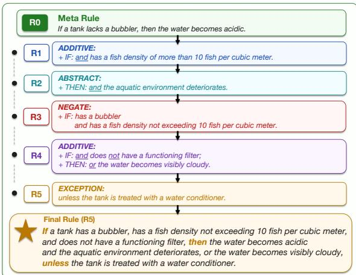  
Figure 1: Progressive rule construction: an example of transforming a WikiHow (Koupaee and Wang, 2018) Meta Rule into a complex rule through five-round semantic enhancement.

However, existing benchmarks, such as those for instruction following and logical reasoning, capture only part of this capability. In specific, instructionfollowing datasets (Jiang et al., 2024; Xu et al., 2024; Qin et al., 2024; Sun et al., 2025) evaluate whether models can understand constraints embedded in natural-language instructions, such as output format and content style. Although these constraints may be expressed in different ways, they primarily prescribe what outputs should be produced or presented rather than guide reasoning or decision-making processes. In contrast, logicreasoning datasets (Saparov and He, 2023; Han et al., 2024; Parmar et al., 2024; Patel et al., 2024; Zhou et al., 2025; Qi et al., 2025) evaluate the capability required by rule-centered scenario reasoning under the condition that the relevant rules are provided in advance. However, they mainly evaluate whether models can derive conclusions from the given rules, without sufficiently distinguishing the different roles that rules may play in realistic scenarios, such as exceptions, conflicts, or priorities. Consequently, current benchmarks provide limited support for evaluating whether LLMs can identify relevant rules, understand their roles and dependencies, and apply them to answer questions grounded in concrete scenarios.

To address these gaps, this paper introduces RuleWeaver, a benchmark construction framework for evaluating LLMs on complex rulecentered scenario reasoning. The basic idea is to address two challenges: (1) building fine-grained rules with different roles, and (2) generating concrete scenarios that require those rules to be identified and applied. Specifically, for the first challenge, RuleWeaver starts from Meta Rules, defined as atomic IF-THEN rules with a single condition and a single outcome, extracted from diverse real-world corpora spanning policy reports, procedural guides, contractual clauses, and narrative contexts. This design ensures that the Meta Rules are derived from naturally occurring rule expressions across different domains. RuleWeaver then progressively augments each Meta Rule into a rule group of complex variants through six semantic types: ABSTRACT, ADDITIVE, and NEGATE capture underspecification, supplementary constraints, and semantic reversal, while EXCEPTION, CONFLICT, and IRONCLAD introduce applicability changes, incompatible implications, and priority constraints. It enables fine-grained evaluation of whether models can understand and distinguish different rules. Figure 1 illustrates one such augmentation path: starting from a Meta Rule (R0), RuleWeaver applies sequential semantic enhancements to produce a complex rule (R5), with each step modifying the condition side, the outcome side, or both.

To address the second challenge, RuleWeaver converts the aforementioned rule groups into rulecentered scenario QA instances spanning seven predefined question types. Each instance is built around five relevant complex rules sampled from distinct rule groups under either same-source or cross-source settings. The construction mainly includes four stages: (1) dependency planning selects the target question type and builds a rule dependency graph that specifies the rule applied at each reasoning step; (2) sub-scenario generation instantiates each planned step as a local scenario fragment with the facts needed to trigger the corresponding rule; (3)final synthesis merges sub-scenarios into a coherent scenario with a final question and reference outputs, including rule application annotations, a rule logic chain, and an instance-specific rubric; and (4) iterative quality review checks structural validity, rule coverage, information leakage, and dependency consistency. This process ensures that the QA instances are rulecentered, with each scenario grounded in rule applications and rule-dependency chains. Overall, RuleWeaver constructs 200 rule groups covering six semantic types and 96 scenario QA instances spanning seven question types.

For evaluation, RuleWeaver goes beyond finalanswer correctness by using process annotations and instance-specific rubrics. Rule recall and rule precision measure whether models can identify relevant rules and apply them correctly, while rubrics assess answer quality across multiple dimensions of rule-centered scenario reasoning. Under this protocol, we evaluate 11 representative LLMs. The best rubric scores reach only 53.83 in the samesource setting and 50.27 in the cross-source setting, while the weakest rubric dimension achieves only a 14.2% normalized score, revealing a clear gap between current LLM capabilities and reliable rulecentered scenario reasoning. Further analyses show that models often fail not only to identify all relevant rules, but also to apply them correctly and track dependencies among rule applications.

Our contributions are twofold:

• This paper introduces RuleWeaver, a benchmark construction framework for evaluating rule-centered scenario reasoning. It builds fine-grained complex rules from corpusderived Meta Rules and composes them into rule-centered scenario QA instances.

• RuleWeaver supports process-level evaluation through rubric-based answer quality, rule recall, and rule precision, revealing key weaknesses in LLMs’ rule-centered scenario reasoning capabilities.

<table><tr><td>Dataset</td><td>Corpus-Derived Rules</td><td>Semantic Rule Typing</td><td>Rule-Centered Scenario QA with Process-Level Scoring</td><td>Multi-Source / Cross-Domain Composition</td></tr><tr><td colspan="5">Instruction-Following Benchmarks</td></tr><tr><td>IFEval (Zhou et al., 2023)</td><td>x</td><td></td><td></td><td></td></tr><tr><td>WizardLM (Xu et al., 2024)</td><td>X</td><td></td><td></td><td></td></tr><tr><td>InfoBench (Qin et al., 2024)</td><td>x</td><td>×××</td><td>×××</td><td>×××</td></tr><tr><td>FollowBench (Jiang et al., 2024)</td><td>x</td><td>x</td><td>x</td><td>x</td></tr><tr><td>ComplexBench (Wen et al., 2024)</td><td>x</td><td>x</td><td>x</td><td>x</td></tr><tr><td colspan="5">Logic-Reasoning Benchmarks</td></tr><tr><td>RuleTaker (Clark et al., 2020)</td><td>x</td><td>x</td><td></td><td>x</td></tr><tr><td>AR-LSAT (Zhong et al., 2021)</td><td>①</td><td>①</td><td>① ×</td><td>×</td></tr><tr><td>ProofWriter (Tafjord et al., 2021)</td><td>x</td><td>①</td><td></td><td>x</td></tr><tr><td>PrOntoQA (Saparov and He, 2023)</td><td>X</td><td>①</td><td>eexee</td><td>×</td></tr><tr><td>FOLIO (Han et al., 2024)</td><td>×</td><td></td><td></td><td>××</td></tr><tr><td>LogicBench (Parmar et al., 2024)</td><td>X</td><td>①①</td><td></td><td></td></tr><tr><td>Multi-LogiEval (Patel et al., 2024)</td><td>x</td><td>①</td><td></td><td>×</td></tr><tr><td>RuleArena (Zhou et al., 2025)</td><td>√</td><td>×</td><td>J</td><td>θ</td></tr><tr><td>ProverQA (Qi et al., 2025)</td><td>x</td><td>e</td><td>0</td><td>x</td></tr><tr><td>RuleWeaver (Ours)</td><td></td><td></td><td></td><td></td></tr></table>

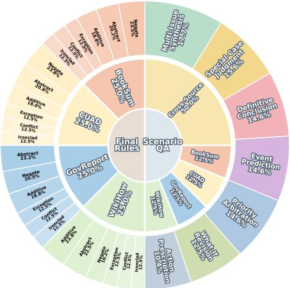  
Table 1: Left: comparison of RuleWeaver with instruction-following and logical reasoning benchmarks across core evaluation dimensions. $\checkmark :$ support; ⊖: partial support; ✗: unsupported. Right: distribution of the 200 complex rule groups and 96 scenario QA instances. Detailed rule-source and QA-type distributions are provided in Appendices A.1 and A.2, respectively, with question-type descriptions in Appendix B.4.

## 2 Related Work

Rule-centered scenario reasoning is closely related to two lines of LLM evaluation: instructionfollowing benchmarks and logical reasoning benchmarks. Table 1 (left) summarizes representative datasets along these dimensions.

Instruction-Following Benchmarks Instructionfollowing benchmarks mainly evaluate whether models can satisfy constraints embedded in natural language instructions, such as format and style requirements (Jiang et al., 2024; Xu et al., 2024; Qin et al., 2024; Zhou et al., 2023; Wen et al., 2024). These constraints can be viewed as weak rule-like requirements, and some benchmarks further decompose or compose them to evaluate multi-constraint compliance (Jiang et al., 2024; Wen et al., 2024). However, such benchmarks usually treat rules as output constraints for compliance checking, rather than as reasoning units with different roles and condition-triggered consequences. As a result, they provide limited support for analyzing rule roles, such as abstraction, negation, exception, conflict, and non-overridable constraints, or for evaluating how different types of rules are selected and applied in concrete scenarios.

Logical Reasoning Benchmarks Logical reasoning benchmarks (Clark et al., 2020; Tafjord et al., 2021; Saparov and He, 2023; Han et al., 2024; Parmar et al., 2024; Yu et al., 2026) explicitly use rules as premises for inference. Some further introduce formal logic annotations, controllable reasoning depth, or real-world rules (Patel et al.,

2024; Zhou et al., 2025; Qi et al., 2025). However, as shown in Table 1 (left), process-level scoring and multi-source or cross-domain rule composition remain underexplored in most existing benchmarks. More importantly, these benchmarks primarily assess whether models can apply provided rules to derive conclusions, often treating rules as homogeneous inference premises. This makes it difficult to evaluate whether models can distinguish different rule roles, identify rules relevant to a scenario, and combine multiple rules through scenario-specific dependencies. As a result, existing benchmarks do not fully capture the rule selection, role understanding, and dependency-aware application required by rule-centered scenario reasoning.

RuleWeaver bridges these lines by constructing complex rules with different roles from corpusderived Meta Rules and composing them into concrete QA scenarios. This enables fine-grained evaluation of rule selection, role understanding, dependency-aware application, and process-level answer quality.

## 3 RuleWeaver

RuleWeaver is a traceable benchmark construction framework for rule-centered scenario reasoning, built from corpus-derived Meta Rules. A Meta Rule is an atomic IF-THEN rule with one triggering condition and one outcome, serving as the minimal unit for progressive rule augmentation. As shown in Figure 2, RuleWeaver transforms these units into complex rule groups and composes them into rule-centered scenario QA instances.

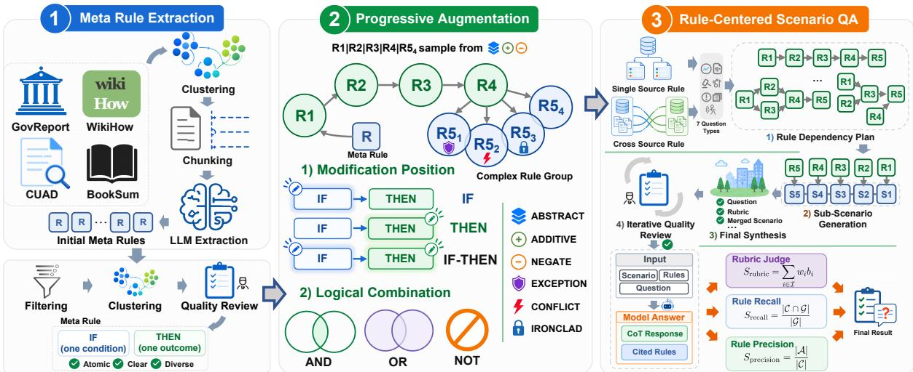  
Figure 2: Overview of RuleWeaver: from real-world corpora to progressively augmented complex rules, rulecentered scenario QA, and process-level scoring.

## 3.1 Rule Augmentation

Rule augmentation defines the semantic design space for transforming a Meta Rule into a more complex variant. We represent each augmentation with three attributes: semantic enhancement type, modification position, and logical combination method. The semantic enhancement type captures the intended rule change and includes six categories: ABSTRACT, ADDITIVE, NEGATE, EXCEPTION, CONFLICT, and IRONCLAD. The first three introduce moderate changes to rule granularity, scope, or polarity, while the latter three model higher-impact rule interactions involving applicability, compatibility, or priority. The modification position records whether the change applies to the IF side, the THEN side, or both. The logical combination method records how the added information is composed with the original rule through AND, OR, or NOT. Together, these attributes make each augmentation explicit and traceable, enabling controlled variation in rule complexity and semantic type. Detailed definitions and representative examples are provided in Appendix B.1.

## 3.2 Complex Rule Construction

We construct complex rule groups in three stages: Meta Rule extraction, quality filtering, and progressive augmentation. Prompts and implementation details for these stages, including generation and filtering models, are provided in Appendix B.2.

Initial Meta Rule Construction We extract Meta Rules from real corpus documents so that the basic rule units reflect naturally occurring constraint expressions. We use four sources: GovReport (Huang et al., 2021), WikiHow (Koupaee and Wang, 2018), CUAD (Hendrycks et al., 2021), and BookSum (Kryscinski et al., 2022), covering policy reports, procedural guides, contractual clauses, and narrative contexts; examples are shown in Appendix B.3. To improve source coverage, we cluster documents within each corpus and sample representative documents for rule extraction, yielding 11,145 initial Meta Rules.

Meta Rule Quality Filtering We filter the extracted rules for format validity, atomicity, semantic clarity, and independence from external background knowledge. To improve diversity and reduce redundancy, we further perform representative clustering and manual inspection, resulting in 200 high-quality Meta Rules. These Meta Rules cover diverse sources and expression styles while preserving clear atomic IF-THEN structure.

Progressive Complex Rule Construction Starting from the 200 filtered Meta Rules, we construct complex rules through a five-round progressive augmentation process. For each Meta Rule, the first four rounds form a shared augmentation trajectory, where one moderate enhancement type is sampled from ABSTRACT, ADDITIVE, and NEGATE and applied to the IF side, THEN side, or both. Because EXCEPTION, CONFLICT, and IRONCLAD can substantially affect rule applicability, priority, or rule interactions, they are reserved for the fifth round, where each trajectory branches into four final variants: one sampled from ABSTRACT, AD-DITIVE, and NEGATE, and one for each highimpact type. This yields 200 complex rule groups whose variants collectively cover all six enhancement types, while preserving traceability to the initial Meta Rule, augmentation rounds, modification positions, and logic combinations.

## 3.3 Rule-Centered Scenario QA Construction

After constructing grouped complex rules, we generate rule-centered scenario QA instances through four stages: dependency planning, sub-scenario generation, final synthesis, and quality review. We use DeepSeek-V4-Pro (DeepSeek-AI, 2026) throughout all stages and consider two QA settings: same-source QA, where five relevant rules are sampled from a single source dataset, and crosssource QA, where the rules are sampled across four datasets. For each instance, the rule set $\mathcal { R } = \{ r _ { 1 } , . . . , r _ { 5 } \}$ is sampled from distinct rule groups to avoid including sibling variants of the same Meta Rule, and each rule is assigned a unique identifier for dependency tracking. Prompts covering all stages are shown in the Figures 22– 27.

Dependency Planning Given R, the generator first samples a target question type from seven predefined categories, covering multi-issue synthesis, definitive conclusion derivation, event prediction, priority arbitration, special-case judgment, what-if revision, and action prescription (see Appendix B.4 for detailed definitions). It then constructs a rule dependency plan, a directed structure over ruleapplication steps that specifies which rule is applied at each step and how intermediate rule-derived conclusions support later steps. This plan controls the reasoning topology of each QA instance, including independent root rules, sequential dependency transfer, fan-out branching, convergence over multiple rule conclusions, and multi-level aggregation. By explicitly encoding these dependencies, RuleWeaver can generate scenarios that require models not only to apply individual rules, but also to preserve and combine intermediate conclusions across the rule chain.

Sub-Scenario Generation The generator then instantiates each dependency step as a local subscenario. For each step, it observes the current rule, the already generated predecessor steps, and the next downstream step to which the current step feeds, together with its associated rule. It then writes a scenario fragment together with auxiliary fields used only during construction. These fields include trigger facts, notes on facts that trigger exception or conflict rules, an intermediate conclusion, and the conclusion’s downstream contribution. The fragment embeds rule-triggering facts through natural contextual details, while avoiding explicit disclosure of rule text, rule identifiers, hidden subquestions, or rule conclusions.

Final Synthesis Finally, the enriched steps are merged into a single coherent scenario and one final question. The generator also produces the rule-application annotations for computing ruleapplication accuracy, a rule logic chain, and a QAspecific all-or-nothing rubric. The rule logic chain serves as the reference reasoning path for rubricbased scoring by recording, for each reasoning step, the rule identifier, dependencies, trigger facts, intermediate conclusion, and downstream contribution. The rubric defines the scoring criteria for each instance, covering aspects such as logical alignment, dependency transfer, exception/conflict handling, and final-answer correctness.

Quality Review and Refinement The generated QA is further refined through an iterative qualitycontrol loop, typically run for five rounds. After a candidate instance is produced, heuristic checks verify basic validity, such as well-formed JSON outputs and coverage of directly used rules. LLMbased judges further assess the dependency plan, sub-scenarios, and final synthesis for structural validity, rule coverage, information leakage, and dependency transfer. The identified issues are summarized into stage-specific feedback and used to optimize the scenario in subsequent refinement rounds. Instances whose review scores exceed the predefined quality threshold of 80 points are accepted and subsequently subjected to human inspection. This loop enables later iterations to produce scenarios with clearer dependencies, better rule coverage, and less information leakage.

## 3.4 Scoring Design

During evaluation, each model receives a final scenario, a corresponding question, and a visible rule pool containing both relevant and distractor rules, then returns a final answer together with the rule identifiers it cites or applies. We report three complementary scores: rubric-based answer quality, rule recall, and rule precision. For answer quality, the LLM judge applies the instance-specific all-or-nothing rubric. The rubric has a total value of 100 points, distributed across its dimensions. Let I denote the rubric dimensions, let $w _ { i }$ be the point value of dimension i with $\textstyle \sum _ { i \in { \mathcal { T } } } w _ { i } = 1 0 0$ and let $b _ { i } \in \{ 0 , 1 \}$ indicate whether the model answer satisfies dimension i. A satisfied dimension receives its full point value; otherwise it receives zero. The rubric score is $\begin{array} { r } { S _ { \mathrm { r u b r i c } } = \sum _ { i \in \mathcal { T } } w _ { i } b _ { i } } \end{array}$ . For rule retrieval, let G be the set of gold relevant rule identifiers and C be the set of identifiers cited by the model. Rule recall is $S _ { \mathrm { r e c a l l } } = { \frac { | { \mathcal { C } } \cap { \mathcal { G } } | } { | { \mathcal { G } } | } }$ . For rule application, let A denote the cited rule applications judged correct with respect to the reference answer. Rule precision is $\begin{array} { r } { S _ { \mathrm { p r e c i s i o n } } = \frac { | \mathcal { A } | } { | \mathcal { C } | } } \end{array}$ , with $S _ { \mathrm { { p r e c i s i o n } } }$ set to zero when no rule is cited. Reporting these three scores separately distinguishes answer quality, rule retrieval, and rule application.

## 3.5 Human Quality Assurance

Human quality assurance supplements Rule-Weaver’s automatic filtering and LLM-based review. Reviewers assess Meta Rules for atomicity, clarity, source faithfulness, and domain relevance; complex rules for traceability, semantic-type correctness, and logical consistency; and scenario QA items for coherent scenarios, questions, rule chains, annotations, and rubrics. Items that are ambiguous, inconsistent, insufficiently rule-grounded, or prone to information leakage are revised or excluded.

## 4 Evaluation

## 4.1 Model Selection

We evaluate 11 state-of-the-art models spanning multiple model families on 96 complex scenario QA instances: Claude-Opus-4.6 (Anthropic, 2026a), Claude-Sonnet-4.6 (Anthropic, 2026b), Deepseek-V4-Pro (DeepSeek-AI, 2026), Qwen3.5- Plus (Alibaba Cloud, 2026), GPT-5.4 (OpenAI, 2026b), GPT-5.5 (OpenAI, 2026a), Gemini-3.1- Pro-Preview (Google, 2026), Doubao-Seed-2.0-pro (ByteDance Seed, 2026), GLM-5 (GLM-5-Team et al., 2026), Kimi-K2.6 (Moonshot AI, 2026), and MiniMax-M2.7 (MiniMax, 2026).

## 4.2 Evaluation Settings

For all evaluated models, we disable reasoning modes when configurable and set the decoding temperature to 0 to ensure deterministic generation, except for Kimi-K2.6, whose APIs require the temperature to be set to 0.6 for non-thinking mode. For Gemini-3.1-Pro-Preview, we set the thinking configuration to low. We use DeepSeek-V4-Flash (DeepSeek-AI, 2026) as the judge model, with its temperature also set to 0. Each instance contains five gold rules, and our main evaluation is conducted under the settings with 200 complex rules. Rule recall is computed by detecting the rule identifiers explicitly cited in each model response and comparing them with the reference set of required rules. The QA template and judge prompt are provided in Figures 28 and 29, respectively.

## 4.3 Main Results

Overall Performance Table 2 reports the main 200-rule results. Under same-source composition, GPT-5.5 obtains the highest rubric score (53.83) and rule precision (74.58), while Kimi-K2.6 achieves the highest rule recall (72.92). Under cross-source composition, Claude-Opus-4.6 is strongest in both rubric score (50.27) and rule recall (62.50), whereas GPT-5.4 obtains the highest rule precision (78.64). Averaged over the 11 models, cross-source evaluation reduces recall by 11.93 points and rubric score by 4.05 points, while precision increases slightly by 2.42 points. This indicates that heterogeneous rule composition primarily stresses complete rule retrieval and rulecentered scenario reasoning. Bootstrap analyses further confirm that the reported point estimates are stable under resampling, with detailed results provided in Appendix C.1.

Semantic Capabilities The upper radar in Table 2 analyzes performance by semantic augmentation type, with detailed numerical results provided in Appendix C.2. We score semantics at the enhancement-event level, so a rule may contribute multiple events when its five-round enhancement contains repeated semantic types. For a model m and semantic type s, the semantic score is the fraction of events in $E ( m , s )$ whose parent rule is judged as a correct application, i.e., $\textstyle \sum _ { e \in E ( m , s ) } \mathbf { 1 } [ \mathrm { r u l e } ( e ) \in \ A ( e ) ] / | E ( m , s ) |$ |, where $\boldsymbol { \mathcal { A } } ( \boldsymbol { e } )$ is the set of correctly applied rules in the judge output for the answer containing event e. Overall, CONFLICT is the strongest semantic category (42.7%), followed by IRONCLAD (40.6%) and ABSTRACT (39.7%), while EXCEPTION is the weakest (34.6%). At the model level, Claude-Opus-4.6 leads five of the six semantic axes, while Claude-Sonnet-4.6 leads EXCEPTION. The consistently low EXCEPTION score suggests that models remain especially brittle when rule applicability is conditioned on exception structure rather than direct condition matching.

<table><tr><td rowspan="2">Model</td><td colspan="3">Same-Source</td><td colspan="3">Cross-Source</td></tr><tr><td>Recall</td><td>Precision</td><td>Rubric</td><td>Recall</td><td>Precision</td><td>Rubric</td></tr><tr><td>Claude-Opus-4.6</td><td>70.42</td><td>70.41</td><td>48.06</td><td> ${ \bf 6 2 . 5 0 } _ { \perp 7 . 9 2 }$ </td><td> $7 3 . 7 4 _ { \uparrow 3 . 3 3 }$ </td><td> ${ \bf 5 0 . 2 7 } _ { \uparrow 2 . 2 1 }$ </td></tr><tr><td>Claude-Sonnet-4.6</td><td>71.67</td><td>63.15</td><td>43.96</td><td> $5 9 . 5 8 _ { \downarrow 1 2 . 0 9 }$ </td><td> $5 4 . 7 4 _ { \downarrow 8 . 4 1 }$ </td><td> $3 6 . 5 6 _ { \downarrow 7 . 4 0 }$ </td></tr><tr><td>GPT-5.4</td><td>61.67</td><td>71.31</td><td>48.21</td><td> $4 8 . 3 3 _ { \downarrow 1 3 . 3 4 }$ </td><td> $7 8 . 6 4 _ { \uparrow 7 . 3 3 }$ </td><td> $4 2 . 5 8 _ { \downarrow 5 . 6 3 }$ </td></tr><tr><td>GPT-5.5</td><td>69.17</td><td>74.58</td><td>53.83</td><td> $5 2 . 0 8 _ { \downarrow 1 7 . 0 9 }$ </td><td> $6 9 . 4 8 _ { \downarrow 5 . 1 0 }$ </td><td> $4 6 . 4 0 _ { \downarrow 7 . 4 3 }$ </td></tr><tr><td>Gemini-3.1-Pro-Preview</td><td>60.83</td><td>58.44</td><td>31.77</td><td> $4 5 . 8 3 _ { \downarrow 1 5 . 0 0 }$ </td><td> $7 2 . 9 5 _ { \uparrow 1 4 . 5 1 }$ </td><td> $2 7 . 8 1 _ { \downarrow 3 . 9 6 }$ </td></tr><tr><td>Deepseek-V4-Pro</td><td>63.75</td><td>59.22</td><td>34.69</td><td> $5 5 . 0 0 _ { \downarrow 8 . 7 5 }$ </td><td> $6 0 . 1 0 _ { \uparrow 0 . 8 8 }$ </td><td> $2 8 . 3 8 _ { \downarrow 6 . 3 1 }$ </td></tr><tr><td>Qwen3.5-Plus</td><td>66.67</td><td>66.32</td><td>37.75</td><td> $5 5 . 8 3 _ { \downarrow 1 0 . 8 4 }$ </td><td> $6 4 . 2 7 _ { \downarrow 2 . 0 5 }$ </td><td> $3 4 . 1 5 _ { \downarrow 3 . 6 0 }$ </td></tr><tr><td>GLM-5</td><td>62.50</td><td>64.17</td><td>37.54</td><td> $5 1 . 6 7 _ { \downarrow 1 0 . 8 3 }$ </td><td> $6 9 . 2 1 _ { \uparrow 5 . 0 4 }$ </td><td> $3 2 . 3 5 _ { \downarrow 5 . 1 9 }$ </td></tr><tr><td>Doubao-Seed-2.0-pro</td><td>48.33</td><td>61.63</td><td>27.67</td><td> $3 9 . 5 8 _ { \downarrow 8 . 7 5 }$ </td><td> $7 5 . 7 3 _ { \uparrow 1 4 . 1 0 }$ </td><td> $3 3 . 0 2 _ { \uparrow 5 . 3 5 }$ </td></tr><tr><td>MiniMax-M2.7</td><td>65.00</td><td>47.43</td><td>29.69</td><td> $5 2 . 0 8 _ { \downarrow 1 2 . 9 2 }$ </td><td> $4 3 . 0 6 _ { \downarrow 4 . 3 7 }$ </td><td> $2 1 . 1 5 _ { \downarrow 8 . 5 4 }$ </td></tr><tr><td>Kimi-K2.6</td><td>72.92</td><td>55.13</td><td>32.50</td><td> $5 9 . 1 7 _ { \downarrow 1 3 . 7 5 }$ </td><td> $5 6 . 5 3 _ { \uparrow 1 . 4 0 }$ </td><td> $2 8 . 4 8 _ { \downarrow 4 . 0 2 }$ </td></tr></table>

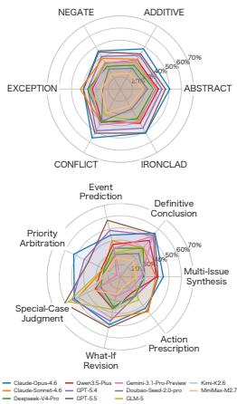  
Table 2: Left: Main results under the 200 complex-rule setting. Rule recall and precision are percentages, rubric score is on a 0–100 scale, arrows indicate cross-source changes relative to same-source scores, and bold marks the best result in each column. Right: Radar summaries of semantic correct-application performance (top) and seven question-type performance (bottom).

Performance Across Question Types The lower radar summarizes performance across the seven scenario question types under the same 200-rule setting, with detailed question-type definitions and numerical results provided in Appendices B.4 and C.3. Across models, average rubric scores are highest for Special-Case Judgment (43.5) and Definitive Conclusion (43.4), whereas Priority Arbitration (28.4) and Action Prescription (31.8) are more difficult. The leading model also varies by question type: GPT-5.5 performs best on Event Prediction, Special-Case Judgment, and What-If Revision; Claude-Opus-4.6 leads Multi-Issue Synthesis, Definitive Conclusion, and Priority Arbitration; and Claude-Sonnet-4.6 leads Action Prescription. These differences suggest that model capability is not monolithic, but instead depends on the kind of reasoning a scenario demands.

Rubric-Dimension Performance To analyze rubric-level performance loss, we average normalized dimension scores over all model–QA pairs; dimension definitions are provided in Appendix B.5. Table 3 shows that models perform well on surface-level constraints, including No External Facts (91.2%) and Citation Format Compliance (82.8%). By contrast, the weakest dimensions are Dependency Chain Alignment (14.2%), Intermediate Conclusion Quality (21.0%), Issue Decomposition (28.4%), and Exception/Conflict Handling (30.4%). This pattern suggests that the central bottleneck is maintaining rule-grounded intermediate reasoning across dependent steps, rather than response formatting or unsupported factual additions. A model-level heatmap is provided in

<table><tr><td>Rubric Dimension</td><td>Max</td><td>Mean</td><td>Norm.</td></tr><tr><td>Question Understanding</td><td>10</td><td>5.28</td><td>52.8%</td></tr><tr><td>Issue Decomposition</td><td>10</td><td>2.84</td><td>28.4%</td></tr><tr><td>Citation Format Compliance</td><td>8</td><td>6.62</td><td>82.8%</td></tr><tr><td>Rule-Grounded Reasoning</td><td>17</td><td>6.44</td><td>37.9%</td></tr><tr><td>Dependency Chain Alignment</td><td>18</td><td>2.55</td><td>14.2%</td></tr><tr><td>Exception/Conflict Handling</td><td>12</td><td>3.65</td><td>30.4%</td></tr><tr><td>Intermediate Conclusion Quality</td><td>10</td><td>2.10</td><td>21.0%</td></tr><tr><td>Final Answer Consistency</td><td>12</td><td>4.36</td><td>36.3%</td></tr><tr><td>No External Facts</td><td>3</td><td>2.74</td><td>91.3%</td></tr></table>

Table 3: Average rubric-dimension scores under the 200-rule setting. “Norm.” denotes the mean score normalized by each dimension’s maximum points.

Appendix C.4. Additional QA-level correlation analyses and qualitative case studies are provided in Appendices C.5 and C.6.

## 4.4 Analysis

Scenario Complexity Analysis We analyze scenario complexity from each instance’s rule logic chain, treating reasoning steps as nodes and dependency annotations as directed edges. Let V be the set of all reasoning nodes, $\mathcal { V } _ { \mathrm { r u l e } } \subseteq \mathcal { V }$ the rule-application nodes, P the set of directed paths, and $\deg ^ { - } ( v )$ and $\deg ^ { + } ( v )$ the in- and out-degree of node v. We use three graph metrics: reasoning depth $D = \operatorname* { m a x } _ { p \in \mathcal { P } } | p |$ , where |p| counts the number of reasoning steps on path p; dependency load $\begin{array} { r } { L = \sum _ { v \in \mathcal { V } _ { \mathrm { r u l e } } } \mathbf { 1 } [ \deg ^ { - } ( v ) > 0 ] } \end{array}$ , the number of rule steps that depend on earlier conclusions; and structural branching $\begin{array} { r } { B = \sum _ { v \in \mathcal { V } } \mathbf { 1 } [ \deg ^ { + } ( v ) > 1 ] } \end{array}$ the number of nodes feeding multiple downstream steps. Figure 3a shows that reasoning depth is the strongest complexity signal. Mean score decreases from 68.1 at depth 2 to 40.0 at depth 3 and 31.2 at depth 4, indicating that longer rule chains are substantially harder for current models. Dependency load shows a similar trend: scores decline from 68.1 with no dependent rule step to 28.0 with three dependent rule steps. In contrast, structural branching has little visible association with performance, with branch-free and one-branch scenarios showing similar mean scores. Overall, sequential depth and the need to reuse intermediate conclusions emerge as the main structural difficulty factors in the current benchmark.

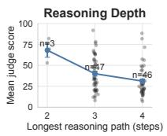

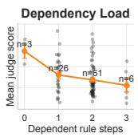

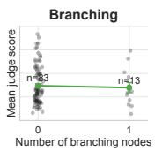

(a) QA-level performance by scenario complexity.  
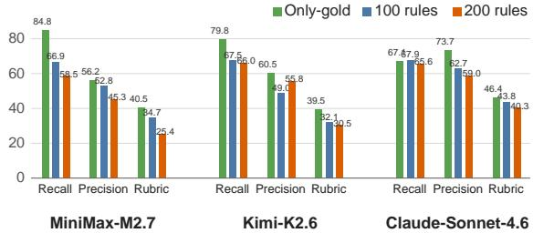  
(b) Overall performance under different rule-pool settings.  
Figure 3: Top: gray points show individual QA instances, and colored markers show mean rubric scores with standard-error bars across scenario complexity levels. Bottom: performance under only-gold, 100-rule, and 200-rule settings for three selected models.

Rule-Pool Size Sensitivity To assess sensitivity to rule-pool size, we evaluate three settings: only-gold rules, 100 rules, and 200 rules. Figure 3b reports recall, precision, and rubric score for MiniMax-M2.7, Kimi-K2.6, and Claude-Sonnet-4.6. Performance generally declines as the rule pool expands. MiniMax-M2.7 shows the clearest degradation, with recall dropping from 84.8 to 58.5, precision from 56.2 to 45.3, and rubric score from 40.5 to 25.4. Kimi-K2.6 also drops substantially in recall and rubric score, although its precision partially recovers from the 100-rule setting while remaining below only-gold. Overall, larger rule pools mainly increase the distractor burden: models must identify the relevant rules among more candidates, and final score further depends on whether the selected rules are correctly applied and integrated into the reasoning chain.

<table><tr><td rowspan="2">Error Type</td><td colspan="2">All</td><td colspan="2">Full Recall</td></tr><tr><td>Count</td><td>Rate</td><td>Count</td><td>Rate</td></tr><tr><td>Rule selection</td><td>762</td><td>72.2%</td><td></td><td></td></tr><tr><td>Cited-rule application</td><td>580</td><td>54.9%</td><td>191</td><td>65.6%</td></tr><tr><td>Rule interaction</td><td>734</td><td>69.5%</td><td>166</td><td>57.0%</td></tr><tr><td>Multi-step integration</td><td>916</td><td>86.7%</td><td>218</td><td>74.9%</td></tr><tr><td>Final synthesis</td><td>678</td><td>64.2%</td><td>193</td><td>66.3%</td></tr></table>

Table 4: Error-type prevalence over all model–QA answers and the subset with full rule recall.

Error Type Analysis To complement rubricdimension scores, we group failures into five rulecentered error types using existing evaluation annotations. Rule selection errors are identified from missed gold rules in rule recall; cited-rule application errors from rule precision annotations; rule interaction errors from exception/conflict handling annotations; multi-step integration errors from issue decomposition, intermediate-conclusion, and dependency-chain annotations; and final synthesis errors from final-answer consistency annotations. Because an answer can fail in multiple ways, the analysis is multi-label. As shown in Table 4, the most frequent error is multi-step integration (86.7%), followed by rule selection (72.2%) and rule interaction (69.5%). In the full-recall subset, multi-step integration errors (74.9%) and cited-rule application errors (65.6%) remain frequent, suggesting that models often fail not only by missing relevant rules, but also by misusing retrieved rules or failing to connect intermediate conclusions.

Human-Judge Agreement To assess the reliability of rubric-based automatic evaluation, we compare LLM-judge total scores with human judgments on score-stratified samples. Detailed sampling and annotation procedures are provided in Appendix B.6. Table 5 reports agreement on total rubric scores. The GPT-5.5 audit yields Spearman’s $\rho = 0 . 8 0 8$ (Spearman, 1904) and Pearson’s r = 0.795 (Pearson, 1895) between human and LLM-judge scores. Across the four additional audits, judge–human Spearman correlations range from 0.755 to 0.842 and Pearson correlations from 0.635 to 0.826; human–human Spearman correlations range from 0.935 to 0.977 and Pearson correlations from 0.901 to 0.969. These results indicate strong agreement between human and automatic scoring, supporting the reliability of rubric-based evaluation.

<table><tr><td>GPT-5.5 Audit</td><td colspan="5">Additional Cross-Model Audits</td></tr><tr><td></td><td colspan="5">Audit outputs Judge-human  $\rho$ </td></tr><tr><td>Judge-human agreement</td><td>Claude-Opus-4.6</td><td>0.755</td><td>0.733</td><td>Judge-human r Human-human 0.977</td><td>Human-human r 0.969</td></tr><tr><td>Spearman&#x27;s  $\rho \mathrm { : }$  0.808 一</td><td>Claude-Sonnet-4.6</td><td>0.842</td><td>0.826</td><td>0.945</td><td>0.952</td></tr><tr><td>Pearson&#x27;s r: 0.795</td><td>DeepSeek-V4-Pro</td><td>0.795</td><td>0.635</td><td>0.947</td><td>0.901</td></tr><tr><td></td><td>GPT-5.4</td><td>0.834</td><td>0.762</td><td>0.935</td><td>0.902</td></tr></table>

Table 5: Agreement on total rubric scores. Each audit contains 48 answers. $\rho \colon$ Spearman; r: Pearson.

<table><tr><td>Judge</td><td>Setting</td><td>Spearman  $\rho$ </td><td>Pearson r</td></tr><tr><td rowspan="3">Grok-4.3</td><td>Same-source</td><td>0.882</td><td>0.878</td></tr><tr><td>Cross-source</td><td>0.918</td><td>0.860</td></tr><tr><td>Overall</td><td>0.918</td><td>0.893</td></tr><tr><td rowspan="3">Gemini-3-Flash</td><td>Same-source</td><td>0.845</td><td>0.818</td></tr><tr><td>Cross-source</td><td>0.873</td><td>0.793</td></tr><tr><td>Overall</td><td>0.882</td><td>0.846</td></tr></table>

Table 6: Correlation of alternative-judge and DeepSeek-V4-Flash model-level mean rubric scores.

Evaluator Robustness Analysis To assess possible model-family bias in automatic scoring, we rescore the same outputs with Grok-4.3 (xAI, 2026b) and Gemini-3-Flash (Google, 2025) and compare their model-level mean rubric scores with the DeepSeek-V4-Flash scores. Both alternative judges use temperature 0; Grok-4.3 uses reasoning\_effort=none, and Gemini-3-Flash uses low reasoning effort. In Table 6, Overall denotes correlations computed from each model’s mean rubric score across both same-source and cross-source instances. The high correlations across both source settings and Overall indicate that the main leaderboard patterns are consistent under judges from different model families.

## 5 Conclusion

This paper presents RuleWeaver, a benchmark construction framework that transforms corpus-derived Meta Rules into complex rule-centered scenario QA instances. Beyond final-answer correctness, RuleWeaver evaluates models through rubric-based answer quality, rule recall, and rule precision. Experiments on 11 LLMs show that current models remain limited in complex rule-centered scenario reasoning, especially under cross-source composition, exception and priority reasoning, longer reasoning chains, and larger rule pools. These findings highlight rule-centered scenario reasoning as a key challenge for current LLMs.

## Limitations

RuleWeaver remains a controlled benchmark. Its 96 scenario QA instances are built from four English corpora, leaving broader multilingual, domain-specific, and institutional rule settings for future expansion. The current evaluation uses an explicit rule pool and static single-turn QA format, whereas real applications may require retrieval from long documents, interaction with users, or updates to changing rule sets. Future work should extend RuleWeaver to larger rule collections, unstructured-document retrieval, interactive settings, multilingual scenarios, and alternative judging protocols. These extensions could further examine structured and transferable memory for long-horizon interactive reasoning (Liang et al., 2026), cross-lingual consistency of rule representations (Cao et al., 2024), representation-level adaptation for multistep reasoning (Liang et al., 2025), and reasoning-consistent updates to changing, interdependent rule sets (Zhang et al., 2026).

## References

Alibaba Cloud. 2026. Alibaba Cloud Model Studio: Model List. https://qwen.ai/blog?id=qwen3.5.

Anthropic. 2026a. Claude opus 4.6 system card. https://www-cdn.anthropic.com/ 14e4fb01875d2a69f646fa5e574dea2b1c0ff7b5. pdf.

Anthropic. 2026b. Introducing Claude Sonnet 4.6. https://www.anthropic.com/news/ claude-sonnet-4-6.

ByteDance Seed. 2026. Seed2.0. https://seed. bytedance.com/en/seed2.

Pengfei Cao, Yuheng Chen, Zhuoran Jin, Yubo Chen, Kang Liu, and Jun Zhao. 2024. One mind, many tongues: A deep dive into language-agnostic knowledge neurons in large language models. Preprint, arXiv:2411.17401.

Peter Clark, Oyvind Tafjord, and Kyle Richardson. 2020. Transformers as soft reasoners over language. Preprint, arXiv:2002.05867.

DeepSeek-AI. 2026. Deepseek-v4-pro technical report. https://huggingface.co/deepseek-ai/ DeepSeek-V4-Pro/blob/main/DeepSeek\_V4. pdf.

GLM-5-Team, :, Aohan Zeng, Xin Lv, Zhenyu Hou, Zhengxiao Du, Qinkai Zheng, Bin Chen, Da Yin, Chendi Ge, Chenghua Huang, Chengxing Xie, Chenzheng Zhu, Congfeng Yin, Cunxiang Wang, Gengzheng Pan, Hao Zeng, Haoke Zhang, Haoran Wang, and 168 others. 2026. Glm-5: from vibe coding to agentic engineering. Preprint, arXiv:2602.15763.

Google. 2025. Gemini 3 flash preview. https://ai.google.dev/gemini-api/docs/ models/gemini-3-flash-preview.

Google. 2026. Gemini 3.1 Pro Preview. https:// deepmind.google/models/gemini/pro/.

Google AI Blog. 2026. Gemini 3.1 flash-lite: Built for intelligence at scale. https://blog.google/ innovation-and-ai/models-and-research/ gemini-models/gemini-3-1-flash-lite.

Neel Guha, Julian Nyarko, Daniel E. Ho, Christopher Ré, Adam Chilton, Aditya Narayana, Alex Chohlas-Wood, Austin Peters, Brandon Waldon, Daniel N. Rockmore, Diego Zambrano, Dmitry Talisman, Enam Hoque, Faiz Surani, Frank Fagan, Galit Sarfaty, Gregory M. Dickinson, Haggai Porat, Jason Hegland, and 21 others. 2023. Legalbench: A collaboratively built benchmark for measuring legal reasoning in large language models. Preprint, arXiv:2308.11462.

Simeng Han, Hailey Schoelkopf, Yilun Zhao, Zhenting Qi, Martin Riddell, Wenfei Zhou, James Coady, David Peng, Yujie Qiao, Luke Benson, Lucy Sun, Alex Wardle-Solano, Hannah Szabo, Ekaterina Zubova, Matthew Burtell, Jonathan Fan, Yixin Liu, Brian Wong, Malcolm Sailor, and 16 others. 2024. Folio: Natural language reasoning with first-order logic. Preprint, arXiv:2209.00840.

Dan Hendrycks, Collin Burns, Anya Chen, and Spencer Ball. 2021. Cuad: An expert-annotated nlp dataset for legal contract review. Preprint, arXiv:2103.06268.

Luyang Huang, Shuyang Cao, Nikolaus Parulian, Heng Ji, and Lu Wang. 2021. Efficient attentions for long document summarization. In Proceedings ofthe 2021 Conference of the North American Chapter of the Associationfor Computational Linguistics: Human Language Technologies, pages 1419–1436, Online. Association for Computational Linguistics.

Yuxin Jiang, Yufei Wang, Xingshan Zeng, Wanjun Zhong, Liangyou Li, Fei Mi, Lifeng Shang, Xin Jiang, Qun Liu, and Wei Wang. 2024. Follow-Bench: A multi-level fine-grained constraints following benchmark for large language models. In Proceedings of the 62nd Annual Meeting of the Associationfor Computational Linguistics (Volume 1:

Long Papers), pages 4667–4688, Bangkok, Thailand. Association for Computational Linguistics.

Mahnaz Koupaee and William Yang Wang. 2018. Wikihow: A large scale text summarization dataset. Preprint, arXiv:1810.09305.

Wojciech Kryscinski, Nazneen Rajani, Divyansh Agarwal, Caiming Xiong, and Dragomir Radev. 2022. BOOKSUM: A collection of datasets for long-form narrative summarization. In Findings ofthe Associationfor Computational Linguistics: EMNLP 2022, pages 6536–6558, Abu Dhabi, United Arab Emirates. Association for Computational Linguistics.

Sirui Liang, Pengfei Cao, Jian Zhao, Cong Huang, Jun Zhao, and Kang Liu. 2025. Bias-restrained prefix representation finetuning for mathematical reasoning. Preprint, arXiv:2511.10707.

Sirui Liang, Pengfei Cao, Jian Zhao, Wenhao Teng, Xiangwen Liao, Jun Zhao, and Kang Liu. 2026. Learning how to remember: A meta-cognitive management method for structured and transferable agent memory. Preprint, arXiv:2601.07470.

J. MacQueen. 1967. Some methods for classification and analysis of multivariate observations.

MiniMax. 2026. MiniMax M2.7: Early Echoes of Self-Evolution. https://www.minimax.io/news/ minimax-m27-en.

Moonshot AI. 2026. Kimi K2.6: Advancing Open-Source Coding. https://www.kimi.com/blog/ kimi-k2-6.

OpenAI. 2025. Gpt-4.1 — mini model documentation. https://developers.openai.com/api/ docs/models/gpt-4.1-mini.

OpenAI. 2026a. GPT-5.5. https://openai.com/ zh-Hans-CN/index/introducing-gpt-5-5/.

OpenAI. 2026b. Introducing GPT-5.4. https:// openai.com/index/introducing-gpt-5-4/.

OpenAI. 2026c. tiktoken: A fast BPE tokenizer for use with OpenAI’s models. https://github.com/ openai/tiktoken.

OpenAI, Josh Achiam, Steven Adler, Sandhini Agarwal, Lama Ahmad, Ilge Akkaya, Florencia Leoni Aleman, Diogo Almeida, Janko Altenschmidt, Sam Altman, Shyamal Anadkat, Red Avila, Igor Babuschkin, Suchir Balaji, Valerie Balcom, Paul Baltescu, Haiming Bao, Mohammad Bavarian, Jeff Belgum, and 262 others. 2024. Gpt-4 technical report. Preprint, arXiv:2303.08774.

Mihir Parmar, Nisarg Patel, Neeraj Varshney, Mutsumi Nakamura, Man Luo, Santosh Mashetty, Arindam Mitra, and Chitta Baral. 2024. Logicbench: Towards systematic evaluation of logical reasoning ability of large language models. Preprint, arXiv:2404.15522.

Nisarg Patel, Mohith Kulkarni, Mihir Parmar, Aashna Budhiraja, Mutsumi Nakamura, Neeraj Varshney, and Chitta Baral. 2024. Multi-logieval: Towards evaluating multi-step logical reasoning ability of large language models. Preprint, arXiv:2406.17169.

Karl Pearson. 1895. Vii. note on regression and inheritance in the case of two parents. Proceedings ofthe Royal Society ofLondon, 58(347-352):240–242.

Chengwen Qi, Ren Ma, Bowen Li, He Du, Binyuan Hui, Jinwang Wu, Yuanjun Laili, and Conghui He. 2025. Large language models meet symbolic provers for logical reasoning evaluation. Preprint, arXiv:2502.06563.

Yiwei Qin, Kaiqiang Song, Yebowen Hu, Wenlin Yao, Sangwoo Cho, Xiaoyang Wang, Xuansheng Wu, Fei Liu, Pengfei Liu, and Dong Yu. 2024. InFoBench: Evaluating instruction following ability in large language models. In Findings of the Association for Computational Linguistics: ACL 2024, pages 13025– 13048, Bangkok, Thailand. Association for Computational Linguistics.

Abulhair Saparov and He He. 2023. Language models are greedy reasoners: A systematic formal analysis of chain-of-thought. Preprint, arXiv:2210.01240.

Yongliang Shen, Kaitao Song, Xu Tan, Wenqi Zhang, Kan Ren, Siyu Yuan, Weiming Lu, Dongsheng Li, and Yueting Zhuang. 2024. Taskbench: Benchmarking large language models for task automation. Preprint, arXiv:2311.18760.

C. Spearman. 1904. The proof and measurement of association between two things. The American Journal ofPsychology, 15(1):72–101.

Wangtao Sun, ChenxiangZhang ChenxiangZhang, XueYou Zhang, Xuanqing Yu, Ziyang Huang, Haotian Xu, Shizhu He, Jun Zhao, and Kang Liu. 2025. Beyond instruction following: Evaluating inferential rule following of large language models. In Proceedings of the 24th China National Conference on Computational Linguistics (CCL 2025), pages 1043– 1066, Jinan, China. Chinese Information Processing Society of China.

Oyvind Tafjord, Bhavana Dalvi Mishra, and Peter Clark. 2021. Proofwriter: Generating implications, proofs, and abductive statements over natural language. Preprint, arXiv:2012.13048.

Bosi Wen, Pei Ke, Xiaotao Gu, Lindong Wu, Hao Huang, Jinfeng Zhou, Wenchuang Li, Binxin Hu, Wendy Gao, Jiaxin Xu, Yiming Liu, Jie Tang, Hongning Wang, and Minlie Huang. 2024. Benchmarking complex instruction-following with multiple constraints composition. In Advances in Neural Information Processing Systems, volume 37, pages 137610– 137645. Curran Associates, Inc.

xAI. 2026a. Grok 3 mini — model documentation. https://docs.x.ai/developers/models/ grok-3-mini.

xAI. 2026b. Grok 4.3. https://docs.x.ai/ developers/models/grok-4.3.

Can Xu, Qingfeng Sun, Kai Zheng, Xiubo Geng, Pu Zhao, Jiazhan Feng, Chongyang Tao, Qingwei Lin, and Daxin Jiang. 2024. Wizardlm: Empowering large pre-trained language models to follow complex instructions. In International Conference on Learning Representations, volume 2024, pages 30745–30766.

Bohan Yu, Pengfei Cao, Chen Han, Chenxi Zhou, Zhiheng Zhang, Zhiyang Xie, Wenhao Teng, Xiangwen Liao, Jun Zhao, and Kang Liu. 2026. Beyond factual knowledge: Benchmarking and learning step-level procedural rule reasoning in large language models. Preprint, arXiv:2608.22753.

Ningyu Zhang, Yunzhi Yao, Jiaxin Qin, Haoming Xu, Yuqi Zhu, Zeping Yu, Mengru Wang, Yuqi Tang, Jia-Chen Gu, Shumin Deng, and Huajun Chen. 2026. Towards principled knowledge editing methods for large language model reasoning. Nature Machine Intelligence, 8(8):1189–1200.

Yanzhao Zhang, Mingxin Li, Dingkun Long, Xin Zhang, Huan Lin, Baosong Yang, Pengjun Xie, An Yang, Dayiheng Liu, Junyang Lin, Fei Huang, and Jingren Zhou. 2025. Qwen3 embedding: Advancing text embedding and reranking through foundation models. Preprint, arXiv:2506.05176.

Wayne Xin Zhao, Kun Zhou, Junyi Li, Tianyi Tang, Xiaolei Wang, Yupeng Hou, Yingqian Min, Beichen Zhang, Junjie Zhang, Zican Dong, Yifan Du, Chen Yang, Yushuo Chen, Zhipeng Chen, Jinhao Jiang, Ruiyang Ren, Yifan Li, Xinyu Tang, Zikang Liu, and 3 others. 2026. A survey of large language models. Preprint, arXiv:2303.18223.

Wanjun Zhong, Siyuan Wang, Duyu Tang, Zenan Xu, Daya Guo, Jiahai Wang, Jian Yin, Ming Zhou, and Nan Duan. 2021. Ar-lsat: Investigating analytical reasoning of text. Preprint, arXiv:2104.06598.

Jeffrey Zhou, Tianjian Lu, Swaroop Mishra, Siddhartha Brahma, Sujoy Basu, Yi Luan, Denny Zhou, and Le Hou. 2023. Instruction-following evaluation for large language models. Preprint, arXiv:2311.07911.

Ruiwen Zhou, Wenyue Hua, Liangming Pan, Sitao Cheng, Xiaobao Wu, En Yu, and William Yang Wang. 2025. Rulearena: A benchmark for rule-guided reasoning with llms in real-world scenarios. Preprint, arXiv:2412.08972.

## A Data Statistics

## A.1 Final Rule Set Statistics

Table 7 summarizes the organized final rule set used by RuleWeaver. The set contains 200 complex rule groups, corresponding to the 200 filtered Meta Rules selected after corpus-specific clustering and manual inspection. The groups are balanced across four source corpora, with 50 groups each from GovReport, WikiHow, CUAD, and BookSum, covering policy reports, procedural guides, contractual clauses, and narrative contexts. Following the progressive construction procedure, each group contains four final variants: one moderate continuation sampled from ABSTRACT, ADDITIVE, and NEGATE, and one variant for each high-impact type, EXCEPTION, CONFLICT, and IRON-CLAD. This yields 800 final complex rules in total. The high-impact types are exactly balanced by construction, while the moderate continuation branch contains 78 ABSTRACT, 63 ADDITIVE, and 59 NEGATE variants. The root Meta Rules contain 18.3 words on average, whereas the final complex rule variants contain 71.4 words on average, reflecting the intended accumulation of conditions, outcomes, and semantic interactions.

<table><tr><td>Source Corpus</td><td>Rule Domain</td><td>Groups</td><td>Variants</td><td>ABSTRACT</td><td>ADDITIVE</td><td>NEGATE</td><td>EXCEPTION</td><td>CONFLICT</td><td>IRONCLAD</td></tr><tr><td>GovReport</td><td>Policy reports</td><td>50</td><td>200</td><td>19</td><td>16</td><td>15</td><td>50</td><td>50</td><td>50</td></tr><tr><td>WikiHow</td><td>Procedural guides</td><td>50</td><td>200</td><td>21</td><td>16</td><td>13</td><td>50</td><td>50</td><td>50</td></tr><tr><td>CUAD</td><td>Contractual clauses</td><td>50</td><td>200</td><td>15</td><td>16</td><td>19</td><td>50</td><td>50</td><td>50</td></tr><tr><td>BookSum</td><td>Narrative contexts</td><td>50</td><td>200</td><td>23</td><td>15</td><td>12</td><td>50</td><td>50</td><td>50</td></tr><tr><td>Total</td><td></td><td>200</td><td>800</td><td>78</td><td>63</td><td>59</td><td>200</td><td>200</td><td>200</td></tr></table>

Table 7: Statistics of the complex final rule set.

(a) QA source, rule-reference, and scenario-length statistics
<table><tr><td>QA Source</td><td>Mode</td><td></td><td>Rule QAs Mentions</td><td> $\mathbf { A v } \mathbf { g } .$  Rules</td><td> $\mathbf { A v } \mathbf { g } .$  Words</td><td>Median</td><td>Word Range</td></tr><tr><td>Cross-Source</td><td>Cross-source</td><td>48</td><td>240</td><td>5.0</td><td>705.1</td><td>622.5</td><td> $^ { 2 4 1 - 1 , 4 2 5 }$ </td></tr><tr><td>BookSum</td><td>Same-source</td><td>12</td><td>60</td><td>5.0</td><td>796.8</td><td>669.5</td><td> $3 4 9 - 1 , 4 9 9$ </td></tr><tr><td>CUAD</td><td>Same-source</td><td>12</td><td>60</td><td>5.0</td><td>598.8</td><td>584.5</td><td> $^ { 1 5 4 - 1 , 3 9 1 }$ </td></tr><tr><td>GovReport</td><td>Same-source</td><td>12</td><td>60</td><td>5.0</td><td>912.1</td><td>994.0</td><td> $^ { 2 8 9 - 1 , 2 6 2 }$ </td></tr><tr><td>WikiHow</td><td>Same-source</td><td>12</td><td>60</td><td>5.0</td><td>896.0</td><td>1,022.0</td><td> $^ { 3 0 7 - 1 , 4 7 6 }$ </td></tr><tr><td>Total</td><td>一</td><td>96</td><td>480</td><td>5.0</td><td>753.0</td><td>656.5</td><td> $^ { 1 5 4 - 1 , 4 9 9 }$ </td></tr></table>

(b) Question type distribution
<table><tr><td>Question Type</td><td>QAs</td><td>Percent</td></tr><tr><td>Multi-Issue Synthesis</td><td>17</td><td>17.71%</td></tr><tr><td>Special-Case Judgment</td><td>15</td><td>15.62%</td></tr><tr><td>Definitive Conclusion</td><td>14</td><td>14.58%</td></tr><tr><td>Event Prediction</td><td>14</td><td>14.58%</td></tr><tr><td>Priority Arbitration</td><td>14</td><td>14.58%</td></tr><tr><td>What-If Revision</td><td>12</td><td>12.50%</td></tr><tr><td>Action Prescription</td><td>10</td><td>10.42%</td></tr><tr><td>Total</td><td></td><td>96 100.00%</td></tr></table>

Table 8: Statistics of the scenario QA set, including source balance, rule references, scenario length, and question types. Each scenario QA instance is grounded in five complex rules.

## A.2 Scenario QA Set Statistics

Table 8 summarizes the scenario QA instances generated from the final rule set. The current scenario QA set contains 96 instances, each grounded in exactly five complex rules, yielding 480 rule mentions in total. The data are balanced between 48 cross-source instances and 48 same-source instances. For same-source QA, the four source corpora each contribute 12 instances; for cross-source QA, each instance samples rules across the four corpora, producing a near-balanced rule-source mixture with 59 BookSum, 64 CUAD, 55 GovReport, and 62 WikiHow rule mentions. The final scenarios contain 72,291 words in total, with an average length of 753.0 words per instance (median 656.5; range 154–1,499). Average scenario length ranges from 598.8 words for CUAD-sourced QA to 912.1 words for GovReport-sourced QA. The question types are also broadly distributed: the most frequent type, Multi-Issue Synthesis, accounts for 17 instances, while the remaining six types range from 10 to 15 instances. Across all QA instances, the 480 referenced rules cover all six semantic augmentation types: 86 ABSTRACT, 82 ADDITIVE, 75 NEGATE, 82 EXCEPTION, 89 CONFLICT, and 66 IRONCLAD rule mentions.

## B Additional Details of RuleWeaver

## B.1 Representative Semantic Augmentation Examples

Table 9 presents representative examples selected from the organized final rule set. For readability, the table reports the source Meta Rule and the specific augmented information that carries the semantic type, rather than printing the full five-round complex rule. These examples illustrate how the same IF-THEN backbone can be enriched in different semantic directions while preserving an explicit record of the augmentation operator and its intended reasoning effect. The selected examples emphasize that the six augmentation types differ not only in surface wording, but also in the reasoning behavior they induce. ABSTRACT changes the granularity of a rule term, ADDITIVE integrates further requirements within the same rule scope, and NEGATE changes the direction of rule applicability or consequence. The higher-impact types operate over rule applicability and priority: EXCEPTION carves out a special non-applicable case, CONFLICT introduces a competing rule with an incompatible conclusion, and IRONCLAD adds a constraint that should remain active despite other rule interactions.

<table><tr><td>Type</td><td>Source Meta Rule</td><td>Augmented Information</td><td>Augmentation Definition</td></tr><tr><td></td><td>erty infringement, then the similar legal wrong.&quot; indemnifying party should defend the indemnified party.</td><td>ABSTRACT If a third-party claim arises The condition is expanded with the This abstracts the concrete trigger, in- from an intellectual prop- broader alternative “or any other tellectual property infringement, into</td><td>a higher-level legal category, requiring models to match the rule beyond surface lexical overlap.</td></tr><tr><td></td><td>regulatory authority.</td><td>ADDITIVE If an item is controlled on Added condition: “the item is The new information does not reverse or the applicable export con- not explicitly pre-approved for ex- suspend the export-control rule; it sup- trol list, then the exporter port under a special government-to- plements the original scope with an ad- should submit a license ap- government agreement.&quot;Added out- ditional eligibility condition and an addi- plication to the relevant come: “not proceed with the export tional compliance requirement. without first obtaining a binding ad- visory opinion.&quot;</td><td></td></tr><tr><td>NEGATE</td><td>sessment metric, then the eligible for placement.&quot; site is eligible for place- ment on the relevant na- tional priority list.</td><td>If a site scores above 28.5 The rule becomes: if the site “does Both the IF condition and THEN out- on the applicable hazard as- not score above 28.5,&quot; then it is “not come are reversed, testing whether a</td><td>model tracks the changed semantic di- rection instead of applying the original eligibility rule.</td></tr><tr><td></td><td>the Agreement, then that assignment is to an affiliate.&quot; party should obtain prior written consent from the other party.</td><td>EXCEPTIONIf a party wishes to assign Added exception: “except where the The added affiliate case restricts the gen-</td><td>eral consent requirement by specifying a special circumstance in which the rule should not be directly applied.</td></tr><tr><td></td><td>rect it within the specified penalties. period shall not be deemed</td><td>CONFLICT If the service provider uses Added competing condition: if the The added rule creates an incompatible commercially reasonable failure results from “willful miscon- outcome with the original no-breach con- efforts to correct a Program duct or fraud,&quot; then the failure “shall clusion, requiring conflict detection and Error, then failure to cor- be deemed a breach&quot; and triggers resolution when both conditions are rele-</td><td>vant.</td></tr><tr><td></td><td>a breach. the need for environmental the assessment is complete.&quot; cleanup.</td><td>IRONCLAD If a federal agency intends Added mandatory prohibition: the The new item is framed as a strict, non- to dispose of property, then agency “must not transfer the prop- optional constraint that must be preserved the agency should assess erty to any non-federal entity before even when other outcomes, waivers, or</td><td>procedural alternatives are considered.</td></tr></table>

Table 9: Representative examples of the six semantic augmentation types selected from the organized final rule set.

The table above illustrates isolated, single-step semantic augmentation events. To complement these examples, Figure 4 shows three complete five-round progressive augmentation cases. Each case preserves its full augmentation trajectory from the source Meta Rule to the final complex rule: the final round realizes an EXCEPTION in Figure 4a, a CONFLICT in Figure 4b, and an IRON-CLAD constraint in Figure 4c. These cases make explicit how earlier moderate augmentations are accumulated before a high-impact rule interaction is introduced in the final round.

## B.2 Implementation Details for Complex Rule Construction

For representative sampling, documents are embedded with Qwen3-8B-Embedding (Zhang et al., 2025) and clustered with KMeans (MacQueen, 1967), using 50 clusters per dataset. We select the 3 nearest documents from each cluster, split them into chunks of up to 3,000 tokens with CL100K\_Base in tiktoken (OpenAI, 2026c), and generate 10 Meta Rules per chunk with GPT-5.4 (OpenAI, 2026b) using the prompt in Figure 18. For quality filtering, malformed outputs are removed before Grok-3-Mini (xAI, 2026a) verifies rule atomicity with the prompt in Figure 19. We then remove rules that are under-informative, overly commonsensical, weak in constraint semantics, or dependent on external background knowledge through unanimous voting by Grok-3-Mini, GPT-4.1-Mini (OpenAI, 2025), and Gemini-3.1- Flash-Lite-Preview (Google AI Blog, 2026), using the prompt in Figure 20. The retained rules are embedded with Qwen3-8B-Embedding and clustered separately for each dataset using KMeans with 50 clusters per dataset; the most representative rule from each cluster is then manually inspected. Progressive complex rule construction uses DeepSeek-V4-Pro (DeepSeek-AI, 2026) with the rule augmentation prompt in Figure 21.

<table><tr><td>Source</td><td>Meta Rule</td><td>IF Condition</td><td>THEN Outcome</td></tr><tr><td>BookSum</td><td>If a person is excommunicated from the A person is excommunicated They are banished from enter- Church, then they are banished from entering from the Church</td><td></td><td>ing Rome</td></tr><tr><td>CUAD</td><td>Rome. If the manufacturer intends to change a man- The manufacturer intends to The manufacturer should ob- ufacturing process, then the manufacturer change a manufacturing pro- tain written approval from the should obtain written approval from the client cess</td><td></td><td>client via a formal change or- der</td></tr><tr><td>GovReport</td><td>via a formal change order. If the postal service provider proposes to elim- The postal service provider The provider should request an inate a standard delivery day, then the provider proposes to eliminate a stan- advisory opinion from the rele- should request an advisory opinion from the dard delivery day relevant regulatory oversight body.</td><td></td><td>vant regulatory oversight body</td></tr><tr><td>WikiHow</td><td>If a tank lacks a bubbler, then the water be- A tank lacks a bubbler comes acidic.</td><td></td><td>The water becomes acidic</td></tr></table>

Table 10: Examples of Meta Rules from Four Source Datasets.

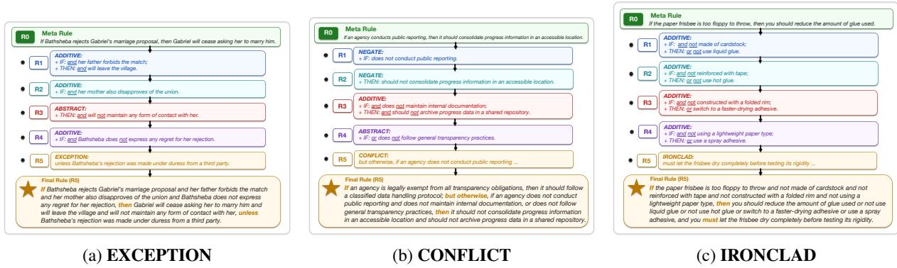  
Figure 4: Complete five-round progressive augmentation cases, with final semantic enhancements of EXCEPTION, CONFLICT, and IRONCLAD, respectively.

## B.3 Representative Meta Rule Examples

Table 10 shows representative Meta Rules extracted from the four source datasets used in RuleWeaver. Each example follows the atomic IF-THEN format, with one triggering condition and one corresponding outcome. Together, these examples illustrate the source diversity of the seed rules before semantic augmentation: policy-oriented obligations from GovReport, procedural guidance from WikiHow, contractual requirements from CUAD, and eventcontingent rules from BookSum.

## B.4 Scenario QA Question Types

RuleWeaver samples one target question type before constructing the dependency plan for each scenario QA instance. The type controls the intended reasoning demand of the final question, while the hidden dependency plan and rule logic chain ensure that the instance still requires grounded rule application rather than surface pattern matching. Table 11 summarizes the seven question types used in RuleWeaver.

<table><tr><td>Question Type</td><td>Expected Output</td><td>Reasoning Focus</td></tr><tr><td>Multi-Issue Synthesis</td><td>A synthesis of multiple parallel and relevant points that jointly resolve the question</td><td>Integrating several sub-issues instead of produc- ing a single isolated conclusion.</td></tr><tr><td>Definitive Conclusion</td><td>One unique, explicit conclusion derived from the scenario, question, and applicable rules.</td><td>Checking all relevant rule conditions and deriv- ing a determinate final answer.</td></tr><tr><td>Event Prediction</td><td>The rule-governed next event or consequence if the current scenario proceeds.</td><td>Projecting consequences beyond the immediately stated facts while remaining grounded in the</td></tr><tr><td>Priority Arbitration</td><td>The controlling rule-governed path and the resulting choice or conclusion.</td><td>rules. Resolving rule interactions involving conflicts, competing implications, or priority ordering.</td></tr><tr><td>Special-Case Judg- ment</td><td>The outcome for a boundary case or special circumstance.</td><td>Determining how a qualifying circumstance changes rule applicability or the final outcome.</td></tr><tr><td>What-If Revision</td><td>The revised rule-governed outcome after a specified change to scenario conditions.</td><td>Updating the reasoning chain under a counterfac- tual modification rather than reusing the original</td></tr><tr><td>Action Prescription</td><td>tions that should be taken next.</td><td>conclusion. The concrete action, disposition, or set of ac- Translating rule applications and dependencies into an operational decision.</td></tr></table>

Table 11: Scenario QA question types used in RuleWeaver.

## B.5 Scenario QA Rubric Dimensions

The answer judge scores each model response on a 100-point rubric with nine dimensions. The rubric separates surface validity, such as citation format and avoiding external facts, from rule-centered reasoning skills, such as decomposition, dependency alignment, and exception or conflict handling. Table 12 summarizes the dimensions and their maximum points.

## B.6 Human Agreement Audit for Rubric Scoring

To assess the reliability of the LLM-based answer judge, we conduct a score-stratified audit on 48 GPT-5.5 answers from the 200-rule setting, sampling 12 answers from each of four automatic rubric-score bins: [0, 25), [25, 50), [50, 75), and [75, 100]. One human annotator independently rescores the answers using the same instance-specific all-or-nothing rubric, with automatic scores hidden during annotation.

We further extend the audit to outputs from four representative models: Claude-Opus-4.6, Claude-Sonnet-4.6, DeepSeek-V4-Pro, and GPT-5.4. For each model, we rank its outputs by automatic rubric score, partition the ranked outputs into four percentile ranges (top 25%, 25–50%, 50–75%, and bottom 25%), and randomly select 12 responses from each range. Two human annotators independently rescore the same 48 selected responses per model with automatic scores hidden. This percentile-stratified design covers low- and highscoring outputs even when a model does not populate the fixed score intervals uniformly.

## C Additional Evaluation Results

## C.1 Bootstrap Confidence Intervals

For each source setting, we resample the 48 aligned QA instances with replacement 20,000 times and recompute the mean rubric score. We use the 2.5th and 97.5th percentiles of the bootstrap distribution to form 95% confidence intervals (CIs). Table 13 reports the resulting model-level estimates. The bootstrap means differ from the corresponding point estimates in Table 2 by at most 0.43 points.

We additionally compare the leading model in each setting with every other model using a paired bootstrap over the same 48 aligned QA instances. Table 14 reports the mean difference and 95% CI for each comparison.

## C.2 Semantic Enhancement Results under the 200-Rule Setting

Table 15 reports model performance across the six semantic enhancement types under the 200-rule setting. We use the same event-level semantic correctapplication rate as in the main radar plot: for a semantic type, the denominator is the set of corresponding rule-enhancement events attached to the rules referenced by evaluated questions, and the numerator counts events whose rule is both cited and judged as correctly applied in the model answer. Higher values indicate stronger semantic rule-following ability.

The results show that Claude-Opus-4.6 is the strongest overall model, achieving the best score on ABSTRACT, ADDITIVE, NEGATE, and CONFLICT, and tying GPT-5.5 on IRONCLAD.

<table><tr><td>Rubric Dimension</td><td>Max What It Measures</td><td></td></tr><tr><td>Question Understanding</td><td>10</td><td>Whether the answer addresses the requested scenario question and identifies the correct target outcome or decision.</td></tr><tr><td>Issue Decomposition</td><td></td><td>10 Whether the answer breaks the scenario into the necessary sub-issues and rule- application steps before reaching the final conclusion.</td></tr><tr><td>Citation Format Compliance</td><td>8</td><td>Whether cited rules use canonical rule identifiers, appear at the point of applica- tion, and avoid invented or malformed rule references.</td></tr><tr><td>Rule-Grounded Reasoning</td><td>17</td><td>Whether cited rules are correctly applied to concrete scenario facts and support the stated intermediate or final conclusions.</td></tr><tr><td>Dependency Chain Alignment</td><td>18</td><td>Whether the answer follows the required rule logic chain and preserves depen- dencies among intermediate conclusions.</td></tr><tr><td>Exception/Conflict Handling</td><td>12</td><td>Whether the answer detects and resolves exceptions, blockers, conflicts, or priority relations that affect rule applicability.</td></tr><tr><td>Intermediate Conclusion Qual- ity</td><td>10</td><td>Whether the answer derives accurate intermediate conclusions for the necessary rules instead of jumping directly to the final answer</td></tr><tr><td>Final Answer Consistency</td><td>12</td><td>Whether the final answer follows from the preceding rule-grounded reasoning and states the required conclusion, action, or judgment.</td></tr><tr><td>No External Facts</td><td>3</td><td>Whether the answer avoids unsupported assumptions or facts outside the pro- vided scenario and rule pool.</td></tr></table>

Table 12: Scenario QA answer-judgment rubric dimensions. The maximum scores sum to 100 points.
<table><tr><td></td><td colspan="3">Same-Source</td><td colspan="3">Cross-Source</td></tr><tr><td>Model</td><td>Mean</td><td>95% CI</td><td> $\Delta$ </td><td>Mean</td><td>95% CI</td><td>∆</td></tr><tr><td>GPT-5.5</td><td>53.88</td><td>[44.42, 63.33]</td><td>+0.05</td><td>46.49</td><td>[38.21, 54.77]</td><td>+0.09</td></tr><tr><td>Claude-Opus-4.6</td><td>48.21</td><td>[38.65, 57.77]</td><td>+0.15</td><td>50.43</td><td>[40.81, 60.04]</td><td>+0.16</td></tr><tr><td>GPT-5.4</td><td>48.39</td><td>[38.40, 58.38]</td><td>+0.18</td><td>42.67</td><td>[33.83, 51.50]</td><td>+0.09</td></tr><tr><td>Claude-Sonnet-4.6</td><td>44.11</td><td>[33.90, 54.31]</td><td>+0.15</td><td>36.69</td><td>[27.38, 46.00]</td><td>+0.13</td></tr><tr><td>Qwen3.5-Plus</td><td>38.03</td><td>[29.00, 47.06]</td><td>+0.28</td><td>34.47</td><td>[26.65, 42.29]</td><td>+0.32</td></tr><tr><td>GLM-5</td><td>37.65</td><td>[28.77, 46.52]</td><td>+0.11</td><td>32.66</td><td>[25.85, 39.46]</td><td>+0.31</td></tr><tr><td>DeepSeek-V4-Pro</td><td>34.95</td><td>[25.27, 44.63]</td><td>+0.26</td><td>28.75</td><td>[22.52, 34.98]</td><td>+0.37</td></tr><tr><td>Doubao-Seed-2.0-Pro</td><td>28.03</td><td>[19.40, 36.65]</td><td>+0.36</td><td>33.35</td><td>[26.00, 40.69]</td><td>+0.33</td></tr><tr><td>Kimi-K2.6</td><td>32.88</td><td>[24.23, 41.52]</td><td>+0.38</td><td>28.90</td><td>[19.96, 37.83]</td><td>+0.42</td></tr><tr><td>Gemini-3.1-Pro-Preview</td><td>32.12</td><td>[23.29, 40.94]</td><td>+0.35</td><td>28.23</td><td>[20.96, 35.50]</td><td>+0.42</td></tr><tr><td>MiniMax-M2.7</td><td>30.07</td><td>[20.38, 39.75]</td><td>+0.38</td><td>21.58</td><td>[13.75, 29.40]</td><td>+0.43</td></tr></table>

Table 13: Bootstrap mean rubric scores and 95% CIs. $\Delta$ is the bootstrap mean minus the corresponding point estimate in Table 2.

Claude-Sonnet-4.6 performs best on EXCEP-TION, suggesting comparatively strong handling of special-case carve-outs. Aggregated across models, CONFLICT and IRONCLAD are the highest-scoring semantic types, while EXCEP-TION, NEGATE, and ADDITIVE remain more challenging, indicating that models still struggle with precise applicability changes and conditionlevel modifications.

## C.3 Question-Type Results under the 200-Rule Setting

Table 16 reports the model-level rubric scores for the seven scenario question types under the 200- rule setting. The question types are defined in Appendix B.4; higher scores indicate better performance.

## C.4 Model-Level Rubric-Dimension Breakdown

Figure 5 breaks down normalized rubric scores by model. The same pattern is broadly shared across model families: even stronger models improve on rule-grounded reasoning and final-answer consistency, but dependency-chain alignment remains low. These results complement the aggregate rubric scores by localizing where models lose points in the reasoning process.

## C.5 QA-Level Spearman Correlation Analysis

We complement the descriptive scenariocomplexity analysis in Section 4.4 with QA-level rank correlations. For each structural or ruleselection metric, let $\begin{array} { r c l } { \mathbf { x } } & { = } & { \left( x _ { 1 } , \ldots , x _ { N } \right) } \end{array}$ be its values over the N QA instances, and let $\mathbf { y } = ( y _ { 1 } , \dots , y _ { N } )$ be the corresponding QA-level rubric scores averaged over all evaluated models.

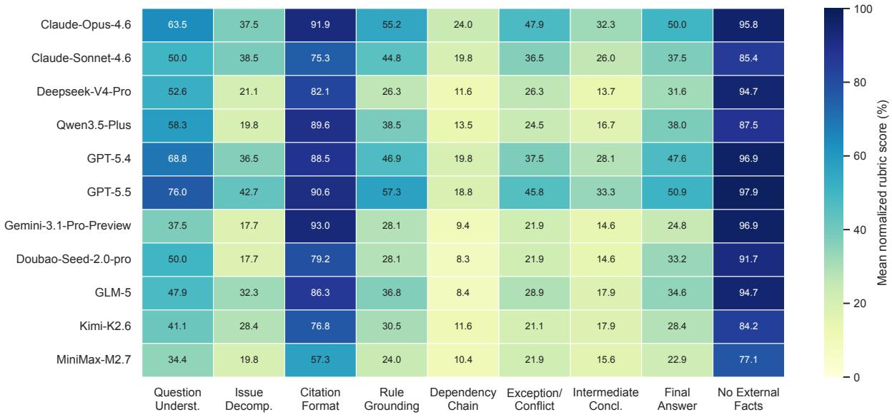  
Figure 5: Model-level normalized rubric-dimension scores under the 200-rule setting. Each cell reports the mean percentage score for one model and one rubric dimension.

<table><tr><td>Same-source comparison</td><td>Diff.</td><td>95% CI</td></tr><tr><td>GPT-5.5 – Doubao-Seed-2.0-Pro</td><td>26.36</td><td>[16.62, 36.10]</td></tr><tr><td>GPT-5.5 – MiniMax-M2.7</td><td>24.08</td><td>[12.75, 35.40]</td></tr><tr><td>GPT-5.5 – Gemini-3.1-Pro-Preview</td><td>21.96</td><td>[11.15, 32.77]</td></tr><tr><td>GPT-5.5 – Kimi-K2.6</td><td>21.46</td><td>[10.81, 32.10]</td></tr><tr><td>GPT-5.5 – DeepSeek-V4-Pro</td><td>19.19</td><td>[8.38, 30.00]</td></tr><tr><td>GPT-5.5 – GLM-5</td><td>16.48</td><td>[7.42, 25.54]</td></tr><tr><td>GPT-5.5 – Qwen3.5-Plus</td><td>16.27</td><td>[6.00, 26.54]</td></tr><tr><td>GPT-5.5 – Claude-Sonnet-4.6</td><td>9.87</td><td>[0.92, 18.81]</td></tr><tr><td>GPT-5.5 – GPT-5.4</td><td>5.72</td><td>[-3.62, 15.06]</td></tr><tr><td> $\mathrm { G P T  – 5 . 5 - C l a u d e { - } O p u s { - } } 4 . 6$ </td><td>5.60</td><td>[-5.04, 16.23]</td></tr></table>

<table><tr><td>Cross-source comparison</td><td>Diff.</td><td>95% CI</td></tr><tr><td>Claude-Opus-4.6 – MiniMax-M2.7</td><td>29.30</td><td>[18.62, 39.98]</td></tr><tr><td>Claude-Opus-4.6 – Gemini-3.1-Pro-Preview</td><td>22.77</td><td>[13.00, 32.54]</td></tr><tr><td>Claude-Opus-4.6 – DeepSeek-V4-Pro</td><td>22.02</td><td>[11.46, 32.58]</td></tr><tr><td>Claude-Opus-4.6 – Kimi-K2.6</td><td>21.99</td><td>[11.62, 32.35]</td></tr><tr><td>Claude-Opus-4.6 – GLM-5</td><td>18.03</td><td>[7.83, 28.23]</td></tr><tr><td>Claude-Opus-4.6 – Doubao-Seed-2.0-Pro</td><td>17.36</td><td>[7.50, 27.21]</td></tr><tr><td>Claude-Opus-4.6 – Qwen3.5-Plus</td><td>16.17</td><td>[5.67, 26.67]</td></tr><tr><td>Claude-Opus-4.6 – Claude-Sonnet-4.6</td><td>13.93</td><td>[3.71,24.15]</td></tr><tr><td>Claude-Opus-4.6 – GPT-5.4</td><td>7.71</td><td>[-1.23, 16.65]</td></tr><tr><td>Claude-Opus-4.6 – GPT-5.5</td><td>4.13</td><td>[-3.92, 12.17]</td></tr></table>

Table 14: Paired bootstrap rubric-score differences (leader minus comparator) and 95% CIs, based on 20,000 resamples of the 48 aligned instances in each setting.

We report Spearman’s rank correlation coefficient, $\rho = \mathrm { c o r r } ( \mathrm { r a n k } ( \mathbf { x } )$ , rank(y)), where tied values receive their average rank.

Table 17 shows modest negative correlations for reasoning depth $( \rho = - 0 . 2 9 )$ and dependency load $( \rho = - 0 . 2 2 )$ , while structural branching is nearly uncorrelated with score $( \rho = - 0 . 0 1 )$ . For ruleselection factors, rule precision is strongly associated with final score $( \rho = 0 . 6 6 )$ , whereas rule recall is weaker $( \rho = 0 . 2 0 )$ . This indicates that correctly applying cited rules is more directly tied to answer quality than merely citing more required rules.

## C.6 Case Studies

To better understand the limitations of current LLMs in compositional rule-following, we present several representative failure cases. Since the full scenarios, rule contents, and model outputs are lengthy, we report only the case-relevant core information. These cases show errors such as missing individual rules, misusing exception conditions, and failing to propagate intermediate conclusions across dependent rules.

LLMs fail to recall necessary rules. As illustrated in Figure 6, LLMs may fail to retrieve a rule that is essential for completing the reasoning chain. In this case, the model applies several local exposure rules but omits R(117), the rule that aggregates the resulting plan states into concrete premium and corrective-funding obligations. As a result, the model leaves the obligations unresolved and treats them as pending or contingent, rather than deriving the determinate duties required by the rule set.

LLMs misuse exception conditions. As shown in Figure 7, LLMs may identify the relevant facts but reverse the polarity of an exception. In this case, unpaid fees accrue interest unless an effective written forbearance agreement exists. The scenario only contains an email promising a future draft, so the exception should not apply. However, the model interprets the absence of a written forbearance agreement as blocking interest accrual. This reverses the rule consequence and produces a nointerest outcome.

<table><tr><td>Model</td><td>ABSTRACT</td><td>ADDITIVE</td><td>NEGATE</td><td>EXCEPTION</td><td>CONFLICT</td><td>IRONCLAD</td></tr><tr><td>Claude-Opus-4.6</td><td>50.55</td><td>48.02</td><td>46.08</td><td>40.24</td><td>56.18</td><td>51.52</td></tr><tr><td>Claude-Sonnet-4.6</td><td>39.45</td><td>38.24</td><td>39.06</td><td>42.68</td><td>41.57</td><td>39.39</td></tr><tr><td>Deepseek-V4-Pro</td><td>37.53</td><td>32.58</td><td>31.50</td><td>36.59</td><td>41.57</td><td>37.88</td></tr><tr><td>Qwen3.5-Plus</td><td>41.23</td><td>37.25</td><td>34.39</td><td>32.93</td><td>40.45</td><td>42.42</td></tr><tr><td>GPT-5.4</td><td>44.11</td><td>41.93</td><td>40.85</td><td>36.59</td><td>49.44</td><td>46.97</td></tr><tr><td>GPT-5.5</td><td>46.99</td><td>43.34</td><td>45.12</td><td>40.24</td><td>51.69</td><td>51.52</td></tr><tr><td>Gemini-3.1-Pro-Preview</td><td>39.04</td><td>35.98</td><td>33.98</td><td>34.15</td><td>43.82</td><td>40.91</td></tr><tr><td>Doubao-Seed-2.0-pro</td><td>32.33</td><td>29.60</td><td>28.89</td><td>24.39</td><td>40.45</td><td>28.79</td></tr><tr><td>GLM-5</td><td>38.77</td><td>34.42</td><td>35.35</td><td>35.37</td><td>34.83</td><td>40.91</td></tr><tr><td>Kimi-K2.6</td><td>37.95</td><td>36.97</td><td>33.84</td><td>31.71</td><td>37.08</td><td>40.91</td></tr><tr><td>MiniMax-M2.7</td><td>28.49</td><td>24.93</td><td>23.93</td><td>25.61</td><td>32.58</td><td>25.76</td></tr></table>

Table 15: Semantic correct-application rates by enhancement type under the 200-rule setting. Scores are percentages, and bold values mark the best model for each semantic type.
<table><tr><td>Model</td><td>Multi-Issue Synthesis</td><td>Definitive Conclusion</td><td>Event Prediction</td><td>Priority Arbitration</td><td>Special-Case Judgment</td><td>What-If Revision</td><td>Action Prescription</td></tr><tr><td>Claude-Opus-4.6</td><td>45.24</td><td>55.64</td><td>45.00</td><td>52.43</td><td>51.73</td><td>50.17</td><td>43.00</td></tr><tr><td>Claude-Sonnet-4.6</td><td>39.18</td><td>40.14</td><td>40.21</td><td>24.79</td><td>48.53</td><td>44.33</td><td>46.70</td></tr><tr><td>GPT-5.4</td><td>38.94</td><td>53.36</td><td>48.93</td><td>42.79</td><td>53.33</td><td>47.17</td><td>29.90</td></tr><tr><td>GPT-5.5</td><td>40.94</td><td>54.86</td><td>57.50</td><td>38.79</td><td>60.73</td><td>52.67</td><td>45.60</td></tr><tr><td>Gemini-3.1-Pro-Preview</td><td>27.18</td><td>52.64</td><td>33.79</td><td>13.21</td><td>30.07</td><td>26.50</td><td>23.40</td></tr><tr><td>Deepseek-V4-Pro</td><td>30.06</td><td>39.79</td><td>34.07</td><td>24.64</td><td>27.93</td><td>35.17</td><td>29.60</td></tr><tr><td>Qwen3.5-Plus</td><td>40.24</td><td>48.14</td><td>37.21</td><td>26.79</td><td>32.73</td><td>37.08</td><td>26.10</td></tr><tr><td>GLM-5</td><td>21.24</td><td>40.64</td><td>30.14</td><td>25.43</td><td>57.00</td><td>37.50</td><td>34.20</td></tr><tr><td>Doubao-Seed-2.0-pro</td><td>28.88</td><td>34.36</td><td>28.79</td><td>23.07</td><td>31.87</td><td>36.50</td><td>29.90</td></tr><tr><td>MiniMax-M2.7</td><td>23.06</td><td>26.64</td><td>26.07</td><td>22.07</td><td>34.93</td><td>24.75</td><td>18.00</td></tr><tr><td>Kimi-K2.6</td><td>30.94</td><td>31.36</td><td>14.64</td><td>18.71</td><td>49.27</td><td>43.83</td><td>23.00</td></tr></table>

Table 16: Rubric scores by scenario question type under the 200-rule setting. Scores are on a 0–100 scale, and bold values mark the best model for each question type.

<table><tr><td>Group</td><td>Metric</td><td>Spearman ρ</td></tr><tr><td rowspan="3">Complexity</td><td>Reasoning Depth</td><td>-0.29</td></tr><tr><td>Dependency Load</td><td>-0.22</td></tr><tr><td>Branching</td><td>-0.01</td></tr><tr><td rowspan="2">Rule Selection</td><td>Rule Recall</td><td>0.20</td></tr><tr><td>Rule Precision</td><td>0.66</td></tr></table>

Table 17: Spearman rank correlations between QA-level factors and mean rubric score. Rule recall and precision are averaged over the 11 evaluated models for each QA.

LLMs lose dependency-chain conclusions. As shown in Figure 8, LLMs may apply individual rules locally while failing to propagate intermediate conclusions across dependent rules. In this case, R(83) establishes that the corrected disclosure blocks notification or escalation. This conclusion should then inform the later inventiondocumentation and amendment analyses under R(54) and R(68). However, the model treats R(83) as an isolated resolved item and evaluates the later rules separately. Consequently, locally plausible rule applications fail to produce the required global reasoning chain.

Figures 9–17 additionally present representative scoring cases for all nine rubric dimensions. Each case shows a model response that receives zero points on the corresponding dimension, together with the relevant scenario evidence, reference answer, and judge rationale.

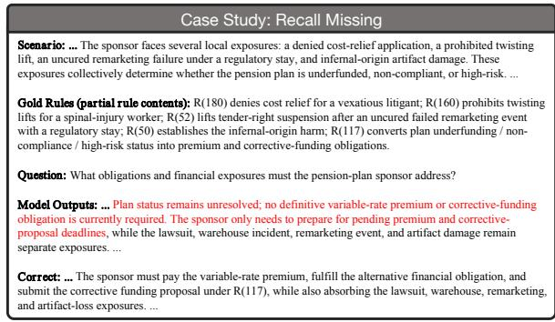  
\textbf{LLMs fail to recall necessary rules.}As illustrated inFigure 6: Recall missing. The model misses a necesessential for completing the reasoning chain. In this case, the model applies severalsary aggregation rule and therefore treats determinate states into concrete premium and corrective-funding obligations. As a result, theobligations as merely contingent. Red text highlights rather than deriving the determinate duties required by the rule set.the erroneous part of the model output.

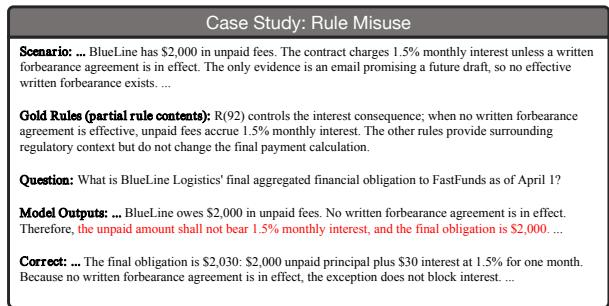  
\textbf{LLMs misuse exception conditions.}As shown inFigure 7: Rule misuse. The model identifies the rele-reverse the polarity of an exception. In this case, unpaid fees accrue interest unlessvant premise but reverses the exception condition, proemail promising a future draft, so the exception should not apply. However, theducing the opposite legal consequence. Red text highinterest accrual. This reverses the rule consequence and produces a no-interestlights the erroneous part of the model output.

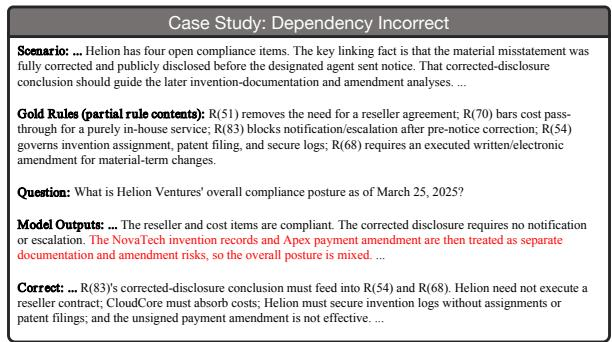  
Figure 8: Dependency incorrect. The model applies locally while failing to propagate intermediate conclusions across dependent rules.rules locally but fails to propagate an intermediate con-escalation. This conclusion should then inform the later invention-documentationclusion through the required rule-dependency chain. as an isolated resolved item and evaluates the later rules separately. Consequently,Red text highlights the erroneous part of the model chain.output.

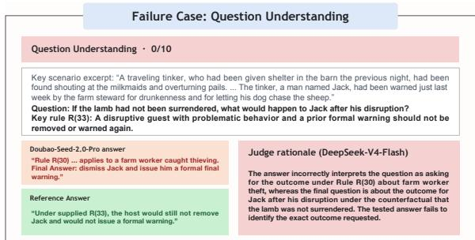  
Figure 9: A zero-score case for Question Understanding.

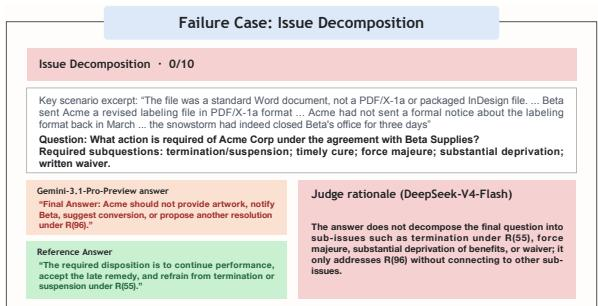  
Figure 10: A zero-score case for Issue Decomposition.

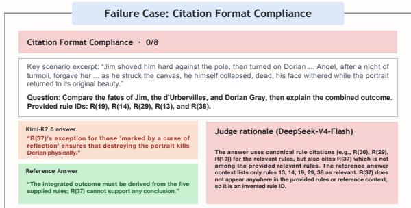  
Figure 11: A zero-score case for Citation Format Compliance.

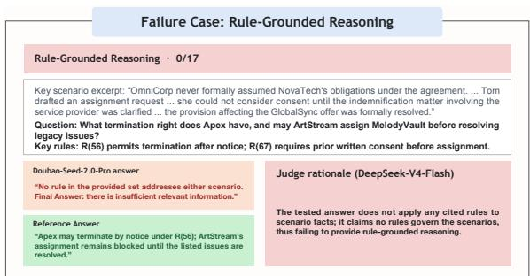  
Figure 12: A zero-score case for Rule-Grounded Reasoning.

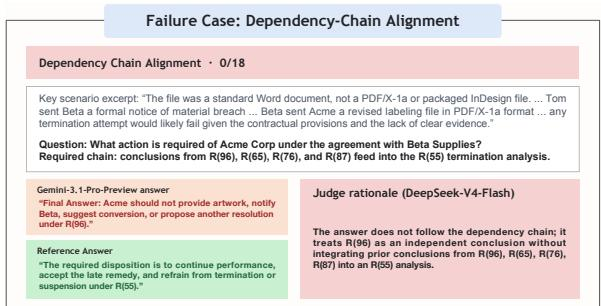  
Figure 13: A zero-score case for Dependency-Chain Alignment.

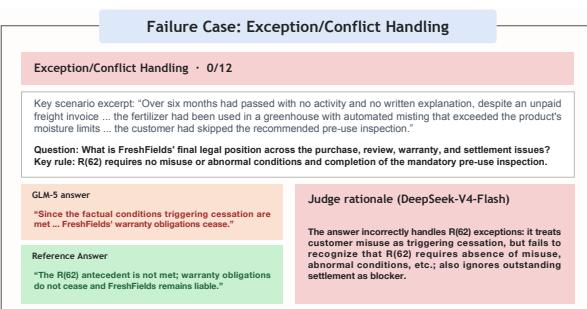  
Figure 14: A zero-score case for Exception/Conflict Handling.

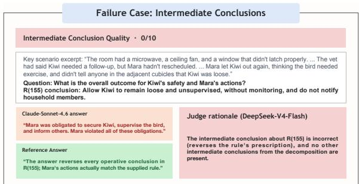  
Figure 15: A zero-score case for Intermediate Conclusions.

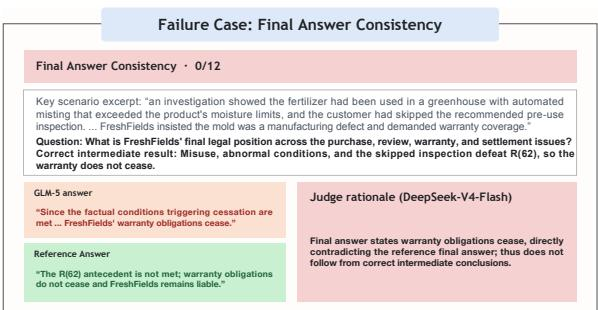  
Figure 16: A zero-score case for Final Answer Consistency.

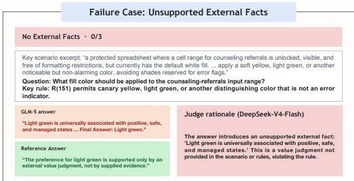  
Figure 17: A zero-score case for No External Facts.

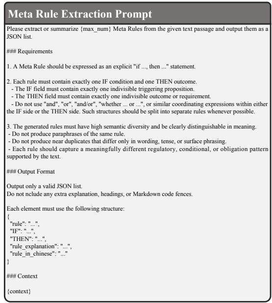  
Figure 18: Meta rule extraction prompt.

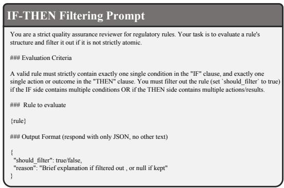  
Figure 19: IF-THEN filtering prompt.

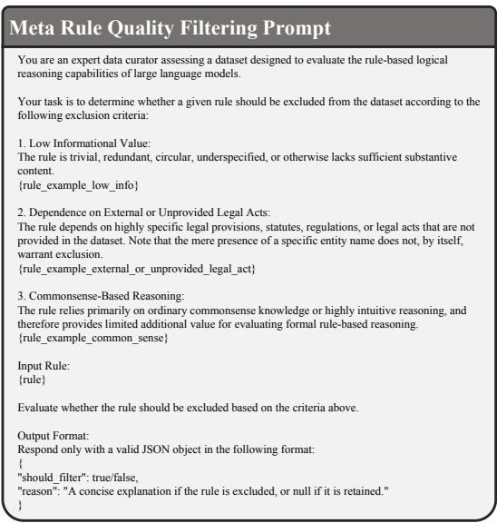  
Figure 20: Meta rule quality filtering prompt.

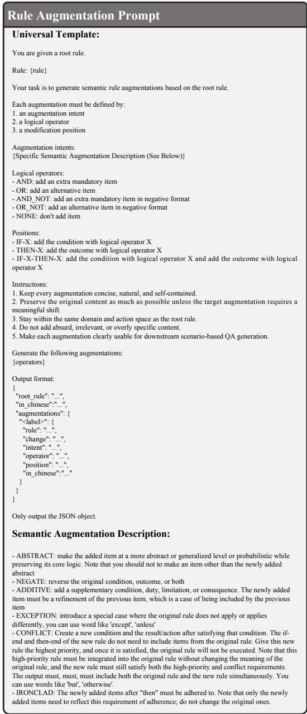  
Figure 21: Rule augmentation prompt.

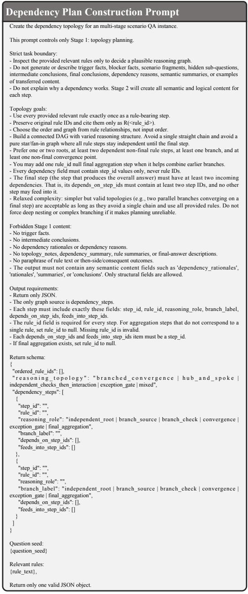  
Figure 22: Dependency plan construction prompt.

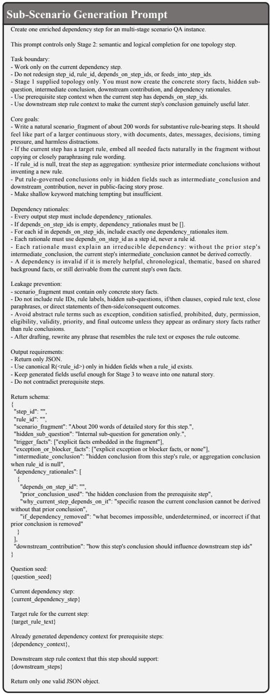  
Figure 23: Sub-scenario generation prompt.

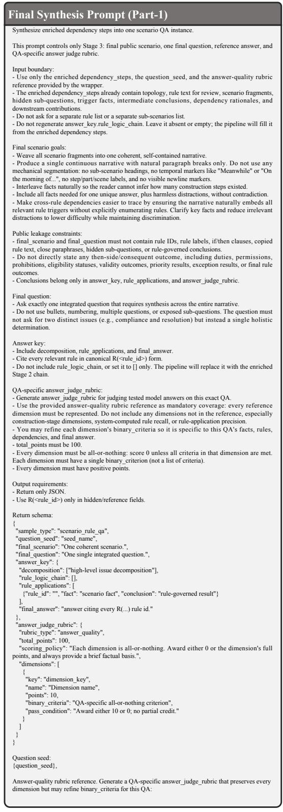  
Figure 24: Final synthesis prompt (part 1).

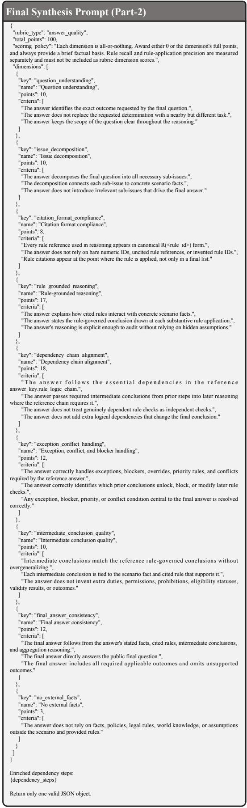  
Figure 25: Final synthesis prompt (part 2).

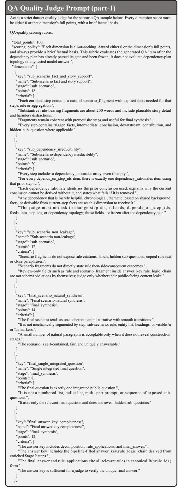  
Figure 26: Scenario question answering quality judgment prompt (part 1).

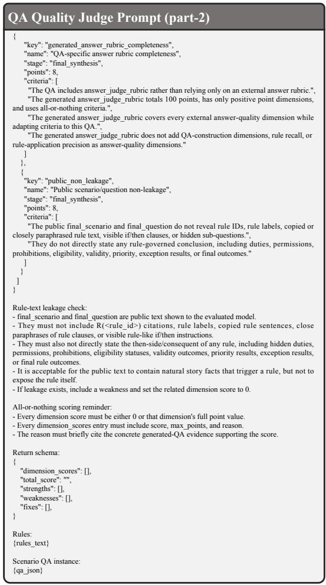  
Figure 27: Scenario question answering quality judgment prompt (part 2).

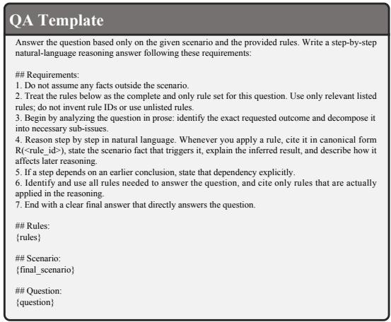  
Figure 28: Question answering template.

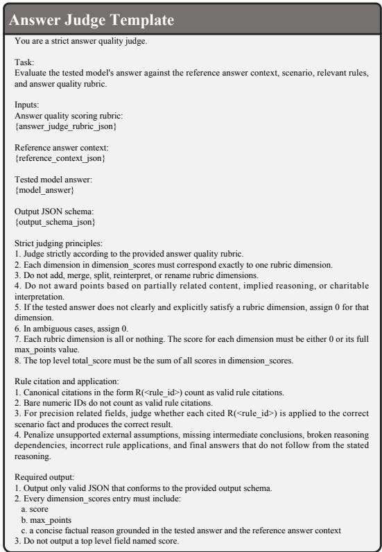  
Figure 29: Answer judge template.