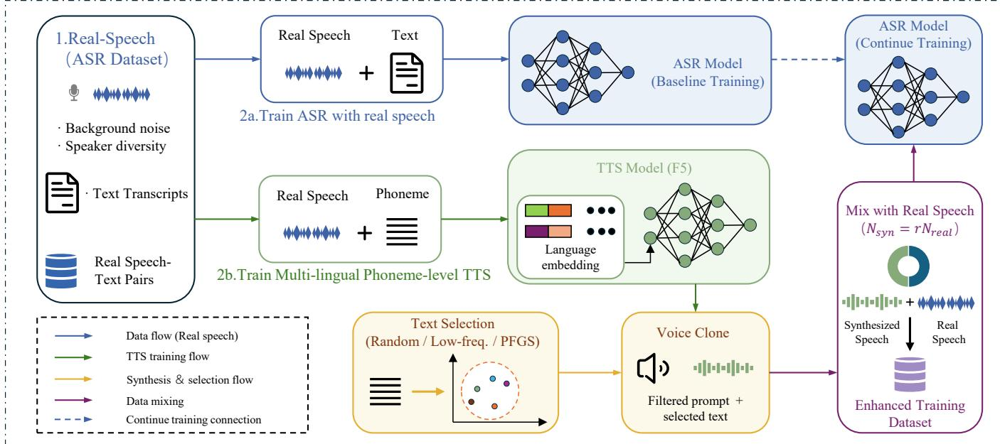

# SCALING PHONEME-BASED TTS AUGMENTATION FOR ASR: A UNIFIED PIPELINE AND CONTROLLED STUDY

Zhen Wang1, TianRui Wu1, RongQi Han1, Hao Wu1, Wei Liang2

1Shanghai Qi Zhi Institute, Shanghai, China 2Megatronix (Beijing) Technology Co., Ltd.

## ABSTRACT

Synthetic speech provides scalable supervision for automatic speech recognition (ASR), but its benefit depends on the selected texts, reference speech, and amount of synthesized data. We present a unified phoneme-based TTS-to-ASR augmentation pipeline built around a multilingual TTS model trained from scratch using the F5-TTS architecture with language-ID conditioning. The pipeline combines language-specific grapheme-to-phoneme conversion, referencespeech filtering, candidate-text selection, synthesis, and matched ASR continuation. We further propose phoneme-frequency-guided selection (PFGS), which ranks candidate sentences using phoneme frequencies estimated from real ASR training labels. Experiments with separate monolingual ASR systems for Arabic, French, Italian, and Portuguese span 13 test sets. Across the synthesis-scale sweep, random augmentation improves over matched real-only continuation on 11 test sets. Under a nominal 60% synthesis budget, PFGS improves over real-only training on 12 test sets and over random selection on 9. Its largest relative word error rate (WER) reduction against random selection is 19.3%. With target texts and synthesis counts fixed, reference-speech filtering reduces absolute WER by 0.29 and 0.59 points on Italian and French Common Voice, respectively. These results identify synthesis scale, candidate-text content, and reference quality as important control variables in TTS-based ASR augmentation.

Index Terms— automatic speech recognition, text-to-speech, data augmentation, phoneme modeling, text selection

## 1. INTRODUCTION

Text-to-speech (TTS) augmentation converts additional text into paired speech and transcripts, expanding ASR supervision when transcribed speech or target-domain data are limited [1]. Recent high-fidelity, multilingual, and zero-shot TTS models further increase the amount, diversity, and controllability of speech generated from large text resources [2].

Synthetic speech, however, is not uniformly useful. Its downstream value depends on the linguistic content of the selected texts, the acoustic properties of the reference speech, and the amount of synthesized data. Prior work has sampled unpaired text randomly, selected it with language models, generated new text, or filtered utterances after synthesis [3, 1, 4]. These studies establish that text construction affects ASR augmentation. However, the separate effects of synthesis scale, candidate-text phoneme composition, and reference quality remain insufficiently characterized under matched protocols across languages and test domains.

We address this gap through a unified augmentation pipeline. We train a shared multilingual phoneme-based TTS model from scratch on naturally recorded Arabic, French, Italian, and Portuguese speech. The model uses the F5-TTS architecture with explicit language-ID conditioning. Phoneme-level modeling provides a common pronunciation interface across writing systems and enables the phoneme composition of candidate texts to be measured during selection. Selected texts are synthesized with quality-controlled reference speech. Their downstream utility is evaluated using separate monolingual ASR systems under matched continuation protocols.

We ask three questions. First, can a shared phoneme-based TTS model provide useful supervision for separate monolingual ASR systems across languages and test domains? Second, how does ASR performance change as synthetic utterances increase from 10% to 100% of the real training set? Third, under a nominal 60% synthesis budget, how does PFGS compare with random and low-frequency selection? PFGS favors candidates according to the phoneme-frequency distribution of the real ASR training labels. We additionally examine whether reference-speech filtering improves downstream performance when target texts and synthesis counts are fixed.

Our contributions are threefold. First, we present a unified pipeline that integrates multilingual phoneme-based synthesis, reference-speech filtering, external candidate-text selection, and matched ASR continuation. Second, we propose PFGS, a candidate-ranking method based on phoneme frequencies estimated from real ASR training labels. Third, we conduct a controlled study across four languages and 13 test sets. The study separately examines synthesis scale, candidate-text selection, and reference-speech filtering under matched ASR continuation.

## 2. METHOD

## 2.1. Overall Pipeline and Data Objects

The ASR-oriented TTS augmentation pipeline comprises five stages. These cover data preparation, phoneme-based TTS training, reference-speech quality control and task construction, syntheticcorpus control, and ASR training and evaluation. Figure 1 summarizes the complete procedure.

We use three data objects:

$$
\begin{array} { r l } & { D _ { \mathrm { T T S } } = \{ \left( a _ { j } , u _ { j } , l _ { j } \right) \} , } \\ & { D _ { \mathrm { A S R } } ^ { \mathrm { r e a l } } = \{ \left( x _ { i } , y _ { i } \right) \} , } \\ & { T _ { \mathrm { c a n d } } ^ { ( l ) } = \mathrm { E x c l u d e T e s t } \big ( \mathrm { C l e a n } \Big ( T _ { \mathrm { s o u r c e } } ^ { ( l ) } \Big ) , T _ { \mathrm { t e s t } } ^ { ( l ) } \big ) . } \end{array}\tag{1}
$$

Here, $( a _ { j } , u _ { j } , l _ { j } )$ denotes natural speech, its transcript, and language identifier, while $( x _ { i } , y _ { i } )$ is a real ASR utterance–label pair. $D _ { \mathrm { T T S } }$ trains the multilingual TTS model, and DrealASR provides ASR supervision and phoneme statistics. Candidate texts come from additional corpora excluded from real ASR training; Clean(·) applies language identification, normalization, length and character checks, and deduplication, while ExcludeTest(·) removes test-transcript overlap. PFGS ranks $T _ { \mathrm { c a n d } } ^ { ( l ) }$ using the real-data phoneme statistics and selects $N _ { \mathrm { s y n } }$ targets. Each target is synthesized with a filtered reference prompt to yield an ASR pair $( x _ { \mathrm { s y n } } , t )$

  
Fig. 1. The phoneme-based TTS-to-ASR augmentation pipeline. Candidate texts are selected before synthesis, and quality-filtered reference prompts condition the shared multilingual TTS model.

## 2.2. Multilingual Natural Speech and Phoneme Representation

We train a shared phoneme-based TTS model from scratch with the F5-TTS architecture [2] on naturally recorded Arabic, French, Italian, and Portuguese speech. The corpus preserves speaker, channel, and background variation; only samples with unreliable alignment, abnormal duration, or poor text quality are excluded.

Input text first undergoes language-specific normalization and G2P conversion. Arabic, French, and Italian use eSpeak, whereas Portuguese uses gruut. To distinguish languages within the shared model, we add a 32-dimensional learnable language embedding to the original F5-TTS input layer. For language l, the embedding is expanded over time. It is then concatenated with the noisy mel state $x _ { t } .$ , reference-speech conditioning mel $c _ { \mathrm { r e f } }$ , and 512-dimensional phoneme text embedding etext:

$$
h _ { 0 } = \mathrm { P r o j } ( x _ { t } \parallel c _ { \mathrm { r e f } } \parallel e _ { \mathrm { t e x t } } \parallel \mathrm { E x p a n d } ( e _ { \mathrm { l a n g } } ( l ) ) )\tag{2}
$$

Here, ∥ denotes feature-wise concatenation. A linear layer projects the resulting 744-dimensional representation to 1024 dimensions before the diffusion transformer backbone. The language embedding identifies the target language, while the phoneme sequence provides a common pronunciation representation across writing systems.

Reference prompts are drawn from a pool of natural speech. We retain utterances lasting 3–12 seconds, containing at least three words, and having speaking rates of 3–25 characters per second. A pretrained Faster-Whisper large-v3 model then checks consistency between each reference recording and its original transcript. For each target text t, we select reference audio $a _ { \mathrm { r e f } }$ and its transcript $u _ { \mathrm { r e f } }$ from the corresponding language-specific prompt pool. The resulting synthesis task is

$$
\begin{array} { r } { \boldsymbol { q } = ( a _ { \mathrm { r e f } } , \boldsymbol { u } _ { \mathrm { r e f } } , t , l ) . } \end{array}\tag{3}
$$

Within each language, all experimental settings share the TTS checkpoint, prompt-pool construction procedure, reference-speech sampling rules, and inference parameters.

## 2.3. Phoneme-Frequency-Guided Selection

PFGS estimates a phoneme prior from the real ASR training labels. For each phoneme p,

$$
\begin{array} { r l } & { \quad c ( p ) = \mathrm { c o u n t } ( p , \{ \mathrm { G 2 P } ( y _ { i } ) \} ) , } \\ & { P _ { \mathrm { v a l i d } } = \{ p \in P \setminus P _ { \mathrm { s p } } | c ( p ) \geq \tau \} , } \\ & { \quad \pi ( p ) = \frac { c ( p ) } { \sum _ { q \in P _ { \mathrm { v a l i d } } } c ( q ) } . } \end{array}\tag{4}
$$

Here, P is the phoneme inventory, and $P _ { \mathrm { s p } }$ contains special symbols. We set $\tau = 2 0 0$ to exclude extremely low-count units. For candidate text t with phoneme sequence $\phi ( t ) = \mathrm { G 2 P } ( t )$ , PFGS computes

$$
s _ { \mathrm { f r e q } } ( t ) = \frac { 1 } { | \phi ( t ) | } \sum _ { p \in \phi ( t ) } \pi ( p ) ,\tag{5}
$$

where $\pi ( p ) = 0$ outside $P _ { \mathrm { v a l i d } }$ . We rank candidates by decreasing score and synthesize the top $N _ { \mathrm { s y r } }$ sentences. Unlike the lowfrequency control, which rewards occurrences of a small set of rare valid phonemes, PFGS continuously weights every valid phoneme. It therefore favors sentences composed of phonemes that are well represented in the real ASR training labels.

Table 1. Training-data scale for the four target languages.
<table><tr><td>Language</td><td>TTS utt.</td><td>TTS h</td><td>ASR utt.</td><td>ASR h</td></tr><tr><td>Arabic</td><td>1,259,489</td><td>1,899.67</td><td>350,000</td><td>563.438</td></tr><tr><td>French</td><td>826,261</td><td>1,752.22</td><td>300,000</td><td>431.247</td></tr><tr><td>Italian</td><td>322,054</td><td>653.25</td><td>172,469</td><td>254.102</td></tr><tr><td>Portuguese</td><td>559,205</td><td>626.62</td><td>22,348</td><td>25.667</td></tr><tr><td>Total</td><td>2,967,009</td><td>4,931.76</td><td>844,817</td><td>1,274.454</td></tr></table>

## 2.4. ASR Training with Synthetic Speech

After text selection and speech synthesis, we construct the synthetic training set and combine it with the real ASR training data:

$$
D _ { \mathrm { A S R } } ^ { \mathrm { a u g } } = D _ { \mathrm { A S R } } ^ { \mathrm { r e a l } } \cup D _ { \mathrm { s y n } } .\tag{6}
$$

The synthetic speech–transcript pairs use the same ASR training objective as the real pairs.

## 3. EXPERIMENTAL SETUP

## 3.1. Data

TTS generation and downstream ASR augmentation cover Arabic, French, Italian, and Portuguese. Table 1 reports the training scale for each language.

Candidate texts are transcripts from additional speech corpora excluded from the corresponding real ASR training sets. Arabic uses an internal, non-public corpus. French uses Common Voice, MLS, M-AILABS, and FLEURS. Italian uses Common Voice, MLS, M-AILABS, and VoxPopuli, while Portuguese uses CORAA, NURC-SP, MLS, and Common Voice [5, 6, 7, 8, 9, 10, 11]. Evaluation uses the applicable public Common Voice, FLEURS, MLS, SADA, and MASC test sets [12, 13]. Training, development, and test partitions are disjoint, and test transcripts are removed before candidate selection.

## 3.2. Evaluation Setup

Each language uses an independently trained WeNet-based hybrid CTC/attention Conformer [14, 15]. For computational efficiency, real-only and TTS-augmented branches continue from the same language-specific checkpoint on $D _ { \mathrm { A S R } } ^ { \mathrm { r e a l } }$ and $D _ { \mathrm { A S R } } ^ { \mathrm { a u g } }$ , respectively. They share the architecture, optimization settings, continuation interval, and decoding configuration; continuing the real-only branch avoids comparison with a frozen checkpoint. The intervals are epochs 70–100 for French, 80–140 for Arabic, and 70–180 for Italian and Portuguese. All primary results use attention rescoring with beam size 10.

Recognition performance is measured by word error rate (WER):

$$
\mathrm { W E R } = \frac { S + D + I } { N } \times 1 0 0 \% ,\tag{7}
$$

where S, D, and I are the numbers of substitutions, deletions, and insertions, respectively. N is the number of words in the reference transcripts, and lower WER indicates better recognition.

## 3.3. Experiment 1: Synthesis Scale under Random Selection

The synthesis-scale experiment randomly samples candidate texts according to

$$
N _ { \mathrm { s y n } } = r N _ { \mathrm { r e a l } } , \qquad r \in \{ 0 \% , 1 0 \% , 3 0 \% , 6 0 \% , 1 0 0 \% \} .\tag{8}
$$

where $r = 0 \%$ denotes matched real-only continuation. $N _ { \mathrm { s y n } }$ and $N _ { \mathrm { r e a l } }$ denote the numbers of added synthetic utterances and real ASR training utterances, respectively. For $r > 0 .$ , target texts are sampled randomly from each language’s candidate set. We compare the resulting ASR performance under the same language-specific training protocol.

## 3.4. Experiment 2: PFGS and Control Strategies

The selection experiment uses a nominal 60% utterance budget and compares real-only, random, low-frequency, and PFGS conditions. Random selection samples candidates uniformly without using a phoneme prior. The low-frequency control ranks candidates by occurrences of the least frequent valid phonemes. It uses $( K _ { l } , \tau _ { l } ) = ( 1 0 , 1 0 0 0 ) , ( 2 0 , 1 0 0 0 )$ , and (10, 200) for Arabic, Italian, and Portuguese, respectively. PFGS scores and ranks candidates as described in Section 2.3. All synthesis conditions share the same TTS checkpoint, prompt pool, and ASR training protocol.

For a post hoc diagnostic of the French selection results, we measure phoneme n-gram exposure. A bigram contains two consecutive phonemes, while a trigram contains three. Let D denote the mixed-training transcripts and $\dot { T }$ a test transcript set. For $n \in \{ 2 , 3 \}$ , exposure is

$$
E _ { n } ( \mathcal { D } , T ) = \sum _ { g \in \mathcal { G } _ { n } ( T ) } p _ { T } ( g ) \log ( 1 + c _ { \mathcal { D } } ( g ) ) ,\tag{9}
$$

where ${ \mathcal { G } } _ { n } ( T )$ is the set of phoneme n-grams in $T .$ $p _ { T } ( g )$ is the normalized test frequency of $^ { g , }$ and $c _ { \mathcal { D } } ( g )$ is its count in the mixedtraining transcripts. We report

$$
\begin{array} { r } { \begin{array} { r l } & { \Delta E _ { n } = E _ { n } ( \mathcal { D } _ { \mathrm { P F G S } } , T ) - E _ { n } ( \mathcal { D } _ { \mathrm { R a n d o m } } , T ) , } \\ & { \Delta \mathrm { W E R } = \mathrm { W E R } _ { \mathrm { P F G S } } - \mathrm { W E R } _ { \mathrm { R a n d o m } } . } \end{array} } \end{array}\tag{10}
$$

Positive $\Delta E _ { n }$ indicates greater exposure under PFGS, whereas negative ∆WER indicates lower WER.

## 3.5. Experiment 3: Ablation of Reference-Speech Filtering

The reference-speech ablation compares filtered and unfiltered prompts on French and Italian Common Voice. The two conditions use identical PFGS target-text lists and synthesis counts, differing only in reference-speech filtering.

## 4. RESULTS AND ANALYSIS

## 4.1. Effect of Synthesis Scale under Random Text Selection

Table 2 summarizes the random-ratio sweep across 13 test sets. At least one augmented condition outperformed matched real-only continuation on 11 sets. The best condition used a 100% ratio on eight sets, a 60% ratio on three, and real-only training on two. Portuguese showed the clearest scale-dependent gains. At 100%, WER decreased by 9.03, 7.36, and 6.32 absolute points on Common Voice, FLEURS, and MLS, respectively. Arabic Common Voice and Italian MLS did not improve at any augmentation ratio. Overall, synthetic data usually improved WER, but the best ratio varied across languages and test domains.

## 4.2. Comparison of PFGS and Control Strategies

Under the nominal 60% synthesis budget, Table 3 compares PFGS with random and low-frequency text selection. PFGS outperformed random selection on nine of the 13 test sets, with relative WER reductions of 0.6–19.3% among these improvements. It also outperformed real-only training on 12 sets and low-frequency selection in eight of the ten available comparisons. The largest gains over random selection occurred on French FLEURS and MLS, Italian MLS, and Portuguese FLEURS and MLS. Arabic showed greater domain variation. PFGS performed best on Common Voice and MASC, whereas low-frequency and random selection performed best on FLEURS and SADA, respectively. Overall, PFGS improved more evaluated conditions than either control strategy, although its gains were not uniform.

Table 2. WER (%) for random TTS augmentation at different synthesis ratios. CV denotes Common Voice; bold indicates the lowest WER within each language and test set.
<table><tr><td>Language</td><td>Condition</td><td>CV</td><td>FLEURS</td><td>MLS</td><td>SADA</td><td>MASC</td></tr><tr><td>Arabic</td><td>Real-only (0%)</td><td>24.79</td><td>22.18</td><td></td><td>62.48</td><td>52.82</td></tr><tr><td></td><td>TTS 10%</td><td>25.17</td><td>19.35</td><td></td><td>59.98</td><td>52.92</td></tr><tr><td></td><td>TTS 30%</td><td>25.20</td><td>18.90</td><td></td><td>59.19</td><td>52.78</td></tr><tr><td></td><td>TTS 60%</td><td>25.41</td><td>18.54</td><td></td><td>58.80</td><td>52.59</td></tr><tr><td></td><td>TTS 100%</td><td>25.11</td><td>18.59</td><td></td><td>58.63</td><td>52.65</td></tr><tr><td>French</td><td>Real-only (0%)</td><td>11.50</td><td>23.07</td><td>25.24</td><td></td><td></td></tr><tr><td></td><td>TTS 10%</td><td>11.53</td><td>22.90</td><td>26.14</td><td></td><td></td></tr><tr><td></td><td>TTS 30%</td><td>11.34</td><td>21.48</td><td>26.48</td><td></td><td></td></tr><tr><td></td><td>TTS 60%</td><td>11.28</td><td>22.03</td><td>24.57</td><td></td><td></td></tr><tr><td></td><td>TTS 100%</td><td>11.11</td><td>20.88</td><td>25.59</td><td></td><td></td></tr><tr><td>Italian</td><td>Real-only (0%)</td><td>11.05</td><td>11.41</td><td>33.92</td><td></td><td></td></tr><tr><td></td><td>TTS 10%</td><td>11.11</td><td>11.51</td><td>35.28</td><td></td><td></td></tr><tr><td></td><td>TTS 30%</td><td>11.05</td><td>11.28</td><td>35.69</td><td></td><td></td></tr><tr><td></td><td>TTS 60%</td><td>10.96</td><td>11.42</td><td>34.43</td><td></td><td></td></tr><tr><td></td><td>TTS 100%</td><td>10.91</td><td>11.08</td><td>34.58</td><td></td><td></td></tr><tr><td>Portuguese</td><td>Real-only (0%)</td><td>49.12</td><td>56.10</td><td>75.44</td><td></td><td></td></tr><tr><td></td><td>TTS 10%</td><td>47.07</td><td>56.96</td><td>75.75</td><td></td><td></td></tr><tr><td></td><td>TTS 30%</td><td>45.78</td><td>55.25</td><td>74.16</td><td></td><td></td></tr><tr><td></td><td>TTS 60%</td><td>43.30</td><td>53.46</td><td>74.56</td><td></td><td></td></tr><tr><td></td><td>TTS 100%</td><td>40.09</td><td>48.74</td><td>69.12</td><td></td><td></td></tr></table>

Table 3. WER (%) for text-selection strategies under a nominal 60% synthesis budget. CV denotes Common Voice. Parentheses in PFGS rows give relative WER reduction against Random-60; bold indicates the lowest WER. Low-frequency selection was not evaluated for French.
<table><tr><td>Language</td><td>Condition</td><td>CV</td><td>FLEURS</td><td>MLS</td><td>SADA</td><td>MASC</td></tr><tr><td>Arabic</td><td>Real-only</td><td>24.79</td><td>22.18</td><td>一</td><td>62.48</td><td>52.82</td></tr><tr><td></td><td>Random</td><td>25.41</td><td>18.54</td><td></td><td>58.80</td><td>52.59</td></tr><tr><td></td><td>Low-frequency</td><td>25.25</td><td>17.42</td><td></td><td>58.91</td><td>52.61</td></tr><tr><td></td><td>PFGS</td><td>24.73(+2.7%)</td><td>19.49(−5.1%)</td><td></td><td>60.62(-3.1%)</td><td>52.29(+0.6%)</td></tr><tr><td>French</td><td>Real-only</td><td>11.50</td><td>23.07</td><td>25.24</td><td></td><td></td></tr><tr><td></td><td>Random</td><td>11.28</td><td>22.03</td><td>24.57</td><td></td><td></td></tr><tr><td></td><td>PFGS</td><td>11.11(+1.5%)</td><td>18.36(+16.7%)</td><td>19.95(+18.8%)</td><td></td><td></td></tr><tr><td>Italian</td><td>Real-only</td><td>11.05</td><td>11.41</td><td>33.92</td><td></td><td></td></tr><tr><td></td><td>Random</td><td>10.96</td><td>11.42</td><td>34.43</td><td></td><td></td></tr><tr><td></td><td>Low-frequency</td><td>11.86</td><td>11.60</td><td>35.91</td><td></td><td></td></tr><tr><td></td><td>PFGS</td><td>11.16(-1.8%)</td><td>10.92(+4.4%)</td><td>31.05(+9.8%)</td><td></td><td></td></tr><tr><td>Portuguese</td><td>Real-only</td><td>49.12</td><td>56.10</td><td>75.44</td><td></td><td></td></tr><tr><td></td><td>Random</td><td>43.30</td><td>53.46</td><td>74.56</td><td></td><td></td></tr><tr><td></td><td>Low-frequency</td><td>47.82</td><td>54.21</td><td>74.76</td><td></td><td></td></tr><tr><td></td><td>PFGS</td><td>43.76(-1.1%)</td><td>49.70(+7.0%)</td><td>60.15(+19.3%)</td><td></td><td></td></tr></table>

For French, PFGS lowered phoneme entropy from 5.2220 to 5.0891 bits and increased the cumulative share of the five most frequent phonemes from 31.90% to 35.46% relative to Random-60, confirming its concentration on frequent phonemes. It also increased bigram and trigram exposure on all three test sets while reducing

Table 4. Differences in phoneme-context exposure and WER between PFGS and Random-60 on the French test sets. Positive $\Delta E _ { n }$ indicates greater exposure under PFGS; negative ∆WER indicates lower WER.
<table><tr><td>Test set</td><td>Bigram  $\Delta E _ { 2 }$ </td><td>Trigram  $\Delta E _ { 3 }$ </td><td>∆WER</td></tr><tr><td>Common Voice</td><td>+0.1198</td><td>+0.1166</td><td>-0.17</td></tr><tr><td>FLEURS</td><td>+0.1249</td><td>+0.1314</td><td>-3.67</td></tr><tr><td>MLS</td><td>+0.1392</td><td>+0.1867</td><td>-4.62</td></tr></table>

WER (Table 4), consistent with greater training exposure to frequent phoneme contexts.

The low-frequency control did not consistently improve WER, whereas PFGS improved more evaluated conditions overall. Variation across languages and test sets may reflect differences in realdata coverage, candidate-text distributions, TTS quality, and acoustic or linguistic domain mismatch.

## 4.3. Ablation of Reference-Speech Filtering

We evaluated reference-speech filtering while holding target texts, synthesis counts, and training protocols fixed. Under attention rescoring on Common Voice, filtering reduced WER from 11.45 to 11.16 for Italian. It also reduced WER from 11.70 to 11.11 for French. These changes correspond to absolute reductions of 0.29 and 0.59 points, respectively. Filtering therefore reduced WER in both evaluated settings.

## 5. CONCLUSION

We present a phoneme-based TTS-to-ASR augmentation pipeline built around a multilingual TTS model trained from scratch using the F5-TTS architecture. The pipeline combines language-ID conditioning, language-specific G2P, candidate-text selection, and referencespeech filtering.

Across four languages and 13 test sets, random augmentation improved over real-only continuation on 11 sets at one or more synthesis scales. Under a nominal 60% budget, PFGS improved over real-only training on 12 sets and over random selection on 9. Its largest relative WER reduction against random selection was 19.3%. Reference-speech filtering provided additional gains when target texts and synthesis counts were fixed. Within the evaluated multilingual and multidomain settings, synthesis scale, candidatetext content, and reference quality each affected the benefit of TTS augmentation.

## 6. REFERENCES

[1] Zhuangqun Huang, Gil Keren, Ziran Jiang, Shashank Jain, David Goss-Grubbs, Nelson Cheng, Farnaz Abtahi, Duc Le, David Zhang, Antony D’Avirro, Ethan Campbell-Taylor, Jessie Salas, Irina-Elena Veliche, and Xi Chen, “Text generation with speech synthesis for ASR data augmentation,” arXiv preprint arXiv:2305.16333, 2023.

[2] Yushen Chen, Zhikang Niu, Ziyang Ma, Keqi Deng, Chunhui Wang, Jian Zhao, Kai Yu, and Xie Chen, “F5-TTS: A fairytaler that fakes fluent and faithful speech with flow matching,” in Proc. 63rd Annual Meeting of the Association for Computational Linguistics (ACL), 2025, pp. 6255–6271.

[3] Zhehuai Chen, Andrew Rosenberg, Yu Zhang, Gary Wang, Bhuvana Ramabhadran, and Pedro J. Moreno, “Improving speech recognition using GAN-based speech synthesis and contrastive unspoken text selection,” in Proc. Interspeech, 2020, pp. 556–560.

[4] Shuo Liu, Leda Sarı, Chunyang Wu, Gil Keren, Yuan Shangguan, Jay Mahadeokar, and Ozlem Kalinli, “Towards selection of text-to-speech data to augment ASR training,” arXiv preprint arXiv:2306.00998, 2023.

[5] Rosana Ardila, Megan Branson, Kelly Davis, Michael Henretty, Michael Kohler, Josh Meyer, Reuben Morais, Lindsay Saunders, Francis M. Tyers, and Gregor Weber, “Common voice: A massively-multilingual speech corpus,” in Proc. 12th Language Resources and Evaluation Conference (LREC), 2020, pp. 4218–4222.

[6] Alexis Conneau, Min Ma, Simran Khanuja, Yu Zhang, Vera Axelrod, Siddharth Dalmia, Jason Riesa, Clara Rivera, and Ankur Bapna, “FLEURS: Few-shot learning evaluation of universal representations of speech,” in Proc. IEEE Spoken Language Technology Workshop (SLT), 2023, pp. 798–805.

[7] Vineel Pratap, Qiantong Xu, Anuroop Sriram, Gabriel Synnaeve, and Ronan Collobert, “MLS: A large-scale multilingual dataset for speech research,” in Proc. Interspeech, 2020, pp. 2757–2761.

[8] Imdat Celeste Solak and Dima Naumov, “The M-AILABS speech dataset,” https://github.com/ imdatceleste/m-ailabs-dataset, 2019.

[9] Changhan Wang, Morgane Riviere, Ann Lee, Anne Wu, Chaitanya Talnikar, Daniel Haziza, Mary Williamson, Juan Pino, and Emmanuel Dupoux, “VoxPopuli: A large-scale multilingual speech corpus for representation learning, semisupervised learning and interpretation,” in Proc. 59th Annual Meeting ofthe Associationfor Computational Linguistics (ACL-IJCNLP), 2021, pp. 993–1003.

[10] Arnaldo Candido Jr., Edresson Casanova, Anderson da Silva Soares, Frederico Santos de Oliveira, Lucas Oliveira, Ricardo Corso Fernandes Jr., Daniel Peixoto Pinto da Silva, Fernando Gorgulho Fayet, Bruno Baldissera Carlotto, Lucas Rafael Stefanel Gris, and Sandra Maria Alu´ısio, “CORAA ASR: A large corpus of spontaneous and prepared speech manually validated for speech recognition in brazilian portuguese,” Language Resources and Evaluation, vol. 57, no. 3, pp. 1139–1171, 2023.

[11] Ana Carolina Rodrigues, Alessandra A. Macedo, Arnaldo Candido Jr., Flaviane R. F. Svartman, Giovana M. Craveiro, Marli Quadros Leite, Sandra M. Alu´ısio, Vin´ıcius G. Santos, and Vin´ıcius M. Garcia, “Portal NURC-SP: Design, development, and speech processing corpora resources to support the public dissemination of portuguese spoken language,” in Proc. 16th International Conference on Computational Processing of Portuguese (PROPOR), 2024, pp. 187–195.

[12] Sadeen Alharbi, Areeb Alowisheq, Zoltan T´ uske, Kareem¨ Darwish, Abdullah Alrajeh, Abdulmajeed Alrowithi, Aljawharah Bin Tamran, Asma Ibrahim, Raghad Aloraini, Raneem Alnajim, Ranya Alkahtani, Renad Almuasaad, Sara Alrasheed, Shaykhah Alsubaie, and Yaser Alonaizan, “SADA: Saudi audio dataset for arabic,” in Proc. IEEE Int. Conf. Acoustics, Speech and Signal Processing (ICASSP), 2024, pp. 10286–10290.

[13] Mohammad Al-Fetyani, Muhammad Al-Barham, Gheith Abandah, Adham Alsharkawi, and Maha Dawas, “MASC: Massive arabic speech corpus,” in Proc. IEEE Spoken Language Technology Workshop (SLT), 2023, pp. 1006–1013.

[14] Zhuoyuan Yao, Di Wu, Xiong Wang, Binbin Zhang, Fan Yu, Chao Yang, Zhendong Peng, Xiaoyu Chen, Lei Xie, and Xin Lei, “WeNet: Production oriented streaming and nonstreaming end-to-end speech recognition toolkit,” in Proc. Interspeech, 2021, pp. 4054–4058.

[15] Anmol Gulati, James Qin, Chung-Cheng Chiu, Niki Parmar, Yu Zhang, Jiahui Yu, Wei Han, Shibo Wang, Zhengdong Zhang, Yonghui Wu, and Ruoming Pang, “Conformer: Convolution-augmented transformer for speech recognition,” in Proc. Interspeech, 2020, pp. 5036–5040.