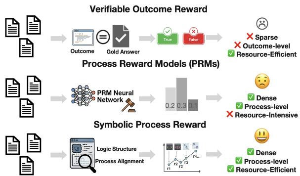
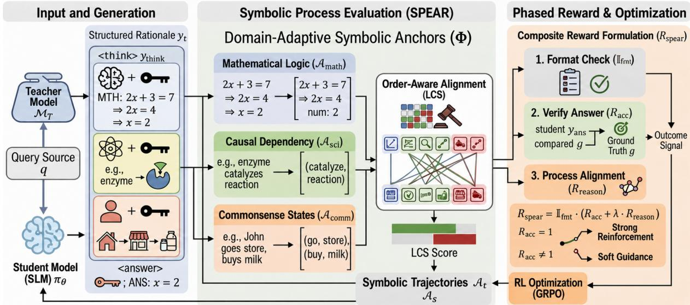
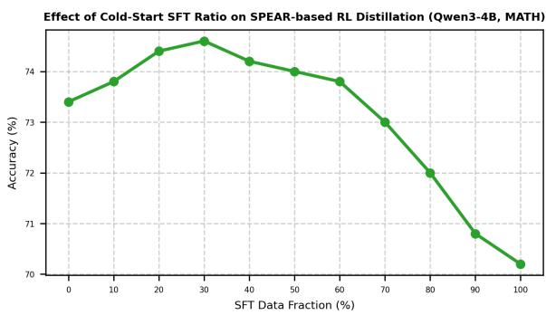

# SPEAR: Distilling Domain-Adaptive Reasoning Skeletons via Sequential Symbolic Alignment in Reinforcement Learning

Zhuochun Li1, Yuelyu Ji1, Yiming Zeng2, Daqing He1, 1University of Pittsburgh, Pittsburgh, USA 2University of Connecticut, Storrs, USA {zhl163, yuj49, dah44}@pitt.edu

## Abstract

Reinforcement learning-based knowledge distillation has the potential to transfer complex reasoning from teacher to student models, yet it currently faces a critical dilemma: researchers must choose between sparse outcome-based rewards, which provide insufficient logical guidance, or expensive neural Process Reward Models (PRMs) for dense signals. We resolve this by introducing SPEAR (Symbolic Process Evaluation and Alignment Reward), a training-free and plug-and-play process reward method for sequence-level on-policy distillation. SPEAR projects natural-language reasoning traces into domain-adaptive symbolic milestones, providing an efficient proxy for processlevel reasoning alignment. By utilizing the longest common subsequence (LCS) to align student explorations with teacher milestones, SPEAR provides a dense, order-aware reward signal that enforces logical consistency without the need for an external neural verifier. Our experiments across math, science, and commonsense reasoning tasks demonstrate that SPEAR effectively bridges the reasoning gap between student and teacher models via sequence-level distillation with efficient dense process rewards. Our code and data are available at https: //github.com/zhuochunli/SPEAR.

## 1 Introduction

Distilling complex reasoning capabilities from proprietary Large Language Models (LLMs) to resource-efficient Small Language Models (SLMs) is essential for practical deployment of models. Traditionally, this is achieved via supervised finetuning (SFT) on teacher-generated rationales in offpolicy distillation (Magister et al., 2023; Xu et al., 2024). However, off-policy distillation fundamentally encourages "style mimicry" (Gudibande et al., 2023) and suffers from "exposure bias" (Agarwal et al., 2024), where the student memorizes linguistic patterns without genuinely internalizing the underlying logical transitions, resulting in failures if the student makes an early error during inference that wasn’t covered in the training data. To address this, reinforcement learning-based on-policy distillation (RL-KD) has emerged as a superior paradigm, allowing models to explore and optimize their own reasoning trajectories (Yang et al., 2025; DeepSeek, 2026). Yet, applying RL introduces a critical dilemma: relying solely on sparse outcome rewards (e.g., final answer verification) fails to guide the student through multi-step logic, while utilizing dense Process Reward Models (PRMs) or token-level divergence incurs massive computational overhead (Lightman et al., 2024).

  
Figure 1: Comparison between SPEAR and other reward methods.

Existing process-supervision methods are largely limited to formal domains such as mathematics and programming, where intermediate steps and final answers are deterministically verifiable (Shao et al., 2024; Song et al., 2025; Yu et al., 2024). Extending process rewards to broader reasoning tasks (e.g., scientific and commonsense reasoning) remains challenging (Yu et al., 2023), as natural language reasoning lacks clear structural boundaries and is highly sensitive to linguistic variation compared to rigid reasoning-chain formats (OpenAI, 2024). Besides, prior work often overlooks leveraging the detailed reasoning traces from powerful reasoning LLMs (Guo et al., 2025), despite their rich intermediate signals that can effectively guide student learning.

To bridge these gaps, we propose SPEAR (Symbolic Process Evaluation and Alignment Reward), a training-free, plug-and-play process reward framework for sequence-level on-policy distillation, as illustrated in Figure 2. Instead of forcing token-level matching or relying on heavy neural PRMs, SPEAR distills the logical structure of the teacher’s rationale. We project high-dimensional reasoning traces into domain-adaptive symbolic trajectories—such as computational processes for math, causal dependencies for science, and entity state-transitions for commonsense. By employing the longest common subsequence (LCS) to align the student’s explored symbolic path with the teacher’s reference milestones, SPEAR provides a dense and order-aware reward. This enforces chronological logical consistency while granting SLMs the freedom to formulate their own response.

In summary, the contributions of our work are:

1. We introduce SPEAR, a novel, training-free process reward framework that enables highly efficient sequence-level on-policy distillation without the computational burden of process reward models.

2. SPEAR uses teacher thinking processes containing rich reasoning signals and projects these high-dimensional traces into domainadaptive symbolic anchors, providing the student with a structural reference that successfully extends process supervision to reasoning tasks.

3. We conduct experiments across comprehensive reasoning benchmarks, including math, science, and commonsense tasks. Experimental results demonstrate that integrating SPEAR into standard RL pipelines consistently outperforms baselines, validating the efficacy of decoupling logical acquisition from linguistic expression.

## 2 Related Work

Reinforcement Learning for Reasoning Reinforcement learning with verifiable rewards (RLVR) has become the primary driver for inducing multistep reasoning behaviors in LLMs (Luong et al., 2024; Guo et al., 2025). Algorithms like Group Relative Policy Optimization (GRPO) (Shao et al., 2024) and its subsequent refinements—e.g., Dr. GRPO (Liu et al., 2025), which analyzes and mitigates length-related optimization bias in relative policy updates, and Dynamic Sampling Policy Optimization (DAPO) (Yu et al., 2025), which introduces dynamic trajectory reweighting to reduce sampling and length-induced biases, have substantially improved the efficiency and stability of RLbased reasoning training. However, these methods typically rely on sparse, binary outcome rewards. This sparsity can lead to "overthinking," where models generate thousands of redundant tokens to maximize rewards without valid logical progress (Agarwal et al., 2024; Song and Zheng, 2025).

LLMs Distillation Distillation is shifting from offpolicy distillation via SFT toward on-policy distillation by reinforcement learning (Xu et al., 2025a; Lu and Lab, 2025; Xiao et al., 2026). Off-policy distillation asks students to learn by imitating a fixed teacher-generated dataset and can suffer from "exposure bias" because of the distribution mismatch between training and inference (Wen et al., 2025; Song and Zheng, 2026). On-policy distillation enables students to generate rollouts from current policy and learn under the teacher’s guidance (Xu et al., 2025c; Li et al., 2026). Recent frameworks like RLKD (Xu et al., 2025b) utilize structural alignment to transfer the implicit multibranch reasoning strategies of LLMs. Similarly, on-policy self-distillation (Zhao et al., 2026) uses privileged information to supervise exploration.

Process Supervision and Symbolic Alignment Evaluating intermediate reasoning steps is critical for mitigating reward hacking and reducing sample complexity (Lightman et al., 2024; Song et al., 2025; Li and Li, 2024). While neural PRMs offer dense supervision, they are computationally expensive and prone to hallucinations in domain-specific tasks (Yu et al., 2024; Su et al., 2025). Rule-based process rewards, such as RePAIR (Wang et al., 2026) and Logic-RL (Xie et al., 2025), provide a verifiable, training-free alternative. Specifically, the use of longest common subsequence (LCS) rewards has shown promise in identifying optimal reasoning paths across multiple tasks (Dong and Fan, 2025). SPEAR extends this by mapping diverse reasoning traces into symbolic, order-aware trajectories that provide a general alignment signal.

## 3 Method

Our approach departs from traditional token-level distillation by framing the reasoning process as a sequence of symbolic milestones. By supervising the student model through alignment with these milestones, SPEAR could internalize the underlying logical structure of a task while retaining the flexibility to explore their own linguistic paths.

  
Figure 2: Overview of SPEAR (Symbolic Process Evaluation and Alignment Reward) method. It supervises the "logical skeleton" of reasoning tasks by aligning symbolic milestones extracted from teacher and student traces. By using an order-aware alignment (LCS) and an outcome-process combined reward, the framework enables small language models to internalize reasoning processes rather than token imitation from teacher’s responses.

## 3.1 Beyond Token-Level Distillation

While off-policy distillation via SFT is effective for style transfer, it often leads to Mode Collapse and Style Mimicry (Gudibande et al., 2023), where the student mimics the teacher’s linguistic patterns without grounding the underlying logical transitions. We propose a shift to an on-policy distillation via an RL objective. We treat a high-capacity teacher model $\mathcal { M } _ { T }$ as a "reasoning supervisor." For a query $q , \mathcal { M } _ { T }$ provides a structured rationale $y ^ { T } = ( y _ { t h i n k } , y _ { a n s } )$ . The student policy $\pi _ { \theta }$ is optimized using RL algorithms, such as Group Relative Policy Optimization (GRPO) (Guo et al., 2025) to maximize the expected reward:

$$
\mathcal { I } ( \theta ) = \mathbb { E } _ { q \sim \mathcal { D } , o \sim \pi _ { \theta _ { \mathrm { o l d } } } ( \cdot | q ) } \left[ \operatorname* { m i n } \left( r ( o ) \hat { A } , \exp ( r ( o ) , 1 - \epsilon , 1 + \epsilon ) \hat { A } \right) \right]\tag{1}
$$

where $\begin{array} { r } { r ( o ) = \frac { \pi _ { \theta } ( o | q ) } { \pi _ { \theta _ { \mathrm { o l d } } } ( o | q ) } } \end{array}$ , and the advantage Aˆ is calculated from our composite SPEAR reward. This objective encourages the student to explore diverse reasoning paths and optimize for correctness and logical consistency, rather than merely reproducing the teacher’s surface form.

## 3.2 Domain-Adaptive Symbolic Anchors

The core of SPEAR is the projection function $\Phi : \mathcal { V }  \mathcal { A } .$ , which maps a high-dimensional natural language trace y into a low-dimensional Symbolic Trajectory $\mathcal { A } _ { t } = [ a _ { 1 } , a _ { 2 } , \ldots , a _ { n } ] , \quad a _ { i } \in \mathcal { V } _ { t }$ We define domain-specific anchors $a _ { i }$ grounded in symbolic logic and linguistic dependency theory.

## 3.2.1 Formal Logic and Mathematical States

In quantitative reasoning, the structure is defined by the evolution of symbolic expressions and variable assignments. Inspired by symbolic state-space search (Lample and Charton, 2019), we define the mathematical anchor extraction function $\Phi _ { \mathrm { m a t h } }$ as a regex-based projection that isolates the calculus of the reasoning trace from its natural language prose.

$$
\mathcal { V } _ { \mathrm { m a t h } } : = \mathcal { V } _ { \mathrm { l a t e x } } \cup \mathcal { V } _ { \mathrm { a s s i g n } }\tag{2}
$$

where $\scriptstyle \mathcal { V } _ { \mathrm { l a t e x } }$ captures expressions wrapped in La-TeX delimiters $( \$ . . .\$ .$ and $\gamma _ { \mathrm { a s s i g n } }$ captures explicit assignments $( \mathbf { e . g . } , \mathbf { \ddot { \psi } } x = 5 ^ { \prime \prime } )$ . Notably, we exclude bare numerical values from the extraction to ensure that the alignment reward measures the structural derivation of the problem rather than the occurrence of constants. By focusing on these symbolic transitions, $\Phi _ { \mathrm { m a t h } }$ captures the trajectory of the problem-solving process, ensuring the student model respects the necessary order of operations, such as the isolation of variables prior to substitution.

## 3.2.2 Causal Dependency Anchors for Science

For scientific reasoning, logic is embedded in interactions between domain-specific entities and actions. Standard overlap metrics fail here because they ignore the directionality of these relations. Grounded in the finding that syntactic structure is a primary driver of semantic role representation (Punyakanok et al., 2008), we implement $\Phi _ { \mathrm { s c i } }$ using a dependency-parsing framework following successful applications in large-scale scientific relation extraction (Percha and Altman, 2018). This yields a de-duplicated relational sequence where each anchor $a _ { i }$ is a verb-centered relational tuple, with v, $s b j$ , obj denoting the governing verb, subject, and object respectively.

$$
\begin{array} { r } { \mathcal { V } _ { \mathrm { s c i } } : = \left\{ \begin{array} { l l } { ( \mathrm { l e m m a } ( v ) , \mathrm { s p a n } ( o b j ) ) } & { \mathrm { i f ~ o b j e c t } o b j \mathrm { ~ e x i s t s } } \\ { ( \mathrm { s p a n } ( s b j ) , \mathrm { l e m m a } ( v ) ) } & { \mathrm { o t h e r w i s e } } \end{array} \right. } \end{array}\tag{3}
$$

To prevent reward inflation through repetitive reasoning loops, $\mathcal { A } _ { \mathrm { s c i } }$ enforces a uniqueness constraint: $\forall i \ \ne j : a _ { i } \ne a _ { j }$ , ensuring SPEAR rewards progression through the teacher’s causal chain rather than dwelling on a single repeated fact.

## 3.2.3 Open-Domain State Transitions

In more general open-domain reasoning, such as commonsense, the logic typically tracks the movement of agents or the evolution of objects through temporal states. Grounded in Script Theory (Schank and Abelson, 2013), which posits that knowledge is organized around stereotypical event sequences, we implement $\Phi _ { \mathrm { c o m } }$ as a projection into a sequence of State-Action anchors. We extract these anchors by identifying noun phrases (noun chunks) and their governing syntactic heads. Formally, for each noun chunk c, Vcom is defined as:

$$
\mathcal { V } _ { \mathrm { c o m } } : = \left\{ \begin{array} { l l } { \mathrm { ( r o o t } ( c ) , \mathrm { l e m m a } ( \mathrm { h e a d } ( c ) ) ) } & { \mathrm { i f ~ h e a d } ( c ) \in \mathrm { V E R B } } \\ { \mathrm { r o o t } ( c ) } & { \mathrm { o t h e r w i s e } } \end{array} \right.\tag{4}
$$

These anchors act as logical key-frames, capturing the student’s ability to track world-state changes chronologically (e.g., ball, throw” → window, break”). By extracting the root of the noun phrase and the lemma of the action, it ensures that the alignment reward is invariant to modifiers and tense variations, focusing purely on the state transition intended by the teacher.

## 3.3 Sequential Alignment via LCS-F1

Motivated by the success of longest common subsequence (LCS) rewards in identifying coherent reasoning trajectories across diverse tasks (Dong and

Fan, 2025), we employ LCS to align chronological logical consistency between the student trajectory $\mathcal { A } _ { s }$ and the teacher trajectory $\boldsymbol { \mathcal { A } } _ { t }$ . Unlike unordered metrics such as Jaccard similarity or surface-level metrics like ROUGE (Lin, 2004), LCS is strictly order-aware and invariant to redundant linguistic filler that does not contribute to the symbolic path.

We define the reasoning process reward as the LCS-F1 score:

$$
R _ { r e a s o n } = \frac { 2 | \mathrm { L C S } ( A _ { s } , \mathcal { A } _ { t } ) | } { | \mathcal { A } _ { s } | + | \mathcal { A } _ { t } | } ,\tag{5}
$$

which is the harmonic mean of alignment precision $| \mathrm { L C S } | / | \mathcal { A } _ { s } |$ and teacher-milestone recall $\lvert \mathrm { L C S } \rvert / \lvert A _ { t } \rvert$ . Precision penalizes spurious or repetitive student anchors, preventing verbose trajectories from inflating the reward, while recall penalizes trajectories that omit teacher milestones. Consequently, a short matching prefix cannot receive full credit, and the maximum score is attained only when the extracted trajectories align completely. This balance encourages both teacher-milestone coverage and high logical density. More analysis of LCS-F1 is provided in Appendix D.

To ensure the reward is computable efficiently during real-time RL rollouts, we use a dynamic programming approach where the LCS alignment state $L ( i , j )$ is computed as follows:

$$
L ( i , j ) = \left\{ \begin{array} { l l } { L ( i - 1 , j - 1 ) + 1 } & { \mathrm { i f ~ } a _ { s , i } = a _ { t , j } } \\ { \operatorname* { m a x } ( L ( i , j - 1 ) , L ( i - 1 , j ) ) } & { \mathrm { o t h e r w i s e } } \end{array} \right.\tag{6}
$$

This provides a dense reward signal that penalizes logical reversals while rewarding the correct chronological order of reasoning milestones.

## 3.4 Gated Composite Reward Formulation

To stabilize the RL process, we integrate SPEAR into a phased reward structure (Xie et al., 2025). We implement a strict gate for formatting compliance $R _ { f m t }$ , checking <think> and <answer> blocks. It follows by a weighted combination of accuracy $R _ { a c c }$ and reasoning process alignment $R _ { r e a s o n } .$ The total reward $R _ { s p e a r }$ is defined as:

$$
R _ { s p e a r } = \mathbb { I } _ { \mathrm { f m t } } \cdot ( R _ { a c c } + \lambda \cdot R _ { r e a s o n } )\tag{7}
$$

where $\mathbb { I } _ { \mathrm { f m t } } \in \{ 0 , 1 \}$ is an indicator function for format compliance. In our implementation, we set $\lambda = 0 . 5$ . Unlike purely outcome-based supervision, which provides a sparse binary signal (0 or 1), $R _ { r e a s o n }$ serves as a dense shaping signal in [0, 1]. By awarding partial credit for reasoning milestones even when the final answer is incorrect, this design prevents gradient collapse during early training phases and encourages the model to refine its logical trajectory throughout the exploration.

Algorithm 1 SPEAR Reward Calculation   
1: procedure COMPUTESPE $\mathbf { A R } ( y _ { s } , y _ { t } , y _ { g o l d } , \tau )$   
▷ $y _ { s } \colon$ student response, $y _ { t } \colon$ teacher response,   
$y _ { g o l d } \mathrm { : }$ gold answer, τ: task type   
2: ythink, yans ← ParseTags $\left( y _ { s } \right)$   
3: if ¬ValidFormat $\left( y _ { s } \right)$ then   
4: return 0.0   
5: end if   
6: $R _ { a c c } $ VerifyAnswer $( y _ { a n s } , y _ { g o l d } )$   
7: $\mathcal { A } _ { s } \gets \Phi ( y _ { t h i n k } , \tau )$   
8: $\mathcal { A } _ { t }  \Phi ( y _ { t } , \tau )$   
9: $\mathbf { i f } \ \mathcal { A } _ { s } = \emptyset \lor \mathcal { A } _ { t } = \emptyset$ then   
10: return $R _ { a c c }$   
11: end if   
12: $\ell \gets \mathrm { L C S } ( \mathcal { A } _ { s } , \mathcal { A } _ { t } )$   
13: $R _ { r e a s o n }  2 \ell / ( | A _ { s } | + | A _ { t } | )$ ▷ LCS-F1   
14: return $R _ { a c c } + \lambda \cdot R _ { r e a s o n }$   
15: end procedure

## 4 Experiments

## 4.1 Datasets

We focus on evaluating reasoning abilities with various datasets, including mathematical reasoning with GSM8K (Cobbe et al., 2021) and MATH (Hendrycks et al., 2021), scientific reasoning with GPQA (Rein et al., 2024), and commonsense reasoning with CommonsenseQA (Talmor et al., 2019). Datasets statistics are shown in Appendix A.

## 4.2 Baselines

To evaluate the effectiveness of our method, we compare it against SFT distillation and the following RL baselines, which utilize the standard RL with sparse outcome-based reward:

• GRPO (Guo et al., 2025): The standard Group Relative Policy Optimization optimized via outcome-based rewards.

• Dr. GRPO (Liu et al., 2025): A distilledreasoning variant of GRPO optimized with outcome-based signals.

• DAPO (Yu et al., 2025): A direct alignment policy optimization framework restricted to terminal outcome rewards.

We also include rule-based reward baseline Logic-RL (Xie et al., 2025), which gives partial reward when the format or final answer is not fully correct.

## 4.3 Models

Since we aim to distill the teacher’s thinking process, we employ DeepSeek-V3.2 (DeepSeek-AI et al., 2025) as the teacher LLM, owing to its strong thinking mode and relatively low cost. For student SLMs, we choose Llama-3-8B-Instruct (Dubey et al., 2024) for its original reasonable performance on the chosen benchmarks, as well as Qwen3- 4B (Yang et al., 2025) to test the generalizability of the SPEAR method.

All evaluation results are based on the zero-shot test set. We use spaCy (Honnibal et al., 2020) and en\_core\_web\_sm as tools to extract dependency anchors. We set $\lambda = 0 . 5$ in Equation 7 for the main experiments. More implementation details are in Appendix B.

## 4.4 Main Results

Main results are shown in Table 1.

Insights of Distillation Across both student architectures, distillation generally improves base performance, but the effect is task-dependent. The gains are most consistent on mathematical reasoning, where both SFT and RL-based distillation improve GSM8K and MATH. However, the improvement is smaller when the base model is already strong or near saturation. This is especially evident for Qwen3-4B on GSM8K (88.10%), leaving limited room for further improvement. Distillation is also not uniformly beneficial for commonsense reasoning: for example, Qwen3-4B drops from 83.95% to 80.90%, and Llama3-8B-Instruct drops from 75.67% to 74.75% on CommonsenseQA under SFT, suggesting that forcing the student to directly learn from teacher’s natural language, which may contain implicit and less transferable patterns, can impair the distillation.

Comparison between RL and SFT Distillation The table reveals a clear trade-off between SFT and RL-based distillation. On the mathematical benchmarks, RL is generally more effective than SFT, consistent with the fact that the final answer is strongly coupled with stepwise reasoning in math problems. By contrast, SFT remains highly competitive on GPQA, especially for Llama-3-8B-Instruct, where SFT achieves 33.83%, exceeding all three plain RL baselines. A similar pattern is also observed for Qwen3-4B. This suggests that for multi-choice scientific tasks such as GPQA, it needs complex and scientific reasoning processes, while it’s still possible for models to guess the final option correctly. Thus, direct imitation of teacher explanations can sometimes transfer more useful domain knowledge than outcome-only exploration. SPEAR Advantages over Baselines For all tasks, our SPEAR method consistently improves over the baselines across different SLMs and RL baselines. These gains are more evident on mathematical tasks, where our math-specific reward is better able to capture structured logic anchors in model responses. In contrast, CommonsenseQA shows the smallest improvement, suggesting that commonsense reasoning is harder to analyze and reward using extracted anchors, because it relies more on natural language variation and implicit structural patterns. Moreover, SPEAR consistently outperforms the reward baseline Logic-RL, indicating that format and final answer-based partial reward signals are not sufficient for reliable distillation. In fact, such weak supervision can even hurt performance when the rationale is loosely correlated with the final answer, as shown in the case of scientific and commonsense tasks.

<table><tr><td>Method</td><td>Mathematical GSM8K</td><td>MATH</td><td>Scientific GPQA</td><td>Commonsense CommonsenseQA</td><td>Avg. ∆</td></tr><tr><td>Teacher LLM</td><td></td><td></td><td></td><td></td><td></td></tr><tr><td>DeepSeek-V3.2</td><td>95.75</td><td>90.20</td><td>59.10</td><td>90.16</td><td></td></tr><tr><td>Llama-3-8B-Instruct</td><td></td><td></td><td></td><td></td><td></td></tr><tr><td>Zero-shot (Base)</td><td>67.10</td><td>26.80</td><td>25.75</td><td>75.67</td><td></td></tr><tr><td>SFT (Distilled)</td><td>73.54</td><td>30.40</td><td>33.83</td><td>74.75</td><td></td></tr><tr><td>GRPO</td><td>78.54</td><td>28.20</td><td>29.29</td><td>75.74</td><td></td></tr><tr><td>GRPO + Logic-RL (Xie et al., 2025)</td><td>79.00</td><td>29.00</td><td>29.80</td><td>74.59</td><td>+0.16%</td></tr><tr><td>GRPO + SPEAR (Ours)</td><td>80.74</td><td>30.00</td><td>31.31</td><td>76.80</td><td>+1.77%</td></tr><tr><td>Dr. GRPO</td><td>75.28</td><td>30.00</td><td>32.83</td><td>77.05</td><td></td></tr><tr><td>Dr. GRPO + Logic-RL (Xie et al., 2025)</td><td>75.97</td><td>31.20</td><td>32.32</td><td>77.46</td><td>+0.45%</td></tr><tr><td>Dr. GRPO + SPEAR (Ours)</td><td>77.33</td><td>32.40</td><td>35.35</td><td>78.11</td><td>+2.01%</td></tr><tr><td>DAPO</td><td>77.79</td><td>31.60</td><td>30.81</td><td>77.54</td><td></td></tr><tr><td>DAPO + Logic-RL (Xie et al., 2025)</td><td>78.24</td><td>32.40</td><td>31.31</td><td>77.05</td><td>+0.32%</td></tr><tr><td>DAPO + SPEAR (Ours)</td><td>79.98</td><td>33.40</td><td>32.32</td><td>78.36</td><td>+1.58%</td></tr><tr><td>Qwen3-4B</td><td></td><td></td><td></td><td></td><td></td></tr><tr><td>Zero-shot (Base)</td><td>88.10</td><td>67.40</td><td>18.69</td><td>83.95</td><td></td></tr><tr><td>SFT (Distilled)</td><td>90.98</td><td>70.20</td><td>24.24</td><td>80.90</td><td></td></tr><tr><td>GRPO</td><td>92.11</td><td>71.40</td><td>20.20</td><td>86.98</td><td></td></tr><tr><td>GRPO + Logic-RL (Xie et al., 2025)</td><td>92.49</td><td>71.80</td><td>20.70</td><td>87.05</td><td>+0.34%</td></tr><tr><td>GRPO + SPEAR (Ours)</td><td>93.86</td><td>73.40</td><td>23.23</td><td>88.20</td><td>+2.00%</td></tr><tr><td>Dr. GRPO</td><td>91.50</td><td>72.00</td><td>22.73</td><td>85.01</td><td></td></tr><tr><td>Dr. GRPO + Logic-RL (Xie et al., 2025)</td><td>91.81</td><td>72.60</td><td>22.22</td><td>85.08</td><td>+0.12%</td></tr><tr><td>Dr. GRPO + SPEAR (Ours)</td><td>92.87</td><td>73.80</td><td>24.75</td><td>86.07</td><td>+1.56%</td></tr><tr><td>DAPO</td><td>92.49</td><td>72.80</td><td>23.74</td><td>86.00</td><td></td></tr><tr><td>DAPO + Logic-RL (Xie et al., 2025)</td><td>92.87</td><td>73.40</td><td>24.24</td><td>85.74</td><td>+0.31%</td></tr><tr><td>DAPO + SPEAR (Ours)</td><td>94.31</td><td>74.60</td><td>25.76</td><td>87.05</td><td>+1.67%</td></tr><tr><td></td><td></td><td></td><td></td><td></td><td></td></tr></table>

Table 1: Accuracy (%) across various reasoning tasks with different distillation methods. Results demonstrate that SPEAR consistently outperforms other outcome-only baselines across multiple distillation frameworks and student architectures. Avg. ∆ denotes the average improvement over the corresponding base RL method. Best results for each student model are bolded.

## 5 Discussion

## 5.1 Performance-Efficiency Analysis

To study the tradeoff between SPEAR and process reward models (PRMs), we compare against Qwen2.5-Math-PRM-7B (Zhang et al., 2025), a math-specialized PRM, and VersaPRM (Zeng et al., 2025), a multi-domain PRM. We run the same distillation setup on Qwen3-4B and only replace the reward signal with the average process reward produced by each PRM. The results are reported in Table 2. More resource overhead comparisons are provided in Appendix G.

Qwen2.5-Math-PRM-7B consistently achieves the best performance on MATH, which is expected given its domain-specific supervision. However, its advantage over SPEAR is small, with SPEAR achieving comparable performance (within 1-2%) on all three RL backbones. In contrast, it transfers poorly to GPQA, where it underperforms SPEAR by an average of 3.87%. This suggests that a domain-specific PRM can have poor transferability for Out-Of-Distribution (OOD) conditions.

VersaPRM, as a multi-domain PRM, is substantially stronger on GPQA and generally provides better cross-domain supervision than the math-only PRM. It slightly exceeds SPEAR in some settings, but SPEAR still remains competitive across both MATH and GPQA. Importantly, SPEAR relies only on lightweight processing with spaCy and LCS, where the only external component is the small en\_core\_web\_sm model (∼12MB). This stands in sharp contrast to neural PRMs, which require an additional billions parameter model for process supervision. Overall, the result demonstrates that SPEAR provides a highly favorable performanceefficiency tradeoff, delivering competitive performance with significantly lower computational cost.

<table><tr><td>Qwen3-4B</td><td>MATH</td><td>GPQA</td><td>Overhead</td></tr><tr><td>GRPO + Qwen2.5-Math-PRM</td><td>74.30</td><td>20.20</td><td>7B Neural PRM</td></tr><tr><td>GRPO + VersaPRM</td><td>73.69</td><td>24.24</td><td>8B Neural PRM</td></tr><tr><td>GRPO + SPEAR</td><td>73.40</td><td>23.23</td><td>spaCy + LCS (∼12MB)</td></tr><tr><td>Dr. GRPO + Qwen2.5-Math-PRM</td><td>74.45</td><td>21.21</td><td>7B Neural PRM</td></tr><tr><td>Dr. GRPO + VersaPRM</td><td>73.61</td><td>24.24</td><td>8B Neural PRM</td></tr><tr><td>Dr. GRPO + SPEAR</td><td>73.80</td><td>24.75</td><td>spaCy + LCS (∼12MB)</td></tr><tr><td>DAPO + Qwen2.5-Math-PRM</td><td>75.21</td><td>20.70</td><td>7B Neural PRM</td></tr><tr><td>DAPO + VersaPRM</td><td>74.91</td><td>26.77</td><td>8B Neural PRM</td></tr><tr><td>DAPO + SPEAR</td><td>74.60</td><td>25.76</td><td>spaCy + LCS (∼12MB)</td></tr></table>

Table 2: Performance–efficiency tradeoff between neural PRMs and SPEAR on Qwen3-4B. SPEAR achieves competitive performance while using only a lightweight en\_core\_web\_sm (∼12MB) parser, compared to billionparameter neural PRMs.

## 5.2 Ablation of Reward Functions

Table 3 analyzes the contribution of each component in SPEAR.

Reward Components Removing the format gate, which enforces the <think> and <answer> structure, leads to a consistent drop on both benchmarks, indicating that structured outputs help stabilize training and enable reliable reward computation. In contrast, removing the accuracy reward results in the largest degradation (e.g., 30.00 → 25.40 on MATH), confirming that final-answer supervision remains the dominant learning signal in RL-based distillation.

Reasoning Weight We vary the coefficient λ in Equation 7, where λ = 0.5 is used in our main experiments. Setting λ = 0 removes the process reasoning reward and reduces performance on both tasks, showing that outcome-only supervision is insufficient. MATH performs best with λ = 0.5, while GPQA peaks at a higher value (λ = 0.75). However, further increasing λ to 1.0 degrades performance, suggesting that over-emphasizing reasoning alignment can harm optimization, and λ needs to be optimized for different tasks.

Alignment Design Replacing symbolic anchors with raw-token LCS degrades performance or removing order information with Jaccard overlap both lead to around 2% drop. This indicates that SPEAR benefits from both abstraction (symbolic anchors) and sequential structure (orderaware alignment), which together better capture the causal nature of reasoning processes.

Anchor Extraction Using generic surface-level anchors (e.g., logic markers such as “however”, “wait”, “thus”) instead of our task-specific extraction also reduces 2.22% accuracy on average. This suggests that domain-aware milestone extraction is crucial for providing informative reasoning signals.

Overall, these results validate that SPEAR improves distillation through the joint effect of format constraints, answer supervision, and order-aware symbolic reasoning alignment, with each component playing a distinct and necessary role.

<table><tr><td>Llama-3-8B-Instruct</td><td>MATH</td><td>GPQA</td></tr><tr><td>SPEAR (GRPO, λ = 0.5)</td><td>30.00</td><td>31.31</td></tr><tr><td>Reward Components</td><td></td><td></td></tr><tr><td>w/o Format Gate</td><td>28.80</td><td>30.30</td></tr><tr><td>w/o Accuracy Reward</td><td>25.40</td><td>26.77</td></tr><tr><td>Reasoning Weight (λ)</td><td></td><td></td></tr><tr><td>λ = 0.0 (w/o process reasoning)</td><td>28.40</td><td>29.80</td></tr><tr><td>λ = 0.25</td><td>29.40</td><td>30.30</td></tr><tr><td>λ = 0.75</td><td>29.00</td><td>31.82</td></tr><tr><td>λ = 1.0</td><td>28.40</td><td>30.81</td></tr><tr><td>Alignment Design</td><td></td><td></td></tr><tr><td>Raw Token LCS</td><td>28.00</td><td>28.79</td></tr><tr><td>Unordered Symbol Overlap (Jaccard)</td><td>28.20</td><td>29.80</td></tr><tr><td>Anchor Extraction</td><td></td><td></td></tr><tr><td>Generic Surface Anchors</td><td>28.60</td><td>28.28</td></tr></table>

Table 3: Ablation of SPEAR reward design on Llama-3-8B-Instruct. Results highlight the importance of accuracy supervision, balanced process reasoning weight, and order-aware symbolic alignment.

## 5.3 Effect of Cold-Start SFT on RL Distillation

To further study the interaction between coldstart SFT and SPEAR-based RL in distillation, we vary the fraction of data used for SFT before RL and evaluate how the final performance changes. Specifically, we train Qwen3-4B on the MATH dataset using teacher-generated responses. We cold-start the model via SFT on progressively larger fractions of the training data (10% increments), and subsequently apply GRPO with SPEAR on the rest of the training data to evaluate performance improvements.

The result is shown in Figure 3. Starting from no SFT (100% SPEAR-based RL), introducing a small amount of supervised data consistently improves performance, as SFT helps the model learn basic reasoning patterns and output structure before RL optimization. The best performance is achieved when using a moderate fraction of SFT data (30%), suggesting that SFT provides a strong initialization that enhances the effectiveness of subsequent RL training. However, as the proportion of SFT data increases further, performance gradually declines. This is likely because excessive SFT reduces the diversity of exploration during RL, causing the model to overfit to teacher-generated responses. Overall, the results demonstrate that a balanced combination of SFT and SPEAR-based RL is crucial, where SFT provides a stable starting point, and RL refines reasoning through reward-driven optimization.

  
Figure 3: Effect of cold-start SFT ratio on SPEARbased RL distillation (Qwen3-4B, MATH). A moderate amount of SFT data yields the best result, while excessive SFT reduces the subsequent RL performance.

## 5.4 Qualitative Case Study

To illustrate how SPEAR transfers reasoning structure, we present a representative GPQA example and compare the anchors extracted from the teacher and student rationales. For GPQA, our extractor forms anchors as verb-object pairs via dependency parsing, so the comparison focuses on whether the student preserves the teacher’s ordered causal relations in its generated <think> trace.

Notably, verb-object anchors correctly absorb

## Case Study: SPEAR Reward Signal on GPQA

Question: Trans-cinnamaldehyde was treated with methylmagnesium bromide (product 1); then with pyridinium chlorochromate (product 2); then with (dimethyl(oxo)-l6-sulfaneylidene)methane in DMSO at elevated temperature (product 3). How many carbon atoms are in product 3?

Teacher Response (T ): <think> Methylmagnesium bromide adds a methyl group to the aldehyde, giving a 10-carbon alcohol. Then, pyridinium chlorochromate oxidizes the alcohol to a ketone. Dimethyloxosulfonium methylide adds one carbon unit to form a cyclopropyl ring. </think> <answer> Thus, the product contains 11 carbon atoms. </answer>

Student Response (S): <think> The Grignard reagent adds a methyl group to the aldehyde. Pyridinium chlorochromate oxidizes the alcohol to a ketone. The sulfonium ylide removes a methylene unit to the alkene. </think> <answer> 11 </answer>

The underlined anchors are compared in sequence :
<table><tr><td>T Anchors</td><td>S Anchors</td><td>Match</td></tr><tr><td>add methyl group</td><td>add methyl group</td><td></td></tr><tr><td>oxidize alcohol</td><td>oxidize alcohol</td><td></td></tr><tr><td>add carbon unit</td><td>remove methylene unit</td><td>×</td></tr><tr><td colspan="3"> $\begin{array} { r } { \mathrm { L C S } ( \mathcal T , S ) = 2 , \quad R _ { \mathrm { r e a s o n } } = \frac { 2 | \mathrm { L C S } | } { | \mathcal T | + | S | } = \frac { 4 } { 6 } = 0 . 6 7 } \end{array}$ </td></tr></table>

the subject paraphrase in step 1 and 2, yielding an exact match regardless of how the reagent is named. Step 3 fails (remove methylene unit vs. add carbon unit) due to lexical divergence in the object. Crucially, both responses reach the correct answer, so the accuracy reward assigns identical scores to both; SPEAR’s combined reward penalizes the imprecise terminology in step 3, providing a finer training signal that accuracy alone cannot.

## 6 Conclusion

In this work, we introduce SPEAR, a training-free reward framework for sequence-level on-policy distillation. Across math, science, and commonsense tasks, SPEAR provides dense process supervision with a favorable efficiency–performance tradeoff. Our ablations also show that balanced reasoning weight, order-aware symbolic alignment, and a moderate SFT cold start are all important for effective distillation. We hope this work inspires efficient process supervision in distillation.

## Limitations

Despite its effectiveness, SPEAR has several limitations. First, considering of the computation overhead, our method relies on symbolic anchor extraction and exact subsequence matching, which may fail to fully capture semantically equivalent but structurally different reasoning trajectories. Consequently, valid alternative reasoning paths that diverge from the teacher’s symbolic ordering can receive lower rewards, particularly in open-ended reasoning tasks. Second, SPEAR assumes that teacher-generated rationales provide reliable reasoning trajectories, although LLM explanations may contain redundant or suboptimal intermediate steps. Additionally, our current implementation depends on rule-based extraction pipelines, such as regex matching and dependency parsing, which may be sensitive to parsing errors and formatting inconsistencies. Finally, due to computational constraints, we focus exclusively on sequence-level onpolicy distillation and do not explore token-level reverse-KL distillation, which remain promising directions for future work.

## Ethics Statement

Use of AI Assistants We used AI Assistants only for minor text polishing and part of code implementation. All ideas, experiments, analyses, and discussions were conducted solely by the authors. The AI Assistants did not contribute to the design and interpretation of our research.

## References

Rishabh Agarwal, Nino Vieillard, Yongchao Zhou, Piotr Stanczyk, Sabela Ramos Garea, Matthieu Geist, and Olivier Bachem. 2024. On-policy distillation of language models: Learning from self-generated mistakes. In The twelfth international conference on learning representations.

Karl Cobbe, Vineet Kosaraju, Mohammad Bavarian, Mark Chen, Heewoo Jun, Lukasz Kaiser, Matthias Plappert, Jerry Tworek, Jacob Hilton, Reiichiro Nakano, et al. 2021. Training verifiers to solve math word problems. arXiv preprint arXiv:2110.14168.

DeepSeek. 2026. Deepseek-v4: Towards highly efficient million-token context intelligence. https://huggingface.co/deepseek-ai/ DeepSeek-V4-Pro/blob/main/DeepSeek\_V4.pdf. Technical report.

DeepSeek-AI, Aixin Liu, Aoxue Mei, Bangcai Lin, Bing Xue, Bingxuan Xu, et al. 2025. Deepseek-v3.2: Pushing the frontier of open large language models. arXiv preprint arXiv:2512.02556.

Yubo Dong and Hehe Fan. 2025. Enhancing large language models through structured reasoning. arXiv preprint arXiv:2506.20241.

Abhimanyu Dubey, Abhinav Jauhri, Abhinav Pandey, Abhishek Kadian, Ahmad Al-Dahle, Aiesha Letman, Akhil Mathur, Alan Schelten, Amy Yang, Angela Fan, et al. 2024. The llama 3 herd of models. arXiv preprint arXiv:2407.21783.

Arnav Gudibande, Eric Wallace, Charlie Snell, Xinyang Geng, Hao Liu, Pieter Abbeel, Sergey Levine, and Dawn Song. 2023. The false promise of imitating proprietary llms. arXiv preprint arXiv:2305.15717.

Daya Guo, Dejian Yang, Haowei Zhang, Junxiao Song, Ruoyu Zhang, Runxin Xu, Qihao Zhu, Shirong Ma, Peiyi Wang, Xiao Bi, et al. 2025. Deepseek-r1: Incentivizing reasoning capability in llms via reinforcement learning. arXiv preprint arXiv:2501.12948.

Dan Hendrycks, Collin Burns, Saurav Kadavath, Akul Arora, Steven Basart, Eric Tang, Dawn Song, and Jacob Steinhardt. 2021. Measuring mathematical problem solving with the math dataset. arXiv preprint arXiv:2103.03874.

Matthew Honnibal, Ines Montani, Sofie Van Landeghem, Adriane Boyd, et al. 2020. spacy: Industrialstrength natural language processing in python.

Edward J Hu, Yelong Shen, Phillip Wallis, Zeyuan Allen-Zhu, Yuanzhi Li, Shean Wang, Liang Wang, Weizhu Chen, et al. 2022. Lora: Low-rank adaptation of large language models. Iclr, 1(2):3.

Guillaume Lample and François Charton. 2019. Deep learning for symbolic mathematics. arXiv preprint arXiv:1912.01412.

Wendi Li and Yixuan Li. 2024. Process reward model with q-value rankings. arXiv preprint arXiv:2410.11287.

Yaxuan Li, Yuxin Zuo, Bingxiang He, Jinqian Zhang, Chaojun Xiao, Cheng Qian, Tianyu Yu, Huan-ang Gao, Wenkai Yang, Zhiyuan Liu, et al. 2026. Rethinking on-policy distillation of large language models: Phenomenology, mechanism, and recipe. arXiv preprint arXiv:2604.13016.

Hunter Lightman, Vineet Kosaraju, Yuri Burda, Harrison Edwards, Bowen Baker, Teddy Lee, Jan Leike, John Schulman, Ilya Sutskever, and Karl Cobbe. 2024. Let’s verify step by step. In International Conference on Learning Representations, volume 2024, pages 39578–39601.

Chin-Yew Lin. 2004. Rouge: A package for automatic evaluation of summaries. In Text summarization branches out, pages 74–81.

Zichen Liu, Changyu Chen, Wenjun Li, Penghui Qi, Tianyu Pang, Chao Du, Wee Sun Lee, and Min Lin. 2025. Understanding r1-zero-like training: A critical perspective. arXiv preprint arXiv:2503.20783.

Kevin Lu and Thinking Machines Lab. 2025. Onpolicy distillation. Thinking Machines Lab: Connectionism. Https://thinkingmachines.ai/blog/onpolicy-distillation.

Trung Quoc Luong, Xinbo Zhang, Zhanming Jie, Peng Sun, Xiaoran Jin, and Hang Li. 2024. Reft: Reasoning with reinforced fine-tuning. arXiv preprint arXiv:2401.08967.

Lucie Charlotte Magister, Jonathan Mallinson, Jakub Adamek, Eric Malmi, and Aliaksei Severyn. 2023. Teaching small language models to reason. In Proceedings ofthe 61st Annual Meeting ofthe Associationfor Computational Linguistics (Volume 2: Short Papers), pages 1773–1781.

OpenAI. 2024. Learning to reason with llms. Accessed: 2026-02-27.

Bethany Percha and Russ B Altman. 2018. A global network of biomedical relationships derived from text. Bioinformatics, 34(15):2614–2624.

Vasin Punyakanok, Dan Roth, and Wen-tau Yih. 2008. The importance of syntactic parsing and inference in semantic role labeling. Computational linguistics, 34(2):257–287.

David Rein, Betty Li Hou, Asa Cooper Stickland, Jackson Petty, Richard Yuanzhe Pang, Julien Dirani, Julian Michael, and Samuel R Bowman. 2024. Gpqa: A graduate-level google-proof q&a benchmark. In First Conference on Language Modeling.

Roger C Schank and Robert P Abelson. 2013. Scripts, plans, goals, and understanding: An inquiry into human knowledge structures. Psychology press.

Zhihong Shao, Peiyi Wang, Qihao Zhu, Runxin Xu, Junxiao Song, Xiao Bi, Haowei Zhang, Mingchuan Zhang, YK Li, Yang Wu, et al. 2024. Deepseekmath: Pushing the limits of mathematical reasoning in open language models. arXiv preprint arXiv:2402.03300.

Mingyang Song, Zhaochen Su, Xiaoye Qu, Jiawei Zhou, and Yu Cheng. 2025. Prmbench: A fine-grained and challenging benchmark for process-level reward models. In Proceedings of the 63rd Annual Meeting of the Association for Computational Linguistics (Volume 1: Long Papers), pages 25299–25346.

Mingyang Song and Mao Zheng. 2025. Walk before you run! concise llm reasoning via reinforcement learning. arXiv preprint arXiv:2505.21178.

Mingyang Song and Mao Zheng. 2026. A survey of onpolicy distillation for large language models. arXiv preprint arXiv:2604.00626.

Hongyuan Su, Yu Zheng, Yuan Yuan, Yuming Lin, Depeng Jin, and Yong Li. 2025. Reinforcement learning with adaptive reward modeling for expensiveto-evaluate systems. In Forty-second International Conference on Machine Learning.

Alon Talmor, Jonathan Herzig, Nicholas Lourie, and Jonathan Berant. 2019. Commonsenseqa: A question answering challenge targeting commonsense knowledge. In Proceedings of the 2019 Conference of the North American Chapter ofthe Associationfor

Computational Linguistics: Human Language Technologies, Volume 1 (Long and Short Papers), pages 4149–4158.

Xi Wang, Haoqi Zheng, Xinrui Shi, Meng Zhang, Yuhua Tang, Jing Ren, Liyang Xu, Wanrong Huang, and Ruochun Jin. 2026. Repair: A rule-based processadaptive reinforcement for large language model training.

Xiangyu Wen, Junhua Huang, Zeju Li, Min Li, Jianyuan Zhong, Zhijian Xu, Mingxuan Yuan, Yongxiang Huang, and Qiang Xu. 2025. Reasoning scaffolding: Distilling the flow of thought from llms. arXiv preprint arXiv:2509.23619.

Bangjun Xiao, Bingquan Xia, Bo Yang, Bofei Gao, Bowen Shen, Chen Zhang, Chenhong He, Chiheng Lou, Fuli Luo, Gang Wang, et al. 2026. Mimo-v2-flash technical report. arXiv preprint arXiv:2601.02780.

Tian Xie, Zitian Gao, Qingnan Ren, Haoming Luo, Yuqian Hong, Bryan Dai, Joey Zhou, Kai Qiu, Zhirong Wu, and Chong Luo. 2025. Logic-rl: Unleashing llm reasoning with rule-based reinforcement learning. arXiv preprint arXiv:2502.14768.

Hongling Xu, Qi Zhu, Heyuan Deng, Jinpeng Li, Lu Hou, Yasheng Wang, Lifeng Shang, Ruifeng Xu, and Fei Mi. 2025a. Kdrl: Post-training reasoning llms via unified knowledge distillation and reinforcement learning. arXiv preprint arXiv:2506.02208.

Shicheng Xu, Liang Pang, Yunchang Zhu, Jia Gu, Zihao Wei, Jingcheng Deng, Feiyang Pan, Huawei Shen, and Xueqi Cheng. 2025b. Distilling the implicit multi-branch structure in llms’ reasoning via reinforcement learning. arXiv preprint arXiv:2505.16142.

Xiaohan Xu, Ming Li, Chongyang Tao, Tao Shen, Reynold Cheng, Jinyang Li, Can Xu, Dacheng Tao, and Tianyi Zhou. 2024. A survey on knowledge distillation of large language models. arXiv preprint arXiv:2402.13116.

Zhichao Xu, Zongyu Wu, Yun Zhou, Aosong Feng, Kang Zhou, Sangmin Woo, Kiran Ramnath, Yijun Tian, Xuan Qi, Weikang Qiu, et al. 2025c. Beyond correctness: Rewarding faithful reasoning in retrieval-augmented generation. arXiv preprint arXiv:2510.13272.

An Yang, Anfeng Li, Baosong Yang, Beichen Zhang, Binyuan Hui, Bo Zheng, Bowen Yu, Chang Gao, Chengen Huang, Chenxu Lv, et al. 2025. Qwen3 technical report. arXiv preprint arXiv:2505.09388.

Junchi Yu, Ran He, and Rex Ying. 2023. Thought propagation: An analogical approach to complex reasoning with large language models. arXiv preprint arXiv:2310.03965.

Qiying Yu, Zheng Zhang, Ruofei Zhu, Yufeng Yuan, Xiaochen Zuo, Yu Yue, Weinan Dai, Tiantian Fan, Gaohong Liu, Lingjun Liu, et al. 2025. Dapo: An open-source llm reinforcement learning system at scale. arXiv preprint arXiv:2503.14476.

Zhuohao Yu, Weizheng Gu, Yidong Wang, Xingru Jiang, Zhengran Zeng, Jindong Wang, Wei Ye, and Shikun Zhang. 2024. Reasoning through execution: Unifying process and outcome rewards for code generation. arXiv preprint arXiv:2412.15118.

Thomas Zeng, Shuibai Zhang, Shutong Wu, Christian Classen, Daewon Chae, Ethan Ewer, Minjae Lee, Heeju Kim, Wonjun Kang, Jackson Kunde, et al. 2025. Versaprm: Multi-domain process reward model via synthetic reasoning data. arXiv preprint arXiv:2502.06737.

Zhenru Zhang, Chujie Zheng, Yangzhen Wu, Beichen Zhang, Runji Lin, Bowen Yu, Dayiheng Liu, Jingren Zhou, and Junyang Lin. 2025. The lessons of developing process reward models in mathematical reasoning. In Findings of the Association for Computational Linguistics: ACL 2025, pages 10495–10516.

Siyan Zhao, Zhihui Xie, Mengchen Liu, Jing Huang, Guan Pang, Feiyu Chen, and Aditya Grover. 2026. Self-distilled reasoner: On-policy selfdistillation for large language models. arXiv preprint arXiv:2601.18734.

## A Datasets Statistics

We download datasets GSM8K, GPQA, and CommonsenseQA from Huggingface, MATH from their official project website: https://github.com/ hendrycks/math. GSM8K dataset is split according to the official original split ratio. We use the official training set for Math and MATH-500 for the test set due to its high representation and low cost. Since there is no official train/test split for GPQA, we use gpqa\_main and gpqa\_extended as the training set, gpqa\_diamond as the test set. Table 4 shows the statistics of all datasets.

<table><tr><td>Dataset</td><td>Type</td><td>#Train</td><td>#Test</td></tr><tr><td>GSM8K</td><td>Mathematics</td><td>7473</td><td>1319</td></tr><tr><td>MATH</td><td>Mathematics</td><td>7500</td><td>500</td></tr><tr><td>GPQA</td><td>Science</td><td>994</td><td>198</td></tr><tr><td>CommonsenseQA</td><td>Commonsense</td><td>9740</td><td>1220</td></tr></table>

Table 4: Dataset statistics.

## B Implementation Details

Primary experiments are conducted on four Nvidia A100-80GB GPUs.

## B.1 Teacher LLM Parameters

We access DeepSeek-V3.2 (DeepSeek-AI et al., 2025) through the official deepseek-reasoner API endpoint: https://api-docs.deepseek. com.

<table><tr><td>Parameter</td><td>Value</td></tr><tr><td>temperature</td><td>0</td></tr><tr><td>max new tokens</td><td>2048</td></tr><tr><td>do sample</td><td>True</td></tr><tr><td>model</td><td>deepseek-reasoner</td></tr><tr><td>response_format</td><td>{&#x27;type&#x27;: &#x27;text&#x27;}</td></tr></table>

Table 5: Teacher LLM parameter settings.

## B.2 Student SLMs Parameters

Experiments are performed with the Huggingface trl framework. We use four Nvidia A100-80GB GPUs with BF16 and LoRA (Hu et al., 2022) for training and evaluation. The inference parameter settings across all datasets are shown in Table 6. The training hyperparameter settings across all datasets are shown in Table 7 and Table 8.

<table><tr><td>Parameter</td><td>Value</td></tr><tr><td>temperature</td><td>0.2</td></tr><tr><td>max_new_tokens</td><td>2048</td></tr><tr><td>top_p</td><td>0.9</td></tr><tr><td>top_k</td><td>50</td></tr><tr><td>do_sample</td><td>True</td></tr><tr><td>batch_size</td><td>16</td></tr></table>

Table 6: Student SLMs inference parameter settings.

<table><tr><td>Hyperparameter</td><td>Value</td></tr><tr><td>epoch</td><td>5</td></tr><tr><td>batch_size</td><td>8</td></tr><tr><td>learning_rate</td><td>2e-5</td></tr><tr><td>max_seq_length</td><td>2048</td></tr><tr><td>gradient_accumulation_steps</td><td>4</td></tr><tr><td>warmup_ratio</td><td>0.03</td></tr><tr><td>weight_decay</td><td>0.01</td></tr><tr><td>lr_scheduler_type</td><td> $" \mathrm { l i n e a r " }$ </td></tr><tr><td>max_grad_norm</td><td>1.0</td></tr><tr><td>lora_alpha</td><td>16</td></tr><tr><td>lora_dropout</td><td>0.1</td></tr><tr><td>r</td><td>8</td></tr><tr><td>task_type</td><td> $\mathrm { ^ { * } C A U S A L \_ L M ^ { * } }$ </td></tr><tr><td>target_modules</td><td>[&quot;q_proj&quot;, &quot;v_proj&quot;]</td></tr><tr><td>seed</td><td>731</td></tr></table>

Table 7: Student SLMs SFT hyperparameter settings.

<table><tr><td>Hyperparameter</td><td>Value</td></tr><tr><td>epoch</td><td>1</td></tr><tr><td>batch_size</td><td>4</td></tr><tr><td>learning_rate</td><td>1e-5</td></tr><tr><td>max_completion_length</td><td>2048</td></tr><tr><td>beta</td><td>0.04</td></tr><tr><td>num_generations</td><td>4</td></tr><tr><td>gradient_accumulation_steps</td><td>4</td></tr><tr><td>scale_rewards</td><td> $" \mathrm { g r o u p } "$ </td></tr><tr><td>lora_alpha</td><td>32</td></tr><tr><td>lora_dropout</td><td>0.1</td></tr><tr><td>r</td><td>8</td></tr><tr><td>task_type</td><td> $\mathrm { ^ { * } C A U S A L \_ L M ^ { * } }$ </td></tr><tr><td>target_modules</td><td> $[ " \mathrm { q \mathrm { \_ p r o j " , \ " v \mathrm { \_ p r o j " } } } ]$ </td></tr><tr><td>seed</td><td>731</td></tr></table>

Table 8: Student SLMs RL hyperparameter settings.

## C Hyperparameter Tuning

We selected the process-reward weight λ and other training hyperparameters using held-out subsets sampled from the corresponding training data. We used a 5% held-out development split for GSM8K, MATH, GPQA, and CommonsenseQA, with random seed 731. We tuned λ over {0, 0.25, 0.5, 0.75, 1.0} and selected learning rate, number of epochs, and other hyperparameters using these development subsets. The benchmark evaluation splits reported in the main tables were reserved for final evaluation and were not used for model or hyperparameter selection.

## D Analysis of LCS-F1 Alignment

SPEAR uses the LCS-F1 score to balance two complementary objectives. Alignment precision, $| \mathrm { L C S } | / | \mathcal { A } _ { s } |$ , penalizes unsupported or repetitive student anchors, whereas teacher-milestone recall, $\left| \mathrm { L C S } \right| / \vert A _ { t } \vert .$ , penalizes missing teacher anchors. Using either component alone leaves a degenerate strategy: precision alone can give full credit to a short matching prefix, while recall alone can give full credit to a verbose trajectory containing all teacher milestones plus unsupported anchors. Their harmonic mean penalizes both behaviors and assigns full credit only to complete, concise alignment.

The example in Table 9 makes this balance explicit. Let the teacher trajectory be $\begin{array} { r l } { \boldsymbol { A } _ { t } } & { { } = } \end{array}$ $[ a _ { 1 } , a _ { 2 } , a _ { 3 } ]$ . Precision alone assigns the maximum score to the incomplete trajectory [a1], while recall alone assigns the maximum score to a verbose trajectory containing [a1, a2, a3] plus unsupported anchors. LCS-F1 reduces both scores and reserves full credit for complete alignment. Because the teacher provides one reference trajectory rather than an exhaustive set of valid solutions, however, the reward can still under-credit a correct alternative path whose extracted milestones differ from the teacher’s.

<table><tr><td>Student trajectory As</td><td>|As|</td><td>Precision</td><td>Recall</td><td>LCS-F1</td></tr><tr><td>[a1, a2, a3]</td><td>3</td><td>1.00</td><td>1.00</td><td>1.00</td></tr><tr><td>[a1]</td><td>1</td><td>1.00</td><td>0.33</td><td>0.50</td></tr><tr><td>[a1, x, a2, y, a3, z]</td><td>6</td><td>0.50</td><td>1.00</td><td>0.67</td></tr><tr><td>[a1, a2, x]</td><td>3</td><td>0.67</td><td>0.67</td><td>0.67</td></tr></table>

Table 9: Illustrative behavior of precision, recall, and LCS-F1. $\mathcal { A } _ { t } ~ = ~ [ a _ { 1 } , a _ { 2 } , a _ { 3 } ]$ . Symbols $x , y , z$ denote unsupported student anchors.

## E Pseudocode for Symbolic Anchor Extraction

Algorithm 2 instantiates the domain-adaptive projection $\Phi ( y , \tau )$ invoked for both teacher and student responses in Algorithm 1. It implements the extraction rules described in Section 3.2 and returns an ordered symbolic trajectory A. The resulting teacher and student trajectories are passed to the

LCS-F1 calculation in Equation 5, which jointly penalizes missing teacher milestones and unsupported student milestones.

Algorithm 2 Domain-Adaptive Symbolic Projec  
tion Φ   
1: procedure Φ(y, τ)   
2: A ← [ ]   
3: if τ ∈ {GSM8K, MATH} then   
4: A ← ordered LaTeX expressions and   
variable assignments in y   
5: ▷ Exclude bare numerical values   
6: else if τ = GPQA then   
7: D ← DEPENDENCYPARSE(y)   
8: for all governing verbs v in D do   
9: if v has an object obj then   
10: a ← (lemma(v), span(obj))   
11: else if v has a subject sbj then   
12: a ← (span(sbj), lemma(v))   
13: else   
14: continue   
15: end if   
16: if a /∈ A then   
17: append a to A   
18: end if   
19: end for   
20: else   
21: D ← DEPENDENCYPARSE(y)   
22: for all noun chunks c in D do   
23: r ← root(c), h ← head(c)   
24: if h is a verb then   
25: a ← (r, lemma(h))   
26: else   
27: a ← r   
28: end if   
29: append a to A   
30: end for   
31: end if   
32: return A   
33: end procedure

## F Cross-Benchmark Transfer to AlpacaEval 2.0

To prove the generalizabity of our open-domain state transition extractor, we apply the same extractor to the open-ended instruction-following benchmark AlpacaEval 2.0.1 We evaluate Qwen3-4B using the official length-controlled (LC) win rate. As shown in Table 10, SPEAR improves the corresponding GRPO, Dr. GRPO, and DAPO baselines by 1.61%, 1.12%, and 1.74%, respectively, and also outperforms the Logic-RL reward under each optimization framework. These results provide cross-benchmark evidence that the opendomain extractor captures reusable structure for broader open-domain tasks, rather than operating as a benchmark-specific heuristic.

<table><tr><td>Qwen3-4B Method</td><td>LC Win Rate (%)</td></tr><tr><td>Zero-shot (Base)</td><td>49.07</td></tr><tr><td>GRPO GRPO + Logic-RL GRPO + SPEAR</td><td>54.41 54.78 56.02</td></tr><tr><td>Dr. GRPO Dr. GRPO + Logic-RL Dr. GRPO + SPEAR</td><td>54.66 54.53</td></tr><tr><td>DAPO</td><td>55.78 55.90</td></tr><tr><td>DAPO + Logic-RL</td><td>56.27</td></tr><tr><td>DAPO + SPEAR</td><td>57.64</td></tr></table>

Table 10: Cross-benchmark transfer on AlpacaEval 2.0 using the unchanged commonsense state-transition extractor.

## G Measured Resource and Training Overhead

Table 11 reports the numerical resource comparison for Qwen3-4B on MATH using four A100-80GB GPUs.

<table><tr><td>Metric</td><td>Neural PRM</td><td>SPEAR</td></tr><tr><td>Time per step (s)</td><td>216.67</td><td>169.74</td></tr><tr><td>Slowdown vs. GRPO (%)</td><td>30.04</td><td>1.87</td></tr><tr><td>Extra neural models</td><td>1</td><td>0</td></tr><tr><td>Reward parameters (B)</td><td>7</td><td>0</td></tr><tr><td>GPU reward passes/rollout</td><td>1</td><td>0</td></tr><tr><td>Relative teacher API cost</td><td>1×</td><td>1×</td></tr></table>

Table 11: Resource overhead on Qwen3-4B MATH. Time is measured on four A100-80GB GPUs; GRPO takes 166.62 s/step.

PRM scoring retains an additional 7B reward model in GPU memory and performs one extra transformer forward pass for every rollout. SPEAR introduces no neural reward model: spaCy extraction and LCS-F1 matching execute on CPU, producing negligible additional GPU memory overhead for reward scoring. Although both approaches consume the same teacher CoTs, training a new PRM generally requires separately processlabeled supervision; PRM800K, for example, contains 800K step-level annotations (Lightman et al.,

2024), whereas SPEAR derives its reward directly from the teacher trajectories.

The measured time per step increases by 30.04% with Qwen2.5-Math-PRM but only 1.87% with SPEAR. The complete SPEAR run took 23 hours and 42 minutes, with 76.59 GB peak memory per GPU, 83 CPU threads, and approximately 0.77% process CPU utilization. Thus, SPEAR’s principal computational advantage is eliminating neural reward-model training and per-rollout inference.

## H The Performance of Out-of-Distribution (OOD) Scenarios

To evaluate the abilities of SPEAR on out-ofdistribution (OOD) data, we conducted experiments using the inconsistent domain symbolic anchors extraction methods. We extract the causal dependency anchors for MATH, and the mathematical states anchors for GPQA. Table 12 highlights the performance of the SPEAR method on Qwen3- 4B in OOD scenarios.

The results indicate a decrease in performance improvement compared to the original indistribution scenarios in Table 1. Specifically, using non-corresponding anchor extraction can harm the original distillation results, even resulting in a poorer performance compared to the original outcome-based RL baselines. This is consistent with our domain-adaptive reward design concept, which proves that different reasoning tasks requires customized logical skeleton extraction approaches.

<table><tr><td>Method MATH</td><td>GPQA</td></tr><tr><td>GRPO+SPEAR 71.00</td><td>20.70</td></tr><tr><td>Dr. GRPO+SPEAR 71.60</td><td>21.72</td></tr><tr><td>DAPO+SPEAR 73.00</td><td>23.23</td></tr></table>

Table 12: The performance of SPEAR on Qwen3-4B in out-of-distribution (OOD) scenarios. Specifically, we conducted the non-corresponding domain anchor extraction methods on MATH and GPQA datasets.

## I Prompt Templates

• System prompt for all models.

"A conversation between User and Assistant. The user asks a question, and the Assistant solves it. The assistant first thinks about the reasoning process in the mind and then provides the user with the answer. The reasoning process and answer are enclosed within <think> </think> and <answer> </answer> tags, respectively, i.e., <think> reasoning process here </think><answer> answer here </answer>."

• Prompt templates for different benchmarks.

– For benchmarks GSM8K:

question + "Let’s think step by step."

– For benchmark MATH:

question + "Let’s think step by step and put the final answer in \boxed{}."

– For benchmark GPQA:

question + "Put the final answer in \boxed{}." + options

– For benchmark CommonsenseQA: question + " Put the final answer in \boxed{}." + options

## J Case Study of Distillation Impact on Student LM’s Output

Table 13, 14, 15 provides the comparisons of student model Llama-3-8B-Instruct behavior difference before and after the SPEAR distillation across benchmarks. It is evident that the <think> and <answer> parts from teacher LLMs help the student LM with reasoning think and finally reach the correct answer.

MATH Example
<table><tr><td>Question</td><td>Express  $\frac { 1 6 5 7 } { 1 1 2 } + \frac { 1 2 1 6 } { 2 1 3 }$ </td><td>in base 10. Gold answer: 39</td></tr><tr><td>Student&#x27;s output before distillation</td><td>First, convert the numbers into base 10.  $1 6 5 7 = 1 \times 7 ^ { 2 } + 6 \times 7 + 5 = 9 6$   $1 1 _ { 2 } = 2$   $\begin{array} { r } { \mathrm { S o } , \frac { 1 6 5 7 } { 1 1 _ { 2 } } = \frac { 9 6 } { 2 } = 4 8 } \end{array}$   $\mathrm { N e x t , }$   $1 2 1 _ { 6 } = 3 6 + 1 2 + 1 = 4 9$   $2 1 _ { 3 } = 2 \times 3 + 1 = 7$  Thus,  $\textstyle { \frac { 1 2 1 _ { 6 } } { 2 1 _ { 3 } } } = { \frac { 4 9 } { 7 } } = 7$ </td><td></td></tr><tr><td>Teachers&#x27; response</td><td>Adding them together gives &lt;think&gt;The expression is evaluated by converting each number from its given base to base 10:  $1 6 5 _ { 7 } = 1 \times 7 ^ { 2 } + 6 \times 7 ^ { 1 } + 5 \times 7 ^ { 0 } = 4 9 + 4 2 + 5 = 9 6$   $1 1 _ { 2 } = 1 \times 2 ^ { 1 } + 1 \times 2 ^ { 0 } = 2 + 1 = 3$   $\textstyle { \frac { 1 6 5 _ { 7 } } { 1 1 _ { 2 } } } = { \frac { 9 6 } { 3 } } = 3 2$   $\mathrm { N e } \mathrm { \bar { x } t , }$   $1 2 1 _ { 6 } = 1 \times 6 ^ { 2 } + 2 \times 6 ^ { 1 } + 1 \times 6 ^ { 0 } = 3 6 + 1 2 + 1 = 4 9$   $\mathrm { T h u s } , 2 1 _ { 3 } = 2 \times 3 ^ { 1 } + 1 \times 3 ^ { 0 } = 6 + 1 = 7$   $\textstyle { \frac { 1 2 1 _ { 6 } } { 2 1 _ { 3 } } } = { \frac { 4 9 } { 7 } } = 7$  Adding the results:  $3 2 + 7 = 3 9 .$ </td><td> $4 8 + 7 = \left\lceil 5 5 \right\rceil .$ </td></tr><tr><td>Student&#x27;s output after distillation</td><td>&lt;answer&gt;Thus, the expression in base &lt;think&gt; Convert each number into base 10 before evaluating the fractions.  $1 6 5 _ { 7 } = 1 \times 7 ^ { 2 } + 6 \times 7 ^ { 1 } + 5 \times 7 ^ { 0 } = 4 9 + 4 2 + 5 = 9 6$   $1 1 _ { 2 } = 1 \times 2 ^ { 1 } + 1 \times 2 ^ { 0 } = 2 + 1 = 3$   $\textstyle { \frac { 1 6 5 7 } { 1 1 2 } } = { \frac { 9 6 } { 3 } } = 3 2$   $1 2 { \bar { 1 } } _ { 6 } = 1 \times 6 ^ { 2 } + 2 \times 6 ^ { 1 } + 1 \times 6 ^ { 0 } = 3 6 + 1 2 + 1 = 4 9$   $2 1 _ { 3 } = 2 \times 3 ^ { 1 } + 1 \times 3 ^ { 0 } = 6 + 1 = 7$   $\textstyle { \frac { 1 2 1 6 } { \cosh 6 } } = { \frac { 4 9 } { - } } = 7$   $\overline { { 2 1 _ { 3 } } }$  7  $\mathrm { { F i n a l l y , 3 2 + 7 = 3 9 < / t h i n k > } }$ </td><td>&lt;/think&gt;  $1 0 \mathrm { i s } \left. 3 9 \right. . < / \mathrm { a n s w e r } >$ </td></tr></table>

Table 13: Case study of student LM Llama-3-8B-Instruct output on MATH before and after distillation.

<table><tr><td colspan="2" rowspan="1">GPQA Example</td></tr><tr><td colspan="1" rowspan="1">Question</td><td colspan="1" rowspan="1">What is the major outcome of the reaction between cyclopent-1-enol andbromine?Options: 2-bromocyclopentanone; 3-bromocyclopentanone;(1R,2R)-1,2-dibromocyclopentanol; (1R,2S)-1,2-dibromocyclopentanol</td></tr><tr><td colspan="1" rowspan="1">Student's output beforedistillation</td><td colspan="1" rowspan="1">Bromine usually adds across double bonds in alkenes. Since cyclopent-1-enolcontains a double bond, bromine reacts by forming a dibrominated productacross the alkene.Therefore, the major product is (1R,2R)-1,2-dibromocyclopentanol.</td></tr><tr><td colspan="1" rowspan="1">Teachers' response</td><td colspan="1" rowspan="1">&lt;think&gt; Cyclopent-1-enol is an enol, meaning it contains both a carbon-carbondouble bond and an alcohol group directly attached to the alkene carbon. Enolsare generally unstable and readily undergo keto-enol tautomerization.Under bromination conditions, the enol form reacts as a nucleophilic alkene.Bromine electrophilically attacks the double bond, generating an α-brominatedcarbonyl compound after tautomerization.First, cyclopent-1-enol tautomerizes to cyclopentanone:cyclopent-1-enol  cyclopentanoneThen, bromination occurs at the α-position adjacent to the carbonyl groupthrough enolization of cyclopentanone.This produces the α-brominated ketone:cyclopentanone + Br2 → 2-bromocyclopentanoneTherefore, the reaction does not mainly give dibromination across the doublebond. Instead, the major product is the brominated ketone formed via keto-enoltautomerization and α-substitution chemistry. &lt;/think&gt;&lt;answer&gt; Thus, the major product of the reaction is 2-bromocyclopentanone.&lt;/answer&gt;</td></tr><tr><td colspan="1" rowspan="1">Student's output afterdistillation</td><td colspan="1" rowspan="1">&lt;think&gt; Cyclopent-1-enol is an enol, which can tautomerize into cyclopen-tanone. In the presence of bromine, ketones typically undergo α-bromination atthe carbon adjacent to the carbonyl group.After tautomerization to cyclopentanone, bromination occurs at the α-position,producing the brominated ketone. &lt;/think&gt;&lt;answer&gt; Therefore, the major product is 2-bromocyclopentanone. &lt;/answer&gt;</td></tr><tr><td colspan="2" rowspan="1">CommonsenseQA Example</td></tr><tr><td colspan="1" rowspan="1">Question</td><td colspan="1" rowspan="1">What is a great place to lay in the sun?Options: A. in the basement; B. west; C. solar system; D. beach; E. beans</td></tr><tr><td colspan="1" rowspan="1">Student's output beforedistillation</td><td colspan="1" rowspan="1">A good place to lay in the sun should be somewhere related to sunlight or space.The solar system contains the sun and receives sunlight directly.Therefore, the best answer is C. solar system.</td></tr><tr><td colspan="1" rowspan="1">Teachers' response</td><td colspan="1" rowspan="1">&lt;think&gt; The question asks for a place where people commonly relax or sun-bathe.Evaluate each option:- A. in the basement: basements are underground and usually dark, so they arenot good places to lay in the sun.- B. west: west is a direction, not a physical place where someone would laydown.- C. solar system: although the sun is part of the solar system, people cannotphysically lay there. This option is too broad and unrealistic.- D. beach: beaches are commonly associated with relaxing, sunbathing, andlaying in the sun. People frequently go to beaches specifically to enjoy sunlight.- E. beans: beans are food and not a place.Among all options, "beach" is the only realistic and commonsense locationassociated with laying in the sun. &lt;/think&gt;&lt;answer&gt; Therefore, the correct answer is D. beach. &lt;/answer&gt;</td></tr><tr><td colspan="1" rowspan="1">Student's output afterdistillation</td><td colspan="1" rowspan="1">&lt;think&gt; The question asks for a realistic place where people commonly lay inthe sun.A basement is dark, west is only a direction, the solar system is not a practicallocation, and beans are food. A beach is a common place for relaxing andsunbathing. &lt;/think&gt;&lt;answer&gt; Thus, the correct answer is D. beach. &lt;/answer&gt;</td></tr></table>

Table 14: Case study of student LM Llama-3-8B-Instruct output on GPQA before and after distillation.

Table 15: Case study of student LM Llama-3-8B-Instruct output on CommonsenseQA before and after distillation.