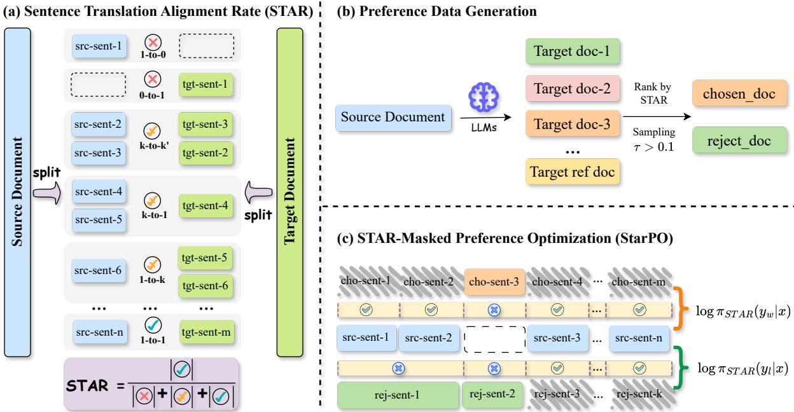
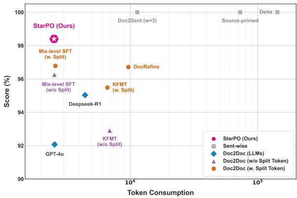
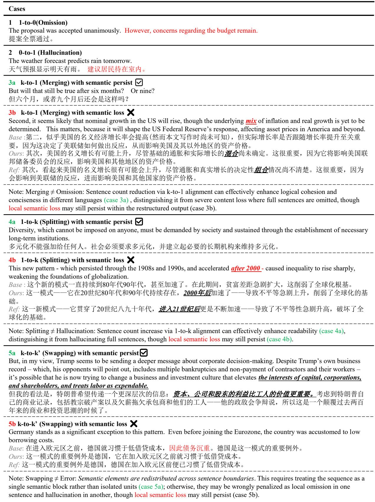
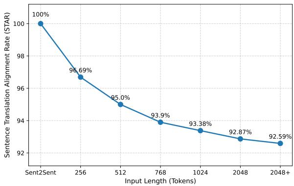
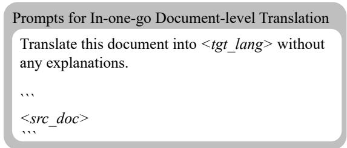
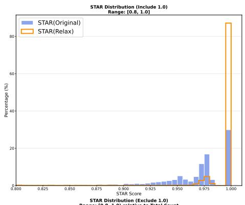
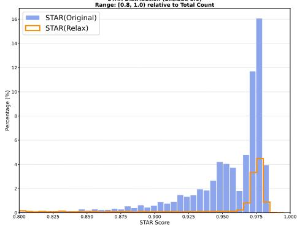
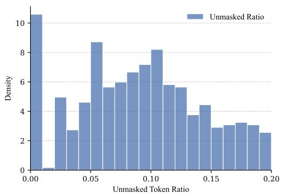
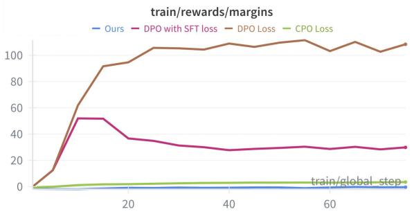
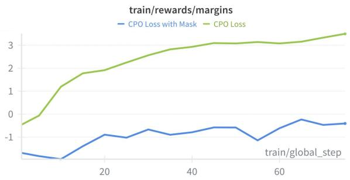

# STAR : Sentence Translation Alignment Rate for Document-to-Document Machine Translation

Yichen Dong1\* Hao Wang2\* Junhui Li1†

Linlong Xu2 Longyue Wang2 Weihua Luo2

1School of Computer Science and Technology, Soochow University, Suzhou, China 2Alibaba Group, Hangzhou, China

dong\_yichen@foxmail.com, huaiyu.wh@alibaba-inc.com, jhli@suda.edu.cn

## Abstract

Large Language Models (LLMs) have enabled a shift from sentence-level to documentto-document (Doc2Doc) machine translation, promising improved global coherence. However, document-to-document generation in a single pass frequently suffers from structural misalignment, manifesting as sentence omissions or hallucinations that violate the core requirement of source-target correspondence. To address this, we introduce Sentence Translation Alignment Rate (STAR), an auxiliary metric that explicitly quantifies sentence-level structural fidelity. Building on this, we propose STAR-masked Preference Optimization (StarPO), a framework that ranks documentlevel hypotheses by structural quality and utilizes a dynamic alignment mask to focus optimization on misaligned segments. Experimental results across news and literary domains demonstrate that StarPO significantly enhances translation quality and structural integrity. Notably, StarPO allows compact models to surpass the performance of massive proprietary systems like GPT-4o while maintaining superior token efficiency.1

## 1 Introduction

Recent advances in large language models (LLMs) has significantly advanced document-level machine translation (DocMT) (Wang et al., 2023, 2025d; Karpinska and Iyyer, 2023). With long-context modeling and strong generative capabilities, LLMs make it increasingly feasible to move beyond sentence-to-sentence (Sent2Sent) translation to chunk-to-chunk (Chunk2Chunk) and document-todocument (Doc2Doc) translation, where an entire source document is translated in a single pass. Despite this promise, Doc2Doc translation often exhibits sentence-level structural failures, such as sentence omissions or hallucinations, that violate the core requirement of sentence-level correspondence between source and target documents (Dong et al., 2025). In this work, we aim to improve Doc2Doc translation by addressing sentence-level structural misalignments, so that better alignment directly contributes to higher translation quality.

<table><tr><td rowspan="2">System</td><td>Ideal</td><td colspan="3">Structural Deviations</td></tr><tr><td>1-to-1</td><td>1-to-0</td><td>0-to-1</td><td>Other</td></tr><tr><td colspan="5">Doc2Doc translation in a single pass</td></tr><tr><td>LLaMA-3.1-8B Qwen-2.5-7B Qwen-3-4B Deepseek-R1</td><td>92.59 95.35 94.72 95.03</td><td>2.08 1.91 0.72 4.85</td><td>1.17 1.31 0.33 0.03</td><td>4.16 1.43 4.23 0.09</td></tr><tr><td colspan="5">GPT-40 92.91 2.25 2.89 1.95</td></tr><tr><td>Chunk2Chunk prompting LLaMA-3.1 w. sentence boundary MixSFT (Li et al., 2026a)</td><td>96.78</td><td>0.57</td><td>2.08</td><td>0.57</td></tr><tr><td>KFMT (Liu et al., 2025)</td><td>95.48</td><td>1.89</td><td>2.34</td><td>0.29</td></tr><tr><td></td><td></td><td></td><td></td><td></td></tr><tr><td>Ours (on Qwen2.5-7B)</td><td>98.43</td><td>0.68</td><td>0.00</td><td>0.89</td></tr></table>

Table 1: Alignment distribution ( in % ) for Zh ⇒ En on News-Commentary, computed by Gemini-2.5-Flash.

Most existing DocMT approaches implicitly avoid structural misalignment by adopting Sent2Sent or Chunk2Chunk paradigms, where translation is still performed at the individual sentence level given surrounding context (Wu et al., 2024a; Hu et al., 2025; Li et al., 2026b) or sliding chunks (Liu et al., 2025; Li et al., 2026a). While these localized paradigms successfully enforce sentence or block correspondence, they inherently limit global text planning and incur substantial computational costs, as source segments are repeatedly encoded across overlapping contexts.2

Ideally, Doc2Doc translation preserves a clear correspondence between source and target sentences. In practice, however, model outputs often contain 1-to-0 alignments (omissions), 0-to-1 alignments (hallucinations) or even generation collapse (e.g., repetitive loops). Are non-1-to-1 alignments, where N source sentences correspond to M $( M \neq N )$ target sentences, inherently unacceptable? Intuitively, cross-lingual syntax often justifies merging, splitting, or reordering for fluency, ensuring the output feels more native and adheres to the idiomatic conventions of the target language. Therefore, robust Doc2Doc systems must therefore distinguish such legitimate restructuring from omissions or hallucinations.3 Although splitting and merging are not categorized as pathological errors, effectively rectifying these structural nuances can yield substantial further performance gains.

As shown in our preliminary analysis in Table 1, such errors are pervasive across model scales and persist even when sentence boundary constraints are explicitly introduced during generation (Liu et al., 2025; Li et al., 2026a). Notably, even strong proprietary models such as GPT-4o (OpenAI, 2024) exhibit non-trivial rates of structural mismatch in Doc2Doc and Chunk2Chunk settings (Liu et al., 2024; Shao et al., 2024a). These errors are particularly pronounced in long or complex documents. As input context chunk length scales up, the sentence alignment rate drops gradually. See Appendix C for a detailed quantitative analysis.

This vulnerability is closely related to overrejection (Xu et al., 2024, 2025) and reward hacking (Akter et al., 2026), where models adopt overly conservative strategies under safety or shortcontext biases. Although previous works (Hu et al., 2025; Domhan and Zhu, 2025) attempt to investigate these length-related translation failures, their analyses are largely confined to superficial comparisons of input and output lengths. Such macroscopic perspectives fail to capture the finegrained structural breakdowns. Importantly, structural misalignment is largely invisible to standard training objectives and evaluation metrics (e.g. COMET (Rei et al., 2022)), which primarily focus on semantic adequacy and fluency. As a result, Doc2Doc systems may achieve high metric scores while still omitting or hallucinating.

To address this limitation, we introduce Sentence Translation Alignment Rate (STAR), an auxiliary metric that explicitly measures sentencelevel structural fidelity in Doc2Doc translation. Building on STAR, we propose STAR-masked Preference Optimization (StarPO) framework that ranks document-level hypotheses by alignment quality and encourage structurally faithful generation. We further introduce a dynamic alignment masking strategy that downweights or excludes sentences that are already well aligned, allowing optimization to focus on misaligned segments such as omissions and hallucinations.

In summary, our contributions are:

• We identify sentence-level structural misalignment as a key bottleneck in Doc2Doc translation and introduce STAR , a novel auxiliary metric for measuring structural fidelity.

• We propose STAR-masked Preference Optimization (StarPO) with dynamic alignment masking to mitigate sentence omissions and hallucinations.

• We demonstrate consistent and robust improvements in document-level translation quality across multiple domains and models.

## 2 Methodology

In this section, we present a novel framework designed to enhance structural fidelity of documentlevel translation as illustrated in Figure 1.

## 2.1 Sentence Translation Alignment Rate (STAR)

We introduce Sentence Translation Alignment Rate (STAR), a metric for quantifying sentence-level structural fidelity in Doc2Doc translation. As illustrate in Figure 1(a), the computation of STAR proceeds in four steps:

(1) Sentence Segmentation: Source and target documents (S and T) are segmented into sentences, $S = \{ s _ { 1 } , \ldots , s _ { m } \}$ and $T = \{ t _ { 1 } , \ldots , t _ { n } \}$ . Specifically, we segment sentences using SaT (Frohmann et al., 2024).

(2) Sentence-Level Alignment: Sentences from the source and target are aligned to form disjoint alignment units $\mathcal { U } = \{ u _ { 1 } , . . . , u _ { K } \}$ , where each unit $u _ { k } = ( \mathbf { s } _ { k } , \mathbf { t } _ { k } )$ may contain zero or more source sentences $\mathbf { s } _ { k } \subseteq S$ and zero or more target sentences $\mathbf { t } _ { k } \subseteq T$ . These units are minimal and cannot be further decomposed. Here, we use Bertalign (Liu and Zhu, 2023) for sentence-level alignment.

(3) Unit Categorization: Each alignment unit is classified based on the number of source and target sentences: (1) $1 { - } \mathrm { t o } { - } 1 \left( \mathcal { U } _ { 1 : 1 } \right)$ , where $| { \bf s } _ { k } | = | { \bf t } _ { k } | = 1 ;$ (2) Deletion $( \mathcal { U } _ { 1 : 0 } )$ , where $\left| \mathbf { s } _ { k } \right| \geq 1 , \left| \mathbf { t } _ { k } \right| = 0 ; ( 3 )$ Insertion $( \mathcal { U } _ { 0 : 1 } )$ , where $| \mathbf { s } _ { k } | = 0 , | \mathbf { t } _ { k } | \geq 1$ ; and (4) Complex $( \mathcal { U } _ { \mathrm { c o m p l e x } } )$ , covering all other cases $( | \mathbf { s } _ { k } | + | \mathbf { t } _ { k } | > 2$ with $| { \bf s } _ { k } | , | { \bf t } _ { k } | \geq 1 )$

  
Figure 1: Overview of the proposed framework. (a) Sentence Translation Alignment Rate (STAR): Source and target documents are segmented and aligned to compute STAR, defined as the ratio of strict 1-to-1 alignments. (b) Preference Data Generation: Translation candidates are sampled and ranked by their STAR scores. Pairs exhibiting a score disparity larger than τ are selected as chosen $( y _ { w } )$ and rejected $( y _ { l } )$ samples. (c) STAR-Masked Preference Optimization (StarPO): A sentence-level mask is applied to the CPO objective, excluding well-aligned (1-to-1) sentences to focus optimization exclusively on structurally problematic segments.

(4) STAR Computation: STAR is the fraction of clean 1-to-1 units among all alignment units:

$$
\mathrm { S T A R } ( S , T ) = \frac { \lvert \mathcal { U } _ { 1 : 1 } \rvert } { \lvert \mathcal { U } _ { 1 : 1 } \rvert + \lvert \mathcal { U } _ { 1 : 0 } \rvert + \lvert \mathcal { U } _ { 0 : 1 } \rvert + \lvert \mathcal { U } _ { \mathrm { c o m p l e x } } \rvert } .\tag{1}
$$

We also introduce a relaxed variant, $\mathbf { S T A R _ { r e l a x } } ( S , T )$ which treats $\mathcal { U } _ { \mathrm { c o m p l e x } }$ as positive to exclusively penalize omissions and hallucinations while remaining tolerant of linguistically justified merging or splitting since complex alignments is also acceptable in real-world scenario:

$$
\mathrm { S T A R } _ { \mathrm { r e l a x } } ( S , T ) = \frac { \left| \mathcal { U } _ { 1 : 1 } \right| + \left| \mathcal { U } _ { \mathrm { c o m p l e x } } \right| } { \left| \mathcal { U } _ { 1 : 1 } \right| + \left| \mathcal { U } _ { 1 : 0 } \right| + \left| \mathcal { U } _ { 0 : 1 } \right| + \left| \mathcal { U } _ { \mathrm { c o m p l e x } } \right| } .\tag{2}
$$

Thus, higher STAR indicates better sentencelevel structural fidelity while lower STAR reflects deletions, insertions. Notably, STAR can also be computed directly via an LLM-as-a-judge approach, based on the four steps outlined above.4

## 2.2 Preference Data Generation

To support STAR-masked preference optimization (StarPO), we construct a document-level preference dataset from automatically generated translation candidates. For each source document, we use GPT-4o (OpenAI, 2024) to generate 5 translation candidates with a temperature of 1.0. Reference translation without sentence boundaries is also included in the candidate pool when available.

For each souce document S, we compute the STAR score (Section 2.1) for all candidates and form a preference pair by selecting the candidate with the highest STAR score as the chosen example $( T _ { w } )$ and the one with the lowest score as the rejected example (Tl). To ensure meaningful supervision, a pair $( T _ { w } , T _ { l } )$ is retained only if the STAR score difference exceeds a threshold τ, i.e., $| \mathrm { S T A R } ( S , T _ { w } ) - \mathrm { S T A R } ( S , T _ { l } ) | > \tau$ . In our experiments, we set $\tau = 0 . 1 . ^ { 5 }$

## 2.3 STAR-Masked Preference Optimization (StarPO)

Following recent studies (Wang et al., 2026a; Agrawal et al., 2024; Xu et al., 2024; Sun et al., 2025a), we adopt a two-stage training paradigm. We first perform supervised fine-tuning (SFT) on high-quality parallel corpora to establish a warmstarted policy πSFT. We then apply preference optimization to further align the model with structural constraints.

Background: Contrastive Preference Optimization. Following contrastive preference optimization (CPO) (Xu et al., 2024, 2025), we assume a preference dataset $\mathcal { D } = \{ ( S , T _ { w } , T _ { l } ) \}$ , where S is a source document and $( T _ { w } , T _ { l } )$ denote a preferred and dis-preferred translation, respectively. CPO optimizes the policy $\pi _ { \theta }$ by maximizing the likelihood margin between the preferred and dis-preferred candidates. The standard objective is formulated as:

$$
\begin{array} { r l } & { \mathcal { L } _ { \mathrm { C P O } } ( \pi _ { \theta } ) = - \mathbb { E } _ { \mathcal { D } } \Big [ \log \sigma \big ( \beta \log \pi _ { \theta } ( T _ { w } | S ) } \\ & { \quad \quad \quad - \beta \log \pi _ { \theta } ( T _ { l } | S ) \big ) \Big ] } \\ & { \quad \quad \quad - \mathbb { E } _ { \mathcal { D } } \big [ \log \pi _ { \theta } ( T _ { w } | S ) \big ] , } \end{array}\tag{3}
$$

where $\sigma$ is sigmoid function and $\beta$ is a hyperparameter controlling strength of preference signal. Typically, log $\pi _ { \boldsymbol { \theta } } ( \boldsymbol { T } | S )$ is computed as the sum of log-probabilities over all tokens in document $T$

STAR-Masked Objective. Directly applying CPO at the document-level treats all tokens equally, regardless of whether they correspond to structurally correct translations or not. To focus learning on sentence-level structural issues (e.g., hallucinations, omissions, or complex alignments), we introduce a STAR-based masking strategy.

Given a target document $T$ which is segmented into n sentences $T = \{ t _ { 1 } , \ldots , t _ { n } \}$ and the alignment units defined in Section 2.1, we define a sentence-level mask $\mathcal { M } ( t _ { j } )$ that indicates whether sentence $t _ { j }$ should contribute to preference loss:

$$
\mathcal { M } ( t _ { j } ) = 1 - \mathbb { I } _ { 1 : 1 } ( t _ { j } ) ,\tag{4}
$$

where $\mathbb { I } _ { 1 : 1 } ( t _ { j } ) = 1$ if sentence $t _ { j }$ belongs to a clean 1-to-1 alignment unit and 0 otherwise.

As a result, well-aligned sentences receive a mask value of 0, whereas sentences associated with structural mismatches receive a value of 1.

Using this mask, we define STAR-Masked log-likelihood, log πSTAR(T|S), which aggregates token-level probabilities strictly for non-1-to-1 sentences:

$$
\begin{array} { l } { \displaystyle \log \pi _ { \mathsf { S T A R } } ( T | S ) = \sum _ { j = 1 } ^ { n } \bigg [ \mathcal { M } ( t _ { j } ) \cdot } \\ { \displaystyle \quad \sum _ { k = 1 } ^ { | t _ { j } | } \log \pi _ { \theta } \left( t _ { j , k } | t _ { < j } , t _ { j , < k } , S \right) \bigg ] , } \end{array}\tag{5}
$$

where $| t _ { j } |$ is the number of tokens in sentence $t _ { j }$ $t _ { j , k }$ denotes the k-th token in the $t _ { j } , t _ { < j }$ represents all target sentences preceding $t _ { j }$ , and $t _ { j , < k }$ denotes the generated tokens in $t _ { j }$ , respectively. The inner summation corresponds to the standard token-level log-likelihood for sentence $t _ { j }$

We then replace the standard document-level likelihood in CPO with the masked likelihood to obtain the STAR-masked preference loss:

$$
\begin{array} { r l } { \mathcal { L } _ { \mathrm { S t a r P O } } ( \pi _ { \theta } ) = - \mathbb { E } _ { \mathcal { D } } \Big [ \log \sigma \big ( \beta \log \pi _ { \mathrm { S T A R } } ( T _ { w } | S ) } & { } \\ { - \beta \log \pi _ { \mathrm { S T A R } } ( T _ { l } | S ) \big ) \Big ] } & { } \\ { - \mathbb { E } _ { \mathcal { D } } \big [ \log \pi _ { \mathrm { S T A R } } ( T _ { w } | S ) \big ] . } \end{array}\tag{6}
$$

## 3 Experimentation

## 3.1 Experimental Settings

Datasets. Following recent works (Wang et al., 2025d; Liu et al., 2025; Cui et al., 2024), we evaluate on both news and web novels from WMT. Specifically, we use News-Commentary v18.1 from WMT25 for English (En) ⇔ { Chinese (Zh), German (De), Russion (Ru), Spanish (Es)} and Chinese (Zh) ⇔ German (De) and Guofeng (Wang et al., $2 0 2 4 ) ^ { 6 }$ from WMT257 for Chinese (Zh) ⇔ {English (En), German (De), Russian (Ru)} translation. We use the training sets to fine-tune the LLMs and to construct preference pairs. Detailed dataset statistics are provided in Appendix F.

Models and Implementation Details. We use three open-source instruction-tuned large language models: LLaMA-3.1-8B-Instruct (Team, 2024a)8, Qwen-2.5-7B-Instruct (Team, 2024b)9 and Qwen-3-4B-Instruct10. See Appendix G for more implementation details.

Systems. For comprehensive comparison, we evaluate two categories of systems:

(1) Training Paradigms. We report the performance of the original instruct versions of the LLMs without further fine-tuning (referred to as Base), as well as models further fine-tuned with supervised fine-tuning (+SFT) following Li et al. (2026a). We use our full training set, further optimized with standard contrastive preference optimization (+CPO), and our proposed STAR-masked preference optimization (+StarPO).

(2) State-of-the-Art and Competitive Systems. We additionally compare against strong documentlevel translation systems, including Tower-plus-9B (Rei et al., 2024), GPT-4o (OpenAI, 2024), and Deepseek-R1 (DeepSeek-AI, 2025).

Metrics. We evaluate translation quality using document-level COMET (dCOMET) (Vernikos et al., 2022), computed by wmt22-comet-da (Rei et al., 2022). Specifically, since documentlevel evaluation requires sentence-level alignments (Vernikos et al., 2022), we apply the alignment strategy described in Section 2.1. Following Zouhar et al. (2024) and Zebaze et al. (2025), using our settings in $\mathrm { { S T A R } _ { \mathrm { { r e l a x } } } }$ , we assign a score of 0 COMET to unaligned segments, including omissions (1-to-0) and hallucinations (0-to-1), while complex mappings (1-to-k, k-to-1, k-to-k′) retain their computed COMET scores. To provide a more holistic evaluation, we use d-BLEU, which bypasses sentence-splitting tools by treating the entire document as a single continuous string for both input and output. This ensures that the evaluation remains uninfluenced by potential sentence-boundary artifacts. See Appendix H for our proposed STAR and $\mathrm { { S T A R } _ { \mathrm { { r e l a x } } } }$ scores.

## 3.2 Experimental Results

Table 2 and Table 3 present the results on News-Commentary dataset. Across all backbones, supervised fine-tuning (+SFT) yields consistent and substantial improvement over the base models on most language pairs. Building on this, standard CPO (+CPO) further enhances translation quality. Our proposed StarPO consistently outperforms standard CPO and achieves the best average performance across models. For instance, on LLaMA-3.1, StarPO obtains an average improvement of 0.48 COMET over standard CPO. Importantly, these gains are stable across model scales. With StarPO, the compact model outperforms strong SOTA and competitive systems, including Towerplus-9B, GPT-4o, and DeepSeek-R1. This highlights the effectiveness of structural alignment preference optimization for document-level translation.

Table 4 present dCOMET scores on Guofeng dataset.11 It is worth noting that web novel translation typically does not adhere to rigid 1-to-1 literalism, often employing complex sentence mappings for stylistic flow. Although StarPO enforces 1-to-1 constraints during training, our evaluation remains inclusive of valid complex mappings. ${ \mathrm { S t a r P O } } ^ { \prime } { \mathrm { s } }$ training constraints prevent pathologies like language mismatches without stifling this flexibility, as evidenced by restoring coherence where LLaMA-3.1-base fails on $\mathrm { Z h } { \Rightarrow } \mathrm { D e }$ (52.31 COMET). These results indicate that smaller models, when trained with structural-alignment preference optimization, can outperform massive generalist models on complex, stylized document-level translation tasks.

## 3.3 Comparison with Alternative Optimization Baselines

To further illustrate the effectiveness of StarPO, we compare it against a diverse set of alternative optimization baselines. We use LLaMA-3.1-8B-Instruct on Zh ⇔ En as a representative setting and report the results in Table 5.

Effect of Ranking Metrics on Preference Data Construction. We evaluate the impact of ranking signals by substituting STAR with COMET, COMETKiwi, BLEU, and word-level alignment coverage (Wu et al., 2024c, 2023), under a strictly controlled data budget identical to our main experiment. As shown in Table 5, STAR significantly outperforms all baselines despite the equalized data size. Notably, its superiority over sentence-level methods (He et al., 2024; Agrawal et al., 2024; Tang et al., 2025) confirms that discourse-level structural fidelity is best captured via sentence-tosentence correspondence.

Comparison with RL. We further benchmark our method against standard online RL strategies (GRPO (Shao et al., 2024b), GSPO (Zheng et al., 2025)). Following recent approaches (Feng et al., 2025a, 2026; He et al., 2025), we directly inject COMET, STAR and BLEU scores into the reward function for these baselines. As observed in the middle section of Table 5, while online methods utilizing self-generated data generally underperform our offline framework, GSPO paired with STAR achieves competitive results (80.16 COMET). This indicates that while our offline optimization (StarPO) is more effective, STAR nevertheless functions as a robust and high-quality reward signal within RL paradigms. Detailed analyses and comparisons with other standard offline preference optimization algorithms (e.g., DPO (Rafailov et al., 2023), SimPO (Meng et al., 2024)) are provided in Appendix J.

<table><tr><td rowspan="2">System</td><td colspan="2">Zh ⇔En</td><td colspan="2">De ⇔ En</td><td colspan="2">De ⇔ Zh</td><td colspan="2">Ru ⇔En</td><td colspan="2">En⇔Es</td><td rowspan="2">Avg.</td></tr><tr><td>⇒</td><td>⇐</td><td>⇒</td><td>⇐</td><td>⇒</td><td>⇐</td><td>⇒</td><td>⇐</td><td>⇒</td><td>⇐</td></tr><tr><td colspan="10">LLAMA-3.1-8B-INSTRUCT</td></tr><tr><td>Base</td><td>72.23</td><td>74.89</td><td>71.60</td><td>80.13</td><td>72.49</td><td>58.80</td><td>80.65</td><td>80.75</td><td>80.53</td><td>78.62</td><td>75.07</td></tr><tr><td>+ SFT</td><td>76.81</td><td>80.01</td><td>83.79</td><td>81.47</td><td>75.42</td><td>75.41</td><td>82.37</td><td>80.69</td><td>80.66</td><td>83.49</td><td>80.01</td></tr><tr><td>+ CPO</td><td>81.10</td><td>79.94</td><td>83.98</td><td>82.42</td><td>75.50</td><td>75.05</td><td>82.51</td><td>81.43</td><td>81.45</td><td>84.60</td><td>80.80</td></tr><tr><td>+ StarPO</td><td>81.55</td><td>80.11</td><td>84.05</td><td>82.50</td><td>76.33</td><td>77.08</td><td>82.53</td><td>81.71</td><td>82.03</td><td>84.91</td><td>81.28</td></tr><tr><td colspan="10">QWEN2.5-7B-INSTRUCT</td></tr><tr><td>Base</td><td>81.57</td><td>80.40</td><td>83.31</td><td>79.09</td><td>77.60</td><td>73.97</td><td>81.94</td><td>78.35</td><td>81.33</td><td>84.34</td><td>80.19</td></tr><tr><td>+ SFT</td><td>82.01</td><td>80.89</td><td>83.61</td><td>80.02</td><td>77.68</td><td>74.45</td><td>82.26</td><td>81.65</td><td>81.75</td><td>84.73</td><td>80.91</td></tr><tr><td>+ CPO</td><td>81.94</td><td>80.97</td><td>84.01</td><td>81.14</td><td>78.27</td><td>74.56</td><td>82.59</td><td>81.79</td><td>81.65</td><td>84.71</td><td>81.16</td></tr><tr><td>+ StarPO</td><td>82.27</td><td>81.33</td><td>84.06</td><td>81.89</td><td>78.22</td><td>74.58</td><td>82.70</td><td>82.12</td><td>81.79</td><td>85.21</td><td>81.42</td></tr><tr><td colspan="10">QWEN3-4B-INSTRUCT</td></tr><tr><td>Base</td><td>81.47</td><td>80.31</td><td>83.63</td><td>80.87</td><td>77.43</td><td>76.78</td><td>81.58</td><td>84.03</td><td>80.21</td><td>84.01</td><td>81.03</td></tr><tr><td>+ SFT</td><td>81.71</td><td>80.88</td><td>83.65</td><td>81.50</td><td>77.37</td><td>76.87</td><td>82.19</td><td>84.04</td><td>80.46</td><td>84.70</td><td>81.34</td></tr><tr><td>+ CPO</td><td>81.77</td><td>80.90</td><td>83.56</td><td>81.55</td><td>77.79</td><td>76.92</td><td>82.23</td><td>84.01</td><td>81.20</td><td>84.67</td><td>81.46</td></tr><tr><td>+ StarPO</td><td>82.24</td><td>81.17</td><td>83.84</td><td>82.07</td><td>78.00</td><td>76.93</td><td>82.43</td><td>84.21</td><td>81.48</td><td>84.93</td><td>81.73</td></tr><tr><td colspan="10">OTHER SYSTEMS</td></tr><tr><td>Tower+</td><td>80.53</td><td>80.18</td><td>84.01</td><td>82.57</td><td>75.85</td><td>76.34</td><td>82.58</td><td>81.66</td><td>82.46</td><td>84.81</td><td>81.10</td></tr><tr><td>GPT-40</td><td>77.42</td><td>80.64</td><td>83.87</td><td>82.84</td><td>77.88</td><td>69.32</td><td>82.36</td><td>84.73</td><td>83.31</td><td>84.83</td><td>80.72</td></tr><tr><td>Deepseek-R1</td><td>79.52</td><td>79.10</td><td>82.19</td><td>82.90</td><td>77.92</td><td>75.96</td><td>81.90</td><td>84.97</td><td>82.56</td><td>82.71</td><td>80.97</td></tr></table>

Table 2: Performance in dCOMET score on the News-Commentary test set. Bold scores represent the global best performance and underlined scores represent the global second-best performance. Blue text background indicates that the improvement over the origin Base model achieves at least 85% accuracy with the human judgment (Xu et al., 2024; Kocmi et al., 2024b). Specifically, the improvement needs a minimin of ≥ 0.71 for wmt22-comet-da.

Ablation Studies. To further dissect the source of our gains, we examine several specific variants in the bottom section of Table 5:

(1) SFT vs. Preference Optimization: Training solely on preferred responses (yw) yields strong performance, yet our full framework consistently outperforms this SFT baseline , proving that the contrastive signal in preference optimization is more effective than simple supervised imitation.

(2) Strict vs. Relaxed STAR: Using the relaxed STAR metric degrades performance, as it dilutes the discriminative power needed to establish a sufficient score margin for data selection during training (see Appendix K for score distribution analysis).

(3) Alignment-aware vs. Random Masking: We further investigate the effect of loss masking by randomly masking out 90% of tokens12 at both the sentence and token levels. While random token- or sentence-level masking acts as a helpful regularizer (Gu et al., 2025), StarPO’s semanticaware masking consistently achieves superior results. This demonstrates that focusing the optimization objective on structurally misaligned segments provides a more effective learning signal than random selection.13

## 4 Discussions

## 4.1 Sensitivity to Structural Pathologies

To verify STAR’s capability in identifying structural pathologies, we evaluate its performance. Starting from WMT24 (Kocmi et al., 2024a) test set,14 we introduce several LLMs including GPT-4o, Gemini-1.5-Flash, Hunyuan(Sun et al., 2024), Qwen3-235B15, and DeepSeek-R1 to produce translations across several language pairs: En ⇔ {De, Zh, Ru, Es}. To establish a reliable ground truth, we employ Gemini-2.5-Pro to annotate the structural alignment score (i.e. LLM implementation of STAR). We then compute Spearman (ρ) between the metric scores and the labels in two settings: strict mode and relaxed mode. Specifically, the strict mode treats only 1-to-1 mappings as valid alignments, enforcing a rigid sentence-level correspondence. In contrast, the relaxed mode accounts for "reasonable restructuring" by accepting linguistically justified N-to-M mappings (e.g., merging or splitting) as valid, thereby penalizing only the pathological 1-to-0 omissions and 0-to-1 hallucinations. The results are shown in Table 6.

Comparison with Existing Alignment Methods. Both Align-then-Slide (Guo et al., 2025c)

<table><tr><td rowspan="2">System</td><td colspan="2">Zh⇔En</td><td colspan="2">De⇔En</td><td colspan="2">De ⇔Zh</td><td colspan="2">Ru ⇔En</td><td colspan="2">En⇔Es</td><td rowspan="2">Avg.</td></tr><tr><td>⇒</td><td>⇐</td><td></td><td>⇐</td><td>⇒</td><td>⇐</td><td>⇒</td><td>⇐</td><td>⇒</td><td>⇐</td></tr><tr><td colspan="10">LLAMA-3.1-8B-INSTRUCT</td></tr><tr><td>Base</td><td>19.25</td><td>20.03</td><td>36.37</td><td>27.08</td><td>22.89</td><td>11.56</td><td>40.31</td><td>22.21</td><td>42.15</td><td>40.25</td><td>28.21</td></tr><tr><td>+ SFT</td><td>21.55</td><td>39.36</td><td>44.20</td><td>28.54</td><td>30.62</td><td>15.43</td><td>41.65</td><td>23.78</td><td>42.60</td><td>43.49</td><td>33.12</td></tr><tr><td>+ CPO</td><td>30.98</td><td>38.77</td><td>44.02</td><td>28.27</td><td>34.98</td><td>16.69</td><td>42.11</td><td>24.45</td><td>43.14</td><td>43.52</td><td>34.69</td></tr><tr><td>+ StarPO</td><td>32.88</td><td>40.20</td><td>44.36</td><td>28.77</td><td>35.90</td><td>17.94</td><td>42.45</td><td>25.72</td><td>43.99</td><td>43.68</td><td>35.59</td></tr><tr><td colspan="10">QWEN2.5-7B-INSTRUCT</td></tr><tr><td>Base</td><td>30.14</td><td>41.63</td><td>41.19</td><td>24.28</td><td>36.29</td><td>13.29</td><td>40.65</td><td>21.25</td><td>41.28</td><td>43.03</td><td>33.30</td></tr><tr><td>+ SFT</td><td>29.62</td><td>42.27</td><td>42.97</td><td>25.34</td><td>35.08</td><td>14.45</td><td>41.63</td><td>24.05</td><td>41.57</td><td>43.59</td><td>34.06</td></tr><tr><td>+CPO</td><td>30.90</td><td>43.34</td><td>43.71</td><td>25.78</td><td>37.46</td><td>14.52</td><td>41.87</td><td>24.10</td><td>41.71</td><td>43.13</td><td>34.65</td></tr><tr><td>+ StarPO</td><td>35.23</td><td>44.12</td><td>44.34</td><td>26.52</td><td>36.34</td><td>14.92</td><td>42.05</td><td>25.04</td><td>42.14</td><td>44.02</td><td>35.47</td></tr><tr><td colspan="10">QWEN3-4B-INSTRUCT</td></tr><tr><td>Base</td><td>27.71</td><td>41.55</td><td>42.22</td><td>26.01</td><td>31.68</td><td>14.27</td><td>38.34</td><td>25.00</td><td>40.58</td><td>43.91</td><td>33.13</td></tr><tr><td>+ SFT</td><td>30.35</td><td>42.07</td><td>43.61</td><td>27.09</td><td>33.72</td><td>14.79</td><td>41.41</td><td>27.37</td><td>42.79</td><td>44.09</td><td>34.73</td></tr><tr><td>+ CPO</td><td>33.68</td><td>42.54</td><td>43.80</td><td>27.24</td><td>34.41</td><td>15.33</td><td>41.80</td><td>28.11</td><td>42.68</td><td>44.46</td><td>35.41</td></tr><tr><td>+ StarPO</td><td>35.93</td><td>43.42</td><td>43.41</td><td>28.11</td><td>33.66</td><td>15.61</td><td>42.09</td><td>28.12</td><td>42.62</td><td>45.14</td><td>35.81</td></tr><tr><td colspan="10">OTHER SYSTEMS</td></tr><tr><td>Tower+</td><td>33.37</td><td>41.89</td><td>43.16</td><td>28.52</td><td>34.22</td><td>15.08</td><td>41.97</td><td>26.95</td><td>42.85</td><td>43.16</td><td>35.12</td></tr><tr><td>GPT-40</td><td>27.70</td><td>42.06</td><td>42.83</td><td>29.62</td><td>35.38</td><td>12.70</td><td>41.28</td><td>28.55</td><td>44.24</td><td>43.12</td><td>34.75</td></tr><tr><td>Deepseek-R1</td><td>32.33</td><td>39.27</td><td>41.68</td><td>29.83</td><td>33.59</td><td>14.00</td><td>40.44</td><td>27.28</td><td>44.06</td><td>41.64</td><td>34.41</td></tr></table>

Table 3: Performance in d-BLEU score on the News-Commentary test set. Unlike dCOMET, d-BLEU evaluates each document as a single continuous string without sentence alignment. Blue text background denotes a significant improvement over the Base model (≥ 3.35 BLEU).

<table><tr><td rowspan="2">System</td><td colspan="2">Zh ⇔En</td><td colspan="2">Zh⇔De</td><td colspan="2">Zh ⇔Ru</td></tr><tr><td>⇒</td><td>⇐</td><td>⇒</td><td>⇐</td><td>⇒</td><td>⇐</td></tr><tr><td colspan="7">LLAMA-3.1-8B-INSTRUCT</td></tr><tr><td>Base</td><td>53.66</td><td>64.33</td><td>52.31</td><td>66.36</td><td>60.28</td><td>62.04</td></tr><tr><td>+ SFT</td><td>62.70</td><td>65.42</td><td>67.96</td><td>73.33</td><td>75.27</td><td>72.75</td></tr><tr><td>+ CPO</td><td>63.01</td><td>68.70</td><td>69.04</td><td>73.95</td><td>75.22</td><td>72.92</td></tr><tr><td>+ StarPO</td><td>63.43</td><td>72.17</td><td>72.15</td><td>74.61</td><td>77.50</td><td>73.79</td></tr><tr><td colspan="7">QWEN2.5-7B-INSTRUCT</td></tr><tr><td>Base</td><td>70.22</td><td>71.99</td><td>64.11</td><td>73.04</td><td>55.74</td><td>73.31</td></tr><tr><td>+SFT</td><td>70.42</td><td>69.54</td><td>66.66</td><td>73.03</td><td>75.86</td><td>72.23</td></tr><tr><td>+CPO</td><td>70.20</td><td>71.23</td><td>66.51</td><td>73.69</td><td>74.63</td><td>72.78</td></tr><tr><td>+StarPO</td><td>70.64</td><td>72.13</td><td>70.72</td><td>73.94</td><td>77.46</td><td>75.00</td></tr><tr><td colspan="7">QWEN3-4B-INSTRUCT</td></tr><tr><td>Base</td><td>63.61</td><td>68.64</td><td>68.01</td><td>73.76</td><td>72.98</td><td>73.04</td></tr><tr><td>+SFT</td><td>68.61</td><td>69.77</td><td>69.41</td><td>75.08</td><td>76.48</td><td>75.06</td></tr><tr><td>+CPO</td><td>68.77</td><td>71.02</td><td>69.01</td><td>74.84</td><td>76.49</td><td>73.83</td></tr><tr><td>+StarPO</td><td>70.13</td><td>72.21</td><td>70.20</td><td>75.20</td><td>76.53</td><td>75.44</td></tr><tr><td colspan="7">OTHER SYSTEMS</td></tr><tr><td>Tower+</td><td>69.39</td><td>65.92</td><td>54.41</td><td>72.89</td><td>70.39</td><td>66.48</td></tr><tr><td>GPT-40</td><td>69.58</td><td>73.61</td><td>53.24</td><td>73.91</td><td>55.35</td><td>70.65</td></tr><tr><td>Deepseek</td><td>62.86</td><td>69.58</td><td>64.51</td><td>70.30</td><td>71.53</td><td>67.35</td></tr></table>

Table 4: Performance in dCOMET on Guofeng test set.

and SEGALE (Wang et al., 2025c) utilize sentence alignment between source and target text for document-level evaluation. We compute STAR scores using their intermediate alignment results for a fair comparison. As shown in Table 6, our implementation achieves superior correlation with structural noise. This highlights that precise, finegrained sentence alignment is a critical prerequisite for reliable document-level structural assessment.

Comparison with length-based Metrics. We compare STAR with length-based metrics in prior works for detecting omissions, hallucinations or collapse (Peng et al., 2025a; Guerreiro et al., 2023; Shao et al., 2024a; Hu et al., 2025; Domhan and Zhu, 2025), including Token Count Ratio, Sentence Count Ratio, and Sentence Count Difference. As shown in Table 6, these metrics exhibit weak correlations (ρ < 0.2), failing to detect structural noise when overall document length is preserved.

Ablation Study on STAR Components. We verify the robustness of STAR by swapping its components. Replacing SaT with Spacy16 or switching the LaBSE encoder to M3 (Chen et al., 2024) results only marginal performance fluctuations. These results demonstrate that STAR’s effectiveness is relatively robust.

## 4.2 Analysis of Structural Alignment and Semantic Accuracy

While complex alignments (k-to-k′, including merging and splitting) are sometimes feasible, they frequently mask local semantic distortions or partial omissions. To investigate this, we conduct a fine-grained COMET analysis on Zh ⇒ En, categorizing source sentences into three groups: Pathological Errors (1-to-0/0-to-1), Complex Restructuring (merging/splitting/swapping), and Preserved 1-to-1 mappings.

<table><tr><td>Method</td><td>Zh ⇒ En</td><td>En ⇒ Zh</td></tr><tr><td>Data Ranking Metrics</td><td></td><td></td></tr><tr><td>BLEU Ranking</td><td>76.55</td><td>79.71</td></tr><tr><td>COMET Ranking</td><td>81.01</td><td>79.78</td></tr><tr><td>COMETKiwi Ranking</td><td>80.56</td><td>79.73</td></tr><tr><td>Word-level Coverage</td><td>75.94</td><td>79.46</td></tr><tr><td>Online RL Strategies</td><td></td><td></td></tr><tr><td>GRPO (w. COMET)</td><td>77.73</td><td>79.50</td></tr><tr><td>GRPO (w. STAR)</td><td>77.79</td><td>79.44</td></tr><tr><td>GRPO (w. BLEU)</td><td>77.81</td><td>79.52</td></tr><tr><td>GRPO (w. COMET + STAR)</td><td>77.76</td><td>79.76</td></tr><tr><td>GSPO (w. COMET)</td><td>77.94</td><td>79.77</td></tr><tr><td>GSPO (w. STAR)</td><td>80.16</td><td>80.00</td></tr><tr><td>GSPO (w. BLEU)</td><td>77.96</td><td>79.81</td></tr><tr><td>GSPO (w. COMET + STAR)</td><td>77.72</td><td>79.97</td></tr><tr><td>Our Variants &amp; Ablation Studies</td><td></td><td></td></tr><tr><td>SFT on preference data</td><td>80.41</td><td>80.02</td></tr><tr><td>STAR (Relaxed)</td><td>80.09</td><td>79.59</td></tr><tr><td>Random Mask (Sentence level)</td><td>81.18</td><td>80.05</td></tr><tr><td>Random Mask (Token level)</td><td>81.17</td><td>80.06</td></tr><tr><td>CPO</td><td>81.10</td><td>79.94</td></tr><tr><td>Ours (StarPO)</td><td>81.55</td><td>80.11</td></tr></table>

Table 5: COMET scores comparison against alternative optimization strategies. Word-level Coverage is calculated via WSPAlign (Wu et al., 2023, 2024c) at the aligned sentence-pair level.

Table 7 shows that StarPO’s improvement stems from mitigating pathological errors and, more significantly, rectifying Complex restructuring. While SFT offers marginal gains, StarPO substantially boosts the COMET score for complex segments (71.87 → 81.52), confirming that enforcing structural 1-to-1 correspondence recovers semantic details typically lost in merging or splitting.

## 4.3 LLM-as-a-judge Metrics Results

Following Sun et al. (2025b), we complement automated metrics with LLM-as-a-judge metrics along multiple orthogonal dimensions, including fluency, content errors, and coherence errors. To avoid self-preference bias (Chen et al., 2025), we use Gemini-2.5-Flash for all systems. The results of News-Commentary Zh ⇒ En are shown in Table 8. StarPO consistently achieves superior performance across all dimensions and model families, outperforming both standard CPO and strong baselines like Tower+ and GPT-4o.

<table><tr><td rowspan="2">Methods</td><td colspan="2">Correlation (ρ, ↑)</td></tr><tr><td></td><td>Strict 1-to-1 Relaxed N-to-M</td></tr><tr><td>Existing Alignment Methods</td><td></td><td></td></tr><tr><td>Align-then-Slide</td><td>0.3804</td><td>0.5168</td></tr><tr><td>SEGALE</td><td>0.4193</td><td>0.4760</td></tr><tr><td>Simple Metrics</td><td></td><td></td></tr><tr><td>Token Count Ratio</td><td>0.0218</td><td>0.0211</td></tr><tr><td>Sentence Count Ratio</td><td>0.1218</td><td>0.1780</td></tr><tr><td>Sentence Count Difference</td><td>0.0649</td><td>0.1647</td></tr><tr><td>Ours (STAR Variants)</td><td></td><td></td></tr><tr><td>STAR (Section 2.1)</td><td>0.5808</td><td>0.5774</td></tr><tr><td>w/o SaT (use Spacy)</td><td>0.5644</td><td>0.5663</td></tr><tr><td>w/o LaBSE (use M3)</td><td>0.5104</td><td>0.5479</td></tr></table>

Table 6: Spearman correlation (ρ) between LLMannotated alignment quality and various evaluation methods (including STAR variants, Align-then-Slide (Guo et al., 2025c), SEGALE (Wang et al., 2025c), and length-based metrics) under both strict 1-to-1 and relaxed N-to-M matching criteria.
<table><tr><td rowspan="2">Pattern</td><td colspan="2">Pathological</td><td colspan="2">Complex</td><td colspan="2">1-to-1</td><td rowspan="2">Overall</td></tr><tr><td>%</td><td>COMET</td><td>%</td><td>COMET</td><td>%</td><td>COMET COMET</td></tr><tr><td>Base</td><td>3.25</td><td>0.00</td><td>4.16</td><td>71.87</td><td>92.59</td><td>75.78</td><td>73.15</td></tr><tr><td>SFT</td><td>3.14</td><td>0.00</td><td>3.13</td><td>74.81</td><td>93.73</td><td>79.45</td><td>76.81</td></tr><tr><td>StarPO</td><td>2.09</td><td>0.00</td><td>2.12</td><td>81.52</td><td>95.79</td><td>83.33</td><td>81.55</td></tr></table>

Table 7: Fine-grained analysis on Zh ⇒ En.

## 5 Related Work

## 5.1 Document-level Machine Translation

LLM-based document-level machine translation generally falls into two paradigms: Doc2Sent (context-aware), which treats documents as sequences of sentence-level tasks, and Doc2Doc, which processes documents holistically.

In Doc2Sent style, training-free approaches rely on prompting strategies, such as context selection (Wang et al., 2023; Sia and Duh, 2023; Moslem et al., 2023; Zhang et al., 2023a; Lee et al., 2025; Lippmann et al., 2025; Cui et al., 2024; Peng et al., 2025b; Hu et al., 2025), self-refinement (Koneru et al., 2024; Li et al., 2025b) and employing memory-based agents (Wang et al., 2025d; Guo et al., 2025b). Fine-tuning relies on various data construction strategies (Li et al., 2026b; Lyu et al., 2024; Wu et al., 2024a; Zhang et al., 2023b; Stap et al., 2024), with the Tower series (Alves et al., 2024; Rei et al., 2024, 2026) being a representative case. Several studies further investigate the role and utilization of contextual information in context-aware translation (M ˛aka et al., 2025b,a; Mohammed and Niculae, 2025; Choudhary et al.,

<table><tr><td>Fluency (↑)</td><td>Content (↓)</td><td>Cohesion (↓)</td></tr><tr><td></td><td>LLAMA-3.1-INSTRUCT</td><td>1.95</td></tr><tr><td>Base + SFT</td><td>3.67 2.33 3.94 1.96</td><td>1.70</td></tr><tr><td>+ CPO + StarPO</td><td>3.97 1.90 3.99 1.40</td><td>1.58 1.27</td></tr><tr><td></td><td></td><td></td></tr><tr><td>Base 3.97</td><td>QWEN-2.5-7B-INSTRUCT 1.64</td><td>1.38</td></tr><tr><td>+ SFT</td><td>4.12 1.63</td><td>1.30</td></tr><tr><td>+ CPO</td><td>4.40 1.39</td><td>1.02</td></tr><tr><td>+ StarPO 4.45</td><td>1.16</td><td>0.95</td></tr><tr><td></td><td></td><td></td></tr><tr><td></td><td>QWEN-3-4B-INSTRUCT</td><td></td></tr><tr><td>Base 4.39</td><td>1.46</td><td>1.13</td></tr><tr><td>+ SFT</td><td>4.51 1.44</td><td>1.11</td></tr><tr><td>+ CPO</td><td>4.58 1.23</td><td>0.91</td></tr><tr><td>+ StarPO 4.59</td><td>1.17</td><td>0.89</td></tr><tr><td></td><td></td><td></td></tr><tr><td></td><td>OTHER SYSTEMS</td><td></td></tr><tr><td>Tower+</td><td>4.05 1.29</td><td>1.14</td></tr><tr><td>GPT-40</td><td>4.18 1.26</td><td>1.12</td></tr><tr><td>Deepseek-R1</td><td>4.37 1.37</td><td>1.20</td></tr></table>

Table 8: LLM-as-a-judge evaluation results. Higher is better (↑); lower is better (↓).

2025; Li et al., 2026b).

Doc2Doc approaches aim for holistic translation through long-context training (Pang et al., 2025; Li et al., 2026a), iterative or agentic refinement (Dong et al., 2025; Li et al., 2025b; Briakou et al., 2024; Wu et al., 2024b), and input optimization strategies like segmentation or knowledge fusion (Hong et al., 2025; Liu et al., 2025). For evaluation, recent works (Guo et al., 2025a,c; Domhan and Zhu, 2025; Wang et al., 2025c; Steingrimsson et al., 2023) predominantly rely on source-target sentence alignment to assess document quality.

## 5.2 Reinforcement Learning for MT

As references are not necessarily superior to LLM generations, RL (Ouyang et al., 2022) becomes essential for advancing MT. Recent research focus on training specialized reward models to guide this process (Li et al., 2025a; Feng et al., 2025b; Ramos et al., 2026; Tan and Monz, 2025).

RL approaches are generally categorized into online and offline methods. Online methods and reward-based methods, commonly use quality estimation models as reward models (He et al., 2024, 2025). Such online frameworks is also compatible for training large reasoning models (Feng et al., 2025a, 2026; Wang et al., 2025a,b, 2026b). Typically, these methods apply various items into reward models. Conversely, offline methods like DPO (Rafailov et al., 2023) and its variants (Ethayarajh et al., 2024; Meng et al., 2024; Xu et al.,

2024, 2025; Zeng et al., 2024) rely on pre-curated preference datasets for stability. Various approaches are proposed to construct and leverage these datasets (Agrawal et al., 2024; Yang et al., 2024; Sun et al., 2025a; Cui et al., 2025; Tang et al., 2025; Wang et al., 2026a).

## 6 Conclusion

To address structural misalignment in Doc2Doc translation, we introduce STAR, a metric for evaluating document-level structural fidelity, and StarPO, a preference optimization framework utilizing dynamic masking to target omissions and hallucinations. Experiments demonstrate StarPO enables compact models to surpass massive proprietary systems in translation quality while significantly improving token efficiency. This work establishes a robust paradigm for Doc2Doc translation without complex agentic workflows.

## 7 Acknowledgments

We thank the reviewers for their valuable and constructive feedback. This work was supported by Alibaba Group. Yichen Dong conducted this work during his internship at Alibaba Group.

## Limitations

First, in “in-one-go” Doc2Doc scenarios, establishing sentence-level alignment is an unavoidable prerequisite for calculating any fine-grained quality metric (e.g., d-COMET). Second, while enforcing 1-to-1 alignment effectively mitigates hallucinations, it imposes a structural rigidity that could theoretically discourage valid complex mappings in stylized texts, though our empirical results suggest this impact is minimal. Third, our experimental validation is currently concentrated on compact models (4B to 9B parameters) and high-to-medium resource languages. Validating the scalability of StarPO to larger architectures (e.g., 70B+) and lowresource languages remains a critical direction for future research. Finally, regarding data construction, we currently leverage proprietary models (e.g., GPT-4o) to augment candidate diversity. Although the selection of high-quality samples is strictly governed by our own STAR metric, this reliance on commercial APIs for initial generation currently prevents a fully end-to-end open-source pipeline. Future work aims to substitute this step with opensource alternatives, thereby enabling a completely offline-deployable training framework.

## References

Sweta Agrawal, José G. C. De Souza, Ricardo Rei, António Farinhas, Gonçalo Faria, Patrick Fernandes, Nuno M Guerreiro, and Andre Martins. 2024. Modeling user preferences with automatic metrics: Creating a high-quality preference dataset for machine translation. In Proceedings ofEMNLP, pages 14503– 14519.

Sanjeda Akter, Ibne Farabi Shihab, and Anuj Sharma. 2026. Detecting proxy gaming in RL and LLM alignment via evaluator stress tests. In Findings ofACL, pages 10554–10583.

Duarte M. Alves, José Pombal, Nuno M. Guerreiro, Pedro H. Martins, João Alves, Amin Farajian, Ben Peters, Ricardo Rei, Patrick Fernandes, Sweta Agrawal, Pierre Colombo, José G. C. de Souza, and André F. T. Martins. 2024. Tower: An open multilingual large language model for translation-related tasks. CoRR, abs/2402.17733.

Eleftheria Briakou, Jiaming Luo, Colin Cherry, and Markus Freitag. 2024. Translating step-by-step: Decomposing the translation process for improved translation quality of long-form texts. In Proceedings of WMT, pages 1301–1317.

Jianlyu Chen, Shitao Xiao, Peitian Zhang, Kun Luo, Defu Lian, and Zheng Liu. 2024. M3- embedding: Multi-linguality, multi-functionality, multi-granularity text embeddings through selfknowledge distillation. In Findings of ACL, pages 2318–2335.

Zhi-Yuan Chen, Hao Wang, Xinyu Zhang, Enrui Hu, and Yankai Lin. 2025. Beyond the surface: Measuring self-preference in LLM judgments. In Proceedings ofEMNLP, pages 1653–1672, Suzhou, China.

Ritvik Choudhary, Rem Hida, Masaki Hamada, Hayato Futami, and Toshiyuki Sekiya. 2025. Exploring context strategies in LLMs for discourse-aware machine translation. In Findings of EMNLP, pages 24382– 24391.

Guofeng Cui, Pichao Wang, Yang Liu, Zemian Ke, Zhu Liu, and Vimal Bhat. 2025. CRPO: Confidencereward driven preference optimization for machine translation. In Findings ofACL, pages 560–574.

Menglong Cui, Jiangcun Du, Shaolin Zhu, and Deyi Xiong. 2024. Efficiently exploring large language models for document-level machine translation with in-context learning. In Findings of ACL, pages 10885–10897.

DeepSeek-AI. 2025. Deepseek-r1: Incentivizing reasoning capability in llms via reinforcement learning. CoRR, abs/2501.12948.

Tobias Domhan and Dawei Zhu. 2025. Same evaluation, more tokens: On the effect of input length for machine translation evaluation using large language models. In Proceedings of EMNLP, pages 7940–7958.

Yichen Dong, Xinglin Lyu, Junhui Li, Daimeng Wei, Min Zhang, Shimin Tao, and Hao Yang. 2025. Two intermediate translations are better than one: Finetuning LLMs for document-level translation refinement. In Proceedings ofACL, pages 14917–14933.

Kawin Ethayarajh, Winnie Xu, Niklas Muennighoff, Dan Jurafsky, and Douwe Kiela. 2024. Model alignment as prospect theoretic optimization. In Proceedings ofICML, pages 12634–12651.

Zhaopeng Feng, Shaosheng Cao, Jiahan Ren, Jiayuan Su, Ruizhe Chen, Yan Zhang, Jian Wu, and Zuozhu Liu. 2025a. MT-r1-zero: Advancing LLM-based machine translation via r1-zero-like reinforcement learning. In Findings ofthe EMNLP, pages 18685– 18702.

Zhaopeng Feng, Yupu Liang, Shaosheng Cao, Jiayuan Su, Jiahan Ren, Zhijie Zhou, Wenxuan Huang, Jian Wu, and Zuozhu Liu. 2026. MT3: A synergistic multi-task RL framework for specializing MLLMs in text image machine translation. In Proceedings of ACL, pages 10140–10157.

Zhaopeng Feng, Jiahan Ren, Jiayuan Su, Jiamei Zheng, Hongwei Wang, and Zuozhu Liu. 2025b. MT-RewardTree: A comprehensive framework for advancing LLM-based machine translation via reward modeling. In Findings of EMNLP, pages 18556– 18567.

Markus Frohmann, Igor Sterner, Ivan Vulic, Benjamin´ Minixhofer, and Markus Schedl. 2024. Segment any text: A universal approach for robust, efficient and adaptable sentence segmentation. In Proceedings of EMNLP, pages 11908–11941.

Yuzhe Gu, Wenwei Zhang, Chengqi Lyu, Dahua Lin, and Kai Chen. 2025. Mask-DPO: Generalizable finegrained factuality alignment of LLMs. In Proceedings ofICLR.

Nuno M. Guerreiro, Elena Voita, and André Martins. 2023. Looking for a needle in a haystack: A comprehensive study of hallucinations in neural machine translation. In Proceedings of EACL, pages 1059– 1075.

Jiaxin Guo, Xiaoyu Chen, Zhiqiang Rao, Jinlong Yang, Zongyao Li, Hengchao Shang, Daimeng Wei, and Hao Yang. 2025a. Automatic evaluation metrics for document-level translation: Overview, challenges and trends. CoRR, abs/2504.14804.

Jiaxin Guo, Yuanchang Luo, Daimeng Wei, Ling Zhang, Zongyao Li, Hengchao Shang, Zhiqiang Rao, Shaojun Li, Jinlong Yang, Zhanglin Wu, and Hao Yang. 2025b. Doc-guided sent2sent++: A sent2sent++ agent with doc-guided memory for document-level machine translation. In Proceedings of NLPCC, page 228–240.

Jiaxin Guo, Daimeng Wei, Yuanchang Luo, Xiaoyu Chen, Zhanglin Wu, Huan Yang, Hengchao Shang, Zongyao Li, Zhiqiang Rao, Jinlong Yang, and Hao

Yang. 2025c. Align-then-slide: A complete evaluation framework for ultra-long document-level machine translation. CoRR, abs/2509.03809.

Minggui He, Yilun Liu, Shimin Tao, Yuanchang Luo, Hongyong Zeng, Chang Su, Li Zhang, Hongxia Ma, Daimeng Wei, Weibin Meng, and 1 others. 2025. R1- t1: Fully incentivizing translation capability in llms via reasoning learning. CoRR, abs/2502.19735.

Zhiwei He, Xing Wang, Wenxiang Jiao, Zhuosheng Zhang, Rui Wang, Shuming Shi, and Zhaopeng Tu. 2024. Improving machine translation with human feedback: An exploration of quality estimation as a reward model. In Proceedings ofNAACL:HLT, pages 8164–8180.

Hanghai Hong, Yibo Xie, Jiawei Zheng, and Xiaoli Wang. 2025. SubDocTrans: Enhancing documentlevel machine translation with plug-and-play multigranularity knowledge augmentation. In Findings of EMNLP, pages 14490–14506.

Jiwoo Hong, Noah Lee, and James Thorne. 2024. Orpo: Monolithic preference optimization without reference model. In Proceedings ofEMNLP, pages 11170– 11189.

Edward J Hu, Yelong Shen, Phillip Wallis, Zeyuan Allen-Zhu, Yuanzhi Li, Shean Wang, Lu Wang, and Weizhu Chen. 2021. Lora: Low-rank adaptation of large language models. In Proceedings of ICLR.

Hanxu Hu, Jannis Vamvas, and Rico Sennrich. 2025. Source-primed multi-turn conversation helps large language models translate documents. In Findings of EMNLP, pages 23702–23712.

Marzena Karpinska and Mohit Iyyer. 2023. Large language models effectively leverage document-level context for literary translation, but critical errors persist. In Proceedings ofWMT, pages 419–451.

Tom Kocmi, Eleftherios Avramidis, Rachel Bawden, Ondrej Bojar, Anton Dvorkovich, Christian Federmann, Mark Fishel, Markus Freitag, Thamme Gowda, Roman Grundkiewicz, Barry Haddow, Marzena Karpinska, Philipp Koehn, Benjamin Marie, Kenton Murray, Masaaki Nagata, Martin Popel, Maja Popovic, Mariya Shmatova, and 2 others. 2024a. Preliminary wmt24 ranking of general mt systems and llms. CoRR, abs/2407.19884.

Tom Kocmi, Vilém Zouhar, Christian Federmann, and Matt Post. 2024b. Navigating the metrics maze: Reconciling score magnitudes and accuracies. In Proceedings ofACL, pages 1999–2014.

Sai Koneru, Miriam Exel, Matthias Huck, and Jan Niehues. 2024. Contextual refinement of translations: Large language models for sentence and documentlevel post-editing. In Proceedings ofNAACL:HLT, pages 2711–2725.

Minjae Lee, Youngbin Noh, and Seung Jin Lee. 2025. A testset for context-aware LLM translation in Koreanto-English discourse level translation. In Proceedings ofCOLING, pages 1632–1646.

Tianjiao Li, Mengran Yu, Chenyu Shi, Yanjun Zhao, Xiaojing Liu, Qi Zhang, Xuanjing Huang, Qiang Zhang, and Jiayin Wang. 2025a. RIVAL: Reinforcement learning with iterative and adversarial optimization for machine translation. In Findings ofEMNLP 2025, pages 3064–3079.

Yachao Li, Junhui Li, Jing Jiang, and Min Zhang. 2026a. Enhancing document-level translation of large language model via translation mixed instructions. Neurocomputing, 664:132041.

Ying Li, Xinglin Lyu, Junhui Li, Jinlong Yang, Hengchao Shang, Min Zhang, Shimin Tao, and Daimeng Wei. 2026b. Cross-preference learning for sentence-level and context-aware machine translation. CoRR, abs/2603.25183.

Zongyao Li, Zhiqiang Rao, Hengchao Shang, Jiaxin Guo, Shaojun Li, Daimeng Wei, and Hao Yang. 2025b. Enhancing large language models for document-level translation post-editing using monolingual data. In Proceedings of COLING, pages 8830– 8840.

Philip Lippmann, Konrad Skublicki, Joshua Tanner, Shonosuke Ishiwatari, and Jie Yang. 2025. Contextinformed machine translation of manga using multimodal large language models. In Proceedings of COLING, pages 3444–3464.

Bin Liu, Xinglin Lyu, Junhui Li, Daimeng Wei, Min Zhang, Shimin Tao, and Hao Yang. 2025. Improving llm-based document-level mt with multi-knowledge fusion. In Proceedings ofNLPCC, page 175–187.

Lei Liu and Min Zhu. 2023. Bertalign: Improved word embedding-based sentence alignment for chinese– english parallel corpora of literary texts. Digital Scholarship in the Humanities, 38:621–634.

Nelson F. Liu, Kevin Lin, John Hewitt, Ashwin Paranjape, Michele Bevilacqua, Fabio Petroni, and Percy Liang. 2024. Lost in the middle: How language models use long contexts. Transactions of the Association for Computational Linguistics, 12:157–173.

Xinglin Lyu, Junhui Li, Yanqing Zhao, Min Zhang, Daimeng Wei, Shimin Tao, Hao Yang, and Min Zhang. 2024. DeMPT: Decoding-enhanced multiphase prompt tuning for making LLMs be better context-aware translators. In Proceedings of EMNLP, pages 20280–20295.

Paweł M ˛aka, Yusuf Can Semerci, Jan Scholtes, and Gerasimos Spanakis. 2025a. Analyzing the attention heads for pronoun disambiguation in context-aware machine translation models. In Proceedings ofCOL-ING, pages 6348–6377.

Paweł M ˛aka, Yusuf Can Semerci, Jan Scholtes, and Gerasimos Spanakis. 2025b. You are what you train: Effects of data composition on training contextaware machine translation models. In Proceedings ofEMNLP, pages 27402–27425.

Yu Meng, Mengzhou Xia, and Danqi Chen. 2024. Simpo: Simple preference optimization with a reference-free reward. In Proceedings ofNIPS, pages 124198–124235.

Wafaa Mohammed and Vlad Niculae. 2025. Contextaware or context-insensitive? assessing LLMs’ performance in document-level translation. In Proceedings ofMachine Translation Summit XX: Volume 1, pages 126–137.

Yasmin Moslem, Rejwanul Haque, John D. Kelleher, and Andy Way. 2023. Adaptive machine translation with large language models. In Proceedings of EAMT, pages 227–237.

OpenAI. 2024. GPT-4o System Card. CoRR, abs/2410.21276.

Long Ouyang, Jeffrey Wu, Xu Jiang, Diogo Almeida, Carroll L. Wainwright, Pamela Mishkin, Chong Zhang, Sandhini Agarwal, Katarina Slama, Alex Ray, John Schulman, Jacob Hilton, Fraser Kelton, Luke Miller, Maddie Simens, Amanda Askell, Peter Welinder, Paul F. Christiano, Jan Leike, and Ryan Lowe. 2022. Training language models to follow instructions with human feedback. In Proceedings ofNIPS.

Jianhui Pang, Fanghua Ye, Derek Fai Wong, Dian Yu, Shuming Shi, Zhaopeng Tu, and Longyue Wang. 2025. Salute the classic: Revisiting challenges of machine translation in the age of large language models. Transactions of the Association for Computational Linguistics, 13:73–95.

Ziqian Peng, Rachel Bawden, and François Yvon. 2025a. Investigating length issues in document-level machine translation. In Proceedings of Machine Translation Summit XX: Volume 1, pages 4–23.

Ziqian Peng, Rachel Bawden, and François Yvon. 2025b. Self-retrieval from distant contexts for document-level machine translation. In Proceedings of WMT, pages 220–240.

Rafael Rafailov, Archit Sharma, Eric Mitchell, Christopher D Manning, Stefano Ermon, and Chelsea Finn. 2023. Direct Preference Optimization: Your Language Model is Secretly a Reward Model. In Proceedings ofNIPS, pages 53728–53741.

Miguel Moura Ramos, Tomás Almeida, Daniel Vareta, Filipe Azevedo, Sweta Agrawal, Patrick Fernandes, and André F. T. Martins. 2026. Fine-grained reward optimization for machine translation using error severity mappings. Transactions ofthe Association for Computational Linguistics, 14:733–754.

Ricardo Rei, José G. C. de Souza, Duarte Alves, Chrysoula Zerva, Ana C Farinha, Taisiya Glushkova, Alon Lavie, Luisa Coheur, and André F. T. Martins. 2022. COMET-22: Unbabel-IST 2022 submission for the metrics shared task. In Proceedings ofWMT, pages 578–585.

Ricardo Rei, Nuno M Guerreiro, José Pombal, João Alves, Amin Farajian, Pedro Teixeirinha, and Andre Martins. 2026. TOWER+: Bridging generality and translation specialization in multilingual LLMs. In Proceedings ofACL, pages 29614–29635.

Ricardo Rei, Jose Pombal, Nuno M. Guerreiro, João Alves, Pedro Henrique Martins, Patrick Fernandes, Helena Wu, Tania Vaz, Duarte Alves, Amin Farajian, Sweta Agrawal, Antonio Farinhas, José G. C. De Souza, and André Martins. 2024. Tower v2: Unbabel-IST 2024 submission for the general MT shared task. In Proceedings ofWMT, pages 185–204.

Chenze Shao, Fandong Meng, Jiali Zeng, and Jie Zhou. 2024a. Understanding and addressing the undertranslation problem from the perspective of decoding objective. In Proceedings ofACL, pages 3800–3814.

Zhihong Shao, Peiyi Wang, Qihao Zhu, Runxin Xu, Junxiao Song, Xiao Bi, Haowei Zhang, Mingchuan Zhang, Y. K. Li, Y. Wu, and Daya Guo. 2024b. Deepseekmath: Pushing the limits of mathematical reasoning in open language models. CoRR, abs/2402.03300.

Suzanna Sia and Kevin Duh. 2023. In-context learning as maintaining coherency: A study of on-the-fly machine translation using large language models. In Proceedings ofMachine Translation Summit XIX, Vol. 1: Research Track, pages 173–185.

David Stap, Eva Hasler, Bill Byrne, Christof Monz, and Ke Tran. 2024. The fine-tuning paradox: Boosting translation quality without sacrificing LLM abilities. In Proceedings of ACL, pages 6189–6206.

Steinthor Steingrimsson, Hrafn Loftsson, and Andy Way. 2023. SentAlign: Accurate and scalable sentence alignment. In Proceedings ofEMNLP: System Demonstrations, pages 256–263.

Haoxiang Sun, Ruize Gao, Pei Zhang, Baosong Yang, and Rui Wang. 2025a. Enhancing machine translation with self-supervised preference data. In Proceedings ofACL, pages 23916–23934.

Xingwu Sun, Yanfeng Chen, Yiqing Huang, Ruobing Xie, Jiaqi Zhu, Kai Zhang, Shuaipeng Li, Zhen Yang, Jonny Han, Xiaobo Shu, Jiahao Bu, Zhongzhi Chen, Xuemeng Huang, Fengzong Lian, Saiyong Yang, Jianfeng Yan, Yuyuan Zeng, Xiaoqin Ren, Chao Yu, and 87 others. 2024. Hunyuan-large: An open-source moe model with 52 billion activated parameters by tencent. CoRR, abs/2411.02265.

Yirong Sun, Dawei Zhu, Yanjun Chen, Erjia Xiao, Xinghao Chen, and Xiaoyu Shen. 2025b. Fine-grained and multi-dimensional metrics for document-level

machine translation. In Proceedings ofNAACL:HLT, pages 1–17.

Shaomu Tan and Christof Monz. 2025. ReMedy: Learning machine translation evaluation from human preferences with reward modeling. In Proceedings of EMNLP, pages 4370–4387.

Zilu Tang, Rajen Chatterjee, and Sarthak Garg. 2025. Mitigating hallucinated translations in large language models with hallucination-focused preference optimization. In Proceedings of NAACL:HLT, pages 3410–3433.

Llama Team. 2024a. The llama 3 herd of models. CoRR, abs/2407.21783.

Qwen Team. 2024b. Qwen2.5: A party of foundation models.

Giorgos Vernikos, Brian Thompson, Prashant Mathur, and Marcello Federico. 2022. Embarrassingly easy document-level MT metrics: How to convert any pretrained metric into a document-level metric. In Proceedings of WMT, pages 118–128.

Hao Wang, Linlong Xu, Heng Liu, Yangyang Liu, Xiaohu Zhao, Bo Zeng, Liangying Shao, Yichen Dong, Xinwei Wu, Jiang Zhou, Tianyu Dong, Xiangxiang Zeng, Longyue Wang, and Weihua Luo. 2026a. M2po: Multi-perspective multi-pair preference optimization for machine translation. In Proceedings of ACL, pages 10315–10336.

Jiaan Wang, Fandong Meng, Yunlong Liang, and Jie Zhou. 2025a. DRT: Deep reasoning translation via long chain-of-thought. In Findings of ACL 2025, pages 6770–6782.

Jiaan Wang, Fandong Meng, and Jie Zhou. 2025b. Extrans: Multilingual deep reasoning translation via exemplar-enhanced reinforcement learning. CoRR, abs/2505.12996.

Jiaan Wang, Fandong Meng, and Jie Zhou. 2026b. DeepTrans: Deep reasoning translation via reinforcement learning. Transactions of the Association for Computational Linguistics, 14:47–63.

Kuang-Da Wang, Shuoyang Ding, Chao-Han Huck Yang, Ping-Chun Hsieh, Wen-Chih Peng, Vitaly Lavrukhin, and Boris Ginsburg. 2025c. Extending automatic machine translation evaluation to booklength documents. In Proceedings ofEMNLP, pages 32311–32327.

Longyue Wang, Zefeng Du, Wenxiang Jiao, Chenyang Lyu, Jianhui Pang, Leyang Cui, Kaiqiang Song, Derek Wong, Shuming Shi, and Zhaopeng Tu. 2024. Benchmarking and improving long-text translation with large language models. In Findings ACL, pages 7175–7187.

Longyue Wang, Chenyang Lyu, Tianbo Ji, Zhirui Zhang, Dian Yu, Shuming Shi, and Zhaopeng Tu. 2023. Document-level machine translation with large language models. In Proceedings of EMNLP, pages 16646–16661.

Yutong Wang, Jiali Zeng, Xuebo Liu, Derek F. Wong, Fandong Meng, Jie Zhou, and Min Zhang. 2025d. Delta: An online document-level translation agent based on multi-level memory. In Proceedings of ICLR.

Minghao Wu, Thuy-Trang Vu, Lizhen Qu, George Foster, and Gholamreza Haffari. 2024a. Adapting large language models for document-level machine translation. CoRR, abs/2401.06468.

Minghao Wu, Jiahao Xu, and Longyue Wang. 2024b. TransAgents: Build your translation company with language agents. In Proceedings ofEMNLP: System Demonstrations, pages 131–141.

Qiyu Wu, Masaaki Nagata, Zhongtao Miao, and Yoshimasa Tsuruoka. 2024c. Word alignment as preference for machine translation. In Proceedings of EMNLP, pages 3223–3239.

Qiyu Wu, Masaaki Nagata, and Yoshimasa Tsuruoka. 2023. WSPAlign: Word alignment pre-training via large-scale weakly supervised span prediction. In Proceedings ofACL, pages 11084–11099.

Haoran Xu, Kenton Murray, Philipp Koehn, Hieu Hoang, Akiko Eriguchi, and Huda Khayrallah. 2025. X-ALMA: Plug & play modules and adaptive rejection for quality translation at scale. In Proceedings of ICLR.

Haoran Xu, Amr Sharaf, Yunmo Chen, Weiting Tan, Lingfeng Shen, Benjamin Van Durme, Kenton Murray, and Young Jin Kim. 2024. Contrastive preference optimization: Pushing the boundaries of LLM performance in machine translation. In Proceedings ofICML.

Guangyu Yang, Jinghong Chen, Weizhe Lin, and Bill Byrne. 2024. Direct preference optimization for neural machine translation with minimum Bayes risk decoding. In Proceedings ofNAACL:HLT (Volume 2: Short Papers), pages 391–398.

Armel Randy Zebaze, Benoît Sagot, and Rachel Bawden. 2025. In-context example selection via similarity search improves low-resource machine translation. In Findings ofNAACL, pages 1222–1252.

Jiali Zeng, Fandong Meng, Yongjing Yin, and Jie Zhou. 2024. Teaching large language models to translate with comparison. In Proceedings of AAAI, pages 19488–19496.

Biao Zhang, Barry Haddow, and Alexandra Birch. 2023a. Prompting large language model for machine translation: A case study. In Proceedings of ICML, pages 41092–41110.

Xuan Zhang, Navid Rajabi, Kevin Duh, and Philipp Koehn. 2023b. Machine translation with large language models: Prompting, few-shot learning, and fine-tuning with QLoRA. In Proceedings of WMT, pages 468–481.

Yuze Zhao, Jintao Huang, Jinghan Hu, Xingjun Wang, Yunlin Mao, Daoze Zhang, Zeyinzi Jiang, Zhikai Wu, Baole Ai, Ang Wang, Wenmeng Zhou, and Yingda Chen. 2025. Swift:a scalable lightweight infrastructure for fine-tuning. In Proceedings ofAAAI, pages 29733–29735.

Chujie Zheng, Shixuan Liu, Mingze Li, Xiong-Hui Chen, Bowen Yu, Chang Gao, Kai Dang, Yuqiong Liu, Rui Men, An Yang, Jingren Zhou, and Junyang Lin. 2025. Group sequence policy optimization. CoRR, abs/2507.18071.

Vilém Zouhar, Pinzhen Chen, Tsz Kin Lam, Nikita Moghe, and Barry Haddow. 2024. Pitfalls and outlooks in using COMET. In Proceedings of WMT, pages 1272–1288.

  
Figure 2: Alignment score vs. Token Consumption. We compare our proposed StarPO against various baselines, including sentence-level systems, documentlevel baselines, and proprietary LLMs (e.g., GPT-4o, Deepseek-R1). Note that the x-axis is plotted on a logarithmic scale (10n).

## A Efficiency Analyses

We evaluate our framework against several representative document translation paradigms. Figure 2 compares the alignment score vs. token consumption among several typical Doc2Sent and Doc2Doc systems. Doc2Sent (w=3) (Wu et al., 2024a; Lyu et al., 2024; Koneru et al., 2024; Cui et al., 2024) utilizes a standard sliding window of three preceding sentences for context, while Doc2Sent (Source-primed) (Hu et al., 2025) treats translation as a sequential multi-turn dialogue. Doc2Sent (DelTA) (Wang et al., 2025d) employs an agentic framework for autonomous context management. Among document-level models, Doc2Doc (KFMT) (Liu et al., 2025) and Doc2Doc (Mixlevel SFT) (Li et al., 2026a) use multi-turn interactions or specialized fine-tuning, evaluated both with and without sentence delimiters. Doc2Doc (DocRefine) (Dong et al., 2025) focuses on iterative multi-stage refinement to improve coherence. For large-scale baselines, we include Doc2Doc (DeepSeek-R1) to represent reasoning-based models and Doc2Doc (GPT-4o) as a high-performance proprietary benchmark. Finally, Doc2Doc (StarPO) is our proposed framework, which uses STARcurated preference pairs to optimize for both structural alignment and semantic fidelity.

## B Detailed Case Study

While STAR prioritizes 1-to-1 alignment, Figure 3 illustrates that structural deviations range from pathological errors to valid linguistic adaptations. We categorize these patterns based on their seman-

tic impact:

• Pathological Deviations: 1-to-0 (Omission) and 0-to-1 (Hallucination) instances that result in clear fidelity loss (red).

• Structural Adaptations: k-to-1 (Merging), 1-to-k (Splitting), and k-to-k′ (Swapping) patterns that often optimize cohesion or readability (green).

As detailed in the figure’s notes, even valid adaptations (Cases 3a, 4a, 5a) may harbor localized semantic inaccuracies (Cases 3b, 4b, 5b), necessitating a nuanced evaluation that distinguishes stylistic alignment from actual information loss.

## C Impact of Input Context Length on Structural Alignment

To further investigate the relationship between document length and structural fidelity in Doc2Doc translation, we evaluated the Sentence Translation Alignment Rate (STAR) across varying input context lengths using LLaMA-3-8B-Instruct on News-Commentary test set on Zh ⇒ En translation. As illustrated in Figure 4, there is a clear negative correlation between the input length (measured in tokens) and the alignment quality.

In the standard sentence-to-sentence (Sent2Sent) translation paradigm, the model naturally achieves a perfect 100% STAR score. However, as the input context expands to 256 tokens, the alignment rate sharply drops to 96.69%. This highlights the critical need for explicit structural alignment objectives, such as our proposed StarPO, particularly for long-document translation.

## D LLM-judge version of STAR

To validate the accuracy of our automated STAR metric, we implement an LLM-based version using the prompt template illustrated in Figure 5. This prompt is designed to simulate human-level judgment on document structure.

## E Discussion of Threshold τ

To investigate the impact of the margin threshold τ used in preference data construction, we conduct a sensitivity analysis across both Zh ⇒ En and En ⇒ Zh directions. As shown in Table 9, the performance variation remains minimal (less than 0.6 points) as τ ranges from 0.00 to 0.15. This stability suggests that StarPO is robust to the choice of τ and does not require extensive hyperparameter tuning. We select $\tau = 0 . 1 0$ as the default for all experiments, as it yields a marginal but consistent advantage in our pilot studies.

  
Figure 3: Case study of structural alignment patterns. Green text indicates acceptable linguistic adaptations (e.g., merging for cohesion or splitting for clarity), while red text highlights genuine translation errors. These two scenarios must be carefully distinguished to avoid misjudging stylistic alignment as semantic loss.

Figure 4: Sentence Translation Alignment Rate (STAR) across varying input context lengths from Sent2Sent to more than 2048 tokens. The results are evaluated on Zh ⇒ En translation of the News Commentary dataset using LLaMA-3.1-8B-Instruct.
<table><tr><td>T</td><td>Zh ⇒ En</td><td>En ⇒ Zh</td></tr><tr><td>0.00</td><td>81.04</td><td>80.01</td></tr><tr><td>0.05</td><td>81.15</td><td>79.96</td></tr><tr><td>0.10</td><td>81.55</td><td>80.11</td></tr><tr><td>0.15</td><td>81.38</td><td>80.08</td></tr></table>

Table 9: Effect of τ on Zh ⇔ En translations.

## F Data Statistics

In this section, we provide detailed statistics regarding the bilingual parallel corpora utilized in our experiments: the News-Commentary dataset and the Guofeng dataset. The statistical summaries for these datasets are presented in Table 10 and Table 11, respectively.

The News-Commentary dataset encompasses a diverse range of language pairs, including Chinese-English (ZH⇔EN), Chinese-German (ZH⇔DE), Russian-English (RU⇔EN), German-English (DE⇔EN), and Spanish-English (ES⇔EN). The Guofeng dataset primarily focuses on pairs involving Chinese, specifically Chinese-Russian (ZH⇔RU), Chinese-English (ZH⇔EN), and Chinese-German (ZH⇔DE).

For each dataset and language direction, we report four key metrics based on document-level analysis: the quantity of documents across the training, validation, and test splits; the size of the dataset used for preference optimization; the average number of tokens per document; and the maximum number of tokens found in a single document within the corpus.

Table 10: Statistics of the News-Commentary dataset.
<table><tr><td>Dataset</td><td>#Document Train/Valid/Test for StarPO</td><td>#Document Average</td><td>Tokens</td><td>Max Tokens</td></tr><tr><td>De ⇒ En En ⇒ De</td><td>8.4K/150/150 8.4K/150/150</td><td>1,008 734</td><td>1,797 1,066</td><td>6,540 4,065</td></tr><tr><td> $\operatorname { E s } \Rightarrow \operatorname { E n }$  En ⇒ Es</td><td>9.7K/150/150 9.7K/150/150</td><td>3,325 3,937</td><td>1,643 1,071</td><td>6,293 4,146</td></tr><tr><td> $\mathrm { R u } \Rightarrow \mathrm { E n }$  En ⇒ Ru</td><td>7.3K/150/150 7.3K/150/150</td><td>1,744 1,491</td><td>1,776 1,079</td><td>7,951 5,557</td></tr><tr><td> $Z \mathrm { h } \Rightarrow \mathrm { E n }$   $\mathrm { E n } \Rightarrow \mathrm { Z h }$ </td><td>8.6K/150/150 8.6K/150/150</td><td>1,253 1,753</td><td>1,377</td><td>4,425</td></tr><tr><td> $\mathrm { Z h } \Rightarrow \mathrm { D e }$   $\mathrm { D e } \Rightarrow \mathrm { Z h }$ </td><td>7.7K/150/150 7.7K/150/150</td><td>2,504</td><td>1,090 1,357</td><td>3,609 5,912 7,215</td></tr></table>

<table><tr><td>Dataset</td><td>#Document Train/Valid/Test for StarPO</td><td>#Document Average</td><td>Tokens</td><td>Max Tokens</td></tr><tr><td> $Z \mathrm { h } \Rightarrow \mathrm { E n }$   $\mathrm { E n } \Rightarrow \mathrm { Z h }$ </td><td>22.0K/25/25 22.0K/25/25</td><td>2.0K 2.0K</td><td>1,853 1,624</td><td>12,961 10,956</td></tr><tr><td> $\mathrm { Z h } \Rightarrow \mathrm { D e }$ </td><td>6.0K/30/30</td><td>2.0K</td><td>1,927</td><td>7,962</td></tr><tr><td> $\mathrm { D e } \Rightarrow \mathrm { Z h }$ </td><td>6.0K/30/30</td><td>2.0K</td><td>2,392</td><td>9,909</td></tr><tr><td> $Z \mathrm { h } \Rightarrow \mathrm { R u }$   $\mathrm { R u } \Rightarrow \mathrm { Z h }$ </td><td>6.0K/30/30 6.0K/30/30</td><td>2.0K 2.0K</td><td>1,991 2,470</td><td>6,134 7,514</td></tr></table>

Table 11: Statistics of the Guofeng dataset.

## G Implementation Details

We implement our experiments in ms-swift (Zhao et al., 2025)17. During fine-tuning, we adapt LoRA (Hu et al., 2021). We set LoRA rank to 8 and LoRA alpha to 16 , respectively. The models are trained for 1 epoch using AdamW optimizer with learning rate of $1 \times 1 0 ^ { - 4 } .$ , warmup ratio of 0.05. We set β to 0.1. Our experiments run on one NVIDIA H100 GPU, requiring approximately 1 hour for training. Regarding evaluation efficiency, our proposed STAR metric is computationally efficient, achieving a throughput of approximately 3 samples per second. During inferencing, we set temperature to 0.3, beam size to 1 in vllm18 framework. The specific prompt template used in our experiments is illustrated in Figure 6.

## H STAR Scores

The structural fidelity of these systems, as measured by our proposed STAR score, is detailed in Tables 12 and 13. Additionally, we report the align-

<table><tr><td rowspan=1 colspan=13>Zh ⇔En       De ⇔En      De ⇔Zh      Ru ⇔En      En ⇔EsSystem                                                                                                 Avg.⇒     ⇐     ⇒     ⇐     ⇒     ⇐     ⇒     ⇐    ⇒     ⇐</td></tr><tr><td rowspan=1 colspan=13>LLAMA-3.1-8B-INSTRUCT</td></tr><tr><td rowspan=2 colspan=2>Base</td><td rowspan=1 colspan=9>90.31  87.21  92.52 95.41  78.96  82.79 97.05  93.92</td><td rowspan=1 colspan=2>90.97  94.06  90.32</td></tr><tr><td rowspan=1 colspan=7>96.44 93.65  94.43 95.92  93.55  89.37</td><td rowspan=1 colspan=2>98.51 96.46</td><td rowspan=1 colspan=2>96.98 95.86 95.12</td></tr><tr><td rowspan=1 colspan=2>+ SFT</td><td rowspan=1 colspan=1>93.52</td><td rowspan=1 colspan=6>91.75 95.77 95.60 80.39 93.58</td><td rowspan=1 colspan=4>96.97 97.58 77.13 95.64 91.79</td></tr><tr><td rowspan=1 colspan=2></td><td rowspan=1 colspan=1>95.00</td><td rowspan=1 colspan=6>95.05  96.39  97.03  94.38 96.28</td><td rowspan=1 colspan=4>98.58 97.82 96.04 96.27  96.28</td></tr><tr><td rowspan=2 colspan=2>+ CPO</td><td rowspan=1 colspan=1>95.00</td><td rowspan=1 colspan=6>91.72 95.99 95.52 79.83  90.41</td><td rowspan=1 colspan=4>97.30 97.65 90.64 97.50 93.16</td></tr><tr><td rowspan=1 colspan=7>97.05 96.62  96.90 98.76 97.93 97.42</td><td rowspan=1 colspan=2>98.91 97.88</td><td rowspan=1 colspan=2>91.87  97.82  97.12</td></tr><tr><td rowspan=2 colspan=2>+StarPO</td><td rowspan=1 colspan=4>95.62  93.36 96.80</td><td rowspan=1 colspan=3>95.59  80.80 97.12</td><td rowspan=1 colspan=2>97.27 98.01</td><td rowspan=1 colspan=2>90.13 97.63 94.23</td></tr><tr><td rowspan=1 colspan=4>98.64 98.31 97.08</td><td rowspan=1 colspan=3>98.66 98.36 97.54</td><td rowspan=1 colspan=2>98.90 98.08</td><td rowspan=1 colspan=2>92.45 98.01  97.60</td></tr><tr><td rowspan=1 colspan=13>QWEN2.5-7B-INSTRUCT</td></tr><tr><td rowspan=2 colspan=3>94.97Base96.42</td><td rowspan=1 colspan=1>93.92</td><td rowspan=1 colspan=5>95.85  95.10  61.80  92.03</td><td rowspan=1 colspan=4>98.05  86.87 96.02 97.33  91.19</td></tr><tr><td rowspan=1 colspan=1>95.72</td><td rowspan=1 colspan=2>96.72</td><td rowspan=1 colspan=1>96.11</td><td rowspan=1 colspan=2>72.68  94.38</td><td rowspan=1 colspan=1>98.46</td><td rowspan=1 colspan=1>92.16</td><td rowspan=1 colspan=2>96.77 97.76 93.72</td></tr><tr><td rowspan=2 colspan=3>95.51+SFT96.90</td><td rowspan=1 colspan=1>92.96</td><td rowspan=1 colspan=2>94.54</td><td rowspan=1 colspan=1>94.45</td><td rowspan=1 colspan=2>88.42  93.25</td><td rowspan=1 colspan=1>97.49</td><td rowspan=1 colspan=1>95.55</td><td rowspan=1 colspan=2>81.10 96.80  93.01</td></tr><tr><td rowspan=1 colspan=1>98.85</td><td rowspan=1 colspan=3>96.88 96.66</td><td rowspan=1 colspan=2>92.00 97.20</td><td rowspan=1 colspan=1>98.82</td><td rowspan=1 colspan=1>98.99</td><td rowspan=1 colspan=2>95.38 97.32 96.90</td></tr><tr><td rowspan=2 colspan=3>95.40+CPO98.93</td><td rowspan=1 colspan=1>91.09</td><td rowspan=1 colspan=3>95.89 95.36</td><td rowspan=1 colspan=2>95.92 92.49</td><td rowspan=1 colspan=1>97.64</td><td rowspan=1 colspan=1>95.54</td><td rowspan=1 colspan=2>92.83  97.56  94.97</td></tr><tr><td rowspan=1 colspan=1></td><td rowspan=1 colspan=1></td><td rowspan=1 colspan=1>99.00</td><td rowspan=1 colspan=2>98.96</td><td rowspan=1 colspan=1>96.63</td><td rowspan=1 colspan=1>96.04</td><td rowspan=1 colspan=1>97.12</td><td rowspan=1 colspan=1>99.08</td><td rowspan=1 colspan=1>99.32</td><td rowspan=1 colspan=1>92.94</td><td rowspan=1 colspan=1>99.15  97.72</td></tr><tr><td rowspan=2 colspan=3>+StarPO99.29</td><td rowspan=1 colspan=1>96.07</td><td rowspan=1 colspan=1>95.67</td><td rowspan=1 colspan=2>96.55</td><td rowspan=1 colspan=1>95.36</td><td rowspan=1 colspan=1>96.83</td><td rowspan=1 colspan=1>93.12</td><td rowspan=1 colspan=1>98.15</td><td rowspan=1 colspan=1>97.71</td><td rowspan=1 colspan=1>96.21</td></tr><tr><td rowspan=1 colspan=1>98.77</td><td rowspan=1 colspan=2>99.45</td><td rowspan=1 colspan=1>96.71</td><td rowspan=1 colspan=1>99.01</td><td rowspan=1 colspan=1>97.35</td><td rowspan=1 colspan=1>99.68</td><td rowspan=1 colspan=1>99.74</td><td rowspan=1 colspan=2>97.01 99.60 98.66</td></tr><tr><td rowspan=1 colspan=3></td><td rowspan=1 colspan=6>QWEN3-4B-INSTRUCT</td><td rowspan=1 colspan=4></td></tr><tr><td rowspan=2 colspan=3>94.67Base98.73</td><td rowspan=1 colspan=1>93.41</td><td rowspan=1 colspan=2>96.33</td><td rowspan=1 colspan=2>96.45  82.66</td><td rowspan=1 colspan=1>91.01</td><td rowspan=1 colspan=2>97.69  96.92</td><td rowspan=1 colspan=1>96.12</td><td rowspan=1 colspan=1>91.38 93.66</td></tr><tr><td rowspan=1 colspan=1>94.02</td><td rowspan=1 colspan=2>98.08</td><td rowspan=1 colspan=2>96.81  93.10</td><td rowspan=1 colspan=1>94.79</td><td rowspan=1 colspan=2>98.08 97.12</td><td rowspan=1 colspan=1>96.21</td><td rowspan=1 colspan=1>94.95  96.19</td></tr><tr><td rowspan=2 colspan=3>95.02+SFT98.90</td><td rowspan=1 colspan=1>92.92</td><td rowspan=1 colspan=1>96.48</td><td rowspan=1 colspan=1></td><td rowspan=1 colspan=2>91.05  83.03</td><td rowspan=1 colspan=1>91.26</td><td rowspan=1 colspan=2>97.48 95.35</td><td rowspan=1 colspan=2>95.36 96.12 93.41</td></tr><tr><td rowspan=1 colspan=1></td><td rowspan=1 colspan=1>98.91</td><td rowspan=1 colspan=1>99.11</td><td rowspan=1 colspan=1></td><td rowspan=1 colspan=1>98.48</td><td rowspan=1 colspan=1>96.44</td><td rowspan=1 colspan=1>96.76</td><td rowspan=1 colspan=1>98.97</td><td rowspan=1 colspan=1>99.63</td><td rowspan=1 colspan=1>97.14</td><td rowspan=1 colspan=1>99.58 98.39</td></tr><tr><td rowspan=1 colspan=2>+CPO</td><td rowspan=1 colspan=1>95.01</td><td rowspan=1 colspan=1>93.24</td><td rowspan=1 colspan=1>96.60</td><td rowspan=1 colspan=1></td><td rowspan=1 colspan=1>95.33</td><td rowspan=1 colspan=1>92.16</td><td rowspan=1 colspan=1>92.30</td><td rowspan=1 colspan=1>97.63</td><td rowspan=1 colspan=1>97.57</td><td rowspan=1 colspan=1>92.13</td><td rowspan=1 colspan=1>97.16 94.91</td></tr><tr><td rowspan=1 colspan=2></td><td rowspan=1 colspan=1>98.93</td><td rowspan=1 colspan=1>98.90</td><td rowspan=1 colspan=1>100.0</td><td rowspan=1 colspan=1></td><td rowspan=1 colspan=1>98.99</td><td rowspan=1 colspan=1>96.74</td><td rowspan=1 colspan=1>97.57</td><td rowspan=1 colspan=1>99.05</td><td rowspan=1 colspan=1>97.91</td><td rowspan=1 colspan=1>96.58</td><td rowspan=1 colspan=1>99.71  98.44</td></tr><tr><td rowspan=2 colspan=2>+StarPO</td><td rowspan=1 colspan=1>96.07</td><td rowspan=1 colspan=1>95.65</td><td rowspan=1 colspan=2>96.55</td><td rowspan=1 colspan=1>95.36</td><td rowspan=1 colspan=1>95.85</td><td rowspan=1 colspan=1>95.85</td><td rowspan=1 colspan=1>97.88</td><td rowspan=1 colspan=1>97.58</td><td rowspan=1 colspan=2>93.80 96.45  96.10</td></tr><tr><td rowspan=2 colspan=2></td><td rowspan=2 colspan=1>99.13</td><td rowspan=2 colspan=1>98.99</td><td rowspan=1 colspan=2>100.0</td><td rowspan=1 colspan=1>98.62</td><td rowspan=1 colspan=1>98.45</td><td rowspan=1 colspan=1>98.92</td><td rowspan=2 colspan=1>99.35</td><td rowspan=2 colspan=1>99.70</td><td rowspan=2 colspan=2>98.89 99.62 99.17</td></tr><tr><td rowspan=1 colspan=2></td><td rowspan=1 colspan=1></td><td rowspan=1 colspan=1></td><td></td></tr><tr><td rowspan=1 colspan=13>OTHER SYSTEMS</td></tr><tr><td rowspan=1 colspan=3>93.02Tower+</td><td rowspan=1 colspan=3>94.89  93.13</td><td rowspan=1 colspan=1>95.50</td><td rowspan=1 colspan=1>94.93</td><td rowspan=1 colspan=1>93.78</td><td rowspan=1 colspan=4>96.46 96.04 96.37 95.43  94.96</td></tr><tr><td rowspan=1 colspan=3>94.15</td><td rowspan=1 colspan=3>95.45 95.79</td><td rowspan=1 colspan=3>96.50 96.03  96.02</td><td rowspan=1 colspan=2>98.04 98.04</td><td rowspan=1 colspan=2>98.16 97.78 96.60</td></tr><tr><td rowspan=2 colspan=3>93.07GPT-4094.66</td><td rowspan=1 colspan=3>91.28 91.58</td><td rowspan=1 colspan=3>92.10  94.82  92.86</td><td rowspan=1 colspan=2>93.74 93.76</td><td rowspan=1 colspan=2>93.88 93.14 93.02</td></tr><tr><td rowspan=1 colspan=2>96.76  97.38</td><td></td><td rowspan=1 colspan=3>97.26 98.23 96.39</td><td rowspan=1 colspan=4>97.53 97.46 97.54 96.80 97.00</td></tr><tr><td rowspan=1 colspan=13>93.56Deepseek-R1           97.81 97.44  97.88 96.26 98.03 92.49  97.05 97.22 97.12 96.5394.04</td></tr></table>

Table 12: Performance in STAR scores on News-Commentary test set. In each cell, the top value is the Strict score and the bottom value (in gray) is the Relaxed score.

Prompts for LLM-judging STAR   
You are an expert in Bitext Alignment and Translation Quality Assessment.   
Please split the source and target documents into sentences, align the source sentences and target   
sentences and calculate the Sentence Translation Alignment Rate.   
- Task: Segment the texts into aligned groups/units.   
- Classify Units: Classify each unit into one of the following categories:   
- 1-to-1 (Strict Match): 1 Source sentence aligns exactly to 1 Target sentence.   
- 1-to-k (Split): 1 Source sentence is split into N Target sentences (k>1).   
- k-to-1 (Merge): k Source sentences are merged into 1 Target sentence (k>1).   
- k-to-k’ (Cross/Complex): k Source sentences align to k’ Target sentences as a block (k>1, k’>1).   
- 1-to-0 (Omission): 1 Source sentence has no corresponding translation.   
- 0-to-1 (Hallucination): 1 Target sentence has no corresponding source sentence.   
- Calculation Formula: Count the number ofAlignment Units (relationships), not sentences.   
For example, a "1-to-3" split counts as 1 unit.   
\$\$ Score = \frac{Count\_{1:1}}{Count\_{Total}} \$\$   
where \$Count\_{Total}\$ is the sum of the counts of all 6 types listed above.   
- Output Format:   
First, provide a "Reasoning Step" listing any non-1-to-1 alignments found (e.g., "Source [5] -> Target   
[5,6] (Split)").   
Then, strictly output the metrics in JSON format:   
\`\`\`json   
{"count\_1\_to\_1": <int>, "count\_1\_to\_n": <int>, "count\_n\_to\_1": <int>, "count\_n\_to\_m": <int>,   
"count\_1\_to\_0": <int>, "count\_0\_to\_1": <int>, "total\_units": <int>, "alignment\_rate": <float>}   
- Input Data:   
- Source Text:   
<src\_doc>   
- Target Text:   
<tgt\_doc>   
1  
Figure 5: The prompt template used for the LLM-as-a-judge implementation of STAR. The final score is calculated strictly based on the ratio of 1-to-1 matches to total alignment units, serving as a high-precision reference for validating our automated metric.

  
Figure 6: The universal prompt template used for document-level translation. To ensure a fair comparison and eliminate prompt engineering variance, we apply this standardized Doc2Doc instruction across all experiments. <tgt\_lang> represents the target language, and <src\_doc> represents the source document, respectively.

ment results on the News-Commentary Zh ⇒ En dataset evaluated by Gemini-2.5-Flash using the prompt from Appendix D, as shown in Table 14.

## I Detailed BLEU Scores on Guofeng Dataset

Table 15 shows detailed BLEU Scores on Guofeng Dataset.

## J Details in Preference Optimization

We first highlight the practical advantages of STAR over existing model-based metrics. While employing COMET as a reward function for GRPO/GSPO training is computationally expensive, it also exhibits training instability, with the reward loss frequently fluctuating around zero. Furthermore, using COMETKiwi as a reward signal may even lead to off-the-target language generation, where the model erroneously translates the source into an unintended language. In contrast, STAR offers a significantly more efficient and robust alternative, enabling rapid reward calculation (approx. 3 samples/s) while ensuring stable convergence during preference optimization.

<table><tr><td rowspan=1 colspan=6>Zh ⇔En    Zh ⇔De    Zh ⇔RuSystem⇒    ⇐    ⇒    ⇐    ⇒    ⇐</td></tr><tr><td rowspan=1 colspan=6>LLAMA-3.1-INSTRUCT</td></tr><tr><td rowspan=2 colspan=6>30.1257.6016.4028.6518.3731.70Base38.8472.33</td></tr><tr><td rowspan=1 colspan=4></td></tr><tr><td rowspan=1 colspan=6>70.9461.4642.6860.6278.6350.25+ SFT80.5183.6778.6769.5980.8962.60</td></tr><tr><td rowspan=2 colspan=4>72.8074.1573.4180.96+ CPO80.7477.0180.0685.98</td><td rowspan=1 colspan=2>75.8187.34</td></tr><tr><td rowspan=1 colspan=2>80.0398.58</td></tr><tr><td rowspan=2 colspan=4>74.2976.8475.9784.39+ StarPO82.3783.0579.3988.32</td><td rowspan=1 colspan=2>80.3487.94</td></tr><tr><td rowspan=1 colspan=1>85.40</td><td rowspan=1 colspan=1>97.39</td></tr><tr><td rowspan=1 colspan=6>QWEN2.5-7B-INSTRUCT</td></tr><tr><td rowspan=2 colspan=1>60.30Base95.83</td><td rowspan=1 colspan=1>75.01</td><td rowspan=1 colspan=1>69.90</td><td rowspan=1 colspan=1>42.02</td><td rowspan=1 colspan=1>64.10</td><td rowspan=1 colspan=1>82.58</td></tr><tr><td rowspan=1 colspan=1>91.61</td><td rowspan=1 colspan=1>93.56</td><td rowspan=1 colspan=1>91.93</td><td rowspan=1 colspan=1>92.94</td><td rowspan=1 colspan=1>91.63</td></tr><tr><td rowspan=2 colspan=1>58.42+SFT94.71</td><td rowspan=1 colspan=1>90.47</td><td rowspan=1 colspan=1>75.36</td><td rowspan=1 colspan=1>61.71</td><td rowspan=1 colspan=1>63.39</td><td rowspan=1 colspan=1>80.81</td></tr><tr><td rowspan=1 colspan=1>93.79</td><td rowspan=1 colspan=1>95.44</td><td rowspan=1 colspan=1>88.59</td><td rowspan=1 colspan=1>78.87</td><td rowspan=1 colspan=1>93.93</td></tr><tr><td rowspan=2 colspan=1>71.16+CPO97.13</td><td rowspan=2 colspan=1>89.0494.39</td><td rowspan=2 colspan=1>72.7590.66</td><td rowspan=1 colspan=1>75.09</td><td rowspan=1 colspan=1>81.81</td><td rowspan=1 colspan=1>81.39</td></tr><tr><td rowspan=1 colspan=1>93.50</td><td rowspan=1 colspan=1>88.60</td><td rowspan=1 colspan=1>93.91</td></tr><tr><td rowspan=2 colspan=1>74.64+StarPO96.91</td><td rowspan=1 colspan=1>91.48</td><td rowspan=1 colspan=1>78.07</td><td rowspan=1 colspan=1>86.23</td><td rowspan=1 colspan=1>82.21</td><td rowspan=1 colspan=1>87.47</td></tr><tr><td rowspan=1 colspan=1>92.93</td><td rowspan=1 colspan=1>93.79</td><td rowspan=1 colspan=1>95.70</td><td rowspan=1 colspan=1>95.06</td><td rowspan=1 colspan=1>94.25</td></tr><tr><td rowspan=1 colspan=1>QWE</td><td rowspan=1 colspan=1>N3-4B</td><td rowspan=1 colspan=2>-INSTRUCT</td><td rowspan=1 colspan=2></td></tr><tr><td rowspan=2 colspan=1>54.98Base95.62</td><td rowspan=1 colspan=1>76.23</td><td rowspan=1 colspan=1>28.15</td><td rowspan=1 colspan=1>84.42</td><td rowspan=1 colspan=1>69.53</td><td rowspan=1 colspan=1>55.95</td></tr><tr><td rowspan=1 colspan=1>77.27</td><td rowspan=1 colspan=1>94.85</td><td rowspan=1 colspan=1>87.47</td><td rowspan=1 colspan=1>89.53</td><td rowspan=1 colspan=1>91.06</td></tr><tr><td rowspan=2 colspan=1>77.63+SFT89.92</td><td rowspan=1 colspan=1>89.55</td><td rowspan=1 colspan=1>43.49</td><td rowspan=1 colspan=1>81.99</td><td rowspan=1 colspan=1>71.58</td><td rowspan=1 colspan=1>81.56</td></tr><tr><td rowspan=1 colspan=1>92.07</td><td rowspan=1 colspan=1>85.10</td><td rowspan=1 colspan=1>84.73</td><td rowspan=1 colspan=1>91.98</td><td rowspan=1 colspan=1>97.63</td></tr><tr><td rowspan=2 colspan=1>78.29+CPO89.87</td><td rowspan=2 colspan=1>90.1192.48</td><td rowspan=1 colspan=1>67.10</td><td rowspan=1 colspan=1>87.16</td><td rowspan=1 colspan=1>72.77</td><td rowspan=1 colspan=1>76.54</td></tr><tr><td rowspan=1 colspan=1>87.67</td><td rowspan=1 colspan=1>87.45</td><td rowspan=1 colspan=1>82.37</td><td rowspan=1 colspan=1>85.71</td></tr><tr><td rowspan=2 colspan=1>83.74+StarPO89.82</td><td rowspan=1 colspan=1>89.65</td><td rowspan=1 colspan=1>77.04</td><td rowspan=1 colspan=1>87.47</td><td rowspan=1 colspan=1>76.87</td><td rowspan=1 colspan=1>83.18</td></tr><tr><td rowspan=1 colspan=3>93.1195.4588.31</td><td rowspan=1 colspan=1>87.04</td><td rowspan=1 colspan=1>97.20</td></tr><tr><td rowspan=1 colspan=6>OTHER SYSTEMS</td></tr><tr><td rowspan=2 colspan=1>62.68Tower+90.83</td><td rowspan=1 colspan=1>84.39</td><td rowspan=1 colspan=1>72.87</td><td rowspan=1 colspan=1>86.46</td><td rowspan=1 colspan=1>69.10</td><td rowspan=1 colspan=1>91.44</td></tr><tr><td rowspan=1 colspan=1>93.52</td><td rowspan=1 colspan=1>90.37</td><td rowspan=1 colspan=1>94.01</td><td rowspan=1 colspan=1>87.47</td><td rowspan=1 colspan=1>96.21</td></tr><tr><td rowspan=2 colspan=1>65.09GPT-4090.06</td><td rowspan=1 colspan=1>82.74</td><td rowspan=1 colspan=1>70.31</td><td rowspan=1 colspan=1>72.73</td><td rowspan=1 colspan=1>77.58</td><td rowspan=1 colspan=1>66.88</td></tr><tr><td rowspan=1 colspan=1>90.04</td><td rowspan=1 colspan=1>80.81</td><td rowspan=1 colspan=1>87.23</td><td rowspan=1 colspan=1>89.84</td><td rowspan=1 colspan=1>93.29</td></tr><tr><td rowspan=2 colspan=2>64.00Deepseek89.8782.72</td><td rowspan=1 colspan=1>66.57</td><td rowspan=1 colspan=1>69.84</td><td rowspan=1 colspan=1>64.52</td><td rowspan=1 colspan=1>67.78</td></tr><tr><td rowspan=1 colspan=1>90.24</td><td rowspan=1 colspan=3>93.3092.7490.84</td></tr></table>

Table 13: STAR scores on Guofeng test set. In each cell, the top value is the Strict score and the bottom value (in gray) is the Relaxed score.

<table><tr><td rowspan="2">System</td><td>Ideal</td><td colspan="3">Structural Deviations</td></tr><tr><td>1-to-1</td><td>1-to-0</td><td>0-to-1</td><td>Other</td></tr><tr><td colspan="5">LLAMA-3.1-8B-INSTRUCT</td></tr><tr><td>Base</td><td>92.59</td><td>2.08</td><td>1.17</td><td>4.16</td></tr><tr><td>+SFT</td><td>93.73</td><td>2.72</td><td>0.42</td><td>3.13</td></tr><tr><td>+CPO</td><td>95.42</td><td>0.33</td><td>0.75</td><td>3.50</td></tr><tr><td>+StarPO</td><td>95.79</td><td>1.95</td><td>0.14</td><td>2.12</td></tr><tr><td colspan="5">QWEN-2.5-7B-INSTRUCT</td></tr><tr><td>Base</td><td>95.35</td><td>1.91</td><td>1.31</td><td>1.43</td></tr><tr><td>+SFT</td><td>96.63</td><td>0.98</td><td>1.60</td><td>0.79</td></tr><tr><td>+CPO</td><td>97.46</td><td>0.35</td><td>1.52</td><td>0.67</td></tr><tr><td>+StarPO</td><td>98.43</td><td>0.68</td><td>0.00</td><td>0.89</td></tr><tr><td colspan="5">QWEN3-4B-INSTRUCT</td></tr><tr><td>Base</td><td>94.72</td><td>0.72</td><td>0.33</td><td>4.23</td></tr><tr><td>+SFT</td><td>95.36</td><td>0.80</td><td>0.00</td><td>3.84</td></tr><tr><td>+CPO</td><td>98.02</td><td>0.22</td><td>0.00</td><td>1.76</td></tr><tr><td>+StarPO</td><td>98.09</td><td>0.64</td><td>0.00</td><td>1.27</td></tr><tr><td colspan="5">OTHER SYSTEMS</td></tr><tr><td>Tower+</td><td>94.48</td><td>2.68</td><td>0.74</td><td>2.10</td></tr><tr><td>GPT-40</td><td>92.91</td><td>2.25</td><td>2.89</td><td>1.95</td></tr><tr><td>Deepseek-R1</td><td>95.03</td><td>4.85</td><td>0.03</td><td>0.09</td></tr></table>

Table 14: Calculating STAR scores in Chinese ⇒ English language direction on News-Commentary test set by Gemini-2.5-Flash using prompts in Figure 5.

<table><tr><td rowspan="2">System</td><td colspan="2">Zh ⇔ En</td><td colspan="2">Zh ⇔De</td><td colspan="2">Zh⇔Ru</td></tr><tr><td>⇒</td><td>⇐</td><td>⇒</td><td>⇐</td><td>⇒</td><td>⇐</td></tr><tr><td colspan="7">LLAMA-3.1-8B-INSTRUCT</td></tr><tr><td>Base</td><td>8.36</td><td>16.56</td><td>4.41</td><td>6.13</td><td>13.57</td><td>12.68</td></tr><tr><td>+ SFT</td><td>9.41</td><td>17.45</td><td>14.83</td><td>15.55</td><td>19.78</td><td>14.09</td></tr><tr><td>+ CPO</td><td>11.25</td><td>19.19</td><td>17.24</td><td>16.13</td><td>21.67</td><td>18.45</td></tr><tr><td>+ StarPO</td><td>12.08</td><td>19.60</td><td>18.20</td><td>20.49</td><td>23.24</td><td>19.39</td></tr><tr><td colspan="7">QWEN2.5-7B-INSTRUCT</td></tr><tr><td>Base</td><td>18.73</td><td>18.46</td><td>14.70</td><td>18.46</td><td>14.23</td><td>9.13</td></tr><tr><td>+SFT</td><td>19.19</td><td>20.35</td><td>16.99</td><td>18.98</td><td>15.72</td><td>17.19</td></tr><tr><td>+CPO</td><td>18.96</td><td>21.54</td><td>18.65</td><td>19.37</td><td>22.05</td><td>17.01</td></tr><tr><td>+StarPO</td><td>19.22</td><td>22.17</td><td>21.92</td><td>20.10</td><td>23.15</td><td>18.92</td></tr><tr><td colspan="7">QWEN3-4B-INSTRUCT</td></tr><tr><td>Base</td><td>17.68</td><td>17.73</td><td>12.68</td><td>14.65</td><td>11.24</td><td>15.18</td></tr><tr><td>+SFT</td><td>18.37</td><td>17.95</td><td>14.67</td><td>13.72</td><td>14.78</td><td>16.50</td></tr><tr><td>+CPO</td><td>17.60</td><td>19.47</td><td>18.65</td><td>19.38</td><td>21.83</td><td>17.42</td></tr><tr><td>+StarPO</td><td>18.86</td><td>23.84</td><td>19.79</td><td>20.54</td><td>25.79</td><td>17.65</td></tr><tr><td colspan="7">OTHER SYSTEMS</td></tr><tr><td>Tower+</td><td>19.74</td><td>21.23</td><td>23.21</td><td>20.98</td><td>23.34</td><td>14.98</td></tr><tr><td>GPT-40</td><td>17.31</td><td>29.08</td><td>16.15</td><td>27.07</td><td>25.63</td><td>27.32</td></tr><tr><td>Deepseek</td><td>18.57</td><td>19.65</td><td>14.94</td><td>21.22</td><td>20.38</td><td>16.51</td></tr></table>

Table 15: Performance in BLEU on Guofeng test set.

<table><tr><td>Method</td><td>COMET</td><td>COMETKiwi</td></tr><tr><td>DPO</td><td>36.86</td><td>22.61</td></tr><tr><td>DPO (w. SFT loss)</td><td>80.69</td><td>75.60</td></tr><tr><td>SimPO</td><td>70.48</td><td>70.94</td></tr><tr><td>ORPO</td><td>80.23</td><td>74.94</td></tr><tr><td>KTO</td><td>80.30</td><td>75.04</td></tr><tr><td>CPO (Standard)</td><td>81.10</td><td>75.24</td></tr><tr><td>Ours (StarPO)</td><td>81.55</td><td>77.15</td></tr></table>

Table 16: Comparison of different offline preference optimization algorithms.

To contextualize our method within the broader RLHF landscape, we compare STAR-Masked Preference Optimization against established offline algorithms, including DPO (Rafailov et al., 2023), SimPO (Meng et al., 2024), KTO (Ethayarajh et al., 2024), and ORPO (Hong et al., 2024). Specifically, we evaluate on the Chinese-to-English subset of the News-Commentary dataset. The results are presented in Table 16, indicating that vanilla DPO suffers from severe output collapse; however, adding an SFT loss allows DPO (+SFT) to match the performance of CPO. SimPO also exhibits occasional output collapse on specific entries. While KTO and SimPO prove to be effective, they yield slightly inferior results compared to CPO. Overall, our method demonstrates superior robustness and performance stability.

## K STAR Score Distribution

To further investigate the impact of structural constraints on preference pair construction, we visualize the score distributions of the standard STAR and its relaxed variant $( \mathrm { { S T A R } _ { r e l a x } ) }$ in Figure 7.

As illustrated in the top panel, a vast majority of samples are clustered at the perfect score of 1.0 in the STAR (Relaxed) settings. The bottom panel of Figure 7 provides a more granular view by excluding perfect 1.0 scores. Here, the contrast becomes more evident.

  
Figure 7: Histograms of metric scores for STAR (Original) and STAR (Relaxed). The top plot displays the full distribution including perfect matches (score=100 %) The bottom plot zooms in by excluding perfect matches, highlighting that STAR (Original) maintains a dense distribution of high-quality candidates, whereas STAR (Relaxed) has sparse coverage in the near-perfect region.

  
Figure 8: Frequency distribution of unmasked tokens. To provide a clear view of the token preservation statistics, the distribution is normalized

## L Masked Token Distribution

Figure 8 illustrates the probability density distribution of the unmasked token ratio.

## M Theoretical Justification and In-Depth Analysis of Masking Strategies

Below, we provide a theoretical justification for the experimental observations above. We analyze how the masking mechanism affects the reward margins, the loss magnitude, and the gradient flow, specifically how it prevents the vanishing gradient problem often encountered in preference optimization.

1. Margin Scaling via Masking Let the standard log-likelihood margin between the preferred target $y _ { w }$ and the dis-preferred target $y _ { l }$ be denoted as $\Delta _ { \mathrm { f u l l } }$

$$
\Delta _ { \mathrm { f u l l } } ( x , y _ { w } , y _ { l } ) = \log \pi _ { \theta } ( y _ { w } | x ) - \log \pi _ { \theta } ( y _ { l } | x ) .\tag{7}
$$

In the STAR-Masked objective, the likelihood is computed over a subset of sentences where the mask $\mathcal { M } ( t _ { j } ) = 1$ . Let $S _ { \mathrm { m a s k } } \subset \{ 1 , \ldots , n \}$ be the set of indices for sentences retained by the mask. The masked margin $\Delta _ { \mathrm { S T A R } }$ is:

$$
\begin{array} { r l } { \Delta _ { \mathrm { S T A R } } ( x , y _ { w } , y _ { l } ) = \log \pi _ { \mathrm { S T A R } } ( y _ { w } | x ) } & { } \\ { - \log \pi _ { \mathrm { S T A R } } ( y _ { l } | x ) . } & { } \end{array}\tag{8}
$$

Since log πSTAR aggregates log-probabilities over a subset of tokens relative to the full document, the masked margin can be viewed as a scaled version of the full margin. Assuming the preference signal is distributed across the document, removing a portion of tokens (via $\mathcal { M } )$ reduces the accumulated difference between $y _ { w }$ and $y _ { l }$ . Specifically, if the mask retains a ratio $\rho \in ( 0 , 1 )$ of the effective information:

$$
\left| \Delta _ { \mathrm { S T A R } } \right| \approx \rho \cdot \left| \Delta _ { \mathrm { f u l l } } \right| < \left| \Delta _ { \mathrm { f u l l } } \right| .\tag{9}
$$

This derivation aligns with the empirical observation that reward margins decrease after introducing the mask, as shown in Figure 9.

2. Impact on Initial Loss Magnitude The preference loss component in CPO is defined as:

$$
\begin{array} { r } { \mathcal { L } ( \Delta ) = - \log \sigma ( \beta \cdot \Delta ) , } \end{array}\tag{10}
$$

where $\Delta$ is the margin. The function $f ( z )$ $- \log \sigma ( z )$ is strictly monotonically decreasing.

Assuming the model has a basic capability to distinguish $y _ { w }$ from yl $( \mathrm { i } . \mathbf { e } . , \Delta > 0 )$ , the reduced margin caused by masking implies:

$$
0 < \beta \Delta _ { \mathrm { S T A R } } < \beta \Delta _ { \mathrm { f u l l } } .\tag{11}
$$

Due to the monotonicity of the loss function:

$$
- \log \sigma ( \beta \Delta _ { \tt S T A R } ) > - \log \sigma ( \beta \Delta _ { \tt f u l l } ) .\tag{12}
$$

Thus, $\mathcal { L } _ { \mathrm { S T A R - C P O } } \ > \ \mathcal { L } _ { \mathrm { C P O } }$ at the early stages of training. This theoretically confirms why the initial loss is higher and decays more slowly: the model perceives the "distance" between candidates as smaller, interpreting the optimization task as more difficult.

3. Gradient Saturation and Sustained Learning The efficacy of the optimization depends on the magnitude of the gradients. The gradient of the loss with respect to the model parameters θ is:

$$
\nabla _ { \theta } \mathcal { L } = \frac { \partial \mathcal { L } } { \partial \Delta } \cdot \nabla _ { \theta } \Delta .\tag{13}
$$

We focus on the scalar coefficient $\frac { \partial \mathcal { L } } { \partial \Delta }$ , which modulates the strength of the update. For the CPO loss:

$$
\frac { \partial \mathcal { L } } { \partial \Delta } = \frac { \partial } { \partial \Delta } \big ( - \log \sigma ( \beta \Delta ) \big ) = - \beta \cdot \big ( 1 - \sigma ( \beta \Delta ) \big ) .\tag{14}
$$

We compare the gradient coefficients in two scenarios:

Scenario A: Full Objective (Standard CPO). If the model easily distinguishes $y _ { w }$ from $y _ { l }$ using simple patterns $( \mathrm { e . g . }$ , trivial lexical differences in unmasked regions), $\Delta _ { \mathrm { f u l l } }$ becomes large. As $\beta \Delta _ { \mathrm { f u l l } } \to \infty , \sigma ( \beta \Delta _ { \mathrm { f u l l } } ) \to 1$ . Consequently, the gradient coefficient approaches zero:

$$
\begin{array} { r } { \left| \nabla \mathcal { L } _ { \mathrm { C P O } } \right| \propto \left| 1 - \sigma ( \beta \Delta _ { \mathrm { f u l l } } ) \right| \approx 0 . } \end{array}\tag{15}
$$

This leads to gradient saturation, where the model stops learning effectively even if structural errors persist.

Scenario B: Masked Objective (StarPO). By masking out easy-to-align sentences (or random segments), we force $\Delta _ { \mathrm { S T A R } }$ to be smaller. The value of $\sigma ( \beta \Delta _ { \mathrm { S T A R } } )$ stays further from 1 (closer to the linear regime of the sigmoid function).

$$
| 1 - \sigma ( \beta \Delta _ { \mathrm { S T A R } } ) | > | 1 - \sigma ( \beta \Delta _ { \mathrm { f u l l } } ) | .\tag{16}
$$

Therefore, the masking mechanism acts as a regularizer that prevents the model from achieving a trivial margin on the training data. By artificially reducing the margin $( \Delta _ { \mathrm { S T A R } } )$ , the objective ensures that the gradient magnitude remains significant throughout the training process. This explains why, despite a slower decrease in loss, the model performs better in later steps: it avoids early saturation and continues to optimize the policy on the complex, structurally critical segments represented by the unmasked tokens.

  
Figure 9: Analysis of training margins. The left panel compares the margins of Ours, DPO with SFT loss, standard DPO loss, and standard CPO loss. The right panel provides a zoomed-in view focusing on the comparison between standard CPO loss and Ours (indicated as “CPO Loss with Mask” in the legend).