# STOCHASTIC ESTIMATION OF TRANSDUCED LANGUAGE MODELS

Vésteinn SnæbjarnarsonQR Samuel KiegelandQχ Manuel de Prada CorralQ Ryan CotterellQ Tim VieiraQ

QETH Zürich RUniversity of Copenhagen χCHI-FRO

{vest.snae, samuel.kiegeland, manueldeprada, tim.f.vieira}@gmail.com ryan.cotterell@inf.ethz.ch

## ABSTRACT

Transduced language models (TLMs) compose a pretrained source language model with a functional finite-state transducer to induce a language model over target strings. Computing the probability of a target prefix under a TLM amounts to summing the source-model probabilities of all source strings that the transducer maps to target strings beginning with that prefix. This set can be exponentially large or infinite. Prior work uses a computational shortcut based on source prefix probabilities, then approximates the resulting sum with threshold-pruned beam summing. This produces a lower bound with unknown error. Instead, we resample source prefixes without replacement and reweight each selected prefix by the inverse of its inclusion probability. We show that applying this correction recursively gives an unbiased estimator of the target prefix probability and lets us estimate the mass lost by threshold pruning. Our beam-summing algorithm extends the retained source prefixes and samples which prefixes to keep, reducing their number as more probability mass is added to the running estimate. This can save computation and guarantees that the run halts with probability one. We evaluate the method on encyclopedic text and DNA against sequential Monte Carlo baselines that resample with replacement. It achieves a better compute–variance tradeoff on text and lower error at the same maximum number of particles on DNA. On a DNA-to-aminoacid transduction, it reduces runtime by several orders of magnitude relative to threshold-pruned beam summing and makes estimating prefix probabilities for long target strings feasible. Replacing threshold pruning with unbiased sampling in a published reading-time analysis substantially lowers the estimated corpus surprisal but leaves the published conclusions unchanged.

## 1 INTRODUCTION

Language models define distributions over strings, while applications may require distributions induced by deterministic transformations of those strings. Snæbjarnarson et al. (2026) call this the string mismatch problem. They address it by composing a pretrained source model with a functional finite-state transducer, inducing a language model over target strings without retraining, a transduced language model (TLM). This makes it possible, for example, to compute word-level surprisal for reading-time prediction (Kiegeland et al., 2026) or to obtain a model over amino-acid strings from one defined over DNA strings. The TLM’s next-symbol probabilities are obtained from its target prefix probabilities. Each target prefix probability amounts to summing the source-model probabilities of all source strings that the transducer maps to target strings with that prefix. This set of source strings is the target prefix’s precover.

Snæbjarnarson et al. (2026) derive a computational shortcut for enumerating and marginalizing over the precover. They implement it as a beam-summing algorithm that enumerates source prefixes breadth-first. When every extension of a prefix belongs to the precover, the algorithm adds the prefix’s entire probability mass to the running estimate. Otherwise, if the prefix itself belongs to the precover as a complete source string, it adds that string’s probability. To keep the calculation manageable, Snæbjarnarson et al. (2026) prune low-weight prefixes along the way. With a sufficiently low threshold, beam summing can closely approximate the target prefix probability when most of the relevant mass is carried by a relatively small set of prefixes (Snæbjarnarson et al., 2026; Vieira et al., 2025).

To evaluate the impact of threshold pruning, the prior work compares normalized next-symbol distributions across thresholds, revealing changes in relative probabilities as the threshold varies. This does not, however, quantify the total mass discarded by pruning. The computation also becomes difficult when mass is spread across many similarly weighted prefixes. Retaining most of the mass then requires tracking many prefixes, and a practical threshold can discard a non-negligible amount. In such settings, the pruning error is unknown, and threshold-pruned beam summing can be too expensive for useful target lengths.

This work replaces threshold pruning with resampling without replacement. We sample distinct prefixes using weight-based inclusion probabilities and reweight each selected prefix by the inverse of its inclusion probability (Horvitz & Thompson, 1952; Fearnhead & Clifford, 2003; Shah & Kroese, 2018). This preserves each prefix’s weight in expectation without changing the rest of the beam summing algorithm. We also reduce the number of retained prefixes as more probability mass is added to the running estimate, saving computation.

We show that this reweighting gives an unbiased estimator of the target prefix probability as long as the run halts with probability one (Theorem 3.3). We then show that adaptively reducing the number of retained prefixes preserves unbiasedness and that the resulting run halts with probability one (Proposition 3.4). Repeated runs estimate the sampling variation of the unbiased estimator, whereas deterministic threshold-pruned beam summing returns the same value every time. At each target prefix, the difference between the mean of the unbiased estimates and the threshold-pruned value is an estimate of the mass lost through pruning.

The experiments show that the method makes estimating prefix probabilities along longer target strings feasible under a high-entropy source model and quantifies how pruning bias affects a downstream analysis. On the DNA-to-amino-acid transduction, threshold-pruned beam summing exceeds a five-minute limit at target position 13, whereas the sampling-based version reaches position 200 in about five seconds (Fig. 9b). In psycholinguistics, Kiegeland et al. (2026) use a TLM to derive word-level surprisal from a token-level language model for reading-time prediction. Replacing threshold pruning with unbiased sampling changes the estimated corpus surprisal by 106 nats but leaves the published conclusions unchanged (§4.5). We compare against two unbiased sequential Monte Carlo (SMC) baselines that extend each retained prefix by one sampled live source symbol and use resampling with replacement. On encyclopedic text, resampling without replacement achieves a better compute–variance tradeoff than the SMC baselines. On DNA, it achieves lower error at the same maximum number of particles. Comparisons with exact target prefix probabilities validate the estimator where those values are available (§4).

## 2 BACKGROUND

We review the background and notation for language models and transduced language models, largely following the definitions of Snæbjarnarson et al. (2026).1

## 2.1 LANGUAGE MODELS

Let X be a set of symbols called an alphabet, and $\mathcal { X } ^ { \ast }$ be the set of all finite strings of those symbols. We write ${ \boldsymbol { x } } ^ { \prime } \preceq { \boldsymbol { x } } ,$ , equivalently $x \succeq x ^ { \prime }$ , when $\mathbf { { x } ^ { \prime } }$ is a prefix of x. A cylinder with basis x is $\langle x \rangle \ { \stackrel { \mathrm { d e f } } { = } } \ \left\{ x x ^ { \prime } \mid x ^ { \prime } \in \mathcal { X } ^ { * } \right\}$ . We define the prefix-free operation $\operatorname { p f } ( Z )$ as $\operatorname { p f } ( Z ) \ { \stackrel { \operatorname { d e f } } { = } } \ \{ x \in Z \colon { \nexists } x ^ { \prime } \in$ Z such that $x ^ { \prime } \prec x \}$

A language model $p _ { \mathcal { X } }$ is a distribution over $\mathcal { X } ^ { \ast }$ . With EOS $\not \in \mathcal { X }$ a special end-of-sequence symbol, we define the prefix probability and the conditional prefix probabilities as

$$
\overrightarrow { p . } \overrightarrow { \chi } ( x ) \stackrel { \mathrm { d e f } } { = } \sum _ { x ^ { \prime } \in \mathcal { X } ^ { * } } p _ { \mathcal { X } } ( x x ^ { \prime } ) , \qquad \overrightarrow { p _ { \mathcal { X } } ^ { * } } ( x ^ { \prime } \mid x ) \stackrel { \mathrm { d e f } } { = } \frac { \overrightarrow { p _ { \mathcal { X } } ^ { * } } ( x x ^ { \prime } ) } { \overrightarrow { p _ { \mathcal { X } } } ( x ) } , \qquad \overrightarrow { p _ { \mathcal { X } } ^ { * } } ( \mathrm { E o s } \mid x ) \stackrel { \mathrm { d e f } } { = } \frac { p _ { \mathcal { X } } ( x ) } { \overrightarrow { p _ { \mathcal { X } } } ( x ) } .\tag{1}
$$

When $ \overrightarrow { p _ { \mathscr { X } } } ( \boldsymbol { x } ) = 0$ , we take $\overrightarrow { p x } ( \boldsymbol { x } ^ { \prime } \mid \boldsymbol { x } ) = 0$ and ${ \overrightarrow { p _ { \mathcal { X } } } } ( \cos \mid x )$ def = 1. An interface to the language model is then given by $\begin{array} { r } { p _ { \mathcal { X } } ( \boldsymbol { x } ) = \overrightarrow { p _ { \mathcal { X } } } ( \cos \mid \boldsymbol { x } ) \prod _ { t = 1 } ^ { | \boldsymbol { x } | } \overrightarrow { p _ { \mathcal { X } } } ( x _ { t } \mid \boldsymbol { x } _ { < t } ) . ^ { \textit { 2 } } } \end{array}$ When $\overrightarrow { p _ { \mathscr { X } } } ( \boldsymbol { x } ) > 0 .$ , the conditionals also give the distribution over the completions of a prefix, $p _ { \mathcal { X } } ( \boldsymbol { x } ^ { \prime \prime } \mid \boldsymbol { x } ) \stackrel { \mathrm { d e f } } { = } p _ { \mathcal { X } } ( \boldsymbol { x } \boldsymbol { x } ^ { \prime \prime } ) / \overrightarrow { p _ { \mathcal { X } } } ( \boldsymbol { x } )$ for $\ b { x } ^ { \prime \prime } \in \ b { \mathcal { X } } ^ { \ast }$ , written $\boldsymbol { x } ^ { \prime \prime } \sim p _ { \mathcal { X } } ( \cdot \mid \boldsymbol { x } )$

## 2.2 TRANSDUCED LANGUAGE MODELS

A transduced language model is a language model $p _ { \mathcal { V } }$ characterized by the tuple $( p _ { \mathcal { X } } , \mathsf { f } )$ where f is a transducer encoding a function $f \colon \bar { \mathcal { X } } ^ { * } \stackrel { \cdot } {  } \mathcal { V } ^ { * }$ . Let X be a random variable drawn from $p _ { \mathcal { X } }$ . For $y \in \mathcal { V } ^ { * }$ , we then define

$$
p y ( y ) \stackrel { \mathrm { d e f } } { = } \operatorname* { P r } _ { X \sim p _ { \mathcal X } } [ y = f ( X ) ] = \sum _ { x \in \mathcal { X } ^ { \ast } } \mathbb { 1 } \{ f ( x ) = y \} p _ { \mathcal { X } } ( x ) ,\tag{2}
$$

and its prefix probability

$$
\overrightarrow { p _ { \mathcal { V } } } ( y ) \stackrel { \mathrm { d e f } } { = } \operatorname* { P r } _ { X \sim p _ { \mathcal { X } } } [ y \preceq f ( X ) ] = \sum _ { x \in \mathcal { X } ^ { * } } \mathbb { 1 } \{ y \preceq f ( x ) \} p _ { \mathcal { X } } ( x ) .\tag{3}
$$

Snæbjarnarson et al. (2026) give a computational shortcut by defining the quotient and remainder. For $y \in \mathcal { V } ^ { * }$ , we define the precover of $_ y$ with respect to f as ${ \mathcal { P } } ( y ) { \stackrel { \mathrm { d e f } } { = } } \{ x \in { \mathcal { X } } ^ { * } : y { \stackrel { } { = } } f ( x ) \}$ }. Let $\mathcal { C } ( \boldsymbol { y } ) \stackrel { \mathrm { d e f } } { = } \{ \boldsymbol { x } \in \mathcal { X } ^ { * } \colon \langle \boldsymbol { x } \rangle \subseteq \mathcal { P } ( \boldsymbol { y } ) \}$ , then $\mathcal { C } ( y )$ is the largest union of cylinders ⟨x⟩ (§2.1) contained in $\mathcal { P } ( y )$ . The quotient and remainder are ${ \mathcal { Q } } ( y ) \ { \stackrel { \mathrm { d e f } } { = } } \ \operatorname { p f } ( { \mathcal { C } } ( y ) )$ and ${ \mathcal { R } } ( y ) \ { \stackrel { \mathrm { d e f } } { = } } \ { \mathcal { P } } ( y ) \setminus { \mathcal { C } } ( y )$ . The computational shortcut is the quotient–remainder decomposition:

$$
\overrightarrow { p _ { \mathscr { V } } } ( y ) = \sum _ { x \in \mathcal { R } ( y ) } p _ { \mathscr { X } } ( x ) + \sum _ { x \in \mathcal { Q } ( y ) } \overrightarrow { p _ { \mathscr { X } } } ( x ) .\tag{4}
$$

Snæbjarnarson et al. (2026) show that the decomposition counts every source string exactly once, since the precover splits as the disjoint union $\begin{array} { r } { \mathcal { P } ( y ) \stackrel { } { = } \left( \bigcup _ { x \in \mathcal { Q } ( y ) } \langle x \rangle \right) \dot { \cup } \mathcal { R } ( y ) } \end{array}$ . Their algorithms use the predicates below to determine whether a given prefix belongs to the quotient or the remainder.

Precover predicates. The three predicates classify a source prefix x relative to $\mathcal { P } ( y )$ :

Live, i $\mathfrak { i } \mathrm { i } \mathsf { v e } ( x , y )$ : some extension covers y, that is $\exists x ^ { \prime } \in \mathcal { X } ^ { * } \colon x x ^ { \prime } \in \mathcal { P } ( y )$

Member, is\_membe $\cdot ( x , y ) \colon x \in { \mathcal { P } } ( y )$ , the output emitted so far covers $_ { y . }$

Cylinder, is\_cylinder ${ \mathbf { \phi } } ( { \mathbf { { x } } } , y ) \colon { \mathbf { { x } } } x ^ { \prime } \in { \mathcal { P } } ( y )$ for every $\ b x ^ { \prime } \in \mathcal { X } ^ { \ast }$ , every extension covers $_ { y . }$

These predicates locate the decomposition members Eq. (4): the first cylinder prefix on a path generates a cylinder of $\mathcal { C } ( y )$ and so belongs to the quotient $\mathcal { Q } ( y )$ , a member that is not a cylinder is a remainder element of $\textstyle { \mathcal { R } } ( y )$ , and a non-live prefix is dropped. Finite-state transducers make these semantic tests computable. When f is encoded by a finite-state transducer, the Live, Member, and Cylinder predicates can be evaluated in finite time. Following Snæbjarnarson et al. (2026), the implementation evaluates them through lazy determinization, expanding only the states reached as it enumerates source prefixes. The algorithms otherwise require only these three predicates and apply to any representation that can compute them.

## 3 UNBIASED ESTIMATION OF TRANSDUCED LANGUAGE MODELS

The quotient–remainder decomposition $\left( \mathrm { E q . } \left( 4 \right) \right)$ writes the prefix probability $\overrightarrow { p _ { \mathcal { V } } } ( y )$ of a transduced language model (§2) as a sum of source-model mass over the precover $\mathcal { P } ( y )$ . That sum is often far too large to enumerate, so the beam summing of Snæbjarnarson et al. (2026) applies prune $\therefore$ discarding mass to keep the calculation manageable. We therefore replace deterministic pruning with resampling without replacement among the source prefixes produced at each extension step, using inclusion-probability reweighting to preserve their weights in expectation (§3.2). We write $Z { \stackrel { \mathrm { d e f } } { = } } \overrightarrow { p _ { \mathscr { V } } } ( y )$ for this estimand and seek an estimate $\hat { Z }$ that meets three criteria:

1 def beam\_summing(y, ψ, prune): 28 def prune ${ } _ { M } ( { \mathcal { P } } ^ { \prime } )$   
2 $N \gets | y |$ 29 # Standard beam search   
3 $\mathrm { i } \mathsf { f } N = 0 \mathrm { : }$ 30 $( ( \mathbf { \boldsymbol { x } } ^ { ( i ) } , \mathbf { \boldsymbol { w } } ^ { ( i ) } ) ) _ { i = 1 } ^ { N } $ sort\_descending $( \mathcal { P } ^ { \prime } \mathrm { ~ } _ { ; }$ , key=w)   
4 $( \widetilde { \boldsymbol { \mathrm { Q } } ^ { \prime } } , \widetilde { \boldsymbol { \mathrm { R } } ^ { \prime } } ) , \dot { \widetilde { \boldsymbol { Z } } } \gets ( \{ ( \varepsilon , 1 ) \} , \emptyset ) , [ ]$ 31 return $\{ ( \boldsymbol { x } ^ { ( i ) } , \boldsymbol { w } ^ { ( i ) } )$ for $i = 1 , \dots ,$ , min(M, N)}   
5 else:   
6 $( \boldsymbol { \mathrm { Q } } ^ { \prime } , \boldsymbol { \mathrm { R } } ^ { \prime } ) , \hat { \boldsymbol { Z } } $ beam\_summing( $y _ { < N } , \psi ,$ prune) 32 def prune $ _ { \tau } ( \mathcal { P } ^ { \prime } ) \colon$   
7 $\mathcal { P } \overset { \vartriangle } {  } \operatorname { Q u p E U E } ( \mathcal { Q } ^ { \prime } )$ 33 # Keep heaviest particles holding   
8 $( \mathsf { Q } , \mathsf { R } ) , \mathsf { \tilde { A } } \gets ( \mathsf { \tilde { \boldsymbol { \theta } } } , \mathsf { \tilde { \boldsymbol { \theta } } } ) , \mathsf { \Theta } 0$ 34 $\# \geq 1 . - \tau \circ \mathsf { f }$ the mass   
9 for (x, w) ∈ R′: 35 if ${ \bar { | } } { \mathcal { P } } ^ { \prime } { | = } 0 { : }$ return ∅   
10 if is\_membe $( x , y ) { \mathrm { : } }$ 36 $( ( \boldsymbol { x } ^ { \dot { ( } i ) } , \dot { \boldsymbol { w } } ^ { ( i ) } ) ) _ { i = 1 } ^ { N } $ sort\_descending $( \mathcal { P } ^ { \prime } ,$ , key=w)   
11 R.add((x, w)) 37 $\begin{array} { r } { W _ { i } \gets \sum _ { j \leq i } \dot { w } ^ { ( j ) } \mathsf { f o r } i = 1 , \dots , N } \end{array}$   
12 A += w 38 k ← smallest i with $W _ { i } \geq ( 1 - \tau ) W _ { N }$   
13 while $| { \mathcal { P } } | > 0 { : }$   
14 $\mathcal { P } ^ { \prime }  \dot { \varnothing }$ 39 return $\{ ( \boldsymbol { x } ^ { ( i ) } , \boldsymbol { w } ^ { ( i ) } )$ for $i = 1 , \ldots , k \}$   
15 for $x , w \in { \mathcal { P } } \colon$   
16 if is\_cylinde $\cdot ( x , y ) \colon$   
17 Q.add((x, w))   
18 A += w   
19 continue   
20 if is\_member $( x , y ) \colon$   
21 R.add((x, w · pX (EOS | x)))   
22 $A \ { \stackrel { + = } { , } } \ \psi \cdot \overrightarrow { p _ { \mathscr { X } } } \left( \cos \ | \ \alpha \right) _ { , }$   
23 for $. \ x ^ { \prime } \in \mathcal { X }$ with $\psi ( \underline { { x } } \underline { { x } } ^ { \prime } ) > 0 ;$   
24 $\mathcal { P } ^ { \prime }$ .add $( ( x x ^ { \prime } , w \cdot \overrightarrow { p x } ( \acute { x } ^ { \prime } \mid x ) ) )$   
25 P ← prune $( { \dot { \mathcal { P } } } ^ { \prime } , A )$   
26 $\hat { Z }$ .append(A)   
27 return (Q, R), Zˆ  
Figure 1: Beam summing for transducing language models (§3.1), the prior work’s enumeration (Snæbjarnarson et al., 2026) made to return the estimate, with the deterministic prunes it runs. beam\_summing hands each prune call the pool and the current-position running total A. A prune takes only the arguments it needs. The twist gates the extension step (§3) and can weight a prune’s draw. $\psi = \mathrm { i } s _ { - } ]$ ive keeps exactly the particles such that $\mathrm { i } s _ { - } 1 \mathrm { i } \mathsf { v e } ( x , y )$ holds. beam\_summing with prune $M \cdot$ keeping the $\bar { M }$ heaviest particles, is standard beam search, and prune keeps the heaviest particles holding at least $1 - \tau$ of the pool’s mass, for some fixed M and τ.

(i) it is unbiased, $\mathbf { i . e . , } \mathbb { E } [ \hat { Z } ] = Z$

(ii) it has low variance

(iii) it comes at a reasonable and configurable computational cost

As a consequence of (iii), we require that the algorithms halt almost surely (with probability 1). This lets us estimate prefix probabilities whose quotient–remainder decomposition (§2.2) is infinite, something the prior work cannot guarantee.

We build this estimator starting with the prior work’s algorithm, which computes the decomposition in §2.2, where prune is its only lossy step (§3.1). We then replace prune with sampling without replacement (SWOR) (§3.2), which samples which distinct source prefixes survive rather than discarding them deterministically. The algorithm adds a prefix’s quotient contribution when the $\mathrm { i } s _ { - } \mathsf { c y l }$ linder predicate holds and, otherwise, its remainder contribution when the is\_member predicate holds. Adding the remainder contribution directly rather than sampling the stop decision is a variance-reducing Rao–Blackwellization. We extend the SWOR-based pruning function to use the running total to reduce the number of retained source prefixes as mass is accumulated, saving compute and ensuring almost-sure halting (§3.4).

## 3.1 BEAM SUMMING OVER THE PRECOVER DECOMPOSITION

The algorithm in Fig. 1 is the beam summing approach of the prior work made to return the estimand directly, here named beam\_summing (Snæbjarnarson et al., 2026). The recursion computes the quotient–remainder decomposition $\left( \mathrm { E q . } \left( 4 \right) \right)$ , one call per target prefix. It adds cylinder elements to Q (quotient contributions) and member stop branches to R (remainder contributions). We call the queue’s entries particles, each a source prefix x carrying a nonnegative weight $w ,$ and the queue itself the pool. The queues and the collections Q and R are multisets. With no pruning, a particle’s weight is exactly its source prefix mass $\overrightarrow { p _ { \mathscr { X } } } ( \boldsymbol { x } )$ (§3). Within each call, beam\_summing enumerates source prefixes breadth-first. The practical implementation of Snæbjarnarson et al. (2026) uses prune to keep the enumeration manageable by deterministically keeping at least $1 - \tau$ of the mass, for some threshold $0 < \tau < 1$ , potentially biasing the estimate by discarding positive covering mass (Tab. 1, Fig. 1).

Each nonempty call to beam\_summing first recurses on the target prefix one position shorter, then initializes its pool from the returned quotient entries and passes the returned remainder entries through a membership re-check (§3). Within a call, each iteration processes every particle in the pool, forms child particles by extending non-cylinder prefixes by one source symbol, and updates the running total A using the predicate checks (§3). It is passed to prune after each iteration, and when the pool empties, the call appends A to the returned list $\hat { Z } ( \mathrm { E q } . ( 6 ) )$ . Snæbjarnarson et al. (2026) enqueue only source prefixes that pass the Live predicate. beam\_summing generalizes this restriction through a twist $\psi ,$ , a nonnegative weighting on source prefixes.3 At every position t, a twist must be positive wherever the optimal twist $\psi _ { t } ^ { * }$ defined below is positive, so it zeroes only children with no covering mass ahead. The extension step only creates child particles with $\psi ( x \dot { x ^ { \prime } } ) > 0 \left( \ S 3 \right)$ . The stochastic prunes introduced below use the twisted weights w $\psi ( x )$ to choose survivors $( \ S 3 . 2 )$ . Setting $\psi = \mathrm { i } s _ { - } 1$ ive and using prune as the pruning function recovers the algorithm of Snæbjarnarson et al. (2026).

At position $t ,$ let $\mathsf { Q } _ { t }$ and ${ \sf R } _ { t }$ be the quotient and remainder entries collected by the call for $\scriptstyle { y \leq t }$ Grouping these entries by source prefix and dividing the remainder entries by their stop factor defines

$$
\begin{array} { r l } { V _ { t } ( x ) \stackrel { \mathrm { d e f } } { = } \displaystyle \sum _ { \boldsymbol { w } ^ { \prime } , \boldsymbol { w } ) } w \mathbb { 1 } \{ { \boldsymbol x } ^ { \prime } = { \boldsymbol x } \} } & { + \displaystyle \sum _ { ( { \boldsymbol x } ^ { \prime } , \boldsymbol { w } ) \in \mathbb R _ { t } } \frac { w } { \overrightarrow { p _ { \chi } ^ { \prime } } \big ( \mathrm { E O S } \mid { \boldsymbol x } \big ) } \mathbb { 1 } \{ { \boldsymbol x } ^ { \prime } = { \boldsymbol x } \} , } \end{array}\tag{5}
$$

the per-prefix estimate of $\overrightarrow { p _ { \mathscr { X } } } ( \boldsymbol { x } )$ produced by the call for $\scriptstyle y \leq _ { t }$ . A remainder summand is defined to be zero when $\overrightarrow { p _ { \mathcal { X } } } ( \cos \mid x ) = 0$ , in which case its contribution to A is also zero. Since the quotient and remainder entry weights are the only terms added to A, grouping them by source prefix gives

$$
\begin{array} { r } { \begin{array} { r l } { \hat { Z } _ { t } \stackrel { \mathrm { d e f } } { = } \displaystyle \sum _ { \boldsymbol { x } \in \mathcal { R } ( y _ { \le t } ) } V _ { t } ( { \boldsymbol { x } } ) \overrightarrow { p _ { \mathcal { X } } } \big ( \mathrm { E O S } \mid { \boldsymbol { x } } \big ) } & { + \displaystyle \sum _ { { \boldsymbol { x } } \in \mathcal { Q } ( y _ { \le t } ) } V _ { t } ( { \boldsymbol { x } } ) , } \\ { { \boldsymbol { x } } \in \mathcal { R } ( y _ { \le t } ) } & { { \boldsymbol { x } } \in \mathcal { Q } ( y _ { \le t } ) } \end{array} } \end{array}\tag{6}
$$

the quotient–remainder decomposition Eq. (4) with each exact prefix mass replaced by $V _ { t } \left( \mathrm { E q . } \left( 1 \right) \right)$

What beam summing computes. Fix the target $_ y$ and define the optimal twist of a source prefix as the probability that a completion (§2.1) covers the target,

$$
\psi ^ { * } ( x ) { \stackrel { \mathrm { d e f } } { = } } \operatorname* { P r } _ { X \sim p _ { \mathcal { X } } } [ y \preceq f ( X ) \mid x \preceq X ] = \mathbb { E } _ { x ^ { \prime \prime } \sim p _ { \mathcal { X } } ( \cdot \mid x ) } [ \mathbb { 1 } \{ \mathbf { i } \mathsf { s } _ { - } { \mathsf { m e m b e r } } ( x x ^ { \prime \prime } , y ) \} ] .\tag{7}
$$

It is optimal because weighting the source conditionals by it yields the source model conditioned on covering $_ { y . }$ Under the corresponding importance weighting, every sampled path receives the same weight, so the target-prefix probability estimate has zero variance. At $\overrightarrow { p _ { \mathscr { X } } } ( \boldsymbol { x } ) = 0$ we set $\psi ^ { * } ( x ) \triangleq \mathbb { 1 } \left\{ { \mathrm { i } } { \mathsf { s } } _ { - } { \mathsf { m e m b e r } } ( x , y ) \right\}$ , matching Eq. (8) under the conventions of §2.1. The optimal twist returns the share of a prefix’s mass that can still cover the target.

The next lemma gives the backward recursion for the optimal twist and its subtree-mass identity. The recursion mirrors prune-free beam\_summing. Its cylinder and stop terms are exactly the contributions accumulated by the algorithm, and unfolding the recursion from the empty prefix gives the quotient– remainder decomposition. Write $\mathcal { A } ( x ) \stackrel { \mathrm { d e f } } { = } \{ x ^ { \prime } \in \mathcal { X } : \mathrm { i } \mathsf { s } _ { - } \mathrm { l i v e } ( x x ^ { \prime } , y ) \}$ for the live set of next source symbols.

Lemma 3.1 (A backward recursion for the optimal twist). The optimal twist $\psi ^ { * }$ of $E q . ( 7 )$ (relative to y) satisfies the backward recursion

$$
\psi ^ { * } ( x ) = \left\{ \begin{array} { l l } { 1 } & { i f \mathrm { i } s _ { - } \mathrm { c y l i n d e r } ( x , y ) } \\ { \mathbb { 1 } \big \{ \mathrm { i } \mathsf { s } _ { - } \mathsf { m e r m b e r } ( x , y ) \big \} \overrightarrow { p _ { \mathcal { X } } } ( \mathrm { E o s ~ } | ~ x ) } & { o t h e r w i s e } \\ { \qquad + \displaystyle \sum _ { x ^ { \prime } \in A ( x ) } \overrightarrow { p _ { \mathcal { X } } } ( x ^ { \prime } \mid x ) \psi ^ { * } ( x x ^ { \prime } ) } \\ { \qquad x ^ { \prime } \in A ( x ) } \end{array} \right.\tag{8}
$$

and every source prefix x obeys

$$
\overrightarrow { p _ { \mathcal { X } } } ( \boldsymbol { x } ) \psi ^ { * } ( \boldsymbol { x } ) = \sum _ { \boldsymbol { x } ^ { \prime } \in \mathcal { P } ( \mathcal { Y } ) \atop \boldsymbol { x } \preceq \boldsymbol { x } ^ { \prime } } p _ { \mathcal { X } } ( \boldsymbol { x } ^ { \prime } ) ,\tag{9}
$$

Table 1: The TLM algorithm family. beam\_summing (Fig. 1) extends live particles to every live child before applying pruning. beam\_swor and beam\_swor\_adaptive (Fig. 2) extend beam\_summing with pruning functions that sample distinct survivors without replacement. In contrast, smc\_simple and smc\_rb sample one child for each particle. smc\_simple also samples the stop decision. smc\_rb instead adds quotient and remainder contributions directly. The prune-free row is exact whenever the run halts. With prune $M \colon$ , keeping at most the M heaviest particles, beam\_summing is standard beam search (Fig. 1), and with prune it is the beam summing of Snæbjarnarson et al. (2026). The qualitative variance labels summarize the full-scale measurements of Tab. 2.
<table><tr><td>Algorithm</td><td>Prune</td><td>(i) Unbiased</td><td>(ii) Variance (qual.)</td><td>(iii) Particle count</td></tr><tr><td>beam_summing (Fig. 1)</td><td>none</td><td></td><td>0</td><td>unbounded</td></tr><tr><td> $\hookrightarrow + \mathsf { p r u n e } _ { M }$ </td><td>keep M heaviest</td><td>X</td><td>0</td><td>fixed M</td></tr><tr><td>↔ + pruneτ</td><td>keep  $\geq 1 - \tau$  mass</td><td>x</td><td>0</td><td>mass-set</td></tr><tr><td>smc_simple (§B)</td><td>multinomial</td><td></td><td>high</td><td>fixed M</td></tr><tr><td>smc_rb (§B)</td><td>multinomial</td><td></td><td>lower</td><td>fixed M</td></tr><tr><td>beam_swor</td><td>SWOR</td><td></td><td>lowest</td><td>fixed M</td></tr><tr><td>beam_swor_adaptive</td><td>SWOR, adaptive</td><td></td><td>lowest</td><td>adaptive,  $m \leq M$ </td></tr></table>

the source mass ofthe completions ofx that cover y. In particular, $\psi ^ { * } ( \varepsilon ) = \overrightarrow { p _ { \mathscr { V } } } ( y )$

Proof. The proof is deferred to §B.1.

## 3.2 STOCHASTIC PRUNING

Running beam\_summing with either of the prune functions in Fig. 1 can give a biased estimate. To make it unbiased, we introduce pruning functions that draw the survivors without replacement (SWOR) and correct for unequal selection using Horvitz–Thompson reweighting (Horvitz & Thompson, 1952). This preserves the pool’s sums in expectation.

SWOR retains every positive-weight particle when there are at most M of them and otherwise replaces the pool by a size-M subset S, reweighting survivors by their inclusion probabilities (Fearnhead & Clifford, 2003). In beam\_summing, particle i in the pool passed to the prune is a child particle $\boldsymbol { x } ^ { ( m ) } \boldsymbol { x } ^ { \prime }$ of its parent $\boldsymbol { x } ^ { ( m ) }$ , with weight $w ^ { ( i ) } = w ^ { ( m ) } \overrightarrow { p _ { \mathcal { X } } } ( x ^ { \prime } \mid x ^ { ( m ) } ) ( \mathrm { F i g . ~ } 1 )$ . For a function $h ^ { ( i ) } \ { \stackrel { \mathrm { d e f } } { = } } \ h ( x ^ { ( i ) } )$ SWOR estimates $\textstyle \sum _ { i = 1 } ^ { N } w ^ { ( i ) } h ^ { ( i ) }$ by

$$
{ \widehat { \Sigma } } _ { h } \ { \stackrel { \mathrm { d e f } } { = } } \ \sum _ { i \in { \mathcal { S } } } { \frac { w ^ { ( i ) } } { \pi _ { i } } } h ^ { ( i ) } .\tag{10}
$$

The estimate is unbiased for any valid inclusion probabilities, those with $\pi _ { i } ~ = ~ 0$ only where $w ^ { ( i ) } h ^ { ( i ) } = 0$ (Horvitz & Thompson, 1952). With $I _ { i } \stackrel { \mathrm { d e f } } { = } \mathbb { 1 } \{ i \in S \}$ and $\mathbb { E } _ { S } [ I _ { i } ] = \pi _ { i }$

$$
\mathbb { E } _ { \mathcal { S } } [ \widehat { \Sigma } _ { h } ] = \sum _ { i = 1 } ^ { N } \mathbb { E } _ { \mathcal { S } } [ I _ { i } ] \frac { w ^ { ( i ) } } { \pi _ { i } } h ^ { ( i ) } = \sum _ { i = 1 } ^ { N } w ^ { ( i ) } h ^ { ( i ) } .\tag{11a}
$$

Choosing the inclusion probabilities. First consider the untwisted case, $\psi \equiv 1$ . Write $\mathcal { T } _ { + }$ for the set of positive-weight child particles. When $| \mathcal { T } _ { + } | \leq M$ the prune keeps all of them unchanged. Otherwise, any valid probabilities give an unbiased estimate, and we set each child particle’s inclusion probability proportional to its weight, capped at one because a probability cannot exceed one,

$$
\pi _ { i } = \operatorname* { m i n } \bigl ( 1 , c w ^ { ( i ) } \bigr ) , \quad i = 1 , \ldots , N , \qquad \sum _ { i = 1 } ^ { N } \operatorname* { m i n } \bigl ( 1 , c w ^ { ( i ) } \bigr ) = M ,\tag{12}
$$

with the constant $c > 0$ fixed by the second equation. The capped child particles form the certainty set and survive with their weights unchanged (Shah & Kroese, 2018, §3.2.5), and every non-certain survivor carries the same reweighted value $w ^ { ( i ) } / \pi _ { i }$ . This means that the reweighted total matches the pool total on every draw, the randomness deciding which prefixes carry the mass forward.

40 def swor ${ } ^ { \cdot } { } _ { M , \psi } ( \mathcal { P } ^ { \prime } )$ 63 def swor\_adaptive ${ } _ { M , \psi , \rho } ( \mathcal { P } ^ { \prime } , A )$ :   
41 $\mathcal { W }  \{ w ^ { ( i ) } \cdot \dot { \psi } ( { \pmb x } ^ { ( i ) } ) \colon ( { \pmb x } ^ { ( i ) } , w ^ { ( i ) } ) \in \mathcal { P } ^ { \prime } \}$ 64 $\mathcal { W } ^ { ( i ) }  w ^ { ( i ) } \cdot \psi ( x ^ { ( i ) } )$   
42 $\mathcal { Z } _ { + }  \{ i : \mathcal { W } ^ { ( i ) } > 0 \}$ 65 $\begin{array} { r } { W \gets \sum _ { i } \mathcal { W } ^ { ( i ) } } \end{array}$   
43 $\begin{array} { r } { \mathrm { i } \dot { \mathsf { f } } \left| \mathbb { Z } _ { + } \right| \leq M : } \end{array}$ 66 $\mathcal { T } _ { + }  \{ i : \mathcal { W } ^ { ( i ) } > 0 \}$   
44 return $\{ ( \boldsymbol { x } ^ { ( i ) } , \boldsymbol { w } ^ { ( i ) } ) : i \in \mathcal { T } _ { + } \}$ 67 $\mathbf { i } { \dot { \mathsf { f } } } { \boldsymbol { \ W } } = 0 :$   
45 $\pi  \mathsf { p p s } ( \mathcal { W } , M )$ 68 return ∅   
46 $S \sim s y s t e m a t i c ( \pi , \ M )$ 69 $\begin{array} { r } { \mu  \sum _ { i } \operatorname* { m i n } \bigl ( 1 , \frac { \mathcal { W } ^ { ( i ) } M } { \rho ( A + W ) } \bigr ) } \end{array}$   
47 $\mathsf { r e t u r n } \left\{ \left( \boldsymbol { x } ^ { ( i ) } , \frac { \boldsymbol { w } ^ { ( i ) } } { \pi _ { i } } \right) : i \in \mathcal { S } \right\}$ 70 $m  \operatorname* { m i n } ( M , \lfloor \mu + \frac { 1 } { 2 } \rfloor )$   
48 def $\mathsf { p p s } ( ( w ^ { ( i ) } ) _ { i = 1 } ^ { N } , \ M )$ 71 $\mathbf { i } \mathbf { f } \ m = 0 ;$   
49 $\kappa  \emptyset$ 72 73 if $B \sim \operatorname { B e r n o u l l i } ( \mu )$ $B = 0 \colon$ return ∅   
50 $\pi  0$ 74 $m  1 , \quad w ^ { ( i ) }  w ^ { ( i ) } / \mu$ (∀i)   
51 52 while True: $\pi _ { i }  \frac { ( \overrightarrow { M } - \vert \kappa \vert ) w ^ { ( i ) } } { \sum _ { i \notin \kappa } w ^ { ( j ) } } \quad ( i \notin \mathcal { K } )$ 75 76 $\begin{array} { r } { \mathbf { i } \mathbf { f } \ \left. \mathcal { I } _ { + } \right. \leq m \colon } \end{array}$ return $\{ ( \boldsymbol { x } ^ { ( i ) } , \boldsymbol { w } ^ { ( i ) } ) : i \in \mathcal { T } _ { + } \}$   
53 $K ^ { \prime } \gets \{ i \notin \mathcal { K } : \pi _ { i } \geq 1 \}$ 77 $\pi  \mathsf { p p s } ( \dot { \mathcal { W } } , m )$   
54 $\mathbf { i } \mathsf { f } \ K ^ { \prime } = \mathsf { 0 } : \ \mathsf { b r e a k }$ 78 S ∼ systematic(π, m)   
55 $\pi \kappa \prime \gets 1$ 79 return $\{ ( \pmb { x } ^ { ( i ) } , \frac { \pmb { w } ^ { ( i ) } } { \pi _ { i } } ) : i \in \pmb { S } \}$   
56 $\mathcal { \vec { K } }  \mathcal { K } \cup \mathcal { K } ^ { \prime }$ 80 def beam\_swor $\cdot ( \boldsymbol { y } , \boldsymbol { M } , \psi )$   
57 return π   
81 return $\mathsf { b e a m \_ s u m m i n g } ( y , \psi , s w o r _ { M , \psi } )$   
58 def systemat $\mathrm { i c } ( \pi , M )$ : 82   
59 φ ∼ uniform perm. of $\{ 1 , \ldots , N \}$ 83 def beam\_swor\_adaptive(y, M, ψ):   
60 $\begin{array} { r } { \dot { C } _ { i } \gets \sum _ { j \leq i } \pi _ { \varphi ( j ) } \quad ( i = 0 \dot { \dots } N ) } \end{array}$ 84 return   
61 u ∼ Uniform(0, 1) 85 beam\_summing(y, ψ, swor\_adaptive $_ { M , \psi , \rho } )$   
62 return $\{ \varphi ( i ) : \exists k < M , C _ { i - 1 } \leq u + k < C _ { i } \}$  
Figure 2: SWOR. The without-replacement resample swor replaces the prune in Fig. 1, and swor\_adaptive uses the mass accumulated so far to set the number of particles retained at each prune. To ensure halting even when $A \ = \ 0 .$ , this calculation uses the effective value $A _ { \epsilon , t }$ of Eq. (17). §3.4 gives the full construction and its almost-sure halting guarantee. beam\_swor and beam\_swor\_adaptive are beam\_summing run with these prunes.

The pruning function swor (Fig. 2) combines these pieces. If the pool has more than M positive twisted weights, it hands them to pps (probabilities proportional to size) for the inclusion probabilities $\pi _ { i } \propto w ^ { ( i ) } \bar { \psi } ( \mathbf { \boldsymbol { x } } ^ { ( i ) } )$ and their certainty set, and draws the size-M subset with systematic (Fig. 2). Any fixed-size draw with those inclusion probabilities qualifies, and systematic realizes them exactly in O(N) (Madow, 1949). Each survivor gets the Horvitz–Thompson weight $w ^ { ( i ) } / \pi _ { i }$ of Eq. (10).

The recursion in pps (Fig. 2) finds the certainty sets, pins child particles whose inclusion probabilities reach one, and recurses on the others with the remaining sample size. Zero-weight child particles keep $\pi _ { i } = 0$ and are never drawn. beam\_summing with swor as its pruning function is the particle filter of Fearnhead & Clifford (2003), instantiated for the source-prefix enumeration over the precover. We write beam\_swor for beam\_summing run with the swor prune (Fig. 2).

The second pruning function of Fig. 2, swor\_adaptive, uses the current-position running total to set the next live-particle count and save compute. We introduce the resulting beam\_swor\_adaptive algorithm and its almost-sure halting guarantee in §3.4, once the SWOR guarantees are in place (§3.3).

## 3.3 UNBIASEDNESS GUARANTEES

We now give sufficient conditions for when beam\_summing (Fig. 1), combined with a prune function, gives an unbiased estimate. Without pruning, each particle carries its exact prefix mass (§3.1, Snæbjarnarson et al., 2026). The lemma below shows that pruning preserves these pool weights in expectation. The theorem that follows uses this result to show that, if the run halts, its accumulated quotient and remainder contributions sum to an unbiased estimate.

For a pool P, write $\begin{array} { r } { w _ { \mathcal { P } } ( x ) \stackrel { \mathrm { d e f } } { = } \sum _ { ( x ^ { \prime } , w ) \in \mathcal { P } } w \mathbb { 1 } \{ x ^ { \prime } = x \} } \end{array}$ for its weight at a source prefix $x \in \mathcal { X } ^ { * }$ . For every fixed choice of the inputs to the prune, let $\widetilde { \mathcal { P } } \sim \mathsf { p r u n e } ( \mathcal { P } ^ { \prime } , \cdots )$ denote its random output. We

require

$$
\mathbb { E } _ { \widetilde { \varphi } \sim \mathsf { p r u n e } ( \mathcal { P } ^ { \prime } , \cdots ) } [ w _ { \widetilde { \varphi } } ( x ) ] = w _ { \mathcal { P } ^ { \prime } } ( x ) , \qquad \mathrm { f o r e v e r y } x \in \mathcal { X } ^ { * } .\tag{13}
$$

The expectation in Eq. (13) is only over the prune’s internal randomness, with all its inputs, including ${ \mathcal { P } } ^ { \prime }$ and $A ,$ held fixed.

For a run of beam\_summing on a target string y, consider the call for $^ { y , }$ at the top of the recursion. Its starting pool $\mathcal { P } _ { 1 }$ holds the re-queued quotient entries of the target one symbol shorter, with total weight one at ε when $y \ : = \varepsilon .$ . For $i \geq 1$ , the extension step builds $\mathcal { P } _ { i } ^ { \prime }$ from $\mathcal { P } _ { i }$ , and the prune returns $\mathcal { P } _ { i + 1 } = \mathsf { p r u n e } ( \mathcal { P } _ { i } ^ { \prime } , \cdots )$ . Write $\overline { { \mathcal { P } } } _ { i }$ for the formal pools generated by the corresponding prune-free recursion, defined through their weight at each source prefix even if the complete reference enumeration does not halt.

Lemma 3.2 (Pruning preserves the unpruned pool weights in expectation). Fix a target string y and run beam\_summing $( F i g . \ I ) ,$ with some prunefunction satisfying Eq. (13). Then, at every iteration i and every source prefix x,

$$
\mathbb { E } [ w _ { \mathcal { P } _ { i } } ( \pmb { x } ) ] = w _ { \overline { { \mathcal { P } } } _ { i } } ( \pmb { x } ) .\tag{14}
$$

Proof. The proof is deferred to §B.1.

Theorem 3.3 (Unbiasedness). Fix a nonempty target string y and run beam\_summing $( F i g . ~ l )$ with a twist (§3.1). Suppose that

(1) every prune preserves the pool’s expected weight at every prefix $( E q .$ (13)), and

(2) the run halts almost surely.

Then $\mathbb { E } [ \hat { Z } _ { | y | } ] = \overrightarrow { p _ { \mathcal { V } } } ( y )$

Proof. The proof is deferred to $\ S \mathrm { B } . 1$

The stochastic pruning functions we consider (Fig. 2) meet the expected-weight hypothesis of Theorem 3.3, while halting is established separately for each algorithm. The draw swor meets hypothesis (1) by the Horvitz–Thompson identity (Eq. (10)), its inclusion probabilities are positive wherever the twisted weight is, and the extension step only hands it particles with positive twist (§3). For hypothesis (2), the full beam\_swor run halts whenever the decomposition is finite at every recursive prefix position. For target-prefix calls whose source-prefix enumeration would otherwise continue indefinitely, the tail-roulette prune of §B.6 preserves hypothesis (1) and makes each call halt almost surely. For beam\_swor\_adaptive, both hypotheses follow from Proposition 3.4.

## 3.4 ADAPTIVE-BUDGET SWOR AND ALMOST-SURE HALTING

For a finite quotient–remainder decomposition, every branch of the beam\_summing enumeration reaches a cylinder or a dead end (a prefix whose live set $\scriptstyle A ( x )$ is empty) after finitely many iterations, so the call halts (Snæbjarnarson et al., 2026, Thm. 4.1). When the decomposition is infinite, this may not be the case.

As an example, take the one-state transducer of Fig. 4 and the target $\begin{array} { r } { y = \mathrm { ~ C ~ } } \end{array}$ . Choose a source model that assigns positive probability to both a and b after every prefix $\mathsf { \bar { a } } ^ { k } . \mathsf { A }$ prefix covers c once it holds a b, and every extension keeps covering, so the decomposition is all quotient, $\mathcal { Q } ( \mathrm { c } ) = \{ \mathsf { a } ^ { k } \mathsf { b } : k \geq 0 \}$ one cylinder at every depth. At depth $k ,$ the prefix $\mathsf { a } ^ { \dot { k } }$ has two children, the cylinder child $\mathsf { a } ^ { k } \mathsf { b }$ and the prefix $\mathsf { a } ^ { k + 1 }$ . At the next iteration, $\mathsf { a } ^ { k } \mathsf { b }$ is recognized as a cylinder and its weight is added to A. The prefix $\mathsf { a } ^ { k + 1 }$ remains live, is never a member, a cylinder, or dead, and is extended in turn. For any $\bar { M } \geq 2 .$ , the prune keeps both child particles and no randomness enters, so the call never halts. Although the weight along this path decays to zero, the source-prefix enumeration may continue forever. To ensure halting, the fixed-M methods of Tab. 1 compose their usual prune with the tail-roulette prune of §B.6. The prune presented below instead halts this example on its own.

The swor function uses a fixed cap of M particles at every iteration. We instead decrease the live-particle count as the current-position running total grows, saving compute. The result is the swor\_adaptive prune of Fig. 2, and beam\_swor\_adaptive is beam\_summing run with it. We call this method adaptive-budget SWOR. At every prune call (§3.1 of Fig. 2), we set

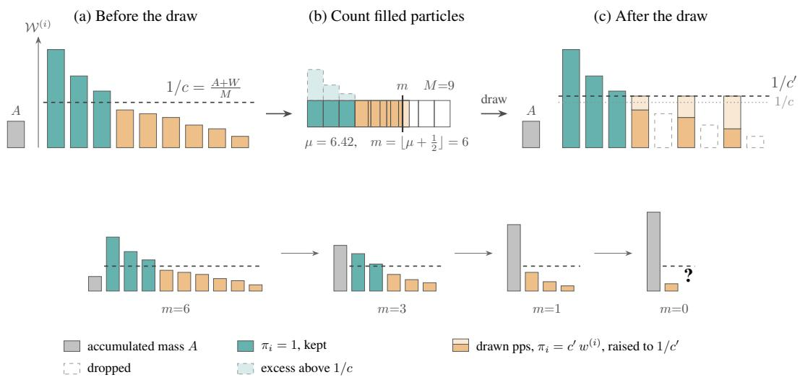  
Figure 3: One swor\_adaptive prune, left to right (top), and successive prunes at one target position (bottom). Each bar is one child particle of the pool with height its weight. The dashed line is the per-particle threshold $1 / c = \rho \big ( \tilde { A + W } \big ) / M$ (drawn at $\rho { = } 1 )$ . Panel (b) shows how each child particle fills min $( c w ^ { ( i ) }$ , 1) of one of the $M$ slots, so a child particle above the threshold counts for at most $1 / c$ of the mass however heavy, the counts sum to $\mu ,$ and the particle count $m = \lfloor \mu + { \frac { 1 } { 2 } } \rfloor$ , the nearest integer, is fixed before any randomness. In panel (c), pps then keeps exactly m particles, re-solving the constant to $c ^ { \prime } ,$ pinning the child particles above the new threshold, and drawing each remaining survivor with probability $\overline { { c ^ { \prime } w ^ { ( i ) } } }$ at the shared weight $1 / c ^ { \prime }$ , so the draw passes the twisted total through unchanged (Proposition 3.4). Bottom row: as $\bar { \boldsymbol { A } }$ grows, the pool’s bars shrink against the threshold and the particle count falls. When the pool counts for less than half a particle, a coin flip determines whether the call continues with a one-particle draw or halts.

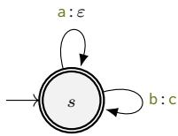  
Figure 4: The one-state transducer of the halting example. Both arcs loop on the single initial, final state, a emitting nothing and b emitting c, so a source string maps to one c for each b it contains.

$$
c = { \frac { M } { \rho \cdot ( A + W ) } } .\tag{15}
$$

Here A is the current-position running total (Fig. 1), W is the pool’s total twisted weight, and $M$ is the maximum particle count. The corresponding per-particle threshold $1 / c$ sets the twisted-weight scale for the count $\mu .$ . Thus $\rho \in ( 0 , 1 ]$ controls this count and, through $m ,$ the number of particles retained. Children below the threshold contribute in proportion to their twisted weight, while those at or above it contribute one (the dashed line of Fig. 3(a,b)). The resulting $\mu$ fixes the particle count m before sampling according to

$$
\mu = \sum _ { i = 1 } ^ { N } \mathrm { m i n } \Big ( 1 , c w ^ { ( i ) } \psi ( { \pmb x } ^ { ( i ) } ) \Big ) , \qquad m = \mathrm { m i n } \big ( M , ~ \lfloor \mu + \frac { 1 } { 2 } \rfloor \big ) .\tag{16}
$$

This replaces the calculation of Eq. (12), where the constant is solved so that the capped counts sum to the fixed particle count M. pps then keeps exactly m particles, re-solving the constant to $c ^ { \prime } ,$ so every non-pinned survivor carries the shared weight $1 \bar { / } c ^ { \prime } \ ( \mathrm { F i g . } \ 3 ( \mathrm { c } ) )$ . In the limit $\rho \to 0$ swor\_adaptive recovers the fixed-M swor prune. Under the live twist, the capped count satisfies $\mu \leq \left( M / \rho \right) W / ( A + W )$ , where $W / ( A + W )$ is the pool’s remaining live share. A source-extension iteration never increases the pool’s mass. When the pool counts for less than half a particle, $\mu < \frac { \perp } { 2 }$ a Russian roulette draw (Kahn, 1955) decides whether to empty the pool (§3.1). To also cover a position that can continue forever without adding anything to A, we replace it at position t by

$$
A _ { \epsilon , t } \stackrel { \mathrm { d e f } } { = } \operatorname* { m a x } \{ A , \epsilon \hat { Z } _ { t - 1 } \} , \qquad \hat { Z } _ { 0 } \stackrel { \mathrm { d e f } } { = } 1 , \quad \epsilon > 0 .\tag{17}
$$

This substitution applies only to the count and threshold in §3.1 and Eq. (15). The capped count µ therefore vanishes as the pool’s total live weight W vanishes relative to $A _ { \epsilon , t } .$ . The preceding estimate $\hat { Z } _ { t - 1 }$ is fixed before position t begins. The resulting particle count is therefore fixed before sampling, so the SWOR draw still preserves each weight in expectation. Fig. 3 traces one draw through panels (a) to (c), as A rises and the particle count m falls.

Proposition 3.4 (Adaptive-budget SWOR). Fix a positive integer M, a twist ψ, $\rho \in ( 0 , 1 ]$ , and $\epsilon > 0 ,$ and run beam\_swor\_adaptive using $A _ { \epsilon , t }$ from $E q .$ (17). Then (I) each prune call satisfies Eq. (13). Under the live twist $\psi = \mathrm { i } \mathsf { s \_ l i v e } , ( I I )$ thefull run halts almost surely. Consequently, under the live twist, $\mathbb { E } [ \hat { Z } _ { t } ] = \overrightarrow { p _ { \mathcal { V } } } ( y _ { \leq t } )$ at every position.

Proof. The proof is deferred to §B.2.

beam\_swor\_adaptive uses $A _ { \epsilon , t }$ and the current twisted weights to set its particle count, which can give a compute advantage at matched accuracy, as we experimentally show in Fig. 8. An ablation of the $\rho$ parameter is given in §C.

## 3.5 SMC WITH MULTINOMIAL RESAMPLING

The beam\_swor estimator (Fig. 2) keeps the full enumeration of beam\_summing and randomizes only the pruning. A standard sequential Monte Carlo (SMC) construction instead uses multinomial resampling with replacement, gated by an effective sample size test (ESS, §B), as its prune (Fig. 5). Two such algorithms complete the family of Tab. 1 and serve as the baselines of §4. First, smc\_simple (Fig. 10) is a textbook particle filter (Doucet et al., 2001; Naesseth et al., 2019) run with the precoverrestricted proposal. It collects mass only when a particle happens to draw EOS at a member prefix, and its resample duplicates heavy particles, so the pool’s M slots hold dependent repeats exactly where the weights have collapsed. Second, smc\_rb (Fig. 12) marginalizes the stop branch rather than drawing it, a Rao–Blackwellization of the stop decision. Both smc\_rb and beam\_swor use importance weighting to account for the probability mass of children left out of the pool. smc\_rb samples one live child for each particle and may resample particles with replacement. beam\_swor instead forms every live child before pruning and samples distinct survivors without replacement. §B develops both SMC baselines in full. It proves smc\_rb unbiased with the same nested induction as §3.3, after showing that its sampled extension gives each child the same expected weight as the all-child extension.

## 3.6 RELATION TO PRIOR WORK

Our SWOR prune functions combine unequal-probability sampling without replacement with Horvitz– Thompson reweighting (Horvitz & Thompson, 1952). We implement the draw using systematic pps (Madow, 1949) and the certainty-set construction from without-replacement particle-filter resampling (Fearnhead & Clifford, 2003). Conditional Poisson stochastic beam search (Meister et al., 2021) likewise samples prefixes without replacement, but its Horvitz–Thompson estimate of expectations over complete source strings requires their inclusion probabilities under the full search. We instead correct each pruning draw locally, and these expected-weight identities compose into an unbiased estimate of the precover’s total mass (Shah & Kroese, 2018). Shah & Kroese (2018) consider a fixed number of sampling stages, whereas a target-prefix call may require an unbounded number of source-extension iterations. We extend the argument to this setting while adding quotient and remainder contributions, recursing over target positions, and adapting the particle count (Theorem 3.3 and Proposition 3.4).

## 4 EXPERIMENTS

Unbiasedness, criterion (i) of §3, is established in §3. We measure the bias of beam-summing estimates computed with prune and the variance of the unbiased estimates on paragraphs from WikiText-

--smc\_rbbeam\_swor  
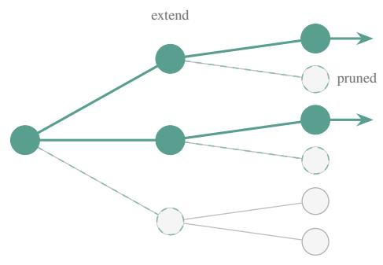

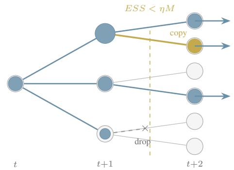  
(a) All-child extension followed by SWOR pruning (b) Sampled extension followed by ESS-triggered (beam\_swor, beam\_swor\_adaptive). multinomial resampling (smc\_simple, smc\_rb).

Figure 5: Two ways to maintain a bounded particle pool. Dashed rings in (a) mark children removed by pruning. In (b), the cross marks a dropped particle and orange marks a duplicate. Grey edges show unexplored branches. Dot size shows weight.  
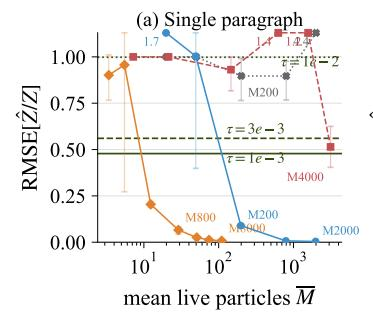  
beam\_summing (τ) …… smc\_simple

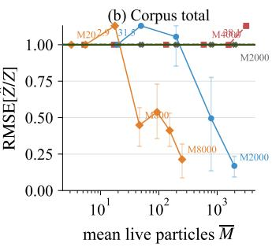

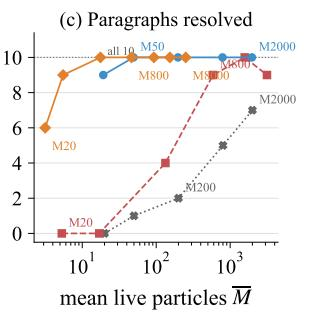  
\_ \_ ( = 0.1)  
Figure 6: Unbiased methods versus beam summing with prune on the $p _ { \mathsf { b i g r a m } } \circ \mathsf { f } _ { \mathrm { p t b } }$ TLM, compared with exact probabilities. Panels (a) and (b) plot relative root-mean-square error RMSE $[ { \hat { Z } } / Z ] ;$ (a) a single example paragraph and (b) the ten-paragraph corpus total, both against the mean live particle count. Labels give the maximum particle count M. Bars give 95% bootstrap intervals. Panel (c) counts the paragraphs each method resolves, capturing at least 5% of a paragraph’s mass.

2 (Merity et al., 2017) in §4.1, confirming that variance decreases as the number of particles grows, criterion (ii). §4.2 shows that running time can be controlled at the cost of variance, criterion (iii).

On a DNA-to-amino-acid transduction whose precover grows exponentially, §4.3 shows that beam\_summing run with prune gets prohibitively slow after a dozen amino acids, while beam\_swor\_adaptive reaches position 200 in about five seconds. Finally, §4.5 revalidates a published psycholinguistic analysis (Kiegeland et al., 2026) by running beam summing with swor\_adaptive rather than the biased pruning function prune .

Estimators. We evaluate the four unbiased methods smc\_simple, smc\_rb, beam\_swor, and beam\_swor\_adaptive (Fig. 2 and §3.5), against the prior work’s beam summing, beam\_summing with the mass prune prune (Fig. 1). Every setting uses the live twist is\_live. The comparison in §4.4 separates the effect of marginalizing the EOS decision rather than sampling it (smc\_simple versus smc\_rb) from the combined change to extending every live child and pruning without replacement (smc\_rb versus beam\_swor).

Reporting. Over S seeds we report the log of the averaged estimate, $\begin{array} { r } { \log \left( \frac { 1 } { S } \sum _ { s = 1 } ^ { S } \hat { Z } _ { s } \right) } \end{array}$ . Each seed’s $\hat { Z } _ { s }$ is unbiased for $Z ,$ so the average is unbiased as well, and its log estimates log $Z .$ Averaging in the other order, $\frac { 1 } { S } \sum _ { s } \log \hat { Z } _ { s }$ , would estimate E[log Zˆ] instead, and log is concave, so by Jensen’s inequality E[log $\hat { Z } ] \leq \log \mathbb { E } [ \hat { Z } ] = \log Z .$ , a downward bias. We report between-seed standard deviations alongside method comparisons. We report particle counts as the mean number of live particles.

## 4.1 BYTE-TO-WORD TRANSDUCTION ON REAL TEXT

The Penn Treebank (PTB) tokenizer segments raw text into PTB units, for example splitting !!! into three successive ! units (Marcus et al., 1993). Following Snæbjarnarson et al. (2026); Kiegeland et al. (2026), we write $\mathsf { f } _ { \mathrm { p t b } }$ for a transducer encoding these rules and evaluate it on ten WikiText-2 paragraphs. We now measure what the bias correction changes in this setting using a bigram model. The source model $p _ { \mathsf { b i g r a m } }$ is a smoothed byte-level bigram model trained on the WikiText-2-raw train split and evaluated on the test paragraphs.4

We calculate the exact target prefix probabilities by composing $\mathsf { f } _ { \mathrm { p t b } }$ with the weighted finite-state representation of $p _ { \mathsf { b i g r a m } } .$ . Standard forward and backward path sums in the resulting automaton give the per-position values, as described in §D.

Results are shown in Fig. 6, using the relative root-mean-square error across seeds, $\mathrm { R M S E } [ \hat { Z } / Z ] =$ $\begin{array} { r l } {  { \surd S ^ { - 1 } \sum _ { s = 1 } ^ { S } ( \hat { Z } _ { s } / Z - 1 ) ^ { 2 } } } \end{array}$ , as a function of the mean live particle count. On the single paragraph, threshold-pruned beam summing has error floors from 0.48 at the lowest threshold to 1.0 at the harsh est. On the corpus, its error remains close to 1. The with-replacement samplers are unbiased, but their corpus error remains near 1 even with thousands of particles. beam\_swor and beam\_swor\_adaptive drive the corpus error down to 0.17 and 0.21 at their largest tested M values, between-seed standard deviations $5 7 \times$ and 49× below smc\_simple’s (Tab. 2). Panel (c) shows they resolve most paragraphs where smc\_rb needs M in the thousands to do so and smc\_simple never resolves the full corpus. §G shows the comparison at every position of all ten paragraphs. The unbiased methods track the exact ratio closely, while beam\_summing with prune falls below it when pruning discards covering mass.

GPT-2 on PTB. We also run $\mathsf { f } _ { \mathrm { p t b } }$ with GPT-2 large, $p _ { \mathtt { g p t } 2 }$ (Radford et al., 2019). Exact target prefix probabilities are unavailable for GPT-2 on the WikiText paragraphs, so we report between-seed variance and convergence as M grows and compare with the threshold-pruned lower bound. The estimates in Fig. 7 are shown for smc\_rb, the lowest-variance method with replacement, and beam\_swor\_adaptive, the lowest-variance method without replacement (Tab. 2), along with the lower bound at $\tau = 1 0 ^ { - 3 }$ . At the largest tested value of $M ,$ the two agree within 0.5 nats on the paragraph. On the corpus, smc\_rb remains 4.7 nats below the beam\_swor\_adaptive plateau, which is reached at a much smaller mean live particle count. Tab. 4 reports estimates for each of the ten paragraphs. The threshold-pruned estimate lies below the beam\_swor\_adaptive estimate on every paragraph, by 0.24 to $7 . 7$ nats and 33.4 nats in total. The between-seed standard deviation of beam\_swor\_adaptive is smaller than this gap on every paragraph and at least an order of magnitude smaller on five of ten.

## 4.2 COMPARING COMPUTE–VARIANCE FRONTIERS

We compare the estimators against walltime in Fig. $8 . ^ { 5 }$ With the $p _ { \mathsf { b i g r a m } }$ source, there is no GPU overhead, and with $p _ { \mathtt { g p t } 2 }$ the walltime includes the source model’s forward passes. On $p _ { \mathtt { g p t 2 } } \circ \mathsf { f } _ { \mathtt { p t b } } ,$ beam\_swor\_adaptive at nominal M=200 takes 772 seconds, compared with 1224 seconds for beam\_summing with prune . The M=800 point of Tab. 4 takes $1 . 5 \times$ as long as that baseline. Under both source models, the beam\_swor\_adaptive frontier dominates both SMC baselines. On the bigram, at effectively matched between-seed standard deviation (0.36 against 0.35 nats), beam\_swor\_adaptive is four times faster than beam\_swor (346 against 1390 seconds) and uses fewer live particles (153 against 789). At matched walltime, its standard deviation is nearly three times lower (0.36 against 0.98 nats). With $\rho { = } 0 .$ 1 at nominal $M { = } 2 0 0 0$ , 149 seeds give a standard de viation of 0.163 nats (95% CI [0.146, 0.184]), consistent with the 0.170 nats of fixed-M beam\_swor at about one fifth of its CPU time (§C). The parameter $\rho$ of beam\_swor\_adaptive is swept in $\ S C$

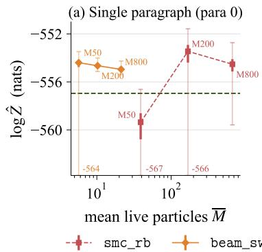

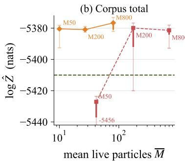

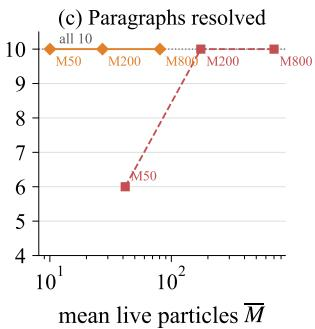  
\_ \_ \_ ( = 0.1) \_ reference $( \tau = 1 0 ^ { - 3 } )$

Figure 7: GPT-2-large transduced with $\mathsf { f } _ { \mathrm { p t b } }$ . Panels (a) and (b) plot the estimates log $\hat { Z }$ in nats against the mean live particle count. Labels give the maximum particle count M. Each point is $\begin{array} { r } { \log \left( 8 ^ { - 1 } \sum _ { s = 1 } ^ { 8 } \hat { Z } _ { s } \right) } \end{array}$ , with a failed run contributing $\hat { Z } _ { s } = 0 .$ . Thick bars give 95% bootstrap intervals, thin whiskers span the finite per-run log estimates, and clipped minima are printed at the lower edge. The dashed line is the threshold-pruned lower bound at $\tau { = } 1 0 ^ { - 3 }$ . The two algorithms appear to converge to a common value. The lower bound is 2.0 nats below this value on the paragraph and approximately 33 nats below it on the corpus. Panel (c) counts the paragraphs on which each method recovers at least the lower bound’s mass.

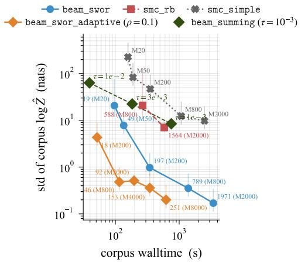  
(a) pbigram

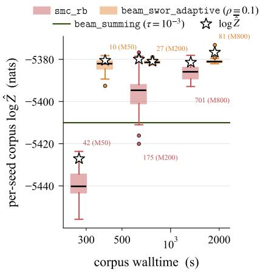  
(b) $p _ { \mathtt { g p t 2 } }$  
Figure 8: Accuracy–walltime comparisons. (a) For $p _ { \mathsf { b i g r a m } } ,$ where exact target prefix probabilities are available, the between-seed standard deviation of the corpus log-estimate against per-seed corpus walltime. Annotations in both panels give the mean live particle count, with the maximum particle count M in parentheses. The beam\_summing lines using prune report bias relative to the exact values, and bars give the 95% confidence interval of each standard deviation. (b) For $p _ { \mathtt { g p t } 2 }$ , where exact target prefix probabilities are unavailable, the finite per-seed corpus log-estimates over 32 seeds. Boxes span the interquartile range with whiskers at 1.5 IQR and seeds beyond them drawn as dots, and the black bar marks the median seed. The star marks the pooled estimate log ${ \overline { { \hat { Z } } } } .$ , the log of the seed-averaged ${ \hat { Z } } ,$ computed from all 32 seeds with a failed run contributing $\hat { Z } = 0$ . Because the pooled estimate averages Zˆ before taking the logarithm, occasional high estimates can make it larger than the median per-seed estimate. The beam\_summing line shows its corpus total at prune .

\_ \_ ( = 0.1) \_ ( = 10 3)

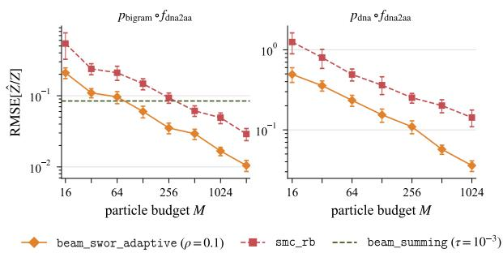  
(a) Validation against exact values.

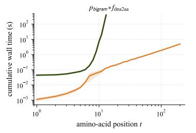  
(b) Cumulative walltime per amino acid.  
Figure 9: DNA-to-amino-acid results. (a) Relative RMSE against exact values over 64 seeds and three targets, with 95% bootstrap intervals. The error of beam\_swor\_adaptive decreases faster with M than that of smc\_rb, while beam\_summing with prune has fixed error. (b) Cumulative walltime for the bigram model. beam\_summing with prune exceeds five minutes at position 13, while beam\_swor\_adaptive $( \rho { = } 0 . 1 , M { = } 2 5 6 )$ reaches position 200 in about five seconds.

## 4.3 TRANSDUCING DNA LANGUAGE MODELS

The DNA→amino-acid map $f _ { \mathrm { d n a 2 a a } }$ maps DNA strings over a four-letter alphabet to amino-acid strings. Combined with a high-entropy source model, it gives the setting where materializing the precover is most costly in our experiments. Each amino acid is the image of several source codons, and the high-entropy model places non-negligible mass on all of them, so the set of source strings an exhaustive method must track multiplies for each added symbol. We train a bigram model on the DNA training corpus, and use $p _ { \mathtt { d n a } }$ , a GPT-2 model trained on human DNA, the same model used by Snæbjarnarson et al. (2026). Fig. 9a compares both DNA models with exact target prefix probabilities obtained by brute-force enumeration of the precover. In both the validation and scaling comparisons, beam\_summing uses prune with $\tau = 1 0 ^ { - 3 }$

Fig. 9b shows the running time of beam\_summing with prune growing rapidly within a dozen amino acids, while beam\_swor\_adaptive scales approximately linearly. §E gives a uniform-source worst case for beam\_summing with prune $M \cdot$ Its captured mass ratio vanishes exponentially in the target length, while smc\_simple, smc\_rb, and fixed-M beam\_swor are exact for any M.

## 4.4 VARIANCE ACROSS ESTIMATORS

Tab. 2 compares the four unbiased estimators across the three transductions. Marginalizing the EOS decision rather than sampling it (smc\_simple versus smc\_rb) reduces variance only modestly. The large reduction in every setting occurs between smc\_rb and beam\_swor, which changes both the extension to every live child and the pruning to sampling without replacement. Compared to beam\_swor, beam\_swor\_adaptive achieves comparable variance with less computation on the bigram corpus, lower variance on GPT-2, and identical results on DNA, where swor\_adaptive retains the same number of particles as swor (Tab. 2 and Fig. 8).

Table 2: Between-seed standard deviation, in nats, of each estimator’s log probability estimate log ${ \hat { Z } } .$ The columns report the ten-paragraph WikiText-2 total for the bigram model, the first WikiText-2 paragraph for GPT-2, and the amino-acid target for DNA. Reported values use eight seeds and maximum particle counts of 2000, 200, and 256, respectively, except beam\_swor\_adaptive on the bigram (M=8000, mean live count 251). The smc\_simple GPT-2 run covered only 120/850 bytes.
<table><tr><td>Algorithm</td><td> $p _ { \mathsf { b i g r a m } } \circ \mathsf { f } _ { \mathsf { p t b } }$ </td><td> $p _ { \mathrm { g p t } 2 } \circ \mathsf { f } _ { \mathrm { p t b } }$ </td><td> $p _ { \mathsf { b i g r a m } } \circ \mathsf { f _ { d n a 2 a a } }$ </td></tr><tr><td>smc_simple</td><td>9.78</td><td></td><td>0.111</td></tr><tr><td>smc_rb</td><td>7.86</td><td>3.23</td><td>0.107</td></tr><tr><td>beam_swor</td><td>0.170</td><td>0.395</td><td>0.062</td></tr><tr><td>beam_swor_adaptive  $( \rho { = } 0 . 1 )$ </td><td>0.200</td><td>0.199</td><td>0.062</td></tr></table>

## 4.5 PSYCHOLINGUISTICS: SURPRISAL FOR READING-TIME PREDICTION

Surprisal theory hypothesizes that processing time increases with contextual surprisal, the negative log probability of a linguistic unit in context. Kiegeland et al. (2026) test this hypothesis on the MECO eye-tracking corpus (Siegelman et al., 2022), computing contextual surprisal from GPT-2 Small through transducers for PTB words, whitespace-delimited words, and characters. The surprisals come from the per-position beam-summing estimate of Snæbjarnarson et al. (2026), computed with pruneτ. Each next-unit probability is estimated by the ratio $\hat { Z } _ { t } / \hat { Z } _ { t - 1 }$ . Pruning lowers both estimates, but it can remove different fractions of their mass, so the ratio and resulting surprisal can err in either direction.

Beam summing with prune gives no way to determine how the resulting bias affects these conclusions. We therefore replace prune with unbiased SWOR pruning, recompute the PTB-word contextual surprisals, and rerun the corresponding fits. The resulting estimate of corpus surprisal is 106 nats lower than the original. We evaluate first-fixation duration, gaze duration, and total reading time. These are, respectively, the duration of the first fixation on a word, the sum of its first-pass fixations, and the sum of all its fixations including refixations. For each measure, ∆LL is the per-observation improvement in held-out log likelihood from adding contextual surprisal to the shared baseline.

For each reading-time measure, we compare fits using contextual surprisal computed by beam summing with either prune or swor\_adaptive. The model specification, evaluation protocol, and beam-based unigram-surprisal control of Kiegeland et al. (2026) are unchanged (Tab. 3; details in §F). We find no evidence of a predictive difference between the two fits on any reading-time measure (onesided $p \geq 0 . 0 6 8$ in both directions). Under either estimator, adding contextual surprisal computed over PTB words improves held-out prediction for all three reading-time measures (Tab. 3). Thus, replacing prune with swor\_adaptive in beam summing leaves the published conclusions unchanged.

## 5 CONCLUSION

In the beam-summing method of Snæbjarnarson et al. (2026), the threshold prune is the only approximation, discarding mass to control the computation. This work replaces that prune with a weight-proportional draw without replacement and Horvitz–Thompson reweighting while retaining the enumeration and the per-position estimate. beam\_swor\_adaptive uses the current-position running total to set its particle count. Its roulette rule ensures that the run halts almost surely. The resulting estimator is unbiased and replaces unknown pruning error with sampling variance. The method applies to target prefix probability estimation for a pretrained source model composed with a deterministic transformation, providing an unbiased reference for estimating threshold-pruning error. In the DNA→amino-acid setting, it also makes target prefix probability estimation feasible for longer targets over high-entropy sources.

## ACKNOWLEDGEMENTS

VS is supported by DNRF grant P1 and NNF grant NNF26OC0114089.

## REFERENCES

Nicolas Chopin and Omiros Papaspiliopoulos. An Introduction to Sequential Monte Carlo. Springer Series in Statistics. Springer, 2020. doi: 10.1007/978-3-030-47845-2. URL https://doi.org/ 10.1007/978-3-030-47845-2.

Table 3: Predictive contribution of PTB-word contextual surprisal on MECO. Values are ∆LL in $1 0 ^ { - 3 }$ nats. For swor\_adaptive, we use $\rho { = } 0 . 1$ , nominal $M { = } 8 0 0 0$ , and 10 seeds. $^ { * } p < 0 . 0 5 ; ^ { * * } p < 0 . 0 1$ $^ { * * * } p < 0 . 0 0 1$
<table><tr><td></td><td></td><td></td><td>Pruning function First fixation Gaze duration Total reading time</td></tr><tr><td>swor_adaptive</td><td> $0 . 7 6 ^ { * * }$ </td><td> $2 . 0 5 ^ { * * * }$ </td><td> $3 . 2 6 ^ { * * * }$ </td></tr><tr><td>prune</td><td> $0 . 8 1 ^ { * * }$ </td><td> $2 . 1 3 ^ { * * * }$ </td><td> $3 . 2 4 ^ { * * * }$ </td></tr></table>

Ryan Cotterell, Anej Svete, Clara Meister, Tianyu Liu, and Li Du. Formal aspects of language modeling, 2024. URL https://arxiv.org/abs/2311.04329.

Pierre Del Moral, Arnaud Doucet, and Ajay Jasra. Sequential Monte Carlo samplers. Journal of the Royal Statistical Society: Series B (Statistical Methodology), 68(3):411–436, 2006. doi: 10.1111/j. 1467-9868.2006.00553.x. URL https://doi.org/10.1111/j.1467-9868.2006.00553.x.

Arnaud Doucet, Nando de Freitas, and Neil J. Gordon (eds.). Sequential Monte Carlo Methods in Practice. Statistics for Engineering and Information Science. Springer, 2001. ISBN 978-1-4419-2887-0. doi: 10.1007/978-1-4757-3437-9. URL https://doi.org/10.1007/978-1-4757-3437-9.

Paul Fearnhead and Peter Clifford. On-line inference for hidden Markov models via particle filters. Journal ofthe Royal Statistical Society: Series B (Statistical Methodology), 65(4):887–899, 2003. doi: 10.1111/1467-9868.00421. URL https://doi.org/10.1111/1467-9868.00421.

Jeremy Heng, Adrian N. Bishop, George Deligiannidis, and Arnaud Doucet. Controlled Sequential Monte Carlo. The Annals ofStatistics, 48(5):2904–2929, 2020. doi: 10.1214/19-AOS1914. URL https://doi.org/10.1214/19-AOS1914.

D. G. Horvitz and D. J. Thompson. A generalization of sampling without replacement from a finite universe. Journal of the American Statistical Association, 47(260):663–685, 1952. doi: 10.1080/01621459.1952.10483446. URL http://www.jstor.org/stable/2280784.

Daniel Jurafsky and James H. Martin. Speech and Language Processing: An Introduction to Natural Language Processing, Computational Linguistics, and Speech Recognition with Language Models. 3rd edition, 2026. URL https://web.stanford.edu/\~jurafsky/slp3/. Online manuscript released August 19, 2026.

Herman Kahn. Use of different Monte Carlo sampling techniques. Paper P-766, RAND Corporation, Santa Monica, CA, 1955. URL https://www.rand.org/pubs/papers/P766.html.

Samuel Kiegeland, Vésteinn Snæbjarnarson, Tim Vieira, and Ryan Cotterell. On the proper treatment of units in surprisal theory. In Proceedings of the 64th Annual Meeting of the Association for Computational Linguistics (Volume 1: Long Papers), pp. 32202–32224, 2026. doi: 10.18653/v1/ 2026.acl-long.1485. URL https://aclanthology.org/2026.acl-long.1485/. Oral.

William G. Madow. On the theory of systematic sampling, II. The Annals ofMathematical Statistics, 20(3):333–354, 1949. doi: 10.1214/aoms/1177729988. URL https://doi.org/10.1214/aoms/ 1177729988.

Mitchell P. Marcus, Beatrice Santorini, and Mary Ann Marcinkiewicz. Building a large annotated corpus of English: The Penn Treebank. Computational Linguistics, 1993. URL https:// aclanthology.org/J93-2004/.

Clara Meister, Afra Amini, Tim Vieira, and Ryan Cotterell. Conditional Poisson stochastic beams. In Proceedings of the 2021 Conference on Empirical Methods in Natural Language Processing (EMNLP), pp. 664–681, 2021. doi: 10.18653/v1/2021.emnlp-main.52. URL https://aclanthology.org/2021.emnlp-main.52.

Stephen Merity, Caiming Xiong, James Bradbury, and Richard Socher. Pointer Sentinel Mixture Models. In International Conference on Learning Representations, 2017. URL https: //openreview.net/forum?id=Byj72udxe.

Mehryar Mohri. Weighted Automata Algorithms, pp. 213–254. Springer Berlin Heidelberg, 2009. ISBN 978-3-642-01492-5. doi: 10.1007/978-3-642-01492-5\_6. URL https://doi.org/10. 1007/978-3-642-01492-5\_6.

Christian A. Naesseth, Fredrik Lindsten, and Thomas B. Schön. Elements of sequential Monte Carlo. Foundations and Trends in Machine Learning, 12(3):187–306, 2019. doi: 10.1561/2200000074. URL https://doi.org/10.1561/2200000074.

Alec Radford, Jeffrey Wu, Rewon Child, David Luan, Dario Amodei, and Ilya Sutskever. Language Models are Unsupervised Multitask Learners. OpenAI blog, 1(8), 2019. URL https://cdn.openai.com/better-language-models/language\_models\_are\_ unsupervised\_multitask\_learners.pdf.

Rohan Shah and Dirk P. Kroese. Without-replacement sampling for particle methods on finite state spaces. Statistics and Computing, 28(3):633–652, May 2018. ISSN 1573-1375. doi: 10.1007/s11222-017-9752-8. URL https://doi.org/10.1007/s11222-017-9752-8.

Noam Siegelman, Sascha Schroeder, Cengiz Acartürk, Hee-Don Ahn, Svetlana Alexeeva, Simona Amenta, Raymond Bertram, Rolando Bonandrini, Marc Brysbaert, Daria Chernova, et al. Expanding horizons of cross-linguistic research on reading: The Multilingual Eye-movement Corpus (MECO). Behavior Research Methods, 54(6), 2022. URL https://link.springer.com/ article/10.3758/s13428-021-01772-6.

Vésteinn Snæbjarnarson, Samuel Kiegeland, Tianyu Liu, Reda Boumasmoud, Tim Vieira, and Ryan Cotterell. Transducing language models. In Proceedings of The Fourteenth International Conference on Learning Representations, 2026. URL https://openreview.net/forum?id= qOyF214xmg.

Tim Vieira, Benjamin Lebrun, Mario Giulianelli, Juan Luis Gastaldi, Brian Dusell, John Terilla, Timothy J. O’Donnell, and Ryan Cotterell. From language models over tokens to language models over characters. In Aarti Singh, Maryam Fazel, Daniel Hsu, Simon Lacoste-Julien, Felix Berkenkamp, Tegan Maharaj, Kiri Wagstaff, and Jerry Zhu (eds.), Proceedings of the 42nd International Conference on Machine Learning, volume 267 of Proceedings of Machine Learning Research, pp. 61391–61412. PMLR, 13–19 Jul 2025. URL https://proceedings.mlr.press/ v267/vieira25a.html.

Nick Whiteley and Anthony Lee. Twisted particle filters. The Annals ofStatistics, 42(1):115–141, 2014. doi: 10.1214/13-AOS1167. URL https://doi.org/10.1214/13-AOS1167.

Stephen Zhao, Rob Brekelmans, Alireza Makhzani, and Roger Grosse. Probabilistic Inference in Language Models via Twisted Sequential Monte Carlo. In Proceedings of the 41st International Conference on Machine Learning, ICML’24, pp. 60704–60748, 2024. URL https://proceedings.mlr.press/v235/zhao24c.html.

## CONTENTS OF THE APPENDIX

A Notation Glossary 19   
B Sequential Monte Carlo over the Precover 20   
B.1 Proofs for the SWOR Estimator 20   
B.2 Proof for Adaptive-Budget SWOR 22   
B.3 Sequential Monte Carlo . 24   
B.4 Intermediate Targets and the smc\_rb Algorithm 25   
B.5 Unbiasedness of smc\_rb 27   
B.6 A Common Tail-Roulette Prune 28   
C Sensitivity to Pruning Parameters 29   
D Exact Ground Truth for Bigram Models 30   
E The Genetic-Code Worst Case 30   
F Details of the MECO Rerun 31   
G Additional Byte-to-Word Results 32

## A NOTATION GLOSSARY

<table><tr><td>Notation</td><td>Gloss</td></tr><tr><td>ε  $\operatorname { E O S }$   $x , x ^ { \prime } \in \mathcal { X }$   $\ b { x } , \ b { x } ^ { \prime } \in \ b { \mathcal { X } } ^ { \ast }$   $\mathcal { X } ^ { \ast }$   $\scriptstyle { \pmb x } { \pmb x } ^ { \prime }$   $y \in \mathcal { V }$   $y \in \mathcal { V } ^ { * }$   ${ \mathcal { V } } ^ { * }$   $f \colon \mathcal { X } ^ { * } \to \mathcal { Y } ^ { * }$  f</td><td>Empty string End-of-string symbol Symbols in the source alphabet  $\mathcal { X }$  Source strings Set of all source strings Concatenation Symbols in the target alphabet  $\mathcal { V }$  Target strings, with  $\mathbf { \boldsymbol { y } } _ { \le t }$  the length-t target prefix Set of all target strings Functional string-to-string transformation</td></tr><tr><td> $\boldsymbol { x } \preceq \boldsymbol { x } ^ { \prime }$   $\langle x \rangle$   $\mathrm { p f } ( Z )$   $\mathcal { P } ( y )$   $\mathcal { C } ( y )$ </td><td>Transducer implementing f x is a prefix of  $\mathbf { x } ^ { \prime }$   $\mathrm { C y }$  linder spanned by  $x , \mathrm { i . e . } x \mathcal { X } ^ { \ast }$  Prefix-free operation on  $Z \left( \ S 2 . 1 \right)$  Precover of y:  $\{ x : y \preceq f ( x ) \} \left( \operatorname { E q . } \left( 4 \right) \right)$  Largest union of cylinders contained in  $\mathcal { P } ( y )$  Quotient: prefix-free generators of  $\mathcal { C } ( y )$ </td></tr><tr><td> $\mathcal { Q } ( y )$   $\mathcal { R } ( y )$   $p _ { \cdot \cdot }$   $\overrightarrow { p x } ( x )$   $\overrightarrow { p x } ( x ^ { \prime } \mid x )$ </td><td>Remainder:  ${ \mathcal { P } } ( y ) \backslash { \mathcal { C } } ( y )$  Source language model over  $\mathcal { X } ^ { \ast }$  Source prefix probability Conditional next-symbol prefix probability</td></tr><tr><td> ${ \overrightarrow { p _ { \mathcal { X } } } } ( \cos \mid x )$   $p _ { \mathbb { Y } }$ </td><td>Source stop probability Transduced (target) language model</td></tr><tr><td></td><td></td></tr><tr><td></td><td></td></tr><tr><td></td><td></td></tr><tr><td></td><td></td></tr><tr><td></td><td></td></tr><tr><td></td><td></td></tr><tr><td></td><td></td></tr><tr><td></td><td></td></tr><tr><td></td><td></td></tr><tr><td> $\overrightarrow { p _ { 3 } } ( y )$ </td><td>Target prefix probability, the normalizing constant</td></tr><tr><td></td><td></td></tr><tr><td></td><td>(Eq. (26))</td></tr><tr><td></td><td></td></tr><tr><td> $\mathsf { i s \_ m e m b e r } ( x , y )$ </td><td> $x \in { \mathcal { P } } ( y ) ;$  the output emitted covers y</td></tr><tr><td> $\mathrm { i } s \_ \mathsf { c y l i n d e r } ( x , y )$ </td><td></td></tr><tr><td> $\mathrm { i } s \_ \mathrm { l i v e } ( x , y )$ </td><td> $\langle { \pmb x } \rangle \subseteq { \mathcal { P } } ( { \boldsymbol y } )$  every extension covers y</td></tr><tr><td> $\scriptstyle A ( x )$ </td><td>Some extension of x covers y</td></tr><tr><td></td><td>Live set: live next source symbols  $\{ x ^ { \prime } \in \mathcal { X } : \mathrm { i } \mathsf { s \_ l i v e } ( x x ^ { \prime } , y ) \}$ </td></tr><tr><td>M</td><td></td></tr><tr><td> $\{ ( \boldsymbol { x } ^ { ( m ) } , \boldsymbol { w } ^ { ( m ) } ) \} _ { m = 1 } ^ { M }$ </td><td>Fixed or maximum particle count</td></tr><tr><td> $\boldsymbol { w } ^ { ( m ) }$ </td><td>Particle pool: source prefixes and their weights</td></tr><tr><td></td><td>Particle weight</td></tr><tr><td> $w _ { 0 } ^ { ( m ) }$ </td><td></td></tr><tr><td> $\hat { Z }$ </td><td>Reference weight inherited by particle m under tail roulette (§B.6)</td></tr><tr><td></td><td>Prefix-probability estimate</td></tr><tr><td> $\psi ^ { * } ( x ) , \psi _ { t } ^ { * } ( x )$ </td><td>Optimal twist of x, relative to  $y \mathrm { ~ o r ~ } y _ { \le t }$ </td></tr><tr><td> $\lambda _ { t } ( x )$ </td><td>Twisted live mass,  $\begin{array} { r } { \sum _ { x ^ { \prime } \in A ( x ) } \breve { p _ { \mathcal X } } ( x ^ { \prime } \mid \overline { { \mathbf { \Lambda } } } x ) \psi _ { t } ( x x ^ { \prime } ) } \end{array}$ </td></tr><tr><td> $\nu _ { t } ( x )$ </td><td>Proposal normalizer,  $\parallel \left\{ { \mathrm { i } s } _ { - } \mathfrak { m e m b e r } ( x , y _ { \le t } ) \right\} \overrightarrow { p _ { \mathscr { X } } } ( \mathrm { E O S } \mathrm { ~  ~ \Omega ~ } | \mathrm { ~  ~ \Omega ~ } x ) \mathrm { ~ + ~ }$ </td></tr><tr><td></td><td> $\textstyle \sum _ { x ^ { \prime \prime } \in A ( x ) } { \overrightarrow { p _ { \mathcal { X } } } } ( x ^ { \prime \prime } \mid x ) \dot { \psi _ { t } } ( x x ^ { \prime \prime } )$ </td></tr><tr><td> $\mathrm { E S S } , ~ \eta$ </td><td>Effective sample size (Eq. (30)), resample when  $\mathrm { E S S } < \eta M$ </td></tr><tr><td> $\tau$ </td><td>Prior work&#x27;s prune threshold, keep  $\geq 1 - \tau$  of the pool&#x27;s mass</td></tr><tr><td> $A$ </td><td></td></tr><tr><td></td><td>Current-position running total, returned as  $\hat { Z } _ { t }$ </td></tr><tr><td> $\epsilon$ </td><td>Halting constant</td></tr><tr><td> $\rho$ </td><td>Scales swor_adaptive&#x27;s threshold  $1 / c$ </td></tr><tr><td> $\kappa$ </td><td>Tail-roulette threshold relative to wo  $( \ S \mathbf { B } . 6 )$ </td></tr><tr><td></td><td></td></tr><tr><td> $\kappa$ </td><td></td></tr><tr><td></td><td>Certainty set: child particles pinned to  $\pi _ { i } = 1$ </td></tr><tr><td> $s$ </td><td></td></tr><tr><td></td><td>Sampled child set, of size M or m</td></tr><tr><td></td><td></td></tr><tr><td></td><td></td></tr><tr><td></td><td></td></tr><tr><td></td><td></td></tr><tr><td></td><td></td></tr><tr><td></td><td></td></tr><tr><td></td><td></td></tr><tr><td></td><td></td></tr><tr><td></td><td></td></tr><tr><td></td><td></td></tr><tr><td> $w ^ { ( i ) } / \pi _ { i }$ </td><td></td></tr><tr><td></td><td></td></tr><tr><td></td><td></td></tr><tr><td></td><td></td></tr><tr><td></td><td></td></tr><tr><td></td><td></td></tr><tr><td></td><td></td></tr><tr><td></td><td></td></tr></table>

Notation conventions. Color encodes domain: magenta for source-domain objects (x, X, P, Q, R) and olive for target-domain objects $( y , \mathcal { V } , f )$ . Font encodes type: lowercase italic for symbols $( x , y )$ , bold italic for strings $( x , y ) .$ calligraphic for sets and alphabets $( \mathcal { X } , \mathcal { Y } , \mathcal { P } , \mathcal { Q } , \dot { \mathcal { R } } )$ , and typewriter for the transducer (f) and for algorithm and predicate names (is\_member, is\_cylinder, is\_live, smc\_simple, resample). The overrightarrow $\xrightarrow [ \cdot ] { }$ marks prefix probabilities $( \overrightarrow { p _ { \mathscr { X } } }$ is the prefix probability of $p _ { \mathcal { X } } )$

86 def smc\_simple $( \vec { q } , \phi , M )$ : 100 def resample(P):   
87 R ← ∅ 101 if |P| = 0: return ∅   
88 $\begin{array} { r } { \mathcal { P }  ( [ \varepsilon , \frac { 1 } { M } ] ) _ { m = 1 } ^ { M } } \end{array}$ 102 $\begin{array} { r } { \mathbf { i f } \ \dot { \mathrm { E S S } } ( \mathcal { P } ) \geq \eta | \mathcal { P } | \colon } \end{array}$   
89 while $\left| { \mathcal { P } } \right| > 0 { : }$ 103 return $\smash { \dot { \mathcal { P } } _ { : , 1 } }$   
90 ${ \mathcal { P } } ^ { \prime }  { \dot { \varnothing } }$ 104 $j _ { 1 } , \ldots , j _ { | \mathcal { P } | } \stackrel { \mathrm { i . i . d . } } { \sim }$ Categorical $( w ^ { ( i ) } / \sum _ { i } w ^ { ( i ) } )$   
91 for $( { \boldsymbol { x } } , { \boldsymbol { w } } ) \in { \mathcal { P } } \colon$ 105 return $\begin{array} { r } { \{ ( { \boldsymbol { x } } ^ { ( j _ { k } ) } , \sum _ { i } { \boldsymbol { w } } ^ { ( i ) } / | \mathcal { P } | ) \} _ { k = 1 } ^ { | \mathcal { P } | } } \end{array}$   
92 sample $x ^ { \prime } \sim \overrightarrow { q } ( \cdot \mid x )$   
93 w $\dot {  } , w \cdot \overrightarrow { p _ { \mathcal { X } } } ( x ^ { ' } \mid \dot { x } ) / \overrightarrow { q } ( x ^ { \prime } \mid x )$   
94 if x′ = EOS:   
95 R.add $( ( x , w \cdot \phi ( x ) ) )$   
96 else:   
97 P′.add((xx′, w))   
98 P ← resample(P′)   
99 return $\textstyle \sum _ { ( x , w ) \in { \mathcal { R } } } w$

Figure 10: A minimal sequential Monte Carlo algorithm for estimating $Z \left( \mathrm { E q . } \left( 2 6 \right) \right)$ . M particles extend one symbol at a time under the proposal, with the incremental weights of Eq. (27), finish with the potential factor at EOS, and hand uneven weights to resample. resample is an ESS-gated multinomial resample (Eq. (30)) that samples with replacement and resets weights to their mean.

## B SEQUENTIAL MONTE CARLO OVER THE PRECOVER

This appendix first gives the proofs deferred from the main text (§§ B.1 and B.2). It then develops the with-replacement SMC algorithms for estimating the total mass of the precover, including the generic estimator and its resampling (§B.3), the intermediate targets and the smc\_rb algorithm (§B.4), and the unbiasedness of smc\_rb (§B.5). Finally, it gives the common tail-roulette prune for the fixed-M methods (§B.6).

## B.1 PROOFS FOR THE SWOR ESTIMATOR

Lemma 3.1 (A backward recursion for the optimal twist). The optimal twist $\psi ^ { * }$ ofEq. (7) (relative to y) satisfies the backward recursion

$$
\psi ^ { * } ( x ) = \left\{ \begin{array} { l l } { \displaystyle 1 \qquad \quad } & { i f \mathrm { i } s \mathrm { _ - c y l i n d e r } ( x , y ) } \\ { \displaystyle 1 \big \{ \mathrm { i } s \mathrm { _ - m e m b e r } ( x , y ) \big \} \overrightarrow { p _ { \chi } } \big ( \mathrm { E o s } \mid x \big ) } & { o t h e r w i s e } \\ { \displaystyle \qquad + \sum _ { x ^ { \prime } \in A ( x ) } \overrightarrow { p _ { \chi } } \big ( x ^ { \prime } \mid x \big ) \psi ^ { * } \big ( x x ^ { \prime } \big ) } & \\ { \displaystyle x ^ { \prime } \in A ( x ) } & \end{array} \right.\tag{8}
$$

and every source prefix x obeys

$$
\overrightarrow { p _ { \mathcal { X } } } ( \boldsymbol { x } ) \psi ^ { * } ( \boldsymbol { x } ) = \sum _ { \boldsymbol { x } ^ { \prime } \in \mathcal { P } ( \mathcal { Y } ) \atop \boldsymbol { x } \preceq \boldsymbol { x } ^ { \prime } } p _ { \mathcal { X } } ( \boldsymbol { x } ^ { \prime } ) ,\tag{9}
$$

the source mass of the completions of x that cover y. In particular, $\psi ^ { * } ( \varepsilon ) = \overrightarrow { p _ { \mathscr { V } } } ( y )$

Proof. Suppose first that $\overrightarrow { p _ { \mathscr { X } } } ( \boldsymbol { x } ) > 0$ . If $\mathrm { i s \_ c y l i n d e r } ( x , y )$ holds, every completion of x covers y, so $\psi ^ { * } ( x ) = 1$ . Otherwise, condition on whether the completion stops immediately with EOS or begins with a source symbol $x ^ { \prime }$ . The stop event covers y exactly when is\_member $( x , y )$ holds, and after drawing $x ^ { \prime }$ the conditional probability of covering y is $\psi ^ { * } ( x x ^ { \prime } )$ . A non-live child has optimal twist zero, so the sum may be restricted to $\boldsymbol { \mathcal { A } } ( \boldsymbol { x } )$ , giving Eq. (8).

When $\begin{array} { r } { \overrightarrow { p _ { \mathscr { X } } } ( \boldsymbol { x } ) = 0 . } \end{array}$ , the recursion follows from the conventions of §2.1 and the definition of $\psi ^ { * }$ when $\overrightarrow { p _ { \mathscr { X } } } ( \boldsymbol { x } ) = \mathrm { \dot { 0 } }$ . If x is a cylinder, then it is a member and both sides of Eq. (8) equal one. Otherwise, both sides equal $\mathbb { 1 } \{ { \mathrm { i } } { \mathsf { s } } _ { - } { \mathrm { m e m b e r } } ( x , y ) \}$

It remains to prove Eq. (9). For $\overrightarrow { p _ { \mathscr { X } } } ( \boldsymbol { x } ) > 0$ , the definition of the optimal twist gives

$$
\overrightarrow { p _ { \mathscr { X } } } ( x ) \psi ^ { * } ( x ) = \overrightarrow { p _ { \mathscr { X } } } ( x ) \sum _ { x ^ { \prime \prime } \in \mathscr { X } ^ { * } } \frac { p _ { \mathscr { X } } ( x x ^ { \prime \prime } ) } { \overrightarrow { p _ { \mathscr { X } } } ( x ) } { \mathbb { 1 } \{ \mathfrak { i } s _ { - } \mathfrak { m e n b e r } ( x x ^ { \prime \prime } , y ) \} } = \sum _ { \stackrel { x ^ { \prime } \in \mathscr { P } ( y ) } { x \geq x ^ { \prime } } } p _ { \mathscr { X } } ( x ^ { \prime } ) .\tag{18}
$$

If $\begin{array} { r } { \overrightarrow { p _ { \mathcal { X } } } ( \boldsymbol { x } ) = 0 } \end{array}$ , every extension $x ^ { \prime } \succeq x$ has $p _ { \mathcal { X } } ( \pmb { x } ^ { \prime } ) = 0$ , so both sides of Eq. (9) are zero. Finally, setting $x = \varepsilon$ in Eq. (9) gives

$$
\psi ^ { * } ( \varepsilon ) = \sum _ { { \pmb x } ^ { \prime } \in \mathcal P ( y ) } p _ { \mathcal X } ( { \pmb x } ^ { \prime } ) = \overrightarrow { p _ { \mathcal V } } ( y ) ,\tag{19}
$$

by Eq. (3).

Lemma 3.2 (Pruning preserves the unpruned pool weights in expectation). Fix a target string y and run beam\_summing $( F i g . \ I ) ,$ , with some prune function satisfying Eq. (13). Then, at every iteration i and every source prefix x,

$$
\mathbb { E } [ w _ { \mathcal { P } _ { i } } ( \pmb { x } ) ] = w _ { \overline { { \mathcal { P } } } _ { i } } ( \pmb { x } ) .\tag{14}
$$

Proof. We induct on $N = | y |$ . For each $N ,$ , we first establish the claim for the initial pools at $i = 1$ then induct on the iterations within that call.

Initial pools. For $N = 0 , y = \varepsilon$ , both runs start with aggregate weight one at the empty prefix and zero at every other prefix. Now let $N > 0$ and assume the result for the recursive call on $\mathbf { \boldsymbol { \mathsf { y } } } _ { < N }$ The pool $\mathcal { P } _ { 1 }$ is exactly the quotient returned by the recursive call on $\mathbf { \boldsymbol { \mathsf { y } } } _ { < N }$ , while $\overline { { \mathcal { P } } } _ { 1 }$ contains the corresponding prune-free quotient weights. Fix a source prefix $_ { \pmb { x } } .$ . Because the starting pool is prefix-free, x can extend at most one of its entries. Since each iteration appends one source symbol, x can be added to the call’s quotient at most once. The outer induction hypothesis therefore implies that that quotient has the same expected weight at every source prefix as its prune-free counterpart, so

$$
\mathbb { E } [ w _ { \mathcal { P } _ { 1 } } ( \pmb { x } ) ] = w _ { \overline { { \mathcal { P } } } _ { 1 } } ( \pmb { x } ) .\tag{20}
$$

Together with the case $N = 0$ , this establishes the within-call induction base $i = 1$ for every N.

Within-call induction. Fix N and assume the identity holds at iteration i for every source prefix. The full extension step obeys

$$
\begin{array} { r } { w _ { \mathcal { P } _ { i } ^ { \prime } } ( x x ^ { \prime } ) = w _ { \mathcal { P } _ { i } } ( x ) \mathbb { 1 } \{ \neg \mathrm { i } s _ { - } \mathrm { c y l i n d e r } ( x , y ) \} \overrightarrow { p _ { \mathcal { X } } } ( x ^ { \prime } \mid x ) \mathbb { 1 } \{ \psi ( x x ^ { \prime } ) > 0 \} . } \end{array}\tag{21}
$$

A cylinder prefix produces no children, while every other particle produces one child for each symbol admitted by the twist. For every prefix x and symbol $x ^ { \prime } { . }$ , we therefore have

$$
\begin{array} { r l r } {  { \mathbb { E } [ w \rho _ { * + 1 } ( x x ^ { \prime } ) ] = \mathbb { E } [ w \rho _ { * } ( x x ^ { \prime } ) ] } } \\ & { } & { ( 2 2 \mathrm { a } , \mathrm { c o n d i t i o n ~ o n ~ t h e ~ p r u n e ~ i n p u t s ~ a n d ~ a p p l y ~ E q . ~ ( 1 3 ) } ) } \\ & { } & { = \mathbb { E } [ w \rho _ { * } ( x ) ] \mathbb { 1 } \{ \substack { \mathrm {  ~ \hat { \sigma } ^ { \perp } s _ { - } \mathrm { c y l } \mathrm { i n d e r } ( x , y ) } } \} \overrightarrow { p _ { x } ^ { \perp } } ( x ^ { \prime } \mid x ) \mathbb { 1 } \{ \psi ( x x ^ { \prime } ) > 0 \} ( 2 2 \mathrm { b } , \mathrm { E q . ~ ( 2 1 ) } ) } \\ & { } & { = w _ { \overline { { \mathcal { P } } } _ { i } } ( x ) \mathbb { 1 } \{ \substack { \mathrm { - i } s _ { - } \mathrm { c y l } \mathrm { i n d e r } ( x , y ) } \} \overrightarrow { p _ { x } ^ { \perp } } ( x ^ { \prime } \mid x ) \mathbb { 1 } \{ \psi ( x x ^ { \prime } ) > 0 \} } \\ & { } & { ( 2 2 \mathrm { c } , \mathrm { i n d u c t i o n ~ h y p o t h e s i s } ) } \\ & { } & { ( 2 2 \mathrm { d } , \mathrm { E q . ~ ( 2 1 ) ~ i n ~ t h e ~ r e f e r e n c e ~ r u n } ) } \\ & { } & { = w _ { \overline { { \mathcal { P } } } _ { i + 1 } ^ { \prime } } ( x x ^ { \prime } ) . } \\ & { } & { ( 2 2 \mathrm { e } , \overline { { \mathcal { P } } } _ { i + 1 } = \overline { { \mathcal { P } } } _ { i } ^ { \prime } \mathrm { ~ u n d e r ~ t h e ~ i d e n t i t y ~ p r u n e } ) } \end{array}
$$

Since each iteration appends one source symbol, every prefix in either next pool is nonempty and has the form $\boldsymbol { x } \boldsymbol { x } ^ { \prime }$ . This proves the claim at iteration $i + 1$ for every source prefix. Thus the within-call induction proves the claim at every iteration, completing the outer induction on N. ■

Theorem 3.3 (Unbiasedness). Fix a nonempty target string y and run beam\_summing $( F i g . ~ l )$ with a twist (§3.1). Suppose that

(1) every prune preserves the pool’s expected weight at every prefix $( E q . \ ( 1 3 ) )$ , and

(2) the run halts almost surely.

Then $\mathbb { E } [ \hat { Z } _ { | y | } ] = \overrightarrow { p _ { \mathcal { V } } } ( y )$

Proof. By hypothesis (2), every recursive call returns almost surely, so the contributions $V _ { t }$ below and the final estimator $\hat { Z } _ { | y | }$ are well defined. For each $1 \leq t \leq | y |$ and each source prefix $^ { x , }$ let $\overline { { V } } _ { t } ( \boldsymbol { x } )$ be the contribution assigned to x by the deterministic prune-free reference enumeration at position t, as in Eq. (5). The twist only gates the extension step in beam\_summing. By definition it gates off no child source prefix with positive covering mass and does not alter particle weights.

The exactness of prune-free beam\_summing (§3.1) therefore gives $\overline { { V } } _ { t } ( \boldsymbol { x } ) = \overrightarrow { p _ { \mathcal { X } } } ( \boldsymbol { x } )$ for $\pmb { x } \in \mathcal { Q } ( \pmb { y } _ { \leq t } )$ while $\overline { { V } } _ { t } ( x ) \overrightarrow { p _ { \mathcal { X } } } ( \mathrm { E O S } \mid x ) = p _ { \mathcal { X } } ( x ) \mathrm { f o r } x \in \mathcal { R } ( y _ { \leq t } )$

We first show that pruning preserves these contributions in expectation, $\mathbb { E } [ V _ { t } ( \pmb { x } ) ] = \overline { { V } } _ { t } ( \pmb { x } )$ for every $1 \leq t \leq | y |$ and every $\pmb { x } \in \mathcal { Q } ( \pmb { y } _ { \leq t } ) \sqcup \mathcal { R } ( \pmb { y } _ { \leq t } )$ , by induction on $t .$ Fix such a position t and an element x of its decomposition. Since ${ \mathcal { P } } ( y _ { \leq t } ) \subseteq { \dot { \mathcal { P } } } ( y _ { \leq t - 1 } )$ , the element also belongs to the preceding precover. The preceding quotient–remainder split gives two alternatives. Either x extends a unique $ { \boldsymbol { x } } ^ { \prime } \in \mathcal { Q } (  { \boldsymbol { y } } _ { \leq t - 1 } )$ , or $\pmb { x } \in \mathcal { R } ( \pmb { y } _ { \leq t - 1 } )$ (§2.2). When $t = 1 , \mathcal { Q } ( \varepsilon ) = \{ \varepsilon \}$ and $\mathcal { R } ( \varepsilon ) = \varnothing$ so only the quotient alternative occurs. When $t > 1$ , assume the identity holds at position $t - 1$ If x is a remainder element at position t and $\overrightarrow { p _ { \mathscr { X } } } ( \cos \mid x ) = 0$ , the convention in Eq. (5) gives $V _ { t } ( { \boldsymbol { x } } ) = \overline { { V } } _ { t } ( { \boldsymbol { x } } ) = 0$ . Thus, if x is a remainder element, only the case $\overrightarrow { p _ { \mathcal { X } } } ( \cos \mid x ) > 0$ remains.

Extendedfrom the quotient. Let $\mathbf { { x } ^ { \prime } }$ denote the quotient prefix in the first alternative. The call at t places the preceding quotient entries at $\mathbf { { x } ^ { \prime } }$ in $\mathcal { P } _ { 1 }$ and appends one source symbol per iteration. Thus any entries at x can occur only at iteration $i = | \pmb { x } | - | \bar { \pmb { x } ^ { \prime } } | + 1$ . At that iteration, Eq. (5) identifies the contribution assigned to x with its aggregate pool weight, so $V _ { t } ( \boldsymbol { x } ) = w _ { \mathcal { P } _ { i } } ( \boldsymbol { x } )$ and $\overline { { V } } _ { t } ( \boldsymbol { x } ) = w _ { \overline { { \mathcal { P } } } _ { i } } ( \boldsymbol { x } )$ Applying Lemma 3.2 gives

$$
\begin{array} { r } { \mathbb { E } [ V _ { t } ( \boldsymbol { x } ) ] = \mathbb { E } [ w _ { \mathcal { P } _ { i } } ( \boldsymbol { x } ) ] = w _ { \overline { { \mathcal { P } _ { i } } } } ( \boldsymbol { x } ) = \overline { { V } } _ { t } ( \boldsymbol { x } ) . } \end{array}
$$

Retained from the remainder. In the second alternative, the target re-check passes every entry at x unchanged because $x \in \mathcal { P } ( y _ { \leq t } ) \left( \ S 3 \right)$ . Hence $V _ { t } ( x ) = V _ { t - 1 } \overline { { ( x ) } }$ and $\overline { { V } } _ { t } ( \mathbf { \dot { x } } ) = \overline { { V } } _ { t - 1 } \\\\mathbf { \dot { ( } } x )$ . The induction hypothesis therefore gives

$$
\begin{array} { r } { \mathbb { E } [ V _ { t } ( \pmb { x } ) ] = \mathbb { E } [ V _ { t - 1 } ( \pmb { x } ) ] = \overline { { V } } _ { t - 1 } ( \pmb { x } ) = \overline { { V } } _ { t } ( \pmb { x } ) . } \end{array}
$$

The zero-EOS-probability observation and the two alternatives complete the induction. Set $T = | y |$ Then

$$
{ \begin{array} { r l r } { \mathbb { E } [ { \hat { Z } } _ { T } ] = \displaystyle \sum _ { x \in \mathcal { R } ( y ) } \mathbb { E } [ V _ { T } ( x ) ] { \overrightarrow { p _ { x } } } ( \mathrm { t o s } \mid x ) + \displaystyle \sum _ { x \in \mathcal { Q } ( y ) } \mathbb { E } [ V _ { T } ( x ) ] } & { \quad { \scriptstyle ( 2 3 \mathbf { a } , \mathrm { E q . } ( 6 ) \mathrm { a n d ~ T o n e l i } ) } } \\ { = \displaystyle \sum _ { x \in \mathcal { R } ( y ) } { \overline { { V } } } _ { T } ( x ) { \overrightarrow { p _ { x } ^ { * } } } ( \mathrm { t o s } \mid x ) + \displaystyle \sum _ { x \in \mathcal { Q } ( y ) } { \overline { { V } } } _ { T } ( x ) } & { \quad { \scriptstyle ( 2 3 \mathbf { b } , \mathrm { t h e ~ p r e s e r v a t i o n ~ a b o v e } ) } } \\ { = \displaystyle \sum _ { x \in \mathcal { R } ( y ) } p _ { x } ( x ) + \displaystyle \sum _ { x \in \mathcal { Q } ( y ) } { \overrightarrow { p _ { x } ^ { * } } } ( x ) } & { \quad { \scriptstyle ( 2 3 \mathbf { c } , \mathrm { t h e ~ p r u n e - f r e e ~ i d e n t i t i e s ~ a b o v e } ) } } \\ { = { \overrightarrow { p _ { y } ^ { * } } } ( y ) . } & { \quad { \scriptstyle ( 2 3 \mathbf { d } , \mathrm { E q . } ( 4 ) ) } } \end{array} }
$$

## B.2 PROOF FOR ADAPTIVE-BUDGET SWOR

By Theorem 3.3, it is enough to show that every call to the adaptive-budget prune preserves the expected weight at each source prefix (Eq. (13)) and that the full run halts almost surely.

Proposition 3.4 (Adaptive-budget SWOR). Fix a positive integer $M ,$ a twist ψ, $\rho \in ( 0 , 1 ]$ , and $\epsilon > 0 ,$ and run beam\_swor\_adaptive using $A _ { \epsilon , t } f r o m E q .$ (17). Then (I) each prune call satisfies Eq. (13). Under the live twist ψ = is\_live, (II) thefull run halts almost surely. Consequently, under the live twist, $\mathbb { E } [ \hat { Z } _ { t } ] = \overrightarrow { p _ { \mathcal { V } } } ( y _ { \leq t } )$ at every position.

Proof. (I) To establish Eq. (13), consider a single prune call with ${ \mathcal { P } } ^ { \prime }$ and $A _ { \epsilon , t }$ fixed. For particle $i ,$ write $\mathcal { W } ^ { ( i ) } = w ^ { ( i ) } \psi ( \pmb { x } ^ { ( i ) } )$ and $\mathcal { T } _ { + } = \{ i : \mathcal { W } ^ { ( i ) } > 0 \}$ , as in Fig. 2. These inputs determine $W , \mu ,$ , and the rounded value m before the prune draws any randomness. So they determine which of the three cases below applies, even though the roulette case may subsequently change m from zero to one. We consider the following three cases.

(1) Suppose $W = 0$ . The extension step ensures $\psi ( \boldsymbol { x } ^ { ( i ) } ) > 0$ for every particle in $\mathcal { P } ^ { \prime } \left( \ S 3 \right)$ . Since $\begin{array} { r } { W = \sum _ { i } \mathcal { W } ^ { ( i ) } = 0 } \end{array}$ and $\mathcal { W } ^ { ( i ) } \geq 0$ , every $\mathcal { W } ^ { ( i ) } = 0$ . Because $\psi ( \boldsymbol { x } ^ { ( i ) } ) > 0$ , this implies $w ^ { ( i ) } = 0$ for every particle. Hence ${ w _ { \mathcal { P } ^ { \prime } } } ( { \pmb x } ) = { w _ { \emptyset } } ( { \pmb x } ) = 0$ for every x, which establishes Eq. (13).

(2) Suppose $W > 0$ and $m \geq 1$ . We split according to whether $| { \mathcal { I } } _ { + } | \leq n$ or $| { \mathcal { I } } _ { + } | > m$ . If $| \mathtt { T } _ { + } | \le m$ , the prune keeps all particles in $\mathcal { T } _ { + }$ unchanged. For every $i \notin \mathcal { I } _ { + } , \mathcal { W } ^ { ( i ) } = 0$ . Since $\psi ( \boldsymbol { x } ^ { ( i ) } ) > 0$ , this implies $w ^ { ( i ) } = 0$ . Removing those particles therefore leaves the weight at every source prefix unchanged, so Eq. (13) holds. $\mathrm { I f } \ \vert \bar { \mathcal { T } } _ { + } \bar { \vert } > m$ , the prune must select exactly m particles. It computes their inclusion probabilities from the twisted weights with pps, draws the particles, and applies Horvitz–Thompson reweighting. Here $\pi _ { i } > 0$ for every $i \in \mathcal { Z } _ { + }$ . Taking $\bar { h } ^ { ( i ) } = \mathbb { 1 } \left\{ \boldsymbol { x } ^ { ( i ) } = \boldsymbol { x } \right\}$ in Eq. (10) gives

$$
\mathbb { E } \left[ w _ { \widetilde { \mathcal { P } } } ( \pmb { x } ) \right] = w _ { \mathcal { P } ^ { \prime } } ( \pmb { x } ) ,
$$

which is Eq. (13).

(3) Suppose $W > 0$ and $m = 0$ . Because $W > 0 .$ , the definition of $\mu$ in Eq. (16) gives $\mu > 0$ Because $m = 0$ , the rounding rule in the same equation gives $\mu < \frac { 1 } { 2 }$ . Thus the division by $\mu$ below is well defined. Returning the empty pool deterministically would discard positive weight and violate Eq. (13), so the prune instead uses this same $\mu$ as its roulette survival probability. It draws $B \sim$ Bernoul $\operatorname { l i } ( \mu )$ and returns the empty pool if $B = 0$ . If $B = 1$ , it sets $m = 1$ and replaces every $w ^ { ( i ) }$ by $w ^ { ( i ) } / \mu$ before performing a one-particle SWOR prune. The resulting twisted weights are $\mathcal { W } ^ { ( i ) } / \mu$ . This common rescaling leaves $\mathcal { T } _ { + }$ unchanged and, if pps is called, leaves its inclusion probabilities $\pi _ { i }$ unchanged. The $m \geq 1$ case above therefore gives

$$
\mathbb { E } \left[ w _ { \widetilde { \varphi } } ( \pmb { x } ) \mid B = 1 \right] = \frac { w _ { \mathscr { P } ^ { \prime } } ( \pmb { x } ) } { \mu } .
$$

Averaging over $B$ gives

$$
\mathbb { E } \left[ w _ { \widetilde { \rho } } ( \boldsymbol { x } ) \right] = \mu \frac { w _ { \mathcal { P } ^ { \prime } } ( \boldsymbol { x } ) } { \mu } + ( 1 - \mu ) 0 = w _ { \mathcal { P } ^ { \prime } } ( \boldsymbol { x } ) .
$$

Thus Eq. (13) also holds in the third case.

Together, the three cases establish (I). Multiplying Eq. (13) by $\psi ( x )$ and summing over source prefixes gives

$$
\mathbb { E } \left[ \sum _ { \boldsymbol { x } } w _ { \widetilde { \mathcal { P } } } ( \boldsymbol { x } ) \psi ( \boldsymbol { x } ) \right] = \sum _ { \boldsymbol { x } } w _ { \mathcal { P } ^ { \prime } } ( \boldsymbol { x } ) \psi ( \boldsymbol { x } ) = W .
$$

This is the form needed in (II).

(II) We prove by induction on target-prefix length that every call made by beam\_swor\_adaptive halts almost surely. The empty-prefix call halts after one iteration. Fix a nonempty target prefix $^ { y , }$ let $t = | y |$ , and suppose the recursive call for $\scriptstyle { y } _ { < t }$ has returned. Its quotient is a finite starting pool, which we write as

$$
\begin{array} { r } { \mathcal { P } _ { 1 } = \{ ( \boldsymbol { x } ^ { ( j ) } , w ^ { ( j ) } ) \} _ { j = 1 } ^ { J } . } \end{array}
$$

It is enough to prove halting conditional on this pool and on the preceding estimate $\hat { Z } _ { t - 1 }$ , so we hold both fixed below.

If $\mathcal { P } _ { 1 }$ has no positive weight, the call halts immediately when the pool is empty or no later than its first prune by case (1) of (I). We may therefore assume that $\mathcal { P } _ { 1 }$ contains a positive weight. When $t = 1 , \hat { Z } _ { 0 } = 1$ . When $t > 1$ , every positive entry in $\mathcal { P } _ { 1 }$ was added to the quotient of the preceding call, and its weight was included in $\hat { Z } _ { t - 1 }$ . Hence $\hat { Z } _ { t - 1 } > 0$ and, throughout the current call,

$$
A _ { \epsilon , t } \geq \epsilon \hat { Z } _ { t - 1 } > 0 .\tag{24}
$$

For $n \geq 1$ , when the $n ^ { \mathrm { t h } }$ prune is reached, let $\mathcal { P } _ { n } ^ { \prime }$ be the child pool passed to it and define $W _ { n } \ { \stackrel { \mathrm { d e f } } { = } }$ $\begin{array} { r } { \sum _ { \boldsymbol { x } } w _ { \mathcal { P } _ { n } ^ { \prime } } ( \pmb { x } ) \psi ( \pmb { x } ) } \end{array}$ . If the current target-prefix call halts before this prune, define $W _ { n } = 0$ . Let $\mu _ { n }$ and $m _ { n }$ denote the capped count and its rounded value before roulette at the $n ^ { \mathrm { t h } }$ prune, defining both to be zero if that prune is not reached or if $W _ { n } = 0$

Part (I) preserves the expected weight at every source prefix through each adaptive prune. By (I) and iterated expectation, a length-n descendant $\bar { \boldsymbol { x } } ^ { ( j ) } \boldsymbol { x } ^ { \prime }$ has expected weight at most $\bar { w ^ { ( j ) } } \overrightarrow { p _ { \mathcal { X } } } ( \bar { \pmb { x } ^ { \prime } } \mid \pmb { x } ^ { ( j ) } )$ . Summing over the live descendants gives

$$
\mathbb { E } \left[ W _ { n } \right] \leq \sum _ { j = 1 } ^ { J } w ^ { ( j ) } \sum _ { x ^ { \prime } \in \mathcal { X } ^ { n } } \overrightarrow { p _ { \mathcal { X } } } ( x ^ { \prime } \mid x ^ { ( j ) } ) \xrightarrow { n \to \infty } 0 .
$$

The inner sum is the conditional probability of generating at least n additional source symbols from $\boldsymbol { x } ^ { ( j ) }$ . It tends to zero because $p _ { \mathcal { X } }$ is a distribution over finite strings (§2.1), and the outer sum has finitely many terms.

At the $n ^ { \mathrm { t h } }$ prune, write $\mathcal { W } _ { n } ^ { ( i ) }$ for its twisted particle weights, so $\begin{array} { r } { W _ { n } = \sum _ { i } \mathcal { W } _ { n } ^ { ( i ) } } \end{array}$ . Then Eq. (16) and (24) and min $( 1 , x ) \leq x$ give

$$
\mu _ { n } = \sum _ { i } \operatorname* { m i n } \left( 1 , \frac { M \mathcal { W } _ { n } ^ { ( i ) } } { \rho \left( A _ { \epsilon , t } + W _ { n } \right) } \right) \leq \frac { M } { \rho \left( A _ { \epsilon , t } + W _ { n } \right) } \sum _ { i } \mathcal { W } _ { n } ^ { ( i ) } = \frac { M W _ { n } } { \rho \left( A _ { \epsilon , t } + W _ { n } \right) } \leq \frac { M W _ { n } } { \rho \epsilon \hat { Z } _ { t - 1 } } .
$$

If this prune is not reached, the last inequality still holds because $\mu _ { n } = W _ { n } = 0$ by definition. Taking expectations therefore gives

$$
\mathbb { E } \left[ \mu _ { n } \right] \leq \frac { M } { \rho \epsilon \hat { Z } _ { t - 1 } } \mathbb { E } \left[ W _ { n } \right] \xrightarrow { n \to \infty } 0 .
$$

The rounding rule in Eq. (16) gives $m _ { n } > 0$ exactly when $\begin{array} { r } { \mu _ { n } \geq \frac { 1 } { 2 } } \end{array}$ . Markov’s inequality now gives

$$
\begin{array} { r } { \operatorname* { P r } [ m _ { n } > 0 ] = \operatorname* { P r } [ \mu _ { n } \ge \frac { 1 } { 2 } ] \le 2 \mathbb { E } [ \mu _ { n } ] \xrightarrow { n  \infty } 0 . } \end{array}\tag{25}
$$

Let $E _ { n }$ be the event that the call survives the $n ^ { \mathrm { t h } }$ prune. Write $p _ { n } \stackrel { \mathrm { d e f } } { = } \operatorname* { P r } [ E _ { n } ]$ and $p _ { 0 } = 1$ . The events $E _ { n }$ are decreasing, so $p _ { n }$ converges to some $p \geq 0$ . If $m _ { n } = 0$ and $W _ { n } > 0$ , roulette lets the pool survive with probability $\textstyle \mu _ { n } < { \frac { 1 } { 2 } }$ . If $W _ { n } = 0$ , the prune returns the empty pool. Conditioning on the state before the prune therefore gives

$$
\begin{array} { r } { p _ { n } \leq \mathrm { P r } [ m _ { n } > 0 ] + \frac { 1 } { 2 } p _ { n - 1 } . } \end{array}
$$

Taking $n \to \infty$ and using Eq. (25) gives $\begin{array} { r } { p \leq \frac { 1 } { 2 } p , } \end{array}$ so $p = 0$ . The events $E _ { n }$ are decreasing, and their intersection is the event that the call never halts. Therefor

$$
\operatorname* { P r } \left[ \bigcap _ { n \geq 1 } E _ { n } \right] = \operatorname* { l i m } _ { n \to \infty } p _ { n } = 0 .
$$

Thus the current call halts almost surely for every realized finite starting pool. The induction proves that the full run halts almost surely. Applying Theorem 3.3 to each target prefix using (I) and (II) gives the final claim. ■

## B.3 SEQUENTIAL MONTE CARLO

The sum we wish to estimate (Eq. (3)) is over source strings filtered by a membership test in the precover $\mathcal { P } ( y )$ . A potential is a function $\phi \colon { \mathcal { X } } ^ { * }  \mathbb { R } _ { > 0 }$ that weights each source string (Doucet et al., 2001), and $Z$ is its expectation under the source model,

$$
Z \ { \stackrel { \mathrm { d e f } } { = } } \ \sum _ { x \in \mathcal { X } ^ { * } } p _ { \mathcal { X } } ( x ) \phi ( x ) .\tag{26}
$$

For a transduced model, we take the potential to be the predicate is\_member (§2.2), $\phi ( { \boldsymbol { x } } ) ~ =$ is\_member $( x , y )$ , for a fixed $_ { y . }$ . The estimand $Z$ is then the probability that a string drawn from the source model maps to a target string having y as a prefix, i.e., $Z = \overrightarrow { p _ { \mathscr { V } } } ( y )$

The algorithm estimating $Z$ with SMC is shown in Fig. 10, and we now describe it. The pool $\mathcal { P }$ holds M particles, each consisting of a source prefix and a particle weight, initialized at the empty string with weight $1 / M \left( \ S \mathrm { A } \right)$ . At every iteration, a particle draws its next symbol by sequential importance sampling (Doucet et al., 2001), drawing from a conditional proposal distribution ${ \vec { q } } ( \cdot \mid x ) { \bar { ( \ S \mathbf { A ) } } }$ and correcting for it by multiplying its weight by the ratio of source to proposal conditionals (§A),

$$
w  w \cdot { \frac { \overrightarrow { p _ { \mathcal { X } } } ( x ^ { \prime } \mid x ) } { \overrightarrow { q } ( x ^ { \prime } \mid x ) } } .\tag{27}
$$

A particle that draws EOS is completed: it leaves the pool, and its weight, multiplied by the potential, is added to the estimate $\hat { Z } \left( \ S \mathrm { A } \right)$ . Assume for a moment that we do not call resample. Then, for a

single particle, the factors of Eq. (27), the potential, and the initial $1 / M$ multiply to ${ \frac { 1 } { M } } w ( x )$ , with the importance weight

$$
w ( x ) \stackrel { \mathrm { d e f } } { = } \phi ( x ) \frac { \overrightarrow { p _ { \mathscr { X } } } ( \mathrm { E O S } \mid x ) } { \overrightarrow { q } ( \mathrm { E O S } \mid x ) } \prod _ { s = 1 } ^ { | x | } \frac { \overrightarrow { p _ { \mathscr { X } } } ( x _ { s } \mid x _ { < s } ) } { \overrightarrow { q } ( x _ { s } \mid x _ { < s } ) } = \frac { \phi ( x ) p _ { \mathscr { X } } ( x ) } { q ( x ) } .\tag{28}
$$

Here $q ( x ) \stackrel { \mathrm { d e f } } { = } \overrightarrow { q } ( \mathrm { E O S } \mid x ) \prod _ { s = 1 } ^ { \lfloor x \mid } \overrightarrow { q } ( x _ { s } \mid x _ { < s } )$ . We further require that

$$
\phi ( x ) p _ { \mathcal { X } } ( x ) > 0 \implies q ( x ) > 0 \qquad \mathrm { f o r e v e r y } \ x \in \mathcal { X } ^ { * } ,\tag{29}
$$

to ensure that every string with positive potential–weighted mass can be sampled.

Without the resample call the particles are independent and the estimate is the average $\hat { Z } =$ $\begin{array} { r } { \frac { 1 } { M } \sum _ { m = 1 } ^ { M } w ( \boldsymbol { x } ^ { ( m ) } ) } \end{array}$ of M draws of Eq. (28).

Without resampling, the particle weights can become increasingly unequal as source prefixes grow, until a single particle dominates (Doucet et al., 2001). The effective sample size

$$
\mathrm { E S S } = \frac { \left( \sum _ { m = 1 } ^ { | \mathcal { P } | } w ^ { ( m ) } \right) ^ { 2 } } { \sum _ { m = 1 } ^ { | \mathcal { P } | } \left( w ^ { ( m ) } \right) ^ { 2 } }\tag{30}
$$

quantifies that imbalance. When it falls below $\eta | \mathcal { P } | \left( \ S \mathbf { A } \right)$ , for a fixed $0 < \eta < 1$ , resample redraws the pool with replacement proportionally to weight and resets every weight to the pool mean $( \ S \mathbf { A } )$ so the higher-weighted particles are duplicated and the lower ones discarded. When the support condition Eq. (29) holds and the run halts almost surely, the estimator is unbiased without resampling. Since multinomial resampling with replacement preserves weighted sums in conditional expectation, smc\_simple remains unbiased.

## B.4 INTERMEDIATE TARGETS AND THE smc\_rb ALGORITHM

In §B.3, particles are extended until EOS is sampled and only then is the potential evaluated. beam\_summing instead tests prefixes as they are extended and drops a prefix once it can no longer cover the target. smc\_rb applies SMC within beam\_summing’s target recursion. Like beam\_summing, smc\_rb applies the is\_cylinder and is\_member checks to add quotient and remainder contributions. It samples one live next source symbol per particle instead of enumerating all of them. The recursion iterates over target prefixes while each call extends source prefixes. To express these updates as importance sampling, associate each target position t with the intermediate target

$$
\mu _ { t } ( { \boldsymbol { x } } ) { \stackrel { \mathrm { d e f } } { = } } { \overrightarrow { p _ { \mathcal { X } } } } ( { \boldsymbol { x } } ) \cdot \psi _ { t } ( { \boldsymbol { x } } ) .\tag{31}
$$

As in $\ S 3 . 1$ , we rely on the live twist $\psi _ { t } ( x , y ) \stackrel { \mathrm { d e f } } { = } \mathrm { i } s _ { - } \mathrm { l i v e } ( x , y _ { \le t } )$ , written $\psi _ { t } ( x )$ when $_ y$ is clear. Sequential importance sampling requires each intermediate target to place mass only where the preceding target does (Del Moral et al., 2006; Naesseth et al., 2019). This holds because a prefix that can still cover $\scriptstyle y \leq _ { t }$ can also cover $\scriptstyle { y } _ { < t }$

Recall the live set $\mathcal { A } ( x )$ of next source symbols (§3.1), taken here relative to $\scriptstyle { y \leq t }$ , and define the twisted live mass

$$
\lambda _ { t } ( x ) \stackrel { \mathrm { d e f } } { = } \sum _ { x ^ { \prime \prime } \in A ( x ) } \overrightarrow { p _ { \mathscr X } } ( x ^ { \prime \prime } \mid x ) \psi _ { t } ( x x ^ { \prime \prime } ) .\tag{32}
$$

The proposal distribution draws the next symbol with probability proportional to $\overrightarrow { p _ { \mathcal { X } } } ( x ^ { \prime } \mid x ) \psi _ { t } ( x x ^ { \prime } )$

$$
\vec { q } _ { t } ^ { \prime } ( x ^ { \prime } \mid x ) = \frac { \vec { p _ { \mathcal { X } } } ( x ^ { \prime } \mid x ) ~ \psi _ { t } ( x x ^ { \prime } ) } { \nu _ { t } ( x ) } , \qquad \vec { q } _ { t } ^ { \prime } ( \mathrm { E o s ~ } \mid x ) = \frac { 1 \{ \mathrm { i } s _ { - } \mathrm { m e m b e r } ( x , y _ { \le t } ) \} ~ \vec { p _ { \mathcal { X } } ^ { \prime } } ( \mathrm { E o s ~ } \mid x ) } { \nu _ { t } ( x ) }
$$

$$
\nu _ { t } ( x ) \stackrel { \mathrm { d e f } } { = } \mathbb { 1 } \left\{ \mathrm { i } \mathsf { s } _ { - } \mathsf { m e n b e r } ( x , y _ { \leq t } ) \right\} \overrightarrow { p _ { \mathscr { X } } } ( \mathrm { E O S } \mid x ) + \sum _ { x ^ { \prime \prime } \in A ( x ) } \overrightarrow { p _ { \mathscr { X } } } ( x ^ { \prime \prime } \mid x ) \psi _ { t } ( x x ^ { \prime \prime } ) ,\tag{33}
$$

For the live twist, $\lambda _ { t } ( x )$ reduces to the raw conditional probability of the live set, so every particle stays live for $\scriptstyle y \leq t$ by construction. smc\_simple uses the same live-set restriction. The downside is that the live set carries no information about how much covering mass lies ahead, so a particle may look good early and carry little weight later (Fig. 11b). We accept the compromise because the live predicate is computable at every step (§2), whereas the full mass ahead is the optimal twist of Eq. (7), exactly the quantity we cannot compute.

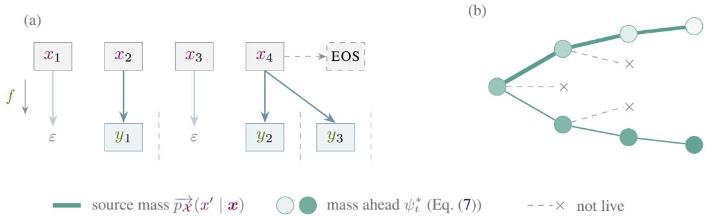  
Figure 11: (a) An example source string aligned to a target prefix under a function $f ,$ the dashed lines marking the boundaries between target positions. A symbol may emit none or several target symbols, so the source spans between boundaries vary in length while the alignment stays monotone. At each step a source symbol is scanned, and at each boundary a target symbol is emitted. (b) When $\psi = \mathrm { i } s _ { \cdot }$ \_live we sample by source mass (edge width) and never enter a dead branch (×), so no draw is wasted. Since we only look at the current live symbols, we cannot tell a heavy branch with little mass ahead (top) from a light branch that carries it (bottom). Importance weighting corrects for the proposal, while resampling with replacement mitigates particle-weight degeneracy (§§ B.3 and B.5).

Importance sampling in the target recursion. smc\_rb iterates over the target and source indices as shown in the example Fig. 11a. A target step occurs once when the recursion advances from target position t − 1 to t. At a fixed source prefix, the weight becomes

$$
w  w \cdot \frac { \mu _ { t } ( x ) } { \mu _ { t - 1 } ( x ) } = w \cdot \frac { \overrightarrow { p _ { \chi } } ( x ) \psi _ { t } ( x ) } { \overrightarrow { p _ { \chi } } ( x ) \psi _ { t - 1 } ( x ) } = w \cdot \frac { \psi _ { t } ( x ) } { \psi _ { t - 1 } ( x ) } .\tag{34}
$$

The source step advances by drawing one symbol from the twisted proposal. Its incremental importance weight is

$$
\frac { \mu _ { t } ( x x ^ { \prime } ) / \mu _ { t } ( x ) } { \overrightarrow { q _ { t } } ( x ^ { \prime } \mid x ) } = \frac { \overrightarrow { p _ { \overrightarrow { x } } } ( x ^ { \prime } \mid x ) \psi _ { t } ( x x ^ { \prime } ) } { \psi _ { t } ( x ) } \cdot \frac { \nu _ { t } ( x ) } { \overrightarrow { p _ { \overrightarrow { x } } } ( x ^ { \prime } \mid x ) \psi _ { t } ( x x ^ { \prime } ) } = \frac { \nu _ { t } ( x ) } { \psi _ { t } ( x ) } .\tag{35}
$$

Therefore,

$$
x ^ { \prime } \sim \overrightarrow { q _ { t } ^ { \prime } } ( \cdot \mid x ) , \qquad ( x , w )  ( x x ^ { \prime } , w \frac { \nu _ { t } ( x ) } { \psi _ { t } ( x ) } ) ,\tag{36}
$$

with $\nu _ { t } ( x )$ the proposal’s normalizer of Eq. (33). At position t, the target-step factor is combined with one source-step factor for every symbol sampled within the call. A particle that ends position t − 1 at the prefix $\pmb { x } = \pmb { x } _ { \leq n } , n = | \pmb { x } |$ , and takes k source steps through position t extends it to $x _ { \leq n + k } ,$ drawing the symbol $\boldsymbol { x } _ { n + j }$ at step j, and updates its weight by

$$
w \  \ w \cdot { \frac { \mu _ { t } ( x _ { \leq n + k } ) } { \mu _ { t - 1 } ( x _ { \leq n } ) \prod _ { j = 1 } ^ { k } { \overrightarrow { q _ { t } } } ( x _ { n + j } \mid x _ { < n + j } ) } } = w \cdot { \frac { \psi _ { t } ( x _ { \leq n } ) } { \psi _ { t - 1 } ( x _ { \leq n } ) } } \prod _ { j = 1 } ^ { k } { \frac { \nu _ { t } ( x _ { < n + j } ) } { \psi _ { t } ( x _ { < n + j } ) } } ,\tag{37}
$$

the target step once and one source-step factor per symbol.

For the live twist, $\psi _ { t } ( \pmb { x } ) = 1$ on every surviving particle. smc\_rb marginalizes the EOS decision and conditions the proposal of Eq. (33) on drawing a live next source symbol. Substituting the conditional proposal into Eq. (27), the update simplifies to

$$
w ^ { ( m ) } \gets w ^ { ( m ) } \cdot \lambda _ { t } ( x ^ { ( m ) } ) .\tag{38}
$$

The sampled particle’s weight therefore equals the sum of the weights of its parent’s live children.

For a quotient particle carried from position $t - 1$ , the target-step factor $\psi _ { t } ( \pmb { x } ) / \psi _ { t - 1 } ( \pmb { x } )$ is one if the prefix remains live at the new position and zero otherwise. It re-enters the pool unchanged when the factor is one. When the factor is zero, $\lambda _ { t } ( \pmb { x } ) = 0$ , so smc\_rb drops it at its next source step. The recursive call also returns completed remainder entries. The membership re-check retains one exactly when its source string covers the longer target. Together, these operations implement the update from $\mu _ { t - 1 } \mathrm { { t o } } \mu _ { t } \left( \mathrm { { F i g . } } \ 1 2 \right)$ .

106 def smc\_rb(y, M, ψ, prune): 136 def $\mathsf { r e s a m p l e } _ { \psi , \eta } ( \mathcal { P } ^ { \prime } ) { : }$   
107 $N \gets | y |$ 137 $\mathcal { W } ^ { ( i ) }  w ^ { ( i ) } \cdot \psi ( \mathbf { \boldsymbol { x } } ^ { ( i ) } )$   
109 108 if $\begin{array} { r } { ( \mathring { \boldsymbol { \mathbb { Q } } ^ { \prime } } , \mathring { \boldsymbol { \mathbb { R } } ^ { \prime } } ) , \mathring { \boldsymbol { Z } }  ( [ ( \varepsilon , \frac 1 { M } ) ] _ { m = 1 } ^ { M } , \varnothing ) , [ ] } \end{array}$ $N \overset { \cdot \vartriangle } { = } \mathrm { { 0 } } \colon$ 138 $\textstyle V \gets \sum _ { i } \mathcal { W } ^ { ( i ) }$   
110 else: 139 $N \gets | \overline { { \mathcal { P } } } ^ { \prime } |$   
111 (Q′, R′), Zˆ ← smc\_rb(y<N , M, ψ, prune) 140 if $\begin{array} { r } { V ^ { 2 } \ge \stackrel { \cdot } { \eta } N \sum _ { i } ( \mathcal { W } ^ { ( i ) } ) ^ { 2 } : } \end{array}$   
112 $\mathcal { P } \overset { \vartriangle } {  } \operatorname { Q u p E U E } ( \mathcal { Q } ^ { \prime } )$ 141 return P′   
113 $( \mathsf Q , \mathsf R ) , \bar { A } \gets ( \mathsf { \bar { \boldsymbol { \theta } } } , \mathsf { \bar { \boldsymbol { \theta } } } ) , \mathsf { \boldsymbol { 0 } }$ 142 $j _ { 1 } , \dots , j _ { N } \overset { \mathrm { i . i . d . } } { \sim } \mathrm { C a t e g o r i c a l } ( \mathcal { W } ^ { ( i ) } / V )$   
114 115 for if is\_member(x, y): $( \boldsymbol { x } , \boldsymbol { w } ) \in \mathbb { R } ^ { \prime } \colon$ 143 return $\{ ( \pmb { x } ^ { ( j _ { n } ) } , \frac { V \textbf { \em w } ^ { ( j _ { n } ) } } { N \textbf { \em w } ^ { ( j _ { n } ) } } ) \} _ { n = 1 } ^ { N }$   
116 R.add((x, w))   
117 A += w   
118 while $| { \mathcal { P } } | > 0 { : }$   
119 $\mathcal { P } ^ { \prime }  \dot { \varnothing }$   
120 for x, w ∈ P:   
121 if is\_cylinde $( x , y ) \colon$   
122 Q.add((x, w))   
123 A += w   
124 continue   
125 if is\_membe $\mathbf { \nabla } \cdot ( x , y ) \colon$   
126 R.add((x, w · −→pX (EOS | x)))   
127 A += w · −→pX (EOS | x)   
128 $\begin{array} { r } { \lambda  \sum _ { x ^ { \prime } \in \mathcal { X } } \overset { \cdot } { \overrightarrow { p _ { \mathcal { X } } } } ( x ^ { \prime } \dot { \mid x } ) \cdot \psi ( x x ^ { \prime } ) } \end{array}$   
129 if $\lambda \equiv { \tilde { 0 } } { : }$   
130 continue   
131 sample $x ^ { \prime } \sim \overrightarrow { p x } ( \cdot \mid x ) \psi ( x \cdot ) / \lambda$   
132 $\begin{array} { r } { \mathcal { P } ^ { \prime } . \mathsf { a d d } ( ( \pmb { x } \ d { x } ^ { \prime } , \ \frac { \hat { w } \cdot \lambda } { \psi ( \pmb { x } \ d { x } ^ { \prime } ) } ) ) } \end{array}$   
133 P ← prune $( { \mathcal { P } } ^ { \prime } , A )$   
134 Zˆ.append(A)   
135 return $( \mathsf { Q } , \mathsf { R } ) , \hat { Z }$  
Figure 12: The smc\_rb algorithm and ESS-gated multinomial resampling under a twist.

## B.5 UNBIASEDNESS OF smc\_rb

We now show that smc\_rb is unbiased. The proof follows §3.3 for beam\_summing but with the sampled symbol extension instead of all live extensions.

Proposition B.1 (Unbiasedness of smc\_rb). Fix a nonempty target string y and run smc\_rb (Fig. 12) with a twist. Suppose that every prune preserves the pool’s expected weight at every prefix (Eq. (13)) and that the run halts almost surely. Then $\mathbb { E } [ \hat { Z } _ { | y | } ] = \overrightarrow { p _ { \mathcal { V } } } ( y )$ .

Proof. We follow the nested induction used in Lemma 3.2, with an outer induction on target length and inner induction on the within call iterations. Write $\mathcal { P } _ { i }$ for the smc\_rb pool at iteration i and $\overline { { \mathcal { P } } } _ { i }$ for the corresponding pool in the prune-free beam\_summing run. In the outer base case, the M copies of ε with weight $1 / M$ in smc\_rb have the same aggregate weight as the single copy of weight one in beam\_summing. The recursive initial-pool argument is otherwise unchanged, so it remains to replace the extension identity Eq. (21).

Condition on the current pool and fix a non-cylinder particle at x with weight w. Write $\lambda ( x ) =$ $\begin{array} { r } { \sum _ { x ^ { \prime \prime } } \overrightarrow { p _ { \mathcal { X } } } ( x ^ { \prime \prime } \mid x ) \psi ( x x ^ { \prime \prime } ) } \end{array}$ for its twisted live mass. When $\lambda ( { \boldsymbol { x } } ) > 0$ , let X be drawn from the proposal of Eq. (33), conditioned on a live source symbol. For any next source symbol $x ^ { \prime }$ with $\bar { \psi } \big ( \bar { x x ^ { \prime } } \big ) ^ { - } > 0$ its conditional expected contribution is

$$
\mathbb { E } _ { X } \bigg [ 1 \{ X = x ^ { \prime } \} \frac { w \lambda ( x ) } { \psi ( x x ^ { \prime } ) } \bigg ] = \frac { \overrightarrow { p _ { \mathscr { X } } } ( x ^ { \prime } \mid x ) \psi ( x x ^ { \prime } ) } { \lambda ( x ) } \frac { w \lambda ( x ) } { \psi ( x x ^ { \prime } ) } = w \overrightarrow { p _ { \mathscr { X } } } ( x ^ { \prime } \mid x ) .\tag{39}
$$

A zero-twist child receives no contribution under either extension. $\mathrm { I f } \lambda ( { \pmb x } ) = 0$ , both extensions assign every admitted child zero weight, and cylinder prefixes produce no children under either extension. Summing Eq. (39) over the particles at x gives the conditional-expectation version of Eq. (21). The tower rule and Eq. (13) then close the same within-call induction and give, for every iteration i and source prefix x,

$$
\mathbb { E } [ w _ { \mathcal { P } _ { i } } ( \pmb { x } ) ] = w _ { \overline { { \mathcal { P } } } _ { i } } ( \pmb { x } ) .\tag{40}
$$

Marginalizing the stop decision replaces its sampled contribution by its conditional expectation. At a member, the baseline proposal stops with probability $\overrightarrow { p _ { \mathcal { X } } } ( \mathrm { t o s } \mid x ) / \nu _ { t } ( x )$ and returns weight wνt(x), so

$$
\frac { \underset { p _ { \mathcal { X } } } { \longrightarrow } ( \underset { \mathbb { E } 0 \mathbb { S } \mid x } { \mathbb { E } } ) } { \nu _ { t } ( x ) } w \nu _ { t } ( x ) = w \underset { \ b { \mathscr { X } } } { \longrightarrow } ( \underset { \ b { \mathscr { X } } } { \cos \mid x } ) ,\tag{41}
$$

which is the remainder contribution added by smc\_rb. smc\_rb adds quotient contributions and re-queues prefixes exactly as beam\_summing does. The same assembly argument as in Theorem 3.3 therefore applies to the pool identity above, and Eq. (23a, Eq. (6) and Tonelli) and (23d, Eq. (4)) give the result. ■

The ESS-gated multinomial resample of Fig. 12 satisfies Eq. (13) for every fixed input pool (Chopin & Papaspiliopoulos, 2020, Prop. 16.3).

## B.6 A COMMON TAIL-ROULETTE PRUNE

Source-prefix enumeration can continue indefinitely even as the remaining particle weights tend to zero $( \ S 3 . 4 )$ . The decorator in Fig. 13 independently removes each sufficiently light particle with probability $1 / 2$ and doubles its weight otherwise. For use with this decorator, we represent each particle as a triple $( x , w , w _ { 0 } )$ . At the start of a target-prefix call, we set $w _ { 0 } = w$ for every particle in $\mathcal { P } _ { 1 }$ . Each child and resampled copy inherits $w _ { 0 }$ . The original pruning function acts on the source prefix and current weight while keeping $w _ { 0 }$ unchanged. For $\kappa \in ( 0 , 1 )$ ), the decorator first applies the original pruning function, then applies the coin flip independently to each returned particle $( x , w , w _ { 0 } )$ with $w < \kappa w _ { 0 }$

Fix a finite starting pool $\mathcal { P } _ { 1 } , \kappa \in ( 0 , 1 )$ , and an original pruning function that returns at most M particles. We first show that the decorator preserves the particle weight in expectation whenever the original pruning function does. We then show that the algorithms with a fixed particle cap M in Tab. 1 halt almost surely.

Expected-weight preservation. Conditional on the original pruning function’s output and the reference weights $w _ { 0 } ,$ , a particle selected for the coin flip contributes 2w with probability $1 / 2$ and zero otherwise, giving expected contribution $w .$ The coin flip therefore preserves every prefix weight in conditional expectation. Averaging over the original pruning function’s output, the decorated pruning function satisfies Eq. (13) whenever the original does.

Almost-sure halting. Let $\mathcal { P } _ { i } ^ { \circ }$ be the pool returned by the original pruning function at iteration i, immediately before the coin flips, and define its total particle weight by

$$
W _ { i } \stackrel { \mathrm { d e f } } { = } \sum _ { ( \boldsymbol { x } ^ { ( m ) } , \boldsymbol { w } ^ { ( m ) } , \boldsymbol { w } _ { 0 } ^ { ( m ) } ) \in \mathcal { P } _ { i } ^ { \circ } } w ^ { ( m ) } .\tag{42}
$$

By Eq. (13) and Lemma 3.2, E[W ] equals the total weight in the corresponding prune-free pool after i source extensions for beam\_summing and hence beam\_swor. The sampled-extension identity Eq. (39) gives the same result for smc\_rb, and the importance-weight identity Eq. (27) and (28) gives it for smc\_simple. For $\mathsf { p r u n e } _ { M }$ , the expected total is no larger because its prune only removes particles. In every case,

$$
\mathbb { E } [ W _ { i } ] \leq \sum _ { m = 1 } ^ { | \mathcal { P } _ { 1 } | } w _ { 0 } ^ { ( m ) } \sum _ { \pmb { x } ^ { \prime } \in \mathcal { X } ^ { i } } \overrightarrow { p _ { \mathcal { X } } } ( \pmb { x } ^ { \prime } \mid \pmb { x } ^ { ( m ) } ) \xrightarrow { i  \infty } 0 .\tag{43}
$$

The inner sum is the conditional probability of generating at least i additional source symbols from $\boldsymbol { x } ^ { ( m ) }$ . Because $p _ { \mathcal { X } }$ is a distribution over finite strings, this probability tends to zero as $i  \infty ( \ S 2 . 1 )$ Since the outer sum has finitely many terms, the displayed limit follows.

Discard zero-weight particles from $\mathcal { P } _ { 1 }$ . If none remain, the call halts immediately. Otherwise, set

$$
\delta _ { \mathrm { m i n } } \stackrel { \mathrm { d e f } } { = } \kappa \operatorname* { m i n } _ { 1 \leq m \leq | \mathcal { P } _ { 1 } | } w _ { 0 } ^ { ( m ) } > 0 .\tag{44}
$$

Because descendants inherit $w _ { 0 }$ , every descendant’s coin-flip threshold $\kappa w _ { 0 }$ is at least $\delta _ { \mathrm { m i n } }$

For $i \geq 1$ , write $\widetilde { \mathcal { P } } _ { i }$ for the pool after the coin flips at iteration i. If $W _ { i } < \delta _ { \operatorname* { m i n } }$ , every particle in $\mathcal { P } _ { i } ^ { \circ }$ is selected for a coin flip. The original pruning function returns at most M particles, so the independent coin flips empty the pool with conditional probability at least $2 ^ { - M }$ . Since $W _ { i }$ is

144 def with\_tail\_roulette(prune, κ):   
145 def decorated $( \mathcal { P } ^ { \prime } , \ldots )$   
146 P ← prune $( \mathcal { P } ^ { \prime } , \ldots )$   
147 $\tilde { \mathcal P } \gets \emptyset$   
148 for $( \mathbf { \tilde { x } } ^ { ( m ) } , w ^ { ( m ) } , w _ { 0 } ^ { ( m ) } ) \in \mathcal { P }$   
149 if $w ^ { ( m ) } = 0 \colon$   
150 continue   
151 if $w ^ { ( m ) } \geq \kappa w _ { 0 } ^ { ( m ) }$ :   
152 $\boldsymbol { \widetilde { \mathcal { P } } } . \mathsf { a d d } ( ( \boldsymbol { x } ^ { ( m ) } , w ^ { ( m ) } , w _ { 0 } ^ { ( m ) } ) )$   
153 continue   
154 $b \sim$ Bernoulli(1/2)   
155 if $b = 1 { : }$   
156 $\mathcal { \tilde { P } } . \mathsf { a d d } ( ( x ^ { ( m ) } , 2 w ^ { ( m ) } , w _ { 0 } ^ { ( m ) } ) )$   
157 return $\mathcal { \widetilde { P } }$   
158 return decorated  
Figure 13: Tail-roulette decorator for a pruning function.

nonnegative, Markov’s inequality and the coin-flip bound above give

$$
\mathrm { P r } [ W _ { i } \geq \delta _ { \operatorname* { m i n } } ] \leq \frac { \mathbb { E } [ W _ { i } ] } { \delta _ { \operatorname* { m i n } } } \longrightarrow 0 ,\tag{45}
$$

$$
\begin{array} { r } { \operatorname* { P r } \Big [ \widetilde { \varphi } _ { i } \neq \varnothing \Big ] \leq \operatorname* { P r } [ W _ { i } \geq \delta _ { \operatorname* { m i n } } ] + ( 1 - 2 ^ { - M } ) \operatorname* { P r } \Big [ \widetilde { \varphi } _ { i - 1 } \neq \varnothing \Big ] , \qquad i \geq 2 . } \end{array}\tag{46}
$$

Let $\begin{array} { r } { E _ { i } \stackrel { \mathrm { d e f } } { = } \{ \widetilde { \mathcal { P } } _ { i } \not = \emptyset \} } \end{array}$ be the event that the pool remains nonempty after iteration $i ,$ and let $p _ { i } \ { \stackrel { \mathrm { d e f } } { = } } \ \operatorname* { P r } [ E _ { i } ]$ Because an empty pool remains empty, $\bar { E } _ { i + 1 } \subseteq E _ { i }$ . Thus, $( p _ { i } ) _ { i \geq 1 }$ is nonincreasing and bounded below by zero, so it converges to some $p \geq 0 .$ . Taking $i \to \infty$ in the recursion, with $p _ { i }  p , p _ { i - 1 }  p ,$ and $\dot { \operatorname* { P r } } [ W _ { i } \geq \delta _ { \operatorname* { m i n } } ]  0$ , gives $p \leq ( 1 - 2 ^ { - M } ) p$ . Since $1 - 2 ^ { - M } < 1$ , this forces $p = 0 .$ . The intersection $\textstyle \bigcap _ { i \geq 1 } E _ { i }$ is the event that the pool remains nonempty at every iteration. For decreasing events, its probability is the limit of their probabilities, so ${ \mathrm { P r } } \left| \bigcap _ { i \geq 1 } E _ { i } \right| = \operatorname* { l i m } _ { i \to \infty } p _ { i } = 0$ . A call using the decorated prune thus halts almost surely. For the recursive algorithms, the target string has finitely many positions, so the complete run also halts almost surely. Any $\kappa \in ( 0 , 1 )$ gives the halting guarantee.

Settings. The threshold $\kappa$ determines when roulette begins. We choose it small so that roulette is delayed until a particle’s current weight is small relative to its reference weight. We use $\kappa = e ^ { \frac { - 1 5 } { - 1 5 } }$ for the WikiText experiments and $\kappa = e ^ { - 3 0 }$ for the DNA and MECO experiments. beam\_swor\_adaptive does not require the decorator because its adaptive prune uses $A _ { \epsilon , t }$ to ensure almost-sure halting (Proposition 3.4).

## C SENSITIVITY TO PRUNING PARAMETERS

The experiments use $\epsilon = 0$ . For each fixed target prefix, the finite-context source models and finitestate transducers give finitely many live configurations. Full support gives a positive lower bound on the probability of reaching a member or cylinder from any such configuration, so A becomes positive almost surely. The proof of Proposition 3.4 then applies with $A _ { \epsilon , t } = A > 0$ . Besides M, the adaptive-budget prune uses ρ (§3.4), and the ESS-gated multinomial prune uses η (§B). We vary both on the ten-paragraph bigram corpus of §4.1, using eight seeds (Fig. 14).

Smaller $\rho$ retains more particles. At nominal $M { = } 8 0 0 0$ , reducing $\rho$ from 1 to 0.02 lowers the standard deviation from 0.711 to 0.073 nats and raises the time per seed from 349 to 1551 seconds. The default ρ=0.1 gives a standard deviation of 0.200 nats at 623 seconds. Plain beam\_swor at $M { = } 2 0 0 0$ gives 0.170 nats at 3432 seconds. With 149 seeds, the standard deviation at the default is 0.163 with CI [0.146, 0.184], consistent with the fixed-M beam\_swor result at $5 . 5 \times$ less CPU time. At M=2000, the between-seed standard deviation rises from 0.632 nats at $\rho { = } 0 . 1$ to 4.815 at $\rho { = } 0 . 5$ and 5.283 at $\rho { = } 1 . \ \mathrm { A t } \ \rho { = } 1$ , the mean live count is 18, and most log estimates are several nats low.

Increasing η causes more frequent resampling, while CPU time changes little across the tested values. At $M { = } 2 0 0 0$ , the survivor-conditioned standard deviation rises from 5.1 nats at $\eta { = } 0 . 2 5$ , where seven of eight corpus seeds survive, to 7.86 at the default $\eta { = } 0 . 5$ and 9.8 at $\eta { = } 0 . 7 5$ $\mathrm { A t } \eta { = } 0$ , every seed has at least one zero paragraph estimate. The same holds at $M { = } 2 0 0$ for every tested value of $\eta .$ , despite some nonzero individual paragraph estimates.

## D EXACT GROUND TRUTH FOR BIGRAM MODELS

The bigram model can be represented as a weighted finite-state acceptor. Composing it with $\mathsf { f } _ { \mathrm { p t b } }$ and projecting onto the target labels gives a weighted automaton defining $p _ { \mathsf { b i g r a m } } \circ \mathsf { f } _ { \mathrm { p t b } }$ . In the representation used here, the functional transducer $\mathsf { f } _ { \mathrm { p t b } }$ admits at most one accepting path for each source string, so path sums do not double-count source strings.

For each state $s ,$ let $\beta ( s )$ be its backward weight, the sum of the weights of all paths starting at $s ,$ including the final weight at the end of each path. Let $T$ be the transition-weight matrix and $f$ the final-weight vector. From each state, a path either stops there with its final weight or takes a transition and then continues. The backward weights therefore satisfy (Mohri, 2009)

$$
\beta = f + T \beta , \qquad \mathrm { s o } \qquad \beta = ( I + T + T ^ { 2 } + \cdots ) f = ( I - T ) ^ { - 1 } f .\tag{47}
$$

Because the composed automaton has no cycle that can be traversed without consuming a source symbol, the number of consumed source symbols tends to infinity with the number of transitions. The probability of generating at least k source symbols tends to zero as $k  \infty .$ , so the series converges.

For each position t and state $s ,$ let $\alpha _ { t } ( s )$ be the sum of the weights of all paths that start at the initial state, emit $\scriptstyle { y \leq t }$ , and end in s immediately after emitting ${ \mathbf { } } _ { { \mathbf { } } _ { 3 } } \mathbf { { } } _ { t }$ . Summing over the states reached after emitting yt gives

$$
\overrightarrow { p \gamma } ( y _ { \leq t } ) = \sum _ { x \in \mathcal { P } ( y _ { \leq t } ) } p _ { \mathcal { X } } ( x ) = \sum _ { s \in \mathsf { S } } \alpha _ { t } ( s ) \beta ( s ) = \alpha _ { t } ^ { \top } \beta .\tag{48}
$$

The backward weights $\beta ( s )$ are computed once for all states, while $\alpha _ { t } ( s )$ is updated after each target symbol. The composed state space is finite for an n-gram source, but not for a neural language model whose next-symbol probabilities depend on the complete source prefix.

## E THE GENETIC-CODE WORST CASE

This appendix analyzes a worst case for the DNA setting in $\ S 4 . 3$ . Standard beam search captures an exponentially vanishing share of the target mass, while smc\_simple, smc\_rb, and fixed-M beam\_swor are exact for any M. Consider a uniform source model $p \chi ( \pmb { x } ) = ( 1 / 4 ) ^ { 3 T }$ over source strings of length $3 T$ on a four-symbol alphabet, and a target of length T where each target symbol is the image of $d$ length-three source blocks (“codons”). Assume that the live proposal samples each of the d codons with probability $1 / d .$ . This holds, for example, for repeated isoleucine, where $d = 3$ and the three codons differ only in their final base. Exactly $d ^ { T }$ strings in the source model’s support belong to the precover, so $p _ { \mathcal { V } } ( \bar { y } ) = d ^ { T } \cdot ( 1 / 4 ) ^ { 3 T }$

Standard beam search. beam\_summing with prune $M$ retains at most M of these $d ^ { T }$ source strings, yielding

$$
\hat { Z } _ { \mathrm { b e a m } } \leq M \cdot \left( \frac { 1 } { 4 } \right) ^ { 3 T } , \qquad \frac { \hat { Z } _ { \mathrm { b e a m } } } { p _ { \mathcal { V } } ( y ) } \leq \frac { M } { d ^ { T } } .\tag{49}
$$

This ratio vanishes exponentially in $T .$ . For $T = 1 0 0$ and $d = 3 ,$ , the smallest beam that recovers all the mass has $M = 3 ^ { 1 0 0 } \approx 5 \times 1 0 ^ { 4 7 }$ . The estimate is biased for any $M < d ^ { T }$ , systematically underestimating $p _ { \mathcal { V } } ( y )$

Importance-weighted estimators. Each valid codon has source probability $4 ^ { - 3 }$ and proposal probability $1 / d$ , so its importance weight gains the factor $( 1 / 4 ^ { 3 } ) / ( 1 / \dot { d } ) = d / 4 ^ { 3 }$ under both smc\_simple and smc\_rb (Eq. (27) and (38)). After $T$ amino acids every particle carries

$$
w ^ { ( m ) } = \frac { 1 } { M } \frac { d ^ { T } } { 4 ^ { 3 T } } = \frac { p _ { \mathcal { V } } ( y ) } { M } ,\tag{50}
$$

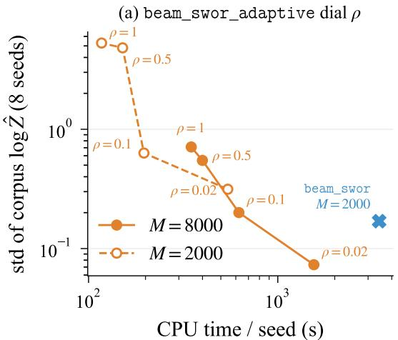

(b) \_ resample threshold  
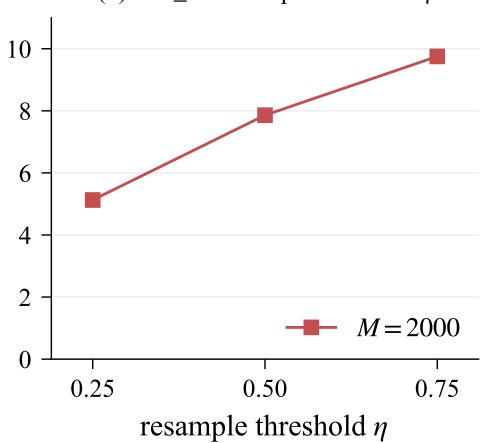  
Figure 14: Sensitivity to the pruning parameters on the ten-paragraph bigram corpus (eight seeds). (a) Between-seed standard deviation of the corpus log $\hat { Z }$ against CPU time per seed as $\rho$ varies for beam\_swor\_adaptive at nominal $M { \in } \{ 2 0 0 0 , 8 0 0 0 \}$ . Labels give $\rho ,$ and plain beam\_swor at $M { = } 2 0 0 0$ is the fixed-M reference. (b) Survivor-conditioned standard deviation as the ESS threshold η varies for smc\_rb at $M { = } 2 0 0 0$ . A corpus seed survives when all ten paragraph estimates are nonzero. Annotations mark settings with fewer surviving seeds and note that none survives at $M { = } 2 0 0$

so $\begin{array} { r } { \hat { Z } = \sum _ { m = 1 } ^ { M } w ^ { ( m ) } = p _ { \mathcal V } ( y ) } \end{array}$ exactly. The factor $d ^ { T }$ emerges in the importance weights, letting M particles represent $d ^ { T }$ covering source strings. Thus smc\_simple and smc\_rb both have zero variance. Fixed-M beam\_swor is also exact. At every branch its child weights are equal, and its without-replacement reweighting preserves their total on every draw.

This is an extreme case, a uniform source and a constant alias count d. In practice, non-uniform DNA models introduce variance across particles. The example does not distinguish among the stochastic estimators, whose variance differences are measured in the non-uniform experiments.

## F DETAILS OF THE MECO RERUN

We compare contextual surprisals computed by beam summing with prune and swor\_adaptive on the same 2,264 PTB units in the 12 MECO trials (individually read paragraphs). We use the generalized additive mixed models (GAMMs) of Kiegeland et al. (2026), which model reading times with a log-normal distribution. The baseline includes unit length and unigram surprisal for the current unit and the two preceding units. The target model adds contextual surprisal at the same three positions. Both models include a participant random intercept and by-participant random slopes for every predictor. We use 12-fold leave-one-trial-out cross-validation and report per-observation held-out ∆LL. Confidence intervals come from a 1,000-resample trial-level bootstrap, and significance is assessed with one-sided paired sign-flip tests. We change only the pruning function used to compute contextual surprisal and rerun the fits on the same observations $\scriptstyle ( n = 3 3 , 4 7 2 )$ . The prune values are the telescoping estimates reported by Kiegeland et al. (2026), computed with a threshold of $5 \times 1 0 ^ { - 3 }$ . For swor\_adaptive, we use $\rho { = } 0 . 1$ and nominal $M { = } 8 0 0 0$ , and average each prefix-probability estimate over 10 runs before taking logarithms. The reported GAMM fits use the resulting surprisals without a jackknife correction. The analysis below shows that applying the correction changes no conclusion.

Jackknife check. Averaging the prefix-probability estimates preserves unbiasedness, but taking the logarithm of an average introduces bias. To estimate it, we recompute each unit’s surprisal ten times, omitting one run each time. If s is one unit’s surprisal from all ten runs and $s _ { \phi }$ is its surprisal with run r omitted, the jackknife estimates the bias as $\begin{array} { r } { 9 \big ( \frac { 1 } { 1 0 } \sum _ { r = 1 } ^ { 1 0 } s _ { \rlap / / r } - s \big ) } \end{array}$ , which we subtract from s.

The correction raises the corpus log probability by 1.55 nats, equivalently lowering its surprisal by the same amount. It changes the 106-nat uncorrected difference reported in §4.5 to approximately

107 nats. Refitting with the corrected surprisals moves every held-out ∆LL by at most $0 . 0 1 5 \times 1 0 ^ { - 3 }$ nats and changes neither the results in Tab. 3 nor the matched comparison below.

Matched fit comparison. Under the experimental setup of Kiegeland et al. (2026), one-sided paired sign-flip tests show no evidence of a predictive difference between the matched PTB-word fits $( p \ge 0 . 0 6 8$ in both directions for every measure).

## G ADDITIONAL BYTE-TO-WORD RESULTS

Figs. 15 and 16 extend the exact bigram validation of Fig. 6 to every byte position in all ten paragraphs.   
Tab. 4 reports the additional per-paragraph GPT-2 estimates and runtimes.

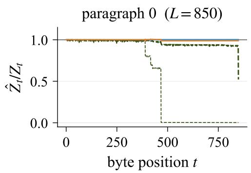

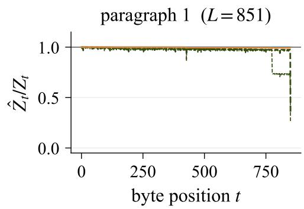

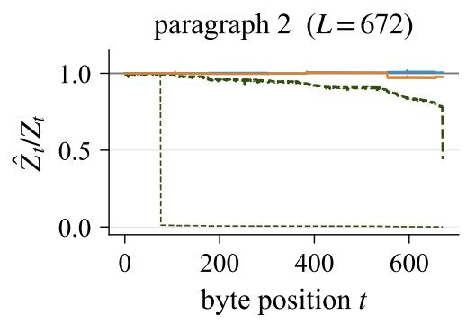

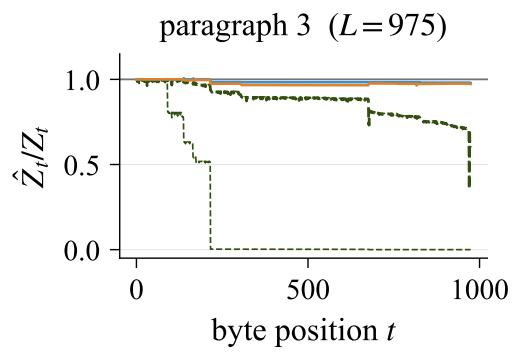

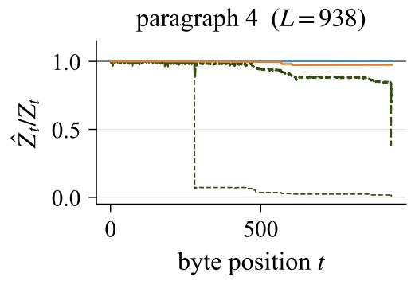

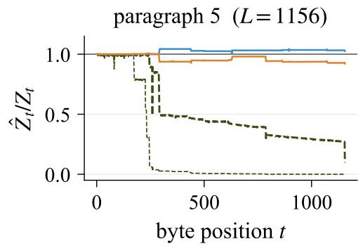  
Figure 15: Per-position ratio $\hat { Z } _ { t } / Z _ { t }$ for all ten $p _ { \mathsf { b i g r a m } } \circ \mathsf { f } _ { \mathrm { p t b } }$ paragraphs at M=200, averaged over 256 runs. Paragraphs 0–5 are shown here and 6–9 in Fig. 16. The beam\_swor and beam\_swor\_adaptive averages remain close to one with sampling variation. Threshold-pruned beam summing at $\tau { = } 1 0 ^ { - 2 }$ and $\tau { = } 1 0 ^ { - 3 }$ falls below one where pruning discards positive covering mass.

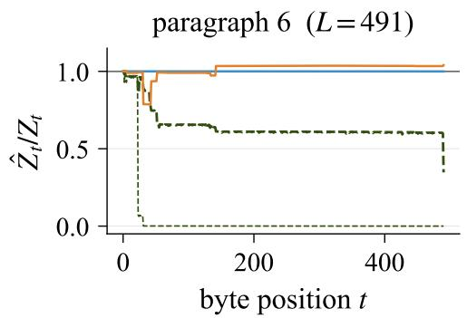

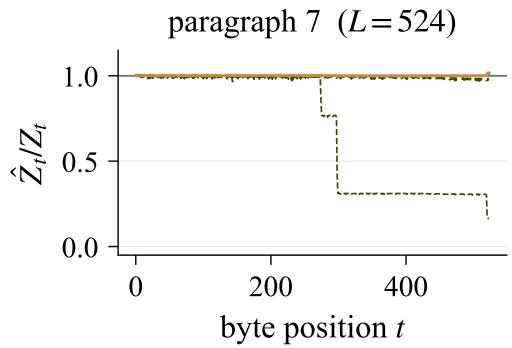

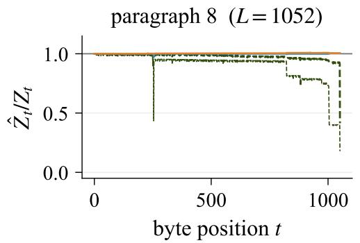

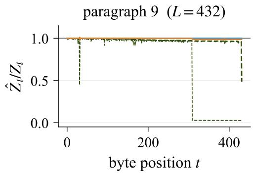  
Figure 16: Per-position validation, paragraphs 6–9 (continued from Fig. 15), with the same methods and axes.

Table 4: Per-paragraph log-prefix probabilities in nats and wall time in seconds under $p _ { \mathrm { g p t } 2 } \circ \mathsf { f } _ { \mathrm { p t b } }$ beam\_summing uses $\tau { = } 1 0 ^ { - 3 }$ . beam\_swor\_adaptive uses $\rho { = } 0 . 1$ , nominal $M { = } 8 0 0 ,$ and thirty-two runs. Parentheses give the between-run standard deviation, and wall times are per run. The $\Delta$ column is beam\_summing minus beam\_swor\_adaptive. The total row sums the per-paragraph log estimates. The corpus panel of Fig. 7 instead averages the per-run corpus estimates before taking the logarithm, hence its −5376.7.
<table><tr><td>para</td><td>beam_summing</td><td> $\mathsf { b e a m \_ s w o r \_ a d a p t i v e }$ </td><td> $\Delta$ </td><td> $t _ { \mathrm { b e a m } }$ </td><td> $t _ { \mathrm { a d a p t i v e } }$ </td></tr><tr><td>0</td><td>-556.96</td><td>-554.96 (0.25)</td><td>-2.00</td><td>52</td><td>57</td></tr><tr><td>1</td><td>-564.10</td><td>-556.41 (1.38)</td><td>-7.70</td><td>106</td><td>210</td></tr><tr><td>2</td><td>-443.86</td><td>-443.21 (0.12)</td><td>-0.65</td><td>54</td><td>102</td></tr><tr><td>3</td><td>-747.96</td><td>−743.12 (0.19)</td><td>-4.84</td><td>170</td><td>216</td></tr><tr><td>4</td><td>-635.85</td><td>-631.16 (0.20)</td><td>-4.69</td><td>191</td><td>269</td></tr><tr><td>5</td><td>-772.31</td><td>−768.42 (0.27)</td><td>-3.88</td><td>353</td><td>647</td></tr><tr><td>6</td><td>-359.56</td><td>-355.23 (0.12)</td><td>-4.34</td><td>190</td><td>244</td></tr><tr><td>7</td><td>-330.81</td><td>-330.57 (0.13)</td><td>-0.24</td><td>21</td><td>21</td></tr><tr><td>8</td><td>-687.00</td><td>-684.43 (0.13)</td><td>-2.57</td><td>53</td><td>73</td></tr><tr><td>9</td><td>-311.62</td><td>-309.09 (0.27)</td><td>-2.54</td><td>33</td><td>39</td></tr><tr><td>total</td><td>-5410.04</td><td>-5376.60</td><td>-33.45</td><td>1224</td><td>1879</td></tr></table>