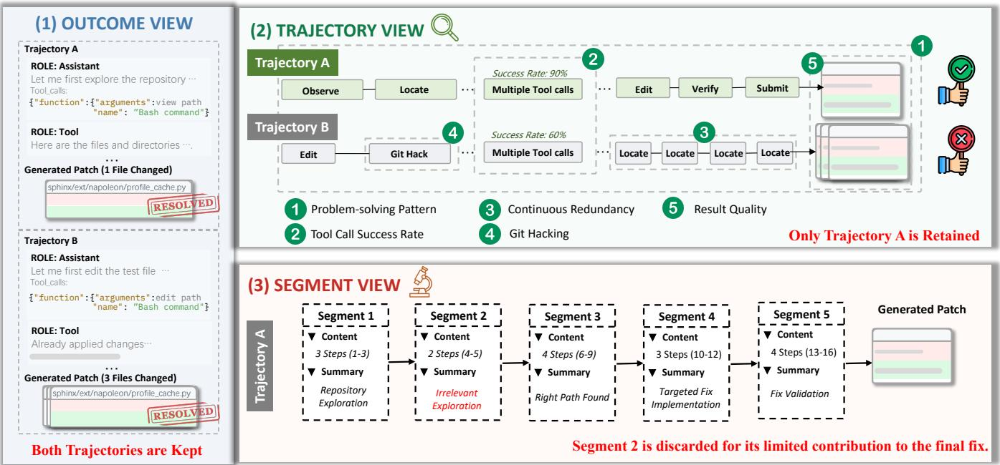
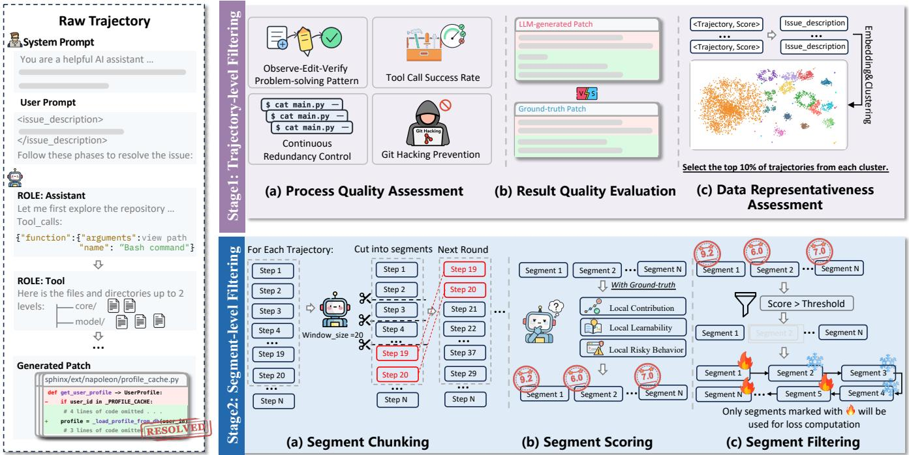
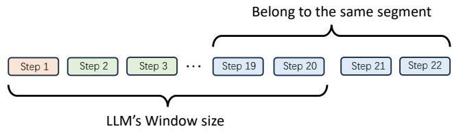
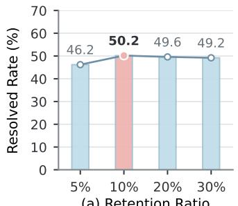
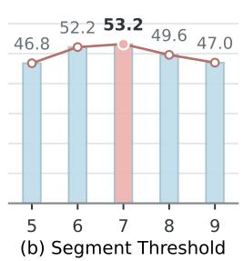
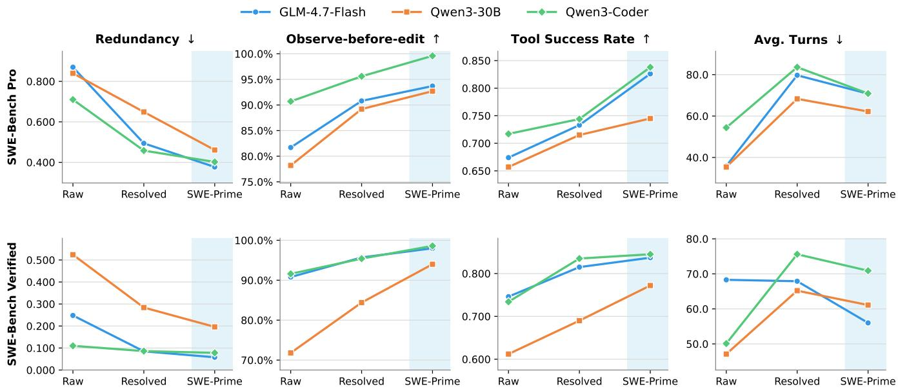

# SWE-Prime: Fewer Trajectories, Better Performance

Dewu Zheng1∗, Ruizhe Ye2∗, Yanlin Wang1†, Yang Ye2, Hongyu Zhang3, Ensheng Shi2, Xilin Liu2, Yuchi Ma2, Jianxing Yu1, Zibin Zheng1

1Sun Yat-sen University, China

2Huawei Cloud Computing Technologies Co., Ltd., China

3Chongqing University, China

zhengdw5@mail2.sysu.edu.cn, {wangylin36, yujx26, zhibin}@mail.sysu.edu.cn {yeruizhe, yeyang14, shiensheng, liuxilin3, mayuchi1}@huawei.com hyzhang@cqu.edu.cn

## Abstract

To improve large language models’ ability to resolve real- world software issues, prior work has focused on constructing large-scale agent trajectory datasets and performing supervised fine-tuning (SFT) on successful trajectories. However, task success does not guarantee high-quality supervision: suc cessful trajectories may still contain inefective, redundant, or risky steps. Directly using such trajectories for SFT can introduce noisy supervision and encourage models to imitate undesirable problem-solving behaviors. Therefore, we pro- pose SWE-Prime, a multi-granularity, two-stage SFT data selection method that progressively filters training data at the trajectory and segment levels. Specifically, the first stage performs trajectory-level screening based on process quality, result quality, and data representativeness, selecting a high- quality and representative subset of successful trajectories. The second stage performs segment-level selection by group- ing consecutive steps into semantic segments and assessing each segment based on its contribution to the final solution, learnability, and potential risks. During SFT, all segments re- main in the sequence to preserve context, while only selected segments contribute to the loss computation. Experiments on SWE-Bench Pro and SWE-Bench Verified show that training on the 10% trajectory subset selected by SWE-Prime outperforms training on the full resolved dataset, yielding relative performance gains of up to 12.2% and 24.2%, respectively.

## Introduction

Software issue resolution in real-world repositories has re- ceived growing attention in recent years (Jimenez et al. 2024; Pan et al. 2024; Yang et al. 2025b; Li et al. 2026). To im-prove coding agents’ performance on this long-horizon task, recent work has constructed large-scale software engineering datasets for supervised fine-tuning (SFT) (Pan et al. 2024; Yang et al. 2025b; Jain et al. 2025; Guo et al. 2025; Zheng et al. 2023). For example, SWE-Gym derives executable tasks from real-world GitHub issues, while SWE-smith and R2E-Gym use synthetic data generation to scale task and trajectory collection. These approaches then perform SFT on successful trajectories identified through execution-based verification.

However, task success alone does not guarantee high- quality supervision (Uesato et al. 2022; Lightman et al. 2023; Xiong et al. 2024; Wang, Pradel, and Liu 2026). Successful trajectories may still contain inefective, redundant, or risky behaviors that should not be used as supervision for SFT (Chen et al. 2025b,a; Wang et al. 2025a). Figure 1 illustrates this issue from three perspectives.

Outcome View. Existing work adopts an outcome-based view and thus retains both successful trajectories (Pan et al. 2024; Yang et al. 2025b; Jain et al. 2025; Guo et al. 2025). Trajectory View. The trajectory view shows why Trajectory B is unsuitable for SFT through the following quality aspects:

(1) Problem-solving Pattern: Standard problem-solving pro-cesses help models learn systematic issue-resolution be- haviors during SFT (Chen, Ma, and Jiang 2026). Trajectory A follows an observe-edit-verify workflow, whereas Trajectory B modifies the code without prior exploration.

(2) Tool Call Success Rate: Frequent tool failures introduce unreliable tool-use patterns into SFT supervision (Yang et al. 2025a). Trajectory B contains more such failures, whereas Trajectory A demonstrates stable tool use.

(3) Continuous Redundancy: Long-context repetition caused by losing track of prior actions introduces undesirable SFT supervision (Xiao et al. 2025). Accordingly, Trajectory B should be excluded because it repeats the same localization action without obtaining new information.

(4) Git Hacking: Leakage-based shortcuts introduce cheating behaviors into SFT supervision (Song et al. 2026; Tao et al. 2026). Trajectory B is unsuitable for SFT because it retrieves target repair information from version history.

(5) Result Quality: SFT should favor minimal yet suficient patches to reduce regression risks (Chen and Jiang 2025). Trajectory A follows this principle, whereas Trajectory B modifies additional unnecessary files.

Segment View. Even a trajectory assessed as high-quality at the trajectory level may still contain segments of limited value for SFT (Xiong et al. 2024; Wang et al. 2025a; Deng et al. 2025b). Segment 2 exemplifies such low-value behavior. Its steps execute successfully, but the segment does not contribute to the final fix, making it unsuitable for super- vision. We assess semantic segments rather than individual steps because a problem-solving behavior often spans multi- ple actions and observations that should be evaluated together to determine its intent, outcome, and contribution.

  
Figure 1: Motivating example comparing outcome-only, trajectory-level, and segment-level data selection.

These observations suggest that high-quality SFT data should be compact and low-noise, providing demonstrations that models can reliably learn from (Chen et al. 2024; Liu et al. 2024). To this end, we propose SWE-Prime, a multi-granularity, two-stage data selection method that progressively filters training data from the trajectory level to the semantic segment level. Specifically, Stage 1 operates at the trajectory level to select a high-quality and representative subset of successful trajectories. Stage 2 operates at the semantic segment level to identify high-value behaviors within the retained trajectories. During SFT, all segments re-main in the sequence to preserve context, while only selected segments contribute to the loss.

We evaluate SWE-Prime on two representative bench- marks, SWE-Bench Pro and SWE-Bench Verified. Models trained on the 10% subset selected by SWE-Prime achieve relative gains of up to 12.2% and 24.2% over models trained on all successful trajectories, respectively.

Our main contributions are summarized as follows:

• We highlight that prior work largely overlooks diferences in data quality among successful trajectories.

• We introduce semantic segments as behaviorally coherent units for fine-grained supervision-quality assessment in long-horizon trajectories, rather than isolated steps.

• We propose SWE-Prime, a multi-granularity, two-stage method designed to provide compact, low-noise, and in- formative supervision for coding-agent SFT.

• Through extensive experiments across three models and two benchmarks, we demonstrate that SWE-Prime sub- stantially outperforms SFT on the full dataset while using only 10% of the trajectories.

## Related Work

## Software Issue Resolution

Software issue resolution requires coding agents to gener- ate repair patches for repository-level issues described in natural language. Addressing such issues involves under- standing repository context and iteratively locating relevant code, implementing changes, and validating that the resulting patch resolves the issue without regressing existing function- ality (Jimenez et al. 2024; Yang et al. 2024; Tao et al. 2024; Zheng et al. 2025; Zhang et al. 2024; Xia et al. 2025; Jiang et al. 2026).

## Training Data for Coding Agents

SFT of coding agents relies on long-horizon interaction tra- jectories grounded in code repositories, tool feedback, and execution signals. Accordingly, existing work has focused on scaling the construction ofexecutable tasks and the collection of test-verified trajectories. Executable tasks are commonly constructed from real-world issues, synthetic bugs, or code commits (Yang et al. 2025b; Jain et al. 2025). SWE-Gym, for example, constructs executable environments from GitHub issues and collects test-verified trajectories (Pan et al. 2024). Successful trajectories are identified and retained through ex-ecutable validation, soft verification signals, or filters based on execution outcomes and trajectory attributes (Shen et al. 2026; Song et al. 2026; Liang et al. 2026). For instance, SWE-Factory automates environment construction and task verification across multiple programming languages (Guo et al. 2025). Among these eforts, SWE-Lego applies additional filtering after data construction by excluding steps with failed tool calls from the training loss (Tao et al. 2026).

  
Figure 2: Overview of SWE-Prime, a multi-granularity, two-stage SFT data selection framework.

However, task success and explicit error signals alone are insuficient for identifying high-quality supervision. At the trajectory level, successful demonstrations may still exhibit unreliable processes or unfocused patches; at the segment level, behaviors without explicit errors may still be redun- dant, irrelevant, or risky (Xiong et al. 2024; Chen et al. 2025b,a; Wang et al. 2025a; He et al. 2026). To bridge these gaps, SWE-Prime applies quality-aware selection at both the trajectory and semantic-segment levels, shifting the focus from task success alone to the supervision value of complete trajectories and the behaviors within them.

## SWE-Prime

## Overview

As illustrated in Figure 2, SWE-Prime is a multi-granularity, two-stage method that progressively selects SFT supervi- sion from successful software issue-resolution trajectories. Stage 1 selects high-quality and representative trajectories, while Stage 2 identifies high-value semantic segments within them. During SFT, complete trajectories are retained as context, while only selected segments contribute to the loss.

## Stage 1: Trajectory-Level Selection

Stage 1 performs trajectory-level selection by jointly consid-ering three dimensions: process quality, result quality, and data representativeness.

Process Quality Assessment. Our process-quality assessment examines whether a successful trajectory provides a sound problem-solving demonstration. We operationalize it using four complementary signals observable from interac- tion logs: workflow grounding through observe-edit-verify, execution reliability through tool-call success, interaction ef- ficiency through continuous-redundancy detection, and be- havioral legitimacy through Git-hacking detection. Together, these signals cover complementary layers of process quality, connecting the validity of individual actions with the coher- ence of the overall problem-solving trajectory to assess its suitability for SFT supervision.

Observe-Edit-Verify Problem-solving Pattern. An observe-edit-verify workflow grounds code changes in repository ev- idence and execution feedback, helping models learn system- atic issue-resolution behaviors during SFT (Chen, Ma, and Jiang 2026). We set $S _ { \mathrm { w o r k f l o w } } = 1$ if a trajectory inspects the repository before its first edit and validates the patch through a test or check after its final edit, and 0 otherwise.

Tool Call Success Rate. Frequent tool failures can introduce unreliable tool-use patterns into SFT supervision (Yang et al. 2025a). We calculate the tool-call success rate for each trajectory and define its tool reliability score $S _ { \mathrm { t o o l } }$ as the percentile rank of this rate within the trajectory pool. A higher score indicates more reliable tool use relative to other trajectories. Continuous Redundancy Control. During long-horizon inter-actions, agents may lose track of prior actions and repeat the same tool call with unchanged arguments in adjacent steps, potentially teaching models ineficient interaction patterns during SFT (Xiao et al. 2025). We compare the tool names and arguments of adjacent calls and set $S _ { \mathrm { r e d u n d a n c y } } = 0 ~ \mathrm { i f }$ any adjacent pair matches and 1 otherwise.

Git Hacking Prevention. Git hacking occurs when an agent uses future repair information from repository history to guide code changes, introducing leakage-based shortcuts into SFT supervision (Song et al. 2026; Tao et al. 2026). To detect such leakage, SWE-Prime examines whether Git-history operations reveal reference-patch content before the agent modifies the code. We set $\dot { S } _ { \mathrm { g i t } } = 0$ when such leakage is detected and 1 otherwise.

Result Quality Evaluation. A high-quality patch should resolve the issue with minimal yet suficient changes, avoid- ing unnecessary modifications that increase the risk of re- gressions (Mockus and Weiss 2000; Kamei et al. 2013; Chen and Jiang 2025). Training on overly broad patches may also encourage the model to over-edit during SFT. We therefore use the reference patch only to estimate an appropriate modi- fication scope. We assess this scope at both file and line levels, capturing the breadth and size of a patch, respectively.

Let $F _ { \mathrm { m o d e l } }$ and $F _ { \mathrm { g o l d } }$ denote the numbers of files modified by the generated and reference patches, respectively, and let $L _ { \mathrm { m o d e l } }$ and $L _ { \mathrm { g o l d } }$ denote their numbers of changed lines. We define the file- and line-level scope scores as

$$
S _ { \mathrm { f l e } } = \operatorname* { m i n } \left( \frac { F _ { \mathrm { g o l d } } } { F _ { \mathrm { m o d e l } } } , 1 \right) , \qquad S _ { \mathrm { l i n e } } = \operatorname* { m i n } \left( \frac { L _ { \mathrm { g o l d } } } { L _ { \mathrm { m o d e l } } } , 1 \right)
$$

Each score remains 1 when the generated patch does not exceed the corresponding reference scope and decreases as the modification scope expands. We multiply the two scores to obtain

$$
S _ { \mathrm { r e s u l t } } = S _ { \mathrm { f i l e } } \times S _ { \mathrm { l i n e } } .
$$

We use multiplication so that a patch receives a high result score only when both its file and line scopes are focused. After evaluating result quality, we combine it with the four process-quality scores:

$$
S _ { \mathrm { t r a j } } = \frac { 1 } { 5 } \left( \begin{array} { c } { S _ { \mathrm { w o r k f l o w } } + S _ { \mathrm { t o o l } } + S _ { \mathrm { r e d u n d a n c y } } } \\ { + S _ { \mathrm { g i t } } + S _ { \mathrm { r e s u l t } } } \end{array} \right) .
$$

A higher $S _ { \mathrm { t r a j } }$ indicates a trajectory with both a reliable problem-solving process and a focused repair.

Data Representativeness Assessment. Selecting trajecto-ries solely by their quality scores may bias the selection toward a few similar issue types, resulting in redundant supervision and limited coverage (Liu et al. 2024; Abbas et al. 2023; Zhang et al. 2025a). We therefore apply HDB-SCAN (McInnes, Healy, and Astels 2017) to group semantically similar issues, enabling cluster-wise selection that re- duces redundancy and improves coverage across issue types.

Specifically, we first extract the issue description asso- ciated with each trajectory and encode it using Qwen3- Embedding-8B (Zhang et al. 2025b). We then apply HDB-SCAN to the resulting embeddings to group semantically similar issues, treating each unclustered issue separately dur- ing selection. Finally, we rank trajectories by $S _ { \mathrm { t r a j } }$ within each issue group and select the highest-ranked candidates under the target budget. The selected trajectories form the candidate set for Stage 2.

## Stage 2: Segment-Level Selection

Stage 2 performs segment-level selection within the trajecto-ries retained by Stage 1 through three components: Segment Chunking, Segment Scoring, and Segment Filtering.

Segment Chunking. Individual steps are too narrow in scope for behavior-level quality assessment. A single step of- ten captures only an action or observation, without suficient context to determine its intent and outcome. We therefore group consecutive steps that share a common intent into se- mantic segments, each capturing a coherent local behavior, such as tracing a symbol’s usage across the repository.

  
Figure 3: Semantic boundary truncation in fixed-size win- dows.

Long trajectories may exceed the LLM’s context window, so we process them incrementally using sliding win- dows (Wang et al. 2026). However, fixed-size windows may split an ongoing behavior at their boundaries, leaving the final segment without suficient subsequent context to deter- mine its endpoint. As illustrated in Figure 3, such boundary truncation can lead to incorrect segmentation and unreliable segment scoring.

To address this issue, SWE-Prime employs a boundary- aware chunking mechanism. After processing each window, SWE-Prime finalizes all segments except the last, which may be incomplete at the boundary. Then we carry this segment into the next window and reevaluates it together with sub- sequent steps to determine its semantic boundary. Addition- ally, to maintain consistent segmentation across windows, the LLM receives a compact summary of the task objective, established facts, and identified risks from preceding windows. Together, these mechanisms produce semantically coherent segments for subsequent quality assessment.

Segment Scoring. After obtaining semantically coherent segments, SWE-Prime further evaluates whether each be- havior is worth using as SFT supervision (Song et al. 2024; Xiong et al. 2024; Wang et al. 2025a). We define segment value according to three criteria: contribution to the final fix, local learnability, and behavioral risk.

• Contribution to the Final Fix. A segment contributes to the final fix when it advances issue localization, context gathering, modification, verification, or error recovery.

• Local Learnability. We assess whether the behavior pro-vides a clear and learnable evidence–action–feedback pat- tern based on the information available at that point.

• Behavioral Risk. Behavioral risk captures undesirable behaviors such as irrelevant exploration, uninformative failures, unsafe operations, and hardcoded solutions.

Guided by these three criteria, the LLM evaluates each segment using the issue description, trajectory context, and reference patch. It then assigns each segment $s _ { i , j }$ a quality score $q _ { i , j } \in [ 0 , 1 0 ]$ together with a rationale.

Segment Filtering. We construct segment-level training targets by assigning a binary selection mask to each segment according to its quality score. Specifically, $m _ { i , j } = 1 \mathrm { i f } q _ { i , j } \ge$ δ, indicating that $s _ { i , j }$ is selected as a learning target, and $m _ { i , j } = 0$ otherwise.

All segments are retained as context for subsequent be- haviors, while the training loss is applied only to assistant- response tokens in selected segments (Chen et al. 2025b,a; He et al. 2026). Accordingly, let y denote the complete token sequence of trajectory i, and let $\hat { \boldsymbol { A } } ( s _ { i , j } )$ denote the assistant- response token positions in segment $s _ { i , j }$ . The selective SFT objective is

$$
\begin{array} { r l } { \mathcal { L } _ { \mathrm { S F T } } } & { = - \frac { 1 } { N _ { \mathrm { s e l } } } \sum _ { i } \sum _ { j } m _ { i , j } \sum _ { t \in A ( s _ { i , j } ) } } \\ & { \mathrm { l o g } p _ { \theta } ( y _ { i , t } \mid y _ { i , < t } ) , } \\ { N _ { \mathrm { s e l } } } & { = \sum _ { i } \sum _ { j } m _ { i , j } \left. A ( s _ { i , j } ) \right. . } \end{array}
$$

Here, $N _ { \mathrm { s e l } }$ denotes the total number of assistant-response tokens in selected segments and normalizes the objective into an average token-level loss. The mask $m _ { i , j }$ prevents unselected segments from contributing to the loss, while their tokens remain in $y _ { i , < t }$ as context for subsequent predictions.

## Experimental Setup

## Research Questions

RQ1 (Efectiveness): How efective is SWE-Prime in im-proving the software issue resolution capabilities of LLMs? RQ2 (Hyperparameter Analysis): How sensitive is SWE-Prime to its hyperparameters, and does the chosen configu- ration generalize across settings?

RQ3 (Behavioral Analysis): How are the performance gains of SWE-Prime reflected in model behavior?

## Training Data, Models, and Benchmarks

Training Data. We use the SWE-rebench OpenHands Tra- jectories dataset released by Nebius,1 which contains 67,074 trajectories generated by Qwen3-Coder-480B-A35B-Instruct with OpenHands (Wang et al. 2025b) on SWE-rebench issues (Badertdinov et al. 2025). Among them, 32,161 trajectories successfully resolve their corresponding issues. Since our study focuses on supervision quality among successful trajectories, we use these resolved trajectories as the initial candidate pool.

Base Models and Evaluation Benchmarks. We evaluate SWE-Prime on three base models: GLM-4.7-Flash2 (GLM-4.5 Team 2025), Qwen3-30B-A3B-Instruct-25073 (Qwen Team 2025), and Qwen3-Coder-30B-A3B-Instruct4 (Qwen Team 2025). All models are evaluated on two software issue-resolution benchmarks: SWE-Bench Verified and SWE- Bench Pro. SWE-Bench Verified contains 500 human- validated tasks,5 while we use the 731-task public split of SWE-Bench Pro (Deng et al. 2025a).

## Baselines

• Raw Model. We evaluate the original model without trajectory SFT to measure its pre-SFT performance.

• Resolved-Trajectory SFT. Following prior work that retains successful trajectories based on task-level execution outcomes (Pan et al. 2024; Jain et al. 2025; Guo et al. 2025), we train on all 32,161 resolved trajectories with-out further quality filtering.

• Random-10%. To assess the value of targeted selection under the same trajectory budget, we train on a random 10% subset of complete resolved trajectories.

## Implementation Details

Training Configuration. Following the training recipe re- leased with SWE-rebench OpenHands Trajectories, we set the maximum sequence length to 131,072 and the batch size to 32. We use AdamW (Loshchilov and Hutter 2019) with a cosine learning-rate schedule and a peak learning rate of $4 \times 1 0 ^ { - 6 }$ . All settings optimize the cross-entropy objective, while SWE-Prime applies the loss only to assistant tokens in selected segments. Except for the training data and loss masks, all settings use the same training configuration.

Evaluation Setting. Each task is allowed up to 100 inter- action turns with a maximum sequence length of 131,072. Sampling parameters follow each model’s oficial defaults. Final patches are validated in the execution environment pro- vided by each benchmark.

## Results

## RQ1: Efectiveness

Overall Efectiveness. SWE-Prime consistently achieves the highest Resolved Rate across all three models and both benchmarks, as shown in Table 1. The Rel. Imp. columns use the corresponding raw models as the reference: SWE- Prime yields relative improvements of 18.8%–57.1% on SWE-Bench Verified and 17.6%–140.2% on SWE-Bench Pro. These consistent gains across models with diferent ini- tial capabilities show that SWE-Prime is efective across the evaluated model and benchmark settings.

Data Eficiency. Although SWE-Prime retains only 10% of the resolved trajectories, it outperforms Resolved-Trajectory SFT across all evaluated settings. Relative to Resolved- Trajectory SFT, the gains vary across models and reach as high as 24.2% on SWE-Bench Verified and 12.2% on SWE- Bench Pro. These results highlight the importance of super- vision quality: retaining more successful trajectories does not necessarily improve downstream performance, while a smaller, carefully selected subset can provide more efec- tive supervision. SWE-Prime also substantially outperforms Random-10%, further demonstrating the benefit of quality- aware selection under the same trajectory budget.

Table 1: Main results on SWE-Bench Verified and SWE-Bench Pro. Rel. Imp. is relative to the raw model; Turns denotes average interaction turns.
<table><tr><td rowspan="2">Method</td><td rowspan="2">Data Ratio</td><td colspan="3">SWE-Bench Verified</td><td colspan="7">SWE-Bench Pro</td></tr><tr><td></td><td>Overall Rel. Imp.</td><td>Turns</td><td>Python</td><td>JS</td><td>TS</td><td>Go</td><td>Overall</td><td>Rel. Imp.</td><td>Turns</td></tr><tr><td colspan="10">Qwen3-30B-A3B-Instruct-2507 30.5B total / 3.3B activated</td></tr><tr><td>Raw Model</td><td></td><td>25.2</td><td></td><td>47.1</td><td>12.78</td><td>4.55</td><td>12.06</td><td>2.50</td><td>8.21</td><td></td><td>35.4</td></tr><tr><td>Resolved-Trajectory SFT</td><td>100%</td><td>36.8</td><td>+46.0%</td><td>65.2</td><td>25.19</td><td>6.82</td><td>21.99</td><td>7.86</td><td>16.83</td><td>+105.0%</td><td>68.3</td></tr><tr><td>Random-10% SFT</td><td>10%</td><td>26.6</td><td>+5.6%</td><td>69.8</td><td>13.53</td><td>6.82</td><td>13.48</td><td>3.21</td><td>9.17</td><td>+11.7%</td><td>74.6</td></tr><tr><td>SWE-PRIME</td><td>10%</td><td>39.6</td><td>+57.1%</td><td>61.1</td><td>27.44</td><td>9.09</td><td>23.40</td><td>10.00</td><td>18.88</td><td>+130.0%</td><td>62.2</td></tr><tr><td>w/o Stage 2</td><td>10%</td><td>34.6</td><td>+37.3%</td><td>64.7</td><td>25.56</td><td>6.82</td><td>21.99</td><td>8.21</td><td>17.10</td><td>+108.3%</td><td>64.6</td></tr><tr><td colspan="10">GLM-4.7-Flash 30B total / 3B activated</td></tr><tr><td>Raw Model</td><td></td><td>40.4</td><td></td><td>68.3</td><td>12.78</td><td>6.82</td><td>17.02</td><td>7.50</td><td>11.22</td><td></td><td>35.9</td></tr><tr><td>Resolved-Trajectory SFT</td><td>100%</td><td>41.4</td><td>+2.5%</td><td>67.9</td><td>29.32</td><td>20.45</td><td>26.24</td><td>20.00</td><td>24.62</td><td>+119.5%</td><td>79.7</td></tr><tr><td>Random-10% SFT</td><td>10%</td><td>39.6</td><td>-2.0%</td><td>63.4</td><td>12.41</td><td>6.82</td><td>16.31</td><td>7.14</td><td>10.81</td><td>-3.7%</td><td>84.3</td></tr><tr><td>SWE-PRIME</td><td>10%</td><td>51.4</td><td>+27.2%</td><td>56.0</td><td>33.08</td><td>29.55</td><td>27.66</td><td>20.36</td><td>26.95</td><td>+140.2%</td><td>70.8</td></tr><tr><td>w/o Stage 2</td><td>10%</td><td>43.6</td><td>+7.9%</td><td>61.7</td><td>27.82</td><td>27.27</td><td>26.24</td><td>16.07</td><td>22.98</td><td>+104.9%</td><td>76.4</td></tr><tr><td colspan="10">Qwen3-Coder-30B-A3B-Instruct 30.5B total / 3.3B activated</td></tr><tr><td>Raw Model</td><td></td><td>44.8</td><td></td><td>50.1</td><td>39.10</td><td>25.00</td><td>30.50</td><td>20.71</td><td>29.55</td><td></td><td>54.4</td></tr><tr><td>Resolved-Trajectory SFT</td><td>100%</td><td>51.0</td><td>+13.8%</td><td>75.6</td><td>39.10</td><td>29.55</td><td>31.91</td><td>23.21</td><td>31.05</td><td>+5.1%</td><td>83.6</td></tr><tr><td>Random-10% SFT</td><td>10%</td><td>41.2</td><td>-8.0%</td><td>77.5</td><td>36.09</td><td>22.73</td><td>28.37</td><td>18.93</td><td>27.22</td><td>-7.9%</td><td>86.1</td></tr><tr><td>SWE-PRIME</td><td>10%</td><td>53.2</td><td>+18.8%</td><td>70.9</td><td>43.61</td><td>38.64</td><td>33.33</td><td>26.43</td><td>34.75</td><td>+17.6%</td><td>70.9</td></tr><tr><td>w/o Stage 2</td><td>10%</td><td>50.2</td><td>+12.1%</td><td>74.2</td><td>41.73</td><td>31.82</td><td>30.50</td><td>20.71</td><td>30.92</td><td>+4.6%</td><td>79.7</td></tr></table>

Contribution of Segment-Level Selection. To assess the contribution of segment-level selection, we compare SWE-Prime with its Stage 1-only variant, which per- forms trajectory-level selection without segment-level selection. Compared with this variant, SWE-Prime consistently achieves higher Resolved Rates across all evaluated settings, suggesting that trajectory-level filtering alone does not fully address low-value behaviors within otherwise high-quality trajectories. Segment-level selection therefore provides com-plementary benefits by focusing supervision on more valu- able behaviors.

Generalization Across Programming Languages. To ex- amine whether the efectiveness of SWE-Prime generalizes across programming languages, we compare its performance on the language-specific subsets of SWE-Bench Pro. Across all three base models, SWE-Prime achieves the best results on Python, JavaScript, TypeScript, and Go. This consistency aligns with the goal of cluster-based representative selection to reduce redundancy while retaining diverse issue types and broad supervision coverage in the selected training subset.

## RQ2: Hyperparameter Analysis

Analysis Protocol. Because the proportion of high-quality supervision in a trajectory pool is not known a priori, we first determine the selection configuration of SWE-Prime before conducting the main evaluation in RQ1. We examine two hyperparameters. The Stage 1 trajectory retention ratio controls the number of retained trajectories, whereas the Stage 2 segment score threshold governs segment inclu- sion in the training loss. We conduct this exploratory analysis with Qwen3-Coder-30B-A3B-Instruct on SWE-Bench Verified, first examining the trajectory retention ratio and then fixing it while analyzing the segment score threshold. Once selected, the resulting configuration is frozen and applied to all experiments reported in RQ1.

Trajectory Retention Ratio. To isolate the efect of trajectory-level selection, we disable Stage 2 and perform standard SFT directly on the complete trajectories retained by Stage 1, with all assistant tokens contributing to the train- ing loss. We vary the retention ratio among 5%, 10%, 20%, and 30%. As shown in Figure 4(a), the Resolved Rate in-creases from 46.2% at 5% retention to a peak of 50.2% at 10%, and then slightly decreases to 49.6% and 49.2% at 20% and 30%, respectively. This pattern suggests that retaining too few trajectories may limit data coverage, while including additional trajectories beyond 10% provides no further benefit and may reintroduce lower-quality or redundant supervision. We therefore select a trajectory retention ratio of 10%.

  
(a) Retention Ratio

  
Figure 4: Hyperparameter sensitivity of Qwen3-Coder-30B-A3B-Instruct on SWE-Bench Verified.

Segment Score Threshold. After selecting the 10% reten- tion ratio, we fix it and examine the efect of the Stage 2 seg- ment score threshold. All segments remain in their original trajectories to preserve context, while only segments meeting the threshold contribute to the training loss. As shown in Figure 4(b), increasing the threshold from 5 to 7 improves the Resolved Rate from 46.8% to 53.2%. Further increasing the threshold to 8 and 9 reduces the performance to 49.6% and 47.0%, respectively. A lower threshold may retain more low- value supervision, whereas an overly restrictive threshold may exclude useful segments. We therefore set the segment score threshold to 7.

  
Figure 5: Behavioral comparison of the Raw Model, Resolved-Trajectory SFT, and SWE-Prime. Arrows indicate preferred directions.

Generalization of the Selected Configuration. Based on the above analysis, we select a 10% trajectory retention ratio and a segment score threshold of 7, and apply this config- uration unchanged throughout RQ1. As shown in Table 1, SWE-Prime consistently improves performance across all three base models and both benchmarks, suggesting that the selected configuration remains efective beyond the mode and benchmark used to determine it. Although we cannot know in advance how many trajectories in a given pool pro-vide high-quality supervision, this consistency suggests that the selected configuration achieves an efective balance be- tween supervision quality and coverage across the evaluated settings.

## RQ3: Behavioral Analysis

Analysis Protocol. To examine how the performance gains of SWE-Prime are reflected in model behavior, we analyze interaction trajectories from two complementary perspectives: process quality and interaction eficiency. RQ1 establishes the improvements in Resolved Rate, but this outcome metric does not reveal how models arrive at their solutions. We therefore compare the trajectories generated by the Raw Model, Resolved-Trajectory SFT, and SWE-Prime on the evaluation tasks. We focus primarily on Resolved-Trajectory SFT, which uses the same candidate pool and training con- figuration, and treat the Raw Model as a pre-SFT reference. As shown in Figure 5, process quality is measured by redun- dancy, observe-before-edit rate, and tool success rate, while interaction eficiency is measured by the average number of interaction turns.

Process Quality. Models trained with SWE-Prime con-sistently improve all three process-quality metrics across the evaluated models and benchmarks. Compared with Resolved-Trajectory SFT, SWE-Prime reduces redundancy by up to 0.188, increases the observe-before-edit rate by up to 9.6 percentage points, and improves the tool success rate by up to 0.094. These changes correspond to fewer repeated actions that provide no new information, more frequent con- text gathering before code modification, and more reliable tool use. Their consistency across metrics suggests that the performance gains of SWE-Prime are accompanied by more reliable and structured problem-solving behavior.

Interaction Eficiency. As shown in Figure 5, SWE-Prime reduces the average number of interaction turns relative to Resolved-Trajectory SFT across all six evaluation settings, with reductions ranging from 4.1 to 12.7 turns. Because these reductions are consistently accompanied by higher Resolved Rates, they are unlikely to result from premature termination. Instead, this pattern reflects the role of segment-level selec- tion: by preventing low-value behaviors from contributing to the SFT loss, SWE-Prime helps models learn more focused and eficient issue-resolution patterns.

## Conclusion

This work studies how to select high-quality SFT supervi- sion from successful coding-agent trajectories, as task suc-cess alone cannot determine whether the recorded process is suitable for learning. We introduce SWE-Prime, a multi- granularity, two-stage method that selects a high-quality and representative trajectory subset based on process quality, re-sult quality, and data representativeness, then identifies valu- able semantic segments based on their contribution, learn- ability, and potential risks. On SWE-Bench Pro and SWE- Bench Verified, models trained on only 10% of the trajectories selected by SWE-Prime outperform those trained on the entire resolved-trajectory pool, with relative performance gains of up to 12.2% and 24.2%, respectively. These results suggest that efective coding-agent SFT depends not only on successful task outcomes, but also on the quality, represen- tativeness, and learnability of the resulting supervision.

## References

Abbas, A.; Tirumala, K.; Simig, D.; Ganguli, S.; and Mor- cos, A. S. 2023. SemDeDup: Data-Eficient Learning at Web-Scale Through Semantic Deduplication. In ICLR 2023 Workshop on Multimodal Representation Learning.

Badertdinov, I.; Golubev, A.; Nekrashevich, M.; Shevtsov, A.; Karasik, S.; Andriushchenko, A.; Trofimova, M.; Litv- intseva, D.; and Yangel, B. 2025. SWE-rebench: An Au- tomated Pipeline for Task Collection and Decontaminated Evaluation of Software Engineering Agents. arXiv preprint arXiv:2505.20411.

Chen, L.; Li, S.; Yan, J.; Wang, H.; Gunaratna, K.; Yadav, V.; Tang, Z.; Srinivasan, V.; Zhou, T.; Huang, H.; and Jin, H. 2024. AlpaGasus: Training a Better Alpaca with Fewer Data. In The Twelfth International Conference on Learning Representations.

Chen, Y.; Xu, B.; Wang, X.; Zhang, Y.; and Mao, Z. 2025a. Training LLM-Based Agents with Synthetic Self- Reflected Trajectories and Partial Masking. arXiv preprint arXiv:2505.20023.

Chen, Z.; and Jiang, L. 2025. Evaluating Software Develop- ment Agents: Patch Patterns, Code Quality, and Issue Complexity in Real-World GitHub Scenarios. In Proceedings of the 2025 IEEE International Conference on Software Analysis, Evolution and Reengineering, 657–668.

Chen, Z.; Li, M.; Huang, Y.; Du, Y.; Fang, M.; and Zhou, T. 2025b. ATLAS: Agent Tuning via Learning Critical Steps. In Findings of the Association for Computational Linguistics: ACL 2025, 25334–25349.

Chen, Z.; Ma, W.; and Jiang, L. 2026. Beyond Final Code: A Process-Oriented Error Analysis of Software Development Agents in Real-World GitHub Scenarios. In Proceedings of the 48th IEEE/ACM International Conference on Software Engineering.

Deng, X.; Da, J.; Pan, E.; He, Y. Y.; Ide, C.; Garg, K.; Laufer, N.; Park, A.; Pasari, N.; Rane, C.; Sampath, K.; Krishnan, M.; Kundurthy, S.; Hendryx, S.; Wang, Z.; Bharadwaj, V.; Holm, J.; Aluri, R.; Zhang, C. B. C.; Jacobson, N.; Liu, B.; and Kenstler, B. 2025a. SWE-Bench Pro: Can AI Agents Solve Long-Horizon Software Engineering Tasks? arXiv preprint arXiv:2509.16941.

Deng, Y.; Fan, S.; Wang, N.; Zhao, X.; and Ng, S.-K. 2025b. AgentPro: Enhancing LLM Agents with Automated Process Supervision. In Proceedings of the 2025 Conference on Empirical Methods in Natural Language Processing, 9981– 10006.

GLM-4.5 Team. 2025. GLM-4.5: Agentic, Reasoning, and Coding (ARC) Foundation Models. arXiv preprint arXiv:2508.06471.

Guo, L.; Wang, Y.; Li, C.; Yang, P.; Chen, J.; Tao, W.; Zou, Y.; Tang, D.; and Zheng, Z. 2025. SWE-Factory: Your Auto- mated Factory for Issue Resolution Training Data and Eval- uation Benchmarks. arXiv preprint arXiv:2506.10954.

He, Y.; Chawla, P.; Souri, Y.; Som, S.; and Song, X. 2026. WebSTAR: Scalable Data Synthesis for Computer Use Agents with Step-Level Filtering. In Proceedings of the 64th Annual Meeting of the Association for Computational Linguistics, 516–533.

Jain, N.; Singh, J.; Shetty, M.; Zheng, L.; Sen, K.; and Sto- ica, I. 2025. R2E-Gym: Procedural Environments and Hy- brid Verifiers for Scaling Open-Weights SWE Agents. arXiv preprint arXiv:2504.07164.

Jiang, T.; Wang, Y.; He, X.; Guo, D.; Chen, J.; Wen, M.; Shi, E.; Liu, X.; Ma, Y.; and Li, G. 2026. PhoenixRepair: Rethinking Repair Strategy Exploration in Software Agents. arXiv preprint arXiv:2607.18859.

Jimenez, C. E.; Yang, J.; Wettig, A.; Yao, S.; Pei, K.; Press, O.; and Narasimhan, K. 2024. SWE-bench: Can Language Models Resolve Real-World GitHub Issues? In The Twelfth International Conference on Learning Representations.

Kamei, Y.; Shihab, E.; Adams, B.; Hassan, A. E.; Mockus, A.; Sinha, A.; and Ubayashi, N. 2013. A Large-Scale Empir- ical Study of Just-in-Time Quality Assurance. IEEE Transactions on Software Engineering, 39(6): 757–773.

Li, C.; Guo, L.; Wang, Y.; Guo, D.; Tao, W.; Shan, Z.; Liu, M.; Chen, J.; Song, H.; Tang, D.; Zhang, H.; and Zheng, Z. 2026. Advances and Frontiers of LLM-based Issue Reso- lution in Software Engineering: A Comprehensive Survey. arXiv preprint arXiv:2601.11655.

Liang, J.; Lyu, Z.; Liu, Z.; Chen, X.; Nie, P.; Zou, K.; and Chen, W. 2026. SWE-Next: Scalable Real-World Software Engineering Tasks for Agents. arXiv preprint arXiv:2603.20691.

Lightman, H.; Kosaraju, V.; Burda, Y.; Edwards, H.; Baker, B.; Lee, T.; Leike, J.; Schulman, J.; Sutskever, I.; and Cobbe, K. 2023. Let’s Verify Step by Step. arXiv preprint arXiv:2305.20050.

Liu, W.; Zeng, W.; He, K.; Jiang, Y.; and He, J. 2024. What Makes Good Data for Alignment? A Comprehensive Study of Automatic Data Selection in Instruction Tuning. In The Twelfth International Conference on Learning Representations.

Loshchilov, I.; and Hutter, F. 2019. Decoupled Weight Decay Regularization. In The Seventh International Conference on Learning Representations.

McInnes, L.; Healy, J.; and Astels, S. 2017. hdbscan: Hier- archical Density Based Clustering. Journal of Open Source Software, 2(11): 205.

Mockus, A.; and Weiss, D. M. 2000. Predicting Risk of Software Changes. Bell Labs Technical Journal, 5(2): 169– 180.

Pan, J.; Wang, X.; Neubig, G.; Jaitly, N.; Ji, H.; Suhr, A.; and Zhang, Y. 2024. Training Software Engineering Agents and Verifiers with SWE-Gym. arXiv preprint arXiv:2412.21139.

Qwen Team. 2025. Qwen3 Technical Report. arXiv preprint arXiv:2505.09388.

Shen, E.; Tormoen, D.; Shah, S.; Farhadi, A.; and Dettmers, T. 2026. SERA: Soft-Verified Eficient Repository Agents. arXiv preprint arXiv:2601.20789.

Song, H.; Huang, L.; Sun, S.; Jiang, J.; Le, R.; Cheng, D.; Chen, G.; Hu, Y.; Chen, Z.; Zhao, W. X.; Song, Y.; Zhang, T.; and Wen, J.-R. 2026. SWE-Master: Unleashing the Potential of Software Engineering Agents via Post-Training. arXiv preprint arXiv:2602.03411.

Song, Y.; Yin, D.; Yue, X.; Huang, J.; Li, S.; and Lin, B. Y. 2024. Trial and Error: Exploration-Based Trajectory Optimization of LLM Agents. In Proceedings ofthe 62ndAnnual Meeting of the Association for Computational Linguistics, 7584–7600.

Tao, C.; Chen, J.; Jiang, Y.; Kou, K.; Wang, S.; Wang, R.; Li, X.; Yang, S.; Du, Y.; Dai, J.; Mao, Z.; Wang, X.; Shang, L.; and Bai, H. 2026. SWE-Lego: Pushing the Limits of Supervised Fine-tuning for Software Issue Resolving. arXiv preprint arXiv:2601.01426.

Tao, W.; Zhou, Y.; Wang, Y.; Zhang, W.; Zhang, H.; and Cheng, Y. 2024. MAGIS: LLM-Based Multi-Agent Frame- work for GitHub Issue Resolution. In Advances in Neural Information Processing Systems.

Uesato, J.; Kushman, N.; Kumar, R.; Song, F.; Siegel, N.; Wang, L.; Creswell, A.; Irving, G.; and Higgins, I. 2022. Solving Math Word Problems with Process- and Outcome- Based Feedback. arXiv preprint arXiv:2211.14275.

Wang, H.; Wang, J.; Leong, C. T.; and Li, W. 2025a. STeCa: Step-Level Trajectory Calibration for LLM Agent Learning. In Findings of the Association for Computational Linguistics: ACL 2025, 11597–11614.

Wang, X.; Li, B.; Song, Y.; Xu, F. F.; Tang, X.; Zhuge, M.; Pan, J.; Song, Y.; Li, B.; Singh, J.; Tran, H. H.; Li, F.; Ma, R.; Zheng, M.; Qian, B.; Shao, Y.; Muennighof, N.; Zhang, Y.; Hui, B.; Lin, J.; Brennan, R.; Peng, H.; Ji, H.; and Neubig, G. 2025b. OpenHands: An Open Platform for AI Software Developers as Generalist Agents. In The Thirteenth International Conference on Learning Representations.

Wang, Y.; Duan, K.; Zheng, D.; Shi, E.; Zhang, F.; Wang, Y.; Chen, J.; Liu, X.; Ma, Y.; Zhang, H.; Wang, Q.; and Zheng, Z. 2026. Towards an Understanding of Context Utilization in Code Intelligence. arXiv preprint arXiv:2504.08734.

Wang, Y.; Pradel, M.; and Liu, Z. 2026. Are “Solved Is- sues” in SWE-bench Really Solved Correctly? An Empirical Study. In Proceedings of the 48th IEEE/ACM International Conference on Software Engineering.

Xia, C. S.; Deng, Y.; Dunn, S.; and Zhang, L. 2025. Demys- tifying LLM-Based Software Engineering Agents. Proceedings ofthe ACM on Software Engineering, 2(FSE): 801–824.

Xiao, Y.-A.; Gao, P.; Peng, C.; and Xiong, Y. 2025. Reduc- ing Cost of LLM Agents with Trajectory Reduction. arXiv preprint arXiv:2509.23586.

Xiong, W.; Song, Y.; Zhao, X.; Wu, W.; Wang, X.; Wang, K.; Li, C.; Peng, W.; and Li, S. 2024. Watch Every Step! LLM Agent Learning via Iterative Step-Level Process Refinement.

In Proceedings of the 2024 Conference on Empirical Methods in Natural Language Processing, 1556–1572.

Yang, C.; Le, R.; Xing, Y.; An, Z.; Chen, Z.; Zhao, W. X.; Song, Y.; and Zhang, T. 2025a. ToolMind Technical Re- port: A Large-Scale, Reasoning-Enhanced Tool-Use Dataset. arXiv preprint arXiv:2511.15718.

Yang, J.; Jimenez, C. E.; Wettig, A.; Lieret, K.; Yao, S.; Narasimhan, K.; and Press, O. 2024. SWE-agent: Agent- Computer Interfaces Enable Automated Software Engineer- ing. In Advances in Neural Information Processing Systems, volume 37.

Yang, J.; Leret, K.; Jimenez, C. E.; Wettig, A.; Khandpur, K.; Zhang, Y.; Hui, B.; Press, O.; Schmidt, L.; and Yang, D. 2025b. SWE-smith: Scaling Data for Software Engineering Agents. arXiv preprint arXiv:2504.21798.

Zhang, C.; Zhong, H.; Zhang, K.; Chai, C.; Wang, R.; Zhuang, X.; Bai, T.; Qiu, J.; Cao, L.; Fan, J.; Yuan, Y.; Wang, G.; and He, C. 2025a. Harnessing Diversity for Important Data Selection in Pretraining Large Language Models. In The Thirteenth International Conference on Learning Representations.

Zhang, Y.; Li, M.; Long, D.; Zhang, X.; Lin, H.; Yang, B.; Xie, P.; Yang, A.; Liu, D.; Lin, J.; Huang, F.; and Zhou, J. 2025b. Qwen3 Embedding: Advancing Text Embedding and Reranking Through Foundation Models. arXiv preprint arXiv:2506.05176.

Zhang, Y.; Ruan, H.; Fan, Z.; and Roychoudhury, A. 2024. AutoCodeRover: Autonomous Program Improvement. In Proceedings of the 33rd ACM SIGSOFT International Symposium on Software Testing and Analysis, 1592–1604.

Zheng, D.; Wang, Y.; Shi, E.; Zhang, R.; Ma, Y.; Zhang, H.; and Zheng, Z. 2025. HumanEvo: An Evolution-Aware Benchmark for More Realistic Evaluation of Repository- Level Code Generation. In Proceedings of the 47th IEEE/ACM International Conference on Software Engineering.

Zheng, Z.; Ning, K.; Wang, Y.; Zhang, J.; Zheng, D.; Ye, M.; and Chen, J. 2023. A Survey of Large Language Models for Code: Evolution, Benchmarking, and Future Trends. arXiv preprint arXiv:2311.10372.