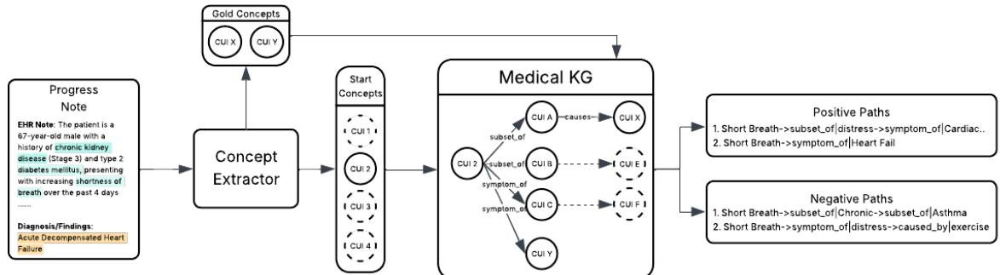
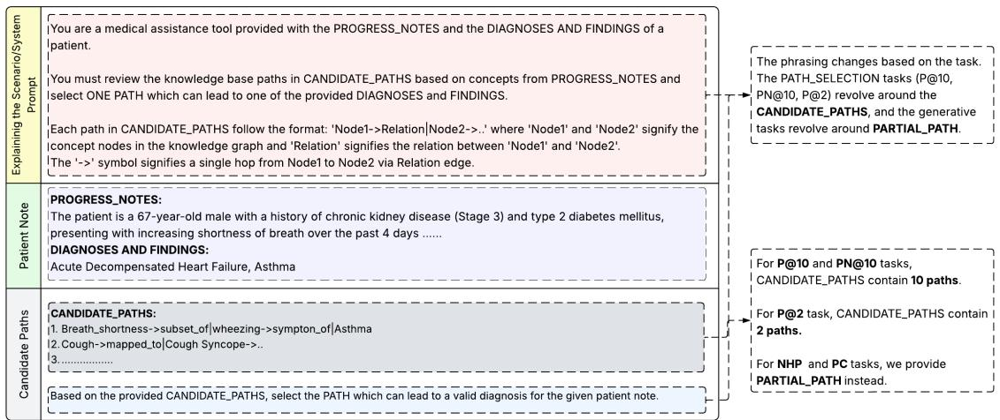
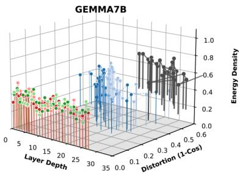
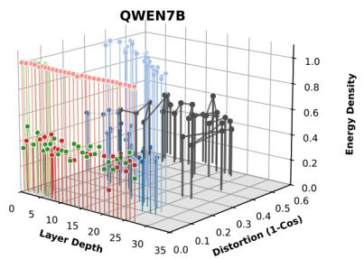
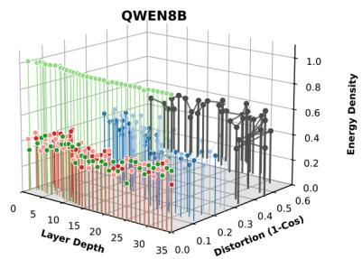
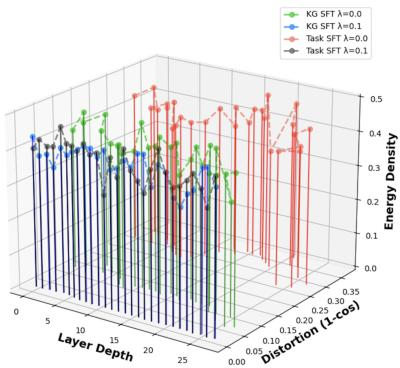
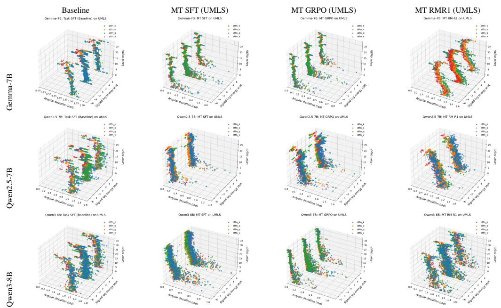
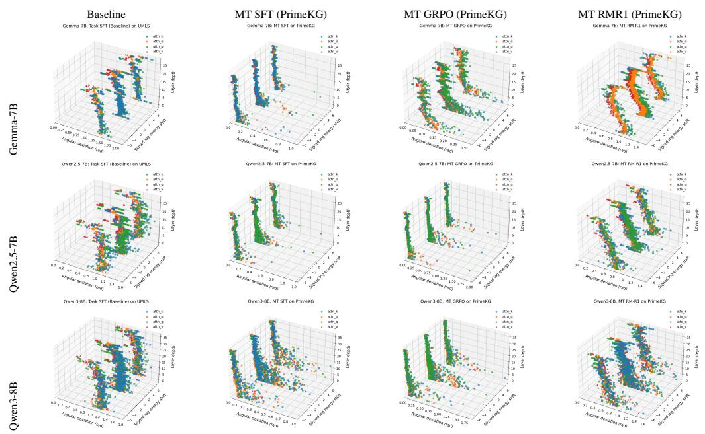

# Surgical Alignment in Knowledge Graph Training for Clinical Diagnosis with Large Language Models

Saksham Khatwani1, He Cheng1, Majid Afshar2, Dmitriy Dligach3, Yanjun Gao1

1University of Colorado Anschutz Medical Campus, 2University of Wisconsin Madison,

3Loyola University

Correspondence: yanjun.gao@cuanschutz.edu

## Abstract

Biomedical knowledge graphs (KGs) offer structured medical knowledge that can ground large language model (LLM) reasoning in clinical diagnosis application, yet how KG signal should be integrated into LLMs remains an open question. We present a systematic study spanning five KG task formulations, three training paradigms, two KGs, and three base LLMs. At the task level, all paradigms improve over the non-finetuned baseline, but methods with comparable in-domain accuracy show substantially different knowledge transfer behavior. We introduce Gradient Intervention Density (GID) and Gradient Distortion (GD) to measure how broadly an optimizer modifies the pretrained model. GID and GD together reveal a clear divide: KG-judgment training under KL regularization produces sparse, localized updates (a regime we term as surgical alignment), while task-specific SFT produces dense ones. A controlled ablation shows that the objective and KL contribute to sparsity independently, and the paradigms that produce sparse updates also improve reasoning quality, even when their in-domain accuracy is lower than taskspecific SFT. Assessing KG-LLM integration thus requires complementing accuracy with optimization-geometry diagnostics. Our imple mentation can be found at https://github. com/LARK-NLP-Lab/Surgical-Alignment.

## 1 Introduction

Large language models (LLMs) have demonstrated remarkable potential in clinical diagnostics (Goh et al., 2024; Liu et al., 2025), yet their outputs remain prone to factual error rather than grounded medical logic (Kim et al., 2025; Asgari et al., 2025). Biomedical Knowledge Graphs (KGs), which encode clinical concepts and their relations in a curated, structured form, offer a natural scaffolding necessary for trustworthy reasoning for grounding LLM reasoning in medical knowledge. However, how to incorporate KGs into LLMs for clinical diagnosis remains an open question.

Existing approaches differ in where the KG enters the pipeline. Inference-time methods use KG as retrieval context (e.g. Retrieval-Augmented Generation with prompting-based method (Gao et al., 2025; Zuo et al., 2025), or with external memories for agentic systems (Anokhin et al., 2025; Xu et al., 2025)). Training-time methods supervise LLM directly on KG-derived signals, either through supervised fine-tuning of the graph structure (Tian et al., 2024; Chen et al., 2025b,a), or through preferencebased reinforcement learning (RL) such as Group Relative Policy Optimization (GRPO) (Shao et al., 2024), reasoning as a reward model (Yan et al., 2025; Han et al., 2025), and implicit rewards derived from KG (Kansal and Jha, 2026). Within training-time methods, approaches further differ in task formulation: models may be trained to judge candidate reasoning paths or to generate paths from partial input (Kansal and Jha, 2026). As existing work is largely optimized and evaluated on narrow benchmarks and task-specific targets, the field lacks a unified understanding of which task formulations and objectives produce KG-grounded reasoning that generalizes beyond the supervision task, particularly in clinical diagnosis where KG reasoning may improve faithfulness.

We focus on the training-time question through a systematic study spanning five KG task formulations, consisting of three judgment-based tasks that assess the validity of reasoning paths and two generative tasks that complete partial reasoning chains. Moreover, we study three training paradigms, two KGs (UMLS (Bodenreider, 2004) and PrimeKG (Chandak et al., 2023)), and three base LLMs (Qwen2.5-7B, Qwen3-8B, Gemma-7B) (Qwen et al., 2025; Yang et al., 2025; Team et al., 2024). We investigate two complementary questions: (i) how each combination of task formulation and training paradigm shapes transfer to other KG tasks and downstream clinical benchmarks, and (ii) how each training objective reshapes the pretrained model itself. For the first, we evaluate transfer using ROUGE-L (Lin, 2004), CUI-F (Afshar et al., 2024; Gao et al., 2022), and QA accuracy across diagnosis prediction (Prob-Sum, DDXPlus) (Gao et al., 2022; Tchango et al., 2022) and medical QA (MedQA, MedMCQA) (Jin et al., 2020; Pal et al., 2022). All paradigms improve over the non-finetuned baseline, but methods with comparable in-domain accuracy exhibit substantially different transfer behavior, and their relative ordering reverses across benchmarks.

For the second, we move beneath task performance, since accuracy alone does not reveal how a given objective actually reshapes the model. We introduce Gradient Intervention Density (GID), a layer-wise diagnostic that quantifies the sparsity of an optimizer’s update footprint relative to the pretrained baseline. Additionally, we define Gradient Distortion (GD), which quantifies the deviation of model parameters from their pretrained baseline. Judgment-based KG objectives under Kullback-Leibler (KL) regularization induce sparse, localized updates, a regime we term surgical alignment, whereas task-specific SFT produces dense ones. A controlled ablation study shows that the KG objective alone produces sparser updates than taskspecific SFT (even without KL), and also improves clinical reasoning quality evaluated by PDSQI-9 (Croxford et al., 2025).

Our proposal is not a new RL architecture, but a novel analytical framework and insights for KG-LLM integration: the impact of different training paradigm on KGs, and what changes go behind it. Optimization geometry, alongside task accuracy, becomes a first-class evaluation dimension. While we evaluate this framework in clinical use-cases, it is domain agnostic. Our contributions include:

• Empirical landscape of KG-LLM integration We present a comprehensive study of various KG task formulations (path-judging vs. path generation), training paradigms (supervised fine-tuning vs. reinforcement learning), KG and LLM choice, examining how each combination shapes knowledge transfer across KG tasks and clinical diagnostic benchmarks.

• A lens of optimization-geometry We provide the first application of gradient-level optimization-geometry analysis to KG-LLM integration. We introduce Gradient Intervention Density (GID) and Gradient Distortion (GD), layer-wise metrics that quantifies the sparsity and deviation of an optimizer’s update footprint relative to the pretrained baseline.

• Conceptualizing surgical alignment Combining GID and GD analysis with a controlled ablation that varies training objective and KL strength independently, we establish surgical alignment: a regime where judgment-based KG training produces sparse, localized parameter updates that cooccur with improvements on higher-level PDSQI-9 reasoning dimensions (organization, synthesis), even when in-domain accuracy is lower than taskspecific SFT.

## 2 Related Work

KG as Context. KG can serve as dynamic context during inference through retrieval, prompting, and memory. Beyond the work discussed in §1, Jia et al. (2024) generate and rank candidate diagnoses using KG knowledge (medIKAL), while Zhao et al. (2025) combine RAG with a structured diagnostic KG (MedRAG) to refine EHR-based predictions. Zhang et al. (2024) introduce KnowGPT, which extracts relevant subgraphs to construct contextaware prompts. Lee et al. (2025) propose Chain ofKnowledge Graph (CoKG), where models construct and validate a weighted KG before summarization. Other works include evidence-grounded retrieval and reasoning frameworks such as Wu et al. (2024) and Jiang et al. (2024). KGs have also been used as structured memory for long-term reasoning: Jiang et al. (2026) organize memory into explicit graphs for precise retrieval, and Anokhin et al. (2025) build evolving experience-based KGs for planning. These methods treat KGs as external context rather than explicit training signals.

KG as Training Supervision. Recent work use KG-based supervision signals for training. KG-Adapter (Tian et al., 2024) injects KG structure via parameter-efficient adapters and requires architecture modification. Kansal and Jha (2026) use KG paths as implicit reward models for RL, enabling compositional reasoning and generalization to longer reasoning chains. Chen et al. (2025b) demonstrate that KG-enhanced fine-tuning improves knowledge manipulation capabilities in lowdata scenarios. These methods prove that KG can serve as effective signals for training.

Reward Models as Reasoning. Recent work reframes reward models as implicit reasoners rather than mere scorers. RM-R1 (Chen et al., 2026) treats reward modeling as a reasoning process with explicit rationales, while ReasonGRM (Chen et al., 2025a) uses large reasoning models to generate detailed reward explanations. Guo et al. (2025) propose reasoning reward models that perform explicit inference without ground-truth traces, and Khalifa et al. (2025) introduce step-by-step reasoning verifiers.

  
Figure 1: KG path extraction from patient progress notes. The concept extractor (QUICKUMLS (Soldaini, 2016) for UMLS KG and SIMSTRING-FAST (Okazaki and Tsujii, 2010) for PrimeKG) identifies the starting concepts based on entities in progress notes, and gold concepts based on diagnoses labels. For example in this figure, we can see that starting from concept CUI-2, the paths which end with CUI-X and CUI-Y are positive samples and other paths are negative.

## 3 Data Overview

KG selection. We use two KGs, UMLS (Bodenreider, 2004) and PrimeKG (Chandak et al., 2023). For UMLS, we adopt the diagnostic-reasoning version from Gao et al. (2025), retaining 107 SNOMED CT-based semantic relations relevant to diagnosis. For PrimeKG, we focus on Disease, Phenotype, and Drug node types.

Training data. We use two clinical datasets: ProbSum (Gao et al., 2023) and DDXPlus (Tchango et al., 2022). The ProbSum dataset was introduced as part of the BioNLP 2023 shared task on patient summarization (Gao et al., 2023). It contains 1,005 physician-annotated progress notes of ICU patients from MIMIC-III (Johnson et al., 2016). DDX-Plus is a large scale synthetic dataset which includes differential diagnosis, along with ground truth pathology, and antecedents for each patient. The dataset covers 49 pathologies, 110 symptoms and 113 antecedents.

Downstream evaluation. We use the MedQA (Jin et al., 2020) and MedMCQA (Pal et al., 2022) datasets. MedQA contains multiplechoice medical questions with four answer options and one correct answer. It spans various clinical scenarios, including treatment, management, and diagnosis. For our study, we focused on diagnosisrelated questions, yielding 1,796 training and 251 test samples. MedMCQA dataset is also a multiplechoice medical QA dataset derived from Indian medical entrance exams spanning various medical scenarios. We limit our study to the 2,560 diagnosis related questions.

## 4 Preprocessing

KG Path Extraction For each patient note, we map entities in the note to KG nodes (starting concepts) and the gold diagnosis to KG nodes (target concepts), then perform breadth-first search up to two hops from each starting concept. Paths reaching a target concept are labeled positive; others negative (as presented in Figure 1). For UMLS, we use QuickUMLS (Soldaini, 2016) and retain only diagnostically relevant semantic types (e.g., diseases, findings, and symptoms). In case of PrimeKG, we map entities to KG nodes through the SIMSTRING-FAST library (Okazaki and Tsujii, 2010) and focus on the Disease, Phenotype, and Drug node types. Concept Unique Identifiers (CUIs) anchor cross-KG alignment but are not provided as model input; they are used only for concept-level evaluation.

KG Training Task Formulation We define three task formulations over patient-specific KG paths. PATH SELECTION judges valid reasoning paths from candidate sets, with three variants: P@10, P@2, and PN@10. NEXT-HOP PREDICTION (NHP) and PATH COMPLETION (PC) are generative: given a partial path, the model predicts the next hop or completes the remaining path, respectively. See Table 1 for task details and Fig 2 for prompt structure.

Figure 2: Training Prompt structure for the different task formulation. The basic format includes the system initialization explaining the scenario, patient progress notes, patient diagnoses, either CANDIDATE\_PATH or PARTIAL\_PATH based on the task, and the final line explaining the task. For evaluation, we follow the same structure of the prompt, but remove the patient diagnoses part. CUI denotes Concept Unique Identifier, representing the KG node which our model’s output maps to.
<table><tr><td>Task Type</td><td>Task</td><td>Description</td></tr><tr><td rowspan="3">Path Selection</td><td>P@10</td><td>Given 10 candidate KG paths, identify one valid path.</td></tr><tr><td>P@2</td><td>Given 2 candidate KG paths, identify one valid path.</td></tr><tr><td>PN@10</td><td>Given 10 candidate KG paths, identify multiple valid paths.</td></tr><tr><td>Next-Hop</td><td>NHP</td><td>Given a partial KG path, predict the next hop.</td></tr><tr><td>Path Completion</td><td>PC</td><td>Given a partial KG path, predict the remaining path.</td></tr></table>

Table 1: Task formulations for training LLMs to reason over medical knowledge graphs. The three task types (Path Selection, NHP, and PC) probe complementary reasoning abilities. The Path Selection task requires model to judge the validity of the reasoning paths, whereas NHP and PC are generative reasoning tasks which require the models to complete the partial reasoning chains.

## 5 KG Training Paradigm

We conduct our experiments using Qwen2.5-7B-Instruct (Qwn7B)(Qwen et al., 2025), Qwen3-8B (Qwn8B)(Yang et al., 2025), and Gemma-7B-IT (Gem7B)(Team et al., 2024).

## 5.1 KG-based SFT

We perform supervised fine-tuning (SFT) under each individual task formulation listed in Table 1. SFT serves as an initial alignment stage that exposes the model to KG structure; we treat any resulting memorization of graph patterns as an expected property of this stage. In addition, a multitask SFT is applied to provide more uniform exposure to diverse KG structures and task formulations, reducing bias toward any single reasoning pattern. Concretely, we pool training data across the five task formulations in Table 1, subsampled to keep per-task training size consistent.

To preserve the base model’s output distribution, we add a Kullback-Leibler (KL) regularization term to the cross-entropy loss:

$$
\begin{array} { r } { \displaystyle \mathcal { L } _ { \mathrm { t o t a l } } ( \theta ) = \sum _ { t = 1 } ^ { T } \Bigg ( - \log p _ { \theta } ( y _ { t } \mid y _ { < t } , x ) + } \\ { \lambda \cdot \mathrm { K L } \Big ( p _ { \theta } ( y _ { t } \mid y _ { < t } , x ) \mid \mid p _ { \mathrm { N F T } } ( y _ { t } \mid y _ { < t } , x ) \Big ) \Bigg ) , } \end{array}\tag{1}
$$

where $\lambda \in \ [ 0 . 0 1 , 1 ]$ controls KL strength and p denotes the non-finetuned baseline distribution.

## 5.2 KG Reward Model as Reasoning Training

Beyond direct token-level fitting via SFT, rewardbased training frames KG learning as preference optimization over candidate outputs, which prior work suggests can yield more structured reasoning behavior (Chen et al., 2026; Shao et al., 2024). We instantiate this in three paradigms: GRPO, RM-R1, and Comp-GRPO.

GRPO. Each training instance contains a group of candidate paths (e.g., 10 paths for P@10, or PN@10); GRPO (Shao et al., 2024) optimizes relative preferences by assigning higher likelihood to valid diagnostic paths across the group. We apply GRPO to models that have already undergone KG-based SFT for each task formulation (as in §5.1). Importantly, because GRPO optimizes relative preferences within candidate groups under KL regularization, it encourages localized, comparisondriven updates rather than dense token-level fitting.

The reward function differs by task. For Path Selection, the reward is positive only when the model output contains all valid paths and none of the invalid ones:

$$
\begin{array} { r } { \mathcal { R } ( y ) = \left\{ \begin{array} { l l } { a , } & { \forall \hat { y } \in \mathrm { v a l i d \_ p a t h s } , \hat { y } \in y } \\ & { \& \ \forall \hat { y } \in \mathrm { w r o n g \_ p a t h s } , \hat { y } \notin y } \\ { b , } & { \mathrm { o t h e r w i s e } } \end{array} \right. } \end{array}\tag{2}
$$

For NHP, where multiple text outputs may refer to the same KG node, we map predictions to KG nodes via the concept extractors and reward CUIlevel matching:

$$
{ \mathcal { R } } ( y ) = { \left\{ \begin{array} { l l } { a , } & { { \mathrm { i f ~ } } \mathrm { C U I } ( y ) = \mathrm { C U I } ( { \mathrm { t r u e ~ l a b e l } } ) } \\ { b , } & { { \mathrm { o t h e r w i s e } } } \end{array} \right. }\tag{3}
$$

For PC task, we reward positively if the model’s path completion is equal to the label completion:

$$
{ \mathcal { R } } ( y ) = { \left\{ \begin{array} { l l } { a , } & { { \mathrm { i f ~ } } y = { \mathrm { t r u e ~ l a b e l } } } \\ { b , } & { { \mathrm { o t h e r w i s e } } } \end{array} \right. }\tag{4}
$$

In our experiments, we set $a = 1$ and $b = 0$ For the multi-task GRPO training, our reward function first checks the task type and then assigns the reward accordingly.

RM-R1 We adopt the RM-R1 framework (Chen et al., 2026) for training reasoning reward models (REASRM) in two stages: (1) reasoning distillation via SFT on Chain-of-Thought traces, and (2) GRPO over the distilled reward model. For SFT data, we sample 500 instances per task formulation and prompt HIPAA-compliant Azure GPT-o3-mini with patient notes, gold diagnoses, and the task answer to elicit detailed justifications. The RL stage reuses the GRPO reward (Eq. 4) with $a = 1$ $b = - 1$ , per the original paper.

Comp-GRPO We utilize the SFT+RL framework introduced by (Kansal and Jha, 2026) to train compositional KG-grounded reasoning models. For the SFT stage, we utilize our KG-based SFT checkpoints. The RL stage of this framework assigns a discrete reward $( R _ { b i n } )$ and a path alignment reward $( R _ { p a t h } )$ based on the token overlap between the model’s reasoning trace and the ground truth path. For $R _ { b i n }$ , we use the previously defined reward function (Eq. 4) with $a = 0 . 1$ and $b = - 1$ as defined in the framework. For $R _ { p a t h }$ , in accordance to the framework, we first tokenize and normalize the model’s final answer (y) to extract textual tokens $T ( y )$ . We also tokenize the ground truth label for the task and extract ground truth tokens $T ( g o l d )$ The coverage between the two sets of textual tokens is defined as:

$$
\mathsf { c o v e r a g e } = \frac { | T ( y ) \cap T ( g o l d ) | } { | T ( g o l d ) | }\tag{5}
$$

We define a minimum coverage constraint of at least two distinct tokens and apply a repetition penalty to mitigate reward hacking. $R _ { p a t h }$ is defined as:

$$
\begin{array} { r l } & { R _ { \mathrm { p a t h } } ( y , g o l d ) = \operatorname* { m i n } \Big ( \gamma _ { 1 } \cdot \mathrm { c o v e r a g e } + } \\ & { \gamma _ { 2 } \cdot \mathbb { I } \big ( | T ( y ) \cap T ( g o l d ) | \geq 2 \big ) , \ R _ { \operatorname* { m a x } } \Big ) } \end{array}\tag{6}
$$

Where $\gamma _ { 1 } = 1 . 2 , \gamma _ { 2 } = 0 . 3 , R _ { \mathrm { m a x } } = 1 . 5$ as defined by (Kansal and Jha, 2026). This reward is scaled by repetition penalty factor.

We conduct this training in two settings: (1) Applying both $R _ { b i n }$ and $R _ { p a t h }$ , and (2) Applying only $R _ { p a t h }$

## 5.3 Evaluation Setup

Metrics. We use ROUGE-L (Lin, 2004) for lexical overlap, and CUI-F (Afshar et al., 2024; Gao et al., 2022) for concept-level overlap by mapping generated text back to KG CUIs via Quick-UMLS (UMLS) and SIMSTRING (PrimeKG); precision/recall formulation is in Appendix B. ROUGE-L and CUI-F apply to KG-path tasks and to diagnosis prediction (ProbSum, DDXPlus); MedQA and MedMCQA use exact matching. We additionally evaluate diagnostic reasoning quality on ProbSum using PDSQI-9 (Croxford et al., 2025), a nine-criteria clinical rubric scored by an Azurehosted GPT-5-mini judge previously shown to correlate highly with human ratings.

Baselines. We compare against three baselines. (i) Task-specific SFT: LLMs fine-tuned directly on ProbSum and DDXPlus and evaluated across all downstream tasks. We do not fine-tune on QA benchmarks to avoid leaderboard contamination with pretraining data. (ii) RAG (UMLS) and RAG (PrimeKG): at inference time, we extract disease/symptom concepts from patient notes (or map QA answer choices to KG nodes) and retrieve 10 paths via BFS up to 2 hops, prepended to the NFT model’s prompt. (iii) NFT: the non-finetuned base model. We provide further details regarding how the models were trained, hardware, quantization, and Low-Rank Adaptation (LoRA) (Hu et al., 2021) in appendix A.

## 6 Task-level Results

We first examine task-level performance across KG tasks and downstream benchmarks; §7 then characterizes the same paradigms through optimization geometry.

<table><tr><td rowspan="3">Training Paradigm</td><td colspan="6">UMLS</td><td colspan="6">PrimeKG</td></tr><tr><td colspan="2">Qwn7B</td><td colspan="2">Qwn8B</td><td colspan="2">Gem7B</td><td colspan="2">Qwn7B</td><td colspan="2">Qwn8B</td><td colspan="2">Gem7B</td></tr><tr><td></td><td>CF</td><td>RL</td><td>CF</td><td>RL</td><td>CF</td><td>RL</td><td>CF</td><td>RL</td><td>CF</td><td>RL</td><td>CF</td></tr><tr><td>NFT</td><td>46.14</td><td>51.29</td><td>36.42</td><td>39.26</td><td>24.70</td><td>28.84</td><td>49.55</td><td>37.23</td><td>32.70</td><td>25.03</td><td>45.99</td><td>40.37</td></tr><tr><td>SFT</td><td>59.89</td><td>60.92</td><td>44.71</td><td>45.90</td><td>68.03</td><td>69.68</td><td>63.34</td><td>64.73</td><td>47.16</td><td>41.90</td><td>71.95</td><td>65.23</td></tr><tr><td>GRPO</td><td>57.74</td><td>59.24</td><td>56.82</td><td>58.29</td><td>64.37</td><td>66.34</td><td>68.09</td><td>60.95</td><td>49.66</td><td>40.81</td><td>71.73</td><td>65.75</td></tr><tr><td>Comp-GRPO</td><td>59.30</td><td>61.60</td><td>53.40</td><td>54.62</td><td>61.23</td><td>63.08</td><td>68.62</td><td>61.13</td><td>51.93</td><td>43.95</td><td>71.89</td><td>65.75</td></tr><tr><td>Comp-GRPO (only  $R _ { p a t h } )$ </td><td>60.32</td><td>62.13</td><td>55.12</td><td>55.76</td><td>59.70</td><td>61.94</td><td>69.31</td><td>60.95</td><td>51.80</td><td>42.69</td><td>71.60</td><td>65.43</td></tr><tr><td>RM-R1</td><td>58.04</td><td>58.79</td><td>63.91</td><td>62.75</td><td>61.33</td><td>62.01</td><td>61.94</td><td>60.78</td><td>60.58</td><td>59.13</td><td>71.29</td><td>71.70</td></tr></table>

Table 2: Rouge-L and CUI-F scores comparing various graph training paradigm across Qwen2.5-7B-Instruct, Qwen3-8B, and Gemma-7B-IT. We compare the multi-task checkpoints for the KG-based SFT, GRPO, and RM-R1 training paradigms against the NFT baseline. GRPO is performed to models which have already undergone SFT on KG paths. Comparison between different task formulations is highlighted in figure 3. The best performing checkpoints for each KG are marked with bold text.

<table><tr><td rowspan="3"></td><td rowspan="3">Training</td><td colspan="6">ProbSum</td><td colspan="6">DDXPlus</td></tr><tr><td colspan="2">Qwn7B</td><td colspan="2">Qwn8B</td><td colspan="2">Gem7B</td><td colspan="2">Qwn7B</td><td colspan="2">Qwn8B</td><td colspan="2">Gem7B</td></tr><tr><td>RL</td><td>CF</td><td>RL</td><td>CF</td><td>RL</td><td>CF</td><td>RL</td><td>CF</td><td>RL</td><td>CF</td><td>RL</td><td>CF</td></tr><tr><td rowspan="5">Baseline</td><td>NFT</td><td>22.14</td><td>26.05</td><td>04.15</td><td>16.36</td><td>20.20</td><td>25.33</td><td>10.90</td><td>09.50</td><td>01.58</td><td>05.72</td><td>06.38</td><td>05.52</td></tr><tr><td>SFT</td><td>26.09</td><td>27.53</td><td>04.72</td><td>17.87</td><td>17.48</td><td>30.42</td><td>22.98</td><td>46.20</td><td>13.62</td><td>38.95</td><td>28.60</td><td>46.07</td></tr><tr><td>Cross SFT</td><td>03.89</td><td>08.23</td><td>03.79</td><td>10.43</td><td>02.91</td><td>03.76</td><td>12.52</td><td>08.98</td><td>01.62</td><td>05.95</td><td>04.60</td><td>04.72</td></tr><tr><td>RAG - UMLS</td><td>14.09</td><td>06.09</td><td>09.08</td><td>03.05</td><td>08.49</td><td>14.65</td><td>05.45</td><td>02.66</td><td>04.00</td><td>01.59</td><td>03.37</td><td>07.17</td></tr><tr><td>RAG - PrimeKG</td><td>12.23</td><td>04.89</td><td>06.50</td><td>01.00</td><td>10.90</td><td>15.59</td><td>02.89</td><td>01.06</td><td>02.96</td><td>00.81</td><td>03.10</td><td>06.88</td></tr><tr><td rowspan="5">UMLS</td><td>SFT</td><td>22.79</td><td>26.11</td><td>04.16</td><td>16.33</td><td>19.33</td><td>26.98</td><td>11.75</td><td>08.64</td><td>01.55</td><td>05.71</td><td>06.93</td><td>05.50</td></tr><tr><td>GRPO</td><td>22.96</td><td>26.28</td><td>04.19</td><td>16.57</td><td>19.14</td><td>26.35</td><td>11.75</td><td>08.64</td><td>01.55</td><td>05.58</td><td>06.98</td><td>05.52</td></tr><tr><td>Comp-GRPO</td><td>20.82</td><td>19.40</td><td>04.78</td><td>27.26</td><td>14.01</td><td>26.82</td><td>10.47</td><td>10.44</td><td>01.26</td><td>06.90</td><td>05.51</td><td>08.28</td></tr><tr><td>Comp-GRPO (only  $R _ { p a t h } )$ </td><td>23.92</td><td>22.23</td><td>19.01</td><td>04.12</td><td>14.25</td><td>28.97</td><td>10.54</td><td>10.52</td><td>01.26</td><td>06.95</td><td>05.46</td><td>08.10</td></tr><tr><td>RM-R1</td><td>21.21</td><td>24.13</td><td>04.33</td><td>17.25</td><td>19.18</td><td>23.93</td><td>12.27</td><td>08.99</td><td>01.40</td><td>04.98</td><td>09.70</td><td>08.47</td></tr><tr><td rowspan="5">PrimeKG</td><td>SFT</td><td>22.07</td><td>26.52</td><td>04.18</td><td>16.55</td><td>16.79</td><td>24.73</td><td>11.08</td><td>09.52</td><td>01.55</td><td>05.59</td><td>07.06</td><td>06.15</td></tr><tr><td>GRPO</td><td>22.09</td><td>26.31</td><td>04.28</td><td>16.91</td><td>16.61</td><td>25.11</td><td>11.14</td><td>09.49</td><td>01.57</td><td>05.69</td><td>07.01</td><td>06.11</td></tr><tr><td>Comp-GRPO</td><td>19.95</td><td>23.77</td><td>04.90</td><td>26.95</td><td>12.50</td><td>26.55</td><td>10.05</td><td>09.60</td><td>01.24</td><td>07.03</td><td>05.34</td><td>08.39</td></tr><tr><td>Comp-GRPO (only  $R _ { p a t h } )$ </td><td>19.52</td><td>22.57</td><td>04.90</td><td>27.42</td><td>12.58 19.74</td><td>25.71 21.44</td><td>10.03 12.44</td><td>09.66 11.02</td><td>01.25</td><td>07.01 05.34</td><td>05.35</td><td>08.52</td></tr><tr><td>RM-R1</td><td>20.52</td><td>21.96</td><td>04.58</td><td>17.29</td><td></td><td></td><td></td><td></td><td>01.48</td><td></td><td>10.88</td><td>09.18</td></tr></table>

Table 3: Rouge-L (RL) and CUI-F (CF) scores for diagnosis prediction on ProbSum and DDXPlus test set. Multi-task checkpoints are evaluated alongside baseline methods. Best performing KG-trained method for each KG is marked as bold.

<table><tr><td rowspan=4 colspan=1>P NTP@</td><td></td><td></td><td></td><td></td><td></td><td></td><td></td><td></td><td></td><td></td><td></td></tr><tr><td rowspan=1 colspan=1>45.9</td><td rowspan=1 colspan=1>76.9</td><td rowspan=1 colspan=1>1.3</td><td rowspan=1 colspan=1>8.0</td><td rowspan=1 colspan=1>43.5</td><td></td><td rowspan=1 colspan=1>49.6</td><td rowspan=1 colspan=1>69.4</td><td rowspan=1 colspan=1>4.6</td><td rowspan=1 colspan=1>12.2</td><td rowspan=1 colspan=1>34.9</td></tr><tr><td rowspan=1 colspan=1>66.8</td><td rowspan=1 colspan=1>84.3</td><td rowspan=1 colspan=1>1.6</td><td rowspan=1 colspan=1>7.9</td><td rowspan=1 colspan=1>41.9</td><td></td><td rowspan=1 colspan=1>65.8</td><td rowspan=1 colspan=1>76.7</td><td rowspan=1 colspan=1>5.8</td><td rowspan=2 colspan=1>12.412.1</td><td rowspan=2 colspan=1>43.143.3</td></tr><tr><td rowspan=1 colspan=1>52.9</td><td rowspan=1 colspan=1>86.1</td><td rowspan=1 colspan=1>1.7</td><td rowspan=1 colspan=1>8.3</td><td rowspan=1 colspan=1>29.5</td><td></td><td rowspan=1 colspan=1>58.0</td><td rowspan=1 colspan=1>85.5</td><td rowspan=1 colspan=1>5.6</td></tr><tr><td rowspan=7 colspan=1>SFT MdeldHNPMUNI IO</td><td rowspan=2 colspan=1>46.644.8</td><td rowspan=2 colspan=1>73.071.6</td><td rowspan=2 colspan=1>3.44.5</td><td rowspan=1 colspan=1>10.2</td><td rowspan=1 colspan=1>26.2</td><td></td><td rowspan=1 colspan=1>49.9</td><td rowspan=1 colspan=1>69.1</td><td rowspan=1 colspan=1>19.2</td><td rowspan=1 colspan=1>15.5</td><td rowspan=1 colspan=1>32.8</td></tr><tr><td rowspan=1 colspan=1>10.9</td><td rowspan=1 colspan=1>45.6</td><td></td><td rowspan=1 colspan=1>50.1</td><td rowspan=1 colspan=1>66.4</td><td rowspan=1 colspan=1>13.9</td><td rowspan=1 colspan=1>15.7</td><td rowspan=1 colspan=1>30.8</td></tr><tr><td rowspan=1 colspan=1>66.1</td><td rowspan=1 colspan=1>85.6</td><td rowspan=1 colspan=1>2.0</td><td rowspan=1 colspan=1>8.1</td><td rowspan=1 colspan=1>42.6</td><td></td><td rowspan=1 colspan=1>65.5</td><td rowspan=1 colspan=1>79.4</td><td rowspan=1 colspan=1>6.6</td><td rowspan=1 colspan=1>12.3</td><td rowspan=1 colspan=1>46.8</td></tr><tr><td rowspan=1 colspan=1>59.9</td><td rowspan=1 colspan=1>85.1</td><td rowspan=1 colspan=1>4.5</td><td rowspan=1 colspan=1>10.0</td><td rowspan=1 colspan=1>32.8</td><td></td><td rowspan=1 colspan=1>72.1</td><td rowspan=1 colspan=1>86.3</td><td rowspan=1 colspan=1>17.4</td><td rowspan=1 colspan=1>14.9</td><td rowspan=1 colspan=1>47.4</td></tr><tr><td></td><td></td><td rowspan=3 colspan=1>NHPTask20</td><td rowspan=3 colspan=1>PC30</td><td rowspan=3 colspan=1>PN@1040</td><td></td><td rowspan=1 colspan=1>P@10</td><td rowspan=1 colspan=1>P@2</td><td rowspan=1 colspan=1>NHPTask</td><td rowspan=1 colspan=1>PC</td><td rowspan=1 colspan=1>PN@10</td></tr><tr><td rowspan=2 colspan=1>1</td><td rowspan=2 colspan=1>0</td><td></td><td rowspan=2 colspan=1>50</td><td rowspan=2 colspan=1>60</td><td rowspan=1 colspan=1></td><td rowspan=1 colspan=1>。</td><td></td></tr><tr><td></td><td></td><td rowspan=1 colspan=1></td><td rowspan=1 colspan=1>80</td></tr></table>

Figure 3: Cross-task generalization among the path-judging formulations across UMLS and PrimeKG. Results are reported in ROUGE-L scores. Due to space constraints, we present results from Qwen2.5-7B-Instruct, but observe consistent patterns across the other LLMs.

Path judging vs. generation. Figure 3 reports cross-task performance. Even without KG training, P@2 achieves high performance under both UMLS and PrimeKG (knowledge already encoded), whereas generative tasks such as NHP remain challenging, indicating a stronger reliance on explicit graph supervision. Models trained on pathjudging tasks (P@10, P@2, PN@10) generalize well within the same family, but transfer poorly to generative tasks such as NHP and PC, and vice versa. This asymmetry suggests that path discrimination objective induces more task-specific biases that have limited generalizability.

Multi-task robustness and training paradigm. The multi-task SFT model shows the most consistent cross-task performance across both KGs (Figure 3), improving robustness within judgmentbased formulations but with limited generalization to generative tasks (NHP, PC). Across paradigms (Table 2), SFT, GRPO, and RM-R1 achieve comparable in-domain performance, indicating that tasklevel accuracy alone cannot distinguish their reasoning behavior.

Downstream task performance. On diagnosis prediction (Table 3), task-specific SFT achieves the highest in-domain performance on ProbSum and DDXPlus; reward-trained models consistently outperform NFT but not task-specific SFT. On medical QA (Table 4), results are mixed: task-specific SFT wins on MedMCQA, while KG-trained models match or exceed it on MedQA. Diagnosisprediction SFT checkpoints show intermediate QA performance, suggesting partial transfer.

<table><tr><td>Task</td><td>Training</td><td>Qwn7B Qwn8B</td><td>GemB</td></tr><tr><td rowspan="7">MedMCQA</td><td>NFT RAG - UMLS</td><td>57.14 36.73 54.42</td><td>36.73</td></tr><tr><td>RAG - PrimeKG</td><td>36.73 54.42 36.73</td><td>36.73 36.73</td></tr><tr><td>Probsum SFT</td><td>63.27 36.73</td><td>32.65</td></tr><tr><td>DDXPlus SFT</td><td>63.27 32.65</td><td>30.61</td></tr><tr><td>Best UMLS model</td><td>60.20 36.73</td><td>36.73</td></tr><tr><td>Best PrimeKG model</td><td>59.18 36.73</td><td>36.73</td></tr><tr><td></td><td></td><td></td></tr><tr><td rowspan="7">MedQA</td><td>NFT</td><td>64.14</td><td>26.29</td><td>26.29</td></tr><tr><td>RAG - UMLS</td><td>60.29</td><td>26.29</td><td>26.29</td></tr><tr><td>RAG - PrimeKG</td><td>47.80</td><td>26.29</td><td>26.29</td></tr><tr><td>Probsum SFT</td><td>64.54</td><td>26.29</td><td>34.26</td></tr><tr><td>DDXPlus SFT</td><td>61.75</td><td>25.10</td><td>26.69</td></tr><tr><td>Best UMLS model</td><td>64.94</td><td>26.29</td><td></td></tr><tr><td>Best PrimeKG model</td><td>64.94</td><td>26.29</td><td>26.29 26.29</td></tr></table>

Table 4: QA results on MedMCQA and MedQA dataset. Best performing training paradigm for each model from Table 3 are evaluated alongside NFT models. The highest metric for each model is marked as bold, however the performance across different methods are similar and multiple methods achieve highest metric.

Clinical reasoning quality. On PDSQI-9 (Table 5), KG-trained models improve higher-level reasoning dimensions (organization, comprehensibility, synthesis) on Qwn7B and Gem7B, while showing no consistent gains on extractive accuracy or thoroughness. This pattern, structural rather than surface-level gains, motivates the gradient-level analysis in §7.

## 7 Gradient Analysis

The task-level patterns in $\ S 6$ raise a deeper question: what has each training paradigm actually done to the pretrained model? To answer this, we analyze the geometry of layer-wise parameter updates relative to the non-finetuned baseline (NFT) and characterize this comparison along two dimensions: direction (cosine alignment) and magnitude (norm ratio). For each fine-tuned model A and the NFT baseline model B, we calculate the normalized gradients of the attention parameters at each layer $( \mathbf { g } _ { A }$ and $\mathbf { g } _ { B }$ respectively). For LoRA-trained models, we merge the adapter weights with the base model weights before computing the gradients.

## 7.1 Diagnostic Framework

First, we use cosine similarity to measure the geometric alignment of layer-wise deltas $\mathbf { g } _ { A }$ and $\mathbf { g } _ { B }$ from two different models (Yu et al., 2020; Chen et al., 2018):

$$
\mathbf { C o s } ( \mathbf { g } _ { A } , \mathbf { g } _ { B } ) = \frac { \mathbf { g } _ { A } \cdot \mathbf { g } _ { B } } { \left\| \mathbf { g } _ { A } \right\| \left\| \mathbf { g } _ { B } \right\| } .\tag{7}
$$

where lower cosine similarity indicates larger directional divergences.

Second, we use energy shift to measure the relative intensity of updates. Since gradient norms reflect loss landscape geometry (He et al., 2019) and local convergence behavior (Damian et al., 2023), we quantify this using the logarithmic difference in L norms:

$$
\operatorname { E n e r g y } \operatorname { S h i f t } ( \mathbf { g } _ { A } , \mathbf { g } _ { B } ) = \log ( \left\| \mathbf { g } _ { A } \right\| ) - \log ( \left\| \mathbf { g } _ { B } \right\| )\tag{8}
$$

A positive shift indicates that model A exhibits more aggressive optimization energy in that layer compared to model B.

Raw direction and magnitude are continuous quantities sensitive to outliers in any single layer. More importantly, they do not directly answer the question we care about: which components in the pretrained model has the optimizer actually changed? We therefore treat optimization as a discrete intervention process. For each layer, we define an INTERVENTION EVENT as a parameter delta whose L2-norm shift exceeds a strict tolerance $\delta { \it \Delta \phi } = 1 0 ^ { - 9 }$ , chosen to separate optimization updates from floating-point noise. (Appendix 8 presents a sensitivity analysis of $\delta \ \in$ $\{ [ 1 0 ^ { - 6 } , 1 0 ^ { - 1 0 } ] \}$ , where the trends are stable across δ). Under this definition, a component is eithertouched or mathematically invariant.

We introduce Gradient Intervention Density (GID), the fraction of layer components classified as touched. GID provides a single scalar per layer that captures the scope, not the magnitude, of optimizer activity: the structural property that, we argue, governs how training reshapes pretrained representations. We complement GID with Gradient Distortion (GD) (1 − Cos) for directional misalignment. Unlike gradient-conflict analyses in multi-task learning (Yu et al., 2020), which characterize how multiple objectives interfere during training, GID isolates the discrete footprint of a single training objective relative to the pretrained anchor, providing a direct diagnostic comparable across different training checkpoints.

## 7.2 Results

Figure 4 visualizes layer-wise training dynamics by mapping layer depth (X), gradient distortion (Y), and Gradient Intervention Density (Z) relative to the non-finetuned baseline. Task-specific SFT (gray) modifies almost every component at every layer with high distortion (GD near 1.0). KGguided methods (GRPO and KG-SFT, in green/red shades) modify conservatively (GD well below 1.0): the sparse, surgical updates we predicted. RM-R1 (blue shades) sits in between, consistent with its lack of explicit KL regularization. Even in cases where GID for KG guided models are high, the GD is still low.

<table><tr><td rowspan="2">PDSQI-9</td><td colspan="3">NFT</td><td colspan="3">Task SFT</td><td colspan="3">Best UMLS model from Table 3</td><td colspan="3">Best PrimeKG model from Table 3</td></tr><tr><td>Qwn7B</td><td>Qwn8B</td><td>Gem7B</td><td>Qwn7B</td><td>Qwn8B</td><td>Gem7B</td><td>Qwn7B</td><td>Qwn8B</td><td>Gem7B</td><td>Qwn7B</td><td>Qwn8B</td><td>Gem7B</td></tr><tr><td>Acc.</td><td>1.69</td><td>2.22</td><td>1.52</td><td>1.81↑</td><td>1.52</td><td>2.06↑</td><td>1.62</td><td>2.12</td><td>1.68↑</td><td>1.88↑</td><td>1.80</td><td>1.32</td></tr><tr><td>Thorou.</td><td>2.14</td><td>2.08</td><td>1.54</td><td>1.55</td><td>1.32</td><td>1.38</td><td>2.16↑</td><td>1.80</td><td>1.56↑</td><td>2.06</td><td>1.84</td><td>1.44</td></tr><tr><td>Useful.</td><td>2.46</td><td>2.48</td><td>1.72</td><td>1.93</td><td>1.42</td><td>1.48</td><td>2.38</td><td>2.12</td><td>1.78↑</td><td>2.46</td><td>2.2</td><td>1.72</td></tr><tr><td>Org.</td><td>4.12</td><td>2.70</td><td>2.94</td><td>1.95</td><td>1.22</td><td>1.42</td><td>3.64</td><td>2.50</td><td>3.00↑</td><td>4.02</td><td>2.16</td><td>3.40↑</td></tr><tr><td>Comp.</td><td>4.50</td><td>3.70</td><td>4.52</td><td>3.28</td><td>1.98</td><td>2.58</td><td>4.32</td><td>3.56</td><td>4.62↑</td><td>4.46</td><td>3.14</td><td>4.48</td></tr><tr><td>Succ.</td><td>2.70</td><td>2.00</td><td>3.98</td><td>1.81</td><td>1.36</td><td>1.86</td><td>2.54</td><td>2.10↑</td><td>3.94</td><td>2.46</td><td>1.96</td><td>3.40</td></tr><tr><td>Synth.</td><td>3.00</td><td>2.32</td><td>0.76</td><td>1.45</td><td>0.64</td><td>1.14↑</td><td>2.1</td><td>2.36↑</td><td>0.60</td><td>2.74</td><td>1.86</td><td>1.42↑</td></tr><tr><td>Avg.</td><td>2.94</td><td>2.50</td><td>2.42</td><td>1.97</td><td>1.35</td><td>1.70</td><td>2.68</td><td>2.36</td><td>2.45↑</td><td>2.86</td><td>2.13</td><td>2.45↑</td></tr></table>

Table 5: Best KG-trained LLM on ProbSum, evaluated by PDSQI-9 criteria, consisting of Accuracy (Extractive), Thoroughness, Usefulness, Organization, Comprehensibility, Succinctness, Synthesis/Abstraction metrics. Baselines include NFT models and Probsum SFT models. We compare the baselines with the best performing KG-trained models on the Probsum task, on Table 3. ↑ denotes an improvement over the baseline models. In case of UMLS KG, the best checkpoints for Qwn7B, Qwn8B, and Gem7B are GRPO, RM-R1, and SFT respectively. In case of PrimeKG, the best checkpoints for Qwn7B, Qwn8B, and Gem7B are GRPO, RM-R1, and RM-R1 respectively.

  
-- Task SFT (Baseline) -- GRPO (PrimeKG) --GRPO (UMLS) -- RMR1 (PrimeKG) - RMR1 (UMLS) -- SFT (PrimeKG) -- SFT (UMLS)

Figure 4: Gradient analysis across Models and training paradigms. We map the layer-wise gradients using Layer Depth (X), Gradient Distortion (Y), and Gradient Intervention Density (Z).
<table><tr><td></td><td></td><td colspan="2">KG SFT</td><td colspan="2">ProbSum SFT</td></tr><tr><td>Task</td><td>λ</td><td>Rouge-L</td><td>CUI-F</td><td>Rouge-L</td><td>CUI-F</td></tr><tr><td>Probsum</td><td>0.0</td><td> $1 8 . 8 8 \pm 0 . 0 3$ </td><td> $2 4 . 0 0 \pm 0 . 0 0$ </td><td> $2 2 . 9 2 \pm 0 . 0 1$ </td><td> $2 5 . 8 7 \pm 0 . 0 0$ </td></tr><tr><td></td><td>0.1</td><td> $1 8 . 9 4 \pm 0 . 0 2$ </td><td> $2 2 . 6 6 \pm 0 . 0 0$ </td><td> $1 9 . 4 8 \pm 0 . 0 3$ </td><td> $2 4 . 8 8 \pm 0 . 0 0$ </td></tr><tr><td></td><td></td><td colspan="4">Out-of-distribution test set</td></tr><tr><td></td><td></td><td colspan="2">Accuracy</td><td colspan="2"> $\operatorname { A c c u r a c y }$ </td></tr><tr><td>MedQA</td><td>0.0</td><td colspan="2"> $6 4 . 1 4 \pm 1 . 1 7$ </td><td colspan="2"> $6 4 . 5 4 \pm 0 . 6 5$ </td></tr><tr><td></td><td>0.1</td><td colspan="2"> $6 4 . 0 1 \pm 1 . 1 7$ </td><td colspan="2"> $6 3 . 6 1 \pm 0 . 1 8$ </td></tr><tr><td>MedMCQA</td><td>0.0</td><td colspan="2"> $5 7 . 8 2 \pm 2 . 5 4$ </td><td colspan="2"> $5 9 . 1 8 \pm 0 . 0 0$ </td></tr><tr><td></td><td>0.1</td><td colspan="2"> $5 7 . 1 4 \pm 0 . 0 0$ </td><td colspan="2"> $5 7 . 8 2 \pm 0 . 9 6$ </td></tr></table>

Table 6: Ablation study on Qwen2.5-7B-Instruct model. We report the average ROUGE-L score ± standard deviation (sd) across three runs on the Probsum diagnosis task. Furthermore, we also report mean accuracy scores ± sd across three runs on the MedQA and MedMCQA dataset.

  
Figure 5: Gradient analysis across Qwn7B models in our ablation study.

This ordering holds across all three base models (Gemma-7B, Qwen2.5-7B, Qwen3-8B), suggesting the pattern reflects the training paradigm rather than the model. We term this sparse regime surgical alignment: parameter updates that touch only what is needed while leaving most of the pretrained model intact.

The paradigms with the sparsest GID profiles (KG-SFT and GRPO) are the same ones that improved Qwn7B and Gem7B on higher-order PDSQI-9 dimensions in §6. Task SFT, despite winning in-domain ROUGE-L, did not improve those dimensions. In short: where the optimizer puts its updates matters more for clinical reasoning quality than how much it updates.

## 7.3 Ablation: objective vs. KL divergence

Is the sparse update footprint of surgical alignment driven by the KG-judgment objective, by KL regularization, or by both? Without disentangling these factors, the §7.2 finding could collapse into a familiar fact: KL regularization always produces small updates. We run a controlled $2 \times 2$ ablation to determine which factor matters.

We compare two objectives, Task-specific SFT (on ProbSum) and Multi-task KG-judgment SFT, each trained at KL strength $\lambda \in \{ 0 , 0 . 1 \}$ . All four cells use Qwn7B, matched training data size (multitask KG SFT is subsampled to ProbSum size), identical LoRA configuration, fixed learning rate (no per-cell tuning), equal training steps, and 3 random seeds. Table 6 reports task-level performance across the four cells; gradient-level results are in figure 5. Three patterns emerge:

1) Task-specific supervision dominates indomain. At λ = 0, ProbSum SFT achieves the highest in-domain ROUGE-L on ProbSum (22.92 vs. KG SFT’s 18.88), as expected.

2) ProbSum SFT is sensitive to KL. Adding KL drops its performance on every metric, even for out-of-distribution test set: ProbSum ROUGE-L 22.92 → 19.48, MedQA 64.54 → 63.61, MedM-CQA 59.18 → 57.82.

3) KG SFT is robust to KL. It is essentially flat across λ on all three evaluations (ProbSum 18.88 → 18.94; MedQA 64.14 → 64.01; MedM-CQA 57.82 → 57.14). Adding KL does not meaningfully change KG SFT’s behavior.

Figure 5 confirms why: KG-judgment SFT already produces a sparse update footprint at λ = 0, before any KL regularization is applied. The optimizer touches only a subset of components, so adding KL has little additional effect. Prob-Sum SFT, by contrast, modifies the parameter set broadly at λ = 0, and KL must subsequently constrain it (at the cost of in-domain accuracy).

The objective alone contributes to sparsity, which KL just stacks on top off. This further confirms that surgical alignment is a property of the KG-judgment objective, not an artifact of regularization. Practically, this means objective selection is the primary lever for surgical updates, where task SFT could fail at preserving the pretrained model’s broader clinical reasoning even when winning on the trained benchmark.

## 8 Conclusion

Through Gradient Intervention Density (GID) and Gradient Distortion (GD), we identify surgical alignment as a property of judgment-based KG training: sparse, localized parameter updates that preserve the pretrained model’s broader reasoning. Optimization geometry should be a first-class evaluation dimension alongside task accuracy for clinical KG-LLM integration.

## 9 Acknowledgments

This work is supported by U.S. National Library of Medicine, National Institute of Health, under award number R00LM014308.

## 10 Limitations

While our work focuses on the systematic evaluation of LLMs across different task formulations, training paradigms, and knowledge graphs (KGs), this evaluation can be further expanded to better understand training dynamics across diverse domains. Furthermore, we limit our study to three commonly used LLMs; however, this work can be extended to provide a broader evaluation of additional LLMs. Finally, while we introduce a mechanistic perspective for understanding KG–LLM integration through GID, we do not propose a novel RL training framework aimed at improving performance metrics.

## 11 Ethical Considerations

This study uses the ProbSum dataset, which is built using the MIMIC-III dataset which is a deidentified clinical datasets containing no personally identifiable information. For generating reasoning traces, we used Azure GPT-o3-mini and for the PDSQI-9 evaluations, we use Azure GPT-5-mini (ICC ≥ 0.8) as the LLM-as-judge to score the ProbSum test set. Azure is a HIPAA-compliant environment and therefore complies with the MIMIC Data Use Agreement. Our motivation is to investigate and enhance the capabilities of current LLMs in the context of diagnostic reasoning. While AI tools have substantial potential to support healthcare professionals, existing LLMs exhibit limitations that must be addressed to enable their safe and effective adoption in clinical settings. Key challenges include mitigating hallucinations, preserving patient privacy, and overcoming other factors that may compromise reliability and trustworthiness.

## References

Majid Afshar, Yanjun Gao, Deepak Gupta, Emma Croxford, and Dina Demner-Fushman. 2024. On the role

of the umls in supporting diagnosis generation proposed by large language models. Journal ofBiomedical Informatics, 157:104707.

Takuya Akiba, Shotaro Sano, Toshihiko Yanase, Takeru Ohta, and Masanori Koyama. 2019. Optuna: A nextgeneration hyperparameter optimization framework. Preprint, arXiv:1907.10902.

Petr Anokhin, Nikita Semenov, Artyom Sorokin, Dmitry Evseev, Andrey Kravchenko, Mikhail Burtsev, and Evgeny Burnaev. 2025. Arigraph: learning knowledge graph world models with episodic memory for llm agents. In Proceedings ofthe Thirty-Fourth International Joint Conference on Artificial Intelligence, IJCAI ’25.

Elham Asgari, Nina Montaña-Brown, Magda Dubois, Saleh Khalil, Jasmine Balloch, Joshua Au Yeung, and Dominic Pimenta. 2025. A framework to assess clinical safety and hallucination rates of llms for medical text summarisation. npj Digital Medicine, 8(1):274.

Olivier Bodenreider. 2004. The unified medical language system (umls): integrating biomedical terminology. Nucleic acids research, 32 Database issue:D267–70.

Payal Chandak, Kexin Huang, and Marinka Zitnik. 2023. Building a knowledge graph to enable precision medicine. Sci. Data, 10(1):67.

Bin Chen, Xinzge Gao, Chuanrui Hu, Penghang Yu, Hua Zhang, and Bing-Kun Bao. 2025a. Reasongrm: Enhancing generative reward models through large reasoning models. arXiv preprint arXiv:2506.16712.

Hanzhu Chen, Xu Shen, Jie Wang, Zehao Wang, Qitan Lv, Junjie He, Rong Wu, Feng Wu, and Jieping Ye. 2025b. Knowledge graph finetuning enhances knowledge manipulation in large language models. In The Thirteenth International Conference on Learning Representations.

Xiusi Chen, Gaotang Li, Ziqi Wang, Bowen Jin, Cheng Qian, Yu Wang, Hongru Wang, Yu Zhang, Denghui Zhang, Tong Zhang, Hanghang Tong, and Heng Ji. 2026. Rm-r1: Reward modeling as reasoning. Preprint, arXiv:2505.02387.

Zhao Chen, Vijay Badrinarayanan, Chen-Yu Lee, and Andrew Rabinovich. 2018. Gradnorm: Gradient normalization for adaptive loss balancing in deep multitask networks. In International conference on machine learning, pages 794–803. PMLR.

Emma Croxford, Yanjun Gao, Nicholas Pellegrino, Karen K. Wong, Graham Wills, Elliot First, Miranda Schnier, Kyle Burton, Cris G. Ebby, Jillian Gorskic, Matthew Kalscheur, Samy Khalil, Marie Pisani, Tyler Rubeor, Peter Stetson, Frank Liao, Cherodeep Goswami, Brian Patterson, and Majid Afshar. 2025. Development and validation of the provider documentation summarization quality instrument for large language models. Preprint, arXiv:2501.08977.

Alex Damian, Eshaan Nichani, Rong Ge, and Jason D Lee. 2023. Smoothing the landscape boosts the signal for sgd: Optimal sample complexity for learning single index models. Advances in Neural Information Processing Systems, 36:752–784.

Tim Dettmers, Artidoro Pagnoni, Ari Holtzman, and Luke Zettlemoyer. 2023. Qlora: Efficient finetuning of quantized llms. Preprint, arXiv:2305.14314.

Yanjun Gao, Dmitriy Dligach, Timothy Miller, and Majid Afshar. 2023. Overview of the problem list summarization (ProbSum) 2023 shared task on summarizing patients’ active diagnoses and problems from electronic health record progress notes. In Proceedings of the 22nd Workshop on Biomedical Natural Language Processing and BioNLP Shared Tasks, pages 461–467, Toronto, Canada. Association for Computational Linguistics.

Yanjun Gao, Dmitriy Dligach, Timothy Miller, Dongfang Xu, Matthew M. M. Churpek, and Majid Afshar. 2022. Summarizing patients’ problems from hospital progress notes using pre-trained sequenceto-sequence models. In Proceedings ofthe 29th International Conference on Computational Linguistics, pages 2979–2991, Gyeongju, Republic of Korea. International Committee on Computational Linguistics.

Yanjun Gao, Ruizhe Li, Emma Croxford, John Caskey, Brian W Patterson, Matthew Churpek, Timothy Miller, Dmitriy Dligach, and Majid Afshar. 2025. Leveraging medical knowledge graphs into large language models for diagnosis prediction: Design and application study. Jmir Ai, 4:e58670.

Ethan Goh, Robert Gallo, Jason Hom, Eric Strong, Yingjie Weng, Hannah Kerman, Joséphine A Cool, Zahir Kanjee, Andrew S Parsons, Neera Ahuja, and 1 others. 2024. Large language model influence on diagnostic reasoning: a randomized clinical trial. JAMA network open, 7(10):e2440969–e2440969.

Jiaxin Guo, Zewen Chi, Li Dong, Qingxiu Dong, Xun Wu, Shaohan Huang, and Furu Wei. 2025. Reward reasoning model. Preprint, arXiv:2505.14674.

Haoyu Han, Yaochen Xie, Hui Liu, Xianfeng Tang, Sreyashi Nag, William Headden, Yang Li, Chen Luo, Shuiwang Ji, Qi He, and 1 others. 2025. Reasoning with graphs: Structuring implicit knowledge to enhance llms reasoning. arXiv preprint arXiv:2501.07845.

Haowei He, Gao Huang, and Yang Yuan. 2019. Asymmetric valleys: Beyond sharp and flat local minima. Advances in neural information processing systems, 32.

Edward J. Hu, Yelong Shen, Phillip Wallis, Zeyuan Allen-Zhu, Yuanzhi Li, Shean Wang, Lu Wang, and Weizhu Chen. 2021. Lora: Low-rank adaptation of large language models. Preprint, arXiv:2106.09685.

Mingyi Jia, Junwen Duan, Yan Song, and Jianxin Wang. 2024. medikal: Integrating knowledge graphs as

assistants of llms for enhanced clinical diagnosis on emrs. arXiv preprint arXiv:2406.14326.

Dongming Jiang, Yi Li, Guanpeng Li, and Bingzhe Li. 2026. Magma: A multi-graph based agentic memory architecture for ai agents. arXiv preprint arXiv:2601.03236.

Pengcheng Jiang, Cao Xiao, Minhao Jiang, Parminder Bhatia, Taha A. Kass-Hout, Jimeng Sun, and Jiawei Han. 2024. Reasoning-enhanced healthcare predictions with knowledge graph community retrieval. ArXiv, abs/2410.04585.

Di Jin, Eileen Pan, Nassim Oufattole, Wei-Hung Weng, Hanyi Fang, and Peter Szolovits. 2020. What disease does this patient have? a large-scale open domain question answering dataset from medical exams. Preprint, arXiv:2009.13081.

Alistair E. W. Johnson, Tom J. Pollard, Lu Shen, Li wei H. Lehman, Mengling Feng, Mohammad Mahdi Ghassemi, Benjamin Moody, Peter Szolovits, Leo Anthony Celi, and Roger G. Mark. 2016. Mimic-iii, a freely accessible critical care database. Scientific Data, 3.

Yuval Kansal and Niraj K Jha. 2026. Knowledge graphs are implicit reward models: Path-derived signals enable compositional reasoning. arXiv preprint arXiv:2601.15160.

Muhammad Khalifa, Rishabh Agarwal, Lajanugen Logeswaran, Jaekyeom Kim, Hao Peng, Moontae Lee, Honglak Lee, and Lu Wang. 2025. Process reward models that think. Preprint, arXiv:2504.16828.

Yubin Kim, Hyewon Jeong, Shan Chen, Shuyue Stella Li, Mingyu Lu, Kumail Alhamoud, Jimin Mun, Cristina Grau, Minseok Jung, Rodrigo Gameiro, and 1 others. 2025. Medical hallucinations in foundation models and their impact on healthcare. arXiv preprint arXiv:2503.05777.

Kangil Lee, Jinwoo Jang, Youngjin Lim, and Minsu Shin. 2025. Chain of knowledge graph: Informationpreserving multi-document summarization for noisy documents. In Proceedings of Bridging Neurons and Symbolsfor Natural Language Processing and Knowledge Graphs Reasoning@ COLING 2025, pages 1–5.

Chin-Yew Lin. 2004. Rouge: A package for automatic evaluation of summaries. In Text summarization branches out, pages 74–81.

Xiaohong Liu, Hao Liu, Guoxing Yang, Zeyu Jiang, Shuguang Cui, Zhaoze Zhang, Huan Wang, Liyuan Tao, Yongchang Sun, Zhu Song, Tianpei Hong, Jin Yang, Tianrun Gao, Jiangjiang Zhang, Xiaohu Li, Jing Zhang, Ye Sang, Zhao Yang, Kanmin Xue, and 5 others. 2025. A generalist medical language model for disease diagnosis assistance. Nat Med, 31(3):932– 942.

Naoaki Okazaki and Jun’ichi Tsujii. 2010. Simple and efficient algorithm for approximate dictionary matching. In Proceedings of the 23rd International Conference on Computational Linguistics (Coling 2010), pages 851–859, Beijing, China. Coling 2010 Organizing Committee.

Ankit Pal, Logesh Kumar Umapathi, and Malaikannan Sankarasubbu. 2022. Medmcqa : A large-scale multisubject multi-choice dataset for medical domain question answering. Preprint, arXiv:2203.14371.

Qwen, :, An Yang, Baosong Yang, Beichen Zhang, Binyuan Hui, Bo Zheng, Bowen Yu, Chengyuan Li, Dayiheng Liu, Fei Huang, Haoran Wei, Huan Lin, Jian Yang, Jianhong Tu, Jianwei Zhang, Jianxin Yang, Jiaxi Yang, Jingren Zhou, and 25 others. 2025. Qwen2.5 technical report. Preprint, arXiv:2412.15115.

Zhihong Shao, Peiyi Wang, Qihao Zhu, Runxin Xu, Junxiao Song, Xiao Bi, Haowei Zhang, Mingchuan Zhang, Y. K. Li, Y. Wu, and Daya Guo. 2024. Deepseekmath: Pushing the limits of mathematical reasoning in open language models. Preprint, arXiv:2402.03300.

Luca Soldaini. 2016. Quickumls: a fast, unsupervised approach for medical concept extraction.

Arsene Fansi Tchango, Rishab Goel, Zhi Wen, Julien Martel, and Joumana Ghosn. 2022. Ddxplus: A new dataset for automatic medical diagnosis. Preprint, arXiv:2205.09148.

Gemma Team, Thomas Mesnard, Cassidy Hardin, Robert Dadashi, Surya Bhupatiraju, Shreya Pathak, Laurent Sifre, Morgane Rivière, Mihir Sanjay Kale, Juliette Love, Pouya Tafti, Léonard Hussenot, Pier Giuseppe Sessa, Aakanksha Chowdhery, Adam Roberts, Aditya Barua, Alex Botev, Alex Castro-Ros, Ambrose Slone, and 89 others. 2024. Gemma: Open models based on gemini research and technology. Preprint, arXiv:2403.08295.

Shiyu Tian, Yangyang Luo, Tianze Xu, Caixia Yuan, Huixing Jiang, Chen Wei, and Xiaojie Wang. 2024. KG-adapter: Enabling knowledge graph integration in large language models through parameter-efficient fine-tuning. In Findings ofthe Associationfor Computational Linguistics: ACL 2024, pages 3813–3828, Bangkok, Thailand. Association for Computational Linguistics.

Junde Wu, Jiayuan Zhu, Yunli Qi, Jingkun Chen, Min Xu, Filippo Menolascina, and Vicente Grau. 2024. Medical graph rag: Towards safe medical large language model via graph retrieval-augmented generation. Preprint, arXiv:2408.04187.

Mufan Xu, Gewen Liang, Kehai Chen, Wei Wang, Xun Zhou, Muyun Yang, Tiejun Zhao, and Min Zhang. 2025. Memory-augmented query reconstruction for LLM-based knowledge graph reasoning. In Findings of the Association for Computational Linguistics: ACL 2025, pages 24068–24084, Vienna, Austria. Association for Computational Linguistics.

Lian Yan, Chen Tang, Yi Guan, Haotian Wang, Songyuan Wang, Haifeng Liu, Yang Yang, and Jingchi Jiang. 2025. Rlkgf: Reinforcement learning from knowledge graph feedback without human annotations. In Findings ofthe Associationfor Computational Linguistics: ACL 2025, pages 6619–6633.

An Yang, Anfeng Li, Baosong Yang, Beichen Zhang, Binyuan Hui, Bo Zheng, Bowen Yu, Chang Gao, Chengen Huang, Chenxu Lv, Chujie Zheng, Dayiheng Liu, Fan Zhou, Fei Huang, Feng Hu, Hao Ge, Haoran Wei, Huan Lin, Jialong Tang, and 41 others. 2025. Qwen3 technical report. Preprint, arXiv:2505.09388.

Dong Yu, Kaisheng Yao, Hang Su, Gang Li, and Frank Seide. 2013. Kl-divergence regularized deep neural network adaptation for improved large vocabulary speech recognition. In 2013 IEEE International Conference on Acoustics, Speech and Signal Processing, pages 7893–7897.

Tianhe Yu, Saurabh Kumar, Abhishek Gupta, Sergey Levine, Karol Hausman, and Chelsea Finn. 2020. Gradient surgery for multi-task learning. Advances in neural information processing systems, 33:5824– 5836.

Qinggang Zhang, Junnan Dong, Hao Chen, Daochen Zha, Zailiang Yu, and Xiao Huang. 2024. Knowgpt: Knowledge graph based prompting for large language models. Advances in Neural Information Processing Systems, 37:6052–6080.

Xuejiao Zhao, Siyan Liu, Su-Yin Yang, and Chunyan Miao. 2025. Medrag: Enhancing retrievalaugmented generation with knowledge graph-elicited reasoning for healthcare copilot. In Proceedings of the ACM on Web Conference 2025, pages 4442–4457.

Kaiwen Zuo, Yirui Jiang, Fan Mo, and Pietro Lio. 2025. Kg4diagnosis: A hierarchical multi-agent llm framework with knowledge graph enhancement for medical diagnosis. In AAAI Bridge Program on AI for Medicine and Healthcare, pages 195–204. PMLR.

## A Training Details

For all SFT trainings, we apply Kullback-Leibler (KL) Divergence regularization (Yu et al., 2013). This limits the divergence of internal state representation of the finetuned models from the nonfinetuned model. For each task formulation, we perform hyperparameter tuning for 10 trials using the Optuna framework (Akiba et al., 2019) and select the KL-divergence hyperparameter between 0.01 and 1. Moreover, to finetune models efficiently, we utilize Low-Rank Adaptation (LoRA) (Hu et al., 2021) technique and apply 4- bit NF4 quantization (Dettmers et al., 2023). We also limit our training to only the attention layers and apply LoRA with rank 16. For GRPO training, we sample 6 candidate generations with maximum new token length of 256 from the model and use 0.001 as the KL-divergence hyperparameter. For the GRPO stage in the RM-R1 paradigm, we sample 6 candidate generations with a maximum new token length of 512 to work within the available hardware. All the trainings were performed on a Dell server with two Nvidia H100 GPUs. We also apply early stopping with PATIENCE of 2 for all our trainings.

## B Evaluation setup

We define the Precision and Recall to evaluate concept grounded F1 score (CUI-F) as:

$$
\mathrm { P r e c i s i o n } = \frac { \left| P r e d i c t e d \cap G o l d \right| } { \left| P r e d i c t e d \right| } \quad \mathrm { R e c a l l } = \frac { \left| P r e d i c t e d \cap G o l d \right| } { \left| G o l d \right| }\tag{9}
$$

Where Predicted represents the set of KG concepts in model’s prediction and Gold reflects the set of KG concepts in ground truth label.

## C Detailed training dynamics

In this section, we conduct a detailed gradient analysis to compare the fine-tuned model (gB) against its non fine-tuned baseline (gA). We utilize four metrics to characterize the optimization trajectory: Cosine Similarity (Cos), Mean Squared Error (Mse), Energy Shift (Egy), and Sign Agreement (Sgn).

• Cosine Similarity (Cos) measures the geometric alignment between the fine-tuned and baseline gradient vectors. It is defined as:

$$
\mathbf { C o s } ( \mathbf { g } _ { A } , \mathbf { g } _ { B } ) = \frac { \mathbf { g } _ { A } \cdot \mathbf { g } _ { B } } { \| \mathbf { g } _ { A } \| \| \mathbf { g } _ { B } \| + \epsilon } ,\tag{10}
$$

where ϵ is a small constant for numerical stability. A value close to 1.0 indicates that the optimization direction aligns with the baseline manifold.

• Mean Squared Error (Mse) quantifies the average magnitude of the difference between updates:

$$
\mathbf { M s e } ( \mathbf { g } _ { A } , \mathbf { g } _ { B } ) = \frac { 1 } { N } \| \mathbf { g } _ { A } - \mathbf { g } _ { B } \| ^ { 2 } ,\tag{11}
$$

where N represents the total number of parameters in the layer. Lower MSE values indicate that the model adapts through minimal deviations from the initialization.

  
Figure 6: Gradient-level optimization dynamics. Layer-wise analysis for Baseline and UMLS-based methods across three models.

  
Figure 7: Gradient-level optimization dynamics. Layer-wise analysis for Baseline and PrimeKG-based methods across three models.

<table><tr><td rowspan="2">KG</td><td rowspan="2">Method</td><td rowspan="2">Met.</td><td colspan="4">Qwen2.5-7B</td><td colspan="4">Qwen3-8B</td><td colspan="4">Gemma-7B</td></tr><tr><td>Q</td><td>K</td><td>V</td><td>0</td><td>Q</td><td>K</td><td>V</td><td>0</td><td>Q</td><td>K</td><td>V</td><td>0</td></tr><tr><td rowspan="3">Baseline</td><td rowspan="3">Task SFT</td><td>Cos</td><td>0.4274</td><td>0.4253</td><td>0.5275</td><td>0.4544</td><td>0.3784</td><td>0.3424</td><td>0.4366 0.3597</td><td>0.1137</td><td></td><td>0.1224</td><td>0.1929</td><td>0.1470 1.4e-07</td></tr><tr><td>Mse</td><td>8.9e-08</td><td>6.3e-07</td><td>5.1e-07</td><td>8.5e-08</td><td>7.4e-08</td><td>3.1e-07</td><td>2.7e-07</td><td>7.6e-08</td><td>1.4e-07</td><td>1.4e-07</td><td>1.3e-07</td><td></td></tr><tr><td>Egy</td><td>-5.2e-09 0.6262</td><td>1.9e-09 0.6282</td><td>1.2e-09 0.6443</td><td>8.5e-10 0.6400</td><td>-2.5e-10 0.6022</td><td>2.3e-09 0.5990</td><td>-1.3e-09 0.6126</td><td>-8.3e-11 0.6177</td><td>-1.8e-09 0.5354</td><td>-2.1e-09 0.5349</td><td>-1.6e-09 0.5462</td><td>-4.3e-10 0.5479</td></tr><tr><td rowspan="9"></td><td rowspan="3"></td><td>Sgn</td><td></td><td></td><td></td><td></td><td></td><td></td><td></td><td></td><td></td><td></td><td></td><td>0.9920</td></tr><tr><td>Cos</td><td>0.9845</td><td>0.9821</td><td>0.9886</td><td>0.9901</td><td>0.9819</td><td>0.9782</td><td>0.9857</td><td>0.9875</td><td>0.9881</td><td>0.9883</td><td>0.9920</td><td></td></tr><tr><td>Mse</td><td>2.8e-09</td><td>2.0e-08</td><td>1.3e-08</td><td>1.8e-09</td><td>2.6e-09</td><td>1.1e-08</td><td>7.3e-09 1.8e-07</td><td>1.8e-09 4.8e-06</td><td>1.9e-09 -3.2e-10</td><td>1.9e-09</td><td>1.3e-09</td><td>1.3e-09</td></tr><tr><td>MT SFT</td><td>Egy</td><td>4.4e-06 0.9457</td><td>4.4e-07</td><td>8.0e-07</td><td>8.3e-06</td><td>-2.8e-06</td><td>1.8e-06</td><td></td><td></td><td></td><td>1.1e-09</td><td>-3.8e-09 0.9556</td><td>-2.8e-09 0.9575</td></tr><tr><td></td><td>Sgn</td><td></td><td>0.9459</td><td>0.9519</td><td>0.9531</td><td>0.9481</td><td>0.9460</td><td>0.9516</td><td>0.9546</td><td>0.9504</td><td>0.9502</td><td></td><td></td></tr><tr><td rowspan="3"></td><td>Cos Mse</td><td>0.9898 2.0e-09</td><td>0.9876</td><td>0.9913</td><td>0.9922</td><td>0.9820</td><td>0.9814</td><td>0.9870</td><td>0.9875</td><td>0.9875</td><td>0.9877</td><td>0.9917</td><td>0.9918</td></tr><tr><td>MT GRPO</td><td></td><td>1.4e-08</td><td>9.7e-09</td><td>1.5e-09</td><td>2.1e-09</td><td>8.9e-09</td><td>6.2e-09</td><td>1.5e-09</td><td>2.0e-09</td><td>2.0e-09</td><td>1.3e-09</td><td>1.3e-09</td></tr><tr><td>Egy Sgn</td><td>7.0e-06 0.9482</td><td>3.9e-07 0.9489</td><td>1.1e-06 0.9544</td><td>7.8e-06 0.9550</td><td>-3.2e-09 0.9508</td><td>1.2e-09 0.9489</td><td>2.5e-10 0.9539</td><td>-2.5e-10 0.9566</td><td>2.3e-09 0.9507</td><td>1.9e-09 0.9506</td><td>-3.0e-09 0.9557</td><td>-3.4e-09 0.9575</td></tr><tr><td rowspan="3"></td><td></td><td></td><td>0.6835</td><td>0.7261</td><td>0.7020</td><td></td><td></td><td></td><td></td><td></td><td></td><td></td><td></td></tr><tr><td rowspan="2">MT RM-R1</td><td>Cos</td><td>0.6751 5.1e-08</td><td>3.5e-07</td><td>3.0e-07</td><td>0.7014 4.7e-08</td><td>0.6823</td><td>0.7103</td><td>0.7238</td><td>0.4931</td><td>0.5119</td><td>0.5722</td><td></td><td>0.5263 7.5e-08</td></tr><tr><td>Mse Egy</td><td>4.4e-06</td><td>1.7e-06</td><td>1.7e-06 8.5e-06</td><td>3.6e-08 1.7e-10</td><td>1.5e-07 -2.1e-09</td><td>1.4e-07 4.1e-10</td><td>3.3e-08 -2.6e-09</td><td>8.1e-08 1.9e-09</td><td>7.8e-08 -1.8e-09</td><td>6.8e-08 2.3e-09</td><td>2.4e-09</td></tr><tr><td rowspan="4"></td><td></td><td></td><td>0.7332 0.7305</td><td></td><td>0.7450 0.7487</td><td>0.7679</td><td>0.7606</td><td>0.7660</td><td>0.7691</td><td>0.6516</td><td>0.6505</td><td>0.6695</td><td>0.6720</td></tr><tr><td>Sgn Cos</td><td></td><td>0.9872</td><td>0.9876</td><td>0.9922 0.9918</td><td>0.9790</td><td>0.9784</td><td>0.9856</td><td>0.9851</td><td>0.9889</td><td>0.9893</td><td></td><td></td></tr><tr><td>Mse</td><td></td><td>2.0e-09</td><td>1.3e-08 8.5e-09</td><td>1.3e-09</td><td>2.5e-09</td><td>1.0e-08</td><td>6.9e-09</td><td>1.8e-09</td><td>1.8e-09</td><td>1.7e-09</td><td>0.9932 1.1e-09</td><td>0.9927 1.2e-09</td></tr><tr><td>MT SFT</td><td>Egy</td><td>-2.3e-09 -1.9e-09</td><td>2.0e-09</td><td>2.8e-09</td><td>-8.3e-10</td><td>-2.6e-09</td><td>3.3e-10</td><td>1.5e-09</td><td>1.5e-09</td><td>6.4e-10</td><td>-2.1e-10</td><td>1.9e-09</td></tr><tr><td rowspan="9">PrimeKG</td><td></td><td></td><td>0.9526</td><td>0.9530 0.9588</td><td>0.9589</td><td>0.9500</td><td>0.9478</td><td>0.9535</td><td>0.9557</td><td>0.9536</td><td>0.9536</td><td>0.9602</td><td>0.9607</td></tr><tr><td></td><td>Sgn</td><td></td><td></td><td></td><td></td><td></td><td></td><td></td><td></td><td></td><td></td><td></td></tr><tr><td></td><td>Cos</td><td>0.9787</td><td>0.9788 0.9869</td><td>0.9880</td><td>0.9644</td><td>0.9625</td><td>0.9757</td><td>0.9773 2.7e-09</td><td>0.9920</td><td>0.9924</td><td>0.9949</td><td>0.9944</td></tr><tr><td>MT GRPO</td><td>Mse Egy</td><td>3.3e-09 1.5e-09</td><td>2.3e-08</td><td>1.4e-08 1.9e-09 3.8e-09 1.5e-09</td><td>4.2e-09 1.7e-09</td><td>1.8e-08 9.9e-10</td><td>1.2e-08 -8.3e-11</td><td>2.5e-10</td><td>1.3e-09 -9.6e-10</td><td>1.2e-09 -1.8e-09</td><td>8.1e-10 1.3e-09</td><td>8.9e-10 5.3e-10</td></tr><tr><td></td><td>Sgn</td><td>0.9497</td><td>-4.3e-10 0.9496</td><td>0.9558 0.9569</td><td>0.9449</td><td>0.9419</td><td>0.9485</td><td>0.9519</td><td>0.9553</td><td>0.9553</td><td>0.9620</td><td>0.9625</td></tr><tr><td></td><td></td><td>0.7520</td><td>0.7502</td><td>0.7967 0.7738</td><td>0.7530</td><td>0.7380</td><td>0.7681</td><td>0.7759</td><td>0.5756</td><td>0.5928</td><td>0.6450</td><td>0.5983</td></tr><tr><td></td><td>Cos Mse</td><td>3.9e-08</td><td>2.7e-07</td><td>2.2e-07</td><td>3.5e-08 2.9e-08</td><td>1.2e-07</td><td>1.1e-07</td><td>2.7e-08</td><td>6.7e-08</td><td>6.5e-08</td><td>5.6e-08</td><td>6.4e-08</td></tr><tr><td rowspan="3">MT RM-R1</td><td>Egy</td><td>2.0e-09</td><td>2.1e-09</td><td>-3.2e-10</td><td>1.6e-09</td><td>3.4e-09</td><td>9.9e-10</td><td>9.9e-10 2.0e-09</td><td>3.8e-09</td><td></td><td>-4.3e-10 -2.8e-09</td><td></td></tr><tr><td></td><td></td><td>0.7659</td><td>0.7793</td><td>0.7810</td><td>0.7883</td><td>0.7822</td><td>0.7888</td><td>0.7905 0.6740</td><td>0.6729</td><td>0.6950</td><td>1.9e-09</td></tr><tr><td>Sgn</td><td>0.7672</td><td></td><td></td><td></td><td></td><td></td><td></td><td></td><td></td><td></td><td>0.6973</td></tr></table>

Table 7: Layer-averaged divergence metrics for attention components (Q, K, V, O) across three models (Qwen2.5-7B, Qwen3-8B, Gemma-7B). We compare the baseline Task SFT against three multi-task paradigms (MT SFT, MT GRPO, MT RM-R1) on two KGs (UMLS, PrimeKG).

• Energy Shift (Egy) captures the relative change in gradient magnitude on a logarithmic scale:

$$
\operatorname { E g y } ( \mathbf { g } _ { A } , \mathbf { g } _ { B } ) = \log ( \| \mathbf { g } _ { A } \| ) - \log ( \| \mathbf { g } _ { B } \| ) .\tag{12}
$$

Negative values indicate that the fine-tuned parameters have a larger magnitude than the baseline, while positive values indicate a smaller magnitude.

• Sign Agreement (Sgn) measures the proportion of parameters that retain their original polarity (sign). It is calculated as:

$$
\mathrm { S g n } ( \mathbf { g } _ { A } , \mathbf { g } _ { B } ) = \frac { 1 } { N } \sum _ { i = 1 } ^ { N } \mathbb { I } ( \mathrm { s i g n } ( \mathbf { g } _ { A , i } ) = \mathrm { s i g n } ( \mathbf { g } _ { B , i } ) ) .\tag{13}
$$

High agreement implies that the update refines existing features rather than overwriting them.

Figures 6 and 7, along with Table 7, show distinct optimization behaviors across the different training paradigms.

Baseline Instability. The Task SFT baseline consistently shows high angular deviation and low Cos (Cos ≈ 0.11–0.42), coupled with a significantly higher Mse compared to all other methods. This suggests a “brute-force” approach where the model undergoes aggressive parameter modification to fit the downstream task, likely overwriting pre-trained features essential for general capability.

Surgical Precision in Multi-Task Learning. In sharp contrast, our multi-task frameworks, specifically MT SFT and MT GRPO, demonstrate a much more “surgical” strategy. These methods maintain near-perfect alignment with the pre-trained model (Cos > 0.96) and achieve high Sgn (Sgn > 0.94). As visualized in the 3D trajectories, they exhibit small Egy, indicating that they integrate KG knowledge through precise, low-rank adjustments rather than wholesale retraining. This stability is evident in Figures 6 and 7, where the Task SFT often diverges from pre-trained models aggressively, while our methods remain tightly aligned with the pretrained models.

The Role of Reward Modeling. Meanwhile, the MT RM-R1 paradigm shows moderate structural deviation, even without including the explicit KL divergence penalty in our training objective. This intermediate behavior suggests that while reward modeling needs to reshape the feature space, it does so without compromising the model’s general knowledge a lot.

In general, these findings prove that our KGguided approach effectively mitigates catastrophic forgetting by updating model parameters in a small task-relevant subspace, allowing the model to adapt well to downstream tasks while preserving its general capabilities.

<table><tr><td rowspan="2">KG</td><td rowspan="2">Method</td><td rowspan="2">Threshold</td><td colspan="4">Qwen2.5-7B</td><td colspan="4">Qwen3-8B</td><td colspan="4">Gemma-7B</td></tr><tr><td>Q</td><td>K</td><td>V</td><td>0</td><td>Q</td><td>K</td><td>V</td><td>0</td><td>Q</td><td>K</td><td>V</td><td>0</td></tr><tr><td rowspan="5">Baseline</td><td rowspan="5">Task SFT</td><td>10-6</td><td>0.00</td><td>0.00</td><td>0.00</td><td>0.00</td><td>0.00</td><td>0.00</td><td>0.00</td><td>0.00</td><td>0.00</td><td>0.00</td><td>0.00</td><td>0.00</td></tr><tr><td>10-7</td><td>0.04</td><td>0.06</td><td>0.05</td><td>0.06</td><td>0.06</td><td>0.05</td><td>0.04</td><td>0.06</td><td>0.05</td><td>0.05</td><td>0.02</td><td>0.04</td></tr><tr><td>10-8</td><td>0.40</td><td>0.46</td><td>0.44</td><td>0.43</td><td>0.38</td><td>0.43</td><td>0.46</td><td>0.42</td><td>0.41</td><td>0.40</td><td>0.39</td><td>0.36</td></tr><tr><td>10-9</td><td>0.40</td><td>0.46</td><td>0.44</td><td>0.43</td><td>0.38</td><td>0.43</td><td>0.46</td><td>0.42</td><td>0.41</td><td>0.40</td><td>0.39</td><td>0.36</td></tr><tr><td>10-10</td><td>0.40</td><td>0.46</td><td>0.44</td><td>0.43</td><td>0.38</td><td>0.43</td><td>0.46</td><td>0.42</td><td>0.41</td><td>0.40</td><td>0.39</td><td>0.36</td></tr><tr><td rowspan="10">UMLS</td><td rowspan="5">MT SFT</td><td>10-6</td><td>0.99</td><td>0.95</td><td>0.95</td><td>0.99</td><td>0.98</td><td>0.97</td><td>0.97</td><td>1.00</td><td>0.00</td><td>0.00</td><td>0.00</td><td>0.00</td></tr><tr><td>10-7</td><td>1.00</td><td>1.00</td><td>0.99</td><td>1.00</td><td>1.00</td><td>1.00</td><td>0.99</td><td>1.00</td><td>0.03</td><td>0.05</td><td>0.05</td><td>0.04</td></tr><tr><td>10-8</td><td>1.00</td><td>1.00</td><td>1.00</td><td>1.00</td><td>1.00</td><td>1.00</td><td>1.00</td><td>1.00</td><td>0.37</td><td>0.42</td><td>0.38</td><td>0.39</td></tr><tr><td>10-9</td><td>1.00</td><td>1.00</td><td>1.00</td><td>1.00</td><td>1.00</td><td>1.00</td><td>1.00</td><td>1.00</td><td>0.37</td><td>0.42</td><td>0.38</td><td>0.39</td></tr><tr><td>10-10</td><td>1.00</td><td>1.00</td><td>1.00</td><td>1.00</td><td>1.00</td><td>1.00</td><td>1.00</td><td>1.00</td><td>0.37</td><td>0.42</td><td>0.38</td><td>0.39</td></tr><tr><td rowspan="5">MT GRPO</td><td>10-6</td><td>0.99</td><td>0.94</td><td>0.92</td><td>1.00</td><td>0.00</td><td>0.00</td><td>0.00</td><td>0.00</td><td>0.00</td><td>0.00</td><td>0.00</td><td>0.00</td></tr><tr><td>10-7</td><td>1.00</td><td>1.00</td><td>0.99</td><td>1.00</td><td>0.06</td><td>0.04</td><td>0.04</td><td>0.03</td><td>0.06</td><td>0.04</td><td>0.05</td><td>0.05</td></tr><tr><td>10-8</td><td>1.00</td><td>1.00</td><td>1.00</td><td>1.00</td><td>0.42</td><td>0.42</td><td>0.44</td><td>0.40</td><td>0.40</td><td>0.38</td><td>0.38</td><td>0.41</td></tr><tr><td>10-9</td><td>1.00</td><td>1.00</td><td>1.00</td><td>1.00</td><td>0.42</td><td>0.42</td><td>0.44</td><td>0.40</td><td>0.40</td><td>0.38</td><td>0.38</td><td>0.41</td></tr><tr><td>10-10 10-6</td><td>1.00</td><td>1.00</td><td>1.00</td><td>1.00</td><td>0.42</td><td>0.42</td><td>0.44</td><td>0.40</td><td>0.40</td><td>0.38</td><td>0.38</td><td>0.41</td></tr><tr><td rowspan="5">MT RM-R1</td><td rowspan="5"></td><td></td><td>0.99</td><td>0.95</td><td>0.97</td><td>0.99</td><td>0.00</td><td>0.00</td><td>0.00</td><td>0.00</td><td>0.00</td><td>0.00</td><td>0.00</td><td>0.00</td></tr><tr><td>10-7</td><td>1.00</td><td>1.00</td><td>1.00</td><td>1.00</td><td>0.06</td><td>0.05</td><td>0.04</td><td>0.07</td><td>0.08</td><td>0.04</td><td>0.04</td><td>0.05</td></tr><tr><td>10-8</td><td>1.00</td><td>1.00</td><td>1.00</td><td>1.00</td><td>0.40</td><td>0.44</td><td>0.46</td><td>0.40</td><td>0.44</td><td>0.38</td><td>0.41</td><td>0.44</td></tr><tr><td>10-9</td><td>1.00</td><td>1.00</td><td>1.00</td><td>1.00</td><td>0.40</td><td>0.44</td><td>0.46</td><td>0.40</td><td>0.44</td><td>0.38</td><td>0.41</td><td>0.44</td></tr><tr><td>10-10</td><td>1.00</td><td>1.00</td><td>1.00</td><td>1.00</td><td>0.40</td><td>0.44</td><td>0.46</td><td>0.40</td><td>0.44</td><td>0.38</td><td>0.41</td><td>0.44</td></tr><tr><td rowspan="9">PrimeKG</td><td rowspan="4">MT SFT</td><td>10-6</td><td>0.00</td><td>0.00</td><td>0.00</td><td>0.00</td><td>0.00</td><td>0.00</td><td>0.00</td><td>0.00</td><td>0.00</td><td>0.00</td><td>0.00</td><td>0.00</td></tr><tr><td>10-7</td><td>0.04</td><td>0.06</td><td>0.04</td><td>0.04</td><td>0.06</td><td>0.04</td><td>0.04</td><td>0.04</td><td>0.03</td><td>0.06</td><td>0.04</td><td>0.05</td></tr><tr><td>10-8</td><td>0.37</td><td>0.47</td><td>0.41</td><td>0.41</td><td>0.40</td><td>0.39</td><td>0.42</td><td>0.38</td><td>0.41</td><td>0.40</td><td>0.40</td><td>0.37</td></tr><tr><td>10-9 10-10</td><td>0.37</td><td>0.47</td><td>0.41</td><td>0.41</td><td>0.40</td><td>0.39</td><td>0.42</td><td>0.38</td><td>0.41</td><td>0.40</td><td>0.40</td><td>0.37</td></tr><tr><td rowspan="5"></td><td></td><td>0.37</td><td>0.47</td><td>0.41</td><td>0.41</td><td>0.40</td><td>0.39</td><td>0.42</td><td>0.38</td><td>0.41</td><td>0.40</td><td>0.40</td><td>0.37</td></tr><tr><td>10-6</td><td>0.00</td><td>0.00</td><td>0.00</td><td>0.00</td><td>0.00</td><td>0.00</td><td>0.00</td><td>0.00</td><td>0.00</td><td>0.00</td><td>0.00</td><td>0.00</td></tr><tr><td>10⁻7</td><td>0.06</td><td>0.06</td><td>0.04</td><td>0.04</td><td>0.07</td><td>0.05</td><td>0.05</td><td>0.05</td><td>0.04</td><td>0.04</td><td>0.04</td><td>0.04 0.38</td></tr><tr><td>10-8 10-9</td><td>0.42 0.42</td><td>0.42 0.42</td><td>0.41 0.41</td><td>0.37 0.37</td><td>0.41 0.41</td><td>0.44 0.44</td><td>0.41 0.41</td><td>0.42 0.42</td><td>0.41 0.41</td><td>0.37 0.37</td><td>0.39 0.39</td></table>

Table 8: Gradient intervention density across various thresholds.