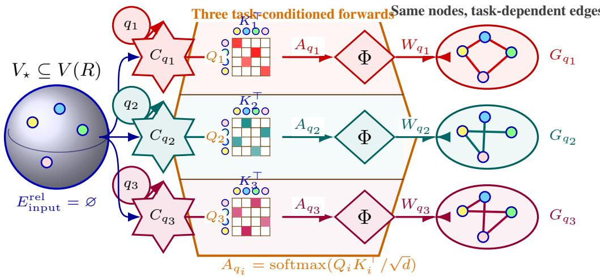
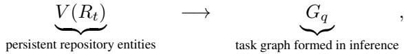
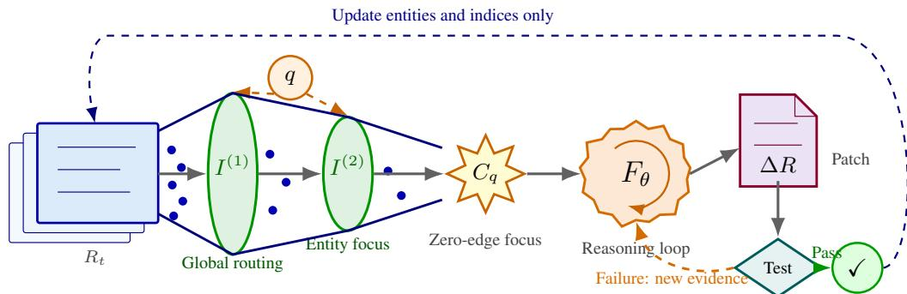

# THE THOUSAND-GRAPH HYPOTHESIS: A TESTABLE HYPOTHESIS OF TASK-CONDITIONED RELATION MA-TERIALIZATION IN REPOSITORY-LEVEL CODE REA-SONING

Fei Ding Alibaba Group

## ABSTRACT

Large software repositories far exceed the context size that language models can effectively process in one shot. Training repository knowledge into a model is expensive, quickly stale, and difficult to keep current; on-demand retrieval is flexible but can still miss dispersed dependencies; explicit external code graphs add recurring costs for relation extraction, graph synchronization, and consistency maintenance. We propose The Thousand-Graph Hypothesisand the Implicit Relation Materialization Hypothesis: repository systems may persist only entities, while relevant entities entering context allow self-attention to organize task-specific connections transiently. We argue the same repository can induce different latent task graphs across tasks. To fit entity sets within bounded context, we use a two-layer repository entity index separating global positioning from local entity detail. In a controlled end-to-end SWE-bench Verified setting with DeepSeek-V4-Flash, the base system, one-layer index, and two-layer index obtain 92.1%, 94.2%, and 95.6% success rates, respectively. The results indicate the two-layer setting improves success and that the full system can complete repository-level repair without pre-built entity relation edges. This is compatible with the hypothesis, but does not directly verify the latent graph realized inside the model. The reported deployment record (over half a year, more than 200 repositories, and several GitHub fixes) together with the currently auditable subset forms a practical long-term trace.

## 1 INTRODUCTION

Modern software repositories include many files, functions, interfaces, configurations, tests, data structures, and engineering constraints, often far beyond what a model can process in one context window. In addition, repositories are dynamic: commits, refactoring, migration, and requirement changes continuously reshape repository state. Repository-level code reasoning is therefore not only a one-step long-context problem, but also a question of how up-to-date repository knowledge reaches current reasoning.

Even with larger context windows, positional decay and evidence interference still reduce effective use of key signals (Liu et al., 2024a).

One route is to train repository knowledge into a model, but this is costly and becomes stale as code evolves. A second route retrieves local files on demand; this is flexible but can miss task-critical entities across files under limited steps. A third route is explicit repository graphs that externalize call, inheritance, usage, and dependency relations (Liu et al., 2025a; Ouyang et al., 2025; Chen et al., 2025). Explicit graphs are precise and queryable, but repository changes shift maintenance to graph updates and consistency work.

RepoCoder, Repoformer, and Agentless improve accessibility with iterative retrieval, selective retrieval, and structural localization (Zhang et al., 2023; Wu et al., 2024; Xia et al., 2025). They primarily improve where to read; the remaining question is whether task-relevant entities are enough once they are in context, or whether relations still need to be pre-built.

  
Figure 1: Task-conditioned attention interpretation of The Thousand-Graph Hypothesis. The shared entity base and different task contexts induce different relation structures; Φ aggregates cross-token, layer, and head interactions for each task.

Maintaining explicit graphs also incurs lifecycle cost. RPG-Encoder provides incremental graph updates; in one cross-commit analysis it reports full rebuild of 14.7M tokens and 633k incremental tokens (Luo et al., 2026a). RIG and Codebase-Memory similarly address edge invalidation, relinking, and consistency checks after repository changes (Cherny-Shahar & Yehudai, 2026; Vogel et al., 2026).

We propose a falsifiable counterpoint: repository systems may only need to persist entities, not prebuilt entity edges. Once relevant entities are in context, self-attention can temporarily materialize task-specific relations. Different tasks on the same repository can therefore induce different latent task graphs, which we call The Thousand-Graph Hypothesis.

This hypothesis raises a scaling challenge: even entity-only indexing can exceed context if repositories are large. We address this by a two-layer entity index that separates global routing from local entity focus. The interface supports persistent entities and zero pre-built edges, while still assembling task-specific inputs.

Our contributions are:

• A new task framing of repository knowledge as a long-tail, evolving-state problem.

• A new mechanism hypothesis: task-conditioned relation materialization without persistent external relations.

• A scalable two-layer repository entity interface that separates global and local entity access.

• Controlled end-to-end evidence on one model and one public benchmark.

• A practical long-term deployment note separating full reported usage from the currently auditable subset.

## 2 THE CONTINUOUS KNOWLEDGE GAP

## 2.1 PROBLEM FORMULATION

Let the repository at time t be $R _ { t }$ and its persistent entity set be $V ( R _ { t } )$ . Repositories evolve, so typically $R _ { t } \neq R _ { t + 1 }$ . A repository task q typically touches a subset of entities, but those entities can be scattered across many files and modules. Let the effective context budget be $B ;$ when the flat representation of entity candidates exceeds B, feeding all information at once becomes infeasible.

Importing R into model parameters requires repeated updates and has high cost. Without training, local retrieval must rediscover needed entities of $q ,$ which may miss cross-file constraints. Explicit graphs shift the burden to relation extraction, graph updates, and consistency checks. The resulting tradeoff has three tracks:

1. Train into the model: expensive and stale.

2. On-demand retrieval: efficient but may miss distant evidence.

3. External explicit graph: expensive long-term maintenance.

We study:

How can repository-level tasks be solved without repeated full training and without long-term external relation maintenance while still enabling taskspecific organization of entities during inference?

## 2.2 PERSIST ENTITIES, MATERIALIZE RELATIONS TRANSIENTLY

The external system extracts a repository entity set

$$
V ( R ) = \{ v _ { 1 } , v _ { 2 } , \ldots , v _ { n } \} .
$$

Each entity $v _ { i } = ( \mathrm { i d } _ { i } , x _ { i } , m _ { i } )$ includes content or summary $x _ { i }$ and metadata $m _ { i }$ (type, path, span, signature, responsibility tag). The Thousand-Graph Hypothesisassumes that external state stores only entities, while relation state for inference is transient:

with $E _ { \mathrm { i n p u t } } ^ { \mathrm { r e l } } = \emptyset$ by design.

## 3 RELATED WORK

Long-context and retrieval-based software agents. SWE-bench evaluates repository repair on real GitHub tasks and executable tests (Jimenez et al., 2024). Long-context windows increase reachable code but do not remove positional or noise-related degradation (Liu et al., 2024a). RepoCoder, Repoformer, and Agentless improve search via iterative retrieval, selective retrieval, or hierarchical structure (Zhang et al., 2023; Wu et al., 2024; Xia et al., 2025), while still requiring retrieval orchestration. RLCoder retrieves completion-oriented context without persistent relation graphs, though training data still relies on dependency abstractions (Wang et al., 2025b). This body addresses accessing the rightfiles; our question is whether relations must also be pre-computed.

Explicit repository graphs. GraphCoder, CodexGraph, RepoGraph, and LocAgent build graphbased navigation or retrieval structures (Liu et al., 2024b; 2025a; Ouyang et al., 2025; Chen et al., 2025). GRACE, RepoScope, and CoCo maintain multi-view graphs and retrieve structured context, and RepoScope adds task-conditioned chain prediction (Wang et al., 2025a; Liu et al., 2025b; Zhao et al., 2025). These methods are strong baselines for explicit-graph systems, but they still rely on external graph objects and maintenance.

Cost and lifecycle of explicit relations. Explicit graphs provide deterministic querying but require schema design, relation extraction, cross-file linking, storage, and update workflows. CodexGraph requires full scans and graph persistence (Liu et al., 2025a); RPG-Encoder introduces incremental graph edits (Luo et al., 2026b); RIG and Codebase-Memory address synchronization and stale-edge repair (Cherny-Shahar & Yehudai, 2026; Vogel et al., 2026).

## 4 TWO-LAYER REPOSITORY ENTITY INTERFACE

## 4.1 NO PERSISTENT EXTERNAL RELATIONS

The external state includes entities and indexes only. We define

$$
E _ { \mathrm { i n p u t } } ^ { \mathrm { r e l } } = \emptyset .
$$

  
Figure 2: Task telescope for two-layer entity interface. Task $q$ narrows repository entities through two lenses to context $C _ { q }$ without persistent relation edges.

Table 1: Boundary comparison between explicit external graphs and this approach
<table><tr><td>Dimension Explicit graph</td><td></td><td>This work</td></tr><tr><td>External state</td><td>Entities, edges, schema, graph database</td><td>Two-layer entity index</td></tr><tr><td>Where relations come from</td><td>External extraction or inference over source graph</td><td>Hypothesis: task-conditioned attention</td></tr><tr><td>Task adapta- tion</td><td>Fixed graph with local subgraph query</td><td>Task-specific transient organization in inference</td></tr><tr><td>updates</td><td>Repository Recompute entities and edges with consistency</td><td>Update entities and indexes only</td></tr></table>

Entity updates are applied to content and indexes; external relation edges are not persisted.

## 4.2 LAYER 1: GLOBAL INDEX

Layer 1 returns a compact candidate set from repository-level modules and responsibilities:

$$
\mathcal { D } _ { q } = \mathrm { L o c a t e } ( q , I ^ { ( 1 ) } ( R ) ) .
$$

## 4.3 LAYER 2: ENTITY INDEX

Layer 2 selects local task-relevant entities in each candidate domain:

$$
V _ { q } = { \mathrm { S e l e c t } } ( q , { \mathcal { D } } _ { q } , I ^ { ( 2 ) } ( R ) ) \subseteq V ( R ) .
$$

The final task input is

$$
C _ { q } = \mathrm { S e r i a l i z e } ( q , V _ { q } ) ,
$$

which contains only tasks and entity content, not pre-built relation edges.

## 4.4 WORKFLOW

Figure 2 summarizes the process: persistent extraction, global routing, local entity selection, prompt assembly, and reasoning. Patch validation runs through tests; only successful passes are written back to index updates, while entity and relation edges are not represented externally.

Compared with explicit-graph systems that maintain (V, E), this work keeps only V and indexes:

## 5 THE THOUSAND-GRAPH HYPOTHESIS: IMPLICIT RELATION MATERIALIZATION

## 5.1 FROM SELF-ATTENTION TO TASK-CONDITIONED RELATION

Let $V _ { q _ { 1 } } = V _ { q _ { 2 } } = V _ { q _ { 3 } } = V _ { \star } \subseteq V ( R )$ in Fig. 1 isolate task identity. In practice, tasks still use two-layer indexing for $V _ { q } ;$ each panel is simplified.

For layer ℓ and head h:

$$
A _ { q } ^ { ( \ell , h ) } = \mathrm { s o f t m a x } \left( \frac { Q _ { q } ^ { ( \ell , h ) } K _ { q } ^ { ( \ell , h ) \top } } { \sqrt { d } } \right) .
$$

For entity token sets $T ( v _ { i } )$ and $T ( v _ { j } )$ , define

$$
w _ { i j } ( q ) = \Phi \left( \left\{ A _ { q } ^ { ( \ell , h ) } [ a , b ] ~ { \Big | } ~ a \in T ( v _ { i } ) , b \in T ( v _ { j } ) , \ell , h \right\} \right) ,
$$

and the task graph

$$
G _ { q } = ( V _ { q } , W _ { q } ) , W _ { q } = \{ w _ { i j } ( q ) \} .
$$

$W _ { q }$ is not an explicitly stored external graph; it is a hypothesis-defined latent quantity. We do not output or persist such edges.

## 5.2 HYPOTHESIS

For different tasks $q _ { 1 }$ and $q _ { 2 }$ in the same repository, we predict:

$$
G _ { q _ { 1 } } \neq G _ { q _ { 2 } } .
$$

This is a behavioral prediction, not a deterministic identity from input differences alone.

Repository-level systems can persist only entities while task-specific latent relations are materialized during inference by context conditions.

## 5.3 FALSIFIABLE PREDICTIONS

1. Task sensitivity. Relevant entities and interactions differ by task.

2. Zero-edge feasibility. Without pre-built edges, repository repair can still succeed if task entities enter context.

3. Coverage effect. Missing entity coverage hurts success; higher coverage improves it.

Our experiments directly test the second and indirectly the third through layer ablations.

## 6 CONTROLLED EXPERIMENT

## 6.1 DESIGN

We evaluate three conditions on SWE-bench Verified with DeepSeek-V4-Flash:

• Base system: no entity index

• One-layer index

• Two-layer index

All conditions are controlled to have no pre-built entity-relation edges.

As shown in Table 2, the two-layer design improves success from 92.1% to 95.6%, with an absolute gain of 3.5 points over the base and 1.4 points over one-layer. This corresponds to an error reduction from 7.9% to 4.4% versus base and from 5.8% to 4.4% versus one-layer.

Table 2: DeepSeek-V4-Flash on SWE-bench Verified.
<table><tr><td>Condition</td><td>Pre-built relation edges</td><td>Success rate (%)</td></tr><tr><td>Base system</td><td>none</td><td>92.1</td></tr><tr><td>One-layer index</td><td>none</td><td>94.2</td></tr><tr><td>Two-layer index</td><td>none</td><td>95.6</td></tr></table>

## 7 LONG-TERM PRACTICE

The authors report over half a year of usage, participation in more than 200 projects, and multiple public GitHub fixes. The currently auditable subset includes 6 repositories, 52 validation artifacts, an upper-bound public baseline date of 2026-07-29, and 29 merged PRs in one open repository (27 with explicit fix commits). It supports practical deployment viability but is not a direct proof of causal effect.

Table 3: Reported scale vs. auditable subset
<table><tr><td>Evidence level</td><td>Records</td></tr><tr><td>Author-reported overall</td><td>Half-year-plus usage; 200+ projects; several GitHub fixes</td></tr><tr><td>Auditable local snapshot</td><td>6 repositories, 52 artifacts</td></tr><tr><td>Public GitHub subset</td><td>1 repository; 29 merged PRs; 27 explicit-fix PRs</td></tr><tr><td>repair</td><td>Index evolution in 19 index-sync commits; 11 close index+fix sequences</td></tr></table>

## 8 CONCLUSION AND BOUNDARY

We define the repository knowledge gap and propose The Thousand-Graph Hypothesisas a mechanism hypothesis: persistent entities, task-time relation materialization, and no prebuilt external relation graph. In this controlled setting, two-layer indexing attains 95.6% success and outperforms one-layer and base conditions under zero-edge constraints. The current scope does not directly establish internal causal mechanisms, cross-model generality, or full long-term cost accounting.

## REFERENCES

Zhaoling Chen, Robert Tang, Gangda Deng, Fang Wu, Jialong Wu, Zhiwei Jiang, Viktor Prasanna, Arman Cohan, and Xingyao Wang. LocAgent: Graph-guided LLM agents for code localization. In Wanxiang Che, Joyce Nabende, Ekaterina Shutova, and Mohammad Taher Pilehvar (eds.), Proceedings of the 63rd Annual Meeting of the Association for Computational Linguistics (Volume 1: Long Papers), pp. 8697–8727, Vienna, Austria, July 2025. Association for Computational Linguistics. ISBN 979-8-89176-251-0. doi: 10.18653/v1/2025.acl-long.426. URL https://aclanthology.org/2025.acl-long.426/.

Tsvi Cherny-Shahar and Amiram Yehudai. Repository intelligence graph: Deterministic architectural map for llm code assistants, 2026. URL https://arxiv.org/abs/2601.10112.

DeepSeek-AI, Anyi Xu, Bangcai Lin, Bing Xue, Bingxuan Wang, Bingzheng Xu, Bochao Wu, Bowei Zhang, Chaofan Lin, Chen Dong, Chenchen Ling, Chengda Lu, Chenggang Zhao, Chengqi Deng, Chengyu Hou, Chenhao Xu, Chenze Shao, Chong Ruan, Conner Sun, Damai Dai, Daya Guo, Dejian Yang, Deli Chen, Donghao Li, Dongjie Ji, Erhang Li, Fang Wei, Fangyun Lin, Fangzhou Yuan, Feiyu Xia, Fucong Dai, Guangbo Hao, Guanting Chen, Guoai Cao, Guolai Meng, Guowei Li, Han Yu, Han Zhang, Hanwei Xu, Hao Li, Haofen Liang, Haoling Zhang, Haoming Luo, Haoran Wei, Haotian Yuan, Haowei Zhang, Haowen Luo, Haoyu Chen, Haozhe Ji, Hengqing Zhang, Honghui Ding, Hongxuan Tang, Huanqi Cao, Huazuo Gao, Hui Qu, Hui

Zeng, J Yang, JQ Zhu, Jia Luo, Jia Song, Jia Yu, Jialiang Huang, Jialu Cai, Jian Liang, Jiangting Zhou, Jiasheng Ye, Jiashi Li, Jiaxin Xu, Jiewen Hu, Jieyu Yang, Jin Chen, Jin Yan, Jingchang Chen, Jingli Zhou, Jingting Xiang, Jingyang Yuan, Jingyuan Cheng, Jingzi Zhou, Jinhua Zhu, Jiping Yu, Joseph Sun, Jun Ran, Junguang Jiang, Junjie Qiu, Junlong Li, Junmin Zheng, Junxiao Song, Kai Dong, Kaige Gao, Kang Guan, Kexing Zhou, Kezhao Huang, Kuai Yu, Lean Wang, Lecong Zhang, Lei Wang, Leyi Xia, Li Zhang, Liang Zhao, Lihua Guo, Lingxiao Luo, Linwang Ma, Linyan Zhu, Litong Wang, Liyu Cai, Liyue Zhang, Longhao Chen, MS Di, MY Xu, Max Mei, Miaojun Wang, Mingchuan Zhang, Minghua Zhang, Minghui Tang, Mingming Li, Mingxu Zhou, Minmin Han, Ning Wang, Panpan Huang, Panpan Wang, Peixin Cong, Peiyi Wang, Peng Zhang, Qiancheng Wang, Qihao Zhu, Qingyang Li, Qinyu Chen, Qiushi Du, Qiwei Jiang, Rui Tian, Ruifan Xu, Ruijie Lu, Ruiling Xu, Ruiqi Ge, Ruisong Zhang, Ruizhe Pan, Runji Wang, Runqian Chen, Runqiu Yin, Runxin Xu, Ruomeng Shen, Ruoyu Zhang, Ruyi Chen, SH Liu, Shanghao Lu, Shangmian Sun, Shangyan Zhou, Shanhuang Chen, Shaofei Cai, Shaoheng Nie, Shaoqing Wu, Shaoyuan Chen, Shengding Hu, Shengyu Liu, Shiqiang Hu, Shirong Ma, Shiyu Wang, Shuiping Yu, Shunfeng Zhou, Shuting Pan, Shuying Yu, Songyang Zhou, Tao Ni, Tao Yun, Tian Jin, Tian Pei, Tian Ye, Tianle Lin, Tianran Ji, Tianyi Cui, Tianyuan Yue, Tingting Yu, Tun Wang, W Zhang, WL Xiao, Wangding Zeng, Wei An, Weilin Zhao, Wen Liu, Wenfeng Liang, Wenjie Pang, Wenjing Luo, Wenjing Yao, Wenjun Gao, Wenkai Yang, Wenlve Huang, Wenqing Hou, Wentao Zhang, Wenting Ma, Xi Gao, Xiang He, Xiangwen Wang, Xianzu Wang, Xiao Bi, Xiaodong Liu, Xiaohan Wang, Xiaokang Chen, Xiaokang Zhang, Xiaotao Nie, Xiaowen Sun, Xiaoxiang Wang, Xin Cheng, Xin Liu, Xin Xie, Xingchao Liu, Xingchen Liu, Xingkai Yu, Xingyou Li, Xinyu Yang, Xinyu Zhang, Xu Chen, Xuanyu Wang, Xuecheng Su, Xueyin Chen, Xuheng Lin, Xuwei Fu, YC Yan, YQ Wang, YW Ma, Yanfeng Luo, Yang Zhang, Yanhong Xu, Yanru Ma, Yanwen Huang, Yao Li, Yao Li, Yao Xu, Yao Zhao, Yaofeng Sun, Yaohui Wang, Yi Qian, Yi Shao, Yi Yu, Yichao Zhang, Yifan Ding, Yifan Shi, Yijia Wu, Yiliang Xiong, Yiling Ma, Ying He, Ying Tang, Ying Zhou, Yingjia Luo, Yinmin Zhong, Yishi Piao, Yisong Wang, Yixiang Zhang, Yixiao Chen, Yixuan Tan, Yixuan Wei, Yiyang Ma, Yiyuan Liu, Yonglun Yang, Yongqiang Guo, Yongtong Wu, Yu Wu, YuKun Li, Yuan Cheng, Yuan Ou, Yuanfan Xu, Yuanhao Li, Yuduan Wang, Yuehan Yang, Yuer Xu, Yuhan Wu, Yuhao Meng, Yuheng Zou, Yukun Zha, Yunfan Xiong, Yupeng Chen, Yuping Lin, Yuqian Cao, Yuqian Wang, Yushun Zhang, Yuting Yan, Yutong Lin, Yuxian Gu, Yuxiang Luo, Yuxiang You, Yuxuan Liu, Yuxuan Zhou, Yuyang Zhou, Yuzhen Huang, ZF Wu, Zehao Wang, Zehua Zhao, Zehui Ren, Zekai Zhang, Zhangli Sha, Zhe Fu, Zhe Ju, Zhean Xu, Zhenda Xie, Zhengyan Zhang, Zheren Gao, Zhewen Hao, Zhibin Gou, Zhicheng Ma, Zhigang Yan, Zhihong Shao, Zhixian Huang, Zhixuan Chen, Zhiyu Wu, Zhizhou Ren, Zhongyu Wu, Zhuoshu Li, Zhuping Zhang, Zian Xu, Zihao Wang, Zihua Qu, Zihui Gu, Zijia Zhu, Zilin Li, Zipeng Zhang, Ziwei Xie, Ziyi Gao, Ziyi Wan, Zizheng Pan, and Zongqing Yao. Deepseek-v4: Towards highly efficient million-token context intelligence, 2026. URL https://arxiv.org/abs/2606.19348.

Carlos E Jimenez, John Yang, Alexander Wettig, Shunyu Yao, Kexin Pei, Ofir Press, and Karthik Narasimhan. Swe-bench: Can language models resolve real-world github issues? In B. Kim, Y. Yue, S. Chaudhuri, K. Fragkiadaki, M. Khan, and Y. Sun (eds.), International Conference on Learning Representations, volume 2024, pp. 54107–54157, 2024. URL https://proceedings.iclr.cc/paper\_files/paper/2024/file/ edac78c3e300629acfe6cbe9ca88fb84-Paper-Conference.pdf.

Nelson F. Liu, Kevin Lin, John Hewitt, Ashwin Paranjape, Michele Bevilacqua, Fabio Petroni, and Percy Liang. Lost in the middle: How language models use long contexts. Transactions of the Associationfor Computational Linguistics, 12:157–173, 2024a. doi: 10.1162/tacl a 00638. URL https://aclanthology.org/2024.tacl-1.9/.

Wei Liu, Ailun Yu, Daoguang Zan, Bo Shen, Wei Zhang, Haiyan Zhao, Zhi Jin, and Qianxiang Wang. Graphcoder: Enhancing repository-level code completion via coarse-to-fine retrieval based on code context graph. In Proceedings of the 39th IEEE/ACM International Conference on Automated Software Engineering, ASE ’24, pp. 570–581. ACM, October 2024b. doi: 10.1145/3691620.3695054. URL http://dx.doi.org/10.1145/3691620.3695054.

Xiangyan Liu, Bo Lan, Zhiyuan Hu, Yang Liu, Zhicheng Zhang, Fei Wang, Michael Qizhe Shieh, and Wenmeng Zhou. CodexGraph: Bridging large language models and code repositories via code graph databases. In Luis Chiruzzo, Alan Ritter, and Lu Wang (eds.), Proceedings of

the 2025 Conference of the Nations of the Americas Chapter of the Association for Computational Linguistics: Human Language Technologies (Volume 1: Long Papers), pp. 142–160, Albuquerque, New Mexico, April 2025a. Association for Computational Linguistics. ISBN 979- 8-89176-189-6. doi: 10.18653/v1/2025.naacl-long.7. URL https://aclanthology.org/ 2025.naacl-long.7/.

Yang Liu, Li Zhang, Fang Liu, Zhuohang Wang, Donglin Wei, Zhishuo Yang, Kechi Zhang, Jia Li, and Lin Shi. Reposcope: Leveraging call chain-aware multi-view context for repository-level code generation, 2025b. URL https://arxiv.org/abs/2507.14791.

Jane Luo, Chengyu Yin, Xin Zhang, Qingtao Li, Steven Liu, Yiming Huang, Jie Wu, Hao Liu, Yangyu Huang, Yu Kang, Fangkai Yang, Ying Xin, and Scarlett Li. Closing the loop: Universal repository representation with rpg-encoder, 2026a. URL https://arxiv.org/abs/2602. 02084.

Jane Luo, Xin Zhang, Steven Liu, Jie Wu, Jianfeng Liu, Yiming Huang, Yangyu Huang, Chengyu Yin, Ying Xin, Yuefeng Zhan, Hao Sun, Qi Chen, Scarlett Li, and Mao Yang. Rpg: A repository planning graph for unified and scalable codebase generation, 2026b. URL https://arxiv. org/abs/2509.16198.

Siru Ouyang, Wenhao Yu, Kaixin Ma, Zilin Xiao, Zhihan Zhang, Mengzhao Jia, Jiawei Han, Hongming Zhang, and Dong Yu. Repograph: Enhancing ai software engineering with repository-level code graph. In Y. Yue, A. Garg, N. Peng, F. Sha, and R. Yu (eds.), International Conference on Learning Representations, volume 2025, pp. 30098–30121, 2025. URL https://proceedings.iclr.cc/paper\_files/paper/2025/file/ 4a4a3c197deac042461c677219efd36c-Paper-Conference.pdf.

Ashish Vaswani, Noam Shazeer, Niki Parmar, Jakob Uszkoreit, Llion Jones, Aidan N Gomez, Ł ukasz Kaiser, and Illia Polosukhin. Attention is all you need. In I. Guyon, U. Von Luxburg, S. Bengio, H. Wallach, R. Fergus, S. Vishwanathan, and R. Garnett (eds.), Advances in Neural Information Processing Systems, volume 30. Curran Associates, Inc., 2017. URL https://proceedings.neurips.cc/paper\_files/paper/2017/ file/3f5ee243547dee91fbd053c1c4a845aa-Paper.pdf.

Martin Vogel, Falk Meyer-Eschenbach, Severin Kohler, Elias Grunewald, and Felix Balzer.¨ Codebase-memory: Tree-sitter-based knowledge graphs for llm code exploration via mcp, 2026. URL https://arxiv.org/abs/2603.27277.

Xingliang Wang, Baoyi Wang, Chen Zhi, Junxiao Han, Xinkui Zhao, Jianwei Yin, and Shuiguang Deng. Grace: Graph-guided repository-aware code completion through hierarchical code fusion, 2025a. URL https://arxiv.org/abs/2509.05980.

Yanlin Wang, Yanli Wang, Daya Guo, Jiachi Chen, Ruikai Zhang, Yuchi Ma, and Zibin Zheng. Rlcoder: Reinforcement learning for repository-level code completion. In 2025 IEEE/ACM 47th International Conference on Software Engineering (ICSE), pp. 1140–1152. IEEE, April 2025b. doi: 10.1109/icse55347.2025.00014. URL http://dx.doi.org/10.1109/ICSE55347. 2025.00014.

Di Wu, Wasi Uddin Ahmad, Dejiao Zhang, Murali Krishna Ramanathan, and Xiaofei Ma. Repoformer: Selective retrieval for repository-level code completion. In Ruslan Salakhutdinov, Zico Kolter, Katherine Heller, Adrian Weller, Nuria Oliver, Jonathan Scarlett, and Felix Berkenkamp (eds.), Proceedings of the 41st International Conference on Machine Learning, volume 235 of Proceedings of Machine Learning Research, pp. 53270–53290. PMLR, 21–27 Jul 2024. URL https://proceedings.mlr.press/v235/wu24a.html.

Chunqiu Steven Xia, Yinlin Deng, Soren Dunn, and Lingming Zhang. Demystifying llm-based software engineering agents. Proceedings ofthe ACM on Software Engineering, 2(FSE):801–824, June 2025. ISSN 2994-970X. doi: 10.1145/3715754. URL http://dx.doi.org/10. 1145/3715754.

Fengji Zhang, Bei Chen, Yue Zhang, Jacky Keung, Jin Liu, Daoguang Zan, Yi Mao, Jian-Guang Lou, and Weizhu Chen. RepoCoder: Repository-level code completion through iterative retrieval

and generation. In Houda Bouamor, Juan Pino, and Kalika Bali (eds.), Proceedings of the 2023 Conference on Empirical Methods in Natural Language Processing, pp. 2471–2484, Singapore, December 2023. Association for Computational Linguistics. doi: 10.18653/v1/2023.emnlp-main. 151. URL https://aclanthology.org/2023.emnlp-main.151/.

Xinkui Zhao, Rongkai Liu, Yifan Zhang, Chen Zhi, Lufei Zhang, Guanjie Cheng, Yueshen Xu, Shuiguang Deng, and Jianwei Yin. Completion by comprehension: Guiding code generation with multi-granularity understanding, 2025. URL https://arxiv.org/abs/2512.04538.

## AI STATEMENT

This paper used generative AI tools for drafting and refinement support, including wording polish, falsifiability checks, LaTeX style adjustments, and figure preparation. The core ideas, experimental methods, implementations, and results were provided and approved by the authors; AI tools did not replace experiments or alter primary observed outcomes.

## REPRODUCIBILITY STATEMENT

We report the base model, public benchmark, and three controlled conditions. The release package will include index-construction scripts, prompts, configurations, prediction logs, and SWE-bench run logs for the auditable subset.