# TTPO: TEST-TIME POLICY OPTIMIZATION

Aozhe Wang<sup>1,2,∗</sup>, Zhengxi Lu<sup>1,∗</sup>, Jianze Wang<sup>2</sup>, Shangke Lv<sup>1</sup>, Ying Liu<sup>2</sup>, Weiming Lu<sup>1</sup>, Jun Xiao<sup>1</sup>, Yueting Zhuang<sup>1</sup>, Hua Yang<sup>2</sup>, Qianglong Chen<sup>2,†</sup>, Yongliang Shen<sup>1,†</sup>

<sup>1</sup>Zhejiang University <sup>2</sup>Alibaba Group {waz,zhengxilu,syl}@zju.edu.cn qianglong.cql@alibaba-inc.com

## ABSTRACT

Recent prominent post-training methods, such as Reinforcement Learning (RL) and On-Policy Self-Distillation (OPSD), have driven rapid progress in mathematical reasoning for large language models, yet their reliance on ground-truth labels precludes test-time training (TTT). Replacing ground truth with majorityvote pseudo-labels is a natural alternative, yet it is fragile: an incorrect vote corrupts the teacher and misleads every token. We observe that this failure mode is asymmetric: rollouts that disagree with the pseudo-label are typically wrong regardless of whether the vote itself is correct. Building on this observation, we propose Test-Time Policy Optimization (TTPO), an asymmetric objective that distills agreeing rollouts via OPSD and penalizes disagreeing rollouts with Grouped RL. Token-level selection further refines both branches: distillation down-weights already-converged positions, while RL penalizes only confident errors. Both updates remain well-grounded even under frequent pseudolabel errors, and majority-vote routing yields tighter self-supervision as the model improves. Without any labels, TTPO matches label-supervised OPSD on five competition-level benchmarks, raises Qwen3-1.7B from 38.0% to 45.2% in TTT, yields +25.2% to +36.4% without thinking, and shows strong cross-task generalization. Our code is available at https://github.com/ZJU-REAL/TTPO.

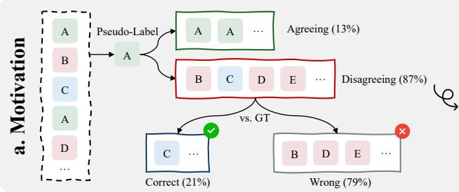

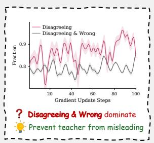

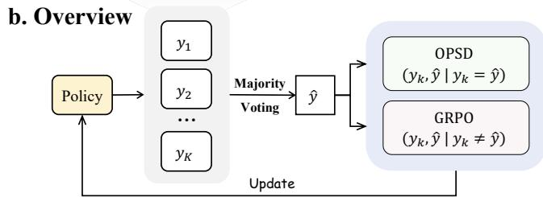  
Signal-efficient, Noise-robust, Self-evolving

c. Performance  
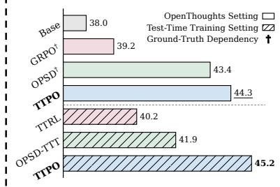  
Figure 1: (a) Motivation: When pseudo-labels are wrong, most disagreeing rollouts are genuinely wrong too, during Qwen3-1.7B TTT on AIME 2026. (b) Overview of TTPO. (c) Performance: Average accuracy of Qwen3-1.7B across AIME 2026, HMMT 2026, and BRUMO 2025.

## 1 INTRODUCTION

Large language models (LLMs) have achieved remarkable mathematical reasoning through extended chain-of-thought generation (Team et al., 2026; Xu et al., 2026a; Zeng et al., 2026; Singh et al., 2025; Team, 2026), largely powered by post-training with reinforcement learning from verifiable rewards (RLVR) (Shao et al., 2024; Yu et al., 2026; Guo et al., 2025). Yet such outcome rewards are inherently coarse, broadcasting a single sequence-level scalar uniformly across all tokens and leaving the reasoning at each step unsupervised.

A complementary line supplies dense, token-level supervision: on-policy self-distillation (OPSD) (Zhao et al., 2026) conditions the same policy on the ground-truth answer to form a teacher that re-scores the student’s own rollouts token by token (Ye et al., 2026; Yang et al., 2026b). Recent work increasingly combines the two signals, through auxiliary distillation losses, credit redistribution, or routing between them (Yang et al., 2026a; Liu et al., 2026b; Lu et al., 2026a; Han et al., 2026; Li et al., 2026a). All these methods, however, assume ground-truth answers: the reward needs them for verification, and the teacher needs them as privileged context. In test-time training (TTT) (Sun et al., 2020), where a model improves on the very problems it must solve and labels never arrive, none of these methods applies.

Without labels, supervision must come from the model itself: sample a group of rollouts for each problem, and take the majority answer as a pseudo-label. TTRL (Zuo et al., 2026) uses this pseudolabel as a reward and improves reasoning without any labels, but the reward is still one scalar per trajectory, and when the majority is wrong, training reinforces the error (Lin et al., 2026). The natural next step is to let the pseudo-label replace the ground-truth answer in OPSD, which has been tried in two forms: distilling all rollouts toward the pseudo-label-conditioned teacher (Gkountouras et al., 2026), or distilling only the rollouts that disagree with the pseudo-label (Li et al., 2026b). But dense supervision magnifies label errors: a corrupted reward misleads once per trajectory; a corrupted teacher misleads at every token.

These errors are the common case: on competition-level problems, the pseudo-label is wrong for ∼85% of prompts (Figure 1, a). Learning from such a label seems infeasible. However, even when the pseudo-label is wrong, ∼79% of the rollouts that disagree with it are wrong too. A penalty on a disagreeing rollout is therefore usually correct whether or not the pseudo-label is, because it uses the disagreement alone, never the pseudo-label’s answer. Distillation toward the pseudo-label has no such tolerance: a wrong answer enters the teacher and misleads every token. The same asymmetry underlies negative learning from noisy labels, where stating what a sample is not remains reliable even when the label is wrong (Kim et al., 2019).

We propose Test-Time Policy Optimization (TTPO), which applies each signal where it is reliable: GRPO penalties on the rollouts that disagree with the pseudo-label, and OPSD distillation on the rollouts that agree with it. The distillation branch tolerates wrong pseudo-labels for a different reason: the teacher is conditioned on the answer that the agreeing rollouts themselves produced, so even when that answer is wrong, the update distills the model’s thinking mode into its non-thinking mode rather than toward an arbitrary error. Finally, token-level selection sharpens both branches, weighting distillation toward positions the student has not yet mastered and masking penalties to the confident errors that caused the failure. By combining both signals, our asymmetric design not only makes more effective use of both positive and negative rollouts while remaining robust to pseudolabel noise, but is also naturally calibrated to the model’s current capability, enabling a virtuous cycle of self-evolution that ground-truth routing cannot sustain (Figure 5, 6).

Trained without any labels, TTPO matches or exceeds label-supervised OPSD across Qwen3- 1.7B/4B/8B on five competition-level benchmarks, and in the pure TTT setting raises the 1.7B base model from 38.0% to 45.2% average accuracy, ahead of both TTRL and self-distillation baselines. With thinking mode disabled, the gains reach +25.2% to +36.4% across scales, several times the gain of label-supervised OPSD. We further validate that training on any one benchmark improves the other two, indicating generalizable reasoning rather than problem-specific overfitting (Figure 4). Our contributions are:

1. We show that majority-vote pseudo-labels remain useful despite frequent errors: though wrong on ∼85% of competition-level prompts, ∼79% of disagreeing rollouts are wrong too, so penalizing disagreement stays correct while distillation does not.

2. We propose TTPO, which applies each signal where it stays correct: agreeing rollouts are distilled toward an answer-conditioned teacher, disagreeing rollouts receive GRPO penalties, with token-level selection in both branches.

3. Trained without any labels, TTPO matches or exceeds label-supervised OPSD on five competition-level benchmarks, raises Qwen3-1.7B from 38.0% to 45.2% in TTT, and further demonstrates strong cross-task generalization.

## 2 RELATED WORK

## 2.1 TEST-TIME TRAINING FOR REASONING

Test-time training (TTT) adapts models to unlabeled test data at inference time (Sun et al., 2020; Li et al., 2026b; Du et al., 2025). TTRL (Zuo et al., 2026) extends TTT to LLM reasoning by sampling multiple trajectories per problem, deriving pseudo-rewards via majority voting, and training with GRPO (Shao et al., 2024). Follow-up work addresses TTRL’s sensitivity to consensus quality: Hi-TTRL (Xu et al., 2026b) introduces hierarchical reward shaping with hints, while SCRL (Yan et al., 2026) applies selective pseudo-labeling to filter unreliable majorities. However, these methods remain purely RL-based, propagating a single sequence-level reward uniformly across all tokens.

## 2.2 ON-POLICY SELF-DISTILLATION

On-policy distillation trains a policy on its own rollouts under a teacher (Agarwal et al., 2024; Gu et al., 2026; Wen et al., 2023). Recent self-distillation variants remove the need for a separate teacher by conditioning the same model on privileged information available only during training (Zhao et al., 2026; He et al., 2026; Lu et al., 2026b). Several studies further incorporate the resulting teacher– student log-probability gap into RLVR, either as advantage scaling (Yang et al., 2026a), a detached auxiliary objective (Lu et al., 2026a), a routing mechanism (Han et al., 2026; Li et al., 2026a), or reward-densifying local supervision (Xu et al., 2026c; Ye et al., 2026; He et al., 2026). We follow this idea and introduce an asymmetric objective that decouples the treatment of positive and negative samples to tolerate pseudo-label errors.

## 2.3 TOKEN-LEVEL WEIGHTING AND MASKING

Recent work recognizes that not all tokens merit equal gradients during training (Xiao et al., 2026). In distillation, TIP (Xu et al., 2026c) shows that training on fewer than 10% of tokens, selected by student entropy and teacher–student divergence, nearly matches full-token performance. In RL, STAPO (Liu et al., 2026a) masks spurious low-probability, low-entropy tokens in positive samples that receive disproportionate reward gradients, while Wu et al. (2026) address the erroneous penalization of locally correct tokens within failed trajectories through reward recalibration. TTPO applies token-level selection to both branches of its objective: down-weighting converged positions in the distillation branch and selectively penalizing only confident errors in the RL branch.

## 3 METHOD

## 3.1 PRELIMINARIES AND PROBLEM SETUP

Let $\pi _ { \theta }$ denote the language model and $\{ x _ { i } \} _ { i = 1 } ^ { N }$ be a set of test-time problems without ground-truth labels. For each problem $x ,$ we sample K trajectories $\{ y _ { 1 } , . . . , y _ { K } \} \sim \pi _ { \theta } ( . ~ | ~ x )$ and extract final answers $a _ { k } = \mathrm { E x t r a c t } ( y _ { k } )$

Majority-vote pseudo-labeling. We cluster answers by mathematical equivalence, select the largest cluster as the pseudo-label aˆ with consensus count $c = | \{ k : a _ { k } \equiv { \hat { a } } \}$ |, and partition trajectories into positive samples $\mathcal { P } = \{ k : a _ { k } \equiv \hat { a } \}$ that agree with pseudo-label and negative samples $\mathcal { N } = \{ \bar { k : a _ { k } } \not \equiv \hat { a } \}$ that disagree.

Answer-conditioned teacher. Following OPSD (Zhao et al., 2026), we construct a teacher by conditioning the same model on the pseudo-label aˆ as privileged information. Given shared completion tokens $y _ { k }$ , the teacher and student differ only in their prompt prefixes:

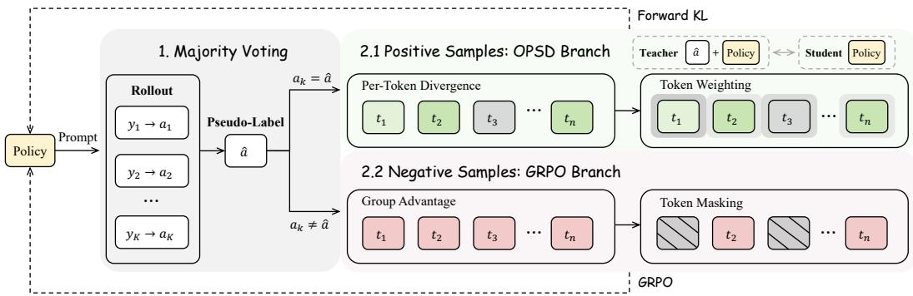  
Figure 2: Overview of TTPO. (1) Majority Voting: K sampled trajectories are partitioned into positive $( a _ { k } = \hat { a } )$ and negative $( a _ { k } \neq { \hat { a } } )$ sets. (2.1) OPSD Branch: positive samples are supervised via per-token forward KL with token weighting. (2.2) GRPO Branch: negative samples are penalized via group advantages with token masking on anomalous positions.

$$
q _ { t } ^ { ( \hat { a } ) } = \pi _ { \theta } ( \cdot \mid [ x ; \hat { a } ] _ { \mathrm { t e a c h e r } } , y _ { < t } ) , \quad \mathrm { ( n o ~ g r a d ) }\tag{1}
$$

$$
p _ { t } = \pi _ { \theta } ( \cdot \mid x _ { \mathrm { s t u d e n t } } , y _ { < t } ) . \quad ( \mathrm { w i t h g r a d } )\tag{2}
$$

## 3.2 MOTIVATION: WHY ASYMMETRIC?

In the TTT setting, the training set is the test set — consisting of competition-level problems that are inherently difficult for the model. As a result, majority-vote pseudo-labels are frequently wrong: on AIME 2026 with Qwen3-1.7B, we observe that pseudo-labels are wrong for ∼85% of prompts on average (Figure 1, a). Naively applying self-distillation to all trajectories using the corrupted teacher would propagate errors to every sample.

However, we observe a key structural property: even when $\hat { a } \neq a ^ { * } , \sim 7 9 \%$ of negative samples produce answers that are neither aˆ nor $a ^ { * }$ — penalizing them is correct regardless of pseudo-label quality. This motivates an asymmetric design that minimizes the blast radius of pseudo-label errors:

• Pure FKL on all samples: error propagates to all K trajectories (the teacher distribution is entirely conditioned on wrong aˆ).

• Asymmetric (FKL for P, GRPO for ${ \mathcal { N } } ) !$ only the small |P| set is corrupted. GRPO on $\mathcal { N }$ requires only “not in the majority cluster” — independent of aˆ’s content — and is correct for the vast majority of negative samples.

## 3.3 POSITIVE SAMPLES: OPSD BRANCH

For each positive sample $y _ { k } \in { \mathcal { P } } ,$ , we apply OPSD’s forward KL with per-token weighting:

$$
\mathcal { L } _ { \mathrm { O P S D } } ( k ) = \frac { 1 } { T _ { k } } \sum _ { t = 1 } ^ { T _ { k } } w ( t ) \cdot \mathrm { K L } \left( q _ { t } ^ { ( \hat { a } ) } \parallel p _ { t } \right) ,\tag{3}
$$

where $T _ { k }$ is the number of valid response tokens and $w ( t )$ is the token weight described below.

Token weighting. Not all tokens offer equal learning value. Inspired by the token importance analysis of Xu et al. (2026c), we design a weighting scheme that down-weights positions where the student has already converged. We measure two complementary signals — student entropy $H ( t )$ and teacher-student divergence $\Delta ( t ) = \mathrm { K L } ( q _ { t } | | p _ { t } ) -$ normalize each to [0, 1] via per-sample min-max normalization, and combine them with a Soft-OR:

$$
w ( t ) = \hat { H } ( t ) + \hat { \Delta } ( t ) - \hat { H } ( t ) \cdot \hat { \Delta } ( t ) .\tag{4}
$$

This assigns high weight when at least one signal indicates learning value (the student is uncertain, or confidently wrong), and approaches zero only when both signals are low — the student is already confident and aligned with the teacher.

Algorithm 1 TTPO Training   
Require: Policy π<sub>θ</sub>; problems $\{ x _ { i } \}$ ; rollouts K; RL weight λ   
1: for each training iteration do   
2: // Step 1: Majority-vote pseudo-labeling   
3: for each problem x do   
4: $y ^ { ( 1 ) } , \therefore , y ^ { ( K ) } \sim \pi _ { \theta } ( \cdot \mid x ) ; \quad a ^ { ( k ) }  \mathrm { E x t r a c t } ( y ^ { ( k ) } )$   
5: aˆ ← plurality $\langle \{ a ^ { ( k ) } \} )$ ; ${ \mathcal { P } } \gets \{ k : a ^ { ( k ) } = \hat { a } \}$ ${ \mathcal { N } } \gets \{ k : a ^ { ( k ) } \neq \hat { a } \}$   
6: end for   
7: // Step 2: Teacher & studentforward   
8: $q _ { t } \gets \pi _ { \theta } ( \cdot \ | \ [ x ; \hat { a } ] , y _ { < t } )$ (no grad); $p _ { t }  \pi _ { \theta } ( \cdot \mid x , y _ { < t } )$   
9: // Step 3: OPSD on P   
10: $w ( t ) \gets \hat { H } ( t ) + \hat { \Delta } ( t ) - \hat { H } ( t ) \cdot \hat { \Delta } ( t )$   
11: $\begin{array} { r } { \mathcal { L } _ { \mathrm { { O P S D } } }  \frac { 1 } { | \mathcal { P } | } \sum _ { k \in \mathcal { P } } \frac { 1 } { T _ { k } } \sum _ { t } w ( t ) \cdot \dot { \mathrm { K L } } ( q _ { t } \| p _ { t } ) } \end{array}$   
12: // Step 4: GRPO on N   
13: $s ( t ) \gets - \log p _ { t } ( y _ { k } ^ { ( t ) } ) \cdot ( 1 - \hat { H } ( t ) ) ; \quad m ( t ) \gets \mathbf { 1 } [ s ( t ) \geq \mathrm { m e d i a n } ( \{ s \} ) ]$   
14: $\begin{array} { r } { \mathcal { L } _ { \mathtt { G R P O } } \longleftarrow - \frac { 1 } { | \mathcal { N } | } \sum _ { k \in \mathcal { N } } \frac { A _ { k } } { T _ { k } } \sum _ { t } m ( t ) \cdot \log \pi _ { \theta } ( y _ { k } ^ { ( t ) } \mid x , y _ { k } ^ { ( < t ) } ) } \end{array}$   
15: // Step 5: Update   
16: $\theta \gets \mathsf { \dot { \theta } } - \eta \mathsf { \dot { V } } _ { \theta } ( \mathcal { L } _ { \mathrm { O P S D } } + \lambda \mathcal { L } _ { \mathrm { G R P O } } )$   
17: end for

## 3.4 NEGATIVE SAMPLES: GRPO BRANCH

For negative samples $y _ { k } \in \mathcal N$ , we apply GRPO (Shao et al., 2024). Each trajectory receives a binary reward based on majority-vote classification: $r _ { k } = 1$ if its answer matches the pseudo-label, $r _ { k } = 0$ otherwise. Advantages are computed group-relatively over all K rollouts per problem, so that $A _ { k } < 0$ for negative samples, yielding a penalty:

$$
\mathcal { L } _ { \mathtt { G R P O } } ( k ) = - \frac { A _ { k } } { T _ { k } } \sum _ { t = 1 } ^ { T _ { k } } m ( t ) \cdot \log \pi _ { \theta } ( y _ { k } ^ { ( t ) } \mid x , y _ { k } ^ { ( < t ) } ) .\tag{5}
$$

In standard GRPO, positive-advantage gradients counterbalance erroneous penalties on locally correct tokens within failed trajectories. In our asymmetric framework, GRPO acts exclusively on negative samples, removing this counterbalance. This False Penalties on Negative Samples problem (Wu et al., 2026) necessitates active reduction of collateral damage.

Token masking. Drawing on the insight from Liu et al. (2026a) that low-probability, low-entropy tokens represent anomalous model behavior, we design a masking scheme to identify tokens most responsible for errors. We score each token by:

$$
s ( t ) = - \log \pi _ { \theta } ( y _ { k } ^ { ( t ) } \mid x , y _ { k } ^ { ( < t ) } ) \cdot ( 1 - \hat { H } ( t ) ) ,\tag{6}
$$

where the raw negative log-probability serves as the dominant ranking factor and $( 1 - { \hat { H } } ( t ) )$ is the normalized certainty. The key design choice is using unnormalized − log p to anchor the rank ing: this ensures locally correct tokens (typically high-probability) are naturally excluded, while genuinely anomalous outputs — where the model confidently produced unlikely content — are prioritized. We construct a binary mask by selecting the top-50% of tokens by score:

$$
m ( t ) = \mathbf { 1 } \left[ s ( t ) \geq \mathrm { m e d i a n } ( \{ s ( t ^ { \prime } ) \} _ { t ^ { \prime } = 1 } ^ { T _ { k } } ) \right] .\tag{7}
$$

## 3.5 UNIFIED OBJECTIVE

The final TTPO objective combines both branches, and balances their weight by λ:

$$
\mathcal { L } _ { \mathrm { T T P O } } = \frac { 1 } { | \mathcal { B } | } \left( \sum _ { k \in \mathcal { P } } \mathcal { L } _ { \mathrm { O P S D } } ( k ) + \lambda \sum _ { k \in \mathcal { N } } \mathcal { L } _ { \mathrm { G R P O } } ( k ) \right) ,\tag{8}
$$

The complete training procedure is summarized in Algorithm 1.

Table 1: Results on OpenThoughts training data. OPSD and GRPO use ground-truth labels (†); TTPO uses only majority-vote pseudo-labels.
<table><tr><td>Method</td><td>AIME25</td><td>HMMT25</td><td>AIME26</td><td>HMMT26</td><td>BRUMO25</td><td>Average</td></tr><tr><td colspan="7">Qwen3-1.7B</td></tr><tr><td>Base</td><td>36.9</td><td>21.9</td><td>37.8</td><td>28.8</td><td>47.5</td><td>34.6</td></tr><tr><td>+GRPO†</td><td>37.3</td><td>23.6</td><td>40.3</td><td>29.3</td><td>48.1</td><td>35.7</td></tr><tr><td>+OPSD†</td><td>40.3</td><td>28.1</td><td>46.4</td><td>31.4</td><td>52.5</td><td>39.7</td></tr><tr><td>+TTPO</td><td>41.7</td><td>26.1</td><td>46.5</td><td>31.6</td><td>54.7</td><td>40.1</td></tr><tr><td colspan="7">Qwen3-4B</td></tr><tr><td>Base</td><td>66.1</td><td>41.9</td><td>65.8</td><td>42.4</td><td>64.0</td><td>56.0</td></tr><tr><td>+GRPO†</td><td>66.7</td><td>45.0</td><td>66.6</td><td>43.2</td><td>66.1</td><td>57.5</td></tr><tr><td>+OPSD†</td><td>68.3</td><td>44.2</td><td>68.1</td><td>44.4</td><td>67.2</td><td>58.4</td></tr><tr><td>+TTPO</td><td>69.4</td><td>43.6</td><td>68.1</td><td>44.7</td><td>67.2</td><td>58.6</td></tr><tr><td colspan="7"></td></tr><tr><td>Qwen3-8B Base</td><td>66.7</td><td>44.2</td><td>67.5</td><td>45.5</td><td>69.2</td><td>58.6</td></tr><tr><td>+GRPO†</td><td>70.3</td><td>46.7</td><td>69.2</td><td>48.0</td><td>71.9</td><td>61.2</td></tr><tr><td>+OPSD†</td><td>70.8</td><td>46.4</td><td>72.5</td><td>47.2</td><td>71.4</td><td>61.7</td></tr><tr><td>+TTPO</td><td>71.4</td><td>46.1</td><td>74.2</td><td>48.0</td><td>73.1</td><td>62.6</td></tr></table>

## 4 EXPERIMENTS

## 4.1 EXPERIMENTAL SETUP

Implementation. We evaluate on Qwen3-1.7B, Qwen3-4B, and Qwen3-8B (Yang et al., 2025), all fine-tuned with LoRA (r=64, α=128) on all linear layers. We consider two settings: (1) OpenThoughts setting, where models are trained on labeled data but TTPO does not use the labels — they serve only for comparison with label-dependent baselines; and (2) TTT setting, where models are trained directly on the test set without any annotations. The shared training configuration follows OPSD, and full training configurations are provided in Appendix A.

Baselines. We compare against: (1) OPSD (Zhao et al., 2026), on-policy self-distillation with ground-truth labels; (2) GRPO (Shao et al., 2024), RL with ground-truth rewards; (3) TTRL (Zuo et al., 2026), label-free RL via majority-vote rewards; and (4) OPSD-TTT, self-distillation using the model’s temperature-0 output under thinking mode as privileged information.

Evaluation. We evaluate on five competition-level math benchmarks: AIME 2025, AIME 2026, HMMT 2025, HMMT 2026, and BRUMO 2025 (Dekoninck et al., 2026). To ensure train-inference consistency, evaluation is performed with thinking mode enabled (non-thinking evaluation in Appendix D.2). All results are reported as Avg@12 with temperature 1.0. For OPSD and TTPO, we train for 100 steps and report the peak performance across checkpoints saved every 25 steps. For GRPO and TTRL, we train for 500 steps and report the peak across all checkpoints.

TTPO-specific hyperparameters. We sample K=64 trajectories per problem to ensure reliable majority voting on hard problems with low pass rates, with a maximum generation length of 16,000 tokens to avoid truncation that prevents answer extraction. From the K rollouts, $K _ { \mathrm { t r a i n } } { = } 8$ are selected (50% positive, 50% negative) for the gradient update, and the RL weight λ=0.1 balances gradient magnitudes between the two branches (ablated in Appendix D.3).

## 4.2 MAIN RESULTS

Labeled training data. Table 1 compares methods trained on OpenThoughts, where OPSD and GRPO use ground-truth labels while TTPO relies solely on majority-vote pseudo-labels. TTPO exceeds the label-dependent OPSD across all three model scales (40.1 vs. 39.7 on 1.7B, 58.6 vs. 58.4 on 4B, 62.6 vs. 61.7 on 8B in average), despite without ground-truth supervision. This demonstrates that majority-vote pseudo-labels, when combined with our asymmetric objective, can substitute for ground-truth annotations without sacrificing performance. The improvements are consistent across scales, and notably, TTPO on Qwen3-4B (58.6 avg) already matches the Qwen3-8B base model (58.6 avg), suggesting that our training recipe effectively amplifies a smaller model’s reasoning capacity to the level of a 2× larger untrained model.

Table 2: Results on test-time training data. No method uses ground-truth labels.
<table><tr><td>Method</td><td>AIME26</td><td>HMMT26</td><td>BRUMO25</td><td>Average</td></tr><tr><td colspan="5">Qwen3-1.7B</td></tr><tr><td>Base</td><td>37.8</td><td>28.8</td><td>47.5</td><td>38.0</td></tr><tr><td>+TTRL</td><td>39.2</td><td>30.6</td><td>50.9</td><td>40.2</td></tr><tr><td>+OPSD-TTT</td><td>44.7</td><td>30.3</td><td>50.8</td><td>41.9</td></tr><tr><td>+TTPO</td><td>48.9</td><td>33.6</td><td>53.1</td><td>45.2</td></tr><tr><td colspan="5">Qwen3-4B</td></tr><tr><td>Base</td><td>65.8</td><td>42.4</td><td>64.0</td><td>57.4</td></tr><tr><td>+TTRL</td><td>66.4</td><td>43.2</td><td>66.7</td><td>58.8</td></tr><tr><td>+OPSD-TTT</td><td>67.8</td><td>43.4</td><td>66.9</td><td>59.4</td></tr><tr><td>+TTPO</td><td>70.8</td><td>45.7</td><td>66.9</td><td>61.1</td></tr><tr><td colspan="5">Qwen3-8B</td></tr><tr><td>Base</td><td>67.5</td><td>45.5</td><td>69.2</td><td>60.7</td></tr><tr><td>+TTRL</td><td>70.8</td><td>48.0</td><td>70.1</td><td>63.0</td></tr><tr><td>+OPSD-TTT</td><td>71.7</td><td>47.2</td><td>72.2</td><td>63.7</td></tr><tr><td>+TTPO</td><td>73.9</td><td>48.5</td><td>73.6</td><td>65.3</td></tr></table>

Label-free test-time training. Table 2 evaluates the purely label-free TTT setting where models train directly on the test problems. TTPO consistently and substantially outperforms both TTRL and OPSD-TTT across all model scales. On Qwen3-1.7B, TTPO achieves 45.2 average — +3.3 over OPSD-TTT and +5.4 over TTRL, representing a 7.2-point absolute gain over the base model. The gap over TTRL demonstrates the value of dense distributional guidance: while TTRL provides only binary reward signals, TTPO additionally leverages the answer-conditioned teacher to transfer token-level knowledge on correct trajectories. The gap over OPSD-TTT — which uses deterministic (greedy decoding with thinking mode enabled) answers as privileged information rather than majority-vote pseudo-labels — shows that even with a reasonable self-distillation baseline, our asymmetric design extracts substantially more signal by additionally exploiting negative samples through selective RL penalties. Cross-scale comparison further highlights the efficiency: TTPO on Qwen3-4B (61.1 avg) already surpasses Qwen3-8B base (60.7 avg), demonstrating that label-free test-time training with TTPO can close the gap between model sizes.

## 4.3 ABLATION STUDIES

Token-level selection. Table 3 isolates the contribution of each token-level selection mechanism. Both components improve over uniform updates, but their effects are complementary and target different failure modes: removing positivesample weighting (w/o pos. weight) uniformly distills all tokens including low-

Table 3: Token-level selection ablation results on Qwen3-1.7B OpenThoughts setting.
<table><tr><td>Method</td><td>AIME26</td><td>HMMT26</td><td>BRUMO25</td></tr><tr><td>TTPO</td><td>46.5</td><td>31.6</td><td>54.7</td></tr><tr><td>w/o pos. weight</td><td>43.3</td><td>30.6</td><td>52.8</td></tr><tr><td>w/o neg. mask</td><td>45.4</td><td>29.5</td><td>50.0</td></tr></table>

value (low-entropy, low-divergence) positions where the student has already converged, diluting the gradient signal from genuinely informative tokens; removing negative-sample masking (w/o neg. mask) penalizes all tokens indiscriminately — not only causing collateral damage to locally correct reasoning steps that cannot be offset without positive-advantage updates, but also allowing anomalous (low-probability, low-entropy) tokens to dominate gradient updates, injecting substantial noise into optimization. The full method benefits from both — focusing distillation where it matters and penalizing only where errors originate.

Update strategy. Figure 3 compares update strategy combinations. The full TTPO (pos=FKL, neg=GRPO, 48.9) substantially outperforms all alternatives. FKL is well-suited to positive samples because their answers match the pseudo-label by definition: even when the label is wrong, the teacher is conditioned on the same answer the student produced, reducing to thinking-to-nonthinking distillation (45.7) that safely transfers careful reasoning. Hence positive-only FKL (46.7) outperforms all-FKL (46.3) and negative-only FKL (43.9), which forces the teacher to steer unmatched answers and injects corrupted signals. GRPO is better suited to negative samples: although its credit assignment is coarser, on hard TTT data most negatives are correctly identified (answer ̸= pseudo-label $\wedge \neq$ ground truth), so a label-free penalty is strictly safer than corrupted distillation. GRPO on positives (37.2) lacks this robustness—it directly reinforces trajectories, and wrong pseudo-labels reverse the update with no mitigation. The reversed assignment (pos=GRPO, neg=FKL, 37.2) therefore performs worst, combining brittle reinforcement on positives with corrupted distillation on negatives.

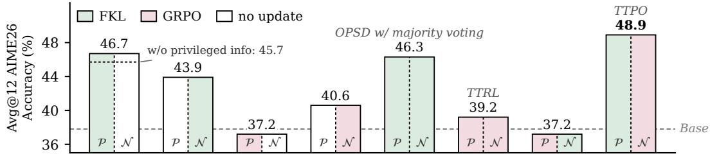  
Figure 3: Ablations over update strategies on Qwen3-1.7B AIME26 TTT setting. P and N denote the loss applied to positive and negative samples, respectively. Dotted lines indicate the corresponding variants with an unconditioned teacher.

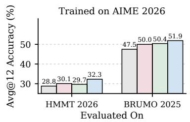

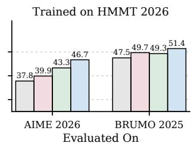

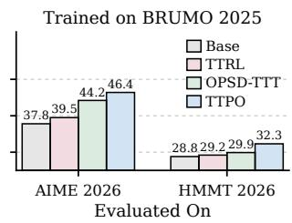  
Figure 4: Cross-benchmark generalization (Qwen3-1.7B). Each subplot corresponds to a training benchmark; each group within a subplot shows performance on a different target benchmark.

## 4.4 ANALYSIS

Privileged information. Table 4 ablates privileged information under different teacher modes. With a thinking-mode teacher, the teacher–student distributional gap is already large, so a short answer suffices as a lightweight hint that steers the teacher without crowding out its reasoning. Even a wrong pseudo-label remains consistent with the student’s answer in positive samples, and the update degenerates into thinking-to-non-thinking distillation—still a well-posed and beneficial signal (46.5 vs. 45.8). A full trajectory, by contrast, dominates the context and reduces the teacher to complet-

Table 4: Effect of privileged information type and teacher thinking mode (Qwen3-1.7B, OpenThoughts, AIME26). Columns: whether teacher uses thinking mode. Rows: privileged information injected into teacher prompt. Results in parentheses are evaluated with thinking disabled.
<table><tr><td>Privilege</td><td>TM-on Teacher</td><td>TM-off Teacher</td></tr><tr><td>None</td><td>45.8 (36.1)</td><td>41.7 (8.1)</td></tr><tr><td>Answer</td><td>46.5 (39.8)</td><td>33.6 (6.7)</td></tr><tr><td>Trajectory</td><td>41.1 (8.9)</td><td>40.8 (10.6)</td></tr></table>

ing a given prefix rather than reasoning independently, degrading performance (41.1). With a nonthinking teacher, the gap is inherently small: a short answer barely shifts the distribution (33.6), while a full trajectory supplies needed context (40.8) but leaves both sides under weak reasoning, making training highly sensitive to pseudo-label noise. The thinking-teacher + answer setting thus offers the best trade-off between guidance and robustness.

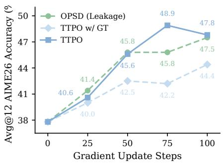

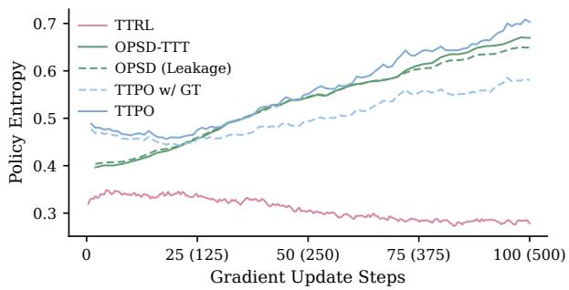  
Figure 5: Left: Comparison between pseudo-label vs. ground-truth supervision. TTPO w/ GT replaces majority-vote pseudo-labels with ground truth while keeping the asymmetric objective and token-level selection intact; OPSD (Leakage) trains standard OPSD directly on AIME26. Right: Entropy during training. Values in parentheses on the x-axis denote TTRL’s training steps.

Generalization beyond the target task. To verify that TTPO acquires generalizable reasoning improvements rather than overfitting to specific problems, we train on each benchmark separately and evaluate on all three (Figure 4). Models trained on any single benchmark consistently improve on the other two as well. This cross-benchmark transfer confirms that TTPO strengthens underlying reasoning capabilities rather than memorizing problem-specific patterns.

Upper bound with labeled supervision. We replace majority-vote pseudo-labels with groundtruth answers to probe the performance ceiling (Figure 5). Surprisingly, TTPO with pseudo-labels outperforms both TTPO w/ GT and OPSD (Leakage). First, perfectly correct labels are hard to match on difficult problems, yielding few or zero positives per instance; this starves the FKL branch and leaves GRPO with near-zero advantages that barely penalize negatives (Figure 8). Majorityvote labels, being easier to match, keep a healthy positive–negative split and both branches active. Second, AIME26 ground-truth answers are short numbers that barely shift the thinking teacher, unlike the richer OpenThoughts trajectories—reliable, yet too brief to guide strongly. The entropy plot (right) corroborates this: TTPO with pseudo-labels sustains higher entropy, as majority voting and distillation jointly promote exploration that compensates for—and ultimately surpasses—the theoretical benefit of perfect labels.

Sustainable self-evolution. Since majority voting generates the training signal, the base model’s Maj@12 sets the initial ceiling on pseudo-label quality. We track Avg@12 and Maj@12 throughout training to examine whether TTPO can break this ceiling (Figure 6). As training progresses, Avg@12 rises steadily to the base Maj@12, confirming that the collective knowledge in majority voting is distilled into single-sample performance. More importantly, Maj@12 does not stagnate but rises in tandem: as the model improves, higher-quality rollouts yield more accurate pseudo-labels, which in turn raise the training ceiling for later steps. This self-evolving cycle enables TTPO to improve beyond its initial supervision and ultimately outperform training with ground-truth that exceed the model’s current capacity (Figure 5, left).

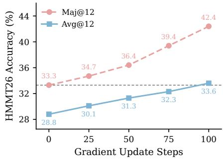  
Figure 6: Avg@12 and Maj@12 during TTPO TTT on HMMT26 (Qwen3- 1.7B). Dashed line: base Maj@12.

## 5 CONCLUSION

We introduced TTPO, which brings OPSD into label-free test-time training by combining it with RL under an asymmetric objective. Distillation provides dense token-level guidance on positives, while RL supplies a robust, label-free penalty on negatives. With token-level selection on both branches, TTPO matches ground-truth-supervised methods, substantially outperforms existing label-free approaches, and exhibits self-evolution with strong cross-task generalization.

## REFERENCES

Rishabh Agarwal, Nino Vieillard, Yongchao Zhou, Piotr Stanczyk, Sabela Ramos, Matthieu Geist, and Olivier Bachem. On-policy distillation of language models: Learning from self-generated mistakes, 2024. URL https://arxiv.org/abs/2306.13649.

Jasper Dekoninck, Nikola Jovanovic, Tim Gehrunger, K´ ari R´ ognvaldsson, Ivo Petrov, Chenhao Sun,¨ and Martin Vechev. Beyond benchmarks: Matharena as an evaluation platform for mathematics with llms. 2026. URL https://arxiv.org/abs/2605.00674.

Yong Du, Yuchen Yan, Fei Tang, Zhengxi Lu, Chang Zong, Weiming Lu, Shengpei Jiang, and Yongliang Shen. Test-time reinforcement learning for gui grounding via region consistency, 2025. URL https://arxiv.org/abs/2508.05615.

John Gkountouras, Josip Jukic, and Ivan Titov. Consensus as privileged context for label-free self-´ distillation. arXiv preprint arXiv:2607.13643, 2026.

Yuxian Gu, Li Dong, Furu Wei, and Minlie Huang. Minillm: On-policy distillation of large language models, 2026. URL https://arxiv.org/abs/2306.08543.

Daya Guo, Dejian Yang, Haowei Zhang, Junxiao Song, Peiyi Wang, Qihao Zhu, Runxin Xu, Ruoyu Zhang, Shirong Ma, Xiao Bi, et al. Deepseek-r1: Incentivizing reasoning capability in llms via reinforcement learning. arXiv preprint arXiv:2501.12948, 2025.

Zhuowen Han, Jinwei Xiao, Zhengxi Lu, Renren Jin, Zhiyuan Yao, Yuxin Liu, Hongyan Hao, Yueqing Sun, Yu Yang, Qi Gu, et al. Distill where you fail: Recovering learning signals of negative rl-groups from adaptive teacher guidance. arXiv preprint arXiv:2608.00782, 2026.

Yinghui He, Simran Kaur, Adithya Bhaskar, Yongjin Yang, Jiarui Liu, Narutatsu Ri, Liam Fowl, Abhishek Panigrahi, Danqi Chen, and Sanjeev Arora. Self-distillation zero: Self-revision turns binary rewards into dense supervision, 2026. URL https://arxiv.org/abs/2604.12002.

Youngdong Kim, Junho Yim, Juseung Yun, and Junmo Kim. NLNL: Negative learning for noisy labels. In Proceedings of the IEEE/CVF International Conference on Computer Vision (ICCV), 2019.

Gengsheng Li, Tianyu Yang, Junfeng Fang, Mingyang Song, Mao Zheng, Haiyun Guo, Dan Zhang, Jinqiao Wang, and Tat-Seng Chua. Unifying group-relative and self-distillation policy optimization via sample routing. arXiv preprint arXiv:2604.02288, 2026a.

Yijiang Li, Bingyang Wang, Yijun Liang, Yunjie Tian, Di Fu, and Nuno Vasconcelos. On-policy self-distillation without any supervision. arXiv preprint arXiv:2608.06296, 2026b.

Hongxiang Lin, Zhirui Kuai, Erpeng Xue, and Lei Wang. Detecting and mitigating the correctanswer extinction window in test-time reinforcement learning with majority voting. arXiv preprint arXiv:2605.19444, 2026.

Shiqi Liu, Zeyu He, Guojian Zhan, Letian Tao, Zhilong Zheng, Jiang Wu, Yinuo Wang, Yang Guan, Kehua Sheng, Bo Zhang, et al. Stapo: Stabilizing reinforcement learning for llms by silencing rare spurious tokens. arXiv preprint arXiv:2602.15620, 2026a.

Yifeng Liu, Shiyuan Zhang, Yifan Zhang, and Quanquan Gu. Self-distilled policy gradient. arXiv preprint arXiv:2606.04036, 2026b.

Ilya Loshchilov and Frank Hutter. Decoupled weight decay regularization. arXiv preprint arXiv:1711.05101, 2017.

Zhengxi Lu, Zhiyuan Yao, Zhuowen Han, Zi-Han Wang, Jinyang Wu, Qi Gu, Xunliang Cai, Weiming Lu, Jun Xiao, Yueting Zhuang, et al. Self-distilled agentic reinforcement learning. arXiv preprint arXiv:2605.15155, 2026a.

Zhengxi Lu, Zhiyuan Yao, Jinyang Wu, Chengcheng Han, Qi Gu, Xunliang Cai, Weiming Lu, Jun Xiao, Yueting Zhuang, and Yongliang Shen. Skill0: In-context agentic reinforcement learning for skill internalization. arXiv preprint arXiv:2604.02268, 2026b.

Zhihong Shao, Peiyi Wang, Qihao Zhu, Runxin Xu, Junxiao Song, Xiao Bi, Haowei Zhang, Mingchuan Zhang, YK Li, Yang Wu, et al. Deepseekmath: Pushing the limits of mathemati cal reasoning in open language models. arXiv preprint arXiv:2402.03300, 2024.

Aaditya Singh, Adam Fry, Adam Perelman, Adam Tart, Adi Ganesh, Ahmed El-Kishky, Aidan McLaughlin, Aiden Low, AJ Ostrow, Akhila Ananthram, et al. Openai gpt-5 system card. arXiv preprint arXiv:2601.03267, 2025.

Yu Sun, Xiaolong Wang, Zhuang Liu, John Miller, Alexei Efros, and Moritz Hardt. Test-time training with self-supervision for generalization under distribution shifts. In International conference on machine learning, pp. 9229–9248. PMLR, 2020.

Kimi Team, Tongtong Bai, Yifan Bai, Yiping Bao, Jianfeng Cai, Xinyuan Cai, Peizhou Cao, Yuxuan Cao, Ziwei Chai, Y Charles, et al. Kimi k3: Open frontier intelligence. arXiv preprint arXiv:2607.24653, 2026.

Qwen Team. Qwen3. 5-omni technical report. arXiv preprint arXiv:2604.15804, 2026.

Yuqiao Wen, Zichao Li, Wenyu Du, and Lili Mou. f-divergence minimization for sequence-level knowledge distillation, 2023. URL https://arxiv.org/abs/2307.15190.

Yihong Wu, Liheng Ma, Lingfeng Xiao, Muzhi Li, Xinyu Wang, Yingxue Zhang, and Jian-Yun Nie. Rethinking groups in critic-free rlvr. arXiv preprint arXiv:2606.17250, 2026.

Jinwei Xiao, Zhuowen Han, Yueqing Sun, Zhengxi Lu, Yuxin Liu, Zhiyuan Yao, Wentao Chen, Qi Gu, and Xunliang Cai. Finding the evidence: Discovering decision-supporting tokens for on-policy reasoning distillation. arXiv preprint arXiv:2606.22830, 2026.

Anyi Xu, Bangcai Lin, Bing Xue, Bingxuan Wang, Bingzheng Xu, Bochao Wu, Bowei Zhang, Chaofan Lin, Chen Dong, Chenchen Ling, et al. Deepseek-v4: Towards highly efficient milliontoken context intelligence. arXiv preprint arXiv:2606.19348, 2026a.

Kunbin Xu, Xingzuo Li, Xuefeng Bai, and Kehai Chen. Hi-ttrl: Regulating consensus with hints for test-time reinforcement learning. arXiv preprint arXiv:2608.03545, 2026b.

Yuanda Xu, Hejian Sang, Zhengze Zhou, Ran He, Zhipeng Wang, and Alborz Geramifard. Tip: Token importance in on-policy distillation. arXiv preprint arXiv:2604.14084, 2026c.

Dong Yan, Jian Liang, Yanbo Wang, Shuo Lu, Ran He, and Tieniu Tan. What if consensus lies? selective-complementary reinforcement learning at test time. In Proceedings of the 64th Annual Meeting of the Association for Computational Linguistics (Volume 1: Long Papers), pp. 28957– 28970, 2026.

An Yang, Anfeng Li, Baosong Yang, Beichen Zhang, Binyuan Hui, Bo Zheng, Bowen Yu, Chang Gao, Chengen Huang, Chenxu Lv, et al. Qwen3 technical report. arXiv preprint arXiv:2505.09388, 2025.

Chenxu Yang, Chuanyu Qin, Qingyi Si, Minghui Chen, Naibin Gu, Dingyu Yao, Zheng Lin, Weiping Wang, Jiaqi Wang, and Nan Duan. Self-distilled rlvr. arXiv preprint arXiv:2604.03128, 2026a.

Wenkai Yang, Weijie Liu, Ruobing Xie, Kai Yang, Saiyong Yang, and Yankai Lin. Learning beyond teacher: Generalized on-policy distillation with reward extrapolation. arXiv preprint arXiv:2602.12125, 2026b.

Tianzhu Ye, Li Dong, Xun Wu, Shaohan Huang, and Furu Wei. On-policy context distillation for language models. arXiv preprint arXiv:2602.12275, 2026.

Qiying Yu, Zheng Zhang, Ruofei Zhu, Yufeng Yuan, Xiaochen Zuo, Yu Yue, Weinan Dai, Tiantian Fan, Gaohong Liu, Lingjun Liu, et al. Dapo: An open-source llm reinforcement learning system at scale. Advances in Neural Information Processing Systems, 38:113222–113244, 2026.

Aohan Zeng, Xin Lv, Zhenyu Hou, Zhengxiao Du, Qinkai Zheng, Bin Chen, Da Yin, Chendi Ge, Chenghua Huang, Chengxing Xie, et al. Glm-5: from vibe coding to agentic engineering. arXiv preprint arXiv:2602.15763, 2026.

Siyan Zhao, Zhihui Xie, Mengchen Liu, Jing Huang, Guan Pang, Feiyu Chen, and Aditya Grover. Self-distilled reasoner: On-policy self-distillation for large language models. arXiv preprint arXiv:2601.18734, 2026.

Yuxin Zuo, Kaiyan Zhang, Li Sheng, Shang Qu, Ganqu Cui, Xuekai Zhu, Haozhan Li, Xinwei Long, Ermo Hua, Biqing Qi, et al. Ttrl: Test-time reinforcement learning. Advances in Neural Information Processing Systems, 38:131459–131483, 2026.

## A IMPLEMENTATION DETAILS

We provide complete training and evaluation configurations in Tables 5 and 6. All experiments use the AdamW (Loshchilov & Hutter, 2017) optimizer with bfloat16 precision and Flash Attention 2. TTPO experiments use 4×H20 GPUs; all other methods use 8×H20 GPUs. We adopt full-vocabulary logit distillation for all distillation-based methods (OPSD, OPSD-TTT, and TTPO). Following Zhao et al. (2026), we use a thinking-mode-off student / thinking-mode-on teacher configuration, and the teacher is fixed to base model weights (LoRA adapters disabled) throughout training. For TTPO and OPSD-TTT, we set the maximum sampling length to 16,000 tokens to reduce answer extraction failures caused by truncation during majority voting, while the gradient update still only applies to the first 1,024 completion tokens.

Table 5: Training configuration for all methods. GRPO and OPSD use ground-truth labels; TTRL, OPSD-TTT, and TTPO are label-free. “–” indicates not applicable.
<table><tr><td>Parameter</td><td>GRPO / TTRL</td><td>OPSD / OPSD-TTT</td><td>TTPO</td></tr><tr><td>General</td><td></td><td></td><td></td></tr><tr><td>Learning Rate</td><td> $5 \times 1 0 ^ { - 6 }$ </td><td> $5 \times 1 0 ^ { - 6 }$ </td><td> $5 \times 1 0 ^ { - 6 }$ </td></tr><tr><td>Max Gradient Norm</td><td></td><td>0.1</td><td>0.1</td></tr><tr><td>Effective Batch Size</td><td>32</td><td>32</td><td>32</td></tr><tr><td>Training Steps</td><td>500</td><td>100</td><td>100</td></tr><tr><td>LoRA Configuration</td><td></td><td></td><td></td></tr><tr><td>LoRA Rank (r)</td><td>64</td><td>64</td><td>64</td></tr><tr><td>LoRA Alpha (α)</td><td>128</td><td>128</td><td>128</td></tr><tr><td>Target Modules</td><td colspan="3">q-proj, k-proj, v-proj, o-proj, gate_proj, up-proj, down_proj</td></tr><tr><td>Generation</td><td></td><td></td><td></td></tr><tr><td>Number of Train Rollouts</td><td>8</td><td>1</td><td>8</td></tr><tr><td>Max Gradient Tokens</td><td>16,000</td><td>1,024</td><td>1,024</td></tr><tr><td>Sampling Temperature</td><td>1.2</td><td>1.1</td><td>1.1</td></tr><tr><td>Top-p</td><td></td><td>0.95</td><td>0.95</td></tr><tr><td>Top-k</td><td></td><td>20</td><td>20</td></tr><tr><td>KL Coefficient (β)</td><td>0.0</td><td></td><td></td></tr><tr><td>JSD Token Clip (τ)</td><td></td><td>0.05 (1.7B, 4B) / 0.06 (8B)</td><td>0.05 (1.7B, 4B) / 0.06 (8B)</td></tr></table>

Table 6: Evaluation configuration.
<table><tr><td>Parameter</td><td>Value</td></tr><tr><td>Thinking Mode</td><td>Enabled</td></tr><tr><td>Samples per Prompt</td><td>12</td></tr><tr><td>Temperature</td><td>1.0</td></tr><tr><td>Top-p</td><td>0.95</td></tr><tr><td>Max New Tokens</td><td>38,912</td></tr><tr><td>Metric</td><td>Avg@12</td></tr></table>

## B PROMPT TEMPLATES

We list the prompt templates used for both the student and teacher. All prompts are wrapped with the model’s chat template via apply chat template. When privilege info = none (the no-privilege

ablation in Table 4), the teacher prompt is identical to the student prompt but with thinking mode enabled.

Student Prompt (thinking mode off)   
Problem: {problem}   
Please reason step by step, and put your final answer within \boxed{}.

Teacher Prompt (thinking mode on, privilege = answer)   
Problem: {problem}   
Here is a reference solution to this problem:   
=== Reference Solution Begin ===   
{pseudo label}   
=== Reference Solution End ===   
After reading the reference solution above, make sure you truly understand the reasoning be  
hind each step — do not copy or paraphrase it. Now, using your own words and independent   
reasoning, derive the same final answer to the problem above. Think step by step, explore   
different approaches, and don’t be afraid to backtrack or reconsider if something doesn’t work   
out:   
Please reason step by step, and put your final answer within \boxed{}.

## C CASE STUDY: TOKEN-LEVEL SELECTION VISUALIZATION

We visualize how our token weighting (§3.3) and token masking (§3.4) operate on a concrete example. Excerpts are drawn from a positive sample and a negative sample generated for the same geometry problem.<sup>1</sup> The positive sample reaches the correct answer 7; the negative arrives at $\sqrt { 3 9 7 }$ Recall that token weighting down-weights low-entropy, low-divergence positions where the student has converged, while token masking suppresses low-probability, low-entropy positions representing anomalous model outputs.

## C.1 TOKEN WEIGHTING

Positive Sample — Token Weighting (Answer: 7 ✓)   
Legend: low −→ high weight   
Segment: Geometric reasoning to determine K’s coordinates   
Since \$ DA \$ goes from \$D = (0, a)\$ to \$A = (0,   
0)\$, the extension beyond \$A\$ is the line \$ x =   
0 \$, going downwards So \$ K \$ is at \$( 0, y \$) for some   
\$y < 0\$.

The contrast is stark: coordinate values $( { } ^ { \bullet \bullet } ( 0 , a ) ^ { \prime \prime } , { } ^ { \ast \bullet } ( 0 , 0 ) ^ { \prime \prime } , { } ^ { \ast \ast } x = 0 ^ { \prime \prime } )$ receive near-zero weight—these are deterministic once the setup is chosen, and both student and teacher assign near-unit probability to each digit. High weight concentrates on geometric insights that determine the solution strategy: “the extension beyond A is the line... going downwards” (identifying the geometric locus) and $^ { 6 6 } \mathrm { { S o } }$ K is at $( 0 , y )$ , for some $y < 0 ^ { \dag }$ (drawing the conclusion). These are positions where the student is uncertain which geometric fact to invoke or the teacher favors a different continuation, making them the sole source of learning signal. Token weighting thus focuses distillation on where to reason and what to conclude, not on reproducing mechanical substitutions the model already handles reliably.

## C.2 TOKEN MASKING

```perl
<sub>Negative</sub> <sub>Sample</sub> <sub>—</sub> <sub>Token</sub> <sub>Masking</sub> <sub>(Answer:</sub> √<sub>397</sub> <sub>✗)</sub>
Legend: kept token, masked token
Segment: Erroneous coordinate derivation (root cause of failure)
$CL = 6$: Since $C = (s, s)$ and $L$ is on $CD$, we move 6 units
from $C$ along $CD$ (which is vertical).
So, point $ L = (s, s - 6)$
```

The kept tokens are precisely the positions worth penalizing: local errors (“which is vertical”—CD is actually horizontal under the model’s own coordinates), context-inconsistent expressions (“we move... units from C along CD”—applying a vertical displacement to a horizontal segment), and the resulting anomalous conclusion (“So, L =”—committing to coordinates that place L off the intended side). Masked-out tokens, by contrast, are locally correct arithmetic $( ^ { * * } ( s , s ) ^ { * } , \ " = 6 ^ { 3 } )$ and formatting that would appear identically in a correct solution; penalizing them would damage valid computation skills without addressing the actual reasoning flaw. Token masking thus restricts the penalty gradient to the confident errors that cause failure—wrong geometric claims and their immediate consequences—while leaving shared, reusable sub-skills intact.

## C.3 COMPLEMENTARITY

The two mechanisms implement a dual philosophy: token weighting asks “where does the model still need to learn?” and suppresses already-converged positions in positive samples; token masking asks “where is the model confidently wrong?” and suppresses locally-correct or uncertain positions in negative samples. Both avoid wasting gradient on low-signal tokens—from opposite directions— yielding more efficient and stable training.

## D ADDITIONAL EXPERIMENTS

## D.1 TRAINING DYNAMICS

Figure 7 compares training dynamics of Qwen3-1.7B TTT on AIME 2026 across methods. The most striking observation is that TTPO w/ GT exhibits dramatically weaker training signal than all other methods: its loss barely decreases and frequently stagnates near zero. This directly validates our theoretical analysis (Eq. 13–14) — on hard AIME problems where $| \mathcal { P } _ { \mathrm { G T } } | ~ \approx ~ 0 ,$ GT routing starves both branches simultaneously. In contrast, TTPO with majority-vote pseudolabels maintains a steady and substantial

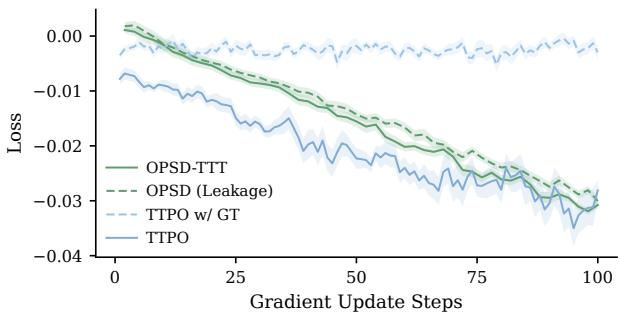  
Figure 7: Training loss curves.

loss decrease throughout training, confirming that vote-based routing keeps both branches active. OPSD (Leakage) and OPSD-TTT both show consistent loss reduction; notably, TTPO achieves comparable or stronger training dynamics despite operating in a fully label-free setting.

## D.2 NON-THINKING EVALUATION

Table 7 evaluates models with thinking mode disabled to assess whether training with a thinkingmode teacher transfers reasoning capabilities to non-thinking inference. TTPO achieves dramatically larger gains than OPSD across all scales: on average, TTPO improves over the base model by +25.2 (1.7B), +30.6 (4B), and +36.4 (8B) points, while OPSD improves by only +7.1, +5.8, and +3.5 points respectively. This indicates that TTPO far more effectively absorbs the thinking teacher’s reasoning ability into the student’s non-thinking distribution. We attribute this to the asymmetric objective: the GRPO branch on negative samples directly penalizes poor reasoning patterns in the student’s own generation mode, while OPSD’s pure distillation only passively aligns the student toward the teacher without actively suppressing failure modes.

Table 7: Non-thinking evaluation on OpenThoughts training data. Models are evaluated with thinking mode disabled. Both OPSD and TTPO are trained with a thinking-mode-on teacher.
<table><tr><td>Method</td><td>AIME25</td><td>HMMT25</td><td>AIME26</td><td>HMMT26</td><td>BRUMO25</td><td>Average</td></tr><tr><td colspan="7">Qwen3-1.7B</td></tr><tr><td>Base</td><td>9.2</td><td>5.6</td><td>8.8</td><td>6.1</td><td>17.8</td><td>9.5</td></tr><tr><td>+OPSD†</td><td>16.9</td><td>9.2</td><td>19.4</td><td>11.9</td><td>25.6</td><td>16.6</td></tr><tr><td>+TTPO</td><td>39.2</td><td>20.6</td><td>39.8</td><td>26.3</td><td>47.5</td><td>34.7</td></tr><tr><td colspan="7">Qwen3-4B</td></tr><tr><td>Base</td><td>22.2</td><td>12.5</td><td>19.4</td><td>17.2</td><td>28.3</td><td>19.9</td></tr><tr><td>+OPSD†</td><td>26.7</td><td>18.9</td><td>24.4</td><td>22.5</td><td>36.1</td><td>25.7</td></tr><tr><td>+TTPO</td><td>57.2</td><td>36.7</td><td>61.4</td><td>36.4</td><td>60.8</td><td>50.5</td></tr><tr><td colspan="7">Qwen3-8B</td></tr><tr><td>Base</td><td>20.6</td><td>11.4</td><td>21.1</td><td>18.7</td><td>29.7</td><td>20.3</td></tr><tr><td>+OPSD†</td><td>25.0</td><td>14.2</td><td>22.2</td><td>19.9</td><td>37.8</td><td>23.8</td></tr><tr><td>+TTPO</td><td>67.8</td><td>42.5</td><td>65.0</td><td>41.2</td><td>67.2</td><td>56.7</td></tr></table>

## D.3 ADDITIONAL ABLATIONS

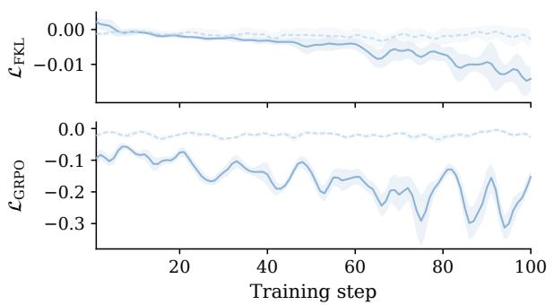

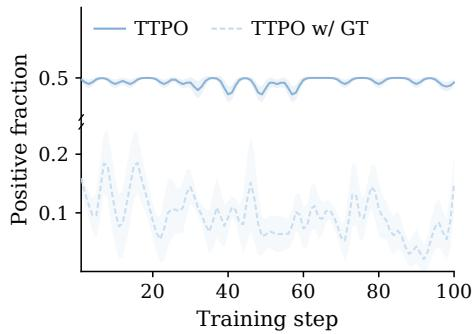  
Figure 8: Left: Training loss curves for the OPSD and GRPO branches (unweighted). Right: Positive sample fraction over training steps. (Qwen3-1.7B, OpenThoughts).

Table 8: Ablation on RL weight λ (Qwen3-1.7B, OpenThoughts).
<table><tr><td>λ</td><td>AIME26</td><td>HMMT26</td><td>BRUMO25</td></tr><tr><td>0.01</td><td>41.4</td><td>28.8</td><td>51.1</td></tr><tr><td>0.05</td><td>43.9</td><td>29.0</td><td>50.6</td></tr><tr><td>0.10</td><td>46.5</td><td>31.6</td><td>54.7</td></tr><tr><td>0.15</td><td>44.7</td><td>29.5</td><td>50.3</td></tr><tr><td>0.20</td><td>41.7</td><td>26.3</td><td>51.6</td></tr></table>

RL weight λ. As shown in Figure 8, the raw GRPO loss is roughly an order of magnitude larger than the OPSD forward-KL loss, while the positive sample fraction increases over training as the model produces more correct answers. Without scaling, the GRPO branch would dominate gradients and destabilize training. We therefore introduce a weight λ on the GRPO loss to balance the two branches. Table 8 sweeps $\lambda \in \{ 0 . 0 1 , 0 . 0 5 , 0 . 1 , 0 . 1 5 , \overline { { 0 . 2 } } \}$ : performance peaks at $\lambda { = } 0 . 1$ which approximately equalizes the gradient magnitudes of the two branches. Both under-weighting $( \lambda { \le } 0 . 0 \bar { 5 } ,$ insufficient negative penalty) and over-weighting $( \lambda { \ge } 0 . 1 5$ , excessive penalty dominating distillation) degrade results.

Table 9: Positive-negative fraction in $K _ { \mathrm { t r a i n } }$ (Qwen3-1.7B, OpenThoughts). Dynamic: ratio mirrors full K rollouts.  
Table 10: $K _ { \mathrm { t r a i n } }$ selection strategy (Qwen3- 1.7B, OpenThoughts).
<table><tr><td>Fraction</td><td>AIME26</td><td>HMMT26</td><td>BRUMO25</td></tr><tr><td>Random</td><td>45.8</td><td>30.3</td><td>50.9</td></tr><tr><td>Fixed (0.5)</td><td>46.5</td><td>31.6</td><td>54.7</td></tr><tr><td>Dynamic</td><td>46.1</td><td>31.1</td><td>51.1</td></tr></table>

<table><tr><td>Strategy</td><td>AIME26</td><td>HMMT26</td><td>BRUMO25</td></tr><tr><td>Random</td><td>45.0</td><td>31.1</td><td>50.7</td></tr><tr><td>Shortest</td><td>46.5</td><td>31.6</td><td>54.7</td></tr><tr><td>Longest</td><td>45.6</td><td>30.8</td><td>51.1</td></tr><tr><td>Top signal</td><td>45.8</td><td>30.6</td><td>51.9</td></tr></table>

$K _ { \mathbf { t r a i n } }$ positive-negative fraction. Table 9 ablates the positive-negative composition of the $K _ { \mathrm { t r a i n } }$ subset. A fixed 50/50 split outperforms both random sampling and a dynamic fraction. The dynamic strategy faces a fundamental dilemma: when the positive fraction in K is high (i.e., pseudo-label is likely correct), proportionally reducing negative samples in $K _ { \mathrm { t r a i n } }$ cancels the amplified grouprelative advantages that negative samples receive — the enlarged signal is immediately diluted by fewer recipients. Conversely, if the dynamic strategy inverts the ratio (more negatives when positives dominate), it sacrifices the reliable fine-grained FKL supervision available precisely when the pseudo-label is most trustworthy, replacing it with coarser GRPO penalties. Either direction has drawbacks; a fixed 50/50 split avoids both failure modes and guarantees stable gradient contributions from both branches at every step.

$K _ { \mathbf { t r a i n } }$ selection strategy. Table 10 compares strategies for selecting which rollouts enter $K _ { \mathrm { t r a i n } }$ Selecting the shortest completions performs best. Since only the first 1,024 tokens participate in the gradient update, shorter trajectories ensure that these tokens constitute a larger fraction of the total reasoning chain and are more likely to contain the critical steps that determine the final answer. For longer trajectories, the first 1,024 tokens often cover only preliminary exploration, with the decisive reasoning occurring well beyond the gradient window — yielding little useful learning signal. The “Top signal” strategy selects positive samples with the highest teacher-student FKL divergence (intuitively, trajectories where the student deviates most from the teacher and thus has the most to learn) and negative samples with the highest log-probability (intuitively, confident errors that carry the strongest penalty signal). Despite this seemingly stronger per-sample signal, the strategy underperforms shortest selection — the intuition that larger divergence or higher confidence implie more useful gradients lacks theoretical grounding and appears unreliable in practice.

## E THEORETICAL ANALYSIS

## E.1 SETUP

For problem x with ground-truth $a ^ { * }$ and pseudo-label aˆ:

$$
q _ { t } ^ { ( a ) } = \pi _ { \theta } ( \cdot \mid [ x ; a ] , y _ { < t } ) , \quad p _ { t } = \pi _ { \theta } ( \cdot \mid x , y _ { < t } ) , \quad \nabla _ { \theta } \mathrm { K L } ( q _ { t } ^ { ( a ) } \| p _ { t } ) = - \sum _ { v } q _ { t } ^ { ( a ) } ( v ) \nabla _ { \theta } \log p _ { t } ( v ) .\tag{9}
$$

## E.2 FKL SIGNAL ANALYSIS

Positive samples $( y _ { k } \in \mathcal { P } , a _ { k } = \hat { a } )$ . The trajectory agrees with teacher, so the FKL collapses to:

$$
\mathrm { K L } \Big ( q _ { t } ^ { ( \hat { a } ) } \big \| p _ { t } \Big ) \Big | _ { a _ { k } = \hat { a } } = \underbrace { \mathrm { K L } ( q _ { t } \| p _ { t } ) } _ { \mathrm { t h i n k i n g ~ v s . \ n o n - t h i n k i n g ~ o n l y } } .\tag{10}
$$

If $\hat { a } = a ^ { * }$ this recovers standard OPSD; if $\hat { a } \neq a ^ { * }$ it reduces to answer-agnostic distillation.

Negative samples $( y _ { k } \in \mathcal { N } , a _ { k } \neq \hat { a } )$ . The disagreement introduces a non-negative conflict term:

$$
\begin{array} { r } { \mathrm { K L } \Big ( q _ { t } ^ { ( \hat { a } ) } \big \| p _ { t } \Big ) \Big | _ { a _ { k } \neq \hat { a } } = \underbrace { \mathrm { K L } ( q _ { t } \| p _ { t } ) } _ { \mathrm { t h i n k i n g ~ v s . n o n - t h i n k i n g } } + \underbrace { \Delta _ { \mathrm { c o n f i c t } } ( t ) } _ { \geq 0 } , } \end{array}\tag{11}
$$

where $\Delta _ { \mathrm { c o n f l i c t } } ( t )$ captures the teacher’s pressure to redirect reasoning from $a _ { k }$ toward aˆ. This is beneficial when $\hat { a } = a ^ { * }$ , but harmful when $\hat { a } \neq a ^ { * }$ , particularly when $a _ { k } = a ^ { * }$ , as the gradient actively suppresses correct reasoning.

Method comparison. By Eq. 10, FKL on $\mathcal { P }$ is at worst benign and at best recovers standard OPSD; GRPO on $\mathcal { N }$ is label-agnostic. U-OPSD applies FKL to $\mathcal { N }$ instead, where $\Delta _ { \mathrm { { c o n f l i c t } } }$ (Eq. 11) misdirects correct trajectories whenever $\hat { a } \neq a ^ { * }$ , and requires reliable pseudo-labels since low consensus makes $\Delta _ { \mathrm { c o n f l i c t } }$ harmful while unanimous consensus yields waste of rollouts $( | \mathcal { N } | = 0 )$

## E.3 MAJORITY-VOTE VS. GROUND-TRUTH ROUTING

With binary reward $r _ { k } = \mathbf { 1 } [ a _ { k } \in$ majority], $\bar { r } = | \mathcal { P } | / K$ . The GRPO advantage for $k \in \mathcal N$

$$
A _ { k } = - \sqrt { \frac { | \mathcal { P } | / K } { 1 - | \mathcal { P } | / K } } , \quad k \in \mathcal { N } .\tag{12}
$$

GT routing $( \mathcal { P } _ { \mathrm { G T } } = \{ k : a _ { k } = a ^ { * } \} )$ ). On hard problems with small $| \mathcal { P } _ { \mathrm { G T } } |$ , both branches vanish:

$$
\frac { \left| \mathcal { P } _ { \mathrm { G T } } \right| } { K } \approx 0 \quad \mathrm { a n d } \quad \underbrace { \sum _ { k \in \mathcal { P } _ { \mathrm { G T } } } \nabla _ { \theta } \mathrm { K L } ( q _ { t } \| p _ { t } ) } _ { \mathrm { F K L } } \approx \mathbf { 0 } ,\tag{13}
$$

$$
\left| A _ { k } \right| = \sqrt { \frac { | \mathcal { P } _ { \mathrm { G T } } | / K } { 1 - | \mathcal { P } _ { \mathrm { G T } } | / K } } \approx 0 \quad \mathrm { a n d } \quad \underbrace { A _ { k } \nabla _ { \theta } \log \pi _ { \theta } ( y _ { k } \mid x ) } _ { \mathrm { G R P 0 } } \approx { \bf 0 } .\tag{14}
$$

Vote routing $( \mathcal { P } _ { \mathrm { v o t e } } = \{ k : a _ { k } = \hat { a } \} )$ . The model always forms a non-empty consensus $| \mathcal { P } _ { \mathrm { v o t e } } | >$ 0, so both branches remain active:

$$
\frac { | \mathcal { P } _ { \mathrm { v o t e } } | } { K } > 0 \quad \mathrm { a n d } \quad \underbrace { \sum _ { k \in \mathcal { P } _ { \mathrm { v o t e } } } \nabla _ { \theta } \mathrm { K L } ( q _ { t } \| p _ { t } ) \neq \mathbf { 0 } , } _ { \mathrm { F K L } }\tag{15}
$$

$$
A _ { k } = - \sqrt { \frac { | \mathcal { P } _ { \mathrm { v o t e } } | / K } { 1 - | \mathcal { P } _ { \mathrm { v o t e } } | / K } } < 0 \quad \mathrm { a n d } \quad \underbrace  \vphantom { A _ { k } } \underbrace { A _ { k } \nabla _ { \theta } \log \pi _ { \theta } ( y _ { k } \mid x ) } _ { \mathrm { G R P O } } \neq \mathbf { 0 } .\tag{16}
$$

As the model improves, aˆ converges toward $a ^ { * }$ (Figure 6).

## F LIMITATIONS AND FUTURE WORK

Dependence on majority-vote quality. TTPO relies on majority voting to generate pseudo-labels and classify positive/negative samples. When the sample budget K is very small or the problem is so difficult that no rollout produces a correct answer, the voting signal degrades and both branches receive noisy supervision. Adaptive strategies that adjust the positive-negative ratio or fall back to pure RL under low-consensus conditions could mitigate this.

Domain scope. Our experiments are restricted to mathematical reasoning with verifiable final answers. Extending TTPO to domains where correctness is harder to extract automatically — such as code generation (requiring execution-based verification) or open-ended reasoning (requiring learned reward models) — remains unexplored.

Dynamic training curriculum. TTPO applies a fixed asymmetric objective throughout training. As the model improves and pseudo-label accuracy rises, the optimal balance between distillation and RL may shift. A curriculum that dynamically adjusts the RL weight or positive-negative fraction to training dynamics could further improve efficiency.