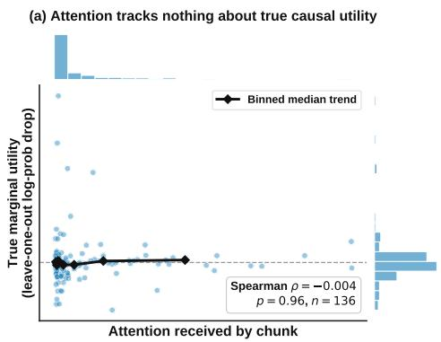
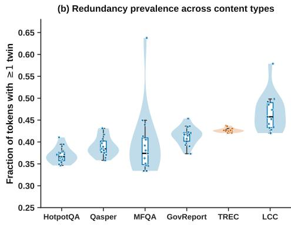

# TWINKV: A COMPOSABLE REPAIR PASS FOR KV CACHE EVICTION VIA PAIRWISE KEY REDUNDANCY

Hong Chen1, Yudong Zeng2, Yongwei Huang2, Zuhao Ouyang2, Junyan Zhang1, Xuming Hu1,∗

1The Hong Kong University of Science and Technology (Guangzhou), Guangzhou, China 2Bosum Institute of Management Science, Shenzhen, China

∗Corresponding author

## ABSTRACT

Long-context inference is bottlenecked by the memory footprint of the key-value (KV) cache, a constraint that is tightest for small models deployed under strict resource budgets. Existing KV cache eviction methods score tokens for removal using the model’s own attention distribution, or, in attention-free alternatives, by each key’s distance from a single global reference point. We show with a controlled leave-one-out probe that attention magnitude is only weakly related to a token’s true causal contribution to the model’s answer (Spearman ρ = −0.004), calling into question the premise behind the dominant family of eviction methods. We introduce TwinKV, a training-free, attention-free redundancy signal that measures whether a token’s key has a near-duplicate elsewhere in the context. Rather than deploying this signal as another standalone eviction policy competing against existing methods, we use it as a composable repair pass: given the fixed retained set already chosen by an arbitrary existing eviction policy, TwinKV audits that choice for two structural failure modes – tokens evicted despite having no surviving duplicate (orphans, information genuinely lost) and tokens retained despite a duplicate already occupying another slot (redundant donors) – and swaps the two, holding the policy’s own budget exactly fixed and never altering its underlying scoring rule. Composed with four recent eviction policies across four benchmark suites – LongBench’s 16 official sub-tasks, LooGLE’s 4 sub-tasks, the syntheticretrieval benchmark RULER, and a short-context MMLU-Pro no-harm control – and compression ratios {0.3, 0.5, 0.7}, this repair pass improves the wrapped policy on Qwen3-4B in a majority of evaluated configurations for two of the four policies, is close to even for a third, and helps only a minority of configurations for the fourth – an adaptive baseline already near a performance ceiling on several benchmarks – with the average improvement across the three non-ceiling policies smallest at the loosest ratio tested; that fourth policy’s pattern reverses entirely on RULER for Llama-3.2-1B, where it wins at every evaluated cell because its Alone score there starts far lower and has genuine room to improve. Llama-3.2-1B is not uniformly harder for the repair pass: it shows a smaller average gain on Long-Bench but a higher fraction of improved cells on both LongBench and LooGLE than Qwen3-4B, and a clean win on RULER; we report this full, model-dependent picture directly, along with the specific task structure (few-shot classification exemplars) where the repair pass does not help on either model.

## 1 INTRODUCTION

Long-context inference exposes a memory bottleneck that grows linearly with sequence length: every new token appends a key and a value vector to the KV cache at every attention layer, and this cache routinely exceeds the size of the model’s own parameters well before the context window i exhausted. The bottleneck is sharpest for the models best suited to on-device and other severely resource-constrained deployments. Small models have the least memory headroom to spare, yet under long-context use they carry the same per-token cache footprint as their larger counterparts, so the fraction of available memory consumed by the cache – not the weights – is what determines whether long-context inference is feasible at all.

KV cache eviction addresses this bottleneck by discarding a fraction of cached key-value pairs during prefill and retaining only a budget-constrained subset for the remainder of generation. Existing eviction methods score tokens by consulting the model’s own attention distribution, either directly as accumulated attention mass toward each position (Zhang et al., 2023; Li et al., 2024b), as attention averaged over a pyramidal per-layer budget schedule (Cai et al., 2024), or through an attention-free recency-and-sink heuristic calibrated to approximate where attention concentrates in practice (Xiao et al., 2024). A separate line of work removes the dependence on attention weights directly, instead scoring each key by how far it sits from a single reference point, the mean key vector across the context, and treating keys that deviate most from this centroid as important (Park et al., 2025).

We begin from a direct empirical test of the premise shared by the attention-consulting family of methods: does the attention a token receives reflect its true causal contribution to the model’s answer? We measure this with a leave-one-out marginal utility – how much removing a context chunk actually hurts the log-probability the model assigns to the correct answer – and compare it against the attention that chunk received during the original forward pass. Pooled across chunks and samples on a real long-context QA benchmark, the two are statistically indistinguishable from uncorrelated (Spearman $\rho = - 0 . 0 0 4 , p = 0 . 9 6 ;$ Figure 1a, Section 2). Attention magnitude, in this setting, does not reliably identify which tokens the model actually needs to answer correctly.

This motivates an importance signal that does not route through attention at all. Our signal is structural: a token’s information survives eviction, in the sense that the model can still recover it later, exactly when an equivalent copy exists elsewhere in the surviving context. A fact restated, paraphrased, or otherwise echoed more than once in a long passage can lose one of its copies without loss; a fact stated exactly once cannot. We operationalize this directly on key vectors: for each token, we count how many other, non-adjacent tokens have a near-duplicate key, measured by cosine similarity above a fixed threshold, and use this twin count as an inverse importance score. This redundancy signal, TwinKV, is training-free, uses no attention weights of any kind, and requires no task-specific calibration.

Because the signal is computed from the context alone, it needs no access to any other compressor’s internal scoring rule – only the budget and the set of positions that compressor has already decided to keep. This makes it deployable not as another standalone policy competing against existing eviction methods, but as a lightweight repair pass applied after an arbitrary existing policy has already made its decision. Given that policy’s retained set, TwinKV checks each evicted token for a surviving duplicate and each retained token for a redundant one, and swaps an unrecoverable eviction for a wasted retention wherever it finds a mismatch, holding the wrapped policy’s own budget exactly fixed. Because every decision under this signal is a judgment about a token’s uniqueness relative to the rest of the context rather than its distance from one fixed reference point, the resulting notion of importance is qualitatively different from anchor-based alternatives; Section 3 makes this distinction, and the repair mechanism itself, concrete.

Composed with four recent KV cache eviction policies across four benchmark suites (LongBench, LooGLE, RULER, and a short-context MMLU-Pro control) and compression ratios {0.3, 0.5, 0.7}, this repair pass improves the wrapped policy on Qwen3-4B in a majority of evaluated configurations for two of the four (StreamingLLM, up to 64% of cells; PyramidKV, 57%), is close to even for a third (SnapKV, 41%), and helps only a minority of configurations for the fourth (ExpectedAttention, 16%), with the average improvement across the three non-ceiling policies smallest at the loosest ratio tested; ExpectedAttention is an adaptive baseline that is already near a ceiling on several benchmarks, leaving the correction with more room to disturb a good decision than to improve it. This pattern is consistent with the causal story above: attention-derived signals degrade fastest exactly where the eviction budget is tightest and every decision is load-bearing, so the structural gaps TwinKV repairs become more consequential as the budget shrinks, except where there is little structural gap left to repair. The strength of this effect is not uniform across model families, baselines, or task structures, and we report all of these boundaries directly rather than only the settings where it is strongest.

Our contributions are:

• We show, with a controlled leave-one-out probe on real long-context QA data, that attention magnitude is only weakly related to a token’s true causal contribution to the model’s answer, calling into question the premise shared by the dominant family of KV cache eviction methods.

• We introduce TwinKV, a training-free, attention-free redundancy signal that identifies prunable tokens through pairwise key-vector similarity rather than attention mass or distance from a single global anchor.

• We show this signal is naturally deployed not as a standalone scorer but as a composable repair pass: it detects when an arbitrary existing eviction policy’s retained set contains an unrecoverable gap alongside a redundant slot, and swaps the two, leaving the wrapped policy’s own scoring rule and budget untouched.

• We derive a rotation-invariant form of the redundancy signal for architectures using a nonuniform, per-dimension rotary schedule to extend context length (e.g. LongRoPE), where the raw post-RoPE key comparison conflates content redundancy with a position-dependent rotation term; the substitution we derive is provably invariant to this term regardless of rotary schedule.

• We validate the repair pass by composing it with four recent eviction policies across four benchmark suites, two model families, and compression ratios {0.3, 0.5, 0.7}, showing it improves the wrapped policy in a majority of configurations for two of the four on the primary model (Qwen3-4B), is close to even for a third, and helps only a minority of configurations for the fourth (adaptive) baseline, with the advantage across the three nonceiling policies smallest at the loosest ratio tested; we also report where and why it does not transfer uniformly – a smaller average gain but a higher fraction of improved cells on Llama-3.2-1B for LongBench and LooGLE, a clean cross-family reversal on RULER for the fourth baseline, and a few-shot-template failure mode on LongBench’s TREC sub-task for both models.

## 2 MOTIVATION

## 2.1 ATTENTION DOES NOT TRACK CAUSAL UTILITY

The dominant family of KV cache eviction methods scores a token by the attention it receives, on the premise that a token the model attends to strongly is a token the model needs. We test this premise directly with a leave-one-out marginal utility measurement, which asks a stronger question than attention can answer on its own: not how much attention a piece of context received, but how much the model’s actual output would suffer if that piece were removed.

For each sample, we split the context into paragraph-level chunks, run a single forward pass to record the attention each chunk receives from the final context position (averaged over the last four layers and all heads, the standard attention-based importance proxy), and separately measure each chunk’s marginal utility: the drop in log-probability the model assigns to the gold answer when that chunk, and only that chunk, is removed from the context and the forward pass is repeated. A chunk with high marginal utility is one whose removal genuinely hurts the model’s ability to produce the correct answer; a chunk with high attention is one the model’s attention mechanism happened to weight heavily during the original pass. If attention were a reliable proxy for importance, the two should correlate.

Figure 1(a) plots attention against marginal utility, pooled across every chunk from every sample (marginal histograms shown on each axis). The two are statistically indistinguishable from uncorrelated: pooled Spearman $\rho = - 0 . 0 0 4 \left( p = 0 . 9 6 \right)$ , computed over n = 136 chunks. Chunks that received essentially no attention span the full range of true marginal utility, including some of the most useful chunks in the entire pool, and chunks that received comparatively high attention are no more likely to be useful than chunks that received almost none.

## 2.2 FROM ATTENTION TO REDUNDANCY

If attention does not indicate which tokens are safe to discard, the question becomes what signal does. We reframe the eviction decision away from an importance judgment scored against a modelinternal quantity, and toward a structural question that can be answered directly from the content of the context itself: if this token is evicted, can the information it carries still be recovered from what remains?

A token’s information is recoverable exactly when an equivalent copy exists elsewhere in the surviving context: a fact that is restated, paraphrased, or otherwise echoed more than once can lose one of its occurrences without loss, since the model can still access it through the copy that remains. A fact stated exactly once has no such fallback; evicting its one occurrence removes it from the model’s accessible context entirely, regardless of how much or how little attention that occurrence received. This gives a criterion for evictability that depends only on the redundancy structure of the context, not on any signal the model computes about which tokens matter.

We operationalize this criterion on key vectors, which are already computed during prefill and available at every layer without any additional forward pass. For each token, we measure whether a near-duplicate key exists elsewhere in the context, excluding a local window around the token itself, since nearby tokens share smooth local structure that is not evidence of true cross-context redundancy. A token with many such near-duplicates is redundant and can be pruned; a token with none is irreplaceable and is protected. Section 3 formalizes this scorer, which requires no attention weights, no training, and no task-specific calibration.

A structural criterion is only useful if the structure it relies on is actually present in real text, and present differently across different kinds of content. Figure 1(b) measures this directly with the scorer itself (Qwen3-4B, threshold $\tau = 0 . 8 5$ , no leave-one-out repetition needed since this is a property of the keys, not of the model’s output): the fraction of tokens with at least one twin, on 15 real documents from each of 6 LongBench sub-tasks spanning distinct content types. Every content type has a substantial redundant fraction (37–47% of tokens), confirming the phenomenon the scorer exploits is not a corner case; the fraction is highest for code (LCC, repeated syntax and identifiers) and lowest for multi-hop QA (HotpotQA, where each hop typically contributes a fact stated once). TREC – the few-shot classification task whose repair-pass regression we report in Section 4.2 – sits in the middle of this range (42.7%, unremarkable) but with by far the smallest across-document variance (±0.5%, versus ±2–7% elsewhere): its near-identical exemplar template produces a highly consistent, mechanical redundancy structure, not an unusually large one. This is a more precise diagnosis than “TREC has too much redundancy” – the later failure is a quality problem (the redundant-looking pairs are false positives, template echoes rather than restated facts) rather than a quantity problem, a distinction only visible by measuring prevalence directly rather than assuming it from the failure alone. The same pattern extends beyond LongBench: LooGLE’s two dependency-QA tasks show comparable prevalence (37–38%), so this is not an artifact of one benchmark’s document style.

Section 3 also discusses how the same underlying redundancy principle must be adapted to the positional encoding choices of different model architectures to remain valid across model families.

## 3 METHOD

## 3.1 PROBLEM SETUP

During prefill, a transformer layer produces a key vector $\pmb { k } _ { i } \in \mathbb { R } ^ { d }$ and value vector ${ \pmb v } _ { i } \in \mathbb { R } ^ { d }$ for each context position $i = 1 , \ldots , n$ , for every attention head in every layer. A KV cache eviction policy operating under compression ratio $\rho \in [ 0 , 1 )$ selects a subset ${ \check { S } } \mathbf { \bar { \subseteq } } \mathbf { \bar { \{ 1 , \dots , n \} } }$ with $| S | = \lceil ( 1 - \rho ) n \rceil$ to retain, discarding the keys and values at all other positions before generation begins. The policy is applied independently per head and layer, using only quantities already available from that layer’s own forward pass; no additional model calls are introduced.

## 3.2 REDUNDANCY SCORING

For a given head, let $K = [ \pmb { k } _ { 1 } , \ldots , \pmb { k } _ { n } ]$ be the head’s key vectors for the current context, and let $\hat { \pmb { k } } _ { i } = \pmb { k } _ { i } / \| \pmb { k } _ { i } \| _ { 2 }$ be its $\ell _ { 2 } \cdot$ -normalized form. We define the pairwise cosine similarity matrix

$$
\mathrm { s i m } ( i , j ) = \hat { \pmb { k } } _ { i } ^ { \top } \hat { \pmb { k } } _ { j } .\tag{1}
$$

  
Figure 1: (a) Attention received by a context chunk versus that chunk’s true causal marginal utility (leave-one-out log-probability drop on the gold answer), pooled across chunks from real longcontext QA samples, with marginal histograms (n = 136 chunks, Spearman $\rho = - 0 . 0 0 4 , p = 0 . 9 6 )$ (b) Fraction of tokens with at least one twin (cosine similarity $> 0 . 8 5$ to some other key outside a 32-token local window), computed with the paper’s own scorer on Qwen3-4B over 15 real documents per LongBench sub-task. TREC is highlighted since Section 4.2 returns to it as the one task where the repair pass regresses.

A token j is a twin of token i if their keys are near-duplicates, sim $( i , j ) > \tau ,$ , and if j lies outside a local window of $i , | i - j | > w$ . The local exclusion prevents smooth semantic drift between adjacent tokens, which reflects local coherence rather than true cross-context redundancy, from being counted as a twin relationship. The redundancy count of token i is the number of such twins it has elsewhere in the context,

$$
r _ { i } = \sum _ { j : | i - j | > w , j \neq i } { \bf 1 } [ \sin ( i , j ) > \tau ] ,\tag{2}
$$

and its score is the negative, normalized redundancy count,

$$
s _ { i } = - { \frac { r _ { i } } { n } } .\tag{3}
$$

Lower redundancy yields a higher score; tokens with the highest scores, i.e. the least redundant tokens, are retained under the budget $| S | = \lceil ( 1 - \rho ) n \rceil$ , and the rest are evicted.

Two fixed regions are protected regardless of score, matching the convention shared by every baseline compared against in this work: a small set of leading sink tokens $( n _ { \mathrm { s i n k } }$ , default 4) and a trailing recent window $( n _ { \mathrm { r e c e n t } }$ , default 64) immediately preceding the query. Sink tokens are protected because attention-based eviction methods across the field converge on the same empirical necessity independent of their own scoring signal (Xiao et al., 2024); the recent window carries the instruction and question that the model needs decoded, uncompressed, immediately before generation. Both regions are assigned the maximum score and are therefore always retained.

The threshold τ (default 0.85), local window w (default 32 positions), and protected regions are the only parameters of the scorer; none are trained, and none depend on the task, the query, or the layer’s attention weights. They do depend on architecture: Section 4.4 finds $\tau = 0 . 8 5$ is implicitly calibrated to Qwen3’s learned per-head key RMSNorm, and reports a one-time, documented recalibration $_ { 0 } \tau = 0 . 9 0$ for Llama-3.2-1B, which lacks this normalization.

Equation 1 is computed on keys as stored in the KV cache, i.e. after rotary position embedding (RoPE). For architectures using a non-uniform, per-dimension rotary schedule to extend context length (e.g. LongRoPE), the raw post-RoPE similarity conflates content redundancy with a positiondependent rotation term.

## 3.3 DESIGN RATIONALE: LOCAL REDUNDANCY VERSUS GLOBAL DISTINCTIVENESS

An eviction score can be built from a key vector’s relationship to the rest of the context in more than one way. One natural construction measures each key’s distance from a single global reference, typically the mean key vector across the context, and treats keys that deviate most from this centroid as important (Park et al., 2025). This view treats importance as global distinctiveness: a token stands out because it looks different, in aggregate, from the context average.

The redundancy count in Equation 2 instead measures a token’s relationship to every other token individually, and asks not whether the token is unusual on average but whether an equivalent copy of it exists anywhere else. These two notions coincide when the information that matters happens to also be a global outlier, as in synthetic settings that plant a single unusual fact inside otherwise uniform filler text. They diverge on naturally occurring text, where the one sentence that answers a question is often lexically and stylistically unremarkable relative to the rest of the passage; its distinguishing property is not that it looks different from everything else, but that nothing else in the passage says the same thing. A pairwise, local comparison against every other position is required to detect this kind of uniqueness, since no single global reference point, however it is chosen, can certify that a specific fact was never repeated.

A pairwise key-similarity term also appears in concurrent work on compressing a reasoning model’s own generated chain of thought during decoding (Cai et al., 2025), where it is combined with an attention-derived importance term into a single joint linear score. TwinKV instead uses redundancy as the sole criterion, with no attention dependency of any kind, and targets the input context during prefill rather than a self-generated reasoning trace during decoding.

## 3.4 COMPOSABLE REPAIR: TWINKV AS A PLUG-IN

The redundancy score in Equation 3 is a property of the context alone: computing it requires no access to any other compressor’s internal scoring rule, only the budget $K = | S |$ and the retained set $S \subseteq \{ 1 , \dotsc , n \}$ that some existing policy has already produced, whether that policy is attentionbased, anchor-based, chunk-based, or purely heuristic. This makes the signal usable independently of whatever scoring rule is already in place: instead of replacing an existing policy’s decision, TwinKV can audit and repair it after the fact.

Given an arbitrary policy’s retained set $S _ { 0 }$ , define each token’s best surviving twin similarity, restricted to $S _ { 0 }$

$$
b _ { i } ( S _ { 0 } ) = \operatorname* { m a x } _ { \substack { j \in S _ { 0 } , | i - j | > w , j \neq i } } \operatorname { s i m } ( i , j ) ,\tag{4}
$$

with $b _ { i } ( S _ { 0 } ) = - 1$ if no such $j$ exists. A token $i \notin S _ { 0 }$ is an orphan if $b _ { i } ( S _ { 0 } ) < \tau { : }$ the policy discarded it, and no equivalent copy of its information survives anywhere in the retained context. A token $j \in S _ { 0 }$ , outside the protected sink and recent regions, is a redundant donor if $b _ { j } ( S _ { 0 } ) \geq \tau \mathrm { : }$ the policy kept it, but an equivalent copy is already retained elsewhere, so one of the two occupies a slot without adding information the model cannot already recover.

Let the orphan and donor sets be ranked by severity – ascending $b _ { i } ( S _ { 0 } )$ for orphans, descending $b _ { j } ( S _ { 0 } )$ for donors – and let m = min(|orphans|, |donors|). The repair pass swaps the m most severe pairs: each swap evicts one redundant donor and admits one orphan, producing a repaired set $S _ { 1 }$ with $\left. S _ { 1 } \right. = \left. S _ { 0 } \right. = \bar { K }$ exactly. The wrapped policy’s budget is never altered, only which K positions fill it. If the policy’s own selection is already redundancy-consistent – every candidate orphan already has a twin in $S _ { 0 }$ , and no retained token duplicates another – either set is empty and the repair pass is a no-op by construction, which we verify directly (Section 4.1).

This composition is deliberately different from chaining two compressors, which multiplies retention: applying a second policy to an already-compressed cache shrinks the total budget further, since the combined retained fraction is the product of each stage’s own retained fraction. The repair pass instead holds K fixed and only reorders which positions occupy it, so it composes with any existing eviction policy without changing that policy’s own compression ratio.

## 3.5 COMPLEXITY

Computing the similarity matrix in Equation 1 costs $O ( n ^ { 2 } d )$ per head per layer, the same order as the model’s own attention computation, and adds this cost as a genuine additional prefill expense: the eviction decision itself, not merely the choice of what to store afterward, requires this computation before pruning can occur. This is a real, measured cost, and is the price of a scorer that requires no attention weights and no query-side signal at all. Deploying TwinKV as a repair pass (Section 3.4) adds this same $O ( n ^ { 2 } d )$ computation on top of the wrapped policy’s own cost, since our implementation computes $b _ { i } ( S _ { 0 } )$ from the full similarity matrix rather than a cheaper restriction to comparisons against $S _ { 0 }$ alone; a repair-specific implementation that only computes similarities against the K retained positions would reduce this to $\bar { O } ( n K d )$ , which we leave to future work.

## 4 EXPERIMENTS

## 4.1 SETUP

Models. We evaluate Qwen3-4B and Llama-3.2-1B side by side throughout this section, composing the identical repair pass with each, on the same benchmarks and the same wrapped policies. The two differ in one respect: the redundancy threshold τ is 0.85 for Qwen3-4B (the scorer’s default) and 0.90 for Llama-3.2-1B, a documented, one-time recalibration discussed in Section 4.4 rather than a per-task tuning.

Wrapped policies. We compose the TwinKV repair pass (Section 3.4) with four eviction policies spanning distinct scoring strategies: StreamingLLM (Xiao et al., 2024) (attention-sink retention, query-agnostic), PyramidKV (Cai et al., 2024) and SnapKV (Li et al., 2024b) (layer-budget allocation and recent-query attention scoring), and ExpectedAttention (Devoto et al., 2025) (adaptive, per-head budget allocation from an expectation over future queries’ attention). For every configuration we report the wrapped policy alone (Alone) and the same policy composed with the repair pass (+Rep), on the identical sampled examples. We also evaluated H2O (Zhang et al., 2023) and KeyDiff (Park et al., 2025) during development and park both here to keep the main lineup at four complementary strategies, not for any negative interaction (H2O also runs out of memory beyond 4K-token contexts, since it materializes full attention weights). ChunkKV (Liu et al., 2025) is excluded for a substantive reason: a consistently flat-to-negative interaction across every benchmark.

Benchmarks. We evaluate on four benchmark suites. LongBench (Bai et al., 2024), all 16 official English sub-tasks, at the official full evaluation size for each. LooGLE (Li et al., 2024a), all 4 official sub-tasks (ShortDepCloze, ShortDepQA, LongDepQA, LongDepSumm), 16K-token contexts. RULER (Hsieh et al., 2024), all 13 synthetic retrieval/aggregation sub-tasks at three context lengths (4K/8K/16K), a dev-slice (5% fraction) since RULER’s per-example cost is high at these lengths. MMLU-Pro (Wang et al., 2024), a genuinely short-context (single question plus up to 10 options, no long document) multiple-choice benchmark used as a no-harm sanity check: does composing the repair pass degrade performance where there is little or no exploitable cross-context redundancy to correct. Every result below is reported as a table of the actual Alone/+Rep scores (not only their sign or magnitude of change), organized by model and compression ratio.

Compression ratios, coverage, and metrics. We target the ratio ladder {0.3, 0.5, 0.7} on every benchmark, both models, and both the wrapped policy alone and composed with the repair pass. LongBench and LooGLE use their official per-task metric (F1/accuracy/ROUGE-L/exact-match); RULER uses string-match accuracy; MMLU-Pro uses multiple-choice accuracy, all computed perexample over the same sampled examples across the alone and repaired conditions. As a no-op sanity check for Section 3.4’s claim that the repair pass leaves an already redundancy-consistent selection untouched, a controlled unit test (synthetic retained set with no orphans and no redundant donors) confirms the repair pass returns the identical set in every trial. For reference, the uncompressed FullKV ceiling (no eviction, Qwen3-4B) averages 36.8 on LongBench, 34.8 on LooGLE, 90.2 on RULER, and 47.2 on MMLU-Pro; every compressed configuration in this section, alone or repaired, operates well below this ceiling, as expected.

## 4.2 LONGBENCH AND LOOGLE

Table 1 reports LongBench as a whole – mean Alone/+Rep scores over 15 of its 16 official subtasks (TREC is excluded from this whole-dataset average and discussed on its own below) at the official full evaluation size, for both models across the ratio ladder {0.3, 0.5, 0.7}. On Qwen3-4B, StreamingLLM is the one policy that wins at every ratio in this range, with the largest gap at the loosest ratio (26.03 → 31.30 at 0.3) shrinking to 23.57 → 26.07 at 0.7; PyramidKV and SnapKV are mixed, each a small loss at 0.3 (34.60 → 33.55 and 34.56 → 33.55) that turns into a small gain by 0.7 (30.05 → 30.65 and 30.09 → 30.65); ExpectedAttention is a loss at every ratio in this range, and the loss widens as the ratio tightens (−0.92 at 0.3 to −1.87 at 0.7) – a ceiling effect we return to alongside its RULER and MMLU-Pro results in Section 4.3. On Llama-3.2-1B the same table shows a much narrower gap in either direction for all four policies at every ratio, a pattern Section 4.4 discusses directly. LooGLE (Table 2, mean over all 4 sub-tasks) shows a different split on Qwen3- 4B: PyramidKV is the one policy that wins at every ratio, and by the largest margin (22.39 → 27.07 at 0.7 up to 24.75 → 31.45 at 0.5); SnapKV and StreamingLLM are mixed; ExpectedAttention is again a loss at every ratio. On Llama-3.2-1B, ExpectedAttention instead wins at every ratio and by the largest margin on this benchmark (13.47 → 17.90 at 0.7 up to 15.78 → 19.70 at 0.3), the cross-family reversal discussed in Section 4.3 and Section 4.4.

Table 1: LongBench, mean over 15 sub-tasks (TREC excluded, discussed separately below), official full-scale evaluation. Alone = wrapped policy alone; +Rep = composed with the repair pass; bold marks +Rep at or above Alone (the repair pass helps or is a no-op).
<table><tr><td rowspan="2">Model</td><td rowspan="2">Ratio</td><td colspan="2">StreamLLM</td><td colspan="2">PyramidKV</td><td colspan="2">SnapKV</td><td colspan="2">ExpAttn</td></tr><tr><td>Alone</td><td>+Rep</td><td>Alone</td><td>+Rep</td><td>Alone</td><td>+Rep</td><td>Alone</td><td>+Rep</td></tr><tr><td rowspan="3">Qwen3-4B</td><td>0.30</td><td>26.03</td><td>31.30</td><td>34.60</td><td>33.55</td><td>34.56</td><td>33.55</td><td>35.11</td><td>34.19</td></tr><tr><td>0.50</td><td>24.94</td><td>28.63</td><td>31.62</td><td>32.02</td><td>32.59</td><td>32.02</td><td>34.31</td><td>33.14</td></tr><tr><td>0.70</td><td>23.57</td><td>26.07</td><td>30.05</td><td>30.65</td><td>30.09</td><td>30.65</td><td>33.85</td><td>31.98</td></tr><tr><td rowspan="3">Llama-3.2-1B</td><td>0.30</td><td>21.58</td><td>22.12</td><td>23.45</td><td>23.44</td><td>23.54</td><td>23.45</td><td>23.44</td><td>23.54</td></tr><tr><td>0.50</td><td>21.22</td><td>21.24</td><td>21.01</td><td>22.34</td><td>22.53</td><td>22.35</td><td>22.93</td><td>22.86</td></tr><tr><td>0.70</td><td>20.30</td><td>20.59</td><td>21.29</td><td>21.25</td><td>21.30</td><td>21.25</td><td>21.73</td><td>21.93</td></tr></table>

Table 2: LooGLE, mean over all 4 sub-tasks, official full-scale evaluation. Columns as in Table 1.
<table><tr><td colspan="2"></td><td colspan="2">StreamLLM</td><td colspan="2">PyramidKV</td><td colspan="2">SnapKV</td><td colspan="2">ExpAttn</td></tr><tr><td>Model</td><td>Ratio</td><td>Alone</td><td>+Rep</td><td>Alone</td><td>+Rep</td><td>Alone</td><td>+Rep</td><td>Alone</td><td>+Rep</td></tr><tr><td rowspan="3">Qwen3-4B</td><td>0.30</td><td>18.59</td><td>20.49</td><td>29.26</td><td>32.32</td><td>34.17</td><td>32.32</td><td>34.82</td><td>32.50</td></tr><tr><td>0.50</td><td>17.40</td><td>16.80</td><td>24.75</td><td>31.45</td><td>30.46</td><td>31.45</td><td>34.04</td><td>30.44</td></tr><tr><td>0.70</td><td>14.60</td><td>14.29</td><td>22.39</td><td>27.07</td><td>25.65</td><td>27.07</td><td>30.79</td><td>28.52</td></tr><tr><td rowspan="3">Llama-3.2-1B</td><td>0.30</td><td>14.21</td><td>14.14</td><td>14.68</td><td>14.86</td><td>15.00</td><td>14.86</td><td>15.78</td><td>19.70</td></tr><tr><td>0.50</td><td>13.25</td><td>13.90</td><td>12.21</td><td>13.64</td><td>13.87</td><td>13.64</td><td>14.39</td><td>18.05</td></tr><tr><td>0.70</td><td>13.74</td><td>13.04</td><td>12.13</td><td>12.99</td><td>12.47</td><td>12.99</td><td>13.47</td><td>17.90</td></tr></table>

One task is excluded from Table 1’s whole-dataset average and reported here instead: TREC, the few-shot intent-classification task discussed in Section 2 (Figure 1b), regresses sharply for every wrapped policy on Qwen3-4B at every ratio in {0.3, 0.5, 0.7} (e.g. at the tightest ratio 0.7: ExpectedAttention 64.50 → 23.00, StreamingLLM 50.50 → 21.25, PyramidKV 53.00 → 28.75, SnapKV 53.00 → 28.75) – the false-twin failure mode Section 2 diagnoses from its redundancy structure alone, confirmed here in the downstream score. We report it in full rather than omitting it, and return to it in Section 4.4 where it reproduces (more mildly) on Llama-3.2-1B. A targeted diagnostic sweep (threshold × local window, TREC only, dev-slice) confirms this is a hyperparameter artifact rather than an intrinsic limit: widening the local window from the default 32 to 64–128 together with a higher threshold turns the interaction from clearly negative to flat-or-positive for every baseline tested – StreamingLLM −23.3 → +1.7 (τ = 0.97, w = 64), PyramidKV and SnapKV both −6.7 → +1.7 (τ = 0.95, w = 128). This is consistent with Section 2’s diagnosis: TREC’s few-shot exemplars sit closely spaced, so the default window is too narrow to exclude legitimately adjacent (not truly redundant) exemplar text from the twin count, and widening it fixes exactly that. We report this as a diagnostic confirmation of the mechanism, not a per-task tuning recommendation – every other result in this paper uses the single global default $( \tau , w ) = ( 0 . 8 5 , 3 2 )$ for Qwen3-4B (and (0.90, 32) for Llama-3.2-1B) uniformly.

Reading across the ratio rows of Table 1 also shows how each policy responds to tighter compression on Qwen3-4B within this range: StreamingLLM’s gap is largest at the loosest ratio (26.03 → 31.30 at 0.3) and shrinks monotonically toward 0.7; PyramidKV and SnapKV show close to the opposite shape, a small loss at the loosest ratio that turns into a small gain by 0.7; ExpectedAttention’s gap is negative at every ratio in this range and widens as the ratio tightens, consistent with the ceiling effect discussed in Section 4.3. Pooled across both non-TREC LongBench and LooGLE, the mean improvement from repair on Qwen3-4B is roughly flat across {0.3, 0.5, 0.7} (+0.39 at 0.3, +0.73 at 0.5, +0.66 at 0.7) – individual policies move in clearly different directions within this range, as the mixed StreamingLLM/PyramidKV shapes above already show, but the pooled mean itself does not show a strong monotonic trend across this narrower ladder.

Table 3: RULER, mean over all 13 sub-tasks at each context length, dev-slice (5% fraction). Columns as in Table 1.
<table><tr><td rowspan="2">Model</td><td rowspan="2">Length</td><td rowspan="2">Ratio</td><td colspan="2">StreamLLM</td><td colspan="2">PyramidKV</td><td colspan="2">SnapKV</td><td colspan="2">ExpAttn</td></tr><tr><td>Alone</td><td>+Rep</td><td>Alone</td><td>+Rep</td><td>Alone</td><td>+Rep</td><td>Alone</td><td>+Rep</td></tr><tr><td rowspan="8">Qwen3-4B</td><td rowspan="2">4K</td><td>0.30</td><td>76.91</td><td>76.02</td><td>75.05</td><td>82.99</td><td>80.93</td><td>82.99</td><td>92.54</td><td>84.03</td></tr><tr><td>0.50</td><td>62.98</td><td>64.68</td><td>31.15</td><td>70.92</td><td>57.54</td><td>70.92</td><td>83.14</td><td>75.64</td></tr><tr><td></td><td>0.70</td><td>45.30</td><td>46.73</td><td>30.36</td><td>49.34</td><td>30.40</td><td>49.34</td><td>68.79</td><td>60.32</td></tr><tr><td rowspan="3">8K</td><td>0.30</td><td>72.15</td><td>75.63</td><td>60.35</td><td>78.13</td><td>70.26</td><td>78.13</td><td>86.67</td><td>81.93</td></tr><tr><td>0.50</td><td>52.96</td><td>58.26</td><td>41.76</td><td>67.21</td><td>55.49</td><td>67.21</td><td>80.63</td><td>72.83</td></tr><tr><td>0.70</td><td>39.19</td><td>41.40</td><td>27.31</td><td>54.18</td><td>38.42</td><td>54.18</td><td>66.09</td><td>60.33</td></tr><tr><td rowspan="3">16K</td><td>0.30</td><td>65.37</td><td>72.78</td><td>67.16</td><td>79.07</td><td>73.86</td><td>79.07</td><td>84.92</td><td>80.26</td></tr><tr><td>0.50</td><td>49.92</td><td>58.62</td><td>44.10</td><td>69.25</td><td>59.19</td><td>69.25</td><td>79.32</td><td>71.73</td></tr><tr><td>0.70</td><td>39.16</td><td>48.77</td><td>32.43</td><td>55.36</td><td>43.10</td><td>55.36</td><td>66.37</td><td>60.95</td></tr><tr><td rowspan="8">Llama-3.2-1B</td><td>4K</td><td>0.30</td><td>58.66</td><td>62.23</td><td>56.95</td><td>65.76</td><td>57.30</td><td>65.76</td><td>65.51</td><td>68.86</td></tr><tr><td rowspan="2"></td><td>0.50</td><td>44.96</td><td>49.12</td><td>21.30</td><td>49.39</td><td>41.36</td><td>49.39</td><td>57.40</td><td>64.24</td></tr><tr><td>0.70</td><td>30.40</td><td>32.90</td><td>26.19</td><td>31.15</td><td>26.28</td><td>31.15</td><td>40.27</td><td>43.57</td></tr><tr><td rowspan="2">8K</td><td>0.30</td><td>55.38</td><td>61.21</td><td>44.93</td><td>56.36</td><td>42.35</td><td>56.36</td><td>63.03</td><td>63.33</td></tr><tr><td>0.50</td><td>40.18</td><td>46.95</td><td>22.21</td><td>40.65</td><td>31.67</td><td>40.65</td><td>54.13</td><td>55.34</td></tr><tr><td rowspan="3"></td><td>0.70</td><td>25.48</td><td>30.99</td><td>15.31</td><td>30.83</td><td>19.94</td><td>30.83</td><td>37.47</td><td>40.70</td></tr><tr><td>0.30</td><td>49.00</td><td>53.15</td><td>43.90</td><td>59.54</td><td>49.16</td><td>59.54</td><td>56.33</td><td>60.29</td></tr><tr><td>0.50</td><td>38.44</td><td>42.53</td><td>22.12</td><td>45.95</td><td>35.83</td><td>45.95</td><td>45.68</td><td>55.99</td></tr><tr><td rowspan="2">16K</td><td>0.70</td><td>28.59</td><td>30.61</td><td>15.07</td><td>32.14</td><td>22.86</td><td>32.14</td><td>28.17</td><td></td></tr><tr><td></td><td></td><td></td><td></td><td></td><td></td><td></td><td></td><td>37.64</td></tr></table>

## 4.3 RULER AND MMLU-PRO: SYNTHETIC RETRIEVAL AND A SHORT-CONTEXT CONTROL

Table 3 reports RULER across the ratio ladder {0.3, 0.5, 0.7}, for both model families and all three context lengths, mean over all 13 sub-tasks. On the Alone baselines, ExpectedAttention is the strongest at nearly every (model, length, ratio) cell (17 of 18), often by a wide margin: on Qwen3-4B it ranges from 84.9–92.5 at the loosest ratio (0.3) down to 66.1–68.8 at the tightest (0.7), against StreamingLLM/PyramidKV/SnapKV’s 27.3–80.9 range across the same cells; the same ordering holds on Llama-3.2-1B at correspondingly lower absolute scores, with one exception – at 16K/0.7, StreamingLLM (28.59) edges narrowly ahead of ExpectedAttention (28.17).

Composing the repair pass reproduces the cross-family reversal discussed in Section 4.4 in its cleanest form: on Qwen3-4B, StreamingLLM (8/9 cells), PyramidKV (9/9), and SnapKV (9/9) all improve under repair across the full length-by-ratio grid, with PyramidKV’s gain especially large (mean +21.86, up to +39.8 at 4K/0.5: 31.15 → 70.92); ExpectedAttention is the one consistent exception, a loss at every one of the 9 cells (mean −6.72, ranging −4.7 to −8.5) – the same ceiling effect as its Alone dominance above: its score is already so far ahead of the other three baselines that redundancy-based correction has more room to disturb a good decision than to improve it. On Llama-3.2-1B, all four baselines win at every one of the 9 cells, including ExpectedAttention (mean +4.66): the same adaptive baseline that repair consistently hurts on Qwen3-4B, repair consistently helps on Llama-3.2-1B, where its Alone score starts far lower and has genuine room to improve – the cleanest demonstration in the paper of how the repair pass’s effect depends on how much slack is already left in the wrapped policy’s own decision.

Table 4 reports the MMLU-Pro no-harm check across the ratio ladder {0.3, 0.5, 0.7}. On the Alone baselines, ExpectedAttention is the strongest at every ratio, and its lead over the other three widens sharply as the ratio tightens: on Qwen3-4B it moves from 47.19% (versus 42–45% for the other three) at 0.3 to 41.13% (versus 26–28%) at 0.7; on Llama-3.2-1B the same pattern is even sharper, from 26.41% (versus 24%) at 0.3 to 23.81% (versus 10–16%) at 0.7. StreamingLLM, PyramidKV, and SnapKV stay close to each other at every ratio and all degrade substantially as compression tightens, consistent with ExpectedAttention’s adaptive, per-head budget allocation holding up better under aggressive compression on this short-context task than a fixed budget schedule.

Table 4: MMLU-Pro (short-context, no-harm check). Columns as in Table 1.
<table><tr><td rowspan="2">Model</td><td rowspan="2">Ratio</td><td colspan="2">StreamLLM</td><td colspan="2">PyramidKV</td><td colspan="2">SnapKV</td><td colspan="2">ExpAttn</td></tr><tr><td>Alone</td><td>+Rep</td><td>Alone</td><td>+Rep</td><td>Alone</td><td>+Rep</td><td>Alone</td><td>+Rep</td></tr><tr><td rowspan="3">Qwen3-4B</td><td>0.30</td><td>42.42</td><td>43.72</td><td>45.45</td><td>40.69</td><td>44.59</td><td>40.69</td><td>47.19</td><td>42.42</td></tr><tr><td>0.50</td><td>36.80</td><td>37.23</td><td>33.77</td><td>37.23</td><td>38.53</td><td>37.23</td><td>45.02</td><td>43.29</td></tr><tr><td>0.70</td><td>27.71</td><td>27.71</td><td>25.97</td><td>25.97</td><td>26.41</td><td>25.97</td><td>41.13</td><td>38.53</td></tr><tr><td rowspan="3">Llama-3.2-1B</td><td>0.30</td><td>23.81</td><td>21.65</td><td>24.24</td><td>22.94</td><td>24.24</td><td>22.94</td><td>26.41</td><td>23.81</td></tr><tr><td>0.50</td><td>20.35</td><td>22.08</td><td>18.61</td><td>19.48</td><td>18.61</td><td>19.48</td><td>25.11</td><td>23.81</td></tr><tr><td>0.70</td><td>16.02</td><td>16.45</td><td>10.39</td><td>11.26</td><td>10.82</td><td>11.26</td><td>23.81</td><td>22.51</td></tr></table>

Composing the repair pass on this genuinely short, low-redundancy context is not uniformly no harm: ExpectedAttention is a loss at every ratio on both models (−4.8 to −1.7 points on Qwen3- 4B, −2.6 to −1.3 on Llama-3.2-1B), the same pattern as its RULER regression above. The other three baselines diverge by model: on Qwen3-4B, SnapKV is a loss at every ratio and PyramidKV is a loss at the loosest ratio (−4.76 at 0.3) that turns positive by 0.5 (+3.46); on Llama-3.2-1B, StreamingLLM, PyramidKV, and SnapKV all lose at the loosest ratio (0.3) but recover to a gain at both 0.5 and 0.7. The loosest ratio (0.3) is the only point where every baseline on both models is either flat or a loss, suggesting the repair pass has the least to offer on this short-context task precisely where the cache is least compressed and there is the least structural gap left to correct.

## 4.4 CROSS-ARCHITECTURE GENERALIZATION

Tables 1–4 already report Llama-3.2-1B alongside Qwen3-4B throughout; this subsection discusses that comparison directly, and explains the one configuration difference between the two: Llama-3.2- 1B uses the redundancy threshold τ = 0.90 rather than Qwen3-4B’s default 0.85, a documented recalibration rather than an implicit tuning. Section 3 hypothesizes that τ = 0.85 is implicitly calibrated to Qwen3’s learned per-head key RMSNorm, which Llama lacks, so raw key similarities sit on a different scale; a dev-slice sweep on Llama’s weakest tasks showed a consistent, monotonic improvement as τ rose toward 0.90, and this recalibration is what Tables 1–4 already use for every Llama-3.2-1B row.

At this recalibrated threshold, aggregating LongBench (excl. TREC) and LooGLE across all four mainline baselines and the ratio ladder {0.3, 0.5, 0.7}: on LongBench, Llama-3.2-1B’s mean improvement is smaller than Qwen3-4B’s in absolute magnitude (+0.17 versus +0.46) but reaches a higher fraction of positive cells (54.4% versus 41.7%); on LooGLE the same pattern holds even more clearly, with Llama-3.2-1B ahead of Qwen3-4B on both the mean (+1.21 versus +0.80) and the fraction of positive cells (52.1% versus 37.5%). This is not a uniformly weaker version of Qwen3-4B’s picture – Llama-3.2-1B has clearly positive tasks (2WikiMQA +1.46, MultiFieldQAen +1.26, PassageCount +1.21) alongside negative ones (SAMSum −0.91, TriviaQA −0.76, MuSiQue −0.64) – a genuinely mixed, task-dependent picture in its own right. Per baseline on LongBench: on Qwen3-4B, StreamingLLM alone accounts for most of the aggregate advantage (+3.81), with PyramidKV and SnapKV close to flat (−0.14, −0.51) and ExpectedAttention pulling the other way (−1.32, the same ceiling effect as Section 4.3); on Llama-3.2-1B, all four baselines sit close to zero (+0.43 to −0.11) – the cross-family gap is less a matter of specific baselines transferring poorly than of the entire lineup landing near-neutral on Llama-3.2-1B regardless of scoring strategy.

TREC is far less exposed on Llama-3.2-1B to begin with – its uncompressed accuracy across this ratio ladder is already near floor (1.5–14.5 out of 100, versus Qwen3-4B’s 50.5–65.0) – leaving little room for the failure mode in Section 2 to fully manifest: mean $\Delta$ at $\tau = 0 . 9 0$ across ratios and baselines is small (−1.96), nowhere near the collapse seen on Qwen3-4B (−28.52).

## REFERENCES

Yushi Bai, Xin Lv, Jiajie Zhang, Hongchang Lyu, Jiankai Tang, Zhidian Huang, Zhengxiao Du, Xiao Liu, Aohan Zeng, Lei Hou, Yuxiao Dong, Jie Tang, and Juanzi Li. LongBench: A bilingual, multitask benchmark for long context understanding. In Proceedings of the 62nd Annual Meeting of the Association for Computational Linguistics, 2024.

Zefan Cai, Yichi Zhang, Bofei Gao, Yuliang Liu, Yucheng Li, Tianyu Liu, Keming Lu, Wayne Xiong, Yue Dong, Junjie Hu, and Wen Xiao. Pyramidkv: Dynamic kv cache compression based on pyramidal information funneling. arXiv preprint arXiv:2406.02069, 2024.

Zefan Cai, Wen Xiao, Hanshi Sun, Cheng Luo, Yikai Zhang, Ke Wan, Yucheng Li, Yeyang Zhou, Li-Wen Chang, Jiuxiang Gu, Zhen Dong, Anima Anandkumar, Abedelkadir Asi, and Junjie Hu. R-KV: Redundancy-aware KV cache compression for reasoning models. In Advances in Neural Information Processing Systems, 2025.

Alessio Devoto, Maximilian Jeblick, and Simon Jegou. Expected attention: Kv cache compression´ by estimating attention from future queries distribution. arXiv preprint arXiv:2510.00636, 2025.

Cheng-Ping Hsieh, Simeng Sun, Samuel Kriman, Shantanu Acharya, Dima Rekesh, Fei Jia, Yang Zhang, and Boris Ginsburg. RULER: What’s the real context size of your long-context language models? In First Conference on Language Modeling (COLM), 2024.

Jiaqi Li, Mengmeng Wang, Zilong Zheng, and Muhan Zhang. LooGLE: Can long-context language models understand long contexts? In Proceedings ofthe 62nd Annual Meeting ofthe Association for Computational Linguistics, 2024a.

Yuhong Li, Yingbing Huang, Bowen Yang, Bharat Venkitesh, Acyr Locatelli, Hanchen Ye, Tianle Cai, Patrick Lewis, and Deming Chen. Snapkv: Llm knows what you are looking for before generation. arXiv preprint arXiv:2404.14469, 2024b.

Xiang Liu, Zhenheng Tang, Peijie Dong, Zeyu Li, Yue Liu, Bo Li, Xuming Hu, and Xiaowen Chu. Chunkkv: Semantic-preserving kv cache compression for efficient long-context llm inference. arXiv preprint arXiv:2502.00299, 2025.

Junyoung Park, Dalton Jones, Matthew J Morse, Raghavv Goel, Mingu Lee, and Chris Lott. Keydiff: Key similarity-based kv cache eviction for long-context llm inference in resource-constrained environments. arXiv preprint arXiv:2504.15364, 2025.

Yubo Wang, Xueguang Ma, Ge Zhang, Yuansheng Ni, Abhranil Chandra, Shiguang Guo, Weiming Ren, Aaran Arulraj, Xuan He, Ziyan Jiang, Tianle Li, Max Ku, Kai Wang, Alex Zhuang, Rongqi Fan, Xiang Yue, and Wenhu Chen. MMLU-Pro: A more robust and challenging multi task language understanding benchmark. In Advances in Neural Information Processing Systems (Datasets and Benchmarks Track), 2024.

Guangxuan Xiao, Yuandong Tian, Beidi Chen, Song Han, and Mike Lewis. Efficient streaming language models with attention sinks. International Conference on Learning Representations (ICLR), 2024.

Zhenyu Zhang, Ying Sheng, Tianyi Zhou, Tianlong Chen, Lianmin Zheng, Ruisi Cai, Zhao Song, Yuandong Tian, Christopher Re, Clark Barrett, Zhangyang Wang, and Beidi Chen.´ $\mathrm { H _ { 2 } O } \mathrm { : }$ Heavy-hitter oracle for efficient generative inference of large language models. arXiv preprint arXiv:2306.14048, 2023.