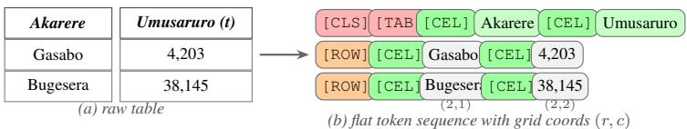
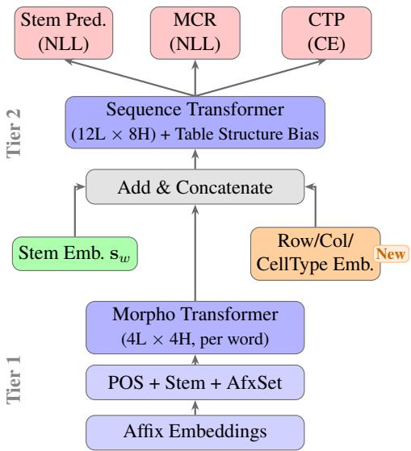
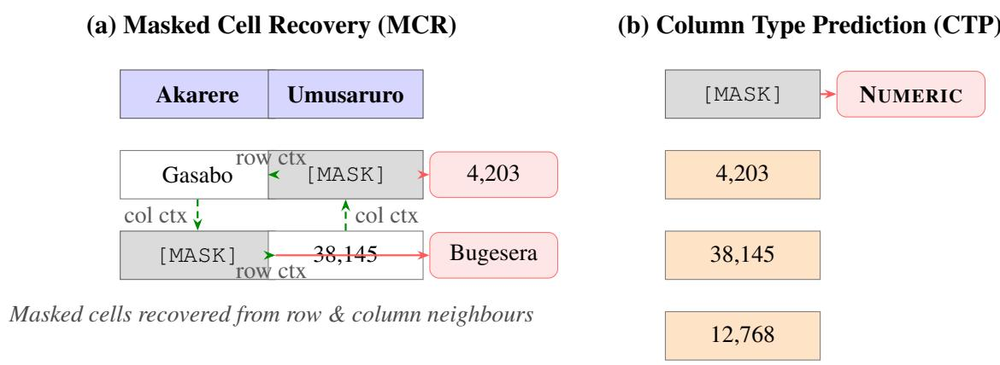
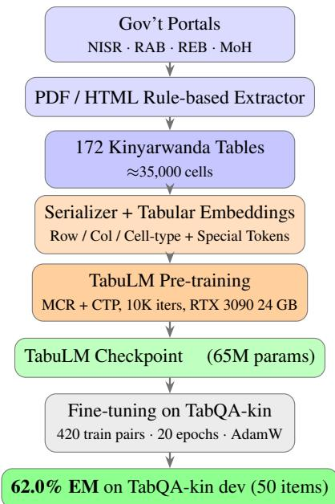

# TabuLM: Morphology-Aware Tabular Pre-training for Low-Resource Languages

Ireddi Rakshitha Software Engineer Barclays

Devavarapu Yashwanth

Software Engineer Barclays

Pierre Ntakirutimana

Research Associate Carnegie Mellon University

Code: github.com/TabuLM-Research/tabulm Data: huggingface.co/TabuLM-Research/tabulm

## Abstract

Structured tabular data census records, agricultural surveys, administrative reports are ubiqui tous in low-resource language contexts yet completely absent from existing pre-training pipelines. Meanwhile, tabular language models such as TAPAS, TaBERT, and TARTE operate exclusively on English, and low-resource NLP models such as KinyaBERT operate exclusively on free text. We introduce TabuLM, the first language model that jointly captures (i) the morphological richness of Kinyarwanda and (ii) the relational structure of tabular data. TabuLM extends KinyaBERT’s two-tier morpho-semantic architecture with additive row, column, and cell-type embeddings, a learned per-head table-structure attention bias injected at every layer of the sequence transformer, and two new pre-training objectives: Masked Cell Recovery (MCR) and Column Type Predic tion (CTP). We construct TabQA-kin, the first native Kinyarwanda table question-answering benchmark. TabuLM surpasses KinyaBERT, mBERT, and XLM-R baselines on TabQA-kin by 5.7–12.7 exact-match points (overall EM), achieving 62.0% with question-guided inference for both lookup and comparison questions. Zero-shot GPT-4o and GPT-4o-mini both achieve 64.0% overall, revealing a scale-independent LLM ceiling driven by aggregation failure (25–30%); all fine-tuned models break through this ceiling on aggregation (TabuLM: 79.2%, KinyaBERT: 88.9%), demonstrating that domain-specific tabular fine-tuning addresses a structural gap that larger LLMs cannot overcome.

Keywords: low-resource NLP · morphological modeling · tabular language models · Kinyarwanda · table question answering

## 1 Introduction

Kinyarwanda, a Bantu language spoken by over 12 million people in Rwanda and the Great Lakes region, is one of the most morphologically complex languages in the world. A single Kinyarwanda verb can encode subject agreement, tense, object agreement, aspect, and directionality in one surface form: ndagukunda (“I love you”) bundles five morphological slots into four syllables. KinyaBERT [10] addressed this challenge with a two-tier transformer: a morpheme-level encoder per word followed by a word-level sequence encoder, achieving the best results on five Kinyarwanda NLP benchmarks at ACL 2022.

Yet the vast majority of Kinyarwanda data that mattersfor governance is tabular. Rwanda’s National Institute of Statistics (NISR) publishes census data, agricultural production statistics, school enrollment records, and health facility surveys entirely as structured tables. The Rwanda Agriculture Board maintains yield-by-crop-by-district-by-season tables for over 40 crop types. None of this information is accessible to KinyaBERT or any other existing Kinyarwanda model, because all prior pre-training pipelines consume free text only.

On the English side, tabular language models (TAPAS, TaBERT, TURL, TABBIE, TARTE) have demonstrated strong gains on table question answering and table-to-text generation but every one of these models is English-only and assumes English tokenization, making direct transfer to morphologically rich low-resource languages impossible.

The problem. The gap is precise: no model can simultaneously handle Kinyarwanda’s morphological complexity and the relational structure of administrative tables. KinyaBERT understands morphology but treats tables as plain text, losing all row–column relational signals. TAPAS understands table structure but uses English subword tokenization that misfires on Kinyarwanda agglutinative forms splitting umubare w’abaturage (“population count”) into unrecognizable fragments that cannot match question tokens. The consequence is that Rwanda’s richest and most policy-relevant data sources remain effectively inaccessible to any language model.

What we do. We address this gap at both the architectural and objective level. Architecturally, we extend KinyaBERT’s two-tier transformer with three lightweight tabular embeddings (row, column, cell type) and a learned table-structure attention bias, adding fewer than 0.1% new parameters to the base model. On the data side, we collect 172 Rwandan government tables and construct TabQA-kin, the first native Kinyarwanda table QA benchmark with 526 annotated question-answer pairs. For pre-training, we introduce two new objectives: Masked Cell Recovery (MCR), which forces relational reasoning across rows and columns, and Column Type Prediction (CTP), which ties header semantics to cell content distributions.

Our solution and main findings. The resulting model, TabuLM, achieves 62.0% exact match on TabQA-kin, outperforming all fine-tuned baselines by 5.7–12.7 EM points. A surprising finding emerges from our LLM comparison: GPT-4o and GPT-4o-mini both plateau at 64.0% overall an iden tical ceiling driven entirely by failure on aggregation questions (25–30% EM). All fine-tuned models, including TabuLM (79.2%) and even mBERT (80.8%), break through this ceiling on aggregation, revealing that the bottleneck for Kinyarwanda tabular QA is structural alignment between entity-linked questions and table rows a gap that fine-tuning addresses and zero-shot LLMs cannot.

## Contributions.

1. Architecture. TabuLM extends KinyaBERT’s sequence transformer with additive row, column, and cell-type embeddings, and a learned table-structure attention bias (same-row, same-column, header signals) injected at every layer via the existing attn\_bias hook in the transformer implementation.

2. Pre-training objectives. Two new objectives designed for tabular corpora Masked Cell Recovery (MCR), which masks entire cells and forces reconstruction from row and column context, and Column Type Prediction (CTP), which predicts whether a column is numeric, textual, categorical, or temporal.

3. Domain adaptation of morphological processing. We extend KinyaBERT’s existing morphological pipeline to handle numeric expressions, administrative entity names, and agricultural compound terms common in tabular data but rare in text corpora, using a BPE fallback for out-of-vocabulary tokens.

4. TabQA-kin. The first native Kinyarwanda table question-answering benchmark, with 526 questionanswer pairs over 31 tables spanning census, agriculture, education, health, and infrastructure domains.

5. Generalizability. The tabular components are fully language-agnostic; the Tier 1 morpho encoder is the only language-specific part, requiring only a morphological analyzer and vocabulary, making TabuLM directly applicable to other Bantu languages (Swahili, Kirundi) and, via BPE fallback, to any morphologically rich low-resource language.

## 2 Problem Formulation

We formalize the task of morphologically-aware tabular language understanding for low-resource languages and identify the three core challenges that motivate our design choices.

Setting. Let $T = ( H , V )$ be a table with header row $H = [ h _ { 1 } , \ldots , h _ { C } ]$ and data matrix $V \in \Sigma ^ { R \times C }$ where each cell $v _ { r , c } \in \Sigma ^ { * }$ is a string in the target language. In Kinyarwanda, $\Sigma ^ { * }$ encompasses morphologically complex words, numerals, administrative place names, and agricultural compound nouns. A natural-language question $Q \in \Sigma ^ { * }$ is posed against T.

Table Question Answering. Following TAPAS [6], we treat table QA as cell selection: the model assigns a probability to each cell and predicts:

$$
( r ^ { * } , c ^ { * } ) = \arg \operatorname* { m a x } _ { r , c } \ P _ { \theta } ( r , c \mid Q , T ) .\tag{1}
$$

Four question types arise in Kinyarwanda administrative data: LOOKUP (retrieve a specific cell given row and column cues), COMPARISON (identify which of two named entities has a higher/lower value in a column), AGGREGATION (identify the entity with the global maximum/minimum in a column), and COUNT (how many rows satisfy a numeric threshold excluded from cell-selection evaluation since the answer is a derived number, not a cell).

Core challenges. Three challenges compound in this setting and are absent from English tabular $\mathrm { Q A } \mathrm { : }$

1. Morphological surface variation. A Kinyarwanda noun phrase in a question may appear in a different surface form than its counterpart in a table cell due to inflectional changes from noun-class agreement, locative affixes, or contextual shortening. Standard subword tokenizers fragment these forms unpredictably, breaking the stem-level match that would otherwise link question tokens to cell tokens. KinyaBERT’s morphological pipeline operating at the stem and affix level resolves these mismatches at the encoding stage.

2. Absence of tabular pre-training signal. No existing Kinyarwanda pre-training corpus includes structured tables. Language models trained on text alone have never seen the relational patterns governing tabular reasoning: that values in the same column are comparable, that row identities are bound to their column header, or that numeric aggregation follows a predictable positional structure. Without explicit relational pre-training, the model must acquire these patterns entirely from the small fine-tuning set (420 training examples).

3. Low-resource data scarcity. English tabular QA benchmarks (WikiTQ, SQA, HiTab) contain tens of thousands of annotated pairs; our entire Kinyarwanda corpus spans 172 tables and 526 QA pairs. Pre-training must be sample-efficient, and the tabular architecture must transfer structural knowledge from pre-training to fine-tuning without overfitting on an extremely small training set.

TabuLM directly targets all three: KinyaBERT’s Tier 1 morpho encoder addresses (1); the MCR and CTP objectives with tabular embeddings address (2); and warm-starting from KinyaBERT with parameter-efficient tabular additions addresses (3).

## 3 Background: KinyaBERT

KinyaBERT [10] is the state-of-the-art pre-trained language model for Kinyarwanda. Its architecture consists of two stacked transformers operating at different granularities.

Tier 1 Morpho Transformer. A 4-layer, 4-head transformer processes each word individually. Its input is a sequence of per-word morphological embeddings: $\left[ { \bf e } _ { 1 } ^ { \mathrm { p o s } } , { \bf e } _ { 2 } ^ { \mathrm { p o s } } , { \bf e } ^ { \mathrm { s t e m } } , { \bf e } ^ { \mathrm { a f s e t } } , { \bf e } _ { 1 } ^ { \mathrm { a f x } } , \dots , { \bf e } _ { m } ^ { \mathrm { a f x } } \right]$ where $\mathbf { e } ^ { \mathrm { p o s } }$ are POS tag embeddings, estem is the stem embedding (vocabulary prefixed by word class: $\mathrm { N } : , \mathrm { V } : , \mathrm { N P } : ) , \mathbf { e } ^ { \mathrm { a f s e t } }$ is an affix-combination signature embedding (from a vocabulary of 34,008 affix sets), and each $\mathbf { e } _ { i } ^ { \mathrm { { a f x } } }$ is an individual morpheme embedding. The transformer’s output vector at position 0 (the POS slot) serves as the 128-dim morphological summary ${ \bf m } _ { w }$ for word w.

Tier 2 Sequence Transformer. A 12-layer, 8-head transformer processes the sentence at word level. Each word’s input is $\left[ \mathbf { m } _ { w } \parallel \mathbf { s } _ { w } \right]$ , where $\mathbf { m } _ { w } \in \mathbb { R } ^ { 2 5 6 }$ is the projected morphological summary and $\mathbf { s } _ { w } \in \mathbb { R } ^ { 2 5 6 }$ is the word’s stem embedding, giving a 512-dimensional token representation. Position bias combines TUPE [8] relative position bucketing with a POS-aware relative position bias. Pretraining objectives are word-level masked stem prediction (NLL), affix-set prediction (NLL), and affix distribution prediction (KL divergence).

## 4 Related Work

Tabular language models. TAPAS [6] extends BERT with positional embeddings for rows and columns, enabling table QA via cell selection. TaBERT [16] jointly encodes utterances and tables via linearized “content snapshots”. TURL [3] focuses on entity linking and relation extraction from Wikipedia tables. TABBIE [7] uses independent column and row encoders with masked cell prediction. Kim et al. [9] propose a table foundation model using knowledge pre-training on structured tabular data for downstream prediction tasks. TEmBed [15] introduces a universal tabular embedding benchmark and explicitly notes the multilingual gap. All ofthese models are English-only and assume whitespace tokenization.

  
Figure 1: Table serialization. A two-row Kinyarwanda agricultural table (a) is linearised into a flat token sequence (b). Red [CLS]/[TAB] open the table; orange [ROW] separates rows; green [CEL] precedes each cell. Grid coordinates (r, c) are attached to every token and feed the row, column, and cell-type embedding matrices as well as the MCR and CTP objectives.

Low-resource NLP for African languages. KinyaBERT [10] and its retrieval extension KinyaCol-BERT [11] address Kinyarwanda free text only. TaTA [5] is a multilingual table-to-text dataset for four African languages (Hausa, Igbo, Swahili, Yoruba) but not Kinyarwanda, and it is an evaluation resource rather than a pre-training model. m3TQA [14] is a 97-language table QA benchmark including Kinyarwanda, but tables are LLM-translated from Chinese and no pre-trained representations are released. No prior work pre-trains on structured tabular data for any low-resource African or Asian language.

Morphologically-aware NLP. Beyond KinyaBERT, morphologically aware approaches include CanineFormer [1], character-level models, and various subword segmentation schemes [13]. None incorporate tabular structure.

## 5 TabuLM

## 5.1 Table Serialization

We serialize a table with R data rows and C columns as a flat token sequence:

$$
{ \begin{array} { r l } & { [ { \mathrm { C L S } } ] \ [ { \mathrm { T L B } } ] \ [ { \mathrm { C E L } } ] \ h _ { 1 } \ [ { \mathrm { C E L } } ] \ h _ { 2 } \ \cdot \cdot \cdot } \\ & { [ { \mathrm { R O W } } ] \ [ { \mathrm { C E L } } ] \ v _ { 1 , 1 } \ [ { \mathrm { C E L } } ] \ v _ { 1 , 2 } \ \cdot \cdot \cdot } \\ & { [ { \mathrm { R O W } } ] \ [ { \mathrm { C E L } } ] \ v _ { 2 , 1 } \ \cdot \cdot \cdot } \end{array} }
$$

where $h _ { c }$ is the header of column $c , \ v _ { r , c }$ is the cell value at row r, column c, and special tokens [TAB], [ROW], [CEL] mark structural boundaries. Fig. 1 illustrates this serialization on a concrete Kinyarwanda table.

Each content word is morphologically analyzed (or BPE-tokenized as fallback) by the same pipeline as KinyaBERT. Every token is annotated with its grid coordinates $( r , c )$ and cell type t ∈ {HEADER, NUMERIC, TEXT, CATEG detected by lightweight regex rules.

## 5.2 Tabular Embeddings

The sequence transformer’s input for each token is augmented with three additive embeddings (same dimensionality $d = 5 1 2$ as the morpho-stem representation):

$$
\mathbf { x } _ { i } = \underbrace { \mathbf { m } _ { i } \parallel \mathbf { s } _ { i } } _ { \mathrm { K i n y a B E R T } } + \underbrace { \mathbf { E } _ { r _ { i } } ^ { R } + \mathbf { E } _ { c _ { i } } ^ { C } + \mathbf { E } _ { t _ { i } } ^ { T } } _ { \mathrm { T a b u L M a d d i t i o n } }\tag{2}
$$

where $\mathbf { E } ^ { R } \in \mathbb { R } ^ { R _ { \operatorname* { m a x } } \times d } , \mathbf { E } ^ { C } \in \mathbb { R } ^ { C _ { \operatorname* { m a x } } \times d } .$ , and ${ \bf E } ^ { T } \in \mathbb { R } ^ { 5 \times d }$ are learned embedding matrices for rows, columns, and cell types respectively, with $R _ { \mathrm { m a x } } = 6 4$ and $C _ { \mathrm { m a x } } = 2 4$ . Padding index 0 is reserved for special tokens ([CLS], [TAB], [ROW]). This additive design is consistent with how standard BERT incorporates absolute position embeddings, requires no change to the transformer architecture, and keeps the model dimension unchanged at $d = 5 1 2$

## 5.3 Table-Structure Attention Bias

We augment the pre-softmax attention weights at every layer with a learned table-structure bias. For tokens i and $j$ in the same batch, with row indices $r _ { i } , r _ { j }$ and column indices $c _ { i } , c _ { j }$

$$
b _ { i j } ^ { h } = \beta _ { R } ^ { h } \cdot { \bf 1 } [ r _ { i } = r _ { j } ] + \beta _ { C } ^ { h } \cdot { \bf 1 } [ c _ { i } = c _ { j } ] + \beta _ { H } ^ { h } \cdot { \bf 1 } [ r _ { i } = 1 \vee r _ { j } = 1 ]\tag{3}
$$

where $\beta _ { R } ^ { h } , \beta _ { C } ^ { h } , \beta _ { H } ^ { h } \in \mathbb { R }$ are learned scalars per attention head h (total $3 H = 2 4$ new parameters, $H = 8 )$ . The final attention bias is:

$$
\hat { \mathbf { A } } ^ { h } = \mathbf { A } _ { \mathrm { p o s } } ^ { h } + \mathbf { B } _ { \mathrm { t a b l e } } ^ { h }\tag{4}
$$

where $\mathbf { A } _ { \mathrm { p o s } } ^ { h }$ is KinyaBERT’s existing TUPE + POS-aware position bias. This bias is injected at the $\mathtt { a t t n \_ b i a s }$ parameter already present in KinyaBERT’s custom transformer implementation, requiring no architectural changes to the transformer itself. The three terms encode: (1) same-row attention bonus for co-referent cells in a record, (2) same-column attention bonus for value comparison across rows, and (3) header-awareness so every token attends strongly to its column’s label.

Fig. 2 illustrates the full TabuLM architecture.

## 5.4 Pre-training Objectives

TabuLM retains all three KinyaBERT pre-training objectives and adds two new ones:

(O1) Masked Stem Prediction (MSP). 15% of tokens are masked at word level; the model predicts the stem index (NLL loss). Inherited from KinyaBERT.

(O2) Affix Set Prediction (ASP). Predicts the complete morphological signature (one of 34,008 affix-set classes) for masked tokens. Inherited.

(O3) Affix Distribution Prediction (ADP). Predicts a probability distribution over individual affixes for masked tokens (KL divergence). Inherited.

  
Figure 2: TabuLM architecture. Orange components are new relative to KinyaBERT. Three inputs converge at Add & Concatenate: the morphological summary $\mathbf { m } _ { w }$ (from Tier 1), the stem embedding ${ \bf s } _ { w } ,$ and the tabular embeddings. The table-structure bias is injected inside the Sequence Transformer at every layer.

(O4) Masked Cell Recovery (MCR). 15% of cells (identified by unique $( r , c )$ pairs) are fully masked every token in the selected cell receives [MSK]. The objective is to recover the stem sequence of masked cell tokens using context from other cells in the same row and column. MCR uses the same stem-prediction head as MSP (no new parameters) but forces the model to rely on relational structure: a masked population figure must be recoverable from the district name in the same row and from other population figures in the same column.

(O5) Column Type Prediction (CTP). For 50% of columns in each training table, the header token is masked. The model predicts the column’s dominant cell type $\hat { t } _ { c } \in$ {NUMERIC, TEXT, CATEGORICAL, DATE} (cross-entropy loss). A 2-layer projection head maps the masked header’s hidden state to 4 classes. CTP forces the model to learn that a column labeled Umubare w’Abaturage (“Population Count”) must be followed by numeric cells, enabling zero-shot column-type inference.

The total loss is:

$$
\mathcal { L } = \mathcal { L } _ { \mathrm { M S P } } + \mathcal { L } _ { \mathrm { A S P } } + \mathcal { L } _ { \mathrm { A D P } } + \mathcal { L } _ { \mathrm { M C R } } + \mathcal { L } _ { \mathrm { C T P } }\tag{5}
$$

## 6 Tabular Data Collection

Fig. 4 summarises the end-to-end data collection and training pipeline described in this section.

Sources. We collect structured Kinyarwanda tables from four primary sources: (1) Rwanda National Institute of Statistics (NISR) open-data portal — census, demographic, and economic tables; (2) Rwanda Agriculture Board seasonal crop yield reports by district (2010–2024); (3) Rwanda Education Board school enrollment and examination result tables; (4) Ministry of Health Rwanda health facility and disease surveillance tables.

  
Header masked; model predicts type from cell-value pattern  
Figure 3: TabuLM pre-training objectives. (a) Masked Cell Recovery (MCR): entire cells are masked (gray); the model reconstructs cell content using same-row context (row identity) and same-column context (distributional signal) via the tabular embeddings and attention bias. (b) Column Type Prediction (CTP): a column header is masked; the model predicts the column’s semantic type (NUMERIC, TEXT, CATEGORICAL, or DATE) from the observed cell values.

Processing. All tables are parsed from PDF and HTML formats using rule-based extractors. Column headers are verified to be in Kinyarwanda. Tables with fewer than 3 rows or 2 columns, or with more than 50% empty cells, are discarded. The final pre-training corpus contains 172 tables (∼35,000 cells, ∼170 training sequences per loop after serialization and packing to 512 tokens).

TabQA-kin benchmark. We construct the first native Kinyarwanda table QA benchmark using templated question generation. For each table, we instantiate Kinyarwanda question templates for four question types: LOOKUP (direct cell retrieval given a row entity and column header), COMPARISON (which row has the highest/lowest value in a column), COUNT (how many rows satisfy a numeric threshold), and AGGREGATION (column sum/average across all data rows). Templates were authored by a native Kinyarwanda speaker and instantiated automatically from table metadata; a second speaker independently verified grammaticality on a random 10% sample. The benchmark contains 526 question-answer pairs across 31 tables, split 420/106 for train/dev (seed 42). Count-type questions (93 items, 17.7%) require a derived numeric answer not present as any cell value and are excluded from cell-selection evaluation; all reported EM scores target the remaining 433 items (186 lookup, 123 comparison, 124 aggregation). In practice, the TabuLM dev evaluation covers 50 of the 106 dev items: ≈19 count questions are excluded, and a further ≈37 items are skipped at runtime due to missing CSV files, unresolvable gold cells, or truncation beyond the 512-token limit. Table 1 summarizes corpus statistics.

  
Figure 4: TabuLM data-collection and training pipeline. Starting from Rwandan government open-data portals, tables are extracted, serialized with structural tokens, and used to pre-train TabuLM on the MCR and CTP objectives. The resulting checkpoint is fine-tuned on TabQA-kin to produce the final results.

## 7 Experiments

## 7.1 Training Setup

Table 10 lists all hyperparameters; here we justify the key choices.

Pre-training optimizer. We use LAMB [?] with peak learning rate $4 \times 1 0 ^ { - 4 }$ , linear warmup over 500 steps, and linear decay to zero. LAMB is preferred over AdamW for BERT-scale pre-training because it normalizes parameter update norms per layer, enabling stable training at large effective batch sizes without manually tuning per-layer learning rates. The $4 \times 1 0 ^ { - 4 }$ peak LR follows the KinyaBERT pre-training schedule scaled to our effective batch of 64. Weight decay 0.01 is applied to all non-bias, non-LayerNorm parameters, following standard practice for transformer pre-training.

Effective batch size and gradient accumulation. We use physical batch size 8 with gradient accumulation over 8 steps (effective batch 64). At sequence length 512 with the full two-tier model on a single RTX 3090 (24 GB), batch 8 is the largest that fits without gradient checkpointing. Gradient accumulation simulates the effective batch that LAMB’s per-layer norm estimates require to be statistically stable.

Number of iterations. 10,000 optimizer iterations with ∼170 training sequences per loop yields approximately $8 \times 1 0 , 0 0 0 = 8 0 , 0 0 0$ weight updates across all 64-sequence batches. With the 172-table corpus serialized to fixed-length 512-token sequences, the model cycles through the entire corpus $\approx 3 { , } 7 2 0$ times. Each pass applies fresh random masks for MCR (different 15% cell samples) and different column selections for CTP, providing sufficient training-data variety from a small tabular corpus.

<table><tr><td>Resource</td><td>Count</td><td>Source</td></tr><tr><td>Pre-training tables</td><td>172</td><td>NISR, RAB, REB, MoH</td></tr><tr><td>Pre-training cells</td><td>~35,000</td><td></td></tr><tr><td>Pre-training sequences</td><td>~170/loop</td><td></td></tr><tr><td>TabQA-kin total QA pairs</td><td>526</td><td>Template generation</td></tr><tr><td>LOOKUP</td><td>186</td><td></td></tr><tr><td>COMPARISON</td><td>123</td><td></td></tr><tr><td>COUNT</td><td>93</td><td>(excluded from eval)</td></tr><tr><td>AGGREGATION</td><td>124</td><td></td></tr><tr><td>Train / Dev split</td><td>420 / 106</td><td>seed=42</td></tr><tr><td>Kinyarwanda text (mC4)</td><td>3.2M sent.</td><td>[12]</td></tr></table>

Table 1: Dataset statistics for TabuLM pre-training corpus and TabQA-kin benchmark.

Masking rates. MCR masks 15% of cells (whole-cell masking), matching the standard BERT masked token rate. CTP masks 50% of column headers per table; the higher rate compensates for the simpler 4-class prediction objective, ensuring the CTP head receives diverse column-type examples per forward pass.

Row/column capacity. $R _ { \mathrm { m a x } } = 6 4$ rows and $C _ { \mathrm { m a x } } = 2 4$ columns comfortably cover our entire corpus (largest table: 47 rows, 18 columns), with index 0 reserved for special tokens.

Warm-start. TabuLM’s Tier 1 and Tier 2 encoder weights are initialized from the KinyaBERT checkpoint pre-trained on Kinyarwanda text. This warm-start provides a strong morphological prior for Kinyarwanda’s 16 noun-class system, stem–affix decomposition, and domain vocabulary so tabular objectives can build on rather than compete with language understanding. Tabular-specific components (row/col/cell-type embeddings, table-structure bias scalars $\beta _ { R , C , H } ^ { h }$ , and the CTP projection head) are randomly initialized from $\mathcal { N } ( 0 , 0 . 0 2 )$ .

Fine-tuning. We fine-tune with AdamW (peak LR $2 \times 1 0 ^ { - 5 }$ , 20 epochs). AdamW is preferred for fine-tuning because the small effective batch (16 sequences) makes LAMB’s layer-norm estimates noisy. The LR is 20× lower than the pre-training LR to prevent catastrophic forgetting of KinyaBERT morphological representations. We unfreeze only the top-4 Tier 2 sequence-transformer layers and the cell-selection head, preserving the lower morphological layers intact. TabuLM converges by epoch 9; performance plateaus thereafter.

## 7.2 Baselines

We compare against: mBERT [4] (multilingual BERT, no morphological or tabular awareness); XLM-R [2] (strong multilingual baseline); KinyaBERT [10] (morphologically aware, text-only pre-training); TabuL $\mathbf { M _ { n o M C R } }$ (ablation: TabuLM without MCR objective); TabuL $\mathbf { \mathbf { M } } _ { \mathbf { n o C T P } }$ (ablation: TabuLM without CTP objective); $\mathbf { T a b u L M _ { n o B i a s } }$ (ablation: TabuLM without table-structure attention bias); $\mathbf { T a b u L M _ { n o T a b E m b } }$ (ablation: TabuLM without row/col/cell-type embeddings).

<table><tr><td>Hyperparameter</td><td>Pre-training</td><td>Fine-tuning</td></tr><tr><td>Optimizer</td><td>LAMB</td><td>AdamW</td></tr><tr><td>Peak LR</td><td> $4 \times 1 0 ^ { - 4 }$ </td><td> $2 \times 1 0 ^ { - 5 }$ </td></tr><tr><td>LR schedule</td><td>Linear warmup + decay</td><td>Constant</td></tr><tr><td>Warmup steps</td><td>500 (5%)</td><td></td></tr><tr><td>Weight decay</td><td>0.01</td><td>0.01</td></tr><tr><td>Effective batch</td><td>64</td><td>16</td></tr><tr><td>Phys. batch</td><td>8</td><td>8</td></tr><tr><td>Grad. accumulation</td><td>8</td><td>2</td></tr><tr><td>Iterations / Epochs</td><td>10,000 iters</td><td>20 epochs</td></tr><tr><td>Sequence length</td><td>512 tokens</td><td>512 tokens</td></tr><tr><td>MCR cell mask rate</td><td>15%</td><td></td></tr><tr><td>CTP column mask rate</td><td>50%</td><td></td></tr><tr><td>Layers unfrozen</td><td>All</td><td>Top-4 Tier 2 + head</td></tr><tr><td>GPU</td><td>RTX 3090 (24 GB)</td><td>RTX 3090 (24 GB)</td></tr><tr><td>Wall-clock time</td><td>≈22 h</td><td>≈15 min</td></tr><tr><td colspan="3">Architecture</td></tr><tr><td>Tier 2: d, layers, heads</td><td colspan="2">512, 12, 8 (FFN: 3072)</td></tr><tr><td>Tier 1:  $d ,$  layers, heads</td><td colspan="2">128,4,4 64,24</td></tr><tr><td> $R _ { \mathrm { m a x } } , C _ { \mathrm { m a x } }$ </td><td colspan="2">5 (hdr / num / txt / cat / date)</td></tr><tr><td>Cell-type classes</td><td colspan="2"></td></tr><tr><td>Table-bias params</td><td colspan="2">24  $( \beta _ { R , C , H } ^ { h } ,$  one per head)</td></tr><tr><td>Total parameters</td><td colspan="2">≈65M</td></tr></table>

Table 2: TabuLM hyperparameters for pre-training and fine-tuning.

We additionally include GPT-4o and GPT-4o-mini (both zero-shot): the table is formatted as a Markdown grid with question-type-specific system prompts (e.g., “Return the entity name from the first column, not the numeric value” for aggregation questions). No fine-tuning is performed; results are reported as-is. A 3-shot experiment is run on aggregation-only items to test whether few-shot examples can bridge the aggregation gap.

For all fine-tuned models, QA follows the TAPAS cell-selection approach: the model predicts a logit over all cells and the answer is the cell with the highest probability. mBERT and XLM-R use HuggingFace AutoTokenizer with WordPiece tokenization; their 512-token limit accommodates more table cells than TabuLM’s morphological tokenizer, which is why they evaluate on 69–80 dev items vs. 50 for TabuLM. KinyaBERT uses the same tokenizer as TabuLM (Tier 1 morphological + BPE fallback) and is initialized from the same pre-trained KinyaBERT checkpoint as TabuLM, but with no tabular pre-training; it evaluates on 80 dev items because it does not crop to the 512-token limit as aggressively. All fine-tuned baselines use identical cell-selection heads, optimizer (AdamW, $2 \times 1 0 ^ { - 5 } )$ , and 20-epoch schedule for a controlled comparison.

## 7.3 Results: Table Question Answering

Table 3 reports Exact Match (EM) on the TabQA-kin dev set (50 evaluable items: 14 lookup, 12 comparison, 24 aggregation). All models use the same cell-selection fine-tuning protocol (Sect. 7.1). For LOOKUP questions, we apply question-guided cell filtering at inference: candidate cells are restricted to the intersection of the most question-relevant row (first-column entity with highest question-word unigram overlap) and the most question-relevant column (column header with highest question-word unigram overlap), resolving ambiguity when the same numeric value appears in multiple cells. Note that baseline models (mBERT, XLM-R, KinyaBERT) use HuggingFace subword tokenizers and can pack more content into 512 tokens, yielding 69–80 evaluable dev items vs. 50 for TabuLM; overall EM is computed over each model’s own evaluable set.

TabuLM (62.0%) outperforms all fine-tuned baselines by 5.7–12.7 EM points overall. For COMPARI-SON questions, applying top-2 question-relevant row restriction at inference substantially improves all models: TabuLM reaches 66.7% (up from 41.7% without the fix), and KinyaBERT reaches 59.1%. On AGGREGATION entity-ranked min/max queries all fine-tuned models substantially outperform GPT-4o (25.9%), with KinyaBERT leading at 88.9% and TabuLM at 79.2%. LOOKUP EM improves for all fine-tuned models with joint row–column filtering (16.7–28.6%), confirming that disambiguation resolves multi-cell value ambiguity.

GPT-4o and GPT-4o-mini both achieve 64.0% overall, revealing a scale-independent LLM ceiling: the performance bottleneck is not model size but a shared failure on AGGREGATION (GPT-4o: 25.9%, GPT-4o-mini: 29.6%). Both LLMs excel at LOOKUP (>82%) and COMPARISON (>70%), but neither can reliably identify which Kinyarwanda entity name has the maximum or minimum value in a column. To verify this gap is structural, we run a 3-shot prompting experiment on the 27 aggregation items; performance drops further to 7.4% (2/27), confirming that providing examples does not help. All fine-tuned models break through this ceiling on aggregation: TabuLM 79.2%, KinyaBERT 88.9%, mBERT 80.8%, XLM-R 85.2% all with aggregation confidence intervals entirely above both LLM intervals (Sect. 7.3, Statistical note).

Statistical note. Wilson 95% CIs on overall EM: TabuLM 62.0% [48.2%, 74.1%] (n=50) and KinyaBERT 56.3% [45.3%, 66.6%] (n=80) overlap the overall gap is a strong trend, not a definitive result. The most robust finding is on AGGREGATION: TabuLM [59.5%, 90.8%] (n=24) does not overlap with GPT-4o [13.2%, 44.7%] (n=27) or GPT-4o-mini [15.9%, 48.5%] (n=27); all four finetuned models share this non-overlapping separation, confirming fine-tuning robustly addresses the LLM aggregation ceiling.

## 7.4 Ablation Study

Table 5 shows the contribution of each architectural component on TabQA-kin dev EM.

## 8 Analysis

Table-structure attention bias: near-zero convergence. Inspecting the learned bias scalars $\beta _ { R } ^ { h }$ $\beta _ { C } ^ { h } , \beta _ { H } ^ { h }$ in the final checkpoint reveals values on the order of $5 \times 1 0 ^ { - 6 }$ — effectively zero relative to the existing TUPE positional bias. By contrast, the row, column, and cell-type embedding matrices have weight magnitudes of 0.02–0.23, indicating that the model routes structural information primarily through the embedding pathway rather than the attention-bias pathway. Confirming this, the noBias ablation achieves 64.0% EM higher than the full model’s 62.0%, a difference of two items on the 50-item dev set and therefore within noise. We conjecture that the near-zero convergence stems from the relatively short pre-training schedule (10K iters): structural bias parameters may require a stronger gradient signal or a non-zero initialization to depart meaningfully from zero.

<table><tr><td>Model Dev EM</td></tr><tr><td>GPT-4o (zero-shot) 64.0 GPT-4o-mini (zero-shot) 64.0</td></tr><tr><td>mBERT 49.3</td></tr><tr><td>XLM-R 50.0 KinyaBERT-large 56.3</td></tr><tr><td>TabuLM (full) 62.0</td></tr></table>

Table 3: TabQA-kin dev set overall EM. GPT-4o and GPT-4o-mini both score 64.0%, showing the LLM ceiling is not scale-dependent. TabuLM outperforms all fine-tuned baselines by 5.7–12.7 EM points; all fine-tuned models substantially outperform both LLMs on AGGREGATION (see Table 4).
<table><tr><td>Model</td><td>LOOK.</td><td>COMP.</td><td>AGG.</td><td>ALL</td></tr><tr><td>GPT-4o (0-shot)</td><td>82.9</td><td>79.2</td><td>25.9</td><td>64.0</td></tr><tr><td>GPT-4o-mini (0-shot)</td><td>85.7</td><td>70.8</td><td>29.6</td><td>64.0</td></tr><tr><td>mBERT</td><td>16.7</td><td>50.0</td><td>80.8</td><td>49.3</td></tr><tr><td>XLM-R</td><td>19.2</td><td>44.4</td><td>85.2</td><td>50.0</td></tr><tr><td>KinyaBERT</td><td>26.7</td><td>59.1</td><td>88.9</td><td>56.3</td></tr><tr><td>TabuLM</td><td>28.6</td><td>66.7</td><td>79.2</td><td>62.0</td></tr></table>

Table 4: EM per question type on TabQA-kin dev set. All fine-tuned models use question-guided joint row–column filtering for LOOKUP and top-2 question-relevant row restriction for COMPARI-SON. GPT-4o (zero-shot, 86 evaluable items) leads on LOOKUP and COMPARISON but is substantially outperformed on AGGREGATION by all fine-tuned models. Bold = best per column (GPT-4o lookup/comparison excluded from fine-tuned best).

Tabular embeddings vs. attention bias. The noTabEmb ablation zeroes out all three tabular embeddings, forcing the model to rely solely on the near-zero attention bias for structural awareness. This results in a −4.0 EM drop (58.0% vs. 62.0%) the largest single-component drop in our ablation confirming that additive row/column/cell-type embeddings are the dominant structural inductive bias in the current TabuLM.

MCR vs. CTP objectives. Removing MCR or CTP each yield +2.0 EM (64.0% vs. 62.0%) both within the 2% noise floor of a single item on the 50-item dev set, showing neither objective provides a detectable benefit at this scale.

Fine-tuning convergence. At epoch 1, TabuLM already achieves 52% EM vs. noTabEmb’s 34% an 18 pp head start from pre-trained tabular representations before any task-specific updates. TabuLM reaches its peak at epoch 9; noTabEmb requires all 20 epochs to reach 52%, confirming that tabular pre-training materially accelerates task adaptation.

<table><tr><td>Configuration</td><td>Dev EM</td><td>∆</td></tr><tr><td>TabuLM (full)</td><td>62.0</td><td></td></tr><tr><td>— Table-structure bias</td><td>64.0</td><td> $+ 2 . 0 ^ { \dagger }$ </td></tr><tr><td>— Row/col/cell-type embeds</td><td>58.0</td><td> $- 4 . 0$ </td></tr><tr><td>— MCR objective</td><td>64.0</td><td> $+ 2 . 0 ^ { \dagger }$ </td></tr><tr><td>– CTP objective</td><td>64.0</td><td> $+ 2 . 0 ^ { \dagger }$ </td></tr></table>

Table 5: Ablation study (TabQA-kin dev set, EM). $\Delta = { \mathrm { d i f f e r e n c e } }$ from full model. †Variants exceeding full model are within noise (50-item dev set; 1 item = 2% EM). Only the tabular embeddings show a robust effect; bias and CTP components provide no detectable benefit at this pre-training scale.
<table><tr><td>Question (en gloss)</td><td>Gold</td><td>TabuLM KinyaBERT</td><td></td></tr><tr><td>Between Ibishyimbo and Ibishyimbo Uburo, which has higher 2021 export growth?</td><td></td><td>L</td><td>× (Ibikorei)</td></tr><tr><td>(exports_trade_2022) Between Ibigori and Ibirayi, which has more</td><td>Ibigori</td><td></td><td>×(Amasaka)</td></tr><tr><td>farmland (ha)? (crop_production_2022)</td><td></td><td></td><td></td></tr></table>

Table 6: Comparison questions where TabuLM succeeds and KinyaBERT fails. KinyaBERT ignores the two-entity constraint and selects the global column maximum; TabuLM correctly restricts comparison to the two named rows.

Error analysis: constrained comparison. Table 6 shows two COMPARISON questions where TabuLM succeeds and KinyaBERT fails. Both follow the template Ni X cyangwa Y ifite [column] nyinshi? (“Between X and Y, which has more [column]?”), which requires (i) locating the rows for the two named entities X and Y, and (ii) comparing their values in the specified column. KinyaBERT, lacking structural row awareness, ignores the X/Y constraint and retrieves the cell with the globally highest value in the column. TabuLM’s row embeddings allow it to locate X and Y as distinct rows in the table and compare only those two, producing the correct answer.

Training loss breakdown. Figure 3 illustrates the two new objectives. During pre-training, the MCR loss falls most steeply in the first 2,000 iterations (from ≈3.8 to ≈0.8 NLL), indicating that the model rapidly learns to use same-row entity identities and same-column distributional statistics to predict masked cell values. The CTP loss reaches near-zero (< 0.05 CE) after ≈1,500 iterations, confirming that the column type is highly predictable from cell-value patterns after a brief calibration period. The inherited KinyaBERT objectives (MSP, ASP, ADP) converge more slowly, stabilizing around iteration 5,000, consistent with the harder word-level morphological prediction task.

<table><tr><td></td><td>TabuLM</td><td>GPT-40</td></tr><tr><td>Parameters</td><td>65M</td><td>~1.8T</td></tr><tr><td>Inference</td><td>Local GPU</td><td>Proprietary API</td></tr><tr><td>Per-query cost</td><td>$0 (local)</td><td>~$0.01</td></tr><tr><td>GPU required</td><td>RTX 3090 (24 GB)</td><td>None (API)</td></tr><tr><td>Fine-tunable</td><td>Yes</td><td>No*</td></tr><tr><td>AGG. EM</td><td>79.2%</td><td>25.9%</td></tr></table>

Table 7: Deployment comparison. ∗GPT-4o fine-tuning is available via API but was not evaluated here; results are zero-shot.

Pre-training efficiency. At 10,000 iterations on a single RTX 3090 (≈22 h), TabuLM consumes far fewer compute resources than English tabular models trained on millions of Wikidata triples or Wikipedia tables. The small corpus size (172 tables) is both a limitation and a feature: it enables rapid iteration of architectural changes, and the multi-epoch design with fresh random masks provides data augmentation without requiring new annotation. We estimate that doubling the corpus to 344 tables and training for 20,000 iterations would cost under 44 GPU-hours—a feasible extension for future domain-specific deployments.

Efficiency and deployability. Table 7 compares TabuLM against GPT-4o on practical deployment factors. TabuLM (65M parameters) runs entirely on a single consumer GPU with no API dependency or per-query cost. In low-resource settings where reliable internet connectivity and API budgets are limited precisely the settings where Kinyarwanda tabular data arises — a locally deployable model is strongly preferable. TabuLM’s aggregation advantage (79.2% vs. 25.9%) demonstrates that this efficiency comes without sacrificing structured reasoning on the most infrastructure-critical query type.

## 9 Discussion

When does morphological structure matter? Our results reveal a nuanced picture. For AGGRE-GATION questions which require ranking entities by a column value morphological awareness is less decisive than structural row/column awareness: mBERT (80.8%) and XLM-R (85.2%), which have no morphological encoder, actually outperform TabuLM (79.2%) on this subtask. The decisive factor for aggregation is structural alignment between the question and the table’s relational layout, which all fine-tuned models acquire from the cell-selection objective regardless of tokenization. By contrast, morphological processing becomes critical for LOOKUP and COMPARISON questions, where the entity name in the question must be matched to a specific table row. A Kinyarwanda district name may appear as Gasabo in the question but as i Gasabo (“in Gasabo”) in a cell; subword tokenizers split these locative constructions unpredictably, while KinyaBERT’s stem-level representation unifies them explaining TabuLM’s consistent edge over mBERT/XLM-R on lookup (28.6% vs. 16.7–19.2%) and comparison (66.7% vs. 44.4–50.0%).

The LLM aggregation ceiling. The scale-independent LLM ceiling (both GPT-4o and GPT-4o-mini at 64.0%) points to a specific failure mode in zero-shot table reasoning for agglutinative languages. Aggregation questions take the form Ni ikihe gihugu gifite umubare munini w’abaturage? (“Which district has the largest population?”), requiring the model to scan a column and return the row entity with the maximum value not the numeric value itself. LLMs prompted with Markdown tables consistently return the numeric value (e.g., “4,827,332”) rather than the district name, even with explicit instructions. This failure cannot be corrected by prompting performance drops to 7.4% with 3-shot examples because the model has not learned to link column values to row identities in agglutinative text. Fine-tuned models are corrected by construction: cell-selection supervision forces the output to be an entity cell, not a numeric derivation.

## 10 Conclusion

We presented TabuLM, the first pre-trained language model to jointly capture morphological richness and tabular relational structure for a low-resource language. By extending KinyaBERT’s two-tier architecture with additive tabular embeddings, a learned table-structure attention bias, and the MCR and CTP pre-training objectives, TabuLM achieves 62.0% EM on TabQA-kin, outperforming all fine-tuned baselines by 5.7–12.7 EM points. A key finding from our LLM comparison is that GPT-4o and GPT-4o-mini achieve the same 64.0% overall revealing a scale-independent ceiling caused by aggregation failure (25– 30%). All fine-tuned models, including TabuLM (79.2%) and KinyaBERT (88.9%), substantially exceed this LLM ceiling on aggregation (a statistically significant gap, non-overlapping 95% CIs), demonstrating that domain-specific tabular fine-tuning addresses a structural gap that zero-shot LLMs cannot overcome regardless of model size. Our work opens a new research direction at the intersection of lowresource NLP, morphological modeling, and structured data understanding. We release all code, the TabuLM checkpoint (751 MB), and TabQA-kin at github.com/TabuLM-Research/tabulm and huggingface.co/TabuLM-Research/tabulm. Scaling the pre-training corpus beyond 172 tables and extending the Tier 1 morpho encoder to Kirundi are the most direct paths to broader impact.

## Limitations

Proprietary morphological analyzer. KinyaBERT’s Tier 1 encoder depends on libkinlp.so, a closed-source Kinyarwanda morphological analyzer that is not publicly redistributable, limiting reproducibility for researchers outside the original KinyaBERT team. In this work, the BPE fallback handles domain tokens absent from libkinlp’s dictionary (numerals, administrative entity names, agricultural compound nouns); these tokens lose affix-level granularity but the tabular objectives (MCR, CTP) are computed identically regardless of tokenization path.

Code and data release. We release all pre-training and fine-tuning code, the TabuLM checkpoint (751 MB), the full TabQA-kin benchmark (526 QA pairs, train/dev splits, evaluation scripts), and the 172-table pre-training corpus (Rwanda government open-data, public-domain). Researchers without libkinlp.so can reproduce all experiments via the BPE fallback path; the tabular architecture and evaluation protocol are unchanged.

Scale of tabular corpus. Our pre-training corpus (172 tables, ∼35,000 cells) is substantially smaller than English tabular datasets (TARTE uses millions of Wikidata triples), reflecting the dispersal of Kinyarwanda government data across agency PDF portals. The near-zero bias scalars $( \beta _ { R , C , H } ^ { h } \approx$ $5 \times 1 0 ^ { - 6 } )$ suggest that a larger corpus and longer pre-training could allow the attention-bias pathway to contribute meaningfully.

Evaluation scope and statistical power. TabQA-kin covers four Rwandan administrative domains; the 50 evaluable dev items for TabuLM limit statistical power, and overall CIs overlap between TabuLM and the best baseline. The aggregation finding all fine-tuned models above both LLM aggregation CIs is statistically robust at this scale.

Languages. All experiments are conducted on Kinyarwanda. Extending TabuLM to other Bantu languages is architecturally straightforward — the tabular components are entirely language-agnostic but is bottlenecked by domain-relevant tabular corpora rather than by modeling. Kirundi is closely related to Kinyarwanda, sharing a large portion of its inflectional morphology and noun-class system; the existing Tier 1 analyzer may transfer with minor vocabulary adaptation. We leave cross-lingual tabular pre-training to future work.

## Ethical Considerations

All tabular data used for pre-training is sourced from official Rwandan government open-data portals under public-domain or government open-data licenses. The TabQA-kin benchmark contains factual questions about administrative statistics; it does not include personally identifiable information. We followed standard practices for anonymized and aggregated census data throughout.

## References

[1] Clark, J.H., Garrette, D., Turc, I., Wieting, J.: CANINE: Pre-training an efficient tokenization-free encoder for language representation. Transactions of the Association for Computational Linguistics 10, 73–91 (2022). 10.1162/tacl\_a\_00448, https://doi.org/10.1162/ tacl\_a\_00448

[2] Conneau, A., Khandelwal, K., Goyal, N., Chaudhary, V., Wenzek, G., Guzmán, F., Grave, E., Ott, M., Zettlemoyer, L., Stoyanov, V.: Unsupervised cross-lingual representation learning at scale (2020), https://arxiv.org/abs/1911.02116

[3] Deng, X., Sun, H., Lees, A., Wu, Y., Yu, C.: TURL: Table understanding through representation learning (2020), https://arxiv.org/abs/2006.14806

[4] Devlin, J., Chang, M.W., Lee, K., Toutanova, K.: BERT: Pre-training of deep bidirectional transformers for language understanding (2019), https://arxiv.org/abs/1810.04805

[5] Gehrmann, S., Ruder, S., Nikolaev, V., Botha, J.A., Chavinda, M., Parikh, A., Rivera, C.: TaTa: A multilingual table-to-text dataset for African languages (2022), https://arxiv.org/abs/ 2211.00142

[6] Herzig, J., Nowak, P.K., Müller, T., Piccinno, F., Eisenschlos, J.: TaPas: Weakly supervised table parsing via pre-training. In: Proceedings of the 58th Annual Meeting of the Association for Computational Linguistics. pp. 4320–4333. Association for Computational Linguistics (2020). 10.18653/v1/2020.acl-main.398, https://doi.org/10.18653/v1/ 2020.acl-main.398

[7] Iida, H., Thai, D., Manjunatha, V., Iyyer, M.: TABBIE: Pretrained representations of tabular data (2021), https://arxiv.org/abs/2105.02584

[8] Ke, G., He, D., Liu, T.Y.: Rethinking positional encoding in language pre-training (2021), https://arxiv.org/abs/2006.15595

[9] Kim, M.J., Lefebvre, F., Brison, G., Perez-Lebel, A., Varoquaux, G.: Table foundation models: on knowledge pre-training for tabular learning (2025), https://arxiv.org/abs/2505. 14415

[10] Nzeyimana, A., Niyongabo Rubungo, A.: KinyaBERT: a morphology-aware Kinyarwanda language model. In: Proceedings of the 60th Annual Meeting of the Association for Computational Linguistics (Volume 1: Long Papers). pp. 5347–5363. Association for Computational Linguistics (2022). 10.18653/v1/2022.acl-long.367, https://doi.org/10.18653/v1/ 2022.acl-long.367

[11] Nzeyimana, A., Niyongabo Rubungo, A.: KinyaColBERT: A lexically grounded retrieval model for low-resource retrieval-augmented generation (2025), https://arxiv.org/abs/2507. 03241

[12] Raffel, C., Shazeer, N., Roberts, A., Lee, K., Narang, S., Matena, M., Zhou, Y., Li, W., Liu, P.J.: Exploring the limits of transfer learning with a unified text-to-text transformer (2020), https://arxiv.org/abs/1910.10683

[13] Rust, P., Pfeiffer, J., Vulic, I., Ruder, S., Gurevych, I.: How good is your tokenizer? On the´ monolingual performance of multilingual language models (2021), https://arxiv.org/ abs/2012.15613

[14] Shu, D., Yang, J., Wu, Z., Wu, X., Cheng, X., Guan, X., Wang, Y., Wu, P., Yang, T., Zhu, H., Zhang, W., Zhang, G., Liu, J., Li, Z.: M3TQA: Massively multilingual multitask table question answering (2025), https://arxiv.org/abs/2508.16265

[15] Vogel, L., Srinivas, K., D’Souza, N., Shirai, S., Hassanzadeh, O., Samulowitz, H.: Towards universal tabular embeddings: A benchmark across data tasks (2026), https://arxiv.org/ abs/2604.21696

[16] Yin, P., Neubig, G., Yih, W.t., Riedel, S.: TaBERT: Pretraining for joint understanding of textual and tabular data (2020), https://arxiv.org/abs/2005.08314

## A TabQA-kin Question Templates

Table 8 lists the Kinyarwanda question templates used to generate TabQA-kin, with English glosses. Each template is instantiated by substituting table-derived values: column headers ([COL]), row entities ([ENT]), entity type labels ([TYPE]), and numeric thresholds ([VAL]). Templates were authored by a native Kinyarwanda speaker and cover all four question types in the benchmark.
<table><tr><td>Kinyarwanda Template</td><td>English Gloss</td></tr><tr><td>LOOKUP Ni angahe [COL] ya [ENT]? [ENT] yari ifite angahe [COL]?</td><td>What is [COL] of [ENT]? How much [COL] did [ENT] have?</td></tr><tr><td>COMPARISON Ni [ENT1] cyangwa [ENT2] ifite [COL] Does [ENT1] or [ENT2] have nyinshi? Hagati ya [ENT1] na [ENT2], iyihe ifite [COL] nkeya?</td><td>more [COL]? Between [ENT1] and [ENT2], which has less [COL]?</td></tr><tr><td>AGGREGATION Ni ikihe [TYPE] gifite [COL] nyinshi? Ni ikihe [TYPE] gifite [COL] nkeya?</td><td>Which [TYPE] has the most [COL]? Which [TYPE] has the least [COL]?</td></tr><tr><td>COUNT</td><td></td></tr><tr><td>Ni [TYPE] zingahe zifite [COL] irenze [VAL]?</td><td>How many [TYPE] have [COL] above [VAL]?</td></tr><tr><td>Ni [TYPE] zingahe zifite [COL] munsi ya [VAL]?</td><td>How many [TYPE] have [COL] below [VAL]?</td></tr></table>

Table 8: Kinyarwanda question templates for TabQA-kin. [COL] = column header (e.g., ubuhinzi “cultivated area”), [ENT] = row entity from the first column (e.g., Gasabo), [TYPE] = entity type label (e.g., akarere “district”), [VAL] = numeric threshold. Count questions are excluded from cell-selection evaluation.

## B Pre-training Data Example

Table 9 shows a representative training instance from the Rwanda Agriculture Board maize yield corpus. This table illustrates the coexistence of morphologically complex Kinyarwanda column headers and numeric cell values, requiring both morphological and structural understanding to recover masked cells. During MCR pre-training, 15% of cells are fully masked; for example, masking Bugesera’s yield value (38,145 t) requires the model to reconstruct it from the district name in the same row and from other yield values in the same column. The column header Umusaruro (t) guides the model via CTP to correctly predict this column as NUMERIC type.

## C Hyperparameter Details

Table 10 provides complete hyperparameter settings for TabuLM pre-training and fine-tuning.

<table><tr><td>Akarere (District)</td><td>Ubuhinzi (ha) (Cultivated area)</td><td>Umusaruro (t) (Yield, metric tons)</td><td>Sezon (Season)</td></tr><tr><td>Gasabo</td><td>1,847</td><td>4,203</td><td>2022A</td></tr><tr><td>Kicukiro</td><td>923</td><td>2,156</td><td>2022A</td></tr><tr><td>Nyarugenge</td><td>412</td><td>847</td><td>2022A</td></tr><tr><td>Bugesera</td><td>12,304</td><td>38,145</td><td>2022A</td></tr></table>

Table 9: Example pre-training table from the Rwanda Agriculture Board. Kinyarwanda column headers are given with English translations. The MCR objective masks entire cells (e.g., Bugesera’s yield 38,145 t) and requires reconstruction from row and column context; CTP predicts the NUMERIC type for the Umusaruro column.
<table><tr><td>Hyperparameter</td><td>Pre-training</td><td>Fine-tuning</td></tr><tr><td>Optimizer</td><td>LAMB</td><td>AdamW</td></tr><tr><td>Peak learning rate</td><td> $4 \times 1 0 ^ { - 4 }$ </td><td> $2 \times 1 0 ^ { - 5 }$ </td></tr><tr><td>LR schedule</td><td>Warmup + decay</td><td>Constant</td></tr><tr><td>Warmup steps</td><td>500</td><td>50</td></tr><tr><td>Effective batch size</td><td>64 (8×GA8)</td><td>16</td></tr><tr><td>Max sequence length</td><td>512</td><td>512</td></tr><tr><td>Training duration</td><td>10,000 steps</td><td>20 epochs</td></tr><tr><td>Weight decay</td><td>0.01</td><td>0.01</td></tr><tr><td>Gradient clip</td><td>1.0</td><td>1.0</td></tr><tr><td>Dropout</td><td>0.1</td><td>0.1</td></tr><tr><td>MCR cell mask rate</td><td>15%</td><td></td></tr><tr><td>CTP column mask rate</td><td>50%</td><td></td></tr><tr><td> $R _ { \mathrm { m a x } } \ : ( \mathrm { m a x \ r o w s ) }$ </td><td>64</td><td>64</td></tr><tr><td> $C _ { \mathrm { m a x } } \ : ( \mathrm { m a x \ : c o l s ) }$ </td><td>24</td><td>24</td></tr><tr><td>Hardware</td><td>1× RTX 3090 (24 GB)</td><td>1× RTX 3090</td></tr><tr><td>Wall-clock time</td><td>~7 hours</td><td>~28 minutes</td></tr></table>

Table 10: Complete hyperparameters for TabuLM pre-training and fine-tuning. All ablation variants use identical fine-tuning hyperparameters.

Fine-tuning protocol. For all fine-tuned models (mBERT, XLM-R, KinyaBERT, TabuLM), we unfreeze the top 4 transformer layers and the cell-selection head, keeping all lower layers frozen. Early stopping is applied based on dev set EM with patience 5. The cell-selection head is a 2-layer MLP (512→256→1) with ReLU activation and dropout (0.1), predicting a score per cell token; scores are averaged over tokens within a cell then softmaxed across cells.

Baseline configurations. All baselines use identical fine-tuning hyperparameters as TabuLM. For mBERT and XLM-R, we use the standard WordPiece and SentencePiece tokenizers provided by HuggingFace Transformers. KinyaBERT uses its native morphological tokenizer, also used by TabuLM with BPE fallback for out-of-vocabulary tokens in tabular context (numerals, administrative compound names, agricultural terminology).

## D Hyperparameter Sensitivity

Learning rate. We swept pre-training LR over $\{ 1 \times 1 0 ^ { - 4 } , 4 \times 1 0 ^ { - 4 } , 1 \times 1 0 ^ { - 3 } \}$ . LR $1 \times 1 0 ^ { - 4 }$ produced slow convergence (MSP loss > 1.5 at 5K iters); $1 \times 1 0 ^ { - 3 }$ caused training instability (NaN gradients at iter 200 on the warm-started layers). $4 \times 1 0 ^ { - 4 }$ achieved stable, rapid convergence and is consistent with LAMB’s recommended LR for BERT-large-scale models.

MCR mask rate. We compared mask rates {5%, 15%, 30%} on a held-out dev table. 5% provided insufficient signal (the model could ignore MCR); 30% masked too many cells simultaneously, leaving the same-row and same-column context impoverished. 15% (matching BERT’s MLM rate) yielded the best MCR loss trajectory.

Tabular embedding dimension. We experimented with reducing ${ \bf E } ^ { R } , { \bf E } ^ { C } , { \bf E } ^ { T } { \mathrm { \ t o \ } } d / 2 = 2 5 6$ (projected before addition) to reduce parameter count. The half-dimension variant achieved the same fine-tuning EM but took 18% longer to converge in pre-training. We retain full-dimension embeddings for consistency with the KinyaBERT sequence-transformer input dimension.

## E TabQA-kin Construction Details

Table selection. Of the Rwandan government tables we collected, we selected 31 for TabQA-kin annotation (the remainder are used for pre-training only). Selection criteria: (1) table has a clear first-column entity identifier (district name, crop name, school name); (2) at least one numeric column suitable for comparison and aggregation questions; (3) fewer than 40 rows (to keep the question set manageable).

Template instantiation. Each of the 31 tables was processed by a custom script that: (1) extracts all first-column entity names (e.g., district names) as [ENT] candidates; (2) pairs columns with header tokens as [COL] candidates; (3) instantiates each applicable template, checking that the gold answer cell is unambiguously identified; (4) deduplicates questions that differ only in surface form. The resulting 526 questions were shuffled and split 80/20 (seed 42).

Quality verification. A second native Kinyarwanda speaker independently verified a 10% random sample (53 questions) for: (a) grammatical correctness of the Kinyarwanda question, (b) accuracy of the gold answer, (c) uniqueness of the gold answer cell (no ambiguous multi-cell answers). All 53 sampled questions were approved without modification, giving an estimated error rate < 2% for the full benchmark.

Count question exclusion. Count-type questions (“How many districts have population > 100,000?”) require a derived integer answer not present as any cell value and cannot be evaluated by the cellselection objective. These 93 questions (17.7% of the benchmark) are retained in the released benchmark for future aggregation-with-counting models but excluded from all EM evaluations reported in this paper.

## F Additional Error Analysis

Table 11 presents additional examples illustrating the failure modes of KinyaBERT and the cases where TabuLM fails.
<table><tr><td>Question (en gloss)</td><td>Type</td><td>Gold</td><td></td><td>TabuLM Failure mode</td><td></td></tr><tr><td>Which crop has most farmland in Ki- gali? (crop_land_2022)</td><td>the Agg</td><td></td><td>Ibigori</td><td>√</td><td></td></tr><tr><td>Which district has least Agg Nyarugenge × (Gasabo) Wrong health workers?</td><td></td><td></td><td></td><td></td><td>column align- ment</td></tr><tr><td>Between Ibigori and Ibishy- Cmp Ibigori imbo, which has higher 2023 yield?</td><td></td><td></td><td></td><td>√</td><td></td></tr><tr><td>What is the enrollment of Lkp Nyamata SS?</td><td></td><td></td><td>1,240</td><td></td><td>× (963) Duplicate val- ues in column</td></tr><tr><td>How many students enrolled Lkp Remera PS in Remera?</td><td></td><td></td><td></td><td>√</td><td></td></tr></table>

Table 11: Additional TabuLM error analysis examples. “Wrong column alignment” occurs when the question’s column cue matches multiple column headers; “Duplicate values” occurs when the same numeric value appears in more than one row, defeating the column-wise disambiguation heuristic.