# Which Metrics Save the Most Human Annotation? Prediction-Powered Evaluation and Meta-Evaluation

Mingqi Gao1 Anthony Sicilia2 Weiyan Shi¹

Northeastern University¹ West Virginia University²

{gao.mingqi, we.shi}@northeastern.edu,anthony.sicilia@mail.wvu.edu

## Abstract

Across various non-verifiable tasks, human evaluation is reliable but expensive, while automatic metrics are more scalable but often biased. Building on prediction-powered inference (PPI), we propose prediction-powered evaluation, a framework that combines limited human judgments with large-scale automatic scores to obtain data-efficient system comparisons that are provably unbiased. We develop parametric and non-parametric procedures, analyze the efficiency trade-off between paired and unpaired designs, and validate the framework on six WMT datasets. We further introduce the Prediction-Powered Saving Ratio (PPSR), a meta-metric that measures how much human annotation an automatic metric can save when used within prediction-powered evaluation. PPSR directly targets metric utility for prediction-powered evaluation and yields more discriminative and stable metric rankings than existing system-level meta-metrics. Overall our new paradigm reframes automatic metrics as tools for reducing human annotation cost rather than replacing human judgment, and applies broadly to non-verifiable tasks¹.

## 1 Introduction

System comparison is a central problem in AI evaluation: we often want to determine which model or system performs better, and by how much. For nonverifiable tasks such as machine translation (MT), where output quality is inherently subjective (Jia et al., 2025), human evaluation is typically regarded as the gold standard. However, human evaluation is expensive, resulting in limited sample sizes, which often leave system comparisons statistically underpowered (Card et al., 2020; Howcroft and Rieser, 2021). In contrast, automatic metrics, including LLM-based judges, can be applied at large scale and low cost (Wei and Jia, 2021). However, automatic metrics do not always match gold standard human evaluations. These metrics are unreliable to use alone, but it is wasteful to ignore them entirely.

We argue that this dilemma arises largely because automatic evaluation has traditionally been framed as a proxy for human evaluation (Mathur et al., 2020a). As a result, evaluation is typically conducted in a human-only or auto-only manner, even when both are reported separately. Relatively little work combines the two within a single procedure, such as using human judgments to debias automatic evaluation (Gao et al., 2024). Prediction-powered inference (PPI, Angelopoulos et al., 2023a,b; Ji et al., 2025; Chen et al., 2026a), a line of work from the statistical literature, offers a formal way to combine human and automatic evaluation. Specifically, it shifts the goal of automatic evaluation from human approximation to variance reduction. This increases statistical power and lowers the amount of human annotation needed for accurate system comparison.

However, applying PPI to MT system comparison is not straightforward. We identify three design axes that have long been central to the MT community. The first is parametric vs. nonparametric inference: standard PPI yields parametric hypothesis tests and confidence intervals, whereas WMT shared tasks have traditionally relied on non-parametric procedures, such as the sign test (Callison-Burch et al., 2012), bootstrap resampling (Bojar et al., 2016), and the Wilcoxon signedrank test (Kocmi et al., 2025). The second is paired vs. unpaired designs: standard PPI naturally leads to a paired design, while WMT shared tasks use both paired designs (Kocmi et al., 2024, 2025) and unpaired designs (Barrault et al., 2020; Akhbardeh et al., 2021; Kocmi et al., 2022, 2023) depending on year. The last is meta-evaluation—given many automatic metrics to choose from, which should be used? While existing meta-metrics, such as SPA (Thompson et al., 2024), answer this question by minimizing disagreement with human-evaluation, these are ill-formed for PPI because PPI naturally produces unbiased estimates.

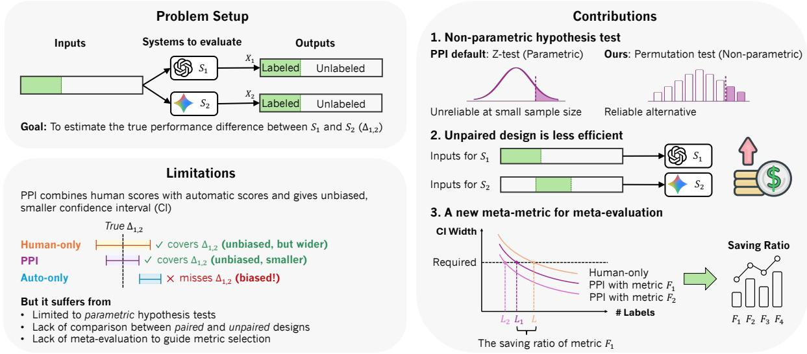  
Figure 1: An illustration of the problem setup, the limitations of the default PPI methods, and our contributions.

To address these design axes, we make the following contributions. (1) We apply PPI to system comparison with pointwise automatic metrics (§4.1), and we validate its effectiveness on six WMT datasets (§6.2). Prediction-powered evaluation is unbiased, making it more reliable than automatic-only evaluation, and yet more dataefficient than human-only evaluation. (2) Motivated by traditional WMT evaluation, we propose a non-parametric hypothesis test (§4.2) and empirically validate it (§6.3). This approach addresses settings where the approximation conditions required by standard PPI fail to hold (e.g., when the sample size is small). (3) We provide a theoretical comparison of the data efficiency of paired and unpaired designs, identifying key drivers of their variance differences, and empirically show that the paired design is generally superior on WMT (§6.4). (4) Building on our data-efficiency analysis, we propose the Prediction-Powered Saving Ratio (PPSR), a new meta-metric for prediction-powered evaluation (§5). This meta-metric reframes traditional meta-evaluation in terms of the amount of human annotation saved by a given automatic metric, rather than focusing how well automatic metrics align with human annotations. PPSR exhibits better discriminative power (§6.5) and ranking stability (§6.6) than existing system-level meta-metrics.

More broadly, prediction-powered evaluation reframes the long-standing trade-off between cheap, biased automatic evaluation and expensive, goldstandard human evaluation as a smooth annotationsavings curve, with PPSR providing the principled instrument to read off where any given automatic metric sits on that curve. Notably, the framework applies beyond MT to various non-verifiable tasks.

## 2 Related Work

PPI for evaluation. Existing PPI-based evaluation work divides by whether the automatic metric is pairwise, targeting statistics such as win rate and Bradley–Terry scores (Chatzi et al., 2024; Boyeau et al., 2025; Zhou et al., 2025), or pointwise, where prior work estimates the quality score of a single model (Chaganty et al., 2018; Saad-Falcon et al., 2024; Fisch et al., 2024; Dorner et al., 2025; Guerdan et al., 2025; Chen et al., 2026b). A closely related line uses Rogan–Gladen (Rogan and Gladen, 1978), a different statistical framework for the same targets (Lee et al., 2025; Chen et al., 2026b; Feng et al., 2026). We focus on the pointwise case, the dominant class in MT/NLG, but our target is the score difference between systems, which is what MT system comparison requires and which the above lines do not directly address. We also study two design axes crucial to MT evaluation: parametric vs. non-parametric and paired vs. unpaired.

Hypothesis tests in NLP evaluation. Dror et al. (2018) formalized algorithm comparison in NLP as hypothesis testing. The dominant parametric choice for MT/NLG is the paired t-test (van der Lee et al., 2021); non-parametric alternatives including Wilcoxon signed-rank (Kocmi et al., 2025) and rank-sum (Kocmi et al., 2023), paired bootstrap (Koehn, 2004), and the paired permutation test (also known as the approximate randomization test (Graham et al., 2014)), are widely used and often preferred. All these tests are designed for human-only or auto-only settings. The predictionpowered tests we study are designed for the combined setting and cover both parametric and nonparametric variants.

Meta-metrics in MT and NLG. Numerous meta-metrics has been proposed for metaevaluating automatic metrics, combining various grouping strategies and agreement functions (Gao et al., 2025; Deutsch et al., 2023; Perrella et al., 2024; DiIanni and Deutsch, 2025). For system comparison, the common system-level choices, including Pearson's r (Ma et al., 2019), Spearman's ρ (Machácek and Bojar, 2013), Kendall's τ (Mathur et al., 2020b), pairwise accuracy (Kocmi et al., 2021), and soft pairwise accuracy (SPA) (Thompson et al., 2024), all directly measure agreement with human judgments. PPSR is fundamentally different: derived from PPI, it quantifies the proportion of human judgments an automatic metric can save in system comparison while preserving the same statistical power. Quantities analogous to PPSR appear in Chaganty et al. (2018) and Zhou et al. (2025) from a control-variate perspective, but are not formalized as meta-metrics.

## 3 Problem and Background

## 3.1 System Comparison

Suppose there are N systems to be compared, denoted by $\{ S _ { i } \} _ { i = 1 } ^ { N }$ , and M source inputs (i.e. segments), denoted by $\{ Q _ { j } \} _ { j = 1 } ^ { M }$ The output of the i-th system on the j-th input is denoted by $X _ { i j } = S _ { i } ( Q _ { j } )$ . For all the system outputs on $L$ of the inputs, we conduct human evaluation and obtain their human scores $Y _ { i j } = H ( X _ { i j } )$ , denoted by $\{ Y _ { i j } \} _ { i = 1 , j = 1 } ^ { N , L }$ . The human scores of the remaining $U = M - L$ outputs of each system are not available. In contrast, we obtain metric scores for all system outputs using a pointwise automatic metric $F ,$ denoted by $\{ F ( \overline { { X } } _ { i j } ) \} _ { i = 1 , j = 1 } ^ { N , M } { } ^ { 2 }$

For any pair of systems, such as $S _ { 1 }$ and $S _ { 2 }$ , our goal is to estimate their true human score difference $\delta _ { 1 , 2 } = \mathbb { E } [ Y _ { 1 } - Y _ { 2 } ]$ (Wei and Jia, 2021). Humanonly evaluation uses only human scores:

$$
\begin{array} { r } { \widehat { \delta _ { 1 , 2 } ^ { H } } = \frac { 1 } { L } { \sum _ { j = 1 } ^ { L } } ( Y _ { 1 j } - Y _ { 2 j } ) . } \end{array}\tag{1}
$$

If $\{ Y _ { 1 j } \} _ { j = 1 } ^ { L }$ are regarded as independent and identically distributed (i.i.d.) random variables and $\{ Y _ { 2 j } \} _ { j = 1 } ^ { L }$ are regarded as i.i.d. random variables³, it's easy to know $\widehat { \delta _ { 1 , 2 } ^ { H } }$ is an unbiased estimator with $\begin{array} { r } { \mathrm { V a r } [ \widehat { \delta _ { 1 , 2 } ^ { H } } ] = \frac { 1 } { L } \mathrm { V a r } [ Y _ { 1 } - Y _ { 2 } ] } \end{array}$

Auto-only evaluation uses only metric scores:

$$
\begin{array} { r } { \widehat { \delta _ { 1 , 2 } ^ { A } } = \frac 1 M \sum _ { j = 1 } ^ { M } \big ( F ( X _ { 1 j } ) - F ( X _ { 2 j } ) \big ) . } \end{array}\tag{2}
$$

This estimator is biased because the automatic metric $F$ is generally biased. Its variance $\mathrm { V a r } [ \bar { \delta } _ { 1 , 2 } ^ { A } ] =$ $\begin{array} { r } { \frac { 1 } { M } \mathrm { V a r } [ F ( X _ { 1 } ) - F ( X _ { 2 } ) ] } \end{array}$ is always small because M is generally very large.

## 3.2 Meta-Evaluation: Metric Comparison

The comparisons above focus on MT systems. We now turn to meta-evaluation, where the objects of comparison are automatic metrics. Suppose that we wish to compare K automatic metrics, denoted by $\{ F _ { k } \} _ { k = 1 } ^ { K }$ . For each metric $F _ { k } ,$ a meta-metric $C$ evaluates its performance based on the metric scores $\{ F _ { k } ( X _ { i j } ) \} _ { i = 1 , j = 1 } ^ { N , L }$ and the corresponding human scores $\{ Y _ { i j } \} _ { i = 1 , j = 1 } ^ { N , L }$ . Formally, the meta-evaluation score of $F _ { k }$ can be written as $C \Big ( \{ { ( Y _ { i j } , F _ { k } ( X _ { i j } ) ) } \} _ { i = 1 , j = 1 } ^ { N , L } \Big )$ . Typically, C returns a value in [0, 1], with larger values indicating better performance of $F _ { k }$ with respect to the quantity measured by $C .$ These meta-evaluation scores can therefore be used both to compare pairs of automatic metrics and to produce an overall ranking among them. Important criteria for evaluating a meta-metric include the interpretability of the quantity it measures (Perrella et al., 2024), its ability to discriminate among automatic metrics, and the stability of the resulting metric rankings (Thompson et al., 2024).

## 3.3 Prediction-Powered Inference

Prediction-powered inference (PPI) combines a small labeled sample with a larger unlabeled sample equipped with predictions from an arbitrary predictive model (Angelopoulos et al., 2023a). Consider a generic estimation problem with target $\theta = \mathbb { E } [ Z ]$ , where $Z$ is expensive to observe. Let W be cheaply observed information and let $g ( W )$ be a prediction of $Z .$ Suppose we observe $L$ labeled examples $\{ ( W _ { j } , Z _ { j } ) \} _ { j = 1 } ^ { L }$ and $U$ additional unlabeled examples $\{ W _ { j } \} _ { j = L + 1 } ^ { L + U }$ , for which only $g ( W _ { j } )$ is available. A classical estimator of θ that only uses labeled examples is $\begin{array} { r } { \widehat { \theta ^ { H } } = \frac { 1 } { L } \sum _ { j = 1 } ^ { L } Z _ { j } } \end{array}$ In constrast, a prediction-powered estimator of θ is

$$
\widehat { \theta ^ { P P } } = \frac { \lambda } { U } \sum _ { j = L + 1 } ^ { L + U } g ( W _ { j } ) + \frac { 1 } { L } \sum _ { j = 1 } ^ { L } \left( Z _ { j } - \lambda g ( W _ { j } ) \right) ,\tag{3}
$$

where λ is a tunable parameter. $\widehat { \theta ^ { P P } }$ remains unbiased for θ for any fixed λ, even when $g$ is biased. An appropriate choice of λ can guarantee that $\operatorname { V a r } [ { \widehat { \theta ^ { P P } } } ] \leq \operatorname { V a r } [ { \widehat { \theta ^ { H } } } ]$ (Angelopoulos et al., 2023b), which means smaller confidence intervals and hypothesis tests with higher power.

## 4 Prediction-Powered Evaluation for MT

We now instantiate the generic PPI estimator from §3.3 for paired MT system comparison and derive the corresponding parametric confidence intervals and hypothesis tests (§4.1). We then present two extensions: a paired non-parametric hypothesis test (§4.2) and an instantiation of PPI for unpaired MT system comparison (§4.3).

## 4.1 Paired Parametric Design (PPI Default)

Map the generic PPI setup of §3.3 to system comparison by setting $Z _ { j } = Y _ { 1 j } - Y _ { 2 j }$ (the expensive human score difference) and $g ( \dot { W _ { j } } ) = F ( X _ { 1 j } ) -$ $F ( X _ { 2 j } )$ (the cheap metric score difference). The target $\overset { \cdot } { \theta } = \mathbb { E } [ Z ] = \delta _ { 1 , 2 }$ is the true human score difference. Substituting into (3) yields the predictionpowered paired estimator

$$
\begin{array} { l } { \displaystyle \widehat { \delta _ { 1 , 2 } ^ { P P } } = \frac { \lambda } { U } \sum _ { j = L + 1 } ^ { L + U } \big ( F ( X _ { 1 j } ) - F ( X _ { 2 j } ) \big ) } \\ { \displaystyle + \frac { 1 } { L } \sum _ { j = 1 } ^ { L } \Big [ ( Y _ { 1 j } - Y _ { 2 j } ) - \lambda \big ( F ( X _ { 1 j } ) - F ( X _ { 2 j } ) \big ) \Big ] . } \end{array}\tag{4}
$$

At λ = 0, (4) reduces to the human-only estimator $\widehat { \delta _ { 1 , 2 } ^ { H } } ; \mathrm { a t } \lambda = 1$ , it equals the auto-only estimator $\stackrel {  } { \delta _ { 1 , 2 } ^ { A } }$ plus a rectifier term estimated on the labeled set. For any $\lambda \in \mathbb { R } , \widehat { \delta _ { 1 , 2 } ^ { P P } }$ is unbiased for $\delta _ { 1 , 2 }$ . Proposition 1 in Appendix A provides the proof. It is worth noting that the human scores and automatic scores do not need to use the same scale. For example, humans may rate each output on a scale from 0 to 100, while an automatic metric may score each output on a scale from 0 to 1.

Variance and optimal λ. Following Angelopoulos et al. (2023b); Chen et al. (2026a), the varianceminimizing tuning parameter $\lambda ^ { \star }$ has a closed form (Proposition 2 in Appendix A provides the proof):

$$
\lambda ^ { \star } = \frac { \mathrm { C o v } [ Y _ { 1 } - Y _ { 2 } , F ( X _ { 1 } ) - F ( X _ { 2 } ) ] } { ( 1 + \frac { L } { U } ) \mathrm { V a r } [ F ( X _ { 1 } ) - F ( X _ { 2 } ) ] } ,
$$

yielding

$$
\begin{array} { l } { { \displaystyle \mathrm { V a r } \Big [ \widehat { \delta _ { 1 , 2 } ^ { P P } } \Big ] = \frac { 1 } { L } \mathrm { V a r } [ Y _ { 1 } - Y _ { 2 } ] } \ ~ } \\ { { \displaystyle ~ - \frac { U \big ( \mathrm { C o v } [ Y _ { 1 } - Y _ { 2 } , F ( X _ { 1 } ) - F ( X _ { 2 } ) ] \big ) ^ 2 } { L ( L + U ) \mathrm { V a r } [ F ( X _ { 1 } ) - F ( X _ { 2 } ) ] } . } } \end{array}\tag{5}
$$

The second term in (5) is the variance reduction PPI buys over the human-only paired estimator. It is non-negative, and vanishes if and only if the metric score differences are uncorrelated with the human score differences. Thus we have $\mathrm { V a r } [ \bar { \delta } _ { 1 , 2 } ^ { P \bar { P } } ] \leq \mathrm { V a r } [ \bar { \delta } _ { 1 , 2 } ^ { H } ]$ , so PPI is never worse than human-only evaluation under the optimal λ\*, even when F is highly biased or weakly informative.

In practice, the optimal value $\lambda ^ { \star }$ cannot be computed directly because Cov $[ Y _ { 1 } - Y _ { 2 } , F ( X _ { 1 } ) -$ $F ( X _ { 2 } ) ]$ and $\operatorname { V a r } [ F ( X _ { 1 } ) - F ( X _ { 2 } ) ]$ are unknown. Following Angelopoulos et al. (2023b), we therefore replace $\lambda ^ { \star }$ with its empirical estimate $\hat { \lambda } ,$ computed using the sample covariance $\widehat { \mathrm { C o v } } [ Y _ { 1 } - Y _ { 2 } , \overset { \vartriangle } { F } ( X _ { 1 } ) - \overset { \vartriangle } { F } ( X _ { 2 } ) ]$ and sample variance $\widehat { \mathrm { V a r } } [ F ( X _ { 1 } ) - F ( X _ { 2 } ) ]$ . Note that we do not need to clip λ to [0, 1] here.

Confidence intervals and hypothesis test. Applying the central limit theorem yields the 100(1 — $\alpha ) \%$ CI for human-only and prediction-powered cases⁴:

$$
\widehat { \delta _ { 1 , 2 } ^ { g } } \pm z _ { \alpha / 2 } \sqrt { \widehat { \mathrm { V a r } } [ \widehat { \delta _ { 1 , 2 } ^ { g } } ] } , \quad g = \{ H , P P \} ,
$$

where $\widehat { \mathrm { V a r } } [ \cdot ]$ plugs sample variance. Theorem 1 and Theorem 2 in Appendix A provide the proof. The corresponding parametric paired Z-test are summarized as Alg. 1 and Alg. 3 in the Appendix.

## 4.2 Paired Non-Parametric Test

The parametric CI and Z-test of §4.1 inherit the standard PPI asymptotic guarantee only when both (1) $\widehat { \delta _ { 1 , 2 } ^ { P P } }$ is well approximated by a normal distribution and (2) the population variance and population covariance are known or estimated with high accuracy. In MT system comparison this is not always the case: human scores are discrete, and the sample size is small, etc. WMT shared tasks have for two decades preferred non-parametric procedures possibly for these reasons, but the existing prediction-powered literature has no off-the-shelf non-parametric test for paired system comparison⁵.

To fill this gap, we extend the classical paired permutation test (Alg. 4 and Alg. 5 in the appendix) (Graham et al., 2014) to the prediction-powered setting (Alg. 6 in the appendix). In exchange for finite-sample validity, the permutation test relies on a stronger underlying assumption than the Z-test of §4.1. Separate from the null hypothesis $\delta _ { 1 , 2 } \leq 0$ the paired permutation test assumes that the distribution of $Y _ { 1 } - Y _ { 2 }$ is symmetric about its mean $\delta _ { 1 , 2 }$ (Good, 2004). Under the symmetry assumption, the asymptotic normal approximation in §4.1 is unnecessary. We explicitly note this assumption as an "assert" in the algorithm descriptions.

## 4.3 Unpaired Design

Sections 4.1 and 4.2 assume that both systems are evaluated on the same source inputs, and $\widehat { \delta _ { 1 , 2 } ^ { P P } }$ is built from per-segment differences. The unpaired design is the natural fallback when the two systems are evaluated on disjoint inputs.

Unpaired estimators. Let $I _ { i } ^ { L } , I _ { i } ^ { U }$ index the labeled and unlabeled inputs for system $S _ { i }$ (the paired design requires $\hat { I _ { 1 } ^ { L } } = I _ { 2 } ^ { L } , \hat { I _ { 1 } ^ { U } } = I _ { 2 } ^ { U } )$ . The unpaired human-only estimator,

$$
\widehat { \delta _ { 1 , 2 } ^ { H , \mathrm { U n } } } = \frac { 1 } { | I _ { 1 } ^ { L } | } \sum _ { j \in I _ { 1 } ^ { L } } Y _ { 1 j } - \frac { 1 } { | I _ { 2 } ^ { L } | } \sum _ { j \in I _ { 2 } ^ { L } } Y _ { 2 j } ,
$$

treats the two systems' scores as independent. Similarly, the unpaired prediction-powered estimator instantiates the generic PPI of (3) separately for each system, with two tuning parameters $\lambda _ { 1 } , \lambda _ { 2 } \colon$

$$
\begin{array} { r l r } {  { \widehat { \delta _ { 1 , 2 } ^ { P P , \mathrm { U n } } } = \frac { \lambda _ { 1 } } { | I _ { 1 } ^ { U } | } \sum _ { j \in I _ { 1 } ^ { U } } F ( X _ { 1 j } ) + \frac { 1 } { | I _ { 1 } ^ { L } | } \sum _ { j \in I _ { 1 } ^ { L } } \bigl ( Y _ { 1 j } - \lambda _ { 1 } F ( X _ { 1 j } ) \bigr ) } } \\ & { } & { \quad - \frac { \lambda _ { 2 } } { | I _ { 2 } ^ { U } | } \sum _ { j \in I _ { 2 } ^ { U } } F ( X _ { 2 j } ) - \frac { 1 } { | I _ { 2 } ^ { L } | } \sum _ { j \in I _ { 2 } ^ { L } } \bigl ( Y _ { 2 j } - \lambda _ { 2 } F ( X _ { 2 j } ) \bigr ) . } \end{array}
$$

Both estimators are unbiased. The varianceminimizing $( { \lambda } _ { 1 } ^ { \star } , { \lambda } _ { 2 } ^ { \star } )$ have closed forms analogous to §4.1. Similarly, we have

$$
\mathrm { V a r } \left[ \widehat { \delta _ { 1 , 2 } ^ { P P , \mathrm { U n } } } \right] \leq \mathrm { V a r } \left[ \widehat { \delta _ { 1 , 2 } ^ { H , \mathrm { U n } } } \right] .
$$

The proof is in Proposition 3 (Appendix B). The unpaired design also yields confidence intervals and hypothesis tests, which we omit for brevity.

However, whether the paired or unpaired design is more efficient remains theoretically ambiguous. Proposition 4 in Appendix C proves that for both human-only and prediction-powered settings, the relative efficiency depends on the covariance structure of the data. Therefore, we investigate this question empirically in §6.4.

## 5 PPSR: A New Meta-Metric

In $\ S 4 .$ , we restrict our focus to a single automatic metric $F .$ In practice, however, we have a set of metrics $\{ F _ { k } \} _ { k = 1 } ^ { K }$ to choose from. In this section, we derive a meta-metric to determine which of these automatic metrics are most effective for prediction-powered evaluation (§5.1), interpret it as an annotation saving ratio (§5.2), and contrast it with existing meta-metrics (§5.3).

## 5.1 Derivation and Definition

When $U \gg L$ , the relative variance reduction in (5) simplifies cleanly:

$$
\frac { \mathrm { V a r } [ \widehat { \delta _ { 1 , 2 } ^ { H } } ] - \mathrm { V a r } [ \widehat { \delta _ { 1 , 2 } ^ { P P } } ] } { \mathrm { V a r } [ \widehat { \delta _ { 1 , 2 } ^ { H } } ] } \approx \mathrm { C o r r } [ Y _ { 1 } - Y _ { 2 } , F _ { k } ( X _ { 1 } ) - F _ { k } ( X _ { 2 } ) ] ^ { 2 } .
$$

Thus, for a given pair of systems, the relative variance reduction achieved by prediction-powered evaluation over human-only evaluation is approximately equal to the squared Pearson correlation between the human and metric score differences for that pair. Moreover, this relative variance reduction is equal to the fraction of human annotations saved by using metric $F _ { k } ,$ , relative to human-only evaluation, while maintaining the same variance. Proposition 5 in Appendix D provides the proof. This result can also be viewed as an application of the rule of thumb proposed by Chen et al. (2026a).

Averaging this quantity over all $\binom { N } { 2 }$ pairs of systems and replacing the population Pearson correlations with their sample Pearson estimates yields the Prediction-Powered Saving Ratio (PPSR):

$$
\binom { N } { 2 } ^ { - 1 } \sum _ { p = 1 } ^ { N - 1 } \sum _ { q = p + 1 } ^ { N } r \Big ( \{ ( Y _ { p j } - Y _ { q j } , F _ { k } ( X _ { p j } ) - F _ { k } ( X _ { q j } ) ) \} _ { j = 1 } ^ { L } \Big ) ^ { 2 } .
$$

PPSR takes values in [0, 1], requires only the labeled examples to compute.

## 5.2 Interpretation

PPSR represents the average fraction of human annotations saved by using metric $F _ { k }$ in predictionpowered evaluation, relative to human-only evaluation, while maintaining approximately the same confidence-interval width or test power across system pairs. A PPSR of 0.4 for a metric $F _ { k }$ on a given dataset means that replacing human-only evaluation with PPI using $F _ { k }$ yields the same statistical conclusion with ≈ 40% fewer human-annotated segments on average. Empirical resampling experiments in Appendix G confirm that PPSR strongly correlates with actual human annotation savings.

PPSR should not be interpreted as an agreement measure because it squares the Pearson correlation and therefore discards its sign. This property highlights an advantage of prediction-powered evaluation over automatic-only evaluation: even a metric that is negatively correlated with human judgments can still reduce variance and save human annotations in prediction-powered evaluation.

## 5.3 Relation to Existing Meta-Metrics

Interestingly, though PPSR is a system-level metametric, that is, it reflects the ability of automatic metrics to perform system comparison, it is closely related to segment-level meta-metrics. Compared with existing schemes (Deutsch et al., 2023) including No Grouping, Group by Item, and Group by System, PPSR can be viewed as a segment-level meta-metric under a Group by System Pair scheme. Notably, PDP (DiIanni and Deutsch, 2025), a new segment-level meta-metric, also uses the score differences between systems on the same segment, but its grouping strategy is very different from PPSR. Please read Appendix H for more details.

Existing system-level meta-metrics typically aggregate scores at the system level first, by averaging human scores and metric scores over inputs for each system, and then compute a correlation between the resulting N pairs of system-level scores:

$$
c \left( \left\{ \left( \frac { 1 } { L } \sum _ { j = 1 } ^ { L } Y _ { i j } , \frac { 1 } { L } \sum _ { j = 1 } ^ { L } F _ { k } ( X _ { i j } ) \right) \right\} _ { i = 1 } ^ { N } \right) ,
$$

where $c$ can be Pearson's $r ,$ Spearman's $\rho ,$ or Kendall's $\tau ^ { 6 }$ . These meta-metrics lack discriminative power and produce unstable metric rankings since the number of systems N is typically small.

To address this, Thompson et al. (2024) proposed SPA, which leverages the discrepancy between p-values from human-only and auto-only paired permutation tests as additional signal:

$$
\binom { N } { 2 } ^ { - 1 } \sum _ { p = 1 } ^ { N - 1 } \sum _ { q = p + 1 } ^ { N } 1 - \left| p _ { p , q } ^ { H } - p _ { p , q } ^ { A } \right| ,
$$

It has been adopted in the lastest WMT metric shared tasks (Freitag et al., 2024; Lavie et al., 2025). However, since p-values are not effect sizes or calibrated probabilities, this is best understood as a heuristic measure of agreement.

## 6 Experiments

We evaluate the framework on six WMT22-24 datasets and organize the experiments around the design axes and meta-evaluation question that structure the paper. After describing the datasets (§6.1), we first verify that prediction-powered evaluation delivers on its basic promise for MT system comparison (§6.2). We then examine the two design axes introduced in §4, parametric vs. nonparametric test (§6.3) and paired vs. unpaired design (§6.4), to quantify the cost of each design choice. Finally, we assess the discriminative power (§6.5) and ranking stability (§6.6) of our new metametric, PPSR, and report its metric rankings (§6.7).

## 6.1 Datasets

We used the MT Metrics Eval V2 toolkit7 to obtain all WMT data from 2022 to 2025. After carefully inspecting the data, we selected en-de, en-ru, and zh-en from WMT22; en-zh and ja-en from WMT23; and cs-uk from WMT24. These datasets contain relatively large numbers of source inputs across all systems, making them more suitable for treating the data as a population when evaluating confidence intervals and hypothesis tests. Table 1 summarizes the basic statistics of these datasets. For each input, the human score of each system output and the scores assigned by all automatic metrics are available. We use all available automatic metrics, so our dataset configuration is not identical to that used in the metric shared tasks. For reference-based metrics, we follow the dataset guidelines and use the scores computed with ref-A. For WMT24 cs-uk, we additionally exclude sentinel metrics and three pairs of automatic metrics that produce identical outputs.

## 6.2 PPI Works for MT System Comparison

Setup. For each system pair $S _ { p }$ and $S _ { q } ,$ we define the finite population as the full set of paired examples for which human scores are available, and take the mean human score difference over this full set as the population effect size $\delta _ { p , q } .$ The effect size is expressed in the original scale of the human scores and is not normalized. We then evaluate confidence intervals and hypothesis tests by resampling from this finite population. In each trial, we sample $U + L$ examples without replacement from the full set and randomly split them into L labeled examples, whose human scores are used, and U unlabeled examples, whose human scores are held out. The sampled data are used to construct confidence intervals and conduct hypothesis tests, which are then evaluated against the population effect size defined above. We sweep L from 20 to 200 while fixing $U = 8 0 0$ . For each (L, U) configuration, we repeat this procedure for 1000 trials. For automatic metrics, we use MetricX: MetricX-XXL-20 for WMT22, MetricX-23 for WMT23, and MetricX-24 for WMT24.

<table><tr><td>Dataset</td><td>Human</td><td>#Inputs</td><td> $\# \mathrm { S y s . }$ </td><td>#Met.</td></tr><tr><td>WMT22 en-de</td><td>MQM</td><td>1315</td><td>14</td><td>31</td></tr><tr><td>WMT22 en-ru</td><td>MQM</td><td>1315</td><td>15</td><td>30</td></tr><tr><td>WMT22 zh-en</td><td>MQM</td><td>1875</td><td>14</td><td>31</td></tr><tr><td>WMT23 en-zh</td><td>DA-SQM</td><td>1098</td><td>15</td><td>34</td></tr><tr><td>WMT23 ja-en</td><td>DA-SQM</td><td>1120</td><td>17</td><td>35</td></tr><tr><td>WMT24 cs-uk</td><td>ESA</td><td>1955</td><td>11</td><td>25</td></tr></table>

Table 1: Datasets used in the experiments. Sys. and Met. denote the number of systems and automatic metrics.

Hypothesis Test. We record the empirical power of the auto-only, the human-only, and the prediction-powered paired Z-test for each system pair, i.e., the percentage of trials in which the onesided null hypothesis is rejected at $\alpha = 0 . 0 5$ . Since each system pair has a different true human effect, this produces a power curve. As shown in Figure 2, the auto-only test has lower power than the human-only test for some human effect sizes, indicating bias in the automatic metric. If the automatic metric were unbiased, the auto-only test, which uses all $U + L$ examples, would be expected to have greater power than the human-only test, which uses only the L labeled examples, across all human effect sizes. By contrast, the power curves of human-only and prediction-powered tests align closely, with prediction-powered tests consistently achieving higher power.

Confidence Intervals. To more clearly illustrate the bias of automatic-only evaluation, we include an additional LLM-based metric, GEMBA (Kocmi and Federmann, 2023) in the confidence interval experiments, whose score range matches that of the human scores. The auto-only confidence intervals based on GEMBA are very narrow on average, but their empirical coverage is only approximately 30%, far below the nominal 95% level. In contrast, the prediction-powered confidence intervals with GEMBA maintain coverage close to the nominal 95% level while remaining consistently smaller than the human-only confidence intervals. Figure 13 and 14 in the appendix shows the results.

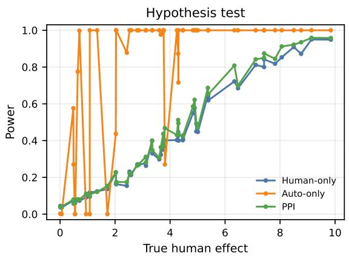

Figure 2: Empirical power curves at $L = 8 0 , U = 8 0 0$ on WMT24 cs-uk. MetricX is used as the automatic metric. The fact that the empirical power of the auto-only test is lower than that of the human-only test for some effect sizes suggests that even a strong metric such as MetricX exhibits substantial bias for some system pairs. Similar trends are observed for other values of L and other datasets. The full results are shown in Figure 11 and 12 in the appendix.  
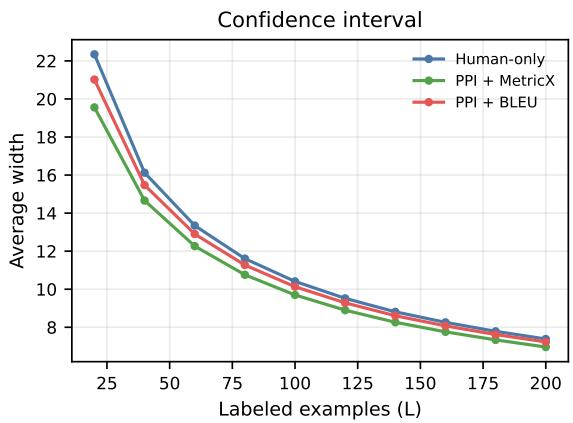  
Figure 3: Average two-sided 95% CI width with $U = 8 0 0$ on WMT24 cs-uk. A smaller CI means better data efficiency. Results are averaged across system pairs. The trend is the same across datasets. Figure 15 in the appendix shows full results.

We also conduct a preliminary analysis of how the choice of automatic metric affects efficiency gains. Figure 3 compares the average widths of prediction-powered confidence intervals with MetricX and BLEU. Both are consistently smaller than the human-only baseline, although MetricX produces substantially larger reductions. This observation motivates the development of PPSR. For both metrics, the empirical coverage remains close to the nominal 95% level, as shown in Figure 16 in the appendix.

Summary. Overall, PPI works for MT system comparisons. On the one hand, prediction-powered evaluation is unbiased, which is a clear advantage over auto-only evaluation. On the other hand, it is more data-efficient than human-only evaluation.

## 6.3 Non-Parametric vs. Parametric Test

In this section, we investigate two questions: (1) whether the prediction-powered paired permutation test achieves higher power than the human-only paired permutation test, and (2) how the paired $Z -$ test and paired permutation test compare in terms of power and Type I error under both the human-only and prediction-powered settings. We follow the setup described in §6.2 and use $B = 1 0 0 0$ random sign-flip permutations for paired permutation tests.

Consistent with the earlier results for the paired Z-test, the human-only and prediction-powered paired permutation tests exhibit nearly identical power trends, while the prediction-powered test consistently achieves higher power. Figures 17, 18, 19 in the appendix present their power curves at different labeled sample sizes.

The paired Z-test achieves higher power than the paired permutation test in both the human-only and prediction-powered settings, especially when the labeled sample size is small, as shown in Figure 22 in the appendix. However, the Type I error simulations show that the paired Z-test can be poorly calibrated at small labeled sample sizes in the prediction-powered setting (Figure 4). This behavior arises from both error in the normal approximation and finite-sample instability in the plug-in variance and covariance estimators. See Appendix F for details of the Type I error simulations. Taken together, these results suggest that the paired Z-test can be anti-conservative in small samples, whereas the paired permutation test provides a reliable nonparametric alternative.

## 6.4 Paired vs. Unpaired Design

As noted in §4.3, whether the paired or unpaired design is more efficient depends on the data. For human-only evaluation, we estimate the relative variance increase $\widehat { \left( \mathrm { V a r } \left[ \delta _ { 1 , 2 } ^ { H , \mathrm { U n } } \right] \right. } -$

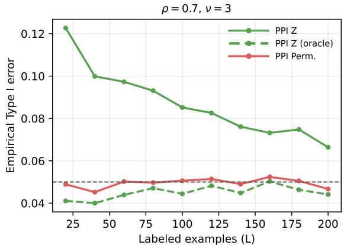

Figure 4: Type I error under a zero-mean Student's t distribution with $\rho = 0 . 7$ and $\nu = 3 .$ The nominal Type I error rate is 0.05. “PPI Z” refers to the original prediction-powered paired Z-test using plug-in variance and covariance estimates, whereas “PPI Z (oracle)" uses the true variance and covariance. “PPI Perm" refers to the prediction-powered paired permutation test. Full results are shown in Figure 7 in the appendix.
<table><tr><td rowspan="2">Dataset</td><td colspan="2">Human-only</td><td colspan="2">Prediction-powered</td></tr><tr><td>Var. Inc.</td><td>Pos.</td><td>Var. Inc.</td><td>Pos.</td></tr><tr><td>WMT22 en-de</td><td>1.28</td><td>100%</td><td>1.11</td><td>100%</td></tr><tr><td>WMT22 en-ru</td><td>1.81</td><td>100%</td><td>1.67</td><td>100%</td></tr><tr><td>WMT22 zh-en</td><td>1.28</td><td>100%</td><td>1.02</td><td>100%</td></tr><tr><td>WMT23 en-zh</td><td>0.16</td><td>98%</td><td>0.11</td><td>92%</td></tr><tr><td>WMT23 ja-en</td><td>0.18</td><td>100%</td><td>0.12</td><td>97%</td></tr><tr><td>WMT24 cs-uk</td><td>0.56</td><td>100%</td><td>0.33</td><td>100%</td></tr></table>

Table 2: Paired-versus-unpaired variance comparison for human-only and prediction-powered evaluation."Var. Inc." is the average relative variance increase from using the unpaired design; “Pos." is the fraction of cases where it is positive (i.e., where the unpaired design increases variance). For humanonly, each case is one system pair; for prediction-powered, each case is one system-pair/metric combination.

Var $\widehat { \left[ \delta _ { 1 , 2 } ^ { H } \right] } ) / \widehat { \mathrm { V a r } } \widehat { \left[ \delta _ { 1 , 2 } ^ { H } \right] }$ for each system pair in the selected datasets. Similarly, for predictionpowered evaluation, we estimate $\mathrm { ( \widehat { V a r } \left[ \widehat { \delta _ { 1 , 2 } ^ { P P , U n } } \right] - }$ Var $\left[ \widehat { \delta _ { 1 , 2 } ^ { P P } } \right] ) / \widehat { \mathrm { V a r } } \left[ \widehat { \delta _ { 1 , 2 } ^ { P P } } \right]$ for each system pair and automatic metric.

As shown in Table 2, the relative variance increase is positive in nearly all cases, indicating that paired designs are generally more efficient than unpaired designs. Therefore, we recommend using the paired design for both human-only and prediction-powered evaluation whenever feasible. However, this effect is weaker in the prediction-powered setting than in the human-only setting. See Appendix C for in-depth analysis.

## 6.5 PPSR Has Higher Discriminative Power

A meta-metric with higher discriminative power is more likely to distinguish between automatic metrics. This is desirable in meta-evaluation, as an excess of ties makes it comparison difficult.

<table><tr><td></td><td colspan="6">Distinct values (↑)</td><td colspan="6">Significant comparisons (↑)</td></tr><tr><td>Dataset</td><td>Max</td><td>r</td><td> $\rho$ </td><td> $\tau$ </td><td>SPA</td><td>PPSR</td><td>Max</td><td>r</td><td> $\rho$ </td><td>T</td><td>SPA</td><td>PPSR</td></tr><tr><td>WMT22 en-de</td><td>31</td><td>31</td><td>23</td><td>14</td><td>31</td><td>31</td><td>465</td><td>355</td><td>284</td><td>196</td><td>306</td><td>412</td></tr><tr><td>WMT22 en-ru</td><td>30</td><td>30</td><td>23</td><td>16</td><td>30</td><td>30</td><td>435</td><td>354</td><td>289</td><td>270</td><td>314</td><td>373</td></tr><tr><td>WMT22 zh-en</td><td>31</td><td>31</td><td>27</td><td>18</td><td>31</td><td>31</td><td>465</td><td>402</td><td>348</td><td>315</td><td>358</td><td>422</td></tr><tr><td>WMT23 en-zh</td><td>34</td><td>34</td><td>26</td><td>20</td><td>34</td><td>34</td><td>561</td><td>493</td><td>423</td><td>409</td><td>440</td><td>507</td></tr><tr><td>WMT23 ja-en</td><td>35</td><td>35</td><td>22</td><td>13</td><td>35</td><td>35</td><td>595</td><td>389</td><td>266</td><td>272</td><td>338</td><td>500</td></tr><tr><td>WMT24 cs-uk</td><td>25</td><td>25</td><td>17</td><td>14</td><td>25</td><td>25</td><td>300</td><td>234</td><td>208</td><td>197</td><td>225</td><td>247</td></tr></table>

Table 3: Discriminative power of system-level meta-metrics. Max gives the largest possible value for each criterion. Bold indicates the highest observed value in each row.

We evaluate discriminative power in two ways. First, we count how many distinct values each metametric assigns to the automatic metrics in a dataset. Second, for every pair of automatic metrics, we follow the practice of Thompson et al. (2024) to apply the PERM-INPUTS permutation test (Deutsch et al., 2021) with B = 1000 and count how many pairwise differences are statistically significant at $p \leq 0 . 0 5$ . Table 3 summarizes the results. We find that PPSR achieves the highest discriminative power among all system-level meta-metrics on each dataset. By comparison, SPA has higher discriminative power than system-level $\rho$ and $\tau _ { \ast }$ but lower than system-level r.

## 6.6 PPSR Produces More Stable Rankings

Another dimension to assess meta-metrics is whether the induced ranking of automatic metrics remains stable when only a subset of data is available. This matters because meta-evaluation studies often compare many metrics on a limited test set.

We use resampling to assess ranking stability. For each dataset and each meta-metric, we first obtain the ranking of automatic metrics using the full dataset. We then sample L inputs without replacement (keeping the system set fixed), recompute the ranking produced by each meta-metric on the sampled data, and measure Kendall's τ between the sampled ranking and the full-data ranking. This procedure is repeated 1000 times for each $L \in \{ 1 0 0 , 2 0 0 , \ldots , 1 0 0 0 \}$ , and we report the average Kendall's τ. Figure 5 shows PPSR achieves the highest average ranking stability across input size.

We emphasize that the higher discriminative power and ranking stability does not imply that PPSR can replace other meta-metrics, because their meanings and intended use cases are substantially different.

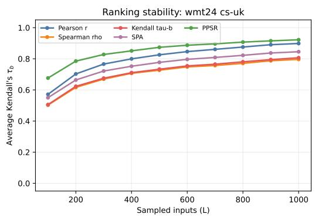  
Figure 5: Ranking stability of system-level meta-metrics on WMT24 cs-uk. Higher values indicate more stable metric rankings. Note that for meta-evaluation, only labeled examples are used and the unlabeled examples are unused. The trend is the same across all datasets. Full results for all datasets are shown in Figure 23 in the appendix.

## 6.7 Metric Rankings Produced By PPSR

Table 8–19 in the appendix reports the scores and rankings of all automatic metrics under PPSR and other meta-metrics. We find that though PPSR is a system-level meta-metric designed for system comparison, its metric rankings differ substantially from those produced by existing system-level metametrics. Instead, its metric rankings align more closely with segment-level meta-metrics, particularly PDP. This supports the interpretation that PPSR measures a related yet distinct quality in automatic metrics.

## 7 Conclusion

We show the advantages of prediction-powered evaluation over human-only and auto-only approaches on WMT data, providing practical recommendations across parametric vs. non-parametric inference and paired vs. unpaired designs. Building on this framework, we introduce PPSR, a metametric offering greater discriminative power and ranking stability than existing system-level alternatives. More broadly, our framework applies to other non-verifiable tasks where both human judgments and automatic metrics are pointwise.

## Limitations

For simplicity, we do not model inter-annotator disagreement as an additional source of variance in human scores, as considered in prior work (Chaganty et al., 2018; Wei and Jia, 2021).

Mani et al. (2025) pointed out that reusing the same labeled data both to estimate the λ, and to estimate the empirical variance to construct the confidence intervals while treating λ as fixed can lead to overly optimistic empirical variance. We do not address this issue in the present work.

We also assume that system-level scores are obtained by averaging over inputs. As a result, our framework may not apply directly to the automatic metrics that compute system-level scores using different aggregation methods.

Finally, our experiments focus on machine translation. The applicability of our methods to other domains and tasks remains to be further validated.

## Ethical Considerations

The MT Metrics Eval V2 toolkit is licensed under Apache-2.0, and our use of it complies with the terms of the license. AI-based writing tools were used to assist with language polishing. Specifically, we prompted Claude and ChatGPT to generate suggested revisions, which we then manually reviewed and edited.

## Acknowledgments

We thank Pengcheng Su for insightful feedback and the reviewers in the ARR May 2026 cycle for their valuable suggestions.

## References

Farhad Akhbardeh, Arkady Arkhangorodsky, Magdalena Biesialska, Ondrej Bojar, Rajen Chatterjee, Vishrav Chaudhary, Marta R. Costa-jussà, Cristina España-Bonet, Angela Fan, Christian Federmann, Markus Freitag, Yvette Graham, Roman Grundkiewicz, Barry Haddow, Leonie Harter, Kenneth Heafield, Christopher Homan, Matthias Huck, Kwabena Amponsah-Kaakyire, and 17 others. 2021. Findings of the 2021 conference on machine translation (WMT21). In Proceedings of the Sixth Conference on Machine Translation, WMT@ EMNLP 2021, Online Event, November 10-11, 2021, pages 1–88. Association for Computational Linguistics.

Anastasios N. Angelopoulos, Stephen Bates, Clara Fannjiang, Michael I. Jordan, and Tijana Zrnic. 2023a. Prediction-powered inference. Science, 382(6671):669–674.

Anastasios N. Angelopoulos, John C. Duchi, and Tijana Zrnic. 2023b. PPI++: efficient prediction-powered inference. CoRR, abs/2311.01453.

Loïc Barrault, Magdalena Biesialska, Ondrej Bojar, Marta R. Costa-jussà, Christian Federmann, Yvette Graham, Roman Grundkiewicz, Barry Haddow, Matthias Huck, Eric Joanis, Tom Kocmi, Philipp Koehn, Chi-kiu Lo, Nikola Ljubesic, Christof Monz, Makoto Morishita, Masaaki Nagata, Toshiaki Nakazawa, Santanu Pal, and 2 others. 2020. Findings of the 2020 conference on machine translation (WMT20). In Proceedings of the Fifth Conference on Machine Translation, WMT@EMNLP 2020, Online, November 19-20, 2020, pages 1–55. Association for Computational Linguistics.

Ondrej Bojar, Rajen Chatterjee, Christian Federmann, Yvette Graham, Barry Haddow, Matthias Huck, Antonio Jimeno-Yepes, Philipp Koehn, Varvara Logacheva, Christof Monz, Matteo Negri, Aurélie Névéol, Mariana L. Neves, Martin Popel, Matt Post, Raphael Rubino, Carolina Scarton, Lucia Specia, Marco Turchi, and 2 others. 2016. Findings of the 2016 conference on machine translation. In Proceedings of the First Conference on Machine Translation, WMT 2016, colocated with ACL 2016, August 11-12, Berlin, Germany, pages 131–198. The Association for Computer Linguistics.

Pierre Boyeau, Anastasios Nikolas Angelopoulos, Tianle Li, Nir Yosef, Jitendra Malik, and Michael I. Jordan. 2025. Autoeval done right: Using synthetic data for model evaluation. In Forty-second International Conference on Machine Learning, ICML 2025, Vancouver, BC, Canada, July 13-19, 2025, Proceedings of Machine Learning Research. PMLR / OpenReview.net.

Chris Callison-Burch, Philipp Koehn, Christof Monz, Matt Post, Radu Soricut, and Lucia Specia. 2012. Findings of the 2012 workshop on statistical machine translation. In Proceedings of the Seventh Workshop on Statistical Machine Translation, WMT@NAACL-HLT 2012, June 7-8, 2012, Montréal, Canada, pages 10–51. The Association for Computer Linguistics.

Dallas Card, Peter Henderson, Urvashi Khandelwal, Robin Jia, Kyle Mahowald, and Dan Jurafsky. 2020. With little power comes great responsibility. In Proceedings of the 2020 Conference on Empirical Methods in Natural Language Processing, EMNLP 2020, Online, November 16-20, 2020, pages 9263–9274. Association for Computational Linguistics.

Arun Chaganty, Stephen Mussmann, and Percy Liang. 2018. The price of debiasing automatic metrics in natural language evalaution. In Proceedings of the 56th Annual Meeting of the Association for Computational Linguistics (Volume 1: Long Papers), pages 643–653, Melbourne, Australia. Association for Computational Linguistics.

Ivi Chatzi, Eleni Straitouri, Suhas Thejaswi, and Manuel Gomez Rodriguez. 2024. Prediction-

powered ranking of large language models. In Advances in Neural Information Processing Systems 38: Annual Conference on Neural Information Processing Systems 2024, NeurIPS 2024, Vancouver, BC, Canada, December 10 - 15, 2024.

Yiqun T. Chen, Moran Guo, and Shengy Li. 2026a. Power analysis for prediction-powered inference. CoRR, abs/2603.16041.

Yiqun T. Chen, Sizhu Lu, Sijia Li, Moran Guo, and Shengyi Li. 2026b. Efficient inference for noisy llmas-a-judge evaluation. CoRR, abs/2601.05420.

Daniel Deutsch, Rotem Dror, and Dan Roth. 2021. A statistical analysis of summarization evaluation metrics using resampling methods. Trans. Assoc. Comput. Linguistics, 9:1132–1146.

Daniel Deutsch, George F. Foster, and Markus Freitag. 2023. Ties matter: Meta-evaluating modern metrics with pairwise accuracy and tie calibration. In Proceedings of the 2023 Conference on Empirical Methods in Natural Language Processing, EMNLP 2023, Singapore, December 6-10, 2023, pages 12914– 12929. Association for Computational Linguistics.

Colten DiIanni and Daniel Deutsch. 2025. Don't sweat the small stuff: Segment-level meta-evaluation based on pairwise difference correlation. In Proceedings of the 2025 Conference on Empirical Methods in Natural Language Processing, EMNLP 2025, Suzhou, China, November 4-9, 2025, pages 25062–25070. Association for Computational Linguistics.

Florian E. Dorner, Vivian Yvonne Nastl, and Moritz Hardt. 2025. Limits to scalable evaluation at the frontier: LLM as judge won't beat twice the data. In The Thirteenth International Conference on Learning Representations, ICLR 2025, Singapore, April 24-28, 2025. OpenReview.net.

Rotem Dror, Gili Baumer, Segev Shlomov, and Roi Reichart. 2018. The hitchhiker's guide to testing statistical significance in natural language processing. In Proceedings of the 56th Annual Meeting of the Association for Computational Linguistics, ACL 2018, Melbourne, Australia, July 15-20, 2018, Volume 1: Long Papers, pages 1383–1392. Association for Computational Linguistics.

Chen Feng, Minghe Shen, Ananth Balashankar, Carsten Gerner-Beuerle, and Miguel R. D. Rodrigues. 2026. Noisy but valid: Robust statistical evaluation of llms with imperfect judges. CoRR, abs/2601.20913.

Adam Fisch, Joshua Maynez, R. Alex Hofer, Bhuwan Dhingra, Amir Globerson, and William W. Cohen. 2024. Stratified prediction-powered inference for effective hybrid evaluation of language models. In Advances in Neural Information Processing Systems 38: Annual Conference on Neural Information Processing Systems 2024, NeurIPS 2024, Vancouver, BC, Canada, December 10 - 15, 2024.

Markus Freitag, Nitika Mathur, Daniel Deutsch, Chikiu Lo, Eleftherios Avramidis, Ricardo Rei, Brian Thompson, Frédéric Blain, Tom Kocmi, Jiayi Wang, David Ifeoluwa Adelani, Marianna Buchicchio, Chrysoula Zerva, and Alon Lavie. 2024. Are llms breaking MT metrics? results of the WMT24 metrics shared task. In Proceedings of the Ninth Conference on Machine Translation, WMT 2024, Miami, FL, USA, November 15-16, 2024, pages 47–81. Association for Computational Linguistics.

Mingqi Gao, Xinyu Hu, Li Lin, and Xiaojun Wan. 2025. Analyzing and evaluating correlation measures in NLG meta-evaluation. In Proceedings of the 2025 Conference of the Nations of the Americas Chapter of the Association for Computational Linguistics: Human Language Technologies, NAACL 2025 - Volume 1: Long Papers, Albuquerque, New Mexico, USA, April 29 - May 4, 2025, pages 2199–2222. Association for Computational Linguistics.

Yicheng Gao, Gonghan Xu, Zhe Wang, and Arman Cohan. 2024. Bayesian calibration of win rate estimation with LLM evaluators. In Proceedings of the 2024 Conference on Empirical Methods in Natural Language Processing, EMNLP 2024, Miami, FL, USA, November 12-16, 2024, pages 4757–4769. Association for Computational Linguistics.

Phillip I. Good. 2004. Permutation, Parametric, and Bootstrap Tests of Hypotheses (Springer Series in Statistics). Springer-Verlag, Berlin, Heidelberg.

Yvette Graham, Nitika Mathur, and Timothy Baldwin. 2014. Randomized significance tests in machine translation. In Proceedings of the Ninth Workshop on Statistical Machine Translation, WMT@ACL 2014, June 26-27, 2014, Baltimore, Maryland, USA, pages 266–274. The Association for Computer Linguistics.

Luke Guerdan, Justin Whitehouse, Kimberly Le Truong, Kenneth Holstein, and Zhiwei Steven Wu. 2025. Doubly-robust llm-as-a-judge: Externally valid estimation with imperfect personas. CoRR, abs/2509.22957.

David M. Howcroft and Verena Rieser. 2021. What happens if you treat ordinal ratings as interval data? human evaluations in NLP are even more underpowered than you think. In Proceedings of the 2021 Conference on Empirical Methods in Natural Language Processing, EMNLP 2021, Virtual Event / Punta Cana, Dominican Republic, 7-11 November, 2021, pages 8932–8939. Association for Computational Linguistics.

Wenlong Ji, Lihua Lei, and Tijana Zrnic. 2025. Predictions as surrogates: Revisiting surrogate outcomes in the age of AI. CoRR, abs/2501.09731.

Ruipeng Jia, Yunyi Yang, Yongbo Gai, Kai Luo, Shihao Huang, Jianhe Lin, Xiaoxi Jiang, and Guanjun Jiang. 2025. Writing-zero: Bridge the gap between non-verifiable tasks and verifiable rewards. CoRR, abs/2506.00103.

Tom Kocmi, Ekaterina Artemova, Eleftherios Avramidis, Rachel Bawden, Ondřej Bojar, Konstantin Dranch, Anton Dvorkovich, Sergey Dukanov, Mark Fishel, Markus Freitag, Thamme Gowda, Roman Grundkiewicz, Barry Haddow, Marzena Karpinska, Philipp Koehn, Howard Lakougna, Jessica Lundin, Christof Monz, Kenton Murray, and 10 others. 2025. Findings of the WMT25 general machine translation shared task: Time to stop evaluating on easy test sets. In Proceedings of the Tenth Conference on Machine Translation, pages 355–413, Suzhou, China. Association for Computational Linguistics.

Tom Kocmi, Eleftherios Avramidis, Rachel Bawden, Ondrej Bojar, Anton Dvorkovich, Christian Federmann, Mark Fishel, Markus Freitag, Thamme Gowda, Roman Grundkiewicz, Barry Haddow, Marzena Karpinska, Philipp Koehn, Benjamin Marie, Christof Monz, Kenton Murray, Masaaki Nagata, Martin Popel, Maja Popovic, and 3 others. 2024. Findings of the WMT24 general machine translation shared task: The LLM era is here but MT is not solved yet. In Proceedings of the Ninth Conference on Machine Translation, WMT 2024, Miami, FL, USA, November 15-16, 2024, pages 1–46. Association for Computational Linguistics.

Tom Kocmi, Eleftherios Avramidis, Rachel Bawden, Ondrej Bojar, Anton Dvorkovich, Christian Federmann, Mark Fishel, Markus Freitag, Thamme Gowda, Roman Grundkiewicz, Barry Haddow, Philipp Koehn, Benjamin Marie, Christof Monz, Makoto Morishita, Kenton Murray, Makoto Nagata, Toshiaki Nakazawa, Martin Popel, and 2 others. 2023. Findings of the 2023 conference on machine translation (WMT23): llms are here but not quite there yet. In Proceedings of the Eighth Conference on Machine Translation, WMT 2023, Singapore, December 6-7, 2023, pages 1–42. Association for Computational Linguistics.

Tom Kocmi, Rachel Bawden, Ondrej Bojar, Anton Dvorkovich, Christian Federmann, Mark Fishel, Thamme Gowda, Yvette Graham, Roman Grundkiewicz, Barry Haddow, Rebecca Knowles, Philipp Koehn, Christof Monz, Makoto Morishita, Masaaki Nagata, Toshiaki Nakazawa, Michal Novák, Martin Popel, and Maja Popovic. 2022. Findings of the 2022 conference on machine translation (WMT22). In Proceedings of the Seventh Conference on Machine Translation, WMT 2022, Abu Dhabi, United Arab Emirates (Hybrid), December 7-8, 2022, pages 1–45. Association for Computational Linguistics.

Tom Kocmi and Christian Federmann. 2023. GEMBA-MQM: detecting translation quality error spans with GPT-4. In Proceedings of the Eighth Conference on Machine Translation, WMT 2023, Singapore, December 6-7, 2023, pages 768–775. Association for Computational Linguistics.

Tom Kocmi, Christian Federmann, Roman Grundkiewicz, Marcin Junczys-Dowmunt, Hitokazu Matsushita, and Arul Menezes. 2021. To ship or not to

ship: An extensive evaluation of automatic metrics for machine translation. In Proceedings of the Sixth Conference on Machine Translation, WMT@EMNLP 2021, Online Event, November 10-11, 2021, pages 478–494. Association for Computational Linguistics.

Philipp Koehn. 2004. Statistical significance tests for machine translation evaluation. In Proceedings of the 2004 Conference on Empirical Methods in Natural Language Processing , EMNLP 2004, A meeting of SIGDAT, a Special Interest Group of the ACL held in conjunction with ACL 2004, 25-26 July 2004, Barcelona, Spain, pages 388–395. ACL.

Alon Lavie, Greg Hanneman, Sweta Agrawal, Diptesh Kanojia, Chi-Kiu Lo, Vilém Zouhar, Frederic Blain, Chrysoula Zerva, Eleftherios Avramidis, Sourabh Deoghare, Archchana Sindhujan, Jiayi Wang, David Ifeoluwa Adelani, Brian Thompson, Tom Kocmi, Markus Freitag, and Daniel Deutsch. 2025. Findings of the WMT25 shared task on automated translation evaluation systems: Linguistic diversity is challenging and references still help. In Proceedings of the Tenth Conference on Machine Translation, pages 436– 483, Suzhou, China. Association for Computational Linguistics.

Chungpa Lee, Thomas Zeng, Jongwon Jeong, Jy-yong Sohn, and Kangwook Lee. 2025. How to correctly report llm-as-a-judge evaluations. CoRR, abs/2511.21140.

Qingsong Ma, Johnny Wei, Ondrej Bojar, and Yvette Graham. 2019. Results of the WMT19 metrics shared task: Segment-level and strong MT systems pose big challenges. In Proceedings of the Fourth Conference on Machine Translation, WMT 2019, Florence, Italy, August 1-2, 2019 - Volume 2: Shared Task Papers, Day 1, pages 62–90. Association for Computational Linguistics.

Matous Machácek and Ondrej Bojar. 2013. Results of the WMT13 metrics shared task. In Proceedings of the Eighth Workshop on Statistical Machine Translation, WMT@ACL 2013, August 8-9, 2013, Sofia, Bulgaria. The Association for Computer Linguistics.

Pranav Mani, Peng Xu, Zachary C. Lipton, and Michael Oberst. 2025. No free lunch: Non-asymptotic analysis of prediction-powered inference. CoRR, abs/2505.20178.

Nitika Mathur, Timothy Baldwin, and Trevor Cohn. 2020a. Tangled up in BLEU: reevaluating the evaluation of automatic machine translation evaluation metrics. In Proceedings of the 58th Annual Meeting of the Association for Computational Linguistics, ACL 2020, Online, July 5-10, 2020, pages 4984–4997. Association for Computational Linguistics.

Nitika Mathur, Johnny Wei, Markus Freitag, Qingsong Ma, and Ondrej Bojar. 2020b. Results of the WMT20 metrics shared task. In Proceedings of the Fifth Conference on Machine Translation, WMT@ EMNLP 2020, Online, November 19-20, 2020, pages 688–725. Association for Computational Linguistics.

Stefano Perrella, Lorenzo Proietti, Pere-Lluís Huguet Cabot, Edoardo Barba, and Roberto Navigli. 2024. Beyond correlation: Interpretable evaluation of machine translation metrics. In Proceedings of the 2024 Conference on Empirical Methods in Natural Language Processing, EMNLP 2024, Miami, FL, USA, November 12-16, 2024, pages 20689–20714. Association for Computational Linguistics.

Walter J. Rogan and Beth C. Gladen. 1978. Estimating prevalence from the results of a screening test. American journal of epidemiology, 107 1:71–6.

Jon Saad-Falcon, Omar Khattab, Christopher Potts, and Matei Zaharia. 2024. ARES: an automated evaluation framework for retrieval-augmented generation systems. In Proceedings of the 2024 Conference of the North American Chapter of the Association for Computational Linguistics: Human Language Technologies (Volume 1: Long Papers), NAACL 2024, Mexico City, Mexico, June 16-21, 2024, pages 338– 354. Association for Computational Linguistics.

Brian Thompson, Nitika Mathur, Daniel Deutsch, and Huda Khayrallah. 2024. Improving statistical significance in human evaluation of automatic metrics via soft pairwise accuracy. In Proceedings of the Ninth Conference on Machine Translation, WMT 2024, Miami, FL, USA, November 15-16, 2024, pages 1222– 1234. Association for Computational Linguistics.

Chris van der Lee, Albert Gatt, Emiel van Miltenburg, and Emiel Krahmer. 2021. Human evaluation of automatically generated text: Current trends and best practice guidelines. Comput. Speech Lang., 67:101151.

Johnny Tian-Zheng Wei and Robin Jia. 2021. The statistical advantage of automatic NLG metrics at the system level. In Proceedings of the 59th Annual Meeting of the Association for Computational Linguistics and the 11th International Joint Conference on Natural Language Processing, ACL/IJCNLP 2021, (Volume 1: Long Papers), Virtual Event, August 1-6, 2021, pages 6840–6854. Association for Computational Linguistics.

Zhaoyi Zhou, Yuda Song, and Andrea Zanette. 2025. Accelerating unbiased LLM evaluation via synthetic feedback. In Forty-second International Conference on Machine Learning, ICML 2025, Vancouver, BC, Canada, July 13-19, 2025, Proceedings of Machine Learning Research. PMLR / OpenReview.net.

Tijana Zrnic. 2024. A note on the prediction-powered bootstrap. CoRR, abs/2405.18379.

## A Theoretical Properties of the Paired Prediction-Powered Estimator

Throughout, $\delta _ { 1 , 2 } = \mu _ { 1 } - \mu _ { 2 }$ with $\mu _ { i } = \mathbb { E } [ Y _ { i } ]$ and $\nu _ { i } = \mathbb { E } [ F ( X _ { i } ) ]$ . For the paired design write

$$
D _ { j } ^ { Y } = Y _ { 1 j } - Y _ { 2 j } , \qquad D _ { j } ^ { F } = F ( X _ { 1 j } ) - F ( X _ { 2 j } ) ,
$$

so the paired prediction-powered estimator with tuning parameter λ is

$$
\widehat { \delta _ { 1 , 2 } ^ { P P } } = \frac { 1 } { U } \sum _ { j = L + 1 } ^ { L + U } \lambda D _ { j } ^ { F } + \frac { 1 } { L } \sum _ { j = 1 } ^ { L } \bigl ( D _ { j } ^ { Y } - \lambda D _ { j } ^ { F } \bigr ) ,
$$

and the human-only estimator is the special case $\begin{array} { r } { \widehat { \delta _ { 1 , 2 } ^ { H } } = \widehat { \delta _ { 1 , 2 } ^ { P P } } \big | _ { \lambda = 0 } = \frac { 1 } { L } \sum _ { j = 1 } ^ { L } D _ { j } ^ { Y } } \end{array}$

Assumption 1 (Paired sampling). The labeled pairs $\{ ( D _ { j } ^ { Y } , D _ { j } ^ { F } ) \} _ { j = 1 } ^ { L }$ are i.i.d., the unlabeled values $\{ D _ { j } ^ { F } \} _ { j = L + 1 } ^ { L + U }$ are i.i.d., the labeled and unlabeled samples are mutually independent, and all relevant second moments are finite.

Proposition 1 (Unbiasedness and variance). Under Assumption 1, for any fixed λ the estimator $\widehat { \delta _ { 1 , 2 } ^ { P P } }$ is unbiased, $\mathbb { E } [ \widehat { \delta _ { 1 , 2 } ^ { P P } } ] = \delta _ { 1 , 2 }$ , with variance

$$
\mathrm { V a r } \big [ \widehat { \delta _ { 1 , 2 } ^ { P P } } \big ] = \lambda ^ { 2 } \Big ( \frac { 1 } { U } + \frac { 1 } { L } \Big ) \mathrm { V a r } [ D ^ { F } ] - \frac { 2 \lambda } { L } \mathrm { C o v } [ D ^ { Y } , D ^ { F } ] + \frac { 1 } { L } \mathrm { V a r } [ D ^ { Y } ] .
$$

Proof. For the mean,

$$
\begin{array} { r l } {  { \mathbb { E } [ \widehat { \delta _ { 1 , 2 } ^ { P P } } ] = \mathbb { E } [ \frac { 1 } { U } \sum _ { j = L + 1 } ^ { L + U } \lambda \big ( F ( X _ { 1 j } ) - F ( X _ { 2 j } ) \big ) + \frac { 1 } { L } \sum _ { j = 1 } ^ { L } \big [ ( Y _ { 1 j } - Y _ { 2 j } ) - \lambda \big ( F ( X _ { 1 j } ) - F ( X _ { 2 j } ) \big ) \big ] ] } } \\ & { = \frac { \lambda } { U } \sum _ { j = L + 1 } ^ { L + U } \mathbb { E } [ F ( X _ { 1 j } ) - F ( X _ { 2 j } ) \big ] + \frac { 1 } { L } \sum _ { j = 1 } ^ { L } \mathbb { E } [ Y _ { 1 j } - Y _ { 2 j } ] - \frac { \lambda } { L } \sum _ { j = 1 } ^ { L } \mathbb { E } [ F ( X _ { 1 j } ) - F ( X _ { 2 j } ) ] } \\ & { = \lambda \nu _ { 1 } - \lambda \nu _ { 2 } + \mu _ { 1 } - \mu _ { 2 } - \lambda \nu _ { 1 } + \lambda \nu _ { 2 } } \\ & { = \mu _ { 1 } - \mu _ { 2 } } \\ & { = \delta _ { 1 , 2 } . } \end{array}
$$

For the variance, using independence of the labeled and unlabeled blocks,

$$
\begin{array} { l } { { \mathrm { V a r } [ \widehat { \delta _ { 1 , 2 } ^ { P P } } ] = \mathrm { V a r } \left[ \displaystyle \frac 1 U \displaystyle \sum _ { j = L + 1 } ^ { L + U } \lambda \big ( F ( X _ { 1 j } ) - F ( X _ { 2 j } ) \big ) \right] \nonumber + \mathrm { V a r } \left[ \displaystyle \frac 1 L \displaystyle \sum _ { j = 1 } ^ { L } \big [ ( Y _ { 1 j } - Y _ { 2 j } ) - \lambda \big ( F ( X _ { 1 j } ) - F ( X _ { 2 j } ) \big ) \big ] \right] } } \\ { { \mathrm { } = \displaystyle \frac { \lambda ^ { 2 } } U \mathrm { V a r } [ F ( X _ { 1 } ) - F ( X _ { 2 } ) \big ] + \displaystyle \frac 1 L \Big ( \mathrm { V a r } [ Y _ { 1 } - Y _ { 2 } ] + \lambda ^ { 2 } \mathrm { V a r } [ F ( X _ { 1 } ) - F ( X _ { 2 } ) \big ] } } \\ { { \mathrm { } - 2 \lambda \mathrm { C o v } \big [ Y _ { 1 } - Y _ { 2 } , F ( X _ { 1 } ) - F ( X _ { 2 } ) \big ] \Big ) } } \\ { { \mathrm { } = \lambda ^ { 2 } \left( \displaystyle \frac 1 U + \displaystyle \frac 1 L \right) \mathrm { V a r } \big [ F ( X _ { 1 } ) - F ( X _ { 2 } ) \big ] - \displaystyle \frac { 2 \lambda } L \mathrm { C o v } \big [ Y _ { 1 } - Y _ { 2 } , F ( X _ { 1 } ) - F ( X _ { 2 } ) \big ] + \displaystyle \frac 1 L \mathrm { V a r } [ Y _ { 1 } - Y _ { 2 } ] , } } \end{array}
$$

which is the claimed expression in the notation $D ^ { Y } = Y _ { 1 } - Y _ { 2 } , D ^ { F } = F ( X _ { 1 } ) - F ( X _ { 2 } )$

Proposition 2 (Optimal tuning and variance reduction). The variance in Proposition 1 is an upwardopening quadratic in $\lambda ,$ minimized at

$$
\lambda ^ { \star } = \frac { \mathrm { C o v } [ D ^ { Y } , D ^ { F } ] } { \left( 1 + \frac { L } { U } \right) \mathrm { V a r } [ D ^ { F } ] } ,
$$

at which

$$
\mathrm { V a r } \big [ \widehat { \delta _ { 1 , 2 } ^ { P P } } \big ] = \mathrm { V a r } \big [ \widehat { \delta _ { 1 , 2 } ^ { H } } \big ] - \frac { U \big ( \mathrm { C o v } [ D ^ { Y } , D ^ { F } ] \big ) ^ { 2 } } { L ( L + U ) \mathrm { V a r } [ D ^ { F } ] } \leq \mathrm { V a r } \big [ \widehat { \delta _ { 1 , 2 } ^ { H } } \big ] .
$$

Hence the optimally tuned prediction-powered estimator never has larger variance than the human-only estimator.

Proof. The variance is a quadratic in λ with positive leading coefficient $\begin{array} { r } { \big ( \frac { 1 } { U } + \frac { 1 } { L } \big ) \mathrm { V a r } [ D ^ { F } ] } \end{array}$ , so it is minimized at

$$
\lambda ^ { \star } = \frac { \operatorname { C o v } \left[ Y _ { 1 } - Y _ { 2 } , F ( X _ { 1 } ) - F ( X _ { 2 } ) \right] } { \left( 1 + \frac { L } { U } \right) \operatorname { V a r } \left[ F ( X _ { 1 } ) - F ( X _ { 2 } ) \right] } .
$$

Substituting $\lambda ^ { \star }$ into the variance gives

$$
\begin{array} { r l } & { \mathrm { V a r } [ \widehat { \delta _ { 1 , 2 } ^ { P P } } ] = \displaystyle \frac { 1 } { L } \mathrm { V a r } [ Y _ { 1 } - Y _ { 2 } ] - \frac { U \left( \mathrm { C o v } \big [ Y _ { 1 } - Y _ { 2 } , F ( X _ { 1 } ) - F ( X _ { 2 } ) \big ] \right) ^ { 2 } } { L ( L + U ) \mathrm { V a r } \big [ F ( X _ { 1 } ) - F ( X _ { 2 } ) \big ] } } \\ & { \quad \quad \quad = \mathrm { V a r } [ \widehat { \delta _ { 1 , 2 } ^ { H } } ] - \frac { U \left( \mathrm { C o v } \big [ Y _ { 1 } - Y _ { 2 } , F ( X _ { 1 } ) - F ( X _ { 2 } ) \big ] \right) ^ { 2 } } { L ( L + U ) \mathrm { V a r } \big [ F ( X _ { 1 } ) - F ( X _ { 2 } ) \big ] } } \\ & { \quad \quad \quad \leq \mathrm { V a r } [ \widehat { \delta _ { 1 , 2 } ^ { H } } ] , } \end{array}
$$

since the subtracted term is nonnegative.

Theorem 1 (Asymptotic confidence-interval validity). Suppose Assumption 1 holds, the relevant second moments are strictly positive, and $L , U \to \infty$ with $L / U \to v \in [ 0 , \infty )$ . Then for any fxed λ,

$$
\frac { \widehat { \delta _ { 1 , 2 } ^ { g } } - \delta _ { 1 , 2 } } { \sqrt { \operatorname { V a r } [ \widehat { \delta _ { 1 , 2 } ^ { g } } ] } } \overset { d } {  } \mathcal { N } ( 0 , 1 ) , \qquad g \in \{ H , P P \} .
$$

Replacing the variance by any consistent estimator ${ \widehat { \mathrm { V a r } } } ,$ the interval $\widehat { \delta _ { 1 , 2 } ^ { g } } \pm z _ { \alpha / 2 } \sqrt { \mathrm { V a r } [ \delta _ { 1 , 2 } ^ { g } ] }$ is an asymptotically valid $1 0 0 ( 1 - \alpha ) \%$ confidence interval for $\delta _ { 1 , 2 }$

Proof. Fix λ and write $\sigma _ { F } ^ { 2 } = \mathrm { V a r } [ D ^ { F } ]$ and $\tau ^ { 2 } = \mathrm { V a r } [ D ^ { Y } - \lambda D ^ { F } ]$ , both strictly positive by assumption. Since $\mathbb { E } [ \widehat { \delta _ { 1 , 2 } ^ { P P } } ] = \delta _ { 1 , 2 }$ (Proposition 1) and $\lambda \mathbb { E } [ D ^ { F } ] + \mathbb { E } [ D ^ { Y } - \lambda D ^ { F } ] = \mathbb { E } [ D ^ { Y } ] = \delta _ { 1 , 2 }$ , the centered estimator splits into two centered blocks,

$$
\widehat { \delta _ { 1 , 2 } ^ { P P } } - \delta _ { 1 , 2 } = \underbrace { \frac { 1 } { U } \sum _ { j = L + 1 } ^ { L + U } \lambda \big ( D _ { j } ^ { F } - \mathbb { E } [ D ^ { F } ] \big ) } _ { = : \bar { A } _ { U } } + \underbrace { \frac { 1 } { L } \sum _ { j = 1 } ^ { L } \Bigl [ ( D _ { j } ^ { Y } - \lambda D _ { j } ^ { F } ) - \mathbb { E } [ D ^ { Y } - \lambda D ^ { F } ] \Bigr ] } _ { = : \bar { B } _ { L } } ,
$$

where $\bar { A } _ { U }$ depends only on the unlabeled block and ${ \bar { B } } _ { L }$ only on the labeled block, so $\bar { A } _ { U }$ and $B _ { L }$ are independent.

We scale by $\sqrt { L }$ to put both blocks on a common $1 / \sqrt { L }$ rate. For the labeled block, the central limit theorem gives

$$
\sqrt { L } \bar { B } _ { L } = \frac { 1 } { \sqrt { L } } \sum _ { j = 1 } ^ { L } \Bigl [ ( D _ { j } ^ { Y } - \lambda D _ { j } ^ { F } ) - \mathbb { E } [ D ^ { Y } - \lambda D ^ { F } ] \Bigr ] \stackrel { d } { \to } \mathcal { N } \bigl ( 0 , \tau ^ { 2 } \bigr ) .
$$

For the unlabeled block, factor out the rate mismatch:

$$
\sqrt { L } \bar { A } _ { U } = \sqrt { \frac { L } { U } } \ \cdot \ \frac { 1 } { \sqrt { U } } \sum _ { j = L + 1 } ^ { L + U } \lambda \big ( D _ { j } ^ { F } - \mathbb { E } [ D ^ { F } ] \big ) .
$$

The central limit theorem gives $\begin{array} { r } { \frac { 1 } { \sqrt { U } } \sum _ { j = L + 1 } ^ { L + U } \lambda ( D _ { j } ^ { F } - \mathbb { E } [ D ^ { F } ] ) \overset { d } { \to } \mathcal { N } ( 0 , \lambda ^ { 2 } \sigma _ { F } ^ { 2 } ) } \end{array}$ , and ${ \sqrt { L / U } } \to { \sqrt { v } } ,$ so by Slutsky's theorem

$$
\sqrt { L } \bar { A } _ { U } { \stackrel { d } { \to } } { \mathcal { N } } \big ( 0 , v \lambda ^ { 2 } \sigma _ { F } ^ { 2 } \big ) .
$$

Because $\bar { A } _ { U }$ and ${ \bar { B } } _ { L }$ are independent, the pair $( \sqrt { L } \bar { A } _ { U } , \sqrt { L } \bar { B } _ { L } )$ converges jointly to a pair of independent normals, and hence their sum converges to the sum of those normals:

$$
\begin{array} { r } { \sqrt { L } \big ( \widehat { \delta _ { 1 , 2 } ^ { P P } } - \delta _ { 1 , 2 } \big ) = \sqrt { L } \bar { A } _ { U } + \sqrt { L } \bar { B } _ { L } \stackrel { d } { \to } \mathcal { N } ( 0 , V _ { \infty } ) , \qquad V _ { \infty } : = v \lambda ^ { 2 } \sigma _ { F } ^ { 2 } + \tau ^ { 2 } . } \end{array}
$$

It remains to normalize by the exact variance. By Proposition 1, Var $\begin{array} { r } { \cdot [ \widehat { \delta _ { 1 , 2 } ^ { P P } } ] = \frac { \lambda ^ { 2 } \sigma _ { F } ^ { 2 } } { U } + \frac { \tau ^ { 2 } } { L } } \end{array}$ sO

$$
{ \cal L } \mathrm { V a r } [ \widehat { \delta _ { 1 , 2 } ^ { P P } } ] = \frac { L } { U } \lambda ^ { 2 } \sigma _ { F } ^ { 2 } + \tau ^ { 2 } \longrightarrow v \lambda ^ { 2 } \sigma _ { F } ^ { 2 } + \tau ^ { 2 } = V _ { \infty } \in ( 0 , \infty ) .
$$

Writing

$$
\frac { \widehat { \delta _ { 1 , 2 } ^ { P P } } - \delta _ { 1 , 2 } } { \sqrt { \mathrm { V a r } [ \widehat { \delta _ { 1 , 2 } ^ { P P } } ] } } = \frac { \sqrt { L } \big ( \widehat { \delta _ { 1 , 2 } ^ { P P } } - \delta _ { 1 , 2 } \big ) } { \sqrt { L \mathrm { V a r } [ \widehat { \delta _ { 1 , 2 } ^ { P P } } ] } } ,
$$

the numerator converges in distribution to $\mathcal { N } ( 0 , V _ { \infty } )$ and the denominator converges to $\sqrt { V _ { \infty } } > 0$ SO Slutsky's theorem yields

$$
\frac { \widehat { \delta _ { 1 , 2 } ^ { P P } } - \delta _ { 1 , 2 } } { \sqrt { \mathrm { V a r } [ \widehat { \delta _ { 1 , 2 } ^ { P P } } ] } } \stackrel { d } {  } \mathcal { N } ( 0 , 1 ) .
$$

The human-only estimator $\widehat { \delta _ { 1 , 2 } ^ { H } }$ is the special case $\lambda = 0$ , for which $\begin{array} { r } { \bar { A } _ { U } = 0 , \widehat { \delta _ { 1 , 2 } ^ { P P } } = \frac { 1 } { L } \sum _ { j = 1 } ^ { L } D _ { j } ^ { Y } = \widehat { \delta _ { 1 , 2 } ^ { H } } } \end{array}$ $\tau ^ { 2 } = \mathrm { V a r } [ D ^ { Y } ]$ , and $V _ { \infty } = \mathrm { V a r } [ D ^ { Y } ]$ . Now a direct application of the central limit theorem to the labeled block gives the limit.

Finally, for either $g \in \{ H , P P \}$ and any consistent variance estimator

$$
\frac { \widehat { \delta _ { 1 , 2 } ^ { g } } - \delta _ { 1 , 2 } } { \sqrt { \operatorname { V a r } [ \widehat { \delta _ { 1 , 2 } ^ { g } } ] } } = \frac { \widehat { \delta _ { 1 , 2 } ^ { g } } - \delta _ { 1 , 2 } } { \sqrt { \operatorname { V a r } [ \widehat { \delta _ { 1 , 2 } ^ { g } } ] } } \cdot \sqrt { \frac { \operatorname { V a r } [ \widehat { \delta _ { 1 , 2 } ^ { g } } ] } { \widehat { \operatorname { V a r } [ \widehat { \delta _ { 1 , 2 } ^ { g } } ] } } } \stackrel { d } {  } \mathcal { N } ( 0 , 1 ) ,
$$

since the first factor converges to $\mathcal { N } ( 0 , 1 )$ and the second converges in probability to 1. This establishes the validity of the stated interval. □

Theorem 2 (Plug-in validity with data-driven tuning). Maintain the hypotheses of Theorem 1: Assumption 1 holds, the relevant second moments are strictly positive, and L, $U \to \infty$ with $L / U \to v \in [ 0 , \infty )$ $L e t \widehat { \mathrm { C o v } } [ D ^ { Y } , D ^ { F } ]$ and $\widehat { \mathrm { V a r } } [ D ^ { F } ]$ be consistent moment estimators computed from the labeled pairs, and define the data-driven tuning parameter

$$
\hat { \lambda } = \frac { \widehat { \mathrm { C o v } } [ D ^ { Y } , D ^ { F } ] } { ( 1 + \frac { L } { U } ) \widehat { \mathrm { V a r } } [ D ^ { F } ] } ,
$$

together with the plug-in point estimator $\widehat { \delta _ { 1 , 2 } ^ { P P } } ( \hat { \lambda } )$ and the plug-in variance estimator obtained by substituting $\hat { \lambda }$ and consistent moment estimators into Proposition $^ { l , }$

$$
\widehat { \mathrm { V a r } } \big [ \widehat { \delta _ { 1 , 2 } ^ { P P } } ( \widehat { \lambda } ) \big ] = \widehat { \lambda } ^ { 2 } \Big ( \frac { 1 } { U } + \frac { 1 } { L } \Big ) \widehat { \mathrm { V a r } } [ D ^ { F } ] - \frac { 2 \widehat { \lambda } } { L } \widehat { \mathrm { C o v } } [ D ^ { Y } , D ^ { F } ] + \frac { 1 } { L } \widehat { \mathrm { V a r } } [ D ^ { Y } ] .
$$

Then

$$
\frac { \widehat { \delta _ { 1 , 2 } ^ { P P } } ( \widehat { \lambda } ) - \delta _ { 1 , 2 } } { \sqrt { \operatorname { V a r } \big [ \widehat { \delta _ { 1 , 2 } ^ { P P } } ( \widehat { \lambda } ) \big ] } } \overset { d } { \to } \mathcal { N } ( 0 , 1 ) ,
$$

SO $\widehat { \delta _ { 1 , 2 } ^ { P P } } ( \hat { \lambda } ) \pm z _ { \alpha / 2 } \sqrt { \widehat { \mathrm { V a r } } [ \widehat { \delta _ { 1 , 2 } ^ { P P } } ( \hat { \lambda } ) ] }$ is an asymptotically valid $1 0 0 ( 1 - \alpha ) \%$ confidence interval for $\delta _ { 1 , 2 } .$

Proof. Write $\sigma _ { F } ^ { 2 } = \mathrm { V a r } [ D ^ { F } ] > 0$ and $c = \mathrm { C o v } [ D ^ { Y } , D ^ { F } ]$ , and let $\lambda _ { 0 } = c / \big ( ( 1 + v ) \sigma _ { F } ^ { 2 } \big )$ denote the population limit of the tuning parameter. Since the moment estimators are consistent, we have $\widehat { \mathrm { C o v } } [ D ^ { Y } , D ^ { F } ] \stackrel { p } {  } c$ and ${ \widehat { \mathrm { V a r } } } [ D ^ { F } ] ~ { \stackrel { p } { \to } } ~ \sigma _ { F } ^ { 2 }$ , while $\begin{array} { r } { 1 + \frac { L } { U }  1 + v ; } \end{array}$ because $\sigma _ { F } ^ { 2 } > 0$ keeps the denominator bounded away from zero, the continuous mapping theorem gives $\hat { \lambda } \stackrel { p } {  } \lambda _ { 0 } .$ sO $\hat { \lambda } - \lambda _ { 0 } = o _ { p } ( 1 )$

The estimator is affine in its tuning parameter. Grouping by powers of $\lambda .$

$$
\widehat { \delta _ { 1 , 2 } ^ { P P } } ( \lambda ) = \underbrace { \frac { 1 } { L } \sum _ { j = 1 } ^ { L } D _ { j } ^ { Y } } _ { = \widehat { \delta _ { 1 , 2 } ^ { H } } } + \lambda \widehat { \Delta } , \qquad \widehat { \Delta } : = \frac { 1 } { U } \sum _ { j = L + 1 } ^ { L + U } D _ { j } ^ { F } - \frac { 1 } { L } \sum _ { j = 1 } ^ { L } D _ { j } ^ { F } ,
$$

so that $\widehat { \delta _ { 1 , 2 } ^ { P P } } ( \widehat { \lambda } ) - \widehat { \delta _ { 1 , 2 } ^ { P P } } ( \lambda _ { 0 } ) = ( \widehat { \lambda } - \lambda _ { 0 } ) \widehat { \Delta }$ . The coefficient $\widehat { \Delta }$ is a difference of two independent sample averages of i.i.d. copies of $D ^ { F }$ , with $\mathbb { E } [ \widehat { \Delta } ] = 0$ and $\begin{array} { r } { \mathrm { V a r } [ \widehat { \Delta } ] = \big ( \frac { 1 } { U } + \frac { 1 } { L } \big ) \sigma _ { F } ^ { 2 } } \end{array}$ . Applying the $\sqrt { L }$ scaling of Theorem 1 to $\widehat { \Delta }$ , the central limit theorem on each block together with $\sqrt { L / U } \to \sqrt { v }$ and Slutsky's theorem, gives

$$
\begin{array} { r } { \sqrt { L } \widehat { \Delta } \stackrel { d } { \to } \mathcal { N } \big ( 0 , ( 1 + v ) \sigma _ { F } ^ { 2 } \big ) , \qquad \mathrm { s o ~ i n ~ p a r t i c u l a r ~ } \sqrt { L } \widehat { \Delta } = O _ { p } ( 1 ) . } \end{array}
$$

Consequently the substitution of $\hat { \lambda }$ for $\lambda _ { 0 }$ perturbs the estimator only through the product of a vanishing consistency gap and a bounded centered term,

$$
\sqrt L \Big ( \widehat { \delta _ { 1 , 2 } ^ { P P } } ( \widehat { \lambda } ) - \widehat { \delta _ { 1 , 2 } ^ { P P } } ( \lambda _ { 0 } ) \Big ) = ( \widehat { \lambda } - \lambda _ { 0 } ) \sqrt L \widehat { \Delta } = o _ { p } ( 1 ) \cdot O _ { p } ( 1 ) = o _ { p } ( 1 ) .
$$

Equivalently,

$$
\sqrt { L } \Big ( \widehat { \delta _ { 1 , 2 } ^ { P P } } ( \widehat { \lambda } ) - \widehat { \delta _ { 1 , 2 } ^ { P P } } ( \lambda _ { 0 } ) \Big ) \stackrel { p } {  } 0 .
$$

The limit law now follows by comparison with the fixed-λ result. Because $\lambda _ { 0 }$ is a fixed constant, Theorem 1 applies at $\lambda = \lambda _ { 0 }$ and gives

$$
\begin{array} { r } { \sqrt { L } \big ( \widehat { \delta _ { 1 , 2 } ^ { P P } } ( \lambda _ { 0 } ) - \delta _ { 1 , 2 } \big ) \overset { d } { \to } \mathcal { N } \big ( 0 , V _ { \infty } ( \lambda _ { 0 } ) \big ) , \qquad V _ { \infty } ( \lambda _ { 0 } ) = ( 1 + v ) \lambda _ { 0 } ^ { 2 } \sigma _ { F } ^ { 2 } - 2 \lambda _ { 0 } c + \mathrm { V a r } [ D ^ { Y } ] > 0 , } \end{array}
$$

Adding $\sqrt { L } \Big ( \widehat { \delta _ { 1 , 2 } ^ { P P } } ( \hat { \lambda } ) - \widehat { \delta _ { 1 , 2 } ^ { P P } } ( \lambda _ { 0 } ) \Big ) \ \xrightarrow { p } $ 0 above, via Slutsky's theorem, transfers this limit to the plug-in estimator,

$$
\sqrt { L } \big ( \widehat { \delta _ { 1 , 2 } ^ { P P } } ( \widehat { \lambda } ) - \delta _ { 1 , 2 } \big ) \stackrel { d } { \to } \mathcal { N } \big ( 0 , V _ { \infty } ( \lambda _ { 0 } ) \big ) .
$$

It remains to check that the plug-in variance estimator recovers the same constant. Scaling by $L ,$

$$
\begin{array} { r } { L \widehat { \mathrm { V a r } } \big [ \widehat { \delta _ { 1 , 2 } ^ { P P } } ( \widehat { \lambda } ) \big ] = \widehat { \lambda } ^ { 2 } \Big ( \frac { L } { U } + 1 \Big ) \widehat { \mathrm { V a r } } [ D ^ { F } ] - 2 \widehat { \lambda } \widehat { \mathrm { C o v } } [ D ^ { Y } , D ^ { F } ] + \widehat { \mathrm { V a r } } [ D ^ { Y } ] } \end{array}
$$

is a continuous function of $\begin{array} { r } { \big ( \hat { \lambda } , \frac { L } { U } , \widehat { \mathrm { V a r } } [ D ^ { F } ] , \widehat { \mathrm { C o v } } [ D ^ { Y } , D ^ { F } ] , \widehat { \mathrm { V a r } } [ D ^ { Y } ] \big ) } \end{array}$ , and these converge in probability to $( \lambda _ { 0 } , v , \sigma _ { F } ^ { 2 } , c , \mathrm { V a r } [ D ^ { Y } ] )$ by the consistency established above. The continuous mapping theorem therefore yields

$$
L \widehat { \mathrm { V a r } } \bigl [ \widehat { \delta _ { 1 , 2 } ^ { P P } } ( \hat { \lambda } ) \bigr ] \stackrel { p } {  } ( 1 + v ) \lambda _ { 0 } ^ { 2 } \sigma _ { F } ^ { 2 } - 2 \lambda _ { 0 } c + \mathrm { V a r } [ D ^ { Y } ] = V _ { \infty } ( \lambda _ { 0 } ) > 0 .
$$

Writing the studentized statistic as

$$
\frac { \widehat { \delta _ { 1 , 2 } ^ { P P } } ( \widehat { \lambda } ) - \delta _ { 1 , 2 } } { \sqrt { \operatorname { V a r } } [ \widehat { \delta _ { 1 , 2 } ^ { P P } } ( \widehat { \lambda } ) ] } = \frac { \sqrt { L } \big ( \widehat { \delta _ { 1 , 2 } ^ { P P } } ( \widehat { \lambda } ) - \delta _ { 1 , 2 } \big ) } { \sqrt { L \widehat { \operatorname { V a r } } } [ \widehat { \delta _ { 1 , 2 } ^ { P P } } ( \widehat { \lambda } ) ] } ,
$$

its numerator converges in distribution to $\mathcal { N } ( 0 , V _ { \infty } ( \lambda _ { 0 } ) )$ and its denominator converges in probability to $\sqrt { V _ { \infty } ( \lambda _ { 0 } ) } > 0$ , so a final application of Slutsky's theorem gives the standard normal limit and the stated coverage. □

## B Unpaired Design

For the unpaired design let $L _ { i } = | I _ { i } ^ { L } | , U _ { i } = | I _ { i } ^ { U } |$ , and

$$
\begin{array} { c } { \widehat { \delta _ { 1 , 2 } ^ { P P , \mathrm { U n } } } = \displaystyle \frac { 1 } { U _ { 1 } } \sum _ { j \in I _ { 1 } ^ { U } } \lambda _ { 1 } F ( X _ { 1 j } ) + \displaystyle \frac { 1 } { L _ { 1 } } \sum _ { j \in I _ { 1 } ^ { L } } \bigl ( Y _ { 1 j } - \lambda _ { 1 } F ( X _ { 1 j } ) \bigr ) } \\ { - \displaystyle \frac { 1 } { U _ { 2 } } \sum _ { j \in I _ { 2 } ^ { U } } \lambda _ { 2 } F ( X _ { 2 j } ) - \displaystyle \frac { 1 } { L _ { 2 } } \sum _ { j \in I _ { 2 } ^ { L } } \bigl ( Y _ { 2 j } - \lambda _ { 2 } F ( X _ { 2 j } ) \bigr ) . } \end{array}
$$

Assumption 2 (Unpaired sampling). Samples from different systems are independent; for each system the labeled and unlabeled samples are drawn from the same system-specific distribution; and within each system the i.i.d. and finite-second-moment conditions hold

Proposition 3 (Unbiasedness and variance). Under Assumption 2, $\widehat { \delta _ { 1 , 2 } ^ { P P , \mathrm { U n } } }$ is unbiased for $\delta _ { 1 , 2 }$ with

$$
\begin{array} { l } { { \displaystyle \mathrm { V a r } \big [ \widehat { \delta _ { 1 , 2 } ^ { P P , \mathrm { U n } } } \big ] = \lambda _ { 1 } ^ { 2 } \big ( \frac { 1 } { U _ { 1 } } + \frac { 1 } { L _ { 1 } } \big ) \mathrm { V a r } [ F ( X _ { 1 } ) ] - \frac { 2 \lambda _ { 1 } } { L _ { 1 } } \mathrm { C o v } [ Y _ { 1 } , F ( X _ { 1 } ) ] + \frac { 1 } { L _ { 1 } } \mathrm { V a r } [ Y _ { 1 } ] } }  \\ { { \displaystyle ~ + \lambda _ { 2 } ^ { 2 } \big ( \frac { 1 } { U _ { 2 } } + \frac { 1 } { L _ { 2 } } \big ) \mathrm { V a r } [ F ( X _ { 2 } ) ] - \frac { 2 \lambda _ { 2 } } { L _ { 2 } } \mathrm { C o v } [ Y _ { 2 } , F ( X _ { 2 } ) ] + \frac { 1 } { L _ { 2 } } \mathrm { V a r } [ Y _ { 2 } ] } }  \end{array}
$$

This is minimized at

$$
\lambda _ { i } ^ { \star } = \frac { \mathrm { C o v } [ Y _ { i } , F ( X _ { i } ) ] } { ( 1 + L _ { i } / U _ { i } ) \mathrm { V a r } [ F ( X _ { i } ) ] } , \quad i \in \{ 1 , 2 \} ,
$$

giving

$$
\nabla \mathrm { a r } \big [ \widehat { \delta _ { 1 , 2 } ^ { P P , \mathrm { U n } } } \big ] = \mathrm { V a r } \big [ \widehat { \delta _ { 1 , 2 } ^ { H , \mathrm { U n } } } \big ] - \frac { U _ { 1 } \big ( \mathrm { C o v } [ Y _ { 1 } , F ( X _ { 1 } ) ] \big ) ^ { 2 } } { L _ { 1 } ( L _ { 1 } + U _ { 1 } ) \mathrm { V a r } [ F ( X _ { 1 } ) ] } - \frac { U _ { 2 } \big ( \mathrm { C o v } [ Y _ { 2 } , F ( X _ { 2 } ) ] \big ) ^ { 2 } } { L _ { 2 } ( L _ { 2 } + U _ { 2 } ) \mathrm { V a r } [ F ( X _ { 2 } ) ] } \leq \mathrm { V a r } \big [ \widehat { \delta _ { 1 , 2 } ^ { H , \mathrm { U n } } } \big ] .
$$

Proof. For the mean, with $\mu _ { i } = \mathbb { E } [ Y _ { i } ]$ and $\nu _ { i } = \mathbb { E } [ F ( X _ { i } ) ]$

$$
\begin{array} { r l } & { \mathbb { E } \left[ \widehat { \delta _ { 1 , 2 } ^ { P P , \mathrm { U n } } } \right] = \displaystyle \frac { \lambda _ { 1 } } { U _ { 1 } } \sum _ { j \in I _ { 1 } ^ { 0 } } \mathbb { E } \big [ F ( X _ { 1 j } ) \big ] + \displaystyle \frac { 1 } { L _ { 1 } } \sum _ { j \in I _ { 1 } ^ { L } } \mathbb { E } \big [ Y _ { 1 j } \big ] - \displaystyle \frac { \lambda _ { 1 } } { L _ { 1 } } \sum _ { j \in I _ { 1 } ^ { L } } \mathbb { E } \big [ F ( X _ { 1 j } ) \big ] } \\ & { \qquad - \displaystyle \frac { \lambda _ { 2 } } { U _ { 2 } } \sum _ { j \in I _ { 2 } ^ { 0 } } \mathbb { E } \big [ F ( X _ { 2 j } ) \big ] - \displaystyle \frac { 1 } { L _ { 2 } } \sum _ { j \in I _ { 2 } ^ { L } } \mathbb { E } \big [ Y _ { 2 j } \big ] + \displaystyle \frac { \lambda _ { 2 } } { L _ { 2 } } \sum _ { j \in I _ { 2 } ^ { L } } \mathbb { E } \big [ F ( X _ { 2 j } ) \big ] } \\ & { = \lambda _ { 1 } \nu _ { 1 } + \mu _ { 1 } - \lambda _ { 1 } \nu _ { 1 } - \lambda _ { 2 } \nu _ { 2 } - \mu _ { 2 } + \lambda _ { 2 } \nu _ { 2 } } \\ & { = \mu _ { 1 } - \mu _ { 2 } } \\ & { = \delta _ { 1 , 2 } . } \end{array}
$$

For the variance, the four blocks are mutually independent, so

$$
\begin{array} { r l } & { \mathrm { V a r } \left[ \widehat { \delta _ { 1 , 2 } ^ { P P , \mathrm { U n } } } \right] = \frac { \lambda _ { 1 } ^ { 2 } } { U _ { 1 } } \mathrm { V a r } [ F ( X _ { 1 } ) ] + \displaystyle \frac { 1 } { L _ { 1 } } \left( \mathrm { V a r } [ Y _ { 1 } ] + \lambda _ { 1 } ^ { 2 } \mathrm { V a r } [ F ( X _ { 1 } ) ] - 2 \lambda _ { 1 } \mathrm { C o v } [ Y _ { 1 } , F ( X _ { 1 } ) ] \right) } \\ & { \qquad + \displaystyle \frac { \lambda _ { 2 } ^ { 2 } } { U _ { 2 } } \mathrm { V a r } [ F ( X _ { 2 } ) ] + \displaystyle \frac { 1 } { L _ { 2 } } \left( \mathrm { V a r } [ Y _ { 2 } ] + \lambda _ { 2 } ^ { 2 } \mathrm { V a r } [ F ( X _ { 2 } ) ] - 2 \lambda _ { 2 } \mathrm { C o v } [ Y _ { 2 } , F ( X _ { 2 } ) ] \right) } \\ & { \qquad = \displaystyle \sum _ { i = 1 } ^ { 2 } \Big [ \lambda _ { i } ^ { 2 } \Big ( \displaystyle \frac { 1 } { U _ { i } } + \displaystyle \frac { 1 } { L _ { i } } \Big ) \mathrm { V a r } [ F ( X _ { i } ) ] - \displaystyle \frac { 2 \lambda _ { i } } { L _ { i } } \mathrm { C o v } [ Y _ { i } , F ( X _ { i } ) ] + \displaystyle \frac { 1 } { L _ { i } } \mathrm { V a r } [ Y _ { i } ] \Big ] . } \end{array}
$$

This is a sum of two upward-opening quadratics, in $\lambda _ { 1 }$ and $\lambda _ { 2 }$ respectively, so it is minimized termwise at

$$
\lambda _ { i } ^ { \star } = \frac { \mathrm { C o v } [ Y _ { i } , F ( X _ { i } ) ] } { \left( 1 + \frac { L _ { i } } { U _ { i } } \right) \mathrm { V a r } [ F ( X _ { i } ) ] } , \qquad i \in \{ 1 , 2 \} .
$$

Substituting $\lambda _ { 1 } ^ { \star } , \lambda _ { 2 } ^ { \star }$ gives

$$
\nabla \mathrm { a r } \left[ \widehat { \delta _ { 1 , 2 } ^ { P P , \mathrm { U n } } } \right] = \nabla \mathrm { a r } \left[ \widehat { \delta _ { 1 , 2 } ^ { H , \mathrm { U n } } } \right] - \frac { U _ { 1 } \left( \mathrm { C o v } [ Y _ { 1 } , F ( X _ { 1 } ) ] \right) ^ { 2 } } { L _ { 1 } ( L _ { 1 } + U _ { 1 } ) \nabla \mathrm { a r } [ F ( X _ { 1 } ) ] } - \frac { U _ { 2 } \left( \mathrm { C o v } [ Y _ { 2 } , F ( X _ { 2 } ) ] \right) ^ { 2 } } { L _ { 2 } ( L _ { 2 } + U _ { 2 } ) \nabla \mathrm { a r } [ F ( X _ { 2 } ) ] } \leq \mathrm { V a r } \left[ \widehat { \delta _ { 1 , 2 } ^ { H , \mathrm { U n } } } \right] ,
$$

where $\begin{array} { r } { \widehat { \mathrm { V a r } [ \delta _ { 1 , 2 } ^ { H , \mathrm { U n } } ] } = \frac { 1 } { L _ { 1 } } \mathrm { V a r } [ Y _ { 1 } ] + \frac { 1 } { L _ { 2 } } \mathrm { V a r } [ Y _ { 2 } ] . } \end{array}$

## C Paired vs. Unpaired Design

Proposition 4 (Paired-versus-unpaired variance gap). Assume equal sizes $L _ { 1 } = L _ { 2 } = L$ and $U _ { 1 } = U _ { 2 } =$ U. For human-only evaluation,

$$
\mathrm { V a r } \big [ \widehat { \delta _ { 1 , 2 } ^ { H , \mathrm { U n } } } \big ] - \mathrm { V a r } \big [ \widehat { \delta _ { 1 , 2 } ^ { H } } \big ] = \frac { 2 } { L } \mathrm { C o v } [ Y _ { 1 } , Y _ { 2 } ] .
$$

For prediction-powered evaluation,

$$
\small \begin{array} { l } { { \mathrm { V a r } \big [ \widehat { \delta _ { 1 , 2 } ^ { P P , \mathrm { U } } } \big ] - \mathrm { V a r } \big [ \widehat { \delta _ { 1 , 2 } ^ { P P } } \big ] = \displaystyle \frac { 1 } { L } \Big ( 2 \mathrm { C o v } [ Y _ { 1 } , Y _ { 2 } ] + \frac { U } { L + U } \big [ \mathrm { C o r r } [ Y _ { 1 } - Y _ { 2 } , F ( X _ { 1 } ) - F ( X _ { 2 } ) ] ^ { 2 } \mathrm { V a r } [ Y _ { 1 } - Y _ { 2 } ] } } \\ { { \mathrm { } } } \\ { { \mathrm { } } } \\ { { \displaystyle \qquad - \mathrm { C o r r } [ Y _ { 1 } , F ( X _ { 1 } ) ] ^ { 2 } \mathrm { V a r } [ Y _ { 1 } ] - \mathrm { C o r r } [ Y _ { 2 } , F ( X _ { 2 } ) ] ^ { 2 } \mathrm { V a r } [ Y _ { 2 } ] \Big ] \Big ) . } } \end{array}
$$

Proof. For human-only evaluation, the paired variance is

$$
\mathrm { V a r } [ \widehat { \delta _ { 1 , 2 } ^ { H } } ] = \frac { 1 } { L } ( \mathrm { V a r } [ Y _ { 1 } ] + \mathrm { V a r } [ Y _ { 2 } ] - 2 \mathrm { C o v } [ Y _ { 1 } , Y _ { 2 } ] )
$$

while the unpaired variance is

$$
\widehat { \mathrm { V a r } [ \delta _ { 1 , 2 } ^ { H , \mathrm { U n } } ] } = \frac { 1 } { L } ( \mathrm { V a r } [ Y _ { 1 } ] + \mathrm { V a r } [ Y _ { 2 } ] ) ,
$$

so their difference is $\scriptstyle { \frac { 2 } { L } } \mathrm { C o v } [ Y _ { 1 } , Y _ { 2 } ]$ . For prediction-powered evaluation, subtracting the paired variance from the unpaired variance (with $L _ { 1 } = L _ { 2 } = L , U _ { 1 } = U _ { 2 } = U )$ gives

$$
\begin{array} { r l r } {  { \operatorname { V a r } [ \widehat { \delta _ { 1 , 2 } ^ { P P , \mathrm { f i n } } } ] - \operatorname { V a r } [ \widehat { \delta _ { 1 , 2 } ^ { P P } } ] = \frac { 1 } { L } \big ( \operatorname { V a r } [ Y _ { 1 } ] + \operatorname { V a r } [ Y _ { 2 } ] - \operatorname { V a r } [ Y _ { 1 } - Y _ { 2 } ] \big ) - \frac { U ( \operatorname { C o v } [ Y _ { 1 } , F ( X _ { 1 } ) ] ) ^ { 2 } } { L ( L + U ) \operatorname { V a r } [ F ( X _ { 1 } ) ] } } } \\ & { } & { \ - \ \frac { U ( \operatorname { C o v } [ Y _ { 2 } , F ( X _ { 2 } ) ] ) ^ { 2 } } { L ( L + U ) \operatorname { V a r } [ F ( X _ { 2 } ) ] } + \frac { U ( \operatorname { C o v } [ Y _ { 1 } - Y _ { 2 } , F ( X _ { 1 } ) - F ( X _ { 2 } ) ] ) ^ { 2 } } { L ( L + U ) \operatorname { V a r } [ F ( X _ { 1 } ) - F ( X _ { 2 } ) ] } . } \end{array}
$$

Using

$$
\mathrm { V a r } [ Y _ { 1 } ] + \mathrm { V a r } [ Y _ { 2 } ] - \mathrm { V a r } [ Y _ { 1 } - Y _ { 2 } ] = 2 \mathrm { C o v } [ Y _ { 1 } , Y _ { 2 } ]
$$

and the identity

$$
{ \frac { ( \mathrm { C o v } [ A , B ] ) ^ { 2 } } { \mathrm { V a r } [ B ] } } = \mathrm { C o r r } [ A , B ] ^ { 2 } \mathrm { V a r } [ A ]
$$

applied to each covariance term yields

$$
\begin{array} { r l } & { \mathrm { V a r } \left[ \widehat { \delta _ { 1 , 2 } ^ { P P , \mathrm { f l u } } } \right] - \mathrm { V a r } \left[ \widehat { \delta _ { 1 , 2 } ^ { P P } } \right] = \displaystyle \frac { 1 } { L } \left( 2 \mathrm { C o v } [ Y _ { 1 } , Y _ { 2 } ] + \displaystyle \frac { U } { L + U } \Big ( \mathrm { C o r r } \big [ Y _ { 1 } - Y _ { 2 } , F ( X _ { 1 } ) - F ( X _ { 2 } ) \big ] ^ { 2 } \mathrm { V a r } [ Y _ { 1 } - Y _ { 2 } ] } \\ & { \phantom { \mathrm { \widehat { V a r } } \Big [ } - \mathrm { C o r r } [ Y _ { 1 } , F ( X _ { 1 } ) ] ^ { 2 } \mathrm { V a r } [ Y _ { 1 } ] - \mathrm { C o r r } [ Y _ { 2 } , F ( X _ { 2 } ) ] ^ { 2 } \mathrm { V a r } [ Y _ { 2 } ] \Big ) \right) . } \end{array}
$$

<table><tr><td>Dataset</td><td> $\widehat { | \mathrm { C o r r } _ { \delta } | }$ </td><td> $| \widehat { \mathrm { C o r r } _ { \mathrm { s e p } } } |$ </td><td>Smaller</td></tr><tr><td>WMT22 en-de</td><td>0.227</td><td>0.327</td><td>92.6%</td></tr><tr><td>WMT22 en-ru</td><td>0.202</td><td>0.271</td><td>81.9%</td></tr><tr><td>WMT22 zh-en</td><td>0.173</td><td>0.342</td><td>95.4%</td></tr><tr><td>WMT23 en-zh</td><td>0.244</td><td>0.288</td><td>69.7%</td></tr><tr><td>WMT23 ja-en</td><td>0.215</td><td>0.291</td><td>89.7%</td></tr><tr><td>WMT24 cs-uk</td><td>0.246</td><td>0.427</td><td>96.1%</td></tr></table>

Table 4: Correlation diagnostics for the prediction-powered paired-versus-unpaired comparison. Here ${ \widehat { \mathrm { C o r r } _ { \delta } } } =$ $\widehat { \mathrm { C o r r } } [ Y _ { 1 } - Y _ { 2 } , F ( X _ { 1 } ) - F ( X _ { 2 } ) ]$ , and $\begin{array} { r } { \widehat { \mathrm { C o r r } _ { \mathrm { s e p } } } = \frac { 1 } { 2 } ( \widehat { \mathrm { C o r r } } [ Y _ { 1 } , F ( X _ { 1 } ) ] + \widehat { \mathrm { C o r r } } [ Y _ { 2 } , F ( X _ { 2 } ) ] ) } \end{array}$ . Mean values across system pairs and automatic metrics are shown. “Smaller"is the percentage of cases where $| \widehat { \mathrm { C o r r } _ { \delta } } | < | \widehat { \mathrm { C o r r } _ { \mathrm { s e p } } } |$

When $U \gg L$ one may use $\frac { U } { L + U }$ ≈ 1, in which case the prediction-powered gap simplifies to

$$
\begin{array} { r l } & { \mathrm { V a r } \left[ \widehat { \delta _ { 1 , 2 } ^ { P P , \mathrm { G i n } } } \right] - \mathrm { V a r } \left[ \widehat { \delta _ { 1 , 2 } ^ { P P } } \right] \approx \frac { 1 } { L } \Big ( 2 \mathrm { C o v } [ Y _ { 1 } , Y _ { 2 } ] + \mathrm { C o r r } \big [ Y _ { 1 } - Y _ { 2 } , F ( X _ { 1 } ) - F ( X _ { 2 } ) \big ] ^ { 2 } \mathrm { V a r } [ Y _ { 1 } - Y _ { 2 } ] } \\ & { \qquad - \mathrm { C o r r } [ Y _ { 1 } , F ( X _ { 1 } ) ] ^ { 2 } \mathrm { V a r } [ Y _ { 1 } ] - \mathrm { C o r r } [ Y _ { 2 } , F ( X _ { 2 } ) ] ^ { 2 } \mathrm { V a r } [ Y _ { 2 } ] \Big ) . } \end{array}
$$

The result above shows that in addition to $\mathrm { C o v } [ Y _ { 1 } , Y _ { 2 } ]$ , the three correlation terms Corr[Y1 — $Y _ { 2 } , F ( X _ { 1 } ) - F ( X _ { 2 } ) ]$ $\mathrm { C o r r } [ Y _ { 1 } , F ( X _ { 1 } ) ]$ , and $\operatorname { C o r r } [ Y _ { 2 } , F ( X _ { 2 } ) ]$ also have a critical impact on the gap. In $\ S 6 . 4$ , we observe that the unpaired design has larger estimated variance than the paired design, but this effect in prediction-powered evaluation is weaker than in the human-only cases. The correlation diagnostics in Table 4 explain why: the automatic metric is usually less correlated with the human score difference $Y _ { 1 } - Y _ { 2 }$ than with the individual human scores $Y _ { 1 }$ or $Y _ { 2 }$ . This implies that in a paired design the power of automatic metrics is utilized less than in an unpaired design, suggesting a direction for improving automatic metrics.

## D Saving Ratio

Proposition 5 (Saving ratio). For automatic metric F, the relative variance reduction of paired predictionpowered evaluation over human-only evaluation is

$$
\begin{array}{c} \displaystyle \frac { \mathrm { V a r } [ \widehat { \delta _ { 1 , 2 } ^ { H } } ] - \mathrm { V a r } [ \widehat { \delta _ { 1 , 2 } ^ { P P } } ] } { \mathrm { V a r } [ \widehat { \delta _ { 1 , 2 } ^ { H } } ] } = \displaystyle \frac { U } { L + U } \mathrm { C o r r } \big [ Y _ { 1 } - Y _ { 2 } , F ( X _ { 1 } ) - F ( X _ { 2 } ) \big ] ^ { 2 }  \\ { \displaystyle \xrightarrow [ ] { U \gg L } \mathrm { C o r r } \big [ Y _ { 1 } - Y _ { 2 } , F ( X _ { 1 } ) - F ( X _ { 2 } ) \big ] ^ { 2 } . } \end{array}
$$

Equivalently, $i f L _ { \mathrm { e q } }$ is the human-only labeled size that matches the prediction-powered variance obtained with L labeled examples, then

$$
\frac { L _ { \mathrm { e q } } - L } { L _ { \mathrm { e q } } } = \frac { \mathrm { V a r } [ \widehat { \delta _ { 1 , 2 } ^ { H } } ] - \mathrm { V a r } [ \widehat { \delta _ { 1 , 2 } ^ { P P } } ] } { \mathrm { V a r } [ \widehat { \delta _ { 1 , 2 } ^ { H } } ] } ,
$$

which is precisely the fraction of human judgments saved by using metric F.

Proof. From $\begin{array} { r } { \mathrm { V a r } [ \widehat { \delta _ { 1 , 2 } ^ { H } } ] = \frac { 1 } { L } \mathrm { V a r } [ Y _ { 1 } - Y _ { 2 } ] } \end{array}$ and Proposition 2,

$$
\mathrm { V a r } \Big [ \widehat { \delta _ { 1 , 2 } ^ { H } } \Big ] - \mathrm { V a r } \Big [ \widehat { \delta _ { 1 , 2 } ^ { P P } } \Big ] = \frac { U \big ( \mathrm { C o v } \big [ Y _ { 1 } - Y _ { 2 } , F ( X _ { 1 } ) - F ( X _ { 2 } ) \big ] \big ) ^ { 2 } } { L ( L + U ) \mathrm { V a r } \big [ F ( X _ { 1 } ) - F ( X _ { 2 } ) \big ] } .
$$

Dividing by $\begin{array} { r } { \operatorname { V a r } [ \widehat { \delta _ { 1 , 2 } ^ { H } } ] = \frac { 1 } { L } \operatorname { V a r } [ Y _ { 1 } - Y _ { 2 } ] } \end{array}$

$$
\begin{array} { r l r } & { } & { \frac { \mathrm { V a r } \Big [ \widehat { \delta _ { 1 , 2 } ^ { H } } \Big ] - \mathrm { V a r } \Big [ \widehat { \delta _ { 1 , 2 } ^ { P P } } \Big ] } { \mathrm { V a r } \Big [ \widehat { \delta _ { 1 , 2 } ^ { H } } \Big ] } = \frac { U } { L + U } \frac { \big ( \mathrm { C o v } \big [ Y _ { 1 } - Y _ { 2 } , F ( X _ { 1 } ) - F ( X _ { 2 } ) \big ] \big ) ^ { 2 } } { \mathrm { V a r } \big [ Y _ { 1 } - Y _ { 2 } \big ] \mathrm { V a r } \big [ F ( X _ { 1 } ) - F ( X _ { 2 } ) \big ] } } \\ & { } & { \quad \quad \quad \quad \quad \quad = \frac { U } { L + U } \mathrm { C o r r } \big [ Y _ { 1 } - Y _ { 2 } , F ( X _ { 1 } ) - F ( X _ { 2 } ) \big ] ^ { 2 } , } \end{array}
$$

which tends to $\begin{array} { r } { \mathrm { C o r r } \big [ Y _ { 1 } - Y _ { 2 } , F ( X _ { 1 } ) - F ( X _ { 2 } ) \big ] ^ { 2 } \mathrm { ~ a s ~ } \frac { U } { L + U }  1 } \end{array}$ when $U \gg L$ . For the equivalence, let $L _ { \mathrm { e q } }$ satisfy $\begin{array} { r } { \frac { 1 } { L _ { \mathrm { e q } } } \mathrm { V a r } [ Y _ { 1 } - Y _ { 2 } ] = \mathrm { V a r } [ \widehat { \delta _ { 1 , 2 } ^ { P P } } ] } \end{array}$ . Combined with Var $\begin{array} { r } { \cdot [ \widehat { \delta _ { 1 , 2 } ^ { H } } ] = \frac { 1 } { L } \mathrm { V a r } [ Y _ { 1 } - Y _ { 2 } ] } \end{array}$

$$
\frac { \mathrm { V a r } \big [ \widehat { \delta _ { 1 , 2 } ^ { H } } \big ] - \mathrm { V a r } \big [ \widehat { \delta _ { 1 , 2 } ^ { P P } } \big ] } { \mathrm { V a r } \big [ \widehat { \delta _ { 1 , 2 } ^ { H } } \big ] } = \frac { \frac { 1 } { L } \mathrm { V a r } [ Y _ { 1 } - Y _ { 2 } ] - \frac { 1 } { L _ { \mathrm { e q } } } \mathrm { V a r } [ Y _ { 1 } - Y _ { 2 } ] } { \frac { 1 } { L } \mathrm { V a r } [ Y _ { 1 } - Y _ { 2 } ] } = \frac { L _ { \mathrm { e q } } - L } { L _ { \mathrm { e q } } } ,
$$

which is the proportion of human judgment saved while achieving the same variance.

## E Algorithms of Hypothesis Tests

Algorithm 1 Human-only Paired Z-Test   
1: Input: human scores $\{ Y _ { 1 j } , Y _ { 2 j } \} _ { j = 1 } ^ { L }$   
2: Output: one-sided p-value for testing $H _ { 0 } : \delta _ { 1 , 2 } \leq 0$ vS.   
$H _ { 1 } : \delta _ { 1 , 2 } > 0$   
3: Compute   
$\widehat { \delta _ { 1 , 2 } ^ { H } } \gets \frac { 1 } { L } \sum _ { j = 1 } ^ { L } ( Y _ { 1 j } - Y _ { 2 j } )$   
4: Compute   
$\widehat { \mathrm { V a r } } [ Y _ { 1 } - Y _ { 2 } ] \longleftarrow \frac { 1 } { L - 1 } \sum _ { j = 1 } ^ { L } ( Y _ { 1 j } - Y _ { 2 j } - \widehat { \delta _ { 1 , 2 } ^ { H } } ) ^ { 2 }$   
5: Compute   
$\widehat { \mathrm { V a r } } [ \widehat { \delta _ { 1 , 2 } ^ { H } } ] \gets \frac { 1 } { L } \widehat { \mathrm { V a r } } [ Y _ { 1 } - Y _ { 2 } ]$   
6: Compute   
$p _ { 1 , 2 } ^ { H }  1 - \Phi \big ( \frac { \widehat { \delta _ { 1 , 2 } ^ { H } } } { \sqrt { \operatorname { V a r } \big [ \widehat { \delta _ { 1 , 2 } ^ { H } } \big ] } } \big )$   
7: return $p _ { 1 , 2 } ^ { H }$

Algorithm 2 Auto-only Paired Z-Test   
1: Input: metric scores $\{ F ( X _ { 1 j } ) , F ( X _ { 2 j } ) \} _ { j = 1 } ^ { M }$   
2: Output: metric-based one-sided p-value used as a proxy   
for testing $H _ { 0 } : \delta _ { 1 , 2 } \leq 0 \mathrm { v s . } H _ { 1 } : \delta _ { 1 , 2 } > 0$   
3: Compute   
$\widehat { \delta _ { 1 , 2 } ^ { A } } \gets \frac { 1 } { M } \sum _ { j = 1 } ^ { M } ( F ( X _ { 1 j } ) - F ( X _ { 2 j } ) )$   
4: Compute   
$\begin{array} { r } { \widehat { \mathrm { V a r } } [ F ( X _ { 1 } ) - F ( X _ { 2 } ) ] \gets \frac { 1 } { M - 1 } \sum _ { j = 1 } ^ { M } ( F ( X _ { 1 j } ) - F ( X _ { 2 j } ) - \widehat { \delta _ { 1 , 2 } ^ { A } } ) ^ { 2 } } \end{array}$   
5: Compute   
$\widehat { \mathrm { V a r } } [ \widehat { \delta _ { 1 , 2 } ^ { A } } ] \longleftarrow \frac { 1 } { M } \widehat { \mathrm { V a r } } [ F ( X _ { 1 } ) - F ( X _ { 2 } ) ]$   
6: Compute   
$p _ { 1 , 2 } ^ { A }  1 - \Phi \big ( \frac { \widehat { \delta _ { 1 , 2 } ^ { A } } } { \sqrt { \operatorname { V a r } \big [ \widehat { \delta _ { 1 , 2 } ^ { A } } \big ] } } \big )$   
7: return $p _ { 1 , 2 } ^ { A }$

Algorithm 3 Prediction-powered Paired Z-Test   
1: Input: system outputs and their human scores   
$\{ \bar { X } _ { 1 j } , X _ { 2 j } , \mathbf { \check { Y } } _ { 1 j } , Y _ { 2 j } \} _ { j = 1 } ^ { L ^ { \iota } }$ , system outputs without human   
scores $\{ X _ { 1 j } , X _ { 2 j } \} _ { j = L + 1 } ^ { L + U } ,$ automatic metric $F .$   
2: Output: one-sided p-value for testing $H _ { 0 } : \delta _ { 1 , 2 } \leq 0$ vs.   
$H _ { 1 } : \delta _ { 1 , 2 } > 0$   
3: Compute $M \gets L + U$   
4: Set ${ \dot { d _ { j } } } \gets Y _ { 1 j } - Y _ { 2 j } \mathrm { ~ f o r ~ } j = 1 , \dots , L$   
5: Set $\dot { f _ { j } } \gets \check { F } \big ( \check { X } _ { 1 j } \big ) - \check { F } \big ( \check { X } _ { 2 j } \big ) \mathrm { f o r } j = 1 , \ldots , M$   
6: Compute   
$\bar { d } _ { L } \gets \frac { 1 } { L } \sum _ { j = 1 } ^ { L } d _ { j }$   
7: Compute   
${ \widehat { \operatorname { V a r } } } [ d ]  { \frac { 1 } { L - 1 } } \sum _ { j = 1 } ^ { L } ( d _ { j } - { \bar { d } } _ { L } ) ^ { 2 }$   
8: Compute   
$\bar { f } _ { L } \gets \frac { 1 } { L } \sum _ { j = 1 } ^ { L } f _ { j } , \qquad \bar { f } _ { U } \gets \frac { 1 } { U } \sum _ { j = L + 1 } ^ { L + U } f _ { j } ,$   
$\bar { f } _ { M } \gets \frac { 1 } { M } \sum _ { j = 1 } ^ { M } f _ { j }$   
9: Compute   
$\widehat { \mathrm { V a r } } [ f ] \longleftarrow \frac { 1 } { M - 1 } \sum _ { j = 1 } ^ { M } ( f _ { j } - \bar { f } _ { M } ) ^ { 2 }$   
10: Compute   
$\widehat { \mathrm { C o v } } [ d , f ] \longleftarrow \frac { 1 } { L - 1 } \sum _ { j = 1 } ^ { L } ( d _ { j } - \bar { d } _ { L } ) ( f _ { j } - \bar { f } _ { L } )$   
11: Compute   
$\hat { \lambda }  \frac { \widehat { \mathrm { C o v } } [ d , f ] } { ( 1 + \frac { L } { U } ) \widehat { \mathrm { V a r } } [ f ] }$   
12: Compute   
$\widehat { \delta _ { 1 , 2 } ^ { P P } } \gets \hat { \lambda } \bar { f } _ { U } + \frac { 1 } { L } \sum _ { j = 1 } ^ { L } ( d _ { j } - \hat { \lambda } f _ { j } )$   
13: Compute   
${ \widehat { \operatorname { V a r } } } [ { \widehat { \delta _ { 1 , 2 } ^ { P P } } } ] \gets { \frac { 1 } { L } } { \widehat { \operatorname { V a r } } } [ d ] - { \frac { U \left( { \widehat { \operatorname { C o v } } } [ d , f ] \right) ^ { 2 } } { L ( L + U ) { \widehat { \operatorname { V a r } } } [ f ] } }$   
14: Compute   
$p _ { 1 , 2 } ^ { P P }  1 - \Phi \big ( \frac { \widehat { \delta _ { 1 , 2 } ^ { P P } } } { \sqrt { \operatorname { V a r } [ \widehat { \delta _ { 1 , 2 } ^ { P P } } ] } } \big )$   
15: return $p _ { 1 , 2 } ^ { P P }$

Algorithm 4 Human-only Paired Permutation Test Algorithm 6 Prediction-powered Paired Permutation Test   
1: Input: human scores $\{ Y _ { 1 j } , Y _ { 2 j } \} _ { j = 1 } ^ { L }$ , number of permuta- 1: Input: system outputs and their human scores   
tions $B .$ $\{ \bar { X } _ { 1 j } , X _ { 2 j } , \mathbf { \bar { Y } } _ { 1 j } , Y _ { 2 j } \} _ { j = 1 } ^ { L }$ , system outputs without human   
2: Assert: $Y _ { 1 } - Y _ { 2 }$ is symmetric about $\delta _ { 1 , 2 } .$ scores $\{ X _ { 1 j } , X _ { 2 j } \} _ { j = L + 1 } ^ { L + U }$ , automatic metric $F ,$ number   
3: Output: one-sided p-value for testing $\mathbf { \bar { \cal H } } _ { 0 } : \delta _ { 1 , 2 } \leq 0$ VS. of permutations B   
$H _ { 1 } : \delta _ { 1 , 2 } > 0$ 2: Assert: $Y _ { 1 } - Y _ { 2 }$ is symmetric about $\delta _ { 1 , 2 } .$   
4: Compute 3: Output: one-sided p-value for testing $H _ { 0 } : \delta _ { 1 , 2 } \leq 0$ VS.   
$\widehat { \delta _ { 1 , 2 } ^ { H } } \gets \frac { 1 } { L } \sum _ { j = 1 } ^ { L } ( Y _ { 1 j } - Y _ { 2 j } )$ 4: Compute $H _ { 1 } : \delta _ { 1 , 2 } > 0$ $M \gets L + U$   
5: Set ${ \hat { d _ { j } } } \gets Y _ { 1 j } - Y _ { 2 j } { \mathrm { ~ f o r ~ } } j = 1 , \dots , L$   
6: Set $\dot { f _ { j } }  F \dot { ( } X _ { 1 j } ) - F \dot { ( } \mathbf { \bar { } } X _ { 2 j } \mathbf { ) }$ for $j ^ { ' } = 1 , \dots , M$   
5: for 6: $b = 1 , \dots , B$ Draw $\varepsilon _ { j } ^ { ( b ) } \overset { \mathrm { i i d } } { \sim }$ Uniform do $\{ - 1 , + 1 \}$ for $j = 1 , \dots , L$ 7: Center the metric score differences: then set $f _ { j } \gets f _ { j } - \bar { f } _ { M }$ for $j = 1 , \dots , M$ $\begin{array} { r } { \bar { f } _ { M } \gets \frac { 1 } { M } \sum _ { j = 1 } ^ { M } f _ { j } , } \end{array}$   
7: Compute   
8: Compute $\widehat { \delta _ { 1 , 2 } ^ { P P } }$ from $\{ d _ { j } \} _ { j = 1 } ^ { L } , \{ f _ { j } \} _ { j = 1 } ^ { M }$ via steps 6–11 of   
$\widehat { \delta _ { 1 , 2 } ^ { H , ( b ) } } \gets \frac { 1 } { L } \sum _ { j = 1 } ^ { L } \varepsilon _ { j } ^ { ( b ) } ( Y _ { 1 j } - Y _ { 2 j } )$ 9: for Alg. 3 $b = 1 , \dots , B$ do   
10: Draw $\varepsilon _ { j } ^ { ( b ) }$ id Uniform $\{ - 1 , + 1 \}$ for $j = 1 , \dots , M$   
11: Set $\mathcal { d } _ { j } ^ { ( b ) }  \varepsilon _ { j } ^ { ( b ) } \mathcal { d } _ { j }$ for $j = 1 , \dots , L$   
8: end for   
9: Compute 12: Set $\bar { f _ { j } ^ { ( b ) } } \gets \bar { \varepsilon _ { j } ^ { ( b ) } } f _ { j }$ for $j = 1 , \dots , M$   
13: Compute $\widehat { \delta _ { 1 , 2 } ^ { P P , ( b ) } }$ from $\{ d _ { j } ^ { ( b ) } \} _ { j = 1 } ^ { L } , \{ f _ { j } ^ { ( b ) } \} _ { j = 1 } ^ { M }$ via   
$p _ { 1 , 2 } ^ { H }  \frac { 1 + \sum _ { b = 1 } ^ { B } \mathbb { 1 } \{ \widehat { \delta _ { 1 , 2 } ^ { H , ( b ) } } \geq \widehat { \delta _ { 1 , 2 } ^ { H } } \} } { B + 1 }$ steps 6–11 of Alg. 3 (re-estimating λ)   
14: end for   
15: Compute   
10: return $p _ { 1 , 2 } ^ { H }$ $p _ { 1 , 2 } ^ { P P }  \frac { 1 + \sum _ { b = 1 } ^ { B } \mathbb { 1 } \{ \widehat { \delta _ { 1 , 2 } ^ { P P , ( b ) } } \geq \widehat { \delta _ { 1 , 2 } ^ { P P } } \} } { B + 1 }$   
16: return $p _ { 1 , 2 } ^ { P P }$

Algorithm 5 Auto-only Paired Permutation Test   
1: Input: metric scores $\{ F ( X _ { 1 j } ) , F ( X _ { 2 j } ) \} _ { j = 1 } ^ { M }$ , number of   
permutations B   
2: Output: one-sided p-value for testing $H _ { 0 } : \delta _ { 1 , 2 } \leq 0$ vS.   
$H _ { 1 } : \delta _ { 1 , 2 } > 0$   
3: Compute   
$\widehat { \delta _ { 1 , 2 } ^ { A } } \gets \frac { 1 } { M } \sum _ { j = 1 } ^ { M } ( F ( X _ { 1 j } ) - F ( X _ { 2 j } ) )$   
4: for $b = 1 , \dots , B$ do   
5: Draw $\varepsilon _ { j } ^ { ( b ) } \overset { \mathrm { i i d } } { \sim }$ Uniform $\{ - 1 , + 1 \}$ for $j = 1 , \dots , M$   
6: Compute   
$\widehat { \delta _ { 1 , 2 } ^ { A , ( b ) } } \gets \frac { 1 } { M } \sum _ { j = 1 } ^ { M } \varepsilon _ { j } ^ { ( b ) } ( F ( X _ { 1 j } ) - F ( X _ { 2 j } ) )$   
7: end for   
8: Compute   
$p _ { 1 , 2 } ^ { A }  \frac { 1 + \sum _ { b = 1 } ^ { B } \mathbb { 1 } \{ \widehat { \delta _ { 1 , 2 } ^ { A , ( b ) } } \geq \widehat { \delta _ { 1 , 2 } ^ { A } } \} } { B + 1 }$   
9: return $p _ { 1 , 2 } ^ { A }$

## F Simulation Studies of Type I Error

§6.3 shows that the paired Z-test achieves higher empirical power than the paired permutation test in both the human-only and prediction-powered settings. This raises a natural question about calibration: how do the two tests behave under the null hypothesis, and do they control the Type I error rate at the nominal level?

Answering this question requires data generated under the null hypothesis. For the null hypothesis $\delta _ { 1 , 2 } \leq 0 _ { ; }$ , we evaluate the test at the boundary $\delta _ { 1 , 2 } = 0 \delta _ { \mathrm { : } }$ , where the $\mathrm { T y p e } ~ .$ I error rate is maximized. The paired permutation test additionally assumes that the distribution of $Y _ { 1 } - Y _ { 2 }$ is symmetric about $\delta _ { 1 , 2 }$ . Together, these conditions imply that $Y _ { 1 } - Y _ { 2 }$ must follow a distribution that is symmetric about zero. Such null conditions are difficult to obtain from real-world data, as any two systems are likely to differ to some extent and therefore may not satisfy $\delta _ { 1 , 2 } = 0$ . We therefore conduct a simulation study in which data are drawn from a distribution that satisfies the null assumptions of both the paired $Z .$ -test and the paired permutation test.

## F.1 Heavy-tailed null simulations

To examine the error in the normal approximation of Z-test, we take the null distribution to be a bivariate Student's t with a mean of zero. For each Monte Carlo trial, we independently draw $U + L$ observations,

$$
( d _ { j } , f _ { j } ) \sim t _ { \nu } ( 0 , \Sigma ) , \qquad j = 1 , \dots , U + L ,
$$

where

$$
\Sigma = { \binom { 1 } { \rho } } \ \rho \sp { \prime } \nonumber
$$

$\rho \in \{ 0 . 3 , 0 . 7 \}$ , and $\nu \in \{ 3 , 1 0 , \infty \}$ . Here, $d _ { j }$ denotes the human score difference between the two systems, and $f _ { j }$ denotes the corresponding metric score difference. A larger $\rho$ indicates a stronger correlation between the metric and human score differences. As ν increases, the bivariate t distribution approaches a bivariate normal distribution. $\nu = \infty$ corresponds to

$$
( d _ { j } , f _ { j } ) \sim { \mathcal { N } } ( 0 , \Sigma ) .
$$

For finite $\nu ,$ we adjust the scale matrix of the t distribution so that the covariance matrix of $( d _ { j } , f _ { j } )$ is exactly Σ.

Among the $U + L$ sampled pairs, L are treated as labeled examples, for which both $d _ { j }$ and $f _ { j }$ are retained. The remaining U are treated as unlabeled examples: their metric score differences $f _ { j }$ are retained, whereas their human score differences $d _ { j }$ are removed. Thus, the labeled sample consists of $\{ ( d _ { j } , f _ { j } ) \} _ { j = 1 } ^ { L } ,$ and the unlabeled sample consists of $\{ f _ { j } \} _ { j = L + 1 } ^ { L + U }$ . Under the null hypothesis, $\mathbb { E } [ d ] = 0 , \mathbb { E } [ f ] = 0 , \det ( d ) = 1 , \operatorname { V a r } ( f ) = 1$ , and Cov $\begin{array} { r } { ( d , f ) = \rho . } \end{array}$

Following §6.3, we fix U = 800 unlabeled examples and vary the number of labeled examples over $L \in \{ 2 0 , 4 0 , 6 0 , 8 0 , 1 0 0 , 1 2 0 , 1 4 0 , 1 6 0 , 1 8 0 , 2 0 0 \}$ For each $( \rho , \nu , L )$ configuration, we run 10000 Monte Carlo trials. Within each trial, the permutation tests use $B = 1 0 0 0$ random sign-flip permutations. All tests are one-sided with significance level $\alpha = 0 . 0 5$

The Oracle Z-Tests. In the human-only setting, the original paired Z-test uses the sample variance $\widehat { \mathrm { V a r } } [ d ]$ . In the prediction-powered setting, the original paired Z-test also estimates $\widehat { \mathrm { V a r } } [ d ] , \widehat { \mathrm { V a r } } [ f ]$ , and $\widehat { \mathrm { C o v } } [ d , f ]$ from the sampled data.

To further examine the potential finite-sample instability in the plug-in estimates, The oracle $Z .$ -test instead plugs in the true nuisance values ${ \mathrm { V a r } } [ d ]$ Var[f], and $\operatorname { C o v } [ d , f ]$ in both the human-only setting and the prediction-powered setting.

<table><tr><td>ρ</td><td>ν</td><td>PPIZ</td><td>PPI Z (oracle)</td><td>PPI permutation</td></tr><tr><td>0.3</td><td>3</td><td>0.088</td><td>0.043</td><td>0.051</td></tr><tr><td>0.3</td><td>10</td><td>0.069</td><td>0.049</td><td>0.048</td></tr><tr><td>0.3</td><td>∞</td><td>0.072</td><td>0.052</td><td>0.049</td></tr><tr><td>0.7</td><td>3</td><td>0.123</td><td>0.041</td><td>0.049</td></tr><tr><td>0.7</td><td>10</td><td>0.114</td><td>0.052</td><td>0.050</td></tr><tr><td>0.7</td><td>∞</td><td>0.104</td><td>0.048</td><td>0.048</td></tr></table>

Table 5: Empirical Type I error for prediction-powered tests at the smallest labeled sample size, $L = 2 0$

Results. In the human-only setting (Figure 6), the paired permutation test stays very close to the nominal level across all configurations, while the original paired Z-test is slightly anti-conservative, with a maximum Type I error of 0.059. The Type I error of oracle paired Z-test is lower than the nominal level at $\rho = 0 . 7 , \nu = 3$ , and this deviation reflects the error in the normal approximation.

In the prediction-powered setting (Figure 7 and Table 5), the paired permutation test still stays very close to the nominal level across all configurations, while the original prediction-powered paired Z-test can be substantially anti-conservative when L is small: its largest Type I error is 0.123 at $\rho = 0 . 7$ $\nu = 3$ , and $L = 2 0$ . Even in the normal setting $\nu = \infty$ , it remains inflated for small L, reaching 0.104 at $\rho = 0 . 7$ and $L = 2 0$ . The type I error of oracle paired Z-test is still lower than the nominal level at $\rho = 0 . 7 , \nu = 3$ , and this deviation reflects the error in the normal approximation as in the human-only setting.

Taken together, these results indicate that the Z-test's miscalibration is not driven merely by the inaccuracy of the normal approximation. It also arises from the finite-sample instability in the plug-in variance and covariance estimators used to construct the test statistic. This source of error appearing to be more consequential in the prediction-powered setting than in the human-only setting. In the human-only setting, only $\widehat { \mathrm { V a r } } [ d ]$ must be estimated, so the resulting distortion is relatively small. In the prediction-powered test, $\widehat { \mathrm { V a r } } [ f ]$ and $\widehat { \mathrm { C o v } } [ d , f ]$ must also be estimated, making the test substantially more sensitive to small labeled samples. The permutation test seems to avoid this problem by recomputing the full statistic under each sign flip.

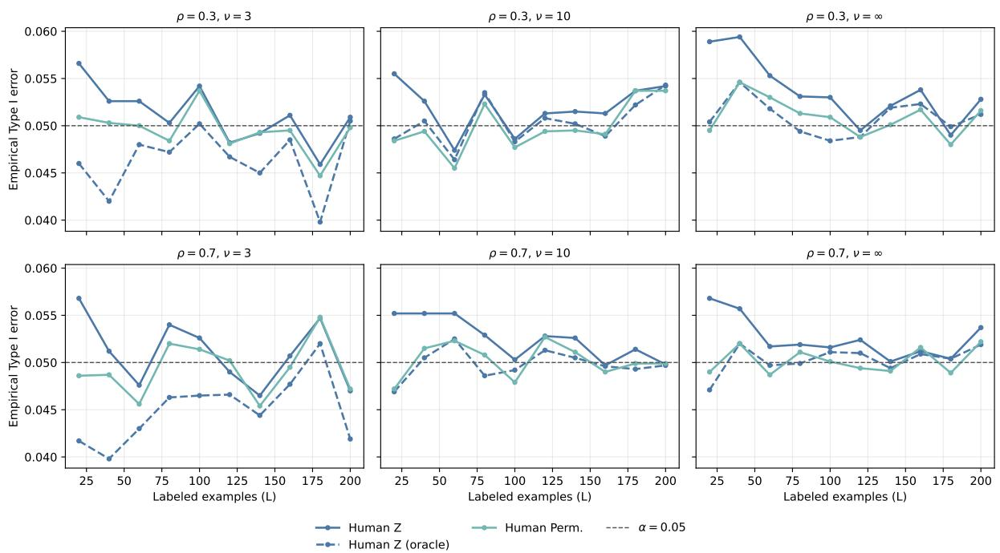  
Figure 6: Human-only Type I error under the null simulation. The dashed blue curve uses the true variance $\mathrm { V a r } [ d ] = 1$ . The oracle and permutation tests stay close to the nominal level $\alpha = 0 . 0 5$ , while the original paired Z-test is mildly anti-conservative for small L.

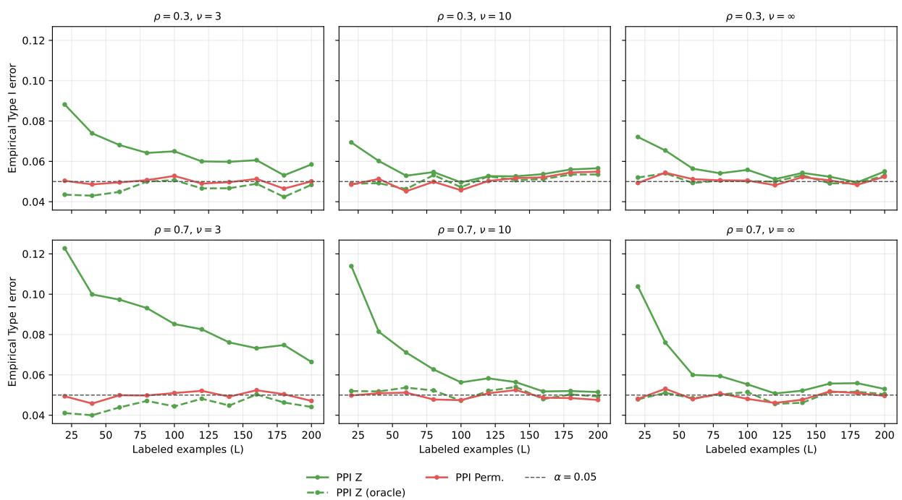  
Figure 7: Prediction-powered Type I error under the null simulation. The dashed green curve uses the true values of $\mathrm { V a r } [ d ] , \mathrm { V a r } [ f ]$ , and $\operatorname { C o v } [ d , f ]$ . The original prediction-powered Z-test can be substantially anti-conservative for small $L ,$ especially when $\rho = 0 . 7$

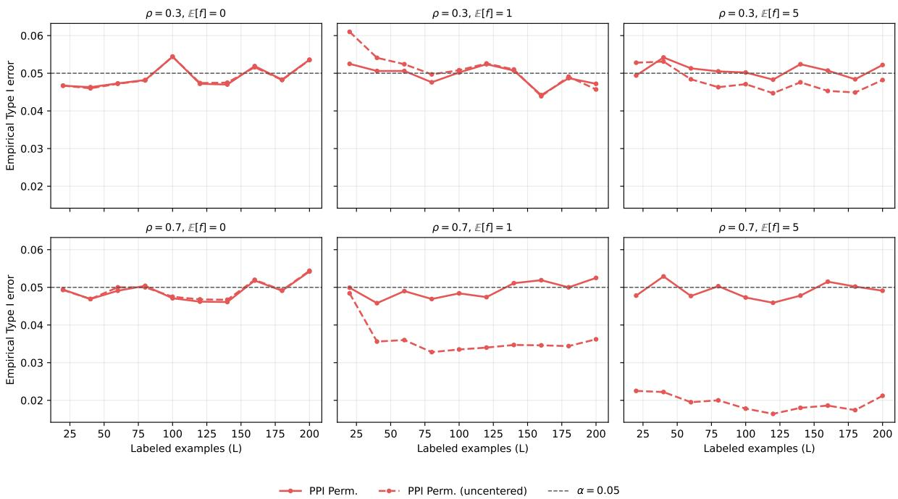  
Figure 8: Effect of centering metric differences in the prediction-powered paired permutation test. The simulations use a bivariate normal null with E $[ d ] = 0$ and varying $\mathbb { E } [ f ]$

## F.2 Metric-shifted null simulations

The preceding simulations assume $\mathbb { E } [ d ] = \mathbb { E } [ f ] =$ 0. In practice, when the human score differences are centered at zero, the metric score differences need not be centered at zero because automatic metrics are biased. Consequently, $\mathbb { E } [ f ] \neq 0$ is the typical case under $\mathbb { E } [ d ] = 0$ . This seems to be in tension with the sign-flip construction in the the prediction-powered paired permutation test. Because the test applies the same sign flip $\varepsilon _ { j }$ to $d _ { j }$ and $f _ { j }$ , it requires that both distributions of d and f are symmetric about zero, which leads to $\mathbb { E } [ f ] = 0$ in addition to $\mathbb { E } [ d ] = 0$ , a condition the metric has no reason to satisfy. Fortunately, centering the metric score differences in Step 7 of Alg. 6 removes this dependence, rendering $\mathbb { E } [ f ] = 0$ unnecessary.

To isolate this effect, we run an additional null simulation with $( d _ { j } , f _ { j } )$ drawn from a bivariate normal distribution satisfying $\mathbb { E } [ d ] = 0 , \operatorname { V a r } ( d ) = 1$ $\operatorname { V a r } ( f ) = 1$ , and $\mathrm { C o v } ( d , f ) = \rho ,$ while varying $\mathbb { E } [ f ] \ \in \ \{ 0 , 1 , 5 \}$ . All other settings remain unchanged.

Figure 8 compares the prediction-powered paired permutation test with an uncentered variant obtained by deleting the Step 5 of Alg. 6. As shown in the figure, the uncentered permutation test can become overly conservative when the metric differences have a nonzero mean, especially when the correlation between the human score differences and metric score differences is high. Centering the metric differences keeps the Type I error close to the nominal level $\alpha = 0 . 0 5$ across the simulated mean shifts.

## G Actual Annotation Savings and PPSR

PPSR is derived as a theoretical saving ratio in §5. To check whether it reflects actual annotation savings, we estimate the number of human annotations required by human-only evaluation and predictionpowered evaluation via resampling. Specifically, for each dataset and each system pair, we treat the full-dataset human mean difference as the population effect size. We then determine the minimum labeled sample size needed to reach 80% empirical power for the human-only paired Z-test, denoted $L _ { h }$ , and for the prediction-powered paired Z-test using metric $F _ { k }$ , denoted $L _ { k }$ . The annotations saved by $F _ { k }$ on that system pair are defined as $L _ { h } - L _ { k }$ . We exclude system pairs for which the human-only test does not reach the target power and sum $L _ { h } - L _ { k }$ over the remaining system pairs to obtain the total annotations saved by each metric. For consistency, PPSR is also recomputed for each metric using this same set of remaining system pairs, rather than all original system pairs.

Figure 9 compares total annotations saved with PPSR across automatic metrics. Each point represents one automatic metric. Table 6 reports the corresponding Pearson and Spearman correlations. The correlations are high across all six datasets, indicating that PPSR is not only theoretically wellgrounded, but also tracks the empirical annotation savings produced by prediction-powered evaluation using different automatic metrics.

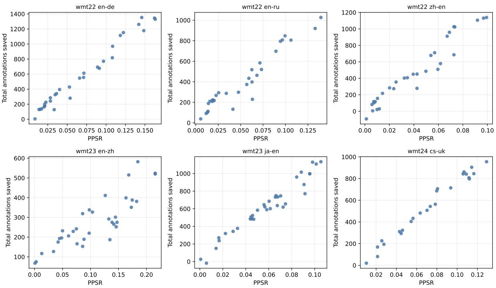  
Figure 9: Relationship between PPSR and the total number of human annotations saved.

<table><tr><td>Dataset</td><td>#Metrics</td><td>Pearson r</td><td>Spearman ρ</td></tr><tr><td>WMT22 en-de</td><td>31</td><td>0.987</td><td>0.970</td></tr><tr><td>WMT22 en-ru</td><td>30</td><td>0.957</td><td>0.956</td></tr><tr><td>WMT22 zh-en</td><td>31</td><td>0.966</td><td>0.972</td></tr><tr><td>WMT23 en-zh</td><td>34</td><td>0.859</td><td>0.856</td></tr><tr><td>WMT23 ja-en</td><td>35</td><td>0.974</td><td>0.964</td></tr><tr><td>WMT24 cs-uk</td><td>25</td><td>0.989</td><td>0.978</td></tr></table>

Table 6: Correlation between total annotations saved and PPSR across automatic metrics, computed separately for each dataset.

The relationship is not exact because actual annotation savings depend on factors beyond the relative variance reduction summarized by PPSR. In particular, "easy" system pairs offer limited room for savings because the human-only test already reaches the target power with few labels, whereas "harder" pairs benefit substantially more from a strong automatic metric. Furthermore, the choice of target power plays a role: shifting the 80% threshold changes the required sample sizes and therefore the total savings.

## H Comparison with Segment-level Meta-metrics

## H.1 Conceptual Comparison

Following (Deutsch et al., 2023), segment-level meta-metrics can be categorized according to three primary grouping strategies:

1. Group-by-Item (Input level):

$$
{ \frac { 1 } { L } } \sum _ { j = 1 } ^ { L } r \Big ( \{ ( Y _ { i j } , ~ F _ { k } ( X _ { i j } ) ) \} _ { i = 1 } ^ { N } \Big )
$$

2. No-Grouping (Global level):

$$
r \Big ( \{ ( Y _ { i j } , F _ { k } ( X _ { i j } ) ) \} _ { i = 1 , j = 1 } ^ { N , L } \Big )
$$

3. Group-by-System:

$$
{ \frac { 1 } { N } } \sum _ { i = 1 } ^ { N } r { \Big ( } \{ ( Y _ { i j } , ~ F _ { k } ( X _ { i j } ) ) \} _ { j = 1 } ^ { L } { \Big ) }
$$

To ensure consistency with PPSR, we uniformly adopt the sample Pearson correlation coefficient r as the correlation metric. PPSR can be interpreted as following a Group-by-System-Pair scheme if the square of the Pearson correlation is ignored:

$$
{ \binom { N } { 2 } } ^ { - 1 } \sum _ { p = 1 } ^ { N - 1 } \sum _ { q = p + 1 } ^ { N } r \Bigl ( \{ ( Y _ { p j } - Y _ { q j } , F _ { k } ( X _ { p j } ) - F _ { k } ( X _ { q j } ) ) \} _ { j = 1 } ^ { L } \Bigr ) .
$$

<table><tr><td>Dataset</td><td>Max</td><td>Group-by-Item</td><td>No-Grouping</td><td>Group-by-System</td><td>PDP</td><td>PPSR</td></tr><tr><td>WMT22 en-de</td><td>465</td><td>421</td><td>365</td><td>358</td><td>403</td><td>412</td></tr><tr><td>WMT22 en-ru</td><td>435</td><td>388</td><td>330</td><td>319</td><td>372</td><td>373</td></tr><tr><td>WMT22 zh-en</td><td>465</td><td>431</td><td>382</td><td>379</td><td>418</td><td>422</td></tr><tr><td>WMT23 en-zh</td><td>561</td><td>508</td><td>494</td><td>421</td><td>507</td><td>507</td></tr><tr><td>WMT23 ja-en</td><td>595</td><td>506</td><td>483</td><td>468</td><td>483</td><td>500</td></tr><tr><td>WMT24 cs-uk</td><td>300</td><td>256</td><td>225</td><td>229</td><td>237</td><td>247</td></tr></table>

Table 7: Discriminative power of segment-level meta-metrics and PPSR. Max gives the largest possible value for each criterion. Bold indicates the highest observed value in each row.  
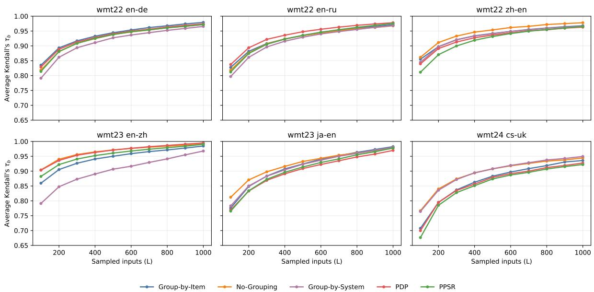  
Figure 10: Ranking stability of segment-level meta-metrics and PPSR. Higher values indicate that the metric ranking computed from a subsample is closer to the full-dataset ranking.

Although PDP (DiIanni and Deutsch, 2025) also operates on score differences between systems on the same segment, its grouping strategy differs from that of PPSR. Specifically, PDP corresponds to a No-Grouping scheme:

$$
r \Big ( \{ ( Y _ { p j } - Y _ { q j } , F _ { k } ( X _ { p j } ) - F _ { k } ( X _ { q j } ) ) \} _ { p = 1 , q = 1 , j = 1 } ^ { N , N , L } \Big )
$$

Furthermore, some readers may argue that PPSR is not a system-level meta-metric because it uses the score of each segment. We disagree with this restriction. Under that reasoning, SPA would also not be a system-level meta-metric, because it uses the score of each segment when calculating the pvalues of system comparisons from either human or automatic scores. Nevertheless, SPA served as an official system-level meta-metric in both the 2024 (Freitag et al., 2024) and 2025 (Lavie et al., 2025) WMT Metrics Shared Tasks. Ultimately, whether a meta-metric is system-level should depend on its meaning and intended use case.

## H.2 Discriminative Power

To compare the discriminative power of segmentlevel meta-metrics and PPSR, we use the number of distinct values and the number of significant comparisons as in §6.5. Because PPSR and all segment-level meta-metrics attain the maximum possible number of distinct values, we focus on the number of significant comparisons. Table 7 shows that Group-by-Item (input level) is the most discriminative meta-metric on most datasets. PPSR is usually close to Group-by-Item and is the most discriminative on WMT23 en-zh. This suggests that PPSR remains competitive even when compared against segment-level meta-metrics.

## H.3 Ranking Stability

We also compare ranking stability under the same resampling protocol used in §6.6. Figure 10 show that the segment-level meta-metrics are often slightly more stable than PPSR, especially No-Grouping and PDP. However, PPSR remains competitive across datasets.

## I Additional Figures and Tables

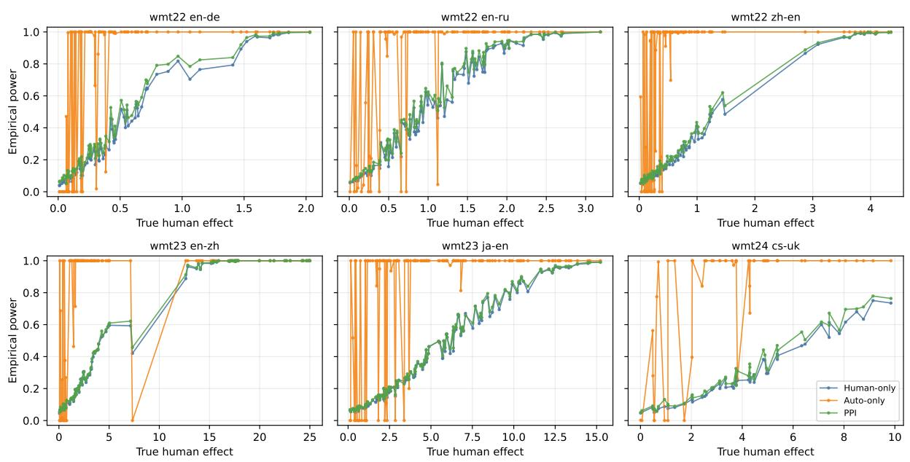  
Figure 11: Empirical power curves for L = 40 and $U = 8 0 0 .$ Each point is one ordered system pair, and the x-axis is the full-population human-score difference. MetricX is used as the automatic metric.

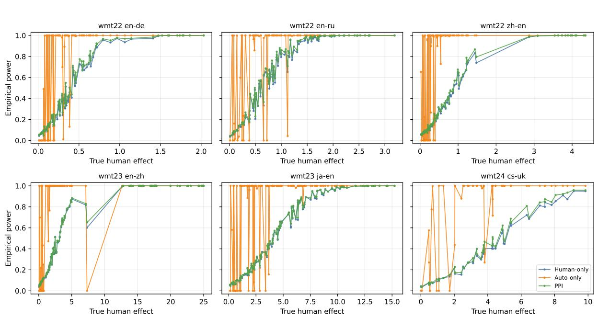  
Figure 12: Empirical power curves for $L = 8 0$ and $U = 8 0 0$ . Increasing the labeled sample size improves both human-only and prediction-powered tests. MetricX is used as the automatic metric.

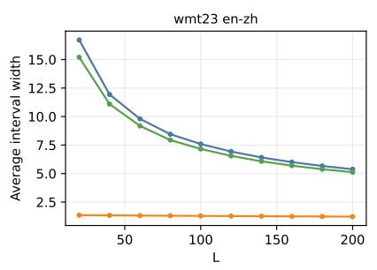

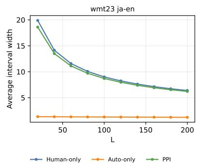

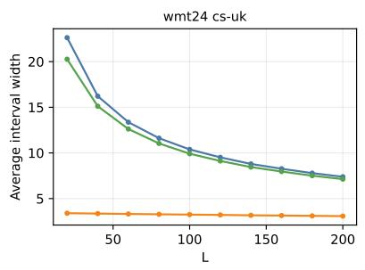  
Figure 13: Average two-sided 95% confidence-interval width with $U = 8 0 0$ . GEMBA is used as the automatic metric. Results are averaged across system pairs

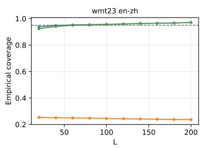

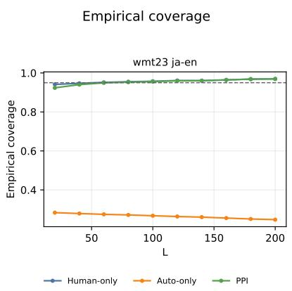

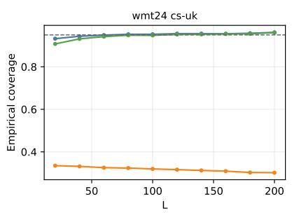

Figure 14: Empirical coverage of the two-sided 95% confidence intervals. GEMBA is used as the automatic metric. The dashed line marks the nominal 95% level.  
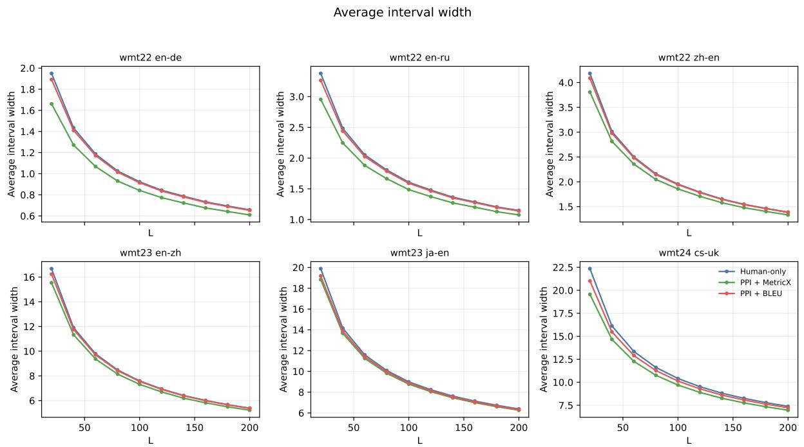  
Figure 15: Average two-sided 95% confidence-interval width with U = 800. Results are averaged across system pairs.

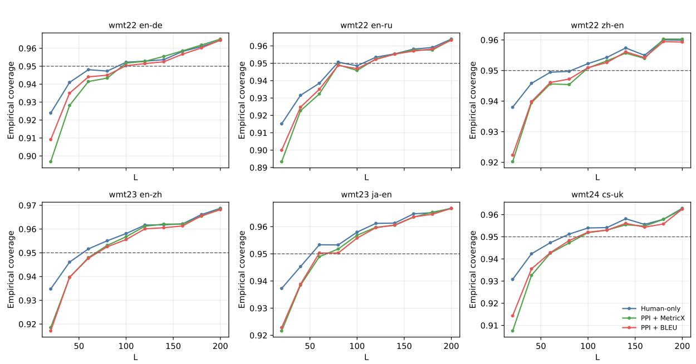  
Figure 16: Empirical coverage of the two-sided 95% confidence intervals. The dashed line marks the nominal 95% level.

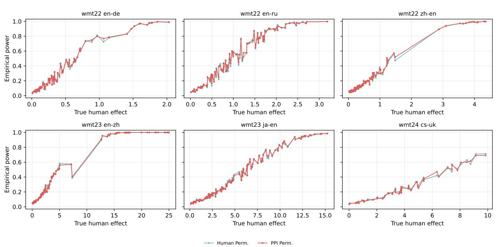  
Figure 17: Empirical power curves for $L = 4 0$ and $U = 8 0 0 .$ “Human Perm" means the human-only paired permutation test and “PPI Perm"means the perdiction-powered paired permutation test. Each point is one ordered system pair, and the x-axis is the full-population human-score difference. MetricX is used as the automatic metric.

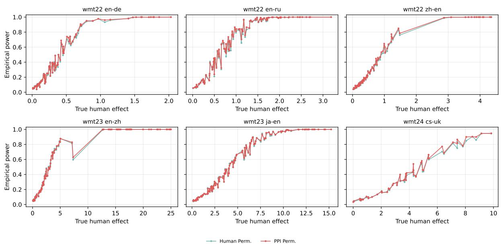  
Figure 18: Empirical power curves for $L = 8 0$ and $U = 8 0 0 .$ “Human Perm" means the human-only paired permutation test and “PPI Perm"means the perdiction-powered paired permutation test. Each point is one ordered system pair, and the x-axis is the full-population human-score difference. MetricX is used as the automatic metric.

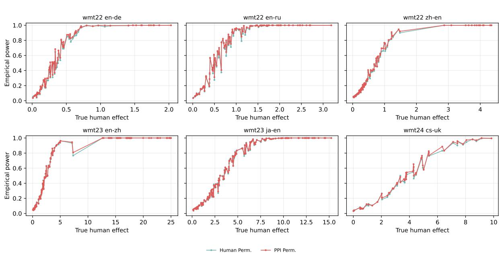  
Figure 19: Empirical power curves for $L = 1 2 0$ and $U = 8 0 0 .$ “Human Perm" means the human-only paired permutation test and “PPI Perm"means the perdiction-powered paired permutation test. Each point is one ordered system pair, and the x-axis is the full-population human-score difference. MetricX is used as the automatic metric.

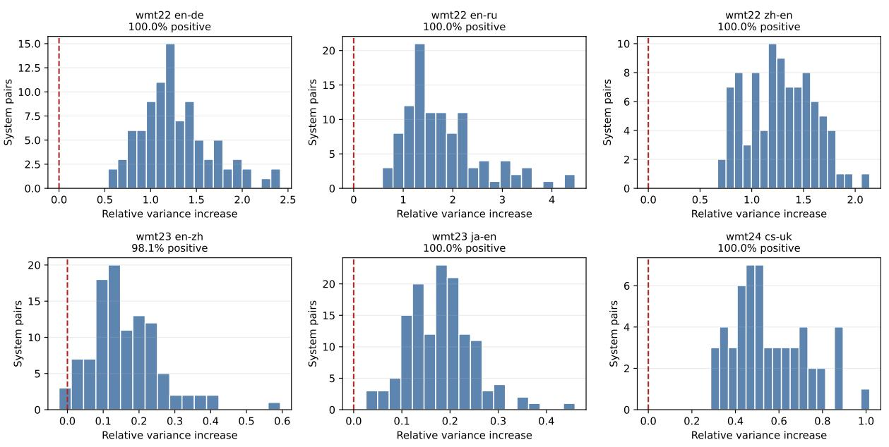  
Figure 20: Distribution of the relative variance increase from using an unpaired design instead of the paired design under the human-only cases. The dashed vertical line marks zero. Values to the right indicate larger variance under the unpaired design.

Distribution of relative PPI variance increase from using an unpaired design

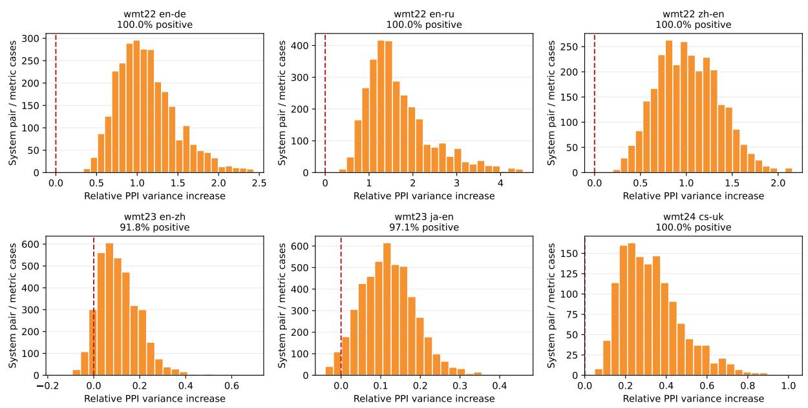  
Figure 21: Distribution of the relative variance increase from using an unpaired design instead of the paired design under the prediction-powered cases. Each observation is one system-pair/metric case. The dashed vertical line marks zero. Values to the right indicate larger variance under the unpaired design.

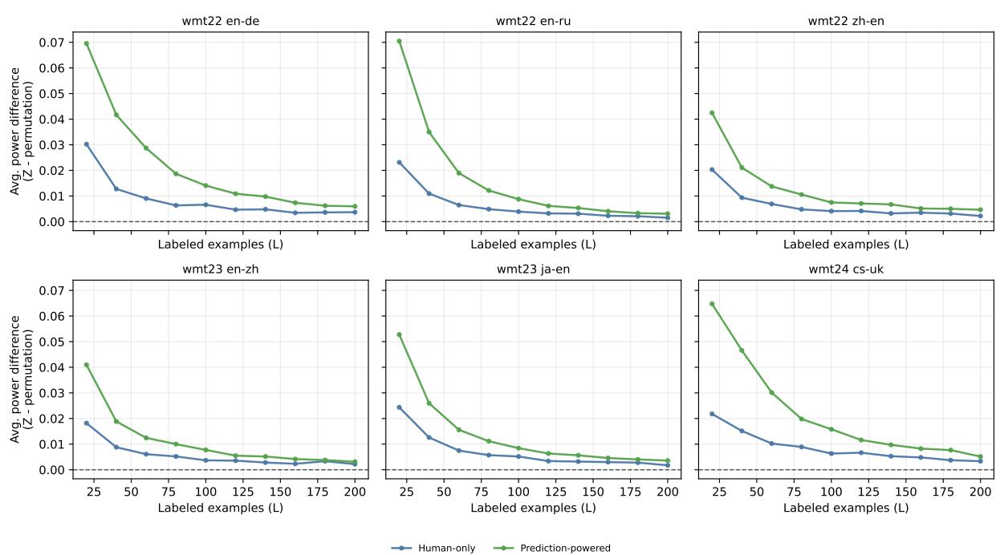  
Figure 22: Average power difference across all system pairs from using the paired permutation test instead of the paired Z-test. Positive values indicate higher empirical power for the Z-test

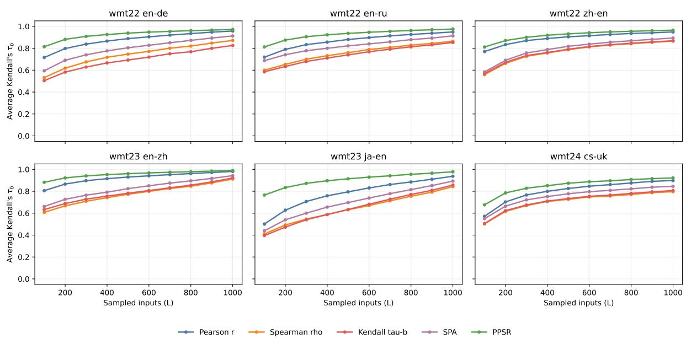  
Figure 23: Ranking stability of system-level meta-metrics. Higher values indicate more stable metric rankings. Note that for meta-evaluation, only labeled examples are used and the unlabeled examples are unused.

<table><tr><td>Metric</td><td>r</td><td>ρ</td><td></td><td>Tb</td><td>SPA</td><td>PPSR</td></tr><tr><td>metricx_xl_MQM_2020-refA</td><td>0.939 ( 5)</td><td>0.771 ( 7)</td><td>0.582 ( 8)</td><td></td><td>0.819 ( 6)</td><td>0.155 (1)</td></tr><tr><td>metricx_xxl_MQM_2020-refA</td><td>0.953 (4)</td><td>0.837 (2)</td><td>0.626 (2)</td><td></td><td>0.831 ( 3)</td><td>0.155 (2)</td></tr><tr><td>COMET-22-refA</td><td>0.922 (6)</td><td>0.749 (11)</td><td>0.604 (6)</td><td></td><td>0.810 ( 7)</td><td>0.140 (3)</td></tr><tr><td>metricx_xl_DA_2019-refA</td><td>0.969 (2)</td><td>0.829 (4)</td><td>0.582 (8)</td><td></td><td>0.829 (4)</td><td>0.138 ( 4)</td></tr><tr><td>metricx_xxl_DA_2019-refA</td><td>0.972 (1)</td><td>0.842 (1)</td><td>0.626 (2)</td><td></td><td>0.835 (2)</td><td>0.136 (5)</td></tr><tr><td>UniTE-refA</td><td>0.875 (11)</td><td>0.763 (8)</td><td>0.538 (12)</td><td></td><td>0.785 (11)</td><td>0.116 ( 6)</td></tr><tr><td>UniTE-ref-refA</td><td>0.866 (14)</td><td>0.763 (8)</td><td>0.538 (12)</td><td></td><td>0.784 (12)</td><td>0.112 (7)</td></tr><tr><td>BLEURT-20-refA</td><td>0.895 (8)</td><td>0.815 ( 5)</td><td>0.604 (6)</td><td></td><td>0.821 ( 5)</td><td></td></tr><tr><td>COMETKiwi-src</td><td>0.885 (10)</td><td>0.705 (17)</td><td>0.560 (10)</td><td></td><td>0.785 (10)</td><td>0.102 ( 8)</td></tr><tr><td>COMET-20-refA</td><td>0.964 (3)</td><td>0.833 ( 3)</td><td>0.670 (1)</td><td></td><td>0.848 (1)</td><td>0.101 ( 9)</td></tr><tr><td>Cross-QE-src</td><td>0.895 ( 9)</td><td>0.710 (15)</td><td>0.516 (16)</td><td></td><td></td><td>0.091 (10)</td></tr><tr><td>UniTE-src-src</td><td>0.797 (21)</td><td>0.631 (24)</td><td>0.451 (25)</td><td></td><td>0.775 (14)</td><td>0.085 (11)</td></tr><tr><td>MS-COMET-22-refA</td><td>0.875 (12)</td><td>0.758 (10)</td><td>0.626 (2)</td><td></td><td>0.737 (23) 0.804 ( 8)</td><td>0.084 (12)</td></tr><tr><td>COMET-QE-src</td><td>0.676 (28)</td><td>0.662 (22)</td><td>0.495 (21)</td><td></td><td>0.761 (18)</td><td>0.068 (13)</td></tr><tr><td>SEScore-refA</td><td>0.855 (15)</td><td>0.675 (20)</td><td>0.495 (21)</td><td></td><td>0.766 (16)</td><td>0.066 (14)</td></tr><tr><td>MATESE-refA</td><td>0.872 (13)</td><td>0.749 (11)</td><td>0.516 (16)</td><td></td><td></td><td>0.062 (15)</td></tr><tr><td>MS-COMET-QE-22-src</td><td>0.748 (24)</td><td>0.675 (20)</td><td>0.516 (16)</td><td></td><td>0.778 (13) 0.740 (22)</td><td>0.051 (16)</td></tr><tr><td>YiSi-1-refA</td><td>0.897 (7)</td><td>0.815 (5)</td><td>0.626 (2)</td><td></td><td></td><td>0.050 (17)</td></tr><tr><td>MEE4-refA</td><td>0.833 (17)</td><td>0.719 (13)</td><td>0.538 (12)</td><td></td><td>0.800 (9) 0.770 (15)</td><td>0.038 (18)</td></tr><tr><td>BERTScore-refA</td><td>0.818 (19)</td><td>0.679 (18)</td><td>0.516 (16)</td><td></td><td>0.757 (20)</td><td>0.034 (19)</td></tr><tr><td>MATESE-QE-src</td><td>0.752 (22)</td><td>0.560 (28)</td><td>0.341 (30)</td><td></td><td>0.681 (30)</td><td>0.033 (20)</td></tr><tr><td>MEE2-refA</td><td>0.824 (18)</td><td>0.719 (13)</td><td>0.538 (12)</td><td></td><td>0.758 (19)</td><td>0.032 (21) 0.027 (22)</td></tr><tr><td>chrF-refA</td><td>0.848 (16)</td><td>0.710 (15)</td><td>0.560 (10)</td><td></td><td>0.763 (17)</td><td></td></tr><tr><td>HWTSC-Teacher-Sim-src</td><td>0.641 (29)</td><td>0.565 (27)</td><td>0.429 (27)</td><td></td><td>0.702 (28)</td><td>0.027 (23) 0.022 (24)</td></tr><tr><td>MEE-refA</td><td>0.816 (20)</td><td>0.679 (18)</td><td>0.516 (16)</td><td></td><td>0.743 (21)</td><td>0.020 (25)</td></tr><tr><td>f200spBLEU-refA</td><td>0.723 (26)</td><td>0.618 (25)</td><td>0.473 (24)</td><td></td><td>0.717 (25)</td><td>0.020 (26)</td></tr><tr><td>f101spBLEU-refA</td><td>0.727 (25)</td><td>0.662 (22)</td><td>0.495 (21)</td><td></td><td>0.721 (24)</td><td>0.019 (27)</td></tr><tr><td>KG-BERTScore-src</td><td>0.614 (30)</td><td>0.481 (30)</td><td>0.363 (29)</td><td></td><td>0.694 (29)</td><td>0.017 (28)</td></tr><tr><td>HWTSC-TLM-src</td><td>0.749 (23)</td><td>0.556 (29)</td><td>0.429 (27)</td><td></td><td>0.713 (26)</td><td>0.014 (29)</td></tr><tr><td>BLEU-refA</td><td>0.685 (27)</td><td>0.609 (26)</td><td>0.451 (25)</td><td></td><td>0.708 (27)</td><td>0.013 (30)</td></tr><tr><td>REUSE-src</td><td>-0.651 (31)</td><td>-0.490 (31)</td><td>-0.363 (31)</td><td></td><td>0.327 (31)</td><td>0.008 (31)</td></tr></table>

Table 8: Scores and ranks of automatic metrics under each system-level meta-metric for WMT22 en-de. Metrics are sorted by PPSR; tied scores receive the same rank.

<table><tr><td>Metric</td><td>Group-by-Item r</td><td>No-Grouping r</td><td>Group-by-System r</td><td>PDP</td><td></td><td>PPSR</td></tr><tr><td>metricx_xl_MQM_2020-refA</td><td>0.461 (2)</td><td>0.570 (2)</td><td>0.540 (2)</td><td>0.436 (2)</td><td></td><td>0.155 (1)</td></tr><tr><td>metricx_xxl_MQM_2020-refA</td><td>0.460 (3)</td><td>0.575 (1)</td><td>0.540 ( 1)</td><td></td><td>0.440 (1)</td><td>0.155 (2)</td></tr><tr><td>COMET-22-refA</td><td>0.446 ( 5)</td><td>0.534 (3)</td><td>0.498 (3)</td><td></td><td>0.420 (3)</td><td>0.140 (3)</td></tr><tr><td>metricx_xl_DA_2019-refA</td><td>0.453 ( 4)</td><td>0.512 ( 4)</td><td>0.484 (4)</td><td></td><td>0.416 (4)</td><td>0.138 (4)</td></tr><tr><td>metricx_xxl_DA_2019-refA</td><td>0.468 ( 1)</td><td>0.501 (5)</td><td>0.470 (5)</td><td></td><td>0.416 (5)</td><td>0.136 (5)</td></tr><tr><td>UniTE-refA</td><td>0.433 ( 6)</td><td>0.482 (6)</td><td>0.454 (6)</td><td></td><td>0.379 (6)</td><td>0.116 (6)</td></tr><tr><td>UniTE-ref-refA</td><td>0.419 (7)</td><td>0.473 (8)</td><td>0.443 (8)</td><td></td><td>0.372 (7)</td><td>0.112 ( 7)</td></tr><tr><td>BLEURT-20-refA</td><td>0.392 ( 8)</td><td>0.478 ( 7)</td><td>0.451 ( 7)</td><td></td><td>0.362 ( 9)</td><td>0.102 ( 8)</td></tr><tr><td>COMETKiwi-src</td><td>0.355 (10)</td><td>0.461 ( 9)</td><td>0.418 (10)</td><td></td><td>0.364 ( 8)</td><td>0.101 ( 9)</td></tr><tr><td>COMET-20-refA</td><td>0.372 ( 9)</td><td>0.430 (12)</td><td>0.403 (11)</td><td></td><td>0.342 (10)</td><td>0.091 (10)</td></tr><tr><td>Cross-QE-src</td><td>0.320 (14)</td><td>0.433 (11)</td><td>0.396 (12)</td><td></td><td>0.333 (11)</td><td>0.085 (11)</td></tr><tr><td>UniTE-src-src</td><td>0.342 (12)</td><td>0.425 (13)</td><td>0.392 (13)</td><td></td><td>0.323 (12)</td><td>0.084 (12)</td></tr><tr><td>MS-COMET-22-refA</td><td>0.327 (13)</td><td>0.379 (15)</td><td>0.343 (15)</td><td></td><td>0.286 (13)</td><td>0.068 (13)</td></tr><tr><td>COMET-QE-src</td><td>0.265 (19)</td><td>0.435 (10)</td><td>0.420 (9)</td><td></td><td>0.276 (14)</td><td>0.066 (14)</td></tr><tr><td>SEScore-refA</td><td>0.318 (15)</td><td>0.371 (16)</td><td>0.337 (16)</td><td></td><td>0.272 (15)</td><td>0.062 (15)</td></tr><tr><td>MATESE-refA</td><td>0.346 (11)</td><td>0.412 (14)</td><td>0.379 (14)</td><td></td><td>0.250 (16)</td><td>0.051 (16)</td></tr><tr><td>MS-COMET-QE-22-src</td><td>0.215 (26)</td><td>0.318 (17)</td><td>0.280 (18)</td><td></td><td>0.240 (17)</td><td>0.050 (17)</td></tr><tr><td>YiSi-1-refA</td><td>0.310 (16)</td><td>0.293 (19)</td><td>0.280 (19)</td><td></td><td>0.220 (18)</td><td>0.038 (18)</td></tr><tr><td>MEE4-refA</td><td>0.269 (18)</td><td>0.268 (22)</td><td>0.259 (21)</td><td></td><td>0.206 (19)</td><td>0.034 (19)</td></tr><tr><td>BERTScore-refA</td><td>0.263 (20)</td><td>0.270 (21)</td><td>0.259 (22)</td><td></td><td>0.199 (20)</td><td>0.033 (20)</td></tr><tr><td>MATESE-QE-src</td><td>0.293 (17)</td><td>0.317 (18)</td><td>0.290 (17)</td><td></td><td>0.193 (21)</td><td>0.032 (21)</td></tr><tr><td>MEE2-refA</td><td>0.254 (22)</td><td>0.277 (20)</td><td>0.267 (20)</td><td></td><td>0.185 (23)</td><td>0.027 (22)</td></tr><tr><td>chrF-refA</td><td>0.256 (21)</td><td>0.242 (23)</td><td>0.231 (23)</td><td></td><td>0.189 (22)</td><td>0.027 (23)</td></tr><tr><td>HWTSC-Teacher-Sim-src</td><td>0.172 (29)</td><td>0.206 (27)</td><td>0.189 (28)</td><td></td><td>0.155 (25)</td><td>0.022 (24)</td></tr><tr><td>MEE-refA</td><td>0.224 (25)</td><td>0.213 (25)</td><td>0.201 (25)</td><td></td><td>0.162 (24)</td><td>0.020 (25)</td></tr><tr><td>f200spBLEU-refA</td><td>0.229 (24)</td><td>0.216 (24)</td><td>0.206 (24)</td><td></td><td>0.155 (26)</td><td>0.020 (26)</td></tr><tr><td>f101spBLEU-refA</td><td>0.232 (23)</td><td>0.210 (26)</td><td>0.200 (26)</td><td></td><td>0.153 (27)</td><td>0.019 (27)</td></tr><tr><td>KG-BERTScore-src</td><td>0.158 (30)</td><td>0.189 (29)</td><td>0.183 (29)</td><td></td><td>0.135 (28)</td><td>0.017 (28)</td></tr><tr><td>HWTSC-TLM-src</td><td>0.205 (27)</td><td>0.091 (30)</td><td>0.075 (30)</td><td></td><td>0.132 (29)</td><td>0.014 (29)</td></tr><tr><td>BLEU-refA</td><td>0.203 (28)</td><td>0.203 (28)</td><td>0.195 (27)</td><td></td><td>0.127 (30)</td><td>0.013 (30)</td></tr><tr><td>REUSE-src</td><td>-0.104 (31)</td><td>0.046 (31)</td><td>0.063 (31)</td><td></td><td>-0.069 (31)</td><td>0.008 (31)</td></tr></table>

Table 9: Scores and ranks of automatic metrics under each segment-level meta-metric for WMT22 en-de. Metrics are sorted by PPSR; tied scores receive the same rank

<table><tr><td>Metric</td><td>r</td><td>ρ</td><td></td><td>Tb</td><td>SPA</td><td>PPSR</td></tr><tr><td>metricx_xxl_MQM_2020-refA</td><td>0.953 (4)</td><td>0.921 ( 3)</td><td>0.829 (3)</td><td></td><td>0.915 (3)</td><td>0.135 (1)</td></tr><tr><td>metricx_xl_MQM_2020-refA</td><td>0.932 (6)</td><td>0.904 (6)</td><td>0.790 (6)</td><td></td><td>0.900 ( 5)</td><td>0.128 (2)</td></tr><tr><td>COMET-22-refA</td><td>0.908 ( 7)</td><td>0.875 (12)</td><td>0.714 (12)</td><td></td><td>0.880 (7)</td><td>0.102 ( 3)</td></tr><tr><td>UniTE-refA</td><td>0.894 (8)</td><td>0.886 ( 7)</td><td>0.752 ( 7)</td><td></td><td>0.878 ( 8)</td><td>0.096 ( 4)</td></tr><tr><td>metricx_xxl_DA_2019-refA</td><td>0.979 (1)</td><td>0.943 (2)</td><td>0.848 (1)</td><td></td><td>0.933 ( 1)</td><td>0.094 (5)</td></tr><tr><td>UniTE-ref-refA</td><td>0.841 (11)</td><td>0.854 (13)</td><td>0.752 ( 7)</td><td></td><td>0.873 ( 9)</td><td>0.091 (6)</td></tr><tr><td>metricx_xl_DA_2019-refA</td><td>0.975 (2)</td><td>0.946 (1)</td><td>0.848 (1)</td><td></td><td>0.923 ( 2)</td><td>0.087 ( 7)</td></tr><tr><td>UniTE-src-src</td><td>0.772 (22)</td><td>0.789 (22)</td><td>0.657 (19)</td><td></td><td>0.825 (20)</td><td>0.070 (8)</td></tr><tr><td>BLEURT-20-refA</td><td>0.956 (3)</td><td>0.921 (3)</td><td>0.829 (3)</td><td></td><td>0.903 ( 4)</td><td>0.069 ( 9)</td></tr><tr><td>COMETKiwi-src</td><td>0.763 (23)</td><td>0.782 (23)</td><td>0.619 (24)</td><td></td><td>0.821 (23)</td><td>0.065 (10)</td></tr><tr><td>MATESE-refA</td><td>0.795 (21)</td><td>0.832 (19)</td><td>0.714 (12)</td><td></td><td>0.847 (12)</td><td>0.061 (11)</td></tr><tr><td>COMET-20-refA</td><td>0.940 (5)</td><td>0.921 (3)</td><td>0.810 (5)</td><td></td><td>0.894 ( 6)</td><td>0.061 (12)</td></tr><tr><td>Cross-QE-src</td><td>0.802 (20)</td><td>0.814 (21)</td><td>0.657 (19)</td><td></td><td>0.826 (19)</td><td>0.060 (13)</td></tr><tr><td>MS-COMET-22-refA</td><td>0.832 (13)</td><td>0.843 (16)</td><td>0.695 (17)</td><td></td><td>0.847 (11)</td><td>0.057 (14)</td></tr><tr><td>COMET-QE-src</td><td>0.483 (29)</td><td>0.632 (27)</td><td>0.600 (25)</td><td></td><td>0.799 (25)</td><td>0.055 (15)</td></tr><tr><td>MS-COMET-QE-22-src</td><td>0.718 (24)</td><td>0.779 (24)</td><td>0.638 (23)</td><td></td><td>0.812 (24)</td><td>0.045 (16)</td></tr><tr><td>MATESE-QE-src</td><td>0.665 (27)</td><td>0.582 (29)</td><td>0.467 (27)</td><td></td><td>0.768 (26)</td><td>0.040 (17)</td></tr><tr><td>YiSi-1-refA</td><td>0.882 (9)</td><td>0.879 (11)</td><td>0.714 (12)</td><td></td><td>0.847 (10)</td><td>0.033 (18)</td></tr><tr><td>BERTScore-refA</td><td>0.817 (17)</td><td>0.882 (8)</td><td>0.733 ( 9)</td><td></td><td>0.833 (18)</td><td>0.025 (19)</td></tr><tr><td>MEE4-refA</td><td>0.809 (19)</td><td>0.882 ( 8)</td><td>0.733 ( 9)</td><td></td><td>0.843 (13)</td><td>0.022 (20)</td></tr><tr><td>chrF-refA</td><td>0.874 (10)</td><td>0.836 (18)</td><td>0.657 (19)</td><td></td><td>0.837 (16)</td><td>0.020 (21)</td></tr><tr><td>MEE2-refA</td><td>0.825 (15)</td><td>0.882 ( 8)</td><td>0.733 ( 9)</td><td></td><td>0.838 (14)</td><td>0.019 (22)</td></tr><tr><td>f200spBLEU-refA</td><td>0.827 (14)</td><td>0.854 (13)</td><td>0.714 (12)</td><td></td><td>0.838 (15)</td><td>0.018 (23)</td></tr><tr><td>f101spBLEU-refA</td><td>0.821 (16)</td><td>0.854 (13)</td><td>0.714 (12)</td><td></td><td>0.833 (17)</td><td>0.018 (24)</td></tr><tr><td>MEE-refA</td><td>0.835 (12)</td><td>0.839 (17)</td><td>0.657 (19)</td><td></td><td>0.823 (22)</td><td>0.015 (25)</td></tr><tr><td>BLEU-refA</td><td>0.813 (18)</td><td>0.821 (20)</td><td>0.676 (18)</td><td></td><td>0.824 (21)</td><td>0.014 (26)</td></tr><tr><td>KG-BERTScore-src</td><td>0.716 (25)</td><td>0.661 (26)</td><td>0.467 (27)</td><td></td><td>0.759 (27)</td><td>0.013 (27)</td></tr><tr><td>HWTSC-Teacher-Sim-src</td><td>0.703 (26)</td><td>0.718 (25)</td><td>0.543 (26)</td><td></td><td>0.747 (28)</td><td>0.013 (28)</td></tr><tr><td>HWTSC-TLM-src</td><td>0.642 (28)</td><td>0.632 (27)</td><td>0.467 (27)</td><td></td><td>0.729 (29)</td><td>0.011 (29)</td></tr><tr><td>REUSE-src</td><td>-0.381 (30)</td><td>-0.493 (30)</td><td>-0.429 (30)</td><td></td><td>0.286 (30)</td><td>0.005 (30)</td></tr></table>

Table 10: Scores and ranks of automatic metrics under each system-level meta-metric for WMT22 en-ru. Metrics are sorted by PPSR; tied scores receive the same rank.

<table><tr><td>Metric</td><td>Group-by-Item r</td><td>No-Grouping r</td><td>Group-by-System r</td><td></td><td>PDP</td><td>PPSR</td></tr><tr><td>metricx_xxl_MQM_2020-refA</td><td>0.461 (2)</td><td>0.495 (1)</td><td>0.455 ( 1)</td><td></td><td>0.400 ( 1)</td><td>0.135 (1)</td></tr><tr><td>metricx_xl_MQM_2020-refA</td><td>0.431 (6)</td><td>0.492 ( 2)</td><td>0.452 (2)</td><td></td><td>0.391 (2)</td><td>0.128 (2)</td></tr><tr><td>COMET-22-refA</td><td>0.442 (5)</td><td>0.469 (3)</td><td>0.442 (3)</td><td></td><td>0.344 (3)</td><td>0.102 (3)</td></tr><tr><td>UniTE-refA</td><td>0.448 (4)</td><td>0.414 ( 8)</td><td>0.389 (6)</td><td></td><td>0.335 ( 4)</td><td>0.096 ( 4)</td></tr><tr><td>metricx_xxl_DA_2019-refA</td><td>0.471 ( 1)</td><td>0.416 (6)</td><td>0.385 ( 8)</td><td></td><td>0.333 (5)</td><td>0.094 (5)</td></tr><tr><td>UniTE-ref-refA</td><td>0.425 ( 7)</td><td>0.415 (7)</td><td>0.392 (5)</td><td></td><td>0.323 ( 7)</td><td>0.091 ( 6)</td></tr><tr><td>metricx_xl_DA_2019-refA</td><td>0.454 ( 3)</td><td>0.417 (5)</td><td>0.385 (7)</td><td></td><td>0.324 (6)</td><td>0.087 ( 7)</td></tr><tr><td>UniTE-src-src</td><td>0.367 (10)</td><td>0.392 (11)</td><td>0.368 (10)</td><td></td><td>0.283 ( 9)</td><td>0.070 (8)</td></tr><tr><td>BLEURT-20-refA</td><td>0.396 (8)</td><td>0.397 (9)</td><td>0.372 ( 9)</td><td></td><td>0.286 ( 8)</td><td>0.069 ( 9)</td></tr><tr><td>COMETKiwi-src</td><td>0.358 (11)</td><td>0.385 (12)</td><td>0.359 (12)</td><td></td><td>0.272 (10)</td><td>0.065 (10)</td></tr><tr><td>MATESE-refA</td><td>0.329 (15)</td><td>0.345 (14)</td><td>0.301 (16)</td><td></td><td>0.260 (13)</td><td>0.061 (11)</td></tr><tr><td>COMET-20-refA</td><td>0.384 ( 9)</td><td>0.343 (15)</td><td>0.321 (14)</td><td></td><td>0.263 (11)</td><td>0.061 (12)</td></tr><tr><td>Cross-QE-src</td><td>0.357 (12)</td><td>0.397 (10)</td><td>0.364 (11)</td><td></td><td>0.260 (12)</td><td>0.060 (13)</td></tr><tr><td>MS-COMET-22-refA</td><td>0.346 (13)</td><td>0.356 (13)</td><td>0.334 (13)</td><td></td><td>0.249 (14)</td><td>0.057 (14)</td></tr><tr><td>COMET-QE-src</td><td>0.245 (23)</td><td>0.439 ( 4)</td><td>0.429 ( 4)</td><td></td><td>0.227 (15)</td><td>0.055 (15)</td></tr><tr><td>MS-COMÉT-QE-22-src</td><td>0.265 (20)</td><td>0.343 (16)</td><td>0.313 (15)</td><td></td><td>0.211 (16)</td><td>0.045 (16)</td></tr><tr><td>MATESE-QE-src</td><td>0.267 (19)</td><td>0.306 (17)</td><td>0.265 (17)</td><td></td><td>0.204 (17)</td><td>0.040 (17)</td></tr><tr><td>YiSi-1-refA</td><td>0.336 (14)</td><td>0.234 (18)</td><td>0.214 (18)</td><td></td><td>0.199 (18)</td><td>0.033 (18)</td></tr><tr><td>BERTScore-refA</td><td>0.274 (18)</td><td>0.197 (19)</td><td>0.180 (20)</td><td></td><td>0.171 (19)</td><td>0.025 (19)</td></tr><tr><td>MEE4-refA</td><td>0.301 (16)</td><td>0.188 (21)</td><td>0.175 (21)</td><td></td><td>0.163 (20)</td><td>0.022 (20)</td></tr><tr><td>chrF-refA</td><td>0.264 (21)</td><td>0.168 (23)</td><td>0.150 (23)</td><td></td><td>0.157 (21)</td><td>0.020 (21)</td></tr><tr><td>MEE2-refA</td><td>0.278 (17)</td><td>0.194 (20)</td><td>0.180 (19)</td><td></td><td>0.150 (22)</td><td>0.019 (22)</td></tr><tr><td>f200spBLEU-refA</td><td>0.246 (22)</td><td>0.172 (22)</td><td>0.155 (22)</td><td></td><td>0.146 (23)</td><td>0.018 (23)</td></tr><tr><td>f101spBLEU-refA</td><td>0.238 (25)</td><td>0.157 (25)</td><td>0.140 (25)</td><td></td><td>0.145 (24)</td><td>0.018 (24)</td></tr><tr><td>MEE-refA</td><td>0.239 (24)</td><td>0.126 (26)</td><td>0.110 (27)</td><td></td><td>0.135 (25)</td><td>0.015 (25)</td></tr><tr><td>BLEU-refA</td><td>0.201 (28)</td><td>0.160 (24)</td><td>0.148 (24)</td><td></td><td>0.124 (26)</td><td>0.014 (26)</td></tr><tr><td>KG-BERTScore-src</td><td>0.207 (27)</td><td>0.112 (27)</td><td>0.111 (26)</td><td></td><td>0.119 (28)</td><td>0.013 (27)</td></tr><tr><td>HWTSC-Teacher-Sim-src</td><td>0.208 (26)</td><td>0.111 (28)</td><td>0.106 (28)</td><td></td><td>0.120 (27)</td><td>0.013 (28)</td></tr><tr><td>HWTSC-TLM-src</td><td>0.201 (29)</td><td>0.078 (29)</td><td>0.069 (29)</td><td></td><td>0.103 (29)</td><td>0.011 (29)</td></tr><tr><td>REUSE-src</td><td>-0.037 (30)</td><td>0.052 (30)</td><td>0.065 (30)</td><td></td><td>-0.025 (30)</td><td>0.005 (30)</td></tr></table>

Table 11: Scores and ranks of automatic metrics under each segment-level meta-metric for WMT22 en-ru. Metrics are sorted by PPSR; tied scores receive the same rank.

<table><tr><td>Metric</td><td>r</td><td>ρ</td><td></td><td>Tb</td><td>SPA</td><td>PPSR</td></tr><tr><td>COMET-22-refA</td><td>0.942 ( 5)</td><td>0.859 ( 4)</td><td>0.736 (3)</td><td></td><td>0.876 ( 3)</td><td>0.093 (  1)</td></tr><tr><td>metricx_xl_MQM_2020-refA</td><td>0.914 (10)</td><td>0.877 ( 3)</td><td>0.736 (3)</td><td></td><td>0.873 (4)</td><td>0.091 (2)</td></tr><tr><td>metricx_xxl_MQM_2020-refA</td><td>0.920 (9)</td><td>0.842 ( 7)</td><td>0.692 (7)</td><td></td><td>0.862 ( 5)</td><td>0.087 ( 3)</td></tr><tr><td>metricx_xl_DA_2019-refA</td><td>0.982(2)</td><td>0.895 (2)</td><td>0.758 (1)</td><td></td><td>0.895 (1)</td><td>0.070 ( 4)</td></tr><tr><td>UniTE-refA</td><td>0.914 (11)</td><td>0.837 (8)</td><td>0.692 (7)</td><td></td><td>0.849 (10)</td><td>0.069 (5)</td></tr><tr><td>COMETKiwi-src</td><td>0.866 (19)</td><td>0.785 (12)</td><td>0.648 (12)</td><td></td><td></td><td></td></tr><tr><td>UniTE-ref-refA</td><td>0.892 (15)</td><td>0.820 (11)</td><td>0.670 (11)</td><td></td><td>0.828 (12)</td><td>0.067 ( 6)</td></tr><tr><td>metricx_xxl_DA_2019-refA</td><td>0.984 ( 1)</td><td>0.908 ( 1)</td><td>0.758 (1)</td><td></td><td>0.839 (11)</td><td>0.065 ( 7)</td></tr><tr><td>Cross-QE-src</td><td>0.870 (18)</td><td>0.736 (16)</td><td>0.582 (16)</td><td></td><td>0.894 ( 2)</td><td>0.064 ( 8)</td></tr><tr><td>MATESE-refA</td><td>0.856 (20)</td><td>0.855 (5)</td><td>0.714 (6)</td><td></td><td>0.799 (16)</td><td>0.057 ( 9)</td></tr><tr><td>UniTE-src-src</td><td>0.874 (16)</td><td>0.635 (17)</td><td>0.516 (17)</td><td></td><td>0.858 (6)</td><td>0.055 (10)</td></tr><tr><td>BLEURT-20-refA</td><td>0.938 (6)</td><td>0.837 ( 8)</td><td>0.692 (7)</td><td></td><td>0.775 (17)</td><td>0.053 (11)</td></tr><tr><td>SEScore-refA</td><td>0.944 (4)</td><td>0.754 (13)</td><td>0.604 (15)</td><td></td><td>0.853 (7)</td><td>0.051 (12)</td></tr><tr><td>MATESE-QE-src</td><td>0.767 (23)</td><td>0.837 (8)</td><td>0.692 (7)</td><td></td><td>0.815 (15)</td><td>0.045 (13)</td></tr><tr><td>COMET-QE-src</td><td>0.569 (27)</td><td>0.749 (15)</td><td>0.626 (13)</td><td></td><td>0.850 ( 9)</td><td>0.039 (14)</td></tr><tr><td>COMET-20-refA</td><td>0.970 (3)</td><td>0.754 (13)</td><td>0.626 (13)</td><td></td><td>0.816 (14)</td><td>0.039 (15)</td></tr><tr><td>BERTScore-refA</td><td>0.924 (8)</td><td>0.578 (20)</td><td>0.451 (19)</td><td></td><td>0.827 (13)</td><td>0.037 (16)</td></tr><tr><td>YiSi-1-refA</td><td>0.935 (7)</td><td>0.591 (19)</td><td>0.451 (19)</td><td></td><td>0.747 (19)</td><td>0.032 (17)</td></tr><tr><td>MS-COMET-22-refA</td><td>0.909 (12)</td><td>0.846 ( 6)</td><td>0.736 (3)</td><td></td><td>0.737 (20)</td><td>0.030 (18)</td></tr><tr><td>MS-COMET-QE-22-src</td><td>0.897 (14)</td><td>0.604 (18)</td><td>0.473 (18)</td><td></td><td>0.852 (8)</td><td>0.024 (19)</td></tr><tr><td>MEE4-refA</td><td>0.905 (13)</td><td>0.569 (21)</td><td>0.451 (19)</td><td></td><td>0.769 (18)</td><td>0.022 (20)</td></tr><tr><td>MEE2-refA</td><td>0.872 (17)</td><td>0.446 (25)</td><td>0.363 (23)</td><td></td><td>0.723 (21)</td><td>0.019 (21)</td></tr><tr><td>HWTSC-Teacher-Sim-src</td><td>0.356 (30)</td><td>0.499 (22)</td><td>0.363 (23)</td><td></td><td>0.684 (23)</td><td>0.014 (22)</td></tr><tr><td>chrF-refA</td><td>0.812 (22)</td><td>0.429 (28)</td><td>0.297 (28)</td><td></td><td>0.678 (24) 0.660 (28)</td><td>0.011 (23)</td></tr><tr><td>KG-BERTScore-src</td><td>0.553 (28)</td><td>0.486 (23)</td><td>0.385 (22)</td><td></td><td>0.696 (22)</td><td>0.010 (24) 0.009 (25)</td></tr><tr><td>MEE-refA</td><td>0.824 (21)</td><td>0.349 (29)</td><td>0.297 (28)</td><td></td><td>0.650 (29)</td><td>0.008 (26)</td></tr><tr><td>f200spBLEU-refA</td><td>0.728 (24)</td><td>0.437 (26)</td><td>0.341 (26)</td><td></td><td>0.668 (26)</td><td>0.007 (27)</td></tr><tr><td>f101spBLEU-refA</td><td>0.718 (25)</td><td>0.437 (26)</td><td>0.341 (26)</td><td></td><td>0.665 (27)</td><td>0.007 (28)</td></tr><tr><td>HWTSC-TLM-src</td><td>0.460 (29)</td><td>0.455 (24)</td><td>0.363 (23)</td><td></td><td>0.669 (25)</td><td>0.006 (29)</td></tr><tr><td>BLEU-refA</td><td>0.658 (26)</td><td>0.345 (30)</td><td>0.275 (30)</td><td></td><td>0.646 (30)</td><td>0.005 (30)</td></tr><tr><td>REUSE-src</td><td>-0.142 (31)</td><td>-0.332 (31)</td><td>-0.231 (31)</td><td></td><td>0.386 (31)</td><td>0.001 (31)</td></tr><tr><td></td><td></td><td></td><td></td><td></td><td></td><td></td></tr></table>

Table 12: Scores and ranks of automatic metrics under each system-level meta-metric for WMT22 zh-en. Metrics are sorted by PPSR; tied scores receive the same rank.

<table><tr><td>Metric</td><td>Group-by-Item r</td><td>No-Grouping r</td><td>Group-by-System r</td><td>PDP</td><td>PPSR</td></tr><tr><td>COMET-22-refA</td><td>0.397 (3)</td><td>0.585 (1)</td><td>0.564 (2)</td><td>0.360 ( 1)</td><td>0.093 ( 1)</td></tr><tr><td>metricx_xl_MQM_2020-refA</td><td>0.382 ( 5)</td><td>0.575 (3)</td><td>0.556 ( 3)</td><td>0.348 ( 2)</td><td>0.091 (2)</td></tr><tr><td>metricx_xxl_MQM_2020-refA</td><td>0.381 (6)</td><td>0.581 (2)</td><td>0.566 ( 1)</td><td>0.342 (3)</td><td>0.087 ( 3)</td></tr><tr><td>metricx_xl_DA_2019-refA</td><td>0.412 (1)</td><td>0.468 (8)</td><td>0.442 (9)</td><td>0.319 (4)</td><td>0.070 (4)</td></tr><tr><td>UniTE-refA</td><td>0.383 (4)</td><td>0.405 (14)</td><td>0.385 (14)</td><td>0.307 ( 6)</td><td>0.069 (5)</td></tr><tr><td>COMETKiwi-src</td><td>0.325 (11)</td><td>0.509 (6)</td><td>0.488 (7)</td><td>0.305 ( 7)</td><td>0.067 (6)</td></tr><tr><td>UniTE-ref-refA</td><td>0.372 (7)</td><td>0.410 (13)</td><td>0.391 (12)</td><td>0.295 ( 8)</td><td>0.065 ( 7)</td></tr><tr><td>metricx_xxl_DA_2019-refA</td><td>0.402 (2)</td><td>0.464 (10)</td><td>0.439 (10)</td><td>0.309 (5)</td><td>0.064 (8)</td></tr><tr><td>Cross-QE-src</td><td>0.318 (13)</td><td>0.546 (4)</td><td>0.529 (4)</td><td>0.282 ( 9)</td><td>0.057 ( 9)</td></tr><tr><td>MATESE-refA</td><td>0.269 (18)</td><td>0.528 (5)</td><td>0.507 (5)</td><td>0.270 (12)</td><td>0.055 (10)</td></tr><tr><td>UniTE-src-src</td><td>0.335 ( 9)</td><td>0.404 (15)</td><td>0.382 (15)</td><td>0.273 (11)</td><td>0.053 (11)</td></tr><tr><td>BLEURT-20-refA</td><td>0.364 (8)</td><td>0.430 (11)</td><td>0.408 (11)</td><td>0.275 (10)</td><td>0.051 (12)</td></tr><tr><td>SEScore-refA</td><td>0.311 (15)</td><td>0.422 (12)</td><td>0.389 (13)</td><td>0.261 (13)</td><td>0.045 (13)</td></tr><tr><td>MATESE-QE-src</td><td>0.223 (22)</td><td>0.468 (9)</td><td>0.444 (8)</td><td>0.222 (15)</td><td>0.039 (14)</td></tr><tr><td>COMET-QE-src</td><td>0.236 (21)</td><td>0.505 (7)</td><td>0.501 (6)</td><td>0.215 (18)</td><td>0.039 (15)</td></tr><tr><td>COMET-20-refA</td><td>0.328 (10)</td><td>0.386 (16)</td><td>0.359 (16)</td><td>0.241 (14)</td><td>0.037 (16)</td></tr><tr><td>BERTScore-refA</td><td>0.311 (14)</td><td>0.376 (17)</td><td>0.356 (17)</td><td>0.217 (17)</td><td>0.032 (17)</td></tr><tr><td>YiSi-1-refA</td><td>0.319 (12)</td><td>0.351 (19)</td><td>0.328 (20)</td><td>0.218 (16)</td><td>0.030 (18)</td></tr><tr><td>MS-COMET-22-refA</td><td>0.294 (16)</td><td>0.369 (18)</td><td>0.355 (18)</td><td>0.188 (19)</td><td>0.024 (19)</td></tr><tr><td>MS-COMET-QE-22-src</td><td>0.246 (20)</td><td>0.321 (21)</td><td>0.302 (21)</td><td>0.172 (21)</td><td>0.022 (20)</td></tr><tr><td>MEE4-refA</td><td>0.276 (17)</td><td>0.192 (24)</td><td>0.172 (24)</td><td>0.178 (20)</td><td>0.019 (21)</td></tr><tr><td>MEE2-refA</td><td>0.253 (19)</td><td>0.208 (23)</td><td>0.191 (23)</td><td>0.156 (22)</td><td>0.014 (22)</td></tr><tr><td>HWTSC-Teacher-Sim-src</td><td>0.149 (30)</td><td>0.350 (20)</td><td>0.349 (19)</td><td>0.106 (27)</td><td>0.011 (23)</td></tr><tr><td>chrF-refA</td><td>0.222 (23)</td><td>0.154 (28)</td><td>0.138 (29)</td><td>0.139 (23)</td><td>0.010 (24)</td></tr><tr><td>KG-BERTScore-src</td><td>0.159 (28)</td><td>0.303 (22)</td><td>0.302 (22)</td><td>0.105 (28)</td><td>0.009 (25)</td></tr><tr><td>MEE-refA</td><td>0.195 (24)</td><td>0.139 (29)</td><td>0.122 (30)</td><td>0.124 (24)</td><td>0.008 (26)</td></tr><tr><td>f200spBLEU-refA</td><td>0.176 (26)</td><td>0.172 (27)</td><td>0.158 (27)</td><td>0.112 (25)</td><td>0.007 (27)</td></tr><tr><td>f101spBLEU-refA</td><td>0.177 (25)</td><td>0.177 (25)</td><td>0.163 (26)</td><td>0.112 (26)</td><td>0.007 (28)</td></tr><tr><td>HWTSC-TLM-src</td><td>0.165 (27)</td><td>0.010 (31)</td><td>0.002 (31)</td><td>0.081 (30)</td><td>0.006 (29)</td></tr><tr><td>BLEU-refA</td><td>0.159 (29)</td><td>0.175 (26)</td><td>0.164 (25)</td><td>0.099 (29)</td><td>0.005 (30)</td></tr><tr><td>REUSE-src</td><td>0.006 (31)</td><td>0.131 (30)</td><td>0.140 (28)</td><td>0.008 (31)</td><td>0.001 (31)</td></tr></table>

Table 13: Scores and ranks of automatic metrics under each segment-level meta-metric for WMT22 zh-en. Metrics are sorted by PPSR; tied scores receive the same rank.

<table><tr><td>Metric</td><td>r</td><td></td><td>ρ</td><td>Tb</td><td>SPA</td><td></td><td>PPSR</td></tr><tr><td>CometKiwi-src</td><td>0.992 ( 5)</td><td></td><td>0.950 (4)</td><td>0.867 (  2)</td><td></td><td>0.925 (4)</td><td>0.186 ( 1)</td></tr><tr><td>KG-BERTScore-src</td><td>0.992 ( 4)</td><td>0.950 (4)</td><td></td><td>0.867 (  2)</td><td>0.925 (5)</td><td>0.186 ( 2)</td><td></td></tr><tr><td>CometKiwi-XL-src</td><td>0.985 (10)</td><td>0.921 (10)</td><td></td><td>0.810 ( 9)</td><td>0.916 (11)</td><td></td><td>0.160 (3)</td></tr><tr><td>MS-COMET-QE-22-src</td><td>0.993 (3)</td><td>0.950 (4)</td><td></td><td>0.848 ( 5)</td><td>0.930 (2)</td><td></td><td>0.157 (4)</td></tr><tr><td>COMET-refA</td><td>0.995 (2)</td><td>0.954 (2)</td><td></td><td>0.867 (2)</td><td>0.920 (7)</td><td></td><td>0.149 (5)</td></tr><tr><td>cometoid22-wmt23-src</td><td>0.996 (1)</td><td>0.971 (1)</td><td></td><td>0.886 ( 1)</td><td>0.946 (1)</td><td></td><td>0.148 ( 6)</td></tr><tr><td>CometKiwi-XXL-src</td><td>0.980 (12)</td><td>0.925 (9)</td><td></td><td>0.829 (7)</td><td>0.917 (10)</td><td></td><td>0.145 (7)</td></tr><tr><td>BLEURT-20-refA</td><td>0.986 (9)</td><td>0.875 (22)</td><td></td><td>0.771 (14)</td><td>0.869 (22)</td><td></td><td>0.140 ( 8)</td></tr><tr><td>cometoid22-wmt22-src</td><td>0.991 (6)</td><td>0.921 (10)</td><td></td><td>0.810 (9)</td><td>0.922 ( 6)</td><td></td><td>0.126 ( 9)</td></tr><tr><td>XLsim-refA</td><td>0.981 (11)</td><td>0.807 (23)</td><td></td><td>0.695 (23)</td><td>0.826 (23)</td><td></td><td>0.124 (10)</td></tr><tr><td>YiSi-1-refA</td><td>0.972 (14)</td><td>0.696 (25)</td><td></td><td>0.562 (25)</td><td>0.773 (25)</td><td></td><td>0.123 (11)</td></tr><tr><td>cometoid22-wmt21-src</td><td>0.990 (7)</td><td>0.932 ( 8)</td><td></td><td>0.810 (9)</td><td>0.919 ( 9)</td><td></td><td>0.121 (12)</td></tr><tr><td>prismRef-refA</td><td>0.970 (15)</td><td>0.725 (24)</td><td></td><td>0.619 (24)</td><td>0.795 (24)</td><td></td><td>0.118 (13)</td></tr><tr><td>MetricX-23-c-refA</td><td>0.936 (22)</td><td>0.954 (2)</td><td></td><td>0.829 ( 7)</td><td>0.927 ( 3)</td><td></td><td>0.115 (14)</td></tr><tr><td>BERTscore-refA</td><td>0.972 (13)</td><td>0.586 (29)</td><td></td><td>0.486 (28)</td><td>0.744 (27)</td><td></td><td>0.113 (15)</td></tr><tr><td>XCOMET-Ensemble-refA</td><td>0.944 (20)</td><td>0.911 (17)</td><td></td><td>0.771 (14)</td><td>0.899 (18)</td><td></td><td>0.110 (16)</td></tr><tr><td>GEMBA-MQM-src</td><td>0.967 (16)</td><td>0.946 ( 7)</td><td></td><td>0.848 ( 5)</td><td>0.919 ( 8)</td><td></td><td>0.090 (17)</td></tr><tr><td>XCOMET-QE-Ensemble-src</td><td>0.908 (29)</td><td>0.918 (12)</td><td></td><td>0.790 (12)</td><td>0.905 (14)</td><td></td><td>0.085 (18)</td></tr><tr><td>mre-score-labse-regular-refA</td><td>0.989 ( 8)</td><td>0.896 (20)</td><td></td><td>0.733 (21)</td><td>0.877 (20)</td><td></td><td>0.085 (19)</td></tr><tr><td>MetricX-23-QE-b-src</td><td>0.967 (17)</td><td>0.904 (18)</td><td></td><td>0.771 (14)</td><td>0.910 (12)</td><td></td><td>0.076 (20)</td></tr><tr><td>MetricX-23-QE-c-src</td><td>0.909 (28)</td><td>0.914 (13)</td><td></td><td>0.771 (14)</td><td>0.900 (17)</td><td></td><td>0.075 (21)</td></tr><tr><td>prismSrc-src</td><td>0.931 (23)</td><td>0.168 (34)</td><td></td><td>0.105 (34)</td><td>0.549 (34)</td><td></td><td>0.074 (22)</td></tr><tr><td>MetricX-23-QE-src</td><td>0.950 (18)</td><td>0.914 (13)</td><td></td><td>0.790 (12)</td><td>0.904 (15)</td><td></td><td>0.066 (23)</td></tr><tr><td>MetricX-23-b-refA</td><td>0.930 (24)</td><td>0.914 (13)</td><td></td><td>0.771 (14)</td><td>0.900 (16)</td><td></td><td>0.065 (24)</td></tr><tr><td>MetricX-23-refA</td><td>0.892 (30)</td><td>0.914 (13)</td><td></td><td>0.771 (14)</td><td>0.908 (13)</td><td></td><td>0.061 (25)</td></tr><tr><td>XCOMET-XXL-refA</td><td>0.886 (31)</td><td>0.904 (18)</td><td></td><td>0.752 (20)</td><td>0.891 (19)</td><td></td><td>0.053 (26)</td></tr><tr><td>XCOMET-XL-refA</td><td>0.796 (32)</td><td>0.893 (21)</td><td></td><td>0.733 (21)</td><td>0.876 (21)</td><td></td><td>0.044 (27)</td></tr><tr><td>tokengram_F-refA</td><td>0.943 (21)</td><td></td><td>0.614 (27)</td><td>0.505 (27)</td><td>0.740 (28)</td><td></td><td>0.042 (28)</td></tr><tr><td>f200spBLEU-refA</td><td>0.912 (26)</td><td>0.532 (31)</td><td></td><td>0.429 (30)</td><td>0.705 (31)</td><td></td><td>0.039 (29)</td></tr><tr><td>chrF-refA</td><td>0.945 (19)</td><td></td><td>0.596 (28)</td><td>0.467 (29)</td><td>0.726 (29)</td><td></td><td>0.037 (30)</td></tr><tr><td>embed_llama-refA</td><td>0.924 (25)</td><td></td><td>0.514 (32)</td><td>0.410 (32)</td><td>0.708 (30)</td><td></td><td>0.030 (31)</td></tr><tr><td>eBLEU-refA</td><td>0.910 (27)</td><td></td><td>0.554 (30)</td><td>0.429 (30)</td><td></td><td>0.704 (32)</td><td>0.011 (32)</td></tr><tr><td>BLEU-refA</td><td>0.764 (33)</td><td></td><td>0.671 (26)</td><td>0.524 (26)</td><td>0.753 (26)</td><td></td><td>0.003 (33)</td></tr><tr><td>Random-sysname-src</td><td>0.045 (34)</td><td></td><td>0.336 (33)</td><td>0.200 (33)</td><td>0.598 (33)</td><td></td><td>0.001 (34)</td></tr></table>

Table 14: Scores and ranks of automatic metrics under each system-level meta-metric for WMT23 en-zh. Metrics are sorted by PPSR; tied scores receive the same rank.

<table><tr><td>Metric</td><td>Group-by-Item r</td><td>No-Grouping r</td><td>Group-by-System r</td><td>PDP</td><td>PPSR</td></tr><tr><td>CometKiwi-src</td><td>0.551 (  1)</td><td>0.635 ( 1)</td><td>0.396 ( 2)</td><td>0.600 (1)</td><td>0.186 (  1)</td></tr><tr><td>KG-BERTScore-src</td><td>0.551 ( 2)</td><td>0.635 (2)</td><td>0.396 (3)</td><td>0.600 (2)</td><td>0.186 ( 2)</td></tr><tr><td>CometKiwi-XL-src</td><td>0.528 (3)</td><td>0.588 (4)</td><td>0.397 ( 1)</td><td>0.549 (4)</td><td>0.160 ( 3)</td></tr><tr><td>MS-COMET-QE-22-src</td><td>0.500 (7)</td><td>0.610 (3)</td><td>0.384 (5)</td><td>0.558 (3)</td><td>0.157 (4)</td></tr><tr><td>COMET-refA</td><td>0.514 (5)</td><td>0.575 (6)</td><td>0.384 ( 6)</td><td>0.539 (6)</td><td>0.149 (5)</td></tr><tr><td>cometoid22-wmt23-src</td><td>0.527 (4)</td><td>0.588 (5)</td><td>0.384 (4)</td><td>0.545 (5)</td><td>0.148 ( 6)</td></tr><tr><td>CometKiwi-XXL-src</td><td>0.514 (6)</td><td>0.559 (7)</td><td>0.376 (7)</td><td>0.522 ( 7)</td><td>0.145 (7)</td></tr><tr><td>BLEURT-20-refA</td><td>0.495 (8)</td><td>0.550 (8)</td><td>0.362 ( 9)</td><td>0.516 (8)</td><td>0.140 ( 8)</td></tr><tr><td>cometoid22-wmt22-src</td><td>0.486 (11)</td><td>0.537 (9)</td><td>0.344 (12)</td><td>0.505 ( 9)</td><td>0.126 ( 9)</td></tr><tr><td>XLsim-refA</td><td>0.481 (14)</td><td>0.524 (11)</td><td>0.308 (16)</td><td>0.503 (10)</td><td>0.124 (10)</td></tr><tr><td>YiSi-1-refA</td><td>0.484 (12)</td><td>0.493 (15)</td><td>0.294 (23)</td><td>0.493 (13)</td><td>0.123 (11)</td></tr><tr><td>cometoid22-wmt21-src</td><td>0.484 (13)</td><td>0.527 (10)</td><td>0.338 (13)</td><td>0.495 (12)</td><td>0.121 (12)</td></tr><tr><td>prismRef-refA</td><td>0.490 (9)</td><td>0.496 (13)</td><td>0.300 (22)</td><td>0.501 (11)</td><td>0.118 (13)</td></tr><tr><td>MetricX-23-c-refA</td><td>0.465 (17)</td><td>0.507 (12)</td><td>0.292 (24)</td><td>0.476 (14)</td><td>0.115 (14)</td></tr><tr><td>BERTscore-refA</td><td>0.470 (16)</td><td>0.474 (17)</td><td>0.287 (25)</td><td>0.476 (15)</td><td>0.113 (15)</td></tr><tr><td>XCOMET-Ensemble-refA</td><td>0.480 (15)</td><td>0.493 (14)</td><td>0.372 (8)</td><td>0.447 (16)</td><td>0.110 (16)</td></tr><tr><td>GEMBA-MQM-src</td><td>0.464 (18)</td><td>0.489 (16)</td><td>0.334 (14)</td><td>0.402 (19)</td><td>0.090 (17)</td></tr><tr><td>XCOMET-QE-Ensemble-src</td><td>0.427 (21)</td><td>0.450 (21)</td><td>0.345 (11)</td><td>0.383 (21)</td><td>0.085 (18)</td></tr><tr><td>mre-score-labse-regular-refA</td><td>0.487 (10)</td><td>0.177 (32)</td><td>0.105 (32)</td><td>0.427 (17)</td><td>0.085 (19)</td></tr><tr><td>MetricX-23-QE-b-src</td><td>0.452 (19)</td><td>0.456 (19)</td><td>0.302 (20)</td><td>0.395 (20)</td><td>0.076 (20)</td></tr><tr><td>MetricX-23-QE-c-src</td><td>0.415 (23)</td><td>0.468 (18)</td><td>0.358 (10)</td><td>0.365 (22)</td><td>0.075 (21)</td></tr><tr><td>prismSrc-src</td><td>0.383 (26)</td><td>0.452 (20)</td><td>0.228 (26)</td><td>0.419 (18)</td><td>0.074 (22)</td></tr><tr><td>MetricX-23-QE-src</td><td>0.418 (22)</td><td>0.439 (22)</td><td>0.302 (21)</td><td>0.360 (23)</td><td>0.066 (23)</td></tr><tr><td>MetricX-23-b-refA</td><td>0.437 (20)</td><td>0.420 (23)</td><td>0.303 (19)</td><td>0.352 (24)</td><td>0.065 (24)</td></tr><tr><td>MetricX-23-refA</td><td>0.400 (24)</td><td>0.411 (24)</td><td>0.312 (15)</td><td>0.327 (25)</td><td>0.061 (25)</td></tr><tr><td>XCOMET-XXL-refA</td><td>0.380 (28)</td><td>0.391 (25)</td><td>0.306 (17)</td><td>0.309 (27)</td><td>0.053 (26)</td></tr><tr><td>XCOMET-XL-refA</td><td>0.343 (30)</td><td>0.366 (26)</td><td>0.305 (18)</td><td>0.268 (30)</td><td>0.044 (27)</td></tr><tr><td>tokengram_F-refA</td><td>0.397 (25)</td><td>0.343 (27)</td><td>0.200 (28)</td><td>0.319 (26)</td><td>0.042 (28)</td></tr><tr><td>f200spBLEU-refA</td><td>0.369 (29)</td><td>0.327 (28)</td><td>0.206 (27)</td><td>0.297 (29)</td><td>0.039 (29)</td></tr><tr><td>chrF-refA</td><td>0.382 (27)</td><td>0.326 (29)</td><td>0.190 (30)</td><td>0.301 (28)</td><td>0.037 (30)</td></tr><tr><td>embed_llama-refA</td><td>0.305 (31)</td><td>0.297 (30)</td><td>0.197 (29)</td><td>0.242 (31)</td><td>0.030 (31)</td></tr><tr><td>eBLEU-refA</td><td>0.277 (32)</td><td>0.210 (31)</td><td>0.106 (31)</td><td>0.199 (32)</td><td>0.011 (32)</td></tr><tr><td>BLEU-refA Random-sysname-src</td><td>0.182 (33)</td><td>0.093 (33)</td><td>0.048 (33)</td><td>0.057 (33)</td><td>0.003 (33)</td></tr><tr><td></td><td>0.028 (34)</td><td>0.018 (34)</td><td>0.005 (34)</td><td>-0.048 (34)</td><td>0.001 (34)</td></tr></table>

Table 15: Scores and ranks of automatic metrics under each segment-level meta-metric for WMT23 en-zh. Metrics are sorted by PPSR; tied scores receive the same rank.

<table><tr><td>Metric</td><td>r</td><td>ρ</td><td></td><td>Tb</td><td>SPA</td><td>PPSR</td></tr><tr><td>CometKiwi-XXL-src</td><td>0.987 (  2)</td><td>0.975 (  1)</td><td>0.912 (1)</td><td></td><td>0.948 (  2)</td><td>0.101 (1)</td></tr><tr><td>COMET-refA</td><td>0.967 (13)</td><td>0.953 (10)</td><td>0.853 ( 8)</td><td></td><td>0.923 (14)</td><td>0.096 (2)</td></tr><tr><td>BLEURT-20-refA</td><td>0.959 (21)</td><td>0.953 (10)</td><td>0.853 (8)</td><td></td><td>0.920 (17)</td><td>0.093 (  3)</td></tr><tr><td>KG-BERTScore-src</td><td>0.973 (8)</td><td>0.973 (3)</td><td>0.897 (4)</td><td></td><td>0.938 (6)</td><td>0.091 (4)</td></tr><tr><td>CometKiwi-src</td><td>0.973 ( 9)</td><td>0.973 ( 3)</td><td>0.897 (4)</td><td></td><td>0.938 ( 7)</td><td>0.091 (5)</td></tr><tr><td>MetricX-23-c-refA</td><td>0.962 (18)</td><td>0.961 (7)</td><td>0.868 (6)</td><td></td><td>0.939 (5)</td><td>0.087 (6)</td></tr><tr><td>cometoid22-wmt23-src</td><td>0.967 (14)</td><td>0.958 (8)</td><td>0.853 ( 8)</td><td></td><td>0.924 (11)</td><td>0.086 ( 7)</td></tr><tr><td>CometKiwi-XL-src</td><td>0.986 (3)</td><td>0.975 (1)</td><td>0.912 ( 1)</td><td></td><td>0.949 (  1)</td><td>0.085 ( 8)</td></tr><tr><td>XCOMET-Ensemble-refA</td><td>0.951 (22)</td><td>0.949 (14)</td><td>0.838 (15)</td><td></td><td>0.922 (16)</td><td>0.081 (9)</td></tr><tr><td>cometoid22-wmt22-src</td><td>0.944 (25)</td><td>0.944 (19)</td><td>0.824 (19)</td><td></td><td>0.912 (20)</td><td>0.071 (10)</td></tr><tr><td>cometoid22-wmt21-src</td><td>0.947 (23)</td><td>0.941 (20)</td><td>0.809 (25)</td><td></td><td>0.913 (19)</td><td>0.069 (11)</td></tr><tr><td>YiSi-1-refA</td><td>0.974 (7)</td><td>0.941 (20)</td><td>0.838 (15)</td><td></td><td>0.924 (13)</td><td>0.066 (12)</td></tr><tr><td>MS-COMET-QE-22-src</td><td>0.905 (33)</td><td>0.949 (14)</td><td>0.838 (15)</td><td></td><td>0.909 (24)</td><td>0.065 (13)</td></tr><tr><td>prismRef-refA</td><td>0.970 (12)</td><td>0.931 (25)</td><td>0.794 (27)</td><td></td><td>0.902 (30)</td><td>0.064 (14)</td></tr><tr><td>MetricX-23-QE-c-src</td><td>0.966 (15)</td><td>0.953 (10)</td><td>0.853 (8)</td><td></td><td>0.932 (8)</td><td>0.062 (15)</td></tr><tr><td>GEMBA-MQM-src</td><td>0.985 (4)</td><td>0.963 (6)</td><td>0.868 (6)</td><td></td><td>0.945 ( 3)</td><td>0.062 (16)</td></tr><tr><td>MetricX-23-QE-b-src</td><td>0.977 ( 6)</td><td>0.949 (14)</td><td>0.853 (8)</td><td></td><td>0.929 ( 9)</td><td>0.058 (17)</td></tr><tr><td>BERTscore-refA</td><td>0.971 (11)</td><td>0.951 (13)</td><td>0.853 (8)</td><td></td><td>0.924 (12)</td><td>0.057 (18)</td></tr><tr><td>XLsim-refA</td><td>0.987 (1)</td><td>0.968 (5)</td><td>0.912 (1)</td><td></td><td>0.939 (4)</td><td>0.056 (19)</td></tr><tr><td>XCOMET-XXL-refA</td><td>0.942 (26)</td><td>0.934 (24)</td><td>0.794 (27)</td><td></td><td>0.906 (28)</td><td>0.054 (20)</td></tr><tr><td>XCOMET-QE-Ensemble-src</td><td>0.944 (24)</td><td>0.949 (14)</td><td>0.838 (15)</td><td></td><td>0.925 (10)</td><td>0.054 (21)</td></tr><tr><td>MetricX-23-b-refA</td><td>0.940 (29)</td><td>0.931 (25)</td><td>0.779 (31)</td><td></td><td>0.902 (29)</td><td>0.048 (22)</td></tr><tr><td>MetricX-23-QE-src</td><td>0.941 (28)</td><td>0.939 (22)</td><td>0.809 (25)</td><td></td><td>0.910 (22)</td><td>0.045 (23)</td></tr><tr><td>chrF-refA</td><td>0.965 (16)</td><td>0.931 (25)</td><td>0.824 (19)</td><td></td><td>0.912 (21)</td><td>0.044 (24)</td></tr><tr><td>XCOMET-XL-refA</td><td>0.926 (30)</td><td>0.946 (18)</td><td>0.824 (19)</td><td></td><td>0.908 (25)</td><td>0.043 (25)</td></tr><tr><td>tokengram_F-refA</td><td>0.965 (17)</td><td>0.931 (25)</td><td>0.824 (19)</td><td></td><td>0.913 (18)</td><td>0.042 (26)</td></tr><tr><td>MetricX-23-refA</td><td>0.918 (31)</td><td>0.919 (31)</td><td>0.765 (32)</td><td></td><td>0.892 (31)</td><td>0.042 (27)</td></tr><tr><td>mre-score-labse-regular-refA</td><td>0.981 ( 5)</td><td>0.956 ( 9)</td><td>0.853 (8)</td><td></td><td>0.922 (15)</td><td>0.032 (28)</td></tr><tr><td>eBLEU-refA</td><td>0.961 (20)</td><td>0.936 (23)</td><td>0.824 (19)</td><td></td><td>0.909 (23)</td><td>0.028 (29)</td></tr><tr><td>f200spBLEU-refA</td><td>0.962 (19)</td><td>0.926 (29)</td><td>0.824 (19)</td><td></td><td>0.906 (27)</td><td>0.021 (30)</td></tr><tr><td>embed_llama-refA</td><td>0.971 (10)</td><td>0.926 (29)</td><td>0.794 (27)</td><td></td><td>0.908 (26)</td><td>0.016 (31)</td></tr><tr><td>BLEU-refA</td><td>0.942 (27)</td><td>0.919 (31)</td><td>0.794 (27)</td><td></td><td>0.891 (32)</td><td>0.016 (32)</td></tr><tr><td>MaTESe-refA</td><td>0.911 (32)</td><td>0.895 (33)</td><td>0.735 (33)</td><td></td><td>0.884 (33)</td><td>0.013 (33)</td></tr><tr><td>prismSrc-src</td><td>-0.773 (35)</td><td>-0.706 (35)</td><td>-0.559 (35)</td><td></td><td>0.240 (35)</td><td>0.006 (34)</td></tr><tr><td>Random-sysname-src</td><td>0.288 (34)</td><td>0.279 (34)</td><td>0.191 (34)</td><td></td><td>0.605 (34)</td><td>0.001 (35)</td></tr></table>

Table 16: Scores and ranks of automatic metrics under each system-level meta-metric for WMT23 ja-en. Metrics are sorted by PPSR; tied scores receive the same rank.

<table><tr><td>Metric</td><td>Group-by-Item r</td><td>No-Grouping r</td><td>Group-by-System r</td><td></td><td>PDP</td><td>PPSR</td></tr><tr><td>CometKiwi-XXL-src</td><td>0.349 ( 1)</td><td>0.474 ( 1)</td><td>0.411 (1)</td><td></td><td>0.352 ( 1)</td><td>0.101 (1)</td></tr><tr><td>COMET-refA</td><td>0.336 (4)</td><td>0.445 ( 5)</td><td>0.386 (4)</td><td>0.341 (  2)</td><td></td><td>0.096 (2)</td></tr><tr><td>BLEURT-20-refA</td><td>0.340 (3)</td><td>0.436 (6)</td><td>0.383 ( 6)</td><td></td><td>0.335 ( 3)</td><td>0.093 (  3)</td></tr><tr><td>KG-BERTScore-src</td><td>0.327 (6)</td><td>0.455 (2)</td><td>0.390 (2)</td><td></td><td>0.334 ( 4)</td><td>0.091 ( 4)</td></tr><tr><td>CometKiwi-src</td><td>0.326 (7)</td><td>0.455 (3)</td><td>0.390 (3)</td><td></td><td>0.334 ( 5)</td><td>0.091 (5)</td></tr><tr><td>MetricX-23-c-refA</td><td>0.311 (12)</td><td>0.342 (22)</td><td>0.265 (25)</td><td></td><td>0.325 (6)</td><td>0.087 (6)</td></tr><tr><td>cometoid22-wmt23-src</td><td>0.320 (9)</td><td>0.435 (7)</td><td>0.379 (7)</td><td></td><td>0.323 ( 8)</td><td>0.086 ( 7)</td></tr><tr><td>CometKiwi-XL-src</td><td>0.332 (5)</td><td>0.446 (4)</td><td>0.383 (5)</td><td></td><td>0.325 ( 7)</td><td>0.085 ( 8)</td></tr><tr><td>XCOMET-Ensemble-refA</td><td>0.342 (2)</td><td>0.410 (12)</td><td>0.351 (10)</td><td></td><td>0.316 ( 9)</td><td>0.081 ( 9)</td></tr><tr><td>cometoid22-wmt22-src</td><td>0.296 (18)</td><td>0.432 (8)</td><td>0.374 (8)</td><td>0.293 (10)</td><td></td><td>0.071 (10)</td></tr><tr><td>cometoid22-wmt21-src</td><td>0.292 (19)</td><td>0.431 (9)</td><td>0.372 ( 9)</td><td>0.290 (11)</td><td></td><td>0.069 (11)</td></tr><tr><td>YiSi-1-refA</td><td>0.307 (14)</td><td>0.383 (15)</td><td>0.332 (13)</td><td>0.276 (16)</td><td></td><td>0.066 (12)</td></tr><tr><td>MS-COMET-QE-22-src</td><td>0.274 (24)</td><td>0.388 (14)</td><td>0.332 (14)</td><td></td><td>0.274 (17)</td><td>0.065 (13)</td></tr><tr><td>prismRef-refA</td><td>0.296 (17)</td><td>0.351 (19)</td><td>0.302 (18)</td><td>0.285 (14)</td><td></td><td>0.064 (14)</td></tr><tr><td>MetricX-23-QE-c-src</td><td>0.317 (10)</td><td>0.418 (11)</td><td>0.347 (11)</td><td></td><td>0.287 (12)</td><td>0.062 (15)</td></tr><tr><td>GEMBA-MQM-src</td><td>0.323 (8)</td><td>0.421 (10)</td><td>0.340 (12)</td><td></td><td>0.285 (13)</td><td>0.062 (16)</td></tr><tr><td>MetricX-23-QE-b-src</td><td>0.315 (11)</td><td>0.383 (16)</td><td>0.309 (17)</td><td></td><td>0.277 (15)</td><td>0.058 (17)</td></tr><tr><td>BERTscore-refA</td><td>0.285 (23)</td><td>0.357 (17)</td><td>0.311 (16)</td><td></td><td>0.252 (21)</td><td>0.057 (18)</td></tr><tr><td>XLsim-refA</td><td>0.256 (28)</td><td>0.342 (23)</td><td>0.292 (20)</td><td></td><td>0.263 (19)</td><td>0.056 (19)</td></tr><tr><td>XCOMET-XXL-refA</td><td>0.306 (15)</td><td>0.352 (18)</td><td>0.293 (19)</td><td></td><td>0.264 (18)</td><td>0.054 (20)</td></tr><tr><td>XCOMET-QE-Ensemble-src</td><td>0.301 (16)</td><td>0.388 (13)</td><td>0.332 (15)</td><td></td><td>0.260 (20)</td><td>0.054 (21)</td></tr><tr><td>MetricX-23-b-refA</td><td>0.310 (13)</td><td>0.343 (21)</td><td>0.285 (21)</td><td></td><td>0.249 (22)</td><td>0.048 (22)</td></tr><tr><td>MetricX-23-QE-src</td><td>0.286 (21)</td><td>0.344 (20)</td><td>0.283 (22)</td><td></td><td>0.239 (23)</td><td>0.045 (23)</td></tr><tr><td>chrF-refA</td><td>0.258 (26)</td><td>0.292 (26)</td><td>0.248 (26)</td><td></td><td>0.234 (24)</td><td>0.044 (24)</td></tr><tr><td>XCOMET-XL-refA</td><td>0.285 (22)</td><td>0.327 (25)</td><td>0.276 (24)</td><td></td><td>0.234 (25)</td><td>0.043 (25)</td></tr><tr><td>tokengram_F-refA</td><td>0.257 (27)</td><td>0.290 (27)</td><td>0.246 (27)</td><td></td><td>0.230 (27)</td><td>0.042 (26)</td></tr><tr><td>MetricX-23-refA</td><td>0.290 (20)</td><td>0.332 (24)</td><td>0.279 (23)</td><td></td><td>0.232 (26)</td><td>0.042 (27)</td></tr><tr><td>mre-score-labse-regular-refA</td><td>0.266 (25)</td><td>0.186 (33)</td><td>0.157 (34)</td><td></td><td>0.169 (29)</td><td>0.032 (28)</td></tr><tr><td>eBLEU-refA</td><td>0.212 (29)</td><td>0.202 (32)</td><td>0.166 (33)</td><td></td><td>0.183 (28)</td><td>0.028 (29)</td></tr><tr><td>f200spBLEU-refA</td><td>0.202 (30)</td><td>0.226 (29)</td><td>0.192 (31)</td><td></td><td>0.163 (30)</td><td>0.021 (30)</td></tr><tr><td>embed_llama-refA</td><td>0.147 (33)</td><td>0.203 (31)</td><td>0.176 (32)</td><td></td><td>0.135 (32)</td><td>0.016 (31)</td></tr><tr><td>BLEU-refA</td><td>0.186 (32)</td><td>0.221 (30)</td><td>0.192 (30)</td><td></td><td>0.140 (31)</td><td>0.016 (32)</td></tr><tr><td>MaTESe-refA</td><td>0.199 (31)</td><td>0.242 (28)</td><td>0.195 (29)</td><td></td><td>0.134 (33)</td><td>0.013 (33)</td></tr><tr><td>prismSrc-src Random-sysname-src</td><td>0.008 (35) 0.071 (34)</td><td>0.171 (34) 0.061 (35)</td><td>0.203 (28) 0.003 (35)</td><td></td><td>0.034 (34) 0.033 (35)</td><td>0.006 (34)</td></tr><tr><td></td><td></td><td></td><td></td><td></td><td></td><td>0.001 (35)</td></tr></table>

Table 17: Scores and ranks of automatic metrics under each segment-level meta-metric for WMT23 ja-en. Metrics are sorted by PPSR; tied scores receive the same rank.

<table><tr><td>Metric</td><td>r</td><td>ρ</td><td>Tb</td><td></td><td>SPA PPSR</td></tr><tr><td>MetricX-24-refA</td><td>0.924 (6)</td><td>0.900 ( 5)</td><td>0.745 ( 8)</td><td>0.890 (11)</td><td>0.124 (  1)</td></tr><tr><td>PrismRefMedium-refA</td><td>0.949 (2)</td><td>0.909 ( 4)</td><td>0.782 (4)</td><td>0.926 (2)</td><td>0.114 (2)</td></tr><tr><td>COMET-22-refA</td><td>0.921 (8)</td><td>0.973 ( 1)</td><td>0.891 ( 1)</td><td>0.917 (  3)</td><td>0.112 (3)</td></tr><tr><td>BLEURT-20-refA</td><td>0.981 (1)</td><td>0.973 (1)</td><td>0.891 (1)</td><td>0.960 (1)</td><td>0.111 (4)</td></tr><tr><td>PrismRefSmall-refA</td><td>0.931 (3)</td><td>0.900 ( 5)</td><td>0.745 (8)</td><td>0.906 (6)</td><td>0.110 (5)</td></tr><tr><td>MetricX-24-Hybrid-refA</td><td>0.898 (11)</td><td>0.882 (10)</td><td>0.709 (10)</td><td>0.883 (12)</td><td>0.106 (6)</td></tr><tr><td>metametrics_mt_mqm_kendall-refA</td><td>0.801 (16)</td><td>0.773 (15)</td><td>0.600 (15)</td><td>0.821 (16)</td><td>0.104 ( 7)</td></tr><tr><td>metametrics_mt_mqm_hybrid_kendall-refA</td><td>0.804 (15)</td><td>0.773 (15)</td><td>0.600 (15)</td><td>0.821 (15)</td><td>0.103 (8)</td></tr><tr><td>chrfS-refA</td><td>0.908 (9)</td><td>0.900 (5)</td><td>0.782 ( 4)</td><td>0.896 (8)</td><td>0.092 ( 9)</td></tr><tr><td>chrF-refA</td><td>0.931 (4)</td><td>0.900 (5)</td><td>0.782 (  4)</td><td>0.901 ( 7)</td><td>0.079 (10)</td></tr><tr><td>BERTScore-refA</td><td>0.819 (13)</td><td>0.809 (14)</td><td>0.673 (14)</td><td>0.826 (14)</td><td>0.079 (11)</td></tr><tr><td>damonmonli-refA</td><td>0.865 (12)</td><td>0.855 (11)</td><td>0.709 (10)</td><td>0.892 ( 9)</td><td>0.077 (12)</td></tr><tr><td>YiSi-1-refA</td><td>0.925 (5)</td><td>0.955 (3)</td><td>0.855 (3)</td><td>0.914 (4)</td><td>0.072 (13)</td></tr><tr><td>gemba_esa-src</td><td>0.785 (17)</td><td>0.745 (18)</td><td>0.564 (18)</td><td>0.777 (20)</td><td>0.069 (14)</td></tr><tr><td>XCOMET-refA</td><td>0.766 (19)</td><td>0.709 (20)</td><td>0.527 (19)</td><td>0.782 (19)</td><td>0.063 (15)</td></tr><tr><td>monmonli-refA</td><td>0.818 (14)</td><td>0.845 (12)</td><td>0.709 (10)</td><td>0.848 (13)</td><td>0.055 (16)</td></tr><tr><td>spBLEU-refA</td><td>0.922 (7)</td><td>0.900 (5)</td><td>0.782 (  4)</td><td>0.912 (5)</td><td></td></tr><tr><td>MetricX-24-Hybrid-QE-src</td><td>0.748 (20)</td><td>0.736 (19)</td><td>0.527 (19)</td><td>0.790 (18)</td><td>0.055 (17)</td></tr><tr><td>MetricX-24-QE-src</td><td>0.776 (18)</td><td>0.773 (15)</td><td>0.600 (15)</td><td>0.820 (17)</td><td>0.045 (18)</td></tr><tr><td>BLEU-refA</td><td>0.899 (10)</td><td>0.845 (12)</td><td>0.709 (10)</td><td>0.892 (10)</td><td>0.044 (19)</td></tr><tr><td>XCOMET-QE-src</td><td>0.566 (22)</td><td>0.482 (22)</td><td>0.345 (22)</td><td>0.698 (22)</td><td>0.043 (20)</td></tr><tr><td>CometKiwi-src</td><td>0.469 (23)</td><td>0.427 (23)</td><td>0.273 (23)</td><td>0.683 (23)</td><td>0.027 (21)</td></tr><tr><td>CometKiwi-XXL-src</td><td>0.699 (21)</td><td>0.627 (21)</td><td>0.455 (21)</td><td>0.774 (21)</td><td>0.025 (22)</td></tr><tr><td>metametrics_mt_mqm_qe_kendall.seg.s-src</td><td>0.330 (24)</td><td>0.145 (24)</td><td>0.127 (24)</td><td>0.595 (24)</td><td>0.022 (23)</td></tr><tr><td>XLsimDA-src</td><td>-0.318 (25)</td><td>-0.009 (25)</td><td>-0.018 (25)</td><td>0.475 (25)</td><td>0.020 (24) 0.009 (25)</td></tr></table>

Table 18: Scores and ranks of automatic metrics under each system-level meta-metric for WMT24 cs-uk. Metrics are sorted by PPSR; tied scores receive the same rank.

<table><tr><td>Metric</td><td>Group-by-Item r</td><td>No-Grouping r</td><td>Group-by-System r</td><td>PDP</td><td>PPSR</td></tr><tr><td>MetricX-24-refA</td><td>0.264 ( 4)</td><td>0.576 (  1)</td><td>0.564 (  1)</td><td>0.362 ( 1)</td><td>0.124 (1)</td></tr><tr><td>PrismRefMedium-refA</td><td>0.229 ( 9)</td><td>0.522 ( 5)</td><td>0.508 ( 7)</td><td>0.343 ( 2)</td><td>0.114 (2)</td></tr><tr><td>COMET-22-refA</td><td>0.245 (5)</td><td>0.548 (2)</td><td>0.538 (2)</td><td>0.340 (4)</td><td>0.112 (3)</td></tr><tr><td>BLEURT-20-refA</td><td>0.240 ( 7)</td><td>0.536 (4)</td><td>0.521 (6)</td><td>0.341 ( 3)</td><td>0.111 (4)</td></tr><tr><td>PrismRefSmall-refA</td><td>0.221 (10)</td><td>0.520 (6)</td><td>0.507 ( 8)</td><td>0.336 ( 5)</td><td>0.110 (5)</td></tr><tr><td>MetricX-24-Hybrid-refA</td><td>0.266 ( 3)</td><td>0.544 (3)</td><td>0.531 (3)</td><td>0.335 (6)</td><td>0.106 (6)</td></tr><tr><td>metametrics_mt_mqm_kendall-refA</td><td>0.273 ( 2)</td><td>0.519 (7)</td><td>0.523 (4)</td><td>0.323 (7)</td><td>0.104 (7)</td></tr><tr><td>metametrics_mt_mqm_hybrid_kendall-refA</td><td>0.273 ( 1)</td><td>0.519 (8)</td><td>0.523 (5)</td><td>0.322 (8)</td><td>0.103 ( 8)</td></tr><tr><td>chrfS-refA</td><td>0.200 (12)</td><td>0.496 (11)</td><td>0.488 ( 9)</td><td>0.308 ( 9)</td><td>0.092 ( 9)</td></tr><tr><td>chrF-refA</td><td>0.196 (13)</td><td>0.424 (16)</td><td>0.413 (18)</td><td>0.286 (10)</td><td>0.079 (10)</td></tr><tr><td>BERTScore-refA</td><td>0.188 (16)</td><td>0.421 (18)</td><td>0.416 (16)</td><td>0.283 (12)</td><td>0.079 (11)</td></tr><tr><td>damonmonli-refA</td><td>0.183 (17)</td><td>0.498 (9)</td><td>0.486 (11)</td><td>0.285 (11)</td><td>0.077 (12)</td></tr><tr><td>YiSi-1-refA</td><td>0.209 (11)</td><td>0.468 (13)</td><td>0.461 (12)</td><td>0.271 (13)</td><td>0.072 (13)</td></tr><tr><td>gemba_esa-src</td><td>0.245 (6)</td><td>0.470 (12)</td><td>0.449 (13)</td><td>0.269 (14)</td><td>0.069 (14)</td></tr><tr><td>XCOMET-refA</td><td>0.229 ( 8)</td><td>0.497 (10)</td><td>0.487 (10)</td><td>0.257 (15)</td><td>0.063 (15)</td></tr><tr><td>monmonli-refA</td><td>0.176 (19)</td><td>0.456 (14)</td><td>0.444 (14)</td><td>0.244 (16)</td><td>0.055 (16)</td></tr><tr><td>spBLEU-refA</td><td>0.178 (18)</td><td>0.328 (22)</td><td>0.318 (22)</td><td>0.239 (17)</td><td>0.055 (17)</td></tr><tr><td>MetricX-24-Hybrid-QE-src</td><td>0.194 (15)</td><td>0.396 (19)</td><td>0.385 (19)</td><td>0.217 (18)</td><td>0.045 (18)</td></tr><tr><td>MetricX-24-QE-src</td><td>0.195 (14)</td><td>0.424 (17)</td><td>0.413 (17)</td><td>0.215 (19)</td><td>0.044 (19)</td></tr><tr><td>BLEU-refA</td><td>0.149 (23)</td><td>0.277 (24)</td><td>0.268 (24)</td><td>0.209 (20)</td><td>0.043 (20)</td></tr><tr><td>XCOMET-QE-src</td><td>0.163 (21)</td><td>0.371 (20)</td><td>0.361 (20)</td><td>0.151 (21)</td><td>0.027 (21)</td></tr><tr><td>CometKiwi-src</td><td>0.163 (22)</td><td>0.424 (15)</td><td>0.422 (15)</td><td>0.140 (22)</td><td>0.025 (22)</td></tr><tr><td>CometKiwi-XXL-src</td><td>0.171 (20)</td><td>0.348 (21)</td><td>0.335 (21)</td><td>0.139 (23)</td><td>0.022 (23)</td></tr><tr><td>metametrics_mt_mqm_qe_kendall.seg.s-src</td><td>0.091 (24)</td><td>0.294 (23)</td><td>0.289 (23)</td><td>0.123 (24)</td><td>0.020 (24)</td></tr><tr><td>XLsimDA-src</td><td>0.037 (25)</td><td>0.005 (25)</td><td>0.009 (25)</td><td>0.072 (25)</td><td>0.009 (25)</td></tr></table>

Table 19: Scores and ranks of automatic metrics under each segment-level meta-metric for WMT24 cs-uk. Metrics are sorted by PPSR; tied scores receive the same rank.