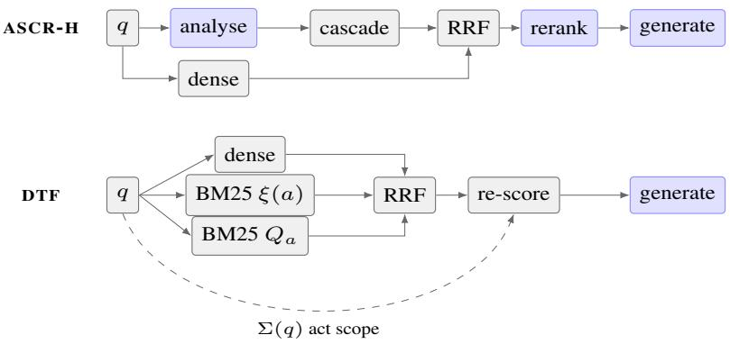
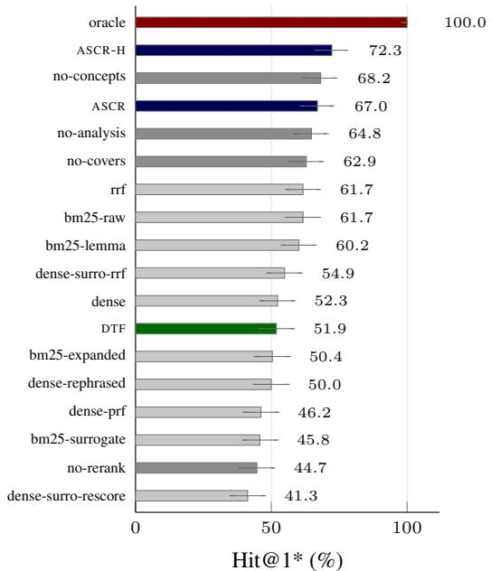
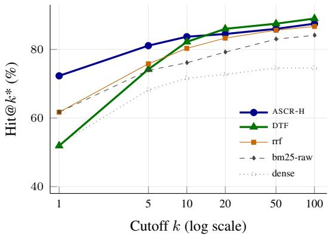
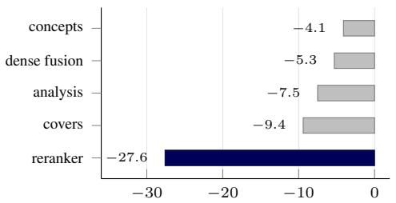
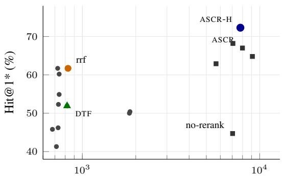

# Annotated Surrogate Retrieval for Polish Statutory Law

Orkun Yigit Cengiz˘ Independent Researcher orkuny.research@gmail.com

## Abstract

We present a family of retrieval methods for Polish statutory law built on document surrogates: language-model annotations attached to statutory articles at index time. Three designs occupy different points on the cost–quality fron tier. ASCR is a surrogate cascade with rerank ing; ASCR-H fuses a dense list into that cas cade; and DTF replaces both language-model stages with three lexical and dense retrievers, weighted reciprocal rank fusion, and a deter ministic re-scoring prior, using no model call before generation. We evaluate all three against fourteen lexical, dense, fused and ablated base lines plus four controls, on 300 questions drawn from the 2024 and 2025 Polish bar and legal counsel entrance examinations, of which 264 have their reference article in the corpus, over a corpus of 82,508 articles from 1,133 acts. On paired McNemar tests, ASCR-H places the reference provision at rank one significantly more often than every other non-oracle configuration except one of its own ablations (eighteen of twenty comparisons significant in its favour at p < 0.005), reaching 72.3% against 61.7% for BM25 and 52.3% for dense retrieval. The ad vantage is concentrated at the head and does not survive depth: it is significant at cutoffs of one and five, disappears by ten, and by twenty DTF leads on point estimate (86.0% versus 84.5%) at one ninth the latency and less than half the cost. Ablation attributes 27.6 points of rank-one accuracy to the reranking stage alone. We further report that the ranking advan tage does not extend to citation accuracy, where DTF matches the oracle ceiling, and three negative results on lemmatisation, pseudo-relevance feedback and query rewriting. Surrogate an notation covers 27.0% of the corpus but every reference provision in the benchmark, an asymmetry we disclose and discuss. The benchmark, per-question outputs and paired significance tests are publicly available.

## 1 Introduction

Identifying the statutory provision that governs a legal question is a retrieval problem with an unusually narrow target. The answer is a single article among tens of thousands, and a generator that reads only the head of a candidate list is not indifferent to where that article was placed. Systems that appear equivalent at a cutoff of ten can differ by more than twenty points at rank one.

That the head of the ranking is the quantity of interest is a property of our ground truth rather than a stylistic preference. Existing statutory article retrieval datasets label each question with a set of relevant provisions, which makes rank-one measures inapplicable: Louis et al. (2023) decline to report mean reciprocal rank on BSARD because it would credit only the first relevant article, and, with some questions admitting up to a hundred relevant articles, evaluate instead at recall depths of 100 and beyond. Our reference labels name a single governing provision in all but six of 300 cases, so rank-one accuracy is both meaningful and the metric a downstream generator is most sensitive to.

Polish makes the problem harder. The language inflects nouns and adjectives across seven cases, so a question and the statute answering it often share meaning without sharing surface form. Legal benchmarks for the domain concentrate on English (Guha et al., 2023; Chalkidis et al., 2022), or evaluate classification, named entity recognition and reasoning rather than retrieval across jurisdictions (Niklaus et al., 2023; Ovcharov, 2026). Retrievalspecific legal resources exist for Belgian (Louis and Spanakis, 2022), Canadian (Zhao et al., 2026) and United States (Zheng et al., 2025) law; Polish statutory provisions are not a retrieval target in any of these three. Polish has been benchmarked for opendomain passage retrieval (Dadas et al., 2024), and Rybak and Ogrodniczuk (2024) release a Polish dense retriever evaluated on three passage-retrieval datasets, one of which retrieves over a corpus of 26,000 passages extracted from more than 1,000 acts of law. Smywinski-Pohl et al. ´ (2025) evaluate Polish legal retrieval across four datasets, one of which pairs legal trainee examination questions with their cited provisions over a corpus of 3,654 provisions assembled from the answer keys themselves, which its authors describe as posing no real challenge to current models. We retrieve at article granularity over the full statutory corpus of 82,508 articles, a candidate set 22.6 times larger than the latter, and report rank-one accuracy rather than Accuracy@10 or nDCG at depth.

We approach it through document surrogates: language-model annotations generated once per article at index time, consisting of a summary, a theme, a concept set, and hypothetical questions the article would answer. Retrieval matches against these derived representations rather than, or alongside, the verbatim statutory text. We present three designs built on this idea and evaluate them against fourteen baselines and four controls.

The results separate by depth. ASCR-H, which fuses a dense list into the surrogate cascade before reranking, places the reference provision at rank one 72.3% of the time, significantly more often than every other non-oracle configuration tested except one of its own ablations. DTF, which discards both pre-generation model calls in favour of threeway fusion and a deterministic prior, trails at rank one by twenty points but catches up by a cutoff of ten and leads on point estimate from twenty onward, at one ninth the latency. The two systems are complements rather than competitors: one is built for precision at the head, the other for coverage at depth under a tight cost budget.

## Contributions.

1. Three surrogate-based retrieval designs for statutory law, formally specified in Section 4, spanning a ninefold range in latency.

2. A controlled evaluation of seventeen configurations and four controls under identical corpus, prompt and generation conditions, with paired significance tests on 300 examination questions, reported at six cutoffs.

3. A depth-dependent convergence: reranking dominates at rank one, the two designs can no longer be separated at a cutoff of ten on this sample, and deterministic fusion leads on point estimate from twenty (Figure 3).

4. An ablation isolating each component, and three negative results: lemmatisation, pseudorelevance feedback and query rewriting each fail to improve retrieval.

## 2 Related Work

Statutory article retrieval. The task of returning the law articles relevant to a legal question was formalised for a non-English jurisdiction by Louis and Spanakis (2022), whose Belgian dataset (BSARD) pairs 1,108 expert-labelled French questions with articles drawn from a corpus of 22,633; their strongest supervised baseline, a trained biencoder, reaches 74.8% Recall@100 on the 222- question test split, while the best zero-shot baseline reaches 51.3%. Louis et al. (2023) augment a dense retriever with the hierarchical structure of the legislation. Our setting is the Polish analogue at 3.6 times the corpus size, with reference provisions supplied by a state examination commission rather than by annotators hired for the purpose. BSARD questions are multi-label, with up to a hundred relevant articles each; ours name a single governing provision in all but six of 300 cases, which is what makes rank-one accuracy available as a metric here and not there (Louis et al., 2023).

Zheng et al. (2025) come closest to our query type but not to our target: their Bar Exam QA task poses examination hypotheticals against a pool of gold explanation passages, paragraph-level United States caselaw and encyclopedia entries, while their Housing Statute QA task targets statutes but with binary questions. Both are reported as challenging for baseline retrievers. Retrieving a statutory article in response to an examination question falls between the two.

Legal retrieval benchmarks. LegalBench-RAG (Pipitone and Houir Alami, 2024) established retrieval evaluation over legal corpora as distinct from end-to-end question answering. Later work extends this to legal retrieval requiring reasoning (Zheng et al., 2025), clause-level grounding in Chinese legal documents (Li et al., 2026), underrepresented jurisdictions (Zhao et al., 2026), and end-to-end pipeline evaluation (Butler and Butler, 2026). Broader legal benchmarks (Guha et al., 2023; Chalkidis et al., 2022; Niklaus et al., 2023) measure classification, named entity recognition and reasoning rather than retrieval quality. Ovcharov (2026) does include Polish, and LEX-TREME (Niklaus et al., 2023) covers Polish within several of its multi-jurisdiction datasets, but in every case the tasks are classification, named entity recognition and norm extraction rather than retrieval, and no statutory corpus is indexed for search. Polish national legislation is not a retrieval target in any of the benchmarks listed above.

Polish retrieval. PIRB (Dadas et al., 2024) evaluates dense and hybrid retrieval across 41 Polish tasks and identifies multilingual-e5-large (Wang et al., 2024) as the prior state of the art among general-purpose multilingual encoders, which motivates our choice; Rybak and Ogrodniczuk (2024) release a Polish-specific dense retriever together with five new passage-retrieval datasets, and evaluate the model on three passageretrieval datasets. One of the three, Legal Questions, is a Polish legal retrieval task: 718 questions over a corpus of 26,000 passages extracted from more than 1,000 acts of law. It is the closest existing resource to ours in corpus and task form, and we differ from it on four axes as a retrieval task. Our corpus is 82,508 articles rather than 26,000 passages; our retrieval unit is the statutory article rather than a passage; our reference labels are supplied by a state examination commission rather than by a shared task; and we report rank-one accuracy rather than Accuracy@10 and nDCG@10. PIRB’s law-domain web subsets, specprawnik and e-prawnik, are built from questions answered by lawyers rather than from statutes, so the retrieval target there is an answer text and not an article of law.

Dadas and Gr˛ebowiec (2024) find that most rerankers generalise poorly for Polish and underperform a strong dense retriever, with the explicit exception of models with a large parameter count; their remedy is domain fine-tuning or a larger reranker. Our reranker is a small general-purpose language model rather than one of the dedicated Polish rerankers they evaluate, so their finding would predict little benefit from it. Our reranking ablation (Section 6) shows the opposite, and we discuss why.

Smywinski-Pohl et al. ´ (2025) evaluate Polish legal retrieval across four datasets. Their LQuAD-PL dataset draws on the same source as ours, legal trainee entrance examinations, but retrieves over a corpus of 3,654 provisions taken from the answer keys; the authors report that current encoders reach almost perfect nDCG@5 on it and conclude that it poses no real challenge. They further caution that when questions are derived directly from the target documents, measured performance is optimistic. We adopt both observations: we retrieve over the full 82,508-article corpus rather than the answer set, and we report the lexical overlap of examination questions as a limitation (see Limitations).

Retrieval and fusion. We build on standard lexical (Robertson and Zaragoza, 2009) and dense (Karpukhin et al., 2020) retrieval, evaluated in the zero-shot regime that Thakur et al. (2021) identify as the realistic one for new domains. Reciprocal rank fusion (Cormack et al., 2009) combines ranked lists without requiring score comparability and remains a strong baseline. Cross-encoder reranking (Nogueira and Cho, 2019) and language models used directly as rerankers (Sun et al., 2023; Ma et al., 2023) improve head precision at substantial inference cost, quantified for listwise languagemodel reranking by Sun et al. (2023).

Generated representations. Retrievalaugmented generation (Lewis et al., 2020) makes the quality of the retrieved set directly consequential for the generated answer. Two established responses to vocabulary mismatch sit on opposite sides of the index: Nogueira et al. (2019) expand documents at index time with predicted queries, while Gao et al. (2023) generate a hypothetical document from the query at retrieval time. Pseudo-relevance feedback (Rocchio, 1971; Lavrenko and Croft, 2001) likewise expands the query. Nogueira et al. (2019) already cross the two axes factorially for open-domain passage retrieval; our contribution is to run the same separation for statutory retrieval, where the document side is a legal norm rather than a web passage, and to report where the two representations complement rather than replace verbatim text.

Evaluating legal question answering. Karp et al. (2026) evaluate language models on a Polish professional legal examination and find automatic scoring by a language model unreliable for the freetext written component, where model-assigned scores diverged sharply from those of the examining committee. Their multiple-choice component, by contrast, separates configurations cleanly. Zheng et al. (2025) report the complementary result for retrieval: gains in Recall@10 do not reliably translate into downstream question-answering gains, because improvement is bounded by how much the reader can extract from the gold passage at all. We observe the same bound on our task, in a sharper form: answer accuracy for our generator on this examination is saturated and cannot evaluate retrieval (Section 3.3).

## 3 Benchmark and Metrics

## 3.1 Source

The Polish Ministry of Justice publishes, after each annual entrance examination for the legal traineeships, the complete question set with an official answer key. We use the joint advocate and legal counsel examination (egzamin wst˛epny na aplikacj˛e adwokack ˛a i radcowsk ˛a) for 2024 and 2025: 150 questions each, 300 in total. Each is single-choice with three options and names its governing act in the stem, in the form “Zgodnie z Kodeksem karnym, $\cdots ^ { \dag } .$ Answer keys record the correct option and its legal basis as an article reference such as art. 11 $\ S \ 3 \ k . k .$ , giving article-level ground truth produced by a state examination commission.

Two exclusions apply. Nine of the 300 items carry a legal basis our parser could not resolve to any article, and a further 27 resolve to articles that are not present in our corpus. The remaining 264 questions, 133 from 2024 and 131 from 2025, form the retrievable subset n∗.1 $n ^ { * }$

## 3.2 Corpus and surrogates

The corpus comprises 1,133 acts segmented into 82,508 articles and 159,434 embedded chunks, an average of 1.9 chunks per article. Because reference labels are article-level, chunk scores are max-pooled to their containing article, $s ( a ) \ =$ $\operatorname* { m a x } _ { c \in a } s ( c )$ . Max-pooling gives longer articles more opportunities to score; at this chunk-to-article ratio the effect is small, but it is not zero and we do not correct for it.

A subset of 22,241 articles carries a languagemodel annotation: a summary $\sigma _ { a }$ , a theme $\theta _ { a } .$ , a concept set $C _ { a }$ , and a set of hypothetical questions $Q _ { a }$ the article would answer. Following standard information retrieval terminology we call these a document surrogate, a derived representation standing in for the document during matching.

Coverage is asymmetric, and the asymmetry is not incidental. Surrogate coverage is

27.0% of the corpus but 100% of the reference provisions in the benchmark. Annotation was prioritised by act importance, chiefly the major codes and the Constitution, and examination questions draw disproportionately on those same acts, so the two selections are correlated rather than independent. Configurations that match against surrogate fields therefore score a fully annotated target against a candidate field that is largely unannotated. This applies to ASCR, ASCR-H and its four ablations, bm25-surrogate, dense-surro-rrf, dense-surro-rescore, dense-prf, and the $R _ { \mathrm { c o v } }$ branch of DTF. Some unknown share of the rank-one advantage those configurations show is attributable to this asymmetry rather than to the retrieval mechanism, and we do not have an experiment that separates the two. The Limitations section states what this does and does not threaten.

The retrieval corpus is the full statutory collection rather than the set of provisions appearing as examination answers. The closest prior resource in question source, LQuAD-PL (Smywinski-Pohl´ et al., 2025), draws on the same examinations but retrieves over 3,654 provisions assembled from the answer keys, a candidate set 22.6 times smaller. Our absolute figures therefore sit below theirs, on a task that is correspondingly harder.

## 3.3 Metrics

We report Hit@k for $k \in \{ 1 , 5 , 1 0 , 2 0 , 5 0 , 1 0 0 \}$ the fraction of questions for which a reference article appears in the top k, together with MRR and nDCG@10, all over the retrievable subset $n ^ { * } = 2 6 4$ and marked with an asterisk. On this subset the oracle control attains Hit@k of 100% by construction. Every starred percentage in the paper corresponds to an integer count out of 264. Point estimates carry 95% Wilson score intervals (Wilson, 1927). Citation accuracy and answer accuracy are reported over all $n = 3 0 0$ questions, since a question whose reference article is missing from the corpus still has a correct option and a correct legal basis, either of which the generator may supply from parametric knowledge; the closed-book control names the reference provision for 141 of 300 questions with no retrieval at all.

A small number of questions carry more than one reference article. Hit@k counts such a question as correct when any reference article appears in the top k, and MRR and nDCG@10 likewise use the highest-ranked reference article. We do not report a fractional recall, which would penalise the oracle control for injecting one article rather than all of them. Six of the 300 questions are affected: three in each examination year, five naming two articles and one naming three.

<table><tr><td>Benchmark</td><td></td><td>Corpus</td><td></td><td>Protocol</td><td></td></tr><tr><td>Questions n</td><td>300</td><td>Acts</td><td>1,133</td><td>Configurations</td><td>17 + 4 ctrl</td></tr><tr><td>Examination years</td><td>2024–25</td><td>Articles</td><td>82,508</td><td>Retrieval depth D</td><td>100</td></tr><tr><td>Options per question</td><td>3</td><td>Chunks (embedded)</td><td>159,434</td><td>Context size k</td><td>10</td></tr><tr><td>Reference resolved</td><td>291</td><td>With surrogates</td><td>22,241</td><td>Generator</td><td>flash-lite</td></tr><tr><td>Retrievable n*</td><td>264</td><td>Coverage, corpus</td><td>27.0%</td><td>Reranker</td><td>flash-lite</td></tr><tr><td>Strata (2024 / 2025)</td><td>133 / 131</td><td>Coverage, reference</td><td>100%</td><td>Encoder</td><td>mE5-large</td></tr><tr><td>Ref. with § / ust.</td><td>69%</td><td>Mean article length</td><td>1,334 ch</td><td>Temperature</td><td>0</td></tr><tr><td>Act named in stem</td><td>100%</td><td>Surrogate generator</td><td>flash-lite</td><td>Runs per config</td><td>1</td></tr></table>

Table 1: Benchmark, corpus and protocol. Retrieval is the only variable across configurations: corpus, prompt, generator, temperature and context size are held fixed. flash-lite is gemini-3.1-flash-lite and mE5-large is multilingual-e5-large; the same model generates the surrogates, performs query analysis, reranks and generates the answer. “Coverage, reference” is the fraction of the 264 retrievable reference articles carrying a surrogate annotation; see Limitations. The generator context is additionally capped at a 6,000-token budget, and individual articles at 6,000 characters, so a retrieved article may be truncated or dropped.

Citation accuracy measures whether the model named the reference provision when asked for the legal basis of its answer. Only the first cited article is scored, so verbosity confers no advantage; act matching is boundary-anchored so that k.p. does not match inside k.p.k.; and unparseable citations are scored incorrect. Matching is article-level, and 69% of reference provisions additionally specify a subdivision that is not scored. We also report the fraction of the achievable band recovered,

$$
G ( m ) = { \frac { \mathrm { c i t } ( m ) - \mathrm { c i t } ( \mathrm { c L O S E D - B O O K } ) } { \mathrm { c i t } ( \mathrm { O R A C L E } ) - \mathrm { c i t } ( \mathrm { C L O S E D - B O O K } ) } }\tag{1}
$$

with floor $1 4 1 / 3 0 0 = 4 7 . 0$ and ceiling 211/300 = 70.3, an achievable band of 23.3 points.

Answer accuracy is not a retrieval metric here. A closed-book control receiving no retrieved context answers 92.7% (278/300) of questions correctly, against 96.3% (289/300) for ASCR-H and 94.3% (283/300) for the oracle control, which receives the reference article directly; neither ASCR-H against closed-book (b=21, c=10, p = 0.072) nor ASCR-H against the oracle (b=14, c=8, p = 0.29) is significant. Every retrieval configuration falls between 89.3% and 97.7%. That the oracle answers slightly worse than ASCR-H despite receiving the reference article is within noise at this sample size, but it is a further sign that the generator is not relying on the retrieved context to choose an option. A three-option question is answerable by elimination, and our generator, which has Polish legal material in its training distribution, eliminates effectively without consulting a source. We report answer accuracy for completeness only.

This is a property of our generator and this examination rather than of the format in general. Karp et al. (2026) report closed-book accuracies in the mid-60s to high-70s on a Polish three-option legal knowledge test, with substantial gains from retrieval, so the same format does separate configurations when the generator is not saturated. Nor should the argument be generalised across option counts: the Bar Exam QA task of Zheng et al. (2025) uses four-option items, for which elimination is correspondingly harder.

Significance. Comparisons use McNemar’s test (McNemar, 1947) with the continuity correction of Edwards (1948) on per-question binary outcomes. The two examination years are independent strata; we compute discordant cells within each year, sum them across strata, and test the pooled counts, reporting the discordant totals alongside each p-value, since these and not the difference in point estimates determine the power of the test. We apply no multiple-comparison correction, but note that Holm–Bonferroni over the twenty rank-one comparisons of Table 3 leaves every conclusion unchanged: the two largest significant p-values, both 0.004, remain below 0.05 after adjustment.

## 4 Methods

Notation. q is a question, a an article, $\xi ( a )$ its verbatim text, d(a) its act, D the set of acts, E(·) the mE5 encoder, and $\sigma _ { a } , \theta _ { a } , C _ { a } , Q _ { a }$ the surrogate fields of Section 3. $\tau ( q )$ denotes the set of content terms of q after stop-word removal, and q˜ the reformulated question produced by the queryanalysis call of ASCR. $h ( Y , \tau ( q ) )$ is the term overlap between a field Y and $\tau ( q ) ; r ( Y , y )$ is a normalised text-similarity score in [0, 1], abbreviated $r ( Y )$ when the second argument is the raw question. All configurations return up to $D { = } 1 0 0$ articles; the generator receives at most $k { = } 1 0$ of them, subject to a 6,000-token context budget.

## 4.1 Shared primitives

Lexical matching uses BM25 (Robertson and Zaragoza, 2009) with inverse document frequency, term saturation and length normalisation, over an indexed text x:

$$
\mathrm { B M 2 5 } ( q , x ) = \sum _ { t \in q } \operatorname { i d f } ( t ) \frac { f _ { t , x } ( k _ { 1 } { + } 1 ) } { f _ { t , x } + k _ { 1 } \Big ( 1 - b + b \frac { | x | } { | x | } \Big ) }\tag{2}
$$

with $k _ { 1 } { = } 1 . 2 , ~ b { = } 0 . 7 5$ , the common defaults; Robertson and Zaragoza (2009) note that the model itself gives no guidance on these values and that optima are collection-dependent, and we did not tune them (see Limitations).

Rank fusion uses a weighted variant of reciprocal rank fusion (Cormack et al., 2009), which is insensitive to incomparable score scales:

$$
s _ { \mathrm { R R F } } ( a ) = \sum _ { i } \frac { w _ { i } } { k _ { 0 } + \mathrm { r a n k } _ { R _ { i } } ( a ) } , \qquad k _ { 0 } = 2 0\tag{3}
$$

The original formulation carries no weights and fixes $k = 6 0$ , a value its authors report as nearoptimal but not critical in their own pilot sweep. Our $k _ { 0 } = 2 0$ and the weights $w _ { i }$ were set by hand for this task and not tuned on a development split (see Limitations); neither value follows from their results.

## 4.2 ASCR: surrogate cascade

ASCR retrieves against the surrogate annotation in two stages. A document stage scores acts and retains the top forty acts,

$$
\begin{array} { l } { { s _ { \mathrm { d o c } } ( d ) = 3 h ( C _ { d } , \tau ( q ) ) + 2 r ( \mathrm { t i t l e } _ { d } ) } } \\ { { \qquad + 2 r ( \sigma _ { d } ) + \nVdash [ \phi _ { d } = f _ { q } ] } } \end{array}\tag{4}
$$

Here $C _ { d }$ and $\sigma _ { d }$ are act-level fields, formed by pooling the concept sets and summaries of the annotated articles of $d ; \phi _ { d }$ is the legal domain label of act d and $f _ { q }$ the domain the query-analysis call assigns to q, so the indicator rewards a domain match. The stage additionally applies a bonus of 10 to acts in a designated tier (tier1Bonus in the released configuration). Its coefficient is more than three times the weight on any other term in the stage, so where it differentiates acts it is the dominant signal.

An article stage scores within those acts,

$$
\begin{array} { l } { { s _ { \mathrm { a r t } } ( a ) = 3 h ( \theta _ { a } , \tau ( q ) ) + 2 h ( C _ { a } , \tau ( q ) ) + 2 0 r ( Q _ { a } , \tilde { q } ) } } \\ { { \qquad + 2 r ( \sigma _ { a } ) + 1 0 0 0 { \cal { k } } { \cal { k } } [ a \in R _ { q } ] } } \end{array}\tag{5}
$$

where $R _ { q }$ is the set of articles explicitly referenced in the question text. The coefficient 1000 is not a weight but an override: an article named in the question is promoted above all others regardless of the remaining terms. A language model reranker then reorders the forty highest-scoring articles in a single listwise call, rather than working in a sliding window; this is what keeps ASCR-H to three model calls in total, including generation.

## 4.3 ASCR-H: cascade with fused dense evidence

ASCR-H adds a dense candidate list, fused by Eq. 3 before reranking. The dense branch consumes the raw question and therefore runs concurrently with the query-analysis call, adding no wall-clock time. Its effect is to expose the reranker to articles in acts the document stage discarded entirely, which is where the cascade alone loses recall.

## 4.4 DTF: deterministic tri-signal fusion

DTF targets the same geometry with cheaper components. Three retrievers with complementary failure modes are fused and then re-scored without any model call:

$$
R _ { \mathrm { d e n } } = \arg \tan ^ { D } \operatorname* { m a x } _ { c \in a } \cos ( E ( q ) , E ( c ) )\tag{6}
$$

$$
R _ { \mathrm { t x t } } = \arg \tan ^ { D } { \mathrm { B M } 2 5 ( q , \xi ( a ) ) }\tag{7}
$$

$$
R _ { \mathrm { c o v } } = \arg \tan ^ { D } { \mathrm { B M 2 5 } ( q , Q _ { a } ) }\tag{8}
$$

Dense retrieval recovers paraphrase and inflection but misses precise statutory terminology; matching over ξ(a) captures verbatim quotation but not paraphrase; matching over $Q _ { a }$ closes the gap between how questions are asked and how statutes are written. Fusion applies Eq. 3 with $( w _ { \mathrm { d e n } } , w _ { \mathrm { t x t } } , w _ { \mathrm { c o v } } ) = ( 1 . 0 , 0 . 7 , 1 . 0 )$ , followed by a deterministic re-score:

$$
\begin{array} { r l } & { \qquad s ( a ) = s _ { \mathrm { R R F } } ( a ) + \beta k ^ { \prime } [ d ( a ) \in \Sigma ( q ) ] + \tau _ { 0 } \nVdash [ \theta _ { a } \cap q ] } \\ & { + \gamma \operatorname* { m i n } ( 3 , | C _ { a } \cap q | ) - \rho \nVdash [ \mathrm { r e p e a l e d } ] + \pi \nVdash [ a \in R _ { q } ] } \end{array}\tag{9}
$$

$$
\begin{array} { r l } & { \mathrm { w i t h } \qquad ( \beta , \tau _ { 0 } , \gamma , \rho , \pi ) } \\ & { ( 0 . 3 5 , 0 . 0 4 , 0 . 0 2 , 0 . 1 5 , 1 . 0 ) . } \end{array}
$$

  
Figure 1: The two extremes of the family. ASCR-H issues three model calls (shaded); the dense branch runs concurrently with query analysis and so adds no wall-clock time. DTF issues one, replacing analysis and reranking with three-way fusion and a deterministic re-scoring prior that exploits the act named in the question stem.

The coefficients are not all on the same scale, deliberately. With $k _ { 0 } = 2 0$ and these weights, an article ranked first in all three lists attains $s _ { \mathrm { R R F } } =$ $2 . 7 / 2 1 \ = \ 0 . 1 2 9$ , so the fused score occupies [0, 0.129]. τ and γ are genuine priors that break ties within the fusion scale, and with them the maximum attainable without $\beta$ or π is 0.229. Against that ceiling $\rho { = } 0 . 1 5$ is a strong but not decisive penalty. $\beta$ and π are decisive: any non-repealed article in an act matched by $\Sigma ( q )$ outranks every article outside it whatever the retrieval evidence, and an article named in the question outranks everything. The exception is instructive: a repealed in scope article floors at roughly 0.208, just below the 0.229 available out of scope, so the repeal penalty can pull an article back across the scope boundary. We state this plainly because it determines how the results should be read: $\mathrm { D T F } ^ { \prime } \mathbf { s }$ behaviour on this benchmark is that of act-scoped fusion, not of fusion with a soft preference for the scoped act. The additive form rather than an explicit filter still matters: the ordering within and outside the scoped act remains the fused ordering, and articles outside the scope are demoted rather than deleted, so recall at depth would survive a wrong scope match. That robustness is untested here, since the matcher identified the correct act on every question in the benchmark. The head of the list is determined by $\Sigma ( q )$

Act scoping. Every examination item names its governing act in the stem, a signal every other configuration discards. We extract the act phrase from the stem, normalise its tokens to five-character prefixes, which collapses Polish case endings without a lemmatiser (Kodeksem karnym → {kodek, karny}), and match by containment against the prefix sets of act titles. Writing $P ( q )$ for the prefix set of the extracted act phrase and $P ( d )$ for that of the title of act $d ,$

$$
\Sigma ( q ) = \left\{ d \in \mathcal { D } : \frac { | P ( q ) \cap P ( d ) | } { | P ( q ) | } \geq 0 . 6 \right\}\tag{10}
$$

$P ( q )$ covers only the act phrase, not the whole question; the threshold is not attainable against a full question’s token set.

Note that $\beta$ re-scores candidates already returned by the three retrievers rather than retrieving from $\Sigma ( q )$ directly, so a scoped act with no article in any of the three lists receives no benefit. $\Sigma ( q )$ is also a set rather than a single act, and where containment admits more than one title each matching act receives the full boost; we do not report how many acts it typically contains. Either mechanism would account for DTF’s document-level hit rate of 92.0% rather than 100% despite a scope match on every question, and we do not separate them.

## 4.5 Baselines and controls

Lexical: bm25-raw over $\xi ( a )$ ; bm25-lemma with suffix stripping; bm25-surrogate over $\sigma _ { a } \| \theta _ { a } \| C _ { a } \| Q _ { a }$ bm25-expanded with a model-expanded query. The last three separate index-side from query-side generation. Note that bm25-surrogate substitutes the surrogate fields for the statutory text, whereas Nogueira et al. (2019) append predicted queries to the document and retain it; the corresponding concatenated index, BM25 over $\xi ( a ) \| Q _ { a } ,$ is not among our configurations, and the Limitations section notes what that leaves untested. Dense: dense; dense-rephrased with a rewritten query. Fused: rrf (BM25 + dense); dense-surro-rrf; dense-surro-rescore; and dense-prf, a pseudorelevance feedback variant whose expansion vocabulary is authored at index time. Ablations remove one component from ASCR-H: no-rerank, no-analysis, no-covers, no-concepts. Controls: closed-book (no retrieval), random, oracle (reference article injected), and oracle-doc (correct act, random articles within it). This gives seventeen configurations and four controls.

  
Figure 2: Hit@1 with 95% Wilson intervals, $n ^ { * } { = } 2 6 4$ Proposed systems in blue (ASCR, ASCR-H) and green (DTF); ASCR-H ablations in dark grey; baselines in light grey; oracle ceiling in red. Intervals are marginal and therefore conservative: the paired tests in Table 3 separate ASCR-H from every configuration shown except no-concepts.

## 5 Results

## 5.1 Rank one: ASCR-H leads every non-oracle configuration on point estimate

ASCR-H places the reference provision first for 72.3% of retrievable questions (191 of 264), against 61.7% for BM25, 61.7% for reciprocal rank fusion and 52.3% for dense retrieval. Figure 2 shows the full ordering and Table 3 the paired tests against every other configuration and control. Of the twenty comparisons, eighteen are significant in ${ \bf A } { \bf S } { \bf C } { \bf R } { \bf - } { \bf H } ^ { \prime } { \bf S }$ favour, sixteen of them at $p < 0 . 0 0 1$ ; one is not significant; and one, the oracle ceiling, is significant against it, as it must be. The non-significant comparison is no-concepts, one of ASCR-H’s own ablations, at $p = 0 . 0 8 2 \mathrm { { ; } }$ ; the concept-matching term is therefore the weakest component of the cascade at rank one, although Table 2 shows it costs 8.7 points by a cutoff of ten.

## 5.2 Depth: the advantage does not persist

Figure 3 plots Hit@k for the two proposed systems and three baselines. ASCR-H leads on point estimate at $k \in \{ 1 , 5 , 1 0 \}$ ; at $k = 2 0$ DTF overtakes it (86.0 versus 84.5) and leads at every deeper cutoff, reaching 89.0% at $k = 1 0 0$

The paired tests qualify this picture in a way the point estimates alone do not. ASCR-H’s advantage over DTF is significant at $k = 1 ( b { = } 6 6$ $c { = } 1 2 , p \ < \ 0 . 0 0 1 )$ and at $k = 5 ( b { = } 2 9 , c { = } 1 1$ $p ~ = ~ 0 . 0 0 7 )$ , but not at $k ~ = ~ 1 0 ~ ( b { = } 1 3 , ~ c { = } 9$ $p = 0 . 5 2 )$ , and DTF’s lead at $k = 2 0$ is likewise not significant $( b { = } 6 , c { = } 1 0 , p = 0 . 4 5 )$ . The honest reading is therefore convergence rather than a crossover: reranking buys a large, reliable advantage at the head, that advantage is gone by a cutoff of ten, and beyond it the two designs are statistically indistinguishable on this sample even where their point estimates diverge. DTF also attains the highest document-level hit rate of any non-oracle configuration (92.0% at k=10) and the highest citation accuracy of any configuration, matching the oracle at 70.3%.

This is by design rather than by accident. ASCR-H spends two sequential model calls to order a candidate set precisely; DTF spends none, and instead widens the candidate set through three complementary retrievers and a deterministic prior. Precision at the head and coverage at depth are bought by different mechanisms, and the mechanisms have very different costs (Section 7).

Two qualifications belong with this result. First, the generator in our protocol reads only $k { = } 1 0$ articles, so DTF’s point-estimate leads at $k \in$ {20, 50, 100} are properties of the retrieved list rather than of anything the reader currently consumes; Liu et al. (2024) report that reader performance saturates well before retriever performance does. Second, $\mathrm { { D T F } ^ { \prime } { s } }$ behaviour at depth is not separated from its act-scoping prior, which as Section 4 shows partitions the candidate set rather than merely tilting it, and which matched the correct act on every question in this benchmark. We return to both in the Limitations section.

## 5.3 Near-miss context is worse than none

oracle-doc, which supplies the correct act but random articles within it, reaches 100% documentlevel hit rate by construction, 0.4% Hit@1, and citation accuracy of 37.7%. That is 9.3 points below the 47.0% of a control receiving no context at all.

<table><tr><td></td><td colspan="6">Hit@k*</td><td colspan="2">Ranking</td><td colspan="2">Citation</td></tr><tr><td>Configuration</td><td>1</td><td>5</td><td>10</td><td>20</td><td>50</td><td>100</td><td>MRR*</td><td>nDCG*</td><td>Acc.</td><td>G</td></tr><tr><td>ASCR-H</td><td>72.3</td><td>81.1</td><td>83.7</td><td>84.5</td><td>86.0</td><td>87.5</td><td>0.764</td><td>0.776</td><td>67.3</td><td>0.87</td></tr><tr><td>no-concepts</td><td>68.2</td><td>74.2</td><td>75.0</td><td>75.8</td><td>77.7</td><td>83.3</td><td>0.710</td><td>0.713</td><td>59.7</td><td>0.54</td></tr><tr><td>ASCR</td><td>67.0</td><td>76.1</td><td>77.3</td><td>78.0</td><td>80.3</td><td>83.0</td><td>0.713</td><td>0.721</td><td>61.3</td><td>0.61</td></tr><tr><td>no-analysis</td><td>64.8</td><td>72.7</td><td>73.9</td><td>74.2</td><td>75.8</td><td>79.9</td><td>0.684</td><td>0.694</td><td>59.3</td><td>0.53</td></tr><tr><td>no-covers</td><td>62.9</td><td>72.0</td><td>73.5</td><td>73.5</td><td>75.4</td><td>79.5</td><td>0.670</td><td>0.679</td><td>57.0</td><td>0.43</td></tr><tr><td>rrf</td><td>61.7</td><td>75.8</td><td>80.3</td><td>83.3</td><td>85.6</td><td>86.7</td><td>0.686</td><td>0.708</td><td>67.7</td><td>0.89</td></tr><tr><td>bm25-raw</td><td>61.7</td><td>73.9</td><td>76.1</td><td>79.2</td><td>83.0</td><td>84.1</td><td>0.677</td><td>0.690</td><td>66.0</td><td>0.81</td></tr><tr><td>bm25-1emma</td><td>60.2</td><td>73.5</td><td>76.5</td><td>78.4</td><td>81.8</td><td>83.7</td><td>0.666</td><td>0.684</td><td>67.7</td><td>0.89</td></tr><tr><td>dense-surro-rrf</td><td>54.9</td><td>75.4</td><td>79.5</td><td>83.0</td><td>86.0</td><td>87.5</td><td>0.643</td><td>0.673</td><td>66.7</td><td>0.84</td></tr><tr><td>dense</td><td>52.3</td><td>68.2</td><td>71.6</td><td>72.7</td><td>74.6</td><td>74.6</td><td>0.590</td><td>0.616</td><td>61.7</td><td>0.63</td></tr><tr><td>DTF</td><td>51.9</td><td>74.2</td><td>82.2</td><td>86.0</td><td>87.5</td><td>89.0</td><td>0.618</td><td>0.659</td><td>70.3</td><td>1.00</td></tr><tr><td>bm25-expanded</td><td>50.4</td><td>65.5</td><td>70.5</td><td>75.0</td><td>81.1</td><td>83.3</td><td>0.580</td><td>0.602</td><td>62.3</td><td>0.66</td></tr><tr><td>dense-rephrased</td><td>50.0</td><td>69.3</td><td>73.5</td><td>76.5</td><td>78.0</td><td>78.0</td><td>0.581</td><td>0.614</td><td>65.0</td><td>0.77</td></tr><tr><td>dense-prf</td><td>46.2</td><td>68.9</td><td>74.6</td><td>78.8</td><td>81.1</td><td>84.5</td><td>0.557</td><td>0.596</td><td>64.3</td><td>0.74</td></tr><tr><td>bm25-surrogate</td><td>45.8</td><td>66.7</td><td>71.6</td><td>78.4</td><td>80.7</td><td>84.1</td><td>0.553</td><td>0.584</td><td>61.0</td><td>0.60</td></tr><tr><td>no-rerank</td><td>44.7</td><td>61.4</td><td>68.6</td><td>75.0</td><td>80.3</td><td>83.0</td><td>0.524</td><td>0.555</td><td>56.7</td><td>0.41</td></tr><tr><td>dense-surro-rescore</td><td>41.3</td><td>58.7</td><td>67.0</td><td>72.7</td><td>74.6</td><td>74.6</td><td>0.490</td><td>0.526</td><td>58.7</td><td>0.50</td></tr><tr><td>Controls</td><td></td><td></td><td></td><td></td><td></td><td></td><td></td><td></td><td></td><td></td></tr><tr><td>oracle</td><td>100.0</td><td>100.0</td><td>100.0</td><td>100.0</td><td>100.0</td><td>100.0</td><td>1.000</td><td>1.000</td><td>70.3</td><td>1.00</td></tr><tr><td>oracle-doc</td><td>0.4</td><td>3.8</td><td>8.0</td><td>13.3</td><td>26.9</td><td>39.0</td><td>0.031</td><td>0.032</td><td>37.7</td><td>-0.40</td></tr><tr><td>closed-book</td><td>0.0</td><td>0.0</td><td>0.0</td><td>0.0</td><td>0.0</td><td>0.0</td><td>0.000</td><td>0.000</td><td>47.0</td><td>0.00</td></tr><tr><td>random</td><td>0.0</td><td>0.0</td><td>0.0</td><td>0.0</td><td>0.0</td><td>0.4</td><td>0.000</td><td>0.000</td><td>25.3</td><td>-0.93</td></tr></table>

Table 2: Main results, pooled over the 2024 and 2025 examinations. Starred metrics are over the retrievable subset, $n ^ { * } = 2 6 4 ;$ every starred percentage is an integer count out of 264. Citation accuracy and G (Eq. 1) are over all n = 300. Ordered by Hit@1; note that ordering by Hit@20 or deeper places DTF first, and that DTF matches the oracle ceiling on citation accuracy. Document-level hit rate at $k { = } 1 0 .$ , cited in the text, is 92.0% for DTF, 90.5% for rrf, 89.8% for ASCR-H and 100% for both oracles by construction. Three dense configurations show identica Hit@50 and Hit@100 because a depth-100 chunk list max-pools to fewer than 100 distinct articles.

  
Figure 3: Hit rate against cutoff depth. ASCR-H leads through k=10 and DTF from k=20, but the two are separated significantly only at k=1 and k=5; from k=10 onward the difference is within noise.

The drop is significant: 46 questions are cited correctly by closed-book but not by oracle-doc, against 18 in the other direction $( p < 0 . 0 0 1 )$ . oracle-doc also trails ASCR-H by 29.6 points (b=98, c=9, $p \ < \ 0 . 0 0 1 )$ . Plausible but incorrect provisions displace correct parametric knowledge, which suggests that act-level retrieval alone is not merely insufficient but actively harmful.

The effect has precedent. Liu et al. (2024) report that when the relevant document sits in the worst position within a twenty- or thirty-document context, GPT-3.5-Turbo falls below its own closedbook accuracy, and Butler and Butler (2026) find that retrieval quality is the primary driver of endto-end legal RAG performance and that most hallucinations in production legal RAG systems are induced by retrieval failures. Our result isolates the same phenomenon with the confound removed: oracle-doc holds the act correct and varies only the article, so nothing about topical relevance explains the drop.

## 6 Ablations and Negative Results

## 6.1 Reranking is the dominant component

Removing the reranking stage reduces Hit@1 from 72.3% to 44.7% and MRR from 0.764 to 0.524 $( b { = } 7 6 , c { = } 3 , p < 0 . 0 0 1 )$ . Hit@20 falls by only 9.5 points over the same ablation, confirming that reranking acts on ordering rather than on candidate coverage. This is the largest effect in the study and the only component with no cheaper substitute (Figure 4).

<table><tr><td>VS.</td><td>other</td><td>∆</td><td>b</td><td>c p</td><td></td></tr><tr><td>dense-surro-rescore</td><td>41.3</td><td>+31.0</td><td>88</td><td>6</td><td>&lt;0.001</td></tr><tr><td>no-rerank</td><td>44.7</td><td>+27.6</td><td>76</td><td>3</td><td>&lt;0.001</td></tr><tr><td>bm25-surrogate</td><td>45.8</td><td>+26.5</td><td>78</td><td>8</td><td>&lt;0.001</td></tr><tr><td>dense-prf</td><td>46.2</td><td>+26.1</td><td>76</td><td>7</td><td>&lt;0.001</td></tr><tr><td>dense-rephrased</td><td>50.0</td><td>+22.3</td><td>66</td><td>7</td><td>&lt;0.001</td></tr><tr><td>bm25-expanded</td><td>50.4</td><td>+21.9</td><td>67</td><td>9</td><td>&lt;0.001</td></tr><tr><td>DTF</td><td>51.9</td><td>+20.4</td><td>66</td><td>12</td><td>&lt;0.001</td></tr><tr><td>dense</td><td>52.3</td><td>+20.0</td><td>63</td><td>3 10</td><td>&lt;0.001</td></tr><tr><td>dense-surro-rrf</td><td>54.9</td><td>+17.4</td><td>60</td><td>14</td><td>&lt;0.001</td></tr><tr><td>bm25-1emma</td><td>60.2</td><td>+12.1</td><td>47 15</td><td></td><td>&lt;0.001</td></tr><tr><td>bm25-raw</td><td>61.7</td><td>+10.6</td><td>44 16</td><td></td><td>&lt;0.001</td></tr><tr><td>rrf</td><td>61.7</td><td>+10.6</td><td>44</td><td>16</td><td>&lt;0.001</td></tr><tr><td>no-covers</td><td>62.9</td><td>+9.4</td><td>29</td><td>4</td><td>&lt;0.001</td></tr><tr><td>no-analysis</td><td>64.8</td><td>+7.5</td><td>32</td><td>12</td><td>0.004</td></tr><tr><td>ASCR</td><td>67.0</td><td>+5.3</td><td>17</td><td>3</td><td>0.004</td></tr><tr><td>no-concepts</td><td>68.2</td><td>+4.1</td><td>22</td><td>11</td><td>0.082</td></tr><tr><td>closed-book</td><td>0.0</td><td>+72.3</td><td>191</td><td>0</td><td>&lt;0.001</td></tr><tr><td>random</td><td>0.0</td><td>+72.3</td><td>191</td><td>0</td><td>&lt;0.001</td></tr><tr><td>oracle-doc</td><td>0.4</td><td>+71.9</td><td>191</td><td>1</td><td>&lt;0.001</td></tr><tr><td>oracle</td><td>100.0</td><td>-27.7</td><td></td><td>0 73</td><td>&lt;0.001</td></tr></table>

Table 3: Paired McNemar tests at rank one, baseline ASCR-H (72.3%, 191 of 264). b and c are discordant counts favouring ASCR-H and the comparison respectively; only these enter the test. Continuity-corrected (Edwards, 1948), discordant cells computed within each examination year and summed. The final row is the oracle ceiling and is significant against ASCR-H.

<table><tr><td>Removed</td><td>H@1*</td><td>H@10*</td><td>MRR*</td><td>∆H@1</td></tr><tr><td>none (ASCR-H)</td><td>72.3</td><td>83.7</td><td>0.764</td><td></td></tr><tr><td>concepts</td><td>68.2</td><td>75.0</td><td>0.710</td><td>-4.1</td></tr><tr><td>query analysis</td><td>64.8</td><td>73.9</td><td>0.684</td><td>-7.5</td></tr><tr><td>covers  $( Q _ { a }$  term)</td><td>62.9</td><td>73.5</td><td>0.670</td><td>-9.4</td></tr><tr><td>dense fusion (=ASCR)</td><td>67.0</td><td>77.3</td><td>0.713</td><td>-5.3</td></tr><tr><td>reranker</td><td>44.7</td><td>68.6</td><td>0.524</td><td>-27.6</td></tr></table>

Table 4: Component ablation on ASCR-H. Removing the reranker costs 27.6 points of Hit@1, nearly three times the next largest effect.

Dadas and Gr˛ebowiec (2024) report that most Polish and multilingual rerankers underperform a strong dense retriever and generalise poorly, with the exception of models with a large number of parameters; their prescribed remedy is either domain fine-tuning or a larger reranker. Our reranker is gemini-3.1-flash-lite, the smallest tier of its family, so on their result we should have seen little or no gain. Two things separate the settings. Their rerankers are dedicated ranking models applied zero-shot to open-domain passage retrieval, whereas ours is an instruction-following model given a listwise prompt over forty candidates; and they themselves distil a 435M reranker that surpasses their 13B teacher, so parameter count is not the operative variable even within their own study.

  
∆ Hit@1 when component removed (pp)  
Figure 4: Component contributions to ASCR-H. Each bar is the change in Hit@1 when a single component is removed. Reranking accounts for nearly three times the next largest effect and is the only component with no cheaper substitute.

A task-structure difference we think amplifies the effect is visible in PIRB (Dadas et al., 2024): averaged over its 41 tasks, BM25 reaches 41.9 nDCG@10 against 57.3 for multilingual-e5-large, a lexical-to-dense gap of roughly fifteen points in the dense model’s favour. On our task the ordering reverses: BM25 reaches 61.7% Hit@1 against 52.3% for dense. The reversal is not peculiar to our benchmark: Rybak and Ogrodniczuk (2024) report that on Polish legal passage retrieval BM25 outperforms every neural model they test, and attribute this to passage length and to high lexical overlap between questions and passages. With exactly one correct article among many lexically similar candidates drawn from the same act, ordering at the head carries most of the available signal, and lexical evidence is unusually informative. Under these conditions a capable reranker has more to work with than in open-domain passage retrieval, where several retrieved passages may be acceptable.

## 6.2 Generated representations help only in fusion

The three BM25 variants separate where generation is applied. At Hit@1, bm25-raw (no generation) scores 61.7; bm25-surrogate (index-side only) 45.8; bm25-expanded (query-side only) 50.4. Neither generated representation beats verbatim text on its own, and index-side is the worse of the two standalone.

The result reverses under fusion. Inside ASCR-H the surrogate index contributes materially: the $Q _ { a }$ term is worth 9.4 points of Hit@1 (Table 4), and removing it costs more than removing query analysis. DTF also draws on the surrogate index through $R _ { \mathrm { c o v } }$ , but we report no ablation of that branch, so its contribution there is untested. Generated representations are therefore useful as a complementary signal but not as a replacement for the statutory text, which is consistent with their function: they close the vocabulary gap on questions whose phrasing does not match the statute, and add noise on questions whose phrasing does.

One caveat bounds the standalone result. bm25-surrogate substitutes the surrogate fields for ξ(a), whereas document expansion as introduced by Nogueira et al. (2019) appends predicted queries to the document and keeps it, reporting a gain of roughly 15% from doing so. Our −15.9-point standalone result is therefore evidence about substitution, not about generated representations as such; the concatenated index is the configuration that would settle it, and we did not run it (see Limitations).

## 6.3 Three negative results

Lemmatisation does not help. bm25-lemma scores 60.2% Hit@1 against 61.7% for bm25-raw, and trails at every cutoff except k=10, where it leads by 0.4 points. Despite seven-case inflection, suffix stripping yields no benefit, because examination questions quote statutory language closely and therefore already share surface forms with the target. This sits in mild tension with PIRB (Dadas et al., 2024), whose BM25 baseline lemmatises by default through Morfologik; the difference is most likely the closeness of our questions to the statutory text, and it may not transfer to free-form practitioner queries.

Pseudo-relevance feedback harms head precision. dense-prf scores 46.2% Hit@1 against 52.3% for dense, a loss of 6.1 points, while gaining 6.1 points at k=20 and 9.9 at k=100. Expansion widens the candidate pool at the cost of disordering its head. This is the classic pseudo-relevance feedback trade-off, and on a task where only rank one matters it is unfavourable.

Query rewriting does not help. dense-rephrased scores 50.0% against 52.3% for dense, and bm25-expanded 50.4% against 61.7% for bm25-raw. Both incur an additional model call and roughly 1.1 s of latency for no measurable gain. no-analysis, which removes the equivalent stage from ASCR-H, costs 7.5 points of Hit@1 while saving \$0.036 per hundred queries, so query-side generation is useful inside the cascade, where it conditions the fields the article stage and the reranker see, but not as a standalone modification to the query.

## 6.4 Ranking gains do not transfer to citation accuracy

ASCR-H leads every ranking metric yet reaches citation accuracy of 67.3% (202 of 300), statistically indistinguishable from bm25-raw (66.0%, b=19, c=15, p=0.61), rrf (67.7%, b=15, c=16, p=1.00), bm25-lemma (67.7%, b=17, c=18, p=1.00) and DTF (70.3%, b=14, c=23, p=0.19), which scores numerically higher and matches the oracle. Twelve of the twenty comparisons are significant: four are ASCR-H’s own ablations, three are controls, and the remaining five are ASCR and four configurations that trail ASCR-H by at least twenty points at rank one. The eight that are not significant include every strong single-call baseline and the oracle itself.

Placing the reference provision at rank one rather than rank five therefore does not change how often the generator names it. What does change citation accuracy is whether the provision reaches the context window at all: every retrieval configuration scores above the closed-book floor of 47.0% and oracle-doc falls below it, and the one paired comparison we test, ASCR-H against closed-book, is significant (b=83, c=22, p < 0.001). We read this as evidence that on this task the generator is tolerant of position within the retrieved context but sensitive to presence.

The clearest precedent is the ceiling argument of Zheng et al. (2025), who report that improvements in Recall@10 do not reliably translate into downstream question-answering gains because the gain is bounded by how much the reader can extract from the gold passage at all. Our G metric measures exactly that bound: the achievable band between a 47.0% closed-book floor and a 70.3% oracle ceiling is 23.3 points, and no ranking improvement can produce more than that. DTF already closes all of it, with a retrieval system that trails ASCR-H by twenty points at rank one. Butler and Butler (2026) observe the presence-driven form of the same effect, identifying retrieval quality rather than generation as the primary driver of end-to-end performance.

Our result is more circumscribed than the position effect of Liu et al. (2024), and we do not claim to contradict them. Their ten-document condition is our k=10, so context length is not the difference. What differs is how much the reader depends on the context at all: in their multi-document setting the gap between closed-book and oracle answer accuracy ranges from 28 points for Claude-1.3 to

<table><tr><td>Configuration</td><td>H@1* (%)</td><td>H@20* (%)</td><td>p50 (ms)</td><td>p95 (ms)</td><td>USD /100q</td></tr><tr><td>ASCR-H</td><td>72.3</td><td>84.5</td><td>7784</td><td>13990</td><td>0.230</td></tr><tr><td>ASCR</td><td>67.0</td><td>78.0</td><td>7997</td><td>13910</td><td>0.233</td></tr><tr><td>no-analysis</td><td>64.8</td><td>74.2</td><td>9096</td><td>13284</td><td>0.194</td></tr><tr><td>no-rerank</td><td>44.7</td><td>75.0</td><td>7035</td><td>13283</td><td>0.145</td></tr><tr><td>bm25-expanded</td><td>50.4</td><td>75.0</td><td>1856</td><td>2231</td><td>0.165</td></tr><tr><td>dense-rephrased</td><td>50.0</td><td>76.5</td><td>1842</td><td>2196</td><td>0.156</td></tr><tr><td>rrf</td><td>61.7</td><td>83.3</td><td>830</td><td>1188</td><td>0.114</td></tr><tr><td>bm25-raw</td><td>61.7</td><td>79.2</td><td>726</td><td>1018</td><td>0.118</td></tr><tr><td>DTF</td><td>51.9</td><td>86.0</td><td>820</td><td>1090</td><td>0.108</td></tr><tr><td>dense</td><td>52.3</td><td>72.7</td><td>733</td><td>1093</td><td>0.108</td></tr><tr><td>closed-book</td><td>0.0</td><td>0.0</td><td>668</td><td>885</td><td>0.014</td></tr></table>

Table 5: Cost and latency. Horizontal rules group configurations by total model calls including generation: ASCR-H and ASCR make three, no-analysis through dense-rephrased make two, and the rest make one. Generation cost is identical across configurations, so all differences arise from pre-generation calls, each a sequential round trip.

50 points for MPT-30B-Instruct, whereas in ours it is 1.6 points on answer accuracy and 23.3 on citation accuracy, and a generator that answers correctly without the context has little room to display sensitivity to position within it. Their dependent variable is also answer accuracy, ours citation accuracy. The practical implication for this task is that effort spent moving the correct provision from rank five to rank one is not repaid downstream, and that rank-one accuracy should not be treated as a proxy for answer quality.

## 7 Cost and Latency

Latency is bimodal. Counting the generation call, the single-call configurations of Table 5 complete in 726–830 ms, and 668 ms for the closed-book control, which retrieves nothing; three-call configurations take 7.8–8.0 s. There is no intermediate operating point among the strong configurations, because each pre-generation call is a sequential round trip rather than a parallelisable computation. The ASCR-H dense branch is the exception that proves the rule: it runs concurrently with query analysis and therefore costs no wall-clock time at all, which is why ASCR-H costs no more wall-clock time than ASCR despite retrieving more.

The two-call band spans 1.8 to 9.1 s because the calls are not equivalent. The query-analysis call retained by no-rerank and the reranking call retained by no-analysis are both long structured prompts over a hundred candidates; bm25-expanded and dense-rephrased issue a one-line rewrite instead and run under 2 s. Removing a call therefore does not straightforwardly reduce latency: no-analysis is slower than full ASCR-H, because the reranker it retains sees a worse-ordered candidate list and returns longer output. Cost, which tracks tokens rather than round trips, does fall as expected.

  
Median latency per query (ms, log scale)  
Figure 5: Cost and quality at rank one. Median latency against Hit@1\* for every configuration in Table 5 together with several further baselines. The interval between bm25-raw and ASCR-H is bought by two additional sequential model calls.

Whether the head-precision premium is worthwhile is a deployment question. For interactive search a 14-second 95th-percentile latency is disqualifying; for asynchronous review or batch enrichment it is immaterial, and 10.6 points of rankone accuracy over the best call-free configuration is substantial. It is also cheap relative to the reranking literature: ASCR-H costs \$0.0023 per query end to end, against the \$0.596 per query Sun et al. (2023) report for listwise GPT-4 reranking of a hundred passages, roughly two orders of magnitude less, a factor of 259, at a median 7.8 s against the 32 s they report for GPT-4. A single listwise call over forty candidates, rather than ten sliding-window calls over a hundred passages, accounts for most of that difference.

DTF occupies the opposite corner. Replacing the surrogate cascade and reranker with three retrievers and a deterministic prior reduces latency to 820 ms and cost to \$0.108 per hundred queries, a factor of 9.5 and 2.1 respectively, while attaining the highest Hit@20 (86.0%), Hit@100 (89.0%), document hit rate (92.0%) and citation accuracy (70.3%, level with the oracle) of any non-oracle configuration. It forfeits 20.4 points at rank one. Cheaper components preserve coverage and surrender ordering, which is the trade the design was built to make. On the metric that reflects what the generator produces, the surrender costs nothing. Abdallah et al. (2026) construct the analogous frontier for retrievers, plotting quality against throughput and identifying nondominated models; they also caution that zero-cost lexical fusion, in their case linear, reliably helps weak retrievers but can harm strong ones, which bounds how far DTF’s design would generalise to a setting with a stronger base encoder.

## 8 Conclusion

We presented three surrogate-based retrieval designs for Polish statutory law and evaluated them against fourteen baselines and four controls on 300 ministry-published examination questions. ASCR-H places the reference provision at rank one significantly more often than every other non-oracle configuration tested except one of its own ablations, and DTF matches it from a cutoff of ten onward at one ninth the latency while closing the entire achievable band on citation accuracy. The two occupy opposite ends of a cost–quality frontier and are intended to be chosen between rather than ranked. Reranking accounts for 27.6 points of rank-one accuracy and is the only component without a cheaper substitute; lemmatisation, pseudorelevance feedback and query rewriting each fail to improve retrieval on this task. The most consequential negative result is that none of the rank-one advantage reaches the generated answer.

## Limitations

Surrogate coverage is correlated with the benchmark. Surrogate annotations cover 22,241 of 82,508 articles (27.0%) but all 264 retrievable reference provisions. Annotation was prioritised by act importance, and examination questions draw disproportionately on the same major codes and the Constitution, so the two selections are correlated rather than independent. Every configuration that matches against surrogate fields, which includes ASCR, ASCR-H and its four ablations, bm25-surrogate, dense-surro-rrf, dense-surro-rescore, dense-prf and the $R _ { \mathrm { c o v } }$ branch of DTF, therefore scores a fully annotated target against a candidate field that is largely unannotated, and some unknown share of their rank-one advantage is attributable to that asymmetry rather than to the retrieval design. We did not measure the surrogate coverage of the non-gold candidates that those systems actually rank, which is the measurement that would bound the effect, and we did not repeat the comparison on a coverage-matched subset. Both are the first things we would add. The confound does not affect the configurations that never touch surrogate fields (bm25-raw, bm25-lemma, bm25-expanded, dense, dense-rephrased, rrf and the controls), so the reversals among those, lexical over dense in particular, are unaffected. Extending coverage to the full corpus would likely change the balance between ASCR-H and DTF, in an untested direction.

DTF’s act-scoping prior is not isolated. As Section 4 sets out, β sits above the attainable range of the fused score, so act scoping partitions the candidate set for non-repealed articles rather than tilting it. Every question in this benchmark names its act, and the matcher identified the correct one in all 300 cases. We do not report a $\beta { = } 0$ ablation, so we cannot say how much of DTF’s behaviour from k=10 onward is fusion and how much is the partition. Those results therefore hold for DTF on questions that name their governing act, and we do not claim them for tri-signal fusion in general.

Statistical power at depth. The comparisons that matter most at depth rest on few discordant pairs: ASCR-H against DTF produces 22 discordant questions at k=10 and 16 at k=20, out of 264. We report these as null results rather than as evidence of equivalence; a larger sample could separate the two designs in either direction.

Question format. Examination items are multiple-choice, quote statutory language closely, and name their governing act explicitly in all 300 cases. All three properties make the task easier than practitioner queries, and the third is exploited directly by DTF’s act-scoping prior.

Smywinski-Pohl et al.´ (2025) make this point explicitly: on Polish legal retrieval they observe a gap of roughly forty-five points of nDCG@10 between datasets whose questions are derived from the target provisions and datasets of questions posed by laypeople, and warn that the former yield performance estimates that are too optimistic. Our questions are of the former kind. The close lexical overlap also biases the comparison between retrieval families. Questions that quote statutory wording favour term matching directly, which is a likely explanation for BM25 outscoring dense retrieval here when the ordering is reversed on open-domain Polish benchmarks (Dadas et al., 2024). Rybak and Ogrodniczuk (2024) report the same reversal on

Polish legal retrieval, attributing it in part to high lexical overlap between questions and passages and in part to passage length. We read this as evidence that the overlap is common across Polish legal retrieval resources rather than as evidence that it is benign. Absolute figures reported here should be read as an upper bound on what the same systems would achieve on practitioner queries; the comparisons between configurations, which is what the paper argues about, are affected only where a configuration exploits the format directly.

Possible training-data contamination. The entrance examinations are published by the Ministry of Justice together with their answer keys, are widely reproduced, and supply the training questions of at least one existing Polish legal dataset. Our closed-book control answers 92.7% of items correctly, against accuracies in the mid-60s to high-70s reported by Karp et al. (2026) for comparable models on a comparable Polish legal examination. A stronger generator, an easier examination and contamination are all consistent with that gap, and we cannot distinguish them; we did not pre-train or filter to exclude the test material, as Nogueira and Cho (2019) do for TREC-CAR. Contamination would inflate answer accuracy and, to a lesser degree, citation accuracy, and is a further reason not to read answer accuracy as a retrieval metric. It does not threaten the between-configuration comparisons, since the same generator is held fixed across all of them.

Article-level citation matching. Citation accuracy is scored at article level, but 69% of reference provisions specify a § or ust. subdivision that is not scored. Reported figures are therefore an upper bound on practitioner-grade precision. The automatic matcher was not validated against human judgement, and Ovcharov (2026) report for the analogous norm-extraction task that measured performance is dominated by the evaluation methodology rather than by model capability.

Coverage ceiling. Nine of 300 reference citations could not be resolved to any article by our parser, and 27 more resolve to articles absent from the corpus. Starred metrics exclude all 36, but the exclusion is not random: missing provisions skew toward less frequently examined acts. The same skew is documented for BSARD, where only 1,612 of 22,633 articles are ever cited as relevant and roughly 80% of those come from four codes (Louis

and Spanakis, 2022).

An untested baseline. bm25-surrogate replaces the statutory text with the surrogate fields, whereas document expansion in the sense of Nogueira et al. (2019) appends them to it. We do not report BM25 over $\xi ( a ) \| Q _ { a }$ , so our standalone negative result on index-side generation is evidence about substitution rather than about expansion.

Single generator, encoder and run. All results use gemini-3.1-flash-lite at temperature zero for surrogate generation, query analysis, reranking and answer generation, and multilingual-e5-large as the encoder. Each configuration was run once. We therefore report no run-to-run variance, and the Wilson intervals capture sampling variation over questions only. All stages run at temperature zero, but we did not verify that repeated runs of the reranking stage return identical permutations, so the intervals may be optimistic in that respect. The saturation of answer accuracy in particular depends on the generator’s parametric knowledge of Polish law and may not transfer to weaker models. Newer general-purpose encoders have since been reported stronger than multilingual-e5-large on Polish legal retrieval (Smywinski-Pohl et al.´ , 2025), so our dense branch is a conservative instantiation rather than a ceiling.

Reference multiplicity. Six of the 300 questions carry more than one reference article, five naming two and one naming three, and Hit@k credits any of them. We do not report per-provision recall, so the paper does not measure whether a system retrieves the complete set of governing provisions where more than one applies. Retrieval of dependent provisions, cross-references and delegated regulations is likewise not measured, although these determine whether a retrieved provision can be applied correctly.

Temporal correctness untested. Each examination is fixed to a published legal state, which would permit evaluating whether a system retrieves the version of a provision in force at that date. We do not exploit this; it is the most immediate extension of the benchmark.

Hyperparameters. Fusion weights, $k _ { 0 } .$ , the BM25 parameters and the re-scoring coefficients in Eq. 9 were set by hand and not tuned on a development split. They are therefore neither optimised nor contaminated by the test set. Two qualifications: $\beta$ and π were chosen above the attainable range of the fused score, which is a design decision rather than an arbitrary value and is described as such in Section 4; and $k _ { 1 } { = } 1 . 2 , b { = } 0 . 7 5$ are the common defaults, which Robertson and Zaragoza (2009) explicitly decline to recommend as universal, while Louis and Spanakis (2022) tune to $k _ { 1 } { = } 1 . 0 , b { = } 0 . 6$ for statutory articles. BM25 is our strongest single baseline and a DTF component, so untuned defaults on a length-atypical corpus may understate it.

Reader budget. The generator reads k=10 articles, so differences between systems at deeper cutoffs are not visible to it in this protocol. Those cutoffs measure the quality of the retrieved list, which is what this paper studies, and they bear on settings with a larger context budget or a human reader; no result here shows that they improve generated answers.

Sample size. Paired tests draw on 264 retrievable questions across two examination years, or 300 for citation and answer accuracy. Comparisons with fewer than roughly twenty discordant pairs have limited power irrespective of the difference in point estimates; discordant counts are reported throughout so that this can be assessed per comparison.

## Ethics Statement

The benchmark is built from examination materials published by the Polish Ministry of Justice together with their official answer keys, and from statutory texts that are public by law. No personal data is involved and no human annotation was commissioned.

The systems described here retrieve provisions rather than interpret or apply them, and none of our metrics measures legal correctness. Our own results argue against deployment as a source of legal answers: citation accuracy peaks at 70.3% even with the reference provision in context, and article-level scoring ignores the subdivision that 69% of reference provisions specify. Any use in practice belongs behind qualified human review.

## References

Abdelrahman Abdallah, Jamie Holdcroft, Mohammed Ali, and Adam Jatowt. 2026. Are LLM-based retrievers worth their cost? an empirical study of efficiency, robustness, and reasoning overhead. ArXiv:2604.03676.

Abdur-Rahman Butler and Umar Butler. 2026. Legal RAG bench: An end-to-end benchmark for legal RAG. arXiv preprint arXiv:2603.01710.

Ilias Chalkidis, Abhik Jana, Dirk Hartung, Michael Bommarito, Ion Androutsopoulos, Daniel Martin Katz, and Nikolaos Aletras. 2022. LexGLUE: A benchmark dataset for legal language understanding in English. In Proceedings ofthe 60th Annual Meeting ofthe Associationfor Computational Linguistics.

Gordon V. Cormack, Charles L. A. Clarke, and Stefan Buettcher. 2009. Reciprocal rank fusion outperforms Condorcet and individual rank learning methods. In Proceedings of the 32nd International ACM SIGIR Conference on Research and Development in Information Retrieval, pages 758–759.

Sławomir Dadas and Małgorzata Gr˛ebowiec. 2024. Assessing generalization capability of text ranking models in Polish. In Artificial Intelligence and Soft Computing (ICAISC 2024), volume 15164 of LNCS, pages 37–49. Springer. ArXiv:2402.14318.

Sławomir Dadas, Michał Perełkiewicz, and Rafał Poswiata. 2024. PIRB: A comprehensive bench-´ mark of Polish dense and hybrid text retrieval methods. In Proceedings of LREC-COLING 2024. ArXiv:2402.13350.

Allen L. Edwards. 1948. Note on the “correction for continuity” in testing the significance of the difference between correlated proportions. Psychometrika, 13(3):185–187.

Luyu Gao, Xueguang Ma, Jimmy Lin, and Jamie Callan. 2023. Precise zero-shot dense retrieval without relevance labels. In Proceedings of the 61st Annual Meeting of the Association for Computational Linguistics.

Neel Guha, Julian Nyarko, Daniel E. Ho, Christopher Ré, et al. 2023. LegalBench: A collaboratively built benchmark for measuring legal reasoning in large language models. In Advances in Neural Information Processing Systems 36: Datasets and Benchmarks Track.

Michał Karp, Anna Kubaszewska, Magdalena Król, Robert Król, Aleksander Smywinski-Pohl, Mateusz´ Szymanski, and Witold Wydma´ nski. 2026.´ LLM-asa-judge is bad, based on AI attempting the exam qualifying for the member of the Polish national board of appeal. Artificial Intelligence and Law. Preprint: arXiv:2511.04205.

Vladimir Karpukhin, Barlas Oguz, Sewon Min, Patrick˘ Lewis, Ledell Wu, Sergey Edunov, Danqi Chen, and Wen-tau Yih. 2020. Dense passage retrieval for opendomain question answering. In Proceedings of the 2020 Conference on Empirical Methods in Natural Language Processing.

Victor Lavrenko and W. Bruce Croft. 2001. Relevancebased language models. In Proceedings ofthe 24th

Annual International ACM SIGIR Conference on Research and Development in Information Retrieval, pages 120–127.

Patrick Lewis, Ethan Perez, Aleksandra Piktus, Fabio Petroni, Vladimir Karpukhin, Naman Goyal, Heinrich Küttler, Mike Lewis, Wen-tau Yih, Tim Rocktäschel, Sebastian Riedel, and Douwe Kiela. 2020. Retrieval-augmented generation for knowledgeintensive NLP tasks. In Advances in Neural Information Processing Systems 33.

Yaocong Li, Qiang Lan, Leihan Zhang, and Le Zhang. 2026. Legal-DC: Benchmarking retrieval-augmented generation for legal documents. arXiv preprint arXiv:2603.11772.

Nelson F. Liu, Kevin Lin, John Hewitt, Ashwin Paranjape, Michele Bevilacqua, Fabio Petroni, and Percy Liang. 2024. Lost in the middle: How language models use long contexts. Transactions ofthe Association for Computational Linguistics, 12:157–173.

Antoine Louis and Gerasimos Spanakis. 2022. A statutory article retrieval dataset in French. In Proceedings ofthe 60th Annual Meeting ofthe Associationfor Computational Linguistics (Volume 1: Long Papers), pages 6789–6803. Association for Computational Linguistics.

Antoine Louis, Gijs van Dijck, and Gerasimos Spanakis. 2023. Finding the law: Enhancing statutory article retrieval via graph neural networks. In Proceedings of the 17th Conference of the European Chapter ofthe Associationfor Computational Linguistics. ArXiv:2301.12847.

Xueguang Ma, Liang Wang, Nan Yang, Furu Wei, and Jimmy Lin. 2023. Fine-tuning LLaMA for multi-stage text retrieval. arXiv preprint arXiv:2310.08319.

Quinn McNemar. 1947. Note on the sampling error of the difference between correlated proportions or percentages. Psychometrika, 12(2):153–157.

Joel Niklaus, Veton Matoshi, Pooja Rani, Andrea Galassi, Matthias Stürmer, and Ilias Chalkidis. 2023. LEXTREME: A multi-lingual and multi-task benchmark for the legal domain. In Findings of the Association for Computational Linguistics: EMNLP 2023.

Rodrigo Nogueira and Kyunghyun Cho. 2019. Passage re-ranking with BERT. arXiv preprint arXiv:1901.04085.

Rodrigo Nogueira, Wei Yang, Jimmy Lin, and Kyunghyun Cho. 2019. Document expansion by query prediction. arXiv preprint arXiv:1904.08375.

Volodymyr Ovcharov. 2026. Multi-Legal-Bench: Evaluating LLMs on legal reasoning across jurisdictions, languages and legal traditions. arXiv preprint arXiv:2605.29738.

Nicholas Pipitone and Ghita Houir Alami. 2024. LegalBench-RAG: A benchmark for retrievalaugmented generation in the legal domain. arXiv preprint arXiv:2408.10343.

Stephen Robertson and Hugo Zaragoza. 2009. The probabilistic relevance framework: BM25 and beyond. Foundations and Trends in Information Retrieval, 3(4):333–389.

J. J. Rocchio. 1971. Relevance feedback in information retrieval. In The SMART Retrieval System: Experiments in Automatic Document Processing, pages 313–323. Prentice-Hall.

Piotr Rybak and Maciej Ogrodniczuk. 2024. Silver Retriever: Advancing neural passage retrieval for Polish question answering. In Proceedings ofthe 2024 Joint International Conference on Computational Linguistics, Language Resources and Evaluation (LREC-COLING 2024), pages 14826–14831, Torino, Italia. ELRA and ICCL. ArXiv:2309.08469.

Aleksander Smywinski-Pohl, Magdalena Król, and Pi-´ otr Mirosław. 2025. From statement of facts to statutory provisions: Efficient retrieval of relevant legislation. In Computational Science – ICCS 2025 Workshops. Springer.

Weiwei Sun, Lingyong Yan, Xinyu Ma, Shuaiqiang Wang, Pengjie Ren, Zhumin Chen, Dawei Yin, and Zhaochun Ren. 2023. Is ChatGPT good at search? investigating large language models as re-ranking agents. In Proceedings of the 2023 Conference on Empirical Methods in Natural Language Processing.

Nandan Thakur, Nils Reimers, Andreas Rücklé, Abhishek Srivastava, and Iryna Gurevych. 2021. BEIR: A heterogeneous benchmark for zero-shot evaluation of information retrieval models. In Proceedings of the 35th Conference on Neural Information Processing Systems Datasets and Benchmarks Track (Round 2). ArXiv:2104.08663.

Liang Wang, Nan Yang, Xiaolong Huang, Linjun Yang, Rangan Majumder, and Furu Wei. 2024. Multilingual E5 text embeddings: A technical report. arXiv preprint arXiv:2402.05672.

Edwin B. Wilson. 1927. Probable inference, the law of succession, and statistical inference. Journal ofthe American Statistical Association, 22(158):209–212.

Ethan Zhao, Maksym Taranukhin, Wei Cui, Moira Aikenhead, and Vered Shwartz. 2026. Canlegalragbench: Evaluating retrieval-augmented generation on Canadian case law. arXiv preprint arXiv:2605.30497.

Lucia Zheng, Neel Guha, Javokhir Arifov, Sarah Zhang, Michal Skreta, Christopher D. Manning, Peter Henderson, and Daniel E. Ho. 2025. A reasoning-focused legal retrieval benchmark. In Proceedings of the 2025 Symposium on Computer Science and Law.