# AtlasNLP : A Country-Aware Atlas of Dataset Representation in NLP

Joan Nwatu1, Tsedeniya Solomon Amare1, Longju Bai1, Bontu Fufa Balcha2, Zayd Bashir 3, Angana Borah1, Zara Burzo4, Yubin Choi 1, Naihao Deng1, Samika Gupta1, Michel Faloughi5, Claude Kwizera6, Ziqiao Ma1, Cynthia Yacel Fuertes Panizo1, Ellie Seehorn1, Hui Shen1, Jiayi Tang1, Zesen Zhao1, Boyuan Zheng1, Rada Mihalcea1

1University of Michigan, USA, 2Addis Ababa University, Ethiopia, 3San Jose State University, USA, 4Skyline High School, USA, 5University of Pennsylvania, USA, 6Carnegie Mellon University, Rwanda {jnwatu, mihalcea}@umich.edu

## Abstract

Understanding which countries are represented in NLP datasets is essential for identifying gaps, targeting data collection, measuring progress, and informing AI policy. However, geographic metadata is very rarely available, and countrylevel representation is often hidden behind broad language-level claims. We introduce AtlasNLP, a country-aware atlas of over 13,000 NLP dataset records across normalized NLP task categories, tracking both the populations represented and where datasets are produced. AtlasNLP includes AtlasNLP-Gold, a humancurated reference set, and AtlasNLP-Core, an ACL-derived large-scale collection. Using this resource, we show that (1) dataset coverage is highly uneven across countries and tasks; (2) dataset production and representation are geographically asymmetric; and (3) language coverage does not imply geographic representation. These findings reveal blind spots in current dataset documentation practices and motivate more explicit geographic metadata for country-aware NLP evaluation. We release AtlasNLP at the AtlasNLP project site.

## 1 Introduction

Efforts to improve representation in NLP increasingly emphasize broader dataset coverage across languages, regions, and populations (Burchell, 2024; Bender and Friedman, 2018). Yet it remains difficult to determine which countries and populations are represented, where gaps remain, and whether coverage is improving (Yu et al., 2022; Ranathunga and De Silva, 2022). Most dataset collections are organized by language, task, or benchmark, providing limited visibility into the geography of dataset representation.

This lack of visibility matters because dataset coverage is not globally uniform. As Figure 1 shows, a small number of countries account for a large share of represented dataset records, while many others remain sparsely represented or absent. Coverage also varies across tasks: a country may have datasets for machine translation or sentiment analysis, but little or no coverage for question answering, reasoning, safety, or multimodal understanding. These gaps limit our ability to evaluate NLP systems consistently across countries and populations and to identify where additional dataset development is most needed (Alabi et al., 2025). Importantly, this also makes it difficult for local governments to plan and assess AI initiatives, since they cannot easily determine what resources are available for their countries or where new investment is most needed.

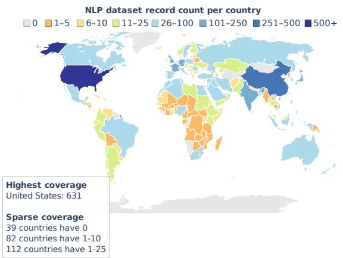  
Figure 1: Global distribution of NLP dataset coverage in AtlasNLP-Core. Countries are bucketed by represented dataset record count, showing a highly uneven distribution with a small number of high-coverage countries and many sparsely represented regions.

A central reason these patterns are difficult to measure is that geographic metadata is rarely documented explicitly (Faisal et al., 2022). Dataset documentation commonly records language and task, but often omits which countries or populations are represented (Bender and Friedman, 2018; Faisal et al., 2022). Language metadata provides an important but incomplete signal: many languages span multiple countries, and many countries contain multiple linguistic communities (Aji et al., 2022; Hershcovich et al., 2022; Tonneau et al., 2024). For example, Spanish is spoken across Spain and much of Latin America, yet datasets labeled as Spanish are often representative only for a subset of these countries. As a result, languagelevel views can make geographic representation appear broader than the underlying country-level evidence supports, especially when multilingual datasets are treated as evidence of broad population coverage.

To address these limitations, we introduce AtlasNLP, a country-aware atlas of over 13,000 NLP dataset records covering 31 normalized NLP task categories such as machine translation and question answering. Alongside task and language metadata, AtlasNLP records both represented countries, i.e., the countries or populations represented in a dataset; and producer countries, i.e., the institutional locations where datasets are produced. The resource consists of two complementary components: AtlasNLP-Gold, which is a humancurated reference set; and AtlasNLP-Core, an ACL-derived large-scale collection constructed through automated extraction. Using AtlasNLP-Gold, we validate AtlasNLP-Core, and broaden AtlasNLP’s coverage of underrepresented regions. Using AtlasNLP-Core, we analyze patterns of geographic representation, task coverage, and dataset production within the ACL literature.

Our contributions are as follows: (1) we release AtlasNLP-Core and AtlasNLP-Gold as countryaware resources for studying NLP dataset geography; (2) we show that dataset coverage is highly uneven across countries and tasks, with 79.2% of country-task pairs containing no dataset records with documented country representation; (3) we distinguish representation from production, showing that many countries are represented primarily through datasets produced outside the country; (4) we show that dataset availability is positively associated with broader research infrastructure, including national income and university capacity; and (5) we show that language coverage does not imply geographic coverage, motivating more explicit country-level dataset documentation.

## 2 Related Work

Geographic Representation of NLP Datasets. NLP datasets, benchmarks, and model ecosystems are geographically uneven (Bender et al., 2021; Blodgett et al., 2020). AI systems often perform better for populations that are better represented in training and evaluation data (Mihalcea et al., 2025; Nwatu et al., 2026), and model behavior can vary across populations even when tasks appear similar (Hershcovich et al., 2022; Naous et al., 2024). These disparities have been documented across modalities, including vision-language models (Shankar et al., 2017; De Vries et al., 2019; Nwatu et al., 2023, 2025) and speech technologies (Elmadany et al., 2025).

Prior work has shown that representation is not only a matter of dataset quantity: languages, regions, and populations differ in the tasks, resources, and technologies available to them (Joshi et al., 2020; Blasi et al., 2022; Yu et al., 2022). However, most studies examine geographic or population bias within individual datasets, models, tasks, languages, or regional settings (Hershcovich et al., 2022; Naous et al., 2024; Alabi et al., 2025; Faisal et al., 2022; Yu et al., 2022; Longpre et al., 2025), but do not provide a unified country-level view of which populations are represented in NLP datasets across regions, who produces those datasets, and how task coverage varies geographically. AtlasNLP addresses this gap by enabling systematic analysis of NLP dataset representation, production, and task coverage across countries.

Multilingual and Cross-Lingual Evaluation. NLP evaluation is commonly organized around language. Benchmarks such as XTREME (Hu et al., 2020), XGLUE (Liang et al., 2020), and FLORES (Goyal et al., 2022) expanded evaluations beyond English, while multilingual surveys document persistent disparities across low-resource and non-Western languages (Joshi et al., 2020; Blasi et al., 2022; Ranathunga and De Silva, 2022; Joshi et al., 2025). However, language is an incomplete proxy for geographic and cultural representation because many languages span multiple countries, and many countries contain multiple linguistic communities (Hershcovich et al., 2022; Blodgett et al., 2020; Tonneau et al., 2024; Liu et al., 2025; Pawar et al., 2025). AtlasNLP adds country-level structure alongside language metadata, making it possible to study variation in representation, task coverage, and production within and across languages.

Dataset Documentation, Platforms, and Metadata. Dataset documentation work emphasizes recording dataset origins, collection procedures, intended uses, and potential biases (Gebru et al., 2021; Bender and Friedman, 2018; Longpre et al., 2024). Dataset platforms such as Hugging Face and publication repositories like ACL Anthology have also made resources easier to discover and reuse (Lhoest et al., 2021). Yet geographic metadata remains underdeveloped: language and task metadata are often available, while country-level information is frequently incomplete, implicit, or absent. This makes it difficult to distinguish represented geography, in which populations are represented, from producer geography, in which datasets are institutionally created (Santy et al., 2023). AtlasNLP addresses this gap by introducing structured country-aware metadata for over 13,000 NLP dataset records.

## 3 Methodology

Constructing a country-aware view of the NLP dataset ecosystem requires more than extracting existing metadata. Geographic information is often implicit, inconsistently documented, or absent, and language alone is frequently insufficient for determining which populations are represented. We develop AtlasNLP through three stages: (i) designing a structured annotation framework and humancurated reference collection, (ii) scaling the framework over ACL Anthology papers, and (iii) auditing and refining the extracted dataset records to produce a high-confidence dataset collection.

## 3.1 Annotation Framework and Schema Design

We design a structured annotation framework that records: (i) represented countries, (ii) producer countries, (iii) task category, (iv) language, (v) modality and licensing, and (vi) attribution method. Task categories are derived from recent ACL and EMNLP thematic areas and normalized into 30 categories. AtlasNLP-Gold additionally includes Raw Corpus for unlabeled or minimally structured text collections.

We use a standardized set of 197 geopolitical entities, consisting of the 193 UN member states and two UN observer states, together with Taiwan and Kosovo. A central design choice is the distinction between represented country, the country or population represented in a dataset, and producer country, the institutional location of its creators. This allows us to analyze dataset representation separately from dataset production.

Represented-country evidence is classified as explicit, inferred, or unattributed. Explicit attribution requires direct evidence connecting dataset content, participants, data sources, or collection to a country. Inferred attribution captures plausible geographic relevance supported by indirect evidence, such as a geographically specific language variety, community, or data source. Language alone is not sufficient for explicit country attribution. Primary analyses use explicit attribution, while key analyses are repeated with explicit+inferred attribution as a sensitivity analysis.

## 3.2 Human Curation

We construct a human-curated collection to ground the annotation framework, improve coverage of underrepresented regions, and provide a reference set for validation. Contributors come from diverse geographic backgrounds, including Nigeria, China, Peru, the United States, Romania, South Korea, and Ethiopia.

Contributors start by selecting the countries they are familiar with and collect associated datasets from ACL Anthology, Hugging Face, Papers With Code, GitHub repositories, institutional archives, and regional dataset collections. To encourage balanced coverage, countries are grouped into high-, medium-, and low-resource categories, and contributors select country sets spanning multiple regions. Contributors are encouraged to identify up to five datasets per country, with particular attention to countries with limited NLP data representation. Each dataset is annotated using the shared schema, including dataset name, task category, language, modality, licensing, country attribution, and provenance.

The curation process has two stages. In the compilation stage, contributors independently collect and annotate datasets for their assigned countries. In the cross-validation stage, assignments are shuffled and redistributed for secondary review. Reviewers verify country attribution, task categorization, metadata consistency, duplicates, and provenance, reducing annotator bias and improving consistency. The resulting collection, AtlasNLP-Gold, contains 1,480 human-curated entries and serves as a high-quality reference set for evaluating automated extraction. Additional details on Gold construction and review are provided in Appendix D.

## 3.3 Automated Dataset Expansion

To scale beyond manual coverage, we apply the annotation framework to ACL Anthology1 publications. We begin with 119,963 ACL records spanning 1952–2025. Papers with abstracts are evaluated using ModernBERT-base-NLI (Sileo, 2024) against the hypothesis “This paper proposes a dataset.” We retain papers with entailment scores greater than 0.5, yielding 20,277 candidate dataset papers.

Candidate papers are processed using a staged extraction pipeline combining rule-based datasetrole checks with schema-constrained GPT-4o-mini extraction from full paper text. The pipeline extracts dataset identity, task, language, licensing, dataset role, and geographic evidence, together with page- and quote-level provenance. This produces 18,035 successful initial paper-level extractions.

A subsequent 400-record human audit reveals recurring failure modes, particularly reuse of existing datasets and country assignments based on affiliation, language, or incidental mentions rather than dataset provenance. We use these findings to tighten the dataset-role and country-attribution criteria and re-evaluate the full extracted collection. Dataset records are retained when the paper introduces a dataset, materially extends an existing dataset, or constructs a new dataset compilation as a primary contribution. The resulting AtlasNLP-Core contains 13,462 primary dataset-contribution records. Full extraction, exclusion, and audit details are reported in Appendix A.7.

## 3.4 Validation and Quality Control

We evaluate the final pipeline using three complementary human-reviewed checks.

First, we compare post-audit AtlasNLP-Gold against the final AtlasNLP-Core. Matching by ACL paper and dataset identity yields 225 highconfidence aligned dataset records. Among matched Gold dataset records for which AtlasNLP-Core assigns an explicit country, 97.7% share at least one country with the Gold reference set, and 94.7% of individual country assignments made by Core are supported by Gold. Exact task agreement is 79.9%. When inferred country evidence is included on both Gold and Core, country-assignment precision remains similar at 94.0%.

Second, the 400-record audit is used to verify that the failure modes identified in the initial extraction are substantially reduced after revision. Of 187 dataset records whose country attribution was judged incorrect, 177 (94.7%) no longer remain in the explicit geographic layer. Among the 98 eligible cases for which the human review finds no supported country, 97 are correctly left unattributed. Detailed audit results and recall-oriented analyses are reported in Appendix A.7.

Finally, because producer geography is derived from author affiliations and is conceptually distinct from represented-country attribution, we evaluate it independently on 100 human-labeled dataset records. Producer-country extraction achieves 96.9% precision and 97.7% recall at the countryassociation level, with the primary producer country recovered in all audited cases.

## 4 AtlasNLP Overview

AtlasNLP has two complementary components. AtlasNLP-Core contains 13,462 paper-level dataset records corresponding to primary dataset contributions in ACL Anthology publications. We use the term dataset record rather than unique dataset because related papers may introduce, extend, or compile versions of the same underlying resource, and resolving these relationships into unique dataset entities is not always straightforward. AtlasNLP-Gold contains 1,480 humancurated entries, corresponding to 989 normalized dataset-name groups. We keep the collections separate because they differ in source coverage and metadata completeness: Core provides consistent large-scale metadata, including producercountry information from author affiliations, while Gold supplements the ACL-derived collection with human-curated resources, particularly for underrepresented regions.

Table 1 summarizes the final AtlasNLP resource. Represented-country evidence is available at two confidence levels. Explicit country attribution is available for 2,447 Core dataset records (18.2%), while including inferred attribution expands coverage to 3,506 dataset records (26.0%). Dataset records without sufficiently supported country evidence remain in Core and contribute to analyses that do not require represented-country metadata. Unless otherwise stated, analyses use AtlasNLP-Core.

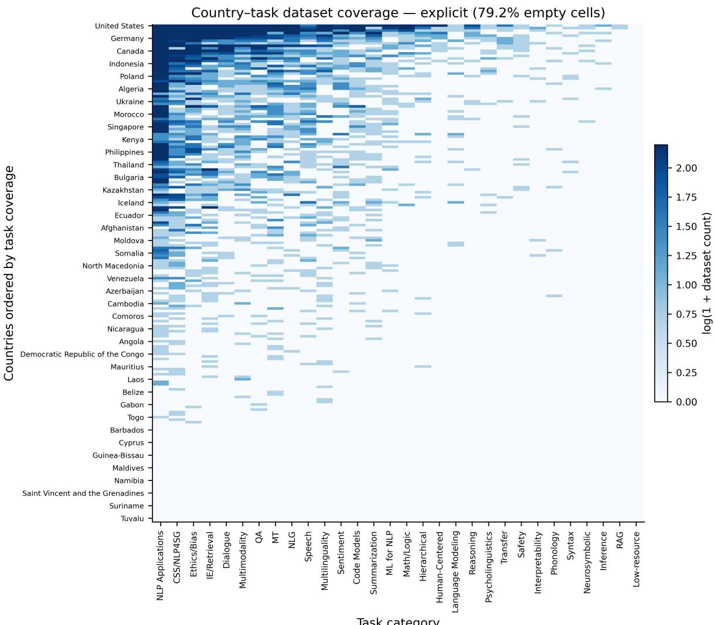  
Figure 2: Heatmap of dataset coverage across countries and tasks. Coverage is highly fragmented, with most country-task pairs lacking represented dataset records and even high-coverage countries concentrated in a subset of tasks. Only a subset of country labels is shown for readability, with labels placed at regular intervals (approximately every fifth country). Best viewed in color.

## 5 Dataset Geography Analysis

## 5.1 Dataset Coverage is Highly Uneven Across Countries and Tasks

We first examine which countries are represented in NLP datasets using explicit represented-country attribution. Coverage follows a pronounced longtail distribution. Across AtlasNLP-Core, 2,447 dataset records have explicit country attribution, corresponding to 4,421 country-record associations across 158 of 197 countries. The United States, China, India, the United Kingdom, and Germany account for a large share (36.4%) of these associations. At the other end of the distribution, 39 countries have no explicitly attributed dataset records, and 121 of 197 countries have ten or fewer represented dataset records.

Coverage is even sparser across countries and tasks. As shown in Figure 2, nearly four in five country-task pairs have no explicitly attributed dataset records (79.2%). This pattern remains under explicit+inferred attribution, where threequarters of pairs are still empty (75.0%). Geographic imbalance therefore reflects not only how many represented dataset records each country has, but also which NLP tasks they cover.

Country attribution is also systematically missing. Among unattributed Core records, 70.7% include English, compared with 49.9% of explicitly attributed dataset records. Because English is globally distributed, language alone provides little evidence of represented country. We therefore interpret low or zero coverage as gaps in documented country representation within ACL dataset contributions, not evidence that no NLP resources exist.

<table><tr><td>Statistic</td><td>Value</td></tr><tr><td>AtlasNLP-Core dataset records</td><td>13,462</td></tr><tr><td>AtlasNLP-Gold entries / normalized name groups</td><td>1,480 / 989</td></tr><tr><td>Core dataset records w/explicit country attribution</td><td>2,447 (18.2%)</td></tr><tr><td>Core dataset records w/explicit+inferred attribution</td><td>3,506 (26.0%)</td></tr><tr><td>Core countries represented (explicit / +inferred)</td><td>158 / 168</td></tr><tr><td>Gold countries represented (explicit / +inferred)</td><td>192 / 197</td></tr><tr><td>Core country-record associations (explicit / +inferred)</td><td>4,421 / 6,001</td></tr><tr><td>Task categories (Core / AtlasNLP overall)</td><td>30/31</td></tr><tr><td>Audited languages (Core / AtlasNLP overall)</td><td>1,239 / 1,245</td></tr><tr><td>Multilingual dataset records (Core)</td><td>3,063</td></tr><tr><td>Producer-country metadata (Core)</td><td>13,224 (98.2%)</td></tr></table>

Table 1: Summary statistics for AtlasNLP. AtlasNLP-Core contains vetted primary dataset-contribution records. Represented-country statistics distinguish explicit attribution from the broader explicit+inferred sensitivity layer.

## 5.2 Dataset Production and Representation are Asymmetric

Dataset coverage alone does not show who produces the datasets used to represent different countries. We therefore compare represented country with producer country, derived from the institutional locations of dataset creators based on author affiliations. Producer geography captures institutional location rather than researcher identity, reflecting differences in research capacity, agendas, and environments.

To construct the production-representation analysis, we first restrict the explicit represented-country layer to records for which producer-country metadata is available. This reduces the 2,447 explicitly attributed Core records (4,421 countryrecord associations) to 2,396 records and 4,305 represented-country associations. Records without recovered producer geography remain in the coverage and task analyses but cannot contribute to production-representation ratios. For example, BizBench (Krumdick et al., 2024) and the Online Tenant Reviews dataset (Haber and Waks, 2021) have explicit U.S. representation in AtlasNLP but no recovered producer country.

We then expand each retained representedcountry association over all producer countries associated with that record. Thus, a dataset record representing R countries and associated with institutions in P producer countries contributes $R \times P$ producer-representation associations. This expansion yields 6,533 producer-representation associations from the 2,396 eligible records and preserves multi-country representation and cross-country collaboration rather than forcing either side to a single country.

Figure 3 compares two complementary measures. The x-axis shows content self-representation: among represented records about a country with producer metadata, the share that include that same country among their producer countries. The yaxis shows producer self-representation: among expanded producer-representation associations involving a producer country, the share whose represented country is that same country. Together, these measures distinguish countries whose representation is primarily produced locally or externally, and producers that focus primarily on themselves or on other countries.

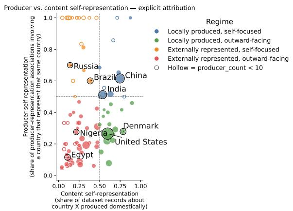  
Figure 3: Dataset production and representation by country under explicit attribution. The x-axis measures the share of datasets about a country produced domestically; the y-axis measures the share of producerrepresentation associations involving a country that represent itself. Dashed lines define four productionrepresentation regimes. Point size reflects dataset volume; hollow points indicate countries with fewer than 10 producer associations.

The resulting patterns are strongly asymmetric. Among countries with at least 10 represented records with producer metadata and 10 producerrepresentation associations, 39 of 62 (62.9%) have content self-representation below 0.5, meaning that most dataset records representing them were produced by institutions outside the country. This pattern is similar without the minimum-count restriction and under explicit+inferred attribution.

Figure 3 shows the broader distribution, while Table 2 reports values for representative countries in each regime. China and India are both locally produced and self-focused, while the United States and Denmark have high domestic representation but produce many datasets about other countries. Nigeria and Egypt are more externally represented and outward-facing. Russia and Brazil show a different pattern: much of their representation is produced externally, while their own dataset production is comparatively self-focused.

<table><tr><td>Country</td><td>Content self-rep.</td><td>Producer self-rep.</td><td>Represented records w/prod.</td><td>Producer-rep associations</td></tr><tr><td>United States</td><td>0.597</td><td>0.265</td><td>620</td><td>1394</td></tr><tr><td>China</td><td>0.747</td><td>0.615</td><td>364</td><td>442</td></tr><tr><td>India</td><td>0.537</td><td>0.513</td><td>227</td><td>238</td></tr><tr><td>Denmark</td><td>0.786</td><td>0.278</td><td>28</td><td>79</td></tr><tr><td>Nigeria</td><td>0.216</td><td>0.276</td><td>37</td><td>29</td></tr><tr><td>Egypt</td><td>0.109</td><td>0.115</td><td>55</td><td>52</td></tr><tr><td>Russia</td><td>0.140</td><td>0.700</td><td>50</td><td>10</td></tr><tr><td>Brazil</td><td>0.386</td><td>0.600</td><td>70</td><td>45</td></tr></table>

Table 2: Examples of production-representation asymmetry under explicit country attribution. Representedrecord counts are restricted to records with producer metadata; producer-side counts are expanded producerrepresentation associations. All highlighted countries have at least 10 represented records with producer metadata and 10 producer–representation associations.

Production is also geographically concentrated.The United States accounts for 21.3% of expanded producer-representation associations, while the ten largest producer countries account for 61% of these associations. This concentration persists under explicit+inferred attribution. Together, these results show that geographic representation in NLP depends not only on which countries appear in datasets, but also on where the institutions producing those datasets are located (Santy et al., 2023).

## 5.3 Dataset Availability Tracks Research Infrastructure

We next examine whether geographic dataset record coverage aligns with broader research infrastructure. Using World Bank income categories and national university counts, we compare representedcountry coverage with two coarse indicators of institutional capacity.

Figure 4(A) shows a strong income gradient: the median number of represented dataset records is substantially higher for high-income countries than for the other income groups.

Figure 4(B) similarly shows a positive association between national university counts and dataset coverage (Pearson r = .65; Spearman $\rho = . 6 1 )$ . The relationship strengthens slightly under explicit+inferred attribution $( r = . 7 0 ; \rho = . 6 7 )$

These patterns show that dataset availability is positively associated with broader research infrastructure. The relationship is not deterministic, however: countries with similar levels of institutional capacity can still differ substantially in coverage, reflecting the roles of language, publication ecosystems, and regional research priorities.

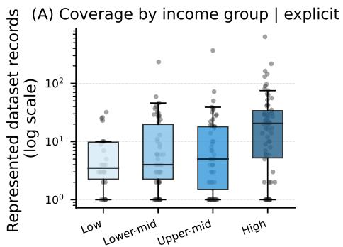

(B) Coverage vs. university count | explicit  
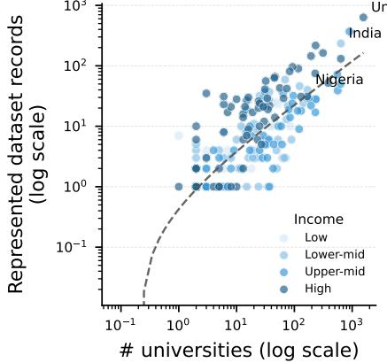  
Figure 4: Relationship between represented-country dataset records and research infrastructure under explicit attribution. (A) Coverage by World Bank income group. (B) Coverage increases with national university counts on log-transformed values. Color indicates income group. Best viewed in color.

## 5.4 Task Coverage is Fragmented Across Countries

Geographic disparities extend beyond dataset availability to the range of NLP tasks represented. We measure each country’s task breadth, the number of task categories represented, and top-3 task share, the proportion of represented dataset records concentrated in its three most common tasks. We restrict the analysis to countries with at least 10 represented dataset records and classify portfolios with a top-3 share above 0.60 as specialist, and the remainder as generalist.

Even among these better-represented countries, task coverage remains uneven. Under explicit attribution, the median country spans 11 of 30 task categories, while its three most common tasks account for 55.6% of represented dataset records. Explicit+inferred attribution increases median breadth to 13 tasks, while concentration remains similar at 54.3%.

Table 3 illustrates this variation. Countries such as the United States, China, India, and France have broad generalist portfolios, whereas Belgium,

<table><tr><td>Country</td><td>Represented records</td><td>Task breadth</td><td>Top-3 share</td><td>Portfolio</td></tr><tr><td>United States</td><td>631</td><td>27</td><td>0.50</td><td>Generalist</td></tr><tr><td>China</td><td>368</td><td>27</td><td>0.48</td><td>Generalist</td></tr><tr><td>India</td><td>233</td><td>22</td><td>0.46</td><td>Generalist</td></tr><tr><td>France</td><td>144</td><td>22</td><td>0.44</td><td>Generalist</td></tr><tr><td>Egypt</td><td>58</td><td>15</td><td>0.53</td><td>Generalist</td></tr><tr><td>Mexico</td><td>49</td><td>14</td><td>0.61</td><td>Specialist</td></tr><tr><td>Belgium</td><td>26</td><td>7</td><td>0.81</td><td>Specialist</td></tr><tr><td>Bahrain</td><td>15</td><td>7</td><td>0.73</td><td>Specialist</td></tr><tr><td>Israel</td><td>20</td><td>8</td><td>0.70</td><td>Specialist</td></tr><tr><td>Oman</td><td>20</td><td>9</td><td>0.70</td><td>Specialist</td></tr></table>

Table 3: Examples of country-level task portfolios under explicit attribution. Task breadth is the number of represented task categories, and top-3 share is the proportion of a country’s represented dataset records concentrated in the three most common tasks. We label portfolios with top-3 share above 0.60 as specialist and the remainder as generalist. Countries with fewer than 10 represented dataset records are excluded.

Bahrain, Israel, and Oman are concentrated in a much narrower set of tasks. Thus, geographic coverage does not imply broad task coverage: a country may be represented in NLP datasets but remain concentrated in only a small subset of tasks.

## 5.5 Language Metadata Does Not Imply Geographic Coverage

A central challenge in analyzing dataset geography is that represented-country information is often unavailable or insufficiently documented. Datasets more commonly report language, making language an appealing proxy for geographic coverage even though the same language may span many countries and populations.

AtlasNLP addresses this gap by distinguishing explicit represented-country attribution from additional inferred attribution. Inferred attribution was intentionally conservative, as language alone was not used to assign broadly distributed languages such as English, French, Spanish, Portuguese, Arabic, or Swahili to countries; such assignments required additional country-specific contextual evidence. Even under explicit+inferred attribution, however, a represented country could not be established for 9,956 of 13,462 Core dataset records (74.0%). This substantial attribution gap illustrates why language metadata alone cannot resolve the geography of much of the NLP dataset ecosystem.

Figure 5 shows substantial variation in country concentration across widely used languages. Chinese-language records are overwhelmingly associated with China (89.2%). For Portuguese, Brazil and Portugal together account for about

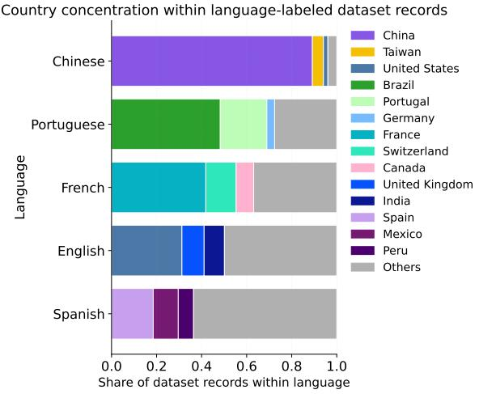  
Figure 5: Country concentration within languagelabeled dataset records under explicit attribution. Country representation varies substantially within widely used languages: some are dominated by one or a few countries, while others are more geographically distributed. Language coverage therefore does not directly indicate which countries are represented.

69% of represented dataset records, while France, Switzerland, and Canada account for about 63% of French records. English is more geographically distributed, yet the United States, United Kingdom, and India still account for about half of represented dataset records.

These patterns show why language alone is an incomplete measure of geographic representation. A language may span many countries without those countries being represented equally, or at all, within NLP datasets. Explicit country-aware metadata is therefore necessary for observing population-level gaps that language metadata alone can obscure.

## 6 Lessons Learned and Implications

Document represented populations explicitly. A major challenge in constructing AtlasNLP was the absence of recoverable country-level provenance. Even with explicit+inferred attribution, a represented country could not be established for 74% of AtlasNLP-Core dataset records. This does not imply that these datasets lack geographic context, but that it is often not documented in a form that can be reliably recovered. Dataset documentation should therefore include represented countries or populations, geographic scope, and data provenance to support more transparent and accurate coverage claims (Longpre et al., 2024).

Distinguish explicit from inferred geography. Plausible geographic signals should not be treated as equivalent to documented provenance. Separating explicit and inferred attribution makes uncertainty visible and allows geographic analyses to be evaluated under both strict and broader assumptions.

Treat language as necessary but insufficient. Language remains essential for organizing NLP resources, but it should not be treated as a proxy for geographic representation (Tonneau et al., 2024). Countries sharing a language can have very different levels of representation, and language-labeled resources may remain concentrated in only a subset of the populations that use that language.

Separate representation from production. Dataset geography is shaped by both who is represented and who produces the data. Distinguishing represented geography from producer geography makes institutional asymmetries in dataset creation more visible.

Track task coverage, not only dataset counts. Countries with some dataset coverage may still lack coverage across large parts of the NLP task space. Reporting task-level geographic coverage can help identify where dataset development is broad, narrow, or missing.

Make geographic metadata first-class dataset infrastructure. Large dataset platforms such as Hugging Face have improved resource visibility, but population-level coverage remains difficult to audit without standardized metadata for represented populations, geographic provenance, and producer geography. AtlasNLP offers one schema for making these distinctions explicit and geographic gaps easier to identify.

## 7 Conclusion

We introduced AtlasNLP, a country-aware atlas of NLP dataset contributions that supports analysis of geographic representation, dataset production, and task coverage. By distinguishing the populations represented in datasets from the institutional locations where datasets are produced, and explicit from inferred geographic attribution, AtlasNLP makes visible patterns that are difficult to observe in language-centered resource collections.

Our analysis shows that NLP dataset coverage is highly uneven across countries and tasks, production is geographically concentrated and asymmetric, and language coverage does not imply geographic coverage. These findings highlight limitations in current dataset documentation practices and show why geographic diversity cannot be assessed reliably from language metadata or producer geography alone. We release AtlasNLP at the AtlasNLP project site and hope it supports future work on dataset transparency, geographic representation, and population-aware evaluation, while encouraging geographic metadata to become a firstclass component of dataset documentation.

## Limitations

AtlasNLP is subject to limitations in metadata quality, coverage, and scope. First, represented-country attribution remains incomplete and non-random. Our precision-first strategy leaves dataset records unattributed when country provenance cannot be established confidently, particularly for globally distributed languages. Consequently, low or zero country coverage should be interpreted as limited documented representation within the ACL literature, rather than evidence that no relevant NLP resources exist.

Second, AtlasNLP-Core consists of paper-level dataset-contribution records rather than fully deduplicated dataset entities. Related dataset records may describe extensions, compilations, or versions of the same underlying resource, for which entitylevel deduplication is not always straightforward. AtlasNLP therefore measures documented dataset activity, not the number of unique datasets, dataset size, quality, or downstream evaluation capacity. Multi-country dataset records may also contribute to several country totals. These counts should therefore be interpreted as indicators of research visibility and coverage rather than data volume.

Third, most Core annotations are automatically extracted. Validation against AtlasNLP-Gold and targeted audits indicate high precision for the geographic layers used in our analyses, but errors may remain, particularly for complex multi-country scope. Gold also shares the AtlasNLP annotation schema and is not a fully independent ground truth.

Fourth, the ModernBERT NLI filter used to identify candidate dataset papers was not evaluated for population-wide recall across the full ACL Anthology. AtlasNLP should therefore not be interpreted as an exhaustive census of all dataset contributions in ACL, and we avoid temporal claims that would depend on uniform recall across publication periods.

Fifth, producer geography is derived from author affiliations and represents institutional location rather than researcher identity, nationality, or intent. This distinction is especially important for diaspora researchers and cross-border collaborations.

Finally, AtlasNLP-Core is intentionally scoped to ACL Anthology publications. Datasets released only through Hugging Face, GitHub, industry repositories, government portals, community archives, or non-ACL venues are therefore underrepresented. Our normalized task schema also trades granularity for cross-country comparability and may obscure locally specific or niche task distinctions.

## Ethical Considerations

AtlasNLP makes country-level gaps in NLP dataset representation more visible, but country-level analysis can also be overinterpreted. Countries are not equivalent to cultures, languages, ethnic groups, or lived experiences, and substantial variation exists within national boundaries. We therefore caution against using AtlasNLP to rank countries, essentialize populations, or treat country labels as complete representations of identity or culture.

Geographic attribution also carries uncertainty. Inferred country assignments capture plausible geographic relevance under deliberately conservative rules; they should not be interpreted as definitive claims about the identity of dataset contributors or populations. For this reason, AtlasNLP preserves the distinction between explicit and inferred attribution and uses explicit provenance for its primary geographic analyses.

There is also a risk that evidence of underrepresentation could be used to normalize poorer model performance for some regions rather than motivate its improvement. Our goal is the opposite: to identify gaps in representation, production, and task coverage so that future data collection and evaluation can be more inclusive and accountable. Likewise, absence or low coverage in AtlasNLP should not be interpreted as evidence that a country or community lacks NLP resources.

Producer-country metadata should be interpreted carefully. It reflects institutional affiliation, not researcher nationality, identity, or intent. Externally produced datasets may result from collaboration, diaspora scholarship, or resource sharing; our aim is not to privilege domestic production, but to make production and representation patterns visible.

AtlasNLP-Gold was constructed through a collaborative research effort rather than paid crowdsourcing. Contributors compiled and validated entries using shared guidelines and were credited as coauthors when they completed the agreed curation and validation workload. Machine-assisted extensions followed the same human curation goals and guidelines. Gold was deliberately curated to broaden geographic coverage and should therefore not be interpreted as a natural sample of the global NLP dataset ecosystem.

## Acknowledgments

We thank the anonymous reviewers for their feedback, and the members of the Language and Information Technologies lab at the University of Michigan for the insightful discussions during the early stage of the project. This project was partially funded by a grant from OpenAI and a grant from the Survival and Flourishing Fund and a grant from the University of Michigan under the Strategic Initiative Fund. Any opinions, findings, and conclusions or recommendations expressed in this material are those of the authors and do not necessarily reflect the views of Open AI or the Survival and Flourishing Fund or the University of Michigan.

## References

Alham Fikri Aji, Genta Indra Winata, Fajri Koto, Samuel Cahyawijaya, Ade Romadhony, Rahmad Mahendra, Kemal Kurniawan, David Moeljadi, Radityo Eko Prasojo, Timothy Baldwin, Jey Han Lau, and Sebastian Ruder. 2022. One country, 700+ languages: NLP challenges for underrepresented languages and dialects in Indonesia. In Proceedings of the 60th Annual Meeting of the Association for Computational Linguistics (Volume 1: Long Papers), pages 7226–7249, Dublin, Ireland. Association for Computational Linguistics.

Jesujoba Oluwadara Alabi, Michael A. Hedderich, David Ifeoluwa Adelani, and Dietrich Klakow. 2025. Charting the landscape of African NLP: Mapping progress and shaping the road ahead. In Proceedings of the 2025 Conference on Empirical Methods in Natural Language Processing, pages 27807–27841, Suzhou, China. Association for Computational Linguistics.

Emily M Bender and Batya Friedman. 2018. Data statements for natural language processing: Toward mitigating system bias and enabling better science. Transactions of the Association for Computational Linguistics, 6:587–604.

Emily M Bender, Timnit Gebru, Angelina McMillan-Major, and Shmargaret Shmitchell. 2021. On the dangers of stochastic parrots: Can language models be too big? In Proceedings ofthe 2021 ACM conference on fairness, accountability, and transparency, pages 610–623.

Damian Blasi, Antonios Anastasopoulos, and Graham Neubig. 2022. Systematic inequalities in language technology performance across the world’s languages. In Proceedings of the 60th Annual Meeting of the Association for Computational Linguistics (Volume 1: Long Papers), pages 5486–5505.

Su Lin Blodgett, Solon Barocas, Hal Daumé Iii, and Hanna Wallach. 2020. Language (technology) is power: A critical survey of “bias” in nlp. In Proceedings of the 58th annual meeting of the association for computational linguistics, pages 5454–5476.

Laurie Vear Burchell. 2024. Improving Natural Language Processingfor Under-Served Languages through Increased Training Data Diversity. Ph.D. thesis, University of Edinburgh.

Terrance De Vries, Ishan Misra, Changhan Wang, and Laurens Van der Maaten. 2019. Does object recognition work for everyone? In Proceedings of the IEEE/CVF conference on computer vision and pattern recognition workshops, pages 52–59.

AbdelRahim A. Elmadany, Sang Yun Kwon, Hawau Olamide Toyin, Alcides Alcoba Inciarte, Hanan Aldarmaki, and Muhammad Abdul-Mageed. 2025. Voice of a continent: Mapping Africa’s speech technology frontier. In Proceedings of the 2025 Conference on Empirical Methods in Natural Language Processing, pages 11028–11050, Suzhou, China. Association for Computational Linguistics.

Fahim Faisal, Yinkai Wang, and Antonios Anastasopoulos. 2022. Dataset geography: Mapping language data to language users. In Proceedings of the 60th Annual Meeting of the Association for Computational Linguistics (Volume 1: Long Papers), pages 3381– 3411.

Timnit Gebru, Jamie Morgenstern, Briana Vecchione, Jennifer Wortman Vaughan, Hanna Wallach, Hal Daumé Iii, and Kate Crawford. 2021. Datasheets for datasets. Communications ofthe ACM, 64(12):86– 92.

Naman Goyal, Cynthia Gao, Vishrav Chaudhary, Peng-Jen Chen, Guillaume Wenzek, Da Ju, Sanjana Krishnan, Marc’Aurelio Ranzato, Francisco Guzmán, and Angela Fan. 2022. The flores-101 evaluation benchmark for low-resource and multilingual machine translation. Transactions of the Association for Computational Linguistics, 10:522–538.

Adam Haber and Zeev Waks. 2021. Classification and geotemporal analysis of quality-of-life issues in tenant reviews. In Findings ofthe Associationfor Computational Linguistics: EMNLP 2021, pages 2541– 2553, Punta Cana, Dominican Republic. Association for Computational Linguistics.

Daniel Hershcovich, Stella Frank, Heather Lent, Miryam de Lhoneux, Mostafa Abdou, Stephanie Brandl, Emanuele Bugliarello, Laura Cabello Piqueras, Ilias Chalkidis, Ruixiang Cui, Constanza Fierro, Katerina Margatina, Phillip Rust, and Anders Søgaard. 2022. Challenges and strategies in crosscultural NLP. In Proceedings of the 60th Annual Meeting of the Association for Computational Linguistics (Volume 1: Long Papers), pages 6997–7013, Dublin, Ireland. Association for Computational Linguistics.

Junjie Hu, Sebastian Ruder, Aditya Siddhant, Graham Neubig, Orhan Firat, and Melvin Johnson. 2020. Xtreme: A massively multilingual multi-task benchmark for evaluating cross-lingual generalisation. In International conference on machine learning, pages 4411–4421. PMLR.

Aditya Joshi, Raj Dabre, Diptesh Kanojia, Zhuang Li, Haolan Zhan, Gholamreza Haffari, and Doris Dippold. 2025. Natural language processing for dialects of a language: A survey. ACM Computing Surveys, 57(6):1–37.

Pratik Joshi, Sebastin Santy, Amar Budhiraja, Kalika Bali, and Monojit Choudhury. 2020. The state and fate of linguistic diversity and inclusion in the nlp world. In Proceedings ofthe 58th annual meeting of the association for computational linguistics, pages 6282–6293.

Michael Krumdick, Rik Koncel-Kedziorski, Viet Dac Lai, Varshini Reddy, Charles Lovering, and Chris Tanner. 2024. BizBench: A quantitative reasoning benchmark for business and finance. In Proceedings of the 62nd Annual Meeting of the Association for Computational Linguistics (Volume 1: Long Papers), pages 8309–8332, Bangkok, Thailand. Association for Computational Linguistics.

Quentin Lhoest, Albert Villanova del Moral, Yacine Jernite, Abhishek Thakur, Patrick von Platen, Suraj Patil, Julien Chaumond, Mariama Drame, Julien Plu, Lewis Tunstall, Joe Davison, Mario Šaško, Gunjan Chhablani, Bhavitvya Malik, Simon Brandeis, Teven Le Scao, Victor Sanh, Canwen Xu, Nicolas Patry, and 13 others. 2021. Datasets: A community library for natural language processing. In Proceedings of the 2021 Conference on Empirical Methods in Natural Language Processing: System Demonstrations, pages 175–184, Online and Punta Cana, Dominican Republic. Association for Computational Linguistics.

Yaobo Liang, Nan Duan, Yeyun Gong, Ning Wu, Fenfei Guo, Weizhen Qi, Ming Gong, Linjun Shou, Daxin Jiang, Guihong Cao, Xiaodong Fan, Ruofei Zhang, Rahul Agrawal, Edward Cui, Sining Wei, Taroon Bharti, Ying Qiao, Jiun-Hung Chen, Winnie Wu, and 5 others. 2020. XGLUE: A new benchmark dataset for cross-lingual pre-training, understanding and generation. In Proceedings ofthe 2020 Conference on Empirical Methods in Natural Language Processing (EMNLP), pages 6008–6018, Online. Association for Computational Linguistics.

Chen Cecilia Liu, Iryna Gurevych, and Anna Korhonen. 2025. Culturally aware and adapted nlp: A taxonomy and a survey of the state of the art. Transactions ofthe Associationfor Computational Linguistics, 13:652–689.

Shayne Longpre, Robert Mahari, Naana Obeng-Marnu, William Brannon, Tobin South, Katy Gero, Sandy Pentland, and Jad Kabbara. 2024. Data authenticity, consent, & provenance for ai are all broken: what will it take to fix them? arXiv preprint arXiv:2404.12691.

Shayne Longpre, Nikhil Singh, Manuel Cherep, Kushagra Tiwary, Joanna Materzynska, William Brannon, Robert Mahari, Naana Obeng-Marnu, Manan Dey, Mohammed Hamdy, Nayan Saxena, Ahmad Mustafa Anis, Emad Alghamdi, Minh Chien Vu, Da Yin, Kun Qian, Yizhi Li, Minnie Liang, An Dinh, and 24 others. 2025. Bridging the data provenance gap across text, speech, and video. In International Conference on Learning Representations, volume 2025, pages 60592–60670.

Rada Mihalcea, Oana Ignat, Longju Bai, Angana Borah, Luis Chiruzzo, Zhijing Jin, Claude Kwizera, Joan Nwatu, Soujanya Poria, and Thamar Solorio. 2025. Why ai is weird and shouldn’t be this way: towards ai for everyone, with everyone, by everyone. In Proceedings of the AAAI conference on artificial intelligence, volume 39, pages 28657–28670.

Tarek Naous, Michael J Ryan, Alan Ritter, and Wei Xu. 2024. Having beer after prayer? measuring cultural bias in large language models. In Proceedings of the 62nd annual meeting of the association for computational linguistics (volume 1: Long papers), pages 16366–16393.

Joan Nwatu, Longju Bai, Oana Ignat, and Rada Mihalcea. 2026. Culture affordance atlas: Reconciling object diversity through functional mapping. In Proceedings of the AAAI Conference on Artificial Intelligence, volume 40, pages 39089–39097.

Joan Nwatu, Oana Ignat, and Rada Mihalcea. 2023. Bridging the digital divide: Performance variation across socio-economic factors in vision-language models. In Proceedings of the 2023 conference on empirical methods in natural language processing, pages 10686–10702.

Joan Nwatu, Oana Ignat, and Rada Mihalcea. 2025. Uplifting lower-income data: Strategies for socioeconomic perspective shifts in large multi-modal models. In Proceedings of the 2025 Conference of the Nations ofthe Americas Chapter ofthe Associationfor Computational Linguistics: Human Language Technologies (Volume 1: Long Papers), pages 2127–2144.

Siddhesh Pawar, Junyeong Park, Jiho Jin, Arnav Arora, Junho Myung, Srishti Yadav, Faiz Ghifari Haznitrama, Inhwa Song, Alice Oh, and Isabelle Augenstein. 2025. Survey of cultural awareness in language models: Text and beyond. Computational Linguistics, 51(3):907–1004.

Surangika Ranathunga and Nisansa De Silva. 2022. Some languages are more equal than others: Probing deeper into the linguistic disparity in the nlp world. In Proceedings of the 2nd Conference of the Asia-Pacific Chapter ofthe Associationfor Computational Linguistics and the 12th International Joint Conference on Natural Language Processing (Volume 1: Long Papers), pages 823–848.

Sebastin Santy, Jenny Liang, Ronan Le Bras, Katharina Reinecke, and Maarten Sap. 2023. NLPositionality: Characterizing design biases of datasets and models. In Proceedings of the 61st Annual Meeting of the Associationfor Computational Linguistics (Volume 1: Long Papers), pages 9080–9102, Toronto, Canada. Association for Computational Linguistics.

Shreya Shankar, Yoni Halpern, Eric Breck, James Atwood, Jimbo Wilson, and D Sculley. 2017. No classification without representation: Assessing geodiversity issues in open data sets for the developing world. arXiv preprint arXiv:1711.08536.

Damien Sileo. 2024. tasksource: A large collection of NLP tasks with a structured dataset preprocessing framework. In Proceedings of the 2024 Joint International Conference on Computational Linguistics, Language Resources and Evaluation (LREC-COLING 2024), pages 15655–15684, Torino, Italia. ELRA and ICCL.

Manuel Tonneau, Diyi Liu, Samuel Fraiberger, Ralph Schroeder, Scott A Hale, and Paul Röttger. 2024. From languages to geographies: Towards evaluating cultural bias in hate speech datasets. In Proceedings of the 8th Workshop on Online Abuse and Harms (WOAH 2024), pages 283–311.

Xinyan Yu, Trina Chatterjee, Akari Asai, Junjie Hu, and Eunsol Choi. 2022. Beyond counting datasets: A survey of multilingual dataset construction and necessary resources. In Findings ofthe Association for Computational Linguistics: EMNLP 2022, pages 3725–3743.

## A Pipeline and Construction Details

This appendix provides additional details on the construction, audit, and validation of AtlasNLP-Core and AtlasNLP-Gold. Figure 6 summarizes the full pipeline. AtlasNLP-Core is constructed in two stages: an initial large-scale extraction from ACL Anthology papers, followed by audit-driven refinement of dataset eligibility and geographic attribution. AtlasNLP-Gold is constructed through human curation, cross-validation, and subsequent audit and refinement. The sections below describe the metadata schema, task taxonomy, countryattribution policy, language normalization, automated extraction, post-extraction audit, producercountry extraction, and construction of the countrylevel analysis layers.

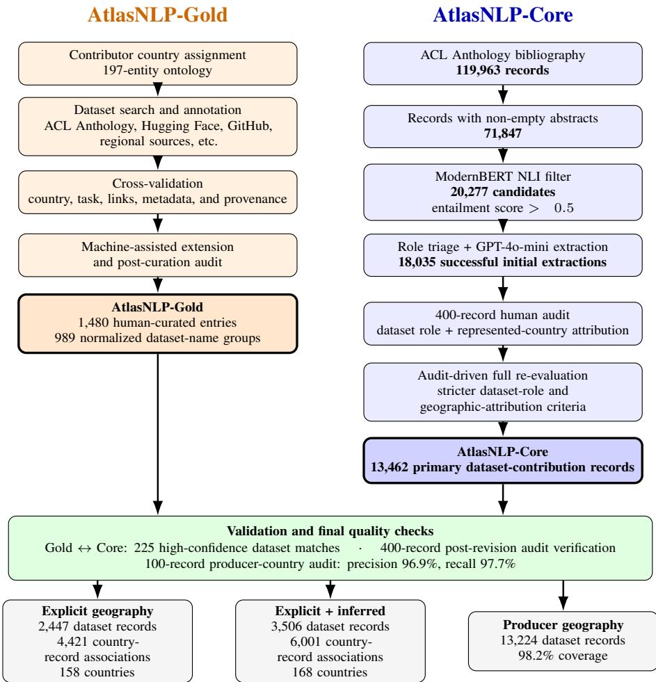  
Figure 6: Overview of AtlasNLP construction, audit, and validation. AtlasNLP-Core proceeds from ACL candidate selection through initial automated extraction and audit-driven re-evaluation, yielding 13,462 final primary datasetcontribution records. AtlasNLP-Gold contains 1,480 human-curated entries corresponding to 989 normalized dataset-name groups. Final geographic layers distinguish explicit attribution from the broader explicit+inferred sensitivity analysis.

The initial ACL pipeline begins with 119,963 ACL Anthology records, of which 71,847 contain non-empty abstracts. ModernBERT-base-NLI assigns 23,674 papers an entailment label for the hypothesis that the paper proposes a dataset; 20,277 also exceed the 0.5 entailment threshold and enter the extraction pipeline. Role triage and LLMassisted metadata extraction produce 18,035 successful initial paper-level extractions. A subsequent 400-record human audit identifies recurring datasetrole and geographic-attribution errors and motivates a full re-evaluation of these records. The final AtlasNLP-Core contains 13,462 primary datasetcontribution records.

## A.1 Metadata Schema

AtlasNLP uses a shared conceptual schema for human-curated and automatically extracted dataset records. The schema captures dataset identity and provenance, dataset role, task and language coverage, represented and producer geography, and additional dataset characteristics. The final Core release also retains audit and normalization fields used to document eligibility and geographic attribution. Table 4 summarizes the principal metadata fields.

The schema separates represented country, which captures the geographic population or context represented by a dataset, from producer country, which captures where dataset production is institutionally located. It also separates dataset identity from dataset relationship: related papers may introduce, materially extend, compile, or reuse the same underlying resource. Final AtlasNLP-Core eligibility is therefore defined at the level of the paper–dataset contribution rather than by datasetname deduplication alone.

<table><tr><td>Field</td><td>Description</td></tr><tr><td>Dataset name</td><td>Name of the dataset, benchmark, resource, or dataset compilation.</td></tr><tr><td>Paper link</td><td>Paper URL or citation associated with the dataset contribution.</td></tr><tr><td>Dataset link</td><td>Official dataset, benchmark, repository, GitHub, or Hugging Face URL.</td></tr><tr><td>Dataset relationship / role</td><td>Relationship between the paper and target dataset: introduced, materially extended, newly compiled, reused from prior work, not identifiable, or ambiguous. This field determines AtlasNLP-Core eligibility.</td></tr><tr><td>Task category</td><td>Normalized NLP task category from the AtlasNLP taxonomy.</td></tr><tr><td>Language(s)</td><td>Dataset languages or language varieties, normalized and audited when possible.</td></tr><tr><td>Represented country</td><td>Country or population represented by the dataset content, participants, sources, or collection context.</td></tr><tr><td>Country attribution</td><td>Geographic evidence layer: explicit, inferred, or unattributed when evidence is insufficient.</td></tr><tr><td>Producer country</td><td>Institutional location of dataset creators, derived from author affiliations for ACL-derived records.</td></tr><tr><td>Modality</td><td>Dataset modality, including text-only and multimodal resources.</td></tr><tr><td>Multiple-choice format</td><td>Whether the dataset or benchmark uses a multiple-choice format.</td></tr><tr><td>Synthetic</td><td>Whether content is machine-translated, model-generated, or otherwise synthetic, when recover- able.</td></tr><tr><td>License</td><td>Dataset license, when available.</td></tr><tr><td>Provenance / evidence</td><td>Source information supporting extracted metadata, including page- and quote-level evidence where available.</td></tr><tr><td>Audit / normalization fields</td><td>Eligibility decisions, attribution status, normalized country lists, processing status, and related post-audit quality-control fields.</td></tr></table>

Table 4: Principal metadata fields used in AtlasNLP. The final Core release also retains audit and normalization fields documenting dataset eligibility and geographic-attribution decisions.

## A.2 Task Taxonomy

AtlasNLP uses a normalized task taxonomy derived from recent ACL and EMNLP thematic areas. AtlasNLP-Core contains 30 task categories, while AtlasNLP-Gold additionally includes Raw Corpus, yielding 31 categories across AtlasNLP overall. Table 5 lists the final taxonomy and short labels used in figures.

## A.3 Country Attribution Rules

AtlasNLP uses a standardized set of 197 geopolitical entities, consisting of the 193 UN member states and two UN observer states, together with Taiwan and Kosovo. Represented-country attribution is separated from producer geography and is classified into three confidence levels: explicit, inferred, and unattributed.

• Explicit attribution. A country is assigned explicitly when dataset documentation directly connects the dataset content, participants, data sources, collection process, target population, or benchmark scope to that country. Examples include data collected in a named country, a benchmark explicitly designed for a country’s population, or source material drawn from a clearly identified national context.

• Inferred attribution. A country is assigned as inferred when geographic relevance is plausible from indirect but geographically informative evidence, such as a country-specific language variety, a locally defined community, or a data source with a sufficiently narrow geographic scope. Inferred attribution is retained separately from explicit attribution and is used only in the broader sensitivity analyses.

• Unattributed. A dataset record remains unattributed when available evidence is insufficient to support either explicit or conservative inferred geography. Broadly distributed languages, author affiliations, incidental country mentions, and the geographic location of the producing institution are not by themselves treated as evidence of represented country.

This distinction is important because represented country and producer country capture different concepts. Author affiliation may establish producer geography but does not establish which population the dataset represents. The post-extraction audit identified affiliation-based assignment, languageonly assignment, and incidental country mentions as recurring sources of erroneous representedcountry attribution; the final pipeline therefore applies these exclusions explicitly.

For multi-country datasets, all countries supported by the available evidence are retained. A single dataset record can therefore contribute to multiple country-record associations, while remaining one dataset record in analyses that do not expand by represented country.

<table><tr><td>Task category</td><td>Short label</td></tr><tr><td>Code Models</td><td>Code Models</td></tr><tr><td>Computational Social Science, Cultural Analytics, NLP for Social Good</td><td>CSS / NLP4SG</td></tr><tr><td>Dialogue and Interactive Systems</td><td>Dialogue</td></tr><tr><td>Discourse, Pragmatics, and Reasoning</td><td>Discourse / Reasoning</td></tr><tr><td>Efficient / Low-Resource Methods for NLP, LLM Efficiency</td><td>Low-resource / Efficiency</td></tr><tr><td>Ethics, Bias, and Fairness</td><td>Ethics / Bias</td></tr><tr><td>Generalizability and Transfer</td><td>Transfer</td></tr><tr><td>Hierarchical Structure Prediction</td><td>Hierarchical</td></tr><tr><td>Human-AI Interaction / Cooperation, Human-Centered NLP</td><td>Human-Centered NLP</td></tr><tr><td>Information Extraction, Retrieval, and Text Mining</td><td>IE / Retrieval</td></tr><tr><td>Interpretability, Model Analysis, Transparency, and Explainability</td><td>Interpretability</td></tr><tr><td>Language Modeling</td><td>Language Modeling</td></tr><tr><td>Linguistic Theories, Cognitive Modeling, and Psycholinguistics Machine Learning for NLP</td><td>Psycholinguistics</td></tr><tr><td>Machine Translation</td><td>ML for NLP</td></tr><tr><td>Mathematical, Symbolic, and Logical Reasoning in NLP</td><td>MT</td></tr><tr><td>Multilinguality and Language Diversity</td><td>Math / Logic</td></tr><tr><td>Multimodality and Language Grounding to Vision, Robotics, and Beyond</td><td>Multilinguality</td></tr><tr><td>Natural Language Generation</td><td>Multimodality</td></tr><tr><td>Neurosymbolic Approaches to NLP</td><td>NLG</td></tr><tr><td>NLP Applications</td><td>Neurosymbolic</td></tr><tr><td>Phonology, Morphology, and Word Segmentation</td><td>NLP Applications</td></tr><tr><td>Question Answering</td><td>Phonology / Morphology</td></tr><tr><td>Raw Corpus</td><td>QA</td></tr><tr><td>Retrieval-Augmented Language Models</td><td>Raw Corpus</td></tr><tr><td></td><td>RAG</td></tr><tr><td>Safety and Alignment in LLMs</td><td>Safety</td></tr><tr><td>Semantics: Lexical and Sentence Level, Textual Inference</td><td>Semantics / Inference</td></tr><tr><td>Sentiment Analysis, Stylistic Analysis, and Argument Mining</td><td>Sentiment / Style / Argument</td></tr><tr><td>Speech Recognition, Text-to-Speech, and Spoken Language Understanding</td><td>Speech</td></tr><tr><td>Summarization Syntax: Tagging, Chunking, and Parsing</td><td>Summarization Syntax</td></tr></table>

Table 5: AtlasNLP-Core+Gold task taxonomy. AtlasNLP-Core contains 30 ACL/EMNLP-derived categories; AtlasNLP-Gold adds the human-curated Raw Corpus category. Short labels are used in compact visualizations.

Synthetic datasets follow the same attribution policy. Producer country is derived from the institution responsible for dataset creation, while represented country is assigned only when the dataset documentation identifies a target population or geographic context. For example, a modelgenerated Swahili dataset explicitly designed to simulate Kenyan speakers can be attributed to Kenya, whereas synthetic language-model output with no stated target population remains geographically unattributed.

## A.4 Language Normalization and Inference

Language metadata is often noisy, inconsistent, or incomplete. AtlasNLP therefore normalizes language metadata before using it for analysis or geographic inference. The normalization process includes whitespace and formatting cleanup, alias resolution, ISO-code expansion, preservation of locale-specific labels, separation of canonical languages from language varieties and sign languages, and removal of invalid or non-language entries. Programming-language labels and other artifacts are excluded from the audited language inventory.

Language normalization is conceptually separate from country attribution. A normalized language label does not automatically imply a represented country. Instead, language may contribute to the inferred geographic layer only when it provides a sufficiently specific geographic signal. Explicit country attribution is never assigned from language alone.

Table 6 summarizes the final conservative language-to-country policy.

The final attribution layers preserve this uncertainty explicitly. Among the 13,462 AtlasNLP-Core dataset records, 2,447 have explicit represented-country attribution, 1,059 have inferred-only attribution, and 9,956 remain unattributed. Thus, the broader explicit+inferred sensitivity layer contains 3,506 dataset records. Inferred attribution is not synonymous with languagebased mapping: it may also reflect other indirect but geographically informative evidence described in Appendix A.3.

<table><tr><td>Language signal</td><td>Treatment</td></tr><tr><td>Country-specific variety or locale</td><td>May support inferred attribution when the language label itself pro- vides a sufficiently narrow geo- graphic signal, such as Egyptian Ara-</td></tr><tr><td>association</td><td>bic for Egypt. Narrow geographic May support conservative inferred attribution when the language or speech community is strongly asso- ciated with a limited geographic con- text. If multiple countries remain plausible, AtlasNLP does not force</td></tr><tr><td>textual evidence</td><td>assignment to a single country. Language plus con- May support inferred attribution when language is accompanied by additional country-specific evidence, such as a locally defined community,</td></tr><tr><td>language</td><td>source, or collection context. Broadly distributed No country is assigned from lan- guage alone. This includes lan- guages such as English, French, Spanish, Portuguese, Arabic, and Swahili; country-specific context is</td></tr><tr><td>biguous label</td><td>required. Script-only or am- No represented country is assigned when the available metadata identi- fies only a script, unresolved variant, or otherwise insufficient geographic signal.</td></tr></table>

Table 6: Conservative treatment of language signals in represented-country inference. Language may support the inferred layer when geographic evidence is sufficiently specific, but language alone never produces explicit country attribution.

The audited-language outputs are retained independently of these geographic decisions. The language audit was performed on the extracted records and then restricted to the final eligible Core and reviewed Gold collections, preserving the original language-level audit decisions after the postextraction dataset audit. Final language inventory statistics are reported in Appendix B.2.

## A.5 Automated Extraction for AtlasNLP-Core

AtlasNLP-Core is constructed from ACL Anthology publications through a multi-stage candidateselection and metadata-extraction pipeline. We begin with 119,963 ACL Anthology bibliography records spanning 1952–2025. Of these, 71,847 contain non-empty abstracts and are eligible for the dataset-paper filtering stage.

We use ModernBERT-base-NLI to evaluate whether each paper’s title and abstract support the hypothesis:

The NLI model assigns 23,674 papers an entailment label. We retain the 20,277 papers whose entailment score also exceeds 0.5 as candidate dataset papers for downstream extraction.

Candidate papers are then processed using a staged extraction pipeline. For each paper, the pipeline retrieves the paper PDF, extracts full text page-by-page, performs an initial rule-based dataset-role triage, and applies schema-constrained GPT-4o-mini extraction to recover dataset metadata.

The extraction stage records dataset identity, dataset relationship, task category, language, licensing, represented-country signals, modality, synthetic status, format, and related metadata. Automatically extracted fields are accompanied by pageand quote-level evidence when available. Records requiring additional clarification are routed to a targeted second LLM pass using relevant paper excerpts rather than being accepted directly.

The initial role-triage step excludes 905 candidate papers before LLM extraction. A further 1,337 candidates fail during PDF retrieval, parsing, schema validation, or related extraction steps. The remaining 18,035 papers yield successful initial paper-level extractions:

$$
2 0 , 2 7 7 = 9 0 5 + 1 , 3 3 7 + 1 8 , 0 3 5 .
$$

These 18,035 records form the initial extraction set, rather than the final AtlasNLP-Core collection. As described in Appendix A.7, a subsequent 400-record human audit identified remaining dataset-role and represented-country attribution errors. The resulting audit criteria were then applied across the full initial extraction set, yielding the final 13,462 AtlasNLP-Core primary datasetcontribution records.

## A.6 Metadata Extraction Prompt

The LLM-assisted extraction stage uses a schemaconstrained prompt designed to minimize unsupported inference and preserve auditable provenance. The model is instructed to return valid JSON, mark unavailable fields as Not stated, and provide page-level evidence for extracted metadata. This prompt governs the initial extraction stage; dataset-role eligibility and represented-country attribution are subsequently re-evaluated using the post-extraction audit procedure described in Appendix A.7.

# A simplified version of the extraction prompt is shown below.

System prompt:

You extract dataset metadata from the provided paper text conservatively and auditably.

Rules:

\- Do not guess. Do not infer beyond the available evidence. - If a field is not supported by the paper text, output "Not stated".

\- Every non-"Not stated" field MUST have an evidence item with a page number and a short quote (<= 20 words).

\- Output MUST be valid JSON only.

\- If multiple datasets are described, identify the primary target dataset when possible; otherwise flag ambiguity. - All required fields must be present.

User prompt:   
Return JSON with this structure:   
{   
paper:{...},   
dataset:{...},   
evidence:[...],   
quality:{   
flags:[],   
needs\_stage2:boolean   
},   
run:{...}   
}   
Allowed task categories:   
[ALLOWED\_TASK\_CATEGORIES]   
Paper ID:   
[PAPER\_ID]   
Paper URL:   
[PAPER\_URL]   
Prompt version:   
[PROMPT\_VERSION]   
Paper text with page markers:   
[PAPER\_TEXT\_WITH\_PAGE\_MARKERS]

## A.7 Post-Extraction Audit and Refinement

The 18,035 successful initial extractions were designed for high recall and still contained cases in which the paper did not make a primary dataset contribution or in which represented-country evidence was insufficiently grounded in dataset provenance. We therefore conducted a human audit of 400 randomly sampled records from the initial extraction set.

The audit reviewed two issues separately. First, reviewers determined the relationship between the paper and the target dataset: whether the paper introduced a new dataset, materially extended an existing dataset, constructed a new dataset compilation, reused an existing resource, or did not support a confident target-dataset identification. Second, reviewers evaluated represented-country attribution against evidence about the dataset itself, rather than author affiliation, language alone, or incidental country mentions.

The audit identified recurring failure modes in both dimensions. In particular, some initial records described reused datasets rather than primary dataset contributions, while some representedcountry assignments reflected the location of authors or institutions rather than the population represented by the dataset. Other errors arose from broadly distributed languages, incidental country mentions, incomplete multi-country scope, and ambiguous dataset identity. These findings were used to tighten both dataset-role and geographicattribution criteria before re-evaluating the full 18,035-record initial extraction set.

<table><tr><td>Final eligible relationship</td><td>Dataset records</td></tr><tr><td>Dataset introduced in paper</td><td>12,205</td></tr><tr><td>Existing dataset materially extended</td><td>819</td></tr><tr><td>New dataset compilation constructed</td><td>438</td></tr><tr><td>Final AtlasNLP-Core</td><td>13,462</td></tr></table>

Table 7: Composition of final AtlasNLP-Core by paper– dataset relationship. Records are retained only when the target dataset is confidently matched and the paper makes a primary dataset contribution.

Final dataset eligibility. A record is retained in AtlasNLP-Core only when the target dataset can be matched with sufficient confidence and the paper makes one of three primary dataset contributions: (i) introducing the dataset, (ii) materially extending an existing dataset, or (iii) constructing a new dataset compilation. Mere reuse of an existing dataset does not qualify.

Table 7 summarizes the resulting final Core composition.

Of the 4,573 initial extractions not retained in final Core, 4,071 involve reuse of an existing dataset, 408 do not yield a sufficiently identifiable target dataset, and 42 involve unresolved ambiguity among multiple datasets. An additional 48 records have a potentially eligible dataset relationship but lack a sufficiently confident match to the target dataset, and four records could not be processed successfully during re-evaluation. Thus, the reduction from 18,035 initial extractions to 13,462 final Core dataset records reflects dataset-role and identity refinement rather than removal based on geographic coverage.

Geographic refinement. Dataset eligibility is determined independently of whether representedcountry metadata can be recovered. Eligible records remain in AtlasNLP-Core even when no country can be established. For geographic analyses, represented-country evidence is instead assigned to the separate explicit, inferred, or unattributed layers described in Appendix A.3. This separation prevents uncertainty in geographic provenance from being conflated with whether a paper contributes a dataset.

The same 400-record audit is subsequently used to evaluate whether the revised pipeline addresses the failure modes observed during review. Postrevision audit results, including country-attribution corrections and abstention behavior, are reported in Appendix C.

## A.8 Producer-Country Extraction

AtlasNLP-Core also records producer geography, defined as the institutional location associated with dataset production. Producer country is derived from author affiliations rather than researcher nationality, identity, or represented-country information. It is therefore treated as conceptually separate from represented-country attribution.

The producer-side pipeline combines rule-based affiliation extraction with targeted LLM fallback. For each ACL paper, the pipeline retrieves affiliation information from the paper, including firstpage text where available, and uses deterministic methods to identify institution names, explicit country mentions, email domains, and other affiliation cues. Country assignment follows a hierarchy of evidence that includes direct country mentions, institution–country mappings, and domain-based signals. Extracted country names are normalized to the common 197-entity AtlasNLP ontology.

When rule-based extraction leaves producer metadata missing or ambiguous, a targeted LLM fallback is applied. Trigger conditions include missing country or institution information and unresolved or conflicting affiliation evidence. Rulebased results are retained when sufficiently supported, while the fallback is used to resolve or fill remaining gaps.

In the final AtlasNLP-Core collection, producercountry metadata is available for 13,224 of 13,462 dataset records (98.2%). We independently evaluate this pipeline on 100 human-labeled records. At the country-association level, producer-country extraction achieves 96.9% precision and 97.7% recall, and the primary producer country is recovered in all 100 audited records. Full audit results are reported in Appendix C.

## A.9 Country–Task Matrix Construction

Country-task matrices are constructed from the final 13,462-record AtlasNLP-Core collection after country and task normalization. Each Core dataset record has one normalized task category. For geographic analyses, records are expanded over all represented countries supported by the relevant attribution layer, so that a multi-country dataset contributes once to each supported country while remaining a single dataset record in the underlying Core collection.

We construct two versions of the matrix. The primary matrix uses only explicit represented-country attribution. This layer contains 2,447 dataset records, which expand to 4,421 country-record associations covering 158 countries. The sensitivity matrix additionally includes inferred geography, yielding 3,506 dataset records and 6,001 countryrecord associations across 168 countries.

For comparability across geographic layers, both matrices are represented over the complete AtlasNLP-Core analysis space of 197 geopolitical entities and 30 task categories, including zerocount rows and columns where applicable. Each matrix cell therefore records the number of countryrecord associations for a given country and normalized task.

The explicit matrix contains 1,231 nonzero country-task cells out of 5,910 possible cells, leaving 79.2% of the matrix empty. Under the broader explicit+inferred attribution layer, 1,480 cells are nonzero and 75.0% remain empty. Thus, the broader attribution layer increases observed geographic coverage but does not substantially alter the overall sparsity of country-task representation.

These matrices underpin the country-task coverage and task-portfolio analyses reported in the main paper. Unless otherwise stated, primary results use the explicit matrix, while the explicit+inferred matrix is used as a sensitivity analysis.

## B Data Transparency

This appendix summarizes the controlled geographic and language vocabularies used in AtlasNLP, coverage under the different geographicattribution layers, and the audited language inventory.

## B.1 Country Ontology and Coverage

AtlasNLP uses a standardized ontology of 197 geopolitical entities: 193 UN member states, the two UN non-member observer states, and Taiwan and Kosovo. The observer states are represented in the ontology as Palestine and Vatican City. Country

names are normalized to this ontology before analysis, reducing variation from aliases, abbreviations, alternate spellings, and sub-national references.
<table><tr><td>Subset</td><td>Explicit</td><td>Explicit + inferred</td></tr><tr><td>AtlasNLP-Core</td><td>158 / 197</td><td>168 / 197</td></tr><tr><td>AtlasNLP-Gold</td><td>192 / 197</td><td>197 / 197</td></tr></table>

Table 8: Geopolitical-entity coverage under the two represented-country attribution layers. Primary analyses use explicit attribution; explicit+inferred coverage is reported as a sensitivity analysis.  
Table 9 lists the complete ontology.

Coverage depends on the geographic-attribution layer being considered. Table 8 therefore reports coverage separately for explicit attribution and for the broader explicit+inferred sensitivity layer. AtlasNLP-Core provides explicit represented-country evidence for 158 of the 197 entities; including conservative inferred attribution increases coverage to 168. AtlasNLP-Gold provides substantially broader geographic coverage, with explicit evidence for 192 entities and explicit+inferred coverage for all 197.

The difference between ontology membership and observed coverage is intentional. Countries without attributed dataset records remain part of the 197-entity analysis space and therefore appear as zero-count cases rather than being dropped from country-level analyses.

## B.2 Language Inventory and Audit

AtlasNLP records both raw language metadata and audited language labels. Raw fields may contain ISO codes, aliases, dialect or locale labels, script names, formatting variants, and non-language artifacts. We therefore normalize and audit language metadata before using it for language-level analysis. The normalization and conservative use of language in geographic inference are described in Appendix A.4.

The language audit was conducted on the source collections and then aligned to the final post-audit Core and Gold records. All final records were successfully matched to their audited-language annotations. Programming-language artifacts identified during the audit, including Ada and ABAP, are excluded from the published language inventory.

<table><tr><td>Inventory</td><td>Audited languages</td></tr><tr><td>AtlasNLP-Core</td><td>1,239</td></tr><tr><td>AtlasNLP-Gold</td><td>269</td></tr><tr><td>AtlasNLP overall</td><td>1,245</td></tr></table>

The Core and Gold inventories overlap substantially but are not identical. Six audited languages occur in Gold but not in final Core: Basaa, Guinea-Bissau Creole, Hiri Motu, Inuinnaqtun, Myene, and Nzebi. The union of the two final inventories therefore contains 1,245 audited languages.

These language counts describe normalized language coverage rather than geographic coverage. In particular, the presence of a language label does not imply that a represented country can be established for the corresponding dataset record.

## B.3 Language-to-Country Mapping Transparency

Language metadata is not treated as direct evidence of represented-country coverage. In particular, AtlasNLP does not convert normalized language labels into countries through a general language– country lookup. Many languages span multiple countries, and assigning every dataset in a language to all countries where that language is spoken would substantially overstate geographic representation.

Language can contribute only to the inferred geographic layer when the available label or accompanying context provides a sufficiently specific geographic signal. For example, a country-specific variety such as Egyptian Arabic may support inferred attribution to Egypt. By contrast, broadly distributed languages such as English, French, Spanish, Portuguese, Arabic, or Swahili do not support country assignment on their own. Script-only labels, unresolved varieties, and cases compatible with several countries likewise remain geographically unattributed unless additional evidence is available.

Language-derived evidence never produces explicit attribution. Explicit represented-country assignments require direct provenance connecting the dataset content, participants, sources, collection process, or target population to a country. The complete inference policy is described in Appendix A.4. This separation allows AtlasNLP to retain rich language metadata without treating language coverage as equivalent to geographic coverage.

## C Validation and Quality Checks

We evaluate AtlasNLP-Core through three complementary validation procedures. First, we compare final Core metadata against independently curated AtlasNLP-Gold records that can be aligned with high confidence. Second, we revisit the 400-record human audit used to motivate the post-extraction refinement and measure whether the revised pipeline corrects the observed dataset-role and representedcountry attribution errors. Third, we conduct a separate 100-record human audit of producer-country extraction. Together, these checks evaluate dataset identity, task assignment, represented-country attribution, abstention behavior, and producer geography.

## C.1 Gold-Core Alignment

AtlasNLP-Gold and AtlasNLP-Core are constructed through different pipelines, and a shared paper does not necessarily imply a shared dataset record. Papers may introduce or discuss multiple datasets, and dataset names can vary across sources. We therefore perform validation only after establishing a high-confidence dataset-level alignment rather than treating paper-level overlap alone as a match.

We begin with the 1,480 post-audit Gold entries marked as complete. Among these, 339 unique papers have ACL Anthology links and can therefore be compared directly with the ACL-derived Core pipeline. Of these papers, 299 are recovered in the initial 18,035-record extraction set, and 267 remain after the final dataset-role and identity refinement that produces the 13,462-record Core. The 32 recovered papers that do not remain in final Core consist of 28 cases classified as reuse of an existing dataset and four for which the target dataset could not be identified with sufficient confidence.

<table><tr><td>Alignment stage</td><td>Count</td></tr><tr><td>ACL-linked Gold papers</td><td>339</td></tr><tr><td>Recovered in initial extraction set</td><td>299</td></tr><tr><td>Retained in final Core</td><td>267</td></tr><tr><td>High-confidence dataset matches</td><td>225</td></tr></table>

Within the 267 papers retained in final Core, we then establish dataset-level correspondence using conservative identity criteria. We first match the normalized Gold and Core dataset names within the same ACL paper. This yields 203 high-confidence matches. When normalized names do not match, we accept a record only if Gold and Core provide the same non-empty dataset URL within the same paper, yielding 22 additional matches. We do not use paper-URL agreement alone to infer dataset identity.

The resulting validation set therefore contains 225 high-confidence Gold-Core dataset matches:

203 based on exact normalized dataset-name agreement and 22 based on exact dataset-URL agreement. These matched records form the reference population for the represented-country and task comparisons reported in Appendix C.2.

## C.2 Represented-Country and Task Validation

We evaluate represented-country agreement on the 225 high-confidence Gold–Core dataset matches described above. Because the final pipeline distinguishes explicit from inferred geography, we perform the comparison separately under the two attribution layers used in the main analysis.

For each layer, we distinguish between (i) the number of Gold reference records with geographic evidence and (ii) the subset for which Core also produces a represented-country attribution. Agreement metrics are computed conditional on Core making a geographic prediction. A Core abstention is therefore treated as missing geographic coverage rather than as an incorrect country assignment.

<table><tr><td>Metric</td><td>Explicit</td><td>Explicit + inferred</td></tr><tr><td>Gold reference records</td><td>181</td><td>225</td></tr><tr><td>Core predicts geography</td><td>87 (48.1%)</td><td>138 (61.3%)</td></tr><tr><td>Any country overlap</td><td>97.7%</td><td>97.8%</td></tr><tr><td>Exact country-set match</td><td>66.7%</td><td>68.8%</td></tr><tr><td>Country-assignment precision</td><td>94.7%</td><td>94.0%</td></tr></table>

Under the explicit-only comparison, 181 matched Gold records have explicit representedcountry evidence. Core assigns explicit geography to 87 of these records. Conditional on an assignment, the Core and Gold country sets overlap in 97.7% of cases, and 66.7% have an exact countryset match. At the individual country-assignment level, precision is 94.7%.

Under the broader explicit+inferred comparison, all 225 matched Gold records have geographic evidence in the corresponding Gold layer. Core assigns explicit or inferred geography to 138 records. Conditional on an assignment, 97.8% have at least one country in common with Gold and 68.8% have an exact country-set match. Country-assignment precision is 94.0%.

Exact-set agreement is deliberately strict. For a multi-country dataset, the metric is counted as correct only when the complete predicted country set matches the Gold country set exactly; both omitted and additional countries cause the record to fail exact-set agreement. The substantially higher overlap scores therefore indicate that most non-exact cases reflect differences in multi-country scope rather than completely unrelated geographic attribution.

Task agreement. Task labels are compared only when the Gold record has a single task label that maps directly to the final Core taxonomy. Of the 225 high-confidence dataset matches, 219 satisfy this criterion. Core assigns the same normalized task category as Gold in 175 cases, yielding 79.9% exact task agreement.

These results support the use of the automated metadata for aggregate country- and task-level analysis while also motivating the conservative treatment of missing geography and the explicit separation of inferred attribution from the primary explicit layer.

## C.3 Post-Revision Audit Verification

We next return to the 400 records used in the postextraction human audit and evaluate their outcomes under the revised pipeline. The purpose of this check is different from the Gold–Core comparison above: rather than measuring agreement with an independent dataset collection, it tests whether the specific dataset-role and geographic-attribution failure modes identified during the audit persist after full re-evaluation.

The human audit classifies 287 of the 400 sampled records as eligible primary dataset contributions, 112 as ineligible, and one as a processing failure.

<table><tr><td>Human-audit outcome</td><td>Records</td></tr><tr><td>Eligible primary contribution</td><td>287</td></tr><tr><td>Excluded</td><td>112</td></tr><tr><td>Processing failure</td><td>1</td></tr><tr><td>Total</td><td>400</td></tr></table>

Country-attribution corrections. The original audit labels 187 represented-country assignments as incorrect. After the audit-driven re-evaluation, 177 of these cases (94.7%) no longer remain in the explicit geographic layer. Similarly, among 85 cases for which the human audit judged the geographic connection to be inferred rather than explicit, 83 (97.6%) are not incorrectly promoted to explicit attribution.

A particularly important test concerns abstention. Among the 287 dataset-eligible audit records, 98 cases have no represented country supported by the human review. The revised pipeline leaves 97 of these 98 records geographically unattributed. This indicates that the revised procedure largely distinguishes unsupported geography from extraction failure rather than forcing a country assignment whenever country-related information appears in a paper.

Observed failure modes. The audit revealed several recurring reasons for unsupported country assignments. For example, the initial extraction assigned the United States to the Non-Cooperative Guess What?! Dataset, reflecting the creators’ University of Pittsburgh affiliation; however, the paper identifies the participants only as native English speakers and does not establish their country. The revised record therefore remains geographically unattributed. Similarly, MADial-Bench was initially associated with China, the United Kingdom, and Australia, but the dataset is synthetically constructed without direct evidence that these countries constitute represented populations; the revised pipeline abstains from country attribution. EventRelBench provides another example in which an incidental country signal led to an initial Japan assignment despite insufficient dataset-level provenance; this assignment is likewise removed.

These examples illustrate why countryattribution errors cannot be corrected simply by improving country-name extraction. The relevant distinction is whether a geographic signal describes the dataset’s represented population or content rather than an author affiliation, conference location, incidental mention, language association, or other contextual information.

The post-revision audit therefore supports the conservative design used in the final analyses: unsupported assignments are preferentially removed or downgraded from explicit attribution, while uncertainty is preserved through the separate inferred and unattributed layers.

## C.4 Producer-Country Validation

We independently evaluate producer-country extraction on a manually reviewed sample of 100 AtlasNLP-Core records. Human reviewers inspect author affiliations and record the producer-country set associated with each paper. The automated output is then compared against this reference at both the country-association and record levels.

Across the 100 audited records, the extractor predicts 130 producer-country associations, of which 126 are correct. The human reference contains 129 associations, of which 126 are recovered. This yields 96.9% precision and 97.7% recall.

At the record level, the complete producercountry set matches the human reference exactly for 93 of 100 papers. Importantly, the primary producer country is recovered in all 100 audited records, including cases where additional secondary affiliations cause the full country set to differ.

<table><tr><td>Producer-country audit metric</td><td>Result</td></tr><tr><td>Country-assignment precision</td><td>96.9%</td></tr><tr><td>Country-assignment recall</td><td>97.7%</td></tr><tr><td>Exact country-set match</td><td>93 / 100</td></tr><tr><td>Primary producer country recovered</td><td>100 / 100</td></tr></table>

The audit also allows us to inspect the two extraction paths separately. Among the 60 records resolved primarily through deterministic affiliation parsing, 51 have an exact producer-country-set match. All 40 records routed through the targeted LLM fallback have an exact country-set match in the audit. These results suggest that the fallback is useful for affiliation structures that remain unresolved after rule-based parsing, while the combined pipeline provides high producer-country coverage without relying exclusively on LLM inference.

Because producer geography is derived from author affiliations, this audit evaluates only the producer side of AtlasNLP. It does not validate represented-country attribution, which is evaluated separately in Appendices C.2 and C.3.

## D Human Annotation and Validation Process

This appendix describes the curation and validation process used to construct AtlasNLP-Gold. Gold was designed to broaden geographic coverage beyond the ACL-derived Core collection, establish the annotation schema, and provide an independently curated reference for validation. The collection originated through collaborative human curation and was subsequently extended and audited with machine assistance under the same curation criteria.

## D.1 Contributor Assignment

Collaborators selected countries from a shared assignment sheet. Countries were grouped into high-, medium-, and low-resource levels based on expected NLP dataset availability. The resource levels were used to balance annotation workload rather than to characterize countries intrinsically.

<table><tr><td>Resource level (credit)</td><td>Expected workload</td></tr><tr><td>High (5)</td><td>Many datasets; higher deduplica- tion burden</td></tr><tr><td>Medium (3)</td><td>Moderate expected dataset avail- ability</td></tr><tr><td>Low (1)</td><td>Few or potentially no identifiable datasets</td></tr></table>

Collaborators were asked to select enough countries to reach a target workload and were encouraged to choose countries across multiple regions and resource levels. When possible, contributors selected countries for which they had geographic, linguistic, or domain familiarity. This design aimed to distribute the curation workload while supporting careful country-specific search.

## D.2 Dataset Search Procedure

For each assigned country, collaborators searched for existing NLP datasets using academic and public dataset sources. Suggested sources included ACL Anthology, Hugging Face, Papers With Code, GitHub, Kaggle, Google Scholar, Semantic Scholar, national data portals, institutional repositories, community projects, and regional dataset collections. Contributors prioritized official dataset sources such as repository pages, benchmark websites, Hugging Face pages, GitHub repositories, DOIs, and associated papers.

A shared task–country matrix was used to reduce duplicate work. Before entering a dataset, contributors checked whether the resource had already been recorded. Existing entries were crosschecked rather than entered independently as new resources; newly identified datasets were added to the contributor’s entry sheet and shared tracking matrix.

For lower-resource settings, contributors could also report cases in which no relevant dataset was identified after search. These reports documented the sources searched and supported the broader goal of distinguishing an unsuccessful search from an unexamined country. They are not interpreted as evidence that no NLP resource exists for that country.

## D.3 Human Data Entry

Human-curated entries followed a shared AtlasNLP schema. Contributors recorded dataset name, task category, language, represented country, dataset and paper links, modality, multiple-choice format, synthetic status, license, provenance notes, and geographic-attribution evidence.

Gold was initially organized around dataset– country annotation instances. Multi-country resources could therefore be associated with more than one country while retaining a common dataset identity. For final reporting, dataset names are additionally normalized into dataset-name groups; these normalized groups are used only as an approximate identity summary rather than as a claim of complete entity-level deduplication.

## D.4 Task Annotation

Contributors assigned datasets to task categories using a shared guide based on ACL and EMNLP thematic areas. The guide included broad task categories and example subtasks. For example, information extraction included named entity recognition, relation extraction, event extraction, keyphrase extraction, document retrieval, and knowledge-base population. Question answering included extractive, abstractive, open-domain, multi-hop, multiple-choice, and conversational QA. Multimodality included image captioning, visual question answering, video–text alignment, and related language-grounded tasks.

If a dataset did not fit an existing category, contributors could propose a new category. These additions were subsequently reviewed and normalized to the final AtlasNLP taxonomy described in Appendix A.2.

## D.5 Human Country Attribution

Represented-country annotation followed the same conceptual distinction used in the final AtlasNLP analyses. Contributors prioritized direct evidence that the dataset content, participants, data sources, collection setting, or target population was associated with a country. Such evidence supports explicit attribution.

When direct country information was unavailable, geographically informative but indirect evidence could support an inferred attribution. Language alone was treated conservatively. Broadly distributed languages such as English, French, Spanish, Portuguese, Arabic, and Swahili were not considered sufficient for country attribution without additional country-specific evidence. Cases lacking adequate explicit or conservative inferred evidence remained unattributed.

For multi-country datasets, annotators retained all countries supported by the available evidence rather than forcing a single primary geographic label. Country-attribution decisions were recorded separately from producer geography.

## D.6 Cross-Validation

After initial compilation, entries were redistributed for secondary validation. Validators performed targeted checks rather than re-annotating every source from scratch. Validation focused on four areas:

• Dataset and link checks: Validators confirmed that dataset names corresponded to the linked resources and attempted to repair broken or incorrect links when possible.

• Core metadata checks: Validators checked country, language, task, and geographicattribution evidence for consistency with the cited resource.

• Missing-value checks: Missing fields were completed when the relevant information could be established with high confidence.

• Formatting and normalization checks: Validators corrected invalid controlledvocabulary values, inconsistent country names, and formatting errors.

Validators recorded comments and changes in provenance or notes fields and marked entries complete after validation.

## D.7 Country Name Normalization

Country names were normalized to the 197-entity AtlasNLP ontology described in Appendix B.1. Common corrections included mapping “UAE” to “United Arab Emirates,” “America” to “United States,” “Czech Republic” to “Czechia,” “Republic of Congo” to “Congo (Congo-Brazzaville),” and “Ivory Coast” to “Cote d’Ivoire.”

Where the ontology required country-level representation, sub-national labels were normalized to the corresponding geopolitical entity; for example, Wales and Scotland were mapped to the United Kingdom and Puerto Rico to the United States. For multi-country entries, normalization was applied to individual country labels while preserving the remaining country set.

## D.8 Machine-Assisted Extension and Final Audit

Following the original collaborative curation, AtlasNLP-Gold was extended and re-audited with machine assistance. These stages followed the same underlying curation goals and geographicattribution criteria as the original annotation process. Machine assistance was used to surface candidate evidence, identify records requiring reconsideration, and support consistency checks; it did not change the definition of represented-country evidence.

The subsequent audit focused especially on records for which country attribution depended on indirect evidence, dataset identity was unclear, or the available provenance did not support the existing geographic assignment. Unsupported assignments were removed, while geographically plausible but indirectly supported cases were retained separately as inferred attribution. This process also aligned Gold country names, attribution labels, and language metadata with the final controlled vocabularies used in Core.

## D.9 AtlasNLP-Gold Output

The final AtlasNLP-Gold collection contains 1,480 curated entries corresponding to 989 normalized dataset-name groups. Gold provides explicit represented-country coverage for 192 of the 197 AtlasNLP entities; including conservative inferred attribution expands this to all 197 entities.

Because Gold was deliberately curated to broaden geographic coverage, its country distribution should not be interpreted as a naturally occurring sample of the NLP dataset ecosystem. Its primary roles are complementary coverage, metadata transparency, and independent reference data for validating AtlasNLP-Core.

## E Dataset Examples

Table 10 provides representative examples of the geographic metadata cases distinguished in AtlasNLP: explicit multi-country coverage, separation of represented and producer geography, conservative abstention when represented-country evidence is unavailable, and inferred geography for a synthetic resource.

## F Hugging Face Comparison

Hugging Face is the largest public repository for NLP datasets, with over 900,000 datasets, including approximately 450,000 associated with text modalities. However, many datasets lack the structured metadata required for systematic analysis. Language and task annotations are missing in over 80-85% of records, and no fields capture represented country or represented population. Although an uploader\_region field is widely populated, its distribution suggests that it reflects account defaults rather than dataset provenance. Datasets linked to research papers tend to be more consistently documented, but their proportion has declined as platform growth has shifted toward industry and individual contributors.

These patterns reflect a trade-off between scale and structure. ACL-derived dataset records provide more consistent metadata but more limited coverage, while Hugging Face offers much greater scale without standardized annotations for geographic representation. This lack of structured metadata highlights the need for resources such as AtlasNLP, which organize existing dataset contributions using a standardized metadata framework and can inform the design of future dataset platforms.

## G Robustness and Sensitivity Analyses

Primary geographic analyses in the paper use only explicitly supported represented-country attribution. To assess whether the main conclusions depend on this conservative choice, we repeat key analyses using the broader explicit+inferred attribution layer. This section also reports additional robustness checks addressing multi-country resources, dataset identity, and pipeline recovery.

## G.1 Sensitivity to Geographic-Attribution Layer

Including conservative inferred geography increases the number of Core dataset records with represented-country metadata from 2,447 to 3,506 and expands observed country coverage from 158 to 168 of the 197 AtlasNLP entities. Despite this increase, the principal geographic patterns remain similar.

<table><tr><td>Statistic</td><td>Explicit</td><td>Explicit + inferred</td></tr><tr><td>Dataset records with geography</td><td>2,447</td><td>3,506</td></tr><tr><td>Countries represented</td><td>158</td><td>168</td></tr><tr><td>Empty country-task cells</td><td>79.2%</td><td>75.0%</td></tr><tr><td>Infrastructure Pearson r</td><td>0.65</td><td>0.70</td></tr><tr><td>Infrastructure Spearman ρ</td><td>0.61</td><td>0.67</td></tr><tr><td>Countries in task-portfolio analysis</td><td>77</td><td>89</td></tr><tr><td>Median task breadth</td><td>11</td><td>13</td></tr><tr><td>Median top-3 task share</td><td>55.6%</td><td>54.3%</td></tr></table>

Country-task coverage remains highly sparse: 79.2% of cells are empty under explicit attribution and 75.0% remain empty after inferred geography is included. The association between representedrecord availability and research infrastructure is also similar and slightly stronger under the broader layer, with Pearson correlation increasing from approximately 0.65 to 0.70 and Spearman correlation from 0.61 to 0.67.

Task-portfolio patterns are likewise stable. Among countries with at least 10 represented dataset records, the number of eligible countries increases from 77 to 89, while median task breadth increases from 11 to 13 of the 30 Core task categories. Median concentration in the three most common tasks changes little, from 55.6% to 54.3%.

Production-representation asymmetry also persists. Without a minimum-count restriction, 60 of 89 countries (67.4%) under explicit attribution and 65 of 96 countries (67.7%) under explicit+inferred attribution have content self-representation below 0.5. The primary results use the more conservative minimum-count analysis, under which 39 of 62 countries with at least 10 represented records with producer metadata and 10 producer–representation associations are primarily represented through records produced by institutions outside the country.

Altogether, these comparisons indicate that adding conservative inferred geography increases coverage but does not materially change the main conclusions regarding country-task sparsity, production-representation asymmetry, researchinfrastructure alignment, or task concentration.

## G.2 Additional Robustness Checks

Broad multi-country records. Because records spanning many countries can contribute disproportionately to expanded country counts, we repeat the represented-country analysis after excluding records attributed to more than 20 countries. Under explicit attribution, only 10 of 2,447 attributed records (0.4%) exceed this threshold, accounting for 234 of 4,421 country-record associations (5.3%). After removing them, 4,187 associations remain across 154 countries. The top-10 represented-country set is unchanged, and country rankings remain highly stable (Spearman ρ = .991). The top-10 share increases from 48.6% to 50.4%, indicating that very broad multi-country records slightly dilute, rather than produce, the observed concentration.

Exact-name sensitivity. AtlasNLP-Core uses paper-level dataset-contribution records rather than globally resolved dataset entities because aliases, versions, extensions, and generic dataset names make full entity resolution ambiguous. As a limited sensitivity check, we collapse records sharing the same exact normalized dataset-name key. Of 13,462 Core records, 13,451 have a usable normalized key, corresponding to 13,131 distinct name groups. Within the explicit geographic layer, this collapse reduces 4,421 country-record associations to 4,399 name-group–country associations across 2,427 geographically attributed name groups. The top-10 represented-country set remains identical; across the baseline top 50 countries, rankings correlate at ρ = .999, with a maximum rank shift of two positions. The top-10 share changes by only 0.05 percentage points (48.59% to 48.53%). Thus, repeated exact normalized-name matches do not materially drive the headline geographic concentration results. This check is intentionally narrower than full dataset-entity resolution.

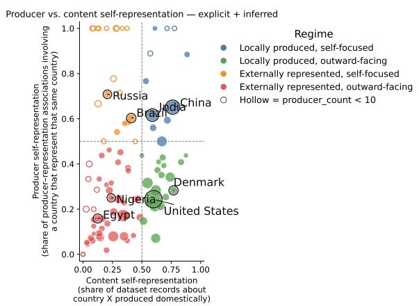  
Figure 7: Dataset production and representation by country under explicit+inferred attribution. The x-axis measures the share of datasets about a country produced domestically; the y-axis measures the share of producerrepresentation associations involving a country that represent itself. Dashed lines define four productionrepresentation regimes. Point size reflects dataset volume; hollow points indicate countries with fewer than 10 producer associations.

Analytical units and low-count handling. Table 11 summarizes the principal analytical units used in the paper. Country-level coverage counts expanded country-record associations, so a record explicitly representing N countries contributes one association to each. Production-representation analyses additionally expand records over producer countries. Country-task sparsity instead uses the fixed 197 × 30 country-task space.

Country concentration within language-labeled dataset records explicit + inferred

(A) Coverage by income group | explicit + inferred  
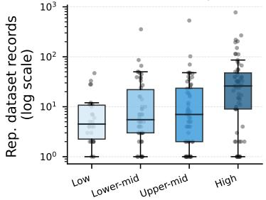

(B) Coverage vs. university count | explicit + inferred 10³+ United States  
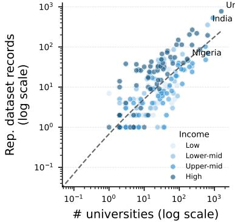  
Figure 8: Relationship between represented-country dataset records and research infrastructure under explicit+inferred attribution. (A) Coverage by World Bank income group. (B) Coverage increases with national university counts on log-transformed values. Pearson r ≈ .70 and Spearman ρ ≈ .67. Color indicates income group. Best viewed in color.

<table><tr><td>Analysis set</td><td>Unit</td><td>N</td></tr><tr><td>AtlasNLP-Core</td><td>dataset records</td><td>13,462</td></tr><tr><td>Explicit rep.</td><td>records / country-record assoc.</td><td>2,447 / 4,421</td></tr><tr><td>Explicit+inferred rep.</td><td>records / country-record assoc.</td><td>3,506 / 6,001</td></tr><tr><td>Production-rep. (explicit)</td><td>records w/producer / expanded assoc.</td><td>2,396/6,533</td></tr><tr><td>Country-task matrix</td><td>country-task cells</td><td>5,910 (197 × 30)</td></tr></table>

Table 11: Denominator map for the principal AtlasNLP-Core geographic analyses. Different analyses expand paper-level dataset records according to the geographic relation being measured.

For production-representation comparisons, the primary summary restricts interpretation to countries with at least 10 represented records with producer metadata and 10 producer-representation associations. Lower-volume countries remain visible in the figure but are treated descriptively because their ratios can change substantially with only a few records. Section G.1 additionally reports results without this minimum-count restriction and under explicit+inferred attribution.

## G.3 Recovery Diagnostic

Because AtlasNLP-Core is constructed through ACL metadata retrieval, NLI screening, automated extraction, and a subsequent dataset-role audit, differences in pipeline recovery can affect analyses over publication time. We therefore treat temporal patterns as descriptive and use AtlasNLP-Gold only as a reference-set diagnostic rather than as an estimate of population-wide recall.

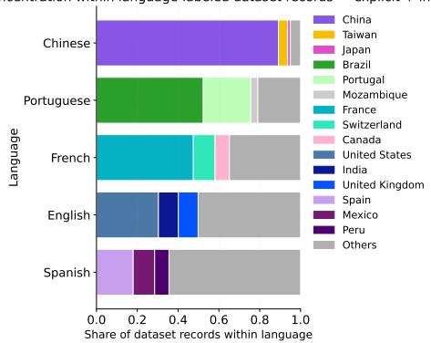  
Figure 9: Country concentration within languagelabeled dataset records under explicit+inferred attribution. Country representation varies substantially within widely used languages: some are dominated by one or a few countries, while others are more geographically distributed. Language coverage therefore does not directly indicate which countries are represented.

Among 339 unique ACL-linked Gold papers in the final curated collection, 299 (88.2%) were recovered in the initial 18,035-record extraction set, and 267 (78.8%) are retained in the final 13,462-record Core. Conditional on initial recovery, 267/299 (89.3%) survive the final dataset-role and provenance audit. Of the 32 initially recovered Gold papers subsequently excluded, 28 were classified as reuse of an existing dataset and four as cases in which the target dataset contribution could not be established.

<table><tr><td>Stage</td><td>Gold papers recovered</td><td>Rate</td></tr><tr><td>ACL-linked Gold reference</td><td>339</td><td></td></tr><tr><td>Initial extraction</td><td>299</td><td>88.2%</td></tr><tr><td>Final AtlasNLP-Core</td><td>267</td><td>78.8%</td></tr><tr><td>Final, conditional on initial recovery</td><td>267 / 299</td><td>89.3%</td></tr></table>

Table 12: Reference-set recovery for ACL-linked AtlasNLP-Gold papers across the extraction and final audit stages. Rates are diagnostic of this curated reference set and should not be interpreted as population-wide ACL recall.

Diagnostic checks conducted during pipeline development also showed that recovery varies across publication periods rather than following a uniform or monotonic pattern. Because both document availability and extraction behavior can vary with publication year, we do not interpret differences in the temporal composition of AtlasNLP-Core as evidence of changes in the underlying NLP dataset ecosystem. Accordingly, the camera-ready analysis does not make substantive claims about temporal diversification of country task portfolios.

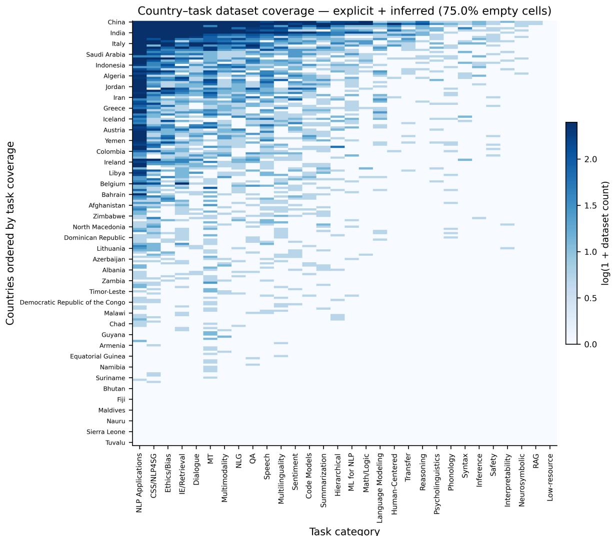  
Figure 10: Heatmap of dataset coverage across countries and tasks under explicit+inferred attribution. Coverage is highly fragmented, with most country-task pairs lacking represented dataset records and even high-coverage countries concentrated in a subset of tasks. Only a subset of country labels is shown for readability, with labels placed at regular intervals (approximately every fifth country). Best viewed in color.

<table><tr><td>Country/entity</td><td>Country/entity</td><td>Country/entity</td><td>Country/entity</td></tr><tr><td>Afghanistan</td><td>Ecuador</td><td>Luxembourg</td><td>São Tomé and Príncipe</td></tr><tr><td>Albania</td><td>Egypt</td><td>Madagascar</td><td>Saudi Arabia</td></tr><tr><td>Algeria</td><td>El Salvador</td><td>Malawi</td><td>Senegal</td></tr><tr><td>Andorra</td><td>Equatorial Guinea</td><td>Malaysia</td><td>Serbia</td></tr><tr><td>Angola</td><td>Eritrea</td><td>Maldives</td><td>Seychelles</td></tr><tr><td>Antigua and Barbuda</td><td>Estonia</td><td>Mali</td><td>Sierra Leone</td></tr><tr><td>Argentina</td><td>Eswatini</td><td>Malta</td><td>Singapore</td></tr><tr><td>Armenia</td><td>Ethiopia</td><td>Marshall Islands</td><td>Slovakia</td></tr><tr><td>Australia</td><td>Fiji</td><td>Mauritania</td><td>Slovenia</td></tr><tr><td>Austria</td><td>Finland</td><td>Mauritius</td><td>Solomon Islands</td></tr><tr><td>Azerbaijan</td><td>France</td><td>Mexico</td><td>Somalia</td></tr><tr><td>Bahamas</td><td>Gabon</td><td>Micronesia</td><td>South Africa</td></tr><tr><td>Bahrain</td><td>Gambia</td><td>Moldova</td><td>South Korea</td></tr><tr><td>Bangladesh</td><td>Georgia</td><td>Monaco</td><td>South Sudan</td></tr><tr><td>Barbados</td><td>Germany</td><td>Mongolia</td><td>Spain</td></tr><tr><td>Belarus</td><td>Ghana</td><td>Montenegro</td><td>Sri Lanka</td></tr><tr><td>Belgium</td><td>Greece</td><td>Morocco</td><td>Sudan</td></tr><tr><td>Belize</td><td>Grenada</td><td>Mozambique</td><td>Suriname</td></tr><tr><td>Benin</td><td>Guatemala</td><td>Myanmar</td><td>Sweden</td></tr><tr><td>Bhutan</td><td>Guinea</td><td>Namibia</td><td>Switzerland</td></tr><tr><td>Bolivia</td><td>Guinea-Bissau</td><td>Nauru</td><td>Syria</td></tr><tr><td>Bosnia and Herzegovina</td><td>Guyana</td><td>Nepal</td><td>Taiwan</td></tr><tr><td>Botswana</td><td>Haiti</td><td>Netherlands</td><td>Tajikistan</td></tr><tr><td>Brazil</td><td>Honduras</td><td>New Zealand</td><td>Tanzania</td></tr><tr><td>Brunei</td><td>Hungary</td><td>Nicaragua</td><td>Thailand</td></tr><tr><td>Bulgaria</td><td>Iceland</td><td>Niger</td><td>Timor-Leste</td></tr><tr><td>Burkina Faso</td><td>India</td><td>Nigeria</td><td>Togo</td></tr><tr><td>Burundi</td><td>Indonesia</td><td>North Korea</td><td>Tonga</td></tr><tr><td>Cabo Verde</td><td>Iran</td><td>North Macedonia</td><td>Trinidad and Tobago</td></tr><tr><td>Cambodia</td><td>Iraq</td><td>Norway</td><td>Tunisia</td></tr><tr><td>Cameroon</td><td>Ireland</td><td>Oman</td><td>Turkey</td></tr><tr><td>Canada</td><td>Israel</td><td>Pakistan</td><td>Turkmenistan</td></tr><tr><td>Central African Republic</td><td>Italy</td><td>Palau</td><td>Tuvalu</td></tr><tr><td>Chad</td><td>Jamaica</td><td>Palestine</td><td>Uganda</td></tr><tr><td>Chile</td><td>Japan</td><td>Panama</td><td>Ukraine</td></tr><tr><td>China</td><td>Jordan</td><td>Papua New Guinea</td><td>United Arab Emirates</td></tr><tr><td>Colombia</td><td>Kazakhstan</td><td>Paraguay</td><td>United Kingdom</td></tr><tr><td>Comoros</td><td>Kenya</td><td>Peru</td><td>United States</td></tr><tr><td>Congo (Congo-Brazzaville)</td><td>Kiribati</td><td>Philippines</td><td>Uruguay</td></tr><tr><td>Costa Rica</td><td>Kosovo</td><td>Poland</td><td>Uzbekistan</td></tr><tr><td>Cote d’Ivoire</td><td>Kuwait</td><td>Portugal</td><td>Vanuatu</td></tr><tr><td>Croatia</td><td>Kyrgyzstan</td><td>Qatar</td><td>Vatican City</td></tr><tr><td>Cuba</td><td>Laos</td><td>Romania</td><td>Venezuela</td></tr><tr><td>Cyprus</td><td>Latvia</td><td>Russia</td><td>Vietnam</td></tr><tr><td>Czechia</td><td>Lebanon</td><td>Rwanda</td><td>Yemen</td></tr><tr><td>Democratic Republic of the Congo</td><td>Lesotho</td><td>Saint Kitts and Nevis</td><td>Zambia</td></tr><tr><td>Denmark</td><td>Liberia</td><td>Saint Lucia</td><td>Zimbabwe</td></tr><tr><td>Djibouti</td><td>Libya</td><td>Saint Vincent and the Grenadines</td><td></td></tr><tr><td>Dominica</td><td>Liechtenstein</td><td>Samoa</td><td></td></tr><tr><td>Dominican Republic</td><td>Lithuania</td><td>San Marino</td><td></td></tr></table>

Table 9: AtlasNLP country ontology used for normalization and coverage analysis. The ontology contains 193 UN member states, the two UN non-member observer states, Taiwan, and Kosovo.

<table><tr><td>Metadata field</td><td>SALT</td><td>AfriSpeech-Dialog</td><td>ToxASCII</td><td>Code-170k-lingala</td></tr><tr><td>Subset</td><td>AtlasNLP-Gold</td><td>AtlasNLP-Core</td><td>AtlasNLP-Core</td><td>AtlasNLP-Gold</td></tr><tr><td>Task category</td><td>Machine Translation</td><td>Dialogue and Interactive Systems</td><td>Ethics, Bias, and Fairness</td><td>Code Models</td></tr><tr><td>Language(s)</td><td>English; Swahili; Luganda; Run- English yankole; Acholi; Lugbara; Ateso</td><td></td><td>English</td><td>Lingala</td></tr><tr><td>Represented country</td><td>Uganda; Kenya; Tanzania</td><td>Nigeria; Kenya; South Africa</td><td>Unattributed</td><td>Congo (Congo-Brazzaville); Democratic Republic of the Congo; Angola; Central African Republic</td></tr><tr><td>Producer country</td><td>Not consistently available in United States Gold</td><td></td><td>France</td><td>Not consistently available in Gold</td></tr><tr><td>Country attribution</td><td>Explicit</td><td>Explicit</td><td>Unattributed</td><td>Inferred</td></tr><tr><td>Synthetic</td><td>No</td><td>No</td><td>No</td><td>Yes</td></tr><tr><td>Illustrates</td><td>Explicit multi-country regional Represented-producer resource</td><td>graphic distinction</td><td>geo- Producer metadata without sup- ported represented geography</td><td>Synthetic resource with inferred geographic relevance</td></tr></table>

Table 10: Representative AtlasNLP records illustrating common geographic metadata cases. Gold sources extend beyond ACL Anthology and therefore do not consistently contain producer-country metadata. Inferred geography is kept separate from the explicit attribution used in primary analyses.