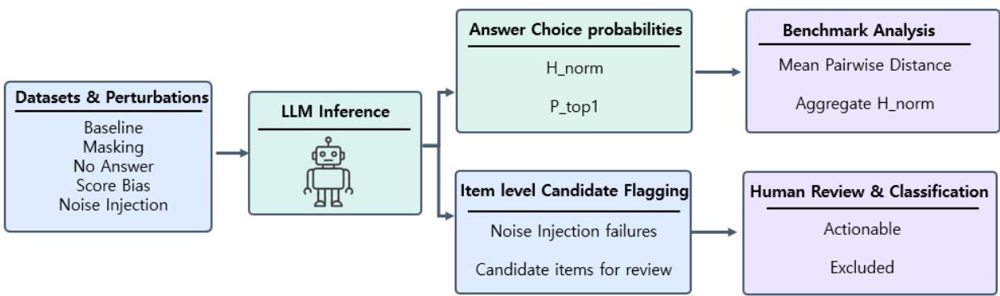
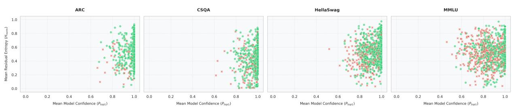

# Auditing MCQA Benchmarks through Probability Landscapes

Minsoo Song1, Chanjun Park1,†

1Soongsil University ecoses042@soongsil.ac.kr, chanjun.park@ssu.ac.kr

## Abstract

As Large Language Models rapidly advance, performance on standard multiple-choice question answering (MCQA) benchmarks is reaching saturation. While the community has responded by developing increasingly difficult datasets, validating question quality and filtering flawed items remains a labor-intensive process. To provide a scalable diagnostic approach, we propose a two-component probabilistic framework for auditing MCQA benchmarks using model output distributions. First, for benchmark-level analysis, we characterize the probability landscape using the top prediction probability (Ptop1) and normalized residual entropy (Hnorm), summarized glob ally by Mean Pairwise Distance (MPD). Sec ond, for item-level diagnostics, we introduce noise injection to reduce meaningful distractor competition, enabling us to flag candidate items for targeted human review and categorize residual failure patterns. Across four MCQA benchmarks, our landscape analysis reveals benchmark-level differences in model confidence and residual option competition. Concurrently, our noise-injection method flags potentially actionable item-level issues, show ing alignment with expert error annotations from MMLU-Redux. These results suggest that our probability-based framework provides a lightweight audit lens for comparing macrolevel benchmark structure and prioritizing individual items for targeted human review.

## 1 Introduction

MCQA benchmarks are widely used for evaluating LLMs, in part because their fixed-choice format enables simple and standardized automatic scoring (Wei et al., 2024).

However, as LLM capabilities continue to improve, many widely used benchmarks are approaching performance saturation. Recent studies have shown that frontier models achieve scores close to human level ceilings on several established benchmarks. Prior work has also demonstrated that such improvements may not necessarily reflect genuine reasoning ability, but may instead arise from dataset artifacts or sensitivity to minor prompt variations (Banerjee et al., 2024; Wang et al., 2024a).

Recent work has begun to explicitly study the phenomenon of benchmark saturation. For example, Akhtar et al. (2026) analyze score trends across multiple frontier models and show that several popular evaluation benchmarks exhibit limited headroom for further performance improvements. Such analyses capture overall performance trends but rely on aggregate accuracy statistics and thus provide limited information about the internal structure of benchmark questions.

To address the saturation problem, recent efforts have focused on constructing more difficult evaluation datasets, such as GPQA (Rein et al., 2024), Humanity’s Last Exam (HLE) (Phan et al., 2025), and MMLU-Pro (Wang et al., 2024b). These benchmarks aim to resist memorization and shortcut reasoning by increasing problem difficulty and expanding answer spaces. However, building such datasets requires substantial human effort and validation, motivating the need for more cost efficient methods to audit existing benchmarks.

Traditional assessment theory suggests that a well designed multiple choice question should contain plausible distractors that compete meaningfully with the correct answer. In educational measurement, distractor quality is typically evaluated using response distributions collected from human examinees, where strong distractors attract a portion of responses while weak distractors are rarely selected (Kline, 1999; Haladyna and Downing, 1993; Gierl et al., 2017). However, the acquisition of such large-scale response data remains challenging for modern LLM benchmarks. Park et al. (2023) suggests that probabilistic signals derived from model outputs can provide richer insights into model behavior beyond top-1 predictions. In particular, probability distributions over candidate tokens may reflect internal model representations and reveal patterns of uncertainty and competition among alternatives. These signals serve as a proxy for distractor competition using LLM responses.

  
Figure 1: Overview of the proposed two-level MCQA auditing framework. After LLM inference under the baseline and perturbation settings, answer-choice probabilities support benchmark-level analysis using aggregate $H _ { n o r m }$ and Mean Pairwise Distance (MPD). In parallel, cross-model noise-injection failures flag candidate items for targeted human review and coarse classification as Actionable or Excluded. Candidate flagging prioritizes review rather than automatically determining benchmark flaws.

In this work, we propose a probabilistic framework for auditing MCQA benchmarks using model output distributions. Instead of relying solely on accuracy, our approach analyzes how probability mass is distributed across answer choices to characterize benchmark-level structural properties and flag items for targeted human review. Figure 1 illustrates overall outline of our framework.

We introduce Normalized Residual Entropy $( H _ { n o r m } )$ to capture the degree of residual option competition within each question, and analyze benchmark-level landscape structure using Mean Pairwise Distance (MPD). We show that aggregate $H _ { n o r m }$ and MPD form descriptive landscape summaries that reveal broadly consistent benchmarklevel patterns across the well-calibrated models evaluated.

At the item level, our framework follows a costefficient two-stage auditing process. First, noise injection replaces distractors with unrelated city names to reduce meaningful distractor competition and narrow the benchmark to a small set of candidate items. Second, only the flagged candidates undergo targeted human review and are categorized using a taxonomy that separates perturbationinduced failures from potentially actionable benchmark issues.

We do not treat probability-based metrics or perturbation failures as definitive evidence of benchmark flaws. Instead, aggregate $H _ { n o r m }$ and MPD characterize benchmark-level option-competition structure, while noise-injection failures prioritize candidate items for targeted human review.

Our main contributions are as follows:

• We propose a probability-landscape framework for analyzing MCQA benchmarks beyond accuracy, representing each item with $P _ { t o p 1 }$ and $H _ { n o r m }$ and summarizing benchmark-level dispersion with MPD.

• We show that aggregate $H _ { n o r m }$ and MPD capture complementary benchmark-level structures: $H _ { n o r m }$ summarizes model-perceived residual option competition, while MPD summarizes the heterogeneity of the probability landscape.

• We use cross-model noise-injection failures to prioritize items for targeted human review, develop a taxonomy that separates perturbationinduced failures from potentially actionable benchmark issues, and externally evaluate the resulting candidate signals against MMLU-Redux expert annotations (Gema et al., 2025).

## 2 Related Work

## 2.1 Benchmark Saturation

Recent work has analyzed benchmark saturation by examining performance differences among top models. Akhtar et al. (2026) propose a statistical framework that evaluates whether leading models can still be meaningfully distinguished on existing benchmarks, revealing that many widely used datasets have already lost their discriminative power. However, such approaches primarily rely on leaderboard comparisons and do not directly diagnose the structural causes of saturation within the dataset itself.

## 2.2 Dataset Artifacts and Benchmark Validation

Another line of research investigates the structural validity of benchmark datasets. Prior studies have shown that many MCQA benchmarks contain annotation artifacts that allow models to achieve high accuracy through superficial patterns rather than genuine reasoning (Banerjee et al., 2024; Wang et al., 2024a).

Prior work on natural language inference established that annotation artifacts can enable prediction from incomplete inputs. Gururangan et al. (2018) identified systematic lexical cues introduced during dataset construction, while Poliak et al. (2018) demonstrated that hypothesis-only baselines can exploit such cues to achieve non-trivial performance. Related partial-input effects have also been identified in MCQA datasets. For example, models can sometimes predict correct answers even when the question stem is removed, revealing weak dependencies between questions and answer choices (Balepur et al., 2024). Other studies show that the position of the correct answer can influence model predictions (Zheng et al., 2023). These findings motivate diagnostics that test whether benchmark performance depends on the complete question rather than exploitable structural cues.

MMLU-Redux audits MMLU through expert reannotation, identifying erroneous and ambiguous benchmark items (Gema et al., 2025). In contrast to this expert-led verification, our perturbation-based and classifier-based signals are designed to automatically prioritize a smaller candidate set for targeted human review, rather than replace expert auditing. We therefore use the MMLU-Redux expert annotations as an external validation reference for our candidate signals.

## 2.3 Distractor Quality Evaluation

Distractor quality has long been studied in educational measurement and psychometrics. Traditional distractor analysis evaluates incorrect answer choices based on how frequently they are selected by examinees in real testing environments. Distractors that are rarely chosen are typically considered ineffective because they fail to represent plausible misconceptions (Kline, 1999). Standard guidelines suggest that each distractor should attract at least a small fraction of examinees, often around five percent, except in very easy questions where the correct answer rate exceeds ninety percent (Haladyna and Downing, 1993; Gierl et al., 2017).

Prior work evaluates distractor quality using controlled human responses or QA models as proxies for learners (Kalpakchi and Boye, 2021; Luo et al., 2024; Chung et al., 2020; Offerijns et al., 2020). These approaches assess whether distractors meaningfully compete with the correct answer, but require additional response collection or task-specific evaluation.

## 2.4 Probability based Analysis of Model Behavior

Prior studies have explored probabilistic signals such as model confidence, entropy, and logit differences to analyze the internal behavior of LLMs. Prior work on confidence calibration investigates whether predicted probabilities accurately reflect the correctness of model outputs, revealing that LLMs are often poorly calibrated despite strong predictive performance (Xiong et al., 2023). Other research has examined uncertainty estimation by analyzing distributional statistics of model outputs, including entropy and token level log probabilities. These approaches have been applied to detect unreliable generations and hallucinations by identifying outputs associated with high predictive uncertainty (Farquhar et al., 2024).

These studies demonstrate that probability distributions contain rich information about model behavior beyond final predictions. However, most prior work focuses on understanding model uncertainty or reliability. In contrast, our work uses probability distributions as a diagnostic signal for auditing benchmark design and characterizing structural properties of MCQA benchmarks.

## 3 Methodology

We analyze MCQA benchmark structure using probability distributions over answer choices and their changes under controlled perturbations. Our approach consists of two components:

• Probability Landscape Analysis: modeling the global structure of MCQA benchmarks using probability distributions derived from model outputs.

• Perturbation-based Diagnostics: probing benchmark sensitivity through controlled dataset modifications. Among these, noise injection serves as the primary probe for item flagging, while masking, no-answer injection, and score bias characterize benchmark-level robustness.

Figure 1 provides an overview of the proposed diagnostic pipeline.

## 3.1 Probabilistic Representation

For each question, the model produces a probability distribution over answer choices.

Let $\mathcal { O } = \{ x _ { 1 } , \ldots , x _ { k } \}$ denote the set of options. Given a question q, the model outputs

$$
P ( x _ { i } \mid q )
$$

for each $x _ { i } \in \mathcal { O }$ , and predicts

$$
y _ { p r e d } = \arg \operatorname* { m a x } _ { x _ { i } \in \mathcal { O } } P ( x _ { i } \mid q ) .
$$

These probabilities allow analysis of competition among answer choices beyond the final prediction.

## 3.2 Distractor Structure Representation

A well-designed MCQA question should present several plausible distractors that compete with the correct answer. If the model assigns most residual probability mass to a single non-selected option, the item exhibits concentrated residual competition from the model’s perspective. This pattern may indicate weak distractor competition, but it is not by itself sufficient evidence of poor item quality.

To represent this property, we characterize each question using two probabilistic features.

Model Confidence Model confidence is defined as the probability assigned to the top prediction:

$$
P _ { t o p 1 }
$$

This value captures how strongly the model favors its predicted answer.

Normalized Residual Entropy To measure competition among distractors, we define Normalized Residual Entropy $( H _ { n o r m } )$ over the non selected options.

$$
\begin{array} { r } { H _ { n o r m } = \frac { - \sum _ { i \in \mathcal { O } \backslash \{ y _ { p r e d } \} } P ^ { \prime } ( x _ { i } ) \log _ { 2 } P ^ { \prime } ( x _ { i } ) } { \log _ { 2 } ( | \mathcal { O } | - 1 ) } } \end{array}\tag{1}
$$

where $P ^ { \prime }$ denotes the renormalized probability distribution over the remaining options.

$H _ { n o r m }$ ranges from 0 to 1, where larger values indicate stronger competition among distractors. In addition, questions with extremely low residual entropy $( H _ { n o r m } \approx 0 )$ indicate highly concentrated residual competition, where one non-selected option dominates the remaining probability mass. Together, $P _ { t o p 1 }$ and $H _ { n o r m }$ form a compact representation of each question’s probabilistic structure, enabling comparison of distractor competition patterns across benchmarks and models.

Each question can therefore be represented as a two dimensional vector

$$
z _ { i } = ( P _ { t o p 1 } ^ { ( i ) } , H _ { n o r m } ^ { ( i ) } )
$$

which captures both answer confidence and distractor competition.

## 3.3 Probability Landscape Cohesion

The set of question representations forms a probability landscape describing how model predictions are distributed across a benchmark.

To quantify the global structure of this landscape, we compute the MPD:

$$
\begin{array} { r } { M P D = \frac { 2 } { N ( N - 1 ) } \sum _ { i < j } \| z _ { i } - z _ { j } \| _ { 2 } } \end{array}\tag{2}
$$

where N is the number of questions and $\| \cdot \| _ { 2 }$ denotes Euclidean distance.

For the main benchmark-level analysis, we pool the 1,000 item representations from each of the three small-scale models, yielding $N \ = \ 3 { , } 0 0 0$ (item, model) points per benchmark. The resulting MPD includes both within-model and crossmodel pairs and therefore differs from the mean of the independently computed per-model MPDs in Appendix A.

Lower MPD values indicate that items occupy a narrower region of the probability landscape, whereas higher MPD values indicate greater heterogeneity in model confidence and residual option competition. We use MPD as a descriptive summary of landscape dispersion, not as a direct measure of benchmark quality.

## 3.4 Diagnostic Perturbations

To probe benchmark structure, we introduce a set of controlled perturbations that modify the dataset while preserving the overall task format. Three perturbations: token masking, no-answer injection, and score bias are analyzed in Section 5. A fourth perturbation, noise injection, serves as the primary probe for item flagging and is analyzed in depth in Section 6.

Token Masking To examine the dependence on question context, we construct masked variants in which all tokens in the question body are replaced with a special token (e.g., [MASK]).

Replacing rather than deleting the question preserves the prompt template and question slot while removing semantic content. This isolates dependence on question information without introducing a structural change to the input format.

If models maintain high accuracy under this condition, it suggests that answers can be inferred from option patterns rather than from the question content.

No-Answer setting To examine the forced choice bias inherent in MCQA evaluation, we replace the original correct answer with a special option labeled “No Answer”.

This setting evaluates whether models can recognize the absence of a valid solution rather than selecting the most plausible distractor.

Score Bias To evaluate sensitivity to irrelevant textual signals, we append the phrase “(Score: 10/10)” to the end of each question.

We use (Score: 10/10) as the representative irrelevant evaluative suffix; Appendix B shows that accuracy remains stable across alternative score values within the same template.

If benchmark structure is robust, this modification should have minimal impact on model predictions or probability landscapes. Significant shifts in MPD or prediction accuracy indicate sensitivity to superficial textual cues rather than the semantic content of the question.

Noise Injection To eliminate semantic competition between distractors, we replace the original distractors with semantically unrelated tokens. Specifically, distractors are replaced with city names selected heuristically to ensure semantic independence from the question context.

Under this condition, the correct answer should become trivially identifiable. Questions that remain incorrect even after noise injection are treated as flagged items for further inspection. Such failures may arise from ambiguity, answer-key issues, or preprocessing artifacts, but they may also reflect limitations of the perturbation itself. Failures under noise injection are not uniformly distributed but cluster into identifiable types reflecting systematic properties of benchmark items.

## 4 Experimental Setup

## 4.1 Models

We evaluate three open-weight instruction-tuned models below 10B parameters: Qwen-2.5 7B (Qwen Team, 2024), Gemma-2 9B (Gemma Team et al., 2024), and Llama-3 8B (AI@Meta, 2024). Supplementary scalability experiments use Qwen-2.5 32B, Qwen-2.5 72B, and Llama-3.1 70B. Model and inference details are reported in Appendix C, with scaling results in Appendix D.

## 4.2 Benchmarks

We evaluate our framework on four widely used MCQA benchmarks: MMLU (Hendrycks et al., 2020), ARC (Clark et al., 2018), HellaSwag (Zellers et al., 2019), and CommonsenseQA (CSQA) (Talmor et al., 2019).

For each dataset, we randomly sample 1,000 instances from the available splits to obtain a computationally manageable yet representative evaluation set.

To ensure consistency across benchmarks, we standardize the five-option CSQA items to a fouroption format using a deterministic positional rule. We remove option E by default; when E is the correct answer, we instead remove option D and relabel the original option E as D. This procedure avoids removing the correct answer and does not depend on random or plausibility-based distractor selection. We additionally evaluate the original fivechoice format in Appendix E to assess the effect of choice-set size on probability-landscape structure.

## 4.3 Prompting and Probability Extraction

Each question is formatted using a standardized multiple choice template with four options (A–D). A system instruction forces the model to output only the answer letter (A–D), enabling direct extraction of logits for each option token. The prompt template and invalid output statistics are reported in Appendix section F.

  
Figure 2: Distribution of $H _ { n o r m }$ versus $P _ { { t o p 1 } }$ for 1,000 questions per benchmark, with coordinates averaged across three models. ARC and CSQA concentrate near $P _ { t o p 1 } \approx 1 . 0$ , reflecting high model confidence on most items; MMLU and HellaSwag span a wider region, consistent with greater diversity in item difficulty.

<table><tr><td>Benchmark</td><td>Mean  $H _ { n o r m }$ </td><td>MPD</td></tr><tr><td>ARC</td><td>0.572</td><td>0.404</td></tr><tr><td>HellaSwag</td><td>0.552</td><td>0.433</td></tr><tr><td>MMLU</td><td>0.536</td><td>0.479</td></tr><tr><td>CSQA</td><td>0.488</td><td>0.424</td></tr></table>

Table 1: Benchmark-level mean $H _ { n o r m }$ and pooled MPD across three small-scale models $( N = 3 , 0 0 0 \mathrm { i t e m } -$ model points per benchmark).

All experiments use deterministic decoding (temperature = 0, top-p = 1) with the maximum generation length limited to one token. No logit bias or additional constraints are applied.

Instead of evaluating generated text, we analyze the probability distribution over answer choices. Logits for the tokens A, B, C, and D at the final prompt position are extracted and converted into probabilities using the Softmax function.

## 5 Benchmark-Level Probability Landscape Analysis

## 5.1 Baseline Probability Landscape

We analyze baseline probability landscapes of MCQA benchmarks using the joint distribution of $P _ { t o p 1 }$ and $H _ { n o r m }$ , where each question is represented as a point in this space.

Figure 2 shows that ARC and CSQA exhibit concentrated distributions in the high-confidence region $( P _ { t o p 1 } \approx 1 . 0 )$ , indicating that models often assign near-deterministic probabilities to predicted answers.

To quantify landscape structure, we measure cohesion using Mean Pairwise Distance (MPD). Lower MPD values indicate more concentrated landscapes, whereas higher values reflect greater structural diversity across questions.

Table 1 shows clear differences across benchmarks: ARC exhibits the most concentrated landscape (MPD = 0.404), while MMLU shows a more dispersed structure $( \mathrm { M P D } = 0 . 4 7 9 )$ . This ordering— $\mathrm { A R C } < \mathrm { C S Q A } < \mathrm { H e l l a S w a g } < \mathrm { M M L U }$ in MPD— is also examined at the model level in Appendix A. As a supplementary extension to a more challenging benchmark, we apply the same pooled MPD aggregation to existing baseline outputs for all 448 GPQA items across three models. The resulting pooled MPD is 0.477 (N = 1,344), as reported in Appendix G.

## 5.2 Aggregate $H _ { n o r m }$ and MPD Patterns

Mean $H _ { n o r m }$ and MPD provide complementary aggregate summaries of option competition and landscape heterogeneity, respectively. Their rankings can differ: MMLU has the highest MPD despite moderate mean $H _ { n o r m }$ . Because itemlevel $H _ { n o r m }$ correlations across models are near zero (Appendix H), we restrict these metrics to benchmark-level characterization and use crossmodel noise-injection failures for item-level candidate prioritization.

## 5.3 Robustness to Positional Bias

Table 2 shows that MPD is generally stable across answer-position perturbations. ARC is the main exception, decreasing from 0.404 to 0.357 under the A- and D-biased settings, while the other benchmarks show smaller shifts.

## 5.4 Perturbation-Based Audit Signals

To further investigate benchmark structure, we apply several controlled perturbations that modify either the question context or the answer set. Table 3 reports the accuracy changes across perturbation settings, while Table 4 shows the corresponding MPD changes.

<table><tr><td>Benchmark</td><td>Baseline</td><td>A bias</td><td>B bias</td><td>C bias</td><td>D bias</td><td></td></tr><tr><td>ARC</td><td>0.404</td><td>0.357 (-0.047)</td><td>0.419 (+0.015)</td><td>0.424 (+0.020)</td><td></td><td>0.357 (-0.047)</td></tr><tr><td>CSQA</td><td>0.424</td><td>0.410 (-0.014)</td><td>0.421 (-0.003)</td><td>0.431 (+0.007)</td><td>0.415 (-0.009)</td><td></td></tr><tr><td>HellaSwag</td><td>0.433</td><td>0.427 (-0.006)</td><td>0.432 (-0.001)</td><td>0.435 (+0.002)</td><td>0.423 (-0.010)</td><td></td></tr><tr><td>MMLU</td><td>0.479</td><td>0.466 (-0.013)</td><td>0.470 (-0.009)</td><td>0.486 (+0.007)</td><td>0.470 (-0.009)</td><td></td></tr></table>

Table 2: MPD of probability distributions under answer-position bias conditions. Each bias condition forces the correct answer to appear at a fixed option position (A–D). Values in parentheses indicate the change relative to the baseline setting. Overall, MPD remains relatively stable across positional bias conditions, suggesting that the global probability landscape is largely robust to answer-position perturbations.
<table><tr><td>Benchmark</td><td>Baseline</td><td>Mask(100%)</td><td>No Answer</td><td>Noise Injection</td><td>Score Bias(10)</td></tr><tr><td>ARC</td><td>91.4</td><td>40.5 (-50.9)</td><td>40.8 (-50.6)</td><td>99.7 (+8.3)</td><td>91.4</td></tr><tr><td>CSQA</td><td>83.4</td><td>26.7 (-56.8)</td><td>32.4 (-51.0)</td><td>99.1 (+15.6)</td><td>83.2 (-0.2)</td></tr><tr><td>HellaSwag</td><td>73.3</td><td>58.0 (-15.3)</td><td>36.5 (-36.8)</td><td>98.5 (+25.2)</td><td>73.6 (+0.3)</td></tr><tr><td>MMLU</td><td>60.2</td><td>32.5 (-27.7)</td><td>17.1 (-43.1)</td><td>98.6 (+37.7)</td><td>59.8 (-0.4)</td></tr></table>

Table 3: Accuracy (%) across perturbation conditions. Masking and no-answer settings significantly reduce accuracy, while noise injection greatly increases performance by removing semantic competition among distractors. Score bias produces minimal changes relative to the baseline.

Masking and no-answer insertion substantially reduce accuracy, whereas noise injection raises accuracy to nearly 100%, confirming that most errors disappear when meaningful distractor competition is removed. Relative no-answer accuracy drops are largest for MMLU (71.6%), followed by CSQA (61.2%), ARC (55.4%), and HellaSwag (50.2%).

Score bias produces only minor accuracy changes but alters MPD in some benchmarks. We use (Score: 10/10) as the representative value, with the score-value comparison reported in Appendix B.

## 6 Noise-Injection Failure Analysis

This section focuses on categorizing these residual failures derived from the noise injection procedure.

## 6.1 Taxonomy of Residual Failures

We analyze residual failures using a two-stage procedure: candidates are first identified through crossmodel noise-injection failures and then undergo targeted human review. Table 5 groups the reviewed items into Excluded perturbation-induced cases and potentially Actionable benchmark issues; fine-grained subtypes are used only for qualitative analysis. Inter-annotator agreement is reported in Appendix I.

Of the 30 residual failures, 21 are Excluded and 9 are retained as Actionable candidates. The X2 count is 6 in the final four-benchmark scope; the earlier 11/36 count included the separate fivechoice CSQA analysis. Representative examples are provided in Appendix J.

## 6.2 Complementary Structural Classification

As a complementary signal, we apply an MMLU-Redux-style GPT-4o-mini classifier that labels items as ok, bad\_question\_clarity, or bad\_options\_clarity. It flags 18.4% of CommonsenseQA and 2.8% of MMLU, providing additional candidates for targeted human review. Full classification results and implementation details are reported in Appendix K.

## 6.3 Validation against MMLU-Redux Expert Labels

We match our 1,000-item MMLU subset against MMLU-Redux by exact question text, yielding 373 overlapping items, of which 9 are labeled as flawed by expert review.

Table 6 shows that the proposed signals substantially enrich expert-identified flaws relative to random inspection, but recall remains low (0.222– 0.444). We therefore interpret them as candidateprioritization signals for targeted human review rather than as exhaustive flaw detectors. Because only 9 confirmed flaws occur in the overlap, the exact precision and recall estimates should be interpreted as directional.

<table><tr><td>Benchmark</td><td>Baseline</td><td>Mask(100%)</td><td>No Answer</td><td>Score Bias(10)</td></tr><tr><td>ARC</td><td>0.404</td><td>0.427 (+0.023)</td><td>0.424 (+0.020)</td><td>0.357 (-0.047)</td></tr><tr><td>CSQA</td><td>0.424</td><td>0.395 (-0.029)</td><td>0.431 (+0.007)</td><td>0.403 (-0.021)</td></tr><tr><td>HellaSwag</td><td>0.433</td><td>0.423 (-0.010)</td><td>0.445 (+0.012)</td><td>0.425 (-0.008)</td></tr><tr><td>MMLU</td><td>0.479</td><td>0.419 (-0.060)</td><td>0.452 (-0.027)</td><td>0.462 (-0.017)</td></tr></table>

Table 4: MPD under different perturbation settings, computed over the pooled (item, model) points from the three small-scale models. Values in parentheses represent the change relative to the baseline. Despite dataset perturbations such as masking and no-answer insertion, MPD varies only moderately across benchmarks, indicating that the global probability landscape is relatively robust to these modifications.
<table><tr><td>Group</td><td>Type</td><td>Description</td><td>Count</td></tr><tr><td rowspan="2">Excluded</td><td>X1. Negation / EXCEPT</td><td>Injected city names also satisfy the negated condition, destroying the original contrastive option set.</td><td>15</td></tr><tr><td>X2. Semantic collision</td><td>Injected city names accidentally become plausible answers, especially in location-related questions.</td><td>6</td></tr><tr><td rowspan="4">Actionable</td><td>A1. Scope inconsistency</td><td>The question condition conflicts with the labeled answer, e.g., asking about “all&quot; cases while</td><td>1</td></tr><tr><td>A2. Answer-key error</td><td>the answer applies only to a subset. The labeled answer is factually incorrect, or another option is more correct.</td><td>3</td></tr><tr><td>A3. Encoding artifact</td><td>Option text is corrupted by preprocessing or file conversion, such as fractions converted into date strings.</td><td>1</td></tr><tr><td>A4. Narrative ambiguity</td><td>The context does not uniquely determine the intended continuation, leaving multiple options</td><td>3</td></tr><tr><td></td><td>A5. Trivia-dependent under- specification</td><td>plausible. The answer depends on culture- or episode-specific knowledge not inferable from the question alone.</td><td>1</td></tr></table>

Table 5: Taxonomy of residual failures under noise injection. Excluded types reflect perturbation limitations, while actionable types identify candidate items for targeted human review. Counts use the final four-benchmark scope.

<table><tr><td>Signal</td><td>Flagged</td><td>Recall</td><td>Precision</td><td>Fl</td><td>Enrichment</td><td>p</td></tr><tr><td>Noise injection</td><td>2</td><td>0.222</td><td>1.000</td><td>0.364</td><td>41.4×</td><td>0.0005</td></tr><tr><td>Noise injection ∪ LLM classifier</td><td>11</td><td>0.444</td><td>0.364</td><td>0.400</td><td>15.1×</td><td>&lt; 0.0001</td></tr><tr><td>Random baseline</td><td>一</td><td>一</td><td>0.024</td><td>一</td><td>1.0×</td><td>1</td></tr></table>

Table 6: Validation of the candidate signals against expert-identified flaws in the 373-item MMLU-Redux overlap.

## 7 Conclusion

As LLM performance on MCQA benchmarks approaches saturation, accuracy alone becomes insufficient for assessing benchmark quality. This motivates systematic methods for auditing the structural properties of existing evaluation datasets.

In this work, we proposed a probabilistic framework for auditing MCQA benchmarks using model output distributions. At the benchmark level, aggregate $H _ { n o r m }$ and MPD provide descriptive summaries of probability-landscape structure, with broadly consistent benchmark-level patterns across the well-calibrated models evaluated. At the item level, noise injection serves as a first-pass candidate-prioritization signal: it narrows the set of items requiring targeted human review, after which residual failures can be separated into perturbationinduced cases and potentially actionable benchmark issues. Validation against MMLU-Redux expert annotations further shows that these signals enrich flawed items relative to random inspection, although their low recall precludes their use as exhaustive flaw detectors.

Overall, our framework offers a practical foundation for benchmark auditing by providing two complementary signals: aggregate landscape characterization for comparing benchmark design, and item-level flagging for prioritizing questions for targeted human review.

## Limitations

This work has several limitations. First, our experiments do not include the latest frontier or closedsource LLMs, and the larger models are used only as supplementary scalability checks. Thus, the findings should be interpreted as evidence from an open-model setting rather than as fully general conclusions about all current LLMs.

Second, the proposed metrics rely on model output probabilities and may be affected by calibration, tokenization, prompting, quantization, inference backend, and answer-letter probability extraction. Accordingly, $H _ { n o r m }$ and MPD are descriptive model-based audit signals, not direct measures of benchmark quality.

Third, $H _ { n o r m }$ is limited as an item-level diagnostic. Since item-level $H _ { n o r m }$ rankings are unstable across models, low $H _ { n o r m }$ should not be treated as automatic evidence of flawed questions. We therefore use $H _ { n o r m }$ mainly for aggregate benchmark characterization.

Fourth, our external item-level validation is limited to 373 exact-text matches with MMLU-Redux, containing only 9 expert-identified flaws. Although the proposed signals substantially enrich flawed items relative to random inspection, their recall remains low (0.222–0.444), and estimates based on only 9 positive cases are necessarily unstable. The signals should therefore be interpreted as firstpass candidate-prioritization signals for targeted human review rather than exhaustive or automatic benchmark-flaw detectors. In addition, the doubleannotated taxonomy subsets are small, and the weaker fine-grained agreement observed for HellaSwag limits conclusions about the reliability of individual subtypes.

Finally, our primary empirical scope is limited to four MCQA benchmarks, with GPQA included only as a supplementary baseline extension. The primary experiments use sampled subsets of 1,000 instances per benchmark and preprocessing choices such as the four-choice standardization of CommonsenseQA. Future work should evaluate full benchmark splits, broader model families, frontier models, human annotations, and uncertainty estimates for aggregate statistics such as MPD.

## Ethical Statement

This work analyzes publicly available MCQA benchmarks and model outputs. No new datasets involving human participants were collected, and no personal or sensitive information was used. Our study focuses on diagnosing structural properties of benchmarks rather than deploying models in real world applications. We believe that improving benchmark design can contribute to more reliable and transparent evaluation of language models.

## Acknowledgments

This work was supported by the Korea Internet & Security Agency (KISA) grant funded by the Korea government (PIPC) (No. RS-2026-25526342, Development of Technologies for Preventing Sensitive Information Inference and Risk Assessment in Foundation Model Operations). This work was also supported by the National Research Foundation of Korea (NRF) grant funded by the Korea government (MSIT) (RS-2026-25483747). This research was further supported by the Culture, Sports and Tourism R&D Program through the Korea Creative Content Agency, funded by the Ministry of Culture, Sports and Tourism in 2026 (Project Name: Develop AI Agent Technology to Connect Knowledge through Public Cultural Facility-Based Discussion and Communication, Project Number: RS-2026- 25520645).

## References

AI@Meta. 2024. The llama 3 herd of models. arXiv preprint arXiv:2407.21783.

Mubashara Akhtar, Anka Reuel, Prajna Soni, Sanchit Ahuja, Pawan Sasanka Ammanamanchi, Ruchit Rawal, Vilém Zouhar, Srishti Yadav, Chenxi Whitehouse, Dayeon Ki, and 1 others. 2026. When ai benchmarks plateau: A systematic study of benchmark saturation. arXiv preprint arXiv:2602.16763.

Nishant Balepur, Abhilasha Ravichander, and Rachel Rudinger. 2024. Artifacts or abduction: How do llms answer multiple-choice questions without the question? arXiv preprint arXiv:2402.12483.

Sourav Banerjee, Ayushi Agarwal, and Eishkaran Singh. 2024. The vulnerability of language model benchmarks: Do they accurately reflect true llm performance? arXiv preprint arXiv:2412.03597.

Ho-Lam Chung, Ying-Hong Chan, and Yao-Chung Fan. 2020. A bert-based distractor generation scheme with multi-tasking and negative answer training strategies. In Findings of the Association for Computational Linguistics: EMNLP 2020, pages 4390– 4400.

Peter Clark, Isaac Cowhey, Oren Etzioni, Tushar Khot, Ashish Sabharwal, Carissa Schoenick, and Oyvind Tafjord. 2018. Think you have solved question answering? try arc, the ai2 reasoning challenge. arXiv preprint arXiv:1803.05457.

Sebastian Farquhar, Jannik Kossen, Lorenz Kuhn, and Yarin Gal. 2024. Detecting hallucinations in large language models using semantic entropy. Nature, 630(8017):625–630.

Aryo Pradipta Gema, Joshua Ong Jun Leang, Giwon Hong, Alessio Devoto, Alberto Carlo Maria Mancino, Rohit Saxena, Xuanli He, Yu Zhao, Xiaotang Du, Mohammad Reza Ghasemi Madani, and 1 others. 2025. Are we done with mmlu? In Proceedings of the 2025 Conference ofthe Nations ofthe Americas Chapter of the Association for Computational Linguistics: Human Language Technologies (Volume 1: Long Papers), pages 5069–5096.

Gemma Team, Morgane Riviere, Shreya Pathak, Pier Giuseppe Sessa, and 1 others. 2024. Gemma 2:

Improving open language models at a practical size. arXiv preprint arXiv:2408.00118.

Mark J Gierl, Okan Bulut, Qi Guo, and Xinxin Zhang. 2017. Developing, analyzing, and using distractors for multiple-choice tests in education: A comprehensive review. Review of educational research, 87(6):1082–1116.

Suchin Gururangan, Swabha Swayamdipta, Omer Levy, Roy Schwartz, Samuel R Bowman, and Noah A Smith. 2018. Annotation artifacts in natural language inference data. In Proceedings of the 2018 Conference of the North American Chapter of the Associationfor Computational Linguistics: Human Language Technologies, Volume 2 (Short Papers), pages 107–112.

Thomas M Haladyna and Steven M Downing. 1993. How many options is enough for a multiple-choice test item? Educational and psychological measurement, 53(4):999–1010.

Dan Hendrycks, Collin Burns, Steven Basart, Andy Zou, Mantas Mazeika, Dawn Song, and Jacob Steinhardt. 2020. Measuring massive multitask language understanding. arXiv preprint arXiv:2009.03300.

Dmytro Kalpakchi and Johan Boye. 2021. Bert-based distractor generation for swedish reading comprehension questions using a small-scale dataset. In Proceedings of the 14th International Conference on Natural Language Generation, pages 387–403.

Rex B Kline. 1999. Book review: Psychometric theory. Journal ofPsychoeducational Assessment, 17(3):275– 280.

Haohao Luo, Yang Deng, Ying Shen, See Kiong Ng, and Tat-Seng Chua. 2024. Chain-of-exemplar: Enhancing distractor generation for multimodal educational question generation. In Proceedings ofthe 62nd Annual Meeting of the Association for Computational Linguistics (Volume 1: Long Papers), pages 7978– 7993.

Jeroen Offerijns, Suzan Verberne, and Tessa Verhoef. 2020. Better distractions: Transformer-based distractor generation and multiple choice question filtering. arXiv preprint arXiv:2010.09598.

Kiho Park, Yo Joong Choe, and Victor Veitch. 2023. The linear representation hypothesis and the geometry of large language models. arXiv preprint arXiv:2311.03658.

Long Phan, Alice Gatti, Ziwen Han, Nathaniel Li, Josephina Hu, Hugh Zhang, Chen Bo Calvin Zhang, Mohamed Shaaban, John Ling, Sean Shi, and 1 others. 2025. Humanity’s last exam. arXiv preprint arXiv:2501.14249.

Adam Poliak, Jason Naradowsky, Aparajita Haldar, Rachel Rudinger, and Benjamin Van Durme. 2018. Hypothesis only baselines in natural language inference. In Proceedings ofthe seventh joint conference

on lexical and computational semantics, pages 180– 191.

Qwen Team. 2024. Qwen2.5 technical report. arXiv preprint arXiv:2412.15115.

David Rein, Betty Li Hou, Asa Cooper Stickland, Jackson Petty, Richard Yuanzhe Pang, Julien Dirani, Julian Michael, and Samuel R Bowman. 2024. Gpqa: A graduate-level google-proof q&a benchmark. In First conference on language modeling.

Alon Talmor, Jonathan Herzig, Nicholas Lourie, and Jonathan Berant. 2019. CommonsenseQA: A question answering challenge targeting commonsense knowledge. In Proceedings ofthe 2019 Conference of the North American Chapter of the Association for Computational Linguistics: Human Language Technologies, Volume 1 (Long and Short Papers), pages 4149–4158, Minneapolis, Minnesota. Association for Computational Linguistics.

Xinyi Wang and 1 others. 2024a. Generalization vs memorization: Tracing language models’ capabilities back to pretraining data. arXiv preprint arXiv:2407.14985.

Yubo Wang, Xueguang Ma, Ge Zhang, Yuansheng Ni, Abhranil Chandra, Shiguang Guo, Weiming Ren, Aaran Arulraj, Xuan He, Ziyan Jiang, and 1 others. 2024b. Mmlu-pro: A more robust and challenging multi-task language understanding benchmark. Advances in Neural Information Processing Systems, 37:95266–95290.

Fangyun Wei, Xi Chen, and Lin Luo. 2024. Rethinking generative large language model evaluation for semantic comprehension. arXiv preprint arXiv:2403.07872.

Miao Xiong, Zhiyuan Hu, Xinyang Lu, Yifei Li, Jie Fu, Junxian He, and Bryan Hooi. 2023. Can llms express their uncertainty? an empirical evaluation of confidence elicitation in llms. arXiv preprint arXiv:2306.13063.

Rowan Zellers, Ari Holtzman, Yonatan Bisk, Ali Farhadi, and Yejin Choi. 2019. HellaSwag: Can a machine really finish your sentence? In Proceedings of the 57th Annual Meeting of the Association for Computational Linguistics, pages 4791–4800, Florence, Italy. Association for Computational Linguistics.

Chujie Zheng, Hao Zhou, Fandong Meng, Jie Zhou, and Minlie Huang. 2023. Large language models are not robust multiple choice selectors. arXiv preprint arXiv:2309.03882.

## A Model-level MPD Detail

<table><tr><td>Model</td><td>ARC</td><td>CSQA HellaSwag</td><td>MMLU</td></tr><tr><td>Gemma-2 9B</td><td>0.169 0.285</td><td>0.274</td><td>0.369</td></tr><tr><td>Llama-3 8B</td><td>0.376 0.384</td><td>0.414</td><td>0.450</td></tr><tr><td>Qwen-2.5 7B</td><td>0.374 0.360</td><td>0.381</td><td>0.385</td></tr><tr><td>Llama-3.1 70B</td><td>0.298 0.363</td><td>0.367</td><td>0.336</td></tr><tr><td>Qwen-2.5 32B</td><td>0.071 0.123</td><td>0.204</td><td>0.187</td></tr><tr><td>Qwen-2.5 72B</td><td>0.335 0.278</td><td>0.354</td><td>0.398</td></tr></table>

Table 7: Per-model MPD values by benchmark. Upper block: small-scale models used in main experiments. Lower block: large-scale models evaluated for scalability.

Table 7 reports per-model MPD values across all four benchmarks for all six evaluated models. The three small-scale models (Gemma-2 9B, Llama-3 8B, Qwen-2.5 7B) consistently place MMLU at the top of the MPD ranking, showing that this ordering is not unique to a single small-scale model. This agreement does not establish that the ordering is independent of model-specific calibration or inference characteristics.

<table><tr><td>Model</td><td>1st</td><td>2nd</td><td>3rd</td><td>4th</td></tr><tr><td>Gemma-2 9B</td><td>MMLU</td><td>CSQA</td><td>HellaSwag</td><td>ARC</td></tr><tr><td>Llama-3 8B</td><td>MMLU</td><td>HellaSwag</td><td>CSQA</td><td>ARC</td></tr><tr><td>Qwen-2.5 7B</td><td>MMLU</td><td>HellaSwag</td><td>ARC</td><td>CSQA</td></tr><tr><td>Qwen-2.5 72B</td><td>MMLU</td><td>HellaSwag</td><td>ARC</td><td>CSQA</td></tr><tr><td>Llama-3.1 70B</td><td>HellaSwag</td><td>CSQA</td><td>MMLU</td><td>ARC</td></tr><tr><td>Qwen-2.5 32B</td><td>HellaSwag</td><td>MMLU</td><td>CSQA</td><td>ARC</td></tr></table>

Table 8: Benchmark MPD rank order per model.

Table 8 summarizes the benchmark MPD rank order per model. Among the three small-scale models (Gemma-2 9B, Llama-3 8B, Qwen-2.5 7B), MMLU consistently ranks first. This consistency across architecturally distinct models suggests that the ordering is not driven by any single model, although the evidence remains limited to the evaluated models.

## B Selection of the Score-Bias Prompt

The score-bias perturbation appends an irrelevant evaluative suffix to each question. To verify that its behavior was not tied to an arbitrary displayed score, we used the same parenthetical template while varying the value among 1/10, 10/10, and 100/100. These are value variants of one fixed textual format rather than distinct formatting templates.

Across the 20 model–benchmark combinations for which all three values are available, the maximum accuracy spread is 1.10 percentage points, and most spreads are within one point. Because the differences across these score-value settings are small, we select (Score: 10/10) as the representative score-bias prompt in the main experiments.

<table><tr><td>Selection evidence</td><td>Reported result</td></tr><tr><td>Values tested</td><td>1/10, 10/10, 100/100</td></tr><tr><td>Complete three-value comparisons</td><td>20</td></tr><tr><td>Maximum accuracy spread</td><td>1.10 pp</td></tr><tr><td>Typical accuracy spread</td><td>≤ 1.00 pp</td></tr><tr><td>Representative value</td><td>10/10</td></tr></table>

Table 9: Evidence used to select (Score: 10/10) as the representative score-bias prompt. All tested values use the same parenthetical template, and the comparison is based on accuracy.

The largest observed spread occurs for Qwen-2.5 32B on MMLU. The purpose of this comparison is only to justify the representative prompt value; the full score-bias analysis in the main text uses (Score: 10/10).

## C Model and Inference Details

<table><tr><td>Model</td><td>Params</td><td>Ctx.</td><td>Emb.</td><td>Quant.</td></tr><tr><td>Qwen-2.5 7B</td><td>7.6B</td><td>32,768</td><td>3,584</td><td>Q4_K_M</td></tr><tr><td>Gemma-2 9B</td><td>9.2B</td><td>8,192</td><td>3,584</td><td>Q4_0</td></tr><tr><td>Llama-3 8B</td><td>8.0B</td><td>8,192</td><td>4,096</td><td>Q4_0</td></tr><tr><td>Qwen-2.5 32B</td><td>32.8B</td><td>32,768</td><td>5,120</td><td>Q4_K_M</td></tr><tr><td>Qwen-2.5 72B</td><td>72.7B</td><td>32,768</td><td>8,192</td><td>Q4_K_M</td></tr><tr><td>Llama-3.1 70B</td><td>70.6B</td><td>131,072</td><td>8,192</td><td>Q4_K_M</td></tr></table>

Table 10: Architectural specifications of the evaluated models.

The four primary benchmark experiments are conducted using the Ollama inference framework with the llama.cpp backend. Table 10 summarizes the models used in our experiments. For all models, we use deterministic decoding settings to eliminate stochastic variation in outputs. Specifically, we set temperature to 0, top-p to 1, and limit the maximum number of generated tokens to 1. No logit bias or token level constraints are applied. The small models were executed locally using Ollama (v0.17.7), which uses llama.cpp as the inference backend. The larger models were evaluated on Google Colab with A100 GPUs using the same runtime and backend configuration.

## D Scaling Effects

<table><tr><td>Benchmark</td><td>Llama-3 8B</td><td>Llama-3.1 70B</td></tr><tr><td>ARC</td><td>0.376</td><td>0.298</td></tr><tr><td>CSQA</td><td>0.384</td><td>0.363</td></tr><tr><td>HellaSwag</td><td>0.414</td><td>0.367</td></tr><tr><td>MMLU</td><td>0.450</td><td>0.410</td></tr></table>

Table 11: MPD across Llama model scales. The 70B model consistently produces lower MPD than the 8B model across all benchmarks, suggesting that larger models assign sharper, more concentrated probability distributions over answer choices.

<table><tr><td>Benchmark</td><td>Qwen-2.5 7B</td><td>Qwen-2.5 32B</td><td>Qwen-2.5 72B</td></tr><tr><td>ARC</td><td>0.374</td><td>0.071</td><td>0.335</td></tr><tr><td>CSQA</td><td>0.360</td><td>0.123</td><td>0.278</td></tr><tr><td>HellaSwag</td><td>0.381</td><td>0.204</td><td>0.354</td></tr><tr><td>MMLU</td><td>0.385</td><td>0.212</td><td>0.364</td></tr></table>

Table 12: MPD across Qwen-2.5 model scales. While the 72B model generally produces lower MPD than the 7B model, the 32B model exhibits substantially lower MPD than both, deviating from a monotonic scaling trend and suggesting model-specific factors beyond raw parameter count.

Across model families, larger models generally produce lower MPD values, indicating a more concentrated probability landscape. Table 11 shows that the 70B model consistently produces lower MPD values than the 8B model across all benchmarks.

However, the scaling behavior is not strictly monotonic. In Table 12, the 32B model exhibits substantially lower MPD values than both the 7B and 72B variants. This deviation from monotonic scaling suggests that the structure of the probability landscape may depend not only on model capacity but also on model specific architectural or training characteristics.

Despite these variations, the benchmark-level ordering remains broadly similar for the wellcalibrated models evaluated, while deviations for individual models indicate sensitivity to modelspecific calibration and inference characteristics.

## E CommonsenseQA: 4-Choice vs. 5-Choice

We compare the probability landscape under the original 5-choice CommonsenseQA format against the 4-choice version used in the main experiments, using the three small-scale models (Gemma-2 9B, Llama-3 8B, Qwen-2.5 7B). Table 13 reports accuracy, $H _ { n o r m }$ , and $P _ { t o p 1 }$ under the 4-choice and original 5-choice CommonsenseQA formats.

<table><tr><td>Model</td><td>n</td><td>Acc (%)</td><td> $H _ { n o r m }$ </td><td> $P _ { { t o p 1 } }$ </td></tr><tr><td>Gemma-2 9B</td><td>4-ch 5-ch</td><td>85.3 81.1</td><td>0.754 0.725</td><td>0.980 0.974</td></tr><tr><td>Llama-3 8B</td><td>4-ch</td><td>78.5</td><td>0.390</td><td>0.945</td></tr><tr><td></td><td>5-ch</td><td>76.9</td><td>0.604</td><td>0.873</td></tr><tr><td>Qwen-2.5 7B</td><td> $4 \mathrm { - c h }$ </td><td></td><td>0.320</td><td></td></tr><tr><td></td><td></td><td>86.5</td><td></td><td>0.988</td></tr><tr><td></td><td>5-ch</td><td>83.4</td><td>0.320</td><td>0.985</td></tr></table>

Table 13: Accuracy, $H _ { n o r m }$ , and $P _ { { t o p 1 } }$ for CommonsenseQA under 4-choice and 5-choice formats (1000 items, baseline condition).

Accuracy decreases uniformly across all three models when a fifth choice is introduced, consistent with the additional option making the task more difficult. The effect on $H _ { n o r m }$ , however, diverges by model. Gemma-2 9B shows a slight decrease (−0.029), consistent with the fifth option receiving negligible residual probability. Llama-3 8B exhibits a large increase (+0.213), indicating that the added option substantially redistributes residual probability for most items and reflects calibration instability under the 5-choice format. Qwen-2.5 7B shows no change (+0.000), suggesting the most stable probability allocation across choice set sizes. The benchmark-level $H _ { n o r m }$ rank ordering is preserved for the two well-calibrated models: both Gemma-2 9B and Qwen-2.5 7B maintain the same CSQA rank relative to the other benchmarks. Llama-3 8B is the exception, where the $H _ { n o r m }$ surge in CSQA disrupts the rank ordering. This pattern suggests that the aggregate ordering can be reproducible among well-calibrated models while remaining sensitive to model-specific calibration.

## F Prompt Template

Each question is formatted using a standardized multiple choice template consisting of the question followed by four answer choices (A–D). The prompt used for evaluation is structured as follows: Question: {question}

A. {choice\_A}

B. {choice\_B}

C. {choice\_C}

D. {choice\_D}

Answer:

To ensure consistent response formatting across models, we apply the following system instruction:

$$
\mathsf { Y o u \quad a r e \quad a \quad h e l p f u l \quad a s s i s t a n t . }
$$

Output only the answer choice letter (A, B, C, or D) and nothing else.

This instruction encourages the model to produce a single token corresponding to one of the answer choices, which enables direct extraction of logits associated with each choice. Table 14 shows statistics for invalid form of model responses.

## G GPQA Baseline Extension

We additionally evaluate whether the pooled MPD analysis can be applied to GPQA, a challenging expert-level MCQA benchmark. We use existing baseline probability outputs for the complete set of 448 GPQA items from Gemma-2 9B, Llama-3 8B, and Qwen-2.5 7B. Pooling the item representations across the three models produces N = 1,344 (item, model) points. We then compute MPD over all within-model and cross-model pairs using the same aggregation defined in Section 3.

## H Cross-Model $H _ { n o r m }$ Consistency

To assess whether item-level $H _ { n o r m }$ carries benchmark-intrinsic information beyond modelspecific calibration, we compute pairwise Spearman rank correlations of item-level $H _ { n o r m }$ between all model pairs across the four benchmarks. Table 16 reports the resulting cross-model rank correlations.

The small-model mean r values range from 0.028 (MMLU) to 0.177 (CSQA), and the allpair mean r drops to near zero or below for most benchmarks (ARC: −0.010). This indicates that, while aggregate benchmark-level $H _ { n o r m }$ rankings are broadly stable across the well-calibrated models evaluated (Table 1), the item-level ordering is largely model-specific and cannot be used as a reliable per-item diagnostic.

## I Taxonomy Annotation Agreement

Agreement is high for MMLU, ARC, and CSQA, but substantially weaker for the fine-grained HellaSwag subtype labels. For HellaSwag, the reported author–annotator κ values are 0.250 and 0.545 on a five-item subset. Accordingly, we treat the fine-grained subtypes as qualitative categories and base the primary reliability claim on the coarser Actionable-versus-Excluded distinction. These results should be interpreted cautiously because the double-annotated subsets are small.

## J Noise Injection Taxonomy: Qualitative Examples

This appendix presents representative examples for each failure type identified in Section 6. For excluded types (X1, X2) one example is shown to illustrate why they are excluded; for actionable failure types (A2–A5) one example is shown per type.

## X1. Negation/EXCEPT Format

ARC #997   
Question. “Which ofthese is not part ofan atom?”   
Choices.   
A. Paris   
B. isotope [GT]   
C. Seoul   
D. Tokyo   
Original distractors: A = proton, C = nucleus, D = electron.

The question asks which option is not part of an atom. Under noise injection, the city names (Paris, Seoul, Tokyo) are also not parts of an atom, so the model cannot distinguish the intended answer (isotope) from the noise choices. Noise injection removes the semantically contrastive set that NOT/EXCEPT questions require, so failure here reflects a method limitation rather than an item flaw.

## X2. Semantic Collision

CSQA #659   
Question. “They wanted to try blowfish, so they went to   
get some where?”   
Choices.   
A. Paris   
B. fish market [GT]   
C. Seoul   
D. Tokyo [semantic collision]

Tokyo is a semantically valid answer to this question because blowfish (fugu) is a well-known Japanese delicacy associated with Tokyo. The injected city name happens to be correct, so model failures here reflect the injection method rather than a problem with the item.

## A3. Encoding Artifact

Question. “Mr. Jones rolls a six-sided cube numbered 1,   
2, 3, 4, 5, 6. What is the probability he rolls a three?”   
Choices.   
A. 6-Jan [GT]   
B. 5-Jan   
C. 3-Jan   
D. 2-Jan

<table><tr><td>Model</td><td>Dataset</td><td>Total</td><td>Valid</td><td>Format Err</td><td>Invalid</td><td>Valid Ratio</td></tr><tr><td>Llama-3 8B</td><td>ARC</td><td>1000</td><td>1000</td><td>0</td><td>0</td><td>1.000</td></tr><tr><td>Llama-3 8B</td><td>CSQA</td><td>1000</td><td>999</td><td>0</td><td>1</td><td>0.999</td></tr><tr><td>Llama-3 8B</td><td>HellaSwag</td><td>1000</td><td>1000</td><td>0</td><td>0</td><td>1.000</td></tr><tr><td>Llama-3 8B</td><td>MMLU</td><td>1000</td><td>1000</td><td>0</td><td>0</td><td>1.000</td></tr><tr><td>Gemma-2 9B</td><td>ARC</td><td>1000</td><td>1000</td><td>0</td><td>0</td><td>1.000</td></tr><tr><td>Gemma-2 9B</td><td>CSQA</td><td>1000</td><td>1000</td><td>0</td><td>0</td><td>1.000</td></tr><tr><td>Gemma-2 9B</td><td>HellaSwag</td><td>1000</td><td>1000</td><td>0</td><td>0</td><td>1.000</td></tr><tr><td>Gemma-2 9B</td><td>MMLU</td><td>1000</td><td>1000</td><td>0</td><td>0</td><td>1.000</td></tr><tr><td>Qwen-2.5 7B</td><td>ARC</td><td>1000</td><td>1000</td><td>0</td><td>0</td><td>1.000</td></tr><tr><td>Qwen-2.5 7B</td><td>CSQA</td><td>1000</td><td>999</td><td>0</td><td>1</td><td>0.999</td></tr><tr><td>Qwen-2.5 7B</td><td>HellaSwag</td><td>1000</td><td>1000</td><td>0</td><td>0</td><td>1.000</td></tr><tr><td>Qwen-2.5 7B</td><td>MMLU</td><td>1000</td><td>1000</td><td>0</td><td>0</td><td>1.000</td></tr></table>

Table 14: Response format validity across models and datasets. Invalid responses are extremely rare, with valid ratios above 99.9%.

<table><tr><td>Benchmark</td><td>Items</td><td>Pooled points</td><td>MPD</td></tr><tr><td>GPQA</td><td>448</td><td>1,344</td><td>0.477</td></tr></table>

Table 15: Baseline pooled MPD for GPQA across three models. The value is computed from existing model outputs rather than from additional inference.

<table><tr><td>Benchmark</td><td>Small-model mean r All-pair mean r</td></tr><tr><td>ARC</td><td>0.089 -0.010</td></tr><tr><td>CSQA</td><td>0.177 0.087</td></tr><tr><td>HellaSwag</td><td>0.102 0.056</td></tr><tr><td>MMLU</td><td>0.028 0.066</td></tr></table>

Table 16: Cross-model Spearman rank correlation of item-level $H _ { n o r m } .$ . Small-model mean r averages over the three small-scale model pairs (Gemma-2 9B, Llama-3 8B, Qwen-2.5 7B), while All-pair mean r averages over all 15 model pairs including large-scale models. Near-zero values indicate that item-level $H _ { n o r m }$ ranks are not reproducible across models.

Intended fractions: A = 1/6, B = 1/5, C = 1/3, D = 1/2.

The answer choices are fractions (1/6, 1/5, 1/3, 1/2) that were automatically converted to date strings by spreadsheet software (e.g., $1 / 6  ^ { \ast } 6 .$ Jan”). After noise injection, these opaque strings are indistinguishable from nonsensical tokens; models consistently reject the ground truth choice “6-Jan” in favor of city-name distractors. This item is also flagged as bad\_options\_clarity by the LLM-based classifier.

<table><tr><td>Dataset</td><td>n</td><td>κ (A)</td><td>κ (B)</td><td>Agreement (A/B)</td></tr><tr><td>MMLU</td><td>14</td><td>1.000</td><td>1.000</td><td>100% / 100%</td></tr><tr><td>ARC</td><td>5</td><td>undefined</td><td>undefined</td><td>100% / 100%</td></tr><tr><td>CSQA</td><td>5</td><td>1.000</td><td>1.000</td><td>100% / 100%</td></tr><tr><td>HellaSwag</td><td>5</td><td>0.250</td><td>0.545</td><td>40% / 80%</td></tr></table>

Table 17: Agreement between the author labels and two independent annotators. For ARC, Cohen’s κ is undefined because all items received the X1 label, leaving no category variance.

## A2. Answer-Key Error

## MMLU #428

Question. “Which ofthefollowing is a bioticfactor that   
could affect the growth rate of a population?”   
Choices.   
A. Volcanic eruption   
B. Glacier melting   
C. Destruction of the ozone layer [GT in dataset]   
D. Sudden reduction in the animal food resource   
[correct answer]

The ground truth labels option C (ozone layer destruction) as a biotic factor, but the ozone layer is an abiotic component of the environment. Option D (reduction in animal food resource) is the correct biotic factor. Under noise injection, the model correctly rejects the ground truth in favor of its domain knowledge, exposing the mislabel.

## A5. Trivia-Dependent Underspecification

CSQA #309   
Question. “Kramer wrote a self-referential book. What   
might that book be about?”   
Choices.   
A. counter   
B. coffee table [GT]   
C. backpack   
D. bedside table

The correct answer refers to a specific episode of Seinfeld (Season 7, Episode 11) in which the character Kramer writes a coffee table book about coffee tables. Without this episode-specific knowledge, any furniture item is equally plausible, and after noise injection all remaining options (A, C, D) are equally uninformative. Models fail because no general semantic reasoning can resolve the question.

## A4. Narrative Ambiguity

HellaSwag #3001   
Context. “People are seen walking around a track and   
sitting down. One stands before a track and looks offinto   
the distance. he”   
Candidate continuations.   
A. throws a ball up into a pit.   
B. lifts up his arm and walks off the track.   
C. yells to an audience and raises his arms up.   
D. runs down the track and into a sand pit. [GT]

After replacing A, B, C with city names, only D (runs down the track and into a sand pit) remains as a real continuation option. The model still fails to select D, because the general track-and-field scene does not strongly cue the specific long-jump action, and the model assigns insufficient probability to D over the city-name options.

## K LLM-Based Structural Classification

To provide an independent signal complementary to noise injection, we apply an MMLU-Redux-style structural classifier to all three benchmarks. The classifier uses GPT-4o-mini via the Openrouter1 (temperature 0) and assigns each item to one of three categories: ok, bad\_question\_clarity (structural defect in the question stem), or bad\_options\_clarity (formatting defect in the answer choices). Wronganswer and multiple-correct-answer judgments are excluded because they require domain knowledge and are prone to model-specific false positives. Table 18 reports the resulting structural classification outcomes across datasets.

<table><tr><td>Dataset</td><td>Total</td><td>ok</td><td>bq</td><td>bo</td><td>Flag rate</td></tr><tr><td>ARC</td><td>997</td><td>989</td><td>6</td><td>2</td><td>0.8%</td></tr><tr><td>CommonsenseQA</td><td>1000</td><td>816</td><td>95</td><td>89</td><td>18.4%</td></tr><tr><td>MMLU</td><td>1000</td><td>972</td><td>15</td><td>13</td><td>2.8%</td></tr></table>

Table 18: LLM-based structural classification results (v6). bq = bad\_question\_clarity; bo = bad\_options\_clarity.

The high flag rate for CommonsenseQA (18.4%) reflects crowdsourcing artifacts: pronoun ambiguity errors (“Where did it put it?” with it as subject), ConceptNet-generated distractors that appear as meaningless tokens (“wisconsin”, “hatred”), and incomplete sentence stems. MMLU flags (2.8%) concentrate in PDF/CSV extraction artifacts: fractions converted to Excel date strings $( \mathrm { e . g . , 1 } / 6 \to { ^ { \cdots } \theta } – J a n ^ { \prime \prime } )$ , superscripts replaced with “?”, and duplicated answer options. The MMLU encoding artifact pattern directly corresponds to the A3 encoding-artifact type identified in the noiseinjection taxonomy, providing convergent evidence from two independent methods.

## Classification Procedure

Classification follows a strict five-step decision hierarchy applied in order: (1) question clarity, (2) options clarity, (3–5) correctness checks (not used for flagging). Items are flagged only if a structural defect is unambiguous without domain knowledge. A post-processing consistency rule corrects 77 selfcontradictory outputs where the step reasoning concluded “ok” but the error\_type field returned a flag; in such cases the error\_type is overridden to ok.