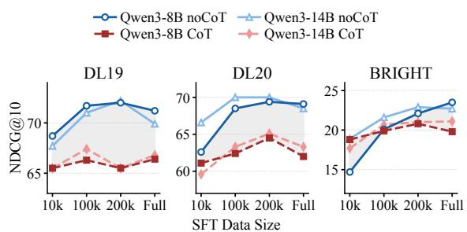
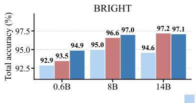
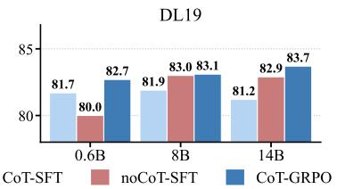
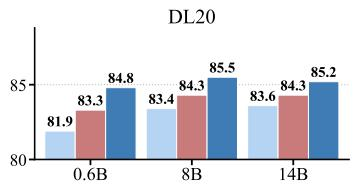
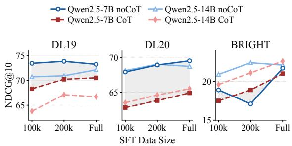

# Beyond Polarization: The Generative Constraint of Chain-of-Thought in Pointwise Reranking

Xiaoyang Chen<sup>1,2,3</sup>, Jie Liu<sup>3</sup>, Haijin Liang<sup>3</sup>, Haibo Shi<sup>3</sup>,

Jin Ma<sup>3</sup>, Ben He<sup>1,2</sup>, Yingfei Sun<sup>1</sup>, Dezhi Ye <sup>3</sup>\*

<sup>1</sup>University of Chinese Academy of Sciences,

<sup>2</sup>Chinese Information Processing Laboratory, Institute of Software,

Chinese Academy of Sciences,

<sup>3</sup>Tencent

chenxiaoyang19@mails.ucas.ac.cn, dezhiye@tencent.com

## Abstract

In pointwise document reranking, Chain-of-Thought models typically underperform direct scoring models. While existing diagnostics attribute this to inferior classification, score polarization, or calibration breakdown, whether targeted training can bridge this gap remains unclear. Our empirical study first confirms that this gap is stable across scales up to 32B parameters, ruling out model and data capacity confounders. We then apply stress tests utilizing reinforcement learning, fine-grained supervision, and architectural decoupling to explicitly repair these deviations. Although these interventions improve classification accuracy and absolute scores, the relative ranking gap persists. These findings suggest that, within the pointwise scoring paradigm, routing continuous relevance semantics through discrete text constrains ranking signal resolution, revealing a bottleneck that is stable and difficult to overcome under current standard methods, rather than an easily resolvable training bias.

## 1 Introduction

Integrating Chain-of-Thought (CoT) reasoning into Large Language Models (LLMs) for document reranking is a focal point in information retrieval (Weller et al., 2025; Zhuang et al., 2025; Fan et al., 2026). However, in the pointwise paradigm, CoT models typically underperform direct scoring models. Recent works attribute this to inferior classification (Jedidi et al., 2025), score polarization (Jedidi et al., 2025; Fan et al., 2026), or calibration breakdown (Lu et al., 2026), prompting a critical question: can targeted training interventions bridge this performance gap?

We conduct a two-stage empirical study within a unified framework, utilizing Qwen series models (0.6B to 32B) (Yang et al., 2024, 2025a) on different benchmarks. To verify that our conclusions are not specific to a single model family, we further replicate the core comparison on Llama-3.1-8B-Instruct (Llama Team, 2024). The first stage verifies the stability of this gap to rule out potential confounders. We scale model sizes and training data volumes under both zero-shot and supervised finetuning settings, and compare reasoning supervision distilled from DeepSeek-R1 (DeepSeek-AI et al., 2025) and Gemini-3-Pro (Gemini Team, 2025). Results show that the relative gap between CoT and direct scoring remains stable across all settings. This indicates that the disadvantage does not stem from model underfitting or insufficient reasoning quality, but rather has a more intrinsic source. Building upon this, we design three stress tests to repair these potential defects: aligning classification boundaries via reinforcement learning, mitigating polarization through fine-grained supervision, and isolating generation from prediction using prompt decoupling. Experiments show that although these interventions successfully improve classification accuracy and absolute scores, the ranking performance gap persists. Our analysis suggests that routing continuous semantics through discrete text may constrain the resolution of ranking signals, revealing a stable bottleneck under current standard methods.

Our contributions are threefold: 1) we verify that the gap between pointwise CoT and direct scoring is robust to model scale, data volume, and supervision quality; 2) we design targeted stress tests that diagnose and mitigate its hypothesized causes; 3) we show that the gap persists despite absolute gains, suggesting that discrete text generation may impose an resolution constraint on ranking signals under current standard methods. The code and data are available in the repository<sup>1</sup>.

<table><tr><td rowspan="3">Model</td><td rowspan="3">Size</td><td colspan="6">Zero-Shot</td><td colspan="10">SFT</td></tr><tr><td colspan="2">BRIGHT</td><td colspan="2">DL19</td><td colspan="2">DL20</td><td colspan="3">BRIGHT</td><td colspan="3">DL19</td><td colspan="3">DL20</td></tr><tr><td>noCoT</td><td>CoT</td><td>noCoT</td><td>CoT</td><td>noCoT</td><td>CoT</td><td>noCoT</td><td>DS</td><td>Gem</td><td>noCoT</td><td>DS</td><td>Gem</td><td>noCoT</td><td>DS</td><td>Gem</td></tr><tr><td rowspan="4">Qwen2.5</td><td>7B 14B</td><td>11.1</td><td>15.3</td><td>61.2</td><td>60.0</td><td>55.6</td><td>55.0</td><td>21.7</td><td>21.0</td><td>18.0</td><td>73.2</td><td>70.5</td><td>68.7</td><td>69.5</td><td>64.9</td><td>62.6</td></tr><tr><td></td><td>19.7</td><td>17.8</td><td>63.4</td><td>63.2</td><td>59.1</td><td>57.0</td><td>22.1</td><td>22.6</td><td>18.8</td><td>72.1</td><td>66.7</td><td>67.8</td><td>68.7</td><td>65.5</td><td>64.5</td></tr><tr><td>32B</td><td>21.3</td><td>17.7</td><td>63.5</td><td>62.9</td><td>56.7</td><td>54.9</td><td>24.4</td><td>22.6</td><td>19.5</td><td>73.1</td><td>69.2</td><td>71.1</td><td>68.8</td><td>65.0</td><td>65.1</td></tr><tr><td>0.6B</td><td>一</td><td>9.2</td><td>一</td><td>44.1</td><td>一</td><td>38.9</td><td>16.9</td><td>9.6</td><td>12.3</td><td>71.4</td><td>60.1</td><td>62.5</td><td>67.2</td><td>55.1</td><td>55.7</td></tr><tr><td rowspan="4">Qwen3</td><td>8B</td><td>19.8</td><td>16.1</td><td>55.5</td><td>55.6</td><td>45.9</td><td>50.3</td><td>23.5</td><td>19.8</td><td>20.3</td><td>71.2</td><td>66.4</td><td>64.2</td><td>69.1</td><td>62.0</td><td>57.3</td></tr><tr><td>14B</td><td>21.2</td><td>18.8</td><td>58.4</td><td>58.3</td><td>53.8</td><td>53.8</td><td>22.7</td><td>21.1</td><td>19.7</td><td>69.9</td><td>66.8</td><td>65.7</td><td>68.5</td><td>63.3</td><td>61.7</td></tr><tr><td>32B</td><td>22.4</td><td>17.2</td><td>67.7</td><td>58.5</td><td>65.5</td><td>52.2</td><td>24.6</td><td>23.0</td><td>21.8</td><td>73.7</td><td>70.1</td><td>67.4</td><td>69.9</td><td>67.3</td><td>65.5</td></tr></table>

Table 1: NDCG@10 of pointwise reranking on BRIGHT, TREC DL19&20 across the Qwen2.5/Qwen3 series. We compare Direct Scoring (noCoT) and Pointwise CoT under both Zero-Shot and SFT settings; under SFT, rationales are distilled from DeepSeek-R1 (DS) and Gemini-3-Pro (Gem). The best value is in bold. Dashes (–) indicate that Qwen3-0.6B fails to follow zero-shot noCoT instructions. Per-task BRIGHT scores are reported in Appendix E.

  
Figure 1: Performance gap between Pointwise CoT and direct scoring (noCoT) across data scales on Qwen3. The Qwen2.5 results are provided in the Appendix D.

## 2 Experimental Setup

Models and Strategies. To systematically evaluate the pointwise reranking paradigm, we adopt the Qwen series (Yang et al., 2024, 2025a) as our experimental backbone. This covers seven parameter scales across Qwen2.5 (7B, 14B, 32B) and Qwen3 (0.6B, 8B, 14B, 32B) to analyze scaling behaviors. In addition, we include Llama-3.1-8B-Instruct (Llama Team, 2024) as a cross-family control to confirm that the observed gap generalizes beyond the Qwen series. We compare two mainstream pointwise variants: (1) Direct Scoring (noCoT): Given an instruction i, a query q, and a passage p, the model directly predicts a binary relevance judgment formatted as <think>\n\n</think>Answer: True/False;

(2) Pointwise CoT: The model autoregressively generates an explicit reasoning chain before the final judgment, formatted as <think> Reasoning Trace </think> Answer: True/False. For both variants, the final relevance score for ranking is derived by weighting the logits of the candidate tokens at the decoding position immediately following the Answer:.

Data Construction and Supervision. Based on the MS MARCO training set (Nguyen et al.,

2016) from Rank1 (Weller et al., 2025), we construct two variants of CoT training data: (1) DS: The original Rank1 set containing ∼380K samples, with reasoning chains distilled from DeepSeek-R1 (DeepSeek-AI et al., 2025); (2) Gem: A variant replacing the original chains with those generated by Gemini-3-Pro (Gemini Team, 2025). We prompt Gemini-3-Pro to simultaneously output a binary label and a 5-level fine-grained relevance score (0–4) for subsequent Fine-Grained Supervision experiments. Using the original binary labels for quality control, we filter out incorrect predictions, retaining ∼350K samples. These comparable data scales ensure a fair comparison between supervision sources during supervised finetuning. We adopt Gemini-distilled rationales as the higher-quality supervision benchmark. See Appendix B for a detailed quality comparison. We evaluate on TREC DL19 and DL20 (Craswell et al., 2020, 2021) for standard fine-grained passage ranking, and BRIGHT (Su et al., 2025) for reasoningintensive complex queries. For more implementation details, see Appendix C.

## 3 Stage I: Persistence of the Gap

To rule out potential confounders such as model underfitting or suboptimal rationale quality, we systematically verify the robustness of the performance gap between Pointwise CoT and Direct Scoring (noCoT) across multiple dimensions.

## 3.1 Robustness to Scale Expansion

Insensitivity to Model Scaling. Table 1 compares seven model scales across the Qwen2.5 and Qwen3 series. While increasing model parameters significantly improves the absolute ranking ability of CoT models, it fails to achieve performance comparable to direct scoring. On the BRIGHT dataset, scaling

Qwen3 from 0.6B to 32B boosts the absolute score of the SFT DS CoT model by over 2.4× (from 9.6 to 23.0). However, regardless of model size, no-CoT consistently maintains its lead. This relative disadvantage persists across different scales; on the DL19 dataset, Qwen3-32B exhibits the same inverted trend, with SFT noCoT scoring 73.7 against 70.1 for SFT DS CoT.

Insensitivity to Data Scaling. To explore whether this performance inversion changes depending on the model’s fitting stage to the training data, we conduct synchronous DS SFT experiments using {10, 100, 200}K, and the full instances on the 8B and 14B models. As shown in Figure 1, experimental results demonstrate that this performance gap remains stable across the evaluated data scales. On BRIGHT, the model briefly relies on reasoning priors at the extremely low resource setting of 10K instances, where SFT CoT performs better on Qwen3-8B. However, as the data volume expands, SFT noCoT quickly overtakes SFT CoT. Subsequently, their performance curves rise in parallel, fixing the margin of disadvantage. On DL19 and DL20 datasets, the disparity is evident right from the 10K data mark. This indicates that the lag of Pointwise CoT behind direct scoring is not an artifact of a specific fitting phase. Instead, it is an inherent paradigm limitation that persists throughout the entire training cycle, independent of both model and data scale.

## 3.2 Robustness to Supervision Quality and Training Dynamics

We further compare the impact of different supervision qualities and training dynamics under both zero-shot and SFT paradigms. As shown in Table 1, these comparisons yield two observations.

Insensitivity to Rationale Quality. We replace the DeepSeek-R1 (DS) reasoning with ones distilled from Gemini-3-Pro, which features longer average chain lengths and more comprehensive evidence recall. However, this stronger teacher does not yield a fundamental breakthrough in SFT CoT ranking performance. On DL19 with Qwen3-14B, the Gemini-supervised CoT scores 65.7, slightly underperforming the DS variant at 66.8. This demonstrates that the performance gap cannot be simply attributed to suboptimal rationale quality.

Asymmetric Gains from SFT. Interestingly, in the zero-shot setting without fine-tuning, small models typically rely on CoT to maintain basic performance. For instance, the zero-shot CoT performance of small models is comparable to or slightly better than noCoT. In extreme cases like Qwen3- 0.6B, the model completely fails to follow instructions under the noCoT setting but successfully completes the task using CoT. In contrast, larger models like Qwen3-32B, equipped with stronger base capabilities, exhibit a clear noCoT advantage even in the zero-shot setting, achieving a 67.7 to 58.5 lead on DL19. However, regardless of the initial state, SFT delivers more drastic gains for noCoT. For example, Qwen3-0.6B noCoT surges to 16.9, overtaking CoT at 9.6 on BRIGHT, while the existing lead of larger models is further consolidated. Although SFT comprehensively improves the performance of the models, it solidifies a margin of 1 to 4 points across all model scales.

<table><tr><td rowspan="2">Bench.</td><td rowspan="2">Size noCoT</td><td rowspan="2"></td><td colspan="3">DeepSeek-R1 Distilled (~380K)</td></tr><tr><td>CoT</td><td>+GRPO</td><td>+Decouple</td></tr><tr><td rowspan="3">DL19</td><td>0.6B</td><td>71.4</td><td>60.1 -11.3</td><td>67.9-3.5</td><td>67.8-3.6</td></tr><tr><td>8B</td><td>71.2</td><td> $6 6 . 4 - 4 . 8 $ </td><td>70.3-0.9</td><td>67.4-3.8</td></tr><tr><td>14B</td><td>69.9</td><td>66.8-3.1</td><td>69.6-0.3</td><td>69.0–0.9</td></tr><tr><td rowspan="3">DL20</td><td>0.6B</td><td>67.2</td><td>55.1–12.1</td><td>65.7-1.5</td><td>62.9-4.3</td></tr><tr><td>8B</td><td>69.1</td><td>62.0-7.1</td><td>66.9-2.2</td><td>61.2–7.9</td></tr><tr><td>14B</td><td>68.5</td><td>63.3-5.2</td><td>65.6-2.9</td><td>65.8–2.7</td></tr><tr><td rowspan="3">BRIGHT 8B</td><td>0.6B</td><td>16.9</td><td>9.6-7.3</td><td>13.2-3.7</td><td>12.6–4.3</td></tr><tr><td></td><td>23.5</td><td>19.8-3.7</td><td>20.8-2.7</td><td>21.7–1.8</td></tr><tr><td>14B</td><td>22.7</td><td> $2 1 . 1 - 1 . 6$ </td><td>22.1–0.6</td><td>22.3-0.4</td></tr><tr><td rowspan="2">Bench.</td><td>Size noCoT</td><td></td><td></td><td>Gemini-3-Pro Distilled (~350K)</td><td></td></tr><tr><td></td><td></td><td>CoT</td><td>Mtag-noCoT Mtag-CoT</td><td></td></tr><tr><td rowspan="3">DL19</td><td>0.6B</td><td>71.4</td><td> $6 2 . 5 - 8 . 9 $ </td><td> $7 1 . 7 + 0 . 3 $ </td><td>65.9–5.5</td></tr><tr><td>8B</td><td>71.2</td><td> $6 4 . 2 - 7 . 0 $ </td><td> $7 3 . 3 \substack { + 2 . 1 }$ </td><td>68.9-2.3</td></tr><tr><td>14B</td><td>69.9</td><td>65.7-4.2</td><td> $7 3 . 3 \substack { + 3 . 4 }$ </td><td>70.7+0.8</td></tr><tr><td rowspan="3">DL20</td><td>0.6B</td><td>67.2</td><td> $5 5 . 7 \mathrm { _ { - 1 1 . 5 } }$ </td><td> ${ \bf 6 8 . 7 + 1 . 5 }$ </td><td>57.4-9.8</td></tr><tr><td>8B</td><td>69.1</td><td> $5 7 . 3 \mathrm { _ - } 1 1 . 8$ </td><td> ${ \bf 6 9 . 3 _ { + 0 . 2 } }$ </td><td>67.3-1.8</td></tr><tr><td>14B</td><td>68.5</td><td> $6 1 . 7 - 6 . 8 $ </td><td> ${ \bf 6 9 . 4 + 0 . 9 }$ </td><td>66.1-2.4</td></tr><tr><td rowspan="3">BRIGHT 8B</td><td>0.6B</td><td>16.9</td><td>12.3–4.6</td><td> ${ \bf 1 8 . 0 + } 1 . 1$ </td><td>12.6–4.3</td></tr><tr><td></td><td>23.5</td><td>20.3-3.2</td><td>24.1 +0.6</td><td>21.2-2.3</td></tr><tr><td>14B</td><td>22.7</td><td> $1 9 . 7 - 3 . 0 $ </td><td> $2 5 . 1 \substack { + 2 . 4 }$ </td><td> $2 1 . 0 _ { - 1 . 7 }$ </td></tr></table>

Table 2: NDCG@10 of stress-test interventions on TREC DL19, DL20, and BRIGHT. Subscripts show gaps to the baseline noCoT; per-row best in bold.

## 4 Stage II: Stress Tests on the Gap

To test whether targeted interventions can bridge this gap, we conduct three stress tests on the Qwen3 series (results in Table 2).

Reinforcement Learning Alignment. Targeting inferior classification accuracy, we apply GRPO to SFT CoT to test whether explicitly aligning the classification boundary with Direct Scoring restores ranking performance. Given a generation y and a binary label g ∈{TRUE, FALSE}, we integrate structural constraints as a gating function 1[valid] (requiring paired <think>...</think> tags followed by an Answer: <true|false> pattern) directly into the reward function:





  
Figure 2: Total classification accuracy (%) of Qwen3 across scales: GRPO matches noCoT in 8/9 cells, yet NDCG@10 still trails (Table 2).

$$
R ( y , g ) = \mathbf { 1 } [ \mathrm { v a l i d } ] \cdot ( \alpha \mathbf { 1 } [ \mathrm { t h k } ] + \beta \mathbf { 1 } [ \mathrm { f m t } ] + \gamma \mathbf { 1 } [ \mathrm { m a t c h } ] )
$$

When valid, the reward is a weighted sum of formatting terms (structural validity $\alpha { = } 0 . 1$ , answer format $\beta { = } 0 . 1 )$ and classification correctness, which dominates the gradient $( \gamma = 0 . 8 )$ . This design aligning the RL signal with the binary classification objective of Direct Scoring, allowing us to test: Does the ranking gap persist when both share the same classification boundary? As shown in Figure 2, GRPO matches or even surpasses the classification accuracy of noCoT in most evaluation units. However, the corresponding NDCG@10 gap does not close synchronously: although the deficit for 14B on DL19 narrows from −3.1 to −0.3, noCoT still maintains a lead of 0.3–3.7 across all units. Aligning classification boundaries does not fully translate into ranking quality, indicating a divergence between classification accuracy and ranking performance.

Fine-Grained Supervision. Targeting score polarization, we train Mtag-noCoT and Mtag-CoT using Gemini-3-Pro distilled data to test whether denser supervision improves the discrimination of partially relevant documents. After the Answer: prompt, both variants simultaneously output binary and fine-grained 0–4 scores, with the final relevance derived as an equal-weight (1:1) combination of a fine-grained score and a binary answer score, defined precisely in Appendix C.2. Results show that Mtag-noCoT achieves the optimal performance. While Mtag-CoT improves significantly over standard Gemini CoT, it still lags behind MtagnoCoT by 3.3–11.3 NDCG. Fine-grained supervision synchronously raises the performance ceiling for both paradigms,failing to narrow the relative gap.

Architectural Decoupling. Targeting probability calibration breakdown caused by computational coupling within a single decoding pass, we design an explicit two-stage cascade. A generator $M _ { g }$ first emits a rationale t, which is then concatenated with the original input and fed to a separate scorer $M _ { s }$ that outputs only the score token. Concretely, $M _ { s }$ is not trained from scratch: it is continually finetuned from the checkpoint of the trained generator $M _ { g }$ , sharing the identical output format and objective as noCoT (predicting True/False); the only difference is that its input additionally contains the pre-generated rationale t. Due to space limits, we instantiate this on the DS CoT data only. This severs all computational coupling between reasoning and scoring while preserving the same training data and supervision. As Table 2 shows, +Decouple narrows the gap to standard CoT in most units, confirming coupling as a partial confounder. However, noCoT retains a 0.4 to 7.9 NDCG lead across all evaluations. Decoupling computation alleviates but does not eliminate the deficit; a residual gap remains because both stages still route their decision through the discrete reasoning trace t.

<table><tr><td>Variant</td><td>DL19</td><td>DL20</td><td>BRIGHT</td></tr><tr><td>noCoT</td><td> ${ \bf 7 1 . 9 0 { \pm } 1 . 7 4 }$ </td><td> $\mathbf { 6 9 . 3 3 \bot 0 . 7 6 }$ </td><td> $2 3 . 5 0 { \scriptstyle \pm 0 . 6 9 }$ </td></tr><tr><td>+Decouple</td><td> $6 9 . 0 0 { \scriptstyle \pm 0 . 2 6 }$ </td><td> $6 5 . 9 3 { \scriptstyle \pm 0 . 4 7 }$ </td><td> $2 2 . 3 3 { \pm } 0 . 0 6$ </td></tr></table>

Table 3: Mean ± std of NDCG@10 for Qwen3-14B over three random seeds. The best value is in bold.

## 5 Analysis

In this section, we establish that the ranking gap is stable and generalizable, then probe its underlying mechanism and discuss the implications.

Robustness to Random Seeds. To rule out single-run noise, we train Qwen3-14B under the noCoT and +Decouple settings with three random seeds. As shown in Table 3, the systematic intergroup gap consistently exceeds intra-group variance across all benchmarks.

Generalization Beyond the Qwen Family. To verify the finding is not Qwen-specific, we replicate the core comparison on Llama-3.1-8B-Instruct under identical settings. As reported in Table 4, noCoT again consistently outperforms CoT on the

<table><tr><td>Llama-3.1-8B-Instruct</td><td>DL19</td><td>DL20</td><td>BRIGHT</td></tr><tr><td>noCoT</td><td>73.7</td><td>69.8</td><td>19.8</td></tr><tr><td>CoT</td><td>67.2</td><td>60.8</td><td>18.5</td></tr></table>

Table 4: NDCG@10 on Llama-3.1-8B-Instruct. The best value is in bold.

<table><tr><td>Ranking position</td><td>DL19</td><td>DL20</td><td>BRIGHT</td></tr><tr><td>Start, before rationale</td><td>72.7</td><td>69.2</td><td>22.0</td></tr><tr><td>End, after rationale</td><td>68.2</td><td>66.0</td><td>19.5</td></tr></table>

Table 5: NDCG@10 for the Label-CoT-Label probe when ranking by the label before versus after the rationale on Qwen3-8B. The best value is in bold.

DL19/20 and BRIGHT datasets, showing that the gap generalizes across model families rather than reflecting an idiosyncrasy of a single backbone.

Probing the Discrete-Text Bottleneck. We design a controlled probe to test whether the generated rationale itself degrades the ranking signal. We train Qwen3-8B in CoT mode with the label placed at both the beginning and the end of the generated sequence, keeping the rationale strictly in between. At inference the model emits identical label text at both positions, yet ranking by their logits diverges, as Table 5 reports. The end position, which follows the rationale, drops markedly relative to the start, falling from 72.7 to 68.2 on DL19 and from 22.0 to 19.5 on BRIGHT. Because the two positions share an identical generation path and identical output text, this difference isolates the effect of the intervening rationale: passing the ranking signal through the generated text measurably attenuates it.

Discussion. We now offer a heuristic, empirical perspective on the gap that persists across our three stress tests. Let h denote the continuous hidden state that predicts relevance and t the discrete rationale that pointwise CoT must emit before scoring. Direct scoring reads relevance straight from h and preserves its full resolution, whereas CoT first routes the signal through t. Because t is a discrete sequence over a finite vocabulary, this routing imposes a data-processing-style bottleneck, whereby the ranking signal recoverable from t cannot exceed what was already present in h, and the lossy nature of t limits its resolution. Classification only needs the sign of the relevance signal at a threshold, yet ranking relies on the fine-grained residual to separate close pairs, and that residual is precisely what discretization into t erodes. This perspective unifies our three interventions. Fine-grained supervision densifies the signal that t carries, Decouple severs the joint generation and scoring computation around t, and GRPO realigns the decision boundary defined over t. In every case t stays on the critical path and caps the recoverable signal, most clearly for GRPO, whose classification accuracy matches or exceeds noCoT while NDCG still lags. The Label-CoT-Label probe of Table 5 makes this concrete. With identical label text and an identical generation path, the ranking signal still drops once it is routed through the intervening rationale.

## 6 Conclusion

In this paper, we investigate the performance gap between pointwise CoT and direct scoring from multiple dimensions. Our study indicates that the underperformance of pointwise CoT relative to direct scoring in reranking remains stable across model capacity, data scale, and reasoning quality. Targeted stress tests via reinforcement learning alignment, fine-grained supervision, and architectural decoupling alleviate specific deviations but fail to eliminate the ranking deficit. This suggests that, specifically within the pointwise scoring paradigm, routing continuous semantics through discrete text constrains the resolution of ranking signals. We frame this as a bottleneck that is stable and difficult to overcome under existing standard methods, while explicitly leaving open that novel architectures or training strategies may further narrow the gap.

## Limitations

The primary limitation of this study lies in its scope. Although we cover a range of model sizes, data scales, and CoT sources, we cannot entirely rule out all potential confounders, including specific task types, data distribution peculiarities, and trainingregime factors such as rationale length and style that we cannot fully decouple within a single paper, and our 200-sample human evaluation of rationale quality offers only limited guarantees. Following standard pointwise conventions, we read the score at a fixed position, the token after Answer:, and we leave aside variants that alter the attention or aggregation so that the scorer attends more freely to all preceding hidden states rather than being bottlenecked by the discrete text t, which lies beyond the scope of a short paper and could affect the observed gap. Our stress tests target the specific hypotheses raised in prior work, namely classification accuracy, score polarization, and calibration breakdown, rather than exhaustively isolating every training variable, so repair paths such as noCoTto-CoT distillation, continuous regression heads, and ranking-oriented losses remain uncovered and may narrow the gap further. Finally, our diagnostic perspective focuses primarily on internal model mechanisms and does not fully consider external factors such as training resource constraints or the complexities of real-world application, which may significantly affect model performance. We therefore temper our claims accordingly and leave a more complete decoupling to future work.

## References

Nick Craswell, Bhaskar Mitra, Emine Yilmaz, and Daniel Campos. 2021. Overview of the TREC 2020 deep learning track. CoRR, abs/2102.07662.

Nick Craswell, Bhaskar Mitra, Emine Yilmaz, Daniel Campos, and Ellen M. Voorhees. 2020. Overview of the TREC 2019 deep learning track. CoRR, abs/2003.07820.

DeepSeek-AI, Daya Guo, Dejian Yang, Haowei Zhang, Junxiao Song, Ruoyu Zhang, Runxin Xu, Qihao Zhu, Shirong Ma, Peiyi Wang, Xiao Bi, Xiaokang Zhang, Xingkai Yu, Yu Wu, Z. F. Wu, Zhibin Gou, Zhihong Shao, Zhuoshu Li, Ziyi Gao, and 81 others. 2025. Deepseek-r1: Incentivizing reasoning capability in llms via reinforcement learning. CoRR, abs/2501.12948.

Yongqi Fan, Xiaoyang Chen, Dezhi Ye, Jie Liu, Haijin Liang, Jin Ma, Ben He, Yingfei Sun, and Tong Ruan. 2026. Tfrank: Think-free reasoning enables practical pointwise LLM ranking. In Fortieth AAAI Conference on Artificial Intelligence, Thirty-Eighth Conference on Innovative Applications of Artificial Intelligence, Sixteenth Symposium on Educational Advances in Artificial Intelligence, AAAI 2026, Singapore, January 20-27, 2026, pages 21020–21028. AAAI Press.

Gemini Team. 2025. Gemini 3.0: A new era of intelligence with gemini 3. Google DeepMind Technical Report.

Nour Jedidi, Yung-Sung Chuang, James R. Glass, and Jimmy Lin. 2025. Don’t "overthink" passage reranking: Is reasoning truly necessary? CoRR, abs/2505.16886.

Yuelyu Ji, Zhuochun Li, Rui Meng, and Daqing He. 2024. Reasoningrank: Teaching student models to rank through reasoning-based knowledge distillation. CoRR, abs/2410.05168.

Wenhan Liu, Xinyu Ma, Weiwei Sun, Yutao Zhu, Yuchen Li, Dawei Yin, and Zhicheng Dou. 2025. Reasonrank: Empowering passage ranking with strong reasoning ability. CoRR, abs/2508.07050.

Llama Team. 2024. The llama 3 herd of models. CoRR, abs/2407.21783.

Xuan Lu, Haohang Huang, Rui Meng, Yaohui Jin, Wenjun Zeng, and Xiaoyu Shen. 2026. The overthinking predicament: When reasoning hurts ranking. In The Fourteenth International Conference on Learning Representations.

Tri Nguyen, Mir Rosenberg, Xia Song, Jianfeng Gao, Saurabh Tiwary, Rangan Majumder, and Li Deng. 2016. MS MARCO: A human generated machine reading comprehension dataset. In Proceedings of the Workshop on Cognitive Computation: Integrating neural and symbolic approaches 2016 co-located with the 30th Annual Conference on Neural Information Processing Systems (NIPS 2016), Barcelona, Spain, December 9, 2016, CEUR Workshop Proceedings. CEUR-WS.org.

OpenAI. 2023. GPT-4 technical report. CoRR, abs/2303.08774.

OpenAI. 2026. Openai GPT-5 system card. CoRR, abs/2601.03267.

Zhen Qin, Rolf Jagerman, Kai Hui, Honglei Zhuang, Junru Wu, Le Yan, Jiaming Shen, Tianqi Liu, Jialu Liu, Donald Metzler, Xuanhui Wang, and Michael Bendersky. 2024. Large language models are effective text rankers with pairwise ranking prompting. In Findings ofthe Associationfor Computational Linguistics: NAACL 2024, Mexico City, Mexico, June 16-21, 2024, volume NAACL 2024 of Findings of ACL, pages 1504–1518. Association for Computational Linguistics.

Rulin Shao, Rui Qiao, Varsha Kishore, Niklas Muennighoff, Xi Victoria Lin, Daniela Rus, Bryan Kian Hsiang Low, Sewon Min, Wen-tau Yih, Pang Wei Koh, and Luke Zettlemoyer. 2025. Reasonir: Training retrievers for reasoning tasks. CoRR, abs/2504.20595.

Tingyu Song, Yilun Zhao, Siyue Zhang, Chen Zhao, and Arman Cohan. 2025. Limrank: Less is more for reasoning-intensive information reranking. In Proceedings of the 2025 Conference on Empirical Methods in Natural Language Processing, EMNLP 2025, Suzhou, China, November 4-9, 2025, pages 20625–20639. Association for Computational Linguistics.

Hongjin Su, Howard Yen, Mengzhou Xia, Weijia Shi, Niklas Muennighoff, Han-yu Wang, Haisu Liu, Quan Shi, Zachary S. Siegel, Michael Tang, Ruoxi Sun, Jinsung Yoon, Sercan Ö. Arik, Danqi Chen, and Tao Yu. 2025. BRIGHT: A realistic and challenging benchmark for reasoning-intensive retrieval. In The Thirteenth International Conference on Learning Representations, ICLR 2025, Singapore, April 24-28, 2025. OpenReview.net.

Weiwei Sun, Lingyong Yan, Xinyu Ma, Shuaiqiang Wang, Pengjie Ren, Zhumin Chen, Dawei Yin, and Zhaochun Ren. 2023. Is chatgpt good at search? investigating large language models as re-ranking agents. In Proceedings of the 2023 Conference on Empirical Methods in Natural Language Processing, EMNLP 2023, Singapore, December 6-10, 2023, pages 14918–14937. Association for Computational Linguistics.

Yiyang Wei, Tingyu Song, Siyue Zhang, and Yilun Zhao. 2026. A survey of reasoning-intensive retrieval: Progress and challenges. Preprint, arXiv:2605.00063.

Orion Weller, Kathryn Ricci, Eugene Yang, Andrew Yates, Dawn J. Lawrie, and Benjamin Van Durme. 2025. Rank1: Test-time compute for reranking in information retrieval. CoRR, abs/2502.18418.

An Yang, Anfeng Li, Baosong Yang, Beichen Zhang, Binyuan Hui, Bo Zheng, Bowen Yu, Chang Gao, Chengen Huang, Chenxu Lv, Chujie Zheng, Dayiheng Liu, Fan Zhou, Fei Huang, Feng Hu, Hao Ge, Haoran Wei, Huan Lin, Jialong Tang, and 41 others. 2025a. Qwen3 technical report. CoRR, abs/2505.09388.

An Yang, Baosong Yang, Binyuan Hui, Bo Zheng, Bowen Yu, Chang Zhou, Chengpeng Li, Chengyuan Li, Dayiheng Liu, Fei Huang, Guanting Dong, Haoran Wei, Huan Lin, Jialong Tang, Jialin Wang, Jian Yang, Jianhong Tu, Jianwei Zhang, Jianxin Ma, and 43 others. 2024. Qwen2 technical report. CoRR, abs/2407.10671.

Eugene Yang, Andrew Yates, Kathryn Ricci, Orion Weller, Vivek Chari, Benjamin Van Durme, and Dawn J. Lawrie. 2025b. Rank-k: Test-time reasoning for listwise reranking. CoRR, abs/2505.14432.

Le Zhang, Bo Wang, Xipeng Qiu, Siva Reddy, and Aishwarya Agrawal. 2025. REARANK: reasoning re-ranking agent via reinforcement learning. In Proceedings ofthe 2025 Conference on Empirical Methods in Natural Language Processing, EMNLP 2025, Suzhou, China, November 4-9, 2025, pages 2458– 2471. Association for Computational Linguistics.

Shengyao Zhuang, Xueguang Ma, Bevan Koopman, Jimmy Lin, and Guido Zuccon. 2025. Rank-r1: Enhancing reasoning in llm-based document rerankers via reinforcement learning. CoRR, abs/2503.06034.

## A Related Work

Integration of Reasoning into Reranking. LLM-based reranking is typically categorized into pointwise (Weller et al., 2025; Fan et al., 2026), pairwise (Qin et al., 2024), and listwise paradigms (Sun et al., 2023; Yang et al., 2025b; Zhang et al., 2025). With the advent of Large

Reasoning Models (LRMs) such as DeepSeek-R1 (DeepSeek-AI et al., 2025), OpenAI’s oseries (OpenAI, 2023, 2026), and the Qwen3 series (Yang et al., 2025a), researchers have begun integrating explicit reasoning processes into reranking pipelines, aiming to enhance discriminative capabilities on reasoning-intensive queries (Wei et al., 2026). For instance, Rank1 (Weller et al., 2025) systematically distills R1-style reasoning into pointwise rerankers, enabling smaller models to produce explicitly explainable relevance judg ments while preserving pointwise parallelizability. TFRank (Fan et al., 2026) further explores a prac tical deployment path for small-scale pointwise reasoning rerankers: the model learns to reason during training but directly outputs scores in a “thinkfree” manner during inference, thereby maintaining performance while significantly reducing latency Other studies have predominantly explored reasoning within listwise and setwise settings. Rank-K (Yang et al., 2025b) leverages the test-time compute of LRMs for listwise reranking, improving perfor mance on hard queries through extended thinking processes and demonstrating strong multilingual transferability. REARANK (Zhang et al., 2025) trains a listwise reranking model as an explicit rea soning agent using only 179 annotated samples and reinforcement learning. Under a setwise prompting framework, Rank-R1 (Zhuang et al., 2025) elic its the reasoning capabilities of rerankers using relatively sparse relevance labels and the GRPO algorithm, exhibiting robust generalization on com plex out-of-domain queries. Similarly, Reason-Rank (Liu et al., 2025) proposes an automated framework for synthesizing reasoning-heavy train ing data and employs a two-stage training strategy, significantly outperforming existing baselines in listwise reasoning reranking. Focusing on distilla tion and interpretability, ReasoningRank (Ji et al., 2024) simultaneously distills “explicit reasoning” and “comparative reasoning” from a teacher LLM to a student model. Beyond model architecture and training strategies, recent efforts also advance reasoning-intensive retrieval from the perspectives of data and computational efficiency. Addressing the prevalence of short, factual queries in exist ing retrieval corpora, ReasonIR (Shao et al., 2025) constructs a synthetic data generation pipeline tai lored for general reasoning tasks. Conversely, LIM RANK (Song et al., 2025) emphasizes a “less is more” training paradigm, constructing high-quality, diverse, and realistic small-scale training data for

reranking.

Diagnostic Perspectives on the Pointwise CoT Gap. Despite the general success of explicit rea soning in listwise settings, several studies have observed a counterintuitive phenomenon under the pointwise paradigm: Chain-of-Thought unex pectedly underperforms direct scoring. Recent works have attempted to diagnose this issue. Un der strictly controlled training conditions, Jedidi et al. (2025) systematically compared models with and without reasoning. They found that models retaining reasoning performed worse and exhib ited lower binary classification accuracy than direct scoring models. They attributed this to the reason ing process pushing relevance probabilities toward extremes (i.e., score polarization), thereby impair ing the model’s ability to discriminate “partially relevant” documents at a fine-grained level, which also echoed by TFRank (Fan et al., 2026). Simi larly, Lu et al. (2026) discovered that reasoning in pointwise reranking breaks probability calibration. Furthermore, they noted that while reasoning improves in-domain fitting in listwise reranking, it in troduces higher variance and poorer out-of-domain generalization. Existing diagnostic studies primar ily offer phenomenon-level explanations. Taking these as our starting point, we instantiate targeted repairs for these diagnostics into three systematic stress tests: applying GRPO to align classification boundaries, introducing fine-grained multi-label su pervision to mitigate score polarization, and adopt ing a two-stage cascade architecture to eliminate generation-prediction coupling. As we systemati cally report, while each intervention successfully mitigates its targeted deviation, the relative ranking gap between CoT and direct scoring persistently remains across nine evaluation units. Based on this robust empirical evidence, we unify these diverse diagnostics as different statistical manifestations of the same “discrete text bottleneck,” providing a comprehensive empirical characterization of this inherent limitation.

## B Comparison of Distillation Data Quality

In Section 3, we explore whether rationale quality influences the performance gap by comparing rationales distilled from DeepSeek-R1 and Gemini-3-Pro. This section provides detailed statistics, prompt designs, and case studies to support our assessment that the Gemini-distilled data exhibits higher reasoning quality under human evaluation.

## B.1 Data Statistics and Characteristics

Table 6 presents the macro-level statistics of the two distilled datasets. While the DeepSeek-R1 distilled data adopts a highly conversational, streamof-consciousness style (e.g., "Okay, let’s see..."), the Gemini-3-Pro distilled data enforces a strict, structured reasoning paradigm. On average, the Gemini rationales are 30% longer (1489 vs. 1151 characters), providing denser analytical steps before arriving at the final binary decision.

<table><tr><td>Metric</td><td>DeepSeek-R1 (DS)</td><td>Gemini-3-Pro (Gem)</td></tr><tr><td>Size</td><td>~385k (760MB)</td><td>~352k (831MB)</td></tr><tr><td>Style</td><td>Conversational</td><td>Structured w/ bullets</td></tr><tr><td>Avg. Length</td><td>~1151 chars</td><td>~1489 chars (+30%)</td></tr><tr><td>Output Format</td><td>&lt;think&gt;...&lt;/think&gt;</td><td>&lt;think&gt;...&lt;/think&gt;</td></tr><tr><td>Score Type</td><td>Binary only</td><td>Fine-grained (0-4) + Binary</td></tr></table>

Table 6: Comparison of distilled datasets.

## B.2 Distillation Prompt for Gemini-3-Pro

To explicitly guide the teacher model to produce high-quality rationales and mitigate score polarization, we prompt Gemini-3-Pro to simultaneously output a fine-grained relevance score (0–4) and a binary label. The core instructions are as follows:

Instruction for Gemini-3-Pro:   
For EVERY passage listed above, provide a rigorous   
step-by-step analysis:   
1. Query Analysis: Identify the user’s core intent, key   
constraints, and required entity types.   
2. Per-Passage Reasoning: For each passage, analyze:   
• Helpfulness: Does this passage help answer the   
query?   
• Directness: Is the information direct or requires   
excessive inference?   
• Matching: Entities, time, and scope alignment.   
3. Scoring & Decision: Assign a score (0-4) and binary   
label per passage.

In Table 1, we utilize only the binary output from this dataset to ensure fair comparison under the binary setting. In the fine-grained supervision experiments (Section 2), we utilize both the 0–4 labels and binary outputs. To empirically validate the quality difference, we conducted a manual human evaluation on 200 randomly sampled query-document pairs. Human annotators preferred Gemini-distilled rationales over DeepSeek-R1 rationales in 70% of the cases (win rate), confirming the superiority of the structured generation.

## B.3 Case Study: Reasoning Styles

Table 7 provides a concrete example illustrating the significant difference in reasoning styles when evaluating a highly confusable negative sample. The user queries the approval rate of disability claims after a hearing, while the retrieved document provides the approval rate for initial applications.

The DeepSeek-R1 (DS) rationale evaluates relevance through a conversational, stream-ofconsciousness narrative (e.g., “Wait, the query is specifically about... I know that...”). It successfully identifies the mismatch but does so by meandering through external knowledge before arriving at the conclusion.

In contrast, the Gemini rationale strictly adheres to the requested analytical paradigm. It systematically extracts the exact statistic requested in Step 1, and the provided statistic in Step 2. Most importantly, in Step 3, it explicitly decomposes the evaluation into Topic Match and Aspect Mismatch. It sharply defines the boundary: while both deal with disability claims, “initial application vs. hearing” represents two entirely different stages in the appeals process. This level of structural rigor and zero-shot aspect-level discrimination makes the Gemini dataset highly aligned with human preference for analytical reasoning, making it a substantially stronger teacher for supervised fine-tuning.

## C Implementation Details and Prompt Templates

## C.1 Training Details

Our experiments are conducted on a cluster of four NVIDIA H20 GPUs.

SFT. All supervised fine-tuning experiments are implemented based on the LLaMA-Factory framework, employing a full-parameter fine-tuning strategy. To ensure that the models correctly learn and output structured reasoning chains, we explicitly append <think> and </think> as special tokens to the tokenizer vocabulary for the Qwen2.5 series models. Regarding hyperparameters, the models are trained using bfloat16 precision with a learning rate of $1 . 0 \times 1 0 ^ { - 5 }$ governed by a cosine learning rate scheduler. The warmup ratio is set to 0.05, and the training is conducted for 1.0 epoch.

GRPO. For the GRPO experiments, we employ a sampling strategy to curate appropriate training data. Specifically, we perform inference 8 times on the training set using the SFT-tuned models, and selectively retain samples that are answered between 2 and 6 times. The reinforcement learning interventions are implemented using the verl framework. To ensure the model maintains its foundational reasoning formats and prior capabilities during exploration, we initialize the policy model with the checkpoint obtained from the aforementioned CoT SFT phase. The core hyperparameters are configured as follows: a learning rate of $1 . 0 \times 1 0 ^ { - 6 }$ with a global training batch size of 256, trained over 2 epochs. Sequence length constraints are set with a maximum prompt length of 2048 and a maximum response length of 4096.

## C.2 Final Score Computation for Mtag

The composite score $s _ { \mathrm { c o t } }$ combines two parts. (i) Fine-grained score. We read the <score> tag over the five candidate tokens {0, 1, 2, 3, 4} and apply a softmax over their logits $z _ { k }$ to obtain the probabilities $p _ { k }$ , then take the expectation and normalize:

$$
s _ { \mathrm { s c o r e } } = \frac { 1 } { 4 } \sum _ { k = 0 } ^ { 4 } k p _ { k } , \qquad p _ { k } = \mathrm { s o f t m a x } ( z _ { k } ) ,\tag{1}
$$

where $z _ { k }$ is the logit assigned by the generator to the k-th relevance-level token at the <score> position. (ii) Answer score. We read the <answer> tag and normalize the True probability against True and False:

$$
s _ { \mathrm { a n s } } = \frac { p _ { \mathrm { t r u e } } } { p _ { \mathrm { t r u e } } + p _ { \mathrm { f a l s e } } } .\tag{2}
$$

Final. The two are averaged with equal weight:

$$
\begin{array} { r } { s _ { \mathrm { c o t } } = \frac { 1 } { 2 } s _ { \mathrm { s c o r e } } + \frac { 1 } { 2 } s _ { \mathrm { a n s } } . } \end{array}\tag{3}
$$

## C.3 Prompt Templates

We design strict prompt templates for different paradigms to ensure consistency in model output formats during both training data construction and inference evaluation. The complete templates for the three core paradigms are provided below.

## 1. Direct Scoring (noCoT)

This template requires the model to directly output a binary boolean value, bypassing any intermediate reasoning steps.

<table><tr><td rowspan=1 colspan=1>QueryDocument</td><td rowspan=1 colspan=1>percent of disability claims approved after hearingHow Often Does Social Security Approve Disability The First Time You Apply? Statistics indicate thatthe national average for approval on initial disability claims is about thirty to thirty-five percent...</td></tr><tr><td rowspan=1 colspan=1>DeepSeek-R1</td><td rowspan=1 colspan=1>&lt;think&gt; Okay, let&#x27;s see. The user is asking about the percentage of disability claims approved after ahearing. The passage provided talks about approval rates on initial disability claims... Hmm.Wait, the query is specifically about claims approved &quot;after a hearing.&quot; [...] I know that the SocialSecurity disability process usually has multiple stages: initial application, reconsideration, and then ahearing... The initial approval rate is different from the approval rate after a hearing. So the passage isabout the first time you apply... Therefore, the passage isn&#x27;t directly relevant. &lt;/think&gt; Answer: false</td></tr><tr><td rowspan=1 colspan=1>Gemini-3-Pro</td><td rowspan=1 colspan=1>&lt;think&gt; 1. Query Analysis: The user is asking for a specific statistic: the percentage of disabilityclaims that are approved at the &quot;hearing&quot; stage...2. Passage Analysis: The passage provides statistics for the initial disability claim (&quot;The First TimeYou Apply&quot;). It states the national average for initial approval is about 30-35%.3. Relevance &amp; Utility Analysis:• Topic Match: Both deal with Social Security disability claim approval rates.• Aspect Mismatch: The query specifically asks for approval rates after a hearing. The passagespecifically provides approval rates for initial claims. These are two completely different stages...• Utility: The passage does not answer the question. Knowing the initial approval rate does not tell theuser what the approval rate is at the hearing level.4. Scoring &amp; Decision: The passage is on the correct general topic but answers a different specificquestion. This fits the definition of a Score 1 (Marginal/Related topic but wrong aspect).&lt;/think&gt; Answer: false</td></tr></table>

Table 7: Case study comparing the conversational reasoning of DeepSeek-R1 versus the structured reasoning of Gemini-3-Pro on a challenging negative sample. Text is slightly truncated for brevity.

```handlebars
Assess the relevance of the query to the document using
a binary scale (true or false):
* true: relevant - the document directly addresses the
query or provides necessary information.
* false: not relevant - the document is unrelated.
Write ’Answer: ’ followed by only your rating (true or
false).
Query: {{query}}
Document: {{document}}
```

## 2. Pointwise CoT

This template prompts the model to generate a discrete natural language reasoning process before outputting the final binary score.

```handlebars
Assess the relevance of the query to the document using
a binary scale (true or false):
* true: relevant - the document directly addresses the
query or provides necessary information.
* false: not relevant - the document is unrelated.
First, provide a concise reason for your rating. Then,
on a new line, write ’Answer: ’ followed by only your
rating (true or false).
Query: {{query}}
Document: {{document}}
```

## 3. Fine-Grained Supervision (Mtag)

This template introduces a continuous semantic signal (0–4 scale), requiring the model to complete reasoning within the <think> tags and strictly output a structured combination of the fine-grained score and the binary result.

```handlebars
You are a relevance evaluator. Your task is to determine
if the following document is relevant to the query.
Please analyze the relationship and provide a relevance
score from 0 to 4, based on the following scale:
- 0: Completely irrelevant
- 1: Mostly irrelevant
- 2: Partially relevant
- 3: Relevant
- 4: Highly relevant
Format your response strictly as follows:
<think>
Your reasoning process here...
</think>
<score>0-4</score>
<answer>true/false</answer>
Query: {{query}}
Document: {{document}}
```

## D Data Scaling Results on Qwen2.5 Series

See Figure 3 for the data scaling results on the Qwen2.5 series models. The trends are consistent with those observed in the main paper, further confirming the persistence of the CoT gap across different model series and sizes.

## E Full Results of BRIGHT Benchmark

See Table 8 for the complete reranking performance on the BRIGHT benchmark across all evaluated models and methods. The results are reported in nDCG@10 for each of the 12 evaluation units, along with the average (AVG) across all units. This comprehensive table allows for a detailed comparison of the impact of different methods on both

  
Figure 3: Data scaling on Qwen2.5 series.

Qwen2.5 and Qwen3 series models of varying sizes.

<table><tr><td></td><td>Model Method</td><td>Bio.</td><td>Earth.</td><td>Econ. Psy. Rob. Stack. Sus. Leet.</td><td></td><td></td><td></td><td></td><td></td><td>Pony</td><td>AoPS</td><td>TQ-Q</td><td>TQ-T</td><td>AVG</td></tr><tr><td></td><td colspan="10">Qwen2.5</td><td colspan="3"></td><td></td></tr><tr><td rowspan="5"></td><td>Zero-Shot noCoT Zero-Shot CoT</td><td>15.9 20.5</td><td>25.3 33.5</td><td>10.0 15.3</td><td>16.8 21.9</td><td>13.5 17.4</td><td>14.0 17.3</td><td>11.6 16.9</td><td>9.6 11.2</td><td>7.6 9.2</td><td>1.3 3.9</td><td>1.0 6.8</td><td>6.9 9.2</td><td>11.1 15.3</td></tr><tr><td></td><td></td><td></td><td></td><td></td><td></td><td></td><td></td><td></td><td></td><td></td><td></td><td></td><td></td></tr><tr><td>SFT noCoT</td><td>34.0</td><td>42.3</td><td>23.4</td><td>30.6</td><td>21.1</td><td>24.9</td><td>26.5</td><td>18.2</td><td>20.2</td><td>1.7</td><td>7.0</td><td>10.9</td><td>21.7</td></tr><tr><td>SFT DS</td><td>32.1</td><td>39.5</td><td>21.2</td><td>28.2</td><td>19.0</td><td>22.8</td><td>25.2</td><td>18.9</td><td>18.8</td><td>6.5</td><td>8.7</td><td>11.1</td><td>21.0</td></tr><tr><td>SFT Gem</td><td>28.5</td><td>35.8</td><td>19.1</td><td>24.6</td><td>18.4</td><td>22.1</td><td>22.6</td><td>9.1</td><td>14.1</td><td>6.5</td><td>6.6</td><td>8.3</td><td>18.0</td></tr><tr><td rowspan="5">14B</td><td>Zero-Shot noCoT</td><td>29.4</td><td>39.7</td><td>22.5</td><td>25.8</td><td>21.6</td><td>22.7</td><td>23.9</td><td>16.7</td><td>11.0</td><td>4.3</td><td>8.1</td><td>10.4</td><td>19.7</td></tr><tr><td>Zero-Shot CoT</td><td>29.5</td><td>36.2</td><td>17.1</td><td>23.9</td><td>19.8</td><td>20.8</td><td>24.5</td><td>11.8</td><td>7.7</td><td>5.1</td><td>6.1</td><td>10.5</td><td>17.8</td></tr><tr><td>SFT noCoT SFT DS</td><td>31.7</td><td>43.6</td><td>25.9</td><td>30.4</td><td>22.8</td><td>24.5</td><td>27.6</td><td>18.0</td><td>14.6</td><td>5.9</td><td>8.9</td><td>10.9</td><td>22.1</td></tr><tr><td></td><td>31.0</td><td>41.7</td><td>25.4</td><td>28.5</td><td>22.3</td><td>24.4</td><td>26.3</td><td>22.6</td><td>21.3</td><td>7.3</td><td>9.9</td><td>10.7</td><td>22.6</td></tr><tr><td>SFT Gem</td><td>29.0</td><td>40.5</td><td>22.9</td><td>26.8</td><td>22.5</td><td>23.6</td><td>25.0</td><td>11.1</td><td>9.5</td><td>2.3</td><td>6.1</td><td>6.6</td><td>18.8</td></tr><tr><td rowspan="5">32B</td><td>Zero-Shot noCoT</td><td>28.9</td><td>41.3</td><td>23.6</td><td>28.9</td><td>23.0</td><td>24.5</td><td>24.6</td><td>19.0</td><td>11.4</td><td>9.4</td><td>9.2</td><td>11.7</td><td>21.3</td></tr><tr><td>Zero-Shot CoT</td><td>29.9</td><td>39.6</td><td>19.0</td><td>26.9</td><td>19.2</td><td>19.0</td><td>24.2</td><td>8.1</td><td>8.8</td><td>4.3</td><td>4.8</td><td>9.0</td><td>17.7</td></tr><tr><td>SFT noCoT</td><td>32.8</td><td>47.8</td><td>27.1</td><td>32.7</td><td>23.4</td><td>25.8</td><td>30.3</td><td>23.1</td><td>17.8</td><td>10.5</td><td>9.9</td><td>11.3</td><td>24.4</td></tr><tr><td>SFT DS</td><td>33.2</td><td>44.1</td><td>23.7</td><td>30.0</td><td>18.9</td><td>23.2</td><td>25.9</td><td>19.9</td><td>21.2</td><td>9.3</td><td>10.7</td><td>11.1</td><td>22.6</td></tr><tr><td>SFT Gem</td><td>29.0</td><td>40.0</td><td>25.1</td><td>27.0</td><td>23.2</td><td>24.4</td><td>23.6</td><td>12.2</td><td>11.3</td><td>4.1</td><td>5.2</td><td>9.4</td><td>19.5</td></tr><tr><td colspan="10">Qwen3</td><td colspan="5"></td></tr><tr><td rowspan="5">0.6B</td><td>Zero-Shot noCoT</td><td></td><td></td><td></td><td></td><td></td><td></td><td></td><td></td><td></td><td></td><td></td><td></td><td></td></tr><tr><td>Zero-Shot CoT</td><td>13.5</td><td>15.7</td><td>10.7</td><td>9.3</td><td>7.2</td><td>8.8</td><td>10.2</td><td>16.9</td><td>5.1</td><td>4.2</td><td>4.6</td><td>4.4</td><td>9.2</td></tr><tr><td>SFT noCoT</td><td>19.4</td><td>30.3</td><td>14.1</td><td>23.4</td><td>14.4</td><td>18.0</td><td>17.4</td><td>24.2</td><td>18.8</td><td>4.1</td><td>8.6</td><td>9.6</td><td>16.9</td></tr><tr><td>SFT DS</td><td>15.2</td><td>20.1</td><td>8.6</td><td>13.4</td><td>5.8</td><td>8.9</td><td>12.6</td><td>11.9</td><td>3.8</td><td>3.3</td><td>5.0</td><td>7.0</td><td>9.6</td></tr><tr><td>SFT Gem</td><td>21.2</td><td>27.2</td><td>12.0</td><td>18.7</td><td>9.7</td><td>14.2</td><td>16.6</td><td>13.5</td><td>2.5</td><td>2.9</td><td>6.5</td><td>3.0</td><td>12.3</td></tr><tr><td rowspan="5">8B</td><td>Zero-Shot noCoT</td><td>28.1</td><td>42.0</td><td>22.5</td><td>24.1</td><td>14.9</td><td>19.6</td><td>21.2</td><td>24.3</td><td>11.2</td><td></td><td>11.0</td><td></td><td>19.8</td></tr><tr><td>Zero-Shot CoT</td><td>25.0</td><td>36.8</td><td>16.8</td><td>21.9</td><td>17.7</td><td>19.3</td><td>18.4</td><td>11.6</td><td>3.3</td><td>8.0 6.0</td><td>6.6</td><td>11.0 9.7</td><td>16.1</td></tr><tr><td>SFT noCoT</td><td>31.4</td><td>44.3</td><td>23.1</td><td>30.3</td><td>22.4</td><td>25.2</td><td>27.0</td><td>27.0</td><td>23.0</td><td>6.3</td><td>11.3</td><td>11.0</td><td>23.5</td></tr><tr><td>SFT DS</td><td>30.9</td><td>38.9</td><td>20.3</td><td>24.7</td><td>16.3</td><td>22.1</td><td>23.4</td><td>17.3</td><td>17.6</td><td>6.4</td><td>8.9</td><td>10.9</td><td>19.8</td></tr><tr><td>SFT Gem</td><td>27.4</td><td>41.4</td><td>24.4</td><td>28.9</td><td>21.7</td><td>23.5</td><td>26.4</td><td>11.6</td><td>17.6</td><td>3.5</td><td>8.0</td><td>9.8</td><td>20.3</td></tr><tr><td rowspan="5">14B</td><td>Zero-Shot noCoT</td><td>28.8</td><td>40.5</td><td>23.5</td><td>27.1</td><td>22.4</td><td>21.7</td><td>23.4</td><td>27.8</td><td>8.6</td><td>9.2</td><td>10.1</td><td>11.5</td><td>21.2</td></tr><tr><td>Zero-Shot CoT</td><td>28.5</td><td>37.7</td><td>23.1</td><td>26.3</td><td>19.3</td><td>19.6</td><td>22.3</td><td>14.4</td><td>9.7</td><td>6.4</td><td>9.1</td><td>9.7</td><td>18.8</td></tr><tr><td>SFT noCoT SFT DS</td><td>29.8 28.9</td></table>

Table 8: Per-task NDCG@10 of pointwise reranking on the BRIGHT benchmark across the Qwen2.5 and Qwen3 series, complementing the aggregated results in the main text. We compare Direct Scoring (noCoT) and Pointwise CoT under both Zero-Shot and Supervised Fine-Tuning (SFT) settings; under SFT, rationales are distilled from DeepSeek-R1 (DS) and Gemini-3-Pro (Gem). The horizontal rule separates Zero-Shot from SFT regimes within each model. Within each (setting, model) block, the best value per column is in bold. Dashes (–) indicate that Qwen3-0.6B fails to follow zero-shot noCoT instructions.