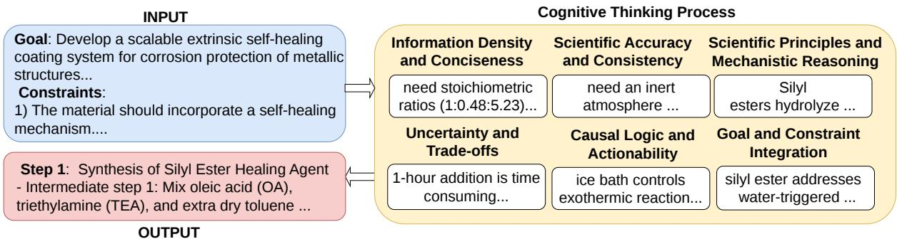
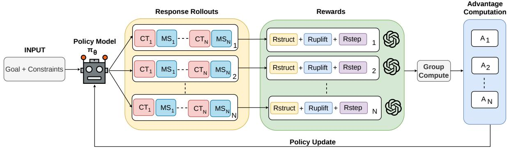
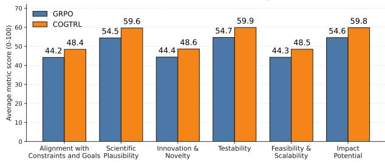
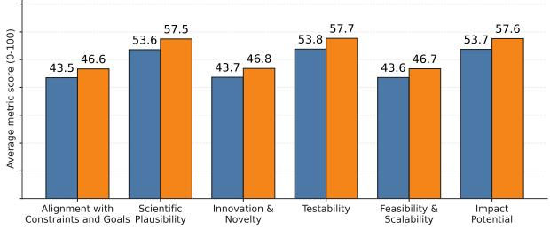
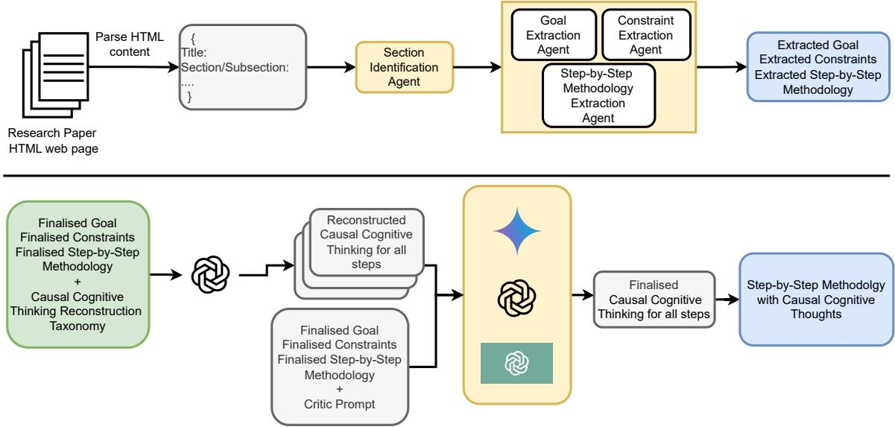
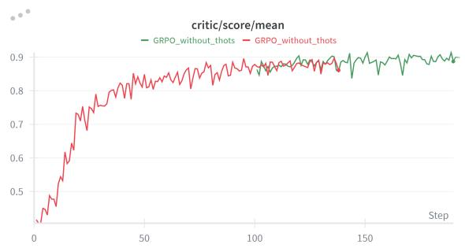
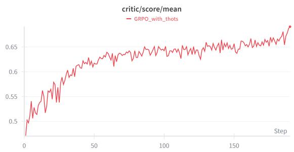
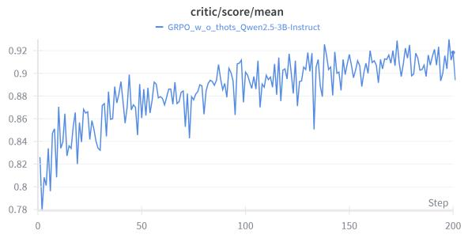
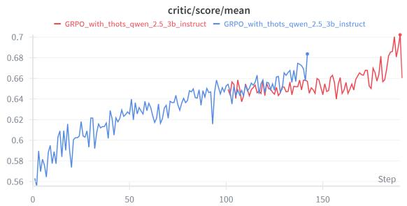

# COGTRL: Training LLMs for Scientific Discovery Assistance using Cognitive Traces via Reinforcement Learning

Shrinidhi Kumbhar Santosh Mashetty Divij Handa Kevin Coutinho

Siddharth Sambhaji Ghule Chitta Baral

Arizona State University

{skumbha4, chitta}@asu.edu

## Abstract

Large Language Models (LLMs) trained on extensive scientific research are increasingly integrated as assistants for scientific discovery. However, most research papers omit the finegrained cognitive process of examining constraints, failed alternatives, and iterative decisions required to achieve the desired goal. Such cognitive processes are vital for real-world scientists working toward specific goals under constraints. In this paper, we show that LLMs, when trained to produce such cognitive traces, perform better as scientific discovery assistants than when trained solely on scientific literature. We propose COGTRL, a trajectory-level reinforcement learning framework that trains LLMs to emulate cognitively grounded reasoning by jointly optimizing cognitive traces and the scientific steps produced in an interleaved manner. Across two 3B-parameter models and two scientific domains (AI and Materials Science), COGTRL improves method quality by an average of 7.85 points over comparable 3B model baselines and achieves competitive performance relative to 70B parameter models. Moreover, analysis by domain experts shows a preference for methods generated by COGTRL over the baselines.

Science is a way ofthinking much more than it is a body of facts. - Carl Sagan

## 1 Introduction

Large Language Models (LLMs) are widely used as assistants in several domains, such as coding (Novikov et al., 2025), planning (Parmar et al., 2025), and computer-use (Awadallah et al., 2025). One such domain where LLMs show promise to accelerate research is scientific discovery (AI4Science and Quantum, 2023; Gottweis et al., 2025; Krolik et al., 2024; Yamada et al.,

2025; Yang et al., 2024). For a scientific discovery assistance task, given a goal, for example, “Develop a self-healing coating for offshore environments” and constraints, for example, “Should be eco-friendly”, the model is tasked with generating a step-by-step methodology for achieving the goal while satisfying the constraints (AI4Science and Quantum, 2023; Kumbhar et al., 2025). The generated method can aid in guiding a human researcher in achieving the given goal and constraints. Such assistance has the potential to drastically reduce the time and labor costs of methodological design.

While recent research has shown promise of using LLMs in scientific discovery (AI4Science and Quantum, 2023; Gottweis et al., 2025; Sprueill et al., 2024; Wang et al., 2023; Merchant et al., 2023), they are primarily focused on agentic approaches using frontier LLMs applied to narrow scientific tasks such as information extraction, property prediction, literature synthesis, and hypotheses generation (Yang et al., 2024; Xiong et al., 2024; Tong et al., 2024; Ghafarollahi and Buehler, 2024b; Sprueill et al., 2024; Ding et al., 2024; Shojaee et al., 2024; Yang et al., 2023). In contrast, we focus on training open-source LLMs for the scientific discovery assistance task. While LLMs are traditionally trained on a wide variety of scientific data, including the latest research articles and papers, these data sources often omit the intermediate cognitive processes underlying scientific decisionmaking. Since scientific discovery, by nature, is a fundamentally cognitive process, in which researchers hypothesize, evaluate constraints, and iteratively refine their plans (Nersessian, 2025; Schickore, 2024; Thagard, 2012; Williams and Lombrozo, 2010; Klahr, 2000), instilling such behaviors while training is crucial.

In this paper, we propose a method to train LLMs for scientific discovery assistance with Cognitive Traces via Reinforcement Learning (COGTRL). COGTRL treats the task as a trajectory-level problem and uses Group Relative Policy Optimization (GRPO) (Shao et al., 2024) as its reinforcement learning backbone. Given a research goal and a set of constraints, the model generates multiple rollouts, each consisting of a sequence of cognitive traces and corresponding methodological steps conditioned on those traces. The structure of COGTRL trajectories is illustrated in Figure 1. Each cognitive trace explicitly articulates why the associated step is expected to advance the goal under the stated constraints. We then design a reward system that evaluates the quality of both the cognitive traces and the generated steps, while additionally rewarding higher-quality cognitive traces that improve downstream step quality. This design encourages the model to generate cognitive traces that are causally useful for downstream methodological step generation, rather than optimizing traces only as standalone explanations. During training, an external LLM-based reward model assigns rewards to both the cognitive traces and the method steps. Policy updates are performed using GRPO over these trajectory-level rewards, enabling the model to iteratively refine both its cognitive trace and method generation.

  
Figure 1: Given a research goal and constraints, the LLM simulates a cognitive thought process and generates a step-by-step methodology by producing cognitive traces before each method step. Step N is conditioned on traces and steps from stages 1 to N−1, and generation continues until the goal is achieved and all constraints are satisfied.

Across two models, Llama-3.2-3B-Instruct and Qwen-2.5-3B-Instruct, and two scientific domains, Artificial Intelligence and Materials Science, COGTRL consistently outperforms zero-shot COT prompting, supervised fine-tuning (with and without cognitive traces), and vanilla GRPO (without cognitive traces) by an average of 7.85 points.

We find that the 3B models trained using COGTRL match the performance of much larger (70B+ parameter) models. Moreover, in our blind human evaluation, domain experts preferred methods generated by COGTRL 71.42% of the time across both the AI and the Materials Science domains. Finally, we show that COGTRL preserves and in some cases modestly improves the model’s performance on out-of-domain reasoning tasks.

## 2 Related Work

## 2.1 LLM Agents for Scientific Discovery

LLM-based agents have accelerated scientific discovery through retrieval-augmented, literaturecentric, and multi-agent workflows that leverage citation structures, explicit constraints, graph reasoning, grounded exploration, experimental planning, and autonomous execution for scientific question answering, literature synthesis, and hypothesis generation (Lála et al., 2023; Agarwal et al., 2024; Wang et al., 2024a; Baek et al., 2025; Yang et al., 2024; Kumbhar et al., 2025; Ghafarollahi and Buehler, 2024b; Sprueill et al., 2024; Bran et al., 2023; Jia et al., 2024; Ghafarollahi and Buehler, 2024a; Gottweis et al., 2025; Liu et al., 2024; Yamada et al., 2025; AI4Science and Quantum, 2023). These approaches typically rely on closed-source frontier LLMs with access to multiple external tools or simulators, limiting accessibility and cross-domain generalization. In contrast, our work focuses on improving the intrinsic scientific reasoning capabilities of open-source LLMs through training, internalizing constraint-aware and structured cognitive reasoning for open-ended scientific method generation without external tool dependence.

## 2.2 Training LLMs for Scientific Discovery and Reasoning

Prior work has explored training-based approaches for scientific discovery through domain-adaptive pretraining, Supervised Fine-Tuning (SFT), Reinforcement Learning (RL), rationale distillation, and process supervision. Pretraining and SFT improve domain-specific reasoning and generation for tasks such as scientific question answering, information extraction, and material generation using large scientific corpora and instruction datasets (Luo et al., 2022; Beltagy et al., 2019; Ding et al., 2024). RL has further been applied to optimization-driven scientific settings such as molecular design, physical system modeling, and evolutionary algorithm discovery using outcome-based rewards (Peng et al., 2023; Cavanagh et al., 2024; Hu et al., 2023; Surina et al., 2025).

Concurrently, reasoning-focused works train LLMs using explicit or implicit reasoning traces through rationale bootstrapping, process supervision, RL-based reasoning, and latent reasoning (Zelikman et al., 2022, 2024; Hsieh et al., 2023; Lightman et al., 2024; Shen et al., 2025; Wu et al., 2024; Hao et al., 2024). However, these approaches primarily target math, QA, or programmatically verifiable tasks. In contrast, COGTRL integrates cognitively grounded intermediate traces with RL for open-ended, constraint-aware scientific method generation, jointly rewarding both cognitive traces and downstream step quality.

## 3 Method

To model goal-conditioned scientific method generation, we introduce cognitive trace and method trajectories as a formal abstraction. Given an input $x \ : = \ : ( g , C )$ consisting of a research goal $g$ and a set of constraints $C .$ , the LLM generates the trajectory $\tau = ( t _ { 1 } , s _ { 1 } , t _ { 2 } , s _ { 2 } , \ldots , t _ { n } , s _ { n } )$ , where each $t _ { i }$ is a brief cognitive trace, and each $s _ { i }$ is a corresponding methodological step conditioned on previous cognitive traces and steps. Trajectories are generated auto-regressively as follows: $\begin{array} { r } { \pi _ { \theta } ( \tau \mid x ) = \prod _ { i = 1 } ^ { n } \pi _ { \theta } ( t _ { i } \mid x , \tau _ { < i } ) \pi _ { \theta } ( s _ { i } \mid x , \tau _ { \le i } ) } \end{array}$

## 3.1 Reward Design

Following prior work (Kumbhar et al., 2025; Yang et al., 2024) that uses LLMs as rubric-based reward models for supervision in open-ended scientific discovery, we design a trajectory-level reward that evaluates both cognitive traces $( t _ { i } )$ and methodological steps $( s _ { i } )$ . We use o3-mini (OpenAI, 2025b), a Large Reasoning Model (LRM), as our reward model. We prompt this LRM to return a list of scores for each trace and step, which are then aggregated for policy optimization. The prompts for reward calculation are listed in Appendix F and

L. We additionally include a structural reward to enforce valid formatting. Refer to Algorithm 1.

## 3.1.1 Cognitive-Trace Quality Reward

We define a cognitive-trace quality reward, $R _ { \mathrm { t r a c e } } ,$ that evaluates whether the generated traces reflect the type of cognitive reasoning useful for scientific method generation. The LRM judge scores the traces on a scale of 1 to 5 along six dimensions: (1) Goal and Constraint Integration: Degree to which the reasoning links decisions to the research goal and constraints. (2) Scientific and Mechanistic Reasoning: Use of appropriate scientific principles or mechanisms to justify the action. (3) Causal Logic and Actionability: Presence of forwardlooking cause–effect reasoning that directly supports the step. (4) Information Density: Amount of meaningful scientific insight conveyed without unnecessary verbosity. (5) Scientific Accuracy and Consistency: Factual correctness and logical coherence of the reasoning. (6) Uncertainty and Trade-offs: Explicit consideration of alternatives, limitations, or uncertainties motivating the choice.

## 3.1.2 Method-Step Quality Reward

We define a method-step quality reward, $R _ { \mathrm { s t e p } } ,$ that evaluates just the generated methodological steps. Each step is scored from 1 to 5 along the six dimensions: (1) Alignment with Research Objectives and Constraints: Whether the steps directly address the research goal and adhere to the provided constraints. (2) Scientific Plausibility: Whether the steps are grounded in scientific principles and reflect realistic mechanisms. (3) Innovation and Novelty: Whether the methodology introduces creative, non-obvious, or insightful scientific strategies. (4) Testability: Whether the steps can be empirically validated or experimentally measured. (5) Feasibility and Scalability: Whether the methodology is practical to implement and can be extended or scaled. (6) Impact Potential: Whether the proposed steps meaningfully advance scientific understanding or the research objective.

## 3.1.3 Uplift Reward: Encouraging Step Quality via Cognitive Traces

Since the generated method is conditioned on the cognitive trace, we introduce a multiplicative uplift reward, $R _ { \mathrm { u p l i f t } }$ , that is responsible for optimizing the traces that are useful for generating the steps. It is defined as $R _ { \mathrm { u p l i f t } } = R _ { \mathrm { s t e p } } \cdot \sigma ( R _ { \mathrm { t r a c e } } - \alpha )$ , where rewards are normalized to $[ 0 , 1 ] , \sigma ( \cdot )$ is the sigmoid function, and α is a trace-quality threshold. This formulation reinforces cognitive traces to improve the quality of the resulting step. We set $\alpha = 0 . 6$ for our experiments. More details in Appendix J.

  
Figure 2: Overview of COGTRL: Given a goal and constraints, the policy generates rollouts containing interleaved cognitive traces $( C T _ { 1 } , \dots , C T _ { N } )$ and method steps $( M S _ { 1 } , \ldots , M S _ { N } )$ . The reward model computes $R _ { \mathrm { t r a c e } }$ , and $R _ { \mathrm { s t e p } }$ , which are aggregated in $R _ { \mathrm { t o t a l } }$ to estimate group-wise advantages for GRPO-style policy updates.

## 3.1.4 Structural Rewards

We apply a structural reward, $R _ { \mathrm { s t r u c t } } .$ , that enforces the required trajectory format of <Trace\_i> $\ldots < / \mathsf { T r a c e \_ i } > \ < \mathsf { S t e p \_ i } > \ \ldots < / \mathsf { S t e p \_ i } >$ , with correct alternation, matched tags, and consecutive indices.

## 3.2 Cognitive Traces Reinforcement Learning

We formalize COGTRL (Figure 2) as optimizing a policy $\pi _ { \theta }$ to maximize the expected total reward $R _ { \mathrm { t o t a l } }$ using Group Relative Policy Optimization (GRPO). Unlike vanilla GRPO, which optimizes over method steps alone, COGTRL optimizes a joint trace–step policy, explicitly optimizing cognitive traces alongside methodological steps in an interleaved manner. At each iteration, we sample inputs, $x \sim D ,$ , and generate G trace–step trajectories $\{ \tau _ { 1 } , \dots , \tau _ { G } \}$ from the current policy $\pi _ { \boldsymbol { \theta } _ { \mathrm { o l d } } } .$ For each trajectory, we compute $r _ { i } = R _ { \mathrm { t o t a l } } ( \tau _ { i } )$ and define the group-normalized advantage

$$
A _ { i } = { \frac { r _ { i } - \operatorname* { m e a n } ( \{ r _ { 1 } , \dots , r _ { G } \} ) } { \operatorname { s t d } ( \{ r _ { 1 } , \dots , r _ { G } \} ) + \epsilon } } ,
$$

which reduces variance via within-group comparison. We update the policy using the standard clipped GRPO objective, $\mathbb { E } [ \mathcal { L } _ { \mathrm { G R P O } } ( \theta ) ]$ , as:

$$
\begin{array} { l } { { \displaystyle { \mathbb { E } } \biggl [ \frac { 1 } { G } \sum _ { i = 1 } ^ { G } \operatorname* { m i n } \Bigl ( \rho _ { i } A _ { i } , \mathrm { c l i p } \bigl ( \rho _ { i } , 1 - \epsilon _ { c } , 1 + \epsilon _ { c } \bigr ) A _ { i } \Bigr ) } } \\ { { - \beta D _ { \mathrm { K L } } \bigl ( \pi _ { \theta } \| \pi _ { \mathrm { r e f } } \bigr ) \biggr ] , } } \end{array}\tag{1}
$$

where $\rho _ { i } ( \theta ) = \pi _ { \theta } ( \tau _ { i } | x ) / \pi _ { \theta _ { \mathrm { o l d } } } ( \tau _ { i } | x )$ is the policy ratio. The KL term constrains deviation from the

SFT reference policy $\pi _ { \mathrm { r e f } }$ , promoting training stability. The total reward that we use for training is: $R _ { \mathrm { t o t a l } } = R _ { \mathrm { s t e p } } + \gamma R _ { \mathrm { u p l i f t } } + \lambda R _ { \mathrm { s t r u c t } } .$

## 4 Experimental Setup

We perform training experiments in two settings: (1) interleaved cognitive trace-step generation, where reasoning traces and method steps are generated alternately, and (2) think-first generation, similar to the current thinking LLMs, where the model first generates cognitive traces followed by the complete methodology steps. We specifically select open-source LLMs with a knowledge cut-off of 2023, as our test set consists of papers from 2024 to avoid data leakage. Refer to Appendices G, K and E for more training details.

Baselines & Models We compare COGTRL against the following baselines: 1) Zero-Shot Chain-of-Thought (CoT), 2) SFT without cognitive traces, 3) SFT with cognitive traces, and 4) Vanilla GRPO (no traces just steps) trained only with step-quality rewards. Zero-shot CoT is evaluated across models spanning small to frontier scale, including Llama-3.2-3B-Instruct, Qwen-2.5-3B-Instruct, Llama-3.3-70B-Instruct, Qwen-2.5-72B-Instruct, Gemini-2.5-Pro, GPT-5.4, and Claude Opus 4.6, while all experiments involving training (SFT and RL) are conducted on Llama-3.2-3B-Instruct and Qwen-2.5-3B-Instruct. We abbreviate instruction-tuned models using “It” for “Instruct” (e.g., LLaMA-3.2-3B-It and Qwen-2.5-3B-It).

Training Data To the best of our knowledge, a dataset containing cognitive traces for scientific discovery does not exist. We therefore construct a training dataset from arXiv papers spanning six domains: Physics, Computer Science, Mathematics, AI, Electrical Engineering, and Biology. For each paper, we use an LLM-based modular extraction pipeline consisting of Goal, Constraint, and Method Extraction agents to obtain the research goal, constraints, and step-by-step methodology.

<table><tr><td>Domain</td><td>Samples</td><td>Percentage (%)</td></tr><tr><td>Physics (Phy)</td><td>1,311</td><td>26.3</td></tr><tr><td>Computer Science (CS)</td><td>1,225</td><td>24.5</td></tr><tr><td>Mathematics (Math)</td><td>1,116</td><td>22.4</td></tr><tr><td>Artificial Intelligence (AI)</td><td>583</td><td>11.7</td></tr><tr><td>Electrical Engineering (EESS)</td><td>570</td><td>11.4</td></tr><tr><td>Biology (Bio)</td><td>185</td><td>3.7</td></tr><tr><td>Total</td><td>4,990</td><td>100.0</td></tr></table>

Table 1: Distribution of SFT training data across various domains on arxiv.

To validate the extracted data, we randomly sample 10 examples per domain and ask four annotators to evaluate the correctness of the extracted goals, constraints, and methods against the original papers using a 3-point scale (1: low, 2: medium, 3: high). The dataset achieves an average correctness score of 2.58/3 with Krippendorff’s alpha of 0.71, indicating substantial agreement. Disagreements are resolved using annotator confidence labels. Since ground-truth cognitive traces are unavailable, and constructing human-written traces at scale is labour-intensive, we generate them using GPT-4o conditioned on the extracted goals, constraints, and methodologies, producing three candidates per sample, following prior work that uses LLM-generated rationales as auxiliary supervision for training smaller models (Zelikman et al., 2022; Hsieh et al., 2023). Final traces are selected using the highest average score assigned by GPT-4o, Gemini-2.5-Pro, and OpenAI-o1 under the taxonomy defined in Section 3.1.1. These teachergenerated traces are used only for SFT initialization, while RL training later explores traces and steps through policy-generated rollouts. Additional dataset construction details, prompts, and validation procedures are provided in Appendix B, and N. The final dataset statistics are shown in Table 1.

Evaluation Benchmark Our evaluation consists of two different subsets. First is a held-out test set spanning two domains: AI (in-domain) and Materials Science (out-of-domain). The AI test set includes 50 NeurIPS 2024 papers sampled across multiple subareas (e.g., LLMs, optimization, reinforcement learning), with goals, constraints, and step-by-step methodologies manually extracted by two independent domain experts. The Materials Science test set comprises 50 papers from the Mat-Design benchmark (Kumbhar et al., 2025), which provides goals and constraints, while two domain experts extract methodological steps. Second, are several out-of-domain existing reasoning benchmarks (e.g., AMC23, AIME, MMLU-Pro (Wang et al., 2024b), GPQA-Diamond (Rein et al., 2024), HumanEval (Chen, 2021), OlympiadBench (He et al., 2024), etc. to measure how well the base model capabilities are preserved while undergoing training for scientific discovery assistance. To assess test-set reliability, we conduct a referenceguided expert validation study in which two domain experts per domain independently rate each extracted sample against the original paper on a 3-point ordinal scale: 1 = Low, 2 = Medium, and 3 = Highly Accurate. We report quadratic weighted Cohen’s κ to account for ordinal ratings, obtaining κ = 0.67, indicating substantial inter-annotator agreement. Details are provided in Appendix D.

Evaluation Metrics Evaluating open-ended scientific methodologies is challenging due to their multi-dimensional and domain-specific nature, while reliable verification often requires physical experiments, simulation pipelines, or domainspecific infrastructure. Prior work (D’Souza et al., 2025; Zhang et al., 2025; Xiong et al., 2025; Bavaresco et al., 2025; Handa et al., 2025; Badshah and Sajjad, 2025; Tong and Zhang, 2024; Lan et al., 2024; Tang et al., 2024; Krolik et al., 2024) shows that LLMs can serve as reliable evaluators across language, code, and scientific reasoning tasks.

Following Kumbhar et al. (2025), we evaluate only generated methodological steps, not traces, using two independent agentic evaluation frameworks: Codex (OpenAI, 2025a) and Claude Code (Anthropic, 2025), supported by GPT-5.4 and Claude Sonnet 4.6, respectively, both with high reasoning settings, internet search, and tool-use capabilities enabled in identical settings. These evaluators are distinct from the OpenAI o3-mini reward model used during RL training, reducing reward-model overfitting. During training and evaluation, we explicitly instruct the reward models not to reward stylistic verbosity, unsupported claims, hallucinated scientific content, or uncertain reasoning. Evaluation is rubric-based rather than reference-matching: judges score six methodological quality dimensions from Section 3.1.2. During evaluation, retrieval is unrestricted, allowing judges to use external documents, research papers, and databases. Judges additionally provide brief score justifications. Scores are assigned independently on a 1–5 scale and aggregated across judges. Across both domains, aggregated LLM-judge evaluations align with human expert preferences in 77.14% of cases. To reduce position bias and longcontext effects, methodologies are evaluated independently rather than through pairwise comparisons (Shi et al., 2025; Hosseini et al., 2025). All results are averaged across three independent runs with standard deviations reported for Tables 2 and 5. Additional evaluation details are provided in Appendices C, F, L, and O.

<table><tr><td>Model</td><td>Technique</td><td>Quality AI</td><td>Quality MatSci</td></tr><tr><td>Llama-3.2-3B-It</td><td>Zero-shot-CoT (Think First)</td><td> $3 7 . 3 0 \pm 0 . 9 2$ </td><td> $\overline { { 4 1 . 9 8 \pm 0 . 8 8 } }$ </td></tr><tr><td></td><td>SFT with traces (Think First)</td><td> $4 4 . 2 7 \pm 0 . 7 9$ </td><td> $4 2 . 3 3 \pm 0 . 8 3$ </td></tr><tr><td></td><td>CoGTRL (Think First)</td><td> $4 8 . 2 0 \pm 0 . 6 8$ </td><td> $4 9 . 3 1 \pm 0 . 6 4$ </td></tr><tr><td></td><td>Zero-shot-CoT (Int. Think)</td><td> $3 8 . 0 0 \pm 0 . 9 0$ </td><td> $4 2 . 4 6 \pm 0 . 8 6$ </td></tr><tr><td></td><td>SFT w/o traces</td><td> $4 2 . 4 4 \pm 0 . 8 1$ </td><td> $4 5 . 7 7 \pm 0 . 7 3$ </td></tr><tr><td></td><td>SFT with traces (Int. Think)</td><td> $4 5 . 8 4 \pm 0 . 7 1$ </td><td> $4 7 . 4 0 \pm 0 . 6 9$ </td></tr><tr><td></td><td>GRPO (Int. Think)</td><td> $4 8 . 4 7 \pm 0 . 6 6$ </td><td> $5 0 . 3 7 \pm 0 . 6 1$ </td></tr><tr><td></td><td>COGTRL (Int. Think)</td><td> ${ \pm 0 . 6 3 \pm 0 . 5 8 }$ </td><td> ${ \pm } 5 5 . 6 4 \pm 0 . 5 1$ </td></tr><tr><td>Qwen-2.5-3B-It</td><td>Zero-shot-CoT (Think First)</td><td> $\overline { { 3 9 . 6 1 \pm 0 . 8 7 } }$ </td><td> $\overline { { 4 2 . 6 2 \pm 0 . 8 5 } }$ </td></tr><tr><td></td><td>SFT with traces (Think First)</td><td> $4 2 . 8 4 \pm 0 . 8 0$ </td><td>43.36 ± 0.82</td></tr><tr><td></td><td>CoGTRL (Think First)</td><td> $4 6 . 9 7 \pm 0 . 7 0$ </td><td>49.51 ± 0.66</td></tr><tr><td></td><td>Zero-shot-CoT (Int. Think)</td><td> $4 0 . 5 0 \pm 0 . 8 4$ </td><td> $4 4 . 0 3 \pm 0 . 8 0$ </td></tr><tr><td></td><td>SFT w/o traces</td><td> $4 3 . 1 3 \pm 0 . 7 6$ </td><td> $4 6 . 2 0 \pm 0 . 7 1$ </td></tr><tr><td></td><td>SFT with traces (Int. Think)</td><td> $4 5 . 1 0 \pm 0 . 7 2$ </td><td> $4 7 . 7 0 \pm 0 . 6 7$ </td></tr><tr><td></td><td>GRPO (Int. Think)</td><td> $4 7 . 2 4 \pm 0 . 6 9$ </td><td> $5 0 . 0 3 \pm 0 . 6 3$ </td></tr><tr><td></td><td>CogTRL (Int. Think)</td><td> ${ \bf 5 1 . 1 3 \pm 0 . 6 1 }$ </td><td> ${ \bf 5 3 . 1 7 \pm 0 . 5 6 }$ </td></tr><tr><td>Llama-3.3-70B-It</td><td>Zero-shot-CoT (Int. Think)</td><td> $\overline { { 5 2 . 2 7 \pm 0 . 5 7 } }$ </td><td> $\overline { { 5 4 . 0 0 \pm 0 . 5 3 } }$ </td></tr><tr><td>Qwen-2.5-72B-It</td><td>Zero-shot-CoT (Int. Think)</td><td> $5 0 . 4 7 \pm 0 . 6 2$ </td><td> $5 4 . 5 7 \pm 0 . 4 9$ </td></tr><tr><td>GPT-5.4</td><td>Zero-shot-CoT (Int. Think)</td><td> $6 0 . 2 7 \pm 0 . 4 2$ </td><td> $\smash { 6 4 . 6 0 \pm 0 . 3 7 }$ </td></tr><tr><td>Gemini-2.5-Pro</td><td>Zero-shot-CoT (Int. Think)</td><td> $5 8 . 6 4 \pm 0 . 4 7$ </td><td> $5 9 . 1 0 \pm 0 . 4 4$ </td></tr><tr><td>Claude Opus 4.6</td><td>Zero-shot-CoT (Int. Think)</td><td> ${ \bf 6 3 . 8 7 \pm 0 . 3 5 }$ </td><td> $6 2 . 5 3 \pm 0 . 4 1$ </td></tr></table>

Table 2: Quality results for COGTRL and baselines across two generation formats: Think First, where cognitive traces are generated before the methodology, and Int. Think, where traces are interleaved with method.

As an additional safeguard against reward hacking, we evaluate LLaMA-3.2-3B-It and Qwen-2.5- 3B-It under zero-shot, GRPO, and COGTRL settings using an independent evaluation rubric (Chen et al., 2026). COGTRL consistently outperforms the baselines under this alternative rubric as shown in Appendix P.

## 5 Results and Analysis

COGTRL with Interleaved Trace-Step generation improves Quality of Scientific Methods Table 2 shows that COGTRL outperforms baselines across both domains and generation settings. In the interleaved setting, COGTRL improves over GRPO by an average of 4.12 points and over all non-CogTRL baselines using the same 3B models by 7.85 points. The 3B COGTRL models become competitive with open source 70B models, outperforming Qwen-2.5-72B-Instruct on AI and matching or exceeding Llama-3.3-70B-Instruct.

Interleaved reasoning consistently outperforms think-first generation. Averaged across both models, interleaved COGTRL improves over think-first COGTRL by 4.30 points on AI and 4.99 on Material Science. Similar trends for SFT with traces suggest that conditioning each step on preceding traces and steps yields stronger alignment than generating all reasoning upfront.

We further study the contribution of the uplift reward $R _ { \mathrm { { u p l i f t } } } .$ . Removing it while retaining $R _ { \mathrm { s t e p } } .$ $R _ { \mathrm { t r a c e } }$ , and $R _ { \mathrm { s t r u c t } }$ causes an average degradation of 5.38% across both models (Table 3), suggesting that cognitive traces are most beneficial when they improve downstream method quality and not just superficial explanations. Overall, combining RL with cognitive-trace and multidimensional quality rewards enables high-quality method generation, with similar gains observed using Dr. GRPO (Liu et al., 2025) (Appendix A Table 7), suggesting that COGTRL is not tied to a specific RL algorithm.

Uplift Evidence of Cognitive Traces To evaluate whether cognitive traces improve scientific step generation quality, we compute teacher-forced pertoken probabilities for fixed COGTRL-generated methodological steps under three settings: aligned traces (w/A), no traces (w/O), and mismatched traces from another example but same domain (w/M). “High-quality steps” refer to COGTRL generations evaluated using the aggregate LLM-judge quality scores; no additional filtering or reranking is performed for this analysis. We score only the Step\_i tokens and report exp(−NLL), where NLL (Negative Log Likelihood) is averaged over the same target step tokens across all conditions, preventing longer trace inputs from artificially improving scores. As shown in Table 4, aligned traces consistently yield higher probabilities than both the no-trace and mismatched-trace settings across models and domains. While the w/O condition yields lower probabilities for high-quality steps, the w/M condition demonstrates that the gains arise from trace–step alignment rather than additional context length or formatting. Further, Table 5 shows that COGTRL models consistently generate higherquality methodologies when prompted to generate cognitive traces during inference, supporting that traces improve downstream method quality.

Figure 3: The above plots show the scores for every dimension of the Step Quality metric achieved by models trained with GRPO and COGTRL. Both models, Llama-3.2-3B-Instruct (Left) and Qwen-2.5-3B-Instruct (Right), trained with COGTRL perform better on all dimensions compared to GRPO.
<table><tr><td>Model</td><td>Quality AI</td><td>Quality MatSci</td></tr><tr><td>CoGTRL Llama-3.2-3B-It w/o uplift</td><td>50.65</td><td>53.20</td></tr><tr><td>CoGTRL Qwen-2.5-3B-It w/o uplift</td><td>48.35</td><td>48.96</td></tr></table>

Table 3: Ablation without Reward Upliftment: Removing $R _ { \mathrm { u p l i f t } }$ from the cumulative reward degrades performance across both models.
<table><tr><td>Model</td><td>Dom.</td><td>w/A</td><td>w/0</td><td>w/M</td></tr><tr><td>Llama 3.2 3B-It</td><td>AI</td><td>0.6324</td><td>0.5274</td><td>0.4732</td></tr><tr><td>Llama 3.2 3B-It</td><td>MatSci</td><td>0.6108</td><td>0.5145</td><td>0.4598</td></tr><tr><td>Qwen 2.5 3B-It</td><td>AI</td><td>0.5028</td><td>0.4127</td><td>0.3631</td></tr><tr><td>Qwen 2.5 3B-It</td><td>MatSci</td><td>0.4859</td><td>0.3991</td><td>0.3473</td></tr></table>

Table 4: Per-token probabilities of fixed high-quality methodological steps under aligned traces (w/A), no traces (w/O), and mismatched traces (w/M).

Improvements Across Sub-Metrics To identify where COGTRL provides the greatest benefits, we compute average per-dimension improvements across Llama-3.2-3B-Instruct and Qwen2.5- 3B-Instruct. Averaged across models and domains, COGTRL yields the largest gains in Testability (+4.55) and Impact Potential (+4.55), followed by Scientific Plausibility (+4.50). More moderate improvements are observed for Alignment with Constraints and Goals (+3.65), Innovation and Novelty (+3.65), and Feasibility and Scalability (+3.65). Figure 3 reports the per-dimension breakdown relative to the vanilla GRPO baseline. These results indicate that COGTRL delivers balanced improvements across quality dimensions.

Impact of Supervised Fine-Tuning Table 2 shows that SFT with cognitive traces consistently improves scientific methodology quality over zeroshot prompting and SFT without traces across AI and Materials Science. Since SFT without traces does not generate cognitive reasoning, no thinkfirst or interleaved setting applies to this baseline. In contrast, interleaved SFT with traces consistently outperforms think-first SFT with traces across both 3B models and domains, suggesting that conditioning each step on preceding traces improves methodological alignment. These results suggest that cognitive traces provide useful intermediate reasoning signals, while SFT-with-traces initialization further improves COGTRL performance.

<table><tr><td>Model</td><td>Method</td><td>Traces</td><td>AI</td><td>MatSci</td></tr><tr><td rowspan="3">Llama 3.2 3B-It</td><td>GRPO</td><td></td><td> $4 8 . 4 7 { \pm } 1 . 1 2 $ </td><td> $5 0 . 3 7 { \pm } 1 . 0 8 $ </td></tr><tr><td>COGTRL</td><td>w/o</td><td> $4 9 . 5 0 { \pm } 1 . 0 5 $ </td><td> $5 1 . 1 2 { \pm } 1 . 1 4$ </td></tr><tr><td>COGTRL</td><td>w/</td><td> $\mathbf { 5 2 . 6 3 { \pm } 1 . 0 1 }$ </td><td> $\mathbf { 5 5 . 6 4 \pm 1 . 0 9 }$ </td></tr><tr><td rowspan="3">Qwen 2.5 3B-It</td><td>GRPO</td><td></td><td> $4 7 . 2 4 { \pm } 1 . 1 8$ </td><td> $5 0 . 0 3 { \pm } 1 . 1 0 $ </td></tr><tr><td>COGTRL</td><td>w/o</td><td> $4 7 . 6 5 { \pm } 1 . 1 1 $ </td><td> $5 2 . 0 5 { \pm } 1 . 0 7 \ $ </td></tr><tr><td>COGTRL</td><td>w/</td><td> $\mathbf { 5 1 . 1 3 { \pm } 1 . 0 4 }$ </td><td> $\mathbf { 5 3 . 1 7 \pm 1 . 1 2 }$ </td></tr></table>

Table 5: Impact of cognitive traces during inference. Including traces during inference consistently improves methodology quality across models and domains.

Out-of-Domain Performance of COGTRL Table 6 shows that COGTRL preserves the general reasoning capabilities of the base instruction-tuned models across math (AIME, AMC23), scientific (GPQA-Diamond, OlympiadBench), code generation (HumanEval), and language understanding (MMLU-Pro) tasks. Unlike SFT, which causes degradation across several benchmarks, COGTRL avoids this collapse while improving scientific method generation. Relative to vanilla GRPO, COGTRL achieves modest gains on benchmarks such as AMC23 and GPQA-Diamond, with only minor regressions on others. Importantly, average benchmark performance remains stable across both model families, indicating that gains in scientific discovery assistance do not come at the expense of broad reasoning competence.

<table><tr><td>Model</td><td>Method</td><td>AIME</td><td>AMC23</td><td>GPQA</td><td>HumanEval</td><td>MMLU-Pro</td><td>Olympiad</td><td>Avg.</td></tr><tr><td rowspan="5">Llama-3.2-3B-It</td><td>Zero Shot</td><td>6.46</td><td>15.83</td><td>24.75</td><td>40.24</td><td>31.00</td><td>8.17</td><td>21.07</td></tr><tr><td>SFT w/o traces</td><td>4.97</td><td>8.33</td><td>17.68</td><td>26.63</td><td>16.43</td><td>4.29</td><td>13.05</td></tr><tr><td>SFT with traces</td><td>7.50</td><td>14.17</td><td>17.68</td><td>6.30</td><td>11.12</td><td>5.56</td><td>10.38</td></tr><tr><td>GRPO</td><td>8.22</td><td>11.67</td><td>25.08</td><td>39.84</td><td>31.61</td><td>7.98</td><td>20.73</td></tr><tr><td>CogTRL</td><td>8.15</td><td>17.50</td><td>24.24</td><td>38.41</td><td>31.51</td><td>8.46</td><td>21.37</td></tr><tr><td rowspan="5">Qwen-2.5-3B It</td><td>Zero Shot</td><td>12.00</td><td>34.17</td><td>29.46</td><td>50.81</td><td>41.92</td><td>23.72</td><td>32.01</td></tr><tr><td>SFT w/o traces</td><td>3.72</td><td>19.17</td><td>27.44</td><td>21.75</td><td>34.91</td><td>12.90</td><td>19.98</td></tr><tr><td>SFT with traces</td><td>5.21</td><td>23.33</td><td>26.43</td><td>31.91</td><td>33.57</td><td>14.44</td><td>22.48</td></tr><tr><td>GRPO</td><td>13.11</td><td>39.17</td><td>27.44</td><td>50.00</td><td>41.93</td><td>22.35</td><td>32.33</td></tr><tr><td>CogTRL</td><td>11.47</td><td>40.00</td><td>29.80</td><td>54.27</td><td>42.57</td><td>21.76</td><td>33.31</td></tr></table>

Table 6: Performance on general-purpose reasoning benchmarks under interleaved thinking averaged across three runs. Best scores per model and benchmark are shown in bold. COGTRL preserves overall reasoning capability.

## 5.1 Human Evaluation

We conduct a human expert preference evaluation with four annotators, two Chemistry PhD students, one CS PhD student, and one CS Master’s student, on AI and Materials Science methodologies. Across all 50 samples per domain and three techniques (vanilla Instruct, GRPO, and COGTRL), resulting in 300 total evaluations, randomized methodology outputs are independently ranked by two domain experts with confidence scores; disagreements are resolved using the higherconfidence labels. The inter-annotator agreement measured using Kendall’s W is 0.70, indicating substantial agreement. Across all pairwise comparisons, COGTRL is preferred in 71.42% of cases, with annotators consistently highlighting superior completeness, organization, and causal structure.

In Materials Science, experts attribute these gains to greater specificity and actionability, including clearer synthesis procedures, characterization workflows, and appropriate use of tools such as molecular dynamics and density functional theory, along with stronger integration of constraints and deployment context (e.g., environmental conditions, biofouling, safety, and deployment scenarios). They also note more systematic workflows from material selection to validation. In AI, experts report that COGTRL better grounds methodologies in conceptual reasoning before translating them into concrete training and evaluation procedures, while more explicitly addressing constraints such as domain adaptation and verification, resulting in a systematic and comprehensive methodology.

Case Study: Constraint-Driven Design for Photothermal Self-Healing Elastomers. We compare three model-generated methodologies for designing a sustainable photothermal-responsive selfhealing elastomer under three coupled constraints: (i) high mechanical strength with repeatable healing, (ii) balanced photothermal efficiency and dispersion, and (iii) fast localized NIR-triggered repair. The zero-shot model proposes a generic workflow but fails to explicitly connect network architecture, photothermal response, and healing behavior to these constraints. The GRPO model introduces sophisticated components, yet lacks a causal structure linking material choices to downstream trade-offs.

In contrast, the COGTRL-trained model decomposes the task into constraint-driven design stages. It jointly designs photothermalresponsive monomers and incorporation strategies for dispersion-controlled NIR absorption, explicitly analyzing morphology-dependent heating uniformity. Mechanical strength and healing are codesigned through hierarchical crosslinked networks validated under cyclic loading, while localized repair is addressed by optimizing photothermal agent geometry and thermal diffusion. Crucially, synthesis, characterization, and modeling steps are causally linked to specific constraints. Full details, along with an AI case study and actual method comparisons, are provided in Appendix H and I.

## 6 Conclusion

We presented COGTRL, a trajectory-level reinforcement learning framework for training LLMs to jointly generate cognitive traces and scientific methodologies for open-ended scientific discovery assistance. By optimizing cognitively grounded trace–step trajectories with multidimensional rewards, COGTRL improves scientific method generation across AI and Materials Science while preserving general reasoning capabilities. Experiments across multiple baselines, ablations, and human evaluations show that cognitive traces are most beneficial when they causally improve downstream methodological quality rather than serving as standalone explanations. Moreover, 3B-parameter models trained with COGTRL achieve competitive performance relative to the larger 70B+ models.

## Limitations

Our current study relies on state-of-the-art closedsource LRMs such as OpenAI o3-mini for reward calculation. While these models demonstrate strong scientific reasoning capabilities, they introduce additional API cost. The framework currently depends on rubric-based LLM rewards rather than physical-world, tool-based, or simulationgrounded verification, since open-ended scientific method generation lacks scalable infrastructure for explicitly validating and rewarding every generated trajectory. Although we mitigate reward hacking by separating the training reward model from the evaluation frameworks, using independent agentic evaluators with retrieval and tool-use capabilities, and explicitly discouraging hallucinated or stylistic reasoning during reward computation, the framework may still inherit biases associated with LLM-as-a-judge evaluation. We also acknowledge that rubric-based LLM evaluation might not perfectly capture real-world scientific validity. Training open-source reward models and collecting expert-authored cognitive traces remain important future directions but are beyond the scope of the current study. Finally, we experiment primarily with small-parameter models (≈3B) due to compute constraints and evaluate only AI and Materials Science domains; extending COGTRL to larger models, broader scientific domains remains future work.

## Ethics Statement

We have utilized AI assistants, specifically Grammarly and ChatGPT, to correct grammatical errors and rephrase sentences.

## Acknowledgement

We thank the anonymous reviewers for their constructive suggestions. We extend our gratitude to the Research Computing (RC), and Enterprise Technology at Arizona State University for providing computing resources, and access to the Chat-GPT enterprise version for experiments.

This research was supported by the Engineering Research and Development Center - Information Technology Laboratory (ERDC-ITL) under Contract No. W912HZ24C0022. Any opinions, findings and conclusions or recommendations expressed in this work are those of the author(s) and do not necessarily reflect the views of the ERDC-ITL. Baral was also partially supported by a DARPA contract.

## References

Shubham Agarwal, Gaurav Sahu, Abhay Puri, Issam H Laradji, Krishnamurthy DJ Dvijotham, Jason Stanley, Laurent Charlin, and Christopher Pal. 2024. Litllm: A toolkit for scientific literature review. arXiv preprint arXiv:2402.01788.

Microsoft Research AI4Science and Microsoft Azure Quantum. 2023. The impact of large language models on scientific discovery: a preliminary study using gpt-4. arXiv preprint arXiv:2311.07361.

Anthropic. 2024. Claude 3 model card. https://www-cdn.anthropic.com/ de8ba9b01c9ab7cbabf5c33b80b7bbc618857627/ Model\_Card\_Claude\_3.pdf.

Anthropic. 2025. Claude code documentation: Overview. https://code.claude.com/docs/en/overview.

Ahmed Awadallah, Yash Lara, Raghav Magazine, Hussein Mozannar, Akshay Nambi, Yash Pandya, Aravind Rajeswaran, Corby Rosset, Alexey Taymanov, Vibhav Vineet, et al. 2025. Fara-7b: An efficient agentic model for computer use. arXiv preprint arXiv:2511.19663.

Sher Badshah and Hassan Sajjad. 2025. Referenceguided verdict: Llms-as-judges in automatic evaluation of free-form qa. In Proceedings of the 9th Widening NLP Workshop, pages 251–267.

Jinheon Baek, Sujay Kumar Jauhar, Silviu Cucerzan, and Sung Ju Hwang. 2025. Researchagent: Iterative research idea generation over scientific literature with large language models. In Proceedings of the 2025 Conference of the Nations of the Americas Chapter ofthe Associationfor Computational Linguistics: Human Language Technologies (Volume 1: Long Papers), pages 6709–6738.

Anna Bavaresco, Raffaella Bernardi, Leonardo Bertolazzi, Desmond Elliott, Raquel Fernández, Albert Gatt, Esam Ghaleb, Mario Giulianelli, Michael Hanna, Alexander Koller, et al. 2025. Llms instead of human judges? a large scale empirical study across 20 nlp evaluation tasks. In Proceedings ofthe 63rd Annual Meeting of the Association for Computational Linguistics (Volume 2: Short Papers), pages 238– 255.

Iz Beltagy, Kyle Lo, and Arman Cohan. 2019. Scibert: A pretrained language model for scientific text. arXiv preprint arXiv:1903.10676.

Andres M Bran, Sam Cox, Oliver Schilter, Carlo Baldassari, Andrew D White, and Philippe Schwaller. 2023. Chemcrow: Augmenting large-language models with chemistry tools. arXiv preprint arXiv:2304.05376.

Joseph M Cavanagh, Kunyang Sun, Andrew Gritsevskiy, Dorian Bagni, Yingze Wang, Thomas D Bannister, and Teresa Head-Gordon. 2024. Smileyllama: Modifying large language models for directed chemical space exploration. arXiv preprint arXiv:2409.02231.

Hui Chen, Miao Xiong, Yujie Lu, Wei Han, Ailin Deng, Yufei He, Jiaying Wu, Yibo Li, Yue Liu, and Bryan Hooi. 2026. Mlr-bench: Evaluating ai agents on open-ended machine learning research. Advances in Neural Information Processing Systems, 38.

Mark Chen. 2021. Evaluating large language models trained on code. arXiv preprint arXiv:2107.03374.

Qianggang Ding, Santiago Miret, and Bang Liu. 2024. Matexpert: Decomposing materials discovery by mimicking human experts. arXiv preprint arXiv:2410.21317.

Jennifer D’Souza, Hamed Babaei Giglou, and Quentin Münch. 2025. Yescieval: Robust llm-as-a-judge for scientific question answering. In Proceedings ofthe 63rd Annual Meeting of the Association for Computational Linguistics (Volume 1: Long Papers), pages 13749–13783.

Alireza Ghafarollahi and Markus J Buehler. 2024a. Protagents: protein discovery via large language model multi-agent collaborations combining physics and machine learning. Digital Discovery, 3(7):1389– 1409.

Alireza Ghafarollahi and Markus J Buehler. 2024b. Sciagents: Automating scientific discovery through multi-agent intelligent graph reasoning. arXiv preprint arXiv:2409.05556.

Juraj Gottweis, Wei-Hung Weng, Alexander Daryin, Tao Tu, Anil Palepu, Petar Sirkovic, Artiom Myaskovsky, Felix Weissenberger, Keran Rong, Ryutaro Tanno, et al. 2025. Towards an ai co-scientist. arXiv preprint arXiv:2502.18864.

Divij Handa, David Blincoe, Orson Adams, and Yinlin Fu. 2025. Optagent: Optimizing query rewriting for e-commerce via multi-agent simulation. arXiv preprint arXiv:2510.03771.

Shibo Hao, Sainbayar Sukhbaatar, DiJia Su, Xian Li, Zhiting Hu, Jason Weston, and Yuandong Tian. 2024. Training large language models to reason in a continuous latent space. arXiv preprint arXiv:2412.06769.

Chaoqun He, Renjie Luo, Yuzhuo Bai, Shengding Hu, Zhen Thai, Junhao Shen, Jinyi Hu, Xu Han, Yujie Huang, Yuxiang Zhang, et al. 2024. Olympiadbench:

A challenging benchmark for promoting agi with olympiad-level bilingual multimodal scientific problems. In Proceedings ofthe 62nd Annual Meeting of the Association for Computational Linguistics (Volume 1: Long Papers), pages 3828–3850.

Peyman Hosseini, Ignacio Castro, Iacopo Ghinassi, and Matthew Purver. 2025. Efficient solutions for an intriguing failure of llms: Long context window does not mean llms can analyze long sequences flawlessly. In Proceedings ofthe 31st international conference on computational linguistics, pages 1880–1891.

Cheng-Yu Hsieh, Chun-Liang Li, Chih-Kuan Yeh, Hootan Nakhost, Yasuhisa Fujii, Alex Ratner, Ranjay Krishna, Chen-Yu Lee, and Tomas Pfister. 2023. Distilling step-by-step! outperforming larger language models with less training data and smaller model sizes. In Findings of the Association for Computational Linguistics: ACL 2023, pages 8003–8017.

Xiuyuan Hu, Guoqing Liu, Yang Zhao, and Hao Zhang. 2023. De novo drug design using reinforcement learning with multiple gpt agents. Advances in Neural Information Processing Systems, 36:7405–7418.

Aaron Hurst, Adam Lerer, Adam P Goucher, Adam Perelman, Aditya Ramesh, Aidan Clark, AJ Ostrow, Akila Welihinda, Alan Hayes, Alec Radford, et al. 2024. Gpt-4o system card. arXiv preprint arXiv:2410.21276.

Shuyi Jia, Chao Zhang, and Victor Fung. 2024. Llmatdesign: Autonomous materials discovery with large language models. arXiv preprint arXiv:2406.13163.

David Klahr. 2000. Exploring science: The cognition and development of discovery processes. MIT press.

Jack Krolik, Herprit Mahal, Feroz Ahmad, Gaurav Trivedi, and Bahador Saket. 2024. Towards leveraging large language models for automated medical q&a evaluation. arXiv preprint arXiv:2409.01941.

Shrinidhi Kumbhar, Venkatesh Mishra, Kevin Coutinho, Divij Handa, Ashif Iquebal, and Chitta Baral. 2025. Hypothesis generation for materials discovery and design using goal-driven and constraint-guided llm agents. arXiv preprint arXiv:2501.13299.

Woosuk Kwon, Zhuohan Li, Siyuan Zhuang, Ying Sheng, Lianmin Zheng, Cody Hao Yu, Joseph Gonzalez, Hao Zhang, and Ion Stoica. 2023. Efficient memory management for large language model serving with pagedattention. In Proceedings ofthe 29th symposium on operating systems principles, pages 611–626.

Jakub Lála, Odhran O’Donoghue, Aleksandar Shtedritski, Sam Cox, Samuel G Rodriques, and Andrew D White. 2023. Paperqa: Retrieval-augmented generative agent for scientific research. arXiv preprint arXiv:2312.07559.

Tian Lan, Wenwei Zhang, Chen Xu, Heyan Huang, Dahua Lin, Kai Chen, and Xian-Ling Mao. 2024. Criticeval: Evaluating large-scale language model as critic. Advances in Neural Information Processing Systems, 37:66907–66960.

Hunter Lightman, Vineet Kosaraju, Yuri Burda, Harrison Edwards, Bowen Baker, Teddy Lee, Jan Leike, John Schulman, Ilya Sutskever, and Karl Cobbe. 2024. Let’s verify step by step. In International Conference on Learning Representations, volume 2024, pages 39578–39601.

Sizhe Liu, Yizhou Lu, Siyu Chen, Xiyang Hu, Jieyu Zhao, Yingzhou Lu, and Yue Zhao. 2024. Drugagent: Automating ai-aided drug discovery programming through llm multi-agent collaboration. arXiv preprint arXiv:2411.15692.

Zichen Liu, Changyu Chen, Wenjun Li, Penghui Qi, Tianyu Pang, Chao Du, Wee Sun Lee, and Min Lin. 2025. Understanding r1-zero-like training: A critical perspective. arXiv preprint arXiv:2503.20783.

Renqian Luo, Liai Sun, Yingce Xia, Tao Qin, Sheng Zhang, Hoifung Poon, and Tie-Yan Liu. 2022. Biogpt: generative pre-trained transformer for biomedical text generation and mining. Briefings in bioinformatics, 23(6):bbac409.

Amil Merchant, Simon Batzner, Samuel S Schoenholz, Muratahan Aykol, Gowoon Cheon, and Ekin Dogus Cubuk. 2023. Scaling deep learning for materials discovery. Nature, 624(7990):80–85.

Nancy J Nersessian. 2025. How do scientists think? contributions toward a cognitive science of science. Topics in Cognitive Science, 17(1):7–33.

Alexander Novikov, Ngân Vu, Marvin Eisenberger,˜ Emilien Dupont, Po-Sen Huang, Adam Zsolt Wagner, Sergey Shirobokov, Borislav Kozlovskii, Francisco JR Ruiz, Abbas Mehrabian, et al. 2025. Alphaevolve: A coding agent for scientific and algorithmic discovery. arXiv preprint arXiv:2506.13131.

OpenAI. 2025a. Codex: Ai coding partner from openai. https://openai.com/codex/.

OpenAI. 2025b. Openai o3-mini system card. https: //openai.com/index/o3-mini-system-card/.

Mihir Parmar, Xin Liu, Palash Goyal, Yanfei Chen, Long Le, Swaroop Mishra, Hossein Mobahi, Jindong Gu, Zifeng Wang, Hootan Nakhost, et al. 2025. Plangen: A multi-agent framework for generating planning and reasoning trajectories for complex problem solving. arXiv preprint arXiv:2502.16111.

Cheng Peng, Xi Yang, Aokun Chen, Kaleb E Smith, Nima PourNejatian, Anthony B Costa, Cheryl Martin, Mona G Flores, Ying Zhang, Tanja Magoc, et al. 2023. A study of generative large language model for medical research and healthcare. NPJ digital medicine, 6(1):210.

David Rein, Betty Li Hou, Asa Cooper Stickland, Jackson Petty, Richard Yuanzhe Pang, Julien Dirani, Julian Michael, and Samuel R Bowman. 2024. Gpqa: A graduate-level google-proof q&a benchmark. In First Conference on Language Modeling.

Jutta Schickore. 2024. Scientific discovery. In Edward N. Zalta and Uri Nodelman, editors, The Stanford Encyclopedia of Philosophy, Winter 2024 edition. Metaphysics Research Lab, Stanford University. https://plato.stanford.edu/archives/ win2024/entries/scientific-discovery/. Accessed: 2025-01-27.

Zhihong Shao, Peiyi Wang, Qihao Zhu, Runxin Xu, Junxiao Song, Xiao Bi, Haowei Zhang, Mingchuan Zhang, YK Li, Yang Wu, et al. 2024. Deepseekmath: Pushing the limits of mathematical reasoning in open language models. arXiv preprint arXiv:2402.03300.

Maohao Shen, Guangtao Zeng, Zhenting Qi, Zhang-Wei Hong, Zhenfang Chen, Wei Lu, Gregory Wornell, Subhro Das, David Cox, and Chuang Gan. 2025. Satori: Reinforcement learning with chain-of-actionthought enhances llm reasoning via autoregressive search. arXiv preprint arXiv:2502.02508.

Guangming Sheng, Chi Zhang, Zilingfeng Ye, Xibin Wu, Wang Zhang, Ru Zhang, Yanghua Peng, Haibin Lin, and Chuan Wu. 2025. Hybridflow: A flexible and efficient rlhf framework. In Proceedings of the Twentieth European Conference on Computer Systems, pages 1279–1297.

Lin Shi, Chiyu Ma, Wenhua Liang, Xingjian Diao, Weicheng Ma, and Soroush Vosoughi. 2025. Judging the judges: A systematic study of position bias in llmas-a-judge. In Proceedings ofthe 14th International Joint Conference on Natural Language Processing and the 4th Conference ofthe Asia-Pacific Chapter of the Associationfor Computational Linguistics, pages 292–314.

Parshin Shojaee, Kazem Meidani, Shashank Gupta, Amir Barati Farimani, and Chandan K Reddy. 2024. Llm-sr: Scientific equation discovery via programming with large language models. arXiv preprint arXiv:2404.18400.

Henry W Sprueill, Carl Edwards, Khushbu Agarwal, Mariefel V Olarte, Udishnu Sanyal, Conrad Johnston, Hongbin Liu, Heng Ji, and Sutanay Choudhury. 2024. Chemreasoner: Heuristic search over a large language model’s knowledge space using quantum-chemical feedback. arXiv preprint arXiv:2402.10980.

Anja Surina, Amin Mansouri, Lars Quaedvlieg, Amal Seddas, Maryna Viazovska, Emmanuel Abbe, and Caglar Gulcehre. 2025. Algorithm discovery with llms: Evolutionary search meets reinforcement learning. arXiv preprint arXiv:2504.05108.

Yi-Da Tang, Er-Dan Dong, and Wen Gao. 2024. Llms in medicine: The need for advanced evaluation systems for disruptive technologies. The Innovation, 5(3).

Gemini Team, Petko Georgiev, Ving Ian Lei, Ryan Burnell, Libin Bai, Anmol Gulati, Garrett Tanzer, Damien Vincent, Zhufeng Pan, Shibo Wang, et al. 2024. Gemini 1.5: Unlocking multimodal understanding across millions of tokens of context. arXiv preprint arXiv:2403.05530.

Paul Thagard. 2012. The cognitive science of science: Explanation, discovery, and conceptual change. Mit Press.

Song Tong, Kai Mao, Zhen Huang, Yukun Zhao, and Kaiping Peng. 2024. Automating psychological hypothesis generation with ai: when large language models meet causal graph. Humanities and Social Sciences Communications, 11(1):1–14.

Weixi Tong and Tianyi Zhang. 2024. Codejudge: Evaluating code generation with large language models. arXiv preprint arXiv:2410.02184.

Hanchen Wang, Tianfan Fu, Yuanqi Du, Wenhao Gao, Kexin Huang, Ziming Liu, Payal Chandak, Shengchao Liu, Peter Van Katwyk, Andreea Deac, et al. 2023. Scientific discovery in the age of artificial intelligence. Nature, 620(7972):47–60.

Qingyun Wang, Doug Downey, Heng Ji, and Tom Hope. 2024a. Scimon: Scientific inspiration machines optimized for novelty. In Proceedings ofthe 62nd Annual Meeting of the Association for Computational Linguistics (Volume 1: Long Papers), pages 279–299.

Yubo Wang, Xueguang Ma, Ge Zhang, Yuansheng Ni, Abhranil Chandra, Shiguang Guo, Weiming Ren, Aaran Arulraj, Xuan He, Ziyan Jiang, et al. 2024b. Mmlu-pro: A more robust and challenging multi-task language understanding benchmark. Advances in Neural Information Processing Systems, 37:95266– 95290.

Joseph J Williams and Tania Lombrozo. 2010. The role of explanation in discovery and generalization: Evidence from category learning. Cognitive science, 34(5):776–806.

Tianhao Wu, Janice Lan, Weizhe Yuan, Jiantao Jiao, Jason Weston, and Sainbayar Sukhbaatar. 2024. Thinking llms: General instruction following with thought generation. arXiv preprint arXiv:2410.10630.

Guangzhi Xiong, Eric Xie, Amir Hassan Shariatmadari, Sikun Guo, Stefan Bekiranov, and Aidong Zhang. 2024. Improving scientific hypothesis generation with knowledge grounded large language models. arXiv preprint arXiv:2411.02382.

Tianyi Xiong, Xiyao Wang, Dong Guo, Qinghao Ye, Haoqi Fan, Quanquan Gu, Heng Huang, and Chunyuan Li. 2025. Llava-critic: Learning to evaluate multimodal models. In Proceedings of the Computer Vision and Pattern Recognition Conference, pages 13618–13628.

Yutaro Yamada, Robert Tjarko Lange, Cong Lu, Shengran Hu, Chris Lu, Jakob Foerster, Jeff Clune, and David Ha. 2025. The ai scientist-v2: Workshop-level automated scientific discovery via agentic tree search. arXiv preprint arXiv:2504.08066.

Zonglin Yang, Xinya Du, Junxian Li, Jie Zheng, Soujanya Poria, and Erik Cambria. 2023. Large language models for automated open-domain scientific hypotheses discovery. arXiv preprint arXiv:2309.02726.

Zonglin Yang, Wanhao Liu, Ben Gao, Tong Xie, Yuqiang Li, Wanli Ouyang, Soujanya Poria, Erik Cambria, and Dongzhan Zhou. 2024. Moose-chem: Large language models for rediscovering unseen chemistry scientific hypotheses. arXiv preprint arXiv:2410.07076.

Eric Zelikman, Georges Harik, Yijia Shao, Varuna Jayasiri, Nick Haber, and Noah D Goodman. 2024. Quiet-star: Language models can teach themselves to think before speaking. arXiv preprint arXiv:2403.09629.

Eric Zelikman, Yuhuai Wu, Jesse Mu, and Noah Goodman. 2022. Star: Bootstrapping reasoning with reasoning. Advances in Neural Information Processing Systems, 35:15476–15488.

Bang Zhang, Ruotian Ma, Qingxuan Jiang, Peisong Wang, Jiaqi Chen, Zheng Xie, Xingyu Chen, Yue Wang, Fanghua Ye, Jian Li, et al. 2025. Sentient agent as a judge: Evaluating higher-order social cognition in large language models. arXiv preprint arXiv:2505.02847.

<table><tr><td>Model</td><td>Technique</td><td>Quality AI</td><td>Quality MatSci</td></tr><tr><td rowspan="2">LLaMA 3.2 3B Instruct Dr GRPO</td><td></td><td>49.60</td><td>49.55</td></tr><tr><td>CoGTRL w/ Dr GRPO</td><td>53.15</td><td>54.80</td></tr><tr><td rowspan="2">Qwen 2.5 3B Instruct</td><td>Dr GRPO</td><td>49.65</td><td>50.50</td></tr><tr><td>CoGTRL w/ Dr GRPO</td><td>52.85</td><td>52.90</td></tr></table>

Table 7: Performance of COGTRL with Dr GRPO as the RL algorithm. COGTRL combined with Dr GRPO consistently outperforms the vanilla variant across domains.

## Appendix

## A Quality COGTRL with Dr.GRPO

Table 7 evaluates COGTRL using Dr.GRPO as the backbone RL algorithm. Across both trained models and domains, COGTRL combined with Dr.GRPO consistently outperforms the vanilla Dr.GRPO baseline. For example, LLaMA 3.2 3B Instruct improves from 49.60/49.55 to 53.15/54.80 on AI/MatSci, while Qwen 2.5 3B Instruct improves from 49.65/50.50 to 52.85/52.90. These results suggest that the gains from COGTRL are not tied to a specific RL algorithm, and that incorporating cognitive-trace optimization improves the effectiveness of vanilla RL methods for openended scientific method generation.

## B SFT Data Construction

We curate a dataset spanning six domains, Physics, Computer Science, Mathematics, AI, Electrical Engineering, and Biology, where each sample contains a research goal, constraints, and a step-by-step methodology. The dataset is constructed by randomly sampling 2K arXiv paper titles per domain via the official arXiv API, parsing each paper’s HTML with BeautifulSoup, extracting its section hierarchy into a structured JSON format, and applying an LLM-based agentic pipeline to extract goals, constraints, and procedural methods for training. Specifically, papers were discarded if (i) an HTML version was unavailable (i.e., only a PDF version was provided), as direct PDF extraction was unreliable and inconsistent, or (ii) the HTML structure was malformed or incompatible with automated parsing (e.g., BeautifulSoup extraction failures). These exclusions were based solely on structural format issues and not on paper quality or domain content. Resulting in 4990 samples after filtering. Then we randomly sample 10 extracted examples from each domain and four annotators.

## B.1 Goals, Constraints and Step-by-Step Method Extraction

From the structured JSON representation of each paper, we extract research goals, constraints, and step-by-step methods using a modular LLM-based agent pipeline. A Section Identification Agent first assigns sections and subsections to semantic categories (Goals, Constraints, Step-by-Step Methodology) based on it and task-specific instructions; the corresponding content is then extracted via a python script. Three specialized agents, Goal Extraction, Constraint Extraction, and Methodology Extraction, operate only on their assigned sections to produce a concise goal statement, a structured constraint list, and an ordered, actionable procedure, respectively. Each agent uses componentspecific prompts and is powered by GPT-4o

## B.1.1 Cognitive Thought Generation

We prompt GPT-4o to generate cognitive traces conditioned on extracted Goals, Constraints and Step-by-Step Methods, which gives us intermediate cognitive traces for each step, serving as annotations for SFT with thoughts experiments. To promote reasoning diversity, we sample three candidates per step with temperature values of 0.3, 0.5, and 0.7. We then implement a multi-agent critic ensemble of three independent LLMs (Hurst et al., 2024; Team et al., 2024; Anthropic, 2024), where each critic scores the thought candidates on a scale of 1-5 across the six criteria mentioned in section 3.1.1. The candidate with the maximum score is incorporated into SFT dataset.

## C Score Scaling and Evaluation Rubric

Each quality dimension is scored independently on a 1–5 scale, refer Appendix F for exact scale. The six evaluated dimensions are: Alignment with Research Objectives and Constraints, Scientific Plausibility, Innovation and Novelty, Testability, Feasibility and Scalability, and Impact Potential. For each sample, we sum the six dimension scores, divide by the maximum possible score of 30, and multiply by 100:

$$
{ \mathrm { F i n a l ~ S c o r e } } = { \frac { \sum _ { i = 1 } ^ { 6 } s _ { i } } { 3 0 } } \times 1 0 0 
$$

Judges are additionally instructed to assign the lowest plausible score when uncertain and reward only concrete, verifiable methodological detail.

  
Figure 4: Overview of the four stage pipeline used in our approach. Stage 1: LLM agents extract goals, constraints, and step by step methodologies from research papers and store them as structured JSON. Stage 2: The extracted data is passed to GPT-4o to generate multiple candidate thoughts (T = 0.3, 0.5, 0.7). A multi-model critic system (GPT-4o, Gemini-2.5-Pro, and OpenAI-o1) selects the best thought per step. Stage 3: fine-tuning is performed using only the step-by-step methodology. Stage 4: fine-tuning is repeated using both the cognitive thoughts and the methodology.

## D Test Set Construction

## D.1 Instructions for Human Annotators

For each paper, annotators were asked to extract the paper’s Goal, describing what the paper attempted to achieve. They were explicitly instructed not to reveal or leak information about the paper’s solution to avoid introducing bias. For constraint extraction, annotators extracted all obstacles mentioned in the paper that the method was developed to address, with similar precautions to prevent solution leakage. For the step-by-step methodology, annotators extracted the detailed procedural steps described in the paper that were used to satisfy the stated goals and constraints. The annotators were told beforehand that no monetary compensation would be given, and participation is voluntary.

## D.2 Annotator Agreements

We ask the annotators to rate each sample on a scale of 1-3, where 1 is low, 2 is medium, and 3 is highly accurate. We calculate three scores, which are Pearson, Spearman, and Weighted Cohen Kappa with values 0.7354, 0.6724, and 0.6736, respectively. The weighted Cohen’s Kappa of 0.67 indicates substantial inter-rater agreement. The Pearson correlation of 0.74 demonstrates good linear agreement between annotators, while the Spearman correlation of 0.67 shows acceptable rank-order consistency. Given the inherently subjective nature of this annotation task, which requires annotators to evaluate whether extracted goals, constraints, and step-by-step methodologies accurately capture the author’s intended problem formulation and solution approach, these metrics reflect reasonable interrater reliability. The task involves nuanced judgments about semantic completeness, relevance, and faithful representation of research content, where some degree of interpretive variation among annotators is expected. The quadratic weighting in Cohen’s Kappa appropriately accounts for the ordinal nature of the rating scale and penalizes larger disagreements more heavily, making it particularly suitable for assessing agreement on this type of quality evaluation task.

## E Prompts for Zero Shot COT, SFT, and RL training

## E.1 Zero Shot COT Prompt

## System Prompt

You are an expert research methodology consultant specializing in developing comprehensive, scientifically rigorous research approaches. Your primary function is to analyze research problems and constraints, then provide detailed, step-by-step methodological frameworks that address the specific requirements and limitations of each study.

## Core Responsibilities:

\- Understand the research problem, objectives, and constraints thoroughly

\- Provide actionable, detailed steps that researchers can follow

\- Ensure methodological rigor and feasibility within given constraints

\- Address potential challenges and provide solutions

## Response Structure Requirement:

Generate the methodology as detailed sequential steps with all intermediate actions included. Each step must follow the format:

<Step\_1>...</Step\_1>

<Step\_2>...</Step\_2>

<Step\_n>...</Step\_n>

## Instruction Prompt

You are given a scientific research problem. Goal:

Develop a scalable extrinsic self-healing coating system for corrosion protection of metallic structures in offshore environments.

## Constraints:

1) The material should incorporate a self-healing mechanism triggered by a simple environmental factor (e.g., water).

2) The self-healing material should allow multiple healing events.

3) The coating must maintain its structural integrity and protective capabilities even after mechanical damage.

4) The material should be compatible with scalable application techniques.

5) The healing mechanism should not rely on complex multi-component reactions but rather a single-component system

Task: Propose a comprehensive Step-by-Step Methodology to achieve the research goal while addressing the listed constraints.

\- Organize the answer into high-level steps (Step 1, Step 2, . . . ).

\- Within each step, include detailed intermediate steps (Intermediate step 1, Intermediate step 2, . . . ) that describe what actions should be taken, how they should be performed, and with what conditions, resources, or parameters.

\- Where appropriate, include scientific equations, mathematical formulations, proportions, datasets, measurements, or any other technical specifications necessary to make the methodology rigorous and directly implementable.

\- Ensure the methodology is precise, technically detailed, and structured so that it could be directly implemented in any relevant scientific or technical setting. [Step\_by\_Step\_Methodology]:

## E.2 SFT without Cognitive Traces

For input and system prompt we use the exact prompts used in E.1 as system and input instructions to the models. Below shown is a sample

## An example of Output

Step 1: Synthesis of Silyl Ester Healing Agent

\- Intermediate step 1: Mix oleic acid (OA), triethylamine (TEA), and extra dry toluene in a 1:0.48:5.23 (v/v/v) ratio under an inert nitrogen atmosphere using magnetic stirring.

\- Intermediate step 2: Immerse the resultant mixture into an ice bath.

\- Intermediate step 3: Prepare a solution of chloro(dimethyl)octylsilane in extra dry toluene with a 1:0.75 (v/v) ratio.

Step 2: Preparation of Core-Shell Fibres - Prepare the core polymeric solution by mechanically dispersing 15% synthesized silyl ester powder into a mixture of PVP and extra dry DMF (1:1.5 v/v) for 1 hour at ambient conditions.

\- Intermediate step 1: Measure the viscosity ( 700–800 cP) and electrical conductivity ( 80 µS/cm) of the core solution.

Step 3: Formulation of Corrosion Protective Coating

\- Intermediate step 1: Rest the electrospun nanofibers at room temperature for 7 days. -Intermediate step 2: Disperse nanofibers in xylene at a 1:10 ratio by stirring overnight at 400 rpm.

\- Intermediate step 3: Dry the dispersion under ambient conditions at 23°C for 3 days to obtain powdered material.

\- - Intermediate step 4: Mix the dried fibres into a solution of hydroxyl-functional polydimethylsiloxane polymers (WACKER OH-Polymer 1000 and 3900) in xylene in a 1.0:4.5:1.5 ratio to form component A.

## System Prompt

You are an expert research scientist. Your role is to read a research GOAL and its CONSTRAINTS, think like a scientist, and produce a rigorous, reproducible plan.

Produce exactly two top-level sections titled "Thought" and "Steps".

Thought: Write a compact, forward-looking scientific analysis that maps the goal and constraints to a plan. Reason as a real researcher would: analyze the problem; recall relevant literature, principles, equations, and mechanisms; weigh trade-offs; state any assumptions or uncertainties explicitly; and commit to concrete parameters and acceptance checks (with units/thresholds) that the method must satisfy. Keep this section densely informative and avoid procedural restatement—the Thought is the upstream rationale that will cause the steps. Steps: Present an actionable, step-by-step methodology interleaved with the specific reasoning that drives each action. Use exactly the following pattern, numbered from 1 and incrementing by 1:

<thought\_1> . . . . . . reasoning that leads to Step 1. . . </thought\_1>

<Step\_1> . . . </Step\_1>

<thought\_2> ..precise actions with parameters, units, instruments/datasets/software, intermediate sub-actions, safety notes, and pass/fail acceptance checks tied to the constraints. . . </thought\_2> <Step\_2> . . . </Step\_2>

Each Step must operationalize its preceding thought, carry over the committed parameters and acceptance checks, and explicitly reference relevant constraint IDs (e.g., C1, C2). If required information is missing, state the assumption in the thought and proceed consistently in the step.

<table><tr><td rowspan="5">You are given a scientific research problem. Research Goal: Establish a framework for accurately estimating missing values and their associated uncertainty in heteroge- neous multivariate time series to enhance predictive tasks in domains such as health- care, air quality control, and traffic manage- ment. Constraints: 1) The imputation model must be scalable to deep architectures to handle complex data effectively. 2) The model should address the risk of bi- ased estimations of the ground truth during imputation. 3) The model must handle non-random missingness in large and heterogeneous multivariate time series data. Respond in exactly two top-level sections: Thought and Steps. Thought: Write a compact, forward-looking scientific analysis that maps the goal and constraints to a plan. Reason as a real researcher would: analyze the problem; recall relevant literature, prin- ciples, equations, and mechanisms; weigh trade-offs; state any assumptions or uncer- tainties explicitly; and commit to concrete parameters and acceptance checks (with units/thresholds) that the method must sat- isfy. Keep this section densely informa- tive and avoid procedural restatement—the Thought is the upstream rationale that will cause the steps. Do not restate the methodology as it is here; this is the upstream rationale that will cause the steps. Steps: Present an actionable method as interleaved reasoning/action pairs. Each &lt;Thought_i&gt; is a short paragraph that determines the immediately following &lt;Step_i&gt;; each &lt;Step_i&gt; must implement its thought, carry over the committed param- eters and checks, and explicitly reference the constraint IDs addressed. Use SI units and exact settings; include intermediate ac-</td><td>OUTPUT FORMAT (STRICT): - Begin your reply with &lt;Thought_1&gt; on the first line. Do NOT include any titles, headings, or preamble before &lt;Thought_1&gt;. - Use EXACT tags with capitalization and matching indices: &lt;Thought_i&gt; lowed immediately by &lt;Step_i&gt; &lt;/Step_i&gt;, for i = 1, 2, . . . , N. - Alternate strictly: &lt;Thought_i&gt; then &lt;Step_i&gt;. Indices must start at 1 and increase by 1 each time. - Close every tag correctly. Do not include any extra sections or text before the first &lt;Thought_1&gt; or after the final &lt;/Step_N&gt;. TEMPLATE (use this exact structure; replace placeholders with your content): &lt;Thought_1&gt; (simulated thought process like a researcher based on the instruction given above in the &quot;Thought&quot; section) &lt;/Thought_1&gt; &lt;Step_1&gt; Actionable detailed step-by-step methodol- ogy as an effect of the above thought. (Describe what actions should be taken, how they should be performed, and with what conditions, resources, or parameters Where appropriate, include scientific equations, mathematical formulations, proportions, datasets, measurements, or any other technical specifications necessary to make the methodology rigorous and directly implementable. Ensure the methodology is precise, technically detailed, and structured so that it could be directly implemented in any relevant scientific or technical setting.) (Explicitly reference addressed constraints; include pass/fail acceptance checks with thresholds.) &lt;/Step_1&gt;&lt;Thought_2&gt; (simulated thought process like a researcher based on the instruction given above in the &quot;Thought&quot; section) &lt;/Thought_2&gt;</td></tr><tr><td>tions, instruments/datasets/software, and ex- plicit pass/fail checks. Continue the pattern</td></tr></table>

<table><tr><td rowspan=5 colspan=2>Actionable detailed step-by-step methodol-ogy as an effect of the above thought.(Describe what actions should be taken,how they should be performed, and withwhat conditions, resources, or parameters.Where appropriate, include scientificequations, mathematical formulations,proportions, datasets, measurements, orany other technical specifications necessaryto make the methodology rigorous anddirectly implementable.Ensure the methodology is precise, tech-nically detailed, and structured so thatit could be directly implemented in anyrelevant scientific or technical setting.)(Explicitly reference addressed constraints;include pass/fail acceptance checks withthresholds.)</td><td rowspan=3 colspan=1></td><td rowspan=1 colspan=1>Traces</td></tr><tr><td rowspan=5 colspan=1>&lt;Thought_1&gt; Constraints 1, 5, and 6 re-quire a scalable architecture capable of han-dling complex, high-dimensional datasetswith high missingness rates. Previous meth-ods lack scalability, limiting their effective-ness on large datasets. A deep attentionRNN architecture leverages recurrent dy-namics for temporal data while incorporat-ing self-attention for capturing long-rangedependencies, enabling scalable handlingof complex datasets.....&lt;/Thought_1&gt;&lt;Step_1&gt; Deep Attention Recurrent NeuralNetwork (RNN)- Intermediate step 1 for Step 1: Input Pro-cessing- BRITS receives incomplete data with miss-ing indicators for imputation. The modelfocuses on accurate imputation rather thangood embedding.- Intermediate step 2 for Step 1: HiddenState Initialization- The hidden state of a layer is the input forthe next layer. The hidden state at time t-1mainly affects through decayed state, histor-ical estimation, and hidden state update.- Intermediate step 3 for Step 1: Self-Attention Initialization- A learnable embedding is prepended tohidden states. The transformer encoder con-sists of alternating layers of multiheadedself-attention and feed-forward networks,along with residual connections and layernormalization.&lt;/Step_1&gt;</td></tr><tr><td rowspan=1 colspan=1>, and with</td><td rowspan=1 colspan=1></td></tr><tr><td rowspan=1 colspan=1></td></tr><tr><td rowspan=1 colspan=1></td></tr><tr><td rowspan=1 colspan=2>&lt;/Step_2&gt;&lt;Thought_N&gt;&lt;/Thought_N&gt;&lt;Step_N&gt;&lt;/Step_N&gt;Formatting requirements: Output only thetwo requested sections (“Thought&quot;then&quot;Steps&quot;). In the Steps section, use onlythe &lt;thought_i&gt;. . . &lt;/thought_i&gt; and&lt;Step_i&gt;. . . &lt;/Step_i&gt; tags for eachpair. Be scientifically accurate, concise,and free of boilerplate; favor prospectivecause → effect reasoning and mechanisticjustifications.</td><td rowspan=1 colspan=1></td></tr></table>

## <Step\_2>

## An example output for SFT with Cognitive Traces

\- Intermediate step 4 for Step 1: Residual Component

\- Each deep layer can access the raw data as the residual component. The mean pooling of all layer losses serves as the overall loss.

\- Intermediate step 5 for Step 1: Model Scaling

\- The model is scaled to 10 layers, ensuring good performance and reliable convergence.

## E.4 GRPO without Cognitive Thoughts

For GRPO experiments, we use the same System Prompt and Instruction Prompt mentioned in the section E.2. This prompts the model to generate scientific methodological steps only.

## E.5 GRPO with Cognitive Thoughts

For GRPO experiments, we use the same System Prompt and Instruction Prompt mentioned in the section E.3. This prompts the model to generate cognitive-thought action trajectory as shown below.

<Thought\_1>   
To tackle the challenge of improving the   
quality and efficiency of image generation   
in low-function evaluation settings, we   
must first understand the fundamental   
limitations of existing state-of-the-art   
diffusion models and their ODE-based   
sampling processes.   
</Thought\_1>   
<Step\_1>   
1. Conduct a comprehensive literature   
review of state-of-the-art diffusion models,   
focusing on their ODE-based sampling   
processes, strengths, and weaknesses,   
particularly in low-function evaluation   
settings (Constraint 1).   
\* Analyze papers using techniques such as   
thematic analysis, code review, and bench   
marking on publicly available datasets (e.g.,   
CIFAR-10, ImageNet).   
\* Reference key findings, and identify   
common pitfalls, inefficiencies, and areas   
for improvement.   
\* Pass/fail check: Verify that the review   
accurately captures the essence of existing   
methods and highlights potential avenues   
for optimization.   
</Step\_1>   
<Thought\_2>   
To overcome the identified limitations, we   
should design a novel sampling method that   
leverages recent advancements in probabil  
ity flow ODEs, allowing for efficient and   
flexible

## <Step\_2>

2. Develop and validate a novel probability flow ODE-based sampling method, "FlowFlex," that efficiently samples from complex distributions using a novel, adaptive weighting scheme for probability flow ODEs.

\* Implement FlowFlex in PyTorch using a custom implementation of the Euler-Maruyama method with adaptive weighting (AMW) for probability flow ODEs, allowing for dynamic adjustment of sampling efficiency and quality.

## Step Quality Reward Calculation

You will be provided with:

\- input\_prompt (describing a scientific discovery problem, consisting of a research goal and constraints)

\- a step-by-step methodology

Your task is to rate the step-by-step methodology on its own merits by following the below evaluation instructions STRICTLY.

The evaluation must go beyond surfacelevel evaluation and be performed comprehensively and thoroughly as if you are a real-world researcher critically assessing the scientific and practical value of the methodology. General Rules (strict): - Award credit ONLY for specific, verifiable methodological detail appropriate to the domain (e.g., variables/parameters with ranges or units if meaningful, algorithms/procedures, datasets or instruments/software, measurements/diagnostics, explicit acceptance criteria).

\- Constraints must be addressed in operational steps (not just mentioned). Enforce causal continuity: later steps should logically depend on earlier ones.

\- Prefer quantitative or clearly operational criteria when appropriate to the domain (otherwise clear logical criteria).

\- Penalize unjustified precision (arbitrary exact numbers), unverifiable claims or hallucinated resources (nonexistent datasets/tools/links), boilerplate or template restatements, and placeholder/empty steps.

\- All subscores must be integers in [1,5]. If uncertain, choose the lowest plausible score.

\- Do not award credit for mere mentions of constraints — credit only when a constraint is operationalized through a concrete action, parameter, or check.

\- Penalize self-congratulatory or evaluationflattery language (e.g., “this is highly feasible/innovative”) unless directly supported by verifiable methodological evidence.

Evaluation Instructions:

1) Consider the methodology in depth, at the level of intermediate steps, scientific reasoning, procedural details, and domainspecific nuances.

2) Apply the six criteria below individually. For each criterion, assign an integer score from 1 to 5 based on the provided definitions and scales.

3) Provide a brief justification summarizing all six scores, citing at least two concrete items (e.g., a parameter/threshold, a diagnostic, a constraint ID handled, or a specific algorithm/procedure).

Rating Criteria and Scale:

1) Alignment with Research Objectives and Constraints

Definition: Assesses how directly and effectively the step-by-step methodology addresses the objectives specified in the goal statement while adhering to all given constraints and incorporating provided key points.

Scale:

1 — Misaligned

2 — Slightly Aligned

3 — Moderately Aligned

4 — Highly Aligned

5 — Perfectly Aligned

2) Scientific Plausibility

Definition: Assesses whether the methodology is grounded in established scientific principles and theories in the relevant field.

Scale:

1 — Not Plausible

2 — Slightly Plausible

3 — Moderately Plausible

4 — Highly Plausible

5 — Perfectly Plausible

## 3) Innovation and Novelty

Definition: Measures the degree to which the methodology introduces original ideas beyond common practice.

Scale:

1 — Not Innovative

2 — Slightly Innovative

3 — Moderately Innovative

4 — Highly Innovative

5 — Perfectly Innovative

## 4) Testability

Definition: Evaluates how easily the methodology can be tested experimentally or computationally.

1 — Not Testable

2 — Difficult to Test

3 — Moderately Testable

4 — Easily Testable

5 — Perfectly Testable

Definition: Evaluates the practicality of implementing the methodology at relevant scales.

1 — Not Feasible

2 — Slightly Feasible

3 — Moderately Feasible

4 — Highly Feasible

2 — Slight Impact

3 — Moderate Impact

  
Figure 5: Mean reward scores for Llama 3.2 3B Instruct GRPO

«BRIEF\_JUSTIFICN\_FOR\_TOTAL\_SCORE»:   
Provide 1–2 sentences referencing at least   
two concrete items from the methodology.   
INPUT\_PROMPT:   
Research Goal:   
{goal}   
Constraints:   
{constraints}   
STEP\_BY\_STEP\_METHODOLOGY:   
{prediction}

## G Training Details

For all SFT experiments, we use a batch size of 4, a learning rate of $2 . 0 \times 1 0 ^ { - 5 }$ , a cosine scheduler, 5 epochs, and the AdamW optimizer on 2 NVIDIA H100 GPUs. For GRPO and COGTRL, we use a learning rate of $1 \times 1 0 ^ { - 6 }$ , with a mini-batch size of 12 and a micro-batch size per GPU of 2. For rollouts, we use vLLM (Kwon et al., 2023). For SFT experiments, we use HuggingFace, and for RL experiments, we use VERL (Sheng et al., 2025). GRPO is trained for 400 steps and COGTRL for 200 steps with a rollout size of 5. For COGTRL, we use γ = 0.5 for the uplift reward weight, λ = 0.1 for the structural reward weight.

## G.1 Reward Plots

Figures 5 and 6 show the cumulative reward trajectories during training for GRPO and COGTRL, respectively, using LLAMA 3.2 3B Instruct. Figures 7 and 8 present the corresponding GRPO and COGTRL training curves for QWEN 2.5 3B Instruct.

## H Case Study

## H.1 Material Science

We examine the task of developing a sustainable, photothermal-responsive self-healing elastomer for smart anticorrosion coatings and flexible electronics. The material must satisfy three coupled constraints: (i) high mechanical strength together with repeatable self-healing, (ii) a balance between photothermal conversion efficiency and uniform dispersion of photothermal agents, and (iii) fast, localized healing under near-infrared (NIR) irradiation.

  
Figure 6: Mean reward scores for Llama 3.2 3B Instruct COGTRL

  
Figure 7: Mean reward scores for Qwen 2.5 3B Instruct GRPO

This problem is non-trivial because these constraints directly interfere with one another. Increasing photothermal agent loading improves NIR heating but can lead to aggregation and mechanical degradation; increasing crosslink density improves strength but can slow healing kinetics. We compare three model-generated methodologies: A) a zero-shot instruct model, B) a GRPO-trained model without cognitive traces, and C) our GRPO model with cognitive traces

The zero-shot model (A) proposes a standard materials workflow agent selection, curing, characterization, and post-hoc testing but does not specify how photothermal response, network architecture, and healing behavior are jointly designed. The GRPO-only model (B) introduces numerous advanced components (e.g., multi-scale simulations, extensive optimization, and downstream deployment considerations), but lacks a clear causal structure connecting early material choices to the target

  
Figure 8: Mean reward scores for Qwen 2.5 3B Instruct COGTRL

constraints.

In contrast, Method C explicitly decomposes the problem into constraint-driven design stages. In its initial steps, the model jointly designs photothermal-responsive monomers and oligomers and systematically varies photothermal agent concentration and incorporation strategy (in situ vs. post-polymerization), explicitly targeting dispersion-controlled NIR absorption rather than maximum heating alone. Morphology-dependent effects on NIR penetration depth and temperature uniformity are analyzed using microscopic imaging and thermal mapping, directly addressing the dispersion–efficiency trade-off.

To satisfy mechanical and healing requirements, Method C does not treat self-healing as an emergent property. Instead, it designs hierarchical crosslinked networks with distinct primary and secondary components, and validates healing under cyclic loading and fatigue conditions. This ensures that healing performance is compatible with sustained mechanical stress, rather than optimized only under idealized conditions.

For localized NIR-triggered repair, Method C introduces real-time temperature monitoring and explicitly optimizes photothermal agent size and geometry to minimize thermal diffusion. This step directly supports fast, spatially confined healing, a requirement that is not addressed in the baseline methods. Subsequent characterization steps, such as in-situ FTIR, XPS, and interfacial imaging, are used to parameterize and refine a healingkinetics model, enabling iterative adjustment of crosslink density and photothermal loading based on observed failure modes.

Overall, the advantage of Method C lies not in the number of techniques employed, but in how material synthesis, characterization, and modeling steps are causally linked to specific constraints.

This results in a methodology that reflects how materials researchers reason about trade-offs and failure modes when designing photothermal selfhealing systems, rather than a procedural or overly expansive research plan.

## H.2 AI

Goal: Understand the factors contributing to the emergence of outlier features in transformer models activations that significantly exceed average magnitudes across network width and explore strategies to improve quantization efficiency for low-precision training and inference.

Constraints. The study must (i) explain why outlier features emerge during standard transformer training, (ii) determine whether they arise from specific architectural or optimization choices or reflect a more fundamental property of training dynamics, (iii) introduce quantitative metrics that measure outliers in a manner independent of architecture and activation scale, (iv) account for the difficulty of computing sums of highly variable activations under low precision, and (v) develop mitigation strategies that improve quantized performance without degrading model accuracy.

Method comparison. We compare three modelgenerated research methodologies: a zero-shot instruct baseline (Method A), a GRPO-trained model without cognitive traces (Method B), and our GRPO model with cognitive traces (Method C).

Method A follows a conventional experimental workflow: it proposes to detect outlier features using generic statistics, correlate their occurrence with architectural and optimizer choices, and apply standard remedies such as quantization-aware training, pruning, or distillation. While procedurally reasonable, this approach treats outlier features largely as a post hoc phenomenon and relies on measurements that are sensitive to activation scale and unreliable under low-precision computation. As a result, it offers limited insight into why outliers emerge or how mitigation strategies should be tailored to them.

Method B substantially expands the scope of analysis. It proposes new metrics, structured experiments across transformer architectures and optimizers, theoretical analyses of training dynamics, and evaluations on quantized models. Although technically solid, these components are organized as parallel investigations rather than as a causally ordered pipeline. In particular, low-precision constraints and relative activation magnitudes are treated primarily as validation checks, making it difficult to determine which observations should directly drive mitigation strategies.

In contrast, Method C follows a clear cause–effect workflow that directly reflects the stated constraints. It places outlier measurement and low-precision behavior at the center of the methodology by first introducing concrete, scaleindependent metrics designed to capture relative activation disparities reliably under low-precision computation. These metrics are then used to isolate the effects of architectural and optimization choices one at a time, enabling identification of the specific training decisions that cause outlier features to emerge. Only after establishing these causes does Method C propose targeted interventions outlier aware quantization and optimization strategies that directly address the observed mechanisms. As a result, mitigation is driven by what the metrics reveal, rather than by generic quantization heuristics.

## I Actual Output Generated by Zero Shot Instruct, GRPO and COGTRL model from Test Set, and Expert Evaluation

## I.1 An example for Material Science Domain

## Goal and constraints provided as input

## Goal:

Develop a sustainable, photothermalresponsive self-healing elastomer for smart anticorrosion coatings and flexible electronics, suitable for advanced applications in fields such as electronics and aerospace.

Constraints:

1) The elastomer must enhance mechanical and self-healing properties.

2) The material must demonstrate a balance between photothermal conversion efficiency and dispersion of photothermal agents.

3) The material needs to achieve high mechanical strength , with fast and localized self-healing under NIR irradiation.

<table><tr><td>Zero Shot Step-by-Step Methodology [Step_by_Step_Methodology]: &lt;Step_1&gt; Conduct a thorough review of existing</td><td rowspan="3">&lt;Step_4&gt; Characterize the synthesized elastomer by conducting thermal analysis (TGA, DSC), mechanical testing (tensile strength, modulus), and photothermal conversion</td></tr><tr><td>literature on photothermal-responsive materials, self-healing elastomers, and their applications in smart anticorrosion coatings and flexible electronics. Identify key factors affecting photothermal conversion efficiency and self-healing performance. Collect relevant data and formulate a hypothesis regarding the optimal design of the elastomer. &lt;/Step_1&gt; &lt;Step_2&gt; Design and prepare a series of candidate elastomer formulations with varying compositions of photothermal agents (e.g., metal oxides, carbon nanotubes, graphene), crosslinking agents, and curing agents. Perform preliminary screening tests to eval- uate photothermal conversion efficiency, self-healing performance, and mechanical properties under NIR irradiation. &lt;/Step_2&gt; &lt;Step_3&gt; Synthesize the selected elastomer formula- tion using a suitable polymerization process (e.g., UV-curing, heat curing). Control the reaction conditions such as temperature, pressure, and catalyst concentration to en- sure uniform distribution and crosslinking of photothermal agents throughout the elastomer matrix. &lt;/Step_3&gt;</td><td>efficiency measurement using an IR spectrometer. Evaluate the dispersion of photothermal agents and their impact on the overall performance of the elastomer. &lt;/Step_4&gt; &lt;Step_5&gt; Perform self-healing experiments under NIR irradiation to assess the healing kinetics and extent. Optimize the curing conditions (e.g., temperature, time) to achieve rapid and complete healing of cracks within the elastomer. &lt;/Step_5&gt; &lt;Step_6&gt; Evaluate the mechanical strength of the healed elastomer samples using tensile testing. Compare the mechanical properties of the healed elastomers with those of the unhealed samples and control materials (e.g., pristine elastomer, conventional self-healing elastomers). &lt;/Step_6&gt; &lt;Step_7&gt; Repeat steps 2-6 for different concentra- tions of photothermal agents to determine the optimal amount required for balancing photothermal conversion efficiency and self-healing performance. Conduct a</td></tr><tr><td rowspan="4">statistical analysis to identify correlations between the composition of photothermal agents and the desired properties. &lt;/Step_7&gt; &lt;Step_8&gt; Perform durability tests (e.g., exposure to UV radiation, water immersion) to assess the long-term stability and reliability of the elastomer formulations. Adjust the formulations based on the results obtained from durability tests. &lt;/Step_8&gt; &lt;Step_9&gt; Integrate the optimized elastomer formula- tion into smart anticorrosion coatings and flexible electronics devices. Conduct per- formance evaluation tests (e.g., corrosion resistance, electrical conductivity) to verify the effectiveness of the developed materials in practical applications. &lt;/Step_9&gt;</td><td>GRPO Step-by-Step Methodology</td></tr><tr><td colspan="2">[Step_by_Step_Methodology]: &lt;Step_1&gt; Conduct a thorough literature review on existing elastomers, self-healing materials, and photothermal-responsive systems. Identify key mechanisms, challenges, and successful strategies. Document findings in a detailed report including a critical analysis of the current state-of-the-art.</td></tr><tr><td colspan="2">&lt;/Step_1&gt;</td></tr><tr><td colspan="2">&lt;Step_2&gt; Design a series of computational models us- ing finite element analysis (FEA) to predict the mechanical behavior and self-healing performance of candidate elastomers under NIR irradiation. Include parameters such as stress-strain relationships, healing kinetics, and energy distribution. Validate models with experimental data from existing elastomers.</td></tr><tr><td>&lt;Step_10&gt; Publish the findings in peer-reviewed scientific journals and present the results at international conferences to disseminate knowledge and foster collaboration with other researchers in the field. Engage in continuous feedback and iterative improvement based on peer reviews and</td><td>&lt;/Step_2&gt; &lt;Step_3&gt; Synthesize a library of candidate elastomers by varying polymer types, crosslinking densities, and photothermal agent con- centrations. Perform systematic chemical analyses (e.g., FTIR, GPC) to quantify</td></tr><tr><td>experimental observations. &lt;/Step_10&gt; &lt;Step_11&gt; Continuously refine and improve the elas- tomer formulation through iterative design, synthesis, characterization, and validation processes. Stay updated with advancements in related fields and incorporate new insights into future research efforts. &lt;/Step_11&gt;</td><td>composition and structure. Record all synthesis conditions and results in a standardized protocol. &lt;/Step_3&gt; &lt;Step_4&gt; Evaluate the mechanical properties of synthesized elastomers using tensile tests, compression tests, and dynamic mechanical analysis (DMA). Measure photothermal conversion efficiency under NIR irradiation using thermoreflectance spectroscopy. Document all experimental procedures and data. &lt;/Step_4&gt;</td></tr><tr><td>&lt;Step_5&gt; Develop a self-healing mechanism based on reversible photothermal interactions, incor- porating biocompatible and biodegradable photothermal agents. Propose a mathemat- ical model describing the healing kinetics and rate constants. Derive the governing differential equations for heat generation diffusion, and healing process.&lt;/Step_5&gt;</td><td>&lt;Step_6&gt; Perform in-situ optical microscopy ex- periments to visualize the photothermal response and self-healing dynamics of selected elastomers under NIR irradiation. Capture high-resolution images and analyze healing patterns quantitatively. Document the experimental setup and image analysis methods. &lt;/Step_6&gt; &lt;Step_7&gt; Optimize the balance between photother- mal conversion efficiency and self-healing performance by systematically varying photothermal agent concentration and crosslinker density. Implement a statistical design of experiments (DOE) approach to identify optimal conditions. Report all optimization results with standard deviations. &lt;/Step_7&gt; &lt;Step_8&gt; Fabricate prototype smart anticorrosion coatings and flexible electronics using the optimized elastomer formulation. Conduct durability tests under realistic environmental conditions (e.g., humidity, temperature, UV exposure) to assess long-term performance. Document test protocols and failure modes. &lt;/Step_8&gt; &lt;Step_9&gt; Implement a multi-scale simulation frame- work combining molecular dynamics (MD) simulations at the nanoscale with macro- scopic FEA to simulate the entire healing process. Integrate computational models with experimental data for validation. Provide detailed instructions for executing</td></tr><tr><td>&lt;Step_10&gt; Develop a scalable production process for the elastomer material, considering cost- effectiveness and scalability for industrial application. Include detailed process flow diagrams, raw material specifications, and quality control measures. &lt;/Step_10&gt; &lt;Step_11&gt; Carry out accelerated aging tests on the fabricated smart coatings and electronics to evaluate their stability over time. Collect data on mechanical strength retention, photothermal efficiency, and self-healing efficacy. Document test conditions and data analysis methods. &lt;/Step_11&gt; &lt;Step_12&gt; Propose a comprehensive safety assessment for the developed self-healing elastomer system, focusing on biocompatibility toxicity, and environmental impact. Include hazard identification, risk assessment, and mitigation strategies. Provide a detailed safety evaluation plan. &lt;/Step_12&gt;</td><td>CoGTRL Step-by-Step Methodology &lt;Step_1&gt; 1. Literature review focusing on thermally responsive polymers, self-healing com- posites, and photothermal materials to identify gaps and inspirations. Selection of key papers will be guided by relevance to mechanical enhancement and self-healing, photothermal efficiency, and NIR absorp- tion/emission properties. 2. Design and synthesis of novel photothermal-responsive monomers and oligomers using controlled radical polymerization techniques, considering functional groups that can both enhance mechanical properties and enable efficient photothermal conversion. 3. Characterization of synthesized materials via spectroscopy (FTIR, Raman), thermal analysis (DSC, TGA), and rheology to validate mechanical properties and confirm photothermal agent dispersion. &lt;/Step_1&gt; &lt;Step_2&gt; 1. Conduct systematic experiments varying photothermal agent concentrations (0-5 wt%) and their loading methods (in situ polymerization, post-polymerization</td></tr></table>

## <Step\_3>

1. Develop a design strategy for hierarchical crosslinked networks integrating primary (e.g., epoxy-based) and secondary (e.g., polyurethane) components, each tailored for specific mechanical and healing requirements.

2. Employ advanced curing techniques (e.g., UV-assisted, solvent-free) to ensure consistent network formation and minimize residual stress.

3. Perform tensile testing and cyclic loading-unloading tests on fabricated samples to assess initial mechanical properties and durability.

4. Validate the healing process under fatigue conditions to ensure long-term reliability and sustainability. </Step\_3>

## <Step\_4>

1. Implement real-time monitoring systems (e.g., thermochromic pigments, optical fibers) to track temperature changes during irradiation and ensure localized heating around the healed area.

2. Optimize the photothermal agent size and shape (e.g., quantum dots, metal nanoparticles) to maximize NIR absorption and minimize thermal diffusion, using finite element method (FEM) simulations for guidance.

3. Develop a dual-responsive system combining photothermal and photochemical reactions, enabling simultaneous NIR heating and chemical curing of the elastomer matrix.

4. Validate the healing speed through rapid prototyping and accelerated life-cycle tests under simulated harsh conditions (e.g., high humidity, UV exposure).

</Step\_4>

## <Step\_5>

1. Establish a comprehensive model of the healing kinetics, incorporating factors such as photothermal agent degradation, crosslinking density, and local environment (e.g., pH, oxygen partial pressure).

2. Use in-situ and ex-situ FTIR spectroscopy and XPS to monitor the healing progress and identify key intermediates and products.

3. Employ advanced imaging techniques (e.g., atomic force microscopy, synchrotron X-ray diffraction) to visualize the healing interface and quantify the extent of repair.

4. Validate the model against experimental data, iteratively refining parameters until the healing process aligns with the desired balance between photothermal efficiency and self-healing efficacy.

</Step\_5>

## <Step\_6>

1. Assess the cytotoxicity and biocompatibility of the developed elastomers using in vitro cell culture assays (e.g., MTT, LDH release assays) and animal models (if feasible and required by regulatory standards).

2. Perform accelerated aging tests (e.g., salt spray, thermal cycling) to evaluate the long-term stability of the materials under various environmental conditions relevant to aerospace and electronics.

3. Investigate the potential for large-scale production through scalable processing routes (e.g., continuous extrusion, inkjet printing) and cost-effective manufacturing techniques.

4. Collaborate with industry partners to integrate the materials into prototype electronic devices and corrosion-resistant coatings, conducting thorough validation and feedback loops.

</Step\_6>

## <Step\_7>

1. Integrate a robust quality assurance framework into the material development pipeline, including standardized protocols for sample preparation, characterization, and healing tests.

2. Establish a set of pass/fail criteria for each parameter (mechanical strength, photothermal efficiency, self-healing rate, biocompatibility, and environmental stability) based on established benchmarks and thresholds.

3. Implement a continuous monitoring system using automated instrumentation (e.g., robotic systems for precise temperature control, image analysis software for quantitative evaluation of healing interfaces) to ensure reproducibility and consistency across batches.

4. Regularly update and validate the model and experimental protocols to address emerging challenges and technological advancements in the field.

</Step\_7>

## COGTRL Cognitive Thoughts

<table><tr><td>&lt;Step_8&gt; 1. Conduct a thorough sensitivity analysis on key parameters affecting photothermal efficiency and self-healing performance including photothermal agent composition, curing conditions, and healing strategies. 2. Apply statistical methods (e.g., ANOVA, regression analysis) to quantify the impact of these parameters on overall material properties and healing outcomes. 3. Implement a Bayesian optimization framework to iteratively refine the design space, optimizing the balance between photothermal efficiency and self-healing properties. 4. Document and disseminate the results of the uncertainty quantification efforts, providing transparent methodologies and reproducible workflows for future researchers to build upon. &lt;/Step_8&gt; &lt;Step_9&gt; 1. Evaluate the environmental footprint of the entire material lifecycle, including raw material sourcing, manufacturing processes, and end-of-life disposal options (e.g., recyclability, biodegradability). 2. Develop life cycle assessment (LCA) protocols and perform comparative anal- yses against existing industrial standards to ensure compliance with eco-friendly regulations. 3. Explore opportunities for circular economy integration, such as designing the material to be fully recyclable or compostable under specific conditions. 4. Engage with industry stakeholders to establish guidelines and standards for the responsible use and disposal of the developed materials, fostering a sustainable supply chain. &lt;/Step_9&gt;</td><td>&lt;Thought_1&gt; The goal necessitates a deep understanding of elastomer mechanics, photothermal con- version physics, and self-healing chemistry. Relevant theories from polymer science, materials engineering, and nanotechnology must be integrated. Prior studies on thermosetting elastomers and their healing mechanisms provide foundational insights but require adaptation to the specific re- quirements of photothermal responsiveness and NIR-induced healing. &lt;/Thought_1&gt; &lt;Thought_2&gt; To achieve a balance between photothermal efficiency and self-healing performance, it&#x27;s crucial to explore the interplay between photothermal agents&#x27; concentration, mor- phology, and spatial distribution within the elastomer matrix. &lt;/Thought_2&gt; &lt;Thought_3&gt; High mechanical strength requires a robust network architecture that can withstand environmental stresses and maintain integrity during self-healing processes. &lt;/Thought_3&gt; &lt;Thought_4&gt; Fast and localized self-healing under NIR irradiation demands precise control over the photothermal response and localized heat generation. &lt;/Thought_4&gt; &lt;Thought_5&gt; Achieving a balance between photothermal efficiency and self-healing properties also involves controlling the healing kinetics and extent. &lt;/Thought_5&gt;</td></tr></table>

## <Thought\_6>

Ensuring the material’s suitability for advanced applications in electronics and aerospace implies consideration of biocompatibility, environmental stability, and scalability.   
</Thought\_6>

## I.1.1 Expert Evaluation

My preference for the best method is 1) COGTRL, 2) Zero Shot, 3) GRPO. Method 1) recommended a novel but realistic approach with several stages of very logical and useful characterization and analysis studies that will aid in evaluating the materials usefulness for the designed purpose. Method 2’s suggestion of UV/ heat-curing polymers is also a very well-documented and researched field of materials that may not have been applied to this domain before, thus making it a valuable and possibly novel suggestion. Method 3 also makes suggestions, but they are more general in nature, compared to 1 and 2.

## I.2 An example for AI Domain

## Goal and constraints provided as input

Establish a framework for generating realistic LiDAR point clouds that improve the performance of autonomous driving systems in dynamic driving scenarios.

2) The framework should be capable of accurately reconstructing both static and dynamic elements in driving scenarios, which are typically not well-suited for symmetrical scene designs.

4) The algorithm should accurately reconstruct 3D scenes using only sparse LiDAR data, overcoming the inherent sparsity of LiDAR point clouds.

6) The method should be practical and scalable, addressing the complexity of multi-step algorithms in reconstructionbased approaches.

7) The evaluation of the method should be conducted on both dynamic and static scenes to ensure comprehensive performance assessment.

## Zero Shot Methodology

[Step-by-Step Methodology]

## Step 1: Problem Definition and Requirements Gathering

1.1. Define the research problem statement, objectives, and constraints, as provided in the problem statement.

1.2. Identify the key performance indicators (KPIs) that will be used to evaluate the proposed LiDAR point cloud generation framework.

1.3. Gather relevant data on the characteristics of LiDAR point clouds, such as spatial resolution, angular resolution, and noise characteristics.

1.4. Collect existing research papers, reports, and datasets related to LiDAR point cloud generation, 3D reconstruction, and autonomous driving systems.

1.5. Perform a comprehensive literature review to identify the current state of the art in LiDAR point cloud generation and 3D reconstruction for autonomous driving applications.

1.6. Develop a detailed requirements specification document that outlines the technical requirements, performance metrics, and constraints for the proposed framework.

## Step 2: Data Collection and Preprocessing

2.1. Collect LiDAR point cloud data from various sources, including real-world datasets, simulations, and sensor measurements.

2.2. Preprocess the collected data by filtering out noise, removing duplicates, and applying data normalization techniques.

2.3. Split the preprocessed data into training, validation, and testing sets, using a ratio of 80%:10%:10%.

2.4. Apply data augmentation techniques, such as rotation, translation, and scaling, to increase the diversity of the training data.

2.5. Create a dataset of synthetic LiDAR point clouds with varying levels of complexity, including static and dynamic elements.

## Step 3: Network Architecture Design

3.1. Design a 3D reconstruction network architecture that can handle sparse LiDAR data, using techniques such as point cloud compression and sparse reconstruction.

3.2. Choose a suitable deep learning framework, such as PyTorch or TensorFlow, and implement the network architecture using convolutional neural networks (CNNs) and recurrent neural networks (RNNs).

3.3. Define the network’s input and output layers, including the LiDAR point cloud input layer and the reconstructed 3D scene output layer.

3.4. Implement a loss function that combines geometric discrepancy and image-level error, such as the Chamfer distance and mean squared error (MSE).

3.5. Optimize the network parameters using a suitable optimization algorithm, such as stochastic gradient descent (SGD) or Adam.

## Step 4: Training and Evaluation

4.1. Train the network using the training data, with a batch size of 32 and a learning rate of 0.001.

4.2. Evaluate the network’s performance on the validation data, using the Chamfer distance and MSE metrics.

4.3. Fine-tune the network’s hyperparameters, such as the number of layers and the activation functions, to improve its performance.

4.4. Evaluate the network’s performance on the testing data, using the Chamfer distance and MSE metrics.

4.5. Compare the network’s performance to existing state-of-the-art methods, using the same evaluation metrics.

## Step 5: LiDAR Simulation and Reconstruction

5.1. Develop a LiDAR simulation framework that can generate realistic LiDAR point clouds with varying levels of complexity.

5.2. Implement a 3D reconstruction algorithm that can handle sparse LiDAR data, using techniques such as point cloud compression and sparse reconstruction.

5.3. Evaluate the reconstructed 3D scenes using the Chamfer distance and MSE metrics.

5.4. Compare the reconstructed 3D scenes to existing state-of-the-art methods, using the same evaluation metrics.

## Step 6: Evaluation and Comparison

6.1. Evaluate the proposed LiDAR point cloud generation framework using the Chamfer distance and MSE metrics.

6.2. Compare the framework’s performance to existing state-of-the-art methods, using the same evaluation metrics.

6.3. Conduct a comprehensive evaluation of the framework’s performance on dynamic and static scenes, using the same evaluation metrics.

6.4. Analyze the results and identify areas for improvement in the framework’s performance.

## Step 7: Implementation and Deployment

7.1. Implement the proposed LiDAR point cloud generation framework using a suitable programming language, such as Python or C++.

7.2. Deploy the framework on a suitable hardware platform, such as a GPU or a cloud-based server.

7.3. Integrate the framework with existing autonomous driving systems, using standardized interfaces and protocols.

7.4. Conduct a thorough testing and validation of the framework’s performance, using a comprehensive set of evaluation metrics.

## Step 8: Conclusion and Future Work

8.1. Summarize the key findings and contributions of the proposed LiDAR point cloud generation framework.

8.2. Discuss the implications of the framework’s performance and limitations, and suggest areas for future research and improvement.

8.3. Provide recommendations for future work, including the development of more advanced LiDAR simulation and reconstruction techniques.

8.4. Conclude that the proposed framework has the potential to improve the performance of autonomous driving systems in dynamic driving scenarios, and highlight its potential applications in various fields.

## Comprehensive Methodology for Generating Realistic LiDAR Point Clouds for Autonomous Driving Systems

## Step 1: Literature Review and Systematic Analysis of Existing Research (Duration: 8 weeks)

1.1. Conduct an exhaustive literature review of existing research on LiDAR-based 3D reconstruction, focusing on autonomous driving applications, neural radiance fields, and sparse point cloud reconstruction.

1.2. Identify key challenges, strengths, and limitations of existing approaches, including computational efficiency, accuracy, and realism in dynamic scenarios.

1.3. Systematically analyze the performance metrics used to evaluate existing methods, focusing on geometric discrepancy, image-level error, and computational efficiency.

1.4. Categorize existing methods into three main categories:

\* Neural-based approaches (e.g., neural radiance fields, point cloud generation using CNNs)

\* Reconstruction-based approaches (e.g., ICP, PPF)

\* Hybrid approaches combining neural and reconstruction-based methods

1.5. Identify the strengths and weaknesses of each category, highlighting the trade-offs between accuracy, computational efficiency, and realism.

1.6. Develop a taxonomy of key challenges and research gaps in LiDAR-based 3D reconstruction for autonomous driving scenarios, including:

\* Handling dynamic scenes and moving objects

\* Incorporating realistic lighting and texture \* Addressing the sparsity of LiDAR point clouds

\* Bridging the domain gap between simulations and real-world data

1.7. Identify relevant datasets for evaluation, focusing on datasets specifically collected for autonomous driving applications, such as KITTI, Waymo, or Cityscapes.

## Step 2: Development of a Novel Hybrid Approach for Realistic LiDAR Point Cloud Generation (Duration: 12 weeks)

2.1. Propose a novel hybrid approach that combines the strengths of neural-based and reconstruction-based methods, leveraging the advantages of both paradigms to generate realistic LiDAR point clouds.

2.2. Introduce a new architecture that incorporates a neural network-based component for scene understanding and a reconstruction-based component for point cloud generation, allowing for flexible and efficient processing of sparse LiDAR data.

2.3. Develop a novel loss function that jointly optimizes the neural network’s prediction of scene geometry and the reconstruction-based component’s ability to fill in the missing data, focusing on both geometric accuracy and computational efficiency.

2.4. Propose a novel optimization technique, such as alternating optimization or metalearning, to handle the challenging optimization problem of jointly optimizing two different components.

2.5. Investigate the impact of different neural network architectures, such as U-Net, CNN, and attention-based architectures, on the performance of the hybrid approach.

2.6. Develop a systematic evaluation framework to compare the proposed hybrid approach against state-of-the-art methods, focusing on metrics such as geometric discrepancy, image-level error, and computational efficiency. Step 3: Development of a Dynamic Scene Simulation Framework for Realistic LiDAR Data Generation (Duration: 10 weeks)

3.1. Develop a dynamic scene simulation framework that can generate realistic Li-DAR point clouds for autonomous driving scenarios, focusing on handling dynamic scenes and moving objects.

3.2. Introduce a novel physics-based simulation engine that can model complex scenarios, including vehicle movements, pedestrian and cyclist interactions, and environmental factors such as weather and lighting conditions.

3.3. Design and implement a novel data generation pipeline that can produce highquality, realistic LiDAR point clouds for dynamic scenes, leveraging the simulation framework to generate diverse and challenging scenarios. 3.4. Investigate the impact of different simulation parameters, such as scene complexity, object density, and motion patterns, on the quality and realism of generated LiDAR point clouds.

3.5. Develop a novel method for evaluating the realism of generated LiDAR point clouds, focusing on metrics such as visual similarity to real-world data and photometric consistency.

3.6. Compare the performance of the dynamic scene simulation framework against existing methods for generating realistic Li-DAR point clouds, focusing on metrics such as computational efficiency and realism.

## Step 4: Evaluation and Comparison of the Hybrid Approach with State-of-the-Art Methods (Duration: 8 weeks)

4.1. Collect and preprocess a large-scale dataset of real-world LiDAR point clouds from various autonomous driving scenarios, focusing on dynamic scenes and challenging conditions.

4.2. Develop a comprehensive evaluation framework to compare the proposed hybrid approach against state-of-the-art methods, focusing on metrics such as geometric discrepancy, image-level error, and computational efficiency.

4.3. Design and implement a novel evaluation protocol that assesses the performance of the hybrid approach in both static and dynamic scenes, focusing on metrics such as point cloud density, accuracy, and realism.

4.4. Conduct comparative analysis of the proposed approach against existing methods, highlighting the advantages of the hybrid approach in terms of accuracy, computational efficiency, and realism.

4.5. Investigate the impact of different hyperparameter settings and optimization techniques on the performance of the hybrid approach, focusing on geometric discrepancy and image-level error.

4.6. Perform ablation studies to identify the key factors contributing to the improved performance of the hybrid approach, focusing on the neural network-based component and the reconstruction-based component.

## Step 5: Implementation and Evaluation on Multi-Step Scenes (Duration: 8 weeks)

5.1. Develop a novel multi-step scene reconstruction framework that can handle complex scenarios involving multiple objects, occlusions, and dynamic movements.

5.2. Introduce a novel optimization technique to handle the challenging optimization problem of reconstructing multiple objects and scenes simultaneously, leveraging the strengths of the hybrid approach.

5.3. Propose a novel loss function that jointly optimizes the reconstruction of multiple objects and scenes, focusing on both geometric accuracy and computational efficiency.

5.4. Develop a systematic evaluation protocol to assess the performance of the multi-step scene reconstruction framework, focusing on metrics such as geometric discrepancy, image-level error, and computational efficiency.

5.5. Compare the performance of the multi-step scene reconstruction framework against state-of-the-art methods, highlighting the advantages of the hybrid approach in handling complex scenarios.

5.6. Investigate the impact of different scene complexities and object densities on the performance of the multi-step scene reconstruction framework, focusing on geometric discrepancy and image-level error.

## Step 6: Implementation, Evaluation, and Comparison on Real-World Data (Duration: 10 weeks)

6.1. Collect and preprocess a large-scale dataset of real-world LiDAR point clouds from autonomous driving scenarios, focusing on dynamic scenes and challenging conditions.

6.2. Develop a novel evaluation protocol to assess the performance of the hybrid approach on real-world data, focusing on metrics such as geometric discrepancy, image-level error, and computational efficiency.

6.3. Compare the performance of the hybrid approach against state-of-the-art methods on the real-world dataset, highlighting the advantages of the hybrid approach in terms of accuracy, computational efficiency, and realism.

6.4. Investigate the impact of different hyperparameter settings and optimization techniques on the performance of the hybrid approach on real-world data, focusing on geometric discrepancy and image-level error.

6.5. Perform ablation studies to identify the key factors contributing to the improved performance of the hybrid approach on real-world data, focusing on the neural network-based component and the reconstruction-based component.

6.6. Develop a novel benchmarking framework for evaluating the performance of LiDAR-based 3D reconstruction methods on real-world data, focusing on metrics such as geometric discrepancy, image-level error, and computational efficiency.

Step 7: Scalability, Efficiency, and Practicality Analysis (Duration: 6 weeks) 7.1. Develop a novel scalability analysis framework to evaluate the computational efficiency of the hybrid approach on large-scale datasets, focusing on metrics such as processing time, memory usage, and computational resources.

7.3. Develop a novel optimization technique to reduce computational resources required for the hybrid approach, focusing on pruning, quantization, and knowledge distillation.

7.5. Evaluate the practicality of the hybrid approach by comparing its performance with existing methods in real-world autonomous driving scenarios, focusing on metrics such as accuracy, robustness, and reliability.

7.6. Develop a novel evaluation protocol to assess the impact of the hybrid approach on the performance of autonomous driving systems, focusing on metrics such as safety, efficiency, and user experience.

## Step 8: Comparison with State-ofthe-Art Methods and Future Work (Duration: 4 weeks)

8.1. Compare the proposed hybrid approach against state-of-the-art methods, including neural-based and reconstruction-based approaches, in terms of geometric discrepancy, image-level error, and computational efficiency.

8.2. Investigate the impact of the proposed hybrid approach on the performance of autonomous driving systems, focusing on metrics such as safety, efficiency, and user experience.

8.3. Identify potential applications and use cases for the proposed hybrid approach, including urban planning, traffic management, and autonomous vehicle development.

8.4. Propose novel extensions and variants of the hybrid approach, focusing on addressing specific challenges and limitations, such as handling complex scenes, occlusions, and varying lighting conditions. 8.5. Develop a novel framework for integrating the hybrid approach with other AI and computer vision techniques, such as object detection, tracking, and scene understanding, to further improve the performance and robustness of autonomous driving systems.

8.6. Outline a roadmap for future research directions, focusing on addressing the remaining challenges and limitations of the proposed hybrid approach, and exploring new applications and use cases in autonomous driving and related fields.

## COGTRL Methodology

## <Step\_1>

1. Conduct a comprehensive literature review of existing LiDAR-based 3D reconstruction methods for autonomous driving applications, focusing on dynamic scenes, to identify the primary sources of inefficiency and limitations.

\* Reference relevant papers (min. 10) on LiDAR point cloud generation, 3D reconstruction, and dynamic scene simulation.

\* Analyze and compare the computational costs, accuracy, and robustness of these methods to dynamic scenes.

\* Identify key factors contributing to inefficiencies in existing approaches.

\* Pass/fail check: Ensure the review is thorough, and all limitations are documented (Constraint 1, 2, and 7).

</Step\_1>

## <Step\_2>

2. Develop a novel hybrid approach that combines sparse LiDAR data processing techniques with advanced dynamic scene simulation methods, leveraging the strengths of both representations.

\* Design and implement a novel sparse Li-DAR data processing framework that incorporates multi-resolution analysis and hierarchical fusion techniques (e.g., hierarchical sparse representation, multi-resolution pyramid network).

\* Integrate a dynamic scene simulation module that utilizes physics-based models (e.g., rigid body dynamics, collision detection) to generate realistic dynamic scenes.

\* Develop a bridge module that seamlessly integrates the LiDAR data and simulated scene information to produce a coherent, realistic point cloud representation.

\* Utilize parallel processing techniques (e.g., GPU acceleration, multi-threading) to optimize computational efficiency.

\* Implement pass/fail checks for: (i) efficient LiDAR data processing, (ii) realistic dynamic scene generation, and (iii) seamless integration of LiDAR and simulated scene data.

</Step\_2>

## <Step\_3>

3. Develop a dataset suite to evaluate the proposed hybrid approach, consisting of:

\* A dynamic scene dataset with 1000+ videos of diverse road conditions (e.g., intersections, roundabouts, highways).

\* A static scene dataset with 500+ images of various environments (e.g., urban, rural, construction zones).

\* A real-world LiDAR dataset with 500+ point clouds for validation.

\* A synthetic dataset generated using the proposed method for extensive testing and comparison.

\* Ensure the datasets are annotated with relevant scene information (e.g., object classes, dynamic events).

\* Pass/fail check: Verify the dataset quality, completeness, and consistency across all datasets (Constraint 7, 8).

</Step\_3>

## <Step\_4>

4. Develop an optimization framework to tune the hybrid approach’s hyperparameters using a combination of grid search and Bayesian optimization techniques, focusing on LiDAR point cloud reconstruction accuracy and computational efficiency.

\* Implement the optimization framework using libraries like Optuna or Hyperopt.

\* Design a robust evaluation metric that incorporates both geometric discrepancy (e.g., point-to-point distance, point-to-plane distance) and image-level error (e.g., SSD, PSNR).

\* Introduce a sparsity-aware loss function that penalizes the algorithm for undersampling LiDAR data.

\* Pass/fail check: Verify the optimization process converges to optimal hyperparameters, ensuring improved reconstruction accuracy and efficiency (Constraint 4, 9).

</Step\_4>

<table><tr><td>&lt;Step_5&gt; 5. Integrate transfer learning mechanisms into the proposed method to leverage pre-trained models and domain knowledge from real-world LiDAR data and simulated scenes. * Develop a multi-task learning framework that trains a shared encoder for LiDAR data and scene simulation, and a task-specific decoder for point cloud reconstruction * Utilize pre-trained models (e.g., DenseNet, ResNet) as feature extractors for LiDAR data and scene simulation inputs. * Implement knowledge distillation tech- niques to adapt the pre-trained models to the specific task of point cloud reconstruc- tion. * Design a domain adaptation module that fine-tunes the model on a few-shot learning approach for unseen environments and dynamic events. * Pass/fail check: Verify the transfer learn- ing mechanisms improve generalization performance on unseen scenes and dynamic events (Constraint 5, 8). &lt;/Step_5&gt; &lt;Step_6&gt; 6. Develop a parallelized and GPU- accelerated implementation of the hybrid approach, utilizing OpenCL, CUDA, or similar parallel computing frameworks. * Design a data parallelism strategy for efficient LiDAR data processing and scene simulation. * Implement a task parallelism strategy for concurrent execution of different components (e.g., LiDAR data processing, scene simulation, bridge module). * Optimize memory access patterns and data transfer efficiency for seamless GPU acceleration. * Utilize multi-threading techniques (e.g., OpenMP) for CPU acceleration of non-GPU intensive tasks. * Pass/fail check: Verify the parallelized implementation achieves a 2x-5x speedup in computational efficiency compared to</td><td>&lt;Step_7&gt; 7. Develop a comprehensive evaluation framework that incorporates multi-modal evaluation metrics, including: * Geometric discrepancy (e.g., point-to- point distance, point-to-plane distance) between reconstructed point clouds and ground truth. * Image-level error (e.g., SSD, PSNR) between reconstructed point clouds and images from cameras or other sensors. * Dynamic scene reconstruction evaluation (e.g., accuracy of object detection, tracking, and motion estimation). * Visualizations for LiDAR point cloud quality, including density plots, scatter plots, and 3D visualizations. * Implement a dynamic scene simulation framework to evaluate the method's performance under various scenarios (e.g., pedestrian crossing, vehicle turning). * Pass/fail check: Verify the evaluation framework accurately captures the per- formance of the proposed method across diverse scenarios (Constraint 8). &lt;/Step_7&gt; &lt;Step_8&gt; 8. Design and evaluate the robustness of the proposed method against various types of LiDAR noise, occlusions, and sensor biases using: * Synthetic LiDAR noise generation using GAN-based methods (e.g., noise injection, adversarial attacks). * Real-world LiDAR data validation using ground truth datasets with known noise and occlusion levels. * Simulated sensor biases (e.g., camera- LiDAR misalignment, sensor calibration errors). * Pass/fail check: Verify the method can effectively handle 95%+ of synthetic noise and occlusion scenarios and achieves a 90%+ accuracy reduction in robustness loss when facing real-world noise and occlusion levels (Constraint 4, 8). &lt;/Step_8&gt;</td></tr><tr><td>&lt;Step_9&gt; 9. Develop a lightweight, edge-friendly version of the hybrid approach optimized for deployment on edge devices (e.g., GPUs, TPUs, FPGAs). * Implement a dynamic binary optimization technique (e.g., Pruning, Quantization) to reduce computational requirements. * Design a model pruning strategy to eliminate redundant computations and reduce memory usage. * Integrate the proposed method with exist- ing autonomous driving frameworks (e.g., ROS, Autoware) for seamless integration and real-time processing. * Perform performance evaluation on edge devices (e.g., NVIDIA Jetson, Google Coral Edge TPU) to ensure efficient deployment (Constraint 9). &lt;/Step_9&gt; &lt;Step_10&gt; 10. Validate the proposed method's per- formance on various LiDAR sensors (e.g., Velodyne, Riegl, Leica) and simulation environments (e.g., Cityscapes, KITTI, OpenNI), ensuring compatibility with different sensor geometries and simulation parameters. * Develop a dataset suite for LiDAR sensor evaluation (e.g., point cloud quality, noise levels). * Evaluate the method's performance on different simulation environments, including urban, rural, and construction scenes. * Pass/fail check: Verify the proposed method achieves consistent performance across 80%+ of LiDAR sensors and simulation environments, ensuring wide applicability (Constraint 5, 9). &lt;/Step_10&gt;</td><td>&lt;Thought_1&gt; To tackle the challenge of generating real- istic LiDAR point clouds for autonomous driving systems, we need to understand the current state-of-the-art methods, their limitations, and the key factors contributing to their inefficiencies, particularly in dynamic driving scenarios. &lt;/Thought_1&gt; &lt;Thought_2&gt; Given the identified limitations, we must design an efficient algorithm that can effectively bridge the gap between LiDAR simulation and real-world data, focusing on realistic scene reconstruction and dynamic scene simulation. &lt;/Thought_2&gt; &lt;Thought_3&gt; To ensure the effectiveness of our proposed method, we must validate its performance on a diverse set of dynamic and static scenes, including real-world and synthetic datasets. &lt;/Thought_3&gt; &lt;Thought_4&gt; To ensure the proposed method can accurately reconstruct 3D scenes from sparse LiDAR data, we must optimize the algorithm's parameters and design a robust evaluation metric that addresses the inherent sparsity issue. &lt;/Thought 4&gt; &lt;Thought_5&gt; To bridge the gap between LiDAR simula- tion and real-world data, we must ensure the proposed method can generalize well to unseen environments and dynamic events, necessitating the development of transfer learning techniques. &lt;/Thought_5&gt; &lt;Thought_6&gt; To ensure the proposed method is practical and scalable, we must optimize the compu- tational resources and parallelization of the algorithm. &lt;/Thought_6&gt;</td></tr></table>

## <Step\_9>

## COGTRL Cognitive Thoughts

<table><tr><td>&lt;Thought_7&gt; To comprehensively assess the performance of the proposed method, we must develop evaluation metrics and visualizations that capture the essence of dynamic scene reconstruction and LiDAR point cloud quality. &lt;/Thought_7&gt; &lt;Thought_8&gt; To ensure the proposed method is reliable and efficient, we must validate its robust-</td><td>simulation, domain gap, sparsity, and efficiency mostly as add ons rather than core design drivers. It partially satisfies the constraints but does not explicitly or systematically target dynamic scenes, domain gap, or strong efficiency guarantees. J Reward Formulation</td></tr><tr><td>ness against various types of LiDAR noise, occlusions, and sensor biases. &lt;/Thought_8&gt; &lt;Thought_9&gt; To ensure efficient deployment and scal- ability, we must optimize the proposed method for edge devices and integrate it with existing autonomous driving systems. &lt;/Thought_9&gt; &lt;Thought_10&gt; To ensure the proposed method is widely applicable, we must validate its perfor- mance on various LiDAR sensors and</td><td>The dual inclusion of  $R _ { \mathrm { s t e p } }$  in our reward formu- lation is a deliberate architectural choice. While the standalone  $R _ { \mathrm { s t e p } }$  term provides a dense reward for scientific steps to ensure optimization stabil- ity and preventing the cold-start problem in early phases where reasoning may fail the initial quality threshold α its presence within the  $R _ { \mathrm { u p l i f t } }$  compo- nent serves as a causal tether. By modulating the</td></tr><tr><td>simulation environments. &lt;/Thought_10&gt; I.2.1 Expert Evaluation My preference is in the following order 1. CoGTRL Systematically targets almost every con-</td><td>trace-quality bonus with the actual success of the action, we enforce a strict requirement that rea- soning must be successfully operationalized to be rewarded. This non-linear coupling ensures that the model is consistently incentivized to be correct, but is only maximally rewarded when that correctness is substantiated by a high-quality causal reasoning</td></tr></table>

My preference is in the following order 1. COGTRL Systematically targets almost every constraint through sparse LiDAR processing, physics based dynamic simulation, domain adaptation, GPU and edge efficiency, robustness to noise and occlusion, multi sensor and multi simulator validation, and rich metric based evaluation. It gives the most complete coverage of realism, domain gap, sparsity handling, scalability, and comprehensive evaluation for the stated research goal.

2. GRPO Builds a clear hybrid neural plus reconstruction framework and a dynamic scene simulator, directly targeting realistic LiDAR for moving scenes, sparse data, and domain gap. It gives a solid experimental plan on static and dynamic scenes with geometric and image level metrics, but is less explicit than C about robustness, sensor diversity, and aggressive efficiency optimization.

3. Zero Shot Addresses the goal with a standard deep learning reconstruction pipeline, but treats

## K Cost of Experiments

A single training run for GRPO with LLM api costs 300\$ and for COGTRL costs 600\$. A single run on the evaluation set of 50 papers with LLMs as Judge (either domain) costs around 40\$

## L Prompt For Cognitive Thought Reward Calculation

## Cognitive Thought Reward Calculation

You are evaluating the quality of reconstructed scientific thinking for each methodology step given the GOAL, CONSTRAINTS, and STEP\_BY\_STEP\_METHODOLOGY \_WITH\_THOUGHTS.

The THOUGHT process should simulate how a real-world researcher reasons before executing a step, showing how thoughts causally lead to the best possible steps.

The output interleaved as <Thought\_i>. . . </Thought\_i> followed by <Step\_i>. . . </Step\_i> for i = 1..n.

Read the whole methodology and score the overall quality of the THOUGHTS relative to the STEPS.

## — INPUT\_GOAL\_AND\_CONSTRAINTS

{input\_prompt}

## STEP\_BY\_STEP\_METHODOLOGY WITH\_THOUGHTS:

{prediction\_with\_thots}

## GENERAL RULES FOR SCORING

\- Judge the THOUGHTS primarily; Steps matter only insofar as they operationalize or fail to operationalize the Thoughts.

\- Use only INTEGER scores (1–5).

\- If the methodology does not include a Thought for each corresponding Step, strictly reduce the «TOTAL\_SCORE» accordingly.

\- Reward complete, dense reasoning and mechanistic insight.

\- Penalize hallucinated tools, datasets, methods, or exact values unless explicitly marked as assumptions.

\- If a Thought is strong but its paired Step fails to fully operationalize it, penalize lightly; the score should primarily reflect Thought quality.

\- Penalize boilerplate, retrospective justification, or restatement of steps as thoughts.

## — EVALUATION DIMENSIONS (1–5

each) —

## (1) Goal and Constraint Integration

Definition: Degree to which the reasoning explicitly links decisions to the research goal and constraints, showing how they shape the chosen action.

Scale:

1 — No connection to goals or constraints

2 — Superficial or implicit linkage

3 — Partial linkage; constraints acknowledged but weakly integrated

4 — Clear, explicit linkage guiding decisions

5 — Tight, disciplined integration driving all key decisions

(2) Scientific and Mechanistic Reasoning Definition: Use of appropriate scientific principles, mechanisms, or domain knowledge to justify the action.

Scale:

1 — No scientific grounding

2 — Vague or generic references

3 — Reasonable principles but shallow reasoning

4 — Clear mechanistic support for decisions

5 — Precise, domain-appropriate mechanisms directly motivating actions

## (3) Causal Logic and Actionability

Definition: Presence of forward-looking cause–effect reasoning that directly motivates and supports the step.

Scale:

1 — No causal reasoning

2 — Weak or implicit cause–effect links

3 — Basic causal logic with gaps

4 — Clear causal chain motivating action

5 — Strong, explicit causal reasoning

tightly aligned with execution

## (4) Information Density

Definition: Amount of meaningful scientific insight conveyed without unnecessary verbosity or procedural restatement.

## Scale:

1 — Mostly fluff or repetition

2 — Wordy with little insight

3 — Some useful reasoning mixed with filler

4 — Dense, focused reasoning

5 — Every phrase contributes essential insight

## (5) Scientific Accuracy and Consistency

Definition: Factual correctness, internal logical coherence, and correct interpretation of constraints and assumptions.

## Scale:

1 — Major errors or contradictions

2 — Several inaccuracies or unsupported claims

3 — Mostly accurate with minor issues

4 — Accurate and internally consistent

5 — Fully accurate, consistent, and precisely scoped

## (6) Uncertainty and Trade-offs

Definition: Explicit consideration of alternatives, limitations, or uncertainties motivating the chosen decision.

## Scale:

1 — No uncertainty acknowledged

2 — Token or generic alternatives

3 — One realistic alternative noted

4 — Multiple relevant alternatives with justification

5 — Rich trade-off analysis with clear decision criteria

## — SCORING INSTRUCTIONS —

• Consider ALL thoughts and steps together; judge the overall quality across the full methodology.

• Assign ONE integer score (1–5) for EACH of the six dimensions.

Respond STRICTLY in the format below (no extra text):

[[Thought Scores]]:

<SCORE\_D1>: X/5 </SCORE\_D1>

<SCORE\_D2>: X/5 </SCORE\_D2>

<SCORE\_D3>: X/5 </SCORE\_D3>

<SCORE\_D4>: X/5 </SCORE\_D4>

<SCORE\_D5>: X/5 </SCORE\_D5>

<SCORE\_D6>: X/5 </SCORE\_D6>

«TOTAL\_SCORE»: (SCORE\_D1 + . . . +

SCORE\_D6)/30 = X/30 «/TOTAL\_SCORE»

[[Brief Justification for

TOTAL\_SCORE]]:

## M Rollout examples of CoGTRL model training

## CogTRL RL Rollout Examples Across Training

## Step 10

Duplicate “Thought” tags, missing “Step”

tags, nested tags broken, very short steps,

no mechanism, and failure to address the signal transmission constraint.

## Reward: 0.20

<Thought\_1>

Need fast healing water sensing dynamic bonds

pressure sensitive underwater signal

</Thought\_1>

<Step\_1>

Use hydrogel with sensors and dynamic bonds

<Thought\_1>

Add hydrophobic layer

## Step 50

“Step” tags not closed, “Step” tags opened

inside “Thought”, incomplete generation,

weak mechanistic grounding.

Reward: 0.37

<Thought\_1>

Need fast healing water sensing dynamic bonds

pressure sensitive underwater signal

</Thought\_1>

<Step\_1>

Use hydrogel with sensors and dynamic   
bonds   
<Thought\_1>   
Add hydrophobic layer

## Step 100

Clean tag structure, emerging mechanistic detail, partial constraint integration, but signal transmission not fully addressed.

## Reward: 0.51

## <Thought\_1>

Ultrafast healing can be achieved using reversible hydrogen bonding or metal-ligand interactions. For aquatic environments, limit swelling using hydrophobic domains while allowing local water-triggered mobility. Pressure sensing can be enabled through piezoresistive conductive networks. </Thought\_1>

<Step\_1>

Design a single-network polymer   
incorporating fast reversible   
intermolecular interactions within   
hydrophobic microdomains to   
enable rapid water-activated healing. Integrate piezoresistive   
conductive pathways for pressure sensing in aquatic conditions.   
</Step\_1>

## Step 300

Properly closed tags, strong constraint integration, explicit mechanistic reasoning, preserved signal transmission, and scalable processing.

## Reward: 0.67

<Thought\_1>

Use a single-network polymer incorporating fast dynamic bonding (e.g., boronate ester exchange tuned for rapid kinetics). Hydrophobic microphase separation limits bulk swelling while allowing localized water-induced plasticization at damaged sites. Embed insulated piezoresistive nanofiber networks for pressure sensing, ensuring impedance remains stable in saline environments to preserve signal transmission. Reversible bonding enables repeated ultrafast healing.

## </Thought\_1>

<Step\_1>

Develop a single-network, processable   
polymer system using rapid   
dynamic bonding chemistry combined with   
hydrophobic microdomains   
to achieve sub-second, repeatable   
self-healing in both ambient and   
aquatic environments. Integrate insulated   
piezoresistive nanofiber   
networks for high pressure sensitivity   
while maintaining signal fidelity in saline conditions. This architecture supports scalable   
fabrication and robust underwater performance.   
</Step\_1>

## N Prompts SFT Dataset Construction

## Goal Extraction Prompt

You are a specialized Research Goal Extraction Expert. Your task is to analyze research text from any domain and extract a single, concise, action-oriented goal statement that captures the core objective of the research.

## Instructions:

1. Carefully analyze the provided research text from any domain.

2. Identify the central research objective(s) described in the text.

3. Synthesize all related objectives into ONE comprehensive goal statement.

4. Formulate this as an action-oriented query that begins with verbs like “Develop,” “Discover,” “Find,” “Create,” “Design,” “Determine,” etc.

5. Do not mention any technique/method used to achieve the goal, and do not leak the partial or full solution.

6. Only use the knowledge and information provided in the text; do not infer unstated information.

7. Human-readable math: If present, convert all LaTeX to human-readable Unicode/ASCII math while preserving meaning.

## Requirements for Goal Statement:

1. MUST be condensed into a SINGLE sentence (or at most two short sentences).

2. MUST begin with an action verb.

3. MUST capture the essence of the research aim without leaking the methodology.

4. MUST be domain-appropriate using relevant terminology.

5. MUST be specific enough to convey the unique purpose of the research.

6. MUST be generalizable enough to guide methodology development.

7. MUST strictly avoid leaking clues, technique names, or strategies.

8. MUST mention the application use case motivating the goal.

## Relevant text for extracting and formulating the goal statement:

{text\_with\_goal\_information}

In-context Examples:

1. Develop a training and inference methodology which improves the downstream performance of LLMs, including smaller sized ones, such that they learn to spend more test-time compute on difficult problems.

2. Formulate a framework which can address the limitations of current LLMs in simulating internal world states and guide reasoning across tasks such as plan generation, mathematical reasoning, and logical inference.

4. Precise: Preserve the original scientific   
terminology.

Output Format:   
Write the goal as a single sentence framed as a clear,   
focused objective.   
[EXTRACTED\_GOAL]:

## Constraint Extraction Prompt

Extract the key obstacles, challenges or constraints that had to be overcome to achieve the research goal. Instructions:

1. Frame each constraint from the perspective of the researcher and the conditions that guided the research direction.

2. Constraints must define the problem space without suggesting or implying specific solutions.

3. Focus on barriers shaping the research direction while preserving flexibility.

4. Constraints must be strictly extracted from the provided research content.

5. If possible, list constraints in decreasing order of importance.

6. Do not include hindsight or implementation details.

7. Do not describe how the constraints are overcome.

8. Do not forcefully extract constraints if none are present; avoid duplicates.

9. Do not mention specific methods or strategies used in the paper.

10. Do not leak partial solutions, approaches, or   
implementation details.

11. Human-readable math: convert LaTeX into readable Unicode/ASCII math while preserving meaning.

## Relevant content for extracting constraints:

{text\_with\_constraint\_information}

Example Constraints:

1. The material should incorporate a self-healing mechanism triggered by a simple environmental factor.

2. The coating must maintain structural integrity after mechanical damage.

3. The transistor should autonomously self-heal from micron-scale damage without external intervention.

4. The method should avoid requiring extremely large datasets.

5. The framework should operate using only LLM-based components.

6. No model training should be required except reward-model fine-tuning.

7. The reasoning problems should contain unambiguous world states.

## Output Format:

[CONSTRAINTS\_SECTION\_NAME\_1]:

2)

[CONSTRAINTS\_SECTION\_NAME\_2]:

3)

## Step-by-Step Methodology Extraction Prompt

You are an expert scientific information extraction agent. Your task is to extract a detailed step-by-step methodology from the provided research paper content. Requirements:

1. Comprehensive: Identify all major methodological steps.

2. Detailed: Extract intermediate substeps, equations, and numerical values with maximum detail.

3. Accurate: Use only explicitly stated information from the provided content.

5. Human-readable math: Convert LaTeX into readable   
Unicode/ASCII math while preserving meaning.

Relevant content for extracting methodology:   
{text\_with\_step\_by\_step\_methodology\_information}   
Output Format:   
[STEP\_BY\_STEP\_METHODOLOGY]:   
<Step 1>:   
All relevant information for Step 1 extracted with   
highest detail, accuracy, and precision.   
Intermediate substeps for Step 1:   
- Intermediate step 1 for Step 1:   
- Intermediate step 2 for Step 1:   
- Intermediate step 3 for Step 1:   
...   
<Step 1/>   
<Step 2>:   
All relevant information for Step 2 extracted with   
highest detail, accuracy, and precision.   
Intermediate substeps for Step 2:   
- Intermediate step 1 for Step 2:   
Intermediate step 2 for Step 2:   
- Intermediate step 3 for Step 2:   
<Step 2/>   
Continue until all relevant steps and intermediate   
substeps are extracted.

## Cognitive Trace Generation Prompt

Given the following information from a research paper, which consists of a goal, constraints, and methodology, reconstruct the forward-looking, causal cognitive process that would occur before executing each step, leading to that step as the most promising way to overcome current limitations and advance toward the stated goal. Do not skip any substeps.

1. Use prospective language (e.g., “I need to...”,   
“This will...”).

2. Do not separate main steps and substeps; integrate all substep reasoning into one thought block per step.

3. There should be exactly one thought block per step.

4. Include scientific principles, mathematical relations, or empirical evidence where relevant.

5. Explain how each step addresses specific constraints while moving toward the goal.

6. Do not provide surface-level, vague, or generalized reasoning.

7. Do not generate hallucinated content or post-hoc rationalization.

8. Simulate the scientist’s cognitive process before   
executing the steps.   
9. Keep each field concise and information-dense   
(2–3 sentences maximum per field).   
10. Insert three newlines between the end and start   
of consecutive thought blocks for easy parsing.   
11. Each thought block must start with   
[[<STEP\_X\_THOUGHT\_BEGIN>]] and end with   
[[</STEP\_X\_THOUGHT\_END>]], where X is the   
corresponding thought number.   
Structure each reasoning as:   
[[<STEP\_1\_THOUGHT\_BEGIN>]]   
[[</STEP\_1\_THOUGHT\_END>]]   
[[<STEP\_2\_THOUGHT\_BEGIN>]]   
[[</STEP\_2\_THOUGHT\_END>]]   
Continue this format for all steps.

Prompt to score Traces for SFT construction   
The judge scores each cognitive trace on a 1–5 scale   
across six dimensions, where 1 is the lowest and 5 is   
the highest score.   
(1) Goal and Constraint Integration: Degree to which   
the reasoning links decisions to the research goal and   
constraints.   
(2) Scientific and Mechanistic Reasoning: Use of   
appropriate scientific principles or mechanisms to   
justify the action.   
(3) Causal Logic and Actionability: Presence of   
forward-looking cause–effect reasoning that directly   
supports the step.   
(4) Information Density: Amount of meaningful   
scientific insight conveyed without unnecessary   
verbosity.   
(5) Scientific Accuracy and Consistency: Factual   
correctness and logical coherence of the reasoning.   
(6) Uncertainty and Trade-offs: Explicit consideration   
of alternatives, limitations, or uncertainties   
motivating the choice.

## O Test Time Evaluation Judge Settings

We use Codex and Claude Code as LLM judges, with GPT-5.4 and Claude Sonnet 4.6, respectively. Both judges evaluate only the generated methodological steps, not any cognitive traces or intermediate reasoning text. We use the default decoding settings for both judge interfaces. Both judges use a default temperature setting of 1, and a default max token generations. We enable both judges with websearch.

## P Independent Rubric Evaluation

To further assess robustness against reward hacking, we evaluate COGTRL using the independent MLR-Bench rubric (Chen et al., 2026), which was not used during training. Following MLR-Bench’s Idea Generation evaluation, we assess Consistency with the task, Clarity of the proposed method, Novelty, Feasibility, Significance, and an Overall score. We use the original evaluation prompt with Claude Sonnet 4 and Claude Opus 4.8 as judges. As shown

Table 8: Independent rubric evaluation using Claude Sonnet 4 and Claude Opus 4.8.
<table><tr><td>Model</td><td>Method</td><td>Con.</td><td>Cla.</td><td>Nov.</td><td>Fea.</td><td>Sig.</td><td>M5</td><td>Overall</td></tr><tr><td colspan="9">Claude Sonnet 4</td></tr><tr><td>Llama-3.2-3B</td><td>Zero-shot</td><td>64.9</td><td>59.5</td><td>43.4</td><td>59.8</td><td>28.9</td><td>51.3</td><td>51.6</td></tr><tr><td></td><td>GRPO</td><td>68.2</td><td>63.7</td><td>54.0</td><td>42.1</td><td>67.9</td><td>59.2</td><td>57.6</td></tr><tr><td></td><td>CoGTRL</td><td>80.1</td><td>71.5</td><td>61.2</td><td>57.2</td><td>46.5</td><td>63.3</td><td>63.8</td></tr><tr><td>Qwen-2.5-3B</td><td>Zero-shot</td><td>64.2</td><td>60.4</td><td>45.8</td><td>49.7</td><td>35.4</td><td>51.1</td><td>50.8</td></tr><tr><td></td><td>GRPO</td><td>65.6</td><td>61.9</td><td>51.2</td><td>43.7</td><td>67.1</td><td>57.9</td><td>57.4</td></tr><tr><td></td><td>CoGTRL</td><td>72.1</td><td>62.4</td><td>53.4</td><td>45.6</td><td>70.1</td><td>60.7</td><td>60.1</td></tr><tr><td colspan="9">Claude Opus 4.8</td></tr><tr><td>Llama-3.2-3B</td><td>Zero-shot</td><td>58.7</td><td>51.4</td><td>29.5</td><td>49.7</td><td>47.3</td><td>47.3</td><td>46.8</td></tr><tr><td></td><td>GRPO</td><td>71.8</td><td>61.8</td><td>49.9</td><td>42.7</td><td>64.3</td><td>58.1</td><td>57.4</td></tr><tr><td></td><td>CoGTRL</td><td>75.1</td><td>64.1</td><td>46.7</td><td>51.7</td><td>65.5</td><td>60.6</td><td>59.9</td></tr><tr><td>Qwen-2.5-3B</td><td>Zero-shot</td><td>67.9</td><td>61.6</td><td>35.1</td><td>59.5</td><td>54.8</td><td>55.8</td><td>55.2</td></tr><tr><td></td><td>GRPO</td><td>71.2</td><td>52.2</td><td>41.5</td><td>42.5</td><td>62.0</td><td>53.9</td><td>53.1</td></tr><tr><td></td><td>CoGTRL</td><td>64.3</td><td>62.9</td><td>53.1</td><td>44.6</td><td>68.5</td><td>58.7</td><td>58.0</td></tr></table>

in Table 8, COGTRL achieves the highest overall performance for both model families across both judges, demonstrating that its gains generalize to an independent evaluation rubric.

Algorithm 1 COGTRL   
Require: initial policy $\pi _ { \theta }$ initialized from the correspond  
ing SFT-with-traces checkpoint, frozen reference pol  
icy $\pi _ { \mathrm { r e f } }$ copied from the same checkpoint, judges $\dot { \boldsymbol { J } } =$   
$( { \dot { J } } _ { \mathrm { s t e p } } , J _ { \mathrm { t r a c e } } ) ,$ , prompt set $\mathcal { D } ,$ rollouts per prompt ${ \dot { G } } ,$ batch   
size $B ,$ hyperparameters $( \epsilon , \beta , \gamma , \lambda , \overset { \cdot } { \alpha } )$ , optimizer   
Ensure: trained policy $\pi _ { \theta }$ (trace–step generation at train   
time; steps-only at inference)   
1: for each training iteration do   
2: Sample minibatch of prompts $\{ x _ { j } \} _ { j = 1 } ^ { B } \sim \mathcal { D }$   
3: for each prompt $x _ { j }$ do   
4: for $i \stackrel { - } { = } 1 , \stackrel { - } { \dots } , \stackrel { - } { G }$ do   
5: Sample trajectory $\tau _ { i } \sim \pi _ { \theta _ { \mathrm { o l d } } } ( \cdot \mid x _ { j } )$   
6: Parse $\tau _ { i } \mapsto \{ ( t _ { i , m } , s _ { i , m } ) \}$ ni m=1 ▷ strict tag   
parsing   
$7 { : }$ $S _ { i } \gets \mathrm { c o n c a t } ( \{ s _ { i , m } \} _ { m = 1 } ^ { n _ { i } } )$ ▷ steps only   
8: $T _ { i } \gets \mathrm { c o n c a t } ( \{ t _ { i , m } , s _ { i , m } \} _ { m = 1 } ^ { n _ { i } } )$ ▷ full   
trajectory   
9: end for   
10: end for   
▷ Compute per-trajectory judgments and shaped rewards   
11: for each prompt $x _ { j }$ do   
12: for $i \stackrel { - } { = } 1 , \stackrel { - } { \dots } , \stackrel { - } { G }$ do   
13: $R _ { \mathrm { s t e p } } ( \tau _ { i } )  J _ { \mathrm { s t e p } } ( S _ { i } )$   
14: $R _ { \mathrm { t r a c e } } ( \tau _ { i } )  J _ { \mathrm { t r a c e } } ( T _ { i } )$   
15: $R _ { \mathrm { u p l i f t } } ( \tau _ { i } )  R _ { \mathrm { s t e p } } ( \tau _ { i } ) \cdot \sigma ( R _ { \mathrm { t r a c e } } ( \tau _ { i } ) \_ \alpha )$   
16: $R _ { \mathrm { s t r u c t } } ^ { \bullet } ( \tau _ { i } )  \mathrm { S t r u c t } ( T _ { i } , \dot { S } _ { i } ) \in [ 0 , 1 ]$   
17: $R _ { \mathrm { t o t a l } } ( \bar { \tau } _ { i } )  R _ { \mathrm { s t e p } } ( \tau _ { i } ) + \gamma \dot { R } _ { \mathrm { u p l i f t } } ( \tau _ { i } ) +$   
$\lambda R _ { \mathrm { s t r u c t } } ( \tau _ { i } )$   
18: end for   
19: end for   
▷ Group-normalized advantages (per prompt)   
20: for each prompt $x _ { j }$ do   
21: $\mu _ { j }  { \frac { 1 } { G } } \sum _ { i = 1 } ^ { G } R _ { \mathrm { { t o t a l } } } ( \tau _ { i } )$   
22: $\boldsymbol { \sigma } _ { j } \gets \tilde { \mathrm { s t d } } ( \{ R _ { \mathrm { t o t a l } } ( \tau _ { 1 } ) , \dots , R _ { \mathrm { t o t a l } } ( \tau _ { G } ) \} )$   
23: for $i = 1 , \ldots , G$ do   
24: $\hat { A } _ { i }  \frac { R _ { \mathrm { { t o t a l } } } ( \tau _ { i } ) - \mu _ { j } } { . }$   
$\sigma _ { j } + \epsilon$   
25: end for   
26: end for   
▷ Policy update (GRPO-style)   
27: Update $\pi \theta$ using the clipped GRPO objective with   
advantages $\hat { A } _ { i }$ and KL regularization $\beta D _ { \mathrm { K L } } ( \pi _ { \boldsymbol { \theta } } \| \pi _ { \mathrm { r e f } } )$   
where   
$\rho _ { i } ( \theta ) = { \frac { ~ \pi _ { \theta } ( \tau _ { i } \mid x _ { j } ) ~ } { \pi _ { \theta _ { \mathrm { o l d } } } ( \tau _ { i } \mid x _ { j } ) ~ } }$   
28: $\pi _ { \mathrm { o l d } }  \pi _ { \theta }$   
29: end for   
30: return πθ