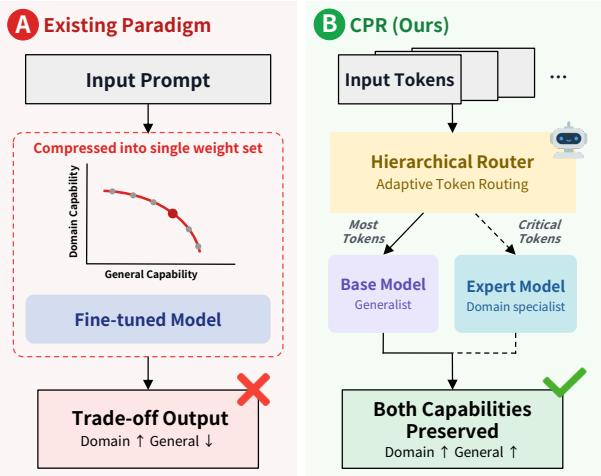
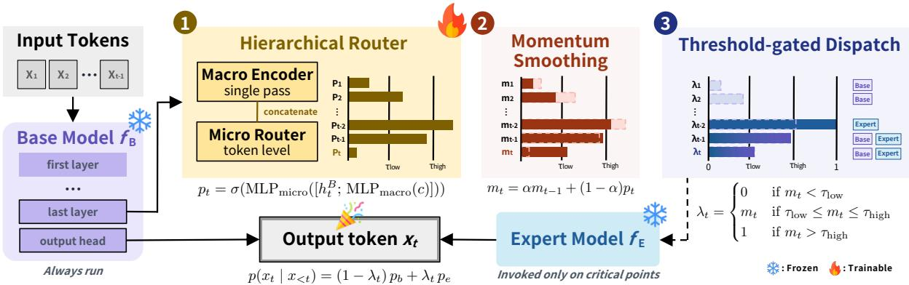
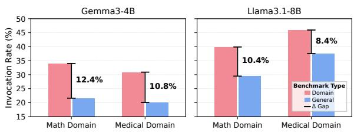
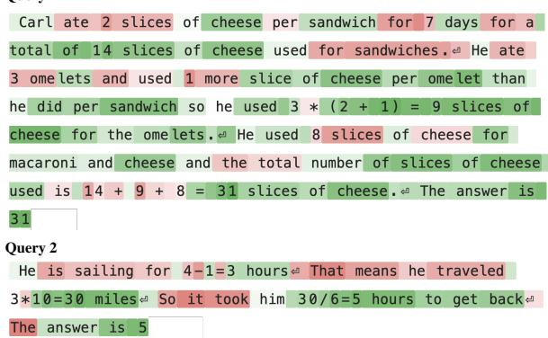
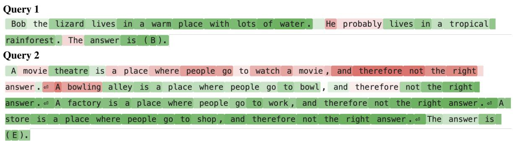
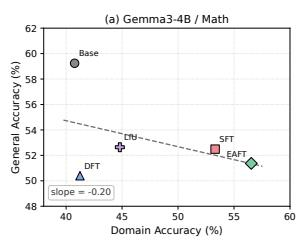
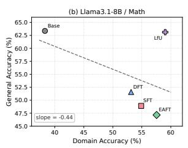
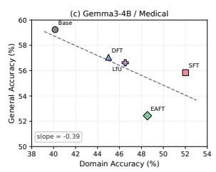
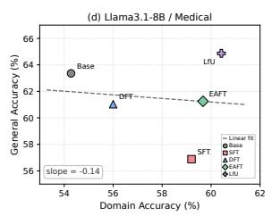

# CPR for LLMs: Critical-Point Routing against Catastrophic Forgetting in Domain Adaptation

Kwangmin Ki1 Yunhun Nam1 Jongheon Jeong1 Jaehyung Kim2

1Korea University 2Yonsei University

{kwangminki,yh0326,jonghj}@korea.ac.kr jaehyungk@yonsei.ac.kr

## Abstract

Supervised fine-tuning (SFT) is the de facto standard for adapting large language models (LLMs) to target domains, but it often degrades the model’s general capabilities, a phenomenon known as catastrophic forgetting. Existing approaches typically modify the SFT loss to mitigate forgetting, but inevitably operate along a domain-generality trade-off. In this work, we step outside this trade-off by decoupling the two capabilities at the model level: we keep the original base model for general capability, and selectively invoke the SFT expert only when domain-specific knowledge is required. Specifically, we propose CPR (Critical-Point Routing), a token-level routing framework between a base model and its expert derivative, based on critical tokens where the base fails but the expert succeeds. We train a lightweight hierarchical router that estimates expert-call probability per token, and pair it with a tailored inference procedure combining momentum smoothing and threshold gating. Across diverse modeldomain configurations, CPR achieves state-ofthe-art performance across all settings, surpassing SFT expert by 1.4-5.5% in domain performance while recovering its general-capability drop from 3.4-14.5% to at most 0.5%, with minimal overhead from invoking the expert on only one-third of tokens.1

## 1 Introduction

Large language models (LLMs) trained on broad corpora have become widely deployed across diverse applications, from open-ended dialogue to complex multi-step reasoning (Wei et al., 2022; Kojima et al., 2022). To improve the performance on specific domains such as mathematics (Toshniwal et al., 2025) and medicine (Han et al., 2023), supervised fine-tuning (SFT) on domain data has become the standard approach. However, domainspecific SFT often degrades the model’s general capabilities, a phenomenon known as catastrophic forgetting (Luo et al., 2025; Kotha et al., 2024). This degradation is problematic because domain tasks themselves build on general capabilities such as language understanding, instruction following, and multi-step reasoning; a model whose domain capability is raised at the expense of these foundations becomes brittle in practice (Liu et al., 2024). The key challenge in domain adaptation is therefore to improve domain performance and preserve general capabilities simultaneously.

  
Figure 1: Comparison of paradigms against catastrophic forgetting in SFT. (A) Existing methods compress both capabilities into one model, yielding a tradeoff. (B) CPR (Ours) decouples them by routing the expert only on critical tokens, preserving both.

To address this, most existing approaches follow a regularization-based paradigm, modifying SFT loss to reduce forgetting by adding distribution preservation terms or reweighting token-level loss (Wu et al., 2026; Diao et al., 2026; Nam et al., 2026). Despite clear progress, these methods share a common limitation: they compress both domain and general capabilities into a single weight set (Figure 1(a)), and thus remain bound to a domaingeneral trade-off that no existing method has fully eliminated (Lin et al., 2026).2

  
Figure 2: Overview of CPR. At each generation step t, (1) the base model $f _ { B }$ produces a last-layer hidden state $h ^ { B }$ that feeds a hierarchical router $g _ { \phi } .$ , composed of a query-level macro encoder and a token-level micro router. (2) The router’s raw output $p _ { t }$ is stabilized by momentum smoothing $m _ { t } = \alpha m _ { t - 1 } + ( 1 - \alpha ) p _ { t }$ , and then (3) mapped to a dispatch weight $\lambda _ { t }$ via threshold-gated 3-way dispatch: hard base $( m _ { t } < \tau _ { l o w } )$ , soft blend $( { \tau _ { l o w } } \le m _ { t } \le { \tau _ { h i g h } } ) ,$ or hard expert $( m _ { t } > \tau _ { h i g h } )$ . The final token distribution is a convex combination $p ( x _ { t } | x _ { < t } ) = ( 1 - \lambda _ { t } ) p _ { b } + \lambda _ { t } p _ { e }$

This motivates a fundamentally different question: rather than compressing both capabilities into a single model, can we decouple them at the model level and selectively use them? Inter-model routing has been studied along two strands: (i) query-level cost-quality routing (Ong et al., 2025; Chen et al., 2024; Ding et al., 2024) and (ii) finegrained routing for cross-domain capability fusion (Feng et al., 2026; Xiong et al., 2026; Shen et al., 2024). However, its use as an architectural remedy for catastrophic forgetting in domain-specific SFT remains largely underexplored.

In this work, we propose CPR (Critical-Point Routing), a new framework that preserves general capabilities after SFT, by collaborating an SFTtuned expert model and an initial base model via token-level routing (Figure 1(b)). The expert is invoked only on the sparse set of tokens where it is genuinely needed, leaving the rest to the base, so that each token is served by whichever model is best suited to it. Specifically, we first define critical points as tokens where the base fails but the expert succeeds. Then, we train a lightweight hierarchical router on them, composed of a query-level macro encoder and a token-level micro router operating on the base model’s last-layer hidden states. At inference, since binary dispatch is destabilized by short-range noise and boundary ambiguity, we introduce two tailored mechanisms: (i) momentumbased smoothing to absorb short-term router noise, and (ii) threshold-gated 3-way dispatch to blend two distributions on ambiguous tokens. Beyond stabilizing dispatch, these mechanisms also yield efficiency gains by avoiding the per-step dual-model cost. An overview of CPR is presented in Figure 2.

We validate CPR on two representative LLMs, Gemma3-4B (Team et al., 2025) and Llama3.1-8B (Grattafiori et al., 2024), adapted to math (Cobbe et al., 2021) and medical (Jin et al., 2019) domains, evaluated over six benchmarks spanning domain and general capabilities. CPR attains the highest overall average in all four model-domain settings, surpassing vanilla SFT in target domain performance while nearly fully recovering its generalcapability drop. For example, with Gemma3-4B in the math domain, CPR surpasses vanilla SFT by 2.8% in domain performance; at the same time, it improves upon SFT by 8.9%, exceeding even the base model’s performance by 2.2%. More importantly, CPR consistently outperforms state-of-theart regularization-based baselines (Wu et al., 2026; Diao et al., 2026; Nam et al., 2026) and routingbased baselines at coarser granularity (Ong et al., 2025; Feng et al., 2026), empirically demonstrating the superiority of the proposed token-level adaptive routing. In addition, CPR matches or exceeds performance while invoking the expert on only \~30% of tokens, substantially reducing inference latency compared to conventional collaborative decoding methods. We further show that CPR generalizes to publicly available external experts without additional SFT, demonstrating its robustness to how the expert is produced. We hope that this work offers a new perspective on mitigating catastrophic forgetting in domain-specific LLM adaptation.

## 2 Related Work

Catastrophic Forgetting in Domain SFT. Despite its effectiveness, domain-specific SFT is widely reported to degrade LLMs’ general capabilities. Luo et al. (2025) empirically show that catastrophic forgetting arises consistently across 1B-7B LLMs under continual instruction tuning. Kotha et al. (2024) attribute this to fine-tuning skewing the model’s implicit task inference toward the SFT distribution, thereby suppressing pre-existing capabilities. Furthermore, Lobo et al. (2025) show that task-specific fine-tuning consistently reduces both the accuracy and the faithfulness of chain-ofthought reasoning, indicating that SFT can disturb the reasoning machinery that domain tasks rely on.

To mitigate this trade-off, prior work has concentrated on modifying the next token prediction training loss. DFT (Wu et al., 2026) rescales the per-token loss by the model’s token probability to neutralize an implicit inverse-probability reward; EAFT (Diao et al., 2026) uses token-level entropy as a soft gate to suppress destructive gradients on confident-conflict tokens; LfU (Nam et al., 2026) regularizes representations to remain consistent with those after an undesirable update, preserving prior knowledge. As the core idea is to compress domain and general capabilities into a single weight set, they fundamentally operate along the trade-off. In contrast, CPR separates two capabilities at the model level and then merges them via adaptive routing, escaping the single-weight trade-off.

Inter-model Routing for LLM Decoding. The proposed approach is situated within the broader paradigm of inter-model routing which dynamically combines multiple LLMs at inference. Prior studies generally fall into two distinct categories. The first category routes an entire query to one of several models, driven by a cost-quality trade-off. RouteLLM (Ong et al., 2025) learns a router from human preferences to dispatch between a strong and a weak LLM; FrugalGPT (Chen et al., 2024) cascades LLMs under a budget constraint; Hybrid LLM (Ding et al., 2024) routes queries based on difficulty and a tunable quality target. Although these methods differ from ours in both objective and granularity, they establish input-dependent inter-model dispatch as a core design principle.

The second category combines model outputs at finer granularity for cross-domain capability fusion. Co-LLM (Shen et al., 2024) models the per-token deferral as a latent variable trained via marginal likelihood; Switch Generation (Feng et al., 2026) alternates between pretrained, finetuned, and aligned checkpoints at the patch level to recover skills lost in alignment; FusionRoute (Xiong et al., 2026) selects a token-level expert while adding a complementary logit from the router itself. Although they target fusing heterogeneous strengths rather than mitigating forgetting with SFT, these works motivate the token-level granularity of our approach, enabling more precise expert invocation.

## 3 Method

## 3.1 Problem Setup

Let $f _ { B }$ denote the original base model and $f _ { E }$ the domain expert model derived from $f _ { B }$ . Given an input prompt followed by generation up to total length $L$ , we denote the full sequence as $x =$ $( x _ { 1 } , \ldots , x _ { L _ { p } } , \ldots , x _ { L } )$ , where $L _ { p }$ is the index of the first generated token. The input prompt may consist of optional few-shot demonstrations followed by a question; we denote the question span as ${ \cal S } _ { q } =$ $\{ s _ { q } , \ldots , L _ { p } - 1 \}$ , where $s _ { q }$ is the index of the first question token (with $s _ { q } = 1$ in the 0-shot case). At each generation step $t \in \{ L _ { p } , \ldots , L - 1 \}$ , models $f _ { B }$ and $f _ { E }$ produce next-token distributions $p _ { b }$ and $p _ { e }$ over the vocabulary, conditioned on $x _ { < t }$ . Then, we aim to produce a per-token output distribution as a convex combination of the two:

$$
p ( x _ { t } \mid x _ { < t } ) = ( 1 - \lambda _ { t } ) p _ { b } + \lambda _ { t } p _ { e } ,\tag{1}
$$

where $\lambda _ { t } \in [ 0 , 1 ]$ is a token-level dispatch weight that takes one of three forms: $\lambda _ { t } = 0 , \lambda _ { t } = 1$ or $\lambda _ { t } \in [ \tau _ { l o w } , \tau _ { h i g h } ]$ . To determine $\lambda _ { t } .$ , we (i) introduce a lightweight hierarchical router $g _ { \phi } ,$ (ii) train it with token-level critical-point labels (Section 3.2), and (iii) apply momentum smoothing and threshold gating at inference (Section 3.3).

This convex combination can be viewed from a latent-variable perspective, where the router estimates whether the base or expert model should generate each token. Marginalizing over this choice naturally motivates a token-dependent mixture of their output distributions. If the router output is interpreted as an estimate of the posterior probability that the expert should be selected, marginalizing over this latent choice yields exactly the convex mixture above. We therefore use its temporally smoothed estimate $m _ { t }$ as the mixture weight $\lambda _ { t }$ in the ambiguous Soft Blend regime.

## 3.2 Training

Router Architecture. The router $g _ { \phi }$ is organized into two stages: a macro encoder that summarizes the domain relevance of the entire question once per sequence, and a micro router that makes a pertoken decision at every generation step. These two components are implemented as ${ \mathrm { M L P } } _ { \mathrm { m a c r o } }$ and ${ \mathrm { M L P } } _ { \mathrm { m i c r o } }$ respectively, both of which are 2-layer ReLU MLPs, and we denote the full set of trainable parameters as $\phi .$

The macro encoder first forms a question context vector $c \in \mathbb { R } ^ { d }$ by mean-pooling the base model’s last-layer hidden states over the question span ${ \cal S } _ { q } ,$ and maps it to a domain summary $z _ { \mathrm { d o m } } \in \mathbb { R } ^ { d _ { h } } ;$

$$
c = \frac { 1 } { | S _ { q } | } \sum _ { i \in S _ { q } } h _ { i } ^ { B } , \quad z _ { \mathrm { d o m } } = \mathrm { M L P } _ { \mathrm { m a c r o } } ( c ) ,\tag{2}
$$

where $h _ { i } ^ { B } \in \mathbb { R } ^ { d }$ is the base model’s last-layer hidden state at position $i , d$ is the base model’s hidden dimension, and $d _ { h }$ is the router’s hidden dimension.

At each generation step t, the micro router takes the current hidden state $h _ { t } ^ { B }$ together with the macro summary $z _ { \mathrm { d o m } }$ , and outputs the probability of invoking the expert $p _ { t } \mathbf { : }$

$$
g _ { \phi } ( h _ { t } ^ { B } , c ) = \sigma ( \mathrm { M L P } _ { \operatorname * { m i c r o } } ( [ h _ { t } ^ { B } ; z _ { \mathrm { d o m } } ] ) ) ,\tag{3}
$$

$$
p _ { t } = g _ { \phi } ( h _ { t } ^ { B } , c ) \in ( 0 , 1 ) ,\tag{4}
$$

where $[ \cdot ; \cdot ]$ denotes vector concatenation along the feature dimension.

Labeling. To train the router $g _ { \phi } .$ , we need a tokenlevel label indicating whether invoking the expert is necessary. We construct this label automatically via teacher-forcing comparison between the base and the expert models. For each training sequence x and each generation step $t \in \{ L _ { p } , \ldots , L - 1 \}$ 2 we obtain the greedy predictions of both models:

$$
\hat { x } _ { t } ^ { ( B ) } = \arg \operatorname* { m a x } _ { v } p _ { b } ( v \mid x _ { < t } ) ,\tag{5}
$$

$$
\hat { x } _ { t } ^ { ( E ) } = \arg \operatorname* { m a x } _ { v } p _ { e } ( v \mid x _ { < t } ) .\tag{6}
$$

Comparing these predictions against the groundtruth token $x _ { t }$ , we assign a token-level label $z _ { t } \in$ $\{ 0 , 1 , \emptyset \}$

$$
z _ { t } = \left\{ { \begin{array} { l l } { 0 } & { { \mathrm { i f ~ } } { \hat { x } _ { t } } ^ { ( B ) } = x _ { t } } \\ { 1 } & { { \mathrm { i f ~ } } { \hat { x } _ { t } } ^ { ( B ) } \neq x _ { t } \ \land \ { \hat { x } _ { t } } ^ { ( E ) } = x _ { t } } \\ { \emptyset } & { { \mathrm { o t h e r w i s e } } } \end{array} } \right.\tag{7}
$$

The label reflects the necessity of an expert call rather than the correctness of the expert itself. Tokens that the base already predicts correctly are assigned $z _ { t } = 0$ regardless of whether the expert also succeeds and tokens with $z _ { t } = 1$ are referred to as critical points.

Training of Router. We freeze both $f _ { B }$ and $f _ { E }$ and train only router parameters $\phi$ via binary crossentropy (BCE) against the critical-point labels. Since critical points are typically sparse $( z _ { t } = 0$ tokens far outnumber $z _ { t } = 1 )$ , we use a re-weighted BCE to mitigate class-imbalance:

$$
\mathcal { L } ( \phi ) = \frac { 1 } { | \mathcal { V } | } \sum _ { t \in \mathcal { V } } \ell _ { t } ,\tag{8}
$$

$$
\ell _ { t } = - \bigl [ w ^ { + } z _ { t } \log p _ { t } + ( 1 - z _ { t } ) \log ( 1 - p _ { t } ) \bigr ]\tag{9}
$$

where $\mathcal { V } = \{ t : z _ { t } \neq \emptyset \}$ is the set of valid supervision tokens. The positive weight is set to $w ^ { + } = \sqrt { N _ { 0 } / N _ { 1 } }$ , where $N _ { 0 }$ and $N _ { 1 }$ are the corpuslevel counts of $z _ { t } ~ = ~ 0$ and $z _ { t } ~ = ~ 1$ tokens, respectively. The square-root form moderates the over-weighting of critical points that naive inversefrequency reweighting would induce.

## 3.3 Inference

Using the trained router with a hard binary decision at each step is undesirable for two reasons: (i) raw non-deterministic router output $p _ { t }$ may oscillate between adjacent tokens or flip on ambiguous boundaries, destabilizing dispatch quality (Ding et al., 2024), and (ii) invoking the expert at every step incurs unnecessary per-step latency. We address both with momentum-based smoothing and threshold-gated 3-way dispatch.

Momentum-based Smoothing. Rather than using the raw $p _ { t }$ , we maintain its exponential moving average $m _ { t }$ to absorb short-range noise:

$$
m _ { 0 } = 0 , \quad m _ { t } = \alpha m _ { t - 1 } + ( 1 - \alpha ) p _ { t } ,\tag{10}
$$

where $\alpha \in [ 0 , 1 )$ is the momentum decay factor. We use $\alpha = 0 . 5$ as the default; larger α increases the inertia of past decisions.

Threshold-gated 3-way Dispatch. Based on $m _ { t }$ we introduce two thresholds $\tau _ { \mathrm { l o w } } , \tau _ { \mathrm { h i g h } }$ with $0 <$ $\tau _ { \mathrm { l o w } } < \tau _ { \mathrm { h i g h } } < 1$ which partition the momentum value $m _ { t }$ into three regimes that determine $\lambda _ { t } \mathbf { : }$

$$
\lambda _ { t } = \left\{ \begin{array} { l l } { 0 } & { \mathrm { i f } m _ { t } < \tau _ { \mathrm { l o w } } , } \\ { m _ { t } } & { \mathrm { i f } \tau _ { \mathrm { l o w } } \leq m _ { t } \leq \tau _ { \mathrm { h i g h } } , } \\ { 1 } & { \mathrm { i f } m _ { t } > \tau _ { \mathrm { h i g h } } . } \end{array} \right.\tag{11}
$$

We use $\tau _ { \mathrm { l o w } } = 0 . 3 5$ and $\tau _ { \mathrm { h i g h } } = 0 . 6 5$ by default.

The three regimes correspond to distinct dispatch behaviors: Hard Base regime $( \lambda _ { t } = 0 )$ and Hard Expert regime $( \lambda _ { t } ~ = ~ 1 )$ deterministically draw from $p _ { b }$ and $p _ { e }$ respectively. In the intermediate Soft Blend regime $( \lambda _ { t } ~ = ~ m _ { t } )$ , the routing decision is ambiguous; $m _ { t }$ itself serves as the dispatch weight, yielding a convex combination of $p _ { b }$ and $p _ { e }$ that softly interpolates between the two models.

Selective Expert Invocation. The 3-way dispatch yields an inference-efficiency benefit beyond routing quality. Because the base hidden state $h _ { t } ^ { B }$ feeds the router, the base model is always run; the expert, however, is only executed in the Soft Blend and Hard Expert regimes. Thus, unlike collaborative decoding approaches such as ensembling and contrastive decoding that execute both models at every step, CPR reduces the number of sequential expert forward passes by handling skipped positions in a single batched KV cache catch-up pass. For instance, suppose the expert remains inactive for seven consecutive decoding steps and is invoked at the next step. It first synchronizes its KV cache for the seven skipped positions in a single batched catch-up pass and then computes the current step. If it remains active, subsequent tokens use ordinary per-step expert decoding with the synchronized cache. Thus, skipped positions do not require separate sequential expert passes. Although this catchup can make the total FLOPs comparable to those of collaborative decoding, reducing sequential expert passes substantially lowers wall-clock latency because autoregressive LLM decoding is largely memory-bandwidth-bound.

## 4 Experiments

We evaluate CPR across math and medical domains and analyze its components, robustness to trainingdata scale, inference efficiency, routing behavior, and generalization to external experts. Additional evaluations in Appendix B include comparisons with intra-model routing baselines, experiments on finance and open-ended instruction following, and a lightweight LoRA expert configuration.

## 4.1 Setups

Models. We evaluate CPR on two representative open-source LLMs: Gemma3-4B (Team et al., 2025) and Llama3.1-8B (Grattafiori et al., 2024). For each base model, we construct a domain expert by vanilla SFT on two domains, math and medical, yielding four model-domain combinations in total. The math expert is trained on the GSM8K training set (approximately 8K examples), while the medical expert is trained on a size-matched sample drawn from the PubMedQA artificial split. To prevent label-distribution bias, we sample the medical training set with a balanced split between the yes and no classes (4,000 examples each). Math training data are formatted as 0-shot chain-of-thought (CoT), and medical data are formatted as 2-shot CoT with answer options randomly shuffled to prevent positional bias; 2-shot demonstrations are drawn from MMLU.

Benchmarks. Each setting is evaluated on six benchmarks covering both domain and general capabilities. The general capability is measured uniformly across all settings as the average over MMLU (Hendrycks et al., 2021), CommonsenseQA (Talmor et al., 2019), and ARC-C (Clark et al., 2018). Domain capability is measured as the average over GSM8K (Cobbe et al., 2021), AS-Div (Miao et al., 2020), and SVAMP (Patel et al., 2021) for the math setting, and over PubMedQA (Jin et al., 2019), MedQA (Jin et al., 2021), and CareQA (Arias-Duart et al., 2025) for the medical setting. For the evaluation, we adopt CoT prompting; following the same protocol as training, math benchmarks use 0-shot CoT, while medical and general benchmarks use 2-shot CoT with MMLU CoT demonstrations. We report the overall average as the arithmetic mean of the general and domain averages, providing a single metric for how well the two capabilities are jointly attained.

Baselines. We consider two groups of state-of-theart baselines. The first group consists of singlemodel baselines that integrate both capabilities into one weight set. This group first includes the base and SFT expert model, which define the two extremes that any routing scheme operates between, corresponding to the references for general and domain capability respectively. Next, regularizationbased methods that modify the SFT loss to mitigate forgetting are considered: DFT (Wu et al., 2026), EAFT (Diao et al., 2026), and LfU (Nam et al., 2026). The second group consists of multi-model collaboration baselines that route or combine the base and the expert. Within this group, routingbased methods dispatch at different granularities: query-level (Ong et al., 2025) and patch-level (Feng et al., 2026). We used the officially released checkpoints rather than re-training on our SFT data, as the latter underperforms in our preliminary experiments (see Appendix B.1). Decoding-based methods mix the two output distributions at every decoding step with static weights, always invoking both models: Ensemble and Contrastive Decoding (Li et al., 2023). All baselines share the same base model and SFT expert model. Full implementation details including training and inference hyperparameters are deferred to Appendix A.3.

<table><tr><td rowspan="2">Method</td><td colspan="4">Math Domain</td><td colspan="4">General Domain</td><td rowspan="2">Overall Average</td></tr><tr><td>GSM8K*</td><td>ASDiv</td><td>SVAMP</td><td>Average</td><td>MMLU</td><td>CSQA</td><td>ARC-C</td><td>Average</td></tr><tr><td colspan="10">Gemma3-4B</td></tr><tr><td>Base</td><td>29.11</td><td>44.51</td><td>48.67</td><td>40.76</td><td>54.16</td><td>59.13</td><td>64.42</td><td>59.24</td><td>50.00</td></tr><tr><td>SFT (Expert)</td><td>51.25</td><td>58.00</td><td>50.67</td><td>53.31 (+12.55)</td><td>49.17</td><td>52.91</td><td>55.38</td><td>52.49 (-6.75)</td><td>52.90 (+2.90)</td></tr><tr><td>DFT</td><td>32.84</td><td>48.55</td><td>42.33</td><td>41.24 (+0.48)</td><td>45.95</td><td>57.66</td><td>47.59</td><td>50.40 (-8.84)</td><td>45.82 (-4.18)</td></tr><tr><td>EAFT LfU</td><td>50.04</td><td>61.92</td><td>57.67</td><td>56.54 (+15.78)</td><td>51.15</td><td>48.87</td><td>54.10</td><td>51.37 (-7.87)</td><td>53.95 (+3.95)</td></tr><tr><td></td><td>37.39</td><td>53.67</td><td>43.33</td><td>44.80 (+4.04)</td><td>50.41</td><td>53.56</td><td>53.94</td><td>52.64 (-6.60)</td><td>48.72 (-1.28)</td></tr><tr><td>Switch Generation</td><td>46.93</td><td>57.43</td><td>49.67</td><td>51.34 (+10.58)</td><td>50.90</td><td>52.90</td><td>57.25</td><td>53.68 (-5.56)</td><td>52.51 (+2.51)</td></tr><tr><td>RouteLLM</td><td>49.63</td><td>57.87</td><td>50.67</td><td>52.72 (+11.96)</td><td>49.91</td><td>52.99</td><td>56.01</td><td>52.97 (-6.27)</td><td>52.85 (+2.85)</td></tr><tr><td>Ensemble</td><td>53.08</td><td>60.38</td><td>54.00</td><td>55.82 (+15.06)</td><td>52.98</td><td>59.95</td><td>61.95</td><td>58.29 (-0.95)</td><td>57.06 (+7.06)</td></tr><tr><td>Contrastive Decoding</td><td>45.41</td><td>50.28</td><td>52.00</td><td>49.23 (+8.47)</td><td>54.63</td><td>59.71</td><td>65.87</td><td>60.07 (+0.83)</td><td>54.65 (+4.65)</td></tr><tr><td>CPR (Ours)</td><td>49.58</td><td>62.60</td><td>56.00</td><td>56.06 (+15.30)</td><td>55.89</td><td>61.10</td><td>67.24</td><td>61.41 (+2.17)</td><td>58.74 (+8.74)</td></tr><tr><td colspan="10">Llama3.1-8B</td></tr><tr><td>Base</td><td>34.72</td><td>35.84</td><td>44.33</td><td>38.30</td><td>57.23</td><td>61.18</td><td>71.67</td><td>63.36</td><td>50.83</td></tr><tr><td>SFT (Expert)</td><td>45.87</td><td>58.79</td><td>60.00</td><td>54.89 (+16.59)</td><td>44.57</td><td>52.74</td><td>49.40</td><td>48.90 (-14.46)</td><td>51.90 (+1.07)</td></tr><tr><td>DFT</td><td>41.67</td><td>57.91</td><td>59.87</td><td> $5 3 . 1 5 \left( + 1 4 . 8 5 \right)$ </td><td>47.90</td><td>60.52</td><td>46.28</td><td>51.57 (-11.79)</td><td>52.36 (+1.53)</td></tr><tr><td>EAFT</td><td>47.23</td><td>62.43</td><td>63.00</td><td> $5 7 . 5 5 \left( + 1 9 . 2 5 \right)$ </td><td>43.20</td><td>53.07</td><td>45.17</td><td>47.15 (-16.21)</td><td>52.35 (+1.52)</td></tr><tr><td>LfU</td><td>56.56</td><td>61.87</td><td>58.67</td><td>59.03 (+20.73)</td><td>56.36</td><td>65.50</td><td>67.49</td><td>63.12 (-0.24)</td><td>61.08 (+10.25)</td></tr><tr><td>Switch Generation</td><td>46.10</td><td>58.27</td><td>60.33</td><td>54.90 (+16.60)</td><td>47.47</td><td>52.98</td><td>51.01</td><td>50.49 (-12.87)</td><td>52.69 (+1.86)</td></tr><tr><td>RouteLLM</td><td>45.72</td><td>59.56</td><td>61.00</td><td> $5 5 . 4 3 \ : ( + 1 7 . 1 3 )$ </td><td>45.43</td><td>53.33</td><td>49.23</td><td>49.33 (-14.03)</td><td>52.38 (+1.55)</td></tr><tr><td>Ensemble</td><td>51.30</td><td>62.80</td><td>64.00</td><td> $5 9 . 3 7 \left( + 2 1 . 0 7 \right)$ </td><td>52.39</td><td>60.14</td><td>56.71</td><td>56.41 (-6.95)</td><td>57.89 (+7.06)</td></tr><tr><td>Contrastive Decoding</td><td>49.60</td><td>60.89</td><td>61.33</td><td> $5 7 . 2 7 \ : ( + 1 8 . 9 7 )$ </td><td>51.61</td><td>59.28</td><td>60.05</td><td>56.98 (-6.38)</td><td>57.13 (+6.30)</td></tr><tr><td>CPR (Ours)</td><td>51.80</td><td>62.70</td><td>66.67</td><td>60.39 (+22.09)</td><td>58.97</td><td>64.26</td><td>65.25</td><td>62.83 (-0.53)</td><td>61.61 (+10.78)</td></tr></table>

Table 1: Main results on the math domain. Test accuracy (%) on in-domain math benchmarks and out-of-domain general benchmarks. ⋆ marks the SFT training source and parentheses show change (%) relative to the base model. Overall Average is the mean of the math and general averages. The best and second best scores are highlighted in bold and underline.

## 4.2 Main Results

The results are presented in Tables 1 and 2. Here, CPR attains the highest overall average across all model-domain combinations, improving over the base model by 4.2% to 10.8%. It recovers nearly all of the general-capability drop incurred by SFT expert model while simultaneously surpassing the expert in domain performance. For instance, on Llama3.1-8B math, the SFT expert loses 14.5% on general capability, whereas CPR loses only 0.5%; on the domain side, the expert improves by 16.6% over the base, while CPR improves by 22.1%, an additional 5.5% gain over the expert.

At the same time, regularization-based methods are observed to exhibit a clear domain-general trade-off. Across four settings, they reduce forgetting compared to SFT expert slightly yet still incur up to 16.2% general-capability drop, whereas CPR is the only method that improves both axes simultaneously, indicating that the trade-off is intrinsic to single-weight regularization and can be removed by decoupling two capabilities at the model level.

In addition, we observe that existing routing methods, RouteLLM (query-level) and Switch Generation (patch-level), underperform CPR. On the math domain, both improve the overall average by 1.6-2.9% over the base, whereas CPR improves it by 8.7-10.8%. Since all routing baselines share the same base model and the same SFT expert, this controlled comparison empirically establishes that the proposed token-level routing is a more effective remedy for catastrophic forgetting than coarsergranularity alternatives.

Lastly, while Ensemble and Contrastive Decoding are effective by doubling per-token compute, CPR is more effective and efficient (see Section 4.3 for efficiency results). In the math domain, CPR outperforms both baselines by 1.7-4.5% in overall average across the two backbones. Similarly, in the medical domain, CPR achieves the highest overall average in every setting.

<table><tr><td rowspan="2">Method</td><td colspan="4">Medical Domain</td><td colspan="4">General Domain</td><td rowspan="2">Overall Average</td></tr><tr><td>PubMedQA*</td><td>MedQA</td><td>CareQA</td><td>Average</td><td>MMLU</td><td>CSQA</td><td>ARC-C</td><td>Average</td></tr><tr><td colspan="10">Gemma3-4B</td></tr><tr><td>Base</td><td>54.30</td><td>27.97</td><td>38.13</td><td>40.13</td><td>54.16</td><td>59.13</td><td>64.42</td><td>59.24</td><td>49.69</td></tr><tr><td>SFT (Expert)</td><td>75.70</td><td>41.08</td><td>39.29</td><td>52.02 (+11.89)</td><td>51.89</td><td>56.67</td><td>58.96</td><td>55.84 (-3.40)</td><td>53.93 (+4.24)</td></tr><tr><td>DFT</td><td>56.50</td><td>38.10</td><td>40.39</td><td>45.00 (+4.87)</td><td>50.41</td><td>59.38</td><td>61.36</td><td>57.05 (-2.19)</td><td>51.03 (+1.34)</td></tr><tr><td>EAFT</td><td>73.80</td><td>34.60</td><td>37.24</td><td>48.55 (+8.42)</td><td>45.39</td><td>55.22</td><td>56.71</td><td>52.44 (-6.80)</td><td>50.49 (+0.80)</td></tr><tr><td>LfU</td><td>66.10</td><td>34.25</td><td>39.20</td><td>46.52 (+6.39)</td><td>49.92</td><td>57.00</td><td>62.95</td><td>56.62 (-2.62)</td><td>51.57 (+1.88)</td></tr><tr><td>Switch Generation</td><td>75.80</td><td>40.61</td><td>40.09</td><td>52.17 (+12.04)</td><td>51.97</td><td>57.27</td><td>58.79</td><td>56.01 (-3.23)</td><td>54.09 (+4.40)</td></tr><tr><td>RouteLLM</td><td>59.58</td><td>30.77</td><td>38.72</td><td>43.02 (+2.89)</td><td>53.04</td><td>60.85</td><td>64.59</td><td>59.49 (+0.25)</td><td>51.26 (+1.57)</td></tr><tr><td>Ensemble</td><td>71.20</td><td>46.95</td><td>43.39</td><td>53.85 (+13.72)</td><td>56.12</td><td>60.03</td><td>67.67</td><td>61.27 (+2.03)</td><td>57.56 (+7.87)</td></tr><tr><td>Contrastive Decoding</td><td>67.30</td><td>45.09</td><td>39.82</td><td>50.74 (+10.61)</td><td>55.39</td><td>58.31</td><td>68.77</td><td>60.82 (+1.58)</td><td>55.78 (+6.09)</td></tr><tr><td>CPR (Ours)</td><td>66.80</td><td>48.20</td><td>45.19</td><td>53.40 (+13.27)</td><td>54.82</td><td>61.26</td><td>69.67</td><td>61.92 (+2.68)</td><td>57.66 (+7.97)</td></tr><tr><td colspan="10">Llama3.1-8B</td></tr><tr><td>Base</td><td>68.00</td><td>43.99</td><td>50.84</td><td>54.28</td><td>57.23</td><td>61.18</td><td>71.67</td><td>63.36</td><td>58.82</td></tr><tr><td>SFT (Expert)</td><td>75.20</td><td>52.00</td><td>50.40</td><td>59.20 (+4.92)</td><td>53.31</td><td>59.38</td><td>57.94</td><td>56.88 (-6.48)</td><td>58.04 (-0.78)</td></tr><tr><td>DFT</td><td>75.00</td><td>47.27</td><td>45.73</td><td>56.00 (+1.72)</td><td>54.23</td><td>64.13</td><td>64.72</td><td>61.03 (-2.33)</td><td>58.52 (-0.30)</td></tr><tr><td>EAFT LfU</td><td>75.50 75.60</td><td>52.70</td><td>50.82</td><td>59.67 (+5.39)</td><td>56.30</td><td>63.43</td><td>64.02</td><td>61.25 (-2.11)</td><td>60.46 (+1.64)</td></tr><tr><td></td><td></td><td>53.05</td><td>52.60</td><td>60.42 (+6.14)</td><td>59.04</td><td>66.31</td><td>69.26</td><td>64.87 (+1.51)</td><td>62.65 (+3.83)</td></tr><tr><td>Switch Generation</td><td>75.30</td><td>51.37</td><td>49.60</td><td> $5 8 . 7 6 \ : ( + 4 . 4 8 )$ </td><td>54.80</td><td>59.85</td><td>59.01</td><td>57.89 (-5.47)</td><td>58.32 (-0.50)</td></tr><tr><td>RouteLLM</td><td>70.20</td><td>43.83</td><td>52.36</td><td> $5 5 . 4 6 \ : ( + 1 . 1 8 )$ </td><td>57.55</td><td>60.02</td><td>70.82</td><td>62.80 (-0.56)</td><td>59.13 (+0.31)</td></tr><tr><td>Ensemble</td><td>76.00</td><td>54.22</td><td>53.98</td><td>61.40 (+7.12)</td><td>57.06</td><td>66.55</td><td>61.16</td><td>61.59 (-1.77)</td><td>61.50 (+2.68)</td></tr><tr><td>Contrastive Decoding</td><td>74.80</td><td>53.15</td><td>55.78</td><td>61.24 (+6.96)</td><td>58.35</td><td>65.98</td><td>68.85</td><td>64.39 (+1.03)</td><td>62.82 (+4.00)</td></tr><tr><td>CPR (Ours)</td><td>74.60</td><td>53.86</td><td>56.62</td><td>61.69 (+7.41)</td><td>58.89</td><td>68.93</td><td>65.27</td><td>64.36 (+1.00)</td><td>63.03 (+4.21)</td></tr></table>

Table 2: Main results on the medical domain. Test accuracy (%) on in-domain medical benchmarks and out-ofdomain general benchmarks. ⋆ marks the SFT training source and parentheses show change (%) relative to the base model. Overall Average is the mean of the medical and general averages. The best and second best scores are highlighted in bold and underline.

<table><tr><td>Method</td><td>Math Average</td><td>General Average</td><td>Overall Average</td></tr><tr><td>Base</td><td>39.53</td><td>61.30</td><td>50.42</td></tr><tr><td colspan="4">Router Architecture</td></tr><tr><td>w/o Macro</td><td>57.52</td><td>60.67</td><td>59.10</td></tr><tr><td>w/o Micro</td><td>49.63</td><td>61.28</td><td>55.45</td></tr><tr><td>Hierarchical (Default)</td><td>58.23</td><td>62.12</td><td>60.18</td></tr><tr><td colspan="4">Momentum Decay α</td></tr><tr><td>α = 0.0</td><td>55.97</td><td>60.55</td><td>58.26</td></tr><tr><td>α = 0.5 (Default)</td><td>58.23</td><td>62.12</td><td>60.18</td></tr><tr><td>α = 0.9</td><td>46.32</td><td>62.71</td><td>54.52</td></tr><tr><td colspan="4">Dispatch Thresholds (τlow, Thigh)</td></tr><tr><td>(0.5, 0.5)</td><td>51.98</td><td>62.35</td><td>57.16</td></tr><tr><td>(0.35, 0.65) (Default)</td><td>58.23</td><td>62.12</td><td>60.18</td></tr><tr><td>(0.0, 1.0)</td><td>58.07</td><td>62.26</td><td>60.17</td></tr></table>

Table 3: Ablation studies of CPR. Test accuracy (%) averaged over Gemma3-4B and Llama3.1-8B on indomain math and out-of-domain general benchmarks, under variations in (a) router architecture, (b) momentum decay α, and (c) thresholds $\left( \tau _ { l o w } , \tau _ { h i g h } \right)$ . The best score is highlighted in bold.

## 4.3 Analyses

Ablation Study. To understand how each component contributes to CPR, we ablate (a) router architecture, (b) momentum decay factor α, and (c) dispatch thresholds $( \tau _ { \mathrm { l o w } } , \tau _ { \mathrm { h i g h } } )$ , with results summarized in Table 3 (See full benchmark numbers in Appendix B.3). (a) Both components of the hierarchical router contribute complementarily. Removing the macro encoder degrades overall accuracy with 1.5% drop on the general domain, indicating that the query-level signal acts as a domain prior that suppresses spurious expert calls on out-ofdomain queries. Removing the micro router causes an 8.6% drop on the math domain, showing that token-level dispatch is essential for precisely identifying critical points where the expert is needed. (b) For the momentum factor in Eq.10, where larger α puts more weight on past decisions, the default α = 0.5 consistently performs best. $\alpha = 0 . 0$ ignores previous history and causes dispatch to oscillate near the boundary, while $\alpha = 0 . 9$ over-relies on previous history and delays switching into the expert at the onset of critical regions, leading to a large domain drop with 11.9% on math average. The asymmetry suggests that over-reliance on past decisions is more harmful than ignoring them when critical points are sparse and abrupt. (c) For the thresholds in Eq.11, collapsing the gate to hard switching at (0.5, 0.5) removes the Soft Blend regime and drops domain accuracy with 6.3% drop on math average, whereas expanding to (0.0, 1.0) attains comparable accuracy on both axes but always invokes the expert that leads to increased latency. Overall, the three components play complementary roles, and the default configuration generalizes without persetting tuning.

<table><tr><td>Method</td><td>GSM8K</td><td>MMLU</td><td>Average</td></tr><tr><td>Base</td><td>29.11</td><td>54.16</td><td>41.64</td></tr><tr><td>SFT (1K) CPR (1K)</td><td>36.32 (+7.21) 39.73 (+10.62)</td><td>53.91 (-0.25) 55.64 (+1.48)</td><td>45.12 (+3.48) 47.69 (+6.05)</td></tr><tr><td>SFT (2K)</td><td>38.44 (+9.33)</td><td>49.56 (-4.60)</td><td>44.00 (+2.36)</td></tr><tr><td>CPR (2K) SFT (4K)</td><td>41.61 (+12.50)</td><td>54.76 (+0.60)</td><td>48.19 (+6.55)</td></tr><tr><td>CPR (4K)</td><td>45.41 (+16.30) 45.26 (+16.15)</td><td>52.32 2 (-1.84) 55.73 (+1.57)</td><td>48.87 (+7.23) 50.50 (+8.86)</td></tr><tr><td>SFT (8K)</td><td>51.25 (+22.14)</td><td>49.17 (-4.99)</td><td></td></tr><tr><td>CPR (8K)</td><td>49.58 (+20.47)</td><td>55.89 (+1.73)</td><td>50.21 (+8.58) 52.74 (+11.11)</td></tr></table>

Table 4: Robustness to training-data scale. Results with Gemma3-4B under 1K, 2K, 4K, and 8K GSM8K training subsets, evaluated on GSM8K and MMLU.  
Figure 3: Expert invocation rate (%). Average percentage of critical tokens routed to the expert on in-domain vs. out-of-domain general benchmarks, with ∆ gap line indicating the difference between them.

Robustness to Training Data Scale. We examine CPR’s robustness as the amount of domain training data decreases. Using Gemma3-4B, we train both the expert and the router on 1K, 2K, 4K, and 8K subsets of GSM8K, where smaller subsets jointly weaken the expert and reduce the amount of router supervision. As shown in Table 4, CPR remains effective across all data scales. Even with only 1K examples, where the SFT expert improves GSM8K by 7.21% over the base, CPR improves domain accuracy by 10.62% while maintaining MMLU above the base level. Across all scales, CPR achieves the highest overall average and keeps MMLU at or above the base performance.

Inference Efficiency. Another goal of CPR is to minimize the latency overhead inherent to tokenlevel routing. Figure 3 visualizes the fraction of tokens routed to the expert on domain and general benchmarks across both math and medical domains. The expert is invoked on only about one-third of tokens across overall benchmarks, confirming that critical points are sparse. More importantly, a consistent domain vs. general gap is observed across all four settings, showing that the router concentrates expert calls where they are actually needed rather than thresholding noise. This selectivity is also the mechanism by which CPR preserves general capability: on general queries, the router defaults to the base for most tokens, sidestepping the distributional shift introduced by the expert.

<table><tr><td>Method</td><td>Latency (s)</td><td>Tokens/sec</td></tr><tr><td></td><td>Gemma3-4B</td><td></td></tr><tr><td>Expert</td><td>5.581 (1.00×)</td><td>17.4</td></tr><tr><td>Ensemble</td><td>10.548 (1.89×)</td><td>9.4</td></tr><tr><td>CPR (Ours)</td><td>7.826 (1.40×)</td><td>13.4</td></tr><tr><td></td><td>Llama3.1-8B</td><td></td></tr><tr><td>Expert</td><td>2.286 (1.00×)</td><td>37.2</td></tr><tr><td>Ensemble</td><td>5.147 (2.25×)</td><td>19.0</td></tr><tr><td>CPR (Ours)</td><td>3.302 (1.44×)</td><td>25.5</td></tr></table>

Table 5: Decoding runtime comparison. Latency and throughput on GSM8K with Gemma3-4B and Llama3.1- 8B, measured on 100 samples per method.

Table 5 reports measured wall-clock latency and throughput on GSM8K for both Gemma3-4B and Llama3.1-8B. For Gemma3-4B, CPR incurs 1.40 latency relative to expert-only decoding, substantially below Ensemble at 1.89 . The same advantage holds for Llama3.1-8B despite its higher expert invocation rate, with CPR at 1.44 compared with 2.25 for Ensemble. These measurements include the full KV-cache catch-up cost described in Section 3.3.

Token-level Analysis of Routing Behavior. To complement the quantitative invocation statistics, we visualize CPR’s per-token routing decisions in Figure 4. One can observe that the expert is invoked predominantly on numeric tokens and arithmetic operators that drive multi-step calculation, while connective and explanatory tokens are left to the base. This token-level selectivity provides a mechanistic explanation for the invocation patterns shown in Figure 3: CPR preserves general capability not by uniformly damping expert influence, but by routing the expert precisely to tokens where domain knowledge is required.

Generalization to External Experts. In our primary experiments, we evaluated CPR using domain experts fine-tuned via a controlled, vanilla SFT process. A natural question is whether CPR relies on this specific expert construction or if the framework generalizes to independently produced experts. To investigate this, we replace the SFT-trained expert with publicly available experts while keeping the base model, labeling procedure, router training, and all inference-time settings unchanged. Specifically, we consider two configurations on math task:

<table><tr><td></td><td colspan="4">Math Domain</td><td colspan="4">General Domain</td><td rowspan="2">Overall Average</td></tr><tr><td>Method</td><td>GSM8K</td><td>ASDiv</td><td>SVAMP</td><td>Average</td><td>MMLU</td><td>CSQA</td><td>ARC-C</td><td>Average</td></tr><tr><td colspan="10">Llama3.1-8B (OpenMath2-Llama3.1-8B)</td></tr><tr><td>Base</td><td>34.72</td><td>35.84</td><td>44.33</td><td>38.30</td><td>57.23</td><td>61.18</td><td>71.67</td><td>63.36</td><td>50.83</td></tr><tr><td>Expert</td><td>85.67</td><td>83.38</td><td>87.00</td><td>85.35 (+47.05)</td><td>38.49</td><td>49.22</td><td>47.78</td><td>45.16 (-18.20)</td><td>65.26 (+14.43)</td></tr><tr><td>CPR (Ours)</td><td>70.76</td><td>72.93</td><td>75.33</td><td>73.00 (+34.70)</td><td>56.14</td><td>68.22</td><td>67.92</td><td>64.09 (+0.73)</td><td>68.55 (+17.72)</td></tr><tr><td colspan="10">Qwen2.5-1.5B (Qwen2.5-Math-1.5B)</td></tr><tr><td>Base</td><td>64.06</td><td>76.44</td><td>74.33</td><td>71.61</td><td>53.20</td><td>69.62</td><td>68.26</td><td>63.69</td><td>67.65</td></tr><tr><td>Expert</td><td>71.80</td><td>81.26</td><td>85.00</td><td>79.35 (+7.74)</td><td>40.15</td><td>31.45</td><td>49.49</td><td>40.36 (-23.33)</td><td>59.86 (-7.79)</td></tr><tr><td>CPR (Ours)</td><td>68.89</td><td>78.70</td><td>79.67</td><td>75.75 (+4.14)</td><td>53.10</td><td>68.30</td><td>67.94</td><td>63.11 (-0.58)</td><td>69.43 (+1.78)</td></tr></table>

Table 6: Generalization to external experts. CPR paired with external math experts instead of our SFT experts on Llama3.1-8B and Qwen2.5-1.5B. Math benchmarks for Qwen use 2-shot CoT due to limited 0-shot capacity; all other settings are identical to the main experiments. The best score is highlighted in bold.

  
Figure 4: Token-level routing examples on GSM8K with Gemma3-4B. Critical points routed to the expert are in red; base-generated tokens in green; soft-blend tokens in intermediate shades (approaching white as mt 0.5). Additional examples in Appendix C.1.

OpenMath2-Llama3.1-8B (Toshniwal et al., 2025) paired with the Llama3.1-8B base model.

Qwen2.5-Math-1.5B (Yang et al., 2024), a smaller-scale math expert, paired with the Qwen2.5-1.5B base model.

As shown in Table 6, the external experts exhibit the same pattern of catastrophic forgetting observed in our main experiments. Across both settings, the external experts replicate the forgetting pattern from our main experiments: general capability drops by 18.2% (Llama3.1-8B) and 23.3% (Qwen2.5-1.5B), with the latter even resulting in a net overall -7.8% loss. In contrast, CPR recovers these drops to +0.7% and -0.6% respectively, while retaining most of the domain gains, yielding overall improvements of +17.7% and +1.8% over the respective base models. Notably, CPR makes the Qwen expert beneficial even when it underperforms

the base on its own.

Overall, these results clearly demonstrate that CPR is not inherently tied to a specific SFT setting. As long as the expert outperforms the base model on a meaningful subset of tokens, the router can successfully identify these critical points and dispatch generation accordingly. This decoupling from the expert’s training pipeline suggests that CPR can serve as a post-hoc remedy applicable to arbitrary third-party domain experts.

## 5 Conclusion

In this work, we propose CPR (Critical-Point Routing), a token-level routing framework that mitigates catastrophic forgetting in domain-specific SFT, by decoupling domain and general capabilities at the model level. A lightweight hierarchical router, trained on automatically labeled critical points, invokes the SFT expert only where the base model fails, while momentum smoothing and threshold-gated 3-way dispatch stabilize inference. Across four model-domain settings, CPR consistently surpasses SFT in domain performance while fully recovering its general-capability drop. In addition, CPR selectively invokes the expert, substantially reducing latency compared with always-on collaborative decoding. Token-level analyses further show that expert calls concentrate on domainrelevant tokens, providing a mechanistic view of how CPR preserves general capability while retaining domain specialization. CPR also generalizes to external experts without additional SFT. These results indicate that catastrophic forgetting is better addressed as an architectural problem than as a loss-level trade-off.

## Limitations

CPR effectively decouples domain and general capabilities, yet requires holding both the base model and the domain expert simultaneously, increasing GPU memory overhead relative to single-model approaches. In addition, although the expert is invoked on only \~30% of tokens overall, the base model must always run to produce the hidden states that feed the router, leaving residual per-step latency above single-model inference; complementary techniques such as prefix-only routing may further reduce this cost. Beyond this, each expert invocation after skipped tokens incurs a key-value cache catch-up cost, yet CPR remains faster than ensemble and contrastive decoding since LLM decoding is memory-bound and weight loads are amortized across catch-up tokens within a single forward call. CPR also assumes access to an expert that outperforms the base on a meaningful subset of tokens for constructing critical-point labels, so its effectiveness may degrade when this gap is narrow or when domain training data is scarce.

## Broader Impact and Ethical Implications

CPR offers a practical way to deploy domainspecialized LLMs without sacrificing general capabilities, which is particularly valuable in highstakes domains where brittleness in general reasoning can lead to harmful outputs. However, CPR inherits the biases and failure modes of both the base model and the domain expert model, and routing does not correct errors common to both. Since CPR can be applied post-hoc to arbitrary thirdparty experts, careful vetting of expert models is essential before deployment. The medical domain experiments in this work are intended solely for research evaluation on public benchmarks and do not constitute clinical validation. All datasets and models used are publicly available and were used in accordance with their respective licenses.

## Acknowledgement

Jaehyung Kim is affiliated with the Department of Artificial Intelligence at Yonsei University. This research was supported in part by Institute for Information & communications Technology Planning & Evaluation (IITP) grant funded by the Korea government (MSIT) (No. RS-2020-II201361, Artificial Intelligence Graduate School Program (Yonsei University); No. RS-2026-25522672, Development of Unified Reasoning Technology Mimicking

Human Cognition for Hierarchical Understanding and Unbounded Problem Solving).

## References

Anna Arias-Duart, Pablo Agustin Martin-Torres, Daniel Hinjos, Pablo Bernabeu-Perez, Lucia Urcelay Ganzabal, Marta Gonzalez Mallo, Ashwin Kumar Gururajan, Enrique Lopez-Cuena, Sergio Alvarez-Napagao, and Dario Garcia-Gasulla. 2025. Automatic evaluation of healthcare llms beyond question-answering. In Conference ofthe North American Chapter ofthe Associationfor Computational Linguistics: Human Language Technologies (NAACL-HLT), pages 108– 130.

Lingjiao Chen, Matei Zaharia, and James Zou. 2024. Frugalgpt: How to use large language models while reducing cost and improving performance. In Transactions on Machine Learning Research (TMLR).

Zhiyu Chen, Wenhu Chen, Charese Smiley, Sameena Shah, Iana Borova, Dylan Langdon, Reema Moussa, Matt Beane, Ting-Hao Huang, Bryan R Routledge, and 1 others. 2021. Finqa: A dataset of numerical reasoning over financial data. In Conference on Empirical Methods in Natural Language Processing (EMNLP), pages 3697–3711.

Peter Clark, Isaac Cowhey, Oren Etzioni, Tushar Khot, Ashish Sabharwal, Carissa Schoenick, and Oyvind Tafjord. 2018. Think you have solved question answering? try arc, the ai2 reasoning challenge. arXiv preprint arXiv:1803.05457.

Karl Cobbe, Vineet Kosaraju, Mohammad Bavarian, Mark Chen, Heewoo Jun, Lukasz Kaiser, Matthias Plappert, Jerry Tworek, Jacob Hilton, Reiichiro Nakano, and 1 others. 2021. Training verifiers to solve math word problems. arXiv preprint arXiv:2110.14168.

Muxi Diao, Lele Yang, Wuxuan Gong, Yutong Zhang, Zhonghao Yan, Yufei Han, Kongming Liang, Weiran Xu, and Zhanyu Ma. 2026. Entropy-adaptive finetuning: Resolving confident conflicts to mitigate forgetting. arXiv preprint arXiv:2601.02151.

Dujian Ding, Ankur Mallick, Chi Wang, Robert Sim, Subhabrata Mukherjee, Victor Rühle, Laks Lakshmanan, and Ahmed H Awadallah. 2024. Hybrid llm: Cost-efficient and quality-aware query routing. In International Conference on Learning Representations (ICLR), volume 2024, pages 41348–41366.

Shihan Dou, Enyu Zhou, Yan Liu, Songyang Gao, Wei Shen, Limao Xiong, Yuhao Zhou, Xiao Wang, Zhiheng Xi, Xiaoran Fan, and 1 others. 2024. Loramoe: Alleviating world knowledge forgetting in large language models via moe-style plugin. In Annual Meeting of the Association for Computational Linguistics (ACL), pages 1932–1945.

Yann Dubois, Balázs Galambosi, Percy Liang, and Tatsunori B Hashimoto. 2024. Length-controlled alpacaeval: A simple way to debias automatic evaluators. arXiv preprint arXiv:2404.04475.

Shangbin Feng, Wenhao Yu, Yike Wang, Hongming Zhang, Yulia Tsvetkov, and Dong Yu. 2026. Don’t throw away your pretrained model. In International Conference on Learning Representations (ICLR).

Aaron Grattafiori, Abhimanyu Dubey, Abhinav Jauhri, Abhinav Pandey, Abhishek Kadian, Ahmad Al-Dahle, Aiesha Letman, Akhil Mathur, Alan Schelten, Alex Vaughan, and 1 others. 2024. The llama 3 herd of models. arXiv preprint arXiv:2407.21783.

Tianyu Han, Lisa C Adams, Jens-Michalis Papaioannou, Paul Grundmann, Tom Oberhauser, Alexei Figueroa, Alexander Löser, Daniel Truhn, and Keno K Bressem. 2023. Medalpaca–an open-source collection of medical conversational ai models and training data. arXiv preprint arXiv:2304.08247.

Dan Hendrycks, Collin Burns, Steven Basart, Andy Zou, Mantas Mazeika, Dawn Song, and Jacob Steinhardt. 2021. Measuring massive multitask language understanding. In International Conference on Learning Representations (ICLR).

Di Jin, Eileen Pan, Nassim Oufattole, Wei-Hung Weng, Hanyi Fang, and Peter Szolovits. 2021. What disease does this patient have? a large-scale open domain question answering dataset from medical exams. Applied Sciences, 11(14):6421.

Qiao Jin, Bhuwan Dhingra, Zhengping Liu, William Cohen, and Xinghua Lu. 2019. Pubmedqa: A dataset for biomedical research question answering. In Conference on Empirical Methods in Natural Language Processing (EMNLP), pages 2567–2577.

Takeshi Kojima, Shixiang Shane Gu, Machel Reid, Yutaka Matsuo, and Yusuke Iwasawa. 2022. Large language models are zero-shot reasoners. In Advances in Neural Information Processing Systems (NeurIPS), volume 35, pages 22199–22213.

Suhas Kotha, Jacob Springer, and Aditi Raghunathan. 2024. Understanding catastrophic forgetting in language models via implicit inference. In International Conference on Learning Representations (ICLR), volume 2024, pages 24110–24139.

Xiang Lisa Li, Ari Holtzman, Daniel Fried, Percy Liang, Jason Eisner, Tatsunori B Hashimoto, Luke Zettlemoyer, and Mike Lewis. 2023. Contrastive decoding: Open-ended text generation as optimization. In Annual Meeting of the Association for Computational Linguistics (ACL), pages 12286–12312.

Jiacheng Lin, Zhongruo Wang, Kun Qian, Tian Wang, Arvind Srinivasan, Hansi Zeng, Ruochen Jiao, Xie Zhou, Jiri Gesi, Dakuo Wang, and 1 others. 2026. Sft doesn’t always hurt general capabilities: Revisiting domain-specific fine-tuning in llms. In International Conference on Learning Representations (ICLR).

Chengyuan Liu, Yangyang Kang, Shihang Wang, Lizhi Qing, Fubang Zhao, Chao Wu, Changlong Sun, Kun Kuang, and Fei Wu. 2024. More than catastrophic forgetting: Integrating general capabilities for domain-specific llms. In Conference on Empirical Methods in Natural Language Processing (EMNLP), pages 7531–7548.

Elita Lobo, Chirag Agarwal, and Himabindu Lakkaraju. 2025. On the impact of fine-tuning on chain-ofthought reasoning. In Conference of the North American Chapter of the Association for Computational Linguistics: Human Language Technologies (NAACL-HLT), pages 11679–11698.

Yun Luo, Zhen Yang, Fandong Meng, Yafu Li, Jie Zhou, and Yue Zhang. 2025. An empirical study of catastrophic forgetting in large language models during continual fine-tuning. IEEE Transactions on Audio, Speech and Language Processing.

Shen-Yun Miao, Chao-Chun Liang, and Keh-Yih Su. 2020. A diverse corpus for evaluating and developing english math word problem solvers. In Annual Meeting of the Association for Computational Linguistics (ACL), pages 975–984.

Yunhun Nam, Jaehyung Kim, and Jongheon Jeong. 2026. Learning from the undesirable: Robust adaptation of language models without forgetting. In Proceedings of the AAAI Conference on Artificial Intelligence, volume 40, pages 32537–32545.

Isaac Ong, Amjad Almahairi, Vincent Wu, Wei-Lin Chiang, Tianhao Wu, Joseph E Gonzalez, M Waleed Kadous, and Ion Stoica. 2025. Routellm: Learning to route llms with preference data. In International Conference on Learning Representations (ICLR).

Arkil Patel, Satwik Bhattamishra, and Navin Goyal. 2021. Are nlp models really able to solve simple math word problems? In Conference of the North American Chapter of the Association for Computational Linguistics: Human Language Technologies (NAACL-HLT), pages 2080–2094.

Zejiang Shen, Hunter Lang, Bailin Wang, Yoon Kim, and David Sontag. 2024. Learning to decode collaboratively with multiple language models. In Annual Meeting of the Association for Computational Linguistics (ACL), pages 12974–12990.

Alon Talmor, Jonathan Herzig, Nicholas Lourie, and Jonathan Berant. 2019. Commonsenseqa: A question answering challenge targeting commonsense knowledge. In Conference ofthe North American Chapter ofthe Associationfor Computational Linguistics: Human Language Technologies (NAACL-HLT), pages 4149–4158.

Rohan Taori, Ishaan Gulrajani, Tianyi Zhang, Yann Dubois, Xuechen Li, Carlos Guestrin, Percy Liang, and Tatsunori B. Hashimoto. 2023. Stanford alpaca: An instruction-following llama model. https://github.com/tatsu-lab/ stanford\_alpaca.

Gemma Team and 1 others. 2025. Gemma 3 technical report. arXiv preprint arXiv:2503.19786.

Shubham Toshniwal, Wei Du, Ivan Moshkov, Branislav Kisacanin, Alexan Ayrapetyan, and Igor Gitman. 2025. Openmathinstruct-2: Accelerating ai for math with massive open-source instruction data. In International Conference on Learning Representations (ICLR), volume 2025, pages 19243–19275.

Jason Wei, Xuezhi Wang, Dale Schuurmans, Maarten Bosma, Fei Xia, Ed Chi, Quoc V Le, Denny Zhou, and 1 others. 2022. Chain-of-thought prompting elicits reasoning in large language models. In Advances in Neural Information Processing Systems (NeurIPS), volume 35, pages 24824–24837.

Xun Wu, Shaohan Huang, and Furu Wei. 2024. Mixture of lora experts. In International Conference on Learning Representations (ICLR).

Yongliang Wu, Yizhou Zhou, Zhou Ziheng, Yingzhe Peng, Xinyu Ye, Xinting Hu, Wenbo Zhu, Lu Qi, Ming-Hsuan Yang, and Xu Yang. 2026. On the generalization of sft: A reinforcement learning perspective with reward rectification. In International Conference on Learning Representations (ICLR).

Nuoya Xiong, Yuhang Zhou, Hanqing Zeng, Zhaorun Chen, Furong Huang, Shuchao Bi, Lizhu Zhang, and Zhuokai Zhao. 2026. Token-level llm collaboration via fusionroute. arXiv preprint arXiv:2601.05106.

An Yang, Beichen Zhang, Binyuan Hui, Bofei Gao, Bowen Yu, Chengpeng Li, Dayiheng Liu, Jianhong Tu, Jingren Zhou, Junyang Lin, and 1 others. 2024. Qwen2.5-math technical report: Toward mathematical expert model via self-improvement. arXiv preprint arXiv:2409.12122.

## A More Details of Experimental Setups

This section provides additional details about the experiments in Section 4, organized as follows: datasets (Appendix A.1), baselines (Appendix A.2), implementation details (Appendix A.3), and prompt templates (Appendix A.4).

## A.1 Datasets

Training Data. We construct domain experts via vanilla SFT on two domains, math and medical.

• Math Domain. We use the official training split of GSM8K (Cobbe et al., 2021), which consists of approximately 8K grade-school math word problems with step-by-step rationales. Training instances are formatted as 0- shot chain-of-thought (CoT), with the rationale and the final boxed answer as the target.

• Medical Domain. We sample from the artificial split of PubMedQA (Jin et al., 2019), a biomedical research question-answering dataset whose answers are categorized as yes, no, or maybe. To prevent label-distribution bias and to match the math training size, we sample 4,000 yes and 4,000 no examples (8K total). Training instances are formatted as 2-shot CoT with the answer options randomly shuffled to prevent positional bias, and the 2- shot demonstrations are drawn from MMLU (Hendrycks et al., 2021) so that the medical expert learns to use a CoT format that transfers naturally to multiple-choice evaluation.

Evaluation Benchmarks. We evaluate on the full test set of every benchmark used in this work, without any subsampling. The benchmarks are grouped into three categories.

• GSM8K (Cobbe et al., 2021): grade-school math word problems requiring multi-step arithmetic reasoning; in-domain for the math expert.

• ASDiv (Miao et al., 2020): diverse English math word problems covering a broader range of problem types than GSM8K.

• SVAMP (Patel et al., 2021): math word problems constructed by applying simple variations to existing problems to test robustness.

• PubMedQA (Jin et al., 2019): biomedical yes/no/maybe question answering on research abstracts; in-domain for the medical expert.

• MedQA (Jin et al., 2021): multiple-choice questions from professional medical board examinations.

• CareQA (Arias-Duart et al., 2025): a healthcare LLM evaluation suite spanning multiple clinical and biomedical topics.

• MMLU (Hendrycks et al., 2021): a broad multitask evaluation suite spanning 57 subjects from humanities to STEM.

• CommonsenseQA (Talmor et al., 2019): multiple-choice questions targeting commonsense reasoning.

• ARC-C (Clark et al., 2018): the Challenge split of the AI2 Reasoning Challenge, consisting of grade-school science questions filtered to be difficult for retrieval-based methods.

Evaluation Protocol. Following the same protocol as training, math benchmarks (GSM8K, ASDiv, SVAMP) are evaluated with 0-shot CoT prompting, while medical (PubMedQA, MedQA, CareQA) and general (MMLU, CommonsenseQA, ARC-C) benchmarks are evaluated with 2-shot CoT prompting. The 2-shot CoT demonstrations are drawn from MMLU and held fixed across all evaluated methods within a setting, ensuring a controlled comparison. For multiple-choice medical benchmarks, the answer options follow the natural ordering of the benchmark; the random shuffling of options is applied only during medical SFT training to prevent positional bias in the expert. The exact prompt templates used for each benchmark are provided, in Appendix A.4.

## A.2 Baselines

This section provides additional details on the baselines compared in our experiments (Section 4). All baselines share the same base model fB and the same vanilla SFT expert f for a controlled comparison, and are organized into two groups: singlemodel baselines that integrate domain and general capabilities into one weight set, and multi-model collaboration baselines that route or combine the base and the expert.

Single-model Baselines.

• Base refers to the original pre-trained LLM without any domain adaptation (Gemma3-4B or Llama3.1-8B). It serves as the reference for general capability and the upper bound of forgetting-free behavior.

• SFT (Expert) is the domain expert obtained by vanilla supervised fine-tuning of the base model on the domain training set (GSM8K for math; PubMedQA artificial split for medical). It serves as the reference for domain capability and the lower bound for general capability under standard SFT.

• DFT (Wu et al., 2026) rescales the per-token cross-entropy loss by the model’s own predicted probability of the target token, with the goal of neutralizing an implicit inverseprobability reward that standard SFT gradients encode. This single-line modification of the SFT loss is shown to improve generalization relative to vanilla SFT. We include DFT as a representative regularization-based method that modifies the SFT loss at the token level. It shares all training hyperparameters with vanilla SFT.

• EAFT (Diao et al., 2026) addresses catastrophic forgetting by identifying Confident Conflict tokens, where the model assigns low probability and low entropy to the groundtruth token (i.e., it is confident in its own divergent prediction). EAFT uses token-level entropy as a soft gate: tokens with low entropy are down-weighted to suppress destructive gradient updates, while tokens with high entropy retain the standard SFT signal to enable genuine learning. We include EAFT as a state-of-the-art entropy-guided regularization baseline. Training hyperparameters are identical to vanilla SFT.

• LfU (Nam et al., 2026) regularizes the SFT process to favor solutions that are resilient to undesirable updates, simulated by a onestep gradient-ascent direction on an auxiliary model. It enforces consistency between the internal representations of the original model and those of the undesirably-updated model, encouraging robust adaptation without forgetting. The original paper provides two auxiliary-model variants: a LoRA-based variant and a representation-steering variant. We adopt the LoRA-based variant, which generally yields stronger performance in the original paper, and follow the default LoRA configuration and training hyperparameters reported therein.

## Multi-model Collaboration Baselines.

• RouteLLM (Ong et al., 2025) dispatches an entire query to either a strong or a weak LLM based on a router trained on human preference data. Among the four router variants proposed in the original paper, we adopt the Causal LLM classifier, which is reported as the strongest approach on GSM8K when trained on preference data augmented with an LLM judge. We use the officially released checkpoint routellm/causal\_llm\_gpt4\_augmented on Hugging Face, trained on Chatbot Arena preference data augmented with GPT-4 judgments, which the original paper reports to outperform the Arena-only variant. The router is used without any re-training to ensure faithful reproduction, with f and f substituted as the weak and strong models, respectively. RouteLLM represents the query-level routing granularity.

• Switch Generation (Feng et al., 2026) alternates between multiple checkpoints (e.g., pre-trained, fine-tuned, aligned) at the patch level during generation, recovering skills that may have been lost during alignment or domain adaptation. We use the officially released bunsenfeng/PFA\_switcher\_1 switcher that learned from diverse tasks, contexts, and model collaboration pattern, applied without re-training. Switch Generation represents the patch-level routing granularity, situated between query-level dispatch and our token-level routing.

• Ensemble computes the next-token distribution as a uniform average of the base and expert distributions, $p _ { t } ~ = ~ { \textstyle \frac { 1 } { 2 } } ( p _ { b } + p _ { e } )$ , at every decoding step. It serves as the simplest collaborative-decoding baseline and provides a reference point for fixed-weight mixture decoding.

• Contrastive Decoding (Li et al., 2023) computes the next-token distribution by subtracting the log-probability of an amateur LM from that of an expert LM, subject to a plausi-bility constraint: log pt ∝ log pexp−log pama. Following the assumption that the SFT model is stronger on the target domain than the base, we fix the SFT expert $f _ { E }$ as the expert and the base $f _ { B }$ as the amateur in all settings and use the default threshold of $\alpha = 0 .$ 1 for the plausibility constraint. Both Ensemble and Contrastive Decoding invoke $f _ { B }$ and $f _ { E }$ at every decoding step, doubling per-token compute, in contrast to CPR’s selective expert invocation.

## A.3 Implementation Details

This section provides the detailed information needed to reproduce our main experiments.

Compute. All experiments are conducted on NVIDIA RTX A6000 GPUs. Each model fits on a single A6000, and we parallelize over multiple A6000s to run different models concurrently.

SFT and Full Fine-tuning Baselines. We reimplement DFT and EAFT under matched training settings with the vanilla SFT expert to ensure a controlled comparison. All three share identical hyperparameters across both domains: maximum sequence length 1024, per-device batch size 4, gradient accumulation steps 4 (effective batch size 16), learning rate ${ \mathrm { 2 e - 5 } } ,$ constant learning-rate schedule, and 6 training epochs.

LoRA-based Baseline. For LfU, we reimplement it following the default LoRA configuration and training hyperparameters of the original paper (Nam et al., 2026).

Router Training (CPR). We freeze both $f _ { B }$ and $f _ { E }$ and train only the hierarchical router parameters ϕ. The router’s hidden dimension is $d _ { h } = 2 5 6$ for both the macro encoder and the micro router, both implemented as 2-layer ReLU MLPs (Section 3). Training uses maximum sequence length 1024, batch size 16, learning rate 1e 4, warmup ratio 0.1, and 6 epochs, applied uniformly across both domains. For prompts that include few-shot demonstrations, the macro encoder pooling is restricted to the question span so that the macro summary reflects the domain of the actual query rather than the fixed few-shot demonstrations, which are shared across queries within a benchmark and would otherwise dilute the domain signal.

Critical-point Labeling. Critical-point labels are constructed via teacher-forcing comparison between $f _ { B }$ and $f _ { E }$ on the same training data used for vanilla SFT (Appendix A.1), i.e., GSM8K for math and the balanced PubMedQA sample for medical.

At each generation step, we compare the greedy predictions of both models against the ground-truth token and assign labels $z _ { t } \in \{ 0 , 1 , \varnothing \}$ as defined in Eq.7. No additional data beyond the SFT training set is used to construct router supervision.

Inference Settings. All compared methods (CPR and all baselines) share the same inference configuration to control for the generation environment: greedy decoding with temperature 0, with a sufficiently large maximum generation length to avoid truncation. For routing-based baselines (RouteLLM, Switch Generation), we use the officially released router checkpoints without any re-training. For CPR, we use the default values $\alpha = 0 . 5 , \tau _ { \mathrm { l o w } } = 0 . 3 5$ , and $\tau _ { \mathrm { h i g h } } = 0 . 6 5$ unless otherwise specified.

## A.4 Prompt Templates

We provide the exact prompt templates used for each benchmark in Listings 1-9. Math benchmarks (GSM8K, ASDiv, SVAMP) use 0-shot CoT prompting, while medical (PubMedQA, MedQA, CareQA) and general (MMLU, CommonsenseQA, ARC-C) benchmarks use 2-shot CoT with demonstrations drawn from MMLU and held fixed across all methods. For 2-shot demonstrations, we select examples from MMLU categories relevant to each benchmark domain: medical-related categories (e.g., clinical knowledge, medical genetics, anatomy) for medical benchmarks, and a broad mix of categories for general benchmarks. Within each domain-relevant category pool, demonstrations are sampled randomly and held fixed across all compared methods. The same templates are applied consistently throughout all stages of our pipeline including SFT training, router-training critical-point labeling, and evaluation, ensuring no prompt mismatch between training and evaluation.

• Math Benchmarks (0-shot CoT): GSM8K (Listing 1), ASDiv (Listing 2), SVAMP (Listing 3).

• Medical Benchmarks (2-shot CoT): Pub-MedQA (Listing 4), MedQA (Listing 5),CareQA (Listing 6).

• General Benchmarks (2-shot CoT): MMLU (Listing 7), CommonsenseQA (Listing 8), ARC-C (Listing 9).

<table><tr><td></td><td colspan="4">Math Domain</td><td colspan="4">General Domain</td><td rowspan="2">Overall Average</td></tr><tr><td>Method</td><td>GSM8K*</td><td>ASDiv</td><td>SVAMP</td><td>Average</td><td>MMLU</td><td>CSQA</td><td>ARC-C</td><td>Average</td></tr><tr><td colspan="9">Gemma3-4B</td></tr><tr><td>Base</td><td>29.11</td><td>44.51</td><td>48.67</td><td>40.76</td><td>54.16</td><td>59.13</td><td>64.42</td><td>59.24</td><td>50.00</td></tr><tr><td>Switch Generation-ours</td><td>48.07</td><td>57.96</td><td>49.67</td><td>51.90</td><td>50.98</td><td>49.39</td><td>57.47</td><td>52.61</td><td>52.23</td></tr><tr><td>Switch Generation-official</td><td>46.93</td><td>57.43</td><td>49.67</td><td>51.34</td><td>50.90</td><td>52.90</td><td>57.25</td><td>53.68</td><td>52.51</td></tr><tr><td>RouteLLM-ours</td><td>51.33</td><td>57.61</td><td>50.00</td><td>52.98</td><td>47.97</td><td>48.81</td><td>56.31</td><td>51.03</td><td>52.01</td></tr><tr><td>RouteLLM-official</td><td>49.63</td><td>57.87</td><td>50.67</td><td>52.72</td><td>49.91</td><td>52.99</td><td>56.01</td><td>52.97</td><td>52.85</td></tr><tr><td>CPR (Ours)</td><td>49.58</td><td>62.60</td><td>56.00</td><td>56.06</td><td>55.89</td><td>61.10</td><td>67.24</td><td>61.41</td><td>58.74</td></tr></table>

Table 7: Re-trained routing-based baselines. Comparison between officially released router checkpoints and variants re-trained on our SFT data for RouteLLM and Switch Generation, evaluated on math domain for Gemma3- 4B.

<table><tr><td>Domain</td><td>Benchmark</td><td>Gemma3-4B</td><td>Llama3.1-8B</td></tr><tr><td rowspan="7">Math</td><td>GSM8K</td><td>34.8</td><td>37.9</td></tr><tr><td>ASDiv</td><td>35.4</td><td>41.6</td></tr><tr><td>SVAMP</td><td>31.8</td><td>40.2</td></tr><tr><td>Average</td><td>34.00</td><td>39.90</td></tr><tr><td>MMLU</td><td>24.4</td><td>20.6 32.3</td></tr><tr><td>CSQA ARC-C</td><td>13.1 27.3</td><td>35.5</td></tr><tr><td>Average</td><td>21.60</td><td></td></tr><tr><td rowspan="8">Medical</td><td></td><td></td><td>29.47</td></tr><tr><td>PubMedQA</td><td>14.8</td><td>41.6</td></tr><tr><td>MedQA</td><td>42.0</td><td>55.0</td></tr><tr><td>CareQA</td><td>35.9</td><td>41.3</td></tr><tr><td>Average</td><td>30.90</td><td>45.96</td></tr><tr><td>MMLU</td><td>22.6</td><td>27.7</td></tr><tr><td>CSQA</td><td>12.8</td><td>43.9</td></tr><tr><td></td><td></td><td></td></tr><tr><td></td><td>ARC-C Average</td><td>24.8 20.07</td><td>41.0 37.53</td></tr></table>

Table 8: Full benchmark numbers of expert invocation rate (%). Full benchmark numbers of Figure 3.

## B Additional Quantitative Results

This section provides additional quantitative results that complement the main experiments in Section 4. We report a comparison between officially released and re-trained routing baselines (Appendix B.1), full benchmark-level expert invocation rates in Figure 3 (Appendix B.2), full per-benchmark numbers for the ablation studies summarized in Table 3 (Appendix B.3), comparison with MoE-style routing baselines (Appendix B.4), evaluation on the finance domain (Appendix B.5) and open-ended instruction following setting (Appendix B.6), and a lightweight LoRA configuration (Appendix B.7).

## B.1 Re-trained Routing-based Baselines

The routing-based baselines in our main experiments (RouteLLM, Switch Generation) use officially released checkpoints. To examine whether re-training their routers on our SFT data could improve performance, we re-trained both following the settings specified in each paper, except that the rollout for Switch Generation was set to 8 due to computational constraints. As shown in Table 7, the re-trained variants underperform the official checkpoints on both baselines, likely because our \~8K SFT-scale data is insufficient to learn an effective query-level or patch-level router. We therefore adopt the official checkpoints in the main results (Tables 1-2).

## B.2 Additional Efficiency Results

Table 8 provides the per-benchmark breakdown of the expert invocation rates aggregated in Figure 3. The rate remains around one-third of tokens across all benchmarks, and a clear in-domain vs. out-ofdomain gap is observed in every setting, confirming that the router concentrates expert calls where domain knowledge is genuinely required.

## B.3 Additional Ablation Results

Table 3 in the main text reports averages aggregated across two backbones in the math setting. Tables 9-13 provide the full per-benchmark numbers, separately for math and medical domains and for both backbones. The conclusions in Section 4.3 hold across all benchmarks: (i) the hierarchical router design, combining a query-level macro encoder and a token-level micro router, outperforms either component alone, (ii) $\alpha = 0 . 5$ outperforms both $\alpha = 0 . 0$ and $\alpha = 0 . 9$ , and (iii) the 3-way dispatch with $( \tau _ { l o w } , \tau _ { h i g h } ) = ( 0 . 3 5 , 0 . 6 5 )$ outperforms both hard switching (0.5, 0.5) and fully soft blending (0.0, 1.0).

## B.4 Comparison with MoE-style Routing Baselines

We further compare CPR with intra-model MoEstyle approaches that also aim to mitigate catastrophic forgetting. Specifically, we evaluate Lo-RAMoE (Dou et al., 2024) and MoLE (Wu et al., 2024) under our single-domain math adaptation setting with Gemma3-4B. For LoRAMoE, we omit its localized balancing constraint, which is designed to balance expert groups across multiple labeled data types and is therefore not applicable to our singledomain SFT protocol. As shown in Table 14, CPR achieves the highest overall average. While Lo-RAMoE improves the target-domain performance, it incurs a large degradation in general capability. MoLE alleviates this degradation, but CPR provides a stronger balance between domain improvement and general-capability preservation.

<table><tr><td></td><td colspan="4">Math Domain</td><td colspan="4">General Domain</td><td rowspan="2">Overall Average</td></tr><tr><td>Method</td><td>GSM8K*</td><td>ASDiv</td><td>SVAMP</td><td>Average</td><td>MMLU</td><td>CSQA</td><td>ARC-C</td><td>Average</td></tr><tr><td colspan="10">Gemma3-4B</td></tr><tr><td>Base</td><td>29.11</td><td>44.51</td><td>48.67</td><td>40.76</td><td>54.16</td><td>59.13</td><td>64.42</td><td>59.24</td><td>50.00</td></tr><tr><td>w/o Macro</td><td>48.82</td><td>62.56</td><td>55.00</td><td>55.46 (+14.70)</td><td>54.90</td><td>61.83</td><td>62.06</td><td>59.60 (+0.36)</td><td>57.53 (+7.53)</td></tr><tr><td>w/o Micro</td><td>37.53</td><td>55.49</td><td>45.67</td><td>46.23 (+5.47)</td><td>53.22</td><td>61.67</td><td>67.49</td><td>60.79 (+1.55)</td><td>53.51 (+3.51)</td></tr><tr><td>Hierarchical (Default)</td><td>49.58</td><td>62.60</td><td>56.00</td><td>56.06 (+15.30)</td><td>55.89</td><td>61.10</td><td>67.24</td><td>61.41 (+2.17)</td><td>58.74 (+8.74)</td></tr><tr><td colspan="10">Llama3.1-8B</td></tr><tr><td>Base</td><td>34.72</td><td>35.84</td><td>44.33</td><td>38.30</td><td>57.23</td><td>61.18</td><td>71.67</td><td>63.36</td><td>50.83</td></tr><tr><td>w/o Macro</td><td>51.55</td><td>62.52</td><td>64.67</td><td> $5 9 . 5 8 \ ( + 2 1 . 2 8 ) $ </td><td>58.74</td><td>64.62</td><td>61.86</td><td> $6 1 . 7 4 \ : ( - 1 . 6 2 )$ </td><td> $6 0 . 6 6 \left( + 9 . 8 3 \right)$ </td></tr><tr><td>w/o Micro</td><td>43.52</td><td>58.87</td><td>56.66</td><td> $5 3 . 0 2 \ : ( + 1 4 . 7 2 )$ </td><td>55.38</td><td>66.26</td><td>63.65</td><td> $6 1 . 7 6 \ : ( - 1 . 6 0 )$ </td><td> $5 7 . 3 9 \ : ( + 6 . 5 6 )$ </td></tr><tr><td>Hierarchical (Default)</td><td>51.80</td><td>62.70</td><td>66.67</td><td> ${ \bf 6 0 . 3 9 } \left( + 2 2 . 0 9 \right)$ </td><td>58.97</td><td>64.26</td><td>65.25</td><td> $6 2 . 8 3 \ ( - 0 . 5 3 )$ </td><td> ${ \bf 6 1 . 6 1 } \left( + 1 0 . 7 8 \right)$ </td></tr></table>

Table 9: Ablation study on router architecture. Effect of removing each component (macro encoder, micro router) from the hierarchical router, evaluated on math domain for both backbones.
<table><tr><td rowspan="2">Method</td><td colspan="4">Medical Domain</td><td colspan="4">General Domain</td><td rowspan="2">Overall Average</td></tr><tr><td>PubMedQA*</td><td>MedQA</td><td>CareQA</td><td>Average</td><td>MMLU</td><td>CSQA</td><td>ARC-C</td><td>Average</td></tr><tr><td colspan="10">Gemma3-4B</td></tr><tr><td>Base</td><td>54.30</td><td>27.97</td><td>38.13</td><td>40.13</td><td>54.16</td><td>59.13</td><td>64.42</td><td>59.24</td><td>49.69</td></tr><tr><td>w/o Macro</td><td>66.30</td><td>47.05</td><td>44.89</td><td> $5 2 . 7 5 \ : ( + 1 2 . 6 2 )$ </td><td>55.01</td><td>60.85</td><td>69.27</td><td>61.71 (+2.47)</td><td>57.23 (+7.54)</td></tr><tr><td>w/o Micro</td><td>70.80</td><td>46.19</td><td>44.98</td><td>53.99 (+13.86)</td><td>55.05</td><td>60.69</td><td>69.39</td><td>61.71 (+2.47)</td><td>57.85 (+8.16)</td></tr><tr><td>Hierarchical (Default)</td><td>66.80</td><td>48.20</td><td>45.19</td><td>53.40 (+13.27)</td><td>54.82</td><td>61.26</td><td>69.67</td><td>61.92 (+2.68)</td><td>57.66 (+7.97)</td></tr><tr><td colspan="10">Llama3.1-8B</td></tr><tr><td>Base</td><td>68.00</td><td>43.99</td><td>50.84</td><td>54.28</td><td>57.23</td><td>61.18</td><td>71.67</td><td>63.36</td><td>58.82</td></tr><tr><td>w/o Macro</td><td>75.90</td><td>53.10</td><td>56.36</td><td> $\mathbf { 6 1 . 7 9 \ } ( + 7 . 5 1 )$ </td><td>58.21</td><td>68.02</td><td>63.87</td><td>63.37 (+0.01)</td><td>62.58 (+3.76)</td></tr><tr><td>w/o Micro</td><td>76.20</td><td>52.39</td><td>55.29</td><td> $6 1 . 2 9 \ : ( + 7 . 0 1 )$ </td><td>57.61</td><td>69.51</td><td>61.08</td><td>62.73 (-0.63)</td><td>62.01 (+3.19)</td></tr><tr><td>Hierarchical (Default)</td><td>74.60</td><td>53.86</td><td>56.62</td><td>61.69 (+7.41)</td><td>58.89</td><td>68.93</td><td>65.27</td><td>64.36 (+1.00)</td><td>63.03 (+4.21)</td></tr></table>

Table 10: Ablation study on router architecture. Same setting as Table 9 on the medical domain.

## B.5 Generalization to Finance Domain

To evaluate whether CPR generalizes beyond the math and medical domains considered in our main experiments, we conduct an additional experiment on the finance domain using FinQA (Chen et al., 2021). We train the expert on the FinQA training set and evaluate on the FinQA test set as the in-domain benchmark and MMLU as an out-ofdomain general benchmark. For FinQA, predictions are regarded as correct when they fall within a 1% numerical relative tolerance of the gold answer under the oracle-retrieval setting. As shown in Table 15, SFT and EAFT substantially improve FinQA performance but suffer severe degradation on MMLU. In contrast, CPR retains most of the domain improvement while substantially recovering general capability, yielding the highest overall average. This result indicates that CPR is well generalized to finance domain as well.

## B.6 Open-ended Instruction Following

To evaluate CPR beyond benchmarks with deterministic target answers, we consider an open-ended instruction-following setting. We construct an SFT set using the top 8K examples from the Alpaca dataset (Taori et al., 2023), following the same adaptation protocol as in our main experiments. We evaluate 200 examples from AlpacaEval (Dubois et al., 2024), using pairwise comparisons against responses from the base model with Llama-3.1- 70B-Instruct as the judge. We additionally report MMLU to assess preservation of general capability after instruction tuning. As shown in Table 16, CPR is preferred over the base model in 67.0% of AlpacaEval comparisons, indicating that tokenlevel routing remains effective for free-form generation. Although the SFT expert obtains a higher AlpacaEval win rate, it reduces MMLU by 6.47 points. CPR instead limits the MMLU drop to only 0.66 points, demonstrating a substantially more favorable balance between adaptation and generalcapability preservation.

<table><tr><td rowspan="2">Method</td><td colspan="4">Math Domain</td><td colspan="4">General Domain</td><td rowspan="2">Overall Average</td></tr><tr><td>GSM8K*</td><td>ASDiv</td><td>SVAMP</td><td>Average</td><td>MMLU</td><td>CSQA</td><td>ARC-C</td><td>Average</td></tr><tr><td colspan="10">Gemma3-4B</td></tr><tr><td>Base</td><td>29.11</td><td>44.51</td><td>48.67</td><td>40.76</td><td>54.16</td><td>59.13</td><td>64.42</td><td>59.24</td><td>50.00</td></tr><tr><td>α = 0.0</td><td>48.82</td><td>59.09</td><td>51.00</td><td>52.97 (+12.21)</td><td>55.24</td><td>60.95</td><td>66.13</td><td>60.77 (+1.53)</td><td>56.87 (+6.87)</td></tr><tr><td>α = 0.5 (Default)</td><td>49.58</td><td>62.60</td><td>56.00</td><td>56.06 (+15.30)</td><td>55.89</td><td>61.10</td><td>67.24</td><td>61.41 (+2.17)</td><td>58.74 (+8.74)</td></tr><tr><td>α = 0.9</td><td>38.82</td><td>51.24</td><td>46.00</td><td>45.35 (+4.59)</td><td>55.59</td><td>60.69</td><td>68.00</td><td>61.43 (+2.19)</td><td>53.39 (+3.39)</td></tr><tr><td colspan="10">Llama3.1-8B</td></tr><tr><td>Base</td><td>34.72</td><td>35.84</td><td>44.33</td><td>38.30</td><td>57.23</td><td>61.18</td><td>71.67</td><td>63.36</td><td>50.83</td></tr><tr><td>α = 0.0</td><td>51.08</td><td>63.51</td><td>62.33</td><td>58.97 (+20.67)</td><td>58.81</td><td>60.20</td><td>61.95</td><td>60.32 (-3.04)</td><td>59.65 (+8.82)</td></tr><tr><td>α = 0.5 (Default)</td><td>51.80</td><td>62.70</td><td>66.67</td><td>60.39 (+22.09)</td><td>58.97</td><td>64.26</td><td>65.25</td><td>62.83 (-0.53)</td><td>61.61 (+10.78)</td></tr><tr><td>α = 0.9</td><td>41.32</td><td>54.23</td><td>46.33</td><td> $4 7 . 2 9 \ : ( + 8 . 9 9 )$ </td><td>57.34</td><td>68.86</td><td>65.78</td><td>63.99 (+0.63)</td><td>55.64 (+4.81)</td></tr></table>

Table 11: Ablation study on momentum decay α. Effect of varying α in $m _ { t } = \alpha m _ { t - 1 } + ( 1 - \alpha ) p _ { t }$ , evaluated on math domain for both backbones. α = 0.0 ignores history and oscillates; $\alpha = 0 . 9$ over-relies on history and delays switching. The default α = 0.5 achieves the strongest overall accuracy.
<table><tr><td rowspan="2">Method</td><td colspan="4">Medical Domain</td><td colspan="4">General Domain</td><td rowspan="2">Overall Average</td></tr><tr><td>PubMedQA*</td><td>MedQA</td><td>CareQA</td><td>Average</td><td>MMLU</td><td>CSQA</td><td>ARC-C</td><td>Average</td></tr><tr><td colspan="10">Gemma3-4B</td></tr><tr><td>Base</td><td>54.30</td><td>27.97</td><td>38.13</td><td>40.13</td><td>54.16</td><td>59.13</td><td>64.42</td><td>59.24</td><td>49.69</td></tr><tr><td>α = 0.0</td><td>66.70</td><td>47.29</td><td>43.73</td><td>52.57 (+12.44)</td><td>54.38</td><td>61.47</td><td>67.94</td><td>61.26 (+2.02)</td><td>56.92(+7.23)</td></tr><tr><td>α = 0.5 (Default)</td><td>66.80</td><td>48.20</td><td>45.19</td><td>53.40 (+13.27)</td><td>54.82</td><td>61.26</td><td>69.67</td><td>61.92 (+2.68)</td><td>57.66 (+7.97)</td></tr><tr><td>α = 0.9</td><td>58.60</td><td>39.80</td><td>43.56</td><td>47.32 (+7.19)</td><td>55.18</td><td>60.36</td><td>68.00</td><td>61.18 (+1.94)</td><td>54.25 (+4.56)</td></tr><tr><td colspan="10">Llama3.1-8B</td></tr><tr><td>Base</td><td>68.00</td><td>43.99</td><td>50.84</td><td>54.28</td><td>57.23</td><td>61.18</td><td>71.67</td><td>63.36</td><td>58.82</td></tr><tr><td>α = 0.0</td><td>76.20</td><td>49.96</td><td>55.11</td><td>60.42 (+6.14)</td><td>58.30</td><td>68.22</td><td>62.97</td><td>63.16 (-0.20)</td><td>61.79 (+2.97)</td></tr><tr><td>α = 0.5 (Default)</td><td>74.60</td><td>53.86</td><td>56.62</td><td>61.69 (+7.41)</td><td>58.89</td><td>68.93</td><td>65.27</td><td>64.36 (+1.00)</td><td>63.03 (+4.21)</td></tr><tr><td>α = 0.9</td><td>75.80</td><td>49.02</td><td>52.18</td><td>59.00 (+4.72)</td><td>59.60</td><td>69.08</td><td>68.69</td><td>65.79 (+2.43)</td><td>62.40 (+3.58)</td></tr></table>

Table 12: Ablation study on momentum decay α. Same setting as Table 11 on the medical domain.

## B.7 CPR with Lightweight LoRA Expert

A practical limitation of CPR is that the default configuration keeps both the base and expert models resident in GPU memory. We therefore evaluate a lightweight variant in which the domain expert is parameterized as a LoRA adapter over the shared frozen backbone. This allows CPR to reuse a single copy of the backbone weights while activating the domain-specific adapter when expert computation is required. The LoRA adapter is loaded once and toggled off for base computation and on for expert computation. Base and expert KV caches are maintained separately, with skipped expert positions synchronized using the same batched catch-up procedure described in Section 3.3.

As shown in Table 17, the LoRA variant retains most of CPR’s accuracy gain, achieving an overall average of 56.87 compared with 58.74 for the full expert. More importantly, Table 18 shows that its GPU memory footprint decreases from 16.60 GB to 8.83 GB, close to the 8.07 GB single-expert footprint, with only a modest latency increase from $1 . 4 0 \times \mathrm { t o } \ 1 . 4 9 \times$

## C Additional Qualitative Results

This section provides additional qualitative results that complement the quantitative results in Section 4, organized as follows: additional token-level routing examples that visualize CPR’s dispatch behavior (Appendix C.1), and a trade-off plot that empirically supports the claim that single-weight regularization-based methods operate along an inherent domain-generality trade-off (Appendix C.2).

## C.1 Additional Token-level Routing Examples

Figures 5-7 provide additional token-level routing examples. Color coding follows Figure 4: expert tokens in red, base tokens in green, and Soft Blend tokens in intermediate shades. On in-domain queries (Figures 4, 6), expert calls concentrate on domainspecific tokens such as numerals and arithmetic operators in math, and biomedical terminology in medical. On out-of-domain queries (Figures 5, 7), expert invocation is markedly sparser. These patterns provide a mechanistic view of the invocation gap in Figure 3: CPR preserves general capability by routing the expert precisely to tokens where domain knowledge is needed, not by uniformly damping its influence.

<table><tr><td></td><td colspan="4">Math Domain</td><td colspan="4">General Domain</td><td rowspan="2">Overall Average</td></tr><tr><td>Method</td><td>GSM8K*</td><td>ASDiv</td><td>SVAMP</td><td>Average</td><td>MMLU</td><td>CSQA</td><td>ARC-C</td><td>Average</td></tr><tr><td colspan="9">Gemma3-4B</td></tr><tr><td>Base</td><td>29.11</td><td>44.51</td><td>48.67</td><td>40.76</td><td>54.16</td><td>59.13</td><td>64.42</td><td>59.24</td><td>50.00</td></tr><tr><td> $\tau _ { \mathrm { l o w } } = 0 . 5 , \tau _ { \mathrm { h i g h } } = 0 . 5$ </td><td>43.21</td><td>60.43</td><td>55.33</td><td>52.99 (+12.23)</td><td>55.36</td><td>61.83</td><td>67.06</td><td>61.42 (+2.18)</td><td>57.20 (+7.20)</td></tr><tr><td> $\tau _ { \mathrm { l o w } } = 0 . 3 5 , \tau _ { \mathrm { h i g h } } ^ { \sim } = 0 . 6 5 \mathrm { ( D e f a u l t ) }$ </td><td>49.58</td><td>62.60</td><td>56.00</td><td>56.06 (+15.30)</td><td>55.89</td><td>61.10</td><td>67.24</td><td>61.41 (+2.17)</td><td>58.74 (+8.74)</td></tr><tr><td> $\tau _ { \mathrm { l o w } } = 0 . 0 , \tau _ { \mathrm { h i g h } } = 1 . 0$ </td><td>49.91</td><td>63.64</td><td>56.33</td><td>56.63 (+15.87)</td><td>54.57</td><td>61.15</td><td>66.69</td><td>60.80 (+1.56)</td><td>58.72 (+8.72)</td></tr><tr><td colspan="10">Llama3.1-8B</td></tr><tr><td>Base</td><td>34.72</td><td>35.84</td><td>44.33</td><td>38.30</td><td>57.23</td><td>61.18</td><td>71.67</td><td>63.36</td><td>50.83</td></tr><tr><td> $\tau _ { \mathrm { l o w } } = 0 . 5 , \tau _ { \mathrm { h i g h } } = 0 . 5$ </td><td>45.51</td><td>54.07</td><td>53.33</td><td>50.97 (+12.67)</td><td>59.04</td><td>64.21</td><td>66.57</td><td>63.27 (-0.09)</td><td>57.12 (+6.29)</td></tr><tr><td>τlow = 0.35, τhigh = 0.65 (Default)</td><td>51.80</td><td>62.70</td><td>66.67</td><td>60.39 (+22.09)</td><td>58.97</td><td>64.26</td><td>65.25</td><td>62.83 (-0.53)</td><td>61.61 (+10.78)</td></tr><tr><td> $\tau _ { \mathrm { l o w } } = 0 . 0 , \tau _ { \mathrm { h i g h } } = 1 . 0$ </td><td>52.92</td><td>63.59</td><td>62.00</td><td>59.50 (+21.20)</td><td>58.15</td><td>65.19</td><td>67.83</td><td>63.72 (+0.36)</td><td>61.61 (+10.78)</td></tr></table>

Table 13: Ablation study on dispatch thresholds $\left( \tau _ { l o w } , \tau _ { h i g h } \right)$ . Effect of varying $\left( \tau _ { l o w } , \tau _ { h i g h } \right)$ in the thresholdgated 3-way dispatch, evaluated on math domain for both backbones. Hard switching (0.5, 0.5) removes the soft-blend regime; fully soft (0.0, 1.0) always invokes the expert, increasing latency. The default (0.35, 0.65) achieves the strongest overall accuracy.

## C.2 Trade-off Figure

Figure 8 plots the domain vs. general averages of all single-model baselines across the four settings. In every panel, a linear fit yields a negative slope, indicating that gains in domain accuracy come at the cost of general accuracy. No single-model baseline escapes this trade-off and each merely trades a different point along it. This empirically substantiates the claim in Section 1 and motivates CPR’s architectural decoupling, which steps outside the trade-off rather than relocating along it.

## D Usage of AI Assistants

We used AI assistants for surface-level writing support, including grammar correction, light rephrasing, and LaTeX formatting. All research ideas, experimental design, implementations, analyses, and claims were conceived and verified by the authors, who take full responsibility for the content of this paper.

<table><tr><td></td><td colspan="4">Math Domain</td><td colspan="4">General Domain</td><td>Overall</td></tr><tr><td>Method</td><td>GSM8K</td><td>ASDiv</td><td>SVAMP</td><td> $\operatorname { A v g } .$ </td><td>MMLU</td><td>CSQA</td><td>ARC-C</td><td> $\operatorname { A v g } .$ </td><td> $\operatorname { A v g } .$ </td></tr><tr><td>Base</td><td>29.11</td><td>44.51</td><td>48.67</td><td>40.76</td><td>54.16</td><td>59.13</td><td>64.42</td><td>59.24</td><td>50.00</td></tr><tr><td>LoRAMoE</td><td>45.94</td><td>60.30</td><td>52.00</td><td> $5 2 . 7 5 \ : ( + 1 1 . 9 9 )$ </td><td>47.17</td><td>47.50</td><td>49.32</td><td>48.00 (-11.24)</td><td>50.38 (+0.38)</td></tr><tr><td>MoLE</td><td>46.15</td><td>63.07</td><td>57.33</td><td> $5 5 . 5 2 \ : ( + 1 4 . 7 6 )$ </td><td>53.56</td><td>53.40</td><td>61.01</td><td> $5 5 . 9 9 \ ( - 3 . 2 5 )$ </td><td>55.75 (+5.75)</td></tr><tr><td>CPR (Ours)</td><td>49.58</td><td>62.60</td><td>56.00</td><td> $\pmb { 5 6 . 0 6 } \left( + 1 5 . 3 0 \right)$ </td><td>55.89</td><td>61.10</td><td>67.24</td><td> ${ \bf 6 1 . 4 1 } \left( + 2 . 1 7 \right) $ </td><td>58.74 (+8.74)</td></tr></table>

Table 14: Comparison with MoE-style routing baselines. Test accuracy (%) on math and general benchmarks using Gemma3-4B.

<table><tr><td>Method</td><td>FinQA</td><td>MMLU</td><td>Average</td></tr><tr><td>Base</td><td>23.80</td><td>54.16</td><td>38.98</td></tr><tr><td>SFT (Expert)</td><td>55.80 (+32.00)</td><td>25.26 (-28.90)</td><td>40.53 (+1.55)</td></tr><tr><td>EAFT</td><td>53.93 (+30.13)</td><td>26.99 (-27.17)</td><td> $4 0 . 4 6 \ : ( + 1 . 4 8 )$ </td></tr><tr><td>CPR (Ours)</td><td>45.90 (+22.10)</td><td>46.87 (-7.29)</td><td>46.39 (+7.41)</td></tr></table>

Table 15: Generalization to the finance domain. Results with Gemma3-4B on FinQA as the in-domain benchmark and MMLU as the out-of-domain general benchmark.

<table><tr><td>Method</td><td>AlpacaEval Win Rate (%)</td><td>MMLU (%)</td></tr><tr><td>Base</td><td></td><td>54.16</td></tr><tr><td>SFT (Expert)</td><td>76.50</td><td>47.69 (-6.47)</td></tr><tr><td>CPR (Ours)</td><td>67.00</td><td>53.50 (-0.66)</td></tr></table>

Table 16: Open-ended instruction-following results. Results with Gemma3-4B on AlpacaEval, reporting the win rate against the base model, and MMLU as the out-of-domain general benchmark.

<table><tr><td></td><td colspan="4">Math Domain</td><td colspan="4">General Domain</td><td>Overall</td></tr><tr><td>Method</td><td>GSM8K</td><td>ASDiv</td><td>SVAMP</td><td> $\operatorname { A v g } .$ </td><td>MMLU</td><td>CSQA</td><td>ARC-C</td><td>Avg.</td><td>Avg.</td></tr><tr><td>Base</td><td>29.11</td><td>44.51</td><td>48.67</td><td>40.76</td><td>54.16</td><td>59.13</td><td>64.42</td><td>59.24</td><td>50.00</td></tr><tr><td>CPR (Ours)</td><td>49.58</td><td>62.60</td><td>56.00</td><td> $\pmb { 5 6 . 0 6 } \left( + 1 5 . 3 0 \right)$ </td><td>55.89</td><td>61.10</td><td>67.24</td><td> ${ \bf 6 1 . 4 1 } \left( + 2 . 1 7 \right) $ </td><td>58.74 (+8.74)</td></tr><tr><td>CPR (LoRA)</td><td>44.50</td><td>61.48</td><td>54.33</td><td> $5 3 . 4 4 \left( + 1 2 . 6 8 \right)$ </td><td>53.81</td><td>60.36</td><td>66.72</td><td>60.30 (+1.06)</td><td> $5 6 . 8 7 \ : ( + 6 . 8 7 )$ </td></tr></table>

Table 17: Accuracy comparison with a lightweight LoRA expert. Test accuracy (%) with Gemma3-4B on math and general benchmarks, comparing CPR with the full expert and the LoRA-parameterized expert.

<table><tr><td>Method</td><td>Latency (s)</td><td>Tokens/s</td><td>GPU Mem. (GB)</td></tr><tr><td>Expert</td><td>5.581 (1.00×)</td><td>17.4</td><td>8.07</td></tr><tr><td>Ensemble</td><td>10.548 (1.89×)</td><td>9.4</td><td>16.21</td></tr><tr><td>CPR (Ours)</td><td>7.826 (1.40×)</td><td>13.4</td><td>16.60</td></tr><tr><td>CPR (LoRA)</td><td>8.298 (1.49×)</td><td>13.3</td><td>8.83</td></tr></table>

Table 18: Runtime and memory comparison. Measured inference costs on GSM8K with Gemma3-4B, reporting wall-clock latency, throughput, and GPU memory usage.

  
Figure 5: Token-level routing examples on CSQA with Gemma3-4B (math domain). Color coding follows Figure 4. Expert calls are sparse on out-of-domain queries.

Query 1   
Mitochond ria play a role in the PCD of areoles in the lace plant A ponogeton mad ag asc ariensis. The PCD   
process appears to be mediated by a mitochondrial fission-fusion dynamics that is dependent on the   
progression of PCD. This dynamic process may be an important regulator of PCD in plants The answer is   
CA   
Query 2   
DBE is a safe diagnostic and therapeutic tool in the hands of experts. It is effective in reaching   
abnormal areas noted on VCE and in performing endoscopic therapy. We were able to successfully complete DBE   
despite the small sample size and lackofrandomization.. The answer is (A).  
Figure 6: Token-level routing examples on PubMedQA with Gemma3-4B (medical domain). Color coding follows Figure 4.

Query 1   
When you apply for a job, you may experience anxiety and fear, but ultimately, if you are successful, you will   
be employed. The answer is(E).   
Query 2   
When someone talks to the same person about the same thing over and over again, that person can get tired of   
it. The answer is (D).  
Figure 7: Token-level routing examples on CSQA with Gemma3-4B (medical domain). Color coding follows Figure 4. Expert calls are sparse on out-of-domain queries.

  
Figure 8: Trade-off of single-model baselines. Domain vs. general accuracy across four model–domain settings. The dashed line is a linear fit (slope shown per panel); consistently negative slopes confirm that regularization-based methods operate along an inherent trade-off that cannot be eliminated within a single weight set.

Question: {question}   
Answer: Let's think step by step.  
Listing 1: Prompt template for GSM8K (0-shot CoT).

Listing 2: Prompt template for ASDiv (0-shot CoT).  
  
Listing 3: Prompt template for SVAMP (0-shot CoT).

Question: Glucose is transported into the muscle cell:   
(A) via protein transporters called GLUT4. (B) only in the presence of insulin. (C)   
via hexokinase. (D) via monocarbylic acid transporters.   
Answer: Let's think step by step. Glucose (also known as the blood sugar) is the   
main sugar found in the human body. It is transported into the muscle cell via   
diffusion through protein transporters called GLUT4. The answer is (A).   
Question: In a genetic test of a newborn, a rare genetic disorder is found that   
has X-linked recessive transmission. Which of the following statements is likely   
true regarding the pedigree of this disorder?   
(A) All descendants on the maternal side will have the disorder. (B) Females will   
be approximately twice as affected as males in this family. (C) All daughters of   
an affected male will be affected. (D) There will be equal distribution of males   
and females affected.   
Answer: Let's think step by step. Let's recall first that females have two X   
chromosomes, while males have one X and one Y chromosome. This is an important   
fact we need to know before answering this question. Because a male can only pass   
his only one X chromosome to a daughter, if he is affected by this rare genetic   
disorder, then we know for sure that he will pass this rare genetic disorder to   
all his future-born daughters. The answer is (C).   
Question: {context} {question}   
Options:   
(A) yes   
(B) no   
(C) maybe   
Answer: Let's think step by step.  
Listing 4: Prompt template for PubMedQA (2-shot CoT). Demonstrations are drawn from MMLU and held fixed across all methods.

Question: Glucose is transported into the muscle cell:   
(A) via protein transporters called GLUT4. (B) only in the presence of insulin. (C)   
via hexokinase. (D) via monocarbylic acid transporters.   
Answer: Let's think step by step. Glucose (also known as the blood sugar) is the   
main sugar found in the human body. It is transported into the muscle cell via   
diffusion through protein transporters called GLUT4. The answer is (A).   
Question: In a genetic test of a newborn, a rare genetic disorder is found that   
has X-linked recessive transmission. Which of the following statements is likely   
true regarding the pedigree of this disorder?   
(A) All descendants on the maternal side will have the disorder. (B) Females will   
be approximately twice as affected as males in this family. (C) All daughters of   
an affected male will be affected. (D) There will be equal distribution of males   
and females affected.   
Answer: Let's think step by step. Let's recall first that females have two X   
chromosomes, while males have one X and one Y chromosome. This is an important   
fact we need to know before answering this question. Because a male can only pass   
his only one X chromosome to a daughter, if he is affected by this rare genetic   
disorder, then we know for sure that he will pass this rare genetic disorder to   
all his future-born daughters. The answer is (C).   
Question: {question}   
Options:   
(A) {option\_A}   
(B) {option\_B}   
(C) {option\_C}   
(D) {option\_D}   
Answer: Let's think step by step.

Listing 5: Prompt template for MedQA (2-shot CoT). Demonstrations are drawn from MMLU and held fixed across all methods.

Question: Glucose is transported into the muscle cell:   
(A) via protein transporters called GLUT4. (B) only in the presence of insulin. (C)   
via hexokinase. (D) via monocarbylic acid transporters.   
Answer: Let's think step by step. Glucose (also known as the blood sugar) is the   
main sugar found in the human body. It is transported into the muscle cell via   
diffusion through protein transporters called GLUT4. The answer is (A).   
Question: In a genetic test of a newborn, a rare genetic disorder is found that   
has X-linked recessive transmission. Which of the following statements is likely   
true regarding the pedigree of this disorder?   
(A) All descendants on the maternal side will have the disorder. (B) Females will   
be approximately twice as affected as males in this family. (C) All daughters of   
an affected male will be affected. (D) There will be equal distribution of males   
and females affected.   
Answer: Let's think step by step. Let's recall first that females have two X   
chromosomes, while males have one X and one Y chromosome. This is an important   
fact we need to know before answering this question. Because a male can only pass   
his only one X chromosome to a daughter, if he is affected by this rare genetic   
disorder, then we know for sure that he will pass this rare genetic disorder to   
all his future-born daughters. The answer is (C).   
Question: {question}   
Options:   
(A) {option\_A}   
(B) {option\_B}   
(C) {option\_C}   
(D) {option\_D}   
Answer: Let's think step by step.

Listing 6: Prompt template for CareQA (2-shot CoT). Demonstrations are drawn from MMLU and held fixed across all methods.

Question: When an arguer causes confusion during refutation because of real or   
feigned lack of an ability to engage in refutation, that arguer may have committed   
the fallacy of   
(A) poor sportsmanship (B) appeal to compassion (C) argument against the person (D)   
ignorance of refutation   
Answer: Let's think step by step. Ignorance of refutation, one of Aristotle's   
original list of logical fallacies in his Organon, is when someone causes   
confusion in an argument through real or feigned inability to engage in refutation,   
in order to win the argument. The answer is (D).   
Question: When older adults move to a new state after retirement, which of the   
following is the more likely destination?   
(A) Texas (B) California (C) Hawaii (D) Vermont   
Answer: Let's think step by step. Texas does not have state tax, and has low cost   
of living compared with the other three options. The answer is (A).   
Question: {question}   
(A) {option\_A} (B) {option\_B} (C) {option\_C} (D) {option\_D}   
Answer: Let's think step by step.  
Listing 7: Prompt template for MMLU (2-shot CoT). Demonstrations are drawn from MMLU and held fixed across all methods

Question: When an arguer causes confusion during refutation because of real or   
feigned lack of an ability to engage in refutation, that arguer may have committed   
the fallacy of   
(A) poor sportsmanship (B) appeal to compassion (C) argument against the person (D)   
ignorance of refutation   
Answer: Let's think step by step. Ignorance of refutation, one of Aristotle's   
original list of logical fallacies in his Organon, is when someone causes   
confusion in an argument through real or feigned inability to engage in refutation,   
in order to win the argument. The answer is (D).   
Question: When older adults move to a new state after retirement, which of the   
following is the more likely destination?   
(A) Texas (B) California (C) Hawaii (D) Vermont   
Answer: Let's think step by step. Texas does not have state tax, and has low cost   
of living compared with the other three options. The answer is (A).   
Question: {question}   
(A) {option\_A} (B) {option\_B} (C) {option\_C} (D) {option\_D} (E) {option\_E}   
Answer: Let's think step by step.  
Listing 8: Prompt template for CommonsenseQA (2-shot CoT). Demonstrations are drawn from MMLU and held fixed across all methods.

Question: When an arguer causes confusion during refutation because of real or   
feigned lack of an ability to engage in refutation, that arguer may have committed   
the fallacy of   
(A) poor sportsmanship (B) appeal to compassion (C) argument against the person (D)   
ignorance of refutation   
Answer: Let's think step by step. Ignorance of refutation, one of Aristotle's   
original list of logical fallacies in his Organon, is when someone causes   
confusion in an argument through real or feigned inability to engage in refutation,   
in order to win the argument. The answer is (D).   
Question: When older adults move to a new state after retirement, which of the   
following is the more likely destination?   
(A) Texas (B) California (C) Hawaii (D) Vermont   
Answer: Let's think step by step. Texas does not have state tax, and has low cost   
of living compared with the other three options. The answer is (A).   
Question: {question}   
(A) {option\_A} (B) {option\_B} (C) {option\_C} (D) {option\_D}   
Answer: Let's think step by step.  
Listing 9: Prompt template for ARC-C (2-shot CoT). Demonstrations are drawn from MMLU and held fixed across all methods.