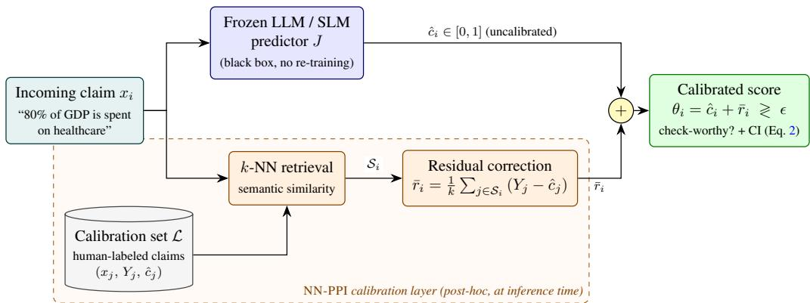
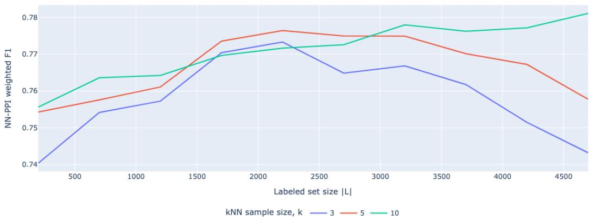

# Calibrating Small Language Models for Claim Check-Worthiness Detection

Pratuat Amatya<sup>1,2</sup> Venktesh Viswanathan<sup>3</sup> Vinay Setty<sup>1,2</sup>

pratuat@factiverse.ai venktesh.viswanathan@dsv.su.se vinay@factiverse.ai

<sup>1</sup>Factiverse AS <sup>2</sup>University of Stavanger <sup>3</sup>Stockholm University

## Abstract

Assessing claim check-worthiness is an essential first step in automated fact-checking pipelines. This work is motivated by a real deployment challenge at an early-stage startup: running large language models (LLMs) over every incoming claim is cost- and latencyprohibitive, yet smaller models sacrifice accuracy. We propose NN-PPI, a pointwise extension of Prediction-Powered Inference (PPI) that calibrates model predictions at inference time as a lightweight post-hoc layer, without re-training the underlying model. NN-PPI achieves weighted F1 gains ranging from 12% to 33.80% depending on the size and performance of the baseline model, bringing SLMs on par with larger LLMs. Beyond few-shot SLMs, NN-PPI further improves a production-deployed fine-tuned model, demonstrating that residual calibration is complementary to supervised fine-tuning. By recovering LLM-level accuracy from models that are an order of magnitude cheaper to serve, it makes accurate check-worthiness detection substantially cheaper to operate at scale. Our code and data can be found at https://anonymous.4open.science/r/arr-claim-worthiness-F237/

## 1 Introduction

The rapid spread in misinformation in the digital age has been identified as one of the critical issues by World Economic Forum (Webb et al., 2016). Automated fact-checking advances have been made in recent years to combat the surge in misinformation.

This work is motivated by the practical demands of operating a commercial fact-checking service at an early-stage startup. Claim check-worthiness is the first filtering stage: it scans highvelocity streams of news articles, political debates, and social media posts to surface claims worth routing to human fact-checkers. Two constraints dominate this setting. First, cost and latency: invoking large LLMs on every incoming claim is prohibitive at production volumes, pushing practitioners toward small, cheap-to-serve models that lag in accuracy. Second, adaptivity: editorial notions of check-worthiness evolve over time and across topics, so a deployed system must adapt without costly re-training. This raises the central question: can we retain the low serving cost of small models while recovering the accuracy of large LLMs?

Existing works on claim worthiness detection are primarily focused on fine-tuning pre-trained models on well-curated claims or focus on extracting claims on social media and news articles (Stammbach et al., 2023; Sheikhi et al., 2023). While, they require a considerable amount of manually annotated training samples, more recently, Large Language Models (LLMs) have been employed in a few-shot or zero-shot setting to aid in claim worthiness detection (Hyben et al., 2023; Majer and Šnajder, 2024; Ni et al., 2024). Fact-checking organizations also frequently update the claimworthiness guidelines, rendering it easy for adaptation using few-shot or zero-shot methods (Majer and Šnajder, 2024).

However, Large Language models are unreliable (Si et al., 2024), sensitive to prompt variations (Zhuo et al., 2024). Hence, their predicted outputs being uncalibrated and align poorly with human judgments and notions of what constitutes checkworthy claims (Majer and Šnajder, 2024; Hyben et al., 2023).

Hence, our work focuses on calibration of LLM predicted outputs to align them with human judgments using a small manually annotated calibration set. Inspired by Prediction-Powered Inference (Angelopoulos et al., 2023a,b), which is usually only employed for calibrating population or system-level metrics, we propose Nearest Neighbor Prediction-Powered Inference (NN-PPI): a pointwise extension that provides per-instance confidence intervals, requiring a new method for computing residuals and variance that is not a trivial extension of PPI. We further show that NN-PPI improves upon a production-deployed fine-tuned XLM-RoBERTa-Large model, demonstrating that residual calibration is complementary to supervised fine-tuning. We address the research questions:

RQ 1: How does NN-PPI calibration affect check-worthiness prediction performance across model scales?

RQ 2: How does NN-PPI perform relative to an uncalibrated baseline and a plain KNN baseline across datasets?

RQ 3: How does neighbor size k affect NN-PPI calibration performance?

## 2 Related Works

The Claim Checkworthiness detection is the first stage of an automated fact-checking pipeline which entails checking which parts of the input are deemed necessary for fact-checking (Majer and Šnajder, 2024). The checkworthiness detection task has usually been framed as a classification task with existing works adopting classical supervised machine learning approaches (Hassan et al., 2017a; Wright and Augenstein, 2020; Gencheva et al., 2017). Alternate formulations of the claim worthiness detection task include claim ranking (Jaradat et al., 2018; Gencheva et al., 2017) analogous to prioritization adopted by fact-checking organizations. With advent of transformers, fine-tuning based approaches that employ pre-trained transformer based language models as backbone was adopted for better performance (Stammbach et al., 2023; Sheikhi et al., 2023). More recently, Large Language Models have been employed for claim worthiness detection (Hyben et al., 2023; Vykopal et al., 2025; Majer and Šnajder, 2024; Dmonte et al., 2026) in few-shot and zero-shot settings. However, they underperform when compared to fine-tuned transformer-based classification approaches owing to subjectivity in checkworthiness detection and limitations of internal understanding of what constitutes check-worthy claims (Majer and Šnajder, 2024; Amatya and Setty, 2026; Setty, 2024). However, LLM-based predictions / annotations are not reliable due to poor confidence calibration (Si et al., 2024) and are also poorly calibrated with respect to human-based annotations. While verbalized confidence approaches, which prompt LLM to verbalize numerical confidence scores in text have been proposed, they exhibit confidence saturation (Wang and Stengel-Eskin, 2026), where the LLM’s reported scores become uninformative. They also suffer from overconfidence (Xu et al., 2025). To improve the reliability of LLM, AFaCTA (Ni et al., 2024) leverages self-consistency to calibrate the confidence of LLM predictions for claim worthiness. However, the calibration done based on self-consistency over multiple LLM-generated outputs could collapse to the wrong answer as they have high estimation error (Zhou et al., 2025). It also does not provide an indication of the calibrated confidence of LLMs in their predictions. Additionally, the approach does not ensure that the LLM predictions are calibrated to align with claim-worthiness notions adopted in human annotations. Conformal prediction (Angelopoulos and Bates, 2023) offers a complementary perspective by constructing set-valued prediction regions with marginal coverage guarantees, but does not relocate the point estimate; NN-PPI instead corrects the score itself using labelled neighbours.

  
Figure 1: NN-PPI overview. A frozen LM scores claim $x _ { i }$ as ${ \hat { c } } _ { i } ;$ the k nearest labeled neighbors $s _ { i } \subset \mathcal { L }$ provide a residual correction ${ \bar { r } } _ { i } ;$ the calibrated score $\theta _ { i } = \hat { c } _ { i } + \bar { r } _ { i }$ is thresholded at ϵ to yield the final decision with a per-instance CI.

## 3 Method

Algorithm 1 NN-PPI based calibration for Check-Worthy Claim Detection   
Require: LLM claim check-worthiness predictor J, labeled set $\mathcal { L } ,$ , unlabeled set $u ,$ confidence   
level 1 − α, calibration set size k   
1: Compute ${ \hat { c } } _ { i } = J ( x _ { i } )$ for all $i \in \mathcal { U } \cup \mathcal { L }$   
2: for all $x _ { i } : x _ { i } \in \mathcal { U }$ do   
3: Retrieve $\mathcal { S } _ { i } \subset \mathcal { L } :$ the k nearest neighbors of $x _ { i }$ by semantic similarity   
4: Compute residuals $( Y _ { j } - \hat { c } _ { j } )$ for each $j \in { \mathcal { S } } _ { i }$   
5: Compute calibrated score $\theta _ { i }$ using $\operatorname { E q } .$ . 1   
6: end for

NN-PPI is a post-hoc calibration layer that corrects LLM check-worthiness predictions at inference time using a small labeled calibration set, without modifying the underlying model (Figure 1).

## 3.1 Problem Setup

Prediction-Powered Inference (PPI) (Angelopoulos et al., 2023a,b) produces confidence intervals around population-level metrics e.g., system-level accuracy of a RAG pipeline (Saad-Falcon et al., 2024), but provides no per-instance calibration. We extend PPI to the pointwise setting for claim check-worthiness, as illustrated in Figure 1.

Formally, let U be a large set of unlabeled claims and $\mathcal { L }$ a small human-labeled calibration set with binary labels $Y _ { j } \in \{ 0 , 1 \}$ . An LLM predictor J produces a continuous check-worthiness score $\hat { c } _ { i } = J ( x _ { i } ) \in [ 0 , 1 ]$ for each claim $x _ { i }$ , which is thresholded at $\epsilon { = } 0 . 5$ to yield a binary prediction. Our goal is to compute a calibrated score $\theta _ { i }$ for each test instance by leveraging residuals from the most semantically similar labeled instances (cosine similarity).

## 3.2 Nearest Neighbor Prediction-Powered Inference (NN-PPI) Formulation

To calibrate the LLM outputs we devise the NN-PPI algorithm as shown in Algorithm 1. We employ semantic similarity as the measure to select subset of the calibration set using K-Nearest-Neighbor (KNN) for each test instance whose claim-worthiness is to be determined. Hence we retrieve $s _ { i }$ , where $s _ { i } \subset \mathcal { L }$ consists of labeled samples that are similar to the test sample $x _ { i }$ from U. We also evaluate PPI setup under varying set size k of the calibration set (KNN neighbor size). The final calibrated score $\theta _ { i }$ can be obtained as follows:

```handlebars
# YOUR ROLE
You are an impartial fact-checker. You are aware of what kind of statements that goes
around news and published media are fact-check-worthy claims or not based on following
check-worthiness criteria.
• High-stakes, society-level, quantitative or study-based claims are very highly
check-worthy.
• Broad policy mechanism or sector-wide quantitative claims are highly check-worthy.
• Mid-tier, localized or mixed claims with numbers/opinions are medium check-worthy.
• Isolated incidents, hearsay, or loosely phrased generalizations are low check-worthy.
• Personal stories, greetings, meta, nostalgia, logistics are very low check-worthy.
• Statements containing factual claims that are not check-worthy by above check-worthiness
criteria or non claim statements (e.g. opinions, speculations, feelings, rhetorical
statements, campaign slogans, predictions) are not check-worthy.
## Some examples for claim check-worthiness are below. {{examples}}
# YOUR TASK
You will be provided a statement which can be a claim or not. Make your best judgement using
the claim check-worthiness criteria above and assign it a score of a value between 0 and 1
on how confident you are of it being a check-worthy claim. Assign it with higher confidence
score if you are more confident about the statement being a claim, else assign it lower
confidence score. Alongside claim check-worthiness confidence score, also try to provide a
justification for your confidence score. Provide the justification in natural language and
in no more than 100 words. ## Input statement:
{{claim}} ## Output format: Only output a JSON object with confidence_score and justification
that can be parsed by a JSON parser. Do not output any other text. Strictly format the
output as JSON object below. { "confidence_score": <a float value between 0 and 1>,
"justification": <a short natural language justification for the confidence_score> }
```  
Figure 2: Prompt used for check-worthiness scoring with verbalized confidence from 0 to 1. The {{examples}} placeholder is filled with 6 fixed few-shot examples, one per check-worthiness tier (very high to not check-worthy).

$$
\theta _ { i } = \hat { c } _ { i } + \frac { 1 } { k } \sum _ { j \in S _ { i } } \left( Y _ { j } - \hat { c } _ { j } \right)\tag{1}
$$

The first term in above equation is the LLM check-worthiness prediction score for the test sentence, while the second term corrects for residual bias estimated from the calibration subset.

Additionally, we also obtain a confidence interval for the calibrated score with (1−α) confidence using residuals from the calibration set $S _ { i }$ as $\begin{array} { r } { \mathrm { V a r } ( \theta _ { i } ) \approx \frac { \sigma _ { \mathrm { r e s } } ^ { 2 } } { | S _ { i } | } } \end{array}$ , where $\sigma _ { \mathrm { r e s } } ^ { 2 } = \mathrm { V a r } _ { j \in \mathcal { S } _ { i } } ( Y _ { j } - \hat { c } _ { j } )$ . Thus, a (1 − α) confidence interval is given by:

$$
\theta _ { i } \pm z _ { 1 - \alpha / 2 } \frac { \sigma _ { \mathrm { r e s } } } { \sqrt { | { \cal S } _ { i } | } } .\tag{2}
$$

The confidence intervals help gauge the uncertainty in LLM predictions.

This calibration approach provides: (1) a PPI-inspired, residual-based correction of model predictions from a small human-labeled subset, and (2) per-instance scores suitable for downstream decisions.

## 4 Experimental Setup

## 4.1 Dataset

The statistics on used datasets on claim check-worthiness are shown in Table 1. ClaimBuster (Hassan et al., 2017b) dataset is a collection of 23,533 human-annotated statements extracted from all U.S. general election presidential debates held between 1960 and 2016. We use 2012 election data for calibration and 2016 data for testing. CLEF 2024 - CheckThat! Task 1 (Alam et al., 2021) dataset is a multi-domain collection designed for claim check-worthiness detection across the languages: Arabic, Dutch, English, and Spanish. We limit our analysis for claim check-worthiness in english language. We construct L by class-balanced sampling from the train split of each dataset (fixed random seed), yielding 1,314 examples for ClaimBuster and 2,406 for CLEF 2024; an ablation (E) confirms this size is adequate.

<table><tr><td>Dataset</td><td>Calib. (|L|)</td><td>Test</td><td>CW</td><td>NCW</td></tr><tr><td>ClaimBuster</td><td>1,314 (of 2,487)</td><td>2,740</td><td>725</td><td>2,015</td></tr><tr><td>CLEF 2024</td><td>2,406 (of 22,501)</td><td>317</td><td>107</td><td>210</td></tr></table>

Table 1: Dataset statistics. Calib. = class-balanced subset of the training split used as L (fixed seed); sizes chosen for stable performance across all k (Appendix E). CW/NCW = check-worthy/not check-worthy counts in the test set.

## 4.2 Models

We use few-shot prompting to produce a check-worthiness confidence score in [0, 1] (prompt in Figure 2) across three model classes: small language models (SLMs, ≤4B parameters) served via Ollama, a fine-tuned XLM-RoBERTa-Large model in production at an early-stage startup (Appendix B), and large commercial API models (GPT-5.2 and Claude Opus 4.6).<sup>1</sup> The parameters used for experiments are in Appendix C.

## 4.3 NN-PPI Implementation Details

We apply NN-PPI based calibration to adjust baseline predictions. A manually annotated calibration set is indexed in a ChromaDB vector store using all-MiniLM-L6-v2 sentence embeddings (Reimers and Gurevych, 2019) with cosine similarity. For each test claim, we retrieve the k nearest neighbors to form a localized calibration set. The baseline LLM prediction is then adjusted using this set (Equation 1), and converted to a binary label using a threshold ϵ = 0.5. Evaluation Metrics: We report weighted F1, classwise F1 (check-worthy and non-check-worthy).

## 5 Results

To answer RQ 1 and RQ 2, we compare three conditions: (1) few-shot LLM prediction with no calibration (Baseline), (2) KNN label averaging without the PPI correction, and (3) NN-PPI calibration. Results are shown in Table 2 for $k \in \{ 3 , 5 , 1 0 \}$ . NN-PPI improves weighted F1 across all model scales (RQ 1), with gains largest for smaller LLMs. We observe the most significant gains for Gemma 3 270M: its baseline achieves only 0.114 on ClaimBuster (near-random due to severe class prediction bias) and 0.179 on CLEF, yet when calibrated with NN-PPI, it achieves a competitive 0.721 and 0.827, respectively. Mid-scale SLMs also benefit substantially: Gemma 3 4B gains +33.80% on ClaimBuster (0.568 → 0.760) and +20% on CLEF (0.688 → 0.827), while Gemma 3 1B gains +15% and +8%. Larger models are mostly saturated: Claude Opus 4.6 and GPT-5.2 each gain at most 5% on CLEF and near zero or slightly negative on ClaimBuster, where baselines already exceed 0.83.

We also calibrate XLM-RoBERTA-Large (FT), a fine-tuned model from the production pipeline (Table 2). NN-PPI yields gains of 11% over the baseline and 7.03% over KNN on CLEF 2024. Despite being fine-tuned on in-domain data, XLM-RoBERTA-Large (FT) ranks second only to frontier LLMs, confirming that residual calibration is complementary to supervised fine-tuning.

<table><tr><td></td><td></td><td colspan="3">Weighted F1</td><td colspan="3">Class 0 F1</td><td colspan="3">Class 1 F1</td></tr><tr><td>Model</td><td>k</td><td>Baseline</td><td>KNN</td><td>NN-PPI</td><td>Baseline</td><td>KNN</td><td>NN-PPI</td><td>Baseline</td><td>KNN</td><td>NN-PPI</td></tr><tr><td colspan="9">ClaimBuster 2016</td><td></td></tr><tr><td>Claude Opus 4.6</td><td>3</td><td>0.832</td><td>0.703</td><td>0.816</td><td>0.905</td><td>0.780</td><td>0.873</td><td>0.631</td><td>0.490</td><td>0.658</td></tr><tr><td></td><td>5</td><td>0.832</td><td>0.720</td><td>0.836</td><td>0.905</td><td>0.794</td><td>0.890</td><td>0.631</td><td>0.512</td><td>0.685</td></tr><tr><td></td><td>10</td><td>0.832</td><td>0.706</td><td>0.858</td><td>0.905</td><td>0.767</td><td>0.906</td><td>0.631</td><td>0.539</td><td>0.723</td></tr><tr><td>GPT-5.2</td><td>3</td><td>0.843</td><td>0.703</td><td>0.817</td><td>0.901</td><td>0.780</td><td>0.875</td><td>0.685</td><td>0.491</td><td>0.659</td></tr><tr><td></td><td>5</td><td>0.843</td><td>0.720 0.706</td><td>0.827</td><td>0.901</td><td>0.794</td><td>0.884</td><td>0.685</td><td>0.513</td><td>0.670</td></tr><tr><td></td><td>10</td><td>0.843</td><td></td><td>0.846</td><td>0.901</td><td>0.767</td><td>0.898</td><td>0.685</td><td>0.539</td><td>0.702</td></tr><tr><td>XLM-RoBERTA-Large (FT)</td><td>3</td><td>0.789</td><td>0.704</td><td>0.767</td><td>0.892</td><td>0.780</td><td>0.841</td><td>0.505</td><td>0.494</td><td>0.560</td></tr><tr><td></td><td>5</td><td>0.789</td><td>0.723</td><td>0.790</td><td>0.892</td><td>0.793</td><td>0.862</td><td>0.505</td><td>0.528</td><td>0.592</td></tr><tr><td></td><td>10</td><td>0.789</td><td>0.712</td><td>0.820</td><td>0.892</td><td>0.772</td><td>0.888</td><td>0.505</td><td>0.548</td><td>0.634</td></tr><tr><td>Gemma 3 270M</td><td>3</td><td>0.114</td><td>0.697</td><td>0.698</td><td>0.000</td><td>0.773</td><td>0.774</td><td>0.425</td><td>0.491</td><td>0.492</td></tr><tr><td></td><td>5</td><td>0.114</td><td>0.710</td><td>0.709</td><td>0.000</td><td>0.783</td><td>0.784</td><td>0.425</td><td>0.509</td><td>0.506</td></tr><tr><td></td><td>10</td><td>0.114</td><td>0.703</td><td>0.721</td><td>0.000</td><td>0.764</td><td>0.790</td><td>0.425</td><td>0.539</td><td>0.532</td></tr><tr><td>Gemma 3 1B</td><td>3</td><td>0.638</td><td>0.698</td><td>0.721</td><td>0.681</td><td>0.775</td><td>0.795</td><td>0.516</td><td>0.484</td><td>0.514</td></tr><tr><td></td><td>5</td><td>0.638</td><td>0.712</td><td>0.733</td><td>0.681</td><td>0.786</td><td>0.804</td><td>0.516</td><td>0.506</td><td>0.534</td></tr><tr><td></td><td>10</td><td>0.638</td><td>0.699</td><td>0.734</td><td>0.681</td><td>0.756</td><td>0.799</td><td>0.516</td><td>0.540</td><td>0.550</td></tr><tr><td>Gemma 3 4B</td><td>3</td><td>0.568</td><td>0.703</td><td>0.729</td><td>0.587</td><td>0.780</td><td>0.803</td><td>0.517</td><td>0.489</td><td>0.525</td></tr><tr><td></td><td>5</td><td>0.568</td><td>0.719</td><td>0.745</td><td>0.587</td><td>0.794</td><td>0.816</td><td>0.517</td><td>0.511</td><td>0.549</td></tr><tr><td></td><td>10</td><td>0.568</td><td>0.707</td><td>0.760</td><td>0.587</td><td>0.767</td><td>0.827</td><td>0.517</td><td>0.540</td><td>0.574</td></tr><tr><td colspan="9">CLEF 2024</td><td></td><td></td></tr><tr><td>Claude Opus 4.6</td><td>3</td><td>0.855</td><td>0.790</td><td>0.866</td><td>0.903</td><td>0.831</td><td>0.895</td><td>0.761</td><td>0.709</td><td>0.809</td></tr><tr><td></td><td>5</td><td>0.855</td><td>0.801</td><td>0.899</td><td>0.903</td><td>0.844</td><td>0.925</td><td>0.761</td><td>0.717</td><td>0.848</td></tr><tr><td></td><td>10</td><td>0.855</td><td>0.804</td><td>0.899</td><td>0.903</td><td>0.834</td><td>0.925</td><td>0.761</td><td>0.744</td><td>0.848</td></tr><tr><td>GPT-5.2</td><td>3</td><td>0.835</td><td>0.786</td><td>0.852</td><td>0.889</td><td>0.829</td><td>0.888</td><td>0.731</td><td>0.704</td><td>0.783</td></tr><tr><td></td><td>5</td><td>0.835</td><td>0.801</td><td>0.879</td><td>0.889</td><td>0.843</td><td>0.911</td><td>0.731</td><td>0.719</td><td>0.817</td></tr><tr><td></td><td>10</td><td>0.835</td><td>0.801</td><td>0.863</td><td>0.889</td><td>0.831</td><td>0.900</td><td>0.731</td><td>0.741</td><td>0.792</td></tr><tr><td>XLM-RoBERTA-Large (FT)</td><td></td><td>0.754</td><td>0.755</td><td>0.787</td><td>0.860</td><td>0.804</td><td>0.844</td><td>0.547</td><td>0.661</td><td>0.676</td></tr><tr><td></td><td>3 5</td><td>0.754</td><td>0.780</td><td>0.811</td><td>0.860</td><td>0.826</td><td>0.864</td><td>0.547</td><td>0.690</td><td>0.709</td></tr><tr><td></td><td>10</td><td>0.754</td><td>0.782</td><td>0.837</td><td>0.860</td><td>0.813</td><td>0.888</td><td>0.547</td><td>0.724</td><td>0.737</td></tr><tr><td>Gemma 3 270M</td><td>3</td><td>0.179</td><td>0.801</td><td>0.800</td><td>0.000</td><td>0.843</td><td>0.844</td><td>0.513</td><td>0.721</td><td>0.719</td></tr><tr><td></td><td>5</td><td>0.179</td><td>0.824</td><td>0.827</td><td>0.000</td><td>0.859</td><td>0.863</td><td>0.513</td><td>0.759</td><td>0.760</td></tr><tr><td></td><td>10</td><td>0.179</td><td>0.809</td><td>0.822</td><td>0.000</td><td>0.843</td><td>0.864</td><td>0.513</td><td>0.747</td><td>0.745</td></tr><tr><td>Gemma 3 1B</td><td>3</td><td>0.720</td><td>0.780</td><td>0.771</td><td>0.766</td><td>0.823</td><td>0.824</td><td>0.629</td><td>0.695</td><td>0.667</td></tr><tr><td></td><td>5</td><td>0.720</td><td>0.801</td><td>0.777</td><td>0.766</td><td>0.842</td><td>0.829</td><td>0.629</td><td>0.719</td><td>0.676</td></tr><tr><td></td><td>10</td><td>0.720</td><td>0.803</td><td>0.761</td><td>0.766</td><td>0.834</td><td>0.817</td><td>0.629</td><td>0.742</td><td>0.651</td></tr><tr><td>Gemma 34B</td><td>3</td><td>0.688</td><td>0.790</td><td>0.795</td><td>0.706</td><td>0.831</td><td>0.838</td><td>0.655</td><td>0.709</td><td>0.711</td></tr><tr><td></td><td>5 10</td><td>0.688 0.688</td><td>0.801 0.807</td><td>0.824 0.827</td><td>0.706 0.706</td><td>0.843 0.837</td><td>0.866 0.869</td><td>0.655 0.655</td><td>0.719 0.747</td><td>0.743 0.744</td></table>

Table 2: Weighted F1 for Baseline (few-shot), KNN, and NN-PPI with # of calibration samples k = 3, 5, 10.

Addressing RQ 2, NN-PPI outperforms the plain KNN baseline in the majority of conditions. The exception is Gemma 3 1B on CLEF, where KNN matches or slightly exceeds NN-PPI (0.803 vs. 0.761 at k=10). The PPI residual correction is most beneficial when the model’s bias is systematic. Hence, for a reasonably well-calibrated model, KNN averaging alone may suffice.

One observation worth clarifying: Gemma 3 4B scores a lower baseline weighted F1 than Gemma 3 1B on ClaimBuster (0.568 vs. 0.638) despite being larger. This is a class-imbalance artifact: Gemma 3 4B over-predicts the positive class (65.7% vs. a true rate of 26.5%), which collapses cls-0 F1 and dominates weighted F1 in this imbalanced dataset (see Table 5, Appendix A). NN-PPI corrects this bias, which is why Gemma 3 4B benefits more from calibration (+34%) than Gemma 3 1B (+15%).

To answer RQ3, we analyze the results in Table 2 and we observe that both classwise and weighted F1 scores saturate as we advance from k=3 to 5, 10. The possible explanation for bigger neighbor size saturating calibration performance could be introduction of noise in residuals by non representative samples. As distributionally dis-similar examples get included in the calibration set, it increases the uncertainty of the calibration procedure.

<table><tr><td>Failure mode</td><td>Claim</td><td>Gold</td><td>Base</td><td>NN-PPI</td></tr><tr><td>Fixed (corrected by NN-PPI)</td><td></td><td></td><td>0.80</td><td>0.00</td></tr><tr><td>FP → correct</td><td>&quot;It has been the policy of the United States, Democrats and Republicans, to do everything we can... 3</td><td>0</td><td></td><td></td></tr><tr><td>FP → correct</td><td>&quot;Mental health is one of the biggest concerns, because now police are having to handle a lot of situations... 9</td><td>0</td><td>0.80</td><td>0.03</td></tr><tr><td>FN → correct</td><td>&quot;President Obama said you keep your doctor, you keep your plan.&quot;</td><td>1</td><td>0.10</td><td>0.80</td></tr><tr><td>FN → correct</td><td>&quot;Iran now and Russia are now against us.&quot;</td><td>1</td><td>0.10</td><td>0.52</td></tr><tr><td>Persistent (not corrected)</td><td></td><td></td><td></td><td></td></tr><tr><td>FP persist</td><td>&quot;I was in the Senate before I became secretary</td><td>0</td><td>0.60</td><td>1.03</td></tr><tr><td>FN persist</td><td>of state.&quot; &quot;I have no loans from Russia.&quot;</td><td>1</td><td>0.30</td><td>-0.33</td></tr><tr><td>Regression (new error introduced)</td><td></td><td></td><td></td><td></td></tr><tr><td></td><td>Correct → FN &quot;We have to protect our inner cities, because African-American communities are being deci-</td><td>1</td><td>0.80</td><td>0.07</td></tr><tr><td></td><td>mated... &quot; Correct → FN “But the Middle East still controls a lot of the prices.&quot;</td><td>1</td><td>0.70</td><td>-0.03</td></tr></table>

Table 3: Qualitative failure modes of Gemma 3 4B on ClaimBuster (k=3). Base and NN-PPI columns show the raw calibrated score (threshold ϵ=0.5). Scores outside [0, 1] arise because the residual correction is unconstrained.
<table><tr><td rowspan="2">k</td><td colspan="3">ClaimBuster</td><td colspan="3">CLEF 2024</td></tr><tr><td>Cls-0</td><td>Cls-1</td><td>Overall</td><td>Cls-0</td><td>Cls-1</td><td>Overall</td></tr><tr><td>3</td><td>68.8</td><td>53.6</td><td>64.8</td><td>72.7</td><td>60.5</td><td>68.5</td></tr><tr><td>5</td><td>66.3</td><td>46.8</td><td>61.1</td><td>69.5</td><td>56.8</td><td>65.2</td></tr><tr><td>10</td><td>51.6</td><td>32.8</td><td>46.6</td><td>58.1</td><td>42.1</td><td>52.6</td></tr></table>

Table 4: Empirical 95% CI coverage (%) averaged across models. Cls-1 (check-worthy) consistently under-covers more than Cls-0; smaller k yields the best-calibrated intervals.

Hyperparameters for all models are reported in Appendix C. We also evaluate NN-PPI at a lower temperature (T=0.1) in Appendix D. The key findings hold across both settings; GPT-5.2 shows a slight baseline improvement at lower temperature due to more deterministic sampling, while Gemma 3 1B and Gemma 3 4B are unaffected, as their prediction biases are structural rather than sampling-induced.

Failure mode analysis. Table 3 shows four failure modes for Gemma 3 4B on ClaimBuster. NN-PPI succeeds by pulling over-triggered rhetorical claims below threshold (fixed FPs) and rescuing missed factual claims via high-label neighbors (fixed FNs). It fails when the neighborhood is itself biased (persistent errors) or when topically unrelated neighbors overcorrect a borderline prediction (regressions).

Confidence interval analysis. Table 4 reports empirical CI coverage for ClaimBuster and CLEF 2024 datasets. Firstly, we observe that empirical coverage falls as we increase the number of neighbors considered (moving from $k = 3$ to $k = 1 0$ . We also observe that CIs-1 for class 1 in ClaimBuster has lower coverage even at $k = 3 ,$ , which explains the low performance of different models across approaches as observed from classwise F1. However, for CLEF 2024, we observe that NN-PPI achieves a balanced performance on both classes compared to performance on ClaimBuster. We observe that this is primarily because coverage for both classes is better in CLEF 2024 compared to ClaimBuster. Smaller k yields better-calibrated intervals (64.8 overall coverage on Claimbuster at $k = 3 \mathrm { v s } 4 6 . 6$ with $k = 1 0$ at 95%), since tighter neighborhoods produce more homogeneous residuals. Second, decision accuracy (correct side of the $\epsilon { = } 0 . 5$ threshold) remains high at 70–90% across models and datasets. CIs can be treated as relative uncertainty indicators than frequentist guarantees.

## 6 Conclusion

We propose NN-PPI, a pointwise approach for calibrating LLM predictions in claim checkworthiness detection. Our approach leverages a small, human-annotated calibration set and nearestneighbor residual correction. This results in the largest performance gains for SLMs, narrowing the gap with larger models. We also observe similar gains for our smaller transformer models deployed in production, demonstrating the efficiency of the proposed approach. In the future, we also plan to tackle the adaptivity dimension, where the calibration set can be updated to adapt to new notions of claim worthiness which may evolve over time without any underlying model changes.

## 7 Limitations

Relation to standard calibration. Parametric post-hoc calibrators such as Platt scaling, temperature scaling, and isotonic regression fit a single global score-to-probability mapping, and are most effective when miscalibration is homogeneous across the input space. NN-PPI instead applies a local, non-parametric correction driven by labelled neighbours, targeting input-dependent bias (e.g., topic-specific over-prediction) that a global monotone map cannot capture. Conformal prediction, relatedly, yields marginally valid prediction sets but does not relocate the point estimate. A controlled comparison against these methods is the natural next step; our focus here is the deployment question of recovering LLM-level decisions from cheap models.

Our proposed approach primarily tackles calibrating LLM predictions to align closer to human judgments, using a statistically sound PPI-inspired approach, and works well for black-box API models and open-source models. Our proposed approach relies on a small yet distributionally representative calibration set. While this requires human annotations or repurposing of existing training sets, it is minimal effort and provides the advantage of principled calibration. However, optimally selecting a subset of calibration samples that are distributionally similar to the test sample is a challenge. While semantic similarity works well as a proxy in our experiments, semantic relevance may not always translate to distributional similarity. While one could explore Wassersteinbased distributional similarity measures, they are quite computationally intensive and hence beyond scope as our focus is on lightweight post-hoc calibration of language model outputs. In the future, we plan to explore alternative efficient data selection mechanisms for dynamically selecting from the calibration set.

## 8 Ethical Considerations and Risks

The datasets we use in this work are drawn from public sources (with Creative Commons license) and include no personally identifiable or sensitive information. The claims focus on public data and domain-specific knowledge rather than private individuals. Our approach primarily focuses on calibrating LLM predictions to make them more trustworthy, as they are prone to hallucinations and uncalibrated confidence in their predictions. Our approach does not currently include fairness or bias mitigation across demographic attributes, which may be relevant for politically or socially sensitive claims, but is beyond the scope of the focused contribution on calibration in this work.

## References

Firoj Alam, Shaden Shaar, Fahim Dalvi, Hassan Sajjad, Alex Nikolov, Hamdy Mubarak, Giovanni Da San Martino, Ahmed Abdelali, Nadir Durrani, Kareem Darwish, Abdulaziz Al-Homaid, Wajdi Zaghouani, Tommaso Caselli, Gijs Danoe, Friso Stolk, Britt Bruntink, and Preslav Nakov. 2021. Fighting the COVID-19 infodemic: Modeling the perspective of journalists, fact-checkers, social media platforms, policy makers, and the society. In Findings of the Association for Computational Linguistics: EMNLP 2021, pages 611–649, Punta Cana, Dominican Republic. Association for Computational Linguistics.

Pratuat Amatya and Vinay Setty. 2026. Multilingual fact-checking at scale: Fine-tuned compact models vs llms.

Anastasios N Angelopoulos and Stephen Bates. 2023. Conformal prediction: A gentle introduction. Foundations and Trends in Machine Learning, 16(4):494–591.

Anastasios N. Angelopoulos, Stephen Bates, Clara Fannjiang, Michael I. Jordan, and Tijana Zrnic. 2023a. Prediction-powered inference.

Anastasios N. Angelopoulos, John C. Duchi, and Tijana Zrnic. 2023b. Ppi++: Efficient prediction powered inference.

Alexis Conneau, Kartikay Khandelwal, Naman Goyal, Vishrav Chaudhary, Guillaume Wenzek, Francisco Guzmán, Edouard Grave, Myle Ott, Luke Zettlemoyer, and Veselin Stoyanov. 2020. Unsupervised cross-lingual representation learning at scale. In Proceedings ofthe 58th Annual Meeting ofthe Associationfor Computational Linguistics, pages 8440–8451, Online. Association for Computational Linguistics.

Alphaeus Dmonte, Roland R Oruche, Marcos Zampieri, Prasad Calyam, and Isabelle Augenstein. 2026. Claim verification in the age of large language models: A survey. In Proceedings of the 64th Annual Meeting ofthe Associationfor Computational Linguistics (Volume 4: Student Research Workshop), pages 15–29, San Diego, California, United States. Association for Computational Linguistics.

Pepa Gencheva, Preslav Nakov, Lluís Màrquez, Alberto Barrón-Cedeño, and Ivan Koychev. 2017. A context-aware approach for detecting worth-checking claims in political debates. In Proceedings ofthe International Conference Recent Advances in Natural Language Processing, RANLP 2017, pages 267–276, Varna, Bulgaria. INCOMA Ltd.

Naeemul Hassan, Fatma Arslan, Chengkai Li, and Mark Tremayne. 2017a. Toward automated fact-checking: Detecting check-worthy factual claims by claimbuster. In Proceedings ofthe 23rd ACM SIGKDD International Conference on Knowledge Discovery and Data Mining, Halifax, NS, Canada, August 13 - 17, 2017, pages 1803–1812. ACM.

Naeemul Hassan, Gensheng Zhang, Fatma Arslan, Josue Caraballo, Damian Jimenez, Siddhant Gawsane, Shohedul Hasan, Minumol Joseph, Aaditya Kulkarni, Anil Kumar Nayak, Vikas Sable, Chengkai Li, and Mark Tremayne. 2017b. Claimbuster: the first-ever end-to-end fact-checking system. Proc. VLDB Endow., 10(12):1945–1948.

Martin Hyben, Sebastian Kula, Ivan Srba, Robert Moro, and Jakub Simko. 2023. Multilingual and multi-topical benchmark of fine-tuned language models and large language models for check-worthy claim detection.

Israa Jaradat, Pepa Gencheva, Alberto Barrón-Cedeño, Lluís Màrquez, and Preslav Nakov. 2018. ClaimRank: Detecting check-worthy claims in Arabic and English. In Proceedings of the 2018 Conference of the North American Chapter of the Association for Computational Linguistics: Demonstrations, pages 26–30, New Orleans, Louisiana. Association for Computational Linguistics.

Laura Majer and Jan Šnajder. 2024. Claim check-worthiness detection: How well do LLMs grasp annotation guidelines? In Proceedings of the Seventh Fact Extraction and VERification Workshop (FEVER), pages 245–263, Miami, Florida, USA. Association for Computational Linguistics.

Jingwei Ni, Minjing Shi, Dominik Stammbach, Mrinmaya Sachan, Elliott Ash, and Markus Leippold. 2024. AFaCTA: Assisting the annotation of factual claim detection with reliable LLM annotators. In Proceedings ofthe 62nd Annual Meeting ofthe Associationfor Computational Linguistics (Volume 1: Long Papers), pages 1890–1912, Bangkok, Thailand. Association for Computational Linguistics.

Nils Reimers and Iryna Gurevych. 2019. Sentence-BERT: Sentence embeddings using Siamese BERT-networks. In Proceedings of the 2019 Conference on Empirical Methods in Natural Language Processing and the 9th International Joint Conference on Natural Language Processing (EMNLP-IJCNLP), pages 3982–3992, Hong Kong, China. Association for Computational Linguistics.

Jon Saad-Falcon, Omar Khattab, Christopher Potts, and Matei Zaharia. 2024. ARES: An automated evaluation framework for retrieval-augmented generation systems. In Proceedings of the 2024 Conference of the North American Chapter of the Association for Computational Linguistics: Human Language Technologies (Volume 1: Long Papers), pages 338–354, Mexico City, Mexico. Association for Computational Linguistics.

Vinay Setty. 2024. Surprising efficacy of fine-tuned transformers for fact-checking over larger language models. In Proceedings of the 47th International ACM SIGIR Conference on Research and Development in Information Retrieval, SIGIR 2024, Washington DC, USA, July 14-18, 2024, pages 2842–2846. ACM.

Ghazaal Sheikhi, Samia Touileb, and Sohail Khan. 2023. Automated claim detection for factchecking: A case study using Norwegian pre-trained language models. In Proceedings ofthe 24th Nordic Conference on Computational Linguistics (NoDaLiDa), pages 1–9, Tórshavn, Faroe Islands. University of Tartu Library.

Chenglei Si, Navita Goyal, Tongshuang Wu, Chen Zhao, Shi Feng, Hal Daumé III, and Jordan Boyd-Graber. 2024. Large language models help humans verify truthfulness – except when they are convincingly wrong. In Proceedings of the 2024 Conference of the North American Chapter of the Association for Computational Linguistics: Human Language Technologies (Volume 1: Long Papers), pages 1459–1474, Mexico City, Mexico. Association for Computational Linguistics.

Dominik Stammbach, Nicolas Webersinke, Julia Bingler, Mathias Kraus, and Markus Leippold. 2023. Environmental claim detection. In Proceedings of the 61st Annual Meeting of the Association for Computational Linguistics (Volume 2: Short Papers), pages 1051–1066, Toronto, Canada. Association for Computational Linguistics.

Ivan Vykopal, Matúš Pikuliak, Simon Ostermann, Tatiana Anikina, Michal Gregor, and Marian Simko. 2025. Large language models for multilingual previously fact-checked claim detection. In Findings of the Association for Computational Linguistics: EMNLP 2025, pages 15741–15765, Suzhou, China. Association for Computational Linguistics.

Victor Wang and Elias Stengel-Eskin. 2026. Calibrating verbalized confidence with self-generated distractors. In The Fourteenth International Conference on Learning Representations.

Helena Webb, Marina Jirotka, Bernd Carsten Stahl, William Housley, Adam Edwards, Matthew Williams, Rob Procter, Omer Rana, and Pete Burnap. 2016. Digital wildfires: hyper-connectivity, havoc and a global ethos to govern social media. SIGCAS Comput. Soc., 45(3):193–201.

Dustin Wright and Isabelle Augenstein. 2020. Claim check-worthiness detection as positive unlabelled learning. In Findings ofthe Associationfor Computational Linguistics: EMNLP 2020, pages 476–488, Online. Association for Computational Linguistics.

Chenjun Xu, Bingbing Wen, Bin Han, Robert Wolfe, Lucy Lu Wang, and Bill Howe. 2025. Do language models mirror human confidence? exploring psychological insights to address overconfidence in LLMs. In Findings ofthe Associationfor Computational Linguistics: ACL 2025, pages 25655–25672, Vienna, Austria. Association for Computational Linguistics.

Zhi Zhou, Tan Yuhao, Zenan Li, Yuan Yao, Lan-Zhe Guo, Yufeng Li, and Xiaoxing Ma. 2025. A theoretical study on bridging internal probability and self-consistency for LLM reasoning. In Advances in Neural Information Processing Systems 38: Annual Conference on Neural Information Processing Systems 2025, NeurIPS 2025, San Diego, CA, USA, December 2-7, 2025 / Mexico City, Mexico, November 30 - December 5, 2025.

Jingming Zhuo, Songyang Zhang, Xinyu Fang, Haodong Duan, Dahua Lin, and Kai Chen. 2024. ProSA: Assessing and understanding the prompt sensitivity of LLMs. In Findings of the Association for Computational Linguistics: EMNLP 2024, pages 1950–1976, Miami, Florida, USA. Association for Computational Linguistics.

## Appendix

## A Baseline Prediction Analysis: Gemma 3 1B vs. Gemma 3 4B

Table 5 reports the baseline prediction statistics for Gemma 3 1B and Gemma 3 4B on both evaluation datasets. The key pattern is that Gemma 3 4B systematically over-predicts the positive class: its predicted positive rate (65.7% on ClaimBuster, 58.2% on CLEF) far exceeds the true positive rate (26.5% and 34.0%), whereas Gemma 3 1B is closer to the true distribution. This inflates cls-1 recall but suppresses cls-0 recall and overall weighted F1.

<table><tr><td rowspan="2">Metric</td><td colspan="2">ClaimBuster</td><td colspan="2">CLEF 2024</td></tr><tr><td>Gemma 3 1B</td><td>Gemma 3 4B</td><td>Gemma 3 1B</td><td>Gemma 3 4B</td></tr><tr><td>Gold positive rate (%)</td><td>26.5</td><td>26.5</td><td>33.9</td><td>33.9</td></tr><tr><td>Predicted positive rate (%)</td><td>53.0</td><td>65.7</td><td>43.5</td><td>58.2</td></tr><tr><td>Mean score on gold-neg</td><td>0.38</td><td>0.48</td><td>0.30</td><td>0.42</td></tr><tr><td>Mean score on gold-pos</td><td>0.64</td><td>0.68</td><td>0.61</td><td>0.67</td></tr><tr><td>Cls-1 Precision</td><td>0.387</td><td>0.363</td><td>0.558</td><td>0.519</td></tr><tr><td>Cls-1 Recall</td><td>0.775</td><td>0.900</td><td>0.720</td><td>0.889</td></tr><tr><td>Cls-1 F1</td><td>0.516</td><td>0.517</td><td>0.629</td><td>0.655</td></tr><tr><td>Cls-0 Precision</td><td>0.873</td><td>0.922</td><td>0.832</td><td>0.910</td></tr><tr><td>Cls-0 Recall</td><td>0.558</td><td>0.430</td><td>0.710</td><td>0.576</td></tr><tr><td>Cls-0 F1</td><td>0.681</td><td>0.587</td><td>0.766</td><td>0.706</td></tr></table>

Table 5: Baseline prediction statistics for Gemma 3 1B and Gemma 3 4B. Despite near-identical cls-1 F1 on ClaimBuster (0.516 vs. 0.517), Gemma 3 4B has far lower cls-0 recall (0.430 vs. 0.558) due to its higher predicted positive rate. The same positive-bias pattern holds on CLEF 2024.

## B Fine-Tuned Supervised Baseline: XLM-RoBERTa-Large

We include a fine-tuned XLM-RoBERTa-Large model (Conneau et al., 2020) as a supervised upper-bound baseline (Amatya and Setty, 2026). Note that this is a multilingual model, since the startup provides multilingual fact-checking services. It is possible to achieve a better performance using a model optimized in a monolingual setting. The model was trained on a combined dataset of 84,312 examples drawn from ClaimBuster (Hassan et al., 2017b), CLEF 2024 CheckThat! (Alam et al., 2021), and in-house annotated claims (label 0: 43,979; label 1: 40,333). The model was fine-tuned using the training sets provided by these datasets to ensure that there is no leakage of test data in training. A linear classification head was added on top of the [CLS] token and trained with binary cross-entropy. To address class imbalance, a 5:1 positive-class weight was applied. Training used AdamW $( \mathrm { l r } = 6 { \times } 1 0 ^ { - 6 }$ , weight decay = 10<sup>−3</sup>), batch size 16, dropout 0.1, maximum sequence length 512, for up to 5 epochs with early stopping (patience 3) based on validation macro F1. The uncalibrated score $\hat { c } _ { i }$ is the softmax probability of the positive class (label 1) if it exceeds 0.5, and the softmax probability of the negative class (label 0) otherwise, ensuring $\hat { c } _ { i } \in [ 0 , 1 ]$ and compatibility with the residual correction in Eq. 1. A detailed cost analysis comparing serving this model against frontier API models is provided in Amatya and Setty 2026.

## C Model generation parameters used for the experiment

<table><tr><td>Model</td><td>Temperature</td><td>Top-K</td><td>Top-P</td><td>Max Output Tokens</td></tr><tr><td>Gemma 3 270M</td><td>0.8</td><td>64</td><td>0.95</td><td>default</td></tr><tr><td>Gemma 3 1B</td><td>1.0</td><td>64</td><td>0.95</td><td>default</td></tr><tr><td>Gemma 3 4B</td><td>1.0</td><td>64</td><td>0.95</td><td>default</td></tr><tr><td>GPT-5.2</td><td>1.0</td><td>N/A</td><td>1.0</td><td>not set (max 128K)</td></tr><tr><td>Claude Opus 4.6</td><td>1.0</td><td>not set</td><td>not set</td><td>not set (max 128K)</td></tr></table>

Table 6: Generation parameters for all evaluated models. Gemma 3 models were served via Ollama with explicit sampling parameters. API-based models were queried with provider defaults.

## D NN-PPI calibration evaluation at model temperature = 0.1

Table 7 reports results when API-based and Gemma models are queried at T=0.1 instead of the default $T { = } 1 . 0$ . The overall pattern is consistent with the main results (Table 2), confirming that NN-PPI gains are robust to this hyperparameter.

GPT-5.2 is the only model where temperature has a negligible effect. At T=0.1 the baseline weighted F1 improves from 0.843 to 0.853, driven by a Class 1 gain of +0.018 (0.685→0.703) and a smaller Class 0 gain of +0.006 (0.901→0.907). Lower temperature makes the model more deterministic, reducing sampling noise on genuinely check-worthy claims and improving CW recall. However, after NN-PPI calibration the gap largely closes: at k=3, NN-PPI Class 1 F1 is 0.653 vs. 0.659 at default temperature, a difference of only 0.006.

Gemma 3 1B and Gemma 3 4B show no meaningful change across temperature settings. Gemma 3 4B’s baseline weighted F1 is identical (0.568) at both temperatures and both class F1 scores shift by at most 0.002. This confirms that the positive-class over-prediction bias of Gemma 3 4B is structural — encoded in the model weights — rather than a sampling artifact, and is therefore unaffected by temperature reduction. Gemma 3 1B similarly shows negligible baseline movement $( \le 0 . 0 0 3$ across all metrics). NN-PPI calibration corrects both models’ biases equally well at either temperature.

<table><tr><td></td><td></td><td colspan="3">Weighted F1</td><td colspan="3">Class 0 F1</td><td colspan="3">Class 1 F1</td></tr><tr><td>Model</td><td>k</td><td>Baseline</td><td>KNN</td><td>NN-PPI</td><td>Baseline</td><td>KNN</td><td>NN-PPI</td><td>Baseline</td><td>KNN</td><td>NN-PPI</td></tr><tr><td colspan="10">ClaimBuster 2016</td></tr><tr><td>GPT-5.2</td><td>3</td><td>0.853</td><td>0.703</td><td>0.816</td><td>0.907</td><td>0.780</td><td>0.876</td><td>0.703</td><td>0.490</td><td>0.653</td></tr><tr><td></td><td>5</td><td>0.853</td><td>0.720</td><td>0.836</td><td>0.907</td><td>0.794</td><td>0.891</td><td>0.703</td><td>0.513</td><td>0.683</td></tr><tr><td></td><td>10</td><td>0.853</td><td>0.705</td><td>0.853</td><td>0.907</td><td>0.766</td><td>0.904</td><td>0.703</td><td>0.538</td><td>0.712</td></tr><tr><td>Gemma 3 1B</td><td>3</td><td>0.635</td><td>0.704</td><td>0.731</td><td>0.677</td><td>0.780</td><td>0.803</td><td>0.518</td><td>0.491</td><td>0.531</td></tr><tr><td></td><td>5</td><td>0.635</td><td>0.719</td><td>0.739</td><td>0.677</td><td>0.794</td><td>0.810</td><td>0.518</td><td>0.512</td><td>0.543</td></tr><tr><td></td><td>10</td><td>0.635</td><td>0.706</td><td>0.742</td><td>0.677</td><td>0.766</td><td>0.808</td><td>0.518</td><td>0.539</td><td>0.561</td></tr><tr><td>Gemma 3 4B</td><td>3</td><td>0.568</td><td>0.703</td><td>0.733</td><td>0.587</td><td>0.780</td><td>0.806</td><td>0.515</td><td>0.490</td><td>0.531</td></tr><tr><td></td><td>5</td><td>0.568</td><td>0.720</td><td>0.746</td><td>0.587</td><td>0.795</td><td>0.817</td><td>0.515</td><td>0.513</td><td>0.550</td></tr><tr><td></td><td>10</td><td>0.568</td><td>0.706</td><td>0.763</td><td>0.587</td><td>0.766</td><td>0.829</td><td>0.515</td><td>0.539</td><td>0.580</td></tr></table>

Table 7: Weighted F1 for Baseline (few-shot), KNN, and NN-PPI with # of calibration samples $k = 3 , 5 ,$ 10 and $T { = } 0 . 1$ . The observations for GPT-5.2, Gemma 3 4B and Gemma 3 1B at $T { = } 0 . 1$ are consistent with default temperature results in Table 2. E Ablation: Effect of labeled set size $| { \mathcal { L } } |$

  
Figure 3: Weighted F1 of NN-PPI as a function of calibration set size $| { \mathcal { L } } |$ for $k \in \{ 3 , 5 , 1 0 \}$ Performance stabilizes around $| \mathcal { L } | = 1 , 5 0 0 { - 2 } , 0 0 0$ for $k { = } 3$ and $k { = } 5$ , but continues to grow at $k { = } 1 0$ beyond $| \mathcal { L } | = 4 , 5 0 0$

Figure 3 shows weighted F1 as $| { \mathcal { L } } |$ is varied. For $k { = } 3$ and $k { = } 5$ , performance peaks and stabilizes in the $| \mathcal { L } | = 1 , 5 0 0 { - 2 } , 0 0 0$ range, motivating our choice of 1,314 (ClaimBuster) and 2,406 (CLEF 2024). For $k { = } 1 0 ,$ performance has not yet saturated at $| \mathcal { L } | = 4 , 5 0 0$ , suggesting that larger neighborhoods require a proportionally larger calibration pool to avoid residual noise from distributional mismatches; we leave this regime for future work.