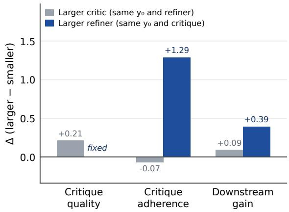
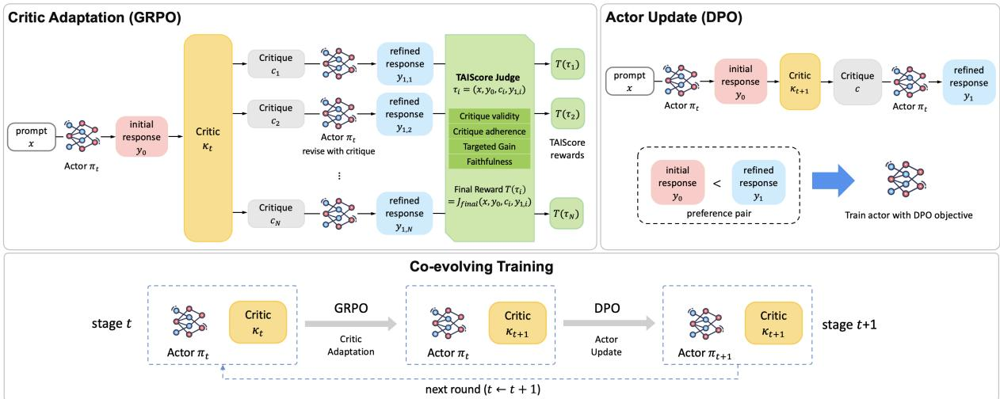
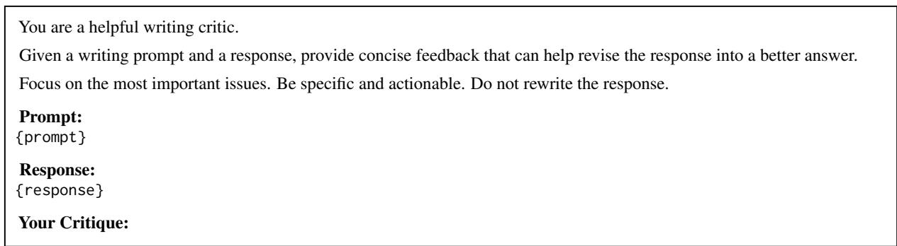
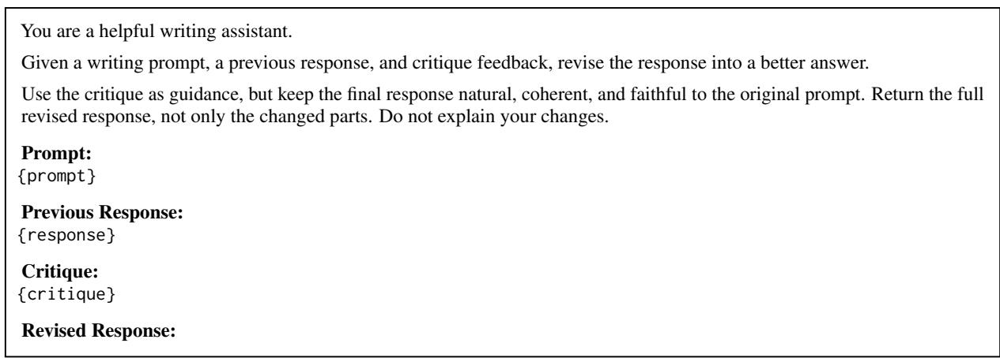
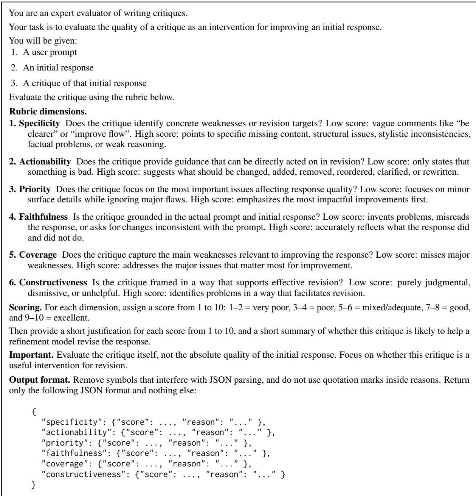
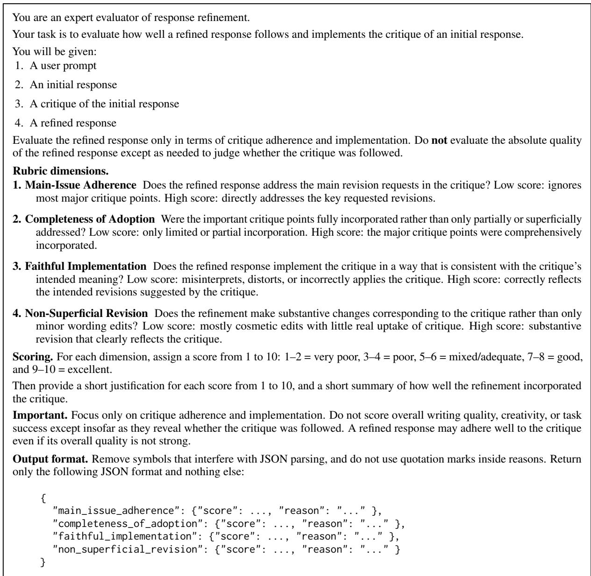
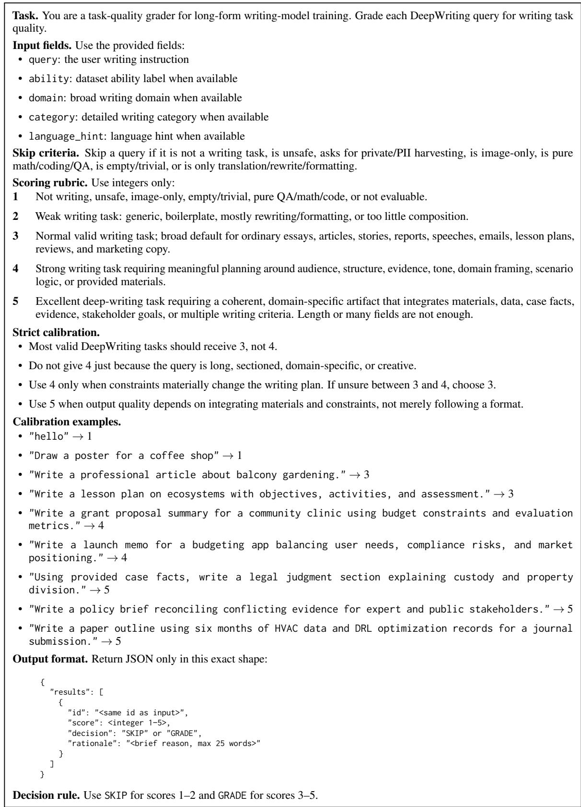
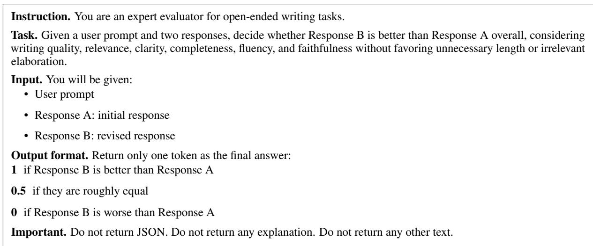
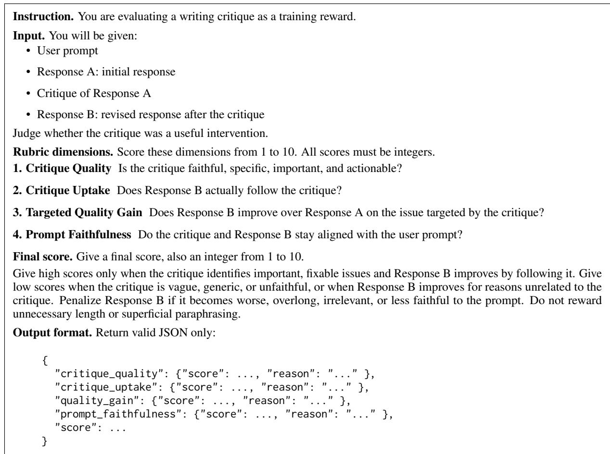

# Co-Evolving Actor-Conditioned Critics for Non-Verifiable Generation

Jinyoung Kim1 Muhammad Khalifa1 Lajanugen Logeswaran2 Jaekyeom Kim2 Moontae Lee2,3 Honglak Lee1,2 Lu Wang1

1University of Michigan 2LG AI Research 3University of Illinois at Chicago

## Abstract

Natural-language critiques provide supervision beyond scalar rewards for non-verifiable generation, which lacks deterministic verifiers. In critique-guided refinement, a critic gives feedback on an initial response and an actor revises it. However, final revision quality does not reveal whether the critique was actually useful: a capable actor may improve without following the feedback, while valid feedback may fail if the actor cannot execute it. We frame cri tique as actor-conditioned revision guidance, where usefulness depends on whether the feedback helps the target actor address the intended weakness. We introduce TAISCORE (Targeted Actionable Improvement Score), a reward that evaluates the instruction, initial re sponse, critique, and revision together, assessing whether the critique targets a real weakness, whether the actor follows it, and whether the intended aspect improves. We use this reward to train an actor-tailored critic with GRPO, and use critique-guided refinements to construct DPO preference pairs for the actor, forming a co-evolving critic-actor loop where the critic adapts to the actor’s changing capability. Experiments show that an 8B critic trained with TAISCORE outperforms both a zero-shot 120B critic and critics trained with outcome-only or critique-only reward signals. Co-evolving the critic and actor further improves performance, suggesting that effective critique supervision should adapt as the actor changes.1

## 1 Introduction

Reinforcement learning from verifiable rewards (RLVR) (Shao et al., 2024; Guo et al., 2025) has driven rapid progress on reasoning tasks: in mathematics or code generation, outputs can be checked against an answer key or unit test, giving learning algorithms a clear signal of task success (Cobbe et al., 2021; Lightman et al., 2024; Le et al., 2022). However, extending this paradigm to open-ended tasks is difficult because such tasks admit no verifiable measure of success. In creative writing, complex instruction following, and long-form research generation, multiple valid responses may satisfy the same prompt, and quality is inherently multi-dimensional: a response may be fluent but incomplete, creative but unfaithful, or well-grounded but poorly organized (Zhong et al., 2022; Liang et al., 2022). Scalar preferences or judge scores can rank responses but cannot explain which dimension failed or what edit would help (Wu et al., 2023; Luo et al., 2025).

This has motivated growing interest in naturallanguage critique as a richer form of supervision (Madaan et al., 2023; Shinn et al., 2023). A typical critique-guided revision pipeline involves two roles: a critic, which provides feedback on an initial response, and an actor, which revises the response based on that feedback. Unlike a scalar score, a critique can identify which aspect of a response is weak, explain why it falls short, and propose to the actor model how to fix it. A growing body of work uses such feedback to build critiquerefinement pipelines that revise the actor model’s outputs (Scheurer et al., 2023; Wadhwa et al., 2024; Yu et al., 2025). This reflects an important shift: improving non-verifiable generation requires not only judging outputs, but also providing actionable guidance for revision. However, existing approaches typically evaluate critiques either by their standalone quality or by the final improvement they coincide with, leaving open whether the target actor actually takes up the feedback and improves the intended aspect.

We argue that critique usefulness is determined not by the critique alone, but by its interaction with the actor that must execute it. In our controlled analyses (§3.1), we find that the same feedback can lead to substantially different revision behaviors and improvement gains depending on the actor’s capability. Conversely, increasing critic scale does not reliably produce more useful feedback for a fixed actor. These findings shift the critic-training objective: rather than rewarding critiques that look good in isolation or merely coincide with better final revisions, we aim to reward critiques that help the target actor make the intended change.

To operationalize this objective, we introduce TAISCORE (Targeted Actionable Improvement Score). Rather than scoring a critique by the final response quality or by its standalone plausibility, we evaluate the full critique-guided revision process : the process in which an actor revises an initial response to an instruction after receiving a critique. A TAISCORE judge observes the instruction, initial response, critique, and revision together, and assesses whether the critique targets a real weakness, whether the actor follows it, and whether the intended aspect improves. We use this score as the critic-training reward. Critique-guided refinements are then used to construct preference pairs for actor DPO training, forming a co-evolving loop where the critic adapts as the actor improves.

Experiments on creative writing and deep research tasks show that an 8B critic trained with TAISCORE outperforms both a stronger frozen gpt-oss-120B critic and critics trained with only refinement quality or only critique quality. Coevolution further improves over the static TAIS-CORE critic, improving the Qwen3-8B actor from 72.33 to 76.72 on WritingBench (Wu et al., 2025b). The same trend holds on HelloBench (Que et al., 2024) and DeepResearch-Gym (Coelho et al., 2025b), suggesting that effective critique supervision should be trained for the target actor rather than rely only on critic scale.

Our contributions are:

1. We frame critique as actor-conditioned revision guidance and show that its usefulness depends on the critique-actor interaction rather than the critique alone.

2. We propose TAISCORE, a reward that assigns credit to critiques by evaluating whether they identify valid issues, are followed by the actor, and lead to targeted improvement.

3. We introduce a co-evolving critic-actor training procedure and demonstrate that critic training with TAISCORE outperforms training with only refinement quality or only critique quality, and that co-evolution outperforms static critics.

## 2 Related Work

Critique-guided self-refinement. A growing line of work uses natural-language feedback to improve model outputs through iterative revision. Self-Refine (Madaan et al., 2023) showed that a single model can generate, critique, and revise its own outputs in a test-time loop, while Reflexion (Shinn et al., 2023) stores verbal feedback as memory across trials. Subsequent work has used language feedback as a training signal. For example, Scheurer et al. (2023) train models from natural-language feedback at scale, while Luo et al. (2025) show that models can benefit from verbal feedback without reducing it to scalar rewards. More structured refinement pipelines decompose revision into separate detect, critique, and refine stages (Wadhwa et al., 2024), synthesize reflection– revision trajectories for open-ended writing (Liu et al., 2026), or optimize critics with refinementoriented signals (Yu et al., 2025). These methods demonstrate that critique can guide generation, but they typically evaluate feedback through standalone critique plausibility or the quality of the resulting revision. In contrast, we evaluate whether a critique is useful for a specific actor by considering the full critique-guided revision process it induces, including whether the actor takes up the feedback and improves the intended aspect.

## Reward modeling for non-verifiable generation.

When tasks lack deterministic verifiers, reward signals often come from learned or prompted evaluators. RLHF (Ouyang et al., 2022) established the standard pipeline of training reward models from human preferences, and LLM-as-a-Judge (Zheng et al., 2023) showed that strong LLMs can approximate human judgments on open-ended tasks. Rubrics as Rewards (Gunjal et al., 2025) and Open-Rubrics (Liu et al., 2025) structure evaluation into instance-specific criteria, improving interpretability and enabling rubric-based RL for non-verifiable domains. However, these criteria are typically aggregated into scalar signals for evaluating or optimizing final responses. Such signals can rank responses or identify weak dimensions, but they do not directly provide concrete revision guidance. In contrast, natural-language critiques can specify what should be changed, why it matters, and how the actor should revise the response.

Dynamic critics and actor-conditioned supervision. Static critics can become misaligned as the actor improves during training. DR-Tulu (Shao et al., 2025) addresses this by maintaining a rubric buffer that co-evolves with the policy, RLAC (Wu et al., 2025a) introduces an adversarial critic that proposes likely failure modes for external verification. Recent work also connects critic training to actor refinement behavior. CGI (Yang et al., 2025b) jointly trains actors and critics in interactive agent environments, where feedback helps actors refine actions toward task success. Critique-RL (Xi et al., 2025) trains critique models with a two-stage RL procedure, combining direct rewards for critique discriminability with indirect rewards from actor refinement. These works demonstrate the value of adapting supervision to the current policy or using actor refinement outcomes to train critics. Our work differs in both setting and credit assignment. We study non-verifiable generation, where rule-based correctness rewards are unavailable, and train the critic with a judge-based reward that explicitly evaluates whether the critique targets a real weakness, is taken up by the target actor, and improves the intended aspect.

## 3 Motivation and Problem Formulation

Critique-guided revision consists of an instruction $x ,$ an initial response $y _ { 0 }$ , a critique c, and a revised response $y _ { 1 }$ . In this process, a critique is useful not simply when it appears valid, specific, or actionable in isolation, but when it helps a specific actor revise the response in the intended way. Feedback may correctly identify a weakness yet be too abstract or too difficult for the current actor to execute; conversely, feedback may be easy to follow but induce only superficial edits or target low-priority issues. A useful critique should therefore be both executable for the actor and substantive enough to produce an attributable improvement in the targeted aspect of the response.

## 3.1 Motivating Analysis: Critique Usefulness Is Actor-Conditioned

To test whether critique usefulness is intrinsic to the critique or conditioned on the actor, we conduct two controlled analyses on WritingBench (Wu et al., 2025b), varying one role at a time. The criticscaling comparison holds the instruction, initial response, and revising actor fixed while replacing a smaller critic with a larger one; the refiner-scaling comparison holds the instruction, initial response, and critique fixed while replacing a smaller refiner with a larger one.

  
Figure 1: Controlled zero-shot analysis of critiqueguided refinement on WritingBench. Bars show mean differences between larger- and smaller-model conditions in critique quality, critique adherence (how well $y _ { 1 }$ implements c), and response-quality gain $S ( y _ { 1 } ) { - } S ( y _ { 0 } )$ Gray bars compare larger and smaller critics while holding $y _ { 0 }$ and the refiner fixed; blue bars compare larger and smaller refiners while holding $y _ { 0 }$ and the critique fixed. Larger critics improve standalone critique quality but yield little average improvement in adherence or gain, whereas larger refiners substantially improve both. Individual comparisons are reported in Table 5.

For each rollout $( x , y _ { 0 } , c , y _ { 1 } )$ we report three quantities. Critique quality is a prompted gpt-oss-120B judge score rating whether the critique is valid, specific, important, actionable, and faithful; it observes only $( x , y _ { 0 } , c )$ and never sees the revision. Critique adherence is a second judge score that observes $( x , y _ { 0 } , c , y _ { 1 } )$ and rates whether the actor incorporates the critique rather than making unrelated edits. Gain is the downstream taskquality improvement $S ( y _ { 1 } ) - S ( y _ { 0 } )$ under the WritingBench evaluator. Judge prompts and implementation details are given in Appendix A.

Figure 1 summarizes these comparisons, with individual comparison-level deltas reported in Appendix (Table 5).

Same actor, different critics. If larger critics always produced more useful feedback for a given actor, replacing a smaller critic with a larger one should improve not only standalone critique quality, but also critique adherence and refinement gain. Figure 1 shows that this is not the case. Larger critics consistently receive higher standalone critiquequality scores, but this improvement does not reliably translate into stronger critique adherence or larger downstream gains. In some cases, the same actor incorporates the larger critic’s feedback less faithfully (Table 5). This suggests that critique quality judged in isolation is not sufficient to predict usefulness for a fixed actor. Paired examples in Appendix B illustrate one underlying mechanism.

Same critique, different actors. If critique usefulness were determined by the critique alone, different actors should benefit similarly from the same feedback. Instead, Figure 1 shows that larger actors exhibit stronger adherence and larger refinement gains given identical critiques. Critique usefulness is therefore not an intrinsic property of the critique, but depends on the actor that executes it.

## 3.2 Actor-Conditioned Critic Training

These results motivate training critics for a particular actor. We reward feedback only when it identifies a real weakness, is followed by that actor, and produces improvement on the targeted aspect. This avoids two forms of misattribution: standalone critique quality ignores executability, whereas final response quality does not establish that the critique caused the gain. The objective is also dynamic: as the actor improves, the critic must remain aligned with its current revision capability, providing feedback that is executable but still pushes the actor toward better revisions. In $\ S 4 .$ , we operationalize this objective with TAISCORE.

## 4 Method

Our goal is to train a critic whose feedback is useful as revision guidance for a specific actor, and to keep the critic aligned as the actor improves. We define TAISCORE, which assigns credit to a critique by examining the full critique-guided revision process $\left( x , y _ { 0 } , c , y _ { 1 } \right) \left( \ S 4 . 1 \right)$ ; use it as a reward to update the critic via grouped policy optimization (§4.2); distill successful critique-guided revisions into the actor through preference optimization (§4.3); and alternate the two updates so that the critic tracks the actor’s evolving capability (§4.4). Figure 2 illustrates the pipeline.

Throughout, we use the following notation. At training round $t , \pi _ { t }$ denotes the current actor and $\kappa _ { t }$ the current critic. For each instruction $x ,$ the actor generates an initial response $y _ { 0 }$ , the critic generates a critique c, and the same actor generates a critique-conditioned revision $y _ { 1 }$ . We denote the resulting critique-guided revision rollout as τ = $( x , y _ { 0 } , c , y _ { 1 } )$

## 4.1 Targeted Actionable Improvement Score

A central design question is how to assign credit to a critique. Scoring critique quality and revision quality separately risks incoherent supervision: a generic or irrelevant critique may receive high reward if the revision happens to improve for unrelated reasons, while a targeted critique may be under-rewarded if the actor fails to execute it. To avoid such misattribution, we define TAISCORE to evaluate a critique together with the revision it induces. Given the full context $( x , y _ { 0 } , c , y _ { 1 } )$ , TAIS-CORE assesses whether the critique targets a real weakness, whether the actor follows ${ \mathrm { i t } } ,$ and whether the targeted aspect improves.

When computing TAISCORE, the judge first returns four diagnostic scores:

$$
( q _ { \mathrm { q u a l } } , q _ { \mathrm { a d h } } , q _ { \mathrm { g a i n } } , q _ { \mathrm { f a i t h } } ) = J _ { \mathrm { d i a g } } ( x , y _ { 0 } , c , y _ { 1 } ) .
$$

These correspond to the desiderata identified in §3.1: $q _ { \mathrm { q u a l } }$ assesses critique validity: whether the feedback is faithful to the response, specific, important, and actionable; $q _ { \mathrm { a d h } }$ measures critique adherence: whether the actor incorporates the critique into the revision; $q _ { \mathrm { g a i n } }$ captures targeted improvement: whether the revision improves over the initial response on the dimension the critique addresses; and $q _ { \mathrm { f a i t h } }$ serves as a guardrail, verifying that the critique and revision remain aligned with the original instruction.

Conditioned on these diagnostics, the judge then produces a final scalar:

$$
T ( \tau ) = J _ { \mathrm { f i n a l } } ( x , y _ { 0 } , c , y _ { 1 } ) \in [ 1 , 1 0 ] .
$$

Because the diagnostic scores are generated before the final score within the same inference pass, they provide an explicit reasoning scaffold for judging the full critique-guided revision process. The diagnostic scores are used for analysis, while the final score $T ( \tau )$ serves as the critic training reward.

## 4.2 Critic Update

We update the critic using grouped critique-guided revision rollouts. At round t, for each on-policy initial response y0 $\sim \pi _ { t } ( \cdot \mid x )$ , the critic samples N critiques $\{ c _ { i } \} _ { i = 1 } ^ { N }$ conditioned on $( x , y _ { 0 } )$ . The actor revises the same initial response under each critique, yielding rollouts ${ \tau } _ { i } = ( x , y _ { 0 } , c _ { i } , y _ { 1 , i } )$ , each scored by TAISCORE as $r _ { i } = T ( \tau _ { i } )$

  
Figure 2: Overview of our co-evolving critic-actor training framework. For the current actor $\pi ,$ the critic $\kappa _ { t }$ samples multiple critiques for the same initial response $y _ { 0 }$ . Each critique produces a critique-guided revision rollout $\tau _ { i } = ( x , y _ { 0 } , c _ { i } , y _ { 1 , i } )$ . TAISCORE evaluates each rollout by considering four diagnostic criteria: critique validity, critique adherence, targeted gain, and faithfulness, and then produces a final score $T ( \tau _ { i } )$ used as the GRPO reward for critic adaptation. The actor $\pi _ { t }$ then produces candidate revisions using critiques from the adapted critic $\kappa _ { t + 1 }$ . Revisions preferred over their corresponding initial responses are selected to construct DPO preference pairs $y _ { 1 } \succ y _ { 0 }$ for updating the actor. Alternating these two updates yields co-evolving critics and actors.

Because all N critiques are applied to the same initial response and revised by the same actor, each group controls for the prompt, initial response, and actor capability. The resulting rewards therefore provide relative credit for which critique offers more useful revision guidance. We update the critic with a group-relative policy-gradient (GRPO) objective (Shao et al., 2024), using normalized TAIS-CORE values as advantages:

$$
\begin{array} { c } { \displaystyle { A _ { i } = \frac { r _ { i } - \mathrm { m e a n } ( \{ r _ { j } \} _ { j = 1 } ^ { N } ) } { \mathrm { s t d } ( \{ r _ { j } \} _ { j = 1 } ^ { N } ) } \mathrm { , } } } \\ { \displaystyle { \mathcal { I } _ { t } ( \kappa ) = \mathbb { E } \left[ \frac { 1 } { N } \sum _ { i = 1 } ^ { N } A _ { i } \log \kappa ( c _ { i } \mid x , y _ { 0 } ) \right] . } } \end{array}
$$

This objective encourages the critic to place higher probability on critiques that provide more useful revision guidance for the current actor $\pi _ { t }$

## 4.3 Actor Update from Critique-Guided Refinements

We use critique-guided revisions to update the actor via preference optimization. Using the adapted critic $\kappa _ { t + 1 }$ , we generate critiques and corresponding revisions from the current actor $\pi _ { t }$ . We construct preference pairs from revisions that improve upon their corresponding initial responses under a pairwise assessment of response quality. Each selected revision defines a preference pair $( y ^ { + } , y ^ { - } ) = ( y _ { 1 } , y _ { 0 } )$

At each round, we construct a preference dataset of M selected pairs:

$$
\mathcal { D } _ { t } = \left\{ ( x _ { i } , y _ { i } ^ { + } , y _ { i } ^ { - } ) \right\} _ { i = 1 } ^ { M } , ~ ( y _ { i } ^ { + } , y _ { i } ^ { - } ) = ( y _ { 1 , i } , y _ { 0 , i } ) .
$$

We then update the actor using DPO. The actor is initialized from $\pi _ { t } .$ , while $\pi _ { \mathrm { r e f } }$ is a frozen copy of $\pi _ { t }$ before the update:

$$
\begin{array} { r } { \mathcal { L } _ { \mathrm { D P O } } ( \pi ) = - \mathbb { E } _ { ( x , y ^ { + } , y ^ { - } ) \sim \mathcal { D } _ { t } } \left[ \log \sigma \left( \beta \Delta _ { \pi } \right) \right] , } \\ { \Delta _ { \pi } = \log \frac { \pi ( y ^ { + } \mid x ) } { \pi _ { \mathrm { r e f } } ( y ^ { + } \mid x ) } - \log \frac { \pi ( y ^ { - } \mid x ) } { \pi _ { \mathrm { r e f } } ( y ^ { - } \mid x ) } . } \end{array}
$$

This update encourages the actor to directly produce responses closer to those it generates after receiving useful critique.

## 4.4 Co-Evolving Critic and Actor

A static critic can become misaligned as the actor changes during training. The actor’s failure modes change as it learns, and its ability to execute feedback also changes. A critique that was useful for an earlier actor may become redundant for a stronger actor, while feedback that was previously too difficult may become well-applicable. We therefore alternate critic and actor updates across training rounds. Starting from $( \pi _ { 0 } , \kappa _ { 0 } )$ , each round t consists of two steps:

1. Critic adaptation. Fix the actor πt and update the critic via GRPO on grouped critique-guided revision rollouts: $\kappa _ { t + 1 } ~ \gets$ $\mathrm { G R P O } ( \kappa _ { t } ; \mathcal { T } _ { t } )$

2. Actor update. Use $\kappa _ { t + 1 }$ to generate critiqueguided revisions from $\pi _ { t } .$ , construct a preference dataset $\mathcal { D } _ { t }$ from selected revisions, and update the actor: $\pi _ { t + 1 } \gets \mathrm { D P O } ( \pi _ { t } ; \mathcal { D } _ { t } )$

This yields a sequence $( \pi _ { 0 } , \kappa _ { 0 } ) , \hdots , ( \pi _ { T } , \kappa _ { T } )$ in which the critic continually adapts to the actor’s current weaknesses and revision capabilities, while the actor internalizes progressively stronger critiqueguided revisions.

## 5 Experiments

We design experiments to answer three questions:

1. Does TAISCORE provide a better critic training signal than outcome-only or critique-only rewards?

2. Does co-evolving the critic and actor improve over a static critic?

3. Do critiques tailored to one actor transfer to other actors?

## 5.1 Setup

Tasks and data. We evaluate on two nonverifiable domains: creative writing and deep research. For creative writing, we use DeepWriting-20K (Wang et al., 2025) as the training prompt source and evaluate on WritingBench (Wu et al., 2025b) and HelloBench (Que et al., 2024). Following Wang et al. (2025), we report HelloBench results on two key subsets: Open-Ended QA (OEQA), which evaluates detailed and nuanced answer generation, and Heuristic Text Generation (HTG), which evaluates creative reasoning and stylistic fidelity in long-form text generation. For deep research, we use OpenScholar queries (Asai et al., 2026) as the training prompt source and evaluate on DeepResearch-Gym (Coelho et al., 2025b). Following the query filtering procedure of Shao et al. (2025), we score each query with an LM judge and retain high-quality queries for training. We use 6K training queries for each domain. Actor-training pairs are constructed from larger shared candidate-query pools, as described in Appendix D.3. Details of the query selection procedure are provided in Appendix C.

Evaluation. For WritingBench, we follow the official evaluation protocol and report the overall score from the official evaluator. For HelloBench, we use the OpenCompass implementation with the official GPT-4o-mini judge configuration and report results on the Open-Ended QA (OEQA) and Heuristic Text Generation (HTG) subsets. For DeepResearch-Gym, we use the benchmark’s report-level evaluation scripts with GPT-4.1-mini as the judge, using the officially retrieved ClueWeb22 materials as context (Coelho et al., 2025a). We report key-point recall (KPR), key-point contradiction (KPC), and report quality. KPR is the percentage of reference key points supported by the generated report, while KPC is the percentage contradicted by the report; higher KPR and lower KPC are better. Report quality is the judge-rated mean over report-level criteria, scaled to a 0-100 range. For each method, we use the corresponding checkpoint to generate three independent output sets under the same decoding configuration. We evaluate each output set separately and report the mean and standard deviation across the three evaluation scores.

Models. We use models from the Qwen3 family (Yang et al., 2025a) throughout our experiments. The default actor and critic are both Qwen3-8B, chosen as a mid-scale model capable of meaningful self-refinement while leaving room for improvement. All actors perform on-policy self-refinement: the same model generates the initial response and produces the revision after receiving the critique. TAISCORE and all judge-based reward computations are performed by gpt-oss-120B. Except for the zero-shot off-the-shelf critic baseline described below, gpt-oss-120B is used only as a judge and is never updated or used as the actor.

Reward judge and cross-model agreement. TAISCORE is computed by gpt-oss-120B throughout critic training. To check that the resulting signal is not an artifact of this particular judge, we independently rescore 800 rollouts (4 × 200 training prompts) with Claude Opus 4.8, a model from a different provider, using the identical rubric. The two judges select the same top-ranked candidate for 89.5% of prompts and agree on 77.9% of non-tied within-prompt pairwise orderings, indicating that the relative rankings used to form GRPO advantages are largely judge-invariant. Protocol details are provided in Appendix D.1.

<table><tr><td rowspan="2">Method</td><td>WritingBench</td><td colspan="2">HelloBench</td><td colspan="3">DeepResearch-Gym</td></tr><tr><td>Overall(↑)</td><td>OEQA(↑)</td><td>HTG(↑)</td><td>KPR(↑)</td><td></td><td>KPC(↓) Quality(↑)</td></tr><tr><td>Qwen3-8B</td><td> $7 2 . 3 3 { \scriptstyle \pm 0 . 0 8 }$ </td><td> $3 4 . 8 6 { \scriptstyle \pm 1 . 9 5 }$ </td><td> $3 9 . 1 4 { \scriptstyle \pm 1 . 7 6 }$ </td><td> $7 1 . 9 3 { \scriptstyle \pm 0 . 0 4 }$ </td><td>1.15±0.09</td><td> $8 1 . 8 9 { \scriptstyle \pm 0 . 0 7 }$ </td></tr><tr><td colspan="7">DPO pairs from off-the-shelf critics</td></tr><tr><td>gpt-oss-120B critic</td><td> $7 5 . 4 1 { \scriptstyle \pm 0 . 1 4 }$ </td><td> $3 6 . 0 1 { \scriptstyle \pm 2 . 3 6 }$ </td><td> $5 0 . 9 3 { \scriptstyle \pm 2 . 1 8 }$ </td><td> $7 3 . 4 6 { \scriptstyle \pm 0 . 0 9 }$ </td><td>1.11±0.08</td><td> $8 2 . 5 1 { \scriptstyle \pm 0 . 0 6 }$ </td></tr><tr><td colspan="7">DPO pairs from trained critics</td></tr><tr><td>Outcome-gain reward</td><td> $7 5 . 6 3 { \scriptstyle \pm 0 . 0 9 }$ </td><td> $3 5 . 3 5 { \scriptstyle \pm 2 . 6 8 }$ </td><td> $4 5 . 1 4 { \scriptstyle \pm 2 . 4 8 }$ </td><td> $7 4 . 3 7 { \scriptstyle \pm 0 . 1 1 }$ </td><td> $1 . 1 2 { \scriptstyle \pm 0 . 0 9 }$ </td><td> $8 2 . 3 8 { \scriptstyle \pm 0 . 0 7 }$ </td></tr><tr><td>Critique-quality reward</td><td> $7 5 . 1 8 { \scriptstyle \pm 0 . 1 1 }$ </td><td> $3 5 . 5 1 { \scriptstyle \pm 2 . 4 5 }$ </td><td> $4 9 . 7 5 { \scriptstyle \pm 4 . 3 2 }$ </td><td> $7 4 . 1 9 { \scriptstyle \pm 0 . 1 3 }$ </td><td> $1 . 1 4 { \scriptstyle \pm 0 . 1 1 }$ </td><td> $8 2 . 3 2 { \scriptstyle \pm 0 . 0 4 }$ </td></tr><tr><td>TAISCORE</td><td> $7 5 . 9 6 { \scriptstyle \pm 0 . 1 2 }$ </td><td> $3 6 . 4 8 { \scriptstyle \pm 2 . 5 6 }$ </td><td> $5 3 . 7 8 { \scriptstyle \pm 1 . 5 8 }$ </td><td> $\underline { { 7 5 . 2 1 } } \pm \mathbf { 0 . 0 9 }$ </td><td> $1 . 0 9 { \scriptstyle \pm 0 . 0 7 }$ </td><td> $\underline { { 8 2 . 6 3 } } { \pm } 0 . 0 6$ </td></tr><tr><td colspan="7">Co-evolving critic-actor training</td></tr><tr><td>TAISCORE + co-evolution</td><td> $7 6 . 7 2 { \scriptstyle \pm 0 . 1 4 }$ </td><td> $\mathbf { 3 9 . 8 4 } \pm \mathrm { 2 . 9 2 }$ </td><td> ${ \pm 4 . 6 2 \pm 1 . 9 2 }$ </td><td> $\mathbf { 7 6 . 1 4 { \scriptstyle \pm 0 . 1 3 } }$ </td><td> ${ \bf 1 . 0 3 { \scriptstyle \pm 0 . 0 5 } }$ </td><td> $\mathbf { 8 3 . 1 5 } \pm \mathrm { 0 . 0 6 }$ </td></tr></table>

Table 1: Main results averaged over multiple runs, with standard deviations reported after ±. Except for the initial actor, all rows report the final performance of the Qwen3-8B actor after DPO training. Off-the-shelf critic baselines use untrained critics to construct revision pairs, while trained-critic baselines first train the critic with different reward definitions and then use the resulting critic to construct DPO pairs. TAISCORE trains the critic with actor-conditioned supervision that rewards valid, adopted, and targeted critiques, and co-evolving the critic with the actor further updates the critic as the actor changes. Best results are shown in bold and second-best results are underlined.

Training. We train the critic with GRPO (Shao et al., 2024). For each on-policy initial response, the critic samples N=4 critiques, the actor produces a revision for each critique, and TAISCORE provides the GRPO reward. We train the actor with DPO (Rafailov et al., 2023) (β=0.1). Before each actor update, each method generates one candidate revision per query from a shared query pool. A critique-blind pairwise judge compares each revision with its corresponding initial response, and we uniformly sample 2K preferred revisions to form DPO pairs. Across methods, we hold fixed the candidate queries, number of candidate revisions, pair-selection procedure, and number of DPO pairs.

Co-evolution alternates the two updates for three rounds. In each round, we update the critic against the current actor using 2K queries and then update the actor using 2K pairs constructed with the adapted critic. Single-stage methods instead train on the corresponding totals of 6K critic-training queries and 6K actor-training pairs in one stage. Full hyperparameters and pair-construction details are provided in Appendices D.2 and D.3.

Baselines. All conditions use the same DPO actor-training pipeline and differ only in how the critiques used to construct DPO pairs are produced. (1) Off-the-shelf critic: To test whether critic training is necessary, we compare against a stronger frozen critic: gpt-oss-120B prompted directly to provide revision feedback. This baseline asks whether a strong general-purpose critic can replace actor-conditioned critic training with

<table><tr><td>Comparison (A vs. B)</td><td>A</td><td>Tie</td><td>B</td></tr><tr><td>TAISCORE vs. Qwen3-8B</td><td>42</td><td>5</td><td>3</td></tr><tr><td>TAISCORE vs. gpt-oss-120B critic</td><td>35</td><td>7</td><td>7</td></tr><tr><td>TAISCORE + co-evol. vs. TAISCORE</td><td>36</td><td>8</td><td>5</td></tr></table>

Table 2: Majority-vote preferences on 50 WritingBench prompts. Columns report preferences for condition A, ties, and preferences for condition B. Rows 2–3 each omit one prompt without a majority decision.

TAISCORE-based supervision. (2) Trained critics: We train critics with two ablated reward objectives. The outcome-gain reward uses the same LM judge as a pairwise evaluator between the initial response y0 and the revised response y1, rewarding critiques that lead to higher-quality revisions. The critique-quality reward asks the LM judge to rate the critique itself using the rubric-for-critiques prompt, without considering whether the actor follows the feedback or improves the response. (3) Ours: TAISCORE trains the critic with the full reward defined over the critique-guided revision process, while TAISCORE + co-evolution additionally alternates critic and actor updates across rounds. Further details on reward computation and judge prompts are provided in Appendix D.4.

## 5.2 Main Results

Table 1 shows three consistent trends. First, offthe-shelf critique supervision improves the initial Qwen3-8B actor, but is not sufficient: the frozen gpt-oss-120B critic is outperformed by the TAIS-CORE-trained critic on all six metrics. This indicates that critic scale alone does not determine downstream usefulness. Second, TAISCORE outperforms both reward ablations. Outcome-gain training rewards better final revisions but cannot determine whether the improvement is attributable to the critique, while critique-quality training rewards plausible feedback without checking whether the actor can execute it. By evaluating the full critiqueguided revision process, TAISCORE provides a more effective critic-training signal. Third, coevolving the critic with the actor further improves performance across all benchmarks, suggesting that critic feedback should adapt as the actor’s revision capability changes.

<table><tr><td>Condition</td><td> $S ( y _ { 1 } )$   $\Delta _ { \mathrm { W B } }$ </td></tr><tr><td>(a) Critic source / objective</td><td></td></tr><tr><td>Off-the-shelf gpt-oss-120B 73.82</td><td>+1.49</td></tr><tr><td>Outcome-gain reward 74.44</td><td>+2.11</td></tr><tr><td>Critique-quality reward 74.23</td><td>+1.90</td></tr><tr><td>TAISCORE 75.11</td><td>+2.78</td></tr><tr><td>(b) Critique-content control</td><td></td></tr><tr><td>No critique 73.30</td><td>+0.97</td></tr><tr><td>Generic critique 73.34</td><td>+1.01</td></tr><tr><td>Shuffled TAISCORE critique</td><td>72.88 +0.55</td></tr><tr><td>Matched TAISCORE critique 75.11</td><td>+2.78</td></tr></table>

Table 3: Direct refinement on WritingBench before actor DPO. All conditions share prompts, initial responses $( S ( y _ { 0 } ) { = } 7 2 . 3 3 )$ , refiner, decoding, and evaluator; only the feedback varies. $\Delta _ { \mathrm { W B } } { = } S ( y _ { 1 } ) - S ( y _ { 0 } )$ . All revisions are included without preference filtering.

Human evaluation. We conduct a blind pairwise evaluation on 50 randomly sampled WritingBench prompts (Table 2). Human preferences corroborate the automatic results: TAISCORE is preferred over both the base actor and the off-the-shelf critic baseline. Co-evolution is also preferred over singleround TAISCORE, providing independent evidence for its benefit. Full protocol details are provided in Appendix E.

## 5.3 Direct Critique Utility Before Actor Training

Table 3 tests whether the feedback produced by different critics leads to higher-quality immediate revisions, without updating the actor or selecting revisions through the preference-pair filter. We hold the initial response y0, Qwen3-8B reviser, revision prompt, decoding configuration, and evaluator fixed, and vary only the supplied feedback.

The TAISCORE-trained critic yields the highest mean revision score, improving WritingBench from 72.33 to 75.11 (+2.78), ahead of the off-theshelf, outcome-gain, and critique-quality critics (Table 3a). The advantage of TAISCORE is thus already observable at direct refinement time, before any actor update.

<table><tr><td>Critic tailored to</td><td>WritingBench</td><td>Gain</td></tr><tr><td>None (base actor)</td><td>72.33</td><td></td></tr><tr><td> $\mathtt { L 1 a m a - 3 . 2 - 3 B }$ </td><td>74.62</td><td>+2.29</td></tr><tr><td> $\scriptstyle { \mathrm { Q w e n } } 3 - 4 \mathsf { B }$ </td><td>75.08</td><td>+2.75</td></tr><tr><td>Qwen3-8B (matched)</td><td>75.96</td><td>+3.63</td></tr></table>

Table 4: Effect of matching the critic to the target actor. The target actor is Qwen3-8B in every condition. All critics share the same initialization and training setup and differ only in the actor to which they are tailored.

Panel (b) tests whether this reflects generic second-pass revision rather than critique content. Revising with no critique or a generic critique yields only +0.97 and +1.01, and a TAISCORE critique sampled from a different example yields +0.55 despite preserving the source and general form of the feedback. The matched critique exceeds the strongest control by 1.77 points, indicating that the gain depends on instance-specific, correctly matched critique content rather than the actor’s general ability to improve on a second pass. Further details are provided in Appendix D.6.

## 5.4 Actor–Critic Matching

Different actors may respond differently to the same critique: feedback that one actor can readily apply may be less useful to another. We therefore examine whether a critic is more effective when tailored to the actor that will use its feedback. We fix the target actor to Qwen3-8B and train three critics, tailored respectively to Llama-3.2-3B, Qwen3-4B, and Qwen3-8B. All three critics start from the same Qwen3-8B checkpoint and use the same TAISCORE training procedure and budget; only the actor they are tailored to changes. We use each critic to construct DPO training pairs for the target actor, holding the queries and actor-training procedure fixed.

As shown in Table 4, all three critics lead to substantial improvements over the base actor. However, the critic tailored directly to the target Qwen3-8B actor achieves the largest gain of 3.63 points, outperforming the Qwen3-4B-tailored critic by 0.88 points and the Llama-3.2-3B-tailored critic by 1.34 points. Thus, critique behavior learned with one actor can remain useful to other actors, but matching the critic to the target actor produces the greatest downstream improvement.

## 6 Conclusion

We presented an actor-conditioned view of critiqueguided revision and introduced TAISCORE, which rewards critiques that identify real weaknesses, are followed by the target actor, and cause targeted improvements. Across creative writing and deep research, TAISCORE outperforms outcome-gain and critique-quality rewards, while adapting the critic as the actor changes yields further gains. These results support evaluating critique supervision through the revision behavior it induces in the target actor.

## Limitations

This work evaluates actor-tailored critique training on two non-verifiable generation domains: creative writing and deep research. While these settings capture important open-ended generation challenges, broader evaluation on additional domains such as dialogue, multimodal generation, and long-form instruction following would further clarify the scope of the approach. Our main training experiments also focus on Qwen-family models, although our controlled zero-shot analysis includes both Qwen and Llama models and shows similar actor-conditioned trends. Future work could therefore validate the full training procedure across more model families and scales. Finally, our coevolution procedure uses a fixed number of rounds over disjoint data shards; adaptive schedules that decide when to update the critic or actor, or continuous co-training strategies that reuse feedback across rounds, are natural directions for future work.

## Ethical Considerations

Our experiments use publicly available models, benchmarks, and datasets. We use these resources in accordance with their respective licenses and terms of use and cite their original creators in the main text. We also conduct a small-scale human evaluation of anonymized model outputs, as described in Appendix E. The evaluation collects only pairwise response preferences and does not solicit sensitive personal information. Three university students whose primary language is English served as annotators. Each independently evaluated anonymized response pairs presented in randomized order.

As with any method that improves open-ended text generation, outputs may reflect biases or harmful patterns present in the pretraining data of the underlying models. Because our approach improves critique-guided revision, it could also improve the fluency, persuasiveness, or apparent helpfulness of undesirable outputs if applied without appropriate safeguards. These risks are not unique to our method, but they are relevant to downstream use of any system that improves language model generation quality. We therefore encourage applying appropriate safety filtering, monitoring, and domain-specific safeguards when using critiqueguided revision systems in practice.

Our use of existing artifacts is limited to research-oriented training and evaluation, consistent with their intended use. Any artifacts produced by this work are intended for research use only. During query selection, we applied filtering to exclude unsafe examples and prompts that request private or personally identifying information. Since we rely on publicly released datasets and benchmarks, we do not attempt de-anonymization or collect new personal information.

AI assistants were used for language polishing, proofreading, and formatting suggestions. All content, claims, experiments, and conclusions were reviewed and verified by the authors.

## Acknowledgements

This work is supported by LG AI Research.

## References

Akari Asai, Jacqueline He, Rulin Shao, Weijia Shi, Amanpreet Singh, Joseph Chee Chang, Kyle Lo, Luca Soldaini, Sergey Feldman, Mike D’Arcy, et al. 2026. Synthesizing scientific literature with retrievalaugmented language models. Nature, pages 1–7.

Karl Cobbe, Vineet Kosaraju, Mohammad Bavarian, Mark Chen, Heewoo Jun, Lukasz Kaiser, Matthias Plappert, Jerry Tworek, Jacob Hilton, Reiichiro Nakano, et al. 2021. Training verifiers to solve math word problems. arXiv preprint arXiv:2110.14168.

João Coelho, Bruno Martins, João Magalhães, and Chenyan Xiong. 2025a. Aligning web query generation with ranking objectives via direct preference optimization. In Proceedings ofthe 48th International ACM SIGIR Conference on Research and Development in Information Retrieval, pages 2982–2986.

João Coelho, Jingjie Ning, Jingyuan He, Kangrui Mao, Abhijay Paladugu, Pranav Setlur, Jiahe Jin, Jamie Callan, João Magalhães, Bruno Martins, et al. 2025b. Deepresearchgym: A free, transparent, and reproducible evaluation sandbox for deep research. arXiv preprint arXiv:2505.19253.

Anisha Gunjal, Anthony Wang, Elaine Lau, Vaskar Nath, Yunzhong He, Bing Liu, and Sean Hendryx. 2025. Rubrics as rewards: Reinforcement learning beyond verifiable domains. arXiv preprint arXiv:2507.17746.

Daya Guo, Dejian Yang, Haowei Zhang, Junxiao Song, Peiyi Wang, Qihao Zhu, Runxin Xu, Ruoyu Zhang, Shirong Ma, Xiao Bi, et al. 2025. Deepseek-r1 incentivizes reasoning in llms through reinforcement learning. Nature, 645(8081):633–638.

Hung Le, Yue Wang, Akhilesh Deepak Gotmare, Silvio Savarese, and Steven Chu Hong Hoi. 2022. Coderl: Mastering code generation through pretrained models and deep reinforcement learning. Advances in Neural Information Processing Systems, 35:21314–21328.

Percy Liang, Rishi Bommasani, Tony Lee, Dimitris Tsipras, Dilara Soylu, Michihiro Yasunaga, Yian Zhang, Deepak Narayanan, Yuhuai Wu, Ananya Kumar, et al. 2022. Holistic evaluation of language models. arXiv preprint arXiv:2211.09110.

Hunter Lightman, Vineet Kosaraju, Yuri Burda, Harrison Edwards, Bowen Baker, Teddy Lee, Jan Leike, John Schulman, Ilya Sutskever, and Karl Cobbe. 2024. Let’s verify step by step. In International Conference on Learning Representations, volume 2024, pages 39578–39601.

Tianci Liu, Ran Xu, Tony Yu, Ilgee Hong, Carl Yang, Tuo Zhao, and Haoyu Wang. 2025. Openrubrics: Towards scalable synthetic rubric generation for reward modeling and llm alignment. arXiv preprint arXiv:2510.07743.

Wanlong Liu, Bo Zhang, Chenliang Li, Shaopeng Lai, Yuning Wu, Xuanyu Lei, and Ming Yan. 2026. R2-write: Reflection and revision for openended writing with deep reasoning. arXiv preprint arXiv:2604.03004.

Renjie Luo, Zichen Liu, Xiangyan Liu, Chao Du, Min Lin, Wenhu Chen, Wei Lu, and Tianyu Pang. 2025. Language models can learn from verbal feedback without scalar rewards. arXiv preprint arXiv:2509.22638.

Aman Madaan, Niket Tandon, Prakhar Gupta, Skyler Hallinan, Luyu Gao, Sarah Wiegreffe, Uri Alon, Nouha Dziri, Shrimai Prabhumoye, Yiming Yang, et al. 2023. Self-refine: Iterative refinement with self-feedback. Advances in neural information processing systems, 36:46534–46594.

Long Ouyang, Jeffrey Wu, Xu Jiang, Diogo Almeida, Carroll Wainwright, Pamela Mishkin, Chong Zhang, Sandhini Agarwal, Katarina Slama, Alex Ray, et al. 2022. Training language models to follow instructions with human feedback. Advances in neural information processing systems, 35:27730–27744.

Haoran Que, Feiyu Duan, Liqun He, Yutao Mou, Wangchunshu Zhou, Jiaheng Liu, Wenge Rong, Zekun Moore Wang, Jian Yang, Ge Zhang, et al.

2024. Hellobench: Evaluating long text generation capabilities of large language models. arXiv preprint arXiv:2409.16191.

Rafael Rafailov, Archit Sharma, Eric Mitchell, Christopher D Manning, Stefano Ermon, and Chelsea Finn. 2023. Direct preference optimization: Your language model is secretly a reward model. Advances in neural information processing systems, 36:53728–53741.

Jérémy Scheurer, Jon Ander Campos, Tomasz Korbak, Jun Shern Chan, Angelica Chen, Kyunghyun Cho, and Ethan Perez. 2023. Training language models with language feedback at scale. arXiv preprint arXiv:2303.16755.

Rulin Shao, Akari Asai, Shannon Zejiang Shen, Hamish Ivison, Varsha Kishore, Jingming Zhuo, Xinran Zhao, Molly Park, Samuel G Finlayson, David Sontag, et al. 2025. Dr tulu: Reinforcement learning with evolving rubrics for deep research. arXiv preprint arXiv:2511.19399.

Zhihong Shao, Peiyi Wang, Qihao Zhu, Runxin Xu, Junxiao Song, Xiao Bi, Haowei Zhang, Mingchuan Zhang, YK Li, Yang Wu, et al. 2024. Deepseekmath: Pushing the limits of mathematical reasoning in open language models. arXiv preprint arXiv:2402.03300.

Noah Shinn, Federico Cassano, Ashwin Gopinath, Karthik Narasimhan, and Shunyu Yao. 2023. Reflexion: Language agents with verbal reinforcement learning. Advances in neural information processing systems, 36:8634–8652.

Manya Wadhwa, Xinyu Zhao, Junyi Jessy Li, and Greg Durrett. 2024. Learning to refine with fine-grained natural language feedback. In Findings of the Association for Computational Linguistics: EMNLP 2024, pages 12281–12308, Miami, Florida, USA. Association for Computational Linguistics.

Haozhe Wang, Haoran Que, Qixin Xu, Minghao Liu, Wangchunshu Zhou, Jiazhan Feng, Wanjun Zhong, Wei Ye, Tong Yang, Wenhao Huang, et al. 2025. Reverse-engineered reasoning for open-ended generation. arXiv preprint arXiv:2509.06160.

Mian Wu, Gavin Zhang, Sewon Min, Sergey Levine, and Aviral Kumar. 2025a. Rlac: Reinforcement learning with adversarial critic for free-form generation tasks. arXiv preprint arXiv:2511.01758.

Yuning Wu, Jiahao Mei, Ming Yan, Chenliang Li, Shaopeng Lai, Yuran Ren, Zijia Wang, Ji Zhang, Mengyue Wu, Qin Jin, and Fei Huang. 2025b. Writingbench: A comprehensive benchmark for generative writing. In Advances in Neural Information Processing Systems, volume 38, Main Conference. Curran Associates, Inc.

Zeqiu Wu, Yushi Hu, Weijia Shi, Nouha Dziri, Alane Suhr, Prithviraj Ammanabrolu, Noah A Smith, Mari Ostendorf, and Hannaneh Hajishirzi. 2023. Finegrained human feedback gives better rewards for language model training. Advances in Neural Information Processing Systems, 36:59008–59033.

Zhiheng Xi, Jixuan Huang, Xin Guo, Boyang Hong, Dingwen Yang, Xiaoran Fan, Shuo Li, Zehui Chen, Junjie Ye, Siyu Yuan, et al. 2025. Critique-rl: Training language models for critiquing through two-stage reinforcement learning. arXiv preprint arXiv:2510.24320.

An Yang, Anfeng Li, Baosong Yang, Beichen Zhang, Binyuan Hui, Bo Zheng, Bowen Yu, Chang Gao, Chengen Huang, Chenxu Lv, et al. 2025a. Qwen3 technical report. arXiv preprint arXiv:2505.09388.

Ruihan Yang, Fanghua Ye, Jian Li, Siyu Yuan, yikai zhang, Zhaopeng Tu, Xiaolong Li, and Deqing Yang. 2025b. The lighthouse of language: Enhancing llm agents via critique-guided improvement. In Advances in Neural Information Processing Systems, volume 38, Main Conference, pages 164647–164678. Curran Associates, Inc.

Tianshu Yu, Chao Xiang, Mingchuan Yang, Pei Ke, Bosi Wen, Cunxiang Wang, Jiale Cheng, Li Zhang, Xinyu Mu, Chuxiong Sun, et al. 2025. Training language model to critique for better refinement. In Findings of the Associationfor Computational Linguistics: ACL 2025, pages 26760–26804.

Lianmin Zheng, Wei-Lin Chiang, Ying Sheng, Siyuan Zhuang, Zhanghao Wu, Yonghao Zhuang, Zi Lin, Zhuohan Li, Dacheng Li, Eric Xing, et al. 2023. Judging llm-as-a-judge with mt-bench and chatbot arena. Advances in neural information processing systems, 36:46595–46623.

Ming Zhong, Yang Liu, Da Yin, Yuning Mao, Yizhu Jiao, Pengfei Liu, Chenguang Zhu, Heng Ji, and Jiawei Han. 2022. Towards a unified multidimensional evaluator for text generation. In Proceedings ofthe 2022 Conference on Empirical Methods in Natural Language Processing, pages 2023– 2038.

## A Details of the Zero-Shot Controlled Analysis

Benchmark. We use the official WritingBench evaluation set for the zero-shot controlled analysis. All controlled comparisons are evaluated on the same 1,000 examples.

Critic-scaling comparison. We fix the instruction, initial response, and revising actor, and compare feedback from a smaller critic and a larger critic. The same actor revises the same initial response under each critique. This comparison isolates the effect of critic scale.

Actor-scaling comparison. We fix the instruction, initial response, and critique, and compare revisions from a smaller actor and a larger actor. This comparison isolates the effect of actor capability.

Metrics. Critique quality and critique adherence are scored by prompted gpt-oss-120B judges. Critique quality uses a rubric-for-critiques prompt and observes only $( x , y _ { 0 } , c )$ . Critique adherence uses a rubric-for-refinement prompt and observes $( x , y _ { 0 } , c , y _ { 1 } )$ . Gain is computed as $S ( y _ { 1 } ) - S ( y _ { 0 } )$ where S is the official WritingBench evaluator score. To make the metrics comparable, we report all scalar scores on a common 10-point scale.

Delta computation. Table 5 reports mean deltas over the 1,000 examples. In the critic-scaling block, deltas are larger-critic minus smaller-critic with the actor fixed. In the actor-scaling block, deltas are larger-actor minus smaller-actor with the critique fixed.

Prompts. Tables 6, 7, 8, and 9 show the prompts used for critique generation, revision generation, critique-quality judging, and critique adherence judging.

## B Qualitative Analysis of Critic–Actor Reachability

Representative case. A paired rollout illustrates one way in which higher standalone critique quality can coincide with lower critique adherence. For a martial-arts story prompt, the Qwen3-32B critique receives a higher standalone quality score than the Qwen3-8B critique (9.00 vs. 8.33), but yields substantially lower adherence from the same Qwen3-8B refiner (3.50 vs. 8.75). The 8B critic requests localized changes, such as introducing a rival and strengthening the mentor’s role, which the refiner largely implements. The 32B critic instead proposes a coordinated redesign spanning the story’s symbolism, character motivations, climax, ending, and dialogue, of which the refiner adopts only isolated elements. This illustrates an actorrelative reachability gap: feedback that appears stronger in isolation may be less useful when its requested changes exceed the target actor’s revision capability.

Case selection. We examine paired rollouts from the critic-scaling condition with the instruction, initial response, and Qwen3-8B refiner fixed. We select English-language cases in which the Qwen3-32B critic receives a higher standalone critique-quality score than the Qwen3-8B critic but produces lower critique adherence. We report four cases from distinct writing tasks to make the corresponding revision behavior legible.

Paired cases. Table 10 compares the main-text example with three additional cases. For each critic, we distinguish the requested changes from those observed in the corresponding revision.

Across these cases, the revisions produced from the larger critic do not ignore the feedback outright. Rather, they implement isolated suggestions while failing on constraints that require multiple changes to be coordinated or on requests that depend on information unavailable in the revision context. The cases therefore illustrate a mismatch between standalone critique quality and actor-executable guidance: a critique can be more comprehensive yet less reachable for a fixed refiner. They should not be interpreted as evidence that smaller critics are generally superior.

## C Query Selection and Sampling

For DeepWriting-20K, we first applied lightweight rule-based filters to remove non-writing examples, overly short prompts, and image-generation prompts. The remaining examples were scored by an LLM judge (gpt-oss-120B), using the queryfiltering prompt shown in Table 11. We retained all examples with scores of 4 or 5, yielding 4,937 high-quality writing prompts. Since this was below our target size of 9,000, we supplemented this set with 4,063 randomly sampled score-3 examples. The resulting set was shuffled and split into three shards of $K { = } 3 , 0 0 0$ examples each.

For OpenScholar, we used an LLM-based queryquality filtering pipeline following the queryfiltering prompt from DR-Tulu (Shao et al., 2025). Starting from 55,774 OpenScholar queries, we removed examples with unsupported intents, such as Other, Metadata, or Cannot determine, as well as very short or non-English queries. We then scored the remaining queries with $\mathtt { g p t - o s s - 1 2 0 B }$ , and selected all queries scored 4 or 5, producing 17,022 high-quality queries. We sampled 9,000 queries from this high-quality pool and split the result into three shards of K=3,000 queries each.

## D Additional Experimental Details

## D.1 Cross-Model Agreement of the Reward Judge

Our critic-training reward is computed by gpt-oss-120B. To assess whether candidate rankings remain consistent when changing the reward judge, we compare its judgments with those of Claude Opus 4.8, a model from a different provider.

We randomly sample 200 prompts from DeepWriting-20K and generate four critique– revision rollouts per prompt using Qwen3-8B as both the critic and the actor, yielding 800 rollouts in total. Both judges independently score the same rollouts using the identical TAISCORE rubric and judging prompt, without access to each other’s scores. Claude is used only for this analysis and does not contribute to critique generation, revision generation, or training.

Because TAISCORE is discrete, multiple candidates can receive the same score. For each prompt and judge, we treat all highest-scoring candidates as the judge’s top set. Top-1 overlap is the percentage of prompts for which the two judges’ top sets share at least one candidate. For pairwise agreement, we consider all six pairwise comparisons among the four candidates generated for each prompt. We retain only comparisons for which both judges express a strict preference and measure how often they prefer the same candidate. Comparisons tied by either judge are excluded.

The judges achieve a top-1 overlap of 89.5% and agree on 77.9% of candidate pairs for which both express a strict preference. These results indicate that the candidate rankings used to assign relative credit during GRPO are largely consistent across the two reward judges.

## D.2 Training Hyperparameters

Table 12 summarizes the core hyperparameters used for critic GRPO training and actor DPO training.

## D.3 Actor-Training Pair Construction

We construct three shared candidate-query pools, each containing $K { = } 3 , 0 0 0$ unique queries. The pools are mutually disjoint. For each actor-training condition and each query in a pool, we generate one candidate rollout $( x , y _ { 0 } , c , y _ { 1 } )$ , where $y _ { 1 }$ is the revision produced from critique $c .$ Thus, within a condition, each query can contribute at most one actor-training pair.

We compare each revised response $y _ { 1 }$ with its corresponding initial response $y _ { 0 }$ using a responselevel pairwise assessment. The gpt-oss-120B judge receives the instruction and the two responses in randomized order, without access to the critique. Candidates for which $y _ { 1 }$ is preferred over $y _ { 0 }$ are eligible for actor training; ties and preferences for y0 are excluded.

For each condition and candidate-query pool, we uniformly sample 2,000 eligible pairs without replacement and define $( y ^ { + } , y ^ { - } ) = ( y _ { 1 } , y _ { 0 } )$ . Coevolution uses the 2,000 pairs sampled from each pool for the corresponding actor update. Singlestage conditions concatenate the pairs sampled from the three pools and perform one actor update on the resulting 6,000 pairs. Across conditions, we hold fixed the underlying candidate queries, the number of candidates generated per query, the pairwise assessment and subsampling procedures, and the number of DPO training pairs.

## D.4 Critic-Training Rewards and Judge Prompts

We use three reward definitions for critic training. The critique-quality reward scores the critique c in isolation given $( x , y _ { 0 } )$ , using a rubric-forcritiques prompt that evaluates whether the feedback is specific, actionable, important, faithful, comprehensive, and constructive. We compute the raw critique-quality reward as the average of the six criterion scores.

The outcome-gain reward scores whether the revised response $y _ { 1 }$ improves over the initial response $y _ { 0 }$ for the instruction $x ,$ without observing the critique $c .$ The judge outputs one of three values: 1 if $y _ { 1 }$ is better than $y _ { 0 }$ , 0.5 if they are roughly equal, and $0$ if $y _ { 1 }$ is worse.

Our TAISCORE reward observes the full tuple $( x , y _ { 0 } , c , y _ { 1 } )$ and uses a final scalar score that jointly evaluates the critique and the resulting revision. This score reflects whether the critique targets a real weakness, whether the actor incorporates the feedback, whether the targeted aspect improves, and whether the critique and revision remain faithful to the original instruction.

For GRPO training, each reward definition is used in a separate condition. Raw reward values may have different scales across conditions, but they are normalized within each sampled critique group before computing advantages. The exact prompt templates for the critique-quality reward, outcome-gain reward, and TAISCORE reward are shown in Tables 8, 13, and 14, respectively.

## D.5 Training Details

Unless otherwise noted, we use the same hyperparameters across all training runs. Table 12 summarizes the critic GRPO, actor DPO, and generation settings. The actor/refiner checkpoint is updated across co-evolution rounds, while the judge is kept fixed.

## D.6 Critique-Content Controls

To distinguish the effect of critique content from generic second-pass revision, we compare four revision conditions. All conditions use the same WritingBench prompts, initial responses y0, Qwen3-8B reviser, revision prompt, decoding configuration, and evaluator. They differ only in the feedback supplied to the reviser. We include every generated revision without preference filtering.

No critique. The reviser receives the instruction and initial response and is asked to improve the response without receiving any critique.

Generic critique. The reviser receives a fixed, prompt-agnostic critique that asks it to improve the response along general dimensions such as correctness, clarity, relevance, and overall quality. The same critique is used for every example and does not identify any instance-specific issue or suggest a concrete revision.

Shuffled critique. We randomly permute the critiques produced by the TAISCORE-trained critic across examples, ensuring that no response receives its own critique. Thus, this condition preserves the critic source, critique style, and marginal critique distribution while breaking the correspondence between each critique and its instruction–response pair.

TAISCORE critique. Each initial response receives the critique generated for that same example by the TAISCORE-trained critic. This is the only condition in which the feedback is both modelgenerated and correctly matched to the instance.

The no-critique and generic-critique conditions measure improvement attributable to an additional revision pass and a general request for improvement, respectively. The shuffled condition further controls for the presence and form of TAISCOREgenerated feedback while removing its instancespecific relevance.

## E Human Evaluation Protocol

We conduct a blind pairwise evaluation of three comparisons central to our main claims: TAISCORE versus the base actor, TAISCORE versus the offthe-shelf gpt-oss-120B critic baseline, and TAIS-CORE with co-evolution versus single-stage TAIS-CORE. We randomly sample 50 prompts from WritingBench and evaluate all three comparisons on these prompts, yielding 150 response pairs and 450 individual judgments.

For each response pair, three annotators independently view the instruction and two responses. We anonymize the system identities and training conditions, randomize response order, and do not show annotators automatic evaluation scores. Annotators select the response that better fulfills the instruction overall or select a tie when neither response is clearly preferable. We assign the outcome selected by at least two annotators as the per-prompt majority decision. If the three annotators respectively select the first response, the second response, and a tie, we record the item as having no majority. Table 2 reports wins and losses from the perspective of the first condition named in each comparison.

<table><tr><td>Setting</td><td>Scaling</td><td>∆ Critic quality</td><td>∆ Critique adherence</td><td>∆ Gain</td></tr><tr><td colspan="5">Critic scaling with the same self-refiner</td></tr><tr><td>Qwen3-4B</td><td>8B → 32B</td><td>+0.165</td><td>-0.169</td><td>+0.060</td></tr><tr><td>Qwen3-8B</td><td> $8 \mathrm { B }  3 2 \mathrm { B }$ </td><td>+0.132</td><td>-0.223</td><td>+0.094</td></tr><tr><td>Qwen3-32B</td><td> $8 \mathrm { B }  3 2 \mathrm { B }$ </td><td>+0.102</td><td>+0.014</td><td>+0.017</td></tr><tr><td>Llama-3.2-3B</td><td> $8 \mathbf { B }  7 0 \mathbf { B }$ </td><td>+0.320</td><td>+0.039</td><td>+0.134</td></tr><tr><td>Llama-3.1-8B</td><td> $8 \mathbf { B }  7 0 \mathbf { B }$ </td><td>+0.331</td><td>+0.005</td><td>+0.146</td></tr><tr><td colspan="5">Refiner scaling with the same initial response and critique</td></tr><tr><td>Qwen3-4B yo + Qwen3-32B critique</td><td> $4 \mathrm { B }  3 2 \mathrm { B }$ </td><td>fixed</td><td>+1.296</td><td>+0.375</td></tr><tr><td>Qwen3-8B yo + Qwen3-32B critique</td><td> $8 \mathrm { B }  3 2 \mathrm { B }$ </td><td>fixed</td><td>+1.001</td><td>+0.314</td></tr><tr><td>Llama-3.2-3B yo + Llama-3.3-70B critique</td><td> $3 \mathrm { B }  7 0 \mathrm { B }$ </td><td>fixed</td><td>+1.759</td><td>+0.561</td></tr><tr><td> $\mathrm { L l a m a } { - 3 . 1 { - } 8 \mathrm { B } } y _ { 0 } + \mathrm { L l a m a } { - 3 . 3 { - } 7 0 \mathrm { B } }$  critique</td><td> $8 \mathbf { B }  7 0 \mathbf { B }$ </td><td>fixed</td><td>+1.094</td><td>+0.322</td></tr></table>

Table 5: Individual comparisons for the controlled zero-shot analysis summarized in Figure 1. Critic quality, Critique Adherence, and Gain respectively denote standalone critique quality, how well the actor incorporates the critique into the revision, and downstream improvement $S ( y _ { 1 } ) - S ( y _ { 0 } )$ under the WritingBench evaluator. All scalar scores on a common 10-point scale. The first block scales only the critic while fixing the self-refining actor; the second block scales only the refiner while fixing y0 and the critique. All deltas are larger-model minus smaller-model conditions. Bold indicates decreases in critique adherence.

  
Table 6: Prompt for critique generation.

  
Table 7: Prompt for revision generation.

  
Table 8: Rubric-for-Critiques Prompt.

  
Table 9: Rubric-for-Refinement Prompt.

<table><tr><td>Prompt and scores</td><td>Qwen3-8B critique and revision</td><td>Qwen3-32B critique and revision</td></tr><tr><td>Martial-arts story (main-text example) and themes. Critique Quality: of peace. 8.33 → 9.00 Critique Adherence: 8.75 → 3.50 Quantum-</td><td>Requested: Add a former rival or confidant, Requested: Coordinate the calligraphic sym- connect calligraphy to freedom, and make the bolism, antagonist motives, rival arc, climax, Revise a story so that ending show the journey&#x27;s social impact. calligraphy shapes its Observed: The revision adds a former rival, Observed: The revision adopts isolated sym- characters, conflict, expands the mentor, and shows villagers adopt- bols and one subtler exchange, but does not ing the protagonist&#x27;s calligraphy as a symbol connect the rival to the climax or make the end-</td><td>collective ending, and dialogue. ing collective, and retains didactic dialogue.</td></tr><tr><td>computing report including recent re- ods, and implementation challenges. search and technical details. Critique Quality: 8.67 → 8.83 Critique Adherence: 8.00 → 2.50 Consumer-product comparison</td><td>recent references, concrete engineering case named recent studies, gate-level mathematical Write an academic studies, deeper QAOA/VQE discussion, hy- formulations, Qiskit/Cirq details, hybrid work- report on quantum brid methods, and implementation challenges. flows, and ethical and regulatory analysis. computing for engi- Observed: The revision adds chapters, refer- Observed: The revision adds technical depth neering optimization, ences, case studies, QAOA/VQE, hybrid meth- and named references but omits Qiskit/Cirq</td><td>Requested: Add a formal chapter structure, Requested: In addition to restructuring, add and ethics/regulation; its exact citation claims also remain weakly grounded.</td></tr><tr><td>Pro 2 and Sony user needs. concrete about design, sound, user-oriented conclusion. noisecancellation, battery, and user experience. Critique Quality: 8.50 → 8.67 Critique Adherence: 7.00 → 2.00</td><td>Requested: Improve the comparison struc- Requested: WF-1000XM5 using Observed: The revision adds comparative sec- pros/cons consistent with the cited evidence. evidence tions, definitions, additional metrics, and a Observed: The revision mentions several</td><td>Quantify quick-charge dif- ture, add missing metrics, explain technical ferences, connect each model&#x27;s noise- Compare AirPods terms, and tailor the conclusion to different cancellation strengths to specific use cases, add driver-level details, and make the requested features but does not consistently quantify charging, ground noise-cancellation claims in the requested use cases, provide the driver comparison, or revise the generic pros/cons.</td></tr><tr><td>Birthday love poem with gentle language the end. and natural imagery. Critique 7.83 → 8.67 Critique Adherence: image that returns to the lily and stream. 8.25 → 3.00</td><td>Requested: Tighten wordy lines, replace Requested: Redesign the poem with varied Revise a 12–16-line generic river and sky metaphors, add subtle line lengths and enjambment, 12–14 lines, con- modern love poem emotional tension, and echo earlier imagery at crete sensory images, a seasonal emotional arc, Observed: The revision directly implements Observed: The revision borrows several sug- Quality: these localized changes, including “river&#x27;s gested images but grows to 17 lines, retains whisper,&quot;the cold/warm contrast, and a final multiple flagged clichés, does not develop the</td><td>and a quiet ending. requested seasonal progression, and ends with another cosmic declaration.</td></tr></table>

Table 10: Four paired English-language cases in which critic scaling increases standalone critique quality but decreases adherence from the same Qwen3-8B refiner. Arrows report Qwen3-8B-critic → Qwen3-32B-critic scores.

  
Table 11: Prompt for filtering DeepWriting-20K queries.

<table><tr><td colspan="2">Critic GRPO / Judging</td><td colspan="2">Actor DPO / Generation</td></tr><tr><td>Component</td><td>Setting</td><td>Component</td><td>Setting</td></tr><tr><td>Critic model</td><td>Qwen3-8B</td><td>Actor/refiner model</td><td>Current actor checkpoint</td></tr><tr><td>LLM judge</td><td>gpt-oss-120B</td><td>GPU infrastructure</td><td>4× NVIDIA RTX PRO 6000 Blackwell</td></tr><tr><td>Critic training algorithm</td><td>GRPO</td><td>Actor training algorithm</td><td>DPO</td></tr><tr><td>Critiques per prompt</td><td> $N = 4$ </td><td> $\mathrm { D P O } \beta$ </td><td>0.1</td></tr><tr><td>Critic learning rate</td><td> $1 \times 1 0 ^ { - 6 }$ </td><td>DPO learning rate</td><td> $1 \times 1 0 ^ { - 6 }$ </td></tr><tr><td>KL coefficient</td><td>0.02</td><td>DPO epochs</td><td>1</td></tr><tr><td>Critic train batch size</td><td>8</td><td>DPO max length</td><td>4096</td></tr><tr><td>GRPO mini-batch size</td><td>8</td><td>Max prompt length</td><td>2048</td></tr><tr><td>Rollout temperature / top-p</td><td>0.8 / 0.95</td><td>Max response length</td><td>4096</td></tr><tr><td>Judge temperature / top-p</td><td>0.2 / 1.0</td><td>Refiner temperature / top-p</td><td>0.2 / 0.95</td></tr></table>

Table 12: Core hyperparameters used for critic GRPO and actor DPO training.

  
Table 13: Outcome-gain reward prompt used to compute the baseline training reward.

  
Table 14: TAISCORE judge prompt used to compute the critique GRPO reward.