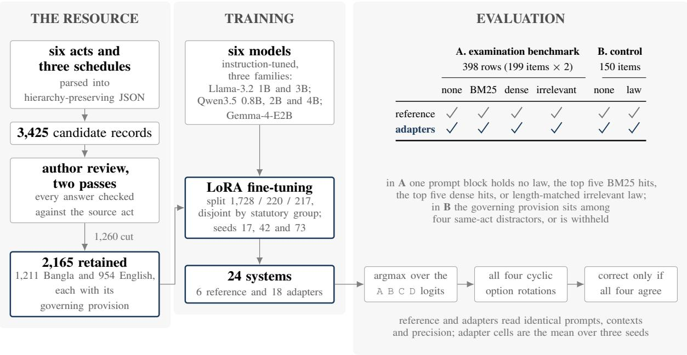

# Do Small Models Use the Law You Give Them? Measuring Context Use on a Bilingual Bangladesh Legal Benchmark

Moniruzzaman Mahadi1, Abrar Mohammed Tanzim Alam1, Sayma Siddika Monalisa1 Mir Mohammad Asif Abdullah1, Swakkhar Shatabda2, Md Adnan Arefeen1

1North South University 2BRAC University

HuggingFace/Datasets/Bangladesh-Legal-QA

Correspondence: momahadi9664@gmail.com

## Abstract

Fine-tuning can improve legal questionanswering accuracy without improving how models use law supplied in context. We study this distinction in bilingual Bangladeshi legal QA, where observed errors can arise from answer scoring, retrieval, or failure to use relevant law. We construct a hierarchypreserving statutory corpus, 2,165 reviewed bilingual fine-tuning examples, and a 150- item supplied-law control. We evaluate six instruction-tuned models: Llama-3.2-1B, Llama-3.2-3B, Qwen3.5-0.8B, Qwen3.5-2B, Qwen3.5-4B, and Gemma-4-E2B, with three LoRA seeds per model. To separate effects, we combine constrained option-letter scoring, cyclic option rotation, and controlled removal of the governing provision. On 398 Bar Council outputs, an exact-line parser attributes an accuracy gain of 50.0% to the Qwen3.5-2B seed-42 adapter, whereas option scoring yields only 3.0%. For Gemma-4-E2B, the two scoring methods favor different systems. When the governing provision is guaranteed to be present, five of six reference models improve by 14.7%–19.3% under the four-order criterion. Removing that provision reduces accuracy by 8.0%–15.3% for models and by 13.8%–14.9% points for their adapters. However, difference-in-differences estimates show no increase in reliance on the governing provision after fine-tuning. Results show that legal adaptation claims require separating scorer, retriever, and model effects. Our Code and data are available at https: //anonymous.4open.science/r/ bangladesh-legal-qa-11E3.

## 1 Introduction

Fine-tuning can appear to improve legal question answering without improving a model’s use of the law provided in context. In multiple-choice legal QA, observed accuracy depends not only on whether a model identifies the correct answer, but also on whether the relevant law was retrieved, whether the model used that law correctly, and whether the evaluation procedure correctly interprets the model’s output. Conflating these sources of error can therefore produce misleading conclusions about what fine-tuning has actually learned. We study MCQs where sections of Bangladeshi law are supplied as context. We observe that a wrong answer can reflect three different failures: retrieval may miss the relevant section, the model may fail to use a section that is present, or the evaluation procedure may misread the model’s answer. Figure 1 summarizes how our evaluation separates these failures.

We evaluate six instruction-tuned models before and after LoRA fine-tuning. For each model, we train three adapters on 2,165 reviewed bilingual examples. Each training example pairs a question with the section of Bangladeshi law needed to answer it. We evaluate on the 2022–2023 Bangladesh Bar Council examinations in Bangla and machinetranslated English.

Fine-tuning also teaches the required MCQ answer format, FINAL ANSWER: (A|B|C|D). This creates a scoring problem: an exact-line parser can reward correct formatting as well as the answer itself. On the same 398 Bar Council rows, the Qwen3.5-2B seed-42 adapter gains 50.0% over the original model under exact-line parsing, but only 3.0% when the answer is read from next-token scores. For Gemma-4-E2B, the two methods favor different systems.

Our primary evaluation therefore avoids parsing generated answers. We append FINAL ANSWER and select the highest-scoring answer letter, following option-ID scoring (Robinson et al., 2023). Option order is a separate source of instability. We therefore rotate the four choices through all four positions and require the correct answer in every rotation, following CircularEval (Liu et al., 2024).

In this way, the error in parsing is reduced, but retrieval remains uncertain. As Bar Council keys do not identify the governing section, a wrong answer cannot indicate whether the retrieval missed the right section or the model failed to use it. We therefore construct 150 new bilingual MCQs. Each contains the governing section and four distractor sections from the same act, so the right section is guaranteed to be present. Before fine-tuning, five of six models gain 14.7–19.3% over no law under the four-order criterion; all five 95% confidence intervals lie above zero. For these five models, we then replace the governing section with another section from the same act, leaving five sections in the prompt but no governing section. Accuracy falls by 8.0–15.3% before fine-tuning and 13.8– 14.9% after fine-tuning.

  
Figure 1: Study design. Panel B places the governing provision in the prompt, removing retrieval failure. The scoring chain then reads the answer from the option-letter logits, removing format from the measurement, and keeps it only if it survives all four option orders. A tick marks each executed arm.

To test whether fine-tuning specifically increases reliance on supplied law, we compare the benefit of the governing section before and after finetuning. Difference-in-differences estimates show no detectable increase in reliance on the governing section.

Contributions: We contribute (1) a hierarchypreserving Bangladesh statutory corpus and an author-reviewed bilingual fine-tuning set; (2) a 150- item supplied-law control and an evaluation protocol that separates scoring, retrieval, and model failure; and (3) a six-model, three-seed evaluation showing that fine-tuning changes answer behavior but does not detectably increase reliance on the supplied governing law. We release per-item outputs, frozen retrieval inputs, manifests, and analysis scripts to support reproducibility (Appendix J).

## 2 Related Work

Bangladesh legal QA. MINA evaluates a bilingual, tool-using assistant on the same 2022 and 2023 Bar Council examinations (Wasi et al., 2026). Its strongest MCQ systems combine a proprietary model with retrieval or tools and average five runs without reported option-order rotation. A second study evaluates four models on 250 Bangla questions from a legal-help forum; three licensed legal professionals evaluate the same set and identify fabricated citations and unsafe advice (Aftahee et al., 2025). These studies establish the local legal QA setting, but neither isolates whether an error comes from missing law, failure to use supplied law, or scoring.

Legal benchmarks and retrieval. LexGLUE standardizes seven English legal NLU datasets, including five-choice CaseHOLD (Chalkidis et al., 2022), while LegalBench covers 162 tasks across six forms of legal reasoning (Guha et al., 2023). Our setting is narrower: whether small models use supplied sections of Bangladeshi law to select answers in Bangla and English. Retrieval studies show why context availability must be separated from context use. LegalBench-RAG emphasizes precise legal-span retrieval over broad chunks (Pipitone and Alami, 2024); NitiBench finds that existing retrievers struggle with complex Thai legal queries (Akarajaradwong et al., 2025); and disrupting coherence in retrieved United States opinions changes recall non-monotonically (Xia et al., 2025). Our supplied-law control instead guarantees that the governing section is present, allowing context use to be tested without retrieval failure.

MCQ evaluation. MCQ results can also depend on evaluation design. Option reordering can shift accuracy by 13% to 85% across option orders (Pezeshkpour and Hruschka, 2024), while option-ID priors can bias selection (Zheng et al., 2024). Prompt format can reverse model comparisons (Sclar et al., 2024), and minor evaluation changes can move leaderboard ranks by up to eight places (Alzahrani et al., 2024). Implementation choices therefore matter for reproducible evaluation (Biderman et al., 2024). In legal evaluation, Greek-BarBench validates model judges against experts (Chlapanis et al., 2025), while Held and Habernal (2025) report format validity rising from 0.620 to 0.992 after fine-tuning even though another model still wins the task.

We adopt two established controls unchanged. CircularEval requires correctness under every cyclic option shift (Liu et al., 2024). Option-ID scoring reads label logits rather than generated text (Robinson et al., 2023), avoiding surface-form competition that can misrank choices (Holtzman et al., 2021). Together with our supplied-law control, these methods separate scoring and retrieval failure from model answer selection.

## 3 Data and Evaluation Sets

Corpus. The corpus covers six acts in the Bangladesh Bar Council syllabus: the Penal Code 1860, Code of Criminal Procedure 1898, Evidence Act 1872, Code of Civil Procedure 1908, Specific Relief Act 1877, and Limitation Act 1908. We also include CPC Schedule I, CrPC Schedule II, and Limitation Act Schedule I. English text comes from the official Bangladesh law portal (http: //bdlaws.minlaw.gov.bd/); Bangla text comes from published act collections. Appendix A records the sources and the conversion that preserves the hierarchy from act to clause.

Fine-tuning data. We construct three types of training records. A single-hop record starts from one legal section and asks a question that can be answered directly from that section. An advancedselection record starts from five sections of the same act: one contains the rule needed to answer the question and four are distractors. A bar-examstyle record starts from an MCQ drawn from examination materials other than the 2022–2023 examinations used for evaluation. It is paired with the section needed to answer it and four distractor sections. Appendix B gives the construction details.

These procedures produced 3,425 candidate records. Two author review passes retained 2,165: 1,211 Bangla and 954 English. The retained set contains 795 single-hop, 712 advanced-selection, and 658 bar-exam-style records (Appendix D). Every retained answer was checked against its cited section, and incomplete, repetitive, or cross-act items were removed. No legal expert reviewed the full fine-tuning set.

Training format. Although advanced-selection and bar-exam-style records are constructed using five sections, the final fine-tuning prompt supplies only the one section needed to answer the question. We call this the governing section. For MCQs, the prompt requires the model to return one line in the form FINAL ANSWER: (A|B|C|D) and maps Bangla option labels to these letters. The 1,728-row training split contains 541 MCQs, so fine-tuning directly teaches this answer format. The supplied training section has a median length of 209 characters. At evaluation, retrieved context instead contains five sections, with a median rendered length of 2,002 characters.

## 3.1 Bar Council Evaluation Set

We evaluate on the original Bangla questions and official answer keys from the 2022 and 2023 Bangladesh Bar Council examinations, together with English machine translations. We exclude cancelled item 2022-005 in both languages. This leaves 199 unique questions. Each question is evaluated in Bangla and English, giving 398 question– language pairs. Different retrieval contexts, option rotations, and training seeds repeat these same questions; they do not create additional independent test questions.

The English translations received no legal-expert review. We therefore audit them with two model judges from a vendor different from the translator (Appendix H); this is an audit, not legal validation. To test whether the judges can detect obvious translation errors, we deliberately introduce 16 clear option substitutions. The weaker judge detects only 3. The stronger judge also flags 29 otherwise unchanged pairs (Table 15). Because those flags may include real translation problems or false positives, we repeat the English analysis after removing the 8 items it judges answer-changing and, more conservatively, after removing all 25 flagged items that never received an artificial error. The estimates change by at most 0.8% and 2.1%, respectively, and no result changes sign (Appendix I). These checks make gross translation errors unlikely to explain the English results, but they do not establish legal correctness or replace expert review.

The 2022–2023 examination questions were not used to create the training records. We also compare every examination question with every samelanguage training question and find no exact match. On a character-level similarity scale from 0 to 1, where larger values mean more similar wording, the closest pair scores 0.717. A second comparison based on shared five-character spans reaches 0.463. The closest pair tests the same Limitation Act rule but uses different wording. These checks measure wording overlap only; they do not rule out overlap in legal content or exposure during pretraining.

## 3.2 Supplied-Law Control

The Bar Council answer keys identify the correct option but not the legal section needed to answer each question. We therefore cannot tell whether a wrong answer occurs because retrieval failed to provide the right section or because the model failed to use a section that was present. To remove this uncertainty, we construct 150 new MCQs, balanced across Bangla and English and the six acts. Each question is shown with five sections from the same act: the governing section and four distractors. The section needed to answer the question is therefore always present. The full context has a median length of 1,643 characters and a maximum of 1,948, within the 2,000-character evaluation budget.

Because these questions are newly constructed, we check whether simple shortcuts can reveal the correct answer without actually using the law. Choosing the longest option gives 26% accuracy. A second rule based only on answer length gives 25%. Choosing the option that shares the most text with the supplied law gives 37%. Random guessing gives 25%. These checks test whether obvious surface patterns can solve the questions; they are not our main evaluation, which rotates all four answer choices and requires the correct answer in every rotation.

<table><tr><td>Reviewer</td><td></td><td>Good Acceptable Needs work</td><td></td></tr><tr><td>Law graduate</td><td>120</td><td>28</td><td>2</td></tr><tr><td>Law master&#x27;s student</td><td>148</td><td>一</td><td>2</td></tr></table>

Table 1: Review of the 150 supplied-law control items. The 28 acceptable ratings cite minor style concerns (option length, distractor difficulty, terminology mixing). The four items flagged as needing work do not overlap. Both reviewers confirmed that no answer is incorrect given its cited provision. No items were changed; peritem ratings are not released.

GPT-5.6-Luna drafted the control questions in Bangla and English. It is not from any evaluated model family, and the control was fixed before we examined outputs from the evaluated models. Two authors then checked every question, option, answer key, and cited section and removed 20 items.

Independent legal review. After all experiments, two legally trained reviewers independently assess every control item against its governing section. Neither sees model outputs, experimental results, or the other reviewer’s ratings. Both confirm every answer key, and no key is changed (Table 1).

The release preserves the exact inference contexts. Schedule text remains English for Bangla schedule items; 14 of 75 Bangla control items contain at least one majority-English passage. Reference and adapter always receive the same string.

## 4 Method

The method separates three effects: whether scoring changes the measured fine-tuning gain, whether models use a legal section known to be present, and whether fine-tuning increases the benefit of that section.

Training and evaluation context. Fine-tuning supplies one governing section per question; retrieval evaluation supplies five candidate sections. Training on five sections would roughly triple median prompt length and exceed our 1,536-token training budget on a single T4 GPU. We therefore test transfer from one-section training to evaluation with four distractors.

Scope. We measure whether statutory text changes answer selection, not legal reasoning or practice. Bar Council keys identify the correct option but not the governing section. BM25 and dense retrieval therefore describe how sections are retrieved, not a guarantee that the correct section is present.

Direct option scoring. The primary scorer avoids generated-text parsing. We append FINAL ANSWER: ( to the prompt and select the highestscoring next token among A, B, C, and D. This removes format parsing. We call this constrained option-letter scoring, following option-ID scoring (Robinson et al., 2023).

Option rotation. Models may prefer an answer position independently of the answer text. We therefore rotate the four choices through all positions while moving the correct key with its text. An item is correct only if the model selects the correct answer in every rotation. This is CircularEval (Liu et al., 2024); we call the outcome strict consistency. Random guessing scores $( 1 / 4 ) ^ { 4 } = 0 . 3 9 \%$ and always choosing one letter scores zero. All main results use strict consistency unless stated otherwise.

Model pairs. For each model, the original instruction-tuned checkpoint is the reference; the fine-tuned system (FT) adds an unmerged LoRA adapter (Hu et al., 2022). We train adapters with seeds 17, 42, and 73. Within each pair, model revision, template, prompt, context, precision, runtime, and scorer are identical.

We evaluate Llama-3.2 at 1B and 3B (Meta AI, 2024); Qwen3.5 at 0.8B, 2B, and 4B (Qwen Team, 2026); and Gemma-4-E2B, with 2.3B effective and 5.1B total parameters (Gemma Team, 2026). Qwen uses FP16 LoRA; Llama and Gemma use NF4 QLoRA (Dettmers et al., 2023).

Evaluation conditions. The Bar Council evaluation uses no legal context (none), the top five sections from lexical BM25 retrieval (Robertson and Zaragoza, 2009), or the top five from a fixed BGE-M3 dense retriever (Chen et al., 2024). Retrieved context is capped at 2,000 characters. The supplied-law control gives five same-act sections, including the governing section. Its matched withheld condition replaces that section with another from the same act, leaving five sections but no governing section. A length-matched irrelevant condition tests whether additional legal text alone changes performance. Appendix E records the protocol chronology and repair of this condition.

Scorer diagnostic. To isolate the effect of scoring, we also generate free-form answers for the same 398 Bar Council rows under dense retrieval and one fixed option order. For each reference and seed-42 adapter, we compare an exact parser that accepts only FINAL ANSWER: ([ABCD]), a lenient parser that searches the output for an answer letter, and the direct scorer above.

## 5 Experimental Setup

Data split. We divide the 2,165 fine-tuning records into training, validation, and internal test sets of 1,728, 220, and 217 records. Records based on the same act and section stay in the same split. The 2022–2023 Bar Council benchmark is kept separate and is not used during training or model selection. Appendix C gives the full training details.

Statistical analysis. The 199 Bar Council questions are the independent test items; languages, contexts, option orders, and training seeds repeat questions rather than add independent items. Tables report each original model and mean of three fine-tuned adapters. All accuracy differences are absolute on the 0–100 percentage scale, not relative changes.

Confidence intervals use 10,000 questiongrouped bootstrap samples. We use two-sided exact McNemar tests for paired strict outcomes, with Holm correction across 12 tests per model: two languages, two retrieval methods, and three finetuning seeds.

Does fine-tuning increase the benefit of supplied law? A fine-tuned model can improve even when no law is provided. A general fine-tuning gain therefore does not show that the model has become more dependent on the supplied law. We instead compare how much context helps before and after fine-tuning.

Let RefC and FTC denote strict-consistency accuracy before and after fine-tuning when context C is supplied:

$$
( { \mathrm { F T } } _ { C } - { \mathrm { F T } } _ { \mathrm { n o n e } } ) - ( { \mathrm { R e f } } _ { C } - { \mathrm { R e f } } _ { \mathrm { n o n e } } ) .
$$

The first difference measures how much context helps after fine-tuning. The second measures how much it helps before fine-tuning. A positive value means the context provides a larger benefit after fine-tuning. We call this context specificity.

For the supplied-law control, C is the condition containing the governing section. For the Bar Council evaluation, the main table averages the BM25 and dense estimates because both retrieval methods are tested. The pre-specified fallback uses dense retrieval versus no context. Appendix F reports both retrieval methods separately. No sign changes under the dense-only analysis.

Bootstrap intervals for these descriptive comparisons are unadjusted. Holm correction applies only to the McNemar tests above.

<table><tr><td></td><td colspan="3">reference (%)</td><td colspan="3">FT mean (%)</td><td colspan="3">FT − ref (95% CI)</td></tr><tr><td>Model</td><td></td><td></td><td></td><td>none law w/o none law w/o</td><td></td><td></td><td>none</td><td>law</td><td>w/o</td></tr><tr><td>Llama-3.2-1B</td><td></td><td></td><td></td><td></td><td></td><td></td><td>28.7 27.3 24.0 44.9 41.8 35.3 +16.2 [+10.4, +22.4]</td><td> $+ 1 4 . 4 \left[ + 7 . 6 , + 2 1 . 3 \right]$ </td><td> $+ 1 0 . 7 \ [ + 4 . 2 , + 1 7 . 3 ]$ </td></tr><tr><td>Qwen3.5-0.8B</td><td></td><td></td><td>38.7 57.3 49.3 52.0 71.8 57.8</td><td></td><td></td><td></td><td> $+ 1 3 . 3 \ [ + 7 . 8 , + 1 9 . 3 ]$ </td><td> $+ 1 4 . 4 \ [ + 8 . 0 , + 2 1 . 1 ]$ </td><td> $+ 8 . 4 \ : [ + 2 . 0 , + 1 5 . 1 ]$ </td></tr><tr><td>Llama-3.2-3B</td><td></td><td></td><td>50.7 68.0 58.0 53.8 70.2 55.3</td><td></td><td></td><td></td><td> $+ 3 . 1 \ \bar { [ - 2 . 2 , + 8 . 4 ] }$ </td><td> $+ 2 . 2 \ [ - 4 . 7 , + 8 . 9 ]$ </td><td> $- 2 . 7 \ [ - 9 . 1 , + 3 . 6 ]$ </td></tr><tr><td>Qwen3.5-2B</td><td></td><td></td><td>57.3 76.7 64.0 60.0 78.4 63.6</td><td></td><td></td><td></td><td> $+ 2 . 7 \ [ - 2 . 0 , + 7 . 3 ]$ </td><td> $+ 1 . 8 \ [ - 3 . 8 , + 7 . 3 ]$ </td><td> $- 0 . 4 \left[ - 6 . 9 , + 6 . 2 \right]$ </td></tr><tr><td>Gemma-4-E2B</td><td></td><td></td><td>70.0 84.7 69.3 58.9 78.7 64.4</td><td></td><td></td><td></td><td> $- 1 1 . 1 \ [ - 1 7 . 6 , - 4 . 9 ]$ </td><td> $- 6 . 0 \left[ - 1 1 . 3 , - 0 . 7 \right]$ </td><td> $- 4 . 9 \left[ - 9 . 8 , - 0 . 2 \right]$ </td></tr><tr><td> $\mathrm { Q w e n } 3 . 5 – 4 \mathrm { B }$ </td><td></td><td></td><td></td><td>76.7 94.0 79.3 69.1 91.1 77.1</td><td></td><td></td><td> $- 7 . 6 [ - 1 3 . 6 , - 1 . 8 ]$ </td><td> $- 2 . 9 \left[ - 6 . 9 , + 1 . 1 \right]$ </td><td> $- 2 . 2 \ [ - 6 . 9 , + 2 . 4 ]$ </td></tr></table>

Table 2: Results on the 150 supplied-law control questions using strict consistency, which requires the correct answer in all four option orders. none gives no legal context; law gives the governing section plus four same-act distractors; w/o uses the same five-section setup but replaces the governing section with another same-act section. Ref is the original model and FT mean is the mean over three fine-tuning seeds. FT−ref is their accuracy difference within each condition; brackets show the 95% confidence interval. Bold marks the highest accuracy in each row.

<table><tr><td></td><td colspan="2">none</td><td colspan="2">BM25</td><td colspan="2">dense</td><td colspan="2">irrelevant</td><td colspan="3">context specificity</td></tr><tr><td>Model</td><td>Ref</td><td>FT</td><td>Ref</td><td>FT</td><td>Ref</td><td>FT</td><td>Ref</td><td>FT</td><td>R-N</td><td>R-I</td><td>Holm</td></tr><tr><td>Bangla</td><td></td><td></td><td></td><td></td><td></td><td></td><td></td><td></td><td></td><td></td><td></td></tr><tr><td>Llama-3.2-1B</td><td>0.5</td><td>5.5</td><td>0.5</td><td>8.5</td><td>2.013.1</td><td></td><td>0.5</td><td>6.0</td><td> $+ 4 . 5 [ + 0 . 9 , + 8 . 1 ]$ </td><td> $+ 4 . 0 \ [ + 0 . 0 , + 8 . 2 ]$ </td><td>6/6</td></tr><tr><td>Qwen3.5-0.8B</td><td>3.5</td><td>4.0</td><td>11.6</td><td>17.3</td><td>19.6</td><td>24.1</td><td>6.0</td><td>7.4</td><td> $+ 4 . 6 \left[ + 1 . 2 , + 8 . 0 \right]$ </td><td>+3.8 [−0.4, +7.9]</td><td>1/6</td></tr><tr><td>Llama-3.2-3B</td><td>6.5</td><td>5.7</td><td>12.1</td><td>17.1</td><td>14.1</td><td>23.6</td><td>4.0</td><td>8.4</td><td> $+ 8 . 1 \ [ + 3 . 7 , + 1 2 . 6 ]$ </td><td>+2.9 [−1.8, +7.7]</td><td>3/6</td></tr><tr><td>Qwen3.5-2B</td><td>2.5</td><td>6.4</td><td>19.1</td><td>20.8</td><td>23.1 26.8</td><td></td><td>6.5 7.2</td><td></td><td> $- 1 . 2 \left[ - 5 . 5 , + 3 . 0 \right]$ </td><td>+2.0 [−2.2, +6.1]</td><td>0/6</td></tr><tr><td>Gemma-4-E2B</td><td>8.5</td><td>7.5</td><td>27.1</td><td>26.3</td><td>37.7</td><td>32.8 11.1</td><td></td><td>6.4</td><td>-1.8 [−6.2, +2.6]</td><td>+1.8 [−2.1, +5.9]</td><td>0/6</td></tr><tr><td>Qwen3.5-4B</td><td>9.5</td><td>11.7</td><td>24.1</td><td>27.6</td><td>28.6 36.5</td><td></td><td>11.1 10.9</td><td></td><td>+3.5 [−0.3, +7.2]</td><td>+5.9 [+1.8, +10.2]</td><td>2/6</td></tr><tr><td>English</td><td></td><td></td><td></td><td></td><td></td><td></td><td></td><td></td><td></td><td></td><td></td></tr><tr><td>Llama-3.2-1B</td><td></td><td></td><td></td><td></td><td>8.5 15.4 11.6 25.5 15.6 34.8</td><td></td><td>4.0 10.2</td><td></td><td> $+ 9 . 7 \ [ + 4 . 3 , + 1 5 . 2 ]$ </td><td>+10.4 [+5.1, +15.5]</td><td>6/6</td></tr><tr><td>Qwen3.5-0.8B</td><td></td><td>11.613.2</td><td>24.633.2</td><td></td><td>31.2 41.4</td><td></td><td>7.011.2</td><td></td><td> $+ 7 . 7 \ [ + 3 . 1 , + 1 2 . 3 ]$ </td><td>+5.2 [+0.1, +10.2]</td><td>6/6</td></tr><tr><td>Llama-3.2-3B</td><td>20.1</td><td>19.1</td><td>34.7 37.5</td><td></td><td></td><td>43.742.917.6 18.8</td><td></td><td></td><td> $+ 2 . 0 \left[ - 3 . 4 , + 7 . 3 \right]$ </td><td>-0.2 [−5.3, +4.9]</td><td>0/6</td></tr><tr><td>Qwen3.5-2B</td><td>14.6</td><td>20.8</td><td>36.7</td><td>38.7</td><td>38.7</td><td>45.413.615.9</td><td></td><td></td><td> $- 1 . 8 \left[ - 6 . 9 , + 3 . 3 \right]$ </td><td>+2.0 [−3.2, +7.3]</td><td>0/6</td></tr><tr><td>Gemma-4-E2B</td><td></td><td>21.1 21.1</td><td>37.7</td><td>35.8</td><td>49.7</td><td>45.2 19.6 15.6</td><td></td><td></td><td> $- 3 . 2 \left[ - 7 . 5 , + 1 . 3 \right]$ </td><td> $+ 0 . 8 \ [ - 3 . 6 , + 5 . 4 ]$ </td><td>0/6</td></tr><tr><td>Qwen3.5-4B</td><td></td><td></td><td></td><td></td><td></td><td>28.1 29.6 44.2 41.2 50.8 53.1 25.1 24.0</td><td></td><td></td><td> $- 1 . 8 \bar { [ - 7 . 0 , + 3 . 1 \bar { ] } }$ </td><td> $+ 0 . 8 \left[ - 3 . 3 , + 5 . 0 \right]$ </td><td>0/6</td></tr></table>

Table 3: Results on the 199 Bar Council questions using strict consistency, which requires the correct answer in all four option orders. Ref is the original model; FT is the mean over three fine-tuning seeds. R−N measures whether fine-tuning changes the benefit of retrieved law relative to no legal context. R−I makes the same comparison using length-matched irrelevant legal text instead of no context. Holm reports how many of the six McNemar tests remain significant after correction. Bold marks the higher Ref or FT score within each condition, not statistical significance.

## 6 Results

Results follow the evaluation sequence in Figure 1. We first show how scoring changes the measured fine-tuning gain, then test whether models use a governing section known to be present. Finally, we return to Bar Council questions, where that section must be retrieved.

## 6.1 Scoring Can Change the Measured Fine-Tuning Gain

We score the same 398 dense-retrieval rows at one fixed answer order in three ways. For Qwen3.5-2B, reference accuracy is 4.0% with exact-line parsing, 33.2% with lenient parsing, and 51.0% with direct A/B/C/D scoring. The seed-42 adapter scores 54.0% under all three. The measured fine-tuning gain is therefore +50.0%, +20.9%, or +3.0% on the same model and questions. Tables 4 and 14

<table><tr><td rowspan="2">Model</td><td rowspan="2">format</td><td colspan="3">FT gain</td></tr><tr><td>Ref. (%) exact-line</td><td>lenient</td><td>logit</td></tr><tr><td>Qwen3.5-2B</td><td>5.8</td><td>+50.0</td><td>+20.9</td><td>+3.0</td></tr><tr><td>Llama-3.2-1B</td><td>6.0</td><td>+39.7</td><td>+10.3</td><td>+1.8</td></tr><tr><td>Qwen3.5-0.8B</td><td>80.7</td><td>+9.8</td><td>+6.5</td><td>+3.5</td></tr><tr><td>Gemma-4-E2B</td><td>80.9</td><td>+10.1</td><td>+10.1</td><td>-2.5</td></tr><tr><td>Llama-3.2-3B</td><td>81.7</td><td>+9.3</td><td>+0.8</td><td>+2.8</td></tr><tr><td>Qwen3.5-4B</td><td>98.7</td><td>-0.8</td><td>-1.3</td><td>+0.0</td></tr></table>

Table 4: Effect of scoring method on the measured finetuning gain for the same 398 dense-retrieval rows. Ref. format is the percentage of reference outputs that follow the required answer format. FT gain is seed-42 adapter accuracy minus reference accuracy.

show all six models.

The gap comes partly from formatting. Finetuned MCQ models were trained to produce the required answer line; reference models were not. Qwen3.5-2B follows that format in only 5.8% of reference generations. Exact-line parsing therefore

<table><tr><td></td><td colspan="3">Bangla</td><td colspan="3">English</td></tr><tr><td>System</td><td>rot0</td><td>strict</td><td>drop</td><td>rot0</td><td>strict</td><td>drop</td></tr><tr><td>Llama-3.2-1B</td><td>34.7</td><td>2.0</td><td>32.7</td><td>47.2</td><td>15.6</td><td>31.7</td></tr><tr><td>Llama-3.2-3B</td><td>42.7</td><td>14.1</td><td>28.6</td><td>61.3</td><td>43.7</td><td>17.6</td></tr><tr><td>Qwen3.5-0.8B</td><td>44.2</td><td>19.6</td><td>24.6</td><td>51.8</td><td>31.2</td><td>20.6</td></tr><tr><td>Qwen3.5-2B</td><td>45.2</td><td>23.1</td><td>22.1</td><td>56.8</td><td>38.7</td><td>18.1</td></tr><tr><td>Qwen3.5-4B</td><td>55.8</td><td>28.6</td><td>27.1</td><td>67.8</td><td>50.8</td><td>17.1</td></tr><tr><td>Gemma-4-E2B</td><td>54.8</td><td>37.7</td><td>17.1</td><td>61.8</td><td>49.7</td><td>12.1</td></tr></table>

Table 5: Effect of option order on reference models under dense retrieval. rot0 is accuracy at one fixed order; strict requires the correct answer in all four orders; drop is rot0 minus strict.

measures formatting as well as answer selection;   
direct A/B/C/D scoring removes that step.

Scoring can also change which system wins. For Gemma-4-E2B, exact-line parsing gives the adapter a +10.1% advantage, while direct scoring gives a −2.5% disadvantage. This reversal holds across seeds (Appendix G), although the Gemma adapter shows signs of over-adaptation. For Qwen3.5-4B, format compliance is 98.7%, and the two gains differ by only 0.8%. The scorer effect is therefore not monotonic across models.

Answer order creates a separate instability. Under dense retrieval, reference-model Bangla position spread ranges from 13.6% to 57.3% (Table 10). Table 5 shows the drop when correctness is required in all four orders.

All results below therefore use direct A/B/C/D scoring and strict consistency.

## 6.2 Supplied Law Helps Five of Six Models

We next remove retrieval uncertainty by guaranteeing that the governing section is present. On the same 150 control questions, Table 2 compares no law with five sections that include the governing section. Five of six reference models gain 14.7– 19.3% in strict accuracy. All five confidence intervals exclude zero, with lower bounds of at least +6.7% (Table 11). Qwen3.5-4B reaches 94.0%.

A post-hoc check tests whether lexical overlap explains the gain. On 92 questions where a wrong option shares more five-character spans with the law than the correct option, the same five models still gain 12.0–22.8% (Appendix G). Llama-3.2-1B remains the exception at −2.2%.

Llama-3.2-1B also shows why rotation matters. Its strict accuracy moves from 28.7% without law to 27.3% with law, a −1.3% change with interval [−7.3%, +4.7%]. At one fixed order, however, supplied law raises accuracy by 6.7%. Llama-3.2- 3B, from the same family and release, gains 17.3%

<table><tr><td rowspan="2">Reference</td><td colspan="2">law</td><td colspan="2">no law</td><td colspan="2">law effect</td></tr><tr><td>rot0</td><td>strict</td><td>rot0</td><td>strict</td><td>rot0</td><td>strict</td></tr><tr><td>Llama-3.2-1B</td><td>63.3</td><td>27.3</td><td>56.7</td><td>28.7</td><td>+6.7</td><td>-1.3</td></tr><tr><td>Qwen3.5-0.8B</td><td>74.7</td><td>57.3</td><td>58.0</td><td>38.7</td><td>+16.7</td><td>+18.7</td></tr><tr><td>Llama-3.2-3B</td><td>84.7</td><td>68.0</td><td>73.3</td><td>50.7</td><td>+11.3</td><td> $+ 1 7 . 3$ </td></tr><tr><td>Qwen3.5-2B</td><td>88.0</td><td>76.7</td><td>76.7</td><td></td><td> $5 7 . 3 \quad + 1 1 . 3 \quad$ </td><td> $+ 1 9 . 3$ </td></tr><tr><td>Gemma-4-E2B</td><td>92.7</td><td>84.7</td><td>79.3</td><td></td><td> $7 0 . 0 \ \ \ + 1 3 . 3$ </td><td> $+ 1 4 . 7$ </td></tr><tr><td>Qwen3.5-4B</td><td>98.7</td><td>94.0</td><td>86.7</td><td>76.7</td><td>1+12.0</td><td> $+ 1 7 . 3$ </td></tr></table>

Table 6: Reference-model accuracy on the 150 suppliedlaw control questions. “law” means the governing section is included with four same-act distractors; “no law” means no legal context is supplied. rot0 is accuracy at one fixed answer order, while strict requires the model to answer correctly in all four answer orders. Law effect is the difference between the law and no-law accuracies.

under strict consistency.

To test whether the governing section itself drives the gain, we remove only that section while keeping the four distractors. For the five responsive reference models, accuracy falls by 8.0–15.3%, with every confidence interval excluding zero (Table 12). Their three-seed adapter means fall by 13.8–14.9%. These models therefore depend on the governing section, not merely on other text from the same act.

## 6.3 Strict Consistency Measures Correctness and Position Stability

Strict consistency can improve because supplied law raises fixed-order accuracy, improves stability when options move, or both. Table 6 separates these effects.

At one fixed order, supplied law improves accuracy for all six models. For the five that also improve under strict consistency, the law effect is 1.3–8.0% larger under strict scoring. This suggests that supplied law also reduces answer-position sensitivity. Because fixed-order accuracy rises too, stability alone cannot explain the strict gain.

Llama-3.2-1B differs: its +6.7% fixed-order effect becomes −1.3% under strict consistency. Supplied law helps at one order, but the gain does not survive when the choices move.

## 6.4 Fine-Tuning Does Not Detectably Increase Dependence on Law

We next ask whether fine-tuning increases the benefit of supplied law. Without law, the two reference models below 40% gain 13.3% and 16.2% after fine-tuning. The next two gain 2.7% and 3.1%, while the two at or above 70% lose 7.6% and 11.1%.

With only six models, this is descriptive, not a scaling or model-family law.

Higher accuracy after fine-tuning does not show that supplied law became more useful. On the control, difference-in-differences estimates range from −1.8% to +5.1%, and every confidence interval includes zero (Table 11). For the four reference models below 60%, fine-tuning effects with and without law differ by at most 1.8%; the two strongest models decline in both conditions. Fine-tuning changes answer selection and preserves dependence on the governing section, but we detect no increase in that dependence.

## 6.5 Bangla Scores Lower, but the Law Effect Persists

Bar Council accuracy is lower in Bangla than in English (Table 3). On the supplied-law control, however, the five responsive models gain 13.3–21.3% in Bangla and 12.0–21.3% in English. Llama-3.2- 1B remains the exception at −4.0% and +1.3%. Removing translation pairs flagged in the audit leaves every context-specific sign unchanged (Appendix I).

## 6.6 The Bar Council Set Gives Weaker Evidence About Context Use

We finally return to the Bar Council questions. Their answer keys do not identify the governing section, so retrieval failure and failure to use retrieved law cannot be separated as in the supplied-law control.

Three models show positive difference-indifferences estimates with confidence intervals above zero when retrieval is compared with no context: +7.1% for Llama-3.2-1B, +6.2% for Qwen3.5-0.8B, and +5.1% for Llama-3.2-3B. We call this comparison R−N. Five of its twelve descriptive confidence intervals exclude zero, all positively.

As a sensitivity check, R−I compares retrieval with the length-matched irrelevant condition instead of no context. Three R−I intervals exclude zero. Nine of the 96 examination cells are at or below 5% (Table 13), limiting precision. The task also differs from training: adapters see one clean section during fine-tuning but five candidate sections at evaluation. Unlike the supplied-law control, the examination cannot tell whether retrieval supplied the governing section.

## 7 Discussion

The apparent fine-tuning effect changes once scorer, retriever, and model failure are separated.

Scoring sets the first boundary. Because MCQ training teaches the required answer format, generate-then-parse evaluation can credit formatting as legal adaptation. Constrained option scoring removes this parse failure, while full rotation exposes gains that depend on answer position. These controls measure answer selection, not explanation quality (Chlapanis et al., 2025).

The supplied-law control removes retrieval uncertainty. Five reference models improve when the governing provision is present; those models and their adapters decline when it is removed. Retrieval failure therefore cannot explain these effects. Llama-3.2-1B remains the exception: its fixed-order gain disappears under rotation, so position stability is part of the result.

With scoring and retrieval controlled, fine-tuning changes answer selection and preserves dependence on the governing provision, but we detect no increase in that dependence. Family, size, release, and precision vary across six models, limiting broader conclusions. The transferable result is the measurement sequence: separate scorer, retriever, and model failure before interpreting legal adaptation.

## 8 Conclusion

Five of six instruction-tuned checkpoints use supplied Bangladeshi statute under a rotation-invariant control: the governing provision improves accuracy by 14.7–19.3%, and removing it reduces accuracy by 8.0–15.3% for the five responsive reference models and 13.8–14.9% for their adapters. Yet exact-line parsing reports +50.0% where matched constrained scoring gives +3.0%, and reverses one model comparison. Single-provision fine-tuning changes answers without a detected increase in provision dependence; five-candidate training remains untested. Legal adaptation claims require separating scoring method, retriever, and model failure.

## Limitations

The task and sample bound the claim. The benchmark contains 199 questions from two examination years in one jurisdiction. Bangla and English rows, contexts, rotations, and seeds repeat those questions rather than adding independent test items. MCQ selection is a proxy for statutory knowledge, not legal reasoning or practice. Strict consistency also reflects option-order stability.

Training and evaluation differ by design. Training supplies one governing provision, whereas evaluation supplies five candidate sections. We therefore test transfer from clean law to distractorrich prompts, not training directly on that setting. Five-candidate training remains untested because of the available single-T4 compute budget. Our null result does not extend to that intervention.

The six checkpoints do not form a scaling study. The models differ in family, size, release, and precision, and all selected the upper edge of the learning-rate grid. Precision is matched within reference-adapter pairs but not across families. Relations between starting accuracy and fine-tuning effects are therefore descriptive.

Contamination cannot be ruled out. Public pretraining may contain the Bar Council examinations. One retained training item also tests the legal rule underlying one benchmark item, although the wording is not an exact match. Repeated development on the same 199 questions creates an additional risk of co-adaptation.

Resource validation remains incomplete. The English examination translations received no legalexpert review; model-based audits do not replace expert validation. Authors checked all 2,165 finetuning answers against their cited provisions, but no lawyer exhaustively reviewed the set.

GPT-5.6-Luna drafted the 150 supplied-law control items. Authors checked every item and removed 20; two legally trained reviewers later confirmed every retained answer key. The reviewers validated rather than authored the items.

Schedules exist only in English in our corpus, so 14 of 75 Bangla control items contain a majority-English passage. Matched systems receive identical contexts, but this limits language-specific interpretation.

The Bar Council examination provides no expert governing-provision labels. We therefore cannot report oracle retrieval or Recall@k, and cannot separate retrieval failure from context-use failure on those questions. The supplied-law control removes this uncertainty only for its 150 items.

The evaluation-method findings have different limitations. Parser inflation follows directly from evaluation that rewards an answer format taught during fine-tuning. The Gemma-4-E2B sign reversal is less general because evaluation-method effects and over-adaptation cannot be separated for that model. A format example at inference time was not tested.

## Ethics Statement

Legal question answering is sensitive. The evaluated systems are research artifacts and are not intended to provide legal advice. Even the strongest configurations fail under strict scoring, and the task omits drafting, citation verification, client facts, procedural judgment, and professional responsibility. Bar-exam performance is not evidence of competence to advise a person.

The release contains public statutes and examinations and no client records or personal data. We license generated questions, answers, annotations, translations, metadata, and arrangement under CC BY 4.0 only where we hold the rights. We claim no ownership over official statutory text or examination questions. The anonymous supplement removes author names, personal links, and identifying metadata.

Evaluation design also carries practical risk. A parser that rewards format compliance can overstate legal-QA progress. Separating answer selection from formatting and model failure from retrieval failure limits what can reasonably be inferred from the reported results.

Use of AI Assistants. The authors used AI writing tools, including ChatGPT and Claude, to improve manuscript fluency and clarity. Human authors remain responsible for the ideas, experiments, analyses, claims, integrity, and accuracy of the paper.

## References

Sabik Aftahee, A. F. M. Farhad, Arpita Mallik, Ratnajit Dhar, Jawadul Karim, Nahiyan Bin Noor, and Ishmam Ahmed Solaiman. 2025. Assessing the reliability of large language models in the Bengali legal context: A comparative evaluation using LLM-asjudge and legal experts. Preprint, arXiv:2511.05627.

Pawitsapak Akarajaradwong, Pirat Pothavorn, Chompakorn Chaksangchaichot, Panuthep Tasawong, Thitiwat Nopparatbundit, Keerakiat Pratai, and Sarana Nutanong. 2025. NitiBench: Benchmarking LLM frameworks on Thai legal question answering capabilities. In Proceedings of the 2025 Conference on Empirical Methods in Natural Language Processing, pages 34304–34327. Association for Computational Linguistics.

Norah Alzahrani, Hisham Alyahya, Yazeed Alnumay, Sultan AlRashed, Shaykhah Alsubaie, et al. 2024.

When benchmarks are targets: Revealing the sensitivity of large language model leaderboards. In Proceedings ofthe 62nd Annual Meeting ofthe Association for Computational Linguistics, pages 13787–13805.

Stella Biderman, Hailey Schoelkopf, Lintang Sutawika, Leo Gao, et al. 2024. Lessons from the trenches on reproducible evaluation of language models. Preprint, arXiv:2405.14782.

Ilias Chalkidis, Abhik Jana, Dirk Hartung, Michael Bommarito, Ion Androutsopoulos, Daniel Katz, and Nikolaos Aletras. 2022. LexGLUE: A benchmark dataset for legal language understanding in English. In Proceedings of the 60th Annual Meeting of the Association for Computational Linguistics, pages 4310– 4330.

Jianlyu Chen, Shitao Xiao, Peitian Zhang, Kun Luo, Defu Lian, and Zheng Liu. 2024. M3- Embedding: Multi-linguality, multi-functionality, multi-granularity text embeddings through selfknowledge distillation. In Findings of the Association for Computational Linguistics: ACL 2024, pages 2318–2335.

Odysseas S. Chlapanis, Dimitrios Galanis, Nikolaos Aletras, and Ion Androutsopoulos. 2025. GreekBar-Bench: A challenging benchmark for free-text legal reasoning and citations. In Findings ofthe Association for Computational Linguistics: EMNLP 2025, pages 25099–25119. Association for Computational Linguistics.

Tim Dettmers, Artidoro Pagnoni, Ari Holtzman, and Luke Zettlemoyer. 2023. QLoRA: Efficient finetuning of quantized LLMs. In Advances in Neural Information Processing Systems 36.

Gemma Team. 2026. Gemma 4 technical report. Preprint, arXiv:2607.02770.

Neel Guha, Julian Nyarko, Daniel E. Ho, Christopher Ré, et al. 2023. LegalBench: A collaboratively built benchmark for measuring legal reasoning in large language models. In Advances in Neural Information Processing Systems, volume 36.

Daniel Han, Michael Han, and Unsloth Team. 2023. Unsloth. Software repository, version 2026.7.6 as recorded in the run manifests. Accessed 2026-07-16.

Lena Held and Ivan Habernal. 2025. Contemporary LLMs struggle with extracting formal legal arguments. In Proceedings of the Natural Legal Language Processing Workshop 2025, pages 292–303. Association for Computational Linguistics.

Ari Holtzman, Peter West, Vered Shwartz, Yejin Choi, and Luke Zettlemoyer. 2021. Surface form competition: Why the highest probability answer isn’t always right. In Proceedings of the 2021 Conference on Empirical Methods in Natural Language Processing (EMNLP), pages 7038–7051. Association for Computational Linguistics.

Edward J. Hu, Yelong Shen, Phillip Wallis, Zeyuan Allen-Zhu, Yuanzhi Li, Shean Wang, Lu Wang, and Weizhu Chen. 2022. LoRA: Low-rank adaptation of large language models. In The Tenth International Conference on Learning Representations (ICLR).

Yuan Liu, Haodong Duan, Yuanhan Zhang, Bo Li, Songyang Zhang, Wangbo Zhao, Yike Yuan, Jiaqi Wang, Conghui He, Ziwei Liu, Kai Chen, and Dahua Lin. 2024. MMBench: Is your multi-modal model an all-around player? In Proceedings of the European Conference on Computer Vision (ECCV). Oral presentation. Introduces CircularEval.

Meta AI. 2024. Llama 3.2 model card. https://github.com/meta-llama/ llama-models/blob/main/models/ llama3\_2/MODEL\_CARD.md. Official model card for the Llama 3.2 1B and 3B releases.

Pouya Pezeshkpour and Estevam Hruschka. 2024. Large language models sensitivity to the order of options in multiple-choice questions. In Findings ofthe Associationfor Computational Linguistics: NAACL 2024, pages 2006–2017.

Nicholas Pipitone and Ghita Houir Alami. 2024. LegalBench-RAG: A benchmark for retrievalaugmented generation in the legal domain. Preprint, arXiv:2408.10343.

Qwen Team. 2026. Qwen3.5: Towards native multimodal agents. Qwen Blog. Official model announcement. Accessed 2026-07-17.

Stephen Robertson and Hugo Zaragoza. 2009. The probabilistic relevance framework: BM25 and beyond. Foundations and Trends in Information Retrieval, 3(4):333–389.

Joshua Robinson, Christopher Michael Rytting, and David Wingate. 2023. Leveraging large language models for multiple choice question answering. In The Eleventh International Conference on Learning Representations (ICLR).

Melanie Sclar, Yejin Choi, Yulia Tsvetkov, and Alane Suhr. 2024. Quantifying language models’ sensitivity to spurious features in prompt design or: How I learned to start worrying about prompt formatting. In The Twelfth International Conference on Learning Representations.

Azmine Toushik Wasi, Wahid Faisal, Mst Rafia Islam, and Md Rizwan Parvez. 2026. Mina: A multilingual LLM-powered legal assistant agent for empowering access to justice in Bangladesh. In Findings ofthe Associationfor Computational Linguistics: ACL 2026, pages 25980–26028. Association for Computational Linguistics.

Eric Xia, Karthik Srikumar, Keshav Karthik, Advaith Renjith, and Ashwinee Panda. 2025. Beyond the haystack: Sensitivity to context in legal reference recall. In Proceedings of the Natural Legal Language Processing Workshop 2025, pages 48–53. Association for Computational Linguistics.

Chujie Zheng, Hao Zhou, Fandong Meng, Jie Zhou, and Minlie Huang. 2024. Large language models are not robust multiple choice selectors. In The Twelfth International Conference on Learning Representations (ICLR).

## Appendix

Appendices A–E document the corpus, data, training, and protocol chronology; Appendices F–J give the retriever decomposition, the uncertainty intervals behind every reported difference, the translation audit, and the release.

## A Corpus Construction

The corpus follows the Bar Council syllabus. English statutory text comes from the official Bangladesh law portal maintained by the Ministry of Law, Justice and Parliamentary Affairs (http: //bdlaws.minlaw.gov.bd/). Bangla text comes from published act collections. The same Bangla renderings recur across several editions, so we treat them as standard published text without assigning them to one publisher. The corpus covers the Penal Code 1860 (Act XLV of 1860), Code of Criminal Procedure 1898 (Act V of 1898), Evidence Act 1872 (Act I of 1872), Code of Civil Procedure 1908 (Act V of 1908), Specific Relief Act 1877 (Act I of 1877), and Limitation Act 1908 (Act IX of 1908), plus CPC Schedule I, CrPC Schedule II, and Limitation Act Schedule I.

The three schedules are available only in English in our corpus. A Bangla question governed by a schedule keeps its Bangla question and options but receives English schedule text. The language label describes the question, not every passage in its prompt.

Parenthesized labels create the parsing problem. Bangladeshi statutes nest acts, parts, chapters, sections, subsections, clauses, and subclauses. Sections use Arabic numerals and a full stop (1.); subsections use parenthesized Arabic numerals ((1)); clauses use parenthesized lowercase letters ((a)); and subclauses use parenthesized Roman numerals ((i)). Illustrations and explanations may attach at any level. Illustrations also reuse labels such as (a), making them indistinguishable from clauses without context. An explicit heading always introduces an illustration sequence, so a regularexpression pass can separate the two before model processing. This pass lets the JSON retain each illustration under the provision it explains instead of flattening it into the clause list.

Conversion preserves the provision hierarchy. Each act receives its own schema-enforcing conversion prompt because formatting conventions differ across the corpus. The schema creates a root object for the act name, enactment date, preamble, and parts or chapters. A section stores its number, marginal note, text, and optional subsections, clauses, and illustrations; subsections and clauses recurse in the same form. Act-specific rules remove page headers, running titles, and line numbers; join lines broken inside sentences; recover marginal notes around section numbers; and record omitted or repealed sections. We revised each prompt until its output conformed, then inspected the files by hand.

Section 81 of the Penal Code shows what this buys. The converted object retains the chapter (general exceptions), marginal note, section text, explanation, and both illustrations as distinct labeled objects. At inference, the system can supply the provision without turning illustration numbering into clause noise.

## B QA Generation and Review

Three tasks increase the selection difficulty. Each language has one prompt for each of three categories, producing six prompt combinations. Single-hop extraction supplies one provision containing the answer. Advanced selection supplies exactly five verbatim corpus provisions, one governing provision and four distractors, and requires elimination. Bar-exam generation adds examination style. Its reference questions come from papers other than the 2022 and 2023 benchmark examinations; the generated item is paired with one governing provision and four corpus distractors. A Cancelled flag retains voided reference questions as explicit records. Unlike the official benchmark keys, bar-exam training keys are created during generation and checked during review.

The governing provision moves, but not uniformly. Both selection prompts require the correct candidate to vary from the first through fifth position with approximately equal frequency. Across 712 advanced-selection records, it appears in position 1 for 13.8%, position 2 for 50.4%, position 3 for 23.7%, position 4 for 7.0%, and position 5 for 5.1%. The correct provision does not stay in one slot, but the distribution has an unintended position bias. Because reference models also carry positional priors (Section 6), the primary metric scores every benchmark item under all four option orders.

The bar-exam category carries the main leakage risk. Its prompt sees examination-style reference material, but never the 2022 or 2023 benchmark papers. Reference items provide style only and do not enter the released records. Every retained record then passes two author checks against the source law. No same-language bar-exam training and benchmark pair matches exactly. The maximum character 5-gram Jaccard score is 0.463. SequenceMatcher reaches 0.717 for a Limitation Act schedule question paired with benchmark item 2022-086. Their wording differs, but both test the same limitation period. We therefore report substantive overlap instead of treating the absence of a verbatim match as proof of separation.

Prompts counter five recurring generation failures. Verbatim-copy rules prevent statutory paraphrase. Clause enumeration prevents partial coverage of long sections. A fixed question-type vocabulary and a no-repeat rule reduce duplicate scenarios. Requiring the act name first and the citation last guards against cross-act records. A pre-output checklist counters format drift over long runs. These constraints act during generation instead of filtering the failures afterward.

Human review retains 2,165 records. Authors checked every candidate against the source law. They verified each answer against its cited provision, checked that statutory quotations were copied without summary, and deleted or regenerated repetitive, cross-act, or materially incomplete records. The earliest preserved pre-filter pool contains 3,425 records; 2,165 remain, so 1,260 were removed. Review occurred during generation, so no per-record log exists. Identifier and questiontext checks confirm that the release is a strict subset (prefilter\_pool.py).

Generation prompt, single-hop extraction, English. Reproduced in the form used, with the example entry abbreviated. The other five prompts follow the same skeleton with category-specific constraint blocks, and all six are in the release.

Role: Expert Legal Educator and Subject Expert.   
Task: Analyze the provided JSON legal dataset and transform   
each section of the Act into a structured assessment and   
reference entry.   
[SFT Data Quality Context]   
You are generating supervised fine-tuning (SFT) data for   
smaller language models (0.6B-8B parameters). Your outputs   
are the training signal. Smaller models learn by pattern   
recognition: they need structural consistency. Length   
variance and format drift degrade SFT quality directly.   
[Jurisdiction & Corpus]   
Legal Corpus: Use only the Act names, section numbers, and   
legislative addresses provided in the dataset. Never invent

a Section number if the provision uses a different label. [Format & Schema] Output must be a strictly valid JSON array of objects. Schema per object: Section Number; Entry ID; Question ( plain layperson language, no legal jargon in the stem); Subsection/Clause; Section Text (full, verbatim); Answer; Type; Difficulty; Keywords; Cited Acts and Sections (must be the last key). [Field Rules: The Answer Field] Strict Opening: Must begin with "Under [Act Name]," followed immediately by the precise legislative address. Constraint: one to two sentences maximum, 25-45 words. [Constraint Guidelines] Verbatim Integrity: Copy "Section Text" exactly. Do not truncate, paraphrase, or reconstruct from memory. Client-Speak Rule: questions must sound like a client describing a problem. Scenario Freshness: each scenario must use a distinct factual context; do not reuse character names across consecutive entries. Multi-Clause Sections: generate one question targeting the most significant clause and note it in the "Subsection/Clause" field. [Pre-Output Quality Check] [ ] Is Section Text copied verbatim? [ ] Does the Answer start with "Under [Act Name]," and stay under 45 words? [ ] Is the Question written in plain, non-legal language? [ ] Is the JSON strictly valid with "Section Number" first and "Cited Acts" last?

The Bangla prompts are the same skeleton with the instruction text and the answer-field rules in Bangla, and with an additional type-selection procedure that draws from a fixed question-type vocabulary and forbids repeating a type consecutively. They are released as files rather than reproduced here because this template cannot typeset Bangla script.

Generation prompt, advanced selection, English. The constraint block that distinguishes this category from single-hop extraction. The rest of the prompt shares the skeleton above.

Possible Sections: A list of exactly 5 objects, each   
containing Section Number and Full Text (the correct   
section + 4 distractors). Full text must be copied verbatim   
from the law dataset.   
The governing section’s position - first, second, third,   
fourth, or fifth - must vary randomly across entries, with   
approximately equal frequency. Never default to always   
placing it first.   
Multi-Clause Sections: Target the specific clause that   
governs the scenario and note it in the Subsection/Clause   
field.

Generation prompt, bar-exam category, English. This category is pinned to a supplied reference file rather than composing freely, which is why its prompt speaks of copying rather than writing. The reference collection holds bar-examination-style questions from examinations other than the two we evaluate on; the model’s work here is locating the governing provision and the four distractors, not inventing the stem. We reproduce the prompt as run, and note that we can vouch for what was supplied to it, not for how that reference collection was itself assembled.

Task: You are provided bar examination questions from the supplied JSON dataset, each with multiple-choice options (A, B, C, D) and a known correct answer. For each question, identify the one governing legal provision from the supplied law dataset, produce a full Answer citing the relevant section, and state the correct option letter as the final element of the Answer field. Question: The verbatim question text from the bar exam JSON, exactly as written. Do not rephrase or correct.

Bar Exam Options: The options object from the bar exam JSON   
- keys A, B, C, D with their verbatim text. Copy exactly.   
Cancelled: Boolean. Set to true if correct answer in the   
bar exam JSON is "Cancelled" or equivalent. When true, set   
Relevant Section to "N/A" and Answer to "This question was   
cancelled in the original exam."   
Legal Corpus: Use only the Act names, section numbers, and   
legislative addresses that appear in the provided law   
dataset. Do not import terminology or citation formats from   
other jurisdictions.

The jurisdiction constraint in the last block exists because closed-book prompting produced confident citations to Indian statute in place of the Bangladeshi equivalent, which is the failure the corpus and the supplied context are meant to remove.

## C Training Details

All models use LoRA rank and alpha 16 on each linear language projection, effective batch 16, at most two epochs, and validation-loss early stopping. A one-epoch 512-record pilot selects from {5e−5, 1e−4, 2e−4}. Every model selects 2e−4, the upper boundary and Unsloth default (Han et al., 2023); we do not widen the grid. Each seed trains on one 16 GB T4.

Frozen prompt. Every system, in both arms and in training, receives the same system message:

You answer Bangladesh law questions using the supplied   
legal context when it is relevant. If the question contains   
answer options, return exactly one line and nothing else   
in this form: FINAL ANSWER: (A|B|C|D). For Bangla option   
labels, A, B, C, and D map to the four Bangla option glyphs.   
If the question has no answer options, answer the question   
directly.

The released bdlex\_core.py uses the Bangla option glyphs verbatim and normalizes Latin, numeric, and Bangla labels. Each user turn places the context after LEGAL CONTEXT: and the question after QUESTION:. The none condition instead supplies the literal string [NO CONTEXT PROVIDED]. Before scoring, marker matching in both languages removes cancelled items.

For every MCQ, the conversion writes the complete assistant target FINAL ANSWER: (X); direct-QA rows retain prose targets. The executed training split contains 541 MCQs and 1,187 direct-QA rows. At constrained evaluation, the prompt instead ends at the partial stem FINAL ANSWER: ( because the next-token logits over A, B, C, and D are the score. No closing parenthesis is generated or parsed on this route.

Training recipe. We hold one recipe fixed across all six models. It uses sequence length 1,536, perdevice batch 4, gradient accumulation 4, and effective batch 16. LoRA uses rank 16, alpha 16, no dropout, and all linear language-model projections (q,k,v,o,gate,up,down). Optimization uses 8-bit AdamW, weight decay 0.01, a cosine schedule, warmup ratio 0.06, and gradient clipping at 1.0. Gradient checkpointing is on, packing is off, and early stopping allows one validation-loss evaluation without improvement across at most two epochs. Because we add no tokens, embeddings and the output head remain frozen. Training uses Unsloth (Han et al., 2023). Two epochs at effective batch 16 produce 216 optimizer steps.

We split records by normalized (act, section) group with a fixed splitter seed. The result is 1,728 training, 220 validation, and 217 internal-test records, with no statutory group crossing a split. Each model is trained on one 16 GB T4 with seeds 17, 42, and 73.

Early stopping fired for Qwen3.5-2B seed 42 and for all three Qwen3.5-4B seeds, each halting at step 162 with the best checkpoint retained; every other run completed 216 steps. Final training and validation loss were 0.556/0.568 for Llama-3.2-1B, 0.432/0.460 for Llama-3.2-3B, 0.931/0.903 for Qwen3.5-0.8B, 0.796/0.768 for Qwen3.5-2B, 0.691/0.647 for Qwen3.5-4B, and 0.132/0.875 for Gemma-4-E2B, the only model whose validation loss finished far above its training loss.

Learning-rate pilots. Each pilot runs one epoch with seed 17 on the same deterministic 512-row training subset. Selection uses grouped validation loss over the pre-specified grid {5e−5, 1e−4, 2e−4}; ties within 0.005 go to the lower rate. Validation loss falls monotonically across the grid for all six models, so every model selects 2e−4. For Llama-3.2-1B, the three losses are 1.0002, 0.8490, and 0.7426. A pre-specified contingency would repeat a pilot at rank 32 if loss failed to improve by 0.02. It never fires.

Gemma-4-E2B corrections. The reported run is the second of seven attempts. We record the first attempt because three defects could each have caused its reversal. First, an unconstrained LoRA target pattern placed half the adapter on vision and audio components. Second, the template concatenated prompt and target, taking loss over both instruction and answer, while generation emitted an unseen empty reasoning block. Third, shuffled controls ignored language and length. The repair limits adaptation to 245 language-model projection modules, or 490 LoRA tensors, with no trainable multimodal parameter. It also masks prompt tokens from the target loss and draws shuffled candidates from the question’s language pool. The reported run passes all three checks.

The pre-repair run also degrades, from 26.4% to a 23.7% seed mean, but it is not a replication. It predates the audit, uses a 1,592-row pooled denominator instead of Table 3’s per-condition denominator, and lacks a separate directory of retained per-item outputs. We therefore cannot recompute it under the reported protocol. It shows only that the direction appeared before the three defects were repaired.

Within the reported run the seed-42 training crashed near the end on a learning-rate assertion and was benchmarked from un-converged weights, so we retrained that seed to its full 216 steps and benchmarked again.

A file-level comparison tests whether that crash explains the result. Reference, seed-17, and seed-73 files are byte-identical across the two executions; only seed 42 differs. Yet every strict-consistency cell, including the seed-42 column, is unchanged. The converged adapter changes individual predictions but not one rotation-invariant score. These executions are therefore one experiment with a repaired seed, not two independent replications.

Adapter scope, before and after the repair. The two adapters can be compared directly, and the leak is visible in their weights rather than only in our description of it. The pre-correction target pattern matched vision, audio\_tower, embed\_vision.embedding\_projection, and vision\_tower.patch\_embedder alongside the language projections. It adapted 494 modules, of which 249 were multimodal. The corrected pattern matches only language and text branches and adapts 245 modules, none multimodal, which is the 490 LoRA tensors reported above. Half of the first adapter’s capacity was spent outside the language model.

Training runs on this model. Gemma-4-E2B took seven training attempts, more than any other model. Table 7 lists the ones that recorded metrics. Only the second is reported in this paper; the rest are training diagnostics, none was benchmarked, and none contributes a number to any other table.

Three further attempts left no metrics: the first, superseded run, whose adapter config carries the multimodal leak described above; one with no submitted notebook; and one that crashed on a learning-rate assertion. A seventh run trained at

<table><tr><td>Run</td><td>LR</td><td>step</td><td>train</td><td>eval</td><td>gap</td></tr><tr><td>v20 reported</td><td>2e-4</td><td>216</td><td>0.132</td><td>0.875</td><td>+0.743</td></tr><tr><td>v4 gap stop</td><td>2e-4</td><td>54</td><td>0.129</td><td>0.990</td><td>+0.861</td></tr><tr><td>v9 gap stop</td><td>1e-5</td><td>30</td><td>0.571</td><td>3.967</td><td>+3.396</td></tr></table>

Table 7: Gemma-4-E2B training runs that recorded metrics. Seed means over three seeds. Only the first is benchmarked or reported elsewhere. Recomputed by gemma\_run\_ablation.py.

1e−5 under a relative-gap rule and reached step 216 for two seeds before we cancelled it with the gap still near 1.4. Only its notebook was archived, so we report its existence and not its losses.

What the diagnostics show. At 2e−4, the gap reaches 0.86 within 54 steps, one quarter of training. The 1e−5 run instead exposes a problem with the stopping instrument. It stops at step 30 even though the gap shrinks from +4.20 to +3.85 to +3.45. Gemma begins with validation loss 4.81, so an absolute-gap threshold exceeds its trigger at the first evaluation regardless of the trajectory. The stopping rule, not the learning rate, is at fault. A relative rule should stop only when the gap grows from its own minimum.

The conclusion is narrow. The default rate overadapts this model quickly. We do not know how a gentler rate changes its benchmark score because no lower-rate adapter completed training and scoring under the frozen protocol. Substituting a rescued recipe for Gemma would compare one tuned system with five untuned systems, so we do not do so.

## D Fine-tuning Set Composition

<table><tr><td>Act / schedule</td><td>S-hop EN/BN</td><td>Adv. EN/BN</td><td>Bar EN/BN</td><td>Tot.</td></tr><tr><td>Penal Code</td><td>90/127</td><td>111/84</td><td>39/39</td><td>490</td></tr><tr><td>Evidence Act</td><td>66/94</td><td>109/75</td><td>40/33</td><td>417</td></tr><tr><td>CrPC</td><td>66/104</td><td>28/108</td><td>59/40</td><td>405</td></tr><tr><td>Limitation Act</td><td>36/42</td><td>38/43</td><td>41/40</td><td>240</td></tr><tr><td>Specific Relief</td><td>17/66</td><td>6/68</td><td>40/20</td><td>217</td></tr><tr><td>CPC</td><td>27/60</td><td>13/29</td><td>29/39</td><td>197</td></tr><tr><td>CPC Sch. I</td><td>n/a</td><td>n/a</td><td>39/40</td><td>79</td></tr><tr><td>CrPC Sch. II Limitation Sch. I</td><td>n/a n/a</td><td>n/a n/a</td><td>40/20</td><td>60</td></tr><tr><td>Total</td><td>302/493</td><td>305/407</td><td>20/40 347/311</td><td>60 2,165</td></tr></table>

Table 8: Fine-tuning set by act, category, and language (English/Bangla), recomputed from the released file. Acts are named in full in the text. Schedules are listed separately rather than folded into their parent acts; only the bar-exam category draws on them.

## E Protocol Chronology and Audit Gates

The chronology is recorded. Before opening the benchmark, a written contract froze the model matrix, prompt, training recipe, constrained scorer, and statistics; manifests record its digests. An initial single-order execution exposed option sensitivity. Before the full six-model comparison, we required all four orders and reran every reported model. This amendment preceded cross-model comparison. Withheld sessions gated repeated law and none arms.

Rotation chronology and the canary. The frozen contract specified the constrained optionletter scorer but not the all-orders criterion; that amendment is the CircularEval adoption recorded above. Each E2 session carried 52 item-language pairs stratified by year and language from the frozen no-context arm. Across one reference, three adapters, and four rotations, the session proceeded only when all 208 strict item-system outcomes matched. The gate targets strict outcomes; small rotation-level argmax changes from batching are recorded but do not enter any reported aggregate.

Why rotation instead of seed agreement. Before scoring, we considered requiring all three training seeds to answer an item correctly. That rule would be asymmetric: the reference has one deterministic run and no seed axis, so only the fine-tuned arm would be penalized for seed variation. Both arms do face option rotation. The strict metric therefore requires agreement across rotations, not across seeds.

The irrelevant control matches retrieval length. The contract required irrelevant context matched to retrieval length. The first implementation ran at roughly one quarter of that length. We rebuilt it to a median 2,000 characters, against 2,002 for retrieval, and use retrieval minus this condition (R−I) only as sensitivity. Retrieval minus no context (R−N) remains the frozen available contrast.

This is the only post-hoc evaluation condition. It replaces the frozen protocol’s shorter shuffled control with sections from the question’s language pool that appear in neither its BM25 nor dense hits. Eleven of the 398 language rows still contain at least one section overlapping that item’s retrieval, and the reported R−I summary retains them. Contrasting retrieval with this control separates relevance from the amount of supplied text. The main text therefore reports both R−I and R−N.

## F Difference in Differences by Retrieval Condition

<table><tr><td></td><td colspan="3">vs. none</td><td colspan="3">vs. irrelevant</td></tr><tr><td>Model</td><td>BM25</td><td></td><td>dense mean</td><td>BM25</td><td>dense</td><td>mean</td></tr><tr><td>Bangla</td><td></td><td></td><td></td><td></td><td></td><td></td></tr><tr><td>Llama-3.2-1B</td><td>+3.0</td><td>+6.0</td><td>+4.5</td><td>+2.5</td><td>+5.5</td><td>+4.0</td></tr><tr><td>Llama-3.2-3B</td><td>+5.9</td><td>+10.4</td><td>+8.1</td><td>+0.7</td><td>+5.2</td><td>+2.9</td></tr><tr><td>Qwen3.5-0.8B</td><td>+5.2</td><td>+4.0</td><td>+4.6</td><td>+4.4</td><td>+3.2</td><td>+3.8</td></tr><tr><td>Qwen3.5-2B</td><td>-2.2</td><td>-0.2</td><td>-1.2</td><td>+1.0</td><td>+3.0</td><td>+2.0</td></tr><tr><td>Qwen3.5-4B</td><td>+1.3</td><td>+5.7</td><td>+3.5</td><td>+3.7</td><td>+8.0</td><td>+5.9</td></tr><tr><td>Gemma-4-E2B</td><td>+0.2</td><td>-3.9</td><td>-1.8</td><td>+3.9</td><td>-0.2</td><td>+1.8</td></tr><tr><td colspan="7">English</td></tr><tr><td>Llama-3.2-1B</td><td>+7.0</td><td>+12.4</td><td>+9.7</td><td>+7.7</td><td>7 +13.1 +10.4</td><td></td></tr><tr><td>Llama-3.2-3B</td><td>+3.9</td><td>+0.2</td><td>+2.0</td><td>+1.7</td><td>-2.0</td><td>-0.2</td></tr><tr><td>Qwen3.5-0.8B</td><td>+6.9</td><td>+8.5</td><td>+7.7</td><td>+4.4</td><td>+6.0</td><td>+5.2</td></tr><tr><td>Qwen3.5-2B</td><td>-4.2</td><td>+0.5</td><td>-1.8</td><td>-0.3</td><td>+4.4</td><td>+2.0</td></tr><tr><td>Qwen3.5-4B</td><td>-4.5</td><td>+0.8</td><td>-1.8</td><td>-1.8</td><td>+3.5</td><td>+0.8</td></tr><tr><td>Gemma-4-E2B</td><td>-1.8</td><td>-4.5</td><td>-3.2</td><td>+2.2</td><td>-0.5</td><td>+0.8</td></tr></table>

Table 9: Difference in differences by retrieval condition (∆∆ Accuracy). Values are seed means. mean averages the BM25 and dense changes within each seed and is the column reported in Table 3.

Table 3 averages the BM25 and dense changes within each seed, matching the pair covered by the pre-specified test family. Table 9 separates them. They sometimes disagree. For Gemma-4-E2B in Bangla, the contrast against no context is +0.2 with BM25 and −3.9 with dense retrieval. For Qwen3.5- 4B in English, it is −4.5 with BM25 and +0.8 with dense retrieval. Choosing only one retriever would therefore change the number of models that appear to show context-specific gains. We average to avoid that choice.

## G Additional Results

<table><tr><td>Model</td><td>ref.</td><td>FT mean</td><td>change</td></tr><tr><td>Llama-3.2-1B</td><td>57.3</td><td>26.8</td><td>-30.5</td></tr><tr><td>Llama-3.2-3B</td><td>34.7</td><td>15.7</td><td>-19.0</td></tr><tr><td>Qwen3.5-0.8B</td><td>29.6</td><td>5.9</td><td>-23.7</td></tr><tr><td>Qwen3.5-2B</td><td>23.1</td><td>15.2</td><td>-7.9</td></tr><tr><td>Qwen3.5-4B</td><td>31.7</td><td>14.6</td><td>-17.1</td></tr><tr><td>Gemma-4-E2B</td><td>13.6</td><td>18.4</td><td>+4.8</td></tr></table>

Table 10: Position-bias spread on Bangla dense rows, as an absolute accuracy range. The spread is the range of plain accuracy across the four positions the gold option can occupy. The fine-tuned column takes the seed mean per position before the spread, so it is not the mean of per-seed spreads.

Within each model’s pre-specified 12-test family, Holm-significant counts are 12/12 for Llama-3.2-1B, 3/12 for Llama-3.2-3B, 7/12 for Qwen3.5- 0.8B, 0/12 for Qwen3.5-2B, 2/12 for Qwen3.5-4B, and 0/12 for Gemma-4-E2B. The released analysis JSON contains per-seed differences, exact McNemar p values, Holm-adjusted p values, and 10,000- draw item-clustered bootstrap intervals for all 72 comparisons. Those intervals measure the finetuning difference for one retriever and one seed.

The R−N and R−I intervals in Table 3 come from the same per-item rows but are computed separately by bootstrap\_did.py. The script resamples items and checks each point estimate against the table before reporting an interval width. Table 11 supplies the intervals for Table 2. bootstrap\_gold.py jointly resamples the two language readings of 150 control items and 199 examination items for the law effect and fine-tuning contrasts. bootstrap\_gold\_withheld.py applies the same procedure to the withheldprovision run for the provision and same-act decomposition.

Percentages conceal the sparsest cells. Several strict-consistency cells sit near the floor. Table 13 therefore reports the item count behind every Table 3 cell at or below 5%, using the same per-item rows and sparse\_cell\_counts.py.

The parser effect persists across seeds. Seed 42 is not exceptional. Across seeds 17, 42, and 73, recompute\_lenient.py gives Gemma-4-E2B parser gains of +11.3%, +10.1%, and +10.8%; lenient and exact-line parsing agree at each seed. Constrained scoring instead gives −1.5%, −2.5%, and −1.8%. Qwen3.5-2B shows the same stable inflation: exact-line gains are +52.8%, +50.0%, and +50.8%, while constrained gains are +5.5%, +3.0%, and +3.8%.

Quoted text does not explain the law effect. Choosing the option that most quotes the supplied law scores 56/150 (37.3%) on the control. In a reviewer-requested post-hoc check, we remove ties and keep the 92 items where a distractor has strictly greater 5-gram coverage than the correct option. Reference law effects remain +12.0%, +19.6%, +16.3%, −2.2%, +22.8%, and +13.0% for Qwen3.5-0.8B, Qwen3.5-2B, Qwen3.5-4B, Llama-3.2-1B, Llama-3.2-3B, and Gemma-4-E2B. The script handbuilt\_gold\_results.py reconstructs this subset from recorded contexts, options, and per-item outputs. This analysis was not pre-specified.

## H Translation Audit

At temperature 0, each judge sees the Bangla and English items side by side. It returns a severity in {none, minor, major, critical}, whether the answer is preserved, whether the option set changed, whether legal terms survived, and a freetext note. Major and critical judgments count as flags. Judge A is gemini-3.6-flash; judge B is gemini-2.5-flash-lite. Claude Sonnet 4.5 produced the translations, so neither judge evaluates output from its own model family.

Among the 177 items that were never seeded, judge A flags 25 (14.1%, 95% CI 9.8% to 20.0%) and preserves the recorded answer for 168 (94.9%). Judge B flags 3 of 176 (1.7%, 95% CI 0.6% to 4.9%) and preserves 175 answers. After restoring seeded items to clean text, A flags 29 of all 199 items; B flags 4 of the 198 items for which it returns a verdict.

## I Translation Robustness

The translation explanation fails two checks in Table 16. Removing the 8 answer-changing items moves every English difference in differences by at most 0.8%, and removing all 25 flagged items by at most 2.1%; neither flips a sign. Translation noise should also inflate the year containing all 29 flags, but 2022 is the smaller year for five of six models.

## J Reproducibility

Availability. The corpus, QA dataset, benchmark, per-item outputs, and analysis code are public under permissive terms; adapter weights are available on request. They are described in enough detail throughout this appendix that a reader can judge what exists without following a link. The anonymized review copy is available at https://anonymous.4open.science/ r/bangladesh-legal-qa-11E3; it exposes the contract, corpus, QA dataset, benchmark, translation audit, free-form generations, trainingrun registry, manifests, and analysis scripts. The run tree contains six reported checkpoint executions, two superseded executions retained for audit, and a separate Gemini rotation diagnostic that uses a different scorer. Repository and dataset URLs that identify the authors are withheld until acceptance. Licensing is stated in the Ethics Statement.

From the repository root, python 07-analysis/scripts/reproduce.py runs the 21 bundled analyses in about one minute without a GPU or network. Six additional repository checks read LATEX sources or adapter weights and therefore sit outside the release command. Hard gates fail on mismatches; soft checks print values for manual comparison. The command python 07-analysis/scripts/reproduce.py --list prints the claim map connecting every script to its claim and regenerated folder.

<table><tr><td>Model</td><td>law effect</td><td>FT-Ref, none</td><td>FT-Ref, law</td><td>control</td><td>exam R-N</td></tr><tr><td>Llama-3.2-1B</td><td>-1.3</td><td>+16.2</td><td>+14.4</td><td>-1.8</td><td>+7.1</td></tr><tr><td>Qwen3.5-0.8B</td><td>[−7.3, +4.7] +18.7</td><td>[+10.4, +22.4] +13.3</td><td>[+7.6, +21.3] +14.4</td><td>[-9.6, +5.8] +1.1</td><td>[+4.1, +10.2] +6.2</td></tr><tr><td>Llama-3.2-3B</td><td>[+11.3, +26.0] +17.3</td><td>[+7.8, +19.3] +3.1</td><td>[+8.0, +21.1] +2.2</td><td>[-7.6, +9.8] -0.9</td><td>[+3.2, +9.0] +5.1</td></tr><tr><td>Qwen3.5-2B</td><td>[+10.0, +25.3] +19.3</td><td>[−2.2, +8.4] +2.7</td><td>[-4.7, +8.9] +1.8</td><td>[-8.4, +6.7] -0.9</td><td>[+1.2, +9.1] -1.5</td></tr><tr><td>Gemma-4-E2B</td><td>[+12.0, +27.3] +14.7</td><td>[−2.0, +7.3] -11.1</td><td>[-3.8, +7.3] -6.0</td><td>[−8.2, +6.4] +5.1</td><td>[−5.2, +2.1] -2.5</td></tr><tr><td>Qwen3.5-4B</td><td>[+6.7, +22.7] +17.3 [+10.7, +24.0]</td><td>[-17.6, -4.9] -7.6 [-13.6, -1.8]</td><td>[-11.3,-0.7] -2.9 [−6.9, +1.1] [-2.0, +11.1]</td><td>[−2.2, +12.4] +4.7</td><td>[−5.6, +0.6] +0.8</td></tr></table>

Table 11: Differences and intervals underlying Table 2. control: (FT−Ref, law) minus (FT−Ref, none). Contro columns: n = 150; exam R−N: n = 199.

<table><tr><td>Model</td><td>provision, Ref</td><td>provision, FT</td><td>same-act, Ref</td></tr><tr><td>Llama-3.2-1B</td><td>+4.0 [−0.7, +8.7]</td><td>+6.2</td><td> $- 4 . 7 \ : [ - 1 0 . 7 , + 1 . 3 ]$ </td></tr><tr><td>Qwen3.5-0.8B</td><td> $+ 8 . 0 \ : [ + 2 . 0 , + 1 4 . 7 ]$ </td><td>+14.0</td><td> $+ 1 0 . 7 \ [ + 4 . 0 , + 1 8 . 0 ]$ </td></tr><tr><td>Llama-3.2-3B</td><td>+10.0[+3.3, +16.7]</td><td>+14.9</td><td> $+ 6 . 7 \ [ 0 . 0 , + 1 3 . 3 ]$ </td></tr><tr><td>Qwen3.5-2B</td><td>+12.7[+6.7, +18.7]</td><td>+14.9</td><td> $+ 6 . 7 \ : [ + 1 . 3 , + 1 2 . 7 ]$ </td></tr><tr><td></td><td>Gemma-4-E2B +15.3 [+8.7, +22.0]</td><td>+14.2</td><td> $- 0 . 7 \ [ - 8 . 0 , + 6 . 7 ]$ </td></tr><tr><td>Qwen3.5-4B</td><td> $+ 1 4 . 7 \ [ + 9 . 3 , + 2 0 . 7 ]$ </td><td>+13.8</td><td> $+ 2 . 7 \ [ - 3 . 3 , + 8 . 7 ]$ </td></tr></table>

Table 12: Matched withheld-session decomposition (∆ Accuracy). provision is law minus withheld; same-act is withheld minus none. Reference columns include 95% item-clustered intervals. FT is the three-seed mean; no interval is attached to its descriptive provision column.

<table><tr><td>Model</td><td>condition</td><td>sys</td><td>k/199</td></tr><tr><td>Bangla</td><td></td><td></td><td></td></tr><tr><td>Llama-3.2-1B</td><td>none</td><td>Ref</td><td>1 (0.5%)</td></tr><tr><td>Llama-3.2-1B</td><td>BM25</td><td>Ref</td><td>1 (0.5%)</td></tr><tr><td>Llama-3.2-1B</td><td>irrelevant</td><td>Ref</td><td>1 (0.5%)</td></tr><tr><td>Llama-3.2-1B</td><td>dense</td><td>Ref</td><td>4 (2.0%)</td></tr><tr><td>Qwen3.5-2B</td><td>none</td><td>Ref</td><td>5 (2.5%)</td></tr><tr><td>Qwen3.5-0.8B</td><td>none</td><td>Ref</td><td>7 (3.5%)</td></tr><tr><td>Qwen3.5-0.8B</td><td>none</td><td>FT</td><td>8 (4.0%)</td></tr><tr><td>Llama-3.2-3B</td><td>irrelevant</td><td>Ref</td><td>8 (4.0%)</td></tr><tr><td>English</td><td></td><td></td><td></td></tr><tr><td>Llama-3.2-1B</td><td>irrelevant</td><td>Ref</td><td>8 (4.0%)</td></tr></table>

Table 13: Item counts behind every Table 3 cell at or below 5%, out of 199 items. k counts items answered correctly under all four rotations. FT counts are the mean over the three seeds. The remaining 87 cells sit above 5%.

The release includes the structured bilingual corpus, the 2,165-record QA set and its prereview pool, the group-disjoint split and digest, the frozen retrieval bundle, the experiment contract, the adapter manifests, per-item outputs for the examination and original supplied-law runs, raw free-form generations, Gemma training notebooks, run manifests, and analysis scripts. Each benchmark directory records the model revision, prompt and contract hashes, scorer, package versions, hardware, peak memory, and each result file’s SHA-256. This supports numerical reproducibility. It does not imply complete provenance for every archived run; two known gaps appear below. Superseded checkpoint runs and the external Gemini diagnostic remain visible because they audit how the reported protocol was reached; neither enters the six-checkpoint tables.

<table><tr><td></td><td colspan="4">reference</td><td colspan="3">seed-42 gain</td></tr><tr><td>Model</td><td>fmt.</td><td></td><td>exact lenient</td><td>logit</td><td>exact</td><td>lenient</td><td>logit</td></tr><tr><td>Qwen3.5-2B</td><td>5.8</td><td>4.0</td><td>33.2</td><td>51.0</td><td>+50.0</td><td>+20.9</td><td>+3.0</td></tr><tr><td>Llama-3.2-1B</td><td>6.0</td><td>2.8</td><td>32.2</td><td>41.0</td><td>+39.7</td><td>+10.3</td><td>+1.8</td></tr><tr><td>Qwen3.5-0.8B</td><td>80.7</td><td>41.7</td><td>45.0</td><td>48.0</td><td>+9.8</td><td>+6.5</td><td>+3.5</td></tr><tr><td>Gemma-4-E2B</td><td>80.9</td><td>45.5</td><td>45.5</td><td>58.3</td><td>+10.1</td><td>+10.1</td><td>-2.5</td></tr><tr><td>Llama-3.2-3B</td><td>81.7</td><td>45.5</td><td>54.0</td><td>52.0</td><td>+9.3</td><td></td><td> $+ 0 . 8 \ \ + 2 . 8$ </td></tr><tr><td>Qwen3.5-4B</td><td>98.7</td><td>62.6</td><td>63.1</td><td>61.8</td><td>-0.8</td><td></td><td> $- 1 . 3 \ \mathrm { ~ } + 0 . 0$ </td></tr></table>

Table 14: One comparison read four ways, ordered by reference format compliance. Rows are the 398 densecondition rows at rotation 0. fmt. is the percentage of reference generations satisfying the answer grammar, exact requires one matching line, lenient accepts a letter anywhere, and logit is the constrained reading. Values are plain rotation-0 accuracies against a most-frequentlabel baseline of 29.1%, so they are not comparable to the four-rotation strict-consistency values in Tables 2 and 3. Lenient parsing removes much of the inflation at the two least compliant models but not all of it, and it leaves the Gemma-4-E2B sign disagreement unchanged.

The manifests make the freeze checkable. Readers can verify that one contract and one prompt governed the eight checkpoint executions, six reported and two superseded. Their manifests record 419b73b8b1b33e0a8298b9bd15801cad2c every safetensors file is complete; the individual weight-file SHA-256 values are therefore the durable provenance for that model, and the benchmark outputs produced with those adapters are manifest-hash verified.

<table><tr><td>Planted error</td><td>n</td><td>judge A</td><td>judge B</td></tr><tr><td>key option swapped</td><td>8</td><td>8</td><td>2</td></tr><tr><td>non-key option replaced</td><td>8</td><td>8</td><td>1</td></tr><tr><td>legally inert edit (false positive)</td><td>6</td><td>1</td><td>0</td></tr></table>

Table 15: Judge sensitivity on mechanically planted corruptions with known ground truth. Entries count items rated major or critical; for inert edits a flag is a false positive. Judge A’s 1 of 6 there has a 95% Wilson interval reaching 56%.
<table><tr><td rowspan="2">Model</td><td colspan="2">all items</td><td colspan="2">by year</td></tr><tr><td>199</td><td>-8 -25</td><td>2022</td><td>2023</td></tr><tr><td>Llama-3.2-1B</td><td>+9.7 +10.5</td><td>+10.2</td><td>+7.6</td><td>+11.8</td></tr><tr><td>Llama-3.2-3B</td><td>+2.0 +1.3</td><td>+4.1</td><td>+0.3</td><td>+3.7</td></tr><tr><td>Qwen3.5-0.8B</td><td>+7.7 +7.9</td><td>+9.4</td><td>+5.6</td><td>+9.8</td></tr><tr><td>Qwen3.5-2B</td><td>-1.8</td><td>-1.7 -1.6</td><td>-2.2</td><td>-1.5</td></tr><tr><td>Qwen3.5-4B</td><td>-1.8 -1.6</td><td>-2.2</td><td>-4.9</td><td>+1.2</td></tr><tr><td>Gemma-4-E2B</td><td>-3.2</td><td>-3.3 -3.4</td><td>-3.0</td><td>-3.3</td></tr><tr><td>items flagged by judge A</td><td></td><td></td><td>29/99</td><td>0/100</td></tr></table>

Table 16: English difference in differences on benchmark subsets (∆∆ Accuracy). The contrast is that of Table 3, recomputed from the raw per-item rows. −8 drops the items judge A called answer-changing and −25 every never-seeded item it flagged, leaving 191 and 174. The last two columns split by examination year. All 29 flags lie in 2022.

87bd9b07ea62af7ac5ee9eb3ef8f02, and the released contract hashes to that value. The same manifests carry one prompt digest, ec2c0196c3 db4879612433e528f34d1c2050ebb13656a45354 36741c12629d18, across every run. Editing the contract after observing a result would break these matches. Hashes alone do not establish calendar order; repository history provides that record.

An independent script also re-audits the five non-Gemma models. It reparses all 40 result files, confirms every recorded hash, and checks 199 item identifiers, two languages, four conditions, four rotations, no duplicate composite keys, no cancelled items, and identical keys between each fine-tuned run and its reference. Only then does it recompute every reported statistic across all 127,360 constrained rows.

Two provenance gaps remain. The archived Qwen3.5-0.8B and Qwen3.5-2B benchmark directories lack the RUN\_COMPLETE marker file, although both carry terminal manifests with end times and all eight result hashes verified. And for the corrected Gemma-4-E2B adapters the recomputed local directory-tree hashes do not reproduce the tree hashes recorded in the training manifests, even though the file inventory matches and