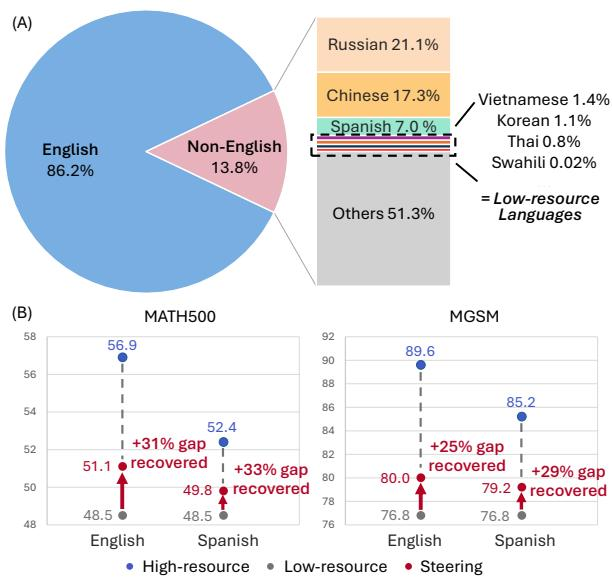
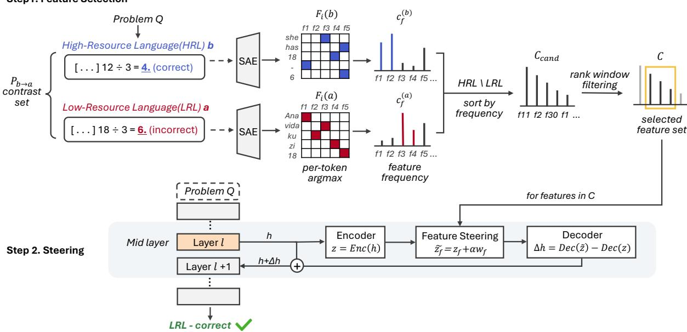

# Enhancing Low-Resource Language Reasoning via High-Resource Language Feature Transfer

Minju Song1 Hyeon Hwang1 Junhyun Lee2,3\* Jaewoo Kang1,4\* Korea University1 Hankuk University of Foreign Studies2 Noah’s Farm3 AIGEN Sciences4 {minjusong, hyeon-hwang, kangj}@korea.ac.kr junhyun.lee@hufs.ac.kr

## Abstract

Large language models exhibit substantial per formance variation across languages, even when solving semantically equivalent tasks. Ex isting analyses often treat this phenomenon as an observational disparity caused by differences in pretraining data, tokenization, or benchmark coverage. We study a comple mentary hypothesis: high-resource languages (HRLs) may more reliably elicit latent computations useful for task-specific (i.e. mathe matical) reasoning, while lower-resource lan guages (LRLs) may under-activate those com putations despite expressing the same task. To test this hypothesis, we introduce a mecha nistic intervention framework for identifying and transferring task-relevant sparse latent fea tures across languages. Using sparse autoencoders over residual-stream activations, we iso late features enriched in successful HRL taskspecific reasoning while filtering out sourcelanguage and generic-generation features. We then construct steering directions from these features and inject them during LRL infer ence. The resulting interventions test whether the selected features are functionally involved in the observed reasoning gap: suppressing them should impair source-language reason ing, while activating them should partially re cover target-language reasoning beyond ran dom and non-task controls. Our framework reframes some cross-lingual reasoning gaps as failures of mechanism elicitation rather than ca pability absence, and offers a causally testable route to feature-mediated transfer without trans lation, fine-tuning, or changing the user-facing language.

## 1 Introduction

Large language models (LLMs) have become increasingly capable multilingual systems (Xue et al., 2021; Workshop et al., 2023), yet their reasoning abilities remain uneven across languages (Bang et al., 2023; Zhu et al., 2024; Kang et al., 2026). For instance, a model that reliably solves a mathematical problem in a high-resource language (HRL), such as English or Spanish, may fail on an equivalent problem expressed in Thai, Bengali, Swahili, or another low-resource language (LRL). This gap is often attributed to data imbalance: HRLs are better represented during pretraining, instruction tuning, and evaluation, leading to more robust behavior in those languages (Joshi et al., 2020; Nguyen et al., 2023). For example, English alone makes up most of the pretraining data while low-resource languages get only a tiny share, and this gap shows up in their reasoning accuracy too (Figure 1). While important, this explanation leaves a deeper question unresolved: Does language merely change the surface form of an input, or can it change which internal reasoning mechanisms a model uses?

  
Figure 1: (A) In pretraining corpora FineWeb (Penedo et al., 2024), English dominates the pretraining corpus (86.2%), while target low-resource languages (Vietnamese, Korean, Thai, Swahili) together account for under 4%. (B) On MATH500 and MGSM, Gemma-2-9B-it scores substantially higher when prompted in a high-resource reference language (blue: English or Spanish) than in low-resource targets (grey: averaged over Thai/Korean/Vietnamese for MATH500, and Thai/Korean/Swahili for MGSM). Steering with contrastively selected HRL reasoning features (red) recovers 25–33% of the gap across all four (reference, benchmark) settings, without training or translation.

We study the hypothesis that language can modulate the elicitation of latent computation. Under this view, semantically equivalent prompts in different languages need not merely differ in surface form; they may induce different patterns of internal feature activation. An HRL may more reliably elicit computations useful for a task, such as symbolic decomposition or stepwise arithmetic reasoning, whereas an LRL may express the same problem while eliciting those computations more weakly, at different positions, or not at all (Wendler et al., 2024; Etxaniz et al., 2024). If this hypothesis is correct, cross-ingual performance gaps reflect not only differences in input distribution, but also differences in the accessibility of task-associated internal mechanisms.

We frame this problem as one of mechanistic intervention (Elhage et al., 2021; Meng et al., 2022; Tang et al., 2024; Li et al., 2023). Rather than asking only whether a model performs better in one language than another, we ask whether taskrelevant latent features activated during successful HRL reasoning can be identified, tested, and reused during LRL inference. This perspective turns crosslingual performance gaps into a causal question: which internal computations are activated, suppressed, or transferable across languages?

To answer this question, we propose a sparsefeature intervention framework for cross-lingual reasoning. Using sparse autoencoders (SAEs) (Ng et al., 2011; Chalnev et al., 2024; Templeton et al., 2024), we represent model activations in an interpretable latent basis and construct task-specific feature libraries from successful HRL reasoning traces. Crucially, feature discovery is contrastive: selected features must be enriched during successful task execution while being less characteristic of generic HRL behavior. This helps distinguish reusable task mechanisms from features that merely encode language identity or broad generation patterns.

At inference time, we use the selected sparse features to construct a residual-stream steering direction from activation differences between HRL and LRL reasoning traces. The resulting vector is injected during LRL inference, leaving the prompt prefill unchanged while amplifying computations that are more strongly expressed in successful HRL reasoning. This allows us to test whether features associated with HRL success can causally improve LRL inference.

Our evaluation separates observational feature discovery from causal validation (Pearl, 2001). The contrastive procedure identifies candidate feature sets associated with successful referencelanguage (HRL) reasoning, but this association alone does not establish causality. We therefore evaluate the selected features through interventions in a fixed trained model: if the features are functionally involved in the relevant computation, activating them should improve target-language (LRL) inference, suppressing them should impair reference-language inference, and matched random or excluded-feature controls should not produce the same pattern. This design does not estimate a formal natural indirect effect, but it provides interventional evidence that the selected features participate in a mechanism consistent with partial crosslingual transfer. The resulting method requires no parameter updates, no translation at inference time, and no change to the user-facing language, though feature discovery uses benchmark correctness signals.

## 2 Preliminaries

## 2.1 Sparse Autoencoders (SAEs)

SAEs provide a sparse decomposition of transformer activations into latent features. Given a residual-stream activation $h \in \mathbb { R } ^ { d }$ from a decoderonly language model, an SAE with $F$ latent features encodes h into a sparse latent representation

$$
z = \mathrm { E n c } ( h ) = \phi \left( W _ { \mathrm { e n c } } ( h - b _ { \mathrm { d e c } } ) + b _ { \mathrm { e n c } } \right) \in \mathbb { R } ^ { F } ,\tag{1}
$$

where $W _ { \mathrm { e n c } } \in \mathbb { R } ^ { F \times d } , b _ { \mathrm { e n c } } \in \mathbb { R } ^ { F } , b _ { \mathrm { d e c } } \in \mathbb { R } ^ { d }$ , and $\phi ( \cdot )$ is a sparsity-inducing nonlinearity. The latent code is reconstructed through a linear decoder,

$$
\hat { h } = \mathrm { D e c } ( z ) = \sum _ { f = 1 } ^ { F } z _ { f } w _ { \mathrm { d e c } } ^ { ( f ) } + b _ { \mathrm { d e c } } ,\tag{2}
$$

where $w _ { \mathrm { d e c } } ^ { ( f ) } \in \mathbb { R } ^ { d }$ denotes the f-th column of the decoder matrix $W _ { \mathrm { d e c } } \in \mathbb { R } ^ { d \times F }$ . Each decoder column corresponds to the residual-stream direction associated with latent feature $f ,$ and the coefficient $z _ { f }$ determines the contribution of that feature to the reconstruction.

## 2.2 Problem Setup and Notation

Let M be a decoder-only language model and let ℓ denote a residual-stream layer of interest. We attach a pretrained SAE to layer ℓ and analyze its latent representations during chain-of-thought (CoT) reasoning. We consider a reference-language (HRL) b and a target-language (LRL) a.

Given a reasoning benchmark D, the model produces a reasoning trace $r _ { i } ^ { ( k ) }$ of length $T _ { i } ^ { ( k ) }$ for problem $i \in \mathcal { D }$ in language $k \in \{ a , b \}$ . For each generation token position $t \in \{ 1 , \ldots , T _ { i } ^ { ( k ) } \}$ , let $h _ { i , t } ^ { ( k ) } \in \mathbb { R } ^ { d }$ denote the residual-stream activation at layer ℓ and $z _ { i , t } ^ { ( k ) } = \mathrm { E n c } ( h _ { i , t } ^ { ( k ) } ) \in \mathbb { R } ^ { F }$ its SAE representation, with $z _ { i , t , f } ^ { ( k ) }$ being the activation of latent feature f at that token.

Our goal is to identify latent features associated with successful reasoning in the reference language b and use them to steer the model toward similar behavior when solving problems in the target language a.

## 2.3 Interventional Causal Effects

Our causal claims are restricted to interventions within a fixed trained model. Feature selection from naturally generated traces is observational: it identifies candidate internal variables associated with successful reasoning, but does not by itself establish causality.

We therefore evaluate causal involvement by directly modifying residual-stream activations during the forward pass. For an internal activation $h _ { \ell , t }$ and an intervention vector $\Delta h$ , we write $Y ( d o ( h _ { \ell , t } \gets h _ { \ell , t } + \Delta h ) )$ ) for the model’s outcome under the intervention, where Y denotes finalanswer correctness or a logit-based answer score.

A feature set is treated as sufficient if activating its associated residual direction improves targetlanguage (LRL) reasoning, necessary if suppressing it degrades reference-language (HRL) reasoning, and specific if matched random or excluded feature interventions do not produce the same effect. We use the terms partial sufficiency and functional necessity operationally. A positive activation effect suggests that the corresponding residual directions are partially sufficient under the specified intervention policy; a negative suppression effect suggests functional dependence on the evaluated distribution. These terms do not imply logical sufficiency or necessity in the counterfactual-cause sense.

## 3 Method

This section details our method in two parts. First, we describe how we identify task-relevant sparse latent features through a contrastive comparison between reasoning traces of a high-resource reference language and a low-resource target language (LRL). Second, using those features, we intervene on the low-resource forward pass at a single residual stream layer to transfer reasoning behavior from the reference language.

## 3.1 Task-Relevant Sparse Latent Feature Identification.

Paired contrast set and per-token features. Let D be a reasoning benchmark on which the model produces a chain-of-thought response $r _ { i } ^ { ( k ) }$ for each problem i and language k, scored as correct or incorrect. To isolate features that drive successful reasoning in a high-resource reference language b but fail to engage in a low-resource target language (LRL) a, we restrict attention to the set of paired problems on which the reference succeeds and the target fails on the same question:

$$
{ \mathcal { P } } _ { b \to a } = \left\{ i \ \middle | \ r _ { i } ^ { ( b ) } \ \mathrm { c o r r e c t } \ \wedge \ r _ { i } ^ { ( a ) } \ \mathrm { i n c o r r e c t } \ \right\} .\tag{3}
$$

For each $i \in \mathcal { P } _ { b  a }$ and each side $k \in \{ a , b \}$ , we record the identity of the strongest-activating feature at every generation token of the corresponding trace,

$$
f _ { i , t } ^ { * \left( k \right) } = \arg \operatorname* { m a x } _ { f \in \{ 1 , . . . , F \} } z _ { i , t , f } ^ { ( k ) } ,\tag{4}
$$

and define the per-response feature set $\mathcal { F } _ { i } ^ { ( k ) } =$ $\{ f _ { i , t } ^ { * ( k ) } : t = 1 , \ldots , T _ { i } ^ { ( k ) } \}$ as the set of distinct top features across all generation tokens of trace $r _ { i } ^ { ( \dot { k } ) }$

Set-difference candidate pool. For each feature f and each side $k \in \{ a , b \}$ , we count the number of contrast responses in which it appears as the per-token argmax:

$$
c _ { f } ^ { ( k ) } = \big | \{ i \in \mathcal { P } _ { b  a } : f \in \mathcal { F } _ { i } ^ { ( k ) } \} \big | .\tag{5}
$$

The contrastive candidate pool is then defined as the set-difference between the reference and target sides, retaining features that appear in the referencecorrect responses but are absent from the matched target-incorrect ones:

$$
\mathcal { C } _ { \mathrm { c a n d } } = \{ f \ : | \ : c _ { f } ^ { ( b ) } \geq 1 \land c _ { f } ^ { ( a ) } = 0 \ : \} ,\tag{6}
$$

Step1. Feature Selection  
  
Figure 2: Method overview. Step 1. We collect the paired contrast set $\mathcal { P } _ { b \to a }$ of problems on which the model is correct in the reference language b but incorrect in the target language a. Encoding both traces through the SAE and counting the per-token argmax feature across the set gives per-side frequencies $c _ { f } ^ { ( b ) } , c _ { f } ^ { ( a ) }$ ; their set-difference followed by rank-window filtering yields the selected feature set C. Step 2. At inference time on target-language inputs, the layer-ℓ residual stream h is encoded $\mathrm { t o } ~ z ,$ the features in C are bumped by $\alpha w _ { f }$ where $w _ { f } = \bar { z } _ { f } ^ { ( b ) } - \bar { z } _ { f } ^ { ( \bar { a } ) }$ and the decoded difference $\Delta h$ is added back to h at generation tokens only.

ranked in descending order of $c _ { f } ^ { ( b ) }$ so that higher ranks correspond to features that recur consistently across reference-correct traces.

Rank-window filtering. Features with the largest values in $\mathcal { C } _ { \mathrm { c a n d } }$ often correspond to highly frequent generation patterns that appear across reasoning traces regardless of their underlying reasoning content, providing limited signal for identifying reasoning-relevant latent dimensions. To reduce their influence, we retain only features whose ranks fall within a predefined window $( s , n )$ , where $0 \leq s < n \colon$

$$
\mathcal { C } = \left\{ \mathcal { C } _ { \mathrm { c a n d } } ^ { ( s + 1 ) } , \mathcal { C } _ { \mathrm { c a n d } } ^ { ( s + 2 ) } , \ldots , \mathcal { C } _ { \mathrm { c a n d } } ^ { ( n ) } \right\} .\tag{7}
$$

where $\mathcal { C } _ { \mathrm { c a n d } } ^ { ( r ) }$ denotes the feature at rank r in the sorted candidate list.

## 3.2 Transfer via Steering at the Residual Stream

Per-feature steering coefficients. For each language $k \in \{ a , b \}$ , let $\mathcal { D } _ { k } ^ { + }$ denote the set of correctly solved problems. We compute the mean SAE activation vector over all generated tokens from correctly solved reasoning traces:

$$
\bar { z } ^ { ( k ) } = \frac { 1 } { N _ { k } } \sum _ { i \in \mathcal { D } _ { k } ^ { + } } \sum _ { t = 1 } ^ { T _ { i } ^ { ( k ) } } z _ { i , t } ^ { ( k ) } \in \mathbb { R } ^ { F } ,\tag{8}
$$

where $\begin{array} { r } { N _ { k } = \sum _ { i \in \mathcal { D } _ { k } ^ { + } } T _ { i } ^ { ( k ) } } \end{array}$ is the total number of generated tokens across all correctly solved traces in language k, and $z _ { i , t } ^ { ( k ) }$ is the SAE representation defined in §3.1. For each selected feature $f \in { \mathcal { C } } .$ we define its steering coefficient as the difference in mean activation between the reference language b and the target language a:

$$
w _ { f } = \bar { z } _ { f } ^ { ( b ) } - \bar { z } _ { f } ^ { ( a ) } .\tag{9}
$$

Intuitively, $w _ { f }$ measures how much more strongly feature $f$ is expressed in the reference language relative to the target language on successful reasoning traces.

Steering intervention. Let $h \in \mathbb { R } ^ { d }$ denote the layer-ℓ residual stream activation at a generation token, and let $z = \operatorname { E n c } ( h ) \in \mathbb { R } ^ { F }$ be its SAE representation. We construct a modified latent code by shifting the selected features according to their steering coefficients, where $\alpha > 0$ controls the steering strength:

$$
\tilde { z } _ { f } = \left\{ \begin{array} { l l } { z _ { f } + \alpha w _ { f } , } & { f \in \mathcal { C } , } \\ { z _ { f } , } & { \mathrm { o t h e r w i s e } , } \end{array} \right.\tag{10}
$$

The resulting intervention in residual space is given by

$$
\Delta h = \mathrm { D e c } ( \tilde { z } ) - \mathrm { D e c } ( z ) = \alpha \sum _ { f \in \mathcal { C } } w _ { f } W _ { \mathrm { d e c } } [ f ] ,\tag{11}
$$

where the final equality follows from the linearity of the decoder. We register this intervention as a forward hook on the output of layer ℓ and apply it only to generation tokens, leaving the prompt prefill unchanged. The same steering vector $\Delta h$ is added at every generation step across all problems.

## 4 Experiments

## 4.1 Experimental Setup

We evaluate two instruction-tuned language models (Gemma Team, 2024; Qwen et al., 2025) paired with pretrained layer-20 Sparse Autoencoders (SAEs). For gemma-2-9b-it, we use the canonical Gemma-Scope SAE (Lieberum et al., 2024) (width\_16k; $F ~ = ~ 1 6 { , } 3 8 4 )$ . For Qwen2.5-7B-Instruct, we use the released layer-20 matryoshka SAE (lmsys/matryoshka/k-100; $\begin{array} { r l r } { F } & { { } = } & { 6 5 { , } 5 3 6 } \end{array}$ $k ~ = ~ 1 0 0 )$ . Both SAEs employ the JumpReLU architecture (Rajamanoharan et al., 2024). All steering interventions are applied at layer-20 residual stream.

## 4.2 Datasets and Languages

We evaluate on three multilingual reasoning benchmarks: MATH500 (Hendrycks et al., 2021; Lightman et al., 2023) (N = 311), the MATH500 split of the multilingual MMATH benchmark (Luo et al., 2025), requiring multi-step symbolic reasoning; MGSM (Shi et al., 2022) $( N \ = \ 2 5 0 )$ a multilingual benchmark of grade-school mathematical word problems; and MMLU-ProX (Psychology) (Xuan et al., 2025) (N = 798), a 10-way multiple-choice benchmark covering undergraduate-level psychology questions.

Each problem is presented in a single language using a native-language chain-of-thought (Wei et al., 2022) prompt. We consider English (en) and Spanish (es) as high-resource reference languages (HRL), and Korean (ko), Thai (th), Swahili (sw), and Vietnamese (vi) as target languages (LRL). Depending on the benchmark, translations are obtained from publicly available multilingual benchmark releases.

## 4.3 Feature Selection and Steering

For each reference–target language pair and dataset, we construct a contrastive feature pool using the procedure described in Section 3.1. Candidate features are identified from problems that are solved correctly in the reference language but incorrectly in the target language. Following rank-window filtering, we discard the top 50% of candidate features ranked by occurrence count and retain features between the 50th and 90th percentiles. Only features that survive this filtering stage are used for steering.

During inference, we apply residual-stream steering at every generation step while leaving promptprefill activations unchanged.

## 4.4 Evaluation Metrics

Accuracy. Accuracy is computed using the native evaluation protocol of each benchmark. For MATH500 and MGSM, answers are evaluated using math\_verify; for MMLU-ProX, predictions are scored by matching the final selected answer option.

Recovery Rate. To quantify how much steering closes the performance gap between a target language and a reference language, we define the recovery rate

$$
{ \mathrm { R e c o v e r y } } _ { a  b } = { \frac { \mathrm { a c c } _ { a  b } - \mathrm { a c c } _ { a } } { \mathrm { a c c } _ { b } - \mathrm { a c c } _ { a } } } ,\tag{12}
$$

where $\operatorname { a c c } _ { a }$ denotes the baseline accuracy of target language $a , \mathrm { a c c } _ { b }$ denotes the accuracy of reference language $b ,$ and $\mathrm { a c c } _ { a  b }$ denotes the steered target-language accuracy.

## 5 Discussion

## 5.1 Causal Evidence for Feature-Mediated Transfer

The contrastive feature selection procedure in Section 3 identifies sparse features that are more salient in successful reference-language traces than in matched target-language failures. We treat the selected set C as a set of candidate intervention features: task-associated features that may transfer task-relevant computations from the reference language reasoning to the target language. We evaluate this interpretation with three intervention tests.

Reference language: English
<table><tr><td rowspan="2" colspan="2">Model</td><td colspan="4">MATH500</td><td colspan="4">MGSM</td><td colspan="5">MMLU-ProX (psychology)</td></tr><tr><td>en</td><td>th</td><td>ko</td><td>vi</td><td>en</td><td>th</td><td>ko</td><td>SW</td><td>en</td><td>th</td><td>ko</td><td>SW</td><td>vi</td></tr><tr><td rowspan="3">Gemma-2-9B</td><td>Baseline</td><td>56.91</td><td>48.23</td><td>49.20</td><td>48.23</td><td>89.60</td><td>78.40</td><td>76.40</td><td>75.60</td><td>57.27</td><td>32.71</td><td>17.67</td><td>8.27</td><td>40.73</td></tr><tr><td>+Steering</td><td></td><td>49.20</td><td>52.41</td><td>51.77</td><td></td><td>82.40</td><td>78.40</td><td>79.20</td><td></td><td>33.30</td><td>23.31</td><td>10.30</td><td>42.36</td></tr><tr><td>Recovery</td><td></td><td>+11%</td><td>+42%</td><td>+41%</td><td></td><td>+36%</td><td>+15%</td><td>+26%</td><td></td><td>+2%</td><td>+14%</td><td>+4%</td><td>+10%</td></tr><tr><td rowspan="3">Qwen2.5-7B</td><td>Baseline</td><td>73.63</td><td>60.77</td><td>64.95</td><td>63.67</td><td>95.20</td><td>80.40</td><td>79.60</td><td>15.20</td><td>59.90</td><td>39.35</td><td>42.48</td><td>15.29</td><td>49.50</td></tr><tr><td>+Steering</td><td></td><td>63.70</td><td>66.60</td><td>66.56</td><td></td><td>82.00</td><td>80.00</td><td>19.60</td><td></td><td>41.60</td><td>44.11</td><td>17.42</td><td>53.13</td></tr><tr><td>Recovery</td><td></td><td>+23%</td><td>+19%</td><td>+29%</td><td></td><td>+11%</td><td>+3%</td><td>+6%</td><td></td><td>+11%</td><td>+9%</td><td>+5%</td><td>+35%</td></tr></table>

Reference language: Spanish
<table><tr><td rowspan="2">Model</td><td rowspan="2"></td><td colspan="4">MATH500</td><td colspan="4">MGSM</td><td colspan="5">MMLU-ProX (psychology)</td></tr><tr><td>es</td><td>th</td><td>ko</td><td>vi</td><td>es</td><td>th</td><td>ko</td><td>SW</td><td>es</td><td>th</td><td>ko</td><td>SW</td><td>vi</td></tr><tr><td rowspan="3">Gemma-2-9B</td><td>Baseline</td><td>52.41</td><td>48.23</td><td>49.20</td><td>48.23</td><td>85.20</td><td>78.40</td><td>76.40</td><td>75.60</td><td>45.49</td><td>32.71</td><td>17.67</td><td>8.27</td><td>40.73</td></tr><tr><td>+Steering</td><td></td><td>48.87</td><td>50.16</td><td>50.48</td><td></td><td>82.40</td><td>78.00</td><td>77.20</td><td></td><td>33.50</td><td>19.70</td><td>10.00</td><td>41.35</td></tr><tr><td>Recovery</td><td></td><td>+15%</td><td>+30%</td><td>+54%</td><td></td><td>+59%</td><td>+18%</td><td>+17%</td><td></td><td>+6%</td><td>+7%</td><td>+5%</td><td>+13%</td></tr><tr><td rowspan="3">Qwen2.5-7B</td><td>Baseline</td><td>67.85</td><td>60.77</td><td>64.95</td><td>63.67</td><td>84.00</td><td>80.40</td><td>79.60</td><td>15.20</td><td>53.01</td><td>39.35</td><td>42.48</td><td>15.29</td><td>49.50</td></tr><tr><td>+Steering</td><td></td><td>63.34</td><td>65.90</td><td>66.56</td><td></td><td>82.00</td><td>82.00</td><td>19.60</td><td></td><td>41.10</td><td>43.61</td><td>15.54</td><td>51.38</td></tr><tr><td>Recovery</td><td></td><td>+36%</td><td>+33%</td><td>+69%</td><td></td><td>+44%</td><td>+55%</td><td>+6%</td><td></td><td>+13%</td><td>+11%</td><td>+1%</td><td>+54%</td></tr></table>

Table 1: Main results: multilingual reasoning accuracy and cross-lingual gap closure. Accuracy (%) on MATH500, MGSM, and MMLU-ProX (psychology subset) for Gemma-2-9B-it and Qwen2.5-7B-Instruct, with English (top) and Spanish (bottom) as reference languages. For each (reference, target) pair, Baseline reports vanilla CoT accuracy, +Steering reports accuracy after applying our residual-stream intervention at layer 20, and Recovery is the fraction of the reference gap closed, Reference-language scores (en, es columns of the Baseline row) serve as ceilings and are not steered. Target language coverage varies by benchmark availability.

<table><tr><td>Method</td><td>EN</td><td>TH</td><td>KO</td><td>VI</td></tr><tr><td>Baseline</td><td>56.91</td><td>48.23</td><td>49.20</td><td>48.23</td></tr><tr><td>Ours</td><td></td><td>49.20</td><td>52.41</td><td>51.77</td></tr><tr><td>Top-k feature steering</td><td></td><td>45.98</td><td>45.66</td><td>47.91</td></tr><tr><td>Random steering</td><td></td><td>47.80</td><td>46.84</td><td>52.30</td></tr><tr><td>Negative steering vector</td><td></td><td>46.62</td><td>47.27</td><td>46.95</td></tr><tr><td>HRL ablation</td><td></td><td>54.02</td><td>50.16</td><td>52.09</td></tr><tr><td>HRL ablation (random)</td><td>一</td><td>55.16</td><td>55.09</td><td>55.52</td></tr></table>

Table 2: Control and ablation experiments. We evaluate the contrastively selected feature set C against alternative steering choices and against a source-side suppression test. Ours: steering with C (target-language accuracy). Top-k feature steering: steering with the most frequent features in $\mathcal { C } _ { \mathrm { c a n d } }$ , skipping rank-window filtering. Random steering: steering with a size-matched random feature set. Negative steering vector: applying $- \Delta h$ instead of +∆h. HRL ablation: suppressing $\mathcal { C } _ { \mathrm { E N }  a }$ during English inference (rows labeled by target language a, but the score is on English). All target-language steering results use Gemma-2-9B-it on MATH500 with English as reference.

Partial sufficiency. For a target language a, we test whether activating a feature set S improves target-language reasoning:

$$
\begin{array} { r l r } {  { \tau _ { S } ^ { a } ( \alpha ) } } & { ( 1 3 ) } \\ & { = \mathbb { E } _ { i } [ Y _ { i } ^ { a } \bigl ( \mathrm { d o } ( h _ { \ell , t } \gets h _ { \ell , t } + \Delta h _ { S } ^ { + } ( \alpha ) ) \bigr ) - Y _ { i } ^ { a } ] , } & \end{array}
$$

where $Y _ { i } ^ { a }$ denotes final-answer correctness or a logit-based answer score. When S is instantiated as the contrastively selected feature set C, a positive value of $\tau _ { C } ^ { a } ( \alpha )$ indicates that activating these features improves target-language reasoning. Table 1 provides this target-side test: activating the pairspecific feature set $\mathcal { C } _ { \mathrm { E N }  a }$ improves accuracy over the corresponding LRL baseline for Thai, Korean, and Vietnamese.

These gains are largest for Korean and Vietnamese, indicating that the selected directions can partially recover reasoning behavior that is more reliably elicited in the English reference language.

Importantly, these gains do not generally arise from switching the generated output to the reference language. Automatic language identification with GlotLID (Kargaran et al., 2023) shows that steering largely preserves target-language generation; detailed results across models, datasets, and reference–target pairs are reported in Appendix B (Table 4).

Functional necessity. For a reference language $b ,$ we test whether suppressing the same features degrades reference-language reasoning:

$$
= \mathbb { E } _ { i } [ Y _ { i } ^ { b } \Big ( \mathrm { d o } ( h _ { \ell , t }  h _ { \ell , t } + \Delta h _ { S , t } ^ { - } ( \lambda ) ) \Big ) - Y _ { i } ^ { b } ] ,\tag{14}
$$

where $\Delta h _ { S , t } ^ { - } ( \lambda )$ indicates an anti-steering perturbation effect. If $\nu _ { C } ^ { b } ( \lambda ) < 0$ , while matched randomfeature suppression has a smaller effect, then the selected features are functionally involved in producing the reference-language behavior. The HRL ablation row in Table 2 instantiates this test on the source side: for each target language a, we suppress the same pair-specific feature set $\mathcal { C } _ { \mathrm { E N }  a }$ during English inference. Although the ablation is always performed in English, the Thai, Korean, and Vietnamese columns denote the target language used to construct $\mathcal { C } _ { \mathrm { E N }  a } ;$ the resulting drops from the English baseline show that these features are functionally involved in source-language reasoning.

Specificity. We compare C against matched random features R and excluded features E. These controls test whether the observed effects are due to the selected task-associated features rather than arbitrary residual perturbation, intervention magnitude, or generic SAE feature manipulation. Table 2 shows that top-k frequent features and random steering do not reproduce the same consistent improvement pattern as the contrastively selected feature set. Moreover, applying the negative steering vector reduces target-language accuracy, suggesting that the signed HRL–LRL activation difference is functionally meaningful rather than merely increasing residual-stream activation magnitude.

Together, the three tests provide interventional evidence that C is functionally implicated in the cross-lingual reasoning gap: activating C improves target-language performance, suppressing C degrades reference-language performance, and matched controls fail to reproduce either effect. Table 2 directly operationalizes these criteria by evaluating the same pair-specific feature sets under target-side activation, source-side ablation, and control interventions. We therefore interpret the selected sparse features as a mechanistic handle through which target-language inference can access computations more reliably elicited in the reference language.

## 5.2 Are the steered features language-agnostic reasoning features?

To understand why injecting HRL-derived feature directions helps LRL reasoning, we ask what the steered features actually encode. We take the (en, ko) contrastive pool used for steering and, for each feature, examine which tokens it activates on in English versus Korean.

<table><tr><td>Feat. Concept</td><td></td><td>English (peak)</td><td>Korean (peak)</td></tr><tr><td></td><td></td><td>13089 requirement needs, needed (63.6)</td><td>(28.0)</td></tr><tr><td></td><td>12672 quantity</td><td>number, many (51.0) 6224 aggregation both, three (68.5)</td><td>午，(23.5) 只(17.9)</td></tr><tr><td></td><td>629 knowledge</td><td>know, understand (58.2) (27.0)</td><td></td></tr><tr><td>6763 rate</td><td></td><td>per, / (69.7)</td><td>/ (21.8)</td></tr><tr><td></td><td></td><td>4404 construction make, makes (46.3)</td><td>(12.2)</td></tr><tr><td></td><td>4301 equality</td><td>equals, equation (53.8)</td><td>= (11.4)</td></tr></table>

Table 3: Cross-lingual reasoning features in the (en, ko) steering pool (gemma-2-9b-it, layer 20). For each feature we give the concept it encodes and its top-activating tokens in English and Korean reasoning traces (peak activation in parentheses).

Setup. For 40 MGSM problems answered correctly in English, we perform a single forward pass on both the English and Korean reasoning traces, extract the layer-20 residual-stream activations, and encode them using the Gemma-Scope SAE. For each of the 28 selected features, we then identify the top-activating tokens and record the peak activation in each language.

The features are largely language-agnostic. Only 3 of the 28 features are English-token specific and do not activate on Korean text (of, the, to); the remaining 25 activate in both languages. Among these, a semantically interpretable subset captures reasoning concepts shared across languages while activating the same SAE latent (Table 3).

For example, feature 13089 activates on English needs/needed and Korean 필요 (“need”), feature 12672 on number/how many and 수/몇, and feature 4301 on equals/equation and the symbol =. Other shared features correspond to syntactic categories, such as copulas, case particles, and prepositions, rather than task-specific reasoning content.

Interpretation. These observations help explain the steering result. If the features primarily captured English surface patterns, activating them during Korean inference would be unlikely to improve reasoning. Instead, they encode language-agnostic reasoning concepts shared across languages, such as quantity, requirement, equality, and aggregation. Moreover, these features typically activate more weakly on Korean tokens than on their English counterparts (e.g., feature 13089 peaks at 28.0 in Korean vs. 63.6 in English). This pattern is consistent with our hypothesis that the model underelicits task-relevant reasoning features in the lowresource language, and that steering can partially compensate for this activation gap.

## 6 Related Work

Multilingual reasoning and cross-lingual transfer. Large language models are increasingly multilingual, yet they reason far better in HRLs than in low-resource ones (Bang et al., 2023; Zhu et al., 2024; Kang et al., 2026). This gap is commonly attributed to the imbalance of pretraining and instruction-tuning data across languages (Joshi et al., 2020; Penedo et al., 2024), and prior remedies often rely on additional multilingual training (Zhang et al., 2025). A complementary line of work studies multilingualism mechanistically: multilingual transformers appear to process non-English inputs through a latent English-centric representation (Wendler et al., 2024), reasoning frequently improves when inputs are routed through English (Etxaniz et al., 2024), and specific neurons govern language-specific behaviour (Tang et al., 2024). These findings suggest cross-lingual gaps reflect not only the input distribution but also which internal mechanisms a model engages, motivating an intervention-based approach that requires no additional training.

Mechanistic interpretability and SAEs. Mechanistic interpretability studies LLM internals by decomposing models into interpretable units (Olah et al., 2020), often validating hypotheses through interventions such as activation patching and causal mediation analysis that localize behaviour to specific components (Meng et al., 2022; Wang et al., 2023; Syed et al., 2023). Sparse autoencoders (Ng et al., 2011; Bricken et al., 2023; Cunningham et al., 2023) decompose the residual stream of transformer models into sparse and often humanunderstandable features, supporting the hypothesis that the latent space of LLMs is composed of linear and interpretable directions (Arora et al., 2018; Elhage et al., 2022). We use the open Gemma Scope SAEs (Lieberum et al., 2024) to obtain such features and, in this interventionist tradition, validate our selected features causally by activating, suppressing, and substituting matched random or excluded controls.

Activation and feature steering. Activation steering controls model outputs by adding a vector to the residual stream, typically derived from contrasting positive and negative prompts (Turner et al., 2024). Subsequent work has scaled the approach to larger models (Panickssery et al., 2024), broadened the range of behaviors it can target (Zou et al., 2023), learned steering vectors directly for desired outputs (Cao et al., 2024), and introduced input-conditional variants (Lee et al., 2024). A complementary line of work steers at the level of individual SAE features, taking advantage of their interpretability to clamp or edit specific concepts (Templeton et al., 2024; Marks et al., 2024; Durmus et al., 2024; Zhao et al., 2024). Our method belongs to this latter family, but differs in how features are selected: rather than relying on a single labeled concept or hand-chosen latents, we identify reasoning-relevant features contrastively from paired reference-correct, target-incorrect traces, and use the resulting set to bridge a cross-lingual performance gap that prior steering work has not addressed.

## 7 Conclusion

We have studied cross-lingual reasoning gaps in large language models from a mechanistic perspective, asking whether language modulates the elicitation of latent computations rather than only whether models perform better in some languages than others. Using sparse autoencoders, we identify taskrelevant features through contrastive comparison between successful reference-language reasoning traces and matched target-language failures, and inject them at inference time as a residual-stream steering direction. Across two models, three benchmarks, and four low-resource target languages, this intervention closes 25–33% of the gap to the reference language with no parameter updates, no translation, and no change to the user-facing language. Three intervention tests—partial sufficiency, functional necessity, and specificity—provide interventional evidence that the selected features are functionally implicated in the observed gap. Together, these results suggest that part of the crosslingual reasoning gap reflects under-elicitation of computations the model already possesses, rather than their absence, and point to feature-level intervention as a complementary route to translationand training-based remedies.

## Limitations

Models and benchmarks. We evaluate two instruction-tuned models (Gemma-2-9B-it, Qwen2.5-7B-Instruct) on three benchmarks (MATH500, MGSM, and the psychology subset of MMLU-ProX) covering four low-resource target languages. Generalization to larger or differently architected models, to other reasoning domains (e.g., commonsense, code), and to truly extremely low-resource languages remains to be verified.

Reliance on pretrained SAEs. Our feature library is constructed in the basis of an externally trained SAE applied at a single layer (layer 20). Both the resolution of the identified features and the effectiveness of steering are therefore bounded by the quality of the underlying SAE; polysemantic or under-trained latents may dilute the signal isolated by our contrastive procedure.

Transfer across tasks. Our experiments primarily evaluate feature transfer across languages within the same task. Cross-task transfer may depend on differences in task distributions and the extent to which reasoning mechanisms are shared across datasets, which we do not explicitly model in this work. Establishing when task-specific features transfer across benchmarks therefore remains an important direction for future work.

## Acknowledgments

This work was supported in part by the National Research Foundation of Korea [NRF-2023R1A2C3004176], the Ministry of Health & Welfare, Republic of Korea [HR20C002103], the Ministry of Science and ICT (MSIT) [RS-2023- 00262002], the Institute of Information & Communications Technology Planning & Evaluation(IITP)- ICT Creative Consilience Program grant funded by the Korea government(MSIT)(IITP-2026-RS-2020- II201819), and the National Research Foundation of Korea(NRF) grant funded by the Korea governmant(MSIT and MOE) (No. RS-2025-16652968). The work of Junhyun Lee was supported by the Hankuk University of Foreign Studies Research Fund (2026).

## References

Sanjeev Arora, Yuanzhi Li, Yingyu Liang, Tengyu Ma, and Andrej Risteski. 2018. Linear algebraic structure of word senses, with applications to polysemy. Transactions of the Association for Computational Linguistics, 6:483–495.

Yejin Bang, Samuel Cahyawijaya, Nayeon Lee, Wenliang Dai, Dan Su, Bryan Wilie, Holy Lovenia, Ziwei Ji, Tiezheng Yu, Willy Chung, Quyet V. Do, Yan Xu, and Pascale Fung. 2023. A multitask, multilingual, multimodal evaluation of ChatGPT on reasoning, hallucination, and interactivity. In Proceedings of the

13th International Joint Conference on Natural Language Processing and the 3rd Conference ofthe Asia-Pacific Chapter ofthe Associationfor Computational Linguistics (Volume 1: Long Papers), pages 675–718, Nusa Dua, Bali. Association for Computational Linguistics.

Joseph Bloom, Curt Tigges, Anthony Duong, and David Chanin. 2024. Saelens. https://github.com/ decoderesearch/SAELens.

Trenton Bricken, Adly Templeton, Joshua Batson, Brian Chen, Adam Jermyn, Tom Conerly, Nick Turner, Cem Anil, Carson Denison, Amanda Askell, Robert Lasenby, Yifan Wu, Shauna Kravec, Nicholas Schiefer, Tim Maxwell, Nicholas Joseph, Zac Hatfield-Dodds, Alex Tamkin, Karina Nguyen, and 6 others. 2023. Towards monosemanticity: Decomposing language models with dictionary learning. Transformer Circuits Thread. https://transformer-circuits.pub/ 2023/monosemantic-features/index.html.

Yuanpu Cao, Tianrong Zhang, Bochuan Cao, Ziyi Yin, Lu Lin, Fenglong Ma, and Jinghui Chen. 2024. Personalized steering of large language models: Versatile steering vectors through bi-directional preference optimization. Preprint, arXiv:2406.00045.

Sviatoslav Chalnev, Matthew Siu, and Arthur Conmy. 2024. Improving steering vectors by targeting sparse autoencoder features. Preprint, arXiv:2411.02193.

Hoagy Cunningham, Aidan Ewart, Logan Riggs, and 1 others. 2023. Sparse autoencoders find highly interpretable features in language models. Preprint, arXiv:2309.08600.

Esin Durmus, Alex Tamkin, Jack Clark, Jerry Wei, Jonathan Marcus, Joshua Batson, Kunal Handa, Liane Lovitt, Meg Tong, Miles McCain, Oliver Rausch, Saffron Huang, Sam Bowman, Stuart Ritchie, Tom Hennighan, and Deep Ganguli. 2024. Evaluating feature steering: A case study in mitigating social biases. https://anthropic.com/ research/evaluating-feature-steering. Accessed 2024-10-25.

Nelson Elhage, Tristan Hume, Catherine Olsson, Nicholas Schiefer, Tom Henighan, Shauna Kravec, Zac Hatfield-Dodds, Robert Lasenby, Dawn Drain, Carol Chen, and 1 others. 2022. Toy models of superposition. arXiv preprint arXiv:2209.10652.

Nelson Elhage, Neel Nanda, Catherine Olsson, Tom Henighan, Nicholas Joseph, Ben Mann, Amanda Askell, Yuntao Bai, Anna Chen, Tom Conerly, Nova DasSarma, Dawn Drain, Deep Ganguli, Zac Hatfield-Dodds, Danny Hernandez, Andy Jones, Jackson Kernion, Liane Lovitt, Kamal Ndousse, and 6 others. 2021. A mathematical framework for transformer circuits. Transformer Circuits Thread. Https://transformercircuits.pub/2021/framework/index.html.

Julen Etxaniz, Gorka Azkune, Aitor Soroa, Oier Lopez de Lacalle, and Mikel Artetxe. 2024. Do multilingual language models think better in English? In Proceedings ofthe 2024 Conference ofthe North American Chapter of the Association for Computational Linguistics: Human Language Technologies (Volume 2: Short Papers), pages 550–564, Mexico City, Mexico. Association for Computational Linguistics.

Gemma Team. 2024. Gemma 2: Improving open language models at a practical size. Preprint, arXiv:2408.00118.

Dan Hendrycks, Collin Burns, Saurav Kadavath, Akash Arora, Steven Basart, Eric Tang, Dawn Song, and Jacob Steinhardt. 2021. Measuring mathematical problem solving with the math dataset. NeurIPS.

Pratik Joshi, Sebastin Santy, Amar Budhiraja, Kalika Bali, and Monojit Choudhury. 2020. The state and fate of linguistic diversity and inclusion in the NLP world. In Proceedings of the 58th Annual Meeting of the Associationfor Computational Linguistics, pages 6282–6293, Online. Association for Computational Linguistics.

Deokhyung Kang, Seonjeong Hwang, Daehui Kim, Hyounghun Kim, and Gary Geunbae Lee. 2026. Why do multilingual reasoning gaps emerge in reasoning language models? Preprint, arXiv:2510.27269.

Amir Hossein Kargaran, Ayyoob Imani, François Yvon, and Hinrich Schuetze. 2023. Glotlid: Language identification for low-resource languages. arXiv preprint arXiv:2310.16248.

Bruce W. Lee, Inkit Padhi, Karthikeyan Natesan Ramamurthy, Erik Miehling, Pierre Dognin, Manish Nagireddy, and Amit Dhurandhar. 2024. Programming refusal with conditional activation steering. Preprint, arXiv:2409.05907.

Kenneth Li, Oam Patel, Fernanda Viégas, Hanspeter Pfister, and Martin Wattenberg. 2023. Inference-time intervention: Eliciting truthful answers from a language model. In Thirty-seventh Conference on Neural Information Processing Systems.

Zhaoyi Li, Gangwei Jiang, Hong Xie, Linqi Song, Defu Lian, and Ying Wei. 2024. Understanding and patching compositional reasoning in LLMs. In Findings of the Associationfor Computational Linguistics: ACL 2024, pages 9668–9688, Bangkok, Thailand. Association for Computational Linguistics.

Tom Lieberum, Senthooran Rajamanoharan, Arthur Conmy, Lewis Smith, Nicolas Sonnerat, Vikrant Varma, János Kramár, Anca Dragan, Rohin Shah, and Neel Nanda. 2024. Gemma scope: Open sparse autoencoders everywhere all at once on gemma 2. Preprint, arXiv:2408.05147.

Hunter Lightman, Vineet Kosaraju, Yura Burda, Harri Edwards, Bowen Baker, Teddy Lee, Jan Leike, John Schulman, Ilya Sutskever, and Karl Cobbe.

2023. Let’s verify step by step. arXiv preprint arXiv:2305.20050.

Wenyang Luo, Wayne Xin Zhao, Jing Sha, Shijin Wang, and Ji-Rong Wen. 2025. Mmath: A multilingual benchmark for mathematical reasoning. Preprint, arXiv:2505.19126.

Samuel Marks, Can Rager, Eric J. Michaud, and 1 others. 2024. Sparse feature circuits: Discovering and editing interpretable causal graphs in language models. Computing Research Repository, arXiv:2403.19647.

Kevin Meng, David Bau, Alex J Andonian, and Yonatan Belinkov. 2022. Locating and editing factual associations in GPT. In Advances in Neural Information Processing Systems.

Andrew Ng and 1 others. 2011. Sparse autoencoder. CS294A Lecture notes, 72(2011):1–19.

Thuat Nguyen, Chien Van Nguyen, Viet Dac Lai, Hieu Man, Nghia Trung Ngo, Franck Dernoncourt, Ryan A. Rossi, and Thien Huu Nguyen. 2023. Culturax: A cleaned, enormous, and multilingual dataset for large language models in 167 languages. Preprint, arXiv:2309.09400.

Chris Olah, Nick Cammarata, Ludwig Schubert, Gabriel Goh, Michael Petrov, and Shan Carter. 2020. Zoom in: An introduction to circuits. Distill.

Nina Panickssery, Nick Gabrieli, Julian Schulz, Meg Tong, Evan Hubinger, and Alexander Matt Turner. 2024. Steering Llama-2 via Contrastive Activation Addition. Preprint, arXiv:2312.06681.

Adam Paszke, Sam Gross, Francisco Massa, Adam Lerer, James Bradbury, Gregory Chanan, Trevor Killeen, Zeming Lin, Natalia Gimelshein, Luca Antiga, and 1 others. 2019. Pytorch: An imperative style, high-performance deep learning library. Advances in neural information processing systems, 32.

Judea Pearl. 2001. Direct and indirect effects. In Proceedings of the Seventeenth Conference on Uncertainty in Artificial Intelligence, UAI’01, page 411–420, San Francisco, CA, USA. Morgan Kaufmann Publishers Inc.

Guilherme Penedo, Hynek Kydlícek, Loubna Ben al-ˇ lal, Anton Lozhkov, Margaret Mitchell, Colin Raffel, Leandro Von Werra, and Thomas Wolf. 2024. The fineweb datasets: Decanting the web for the finest text data at scale. In The Thirty-eight Conference on Neural Information Processing Systems Datasets and Benchmarks Track.

Qwen, :, An Yang, Baosong Yang, Beichen Zhang, Binyuan Hui, Bo Zheng, Bowen Yu, Chengyuan Li, Dayiheng Liu, Fei Huang, Haoran Wei, Huan Lin, Jian Yang, Jianhong Tu, Jianwei Zhang, Jianxin Yang, Jiaxi Yang, Jingren Zhou, and 25 others. 2025. Qwen2.5 technical report. Preprint, arXiv:2412.15115.

Senthooran Rajamanoharan, Tom Lieberum, Nicolas Sonnerat, Arthur Conmy, Vikrant Varma, János Kramár, and Neel Nanda. 2024. Jumping ahead: Improving reconstruction fidelity with jumprelu sparse autoencoders. Preprint, arXiv:2407.14435.

Nina Rimsky, Nick Gabrieli, Julian Schulz, Meg Tong, Evan Hubinger, and Alexander Turner. 2024. Steering llama 2 via contrastive activation addition. In Proceedings of the 62nd Annual Meeting of the Associationfor Computational Linguistics (Volume 1: Long Papers), pages 15504–15522, Bangkok, Thailand. Association for Computational Linguistics.

Freda Shi, Mirac Suzgun, Markus Freitag, Xuezhi Wang, Suraj Srivats, Soroush Vosoughi, Hyung Won Chung, Yi Tay, Sebastian Ruder, Denny Zhou, Dipanjan Das, and Jason Wei. 2022. Language models are multilingual chain-of-thought reasoners. Preprint, arXiv:2210.03057.

Oscar Skean, Md Rifat Arefin, Dan Zhao, Niket Patel, Jalal Naghiyev, Yann LeCun, and Ravid Shwartz-Ziv. 2025. Layer by layer: Uncovering hidden representations in language models. In Proceedings of the 42nd International Conference on Machine Learning, volume 267 of Proceedings of Machine Learning Research, pages 55854–55875. PMLR.

Aaquib Syed, Can Rager, and Arthur Conmy. 2023. Attribution patching outperforms automated circuit discovery. Preprint, arXiv:2310.10348.

Tianyi Tang, Wenyang Luo, Haoyang Huang, Dongdong Zhang, Xiaolei Wang, Xin Zhao, Furu Wei, and Ji-Rong Wen. 2024. Language-specific neurons: The key to multilingual capabilities in large language models. In Proceedings ofthe 62nd Annual Meeting ofthe Associationfor Computational Linguistics (Volume 1: Long Papers), pages 5701–5715, Bangkok, Thailand. Association for Computational Linguistics.

Adly Templeton, Tom Conerly, Jonathan Marcus, Jack Lindsey, Trenton Bricken, Brian Chen, Adam Pearce, Craig Citro, Emmanuel Ameisen, Andy Jones, Hoagy Cunningham, Nicholas L Turner, Callum McDougall, Monte MacDiarmid, C. Daniel Freeman, Theodore R. Sumers, Edward Rees, Joshua Batson, Adam Jermyn, and 3 others. 2024. Scaling monosemanticity: Extracting interpretable features from claude 3 sonnet. Transformer Circuits Thread.

Alexander Matt Turner, Lisa Thiergart, Gavin Leech, David Udell, Juan J. Vazquez, Ulisse Mini, and Monte MacDiarmid. 2024. Activation addition: Steering language models without optimization. Preprint, arXiv:2308.10248.

Kevin Ro Wang, Alexandre Variengien, Arthur Conmy, Buck Shlegeris, and Jacob Steinhardt. 2023. Interpretability in the wild: a circuit for indirect object identification in GPT-2 small. In The Eleventh International Conference on Learning Representations.

Jason Wei, Xuezhi Wang, Dale Schuurmans, Maarten Bosma, brian ichter, Fei Xia, Ed H. Chi, Quoc V Le,

and Denny Zhou. 2022. Chain of thought prompting elicits reasoning in large language models. In Advances in Neural Information Processing Systems.

Chris Wendler, Veniamin Veselovsky, Giovanni Monea, and Robert West. 2024. Do llamas work in English? on the latent language of multilingual transformers. In Proceedings of the 62nd Annual Meeting of the Associationfor Computational Linguistics (Volume 1: Long Papers), pages 15366–15394, Bangkok, Thailand. Association for Computational Linguistics.

Thomas Wolf, Lysandre Debut, Victor Sanh, Julien Chaumond, Clement Delangue, Anthony Moi, Pierric Cistac, Tim Rault, Rémi Louf, Morgan Funtowicz, and Jamie Brew. 2019. Huggingface’s transformers: State-of-the-art natural language processing. CoRR, abs/1910.03771.

BigScience Workshop, :, Teven Le Scao, Angela Fan, Christopher Akiki, Ellie Pavlick, Suzana Ilic, Daniel´ Hesslow, Roman Castagné, Alexandra Sasha Luccioni, François Yvon, Matthias Gallé, Jonathan Tow, Alexander M. Rush, Stella Biderman, Albert Webson, Pawan Sasanka Ammanamanchi, Thomas Wang, Benoît Sagot, and 375 others. 2023. Bloom: A 176bparameter open-access multilingual language model. Preprint, arXiv:2211.05100.

Weihao Xuan, Rui Yang, Heli Qi, Qingcheng Zeng, Yunze Xiao, Aosong Feng, Dairui Liu, Yun Xing, Junjue Wang, Fan Gao, Jinghui Lu, Yuang Jiang, Huitao Li, Xin Li, Kunyu Yu, Ruihai Dong, Shangding Gu, Yuekang Li, Xiaofei Xie, and 13 others. 2025. Mmlu-prox: A multilingual benchmark for advanced large language model evaluation. Preprint, arXiv:2503.10497.

Linting Xue, Noah Constant, Adam Roberts, Mihir Kale, Rami Al-Rfou, Aditya Siddhant, Aditya Barua, and Colin Raffel. 2021. mT5: A massively multilingual pre-trained text-to-text transformer. In Proceedings ofthe 2021 Conference ofthe North American Chapter of the Association for Computational Linguistics: Human Language Technologies, pages 483–498, Online. Association for Computational Linguistics.

Hongbin Zhang, Kehai Chen, Xuefeng Bai, Yang Xiang, and Min Zhang. 2025. Lingualift: An effective twostage instruction tuning framework for low-resource language reasoning. Preprint, arXiv:2412.12499.

Yu Zhao, Alessio Devoto, Giwon Hong, Xiaotang Du, Aryo Pradipta Gema, Hongru Wang, Xuanli He, Kam-Fai Wong, and Pasquale Minervini. 2024. Steering knowledge selection behaviours in llms via sae-based representation engineering. Preprint, arXiv:2410.15999.

Wenhao Zhu, Hongyi Liu, Qingxiu Dong, Jingjing Xu, Shujian Huang, Lingpeng Kong, Jiajun Chen, and Lei Li. 2024. Multilingual machine translation with large language models: Empirical results and analysis. In Findings ofthe Associationfor Computational Linguistics: NAACL 2024, pages 2765–2781, Mexico

City, Mexico. Association for Computational Linguistics.

Andy Zou, Long Phan, Sarah Chen, James Campbell, Phillip Guo, Richard Ren, Alexander Pan, Xuwang Yin, Mantas Mazeika, Ann-Kathrin Dombrowski, Shashwat Goel, Nathaniel Li, Michael J. Byun, Zifan Wang, Alex Mallen, Steven Basart, Sanmi Koyejo, Dawn Song, Matt Fredrikson, and 2 others. 2023. Representation engineering: A top-down approach to ai transparency. Preprint, arXiv:2310.01405.

## A Implementation Details

Models. We use two open instruction-tuned models: google/gemma-2-9b-it (Gemma-2-9Bit) and Qwen/Qwen2.5-7B-Instruct. Both are loaded with HuggingFace transformers (Wolf et al., 2019). All interventions are applied to the layer-20 residual stream.

Sparse autoencoders. For Gemma-2-9B-it we use the publicly released Gemma Scope residual-stream SAEs (Lieberum et al., 2024) (gemma-scope-9b-pt-res-canonical, layer 20, width 16k, i.e. $d _ { \mathrm { s a e } } { = } 1 6 { , } 3 8 4 ;$ JumpReLU), loaded through sae\_lens. For Qwen2.5-7B-Instruct we use the layer-20 matryoshka SAE (chanind/qwen2.5-7B-it-layer-20-saes,

lmsys/matryoshka/k-100; JumpReLU, $d _ { \mathrm { s a e } } { = } 6 5 , 5 3 6 )$ , loaded with a manual configuration shim to bridge sae\_lens (Bloom et al., 2024) config-schema versions. SAE activations are computed in float32 on the captured residual stream.

Software. All experiments use Python 3.11, Py-Torch 2.4.1 (Paszke et al., 2019) (CUDA 12.1), transformers 4.51.0, sae\_lens 5.5.2. Mathematical answers are scored with the math\_verify library; multiple-choice (MMLU-ProX) answers use a dedicated letter parser that extracts the leading letter from \boxed{...} with an “answer is $X ^ { \ast }$ fallback.

Hardware. Experiments run on 4 NVIDIA H100 GPUs (80 GB), using a single GPU per job.

Inference and decoding. We decode greedily (do\_sample=False) with a maximum of 1,024 new tokens. A response is marked truncated if generation reaches the token limit without emitting an end-of-sequence token. Prompts follow a perlanguage native-language template instructing the model to reason step by step and to place its final answer in \boxed{...}.

## B Output Language Consistency

To verify that steering does not cause the model to revert to the high-resource reference language, we perform automatic language identification on all generated responses using GlotLID (Kargaran et al., 2023). We measure the proportion of output identified as the intended target low-resource language at two granularities: per-segment, where each response is divided into sentence-level segments and classified individually, and per-response, where the entire generated response receives a single language label.

Table 4 reports the target-language proportion before and after steering for every model, dataset, reference language, and target language combination. Overall, steering leaves the output language largely unchanged from the baseline: at the segment level, the target-language proportion changes by less than 1.5 percentage points in 37 out of 40 settings (average absolute change: 0.8 points; median: 0.41 points). This suggests that the observed accuracy improvements arise primarily from improved reasoning within the target language, rather than from the model reverting to the higher-resource reference language.

## C Additional Layer Interventions

We use layer 20 as the primary intervention point, motivated by prior findings that reasoning-relevant representations emerge prominently in intermediate layers (Li et al., 2024; Skean et al., 2025). To test whether our results are specific to this choice, we additionally apply steering at layers 4, 12, 34, and 38 of Gemma-2-9B on MGSM, using English as the reference language.

As shown in Table 5, steering improves performance over the baseline across a broad range of intervention layers. Layer 20 achieves the strongest overall performance across target languages, consistent with prior findings that intermediate layers contain strong task-relevant representations.

## D Comparison with Related Steering Method

Contrastive Activation Addition (CAA) (Rimsky et al., 2024) and our SAE-based approach both intervene on the residual stream at inference time. CAA operates directly on dense hidden-state differences, whereas our method steers sparse features associated with reasoning-relevant concepts shared across languages.

SAE-based steering achieves higher accuracy than CAA in 11 of the 12 evaluation settings while providing feature-level interpretability through individually identifiable features (Table 6).

## E Generalization to Unseen Target Languages

We further evaluate whether our method generalizes to target languages beyond those used in the main experiments. We consider Bengali (BN) and Telugu (TE) on MGSM with Gemma-2-9B, using English as the reference language. Pair-specific steering improves accuracy from 75.6% to 81.2% for Bengali and from 74.4% to 75.6% for Telugu, while preserving target-language generation (Table 7).

We also test whether features identified for one target language can be reused for unseen target languages. Specifically, we apply feature sets extracted from EN→KO and EN→TH directly to Bengali and Telugu inference. Both transferred feature sets improve over the baseline, although pair-specific feature extraction remains strongest (Table 8).

We interpret this as evidence that each target language may under-elicit a partially different subset of reasoning features. Consequently, features selected for one language may be less relevant or already sufficiently active in another, leading to only partial cross-language transfer. These results suggest that the feature sets are transferable across target languages, while pair-specific extraction better captures each language’s own under-activated features.

Table 4: Target-language consistency before and after steering, measured using GlotLID. Values denote the percentage of generated output identified as the intended target language. Each cell reports Baseline → Steered.
<table><tr><td>Model</td><td>Dataset</td><td>Reference</td><td>Target</td><td>per-segment (%)</td><td>per-response (%)</td></tr><tr><td rowspan="20">Gemma-2-9B</td><td rowspan="5">MATH500</td><td>EN</td><td>KO</td><td>98.3 → 98.2</td><td>99.4 → 99.4</td></tr><tr><td>EN</td><td>TH</td><td>97.6 → 97.9</td><td>99.4 → 99.4</td></tr><tr><td>EN</td><td>VI</td><td>99.0 → 99.2</td><td>99.7 → 100.0</td></tr><tr><td>ES</td><td>KO</td><td>98.3 → 98.8</td><td>99.4 → 99.4</td></tr><tr><td>ES ES</td><td>TH VI</td><td>97.6 → 93.1 99.0 → 89.7</td><td>99.4 → 95.8</td></tr><tr><td></td><td></td><td></td><td></td><td>99.7 → 96.8</td></tr><tr><td rowspan="5">MGSM</td><td>EN</td><td>KO</td><td>100.0 → 100.0</td><td>100.0 → 100.0</td></tr><tr><td>EN</td><td>TH</td><td>100.0 → 100.0</td><td>100.0 → 100.0</td></tr><tr><td>EN</td><td>SW</td><td>97.6 → 97.4</td><td>99.2 → 99.6</td></tr><tr><td>ES</td><td>KO</td><td>100.0 → 100.0</td><td>100.0 → 100.0</td></tr><tr><td>ES</td><td>TH</td><td>100.0 → 100.0</td><td>100.0 → 100.0</td></tr><tr><td></td><td>ES EN</td><td>SW</td><td>97.6 → 96.9</td><td>99.2 → 99.2</td></tr><tr><td rowspan="6">MMLU-ProX (psychology)</td><td>EN</td><td>KO</td><td>99.9 → 99.9</td><td>100.0 → 99.9</td></tr><tr><td>EN</td><td>TH</td><td>99.2 → 99.1</td><td>99.6 → 99.6</td></tr><tr><td>EN</td><td>VI</td><td>98.9 → 99.8</td><td>99.5 → 99.9</td></tr><tr><td>ES</td><td>SW</td><td>99.4 → 99.4</td><td>99.8 → 99.8</td></tr><tr><td>ES</td><td>KO</td><td>99.9 → 99.9</td><td>100.0 → 100.0</td></tr><tr><td>ES</td><td>TH</td><td>99.2 → 98.2</td><td>99.6 → 99.9</td></tr><tr><td></td><td>ES</td><td>VI SW</td><td>98.9 → 99.5 99.4 → 99.2</td><td>99.5 → 99.8</td></tr><tr><td rowspan="6">MATH500</td><td>EN</td><td></td><td></td><td>99.8 → 99.8</td></tr><tr><td>EN</td><td>KO TH</td><td>95.0 → 96.0 95.2 → 95.8</td><td>95.8 → 97.4</td></tr><tr><td>EN</td><td>VI</td><td>98.5 → 98.1</td><td>95.8 → 95.5 99.0 → 99.0</td></tr><tr><td>ES</td><td>KO</td><td>95.0 → 93.9</td><td>95.8 → 94.5</td></tr><tr><td>ES</td><td>TH</td><td>95.2 → 95.2</td><td>95.8 → 95.5</td></tr><tr><td>ES</td><td>VI</td><td>98.5 → 99.0</td><td></td><td>99.0 → 99.4</td></tr><tr><td rowspan="6">MGSM Qwen2.5-7B</td><td>EN</td><td></td><td></td><td></td></tr><tr><td>EN</td><td>KO</td><td>99.9 → 98.5</td><td>100.0 → 98.4</td></tr><tr><td>EN</td><td>TH SW</td><td>72.0 → 71.2 97.3 → 98.3</td><td>63.6 → 63.6 99.6 → 99.6</td></tr><tr><td>ES</td><td>KO</td><td>99.9 → 99.7</td><td>100.0 → 99.6</td></tr><tr><td>ES</td><td></td><td></td><td></td></tr><tr><td>ES</td><td>TH SW</td><td>72.0 → 71.9 97.3 → 99.0</td><td>63.6 → 63.6</td></tr><tr><td></td><td>EN</td><td></td><td></td><td>99.6 → 100.0</td></tr><tr><td rowspan="7">MMLU-ProX (psychology)</td><td>EN</td><td>KO</td><td>96.7 → 95.7</td><td>97.0 → 95.5</td></tr><tr><td>EN</td><td>TH</td><td>93.0 → 92.0</td><td>91.7 → 90.6</td></tr><tr><td>EN</td><td>VI</td><td>99.7 → 99.4</td><td>99.8 → 99.6</td></tr><tr><td></td><td>SW</td><td>92.1 → 93.0</td><td>96.1 → 94.9</td></tr><tr><td>ES</td><td>KO</td><td>96.7 → 95.8</td><td>97.0 → 95.7</td></tr><tr><td>ES</td><td>TH</td><td>93.0 → 93.1</td><td>91.7 → 91.7</td></tr><tr><td>ES</td><td>VI</td><td>99.7 → 99.7</td><td>99.8 → 99.9</td></tr><tr><td></td><td>ES</td><td>SW</td><td>92.1 → 91.6</td><td>96.1 → 95.2</td></tr></table>

Table 5: Accuracy (%) on MGSM when steering Gemma-2-9B at different intervention layers, using English as the reference language.
<table><tr><td>Layer</td><td>KO</td><td>TH</td><td>SW</td></tr><tr><td>Baseline</td><td>76.4</td><td>78.4</td><td>75.6</td></tr><tr><td>Layer 4</td><td>78.0</td><td>81.6</td><td>76.8</td></tr><tr><td>Layer 12</td><td>79.2</td><td>80.8</td><td>76.0</td></tr><tr><td>Layer 20</td><td>78.0</td><td>82.4</td><td>79.2</td></tr><tr><td>Layer 34</td><td>78.0</td><td>81.6</td><td>77.2</td></tr><tr><td>Layer 38</td><td>75.2</td><td>81.2</td><td>76.8</td></tr></table>

Table 6: Comparison with CAA on Gemma-2-9B. Values report accuracy (%). Best steering results are shown in bold.
<table><tr><td colspan="2"></td><td colspan="3">MATH500</td><td colspan="3">MGSM</td></tr><tr><td rowspan="2">Ref.</td><td>Method</td><td>TH</td><td>KO</td><td>VI</td><td>TH</td><td>KO</td><td>SW</td></tr><tr><td>Baseline</td><td>48.23</td><td>49.20</td><td>48.23</td><td>78.40</td><td>76.40</td><td>75.60</td></tr><tr><td rowspan="2">EN</td><td>CAA</td><td>46.95</td><td>47.91</td><td>51.45</td><td>80.40</td><td>77.20</td><td>80.00</td></tr><tr><td>Ours</td><td>49.20</td><td>52.41</td><td>51.77</td><td>82.40</td><td>78.40</td><td>79.20</td></tr><tr><td rowspan="3">ES</td><td>Baseline</td><td>48.23</td><td>49.20</td><td>48.23</td><td>78.40</td><td>76.40</td><td>75.60</td></tr><tr><td>CAA</td><td>44.40</td><td>48.60</td><td>48.90</td><td>80.80</td><td>77.20</td><td>76.00</td></tr><tr><td>Ours</td><td>48.87</td><td>50.16</td><td>50.48</td><td>82.40</td><td>78.00</td><td>77.20</td></tr></table>

Table 7: Generalization to additional low-resource target languages on MGSM with Gemma-2-9B. Recovery denotes the fraction of the performance gap to the English reference recovered by steering.
<table><tr><td>Metric</td><td>Method</td><td>BN</td><td>TE</td></tr><tr><td>Accuracy (%)</td><td>Baseline</td><td>75.6</td><td>74.4</td></tr><tr><td></td><td>+Steering Recovery</td><td>81.2 +40%</td><td>75.6 +8%</td></tr><tr><td></td><td></td><td></td><td></td></tr><tr><td>Target language proportion (%)</td><td>Baseline</td><td>99.76</td><td>99.88</td></tr><tr><td></td><td>+Steering</td><td>100.00</td><td>99.63</td></tr></table>

Table 8: Cross-language transfer to unseen target languages on MGSM with Gemma-2-9B. Values report accuracy (%). Target-specific features are extracted separately for each target language, while EN→KO and EN→TH features are reused directly for BN and TE.
<table><tr><td>Feature Set</td><td>BN</td><td>TE</td></tr><tr><td>Baseline</td><td>75.6</td><td>74.4</td></tr><tr><td>Target-specific</td><td>81.2</td><td>75.6</td></tr><tr><td>EN→KO features</td><td>78.8</td><td>74.8</td></tr><tr><td>EN→TH features</td><td>78.8</td><td>75.2</td></tr></table>