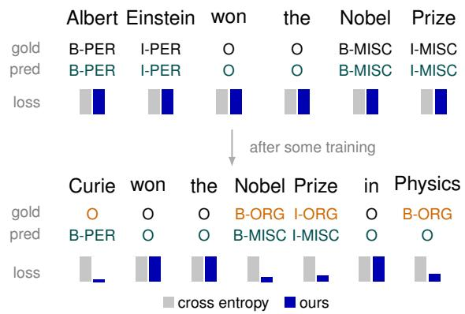
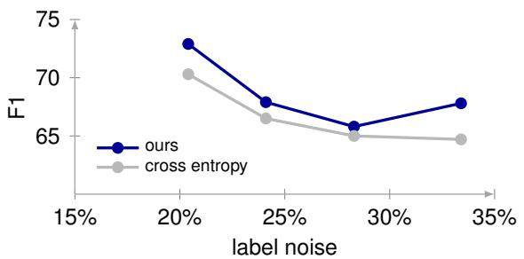
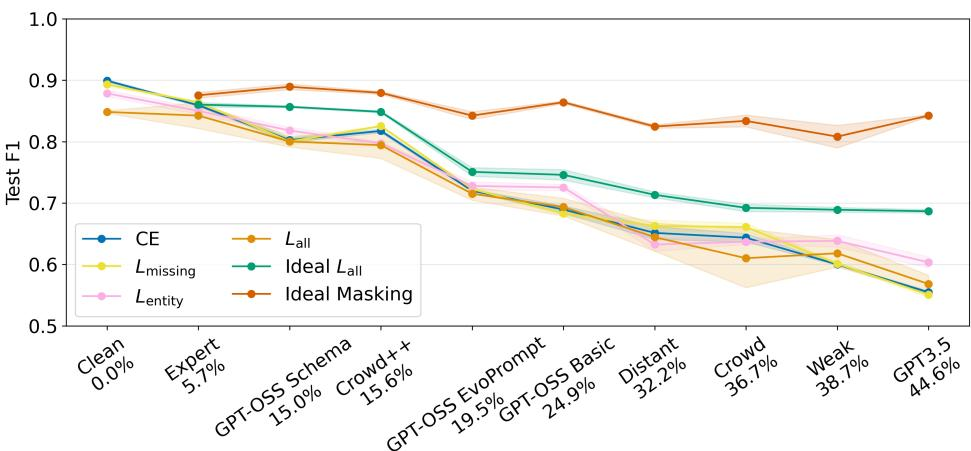
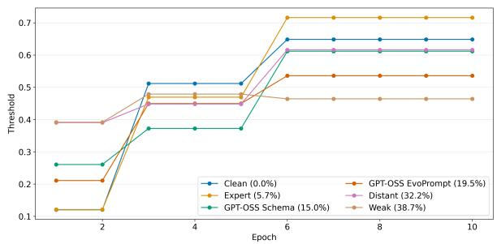
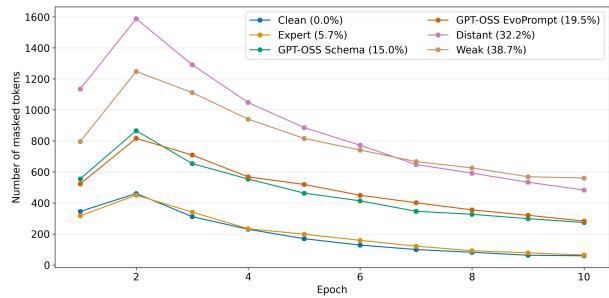
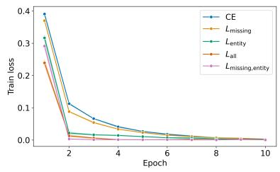
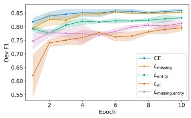
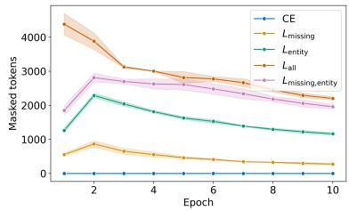
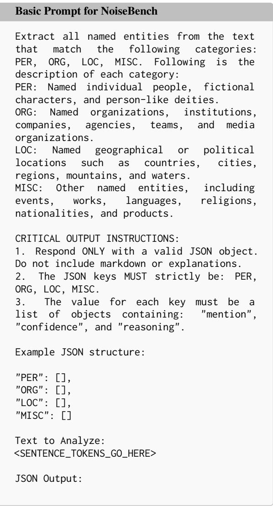

# Error-Type-Aware Loss Reweighting for Robust Named Entity Recognition with Noisy LLM Labels

Elena Merdjanovska1,2, Jonas Golde1 and Alan Akbik1,2

1Humboldt-Universität zu Berlin

2Science of Intelligence

{elena.merdjanovska, jonas.max.golde.1, alan.akbik}@hu-berlin.de

## Abstract

Large language models are increasingly used to annotate datasets for training smaller, taskspecialized models such as named entity recognition. While this method yields effective models, it assumes that the synthetic dataset is correctly annotated. In this work, we find that (i) current fine-tuning processes simply ignore LLM-introduced annotation noise, resulting in degraded performance and (ii) existing noiserobust losses are not transferable to sequence labeling because annotation noise in named entity recognition is heterogeneous: for example, missing mentions and type errors affect the training signal in different ways. Treating all noisy tokens equally in noise-robust losses and applying a single reweighing criterion for all may therefore remove useful supervision or reinforce incorrect labels. To address this limitation, we propose error-type-aware loss reweighting for NER, which introduces separate reweighing rules for different types of potentially erroneous tokens. Our approach is simple and efficient, does not require additional training resources, and improves F1 by 0.8 - 2.0 percentage points on dataset-level average for noise levels between 15% and 40%, with a maximum improvement of 4.6 percentage points with 24.1% noise on Wikigold.1

## 1 Introduction

Recently, large language models (LLMs) are used as an alternative to manual annotation (Ding et al., 2023; Pavlovic and Poesio, 2024) as they reduce annotation costs and generate reliable supervision for large, previously unlabeled datasets (Tan et al., 2024). These annotations can be used to fine-tune smaller models for domain-specific tasks, including named entity recognition (NER). Compared with general-purpose LLMs, such smaller fine-tuned models provide lower latency, reduced memory use,

<table><tr><td rowspan="2">Dataset</td><td rowspan="2">Prompting</td><td colspan="2">Fine-Tuning w/</td></tr><tr><td>LLM-labels</td><td>clean labels</td></tr><tr><td>Ontonotes</td><td>66.2</td><td>65.5</td><td>82.0</td></tr><tr><td>NoiseBench</td><td>83.5</td><td>84.4</td><td>94.8</td></tr><tr><td>CDR</td><td>74.2</td><td>71.2</td><td>85.4</td></tr><tr><td>Wikigold</td><td>73.4</td><td>70.3</td><td>79.7</td></tr></table>

(a) Problem: Noise from LLM-annotations transfers to finetuned models on such data.

(b) Approach: Our proposed loss ignore erroneous annotations after some training.  
  
(c) Results: Across different noise-level, we observe that our loss outperforms comparable loss functions. Plot shows the results with $L _ { \mathrm { m i s s i n g } }$ on Wikigold.  
Figure 1: We introduce a error-type aware loss formulation for the task of named entity recognition as we find that noisy LLM-annotated datasets directly impact downstream performance. Our loss function helps to overcome this issue and improve over comparable loss functions across a range of noise levels.

and cheaper deployment (Bogdanov et al., 2024;   
Zaratiana et al., 2024; Golde et al., 2026).

Despite these benefits, LLM-generated annotations are often incomplete or incorrect. For example, when looking at Figure 1a, we observe that prompting achieves 66.2 F1 on the gold-annotated test split of OntoNotes. At the same time, when fine-tuning on the LLM-annotated train split and evaluate on the corresponding clean test split, we observe across all four datasets in Figure 1a that the fine-tuned F1 stays within 3 points of the prompting approach. Thus, the annotation quality creates a practical ceiling on downstream performance performance and LLM-generated annotations directly transfers its errors to the smaller model.

Noise-robust learning approaches try mitigating the problem of erroneous labels in the training process. Existing approaches include sample selection, label correction, loss reweighting, regularization, and multi-network learning (Frénay and Verleysen, 2013; Han et al., 2018; Song et al., 2023). For example, loss reweighting aims to assign lower weight to incorrect annotations when calculating the total loss (Liu and Tao, 2016; Arazo et al., 2019) which prevents noisy examples from dominating the optimization process.

However, these approaches are primarily designed for classical classification problems. NER is a structured prediction problem in which one jointly models the detection entity types and span boundaries. Thus, the errors in NER datasets are of heterogeneous nature: (i) the LLM may miss an entity mention2, (ii) hallucinate one that is not present, (iii) assign the wrong type or (iv) annotate the mention boundary incorrectly (Merdjanovska et al., 2024). Further, entity annotations are sparse and the majority of tokens is assigned the nonentity label O, resulting in a severe class imbalance. Treating all noisy tokens equally may therefore remove useful supervision or reinforce incorrect labels. Most prior NER-specific work on noisy supervision has focused on distant supervision rather than LLM-generated annotations which exhibit their very own error patterns (Zhang et al., 2025; Li et al., 2025).

To address this limitation, we propose error-typeaware loss reweighting for NER. Our idea is simple: we assume that most LLM annotations are correct and worth learning from, thus our goal becomes identifying and ignoring incorrectly labeled tokens from the loss. Since we assume that annotations are correct, we can treat disagreement between the models’ prediction and actual annotation as the signal that a token may be mislabeled by using the models’ confidence. We can make this distinction for all of the previous error types such that we can adapt what we want to mask, depending on the noise occurring in the LLM annotated data.

We summarize our contributions as follows:

1. We analyze the main error types in LLMgenerated NER annotations and find that errors differ greatly across datasets and prompting approaches, even with the same model.

2. We propose six error-type-aware reweighting loss variants, that mask-out potentially unreliable tokens so they do not negatively impact the training process.

3. We evaluate the losses across four datasets, three LLM annotators and two models against standard fine-tuning and representative noiserobust baselines.

4. Our results show that the proposed errortype-aware reweighting is effective, with per-dataset F1 improvements over standard cross-entropy between 0.8 and 2.0 percentage points with DistilBERT and 1.2 - 1.6 with XLM-RoBERTa (large).

5. We show that error-type-aware reweighting is more effective than global token reweighting, and find that $L _ { \mathrm { m i s s i n g } }$ that targets missing annotations is the best-performing loss overall.

## 2 Related Work

Noisy Labels in NER. Noise-robust NER has been studied extensively for distant supervision. BOND (Liang et al., 2020) uses self-training to replace distant labels with model-generated pseudo-labels, while RoSTER (Meng et al., 2021) combines noisylabel removal and self-training. NEEDLE (Jiang et al., 2021) similarly incorporates a noise-aware loss and self-training under weak supervision.

Many approaches identify unreliable tokens using model confidence or training dynamics, filtering for positive and negative mention samples separately (Zhang et al., 2025; Wang et al., 2023). However, most of these studies, use additional training resources, for example Li et al. (2025) use many trained models as voters to estimate label reliability. Liu et al. (2021) use multiple training iterations in their confidence estimation method, while the approaches by (Zhang et al., 2025) and Merdjanovska and Akbik (2025) require final re-training using the cleaned dataset. Self-Cleaning (Chu et al., 2024), trains a discriminator on a small set of clean instances and uses its predictions to reweigh tokens affected by boundary and type errors separately. Like these approaches, ours filters tokens by error type, but does so directly in the loss, without additional training stages or a clean validation subset.

Zhu et al. (2023) show that distant- and weaksupervision methods relying on clean development data degrade substantially when that data is noisy, and that a small clean set is better spent on finetuning than on model selection. We therefore adopt the more realistic setting in which no clean data is available.

LLMs as Annotators. Although most research on noisy NER focuses on weak or distant supervision, recent benchmarks found that increasngly different annotation sources introduce different noise types into the training process, including LLMgenerated labels (Merdjanovska et al., 2024; Wang et al., 2023). In recent years, LLM-generated labels have become increasingly common across many tasks, including NER. Several zero-shot and fewshot prompting approaches have been proposed, such as GPT-NER (Wang et al., 2025), DiZiNER (Kim and Yoon, 2026), and EvoPrompt (Tong et al., 2025). DiZiNER and EvoPrompt both use prompt-optimization pipelines with iterative refinement. Hybrid annotation pipelines that combine human and LLM labels have also been shown to recover performance under partial annotation loss or limited annotation budgets (Naraki et al., 2024). These studies focus on improving annotation quality rather than on training robustly with the resulting labels, which remain noisy. We address this gap by treating LLM-generated labels as a primary source of noisy supervision.

## 3 Method

## 3.1 Problem Setup

Let $x _ { i }$ denote a token instance and let $\tilde { y } _ { i }$ be its observed noisy label. We assume the training labels may come from a noisy annotation process, and that their corruption probability is instance dependent (Beigman and Beigman Klebanov, 2009; Xia et al., 2020). In particular, the probability that y˜i differs from the latent clean label varies with the instance and the observed label. The goal is to train an NER model $f _ { \theta }$ that performs well on a clean test set despite noisy supervision.

We consider token-level NER, where each token in a sequence is assigned a label from a set $\mathcal { V } =$ $\{ O \} \cup { \mathcal { E } }$ , with O denoting the non-entity (outside) class and E denoting the set of entity types with BIO tagging. The outside class O dominates the label distribution of tokens in NER.

Let $\ell ( f _ { \theta } ( x _ { i } ) , \tilde { y } _ { i } )$ denote the base loss for instance i, token-level categorical cross-entropy. Our approach introduces a binary reliability mask for loss reweighting $w _ { i } \in \{ 0 , 1 \}$ and the total loss is:

$$
\mathcal { L } = \frac { 1 } { N } \sum _ { i = 1 } ^ { N } w _ { i } \ell ( f _ { \theta } ( x _ { i } ) , \tilde { y } _ { i } ) .\tag{1}
$$

This is an importance-weighted empirical risk estimator (Liu and Tao, 2016), where $w _ { i }$ is derived from a hard decision about the latent label-quality state of each token.

## 3.2 Latent Clean Indicator

Let $z _ { i } \in \{ 0 , 1 \}$ be a latent indicator, where $z _ { i } = 1$ means that the observed label $\tilde { y } _ { i }$ is clean and $z _ { i } = 0$ means that it is corrupted. We do not observe $z _ { i }$ directly. From a confidence score $s _ { i } = \operatorname* { m a x } _ { c } p _ { \theta } ( c |$ $x _ { i } )$ , a fitted mixture model (Section 3.3) yields the posterior

$$
q _ { i } = P ( z _ { i } { = } 1 \mid x _ { i } , \tilde { y } _ { i } , \hat { y } _ { i } , s _ { i } ) ,\tag{2}
$$

where ${ \hat { y } } _ { i } \ = \ \arg \operatorname* { m a x } _ { c } p _ { \theta } ( c \ | \ x _ { i } )$ is the model’s current prediction. We then take its maximum a posteriori (MAP) estimate

$$
{ \hat { z } } _ { i } = \mathbb { 1 } \left[ q _ { i } > { \frac { 1 } { 2 } } \right] = { \left\{ \begin{array} { l l } { 1 , } & { q _ { i } > { \frac { 1 } { 2 } } , } \\ { 0 , } & { { \mathrm { o t h e r w i s e . } } } \end{array} \right. }\tag{3}
$$

where $\hat { z } _ { i }$ is the most likely label-quality state under the fitted mixture model.

## 3.3 Adaptive Threshold Estimation

To avoid reliance on clean validation labels, we estimate the mixture model underlying $q _ { i }$ from the training data itself. We fit a two-component Beta mixture (BMM) to the score distribution and interpret one component as likely clean and the other as likely noisy (Arazo et al., 2019; Li et al., 2020). The MAP boundary $\tau$ is the point at which posterior mass is split evenly between the two components,

$$
P ( z = 1 \mid s = \tau ) = P ( z = 0 \mid s = \tau ) ,\tag{4}
$$

and the MAP state reduces to a simple threshold comparison:

$$
\hat { z } _ { i } = \mathbb { 1 } [ s _ { i } > \tau ] .\tag{5}
$$

That is, once the mixture components are estimated and $\tau$ is set at the equal-posterior boundary, a token is classified as clean if and only if its confidence $s _ { i }$ exceeds τ.

In practice, we start training with a fixed τ value, update it after the first few epochs, and refresh it two more times during training at equal intervals.

## 3.4 Error-Type-Aware Hard Reweighing

We convert the MAP state $\hat { z } _ { i }$ into a loss weight only when the model disagrees with the observed label (Wang et al., 2023). We use

$$
w _ { i } = \left\{ \begin{array} { l l } { 1 , } & { \mathrm { i f } \ \hat { y } _ { i } = \tilde { y } _ { i } , } \\ { 1 , } & { \mathrm { i f } \ \hat { y } _ { i } \neq \tilde { y } _ { i } \ \mathrm { a n d } \ \hat { z } _ { i } = 1 , } \\ { 0 , } & { \mathrm { i f } \ \hat { y } _ { i } \neq \tilde { y } _ { i } \ \mathrm { a n d } \ \hat { z } _ { i } = 0 , } \end{array} \right.\tag{6}
$$

where a weight of 0 amounts to hard masking, i.e.   
complete exclusion of the token from the loss.

We introduce separate masking rules for different types of tokens. We partition the disagreeing tokens into error-type-specific sets:

$$
\begin{array} { r } { \mathcal { T } _ { \mathrm { m i s s i n g } } = \{ i : \tilde { y } _ { i } = O , \ \hat { y } _ { i } \neq O \} , } \\ { \mathcal { T } _ { \mathrm { e n t i t y } } = \{ i : \tilde { y } _ { i } \neq O , \ \hat { y } _ { i } \neq \tilde { y } _ { i } \} , } \end{array}\tag{7}
$$

(8)

corresponding to missing-entity and entity errors, respectively.3

As further method variants, we partition the tokens from $\tau _ { \mathrm { e n t i t y } }$ into two more sets:

$$
\begin{array} { r } { \mathcal { T } _ { \mathrm { t y p e } } = \{ i : \tilde { y } _ { i } \neq O , \ \hat { y } _ { i } \neq O \} , } \\ { \mathcal { T } _ { \mathrm { F P } } = \{ i : \tilde { y } _ { i } \neq O , \ \hat { y } _ { i } = O \} , } \end{array}\tag{9}
$$

(10)

corresponding to false positive (hallucinated) entities and type errors, respectively.

As a baseline we include a single threshold variant that applies one mixture model to all misclassified tokens (Meng et al., 2021):

$$
\begin{array} { r } { \mathcal { T } _ { \mathrm { a l l } } = \{ i : \hat { y } _ { i } \neq \tilde { y } _ { i } \} , } \end{array}\tag{11}
$$

Let K denote the error-type partitions (one or multiple) used in a given variant, with token sets $\{ \mathcal { T } _ { k } \} _ { k \in \mathcal { K } } ~ ^ { 4 }$ . For each error type $k ,$ we fit a separate mixture model to the confidence scores of the tokens in $\mathcal { T } _ { k }$ , yielding a type-specific posterior $q _ { i } ^ { ( k ) }$ and MAP state $\hat { z } _ { i } ^ { ( k ) }$

The final binary mask is then

$$
w _ { i } = \mathbb { 1 } \left[ \hat { y } _ { i } = \tilde { y } _ { i } \right] + \sum _ { k \in \mathcal { K } } \mathbb { 1 } \left[ i \in \mathcal { T } _ { k } \right] \hat { z } _ { i } ^ { ( k ) } ,\tag{12}
$$

where the first term keeps agreement tokens in the loss, and the second term includes a disagreement token only if the MAP state under its error-typespecific mixture is clean. Otherwise the token is masked entirely $( w _ { i } = 0 )$

Our final set of losses evaluated in Section 5.2 is: Lall, Lmissing, Lentity, Ltype, LFP and Lmissing, entity.

## 4 Experimental Setup

Across all experiments, we adopt the evaluation protocol of Merdjanovska et al. (2024). We train models on noisy annotations but evaluate on a clean test split with gold labels. This isolates the effect of annotation noise on the learned model, since the test signal is unaffected by the noise process. Further, we assume no clean data is available at any stage, so we use noisy validation split for model selection. For each dataset we consider several annotation sources spanning a range of noise levels and error profiles.

## 4.1 Datasets

We evaluate on four NER datasets: NoiseBench (Merdjanovska et al., 2024) — based on CoNLL03 (Tjong Kim Sang and De Meulder, 2003; Rücker and Akbik, 2023), OntoNotes (Weischedel et al., 2013), Wikigold (Balasuriya et al., 2009), and BC5CDR (Wei et al., 2016). We selected these datasets to cover different label set sizes, with NoiseBench and Wikigold both including 4 types (PER, LOC, ORG and MISC), BC5CDR covering 2 types (DISEASE and CHEMICAL) and OntoNotes covering 18 types.

In addition to the LLM-annotated versions, used in our main experiments, we also evaluate on distant supervision labels (Liang et al., 2020; Shang et al., 2018). Additionally, NoiseBench has 5 further noisy variants. See Appendix A.1 for an overview of the extended noise sources and further dataset details.

## 4.2 LLM Annotation

Our primary noise source are LLM annotations. We use two models: gpt-oss-120b and Qwen3-235B-A22B-Instruct-2507, and four prompting approaches: basic prompting, schema prompting, DiZiNER (Kim and Yoon, 2026) and EvoPrompt (Tong et al., 2025), to get a diverse set of noisy annotations5. The prompts and details are given in Appendix A.2. The final selected label variants, three per dataset, are shown in Table 1.

## 4.3 Baselines

We compare against standard categorical crossentropy (CE) and the following noise-robust loss baselines: generalized cross-entropy (GCE) (Zhang and Sabuncu, 2018; Meng et al., 2021), focal loss (Lin et al., 2018), BMM bootstrap loss — BMMb. (Arazo et al., 2019), corrected $\mathrm { N L L - N L L _ { c } }$ (Jiang et al., 2021).

## 5 Results

In this section, we give an overview of the LLM annotation errors, evaluate the performance of our error-type-aware losses and compare them to existing noise-robust losses. Further, we compare them to ideal masking upper bounds, and analyze their masking dynamics.

## 5.1 LLM Annotation Errors

We first want to understand the extent of LLMintroduced annotation noise for NER. To do so, we generate three LLM annotations for each dataset, as listed in Table 1. This allows us to evaluate our methods across varying noise levels while consistently reflecting LLM annotation noise. For example, on OntoNotes, the approaches range from 60.7 to 70.8 F1 on the training set, while on NoiseBench, a CoNLL subset, scores range from 75.1 to 85.0.

Error types. The annotations exhibit different error profiles, as shown in the %Errors columns of Table 1. For example, in BC5CDR that has only two entity types, most errors across all LLM label variants are missing mentions (FN), while type errors are rare. In contrast, different prompts on NoiseBench produce substantially different error profiles, often with many type errors. The bestperforming label variants generally have the most balanced profiles: in the highest-quality LLM labels for OntoNotes, NoiseBench, and Wikigold, no single error type accounts for more than 40% of erroneous mentions.

<table><tr><td></td><td>F1</td><td colspan="4">%Errors</td></tr><tr><td>Dataset</td><td></td><td>FN</td><td>FP</td><td>Type</td><td>Partial</td></tr><tr><td>OntoNotes</td><td></td><td></td><td></td><td></td><td></td></tr><tr><td>GPT-OSS EvoPrompt</td><td>70.8</td><td>31.1</td><td>29.4</td><td>9.3</td><td>30.2</td></tr><tr><td>GPT-OSS Basic</td><td>67.0</td><td>31.8</td><td>35.7</td><td>8.6</td><td>23.9</td></tr><tr><td>Qwen DiZiNER</td><td>60.7</td><td>58.3</td><td>16.3</td><td>5.0</td><td>20.4</td></tr><tr><td>NoiseBench (CoNLL)</td><td></td><td></td><td></td><td></td><td></td></tr><tr><td>GPT-OSS Schema</td><td>85.0</td><td>27.2</td><td>16.1</td><td>28.5</td><td>28.2</td></tr><tr><td>GPT-OSS EvoPrompt GPT-OSS Basic</td><td>80.5 75.1</td><td>20.7 17.0</td><td>18.9 43.1</td><td>50.2 31.9</td><td>10.2</td></tr><tr><td>BC5CDR</td><td></td><td></td><td></td><td></td><td>8.0</td></tr><tr><td>GPT-OSS Schema</td><td>74.1</td><td>63.0</td><td></td><td></td><td></td></tr><tr><td>GPT-OSS DiZiNER</td><td></td><td></td><td>18.5</td><td>0.3</td><td>18.2</td></tr><tr><td></td><td>73.0</td><td>53.5</td><td>12.3</td><td>0.3</td><td>33.9</td></tr><tr><td>Qwen DiZiNER</td><td>69.6</td><td>49.3</td><td>33.4</td><td>0.6</td><td>16.7</td></tr><tr><td>Wikigold</td><td></td><td></td><td></td><td></td><td></td></tr><tr><td>GPT-OSS Schema</td><td>79.6</td><td>26.7</td><td>32.0</td><td>24.7</td><td>16.6</td></tr><tr><td>GPT-OSS EvoPrompt</td><td>75.9</td><td>13.5</td><td>64.3</td><td>11.8</td><td>10.4</td></tr><tr><td>Qwen DiZiNER</td><td>72.7</td><td>34.0</td><td>46.2</td><td>11.9</td><td>7.9</td></tr></table>

Table 1: Overview of LLM label noise of different label variants in terms of F1 and error shares. The error types are: FN (missing mentions), FP (hallucinated false positive mentions), Type - (correct boundary, but wrong type) and Partial (correct type, but partially wrong boundary). The error type representing the largest share of errors is color-highlighted.

## 5.2 Evaluation of Error-Type-Aware Losses

In this section, we evaluate the effectiveness of our proposed error-type-aware losses. We show a comparison across all datasets and LLM-generated label variants with DistilBERT in Table 2.

Best-performing losses. $L _ { \mathrm { m i s s i n g } }$ is the best loss on all OntoNotes and BC5CDR label variants, improving over cross-entropy by approximately 1 F1 point on average. $L _ { \mathrm { e n t i t y } }$ performs best on NoiseBench, with its largest gain on GPT-OSS Basic, where F1 increases from 68.9 to 72.5. Results on WikiGold are less consistent, with different losses performing best across label variants. It is also the only dataset on which the more error-specific $\boldsymbol { L } _ { \mathrm { F P } }$ variant performs best on average. Its largest improvement occurs for GPT-OSS EvoPrompt, from 60.2 to 64.8. Loss performance aligns with the error types. Wikigold’s GPT-OSS EvoPrompt also has the highest proportion of false-positive (FP) errors (Table 1), suggesting that the effectiveness of an errortype-aware loss depends on the underlying error distribution. More generally, in 9 of the 12 label variants, the best-performing loss targets the most frequent error category, as indicated by the column colors in Table 2.

<table><tr><td>Label set</td><td>CE</td><td> $L _ { \mathrm { a l l } }$ </td><td> $L _ { \mathrm { m i s s i n g } }$ </td><td> $L _ { \mathrm { e n t i t y } }$ </td><td> $L _ { \mathrm { F P } }$ </td><td> $L _ { \mathrm { t y p e } }$ </td><td> $L _ { \mathrm { m i s s i n g , e n t i t y } }$ </td></tr><tr><td colspan="8">BC5CDR</td></tr><tr><td>GPT-OSS Schema</td><td> $7 0 . 1 \pm 0 . 3$ </td><td> $6 1 . 3 \pm 6 . 3$ </td><td> $7 0 . 6 \pm 0 . 5$ </td><td> $6 8 . 2 \pm 0 . 3$ </td><td> $6 7 . 9 \pm 0 . 2$ </td><td> $6 9 . 6 \pm 0 . 2$ </td><td> $6 5 . 9 \pm 1 . 2$ </td></tr><tr><td>GPT-OSS DiZiNER</td><td> $7 0 . 1 \pm 0 . 3$ </td><td> $6 8 . 8 \pm 2 . 2$ </td><td> $7 1 . 3 \pm 0 . 3$ </td><td> $7 0 . 5 \pm 0 . 3$ </td><td> $6 9 . 7 \pm 0 . 1$ </td><td> $7 0 . 2 \pm 0 . 3$ </td><td> $6 8 . 7 \pm 1 . 2$ </td></tr><tr><td>Qwen DiZiNER</td><td> $6 8 . 7 \pm 0 . 2$ </td><td> $6 3 . 1 \pm 4 . 4$ </td><td> $7 0 . 4 \pm 0 . 3$ </td><td> $6 7 . 8 \pm 0 . 4$ </td><td> $6 7 . 5 \pm 0 . 2$ </td><td> $6 8 . 0 \pm 0 . 6$ </td><td> $6 7 . 0 \pm 0 . 2$ </td></tr><tr><td>Average</td><td> $6 9 . 6 \pm 0 . 7$ </td><td> $6 4 . 4 \pm 3 . 2$ </td><td> $7 0 . 7 \pm 0 . 4$ </td><td> $6 8 . 8 \pm 1 . 2$ </td><td> $6 8 . 4 \pm 0 . 9$ </td><td> $6 9 . 3 \pm 0 . 9$ </td><td> $6 7 . 2 \pm 1 . 2$ </td></tr><tr><td colspan="8">NoiseBench</td></tr><tr><td>GPT-OSS Schema</td><td> $8 0 . 2 \pm 0 . 3$ </td><td> $8 0 . 0 \pm 0 . 9$ </td><td> $8 0 . 0 \pm 0 . 7$ </td><td> $8 1 . 8 \pm 0 . 6$ </td><td> $7 9 . 8 \pm 0 . 8$ </td><td> $8 1 . 7 \pm 0 . 1$ </td><td> $7 9 . 6 \pm 1 . 7$ </td></tr><tr><td>GPT-OSS EvoPrompt</td><td> $7 2 . 0 \pm 0 . 2$ </td><td> $7 1 . 5 \pm 1 . 1$ </td><td> $7 2 . 3 \pm 0 . 2$ </td><td> $7 2 . 8 \pm 0 . 7$ </td><td> $7 2 . 2 \pm 0 . 1$ </td><td> $7 2 . 0 \pm 0 . 4$ </td><td> $7 0 . 8 \pm 0 . 8$ </td></tr><tr><td>GPT-OSS Basic</td><td> $6 8 . 9 \pm 0 . 6$ </td><td> $6 9 . 3 \pm 1 . 4$ </td><td> $6 8 . 3 \pm 0 . 3$ </td><td> $7 2 . 5 \pm 0 . 5$ </td><td> $7 2 . 2 \pm 0 . 2$ </td><td> $6 8 . 2 \pm 0 . 9$ </td><td> $6 9 . 0 \pm 2 . 6$ </td></tr><tr><td>Average</td><td> $7 3 . 7 \pm 4 . 8$ </td><td> $7 3 . 6 \pm 4 . 6$ </td><td> $7 3 . 5 \pm 4 . 9$ </td><td> $7 5 . 7 \pm 4 . 3$ </td><td> $7 4 . 7 \pm 3 . 6$ </td><td> $7 3 . 9 \pm 5 . 7$ </td><td> $7 3 . 1 \pm 4 . 6$ </td></tr><tr><td colspan="8">OntoNotes</td></tr><tr><td>GPT-OSS EvoPrompt</td><td> $6 1 . 5 \pm 0 . 1$ </td><td> $5 9 . 7 \pm 2 . 0$ </td><td> $6 2 . 1 \pm 0 . 3$ </td><td> $5 9 . 9 \pm 0 . 3$ </td><td> $6 1 . 4 \pm 0 . 3$ </td><td> $6 1 . 2 \pm 0 . 1$ </td><td> $5 8 . 8 \pm 0 . 3$ </td></tr><tr><td>GPT-OSS Basic</td><td> $5 7 . 6 \pm 0 . 3$ </td><td> $5 5 . 4 \pm 2 . 2$ </td><td> $5 8 . 0 \pm 0 . 7$ </td><td> $5 4 . 6 \pm 1 . 1$ </td><td> $5 7 . 2 \pm 0 . 5$ </td><td> $5 7 . 5 \pm 0 . 4$ </td><td> $5 4 . 9 \pm 1 . 2$ </td></tr><tr><td>Qwen DiZiNER</td><td> $5 7 . 0 \pm 0 . 4$ </td><td> $5 5 . 5 \pm 1 . 3$ </td><td> $5 8 . 3 \pm 0 . 3$ </td><td> $5 5 . 3 \pm 0 . 6$ </td><td> $5 6 . 1 \pm 0 . 4$ </td><td> $5 7 . 1 \pm 0 . 2$ </td><td> $5 6 . 4 \pm 0 . 6$ </td></tr><tr><td>Average</td><td> $5 8 . 7 \pm 2 . 0$ </td><td> $5 6 . 9 \pm 2 . 0$ </td><td> $5 9 . 5 \pm 1 . 9$ </td><td> $5 6 . 6 \pm 2 . 3$ </td><td> $5 8 . 2 \pm 2 . 2$ </td><td> $5 8 . 6 \pm 1 . 8$ </td><td> $5 6 . 7 \pm 1 . 6$ </td></tr><tr><td colspan="8">Wikigold</td></tr><tr><td>GPT-OSS Schema</td><td> $6 6 . 8 \pm 0 . 2$ </td><td> $7 0 . 3 \pm 2 . 1$ </td><td> $7 0 . 2 \pm 1 . 0$ </td><td> $6 8 . 6 \pm 1 . 2$ </td><td> $7 0 . 0 \pm 0 . 9$ </td><td> $6 7 . 8 \pm 1 . 4$ </td><td> $6 7 . 0 \pm 1 . 3$ </td></tr><tr><td>GPT-OSS EvoPrompt</td><td> $6 0 . 2 \pm { 0 . 5 }$ </td><td> $6 0 . 4 \pm 2 . 5$ </td><td> $5 9 . 3 \pm 0 . 8$ </td><td> $6 3 . 3 \pm { 1 . 7 }$ </td><td> $6 4 . 8 \pm { 1 . 8 }$ </td><td> $6 1 . 6 \pm 0 . 5$ </td><td> $6 0 . 3 \pm { 0 . 8 }$ </td></tr><tr><td>Qwen DiZiNER</td><td> $5 9 . 8 \pm 0 . 2$ </td><td> $5 6 . 4 \pm 1 . 3$ </td><td> $5 9 . 7 \pm 0 . 9$ </td><td> $5 7 . 7 \pm 1 . 2$ </td><td> $5 5 . 6 \pm 1 . 1$ </td><td> $5 8 . 8 \pm 1 . 0$ </td><td> $5 9 . 0 \pm 0 . 6$ </td></tr><tr><td>Average</td><td> $6 2 . 2 \pm 3 . 2$ </td><td> $6 2 . 4 \pm 5 . 8$ </td><td> $6 3 . 1 \pm 5 . 1$ </td><td> $6 3 . 2 \pm 4 . 5$ </td><td> $6 3 . 5 \pm 6 . 0$ </td><td> $6 2 . 7 \pm 3 . 8$ </td><td> $6 2 . 1 \pm 3 . 5$ </td></tr></table>

Table 2: Test F1s (entity-level) of error-type-aware losses, compared with cross-entropy (CE) and global masking $( L _ { \mathrm { a l l } } )$ , using DistilBERT. The color-highlighting is consistent with Table 1 and refers to the most common error type in each label variant (rows) and the error types targeted by each loss (columns).

Benefits and limits of error-specific masking. Separating tokens according to their observed labels, as in $L _ { \mathrm { m i s s i n g } }$ and $L _ { \mathrm { e n t i t y } }$ , is beneficial and significantly outperforms the global variant $L _ { \mathrm { a l l } }$ across all datasets and noise types. However, more specific masking through further partitioning of $L _ { \mathrm { e n t i t y } }$ according to the predicted label into $\boldsymbol { L } _ { \mathrm { F P } }$ and $L _ { \mathrm { t y p e } }$ provides no consistent advantage. For example, $L _ { \mathrm { t y p e } }$ performs poorly even on the NoiseBench $\mathsf { G P T } { \mathrel { - } } 0 5 5$ EvoPrompt labels, where type errors account for more than 50% of the noise. In general, the broader $L _ { \mathrm { e n t i t y } }$ variant is more effective for both type errors and false positives.

<table><tr><td>Loss</td><td></td><td>BC5CDR NoiseBench OntoNotes Wikigold</td><td></td></tr><tr><td colspan="4">Baseline losses</td></tr><tr><td>CE</td><td> $6 9 . 6 \pm 0 . 7$ </td><td> $7 3 . 7 \pm 4 . 8$   $5 8 . 7 \pm 2 . 0$ </td><td> $6 2 . 2 \pm 3 . 2$ </td></tr><tr><td> $\mathrm { B M M _ { b } }$   $\mathrm { N L L } _ { \mathrm { c } }$ </td><td> $6 9 . 4 \pm 0 . 9$   $6 9 . 4 \pm 0 . 9$ </td><td> $7 3 . 7 \pm 4 . 8$   $5 8 . 8 \pm 2 . 2$   $7 3 . 9 \pm 5 . 0$   $5 8 . 8 \pm 2 . 1$ </td><td> $6 2 . 2 \pm 4 . 2$   $6 2 . 3 \pm 3 . 5$ </td></tr><tr><td>GCE</td><td> $6 9 . 3 \pm 0 . 9$ </td><td> $7 3 . 3 \pm 5 . 1$   $5 8 . 7 \pm 2 . 1 $ </td><td> $6 2 . 5 \pm 3 . 5$ </td></tr><tr><td>Focal</td><td> $6 9 . 6 \pm 0 . 9$ </td><td> $7 3 . 7 \pm 4 . 9$   $5 8 . 8 \pm 2 . 2$ </td><td> $6 3 . 1 \pm 4 . 3$ </td></tr><tr><td> $L _ { \mathrm { a l l } }$ </td><td> $6 4 . 4 \pm 3 . 2$ </td><td> $7 3 . 6 \pm 4 . 6$   $5 6 . 9 \pm 2 . 0$ </td><td> $6 2 . 4 \pm 5 . 8$ </td></tr><tr><td colspan="4">Error-type-aware losses</td></tr><tr><td></td><td></td><td></td><td></td></tr><tr><td>Lmissing</td><td> $7 0 . 7 \pm 0 . 4$ </td><td> $7 3 . 5 \pm 4 . 9$ </td><td> $5 9 . 5 \pm 1 . 9$   $6 3 . 1 \pm 5 . 1$   $6 3 . 2 \pm 4 . 5$ </td></tr><tr><td> $L _ { \mathrm { e n t i t y } }$ </td><td> $6 8 . 8 \pm { 1 . 2 }$ </td><td> $7 5 . 7 \pm 4 . 3$   $7 4 . 7 \pm 3 . 6$ </td><td> $5 6 . 6 \pm 2 . 3$   $5 8 . 2 \pm 2 . 2$   $6 3 . 5 \pm 6 . 0$ </td></tr><tr><td> $L _ { \mathrm { F P } }$ </td><td> $6 8 . 4 \pm 0 . 9$ </td><td> $7 3 . 9 \pm 5 . 7$ </td><td> $5 8 . 6 \pm 1 . 8$   $6 2 . 7 \pm 3 . 8$ </td></tr><tr><td> $L _ { \mathrm { t y p e } }$ </td><td> $6 9 . 3 \pm 0 . 9$ </td><td></td><td></td></tr><tr><td> $L _ { \mathrm { m i s s . , e n t . } }$ </td><td> $6 7 . 2 \pm 1 . 2$ </td><td> $7 3 . 1 \pm 4 . 6$ </td><td> $5 6 . 7 \pm 1 . 6$   $6 2 . 1 \pm 3 . 5$ </td></tr></table>

Table 3: Comparison of error-aware losses with other related noise-robust losses w.r.t. test F1, using DistilBERT.

Comparison to related work losses. We compare our loss variants with existing noise-robust losses in Table 3. None of the existing losses outperform our variants on any dataset. This includes general NER objectives such as Focal Loss, general noise-robust objectives such as GCE and BMM Bootstrap, and NER-specific noise-robust objectives such as Corrected NLL. Although these losses occasionally outperform cross-entropy (for example, Focal Loss on Wikigold) their overall results remain close to the baseline.

Findings extend to another model. We observe similar result patterns with XLM-RoBERTa (large) (Table 7 and Table 8 in Appendix C).

The main difference is on Wikigold, where $L _ { \mathrm { m i s s i n g } }$ performs best with XLM-RoBERTa-large, whereas $L _ { \mathrm { e n t i t y } }$ performs best with DistilBERT. However, the DistilBERT results for $L _ { \mathrm { m i s s i n g } }$ $L _ { \mathrm { e n t i t y } }$ , and $\boldsymbol { L } _ { \mathrm { F P } }$ are very close, suggesting that this difference is small.

## 5.3 Upper Bounds for Loss Masking

We next examine the general potential of loss masking using two oracle-based approaches:

• Ideal Masking — masks all erroneous tokens, identified by comparing the BIO labels in the noisy and clean label variants. The mask remains fixed throughout training.

  
Figure 2: Test F1s across noise levels, of error-type-aware losses, CE and oracle masking. Shows all 10 NoiseBench noisy variants, using DistilBERT. The noise share is calculated as $1 - F 1$ annotation.

• Ideal $L _ { a l l }$ — masks an erroneous token only when it is misclassified by the model. The mask therefore changes across epochs with the model’s predictions.

High potential of masking approaches. Ideal Masking achieves test F1 scores close to those obtained by fine-tuning on clean data (Figure 2 on NoiseBench), demonstrating that excluding erroneous tokens from training has the potential to recover almost clean-training performance. Ideal $L _ { \mathrm { a l l } }$ also significantly improves performance under label noise, although by a smaller margin.

The two approaches represent different performance limits. Ideal Masking provides an absolute limit because it removes all erroneous tokens, including those the model might memorize easily. Such tokens are difficult to identify from confidence scores (Merdjanovska and Akbik, 2025). Ideal $L _ { \mathrm { a l l } }$ is more realistic because it masks only erroneous tokens that remain misclassified (Chong et al., 2022; Wang et al., 2023). As it is also conceptually closer to our proposed losses, we treat Ideal $L _ { \mathrm { a l l } }$ as a method-level upper bound.

Error-aware masking narrows the gap to ideal. Despite the strong performance of Ideal $L _ { \mathrm { a l l } }$ , its global practical counterpart $L _ { \mathrm { a l l } }$ performs poorly across all noise types and is often worse than the CE baseline (Figure 2). This method applies a single confidence threshold to both O and entity tokens, while $L _ { \mathrm { m i s s i n g } }$ and $L _ { \mathrm { e n t i t y } }$ treat each token type separately. Lmissing performs well for Crowd++, Distant, and Crowd noise, whereas $L _ { \mathrm { e n t i t y } }$ outperforms the baseline for GPT-OSS-Schema, GPT-OSS Basic, Weak, and GPT3.5 noise. This again shows that masking the token groups separately is considerably more effective.

## 5.4 Masking Dynamics

We analyse the behavior of our proposed Lmissing through the training iterations.

Adaptive thresholding results in consistent masking patterns. In Figure 3a we see how the threshold of $L _ { \mathrm { m i s s i n g } }$ masking dynamically adapts for different noise levels. It generally increases in later epochs, although it can decrease in some settings, such as Weak noise. Despite these differences, the number of masked tokens follows a consistent pattern across noise levels (Figure 3b): it is initially high and gradually decreases. This is expected since more tokens are misclassified early in training and recovering noisy samples is more effective during early-learning (Arpit et al., 2017).

Higher noise levels also lead to more masked tokens, as intended. Thus, although the threshold trajectories differ across label variants, they produce similar masking dynamics. This suggests that the adaptive thresholding mechanism is effective.

## 5.5 Why Combined Masking Underperforms

The results for both models confirm that practical $L _ { \mathrm { a l l } }$ is the weakest method and performs substantially worse than CE. A likely explanation is that misclassified O and non-O tokens have different confidence distributions (Merdjanovska and Akbik, 2025). Because most tokens in NER belong to the O class, applying a shared threshold to both groups ignores the strong class imbalance and leads to incorrect filtering — with many correct tokens being masked and incorrect tokens still learned.

  
(a) Confidence threshold.

  
(b) Number of masked tokens.

Figure 3: Confidence threshold and number of masked tokens with $L _ { \mathrm { m i s s i n g } }$ loss, using DistilBERT. Shows selected NoiseBench noisy variants.  
  
(a) Training loss.

  
(b) Development F1.

  
(c) Number of masked tokens.  
Figure 4: Training dynamics of different loss variants, when fine-tuning on NoiseBench’s GPT-OSS Schema variant.

Combined masking filters out too much useful information. The other combined approach, $L _ { \mathrm { m i s s i n g , e n t i t y } }$ , also underperforms despite applying separate thresholds to the two token groups. Figure 4 compares the dynamics of loss, development F1 and number of masked tokens of the different losses. As expected, Lmissing, entity mask over twice more tokens than $L _ { \mathrm { m i s s i n g } } \ \mathrm { o r } \ L _ { \mathrm { e n t i t y } }$ combined , suggesting that its poor performance results from the total amount of information removed. This interpretation is supported by the training dynamics. Under $L _ { \mathrm { m i s s i n g , e n t i t y } }$ , the training loss decreases sharply, while F1 on the noisy development set fails to improve. The combined approach therefore appears too aggressive: by masking both token groups simultaneously, it removes too much training signal for the model to learn the task effectively.

Practical recommendation. We therefore conclude that each token type should be addressed separately rather than attempting to correct all errors simultaneously. In practice, the loss should be selected according to the expected dominant error type: $L _ { \mathrm { m i s s i n g } }$ for missing (false negatives) and $L _ { \mathrm { e n t i t y } }$ for false positives and type errors. When neither error type is clearly dominant, Lmissing is the safer default because it provides the largest average improvement over standard cross-entropy across datasets and LLM-generated label variants.

## 6 Conclusion

This paper addresses the important issue of finetuning under noisy LLM-generated supervision. As LLMs are increasingly adopted for annotation, particularly in information extraction tasks like NER, their variable annotation quality can substantially affect downstream model performance.

We propose a label noise-robust loss reweighing approach, which targets different types of NER errors separately. To capture a broad range of noise levels and error profiles, we evaluate our approach on four datasets, each with three LLM-generated label variants. Our results show that targeted errortype-aware masking is more effective than uniform masking across all error types. We improve the test F1 scores by between 0.8 and 2.0 percentage point per dataset. Our method is efficient and can be applied directly into a single fine-tuning run without additional resources, making it suitable and practical for fine-tuning small domain-specific NER models on LLM-annotated data.

## Limitations

We find that noise robust loss functions are most effective when aligning them with the error distribution of the annotation model and we did not find a unified error mode. This distribution can not be known in advance since measuring it requires a small set of clean labels. Further, we did not find a single unified error mode and combined masking approaches yield degraded performance across the benchmarks investigated.

Further, our method assumes that the error types can be explained with two Beta components and that the resulting posterior is monotone in score which we both cannot guarantee. For datasets having fewer examples, less classes, or different distributions, out method may find unreliable threshold and thus yields degraded performance.

Our experiments are limited to two encoder models (DistilBERT and XLM-RoBERTa) and evaluate only on English-data and we do not investigate whether our approach transfers for example to autoregressive models or low-resource languages.

At last, our approaches are evaluated on tokenlevel NER, without considering span-level classification. Span-level approaches are very popular with cross-encoder and bi-encoder generalist models, and often trained using LLM-generated data.

## Acknowledgements

Elena Merdjanovska and Alan Akbik are funded by the Deutsche Forschungsgemeinschaft (DFG, German Research Foundation) under Germany’s Excellence Strategy – EXC 2002/2 “Science of Intelligence” – project number 390523135. Alan Akbik is further supported by the Deutsche Forschungsgemeinschaft (DFG, German Research Foundation) under Emmy Noether grant “Eidetic Representations of Natural Language” (project number 448414230). Jonas Golde is supported by the Bundesministerium für Bildung und Forschung (BMBF) as part of the project “FewTuRe” (project number 01IS24020).

## References

Alan Akbik, Tanja Bergmann, Duncan Blythe, Kashif Rasul, Stefan Schweter, and Roland Vollgraf. 2019. FLAIR: An easy-to-use framework for state-of-theart NLP. In Proceedings ofthe 2019 Conference of the North American Chapter ofthe Associationfor Computational Linguistics (Demonstrations), pages

54–59, Minneapolis, Minnesota. Association for Computational Linguistics.

Eric Arazo, Diego Ortego, Paul Albert, Noel O’Connor, and Kevin Mcguinness. 2019. Unsupervised label noise modeling and loss correction. In Proceedings of the 36th International Conference on Machine Learning, volume 97 of Proceedings of Machine Learning Research, pages 312–321. PMLR.

Devansh Arpit, Stanisław Jastrz˛ebski, Nicolas Ballas, David Krueger, Emmanuel Bengio, Maxinder S. Kanwal, Tegan Maharaj, Asja Fischer, Aaron Courville, Yoshua Bengio, and Simon Lacoste-Julien. 2017. A closer look at memorization in deep networks. In Proceedings of the 34th International Conference on Machine Learning, volume 70 of Proceedings of Machine Learning Research, pages 233–242. PMLR.

Dominic Balasuriya, Nicky Ringland, Joel Nothman, Tara Murphy, and James R. Curran. 2009. Named entity recognition in Wikipedia. In Proceedings of the 2009 Workshop on The People’s Web: Smells Like Teen Spirit, pages 10–18, Suntec, Singapore. Association for Computational Linguistics.

Eyal Beigman and Beata Beigman Klebanov. 2009. Learning with annotation noise. In Proceedings of the Joint Conference of the 47th Annual Meeting of the ACL and the 4th International Joint Conference on Natural Language Processing of the AFNLP, pages 280–287, Suntec, Singapore. Association for Computational Linguistics.

Sergei Bogdanov, Alexandre Constantin, Timothée Bernard, Benoit Crabbé, and Etienne P Bernard. 2024. NuNER: Entity recognition encoder pretraining via LLM-annotated data. In Proceedings of the 2024 Conference on Empirical Methods in Natural Language Processing, pages 11829–11841, Miami, Florida, USA. Association for Computational Linguistics.

Derek Chong, Jenny Hong, and Christopher Manning. 2022. Detecting label errors by using pre-trained language models. In Proceedings ofthe 2022 Conference on Empirical Methods in Natural Language Processing, pages 9074–9091, Abu Dhabi, United Arab Emirates. Association for Computational Linguistics.

Zhendong Chu, Ruiyi Zhang, Tong Yu, Rajiv Jain, Vlad Morariu, Jiuxiang Gu, and Ani Nenkova. 2024. Self-cleaning: Improving a named entity recognizer trained on noisy data with a few clean instances. In Findings ofthe Associationfor Computational Linguistics: NAACL 2024, pages 196–210, Mexico City, Mexico. Association for Computational Linguistics.

Bosheng Ding, Chengwei Qin, Linlin Liu, Yew Ken Chia, Boyang Li, Shafiq Joty, and Lidong Bing. 2023. Is GPT-3 a good data annotator? In Proceedings of the 61st Annual Meeting of the Association for Computational Linguistics (Volume 1: Long Papers), pages 11173–11195, Toronto, Canada. Association for Computational Linguistics.

Benoît Frénay and Michel Verleysen. 2013. Classification in the presence of label noise: a survey. IEEE transactions on neural networks and learning systems, 25(5):845–869.

Jonas Golde, Patrick Haller, and Alan Akbik. 2026. FiN-ERweb: Datasets and artifacts for scalable multilingual named entity recognition. In Findings of the Association for Computational Linguistics: EACL 2026, pages 2281–2300, Rabat, Morocco. Association for Computational Linguistics.

Bo Han, Quanming Yao, Xingrui Yu, Gang Niu, Miao Xu, Weihua Hu, Ivor Tsang, and Masashi Sugiyama. 2018. Co-teaching: Robust training of deep neural networks with extremely noisy labels. In Advances in Neural Information Processing Systems, volume 31. Curran Associates, Inc.

Haoming Jiang, Danqing Zhang, Tianyu Cao, Bing Yin, and Tuo Zhao. 2021. Named entity recognition with small strongly labeled and large weakly labeled data. In Proceedings of the 59th Annual Meeting of the Association for Computational Linguistics and the 11th International Joint Conference on Natural Language Processing (Volume 1: Long Papers), pages 1775–1789, Online. Association for Computational Linguistics.

Siun Kim and Hyung-Jin Yoon. 2026. DiZiNER: Disagreement-guided instruction refinement via simulating pilot annotation for zero-shot named entity recognition. In Proceedings ofthe 64th Annual Meeting of the Association for Computational Linguistics (Volume 1: Long Papers), pages 17498–17519, San Diego, California, United States. Association for Computational Linguistics.

Junnan Li, Richard Socher, and Steven C.H. Hoi. 2020. Dividemix: Learning with noisy labels as semisupervised learning. In International Conference on Learning Representations.

Yuepei Li, Kang Zhou, Qiao Qiao, Qing Wang, and Qi Li. 2025. Re-examine distantly supervised NER: A new benchmark and a simple approach. In Proceedings of the 31st International Conference on Computational Linguistics, pages 10940–10959, Abu Dhabi, UAE. Association for Computational Linguistics.

Chen Liang, Yue Yu, Haoming Jiang, Siawpeng Er, Ruijia Wang, Tuo Zhao, and Chao Zhang. 2020. Bond: Bert-assisted open-domain named entity recognition with distant supervision. In Proceedings of the 26th ACM SIGKDD International Conference on Knowledge Discovery & Data Mining, KDD ’20, page 1054–1064, New York, NY, USA. Association for Computing Machinery.

Tsung-Yi Lin, Priya Goyal, Ross Girshick, Kaiming He, and Piotr Dollár. 2018. Focal loss for dense object detection. Preprint, arXiv:1708.02002.

Kun Liu, Yao Fu, Chuanqi Tan, Mosha Chen, Ningyu Zhang, Songfang Huang, and Sheng Gao. 2021.

Noisy-labeled NER with confidence estimation. In Proceedings of the 2021 Conference of the North American Chapter of the Association for Computational Linguistics: Human Language Technologies, pages 3437–3445, Online. Association for Computational Linguistics.

Tongliang Liu and Dacheng Tao. 2016. Classification with noisy labels by importance reweighting. IEEE Transactions on Pattern Analysis and Machine Intelligence, 38(3):447–461.

Yu Meng, Yunyi Zhang, Jiaxin Huang, Xuan Wang, Yu Zhang, Heng Ji, and Jiawei Han. 2021. Distantlysupervised named entity recognition with noiserobust learning and language model augmented selftraining. In Proceedings of the 2021 Conference on Empirical Methods in Natural Language Processing, pages 10367–10378, Online and Punta Cana, Dominican Republic. Association for Computational Linguistics.

Elena Merdjanovska and Alan Akbik. 2025. Tokenlevel metrics for detecting incorrect gold annotations in named entity recognition. In Findings of the Associationfor Computational Linguistics: EMNLP 2025, pages 15292–15304, Suzhou, China. Association for Computational Linguistics.

Elena Merdjanovska, Ansar Aynetdinov, and Alan Akbik. 2024. NoiseBench: Benchmarking the impact of real label noise on named entity recognition. In Proceedings of the 2024 Conference on Empirical Methods in Natural Language Processing, pages 18182– 18198. Association for Computational Linguistics.

Yuji Naraki, Ryosuke Yamaki, Yoshikazu Ikeda, Takafumi Horie, Kotaro Yoshida, Ryotaro Shimizu, and Hiroki Naganuma. 2024. Augmenting ner datasets with llms: Towards automated and refined annotation. Preprint, arXiv:2404.01334.

Maja Pavlovic and Massimo Poesio. 2024. The effectiveness of LLMs as annotators: A comparative overview and empirical analysis of direct representation. In Proceedings ofthe 3rd Workshop on Perspectivist Approaches to NLP (NLPerspectives) @ LREC-COLING 2024, pages 100–110, Torino, Italia. ELRA and ICCL.

Susanna Rücker and Alan Akbik. 2023. CleanCoNLL: A nearly noise-free named entity recognition dataset. In Proceedings of the 2023 Conference on Empirical Methods in Natural Language Processing, pages 8628–8645, Singapore. Association for Computational Linguistics.

Jingbo Shang, Liyuan Liu, Xiang Ren, Xiaotao Gu, Teng Ren, and Jiawei Han. 2018. Learning named entity tagger using domain-specific dictionary. In EMNLP.

Hwanjun Song, Minseok Kim, Dongmin Park, Yooju Shin, and Jae-Gil Lee. 2023. Learning from noisy labels with deep neural networks: A survey. IEEE Transactions on Neural Networks and Learning Systems, 34(11):8135–8153.

Zhen Tan, Dawei Li, Song Wang, Alimohammad Beigi, Bohan Jiang, Amrita Bhattacharjee, Mansooreh Karami, Jundong Li, Lu Cheng, and Huan Liu. 2024. Large language models for data annotation and synthesis: A survey. In Proceedings ofthe 2024 Conference on Empirical Methods in Natural Language Processing, pages 930–957. Association for Computational Linguistics.

Erik F. Tjong Kim Sang and Fien De Meulder. 2003. Introduction to the CoNLL-2003 shared task: Language-independent named entity recognition. In Proceedings of the Seventh Conference on Natural Language Learning at HLT-NAACL 2003, pages 142– 147.

Zeliang Tong, Zhuojun Ding, and Wei Wei. 2025. Evo-Prompt: Evolving prompts for enhanced zero-shot named entity recognition with large language models. In Proceedings of the 31st International Conference on Computational Linguistics, pages 5136– 5153, Abu Dhabi, UAE. Association for Computational Linguistics.

Haobo Wang, Yiwen Dong, Ruixuan Xiao, Fei Huang, Gang Chen, and Junbo Zhao. 2023. Debiased and denoised entity recognition from distant supervision. In Advances in Neural Information Processing Systems, volume 36, pages 16650–16672. Curran Associates, Inc.

Shuhe Wang, Xiaofei Sun, Xiaoya Li, Rongbin Ouyang, Fei Wu, Tianwei Zhang, Jiwei Li, Guoyin Wang, and Chen Guo. 2025. GPT-NER: Named entity recognition via large language models. In Findings of the Associationfor Computational Linguistics: NAACL 2025, pages 4257–4275, Albuquerque, New Mexico. Association for Computational Linguistics.

Chih-Hsuan Wei, Yifan Peng, Robert Leaman, Allan Peter Davis, Carolyn J Mattingly, Jiao Li, Thomas C Wiegers, and Zhiyong Lu. 2016. Assessing the state of the art in biomedical relation extraction: overview of the biocreative v chemical-disease relation (cdr) task. Database, 2016.

Ralph Weischedel, Martha Palmer, Mitchell Marcus, Eduard Hovy, Sameer Pradhan, Lance Ramshaw, Nianwen Xue, Ann Taylor, Jeff Kaufman, Michelle Franchini, Mohammed El-Bachouti, Robert Belvin, and Ann Houston. 2013. Ontonotes release 5.0 ldc2013t19.

Xiaobo Xia, Tongliang Liu, Bo Han, Nannan Wang, Mingming Gong, Haifeng Liu, Gang Niu, Dacheng Tao, and Masashi Sugiyama. 2020. Part-dependent label noise: Towards instance-dependent label noise. Preprint, arXiv:2006.07836.

Urchade Zaratiana, Nadi Tomeh, Pierre Holat, and Thierry Charnois. 2024. GLiNER: Generalist model for named entity recognition using bidirectional transformer. In Proceedings of the 2024 Conference of the North American Chapter ofthe Associationfor Computational Linguistics: Human Language Technologies (Volume 1: Long Papers), pages 5364–5376,

Mexico City, Mexico. Association for Computational Linguistics.

Qi Zhang, Huitong Pan, Zhijia Chen, Longin Jan Latecki, Cornelia Caragea, and Eduard Dragut. 2025. DynClean: Training dynamics-based label cleaning for distantly-supervised named entity recognition. In Findings of the Association for Computational Linguistics: NAACL 2025, pages 2540–2556, Albuquerque, New Mexico. Association for Computational Linguistics.

Zhilu Zhang and Mert R Sabuncu. 2018. Generalized cross entropy loss for training deep neural networks with noisy labels. In Advances in Neural Information Processing Systems, volume 31, pages 8792–8802.

Dawei Zhu, Xiaoyu Shen, Marius Mosbach, Andreas Stephan, and Dietrich Klakow. 2023. Weaker than you think: A critical look at weakly supervised learning. In Proceedings of the 61st Annual Meeting of the Associationfor Computational Linguistics (Volume 1: Long Papers), pages 14229–14253, Toronto, Canada. Association for Computational Linguistics.

## A Experimental Details

## A.1 Datasets

Table 4 shows the dataset sizes and classes. For NoiseBench, BC5CDR and OntoNotes we used the original train-test splits. For Wikigold which does not have an established split, we split it into train, dev and test 80% / 10% / 10%, based on the document boundaries and the original sentence order. We downsample the OntoNotes training set and use a subset consisting of 20% of the original training set and the full test set.

For BC5CDR, OntoNotes and Wikigold, we use the Flair (Akbik et al., 2019) implementation for the dataset’s original (expert) labels. For OntoNotes and Wikigold, we use the BOND distant labels (Liang et al., 2020). For BC5CDR, we use the AutoNER distant labels (Shang et al., 2018). Table 5 shows the noise levels of the distant, weak and crowd noisy variants.

<table><tr><td colspan="3"># Sentences</td><td rowspan="2">#Entity Types</td></tr><tr><td>Dataset</td><td>Train</td><td>Test</td></tr><tr><td>OntoNotes</td><td>15036</td><td>9479</td><td>18</td></tr><tr><td>NoiseBench</td><td>4879</td><td>3426</td><td>4</td></tr><tr><td>BC5CDR</td><td>4576</td><td>4784</td><td>2</td></tr><tr><td>Wikigold</td><td>1330</td><td>120</td><td>4</td></tr></table>

Table 4: Dataset sizes and numbers of entity classes.

<table><tr><td></td><td>F1</td><td colspan="4">%Errors</td></tr><tr><td>Dataset</td><td></td><td>FN</td><td></td><td>FP Type</td><td>Partial</td></tr><tr><td>OntoNotes Distant</td><td>75.9</td><td>55.1</td><td>17.6</td><td>9.9</td><td>17.4</td></tr><tr><td>NoiseBench</td><td></td><td></td><td></td><td></td><td></td></tr><tr><td>Expert</td><td>94.3</td><td>9.7</td><td>3.6</td><td>73.4</td><td>13.3</td></tr><tr><td>Crowd++</td><td>84.4</td><td>58.6</td><td>9.1</td><td>16.7</td><td>15.6</td></tr><tr><td>Distant</td><td>67.8</td><td>65.5</td><td>10.5</td><td>12.9</td><td>11.1</td></tr><tr><td>Crowd</td><td>63.3</td><td>61.8</td><td>10.5</td><td>15.1</td><td>12.6</td></tr><tr><td>Weak</td><td>61.3</td><td>17.4</td><td>36.5</td><td>33.7</td><td>12.3</td></tr><tr><td>GPT3.5</td><td>55.4</td><td>23.5</td><td>46.8</td><td>25.8</td><td>3.9</td></tr><tr><td>BC5CDR</td><td></td><td></td><td></td><td></td><td></td></tr><tr><td>Distant</td><td>79.0 90.2</td><td></td><td>6.9</td><td>0.1</td><td>2.8</td></tr><tr><td>Wikigold Distant</td><td>66.6</td><td>635.3</td><td>37.3</td><td>10.7</td><td>16.7</td></tr></table>

Table 5: Overview of the noisy training variants, from extended noise sources.

## A.2 LLM Annotation

We used two main prompts, Basic (for all datasets) and a more complex Schema prompt (only for Wikigold and NoiseBench). An example Basic prompt for NoiseBench is given in Figure 5. We also use adapted versions of the prompt refinement algorithms EvoPrompt (Tong et al., 2025) and DiZiNER (Kim and Yoon, 2026). For both, we used 100 (unlabeled) train sentences, with 2 refinement iterations for EvoPrompt and 4 cycles for DiZiNER. We used two annotator models: gpt-oss-120b and Qwen3-235B-A22B-Instruct-2507. The final prompts for each approach and dataset can be found in our repository.

  
Figure 5: Example Basic prompt for NoiseBench.

The various prompts and two models resulted in a total of 4-6 LLM-generated label variants for each dataset. Out of these, we selected 3 representative label variants, ensuring a wide range of noise levels, and always including the highest quality label per dataset.

## A.3 Models and Fine-Tuning

We used DistilBERT and XLM-RoBERTa (large) for fine-tuning. We trained each model for 10 epochs, linear scheduler with 0.1 warmup, weight decay of 0.01. For NoiseBench and Wikigold, which include document boundaries, we added document context of 64 sentences. We ran each experiment for 3 random seeds.

We tuned the learning rate and batch size for each dataset and model separately. We tried the following learning rate values: [5.0e-6, 5.0e-5, 1.0e-5, 1.0e-6] and train batch size values: [8, 4, 16, 32] and selected the best one based on the performance on the (noisy) development set6.

## A.4 Baseline Losses

For some related work losses, we performed hyperparameter tuning. For Focal loss we tried the following γ values: [0, 1, 2, 3]. For GCE we tuned q out of [0.3, 0.5, 0.7, 0.9].

## A.5 Error-Type-Aware Losses

For all error-type-aware losses, we use a threshold posterior cutoff of 0.3. With each loss, there is a warmup stage of 150 iterations, during which no masking is performed. Then, the confidence threshold is set to an initial value of 0.4 for $L _ { \mathrm { m i s s i n g } }$ and 0.85 for $L _ { \mathrm { e n t i t y } }$ . The threshold is updated three times during training, by fitting a BMM (10 iterations), after epochs 1, 3 and 6.

For $L _ { \mathrm { e n t i t y } } , L _ { \mathrm { a l l } } , L _ { \mathrm { F P } } , L _ { \mathrm { t y p e } }$ and $L _ { \mathrm { m i s s i n g , e n t i t y } }$ we implemented an entity-coverage guard, where the masking rule is applied only if a minimum non-O token predictions are made by the model (10% of the observed non-O tokens in a given batch). This was necessary to prevent training collapse, which happens when the model has no positive (non-O) examples to learn from.

## B LLM Error Propagation

We analyze the error propagation when fine-tuning on LLM annotated data. For this, we compare the labels obtained through direct prompting for the test set with the predictions from a model finetuned on the corresponding LLM-labeled training set. Table 6 shows, for each error type, the share of fine-tuned-model errors that occur at an LLM-error location (LLM-matched) versus errors made where the LLM test annotation was correct (FT-only). Missing mentions and partial matches are strongly propagated through fine-tuning, with around 80% of these errors occurring at LLM error locations. In contrast, this number is 55% for type and 63% for hallucinated errors, which means they are often introduced independently by the fine-tuned model. Fine-tuning therefore largely inherits LLM missing and span-boundary annotation errors, while wrong types and hallucinations are less strongly associated with the LLM errors.

<table><tr><td>Error type</td><td>FT-only %</td><td>LLM-matched %</td></tr><tr><td>Missing (FN)</td><td>21.1</td><td>78.9</td></tr><tr><td>Hallucinated (FP)</td><td>36.6</td><td>63.4</td></tr><tr><td>Type</td><td>44.9</td><td>55.1</td></tr><tr><td>Partial</td><td>18.9</td><td>81.1</td></tr></table>

Table 6: Overall FT-only and LLM-matched shares by error type, for a XLM-RoBERTa (large).

## C Results with XLM-RoBERTa (large)

All results in the main paper were from DistilBERT, with the exception of Figure 1, which uses XLM-RoBERTa (large). In this section we show the main results tables with an alternative model, XLM-RoBERTa (large).

## D Results on Extended Noisy Variants

In this section, we show the results of our loss variants on the extended set of noisy variants (listed in Table 5) and on the dataset without noise. Table 9 shows the results with DistilBERT and Table 10 shows the results with XLM-RoBERTa-Large.

<table><tr><td>Label variant</td><td>CE</td><td> $L _ { \mathrm { a l l } }$ </td><td> $L _ { \mathrm { m i s s i n g } }$ </td><td> $L _ { \mathrm { e n t i t y } }$ </td><td> $L _ { \mathrm { F P } }$ </td><td> $L _ { \mathrm { t y p e } }$ </td><td> $L _ { \mathrm { m i s s i n g , e n t i t y } }$ </td></tr><tr><td>BC5CDR</td><td></td><td></td><td></td><td></td><td></td><td></td><td></td></tr><tr><td>GPT-OSS Schema</td><td> $7 1 . 2 \pm 0 . 3$ </td><td> $6 7 . 1 \pm 1 . 2$ </td><td> $7 3 . 0 \pm 0 . 1$ </td><td> $6 7 . 9 \pm 0 . 3$ </td><td> $6 6 . 9 \pm 0 . 2$ </td><td> $7 1 . 0 \pm 0 . 1$ </td><td> $6 7 . 7 \pm 0 . 8$ </td></tr><tr><td>GPT-OSS DiZiNER</td><td> $6 9 . 4 \pm 0 . 4$ </td><td> $6 9 . 4 \pm 0 . 8$ </td><td> $7 0 . 1 \pm 0 . 5$ </td><td> $6 7 . 3 \pm 0 . 8$ </td><td> $6 6 . 2 \pm 0 . 5$ </td><td> $6 9 . 6 \pm 0 . 2$ </td><td> $6 7 . 7 \pm 0 . 7$ </td></tr><tr><td>Qwen DiZiNER</td><td> $6 9 . 4 \pm 0 . 3$ </td><td> $6 8 . 5 \pm 0 . 3$ </td><td> $7 1 . 0 \pm 0 . 1$ </td><td> $6 6 . 1 \pm 0 . 2$ </td><td> $6 6 . 0 \pm 0 . 3$ </td><td> $6 9 . 2 \pm 0 . 1$ </td><td> $6 9 . 8 \pm 0 . 7$ </td></tr><tr><td>Average</td><td> $7 0 . 0 \pm 0 . 9$ </td><td> $6 8 . 3 \pm { 1 . 0 }$ </td><td> $7 1 . 4 \pm 1 . 2$ </td><td> $6 7 . 1 \pm 0 . 7$ </td><td> $6 6 . 3 \pm 0 . 4$ </td><td> $6 9 . 9 \pm 0 . 8$ </td><td> $6 8 . 4 \pm 1 . 0$ </td></tr><tr><td>NoiseBench</td><td></td><td></td><td></td><td></td><td></td><td></td><td></td></tr><tr><td>GPT-OSS Schema</td><td> $8 4 . 4 \pm 0 . 4$ </td><td> $8 4 . 2 \pm { 1 . 2 }$ </td><td> $8 3 . 1 \pm 0 . 5$ </td><td> $8 6 . 6 \pm 0 . 4$ </td><td> $8 4 . 2 \pm 0 . 4$ </td><td> $8 5 . 9 \pm 0 . 5$ </td><td> $8 3 . 7 \pm 0 . 5$ </td></tr><tr><td>GPT-OSS EvoPrompt</td><td> $7 5 . 4 \pm 0 . 1$ </td><td> $7 4 . 6 \pm 1 . 4$ </td><td> $7 5 . 6 \pm 0 . 1$ </td><td> $7 4 . 5 \pm 0 . 9$ </td><td> $7 5 . 8 \pm 0 . 7$ </td><td> $7 5 . 3 \pm 1 . 4$ </td><td> $7 5 . 2 \pm 0 . 6$ </td></tr><tr><td>GPT-OSS Basic</td><td> $7 1 . 6 \pm 0 . 2$ </td><td> $7 3 . 1 \pm 0 . 8$ </td><td> $7 0 . 4 \pm 0 . 8$ </td><td> $7 3 . 9 \pm 0 . 5$ </td><td> $7 4 . 9 \pm 0 . 2$ </td><td> $7 2 . 2 \pm 0 . 7$ </td><td> $7 1 . 1 \pm 0 . 5$ </td></tr><tr><td>Average</td><td> $7 7 . 1 \pm 5 . 4$ </td><td> $7 7 . 3 \pm 4 . 9$ </td><td> $7 6 . 4 \pm 5 . 2$ </td><td> $7 8 . 3 \pm 5 . 8$ </td><td> $7 8 . 3 \pm 4 . 2$ </td><td> $7 7 . 8 \pm 5 . 9$ </td><td> $7 6 . 6 \pm 5 . 2$ </td></tr><tr><td>OntoNotes</td><td></td><td></td><td></td><td></td><td></td><td></td><td></td></tr><tr><td>GPT-OSS EvoPrompt</td><td> $6 5 . 5 \pm 0 . 2$ </td><td> $5 6 . 8 \pm 5 . 5$ </td><td> $6 5 . 6 \pm 0 . 1$ </td><td> $6 4 . 0 \pm 0 . 6$ </td><td> $6 4 . 3 \pm 0 . 2$ </td><td> $6 5 . 2 \pm 0 . 3$ </td><td></td></tr><tr><td>GPT-OSS Basic</td><td> $6 0 . 8 \pm 0 . 2$ </td><td> $4 9 . 0 \pm 3 . 3$ </td><td> $6 1 . 8 \pm 0 . 4$ </td><td> $5 9 . 6 \pm 0 . 5$ </td><td> $6 1 . 0 \pm 0 . 2$ </td><td> $6 0 . 4 \pm 0 . 6$ </td><td> $6 5 . 7 \pm 0 . 2$ </td></tr><tr><td>Qwen DiZiNER</td><td> $6 1 . 4 \pm 0 . 2$ </td><td> $5 1 . 6 \pm 1 . 2$ </td><td> $6 3 . 9 \pm 0 . 1$ </td><td> $6 0 . 1 \pm 1 . 1$ </td><td> $5 9 . 3 \pm 0 . 2$ </td><td> $6 1 . 3 \pm 0 . 2$ </td><td> $6 1 . 7 \pm 0 . 1$   $6 3 . 9 \pm 0 . 2$ </td></tr><tr><td>Average</td><td> $6 2 . 5 \pm 2 . 1$ </td><td> $5 2 . 5 \pm 3 . 2$ </td><td> $6 3 . 8 \pm { 1 . 5 }$ </td><td> $6 1 . 2 \pm 2 . 0$ </td><td> $6 1 . 6 \pm 2 . 1$ </td><td> $6 2 . 3 \pm 2 . 1$ </td><td> $6 3 . 7 \pm 1 . 6$ </td></tr><tr><td>Wikigold</td><td></td><td></td><td></td><td></td><td></td><td></td><td></td></tr><tr><td></td><td> $7 0 . 3 \pm 1 . 8$ </td><td> $6 5 . 4 \pm 9 . 6$ </td><td></td><td></td><td></td><td></td><td></td></tr><tr><td>GPT-OSS Schema GPT-OSS EvoPrompt</td><td> $6 6 . 5 \pm 0 . 2$ </td><td> $6 7 . 5 \pm 1 . 6$ </td><td>72.9 ± 1.6</td><td> $6 1 . 1 \pm 1 0 . 0$ </td><td> $7 1 . 1 \pm 2 . 4$ </td><td> $6 7 . 8 \pm 0 . 7$ </td><td> $6 7 . 8 \pm 4 . 2$ </td></tr><tr><td>Qwen DiZiNER</td><td> $6 5 . 0 \pm 0 . 4$ </td><td> $5 7 . 6 \pm 4 . 7$ </td><td> $6 7 . 9 \pm 1 . 4$   $6 5 . 8 \pm 0 . 7$ </td><td> $6 5 . 7 \pm 0 . 9$   $5 9 . 7 \pm 5 . 8$ </td><td> $6 4 . 7 \pm 2 . 5$   $6 2 . 5 \pm { 1 . 8 }$ </td><td> $6 5 . 6 \pm 1 . 1$ </td><td> $6 6 . 6 \pm 1 . 7$ </td></tr><tr><td></td><td></td><td> $6 3 . 5 \pm 4 . 3$ </td><td> $6 8 . 9 \pm 3 . 0$ </td><td></td><td> $6 6 . 1 \pm 3 . 7$ </td><td> $6 3 . 2 \pm { 1 . 9 }$ </td><td> $6 2 . 9 \pm 1 . 7$ </td></tr><tr><td>Average</td><td> $6 7 . 3 \pm 2 . 2$ </td><td></td><td></td><td> $6 2 . 2 \pm 2 . 6$ </td><td></td><td> $6 5 . 5 \pm 1 . 9$ </td><td> $6 5 . 8 \pm 2 . 1$ </td></tr></table>

Table 7: Test F1s of error-type-aware losses on LLM label variants, compared with cross-entropy (CE) and global masking $( L _ { \mathrm { a l l } } )$ , using XLM-RoBERTa (large).

<table><tr><td>Loss</td><td>CDR</td><td></td><td>NoiseBench Ontonotes Wikigold</td><td></td></tr><tr><td>Baseline losses</td><td></td><td></td><td></td><td></td></tr><tr><td>CE</td><td> $7 0 . 0 \pm 0 . 9$ </td><td> $7 7 . 1 \pm 5 . 4$ </td><td> $6 2 . 5 \pm 2 . 1$ </td><td> $6 7 . 3 \pm 2 . 2$ </td></tr><tr><td>BMM bootstrap</td><td> $6 9 . 9 \pm 0 . 8$ </td><td> $7 7 . 1 \pm 5 . 5$ </td><td> $6 2 . 6 \pm 1 . 9$ </td><td> $6 6 . 9 \pm 2 . 5$ </td></tr><tr><td>Corrected NLL</td><td> $6 9 . 1 \pm 1 . 3$ </td><td> $7 6 . 9 \pm 5 . 4$ </td><td> $6 2 . 6 \pm 2 . 1$ </td><td> $6 6 . 7 \pm 3 . 7$ </td></tr><tr><td>GCE</td><td> $6 9 . 5 \pm 0 . 6$ </td><td> $7 6 . 6 \pm 5 . 0$ </td><td> $6 2 . 3 \pm 1 . 9$ </td><td> $6 5 . 5 \pm 2 . 7$ </td></tr><tr><td>Focal</td><td> $7 0 . 1 \pm 0 . 8$ </td><td> $7 7 . 1 \pm 5 . 4$ </td><td> $6 2 . 6 \pm { 1 . 8 }$ </td><td> $6 6 . 0 \pm 2 . 6$ </td></tr><tr><td> $L _ { \mathrm { a l l } }$ </td><td> $6 8 . 3 \pm { 1 . 0 }$ </td><td> $7 7 . 3 \pm 4 . 9$ </td><td> $5 2 . 5 \pm 3 . 2$ </td><td> $6 3 . 5 \pm 4 . 3$ </td></tr><tr><td colspan="5">Error-type-aware losses</td></tr><tr><td> $L _ { \mathrm { m i s s i n g } }$ </td><td> $7 1 . 4 \pm 1 . 2$ </td><td> $7 6 . 4 \pm 5 . 2$ </td><td> $6 3 . 8 \pm { 1 . 5 }$  </td><td> $6 8 . 9 \pm 3 . 0$ </td></tr><tr><td> $L _ { \mathrm { e n t i t y } }$ </td><td> $6 7 . 1 \pm 0 . 7$ </td><td> $7 8 . 3 \pm 5 . 8$ </td><td> $6 1 . 2 \pm 2 . 0$ </td><td> $6 2 . 2 \pm 2 . 6$ </td></tr><tr><td> $L _ { \mathrm { F P } }$ </td><td> $6 6 . 3 \pm 0 . 4$ </td><td> $7 8 . 3 \pm 4 . 2$ </td><td> $6 1 . 6 \pm 2 . 1$ </td><td> $6 6 . 1 \pm 3 . 7$ </td></tr><tr><td> $L _ { \mathrm { t y p e } }$ </td><td> $6 9 . 9 \pm 0 . 8$ </td><td> $7 7 . 8 \pm 5 . 9$ </td><td> $6 2 . 3 \pm 2 . 1$ </td><td> $6 5 . 5 \pm 1 . 9$ </td></tr><tr><td> $L _ { \mathrm { m i s s i n g , e n t i t y } }$ </td><td> $6 8 . 4 \pm 1 . 0$ </td><td> $7 6 . 6 \pm 5 . 2$ </td><td> $6 3 . 7 \pm 1 . 6$ </td><td> $6 5 . 8 \pm 2 . 1$ </td></tr></table>

Table 8: Comparison of error-aware losses with other related noise-robust losses w.r.t. test F1, using XLM-RoBERTa (large).

<table><tr><td>Label variant</td><td>CE</td><td> $L _ { \mathrm { a l l } }$ </td><td> $L _ { \mathrm { m i s s i n g } }$ </td><td> $L _ { \mathrm { e n t i t y } }$ </td><td> $L _ { \mathrm { F P } }$ </td><td> $L _ { \mathrm { t y p e } }$ </td><td> $L _ { \mathrm { m i s s i n g , e n t i t y } }$ </td></tr><tr><td>BC5CDR</td><td></td><td></td><td></td><td></td><td></td><td></td><td></td></tr><tr><td>Clean</td><td> $8 3 . 6 \pm 0 . 1$ </td><td> $7 4 . 2 \pm 1 . 5$ </td><td> $8 3 . 3 \pm 0 . 0$ </td><td> $8 2 . 3 \pm 0 . 3$ </td><td> $8 2 . 9 \pm 0 . 2$ </td><td> $8 3 . 6 \pm 0 . 1$ </td><td> $8 3 . 3 \pm 0 . 0$ </td></tr><tr><td>Distant</td><td> $7 1 . 2 \pm 0 . 3$ </td><td> $6 2 . 1 \pm 4 . 7$ </td><td> $7 2 . 2 \pm 0 . 3$ </td><td> $6 7 . 2 \pm 0 . 6$ </td><td> $6 7 . 0 \pm 0 . 6$ </td><td> $7 1 . 6 \pm 0 . 1$ </td><td> $7 2 . 2 \pm 0 . 3$ </td></tr><tr><td>NoiseBench</td><td></td><td></td><td></td><td></td><td></td><td></td><td></td></tr><tr><td>Clean</td><td> $8 9 . 9 \pm 0 . 2$ </td><td> $8 4 . 8 \pm 0 . 2$ </td><td> $8 9 . 3 \pm 0 . 3$ </td><td> $8 7 . 9 \pm 0 . 5$ </td><td> $8 9 . 3 \pm 0 . 2$ </td><td> $8 8 . 6 \pm 0 . 4$ </td><td> $8 9 . 3 \pm 0 . 3$ </td></tr><tr><td>Expert</td><td> $8 5 . 9 \pm 0 . 2$ </td><td>84.2 ± 2.1</td><td> $8 6 . 4 \pm 0 . 1$ </td><td>85.0 ± 0.6 85.5 ± 0.2 85.5 ± 0.5</td><td></td><td></td><td>86.4 ± 0.1</td></tr><tr><td>Crowd++</td><td> $8 1 . 8 \pm 0 . 3$ </td><td> $7 9 . 4 \pm 2 . 2$ </td><td> $8 2 . 5 \pm 0 . 1$ </td><td> $7 9 . 7 \pm 0 . 2$ </td><td> $8 0 . 5 \pm 0 . 5$ </td><td> $8 0 . 9 \pm 0 . 4$ </td><td> $8 2 . 5 \pm 0 . 1$ </td></tr><tr><td>Crowd</td><td> $6 4 . 4 \pm 0 . 7$ </td><td> $6 1 . 0 \pm 4 . 8$ </td><td> $6 6 . 1 \pm 0 . 7$ </td><td> $6 3 . 7 \pm 0 . 4$ </td><td> $6 4 . 2 \pm { 1 . 0 }$ </td><td> $6 4 . 3 \pm { 1 . 4 }$ </td><td> $6 6 . 1 \pm 0 . 7$ </td></tr><tr><td>Distant</td><td> $6 5 . 1 \pm 1 . 1$ </td><td> $6 4 . 5 \pm 2 . 3$ </td><td> $6 6 . 3 \pm 0 . 9$ </td><td> $6 3 . 3 \pm { 1 . 1 }$ </td><td> $6 4 . 6 \pm 0 . 1$ </td><td> $6 4 . 4 \pm 0 . 8$ </td><td> $6 6 . 3 \pm 0 . 9$ </td></tr><tr><td>Weak</td><td> $6 0 . 0 \pm 0 . 1$ </td><td> $6 1 . 8 \pm 2 . 2$ </td><td> $6 0 . 1 \pm 0 . 2$ </td><td> $6 3 . 8 \pm { 1 . 0 }$ </td><td> $6 3 . 8 \pm 0 . 3$ </td><td> $6 1 . 3 \pm { 0 . 4 }$ </td><td> $6 0 . 1 \pm 0 . 2$ </td></tr><tr><td>GPT3.5</td><td> $5 5 . 5 \pm 0 . 2$ </td><td> $5 6 . 8 \pm 1 . 4$ </td><td> $5 5 . 1 \pm 0 . 4$ </td><td> $6 0 . 4 \pm 0 . 9$ </td><td> $5 9 . 5 \pm 0 . 4$ </td><td> $5 6 . 0 \pm 0 . 3$ </td><td> $5 5 . 1 \pm 0 . 4$ </td></tr><tr><td>OntoNotes</td><td></td><td></td><td></td><td></td><td></td><td></td><td></td></tr><tr><td>Clean</td><td> $7 6 . 1 \pm 0 . 2$ </td><td> $7 0 . 5 \pm 0 . 9$ </td><td> $7 5 . 9 \pm 0 . 5$ </td><td> $7 4 . 0 \pm 0 . 4$ </td><td> $7 4 . 8 \pm 0 . 4$ </td><td> $7 5 . 6 \pm 0 . 2$ </td><td> $7 5 . 9 \pm 0 . 5$ </td></tr><tr><td>Distant</td><td> $6 4 . 4 \pm 0 . 6$ </td><td> $6 2 . 1 \pm 2 . 7$ </td><td> $6 4 . 5 \pm 0 . 3$ </td><td> $6 2 . 0 \pm 0 . 4$ </td><td> $6 3 . 2 \pm 0 . 7$ </td><td> $6 3 . 8 \pm 0 . 2$ </td><td> $5 9 . 9 \pm 0 . 7$ </td></tr><tr><td> $W i k i g o l d$ </td><td></td><td></td><td></td><td></td><td></td><td></td><td></td></tr><tr><td>Clean</td><td> $7 3 . 4 \pm 0 . 4 6 9 . 2 \pm 2 . 1$ </td><td></td><td> $7 1 . 8 \pm 1 . 3$ </td><td> $7 0 . 9 \pm 1 . 8$ </td><td> $7 2 . 6 \pm 0 . 5$ </td><td> $7 3 . 0 \pm 2 . 2$ </td><td> $7 1 . 8 \pm 1 . 3$ </td></tr><tr><td>Distant</td><td> $5 6 . 4 \pm 0 . 3 6 3 . 7 \pm 1 . 3$ </td><td></td><td> $5 7 . 9 \pm 1 . 1$ </td><td> $6 1 . 1 \pm 3 . 5$ </td><td> $6 2 . 1 \pm 1 . 2$ </td><td> $5 6 . 7 \pm 1 . 1$ </td><td> $5 7 . 9 \pm 1 . 1$ </td></tr></table>

Table 9: Test F1s of error-type-aware losses on extended label variants, compared with cross-entropy (CE) and global masking $( L _ { \mathrm { a l l } } )$ , using DistilBERT.

<table><tr><td>Label variant</td><td>CE</td><td> $L _ { \mathrm { a l l } }$ </td><td> $L _ { \mathrm { m i s s i n g } }$ </td><td> $L _ { \mathrm { e n t i t y } }$ </td><td> $L _ { \mathrm { F P } }$ </td><td> $L _ { \mathrm { t y p e } }$ </td><td> $L _ { \mathrm { m i s s i n g , e n t i t y } }$ </td></tr><tr><td>BC5CDR</td><td></td><td></td><td></td><td></td><td></td><td></td><td></td></tr><tr><td>Clean</td><td> $8 5 . 4 \pm 0 . 1$ </td><td> $7 9 . 9 \pm 0 . 9$ </td><td> $8 4 . 6 \pm 0 . 2$ </td><td> $8 2 . 4 \pm 0 . 6$ </td><td> $8 2 . 2 \pm 0 . 3$ </td><td> $8 5 . 4 \pm 0 . 1$ </td><td> $8 4 . 6 \pm 0 . 1$ </td></tr><tr><td>Distant</td><td> $7 3 . 9 \pm 0 . 6$ </td><td> $7 0 . 5 \pm 1 . 1$ </td><td> $7 7 . 2 \pm 0 . 2$ </td><td> $6 4 . 2 \pm { 3 . 7 }$ </td><td> $6 7 . 2 \pm 0 . 3$ </td><td> $7 4 . 0 \pm 0 . 1$ </td><td> $7 7 . 8 \pm 0 . 4$ </td></tr><tr><td>NoiseBench</td><td></td><td></td><td></td><td></td><td></td><td></td><td></td></tr><tr><td>Clean</td><td> $9 4 . 8 \pm 0 . 2$ </td><td> $9 0 . 4 \pm 1 . 8$ </td><td> $9 4 . 8 \pm 0 . 4$ </td><td> $9 1 . 1 \pm 0 . 4$ </td><td> $9 3 . 8 \pm 1 . 1$ </td><td> $6 2 . 9 \pm 4 4 . 5$ </td><td> $9 4 . 6 \pm 0 . 1$ </td></tr><tr><td>Expert</td><td> $9 0 . 2 \pm 0 . 2$ </td><td> $8 7 . 0 \pm 0 . 7$ </td><td> $6 0 . 2 \pm 4 2 . 5$ </td><td> $8 7 . 7 \pm 1 . 0$ </td><td> $8 8 . 8 \pm 0 . 6$ </td><td> $8 9 . 8 \pm 0 . 5$ </td><td> $8 7 . 7 \pm 1 . 3$ </td></tr><tr><td>Crowd++</td><td> $8 5 . 1 \pm 0 . 4$ </td><td> $8 1 . 8 \pm 1 . 4$ </td><td> $8 6 . 8 \pm 0 . 2$ </td><td> $8 0 . 0 \pm 3 . 1$ </td><td> $8 3 . 6 \pm 1 . 6$ </td><td> $8 4 . 9 \pm 1 . 1$ </td><td> $8 2 . 5 \pm 1 . 0$ </td></tr><tr><td>Crowd</td><td> $6 7 . 3 \pm 0 . 6$ </td><td> $6 7 . 3 \pm 1 . 5$ </td><td> $7 0 . 4 \pm 1 . 1$ </td><td> $6 7 . 4 \pm { 1 . 5 }$ </td><td> $5 6 . 1 \pm 2 . 3$ </td><td> $6 6 . 7 \pm 1 . 1$ </td><td> $6 8 . 4 \pm 6 . 1$ </td></tr><tr><td>Distant</td><td> $6 7 . 7 \pm 0 . 8$ </td><td> $6 9 . 8 \pm { 1 . 5 }$ </td><td> $6 9 . 7 \pm 0 . 4$ </td><td> $5 8 . 7 \pm 7 . 9$ </td><td> $6 4 . 8 \pm 0 . 3$ </td><td> $6 8 . 1 \pm 0 . 7$ </td><td> $4 7 . 7 \pm 3 1 . 5$ </td></tr><tr><td>Weak</td><td> $6 1 . 4 \pm 0 . 9$ </td><td> $4 4 . 2 \pm 3 1 . 3$ </td><td> $6 1 . 2 \pm 0 . 4$ </td><td> $6 6 . 2 \pm 0 . 8$ </td><td> $6 4 . 4 \pm 0 . 4$ </td><td> $6 3 . 2 \pm 0 . 9$ </td><td> $4 2 . 9 \pm 3 0 . 4$ </td></tr><tr><td>GPT3.5</td><td> $5 7 . 6 \pm 0 . 3$ </td><td> $5 9 . 1 \pm 4 . 1$ </td><td> $5 7 . 3 \pm 0 . 9$ </td><td> $6 0 . 5 \pm 0 . 4$ </td><td> $6 2 . 0 \pm 1 . 0$ </td><td> $5 8 . 7 \pm 0 . 4$ </td><td> $3 9 . 6 \pm 2 8 . 0$ </td></tr><tr><td>OntoNotes</td><td></td><td></td><td></td><td></td><td></td><td></td><td></td></tr><tr><td>Clean</td><td> $8 2 . 0 \pm 0 . 0$ </td><td> $5 6 . 4 \pm 1 . 0$ </td><td> $8 1 . 9 \pm 0 . 2$ </td><td> $8 0 . 2 \pm 0 . 3$ </td><td> $8 0 . 3 \pm 0 . 4$ </td><td> $8 1 . 7 \pm 0 . 2$ </td><td> $8 1 . 9 \pm 0 . 2$ </td></tr><tr><td>Distant</td><td> $6 9 . 6 \pm 0 . 1$ </td><td> $4 1 . 6 \pm 6 . 1$ </td><td> $6 9 . 9 \pm 0 . 5$ </td><td> $6 8 . 5 \pm 0 . 4$ </td><td> $6 8 . 5 \pm 0 . 4$ </td><td> $6 9 . 9 \pm 0 . 1$ </td><td> $6 9 . 9 \pm 0 . 5$ </td></tr><tr><td>Wikigold</td><td></td><td></td><td></td><td></td><td></td><td></td><td></td></tr><tr><td>Clean</td><td> $7 9 . 7 \pm 2 . 3$ </td><td> $7 8 . 0 \pm 3 . 5$ </td><td> $7 8 . 0 \pm 1 . 3$ </td><td> $8 0 . 0 \pm 1 . 4$ </td><td> $7 9 . 5 \pm 1 . 5$ </td><td> $8 0 . 2 \pm 2 . 4$ </td><td> $7 8 . 0 \pm 1 . 3$ </td></tr><tr><td>Distant</td><td> $6 4 . 7 \pm 1 . 1$ </td><td> $6 9 . 7 \pm 3 . 2$ </td><td> $6 7 . 8 \pm 0 . 5$ </td><td> $6 0 . 9 \pm 4 . 8$ </td><td> $6 8 . 0 \pm 1 . 2$ </td><td> $6 1 . 6 \pm 2 . 5$ </td><td> $6 6 . 6 \pm 1 . 7$ </td></tr></table>

Table 10: Test F1s of error-type-aware losses on extended label variants, compared with cross-entropy (CE) and global masking $( L _ { \mathrm { a l l } } )$ , using XLM-RoBERTa (large).