# Every Token Leaves a Ripple in the Stream of Thought: Eliciting Model-Internal Token Saliency for Chain-of-Thought Compression

Tianyi Zhao1, Yinhan He1, Wendy Zheng1, Chen Chen1

1University of Virginia

{abs4dj,nee7ne,ncd9cf,zrh6du}@virginia.edu

## Abstract

Chain-of-thought (CoT) reasoning improves multi-step problem solving, but long reasoning traces inflate inference cost. Token-level CoT compression reduces this cost by pruning full reasoning chains into shorter traces for model adaptation, making token selection the central challenge. Existing methods often rely on external scorers or heuristic signals only indirectly tied to the model’s internal answer computation. We instead adopt a model-internal perspective: as the model forms an answer, each reasoning token leaves a ripple in the residual stream, the model’s stream ofthought, and the magnitude of this ripple reflects the token’s contribution to the answer computation. Building on this view, we propose MIST (Model-Internal Saliency for Token-level CoT compression), which defines token importance along two complementary axes: necessity, the drop in answer likelihood when a token’s internal contribution is removed, and sufficiency, the gain in answer likelihood when that contribution alone is provided. Combining the two yields a unified importance score for pruning. Across four reasoning benchmarks and four models, MIST consistently outperforms baseline methods, suggesting that modelinternal saliency provides an effective proxy for reasoning-token importance.

## 1 Introduction

Chain-of-thought (CoT) reasoning (Wei et al., 2022; Kojima et al., 2022; Wang et al., 2023) improves the multi-step problem-solving ability of large language models (LLMs), but long reasoning traces increase latency, memory use, and serving cost. This has motivated work on CoT compression, which aims to preserve reasoning performance while shortening intermediate traces. Previous methods obtain compact traces in several ways: prompting or distillation for concise generation (Xu et al., 2025), adaptive reasoning budgets (Han et al., 2025), latent computation that replaces explicit reasoning (Shen et al., 2025), and pruning tokens or steps from a full trace (Xia et al., 2025; Li et al., 2026). We focus on the token pruning setting, where a full CoT trace is pruned to a subset of reasoning tokens that supervise the model to generate shorter chains. This setting makes the central bottleneck explicit: under a retention budget γ, which reasoning tokens should be kept?

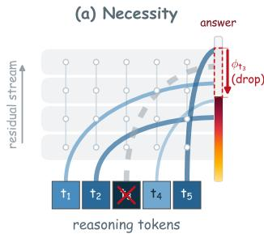

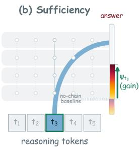  
Figure 1: Conceptual overview of model-internal token saliency. For each reasoning token: (a) necessity measures the decrease in answer likelihood when the token’s residual contribution is removed; (b) sufficiency measures the increase in answer likelihood when that contribution is patched into a no-chain forward pass. The two axes are combined to rank tokens, and the highest-scoring tokens are retained under compression.

Existing token-level compression methods answer this question using signals that are only indirectly tied to the target model’s answer computation. TokenSkip-style (Xia et al., 2025) methods, for example, rely on auxiliary scorers (Pan et al., 2024) whose rankings depend on the scorer’s own training objective, supervision, and domain assumptions, rather than being derived from the target model’s internal reasoning process. While effective, they leave unexplored a more direct and principled path to measuring token importance: deriving it from what the target model itself relies on when forming the answer. We therefore shift the focus from heuristic proxies to a complementary, modelinternal perspective. Under this view, a reasoning token is important when the target model’s answer computation depends on the information it carries in the residual stream, the internal substrate through which information propagates across layers. We view this residual stream as the model’s stream of thought, in which each token leaves a ripple whose magnitude reflects its contribution to the answer. Tokens that contribute little answer-relevant information are therefore natural candidates for removal under compression. This reframes token-level CoT compression as a model-internal saliency problem: which reasoning tokens make the most internal contributions to the model’s answer computation?

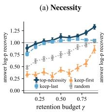

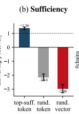

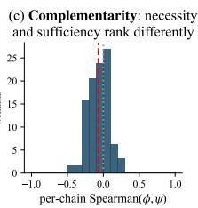  
Figure 2: Empirical characterization of dual-axis model-internal token saliency. Results on 100 MATH reasoning chains with Qwen2.5-1.5B-Instruct. (a) Top-necessity retention consistently outperforms positional and random baselines across budgets. (b) Topsufficiency tokens recover substantially more answer signal than random and norm-matched controls. (c) Necessity and sufficiency induce weakly correlated rankings (mean Spearman ρ = −0.07 and top-30% overlap 0.28), indicating that they capture distinct yet complementary signals.

We formalize this saliency along two complementary axes. (Q1) Necessity: if a token’s internal contribution is removed, how much does the ground-truth answer likelihood drop? (Q2) Sufficiency: if only that token’s internal information is provided, how much of the ground-truth answer likelihood is recovered? Necessity reflects fullchain dependence: it captures tokens whose erasure disrupts the chain’s own computation. Sufficiency reflects no-chain recoverability: it captures the contextual hinges whose residuals, given the query, recover answer-relevant information without the rest of the chain. Each view is biased without the other: necessity admits low-information context that is not directly anchored to answer relevance under abundant retention budgets, while sufficiency alone underperforms under aggressive compression, when no single token’s residual can substitute for the chain. Combining the two yields a ranking that remains reliable across compression budgets.

Building on this framing, we propose MIST (Model-Internal Saliency for Token-level CoT compression). For each reasoning token, MIST operationalizes the two axes as residual-stream interventions: necessity measures the effect of erasing a token’s residual state from the full-chain computation, while sufficiency measures the answer signal recovered by patching that state into a no-chain forward pass. Directly evaluating these interventions requires a separate pass for each token, scaling as $O ( T )$ in chain length T which makes tokenwise scoring expensive. We show that both axes admit a first-order Taylor linearization in the residual stream, reducing each per-token score to an inner product of gradients and activations, so a single backward pass per axis yields all token scores. MIST then combines the two scores into a unified token-importance score. The highest-scoring tokens are retained to form compressed CoT traces, which are then used to adapt the model to generate shorter reasoning chains.

We evaluate MIST on four benchmarks spanning mathematical reasoning (GSM8K (Cobbe et al., 2021) and MATH (Hendrycks et al., 2021)) and general-domain reasoning (MMLU-Pro (Wang et al., 2024) and BIG-Bench Hard (Suzgun et al., 2023)), using Qwen2.5-1.5B-Instruct, Qwen2.5-7B-Instruct (Team, 2024), Llama-3.1-8B-Instruct (Grattafiori et al., 2024), and Mistral-7B-Instruct-v0.3 (Jiang et al., 2023a). Extensive results suggest that model-internal saliency serves as a reliable proxy for reasoning-token importance, and that the proposed method consistently improves CoT compression performance across settings. In summary, our contributions are:

• We formulate token-level CoT compression as a model-internal saliency problem: rather than asking which tokens appear important to heuristic proxies, we ask which reasoning tokens contribute to the target model’s own answer computation, formalized along two complementary axes, necessity and sufficiency.

• We propose MIST, which operationalizes both axes as residual-stream interventions, derives first-order linearizations that reduce perchain scoring to a single backward pass per axis, and combines the two axes into a unified token-importance score.

• Extensive experimental results across diverse datasets and models demonstrate the effectiveness of our proposed method.

## 2 Related Work

Efficient chain-of-thought reasoning. Chainof-thought (CoT) prompting improves multi-step reasoning (Wei et al., 2022; Kojima et al., 2022; Wang et al., 2023) but inflates inference cost, motivating efficient-reasoning methods spanning concise generation (Xu et al., 2025; Munkhbat et al., 2025), adaptive decoding budgets (Han et al., 2025), length-controllable fine-tuning (Ma et al., 2025), latent reasoning (Hao et al., 2024; Shen et al., 2025), and token- or step-level pruning of generated traces (Xia et al., 2025; Li et al., 2026). We focus on the pruning setting.

Token-level CoT pruning. Within the pruning setting, TokenSkip (Xia et al., 2025) constructs compressed CoT supervision with an auxiliary LLMLingua-style token scorer (Jiang et al., 2023b; Pan et al., 2024), while step-level methods use signals such as entropy to skip generation (Li et al., 2026). More direct approaches include GoGI-Skip, which scores intermediate representations by gradient norm (Zhuang et al., 2025), and likelihoodpreserving greedy deletion, which identifies removable tokens through repeated deletion evaluations (Singh and Hakkani-Tür, 2026). In contrast, MIST derives a unified token-importance score from two complementary saliency measures in the model’s residual stream, avoiding external scorers, single-axis heuristics, and costly iterative deletion.

Model-internal attribution and interventions. Mechanistic interpretability methods identify behaviorally relevant components such as neurons and attention heads through interventions such as causal mediation, causal tracing, and activation patching (Vig et al., 2020; Meng et al., 2022; Zhang and Nanda, 2024; Heimersheim and Nanda, 2024; Syed et al., 2024; Ghandeharioun et al., 2024). Residual-stream analysis and direct logit attribution decompose how internal components contribute to output logits (Elhage et al., 2021; nostalgebraist, 2020). Inspired by this line of work, we define a token-saliency measure in the residual stream and use this model-internal signal to quantify the importance of reasoning tokens for CoT compression.

## 3 MIST: Model-Internal Saliency for Token-level CoT Compression

We present MIST, a model-internal method for token-level CoT compression. Given a query x, a reasoning chain $c = ( t _ { 1 } , \dots , t _ { T } )$ generated by the target model M, and the answer a, MIST assigns a saliency score to each chain token, retains the top-scoring tokens under a retention budget, and uses the resulting compressed chains to adapt the model for compact reasoning-trace generation. The key idea is to first define what it means for a token to matter to the target model’s own answer computation, and then quantify this importance from the model’s internal states.

## 3.1 Problem Formulation: A Model-Internal Notion of Token Importance

Token-level CoT compression requires a ranking of reasoning tokens. A natural objective is to keep the subset of tokens that best supports the model’s answer computation:

$$
c _ { \gamma } ^ { \star } = \arg \operatorname* { m a x } _ { c ^ { \prime } \subseteq c , \ | c ^ { \prime } | = \lceil \gamma T \rceil } \log p _ { M } ( a \mid x , c ^ { \prime } ) ,\tag{1}
$$

where $\gamma \in ( 0 , 1 ]$ is the retention budget. Solving this objective directly is combinatorial, so practical compression methods reduce the problem to computing per-token importance and retaining the top-ranked subset. In this work, we formulate this importance as model-internal saliency: a token is salient if the target model’s own answer computation depends on the internal information carried by that token. To make this notion operational, we measure a token’s internal contribution through its residual stream, a natural choice since the residual stream is the model’s internal computational substrate. We then define this saliency through two complementary axes.

Necessity. Necessity measures what the model loses when the internal contribution of a token is removed from the full reasoning chain. Let $h _ { i }$ denote the residual-stream states associated with token i. We operationalize this removal by zeroing $h _ { i } .$ , and then quantify the resulting drop in answer likelihood as the necessity saliency:

$$
\phi _ { i } : = \log p _ { M } ( a \mid x , c ) - \log p _ { M } ( a \mid x , c ^ { h _ { i }  0 } ) .\tag{2}
$$

Sufficiency. Sufficiency asks how much of the answer likelihood can be recovered if only token i’s internal state is provided, relative to the no chain forward pass. We operationalize this by patching $h _ { i }$ into the no-chain forward pass at the final position and quantify the resulting gain in answer likelihood as the sufficiency saliency:

$$
\psi _ { i } : = \log p _ { M } { \big ( } a \mid x , \operatorname { p a t c h } ( i ) { \big ) } - \log p _ { M } ( a \mid x , \emptyset ) .\tag{3}
$$

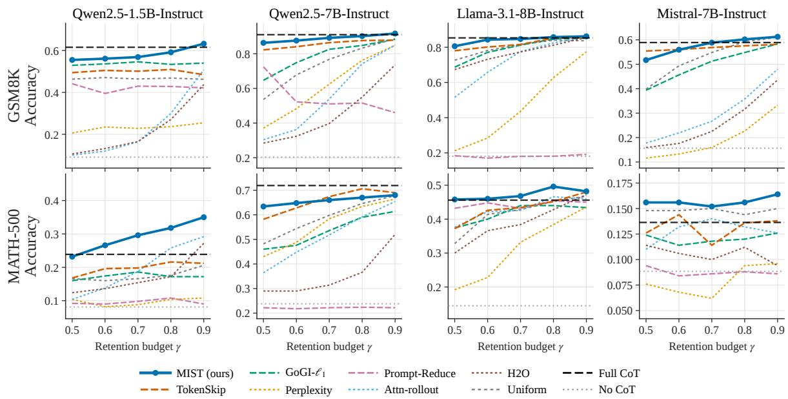  
Figure 3: Accuracy across $\gamma \in \{ 0 . 5 , . . . , 0 . 9 \}$ for MIST and all baselines on GSM8K and MATH-500.

Why both axes? Informative and complementary views of token importance. The above definitions of necessity and sufficiency offer two behaviorally grounded notions of token importance. We further conduct an empirical evaluation on 100 gold MATH chains to show that both notions yield meaningful token-importance information in practice. Retaining tokens ranked by exact necessity consistently outperforms positional and random baselines across compression budgets, indicating that necessity identifies tokens on which the fullchain answer computation depends (Fig. 2a). Conversely, patching the most sufficient tokens into no-chain computations recovers substantial answerrelevant information, whereas random-token and norm-matched controls do not (Fig. 2b). Despite their individual effectiveness, the two rankings are only weakly correlated and exhibit limited toptoken overlap (Fig. 2c), suggesting that they capture largely distinct aspects of token importance. Neither axis alone therefore provides a complete account of token importance, motivating their combination in our dual-axis saliency measure.

## 3.2 Quantifying Model-Internal Saliency in Practice

The formulations above provide conceptually clean measures of token saliency, but their naive computation is prohibitively expensive. Evaluating each token would require an additional forward pass to instantiate either $c ^ { h _ { i } \to 0 }$ or patch(i), yielding an $O ( T )$ cost per chain that is impractical at scale.

We instead treat both as residual-stream interventions and linearize log $p _ { M }$ around the unperturbed forward passes.This yields a practical first-order scorer computable with two backward passes per chain, independent of T.

Let $h _ { i } ^ { ( l ) }$ for $l \in \{ 1 , \ldots , L \}$ denote token $i \ ' s$ residual at layer $l ,$ with $h _ { i } ^ { ( l ) , \mathrm { s r c } }$ and $h _ { \mathrm { f i n a l } } ^ { ( l ) , \mathrm { t g t } }$ denoting the unperturbed source and target activations at layer l. The necessity intervention $c ^ { h _ { i } \to 0 }$ perturbs $h _ { i } ^ { ( l ) , \mathrm { s r c } }$ along the direction $- h _ { i } ^ { ( l ) , \mathrm { s r c } } ;$ ; the sufficiency intervention patch(i) perturbs $h _ { \mathrm { f i n a l } } ^ { ( l ) , \mathrm { t g t } }$ along the direction $h _ { i } ^ { ( l ) , \mathrm { s r c } } - h _ { \mathrm { f i n a l } } ^ { ( l ) , \mathrm { t g t } }$ . The answer log-likelihood log $p _ { M }$ is differentiable in the residual activations, so both saliencies admit a first-order Taylor expansion along these directions.

Necessity term. The first-order expansion of log $p _ { M } ^ { \mathrm { s r c } }$ along $- h _ { i } ^ { ( l ) , \mathrm { s r c } }$ identifies the per-layer main term:

$$
\begin{array} { r l r } { \widehat { \phi } _ { i } ^ { ( l ) } : = } & { { } \big \langle \nabla _ { h _ { i } ^ { ( l ) } } \log p _ { M } ^ { \mathrm { s r c } } , h _ { i } ^ { ( l ) , \mathrm { s r c } } \big \rangle , } \end{array}\tag{4}
$$

Both the gradient and the activation in $\widehat { \phi } _ { i } ^ { ( l ) }$ are read from the same source forward pass: one backward through log $p _ { M } ^ { \mathrm { s r c } }$ yields $\nabla _ { h _ { i } ^ { ( l ) } }$ log $p _ { M } ^ { \mathrm { s r c } }$ at every $( i , l )$ pair simultaneously, so the per-chain cost on the necessity axis is one forward and one backward.

Sufficiency term. The first-order expansion of log $p _ { M } ^ { \mathrm { t g t } }$ along $h _ { i } ^ { ( l ) , \mathrm { s r c } } - h _ { \mathrm { f i n a l } } ^ { ( l ) , \mathrm { t g t } }$ identifies the perlayer main term:

$$
\begin{array} { r } { \widehat { \psi } _ { i } ^ { ( l ) } : = \big \langle \nabla _ { h _ { \mathrm { f i n a l } } ^ { ( l ) } } \log p _ { M } ^ { \mathrm { t g t } } , h _ { i } ^ { ( l ) , \mathrm { s r c } } - h _ { \mathrm { f i n a l } } ^ { ( l ) , \mathrm { t g t } } \big \rangle . } \end{array}\tag{5}
$$

The gradient is taken at the target’s final position; one backward through log $p _ { M } ^ { \mathrm { t g t } }$ yields these gradients across all layers l, and the source activations $h _ { i } ^ { ( l ) , \mathrm { s r c } }$ are reused from the necessity pass. The full Taylor expansion and remainder bounds for both terms are given in Appendix D.

## 3.3 The Unified MIST Score

The per-layer terms $\widehat { \phi } _ { i } ^ { ( l ) }$ and $\widehat { \psi } _ { i } ^ { ( l ) }$ are building blocks; the MIST score combines them into a unified per-token saliency signal by first aggregating across layers along each axis, and then combining the two axes.

Per-axis aggregation. Different layers contribute differently to the answer computation; we therefore adopt a logit-lens-induced (nostalgebraist, 2020) layer weighting: each transformer layer l writes an additive update $h _ { t } ^ { ( l ) } - h _ { t } ^ { ( l - 1 ) }$ into the residualstream state at position $t ,$ and the inner product of this update with the unembedding row $W _ { U } [ a ]$ corresponding to the gold answer token,

$$
\bar { c } _ { l } \ = \ \frac { 1 } { T } \sum _ { t = 1 } ^ { T } \langle h _ { t } ^ { ( l ) } - h _ { t } ^ { ( l - 1 ) } , \ W _ { U } [ a ] \rangle ,\tag{6}
$$

captures how much that layer’s update pushes the chain-averaged hidden state toward the answer; the empirical per-layer distribution of $\bar { c } _ { l }$ across chains is visualized in Fig. 11 (App. H). Aggregating each axis with this shared weight yields the per-token saliencies along the two axes:

$$
\widehat { \phi } _ { i } = \sum _ { l } \bar { c } _ { l } \cdot \big | \widehat { \phi } _ { i } ^ { ( l ) } \big | , \quad \widehat { \psi } _ { i } = \sum _ { l } \bar { c } _ { l } \cdot \big | \widehat { \psi } _ { i } ^ { ( l ) } \big | .\tag{7}
$$

Combining the two axes. Finally, we combine the two axes $\mathrm { a s } ^ { 1 }$ :

$$
S _ { i } ^ { \mathrm { M I S T } } \ = \ \alpha \cdot \widehat { \phi } _ { i } + ( 1 - \alpha ) \cdot \widehat { \psi } _ { i } , \quad \alpha \in [ 0 , 1 ] .\tag{8}
$$

where $\alpha$ is a hyperparameter. Tokens ranked by $S _ { i } ^ { \mathrm { { M I S T } } }$ form the compressed chains that supervise the fine-tuning of M at retention budget γ.

## 4 Experiments

## 4.1 Experimental Setup

Datasets and Models. We evaluate on four reasoning benchmarks spanning mathematical reasoning (GSM8K (Cobbe et al., 2021);

<table><tr><td>Dataset</td><td>Model</td><td>Method</td><td>∆ Acc. (%)</td><td>Comp. rate</td></tr><tr><td rowspan="18">GSM8K</td><td>OWwn--nst,</td><td>* MIST</td><td>↓2.4</td><td>21.3%</td></tr><tr><td></td><td>tokenskip</td><td>↓4.3</td><td>20.0%</td></tr><tr><td></td><td>gogi_l1</td><td>↓11.9</td><td>8.9%</td></tr><tr><td></td><td>perplexity</td><td>↓29.2</td><td>17.6%</td></tr><tr><td></td><td>attn_rollout</td><td>↓35.1</td><td>21.4%</td></tr><tr><td></td><td>h2o</td><td>↓45.2</td><td>22.0%</td></tr><tr><td></td><td>* MIST</td><td>↓1.3</td><td>13.4%</td></tr><tr><td></td><td>tokenskip</td><td>↓2.1</td><td>10.4%</td></tr><tr><td></td><td>gogi_l1</td><td>↓9.2</td><td>14.8%</td></tr><tr><td>Mis-t-tst.</td><td>perplexity</td><td>↓39.5</td><td>25.6%</td></tr><tr><td></td><td>attn_rollout</td><td>↓28.8</td><td>22.5%</td></tr><tr><td></td><td>h20</td><td>↓32.6</td><td>23.0%</td></tr><tr><td rowspan="18">MATH-500</td><td>Ow--st</td><td></td><td></td><td></td></tr><tr><td></td><td>* MIST tokenskip</td><td>↑5.3</td><td>9.3% 10.2%</td></tr><tr><td></td><td>gogi_l1</td><td>↓4.1</td><td>3.9%</td></tr><tr><td></td><td></td><td>↓6.6</td><td>8.5%</td></tr><tr><td></td><td>perplexity</td><td>↓ 14.1</td><td>0.0%</td></tr><tr><td></td><td>attn_rollout h2o</td><td>↓4.2</td><td>4.7%</td></tr><tr><td></td><td></td><td>↓6.7</td><td></td></tr><tr><td>L1a---1st.</td><td>* MIST tokenskip</td><td>↑1.2 ↓2.3</td><td>10.6%</td></tr><tr><td></td><td>gogi_l1</td><td></td><td>13.8%</td></tr><tr><td></td><td></td><td>↓3.8</td><td>7.2%</td></tr><tr><td></td><td>perplexity</td><td>↓14.1</td><td>11.1%</td></tr><tr><td></td><td>attn_rollout</td><td>↓2.6</td><td>8.0%</td></tr><tr><td></td><td>h2o</td><td>↓6.6</td><td>10.0%</td></tr></table>

Table 1: Performance and compression comparison on GSM8K and MATH-500. Each entry is the mean over $\gamma \in \{ 0 . 5 , 0 . 6 , 0 . 7 , 0 . 8 , 0 . 9 \}$ relative to the fullchain baseline. ∆Acc. (%): relative accuracy change (↓ drop, ↑ gain); Comp. rate: fraction by which the LoRAadapted model’s inference-time generated tokens are reduced relative to the same full-chain baseline.

MATH (Hendrycks et al., 2021)) and generaldomain reasoning (MMLU-Pro (Wang et al., 2024); BIG-Bench Hard (Suzgun et al., 2023)). Per-dataset split sizes, preprocessing, and selfgeneration hyperparameters are deferred to Appendix A. We evaluate four models covering three families and three scales: Qwen2.5-1.5B-Instruct and Qwen2.5-7B-Instruct (Team, 2024), Llama-3.1-8B-Instruct (Grattafiori et al., 2024), and Mistral-7B-Instruct-v0.3 (Jiang et al., 2023a).

Baselines. We compare MIST against nine baselines across three categories. Training-free baselines: prompt-reduce (Xia et al., 2025) prompts the frozen target model to compress its own chain without finetuning. Naive baselines: full-chain, no-chain, and uniform share the pipeline but use trivial token selection: no compression, chain removal, and uniform retention, respectively. Token scorer baselines: TokenSkip (Xia et al., 2025) scores tokens with the external LLMLingua-2 classifier, GoGI (Zhuang et al., 2025) with the single-layer gradient norm, perplexity with per-token self-information (Jiang et al., 2023b), and attention rollout (Abnar and Zuidema, 2020) and H2O (Zhang et al., 2023) with two attention-based proxies. Per-baseline details are in Appendix B.

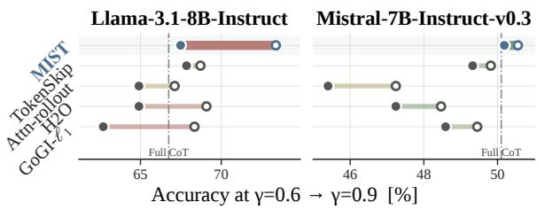  
Figure 4: Results on BIG-Bench Hard.

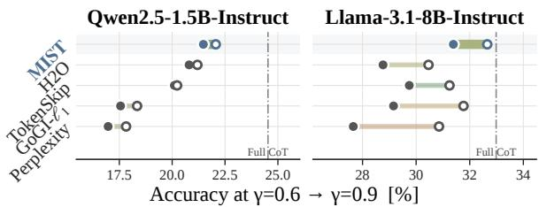  
Figure 5: Results on MMLU-Pro.

Training and evaluation protocol. We adopt the standard procedure from TokenSkip (Xia et al., 2025). Given a target model M and a training set, we (i) sample self-generate reasoning chains from M and keep those that yield the correct answer, (ii) for each retention budget $\gamma \in \{ 0 . 5 , 0 . 6 , \ldots , 1 . 0 \}$ in a grid, score each chain with MIST and form a compressed chain by retaining the top-⌈γT⌉ tokens, and (iii) fine-tune M with a single LoRA adapter (rank 8, $\alpha = 1 6$ , learning rate $5 \times 1 0 ^ { - 5 }$ three epochs, effective batch size 8) on the mixture of compressed chains across all γ values, so that the same adapter can be decoded at any retention budget at inference. It should be noted that since γ controls the supervision tokens retained during SFT rather than imposing a hard length constraint at inference, the adapter is decoded freely and the actual inference-time compression rate (Comp. rate in Table 1) is typically smaller than 1 − γ. Additional details are provided in Appendix C.

## 4.2 Main Results

We report main results in Figure 3 and Table 1.

Model-internal saliency outperforms external scorers. TokenSkip is the strongest baseline overall, but it relies on an auxiliary scorer whose importance signal is not derived from the target model’s own answer computation. Across the evaluated datasets and models, MIST achieves better performance than TokenSkip. Averaged over γ, MIST incurs only a 1.3-2.4 percentage-point (pp) accuracy drop on GSM8K with Qwen2.5-7B and Mistral-7B, compared with 2.1-4.3 pp for TokenSkip. The gap is even larger on MATH-500: MIST improves average accuracy by 5.3 pp on Qwen2.5-1.5B and 1.2 pp on Llama-3.1-8B, whereas TokenSkip drops by 4.1 pp and 2.3 pp, respectively. This suggests that the target model’s own internal computations provide a reliable signal for identifying the reasoning tokens it actually relies on.

A principled internal scorer outperforms internal heuristics. The remaining baselines use target-model signals such as gradients, perplexity, or attention weights, but map these signals to token importance through heuristic scoring rules. For instance, GoGI is the closest internal-gradient baseline, but it treats gradient norm at a preselected layer as a heuristic proxy for token importance, without deriving it from any explicit definition of saliency. MIST, by contrast, operationalizes token importance through necessity and sufficiency interventions and derives its scorer from their first-order effects on the answer likelihood. The gradient appears in MIST only multiplied by the activation and aggregated across all layers; the bare gradient norm used by GoGI can be viewed as a strict simplification of this construction along the necessity axis. The empirical gaps further highlight the advantage of MIST’s principled saliency construction. On GSM8K, GoGI incurs 11.9 and 9.2 pp accuracy drops with Qwen2.5-7B and Mistral-7B, respectively, compared with only 2.4 and 1.3 pp for MIST. On MATH-500, GoGI drops by 6.6 pp with Qwen2.5-1.5B and 3.8 pp with Llama-3.1-8B, while MIST improves over full CoT by 5.3 and 1.2 pp. Other internal or model-derived heuristics degrade further, with perplexity, attention rollout, and H2O reaching drops as large as 39.5, 28.8, and 32.6 pp, respectively (Table 1).

MIST achieves favorable accuracy-compression trade-off. MIST achieves competitive compression while incurring the smallest reasoning performance loss. On GSM8K with Qwen2.5-7B, MIST achieves a 21.3% reduction in chain length, compared with 20.0% for TokenSkip, while incurring only a 2.4-pp accuracy drop compared with 4.3 pp for TokenSkip. Methods with internal heuristics signals, such as perplexity, attention rollout, and ${ \mathrm { H } } 2 0 ,$ can achieve similar or higher compression rates but suffer much larger accuracy drops. This trade-off suggests that, under the same retention budget, the tokens selected by MIST carry a greater share of the answer-relevant signal, allowing the adapter to recover chain-level accuracy from a shorter trace.

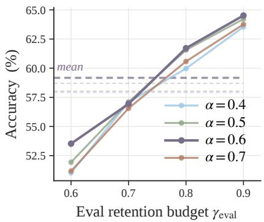  
Figure 6: Sensitivity analysis for α on GSM8K with Qwen2.5-1.5B-Instruct.

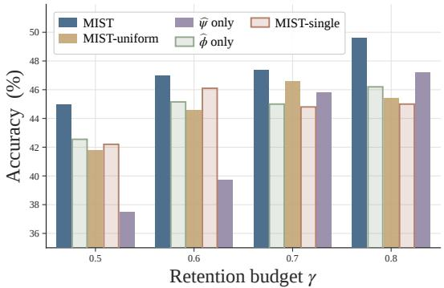  
Figure 7: Component ablation of MIST on MATH-500 with Llama-3.1-8B-Instruct.

## 4.3 Generalization Beyond Mathematical Reasoning

The main results in §4.2 establish MIST’s advantage on two mathematical-reasoning benchmarks, GSM8K and MATH-500. We next ask whether this advantage extends beyond mathematical reasoning. To this end, we further evaluate on two generaldomain benchmarks: MMLU-Pro and BBH.

As shown in Figures 4 and 5, MIST remains the strongest method on both benchmarks and across the evaluated models. On MMLU-Pro, MIST consistently outperforms external and heuristic baselines, indicating that model-internal saliency remains effective in multi-domain, knowledgeintensive settings. On BBH, MIST also stays closest to, and in some settings surpasses, the full CoT reference, while heuristic baselines fall noticeably behind. These results suggest that MIST is not merely exploiting math-specific token patterns; it effectively captures answer-relevant internal contributions across broader domains and more heterogeneous reasoning formats. Additional results are reported in App. F.

## 4.4 Ablation Study

Sensitivity analysis. We examine the sensitivity of MIST to the mixing coefficient α in Eq. (8), using Qwen2.5-1.5B-Instruct on GSM8K. Figure 6 compares $\alpha \in \{ 0 . 4 , 0 . 5 , 0 . 6 , 0 . 7 \}$ across retention budgets. Performance is stable across this range, indicating that the blend is not knife-edge sensitive to α. We fix $\alpha = 0 . 6$ in all main experiments as it achieves the best overall performance

Each component contributes to the unified MIST quality. We ablate the three design choices that distinguish MIST from one-axis or single-layer simplifications: (i) using both saliency axes, by removing one at a time $( { \widehat { \varphi } } - \mathrm { o n l y } ,$ , ψbonly); (ii) the layer weighting in Eq. 7, by replacing $\bar { c } _ { l }$ with a uniform per-layer weight (MISTuniform); and (iii) the multi-layer aggregation, by computing each axis from only the penultimate layer (MIST-single). Figure $^ 7$ reports accuracy on MATH-500 with Llama-3.1-8B-Instruct across $\gamma \in \{ 0 . 5 , 0 . 6 , 0 . 7 , 0 . 8 \}$ . Full MIST achieves the best performance at every retention budget. The single-axis ablations lose the most: ${ \widehat { \psi } } { - } \mathrm { o n l y }$ drops by up to 7.5 pp at the most aggressive budget $( \gamma = 0 . 5 \colon 3 7 . 5 \%$ vs. MIST’s 45.0%), and ${ \widehat { \varphi } } \cdot$ -only loses up to 3.4 pp at $\gamma { = } 0 . 8$ (46.2% vs. 49.6%). MIST-uniform and MIST-single each lose between 0.8 and 4.6 pp depending on γ, confirming that neither the weighting nor the multi-layer aggregation is interchangeable with a uniform-weight or single-layer simplification. The three design choices combine to yield MIST’s final quality.

## 4.5 Token Type Analysis

To understand what each method actually keeps, we partition every token into one of seven role classes grouped into three macro-categories (Table 2): Quantitative (number, math operator, variable / function), Logical (connective, quantifier / negation), and Narrative (content, function). We then measure each method’s budget composition (left) and per-class retention rate (right) on Qwen2.5- 1.5B-Instruct + GSM8K at $\gamma = 0 . 5$ (Figure 8).

Figure 8 reports two complementary views. The left panel shows how each method allocates its retained-token budget across token classes. MIST allocates a larger share of its budget to quantitative tokens than heuristic baselines do: 29% to numbers and 10% to mathematical operators, while still retaining content and function words for local coherence. Within these classes, MIST also retains the highest fraction: 75% of all numbers and 66% of all mathematical operators (Figure 8 right). In contrast, attention rollout and perplexity allocate only 7% and 12% of their budgets to numbers, retaining 22% and 33% of number tokens, respectively.

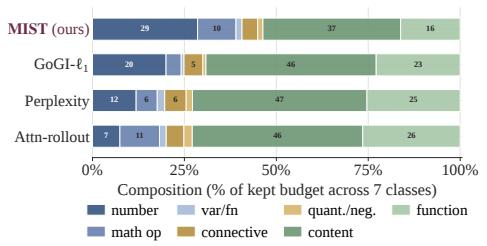

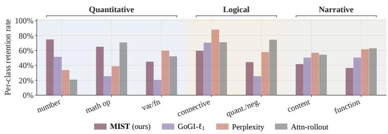  
Figure 8: What each scorer keeps under compression (GSM8K, Qwen2.5-1.5B-Instruct). Tokens classified using the taxonomy in Table 2. Left. How each method allocates its 50% retention budget across the 7 token types. Right. Per-class retention rate: for each class (x-axis), the fraction of class tokens retained by each method.

<table><tr><td>Type</td><td>Definition</td><td>Examples</td></tr><tr><td>Quantitative</td><td></td><td></td></tr><tr><td>number</td><td>integers, decimals, frac- 15, 3.14 tions, percentages</td><td></td></tr><tr><td>math op</td><td>arithmetic operators +, −, ×, ÷, =, ≥ and relations</td><td></td></tr><tr><td>var/fn</td><td>single-letter variables x, y, sin, log and math functions</td><td></td></tr><tr><td>Logical</td><td></td><td></td></tr><tr><td></td><td>connective causal / inferential / se- so, if, quential glue</td><td>then, because</td></tr><tr><td></td><td>quant./neg. quantifiers and negation al1, some, no, not markers</td><td></td></tr><tr><td>Narrative</td><td></td><td></td></tr><tr><td>content</td><td>nouns, verbs, adjec- Janet, tives, adverbs</td><td>eggs, calculate</td></tr><tr><td>function</td><td>articles, prepositions, the, of, is, she pronouns, auxiliaries</td><td></td></tr></table>

Table 2: Token taxonomy used in the analysis.

MIST is therefore the only scorer that both over-allocates budget to Quantitative tokens and achieves the highest within-class retention for them. Attention rollout concentrates on frequent operators and function words that often act as attention hubs, while perplexity tends to conflate surprisal, retaining high-surprisal but information-light tokens such as therefore and so. This pattern is consistent with the diagnosis in §4.2: heuristic scorers concentrate on syntactically prominent but information-light tokens, while MIST’s saliencyderived ranking aligns with the tokens that carry the answer-relevant computation.

## 4.6 Case Study

Figure 9 visualizes MIST’s saliency on a three-step GSM8K chain. Necessity ϕb assigns high saliency to tokens that the full-chain computation depends on, concentrating on the intermediate numerical facts (\$4, 30) and the final answer \$120. Sufficiency ψb instead highlights a related but distinct set of tokens, including those associated with buying, spending, currency, and equality, whose residual states carry answer-relevant information when supplied to the no-chain computation. The two views overlap on some answer-bearing tokens but also emphasize different parts of the reasoning trace. Combining these signals, the unified MIST score retains tokens around the arithmetic computation \$4 × 30 = \$120 together with the answer-bearing phrase “spends \$120”, preserving both quantitative anchors and the local semantic context that binds them, and matching the class-level allocation reported in §4.5.

## 5 Conclusion

We present MIST, a model-internal method for token-level CoT compression. MIST defines token importance operationally through two complementary interventions instantiated on the residual stream, necessity and sufficiency, and converts both into a tractable per-token scorer via first-order Taylor approximations, reducing the cost of tokenwise interventions to two backward passes per chain. Extensive empirical evaluations across diverse datasets and models demonstrate the effectiveness of our proposed method.

## Limitations

Model scale and gradient access. Our experiments use 1.5B to 8B instruction-tuned models. Whether the saliency signal remains similarly concentrated in larger models is not established. Besides, MIST requires access to the target model’s internal activations and gradients, so it does not apply to black-box API-only systems.

Evaluation domain. Our four benchmarks span mathematical and general-domain reasoning. Future work can extend the framework to open-ended generation, code generation, or multi-turn dialogue to further validate the effectiveness of the proposed method.

Approximate intervention scores. MIST approximates the necessity and sufficiency interventions with their first-order Taylor terms in the residual stream. Because transformer computations are nonlinear, higher-order interactions among tokens, layers, and heads are not captured, so the MIST score is a model-internal saliency estimator rather than an exact causal decomposition.

## References

Samira Abnar and Willem Zuidema. 2020. Quantifying attention flow in transformers. In Proceedings of the 58th annual meeting ofthe associationfor computational linguistics, pages 4190–4197.

Karl Cobbe, Vineet Kosaraju, Mohammad Bavarian, Mark Chen, Heewoo Jun, Lukasz Kaiser, Matthias Plappert, Jerry Tworek, Jacob Hilton, Reiichiro Nakano, and 1 others. 2021. Training verifiers to solve math word problems. arXiv preprint arXiv:2110.14168.

Nelson Elhage, Neel Nanda, Catherine Olsson, Tom Henighan, Nicholas Joseph, Ben Mann, Amanda Askell, Yuntao Bai, Anna Chen, Tom Conerly, and 1 others. 2021. A mathematical framework for transformer circuits. Transformer Circuits Thread, 1(1):12.

Asma Ghandeharioun, Avi Caciularu, Adam Pearce, Lucas Dixon, and Mor Geva. 2024. Patchscopes: A unifying framework for inspecting hidden representations of language models. In International Conference on Machine Learning, pages 15466–15490. PMLR.

Aaron Grattafiori, Abhimanyu Dubey, Abhinav Jauhri, Abhinav Pandey, Abhishek Kadian, Ahmad Al-Dahle, Aiesha Letman, Akhil Mathur, Alan Schelten, Alex Vaughan, and 1 others. 2024. The llama 3 herd of models. arXiv preprint arXiv:2407.21783.

Tingxu Han, Zhenting Wang, Chunrong Fang, Shiyu Zhao, Shiqing Ma, and Zhenyu Chen. 2025. Tokenbudget-aware llm reasoning. In Findings of the Associationfor Computational Linguistics: ACL 2025, pages 24842–24855.

Shibo Hao, Sainbayar Sukhbaatar, DiJia Su, Xian Li, Zhiting Hu, Jason Weston, and Yuandong Tian. 2024. Training large language models to reason in a continuous latent space. arXiv preprint arXiv:2412.06769.

Stefan Heimersheim and Neel Nanda. 2024. How to use and interpret activation patching. arXiv preprint arXiv:2404.15255.

Dan Hendrycks, Collin Burns, Saurav Kadavath, Akul Arora, Steven Basart, Eric Tang, Dawn Song, and Jacob Steinhardt. 2021. Measuring mathematical problem solving with the MATH dataset. In Thirtyfifth Conference on Neural Information Processing Systems Datasets and Benchmarks Track (Round 2).

Albert Qiaochu Jiang, Alexandre Sablayrolles, Arthur Mensch, Chris Bamford, Devendra Singh Chaplot, Diego de Las Casas, Florian Bressand, Gianna Lengyel, Guillaume Lample, Lucile Saulnier, Lélio Renard Lavaud, Marie-Anne Lachaux, Pierre Stock, Teven Le Scao, Thibaut Lavril, Thomas Wang, Timothée Lacroix, and William El Sayed. 2023a. Mistral 7b. ArXiv, abs/2310.06825.

Huiqiang Jiang, Qianhui Wu, Chin-Yew Lin, Yuqing Yang, and Lili Qiu. 2023b. Llmlingua: Compressing prompts for accelerated inference of large language models. In Proceedings of the 2023 conference on empirical methods in natural language processing, pages 13358–13376.

Takeshi Kojima, Shixiang Shane Gu, Machel Reid, Yutaka Matsuo, and Yusuke Iwasawa. 2022. Large language models are zero-shot reasoners. Advances in neural information processing systems, 35:22199– 22213.

Zeju Li, Jianyuan Zhong, Ziyang Zheng, Xiangyu Wen, Zhijian Xu, Yingying Cheng, Fan Zhang, and Qiang Xu. 2026. Making slow thinking faster: Compressing llm chain-of-thought via step entropy. In The Fourteenth International Conference on Learning Representations.

Xinyin Ma, Guangnian Wan, Runpeng Yu, Gongfan Fang, and Xinchao Wang. 2025. Cot-valve: Lengthcompressible chain-of-thought tuning. In Proceedings ofthe 63rd Annual Meeting ofthe Association for Computational Linguistics (Volume 1: Long Papers), pages 6025–6035.

Kevin Meng, David Bau, Alex Andonian, and Yonatan Belinkov. 2022. Locating and editing factual associations in gpt. Advances in neural information processing systems, 35:17359–17372.

Tergel Munkhbat, Namgyu Ho, Seo Hyun Kim, Yongjin Yang, Yujin Kim, and Se-Young Yun. 2025. Selftraining elicits concise reasoning in large language

models. In Findings of the Association for Computational Linguistics: ACL 2025, pages 25127–25152.

nostalgebraist. 2020. interpreting gpt: the logit lens. LessWrong.

Zhuoshi Pan, Qianhui Wu, Huiqiang Jiang, Menglin Xia, Xufang Luo, Jue Zhang, Qingwei Lin, Victor Rühle, Yuqing Yang, Chin-Yew Lin, and 1 others. 2024. Llmlingua-2: Data distillation for efficient and faithful task-agnostic prompt compression. In Findings ofthe Associationfor Computational Linguistics: ACL 2024, pages 963–981.

Zhenyi Shen, Hanqi Yan, Linhai Zhang, Zhanghao Hu, Yali Du, and Yulan He. 2025. Codi: Compressing chain-of-thought into continuous space via selfdistillation. In Proceedings of the 2025 Conference on Empirical Methods in Natural Language Processing, pages 677–693.

Janvijay Singh and Dilek Hakkani-Tür. 2026. Do llms encode functional importance of reasoning tokens? arXiv preprint arXiv:2601.03066.

Mirac Suzgun, Nathan Scales, Nathanael Schärli, Sebastian Gehrmann, Yi Tay, Hyung Won Chung, Aakanksha Chowdhery, Quoc Le, Ed Chi, Denny Zhou, and 1 others. 2023. Challenging big-bench tasks and whether chain-of-thought can solve them. In Findings of the Association for Computational Linguistics: ACL 2023, pages 13003–13051.

Aaquib Syed, Can Rager, and Arthur Conmy. 2024. Attribution patching outperforms automated circuit discovery. In Proceedings of the 7th BlackboxNLP Workshop: Analyzing and Interpreting Neural Networks for NLP, pages 407–416.

Qwen Team. 2024. Qwen2.5: A party of foundation models.

Jesse Vig, Sebastian Gehrmann, Yonatan Belinkov, Sharon Qian, Daniel Nevo, Yaron Singer, and Stuart Shieber. 2020. Investigating gender bias in language models using causal mediation analysis. Advances in neural information processing systems, 33:12388– 12401.

Xuezhi Wang, Jason Wei, Dale Schuurmans, Quoc V Le, Ed H. Chi, Sharan Narang, Aakanksha Chowdhery, and Denny Zhou. 2023. Self-consistency improves chain of thought reasoning in language models. In The Eleventh International Conference on Learning Representations.

Yubo Wang, Xueguang Ma, Ge Zhang, Yuansheng Ni, Abhranil Chandra, Shiguang Guo, Weiming Ren, Aaran Arulraj, Xuan He, Ziyan Jiang, Tianle Li, Max Ku, Kai Wang, Alex Zhuang, Rongqi Fan, Xiang Yue, and Wenhu Chen. 2024. MMLU-pro: A more robust and challenging multi-task language understanding benchmark. In The Thirty-eight Conference on Neural Information Processing Systems Datasets and Benchmarks Track.

Jason Wei, Xuezhi Wang, Dale Schuurmans, Maarten Bosma, Fei Xia, Ed Chi, Quoc V Le, Denny Zhou, and 1 others. 2022. Chain-of-thought prompting elicits reasoning in large language models. Advances in neural information processing systems, 35:24824– 24837.

Heming Xia, Chak Tou Leong, Wenjie Wang, Yongqi Li, and Wenjie Li. 2025. Tokenskip: Controllable chain-of-thought compression in llms. In Proceedings of the 2025 Conference on Empirical Methods in Natural Language Processing, pages 3351–3363.

Silei Xu, Wenhao Xie, Lingxiao Zhao, and Pengcheng He. 2025. Chain of draft: Thinking faster by writing less. arXiv preprint arXiv:2502.18600.

Fred Zhang and Neel Nanda. 2024. Towards best practices of activation patching in language models: Metrics and methods. In The Twelfth International Conference on Learning Representations.

Zhenyu Zhang, Ying Sheng, Tianyi Zhou, Tianlong Chen, Lianmin Zheng, Ruisi Cai, Zhao Song, Yuandong Tian, Christopher Re, Clark Barrett, Zhangyang Wang, and Beidi Chen. 2023. H2o: Heavy-hitter oracle for efficient generative inference of large language models. In Thirty-seventh Conference on Neural Information Processing Systems.

Ren Zhuang, Ben Wang, and Shuifa Sun. 2025. Accelerating chain-of-thought reasoning: When goalgradient importance meets dynamic skipping. arXiv preprint arXiv:2505.08392.

## A Dataset Details

Table 3 summarizes the per-dataset split sizes used throughout our evaluation pipeline. Below we describe per-dataset preprocessing and selfgeneration hyperparameters.

<table><tr><td>Dataset</td><td>Train</td><td>Test</td></tr><tr><td>GSM8K</td><td>7,473</td><td>1,319</td></tr><tr><td>MATH</td><td>7,500</td><td>500</td></tr><tr><td>MMLU-Pro</td><td>10,501</td><td>1,531</td></tr><tr><td>BBH-MC</td><td>3,258</td><td>816</td></tr></table>

Table 3: Dataset split sizes used in our evaluation pipeline.

GSM8K. We use the standard train and test splits from the GSM8K release without further filtering.

MATH. The training set is the concatenation of the seven Hendrycks (Hendrycks et al., 2021) subjects; the test set is the canonical MATH-500 subset.

  
Figure 9: Per-token MIST saliency on a GSM8K chain (Qwen2.5-1.5B-Instruct, γ = 0.5)

MMLU-Pro. The original release does not provide a standard training split, supplying only a 12,032-example test split and a 70-example fewshot validation set. We therefore randomly partition the 12,032 examples into 10,501 training and 1,531 evaluation examples.

BBH-MC. We use the 17 letter-multiple-choice subtasks of BIG-Bench Hard (Suzgun et al., 2023), excluding the 10 binary or free-form subtasks. BBH does not provide a standard training split, supplying only a test set per subtask, so we randomly partition the available examples into 3,258 training and 816 evaluation examples (80/20 split).

## B Baseline Details

This appendix details the nine baselines compared in Section 4.1.

<table><tr><td>Subtask</td><td>Letters</td><td>N</td></tr><tr><td>date_understanding</td><td>A-F</td><td>250</td></tr><tr><td>disambiguation_qa</td><td>A-C</td><td>250</td></tr><tr><td>geometric_shapes</td><td>A-K</td><td>250</td></tr><tr><td>hyperbaton</td><td>A-B</td><td>250</td></tr><tr><td>logical_deduction_three_objects</td><td>A-C</td><td>250</td></tr><tr><td>logical_deduction_five_objects</td><td>A-E</td><td>250</td></tr><tr><td>logical_deduction_seven_objects</td><td>A-G</td><td>250</td></tr><tr><td>movie_recommendation</td><td>A-D</td><td>250</td></tr><tr><td>penguins_in_a_table</td><td>A-E</td><td>146</td></tr><tr><td>reasoning_about_colored_objects</td><td>A-R</td><td>250</td></tr><tr><td>ruin_names</td><td>A-D</td><td>250</td></tr><tr><td>salient_translation_error_detection</td><td>A-F</td><td>250</td></tr><tr><td>snarks</td><td>A-B</td><td>178</td></tr><tr><td>temporal_sequences</td><td>A-D</td><td>250</td></tr><tr><td>tracking_shuffled_objects_three_objects</td><td>A-C</td><td>250</td></tr><tr><td>tracking_shuffled_objects_five_objects</td><td>A-E</td><td>250</td></tr><tr><td>tracking_shuffled_objects_seven_objects</td><td>A-G</td><td>250</td></tr><tr><td>Total</td><td></td><td>4,074</td></tr></table>

Table 4: The 17 subtasks of BIG-Bench Hard used in our MIST evaluation. “Letters” shows the answerletter range; “N” is the original number of examples per subtask before our 80/20 partition.

Prompt-reduce. The frozen target model is prompted with the chain-of-thought instruction together with the reduction directive from TokenSkip (Xia et al., 2025, Table 1), which appends please reduce (1−γ)×100% of the words in your CoT. This is a frozen-model, γ-aware baseline that compresses the chain in a single forward pass without any finetuning.

Full-chain. The LoRA adapter is finetuned on the unmodified self-generated chains (γ = 1.0, no token selection).

No-chain. The LoRA adapter is finetuned on the self-generated answer span only, with the entire reasoning chain stripped.

Uniform. For each chain, a uniformly random subset of ⌈γT⌉ tokens is retained at each retention budget.

TokenSkip. We follow Xia et al. (2025) and use a pretrained LLMLingua-2 (Pan et al., 2024) classifier as the external token scorer. The classifier assigns per-token importance values to each selfgenerated chain, and the top-⌈γT⌉ tokens are retained at each retention budget.

GoGI-ℓ1. We use the single-layer gradient norm scorer from Adaptive GoGI-Skip (Zhuang et al., 2025). The gradient of log pM(a | x, c) is taken at the residual state of the last causally connected layer $( l ^ { \star } = \operatorname* { m a x } ( L - 2 , 0 ) )$ , and the per-token score is $\| \nabla _ { h _ { i } ^ { ( l ^ { \star } ) } }$ log $p _ { M } \| _ { 1 }$ . We adopt the singlelayer formulation as the closest gradient-norm-only counterpart to MIST.

Perplexity. We use per-token self-information $\begin{array} { c c c c c } { { s _ { i } } } & { { = } } & { { \displaystyle - \log p _ { M } ( t _ { i } } } & { { | } } & { { x , t _ { < i } ) } } \end{array}$ following the LLMLingua-1 prompt compression scorer (Jiang et al., 2023b); higher-self-information tokens are retained, on the grounds that they carry more conditional information.

Attention rollout. Following Abnar and Zuidema (2020), we aggregate per-head attention weights into a cross-layer importance score. Starting from the identity, the cumulative attention matrix at layer l is

$$
A ^ { ( l ) } = ( \widetilde { A } ^ { ( l ) } + I ) A ^ { ( l - 1 ) } , \quad A ^ { ( 0 ) } = I ,\tag{9}
$$

where $\widetilde { A } ^ { ( l ) }$ is the head-averaged attention matrix at layer l. The per-token score is the column sum of $\check { A ^ { ( L ) } }$ at the answer position(s).

H2O. We use the Heavy-Hitter Oracle score (Zhang et al., 2023), defined as the cumulative attention mass received by each token across all layers and heads from the answer position(s):

$$
\mathrm { s c o r e } ( i ) = \sum _ { l , h } \sum _ { j \in \mathrm { a n s w e r } } A _ { j , i } ^ { ( l , h ) } .\tag{10}
$$

## C Training, Evaluation, and Implementation Details

This appendix details the pipeline, hyperparameters, evaluation protocol, and hardware configuration used in all experiments.

Pipeline overview. For each (model, dataset) cell we follow a three-stage protocol: (i) self-generate CoT chains from the target model on the training set and retain those whose extracted answer matches the gold label; (ii) score each retained chain with MIST or the baseline scorer, producing per-token importance values; and (iii) for each retention budget $\gamma \in \{ 0 . 5 , 0 . 6 , 0 . 7 , 0 . 8 , 0 . 9 \}$ , retain the top- $\lceil \gamma T \rceil$ tokens of every chain, fine-tune the target model with a LoRA adapter on the resulting compressed chains, and evaluate by greedy decoding on the test set.

We distinguish two ratios that reviewers may otherwise conflate. The training retention budget γ is the per-chain fraction of CoT tokens kept when constructing the SFT supervision $( \mathbf { s o } \ \gamma = 0 . 7$ retains 70% of the original chain’s tokens). The reported inference compression rate is the relative reduction in total tokens generated by the fine-tuned adapter, measured against the full-chain LoRA baseline. The two need not coincide: the adapter learns its own length policy from the γ-mixture and, especially on smaller models, often produces chains shorter than the average retention floor would suggest.

Self-generation (Phase 0). We greedy-decode the target model on training-set queries using temperature 0 and top-p 1.0. The maximum number of new tokens per chain is set per dataset to match each task’s typical chain length: 512 for GSM8K, 768 for MMLU-Pro and BBH-MC, and 1,024 for MATH. Generations are filtered to keep only chains whose extracted answer matches the gold label. Self-generation uses the SDPA attention backend and bfloat16 precision for numerical stability with batched generation (batch size 32).

Reproducibility and fairness. The same set of self-generated chains, sampled once per (model, dataset) cell, is reused across all scorers (MIST and all baselines), so any performance difference is attributable to the scoring stage rather than to differences in supervision data.

Token scoring (Phase 1). For each retained chain, computing MIST requires two backward passes through the target model: a source backward through the answer log-likelihood log $p _ { M } ( a \mid x , c )$ on the full prompt-and-chain input, and a target backward through log $p _ { M } ( a \mid x , \emptyset )$ on the promptonly no-chain input. We register retain-grad hooks at the output of every transformer block, so a single source backward simultaneously exposes $\nabla _ { h _ { i } ^ { ( l ) } }$ log $p _ { M } ^ { \mathrm { s r c } }$ for every chain position i and every layer l (Appendix D.4); the target backward analogously exposes the per-layer gradient at the target’s final position. The per-layer activations $h _ { i } ^ { ( l ) , \mathrm { s r c } }$ and the logit-lens layer weight $\bar { c } _ { l }$ are read off the same source forward pass. We use the eager attention backend and float32 precision for this stage to preserve gradient numerical stability.

LoRA fine-tuning (Phase 2). We follow the TokenSkip (Xia et al., 2025) fine-tuning recipe so that any performance gap between MIST and a baseline scorer can be attributed to the scoring stage alone. LoRA adapters use rank $r \ = \ 8 .$ scaling $\alpha = 1 6$ , dropout 0.0, and target all linear projections (q\_proj, k\_proj, v\_proj, o\_proj, gate\_proj, up\_proj, down\_proj). Training uses learning rate $5 \times 1 0 ^ { - 5 }$ with linear warmup over 10% of total steps, 3 epochs, per-device batch size 1, gradient accumulation 8 (effective batch 8), and context length 2,048. For each (model, dataset, scorer) triple we train a single LoRA adapter on a uniform mixture of compressed chains at $\gamma \in { 0 . 5 , 0 . 6 , 0 . 7 , 0 . 8 , 0 . 9 , 1 . 0 }$ , following Token-Skip’s γ-mixing recipe (Xia et al., 2025). At inference, the same adapter is decoded under each evaluation γ by prepending the standard Please reduce $( 1 - \gamma ) \times 1 0 0 \%$ of the words in your CoT directive (TokenSkip Table 1); no separate perγ adapter is trained. The adapter is saved once per triple to adapters/<run\_key>/ for evaluation reuse.

Evaluation (Phase 3). At evaluation, each adapter is loaded into the target model and generation is performed by greedy decoding (temperature 0, top-p 1.0) on the held-out test set with evaluation batch size 16. The maximum number of new tokens per generation matches the Phase 0 budget for each dataset (512 for GSM8K, 768 for MMLU-Pro and BBH-MC, 1,024 for MATH). We use the SDPA attention backend and bfloat16 precision, matching Phase 0 for consistency. Perbatch wall-clock decoding time is recorded for the inference-cost analysis reported in §4.2.

Hardware and software. All experiments run on 2× NVIDIA A100 (80 GB) GPUs. The implementation uses PyTorch 2.9, Hugging Face Transformers, and the PEFT library for LoRA fine-tuning. The pipeline incurs the following one-time cost: self-generation of reasoning chains takes 0.5–2 GPU-hours; scoring chains with MIST requires two backward passes per chain and takes 0.3–1.0 GPU-hours; LoRA adapter training takes 1–3 GPUhours; and evaluation at five retention budgets takes 0.5–1.5 GPU-hours. Aggregated across all four models, four datasets, and ten methods (six scorers plus four trivial baselines), the total compute reported in this paper is on the order of 1,500 GPUhours.

## D Taylor Expansions and Remainder Bounds

This appendix formalizes the first-order Taylor expansions of the per-layer necessity and sufficiency terms $\widehat { \phi } _ { i } ^ { ( l ) }$ and $\hat { \overline { { \psi } } } _ { i } ^ { ( l ) }$ and gives explicit per-layer remainder bounds, completing the technical content deferred from Section 3.2

## D.1 Setup and notation

Local per-layer functions. Let M be a transformer language model with L residual-stream layers and hidden dimension d. For each chain position $i \in [ T ]$ and layer $l \in [ L ]$ , define the sourceside local function

$$
f _ { i , l } ^ { \mathrm { s r c } } ( \mathbf { u } ) : = \log p _ { M } \big ( a \mid x , c ; h _ { i } ^ { ( l ) }  \mathbf { u } \big ) , \quad \mathbf { u } \in \mathbb { R } ^ { d }\tag{11}
$$

where the semicolon notation indicates that the residual-stream state $h _ { i } ^ { ( l ) }$ is replaced by u, after which the remaining computation is evaluated normally. At the natural value the intervened computation coincides with the standard forward pass, and its derivative with respect to u coincides with the reverse-mode gradient of log $p _ { M } ^ { \mathrm { s r c } }$ with respect to $h _ { i } ^ { ( l ) }$

$$
\nabla f _ { i , l } ^ { \mathrm { s r c } } \bigl ( h _ { i } ^ { ( l ) , \mathrm { s r c } } \bigr ) \ = \ \nabla _ { h _ { i } ^ { ( l ) } } \log p _ { M } ^ { \mathrm { s r c } } .\tag{12}
$$

The target-side local function is defined analogously:

$$
f _ { l } ^ { \mathrm { t g t } } ( \mathbf { u } ) \ : = \ \log p _ { M } \big ( a \mid x , \emptyset ; \ h _ { \mathrm { f i n a l } } ^ { ( l ) }  \mathbf { u } \big ) , \quad \mathbf { u } \in \mathbb { R } ^ { d } ,
$$

with the analogous gradient identity

(13)

$$
\nabla f _ { l } ^ { \mathrm { t g t } } \bigl ( h _ { \mathrm { f i n a l } } ^ { ( l ) , \mathrm { t g t } } \bigr ) \ = \ \nabla _ { h _ { \mathrm { f i n a l } } ^ { ( l ) } } \log p _ { M } ^ { \mathrm { t g t } } .\tag{14}
$$

For brevity, write log $p _ { M } ^ { \mathrm { s r c } } : = \log p _ { M } ( a \mid x , c )$ and log $p _ { M } ^ { \mathrm { t g t } } : = \log p _ { M } ( a \mid \stackrel { \ldots } { x } , \emptyset )$

Regularity assumption. We assume each $f _ { i , l } ^ { \mathrm { s r c } }$ and $f _ { l } ^ { \mathrm { t g t } }$ is locally $C ^ { 2 }$ on a neighborhood containing the unperturbed point and the corresponding perturbed point. This is a working assumption invoked only to state Lagrange-form Taylor remainders; the empirical method requires only first-order gradients.

## D.2 Necessity: Taylor expansion of $\phi _ { i } ^ { ( l ) }$

The per-layer necessity intervention at layer l replaces $h _ { i } ^ { ( l ) }$ with 0 and lets subsequent layers evaluate normally from this perturbation. The corresponding per-layer saliency and displacement are

$$
\begin{array} { r l } & { \phi _ { i } ^ { ( l ) } : = f _ { i , l } ^ { \mathrm { s r c } } \big ( h _ { i } ^ { ( l ) , \mathrm { s r c } } \big ) - f _ { i , l } ^ { \mathrm { s r c } } \big ( \mathbf { 0 } \big ) , } \\ & { \delta _ { i , l } ^ { \phi } : = - h _ { i } ^ { ( l ) , \mathrm { s r c } } \in \mathbb { R } ^ { d } . } \end{array}\tag{15}
$$

Expansion. By Taylor’s theorem with Lagrange remainder applied to $f _ { i , l } ^ { \mathrm { s r c } }$ along the segment from $h _ { i } ^ { ( l ) , \mathrm { s r c } }$ to 0,

$$
\begin{array} { r l } & { f _ { i , l } ^ { \mathrm { s r c } } ( \mathbf { 0 } ) = f _ { i , l } ^ { \mathrm { s r c } } \big ( h _ { i } ^ { ( l ) , \mathrm { s r c } } \big ) + \big \langle \nabla f _ { i , l } ^ { \mathrm { s r c } } \big ( h _ { i } ^ { ( l ) , \mathrm { s r c } } \big ) , ~ \delta _ { i , l } ^ { \phi } \big \rangle } \\ & { \qquad + \frac { 1 } { 2 } \big ( \delta _ { i , l } ^ { \phi } \big ) ^ { \top } \nabla ^ { 2 } f _ { i , l } ^ { \mathrm { s r c } } \big ( \xi _ { i , l } ^ { \phi } \big ) \delta _ { i , l } ^ { \phi } . } \end{array}\tag{16)(16}
$$

for some $\xi _ { i , l } ^ { \phi }$ on the segment. Substituting $\delta _ { i , l } ^ { \phi } =$ ${ \cdot h _ { i } ^ { ( l ) , \mathrm { s r c } } }$ , using Eq. (12), and rearranging yields

$$
\phi _ { i } ^ { ( l ) } = \widehat { \phi } _ { i } ^ { ( l ) } - R _ { i , l } ^ { \phi }\tag{17}
$$

where

$$
\begin{array} { r } { \widehat { \phi } _ { i } ^ { ( l ) } = \big \langle \nabla _ { h _ { i } ^ { ( l ) } } \log p _ { M } ^ { \mathrm { s r c } } , h _ { i } ^ { ( l ) , \mathrm { s r c } } \big \rangle , } \end{array}\tag{18}
$$

$$
\begin{array} { r } { R _ { i , l } ^ { \phi } = \frac { 1 } { 2 } \left( \delta _ { i , l } ^ { \phi } \right) ^ { \top } \nabla ^ { 2 } f _ { i , l } ^ { \mathrm { s r c } } ( \xi _ { i , l } ^ { \phi } ) \delta _ { i , l } ^ { \phi } . } \end{array}\tag{19}
$$

Eq. (17) recovers the per-layer first-order term defined in Eq. (4) of the main text.

Remainder bound. Let

$$
\beta _ { i , l } ^ { \phi } : = \operatorname* { s u p } _ { \xi \in { \cal S } _ { i , l } ^ { \phi } } \| \nabla ^ { 2 } f _ { i , l } ^ { \mathrm { s r c } } ( \xi ) \| _ { \mathrm { o p } }\tag{20}
$$

denote the Hessian operator-norm bound on the segment $\mathcal { S } _ { i , l } ^ { \phi }$ from $h _ { i } ^ { ( l ) , \mathrm { s r c } }$ to 0. Then

$$
\begin{array} { r l r } { \left. R _ { i , l } ^ { \phi } \right. } & { \leq } & { \frac { 1 } { 2 } \beta _ { i , l } ^ { \phi } \left. \left. h _ { i } ^ { ( l ) , \mathrm { s r c } } \right. \right. _ { 2 } ^ { 2 } . } \end{array}\tag{21}
$$

## D.3 Sufficiency: Taylor expansion of $\psi _ { i } ^ { ( l ) }$

The per-layer sufficiency intervention at layer l replaces the target’s final-position residual at layer l with the source’s position-i residual at the same layer, and lets subsequent layers evaluate normally from this perturbation. The corresponding perlayer saliency and displacement are

$$
\begin{array} { r l } & { \psi _ { i } ^ { ( l ) } : = f _ { l } ^ { \mathrm { t g t } } \big ( h _ { i } ^ { ( l ) , \mathrm { s r c } } \big ) - f _ { l } ^ { \mathrm { t g t } } \big ( h _ { \mathrm { f i n a l } } ^ { ( l ) , \mathrm { t g t } } \big ) , } \\ & { \quad \delta _ { i , l } ^ { \psi } : = h _ { i } ^ { ( l ) , \mathrm { s r c } } - h _ { \mathrm { f i n a l } } ^ { ( l ) , \mathrm { t g t } } \in \mathbb { R } ^ { d } . } \end{array}\tag{22}
$$

Expansion. By Taylor’s theorem with Lagrange remainder applied to $f _ { l } ^ { \mathrm { t g t } }$ along the segment from $h _ { \mathrm { f i n a l } } ^ { ( l ) , \mathrm { t g t } } \mathrm { t o } h _ { i } ^ { ( l ) , \mathrm { s r c } }$

$$
\begin{array} { r l } & { f _ { l } ^ { \mathrm { t g t } } \big ( \boldsymbol { h } _ { i } ^ { ( l ) , \mathrm { s r c } } \big ) = f _ { l } ^ { \mathrm { t g t } } \big ( \boldsymbol { h } _ { \mathrm { f n a l } } ^ { ( l ) , \mathrm { t g t } } \big ) + \big \langle \nabla f _ { l } ^ { \mathrm { t g t } } \big ( \boldsymbol { h } _ { \mathrm { f n a l } } ^ { ( l ) , \mathrm { t g t } } \big ) , ~ \delta _ { i , l } ^ { \psi } \big \rangle } \\ & { \quad \quad + \frac { 1 } { 2 } \big ( \delta _ { i , l } ^ { \psi } \big ) ^ { \top } \nabla ^ { 2 } f _ { l } ^ { \mathrm { t g t } } \big ( \xi _ { i , l } ^ { \psi } \big ) \delta _ { i , l } ^ { \psi } . } \end{array}\tag{23}
$$

for some $\xi _ { i , l } ^ { \psi }$ on the segment. Using Eq. (14) and rearranging yields

$$
\psi _ { i } ^ { ( l ) } = \widehat \psi _ { i } ^ { ( l ) } + R _ { i , l } ^ { \psi }\tag{24}
$$

where

$$
\begin{array} { r } { \widehat { \psi } _ { i } ^ { ( l ) } = \big \langle \nabla _ { h _ { \mathrm { f i n a l } } ^ { ( l ) } } \log p _ { M } ^ { \mathrm { t g t } } , h _ { i } ^ { ( l ) , \mathrm { s r c } } - h _ { \mathrm { f i n a l } } ^ { ( l ) , \mathrm { t g t } } \big \rangle , } \end{array}\tag{25}
$$

$$
\begin{array} { r } { R _ { i , l } ^ { \psi } = \frac { 1 } { 2 } \big ( \delta _ { i , l } ^ { \psi } \big ) ^ { \top } \nabla ^ { 2 } f _ { l } ^ { \mathrm { t g t } } \big ( \xi _ { i , l } ^ { \psi } \big ) \delta _ { i , l } ^ { \psi } . } \end{array}\tag{26}
$$

Eq. (24) recovers the per-layer first-order term defined in Eq. (5) of the main text. The plus sign on $R _ { i , l } ^ { \psi }$ (as opposed to the minus sign on $R _ { i , l } ^ { \phi } )$ appears because sufficiency is defined as a likelihood gain whereas necessity is defined as a likelihood drop.

Remainder bound. Let

$$
\beta _ { i , l } ^ { \psi } : = \operatorname* { s u p } _ { \xi \in \mathcal { S } _ { i , l } ^ { \psi } } \Vert \nabla ^ { 2 } f _ { l } ^ { \mathrm { t g t } } ( \xi ) \Vert _ { \mathrm { o p } }\tag{27}
$$

denote the Hessian operator-norm bound on the segment $S _ { i , l } ^ { \psi }$ . Then

$$
\begin{array} { r l } & { \left| R _ { i , l } ^ { \psi } \right| \ \leq \ \frac { 1 } { 2 } \beta _ { i , l } ^ { \psi } \left. h _ { i } ^ { ( l ) , \mathrm { s r c } } - h _ { \mathrm { f n a l } } ^ { ( l ) , \mathrm { t g t } } \right. _ { 2 } ^ { 2 } . } \end{array}\tag{28}
$$

## D.4 Recovering all per-layer gradients from a single backward pass

Computing $\widehat { \phi } _ { i } ^ { ( l ) }$ for every (i, l) pair naively suggests T L separate backward passes. In practice, a single backward through log $p _ { M } ^ { \mathrm { s r c } }$ simultaneously recovers all gradients $\nabla _ { h _ { i } ^ { ( l ) } }$ log $p _ { M } ^ { \mathrm { s r c } }$ by registering retain-grad hooks on each transformer block’s output residual; reverse-mode autograd propagates gradients to all intermediate activations through the standard chain rule. The hooks expose these gradients without modifying the computation graph. Thus all necessity terms require one source forward and one backward pass through M, and all sufficiency terms require one target forward and one backward pass, each up to activation-caching overhead.

## D.5 Empirical Tightness of the First-Order Term

The analytic bounds in §D.2–D.3 are worst-case statements parametrised by an unspecified Hessian constant; we close that gap by measuring directly how tightly the first-order term predicts the true ablation drop on real chains. For one chain token i at one residual block l, we scale the residual stream $h _ { i } ^ { ( l ) } \to \left( 1 - \varepsilon \right) h _ { i } ^ { ( l ) }$ at that block only (others unperturbed) and measure the answer-log-likelihood drop

$$
D _ { l } ( \varepsilon ) : = \log p _ { M } ( a | x , c ) - \log p _ { M } \big ( a | x , c ; h _ { i } ^ { ( l ) }  ( 1 - \varepsilon ) h _ { i } ^ { ( l ) } \big ) .\tag{29}
$$

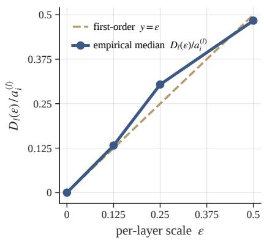  
Figure 10: Empirical tightness of the per-layer firstorder Taylor term.

The per-layer Taylor main term $( \mathrm { E q . ~ } 4 ) , a _ { i } ^ { ( l ) } : =$ $\langle \nabla _ { h _ { i } ^ { ( l ) } } \log p _ { M } ^ { \mathrm { s r c } } , h _ { i } ^ { ( l ) } \rangle = \widehat \phi _ { i } ^ { ( l ) }$ , yields the first-order prediction $D _ { l } ( \varepsilon ) \approx \varepsilon a _ { i } ^ { ( l ) }$ , so the normalized drop $D _ { l } ( \varepsilon ) / a _ { i } ^ { ( l ) }$ equals $\varepsilon$ in the first-order-tight limit. Measured on 8 GSM8K chains with Qwen2.5-1.5B-Instruct in fp32 over functionally active (i, l) cells (top quartile of $| D _ { l } ( \varepsilon = 1 ) |$ per chain, floored at $1 0 ^ { - 5 }$ nats), the empirical median tracks y = ε to within $\lesssim 1 0 \%$ overall (Figure 10).

## D.6 Empirical Ranking Fidelity of the Taylor Proxies Against the Exact Interventions

We further evaluate selection fidelity by comparing the top-ranked tokens under each Taylor proxy with those selected by its exact intervention on GSM8K using Qwen2.5-1.5B-Instruct. As shown in Table 5, necessity achieves top-γ agreement of 0.72 at $\gamma = 0 . 3$ and 0.81 at $\gamma = 0 . 5$ , while sufficiency reaches 0.68 and 0.76, respectively. All values substantially exceed the corresponding chance levels of 0.3 and 0.5, indicating that both proxies reliably preserve the token selections induced by their exact interventions.

<table><tr><td>Axis</td><td>top@0.3</td><td>top@0.5</td></tr><tr><td>Necessity  $\widehat { \phi }$ </td><td>0.72</td><td>0.81</td></tr><tr><td>Sufficiency  $\widehat { \psi }$ </td><td>0.68</td><td>0.76</td></tr></table>

Table 5: Top-γ agreement between the first-order Taylor proxies (ϕ, b ψb) and the exact interventions (ϕ, ψ) on GSM8K using Qwen2.5-1.5B-Instruct. Chance agreement is γ.

## E Licenses and Terms of Use

This section discusses the licenses and terms of use for all external artifacts used in our experiments and for the artifacts we release. All datasets and models we use are publicly available under permissive research-friendly licenses, and our use is consistent with their intended research purposes.

Datasets. We use four publicly released reasoning benchmarks. GSM8K (Cobbe et al., 2021) is released under the MIT License. The MATH dataset (Hendrycks et al., 2021) is released under the MIT License. MMLU-Pro (Wang et al., 2024) is released under the MIT License via the TIGER-Lab repository on Hugging Face. BIG-Bench Hard (Suzgun et al., 2023) is released under the Apache License 2.0 as part of the BIG-Bench suite. All four datasets are distributed for research use and our experimental use is consistent with their intended scope. We do not redistribute the underlying data; experiments load the datasets from their original sources.

Models. We use four publicly released instruction-tuned models. Qwen2.5-1.5B-Instruct and Qwen2.5-7B-Instruct (Team, 2024) are released under the Qwen License (Apache 2.0– based). Llama-3.1-8B-Instruct (Grattafiori et al., 2024) is released under the Llama 3.1 Community License Agreement. Mistral-7B- Instruct-v0.3 (Jiang et al., 2023a) is released under the Apache License 2.0. All four models permit research use, fine-tuning, and the release of derived artifacts (such as LoRA adapters) under their respective terms.

Consistency with intended use. Our use of all external artifacts is consistent with their intended research purposes. The four reasoning datasets (GSM8K, MATH, MMLU-Pro, BIG-Bench Hard) are released as research benchmarks for evaluating multi-step reasoning in language models, and our use is restricted to benchmarking and training LoRA adapters on the released training splits. The four instruction-tuned models (Qwen2.5-1.5B/7B, Llama-3.1-8B, Mistral-7B-Instruct-v0.3) are released to support research, fine-tuning, and the development of derived artifacts under their respective terms. Adapters derived from each base model inherit the original access conditions of that base model; in particular, adapters derived from Llama-3.1-8B-Instruct are released only for use with the Llama-3.1 base model, and are not used to train, distill into, or otherwise improve language models outside the Llama family, consistent with the Llama 3.1 Community License. All other adapters

<table><tr><td>Dataset</td><td>Model</td><td>Method</td><td>∆ Acc. (%)</td><td>Comp. rate</td></tr><tr><td rowspan="5">BBH</td><td>LI1a---nst.</td><td>* MIST</td><td>↑3.7</td><td>11.6%</td></tr><tr><td></td><td>tokenskip</td><td>↑1.5</td><td>4.6%</td></tr><tr><td></td><td>gogi_11</td><td>↓1.2</td><td>6.8%</td></tr><tr><td></td><td>attn_rollout</td><td>↓0.7</td><td>6.1%</td></tr><tr><td></td><td>h2o</td><td>↑0.2</td><td>7.8%</td></tr><tr><td rowspan="16">MMLU-Pro</td><td></td><td>* MIST</td><td>↓2.8</td><td>20.8%</td></tr><tr><td>Ow-.-nst.</td><td>tokenskip</td><td>↓4.3</td><td>-0.5%</td></tr><tr><td></td><td>gogi_11</td><td>↓6.6</td><td>3.4%</td></tr><tr><td></td><td>perplexity</td><td>↓7.1</td><td>7.8%</td></tr><tr><td></td><td>h2o</td><td>↓3.5</td><td>12.7%</td></tr><tr><td></td><td></td><td></td><td></td></tr><tr><td>Ia-----s.</td><td>* MIST tokenskip</td><td>↓1.0 ↓2.5</td><td>3.4% 1.2%</td></tr><tr><td></td><td>gogi_11</td><td>↓2.6</td><td>2.1%</td></tr><tr><td></td><td>perplexity</td><td>↓3.7</td><td>6.9%</td></tr><tr><td></td><td>h2o</td><td>↓3.4</td><td>2.5%</td></tr></table>

Table 6: Additional main results on BBH and MMLU Pro, in the same format as Table 1. Each entry is the mean over $\gamma \in \{ 0 . 6 , 0 . 7 , 0 . 8 , 0 . 9 \}$ relative to the Full CoT baseline. ∆Acc. (%): relative accuracy change (↓ drop, ↑ gain); Comp. rate: fraction by which the LoRA-adapted model’s inference-time generated tokens are reduced relative to the same Full CoT baseline. A negative compression rate indicates that the compressedsupervision adapter generated more tokens than the Full CoT baseline at evaluation.

(built on Qwen2.5 and Mistral, both released under Apache 2.0) carry no such derivative restrictions. All experimental use is for research purposes only; we do not deploy the trained adapters in commercial products.

## F Additional Main Results on BBH and MMLU-Pro

Table 6 reports the per-(model, scorer) compression numbers underlying Figs. 4 and 5, in the same $\Delta \mathrm { A c c } /$ compression-rate format as Table 1.

## G Direct inference-cost measurement.

The main results use compression rate as a hardware-agnostic proxy for efficiency. To quantify realized serving gains, we additionally report wall-clock decoding latency on the full GSM8K test set (1,319 examples), using batched greedy decoding with batch size 16, bfloat16, and SDPA. For each model, we compare the MIST adapter at the most aggressive trained budget $( \gamma { = } 0 . 5 )$ with the same adapter under the no-compression directive $( \gamma { = } 1 . 0 )$ , which serves as the Full-CoT reference. As shown in Table 7, compression reduces latency from 1.44 to 1.18 seconds for Qwen2.5-1.5B-Instruct, from 1.38 to 1.06 seconds for Llama-3.1-8B-Instruct, and from 1.72 to 1.20 seconds for Mistral-7B-Instruct-v0.3, corresponding to speedups of 1.22×, 1.30×, and 1.43×, respectively. These results confirm that shorter reasoning traces translate into measurable end-to-end inference savings across models.

<table><tr><td rowspan="2">Model</td><td colspan="2">Latency (s)</td><td rowspan="2">Speedup</td></tr><tr><td>γ=1.0</td><td> $\gamma { = } 0 . 5$ </td></tr><tr><td>Qwen2.5-1.5B</td><td>1.44</td><td>1.18</td><td>1.22×</td></tr><tr><td>Llama-3.1-8B</td><td>1.38</td><td>1.06</td><td>1.30×</td></tr><tr><td>Mistral-7B</td><td>1.72</td><td>1.20</td><td>1.43×</td></tr></table>

Table 7: Directly measured inference cost of the MIST adapter on GSM8K at the most aggressive trained budget $( \gamma { = } 0 . 5 )$ versus the uncompressed reference $( \gamma { = } 1 . 0 ,$ the same adapter with no compression directive). Latency is the mean wall-clock decode time per problem at batch size 16; speedup is the latency ratio $\gamma { = } 1 . 0$ over $\gamma { = } 0 . 5$

## H Empirical Per-Layer Logit-Lens Weight

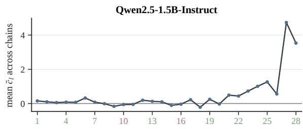

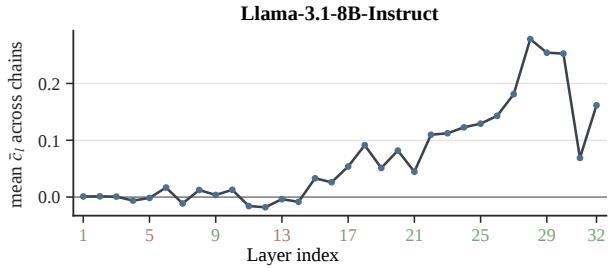  
Figure 11: Empirical mean of the logit-lens layer weight c¯l (Eq. 6) across 30 BBH chains for two of the paperheadline target models. Weight magnitude is overwhelmingly concentrated in the late layers, while many middle layers carry near-zero weight; both observations are direct empirical support for the layer-weighted aggregation in Eq. (7) over a uniform per-layer weight.

The layer weight $\bar { c } _ { l }$ in Eq. (6) is the inner product of layer l’s residual-stream update with the answer unembedding direction, chain-averaged over the chain tokens. Figure 11 plots its mean across 30 BBH chains layer by layer for Qwen2.5-1.5B-Instruct and Llama-3.1-8B-Instruct, two of the four main target models.

The figure makes the following empirical points concrete. First, $\bar { c } _ { l }$ is far from uniform across depth. This explains why the MIST-uniform ablation in §4.2 (Fig. 7) loses up to 4.6 pp — uniform weighting wastes selection budget on layer-token cells whose updates are essentially answer-neutral. Besides, the late-layer dominance is consistent across the two model families, so the aggregation in Eq. (7) is not specific to a single architecture.

## I Per-Axis Normalization Before Combining

The necessity and sufficiency scores $\widehat { \phi } _ { i }$ and $\widehat { \psi _ { i } }$ (Eq. 7) are inner products of log-likelihood gradients with different reference activations and therefore live on different scales across chains. To make the mixing coefficient α in Eq. (8) comparable across chains and benchmarks, we apply a perchain standardization to each axis before blending.

The necessity axis is standardized in log space:

$$
\widehat { \phi } _ { i } ^ { \mathrm { n o r m } } = \frac { \log ( | \widehat { \phi } _ { i } | + \varepsilon ) - \operatorname * { m e a n } _ { j } \log ( | \widehat { \phi } _ { j } | + \varepsilon ) } { \operatorname { s t d } _ { j } \log ( | \widehat { \phi } _ { j } | + \varepsilon ) } ,\tag{30}
$$

and the sufficiency axis with a standard z-score:

$$
\widehat { \psi } _ { i } ^ { \mathrm { n o r m } } = \frac { \widehat { \psi } _ { i } - \mathrm { m e a n } _ { j } \widehat { \psi } _ { j } } { \mathrm { s t d } _ { j } \widehat { \psi } _ { j } } ,\tag{31}
$$

with $\varepsilon = 1 0 ^ { - 1 2 }$ for numerical stability and statistics taken over the chain’s token indices $j$ . The unified score in Eq. (8) is computed on $\hat { \phi } _ { i } ^ { \mathrm { n o r m } }$ and $\widehat { \psi } _ { i } ^ { \mathrm { n o r m } }$ . The log transformation on the necessity axis is a standard choice for quantities whose perchain magnitudes span several orders of magnitude, and preserves the relative ordering of tokens within a chain.