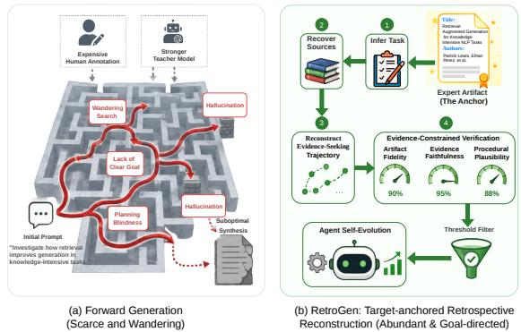
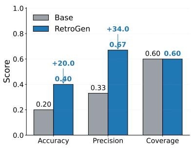
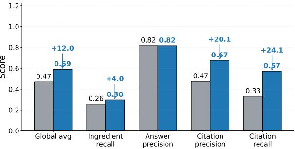
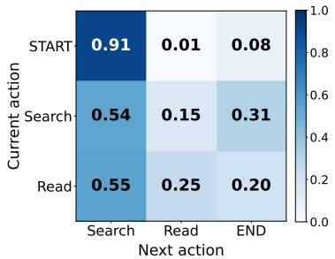
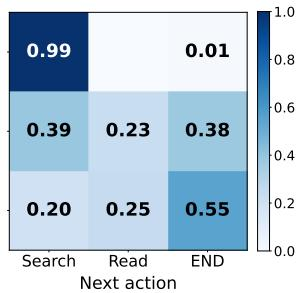
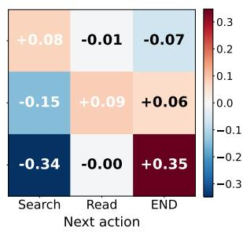
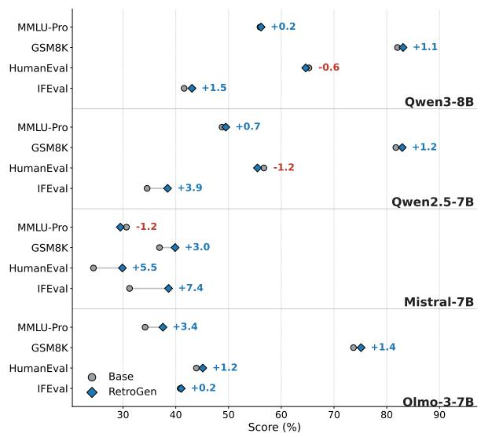

# From Final Artifacts to Trajectories: Retrospective Process Supervision for Evidence-Grounded Long-Form Generation

Junjie Huang1, Jiarui Qin2, Di Yin2, Weiwen Liu1, Yong Yu1, Xing Sun2, Weinan Zhang1

1Shanghai Jiao Tong University, 2Tencent Youtu Lab huangjunjie2019@sjtu.edu.cn, qinjr@icloud.com

## Abstract

Trajectory data is getting more vital for training large language models for boosting the agentic abilities. Unlike the verifiable domains such as coding or mathematics, scaling trajectory data for open-ended tasks is much more difficult because these tasks lack singular ground truth and are costly to annotate or verify. In this pa per, we propose RETROGEN, a self-improving framework of retrospective process supervision. Our key observation is that although expert trajectories are scarce, high-quality final artifacts such as literature reviews, analyst reports and legal judgments, are abundant in pre-training data and can be viewed as compressed traces of the evidence-seeking processes that produced them. RETROGEN reconstructs candidate latent trajectories from expert artifacts, verifies them against both the artifact and supporting evidence, and trains models on their own successful reconstruction data, without requiring trajectory datafrom stronger models. Experiments show that RETROGEN improves grounding, faithful synthesis, and long-form evidenceseeking agent tasks.

## 1 Introduction

Large language models (LLMs) are increasingly being extended into autonomous agents capable of planning, tool use, and multi-step interaction (Yao et al., 2022; Shinn et al., 2023; Wang et al., 2024a; Qin et al., 2024). A key factor driving this progress is trajectory-level supervision: training models not only on final answers, but also on intermediate reasoning, actions, observations, and revisions (Zelikman et al., 2022; Lightman et al., 2024; Shao et al., 2024). In verifiable domains such as mathematics, coding, and closed-ended question answering, generating trajectory data at scale is more feasible because the data can be verified using clear signals.

However, this reliance on objective verification creates a fundamental bottleneck for openended, evidence-grounded tasks, such as synthesizing literature reviews (Asai et al., 2024; McDonald et al., 2022), composing financial analyst reports grounded in filings (Loukas et al., 2021), or drafting legal judgments (Guha et al., 2023; Dai et al., 2025). Unlike closed-ended problems, these tasks lack a singular ground truth that can validate the generated trajectory. Even when a final output appears coherent, it remains difficult to automatically determine whether the selected evidence is sufficient, whether claims are faithfully grounded, and whether the reasoning path follows domain-specific standards of rigor. As a result, scalable process supervision for evidence-grounded long-form generation remains an important open challenge.

  
Figure 1: Illustration of our motivation. RETROGEN conceptualizes abundant expert artifacts as compressed processes, enabling scalable and grounded process supervision for open-ended agents without costly human or teacher model annotation.

Existing approaches typically obtain trajectory supervision by distilling from stronger teacher models or relying on human experts (Liu et al., 2023; Qin et al., 2023; Lightman et al., 2024). Yet, both sources are inherently unscalable: teacher distillation requires repeated access to costly proprietary models, while human annotation is prohibitively expensive for evidence-intensive workflows. Moreover, relying on forward trajectory generation in open-ended domains often leads to wandering search behaviors, as models lack the holistic foresight required to synthesize complex information.

This motivates a more self-improving, targetdriven alternative. As illustrated in Figure 1, we observe that while high-quality open-ended trajectories are exceptionally scarce, high-quality final artifacts produced by domain experts are remarkably abundant. A published literature review or a binding legal judgment is not merely a static output; rather, it is a lossy compression of a latent, multistep evidence-seeking process. A well-crafted related work section implicitly encodes how an author searched, filtered, compared, and synthesized prior studies into a coherent narrative. Crucially, because these artifacts are rigorously vetted by domain experts (e.g., peer reviewers), they provide strong quality prior for reverse-engineering the processes that produced them.

This perspective transforms expert-curated artifacts into verifiable targets for scalable process supervision. Instead of demanding an external teacher to demonstrate a full forward trajectory, the agent is tasked with reconstructing a plausible evidence-seeking trajectory that arrives at the known expert artifact.

In this paper, we introduce RETROGEN, a selfimproving framework that operationalizes retrospective process supervision. Given an expert artifact, RETROGEN first establishes an evidence environment by retrieving and organizing relevant sources. The agent then reconstructs a trace detailing how the artifact was derived, encompassing evidence selection, claim grounding, and intermediate synthesis. Rather than treating all generated traces as valid supervision, RETROGEN employs a rubric-guided verification step that quantitatively scores candidate trajectories across multiple dimensions. By applying a weighted thresholding mechanism, the agent selectively filters reconstructions based on their comprehensive performance in artifact fidelity, evidence faithfulness, and procedural plausibility. This establishes an iterative artifact-totrajectory-to-agent training loop.

Our contributions are summarized as follows:

• We formulate expert-curated artifacts as a scalable source of retrospective process supervision, reframing static outputs as verifiable targets for trajectory reconstruction.

• We propose RETROGEN, an iterative framework that autonomously generates, verifies, and trains on reconstructed trajectories without relying on stronger teacher models.

The proposed RETROGEN significantly improves evidence-grounded long text generation on both static and agentic benchmarks, while preserving general capabilities. A verification ablation further shows that combining scoring dimensions outperforms any single filter.

## 2 Problem Formulation

We study open-ended, evidence-grounded longform generation tasks where the final output is an expert-written artifact, but the generative process is unobserved. Given only an artifact $y ^ { * }$ (e.g., a related-work section, financial analysis report, or legal judgment), our goal is to reconstruct a plausible evidence-seeking trajectory that yields it.

Latent Expert Process. We formulate $y ^ { \ast }$ as the outcome of an unobserved expert workflow:

$$
( x ^ { * } , \mathcal { E } ^ { * } , \tau ^ { * } ) \mapsto y ^ { * } ,\tag{1}
$$

where $x ^ { * }$ is the underlying task specification, $\mathcal { E } ^ { * }$ represents the supporting evidence consulted by the expert, and $\tau ^ { * }$ is the latent process transforming the task and evidence into the final artifact. Because these variables are unobserved, we rely on the assumption that $y ^ { * }$ serves as a lossy but highly informative compression of this latent process.

Retrospective Reconstruction. Recognizing that the exact historical process $\tau ^ { * }$ is unknowable, we instead aim to reconstruct a plausible sequence:

$$
\hat { x } = g _ { x } ( y ^ { * } ) , \hat { \xi } = g _ { e } ( y ^ { * } ) , \hat { \tau } = g _ { \tau } ( y ^ { * } , \hat { x } , \hat { \xi } ) ,\tag{2}
$$

where $\hat { x }$ is the reconstructed task, $\hat { \mathcal { E } }$ is the recovered evidence set, and $\hat { \tau }$ is a reverse-engineered trace describing how an agent could derive an output consistent with $y ^ { * }$ . Because the exact historical process $\tau ^ { * }$ is unobserved, we treat $\hat { \tau }$ as an executable surrogate trajectory: a tool-using workflow that is faithful to $y ^ { \ast }$ and useful for training, rather than a reconstruction of the expert’s unrecorded trial-and-error history.

Desiderata. A high-quality reconstructed trace $\hat { \tau }$ should satisfy three properties:

• Artifact Fidelity: Preserving the essential content and structural organization of $y ^ { * }$ .

• Evidence Faithfulness: Grounding intermediate reasoning and final claims strictly within the recovered evidence $\hat { \mathcal { E } }$

• Procedural Plausibility: Exhibiting a logical domain workflow (e.g., search, inspect, compare) rather than hallucinating leaps in logic.

## 3 Method

Given an expert artifact $y ^ { * }$ , RETROGEN constructs retrospective process-supervision data through a structured pipeline.

## 3.1 Artifact-Anchored Initialization

Because the forward task is underdetermined, we first infer the starting conditions directly from the expert artifact. Leveraging its inherent reasoning capabilities, the agent infers a plausible task specification xˆ that aligns with the final output.

Concurrently, it induces an instance-specific rubric $R = \{ ( r _ { k } , c _ { k } ) \} _ { k = 1 } ^ { K }$ to serve as the evaluation standard for later verification. Rather than relying on generic quality metrics, this rubric extracts fine-grained, checkable criteria $( r _ { k } )$ mapped to specific target aspects $( c _ { k } )$ inherent in the artifact. For instance, if the artifact is a legal judgment document, a criterion $r _ { k }$ might demand "explicitly invoking the specific tort law precedent", targeting the aspect $c _ { k }$ of "statutory grounding". Alternatively, for an academic survey, $r _ { k }$ might require "contrasting the computational overhead of two specific baseline models", mapping to $c _ { k }$ for "comparative analysis".

Finally, to establish the evidence environment, we extract concrete cues, such as explicit citations, statutory references, or key entities, from the artifact. These cues seed an artifact-conditioned retrieval over domain-specific corpora, yielding the recovered evidence set $\hat { \mathcal { E } } .$ . Crucially, this entire initialization phase is fully self-bootstrapped, requiring zero human-authored process traces or external teacher models.

## 3.2 Trajectory Reconstruction

Given xˆ and $\hat { \mathcal { E } } ,$ the agent autonomously formulates a high-level operational plan $\hat { \boldsymbol { \pi } } = ( s _ { 1 } , s _ { 2 } , . . . , s _ { T } )$ utilizing a shared abstract action vocabulary ${ \mathcal { A } } =$ {Search, Open, Extract, Compare, Outline, Draft}. This plan is subsequently materialized into candidate tool-augmented traces:

$$
\hat { \tau } = ( \underbrace { \hat { o } _ { 0 } , \hat { a } _ { 1 } , \hat { o } _ { 1 } , \ldots , \hat { n } _ { t } } _ { \mathrm { d e n o t e d ~ a s ~ } \hat { \tau } ^ { \mathrm { p r e } } } , \tilde { y } ) ,\tag{3}
$$

where $\hat { a } _ { t } \in \mathcal A$ denotes a specific tool invocation, ${ \hat { o } } _ { t }$ represents the corresponding environmental observation, and $\hat { n } _ { t }$ is an intermediate synthesis note.

Collectively, these intermediate elements form the reasoning and evidence-seeking prefix $\hat { \tau } ^ { \mathrm { p r e } }$ , and $\tilde { y }$ is the final generated artifact. Crucially, the observations $\hat { o } _ { t }$ are populated via actual tool executions rather than model hallucinations, ensuring that the reconstructed traces are empirically faithful rather than merely narratively plausible.

To prevent the reconstructed dataset from collapsing into a single, homogeneous trace style, we inject controlled diversity across query formulation, plan realization, outline granularity, reflection frequency, and surface formatting. This acts as a form of procedural regularization, ensuring that the model learns robust and generalizable evidenceseeking behaviors instead of merely memorizing a rigid procedural template.

## 3.3 Evidence-Constrained Verification

Each candidate trace $\hat { \tau }$ is evaluated with respect to the desiderata in Section 2: artifact fidelity, evidence faithfulness, and procedural plausibility. We operationalize this through a rubric-guided, multidimensional scoring mechanism that yields four complementary signals.

First, a rubric score $( s _ { \mathrm { r u b } } )$ quantifies whether the synthesized artifact $\tilde { y }$ fully satisfies, partially satisfies, or misses each self-induced criterion within $R .$ Second, a holistic quality score $( s _ { \mathrm { q u a l } } )$ measures overarching domain rigor, encompassing dimensions such as coherence, factual accuracy, legal correctness, or analytical depth, depending on the specific task. Third, a grounding score $( s _ { \mathrm { g r d } } )$ ensures that intermediate synthesis notes $\hat { n } _ { t }$ and final claims are strictly supported by the recovered evidence environment $\hat { \mathcal { E } } .$ Fourth, a trace-consistency score $( s _ { \mathrm { c o n } } )$ verifies the internal logic of the workflow—checking, for example, whether comparison steps correctly reference previously opened documents, whether outlines are reflected in the final structure, and whether final claims are logically licensed by earlier observations. The overall trace score is computed as a weighted sum:

$$
\mathrm { S c o r e } ( \hat { \tau } ) = \lambda _ { r } s _ { \mathrm { r u b } } + \lambda _ { q } s _ { \mathrm { q u a l } } + \lambda _ { g } s _ { \mathrm { g r d } } + \lambda _ { c } s _ { \mathrm { c o n } } ,\tag{4}
$$

where $\lambda _ { \{ r , q , g , c \} }$ denote the respective mixing weights. Traces exhibiting failed retrievals, malformed tool executions, or overall scores falling below a domain-specific threshold are automatically discarded. Crucially, this weighted thresholding mechanism does not attempt to certify that a trace is historically identical to the original human workflow. Instead, it acts as a scalable proxy for process quality, ensuring that the retained trajectories are faithful to the expert anchor, grounded in evidence, and procedurally robust, all without requiring human oversight.

## 3.4 Retrospective Process Supervision

After the evidence-constrained verification, we retain the successfully filtered candidate traces. Crucially, rather than forcing the model to predict the exact original expert artifact $y ^ { * }$ at the end of the sequence, we pair the retained trace prefix $\hat { \tau } _ { i } ^ { \mathrm { p r e } }$ with its corresponding synthesized draft $\tilde { y } _ { i }$ . Concretely, each training sample encompasses the inferred task specification, the recovered evidence context, the tool-interaction trace, the intermediate notes, and the verified synthetic artifact:

$$
( \hat { x } _ { i } , \hat { \mathcal { E } } _ { i } , \hat { \tau } _ { i } ^ { \mathrm { p r e } } , \tilde { y } _ { i } ) .\tag{5}
$$

Using the synthesized output $\tilde { y } _ { i }$ instead of the original $y _ { i } ^ { * }$ ensures strict causal consistency between the intermediate reasoning steps and the final generation. Because the trace has already passed our rigorous multi-dimensional verification—which guarantees high fidelity to the original artifact—y˜i maintains high quality for the agent to learn from. We serialize each sample into a single autoregressive sequence and optimize the model using standard language modeling:

$$
z _ { i } = \mathrm { S e r i a l i z e } ( \hat { x } _ { i } , \hat { \mathcal { E } } _ { i } , \hat { \tau } _ { i } ^ { \mathrm { p r e } } , \tilde { y } _ { i } ) ,\tag{6}
$$

$$
\mathcal { L } ( \boldsymbol { \theta } ) = \sum _ { i } \sum _ { t } \log p _ { \boldsymbol { \theta } } ( z _ { i , t } \mid z _ { i , < t } ) .\tag{7}
$$

Compared with final-output-only supervision, this self-improving objective teaches the model not only what high-quality artifact to produce, but also how to autonomously decompose an open-ended task, gather and organize evidence, and synthesize it into a rigorously grounded long-form output.

## 4 Experiments

## 4.1 Experimental Setup

Domains and Artifacts. We evaluate RETRO-GEN on three evidence-grounded long-form generation domains: (i) scientific writing, where the task is to draft a related-work section conditioned on a paper abstract and the expert artifact $y ^ { \ast }$ is the author-written related-work section from the corresponding paper; (ii) financial analysis, where the agent produces an analyst-style report grounded in U.S. SEC 10-K filings from the EDGAR corpus (Loukas et al., 2021) and $y ^ { * }$ is a human-written financial narrative; and (iii) legal judgment drafting, where the agent drafts a first-instance judgment grounded in statutes and prior cases, with $y ^ { * }$ given by the official adjudicated judgment. These domains stress-test RetroGen under distinct evidence regimes: citation-heavy scientific synthesis, document-grounded financial reasoning, and statute/case-grounded legal argumentation.

Tools and Execution Environment. All trajectories are generated using domain-specific instantiations of the abstract action space A defined in Section 3. To ensure that supervision reflects executable evidence-seeking behavior, observations are populated through actual tool calls rather than model-imagined snippets. We cap each trajectory at 30 tool steps and maintain an 8,000-character sliding context window.

Backbone Models. We evaluate RETROGEN on four open-source LLMs: Qwen3-8B (Yang et al., 2025), Qwen2.5-7B (Yang et al., 2024), Mistral-7B-v0.3 (Jiang et al., 2023), and Olmo-3-1025- 7B (Olmo et al., 2025).

Training Corpus. For each backbone, RETRO-GEN reconstructs candidate trajectories from expert artifacts and filters them using the multidimensional verification score in Section 3 with uniform weights $\lambda = 0 . 2 5$ . Thresholds are calibrated per domain from the score distribution (0.52 / 0.48 / 0.63 for scientific / financial / legal; Appendix B), retaining approximately 25K verified trajectories. We construct a ∼50M-token SFT corpus with a fixed token-budgeted mixture: 80% verified agentic trajectories, split 40:20:20 across scientific, financial, and legal domains, and 20% general instruction-following, math, coding, and multi-turn dialogue data. This mixture preserves general capabilities while emphasizing evidence-seeking behavior.

Baselines and Ablations. We compare against controlled alternatives under the same token budget, sequence length, and optimization configuration:

(1) Initial: the checkpoint before training.

(2) ForwardGen: trajectories generated by the same backbone from the task specification xˆ without access to the expert artifact, isolating the value of target-anchored retrospective reconstruction.

<table><tr><td colspan="6">Qwen3-8B</td><td colspan="6">Mistral-7B-v0.3</td></tr><tr><td>Method</td><td>ALCE</td><td>ScholarQA</td><td>QASPER</td><td>LAiW</td><td>LegalBench</td><td>Method</td><td>ALCE</td><td>ScholarQA</td><td>QASPER</td><td>LAiW</td><td>LegalBench</td></tr><tr><td>Initial</td><td>83.33</td><td>66.36</td><td>53.25</td><td>34.14</td><td>74.93</td><td>Initial</td><td>68.58</td><td>27.54</td><td>54.45</td><td>20.82</td><td>53.3</td></tr><tr><td>ForwardGen</td><td>85.18</td><td>65.42</td><td>51.84</td><td>33.52</td><td>74.95</td><td>ForwardGen</td><td>62.41</td><td>48.65</td><td>51.34</td><td>32.15</td><td>60.27</td></tr><tr><td>Artifact-Only</td><td>87.86</td><td>67.18</td><td>52.52</td><td>34.69</td><td>74.93</td><td>Artifact-Only</td><td>63.64</td><td>55.83</td><td>50.21</td><td>34.82</td><td>62.22</td></tr><tr><td>WebGLM</td><td>84.52</td><td>65.84</td><td>53.36</td><td>36.61</td><td>76.12</td><td>WebGLM</td><td>65.11</td><td>53.27</td><td>50.81</td><td>39.41</td><td>61.25</td></tr><tr><td>WebCPM</td><td>46.73</td><td>60.27</td><td>49.89</td><td>23.23</td><td>74.92</td><td>WebCPM</td><td>57.90</td><td>50.41</td><td>54.40</td><td>38.68</td><td>63.10</td></tr><tr><td>RetroGen (Ours)</td><td>88.03</td><td>67.71</td><td>56.15</td><td>37.65</td><td>75.37</td><td>RetroGen (Ours)</td><td>68.93</td><td>61.12</td><td>56.27</td><td>41.29</td><td>65.98</td></tr><tr><td colspan="4">Qwen2.5-7B</td><td colspan="8">Olmo-3-1025-7B</td></tr><tr><td>Method</td><td>ALCE</td><td>ScholarQA</td><td></td><td>QASPER LAiW</td><td>LegalBench</td><td>Method</td><td>ALCE</td><td>ScholarQA</td><td>QASPER LAiW</td><td></td><td>LegalBench</td></tr><tr><td>Initial</td><td>85.37</td><td>56.42</td><td>47.03</td><td>34.71</td><td>72.16</td><td>Initial</td><td>90.70</td><td>53.86</td><td>55.17</td><td>39.24</td><td>63.57</td></tr><tr><td>ForwardGen</td><td>86.27</td><td>58.36</td><td>49.62</td><td>34.18</td><td>71.32</td><td>ForwardGen</td><td>89.34</td><td>55.42</td><td>53.62</td><td>37.42</td><td>64.84</td></tr><tr><td>Artifact-Only</td><td>87.48</td><td>62.74</td><td>50.04</td><td>33.39</td><td>72.41</td><td>Artifact-Only</td><td>91.42</td><td>58.17</td><td>54.36</td><td>38.27</td><td>66.18</td></tr><tr><td>WebGLM</td><td>84.26</td><td>59.85</td><td>50.15</td><td>35.24</td><td>71.27</td><td>WebGLM</td><td>91.27</td><td>56.78</td><td>52.97</td><td>36.61</td><td>64.25</td></tr><tr><td>WebCPM</td><td>67.75</td><td>54.27</td><td>48.85</td><td>31.95</td><td>72.80</td><td>WebCPM</td><td>74.17</td><td>53.41</td><td>51.84</td><td>34.71</td><td>64.25</td></tr><tr><td>RetroGen (Ours)</td><td>90.50</td><td>64.18</td><td>51.64</td><td>36.00</td><td>75.01</td><td>RetroGen (Ours)</td><td>92.83</td><td>61.78</td><td>56.42</td><td>39.65</td><td>67.30</td></tr></table>

Table 1: Main results across four open-source backbone models. RETROGEN achieves the best average performance across evidence-grounded generation and domain-specific reasoning benchmarks.
<table><tr><td>Filter</td><td>ALCE</td><td>ScholarQA</td><td>QASPER</td><td>LAiW</td><td>LegalBench</td><td>Avg</td></tr><tr><td>Initial</td><td>83.33</td><td>66.36</td><td>53.25</td><td>34.14</td><td>74.93</td><td>62.40</td></tr><tr><td>only squal</td><td>84.88</td><td>66.62</td><td>53.48</td><td>34.72</td><td>75.46</td><td>63.03</td></tr><tr><td>only Scon</td><td>85.42</td><td>66.18</td><td>53.86</td><td>35.64</td><td>75.22</td><td>63.26</td></tr><tr><td>next-N replace</td><td>86.42</td><td>66.74</td><td>54.18</td><td>35.86</td><td>75.12</td><td>63.66</td></tr><tr><td>only Sgrd</td><td>86.18</td><td>66.52</td><td>55.42</td><td>36.48</td><td>75.44</td><td>64.01</td></tr><tr><td>only Srub</td><td>88.18</td><td>67.82</td><td>55.28</td><td>36.05</td><td>74.96</td><td>64.46</td></tr><tr><td>RetroGen (λ=0.25)</td><td>88.03</td><td>67.71</td><td>56.15</td><td>37.65</td><td>75.37</td><td>64.98</td></tr></table>

Table 2: Verification-dimension ablation on Qwen3-8B under a matched token budget. Uniformly weighted scoring yields the best average; single-signal filters and next-N replacement remain above the initial checkpoint but are less stable.

(3) Artifact-Only: the same reconstructed dataset with all intermediate tool interactions removed, isolating trajectory-level process supervision from input-output supervision.

(4) Public-Baseline: the 80% agentic slice is replaced with WebGLM-QA (Liu et al., 2023) and WebCPM-WK (Qin et al., 2023), two public citation-grounded long-form generation corpora that provide retrieve-then-write supervision distilled from stronger systems.

Evaluation. We evaluate along three axes. First, evidence-grounded long-form generation is measured by ALCE (Gao et al., 2023), ScholarQA (Asai et al., 2024), and QASPER (McDonald et al., 2022). Second, domain-specific grounded reasoning is assessed with legal reasoning benchmarks including LAiW (Dai et al., 2025) and Legal-Bench (Guha et al., 2023). Third, general capability retention is measured by GSM8K (Cobbe et al., 2021), MMLU-Pro (Wang et al., 2024b), IFEval (Zhou et al., 2023), and HumanEval (Chen et al., 2021). All evaluations use vLLM-backed zero/few-shot inference (Kwon et al., 2023), with details deferred to Appendix.

## 4.2 Main Results

Table 1 reports the performance of RETROGEN and all baselines across the four backbone models. We summarize three main observations.

• Retrospective anchoring improves evidencegrounded generation. Across ALCE, ScholarQA, and QASPER, RETROGEN consistently outperforms the Initial and ForwardGen models across backbones. Compared with Forward-Gen, which generates trajectories from the task specification xˆ without access to the expert artifact, RETROGEN improves the average evidencegrounded generation score by +4.8 points, with gains of +4.3 on ALCE, +6.7 on ScholarQA, and +3.5 on QASPER. This suggests that anchoring trajectory reconstruction on expert artifacts helps reduce unguided exploration and produces more reliable evidence-seeking behavior.

• Trajectory-level supervision provides gains beyond final-artifact imitation. The comparison with Artifact-Only isolates the value of intermediate tool-interaction traces. On domain-specific reasoning benchmarks, RETROGEN improves over Artifact-Only by +2.7 points on average, with gains of +3.4 on LAiW and +2.0 on Legal-Bench. This indicates that final artifacts alone do not fully expose the procedural structure needed for grounded reasoning; reconstructing how evidence is searched, selected, and organized provides additional supervision for complex synthesis tasks.

  
(a) LitQA2

  
(b) SQA

Figure 2: AstaBench literature-understanding performance on LitQA2 and SQA.  
  
(a) Base

  
(b) RetroGen

  
(c) (RetroGen Base)  
Figure 3: AstaBench action-transition matrices, where each cell denotes the probability of transitioning from the current action to the next action

• Verified agentic trajectories are more effective than collapsed retrieve-then-write supervision. RETROGEN also outperforms the Public-Baseline, where the same token budget is allocated to public web-grounded long-form QA data in a retrieve-then-write format. The gains are most pronounced on tasks requiring multi-step evidence aggregation, suggesting that supervision over explicit tool-use trajectories teaches the model more than observing only a retrieved context and final answer.

## 4.3 In-Depth Analysis

## 4.3.1 Verification-Dimension Ablation

The main results use a uniformly weighted combination of the four verification signals. To test whether this combination is necessary, we retrain Qwen3-8B under the same token budget while filtering with a single score, or while replacing the selected traces with the next-highest-scoring ones (next-N replace). Table 2 shows that the weighted verifier achieves the best average. Singledimension filters remain above the initial checkpoint, so moderately scored traces can still help; however, next-N replace underperforms full RET-ROGEN, indicating that usefulness is graded and that the threshold trades quality against data volume.

## 4.3.2 Dynamic Agentic Evaluation on AstaBench

Standard evidence-grounded generation benchmarks evaluate the quality of final answers, but they only partially reveal whether a model can behave as a reliable research agent. To further examine the process-level behavior learned by RETROGEN, we evaluate on AstaBench (Bragg et al., 2025), a dynamic agentic benchmark for scientific research tasks. Unlike static QA benchmarks, AstaBench requires the model to iteratively search for papers, inspect retrieved content, and decide when sufficient evidence has been collected. This makes it well suited for testing whether retrospective process supervision improves the agent’s evidence-seeking policy rather than only its final-output style.

  
Figure 4: General capability retention across four backbone models. Dumbbell markers compare each initial checkpoint with its RETROGEN-trained counterpart.

Benchmark and protocol. We focus on the literature-understanding tasks LitQA2-Validation and SQA (details in Appendix A.4). The initial model and its RETROGEN-trained counterpart use the same backbone, tool inventory, sampling configuration, and maximum interaction budget (max\_rounds= 15).

Performance on literature understanding. Figure 2 shows that RETROGEN improves most AstaBench literature-understanding metrics. On LitQA2, RETROGEN doubles accuracy from 0.20 to 0.40 and improves precision from 0.33 to 0.67, while maintaining the same coverage of 0.60. This indicates that the model becomes more accurate and selective without simply abstaining more often. On SQA, RETROGEN improves the global average from 0.47 to 0.59. The largest gains come from citation-related metrics: citation precision increases from 0.47 to 0.67, and citation recall increases from 0.33 to 0.57. Answer precision remains unchanged at 0.82, suggesting that the main benefit is not merely more fluent answer generation, but better grounding and attribution of claims to supporting evidence.

  
Figure 5: Case study under the same question. RETRO-GEN produces a more evidence-grounded, less repetitive, and higher-density answer.

Action-transition analysis. To understand where these gains come from, we further analyze the action transitions recorded by the AstaBench sandbox. We collapse raw tool calls into three high-level action types: SEARCH, READ, and END. Figure 3 compares the empirical transition matrices of the initial model and RETROGEN. The initial model frequently repeats search actions after searching, with a search-to-search probability of 0.54, suggesting redundant exploration. In contrast, RETROGEN reduces this probability to 0.39 and increases the search-to-read transition from 0.15 to 0.23, indicating that it is more likely to inspect retrieved evidence rather than continue issuing new searches. After reading, RETROGEN also transitions to END much more often, increasing the read-to-end probability from 0.20 to 0.55.

Together, these patterns suggest that RETRO-GEN learns a more goal-directed research policy: it searches to identify candidate evidence, reads to verify and extract support, and terminates once sufficient evidence has been gathered. This provides process-level evidence for our main claim that retrospective supervision improves the structure of evidence-seeking behavior, not only the quality of the final generated response.

## 4.3.3 General Capability Retention

A potential concern with training on long agentic trajectories is that the model may become overly specialized to evidence-seeking workflows and lose general instruction-following or reasoning abilities.

Figure 4 compares each initial checkpoint with its RETROGEN-trained counterpart on GSM8K, MMLU-Pro, IFEval, and HumanEval. Across backbones, RETROGEN shows no systematic degradation: most points are comparable to or slightly above the initial checkpoint. Mixed with a modest amount of general SFT data, verified agentic trajectories therefore improve grounded long-form behavior without inducing catastrophic forgetting.

## 4.3.4 Case Study

Figure 5 compares the initial model and RETRO-GEN on the same question, “UK Parliament: How does it all work and what are the numbers?”. The initial model generates a plausible overview, but does not attach source links and quickly degenerates into repeated statements, resulting in low information density.

In contrast, RETROGEN produces a more compact and grounded synthesis. It links claims to the retrieved passages, covers multiple aspects of the question—including Parliament’s role, its two houses, public representation, and researchsupported policymaking—and avoids repetitive phrasing. This case study illustrates that retrospective process supervision improves not only evidence use, but also the organization and density of the final answer.

## 5 Related Work

Evidence-grounded long-form generation. Retrieval-augmented generation improves the factuality and verifiability of language models by grounding generation in external evidence (Lewis et al., 2020). Recent work extends this paradigm to web-grounded and citation-grounded long-form generation, where models must synthesize evidence from multiple sources and provide faithful attributions (Liu et al., 2023; Qin et al., 2023; Gao et al., 2023). Scientific and legal domains further stress these abilities, as reliable generation often requires long-document reading, evidence comparison, and well-supported argumentation (Asai et al., 2024; McDonald et al., 2022; Guha et al., 2023; Dai et al., 2025). However, most existing pipelines supervise models through final answers, retrieved contexts, or distilled responses, collapsing the intermediate evidence-seeking process into a single input-output mapping. RETROGEN instead treats expert-written artifacts as compressed traces of latent evidence-seeking processes and reconstructs explicit tool-use trajectories from them.

Tool-use agents and process supervision. A growing line of work studies language models as agents that interleave reasoning with external actions such as search, retrieval, API calls, and environment interaction (Wang et al., 2024a; Yao et al., 2022; Qin et al., 2024). While tool use extends models beyond parametric knowledge, training reliable agents remains challenging because highquality process trajectories are scarce. Process supervision shows that intermediate reasoning steps can improve reliability over outcome-only supervision (Lightman et al., 2024), and reasoning bootstrapping suggests that models can benefit from learning from their own intermediate rationales (Zelikman et al., 2022; Shao et al., 2024). Unlike these settings, evidence-seeking agents require not only plausible reasoning chains but also faithful observations produced by executable tools. RET-ROGEN therefore reconstructs candidate trajectories retrospectively and filters them with evidenceconstrained verification.

Self-improvement without stronger teachers. Self-improving agents have been explored through verbal feedback, reflection, and iterative refinement (Shinn et al., 2023). However, many datageneration pipelines still rely on stronger teacher models, human demonstrations, or preference labels to produce supervision at scale. Web-grounded systems such as WebGLM and WebCPM show the value of retrieval-enhanced supervision for longform QA (Liu et al., 2023; Qin et al., 2023), but typically organize supervision around retrieve-thenwrite outputs rather than reusable multi-step agentic processes. RETROGEN differs by using expertcurated artifacts as target anchors: instead of asking a stronger model or human annotator to generate trajectories forward, it infers plausible evidenceseeking trajectories backward from the artifact, verifies them automatically, and trains the backbone on the resulting retrospective process supervision.

## 6 Conclusion

We presented RETROGEN, a framework for retrospective process supervision that trains evidenceseeking agents from expert-curated final artifacts. Rather than collecting costly human process annotations or relying on stronger teacher models, RETROGEN reconstructs candidate tool-use trajectories from high-quality artifacts and filters them through evidence-constrained verification for artifact fidelity, evidence faithfulness, and procedural

plausibility.

Across scientific writing, financial analysis, and legal judgment drafting, RETROGEN improves evidence-grounded long-form generation and domain-specific reasoning over various baselines. Ablations show that the four verification signals are complementary, and in-depth analyses further show that the method induces more structured agentic behavior on dynamic research tasks while preserving general capabilities. These findings suggest that expert artifacts can serve not only as final targets, but also as scalable sources of process supervision for self-improving open-ended agents.

## Limitations

RETROGEN relies on the availability of highquality expert artifacts. While such artifacts are often more abundant than process annotations, their usefulness depends on whether they contain enough recoverable evidence and structural signals to support retrospective reconstruction. In domains where final outputs are highly underspecified, stylistically diverse, or weakly grounded in explicit evidence, the reconstructed trajectories may be less reliable.

Our experiments focus on evidence-grounded long-form generation with retrieval-oriented tools. Although the framework is designed to be general, further work is needed to evaluate retrospective process supervision in domains requiring richer interactive environments, longer-horizon planning, or non-textual tools such as code execution, database operations, and multimodal perception.

## Acknowledgments

The work is supported by National Natural Science Foundation of China (62502310,62322603).

## References

Akari Asai, Jacqueline He\*, Rulin Shao\*, Weijia Shi, Amanpreet Singh, Joseph Chee Chang, Kyle Lo, Luca Soldaini, Sergey Feldman, Tian, D’arcy Mike, David Wadden, Matt Latzke, Minyang, Pan Ji, Shengyan Liu, Hao Tong, Bohao Wu, Yanyu Xiong, Luke Zettlemoyer, and 6 others. 2024. OpenScholar: Synthesizing scientific literature with retrieval-augmented language models. Arxiv.

Jonathan Bragg, Mike D’Arcy, Nishant Balepur, Dan Bareket, Bhavana Dalvi, Sergey Feldman, Dany Haddad, Jena D Hwang, Peter Jansen, Varsha Kishore,

and 1 others. 2025. Astabench: Rigorous benchmarking of ai agents with a scientific research suite. arXiv preprint arXiv:2510.21652.

Mark Chen, Jerry Tworek, Heewoo Jun, Qiming Yuan, Henrique Ponde de Oliveira Pinto, Jared Kaplan, Harri Edwards, Yuri Burda, Nicholas Joseph, Greg Brockman, Alex Ray, Raul Puri, Gretchen Krueger, Michael Petrov, Heidy Khlaaf, Girish Sastry, Pamela Mishkin, Brooke Chan, Scott Gray, and 39 others. 2021. Evaluating large language models trained on code.

Karl Cobbe, Vineet Kosaraju, Mohammad Bavarian, Mark Chen, Heewoo Jun, Lukasz Kaiser, Matthias Plappert, Jerry Tworek, Jacob Hilton, Reiichiro Nakano, Christopher Hesse, and John Schulman. 2021. Training verifiers to solve math word problems. arXiv preprint arXiv:2110.14168.

Yongfu Dai, Duanyu Feng, Jimin Huang, Haochen Jia, Qianqian Xie, Yifang Zhang, Weiguang Han, Wei Tian, and Hao Wang. 2025. Laiw: A chinese legal large language models benchmark. In Proceedings of the 31st International conference on computational linguistics, pages 10738–10766.

Tianyu Gao, Howard Yen, Jiatong Yu, and Danqi Chen. 2023. Enabling large language models to generate text with citations. In Proceedings ofthe 2023 Conference on Empirical Methods in Natural Language Processing, pages 6465–6488.

Neel Guha, Julian Nyarko, Daniel Ho, Christopher Ré, Adam Chilton, Alex Chohlas-Wood, Austin Peters, Brandon Waldon, Daniel Rockmore, Diego Zambrano, and 1 others. 2023. Legalbench: A collaboratively built benchmark for measuring legal reasoning in large language models. Advances in neural information processing systems, 36:44123–44279.

Albert Qiaochu Jiang, Alexandre Sablayrolles, Arthur Mensch, Chris Bamford, Devendra Singh Chaplot, Diego de Las Casas, Florian Bressand, Gianna Lengyel, Guillaume Lample, Lucile Saulnier, Lélio Renard Lavaud, Marie-Anne Lachaux, Pierre Stock, Teven Le Scao, Thibaut Lavril, Thomas Wang, Timothée Lacroix, and William El Sayed. 2023. Mistral 7b. ArXiv, abs/2310.06825.

Woosuk Kwon, Zhuohan Li, Siyuan Zhuang, Ying Sheng, Lianmin Zheng, Cody Hao Yu, Joseph Gonzalez, Hao Zhang, and Ion Stoica. 2023. Efficient memory management for large language model serving with pagedattention. In Proceedings ofthe 29th symposium on operating systems principles, pages 611–626.

Patrick Lewis, Ethan Perez, Aleksandra Piktus, Fabio Petroni, Vladimir Karpukhin, Naman Goyal, Heinrich Küttler, Mike Lewis, Wen-tau Yih, Tim Rocktäschel, and 1 others. 2020. Retrieval-augmented generation for knowledge-intensive nlp tasks. Advances in neural information processing systems, 33:9459– 9474.

Hunter Lightman, Vineet Kosaraju, Yuri Burda, Harri son Edwards, Bowen Baker, Teddy Lee, Jan Leike, John Schulman, Ilya Sutskever, and Karl Cobbe. 2024. Let’s verify step by step. In International Conference on Learning Representations, volume 2024, pages 39578–39601.

Xiao Liu, Hanyu Lai, Hao Yu, Yifan Xu, Aohan Zeng, Zhengxiao Du, Peng Zhang, Yuxiao Dong, and Jie Tang. 2023. Webglm: towards an efficient web-enhanced question answering system with human preferences. In Proceedings of the 29th ACM SIGKDD conference on knowledge discovery and data mining, pages 4549–4560.

Lefteris Loukas, Manos Fergadiotis, Ion Androutsopoulos, and Prodromos Malakasiotis. 2021. Edgarcorpus: Billions of tokens make the world go round. In Proceedings ofthe Third Workshop on Economics and Natural Language Processing, pages 13–18.

Tavish McDonald, Brian Tsan, Amar Saini, Juanita Ordonez, Luis Gutierrez, Phan Nguyen, Blake Mason, and Brenda Ng. 2022. Detect, retrieve, comprehend: a flexible framework for zero-shot document-level question answering. arXiv preprint arXiv:2210.01959.

Team Olmo, Allyson Ettinger, Amanda Bertsch, Bailey Kuehl, David Graham, David Heineman, Dirk Groeneveld, Faeze Brahman, Finbarr Timbers, Hamish Ivison, and 1 others. 2025. Olmo 3. arXiv preprint arXiv:2512.13961.

Yujia Qin, Zihan Cai, Dian Jin, Lan Yan, Shihao Liang, Kunlun Zhu, Yankai Lin, Xu Han, Ning Ding, Huadong Wang, and 1 others. 2023. Webcpm: Interactive web search for chinese long-form question answering. In Proceedings ofthe 61st Annual Meeting of the Association for Computational Linguistics (Volume 1: Long Papers), pages 8968–8988.

Yujia Qin, Shihao Liang, Yining Ye, Kunlun Zhu, Lan Yan, Yaxi Lu, Yankai Lin, Xin Cong, Xiangru Tang, Bill Qian, and 1 others. 2024. Toolllm: Facilitating large language models to master 16000+ real-world apis. In International Conference on Learning Representations, volume 2024, pages 9695–9717.

Zhihong Shao, Peiyi Wang, Qihao Zhu, Runxin Xu, Junxiao Song, Xiao Bi, Haowei Zhang, Mingchuan Zhang, YK Li, Yang Wu, and 1 others. 2024. Deepseekmath: Pushing the limits of mathematical reasoning in open language models. arXiv preprint arXiv:2402.03300.

Noah Shinn, Federico Cassano, Ashwin Gopinath, Karthik Narasimhan, and Shunyu Yao. 2023. Reflexion: Language agents with verbal reinforcement learning. Advances in neural information processing systems, 36:8634–8652.

Lei Wang, Chen Ma, Xueyang Feng, Zeyu Zhang, Hao Yang, Jingsen Zhang, Zhiyuan Chen, Jiakai Tang, Xu Chen, Yankai Lin, and 1 others. 2024a. A survey on large language model based autonomous agents. Frontiers ofComputer Science, 18(6):186345.

Yubo Wang, Xueguang Ma, Ge Zhang, Yuansheng Ni, Abhranil Chandra, Shiguang Guo, Weiming Ren, Aaran Arulraj, Xuan He, Ziyan Jiang, and 1 others. 2024b. Mmlu-pro: A more robust and challenging multi-task language understanding benchmark. arXiv preprint arXiv:2406.01574.

An Yang, Anfeng Li, Baosong Yang, Beichen Zhang, Binyuan Hui, Bo Zheng, Bowen Yu, Chang Gao, Chengen Huang, Chenxu Lv, and 1 others. 2025. Qwen3 technical report. arXiv preprint arXiv:2505.09388.

Qwen An Yang, Baosong Yang, Beichen Zhang, Binyuan Hui, Bo Zheng, Bowen Yu, Chengyuan Li, Dayiheng Liu, Fei Huang, Guanting Dong, Haoran Wei, Huan Lin, Jian Yang, Jianhong Tu, Jianwei Zhang, Jianxin Yang, Jiaxin Yang, Jingren Zhou, Junyang Lin, and 25 others. 2024. Qwen2.5 technical report. ArXiv, abs/2412.15115.

Shunyu Yao, Jeffrey Zhao, Dian Yu, Nan Du, Izhak Shafran, Karthik Narasimhan, and Yuan Cao. 2022. React: Synergizing reasoning and acting in language models. arXiv preprint arXiv:2210.03629.

Eric Zelikman, Yuhuai Wu, Jesse Mu, and Noah Goodman. 2022. Star: Bootstrapping reasoning with reasoning. Advances in Neural Information Processing Systems, 35:15476–15488.

Jeffrey Zhou, Tianjian Lu, Swaroop Mishra, Siddhartha Brahma, Sujoy Basu, Yi Luan, Denny Zhou, and Le Hou. 2023. Instruction-following evaluation for large language models. arXiv preprint arXiv:2311.07911.

## A Implementation Details

## A.1 Expert Artifact Corpora

For each of the three domains in Section 4.1, the expert artifact $y ^ { * }$ is drawn from a publicly available source and used as the anchor for retrospective reconstruction.

• Scientific writing. We use author-written relatedwork sections as expert artifacts $y ^ { * }$ . Each instance consists of a parsed related-work block together with the corresponding paper abstract and cited reference list. The abstract is used as side context for inducing the task specification ${ \hat { x } } ,$ while the original related-work text is never exposed to the agent during executable trajectory generation.

• Financial analysis. We use Item 7 (Management’s Discussion and Analysis, MD&A) sections of U.S. SEC 10-K filings from the EDGAR corpus (Loukas et al., 2021). Each MD&A section is treated as the expert artifact $y ^ { \ast }$ and is indexed by company and fiscal year. The remaining filing content, such as business description, risk factors, and quantitative disclosures, is available to the agent only through actual filing-reader tool calls.

• Legal judgment drafting. We use Chinese firstinstance civil and administrative judgments collected from publicly accessible court-record portals. Each judgment is normalized into plain text, with personal identifiers pseudonymized when necessary. Statutes and prior cases are not bundled with $y ^ { \ast }$ and must be retrieved at trajectory time through the legal search and browse tools.

Across all domains, the target artifact is used only as a retrospective anchor for task induction, evidence recovery, and verification. It is not available as an observation during trajectory execution.

## A.2 Procedural Diversity

To prevent the reconstructed corpus from collapsing into a single template, we randomize five axes when sampling each trajectory: (i) user-query phrasing; (ii) system prompt style, including variations in tone, persona, and tool schema; (iii) high-level plan flow pattern; (iv) thought templates for each action type, such as SEARCH, BROWSE, SYNTHESIZE, ASSEMBLE, REFLECTION, TRAN-SITION, and ERRORRECOVERY; and (v) the surface formatting of tool-call blocks, such as JSONstyle tool calls and ReAct-style Action/Action Input formatting. All random seeds are fixed within a single backbone run for reproducibility.

## A.3 SFT Mixture and Training

The same SFT recipe is applied to all fine-tuned variants. The Base baseline denotes the original checkpoint without SFT.

Token-budgeted mixture. We treat the training corpus as a budget of $5 \times 1 0 ^ { 7 }$ tokens. For RETROGEN, this budget is split as: 40% TRAJECTORY-SCIENTIFIC, 20% TRAJECTORY-FINANCIAL, 20% TRAJECTORY-LEGAL, and 20% GENERAL. The GENERAL pool aggregates instruction-following, multi-turn dialogue, longform writing, math, and code samples. Samples longer than 32,768 tokens are dropped. The same token budget and mixture proportions are used for the corresponding baselines, with only the 80% agentic slice changed according to the baseline definition.

Baseline construction. For ForwardGen, trajectories are generated from the inferred task specification xˆ without access to the expert artifact $y ^ { * }$ as a target anchor. For Artifact-Only, we remove intermediate tool calls, observations, and synthesis notes while preserving the inferred task and final artifact. For Public-Baseline, we replace the 80% agentic trajectory slice with WebGLM-QA and WebCPM-WK examples while keeping the same 20% general-data mixture. All fine-tuned variants share the same sequence length cap and optimization configuration.

Optimization. Training is implemented with fullparameter supervised fine-tuning using DeepSpeed ZeRO-1 and sequence packing. We use AdamW with peak learning rate $1 \times 1 0 ^ { - 5 }$ , cosine scheduling, warmup ratio 5%, weight decay 0.01, gradient clipping 1.0, gradient checkpointing, left truncation, dropout off, and a target effective batch size of approximately 512K tokens per optimizer step. Each backbone is trained for one epoch with a fixed random seed. The same optimization configuration is used for every fine-tuned baseline.

## A.4 Evaluation Details

All evaluations are run with a vLLM backend. We use max\_length=32,768 for evidence-grounded

Tool results are returned in the next user turn: <tool\_response>...</tool\_response>

and legal tasks and 4,096 otherwise. Unless otherwise specified, the random seed is fixed to 1234.

For dynamic agentic evaluation in Section 4.3.2, we run AstaBench’s literature-understanding suite, including LitQA2-Validation and SQA. LitQA2 measures accuracy, precision, and coverage on biomedical evidence-seeking questions. SQA reports ingredient recall, answer precision, citation precision, citation recall, and their global average. The base model and its RETROGEN-trained counterpart use the same backbone, tool inventory, sampling configuration, and maximum interaction budget (max\_rounds=15). Judge-based metrics are rescored using the same local judge model for all systems.

## A.5 AstaBench Action Abstraction

For the transition analysis in Figure 3, we collapse raw AstaBench tool calls into three high-level actions: SEARCH, READ, and END. SEARCH includes paper search, snippet search, citation expansion, and other retrieval-oriented calls. READ includes opening paper metadata, reading paper content, and inspecting retrieved passages. END denotes the model’s decision to stop tool use and produce the final answer. We compute transition probabilities by counting each consecutive action pair and normalizing by the total outgoing transitions from the current action.

## A.6 Action Schema and Reusable Templates

For all three domains, an assistant turn may contain one or more tool calls followed by an optional freeform note. A final-answer turn emits no tool call. The default schema is:

<tool\_call>{"name":"<tool>","arguments":{...}}</tool\_call>

We additionally sample a ReAct-style variant at fixed probability per trajectory:

Action: <tool>   
Action Input: {...}

This improves robustness to different tool-call surface forms. Thought templates that bracket each action are drawn from a large pool of paraphrases to avoid wording collapse during SFT.

## B Verification Protocol

Verification is performed by the same backbone that generates the candidate trace, under a rubricguided scoring protocol; we do not introduce a stronger external judge. Each retained trace receives four scores in [0, 1]—rubric satisfaction $s _ { \mathrm { r u b } } .$ holistic quality $s _ { \mathrm { q u a l } } .$ , evidence grounding $s _ { \mathrm { g r d } }$ , and trace consistency $s _ { \mathrm { c o n } } - \mathrm { v }$ hich are averaged with uniform weights $\lambda = 0 . 2 5$

<table><tr><td>Domain</td><td>Mean</td><td>Median</td><td>P25</td><td>P75</td><td>Thr.</td></tr><tr><td>Scientific</td><td>0.571</td><td>0.594</td><td>0.412</td><td>0.743</td><td>0.52</td></tr><tr><td>Financial</td><td>0.508</td><td>0.517</td><td>0.273</td><td>0.738</td><td>0.48</td></tr><tr><td>Legal</td><td>0.624</td><td>0.668</td><td>0.480</td><td>0.799</td><td>0.63</td></tr></table>

Table 3: Domain-wise distribution of the overall verification score and the corresponding filtering threshold. Thresholds cut the low-score tail while retaining enough traces for the 50M-token SFT mixture, yielding approximately 25K verified trajectories.

Domain-specific thresholds. Table 3 reports the score distribution used to calibrate filters. Rather than applying a global cutoff, we remove the lowscore tail in each domain while retaining enough data for the 50M-token SFT mixture. The resulting thresholds are 0.52 / 0.48 / 0.63 for scientific / financial / legal traces, yielding approximately 25K verified trajectories.

Failure modes. Rejected traces typically exhibit missed evidence themes, weak grounding, shallow comparison, or incomplete finals. For example, one rejected scientific trajectory (overall score 0.30, rubric score 0.00) is asked to write a relatedwork section on adaptive optimization under partial observability, but produces fluent prose about uncertainty and decision-making while omitting the required themes. This is a common rejection pattern: a plausible-sounding workflow that recovers the wrong evidence lineage. Accepted traces, by contrast, search and browse in a noisy retrieval space, retain relevant sources, discard weakly related results, and synthesize an artifact that covers the self-induced rubric.

## C Prompts and Anti-Leakage

We include simplified prompt templates used for rubric extraction and task induction in the scientificwriting domain. Financial and legal domains follow the same structure with domain-specific criteria (coverage of filings or statutes, analytical depth, and citation of controlling authority).

## Rubric extraction.

The scientific-writing prompt template is:

Analyze the following Related Work section and extract a   
structured   
evaluation rubric.   
## Related Work Section   
{related\_work}   
## Instructions   
Identify specific quality criteria that a reconstructed   
trajectory   
should satisfy. Each item should be categorized as one of:   
coverage | structure | synthesis | citation   
Output JSON:   
{   
"rubric\_items": [   
{   
"id": "R1",   
"category": "coverage|structure|synthesis|citation",   
"description": "Specific requirement description"   
}   
]   
}   
An example extracted item is:   
{   
"id": "R1",   
"category": "synthesis",   
"description": "Compare greedy frameworks for adaptive   
optimization with Stochastic Depletion problems."   
}

Task induction with anti-leakage. The inferred query must specify a realistic professional intent without leaking the evidence the agent is expected

to recover:   
Based on the following Related Work section, generate a task   
description for an AI agent that needs to write a similar   
Related   
Work section using only web search.   
## Related Work Section   
{related\_work}   
## Rubric   
{rubric}   
## Instructions   
1. Infer what paper this Related Work belongs to.   
2. Specify the domain and key themes.   
3. Do NOT reveal specific paper titles/authors, target   
citations,   
exact conclusions, or evidence that the agent must   
recover   
via search.   
4. Provide enough high-level guidance for search.

A representative inferred task is: write a relatedwork section on trust-aware recommender systems and matrix factorization, covering fundamental factorization algorithms, social-network structure, and trust propagation. The prompt names the research intent and topical scope, but still requires the agent to search, inspect, select, and synthesize evidence. During trajectory execution the original artifact y∗ is used only offline as a retrospective anchor.