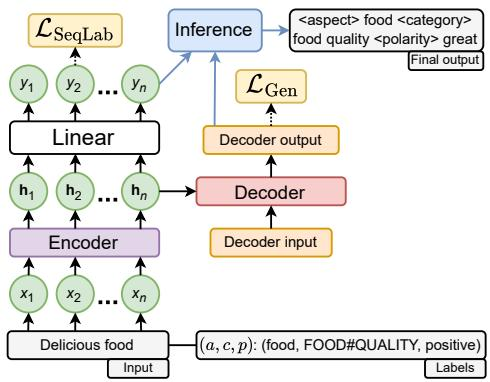
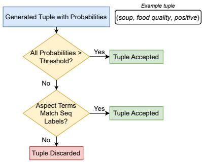
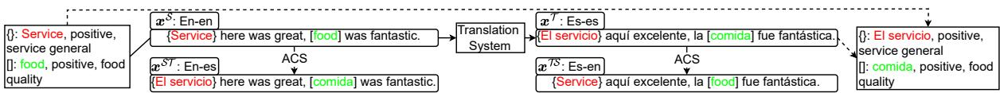
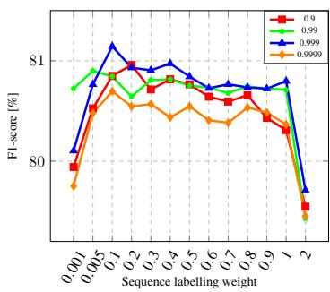
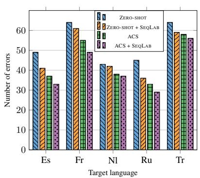
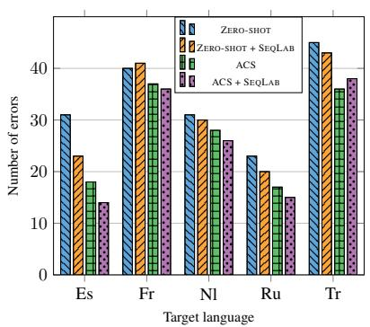
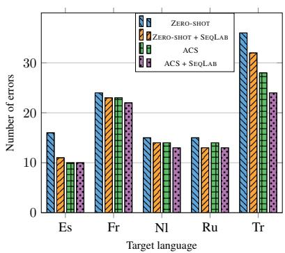
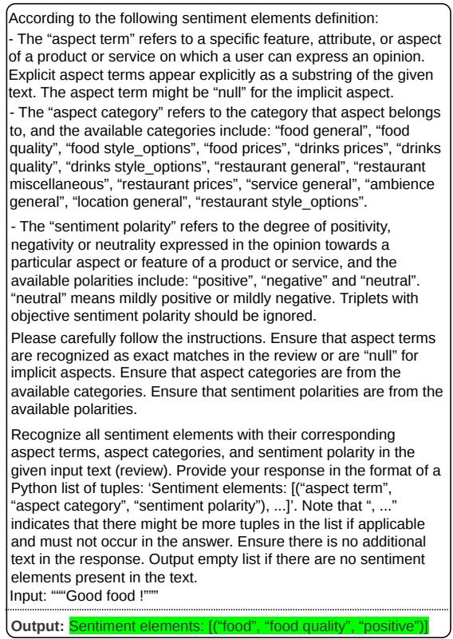

# Generative Models Enhanced by Sequence Labelling and Aspect-Code Switching Improve Cross-lingual Aspect-Based Sentiment Analysis

Jakub Šmíd\*, † and Pavel Pribᡠnˇ\* and Pavel Král\*, †

\*Department of Computer Science and Engineering †NTIS – New Technologies for the Information Society University of West Bohemia in Pilsen, Faculty of Applied Sciences Univerzitní 2732/8, 301 00 Pilsen, Czech Republic {jaksmid,pribanp,pkral}@fav.zcu.cz https://nlp.kiv.zcu.cz

## Abstract

Cross-lingual aspect-based sentiment analysis (ABSA) transfers knowledge from a source language with annotated data to a target language, enabling fine-grained sentiment analysis without annotated target-language data. While monolingual ABSA has seen significant progress, cross-lingual ABSA remains underexplored, especially for complex tasks involving multiple sentiment elements like target-aspectsentiment detection (TASD). In this paper, we propose a novel SeqLab framework that enhances cross-lingual ABSA using a sequenceto-sequence model with an auxiliary sequencelabelling task performed by the encoder, enhancing aspect term recognition and sentiment predictions. Additionally, we incorporate aspect-code switching (ACS), a translationbased technique that swaps aspect terms between source and translated sentences, generating additional training data to enhance the model’s cross-lingual understanding. We evaluate our approach across eleven languages, three domains, and two backbone models, surpassing previous state-of-the-art results for the commonly studied E2E-ABSA task. Unlike most prior work that relies solely on English as the source language, we systematically assess different source-target language pairs and extend our evaluation to the more challenging, yet underexplored TASD task in cross-lingual settings. Finally, we provide a detailed error analysis highlighting key challenges and limitations.

## 1 Introduction

Aspect-based sentiment analysis (ABSA) identifies sentiment towards specific aspects within a text, making it essential for evaluating products, services, and user experiences (Zhang et al., 2022). It involves extracting sentiment elements such as aspect terms, aspect categories, and sentiment polarities. For example, in “Tasty apple”, “apple” is the aspect term, categorized under “food quality” with a “positive” sentiment. Despite its broad applicability, most ABSA research focuses on English due to the high cost of annotation. This work addresses zero-shot cross-lingual ABSA, aiming to transfer knowledge from a labelled source language to target languages without annotated data.

Traditional cross-lingual approaches rely on translation-based annotation (Lambert, 2015; Zhou et al., 2015) or cross-lingual embeddings (Barnes et al., 2016; Akhtar et al., 2018), while recent methods (Zhang et al., 2021; Lin et al., 2024) leverage multilingual pre-trained language models (mPLMs) such as mBERT (Devlin et al., 2019) and XLM-R (Conneau et al., 2020). However, zero-shot cross-lingual ABSA remains challenging due to language-specific aspect terms, informal expressions, and the limited representation of lowresource languages in mPLMs (Li et al., 2020).

Most cross-lingual studies focus on simpler tasks involving individual sentiment elements or E2E-ABSA, where aspect terms and their sentiment polarity are predicted jointly. In contrast, monolingual research has shifted towards sequence-tosequence models and more complex tasks, such as target-aspect-sentiment detection (TASD) (Wan et al., 2020), which simultaneously extracts aspect terms, aspect categories, and sentiment polarity. Despite these advancements, complex tasks and sequence-to-sequence models remain largely unexplored in cross-lingual ABSA (Šmíd and Kral, 2025).

To address the limitations of prior cross-lingual ABSA research, we introduce a novel ACS + SEQLAB framework that combines sequence-tosequence modelling with auxiliary sequence labelling and translation-based augmentation. The SEQLAB component enhances aspect term recognition by leveraging encoder-level sequence-labelling signals both during training and for refining generated sentiment tuples at inference. In parallel, aspect-code switching (ACS) augments the data by swapping aspect terms between source and machine-translated sentences, enabling the model to better capture language-specific variations. These components complement each other, with ACS providing target-language data augmentation and SEQLAB encouraging the generative backbone to maintain greater awareness of wordlevel boundaries. Together, these components substantially improve cross-lingual ABSA performance.

Our key contributions are: 1) We propose a novel framework that combines an alignment-free translation method, aspect-code switching, and generative models enhanced with sequence labelling to improve cross-lingual ABSA. 2) We evaluate our method across eleven languages, three domains, and two backbone models in various source-target language combinations, achieving new state-of-theart results. 3) We extend our framework to the underexplored and challenging cross-lingual TASD task. 4) We conduct a detailed analysis to identify key challenges and limitations of the proposed framework, offering insights for future research.

## 2 Related Work

Early cross-lingual ABSA research primarily focused on aspect term extraction and sentiment classification, relying on translation-based annotation and word alignment tools like FastAlign (Dyer et al., 2013) to obtain pseudo-labelled data (Zhou et al., 2015; Lambert, 2015) or cross-lingual word embeddings to enable language-agnostic ABSA (Wang and Pan, 2018; Barnes et al., 2016).

More recent approaches have addressed mainly the E2E-ABSA task using multilingual encoderonly Transformer models, such as mBERT (Devlin et al., 2019) and XLM-R (Conneau et al., 2020), often combined with machine translation. TRANSLATION-TA (Li et al., 2020) follows the Translate-then-Align paradigm, fine-tuning on translated data, while BILINGUAL-TA extends this by incorporating both translated and original source data. ACS (Zhang et al., 2021) introduces an alignment-free projection method with aspect codeswitching, and ACS-DISTILL enhances it with distillation on unlabelled target-language data. CL-XABSA (Lin et al., 2023) integrates contrastive learning, while EQUI-XABSA (Lin et al., 2024) employs a dynamically weighted loss to address class imbalances and leverages anti-decoupling for improved semantic representation.

Some methods avoid machine translation and are not limited to encoder-only models. LACA (Šmíd et al., 2025b) leverages large language models (LLMs) to generate pseudo-labeled targets using various backbone architectures. Wu et al. (2025b) study LLMs across multiple settings, including zero-shot and few-shot prompting, as well as zeroshot cross-lingual fine-tuning. Wu et al. (2025a) employ mT5 and, in addition to E2E-ABSA, also address the TASD task, as do Šmíd et al. (2025a), who improve cross-lingual performance through constrained decoding (CD).

## 3 Methodology

This section describes our framework for the TASD task, applicable to the E2E-ABSA task by omitting aspect categories. Figure 1 shows the framework overview, which leverages a sequence-to-sequence model, auxiliary sequence labelling task, and combined inference to improve the final output.

  
Figure 1: Overview of the proposed framework. The encoder’s auxiliary sequence labelling task improves the model and final output. The decoder input consists of the gold tokens from the label, and the output is the model’s prediction.

## 3.1 Problem Formulation

Given an input sentence $\pmb { x } = \{ x _ { i } \} _ { i = 1 } ^ { n }$ containing n tokens, the aim is to predict all sentiment tuples $\mathbf { \boldsymbol { y } } ~ = ~ \{ t _ { i } \} _ { i = 1 } ^ { | t | }$ , where each tuple $t _ { i }$ comprises an aspect term (a), aspect category (c), and sentiment polarity $( p )$ . Alternatively, ABSA can be modelled as a sequence labelling problem, where the task is to predict token-level labels for the input sentence.

In cross-lingual ABSA, the goal is to predict labels $y ^ { \mathcal { T } }$ for sentences $\mathbf { \pmb { x } } ^ { \mathcal { T } }$ in the target language T using only labelled data $( \boldsymbol { x } ^ { S } , \boldsymbol { y } ^ { S } )$ from the source language ${ \mathcal { S } } .$ . The dataset $\mathcal { D } _ { \mathcal { S } }$ does not include labelled examples in the target language, making this a zero-shot cross-lingual task.

## 3.2 ABSA Generative Model Assisted with Sequence Labelling

Figure 1 illustrates the proposed framework, which uses a sequence-to-sequence (encoder–decoder) model to generate the output, assisted by an auxiliary sequence labelling task. We initialize the ABSA system with weights from pre-trained multilingual models that form the backbone of the architecture. During training, we fine-tune the full set of parameters $\Theta .$ , including task-specific weights W and biases b.

## 3.2.1 Generative Framework

We utilize sequence-to-sequence models, where the encoder processes the input sequence x into a contextualized representation, and the decoder generates the output sequence y token by token. Each token $y _ { i }$ is predicted based on prior tokens $y _ { 1 } ^ { i - 1 }$ and the encoded representation.

To enhance the generative process, we introduce special tokens: <aspect>, <category>, <polarity>, <ssep> (tuple separator), and <null> (for sentences with no sentiment tuples). These tokens are added to the tokenizer and assigned new embeddings. Aspect categories, originally in the format “ENTITY#ATTRIBUTE”, are converted into natural language (e.g. “FOOD#QUALITY” becomes “food quality”). We map sentiment polarities: “positive” to “great”, “negative” to “bad”, and “neutral” to “ok”. Figure 1 illustrates an example of the output structure.

We fine-tune the model by minimizing the crossentropy loss ${ \mathcal { L } } _ { \mathrm { G e n } }$ for the generated sequence:

$$
\mathcal { L } _ { \mathrm { G e n } } = \frac { 1 } { | \mathcal { D } | } \sum _ { ( \pmb { x } , \pmb { y } ) \in \mathcal { D } } \left[ - \frac { 1 } { n } \sum _ { i = 1 } ^ { n } \log P \Theta \big ( y _ { i } | \pmb { x } , y _ { 1 } ^ { i - 1 } \big ) \right] .\tag{1}
$$

## 3.2.2 Sequence Labelling Assistance

Inspired by prior work in monolingual ABSA (Xianlong et al., 2023), we enhance the generative process with sequence labelling by leveraging the encoder’s output. The encoder produces hidden vectors $\mathbf { h } = \{ \mathbf { h } _ { i } \} _ { i = 1 } ^ { n }$ for each token in the input x. Using a tagging scheme, we assign token-level labels $\mathcal { Y } = \{ \mathrm { T } \mathrm { - } \mathrm { P } \mathrm { 0 } \mathrm { S } , \mathrm { T } \mathrm { - } \mathrm { N E G } , \mathrm { T } \mathrm { - } \mathrm { N E U } , 0 \}$ , indicating whether a token is part of an aspect term, labelling only the first token of each word. For example, T-POS means the token is part of a positive aspect term. Finally, a linear classification layer maps the hidden vectors $\mathbf { h } _ { i }$ to label probabilities:

$$
P _ { \Theta } ( y _ { i } | x _ { i } ) = \mathrm { s o f t m a x } ( \mathbf { W } \mathbf { h } _ { i } + \mathbf { b } ) .\tag{2}
$$

This scheme does not fully capture multi-word aspect terms, which would require a BIO or similar tagging approach commonly used in encoder-only models. It also does not encode information about aspect categories. However, this is not necessary in our approach, as sequence labelling serves only as an auxiliary task. We keep the process simple and efficient by focusing on individual words from the encoder output rather than entire aspect phrases.

The cross-entropy loss for sequence labelling, $\mathcal { L } _ { \mathrm { S e q L a b } }$ , is defined as:

$$
\mathcal { L } _ { \mathrm { S e q L a b } } = \frac { 1 } { | \mathcal { D } | } \sum _ { ( \boldsymbol { x } , \boldsymbol { y } ) \in \mathcal { D } } \left[ - \frac { 1 } { n } \sum _ { i = 1 } ^ { n } y _ { i } \log P _ { \Theta } ( y _ { i } | \boldsymbol { x } _ { i } ) \right] .\tag{3}
$$

## 3.2.3 Joint Optimization

The final loss $\mathcal { L }$ combines the generative and sequence labelling losses:

$$
\begin{array} { r } { \mathcal { L } = \mathcal { L } _ { \mathrm { G e n } } + \alpha \cdot \mathcal { L } _ { \mathrm { S e q L a b } } , } \end{array}\tag{4}
$$

where α is a hyperparameter controlling the weight of the auxiliary sequence labelling task.

## 3.2.4 Inference

  
Figure 2: Inference algorithm.

Similar to Xianlong et al. (2023), we leverage the sequence labelling task output to enhance the generated outputs’ quality. Specifically, we first extract the probabilities associated with each word in the tuples generated by the model. For each tuple, if all the words it contains have probabilities exceeding an experimentally determined threshold, the tuple is retained without further checks. However, if any word in the tuple falls below this probability threshold, we compare the generated tuple with the aspect terms identified during the sequence labelling task performed by the encoder. In this comparison, if the aspect term in the generated tuple is a subset of the aspect terms identified by sequence labelling, or vice versa, the tuple is retained. Otherwise, we discard the tuple. This approach, depicted in Figure 2, ensures that the generated outputs are consistent with the aspect terms identified by the sequence labelling task while filtering out low-confidence or inconsistent tuples.

  
Figure 3: Example of label projection method with aspect code-switching (lower part) for English–Spanish pair.

## 3.3 Aspect Code-Switching Mechanism

Zhang et al. (2021) demonstrate that alignmentfree translation and aspect code-switching (ACS) – swapping aspect terms between source and target languages – improves cross-lingual ABSA. Šmíd et al. (2024) also applied this idea to the crosslingual detection of emotion-triggering words. Therefore, we adopt it too.

We begin by marking aspect terms in the source sentence with special symbols (e.g. $^ { 6 6 } \{ \} ^ { 3 9 } \mathrm { o r } ^ { 6 6 } [ ] ^ { 3 9 } )$ to ensure they remain identifiable after translation. We use unique symbols to prevent ambiguity for sentences with multiple aspects. We then translate the sentence and retrieve aspect terms using these markers, as illustrated in Figure 3.

Next, given a source sentence $\mathbf { \boldsymbol { x } } ^ { S }$ and its translation $\pmb { x } ^ { \mathcal { \bar { T } } }$ , we generate two additional aspect codeswitched sentences: $\pmb { x } ^ { S \mathcal { T } }$ , where the source sentence contains aspect terms in the target language, and $\pmb { x } ^ { \mathcal { T } \mathcal { S } }$ , where the translated sentence contains the aspect terms in the source language, as shown in the lower part of Figure 3. The final ACS dataset comprises four subsets: source dataset ${ \mathcal { D } } _ { S } .$ translated dataset $\mathcal { D } _ { \mathcal { T } }$ , and aspect-code switched datasets $\mathcal { D } _ { S \mathcal { T } }$ and $\mathcal { D } _ { \mathcal { T S } }$ . During training, we merge the four subsets into a single pool and sample instances uniformly at random.

## 4 Experimental Setup

We conduct experiments on E2E-ABSA and TASD.

## 4.1 Dataset

We evaluate the proposed framework on the SemEval-2016 dataset (Pontiki et al., 2016), which includes real user restaurant reviews in English (en), Spanish (es), French (fr), Dutch (nl), Russian (ru), and Turkish (tr). We use the data splits provided by Zhang et al. (2021) for a fair comparison. Additionally, we use the hotel and laptop domain pre-split datasets from Wu et al. (2025a). Unlike the restaurant dataset, this dataset is parallel; only the English portion contains original reviews, while the other languages are translations. We consider the same six languages as above and further include Japanese (ja), Korean (ko), Thai (th), Vietnamese (vi), and Chinese (zh) to broaden the linguistic coverage. Appendix A presents the datasets statistics. We use the source language validation set for model selection in all experiments to ensure true unsupervised settings (Zhang et al., 2021).

## 4.2 Implementation Details

We employ the base and large mT5 models (Xue et al., 2021) as well as the large mBART model (Tang et al., 2020) in our experiments. Translations are obtained using the Google Translate $\mathsf { A P I } ^ { 1 }$ as described in Section 3.3. Appendix B provides the full experimental setup.

## 4.3 Evaluation Metrics

We employ micro-F1 as the evaluation metric, consistent with related work (Zhang et al., 2021; Lin et al., 2023, 2024), where we deem a predicted tuple correct only if all sentiment elements within the tuple are accurate. We report average F1 scores across five runs with different random seeds.

## 4.4 Compared Methods

We compare our SEQLAB framework against several methods. The ZERO-SHOT baseline fine-tunes the model using only labelled source-language data, a strong benchmark for cross-lingual tasks (Conneau et al., 2020; Wu and Dredze, 2019). The remaining methods are described in Section 2. Most prior work focuses on the restaurant domain and the E2E-ABSA task, typically using encoder-only models like XLM-R. These models differ in their pre-training data to mT5 we use, which may affect overall and language-specific performance. Some studies do not include Turkish as a target language due to its relatively small dataset size.

Most compared methods share the same data and task formulation. However, Wu et al. (2025a) and Šmíd et al. (2025a) also predict implicit aspect terms (e.g. in sentence “Delicious”), making their task definition differ from ours. We exclude implicit aspect terms – consistent with the majority of prior work – to ensure a uniform setup and enable direct comparison. We also include a comparison with GPT-4o mini (OpenAI et al., 2024), using the prompt provided in Appendix B.

## 5 Results

Key observations of the restaurant domain results shown in Table 1 include:

1) The mT5 model consistently outperforms encoder-based models in the MONOLINGUAL settings across all target languages, with an average improvement of over 4.5%. The only exception is French, where the performance is comparable. This disparity is likely due to differences in pre-training corpora between the models. Incorporating the SE-QLAB method further enhances performance by nearly 2% on average.

<table><tr><td>Task</td><td>Method</td><td>Es</td><td>Fr</td><td>NI</td><td>Ru</td><td>Tr</td><td>Avgs</td></tr><tr><td></td><td>GPT-4o mini†</td><td>50.02</td><td>48.21</td><td>49.14</td><td>45.19</td><td>45.78</td><td>48.14</td></tr><tr><td></td><td>GPT-4o (Wu et al., 2025b)†</td><td>54.01</td><td>52.28</td><td>53.06</td><td>44.88</td><td></td><td>51.06</td></tr><tr><td></td><td>MONOLINGUAL (Zhang et al., 2021)*</td><td>71.93</td><td>67.44</td><td>64.28</td><td>64.93</td><td></td><td>67.15</td></tr><tr><td></td><td>MONOLINGUAL</td><td>75.18</td><td>67.80</td><td>71.39</td><td>72.52</td><td>54.98</td><td>71.72</td></tr><tr><td></td><td>+ SEQLAB</td><td>77.18</td><td>70.35</td><td>73.84</td><td>73.23</td><td>62.55</td><td>73.65</td></tr><tr><td></td><td>ZERO-SHOT (Li et al., 2020)*</td><td>67.10</td><td>56.43</td><td>59.03</td><td>56.80</td><td>46.21</td><td>59.84</td></tr><tr><td></td><td>TRANSLATION-TA (Li et al., 2020)*</td><td>58.10</td><td>47.00</td><td>56.19</td><td>50.34</td><td>40.24</td><td>52.91</td></tr><tr><td></td><td>BILINGUAL-TA (Li et al., 2020)*</td><td>61.87</td><td>49.34</td><td>58.64</td><td>52.89</td><td>41.44</td><td>55.69</td></tr><tr><td>ESA</td><td>ACS (Zhang et al., 2021)*</td><td>67.32</td><td>59.39</td><td>62.83</td><td>60.81</td><td></td><td>62.59</td></tr><tr><td></td><td>ACS-DISTILL (Zhang et al., 2021)*</td><td>69.24</td><td>59.90</td><td>63.74</td><td>62.02</td><td></td><td>63.73</td></tr><tr><td></td><td>CL-XABSA (Lin et al., 2023)*</td><td>64.85</td><td>59.47</td><td>59.75</td><td>61.13</td><td></td><td>61.16</td></tr><tr><td></td><td>Fine-tuned LLMs (Wu et al., 2025b)†</td><td>68.95</td><td>63.01</td><td>60.84</td><td>53.50</td><td></td><td>61.58</td></tr><tr><td></td><td>EQUI-XABSA (Lin et al., 2024)*</td><td>69.56</td><td>60.68</td><td>61.31</td><td>62.34</td><td></td><td>63.47</td></tr><tr><td></td><td>MT5-LARGE-CD (Šmíd et al., 2025a)†, †</td><td>69.30</td><td>61.10</td><td>60.80</td><td>63.70</td><td>48.90</td><td>63.73</td></tr><tr><td></td><td>MT5-LACA (Šmíd et al., 2025b)</td><td>72.03</td><td>63.92</td><td>65.70</td><td>62.92</td><td></td><td>65.92</td></tr><tr><td></td><td>LLM-LACA (Šmíd et al., 2025b)†</td><td>74.27</td><td>70.13</td><td>68.25</td><td>62.38</td><td></td><td>68.76</td></tr><tr><td></td><td>ZERO-SHOT</td><td>62.30 ==</td><td>57.83 = = =</td><td>66.46 = 1</td><td>60.64 =</td><td>46.23</td><td>61.81</td></tr><tr><td></td><td>+ SEQLAB</td><td>63.35</td><td>60.18</td><td>69.07</td><td>63.36</td><td>48.91</td><td>63.99</td></tr><tr><td>ACS</td><td></td><td>70.84</td><td>62.30</td><td>71.52</td><td>67.96</td><td>52.92</td><td>68.16</td></tr><tr><td></td><td>+ SEQLAB</td><td>72.56</td><td>62.42</td><td>72.00</td><td>68.99</td><td>53.02</td><td>68.99</td></tr><tr><td>TASD</td><td>GPT-4o mini†</td><td>40.92</td><td>39.80</td><td>35.13</td><td>32.66</td><td>32.41</td><td>37.13</td></tr><tr><td></td><td>GPT-4o (Wu et al., 2025b)†</td><td>48.89</td><td>46.76</td><td>42.14</td><td>37.65</td><td></td><td>45.36</td></tr><tr><td></td><td>MONOLINGUAL</td><td>71.20</td><td>58.93</td><td>64.35</td><td>69.57</td><td>36.84</td><td>66.01</td></tr><tr><td></td><td>+ SEQLAB</td><td>72.36</td><td>60.35</td><td>67.39</td><td>70.30</td><td>49.88</td><td>67.60</td></tr><tr><td></td><td>MT5-LARGE-CD (Šmíd et l., 2025a)f, †</td><td>57.60</td><td>50.40 1 1 一</td><td>50.40 一</td><td>54.90 1</td><td>43.80</td><td>53.33</td></tr><tr><td>ZERO-SHOT</td><td></td><td>54.60</td><td>49.81</td><td>59.64</td><td>55.08</td><td>39.61</td><td>54.78</td></tr><tr><td></td><td>+ SEQLAB</td><td>58.00</td><td>51.79</td><td>62.25</td><td>58.05</td><td>43.42</td><td>57.52</td></tr><tr><td>ACS</td><td></td><td>64.98</td><td>55.14</td><td>65.79</td><td>63.55</td><td>49.41</td><td>62.37</td></tr><tr><td></td><td>+ SEQLAB</td><td>66.28</td><td>56.30</td><td>66.58</td><td>64.27</td><td>46.35</td><td>63.36</td></tr></table>

Table 1: Results on the restaurant domain with English as the source language and other languages as targets. The best result in the cross-lingual setting for each language and task for base-sized models is highlighted in bold, for models not taking into account size underlined. § denotes that average scores excludes Turkish. \* indicates prior works using encoder-only models (XLM-R; mBERT in Lin et al. (2023)). † indicates methods with larger models. ‡ denotes different task formulation.

2) In ZERO-SHOT settings, mT5 surpasses XLM-R by almost 2% on average, with notable gains for Dutch (+7.43%) and Russian (+3.84%), but a drop in Spanish by nearly 5%. The SEQLAB method improves average zero-shot results by over 2%.

3) Incorporating ACS data into fine-tuning significantly boosts performance, improving results by over 7% and 4% compared to ZERO-SHOT and ZERO-SHOT + SEQLAB, respectively. This highlights the importance of target-language data, even when pseudo-labelled, in bridging the source–target gap. Adding SEQLAB further improves performance by approximately 1% over ACS alone.

4) Our ACS + SEQLAB approach outperforms the previous best base-sized model (MT5-LACA) by over 3% on average. While performance is slightly lower for French and comparable for Spanish, it yields substantial gains for Dutch and Russian, highlighting the continued effectiveness of translation-based approaches compared to LLMbased augmentation. Compared to prior translationbased methods such as ACS-DISTILL, our method improves results by more than 5%.

5) The proposed ACS + SEQLAB framework significantly outperforms most LLM baselines. Compared to the best GPT-4o results, it achieves nearly 18% higher performance in cross-lingual settings and exceeds fine-tuned LLMs by more than 7% on average. At the same time, our approach achieves comparable average performance to LLM-LACA, which combines LLM fine-tuning with LLM-based pseudo-labelling. While LLM-LACA performs better on Spanish and French, our method is stronger on Dutch and Russian, likely due to differences in language support in the underlying LLAMA 3.1 models (Dubey et al., 2024). Importantly, our approach is substantially more efficient, relying on a 580M-parameter model compared to 8B-70B models used in LLM-LACA, resulting in significantly lower computational and memory requirements. Moreover, data translation is generally less resource-intensive than LLM-based data generation. Overall, both approaches achieve strong cross-lingual performance, but the choice depends on computational constraints and target language.

6) Among the target languages, French yields the lowest overall performance, while Dutch and Spanish exhibit the highest scores. This could be attributed to Dutch’s linguistic similarity to English and the higher presence of Spanish in mT5’s pretraining data.

7) The best overall results for each language are achieved by combining SEQLAB and ACS. On average, this combination surpasses the previous best method by over 3% on average.

8) Results on the TASD task mirror those for E2E-ABSA: SEQLAB consistently improves performance across settings, while ACS substantially enhances cross-lingual transfer. For both tasks, our best cross-lingual results are on average only 5% weaker than monolingual performance.

While LLMs offer the advantage of zero- and few-shot usage without task-specific training, their performance in ABSA is often inferior to finetuned smaller models (Zhang et al., 2024; Wu et al., 2025b). Achieving competitive results typically requires fine-tuning large models, introducing substantial computational and memory overhead (Šmíd et al., 2025a). In contrast, our framework achieves competitive and often stronger crosslingual performance while relying on a substantially smaller model. Moreover, deploying LLMs raises practical concerns, including higher inference latency and, in the case of cloud-based models, potential data privacy issues when handling sensitive data.

## 5.1 Other Domains Results

Table 2 presents the results on the hotel and laptop domains with English as the source language. Similar to the restaurant domain, the results demonstrate the effectiveness of both ACS and SEQLAB, with each method providing substantial improvements and their combination yielding the best crosslingual performance. The ZERO-SHOT baseline is notably weaker for Asian languages than for European ones, likely due to greater linguistic divergence from English. However, incorporating ACS data mitigates this gap, resulting in more consistent performance across languages.

Interestingly, the cross-lingual performance of ACS + SEQLAB in the hotel and laptop domains often surpasses monolingual results, a trend not observed in the restaurant domain. We hypothesize that this is due to the parallel nature of these datasets: non-English training data are translations and may therefore be of lower quality. Since our approach also relies on machine translation from English, the resulting translated training data are closely aligned with the target-language training data. Furthermore, incorporating high-quality English data, along with aspect code-switched data, likely provides richer supervision, leading to improved performance compared to training solely on translated target-language data. Further analysis is provided in Appendix C.1.

## 5.2 Additional Results

Appendix C provides additional results with different methods on all domains and also specifically on the restaurant domain, covering different source–target language configurations and backbone models, further validating the effectiveness of the proposed approach.

## 5.3 Ablation Study

Table 3 presents an ablation study for the proposed approach, focusing on the E2E-ABSA task. It highlights the impact of individual components of the proposed method.

Effect of sequence labelling The VANILLA approach, which excludes the sequence labelling component, performs worse in all cases. The largest difference is observed in the ZERO-SHOT setting, where the VANILLA method lags more than 2% behind the SEQLAB approach.

Effect of the inference stage To assess the effectiveness of the inference stage, we remove it from the SEQLAB method while retaining the sequence labelling part. In most cases, excluding the enhanced inference stage leads to worse performance, confirming its utility. However, the difference between VANILLA and SEQLAB is greater than that between SEQLAB and the SEQLAB version without the inference stage, indicating that sequence labelling plays a more significant role than the inference stage.

Effect of the generative framework We evaluate only the encoder part of mT5 that uses sequence labelling with BIO tagging to predict aspect terms and polarity (ENCODER-ONLY). The results are 5-8% worse than when using the full model for generating predictions, highlighting that the encoder alone underperforms compared to the full model.

Effect of ACS Incorporating ACS improves results by more than 5% compared to the ZERO-SHOT approach. We also evaluate a variant that excludes the aspect code-switched datasets and uses only the source and translated datasets (TR-ONLY), without the aspect-code switched data. As shown in Appendix 5.4, this approach yields slightly worse results on average than using ACS, especially in laptop and hotel domains, though it remains a viable alternative.

Effect of sentiment information in sequence labelling We label tokens with aspect term and sentiment polarity information. However, the sentiment polarity information is not used during the inference stage. Alternatively, we experiment with labelling tokens based solely on whether they are part of aspect terms, excluding sentiment information. Table 4 shows the results for the English development set. Including sentiment information leads to an improvement of almost 1%, demonstrating its effectiveness as it contributes to the model’s overall understanding of the sentiment elements.

<table><tr><td colspan="2"></td><td colspan="10">E2E-ABSA</td><td colspan="8">TASD</td></tr><tr><td>Domain</td><td>Method</td><td>Es</td><td>Fr</td><td>NI</td><td>Ru</td><td>Tr</td><td>Ja</td><td>K₀</td><td>Th</td><td>Vi</td><td>Zh Es</td><td>Fr</td><td>NI</td><td>Ru</td><td>Tr</td><td>Ja</td><td>K₀</td><td>Th</td><td>Vi</td><td>Zh</td></tr><tr><td rowspan="7">hottel</td><td>MONOLINGUAL</td><td>67.01</td><td>66.83</td><td>71.89</td><td>70.77</td><td>69.19</td><td>78.42</td><td>77.85</td><td>75.84</td><td>70.27</td><td>79.41</td><td>60.02 61.06</td><td>63.40</td><td></td><td>51.05</td><td>65.10 67.81</td><td></td><td>68.12</td><td>63.88 59.64</td><td>66.42</td></tr><tr><td>+ SEQLAB</td><td>69.36</td><td>67.35</td><td>69.98</td><td>70.18</td><td>70.05</td><td>78.55</td><td>79.26</td><td>76.22</td><td>71.13</td><td>81.44</td><td>58.12</td><td>60.88</td><td>65.44</td><td>51.42</td><td>69.51</td><td>71.42</td><td>71.52</td><td>66.43 62.49</td><td>68.17</td></tr><tr><td>ZERO-SHOT (Wu et al., 2025a)*</td><td>41.03</td><td>34.08</td><td>49.35</td><td>38.47</td><td>46.87</td><td>35.93</td><td>31.89</td><td>37.20</td><td>25.44</td><td>39.73</td><td>36.77</td><td>19.49</td><td>26.30</td><td>20.57</td><td>17.71</td><td>25.30</td><td>13.36</td><td>20.90 15.69</td><td>24.45</td></tr><tr><td>ZERO-SHOT</td><td>59.66</td><td>51.75</td><td>57.40</td><td>46.71</td><td>40.21</td><td>56.41</td><td>31.06</td><td>47.15</td><td>36.28</td><td>62.31</td><td>55.53</td><td>46.10</td><td>50.59</td><td>38.04</td><td>38.06 49.25</td><td>31.23</td><td>41.29</td><td>30.60</td><td>50.81</td></tr><tr><td>+ SEQLAB</td><td>61.52</td><td>56.34</td><td>57.57</td><td>50.69</td><td>43.60 = - =</td><td>61.58</td><td>33.52 - - = </td><td>51.87</td><td>37.57</td><td>68.74</td><td>56.80</td><td>50.33 = =</td><td>51.17</td><td>44.72</td><td>38.70</td><td>58.05 31.44 - - - = =</td><td>44.06</td><td>35.95</td><td>51.77</td></tr><tr><td>ACS</td><td>73.48</td><td>74.29</td><td>77.77</td><td>73.01</td><td>80.29</td><td>77.46</td><td>82.15</td><td>77.27</td><td>75.01</td><td>82.97</td><td>64.61</td><td>69.44</td><td>73.75</td><td>60.59</td><td>72.25</td><td>73.94 74.88</td><td>67.81</td><td>64.71 1</td><td>69.76</td></tr><tr><td>+ SEQLAB</td><td>74.77</td><td>74.04</td><td>76.66</td><td>74.24</td><td>80.40</td><td>78.05</td><td>83.34</td><td>76.85</td><td>73.63</td><td>82.82</td><td>65.71</td><td>66.16</td><td>70.82</td><td>60.15</td><td>72.18</td><td>70.48 78.67</td><td>66.29</td><td>68.13</td><td>70.28</td></tr><tr><td rowspan="7">apop</td><td>MONOLINGUAL</td><td>71.68</td><td>85.02</td><td>75.48</td><td>75.65</td><td>67.54</td><td>81.39 79.09</td><td>73.08</td><td>64.91</td><td>76.01</td><td>58.84</td><td>53.23</td><td>45.15</td><td>43.74</td><td>48.19</td><td>51.66</td><td>61.01</td><td>51.80</td><td>49.44</td><td>43.99</td></tr><tr><td>+ SEQLAB</td><td>69.96</td><td>85.29</td><td>74.00 - - -</td><td>65.84</td><td>65.84</td><td>81.09</td><td>79.05</td><td>76.02</td><td>68.24</td><td>77.50 59.73</td><td>60.97 - -</td><td>49.28</td><td>52.38 - -</td><td>48.76</td><td>52.21</td><td>60.04 -</td><td>54.97</td><td>51.68</td><td>43.74</td></tr><tr><td>ZERO-SHOT (Wu et al., 2025a)*</td><td>44.89</td><td>48.65</td><td>64.71</td><td>42.69</td><td>53.76 1</td><td>44.93 --</td><td>41.60</td><td>44.00</td><td>40.76</td><td>53.25 22.46</td><td>24.91</td><td>33.54</td><td>18.37</td><td>1</td><td>20.88 22.22</td><td>18.01</td><td>22.56</td><td>19.59</td><td>22.55</td></tr><tr><td>ZERO-SHOT</td><td>40.18</td><td>58.52</td><td>56.18</td><td>37.84</td><td>51.08</td><td>56.80</td><td>25.95</td><td>54.25</td><td>40.72</td><td>64.09</td><td>30.87 39.34</td><td>33.84</td><td>23.69</td><td>27.30</td><td>30.66</td><td>17.33</td><td>33.24</td><td>28.55</td><td>32.11</td></tr><tr><td>+ SEQLAB</td><td>44.93</td><td>63.17</td><td>60.85</td><td>45.94</td><td>54.35</td><td>59.56</td><td>28.62</td><td>55.87</td><td>43.67</td><td>66.94</td><td>35.41 41.83</td><td>36.46</td><td>25.78</td><td></td><td>26.90 33.85</td><td>24.65</td><td>38.61</td><td>25.64</td><td>32.38</td></tr><tr><td>ACS</td><td>76.14</td><td>87.58</td><td>78.94</td><td>83.84</td><td>75.51</td><td>81.35</td><td>81.33</td><td>74.21</td><td>73.73</td><td>77.30 60.58</td><td>63.41</td><td>49.99</td><td>56.38</td><td>52.98</td><td>51.72</td><td>66.58</td><td>55.90</td><td>53.57</td><td>46.07</td></tr><tr><td>+ SEQLAB</td><td>78.12</td><td>86.82</td><td>77.81</td><td>84.56</td><td>76.55</td><td>81.36</td><td>82.10</td><td>76.51</td><td>74.74</td><td>79.85</td><td>62.85</td><td>63.47</td><td>52.01</td><td>58.48</td><td>53.39 50.98</td><td>66.49</td><td>57.11</td><td>54.37</td><td>47.61</td></tr></table>

Table 2: Results on the E2E-ABSA and TASD tasks on laptop and hotel domains with English as the source language and other languages as the target ones. Bold results indicate the best outcomes for a given target language, domain, and task in cross-lingual settings. \* indicates results from related work that used different task formulation.

<table><tr><td>Method</td><td></td><td>Es</td><td>Fr</td><td>NI</td><td>Ru</td><td>Avg</td></tr><tr><td rowspan="5">ZEROO-HOT</td><td>VANILLA</td><td>62.30</td><td>57.83</td><td>66.46</td><td>60.64</td><td>61.81</td></tr><tr><td>SEQLAB</td><td>63.35</td><td>60.18</td><td>69.07</td><td>63.36</td><td>63.99</td></tr><tr><td>- inference</td><td>61.19</td><td>58.82</td><td>68.37</td><td>63.27</td><td>62.91</td></tr><tr><td>ENCODER-ONLY</td><td>60.89</td><td>55.82</td><td>58.47</td><td>52.26</td><td>56.86</td></tr><tr><td>VANILLA</td><td>70.84</td><td>62.30 1 1</td><td>71.52 11 1</td><td>67.96 1</td><td>68.16</td></tr><tr><td rowspan="3">ACS</td><td>SEQLAB</td><td>72.56</td><td>62.42</td><td>72.00</td><td>68.99</td><td>68.99</td></tr><tr><td>- inference</td><td>71.63</td><td>63.55</td><td>71.42</td><td>68.80</td><td>68.85</td></tr><tr><td>ENCODER-ONLY</td><td>65.28</td><td>57.82</td><td>60.42</td><td>59.17</td><td>60.67</td></tr></table>

Table 3: Ablation study of the proposed framework on E2E-ABSA, with the best results highlighted in bold.
<table><tr><td></td><td>W/o sentiment</td><td>W/ sentiment</td></tr><tr><td>SEQLAB</td><td>80.22</td><td>81.14</td></tr><tr><td>- inference</td><td>79.52</td><td>80.36</td></tr></table>

Table 4: English development set results with and without sentiment information in sequence labelling.

## 5.3.1 Loss and Threshold Hyperparameters

Figure 4 investigates the impact of the sequence labelling weight (α) and threshold parameters on the English development set. We evaluate a range of sequence labelling weights. The best results are generally achieved with α = 0.1, but any value between 0.005 and 1 performs similarly well. Setting α too high (e.g. 2) significantly reduces performance, indicating that the generation loss remains critical. Conversely, a very low value (0.001) also lowers performance, suggesting that the sequence labelling task plays an important role.

For the threshold value, we experiment with four different settings. Performance remains relatively stable across thresholds, but as the threshold increases, it generally improves up to 0.999. However, using 0.9999 results in the worst performance. The optimal threshold of 0.999 is close to 1, and when examining the probabilities of generated words, we find they often approach 1, even for incorrect predictions. Therefore, 0.999 is a reasonable choice, as smaller thresholds may allow incorrect outputs to pass through, while larger thresholds could be too restrictive.

  
Figure 4: Results with different sequence labelling weights and thresholds on the English development set.

<table><tr><td>Threshold</td><td>F1</td><td>Total predictions</td><td>Accepted (threshold)</td><td>Accepted (encoder)</td><td>Ratio accepted threshold [%]</td><td>Ratio acepted encoder [%]</td><td>Unaccepted</td><td>Unaccepted ratio [%]</td></tr><tr><td>0.9</td><td>69.77</td><td>373</td><td>268</td><td>80</td><td>71.85</td><td>21.45</td><td>25</td><td>6.70</td></tr><tr><td>0.99</td><td>69.73</td><td>326</td><td>198</td><td>101</td><td>60.74</td><td>30.98</td><td>27</td><td>8.28</td></tr><tr><td>0.999</td><td>72.45</td><td>387</td><td>39</td><td>291</td><td>10.08</td><td>75.19</td><td>57</td><td>14.73</td></tr><tr><td>0.9999</td><td>71.21</td><td>410</td><td>2</td><td>333</td><td>0.49</td><td>81.22</td><td>75</td><td>18.29</td></tr></table>

Table 5: Effect of threshold on accepted predictions for Spanish in the E2E-ABSA task and restaurant dataset.

To further justify our choice of threshold, we analyse how many predictions are accepted by the thresholding mechanism versus by the encoder filtering. Table 5 shows the breakdown for Spanish on the E2E-ABSA task (other languages and TASD show the same pattern, with similar shifts in the ratios of threshold-accepted, encoder-accepted and unaccepted predictions as the threshold increases). Lower thresholds (0.9–0.99) admit a high proportion of low-confidence predictions (over 60– 70%), which correlates with lower F1 scores. As the threshold increases, the number of thresholdaccepted predictions decreases sharply, shifting acceptance to the encoder filter. The threshold of 0.999 achieves the best balance: it suppresses most low-confidence outputs while still allowing enough high-quality predictions to pass, yielding the highest F1 (72.45). In contrast, 0.9999 becomes overly restrictive, accepting almost no predictions directly and resulting in a performance drop. Overall, the table illustrates that 0.999 provides the most effective trade-off between precision and coverage.

  
(a) Aspect term

  
(b) Aspect category

  
(c) Sentiment polarity  
Figure 5: Number of error types for the TASD task in restaurant domain for each target language with English as the source language.

## 5.3.2 Error Analysis

We conduct an error analysis to assess the performance of different methods across target languages and identify key challenges. We randomly select 100 test examples for each target language and evaluate all methods using the same examples. We use English as the source language for the TASD task and manually compare model outputs to the correct labels. Figure 5 presents the results, while Appendix D shows a small set of illustrative model errors. As expected, the ZERO-SHOT approach produces the most errors, followed by ZERO-SHOT + SEQLAB and ACS, while ACS + SEQLAB consistently has the fewest errors.

Predicting aspect terms is the most challenging, as they are language-dependent and can be any word or phrase in the text. Errors include missing aspect terms, incorrect spans, and partial matches (missing or adding words). The ZERO-SHOT method occasionally predicts aspect terms in English rather than the target language (e.g. “staff” instead of French “personnel”), particularly in Spanish, French, and Turkish. SEQLAB and ACS mitigate these issues, as they are primarily designed to improve aspect term prediction. Missing aspect terms are especially common in French.

Aspect category prediction is comparatively easier than aspect term prediction due to the limited label space. The main challenges arise with semantically similar categories, such as “food quality” and “food style\_options”, and rare categories like “location general”. Although SEQLAB does not explicitly model aspect categories, it still reduces errors, suggesting that better aspect term understanding and prediction enhances performance even for other sentiment elements.

Sentiment polarity is the easiest element to predict, with most errors involving the “neutral” class. The model often misclassifies mildly positive or negative sentiment as “positive” or “negative” instead of “neutral”. Additionally, “neutral” is the least frequent sentiment class in all datasets, making it harder to learn. While SEQLAB and ACS reduce polarity errors, the effect is smaller than for aspect terms or categories.

## 5.4 Machine Translation Quality Analysis

To assess translation quality, we evaluate translations across all languages and domains using all training examples translated from English, excluding cases where the translation omitted the special markers around aspect terms, which occurred in approximately 6% of instances. We report three metrics commonly used in prior ABSA studies to evaluate translation quality (Wu et al., 2025a).

The first metric is Aspect accuracy (Acc), which measures the percentage of aspect terms correctly preserved in the translationw/o markers, i.e. translations generated without special markers around aspect terms. The second metric is BERTScore (Zhang\* et al., 2020) computed with XLM-R-large, and the third is the SBERT score (Reimers and Gurevych, 2019) computed using multilingual E5 (Wang et al., 2024), where sentence embeddings are compared using cosine similarity. BERTScore and SBERT capture semantic similarity at the token and sentence levels, respectively. For BERTScore and SBERT, we evaluate three comparison settings: (1) translated text vs. translationw/o markers, (2) translated text vs. the original English sentence in the multilingual setup, and (3) the original English sentence vs. the back-translation of the translated sentence into English. These comparisons assess translation faithfulness, i.e. whether the translated sentences preserve the meaning of the original English input. Scores above 90% generally indicate very high semantic similarity.

<table><tr><td></td><td colspan="7">Restaurant</td><td colspan="8">Hotel</td><td colspan="7">Laptop</td></tr><tr><td></td><td colspan="3">Tr ↔ Trw/o markers</td><td colspan="2">En ↔ Tr</td><td colspan="2">En ↔ BTr</td><td colspan="2">Tr ↔ Trw/o markers</td><td colspan="2"></td><td colspan="2">En ↔ Tr</td><td colspan="2">En ↔ BTr</td><td colspan="2">Tr ↔ Trw/o markers</td><td colspan="2">En ↔ Tr</td><td colspan="2">En ↔ BTr</td></tr><tr><td></td><td>Acc</td><td>BS</td><td>SB</td><td>BS</td><td>SB</td><td>BS</td><td>SB</td><td>Acc</td><td>BS</td><td>SB</td><td>BS</td><td>SB</td><td>BS</td><td>SB</td><td>Acc</td><td>BS</td><td>SB</td><td>BS</td><td>SB</td><td>BS</td><td>SB</td></tr><tr><td>Es</td><td>86.62</td><td>98.73</td><td>99.41</td><td>92.20</td><td>93.14</td><td>96.97</td><td>97.33</td><td>93.64</td><td>98.80</td><td>99.53</td><td>92.62</td><td>93.46</td><td>96.99</td><td>97.61</td><td>83.01</td><td>98.48</td><td>99.19</td><td>92.29</td><td>93.53</td><td>96.43</td><td>97.37</td></tr><tr><td>Fr</td><td>80.70</td><td>98.45</td><td>99.39</td><td>91.99</td><td>92.12</td><td>97.05</td><td>97.42</td><td>85.02</td><td>98.70</td><td>99.44</td><td>92.01</td><td>92.70</td><td>96.99</td><td>97.59</td><td>80.60</td><td>98.62</td><td>99.46</td><td>91.77</td><td>93.02</td><td>96.56</td><td>97.39</td></tr><tr><td>Nl</td><td>75.32</td><td>98.59</td><td>99.35</td><td>92.77</td><td>92.66</td><td>97.38</td><td>97.61</td><td>91.89</td><td>99.07</td><td>99.54</td><td>93.11</td><td>93.03</td><td>97.38</td><td>97.85</td><td>72.89</td><td>98.32</td><td>99.05</td><td>92.95</td><td>93.31</td><td>96.95</td><td>97.57</td></tr><tr><td>Ru</td><td>76.25</td><td>98.43</td><td>99.16</td><td>91.53</td><td>92.10</td><td>96.55</td><td>97.02</td><td>73.06</td><td>98.29</td><td>99.17</td><td>91.83</td><td>92.78</td><td>96.57</td><td>97.23</td><td>75.13</td><td>98.13</td><td>98.97</td><td>92.03</td><td>93.29</td><td>95.96</td><td>96.89</td></tr><tr><td>Tr</td><td>68.65</td><td>97.72</td><td>98.87</td><td>90.35</td><td>91.46</td><td>96.64</td><td>97.08</td><td>86.42</td><td>98.25</td><td>99.24</td><td>90.75</td><td>92.36</td><td>96.65</td><td>97.33</td><td>75.17</td><td>97.84</td><td>98.89</td><td>90.68</td><td>92.43</td><td>95.98</td><td>97.05</td></tr><tr><td>Ja</td><td></td><td></td><td></td><td></td><td></td><td></td><td></td><td>73.90</td><td>97.15</td><td>98.51</td><td>90.11</td><td>91.16</td><td>95.93</td><td>96.87</td><td>76.18</td><td>97.01</td><td>98.60</td><td>90.05</td><td>91.95</td><td>95.22</td><td>96.59</td></tr><tr><td>K₀</td><td></td><td>一</td><td></td><td></td><td>一</td><td></td><td></td><td>72.74</td><td>97.51</td><td>98.83</td><td>90.29</td><td>90.58</td><td>96.10</td><td>96.94</td><td>76.21</td><td>97.45</td><td>98.69</td><td>90.26</td><td>91.44</td><td>95.49</td><td>96.71</td></tr><tr><td>Vi</td><td></td><td>=</td><td></td><td>1</td><td>一</td><td></td><td></td><td>83.71</td><td>98.12</td><td>98.92</td><td>91.09</td><td>91.43</td><td>96.50</td><td>97.04</td><td>80.00</td><td>97.99</td><td>98.69</td><td>91.47</td><td>91.75</td><td>96.02</td><td>96.96</td></tr><tr><td>Th</td><td></td><td></td><td></td><td></td><td></td><td></td><td></td><td>78.13</td><td>95.80</td><td>98.01</td><td>90.07</td><td>91.77</td><td>95.74</td><td>96.52</td><td>77.47</td><td>95.60</td><td>97.81</td><td>90.29</td><td>92.64</td><td>95.32</td><td>96.59</td></tr><tr><td>Zh</td><td></td><td></td><td></td><td></td><td></td><td></td><td></td><td>72.25</td><td>98.22</td><td>99.31</td><td>91.22</td><td>89.74</td><td>96.03</td><td>96.47</td><td>77.44</td><td>97.07 一</td><td>98.35</td><td>91.10</td><td>91.33</td><td>95.77</td><td>96.97</td></tr><tr><td>AVG</td><td>77.51</td><td>98.38</td><td>99.24</td><td>91.77</td><td>92.30</td><td>96.92</td><td>97.29</td><td>81.08</td><td>97.99</td><td>99.05</td><td>91.31</td><td>91.90</td><td>96.49</td><td>97.15</td><td>77.41</td><td>97.65</td><td>98.77</td><td>91.29</td><td>92.47</td><td>95.97</td><td>97.01</td></tr></table>

Table 6: Evaluation of translation quality from English to target languages using multiple metrics. Acc denotes Aspect accuracy, BS BERTScore, and SB SBERT similarity. Tr refers to translated text, $T r _ { \mathrm { w / o } \mathrm { m a r k e r s } }$ to translations generated without special markers around aspect terms, En to the original English sentence, and BTr to the backtranslation into English.

Table 6 presents the translation quality analysis. Both BERTScore and SBERT remain consistently high across all languages and domains, indicating strong semantic consistency between the original English sentences and their translations. On average, the comparison between translated text and translationw/o markers achieves over 97% BERTScore and 98% SBERT similarity. In the multilingual comparison between translated and original English sentences, both metrics exceed 91% on average. Slightly lower scores are expected in this setting, as the comparison is performed across different languages. For the comparison between original and back-translated sentences, both metrics exceed 95% on average, further confirming strong semantic preservation. Overall, Asian languages tend to score approximately 0.5–1% lower than European languages.

Aspect accuracy is also consistently high across languages, averaging approximately 77– 80% across domains. This metric is based on strict exact string matching and therefore penalizes benign linguistic variations, such as valid synonym substitutions or minor word-order changes. A manual analysis of mismatched cases confirmed that these variations generally preserve the original meaning and sentiment, consistent with the high BERTScore and SBERT results. Thus, the lower exact-match accuracy does not necessarily translate into substantial semantic noise in the pseudo-labels. Similar to the semantic similarity metrics, Acc is generally slightly lower for Asian languages than for European languages, which is expected given the greater linguistic distance from English.

## 6 Conclusion

In this paper, we propose a novel approach to improving cross-lingual ABSA by leveraging a sequence-to-sequence model augmented with an auxiliary sequence-labelling task. This auxiliary task enhances aspect term recognition and refines sentiment predictions. Additionally, we combine this approach with aspect-code switching, a translation-based technique that swaps aspect terms between source and target sentences, generating additional training examples to improve cross-lingual generalization. Our method achieves new state-ofthe-art results on the E2E-ABSA and TASD tasks, demonstrating its effectiveness across eleven languages, three domains, and two backbone models. Furthermore, we systematically evaluate different source-target language pairs. Finally, our error analysis highlights key challenges, offering insights for future research.

## Limitations

Despite achieving state-of-the-art performance in cross-lingual ABSA, the proposed framework has some limitations. First, while the experiments confirmed its effectiveness for cross-lingual ABSA, it could be extended to tasks like named entity recognition. Second, our method adds a simple linear layer on top of the encoder that is not present in traditional sequence-to-sequence models, though this overhead is very small. Third, we use a relatively simple sequence labelling approach that does not encode information about aspect categories and operates at the level of individual words rather than word spans, while aspect terms are often multiword. A more expressive labelling scheme could potentially improve performance. Fourth, we focus exclusively on encoder–decoder models and do not explore decoder-only alternatives, which have recently gained popularity. However, their unidirectional nature and lack of fine-grained token-level supervision may make them less suitable for sequence labelling tasks.

## Ethics Statement

We base our experiments on widely adopted benchmark datasets from prior research, allowing for fair and transparent result comparison. The study was conducted ethically and does not involve any harm to individuals. Nonetheless, the pre-trained models used may reflect unintended biases – such as those related to race or gender – due to the nature of the large-scale web data on which they were trained.

## Acknowledgements

This work has been supported by the Grant No. SGS-2025-022 – New Data Processing Methods in Current Areas of Computer Science. Computational resources were provided by the e-INFRA CZ project (ID:90254), supported by the Ministry of Education, Youth and Sports of the Czech Republic.

## References

Md Shad Akhtar, Palaash Sawant, Sukanta Sen, Asif Ekbal, and Pushpak Bhattacharyya. 2018. Solving data sparsity for aspect based sentiment analysis using cross-linguality and multi-linguality. In Proceedings of the 2018 Conference of the North American Chapter of the Association for Computational Linguistics: Human Language Technologies, Volume 1 (Long Pa-

pers), pages 572–582, New Orleans, Louisiana. Association for Computational Linguistics.

Jeremy Barnes, Patrik Lambert, and Toni Badia. 2016. Exploring distributional representations and machine translation for aspect-based cross-lingual sentiment classification. In Proceedings ofCOLING 2016, the 26th International Conference on Computational Linguistics: Technical Papers, pages 1613–1623, Osaka, Japan. The COLING 2016 Organizing Committee.

Alexis Conneau, Kartikay Khandelwal, Naman Goyal, Vishrav Chaudhary, Guillaume Wenzek, Francisco Guzmán, Edouard Grave, Myle Ott, Luke Zettlemoyer, and Veselin Stoyanov. 2020. Unsupervised cross-lingual representation learning at scale. In Proceedings of the 58th Annual Meeting of the Associationfor Computational Linguistics, pages 8440– 8451, Online. Association for Computational Linguistics.

Jacob Devlin, Ming-Wei Chang, Kenton Lee, and Kristina Toutanova. 2019. BERT: Pre-training of deep bidirectional transformers for language understanding. In Proceedings of the 2019 Conference of the North American Chapter ofthe Associationfor Computational Linguistics: Human Language Technologies, Volume 1 (Long and Short Papers), pages 4171–4186, Minneapolis, Minnesota. Association for Computational Linguistics.

Abhimanyu Dubey et al. 2024. The llama 3 herd of models. Preprint, arXiv:2407.21783.

Chris Dyer, Victor Chahuneau, and Noah A. Smith. 2013. A simple, fast, and effective reparameterization of IBM model 2. In Proceedings of the 2013 Conference of the North American Chapter of the Associationfor Computational Linguistics: Human Language Technologies, pages 644–648, Atlanta, Georgia. Association for Computational Linguistics.

Patrik Lambert. 2015. Aspect-level cross-lingual sentiment classification with constrained SMT. In Proceedings of the 53rd Annual Meeting of the Association for Computational Linguistics and the 7th International Joint Conference on Natural Language Processing (Volume 2: Short Papers), pages 781– 787, Beijing, China. Association for Computational Linguistics.

Xin Li, Lidong Bing, Wenxuan Zhang, Zheng Li, and Wai Lam. 2020. Unsupervised cross-lingual adaptation for sequence tagging and beyond. arXiv preprint arXiv:2010.12405.

Nankai Lin, Yingwen Fu, Xiaotian Lin, Dong Zhou, Aimin Yang, and Shengyi Jiang. 2023. Cl-xabsa: Contrastive learning for cross-lingual aspect-based sentiment analysis. IEEE/ACM Transactions on Audio, Speech, and Language Processing.

Nankai Lin, Meiyu Zeng, Xingming Liao, Weizhong Liu, Aimin Yang, and Dong Zhou. 2024. Addressing class-imbalance challenges in cross-lingual aspectbased sentiment analysis: Dynamic weighted loss

and anti-decoupling. Expert Systems with Applications, 257:125059.

Ilya Loshchilov and Frank Hutter. 2019. Decoupled weight decay regularization. Preprint, arXiv:1711.05101.

OpenAI, :, Aaron Hurst, Adam Lerer, et al. 2024. Gpt-4o system card. Preprint, arXiv:2410.21276.

Maria Pontiki, Dimitris Galanis, Haris Papageorgiou, Ion Androutsopoulos, Suresh Manandhar, Mohammad AL-Smadi, Mahmoud Al-Ayyoub, Yanyan Zhao, Bing Qin, Orphée De Clercq, Véronique Hoste, Marianna Apidianaki, Xavier Tannier, Natalia Loukachevitch, Evgeniy Kotelnikov, Nuria Bel, Salud María Jiménez-Zafra, and Gül¸sen Eryigit.˘ 2016. SemEval-2016 task 5: Aspect based sentiment analysis. In Proceedings of the 10th International Workshop on Semantic Evaluation (SemEval-2016), pages 19–30, San Diego, California. Association for Computational Linguistics.

Colin Raffel, Noam Shazeer, Adam Roberts, Katherine Lee, Sharan Narang, Michael Matena, Yanqi Zhou, Wei Li, and Peter J. Liu. 2020. Exploring the limits of transfer learning with a unified text-to-text transformer. J. Mach. Learn. Res., 21(1).

Nils Reimers and Iryna Gurevych. 2019. Sentence-BERT: Sentence embeddings using Siamese BERTnetworks. In Proceedings ofthe 2019 Conference on Empirical Methods in Natural Language Processing and the 9th International Joint Conference on Natural Language Processing (EMNLP-IJCNLP), pages 3982–3992, Hong Kong, China. Association for Computational Linguistics.

Jakub Šmíd and Pavel Kral. 2025. Cross-lingual aspect-based sentiment analysis: A survey on tasks, approaches, and challenges. Information Fusion, 120:103073.

Jakub Šmíd, Pavel Priban, and Pavel Kral. 2024. LLaMA-based models for aspect-based sentiment analysis. In Proceedings of the 14th Workshop on Computational Approaches to Subjectivity, Sentiment, & Social Media Analysis, pages 63–70, Bangkok, Thailand. Association for Computational Linguistics.

Jakub Šmíd, Pavel Pˇribán, and Pavel Král. 2024.ˇ UWB at WASSA-2024 shared task 2: Cross-lingual emotion detection. In Proceedings of the 14th Workshop on Computational Approaches to Subjectivity, Sentiment, & Social Media Analysis, pages 483–489, Bangkok, Thailand. Association for Computational Linguistics.

Jakub Šmíd, Pavel Pˇribán, and Pavel Kral. 2025a.ˇ Advancing cross-lingual aspect-based sentiment analysis with llms and constrained decoding for sequenceto-sequence models. In Proceedings of the 17th International Conference on Agents and Artificial Intelligence - Volume 2: ICAART, pages 757–766. INSTICC, SciTePress.

Jakub Šmíd, Pavel Priban, and Pavel Kral. 2025b. LACA: Improving cross-lingual aspect-based sentiment analysis with LLM data augmentation. In Proceedings of the 63rd Annual Meeting of the Associationfor Computational Linguistics (Volume 1: Long Papers), pages 839–853, Vienna, Austria. Association for Computational Linguistics.

Yuqing Tang, Chau Tran, Xian Li, Peng-Jen Chen, Naman Goyal, Vishrav Chaudhary, Jiatao Gu, and Angela Fan. 2020. Multilingual translation with extensible multilingual pretraining and finetuning. arXiv preprint arXiv:2008.00401.

Hai Wan, Yufei Yang, Jianfeng Du, Yanan Liu, Kunxun Qi, and Jeff Z. Pan. 2020. Target-aspect-sentiment joint detection for aspect-based sentiment analysis. Proceedings of the AAAI Conference on Artificial Intelligence, 34(05):9122–9129.

Liang Wang, Nan Yang, Xiaolong Huang, Linjun Yang, Rangan Majumder, and Furu Wei. 2024. Multilingual e5 text embeddings: A technical report. Preprint, arXiv:2402.05672.

Wenya Wang and Sinno Jialin Pan. 2018. Transitionbased adversarial network for cross-lingual aspect extraction. In IJCAI, pages 4475–4481.

Thomas Wolf, Lysandre Debut, Victor Sanh, Julien Chaumond, Clement Delangue, Anthony Moi, Pierric Cistac, Tim Rault, Remi Louf, Morgan Funtowicz, Joe Davison, Sam Shleifer, Patrick von Platen, Clara Ma, Yacine Jernite, Julien Plu, Canwen Xu, Teven Le Scao, Sylvain Gugger, Mariama Drame, Quentin Lhoest, and Alexander Rush. 2020. Transformers: State-of-the-art natural language processing. In Proceedings ofthe 2020 Conference on Empirical Methods in Natural Language Processing: System Demonstrations, pages 38–45, Online. Association for Computational Linguistics.

ChengYan Wu, Bolei Ma, Yihong Liu, Zheyu Zhang, Ningyuan Deng, Yanshu Li, Baolan Chen, Yi Zhang, Yun Xue, and Barbara Plank. 2025a. M-ABSA: A multilingual dataset for aspect-based sentiment analysis. In Proceedings of the 2025 Conference on Empirical Methods in Natural Language Processing, pages 2530–2557, Suzhou, China. Association for Computational Linguistics.

Chengyan Wu, Bolei Ma, Zheyu Zhang, Ningyuan Deng, Yanqing He, and Yun Xue. 2025b. Evaluating zero-shot multilingual aspect-based sentiment analysis with large language models. International Journal of Machine Learning and Cybernetics, 16(10):8079–8101.

Shijie Wu and Mark Dredze. 2019. Beto, bentz, becas: The surprising cross-lingual effectiveness of BERT. In Proceedings ofthe 2019 Conference on Empirical Methods in Natural Language Processing and the 9th International Joint Conference on Natural Language Processing (EMNLP-IJCNLP), pages 833–844, Hong Kong, China. Association for Computational Linguistics.

Luo Xianlong, Meng Yang, and Yihao Wang. 2023. Tagging-assisted generation model with encoder and decoder supervision for aspect sentiment triplet extraction. In Proceedings ofthe 2023 Conference on Empirical Methods in Natural Language Processing, pages 2078–2093, Singapore. Association for Computational Linguistics.

Linting Xue, Noah Constant, Adam Roberts, Mihir Kale, Rami Al-Rfou, Aditya Siddhant, Aditya Barua, and Colin Raffel. 2021. mT5: A massively multilingual pre-trained text-to-text transformer. In Proceedings of the 2021 Conference of the North American Chapter of the Association for Computational Linguistics: Human Language Technologies, pages 483–498, Online. Association for Computational Linguistics.

Tianyi Zhang\*, Varsha Kishore\*, Felix Wu\*, Kilian Q. Weinberger, and Yoav Artzi. 2020. Bertscore: Evaluating text generation with bert. In International Conference on Learning Representations.

Wenxuan Zhang, Yue Deng, Bing Liu, Sinno Pan, and Lidong Bing. 2024. Sentiment analysis in the era of large language models: A reality check. In Findings of the Association for Computational Linguistics: NAACL 2024, pages 3881–3906, Mexico City, Mexico. Association for Computational Linguistics.

Wenxuan Zhang, Ruidan He, Haiyun Peng, Lidong Bing, and Wai Lam. 2021. Cross-lingual aspectbased sentiment analysis with aspect term codeswitching. In Proceedings of the 2021 Conference on Empirical Methods in Natural Language Processing, pages 9220–9230, Online and Punta Cana, Dominican Republic. Association for Computational Linguistics.

Wenxuan Zhang, Xin Li, Yang Deng, Lidong Bing, and Wai Lam. 2022. A survey on aspect-based sentiment analysis: Tasks, methods, and challenges. IEEE Transactions on Knowledge and Data Engineering.

Xinjie Zhou, Xiaojun Wan, and Jianguo Xiao. 2015. Clopinionminer: Opinion target extraction in a crosslanguage scenario. IEEE/ACM Transactions on Audio, Speech, and Language Processing, 23(4):619– 630.

## A Dataset Statistics

Table 7 shows the statistics of the restaurant dataset for each language. Table 8 presents the statistics for the hotel and laptop domains, where the number of sentences and aspects is identical across languages due to the parallel nature of the dataset.

## B Experimental Details

For all experiments, we use models from the HuggingFace Transformers library2 (Wolf et al., 2020), the AdamW optimizer (Loshchilov and Hutter,

<table><tr><td colspan="3">En</td><td rowspan="2">Es</td><td rowspan="2">Fr</td><td rowspan="2">NI</td><td rowspan="2">Ru</td><td rowspan="2">Tr</td></tr><tr><td rowspan="2">Train</td><td rowspan="2">No. sentences</td></tr><tr><td>1,600 1,656</td><td>1,332</td><td>1,378</td><td></td><td>2,924</td><td>986</td></tr><tr><td></td><td>No. aspects</td><td>1,377</td><td>1,500</td><td>1,294</td><td>956</td><td>2,439</td><td>1,083</td></tr><tr><td rowspan="2">Dev</td><td>No. sentences</td><td>400</td><td>414</td><td>322</td><td>344</td><td>731</td><td>246</td></tr><tr><td>No. aspects</td><td>365</td><td>353</td><td>345</td><td>274</td><td>629</td><td>271</td></tr><tr><td rowspan="2">Test</td><td>No. sentences</td><td>676</td><td>881</td><td>668</td><td>575</td><td>1,209</td><td>144</td></tr><tr><td>No. aspects</td><td>612</td><td>713</td><td>649</td><td>373</td><td>945</td><td>148</td></tr></table>

Table 7: Data statistics for each language in the restaurant domain.

<table><tr><td></td><td>Hotel</td><td>Laptop</td></tr><tr><td>No. sentences Train</td><td>1,255</td><td>1,264</td></tr><tr><td>No. aspects</td><td>1,250</td><td>1,366</td></tr><tr><td>No. sentences Dev</td><td>308</td><td>326</td></tr><tr><td>No. aspects</td><td>280</td><td>352</td></tr><tr><td>No. sentences</td><td>584</td><td></td></tr><tr><td>Test No. aspects</td><td>714</td><td>532 610</td></tr></table>

Table 8: Data statistics for hotel and laptop domains.

2019), a batch size of 16, greedy search decoding, an inference threshold of 0.999, a sequence labelling loss weight α of 0.1, and a single NVIDIA L40 GPU with 48 GB memory. We search for the optimal number of epochs up to a maximum of 25.

We employ the base mT5 model (Xue et al., 2021) for the main experiments with a learning rate of 1e-4, as monolingual studies have successfully used English base T5 (Raffel et al., 2020). To assess the robustness of our method, we also conduct experiments with the large mBART model (Tang et al., 2020) (learning rate 1e-5) and the large mT5 model (learning rate 1e-4).

We use the Google Translate API3 for the translation process described in Section 3.3 but discard approximately 6% of cases where special symbols are lost to maintain data integrity. Figure 3 illustrates the process. Zhang et al. (2021) provide ACS datasets with English as the source language and various target languages, excluding Turkish. However, they removed aspect category annotations, preventing their use for TASD. To address this, we recover the original aspect categories and generate new datasets for Turkish as a target language and for all source languages other than English.

Our prompt, inspired by Šmíd et al. (2024), for GPT-4o mini defines the task, sentiment elements, and expected output. Figure 6 shows the prompt for the TASD task, adaptable for E2E-ABSA by omitting the aspect category.

<table><tr><td rowspan=1 colspan=22>E2E-ABSA                                              TASD</td></tr><tr><td rowspan=1 colspan=8>DomainMethod       Es  Fr  NI  Ru  Tr  Ja</td><td rowspan=1 colspan=4>K₀  Th  Vi  Zh</td><td rowspan=1 colspan=1>Es</td><td rowspan=1 colspan=2>Fr  NI</td><td rowspan=1 colspan=7>Ru  Tr  Ja  K₀  Th  Vi  Zh</td></tr><tr><td rowspan=1 colspan=1></td><td rowspan=1 colspan=7>MONOLINGUAL 67.0166.8371.8970.7769.1978.42</td><td rowspan=1 colspan=3>77.8575.8470.27</td><td rowspan=1 colspan=1>79.41</td><td rowspan=1 colspan=1>60.02</td><td rowspan=1 colspan=2>61.0663.40</td><td rowspan=1 colspan=3>51.0565.1067.81</td><td rowspan=1 colspan=2>68.1263.88</td><td rowspan=1 colspan=2>59.6466.42</td></tr><tr><td rowspan=1 colspan=1></td><td rowspan=1 colspan=1>+ SEQLAB</td><td rowspan=1 colspan=1>69.36</td><td rowspan=1 colspan=1>67.35</td><td rowspan=1 colspan=1>69.98</td><td rowspan=1 colspan=1>70.18</td><td rowspan=1 colspan=1>70.05</td><td rowspan=1 colspan=1>78.55</td><td rowspan=1 colspan=2>79.2676.22</td><td rowspan=1 colspan=1>71.13</td><td rowspan=1 colspan=1>81.44- - -</td><td rowspan=1 colspan=1>58.12</td><td rowspan=1 colspan=1>60.88</td><td rowspan=1 colspan=1>65.44</td><td rowspan=1 colspan=1>51.42</td><td rowspan=1 colspan=2>69.5171.42</td><td rowspan=1 colspan=1>71.52</td><td rowspan=1 colspan=1>66.43</td><td rowspan=1 colspan=1>62.49</td><td rowspan=1 colspan=1>68.17</td></tr><tr><td rowspan=1 colspan=1></td><td rowspan=1 colspan=1>MULTILINGUAL</td><td rowspan=1 colspan=1>72.06</td><td rowspan=1 colspan=1>72.23</td><td rowspan=1 colspan=1>74.17</td><td rowspan=1 colspan=1>69.34</td><td rowspan=1 colspan=1>77.27</td><td rowspan=1 colspan=1>77.95</td><td rowspan=1 colspan=1>77.59</td><td rowspan=1 colspan=1>73.85</td><td rowspan=1 colspan=1>70.90</td><td rowspan=1 colspan=1>79.89</td><td rowspan=1 colspan=1>63.39</td><td rowspan=1 colspan=1>68.22</td><td rowspan=1 colspan=1>68.73</td><td rowspan=1 colspan=1>59.60</td><td rowspan=1 colspan=2>69.3675.18</td><td rowspan=1 colspan=1>73.61</td><td rowspan=1 colspan=1>64.98</td><td rowspan=1 colspan=1>60.78</td><td rowspan=1 colspan=1>68.75</td></tr><tr><td rowspan=1 colspan=1></td><td rowspan=1 colspan=2>+ SEQLAB   73.50</td><td rowspan=1 colspan=1>70.68</td><td rowspan=1 colspan=1>73.16</td><td rowspan=1 colspan=1>71.88</td><td rowspan=1 colspan=1>77.93</td><td rowspan=1 colspan=1>79.73</td><td rowspan=1 colspan=1>80.15</td><td rowspan=1 colspan=1>76.67</td><td rowspan=1 colspan=1>72.36</td><td rowspan=1 colspan=1>82.94</td><td rowspan=1 colspan=1>62.45</td><td rowspan=1 colspan=1>68.27</td><td rowspan=1 colspan=1>69.44</td><td rowspan=1 colspan=1>61.17</td><td rowspan=1 colspan=2>70.9272.31</td><td rowspan=1 colspan=1>75.57</td><td rowspan=1 colspan=1>66.21</td><td rowspan=1 colspan=1>65.03</td><td rowspan=1 colspan=1>70.85</td></tr><tr><td rowspan=1 colspan=1></td><td rowspan=1 colspan=1>ZERO-SHOT</td><td rowspan=1 colspan=1>59.66</td><td rowspan=1 colspan=1>51.75</td><td rowspan=1 colspan=1>57.40</td><td rowspan=1 colspan=1>46.71</td><td rowspan=1 colspan=1>40.21</td><td rowspan=1 colspan=1>56.41</td><td rowspan=1 colspan=1>31.06</td><td rowspan=1 colspan=1>47.15</td><td rowspan=1 colspan=1>36.28</td><td rowspan=1 colspan=1>62.31</td><td rowspan=1 colspan=1>55.53</td><td rowspan=1 colspan=1>46.10</td><td rowspan=1 colspan=1>50.59</td><td rowspan=1 colspan=1>38.04</td><td rowspan=1 colspan=1>38.06</td><td rowspan=1 colspan=1>49.25</td><td rowspan=1 colspan=1>31.23</td><td rowspan=1 colspan=1>41.29</td><td rowspan=1 colspan=1>30.60</td><td rowspan=1 colspan=1>50.81</td></tr><tr><td rowspan=1 colspan=1></td><td rowspan=1 colspan=1>+ SEQLAB</td><td rowspan=1 colspan=1>61.52</td><td rowspan=1 colspan=1>56.34</td><td rowspan=1 colspan=1>57.57</td><td rowspan=1 colspan=1>50.69</td><td rowspan=1 colspan=1>43.60</td><td rowspan=1 colspan=1>61.58</td><td rowspan=1 colspan=1>33.52</td><td rowspan=1 colspan=1>51.87</td><td rowspan=1 colspan=1>37.57</td><td rowspan=1 colspan=1>68.74</td><td rowspan=1 colspan=1>56.80</td><td rowspan=1 colspan=1>50.33</td><td rowspan=1 colspan=1>51.17</td><td rowspan=1 colspan=1>44.72</td><td rowspan=1 colspan=1>38.70</td><td rowspan=1 colspan=1>58.05</td><td rowspan=1 colspan=1>31.44</td><td rowspan=1 colspan=1>44.06</td><td rowspan=1 colspan=1>35.95</td><td rowspan=1 colspan=1>51.77</td></tr><tr><td rowspan=1 colspan=1></td><td rowspan=1 colspan=1>TR-ONLY</td><td rowspan=1 colspan=1>73.07</td><td rowspan=1 colspan=1>72.99</td><td rowspan=1 colspan=1>76.48</td><td rowspan=1 colspan=1>69.87</td><td rowspan=1 colspan=2>78.5980.34</td><td rowspan=1 colspan=1>78.55</td><td rowspan=1 colspan=1>76.36</td><td rowspan=1 colspan=1>72.65</td><td rowspan=1 colspan=1>80.89</td><td rowspan=1 colspan=1>64.47</td><td rowspan=1 colspan=1>67.57</td><td rowspan=1 colspan=1>69.92</td><td rowspan=1 colspan=1>59.66</td><td rowspan=1 colspan=1>69.04</td><td rowspan=1 colspan=1>73.14</td><td rowspan=1 colspan=1>71.30</td><td rowspan=1 colspan=1>65.21</td><td rowspan=1 colspan=1>61.16</td><td rowspan=1 colspan=1>67.86</td></tr><tr><td rowspan=1 colspan=1></td><td rowspan=1 colspan=1>+ SEQLAB</td><td rowspan=1 colspan=1>74.77</td><td rowspan=1 colspan=1>71.19</td><td rowspan=1 colspan=1>73.15</td><td rowspan=1 colspan=1>72.25</td><td rowspan=1 colspan=1>77.33</td><td rowspan=1 colspan=1>77.78</td><td rowspan=1 colspan=1>81.20</td><td rowspan=1 colspan=1>76.87</td><td rowspan=1 colspan=1>72.42</td><td rowspan=1 colspan=1>82.36</td><td rowspan=1 colspan=1>66.04</td><td rowspan=1 colspan=1>69.34</td><td rowspan=1 colspan=1>68.29</td><td rowspan=1 colspan=1>59.91</td><td rowspan=1 colspan=1>68.83</td><td rowspan=1 colspan=1>71.72</td><td rowspan=1 colspan=1>74.54</td><td rowspan=1 colspan=1>66.03</td><td rowspan=1 colspan=1>63.74</td><td rowspan=1 colspan=1>70.62</td></tr><tr><td rowspan=1 colspan=1></td><td rowspan=1 colspan=1>ACS</td><td rowspan=1 colspan=1>73.48</td><td rowspan=1 colspan=1>74.29</td><td rowspan=1 colspan=1>77.77</td><td rowspan=1 colspan=1>73.01</td><td rowspan=1 colspan=1>80.29</td><td rowspan=1 colspan=1>77.46</td><td rowspan=1 colspan=1>82.15</td><td rowspan=1 colspan=1>77.27</td><td rowspan=1 colspan=1>75.01</td><td rowspan=1 colspan=1>82.97</td><td rowspan=1 colspan=1>64.61</td><td rowspan=1 colspan=1>69.44</td><td rowspan=1 colspan=1>73.75</td><td rowspan=1 colspan=1>60.59</td><td rowspan=1 colspan=1>72.25</td><td rowspan=1 colspan=1>73.94</td><td rowspan=1 colspan=1>74.88</td><td rowspan=1 colspan=1>67.81</td><td rowspan=1 colspan=1>64.71</td><td rowspan=1 colspan=1>69.76</td></tr><tr><td rowspan=1 colspan=1></td><td rowspan=1 colspan=1>+ SEQLAB</td><td rowspan=1 colspan=1>74.77</td><td rowspan=1 colspan=1>74.04</td><td rowspan=1 colspan=1>76.66</td><td rowspan=1 colspan=1>74.24</td><td rowspan=1 colspan=1>80.40</td><td rowspan=1 colspan=1>78.05</td><td rowspan=1 colspan=1>83.34</td><td rowspan=1 colspan=1>76.85</td><td rowspan=1 colspan=1>73.63</td><td rowspan=1 colspan=1>82.82</td><td rowspan=1 colspan=1>65.71</td><td rowspan=1 colspan=1>66.16</td><td rowspan=1 colspan=1>70.82</td><td rowspan=1 colspan=1>60.15</td><td rowspan=1 colspan=1>72.18</td><td rowspan=1 colspan=1>70.48</td><td rowspan=1 colspan=1>78.67</td><td rowspan=1 colspan=1>66.29</td><td rowspan=1 colspan=1>68.13</td><td rowspan=1 colspan=1>70.28</td></tr><tr><td rowspan=1 colspan=1></td><td rowspan=1 colspan=2>MONOLINGUAL 71.68</td><td rowspan=1 colspan=1>85.02</td><td rowspan=1 colspan=1>75.48</td><td rowspan=1 colspan=1>75.65</td><td rowspan=1 colspan=1>67.54</td><td rowspan=1 colspan=1>81.39</td><td rowspan=1 colspan=1>79.09</td><td rowspan=1 colspan=1>73.08</td><td rowspan=1 colspan=1>64.91</td><td rowspan=1 colspan=1>76.01</td><td rowspan=1 colspan=1>58.84</td><td rowspan=1 colspan=1>53.23</td><td rowspan=1 colspan=1>45.15</td><td rowspan=1 colspan=1>43.74</td><td rowspan=1 colspan=1>48.19</td><td rowspan=1 colspan=1>51.66</td><td rowspan=1 colspan=1>61.01</td><td rowspan=1 colspan=1>51.80</td><td rowspan=1 colspan=1>49.44</td><td rowspan=1 colspan=1>43.99</td></tr><tr><td rowspan=1 colspan=1></td><td rowspan=1 colspan=2>+ SEQLAB   69.96</td><td rowspan=1 colspan=1>85.29</td><td rowspan=1 colspan=1>74.00</td><td rowspan=1 colspan=1>65.84</td><td rowspan=1 colspan=1>65.84</td><td rowspan=1 colspan=1>81.09</td><td rowspan=1 colspan=1>79.05</td><td rowspan=1 colspan=1>76.02</td><td rowspan=1 colspan=1>68.24</td><td rowspan=1 colspan=1>77.50</td><td rowspan=1 colspan=1>59.73</td><td rowspan=1 colspan=1>60.97</td><td rowspan=1 colspan=1>49.28</td><td rowspan=1 colspan=1>52.38</td><td rowspan=1 colspan=1>48.76</td><td rowspan=1 colspan=1>52.21</td><td rowspan=1 colspan=1>60.04</td><td rowspan=1 colspan=1>54.97</td><td rowspan=1 colspan=1>51.68</td><td rowspan=1 colspan=1>43.74</td></tr><tr><td rowspan=1 colspan=1></td><td rowspan=1 colspan=2>MULTILINGUAL72.36</td><td rowspan=1 colspan=1>83.71</td><td rowspan=1 colspan=1>72.25</td><td rowspan=1 colspan=1>77.74</td><td rowspan=1 colspan=1>68.99</td><td rowspan=1 colspan=1>82.46</td><td rowspan=1 colspan=1>78.47</td><td rowspan=1 colspan=1>71.84</td><td rowspan=1 colspan=1>66.65</td><td rowspan=1 colspan=1>75.40</td><td rowspan=1 colspan=1>57.82</td><td rowspan=1 colspan=1>58.25</td><td rowspan=1 colspan=1>46.87</td><td rowspan=1 colspan=1>50.07</td><td rowspan=1 colspan=1>51.86</td><td rowspan=1 colspan=1>50.70</td><td rowspan=1 colspan=1>62.13</td><td rowspan=1 colspan=1>53.65</td><td rowspan=1 colspan=1>51.08</td><td rowspan=1 colspan=1>45.31</td></tr><tr><td rowspan=2 colspan=1>apop</td><td rowspan=1 colspan=2>+ SEQLAB   74.11</td><td rowspan=1 colspan=1>85.84</td><td rowspan=1 colspan=1>74.85</td><td rowspan=1 colspan=1>81.79</td><td rowspan=1 colspan=1>72.96</td><td rowspan=1 colspan=1>83.31</td><td rowspan=1 colspan=2>78.8476.36</td><td rowspan=1 colspan=1>73.94</td><td rowspan=1 colspan=1>79.49</td><td rowspan=1 colspan=1>58.42</td><td rowspan=1 colspan=1>62.39</td><td rowspan=1 colspan=1>48.75</td><td rowspan=1 colspan=1>56.57</td><td rowspan=1 colspan=1>51.43</td><td rowspan=1 colspan=1>51.90</td><td rowspan=1 colspan=1>63.30</td><td rowspan=1 colspan=1>53.81</td><td rowspan=1 colspan=1>52.64</td><td rowspan=1 colspan=1>46.02</td></tr><tr><td rowspan=1 colspan=2>ZERO-SHOT   40.18</td><td rowspan=1 colspan=1>58.52</td><td rowspan=1 colspan=1>56.18</td><td rowspan=1 colspan=1>37.84</td><td rowspan=1 colspan=1>51.08</td><td rowspan=1 colspan=1>56.80</td><td rowspan=1 colspan=1>25.95</td><td rowspan=1 colspan=1>54.25</td><td rowspan=1 colspan=1>40.72</td><td rowspan=1 colspan=1>64.09</td><td rowspan=1 colspan=1>30.87</td><td rowspan=1 colspan=1>39.34</td><td rowspan=1 colspan=1>33.84</td><td rowspan=1 colspan=1>23.69</td><td rowspan=1 colspan=1>27.30</td><td rowspan=1 colspan=1>30.66</td><td rowspan=1 colspan=1>17.33</td><td rowspan=1 colspan=1>33.24</td><td rowspan=1 colspan=1>28.55</td><td rowspan=1 colspan=1>32.11</td></tr><tr><td rowspan=1 colspan=1></td><td rowspan=1 colspan=1>+ SEQLAB</td><td rowspan=1 colspan=1>44.93</td><td rowspan=1 colspan=1>63.17</td><td rowspan=1 colspan=1>60.85</td><td rowspan=1 colspan=1>45.94</td><td rowspan=1 colspan=1>54.35</td><td rowspan=1 colspan=1>59.56</td><td rowspan=1 colspan=1>28.62</td><td rowspan=1 colspan=1>55.87</td><td rowspan=1 colspan=1>43.67</td><td rowspan=1 colspan=1>66.94</td><td rowspan=1 colspan=1>35.41</td><td rowspan=1 colspan=1>41.83</td><td rowspan=1 colspan=1>36.46</td><td rowspan=1 colspan=1>25.78</td><td rowspan=1 colspan=1>26.90</td><td rowspan=1 colspan=1>33.85</td><td rowspan=1 colspan=1>24.65</td><td rowspan=1 colspan=1>38.61</td><td rowspan=1 colspan=1>25.64</td><td rowspan=1 colspan=1>32.38</td></tr><tr><td rowspan=1 colspan=1></td><td rowspan=1 colspan=1>TR-ONLY</td><td rowspan=1 colspan=1>72.64</td><td rowspan=1 colspan=1>83.86</td><td rowspan=1 colspan=1>72.93</td><td rowspan=1 colspan=1>77.90</td><td rowspan=1 colspan=1>72.04</td><td rowspan=1 colspan=1>81.00</td><td rowspan=1 colspan=1>78.16</td><td rowspan=1 colspan=1>72.73</td><td rowspan=1 colspan=1>69.73</td><td rowspan=1 colspan=1>73.95</td><td rowspan=1 colspan=1>57.53</td><td rowspan=1 colspan=1>59.15</td><td rowspan=1 colspan=1>47.12</td><td rowspan=1 colspan=1>50.64</td><td rowspan=1 colspan=1>48.08</td><td rowspan=1 colspan=1>50.41</td><td rowspan=1 colspan=1>60.15</td><td rowspan=1 colspan=1>53.26</td><td rowspan=1 colspan=1>51.70</td><td rowspan=1 colspan=1>45.82</td></tr><tr><td rowspan=1 colspan=1></td><td rowspan=1 colspan=1>+ SEQLAB</td><td rowspan=1 colspan=1>72.86</td><td rowspan=1 colspan=1>83.00</td><td rowspan=1 colspan=1>74.68</td><td rowspan=1 colspan=1>82.50</td><td rowspan=1 colspan=1>73.14</td><td rowspan=1 colspan=1>81.74</td><td rowspan=1 colspan=1>79.71</td><td rowspan=1 colspan=1>75.88</td><td rowspan=1 colspan=1>72.20</td><td rowspan=1 colspan=1>77.65</td><td rowspan=1 colspan=1>58.44</td><td rowspan=1 colspan=1>61.11</td><td rowspan=1 colspan=1>48.23</td><td rowspan=1 colspan=1>54.23</td><td rowspan=1 colspan=1>49.39</td><td rowspan=1 colspan=1>50.40</td><td rowspan=1 colspan=1>61.95</td><td rowspan=1 colspan=1>53.87</td><td rowspan=1 colspan=1>52.99</td><td rowspan=1 colspan=1>46.12</td></tr><tr><td rowspan=1 colspan=1></td><td rowspan=1 colspan=2>ACS        76.14</td><td rowspan=1 colspan=1>87.58</td><td rowspan=1 colspan=1>78.94</td><td rowspan=1 colspan=1>83.84</td><td rowspan=1 colspan=1>75.51</td><td rowspan=1 colspan=1>81.35</td><td rowspan=1 colspan=1>81.33</td><td rowspan=1 colspan=1>74.21</td><td rowspan=1 colspan=1>73.73</td><td rowspan=1 colspan=1>77.30</td><td rowspan=1 colspan=1>60.58</td><td rowspan=1 colspan=1>63.41</td><td rowspan=1 colspan=1>49.99</td><td rowspan=1 colspan=1>56.38</td><td rowspan=1 colspan=1>52.98</td><td rowspan=1 colspan=1>51.72</td><td rowspan=1 colspan=1>66.58</td><td rowspan=1 colspan=1>55.90</td><td rowspan=1 colspan=1>53.57</td><td rowspan=1 colspan=1>46.07</td></tr><tr><td rowspan=1 colspan=1></td><td rowspan=1 colspan=2>+ SEQLAB   78.12</td><td rowspan=1 colspan=1>86.82</td><td rowspan=1 colspan=1>77.81</td><td rowspan=1 colspan=1>84.56</td><td rowspan=1 colspan=1>76.55</td><td rowspan=1 colspan=1>81.36</td><td rowspan=1 colspan=1>82.10</td><td rowspan=1 colspan=1>76.51</td><td rowspan=1 colspan=1>74.74</td><td rowspan=1 colspan=1>79.85</td><td rowspan=1 colspan=1>62.85</td><td rowspan=1 colspan=1>63.47</td><td rowspan=1 colspan=1>52.01</td><td rowspan=1 colspan=1>58.48</td><td rowspan=1 colspan=1>53.39</td><td rowspan=1 colspan=1>50.98</td><td rowspan=1 colspan=1>66.49</td><td rowspan=1 colspan=1>57.11</td><td rowspan=1 colspan=1>54.37</td><td rowspan=1 colspan=1>47.61</td></tr><tr><td rowspan=1 colspan=1></td><td rowspan=1 colspan=2>MONOLINGUAL 75.18</td><td rowspan=1 colspan=1>67.80</td><td rowspan=1 colspan=1>71.39</td><td rowspan=1 colspan=1>72.52</td><td rowspan=1 colspan=1>54.98</td><td rowspan=1 colspan=1></td><td rowspan=1 colspan=2></td><td rowspan=1 colspan=1></td><td rowspan=1 colspan=1></td><td rowspan=1 colspan=1>71.20</td><td rowspan=1 colspan=1>58.93</td><td rowspan=1 colspan=1>64.35</td><td rowspan=1 colspan=1>69.57</td><td rowspan=1 colspan=1>36.84</td><td rowspan=1 colspan=1></td><td rowspan=1 colspan=1></td><td rowspan=1 colspan=1></td><td rowspan=1 colspan=1></td><td rowspan=1 colspan=1></td></tr><tr><td rowspan=2 colspan=1></td><td rowspan=1 colspan=2>+ SEQLAB   77.18</td><td rowspan=1 colspan=1>70.35</td><td rowspan=1 colspan=1>73.84</td><td rowspan=1 colspan=1>73.23</td><td rowspan=1 colspan=1>62.55</td><td rowspan=1 colspan=1></td><td rowspan=1 colspan=2></td><td rowspan=1 colspan=1></td><td rowspan=1 colspan=1></td><td rowspan=1 colspan=1>72.36</td><td rowspan=1 colspan=1>60.35</td><td rowspan=1 colspan=1>67.39</td><td rowspan=1 colspan=1>70.30</td><td rowspan=1 colspan=1>49.88</td><td rowspan=1 colspan=1></td><td rowspan=1 colspan=1></td><td rowspan=1 colspan=1></td><td rowspan=1 colspan=1></td><td rowspan=1 colspan=1></td></tr><tr><td rowspan=1 colspan=2>MULTILINGUAL79.06</td><td rowspan=1 colspan=1>65.64</td><td rowspan=1 colspan=1>78.63</td><td rowspan=1 colspan=1>77.31</td><td rowspan=1 colspan=1>56.82</td><td rowspan=1 colspan=1></td><td rowspan=1 colspan=2></td><td rowspan=1 colspan=1></td><td rowspan=1 colspan=1></td><td rowspan=1 colspan=1>73.94</td><td rowspan=1 colspan=1>62.01</td><td rowspan=1 colspan=1>79.09</td><td rowspan=1 colspan=1>73.71</td><td rowspan=1 colspan=1>51.36</td><td rowspan=1 colspan=1></td><td rowspan=1 colspan=1></td><td rowspan=1 colspan=1></td><td rowspan=1 colspan=1></td><td rowspan=1 colspan=1></td></tr><tr><td rowspan=2 colspan=1></td><td rowspan=1 colspan=2>+ SEQLAB   79.87</td><td rowspan=1 colspan=1>66.96</td><td rowspan=1 colspan=1>82.77</td><td rowspan=1 colspan=1>77.78</td><td rowspan=1 colspan=1>64.23</td><td rowspan=1 colspan=1></td><td rowspan=1 colspan=2></td><td rowspan=1 colspan=1></td><td rowspan=1 colspan=1></td><td rowspan=1 colspan=1>76.23</td><td rowspan=1 colspan=1>63.26</td><td rowspan=1 colspan=1>80.52</td><td rowspan=1 colspan=1>74.85</td><td rowspan=1 colspan=1>53.06</td><td rowspan=1 colspan=1></td><td rowspan=1 colspan=1></td><td rowspan=1 colspan=1></td><td rowspan=1 colspan=1></td><td rowspan=1 colspan=1></td></tr><tr><td rowspan=1 colspan=2>ZERO-SHOT   62.30</td><td rowspan=1 colspan=1>一57.83</td><td rowspan=1 colspan=1>一66.46</td><td rowspan=1 colspan=1>60.64</td><td rowspan=1 colspan=1>146.23</td><td rowspan=1 colspan=1></td><td rowspan=1 colspan=1></td><td rowspan=1 colspan=1></td><td rowspan=1 colspan=1></td><td rowspan=1 colspan=1></td><td rowspan=1 colspan=1>54.60</td><td rowspan=1 colspan=1>49.81</td><td rowspan=1 colspan=1>59.64</td><td rowspan=1 colspan=1>55.08</td><td rowspan=1 colspan=1>39.61</td><td rowspan=2 colspan=1></td><td rowspan=2 colspan=1></td><td rowspan=2 colspan=1></td><td rowspan=2 colspan=1></td><td rowspan=2 colspan=1></td></tr><tr><td rowspan=1 colspan=1></td><td rowspan=1 colspan=2>+ SEQLAB   63.35</td><td rowspan=1 colspan=1>60.18</td><td rowspan=1 colspan=1>69.07</td><td rowspan=1 colspan=1>63.36</td><td rowspan=1 colspan=1>48.91</td><td rowspan=1 colspan=1></td><td rowspan=1 colspan=1></td><td rowspan=1 colspan=1></td><td rowspan=1 colspan=1></td><td rowspan=1 colspan=1></td><td rowspan=1 colspan=1>58.00</td><td rowspan=1 colspan=1>51.79</td><td rowspan=1 colspan=1>62.25</td><td rowspan=1 colspan=1>58.05</td><td rowspan=1 colspan=1>43.42</td></tr><tr><td rowspan=1 colspan=1></td><td rowspan=1 colspan=2>TR-ONLY     71.46</td><td rowspan=1 colspan=1>61.76</td><td rowspan=1 colspan=1>71.39</td><td rowspan=1 colspan=1>67.62</td><td rowspan=1 colspan=1>44.95</td><td rowspan=1 colspan=1></td><td rowspan=1 colspan=1></td><td rowspan=1 colspan=1></td><td rowspan=2 colspan=1></td><td rowspan=2 colspan=1></td><td rowspan=2 colspan=1>65.2166.34</td><td rowspan=2 colspan=1>54.2154.94</td><td rowspan=2 colspan=1>65.8966.60</td><td rowspan=2 colspan=1>63.8863.67</td><td rowspan=2 colspan=1>46.2249.41</td><td rowspan=2 colspan=1></td><td rowspan=2 colspan=1></td><td rowspan=2 colspan=2></td><td rowspan=2 colspan=1></td></tr><tr><td rowspan=1 colspan=1></td><td rowspan=1 colspan=2>+ SEQLAB   72.21</td><td rowspan=1 colspan=1>62.45</td><td rowspan=1 colspan=1>72.27</td><td rowspan=1 colspan=1>69.30</td><td rowspan=1 colspan=1>46.72</td><td rowspan=1 colspan=1></td><td rowspan=1 colspan=2></td></tr><tr><td rowspan=1 colspan=1></td><td rowspan=1 colspan=2>ACS        70.84</td><td rowspan=1 colspan=1>62.30</td><td rowspan=1 colspan=2>71.5267.96</td><td rowspan=1 colspan=1>52.92</td><td rowspan=1 colspan=1></td><td rowspan=3 colspan=2></td><td rowspan=3 colspan=1></td><td></td><td rowspan=1 colspan=1>64.98</td><td rowspan=1 colspan=1>55.14</td><td rowspan=1 colspan=1>65.79</td><td rowspan=1 colspan=1>63.55</td><td rowspan=1 colspan=1>49.41</td><td></td><td></td><td></td><td></td><td></td></tr><tr><td rowspan=2 colspan=3>+ SEQLAB   72.56</td><td rowspan=2 colspan=1>62.42</td><td rowspan=2 colspan=2>72.0068.99</td><td rowspan=2 colspan=1>53.02</td><td rowspan=2 colspan=1></td><td rowspan=2 colspan=1></td><td rowspan=2 colspan=1>66.28</td><td rowspan=2 colspan=1>56.30</td><td rowspan=2 colspan=1>66.58</td><td rowspan=2 colspan=1>64.27</td><td rowspan=2 colspan=1>46.35</td><td></td><td></td><td></td><td></td><td></td></tr><tr><td rowspan=1 colspan=1></td><td rowspan=1 colspan=1></td><td rowspan=1 colspan=3></td></tr></table>

Table 9: Complete results with different methods on different tasks and domains with English as the source language. Bold results are the best results overall for each domain, task, and language combination.

  
Figure 6: Prompt for the TASD task with task definition, example input and expected output (green box).

## C Additional Results

This section provides additional results on the restaurant domain, including results with different source–target language combinations and results with different backbone models, showcasing the effectiveness of the proposed approach, and provides detailed results for different domains with different methods.

## C.1 Detailed Domain Results

Table 9 presents results across different training strategies. In addition to the MONOLINGUAL, ZERO-SHOT, and ACS settings, we evaluate a multilingual setup, where models are trained on a combination of English and gold target-language data, and a TR-ONLY cross-lingual setting, which uses only translated data without aspect code-switching.

A clear pattern emerges across domains. In the restaurant domain, multilingual training consistently yields the best performance, closely followed by monolingual models, while cross-lingual approaches remain inferior. In particular, the TR-ONLY setting is noticeably weaker than multilingual training, highlighting the limitations of relying solely on translated data in this domain. In contrast, for the hotel and laptop domains, crosslingual methods – particularly ACS + SEQLAB – often outperform monolingual models, while multilingual results are generally comparable to, or slightly better than, monolingual performance.

<table><tr><td rowspan="2">Source Language</td><td rowspan="2">Method</td><td colspan="6">E2E-ABSA</td><td colspan="6">TASD</td></tr><tr><td>En</td><td>Es</td><td>Fr</td><td>NI</td><td>Ru</td><td>Tr</td><td>En</td><td>Es</td><td>Fr</td><td>NI</td><td>Ru</td><td>Tr</td></tr><tr><td rowspan="2">Mono</td><td>GPT-4o mini</td><td>55.10</td><td>50.02</td><td>48.21</td><td>49.14</td><td>45.19</td><td>45.78</td><td>46.77</td><td>40.92</td><td>39.80</td><td>35.13</td><td>32.66 69.57</td><td>32.41</td></tr><tr><td>MONOLINGUAL + SEQLAB</td><td>72.98 75.56</td><td>75.18 77.18</td><td>67.80 70.35</td><td>71.39 73.84</td><td>72.52 73.23</td><td>54.98 62.55</td><td>64.91 65.72</td><td>71.20 72.36</td><td>58.93 60.35</td><td>64.35 67.39</td><td>70.30</td><td>36.84 49.88</td></tr><tr><td rowspan="2">En</td><td>ZERO-SHOT + SEQLAB</td><td></td><td>62.30 63.35</td><td>57.83 60.18</td><td>66.46 69.07</td><td>60.64 63.36</td><td>46.23 48.91</td><td></td><td>54.60 58.00</td><td>49.81 51.79</td><td>59.64 62.25</td><td>55.08 58.05</td><td>39.61 43.42</td></tr><tr><td>ACS + SEQLAB</td><td></td><td>70.84 72.56</td><td>62.30 62.42 55.18</td><td>71.52 72.00</td><td>67.96 68.99</td><td>52.92 53.02</td><td></td><td>64.98 66.28</td><td>55.14 56.30</td><td>65.79 66.58</td><td>63.55 64.27</td><td>49.41 46.35</td></tr><tr><td rowspan="2">Es</td><td>ZERO-SHOT + SEQLAB</td><td>61.02 64.24</td><td></td><td>55.72</td><td>67.07 68.51</td><td>61.25 63.46</td><td>48.07 47.13</td><td>47.83 51.61</td><td></td><td>48.38 48.87</td><td>60.44 61.61</td><td>58.29 57.24</td><td>42.10 43.94</td></tr><tr><td>ACS + SEQLAB</td><td>68.01 68.95</td><td></td><td>63.68 63.82</td><td>71.20 72.50</td><td>68.00 68.49</td><td>52.05 51.51</td><td>62.76 63.22</td><td></td><td>56.56 56.61</td><td>66.00 66.14</td><td>63.00 63.95</td><td>45.67 46.65</td></tr><tr><td rowspan="2">Fr</td><td>ZERO-SHOT + SEQLAB</td><td>62.38 63.47</td><td>58.74 61.45</td><td></td><td>65.35 67.57</td><td>56.35 59.99</td><td>43.24 46.19</td><td>53.78 53.87</td><td>52.42 56.35</td><td></td><td>59.91 61.60</td><td>54.06 54.33</td><td>36.90 38.96</td></tr><tr><td>ACS + SEQLAB</td><td>67.78 68.32</td><td>73.86 74.28</td><td></td><td>70.32 70.71</td><td>66.22 67.37</td><td>48.81 49.26</td><td>62.59 63.32</td><td>67.67 69.09</td><td></td><td>64.64 64.86</td><td>62.93 63.04</td><td>43.88 43.40</td></tr><tr><td rowspan="2">NI</td><td>ZERO-SHOT + SEQLAB</td><td>61.06 64.06</td><td>58.35 62.14</td><td>57.66 59.62</td><td></td><td>54.46 59.09</td><td>44.55 45.95</td><td>52.58 54.04</td><td>54.85 56.92</td><td>49.63 52.51</td><td></td><td>51.44 56.49</td><td>36.66 40.35</td></tr><tr><td>ACS + SEQLAB</td><td>66.29 67.29</td><td>71.19 71.40</td><td>63.91 63.84</td><td></td><td>66.72 66.97</td><td>45.09 46.58</td><td>61.55 60.80</td><td>65.97 66.21</td><td>57.79 58.03</td><td></td><td>61.91 62.77</td><td>39.72 40.66</td></tr><tr><td rowspan="2">Ru</td><td>ZERO-SHOT + SEQLAB</td><td>63.79 65.16</td><td>59.05 63.33</td><td>56.30 57.90</td><td>62.57 64.92</td><td></td><td>50.07 50.38</td><td>46.04 48.02</td><td>50.70 54.93</td><td>44.63 48.73</td><td>58.02 59.58</td><td></td><td>40.69 42.70</td></tr><tr><td>ACS</td><td>57.81</td><td>60.98</td><td>53.29</td><td>65.15</td><td></td><td>52.15</td><td>53.28</td><td>56.87</td><td>47.28</td><td>59.58</td><td></td><td>46.84</td></tr><tr><td rowspan="2">Tr</td><td>+ SEQLAB ZERO-SHOT</td><td>57.66 44.53</td><td>62.10 39.94</td><td>52.46 28.77</td><td>64.46 43.19</td><td></td><td>51.26</td><td>52.27 30.96</td><td>57.00 26.12</td><td>46.82 25.51</td><td>60.32 36.65</td><td>21.91</td><td>45.44</td></tr><tr><td>+ SEQLAB ACS</td><td>47.98</td><td>37.23</td><td>35.18</td><td>46.57</td><td>31.81 39.68</td><td></td><td>33.88</td><td>29.43</td><td>25.14</td><td>33.79</td><td>28.23</td><td></td></tr></table>

Table 10: Results on the E2E-ABSA and TASD tasks in the restaurant domain with different combinations of source and target languages. Bold results indicate the best outcomes for a given target language and task in cross-lingual settings.

We attribute this difference to the nature of the datasets. The restaurant domain consists of realworld, human-authored reviews, whereas the hotel and laptop datasets are parallel corpora obtained via translation from English. As a result, the gold target-language training data in these domains may be of lower quality or less diverse. At the same time, our ACS approach also relies on translating English data, producing training data that closely resembles the parallel datasets. This similarity is further amplified by the fact that the dataset creators (Wu et al., 2025a) use the same translation engine and a similar aspect alignment strategy. Incorporating English data in the multilingual setting additionally introduces higher-quality supervision, which may explain the strong performance observed.

This hypothesis is supported by the nearidentical performance of the multilingual and TR-ONLY settings in the hotel and laptop domains, suggesting a high degree of similarity between the translated and gold data. To quantify this, we measure similarity between the gold training data and our translated data using BERTScore (Zhang\* et al., 2020) with XLM-R-large (token-level similarity) and SBERT (Reimers and Gurevych, 2019) with multilingual E5 (Wang et al., 2024) (sentencelevel similarity). The average BERTScore reaches 99.87%, and the SBERT score 99.28%, indicating that the two datasets are nearly identical. This high overlap likely explains why translation-based approaches perform so similar to multilingual method in these domains.

Overall, the best performance with high-quality target-language data is achieved through multilingual or monolingual training, while ACS + SE-QLAB proves most effective when such data are unavailable or of lower quality. The ACS approach consistently outperforms the TR-ONLY setting, whereas ZERO-SHOT remains the weakest strategy. Additionally, incorporating SEQLAB generally leads to further performance improvements across settings.

<table><tr><td rowspan="2">Model</td><td rowspan="2">Method</td><td colspan="6">E2E-ABSA</td><td colspan="6">TASD</td></tr><tr><td>Es</td><td>Fr</td><td>Nl</td><td>Ru</td><td>Tr</td><td>Avg</td><td>Es</td><td>Fr</td><td>Nl</td><td>Ru</td><td>Tr</td><td>Avg</td></tr><tr><td rowspan="2">mT5 base</td><td>MONOLINGUAL + SEQLAB</td><td>75.18 77.18</td><td>67.80 70.35</td><td>71.39 73.84</td><td>72.52 73.23</td><td>54.98 62.55</td><td>68.37 71.43</td><td>71.20 72.36</td><td>58.93 60.35</td><td>64.35 67.39</td><td>69.57 70.30</td><td>36.84 49.88</td><td>60.18 64.06</td></tr><tr><td>MONOLINGUAL</td><td>79.03</td><td>73.95</td><td>77.35</td><td>76.35</td><td>69.59</td><td>75.25</td><td>75.71</td><td>67.31</td><td>72.91</td><td>73.44</td><td>62.07</td><td>70.29</td></tr><tr><td rowspan="2">mT5 large</td><td>+ SEQLAB</td><td>79.81</td><td>74.80</td><td>77.77</td><td>77.08</td><td>70.65</td><td>76.02</td><td>76.31</td><td>68.27</td><td>73.68</td><td>74.11</td><td>64.73</td><td>71.42</td></tr><tr><td>MONOLINGUAL</td><td>77.26</td><td>71.54</td><td>77.05</td><td>74.08</td><td>68.87</td><td>73.76</td><td>73.25</td><td>65.27</td><td>71.55</td><td>70.93</td><td>58.60</td><td>67.92</td></tr><tr><td rowspan="2">mBART large</td><td>+ SEQLAB</td><td>77.45</td><td>72.75</td><td>77.20</td><td>74.50</td><td>68.59</td><td>74.10</td><td>74.04</td><td>65.93</td><td>72.86</td><td>71.62</td><td>59.73</td><td>68.84</td></tr><tr><td>ZERO-SHOT</td><td>62.30</td><td>57.83</td><td>66.46</td><td>60.64</td><td>46.23</td><td>58.69</td><td>54.60</td><td>49.81</td><td>59.64</td><td>55.08</td><td>39.61</td><td>51.75</td></tr><tr><td rowspan="4">mT5 base</td><td>+ SEQLAB</td><td>63.35</td><td>60.18</td><td>69.07</td><td>63.36</td><td>48.91</td><td>60.97</td><td>58.00</td><td>51.79</td><td>62.25</td><td>58.05</td><td>43.42</td><td>54.70</td></tr><tr><td>ACS</td><td>70.84</td><td>62.30</td><td>71.52</td><td>67.96</td><td>52.92</td><td>65.11</td><td>64.98</td><td>55.14</td><td>65.79</td><td>63.55</td><td>49.41</td><td>59.77</td></tr><tr><td>+ SEQLAB</td><td>72.56</td><td>62.42</td><td>72.00</td><td>68.99</td><td>53.02</td><td>65.80</td><td>66.28</td><td>56.30</td><td>66.58</td><td>64.27</td><td>46.35</td><td>59.95</td></tr><tr><td>ZERO-SHOT</td><td>67.32</td><td>65.45</td><td>72.82</td><td>67.56</td><td>56.43</td><td>65.92</td><td>61.42</td><td>58.54</td><td>66.73</td><td>64.36</td><td>51.08</td><td>60.43</td></tr><tr><td rowspan="3">mT5 large</td><td>+ SEQLAB</td><td>70.27</td><td>66.85</td><td>73.87</td><td>68.22</td><td>56.54</td><td>67.15</td><td>64.63</td><td>60.15</td><td>68.04</td><td>64.66</td><td>52.27</td><td>61.95</td></tr><tr><td>ACS</td><td>75.09</td><td>66.91</td><td>74.48 一</td><td>71.04</td><td>58.17</td><td>69.14</td><td>69.80</td><td>59.85</td><td>68.47 一</td><td>67.54</td><td></td><td>63.31</td></tr><tr><td>+ SEQLAB</td><td>75.97</td><td>67.70</td><td>75.80</td><td>72.48</td><td>59.23</td><td>70.23</td><td>70.99</td><td>60.97</td><td>69.74</td><td>68.27</td><td>50.91 54.02</td><td>64.80</td></tr><tr><td rowspan="2"></td><td>ZERO-SHOT</td><td>65.44</td><td>60.95</td><td>70.31</td><td>66.55</td><td>40.66</td><td>60.78</td><td>59.44</td><td>55.31</td><td>63.23</td><td>61.35</td><td>36.34</td><td>55.13</td></tr><tr><td>+ SEQLAB</td><td>67.58</td><td>61.08</td><td>71.71</td><td>65.32</td><td>40.18</td><td>61.17</td><td>62.21</td><td>55.93</td><td>64.80</td><td>61.00</td><td>38.90</td><td>56.57</td></tr><tr><td rowspan="2">mBART large</td><td>ACS</td><td></td><td>62.73</td><td>73.42</td><td>69.83</td><td>55.70</td><td>67.03</td><td>67.54</td><td>57.35</td><td>68.28</td><td>65.23</td><td>48.52</td><td>61.38</td></tr><tr><td>+ SEQLAB</td><td>73.46 74.09</td><td>63.31</td><td>73.98</td><td>70.40</td><td>56.78</td><td>67.71</td><td>68.74</td><td>57.87</td><td>67.73</td><td>66.22</td><td>50.06</td><td>62.12</td></tr></table>

Table 11: Results with different models in the restaurant domain. Bold results indicate the best performance for each task and dataset in both monolingual and cross-lingual settings.

## C.2 Different Source–Target Combinations

Table 10 presents results for both E2E-ABSA and TASD across various source-target language combinations. The trends largely align with the previous findings. The SEQLAB method consistently improves results across languages and tasks. Combining SEQLAB with ACS data further enhances performance. TASD is more challenging than E2E-ABSA, as it requires predicting sentiment element triplets rather than simple tuples.

A notable observation is that the optimal source language varies for different target languages. For instance, Spanish-French transfer performs exceptionally well, likely due to the shared linguistic characteristics of these Romance languages. In contrast, Turkish consistently yields the lowest performance as a source and target language, likely due to its structural differences from the other evaluated languages.

Our approach also clearly outperforms GPT-4o mini, especially on TASD, with gains of over 20% in most cross-lingual settings compared to its zero-

shot results.

Overall, the combination of ACS and SEQLAB is a robust strategy across multiple tasks and language pairs for cross-lingual ABSA.

## C.3 Models Comparison

Table 11 compares performance across three different models on E2E-ABSA and TASD with English as the source language. As expected, larger models yield better results, with mT5 large achieving the best overall performance. The ACS and SEQLAB methods significantly boost performance across all models. The best results for each model are obtained when combining ACS and SEQLAB, demonstrating the versatility and effectiveness of these methods across different architectures, specifically mT5 and mBART.

## D Qualitative Error Analysis

Table 12 presents a few representative examples of model errors on the restaurant dataset with the ACS + SEQLAB approach. We categorize these errors into four types for clarity:

• Partial aspect extraction: The model predicts only part of a multi-word aspect.

• Over-predicted aspect: The model predicts extra tokens beyond the gold aspect.

<table><tr><td>Language</td><td>Sentence</td><td>Gold Aspect</td><td>Predicted Aspect</td><td>Error Type</td></tr><tr><td>Spanish</td><td>Buena localización en el centro de la Barcelona delant de mar</td><td>localización</td><td></td><td>Missed aspect</td></tr><tr><td>Spanish</td><td>Solamente el vino rosado es un poquito mediano</td><td>vino</td><td>vino rosado</td><td>Over-predicted aspect</td></tr><tr><td>French</td><td>Ne surtout pas y aller pour bien manger , par contre on se laisse bien embarquer dans 1’ ambiance de ces années là</td><td>ambiance</td><td></td><td>Missed aspect</td></tr><tr><td>French</td><td>Une adresse à conseiller si vous aimez la cuisine traditionnelle , avec juste ce qu&#x27; il faut de goût</td><td>cuisine traditionnelle</td><td>cuisine</td><td>Partial aspect extraction</td></tr><tr><td>Dutch</td><td>Mijn tweede Leefe uit het vatkwam in een flesje !</td><td>Leefe</td><td></td><td>Missed aspect</td></tr><tr><td>Dutch</td><td>Tafel gereserveerd en dan genieten maar , dachten we</td><td></td><td>Tafel</td><td>False positive</td></tr><tr><td>Russian</td><td>Est&#x27; zal dlja nekurjaûih , čto nesomnenno važno</td><td>zal dlja nekurjaîih</td><td>zal</td><td>Partial aspect extraction</td></tr><tr><td>Russian</td><td>Odnako , svobodnyh stolikov bylo mnogo</td><td></td><td>stolikov</td><td>False positive</td></tr><tr><td>Turkish</td><td>Istiklal Caddesi’ne girdiğinizde solda kalıyor</td><td>solda</td><td>Istiklal Caddesi</td><td>Wrong aspect extraction</td></tr><tr><td>Turkish</td><td>Lahmacun ve içliköfte iyi fakat dolmaları Antep usulünde İstanbul&#x27;da yediklerim arasında en iyilerden di.</td><td>Lahmacun ve içliköfte Lahmacun</td><td></td><td>Partial aspect extraction</td></tr></table>

Table 12: Illustrative examples of errors made by the ACS + SEQLAB approach using the mT5-base model on the restaurant dataset. Cyrillic text has been transliterated to Latin here for readability; the model uses the original script as input.

• Wrong aspect extraction: The model predicts an unrelated aspect.

• False positive: The model predicts an aspect when none is present.