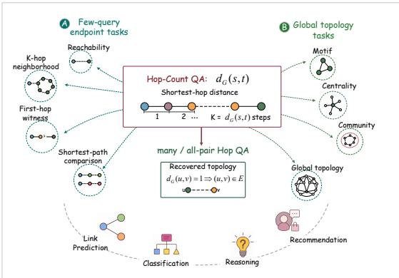
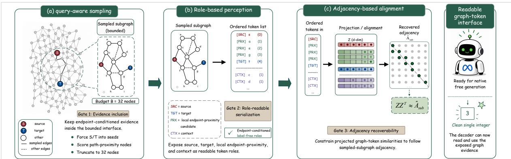
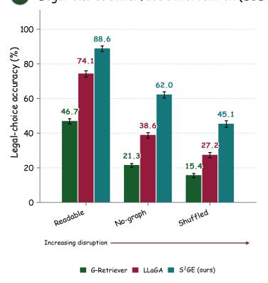
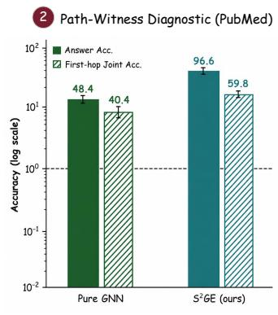
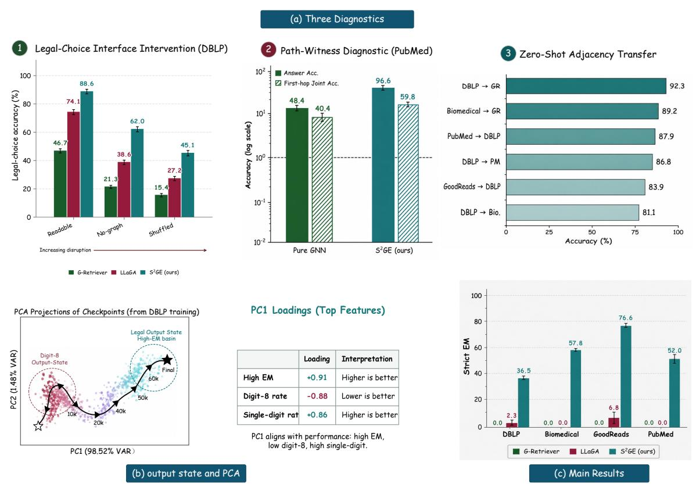
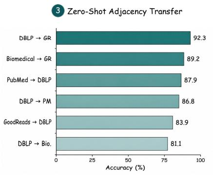
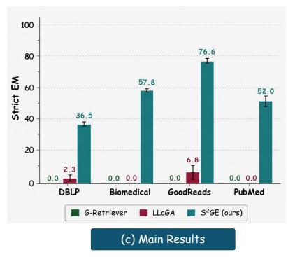
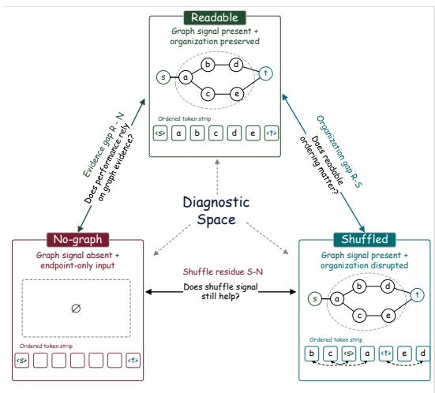

# Graph Evidence Is Not Enough: Diagnosing Native Decoder Use in Graph-Augmented LLMs

Xiaoyu Guo<sup>1</sup>, Pengcheng Chen<sup>2</sup>, Jiong Yu<sup>2</sup>, Yi Lu<sup>2</sup>, Yaohua Wang<sup>1</sup>, Ziyang Li<sup>1</sup>\* <sup>1</sup>School of Software, Xinjiang University, Urumqi 830002, China

<sup>2</sup>School of Computer Science and Technology, Xinjiang University, Urumqi 830046, China # 107552501648@stu.xju.edu.cn Correspondence: liziyang@xju.edu.cn § Code: github.com/dogeee-debug/S2GE

## Abstract

Graph-augmented large language models often assume that graph evidence produced by external computation and placed in the input can be used by the native decoder. We test this assumption with HopQA, a deliberately bounded diagnostic that asks for the shortest-hop distance between two query nodes. Because the answer is a small integer and the target is purely topological, failure cannot be dismissed as open-ended generation or ambiguous evaluation. Yet existing graph-augmented baselines still fail on this setting, showing that providing graph evidence is not the same as making it usable. We introduce an intervention triangle with three matched conditions: readable graph evidence, shuffled graph evidence, and no-graph input. This separates evidence inclusion, structural readability, and decoder-usable topology. Guided by this diagnosis, we present S<sup>2</sup>GE as an instance showing that diagnosis-driven interface design can improve native decoder usability. S<sup>2</sup>GE uses query-aware sampling, endpoint and proximity-based ordering, and structure-preserving alignment. Across DBLP, Biomedical, GoodReads, and PubMed, S<sup>2</sup>GE achieves strict exact-match scores of 36.5%, 57.8%, 76.6%, and 52.0%, improving over the strongest native-generation baseline by 53.5 points on average. The interventions further reveal harmful-shuffle, shuffle-robust, and nograph-saturated regimes.

## 1 Introduction

External execution is the right abstraction for deterministic graph computation: shortest paths, reachability, and neighborhood queries are better handled by graph algorithms than by free-form generation. Even if future graph-language systems delegate such computation to external executors, an interface problem remains: task-relevant graph structure must be translated into representations that the model can read and use. Sampling, serialization, projection, and role ambiguity can distort this translation before the decoder acts. We use HopQA as a bounded probe of this translation fidelity, measuring whether externally produced graph evidence survives the graph-to-decoder interface well enough to support an exact native answer.

Graph-augmented LLMs expose graph structure to language models before generation. Existing surveys describe common interface forms, including graph as text, graph tokens, graph-enhanced generation, and LLM-only prompting (Ren et al., 2024; Li et al., 2024). Representative systems follow this dependency through different interfaces: G-Retriever retrieves graph evidence, and LLaGA maps graph structure into tokens for the decoder (He et al., 2024; Chen et al., 2024). In each case, the decoder must turn exposed evidence into an answer.

  
Figure 1: HopQA as a bounded topology diagnostic for testing graph-evidence use on the native generation surface.

To validate whether such evidence becomes usable, Hop-count question answering (HopQA) tests the graph-to-decoder path in a compact form. Given a source node and a target node, the model must generate their shortest hop distance from exposed graph evidence. We evaluate this with strict exact match, an existing standard under which current baselines fail. HopQA therefore asks whether exposed graph evidence can become an exact generated answer through ordinary decoding. Figure 1 summarizes this evidence-to-answer workflow.

Under this test, existing graph-augmented LLMs fail sharply on the Core-HopQA family: DBLP and PubMed cover citation-style graphs, Biomedical covers a dense biomedical relation graph, and GoodReads covers a recommendation-style graph. G-Retriever obtains 0.0±0.0% strict EM across these four domains, and LLaGA remains near zero. Graph evidence reaches the decoder, while exact hop answers remain absent from the native output. On the same examples, graph-only classifiers and SubgraphRAG retrieval-execution checks extract hop signal from graph structure and retrieved evidence graphs. The second evaluation family, Auxiliary Graph Diagnostics, then probes path witnesses, graph-token interventions, and adjacency transfer.

This gap points to three interface requirements: relevant structure must enter the bounded evidence budget, endpoint roles must remain readable, and projection should preserve local adjacency. We propose Sampling-First Structured Graph Encoding (S<sup>2</sup>GE) with query-aware sampling, role-based perception, and adjacency-based alignment. Sampling comes first to expose endpoint-conditioned evidence; readable, absent, and shuffled graph conditions then test how evidence organization changes the decoder’s answer state.

The paper makes three contributions.

• A diagnostic gap between graph evidence and native decoder use. We identify a gap between graph evidence reaching the decoder and exact hop answers appearing in native generation. On HopQA, trained graph-augmented LLM baselines fail under strict exact match even though the answer space is bounded and graph signal can be extracted.

• A diagnostic design for separating graph signal from decoder use. We design a diagnostic protocol that separates signal existence, evidence exposure, retrieval-execution recovery, and native generation. The readable/nograph/shuffled intervention triangle is the graphtoken tool used inside this protocol.

• Residual graph signal in generated outputs. We expose measurable residual effects of graphtoken changes on generated answers, allowing us to distinguish helpful residue, harmful residue, and output collapse across data regimes.

## 2 Related Work

From graph signal to visible evidence. Graphlanguage systems make structure visible through retrieval, text serialization, and learned graph-token interfaces. G-Retriever retrieves compact textual subgraphs before generation (He et al., 2024); LLaGA projects graph representations into the LLM input space (Chen et al., 2024). GraphRAG and GRAG organize retrieved evidence around graph structure (Edge et al., 2024; Hu et al., 2025), while KG<sup>2</sup>RAG and SubgraphRAG emphasize knowledge-graph guidance or adjustable subgraph retrieval (Zhu et al., 2025; Li et al., 2025). A recent diagnostic anchor is Zhou et al. (2026), who benchmark KG-RAG under incomplete knowledge and show that retrieval-centered systems can struggle when reasoning must go beyond explicit triples. Recent GraphRAG surveys further organize the pipeline around query processing, retrieval, organization, and generation (Han et al., 2025; Zhang et al., 2025b). GraphRAG-Bench asks when graph structure helps RAG (Xiang et al., 2026b), while ROGRAG and GFM-RAG further introduce graphspecific RAG or retrieval frameworks (Wang et al., 2025b; Luo et al., 2025). These works make graph evidence more visible and controllable, while graph-signal existence, exposed evidence, and decoder usability remain only partly separated.

From visible evidence to readable interfaces. Visible evidence becomes useful only when its organization is readable to the decoder. GraCoRe and GraphOmni provide benchmark-level evidence that graph reasoning performance is sensitive to task format, prompt design, and evaluation coverage (Yuan et al., 2025; Xu et al., 2026). GraphArena,

GraphEval36K, and recent graph-generation evaluations extend the same concern to algorithmic graph computation, code-style graph tasks, and structural generation (Tang et al., 2025; Wu et al., 2025; Demirci et al., 2025). For learned interfaces, Hoyle et al. (2021) show that graph-to-text models are sensitive to alternative graph linearizations. Zhang et al. (2026c) further revisit graph-tokenized language models and show that compression alone does not guarantee graph understanding. The most direct readability anchor is Chaudhary et al. (2026): GRAFF uses graph-augmented fine-grained fusion to preserve node-level and relation-level cues. Recent graph-token and graph-foundation-model work explores discrete graph tokenization and reconstructive graph instruction tuning (Guo et al., 2026; Zhang et al., 2026b; Xiang et al., 2026a). Graph foundation models and KG foundation models extend the same interface problem to graphlanguage pretraining and semantic KG transfer (Wang et al., 2025a; Arun et al., 2025; Kong et al., 2025). These systems improve graph exposure and evaluation breadth, while final scores can still hide whether errors come from missing evidence, unreadable organization, or the generation surface.

From readable evidence to native usability. Many graph reasoning systems strengthen task performance by adding external execution, symbolic traversal, tool calls, candidate scoring, constrained decoding, or supervised reasoning traces. Graph-CoT and KG-CoT add reasoning traces over graphs or knowledge graphs (Jin et al., 2024; Zhao et al., 2024). KiRAG and HopRAG strengthen retrievalreasoning pipelines for knowledge-driven or logicaware QA (Fang et al., 2025; Liu et al., 2025). MIAoG uses multi-view adaptive reasoning for KG-enhanced LLMs (Zhang et al., 2026a), and GLOW combines GNN candidate prediction with LLM prompting for open-world KGQA (Abdallah et al., 2026). GraphPile and G1 show that graph problems can also be used as training or reinforcement-learning data for broader graph reasoning (Zhang et al., 2025a; Guo et al., 2025). These approaches are effective for graph tasks, while their final answers may come from execution or scoring surfaces different from ordinary decoding. Bounded structural queries therefore isolate native usability: when graph signal is visible and organized, can the decoder itself produce a legal and correct structural answer? Output-state audits connect this question to language-generation degeneration studies (Holtzman et al., 2020; Welleck et al., 2020).

## 3 Bounded Graph-Signal Diagnosis

HopQA serves as a bounded diagnostic of structural-evidence usability across the graph-todecoder interface and covers only a controlled slice of graph reasoning. The task is bounded in its answer space, exposed evidence budget, interface content, and native generation surface. These restrictions separate graph-signal existence, evidence exposure, interface readability, and decoder use. Each example contains a graph $G = ( V , E , X )$ , a query $q = ( s , t )$ , and a gold answer $y = d _ { G } ( s , t ) \in \mathcal { A } .$ where $\mathcal { A } = \{ 1 , 2 , 3 , 4 , 5 \}$ The model receives a bounded graph interface built from a sampled subgraph and must generate the exact hop label through ordinary decoding. Appendix A provides a notation reference table for the full paper.

For a query $q \ = \ ( s , t )$ , a sampler with node budget B produces a sampled subgraph

$$
G _ { \mathrm { s u b } } = S _ { B } ( G , q ) .
$$

The graph interface exposed to the language model is

$$
I _ { B } ( G , q ) = I ( G _ { \mathrm { s u b } } , q ) = ( T ( q ) , M ( q ) ) ,
$$

where $T ( q ) = ( z _ { \pi ( 1 ) } , \ldots , z _ { \pi ( m ) } ) $ is the ordered sequence of projected graph tokens, and $M ( q )$ contains input-computable annotations such as endpoint roles, local degree, and ordering keys. The decoder succeeds when it generates the exact hop answer from this interface. We write

$$
U _ { \theta } ( q ; I _ { B } ) = P _ { \theta } ( \hat { y } = d _ { G } ( s , t ) \mid I _ { B } ( G , q ) ) .
$$

This quantity states the diagnostic event: exposed graph evidence becomes useful when ordinary generation produces the correct hop label.

Appendix E.1 gives the formal statements behind the diagnostic. For simple loopless unweighted graphs, all-pair hop counts determine adjacency because an edge exists exactly when the hop distance is one. Five-choice HopQA is a bounded slice of this distance query. In the main text, this fact motivates HopQA as a compact graph-structure test.

Hypothesis 1: graph signal exists before decoder use. The first question is how much hop signal can be extracted from graph evidence outside native generation. We compare ordinary generation with graph-based controls that use graph structure directly. Let $\mathcal { C } _ { \mathrm { g r a p h } }$ be the set of graph controls, such as a GNN hop classifier and SubgraphRAG retrieval-execution checks over retrieved evidence. For method m, let $m _ { \mathrm { n a t } }$ denote its ordinary generation path. We define the positive signal-use gap as

  
Figure 2: Workflow of the $\mathrm { S } ^ { 2 } \mathrm { G E }$ sampling-first graph-token interface. The data flow follows three linked interface conditions: (a) query-aware sampling selects bounded endpoint-conditioned evidence, (b) role-based perception orders and annotates sampled nodes so endpoint roles and local proximity are readable, and (c) adjacency-based alignment regularizes projected tokens so sampled adjacency remains visible after projection.

$$
\Delta _ { \mathrm { s u } } ^ { + } ( m ) = \mathrm { m a x } \Big ( 0 , \operatorname* { m a x } _ { c \in \mathcal { C } _ { \mathrm { g r a p h } } } \mathrm { E M } ( c ) - \mathrm { E M } ( m _ { \mathrm { n a t } } ) \Big ) .
$$

A positive $\Delta _ { \mathrm { s u } } ^ { + } ( m )$ marks hop signal extracted by graph controls beyond the ordinary generation path. This separates graph-signal recovery from decoder use.

Model scale and interface boundaries. A larger backbone may improve optimization, instruction following, or robustness to imperfect serialization. However, scaling acts only after the exposed interface has been constructed. For any decoder family that observes an example solely through $I _ { B } ( G , q )$ distinctions removed by sampling or representation cannot be reconstructed from decoder capacity alone. Proposition 2 formalizes this interfaceconditioned upper bound, and Corollary 2.1 shows that it holds across decoder scales. We therefore distinguish scale-sensitive decoder failure from interface-induced information loss. Our singlebackbone experiments characterize the former only for LLaMA-3-8B-Instruct, whereas the latter motivates the interface principles studied here independently of backbone size.

Hypothesis 2: decoder use depends on readable interface conditions. After graph signal is established, evidence organization becomes the next question. We describe the interface by three measurable conditions:

$$
\Phi ( I _ { B } , q ) = ( C _ { \mathrm { l o c a l } } ( q ) , S _ { \mathrm { r o l e } } ( q ) , A _ { \mathrm { a d j } } ( q ) ) .
$$

Here $C _ { \mathrm { l o c a l } } ( q )$ measures whether evidence related to the query endpoints enters the bounded sample. In experiments, it is audited by endpoint coverage and path recall. $S _ { \mathrm { r o l e } } ( q )$ measures whether the decoder can distinguish the source, the target, nearby nodes, and context nodes. It is tested by role and query ablations. $A _ { \mathrm { a d j } } ( q )$ measures whether projected graph tokens retain local adjacency in the sampled graph. It is tested by frozen adjacency probes.

These conditions are ordered: sampling controls what can be seen, role perception makes sampled nodes readable, and alignment preserves sampled adjacency. Removing a limiting condition should therefore degrade native generation.

Hypothesis 3: interface changes shift the generated answer distribution. In error-prone domains, unreadable interfaces can expose distinct answer-state regions. For each generated answer $\hat { y } _ { i }$ , we record diagnostic labels such as correct legal answer, wrong legal answer, illegal answer, longdigit continuation, or malformed output. These audits need not form a mutually exclusive partition. For a chosen categorical mapping $O : \hat { \mathcal { V } } \to \mathcal { O }$ and interface condition I, define

$$
p _ { \theta } ( o \mid I ) = { \frac { 1 } { N } } \sum _ { i = 1 } ^ { N } \mathbf { 1 } \{ O ( { \hat { y } } _ { i } ) = o \} .
$$

<table><tr><td>Method</td><td>Decision surface</td><td>Domain</td><td>StrictEM ↑</td><td>ParsedEM ↑</td><td>∆Chance ↑</td><td>SingleInt ↑</td><td>Dom.Ans. ↓</td></tr><tr><td>Random</td><td>uniform legal guess</td><td>all</td><td>20.0</td><td>20.0</td><td>0.0</td><td>100.0</td><td>20.0</td></tr><tr><td>Majority</td><td>fixed majority label</td><td>all</td><td>20.0</td><td>20.0</td><td>0.0</td><td>100.0</td><td>100.0</td></tr><tr><td>G-Retriever</td><td>native generation</td><td>DBLP</td><td> $0 . 0 { \pm } 0 . 0 \ $ </td><td> $2 3 . 2 { \pm } 4 . 4 $ </td><td> $- 2 0 . 0 { \pm } 0 . 0 $ </td><td> $0 . 0 { \pm } 0 . 0 \ $ </td><td> $3 8 . 0 { \pm } 4 . 5 $ </td></tr><tr><td>G-Retriever</td><td>native generation</td><td>Biomedical</td><td> $0 . 0 { \pm } 0 . 0 \ $ </td><td> $4 5 . 8 { \pm } 4 . 4 $ </td><td> $- 2 0 . 0 { \pm } 0 . 0 $ </td><td> $0 . 0 { \pm } 0 . 0 \ $ </td><td> $3 1 . 3 { \pm } 6 . 8 $ </td></tr><tr><td>G-Retriever</td><td>native generation</td><td>GoodReads</td><td> $0 . 0 { \pm } 0 . 0 \ $ </td><td> $4 1 . 3 { \pm } 2 . 6 $ </td><td> $- 2 0 . 0 { \pm } 0 . 0 $ </td><td> $0 . 0 { \pm } 0 . 0 \ $ </td><td> $3 4 . 8 { \pm } 4 . 4 $ </td></tr><tr><td>G-Retriever</td><td>native generation</td><td>PubMed</td><td> $0 . 0 { \pm } 0 . 0 \ $ </td><td> $2 0 . 3 { \pm } 0 . 8 $ </td><td> $- 2 0 . 0 { \pm } 0 . 0 $ </td><td> $0 . 0 { \pm } 0 . 0 \ $ </td><td> $3 1 . 6 { \pm } 2 . 5 $ </td></tr><tr><td>LLaGA</td><td>native generation</td><td>DBLP</td><td> $2 . 3 { \pm } 2 . 1 $ </td><td> $1 2 . 6 { \pm } 1 . 7 $ </td><td> $- 1 7 . 7 { \pm } 2 . 1 $ </td><td> $1 0 . 5 { \pm } 8 . 7 $ </td><td> $2 9 . 9 { \pm } 3 . 1 $ </td></tr><tr><td>LLaGA</td><td>native generation</td><td>Biomedical</td><td> $0 . 0 { \pm } 0 . 0 \ $ </td><td> $2 0 . 8 { \pm } 2 . 0 $ </td><td> $- 2 0 . 0 { \pm } 0 . 0 $ </td><td> $0 . 0 { \pm } 0 . 0 \ $ </td><td> $4 5 . 6 { \pm } 1 6 . 9 $ </td></tr><tr><td>LLaGA</td><td>native generation</td><td>GoodReads</td><td>6.8±5.5</td><td> $1 6 . 8 { \pm } 2 . 8 $ </td><td> $- 1 3 . 2 { \pm } 5 . 5 $ </td><td> $3 5 . 5 { \pm } 2 6 . 6 $ </td><td> $4 0 . 3 { \pm } 4 . 1 $ </td></tr><tr><td>LLaGA</td><td>native generation</td><td>PubMed</td><td>0.0±0.0</td><td> $6 . 8 { \pm } 5 . 6 $ </td><td> $- 2 0 . 0 { \pm } 0 . 0 $ </td><td> $0 . 0 { \pm } 0 . 0 \ $ </td><td> $2 7 . 7 { \pm } 3 . 3 $ </td></tr><tr><td>Pure GNN</td><td>graph-only classifier</td><td>DBLP</td><td>32.1</td><td>32.1</td><td>+12.1</td><td>100.0</td><td></td></tr><tr><td>Pure GNN</td><td>graph-only classifier</td><td>Biomedical</td><td>27.8</td><td>27.8</td><td> $+ 7 . 8$ </td><td>100.0</td><td></td></tr><tr><td>Pure GNN</td><td>graph-only classifier</td><td>GoodReads</td><td>42.5</td><td>42.5</td><td>+22.5</td><td>100.0</td><td></td></tr><tr><td>Pure GNN</td><td>graph-only classifier</td><td>PubMed</td><td>45.3</td><td>45.3</td><td>+25.3</td><td>100.0</td><td></td></tr><tr><td>SubgraphRAG</td><td>retrieval execution</td><td>DBLP</td><td>24.9</td><td>24.9</td><td>+4.9</td><td>100.0</td><td></td></tr><tr><td>SubgraphRAG</td><td>retrieval execution</td><td>Biomedical</td><td>20.5</td><td>20.5</td><td>+0.5</td><td>100.0</td><td></td></tr><tr><td>SubgraphRAG</td><td>retrieval execution</td><td>GoodReads</td><td>58.2</td><td>58.2</td><td>+38.2</td><td>100.0</td><td></td></tr><tr><td>SubgraphRAG</td><td>retrieval execution</td><td>PubMed</td><td>50.5</td><td>50.5</td><td>+30.5</td><td>100.0</td><td></td></tr><tr><td>S²GE</td><td>native generation</td><td>DBLP</td><td> ${ \bf 3 6 . 5 \pm 1 . 6 }$ </td><td> $3 6 . 5 { \pm } 1 . 6 $ </td><td> $+ 1 6 . 5 { \pm } 1 . 6 $ </td><td> $1 0 0 . 0 { \pm } 0 . 0 \ \qquad $ </td><td> $2 7 . 4 { \pm } 2 . 9 $ </td></tr><tr><td>S2GE</td><td>native generation</td><td>Biomedical</td><td> ${ \bf 5 7 . 8 \pm 0 . 9 }$ </td><td> $5 7 . 8 { \pm } 0 . 9 $ </td><td> $+ 3 7 . 8 { \pm } 0 . 9 $ </td><td> $1 0 0 . 0 { \pm } 0 . 0 \ \qquad $ </td><td> $2 8 . 4 { \pm } 0 . 3 $ </td></tr><tr><td>S²GE</td><td>native generation</td><td>GoodReads</td><td> ${ \bf 7 6 . 6 { \pm } 0 . 9 }$ </td><td> $7 6 . 6 { \pm } 0 . 9 $ </td><td> $+ 5 6 . 6 { \pm } 0 . 9 $ </td><td> $1 0 0 . 0 { \pm } 0 . 0 \ \qquad $ </td><td> $2 4 . 0 { \pm } 1 . 2 $ </td></tr><tr><td>S²GE</td><td>native generation</td><td>PubMed</td><td> ${ \bf 5 2 . 0 { \pm } 3 . 4 }$ </td><td> $5 2 . 0 { \pm } 3 . 4 $ </td><td> $+ 3 2 . 0 { \pm } 3 . 4 $ </td><td> $1 0 0 . 0 { \pm } 0 . 0 \ \qquad $ </td><td> $2 8 . 7 { \pm } 1 . 9 $ </td></tr></table>

Table 1: HopQA main results. Values are percentages. G-Retriever, LLaGA, and $\mathbf { S } ^ { 2 } \mathbf { G } \mathbf { E }$ use ordinary generation; Pure GNN and SubgraphRAG are numeric graph-control paths, so ParsedEM equals EM and SingleInt is 100%. Dom.Ans. is omitted for these controls because their sampled output distributions are unavailable. ∆Chance is StrictEM minus the 20% random/majority rate. Additional controls and path-found rates are in Appendix C, Table 16.

We also track dominant-answer concentration,

$$
D ( I ) = \operatorname* { m a x } _ { a \in \{ 1 , \ldots , 5 \} } \frac { 1 } { N } \sum _ { i = 1 } ^ { N } \mathbf { 1 } \{ \mathrm { e x t r a c t } ( \hat { y } _ { i } ) = a \} .
$$

Readable, no-graph, and shuffled interfaces are denoted by $I _ { R } , I _ { N }$ , and $I _ { S }$ . These diagnostics separate helpful residue, harmful residue, and stable failure modes in generated answers.

These three hypotheses define the bounded-HopQA diagnostic: graph signal can be extracted before decoder use, exposed evidence must remain readable, and interface changes can shift bounded output states. The proof sketch and formal propositions are given in Appendix E.1; Section 4 tests the hypotheses empirically.

## 3.1 S<sup>2</sup>GE: Sampling-First Structured Graph Encoding

We propose Sampling-First Structured Graph Encoding $( \mathbf { S } ^ { 2 } \mathbf { G } \mathbf { E } )$ . The method follows the order of the three interface conditions: include queryrelated evidence, make sampled nodes readable, and preserve local adjacency after projection. Figure 2 gives the workflow.

Query-aware sampling. The sampler first places the query endpoints into the sampled evidence when they are available. It then expands locally around endpoint-relevant and high-degree nodes. The output is a bounded subgraph $G _ { \mathrm { s u b } }$ . This step targets $C _ { \mathrm { l o c a l } } ( q )$ . It decides which part of the graph can be seen by the decoder.

Role-based perception. Following topologyaware graph prompting and tokenization methods (Fatemi et al., 2024; Chen et al., 2024; Zhang et al., 2026c), $\mathbf { S } ^ { 2 } \mathbf { G } \mathbf { E }$ attaches query-conditioned roles to sampled nodes before projection reaches the decoder. Like these topology-aware interfaces, the role channel packages endpoint identity, local proximity, and neighborhood salience as readable token features. The ordering function uses source and target roles, local proximity to the endpoints, degree, and a stable traversal index:

$$
\pi = \mathrm { s o r t } \bigl ( V _ { B } ; r ( v ) , d _ { s } ( v ) , d _ { t } ( v ) , - \mathrm { d e g } ( v ) , b ( v ) \bigr ) .
$$

Here $r ( v )$ gives endpoint and context roles, $d _ { s } ( \boldsymbol { v } )$ and $d _ { t } ( \boldsymbol { v } )$ are local distances inside the sampled subgraph, and $b ( v )$ is a stable traversal index. This step targets $S _ { \mathrm { r o l e } } ( q )$ by presenting the source, target, nearby nodes, and context nodes as distinguishable positions in the token sequence.

Adjacency-based alignment. Projection can weaken local edges in the sampled graph. To preserve this local structure, $S ^ { 2 } \mathrm { G E }$ adds an alignment loss on the projected graph tokens. Let $\boldsymbol { Z } \in \mathbb { R } ^ { m \times d }$ be the matrix of projected node tokens. Let $A _ { B }$ be the sampled adjacency matrix, let $\tilde { A } _ { B } = A _ { B } + I$ and let

$$
\hat { A } _ { B } = \tilde { D } ^ { - 1 / 2 } \tilde { A } _ { B } \tilde { D } ^ { - 1 / 2 }
$$

be the normalized adjacency target. The alignment loss is

$$
\mathcal { L } _ { \mathrm { a l i g n } } = \left\| \mathrm { n o r m } ( Z ) \mathrm { n o r m } ( Z ) ^ { \top } - \hat { A } _ { B } \right\| _ { F } ^ { 2 } ,
$$

where norm(·) applies row-wise $\ell _ { 2 }$ normalization. This step targets $A _ { \mathrm { a d j } } ( q )$ . It encourages adjacent sampled nodes to remain close in projected token space.

## 3.2 Training Objective and Diagnostics

Following the interface coordinates $\Phi ( I _ { B } , q ) = $ $( C _ { \mathrm { l o c a l } } ( q ) , S _ { \mathrm { r o l e } } ( q ) , A _ { \mathrm { a d j } } ( q ) )$ , we optimize native answer generation together with sampledadjacency preservation. The training objective is

$$
\begin{array} { r } { \begin{array} { r } { \mathcal { L } = \mathcal { L } _ { \mathrm { L M } } + \lambda \mathcal { L } _ { \mathrm { a l i g n } } , } \end{array} } \end{array}
$$

where λ = 0.25 is fixed by validation and

$$
\mathcal { L } _ { \mathrm { L M } } = - \sum _ { j = 1 } ^ { | \mathbf { y } | } \log p _ { \theta } ( y _ { j } \mid y _ { < j } , I _ { B } ( G , q ) )
$$

is the standard token-level negative log-likelihood of the target answer sequence. Implementation details are given in Appendix C.

## 4 Experiments

We evaluate two named families: Core-HopQA domains for native hop-label generation, and Auxiliary Graph Diagnostics for signal extraction, path evidence, intervention behavior, and adjacency transfer. Together, they test whether exposed graph evidence becomes readable and usable under native generation.

## 4.1 Experimental Setup

Datasets. Core-HopQA is constructed from public graph sources: GRBench domains (Jin et al., 2024) for DBLP, Biomedical, and GoodReads, and Planetoid/PubMed (Yang et al., 2016) for PubMed. The domains include citation-style graphs (DBLP and PubMed), a biomedical relation graph (Biomedical), and a recommendation-style graph (GoodReads). These categories test whether topology evidence remains usable across bibliographic, biomedical, and recommendation settings. Dataset sources, graph statistics, split construction, and chance baselines are reported in Appendix B, Table 8. All domains use a balanced five-label protocol, giving random and majority prediction a 20% expected accuracy.

Baselines. We group baselines by decision surface. G-Retriever and LLaGA are nativegeneration baselines (He et al., 2024; Chen et al., 2024). Pure GNN is a graph-only control. SubgraphRAG is the retrieval-execution control (Li et al., 2025). Legal-choice, raw-text, and Graph-CoT controls are reported in Appendix C, Table 16. All trainable $S ^ { 2 } \mathrm { G E }$ runs use the same maximum 12-epoch schedule with early-stopping patience $\begin{array} { r } { 6 ; } \end{array}$ G-Retriever and LLaGA are evaluated using their released implementations and checkpoints, including method-specific optimization settings.

Metrics. StrictEM is the primary nativeusability metric:

$$
\mathrm { S t r i c t E M } = \frac { 1 } { n } \sum _ { i } \mathbf { 1 } \{ \exp ( \hat { y } _ { i } ) = y _ { i } \} .
$$

ParsedEM audits first-integer traces,

$$
\mathrm { P a r s e d E M } = \frac 1 n \sum _ { i } { \bf 1 } \{ \mathrm { e x t r a c t } ( \hat { y } _ { i } ) = y _ { i } \} ,
$$

and the positive signal-use gap is

$$
\Delta _ { \mathrm { s u } } ^ { + } ( m ) = \mathrm { m a x } \Big ( 0 , \operatorname* { m a x } _ { c \in \mathcal { C } _ { \mathrm { g r a p h } } } \mathrm { E M } ( c ) - \mathrm { E M } ( m _ { \mathrm { n a t } } ) \Big ) .
$$

Table 1 also reports SingleIntRate and DominantAnswerRate as output-state audits; full metric definitions are in Appendix B, Table 11.

## 4.2 Native Decoder Usability on Core-HopQA

To verify native decoder usability, we evaluate these metrics on Core-HopQA.

Table 1 shows that G-Retriever obtains 0.0±0.0% strict EM across Core-HopQA, while LLaGA stays near zero. S<sup>2</sup>GE reaches 36.5– 76.6% strict EM, corresponding to ∆Chance gains of +16.5, +37.8, +56.6, and +32.0 on DBLP, Biomedical, GoodReads, and PubMed. Its DominantAnswerRate remains close to a balanced answer surface, unlike majority fallback. Pure GNN and SubgraphRAG provide graph-control EM on graph-only and retrieval-execution decision surfaces; SubgraphRAG path-found rates are reported in Appendix C, Table 16.

<table><tr><td>Method</td><td></td><td>Answer Acc. First-hop Joint</td></tr><tr><td>Pure GNN path-witness con- trol</td><td>48.4±0.8</td><td>40.4±2.3</td></tr><tr><td>S²GE path-witness</td><td>96.6±1.4</td><td> ${ \bf 5 9 . 8 \pm 0 . 4 }$ </td></tr></table>

Table 2: PubMed path-witness diagnostic. Values are percentages. Answer accuracy measures the pathexistence answer. First-hop joint accuracy requires both the correct answer and a valid first-hop witness.

ParsedEM is useful mainly as an audit. Tables 15 and 16 show that first-integer extraction and legal-choice scoring can expose residual numeric traces, while Table 1 attributes the native failure to graph-evidence use and output-surface formation together.

Table 2 reports the PubMed path-witness diagnostic: beyond the scalar hop label, the model must provide a locally valid first-hop witness.

Legal-choice scoring is reported separately in Appendix C, Table 16. It provides G-Retriever, LLaGA, and S<sup>2</sup>GE with a favorable label-selection path over A. The remaining gap suggests that native-generation failure involves both graphevidence use and output form.

## 4.3 Graph-Token Intervention Diagnostics

This subsection tests Hypothesis 3: how graphtoken changes move generation across output states. For domain κ, let

$$
\begin{array} { r } { R _ { \kappa } = \mathrm { E M } ( I _ { R } ; \kappa ) , } \\ { N _ { \kappa } = \mathrm { E M } ( I _ { N } ; \kappa ) , } \\ { S _ { \kappa } = \mathrm { E M } ( I _ { S } ; \kappa ) , } \end{array}
$$

where $I _ { R } , I _ { N }$ , and $I _ { S }$ denote readable, no-graph, and shuffled graph interfaces, respectively. We compare

$$
G _ { \kappa } ^ { \mathrm { s h u f } } = S _ { \kappa } - N _ { \kappa } , \qquad L _ { \kappa } ^ { \mathrm { o r g } } = R _ { \kappa } - S _ { \kappa } .
$$

Here $G _ { \kappa } ^ { \mathrm { s h u f } }$ is shuffled residue and $L _ { \kappa } ^ { \mathrm { o r g } }$ is readable organization gain. DBLP has $S _ { \kappa } ~ < ~ N _ { \kappa }$ , while PubMed has $S _ { \kappa }$ close to $R _ { \kappa } \mathrm { ; }$ ; we therefore use DBLP and PubMed as representative ablation domains.

Table 3 summarizes the shared graph-token interventions. Readable tokens give the strongest ordinary generation results. No-graph tokens remove evidence, and shuffled tokens keep token content while breaking order. DBLP is harmful-shuffle, and PubMed is shuffle-robust, showing that organization affects output states as well as evidence amount. Figure 4 visualizes the intervention triangle. Domain-specific markers such as DBLP digit8 and the checkpoint-PCA variables are defined in Appendix D, Section D.4.

<table><tr><td>Domain</td><td>Readable</td><td>No graph</td><td>Shuffled</td></tr><tr><td>DBLP</td><td>34.0</td><td>15.0</td><td>6.0</td></tr><tr><td>Biomedical</td><td>57.8</td><td>57.1</td><td>52.7</td></tr><tr><td>GoodReads</td><td>76.6</td><td>9.8</td><td>34.2</td></tr><tr><td>PubMed</td><td>52.0</td><td>19.5</td><td>51.3</td></tr></table>

Table 3: Graph-token interventions. Values are StrictEM percentages from a single representative seed; Table 1 reports the multi-seed main results.
<table><tr><td>Domain and selection pattern StrictEM ↑</td><td></td><td>∆ vs. full</td></tr><tr><td>PubMed:  $N _ { \kappa } \ll S _ { \kappa } \approx R _ { \kappa }$ </td><td></td><td></td></tr><tr><td>full S²GE</td><td>52.0±3.4</td><td></td></tr><tr><td>no query-aware sampling</td><td>25.0±1.1</td><td>-27.0</td></tr><tr><td>no role perception</td><td>47.0±2.3</td><td>-5.0</td></tr><tr><td>no distance/degree cues</td><td>45.9±2.7</td><td>-6.1</td></tr><tr><td>no alignment</td><td>52.0±3.7</td><td>unchanged</td></tr><tr><td>DBLP:  $S _ { \kappa } < N _ { \kappa } < R _ { \kappa }$ </td><td></td><td></td></tr><tr><td>full S²GE</td><td>36.5±1.6</td><td></td></tr><tr><td>no query syntax</td><td>24.1±5.2</td><td>-12.4</td></tr><tr><td>no degree cues</td><td>22.8±3.7</td><td>-13.7</td></tr><tr><td>no role perception</td><td>32.0±2.3</td><td>-4.5</td></tr><tr><td>random order diagnostic</td><td>33.8±5.0</td><td>-2.7</td></tr></table>

Table 4: Interface ablations on two representative domains. PubMed represents the shuffle-robust regime. DBLP represents the harmful-shuffle regime. Values are StrictEM percentages.

Biomedical is no-graph-saturated: no-graph input already reaches 57.1 StrictEM versus 57.8 with readable tokens, exposing a strong task prior.

## 4.4 Interface Ablations on Two Representative Domains

This subsection tests Hypothesis 2: which interface conditions make graph evidence useful for ordinary generation. The representative domains come from Table 3: PubMed is shuffle-robust, and DBLP is harmful-shuffle.

Table 4 reports the ablations. PubMed is most sensitive to removing query-aware sampling, indicating evidence inclusion as the limiting factor. DBLP is more sensitive to query syntax and degree cues, consistent with Figure 3: broken organization is more harmful in this domain. Together, the ablations support the order in Section 3: include evidence, make it readable, and preserve local structure.

Removing the alignment loss changes PubMed little $( 5 2 . 0  5 2 . 0 )$ , consistent with its shufflerobust regime.









  
Figure 3: Experimental and diagnostic summary for the three diagnostic hypotheses. Panel (a) combines three independently conducted diagnostics: a DBLP legal-choice interface intervention, PubMed path-witness generation, and six-direction zero-shot adjacency transfer. Panel (b) reports checkpoint-level output-state dynamics for DBLP, a harmful-shuffle domain, together with checkpoint PCA, where PC1 and PC2 explain 98.52% and 1.48% of the observed variance, respectively. Panel (c) reports the main native-generation StrictEM results across the four HopQA domains.

  
Figure 4: Intervention triangle for the readable, nograph, and shuffled graph-token interfaces. The triangle shows how the three intervention conditions separate harmful-shuffle, shuffle-robust, and no-graph-saturated regimes.

## 4.5 HopQA Predictive Validation

We further test whether $\mathbf { S } ^ { 2 } \mathbf { G } \mathbf { E }$ and graph-only structure solve the same examples. Table 5 reports a sample-level oracle union on matched 1000- example test predictions: an example is counted correct when either $\mathbf { S } ^ { 2 } \mathbf { G } \mathbf { E }$ or Pure GNN is correct. The oracle gains show that graph-only structure and the graph-language interface solve overlapping but non-identical subsets.

<table><tr><td>Domain</td><td></td><td>S2GE Pure GNN Oracle S2GE-only GNN-only</td><td></td><td></td><td></td></tr><tr><td>DBLP</td><td>36.1</td><td>31.3</td><td>52.4</td><td>21.1</td><td>16.3</td></tr><tr><td>Biomedical</td><td>57.8</td><td>27.9</td><td>69.6</td><td>41.7</td><td>11.8</td></tr><tr><td>GoodReads</td><td>76.6</td><td>40.3</td><td>87.2</td><td>46.9</td><td>10.5</td></tr><tr><td>PubMed</td><td>52.0</td><td>47.5</td><td>72.8</td><td>25.2</td><td>20.8</td></tr></table>

Table 5: Uses one matched seed for sample-level oracle analysis; Table 1 reports the headline control results and the multi-seed S<sup>2</sup>GE results.

Table 6 gives a second validation view: projected S<sup>2</sup>GE tokens preserve recoverable one-hop adjacency across source-target domain pairs. Together, oracle complementarity and zero-shot transfer indicate that S<sup>2</sup>GE is not merely replacing graphonly structure; it makes a partially different portion of graph signal usable through the native graphlanguage interface.

<table><tr><td>Train</td><td>Test</td><td>Acc.</td><td>AUROC</td></tr><tr><td>DBLP</td><td>GoodReads</td><td>0.923±0.009</td><td>0.958±0.002</td></tr><tr><td>GoodReads</td><td>DBLP</td><td>0.839±0.015</td><td>0.925±0.005</td></tr><tr><td>DBLP</td><td>Biomedical</td><td>0.811±0.021</td><td>0.876±0.007</td></tr><tr><td>Biomedical</td><td>GoodReads</td><td>0.892±0.017</td><td>0.942±0.009</td></tr><tr><td>PubMed</td><td>DBLP</td><td>0.879±0.013</td><td>0.921±0.013</td></tr><tr><td>DBLP</td><td>PubMed</td><td>0.868±0.001</td><td>0.906±0.005</td></tr></table>

Table 6: Zero-shot one-hop adjacency transfer. The probe is trained on source-domain pair labels only and uses no target-domain labels.

## 5 Conclusion

Five-choice HopQA exposes native usability failure in graph-language interfaces. Native strict evaluation and graph-token interventions separate graphsignal existence, interface readability, and native usability within one bounded diagnostic.

S<sup>2</sup>GE shows that a sampling-first readable interface improves native usability of exposed graph evidence, reaching native strict EM 36.5–76.6% across four domains. Depending on the domain, unreadable graph tokens are harmful, residuepreserving, or no-graph-saturated.

## Ethics Statement

This work uses public graph benchmark and baseline artifacts only for research evaluation; it involves no new personal data collection, user studies, or annotator exposure to offensive content. GR-Bench files, Planetoid/PubMed, and baseline artifacts are used according to their public releases or published descriptions, and our released code and processed diagnostics are for research use. Formal S<sup>2</sup>GE runs use LLaMA-3-8B-Instruct with bf16 and DeepSpeed on dual NVIDIA GeForce RTX 5090 GPUs; main experiments use a maximum of 12 epochs with early-stopping patience 6 and three seeds, path-witness diagnostics use the same maximum schedule, and the total compute is approximately 400 GPU-hours.

## Limitations

Hop-count QA is used as a controlled receivingend probe for graph-language interfaces. Its valid single-integer answers make correctness, output validity, and fallback behavior directly measurable. Open-ended settings require additional protocols for comparing semantically equivalent answers.

The path-witness diagnostic is bounded and protocolized. Fully open-ended graph QA, pathwitness generation, and KG reasoning require taskspecific answer-equivalence and calibration protocols.

Numerical trends across decoder scales remain empirically untested; our single-backbone results characterize LLaMA-3-8B-Instruct. Proposition 2 and Corollary 2.1 characterize a fixed-interface information bound that does not depend on decoder size.

## Acknowledgements

This work was supported by the Academy Member (Academician) Major Science and Technology Innovation Project under the “Two Zones” Science and Technology Development Program (Grant No. 2024LQ02001), the National Natural Science Foundation of China (Grant Nos. 62262064 and 62466057), the Key R&D Project of Xinjiang Uygur Autonomous Region (Grant No. 2022295358), and the Xinjiang University Doctoral Postgraduate Innovation Project (Grant No. XJDX2025YJS084).

## References

Hussein Abdallah, Ibrahim Abdelaziz, Panos Kalnis, and Essam Mansour. 2026. Leveraging LLM-GNN integration for open-world question answering over knowledge graphs. In Proceedings ofthe 19th Conference ofthe European Chapter ofthe Association for Computational Linguistics (Volume 1: Long Papers), pages 575–592, Rabat, Morocco. Association for Computational Linguistics.

Arvindh Arun, Sumit Kumar, Mojtaba Nayyeri, Bo Xiong, Ponnurangam Kumaraguru, Antonio Vergari, and Steffen Staab. 2025. SEMMA: A semantic aware knowledge graph foundation model. In Proceedings ofthe 2025 Conference on Empirical Methods in Natural Language Processing, pages 31825– 31848, Suzhou, China. Association for Computational Linguistics.

Himanshu Chaudhary, Ruida Wang, Gowtham Ramesh, and Junjie Hu. 2026. GRAFF: GRaph-augmented fine-grained fusion for large language models. In Findings of the Association for Computational Linguistics: EACL 2026, pages 5536–5547, Rabat, Morocco. Association for Computational Linguistics.

Runjin Chen, Tong Zhao, Ajay Kumar Jaiswal, Neil Shah, and Zhangyang Wang. 2024. LLaGA: Large language and graph assistant. In Proceedings ofthe 41st International Conference on Machine Learning, volume 235 of Proceedings of Machine Learning Research, pages 7809–7823. PMLR.

Ege Demirci, Rithwik Kerur, and Ambuj Singh. 2025. Are LLMs truly graph-savvy? a comprehensive evaluation of graph generation. In Proceedings of the 63rd Annual Meeting of the Association for Computational Linguistics (Volume 4: Student Research Workshop), pages 884–897, Vienna, Austria. Association for Computational Linguistics.

Darren Edge, Ha Trinh, Newman Cheng, Joshua Bradley, Alex Chao, Apurva Mody, Steven Truitt, and Jonathan Larson. 2024. From local to global: A graph rag approach to query-focused summarization. Preprint, arXiv:2404.16130.

Jinyuan Fang, Zaiqiao Meng, and Craig MacDonald. 2025. KiRAG: Knowledge-driven iterative retriever for enhancing retrieval-augmented generation. In Proceedings of the 63rd Annual Meeting of the Associationfor Computational Linguistics (Volume 1: Long Papers), pages 18969–18985, Vienna, Austria. Association for Computational Linguistics.

Bahare Fatemi, Jonathan Halcrow, and Bryan Perozzi. 2024. Talk like a graph: Encoding graphs for large language models. In The Twelfth International Conference on Learning Representations.

Xiaojun Guo, Ang Li, Yifei Wang, Stefanie Jegelka, and Yisen Wang. 2025. G1: Teaching LLMs to reason on graphs with reinforcement learning. In Advances in Neural Information Processing Systems, volume 38, Main Conference, pages 52958–53001. Curran Associates, Inc.

Zeyuan Guo, Enmao Diao, Cheng Yang, and Chuan Shi. 2026. Graph tokenization for bridging graphs and transformers. In The Fourteenth International Conference on Learning Representations.

Haoyu Han, Yu Wang, Harry Shomer, Kai Guo, Jiayuan Ding, Yongjia Lei, Mahantesh Halappanavar, Ryan A. Rossi, Subhabrata Mukherjee, Xianfeng Tang, Qi He, Zhigang Hua, Bo Long, Tong Zhao, Neil Shah, Amin Javari, Yinglong Xia, and Jiliang Tang. 2025. Retrieval-augmented generation with graphs (GraphRAG). Preprint, arXiv:2501.00309.

Xiaoxin He, Yijun Tian, Yifei Sun, Nitesh V. Chawla, Thomas Laurent, Yann LeCun, Xavier Bresson, and Bryan Hooi. 2024. G-Retriever: Retrievalaugmented generation for textual graph understanding and question answering. In Advances in Neural Information Processing Systems, volume 37, pages 132876–132907. Curran Associates, Inc.

Ari Holtzman, Jan Buys, Li Du, Maxwell Forbes, and Yejin Choi. 2020. The curious case of neural text degeneration. In International Conference on Learning Representations.

Alexander Hoyle, Ana Marasovic, and Noah A. Smith.´ 2021. Promoting graph awareness in linearized graph-to-text generation. In Findings of the Associationfor Computational Linguistics: ACL-IJCNLP 2021, pages 944–956, Online. Association for Computational Linguistics.

Yuntong Hu, Zhihan Lei, Zheng Zhang, Bo Pan, Chen Ling, and Liang Zhao. 2025. GRAG: Graph retrievalaugmented generation. In Findings of the Association for Computational Linguistics: NAACL 2025, pages 4145–4157, Albuquerque, New Mexico. Association for Computational Linguistics.

Bowen Jin, Chulin Xie, Jiawei Zhang, Kashob Kumar Roy, Yu Zhang, Zheng Li, Ruirui Li, Xianfeng Tang, Suhang Wang, Yu Meng, and Jiawei Han. 2024. Graph chain-of-thought: Augmenting large language models by reasoning on graphs. In Findings ofthe Associationfor Computational Linguistics: ACL 2024, pages 163–184, Bangkok, Thailand. Association for Computational Linguistics.

Lecheng Kong, Jiarui Feng, Hao Liu, Chengsong Huang, Jiaxin Huang, Yixin Chen, and Muhan Zhang. 2025. GOFA: A generative one-for-all model for joint graph language modeling. In The Thirteenth International Conference on Learning Representations.

Mufei Li, Siqi Miao, and Pan Li. 2025. Simple is effective: The roles of graphs and large language models in knowledge-graph-based retrieval-augmented generation. In The Thirteenth International Conference on Learning Representations.

Yuhan Li, Zhixun Li, Peisong Wang, Jia Li, Xiangguo Sun, Hong Cheng, and Jeffrey Xu Yu. 2024. A survey of graph meets large language model: Progress and future directions. In Proceedings of the Thirty-Third International Joint Conference on Artificial Intelligence, IJCAI-24, pages 8123–8131. International Joint Conferences on Artificial Intelligence Organization. Survey Track.

Hao Liu, Zhengren Wang, Xi Chen, Zhiyu Li, Feiyu Xiong, Qinhan Yu, and Wentao Zhang. 2025. HopRAG: Multi-hop reasoning for logic-aware retrievalaugmented generation. In Findings of the Association for Computational Linguistics: ACL 2025, pages 1897–1913, Vienna, Austria. Association for Computational Linguistics.

Linhao Luo, Zicheng Zhao, Reza Haffari, Dinh Phung, Chen Gong, and Shirui Pan. 2025. GFM-RAG: Graph foundation model for retrieval augmented generation. In Advances in Neural Information Processing Systems, volume 38, Main Conference, pages 36371–36405. Curran Associates, Inc.

Xubin Ren, Jiabin Tang, Dawei Yin, Nitesh Chawla, and Chao Huang. 2024. A survey of large language models for graphs. In Proceedings of the 30th ACM SIGKDD Conference on Knowledge Discovery and Data Mining, KDD ’24, pages 6616–6626, New York, NY, USA. Association for Computing Machinery.

Jianheng Tang, Qifan Zhang, Yuhan Li, Nuo Chen, and Jia Li. 2025. GraphArena: Evaluating and exploring large language models on graph computation. In The Thirteenth International Conference on Learning Representations.

Zehong Wang, Zheyuan Liu, Tianyi Ma, Jiazheng Li, Zheyuan Zhang, Xingbo Fu, Yiyang Li, Zhengqing Yuan, Wei Song, Yijun Ma, Qingkai Zeng, Xiusi Chen, Jianan Zhao, Jundong Li, Meng Jiang, Pietro Lio, Nitesh Chawla, Chuxu Zhang, and Yanfang Ye. 2025a. Graph foundation models: A comprehensive survey. Preprint, arXiv:2505.15116.

Zhefan Wang, Huanjun Kong, Jie Ying, Wanli Ouyang, and Nanqing Dong. 2025b. ROGRAG: A robustly optimized GraphRAG framework. In Proceedings of the 63rd Annual Meeting ofthe Associationfor Computational Linguistics (Volume 3: System Demonstrations), pages 604–613, Vienna, Austria. Association for Computational Linguistics.

Sean Welleck, Ilia Kulikov, Stephen Roller, Emily Dinan, Kyunghyun Cho, and Jason Weston. 2020. Neural text generation with unlikelihood training. In International Conference on Learning Representations.

Qiming Wu, Zichen Chen, Will Corcoran, Misha Sra, and Ambuj Singh. 2025. GraphEval36K: Benchmarking coding and reasoning capabilities of large language models on graph datasets. In Findings of the Association for Computational Linguistics: NAACL 2025, pages 8110–8132, Albuquerque, New Mexico. Association for Computational Linguistics.

Yang Xiang, Li Fan, Chenke Yin, Lutz Oettershagen, and Chengtao Ji. 2026a. A hierarchical quantized tokenization framework for task-adaptive graph representation learning. Preprint, arXiv:2510.12369.

Zhishang Xiang, Chuanjie Wu, Qinggang Zhang, Shengyuan Chen, Zijin Hong, Xiao Huang, and Jinsong Su. 2026b. When to use graphs in rag: A comprehensive analysis for graph retrieval-augmented generation. In International Conference on Learning Representations, volume 2026, pages 66145–66178.

Hao Xu, Xiangru Jian, Xinjian Zhao, Wei Pang, Chao Zhang, Suyuchen Wang, Qixin Zhang, Zhengyuan Dong, Joao Monteiro, Bang Liu, Qiuzhuang Sun, and Tianshu Yu. 2026. GraphOmni: A comprehensive and extensible benchmark framework for large language models on graph-theoretic tasks. In The Fourteenth International Conference on Learning Representations.

Zhilin Yang, William Cohen, and Ruslan Salakhudinov. 2016. Revisiting semi-supervised learning with graph embeddings. In Proceedings of The 33rd International Conference on Machine Learning, volume 48 of Proceedings of Machine Learning Research, pages 40–48, New York, New York, USA. PMLR.

Zike Yuan, Ming Liu, Hui Wang, and Bing Qin. 2025. GraCoRe: Benchmarking graph comprehension and complex reasoning in large language models. In Proceedings of the 31st International Conference on Computational Linguistics, pages 7925–7948, Abu Dhabi, UAE. Association for Computational Linguistics.

Minghan Zhang, Shu Zhao, Zhen Yang, Hongsheng Wu, Yongxing Lin, Haodong Zou, Jie Chen, and Zhen Duan. 2026a. Thinking beyond the local: Multi-view instructed adaptive reasoning in KG-enhanced LLMs. In Findings of the Association for Computational Linguistics: EACL 2026, pages 6173–6188, Rabat, Morocco. Association for Computational Linguistics.

Qifan Zhang, Nuo Chen, Zehua Li, Miao Peng, Jing Tang, and Jia Li. 2025a. Improving LLMs’ generalized reasoning abilities by graph problems. In Second Conference on Language Modeling.

Qinggang Zhang, Shengyuan Chen, Yuanchen Bei, Zheng Yuan, Huachi Zhou, Zijin Hong, Hao Chen, Yilin Xiao, Chuang Zhou, Junnan Dong, Yi Chang, and Xiao Huang. 2025b. A survey of graph retrievalaugmented generation for customized large language models. Preprint, arXiv:2501.13958.

Zhongjian Zhang, Xiao Wang, Mengmei Zhang, Jiarui Tan, and Chuan Shi. 2026b. Toward graphtokenizing large language models with reconstructive graph instruction tuning. In Proceedings of the ACM Web Conference 2026, pages 430–441. ACM.

Zhongjian Zhang, Yue Yu, Mengmei Zhang, Junping Du, Xiao Wang, and Chuan Shi. 2026c. Revisiting graph-tokenizing large language models: A systematic evaluation of graph token understanding. Preprint, arXiv:2605.03514.

Ruilin Zhao, Feng Zhao, Long Wang, Xianzhi Wang, and Guandong Xu. 2024. KG-CoT: Chain-ofthought prompting of large language models over knowledge graphs for knowledge-aware question answering. In Proceedings of the Thirty-Third International Joint Conference on Artificial Intelligence, IJCAI-24, pages 6642–6650. International Joint Conferences on Artificial Intelligence Organization. Main Track.

Dongzhuoran Zhou, Yuqicheng Zhu, Xiaxia Wang, Hongkuan Zhou, Yuan He, Jiaoyan Chen, Steffen Staab, and Evgeny Kharlamov. 2026. What breaks knowledge graph based RAG? benchmarking and empirical insights into reasoning under incomplete knowledge. In Proceedings of the 19th Conference of the European Chapter ofthe Associationfor Computational Linguistics (Volume 1: Long Papers), pages 2522–2538, Rabat, Morocco. Association for Computational Linguistics.

Xiangrong Zhu, Yuexiang Xie, Yi Liu, Yaliang Li, and Wei Hu. 2025. Knowledge graph-guided retrieval augmented generation. In Proceedings ofthe 2025 Conference of the Nations of the Americas Chapter ofthe Associationfor Computational Linguistics:

Human Language Technologies (Volume 1: Long Papers), pages 8912–8924, Albuquerque, New Mexico. Association for Computational Linguistics.

## A Notation Reference

Table 7 collects the main symbols used across the paper. The table is intended as a quick reference for the task definition, interface conditions, and intervention diagnostics.

## B Datasets and Metrics

We evaluate GRBench-style shortest-hop question answering on four graph domains: DBLP, Biomedical, GoodReads, and PubMed. Each example asks for the hop distance between a source node and a target node. The gold answer belongs to the bounded answer set

$$
\mathcal { A } = \{ 1 , 2 , 3 , 4 , 5 \} .
$$

This bounded label space makes random guessing and majority-label prediction directly comparable across domains.

## B.1 Datasets and Splits

Table 8 summarizes the graph statistics used in the controlled HopQA protocol. The processed edge counts correspond to the graph files used for evaluation.

Dataset acquisition. DBLP, Biomedical, and GoodReads are obtained from the public GR-Bench release (Jin et al., 2024). Their domain QA files are available from the Hugging Face dataset PeterJinGo/GRBench, and the corresponding graph-environment files are distributed through the GRBench download link in the Graph-CoT repository. PubMed is constructed from the public Planetoid/PubMed citation graph (Yang et al., 2016). We use these graph files as source graphs and construct new balanced HopQA splits from shortest-hop queries; the original GRBench QA labels are not used as HopQA training or test labels.

Each formal domain uses matched train, validation, and test splits. The split is balanced across the five hop labels. Therefore, both uniform random guessing and fixed majority-label prediction have expected accuracy 0.200.

The resulting chance and majority baselines are shown in Table 10. These baselines are used to compute ∆Chance in the main experimental tables.

## B.2 Metrics

Table 11 defines the metrics used in the main experiments. Strict exact match is the headline metric. Other metrics are audit views of the generated output surface or auxiliary checks for graph-signal recovery.

For generated answers, exact(ˆy<sub>i</sub>) returns a value only when the output is exactly one valid integer in ${ \mathcal { A } } .$ . The function extract $\left( \hat { y } _ { i } \right)$ returns the first generated integer when one exists. Outputs outside exact single-integer form are counted as StrictEM failures, even when ParsedEM can recover a number.

## B.3 Leakage and Split Audits

GoodReads receives an additional overlap audit because recommendation-style graphs can contain hub shortcuts and repeated textual patterns. Table 12 reports the observed overlap checks across train, validation, and test splits. All audited overlap types are zero.

We also inspect GoodReads performance by hop label as a sanity check against a single-hop shortcut explanation. Table 13 reports hop-wise S<sup>2</sup>GE scores on the GoodReads test split.

## C Experiment Details

This appendix reports compact implementation details for the formal experiments: run configuration, generation settings, controls, and run records.

## C.1 Run Configuration and Controls

Table 14 consolidates the formal S<sup>2</sup>GE protocol.

The alignment loss and full training objective are defined in Section 3.2. This table records the validated run settings used to instantiate that objective.

G-Retriever and LLaGA are evaluated using their released checkpoints and method-specific training recipes; the 12-epoch $\mathbf { S } ^ { 2 } \mathbf { G } \mathbf { E }$ schedule above applies only to our trainable runs.

## C.2 Baseline Output-State Audit

Table 15 summarizes representative nativegeneration failure states for G-Retriever and LLaGA. The audit uses wrong generated outputs from the preserved prediction run records and interprets ParsedEM as an output-surface audit.

## C.3 Control and Baseline Comparison

Table 16 records the auxiliary controls and baseline variants. SubgraphRAG is the main-text name for

```latex
Meaning Symbol
Graph $G = ( V , E , X )$
Query $q = ( s , t )$
Answer set $\mathsf { \bar { A } } = \mathsf { \bar { \{ 1 , 2 , 3 , 4 , 5 \} } }$
Gold answer $y _ { i } = d _ { G _ { i } } ( s _ { i } , t _ { i } )$
Model output yˆ<sub>i</sub>
Evaluation set $\ddot { \mathcal { D } } = \{ ( G _ { i } , q _ { i } , y _ { i } ) \} _ { i = 1 } ^ { n }$
Sampled subgraph $G _ { \mathrm { s u b } , i } = S _ { B } ( G _ { i } , q _ { i } )$
Exposed decoder interface $I _ { B } ( G _ { i } , q _ { i } ) \stackrel {  } { = } I ( G _ { \mathrm { s u b } , i } , q _ { i } ) = ( T ( q _ { i } ) , M ( q _ { i } ) )$
Ordinary generation path $m _ { \mathrm { n a t } }$
Graph-check set $\mathcal { C } _ { \mathrm { g r a p h } }$
Signal-use gap $\Delta _ { \mathrm { s u } } ^ { + } ( m )$
Interface readability coordinates $\Phi ( I _ { B } , q ) = ( C _ { \mathrm { l o c a l } } ( q ) , S _ { \mathrm { r o l e } } ( q ) , A _ { \mathrm { a d j } } ( q ) )$
Output state $O ( \hat { y } _ { i } ) \in \mathcal { O }$
Output-state distribution $p _ { \theta } ( o \mid I )$
Readable, no-graph, shuffled inter- $I _ { R } , I _ { N } , I _ { S }$
faces
Domain Readable, no-graph, shuffled exact $^ { \kappa } _ { R _ { \kappa } , N _ { \kappa } , S _ { \kappa } }$
match
Shuffled residue $G _ { \kappa } ^ { \mathrm { s h u f } } = S _ { \kappa } - N _ { \kappa }$
Readable organization gain $L _ { \kappa } ^ { \mathrm { o r g } } = R _ { \kappa } - S _ { \kappa }$
```

<table><tr><td>Domain</td><td>Nodes</td><td>Processed edges</td><td>Role in evaluation</td></tr><tr><td>DBLP</td><td>11,453,104</td><td>87,551,311</td><td>Large bibliographic graph with strong topol- ogy dependence.</td></tr><tr><td>Biomedical</td><td>47,031</td><td>3,363,428</td><td>Biomedical relation graph with dense pro- cessed connectivity.</td></tr><tr><td>GoodReads</td><td>3,784,086</td><td>11,704,748</td><td>Recommendation-style graph with strong semantic and hub effects.</td></tr><tr><td>PubMed</td><td>19,717</td><td>88,648</td><td>Citation-style graph used for both HopQA and path-witness diagnostics.</td></tr></table>

Table 7: Unified notation reference used across the main text and appendix.  
Table 8: Graph statistics for the four controlled HopQA domains.

<table><tr><td>Split</td><td>Per-hop examples Total examples Label prior</td><td></td><td></td></tr><tr><td>Train</td><td> $4 0 0 \times 5$ </td><td>2000</td><td>balanced</td></tr><tr><td>Validation</td><td> $4 0 \times 5$ </td><td>200</td><td>balanced</td></tr><tr><td>Test</td><td> $2 0 0 \times 5$ </td><td>1000</td><td>balanced</td></tr></table>

Table 9: Balanced split construction for each domain. Each hop label in {1, 2, 3, 4, 5} has the same number of examples.
<table><tr><td>Baseline</td><td>Decision rule</td><td>Accuracy</td></tr><tr><td>Random</td><td>uniform guess over A</td><td>20.0</td></tr><tr><td>Majority</td><td>fixed majority label</td><td>20.0</td></tr></table>

Table 10: Chance-level baselines under the balanced five-label HopQA protocol. Values are percentages.

the retrieval-execution control; the appendix keeps the retrieval-execution mapping explicit.

## C.4 Run Records

For reproducibility, each run record stores the domain, seed, prediction file path, evaluation path, and ordered test-ID checksum. These records are used to verify that seed-level reports and matched diagnostic comparisons are computed over the intended test order.

## D Diagnostic Protocol

Diagnostic target. The method section defines the graph-language interface. This appendix defines the observable quantities used to audit whether that interface remains readable during training and evaluation.

## D.1 Readability

Interface readability means that the projected token stream preserves enough local structure to recover endpoint roles, local adjacency, and endpointconditioned path order. Downstream EM depends on readability and also reflects decoder optimization, so we audit the interface with a frozen-probe protocol in addition to the main task.

The within-domain probe samples positive and negative one-hop node pairs from local subgraphs and trains a lightweight binary head on frozen pair features. The cross-domain probe trains the same head on one source domain and evaluates it on another target domain using frozen target representations. Table 6 reports the six-direction zero-shot matrix in the main text; this probe isolates adjacency recoverability from hop-decoder adaptation.

<table><tr><td>Metric</td><td>Definition</td><td>Use</td></tr><tr><td>StrictEM</td><td> $\begin{array} { r } { \frac { 1 } { n } \sum _ { i } \mathbf { 1 } \{ \operatorname { e x a c t } ( \hat { y } _ { i } ) = y _ { i } \} } \end{array}$ </td><td>Main metric for ordinary generation. The output must be exactly one legal integer in  ${ \mathcal { A } } .$ </td></tr><tr><td>ParsedEM</td><td> $\begin{array} { r } { \frac { 1 } { n } \sum _ { i } { \bf 1 } \{ \mathrm { e x t r a c t } ( \hat { y } _ { i } ) = y _ { i } \} } \end{array}$ </td><td>Output-surface audit using first-integer ex- traction when one exists, reported alongside</td></tr><tr><td>∆Chance</td><td> $\mathrm { S t r i c t E M - 2 0 . 0 }$ </td><td>StrictEM. Difference fromthe balanced ran- dom/majority baseline.</td></tr><tr><td>SingleIntRate</td><td> $\textstyle { \frac { 1 } { n } } \sum _ { i } \mathbf { 1 } \{ { \hat { y } } _ { i }$  is exactly one integer in A}</td><td>Checks whether native generation produces a legal single-integer answer.</td></tr><tr><td>DominantAnswerRate</td><td> $\begin{array} { r } { \operatorname* { m a x } _ { a \in \mathcal { A } } \frac { 1 } { n } \sum _ { i } \mathbf { 1 } \{ \mathrm { e x t r a c t } ( \hat { y } _ { i } ) = a \} } \end{array}$ </td><td>Measures collapse toward one dominant ex- tracted answer. Lower is better.</td></tr><tr><td>Path Found</td><td>recovers a valid path</td><td>fraction of examples where graph execution Audit metric for retrieval-execution diagnos- tics outside the LLM decoder.</td></tr><tr><td>Answer Acc. First-hop Joint Acc.</td><td>accuracy of the path-existence answer</td><td>Used in path-witness diagnostics.</td></tr><tr><td></td><td>swer and valid first-hop witness</td><td>fraction of examples with both correct an- Checks whether the predicted first hop is lo- cally valid and moves toward the target.</td></tr></table>

Table 11: Metric definitions. StrictEM is the primary metric. ParsedEM, SingleIntRate, DominantAnswerRate, Path Found, and path-witness metrics are used as diagnostic audits.

<table><tr><td>Overlap type</td><td>Observed overlap</td></tr><tr><td>Qid overlap</td><td>0</td></tr><tr><td>Question text overlap</td><td>0</td></tr><tr><td>Question-answer overlap</td><td>0</td></tr><tr><td>Endpoint-pair overlap</td><td>0</td></tr><tr><td>Exact-path overlap</td><td>0</td></tr><tr><td>Reverse-path overlap</td><td>0</td></tr></table>

Table 12: GoodReads leakage audit across train, validation, and test splits.

<table><tr><td>Hop label</td><td>1</td><td>2</td><td>3</td><td>4</td><td>5</td></tr><tr><td>S²GE score</td><td>0.608</td><td>0.877</td><td>0.547</td><td>0.857</td><td>0.943</td></tr></table>

Table 13: GoodReads hop-wise $S ^ { 2 } \mathrm { G E }$ scores under the balanced HopQA test split. Values are proportions.

## D.2 Path-Witness Protocol

The path-witness diagnostic keeps the task bounded while requiring more than a scalar hop label. Each example asks for a protocolized path-existence answer and a witness field that is checked by local adjacency and endpoint progress. It is a task-surface diagnostic: the model must recover topology evidence in a structured output, while evaluation stays

bounded.

The graph-only path-witness control uses the same path-witness protocol. It is not the fiveway hop classifier reported in Table 1. The main PubMed path-witness results are reported in Table 2.

## D.3 Graph-Token Intervention Triangle

Readable, no-graph, and shuffled interfaces form the shared intervention coordinates used to separate domain regimes. The main text visualizes these coordinates in Figure 4. The two contrasts are shuffled residue $G _ { \kappa } ^ { \mathrm { s h u f } } = S _ { \kappa } - N _ { \kappa }$ and readable organization gain $L _ { \kappa } ^ { \mathrm { o r g } } = R _ { \kappa } - S _ { \kappa }$

## D.4 Output Variables

We summarize checkpoint behavior with

$$
m a c r o - s t a t e = ( e , \ell , d , s , c ) .
$$

Here e is exact match, ℓ is legal-output rate, d is long-digit continuation rate, s is single-integer output rate, and c is dominant-answer concentration. DBLP uses digit8 as the most stable failure observable. It counts generations with an ID-like numeric continuation of length at least six, dominated by repeated 8s. GoodReads and PubMed emphasize dominant-answer concentration. Biomedical additionally requires legality and format-collapse monitoring.

The DBLP checkpoint-PCA value (98.52%) is the first data-fitted component of this macro-state sequence; the prototype-axis value (98.52%) is variance explained by a fixed bad-to-good axis.

<table><tr><td>Block</td><td>Setting</td><td>Value</td></tr><tr><td rowspan="4">Model</td><td>LLM backbone</td><td>LLaMA-3-8B-Instruct; unfrozen during  $\mathbf { S } ^ { 2 } \mathbf { G } \mathbf { E }$  training; bf16 enabled; max new tokens 32.</td></tr><tr><td>Graph encoder</td><td>One-layer GAT-style encoder; hidden dimension 384; four atten- tion heads; implementation name vpa_aegf_gat_light.</td></tr><tr><td>Projector</td><td>Two-layer MLP projector maps graph encoder outputs into the LLM embedding space.</td></tr><tr><td>Sampling/tokens</td><td>Node-token mode with up to 32 projected nodes; source and target are forced into the seed set when available, with degree- ranked local expansion.</td></tr><tr><td rowspan="2">Structure</td><td>Structural roles/order</td><td>Source, target, endpoint-proximity, and context roles; ordered by role, endpoint distances, degree, and traversal index. Gold labels and stored witness paths are not input features.</td></tr><tr><td>Alignment target</td><td>Projected node tokens are aligned against the self-looped degree- normalized sampled adjacency with fixed validation-selected  $\lambda = 0 . 2 5$ </td></tr><tr><td rowspan="2">Optim.</td><td>Learning setup</td><td>Learning rate  $8 \times 1 0 ^ { - 6 } ;$  maximum 12 epochs; early-stopping patience 6; 2 warmup epochs; batch size 1; gradient accumula-</td></tr><tr><td>Seeds</td><td>tion 2; bf16; DeepSpeed; trainable LLM.  $0 / 1 / 1 2 1 3 8 .$ </td></tr><tr><td rowspan="4">Gen./ctrl</td><td>Generation path</td><td>HuggingFace native generation path.</td></tr><tr><td>Primary scoring</td><td>strict exact match.</td></tr><tr><td>Audit scoring</td><td>first-integer extraction when one exists; invalid outputs count as StrictEM failures.</td></tr><tr><td>Non-main controls</td><td>SubgraphRAG retrieval-execution control, text-serialization con- trol, Graph-CoT zero-shot control, and legal-choice scoring over</td></tr></table>

Table 14: Consolidated run, optimization, generation, and control settings for the formal $\mathrm { S } ^ { 2 } \mathrm { G E }$ protocol.

## D.5 Probe Selection

Probe discovery follows a fixed workflow.

1. collect raw generations from validation or intervention sweeps;

2. measure extracted-integer frequency, repeated fragments, empty outputs, and dominant-answer concentration;

3. compare those quantities against the gold-label distribution;

4. promote the most stable anomaly to a domain probe;

5. track that probe jointly with EM and legality across checkpoints.

The domain-specific probes follow this procedure.

## E Supplementary Diagnostics

Role Implementation. Role ids mark source, target, local endpoint-proximity, and context inside the sampled subgraph. Source and target are query inputs. Endpoint proximity uses only BFS distances and connectivity within the bounded sample. Full-graph shortest paths, hop labels, and stored witnesses are evaluation-only objects.

## E.1 Formal Boundary Results

This appendix formalizes the boundedness assumptions behind the diagnostic. The three propositions show that bounded HopQA queries are graphstructure functions, bounded exposed interfaces impose an information boundary, and bounded outputstate audits make interface changes measurable. The hypotheses are tested empirically in Section 4.

Proposition 1 (Bounded HopQA queries are graph-structure functions). Let $G \ : = \ : ( V , E , X )$ be a simple loopless unweighted graph, and let $q = ( s , t )$ . The HopQA label

$$
y ( G , q ) = d _ { G } ( s , t )
$$

is determined by the adjacency matrix $A _ { G } .$ . Moreover, if $D _ { G } = ( d _ { G } ( u , v ) ) _ { u , v \in V }$ is the all-pair hop distance matrix, then $D _ { G }$ determines $A _ { G }$ . For u $\neq v ,$

$$
( A _ { G } ) _ { u v } = 1 \quad \Longleftrightarrow \quad d _ { G } ( u , v ) = 1 .
$$

Proof 1. Given $A _ { G }$ , the edge set E is fixed. Hence

<table><tr><td>Method</td><td>Domain pattern</td><td>Typical failure state</td><td>Representative output form</td></tr><tr><td>G-Retriever</td><td>DBLP, GoodReads, PubMed</td><td>Numeric continuation after an 3&lt;/s&gt;4&lt;/s&gt;3&lt;/s&gt;4&lt;/s&gt;... answer-like digit</td><td>or  $1 < / s > 1 < / s > 1 < / s > . . . ;$  the first digit can match the gold label while the whole output is not a legal</td></tr><tr><td>G-Retriever</td><td>Biomedical</td><td>Separator and repeated-digit continuation</td><td>single integer. t 4&lt;/s&gt; || 5&lt;/s&gt;4&lt;/s&gt;.. . or 5&lt;/s&gt;5&lt;/s&gt;5&lt;/s&gt;.. .; extraction may recover a digit while native StrictEM</td></tr><tr><td>LLaGA</td><td>DBLP</td><td></td><td>remains zero. Explanatory natural-language According to the graph, at least 3 people... answer or no completed digit or an unfinished explanation with no legal answer</td></tr><tr><td>LLaGA</td><td>Biomedical, PubMed</td><td>answer Prompt/dialogue continuation 5 USER: What and answer-space escape</td><td>token.  $\mathrm { i } s \ldots$  or text giving an invalid hop such as 8; the output leaves the strict single-integer surface.</td></tr><tr><td>LLaGA</td><td>GoodReads</td><td>taining an extractable digit</td><td>Natural-language sentence con- The shortest hop count ... is 3.; ParsedEM can count the digit, while ordinary generation still violates the requested output form.</td></tr></table>

Table 15: Representative output-state failures for G-Retriever and LLaGA. These examples explain why ParsedEM is treated as an audit: it can extract digits from numeric continuations, explanatory prose, or dialogue continuations that are all StrictEM failures.
<table><tr><td>Control</td><td>Main-text name</td><td>Reported value</td><td>Concise role or failure label</td></tr><tr><td>Retrieval-execution check</td><td>SubgraphRAG</td><td>Path Found: DBLP 24.9, 50.6</td><td>Path Found measures executable-path cover- Biomedical 21.5, age in the retrieved evidence graph; EM in GoodReads 58.2, PubMed Table 1 measures bounded hop-label accu- racy. Biomedical and PubMed differ slightly because a found path can still map to a non-</td></tr><tr><td>line</td><td>Text serialization base- raw-text control</td><td>DBLP Biomedical 16.6/0.0/0.0%, GoodReads 18.5/0.0/0.0%</td><td>17.0/0.0/0.0%, 128-token zero-shot adjacency lists; entries are permissive/strict/legal rates, with answer- 1 dominance 83–89%.</td></tr><tr><td>Graph-CoT zero-shot Graph-CoT control</td><td></td><td>DBLP 0/1000 valid com- pleted answers</td><td>Responses halt before a valid Finish[. . . ] answer, so the task surface is mismatched.</td></tr><tr><td>Legal-choice scoring</td><td>legal-choice control</td><td>DBLP R/N/S: G-Retriever 46.7/21.3/15.4; 74.1/38.6/27.2;</td><td>Constrained scoring over A. Favorable label- LLaGA selection path for G-Retriever, LLaGA, and S²GE S²GE; the DBLP interface intervention is vi-</td></tr></table>

Table 16: Compact comparison of auxiliary baselines and controls. SubgraphRAG Path Found reports executablepath coverage, while SubgraphRAG EM in Table 1 reports bounded hop-label accuracy; the two can differ when a recovered path maps to a non-matching label.

the set of all paths from s to t is fixed, and therefore

$$
\begin{array} { r } { d _ { G } ( s , t ) = \operatorname* { m i n } \{ k : \exists v _ { 0 } , \dotsc , v _ { k } , } \\ { v _ { 0 } = s , v _ { k } = t , } \\ { ( v _ { i - 1 } , v _ { i } ) \in E , } \\ { i = 1 , \dotsc , k \} . } \end{array}
$$

This quantity is fixed.

Thus

For $u \ne v ,$ , since G is simple, loopless, and unweighted,

$$
( u , v ) \in E \quad \Longleftrightarrow \quad d _ { G } ( u , v ) = 1 .
$$

By the definition of adjacency matrix,

$$
( A _ { G } ) _ { u v } = 1 \quad \Longleftrightarrow \quad ( u , v ) \in E .
$$

$$
( A _ { G } ) _ { u v } = 1 \quad \Longleftrightarrow \quad d _ { G } ( u , v ) = 1 , \qquad u \neq v .
$$

Since G is loopless,

$$
( { \cal A } _ { G } ) _ { u u } = 0 .
$$

Therefore $D _ { G }$ determines $A _ { G }$

Proposition 2 (Bounded exposed interfaces impose an information boundary). Let X be a set oflabeled examples, with label $y ( x ) \in \mathcal { V } .$ . Let

$$
I : \mathcal X \to \mathcal Z
$$

be the exposed interface. A decoder observes x only through I(x), so its output distribution is

$$
h ( \cdot \mid I ( x ) ) \in \Delta ( \mathcal { Y } ) .
$$

<table><tr><td>Record field</td><td>Purpose</td></tr><tr><td>Domain</td><td>identifies DBLP, Biomedical, GoodReads, or PubMed</td></tr><tr><td>Seed</td><td>identifies the run seed, such as 0/1/12138</td></tr><tr><td>Prediction path</td><td>locates the generated output or di- agnostic prediction file</td></tr><tr><td>Evaluation path</td><td>identifies native generation, graph-only control, retrieval execution, or legal-choice control</td></tr><tr><td>Ordered checksum</td><td>test-ID verifies that compared predictions use the same test order</td></tr></table>

Table 17: Run fields recorded for reproducibility and matched evaluation.

For any $z \in { \mathcal { Z } } ,$ define

$$
{ \mathcal { X } } _ { z } = \{ x \in { \mathcal { X } } : I ( x ) = z \} .
$$

Then

$$
\begin{array} { r l } {  { \operatorname* { m a x } _ { h } \frac { 1 } { | \mathcal { X } _ { z } | } \sum _ { x \in \mathcal { X } _ { z } } h ( y ( x ) \mid z ) \ } } \\ & { = \operatorname* { m a x } _ { a \in \mathcal { V } } \frac { | \{ x \in \mathcal { X } _ { z } : y ( x ) = a \} | } { | \mathcal { X } _ { z } | } . } \end{array}
$$

In particular, $i f \ X _ { z }$ contains two examples with different labels, no decoder observing only z can be correct on both.

Proof 2. Fix z. For all $x \in \mathcal { X } _ { z }$

$$
I ( x ) = z .
$$

Thus the decoder uses the same distribution $h ( \cdot \mid z )$ Let

$$
n _ { a } = | \{ x \in \mathcal { X } _ { z } : y ( x ) = a \} | .
$$

The average correctness is

$$
\frac { 1 } { | \mathcal { X } _ { z } | } \sum _ { x \in \mathcal { X } _ { z } } h ( y ( x ) \mid z ) = \sum _ { a \in \mathcal { Y } } \frac { n _ { a } } { | \mathcal { X } _ { z } | } h ( a \mid z ) .
$$

Since $h ( \cdot \mid z )$ is a probability distribution,

$$
h ( a \mid z ) \ge 0 , \qquad \sum _ { a \in \mathcal { V } } h ( a \mid z ) = 1 .
$$

Therefore

$$
\begin{array} { r l r } { \displaystyle \sum _ { a \in \mathcal { V } } \displaystyle \frac { n _ { a } } { | \mathcal { X } _ { z } | } h ( a \mid z ) \leq \left( \displaystyle \operatorname* { m a x } _ { a \in \mathcal { V } } \displaystyle \frac { n _ { a } } { | \mathcal { X } _ { z } | } \right) \sum _ { a \in \mathcal { V } } h ( a \mid z ) } & \\ { \displaystyle = \operatorname* { m a x } _ { a \in \mathcal { V } } \displaystyle \frac { n _ { a } } { | \mathcal { X } _ { z } | } . } & \end{array}
$$

The bound is attained by choosing any

$$
a ^ { \star } \in \arg \operatorname* { m a x } _ { a \in \mathcal { Y } } n _ { a }
$$

and setting

$$
h ( a ^ { \star } \mid z ) = 1 .
$$

Hence equality holds.

If $x _ { 1 } , x _ { 2 } \in \mathcal { X } _ { z }$ and

$$
y ( x _ { 1 } ) \neq y ( x _ { 2 } ) ,
$$

let

$$
y _ { 1 } = y ( x _ { 1 } ) , \qquad y _ { 2 } = y ( x _ { 2 } ) .
$$

Since $y _ { 1 } \neq y _ { 2 }$

$$
h ( y _ { 1 } \mid z ) + h ( y _ { 2 } \mid z ) \leq 1 .
$$

Thus no single decoder distribution conditioned only on z can be correct on both examples.

Corollary 2.1 (Decoder scaling cannot remove interface-induced ambiguity). Under a fixed exposed interface, enlarging the decoder family may improve approximation, optimization, and output formation, but cannot recover distinctions that have already been removed by that interface.

Proposition 3 (Bounded output-state audits make interface changes measurable). Let O be a finite set of output states, and let

$$
O : \hat { \mathcal { V } } \to \mathcal { O }
$$

map a generated output to its state. For an interface condition I, define

$$
p _ { \theta } ( o \mid I ) = \mathbb { P } _ { \theta } ( O ( \hat { y } ) = o \mid I ) .
$$

For two interface conditions $I _ { 1 } , I _ { 2 } ,$ define

$$
D _ { \mathcal { O } } ( I _ { 1 } , I _ { 2 } ) = \frac { 1 } { 2 } \sum _ { o \in \mathcal { O } } \left| p _ { \theta } ( o \mid I _ { 1 } ) - p _ { \theta } ( o \mid I _ { 2 } ) \right| .
$$

Then

$$
D _ { \mathcal { O } } ( I _ { 1 } , I _ { 2 } ) \geq 0 ,
$$

and

$$
\begin{array} { r l } { D _ { \mathcal { O } } ( I _ { 1 } , I _ { 2 } ) = 0 } & { \iff \ p _ { \theta } ( o \mid I _ { 1 } ) } \\ & { \ = p _ { \theta } ( o \mid I _ { 2 } ) , \ \forall o \in \mathcal { O } . } \end{array}
$$

Consequently, if there exists $o ^ { \star } \in \mathcal { O }$ such that

$$
p _ { \boldsymbol { \theta } } ( o ^ { \star } \mid I _ { 1 } ) \neq p _ { \boldsymbol { \theta } } ( o ^ { \star } \mid I _ { 2 } ) ,
$$

then

$$
D _ { \mathcal { O } } ( I _ { 1 } , I _ { 2 } ) > 0 .
$$

Proof 3. For every $o \in \mathcal { O }$

$$
\begin{array} { r } { | p _ { \theta } ( o \mid I _ { 1 } ) - p _ { \theta } ( o \mid I _ { 2 } ) | \geq 0 . } \end{array}
$$

Hence

$$
D _ { \mathcal { O } } ( I _ { 1 } , I _ { 2 } ) \geq 0 .
$$

If

$$
D _ { \mathcal { O } } ( I _ { 1 } , I _ { 2 } ) = 0 ,
$$

then

$$
\sum _ { o \in \mathcal { O } } \left. p _ { \theta } ( o \mid I _ { 1 } ) - p _ { \theta } ( o \mid I _ { 2 } ) \right. = 0 .
$$

Each term is nonnegative, so each term is zero:

$$
| p _ { \theta } ( o \mid I _ { 1 } ) - p _ { \theta } ( o \mid I _ { 2 } ) | = 0 , \qquad \forall o \in \mathcal { O } .
$$

Thus

$$
p _ { \theta } \big ( o \mid I _ { 1 } \big ) = p _ { \theta } \big ( o \mid I _ { 2 } \big ) , \qquad \forall o \in \mathcal { O } .
$$

Conversely, if

$$
p _ { \theta } \big ( o \mid I _ { 1 } \big ) = p _ { \theta } \big ( o \mid I _ { 2 } \big ) , \qquad \forall o \in \mathcal { O } ,
$$

then every absolute value term is zero, so

$$
D _ { \mathcal { O } } ( I _ { 1 } , I _ { 2 } ) = 0 .
$$

Finally, if there exists $o ^ { \star } \in \mathcal { O }$ such that

$$
p _ { \boldsymbol { \theta } } ( o ^ { \star } \mid I _ { 1 } ) \neq p _ { \boldsymbol { \theta } } ( o ^ { \star } \mid I _ { 2 } ) ,
$$

then

$$
| p _ { \theta } ( o ^ { \star } \mid I _ { 1 } ) - p _ { \theta } ( o ^ { \star } \mid I _ { 2 } ) | > 0 .
$$

Thus the sum contains a positive term, and

$$
D _ { \mathcal { O } } ( I _ { 1 } , I _ { 2 } ) > 0 .
$$

## E.2 Protocols

Sampling and Alignment. The sampling audit operationalizes evidence inclusion by endpoint coverage and path recall. On 100 DBLP hop-QA examples, degree-only sampling gives endpoint coverage/path recall 0.00/0.00, query-aware 1- hop gives 1.00/0.58, and query-aware 2-hop gives 1.00/0.835. The alignment objective is defined in Section 3.2; the formal protocol uses the validationselected $\lambda = 0 . 2 5$ reported in Table 14.

Ablation Protocol. Table 4 reports the maintext endpoint-regime ablations. PubMed tests the shuffle-robust interface-coordinate hierarchy. DBLP tests the harmful-shuffle role/query readability stress case.

Adjacency Probes. Zero-shot adjacency probes test $A _ { \mathrm { a d j } }$ independently of hop-answer decoding. On DBLP reachability, $\mathbf { S } ^ { 2 } \mathbf { G } \mathbf { E }$ gives AUROC (0.950, 0.865, 0.861, 0.857, 0.873) for k = 1, . . . , 5, while Pure GNN gives (0.818, 0.952, 0.802, 0.722, 0.720). The sixdirection cross-domain transfer results are reported once in Table 6.