# HSRM: Hidden-State Reward Models for Test-Time Verification

Xianzhi Li, Xiaodan Zhu

Department of Electrical and Computer Engineering & Ingenuity Labs Research Institute Queen’s University {li.xianzhi, xiaodan.zhu}@queensu.ca

## Abstract

Large language models can often generate plausible mathematical reasoning traces, but reliably identifying the correct solution among multiple candidates remains a key challenge. Existing test-time reasoning pipelines typically rely on text-based verifiers that re-read each generated solution, making verification an expensive component of inference. Prior work has shown, however, that LLMs often encode correctness-related signals in their internal representations, including awareness of when their own answers are likely to be wrong. Building on this observation, we introduce HSRM, a lightweight hidden-state reward model that verifies candidate solutions by directly reading the generator’s internal representations rather than re-processing its text. HSRM extracts hidden states from a frozen generator at reasoning-step boundaries and uses a small Transformer encoder to rank candidates. It is trained from selfgenerated trajectories with outcome labels, requiring neither human-written process supervision nor a large pretrained verifier. Across four mathematical reasoning benchmarks, HSRM matches or outperforms a 55M-parameter textonly energy verifier in 15 of 16 generator– dataset settings while using only about 2M parameters, providing an efficient alternative to text-only verification by reusing representations already computed during generation 1.

## 1 Introduction

Large language models (LLMs) have made substantial progress on deductive reasoning, yet individual generated solutions often remain unreliable. A common way to improve reliability is to spend more computation at test time: sample multiple candidate solutions, score them, and return the most promising one. This strategy has become a standard mechanism for converting additional inference compute into higher reasoning accuracy (Brown et al., 2024; Snell et al., 2025). Its effectiveness, however, depends heavily on the quality and cost of the verifier used to select among candidates.

Most existing verifiers are text-based. Since the GSM8K verifier of Cobbe et al. (2021), reward models for reasoning have typically been trained to read a generated solution as text and assign either an outcome-level score or process-level scores over intermediate reasoning steps (Uesato et al., 2022; Lightman et al., 2023; Wang et al., 2024). Recent process reward models are often large language models themselves (Yang et al., 2024; Zhang et al., 2025b; Zheng et al., 2025). As a result, verification can become a major part of the total inference cost: after the generator has already produced each candidate solution, a separate model must process the same solution again in order to judge it.

This text-only design leaves open a natural question. During generation, the model has already computed rich internal representations that may contain evidence about whether the solution is correct. Prior work suggests that such information is often present in model internals: language models can encode signals about whether their own answers are likely to be correct (Kadavath et al., 2022), and hidden representations have been used to detect truthfulness, factuality, and correctness-related properties (Azaria and Mitchell, 2023; Burns et al., 2024; Li et al., 2023; Zou et al., 2023; Marks and Tegmark, 2023; Orgad et al., 2025; Zhang et al., 2025a). These findings suggest that a verifier may not need to infer solution quality only from emitted text. Instead, verification could directly read the internal states produced during decoding. This motivates our central question: can hidden states from the generator itself support efficient verification for mathematical reasoning?

We introduce HSRM, a Hidden-State Reward Model for test-time verification. HSRM reads hidden states from a frozen generator at reasoning-step boundaries and assigns a scalar score to each candidate solution. It is implemented as a small Transformer encoder with 2M parameters and is trained on hidden states from the generator’s own sampled trajectories. This training data is collected by the same test-time sampling process used for best-of-N reasoning: given problems in a target domain, we sample multiple candidate solutions, label their final answer correctness, and train the verifier to rank correct candidates above incorrect ones. Thus, HSRM does not rely on a pre-existing verifier corpus or human-written process supervision. Instead, it can be adapted to a new domain whenever candidate solutions can be sampled and outcome labels can be obtained. Unlike text-based verifiers, HSRM does not need to re-encode generated solutions with a separate large language model; it reuses representations that are already produced during decoding, making verification substantially lighter. Our main contributions are:

• We propose HSRM, a lightweight hidden-state reward model for best-of-N reasoning that scores candidate solutions using a frozen generator hidden states at reasoning-step boundaries and can be trained from candidate trajectories sampled by the generator itself.

• We evaluate HSRM across a variety of mathematical reasoning benchmarks with different generator scales, showing that it matches or outperforms a 55M-parameter text-only verifier on 15 of 16 generator–dataset settings while using only about 2M parameters.

• We provide ablations over verifier capacity, layer depth, and input modality, showing that the hidden-state advantage comes primarily from the input representation rather than from increased model size.

## 2 Related Work

Text-based verifiers for test-time reasoning. Scaling test-time compute has become a standard strategy for improving LLM reasoning. Methods typically sample multiple candidate solutions and select or aggregate among them (Wang et al., 2023; Brown et al., 2024; Snell et al., 2025; Wu et al., 2025). In best-of-N reasoning, the verifier is central: final performance depends on its ability to rank candidate solutions. Most existing verifiers operate on generated text. Early outcome reward models rerank complete solutions using final-answer supervision (Cobbe et al., 2021), while process reward models supervise intermediate reasoning steps (Uesato et al., 2022; Lightman et al., 2023; Wang et al., 2024). Recent PRMs for mathematical reasoning are often large language models themselves (Yang et al., 2024; Zhang et al., 2025b; Zheng et al., 2025), making verification a substantial component of inference cost. Smaller text-based verifiers such as EORM (Jiang et al., 2025) reduce this cost by training compact energy models over chain-of-thought text, but they still require each candidate solution to be re-encoded as text. HSRM differs by using the generator’s hidden states directly, avoiding a separate text re-encoding pass.

Correctness signals in model internals. Our work is motivated by evidence that language models encode information about their own knowledge and correctness in internal representations. Prior work has shown that models can exhibit signals of whether their answers are likely to be correct (Kadavath et al., 2022), and that hidden activations can support the detection of truthfulness, factuality, and related properties (Azaria and Mitchell, 2023; Burns et al., 2024; Li et al., 2023; Zou et al., 2023; Marks and Tegmark, 2023). More recent work further suggests that such correctness-related signals can be localized to specific positions or internal features in long-form generations (Orgad et al., 2025; Zhang et al., 2025a). These studies indicate that hidden states may contain information that textonly verifiers must infer indirectly from emitted tokens. HSRM builds on this perspective by using hidden states not only for diagnosis or probing, but as the primary input to a learned verifier.

Hidden-state verifiers. Several recent and concurrent works also explore hidden states for reasoning verification. Some methods use probes or activation features to detect errors, support early exiting, or perform training-free verification (Zhang et al., 2025a; Liang et al., 2025; Piotrowski et al., 2025). SWIFT/ELHSR (Guo et al., 2025) applies a lightweight reward head to token-level hidden states for best-of-N selection. Concurrently, ReProbe (Ni et al., 2026) trains lightweight Transformer probes over token-level internal features and aggregates them within each reasoning step to provide step-level verification for test-time search. HSRM is complementary but differs in its verification, where it extracts hidden states at step boundaries instead of token-level.

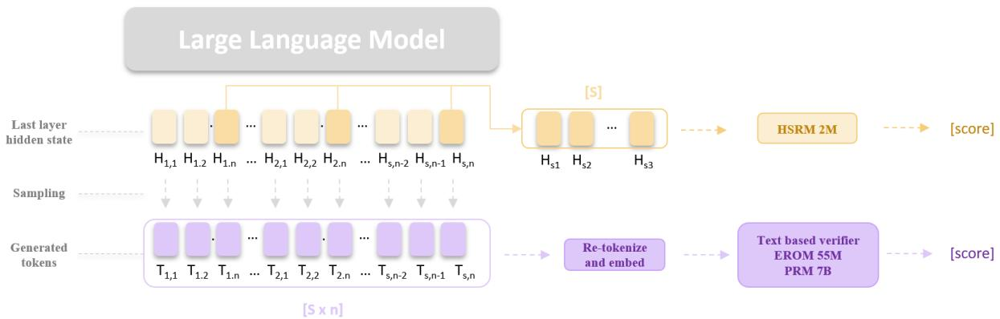  
Figure 1: Overview of the HSRM architecture. During decoding, a frozen LLM produces generated tokens $T _ { s , n }$ together with their last-layer hidden states $H _ { s , n }$ . HSRM with 2M parameters extracts the hidden states at reasoning-step boundaries to form a compact step-level sequence [S]. Text-based verifiers instead take the sampled tokens, re-tokenize and re-embed them, and run a forward pass over the full sequence $[ S \times n ]$ through a much larger model. HSRM reuses representations already computed during generation, avoiding this re-encoding step.

## 3 Our Method

HSRM is a lightweight hidden-state verifier for best-of-N reasoning. Given a prompt x, a frozen generator pθ samples N candidate solutions $\{ y _ { i } \} _ { i = 1 } ^ { N }$ . Instead of re-encoding each candidate as text, HSRM reads per step hidden states produced by the generator during decoding and assigns a scalar score to each candidate. BoN selection then returns the candidate with the highest HSRM score.

## 3.1 Step-Boundary Hidden-State Extraction

Let $y = ( y _ { 1 } , \dots , y _ { T } )$ be a candidate solution generated for prompt x. During decoding, the generator produces hidden states $\{ h _ { t } ^ { \ell } \} _ { t = 1 } ^ { T }$ , where $h _ { t } ^ { \ell } \in \mathbb { R } ^ { d _ { \mathrm { g e n } } }$ is the residual-stream representation at token position t and layer ℓ. Rather than using all tokenlevel hidden states, we extract representations only at reasoning-step boundaries. We present inputmodalities ablations in Section 6.2.

We segment each generated solution using the step stop delimiter, including $[ { \bf \ " } \backslash { \sf n } \backslash { \sf n } ^ { \prime \prime } , { \bf \ " } \cdot \backslash { \sf n } ^ { \prime \prime }$ $" : \mathsf { \backslash n " , \ " } \setminus \mathsf { n " , \ " } . \mathsf { \backslash n \backslash n " , \ " } : \mathsf { \backslash n \backslash n " ] }$ , which commonly separate reasoning steps in chain-of-thought outputs. Let $t _ { 1 } < t _ { 2 } < \cdot \cdot \cdot < t _ { S } \leq T$ denote the token positions immediately before these step boundaries, including the final generated token. We collect

$$
\boldsymbol { H } ^ { \ell } ( \boldsymbol { y } ) = \left[ h _ { t _ { 1 } } ^ { \ell } ; h _ { t _ { 2 } } ^ { \ell } ; \ldots ; h _ { t _ { S } } ^ { \ell } \right] \in \mathbb { R } ^ { S \times d _ { \mathrm { g e n } } } .\tag{1}
$$

Unless otherwise stated, we use the final generator layer $\ell = L$ . In Section 6.1 and 6.2, we additionally study how performance varies across layers. Step-boundary extraction substantially reduces the verifier input length: instead of processing every generated token, HSRM processes only the sequence of reasoning-step representations. Since these hidden states are already computed during generation, HSRM does not require any additional generator forward passes.

## 3.2 The HSRM Architecture

Given a step-level hidden-state sequence $H \in$ $\mathbb { R } ^ { S \times d _ { \mathrm { g e n } } }$ , HSRM maps it to a scalar candidate score through three stages: a per-step linear projection, a Transformer encoder over reasoning steps, and a mean-pooled linear readout.

First, each generator hidden state is projected into the verifier hidden width:

$$
z _ { s } ^ { ( 0 ) } = W _ { \mathrm { i n } } h _ { t _ { s } } ^ { \ell } + b _ { \mathrm { i n } } .\tag{2}
$$

where $W _ { \mathrm { i n } } \in \mathbb { R } ^ { d _ { \mathrm { m o d e l } } \times d _ { \mathrm { g e n } } }$ . The resulting sequence $Z ^ { ( 0 ) } = ( z _ { 1 } ^ { ( 0 ) } , \dots , z _ { S } ^ { ( 0 ) } )$ is then passed through a small Transformer encoder:

$$
Z = \mathrm { T r a n s f o r m e r E n c o d e r } ( Z ^ { ( 0 ) } ) ,\tag{3}
$$

where $Z = ( z _ { 1 } , \dots , z _ { S } )$

To obtain a candidate-level representation, HSRM mean-pools the encoded step representations over the unpadded step positions and applies layer normalization:

$$
z = \mathrm { L N } \left( \frac { 1 } { S } \sum _ { s = 1 } ^ { S } z _ { s } \right) .\tag{4}
$$

Finally, a single linear readout maps the pooled representation to a scalar verifier score:

$$
\begin{array} { r } { f _ { \phi } ( x , y ) = w ^ { \top } z + b . } \end{array}\tag{5}
$$

Our default HSRM uses a 2-layer Transformer encoder with hidden width $d _ { \mathrm { m o d e l } } = 2 5 6$ , 4 attention heads, feed-forward width $4 d _ { \mathrm { m o d e l } }$ , resulting in roughly 2M parameters depending on the generator hidden size. We also evaluate larger variants in Appendix E to separate the effect of verifier capacity from the effect of reading hidden states.

## 3.3 Training Objective

HSRM is trained to rank correct candidates above incorrect ones within the same problem. For each training problem, let $\{ ( y _ { i } , c _ { i } ) \} _ { i = 1 } ^ { N }$ denote the sampled candidates and their binary correctness labels, where $c _ { i } ~ \in ~ \{ 0 , 1 \}$ . Let $\mathcal { P } \ = \ \{ i \ : \ c \_ i \ = \ 1 \}$ $\mathcal { N } = \{ j : c \_ j = 0 \}$ be the sets of correct and incorrect candidates, respectively. Because many candidates for the same problem can be correct, especially for larger generators, the objective should not impose an arbitrary ordering among correct solutions. We therefore use a tie-safe ranking loss that only requires correct candidates to score higher than incorrect candidates. We empirically compare this objective against pointwise BCE and ListMLE in Section E:

$$
\mathcal { L } _ { \mathrm { r a n k } } = \frac { 1 } { | \mathcal { P } | | \mathcal { N } | } \sum _ { i \in \mathcal { P } } \sum _ { j \in \mathcal { N } } \log \Big ( 1 + e ^ { - ( s _ { i } - s _ { j } ) } \Big ) .\tag{6}
$$

where $s _ { i } = f _ { \phi } ( x , y _ { i } )$ . This objective encourages every correct candidate to outrank incorrect candidates, while treating all correct candidates as ties with respect to one another. Problems with $| \mathcal { P } | = 0$ or $| { \mathcal { N } } | = 0$ provide no within-problem ranking signal and are omitted from the training loss.

In practice, we train HSRM on cached hiddenstate tensors. The generator is run once to produce candidate solutions and their step-boundary hidden states. HSRM is then optimized on these cached representations without further generator calls.

## 3.4 Inference

At inference time, the generator samples N candidate solutions for each problem and caches the same step-boundary hidden states used during training. HSRM scores the N candidates in a batched verifier forward pass, and BoN selection returns the highest-scoring candidate:

$$
{ \hat { y } } = y _ { \mathrm { a r g m a x } _ { i } f _ { \phi } ( x , y _ { i } ) } .\tag{7}
$$

Because HSRM operates over step-level hidden states that are already produced during generation, it avoids the additional generator or verifier-side text re-encoding required by text-based verifiers. Its added inference cost is therefore limited to a small forward pass over the extracted step representations. We provide detailed efficiency analysis in Section 6.3.

## 4 Experimental Setup

## 4.1 Generators and Datasets

We evaluate HSRM using Qwen3 generators (Yang et al., 2025) at four scales: 1.7B, 4B, 8B, and 14B. Our main experiments use all generators in non-thinking mode and keep them frozen throughout training and evaluation; only HSRM and the learned verifier baselines are trained. We additionally evaluate Qwen3 in thinking mode in Section 6.6 to study how explicit deliberation affects hidden-state extraction.

We consider four mathematical reasoning benchmarks: GSM8K (Cobbe et al., 2021), MATH-500 (Hendrycks et al., 2021), AIME (Art of Problem Solving Community, 2025), and OlympiadBench (He et al., 2024). For each dataset, we construct a verifier training pool by sampling 64 candidate solutions per training problem. At evaluation time, we report best-of-8 selection on a disjoint evaluation split. Exact split indices are provided in Appendix A.

## 4.2 Candidate Labeling

Each candidate solution is assigned a binary correctness label. We first extract the final answer using dataset-specific rules and compare it against the ground truth after normalizing common formatting differences and equivalent symbolic expressions. Ambiguous cases are resolved using an LLM judge that is given the ground-truth answer as context. Unless otherwise stated, all reported results use these post-processed correctness labels. Detailed relabeling statistics are provided in Appendix B.

## 4.3 Baselines

We compare HSRM against three classes of baselines. First, we compare against text-based reward models. Our main text-only baseline is EORM (Jiang et al., 2025), an energy-based verifier that reads the full chain-of-thought text and scores candidates with a Transformer encoder trained using a Bradley–Terry ranking objective. We use EORM 55M as the primary text-only comparison.

Second, we compare against Qwen2.5-Math-PRM-7B (Zhang et al., 2025b), a 7B off-the-shelf process reward model trained with MATH-style process supervision. We treat this model as a strong external PRM baseline rather than a capacitymatched comparison.

Lastly, we evaluate non-learned generatorinternal scoring heuristics, including single-pass generation and oracle pass@N. We also report simple baselines like cumulative log-probability, mean log-probability, negative mean entropy, negative varentropy, response length, number of reasoning steps, and longest response in Table 8. These baselines test whether simple confidence, uncertainty, or length-based signals are sufficient for best-of-N selection.

## 4.4 Training and Evaluation

Unless otherwise stated, HSRM uses a 2-layer Transformer encoder with hidden width 256, 4 attention heads, dropout 0.1, and final-layer stepboundary hidden states. More training details can be found in Appendix C. All learned verifiers are trained with five random seeds, using a problemlevel validation split for early stopping. HSRM is trained on cached hidden-state tensors: after the candidate pools and step-boundary hidden states are generated once, verifier training requires no additional generator calls.

Our primary metric is verifier-best accuracy at N = 8. For each problem, the verifier selects the highest-scoring candidate among eight sampled solutions, and the prediction is counted as correct if the selected candidate has the correct final answer. We also report within-problem AUROC, computed by comparing verifier scores against binary correctness labels within each candidate pool and then averaging over problems for which AUROC is defined. Oracle pass@N is reported as the upper bound imposed by the sampled candidate pool.

In-distribution results are reported as mean ± standard deviation over five seeds. For zero-shot transfer, we train the verifier on a source dataset and evaluate it directly on a target dataset, without any target-domain verifier training.

## 5 Results

## 5.1 Main Results

We first evaluate whether HSRM can serve as an effective verifier for best-of-N selection across generator scales and benchmark difficulty. Figure 2 reports best-of-8 accuracy for Qwen3 generators from 1.7B to 14B parameters on GSM8K, MATH-500, AIME, and OlympiadBench. We compare HSRM with EORM, a 55M-parameter text-only energy verifier, as well as single-pass generation, oracle pass@8, and Qwen2.5-Math-PRM-7B.

On GSM8K, HSRM outperforms EORM at every generator scale and nearly matches Qwen2.5- Math-PRM-7B, despite using only about 2M parameters instead of a billion-parameter text-based verifier. As the generator scale increases, HSRM also approaches the oracle curve, indicating that GSM8K is close to saturated in the best-of-8 setting: correct candidates are often present, and HSRM can identify them nearly as effectively as a much larger domain-trained PRM. This suggests that generator hidden states contain useful information for distinguishing correct from incorrect candidates, especially before the generator saturates the task.

The benefits extend to harder benchmarks. On MATH-500, AIME, and OlympiadBench, HSRM generally remains above EORM while improving with generator scale. Qwen2.5-Math-PRM-7B retains an advantage on these more challenging mathematical benchmarks, especially AIME, which is expected given its much larger scale and domainspecific training. Nevertheless, HSRM closes a substantial portion of the gap while avoiding the cost of re-encoding candidate solutions as text.

Overall, Figure 2 supports our main claim: compact hidden-state verification can outperform a substantially larger text-only verifier across generator scales and benchmark difficulty, and can match a large domain-trained PRM on GSM8K. HSRM is most attractive when verifier efficiency is important, while large domain-matched PRMs remain stronger on the hardest benchmarks.

## 6 Ablations

## 6.1 Generator Layer

HSRM uses hidden states from the frozen generator as its input, so an important design question is which generator layer should be used for verification. Prior work on contextual representations suggests that useful information is often distributed across layers rather than concentrated only in the final layer: different layers encode different linguistic and semantic abstractions, and intermediate or near-final layers can sometimes provide more transferable features than the final representation (Peters et al., 2018; Liu et al., 2019; Skean et al., 2025). This is especially relevant for hidden-state verification, since the final layer is also the layer most directly shaped for next-token prediction, whereas earlier upper layers may retain richer information about the reasoning trajectory.

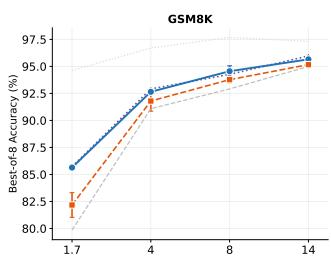

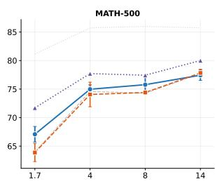  
Generator size (B params)

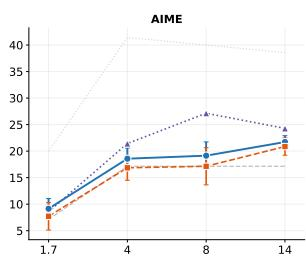

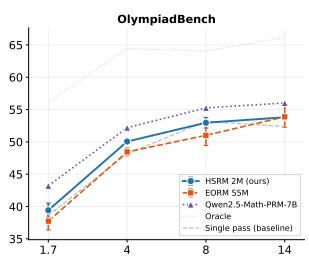

Figure 2: Best-of-8 verifier accuracy as generator size increases. HSRM improves over the 55M-parameter text-only EORM baseline across most generator–dataset settings while using only about 2M parameters. The oracle curve shows the pass@8 upper bound, and the single-pass curve shows the accuracy without verifier-based selection. Results are reported as mean ± standard deviation over five seeds.  
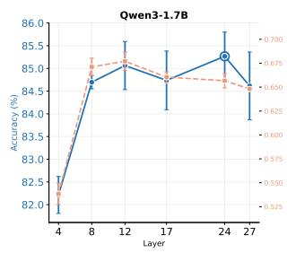

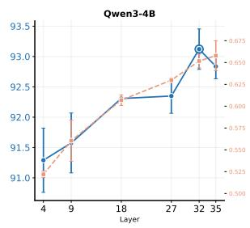

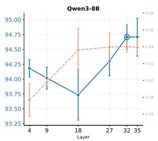

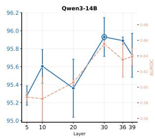  
Figure 3: Layer ablation for HSRM on GSM8K. We vary the generator layer used for step-boundary hidden-state extraction and report both best-of-8 accuracy and within-problem AUROC. Correctness information is present across many layers, but the strongest performance generally occurs in the upper portion of the generator. Results are reported as mean ± standard deviation over three seeds.

We therefore evaluate HSRM while varying the generator layer used for step-boundary hidden-state extraction. Figure 3 reports both best-of-8 accuracy and within-problem AUROC on GSM8K for Qwen3 models from 1.7B to 14B parameters. The results show that correctness information is present across a broad range of layers, with the strongest performance generally appearing in the upper portion of the generator. The final layer is competitive, but it is not always the unique optimum. In several settings, nearby upper layers match or exceed the final layer, suggesting that verification-relevant information is distributed across multiple high-level representations.

We use the final layer as the default in the main experiments because it is simple, consistently competitive, and avoids tuning a layer choice separately for each generator–dataset pair. At the same time, the layer ablation motivates multi-layer hiddenstate inputs. In Section 6.2, we therefore also test a top-4-layer variant that concatenates the final four generator layers; this setting gives the strongest overall ranking performance, supporting the view that hidden-state verification benefits from combining information across multiple upper layers rather than relying exclusively on a single final representation.

## 6.2 Input Modality

Table 1 studies which input signal is most useful for HSRM. The text-only verifier performs substantially worse than all hidden-state variants, reaching only 82.23% best-of-8 accuracy and 0.519 within-problem AUROC. In contrast, even the simplest hidden-state verifier, which reads only the final step representation from the last generator layer, achieves 86.11% accuracy and 0.691 AU-ROC. This gap suggests that the improvement does not come merely from the verifier architecture, but from the hidden-state representation itself.

Using the full sequence of step-boundary representations further improves ranking quality, and concatenating the top four generator layers gives the best overall result, reaching 86.86% accuracy and 0.724 AUROC. This supports the conclusion from the layer ablation: correctness information is not confined to the final hidden state, but is distributed both across the reasoning trajectory and across multiple upper layers of the generator. The AUROC gains are especially important because best-of-N selection depends on ranking correct and incorrect candidates within the same problem.

<table><tr><td>Input modality</td><td>Verifier input</td><td>Generator layers</td><td>Input dim.</td><td> $d _ { \mathrm { m o d e l } }$ </td><td>Params</td><td>Bo8 Acc.</td><td>Within-AUROC</td></tr><tr><td>Hidden state</td><td>Last hidden state</td><td>Last layer</td><td>2048</td><td>256</td><td>2.12M</td><td> $8 6 . 1 1 \pm 0 . 3 5$ </td><td> $0 . 6 9 1 \pm 0 . 0 0 5$ </td></tr><tr><td>Hidden state</td><td>Step hidden state</td><td>Last layer</td><td>2048</td><td>256</td><td>2.12M</td><td> $8 6 . 3 2 \pm 1 . 0 8$ </td><td> $0 . 7 1 4 \pm 0 . 0 1 8$ </td></tr><tr><td>Hidden state</td><td>Last hidden state</td><td>Top-4 layers</td><td>8192</td><td>256</td><td>3.69M</td><td> $8 6 . 2 8 \pm 0 . 8 8$ </td><td> $0 . 7 1 5 \pm 0 . 0 1 5$ </td></tr><tr><td>Hidden state</td><td>Step hidden state</td><td> $\mathrm { T o p } { - } 4 \mathrm { l a y e r s }$ </td><td>8192</td><td>256</td><td>3.69M</td><td> ${ \bf 8 6 . 8 6 \pm 0 . 7 4 }$ </td><td> $\mathbf { 0 . 7 2 4 \pm 0 . 0 0 9 }$ </td></tr><tr><td>Text only</td><td>Raw solution text</td><td></td><td></td><td></td><td>2.56M</td><td> $8 2 . 2 3 \pm 0 . 2 9$ </td><td> $0 . 5 1 9 \pm 0 . 0 0 9$ </td></tr><tr><td>Hybrid</td><td>Text + hidden states</td><td>Top-4 layers</td><td>8192</td><td>256</td><td>4.77M</td><td> $8 6 . 2 3 \pm 0 . 6 0$ </td><td> $0 . 7 0 7 \pm 0 . 0 2 1$ </td></tr></table>

Table 1: Input-modality ablation on GSM8K using Qwen3-1.7B in non-thinking mode. Hidden-state verifiers read step-boundary representations, extracted from the token immediately before each step stop delimiter. Last-layer models use a 2048-dimensional input, while top-4-layer models concatenate layers $- 1 , - 2 , - 3 , - 4$ , giving an 8192-dimensional input. The text-only baseline encodes the raw solution text with a from-scratch encoder, and the hybrid model fuses text and hidden-state inputs.

Interestingly, the hybrid text-plus-hidden model does not improve over the hidden-only model despite using more parameters. This indicates that the generator’s internal representations already provide a strong verification signal, and adding raw text features can introduce extra complexity without improving selection performance.

## 6.3 Efficiency Analysis

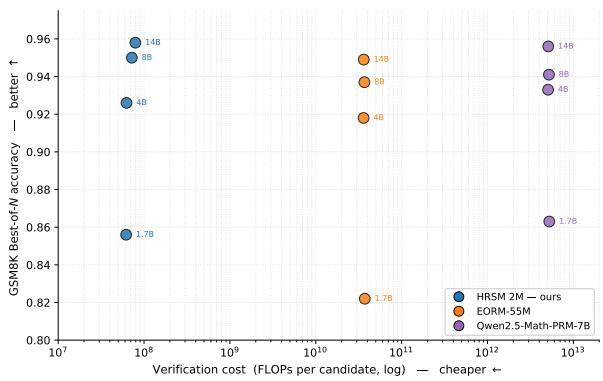  
Figure 4: Verification efficiency frontier on GSM8K. Best-of-N accuracy versus estimated verification FLOPs per candidate (log scale) for HSRM, EORM-55M, and Qwen2.5-Math-PRM-7B across four generator scales. HSRM lies on the upper-left frontier, matching the 7B PRM at the larger generator scales at roughly five orders of magnitude lower verification cost.

In best-of-N reasoning, verifier cost scales directly with the number of sampled candidates, making per-candidate efficiency central to test-time compute. Figure 4 compares HSRM with text-based verifiers, plotting best-of-N accuracy against estimated verification FLOPs per candidate. HSRM lies on the upper-left efficiency frontier across generator scales. This gain comes with a substantial cost advantage: HSRM uses about 3500× fewer parameters than the 7B PRM and roughly five orders of magnitude fewer verification FLOPs per candidate, since it reads cached hidden states rather than re-encoding each solution with a large text model. This difference is especially important in best-of-N settings, where the same verifier must be applied repeatedly to many sampled candidates. By moving verification from full-sequence text re-encoding to a compact step-level hidden-state reader, HSRM makes additional test-time samples more affordable. These results show that HSRM improves not only parameter efficiency, but also the accuracy– cost frontier for test-time verification.

## 6.4 Training Data

We next study how HSRM scales with the size of the verifier training pool. Figure 5 varies the number of training problems K for a Qwen3-1.7B generator, with evaluation problems kept disjoint from the training pool. HSRM generally improves as K increases. On GSM8K, increasing K from 25 to 500 raises best-of-8 accuracy from 83.4 to 86.2 and within-problem AUROC from 0.612 to 0.716. MATH-500 shows the same overall direction, with accuracy increasing from 75.5 to 77.8 and AUROC from 0.528 to 0.596 as K grows from 10 to 125, although the curve is noisier due to the harder and more heterogeneous problem distribution. Since best-of-N reasoning relies on a verifier to select among sampled candidates, these gains indicate that additional verifier data mainly strengthens the ranking signal. At the same time, the curve shows that small training pools already provide useful gains over single-pass generation, while larger pools offer better ranking quality at the cost of more data collection and labeling. Thus, the choice of K is application-dependent: one can use a small pool for a cheap verifier adaptation, or increase K when higher ranking accuracy is worth the additional supervision cost.

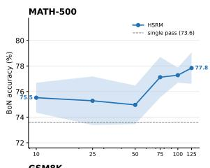

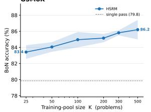

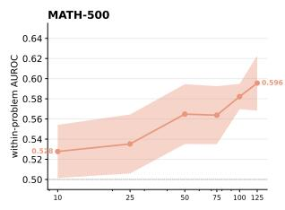

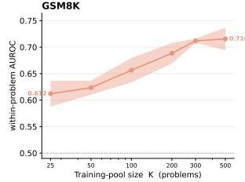  
Figure 5: Scaling with verifier training-pool size K for HSRM on Qwen3-1.7B. We vary the number of training problems used to train the verifier and evaluate on a disjoint test split for both MATH-500 and GSM8K. Left: best-of-8 accuracy. Right: within-problem AU-ROC. HSRM improves with more training data on both datasets, with especially consistent gains on GSM8K. Shaded regions show mean ± standard deviation over five seeds.

## 6.5 Zero-Shot Transfer

We test whether HSRM learns source-specific dataset patterns or more general verification signals. We train verifiers only on GSM8K or MATH-500 and evaluate them directly on OlympiadBench, without any target-domain training. Figure 6 reports best-of-8 accuracy across Qwen3 generator scales.

HSRM transfers well under this distribution shift. When trained on GSM8K, HSRM outperforms EORM 55M at every generator scale and remains close to Qwen2.5-Math-PRM-7B, despite being much smaller. The same pattern holds when training on MATH-500: HSRM again improves over the text-only verifier across all scales and tracks the large PRM baseline closely. This suggests that the hidden-state ranking signal learned by HSRM is not tied only to the source dataset, but captures reusable features of reasoning quality. Therefore, transfer studies provide evidence that generator hidden states encode verification-relevant signals that can transfer across mathematical reasoning domains, even without target-domain verifier training.

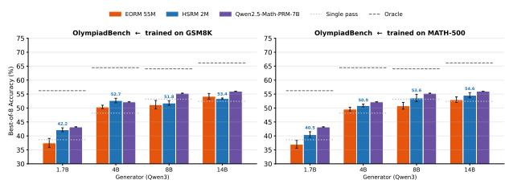  
Figure 6: Zero-shot transfer to OlympiadBench. Verifiers are trained only on GSM8K (left) or MATH-500 (right), and evaluated directly on OlympiadBench without target-domain tuning. HSRM consistently outperforms the text-only EORM 55M baseline and remains close to Qwen2.5-Math-PRM-7B across generator scales. Dotted lines show single-pass accuracy and dashed lines show oracle pass@8. Results are mean ± standard deviation over five seeds.

The remaining gap is primarily to the oracle rather than between learned verifiers. On OlympiadBench, oracle pass@8 is much higher than the selected accuracy for all methods, meaning that many candidate pools contain a correct solution that the verifier does not select. At the same time, the gap between HSRM and Qwen2.5- Math-PRM-7B is relatively small compared with the oracle headroom. Thus, zero-shot transfer performance appears limited less by the choice between small hidden-state and large text-based verifiers, and more by the difficulty of generating and reliably selecting correct candidates on Olympiad-Bench.

## 6.6 Thinking-Mode Generators

Our main experiments use Qwen3 in non-thinking mode, where the generated reasoning trace and final answer form a single sequence. We additionally study HSRM with Qwen3’s thinking mode, which introduces an explicit internal deliberation phase before the final answer. This setting raises a new extraction question: should the verifier read hidden states throughout the full reasoning trace, or only from the post-deliberation answer segment?

We compare two variants on MATH-500 using Qwen3-1.7B and Qwen3-4B. Full-trace extraction applies the same step-boundary reader across the entire generated sequence, including the thinking trace. Answer-only extraction instead retains only representations after the </think> boundary. For reference, we also report the corresponding nonthinking generator with answer-only extraction.

Table 2 shows two complementary effects. First, enabling thinking substantially improves best-of-8 performance over the corresponding non-thinking generators. More importantly for HSRM, however, using the entire thinking trace is not the strongest way to read these models. Restricting HSRM to post-deliberation representations improves withinproblem AUROC from 0.669 to 0.736 for Qwen3- 1.7B and from 0.672 to 0.884 for Qwen3-4B.

<table><tr><td>Generator</td><td>Mode</td><td>Input</td><td>Acc</td><td>Within-AUROC</td></tr><tr><td rowspan="3">Qwen3-1.7B</td><td>Non-thinking</td><td>answer-only</td><td> $6 7 . 1 4 \pm 0 . 8 1$ </td><td> $0 . 6 3 1 \pm 0 . 0 2 5$ </td></tr><tr><td>Thinking</td><td>full-trace</td><td> $8 2 . 0 0 \pm 0 . 8 2$ </td><td> $0 . 6 6 9 \pm 0 . 0 2 7$ </td></tr><tr><td>Thinking</td><td>answer-only</td><td> ${ \bf 8 3 . 6 7 \pm 0 . 9 4 }$ </td><td> $\mathbf { 0 . 7 3 6 \pm 0 . 0 3 4 }$ </td></tr><tr><td rowspan="3">Qwen3-4B</td><td>Non-thinking</td><td>answer-only</td><td> $7 7 . 6 2 \pm 0 . 4 9$ </td><td> $0 . 6 5 7 \pm 0 . 0 1 0$ </td></tr><tr><td>Thinking</td><td>full-trace</td><td> $8 6 . 3 3 \pm 1 . 7 0$ </td><td> $0 . 6 7 2 \pm 0 . 0 4 4$ </td></tr><tr><td>Thinking</td><td>answer-only</td><td> $\mathbf { 8 7 . 0 0 \pm 0 . 0 0 }$ </td><td> $\mathbf { 0 . 8 8 4 \pm 0 . 0 2 3 }$ </td></tr></table>

Table 2: Thinking-mode extraction ablation on MATH-500. For thinking-mode generators, full-trace uses stepboundary hidden states from both the deliberation trace and final answer, whereas answer-only retains representations after the </think> boundary. Restricting extraction to the post-deliberation answer improves within-problem ranking quality at both model scales.

This result suggests that verification-relevant information is not equally stable throughout an explicit deliberation trace. During thinking, the model may temporarily represent an incorrect hypothesis, uncertainty, or a detected error before subsequently revising its reasoning. A hidden state at such a step can therefore reflect the local status of an intermediate trajectory rather than the correctness of the final answer. Representations after the </think> boundary are produced after this self-correction process and are consequently more predictive of final-answer correctness.

## 6.7 Cross-Family Generalization

The main experiments above use Qwen3 generators. To test whether HSRM relies on properties specific to the Qwen model family, we additionally evaluate it on candidate solutions generated by three Llama models: Llama-3.2-1B, Llama-3.2- 3B, and Llama-3.1-8B (Grattafiori et al., 2024). We consider both GSM8K and MATH-500 and train an HSRM and matched EORM verifier on candidate pools generated by each model.

Table 3 shows that the advantage of hiddenstate verification extends beyond the Qwen family. HSRM outperforms the matched text-based EORM verifier in all six Llama generator–dataset settings. On GSM8K, the improvement ranges from 3.1 to 8.1 percentage points, while on MATH-500 it ranges from 3.6 to 4.5 points.

These cross-family results provide evidence that the verification signal exploited by HSRM is not tied to a particular generator architecture or pretraining recipe. Despite differences between Qwen3 and Llama models, a small verifier operating directly on their internal representations consistently provides stronger candidate ranking than re-encoding the generated reasoning text with the matched EORM baseline.

<table><tr><td>Dataset</td><td>Generator</td><td>HSRM</td><td>EORM</td><td>Oracle</td></tr><tr><td rowspan="3">GSM8K</td><td>Llama-3.2-1B</td><td>48.4</td><td>40.3</td><td>72.2</td></tr><tr><td>Llama-3.2-3B</td><td>81.1</td><td>75.1</td><td>93.0</td></tr><tr><td>Llama-3.1-8B</td><td>88.3</td><td>85.2</td><td>96.0</td></tr><tr><td rowspan="3"></td><td>Llama-3.2-1B</td><td>30.1</td><td>26.5</td><td>61.4</td></tr><tr><td>MATH-500 Llama-3.2-3B</td><td>47.9</td><td>43.4</td><td>76.3</td></tr><tr><td>Llama-3.1-8B</td><td>56.8</td><td>52.3</td><td>87.1</td></tr></table>

Table 3: Best-of-8 accuracy (%) with Llama-family generators. HSRM consistently outperforms the matched text-based EORM verifier across both datasets and all three generator scales. Oracle denotes pass@8 accuracy of the sampled candidate pool.

## 7 Conclusion

We presented HSRM, a lightweight hidden-state verifier for test-time mathematical reasoning. Instead of re-encoding candidate solutions with a separate text-based reward model, HSRM ranks candidates using hidden states already produced by a frozen generator during decoding. Across four benchmarks and both Qwen and Llama generators, HSRM consistently matches or outperforms a substantially larger text-only energy verifier while using only about 2M parameters. Our ablation studies further show that verification-relevant information is distributed across upper generator layers, and that HSRM offers a favorable trade-off between training data and test-time efficiency. Together, HSRM offers a low-cost complement to existing verifier-based test-time reasoning pipelines.

## Limitations

Our study focuses on mathematical reasoning. This controlled setting allows us to isolate the verification signal present in the generator’s hidden states, but future work should evaluate whether the same approach extends to other domains and a broader range of model architectures. While our experiments include both Qwen and Llama generators and evaluate Qwen3 in thinking mode, the thinking-mode study is limited to two model scales on MATH-500, and broader evaluation of explicit deliberation remains an important direction.

## References

Art of Problem Solving Community. 2025. AIME problems and solutions. AoPS Wiki.

Amos Azaria and Tom Mitchell. 2023. The internal state of an LLM knows when it’s lying. In Findings ofthe Associationfor Computational Linguistics: EMNLP 2023, pages 967–976, Singapore. Association for Computational Linguistics.

Bradley Brown, Jordan Juravsky, Ryan Ehrlich, Ronald Clark, Quoc V. Le, Christopher Ré, and Azalia Mirhoseini. 2024. Large language monkeys: Scaling inference compute with repeated sampling. Preprint, arXiv:2407.21787.

Collin Burns, Haotian Ye, Dan Klein, and Jacob Steinhardt. 2024. Discovering latent knowledge in language models without supervision. Preprint, arXiv:2212.03827.

Karl Cobbe, Vineet Kosaraju, Mohammad Bavarian, Mark Chen, Heewoo Jun, Lukasz Kaiser, Matthias Plappert, Jerry Tworek, Jacob Hilton, Reiichiro Nakano, Christopher Hesse, and John Schulman. 2021. Training verifiers to solve math word problems. Preprint, arXiv:2110.14168.

Aaron Grattafiori, Abhimanyu Dubey, Abhinav Jauhri, Abhinav Pandey, Abhishek Kadian, Ahmad Al-Dahle, Aiesha Letman, Akhil Mathur, and etc. 2024. The llama 3 herd of models. Preprint, arXiv:2407.21783.

Jizhou Guo, Zhaomin Wu, Hanchen Yang, and Philip S. Yu. 2025. Mining intrinsic rewards from LLM hidden states for efficient best-of-N sampling. arXiv preprint arXiv:2505.12225. Accepted by KDD 2026 Research Track.

Chaoqun He, Renjie Luo, Yuzhuo Bai, Shengding Hu, Zhen Leng Thai, Junhao Shen, Jinyi Hu, Xu Han, Yujie Huang, Yuxiang Zhang, Jie Liu, Lei Qi, Zhiyuan Liu, and Maosong Sun. 2024. Olympiadbench: A challenging benchmark for promoting agi with olympiad-level bilingual multimodal scientific problems. In Proceedings of the 62nd Annual Meeting of the Association for Computational Linguistics.

Dan Hendrycks, Collin Burns, Saurav Kadavath, Akul Arora, Steven Basart, Eric Tang, Dawn Song, and Jacob Steinhardt. 2021. Measuring mathematical problem solving with the math dataset. Preprint, arXiv:2103.03874.

Eric Hanchen Jiang, Haozheng Luo, Shengyuan Pang, Xiaomin Li, Zhenting Qi, Hengli Li, Cheng-Fu Yang, Zongyu Lin, Xinfeng Li, Hao Xu, Kai-Wei Chang, and Ying Nian Wu. 2025. Learning to rank chain-ofthought: An energy-based approach with outcome supervision. arXiv preprint arXiv:2505.14999.

Saurav Kadavath, Tom Conerly, Amanda Askell, Tom Henighan, Dawn Drain, Ethan Perez, Nicholas Schiefer, Zac Hatfield-Dodds, Nova DasSarma, Eli Tran-Johnson, Scott Johnston, Sheer El-Showk, Andy Jones, Nelson Elhage, Tristan Hume, Anna Chen, Yuntao Bai, Sam Bowman, Stanislav Fort, and 17 others. 2022. Language models (mostly) know what they know. Preprint, arXiv:2207.05221.

Kenneth Li, Oam Patel, Fernanda Viégas, Hanspeter Pfister, and Martin Wattenberg. 2023. Inferencetime intervention: Eliciting truthful answers from a language model. Advances in neural information processing systems, 36:41451–41530.

Zhenwen Liang, Ruosen Li, Yujun Zhou, Linfeng Song, and 1 others. 2025. CLUE: Non-parametric verification from experience via hidden-state clustering. arXiv preprint arXiv:2510.01591.

Hunter Lightman, Vineet Kosaraju, Yura Burda, Harri Edwards, Bowen Baker, Teddy Lee, Jan Leike, John Schulman, Ilya Sutskever, and Karl Cobbe. 2023. Let’s verify step by step. Preprint, arXiv:2305.20050.

Nelson F. Liu, Matt Gardner, Yonatan Belinkov, Matthew E. Peters, and Noah A. Smith. 2019. Linguistic knowledge and transferability of contextual representations. In Proceedings ofthe 2019 Conference of the North American Chapter of the Association for Computational Linguistics: Human Language Technologies, Volume 1 (Long and Short Papers), pages 1073–1094, Minneapolis, Minnesota. Association for Computational Linguistics.

Samuel Marks and Max Tegmark. 2023. The geometry of truth: Emergent linear structure in large language model representations of true/false datasets. arXiv preprint arXiv:2310.06824.

Jingwei Ni, Ekaterina Fadeeva, Tianyi Wu, Mubashara Akhtar, Jiaheng Zhang, Elliott Ash, Markus Leippold, Timothy Baldwin, See-Kiong Ng, Artem Shelmanov, and Mrinmaya Sachan. 2026. Reprobe: Efficient test-time scaling of multi-step reasoning by probing internal states of large language models. Preprint, arXiv:2511.06209.

Hadas Orgad, Michael Toker, Zorik Gekhman, Roi Reichart, Idan Szpektor, Hadas Kotek, and Yonatan Belinkov. 2025. Llms know more than they show: On the intrinsic representation of llm hallucinations.

In International Conference on Learning Representations, volume 2025, pages 66880–66913.

Matthew E. Peters, Mark Neumann, Mohit Iyyer, Matt Gardner, Christopher Clark, Kenton Lee, and Luke Zettlemoyer. 2018. Deep contextualized word representations. In Proceedings ofthe 2018 Conference of the North American Chapter ofthe Associationfor Computational Linguistics: Human Language Technologies, Volume 1 (Long Papers), pages 2227–2237, New Orleans, Louisiana. Association for Computational Linguistics.

Bartosz Piotrowski, Witold Drzewakowski, Konrad Staniszewski, and Piotr Miłos. 2025. Lightweight la-´ tent verifiers for efficient meta-generation strategies. arXiv preprint arXiv:2504.16760.

Oscar Skean, Md Rifat Arefin, Dan Zhao, Niket Patel, Jalal Naghiyev, Yann LeCun, and Ravid Shwartz-Ziv. 2025. Layer by layer: Uncovering hidden representations in language models. Preprint, arXiv:2502.02013.

Charlie Snell, Jaehoon Lee, Kelvin Xu, and Aviral Kumar. 2025. Scaling llm test-time compute optimally can be more effective than scaling parameters for reasoning. In International Conference on Learning Representations, volume 2025, pages 10131–10165.

Jonathan Uesato, Nate Kushman, Ramana Kumar, Francis Song, Noah Siegel, Lisa Wang, Antonia Creswell, Geoffrey Irving, and Irina Higgins. 2022. Solving math word problems with process- and outcomebased feedback. Preprint, arXiv:2211.14275.

Peiyi Wang, Lei Li, Zhihong Shao, Runxin Xu, Damai Dai, Yifei Li, Deli Chen, Yu Wu, and Zhifang Sui. 2024. Math-shepherd: Verify and reinforce LLMs step-by-step without human annotations. In Proceedings ofthe 62nd Annual Meeting ofthe Association for Computational Linguistics (Volume 1: Long Papers), pages 9426–9439, Bangkok, Thailand. Association for Computational Linguistics.

Xuezhi Wang, Jason Wei, Dale Schuurmans, Quoc V. Le, Ed H. Chi, Sharan Narang, Aakanksha Chowdhery, and Denny Zhou. 2023. Self-consistency improves chain of thought reasoning in language models. In International Conference on Learning Representations (ICLR).

Yangzhen Wu, Zhiqing Sun, Shanda Li, Sean Welleck, and Yiming Yang. 2025. Inference scaling laws: An empirical analysis of compute-optimal inference for problem-solving with language models. Preprint, arXiv:2408.00724.

An Yang, Beichen Zhang, Binyuan Hui, Bofei Gao, Bowen Yu, Chengpeng Li, Dayiheng Liu, Jianhong Tu, Jingren Zhou, Junyang Lin, and 1 others. 2024. Qwen2.5-Math technical report: Toward mathematical expert model via self-improvement. arXiv preprint arXiv:2409.12122.

An Yang and 1 others. 2025. Qwen3 technical report. arXiv preprint arXiv:2505.09388.

Anqi Zhang, Yulin Chen, Jane Pan, Chen Zhao, Aurojit Panda, Jinyang Li, and He He. 2025a. Reasoning models know when they’re right: Probing hidden states for self-verification. arXiv preprint arXiv:2504.05419.

Zhenru Zhang, Chujie Zheng, Yangzhen Wu, Beichen Zhang, Runji Lin, Bowen Yu, Dayiheng Liu, Jingren Zhou, and Junyang Lin. 2025b. The lessons of developing process reward models in mathematical reasoning. In Findings ofthe Associationfor Computational Linguistics: ACL 2025, pages 10495–10516, Vienna, Austria. Association for Computational Linguistics.

Chujie Zheng, Zhenru Zhang, Beichen Zhang, Runji Lin, Keming Lu, Bowen Yu, Dayiheng Liu, Jingren Zhou, and Junyang Lin. 2025. Processbench: Identifying process errors in mathematical reasoning. Preprint, arXiv:2412.06559.

Andy Zou, Long Phan, Sarah Chen, James Campbell, Phillip Guo, Richard Ren, Alexander Pan, Xuwang Yin, Mantas Mazeika, Ann-Kathrin Dombrowski, and 1 others. 2023. Representation engineering: A top-down approach to ai transparency. arXiv preprint arXiv:2310.01405.

## A Dataset Details and Split Indices

Table 5 reports the problem-index ranges and candidate counts used throughout the paper. All training and evaluation splits are disjoint at the problem level. For each training problem, we sample $N { = } 6 4$ candidate solutions; for each evaluation problem, we use N=8 candidates for best-of-N selection. All Qwen3 generators are run in nonthinking mode with float16, temperature 0.7, and top-p 0.9. Across all datasets and splits, the postprocessed candidate corpus contains approximately 255K sampled solutions (Appendix B).

## B Candidate Labeling and Relabeling Statistics

Each sampled candidate solution is assigned a binary final-answer correctness label before verifier training and evaluation. We use a two-stage labeling procedure designed to preserve high-precision symbolic matches while recovering correct answers that are missed by simple extraction rules.

In the first stage, we apply a deterministic regex/symbolic labeler. The labeler extracts a candidate’s final answer using a cascade of answer patterns, including boxed answers, phrases such as “the answer is”, more generic answer statements, and, as a fallback, the last numeric expression in the solution. The extracted answer is then compared with the ground-truth answer after normalizing common formatting differences. Numeric answers are compared with a small tolerance, and symbolic answers are checked with mathematical equivalence tools when possible; otherwise, normalized string matching is used. If this stage extracts an answer and verifies it as equivalent to the ground truth, the candidate is marked correct and the label is locked in.

The second stage handles candidates not resolved as correct by the deterministic labeler. This includes cases where answer extraction fails, where the extracted span is incomplete, or where the answer contains formats that are difficult to verify with simple rules, such as fractions, square roots, embedded units, symbolic expressions, or multiple plausible final-answer spans. These unresolved or provisionally incorrect candidates are batched and passed to an LLM judge, which receives the problem, the candidate solution, and the ground-truth answer. The judge determines whether the candidate’s final answer is mathematically equivalent to the ground truth, allowing us to recover correct solutions that would otherwise be counted as false negatives by the regex/symbolic labeler.

This relabeling stage has a non-negligible effect on the final supervision. Over approximately 255K sampled candidate solutions, the LLM-judge stage changed 7,788 labels in total. It corrected 7,650 candidates from incorrect to correct and 138 candidates from correct to incorrect, yielding a net increase of 7,512 correct labels. Thus, about 3.1% of candidate labels were changed by the judge, with most changes recovering correct answers that the deterministic labeler failed to recognize. This asymmetry is expected: strict regex and symbolic checks are high precision but can miss semantically correct answers written in non-canonical forms.

All reported training and evaluation results use the post-relabel correctness labels. This ensures that HSRM is trained and evaluated against a more complete notion of final-answer correctness, rather than against artifacts of a particular answerextraction rule.

## C Architecture and Hyperparameter Details

Parameter counts. Table 4 gives the parameter count of the default HSRM verifier for each generator scale. The only component whose size depends on the generator is the input projection $W _ { \mathrm { i n } } \in \mathbb { R } ^ { d _ { \mathrm { m o d e l } } \times d _ { \mathrm { g e n } } }$ . The step-level Transformer encoder and final score head are shared across generator scales.

Table 4: HSRM parameter counts by generator. The default verifier uses $d _ { \mathrm { m o d e l } } { = } 2 5 6$ , two Transformer layers, four attention heads, and dropout 0.1.
<table><tr><td>Generator</td><td> $d _ { \mathrm { g e n } }$ </td><td>Params</td></tr><tr><td>Qwen3-1.7B</td><td>2048</td><td>2.12M</td></tr><tr><td>Qwen3-4B</td><td>2560</td><td>2.25M</td></tr><tr><td>Qwen3-8B</td><td>4096</td><td>2.65M</td></tr><tr><td>Qwen3-14B</td><td>5120</td><td>~3.4M</td></tr></table>

Training hyperparameters. Table 6 summarizes the verifier training recipe. Unless otherwise stated, we use the same hyperparameters across datasets and generator scales.

Baseline configurations. We compare HSRM with text-based learned verifiers and non-learned generator-side scorers. For EORM, we reproduce a Transformer energy model over chain-ofthought text trained with a Bradley–Terry pairwise loss and a cosine-warmup schedule. We evaluate a small EORM variant with 2.6M parameters $( d { = } 2 5 6 , L { = } 1 , h { = } 2 )$ and the primary EORM baseline with 53.4M parameters $\scriptstyle ( d = 7 6 8 , L = 2 , h = 4 )$ We also evaluate Qwen2.5-Math-PRM-7B as an off-the-shelf PRM baseline; this model is not retrained on our sampled candidates. For Qwen2.5- Math-PRM-7B, the main results use the last-step PRM score as the candidate-level score, matching the outcome-level target used to train HSRM.

Table 5: Dataset splits and candidate counts. “Source” denotes the underlying benchmark split. MATH-500 uses the first 150 problems for verifier training and the remaining 350 problems as the strict holdout used for headline results.
<table><tr><td>Dataset</td><td>Source split</td><td>Train idx.</td><td> $( n , N )$ </td><td>Eval idx.</td><td> $( n , N )$ </td></tr><tr><td>GSM8K</td><td>test (1319)</td><td>[0, 499]</td><td>(500, 64)</td><td>[500, 1318]</td><td>(819,8)</td></tr><tr><td>MATH-500</td><td>test (500)</td><td>[0, 149]</td><td>(150, 64)</td><td>[150, 499]</td><td>(350, 8)</td></tr><tr><td>AIME</td><td>aimo-val (90)</td><td>[0, 19]</td><td>(20, 64)</td><td>[20,89]</td><td>(70,8)</td></tr><tr><td>OlympiadBench</td><td>OE_TO_maths_en_COMP (673)</td><td>[0, 149]</td><td>(150, 64)</td><td>[150, 672]</td><td>(523, 8)</td></tr></table>

Table 6: HSRM training hyperparameters.
<table><tr><td>Hyperparameter</td><td>Value</td></tr><tr><td>Optimizer</td><td>AdamW</td></tr><tr><td>Learning rate</td><td> $1 \times 1 0 ^ { - 4 }$ </td></tr><tr><td>Problem batch size</td><td>8</td></tr><tr><td>Gradient steps</td><td>1000</td></tr><tr><td>Validation split</td><td>0.20 problem-level validation split, seed 42</td></tr><tr><td>Dropout Loss</td><td>0.1 tie-safe pairwise ranking loss (Eq. 6)</td></tr><tr><td>Generator layer</td><td>final layer, cached in float16</td></tr><tr><td>Seeds</td><td>{42, 123, 456, 789, 1024} for 5-seed runs; {42, 123, 456} for 3-seed ablations</td></tr><tr><td>Hardware</td><td>L40S and H100 GPUs</td></tr></table>

Non-learned scorer definitions. For each candidate, let $\ell _ { t } = \log p _ { \theta } ( y _ { t } \mid y _ { < t } )$ be the token logprobability, $H _ { t }$ the token entropy, T the response length in tokens, and S the number of reasoningstep delimiters. We define the non-learned candidate scores as follows.

$$
s _ { \mathrm { c u m - l p } } = \sum _ { t = 1 } ^ { T } \ell _ { t } .\tag{8}
$$

$$
s _ { \mathrm { m e a n - l p } } = \frac { 1 } { T } \sum _ { t = 1 } ^ { T } \ell _ { t } .\tag{9}
$$

$$
s _ { \mathrm { n e g - e n t } } = - \frac { 1 } { T } \sum _ { t = 1 } ^ { T } H _ { t } .\tag{10}
$$

$$
s _ { \mathrm { n e g - v a r e n t } } = - \operatorname { V a r } _ { t } ( H _ { t } ) .\tag{11}
$$

In Table $^ { 8 , }$ , we report the best scorer separately for each cell. This is an optimistic envelope for

cheap heuristics; a single fixed scorer would generally perform worse.

## D Extended Results

N-scaling. Table 7 varies the evaluation pool size $N \in \{ 8 , 1 6 , 3 2 , 6 4 \}$ while keeping the verifier fixed. Increasing N gives only small additional gains after N=16, suggesting that the sampled pools are already close to their oracle ceiling in many cells. The MATH-500 rows use an earlier split and are included only to show the trend.

Table 7: N-scaling of HSRM verifier-best accuracy (%). ∆ is the change from N=8 to N=64.
<table><tr><td>Data</td><td>Gen</td><td>8</td><td>16</td><td>32</td><td>64</td><td> $\Delta$ </td></tr><tr><td rowspan="3">GSM8K</td><td>1.7B</td><td>84.8</td><td>84.3</td><td>84.4</td><td>85.6</td><td>+0.8</td></tr><tr><td>4B</td><td>91.5</td><td>92.6</td><td>93.1</td><td>92.6</td><td>+1.1</td></tr><tr><td>8B 14B</td><td>93.8 95.6</td><td>94.4 95.5</td><td>94.7 95.9</td><td>95.0 95.8</td><td>+1.2 +0.2</td></tr><tr><td rowspan="4">MATH-500</td><td>1.7B</td><td>75.3</td><td>76.1</td><td>75.0</td><td>76.5</td><td>+1.2</td></tr><tr><td>4B</td><td>86.0</td><td>86.3</td><td>86.2</td><td>86.8</td><td>+0.8</td></tr><tr><td>8B</td><td>85.3</td><td>85.8</td><td>85.3</td><td>86.0</td><td>+0.7</td></tr><tr><td>14B</td><td>87.9</td><td>87.8</td><td>87.6</td><td>87.9</td><td>0.0</td></tr></table>

Cheap scorers. Table 8 compares HSRM against an optimistic envelope of non-learned heuristics, where the best cheap scorer is selected separately for each dataset–generator cell. This is a deliberately strong baseline: in a real deployment, one would usually need to choose a single heuristic in advance, whereas this table gives the heuristic family oracle access to the best choice for each setting. Even under this favorable comparison, HSRM outperforms the best cheap scorer in 12 of 16 settings, ties in 2, and underperforms in only 2. The gains are most consistent on GSM8K and OlympiadBench, where HSRM improves over the best heuristic at every generator scale. This suggests that the hidden-state verifier is capturing information beyond surface-level confidence, entropy, or length effects.

Table 8: Best cheap scorer vs. HSRM (best-of-8 accuracy, %). ∆ is HSRM minus the best cheap scorer. The cheap scorer is selected separately for each dataset–generator cell, so this table is an optimistic comparison for non-learned heuristics.
<table><tr><td>Dataset</td><td>Gen</td><td>Best cheap scorer</td><td>Cheap / HSRM</td><td>∆</td></tr><tr><td>GSM8K</td><td>1.7B</td><td>neg_varentropy</td><td>83.2 / 85.6</td><td>+2.4</td></tr><tr><td></td><td>4B</td><td>shortest</td><td>92.2 / 92.6</td><td>+0.4</td></tr><tr><td></td><td>8B</td><td>cumulative_logprob</td><td>94.3 / 95.0</td><td>+0.7</td></tr><tr><td></td><td>14B</td><td>neg_varentropy</td><td>95.4 / 95.8</td><td>+0.4</td></tr><tr><td>MATH-500</td><td>1.7B</td><td>cumulative_logprob</td><td>76.4 / 77.3</td><td>+0.9</td></tr><tr><td></td><td>4B</td><td>neg_mean_entropy</td><td>86.2 / 85.8</td><td>-0.4</td></tr><tr><td></td><td>8B</td><td>neg_varentropy</td><td>86.8 / 87.0</td><td>+0.2</td></tr><tr><td></td><td>14B</td><td>shortest</td><td>87.6 / 87.8</td><td>+0.2</td></tr><tr><td>AIME</td><td>1.7B</td><td>neg_mean_entropy</td><td>7.4/ 9.1</td><td>+1.7</td></tr><tr><td></td><td>4B</td><td>shortest</td><td>18.6 / 18.6</td><td>0.0</td></tr><tr><td></td><td>8B</td><td>cumulative_logprob</td><td>19.3 / 17.7</td><td>-1.6</td></tr><tr><td></td><td>14B</td><td>cumulative_logprob</td><td>21.7 / 21.7</td><td>0.0</td></tr><tr><td>OlympiadBench</td><td>1.7B</td><td>cumulative_logprob</td><td>40.0 / 41.6</td><td>+1.6</td></tr><tr><td></td><td>4B</td><td>cumulative_logprob</td><td>49.2 / 50.1</td><td>+0.9</td></tr><tr><td></td><td>8B</td><td>cumulative_logprob</td><td>51.4 / 53.0</td><td>+1.6</td></tr><tr><td></td><td>14B</td><td>fewest_steps</td><td>52.5 / 53.1</td><td>+0.6</td></tr><tr><td>Dataset</td><td>Loss</td><td> $B 0 8 { \mathrm { ~ A c c } } .$ </td><td>Within-AUROC</td><td></td></tr><tr><td></td><td colspan="4"></td></tr><tr><td>GSM8K</td><td colspan="3">Bradley–Terry (Eq. (6))</td></tr><tr><td></td><td colspan="3">ListMLE</td></tr><tr><td></td><td colspan="3">BCE</td></tr><tr><td></td><td colspan="3"> $8 3 . 9 1 \pm 0 . 4 5$ </td></tr><tr><td></td><td colspan="3">Bradley–Terry (Eq. (6))  ${ \bf 6 6 . 9 1 \pm 0 . 8 9 }$ </td></tr><tr><td>MATH-500</td><td colspan="3"> $6 6 . 6 9 \pm 1 . 4 0$ </td></tr><tr><td></td><td colspan="3">ListMLE</td></tr><tr><td>BCE</td><td colspan="3"> $6 6 . 5 7 \pm 2 . 1 5$ </td></tr></table>

Table 9: Training-objective ablation on Qwen3-1.7B candidate pools. All runs use the same HSRM architecture; only the training objective differs. The proposed tie-safe Bradley–Terry objective achieves the best best-of-8 selection accuracy and within-problem AUROC on both datasets.

The pattern of selected cheap scorers is also informative. No single heuristic dominates across datasets or generator scales: cumulative logprobability is often strongest on OlympiadBench, entropy-based scores are competitive in some GSM8K and MATH-500 settings, and length-based heuristics occasionally work well on saturated or low-signal cells. This instability indicates that cheap scorers mainly exploit dataset- and generatorspecific artifacts rather than a robust verification signal. In contrast, HSRM uses the same learned hidden-state scoring mechanism across all settings.

The exceptions are concentrated on AIME and a few saturated MATH-500 cells. On AIME, all methods operate in a low-accuracy regime with small absolute differences, so simple confidence heuristics can sometimes match or exceed HSRM. On saturated MATH-500 settings, the candidate pool often contains strong solutions and the marginal benefit of learned reranking becomes smaller. Overall, the comparison shows that HSRM is not merely learning a proxy for log-probability, entropy, or response length. Rather, it provides a more robust ranking signal, while cheap heuristics remain useful stress-test baselines in regimes where confidence or length is already highly correlated with correctness.

## E Extended Ablations

Training Objective HSRM is trained for bestof-N selection, so its objective should align with the inference-time requirement of ranking candidates within the same problem. This motivates the tie-safe Bradley–Terry objective in Eq. (6), which encourages correct candidates to score higher than incorrect ones without imposing an arbitrary ordering among candidates that share the same binary label. To test whether this design choice matters in practice, we compare HSRM trained with three objectives: the proposed Bradley–Terry ranking loss, pointwise binary cross-entropy (BCE), and ListMLE. For a fair comparison, all variants use the same HSRM architecture and are trained on the same Qwen3-1.7B candidate pools; only the loss function is changed. Table 9 reports results on GSM8K and MATH-500.

Table 10: Encoder ablation (accuracy ± standard deviation / AUROC ± standard deviation, 5 seeds). DeepSet mean-pools per-step MLP features; Transformer d=128 is a narrower Transformer encoder; Transformer d=256 is the default HSRM encoder.
<table><tr><td>Dataset</td><td>Gen</td><td>DeepSet (d=128, 0.40M)</td><td>Transformer (d=128, 0.67M)</td><td>Transformer (d=256, 2.12M)</td></tr><tr><td>GSM8K</td><td>1.7B</td><td> $8 5 . 7 6 { \pm } 0 . 5 7 / 0 . 6 7 0 { \pm } 0 . 0 1 0$ </td><td> $8 5 . 4 2 { \pm } 0 . 5 8 / 0 . 6 6 2 { \pm } 0 . 0 1 9$ </td><td> $\mathbf { 8 5 . 6 4 \pm 0 . 1 8 / 0 . 6 7 0 \pm 0 . 0 1 1 }$ </td></tr><tr><td></td><td>4B</td><td> $9 2 . 3 1 { \pm } 0 . 2 0 / 0 . 6 1 5 { \pm } 0 . 0 1 5$ </td><td> $9 2 . 5 0 { \pm } 0 . 4 7 / 0 . 6 2 9 { \pm } 0 . 0 0 9$ </td><td> $\mathbf { 9 2 . 5 5 \pm 0 . 4 6 / 0 . 6 3 8 \pm 0 . 0 1 3 }$ </td></tr><tr><td></td><td>8B</td><td> $9 4 . 7 7 { \pm } 0 . 4 7 / 0 . 6 3 5 { \pm } 0 . 0 3 8$ </td><td> $9 4 . 6 5 { \pm } 0 . 3 4 / 0 . 6 4 5 { \pm } 0 . 0 2 4$ </td><td> $\mathbf { 9 4 . 9 9 { \pm } 0 . 2 2 / 0 . 6 8 2 { \pm } 0 . 0 2 9 }$ </td></tr><tr><td></td><td>14B</td><td> $\begin{array} { c } { 9 5 . 8 5 { \pm } 0 . 2 2 / 0 . 6 5 2 { \pm } 0 . 0 3 4 } \\ { - . = . - . + . - . . - . . } \end{array}$ </td><td> $9 5 . 8 0 { \pm } 0 . 1 7 / 0 . 6 4 1 { \pm } 0 . 0 2 7$ </td><td> $9 5 . 8 2 { \pm } 0 . 2 5 / 0 . 6 4 9 { \pm } 0 . 0 1 9$ </td></tr><tr><td>MATH-500</td><td>1.7B</td><td>74.75±1.15/0.591±0.015</td><td> $7 5 . 7 5 { \pm } 1 . 2 7 / 0 . 5 6 8 { \pm } 0 . 0 1 2$ </td><td> $\mathbf { 7 6 . 4 5 { \pm } 0 . 6 8 / 0 . 5 9 7 { \pm } 0 . 0 1 2 }$ </td></tr><tr><td></td><td>4B</td><td> $8 6 . 5 0 { \pm } 0 . 2 7 / 0 . 5 8 6 { \pm } 0 . 0 1 6$ </td><td> $\mathbf { 8 6 . 5 5 \pm 0 . 8 9 } / 0 . 5 7 6 { \pm } 0 . 0 1 7$ </td><td> $8 5 . 8 0 { \pm } 0 . 7 8 / 0 . 5 6 0 { \pm } 0 . 0 1 5$ </td></tr><tr><td></td><td>8B</td><td> $\mathbf { 8 6 . 5 5 \pm 0 . 6 2 / 0 . 5 9 5 \pm 0 . 0 2 1 }$ </td><td> $8 6 . 5 5 { \pm } 0 . 4 3 / 0 . 5 9 5 { \pm } 0 . 0 2 0$ </td><td> $8 5 . 9 5 { \pm } 1 . 2 2 / 0 . 5 7 7 { \pm } 0 . 0 3 9$ </td></tr><tr><td></td><td>14B</td><td> $8 7 . 9 0 { \pm } 0 . 4 6 / 0 . 5 6 8 { \pm } 0 . 0 2 1$ </td><td> $\mathbf { 8 9 . 1 0 { \pm } 1 . 1 2 } / 0 . 5 7 1 { \pm } 0 . 0 3 4$ </td><td> $8 7 . 9 0 { \pm } 0 . 7 8 / 0 . 5 3 7 { \pm } 0 . 0 2 2$ </td></tr></table>

Table 11: Verifier cost comparison. “Weights” denotes approximate float16 weight memory. S is the number of extracted reasoning-step representations and T is the number of generated text tokens.
<table><tr><td>Verifier</td><td>Params</td><td>Weights (fp16)</td><td>Verifier input</td><td>Extra generator passes</td></tr><tr><td>HSRM (ours)</td><td>2.1–3.4M</td><td>~4-7MB</td><td>S ≤ 100 hidden states</td><td>0</td></tr><tr><td>EORM 55M</td><td>53.4M</td><td>~107MB</td><td>T text tokens</td><td>text re-encoding</td></tr><tr><td>Qwen2.5-Math-PRM-7B</td><td>~7.6B</td><td>~15GB</td><td>T text tokens</td><td>generator-scale re-encoding</td></tr></table>

gests that this tie-safe formulation is better aligned with the structure of best-of-N reasoning, where the key requirement is to rank correct candidates above incorrect ones within each problem rather than to totally order the entire candidate pool.

The results favor the pairwise ranking objective. On GSM8K, Bradley–Terry reaches 85.93% bestof-8 accuracy and 0.718 within-problem AUROC, outperforming both ListMLE and BCE. The same pattern holds on MATH-500, where Bradley–Terry again gives the strongest ranking performance. The gains over BCE indicate that treating each candidate independently as a pointwise correctnessclassification problem is less well matched to the best-of-N selection setting. The comparison with ListMLE is also informative. While ListMLE is a ranking objective, it requires a complete ordering of the candidate list. In our setting, however, multiple candidates for the same problem can be correct, especially for stronger generators. Imposing a full ordering therefore introduces unnecessary ranking pressure among candidates with the same label. The stronger performance of Bradley–Terry sug-

Encoder architecture. Table 10 compares three encoder bodies while keeping the input signal, loss, learning rate, number of training steps, batch size, and validation split fixed. Overall, the choice of encoder has a relatively small effect compared with the choice of input representation. DeepSet, the narrower Transformer, and the default d=256 Transformer all achieve comparable accuracy, and no architecture dominates across every dataset– generator pair. This suggests that much of the verification signal is already present in the stepboundary hidden states, rather than being created by a high-capacity encoder.

The differences are nevertheless informative. On GSM8K, the Transformer encoders generally improve within-problem AUROC as generator scale increases, with the d=256 Transformer giving the strongest ranking quality for the 4B and 8B generators. On MATH-500, however, the pattern is less consistent: DeepSet or the narrower Transformer can match or exceed the wider Transformer in several cells. This suggests that increasing encoder capacity is not always beneficial, especially when the verifier supervision is noisier or the candidate ranking problem is more heterogeneous. We therefore use the d=256 Transformer as the default HSRM encoder because it is consistently competitive, matches the architecture used in the main experiments, and provides a strong accuracy– AUROC trade-off, while the ablation shows that HSRM’s gains are not simply due to using a larger encoder.

## F Verifier Cost and Efficiency

HSRM’s efficiency advantage is structural: it reads hidden states that are already produced during generation. Therefore, after the candidates have been sampled, HSRM requires no additional generator forward passes. In contrast, text-based verifiers must re-encode each generated solution as text with a separate network. Table 11 summarizes the resulting parameter, memory, and input-length differences.

For HSRM, the verifier processes at most $S \le$ 100 step vectors with a small 2-layer Transformer encoder. Its dominant operation is the input projection, which costs $O ( S d _ { \mathrm { m o d e l } } d _ { \mathrm { g e n } } )$ , followed by a small Transformer cost in $d _ { \mathrm { m o d e l } } { = } 2 5 6$ . Text-based verifiers instead process the full response length $T$ and must run a separate encoder over emitted text. For Qwen2.5-Math-PRM-7B, this means rereading each candidate with a billion-parameter model, making verification comparable to an additional large-model pass over the full solution.