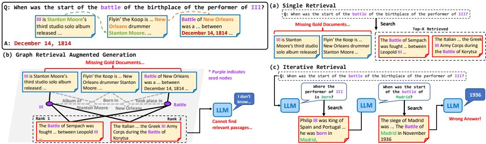
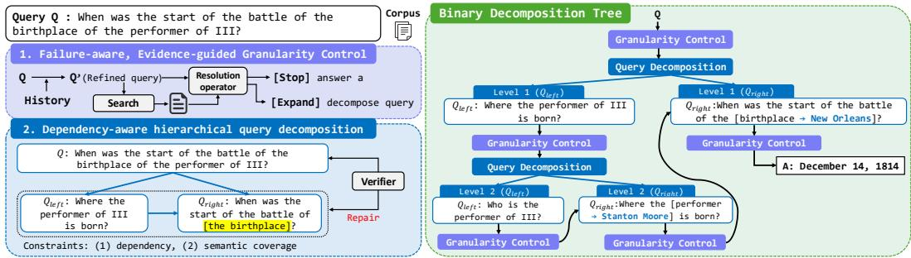
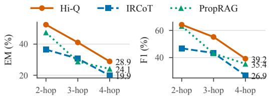
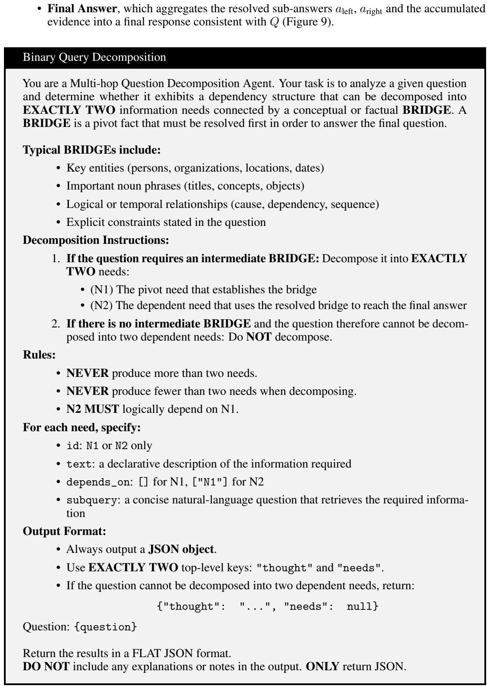
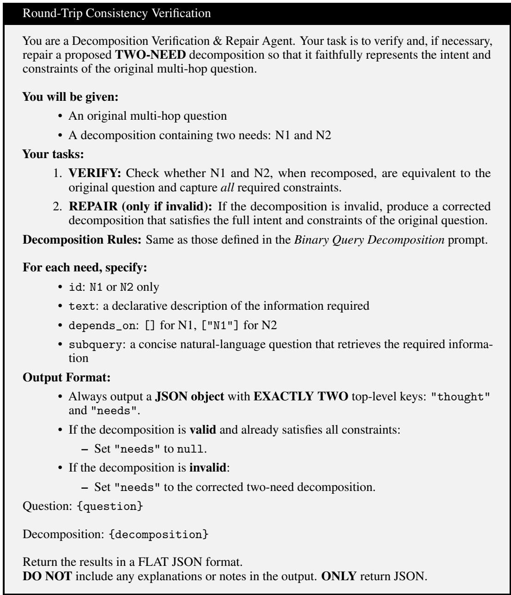
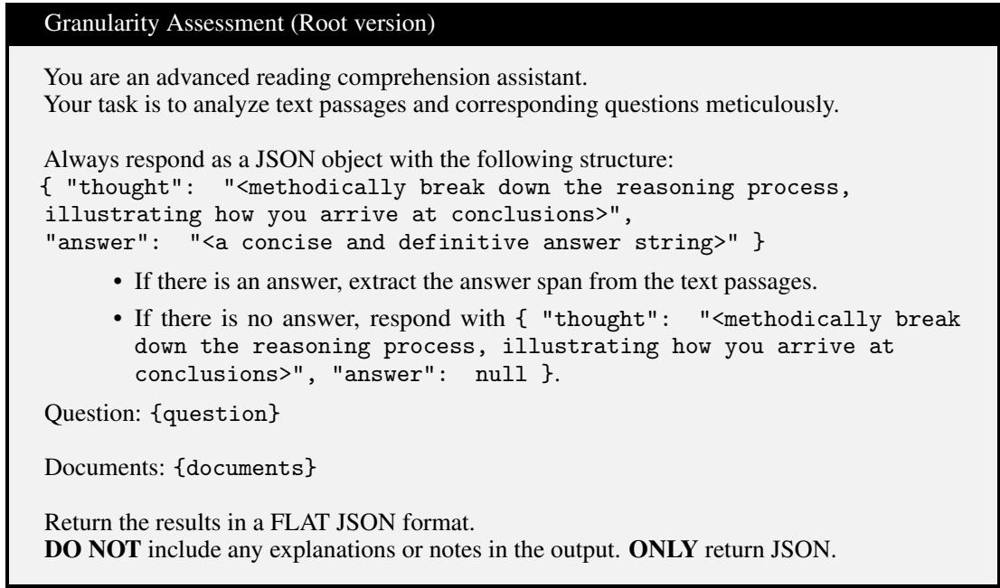
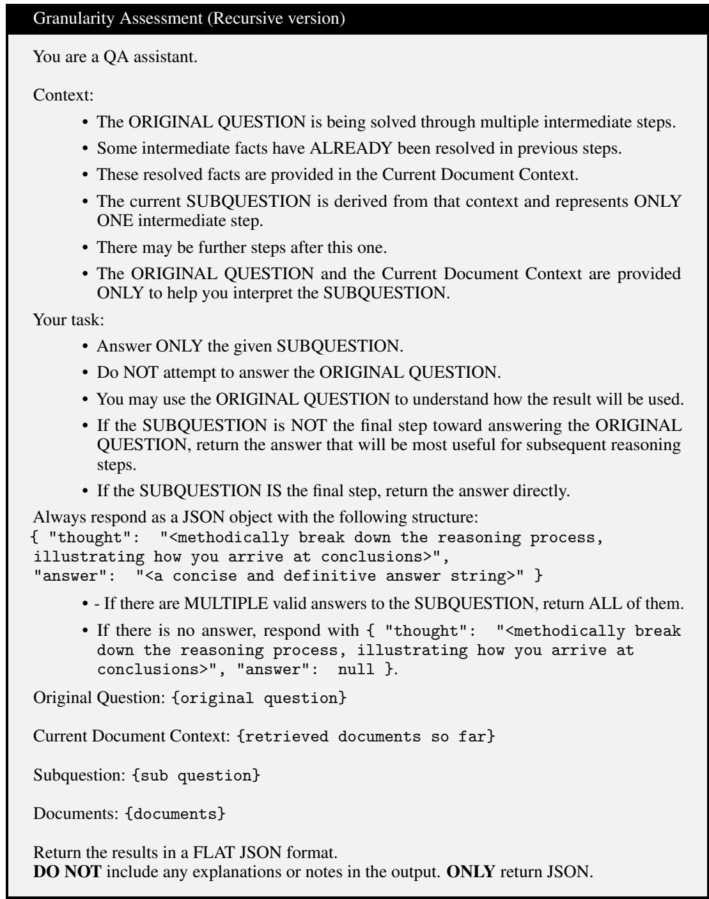
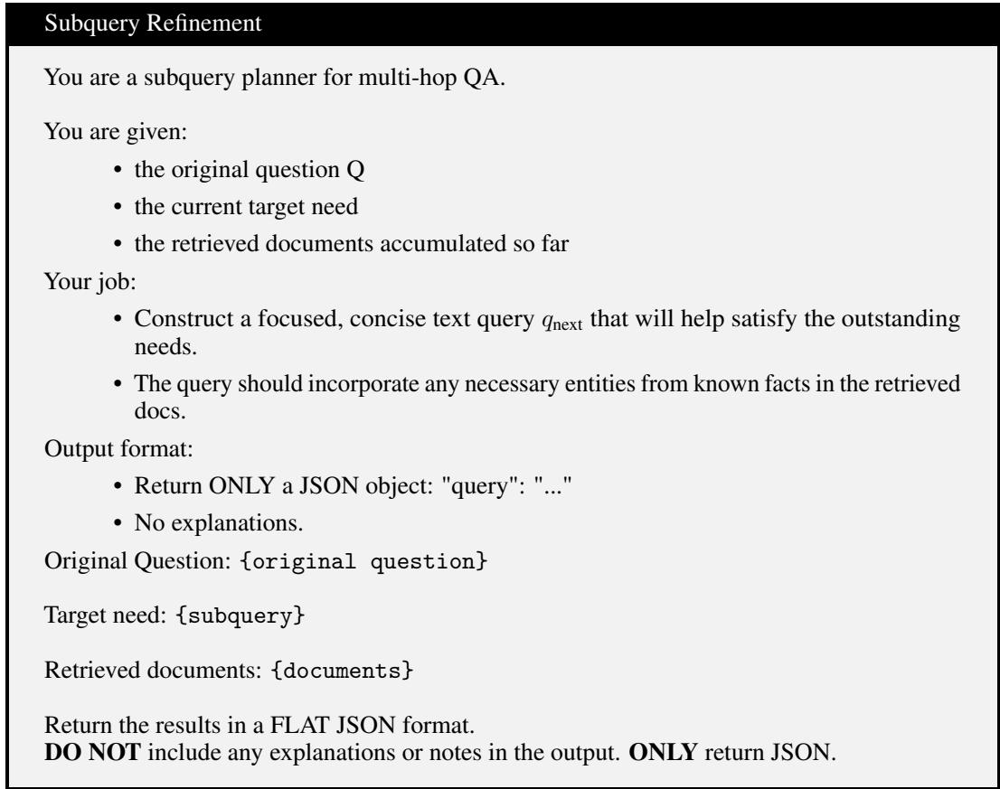
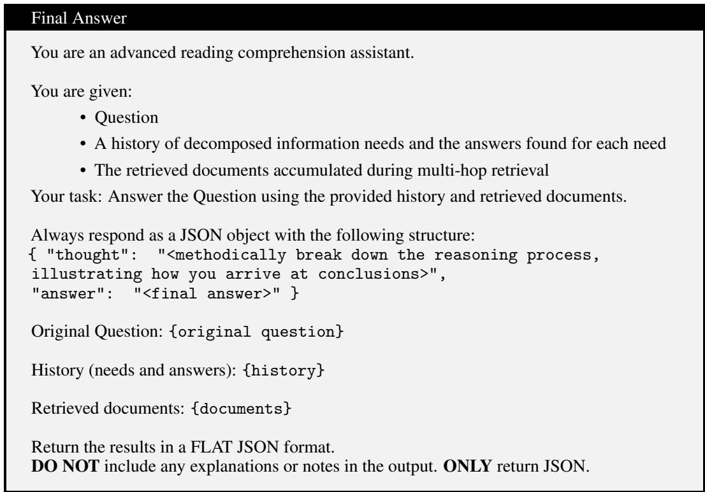

# Hi-Q: Hierarchical Evidence-guided Query Refinement for Multi-Hop Question Answering

Jueun Kim<sup>1</sup> Sungho Park<sup>2</sup> Wook-Shin Han<sup>1∗</sup> <sup>1</sup>Department of Computer Science and Engineering, POSTECH <sup>2</sup>Graduate School of Artificial Intelligence, POSTECH {jekim,shpark,wshan}@dblab.postech.ac.kr

## Abstract

A central bottleneck in multi-hop Question Answering (QA) is that the granularity at which a question is expressed often differs from the granularity at which corpus evidence is retrievable. Existing methods address this mismatch by imposing fixed graph structures over the corpus, by iteratively reformulating the query, or by executing a generated program over it, but these strategies do not explicitly decide when a query unit is already supported by evidence and when it should be refined. We formulate this bottleneck as retrievable granularity discovery and introduce Hi-Q, an evidence-conditioned framework for hierarchical query refinement. At each query node, a resolution operator tests whether retrieved evidence supports the current query unit; resolved nodes terminate, while unresolved nodes are expanded by a dependency-preserving binary operator and checked by a semantic coverage verifier. Hi-Q therefore grows a query tree whose topology is determined by corpus support signals rather than by a fixed decomposition template or a prebuilt graph. We evaluate Hi-Q on three multi-hop QA benchmarks, primarily under full-corpus retrieval, where dependent evidence must be located among open-domain distractors rather than within a small annotated pool. In this setting Hi-Q reaches 52.3 EM and 64.0 F1 averaged over the three benchmarks, ahead of the iterative retrieval baseline IRCoT by 15.1 EM / 18.2 F1 on that same average, and ahead of the graph-based RAG baseline PropRAG by 11.5 EM / 12.0 F1 on MuSiQue-full, without corpus-wide graph construction. In the restricted supporting/distractor setting used by prior work, Hi-Q likewise attains the best accuracy, with 57.9 EM and 69.3 F1 on average, ahead of PropRAG by 5.6 EM / 3.9 F1 and IRCoT by 13.7 EM / 15.8 F1. The project page is available at https://hi-q-project.github.io/.

## 1 Introduction

Multi-hop Question Answering (QA) requires resolving multiple interdependent reasoning steps embedded within a single natural language query. Consider the query in Figure 1: “When was the start of the battle of the birthplace of the performer of III?” Answering this question requires first identifying the performer of “III,” then determining that person’s birthplace, and finally finding the start date of the battle associated with that location. Thus, a single query implicitly compresses a chain of dependent informational needs into one surface form.

A central difficulty in multi-hop QA is that the unit at which a question can be logically expressed is often different from the unit at which evidence can be reliably retrieved. The facts needed to answer a multi-hop question are typically distributed across documents at a fine-grained level, while the input query presents them as a single coarse-grained sentence. As a result, even if a question admits a plausible logical decomposition, it remains unclear a priori which intermediate formulation is best aligned with the corpus for retrieval. Queries that are too coarse entangle multiple reasoning aspects and cause retrieval interference, while queries that are too fine may lose contextual constraints and lead to over-decomposition. Therefore, the key challenge is not merely how to decompose a question logically, but how to discover the retrievable granularity at which each reasoning step becomes operationally answerable.

  
Figure 1: Granularity failures in multi-hop retrieval. (a) Single retrieval, (b) Graph RAG, and (c) iterative retrieval on the same query and corpus.

Figure 1 illustrates three concrete failure modes arising from this granularity mismatch. First, singleshot retrieval fails when a coarse query entangles several reasoning constraints: top-ranked passages may match surface terms such as “III” or “battle” without covering the full evidence chain. Second, Graph RAG methods add corpus-side structure, but their pre-computed graphs impose a fixed, queryagnostic granularity and may reduce reasoning to surface-level seed alignment. Third, iterative retrieval methods adapt the query over time, but their reformulations are not explicitly checked for evidence support, so an early wrong intermediate query can propagate through later retrieval steps. Together, these failures reveal the need for a control mechanism that decides which query unit is currently retrievable under the given corpus.

We introduce Hi-Q, a framework for coarse-to-fine, evidence-guided query refinement that answers these three failures with two coupled mechanisms. Failure-aware granularity control tests whether the current query unit is already supported by retrieved evidence before refining it, so a query that single retrieval or a fixed graph already answers is never decomposed. Dependency-preserving hierarchical decomposition then expands only the unresolved nodes, resolving prerequisite sub-queries before dependent ones so that an unchecked intermediate query cannot propagate, while a semantic coverage verifier confirms that each binary split preserves the intent of its parent. Hi-Q therefore does not assume the retrieval-aligned query unit in advance, but discovers it through retrieval-and-answering feedback.

Our contributions follow this challenge-to-component mapping:

• Retrievable granularity discovery. We formulate multi-hop RAG as the problem of identifying the query unit at which a reasoning step becomes both retrievable and answerable under a given corpus.

• Failure-aware granularity control. We propose an evidence-conditioned control policy that expands a query node only when a resolution operator detects insufficient evidence support, refining coarse queries while avoiding unnecessary decomposition of already answerable queries. We show that this choice is a cost-sensitive threshold on unresolved support.

• Dependency-preserving hierarchical refinement. We introduce a binary expansion operator that resolves prerequisite sub-queries first and propagates their results to downstream retrieval, reducing under-specified retrieval and error propagation.

• Evaluation under full-corpus retrieval. Across three multi-hop benchmarks, Hi-Q outperforms graph-based, iterative, and code-executing agent baselines without pre-built knowledge graphs or task-specific fine-tuning, and a cost-matched configuration is both cheaper and more accurate than iterative retrieval at the same number of LLM calls. We validate the unresolved-support signal through trigger diagnostics, ablations, and reader and embedding substitutions.

## 2 Related Work

Retrieval-Augmented Generation (RAG). Standard RAG holds both ends fixed: the query is issued as written, and the corpus is indexed as flat passages. It integrates external knowledge into LLMs [1], with dense retrievers such as DPR [2] and recent embedding models [3, 4] improving similarity-based evidence acquisition. This is effective when the question and the retrievable evidence already sit at a similar granularity. In multi-hop QA they often do not: a single coarse query matches passages on isolated surface terms while missing the complete reasoning chain [5–7]. This query–evidence granularity mismatch is the gap the remaining lines of work, and Hi-Q, attempt to close.

Graph RAG. Graph-based RAG moves the granularity decision to the corpus side, but makes it before any query arrives. GraphRAG [8] and RAPTOR [9] build hierarchical summaries, while HippoRAG [5, 6] and PropRAG [7] retrieve through graph- or proposition-level structures. These help when the pre-computed units happen to match a question’s evidence needs, but the structure is query-agnostic by construction and carries a corpus-wide pre-computation cost. Hi-Q instead builds a dependency-ordered query tree online and expands only unresolved nodes, without corpus-wide graph construction.

Iterative Retrieval. Iterative retrieval does adapt the query, and it does observe retrieved evidence, yet it never tests whether the query it just issued was retrievable. IRCoT [10], ReAct [11], and Self-Ask [12] alternate reasoning and retrieval, generating each follow-up query from intermediate findings. A reformulation can be logically plausible while still poorly aligned with the atomic facts the corpus exposes, and once an early step selects the wrong bridge entity or drops a constraint, later queries amplify the error. Hi-Q conditions refinement on a resolution test rather than on the reasoning chain: a node is expanded only when its retrieved evidence is insufficient, and dependent sub-queries are grounded in prerequisite facts already accumulated in the history.

Query Decomposition. Decomposition methods also produce sub-queries, but commit to all of them before any evidence is observed. Least-to-Most prompting [13] and Decomposed Prompting [14] decompose at the prompt level, while TRQA [15] and Q-DREAM [16] learn tree-structured or retrieval-oriented sub-questions. These ask how to generate a decomposition; Hi-Q asks when one is needed, because a linguistically valid decomposition can still be unnecessary, over-fragmented, or misaligned with the corpus at hand. Hi-Q therefore treats decomposition as a node-wise control decision, taken against retrieved evidence and constrained by dependency ordering and semantic coverage verification.

Agentic Execution and Learned Strategy Selection. A final line changes how retrieval is orchestrated rather than how each query is expressed. Coding agents treat the corpus as a programmatically accessible environment [17], Recursive Language Models process long contexts through recursive sub-calls [18], and PyRAG [19] specializes this paradigm to multi-hop RAG by representing reasoning as an executable program over retrieval and answering tools. Adaptive-RAG [20] instead learns the strategy itself, routing each question to no, single-step, or multi-step retrieval from its predicted complexity alone. Neither guarantees that a retrieval query is expressed at a corpus-aligned granularity: program execution recovers from execution failures (Appendix M), and query-level routing commits before any evidence is seen (Appendix D). What separates Hi-Q is therefore the state on which control is conditioned, not the presence of learning; a supervised or reinforcement-learned controller observing the same evidence state remains compatible with its interface.

## 3 Method

## 3.1 Problem Formulation

We formulate multi-hop QA as evidence-conditioned adaptive search over query granularity. Hi-Q first tests whether the current query unit is supported by retrieved evidence, and expands it into smaller dependency-aware sub-queries only when the query remains unresolved. This requires an explicit search state, because retrieval feedback determines whether a query should remain at its current coarse granularity or be refined.

  
Figure 2: Overview of Hi-Q. Hi-Q treats multi-hop QA as evidence-conditioned search over query granularity. At each node, the resolution operator first tests whether retrieved evidence supports the current query unit. Resolved nodes terminate; unresolved nodes trigger dependency-ordered binary decomposition, where the prerequisite branch is resolved before the dependent branch. A semantic coverage verifier repairs invalid splits before recursion. The resulting binary decomposition tree is determined by corpus support signals rather than by a fixed graph or a predetermined decomposition template.

Notation. Let C denote the retrieval corpus, $Q$ the original question, and $q$ a query node in the search tree. Let $R _ { k } ( q , C )$ be the retriever that returns the top-k passages for query q. We write H for the accumulated interaction history and d for the current recursion depth.

Search state. Hi-Q maintains a state $\boldsymbol { x } = ( q , \mathcal { H } , d )$ , where $q$ is the current query node, H is the accumulated interaction history, and d is the current recursion depth. The search objective is to find a leaf set whose queries are individually resolvable under corpus evidence and whose dependency composition preserves $Q .$

Resolution operator. Let $\mathcal { G } ( { q } , \mathcal { H } , C ) \ : \ :  \ : \ : ( s , a , D )$ be a resolution operator, where $s \in$ {RESOLVED, UNRESOLVED} is the resolution status, a is an answer when s = RESOLVED, and $D = R _ { k } ( q , C )$ is the retrieved evidence. Once $\mathcal { G }$ has run, the node carries that evidence as well, giving the post-resolution state $\tilde { \boldsymbol { x } } = ( x , D )$ . For analysis only, we additionally assign an optional diagnostic label τ to unresolved cases; τ is not consumed by the control policy.

Policy. The policy acts on that state together with the resolution status, since whether to stop is decided by what the retrieved evidence supported:

$$
\pi ( \tilde { x } , s ) = \left\{ \begin{array} { l l } { \mathrm { { S T O P } } } & { \mathrm { i f ~ } s = \mathrm { r e s o l v e d } } \\ { \mathrm { { F A I L } } } & { \mathrm { i f ~ } d = d _ { \mathrm { m a x } } \mathrm { ~ o r ~ } q \mathrm { ~ i s ~ n o n \mathrm { - } d e c o m p o s a b l e } } \\ { \mathrm { { E X P A N D } } } & { \mathrm { o t h e r w i s e } } \end{array} \right.
$$

Expansion. When EXPAND is selected, a binary expansion operator $B ( q , { \mathcal { H } } , Q )$ proposes a pair $( q _ { \mathrm { l e f t } } , q _ { \mathrm { r i g h t } } )$ subject to two constraints: (i) a dependency constraint $q _ { \mathrm { l e f t } } \ \prec \ q _ { \mathrm { r i g h t } }$ , meaning the prerequisite branch must be resolved before the dependent branch; (ii) a semantic coverage constraint $\mathcal { V } ( Q , q , q _ { \mathrm { l e f t } } , q _ { \mathrm { r i g h t } } )$ , ensuring that resolving $q _ { \mathrm { l e f t } }$ followed by $q _ { \mathrm { r i g h t } }$ recovers the intent of $q$ without omission or drift. The answer to $q _ { \mathrm { l e f t } }$ updates $\mathcal { H }$ before $q _ { \mathrm { r i g h t } }$ is resolved.

## 3.2 Failure-aware, evidence-guided granularity control

Failure-aware control makes decomposition conditional on evidence support rather than on query complexity alone. Hi-Q first attempts to resolve the current query at its existing granularity, because many questions or sub-questions are already answerable once the right evidence is retrieved. For a query $q ,$ the resolution operator $\mathcal { G }$ refines the query, retrieves the top-k passages D from $C ,$ and has a retrieval-grounded reader answer from them, returning whether the node was resolved. Refinement rewrites the current query from the accumulated history $\mathcal { H }$ while keeping it anchored to the original question $Q ,$ and it has to precede retrieval because dependent sub-queries often contain references whose meaning is fixed only by earlier steps. As illustrated in Figure $^ { 2 , }$ after resolving that the performer of $\bf \tilde { \Sigma } ^ { \mathrm { < 6 } } \bar { I I I } ^ { \bf 3 }$ is Stanton Moore, a downstream query about “the birthplace of the performer of $\mathrm { I I I } ^ { \prime \prime }$ can be rewritten as a query about the birthplace of Stanton Moore. This replaces abstract references with resolved entities, reducing retrieval interference while preserving the informational role of the current node in the original multi-hop question.

The decision is a threshold on unresolved support. The STOP/EXPAND decision has two failure modes. A query that is too coarse may entangle several constraints, causing the retriever to surface passages that match isolated terms but miss the full reasoning chain; there, decomposition exposes smaller evidence needs that can be retrieved and verified independently. Conversely, a query that is already answerable should not be split merely because it looks complex, since unnecessary decomposition can drop constraints and introduce spurious intermediate goals. Writing those two errors as costs turns the decision into a threshold. Consider an expansion-admissible node in state ${ \tilde { x } } ,$ and let $Z \in \{ \mathrm { R , U } \}$ denote whether $q$ is resolvable from it. Let $\Delta _ { \mathrm { R } } ( \tilde { x } ) > 0$ be the cost-to-go penalty of expanding a resolvable node and $\Delta _ { \mathrm { U } } ( \tilde { x } ) > 0$ that of stopping at an unresolved one, each measured over the resulting subtree and therefore including descendant retrieval and LLM calls, drift risk, synthesis, and terminal answer loss. Minimizing conditional expected cost yields a threshold rule, derived in Appendix B:

$$
\pi ^ { * } ( \tilde { x } ) = \mathtt { E X P A N D } \iff \operatorname* { P r } [ Z = \mathrm { U } \mid \tilde { x } ] \ \ge \ \frac { \Delta _ { \mathrm { R } } ( \tilde { x } ) } { \Delta _ { \mathrm { R } } ( \tilde { x } ) + \Delta _ { \mathrm { U } } ( \tilde { x } ) } .
$$

Because the objective includes downstream cost-to-go, this decision is node-wise but not myopic; we do not claim global optimality of the resulting query tree, and FAIL is handled separately as a budget or feasibility action. The rule characterizes the decision, not a particular estimator of it.

We estimate it with a training-free test on the reader’s own output. If a $\neq \perp , \mathtt { H i } - \mathtt { Q }$ treats the node as evidence-aligned and stops expanding it; if $a = \perp$ , the retrieved evidence does not jointly support the current query unit, and the node becomes eligible for refinement. This hard classifier $\hat { Z }$ is not claimed to compute the posterior: a calibrated classifier, an entailment model, or a trained cost-sensitive router can replace it without changing $\mathrm { H i - } \mathsf { Q } ^ { \prime } \mathrm { s }$ control semantics, as Appendix C shows. What such a controller must observe is the evidence state itself. When the same query admits opposite optimal actions under different evidence exposure, any policy measurable with respect to the query alone incurs a strictly positive regret that no amount of query-only training data can remove (Appendix B). This is what separates Hi-Q from methods that pick a retrieval strategy from the question before any evidence is seen; Appendix D compares against a learned router of that kind, whose routing collapses to a near-constant policy. Hi-Q therefore uses the reader’s answering failure as an operational test of granularity alignment, and Section 4 evaluates its precision.

## 3.3 Dependency-aware hierarchical query decomposition

Dependency-aware decomposition turns an unresolved query into an ordered split whose sub-goals can be tested against evidence. Hi-Q splits binary rather than N-ary (multi-way) to avoid over-fragmenting the question or skipping essential intermediate bridge facts: unlike a single multi-way split, recursive binary expansion leaves enough context at each step to test, against retrieval feedback, whether a node needs refining further. Splitting in two restricts sequential depth rather than expressiveness: a plan with $m$ leaf information needs is organized as at most $m - 1$ binary reductions, with the expansion operator and the verifier unchanged, and how many reductions occur is decided by the controller, since a node resolvable from its retrieved passages terminates there. Appendix L tests this on a controlled set whose leaf needs rise from two to five: binary expansion holds its accuracy across that range, branching with unrestricted arity does not improve on it, and combining the branches in one flat N-ary step instead of sequential binary reductions is substantially worse.

The expansion operator makes the left branch a prerequisite for the right. Given an unresolved query $q , B ( q , \mathcal { H } , Q )$ proposes exactly two sub-queries: $q _ { \mathrm { l e f t } }$ , which resolves the bridge fact, and $q _ { \mathrm { r i g h t } } .$ which uses that bridge to approach the parent query’s answer. The split follows entity references and relational dependencies (compositional, temporal, or causal) rather than the surface syntax of the question, so the decomposition order matches the order in which retrieval must proceed. That order has to be executed and not merely proposed, because a dependent sub-query is often under-specified until its prerequisite is resolved: Hi-Q resolves $q _ { \mathrm { l e f t } }$ first, writes its answer, retrieved evidence, and intermediate context into the history $\mathcal { H } ,$ and then resolves $q _ { \mathrm { r i g h t } }$ under the updated history. For the running example, the system must identify the performer of $^ { \mathrm { 6 6 } } \mathrm { I I I } ^ { \mathrm { 7 } }$ before it can retrieve evidence about the relevant birthplace and battle. The dependency is enforced at the evidence-state level rather than as a brittle requirement that the left branch must always produce a final answer: even if $q _ { \mathrm { l e f t } }$ remains unresolved, its retrieved evidence and partial context are retained in H to ground the dependent branch.

Semantic coverage verification prevents local decomposition errors from becoming downstream reasoning errors. Before solving the two sub-queries, the verifier V checks whether resolving q<sub>left</sub> followed by $q _ { \mathrm { r i g h t } }$ would recover the intent of $q$ without adding, omitting, or reordering essential constraints. If the split is inconsistent, V repairs the two sub-queries before they enter the recursive solver; we allow at most one repair attempt, and if the revised split is still inconsistent, the node is marked non-decomposable and decomposition stops for that branch. This guardrail is especially important at deeper recursion depths, where a small semantic drift in one split can compound across later branches.

Recursive expansion is bounded so that refinement remains a controlled search rather than an openended reasoning loop. If a sub-query is resolved, recursion stops at that node. If a sub-query is non-decomposable or the maximum depth is reached, the branch returns ⊥ and the solver proceeds with the available evidence. After both branches return, a synthesis step aggregates intermediate answers, retrieved evidence, unresolved sub-goals, and history into a final response consistent with the original query Q. When multiple evidence-supported candidates are retained from earlier resolution steps, synthesis disambiguates them using consistency with other sub-query results rather than committing to the highest-ranked passage alone. Thus, Hi-Q constructs a finite dependency-ordered binary tree whose leaves correspond to the evidence-aligned query units used for final reasoning. The full recursive procedure is presented in Algorithm 1 (Appendix $\mathbf { A } )$ , and the prompt templates are listed in Appendix O.

## 4 Experiments

## 4.1 Experimental Setup

Datasets and evaluation scope. We evaluate Hi-Q on MuSiQue [21], HotpotQA [22], and 2Wiki-MultiHopQA [23], which vary in multi-hop dependency and shortcut availability. Following prior graph-RAG evaluations [5–7], we sample 1,000 validation questions per dataset and evaluate each question under two retrieval regimes: the benchmark’s complete corpus, and a controlled corpus pooled from the supporting and distractor passages the benchmark provides for those sampled questions. We report full-corpus retrieval as the primary evaluation, since it reflects the deployment condition in which retrieval scales to 139,416 passages for MuSiQue, 430,225 for 2WikiMultiHopQA, and 5,233,235 for HotpotQA. The controlled supporting/distractor setting is retained because it enables direct comparison with prior work.

Metrics and statistical protocol. We evaluate both answer correctness and evidence acquisition, reflecting Hi-Q’s goal of finding query units that are both retrievable and answerable. EM and token-level F1 measure final QA accuracy, while Recall@k for $k \in \{ 2 , 5 \}$ measures whether gold supporting documents appear in the retrieved top-k passages. For multi-query methods, we pool passages retrieved across all node- or step-level queries, deduplicate them by retaining the highest embedding score, and globally re-rank the pool before computing Recall@k. This protocol keeps the evaluation budget k fixed across methods while making retrieval volume explicit through the call and token statistics in Table 8. Unless stated otherwise, differences between methods are tested with a paired question-level bootstrap over the per-question predictions behind each table, using 10,000 resamples and 95% percentile intervals. Because all runs use temperature-zero decoding, these intervals quantify uncertainty over the question population rather than run-to-run variability.

Baselines and implementation. The baselines cover the three failure modes in Figure 1: single retrieval tests whether one coarse query suffices; graph-based methods test corpus-side structuring before query-specific reasoning; and iterative or decomposition methods test predefined or modeldriven follow-up query generation. Single retrieval is represented by NV-Embed-v2 [4]; corpus-side structuring by RAPTOR, GraphRAG, HippoRAG, HippoRAG 2, and PropRAG [9, 8, 5–7]; and iterative or decomposition-based generation by Self-Ask, Least-to-Most, and IRCoT [12, 13, 10]. Baselines marked with <sup>∗</sup> in Tables 1 and 2 are reproduced under our setup, while the remaining results are quoted from prior work. We additionally compare against a coding agent [17] and a Recursive

Language Model [18], which cast multi-hop QA as code generation and execution over the corpus. In the full-corpus setting, PropRAG is omitted for HotpotQA-full, because running its LLM-based graph construction over 5.2M passages would cost more than \$2,500 in API calls alone, beyond the budget available to us. All methods use GPT-4o-mini as the reader unless otherwise stated; we additionally evaluate on Llama-3.3-70B and Qwen3-30B-A3B in Appendix F. Hi-Q uses NV-Embed-v2, k = 5, L2-normalized dot-product retrieval, maximum recursion depth $d _ { \operatorname* { m a x } } = 4$ , and temperature 0. The depth limit matches the maximum reasoning depth analyzed in MuSiQue and bounds recursive cost.

## 4.2 Main Results

Hi-Q’s largest gains appear under full-corpus retrieval. We report full-corpus retrieval as the primary evaluation because it reflects the deployment condition in which dependent evidence must be located among open-domain distractors rather than within a small annotated pool. Table 1 evaluates the 1,000-question subsets over each benchmark’s complete corpus, ranging from 139,416 to 5,233,235 passages. Hi-Q reaches 52.3 EM and 64.0 F1 on average, outperforming IRCoT by 15.1 EM / 18.2 F1. The per-benchmark margins are 13.0 EM / 15.8 F1 on MuSiQue-full, 27.0 EM / 32.5 F1 on 2Wiki-full, and 5.4 EM / 6.3 F1 on HotpotQA-full. Hi-Q also surpasses PropRAG by 11.5 EM / 12.0 F1 on MuSiQue-full and by 9.9 EM / 12.1 F1 on 2Wiki-full, the two full-corpus settings in which PropRAG’s corpus-wide graph could be constructed within our compute budget. These margins indicate that hierarchical evidence-guided refinement becomes more valuable, not less, as the retrieval space grows, and that it does not require corpus-wide graph construction.

The gains also hold in the controlled setting used by prior work. Table 2 reports the sampled supporting/distractor setting adopted in previous graph-RAG evaluations, included for comparability rather than as our primary claim. Hi-Q achieves 57.9 EM and 69.3 F1 on average, improving over PropRAG by 5.6 EM / 3.9 F1 and over IRCoT by 13.7 EM / 15.8 F1. The largest gains again occur on MuSiQue, where shortcut reasoning is limited and evidence dependencies must be resolved explicitly: 7.3 EM / 5.0 F1 over PropRAG and 13.1 EM / 14.8 F1 over IRCoT. The gold passages are present in both settings, but here they compete with far fewer candidates, which compresses the differences that the full corpora expose. Every improvement over IRCoT and PropRAG is significant, in all six controlled comparisons and all five full-corpus ones, with 19 of the 22 EM and F1 tests at $p < 1 0 ^ { - 4 }$ The smallest margin, 3.2 F1 over PropRAG on 2Wiki in the controlled setting, reaches p = 0.0033, and the F1 gain over PropRAG on MuSiQue-full has a 95% confidence interval of [+9.44, +14.57].

Agentic execution relocates the granularity problem rather than removing it. Table 1 also reports the coding agent, which accesses the corpus programmatically, and the Recursive Language Model, which processes long contexts through recursive sub-calls. Both run under the standardization applied to every other baseline, which confines the comparison to their control logic; because the original studies use stronger models and different native corpus interfaces, these are controlled adaptations rather than reproductions of their published configurations. Hi-Q improves over them by 30.8 EM / 26.8 F1 and by 24.4 EM / 26.7 F1 on average. Externalizing where computation happens does not settle at what granularity each retrieval call is expressed, so the alignment problem moves to the retrieval-tool boundary instead of disappearing.

Higher raw retrieval recall does not necessarily translate into better multi-hop answers. Self-Ask attains the highest average Recall@5, but it issues more sub-queries and retrieves roughly 33% more documents per question than Hi-Q, and because k is applied per retrieval call while recall is computed over the union of all returned passages, more calls buy a larger effective budget at the same nominal k. A larger candidate pool therefore raises recall mechanically while handing the reader more distractors, and the pooled score says nothing about execution alignment: whether each required passage was visible at the reasoning step that needed it, and whether the information it carried reached final synthesis. Self-Ask accordingly reaches higher average recall with much lower answer accuracy, 35.7 EM against Hi-Q’s 57.9. Hi-Q’s advantage is therefore not raw retrieval volume; it targets query units whose retrieved evidence is also resolvable by the reader.

## 4.3 The Unresolved-Support Signal

The signal is actionable: refinement recovers evidence that root retrieval misses. When root retrieval fails, dependency-aware decomposition recovers supporting evidence that the original query fails to retrieve. On triggered MuSiQue cases, we compare root@5 with Leaf@5, the top-5 of the leaf-union pool ranked by retriever similarity and therefore budget-matched to root@5, and Leaf@all, the full leaf-union. As shown in Table 3, decomposition improves all-gold cover under both matched and unmatched budgets. On the Clean subset, Leaf@5 improves all-gold cover from 7.9% to 42.7% and Leaf@all reaches 57.7%, with answer recovery of 38.7%. Because most of the full Leaf@all gain is already achieved at the matched Leaf@5 budget, the improvement is not merely due to retrieving more passages; decomposition surfaces gold passages that root retrieval fails to rank highly.

Table 1: Primary evaluation. Performance under full-corpus retrieval over each benchmark’s complete corpus. Bold indicates the best value in each column. <sup>∗</sup>Results are reproduced. <sup>†</sup>PropRAG is reported only on MuSiQue-full and 2Wiki-full.
<table><tr><td rowspan="2">Method</td><td colspan="4">MuSiQue-full</td><td colspan="4">2Wiki-full</td><td colspan="4">HotpotQA-full</td></tr><tr><td>EM</td><td>F1</td><td>R@2</td><td>R@5</td><td>EM</td><td>F1</td><td>R@2</td><td>R@5</td><td>EM</td><td>F1</td><td></td><td>R@2 R@5</td></tr><tr><td>PropRAG*,†</td><td>25.8</td><td>38.6</td><td>44.4</td><td>57.9</td><td>52.1</td><td>59.3</td><td>56.3</td><td>74.7</td><td></td><td>N/A</td><td></td><td></td></tr><tr><td>Self-Ask*</td><td>22.2</td><td>28.1</td><td>49.9</td><td>65.2</td><td>41.7</td><td>46.9</td><td>62.0</td><td>89.9</td><td>30.0</td><td>37.5</td><td>63.2</td><td>74.5</td></tr><tr><td>Least-to-Most*</td><td>24.3</td><td>34.0</td><td>44.4</td><td>56.3</td><td>30.7</td><td>34.0</td><td>57.8</td><td>68.2</td><td>45.4</td><td>59.1</td><td>58.8</td><td>71.0</td></tr><tr><td>IRCoT*</td><td>24.4</td><td>34.9</td><td>46.9</td><td>63.0</td><td>35.0</td><td>38.9</td><td>57.5</td><td>76.9</td><td>52.0</td><td>63.6</td><td>68.9</td><td>80.2</td></tr><tr><td>Coding agent*</td><td>16.8</td><td>29.6</td><td>43.7</td><td>58.4</td><td>16.5</td><td>34.7</td><td>59.9</td><td>81.1</td><td>31.1</td><td>47.1</td><td>64.9</td><td>76.6</td></tr><tr><td>RLM*</td><td>19.6</td><td>29.1</td><td>21.7</td><td>29.7</td><td>34.0</td><td>41.6</td><td>25.9</td><td>35.4</td><td>30.1</td><td>41.1</td><td>21.5</td><td>25.8</td></tr><tr><td>Hi-Q</td><td>37.4</td><td>50.6</td><td>53.4</td><td>70.8</td><td>62.0</td><td>71.4</td><td>61.0</td><td>86.3</td><td>57.4</td><td>69.9</td><td>70.5</td><td>82.0</td></tr></table>

Table 2: Controlled setting. QA and retrieval performance over the sampled supporting/distractor pool, reported for comparability with prior work. Bold indicates the best value in each column. <sup>∗</sup>Results are reproduced.
<table><tr><td rowspan="2">Method</td><td colspan="4">HotpotQA</td><td colspan="4">MuSiQue</td><td colspan="4">2Wiki</td><td colspan="4">Avg</td></tr><tr><td>EM</td><td>F1</td><td>R@2</td><td>R@5</td><td>EM</td><td>F1</td><td>R@2</td><td>R@5</td><td>EM</td><td>F1</td><td>R@2</td><td>R@5</td><td>EM</td><td>F1</td><td>R@2</td><td>R@5</td></tr><tr><td>NV-embed-v2</td><td>57.3</td><td>71.0</td><td>84.1</td><td>94.5</td><td>32.8</td><td>46.0</td><td>52.7</td><td>69.7</td><td>54.4</td><td>60.8</td><td>67.1</td><td>76.5</td><td>48.2</td><td>59.3</td><td>68.0</td><td>80.2</td></tr><tr><td>RAPTOR</td><td>50.6</td><td>64.7</td><td>78.6</td><td>90.2</td><td>27.7</td><td>39.2</td><td>49.1</td><td>61.0</td><td>39.7</td><td>48.4</td><td>58.4</td><td>66.0</td><td>39.3</td><td>50.8</td><td>62.0</td><td>72.4</td></tr><tr><td>GraphRAG</td><td>51.4</td><td>67.6</td><td></td><td></td><td>27.0</td><td>42.0</td><td>一</td><td></td><td>45.7</td><td>61.0</td><td></td><td></td><td>41.4</td><td>56.9</td><td></td><td></td></tr><tr><td>HippoRAG</td><td>46.3</td><td>60.0</td><td>60.1</td><td>78.5</td><td>24.0</td><td>35.9</td><td>41.8</td><td>52.4</td><td>59.4</td><td>67.3</td><td>68.4</td><td>87.0</td><td>43.2</td><td>54.4</td><td>56.8</td><td>72.6</td></tr><tr><td>HippoRAG 2</td><td>56.3</td><td>71.1</td><td>80.5</td><td>95.7</td><td>35.0</td><td>49.3</td><td>53.5</td><td>74.2</td><td>60.5</td><td>69.7</td><td>74.6</td><td>90.2</td><td>50.6</td><td>63.4</td><td>69.5</td><td>86.7</td></tr><tr><td>PropRAG*</td><td>59.1</td><td>73.8</td><td>85.1</td><td>96.9</td><td>37.7</td><td>52.2</td><td>55.2</td><td>75.8</td><td>60.2</td><td>70.2</td><td>74.8</td><td>91.3</td><td>52.3</td><td>65.4</td><td>71.7</td><td>88.0</td></tr><tr><td>Self-Ask*</td><td>45.4</td><td>62.3</td><td>82.5</td><td>92.6</td><td>29.2</td><td>43.8</td><td>60.0</td><td>77.4</td><td>32.6</td><td>58.7</td><td>84.4</td><td>98.8</td><td>35.7</td><td>54.9</td><td>75.6</td><td>89.6</td></tr><tr><td>Least-to-Most*</td><td>55.9</td><td>71.3</td><td>78.5</td><td>92.4</td><td>29.1</td><td>39.5</td><td>51.8</td><td>66.2</td><td>37.0</td><td>41.5</td><td>68.0</td><td>75.2</td><td>40.7</td><td>50.8</td><td>66.1</td><td>77.9</td></tr><tr><td>IRCoT*</td><td>59.9</td><td>72.0</td><td>85.2</td><td>95.2</td><td>31.9</td><td>42.4</td><td>55.9</td><td>74.0</td><td>40.9</td><td>46.0</td><td>76.8</td><td>90.8</td><td>44.2</td><td>53.5</td><td>72.6</td><td>86.7</td></tr><tr><td>Hi-Q</td><td>64.3</td><td>77.4</td><td>85.8</td><td>96.2</td><td>45.0</td><td>57.2</td><td>56.9</td><td>75.7</td><td>64.5</td><td>73.4</td><td>78.5</td><td>93.4</td><td>57.9</td><td>69.3</td><td>73.7</td><td>88.4</td></tr></table>

Table 3: Trigger recovery on MuSiQue. Clean excludes the 366 annotation-error questions. “EMrecov” reports the fraction of triggered cases the system ultimately answers correctly (EM= 1).
<table><tr><td>Split</td><td>Root@5</td><td>Leaf@5</td><td>Leaf@all</td><td>∆@5</td><td>∆@all</td><td>EM-recov</td></tr><tr><td>All (nt=503)</td><td>7.0</td><td>32.0</td><td>47.7</td><td>+25.0</td><td>+40.8</td><td>31.0</td></tr><tr><td>Clean (nt=279)</td><td>7.9</td><td>42.7</td><td>57.7</td><td>+34.8</td><td>+49.8</td><td>38.7</td></tr></table>

The signal is precise enough to route decomposition without a learned classifier. Hi-Q uses a deterministic trigger: a node is expanded only when the resolution operator returns a = ⊥. What matters is not why each unresolved-support signal arose, but how often one is raised while the retrieved evidence does support the current query, since that is the only case in which withholding an answer is the wrong action. To test this, we manually analyze 100 randomly sampled a = ⊥ triggers on MuSiQue and group them by cause in Table 4. Annotation errors (14%) reflect defective benchmark evidence and malformed sub-queries (10%) are upstream formulation failures; in both the evidence genuinely fails to support the query, so abstaining is the correct action and neither counts as a trigger error. Only false abstention (7%) and reader failure (3%) do, giving an unambiguous falsetrigger rate of 10%: the trigger fires on a genuinely unresolved query–evidence state in approximately 90% of cases.

The signal is conservative under both answerable and adversarially unanswerable inputs. A useful trigger should avoid two opposite failures: over-refusal, where the reader returns a = ⊥ despite adequate evidence, and hallucination, where the reader answers despite insufficient evidence. We measure these failures using False Rejection Rate (FRR) on 100 normal MuSiQue queries and False Acceptance Rate (FAR) on 50 adversarially unanswerable MuSiQue queries constructed by replacing answerable conditions following the SQuAD 2.0 methodology [24]. For diagnosis only, null outputs include a failure-type label not used by the decomposition policy. Table 5 shows FRR = 11% on normal queries, with all 11 null outputs labeled as missing or incomplete evidence rather than blind abstention. On adversarial unanswerable queries, Hi-Q identifies 49 of 50 as unanswerable, yielding FAR = 2%. Thus, the unresolved-support signal remains conservative while reducing unsupported answering when corpus evidence is absent.

Table 4: Causal taxonomy of a=⊥ triggers: why a node was unresolved, not an estimate of trigger precision.
<table><tr><td>Trigger Cause</td><td>Prop. (%)</td></tr><tr><td>Granularity Mismatch</td><td>66</td></tr><tr><td>Annotation Error</td><td>14</td></tr><tr><td>Malformed Subquery</td><td>10</td></tr><tr><td>False Abstention</td><td>7</td></tr><tr><td>Reader Failure</td><td>3</td></tr></table>

Table 5: Failure signal robustness on MuSiQue.
<table><tr><td colspan="3">Normal (N=100) Adversarial (N=50)</td></tr><tr><td>a=⊥ outputs by failure type:</td><td></td><td></td></tr><tr><td>Missing</td><td>7</td><td>35</td></tr><tr><td>Incomplete</td><td>4</td><td>13</td></tr><tr><td>Conflicting</td><td>0</td><td>1</td></tr><tr><td>Total a=⊥</td><td>11</td><td>49</td></tr><tr><td>Hallucinated (non-⊥)</td><td></td><td>1</td></tr><tr><td>Failure rate</td><td>FRR = 11%</td><td>FAR = 2%</td></tr></table>

## 4.4 Component Ablations and Reasoning Depth

Each part of the control loop earns its cost. Table 6 isolates the two main design choices behind Hi-Q. Removing hierarchical refinement and using a static one-shot decomposition reduces average performance from 57.9 EM / 69.3 F1 to 51.5 EM / 63.7 F1, showing that retrieval feedback is needed to adjust granularity. Removing dependency awareness causes a larger drop to 47.1 EM / 56.0 F1, because dependent sub-queries can become under-specified when issued before prerequisite facts are resolved. Finally, replacing the failure-aware trigger with an always-decompose policy reduces performance from 60.7 EM / 70.8 F1 to 57.3 EM / 68.5 F1 on the sampled 100-query setting. This shows that unconditional decomposition fragments already answerable queries, while Hi-Q’s trigger expands only when evidence support is insufficient. Because always-decompose is the limiting case of over-triggering, firing on every query, this 3.4-point drop also bounds what any trigger error can cost. Round-trip verification is the remaining component, and it acts mainly as a safety mechanism at depth: removing it has a small overall effect, but the gap widens with reasoning depth (Table 7), reaching 1.0 F1 at 4-hop depth on MuSiQue, where decomposition errors can compound across successive splits. The verifier repairs 14.8–18.8% of triggered decompositions, with per-dataset trigger and repair frequencies in Appendix H.

Table 6: Control-flow ablation of Hi-Q. Bold indicates the best value in each column. <sup>†</sup>100 randomly sampled queries due to the prohibitive cost of recursive always-decompose.
<table><tr><td rowspan="2">Setting</td><td colspan="2">HotpotQA</td><td colspan="2">MuSiQue</td><td colspan="2">2Wiki</td><td colspan="2">Avg</td></tr><tr><td>EM</td><td>F1</td><td>EM</td><td>F1</td><td>EM</td><td>F1</td><td>EM</td><td>F1</td></tr><tr><td colspan="9">Decomposition variant (full subset):</td></tr><tr><td>Hi-Q</td><td>64.3</td><td>77.4</td><td>45.0</td><td>57.2</td><td>64.5</td><td>73.4</td><td>57.9</td><td>69.3</td></tr><tr><td>w/o Hierarchical Decomp.</td><td>58.0</td><td>73.6</td><td>39.0</td><td>51.2</td><td>57.6</td><td>66.3</td><td>51.5</td><td>63.7</td></tr><tr><td>w/o Dependency-aware Decomp.</td><td>62.5</td><td>74.9</td><td>34.2</td><td>43.2</td><td>44.5</td><td>50.0</td><td>47.1</td><td>56.0</td></tr><tr><td colspan="9">Triggering policy (N=100 sampled queries†):</td></tr><tr><td>Hi-Q (Failure-aware)</td><td>62.0</td><td>76.6</td><td>49.0</td><td>57.2</td><td>71.0</td><td>78.7</td><td>60.7</td><td>70.8</td></tr><tr><td>Always-decompose</td><td>58.0</td><td>75.3</td><td>45.0</td><td>53.4</td><td>69.0</td><td>76.9</td><td>57.3</td><td>68.5</td></tr></table>

Hi-Q degrades more gracefully than baselines as reasoning depth increases. Figure 3 stratifies MuSiQue performance by hop count. All methods lose performance as the number of reasoning hops increases, but Hi-Q retains higher F1 than IRCoT and PropRAG at each depth. At 3 and 4 hops, Hi-Q reaches 55.2 and 39.2 F1, compared with 43.4 and 35.4 for IRCoT and 43.1 and 26.9 for PropRAG. This supports the mechanism in Section 3: dependency-ordered resolution mitigates error propagation in deeper chains.

Table 7: Verification ablation by hop count.
<table><tr><td>Hop</td><td>Hi-Q</td><td>w/o RT</td></tr><tr><td>Overall</td><td>57.2</td><td>56.5</td></tr><tr><td>2-hop</td><td>64.3</td><td>63.7</td></tr><tr><td>3-hop</td><td>55.2</td><td>54.4</td></tr><tr><td>4-hop</td><td>39.2</td><td>38.2</td></tr></table>

Figure 3: EM, F1 score across hop counts.  
  
Number of Reasoning Hops

## 4.5 Computational Cost

Hi-Q is faster than PropRAG’s 23.1 seconds, a figure that covers graph traversal but not corpus-wide graph construction (Table 8). Against IRCoT the trade is less uniform: Hi-Q uses 70.5% fewer tokens in total, but takes 2.11× the mean latency, 1.95× the LLM calls, and 7.54× the output tokens. That overhead is recursive and therefore conditional: every node pays for the resolution step, but decomposition, verification, and descendant resolution are invoked only when the node is unresolved, so a query that is answerable at its current granularity terminates without them. It is also a setting rather than a fixed property of the method. Hi-Q (cost-matched) shortens rationales and caps recursion depth at 1, so the root may still be expanded once but its children are not, leaving the control policy and every operator unchanged. At essentially the same number of LLM calls as IRCoT (2.93 versus 2.92), it uses 9.4× fewer input tokens, runs 25% faster, and costs 8.6× less per question in API tokens at GPT-4o-mini list prices (\$0.15 and \$0.60 per 1M input and output tokens as of August 2026), while improving accuracy by 10.4 EM / 11.6 F1 macro-averaged over the three benchmarks, with the EM gain holding on all three from +3.5 to +18.1 (paired bootstrap, all $p \leq 0 . 0 0 3 6 )$ . Its output generation nonetheless remains 77% higher than IRCoT’s, 131 versus 74 tokens, so this point is cheaper without being uniformly lighter. The full configuration adds a further 3.3 EM / 4.2 F1 at roughly one third of IRCoT’s API token cost.

Table 8: Computational cost per question, macro-averaged over the three benchmarks. Costs cover reader (LLM) usage only; retrieval and embedding are excluded.
<table><tr><td>Method</td><td>Latency (s)</td><td>LLM Calls</td><td>Input toks</td><td>Output toks</td></tr><tr><td>PropRAG</td><td>23.1</td><td>1</td><td>1,411</td><td>88</td></tr><tr><td>IRCoT</td><td>6.4</td><td>2.92</td><td>43,701</td><td>74</td></tr><tr><td>Self-Ask</td><td>8.0</td><td>6.36</td><td>4,591</td><td>98</td></tr><tr><td>Least-to-Most</td><td>11.0</td><td>5.38</td><td>6,874</td><td>424</td></tr><tr><td>Hi-Q (cost-matched)</td><td>4.8</td><td>2.93</td><td>4,641</td><td>131</td></tr><tr><td>Hi-Q (full)</td><td>13.5</td><td>5.7</td><td>12,343</td><td>558</td></tr></table>

## 5 Conclusion

The main finding of this work is that multi-hop RAG benefits from treating query granularity as a control variable rather than as a fixed design choice. Hi-Q operationalizes this idea by testing each query node against retrieved evidence, expanding only unresolved nodes, and preserving prerequisite-to-dependent ordering during refinement. Across full-corpus and controlled settings, this evidence-conditioned control improves answer accuracy over graph-based, iterative, and codeexecuting agent baselines while avoiding corpus-wide knowledge graph construction. More broadly, multi-hop retrieval should be viewed not only as a problem of finding more passages, but as a problem of discovering the query granularity at which each reasoning step becomes retrievable and answerable.

## References

[1] Patrick Lewis, Ethan Perez, Aleksandra Piktus, Fabio Petroni, Vladimir Karpukhin, Naman Goyal, Heinrich Küttler, Mike Lewis, Wen-tau Yih, Tim Rocktäschel, et al. Retrieval-augmented generation for knowledge-intensive nlp tasks. Advances in neural information processing systems, 33:9459–9474, 2020.

[2] Vladimir Karpukhin, Barlas Oguz, Sewon Min, Patrick Lewis, Ledell Wu, Sergey Edunov, Danqi Chen, and Wen-tau Yih. Dense passage retrieval for open-domain question answering. In Proceedings of the 2020 Conference on Empirical Methods in Natural Language Processing (EMNLP), pages 6769–6781, 2020.

[3] Gautier Izacard, Mathilde Caron, Lucas Hosseini, Sebastian Riedel, Piotr Bojanowski, Armand Joulin, and Edouard Grave. Unsupervised dense information retrieval with contrastive learning. Transactions on Machine Learning Research.

[4] Chankyu Lee, Rajarshi Roy, Mengyao Xu, Jonathan Raiman, Mohammad Shoeybi, Bryan Catanzaro, and Wei Ping. Nv-embed: Improved techniques for training llms as generalist embedding models. In The Thirteenth International Conference on Learning Representations.

[5] Bernal Jimenez Gutierrez, Yiheng Shu, Yu Gu, Michihiro Yasunaga, and Yu Su. Hipporag: Neurobiologically inspired long-term memory for large language models. Advances in Neural Information Processing Systems, 37:59532–59569, 2024.

[6] Bernal Jiménez Gutiérrez, Yiheng Shu, Weijian Qi, Sizhe Zhou, and Yu Su. From rag to memory: Non-parametric continual learning for large language models. In Forty-second International Conference on Machine Learning.

[7] Jingjin Wang and Jiawei Han. PropRAG: Guiding retrieval with beam search over proposition paths. In Christos Christodoulopoulos, Tanmoy Chakraborty, Carolyn Rose, and Violet Peng, editors, Proceedings of the 2025 Conference on Empirical Methods in Natural Language Processing, pages 6212–6227, Suzhou, China, November 2025. Association for Computational Linguistics. ISBN 979-8-89176-332-6. doi: 10.18653/v1/2025.emnlp-main.317. URL https: //aclanthology.org/2025.emnlp-main.317/.

[8] Darren Edge, Ha Trinh, Newman Cheng, Joshua Bradley, Alex Chao, Apurva Mody, Steven Truitt, Dasha Metropolitansky, Robert Osazuwa Ness, and Jonathan Larson. From local to global: A graph rag approach to query-focused summarization. arXiv preprint arXiv:2404.16130, 2024.

[9] Parth Sarthi, Salman Abdullah, Aditi Tuli, Shubh Khanna, Anna Goldie, and Christopher D Manning. Raptor: Recursive abstractive processing for tree-organized retrieval. In The Twelfth International Conference on Learning Representations, 2024.

[10] Harsh Trivedi, Niranjan Balasubramanian, Tushar Khot, and Ashish Sabharwal. Interleaving retrieval with chain-of-thought reasoning for knowledge-intensive multi-step questions. In Proceedings ofthe 61st annual meeting ofthe associationfor computational linguistics (volume 1: long papers), pages 10014–10037, 2023.

[11] Shunyu Yao, Jeffrey Zhao, Dian Yu, Nan Du, Izhak Shafran, Karthik R Narasimhan, and Yuan Cao. React: Synergizing reasoning and acting in language models. In The eleventh international conference on learning representations, 2022.

[12] Ofir Press, Muru Zhang, Sewon Min, Ludwig Schmidt, Noah A. Smith, and Mike Lewis. Measuring and narrowing the compositionality gap in language models, 2023. URL https: //arxiv.org/abs/2210.03350.

[13] Denny Zhou, Nathanael Schärli, Le Hou, Jason Wei, Nathan Scales, Xuezhi Wang, Dale Schuurmans, Claire Cui, Olivier Bousquet, Quoc Le, and Ed Chi. Least-to-most prompting enables complex reasoning in large language models, 2023. URL https://arxiv.org/abs/ 2205.10625.

[14] Tushar Khot, Harsh Trivedi, Matthew Finlayson, Yao Fu, Kyle Richardson, Ashish Sabharwal, and Peter Clark. Decomposed prompting: A modular approach for solving complex tasks. In The Eleventh International Conference on Learning Representations (ICLR), 2023.

[15] Kun Zhang, Jiali Zeng, Fandong Meng, Yuanzhuo Wang, Shiqi Sun, Long Bai, Huawei Shen, and Jie Zhou. Tree-of-reasoning question decomposition for complex question answering with large language models. In Proceedings ofthe AAAI Conference on artificial intelligence, volume 38, pages 19560–19568, 2024.

[16] Linhao Ye, Lang Yu, Zhikai Lei, Qin Chen, Jie Zhou, and Liang He. Optimizing question semantic space for dynamic retrieval-augmented multi-hop question answering. In Proceedings of the 63rd Annual Meeting of the Association for Computational Linguistics (Volume 1: Long Papers), pages 17814–17824, Vienna, Austria, 2025. Association for Computational Linguistics. URL https://aclanthology.org/2025.acl-long.871/.

[17] Weili Cao, Xunjian Yin, Bhuwan Dhingra, and Shuyan Zhou. Coding agents are effective long-context processors, 2026. URL https://arxiv.org/abs/2603.20432.

[18] Alex L. Zhang, Tim Kraska, and Omar Khattab. Recursive language models, 2026. URL https://arxiv.org/abs/2512.24601.

[19] Jiashuo Sun, Jimeng Shi, Yixuan Xie, Saizhuo Wang, Jash Rajesh Parekh, Pengcheng Jiang, Zhiyi Shi, Jiajun Fan, Qinglong Zheng, Peiran Li, Shaowen Wang, Ge Liu, and Jiawei Han. Retrieval is cheap, show me the code: Executable multi-hop reasoning for retrieval-augmented generation, 2026. URL https://arxiv.org/abs/2605.12975.

[20] Soyeong Jeong, Jinheon Baek, Sukmin Cho, Sung Ju Hwang, and Jong C. Park. Adaptive-rag: Learning to adapt retrieval-augmented large language models through question complexity, 2024. URL https://arxiv.org/abs/2403.14403.

[21] Harsh Trivedi, Niranjan Balasubramanian, Tushar Khot, and Ashish Sabharwal. Musique: Multihop questions via single-hop question composition. Transactions of the Association for Computational Linguistics, 10:539–554, 2022.

[22] Zhilin Yang, Peng Qi, Saizheng Zhang, Yoshua Bengio, William Cohen, Ruslan Salakhutdinov, and Christopher D Manning. Hotpotqa: A dataset for diverse, explainable multi-hop question answering. In Proceedings ofthe 2018 conference on empirical methods in natural language processing, pages 2369–2380, 2018.

[23] Xanh Ho, Anh-Khoa Duong Nguyen, Saku Sugawara, and Akiko Aizawa. Constructing a multi-hop qa dataset for comprehensive evaluation of reasoning steps. In Proceedings of the 28th International Conference on Computational Linguistics, pages 6609–6625, 2020.

[24] Pranav Rajpurkar, Robin Jia, and Percy Liang. Know what you don’t know: Unanswerable questions for SQuAD. In Proceedings of the 56th Annual Meeting of the Association for Computational Linguistics (Volume 2: Short Papers), pages 784–789, 2018.

[25] Aaron Grattafiori et al. The llama 3 herd of models. arXiv preprint arXiv:2407.21783, 2024.

[26] An Yang et al. Qwen3 technical report. arXiv preprint arXiv:2505.09388, 2025.

[27] Akari Asai, Zeqiu Wu, Yizhong Wang, Avirup Sil, and Hannaneh Hajishirzi. Self-rag: Learning to retrieve, generate, and critique through self-reflection, 2023. URL https://arxiv.org/ abs/2310.11511.

[28] Chia-Yuan Chang, Zhimeng Jiang, Vineeth Rakesh, Menghai Pan, Chin-Chia Michael Yeh, Guanchu Wang, Mingzhi Hu, Zhichao Xu, Yan Zheng, Mahashweta Das, and Na Zou. MAIN-RAG: Multi-agent filtering retrieval-augmented generation. In Wanxiang Che, Joyce Nabende, Ekaterina Shutova, and Mohammad Taher Pilehvar, editors, Proceedings ofthe 63rd Annual Meeting of the Association for Computational Linguistics (Volume 1: Long Papers), pages 2607–2622, Vienna, Austria, July 2025. Association for Computational Linguistics. ISBN 979-8-89176-251-0. doi: 10.18653/v1/2025.acl-long.131. URL https://aclanthology. org/2025.acl-long.131/.

[29] Ivan Stelmakh, Yi Luan, Bhuwan Dhingra, and Ming-Wei Chang. Asqa: Factoid questions meet long-form answers, 2022. URL https://arxiv.org/abs/2204.06092.

[30] Angela Fan, Yacine Jernite, Ethan Perez, David Grangier, Jason Weston, and Michael Auli. Eli5: Long form question answering, 2019. URL https://arxiv.org/abs/1907.09190.

[31] Akari Asai, Jungo Kasai, Jonathan H. Clark, Kenton Lee, Eunsol Choi, and Hannaneh Hajishirzi. Xor qa: Cross-lingual open-retrieval question answering, 2020. URL https://arxiv.org/ abs/2010.11856. NAACL-HLT 2021.

[32] Shayne Longpre, Yi Lu, and Joachim Daiber. Mkqa: A linguistically diverse benchmark for multilingual open domain question answering, 2020. URL https://arxiv.org/abs/2007. 15207.

[33] Anastasia Krithara, Anastasios Nentidis, Konstantinos Bougiatiotis, and Georgios Paliouras. Bioasq-qa: A manually curated corpus for biomedical question answering. Scientific Data, 10 (170), 2023. doi: 10.1038/s41597-023-02068-4.

[34] Pranab Islam, Anand Kannappan, Douwe Kiela, Rebecca Qian, Nino Scherrer, and Bertie Vidgen. Financebench: A new benchmark for financial question answering, 2023. URL https://arxiv.org/abs/2311.11944.

[35] Wenhu Chen, Hanwen Zha, Zhiyu Chen, Wenhan Xiong, Hong Wang, and William Wang. Hybridqa: A dataset of multi-hop question answering over tabular and textual data, 2020. URL https://arxiv.org/abs/2004.07347. Findings of EMNLP 2020.

[36] Wenhu Chen, Ming-Wei Chang, Eva Schlinger, William Wang, and William W. Cohen. Open question answering over tables and text, 2020. URL https://arxiv.org/abs/2010.10439. ICLR 2021.

[37] Alon Talmor, Ori Yoran, Amnon Catav, Dan Lahav, Yizhong Wang, Akari Asai, Gabriel Ilharco, Hannaneh Hajishirzi, and Jonathan Berant. Multimodalqa: Complex question answering over text, tables and images, 2021. URL https://arxiv.org/abs/2104.06039. ICLR 2021.

[38] Yingshan Chang, Mridu Narang, Hisami Suzuki, Guihong Cao, Jianfeng Gao, and Yonatan Bisk. Webqa: Multihop and multimodal qa, 2021. URL https://arxiv.org/abs/2109.00590.

## A Algorithm

Algorithm 1 instantiates the evidence-conditioned search policy formalized in Section 3.1. Each line annotated with a π-action corresponds to one of the policy’s three decisions (STOP, FAIL, EXPAND). The three operators are realized as prompted-LLM modules whose prompts are listed in Appendix O: the resolution operator $\mathcal { G }$ encapsulates query refinement, retrieval, and reference-aware answering, returning the resolution status $s \in$ {resolved, unresolved} together with the answer a and retrieved evidence $D ;$ the binary expansion operator B proposes a dependency-ordered pair of sub-queries; the semantic coverage verifier V checks and repairs the split before recursion. The interaction history H is updated in place, so the right branch is resolved under an H already containing the answer to the left branch.

```latex
Algorithm 1 Evidence-conditioned hierarchical query refinement (Hi-Q).
Require: Original query $Q ,$ corpus C, retrieval size k, max recursion depth $d _ { \mathrm { m a x } }$
Ensure: Final answer A
1: $\mathcal { H }  [ ]$ {interaction history}
2: $A  \dot { \operatorname { S o L v E } } ( Q , \mathcal { H } , 0 )$
3: return A
4: function $\operatorname { S o L V E } ( q , { \mathcal { H } } , d )$
5: $( s , a , D )  \mathcal { G } ( q , \mathcal { H } , C )$ {resolution: refine → retrieve → answer}
6: $\tilde { \mathrm { A P P E N D } } ( \mathcal { H } , ( \dot { q } , D , a ) )$
7: if s = resolved then
8: return $a \left\{ \pi ( \tilde { x } , s ) = \mathrm { s r o p } \right\}$
9: end if
10: if $d = d _ { \operatorname* { m a x } }$ then
11: return ⊥ $\begin{array} { r } { \{ \pi ( \tilde { x } , s ) = \mathrm { F A I L } \} } \end{array}$ depth budget exhausted}
12: end if
13: $( q _ { \mathrm { l e f t } } , q _ { \mathrm { r i g h t } } ) \gets B ( q , \mathcal { H } , Q )$ {binary expansion}
14: if $( q _ { \mathrm { l e f t } } , q _ { \mathrm { r i g h t } } ) = \perp$ then
15: return $\perp \{ \pi ( \tilde { x } , s ) = \mathrm { F A I L } \colon$ non-decomposable}
16: end if
17: $( q _ { \mathrm { l e f t } } , q _ { \mathrm { r i g h t } } ) \gets \mathcal { V } ( Q , q , q _ { \mathrm { l e f t } } , q _ { \mathrm { r i g h t } } )$ {semantic coverage check / repair}
18: $a _ { \mathrm { l e f t } } \gets \breve { \mathrm { S o L V E } } \big ( q _ { \mathrm { l e f t } } , \mathcal { H } , d + 1 \big )$ {prerequisite branch first; H updated in place}
19: $a _ { \mathrm { r i g h t } } \gets \mathrm { S o L V E } ( q _ { \mathrm { r i g h t } } , \mathcal { H } , d + 1 )$ {dependent branch grounded by updated H}
20: $a \gets \mathrm { S Y N T H E S I Z E } \left( q , a _ { \mathrm { l e f t } } , a _ { \mathrm { r i g h t } } , \mathcal { H } , Q \right)$
21: return a
22: end function
```

The procedure terminates, and the depth limit alone bounds its cost. Execution forms a binary tree rooted at depth 0 whose maximum depth is $d _ { \operatorname* { m a x } } .$ , so at most $\begin{array} { r } { \sum _ { j = 0 } ^ { d _ { \operatorname* { m a x } } } 2 ^ { j } = 2 ^ { d _ { \operatorname* { m a x } } + 1 } - 1 } \end{array}$ nodes are visited and the resolution operator runs at most once per visited node. Expansion, verification, and synthesis occur only at internal nodes, of which there are at most $\begin{array} { r } { \sum _ { j = 0 } ^ { d _ { \operatorname* { m a x } } - 1 } 2 ^ { j } = 2 ^ { d _ { \operatorname* { m a x } } } - 1 } \end{array}$ . Every recursive call increases the depth by one and no node at depth $d _ { \mathrm { m a x } }$ expands, so every execution path is finite and the recursion stack holds at most $d _ { \operatorname* { m a x } } + 1$ frames. These are worst-case bounds over a fully expanded tree: at $d _ { \operatorname* { m a x } } = 4$ they permit 31 visited nodes, each costing at least one LLM call, against a measured mean of 5.7 calls per question (Section 4.5), because most nodes resolve without expanding.

The execution order of the two branches is an invariant of the procedure rather than a property of any particular split. At every node, SOLVE appends the current query, its retrieved evidence, and its answer status to H as soon as the resolution operator returns, before any branching decision is taken; the right child is then invoked only after the left call has returned on that same history. When the dependent branch begins, H therefore already holds the current-node record together with every record produced by the prerequisite subtree, including its retrieved evidence and partial context, whether or not that subtree returned an answer. This makes the dependency constraint of Section 3.3 an execution guarantee; it does not assert that the intermediate answers are correct.

## B Derivation of the STOP/EXPAND Threshold Rule

This section derives the threshold rule stated in Section 3 and decomposes the excess risk of an imperfect estimator. A node is expansion-admissible when both actions are genuinely available to it, that is, when

$$
x = ( q , \mathcal { H } , d ) \in \mathcal { X } _ { \mathrm { f e a s } } : = \{ ( q , \mathcal { H } , d ) \ : \ d < d _ { \operatorname* { m a x } } \mathrm { ~ a n d ~ } q \mathrm { ~ i s ~ d e c o m p o s a b l e ~ } \} ;
$$

outside $\chi _ { \mathrm { f e a s } }$ the policy is forced to FAIL, and every statement below is conditioned on this event. Throughout, $\tilde { x } = ( x , D )$ is the post-resolution state of an expansion-admissible node, with $D =$ $R _ { k } ( q , { \bar { C } } )$ the retrieved evidence, and $Z \in \{ \mathrm { R , U } \}$ indicates whether q is resolvable from D together with H. Write $p ( \tilde { x } ) = \mathrm { P r } [ Z = \mathrm { U } \mid \tilde { x } ]$

Cost model. Two actions are available at such a node. Taking EXPAND at a node that was in fact resolvable incurs $\Delta _ { \mathrm { R } } ( \tilde { x } ) > 0$ , and taking STOP at a node that was in fact unresolved incurs $\Delta _ { \mathrm { U } } ( \tilde { x } ) > 0$ . Both penalties are cost-to-go quantities measured over the subtree that the action induces, and therefore include descendant retrieval and LLM calls, drift risk, synthesis, and terminal answer loss. The action that matches the realized Z is taken as the reference and assigned zero excess cost, so the conditional expected costs are

$$
\begin{array} { r } { \mathbb { E } [ \cos ( \mathrm { E X P A N D } ) \mid \tilde { x } ] = \big ( 1 - p ( \tilde { x } ) \big ) \Delta _ { \mathrm { R } } ( \tilde { x } ) , } \\ { \mathbb { E } [ \cos ( \mathrm { S T O P } ) \mid \tilde { x } ] = p ( \tilde { x } ) \Delta _ { \mathrm { U } } ( \tilde { x } ) . \qquad } \end{array}
$$

We write $\mathcal { R } ( \pi )$ for the expected cost of a policy π over $\chi _ { \mathrm { f e a s } }$

Threshold rule. EXPAND is optimal exactly when its conditional expected cost is no larger:

$$
\left( 1 - p \right) \Delta _ { \mathrm { R } } \ \le \ p \Delta _ { \mathrm { U } } \ \Longleftrightarrow \ \Delta _ { \mathrm { R } } \ \le \ p \left( \Delta _ { \mathrm { R } } + \Delta _ { \mathrm { U } } \right) \ \Longleftrightarrow \ p \ \ge \ \theta ( \tilde { x } ) : = \frac { \Delta _ { \mathrm { R } } ( \tilde { x } ) } { \Delta _ { \mathrm { R } } ( \tilde { x } ) + \Delta _ { \mathrm { U } } ( \tilde { x } ) } ,
$$

which is the rule given in Section 3. The threshold is state-dependent because both penalties are. Since the penalties are cost-to-go quantities, the resulting decision is node-wise but not myopic; it does not follow, and we do not claim, that greedily applying the rule at every node yields a globally optimal query tree.

Dominance over unconditional routing. Before any estimator is fixed, the cost model already separates evidence-conditioned control from policies that commit to one action in advance. Let $\pi _ { \mathrm { o r c } }$ be the oracle that observes the realized $Z$ itself, stopping when $Z = \mathrm { R }$ and expanding when $Z = \mathrm { { U } } ;$ ; it is a stronger reference than the $\pi ^ { * }$ of the next paragraph, which sees only the posterior $p ( \tilde { x } )$ Always-stop agrees with $\pi _ { \mathrm { o r c } }$ except on $\{ Z = \mathrm { U } \}$ , where it gives up $\Delta _ { \mathrm { U } } ( \tilde { x } )$ , and always-expand agrees except on $\{ Z = \mathrm { R } \}$ , where it gives up $\Delta _ { \mathrm { R } } ( \bar { x } )$ , so

$$
\begin{array} { r } { \mathcal { R } \big ( \pi _ { \mathrm { s t o p } } \big ) - \mathcal { R } \big ( \pi _ { \mathrm { o r c } } \big ) = \operatorname* { P r } [ Z = \mathrm { U } ] \mathbb { E } \big [ \Delta _ { \mathrm { U } } ( \tilde { x } ) \mid Z = \mathrm { U } \big ] , } \\ { \mathcal { R } \big ( \pi _ { \mathrm { e x p } } \big ) - \mathcal { R } \big ( \pi _ { \mathrm { o r c } } \big ) = \operatorname* { P r } [ Z = \mathrm { R } ] \mathbb { E } \big [ \Delta _ { \mathrm { R } } ( \tilde { x } ) \mid Z = \mathrm { R } \big ] . } \end{array}
$$

Each difference is strictly positive whenever its state occurs with positive probability, so the advantage of conditioning on evidence does not depend on how that state is estimated. Appendix D measures the converse: a learned router that never observes the evidence collapses onto a near-constant policy and scores below that constant policy itself.

Excess risk of an estimator. Let $\hat { Z }$ be any estimator inducing a policy $\pi _ { \hat { Z } }$ , and let $\pi ^ { * }$ be the rule above. The two actions differ in conditional expected cost by

$$
\begin{array} { r } { \left( 1 - p \right) \Delta _ { \mathrm { R } } - p \Delta _ { \mathrm { U } } = \left( \Delta _ { \mathrm { R } } + \Delta _ { \mathrm { U } } \right) \left( \theta - p \right) , } \end{array}
$$

so disagreeing with $\pi ^ { * }$ at x˜ costs $\left( \Delta _ { \mathrm { R } } + \Delta _ { \mathrm { U } } \right) \left| p - \theta \right|$ and agreeing costs nothing. Taking expectations,

$$
\begin{array} { r } { \mathcal { R } ( \pi _ { \hat { Z } } ) - \mathcal { R } ( \pi ^ { * } ) = \mathbb { E } \Big [ \big ( \Delta _ { \mathrm { R } } ( \tilde { x } ) + \Delta _ { \mathrm { U } } ( \tilde { x } ) \big ) \big | p ( \tilde { x } ) - \theta ( \tilde { x } ) \big | \cdot \mathbf { 1 } \{ \pi _ { \hat { Z } } ( \tilde { x } ) \neq \pi ^ { * } ( \tilde { x } ) \} \Big ] . } \end{array}
$$

The indicator splits into the two error directions: premature stopping, where $p > \theta$ but the estimator stops, and unnecessary expansion, where $p < \theta$ but the estimator expands. Each contributes in proportion to how far $p$ lies from the threshold, so errors on states where the evidence is genuinely ambiguous are cheap and errors on clear-cut states are expensive. This is the sense in which the $a = \perp$ test is an estimator of a defined decision rather than a heuristic: it is a hard classifier $\hat { Z }$ whose excess risk is governed by the expression above, and any calibrated or trained replacement is evaluated on the same scale.

Why the estimator must observe the evidence state. The running example of Figure 2 instantiates the difficulty. Take $q ^ { * }$ to be “When was the start of the battle of the birthplace of the performer of $\mathrm { I I I } 2 ^ { \circ }$ , and hold the corpus, the retriever, and the gold answer fixed. If the root top-k happens to contain the album, performer, birthplace, and battle passages, the node is resolvable and STOP is optimal. If the same top-k omits the passage naming the performer, which is still in the corpus and merely not ranked into the budget, then EXPAND is optimal, because the dependent sub-queries retrieve against a narrower target. The query is identical in the two cases and the difference lies entirely in which passages the retrieval budget surfaced, so no function of $q ^ { * }$ alone separates them. Consider two states $\tilde { x } _ { 1 } = ( x , D _ { 1 } )$ and $\tilde { x } _ { 2 } = ( x , D _ { 2 } )$ that share the query state x but differ in the retrieved evidence, and suppose $\pi ^ { * } ( \tilde { x } _ { 1 } ) = \mathrm { { s T O P } }$ while $\pi ^ { * } ( \tilde { x } _ { 2 } ) = \mathrm { E X P A N D }$ , each occurring with positive probability. Any policy measurable with respect to q alone assigns the same action to both, and therefore disagrees with $\pi ^ { * }$ on at least one of them. Its excess risk is bounded below by

$$
\operatorname* { m i n } _ { i \in \{ 1 , 2 \} } \mathrm { P r } [ \tilde { x } _ { i } ] \cdot \big ( \Delta _ { \mathrm { R } } ( \tilde { x } _ { i } ) + \Delta _ { \mathrm { U } } ( \tilde { x } _ { i } ) \big ) \big | p ( \tilde { x } _ { i } ) - \theta ( \tilde { x } _ { i } ) \big | > 0 ,
$$

a quantity that no amount of query-only training data reduces, since the two states are indistinguishable to such a policy. Learning is therefore not what separates Hi-Q from query-level routing; conditioning on the realized evidence state is. Appendix C reports what happens when a learned, calibrated estimator that does observe x˜ replaces the $a = \perp$ test.

## C A Learned and Calibrated STOP/EXPAND Policy

Hi-Q’s routing decision is implemented as a training-free test: a node is expanded when the resolution operator returns $a = \perp$ . This section reports a controlled experiment showing that the same decision admits a learned, calibrated estimator, and that replacing the training-free test with one changes neither accuracy nor cost enough to justify the added machinery. The experiment therefore establishes that the STOP/EXPAND interface is instantiable by a trained controller, not that a trained controller is required.

All runs use the MuSiQue controlled setting. For each eligible saved state we force both STOP and EXPAND through to a final answer and label the state with the lower-loss action, collecting 3,060 labelled decision states from 817 training questions. The LLM, the retriever, and the NV-Embed- $\mathbf { \nabla } \cdot \mathbf { v } 2$ encoder are frozen, and only a logistic action head is trained on the resulting state representations. Model selection, Platt calibration, and testing use disjoint sets of 200, 400, and 1,000 questions; the 1,417 questions used for training, selection, and calibration are drawn from the MuSiQue development pool outside the evaluation subset.

On held-out decision states, Platt calibration reduces expected calibration error from 0.111 to 0.082 and decision regret by 0.024 (95% CI [0.005, 0.047]). The action head is therefore not merely a classifier of convenience: its probabilities carry usable calibration, which is what the threshold form of the routing decision requires.

We then replace only the root STOP/EXPAND rule, leaving every other component at the configuration used in the paper, and rerun all 1,000 test questions. Relative to the training-free policy, two thresholds on the calibrated probability, one chosen for accuracy alone and one that also weights cost, lose 0.30 EM (95% CI [−2.10, +1.50]) and 1.40 EM (95% CI [−3.20, +0.40]) respectively; neither difference is statistically significant. LLM calls per question rise from 7.63 to 10.41 and 8.64 respectively. The learned estimator thus neither improves accuracy nor lowers cost, so we retain the training-free configuration. This is a root-level proof of instantiation rather than a learned replacement for every recursive decision, and we do not claim that the trained head computes the posterior of the underlying decision.

## D Query-Level Routing

Adaptive-RAG [20] predicts question complexity before retrieval and selects a global no-, single-, or multi-step strategy. We train its classifier on the 1,417 MuSiQue development questions outside our evaluation subset, so the router operates in-distribution, and evaluate it on MuSiQue-full with a shared Qwen3.6-27B reader and retrieval stack; the numbers are therefore not comparable with Tables 1 and 2. It falls far short of Hi-Q (Table 9). The routing behavior is more informative than the gap: 959 of the 1,000 questions are routed to multi-step retrieval, 41 to single-step, and none to no-retrieval, and a control policy that always selects multi-step scores above Adaptive-RAG itself. The learned routing decision therefore contributes nothing over a constant policy. Whether a query is resolvable at its current granularity depends on the evidence actually returned, not on the apparent complexity of the original question. A controller that conditions on that evidence remains compatible with Hi-Q, as Appendix C shows.

Table 9: Query-level routing on MuSiQue-full, under a shared Qwen3.6-27B reader and retrieval stack. Always multi-step is a constant-policy control for Adaptive-RAG. These values are not comparable with Tables 1 and 2, which use GPT-4o-mini. Bold indicates the best value in each column.
<table><tr><td>Method</td><td>EM</td><td>F1</td></tr><tr><td>Adaptive-RAG [20]</td><td>26.4</td><td>33.9</td></tr><tr><td>Always multi-step (control)</td><td>27.3</td><td>34.6</td></tr><tr><td>Hi-Q</td><td>47.9</td><td>59.3</td></tr></table>

## E Evaluation Details

Tables 1 and 2 mark reproduced baselines with an asterisk, but the asterisk alone does not make the decision rule auditable. We quote a published number only when the source reports the same dataset subset, corpus regime, reader setting, retriever, and metric protocol as our evaluation, and otherwise reproduce the method ourselves. The criterion is evaluation compatibility, not the age or expected strength of a baseline.

Every row of Table 2, quoted or reproduced, uses the same 1,000-question subsets per dataset, GPT-4o-mini as the reader, NV-Embed-v2 as the retriever with k = 5, and the pooled Recall@k protocol of Section 4. Retrieval for every run is performed on one NVIDIA Tesla P40 GPU, except HotpotQA-full, which uses four NVIDIA RTX A6000 GPUs; reading is served by the OpenAI API.

The quoted entries are taken from the GPT-4o-mini rows of [6], which uses the same subsets and retriever, with the QA numbers and the passage recall coming from two different appendix tables of that paper. GraphRAG has no recall entry there, since it does not directly produce passage retrieval results, which is why its recall cells are empty in Table 2. All full-corpus results in Table 1 are reproduced, as no prior work reports these methods on the complete corpora under our protocol.

Table 10: Source of every baseline number in Tables 1 and 2. All rows share the reader, retriever, subsets, and metric protocol described above.
<table><tr><td>Method</td><td>Corpus regime</td><td>EM/F1</td><td>Recall@2 / @5</td></tr><tr><td>NV-Embed-v2 [4]</td><td>controlled</td><td>Quoted</td><td>Quoted</td></tr><tr><td>RAPTOR [9]</td><td>controlled</td><td>Quoted</td><td>Quoted</td></tr><tr><td>GraphRAG [8]</td><td>controlled</td><td>Quoted</td><td>Not reported</td></tr><tr><td>HippoRAG [5]</td><td>controlled</td><td>Quoted</td><td>Quoted</td></tr><tr><td>HippoRAG 2 [6]</td><td>controlled</td><td>Quoted</td><td>Quoted</td></tr><tr><td>PropRAG [7]</td><td>controlled, MuSiQue-full, 2Wiki-full</td><td>Reproduced</td><td>Reproduced</td></tr><tr><td>Self-Ask [12]</td><td>controlled, full</td><td>Reproduced</td><td>Reproduced</td></tr><tr><td>Least-to-Most [13]</td><td>controlled, full</td><td>Reproduced</td><td>Reproduced</td></tr><tr><td>IRCoT [10]</td><td>controlled, full</td><td>Reproduced</td><td>Reproduced</td></tr><tr><td>Hi-Q</td><td>controlled, full</td><td>This work</td><td>This work</td></tr></table>

## F Robustness across Reader Backbones

Hi-Q’s gains are not specific to a single reader backbone. To test reader robustness, we re-run the full evaluation pipeline with two additional LLM readers spanning different architectures: Llama-3.3-70B [25] and Qwen3-30B-A3B [26]. Tables 11 and 12 show that Hi-Q’s gains are not specific to a single reader backbone. Across two additional readers, Llama-3.3-70B and Qwen3-30B-A3B, Hi-Q retains the best average QA performance, achieving 60.2 EM / 71.2 F1 and 58.3 EM / 68.9 F1, respectively. It outperforms the strongest reproduced graph-based baseline, PropRAG, by +3.6 EM with Llama-3.3-70B and +11.0 EM with Qwen3-30B-A3B, while also outperforming iterative/decomposition baselines. This supports that evidence-conditioned refinement is robust across dense and MoE reader architectures.

Table 11: QA performance with Llama-3.3-70B [25]. Bold indicates the best value in each column. <sup>∗</sup>Results are reproduced.
<table><tr><td rowspan="2">Method</td><td colspan="2">HotpotQA</td><td colspan="2">MuSiQue</td><td colspan="2">2Wiki</td><td colspan="2">Avg</td></tr><tr><td>EM</td><td>F1</td><td>EM</td><td>F1</td><td>EM</td><td>F1</td><td>EM</td><td>F1</td></tr><tr><td>NV-embed-v2</td><td>62.8</td><td>75.3</td><td>34.7</td><td>45.7</td><td>57.5</td><td>61.5</td><td>51.7</td><td>60.8</td></tr><tr><td>RAPTOR</td><td>56.8</td><td>69.5</td><td>20.7</td><td>28.9</td><td>47.3</td><td>52.1</td><td>41.6</td><td>50.2</td></tr><tr><td>GraphRAG</td><td>55.2</td><td>68.6</td><td>27.3</td><td>38.5</td><td>51.4</td><td>58.6</td><td>44.6</td><td>55.2</td></tr><tr><td>HippoRAG</td><td>52.6</td><td>63.5</td><td>26.2</td><td>35.1</td><td>65.0</td><td>71.8</td><td>47.9</td><td>56.8</td></tr><tr><td>HippoRAG 2</td><td>62.7</td><td>75.5</td><td>37.2</td><td>48.6</td><td>65.0</td><td>71.0</td><td>55.0</td><td>65.0</td></tr><tr><td>PropRAG*</td><td>62.6</td><td>76.0</td><td>41.5</td><td>53.6</td><td>65.6</td><td>74.3</td><td>56.6</td><td>68.0</td></tr><tr><td>Self-Ask*</td><td>58.8</td><td>71.7</td><td>33.9</td><td>47.8</td><td>64.9</td><td>74.9</td><td>52.5</td><td>64.8</td></tr><tr><td>Least-to-Most*</td><td>57.6</td><td>72.9</td><td>29.4</td><td>43.5</td><td>44.2</td><td>48.9</td><td>43.7</td><td>55.1</td></tr><tr><td>IRCoT*</td><td>59.7</td><td>72.0</td><td>31.2</td><td>40.7</td><td>68.6</td><td>78.3</td><td>53.2</td><td>63.7</td></tr><tr><td>Hi-Q</td><td>65.4</td><td>78.0</td><td>45.0</td><td>56.6</td><td>70.3</td><td>78.9</td><td>60.2</td><td>71.2</td></tr></table>

Table 12: QA performance with Qwen3-30B-A3B [26]. Bold indicates the best value in each column. <sup>∗</sup>Results are reproduced.
<table><tr><td rowspan="2">Method</td><td colspan="2">HotpotQA</td><td colspan="2">MuSiQue</td><td colspan="2">2Wiki</td><td colspan="2">Avg</td></tr><tr><td>EM</td><td>F1</td><td>EM</td><td>F1</td><td>EM</td><td>F1</td><td>EM</td><td>F1</td></tr><tr><td>PropRAG*</td><td>55.0</td><td>69.2</td><td>32.2</td><td>44.7</td><td>54.6</td><td>63.8</td><td>47.3</td><td>59.2</td></tr><tr><td>Self-Ask*</td><td>52.8</td><td>67.3</td><td>37.6</td><td>47.9</td><td>66.0</td><td>75.2</td><td>52.1</td><td>63.5</td></tr><tr><td>Least-to-Most*</td><td>53.8</td><td>67.9</td><td>33.1</td><td>43.1</td><td>37.4</td><td>42.5</td><td>41.4</td><td>51.2</td></tr><tr><td>IRCoT*</td><td>62.9</td><td>75.3</td><td>34.4</td><td>44.8</td><td>52.6</td><td>58.5</td><td>50.0</td><td>59.5</td></tr><tr><td>Hi-Q</td><td>65.1</td><td>77.3</td><td>43.4</td><td>54.6</td><td>66.3</td><td>74.8</td><td>58.3</td><td>68.9</td></tr></table>

## G Robustness to Embedding Models

Hi-Q’s retrieval gains are not tied to a single embedding backbone. Table 13 evaluates Hi-Q with text-embedding-3-large, Qwen3-Embedding-8B [26], and NV-Embed-v2. Across the three retrievers, Hi-Q improves average Recall@5 by 11.8, 14.3, and 8.2 points, respectively, over dense retrieval alone. NV-Embed-v2 gives the strongest overall recall, which motivates its use as the default encoder. The consistent gains across backbones indicate that Hi-Q’s improvement comes from evidence-guided query refinement rather than from a particular embedding model.

Table 13: Average Recall@5 across embedding models. Bold indicates the best value in each column.
<table><tr><td>Retriever</td><td>Dense</td><td>Hi-Q</td></tr><tr><td>text-embedding-3-large</td><td>74.5</td><td>83.9</td></tr><tr><td>Qwen3-Embedding-8B</td><td>68.7</td><td>79.0</td></tr><tr><td>NV-Embed-V2</td><td>80.2</td><td>88.4</td></tr></table>

## H Trigger Rate and Round-trip Repair Statistics

Trigger and repair statistics show that Hi-Q decomposes mainly on benchmarks where query–evidence granularity mismatch is more frequent, and that verification is actively used rather than acting as a passive check. Table 14 reports how often decomposition is triggered and how often round-trip verification repairs a proposed decomposition across datasets. The trigger rate is much lower on HotpotQA (10.7%) than on MuSiQue (45.2%) and 2WikiMHQA (48.6%), which is consistent with HotpotQA’s greater shortcut availability and relatively simpler reasoning structure. Round-trip repair occurs in 14.8–18.8% of triggered cases, showing that the verifier corrects imperfect decompositions in a non-trivial fraction of recursive calls.

Table 14: Decomposition trigger rate and round-trip repair frequency across datasets.
<table><tr><td>Dataset</td><td>Trigger (%)</td><td>Repair (%)</td></tr><tr><td>HotpotQA</td><td>10.7</td><td>18.8</td></tr><tr><td>MuSiQue</td><td>45.2</td><td>14.8</td></tr><tr><td>2WikiMHQA</td><td>48.6</td><td>17.0</td></tr></table>

## I Strict Evidence-grounded Evaluation

Hi-Q’s gains are not an artifact of parametric memorization by the reader. Although Hi-Q encourages evidence-grounded reasoning, the default evaluation does not require every intermediate answer to cite annotated gold documents. To test whether this permissiveness inflates performance, we evaluate a stricter variant that requires document-level grounding for each answer on a filtered subset of 634 MuSiQue queries, where gold annotations are reliable enough for strict citation enforcement [27, 28]. As shown in Table 15, the strict variant achieves nearly identical performance to Hi-Q. Moreover, all baselines in Tables 1 and 2 use the same GPT-4o-mini reader and likewise enforce no document-level citation or entailment constraint during answering, so any contribution from parametric knowledge should affect all methods similarly. The differential gains of Hi-Q over these baselines therefore reflect evidence-conditioned refinement and decomposition control rather than parametric memorization.

Table 15: Evaluation of a stricter evidence-grounded variant on the MuSiQue refined subset. Bold indicates the best value in each column.
<table><tr><td>Setting</td><td>EM</td><td>F1</td></tr><tr><td>Hi-Q</td><td>47.5</td><td>61.9</td></tr><tr><td>Strict evidence-grounded variant</td><td>47.6</td><td>61.7</td></tr></table>

Closed-book control. As an additional control for parametric knowledge, we evaluate GPT-4o-mini without retrieval, providing only the question as input on the same datasets. As shown in Table 16, the parametric-only model performs substantially below Hi-Q across all datasets, with 13.1 EM / 21.7 F1 on MuSiQue, 23.1 EM / 28.8 F1 on 2Wiki, and 29.4 EM / 39.7 F1 on HotpotQA. Although the model can answer some questions from memorized knowledge, these scores are far below the retrieval-augmented results, especially on MuSiQue where genuine multi-hop reasoning is required. Together with the strict grounding variant and the shared-reader comparison, this supports that Hi-Q’s gains are driven primarily by evidence acquisition and decomposition control rather than parametric memorization.

Table 16: Closed-book GPT-4o-mini performance on the 1,000-question subsets.
<table><tr><td>Dataset</td><td>EM</td><td>F1</td></tr><tr><td>MuSiQue</td><td>13.1</td><td>21.7</td></tr><tr><td>2WikiMultiHopQA</td><td>23.1</td><td>28.8</td></tr><tr><td>HotpotQA</td><td>29.4</td><td>39.7</td></tr></table>

Backbone sensitivity. The controls above hold the reader fixed at GPT-4o-mini, and that choice is deliberate. Repeating the closed-book control on MuSiQue with GPT-5 yields 25.0 EM / 37.6 F1, well above GPT-4o-mini’s 13.1 / 21.7, and when GPT-5 refines sub-queries it frequently supplies bridge entities that were never retrieved. A stronger backbone therefore answers a larger share of questions from parametric knowledge, which makes answer accuracy a weaker diagnostic of retrieval–query alignment. Holding the reader at GPT-4o-mini keeps model capability fixed and attributes differences between methods to their control and decomposition logic instead. We report this as a sensitivity analysis of the backbone choice, not as a performance ceiling for Hi-Q.

## J Comparison with Dedicated Decomposition Baselines

This comparison tests whether Hi-Q remains competitive with dedicated decomposition methods under their reported evaluation setting. We focus on TRQA [15] because it is the most recent state-of-the-art query-decomposition baseline among the methods discussed in Section 2. Since both Q-DREAM [16] and TRQA are fine-tuned methods, we select TRQA as the stronger fine-tuned comparison. We also include Self-Ask [12] and Least-to-Most [13] as prominent prompt-based decomposition baselines. Decomposed Prompting [14] is excluded because its number of LLM calls is computationally prohibitive in our evaluation setting. Because TRQA is closed-source, we match its reported setting—GPT-3.5-Turbo reader, ColBERTv2 retriever, MuSiQue-full benchmark, and Answer Recall metric—and cite its reported score for a standardized comparison. Under this setting, Hi-Q reaches 29.3 Answer Recall, improving over TRQA’s 26.8 and over the prompt-based baselines Least-to-Most and Self-Ask, which obtain 13.4 and 15.6, respectively (Table 17).

Table 17: Comparison against dedicated decomposition baselines on MuSiQue-full under TRQA’s reported setting (GPT-3.5-Turbo reader, ColBERTv2 retriever). The metric is Answer Recall as defined and reported by TRQA. Hi-Q uses the same backbone and retriever for fair comparison. Bold indicates the best value.
<table><tr><td>Method</td><td>Answer Recall</td></tr><tr><td>Least-to-Most [13] (ICLR 2023)</td><td>13.4</td></tr><tr><td>Self-Ask [12] (EMNLP 2023)</td><td>15.6</td></tr><tr><td>TRQA [15] (AAAI 2024)</td><td>26.8</td></tr><tr><td>Hi-Q</td><td>29.3</td></tr></table>

## K Voting over Multiple Decompositions

Hi-Q commits to a single decomposition at each expansion, which raises the question of whether an early root-level split that is locally plausible but poorly aligned with the corpus propagates to the final answer. This section tests the natural remedy: generating several root decompositions and letting them vote. On MuSiQue-full (1,000 questions, GPT-4o-mini, the same retrieval stack as the rest of the paper), we generate k alternative root-level decompositions with distinct pivots, run each candidate independently through the full pipeline, and select the final answer by majority vote with a judge tie-break. Here k = 1 is the configuration used throughout the paper and reproduces its MuSiQue-full result in Table 1.

Accuracy increases monotonically but modestly, while token cost grows close to linearly in k (Table 18). Wall-clock latency need not grow proportionally, since the k candidates are independent and can be executed in parallel. That the gains are small is itself informative: it indicates that early decomposition errors rarely survive to the final answer. A sub-query that cannot be answered from the corpus returns unresolved rather than committing a wrong intermediate value, so a poor split tends to be absorbed by further refinement or by the verifier instead of being propagated. Multiple root decompositions are therefore a valid extension of Hi-Q rather than a correction to it, and k = 1 remains the better cost-effectiveness point, which is why we retain it.

Table 18: Root-level decomposition candidates on MuSiQue-full. Cost is the per-question API token cost relative to k = 1, the configuration used throughout the paper.
<table><tr><td>k</td><td>EM</td><td>F1</td><td>Cost</td></tr><tr><td>1</td><td>37.4</td><td>50.6</td><td>1.0×</td></tr><tr><td>2</td><td>38.3</td><td>51.4</td><td>1.8×</td></tr><tr><td>3</td><td>39.0</td><td>52.2</td><td>2.6×</td></tr></table>

## L Binary Decomposition under High Arity

Binary expansion is an execution primitive, not an assumption that every question has a single linear reasoning chain. A plan with m leaf information needs is organized as at most m − 1 binary reductions, with the expansion operator, the verifier, and the execution framework unchanged; how many reductions actually occur is decided by the controller, since a node resolvable from its retrieved passages terminates there. This section tests whether that primitive degrades as the number of leaf needs grows.

No question among our 1,000 MuSiQue-Ans items has a gold reasoning node with immediate fan-in 3 or higher, so we construct 400 controlled questions from 100 five-fact MuSiQue bundles with nested variants for m = 2, 3, 4, 5. Each branch carries one gold passage and three mined distractors, holding gold density at 25% so that retrieval difficulty stays constant as arity grows. The set was frozen before evaluation, and two annotators verified 100 sampled questions and their answers. Forced expansion prevents the controller from terminating without decomposing, so the expansion operator itself is under test rather than the routing decision; the oracle-plan control supplies gold leaf queries while retrieval and reading still run.

Branch generation is not the bottleneck. Table 19 shows that binary Hi-Q stays between 95.0 and 99.0 EM as arity rises from 2 to 5, losing 0.80 EM per additional branch, and its generated decompositions are statistically indistinguishable from the binary oracle-plan control (−1.50 EM, 95% CI [−3.50, +0.50]). Variable-arity branching gives no significant mean-EM improvement over binary decomposition (binary − variable = +0.25, 95% CI [−2.00, +2.50]), although it does reduce latency. IRCoT degrades fastest, at 5.00 EM per additional branch.

Arity is costly in aggregation rather than in branching. A separate comparison varies only the final combination step: both arms receive the gold plan and run identical retrieval and per-branch reading, but one combines by sequential binary reduction and the other by a single flat N-ary aggregation. The flat variant loses 27.50 EM (71.0 versus 98.5 overall; 95% CI [24.00, 31.00]), so the measured trade-off of binary refinement is additional sequential cost, not an observed high-arity accuracy failure, and we retain dependency-preserving binary decomposition.

Ordinary comparison questions are covered by the same primitive. The class often cited as requiring parallel aggregation, retrieving an attribute for one entity, retrieving the corresponding attribute for another, and comparing them, is represented by two branches followed by synthesis, with each resolved value written to H before the dependent branch runs. On the 235 comparison questions in 2Wiki, Hi-Q reaches 85.5 EM, which together with the depth-stratified results in Section 4 indicates that ordinary two-source comparison is within the evaluated scope.

Table 19: Forced-expansion results on the 400-question controlled high-arity set, where m is the number of leaf information needs. EM slope is the mean EM change per additional branch. Every EXPAND still emits exactly two dependency-ordered children.
<table><tr><td>Method</td><td>EM@2</td><td>EM@3</td><td>EM@4</td><td>EM@5</td><td>EM slope</td></tr><tr><td>IRCoT</td><td>100.0</td><td>99.0</td><td>94.0</td><td>85.0</td><td>-5.00</td></tr><tr><td>Oracle-plan, binary</td><td>100.0</td><td>99.0</td><td>98.0</td><td>97.0</td><td>-1.00</td></tr><tr><td>Hi-Q, variable-arity (forced)</td><td>100.0</td><td>98.0</td><td>99.0</td><td>90.0</td><td>-2.90</td></tr><tr><td>Hi-Q, binary (forced)</td><td>97.0</td><td>99.0</td><td>97.0</td><td>95.0</td><td>-0.80</td></tr></table>

## M Comparison under a Code-Capable Backbone

PyRAG [19] specializes the corpus-as-environment paradigm for multi-hop RAG, representing reasoning as an executable program over retrieval and answering tools, which makes intermediate state explicit and supports execution-grounded repair. It requires a code-capable backbone, so we evaluate it and Hi-Q with a shared Qwen3.6-27B reader and retrieval stack on MuSiQue-full, a setting not comparable with Tables 1 and 2: Hi-Q reaches 47.9 EM / 59.3 F1 against PyRAG’s 41.2 / 52.9 (Table 20). Giving the agentic baseline a stronger code model therefore does not change the ordering.

## N Limitations

Our experiments establish performance on English, Wikipedia-derived, passage-based short-answer multi-hop QA, and the results should not be read as evidence of transfer beyond that setting. The dependency structures the evaluation covers are acyclic and resolvable branch by branch; questions whose prerequisites are mutually dependent, or whose branches must be optimized jointly rather than settled in sequence, are outside what the current state representation models. The untested dimensions have established benchmarks of their own: long-form QA (ASQA [29], ELI5 [30]), multilingual

Table 20: Comparison with PyRAG on MuSiQue-full, under a shared Qwen3.6-27B reader and retrieval stack. These values are not comparable with Tables 1 and 2, which use GPT-4o-mini. Bold indicates the best value in each column.
<table><tr><td>Method</td><td>EM</td><td>F1</td></tr><tr><td>PyRAG [19]</td><td>41.2</td><td>52.9</td></tr><tr><td>Hi-Q</td><td>47.9</td><td>59.3</td></tr></table>

QA (XOR-TyDi QA [31], MKQA [32]), domain-specific QA (BioASQ [33], FinanceBench [34]), structured table–text QA (HybridQA [35], OTT-QA [36]), and multimodal QA (MultiModalQA [37], WebQA [38]). None is a drop-in extension: the long-form, multilingual, and domain-specific settings change the answer format, language-access assumptions, or corpus domain without controlling for the passage dependency structure studied here, and the structured and multimodal ones additionally require heterogeneous evidence representations and retrieval operators.

Hi-Q depends on the reliability of LLM modules for resolution, decomposition, verification, and synthesis. Reader errors can affect the refinement policy: false abstention may cause over-refinement, while unsupported answer generation may stop refinement too early. Although our calibration and robustness analyses suggest these errors are bounded in the evaluated setting, the current binary resolved/unresolved signal does not capture finer states such as partial evidence, conflicting evidence, or multiple competing bridge entities. Appendix C replaces that test with a calibrated classifier without changing what the signal can express; representing partial or conflicting evidence would instead require a richer state, such as entailment-based checks over the retrieved passages.

## O Prompt Templates

This appendix provides a consolidated overview of the prompt templates used to instantiate the operators in Algorithm 1. Rather than embedding the full prompt specifications in the main text, we summarize their roles here—grouped by the operator they realize—and present the concrete templates in the corresponding figures.

Resolution operator G. The resolution operator is realized by three prompts that jointly perform query refinement, retrieval-grounded answering, and resolution-status determination:

• Subquery Refinement, which rewrites a query using the accumulated interaction history H so that implicit references and abstract expressions are grounded in previously resolved facts before retrieval (Figure 8).

• Granularity Assessment (Root Version), which evaluates whether the original query Q can be answered directly under the retrieved evidence and returns either an answer or an unresolved-support signal (Figure 6).

• Granularity Assessment (Recursive Version), which applies the same evidenceconditioned resolution check to each internal sub-query node during recursion (Figure 7).

Binary expansion operator B.

• Binary Query Decomposition, which proposes a dependency-ordered pair of sub-queries (q<sub>left</sub>, q<sub>right</sub>) connected by a bridge entity, or returns ⊥ when the query is non-decomposable (Figure 4).

Semantic coverage verifier V.

• Round-Trip Consistency Verification, which checks whether the proposed split $( q _ { \mathrm { l e f t } } , q _ { \mathrm { r i g h t } } )$ jointly preserves the intent of q without omission, addition, or reordering, and repairs the split when this constraint is violated (Figure 5).

Final synthesis.

  
Figure 4: Binary Query Decomposition Prompt.

  
Figure 5: Round-Trip Consistency Verification Prompt.

  
Figure 6: Granularity Assessment Prompt (Root Version).

  
Figure 7: Granularity Assessment Prompt (Recursive Version).

  
Figure 8: Subquery Refinement Prompt.

  
Figure 9: Final Answer Prompt.