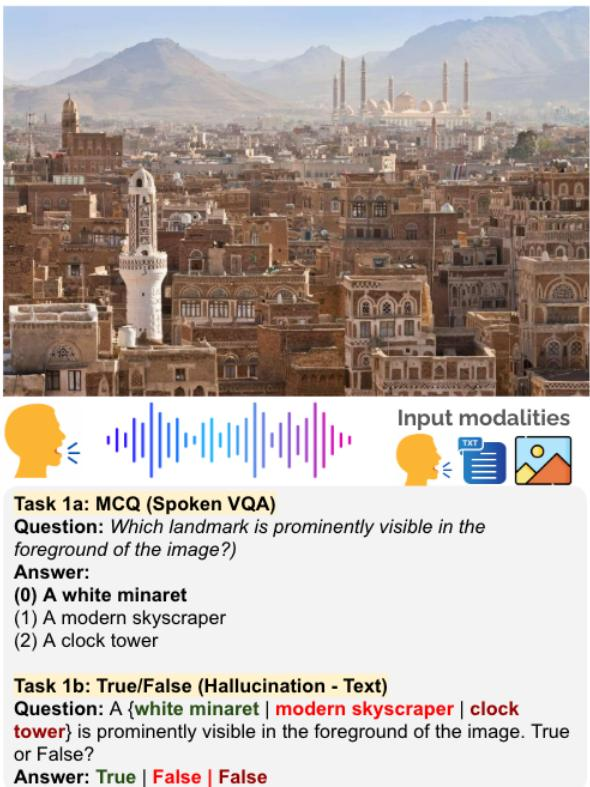
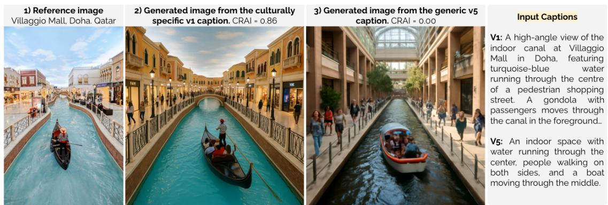
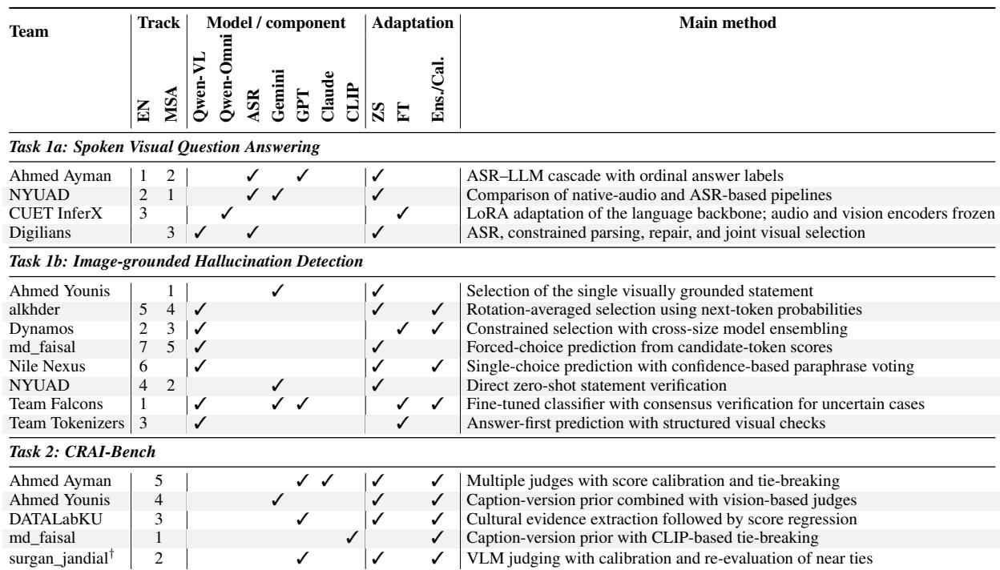

# ImageEval 2026: Culturally Grounded Arabic Multimodal Evaluation

Samir Abdaljalil1\*, Hunzalah Hassan Bhatti2\*, Ahlam Bashiti3, Farina Amir4, Md Arid Hasan5, Basel Mousi2, Nadir Durrani2, Fahim Dalvi2, Zien Sheikh Ali2, Erchin Serpedin1, Hasan Kurban4, Mustafa Jarrar4, Shammur Absar Chowdhury2, Firoj Alam2

1Texas A&M University, 2Qatar Computing Research Institute, Qatar   
3Birzeit University, Palestine, 4Hamad Bin Khalifa University, Qatar 5University of Toronto, Canada https://imageeval2026.github.io/

## Abstract

We present an overview of the ImageEval 2026 shared task on culturally grounded Arabic multimodal evaluation. It includes two tasks: (i) AynVQA, covering spoken visual question answering and image-grounded hallucination detection in English and Modern Standard Arabic (MSA), and (ii) CRAI-Bench, evaluating the cultural accuracy of text-to-image generation. A total of 14 teams participated in the test phase, with 12 teams submitting sys tem description papers. Participating systems used a range of approaches, including zeroshot prompting, fine-tuning of vision-language models, speech-recognition pipelines, ensembling, and score calibration. We describe the task setup, datasets, evaluation procedure, and participating systems, and summarize the main results across the different tracks. All datasets and evaluation scripts from the shared task are released to the research community. The shared task highlights the challenges of culturally grounded multimodal evaluation, particularly for Arabic speech and image-text reasoning.

## 1 Introduction

Recent benchmarking efforts have evaluated the capabilities of LLMs, speech-language models, and vision-language models (VLMs) across tasks such as spoken question answering (SQA) and visual question answering (VQA) (Hudson and Manning, 2019; Goyal et al., 2017). These benchmarks have driven substantial progress in multimodal reasoning and compositional understanding. However, most focus on general scene understanding and provide limited evidence of models’ ability to reason about culturally specific concepts or remain robust across languages and regional varieties. Crosslingual benchmarks such as xGQA extend VQA beyond English, yet largely preserve the same underlying visual domain (Pfeiffer et al., 2022).

To address this limitation, culture-centered benchmarks such as CulturalVQA (Nayak et al., 2024), CVQA (Romero et al., 2024), SEA-VQA (Urailertprasert et al., 2024), and OA-SIS (Alam et al., 2025b) broaden evaluation to culturally situated concepts, including artifacts, food, clothing, practices, landmarks, and regional identities. Results on these benchmarks show that VLMs continue to struggle with culturally grounded understanding, highlighting an important distinction: multilingual coverage does not necessarily translate into cultural understanding.

These challenges are also closely related to multimodal hallucination, where models generate plausible responses that are not sufficiently grounded in the visual input (Chen et al., 2026). In culturally situated settings, a model may rely on linguistic or cultural associations to infer an answer even when the image provides insufficient evidence. Distinguishing genuine visual understanding from such associative reasoning becomes particularly difficult when incorrect alternatives are themselves culturally plausible. Consequently, answer accuracy alone may not capture visual grounding, and evaluation should assess whether models distinguish visually supported answers from plausible but unsupported alternatives (Mousi et al., 2026b,a).

Arabic provides an important setting for examining these issues because systems must handle MSA and regional dialects while grounding predictions in culturally specific content (Al-Khalifa et al., 2025). Dallah (Alwajih et al., 2024) highlights the importance of dialect-aware Arabic multimodal modeling, while CAMEL-Bench (Ghaboura et al., 2025) shows remaining gaps in Arabic multimodal performance. However, evaluation of culturally grounded VQA and hallucination across Arabic varieties remains limited, particularly for settings where questions are presented in spoken rather than written form.

The same concerns extend to text-to-image generation. Models may produce visually plausible images while omitting or distorting culturally important details. Standard measures of image quality and text-image alignment often fail to capture these errors or align with human judgments of cultural faithfulness (Kannen et al., 2024; Bayramli et al., 2025; Nayak et al., 2025). This is particularly relevant to Arabic and Gulf contexts, where distinct national characteristics may be reduced to generic regional representations (Elsharif et al., 2024; Almarwani et al., 2025).

To address these gaps, we introduce IMAGEE-VAL 2026, a shared task on culturally grounded Arabic multimodal evaluation. It brings together two complementary tasks. AYNVQA covers spoken visual question answering and hallucination detection, while CRAI-BENCH evaluates cultural accuracy in Arabic text-to-image generation by assessing whether AI-generated images faithfully represent Arab cultural scenes. Overall, the tasks provide a unified Arabic-English evaluation of cultural grounding across multimodal understanding and generation.

Findings: The results highlight three main findings. First, spoken VQA is more challenging in MSA than in English, with the best MSA accuracy 8.7 percentage points lower than the best English result. System analyses attribute much of this gap to Arabic ASR and the shift from synthetic training audio to human-recorded test speech. Second, hallucination detection benefits from task-aware single-choice prediction. Systems that jointly select the visually grounded statement achieve substantially lower contrastive instability than independent true/false verification, with a zero-shot system ranking first in MSA. Third, CRAI-BENCH reveals that automated cultural evaluation can exploit non-visual structural cues. All submissions outperform the GPT-4o judge, yet a caption-version prior with limited visual evidence ranks first, while the hallucination-penalty dimension remains particularly difficult. Overall, these findings motivate stronger Arabic speech modeling, task-aligned hallucination evaluation, and cultural benchmarks that require direct visual grounding.

## 2 Tasks and Datasets

The shared task considers three complementary evaluation settings: grounding spoken questions in images, distinguishing visually supported content from culturally plausible hallucinations, and assessing cultural faithfulness in generated images. This section describes the corresponding tasks, datasets, and evaluation procedures.

  
Figure 1: Example of Task 1: (1a) culturally grounded spoken visual QA with multiple-choice answers and (1b) image-grounded hallucination detection over true/false statements.

## 2.1 Task 1: AynVQA

AynVQA is offered as two subtasks, each in English and MSA.

• Task 1a (Spoken VQA): Given an image and a spoken question with three spoken answer options, predict the index ofthe correct option. Neither the question nor the options are provided as text.

• Task 1b (Hallucination Detection): Given an image and three statements about it, judge each statement as true or false, where exactly one statement is grounded in the image and the other two are culturally plausible but visually unsupported.

Dataset. Task 1 is derived from OASIS (Alam et al., 2025b), which pairs images with spoken and textual QA instances in English and Arabic varieties across 18 MENA countries. Figure 1 illustrates the two subtasks.

The training, development, and dev-test splits are derived from OASIS, which contains multiplechoice (MCQ), open-ended (OEQ) and true/false questions. For Task 1a, we select a subset of the OASIS MCQ data for the shared task. For Task 1b, we adopt the approach proposed by Mousi et al. (2026b), converting each MCQ into three true/- false statements using GPT-4.1: one true statement corresponding to the correct answer and two false statements derived from the distractors, as illustrated in Figure 1. The test set is drawn from M2CQA (Mousi et al., 2026b). The training, development, and dev-test splits use voice-cloned speech, whereas the test set uses human recordings, introducing variation in speakers and recording conditions. Each example is annotated with country, cultural category, and subcategory labels based on a taxonomy of nine categories and 31 subcategories, enabling fine-grained analysis across countries and cultural topics. To ensure cultural grounding and QA accuracy, a subset of the data was manually verified. Further details are provided in (Mousi et al., 2026b; Alam et al., 2025b). Table 1 summarizes the splits by size, source dataset, country coverage, and speech type.

<table><tr><td>Split</td><td># Examples Source</td><td># Countries Speech</td><td></td></tr><tr><td>Train</td><td>3,000OASIS</td><td></td><td>18 Voice-cloned</td></tr><tr><td>Dev</td><td>500 OASIS</td><td></td><td>17 Voice-cloned</td></tr><tr><td>Dev-test</td><td>500 OASIS</td><td></td><td>17 Voice-cloned</td></tr><tr><td>Test</td><td>1,000 M2CQA</td><td></td><td>13 Human</td></tr></table>

Table 1: Task 1 data splits by source, country coverage, and speech type.

Evaluation. For Task 1a, we evaluate systems using accuracy, balanced accuracy, and macro-F1. For Task 1b, we adopt the contrastive evaluation proposed by Mousi et al. (2026b). Each example consists of a triplet with one visually grounded statement and two plausible but unsupported statements. The primary metric, contrastive instability (CI), measures whether a system makes consistent predictions across the triplet rather than evaluating each statement independently. Let $N _ { \mathrm { p a r t i a l } }$ denote the number of triplets with at least one correct prediction and $N _ { \mathrm { c o n s i s t e n t } }$ the number of these triplets for which all three statements are correctly classified. We define $\begin{array} { r } { C I = 1 - \frac { N _ { \mathrm { c o n s i s t e n t } } } { N _ { \mathrm { p a r t i a l } } } } \end{array}$ . Lower CI indicates greater consistency: once a system correctly identifies part of a triplet, it should resolve the remaining statements correctly. We additionally report combined accuracy, counterfactual hallucination rate (CFHR), and separate accuracies for grounded and unsupported statements. Missing or unparseable predictions are counted as incorrect

for both subtasks.

Baseline. We evaluate both subtasks in a zeroshot setting. For Task 1a, Qwen2.5-Omni-3B takes the image and spoken question as input and predicts the answer. For Task 1b, Qwen2.5-VL-3B takes the image and each statement as input and predicts whether the statement is grounded in the image.

## 2.2 Task 2: CRAI-Bench

CRAI-BENCH evaluates automated methods for assessing cultural accuracy in text-to-image (T2I) generation. Each instance contains (i) a reference image depicting an authentic Qatari cultural scene, (ii) a caption used to prompt a T2I model, and (iii) the corresponding generated image. Given these inputs, systems predict scores along five dimensions of the Cultural Representation Accuracy Index (CRAI), which is validated against human cultural judgments.

<table><tr><td>Dimension Code</td><td colspan="3">Weight Description</td></tr><tr><td>Cultural El- ement Accu-</td><td>CEA</td><td>0.30</td><td>Whether expected cultural ele- ments are present and correctly de-</td></tr><tr><td>racy Contextual Coherence</td><td>CC</td><td>0.20</td><td>picted Whether elements appear in cul- turally appropriate settings</td></tr><tr><td>Cultural Specificity</td><td>CS</td><td>0.20</td><td>How specific the depiction is to the target culture</td></tr><tr><td>Cultural In- tegrity</td><td>CI</td><td>0.20</td><td>Whether the representation is truthful and free of distortion</td></tr><tr><td>Hallucination Penalty</td><td>HP</td><td>-0.10</td><td>Culturally incorrect elements not supported by the caption</td></tr></table>

Table 2: CRAI dimensions, weights, and descriptions.

Dataset. The CRAI-BENCH dataset consists of 40 reference images depicting authentic Qatari cultural scenes across three categories: people and traditional attire, architecture and built environment, and objects. The images were collected from openaccess platforms, including Pexels, Pixabay, and Unsplash, and their cultural authenticity was verified by native Qatari cultural consultants. Figure 2 shows an example of a reference image and generated images. Each reference image is paired with five English captions (v1 to v5) of decreasing cultural specificity. Each caption is then used to generate one image with gpt-image-1 at a resolution of 1024×1024 pixels, yielding 200 caption-generated image instances in total. For each instance, human annotators evaluate the corresponding reference image, caption, and generated image using the CRAI rubric, assigning scores for the five dimensions and the composite CRAI score. The same instances are also evaluated by GPT-4o as an automated baseline. The dataset is split by reference image into

  
Figure 2: Example from CRAI-BENCH (Task 2). Captions with decreasing cultural specificity generate substantially different representations of the same reference scene, reflected in their human-annotated CRAI scores.

60/20/20 train, development, and test partitions, stratified by cultural category. This ensures that captions and generated images associated with the same reference image do not appear across different splits. Table 3 summarizes the split sizes.

<table><tr><td>Split</td><td># Ref. Images</td><td># Gen. Images</td></tr><tr><td>Train</td><td>24</td><td>120</td></tr><tr><td>Dev</td><td>8</td><td>40</td></tr><tr><td>Test</td><td>8</td><td>40</td></tr><tr><td>Total</td><td>40</td><td>200</td></tr></table>

Table 3: CRAI-BENCH data splits by number of reference images and instances.

Evaluation The primary evaluation metric is Spearman correlation (Zar, 2005) (ρ) between predicted and human-annotated CRAI\_composite scores, with higher values indicating stronger agreement with human rankings. Mean Absolute Error (MAE) on the composite score is used as a secondary metric and tiebreaker, with lower values being better.

The official evaluation script computes both metrics and was distributed with the starter kit. During development, participants could evaluate their systems locally using the released development labels before submitting predictions to Codabench.

Baseline. We use GPT-4o as the baseline system. Given the reference image, caption, generated image, and CRAI rubric, the model predicts scores for the five CRAI dimensions. The composite CRAI score is then computed using the weighted formulation defined above.

## 2.3 Competition Setup

The shared task was conducted in two phases: development and test. During the development phase, participants developed their systems using the released training and development data and submitted predictions on the dev-test split to a live leaderboard. During the test phase, participants submitted predictions on the blind test set, which determined the official rankings. The test leaderboards remained hidden until the phase closed. Each team was allowed up to 16 test submissions, with a maximum of 10 per day, and the best submission was used for ranking.

Participants could use open- or closed-source models, external data, and pretrained models, provided that all resources were disclosed in the system description paper.

All Task 1 and Task 2 data are released under CC BY-NC-SA 4.0.1 The starter kits, evaluation scripts, and format checkers are also publicly available.2

## 3 Results and Discussion

In Tables 4, 5, and 6, we report the official results on the blind test sets. Overall, the results highlight three patterns: spoken VQA remains more challenging in MSA than in English, task formulation plays an important role in hallucination detection, and cultural image evaluation can be influenced by structural cues beyond the visual content.

Task 1a (Spoken VQA). The English track was closely matched, with the top two systems differing by only 0.001 in accuracy. MSA was more challenging, with the best accuracy reaching 0.875 compared with 0.962 for English. Analysis of results across participating systems suggests that much of this gap comes from Arabic ASR errors and differences between the synthetic training and development speech and human-recorded test speech (Appendix A.1). Nevertheless, all submitted systems substantially outperform the Qwen2.5-Omni-

<table><tr><td># Team Acc. B-Acc.</td></tr><tr><td>M-F1 English</td></tr><tr><td>0.962 0.933 0.908</td></tr><tr><td>1 Ahmed Ayman 2 NYUAD 0.961 0.919 0.872</td></tr><tr><td>3 CUET_InferX 0.912 0.877 0.805</td></tr><tr><td>一 Qwen2.5-Omni-3B (baseline) 0.594 0.619 0.483</td></tr><tr><td>MSA</td></tr><tr><td>1 NYUAD 0.875 0.780 0.727</td></tr><tr><td>2 Ahmed Ayman 0.834 0.721 0.686</td></tr><tr><td>3 Digilians 0.575 0.504</td></tr><tr><td>0.656 一 Qwen2.5-Omni-3B (baseline) 0.191 0.339 0.169</td></tr></table>

Table 4: Task 1a (spoken visual QA) test results: accuracy, balanced accuracy, and macro-F1. Qwen2.5- Omni-3B is the official baseline. For reference, always answering the most frequent option position gives 0.539 accuracy in both languages.
<table><tr><td># Team</td><td>CI↓</td><td>Acc.Q+</td><td>Acc.Q-</td></tr><tr><td colspan="4">English</td></tr><tr><td>Team Falcons</td><td>0.029</td><td>0.971</td><td>0.986</td></tr><tr><td>2 Dynamos</td><td>0.033</td><td>0.967</td><td>0.984</td></tr><tr><td>3 Team Tokenizers</td><td>0.035</td><td>0.965</td><td>0.983</td></tr><tr><td>NYUAD</td><td>0.041</td><td>0.959</td><td>0.980</td></tr><tr><td>5 alkhder</td><td>0.051</td><td>0.949</td><td>0.975</td></tr><tr><td>6 Nile Nexus</td><td>0.058</td><td>0.942</td><td>0.971</td></tr><tr><td>md_faisal</td><td>0.067</td><td>0.933</td><td>0.967</td></tr><tr><td>8 keslerady*</td><td>0.113</td><td>0.887</td><td>0.944</td></tr><tr><td>Qwen2.5-VL-3B (baseline)</td><td>0.267</td><td>0.931</td><td>0.863</td></tr><tr><td colspan="4">MSA</td></tr><tr><td></td><td>1 Ahmed Younis</td><td>0.036 0.964</td><td>0.982</td></tr><tr><td>2 NYUAD</td><td>0.047</td><td>0.953</td><td>0.977</td></tr><tr><td>3 Dynamos</td><td>0.056</td><td>0.944</td><td>0.972</td></tr><tr><td>4 alkhder</td><td>0.096</td><td>0.904</td><td>0.952</td></tr><tr><td>5 md_faisal</td><td>0.101</td><td>0.899</td><td>0.950</td></tr><tr><td>6</td><td>keslerady* 2 0.142</td><td>0.858</td><td>0.929</td></tr><tr><td></td><td></td><td></td><td>0.790</td></tr><tr><td></td><td>Qwen2.5-VL-3B (baseline) 0.428</td><td>0.868</td><td></td></tr></table>

Table 5: Task 1b (hallucination detection) test results, ranked by contrastive instability (CI, lower is better), with accuracy on the grounded (Q+) and hallucinated (Q−) statements. Qwen2.5-VL-3B is the official baseline. ∗: no system description paper was submitted.

3B baseline. In MSA, the baseline also falls below the majority-position reference (0.191 vs. 0.539), highlighting the difficulty of the spoken Arabic setting.

Task 1b (Hallucination Detection). For the hallucination detection subtask, performance was strong across submitted systems, with the top three English systems differing by only 0.006 CI. All ranked systems achieved a counterfactual hallucination rate of zero, making consistency across the three statements the main differentiator. Systems that jointly selected the single visually grounded statement generally outperformed the baseline, which evaluates each statement independently, reducing CI from 0.267 to 0.029 in English and from

<table><tr><td>#</td><td>Team</td><td>ρ↑</td><td>MAE↓</td></tr><tr><td>1</td><td>md_faisal</td><td>0.826</td><td>0.147</td></tr><tr><td>2</td><td>surgan_jandial*</td><td>0.808</td><td>0.151</td></tr><tr><td>3</td><td>DATALabKU</td><td>0.804</td><td>0.141</td></tr><tr><td>4</td><td>Ahmed Younis</td><td>0.781</td><td>0.145</td></tr><tr><td>5</td><td>Ahmed Ayman</td><td>0.673</td><td>0.203</td></tr><tr><td></td><td>GPT-4o (baseline)</td><td>0.519</td><td>0.236</td></tr></table>

Table 6: Task 2 (CRAI-Bench) test results, ranked by Spearman correlation (ρ) of the predicted composite score against the human gold scores. Mean absolute error is reported as a secondary metric and does not affect the ranking. The GPT-4o judge is the official baseline. ∗: no system description paper was submitted

0.428 to 0.036 in MSA. Notably, the top MSA system used zero-shot prompting rather than taskspecific fine-tuning. These results suggest that aligning the prediction formulation with the contrastive structure of the task can be as important as model adaptation.

Task 2 (CRAI-Bench). For CRAI-Bench, all submitted systems outperform the GPT-4o baseline, with the top four achieving Spearman correlations between 0.781 and 0.826. The highest-ranked system uses a caption-version prior with CLIP-based tie-breaking, while DATALabKU (AlKulaib and Jlidi, 2026) achieves the lowest MAE. The strong performance of systems relying only partly on visual evidence reveals an important property of the benchmark, as human CRAI scores are strongly associated with caption specificity, making captionversion information highly predictive. This finding suggests that future versions should reduce such structural cues and place greater emphasis on direct visual assessment. The hallucination-penalty dimension also remains particularly challenging, with participant correlations near zero and a GPT-4o correlation of −0.04.

## 4 System Descriptions

Participating teams explored a range of approaches, including zero-shot prompting, task-specific finetuning, ASR-based pipelines, ensembling, and score calibration. In Table 7, we summarize the main models, adaptation strategies, and methods used across the three tasks. We briefly describe each submitted system below.

Dynamos (Yamin et al., 2026) The team participated in Task 1b for both English and Modern Standard Arabic (MSA). They reformulated hallucination detection as a constrained selection problem in which exactly one of three candidate statements is selected as visually grounded. Starting from zero-shot Qwen2.5-VL, they applied low-rank finetuning and trained multiple adapters with different random seeds. Their final system combined score averaging with an ensemble of 7B and 32B models, achieving CI scores of 0.033 for English and 0.056 for MSA.

  
Table 7: Overview of submitted ImageEval 2026 systems. EN and MSA denote the English and Modern Standard Arabic tracks, respectively, for Tasks 1a and 1b. Task 2 (CRAI-Bench) consists of a single track and is therefore not divided by language. ZS: zero-shot prompting; FT: task-specific fine-tuning; Ens./Cal.: ensembling, voting, or score calibration. Model columns indicate components used anywhere in the submitted system. Numbers in the track columns give the team’s position in the official ranking. †System information obtained from the submission form; no system paper was submitted.

NYUAD (AlDahoul and Zaki, 2026) The team addressed both spoken visual question answering and image-grounded hallucination detection. Their framework jointly processes visual and language inputs and was evaluated in both English and MSA. The study compared different language model architectures and examined the additional challenges introduced by Arabic speech, text processing, and limited culturally grounded multimodal resources.

Nile Nexus (Zaman and Rishta, 2026) Participating in Task 1b, the team used Qwen2.5-VL-7B-Instruct with 4-bit quantization and reformulated the task as selecting the single visually grounded statement. They also introduced confidence-based refinement through paraphrase voting. Their final system achieved an accuracy of 0.942 and a CI of 0.058 on the English track.

DATALabKU (AlKulaib and Jlidi, 2026) The team participated in Task 2 and proposed a reference-based framework for evaluating cultural accuracy in generated images. GPT-5.4 was used to extract cultural evidence from the reference image, caption, and generated image. These features were then mapped to CRAI scores using a lightweight regressor, improving Spearman correlation over direct GPT-5.4 scoring on the development set.

Team Falcons (Ma et al., 2026) The team participated in the English track of Task 1b and formulated the task as three-way image-conditioned classification. Qwen3-VL-8B was fine-tuned using 4-bit QLoRA, while uncertain predictions were checked using Gemini 3.6 Flash and GPT-5.4-mini. A prediction was changed only when both verifier models agreed, improving the final CI to 0.029 and placing the system first on the English leaderboard.

Ahmed Ayman (Mohamed, 2026) The team participated in Task 1a and Task 2. For spoken VQA, they examined the effects of answer representation and speech recognition, with ordinal answer labels outperforming digit-based labels. Their system achieved accuracies of 0.962 for English and 0.834 for MSA. For CRAI-Bench, they used multiple judges with calibration and tie-breaking, achieving a Spearman correlation of 0.673.

md\_faisal (Sheikh, 2026) The team participated in Task 1b for English and MSA, as well as Task 2, using zero-shot methods. For Task 1b, they replaced independent true/false predictions with a single three-way forced-choice formulation based on candidate-token logits. For CRAI-Bench, they used a caption-version prior with tie-breaking based on frozen CLIP features. The resulting system achieved a Spearman correlation of 0.8258 and ranked first on Task 2.

Team Tokenizers (Hoque and Hossain, 2026) Participating in the English track of Task 1b, the team proposed HALDETECT, which treats the three candidate statements as a single contrastive grounding decision. Their best system fine-tuned Qwen2.5-VL-7B-Instruct using 4-bit QLoRA while keeping the vision encoder frozen. The system achieved a CI of 0.035 and ranked third on the English leaderboard.

alkhder (Pasa et al., 2026) The team participated in Task 1b for both English and MSA using a pre-trained 7B vision–language model in a zero-shot setting. They selected the single visually supported statement using next-token logprobabilities and reduced positional bias through a Latin-square rotation over candidate orderings. The system achieved CI scores of 0.051 for English and 0.096 for MSA.

CUET InferX (Semon and Islam, 2026) The team participated in the English track of Task 1a. They fine-tuned Qwen2.5-Omni-3B using LoRA on the language reasoning backbone while keeping the audio and vision encoders frozen. The resulting end-to-end audio–visual system achieved 91.20% test accuracy and ranked third in the English track.

Ahmed Younis (Younis, 2026) The team participated in the MSA track of Task 1b and in Task 2. For CRAI-Bench, they combined a frequencybased prior with two vision-based judges and optimized the blending weights against Spearman correlation, achieving 0.7806 on the test set. For Task 1b, they reformulated the task as selecting the single grounded statement, achieving a combined accuracy of 0.964 and ranking first on the MSA track.

Digilians (Hassan et al., 2026) The team participated in the MSA track of Task 1a using a modular spoken VQA pipeline. Their approach first performed speech recognition, then extracted the question and answer choices before applying visual multiple-choice reasoning. A larger speech recognition model was used only when the initial transcript was unreliable. The system achieved 79.0% accuracy on the development set and 65.6% on the blind test set.

## 5 Related Work

Spoken Visual Question Answering. Prior work on spoken QA has examined the effects of ASR errors, conversational context, and multilingual speech (Lee et al., 2018; You et al., 2022; Alam et al., 2025a; Ali et al., 2026; WANG et al., 2026). These benchmarks, however, do not require visual grounding. More recent datasets such as TM-PATHVQA and TM-VQA combine spoken questions with images across multiple languages (Rajkhowa et al., 2024; Chowdhury et al., 2025), but rely mainly on synthesized speech and do not target culturally grounded interaction.

Arabic multimodal QA has so far focused largely on image-text settings. VAQA, CAMEL-BENCH, PEARL, JEEM, and ARAVQA cover domains, cultural knowledge, dialects, and factoid questions (Kamel et al., 2023; Ghaboura et al., 2025; Alwajih et al., 2025; Kadaoui et al., 2026; Alrowili et al., 2026). OASIS extends this line of work to speech with 3.7M spoken questions across 18 Arab countries, covering MSA and dialectal Arabic (Alam et al., 2025b).

Hallucination Benchmarks and Metrics. Vision-language hallucination is commonly divided into faithfulness hallucination, where outputs conflict with the visual input, andfactuality hallucination, where they contradict external knowledge (Chen et al., 2026). ImageEval focuses on faithfulness hallucination. Existing benchmarks such as POPE, ROPE, FGHE, RAH-Bench, R-Bench, and AutoHallusion evaluate unsupported objects, attributes, relations, and spatial setups (Chen et al., 2024; Wang et al., 2024; Wu et al., 2024). Broader suites include LongHalQA, AMBER, and MERLIM (Qiu et al., 2024; Wang et al., 2023; Villa et al., 2025), while CHAIR, OpenCHAIR, CC-EVAL, and NOPE evaluate hallucination in open-ended generation (Rohrbach et al., 2018; Ben-Kish et al., 2024; Zhai et al., 2023; Lovenia et al., 2024).

Most of these benchmarks use accuracy, F1, or object-level precision and recall. Such measures do not clearly distinguish visual-recognition failures from cases where a model recognizes the image correctly but accepts a plausible unsupported alternative. Many also rely on English-language or Western-centric resources such as MS COCO (Lin et al., 2014). Although CVQA introduces culturally diverse visual questions (Romero et al., 2024), hallucination evaluation for Arabic and the MENA region remains limited (Alansari and Luqman, 2025; Mousi et al., 2026b).

Cultural Evaluation of Text-to-Image Generation. Recent text-to-image benchmarks increasingly evaluate cultural accuracy in addition to visual quality and prompt alignment. CUBE, CULTDIFF, CulturalFrames, and RusCode examine culturally salient content across countries and settings (Kannen et al., 2024; Bayramli et al., 2025; Nayak et al., 2025; Vasilev et al., 2025). CULTIVate and MOSAIG extend this direction to social activities and multicultural scenes (Malakouti et al., 2026; Bhalerao et al., 2026). Related efforts include the Cultural Relevance Index for Arabic culture (Elsharif et al., 2024), its use in Ara-Pic (Elsharif et al., 2025), CAIRe’s knowledge-grounded cultural judgments (Yayavaram et al., 2026), and humancentered evaluation rubrics (Johnson et al., 2026). IMAGEEVAL 2026 builds on these efforts by bringing culturally grounded understanding and culturally faithful generation into a unified Arabicand MENA-centered evaluation setting. It jointly evaluates culturally grounded spoken visual QA, image-grounded hallucination detection, and the cultural fidelity of generated images in bilingual Arabic-English settings.

## 6 Conclusion

We presented IMAGEEVAL 2026, a shared task on culturally grounded Arabic multimodal evaluation. The shared task combines AYNVQA, which evaluates spoken visual question answering and image-grounded hallucination detection in English and MSA, with CRAI-BENCH, which evaluates cultural accuracy in generated images. A total of 14 teams participated in the test phase, with 12 teams submitting system description papers. The results highlight three main findings. First, spoken VQA remains more challenging in MSA than in English, with Arabic ASR contributing substantially to the performance gap. Second, hallucination detection benefits from task-aware singlechoice formulations that directly identify the visually grounded statement. Third, CRAI-BENCH shows that caption-specificity cues can strongly influence cultural evaluation, allowing systems with limited use of visual evidence to perform well. These findings motivate further work on robust Arabic speech processing, visually grounded hallucination detection, and cultural evaluation methods that rely more directly on image content. We release the datasets and evaluation resources to support future research on culturally grounded Arabic multimodal systems. For future work, we plan to expand the benchmark with broader Arabic dialect coverage, more diverse speech and image-generation conditions, and stronger controls against structural cues.

## Limitations

For Task 1a, the training, development, and dev-test audio is synthesized, while the test set uses human recordings, introducing a challenge in speech conditions that particularly affects MSA performance. Task 1b uses a constrained setting with exactly one grounded statement and two unsupported alternatives, so the results may not generalize to less structured hallucination scenarios. Task 2 is limited to Qatari cultural content and contains 40 reference images and 200 generated images, all produced using a single text-to-image model. Its five caption versions also introduce a strong association between caption specificity and human scores, which allowed systems using caption-version information to perform well with limited use of visual evidence. Future editions should broaden the cultural and geographic coverage, include more varied speech and generation sources, and reduce structural cues that can be exploited without fully evaluating the image.

## Societal/Broader Impact

ImageEval 2026 aims to improve the evaluation of multimodal systems for Arab cultural contexts across speech, text, and image generation. By releasing shared data, evaluation scripts, and baselines, the benchmark can lower the barrier to developing and comparing Arabic multimodal systems and help identify weaknesses that may otherwise remain hidden in predominantly English-centric evaluation. Our results highlight notable gaps, particularly in Arabic speech recognition and the cultural accuracy of generated images, which may affect the reliability and inclusiveness of systems deployed for Arabic-speaking users. At the same time, benchmark scores should not be interpreted as a complete measure of cultural competence, as Arab societies are linguistically, geographically, and culturally diverse. We therefore encourage future work to expand coverage across countries, dialects, communities, and cultural perspectives, and to use the benchmark as one component of broader human-centered evaluation.

## References

Shahad Al-Khalifa, Nadir Durrani, Hend Al-Khalifa, and Firoj Alam. 2025. The landscape of arabic large language models. Communications of the ACM, 68(10):54–61.

Firoj Alam, Md Arid Hasan, and Shammur Absar Chowdhury. 2025a. SpokenNativQA: Multilingual everyday spoken queries for llms. In Proceedings of the 26th Interspeech Conference (Interspeech 2025), Rotterdam, The Netherlands. ISCA.

Firoj Alam, Ali Ezzat Shahroor, Md. Arid Hasan, Zien Sheikh Ali, Hunzalah Hassan Bhatti, Mohamed Bayan Kmainasi, Shammur Absar Chowdhury, Basel Mousi, Fahim Dalvi, Nadir Durrani, and Natasa Milic-Frayling. 2025b. OASIS: A multilingual and multimodal dataset for culturally grounded spoken visual qa. arXiv preprint arXiv:2510.06371.

Aisha Alansari and Hamzah Luqman. 2025. AraHalluEval: A fine-grained hallucination evaluation framework for arabic llms. In Proceedings of The Third Arabic Natural Language Processing Conference, pages 148–161.

Nouar AlDahoul and Yasir Zaki. 2026. NYUAD at ImageEval shared tasks: A multimodal llm for audiovisual question answering and hallucination detection in english and modern standard arabic. In Proceedings ofthe Fourth Arabic Natural Language Processing Conference: Shared Tasks, Budapest, Hungary. Association for Computational Linguistics.

Zien Sheikh Ali, Hamdy Mubarak, Soon-Gyo Jung, Hunzalah Hassan Bhatti, Firoj Alam, and Shammur Absar Chowdhury. 2026. WASIL: In-the-wild arabic spoken interactions with llms. In Proceedings ofInterspeech 2026, Sydney, Australia.

Lulwah AlKulaib and Ahmed Jlidi. 2026. DATALabKU at ImageEval 2026 shared tasks: Metric-aware cultural evaluation for CRAI-Bench. In Proceedings of the Fourth Arabic Natural Language Processing Conference: Shared Tasks, Budapest, Hungary. Association for Computational Linguistics.

Nada Almarwani, Samah Aloufi, Sakhar B. Alkhereyf, Manal Alhassoun, Manal Almutery, Nouf Alshalawi, and Abdulmohsen Al-Thubaity. 2025. King-

domGlimpses: Evaluating saudi cultural representation through text-to-image models. IEEE Access, 13:177822–177845.

Sultan Alrowili, Younes Samih, Abed Alhakim Freihat, and Mathan Kumar Eswaran. 2026. AraVQA: Building a new Arabic factoid visual question answering dataset from Wikipedia. In Proceedings of the 64th Annual Meeting of the Association for Computational Linguistics (Volume 1: Long Papers), pages 2026–2042, San Diego, California, United States. Association for Computational Linguistics.

Fakhraddin Alwajih, Gagan Bhatia, and Muhammad Abdul-Mageed. 2024. Dallah: A dialect-aware multimodal large language model for Arabic. In Proceedings of the Second Arabic Natural Language Processing Conference, pages 320–336, Bangkok, Thailand. Association for Computational Linguistics.

Fakhraddin Alwajih, Samar M. Magdy, Abdellah El Mekki, Omer Nacar, Youssef Nafea, Safaa Taher Abdelfadil, Abdulfattah Mohammed Yahya, Hamzah Luqman, Nada Almarwani, Samah Aloufi, Baraah Qawasmeh, Houdaifa Atou, Serry Sibaee, Hamzah A. Alsayadi, Walid Al-Dhabyani, Maged S. Al-shaibani, Aya El aatar, Nour Qandos, Rahaf Alhamouri, and 18 others. 2025. Pearl: A multimodal culturally-aware Arabic instruction dataset. In Findings ofthe Association for Computational Linguistics: EMNLP 2025, pages 23048–23079, Suzhou, China. Association for Computational Linguistics.

Zahra Bayramli, Ayhan Suleymanzade, Na Min An, Huzama Ahmad, Eunsu Kim, Junyeong Park, James Thorne, and Alice Oh. 2025. Diffusion models through a global lens: Are they culturally inclusive? In Proceedings of the 63rd Annual Meeting of the Associationfor Computational Linguistics (Volume 1: Long Papers), pages 31137–31155, Vienna, Austria. Association for Computational Linguistics.

Assaf Ben-Kish, Moran Yanuka, Morris Alper, Raja Giryes, and Hadar Averbuch-Elor. 2024. Mitigating open-vocabulary caption hallucinations. In Proceedings ofthe 2024 Conference on Empirical Methods in Natural Language Processing, pages 22680–22698, Miami, Florida, USA. Association for Computational Linguistics.

Parth Bhalerao, Mounika Yalamarty, Brian Trinh, and Oana Ignat. 2026. When cultures meet: Multicultural text-to-image generation. In Findings ofthe Associationfor Computational Linguistics: ACL 2026, pages 35808–35828, San Diego, California, United States. Association for Computational Linguistics.

Xuweiyi Chen, Ziqiao Ma, Xuejun Zhang, Sihan Xu, Shengyi Qian, Jianing Yang, David Fouhey, and Joyce Chai. 2024. Multi-object hallucination in vision language models. In Advances in Neural Information Processing Systems 38: Annual Conference on Neural Information Processing Systems 2024, NeurIPS 2024, Vancouver, BC, Canada, December 10 - 15, 2024.

Zhiyuan Chen, Yuecong Min, Jie Zhang, Bei Yan, Jiahao Wang, Xiaozhen Wang, and Shiguang Shan. 2026. A survey of multimodal hallucination evaluation and detection. International Journal of Computer Vision, 134(3):131.

Amartya Roy Chowdhury, Tonmoy Rajkhowa, and Sanjeev Sharma. 2025. Towards multilingual spoken visual question answering system using cross-attention. In Proceedings of the 31st International Conference on Computational Linguistics, pages 9165–9175, Abu Dhabi, UAE. Association for Computational Linguistics.

Wala Elsharif, Marco Agus, Mahmoud Alzubaidi, and James She. 2024. Cultural relevance index: Measuring cultural relevance in ai-generated images. In 2024 IEEE 7th International Conference on Multimedia Information Processing and Retrieval (MIPR), pages 410–416. IEEE.

Wala Elsharif, Mahmoud Alzubaidi, James She, and Marco Agus. 2025. Ara-Pic: A framework for enhancing arabic cultural representation in ai-generated images. In 2025 IEEE International Conference on Multimedia and Expo Workshops (ICMEW), pages 1–6. IEEE.

Sara Ghaboura, Ahmed Heakl, Omkar Thawakar, Ali Husain Salem Abdulla Alharthi, Ines Riahi, Abduljalil Radman, Jorma Laaksonen, Fahad Shahbaz Khan, Salman Khan, and Rao Muhammad Anwer. 2025. CAMEL-bench: A comprehensive Arabic LMM benchmark. In Findings of the Association for Computational Linguistics: NAACL 2025, pages 1970–1980, Albuquerque, New Mexico. Association for Computational Linguistics.

Yash Goyal, Tejas Khot, Douglas Summers-Stay, Dhruv Batra, and Devi Parikh. 2017. Making the V in VQA matter: Elevating the role of image understanding in visual question answering. In Proceedings of the IEEE Conference on Computer Vision and Pattern Recognition (CVPR), pages 6904–6913.

Ahmed Eid Hassan, Mohamed Eid Abd El-Maguid, Ahmed Hossam Rashad, Nour Eldeen Hossam Mahmoud, Mohamed Hamdy Mohamed, and Abdelrhman Mahmoud Fawzy. 2026. Digilians at ImageEval 2026 task 1a: Modular speech parsing and joint multimodal reasoning for arabic spoken vqa. In Proceedings of the Fourth Arabic Natural Language Processing Conference: Shared Tasks, Budapest, Hungary. Association for Computational Linguistics.

Syed Mohaiminul Hoque and Md Sakhawat Hossain. 2026. Team Tokenizers at ImageEval 2026 shared tasks: Answer-first contrastive grounding with qlora. In Proceedings of the Fourth Arabic Natural Language Processing Conference: Shared Tasks, Budapest, Hungary. Association for Computational Linguistics.

Drew A. Hudson and Christopher D. Manning. 2019. GQA: A new dataset for real-world visual reason-

ing and compositional question answering. In Proceedings ofthe IEEE/CVF Conference on Computer Vision and Pattern Recognition (CVPR), pages 6700– 6709.

Nari Johnson, Deepthi Sudharsan, Hamna, Samantha Dalal, Theo Holroyd, Anja Thieme, Hoda Heidari, Daniela Massiceti, Jennifer Wortman Vaughan, and Cecily Morrison. 2026. Evaluating ai-generated images of cultural artifacts with community-informed rubrics. In The 2026 ACM Conference on Fairness, Accountability, and Transparency, pages 714–774.

Karima Kadaoui, Hanin Atwany, Hamdan Al-Ali, Abdelrahman Mohamed, Ali Mekky, Sergei Tilga, Natalia Fedorova, Ekaterina Artemova, Hanan Aldarmaki, and Yova Kementchedjhieva. 2026. JEEM: Vision-language understanding in four Arabic dialects. In Findings of the Association for Computational Linguistics: EACL 2026, pages 331–354, Rabat, Morocco. Association for Computational Linguistics.

Sarah M. Kamel, Shimaa I. Hassan, and Lamiaa Elrefaei. 2023. VAQA: Visual arabic question answering. Arabian Journal for Science and Engineering, 48:10803–10823.

Nithish Kannen, Arif Ahmad, Marco Andreetto, Vinodkumar Prabhakaran, Utsav Prabhu, Adji Bousso Dieng, Pushpak Bhattacharyya, and Shachi Dave. 2024. Beyond aesthetics: Cultural competence in text-toimage models. In Advances in Neural Information Processing Systems, volume 37, pages 13716–13747.

Chia-Hsuan Lee, Szu-Lin Wu, Chi-Liang Liu, and Hung yi Lee. 2018. Spoken SQuAD: A Study of Mitigating the Impact of Speech Recognition Errors on Listening Comprehension. In Interspeech 2018, pages 3459–3463.

Tsung-Yi Lin, Michael Maire, Serge Belongie, James Hays, Pietro Perona, Deva Ramanan, Piotr Dollár, and C. Lawrence Zitnick. 2014. Microsoft coco: Common objects in context. In Computer Vision – ECCV 2014, pages 740–755, Cham. Springer International Publishing.

Holy Lovenia, Wenliang Dai, Samuel Cahyawijaya, Ziwei Ji, and Pascale Fung. 2024. Negative object presence evaluation (NOPE) to measure object hallucination in vision-language models. In Proceedings ofthe 3rd Workshop on Advances in Language and Vision Research (ALVR), pages 37–58, Bangkok, Thailand. Association for Computational Linguistics.

Pan Ma, Junlin Liu, and Jun Liu. 2026. Team Falcons at ImageEval 2026 shared tasks: Structure-constrained QLoRA fine-tuning and dual-model consensus verification. In Proceedings ofthe Fourth Arabic Natural Language Processing Conference: Shared Tasks, Budapest, Hungary. Association for Computational Linguistics.

Sina Malakouti, Boqing Gong, and Adriana Kovashka. 2026. Culture in action: Evaluating text-to-image

models through social activities. In The Fourteenth International Conference on Learning Representations.

Ahmed Ayman Ahmed Ezzat Mohamed. 2026. Ahmed Ayman at ImageEval 2026 shared tasks: Measurement-first systems for spoken VQA and cultural accuracy evaluation. In Proceedings of the Fourth Arabic Natural Language Processing Conference: Shared Tasks, Budapest, Hungary. Association for Computational Linguistics.

Basel Mousi, Fahim Dalvi, Shammur Chowdhury, Firoj Alam, and Nadir Durrani. 2026a. Said aloud, read different: Cross-modal instability in multimodal models. In Proceedings of Interspeech 2026, Sydney, Australia. Accepted.

Basel Mousi, Fahim Dalvi, Shammur Absar Chowdhury, Firoj Alam, and Nadir Durrani. 2026b. Once correct, still wrong: Counterfactual hallucination in multilingual vision-language models. In Findings of the Association for Computational Linguistics: ACL 2026, pages 4763–4788, San Diego, California, United States. Association for Computational Linguistics.

Shravan Nayak, Mehar Bhatia, Xiaofeng Zhang, Verena Rieser, Lisa Anne Hendricks, Sjoerd van Steenkiste, Yash Goyal, Karolina Stanczak, and Aishwarya Agrawal. 2025. CulturalFrames: Assessing cultural expectation alignment in text-to-image models and evaluation metrics. In Findings of the Association for Computational Linguistics: EMNLP 2025, pages 20918–20953, Suzhou, China. Association for Computational Linguistics.

Shravan Nayak, Kanishk Jain, Rabiul Awal, Siva Reddy, Sjoerd Van Steenkiste, Lisa Anne Hendricks, Karolina Stanczak, and Aishwarya Agrawal. 2024. Benchmarking vision language models for cultural understanding. In Proceedings ofthe 2024 Conference on Empirical Methods in Natural Language Processing, pages 5769–5790, Miami, Florida, USA. Association for Computational Linguistics.

Maher Pasa, Maria Hanini, Amro Najjar, and Hasan Alkhder. 2026. alkhder at ImageEval 2026 shared tasks: Constrained selection and rotation-averaged logit scoring for multimodal hallucination detection. In Proceedings of the Fourth Arabic Natural Language Processing Conference: Shared Tasks, Budapest, Hungary. Association for Computational Linguistics.

Jonas Pfeiffer, Gregor Geigle, Aishwarya Kamath, Jan-Martin O. Steitz, Stefan Roth, Ivan Vulic, and Iryna´ Gurevych. 2022. xGQA: Cross-lingual visual question answering. In Findings of the Association for Computational Linguistics: ACL 2022, pages 2497– 2511, Dublin, Ireland. Association for Computational Linguistics.

Han Qiu, Jiaxing Huang, Peng Gao, Qin Qi, Xiaoqin Zhang, Ling Shao, and Shijian Lu. 2024. Long-HalQA: Long-context hallucination evaluation for

multimodal large language models. arXiv preprint arXiv:2410.09962.

Tonmoy Rajkhowa, Amartya Roy Chowdhury, Sankalp Nagaonkar, Achyut Mani Tripathi, and Mahadeva Prasanna. 2024. TM-PATHVQA: 90000+ Textless Multilingual Questions for Medical Visual Question Answering. In Interspeech 2024, pages 4034–4038.

Anna Rohrbach, Lisa Anne Hendricks, Kaylee Burns, Trevor Darrell, and Kate Saenko. 2018. Object hallucination in image captioning. In Proceedings of the 2018 Conference on Empirical Methods in Natural Language Processing, pages 4035–4045, Brussels, Belgium. Association for Computational Linguistics.

David Romero, Chenyang Lyu, Haryo Akbarianto Wibowo, Teresa Lynn, Injy Hamed, Aditya Nanda Kishore, Aishik Mandal, Alina Dragonetti, Artem Abzaliev, Atnafu Lambebo Tonja, Bontu Fufa Balcha, Chenxi Whitehouse, Christian Salamea, Dan John Velasco, David Ifeoluwa Adelani, David Le Meur, Emilio Villa-Cueva, Fajri Koto, Fauzan Farooqui, and 57 others. 2024. Cvqa: culturally-diverse multilingual visual question answering benchmark. In Proceedings ofthe 38th International Conference on Neural Information Processing Systems, NIPS ’24, Red Hook, NY, USA. Curran Associates Inc.

Md. Ashraful Islam Semon and Jihadul Islam. 2026. CUET\_InferX at ImageEval 2026 shared tasks: Audio-visual LoRA adaptation of Qwen2.5-Omni for culturally-grounded spoken VQA. In Proceedings of the Fourth Arabic Natural Language Processing Conference: Shared Tasks, Budapest, Hungary. Association for Computational Linguistics.

Md. Faisal Sheikh. 2026. md\_faisal at ImageEval 2026 shared tasks: Forced-choice reformulation for hallucination detection and a version-prior baseline for cultural relevance. In Proceedings ofthe Fourth Arabic Natural Language Processing Conference: Shared Tasks, Budapest, Hungary. Association for Computational Linguistics.

Norawit Urailertprasert, Peerat Limkonchotiwat, Supasorn Suwajanakorn, and Sarana Nutanong. 2024. SEA-VQA: Southeast asian cultural context dataset for visual question answering. In Proceedings of the 3rd Workshop on Advances in Language and Vision Research (ALVR), pages 173–185, Bangkok, Thailand. Association for Computational Linguistics.

Viacheslav Vasilev, Julia Agafonova, Nikolai Gerasimenko, Alexander Kapitanov, Polina Mikhailova, Evelina Mironova, and Denis Dimitrov. 2025. Rus-Code: Russian cultural code benchmark for text-toimage generation. In Findings of the Association for Computational Linguistics: NAACL 2025, pages 7656–7672, Albuquerque, New Mexico. Association for Computational Linguistics.

Andrés Villa, Juan León Alcázar, Alvaro Soto, and Bernard Ghanem. 2025. Behind the magic, merlim: Multi-modal evaluation benchmark for large imagelanguage models. In 2025 IEEE/CVF Conference on

Computer Vision and Pattern Recognition Workshops (CVPRW), pages 492–502.

Dingdong WANG, Junan Li, Jincenzi Wu, Dongchao Yang, Xueyuan Chen, Tianhua Zhang, and Helen M. Meng. 2026. MMSU: A massive multi-task spoken language understanding and reasoning benchmark. In The Fourteenth International Conference on Learning Representations.

Junyang Wang, Yuhang Wang, Guohai Xu, Jing Zhang, Yukai Gu, Haitao Jia, Jiaqi Wang, Haiyang Xu, Ming Yan, Ji Zhang, and Jitao Sang. 2023. AM-BER: An LLM-free multi-dimensional benchmark for MLLMs hallucination evaluation. arXiv preprint arXiv:2311.07397.

Lei Wang, Jiabang He, Shenshen Li, Ning Liu, and Ee-Peng Lim. 2024. Mitigating fine-grained hallucination by fine-tuning large vision-language models with caption rewrites. In MultiMedia Modeling: 30th International Conference, MMM 2024, Amsterdam, The Netherlands, January 29 – February 2, 2024, Proceedings, Part IV, page 32–45, Berlin, Heidelberg. Springer-Verlag.

Xiyang Wu, Tianrui Guan, Dianqi Li, Shuaiyi Huang, Xiaoyu Liu, Xijun Wang, Ruiqi Xian, Abhinav Shrivastava, Furong Huang, Jordan Lee Boyd-Graber, Tianyi Zhou, and Dinesh Manocha. 2024. AutoHallusion: Automatic generation of hallucination benchmarks for vision-language models. In Findings ofthe Associationfor Computational Linguistics: EMNLP 2024, pages 8395–8419, Miami, Florida, USA. Association for Computational Linguistics.

Muhammad Yamin, Sheikh Abdul Wahid, and Ali Arshad. 2026. Dynamos at ImageEval 2026 shared tasks: Metric-aligned selection and cross-family ensembling for vision-language hallucination detection in english and arabic. In Proceedings ofthe Fourth Arabic Natural Language Processing Conference: Shared Tasks, Budapest, Hungary. Association for Computational Linguistics.

Arnav Yayavaram, Siddharth Yayavaram, Simran Khanuja, Michael Saxon, and Graham Neubig. 2026. CAIRE: Cultural attribution of images with retrieval. In Proceedings ofthe 19th Conference ofthe European Chapter of the Association for Computational Linguistics (Volume 1: Long Papers), pages 8320– 8338, Rabat, Morocco. Association for Computational Linguistics.

Chenyu You, Nuo Chen, Fenglin Liu, Shen Ge, Xian Wu, and Yuexian Zou. 2022. End-to-end spoken conversational question answering: Task, dataset and model. In Findings ofthe Associationfor Computational Linguistics: NAACL 2022, pages 1219–1232, Seattle, United States. Association for Computational Linguistics.

Ahmed Younis. 2026. Ahmed Younis at ImageEval 2026 shared tasks: The judge needs a prior for cultural image evaluation. In Proceedings ofthe Fourth

Arabic Natural Language Processing Conference: Shared Tasks, Budapest, Hungary. Association for Computational Linguistics.

Sumaiya Zaman and Miftahul Jannat Rishta. 2026. Nile Nexus at ImageEval 2026 shared tasks: Single-choice reformulation and confidence-calibrated refinement for culturally grounded hallucination detection. In Proceedings of the Fourth Arabic Natural Language Processing Conference: Shared Tasks, Budapest, Hungary. Association for Computational Linguistics.

Jerrold H. Zar. 2005. Spearman Rank Correlation. John Wiley & Sons, Ltd.

Bohan Zhai, Shijia Yang, Chenfeng Xu, Sheng Shen, Kurt Keutzer, Chunyuan Li, and Manling Li. 2023. HallE-Control: Controlling object hallucination in large multimodal models. arXiv preprint arXiv:2310.01779.

## A Appendix

## A.1 Development-Phase Results

Tables 8, 9, and 10 report the development-phase results (each team’s latest submission). For Task 1, we evaluated submissions on the dev-test split, using synthetic TTS audio for Task 1a; for Task 2, we used the development split.

The results show several patterns. For Task 1a, English systems generally outperform their MSA counterparts, with a wider performance spread in MSA. Task 1b shows strong performance among the leading systems in both languages, although MSA remains more challenging overall. For Task 2, both participating systems substantially outperform the GPT-4o baseline. Overall, the development results indicate stronger performance in English for spoken VQA and consistent improvements over the released baselines across all tasks.

<table><tr><td># Team</td><td></td><td>Acc. B-Acc. M-F1</td><td></td></tr><tr><td colspan="4">English</td></tr><tr><td>1 NYUAD</td><td>0.974</td><td>0.974</td><td>0.974</td></tr><tr><td>2 romey101</td><td>0.972</td><td>0.972</td><td>0.972</td></tr><tr><td>3 CUET_InferX – Qwen2.5-Omni-3B (baseline)</td><td>0.916</td><td>0.916</td><td>0.916</td></tr><tr><td>MSA</td><td>0.664</td><td>0.666</td><td>0.661</td></tr><tr><td colspan="4">1 NYUAD</td></tr><tr><td>2 Digilians</td><td>0.920 0.784</td><td>0.919 0.780</td><td>0.921 0.782</td></tr><tr><td>3 md_faisal</td><td>0.398</td><td>0.410</td><td>0.344</td></tr><tr><td>– Qwen2.5-Omni-3B (baseline)</td><td>0.398</td><td>0.410</td><td>0.344</td></tr><tr><td># Team</td><td>CI↓</td><td> ${ \bf A c c . } _ { Q ^ { + } }$ </td><td> ${ \bf A c c . } _ { Q ^ { - } }$ </td></tr><tr><td colspan="4">English</td></tr><tr><td></td><td>Team Tokenizers 0.028</td><td>0.972</td><td>0.986</td></tr><tr><td>2</td><td>NYUAD</td><td>0.028 0.972</td><td>0.986</td></tr><tr><td>3</td><td>Team Falcons</td><td>0.030 0.970</td><td>0.985</td></tr><tr><td>4</td><td>nawwad</td><td>0.036 0.964</td><td>0.982</td></tr><tr><td>5</td><td>Nile Nexus</td><td>0.050 0.950</td><td>0.975</td></tr><tr><td>6</td><td>ameya</td><td>0.284 0.716</td><td>0.858</td></tr><tr><td>7 md_faisal</td><td>0.313</td><td>0.940</td><td>0.839</td></tr><tr><td>Qwen2.5-VL-3B (baseline) MSA</td><td>0.313</td><td>0.940</td><td>0.839</td></tr><tr><td colspan="4"></td></tr><tr><td>1 NYUAD</td><td>0.036</td><td>0.964</td><td>0.982</td></tr><tr><td>2 NAMAA Community</td><td>0.046</td><td>0.954</td><td>0.977</td></tr><tr><td>3 lettycat</td><td>0.082</td><td>0.918</td><td>0.959</td></tr><tr><td>4 md_faisal</td><td>0.490</td><td>0.834</td><td>0.773</td></tr><tr><td> $Q w e n 2 . 5 \ – V L \ – 3 B ( b a s e l i n e )$ </td><td>0.490</td><td>0.834</td><td>0.773</td></tr></table>

Table 8: Task 1a development-phase results on the devtest split (synthetic TTS audio). Qwen2.5-Omni-3B is the official baseline.

Table 9: Task 1b development-phase results on the devtest split, ranked by contrastive instability (CI, lower is better). Qwen2.5-VL-3B is the official baseline.

<table><tr><td># Team</td><td> $\rho \uparrow$ </td></tr><tr><td></td><td>MAE↓ 0.708 0.188</td></tr><tr><td></td><td>1 Ahmed Younis</td></tr><tr><td>2 md_faisal  $\begin{array} { r l } { - } & { { } G P T \ – 4 o \ ( b a s e l i n e ) } \end{array}$  0.215</td><td>0.641 0.204 0.367</td></tr></table>

Table 10: Task 2 development-phase results on the dev split, ranked by Spearman correlation of the composite score. The GPT-4o judge is the official baseline.