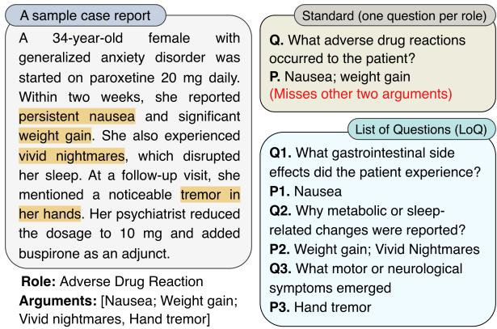
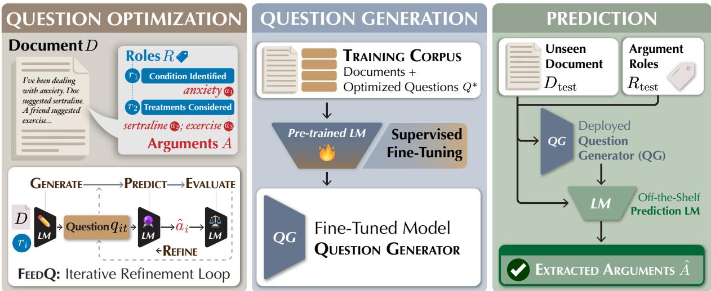
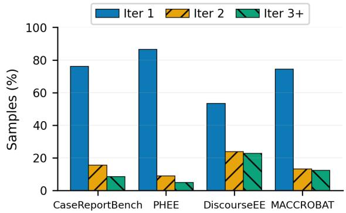
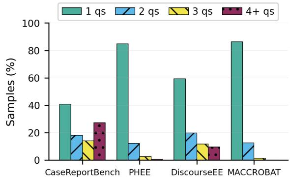
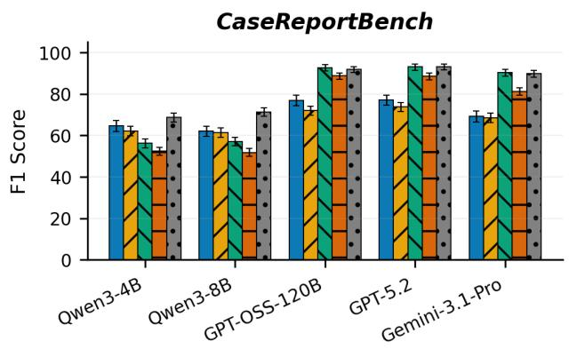
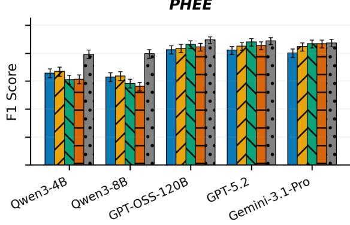
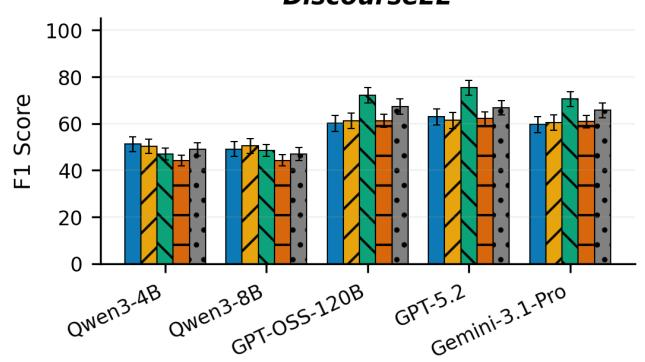
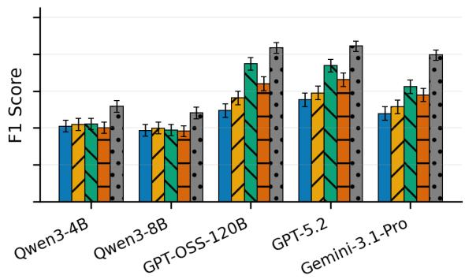
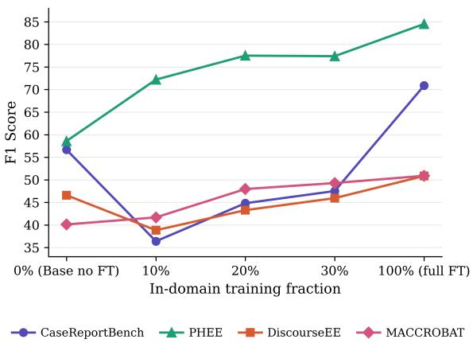

# Improving Information Extraction with Learned Queries

Omar Sharif, Soroush Vosoughi, Nikhil Singh

Department of Computer Science

Dartmouth College

{omar.sharif.gr, soroush.vosoughi, nikhil.u.singh}@dartmouth.edu

## Abstract

When information extraction fails, a natural instinct is to improve the model doing it: for example, by scaling it up or refining its reasoning. In this paper, we show that another part of the pipeline matters at least as much: the queries used to elicit this information. Across four clinical benchmarks and five LLMs, improving the question design alone raises performance by ≈18.6 F1-score points, i.e. more than using larger extraction models. To make such question design learnable, we introduce List of Questions (LOQ), which generates document-specific question sets, and FEEDQ, a feedback-driven optimization method that iteratively refines questions against extraction outcomes. The resulting optimized questions can be used to train lightweight generators: with fine-tuning, 4B-parameter models match or outperform expert-derived baselines and substantially exceed the performance of much larger untuned models. We release a dataset of 12,820 optimized questions to support a broader shift in information extraction research toward treating question design as a first-class problem.

## 1 Introduction

“If you do not know how to ask the right question, you discover nothing.” — W. Edwards Deming

We are surrounded by documents that contain answers to questions we have not yet asked. When those questions eventually arise, for example “Which medication was prescribed in each of these health records?” the task becomes one of information extraction: identifying and structuring the relevant pieces of information embedded in the text. Straightforward as this goal may appear, it can be surprisingly difficult. The information of interest is rarely presented explicitly or in a consistent form; rather, it is often distributed across sentences, expressed indirectly, or intertwined with narrative context. Thus, to get the right answers, we must ask the right questions.

  
Figure 1: A case report describes a patient who develops four adverse drug reactions after starting paroxetine (highlighted). The standard approach asks a single rolelevel question and retrieves only two. LOQ generates a set of document-grounded questions, each targeting a different symptom category, and recovers all four. The extraction model is identical in both settings; only the questions change, showing how extracting answers benefits from formulating the right questions. Additional examples are given in Table 12.

This challenge is especially acute in clinical and biomedical text. Case reports, pharmacovigilance records, and discharge summaries convey structured facts through unstructured narratives (Zhang et al., 2025; Builtjes et al., 2025). Consider extracting just one type of information: “Adverse Drug Reaction". Symptoms may be mentioned in one paragraph, a cause implied through temporal proximity to a medication, and a resolution described later still. Extracting such information reliably depends on both whether a model is capable and whether it is queried in a way that exposes the relevant evidence.

Large language models (LLMs) have become the dominant method for such tasks (Shimizu et al., 2025; Tanev et al., 2025). For LLMs this problem is often framed as question-based argument extraction: given a document and question about target role, the model generates the relevant arguments as free text (Sharif et al., 2024; Zhang et al., 2024). Here, a role is the type of information to be extracted (e.g., Adverse Drug Reaction), and arguments are the specific details for that role (e.g., the drug involved, the symptoms observed, the outcome). This formulation is flexible but it quietly inherits an assumption that the questions themselves are adequate. The dominant approaches derive questions from annotation schema or rolelevel templates and apply them uniformly across documents regardless of how the target information is expressed (Du and Cardie, 2020; Sharif et al., 2025). As shown in Figure 1, asking “What adverse drug reaction occurred to the patient?” treats the role as a single retrieval target, assuming all relevant arguments can be surfaced with one generic query. This risks systematically missing arguments that require targeted attention. The bottleneck, then, is not only the LLMs’ ability to answer but the way we ask question and direct this attention.

We introduce List of Questions (LOQ), a framework for learning extraction questions tailored to each document–role pair. LOQ uses FEEDQ, an iterative loop that refines candidate questions based on the quality of the extractions they elicit. Optimized questions then help train a lightweight question generation model for deployment. Our contributions are thus:

• We provide empirical evidence that question design is a major bottleneck in LLM-based information extraction. Across four clinical benchmarks (CaseReportBench (Zhang et al., 2025), PHEE (Sun et al., 2022), DiscourseEE (Sharif et al., 2024), and MACCROBAT (Ma et al., 2023)) and five LLMs, improving questions can increase F1 by 18.6% on average.

• We introduce a two-part framework, LOQ, for learning to generate effective, documentgrounded extraction questions:

1. First, we develop FEEDQ, a feedbackdriven iterative refinement method for optimizing extraction questions without annotated question supervision. We use FEEDQ to construct a dataset of 12,820 (document, role, question-set) triples.

2. Second, we apply this dataset via finetuning and demonstrate significant gains in zero-shot extraction.

## 2 Related Work

Information extraction as question answering. Information extraction can be straightforwardly recast as question answering (Du and Cardie, 2020; Liu et al., 2020; Li et al., 2020) by asking models a question whose answer is the desired argument. This prompts extraction models to use the questionanswering and reading-comprehension abilities already present in pretrained LMs, and supports freetext rather than span-only approaches (Huang et al., 2024; Sharif et al., 2024). Once framed this way, question quality becomes instrumental to extraction success. In practice, questions are usually written once from annotation guidelines or role templates and then reused across all documents (Hsu et al., 2022; Srivastava et al., 2025). That makes them easy to apply, but also indifferent to how evidence is expressed in different documents.

Quality of questions. Recent work has started to take question formulation more seriously. Lu et al. (2023) generate better role questions from eventspecific templates, Hong and Liu (2024) refine question generation with reinforcement learning, and Uddin et al. (2024a) show benefits from combining contextualized and uncontextualized questions. Despite this progress, most approaches still operate on a question-per-role paradigm (Uddin et al., 2024b), assuming each role is a single, clean retrieval target. However, a role may involve several arguments, be expressed indirectly, or scattered across sections. Current methods also usually improve question quality using proxies like template supervision (Lu et al., 2023), fluency and contextrecovery rewards (Hong and Liu, 2024), or heuristic combinations of question types (Uddin et al., 2024a). Our work builds on these ideas, but instead studies question design as a separable component of extraction. We ask: for a document-role pair, what set of questions best exposes the relevant evidence and how can we find these?

Learning to ask the right questions. Prompt optimization is an emerging strategy for improving textual artifacts (Pryzant et al., 2023; Yuksekgonul et al., 2025; Lee et al., 2025; Cherep et al., 2026). Such techniques approximate gradientbased optimization via natural language feedback. However, these methods optimize a single text prompt, whereas our setting requires optimizing a document- and role-conditioned set of questions under a multi-tier extraction objective, with set-level edits and a leakage constraint. We develop a new feedback-based optimizer which alternates question generation and information extraction, along with a multi-step evaluation and, document- and role-conditioning, a leakage check module, among several other components. We use this method to iteratively refine questions to maximize extraction quality. We then transfer this knowledge via supervised fine-tuning to a lightweight question generation LM, which produces document-specific questions without access to ground-truth arguments. Answering them with an off-the-shelf prediction LM should then yield, on average, better information extraction.

  
Figure 2: Overview of the List of Questions framework. (1) Question optimization: FEEDQ iteratively generates, evaluates, and refines role-specific questions conditioned on the document, roles, and ground-truth arguments, producing the right questions. (2) QG fine-tuning: These questions teach a smaller model to produce questions from documents and roles, removing the dependence on ground-truth. (3) Prediction: At test time, the fine-tuned QG model generates questions for unseen document-roles, and a prediction model uses them to extract arguments.

## 3 Methods

We propose the List of Questions (LOQ) framework, which automates the full argument extraction cycle in three phases (illustrated in Figure 2).

Phase 1: Question Optimization. Given a document, role, and ground-truth arguments, we run an iterative optimization loop (FEEDQ, Section 3.2) to derive questions that best extract those arguments, producing gold question sets for training.

Phase 2: Question Generation. We fine-tune a question generator (QG) model on these gold questions, thereby teaching it to generate effective questions conditioned on document and role.

Phase 3: Prediction. At inference, the fine-tuned QG generates questions for unseen instances, and off-the-shelf LMs use these to extract arguments.

Our design separates question generation from prediction, allowing each component to specialize.

## 3.1 Preliminaries

A document D is a full-length text taken from diverse clinical sources, such as case reports, pharmacovigilance records, or online health forums (e.g., reddit posts). Each D has an information structure defined by a set of roles $\mathcal { R } = \{ r _ { 1 } , r _ { 2 } , . . . , r _ { n } \}$ that specify the types of information to extract. Arguments $\mathcal { A } = \{ a _ { 1 } , a _ { 2 } , \ldots , a _ { m } \}$ are the corresponding details for each of these roles. For example, given the sentence “Patient was prescribed Metformin 500mg twice daily,” the relevant information structure is a MEDICATION event with roles drug, dosage, and frequency, filled by the arguments Metformin, 500mg, and twice daily, respectively. We formulate clinical information extraction as a generative argument extraction task: given a document D and a set of target roles R, an LM extracts a set of arguments A corresponding to each role.

## 3.2 Question Optimization via Feedback

We design FEEDQ, an iterative Feedback-Driven Question Optimization approach with the goal of automatically derive the right set of questions to extract the information from a given document.

Objective. Given a document D, a role $r \in \mathcal { R }$ and ground-truth arguments $\mathcal { A } = \{ a _ { 1 } , \ldots , a _ { m } \}$ for r, we seek a question set $\mathcal { Q } ^ { \ast }$ that maximizes

Algorithm 1 FEEDQ: Feedback-Driven Question   
Optimization   
Require: Ground-truth arguments ${ \mathcal { A } } ,$ initial questions ${ \mathcal Q } ^ { ( 0 ) }$   
document $\mathcal { D } ,$ role r, max iterations T, target score $\tau ,$   
patience m   
Ensure: Optimized question set $\mathcal { Q } ^ { \ast }$   
1: $\mathcal { Q } ^ { * }  \mathsf { \bar { Q } } ^ { ( 0 ) } ; \tau ^ { * }  0 . 0 ; p  0$ ▷ Initialization   
2: for $t = 0 , 1 , \ldots , T { - } 1$ do   
3: $\hat { \mathcal { Q } } ^ { ( t ) } \gets \mathrm { L E A K A G E C H E C K } ( \mathcal { Q } ^ { ( t ) } , \mathcal { A } )$   
4: $\hat { \boldsymbol { \mathcal { A } } } ^ { ( t ) } \gets \mathrm { E x T R A C T } ( \mathcal { D } , \boldsymbol { r } , \hat { \mathcal { Q } } ^ { ( t ) } )$ ▷ Prediction   
// Evaluation   
5: $M ^ { ( t ) } \gets \hat { \mathcal { A } } ^ { ( t ) } \cap \mathcal { A }$   
6: $\mathrm { M i s s } ^ { ( t ) }  \mathcal { A } \setminus \hat { \mathcal { A } } ^ { ( t ) }$   
7: $\mathrm { E x t r a } ^ { ( t ) }  \hat { A } ^ { ( t ) } \setminus A$   
8: $\boldsymbol { s } ^ { ( t ) }  E ( \vert M ^ { ( t ) } \vert , \vert \hat { \mathcal { A } } ^ { ( t ) } \vert , \vert \mathcal { A } \vert )$ ▷ Evaluation   
9: if $\mathbf { \boldsymbol { \cdot } } _ { s } ( t ) > \tau ^ { * }$ then ▷ Save best & update patience   
10: ${ \mathcal { Q } } ^ { * } \gets { \hat { \mathcal { Q } } } _ { . } ^ { ( t ) }$   
11: $\tilde { \tau ^ { * } }  s ^ { ( \tilde { t } ) }$   
12: $p  0$   
13: else   
14: $p \gets p + 1$   
15: end if   
16: i $\mathbf { \Psi } ^ { * } \geq \tau$ or $p \geq$ m then ▷ Early exit   
17: break   
18: end if   
// Feedback signal creation   
19: $\Delta ^ { ( t ) } \gets \left( M ^ { ( t ) } , \mathrm { \mathbf { M i s s } } ^ { ( t ) } , \mathrm { \mathbf { E x t r a } } ^ { ( t ) } , s ^ { ( t ) } , \hat { \mathcal { Q } } ^ { ( t ) } \right)$   
// Question Refinement   
20: $\bar { \mathcal { Q } } ^ { ( t + 1 ) } \gets \bar { \mathrm { R E F I N E } } \left( \hat { \mathcal { Q } } ^ { ( t ) } , \Delta ^ { ( t ) } \right)$   
21: end for   
22: return $\mathcal { Q } ^ { * }$

extraction performance:

$$
\mathcal { Q } ^ { * } = \arg \operatorname* { m a x } _ { \mathcal { Q } } \mathrm { ~ F 1 } \big ( \hat { \mathcal { A } } ( \mathcal { D } , r , \mathcal { Q } ) , \mathcal { A } \big )\tag{1}
$$

where $\hat { \mathcal { A } } ( \mathcal { D } , r , \mathcal { Q } )$ denotes the arguments extracted by a prediction model (PM) conditioned on $\mathcal { D } , r .$ and Q. We optimize Q via an iterative feedback loop (Algorithm 1) whose main components are:

Initialization. At t=0, the question generator (QG) model produces an initial list of questions in a zero-shot manner conditioned on $r , \mathcal { D } ,$ and A.

Leakage Check. Since QG models can see A, they could potentially leak ground-truth arguments $( a _ { i } \in \mathcal { A } )$ into the generated questions, directly or indirectly. To guard against this, we use an LM-based leakage check. At each iteration, LeakageCheck $( \mathcal { Q } ^ { ( t ) } , \mathcal { A } )$ flags questions that potentially leak ground truth and rewrites them to remove the leak (e.g. asking a more generic question). We implement this module using GPT-OSS-120B. Appendix B.2 includes robustness analysis.

Extraction and Evaluation. Leakage-checked questions ${ \hat { \boldsymbol { \mathcal { Q } } } } ^ { ( t ) }$ are forwarded to the PM, which outputs predicted arguments $\hat { \mathcal { A } } ^ { ( t ) }$ . Predictions are evaluated against ground truth A using the evaluation framework (Section 4). This yields sets of matched, missing, and over-generated arguments, from which we compute precision, recall, and F1.

Feedback and Refinement. A structured feedback signal $\Delta$ at iteration t contains the scores, matched, missed, and over-generated arguments, and passed to a refiner LM. Based on the current questions ${ \mathcal { Q } } ^ { ( t ) }$ and feedback $\Delta ^ { ( t ) }$ , the refiner generates an updated set ${ \mathcal { Q } } ^ { ( t + 1 ) }$ . The refinement is instructed to add questions targeting missed arguments, refine or remove questions causing overgeneration, and preserve effective questions.

Convergence. We track the best question set $\mathcal { Q } ^ { \ast }$ across iterations by F1 score. The loop terminates when (i) $\mathrm { F } 1 \geq$ target threshold, (ii) no improvement for $p$ consecutive iterations (patience), or (iii) the maximum iteration count $T$ is reached. The output is always $\mathcal { Q } ^ { \ast }$ (best, not necessarily final since the F1 score is not guaranteed to be monotonic).

## 3.3 Learning to Generate Questions

FEEDQ produces gold questions and, in doing so, yields a dataset of $( \mathcal { D } , r , \mathcal { Q } ^ { * } )$ triples. We use these triples to supervise the fine-tuning of Qwen3-4B and Qwen3-8B with LoRA. The resulting model learns to generate document- and role-conditioned questions without access to ground-truth, making LOQ applicable to new queries at test time.

## 3.4 Prediction

At inference time, the fine-tuned QG model generates questions conditioned on the document and target roles. A prediction model then uses these questions to extract arguments from the document. We evaluate five prediction models spanning both openweight and proprietary LLMs: Qwen3-4B, Qwen3- 8B, GPT-OSS-120B, GPT-5-Mini, and Gemini-3.1- Pro. Each PM is paired with every QG, yielding a complete comparison across both axes. Details in Appendix B.1, full prompts in Appendix C.

## 4 Datasets and Evaluation

We evaluate on four clinical and biomedical IE datasets spanning different text types and annotation granularities: CaseReportBench (Zhang et al., 2025), comprising full-length clinical case reports (avg. 582 words); PHEE (Sun et al., 2022), consisting of short pharmacovigilance texts (avg. 20 words); DiscourseEE (Sharif et al., 2024), drawn from informal online health forums; and MAC-CROBAT (Ma et al., 2023), containing PubMed case report snippets. All datasets are transformed into the unified format described in Section 3.1: triplets of (document, role, list of ground-truth arguments). Data statistics are given in Table 8.

<table><tr><td></td><td>Qw3 4B</td><td>Qw3 8B</td><td>OSS 120B</td><td>Gpt 5 mini</td><td>Gem- ini 3.1</td><td>Mean</td><td>Qw3 4B</td><td>Qw3 8B</td><td>OSS 120B</td><td>Gpt 5 mini</td><td>Gem- ini 3.1</td><td>Mean</td></tr><tr><td>Approach</td><td colspan="9">CaseReportBench</td><td colspan="3">PHEE</td></tr><tr><td>No-Question</td><td>55.6</td><td>54.9</td><td>70.1</td><td>65.2</td><td>70.6</td><td>63.3</td><td>62.8</td><td>67.8</td><td>66.2</td><td>66.4</td><td>83.3</td><td>69.3</td></tr><tr><td colspan="9">Performance with Knowledge Questions</td><td></td><td></td><td></td></tr><tr><td>Knowledge-Q</td><td>62.4</td><td>61.6</td><td>75.3</td><td>71.0</td><td>78.3</td><td>69.7</td><td>76.5</td><td>79.5</td><td>75.7</td><td>71.8</td><td>83.4</td><td>77.4</td></tr><tr><td>CoT-Q</td><td>62.8</td><td>57.5</td><td>73.9</td><td>67.9</td><td>77.2</td><td>67.9</td><td>69.2</td><td>73.5</td><td>76.2</td><td>78.6</td><td>84.2</td><td>76.3</td></tr><tr><td colspan="9">Performance with Dynamic Questions generated with GPT-OSS-120B</td><td></td><td></td><td></td></tr><tr><td>Contextual-Q</td><td>54.3</td><td>50.6</td><td>57.9</td><td>52.5</td><td>57.7</td><td>54.6</td><td>49.3</td><td>47.5</td><td>51.0</td><td>52.9</td><td>79.5</td><td>56.0</td></tr><tr><td>Zs-FEEDQ Opt-FEEDQ</td><td>76.9</td><td>72.1</td><td>92.7</td><td>88.7</td><td>91.9</td><td>84.5</td><td>82.5</td><td>83.5</td><td>86.3</td><td>84.4</td><td>89.4</td><td>85.2</td></tr><tr><td></td><td>79.2 73.4</td><td></td><td>96.9</td><td>92.4</td><td>94.0</td><td>87.2</td><td>82.3</td><td>84.8</td><td>94.3</td><td>89.8</td><td>90.6</td><td>88.4</td></tr><tr><td></td><td colspan="9">DiscourseEE</td><td colspan="2">MACCROBAT</td></tr><tr><td>No-Question</td><td>46.6</td><td>46.1</td><td>47.2</td><td>44.9</td><td>52.2</td><td>47.4</td><td>30.3</td><td>33.2</td><td>37.1</td><td>37.1</td><td>52.0</td><td>37.9</td></tr><tr><td>Performance with Knowledge Questions</td><td colspan="9"></td><td></td><td></td><td></td></tr><tr><td>Knowledge-Q CoT-Q</td><td>53.0</td><td>53.8</td><td>60.5</td><td>55.6</td><td>57.8</td><td>56.1</td><td>36.6</td><td>38.3</td><td>42.1</td><td>42.5</td><td>58.1</td><td>43.5</td></tr><tr><td></td><td>54.7</td><td>55.7</td><td>61.9</td><td>53.6</td><td>60.1</td><td>57.2</td><td>36.9</td><td>38.6</td><td>42.5</td><td>40.0</td><td>57.1</td><td>43.0</td></tr><tr><td colspan="9">Performance with Dynamic Questions generated with GPT-OSS-120B</td><td rowspan="2"></td><td rowspan="2"></td><td rowspan="2"></td><td rowspan="2">38.3 32.0</td></tr><tr><td>Contextual-Q</td><td>42.2</td><td>41.3</td><td>43.5</td><td>41.0</td><td>40.3</td><td>41.7</td><td>30.5</td><td>31.3 30.5</td><td>29.3</td></tr><tr><td>Zs-FEEDQ</td><td>60.0</td><td>61.2</td><td>72.2</td><td>61.2</td><td>67.3</td><td>64.4</td><td>49.4</td><td>56.3</td><td>74.9</td><td>64.1</td><td>83.6</td><td>65.6</td></tr><tr><td>Opt-FEEDQ</td><td>65.5</td><td>64.8</td><td>82.5</td><td>64.6</td><td>69.0</td><td>69.3</td><td>57.3</td><td>66.5</td><td>91.1</td><td>74.6</td><td>91.3</td><td>76.2</td></tr></table>

Table 1: Impact of question quality on dev set extraction performance across four datasets and five prediction models. For each column, only the questions change, isolating the effect of asking the right questions. Zs-FEEDQ are questions generated in one zero-shot pass and Opt-FEEDQ are questions iteratively refined with FEEDQ.

Each dataset is divided into training, development, and test splits. The development set is used to design and internally validate FEEDQ. The training set provides the samples on which FEEDQ produces gold questions for fine-tuning. The test set is held out for final evaluation on unseen data. More details are in Appendix A. We report F1 for all approaches on test set. Exact-match and relaxedmatch metrics are known to underestimate LLM performance, as semantically correct predictions with surface-form differences are penalized (Lu et al., 2025; Fane et al., 2025). We adopt the hierarchical approach of Sharif et al. (2025), which combines exact, relaxed, and LLM-as-judge to evaluate argument correctness (details in Appendix B.5).

## 5 Importance of Better Questions

To first isolate the effect of question quality on extraction, we compare approaches that vary only how questions are formed while holding the prediction model fixed (Table 1). In No-Question, we prompt the prediction model with (document, role) and instruct it to generate arguments without questions. Performance degrades across all datasets, establishing that questions are necessary. Knowledge-Q and CoT-Q are knowledge questions: defined once per role and applied uniformly across all documents (Du and Cardie, 2020; Hsu et al., 2022). These are directly taken from expert questions released with the dataset or minimally adapted to QA format from their expert annotation guidelines (details: Appendix B.3). These are a strong human-written question baseline. Contextual-Q generates dynamic questions per document–role pair without access to ground truth, a realistic deployment setting (Hong and Liu, 2024). Zs-FeedQ and Optimized-FeedQ also generate dynamic questions, but initially with access to ground-truth arguments: the former in a single zeroshot pass, the latter through iterative refinement via FEEDQ. Ground-truth access establishes an upper bound on what is achievable when questions are well-targeted, before asking whether that quality can be reproduced without it. For experiments, we use the prediction models discussed in Section 3.4.

One key observation in Table 1 is that Contextual-Q degrades below No-Question baseline. This raises the question of why documentcondition questions hurt the extraction performance. To investigate this, we did a precisionrecall analysis, shown in Table 2. We find that unoptimized Contextual Questions lead the prediction models to generate many extra candidate arguments, inflating false positives.

<table><tr><td>Dataset</td><td>Approach</td><td>P</td><td>R</td><td>F1</td></tr><tr><td>CaseReportB</td><td>No-Question Contextual-Q</td><td>54.5 40.2</td><td>77.5 85.8</td><td>63.3 54.6</td></tr><tr><td>PHEE</td><td>No-Question Contextual-Q</td><td>63.6 44.6</td><td>76.9 78.6</td><td>69.4 56.0</td></tr><tr><td>DiscourseEE</td><td>No-Question Contextual-Q</td><td>37.4 28.8</td><td>65.7 76.3</td><td>47.4 41.7</td></tr><tr><td>MACCROBAT</td><td>No-Question Contextual-Q</td><td>29.1 22.1</td><td>54.8 57.9</td><td>38.0 32.0</td></tr></table>

Table 2: Overall precision, recall, and F1 analysis of the No-Question and Contextual-Q approaches.

Both No-Question and Contextual-Q condition on the document and the target role; Contextual-Q additionally provides questions generated on the fly without ground-truth access. It generates 5.27 questions per document–role pair on average which causes the trade-off above. Across every dataset it raises recall (e.g., DiscourseEE 65.7 → 76.3) but lowers precision by large margin (37.4 → 28.8). In contrast, No-question produces fewer arguments, so its recall is lower. However, large prediction models can still recover many common arguments directly from the document and role specification, resulting in substantially higher precision and, ultimately, higher F1.

## 5.1 Discovering the Right Questions

We select the best questions using FEEDQ. Selecting a question generator for FEEDQ requires balancing quality and cost. We evaluate five LLMs as zero-shot question generators (Qwen3-4B, Qwen3- 8B, GPT-OSS-120B, GPT-5.2, and Gemini-3.1- Pro), the latter two with high reasoning. For each, we compute the F1 score averaged across all prediction models. Table 3 summarizes the results; per-model breakdown is illustrated in Figure 5.

Larger models outperform the Qwen3 baselines by a wide margin (≈72–76 vs. ≈54 F1). GPT-5.2 performs best overall (76.1), but GPT-OSS-120B is close (74.9) while being over 40× cheaper per token at the time of writing. We therefore use GPT-

<table><tr><td>QG</td><td>CRB</td><td>PHEE</td><td>DEE</td><td>MBAT</td><td>Mean</td></tr><tr><td>Qwen3-4B</td><td>60.8</td><td>66.8</td><td>48.3</td><td>43.3</td><td>54.8</td></tr><tr><td>Qwen3-8B</td><td>60.8</td><td>64.1</td><td>47.8</td><td>40.7</td><td>53.4</td></tr><tr><td>OSS-120B</td><td>84.5</td><td>85.2</td><td>64.4</td><td>65.6</td><td>74.9</td></tr><tr><td>GPT-5.2</td><td>85.1</td><td>85.9</td><td>65.8</td><td>67.8</td><td>76.1</td></tr><tr><td>Gemini-3.1</td><td>79.8</td><td>85.1</td><td>63.5</td><td>59.8</td><td>72.1</td></tr></table>

Table 3: Zero-shot question generation quality across five LLMs, measured by F1 averaged over prediction models. Per-model scores shown in Figure 5. CRB, DEE, and MBAT indicate CaseReportBench, DiscourseEE, and MACCROBAT datasets, respectively.

OSS-120B as the QG model. Its open weights additionally allow local deployment and use with private data when needed. For scalability, we also use GPT-OSS-120B as the prediction and refinement model, though any sufficiently capable model could be substituted.

## 5.2 Impact of Question Improvement

Better questions would yield only marginal gains if the bottleneck in LLM-based extraction were model capability. Table 1 results suggest otherwise. Optimized-FeedQ outperforms the strongest baseline (Knowledge-Q) by 18.6 F1 averaged across four datasets and all prediction models. Gains hold on every dataset–model combination, ranging from 11.0 (PHEE) to 32.7 (MACCROBAT).

Zero-shot FeedQ already exceeds Knowledge-Q by 13.2 F1 without iterative refinement, indicating that much of the gain comes from generating questions informed by what information the document actually contains for a given role. FeedQ optimization adds a further 5.4 F1, with the largest gain on DiscourseEE (+4.9) and MACCROBAT (+10.6), where arguments are most frequently implicit or distributed. Neither alternative questioning strategy helps: Contextual-Q falls 15.6 F1 below Knowledge-Q despite conditioning on the document, and CoT-Q shows no benefit either (61.1 vs. 61.7). Document conditioning without grounding produces vague queries and reasoning does not compensate for a poorly targeted question.

## 5.3 Analysis of Optimized Questions

Figure 3 and 4 provide justification of two core design choices in our pipeline. First, iterative refinement is not redundant: while a single FEEDQ pass suffices for the majority of roles in PHEE (87%) and MACCROBAT (75%), nearly half of DiscourseEE roles (47%) and a quarter of CaseReport-Bench roles require two or more iterations before reaching their best-scoring question set (Figure 3). Second, a single question per role is frequently insufficient. CaseReportBench assigns only 41% of roles a single optimized question; the remaining

<table><tr><td></td><td>Qwen3 4B</td><td>Qwen3 8B</td><td>OSS 120B</td><td>Gpt-5 mini</td><td>Gemini 3.1-pro</td><td>Qwen3 4B</td><td>Qwen3 8B</td><td>OSS 120B</td><td>Gpt-5 mini</td><td>Gemini 3.1-pro</td></tr><tr><td>Approach</td><td colspan="8">CaseReportBench</td><td>PHEE</td><td></td><td></td></tr><tr><td colspan="10">Performance with Knowledge Questions</td></tr><tr><td>Knowledge-Q</td><td>60.29</td><td>60.17</td><td>73.40</td><td>69.03</td><td>78.17</td><td>76.92</td><td>80.02</td><td>74.08</td><td>74.05</td><td>81.37</td></tr><tr><td>CoT-Q</td><td>57.98</td><td>58.24</td><td>73.92</td><td>66.33</td><td>76.32</td><td>67.98</td><td>73.67</td><td>77.50</td><td>76.41</td><td>80.53</td></tr><tr><td colspan="9">Performance with fine-tuned and non fine-tuned QG models</td><td></td><td></td></tr><tr><td>Qwen3-4B Qwen3-8B</td><td>63.18</td><td>59.26</td><td>52.28</td><td>45.73</td><td>66.14</td><td>64.71</td><td>63.54</td><td>62.30</td><td>58.75</td><td>79.89</td></tr><tr><td></td><td>63.26</td><td>60.51</td><td>56.67</td><td>49.71</td><td>67.33</td><td>62.10</td><td>63.26</td><td>58.58</td><td>55.42</td><td>79.11</td></tr><tr><td colspan="9"> $\mathrm { Q w e n } 3 – 4 \mathbf { B } ^ { \mathrm { f t } ^ { * } }$  64.09</td></tr><tr><td> $\bar { \bf Q } \mathrm { w e n } 3 { - } 8 { \bf B } ^ { \mathrm { f t ^ { * } } }$ </td><td>62.56 63.85</td><td>64.59</td><td>71.63 70.88</td><td>67.86 69.16</td><td>71.32 69.98</td><td>78.48 78.07</td><td>81.52 80.66</td><td>83.61 84.52</td><td>80.30 82.74</td><td>84.96 84.25</td></tr><tr><td colspan="9">Strong QG Baselines (non fine-tuned)</td></tr><tr><td>Gpt-OSS-120B Gpt-5.2</td><td>53.76</td><td>49.45 58.07</td><td>56.31</td><td>51.14</td><td>55.88</td><td>48.57</td><td>44.87 61.39</td><td>49.40 71.87</td><td>49.81</td><td>77.35 80.33</td></tr><tr><td>Gemini-3.1</td><td>60.46 62.01</td><td>59.39</td><td>69.36 70.21</td><td>64.13 67.04</td><td>65.63 71.26</td><td>62.59 79.39</td><td>80.68</td><td>80.98</td><td>71.44 80.13</td><td>81.89</td></tr><tr><td colspan="9">DiscourseEE MACCROBAT</td></tr><tr><td>Knowledge-Q</td><td></td><td>53.68</td><td>60.36</td><td>Performance with Knowledge Questions 55.15</td><td>58.13</td><td>37.55</td><td>39.11</td><td>43.70</td><td>41.36</td><td>58.74</td></tr><tr><td colspan="9">50.55</td></tr><tr><td>CoT-Q</td><td>50.44</td><td>55.13</td><td>61.01</td><td>52.71</td><td>59.62</td><td>37.41</td><td>41.75</td><td>43.60</td><td>41.60</td><td>58.51</td></tr><tr><td colspan="9">Performance with fine-tuned and non fine-tuned QG models 48.75 47.13 44.96 47.64 38.02 41.50 41.07 38.72</td></tr><tr><td>Qwen3-8B  $\mathrm { Q w e n } 3 – 4 \mathbf { B } ^ { \mathrm { f t } ^ { * } }$ </td><td>47.91 49.75</td><td>48.90 50.16</td><td>46.59 54.12</td><td>42.66 54.01</td><td>44.36 51.46</td><td>38.71 45.37</td><td>40.28 46.37</td><td>40.12 51.39</td><td>39.07 48.62</td><td>47.57 56.84</td></tr><tr><td colspan="9"> $\mathrm { \bar { Q } w e n } 3 { - } 8 \mathbf { B } ^ { \mathrm { f t ^ { * } } }$  47.93</td></tr><tr><td></td><td></td><td>50.57</td><td>56.74 Strong QG Baselines (non fine-tuned)</td><td>54.47</td><td>52.71</td><td>41.81</td><td>44.96</td><td>50.96</td><td>47.53</td><td>56.74</td></tr><tr><td colspan="9"></td></tr><tr><td>Gpt-OSS-120B Gpt-5.2</td><td>41.66 48.89</td><td>40.52 43.95 49.65</td><td>44.60 50.55 53.18</td><td>41.59 46.65 50.84</td><td>38.83 41.04 49.52</td><td>32.49 39.57 37.13</td><td>32.51 39.88 40.59</td><td>33.31 40.50 43.25</td><td>32.90 39.30</td><td>39.18 42.91</td></tr></table>

Table 4: Test-set performance comparison across question generation approaches. Knowledge-Q and CoT-Q are human-written questions. All other approaches generate questions dynamically, conditioned only on the document and role (no ground-truth access). Qwen3ft rows report the best score after fine-tuning (see Table 7 for the full breakdown). Bold indicates the fine-tuned model beats all approaches for that dataset; green and light green mark the first and second highest scores overall.

  
Figure 3: Distribution of the FEEDQ iteration at which the best-scoring question set is found in the dev set.

  
Figure 4: Distribution of the percentage of optimized questions generated per role in the development set.

59% receive two or more, with 27% requiring four or more (Figure 4). DiscourseEE follows a similar pattern. This confirms that roles in structurally rich schemas often demand multiple targeted questions to adequately decompose the extraction target. For PHEE and MACCROBAT, single wellphrased questions work well enough in the majority of cases. In Appendix D, we add supplementary evidence showing how the questions change using auto-interpretability methods.

## 6 Learning the Right Questions

Section 5 established that better questions improve extraction. The practical question is whether a model can learn to generate effective questions for unseen queries, i.e. without access to ground-truth arguments. We test this by finetuning Qwen3-4B and Qwen3-8B models on the questions produced by FEEDQ. Specifically, we run FEEDQ on the training split of each dataset to generate (document, role, optimized questionset) triples, producing 12,820 triples in total. We then perform supervised fine-tuning with LoRA to train each model to map a document and role to a question (Section 3.3). We construct three training configurations: a balanced mix that caps each dataset at a comparable sample count (≈6K total), an all-available mix that uses every training sample (≈12K total), and an in-domain mix that trains on only the target dataset’s triples. We report the best of the three per model and provide all comparisons in Table 7. More fine-tuning details are in Appendix B.4.

<table><tr><td>Approach</td><td>CRB</td><td>PHEE</td><td>DEE</td><td>MBAT</td><td>Mean</td></tr><tr><td colspan="6">Knowledge Questions</td></tr><tr><td>Knowledge-Q</td><td>68.2</td><td>77.3</td><td>55.6</td><td>44.1</td><td>61.3</td></tr><tr><td>CoT-Q</td><td>66.6</td><td>75.2</td><td>55.8</td><td>44.6</td><td>60.5</td></tr><tr><td colspan="6">Fine-tuned and Non Fine-tuned QG Models</td></tr><tr><td>Qwen3-4B Qwen3-8B</td><td>57.3 59.5</td><td>65.8 63.7</td><td>47.7 46.1</td><td>41.5 41.1</td><td>53.1 52.6</td></tr><tr><td colspan="6"></td></tr><tr><td>Qwen3-4B{ft-a Qwen3-4Bft*</td><td>67.5</td><td>80.7</td><td>51.9</td><td>49.0</td><td>62.3</td></tr><tr><td>Qwen3-8Bft-a</td><td>67.5</td><td>81.8</td><td>51.9</td><td>49.7</td><td>62.7</td></tr><tr><td></td><td>64.7</td><td>81.6</td><td>51.5</td><td>47.2</td><td>61.3</td></tr><tr><td>Qwen3-8Bf</td><td>67.7</td><td>82.0</td><td>52.5</td><td>48.4</td><td>62.7</td></tr><tr><td colspan="6">Strong QG Baselines (Non Fine-tuned)</td></tr><tr><td>OSS-120B</td><td>53.3</td><td>54.0</td><td>41.4</td><td>34.1</td><td>45.7</td></tr><tr><td>Gpt-5.2</td><td>63.5</td><td>69.5</td><td>46.2</td><td>40.4</td><td>54.9</td></tr><tr><td>Gemini-3.1</td><td>66.0</td><td>80.6</td><td>50.9</td><td>42.9</td><td>60.1</td></tr><tr><td></td><td></td><td></td><td></td><td></td><td></td></tr></table>

Table 5: Test-set F1 averaged across five prediction models. Fine-tuned Qwen3 models (ft) are trained on optimized questions from FEEDQ; (ft\* is best configuration per-model, ft-a is mixture-trained; full breakdown in Table 7). CRB, DEE, and MBAT indicate CaseReport-Bench, DiscourseEE, and MACCROBAT, respectively.

We compare against three groups of approaches. First, the Knowledge-Q and CoT-Q which require human written questions (Section 5). Second, nonfine-tuned Qwen3-4B and Qwen3-8B generating questions for each document–role pair via contextual prompting (conditioned on document and role, no ground truth), isolating the effect of fine-tuning within the same models. Third, three strong nonfine-tuned QG models (GPT-OSS-120B, GPT-5.2, and Gemini-3.1-Pro) using the same contextual prompt, establishing what scale alone can achieve. All results are reported on the held-out test set. Table 4 gives per-model scores and Table 5 averages across prediction models.

## 6.1 Tuned models generate effective questions

Fine-tuning on FEEDQ-generated data substantially improves question generation quality. After tuning, both Qwen3 models reach 62.7 mean F1, up from ≈53 without fine-tuning (Table 5). More importantly, the fine-tuned models outperform all non-fine-tuned strong baselines, including GPT-OSS-120B, GPT-5.2, and Gemini-3.1. The largest gains appear on PHEE (+≈16–18) and MACCRO-BAT (+≈7-8), but the overall improvement is not dataset-specific. These results suggest that effective question generation depends largely on implementing the right questioning behavior.

Fine-tuned models beat Knowledge-Q on average (62.7 vs. 61.3). On PHEE and MACCROBAT, fine-tuned models outperform Knowledge-Q by 4.5–4.7 and 4.3–5.6 F1 respectively. On CaseReportBench, Knowledge-Q retains a marginal edge (under 1 F1), while on DiscourseEE the gap is larger (3–4 F1). This aligns with training data availability: PHEE and MACCROBAT each contribute 5,000 training samples, while CaseReportBench provides only 620 and DiscourseEE 2,200. With limited supervision, the fine-tuned models cannot fully learn the question patterns needed for these datasets. We provide systematic data scaling experiments in Appendix B.6.

## 6.2 Out-of-domain Experiments

We run additional zero-shot out-of-domain experiments on a subset of 500 samples on datasets: DocEE (Tong et al., 2022), which has long, argumentdense tasks; GENEVA (Parekh et al., 2023) which has brief, simple examples; and MUC4 (Sundheim, 1992), news documents. Overall, we find that finetuning benefits DocEE (the more long and complex samples), MUC4 but not GENEVA, which annotates multiple coreferent arguments per role and is better served by the broader question sets of the base model. Precision-recall comparison indicates that the fine-tuned model produces role-targeted questions that improve precision across all datasets. Detailed analysis is in Appendix B.7.

<table><tr><td colspan="4">Qwen3-4B</td><td colspan="3">Qwen3-8B</td></tr><tr><td>Dataset</td><td>P</td><td>R</td><td>F1</td><td>P</td><td>R</td><td>F1</td></tr><tr><td>Base DocEE GENEVA</td><td>33.35 48.33 45.98</td><td>82.88 77.51 80.20</td><td>46.53 59.13 57.45</td><td>35.58 47.38 47.21</td><td>83.82 77.66 80.14</td><td>49.20 58.30 58.56</td></tr><tr><td colspan="7">MUC4 Fine-tuned (ft*)</td></tr><tr><td>DocEE</td><td>49.18</td><td>63.63</td><td>55.28</td><td>48.38</td><td>68.65</td><td>56.65</td></tr><tr><td>GENEVA</td><td>49.73</td><td>56.43</td><td>52.82</td><td>49.66</td><td>56.65</td><td>52.88</td></tr><tr><td>MUC4</td><td>53.82</td><td>61.86</td><td>57.30</td><td>54.34</td><td>67.24</td><td>59.90</td></tr></table>

Table 6: Out-of-domain results on DocEE, GENEVA, and MUC4, averaged across all evaluator models (ft\* is best configuration per model; full breakdown in Table 11). The highest F1 per dataset is bolded.

## 7 Conclusion

Extraction is a central ambition of information systems: how to find the right fact or passage when needed. However, documents are not databases; the information is not neatly organized awaiting extraction, and complex extractions involve representations of the problem and the data available to solve it. The query is inevitably part of this representation, and choosing it poorly can thus put an extractor on the wrong trail and render the necessary information invisible. In this paper, we have offered evidence of this problem and derived a scalable and automated solution. We invite the information extraction research community to draw on our methods and data to build better forms of information access for modern language technologies.

## Limitations

One limitation is that FEEDQ uses GPT-OSS-120B as the sole model for question generation, refinement, leakage checking, and prediction during optimization. The optimized questions transfer effectively across all five prediction models at test time (Tables 4–5), indicating that the learned patterns generalize beyond the optimizer. Exploring whether varying the optimizer or ensembling questions from multiple models yields further gains could yield valuable additional design knowledge.

Separately, all four primary benchmarks in this work are clinical and biomedical, where arguments are distributed across narrative sections and expressed in domain-specific terms. These properties that make targeted questioning particularly impactful. To further assess generalizability, we experimented with three out-of-domain non-clinical datasets. Results indicate that LOQ remains effective in these settings. Extending LOQ to other extraction domains such as news, law, or finance would demonstrate broader applicability.

## Reproducibility

The datasets, models, and implementation details are provided in Appendices A, B, and C. Our code and additional resources are available at https: //omar-sharif.github.io/LoQ.

## References

Luc Builtjes, Joeran Bosma, Mathias Prokop, Bram van Ginneken, and Alessa Hering. 2025. Leveraging open-source large language models for clinical information extraction in resource-constrained settings. JAMIA Open, 8(5):ooaf109.

J. Harry Caufield, Yichao Zhou, Yunsheng Bai, David A. Liem, Anders O. Garlid, Kai-Wei Chang, Yizhou Sun, Peipei Ping, and Wei Wang. 2019. A comprehensive typing system for information extraction from clinical narratives. medRxiv.

Manuel Cherep, Pranav M R, Pattie Maes, and Nikhil Singh. 2026. Visual persuasion: What influences decisions of vision-language models?

Xinya Du and Claire Cardie. 2020. Event extraction by answering (almost) natural questions. In Proceedings ofthe 2020 Conference on Empirical Methods in Natural Language Processing (EMNLP), pages 671–683, Online. Association for Computational Linguistics.

Enfa Fane, Md Nayem Uddin, Oghenevovwe Ikumariegbe, Daniyal Kashif, Eduardo Blanco, and Steven Corman. 2025. BEMEAE: Moving beyond exact span match for event argument extraction. In Proceedings ofthe 2025 Conference ofthe Nations of the Americas Chapter of the Association for Computational Linguistics: Human Language Technologies (Volume 1: Long Papers), pages 5734–5749, Albuquerque, New Mexico. Association for Computational Linguistics.

Zijin Hong and Jian Liu. 2024. Towards better question generation in QA-based event extraction. In Findings ofthe Associationfor Computational Linguistics: ACL 2024, pages 9025–9038, Bangkok, Thailand. Association for Computational Linguistics.

I-Hung Hsu, Kuan-Hao Huang, Elizabeth Boschee, Scott Miller, Prem Natarajan, Kai-Wei Chang, and

Nanyun Peng. 2022. DEGREE: A data-efficient generation-based event extraction model. In Proceedings ofthe 2022 Conference ofthe North American Chapter ofthe Associationfor Computational Linguistics: Human Language Technologies, pages 1890–1908, Seattle, United States. Association for Computational Linguistics.

Kuan-Hao Huang, I-Hung Hsu, Tanmay Parekh, Zhiyu Xie, Zixuan Zhang, Prem Natarajan, Kai-Wei Chang, Nanyun Peng, and Heng Ji. 2024. TextEE: Benchmark, reevaluation, reflections, and future challenges in event extraction. In Findings of the Association for Computational Linguistics: ACL 2024, pages 12804–12825, Bangkok, Thailand. Association for Computational Linguistics.

Yoonho Lee, Joseph Boen, and Chelsea Finn. 2025. Feedback descent: Open-ended text optimization via pairwise comparison. arXiv preprint arXiv:2511.07919.

Fayuan Li, Weihua Peng, Yuguang Chen, Quan Wang, Lu Pan, Yajuan Lyu, and Yong Zhu. 2020. Event extraction as multi-turn question answering. In Findings ofthe Associationfor Computational Linguistics: EMNLP 2020, pages 829–838, Online. Association for Computational Linguistics.

Jian Liu, Yubo Chen, Kang Liu, Wei Bi, and Xiaojiang Liu. 2020. Event extraction as machine reading comprehension. In Proceedings of the 2020 Conference on Empirical Methods in Natural Language Processing (EMNLP), pages 1641–1651, Online. Association for Computational Linguistics.

Di Lu, Shihao Ran, Joel Tetreault, and Alejandro Jaimes. 2023. Event extraction as question generation and answering. In Proceedings ofthe 61st Annual Meeting of the Association for Computational Linguistics (Volume 2: Short Papers), pages 1666–1688, Toronto, Canada. Association for Computational Linguistics.

Yi-Fan Lu, Xian-Ling Mao, Tian Lan, Heyan Huang, Chen Xu, and Xiaoyan Gao. 2025. Beyond exact match: Semantically reassessing event extraction by large language models. Preprint, arXiv:2410.09418.

Mingyu Derek Ma, Alexander Taylor, Wei Wang, and Nanyun Peng. 2023. DICE: Data-efficient clinical event extraction with generative models. In Proceedings ofthe 61st Annual Meeting ofthe Associationfor Computational Linguistics (Volume 1: Long Papers), pages 15898–15917, Toronto, Canada. Association for Computational Linguistics.

Tanmay Parekh, I-Hung Hsu, Kuan-Hao Huang, Kai-Wei Chang, and Nanyun Peng. 2023. GENEVA: Benchmarking generalizability for event argument extraction with hundreds of event types and argument roles. In Proceedings of the 61st Annual Meeting of the Association for Computational Linguistics (Volume 1: Long Papers), pages 3664–3686, Toronto, Canada. Association for Computational Linguistics.

Reid Pryzant, Dan Iter, Jerry Li, Yin Lee, Chenguang Zhu, and Michael Zeng. 2023. Automatic prompt optimization with “gradient descent” and beam search. In Proceedings of the 2023 Conference on Empirical Methods in Natural Language Processing, pages 7957–7968, Singapore. Association for Computational Linguistics.

Nils Reimers and Iryna Gurevych. 2019. Sentence-bert: Sentence embeddings using siamese bert-networks. In Proceedings ofthe 2019 Conference on Empirical Methods in Natural Language Processing. Association for Computational Linguistics.

Omar Sharif, Joseph Gatto, Madhusudan Basak, and Sarah M. Preum. 2024. Explicit, implicit, and scattered: Revisiting event extraction to capture complex arguments. In Proceedings ofthe 2024 Conference on Empirical Methods in Natural Language Processing, pages 12061–12081, Miami, Florida, USA. Association for Computational Linguistics.

Omar Sharif, Joseph Gatto, Madhusudan Basak, and Sarah Masud Preum. 2025. REGen: A reliable evaluation framework for generative event argument extraction. In Findings ofthe Associationfor Computational Linguistics: EMNLP 2025, pages 12146– 12168, Suzhou, China. Association for Computational Linguistics.

Seiji Shimizu, Hisada Shohei, Yutaka Uno, Shuntaro Yada, Shoko Wakamiya, and Eiji Aramaki. 2025. Exploring LLM annotation for adaptation of clinical information extraction models under data-sharing restrictions. In Findings of the Association for Computational Linguistics: ACL 2025, pages 14678–14694, Vienna, Austria. Association for Computational Linguistics.

Saurabh Srivastava, Sweta Pati, and Ziyu Yao. 2025. Instruction-tuning LLMs for event extraction with annotation guidelines. In Findings of the Association for Computational Linguistics: ACL 2025, pages 13055–13071, Vienna, Austria. Association for Computational Linguistics.

Zhaoyue Sun, Jiazheng Li, Gabriele Pergola, Byron Wallace, Bino John, Nigel Greene, Joseph Kim, and Yulan He. 2022. PHEE: A dataset for pharmacovigilance event extraction from text. In Proceedings of the 2022 Conference on Empirical Methods in Natural Language Processing, pages 5571–5587, Abu Dhabi, United Arab Emirates. Association for Computational Linguistics.

Beth M. Sundheim. 1992. Overview of the fourth Message Understanding Evaluation and Conference. In Fourth Message Understanding Conference (MUC-4): Proceedings of a Conference Held in McLean, Virginia, June 16-18, 1992.

Hristo Tanev, Nicolas Stefanovitch, Tomáš Harmatha, and Diana F. Sousa. 2025. Exploring the performance of large language models for event detection and extraction in the health domain. In Proceedings ofthe 15th International Conference on Recent

Advances in Natural Language Processing - Natural Language Processing in the Generative AI Era, pages 1237–1247, Varna, Bulgaria. INCOMA Ltd., Shoumen, Bulgaria.

Qwen Team. 2025. Qwen3 technical report. Preprint, arXiv:2505.09388.

MeiHan Tong, Bin Xu, Shuai Wang, Meihuan Han, Yixin Cao, Jiangqi Zhu, Siyu Chen, Lei Hou, and Juanzi Li. 2022. DocEE: A large-scale and finegrained benchmark for document-level event extraction. In Proceedings ofthe 2022 Conference ofthe North American Chapter ofthe Associationfor Computational Linguistics: Human Language Technologies, pages 3970–3982, Seattle, United States. Association for Computational Linguistics.

Md Nayem Uddin, Enfa Rose George, Eduardo Blanco, and Steven Corman. 2024a. Generating uncontextualized and contextualized questions for documentlevel event argument extraction. In Proceedings of the 2024 Conference of the North American Chapter ofthe Associationfor Computational Linguistics: Human Language Technologies (Volume 1: Long Papers), pages 5612–5627, Mexico City, Mexico. Association for Computational Linguistics.

Md Nayem Uddin, Enfa Rose George, Eduardo Blanco, and Steven R. Corman. 2024b. Asking and answering questions to extract event-argument structures. In Proceedings ofthe 2024 Joint International Conference on Computational Linguistics, Language Resources and Evaluation (LREC-COLING 2024), pages 1609–1626, Torino, Italia. ELRA and ICCL.

Mert Yuksekgonul, Federico Bianchi, Joseph Boen, Sheng Liu, Pan Lu, Zhi Huang, Carlos Guestrin, and James Zou. 2025. Optimizing generative ai by backpropagating language model feedback. Nature, 639(8055):609–616.

Xiao Yu Cindy Zhang, Carlos R. Ferreira, Francis Rossignol, Raymond T. Ng, Wyeth Wasserman, and Jian Zhu. 2025. Casereportbench: An llm benchmark dataset for dense information extraction in clinical case reports. In Proceedings of the sixth Conference on Health, Inference, and Learning, volume 287 of Proceedings of Machine Learning Research, pages 527–542. PMLR.

Xinliang Frederick Zhang, Carter Blum, Temma Choji, Shalin Shah, and Alakananda Vempala. 2024. UL-TRA: Unleash LLMs’ potential for event argument extraction through hierarchical modeling and pairwise self-refinement. In Findings of the Association for Computational Linguistics: ACL 2024, pages 8172–8185, Bangkok, Thailand. Association for Computational Linguistics.

Figure 5: Per-model breakdown of zero-shot question generation quality. Each group of bars shows F1 scores for a single QG model evaluated with all five prediction models on each dataset. Larger QG models (GPT-OSS-120B, GPT-5.2, Gemini-3.1-Pro) consistently outperforms the smaller Qwen variants across all datasets and prediction models. Averages are reported in Table 3.
<table><tr><td></td><td>Qwen3 4B</td><td>Qwen3 8B</td><td>OSS 120B</td><td>Gpt-5 mini</td><td>Gemini 3.1-pro</td><td>Qwen3 4B</td><td>Qwen3 8B</td><td>OSS 120B</td><td>Gpt-5 mini</td><td>Gemini 3.1-pro</td></tr><tr><td>QG Model</td><td colspan="4">CaseReportBench</td><td colspan="5"></td></tr><tr><td>Qwen3-4Bft-b</td><td>60.64</td><td>59.43</td><td>60.68</td><td>62.17</td><td>60.95</td><td>75.76</td><td>78.60</td><td>79.89</td><td>79.69</td><td>82.20</td></tr><tr><td>Qwen3-4Bft-a</td><td>62.56</td><td>64.09</td><td>71.63</td><td>67.86</td><td>71.32</td><td>78.22</td><td>81.52</td><td>81.00</td><td>78.97</td><td>83.92</td></tr><tr><td>Qwen3-4Bf ft-in</td><td>58.98</td><td>60.01</td><td>63.15</td><td>61.59</td><td>60.77</td><td>78.48</td><td>80.24</td><td>83.61</td><td>80.30</td><td>84.96</td></tr><tr><td>Qwen3-8B{ft-b</td><td colspan="8"></td><td></td><td></td></tr><tr><td>Qwen3-8Bft-a</td><td>62.98</td><td>61.59</td><td>69.40</td><td>66.07</td><td>67.89</td><td>77.42</td><td>77.38</td><td>78.88</td><td>77.18</td><td>81.35</td></tr><tr><td>Qwen3-8B{ft-in</td><td>60.89</td><td>61.03</td><td>69.22</td><td>65.64</td><td>66.83</td><td>78.07</td><td>80.66</td><td>82.36</td><td>82.74</td><td>84.25</td></tr><tr><td></td><td>63.85</td><td>64.59</td><td>70.88</td><td>69.16</td><td>69.98</td><td>77.86</td><td>79.99</td><td>84.52</td><td>80.03</td><td>83.70</td></tr><tr><td></td><td colspan="4">DiscourseEE</td><td colspan="7">MACCROBAT</td></tr><tr><td>Qwen3-4Bft-b</td><td>45.27</td><td>47.61</td><td>49.36</td><td>50.38</td><td>46.22</td><td>40.61</td><td>45.22</td><td>49.52</td><td>45.45</td><td>53.18</td></tr><tr><td>Qwen3-4Bft-a</td><td>49.75</td><td>50.16</td><td>54.12</td><td>54.01</td><td>51.46</td><td>41.71</td><td>46.37</td><td>51.39</td><td>48.62</td><td>56.84</td></tr><tr><td>Qwen3-4Bft-in</td><td>47.69</td><td>48.57</td><td>51.35</td><td>51.88</td><td>45.96</td><td>45.37</td><td>45.97</td><td>49.20</td><td>46.54</td><td>55.34</td></tr><tr><td></td><td></td><td></td><td></td><td></td><td></td><td></td><td></td><td></td><td></td><td></td></tr><tr><td>Qwen3-8Bft-b</td><td>47.11</td><td>49.20</td><td>56.74</td><td>54.47</td><td>52.71</td><td>41.81</td><td>44.96</td><td>50.64</td><td>46.24</td><td>56.22</td></tr><tr><td>Qwen3-8Bft-a</td><td>47.72</td><td>50.57</td><td>55.66</td><td>53.21</td><td>50.21</td><td>41.02</td><td>43.25</td><td>50.96</td><td>47.53</td><td>53.36</td></tr><tr><td>Qwen3-8Bft-in</td><td>47.93</td><td>47.63</td><td>50.86</td><td>53.37</td><td>48.73</td><td>40.95</td><td>44.69</td><td>50.90</td><td>45.45</td><td>56.74</td></tr></table>

Table 7: Impact of fine-tuning data composition on QG model performance. Each row fine-tunes the QG model (Qwen3-4B or Qwen3-8B) on a different subset of FEEDQ-optimized questions: ft-b uses a balanced mix sampling equally across datasets,ft-a uses all available optimized questions regardless of source distribution, andft-in uses only in-domain questions matching the target dataset. The best F1 score of the ablation is reported in Table 4.

## A Datasets

All datasets are converted to the unified format described in Section 3.1: each sample consists of a document, a role, and its ground-truth arguments. We create development and test splits of 500 samples per dataset, except CaseReportBench where the smaller original dataset limits both to 350. Table 8 reports detailed statistics. Descriptions of each dataset provided in the following.

CaseReportBench (Zhang et al., 2025). is a dense information extraction dataset from clinical case reports on rare diseases. Each case report is annotated by clinical experts into different categories such as laboratory findings, diagnosis, treatment, and outcomes. This dataset targets the extraction of structured information from long, unstructured clinical narratives requiring reasoning over entire documents. We source the dataset from author’s HuggigFace repository https://huggingface.com/CaseReportBench. We map it into our unified format by treating each category as a role with its corresponding argument strings.

PHEE (Sun et al., 2022). is an argument extraction dataset sourced for the pharmacovigilance (i.e. drug safety) domain. The dataset contains 14 different roles covering aspects such as drug, dosage, route, frequency, duration, disorder, and patient demographics (age, gender, race). We obtain the dataset from official repo https://github.com/ZhaoyueSun/PHEE. The original dataset includes both trigger and argument span annotations at the sentence level. Following our formulation, we only take the argument strings and combine multiple arguments under the same role into a single argument list. We select 6000 randomly selected samples out of 22,274 documentrole samples.

DiscourseEE (Sharif et al., 2024). A dataset annotated from online health forum about information seeking posts on opioid use disorder. It features 34 unique roles across with all arguments annotated as free-text strings. Notably, 51.2% of the arguments are implicit (inferable from context but not directly stated) making this dataset uniquely challenging for argument extraction. We sourced the data from official repository https://github.com/omar-sharif03/ DiscourseEE/tree/main/Data and transform it into our format following author’s provided code.

MACCROBAT (Ma et al., 2023). is a clinical event extraction dataset repurposed from expertannotated PubMed case reports originally introduced by Caufield et al. (2019). It contains 22 argument roles inferred from entity-event modification relations. The dataset is notably dense, averaging 3.21 events per sentence. We collect the repurposed dataset from official GitHub repository https://github.com/DICE. We select 6000 randomly selected samples out of 6,882 document-role samples.

## B Implementation Details

## B.1 Models

We evaluate across three model families Qwen, GPT, and Gemini — spanning open-source and proprietary LLMs at different scales. For the Qwen (Team, 2025), we use the Qwen3-4B and Qwen3- 8B in non-thinking mode. Beyond prediction, we fine-tune both models with LoRA for question generation (Section 3.3). We use three GPT1 models: Gpt-OSS-120B serves as both a prediction and question generation model with identical hyperparameters; GPT-5-mini with medium reasoning effort serves as a prediction model; and GPT-5.2 with high reasoning effort serves as a strong question generation model. Finally, we evaluate Gemini-3.1- Pro2 with high reasoning for both question generation and prediction.

## B.2 FEEDQ Parameters and Leakage Analysis

We run FEEDQ for up to 5 iterations with a patience of 3 and a target score of 1.0 (i.e., full extraction of all ground-truth arguments). Figure 3 confirms that 5 iterations are sufficient: across all four datasets, the best-scoring question set is found within this budget, though the number of iterations required varies by dataset complexity.

Leakage check. Because FEEDQ optimizes questions against ground-truth arguments, the optimizer could embed answer fragments in the question text. We guard against this with two measures. First, the question refinement prompt (Appendix C.3) explicitly instructs the model not to include answerrelated information. Second, a standalone leakage checker inspects every generated question set and removes any question containing ground-truth content. Here, we analyze the checker’s behavior systematically on the development set. Table 9 reports the proportion of iterations in which the leakage checker flags at least one generated question as containing ground-truth content before filtering. Leakage occurs substantially across all four datasets, affecting 42–55% of iterations and 45–65% of samples. The checker removes these questions before they enter the QG training set, preventing downstream models learning from a flawed signal.

<table><tr><td>Dataset</td><td colspan="4">Data Splits</td><td colspan="4">General Statistics</td></tr><tr><td></td><td>Train</td><td>Dev</td><td>Test</td><td>Total</td><td>#Roles</td><td>Avg. doc length</td><td>Avg. argument length</td><td>Domain</td></tr><tr><td>CaseReportBench</td><td>620</td><td>350</td><td>350</td><td>1320</td><td>18</td><td>581.7</td><td>20.71</td><td>Clinical Reports</td></tr><tr><td>PHEE</td><td>5000</td><td>500</td><td>500</td><td>6000</td><td>14</td><td>19.7</td><td>2.45</td><td>Pharmacovigilance texts</td></tr><tr><td>DiscourseEE</td><td>2200</td><td>500</td><td>500</td><td>3200</td><td>34</td><td>120.8</td><td>3.04</td><td>Online Health Forums</td></tr><tr><td>MACCROBAT</td><td>5000</td><td>500</td><td>500</td><td>6000</td><td>22</td><td>24.2</td><td>1.73</td><td>PubMed Reports</td></tr></table>

Table 8: Summary statistics of the four datasets used in our experiments, including split sizes and general statistics.

To validate the checker, we manually inspect 600 filtered question sets (150 per dataset) for missed leakage. The false negative rate is 0.83% (5/600), confirming that the filter reliably catches answer-leaking questions. Beyond filtering, our test-time setup eliminates ground-truth access entirely: fine-tuned QG models generate questions for unseen queries with no oracle, and outperform strong QG models and all knowledgedriven baselines on average (Tables 4–5). If the gains were driven by implicit encoding of target information during FEEDQ optimization, we would expect this transfer to degrade. Instead, it improves over the base model. The gain also holds under domain shift: on DocEE (out-of-domain), fine-tuning improves Qwen3-8B by +7.4 F1 (Table 6). Implicit answer encoding tied to the optimization documents or semantic leakage would not transfer to a new domain with different argument distributions. Taken together, these analyses indicate minimal leakage.

## B.3 Knowledge Questions Source

We take these human-written questions directly from materials released by the dataset authors, or minimally adapt them to QA form from the expert annotation guidelines. For DiscourseEE, we use the expert questions released with the original paper (Sharif et al., 2024) verbatim. For CaseReportBench (Zhang et al., 2025), we adapt the role definitions in the Expert Annotation Guidelines released in the dataset’s GitHub repository.3 For PHEE (Sun et al., 2022) and MACCROBAT (Ma et al., 2023; Caufield et al., 2019), we adapt the rolelevel definitions provided in the papers. Therefore, this constitutes a strong human baseline questions.

<table><tr><td>Dataset</td><td>Iters Leaked (%)</td><td>Samples w/ Leak (%)</td></tr><tr><td>CRB</td><td>280 / 505 (55.4)</td><td>219 / 350 (62.6)</td></tr><tr><td>PHEE</td><td>272 / 644 (42.2)</td><td>223 / 500 (44.6)</td></tr><tr><td>DEE</td><td>516 / 1104 (46.7)</td><td>323 / 500 (64.6)</td></tr><tr><td>MBAT</td><td>353 / 816 (43.3)</td><td>228 / 500 (45.6)</td></tr></table>

Table 9: Ground-truth leakage in FEEDQ-generated questions on the dev set, measured before filtering. Iter. Leaked counts optimization iterations that produced at least one question containing a verbatim argument; Samples w/ Leak counts unique samples affected.

## B.4 Fine-tuning

We fine-tune Qwen3-4B and Qwen3-8B using LoRA (rank 32) with Tinker4. All models are trained for 2 epochs with a learning rate of 3.7e −4 and maximum sequence length of 4,096. We construct three training mixes (Table 10): a balanced mix (6,200 triples) that caps each dataset at a comparable count, all-available mix (12,820) triples that uses all the samples, and in-domain mix that trains on only the target dataset’s triples. In all cases, 20% is reserved for validation to select the best checkpoint. We report high score per model in Table 4 and provide the full breakdown in Table 7.

## B.5 Evaluation

We follow REGen (Sharif et al., 2025), a three-level hierarchical evaluation framework for generative argument matching. A predicted argument is considered correct if it matches a ground-truth argument at any of three levels: exact, similarity-based relaxed, or LLM-as-judge based complex match. Precision/recall/F1 are then measured the standard way. At relaxed match level, two arguments are considered similar if their SBERT embedding similarity (Reimers and Gurevych, 2019) exceeds 0.85. For complex matching, we use GPT-OSS-120B as a judge model with the prompt below.

<table><tr><td>Dataset</td><td>Balanced (ft-b)</td><td>All (ft-a)</td></tr><tr><td>CaseReportBench</td><td>620</td><td>620</td></tr><tr><td>PHEE</td><td>1,860</td><td>5,000</td></tr><tr><td>DiscourseEE</td><td>1,860</td><td>2,200</td></tr><tr><td>MACCROBAT</td><td>1,860</td><td>5,000</td></tr><tr><td>Total</td><td>6,200</td><td>12,820</td></tr></table>

Table 10: Number of $( \mathcal { D } , r , \mathcal { Q } ^ { * } )$ triples per dataset in each fine-tuning mix. We reserve 20% for validation to select the best checkpoint and use the remaining 80% for training.

## Prompt for judge-based matching

Determine if two arguments refer to the   
same core entity, value, or claim for the   
given role. Match if they convey the same   
core meaning, even with minor differences   
in detail, formatting, or specificity.   
Context: {context}   
Role: {role}   
Argument 1: {x}   
Argument 2: {y}   
Answer "yes" or "no" only.

## B.6 Impact of Data Scaling

We measure how QG fine-tuning scales with training data. We fine-tuned Qwen3-8B QG model on each dataset’s randomly sampled triples at 10%, 20%, 30%, and 100% fractions, and evaluated with GPT-OSS-120B. Figure 6 reports the results.

PHEE and MACCROBAT are larger, with 5,000 triples each. Even 10% of the data improves over the base model, and performance rises monotonically as more data is added. CaseReportBench and DiscourseEE behave differently. Both are small: 620 and 2,200 triples in total. At 10%, both drop below the base model. The drop is consistent with catastrophic forgetting from fine-tuning on a small in-domain sample. Performance recovers as more data is added and surpasses the base by 100%. Across all four datasets, more training data improves model performance, showing the clear impact of dataset scaling.

  
Figure 6: Effect of dataset scaling on QG fine-tuning. A separate Qwen3-8B QG model is fine-tuned on 10/20/30/100% of each dataset’s triples.

## B.7 Out-of-domain Analysis

Fine-tuning improves Qwen3-8B by up to +7.4 F1 on DocEE. DocEE samples are long (often several thousand words), and the base model generates a large pool of loosely relevant questions. The fine-tuned model produces a small set of targeted questions. Fine-tuning generalizes the questionasking behavior beyond the training domains rather than memorizing question patterns specific to them. MUC4 shows the same pattern, with a smaller +1.3 F1 gain. Our approach therefore delivers significant in-domain gains while preserving performance under substantial out-of-domain shift.

DocEE example (full document: 948 words, 5,647   
chars)   
Excerpt: “The 1931 Hawke’s Bay earthquake [. . . ]   
occurred in New Zealand at 10:47 am on 3 February,   
killing 256, injuring thousands [. . . ] Nearly all build  
ings in the central areas of Napier and Hastings were   
levelled [. . . ] the death toll included 161 people in   
Napier, 93 in Hastings, and two in Wairoa. Thousands   
more were injured, with over 400 hospitalised [. . . ]”   
Base model (30 questions, many off-target):

• How many people were killed in the 1931 Hawke’s Bay earthquake?

• What was the total number of injuries reported during the earthquake?

Fine-tuned model (4 questions, targeted to roles and context):

• What were the total number of deaths and injuries reported from the 1931 Hawke’s Bay earthquake?

• How many people were killed in each of the affected cities (Napier, Hastings, Wairoa)?

Role: supply: supplier

<table><tr><td></td><td>Qwen3 4B</td><td>Qwen3 8B</td><td>OSS 120B</td><td>Gpt-5 mini</td><td>Gemini 3.1-pro</td><td>Mean</td><td>Qwen3 4B</td><td>Qwen3 8B</td><td>OSS 120B</td><td>Gpt-5 mini</td><td>Gemini 3.1-pro</td><td>Mean</td></tr><tr><td>QG Model</td><td colspan="5"></td><td colspan="5">一</td><td></td><td></td></tr><tr><td>Qwen3-4B Qwen3-8B</td><td>56.94 58.26</td><td>48.23 50.44</td><td>36.00 41.22</td><td>36.05 40.82</td><td>55.41 55.28</td><td>46.53 49.20</td><td>55.37 54.07</td><td>54.55 51.26</td><td>54.36 53.93</td><td>54.57 53.46</td><td>76.79 78.76</td><td>59.13 58.30</td></tr><tr><td>Qwen3-4Bft-b</td><td></td><td></td><td></td><td></td><td></td><td></td><td>48.79</td><td></td><td></td><td></td><td></td><td></td></tr><tr><td>Qwen3-4Bft-a</td><td>59.42 57.98</td><td>51.29 51.63</td><td>51.92 55.01</td><td>55.38 57.80</td><td>53.90 53.97</td><td>54.38 55.28</td><td>48.18</td><td>47.30 52.21</td><td>47.30 48.87</td><td>49.52 52.86</td><td>63.43 61.96</td><td>51.27 52.82</td></tr><tr><td>Qwen3-8B{ft-b</td><td>59.27</td><td>52.50</td><td>56.22</td><td>58.63</td><td>56.61</td><td>56.65</td><td>50.59</td><td>49.56</td><td>47.47</td><td>50.44</td><td>66.35</td><td>52.88</td></tr><tr><td>Qwen3-8Bft-a</td><td>54.04</td><td>50.04</td><td>51.96</td><td>56.63</td><td>55.46</td><td>53.63</td><td>49.11</td><td>49.51</td><td>47.01</td><td>50.21</td><td>64.18</td><td>52.00</td></tr><tr><td>QG Model</td><td colspan="5"></td><td></td><td colspan="5"></td></tr><tr><td>Qwen3-4B</td><td>64.08</td><td>58.64</td><td>MUC4 47.08</td><td>51.08</td><td>66.36</td><td>57.45</td><td></td><td></td><td></td><td></td><td></td><td></td></tr><tr><td>Qwen3-8B</td><td>62.64</td><td>58.48</td><td>51.86</td><td>53.08</td><td>66.73</td><td>58.56</td><td></td><td></td><td></td><td></td><td></td><td></td></tr><tr><td>Qwen3-4Bft-b</td><td></td><td></td><td></td><td></td><td></td><td></td><td></td><td></td><td></td><td></td><td></td><td></td></tr><tr><td>Qwen3-4Bft-a</td><td>56.04 57.46</td><td>55.18 54.74</td><td>52.80 51.74</td><td>61.40 59.02</td><td>61.07 60.71</td><td>57.30 56.73</td><td></td><td></td><td></td><td></td><td></td><td></td></tr><tr><td>Qwen3-8B{ft-b</td><td>59.47</td><td>56.02</td><td>57.46</td><td>63.35</td><td>63.22</td><td>59.90</td><td></td><td></td><td></td><td></td><td></td><td></td></tr><tr><td>Qwen3-8Bft-a</td><td>57.82</td><td>53.74</td><td>53.38</td><td>60.02</td><td>61.94</td><td>57.38</td><td></td><td></td><td></td><td></td><td></td><td></td></tr></table>

Table 11: Out-of-domain generalization on DocEE, GENEVA, and MUC4. Non-fine-tuned QG models (top) and fine-tuned variants (bottom). Models are fine-tuned with FEEDQ-optimized questions directly. We report f1 score with two variants (ft-b: balanced mix,ft-a: all available). Bold indicates the best f1 score in each column within a dataset.

Why model fail on GENEVA: GENEVA’s annotation style frequently assigns multiple coreferent or syntactically distinct arguments to the same role within a single sentence. Recovering all such arguments benefits from probing the role from several complementary angles. The broader question sets produced by the base model happen to provide this additional coverage, even though such breadth would introduce noise on datasets with cleaner annotations. The fine-tuned QG, by contrast, produces more focused, role-targeted questions, which improves precision but reduces overall F1 due to lower coverage.

## GENEVA annotation examples

Example 1. Excerpt: “The best beaches have become home to the finest hotels, which supply almost everything needed for the perfect vacation.”

The noun phrase and its relative pronoun are both annotated as gold arguments within the same clause.

Example 2. Excerpt: “Many islands had already transferred their allegiance to the victors, who were led by Philip II of Macedon.”

Role: sending: recipient

Args: {“to the victors”, “Philip II of Macedon”} Both the prepositional recipient and the named leader of that group are gold annotations.

Example 3. Excerpt: “. . . defines terrorism as: ‘The sub-state application of violence or threatened violence. . . ’

Role: using: agent

Gold: {“sub-state”}

The descriptor is annotated as the agent, requiring a question that targets the modifier rather than the entity.

## C Prompts

## C.1 Leakage Check

You are a quality control reviewer for an information extraction system. Your task is to check whether any of the generated questions contain information leakage—meaning the questions directly reveal, embed, or strongly hint at specific ground truth arguments that they are supposed to help extract.

Why this matters: The questions should guide an extraction model to find relevant information in a document, NOT hand the answers to it. A leaked question makes extraction trivially easy, but produces questions that won’t generalize to new, unseen documents.

Leakage (MUST be rewritten)

A question has strong leakage if it:

1. Directly contains a ground truth argument verbatim or near-verbatim (e.g., asking “Is the patient’s hemoglobin 7.2 g/dL?” when “hemoglobin 7.2 g/dL” is a ground truth argument)

2. Embeds specific values, dosage, or measurements from the ground truth (e.g., “Was the patient started on levetiracetam 500mg twice daily?” when that exact medication regimen is a ground truth argument)

Acceptable / Minor Overlap (keep unchanged) A question is acceptable and should NOT be rewritten if it:

\- Asks about a general clinical category or organ system (e.g., “What hematological abnormalities were identified?” is fine even if a specific hematological finding is in the ground truth)

\- Uses standard medical terminology that naturally overlaps with ground truth terms (e.g., mentioning “neurological” when neurological findings exist in ground truth)

\- Asks open-ended questions that probe a relevant clinical domain without specifying exact answers

\- References broad clinical concepts like symptom categories, diagnostic approaches, or treatment classes

Input   
Role: {role}   
Current Questions: {current\_questions}   
Ground Truth Arguments: {gt\_arguments}

## Instructions

1. Review each question against all ground truth arguments for strong leakage only   
2. For any question with leakage, rewrite it to be more general while still targeting the same information category   
3. For all other questions, keep them exactly unchanged

Respond ONLY with valid JSON in this exact format:   
{{   
"is\_leaked": "yes/no",   
"final\_questions": [   
"rewritten or original question 1",   
"rewritten or original question 2"   
]   
}}   
Set "is\_leaked" to "yes" only if at least one ques  
tion had strong leakage and was rewritten. Otherwise,   
set it to "no". Do not include any text outside the   
JSON.

## C.2 Question Generation

You are a helpful assistant that generates clear and distinct questions to best extract the ground truth arguments for a given role.

Role: {role}   
Document: {document}   
Ground truth arguments: {gt\_arguments}

## Instructions:

– Each question should aim to extract one or more ground truth arguments.

– If a single question can logically extract multiple arguments, group them in one question.

– Avoid redundancy—do not create multiple questions that ask for the same information.

– Avoid yes/no questions or vague phrasing.

– Keep questions concise so the extraction model does not get confused and extract irrelevant arguments.

Examples:   
{“subject”: “Individual or patient involved in the med  
ical event.”}   
{“treatment”: “What therapy was administered to the   
patients?”}   
{“subject-race”: “What is the race or nationality of   
the subject?”}   
{“subject-disorder”: “What preexisting conditions   
does the subject have besides the main treatment dis  
order?”}

Output JSON:   
{ “questions”: [“your set of questions”] }

## C.3 Question Refinement

You are a helpful assistant who refines questions to better extract ground truth arguments for a given role. You previously generated a set of questions, but the extraction results show room for improvement. Your task is to analyze the feedback and produce an improved set of questions.

Context   
Role: {role}   
Document: {document}   
Ground Truth Arguments: {gt\_arguments}

Previous Questions (Iteration {iteration}) {current\_questions}

Extraction Performance   
Precision: {precision} Recall: {recall} F1-   
Score: {f1\_score}

## Summary:

– Successfully extracted: {n\_matched\_gt} out of   
{n\_gt} ground truth arguments   
– Total predictions: {n\_pred} arguments   
– Correct predictions: {n\_matched\_pred} out of   
{n\_pred}

## What Was Matched

These arguments were successfully extracted:

## What Was Missed

These ground truth arguments were NOT extracted: {missing\_arguments}

## What Was Over-Generated

These arguments were predicted but are NOT in the ground truth (hallucinations or irrelevant extractions): {extra\_arguments}

## Your Task

Based on the feedback above, refine the question set to:

1. Add or modify questions to capture the missing arguments

2. Refine or remove questions that led to overgeneration or hallucinations

3. Keep questions that successfully extracted matched arguments (unless they also caused over-generation)

4. Ensure clarity and specificity—vague questions often lead to irrelevant extractions

## Analysis Strategy

For Missing Arguments:

– Ask: “What specific question would directly prompt extraction of this argument from the document?” – Consider: Is the information in the document? If yes, what keywords or phrases would target it? – Action: Add a new targeted question OR modify an existing question to be more comprehensive

For Over-Generated Arguments:

– Ask: “Which question caused this hallucination or irrelevant extraction?”

– Consider: Is the question too broad, ambiguous, or leading?

– Action: Make the question more specific, add constraints, or remove it if redundant

## For Matched Arguments:

– Ask: “Which question successfully extracted this?” – Action: Keep it, but check if it also caused overgeneration

## Guidelines:

– Avoid yes/no questions

– Keep questions concise and unambiguous

– Do not create redundant questions—each question should have a clear, distinct purpose

– The total number of questions does not have to stay the same; focus on quality over quantity

## Critical Rules

Absolutely forbidden (violation makes questions useless for generalization):

1. Copying specific facts from “What Was Missed” into questions

2. Turning missed information into yes/no questions

3. Embedding document-specific details in questions

4. Asking “Did [specific fact] happen?”

5. Leaking ground-truth arguments through generated questions

6. Any other disguised leakage

## Required:

1. Questions must target information categories, not specific values

2. Questions must be generic enough to work on different documents

3. Questions must be clear about what type of information is wanted

## Output Format

Return your response strictly in JSON format as: {“questions”: [“your refined set of questions”], “reasoning”: “Brief explanation of key changes and why”}

## C.4 Prediction

You are a helpful assistant who concisely extracts arguments for a specified role from a given document, following the role question.

Role to extract: {role}

Role-specific Questions: {role\_question}

Document: {document}

## Instructions:

– Extract only the arguments relevant to the given role from the document following the role question.

– If no argument is present, return “null”.

– If multiple arguments are present, separate them with a semicolon (;).

– Do not include explanations, reasoning, or any extra text.

– Return the output strictly in JSON format.

– Do not repeat any part of the question.

– The JSON must have exactly one key: the role name from “Role to extract” above. Do NOT use the word “role” as the key. Example: if Role to

extract is “Patient”, output {“Patient”: “arg1; arg2”}. If Role to extract is “Age-at-Presentation”, output {“Age-at-Presentation”: “arg1; arg2”}.

Output JSON (use the role value from “Role to ex  
tract” as the key):   
{ “{role}”: “arg1; arg2” }

## D Auto-Interpretability

Below we give examples of automatically interpreting how questions transform using the matryoshka methodology from Cherep et al. (2026). We use an LLM-as-judge to label pairs of (Vanilla, Zero-Shot) or (Zero-Shot, Optimized) questions to interpret what changes, agglomeratively clustering embeddings of these differences and summarizing the clusters to the top-level summaries shown below. “Lexical” below means with token-level edit operations; otherwise diffs come from LLM-as-judge.

<table><tr><td>#</td><td>Document Excerpt</td><td>Vanilla Questions</td><td>List of Questions</td></tr><tr><td>1</td><td>[CaseReportBench, Neuro] On general examination, the patients were moderately built with a steady gait. The physical and mental devel- skills, reflexes, sensation, development? opment was also normal.</td><td>What neurological signs, symptoms, or findings are mentioned (e.g., motor</td><td>Q1. How was the patient's gait described in the general examination? Q2. What was reported about the patient's mental</td></tr><tr><td>2</td><td>[CaseReportBench, Lab/Imaging] PSA was 0.393 ng/mL [.. . ] X-ray of pelvis showed punctate calcification fied areas [... ] Biochemical analysis tests)? of urine showed calcium.</td><td>What laboratory test re- sults or imaging findings are reported (e.g., MRI, [.. .] CT scan showed extensive calci- CT, X-ray, biochemical</td><td>Q1. Was a prostate specific antigen (PSA) level reported? Q2. What calcification findings were described on the pelvic X-ray? Q3. What calcification findings were described on the CT scan? Q4. What substance was identified in the urine biochemical analysis?</td></tr><tr><td>3</td><td>[PHEE, Effect] oped RBD soon after starting fluoxe- tine therapy, which persisted at PSG study 19 months after fluoxetine dis-</td><td>What are the outcomes or A 31-year-old man with OCD devel- side effects of the treat- after starting fluoxetine therapy? ments?</td><td>Q1. What sleep disorder did the patient develop Q2. According to the polysomnography study, how many months after fluoxetine discontinuation</td></tr><tr><td>4</td><td>[PHEE, Treatment-Drug] de pointes following treatment with pentavalent antimonial drugs and amiodarone.</td><td>Whare the the drugs used We report a case of recurrent torsades as therapy in the event?</td><td>Q1. What antiarrhythmic drug was administered to the patient? Q2. What antimonial medication was adminis- tered to the patient?</td></tr><tr><td>5</td><td>[DiscourseEE, Tapering-Type] Post: I'm currently seeing an addiction doctor [...] they think withdrawals last only 3 days [. .. ] I'm wondering if a family doctor can prescribe comfort meds?</td><td>Is the subject self-tapering or following prescribed ta- pering?</td><td>Q1. What instructions did the addiction doctor give about tapering the medication? Q2. What are the patient's plans for handling the tapering of their medication?</td></tr><tr><td>6</td><td>[DiscourseEE, Tapering-Event] Post: I took 6 mgs then 4 mgs then 2 mg's yesterday. It was closer to 21 days [. . . ] I don't plan to take anymore [...] will I have any Suboxone with- drawals?</td><td>What are the tapering steps (drugs, start dosage, duration, goal dosage)?</td><td>Q1. What is the duration of the Suboxone taper before the individual stopped? Q2. What dosages of Suboxone were taken during the taper and in what order? Q3. What concerns does the individual express about potential withdrawal? Q4. What does the individual intend to do regard-</td></tr><tr><td>7</td><td>[MACCROBAT, Lab_value] Admission blood test showed a slight decrease in hemoglobin (106 g/L).</td><td>What were the test results, measurements, or labora- tory values from the diag- nostic procedure?</td><td>Q1. What is the hemoglobin concentration re- ported in the admission blood test? Q2. How is the hemoglobin level described quali- tatively?</td></tr><tr><td>8</td><td>[MACCROBAT, Detailed_description] The patient underwent 6 weeks of image-guided external beam radia- the therapeutic procedure? tion centred on the resection field.</td><td>What are the specific de- tails or characteristics of</td><td>Q1. What type of radiation therapy was adminis- tered? Q2. What imaging technique was used to guide the radiation treatment?</td></tr><tr><td>9</td><td>[MACCROBAT, Dosage] She was given [. . .] sodium bicarbon- amount, or quantity of the ate (8.4%, 10 flacon/day) infusion for medication? 24 hours before chemotherapy.</td><td>What is the dosage,</td><td>Q1. What is the concentration of the sodium bi- carbonate infusion administered? Q2. What is the daily amount of sodium bicarbon- ate given?</td></tr><tr><td>Dataset</td><td>Vanilla → Zero-Shot (LLM)</td><td>Zero-Shot → Optimized (Lexical)</td><td>Zero-Shot → Optimized (LLM)</td></tr><tr><td colspan="4">CRB</td></tr><tr><td></td><td>• Scope narrowing to clinical fea- • Lexical substitution and refine- • Clinical scope expansion – Adds tures – Focus shifts from broad symptoms/signs to precise neuro- logical, anatomical, ocular, or vi- tal • Addition of temporal and treat- ment context – Inclusion of tim- ing, treatment, or situational clini- cal scenarios in questions • Scope narrowing to specific en- tities and terminology – From broad categories to particular ther- minology generalization • Question format and response constraint changes – Shift from</td><td>ment - Replacing words or phrases with more precise, formal, or clinically focused alternatives ing terms – Adding words to spec- ify context, timing, case references, or details Deletion of redundant or less rel- • evant text – Removing unneces- sary words or phrases to stream- line questions apies, disorders, tests; includes ter- • Grammatical and structural ad- • justments – Singular-plural form</td><td>symptoms, diagnostics, family his- tory, outcomes, interventions with risk Insertion of clarifying or specify- • Anatomical and biochemical specification - Includes brain regions, metabolites, lab findings, detailed anatomical features Terminology refinement and for- malization – Refines clinical/ge- netic terms, clarifies inheritance, replaces informal terms Question format and wording adjustments – Shifts query style, splits questions, adds adjectives,</td></tr><tr><td colspan="4">DEE • Subject perspective and termi- • Medication term generalization – • Scope broadening or narrowing – nology shifts – Changes between third-person and second-person subjects; 'subject' to 'patient' ter- minology Temporal focus adjustments Shifts from specific past/future</td></tr><tr><td>frames; additions shifts</td><td>• Scope narrowing and broaden- ing – Changes between specific medication/substance and general drug categories or treatment status; • Question format and focus shifts – Changing question types (yes/no to open-ended) and shifting emphasis among tapering, dosage</td><td>• Lexical substitution for question framing – Replacing interroga- tives with descriptive or indirect wording and adding procedural de- • tails Symptom and condition lexi- cal refinement – Replacing gen- eral terms with specific symptom phrases and adjusting risk and tem- poral</td><td>or refinement of timeframes and changes in temporal viewpoint Supervision and tapering plan constraints – Includes lack of med- ical supervision and detailed taper- ing plan elements; medication type</td></tr><tr><td colspan="4"></td></tr><tr><td></td><td>ical details – From general tests, procedures, and symptoms to pre- cise measurements, assays, imag- ing features, • Disease and symptom specificity – General disease terms replaced with specific diseases; symptoms refined with situational, temporal, • Medication detail specification Specifies exact medication names or classes, dosage, regimen, treat- ment context, and temporal ing open-ended questions to closed</td><td>ficity – Replacing vague terms with precise clinical or descriptive words Interrogative form modification – Changing question words, phras- ing, structure, and punctuation in- • cluding synonyms • Lexical insertion and deletion Adding or removing descriptive, temporal, or passive terms Question phrasing shift – Chang- •</td><td>• Scope narrowing to specific clin- • Lexical substitution for speci- • Numeric to qualitative shift From exact numeric values to qual- itative or evaluative answers Open-ended to closed-ended for- mat – Changed question style from open response to yes/no format Terminology refinement and gen- eralization – Rephrasing specific terms to broader or more pre- cise descriptors, including techni- cal terms</td></tr><tr><td colspan="3">PHEE</td><td>• Patient population specificity • Lexical substitution and inser- • Patient group focus shifts – Changes in referenced patient pop- to refine focus or increase speci- ulations and clinical attribute em- phasis</td></tr><tr><td></td><td>- General individual references changed to specific patient groups or conditions thy, meningitis) Changed from general statements or noun phrases to explicit ques- tion forms • Disorder category consolidation and wording simplification Combining/reducing disorder cat- egories; removing explanatory clauses; replacing 'subject' with 'patient(s)'; simplifying phrasing</td><td>tion – Replacing or adding terms ficity ication or condition explicitly scriptors – Adding adjectives, nu- named (e.g., ampicillin, retinopa- meric qualifiers, or clinical details to entities Including explicit question compo- nents or clarifying clauses • Specification of subject and con- or condition references within ques- tions</td><td>• Specified medical entities – Med- • Insertion of qualifiers and de- • Adverse effect and therapy speci- ficity – Identification of specific ad- verse effects and explicit drug or agent naming • Shift to interrogative questions – • Addition of clarifying phrases – • Causation versus association framing – Shift from general therapy association to specific causative agent inquiry dition – Clarifying species, cases, • Scope modification and ques- tion clarity – Scope narrowing or broadening by disorder/treatment specificity and qualifier removal; question wording</td></tr></table>

Table 12: Examples of LoQ questions compared to the Vanilla-Q counterparts across datasets and roles. Bold text in the document excerpt marks the distinct arguments each optimized question targets. For simple multi-argument roles (rows 7–9), LoQ generates 2 targeted questions; for complex roles it generates a set of questions to extract each argument correctly.