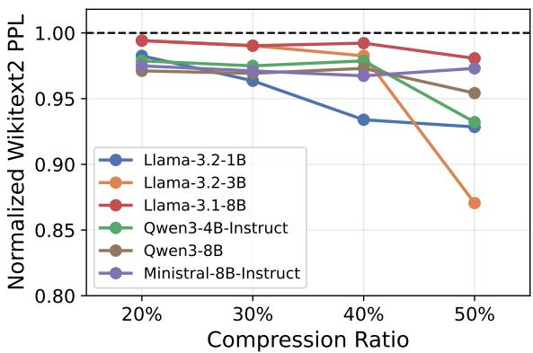
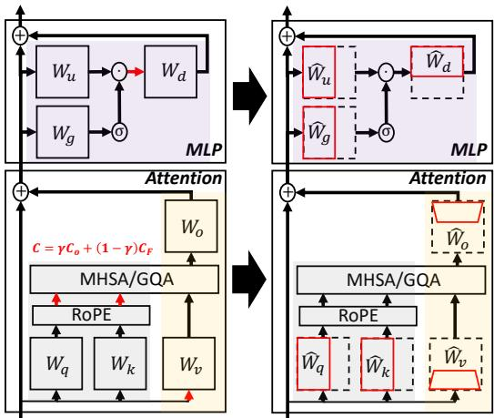
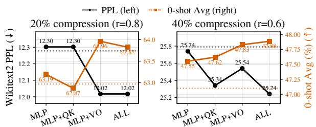

# LaMoC: Loss-Aware Modular Compression for LLMs

Mohanad Odema 米 LG Electronics USA

Jacob Song LG Electronics USA

## Abstract

Modular compression has enabled considerable parameter reduction in LLMs while preserving strong language understanding and downstream task accuracy. However, existing joint modular compression methods primarily rely on activation statistics, leaving loss-sensitivity information and its module-level characterization underexplored. We investigate addressing this gap with LaMoC, a loss-aware modular compression methodology that blends activation and Empirical Fisher statistics through gradienterror alignment. LaMoC improves joint compression by selecting compression statistics that better align local module reconstruction error with the downstream loss. Our contributions are three-fold: (1) We characterize the Empirical Fisher as a module-level loss-aware proxy that can be blended with the activation statistics required for compression. (2) We reformulate joint modular compression as a two-tiered optimization problem that minimizes module reconstruction error while tuning the activation and gradient information blending rate. (3) We implement an empirically driven methodology with statistical validation to solve the resulting compression problem. We evaluate LaMoC across four model families spanning eight models. On the 4–8B models, LaMoC achieves an average 2.5% reduction in perplexity and a 1% relative improvement in task accuracy over state-of-the-art modular compression methods.

## 1 Introduction

Parameter reduction is critical to enabling LLM efficiency in constrained deployment environments and at scale. Methods like pruning (Ma et al., 2023; Ashkboos et al., 2024; Frantar and Alistarh, 2023; Bai et al., 2024) and low-rank approximation (Wang et al., 2025c; Yuan et al., 2023; Wang et al., 2025a) have gained widespread adoption. Pruning removes weights, heads, or hidden dimensions based on a metric of importance in a structured or an unstructured manner, whereas low-rank approximation replaces the dense weight matrices with two low-rank factors that are more parameterand compute-efficient. For example, Singular Value Decomposition (SVD) can approximate a single weight matrix as $W _ { m \times n } \approx A _ { m \times r } B _ { r \times n }$ such that $r \ll \operatorname* { m i n } ( m , n )$ , effectively reducing parameter count while providing optimal rank-r truncation under Eckart-Young-Mirsky theorem (Eckart and Young, 1936; Mirsky, 1960).

  
Figure 1: Normalized WikiText-2 perplexity for LaMoC relative to baseline MoDeGPT (Lin et al., 2025).

Until recently, the considerable loss in knowledge capacity and task proficiency as a result of parameter reduction often necessitated a subsequent fine-tuning stage post compression. However, recent advances (Lin et al., 2025; Liu et al., 2025; Yin et al., 2025; Chiang et al., 2026) have substantially closed the post compression performance gap, reducing the reliance on expensive fine-tuning procedures, with several methods positioned as trainingfree approaches with an optional fine-tuning recovery stage. The effectiveness of these training-free methodologies can be attributed to these ideas:

• Activation Awareness. Modern compression methods increasingly move beyond weight-only criteria by using activation statistics to guide compression. This information can define the reconstruction target in low-rank approximation (Wang et al., 2025c; Yuan et al., 2023) or rank parameter importance for pruning (Sun et al., 2024).

• Loss Sensitivity Information. Another thread follows the ideas of Optimal Brain Damage (Le-Cun et al., 1989; Hassibi et al., 1993), where loss-derivative statistics are incorporated to assess parameter importance for compression, applicable in both pruning (Ma et al., 2023; Yin et al., 2025) and low-rank reconstruction through loss sensitivity estimates (Hsu et al., 2022).

• Non-uniform Truncation. Different layers and weight groups exhibit varying degrees of sensitivity to compression. Thus, recent approaches have opted to assign pruning/truncation ratios non-uniformly based on a measure of such sensitivity (Men et al., 2025; Yang et al., 2025b; Li et al., 2025; Wang et al., 2025b; Lin et al., 2025).

• Modularity. Rather than compressing each weight matrix independently, modular compression jointly compresses related weight groups, enabling module-level reconstruction objective and tailoring compression operators to each module’s structural and functional properties (Lin et al., 2025; Wong et al., 2025; Chiang et al., 2026; Koike-Akino et al., 2025).

The combination of all four techniques remains underexplored – specifically the incorporation of loss sensitivity information for modular compression. For instance, the state-of-the-art training-free compression method, MoDeGPT (Lin et al., 2025), is a modular compression approach that leverages activation awareness and non-uniform truncation. In Figure 1, we motivate how further consideration of loss sensitivity information on the module level can better preserve language modeling capabilities post compression, as seen by the decrease in perplexity compared to baseline MoDeGPT across different model architectures. From here, we frame the following research questions:

• RQ1: Can loss-sensitivity information be systematically incorporated into modular compression to improve language modeling and downstream task performance?

• RQ2: How can module-level loss sensitivity be characterized and blended with the activation statistics required for joint compression?

• RQ3: How can joint modular compression be formulated as a loss-aware optimization problem to be solved in practical settings?

Given these RQs, we summarize the key contributions of this work as follows:

• We derive a module-level characterization to incorporate loss sensitivity information into modular compression using gradient-weighted second order activation statistics.

• We formulate the loss-aware modular compression objective as a two-tiered optimization problem minimizing the modular reconstruction loss while selecting a per-module blending rate between activation and gradient-weighted statistics.

• We present LaMoC, an empirically-driven methodology with statistical validation to address the resulting two-tiered loss-aware modular compression problem leveraging fixed and adaptive strategies for controlling the degree of gradient information blending in a practical manner.

• We conduct experiments across 4 model families and 8 models showing that LaMoC improves SOTA modular compression pipelines by on average 2.5% and 1% in language modeling (perplexity) and downstream task accuracy, respectively.

## 2 Background

## 2.1 Related Works

Parameter Reduction. Parameter reduction aims to improve LLM efficiency and memory footprint by removing or approximating less important parameters. This is commonly achieved through pruning (Molchanov et al., 2019; Xia et al., 2022; Ashkboos et al., 2024; Frantar and Alistarh, 2023; Sengupta et al., 2025; Ma et al., 2023; Men et al., 2025) and low-rank approximation (Wang et al., 2025c,b,a; Yuan et al., 2023; Hu et al., 2026; Hsu et al., 2022). Typically, pruning removes structured components such as layers, modules, channels, heads, or hidden dimensions, while low-rank approximation replaces dense weight matrices with compact factors. These methods define the basic parameter reduction operators. Recently, the application of these compression operators has extended beyond isolated matrices to coupled weight groups.

Modular Compression. Recent works (Lin et al., 2025; Chiang et al., 2026; Wong et al., 2025; Koike-Akino et al., 2025) advance this direction through modular compression, where pruning or low-rank approximation is applied to structured groups of weight matrices according to their functional role and architectural properties. This modular view better reflects the underlying dynamics of coupled matrices whose outputs interact through non-linear operations and downstream transformations. As a result, modular compression introduces a broader module-level reconstruction objective rather than treating each matrix independently. Still, modular methods rely predominantly on activation-driven reconstruction criteria to guide the compression objective.

Activation-Aware Compression. Instead of minimizing weight reconstruction error, modern parameter-reduction methods (Wang et al., 2025c,b,a; Hu et al., 2026; Lin et al., 2025; Chiang et al., 2026) target the reconstruction of output feature representations: min $\lVert X _ { l } ( W _ { l } - \hat { W } _ { l } ) \rVert _ { F } ,$ , where $X _ { l }$ is the input to layer l, and $W _ { l }$ and $\hat { W } _ { l }$ denote the original and compressed weights. Typically to achieve this in practice, calibration data is propagated through the model to collect second-order activation statistics (Gram autocorrelations), which are then used to project weights into the activation space or identify important dimensions. Recent works (Odema et al., 2026) study the role of calibration data in residual error accumulation during compression and its effect on layer-sensitivity misalignment. Still, these activation statistics do not necessarily capture how compression decisions affect the downstream loss.

Loss-Aware Compression. A complementary line of work incorporates loss-derivative information to guide the compression decisions. Early methods such as Optimal Brain Damage and $\mathrm { O p } \cdot$ timal Brain Surgeon (LeCun et al., 1989; Hassibi et al., 1993) use second-order derivative information to guide pruning decisions. The idea still persists in recent pruning (Singh and Alistarh, 2020; Ma et al., 2023; Frantar and Alistarh, 2023) and low-rank approximation (Hsu et al., 2022) methods, where Hessian- or Fisher-based curvature proxies are used to estimate compression sensitivity and weight parameter importance.

Motivation. Despite progress in modular and loss-aware compression, their combination remains underexplored. Existing modular methods primarily rely on activation-driven reconstruction objectives, while loss-aware methods are often applied at the level of individual parameters or matrices. This motivates a study on loss-aware modular compression, how to incorporate loss-curvature statistics into module-wise compression objectives, and the potential gains from this approach. More details on the positioning of this work in relation to other loss-aware frameworks are in Appendix B.

  
Figure 2: LLM Modular Compression. (left) Colors demonstrate the different module groupings (QK, VO, MLP). Red arrows indicate the activation space in which the activation Gram $\mathcal { C } _ { 0 }$ is collected and the empirical Fisher-weighted Gram $\mathcal { C } _ { F }$ is projected into that same space from gradients computed at each module’s output projection. The combined gradient-weighted Gram formulation is also shown in red. (right) Weight matrices post Modular Compression.

## 2.2 Preliminaries on Joint Decomposition

Figure 2 illustrates the key module constructions for joint compression following recent SOTA works (Lin et al., 2025; Chiang et al., 2026; Wong et al., 2025) detailed in the following.

Notation. Let $d _ { h }$ denote the hidden dimension of the transformer model; $\begin{array} { r } { d _ { \mathrm { h e a d } } = \frac { d _ { h } } { n _ { \mathrm { h e a d } } } } \end{array}$ denote the head dimension given $n _ { \mathrm { h e a d } }$ attention heads1; $d _ { \mathrm { i n t } }$ denote the intermediate dimension. The up and gate projection weight matrices are denoted by $W _ { u } , W _ { g } \in \mathbb { R } ^ { d _ { h } \times d _ { \mathrm { i n t } } }$ , respectively; the down projection weight matrix is denoted by $W _ { d } \in \mathbb { R } ^ { d _ { \mathrm { i n t } } \times d _ { h } }$ The query, key, and value matrices are denoted by $W _ { q } , W _ { k } , W _ { v } \ \in \ \mathbb { R } ^ { d _ { h } \times ( n _ { \mathrm { h e a d } } \times d _ { \mathrm { h e a d } } ) } ;$ ; The output projection matrix $W _ { o } ~ \in ~ \mathbb { R } ^ { ( n _ { \mathrm { h e a d } } \times d _ { \mathrm { h e a d } } ) \times d _ { h } }$ Broadly, activation Gram, matrices are denoted by $\mathcal { C } = \boldsymbol { X } ^ { \top } \boldsymbol { X } \in \mathbb { R } ^ { d \times d }$ where $X \in \mathbb { R } ^ { T \times d }$ indicate the input sequence of length T and a dimension d specified based on the where X is captured. $\rho ( \cdot )$ indicates Rotary Positional Embedding (RoPE).

MLP Module. $W _ { u } , W _ { g } .$ , and $W _ { d }$ are jointly compressed through dimension pruning of the shared intermediate dimension $d _ { \mathrm { i n t } }$ , reducing it to $r \ll d _ { \mathrm { i n t } }$ . In order to select which intermediate dimensions to prune, the following sequence is used: 1) Activation gram statistics $\mathcal { C } _ { \mathrm { i n t } } = X _ { \mathrm { i n t } } ^ { \top } X _ { \mathrm { i n t } } \in$ $\mathbb { R } ^ { d _ { \mathrm { i n t } } \times d _ { \mathrm { i n t } } }$ are collected prior to down projection using calibration data; 2) Per-dimension scores s ∈ $\mathbb { R } ^ { d _ { \mathrm { i n t } } }$ are computed based on criterion like ridge leverage scores $\mathbf { s } = \mathrm { d i a g } ( \mathcal { C } _ { \mathrm { i n t } } ( \mathcal { C } _ { \mathrm { i n t } } + \lambda I ) ^ { - 1 } ) \ \in$ $\mathbb { R } ^ { d _ { \mathrm { i n t } } } ; 3 )$ The intermediate dimensions are sorted in a descending importance order based on s; 4) A selection matrix from top-r scores $S _ { k } \in \mathbb { R } ^ { d _ { \mathrm { i n t } } }$ ×r is constructed to be multiplied by the individual weight matrices to prune $d _ { \mathrm { { i n t } } }$ providing $W _ { u } S _ { k }$ $W _ { g } S _ { k } \in \mathbb { R } ^ { d _ { h } \times r }$ and $S _ { k } ^ { \top } W _ { d } \in \mathbb { R } ^ { r \times d _ { h } }$

QK Module. $W _ { q }$ and $W _ { k }$ are truncated along the head dimension $d _ { \mathrm { h e a d } }$ . The key idea is to derive per-head scoring vectors, $\mathbf { s } _ { \mathrm { h e a d } } \in \mathbb { R } ^ { d _ { \mathrm { h e a d } } }$ , before applying dimension pruning. The scores are estimated based on channel importance evaluated at each attention head. Specifically, given an attention block input, $X \in \mathbb { R } ^ { T \times d _ { h } }$ , activation channel correlations are collected at each head i through:

• Query Correlations. Let $X _ { q } ^ { i } = \rho ( X W _ { q } ^ { i } )$ be the RoPE-transformed query activation for the $i ^ { t h }$ attention head. Then, the query autocorrelation is $\mathcal { C } _ { q } ^ { i } = ( X _ { q } ^ { i } ) ^ { \top } X _ { q } ^ { i } \in \mathbb { R } ^ { d _ { \mathrm { h e a d } } \times d _ { \mathrm { h e a d } } }$

• Key Correlations. Let $X _ { k } ^ { i } = \rho ( X W _ { k } ^ { i } )$ be the RoPE-transformed key activation for the $i ^ { t h }$ attention head. Then, the key autocorrelation is $\mathcal { C } _ { k } ^ { i } = ( X _ { k } ^ { i } ) ^ { \top } X _ { k } ^ { i } \in \mathbb { R } ^ { d _ { \mathrm { h e a d } } \times d _ { \mathrm { h e a d } } }$

• QK Correlations. Given $\mathcal { C } _ { k } ^ { i }$ and $\mathcal { C } _ { q } ^ { i }$ , the final importance scores for each head i are evaluated through a Hadamard product of the column norm vectors of their matrix square roots, $\mathbf { s } ^ { i } = \vert \vert ( \mathcal { C } _ { q } ^ { i } ) ^ { 1 / 2 } \vert \vert _ { \mathrm { c o l } } \odot \vert \vert ( \mathcal { C } _ { k } ^ { i } ) ^ { 1 / 2 } \vert \vert _ { \mathrm { c o l } } \in \bar { \mathbb { R } } ^ { d _ { \mathrm { h e a d } } }$

Using $\mathbf { s } ^ { i }$ , a per-head selection matrix $S _ { q k } ^ { i } ~ \in$ $\mathbb { R } ^ { d _ { \mathrm { h e a d } } \times r }$ with $r \ll d _ { \mathrm { h e a d } }$ can be constructed to select the top-r important channels: $\hat { W } _ { q } ^ { i } = W _ { q } ^ { i } S _ { q k } ^ { i }$ and $\hat { W } _ { k } ^ { i } = W _ { k } ^ { i } S _ { q k } ^ { i }$ , where $\hat { W } _ { q } ^ { i } , \hat { W } _ { k } ^ { i } \in \mathbb { R } ^ { d _ { h } \times r }$

VO Module. $W _ { v }$ and $W _ { o }$ are jointly compressed through a sequence of SVD operations which render two low-rank matrices $\hat { \hat { W } } _ { v } ~ \in ~ \mathbb { R } ^ { d _ { h } \times ( n _ { \mathrm { h e a d } } \times r ) }$ and $\hat { W } _ { o } ~ \in ~ \mathbb { R } ^ { ( n _ { \mathrm { h e a d } } \times r ) \times d _ { h } }$ . To achieve this, activation Gram statistics are collected at the input to $W _ { v } ,$ , yielding $\mathcal { C } _ { v } ~ = ~ X _ { v } ^ { \top } X _ { v } ~ \in ~ \mathbb { R } ^ { d _ { h } \times d _ { h } }$ For each head, two successive SVD operations are applied to approximate $\mathcal { C } _ { v } ^ { 1 / 2 } W _ { v } ^ { i } W _ { o } ^ { i }$ as follows: (1) $( \mathcal { C } _ { v } ^ { 1 / 2 } W _ { v } ^ { i } ) W _ { o } ^ { i } = ( U _ { v } ^ { i } \Sigma _ { v } ^ { i } ( V _ { v } ^ { i } ) ^ { \top } ) W _ { o } ^ { i } ;$ (2) $U _ { v } ^ { i } ( \Sigma _ { v } ^ { i } ( V _ { v } ^ { i } ) ^ { \top } W _ { o } ^ { i } ) \approx U _ { v } ^ { i } ( U _ { r } ^ { i } \Sigma _ { r } ^ { i } ( V _ { r } ^ { i } ) ^ { \top } )$ , where the subscript r denotes truncation to a rank r. The final low-rank matrices can then be defined as follows: $\hat { W } _ { v } ^ { i }  \mathcal { C } _ { v } ^ { - 1 / 2 } U _ { v } ^ { i } U _ { r } ^ { i }$ and $\hat { W } _ { o } ^ { i }  \Sigma _ { r } ^ { i } ( V _ { r } ^ { i } ) ^ { \top }$

## 3 LaMoC: Loss-Aware Modular Compression for LLMs

This section introduces our method for loss-aware modular compression, which enforces gradienterror alignment during compression to incorporate loss sensitivity into the reconstruction objective.

Key Contribution and Overview. The key contribution here lies in the formulation of lossaware low-rank compression in the module activation space by blending gradient-weighted and canonical activation statistics, where a two-tiered compression objective is derived spanning module reconstruction and the gradient information blending rate. Based on empirical observations, we then propose fixed and adaptive blending strategies to control the blending rate in the module activation space according to an estimate on the expected change in cross entropy.

## 3.1 Gradient-Error Alignment

Following the characterization of gram matrices for joint compression in Section 2.2, we define a gradient-weighted effective Gram matrix. For readability, we omit the module superscript:

Definition 1. Let $ { \mathcal { C } } _ { 0 } = ( X ) ^ { \top } X$ be a canonical activation Gram matrix collected for an arbitrary module l. Define $\mathcal { C } _ { F }$ as a Fisher-weighted activation gram, then an effective gradient-aligned activation Gram matrix is given as:

$$
\mathcal { C } _ { \mathrm { e f f } } ( \gamma ) = \gamma \mathcal { C } _ { 0 } + ( 1 - \gamma ) \mathcal { C } _ { F }\tag{1}
$$

where $\gamma \in [ 0 , 1 ]$ is a blending coefficient to control the degree of gradient information blending.

The red arrows in Figure 2 indicate for each module the activation space in which $\mathcal { C } _ { 0 }$ and $\mathcal { C } _ { F }$ are blended. This gradient-aligned Gram formulation can replace any activation Gram derived for any module from Section 2.2. The canonical activation gram without any gradient information blending is obtained at $\gamma = 1$ . For $\gamma < 1 , \mathcal { C } _ { F }$ skews the effective autocorrelation towards channels or energy directions more sensitive to the downstream loss. To provide a formal definition for $\mathcal { C } _ { F }$ , we first define a diagonal Fisher approximation as a per-channel importance vector:

Definition 2. Let $\begin{array} { r } { \delta _ { n } = \frac { \partial \mathcal { L } _ { \mathrm { C E } } } { \partial x _ { n } } \in \mathbb { R } ^ { d } } \end{array}$ be the gradient of cross entropy with respect to activation vector $x _ { n }$ for the $n ^ { \mathrm { t h } }$ calibration sample at a target compression module. Then, per-channel importance can be derived using the diagonal ofempirical Fisher:

γ=0.75 +0.24 +0.96 +0.59 +0.10 +0.95 +0.90 +0.81 +0.84 +0.57 +0.92 +0.99 +0.99 +0.95 +0.95 +0.86 +0.89   
γ=0.50 +0.06 +0.93 +0.96 +0.25 +0.92 +0.35 +0.83 +0.98 +0.98 +0.84 +0.97 +0.96 +0.92 +0.99 +0.54 +0.90   
L0 L1 L2 L3 L4 L5 L6 L7 L8 L9 L10 L11 L12 L13 L14 L15  
Figure 3: Pearson Correlation (↑) between fixed reference first-order proxy and true $\Delta \mathcal { L } _ { \mathrm { C E } }$ for Llama-3.2-1B layers.

$$
\mathbf { f } = \mathrm { d i a g } ( \mathbb { E } _ { n } [ \delta _ { n } ( \delta _ { n } ) ^ { \top } ] ) , \qquad \mathbf { f } \in \mathbb { R } ^ { d }\tag{2}
$$

which ignores cross-channel gradient correlations following the approximation in (LeCun et al., 1989; Hassibi et al., 1993).

From the diagonal Fisher approximation we can construct a Fisher-weighted activation Gram:

Definition 3. Let $\mathbf { f } \in \mathbb { R } ^ { d }$ be the diagonal empirical Fisher vector characterizing the per-channel importancefor a given module, then the Fisher-weighted activation Gram is defined as:

$$
\begin{array} { r l r } { \mathcal { C } _ { F } = D _ { f } ^ { 1 / 2 } \mathcal { C } _ { 0 } D _ { f } ^ { 1 / 2 } , } & { { } } & { D _ { f } ^ { 1 / 2 } = \mathrm { d i a g } ( \sqrt { \mathbf { f } } ) } \end{array}\tag{3}
$$

Lastly, we rescale $\mathcal { C } _ { F }$ using a trace ratio to match the total energy of canonical $\mathcal { C } _ { 0 }$ before blending:

$$
\mathcal { C } _ { F }  \mathcal { C } _ { F } \frac { \mathrm { t r a c e } ( \mathcal { C } _ { 0 } ) } { \mathrm { t r a c e } ( \mathcal { C } _ { F } ) }\tag{4}
$$

This ensures $\gamma$ blending between the canonical and Fisher-weighted statistics in Equation 1 is conducted on a matched energy scale. This concludes the gradient-aware effective Gram construction.

## 3.2 Problem Formulation

Given the loss-sensitive effective Gram matrix construction in Section 3.1, the joint compression output reconstruction objective can be redefined.

Definition 4. Let m be a target module to bejointly compressed, and let $\mathcal { C } _ { \mathrm { e f f } } ( \gamma _ { m } )$ denote the effective Gram defined in Equation 1. The module output reconstruction objective in a loss-aware joint compression process can be defined through thefollowing two-tiered optimization formulation:

$$
\hat { m } ^ { \star } = \arg \operatorname* { m i n } _ { \hat { m } } \vert \vert ( \hat { m } - m ) \mathcal { C } _ { \mathrm { e f f } } ^ { 1 / 2 } ( \gamma _ { m } ^ { \star } ) \vert \vert _ { F } ^ { 2 }\tag{5}
$$

$$
\gamma _ { m } ^ { \star } = \arg \operatorname* { m i n } _ { \gamma _ { m } \in [ 0 , 1 ] } \Delta \mathcal { L } _ { \mathrm { C E } } ( \gamma _ { m } )\tag{6}
$$

where $\hat { m } ^ { \star }$ represents the final compressed module conditioned on an optimal choice of $\gamma _ { m } ^ { \star }$ that minimizes degradation in cross-entropy loss $\Delta { \mathcal { L } } _ { \mathrm { C E } } ( \gamma _ { m } )$ relative to canonical compression.

## 3.3 Method

Solving the two-tiered optimization objective requires addressing the following challenges:

• Navigating a combinatorial solution space comprising layers, modules, and $\gamma$ options

• Evaluation of $\Delta \mathcal { L } _ { \mathrm { C E } }$ and the gradients for each candidate compression solution

We present our LaMoC method derived based on empirical analysis and statistical observations.

First-Order Loss Approximation. (LeCun et al., 1989) and (Hassibi et al., 1993) used a Taylor Expansion to formulate the change in loss due to parameter reduction, generally defined as:

$$
\Delta \mathcal { L } _ { \mathrm { C E } } = \delta ^ { \top } \Delta w + \frac { 1 } { 2 } \Delta w ^ { \top } \mathcal { H } \Delta w\tag{7}
$$

where δ indicates the gradient $\frac { \partial \mathcal { L } _ { C E } } { \partial w }$ with respect to perturbed parameter; $\Delta w$ denotes parameter perturbation; and H the Hessian matrix. In our formulation, $\Delta \mathcal { L } _ { C E }$ is only required to identify $\gamma _ { m } ^ { \star }$ for a module m as per Equation 6. Therefore, we can leverage a First-order approximation to evaluate the Expected $\Delta \mathcal { L } _ { C E }$ post module m compression without materializing the Hessian as follows:

$$
\mathbb { E } [ \Delta \mathcal { L } _ { \mathrm { C E } } ( \gamma _ { m } ) ] = \frac { 1 } { N } \sum _ { n = 1 } ^ { N } ( \delta _ { n } ^ { m } ) ^ { \top } X _ { n } ( \hat { m } _ { \gamma _ { m } } - m )\tag{8}
$$

where N is the number of input tokens; $X _ { n }$ is the $n ^ { t h }$ input at module m; $\delta _ { n } ^ { m }$ is the gradient with respect to the $n ^ { t h }$ module output; $\hat { m } _ { \gamma _ { m } }$ is compressed module version given $\gamma _ { m }$

Reference Gradients. To avoid evaluating the $\delta _ { n } ^ { m }$ with every sampled γ in Equation $^ { 8 , }$ we use the canonical solution gradients at $\gamma { = } 1$ as the reference gradients to be used for all $\gamma$ solutions at a module $m$ . Thus, the expected change in cross-entropy in Equation 8 becomes relative to the canonical solution whose gradients are only computed once, and reused for subsequent candidates. This enables faster evaluation without expensive backpropagation requirements for each γ candidate. The reference gradients for proxy prediction are computed at the $( \gamma { = } 1 . 0 )$ compression, and the activations are not updated to consider previous layer effects.

<table><tr><td rowspan="2">Method</td><td colspan="4">Llama-3.1-8B</td><td colspan="4">Ministral-8B-It-2410</td><td colspan="4">Qwen3-4B-It-2507</td><td colspan="4">Qwen3 8B</td></tr><tr><td>20%</td><td>30%</td><td>40%</td><td>50%</td><td>20%</td><td>30%</td><td>40%</td><td>50%</td><td>20%</td><td>30%</td><td>40%</td><td>50%</td><td>20%</td><td>30%</td><td>40%</td><td>50%</td></tr><tr><td>UniQL (Chiang et al., 2026)</td><td>9.20</td><td>12.18</td><td>18.29</td><td>30.15</td><td>9.79</td><td>12.18</td><td>17.18</td><td>27.03</td><td>14.93</td><td>22.76</td><td>43.87</td><td>168.17</td><td>14.47</td><td>19.47</td><td>45.98</td><td>196.62</td></tr><tr><td>MoDeGPT (Lin et al., 2025)</td><td>8.61</td><td>10.79</td><td>15.19</td><td>22.89</td><td>9.05</td><td>10.75</td><td>14.33</td><td>20.60</td><td>12.28</td><td>15.77</td><td>25.79</td><td>90.02</td><td>12.18</td><td>15.13</td><td>28.55</td><td>83.58</td></tr><tr><td>Fixed γ = 0.5 Fixed γ = 0.75</td><td>8.54</td><td>10.67 10.71</td><td>15.07</td><td>22.54</td><td>8.83</td><td>10.46</td><td>13.89</td><td>20.05</td><td>12.06</td><td>15.52</td><td>25.54</td><td>92.15</td><td>11.88</td><td>14.75</td><td>28.94</td><td>84.89</td></tr><tr><td>Adaptive γ*</td><td>8.55 8.55</td><td>10.71</td><td>15.07 15.07</td><td>22.45 22.45</td><td>8.86 8.83</td><td>10.50 10.44</td><td>13.94 13.86</td><td>20.16 20.05</td><td>12.13 12.02</td><td>15.67 15.37</td><td>25.24 25.24</td><td>89.32 83.91</td><td>12.06 11.83</td><td>14.90 14.67</td><td>28.27 27.78</td><td>82.60 79.75</td></tr></table>

Table 1: WikiText-2 perplexity (↓) using 128 calibration samples from WikiText-2 at 2048 sequence length.

<table><tr><td rowspan="2">Method</td><td colspan="2">Llama-3.2-3B</td><td colspan="2">Llama-3.2-1B</td></tr><tr><td>20%</td><td>40%</td><td>20%</td><td>40%</td></tr><tr><td>UniQL (Chiang et al., 2026)</td><td>14.93</td><td>47.44</td><td>27.03</td><td>184.70</td></tr><tr><td>MoDeGPT (Lin et al., 2025) Fixed γ = 0.5</td><td>10.88 10.84</td><td>22.32</td><td>17.52</td><td>44.21</td></tr><tr><td>Fixed γ = 0.75</td><td>10.86</td><td>22.02 21.97</td><td>16.98 17.05</td><td>40.97 41.70</td></tr><tr><td>Adaptive γ*</td><td>10.81</td><td>21.93</td><td>17.21</td><td>41.29</td></tr></table>

Table 2: WikiText-2 PPL (↓) for Llama-3.2-3B and Llama-3.2-1B models.

Statistical Validation. We validate the usage of fixed reference gradients in the first-order proxy for estimating $\Delta \mathcal { L } _ { \mathrm { C E } }$ using a statistical analysis measuring Pearson correlation between the proxy estimates and the true cross-entropy changes. Figure 3 illustrates the correlation at each layer’s last module output for a Llama-3.2-1B model given $\gamma ~ \in ~ \{ 0 . 5 , 0 . 7 5 \}$ We observe the correlation strength differs per-layer as the proxy is dependent on the calibration settings and relies on a first-order approximation of reference gradients. Overall, we observe Pearson correlation reaches 0.91±0.28.

$\gamma$ Selection Policy. Denote $\mathbf { p } ( \gamma _ { m } )$ $\mathbb { E } [ \Delta \mathcal { L } _ { \mathrm { C E } } ( \gamma _ { m } ) ]$ . Then, a heuristic $\gamma$ selection policy per module can be defined:

$$
\gamma _ { m } ^ { \star } = \left\{ \begin{array} { l l } { \arg \underset { \gamma _ { m } \in \Gamma _ { m } } { \mathrm { m i n } } \mathbf { p } ( \gamma _ { m } ) , } & { \mathrm { i f } \underset { \gamma _ { m } \in \Gamma _ { m } } { \mathrm { m i n } } \mathbf { p } ( \gamma _ { m } ) < 0 , } \\ { 1 , } & { \mathrm { o t h e r w i s e } . } \end{array} \right.\tag{9}
$$

where $\Gamma _ { m }$ represents the set of viable discrete γ candidates under exploration. The condition ensures that $\gamma$ is selected for the target module iff the proxy predicts a reduction in cross entropy loss relative to the canonical compression. Otherwise, canonical $\gamma _ { m } = 1$ is assigned to the module m.

End-to-end Compression. Once $\gamma _ { m } ^ { \star }$ is selected for each module, compression proceeds by applying the corresponding module-specific effective Gram and assembling the resulting modules into a gradient-aligned compressed model. We further validate the effects of compounded predictions on $\mathbf { p } ( \gamma _ { m } )$ for all modules of Llama-3.2-1B after 15% compression, and find that the overall Pearson correlation still holds at 0.913.

## 4 Experiments

Implementation. Unless otherwise stated, we build our loss-aware modular compression on top of MoDeGPT with groupings of MLP, QK, and VO following Section 2.2 supplemented by LaMoC implementation in Section 3.3. We follow MoDeGPT experimental setup with 128 calibration samples from WikiText-2 at sequence length 2048.

Selection Strategy. We fix $\gamma _ { l } \in \{ 0 . 5 , 0 . 7 5 \} \forall l \in$ $\{ 1 , \cdots , L \}$ and adopt two strategies for γ selection: (1) Fixed; where the same $\gamma$ value is assigned within each module in every layer. (2) Adaptive; where each module selects $\gamma ^ { \star }$ value from the candidate set which achieves the minimum expected cross entropy loss following Equation 9.

Baselines. Our key baselines are MoDeGPT (Lin et al., 2025) and UniQL (Chiang et al., 2026). Both works follow in principle the joint decomposition flow introduced in Section 2.2 with some differences as UniQL is more system-oriented and relaxed some of MoDeGPT principled methodology. We focus on MoDeGPT and UniQL as they represent training-free methods shown to have outperformed strong pruning baselines (SliceGPT (Ashkboos et al., 2024), LLM Surgeon(van der Ouderaa et al., 2024), ShortGPT(Men et al., 2025)).

Evaluation and Models. We evaluate the efficacy of our approach using WikiText-2 perplexity (Merity et al., 2016), 5-shot MMLU, and Zeroshot accuracy from the Lm-eval harness (Gao et al., 2023) – PiQA, Arc-E, Winogrande (accuracy); Hellaswag and Arc-C (normalized accuracy). We focus on the training-free compression performance following (Lin et al., 2025), and target 1B-8B parameter models across the Llama-3 (Grattafiori et al., 2024), Qwen3 (Yang et al., 2025a), and

<table><tr><td>Model</td><td>Compress.</td><td>Method</td><td>MMLU (5-shot)</td><td>ARC-e</td><td>ARC-c</td><td>PIQA</td><td>WinoG.</td><td>HellaS.</td><td>Average</td></tr><tr><td rowspan="4">Llama-3.1 -8B</td><td>0%</td><td>Dense</td><td>65.60</td><td>81.57</td><td>53.75</td><td>80.25 71.98</td><td>74.35 71.74</td><td>78.89 67.45</td><td>72.40 62.96</td></tr><tr><td>20%</td><td>MoDeGPT  $\mathrm { F i x e d } \gamma = 0 . 7 5$ </td><td>55.83 56.20 57.04</td><td>69.74 71.17 70.96</td><td>41.04 41.04 40.78</td><td>72.03 71.87</td><td>71.03 70.56</td><td>66.60 66.62</td><td>63.01 62.97</td></tr><tr><td>40%</td><td> $\mathrm { \bf A d a p t i v e } \gamma ^ { \star }$   $\overline { { \mathbf { M o D e G P T } } }$   $\mathrm { F i x e d } \gamma = 0 . 7 5$ </td><td>41.61 43.96</td><td>48.53 50.63</td><td>29.78 29.95</td><td>64.31 63.44</td><td>63.54 64.09</td><td>48.89 48.62</td><td>49.44 50.12</td></tr><tr><td>0%</td><td> $\mathrm { \bf A d a p t i v e } \gamma ^ { \star }$  Dense</td><td>43.80 65.07</td><td>50.80 81.99</td><td>28.67 54.95</td><td>62.73 80.96</td><td>62.75 75.45</td><td>48.40 79.14</td><td>49.52 72.93</td></tr><tr><td rowspan="3">Ministral -8B-It -2410</td><td>20%</td><td>MoDeGPT  $\mathrm { F i x e d } \gamma = 0 . 7 5$   $\mathrm { \bf A d a p t i v e } \gamma ^ { \star }$ </td><td>54.47 55.88 55.95</td><td>70.41 70.66 70.79</td><td>41.98 41.98</td><td>71.98 71.49</td><td>67.80 68.82</td><td>64.67 64.62</td><td>61.88 62.24</td></tr><tr><td>40%</td><td> $\overline { { \mathbf { M o D e G P T } } }$   $\mathrm { F i x e d } \gamma = 0 . 7 5$ </td><td>31.56 31.44</td><td>49.28 49.58</td><td>42.24 29.61 29.10</td><td>71.55 62.13 61.92</td><td>68.90 62.51 62.98</td><td>64.72 45.14 44.82</td><td>62.36 46.71 46.64</td></tr><tr><td>0%</td><td> $\mathrm { \bf A d a p t i v e } \gamma ^ { \star }$  Dense MoDeGPT</td><td>31.94 72.60</td><td>50.17 83.21</td><td>29.27 58.70</td><td>62.02</td><td>62.12</td><td>44.98</td><td>46.75</td></tr><tr><td>Qwen3-4B -It-2507</td><td>20%</td><td> $\mathrm { F i x e d } \gamma = 0 . 7 5$   $\mathrm { \bf A d a p t i v e } \gamma ^ { \star }$   $\overline { { \mathbf { M o D e G P T } } }$   $\mathrm { F i x e d } \gamma = 0 . 7 5$   $\mathrm { \bf A d a p t i v e } \gamma ^ { \star }$ </td><td>46.26 50.48 48.65 24.65 24.90 24.80</td><td>70.92 69.91 73.57 46.21 48.27</td><td>46.33 45.65 47.61 29.27 30.55</td><td>76.01 72.09 72.25 71.55 61.37 62.46</td><td>67.88 62.75 63.77 63.77 55.96</td><td>69.09 62.77 62.56 62.62 42.69</td><td>71.25 60.19 60.77 61.29 43.36</td></tr></table>

Table 3: Task Accuracy at 20% and 40% training-free compression using 128 samples from WikiText-2.

Mistral (Mistral AI, 2024) families. We use base (Llama-3.1-8B, Llama-3.2-3B, Llama-3.2-1B) and instruct (Ministral-8B-Instruct-2410, Qwen3-4B-Instruct-25072, Qwen3-8B) models. Experiments are conducted on two NVIDIA Ada RTX 6000 with 48 GBs of memory each.

## 4.1 Language Modeling Performance

Table 1 compares perplexity (PPL) for LaMoC against the aforementioned joint compression baselines given compression rates of 20%, 30%, 40%, and 50%. We draw the following observations:

Overall Performance. Across all models and compression rates, LaMoC with gradient-error alignment improves the language modeling for all models across the different compression settings. The relative reduction in PPL compared to MoDeGPT reaches an average of 2.46% for a relative reduction range of 0.79% – 6.79%. The average absolute perplexity reduction is at 0.8 with an absolute PPL reduction range of 0.07-6.11.

Model Type Influence. The choice of model family exhibits an effect on the degree of improvement. Taking the 8B tier as an example, the relative reduction in PPL of Llama-3.1-8B is at 1.16% (0.19 abs) contrary to Ministral-8B-It at 2.82% (0.39), suggesting how original training mechanics and task prioritization could have an impact.

Model Size Impact. Smaller models are more likely to benefit from the gradient-alignment approach to recover loss. The Qwen3-4B-It-2507 achieves a better average relative reduction of 3.39% with an average absolute PPL reduction of 1.83. We verify this observation on the smaller Llama-3.2-1B and Llama-3.2-3B in Table 2, where the average reduction can reach 3.20% for a fair subset of the compression ratios.

Compression Rate Impact. Gradient alignment benefits are more observable at aggressive compression rates, which can be attributed to the increasing loss scale. The scale of absolute PPL reduction increases as the compression rate increases – from 0.23 at 20% to 2.73 at 50%.

Choice of γ Strategy. The adaptive strategy offers the strongest relative reduction in PPL (2.42%) compared to the fixed options (1.42% and 1.52%), respectively. For each configuration compared to the best fixed strategy, the adaptive γ strategy leads to PPL reduction reaching up to 5.4 points compared to the best fixed γ option.

## 4.2 Task Proficiency Performance

Table 3 showcases the downstream task performance for the 5-shot MMLU and 0-shot tasks listed beforehand. We compare the performance at 20% and 40% for the Llama-3.1-8B, Ministral-8B-It-2410, and Qwen3-4B-It-2507 in the following.

Overall Performance. Both fixed and adaptive modes of LaMoC improve over the baseline MoDeGPT. The improvements reach on average across all models and compression rates an increase of +0.99% (+0.53 pp) across all benchmarks, broken down to +3.89% (+1.65 pp) on the 5-shot MMLU, and +0.71% (+0.40 pp) for the 0-shot accuracy.

<table><tr><td>Config</td><td>W</td><td>T</td><td>L</td><td>Mean acc. improv.</td></tr><tr><td>Fixed  $\gamma = 0 . 7 5$ </td><td>21</td><td>2</td><td>13</td><td> $+ 0 . 4 1 \pm 1 . 0 7 \mathrm { p p }$ </td></tr><tr><td>Adaptive  $\gamma ^ { \star }$ </td><td>20</td><td>0</td><td>16</td><td> $+ 0 . 4 0 \pm 1 . 1 1 \mathrm { { \ p p } }$ </td></tr><tr><td>Best</td><td>26</td><td>1</td><td>9</td><td> $\mathbf { + 0 . 6 7 \pm 1 . 1 1 \ \mathrm { \overline { { p } } p } }$ </td></tr></table>

Table 4: Win/tie/loss counts and mean task accuracy improvement based on the data in Table 3.
<table><tr><td rowspan="2"></td><td>Ministral-8B |</td><td></td><td>Qwen3-4B</td><td>Qwen3-8B</td><td></td></tr><tr><td> $\gamma { = } 1$ </td><td> $\gamma ^ { \star }$ </td><td> $\gamma { = } 1$   $\gamma ^ { \star }$ </td><td> $\gamma { = } 1$ </td><td> $\gamma ^ { \star }$ </td></tr><tr><td>PPL↓</td><td>12.1611.95</td><td></td><td>16.75 16.08</td><td></td><td>15.7015.10</td></tr><tr><td>0-shot  $\mathbf { A v g } \uparrow$ </td><td>69.18 69.43</td><td></td><td>64.4464.94</td><td></td><td>65.78 66.53</td></tr><tr><td>MMLU↑</td><td>58.80 59.17</td><td></td><td>53.6056.13</td><td></td><td>59.46 60.20</td></tr></table>

Table 5: Calibration data ablation via Alpaca (Taori et al., 2023) at 20% compression on instruction models.

Statistical Analysis. In Table 4, we show the Win/Tie/Loss stats and average task accuracy improvement compared to the baseline based on the task accuracy data for the 6 benchmarks from Table 3. We observe that both Fixed $\gamma = 0 . 7 5$ and Adaptive $\gamma ^ { \star }$ implementations achieve improvements over the baseline, with the best strategy choice achieving $+ 0 . 6 7 \pm 1 . 1 1$ pp accuracy improvement.

Model Effect. The smaller Qwen3-4B-It-2507 experiences the largest improvement +1.89% (+0.98) with MMLU reaching +6.30% (+2.24 pp), compared to larger models like Llama-3.1-8B which improves by +3.65% (+1.78 pp). This suggests how model type and size affects the degree of benefiting from gradient loss alignment given the varying information packing density per parameter translating into different scale of loss effects.

Compression Rate Effect. We also observe the improvements for the 40% compression rate reaches +1.14% (+0.52 pp) compared to the 20% rate achieving +0.89% (+0.54 pp). This goes in line with the insight that the benefits from gradient-loss aligned compression rise as the loss increases.

## 4.3 Ablation

Per-Module Contribution. Figure 4 demonstrates performance contributions from LaMoC across the different modules from Qwen3-4B-It-2507 at 20% and 40% compression. We find that LaMoC application on MLP + VO offers the largest positive change in performance on both evaluation suites.

Calibration Data. In Table 5, we ablate the choice of compression calibration dataset by using

<table><tr><td rowspan="2"></td><td colspan="2">Fixed γ = 0.75</td><td colspan="2">|Adaptive  $\gamma ^ { \star }$ </td></tr><tr><td>EF</td><td>GGN</td><td>EF</td><td>GGN</td></tr><tr><td>PPL↓</td><td>41.70</td><td>41.46</td><td>41.29</td><td>41.05</td></tr><tr><td>LM-Avg ↑</td><td>41.75</td><td>41.74</td><td>42.12</td><td>41.54</td></tr></table>

Table 6: Loss ablation at 40% comp. for Llama-3.2-1B.

<table><tr><td>Model</td><td>Ratio</td><td>Base</td><td>Trace  $\checkmark$ </td><td>Trace ×</td></tr><tr><td rowspan="2">Llama-3.2-1B</td><td>0.8</td><td>17.52</td><td>17.21</td><td>17.52</td></tr><tr><td>0.6</td><td>44.21</td><td>41.29</td><td>44.04</td></tr><tr><td rowspan="2">Qwen3-4B-It</td><td>0.8</td><td>12.28</td><td>12.02</td><td>12.28</td></tr><tr><td>0.6</td><td>25.79</td><td>25.24</td><td>25.69</td></tr></table>

Table 7: Trace-rescaling ablation: WikiText-2 PPL (↓).

128 samples from the Alpaca instruction dataset (Taori et al., 2023) on the instruction-tuned models from the aforementioned list of models. Two observations: (1) Adaptive $\gamma ^ { \star }$ wins on all 6 downstream tasks with average accuracy improvement of $+ 0 . 8 6 \pm 0 . 8 4$ pp compared to the baseline while being consistent across benchmarks – overall improvements reach 3.32%, 0.75%, and 2.12% for perplexity, 0-shot average and MMLU, respectively. (2) Using Alpaca dataset for calibration yields a trade-off in language modeling and task accuracy, consistent with prior works’ observations.

Loss Signal Ablation. We ablate the loss signal used to bias the effective Gram, comparing Empirical Fisher (EF) against generalized Gauss–Newton (GGN) (Botev et al., 2017). Table 6 reports results on Llama-3.2-1B under fixed $\gamma = 0 . 7 5$ and adaptive $\gamma ^ { \star }$ . We observe GGN trading off perplexity gains for LM-Avg reduction, seen in the adaptive $\gamma ^ { \star }$ setting where PPL is reduced by 0.24, while LM-Avg is reduced by 0.58 points relative to EF.

Trace Rescaling Ablation. We ablate the effect of trace rescaling from Equation 4 by invoking compression with Adaptive $\gamma ^ { \star }$ with and without trace rescaling. Tables 7 and 8 show how the results change for WikiText-2 and average 0-shot accuracy for Llama-3.2-1B and Qwen3-4B-It. The results demonstrate the importance of trace rescaling to our method, where on average with trace rescaling, perplexity improvements rise from 0.19% to 3.16% while task accuracy gains rise from 0.02 to 0.40 pp.

Scalability. We further assess the scalability of LaMoC by extending evaluations to Qwen2.5- 32B (Qwen Team, 2024) using 128 samples from WikiText-2 for calibration. For this tier of models, we use UniQL as our modular compression baseline, and perform our evaluations on an NVIDIA RTX PRO 6000 Blackwell with 96 GB of memory. Table 9 shows the results for 20% and 40% compression. We observe on average +1.34 pp improvements in the 0-shot average task accuracy. In Appendix C.2, we show further scalability evaluations on EXAONE 4.5-33B (Choi et al., 2026).

<table><tr><td>Model</td><td>Ratio</td><td>Base</td><td>Trace √</td><td>Trace ×</td></tr><tr><td rowspan="2">Llama-3.2-1B</td><td>0.8</td><td>49.94</td><td>49.15</td><td>49.95</td></tr><tr><td>0.6</td><td>41.34</td><td>42.12</td><td>41.36</td></tr><tr><td rowspan="2">Qwen3-4B-It</td><td>0.8</td><td>62.97</td><td>63.82</td><td>62.98</td></tr><tr><td>0.6</td><td>47.10</td><td>47.88</td><td>47.13</td></tr></table>

Table 8: Trace-rescaling ablation: 0-shot average (↑).

<table><tr><td>Rate</td><td>Config</td><td>WikiT-2 PPL ↓</td><td>0-shot Avg ↑</td></tr><tr><td rowspan="2">20%</td><td>UniQL</td><td>6.73</td><td>69.74</td></tr><tr><td>Adaptive γ*</td><td>6.68</td><td>71.16</td></tr><tr><td rowspan="2">40%</td><td>UniQL</td><td>10.58</td><td>54.00</td></tr><tr><td>Adaptive γ*</td><td>10.42</td><td>55.25</td></tr></table>

Table 9: Qwen2.5-32B evaluations post compression.

  
Figure 4: Per-module performance improvements across the different Qwen3-4B-It-2507 modules.

Repeated Sampling. In Table 10, we repeat our evaluation on the Qwen3-4B-Instruct-2507 at 20% and 40% using 3 different calibration sampling seeds to ensure consistency of the performance gains. We find that 0-shot accuracy improvement holds at $+ 0 . 7 6 \pm 0 . 2 6 ~ \mathrm { p p }$

## 4.4 Latency Performance Benchmarking

We benchmark the end-to-end latency on the NVIDIA RTX Ada 6000 using torch.compile, setting batch size of 1 and 2048 sequence length. For prefill, we take the median of 20 runs, whereas for decode, we use greedy decode and take the median time per output token for 64 decode tokens. In Table 11, we show the results of the benchmarking at 20% compression for the Llama-3.1-8B and the Qwen3-4B-Inst. On average, both models achieve 1.1× speedup compared to their dense baselines.

<table><tr><td>Rate</td><td>Config</td><td>WikiT-2 PPL ↓</td><td>0-shot Avg ↑</td></tr><tr><td>20%</td><td>Base Adaptive γ*</td><td> $1 2 . 2 9 \pm 0 . 0 1$   ${ \bf 1 1 . 9 9 \pm 0 . 0 6 }$ </td><td> $6 3 . 5 0 \pm 0 . 4 6$   ${ \bf 6 4 . 1 8 \pm 0 . 3 8 }$ </td></tr><tr><td>40%</td><td>Base Adaptive γ*</td><td> $2 5 . 5 9 \pm 0 . 1 8$   ${ \bf 2 4 . 9 6 \pm 0 . 2 5 }$ </td><td> $4 6 . 7 6 \pm 0 . 6 1$   ${ \bf 4 7 . 6 0 \pm 0 . 3 5 }$ </td></tr></table>

Table 10: Repeated Qwen3-4B-Instruct-2507 evaluations under 3 different seeds of calibration data.

<table><tr><td rowspan="2"></td><td colspan="2">Llama-3.1-8B</td><td colspan="2">Qwen3-4B</td></tr><tr><td>Dense</td><td>20%</td><td>Dense</td><td>20%</td></tr><tr><td>Prefill (ms)</td><td>341.1</td><td>278.9</td><td>185.0</td><td>165.2</td></tr><tr><td>Decode (ms/tok)</td><td>21.91</td><td>20.2</td><td>14.8</td><td>13.7</td></tr><tr><td>Speedup(N=64)</td><td>1.0×</td><td>1.1×</td><td>1.0×</td><td>1.1×</td></tr></table>

Table 11: End-to-end inference latency at 20% modular compression via torch.compile.

## 5 Discussion

Below are our key insights captured from gradientloss information inclusion in modular compression.

Performance gains stack. We motivated this work by discussing the four key ideas in SOTA training-free compression frameworks: Activation-awareness, loss curvature information, non-uniform truncation, and modularity. This work demonstrated that the stacking of the four techniques can unlock further performance gains.

Generality. LaMoC’s proposal in modifying the activation statistics themselves makes it complementary to the techniques employed by any compression framework. LaMoC can scale to any framework that relies on activation statistics.

Future Directions. LaMoC is based on empirical analysis and statistical observations, which limits our exploration to a small subset of candidate γ values and a heuristic γ selection method. Deriving an analytical method to solve for optimal γ per each module can be investigated in future.

## 6 Conclusion

We provided a characterization for loss-aware modular compression and presented LaMoC, a gradienterror aligned methodology for modular LLM compression. LaMoC injects loss sensitivity through gradient-weighted Gram matrices to address the two-tiered problem formulation over module reconstruction and gradient information blending rate. Our experiments have shown LaMoC improving over state-of-the-art modular compression methods across benchmarks and compression rates.

## Limitations

Our proposed methodology is derived based on empirical observations on the effects of incorporating gradient information onto the joint compression objective. Deriving a theoretically-proven analytical solution for γ remains important for future exploration due to its potential for unlocking further performance gains and improving compression speed. Our method has been tested and evaluated for models ranging from 1B to 33B in model size. Still, broader experimental validation at or beyond the ≥ 30B parameter tier of models remains needed. Furthermore, evaluating the effectiveness of this methodology on emerging model architectures (Hybrid, State-space models, linear attention, Mixture of Experts) and tasks (long context reasoning, agentic tool calling) is a focus for future investigations.

## References

Saleh Ashkboos, Maximilian L. Croci, Marcelo Gennari do Nascimento, Torsten Hoefler, and James Hensman. 2024. SliceGPT: Compress large language models by deleting rows and columns. In The Twelfth International Conference on Learning Representations.

Guangji Bai, Yijiang Li, Chen Ling, Kibaek Kim, and Liang Zhao. 2024. Sparsellm: Towards global pruning of pre-trained language models. Advances in Neural Information Processing Systems, 37:46203– 46225.

Aleksandar Botev, Hippolyt Ritter, and David Barber. 2017. Practical gauss-newton optimisation for deep learning. In International Conference on Machine Learning, pages 557–565. PMLR.

Hung-Yueh Chiang, Chi-Chih Chang, Yu-Chen Lu, Chien-Yu Lin, Kai-Chiang Wu, Mohamed S. Abdelfattah, and Diana Marculescu. 2026. UniQL: Unified quantization and low-rank compression for adaptive edge LLMs. In The Fourteenth International Conference on Learning Representations.

Eunbi Choi, Kibong Choi, Sehyun Chun, Seokhee Hong, Junwon Hwang, Hyojin Jeon, Ahra Jo, Hyunjik Jo, Yeonsik Jo, Joonkee Kim, Seonghwan Kim, Soyeon Kim, Sunkyoung Kim, Yireun Kim, Yongil Kim, Changhun Lee, Haeju Lee, Jinsik Lee, Kyungmin Lee, and 39 others. 2026. Exaone 4.5 technical report. Preprint, arXiv:2604.08644.

Carl Eckart and Gale Young. 1936. The approximation of one matrix by another of lower rank. Psychometrika, 1(3):211–218.

Elias Frantar and Dan Alistarh. 2023. Sparsegpt: Massive language models can be accurately pruned in one-shot. In International conference on machine learning, pages 10323–10337. PMLR.

Leo Gao, Jonathan Tow, Baber Abbasi, Stella Biderman, Sid Black, Anthony DiPofi, Charles Foster, Laurence Golding, Jeffrey Hsu, Alain Le Noac’h, Haonan Li, Kyle McDonell, Niklas Muennighoff, Chris Ociepa, Jason Phang, Laria Reynolds, Hailey Schoelkopf, Aviya Skowron, Lintang Sutawika, and 5 others. 2023. A framework for few-shot language model evaluation.

Aaron Grattafiori, Abhimanyu Dubey, Abhinav Jauhri, Abhinav Pandey, Abhishek Kadian, Ahmad Al-Dahle, Aiesha Letman, Akhil Mathur, Alan Schelten, Alex Vaughan, Amy Yang, Angela Fan, Anirudh Goyal, Anthony Hartshorn, Aobo Yang, Archi Mitra, Archie Sravankumar, Artem Korenev, Arthur Hinsvark, and 542 others. 2024. The llama 3 herd of models. Preprint, arXiv:2407.21783.

Babak Hassibi, David G Stork, and Gregory J Wolff. 1993. Optimal brain surgeon and general network pruning. In IEEE international conference on neural networks, pages 293–299. IEEE.

Yen-Chang Hsu, Ting Hua, Sungen Chang, Qian Lou, Yilin Shen, and Hongxia Jin. 2022. Language model compression with weighted low-rank factorization. In International Conference on Learning Representations.

Xing Hu, Dawei Yang, Yuan Cheng, Zhixuan Chen, and Zukang Xu. 2026. SAES-SVD: Self-adaptive suppression of accumulated and local errors for SVDbased LLM compression. In The Fourteenth International Conference on Learning Representations.

Toshiaki Koike-Akino, Xiangyu Chen, Jing Liu, Ye Wang, Pu, Wang, and Matthew Brand. 2025. Latentllm: Attention-aware joint tensor compression. Preprint, arXiv:2505.18413.

Yann LeCun, John Denker, and Sara Solla. 1989. Optimal brain damage. Advances in neural information processing systems, 2.

Zhiteng Li, Mingyuan Xia, Jingyuan Zhang, Zheng Hui, Haotong Qin, Linghe Kong, Yulun Zhang, and Xiaokang Yang. 2025. Adasvd: Adaptive singular value decomposition for large language models. arXiv preprint arXiv:2502.01403.

Chi-Heng Lin, Shangqian Gao, James Seale Smith, Abhishek Patel, Shikhar Tuli, Yilin Shen, Hongxia Jin, and Yen-Chang Hsu. 2025. MoDeGPT: Modular decomposition for large language model compression. In The Thirteenth International Conference on Learning Representations.

James Liu, Pragaash Ponnusamy, Tianle Cai, Han Guo, Yoon Kim, and Ben Athiwaratkun. 2025. Trainingfree activation sparsity in large language models. In The Thirteenth International Conference on Learning Representations.

Xinyin Ma, Gongfan Fang, and Xinchao Wang. 2023. LLM-pruner: On the structural pruning of large language models. In Thirty-seventh Conference on Neural Information Processing Systems.

Xin Men, Mingyu Xu, Qingyu Zhang, Qianhao Yuan, Bingning Wang, Hongyu Lin, Yaojie Lu, Xianpei Han, and Weipeng Chen. 2025. Shortgpt: Layers in large language models are more redundant than you expect. In Findings of the Association for Computational Linguistics: ACL 2025, pages 20192–20204.

Stephen Merity, Caiming Xiong, James Bradbury, and Richard Socher. 2016. Pointer sentinel mixture models. arXiv preprint arXiv:1609.07843.

Leon Mirsky. 1960. Symmetric gauge functions and unitarily invariant norms. The quarterly journal of mathematics, 11(1):50–59.

Mistral AI. 2024. Ministral-8b-instruct-2410. https://huggingface.co/mistralai/ Ministral-8B-Instruct-2410. Released October 2024.

Pavlo Molchanov, Arun Mallya, Stephen Tyree, Iuri Frosio, and Jan Kautz. 2019. Importance estimation for neural network pruning. In Proceedings of the IEEE/CVF conference on computer vision and pattern recognition, pages 11264–11272.

Mohanad Odema, Gabrielle De Micheli, Dayin Gou, Nilesh Malpeddi, Prathamesh Vaste, and Jacob Song. 2026. Understanding calibration and truncation error propagation in training-free low-rank compression for llms. arXiv preprint arXiv:2608.08506.

Qwen Team. 2024. Qwen2.5: A party of foundation models.

Ayan Sengupta, Siddhant Chaudhary, and Tanmoy Chakraborty. 2025. You only prune once: Designing calibration-free model compression with policy learning. In The Thirteenth International Conference on Learning Representations.

Sidak Pal Singh and Dan Alistarh. 2020. Woodfisher: Efficient second-order approximation for neural network compression. Advances in Neural Information Processing Systems, 33:18098–18109.

Mingjie Sun, Zhuang Liu, Anna Bair, and J Zico Kolter. 2024. A simple and effective pruning approach for large language models. In The Twelfth International Conference on Learning Representations.

Rohan Taori, Ishaan Gulrajani, Tianyi Zhang, Yann Dubois, Xuechen Li, Carlos Guestrin, Percy Liang, and Tatsunori B. Hashimoto. 2023. Stanford alpaca: An instruction-following llama model. https:// github.com/tatsu-lab/stanford\_alpaca.

Tycho F. A. van der Ouderaa, Markus Nagel, Mart Van Baalen, and Tijmen Blankevoort. 2024. The LLM surgeon. In The Twelfth International Conference on Learning Representations.

Qinsi Wang, Jinghan Ke, Masayoshi Tomizuka, Kurt Keutzer, and Chenfeng Xu. 2025a. Dobi-svd: Differentiable svd for llm compression and some new perspectives. In International Conference on Learning Representations, volume 2025, pages 12561–12590.

Xin Wang, Samiul Alam, Zhongwei Wan, Hui Shen, and Mi Zhang. 2025b. Svd-llm v2: Optimizing singular value truncation for large language model compression. In Proceedings ofthe 2025 Conference ofthe Nations ofthe Americas Chapter ofthe Association for Computational Linguistics: Human Language Technologies (Volume 1: Long Papers), pages 4287– 4296.

Xin Wang, Yu Zheng, Zhongwei Wan, and Mi Zhang. 2025c. SVD-LLM: Truncation-aware singular value decomposition for large language model compression. In The Thirteenth International Conference on Learning Representations.

Jeffrey TH Wong, Cheng Zhang, Xinye Cao, Pedro Gimenes, George A Constantinides, Wayne Luk, and Yiren Zhao. 2025. A3: an analytical low-rank approximation framework for attention. arXiv preprint arXiv:2505.12942.

Mengzhou Xia, Zexuan Zhong, and Danqi Chen. 2022. Structured pruning learns compact and accurate models. In Proceedings ofthe 60th Annual Meeting ofthe Associationfor Computational Linguistics (Volume 1: Long Papers), pages 1513–1528.

An Yang, Anfeng Li, Baosong Yang, Beichen Zhang, Binyuan Hui, Bo Zheng, Bowen Yu, Chang Gao, Chengen Huang, Chenxu Lv, Chujie Zheng, Dayiheng Liu, Fan Zhou, Fei Huang, Feng Hu, Hao Ge, Haoran Wei, Huan Lin, Jialong Tang, and 41 others. 2025a. Qwen3 technical report. Preprint, arXiv:2505.09388.

Mingzhe Yang, Sihao Lin, Changlin Li, and Xiaojun Chang. 2025b. Let llm tell what to prune and how much to prune. In Forty-second International Conference on Machine Learning.

Ruokai Yin, Yuhang Li, Donghyun Lee, and Priyadarshini Panda. 2025. DuoGPT: Training-free dual sparsity through activation-aware pruning in LLMs. In The Thirty-ninth Annual Conference on Neural Information Processing Systems.

Zhihang Yuan, Yuzhang Shang, Yue Song, Dawei Yang, Qiang Wu, Yan Yan, and Guangyu Sun. 2023. Asvd: Activation-aware singular value decomposition for compressing large language models. arXiv preprint arXiv:2312.05821.

The original ideas, methodology design, and experimental planning in the paper are from the authors. We use AI assistants in coding, writing assistance, formatting, and experimental design refinement.

## B Detailed Related Works Positioning

We further elaborate on the relation of this work to existing related works mentioned in Section 2.1.

## B.1 Comparison to loss-aware approaches

Table 12 provides a comprehensive comparison comparing LaMoC against existing works that consider Hessian/Fisher/gradient-based approaches to compression or pruning. LaMoC’s key contribution lies in the formulation of loss-aware low-rank compression in the module activation space to blend gradient-weighted and canonical activation statistics. From there, LaMoC proposes heuristic-based fixed and adaptive strategies to control the blending degree, where the adaptive strategy uses gradienterror alignment proxy to predict the loss effect of each candidate reconstruction.

## B.2 Modular compression landscape

The majority of our experiments implement LaMoC on top of MoDeGPT (Lin et al., 2025) or UniQL (Chiang et al., 2026) owing to them being state-of-the-art in modular compression. These works outperform conventional single layer lowrank approximation or pruning approaches. For instance, Table 13 is from UniQL showing its superiority in compressing Llama-3.1-8B at 25% rate compared to existing pruning or single matrix lowrank compression approaches, where UniQL maintains better average 0-shot accuracy post compression without any finetuning requirement.

Additional frameworks that belong to the same MoDeGPT-style modular compression family include A3 (Wong et al., 2025) and LatentLLM (Koike-Akino et al., 2025). UniQL was prioritized in this work based on the reported results of related works. The closest work was A3, where both UniQL and A3 shared a reporting on 5-shot MMLU for Llama-3.1-8B where UniQL achieved 60.2% at 15% compression compared to A3 which achieved 59.22% at 10% compression.

## C.1 Calibration effects

We evaluate the effects of changing the calibration dataset using the EXAONE 4.5-33B (Choi et al., 2026) compared to the baseline UniQL. Specifically, we construct an alternative calibration data mix to collect the empirical-Fisher gradient grams, whereas the input covariance and layer ratio allocation remain calibrated through WikiText-2. The new calibration mix constitutes 128 samples distributed equally — 25% Evol-CodeAlpaca (code), 25% ClimbMix (English web text), 25% Orca-Math English CoT (reasoning), and 25% Korean (a seven-source in-house mix). The results at 20% compression are shown in Table 14, where we observe a slight capability trade-off between perplexity and downstream task proficiency. In either case, Adaptive $\gamma ^ { \star }$ remains superior to the baseline.

## C.2 Aggressive Compression.

We evaluate aggressive compression across two tiers of models as follows:

Instruct Models (50%). We evaluate the Adaptive $\gamma ^ { \star }$ at 50% compression for the Qwen3-4B-Instruct and Ministral-8B models in Table 16 compared to the baseline MoDeGPT (Lin et al., 2025). We observe the Adaptive $\gamma ^ { \star }$ still outperforms the baseline in perplexity and 0-shot accuracy.

30B model tier (60%-70%). We evaluate our Adaptive $\gamma ^ { \star }$ approach under 60% and 70% for EXAONE 4.5-33B (Choi et al., 2026) compared to the baseline UniQL (Chiang et al., 2026) modular compression approach. The results are shown in Table 17. We observe at both compression rates, the Adaptive $\gamma ^ { \star }$ improves both the WikiText-2 and 0-shot accuracy compared to the baseline UniQL.

## C.3 Adaptive γ Selection

We study the viability of adaptive γ as a heuristicdriven solution for the two-tiered problem formulation. From Section 3.3, we first perform a detailed analysis on the selection proxy choices in Figure 3 against an Oracle that is aware of the best γ configuration per layer.

Generalized Adaptive $\gamma ^ { \star }$ formulation. We define a more generalized form of the adaptive $\gamma ^ { \star }$ selection policy in Equation 9 with a confidence constrained blending condition incorporated as:

<table><tr><td>Method</td><td>Loss approximation</td><td>Key contribution</td><td>Relation to LaMoC</td></tr><tr><td>OBD (LeCun et al., 1989)</td><td>Second-order</td><td>Introduces diagonal-Hessian saliency for loss-aware weight pruning</td><td>Establishes per-weight loss-aware compression</td></tr><tr><td>OBS (Hassibi et al., 1993)</td><td>Second-order</td><td>Introduces inverse-Hessian pruning and weight loss compensation</td><td>Models weight interactions for pruning compensation</td></tr><tr><td>WoodFisher (Singh and Alistarh, 2020)</td><td>Second-order; optional first-order term</td><td>Makes OBS-style pruning practical for larger networks by approximating the inverse empirical Fisher</td><td>Makes second-order pruning scalable</td></tr><tr><td>LLM Surgeon (van der Ouderaa et al., 2024)</td><td>Second-order; optional first-order correction</td><td>Extends OBS-style pruning to LLMs using layer-wise activation and gradient statistics</td><td>Weights or dimensions pruning; LaMoC operates on module level</td></tr><tr><td>LLM-Pruner (Ma et al., 2023)</td><td>First- and approximate second-order importance</td><td>Finds connected structures to be removed together, ranked by loss effect</td><td>Prunes module structures; LaMoC performs module-level low-rank approximation</td></tr><tr><td>FWSVD (Hsu et al., 2022)</td><td>Diagonal empirical-Fisher- weighted reconstruction</td><td>Introduces row-wise Fisher-weighted low-rank approximation</td><td>Fixed row-wise Fisher weighting in weight space vs. adaptive activation-loss blending in module activation space</td></tr></table>

Table 12: Positioning of LaMoC in relation to loss-aware compression works.

<table><tr><td>Method</td><td>Avg. O-shot acc. ↑</td></tr><tr><td>ShortGPT (Men et al., 2025)</td><td>43.24</td></tr><tr><td>SliceGPT (Ashkboos et al., 2024)</td><td>46.17</td></tr><tr><td>SVD-LLM (Wang et al., 2025c)</td><td>54.20</td></tr><tr><td>UniQL (Chiang et al., 2026)</td><td>66.56</td></tr></table>

Table 13: Comparison against single-matrix compression and pruning from UniQL (Chiang et al., 2026)
<table><tr><td>Config</td><td>WikiT-2 PPL ↓</td><td>0-shot Avg ↑</td></tr><tr><td>UniQL  $( \gamma = 1 . 0 )$ </td><td>12.97</td><td>69.87</td></tr><tr><td>Adaptive  $\gamma ^ { \star }$  (Wiki)</td><td>11.81</td><td>70.37</td></tr><tr><td>Adaptive  $\gamma ^ { \star }$  (Mix)</td><td>11.62</td><td>70.14</td></tr></table>

Table 14: Comparing EXAONE 4.5-33B results under 128 calibration samples from WikiT-2 and datamix (coding, Climbmix, reasoning) at 20% compression

$$
\gamma _ { m } ^ { \star } = \left\{ \begin{array} { l l } { \arg \underset { \gamma _ { m } \in \Gamma _ { m } } { \min } \mathbf { p } ( \gamma _ { m } ) , } & { \mathrm { i f } \underset { \gamma _ { m } \in \Gamma _ { m } } { \min } \mathbf { p } ( \gamma _ { m } ) } \\ { \hfill } & { < - \varepsilon - k \operatorname { S E } ( \gamma _ { m } ) , } \\ { 1 , } & { \mathrm { o t h e r w i s e } . } \end{array} \right.\tag{10}
$$

where ε and k are constants; SE represents the

standard error of the per-sequence proxy values across the calibration set, defined as:

$$
\mathrm { S E } ( \gamma _ { m } ) = \frac { \mathrm { s d } ( \{ p _ { i } ( \gamma _ { m } ) \} _ { i = 1 } ^ { n } ) } { \sqrt { n } } ,\tag{11}
$$

where n is the number of calibration data samples (here we use $n { = } 1 2 8$ from Alpaca), sd is the standard deviation over the n per-sequence proxy values $p _ { i } ( \gamma _ { m } )$

The generalized Equation 10 applies the confidence threshold per candidate, where the candidate with the lowest predicted cross-entropy change among the valid options is assigned to $\gamma _ { m } ^ { \star }$ . This formulation allows blending only when the predicted cross-entropy reduction is (1) statistically significant, at least k standard errors below zero, and (2) of non-negligible magnitude, exceeding ε. In other words, Equation 9 is a special case at $\varepsilon = 0 , k = 0$

γ choices analysis vs. Oracle. In Table 15, we showcase the comparison of Adaptive $\gamma ^ { \star }$ selection approaches against the Oracle. From the table, we observe (1) the proxy can be more aggressive in picking γ for gradient blending; (2) A more constrained implementation can better match the oracle choice, though not necessarily improve the performance; (3) Per-layer optimal $\gamma$ selection does not directly translate to pure downstream gains given other effects as compounded selection.

<table><tr><td>Config</td><td>#Blends (max 16)</td><td>Oracle γ agree</td><td>WikiT-2 PPL ↓</td><td>0-shot Avg ↑</td></tr><tr><td>Baseline  $( \gamma = 1 )$ </td><td>0</td><td>N/A</td><td>19.65</td><td>54.98</td></tr><tr><td>Adaptive  $\gamma ^ { \star } \left( \varepsilon = 0 , k = 0 \right)$ </td><td>14</td><td>7</td><td>17.31</td><td>54.60</td></tr><tr><td>Adaptive  $\gamma ^ { \star } \left( \varepsilon = 1 0 ^ { - 6 } , k = 3 \right)$ </td><td>9</td><td>11</td><td>17.52</td><td>54.25</td></tr><tr><td>Oracle</td><td>9</td><td>16</td><td>17.53</td><td>54.68</td></tr></table>

Table 15: Adaptive $\gamma ^ { \star }$ selection for Llama-3.2-1B MLP modules at $r = 0 . 8 5$ compared to Oracle selection.

<table><tr><td>Model</td><td>Config</td><td> $\mathrm { W i k i T } { - } 2 \downarrow$ </td><td> $0 { \cdot } \mathrm { s h o t } \ \mathrm { A v g } \ \uparrow$ </td></tr><tr><td rowspan="2">Qwen3-4B</td><td>MoDeGPT</td><td>90.02</td><td>41.25</td></tr><tr><td>Adaptive  $\gamma ^ { \star }$ </td><td>83.91</td><td>41.76</td></tr><tr><td rowspan="2">Ministral-8B</td><td>MoDeGPT</td><td>20.60</td><td>44.76</td></tr><tr><td> $\mathrm { \bf A d a p t i v e } \gamma ^ { \star }$ </td><td>20.05</td><td>44.99</td></tr></table>

Table 16: Instruction-tuned models 50% compression with Adaptive $\gamma ^ { \star }$ compared to MoDeGPT $( \gamma = 1 . 0 )$

<table><tr><td>r</td><td>Config</td><td>WikiT-2 PPL ↓</td><td>0-shot  $\mathbf { A v g } \uparrow$ </td></tr><tr><td rowspan="2">0.8</td><td> $\mathrm { U n i Q L } \left( \gamma = 1 . 0 \right)$ </td><td>12.97</td><td>69.87</td></tr><tr><td> $\mathrm { \bf A d a p t i v e } \gamma ^ { \star }$ </td><td>11.62</td><td>70.14</td></tr><tr><td rowspan="2">0.4</td><td> $\mathrm { U n i Q L } \left( \gamma = 1 . 0 \right)$ </td><td>471.7</td><td>40.13</td></tr><tr><td> $\mathrm { \bf A d a p t i v e } \gamma ^ { \star }$ </td><td>356.0</td><td>42.59</td></tr><tr><td rowspan="2">0.3</td><td> $\mathrm { U n i Q L } \left( \gamma = 1 . 0 \right)$ </td><td>1498.9</td><td>37.68</td></tr><tr><td> $\mathrm { \bf A d a p t i v e } \gamma ^ { \star }$ </td><td>1030.2</td><td>38.86</td></tr></table>

Table 17: EXAONE 4.5-33B compression with Adaptive $\gamma ^ { \star }$ with focus on aggressive compression rates.

Adaptive γ Selection Statistics. We report the $\gamma$ selection choices for EXAONE 4.5-33B and Qwen3-4B-Instruct where both outperform their respective baselines on the target tasks. For the EXAONE, we demonstrate the choices when using the WikiText-2 and datamix as the empirical Fisher calibration datasets. The results are displayed in Tables 18 and 19, where we observe that the blending option offered through LaMoC is selected 70%- 77% of the time across both tables.

## C.4 Free-form Generation Evaluation

We further evaluate the EXAONE 4.5-33B on free-form generation benchmarks (GSM8K, HumanEval, MT-Bench) shown in Table 21 at 20% compression compared to the UniQL baseline. We observe that the Adaptive $\gamma ^ { \star }$ outperforms the UniQL on the three benchmarks.

<table><tr><td>EXAONE</td><td>MLP</td><td>VO</td><td></td><td>QK</td><td></td></tr><tr><td> $\operatorname { W i k i } \left( r { = } 0 . 8 \right)$ </td><td>51 20</td><td>31 42</td><td>15 27</td><td>42 19</td><td>23</td></tr><tr><td>Mix  $\left( r { = } 0 . 8 \right)$ </td><td>51 28</td><td>23 37</td><td>7 30</td><td>43 18</td><td>25</td></tr><tr><td>Mix  $\scriptstyle ( r = 0 . 4 )$ </td><td>46 | 26 | 20</td><td>40</td><td>9 |31</td><td>48 | 12 </td><td>36</td></tr></table>

Table 18: γ selection counts for EXAONE 4.5-33B (64 layers) at different calibration and compression. Entry format x|y|z reflects $\gamma < 1 . 0$ | γ=0.75 | γ=0.5 choices.
<table><tr><td>Qwen3-4B-It</td><td>MLP</td><td>VO</td><td></td><td>QK</td><td></td></tr><tr><td>Wiki  $_ { ( r = 0 . 8 ) }$ </td><td>22 | 14 8</td><td>33 | 12</td><td>|21</td><td>23</td><td>9 | 14</td></tr><tr><td>Wiki (r=0.6)</td><td>32 | 16 | 16</td><td>33 | 14 | 19</td><td></td><td>24 </td><td>8 | 16</td></tr></table>

Table 19: $\gamma$ selection counts for Qwen3-4B-Inst. (36 layers) at different calibration and compression. Entry format x|y|z reflects $\gamma < 1 . 0 \mid \gamma = 0 . 7 5 \mid \gamma = 0 . 5$ choices.

## C.5 Candidate Selection Set Granularity

We investigate the value from including additional $\gamma$ candidates into the $\gamma$ selection process. We expand the Adaptive $\gamma$ grid to include $\{ 0 . 1 2 5 , 0 . 2 5 , 0 . 3 7 5 , 0 . 5 , 0 . 6 2 5 , 0 . 7 5 , 0 . 8 7 5 , 1 . 0 \}$ We repeat the experiment for WikiT-2 and Alpaca calibrations on Qwen3-4B-Inst. at 20% compression in Tables 22 and 23. The key observations are: (1) Finer or coarser grids can both lead to accuracy gains against the baseline MoDeGPT; (2) The finer grid can be affected by predictor noise, coarser grid introduces generalization (see Table 23).

## C.6 Reference Gradients Ablation

We ablate the effect of using approximate reference gradients, computed once on the canonical $( \gamma = 1 . 0 )$ compressed model and reused across all candidates, against exact gradients recomputed for each candidate, where the candidate’s compressed weights are applied at its layer leaving all other layers in the canonical $( \gamma = 1 . 0 )$ state. As shown in Table 24, reference gradients maintain performance close to that of exact gradients while requiring 37.9× less backward-pass compute.

## C.7 Compression Times

In Table 25, we showcase the compression times taken by MoDeGPT and LaMoC when running their respective compression methods on the NVIDIA RTX Ada 6000 machine. LaMoC’s additional compression time (2.5 h vs 3 h 10 min for Llama-3.1-8B) comes mainly from having to compute and store the gradients of the reference solution, and having to assess every candidate in the compression pipeline. The increase in time remains manageable with potential for further future optimization to target speeding up the operation.

<table><tr><td>Statistic</td><td>MLP</td><td>VO</td><td>QK</td></tr><tr><td>Gradient Gram G (per layer)</td><td></td><td>[hidden, hidden] [hidden, hidden]</td><td> $\mathrm { Q } \mathrm { : } \left[ n _ { q } \cdot \mathrm { h e a d _ { d i m } , } \ n _ { q } \cdot \mathrm { h e a d _ { d i m } } \right]$   $\mathbf { K } \colon [ n _ { \mathbf { k v } } \cdot \mathbf { h e a d } _ { \mathrm { d i m } } , ~ n _ { \mathbf { k v } } \cdot \mathbf { h e a d } _ { \mathrm { d i m } } ]$ </td></tr><tr><td>Fisher diagonal w (VO: per KV group; QK: per head)</td><td> $[ d _ { \mathrm { i n t } } ]$ </td><td> $\left[ \mathrm { h e a d _ { d i m } } \right]$ </td><td> $\left[ \mathrm { h e a d _ { \mathrm { d i m } } } \right]$ </td></tr><tr><td>Activation Gram  ${ \mathcal { C } } _ { 0 } ,$  Fisher-weighted Gram  $\mathcal { C } _ { F }$  (VO: per KV group; QK: per head)</td><td> $[ d _ { \mathrm { i n t } } , d _ { \mathrm { i n t } } ]$ </td><td> $[ \mathrm { h e a d _ { d i m } } , \mathrm { h e a d _ { d i m } } ]$ </td><td> $[ \mathrm { h e a d _ { d i m } } , \mathrm { h e a d _ { d i m } } ]$ </td></tr></table>

Table 20: Tensor shapes per module. G is collected once per layer at the module’s output projection; $w =$ diag $( W ^ { \top } G W )$ carries it back into the activation space (for QK w is simply the diagonal of G), where $\mathcal { C } _ { F } =$ diag $\textlangle \sqrt { w } \textrangle \mathcal { C } _ { 0 }$ diag(√w) shares $\vec { C _ { 0 } \mathrm { { s } } }$ shape by construction. VO statistics are formed per KV group $( n _ { \mathrm { k v } }$ per layer); QK statistics are per head.

<table><tr><td>Config</td><td>GSM8K↑</td><td>HumanEval↑</td><td>MT-Bench↑</td></tr><tr><td>UniQL</td><td>38.2%</td><td>9.1%</td><td>2.7%</td></tr><tr><td>Adaptive  $\gamma ^ { \star }$ </td><td>39.6%</td><td>14.6%</td><td>3.7%</td></tr></table>

Table 21: Adaptive $\gamma ^ { \star }$ evaluations at $r = 0 . 8$ compared to UniQL $( \gamma = 1 . 0 )$ for free-form generation.
<table><tr><td>Config (wiki calibration)</td><td>PPL↓</td><td>0-shot Avg ↑</td></tr><tr><td>Base  $( \gamma = 1 . 0 )$ </td><td>12.28</td><td>62.97</td></tr><tr><td>Adaptive  $\gamma ^ { \star } \left( \mathrm { c o a r s e } \right)$ </td><td>12.02</td><td>63.82</td></tr><tr><td>Adaptive  $\gamma ^ { \star }$  (fine)</td><td>11.83</td><td>63.69</td></tr></table>

Table 22: Candidate γ set granularity ablation, Qwen3- 4B-Inst at 20% compression, wiki calibration.

## D Tensor Shapes

In Table 20, we provide the tensor shapes for the key data structures: the Gradient Gram $G ,$ the Fisher diagonal $w ,$ and the Activation and Fisherweighted activation Grams $( { \mathcal { C } } _ { 0 } , { \mathcal { C } } _ { F } )$ across MLP, VO, and QK modules. hidden is the model hidden dimension; $\mathrm { \ h e a d _ { d i m } }$ is the head dimension; $d _ { \mathrm { i n t } }$ is the MLP intermediate dimension; $n _ { q }$ and $n _ { \mathrm { k v } }$ are the numbers of query and KV heads, respectively.

<table><tr><td>Config (alpaca calibration)</td><td>PPL↓</td><td>0-shot  $\mathbf { A v g } \uparrow$ </td></tr><tr><td>Base  $( \gamma = 1 . 0 )$ </td><td>16.75</td><td>64.41</td></tr><tr><td>Adaptive  $\gamma ^ { \star }$  (coarse)</td><td>16.08</td><td>64.91</td></tr><tr><td>Adaptive  $\gamma ^ { \star }$  (fine)</td><td>17.69</td><td>64.51</td></tr></table>

Table 23: Candidate γ set granularity ablation, Qwen3- 4B-Inst at 20% compression, alpaca calibration.

<table><tr><td>Gradient</td><td>Relative cost</td><td>PPL↓</td><td>0-shot Avg ↑</td></tr><tr><td>Baseline</td><td>一</td><td>12.28</td><td>62.97</td></tr><tr><td>Ref. gradient</td><td> $1 \times$ </td><td>12.30</td><td>63.19</td></tr><tr><td>Exact gradient</td><td>37.9×</td><td>12.28</td><td>63.12</td></tr></table>

Table 24: Reference vs. exact gradients on Qwen3-4B-Instruct at $r = 0 . 8$ with wiki calibration (MLP modules). Relative cost is the number of backward passes normalized to the reference-gradient setting.

<table><tr><td></td><td>Qwen3-4B</td><td>Llama-3.1-8B</td></tr><tr><td>MoDeGPT canonical</td><td>32 min</td><td>~2.5 h</td></tr><tr><td>LaMoC: grads cache</td><td>+2 min</td><td>+3 min</td></tr><tr><td>LaMoC: candidates</td><td>+24 min</td><td>+35 min</td></tr><tr><td>Total LaMoC</td><td>~58 min</td><td>~3 h 10 min</td></tr></table>

Table 25: Wall time of LaMoC compression compared to canonical MoDeGPT at 20% rate on NVIDIA RTX Ada 6000. LaMoC consumes additional time in: (1) Gradients caching from the canonical reference; (2) Evaluating the candidates in each module depending on the number of layers, γ choices and number of modules. Analysis using 128 samples from WikiText-2.