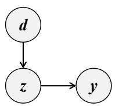
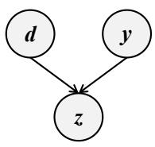
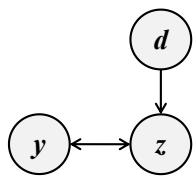
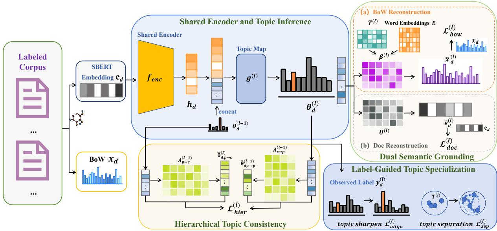
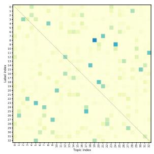
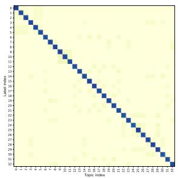
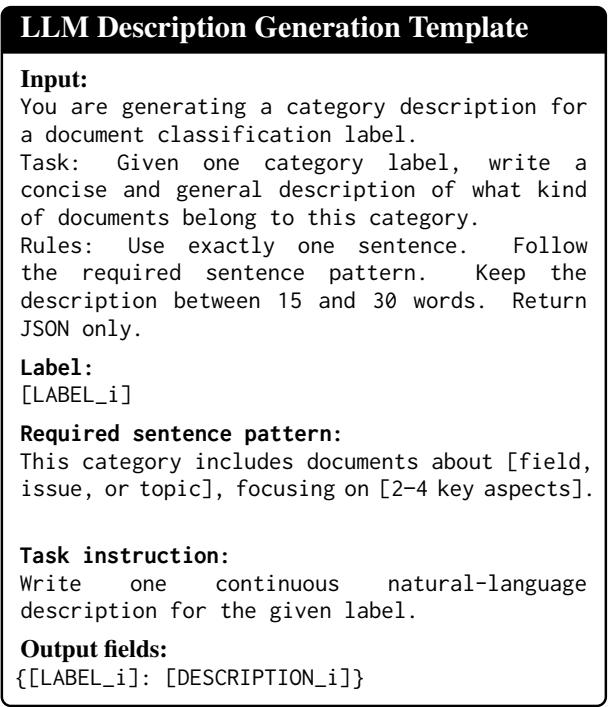
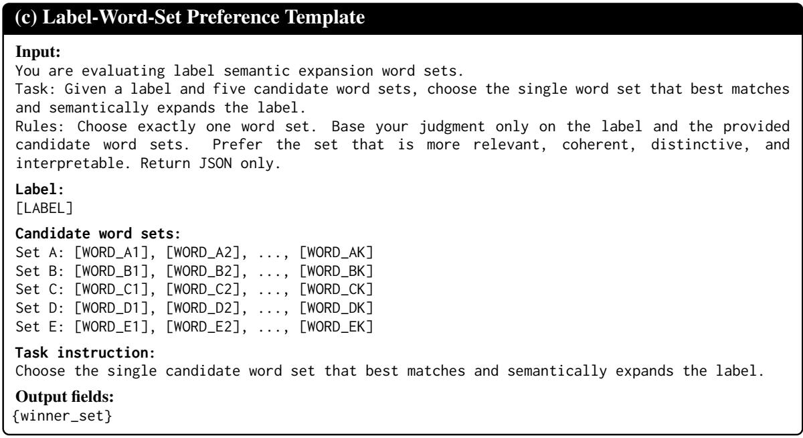
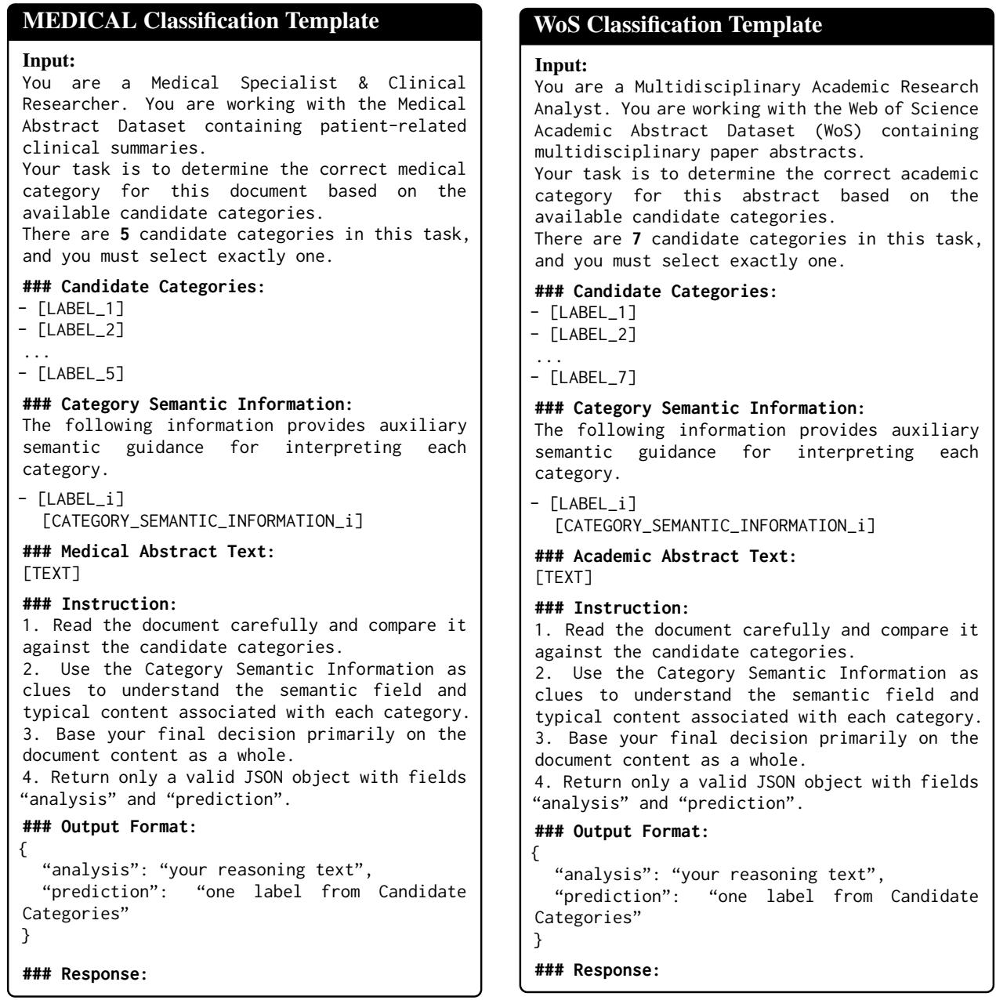

# Label Semantic Expansion via Label Guided Neural Topic Modeling

Haojia Zheng\*¶, Yuyin Lu\*¶, Juntian Huang\*, Fan Ou\*, Yanghui Rao\*∥, Haoran Xie†, Fu Lee Wang‡

\*School of Computer Science and Engineering, Sun Yat-sen University, Guangzhou, China †Division of Artificial Intelligence, Lingnan University, Hong Kong SAR, China ‡School of Science and Technology, Hong Kong Metropolitan University, Hong Kong SAR, China ¶Equal contribution. ∥Corresponding author.

## Abstract

Topic models are widely used for content analysis, where users often analyze corpora around predefined labels rather than unordered latent topics. Existing label-aware topic models mainly follow a labels-for-topics perspective, using labels to guide topic learning, while the learned topics are not directly usable for labelcentered analysis. We explore the reverse topics-for-labels perspective and instantiate it as Label Semantic Expansion (LSE), which enriches sparse label representations with corpusgrounded descriptive topic words. To exploit topics in LSE effectively, we propose a Label-Guided Neural Topic Model (LGNTM), which learns dedicated label-aligned topics, grounds them in lexical and document semantic spaces, and preserves consistency between topic structures and label structures. Experiments on label-topic alignment, label expansion, topic quality, and downstream classification demonstrate strong overall performance across complementary evaluation dimensions1.

## 1 Introduction

Topic models have been widely used for content analysis because they can uncover coherent semantic structures from text corpora through topicword and document-topic distributions (Paisley et al., 2015; Xue et al., 2020; Chen and Mankad, 2025). However, practical exploratory analysis often starts from specific analytical objectives rather than from inspecting all latent topics in a corpus (Kim et al., 2019). In many real-world applications, such objectives are reflected by humanpredefined labels, such as policy areas (Hoyle et al., 2022), news topics (Lang, 1995), and scientific fields (Kowsari et al., 2017). These labels often capture salient semantic categories of interest to users and can serve as human-defined anchors for content analysis (Korenciˇ c et al.´ , 2021). Accordingly, prior work has emphasized the importance of label-topic alignment for both interpretability and practical content analysis (Hoyle et al., 2022). These observations suggest that the usefulness of learned topics depends not only on their internal semantic quality, but also on whether they can be organized around the predefined categories that users intend to analyze.

In response to this need, many supervised topic models have been developed. They follow a labelsfor-topics perspective, where labels serve as supervision signals for guiding label-topic association and learning better topics, by supporting credit attribution (Ramage et al., 2009), improving predictive modeling (McAuliffe and Blei, 2007; Card et al., 2018), or enhancing label-topic interpretability (Chen et al., 2025). However, most of these models still output unlabeled topic-word lists that are not directly organized around humanpredefined categories. As a result, users need to infer topic meanings and manually match anonymous topics to predefined labels, increasing the burden of post-hoc interpretation (Bhatia et al., 2016).

The above limitation suggests that label-topic alignment should not be used to learn better topics only. It also raises a reverse question: if labels can guide topic learning, can the learned topics in turn serve as semantic representations of the labels themselves? We refer to this reverse perspective as topics-for-labels. Under this perspective, learned topics are expected to support category-driven analysis by organizing corpus-level semantic evidence around human-predefined labels, rather than leaving users to interpret anonymous topics post hoc. This requires each predefined label to be associated with a dedicated topic-word distribution.

Table 1: Expanded words for the label “biochemistry” generated by Labeled LDA (LLDA) (Ramage et al., 2009), LANTM (Chen et al., 2025), and our LGNTM.
<table><tr><td>Model</td><td>Expansion for “biochemistry&quot;</td></tr><tr><td>LLDA</td><td>cell, study, use, human, result</td></tr><tr><td>LANTM</td><td>[ protein, cell, accelerate, advanced, system</td></tr><tr><td></td><td>LGNTM gene, metabolic, cell, mutation, dna</td></tr></table>

We instantiate the topics-for-labels perspective as Label Semantic Expansion (LSE). Given a labeled corpus, LSE aims to enrich each predefined label with corpus-grounded descriptive words extracted from its associated topic-word distribution. This formulation addresses the limited informativeness of short category labels: representing a concept with a single term often provides insufficient information about its lexical scope and semantic boundary, and may introduce ambiguity (Zhang et al., 2018). By expanding short labels into corpus-grounded lexical descriptions, LSE makes predefined categories more explicit and interpretable, further supporting category-driven content analysis. Such enriched label semantics can also benefit downstream content analysis tasks, such as label name-based text classification (Meng et al., 2020) and prompt augmentation (Thaminkaew et al., 2024; Hu et al., 2022).

However, LSE is challenging because labeltopic association does not necessarily yield labelspecific and informative expansion words. As shown in Table 1, both Labeled LDA and LANTM produce expansions for “biochemistry” that still contain generic or weakly related corpus words. This suggests that label-topic association alone, whether imposed by hard restriction or encouraged by soft guidance, is insufficient to produce useful label expansions.

To address this gap, we propose a Label-Guided Neural Topic Model (LGNTM) to realize the topics-for-labels perspective for LSE. Our model learns a one-to-one correspondence between predefined labels and latent topics, so that each label can be represented by the topic-word distribution of its aligned topic. To make these label-aligned topics dedicated, discriminative, and faithful to the corpus, LGNTM combines label-guided topic specialization, dual semantic grounding in lexical and document embedding spaces, and hierarchy-aware consistency regularization.

  
(a)

  
(b)

  
(c)  
Figure 1: Three paradigms of using labels in supervised topic models, where d, z, and y denote document, latent topics, and predefined labels, respectively.

Our contributions are summarized as follows:

• We introduce the topics-for-labels perspective and formulate Label Semantic Expansion as the task of enriching predefined labels with corpus-grounded descriptive words.

• We propose LGNTM, a label-guided topic model that learns dedicated label-aligned topics, grounds them in corpus semantics, and preserves hierarchical label consistency.

• We evaluate LGNTM in terms of label-topic alignment, label expansion, topic quality, and downstream classification, demonstrating the utility of learned label-aligned topics.

## 2 Related Work

Supervised topic models incorporate labels into topic learning in different ways. As illustrated in Figure 1(a), prediction-oriented methods such as sLDA (McAuliffe and Blei, 2007), SNTM (Cao et al., 2015), and SCHOLAR (Card et al., 2018) use document-topic distributions to predict labels, inducing implicit topic-label associations. As illustrated in Figure 1(b), label-guided methods introduce labels more directly into topic inference: Labeled LDA (Ramage et al., 2009) restricts each document to topics associated with its observed labels, while neural supervised topic models use label-conditioned priors, soft indicators, or alignment objectives to encourage label-topic consistency (Chiu et al., 2022; Nagda et al., 2025; Chen et al., 2025). For example, LANTM (Chen et al., 2025) aligns document-topic distributions with label information through label priors and soft labeltopic indicators.

Although the above methods improve labeltopic association, they differ in how far they satisfy the topics-for-labels requirement. Predictionoriented models (e.g., SCHOLAR) still output unlabeled topic-word lists and require post-hoc label matching. LANTM identifies label-relevant topics with soft indicators, but multiple labels may share dominant topics, and dedicated labelspecific topic-word distributions are not guaranteed. Labeled LDA is structurally closest to topics-for-labels because each label is tied to a topic, but its credit-attribution and label-restricted reconstruction objectives do not guarantee labelspecific topic words. Overall, existing supervised topic models remain within a labels-for-topics paradigm, limiting their ability to directly support content analysis around predefined categories.

## 3 Background and Problem Setup

Background Given a document d, a topic model infers a document-topic distribution $p ( z \mid d )$ which describes the association between the document and latent topics. Each topic z is further associated with a topic-word distribution $p ( w \mid z )$ ， which provides a lexical description of the topic.

We consider a labeled corpus where each document d has labels $\{ y _ { d } ^ { ( l ) } \} _ { l = 1 } ^ { H }$ , with $y _ { d } ^ { ( l ) } \in \mathcal { y } ^ { ( l ) }$ $\begin{array} { r } { | \mathcal { V } ^ { ( l ) } | = K _ { l } ; } \end{array}$ flat labels have $H = 1$

Topics-for-Labels Following the topics-forlabels perspective, we ask whether label-aligned topics can enrich predefined labels with corpusgrounded topic words. We refer to this task as Label Semantic Expansion (LSE). For label $y _ { k } ^ { ( l ) } \in \mathcal { y } ^ { ( l ) }$ , LSE produces an expansion word set $\mathcal { E } _ { k } ^ { ( l ) }$ from $p ( w \mid y _ { k } ^ { ( l ) } )$ .

To instantiate this idea, our LGNTM introduces a label-topic correspondence function, as illustrated in Figure 1(c):

$$
\Pi _ { l } : \mathcal { y } ^ { ( l ) }  \mathcal { Z } ^ { ( l ) } , \qquad \Pi _ { l } ( \boldsymbol { y } _ { k } ^ { ( l ) } ) = \boldsymbol { z } _ { k } ^ { ( l ) } ,\tag{1}
$$

where $\mathcal { Z } ^ { ( l ) }$ is the topic set at level l. To realize this correspondence, LGNTM sets the number of topics at each level equal to the number of labels, i.e., $| \mathcal { Z } ^ { ( l ) } | = K _ { l }$ . The label-conditioned word distribution is then parameterized by the topic-word distribution of its corresponding topic:

$$
p ( w \mid y _ { k } ^ { ( l ) } ) : = p ( w \mid \Pi _ { l } ( y _ { k } ^ { ( l ) } ) ) = p ( w \mid z _ { k } ^ { ( l ) } ) .\tag{2}
$$

## 4 Label-Guided Neural Topic Model

## 4.1 Model Overview

Based on the topics-for-labels setup in Section 3, LGNTM learns label-specialized topic representations for LSE. It consists of three components: label-guided topic specialization, which assigns each label a dedicated and distinguishable topic; dual semantic grounding, which ties labelspecialized topics to corpus-level lexical evidence and contextual document semantics; and hierarchical topic consistency, which preserves compatibility across label levels. Figure 2 illustrates the overall architecture with a shared document encoder and a hierarchical topic decoder. Each document d is represented by a bag-of-words vector $x _ { d } \in \mathbb { R } ^ { V }$ and a contextual document embedding $e _ { d } \in \mathbb { R } ^ { D _ { e } }$ and the vocabulary is associated with a word embedding matrix $\dot { W } \in \mathbb { R } ^ { V \times D _ { w } }$

Given the document embedding $e _ { d } .$ the shared encoder produces a hidden representation:

$$
h _ { d } = f _ { \mathrm { e n c } } ( e _ { d } ) .\tag{3}
$$

For coarse-to-fine topic propagation, the decoder input at level l is

$$
\begin{array} { r } { u _ { d } ^ { ( l ) } = \{ { h _ { d } } , \quad \quad l = 1 , } \\ { [ h _ { d } ; \theta _ { d } ^ { ( l - 1 ) } ] , \ l > 1 , } \end{array}\tag{4}
$$

where $[ \cdot ; \cdot ]$ denotes concatenation. The documenttopic distribution at level l is then computed as

$$
\theta _ { d } ^ { ( l ) } = \mathrm { s o f t m a x } \left( g ^ { ( l ) } ( u _ { d } ^ { ( l ) } ) \right) ,\tag{5}
$$

where $g ^ { ( l ) } ( \cdot )$ is an affine map and $\theta _ { d } ^ { ( l ) } \in \Delta ^ { K _ { l } }$

Each level maintains a topic embedding matrix $T ^ { ( l ) } \in \mathbb { R } ^ { K _ { l } \times D _ { w } }$ , where each row is a topic embedding in the same space as the word embeddings W. Following ETM (Dieng et al., 2020), the topicword distribution is computed by matching topic and word embeddings:

$$
\beta ^ { ( l ) } = \mathrm { s o f t m a x } \left( T ^ { ( l ) } W ^ { \top } \right) ,\tag{6}
$$

where the softmax function is applied over the vocabulary dimension. By introducing the labeltopic correspondence in Eq. (1), each row $\beta _ { k } ^ { \left( l \right) } \in$ $\Delta ^ { \bar { V } }$ serves as the label-conditioned word distribution for label $y _ { k } ^ { ( l ) }$

  
Figure 2: Overall architecture of LGNTM.

## 4.2 Label-Guided Topic Specialization

Following the label-topic correspondence, LGNTM constructs a label-indexed topic space at each label level. This is achieved through distribution sharpening over document-topic distributions and geometric separation over topic embeddings.

Label-Indexed Distribution Sharpening For label level l, the document-topic distribution $\theta _ { d } ^ { ( l ) }$ is sharpened toward the coordinate indexed by the observed label $y _ { d } ^ { ( l ) }$ , encouraging the corresponding label-indexed topic to dominate. We define the sharpening objective as

$$
\mathcal { L } _ { \mathrm { a l i g n } } ^ { ( l ) } = - \frac { 1 } { N } \sum _ { d = 1 } ^ { N } \left( 1 - \theta _ { d , y _ { d } ^ { ( l ) } } ^ { ( l ) } \right) ^ { \gamma } \log \theta _ { d , y _ { d } ^ { ( l ) } } ^ { ( l ) } .\tag{7}
$$

Here, γ is a focusing parameter that emphasizes low-confidence label-topic assignments.

Topic Embedding Separation To reduce topic collapse across labels, we further impose separation on topic embeddings. The separation loss is defined as

$$
\mathcal { L } _ { \mathrm { s e p } } ^ { ( l ) } = \frac { 1 } { K _ { l } ( K _ { l } - 1 ) } \sum _ { a \neq b } \cos ^ { 2 } \left( T _ { a } ^ { ( l ) } , T _ { b } ^ { ( l ) } \right) .\tag{8}
$$

This term penalizes high pairwise similarity among label-indexed topic embeddings without introducing an additional margin hyperparameter, thereby discouraging topic collapse.

## 4.3 Dual Semantic Grounding

Label-guided topic specialization establishes the correspondence between label indices and topic coordinates, but it does not by itself determine the semantic content of the corresponding topics. Since lexical and contextual representations capture complementary document information (Li et al., 2024), we ground label-specialized topics in both corpus-level lexical evidence and pretrained document semantic space.

BoW Reconstruction The bag-of-words reconstruction term grounds label-specialized topics in corpus-level lexical evidence by reconstructing the observed term-frequency vector from $\theta _ { d } ^ { ( l ) }$ and $\beta ^ { ( l ) }$ Inspired by the use of background word frequencies in SCHOLAR (Card et al., 2018), we interpolate the topic-induced word distribution with a fixed global background distribution $p _ { \mathrm { b g } } \in \Delta ^ { V }$ allowing common word mass to be absorbed by the background component:

$$
\hat { x } _ { d } ^ { ( l ) } = ( 1 - \lambda _ { \mathrm { b g } } ) { \theta } _ { d } ^ { ( l ) } \beta ^ { ( l ) } + \lambda _ { \mathrm { b g } } p _ { \mathrm { b g } } .\tag{9}
$$

The reconstruction objective further weights each term by its inverse document frequency:

$$
\mathcal { L } _ { \mathrm { b o w } } ^ { ( l ) } = - \frac { 1 } { N } \sum _ { d = 1 } ^ { N } \sum _ { v = 1 } ^ { V } \omega _ { v } x _ { d , v } \log \hat { x } _ { d , v } ^ { ( l ) } ,\tag{10}
$$

where V denotes the vocabulary size, $x _ { d , v }$ denotes the raw count of term v in document d, and $\omega _ { v }$ denotes the normalized Inverse Document Frequency (IDF) of term v.

Document Embedding Reconstruction In parallel, document embedding reconstruction regularizes the same topic composition in the pretrained semantic space. We first map the topic embeddings $T ^ { ( l ) } \bar { \in } \mathbb { R } ^ { K _ { l } \times D _ { w } }$ at level l into the document embedding space:

$$
U ^ { ( l ) } = \psi ^ { ( l ) } \left( T ^ { ( l ) } \right) , \qquad U ^ { ( l ) } \in \mathbb { R } ^ { K _ { l } \times D _ { e } } .\tag{11}
$$

The reconstructed document embedding is then computed as

$$
\hat { e } _ { d } ^ { ( l ) } = \theta _ { d } ^ { ( l ) } U ^ { ( l ) } .\tag{12}
$$

The document embedding reconstruction objective is defined as

$$
\mathcal { L } _ { \mathrm { d o c } } ^ { ( l ) } = \frac { 1 } { N } \sum _ { d = 1 } ^ { N } \left[ 1 - \cos \left( \hat { e } _ { d } ^ { ( l ) } , e _ { d } \right) \right] .\tag{13}
$$

Together, the above two reconstruction objectives encourage label-specialized topics to remain grounded in corpus-specific lexical evidence and contextual document semantics.

## 4.4 Hierarchical Topic Consistency

For hierarchical labels, LGNTM encourages adjacent-level topic distributions to follow parentchild label relations using two row-normalized projection matrices: $A _ { p  c } ^ { ( l ) } \in \mathbb { R } ^ { K _ { l } \times K _ { l + 1 } }$ from parent to child labels, and $A _ { c  p } ^ { ( l ) } \in \mathbb { R } ^ { K _ { l + 1 } \times K _ { l } }$ from child to parent labels.

For document $d ,$ let $\theta _ { d } ^ { ( l ) }$ and $\theta _ { d } ^ { ( l + 1 ) }$ denote its topic distributions at levels l and $l + 1$ , respectively. The parent-to-child projection is defined as

$$
\hat { \theta } _ { d , p  c } ^ { ( l + 1 ) } = \theta _ { d } ^ { ( l ) } A _ { p  c } ^ { ( l ) } ,\tag{14}
$$

while the child-to-parent projection is defined as

$$
\hat { \theta } _ { d , c  p } ^ { ( l ) } = \theta _ { d } ^ { ( l + 1 ) } A _ { c  p } ^ { ( l ) } .\tag{15}
$$

The bidirectional hierarchical consistency objective is given by

$$
\begin{array} { r l } & { \mathcal { L } _ { \mathrm { h i e r } } ^ { ( l ) } = \displaystyle \frac { 1 } { N } \sum _ { d = 1 } ^ { N } [ \mathrm { K L } ( \hat { \theta } _ { d , c  p } ^ { ( l ) } \Big | \Big | \theta _ { d } ^ { ( l ) } )  } \\ & { \qquad + \mathrm { K L } ( \hat { \theta } _ { d , p  c } ^ { ( l + 1 ) } \Big | \Big | \theta _ { d } ^ { ( l + 1 ) } ) ] . } \end{array}\tag{16}
$$

This objective softly regularizes adjacent topic distributions to be structurally compatible with the label hierarchy.

## 4.5 Training Objective

The overall objective of LGNTM is defined as

$$
\mathcal { L } = \sum _ { l = 1 } ^ { H } \left( \mathcal { L } _ { \mathrm { T S } } ^ { ( l ) } + \mathcal { L } _ { \mathrm { S G } } ^ { ( l ) } \right) + \lambda _ { \mathrm { h i e r } } \mathcal { L } _ { \mathrm { H C } } ,\tag{17}
$$

where

$$
\begin{array} { r l } & { \mathcal { L } _ { \mathrm { T S } } ^ { ( l ) } = \lambda _ { \mathrm { a l i g n } } \mathcal { L } _ { \mathrm { a l i g n } } ^ { ( l ) } + \lambda _ { \mathrm { s e p } } \mathcal { L } _ { \mathrm { s e p } } ^ { ( l ) } , } \\ & { \mathcal { L } _ { \mathrm { S G } } ^ { ( l ) } = \lambda _ { \mathrm { b o w } } \mathcal { L } _ { \mathrm { b o w } } ^ { ( l ) } + \lambda _ { \mathrm { d o c } } \mathcal { L } _ { \mathrm { d o c } } ^ { ( l ) } , } \\ & { \mathcal { L } _ { \mathrm { H C } } = \displaystyle \sum _ { l = 1 } ^ { H - 1 } \mathcal { L } _ { \mathrm { h i e r } } ^ { ( l ) } . } \end{array}\tag{18}
$$

Here, the λ terms are hyperparameters. For flat labels, $H = 1$ and $\mathcal { L } _ { \mathrm { { H C } } }$ is omitted.

After training, label expansion follows Eq. (2), and the top-M expansion word set is obtained as

$$
\mathcal { E } _ { k } ^ { ( l ) } = \mathrm { T o p M } _ { w \in \mathcal { V } } \beta _ { k } ^ { ( l ) } ( w ) .\tag{19}
$$

The complete training procedure of LGNTM is summarized in Algorithm 1. For flat label structures, the hierarchical consistency term is omitted.

## 5 Experiments

We evaluate LGNTM according to the requirements of the topics-for-labels perspective. Since LSE relies on using label-aligned topic-word distributions as semantic representations of predefined labels, our experiments examine four questions: whether LGNTM realizes the intended one-to-one label-topic correspondence; whether the learned label-indexed topics produce corpusgrounded and interpretable label semantic expansions; whether LGNTM preserves topic quality, captures hierarchical consistency, and benefits from each component; and whether the learned expansions improve widely-adopted classification as label-side knowledge.

## 5.1 Experimental Settings

Datasets We employ three publicly available labeled datasets covering both flat and hierarchical label settings: bill summaries from the 110th– 114th U.S. Congresses (2007–2017) (Bills) (Hoyle et al., 2022), medical abstracts with 5 diseasecategory labels (Medical) (Schopf et al., 2023), and the Web of Science dataset (WoS) (Kowsari et al., 2017). Bills and WoS use two-level label hierarchies, with 20/127 and 7/33 labels at the parent/child levels, respectively, whereas Medical uses a flat label set with 5 labels. After removing unlabeled documents, the processed datasets contain 35,317, 11,227, and 11,913 documents for Bills, Medical, and WoS, respectively. We preprocess the vocabulary following Hoyle et al. (2022), using vocabulary sizes of 10,000 for Bills and WoS and 5,000 for Medical.

Algorithm 1 The training procedure of LGNTM   
Input: BoW matrix $X ,$ , document semantic em  
beddings $E ,$ hierarchical labels $Y _ { \pm }$ , and pre  
trained word embedding $W .$   
Output: Topic-word distributions $\beta ,$ hierarchical   
document-topic distributions $\theta ,$ and label se  
mantic expansion sets $\mathcal { E } .$   
1: Derive levels $H .$ , topic numbers $K _ { l } = | \mathcal { V } ^ { ( l ) } |$   
label-topic correspondence $\Pi _ { l } ,$ , and hierarchy   
projections from $Y$   
2: Initialize the shared encoder, hierarchical de  
coders, topic embeddings, and optimizer.   
3: while not converged do   
4: for each batch $( X _ { b } , E _ { b } , Y _ { b } )$ do   
5: $h  f _ { \mathrm { e n c } } ( E _ { b } )$   
6: for l in 1 : H do   
7: Generate $\theta ^ { ( l ) }$ with decoder input $u ^ { ( l ) }$   
by Eqs. (4) and (5).   
8: Compute $\beta ^ { ( l ) }$ by Eq. (6).   
9: Reconstruct $\hat { X } _ { b } ^ { ( \bar { l } ) }$ and $\hat { E } _ { b } ^ { ( l ) }$ by Eqs. (9)   
and (12).   
10: end for   
11: Compute $\mathcal { L }$ by Eq. (17).   
12: Update all trainable parameters.   
13: end for   
14: end while   
15: Generate label semantic expansion sets $\mathcal { E }$   
from $\beta$ by Eq. (19).

Baselines We compare LGNTM with four groups of baselines: 1) non-topic-modeling expansion baselines: Label Name, which directly uses raw label names; Embedding Match, which retrieves vocabulary words nearest to each label name in a pretrained embedding space; and C-TF-IDF, which ranks words by class-based TF-IDF over label-associated documents (Grootendorst, 2022); (2) unsupervised topic models, including LDA (Blei et al., 2003), BERTopic (Grootendorst, 2022), and FASTopic (Wu et al., 2024b); (3) supervised topic models, including LLDA (Ramage et al., 2009), SCHOLAR (Card et al., 2018), and LANTM (Chen et al., 2025) with

  
(a) SCHOLAR

  
(b) LGNTM  
Figure 3: Label-topic assignment heatmaps of SCHOLAR (Card et al., 2018) and LGNTM on WoS-Child. Each cell shows the averaged topic mass $\bar { \theta } _ { y , k } ^ { ( l ) } ,$ and the dashed diagonal marks the reference label-topic correspondence.

ETM (Dieng et al., 2020) and ECRTM (Wu et al., 2023) backbones, denoted as LA-ETM and LA-ECRTM; and (4) hierarchical topic models, including NGHTM (Chen et al., 2023) and TraCo (Wu et al., 2024c). For all topic-modeling methods, the number of topics at each level is set to the number of labels, i.e., $| \mathcal { Z } ^ { ( l ) } | = | \mathcal { V } ^ { ( l ) } | = K _ { l }$ Other training details are provided in Appendix $\mathbf { A }$

## 5.2 Label-Topic Alignment

Before evaluating LSE quality, we verify whether LGNTM realizes the intended label-topic correspondence in Eq. (1). This experiment serves as a structural diagnostic: if multiple labels are assigned to the same dominant topic, the resulting topic-word distributions cannot provide labelspecific semantic expansions.

For each label $y ~ \in ~ \mathcal { y } ^ { ( l ) }$ , let $\mathcal { D } _ { y } ^ { ( l ) } ~ = ~ \{ d ~ \}$ $y _ { d } ^ { ( l ) } = y \}$ and its label-level topic distribution being $\begin{array} { r } { \bar { \theta } _ { y } ^ { ( l ) } = | \mathcal { D } _ { y } ^ { ( l ) } | ^ { - 1 } \sum _ { d \in \mathcal { D } _ { \mathfrak { u } } ^ { ( l ) } } \theta _ { d } ^ { ( l ) } } \end{array}$ . We define Dominant Topic Uniqueness (DTU) at level l as

$$
\mathrm { D T U } ^ { ( l ) } = \frac { \bigg | \Big \{ \arg \operatorname* { m a x } _ { k } \bar { \theta } _ { y , k } ^ { ( l ) } \ : | \ : y \in \mathcal { V } ^ { ( l ) } \Big \} \bigg | } { K _ { l } } .\tag{20}
$$

Here, $\mathrm { D T U } ^ { ( l ) } = 1 $ means that every label at level l has a distinct dominant topic.

Full results in Appendix B show that LLDA and LGNTM achieve $\begin{array} { r c l } { \mathrm { D T U } ^ { ( l ) } } & { = } & { 1 . 0 0 } \end{array}$ across all evaluated label levels. LLDA does so by hard-masking topic usage with observed labels, whereas LGNTM learns the correspondence through the label-guided alignment objective. Figure 3 further shows that SCHOLAR maps multiple labels to shared dominant topics, while LGNTM exhibits a clear diagonal pattern.

This learned alignment provides the structural basis for using label-aligned topic-word distributions for semantic expansion.

## 5.3 Label Semantic Expansion Quality

The structural alignment alone does not guarantee useful expansion words; therefore, we next evaluate whether the induced label-conditioned word distributions benefit LSE.

To compare different methods under a unified LSE protocol, we construct an expansion word set ${ \mathcal W } _ { y } ^ { ( l ) }$ for each predefined label. For LGNTM, the label-topic correspondence directly gives the labelconditioned distribution as $\beta _ { y } ^ { ( l ) }$ ; LLDA is handled analogously. For topic-modeling baselines without explicit label-topic correspondence, we use the label-level topic distribution $\bar { \theta } _ { y } ^ { ( l ) }$ to form a labelconditioned word distribution: $\bar { \beta } _ { y } ^ { ( l ) } = \bar { \theta } _ { y } ^ { ( l ) } \beta ^ { ( l ) }$ . In both cases, the top-N words from the corresponding label-conditioned distribution form ${ \mathcal W } _ { y } ^ { ( l ) }$

LSE produces label-level word sets that serve as semantic descriptions of predefined labels. Following the view that keyphrase set evaluation should be multi-aspect rather than singledimensional (Wu et al., 2024a), we evaluate LSE quality along four complementary dimensions: whether each expansion is corpus-grounded with respect to the target label, semantically coherent as a word set, distinctive from expansions of other labels, and interpretable as a label description.

For coverage, we use the expansion word set as a BM25 query and report MAP (Carpineto and Romano, 2012), which measures whether the expanded words retrieve documents belonging to the target label. For coherence, we adapt the topic coherence metric NPMI (Lau et al., 2014) to label expansion sets and report Label-level NPMI (LNPMI), together with word intrusion score (WIS) (Chang et al., 2009). For distinctiveness, we adapt topic diversity (Dieng et al., 2020) to label expansion sets and report Labellevel Topic Diversity (LTD), together with labelmatch accuracy, which tests whether the words identify the correct label among four candidate labels. For interpretability, we use a forced-choice preference test, where the judge selects the word set that best semantically expands a given label. Following recent Large Language Model (LLM)- as-a-judge practices (Liu et al., 2023), we use GPT-5.1 (Singh et al., 2026) to perform the three judgment-based evaluations: WIS, label-match accuracy, and preference. All LLM-based scores are averaged over three independent runs. Tables 2 and 3 report automatic and LLM-based LSE evaluations, respectively.

For coverage, LGNTM obtains the best MAP on Bills-Parent and Medical and remains competitive on the other settings. C-TF-IDF and LLDA achieve the highest MAP in some cases, which is expected because C-TF-IDF directly ranks classdiscriminative lexical cues and LLDA hard-binds topics to observed labels. However, these retrievaloriented advantages do not consistently translate into better label expansions: C-TF-IDF and LLDA obtain substantially lower preference scores, and LLDA also shows much lower LTD. This suggests that retrieval relevance or structural label binding alone is insufficient for LSE.

For coherence and distinctiveness, several baselines such as FASTopic and SCHOLAR obtain higher LNPMI, indicating locally co-occurring word clusters. However, LSE requires word sets to be both internally coherent and separable across predefined labels. LGNTM achieves the highest LTD across all five settings, showing that it produces less redundant and more label-specific expansions. Moreover, the LLM-based WIS and label-match results show that this distinctiveness is not arbitrary: the generated word sets remain semantically cohesive and identifiable with the intended labels. Finally, LGNTM substantially outperforms all baselines in the preference test, indicating that its word sets are most often judged as the best semantic descriptions of the target labels. Overall, LGNTM provides the strongest LSE quality by balancing corpus grounding, semantic cohesion, distinctiveness, and interpretability.

## 5.4 Topic Model Performance

We further evaluate whether LGNTM remains competitive as a topic model while optimizing for LSE. In particular, we assess topic-word quality using topic diversity (TD) and $C _ { V }$ (Röder et al., 2015), and document-topic representation quality via ARI and NMI against ground-truth labels, following Hoyle et al. (2022).

Table 4 shows that LGNTM substantially improves document-topic representation quality, achieving the best ARI and NMI across all datasetlevel blocks. For topic-word quality, LGNTM is not uniformly best, but remains competitive in TD and $C _ { V }$ across settings. This indicates that optimizing for LSE does not reduce LGNTM to a purely discriminative label predictor: the model learns more label-discriminative documenttopic representations while still preserving meaningful topic-word distributions. Full hierarchical topic evaluation is provided in Appendix D, where LGNTM shows stronger parent-child consistency on hierarchical datasets.

Table 2: Automatic evaluation of LSE, where the best and second-best results are highlighted and underlined.
<table><tr><td rowspan="2">Model</td><td colspan="3">Bills-P (K=20)</td><td colspan="3">Bills-C (K=127)</td><td colspan="3">Medical (K=5)</td><td colspan="3">WoS-P (K=7)</td><td colspan="3">WoS-C (K=33)</td></tr><tr><td>MAP</td><td>LNPMI</td><td>LTD</td><td>MAP</td><td>LNPMI</td><td>LTD</td><td>MAP</td><td>LNPMI</td><td>LTD</td><td>MAP</td><td>LNPMI</td><td>LTD</td><td>MAP</td><td>LNPMI</td><td>LTD</td></tr><tr><td>Label Name</td><td>0.234</td><td></td><td></td><td>0.179</td><td></td><td></td><td>0.235</td><td></td><td></td><td>0.098</td><td></td><td></td><td>0.608</td><td></td><td></td></tr><tr><td>Embedding Match</td><td>0.285</td><td>-0.181</td><td>0.910</td><td>0.205</td><td>-0.184</td><td>0.619</td><td>0.395</td><td>-0.214</td><td>0.952</td><td>0.216</td><td>-0.340</td><td>0.983</td><td>0.571</td><td>-0.164</td><td>0.816</td></tr><tr><td>C-TF-IDF</td><td>0.413</td><td>-0.176</td><td>0.958</td><td>0.376</td><td>0.021</td><td>0.684</td><td>0.309</td><td>-0.502</td><td>0.952</td><td>0.443</td><td>-0.217</td><td>0.971</td><td>0.672</td><td>0.020</td><td>0.882</td></tr><tr><td>LDA</td><td>0.281</td><td>0.033</td><td>0.286</td><td>0.236</td><td>0.051</td><td>0.149</td><td>0.325</td><td>-0.017</td><td>0.373</td><td>0.420</td><td>0.025</td><td>0.482</td><td>0.501</td><td>0.031</td><td>0.298</td></tr><tr><td>LLDA</td><td>0.372</td><td>0.051</td><td>0.370</td><td>0.336</td><td>0.055</td><td>0.211</td><td>0.392</td><td>0.000</td><td>0.528</td><td>0.650</td><td>0.030</td><td>0.580</td><td>0.590</td><td>0.040</td><td>0.360</td></tr><tr><td>SCHOLAR</td><td>0.160</td><td>-0.153</td><td>0.397</td><td>0.172</td><td>0.027</td><td>0.168</td><td>0.355</td><td>0.015</td><td>0.699</td><td>0.502</td><td>0.085</td><td>0.771</td><td>0.589</td><td>0.121</td><td>0.639</td></tr><tr><td>BERTopic</td><td>0.248</td><td>0.048</td><td>0.248</td><td>0.256</td><td>0.095</td><td>0.246</td><td>0.296</td><td>-0.016</td><td>0.336</td><td>0.360</td><td>0.021</td><td>0.375</td><td>0.515</td><td>0.071</td><td>0.352</td></tr><tr><td>FASTopic</td><td>0.294</td><td>0.129</td><td>0.509</td><td>0.176</td><td>0.145</td><td>0.272</td><td>0.358</td><td>0.016</td><td>0.771</td><td>0.481</td><td>0.067</td><td>0.815</td><td>0.462</td><td>0.120</td><td>0.567</td></tr><tr><td>LA-ETM</td><td>0.199</td><td>-0.192</td><td>0.340</td><td>0.192</td><td>-0.209</td><td>0.339</td><td>0.312</td><td>-0.029</td><td>0.563</td><td>0.378</td><td>0.028</td><td>0.778</td><td>0.344</td><td>-0.142</td><td>0.257</td></tr><tr><td>LA-ECRTM</td><td>0.236</td><td>-0.119</td><td>0.639</td><td>0.136</td><td>-0.060</td><td>0.265</td><td>0.274</td><td>-0.144</td><td>0.773</td><td>0.370</td><td>0.073</td><td>0.827</td><td>0.586</td><td>0.004</td><td>0.813</td></tr><tr><td>NGHTM</td><td>0.130</td><td>-0.012</td><td>0.102</td><td>0.130</td><td>0.003</td><td>0.039</td><td></td><td></td><td></td><td>0.200</td><td>-0.004</td><td>0.269</td><td>0.364</td><td>0.024</td><td>0.185</td></tr><tr><td>TraCo</td><td>0.210</td><td>0.006</td><td>0.321</td><td>0.148</td><td>-0.251</td><td>0.323</td><td></td><td></td><td></td><td>0.403</td><td>-0.083</td><td>0.933</td><td>0.597</td><td>-0.077</td><td>0.875</td></tr><tr><td>LGNTM</td><td>0.449</td><td>-0.002</td><td>0.988</td><td>0.329</td><td>-0.071</td><td>0.803</td><td>0.492</td><td>-0.019</td><td>1.000</td><td>0.611</td><td>-0.004</td><td>1.000</td><td>0.660</td><td>-0.042</td><td>0.960</td></tr></table>

Table 3: LLM-based evaluation of LSE quality.
<table><tr><td>Dataset</td><td>Metric</td><td>C-TF-IDF</td><td>LLDA</td><td>FASTopic</td><td>LA-ECRTM LGNTM</td><td></td></tr><tr><td>Bills-P</td><td>Word Intrusion</td><td>0.67</td><td>0.27</td><td>0.78</td><td>0.87</td><td>1.00</td></tr><tr><td></td><td>Label Match</td><td>0.98</td><td>0.95</td><td>0.83</td><td>0.75</td><td>1.00</td></tr><tr><td></td><td>Preference</td><td>0.02</td><td>0.07</td><td>0.07</td><td>0.00</td><td>0.85</td></tr><tr><td>Bills-C</td><td>Word Intrusion</td><td>0.65</td><td>0.33</td><td>0.78</td><td>0.65</td><td>0.93</td></tr><tr><td></td><td>Label Match</td><td>0.98</td><td>0.95</td><td>0.95</td><td>0.77</td><td>0.97</td></tr><tr><td></td><td>Preference</td><td>0.13</td><td>0.10</td><td>0.05</td><td>0.05</td><td>0.67</td></tr><tr><td>Medical</td><td>Word Intrusion</td><td>0.73</td><td>0.20</td><td>0.87</td><td>0.40</td><td>1.00</td></tr><tr><td></td><td>Label Match</td><td>0.87</td><td>0.93</td><td>0.87</td><td>0.67</td><td>1.00</td></tr><tr><td></td><td>Preference</td><td>0.00</td><td>0.07</td><td>0.00</td><td>0.00</td><td>0.93</td></tr><tr><td>WoS-P</td><td>Word Intrusion</td><td>0.95</td><td>0.19</td><td>0.86</td><td>1.00</td><td>1.00</td></tr><tr><td></td><td>Label Match</td><td>0.95</td><td>0.90</td><td>0.86</td><td>0.90</td><td>1.00</td></tr><tr><td></td><td>Preference</td><td>0.00</td><td>0.00</td><td>0.10</td><td>0.10</td><td>0.81</td></tr><tr><td>WoS-C</td><td>Word Intrusion</td><td>0.93</td><td>0.60</td><td>0.81</td><td>0.79</td><td>0.93</td></tr><tr><td></td><td>Label Match</td><td>1.00</td><td>1.00</td><td>0.99</td><td>0.92</td><td>1.00</td></tr><tr><td></td><td>Preference</td><td>0.22</td><td>0.03</td><td>0.07</td><td>0.18</td><td>0.49</td></tr></table>

## 5.5 Ablation Study

We perform ablation experiments on WoS to validate the effectiveness of each component, removing label-indexed alignment, topic separation, lexical grounding, document grounding, and hierarchical consistency.

Table 5 shows that label-indexed alignment and lexical grounding are the most critical components for LSE. Removing alignment substantially reduces DTU, MAP, ARI, and PCCTG, confirming that label-indexed alignment provides the structural coordinates needed for label-centered topic representations. Removing lexical grounding keeps DTU at 1.00 but sharply reduces MAP and LNPMI, showing that one-to-one label-topic correspondence alone is insufficient for producing useful expansion words. Topic separation and document grounding mainly contribute to cross-label distinctiveness, as reflected by lower LTD after removing either component. Removing hierarchical consistency primarily lowers PCCTG, confirming its role in preserving parent-child structure.

## 6 Utility Analysis

We further evaluate whether the learned label expansions can serve as useful label-side semantic knowledge for LLM-based classification. We use Qwen3-8B-AWQ (Yang et al., 2025) as the backbone LLM and evaluate on WoS-Parent and Medical, sampling 1,500 test documents from each dataset. All variants use the same prompt template and differ only in the label-side semantic information, including label names, LLM-generated descriptions, embedding-based expansions, C-TF-IDF words, LANTM-ECRTM words, LGNTM words, and a shuffled LGNTM sanity check where LGNTM words are randomly assigned to incorrect labels. More details are provided in Appendix E.

Table 6 shows that LGNTM achieves the best performance on both datasets, with Macro-F1 gains of 0.1353 on WoS-Parent and 0.1206 on Medical over label-name-only prompts. The shuffled variant substantially reduces performance, confirming that the gain comes from correct label-topic-word correspondence rather than simply adding more words. Appendix F provides qualitative examples showing that LGNTM produces more label-consistent expansions.

## 7 Conclusion

We introduced the topics-for-labels perspective for enriching predefined labels with corpus-grounded descriptive topic words. To instantiate this perspective, we proposed LGNTM, a label-oriented neural topic model that learns dedicated, semantically grounded topics for predefined labels. Experiments show that the resulting label expansions are corpus-grounded, distinctive, and interpretable, while LGNTM remains competitive as a topic model. Downstream LLM-based classification further confirms the utility of these expansions as label-side semantic knowledge.

Table 4: Comparison results on topic quality and clustering performance.
<table><tr><td rowspan="2">Model</td><td colspan="4">Bills-Parent</td><td colspan="4">Bills-Child</td><td colspan="4">Medical</td><td colspan="4">WoS-Parent</td><td colspan="4">WoS-Child</td></tr><tr><td>TD</td><td> $C _ { V }$ </td><td>ARI</td><td>NMI</td><td>TD</td><td> $C _ { V }$ </td><td>ARI</td><td>NMI</td><td>TD</td><td> $C _ { V }$ </td><td>ARI</td><td>NMI</td><td>TD</td><td> $C _ { V }$ </td><td>ARI</td><td>NMI</td><td>TD</td><td> $C _ { V }$ </td><td>ARI</td><td>NMI</td></tr><tr><td>LDA</td><td>0.533</td><td>0.522</td><td>0.300</td><td>0.417</td><td>0.327</td><td>0.593</td><td>0.325</td><td>0.559</td><td>0.741</td><td>0.536</td><td>0.077</td><td>0.116</td><td>0.715</td><td>0.503</td><td>0.401</td><td>0.477</td><td>0.558</td><td>0.609</td><td>0.301</td><td>0.548</td></tr><tr><td>LLDA</td><td>0.386</td><td>0.464</td><td>0.533</td><td>0.566</td><td>0.213</td><td>0.490</td><td>0.464</td><td>0.634</td><td>0.504</td><td>0.404</td><td>0.335</td><td>0.352</td><td>0.580</td><td>0.470</td><td>0.640</td><td>0.640</td><td>0.390</td><td>0.550</td><td>0.520</td><td>0.680</td></tr><tr><td>SCHOLAR</td><td>0.964</td><td>0.371</td><td>0.278</td><td>0.399</td><td>0.479</td><td>0.592</td><td>0.248</td><td>0.564</td><td>1.000</td><td>0.650</td><td>0.073</td><td>0.110</td><td>0.989</td><td>0.756</td><td>0.397</td><td>0.467</td><td>0.838</td><td>0.764</td><td>0.335</td><td>0.579</td></tr><tr><td>BERTopic</td><td>0.750</td><td>0.614</td><td>0.272</td><td>0.362</td><td>0.612</td><td>0.658</td><td>0.321</td><td>0.555</td><td>0.662</td><td>0.461</td><td>0.203</td><td>0.210</td><td>0.710</td><td>0.551</td><td>0.374</td><td>0.434</td><td>0.721</td><td>0.712</td><td>0.375</td><td>0.591</td></tr><tr><td>FASTopic</td><td>1.000</td><td>0.578</td><td>0.275</td><td>0.363</td><td>0.903</td><td>0.526</td><td>0.257</td><td>0.522</td><td>1.000</td><td>0.563</td><td>0.133</td><td>0.159</td><td>1.000</td><td>0.608</td><td>0.414</td><td>0.489</td><td>1.000</td><td>0.648</td><td>0.326</td><td>0.563</td></tr><tr><td>LA-ETM</td><td>0.998</td><td>0.507</td><td>0.336</td><td>0.413</td><td>0.870</td><td>0.368</td><td>0.285</td><td>0.586</td><td>1.000</td><td>0.524</td><td>0.084</td><td>0.111</td><td>1.000</td><td>0.621</td><td>0.397</td><td>0.460</td><td>0.985</td><td>0.531</td><td>0.335</td><td>0.575</td></tr><tr><td>LA-ECRTM</td><td>0.966</td><td>0.473</td><td>0.249</td><td>0.351</td><td>0.714</td><td>0.423</td><td>0.275</td><td>0.513</td><td>0.995</td><td>0.440</td><td>0.075</td><td>0.095</td><td>0.997</td><td>0.551</td><td>0.365</td><td>0.447</td><td>0.962</td><td>0.501</td><td>0.245</td><td>0.503</td></tr><tr><td>NGHTM</td><td>0.662</td><td>0.500</td><td>0.108</td><td>0.187</td><td>0.685</td><td>0.609</td><td>0.146</td><td>0.436</td><td></td><td></td><td></td><td></td><td>0.657</td><td>0.442</td><td>0.162</td><td>0.246</td><td>0.836</td><td>0.606</td><td>0.168</td><td>0.435</td></tr><tr><td>TraCo</td><td>0.968</td><td>0.484</td><td>0.309</td><td>0.401</td><td>0.822</td><td>0.348</td><td>0.287</td><td>0.511</td><td></td><td></td><td></td><td></td><td>1.000</td><td>0.459</td><td>0.319</td><td>0.406</td><td>0.996</td><td>0.424</td><td>0.320</td><td>0.551</td></tr><tr><td>LGNTM</td><td>0.988</td><td>0.606</td><td>0.634</td><td>0.641</td><td>0.802</td><td>0.494</td><td>0.544</td><td>0.679</td><td>1.000</td><td>0.572</td><td>0.378</td><td>0.390</td><td>1.000</td><td>0.529</td><td>0.759</td><td>0.738</td><td>0.955</td><td>0.599</td><td>0.583</td><td>0.724</td></tr></table>

Table 5: Ablation study on WoS. PCCTG denotes parent-child consistency; details are in Appendix D.
<table><tr><td>Variant</td><td>DTU</td><td>MAP</td><td>LNPMI</td><td>LTD</td><td>ARI</td><td>PCCTG</td></tr><tr><td>Full</td><td>1.000</td><td>0.641</td><td>-0.018</td><td>0.979</td><td>0.671</td><td>0.422</td></tr><tr><td>w/o Align</td><td>0.747</td><td>0.161</td><td>-0.010</td><td>0.963</td><td>0.412</td><td>0.138</td></tr><tr><td>w/o Sep.</td><td>1.000</td><td>0.635</td><td>0.013</td><td>0.951</td><td>0.669</td><td>0.417</td></tr><tr><td>w/o Lex.</td><td>1.000</td><td>0.259</td><td>-0.357</td><td>0.956</td><td>0.681</td><td>0.421</td></tr><tr><td>w/o Doc.</td><td>1.000</td><td>0.640</td><td>0.012</td><td>0.957</td><td>0.666</td><td>0.423</td></tr><tr><td>w/o Hier.</td><td>1.000</td><td>0.633</td><td>-0.000</td><td>0.955</td><td>0.675</td><td>0.350</td></tr></table>

Table 6: LLM-based classification results.
<table><tr><td rowspan="2">Variant</td><td colspan="2">WoS-P</td><td colspan="2">Medical</td></tr><tr><td> $\operatorname { A c c } .$ </td><td>F1</td><td>Acc.</td><td>F1</td></tr><tr><td>Label name</td><td>0.6367</td><td>0.5511</td><td>0.6513</td><td>0.5484</td></tr><tr><td>LLM Description</td><td>0.6240</td><td>0.5403</td><td>0.6227</td><td>0.6322</td></tr><tr><td>Embedding Match</td><td>0.5913</td><td>0.5109</td><td>0.6560</td><td>0.6586</td></tr><tr><td>C-TF-IDF</td><td>0.6847</td><td>0.5952</td><td>0.6527</td><td>0.6568</td></tr><tr><td>LA-ECRTM</td><td>0.5900</td><td>0.5801</td><td>0.6420</td><td>0.6481</td></tr><tr><td>Shuffled LGNTM</td><td>0.4900</td><td>0.4021</td><td>0.6427</td><td>0.5330</td></tr><tr><td>LGNTM</td><td>0.6920</td><td>0.6864</td><td>0.6673</td><td>0.6690</td></tr></table>

## Limitations

Our work has several limitations that could be explored in future work. First, LGNTM assumes that a predefined label set or taxonomy is available, and is therefore designed for label-centered semantic expansion rather than open-ended topic discovery or automatic taxonomy induction. Second, since the generated expansion words are grounded in the training corpus, their quality and coverage may be affected by corpus distribution, label granularity, and the amount of labelassociated evidence. For broad or low-resource labels, the expansions may emphasize dominant corpus-specific subtopics rather than exhaustively covering the full semantic scope of the label. Third, although LGNTM is formulated for hierarchical label structures, our experiments only cover flat or two-level label settings. Future work could further evaluate LGNTM on deeper and more complex taxonomies.

## References

Shraey Bhatia, Jey Han Lau, and Timothy Baldwin. 2016. Automatic labelling of topics with neural embeddings. In Proceedings of COLING 2016, the 26th International Conference on Computational Linguistics: Technical Papers, pages 953–963.

David M. Blei, Andrew Y. Ng, and Michael I. Jordan. 2003. Latent dirichlet allocation. Journal of Machine Learning Research, 3:993–1022.

Ziqiang Cao, Sujian Li, Yang Liu, Wenjie Li, and Heng Ji. 2015. A novel neural topic model and its supervised extension. In Proceedings of the 29th AAAI Conference on Artificial Intelligence, pages 2210– 2216.

Dallas Card, Chenhao Tan, and Noah A. Smith. 2018. Neural models for documents with metadata. In Proceedings of the 56th Annual Meeting of the Association for Computational Linguistics (Volume 1: Long Papers), pages 2031–2040.

Claudio Carpineto and Giovanni Romano. 2012. A survey of automatic query expansion in information retrieval. ACM Computing Surveys, 44(1):1:1–1:50.

Jonathan Chang, Jordan Boyd-Graber, Sean Gerrish, Chong Wang, and David M. Blei. 2009. Reading tea leaves: How humans interpret topic models. In Proceedings ofthe 23rd International Conference on Neural Information Processing Systems, pages 288– 296.

Hegang Chen, Pengbo Mao, Yuyin Lu, and Yanghui Rao. 2023. Nonlinear structural equation model guided Gaussian mixture hierarchical topic modeling. In Proceedings of the 61st Annual Meeting of the Association for Computational Linguistics (Volume 1: Long Papers), pages 10377–10390.

Li Chen and Shawn Mankad. 2025. A structural topic and sentiment-discourse model for text analysis. Management Science, 71(7):5767–5787.

Ruihao Chen, Hegang Chen, Yuyin Lu, Yanghui Rao, and Chunjiang Zhu. 2025. Supervised neural topic modeling with label alignment. Transactions of the Association for Computational Linguistics, 13:249– 263.

Jeffrey Chiu, Rajat Mittal, Neehal Tumma, Abhishek Sharma, and Finale Doshi-Velez. 2022. A joint learning approach for semi-supervised neural topic modeling. In Proceedings of the Sixth Workshop on Structured Predictionfor NLP, pages 40–51.

Adji B. Dieng, Francisco J. R. Ruiz, and David M. Blei. 2020. Topic modeling in embedding spaces. Transactions of the Association for Computational Linguistics, 8:439–453.

Maarten Grootendorst. 2022. BERTopic: Neural topic modeling with a class-based TF-IDF procedure. Preprint, arXiv:2203.05794.

Alexander Miserlis Hoyle, Pranav Goel, Rupak Sarkar, and Philip Resnik. 2022. Are neural topic models broken? In Findings of the Association for Computational Linguistics: EMNLP, pages 5321–5344.

Shengding Hu, Ning Ding, Huadong Wang, Zhiyuan Liu, Jingang Wang, Juanzi Li, Wei Wu, and Maosong Sun. 2022. Knowledgeable prompttuning: Incorporating knowledge into prompt verbalizer for text classification. In Proceedings of the 60th Annual Meeting of the Association for Computational Linguistics (Volume 1: Long Papers), pages 2225–2240.

Hannah Kim, Dongjin Choi, Barry Drake, Alex Endert, and Haesun Park. 2019. TopicSifter: Interactive search space reduction through targeted topic modeling. In 2019 IEEE Conference on Visual Analytics Science and Technology, pages 35–45.

Damir Korenciˇ c, Strahil Ristov, Jelena Repar, and Jan´ Šnajder. 2021. A topic coverage approach to evaluation of topic models. IEEE Access, 9:123280– 123312.

Kamran Kowsari, Donald E. Brown, Mojtaba Heidarysafa, Kiana Jafari Meimandi, Matthew S. Gerber, and Laura E. Barnes. 2017. HDLTex: Hierarchical deep learning for text classification. In Proceedings ofthe 16th IEEE International Conference on Machine Learning and Applications, pages 364– 371.

Woosuk Kwon, Zhuohan Li, Siyuan Zhuang, Ying Sheng, Lianmin Zheng, Cody Hao Yu, Joseph Gonzalez, Hao Zhang, and Ion Stoica. 2023. Efficient memory management for large language model serving with PagedAttention. In Proceedings ofthe 29th Symposium on Operating Systems Principles, pages 611–626.

Ken Lang. 1995. NewsWeeder: Learning to filter netnews. In Proceedings ofthe 12th International Conference on Machine Learning, pages 331–339.

Jey Han Lau, David Newman, and Timothy Baldwin. 2014. Machine reading tea leaves: Automatically evaluating topic coherence and topic model quality. In Proceedings of the 14th Conference of the European Chapter of the Association for Computational Linguistics, pages 530–539.

Zetong Li, Qinliang Su, Shijing Si, and Jianxing Yu. 2024. Leveraging BERT and TF-IDF features for short text clustering via alignment-promoting cotraining. In Proceedings of the 2024 Conference on Empirical Methods in Natural Language Processing, pages 14897–14913.

Yang Liu, Dan Iter, Yichong Xu, Shuohang Wang, Ruochen Xu, and Chenguang Zhu. 2023. G-eval: NLG evaluation using GPT-4 with better human alignment. In Proceedings of the 2023 Conference on Empirical Methods in Natural Language Processing, pages 2511–2522.

Jon D. McAuliffe and David M. Blei. 2007. Supervised topic models. In Proceedings of the 21st Annual Conference on Neural Information Processing Systems, pages 121–128.

Yu Meng, Yunyi Zhang, Jiaxin Huang, Chenyan Xiong, Heng Ji, Chao Zhang, and Jiawei Han. 2020. Text classification using label names only: A language model self-training approach. In Proceedings of the 2020 Conference on Empirical Methods in Natural Language Processing, pages 9006–9017.

Mayank Nagda, Phil Ostheimer, and Sophie Fellenz. 2025. Tethering broken themes: Aligning neural topic models with labels and authors. In Findings of the Association for Computational Linguistics: NAACL, pages 740–760.

John Paisley, Chong Wang, David M. Blei, and Michael I. Jordan. 2015. Nested hierarchical dirichlet processes. IEEE Transactions on Pattern Analysis and Machine Intelligence, 37(2):256–270.

Daniel Ramage, David Hall, Ramesh Nallapati, and Christopher D. Manning. 2009. Labeled LDA: A supervised topic model for credit attribution in multilabeled corpora. In Proceedings of the 2009 Conference on Empirical Methods in Natural Language Processing, pages 248–256.

Nils Reimers and Iryna Gurevych. 2019. Sentence-BERT: Sentence embeddings using Siamese BERTnetworks. In Proceedings ofthe 2019 Conference on

Empirical Methods in Natural Language Processing and the 9th International Joint Conference on Natural Language Processing, pages 3982–3992.

Michael Röder, Andreas Both, and Alexander Hinneburg. 2015. Exploring the space of topic coherence measures. In Proceedings of the 8th ACM International Conference on Web Search and Data Mining, pages 399–408.

Tim Schopf, Daniel Braun, and Florian Matthes. 2023. Evaluating unsupervised text classification: Zeroshot and similarity-based approaches. In Proceedings of the 6th International Conference on Natural Language Processing and Information Retrieval, pages 6–15.

Harin Seo, Hwanseong Joo, Byungchul Tak, and Young-Kyoon Suh. 2025. HARIN: A novel metric for hierarchical topic model assessment. In Proceedings of the 40th ACM/SIGAPP Symposium on Applied Computing, pages 1907–1916.

Aaditya Singh, Adam Fry, Adam Perelman, Adam Tart, Adi Ganesh, Ahmed El-Kishky, Aidan McLaughlin, Aiden Low, AJ Ostrow, Akhila Ananthram, Akshay Nathan, Alan Luo, Alec Helyar, Aleksander Madry, Aleksandr Efremov, Aleksandra Spyra, Alex Baker-Whitcomb, Alex Beutel, Alex Karpenko, and 1 others. 2026. OpenAI GPT-5 system card. Preprint, arXiv:2601.03267.

Thanakorn Thaminkaew, Piyawat Lertvittayakumjorn, and Peerapon Vateekul. 2024. Label-aware automatic verbalizer for few-shot text classification in mid-to-low resource languages. In Proceedings of the 62ndAnnual Meeting ofthe Associationfor Computational Linguistics (Volume 4: Student Research Workshop), pages 101–109.

Di Wu, Da Yin, and Kai-Wei Chang. 2024a. KPEval: Towards fine-grained semantic-based keyphrase evaluation. In Findings of the Association for Computational Linguistics: ACL, pages 1959–1981.

Xiaobao Wu, Xinshuai Dong, Thong Thanh Nguyen, and Anh Tuan Luu. 2023. Effective neural topic modeling with embedding clustering regularization. In Proceedings ofthe 40th International Conference on Machine Learning, pages 37335–37357.

Xiaobao Wu, Thong Nguyen, Delvin Ce Zhang, William Yang Wang, and Anh Tuan Luu. 2024b. FASTopic: Pretrained transformer is a fast, adaptive, stable, and transferable topic model. In Advances in Neural Information Processing Systems, pages 84447–84481.

Xiaobao Wu, Fengjun Pan, Thong Nguyen, Yichao Feng, Chaoqun Liu, Cong-Duy Nguyen, and Anh Tuan Luu. 2024c. On the affinity, rationality, and diversity of hierarchical topic modeling. In Proceedings of the 38th AAAI Conference on Artificial Intelligence and 36th Conference on Innovative Applications of Artificial Intelligence and 14th Symposium on Educational Advances in Artificial Intelligence, pages 19261–19269.

Feng Xue, Richang Hong, Xiangnan He, Jianwei Wang, Shengsheng Qian, and Changsheng Xu. 2020. Knowledge-based topic model for multi-modal social event analysis. IEEE Transactions on Multimedia, 22(8):2098–2110.

An Yang, Anfeng Li, Baosong Yang, Beichen Zhang, Binyuan Hui, Bo Zheng, Bowen Yu, Chang Gao, Chengen Huang, Chenxu Lv, Chujie Zheng, Dayiheng Liu, Fan Zhou, Fei Huang, Feng Hu, Hao Ge, Haoran Wei, Huan Lin, Jialong Tang, and 41 others. 2025. Qwen3 technical report. Preprint, arXiv:2505.09388.

Chao Zhang, Fangbo Tao, Xiusi Chen, Jiaming Shen, Meng Jiang, Brian Sadler, Michelle Vanni, and Jiawei Han. 2018. TaxoGen: Unsupervised topic taxonomy construction by adaptive term embedding and clustering. In Proceedings of the 24th ACM SIGKDD International Conference on Knowledge Discovery & Data Mining, pages 2701–2709.

## A Implementation Details

For all datasets, we use the predefined training/test splits and average results over five runs. The dataset statistics are shown in Table 7. For flat topic models, we train one model for each label level. For hierarchical topic models on Bills and WoS, we set the number of topic layers to H and match each layer to the corresponding label level.

We use all-MiniLM-L6-v2 (Reimers and Gurevych, 2019) to obtain contextual document embeddings and pretrained word embeddings. The pretrained embeddings are fixed during training. The word embedding dimension, the document embedding dimension and the topic embedding dimension are all set to 384. The shared encoder is implemented as a multilayer perceptron with a hidden dimension of 256. The IDF weights $\omega _ { v }$ in the BoW reconstruction loss are computed on the training corpus. The global background distribution $p _ { \mathrm { b g } }$ is computed from corpus-level word frequencies on the training split.

All baselines are run with public model codes. All models are trained on a workstation equipped with an NVIDIA RTX 3090 GPU with 24 GB memory. We use the Adam optimizer with a learning rate of 0.002, a batch size of 200, and $\beta ~ = ~ ( 0 . 9 9 , 0 . 9 9 9 )$ The maximum number of training epochs is set to 400. During training, we monitor the training objective and apply early stopping when it no longer improves. Early stopping is activated after a warm-up period of 10 epochs, with a patience of 5 epochs. For all baselines and LGNTM, we use the same dataset-level tuning protocol and keep the selected hyperparameters fixed across the five runs. For each dataset, hyperparameters are selected by considering the overall performance of $C _ { V }$ , TD, and ARI.

Table 7: Dataset statistics. For hierarchical datasets, #Labels denotes the number of labels at each level.
<table><tr><td>Dataset</td><td>#Vocab</td><td>#Train</td><td>#Test</td><td>#Labels</td></tr><tr><td>Bills</td><td>10,000</td><td>26,039</td><td>9,278</td><td>(20, 127)</td></tr><tr><td>Medical</td><td>5,000</td><td>8,420</td><td>2,807</td><td>5</td></tr><tr><td>WoS</td><td>10,000</td><td>9,531</td><td>2,382</td><td>(7, 33)</td></tr></table>

Table 8: Selected LGNTM hyperparameters on each dataset. $\lambda _ { \mathrm { a l i g n } } , \lambda _ { \mathrm { s e p } } , \lambda _ { \mathrm { b o w } } , \lambda _ { \mathrm { d o c } } , \lambda _ { \mathrm { h i e r } }$ , and $\lambda _ { \mathrm { b g } }$ denote the weights for label-indexed distribution sharpening, topic embedding separation, BoW reconstruction, document embedding reconstruction, hierarchical consistency, and background interpolation, respectively.
<table><tr><td>Dataset</td><td> $\lambda _ { \mathrm { a l i g n } }$ </td><td> $\lambda _ { \mathrm { s e p } }$ </td><td> $\lambda _ { \mathrm { b o w } }$ </td><td> $\lambda _ { \mathrm { d o c } }$ </td><td> $\lambda _ { \mathrm { h i e r } }$ </td><td> $\lambda _ { \mathrm { b g } }$ </td></tr><tr><td>Bills</td><td>15.0</td><td>15.0</td><td>0.07</td><td>10.0</td><td>0.5</td><td>0.6</td></tr><tr><td>WoS</td><td>20.0</td><td>10.0</td><td>0.03</td><td>10.0</td><td>1.0</td><td>0.6</td></tr><tr><td>Medical</td><td>20.0</td><td>10.0</td><td>0.05</td><td>25.0</td><td>一</td><td>0.5</td></tr></table>

For Bills and WoS, the projection matrices $A _ { p  c } ^ { ( l ) }$ and $A _ { c  p } ^ { ( l ) }$ are fixed rather than learnable. We construct them from the parent-child label cooccurrences in the training set. For each adjacent pair of levels, we first build a binary adjacency matrix indicating whether a parent-child label pair appears in the training data. The parent-to-child matrix $A _ { p  c } ^ { ( l ) }$ is obtained by row-normalizing this binary adjacency matrix, and the child-to-parent matrix $A _ { c  p } ^ { ( l ) }$ is obtained by row-normalizing its transpose. Rows without observed links are assigned a uniform distribution before normalization.

For LGNTM, the focusing parameter in the label-indexed distribution sharpening loss is fixed to $\gamma = 2$ . The selected LGNTM hyperparameters are reported in Table 8. For Medical, the hierarchical consistency term is omitted because it has a flat label structure.

## B Dominant Topic Uniqueness

Table 9 reports the full Dominant Topic Uniqueness (DTU) results corresponding to Eq. (20). DTU is computed separately for each dataset-level setting. Higher values indicate less dominanttopic sharing among labels.

Most baselines assign multiple labels to shared dominant topics, especially on fine-grained label spaces such as Bills-C and WoS-C. This suggests that their topic coordinates are not consistently organized around predefined labels, limiting their direct use for label-specific semantic expansion.

Table 9: Dominant Topic Uniqueness (DTU) results.
<table><tr><td>Model</td><td>Bills-P</td><td>Bills-C</td><td>Medical</td><td>WoS-P</td><td>WoS-C</td></tr><tr><td>LDA</td><td>0.84</td><td>0.67</td><td>0.64</td><td>0.91</td><td>0.79</td></tr><tr><td>LLDA</td><td>1.00</td><td>1.00</td><td>1.00</td><td>1.00</td><td>1.00</td></tr><tr><td>SCHOLAR</td><td>0.77</td><td>0.61</td><td>0.76</td><td>0.86</td><td>0.82</td></tr><tr><td>BERTopic</td><td>0.60</td><td>0.60</td><td>0.72</td><td>0.83</td><td>0.72</td></tr><tr><td>FASTopic</td><td>0.64</td><td>0.38</td><td>0.68</td><td>0.80</td><td>0.71</td></tr><tr><td>LA-ETM</td><td>0.78</td><td>0.66</td><td>0.80</td><td>0.86</td><td>0.73</td></tr><tr><td>LA-ECRTM</td><td>0.46</td><td>0.22</td><td>0.72</td><td>0.66</td><td>0.47</td></tr><tr><td>NGHTM</td><td>0.70</td><td>0.54</td><td></td><td>0.57</td><td>0.55</td></tr><tr><td>TraCo</td><td>0.73</td><td>0.52</td><td></td><td>0.83</td><td>0.73</td></tr><tr><td>LGNTM</td><td>1.00</td><td>1.00</td><td>1.00</td><td>1.00</td><td>1.00</td></tr></table>

LLDA and LGNTM both achieve DTU = 1.00 in all settings, but the source of this behavior differs. LLDA obtains unique dominant topics through hard label-based topic restrictions, whereas LGNTM learns the correspondence through the label-indexed alignment objective without hard-masking topic usage. Thus, the full DTU results support the structural role of the proposed alignment objective.

DTU should be interpreted only as a structural diagnostic. It does not measure whether the corresponding topic-word distributions are coherent, corpus-grounded, or useful as label expansions.

## C Label Semantic Expansion Evaluation Details

We evaluate label semantic expansion using labellevel word sets ${ \mathcal W } _ { y } ^ { ( l ) }$ . As described in Section 5.3, LGNTM and LLDA extract words directly from the label-aligned topic-word distribution, while topic-modeling baselines without explicit labeltopic correspondence use the label-conditioned distribution $\begin{array} { r l r } { { \bf { \bar { \boldsymbol { \beta } } } } _ { y } ^ { ( l ) } } & { { } = } & { \bar { \theta } _ { y } ^ { ( l ) } { \beta } ^ { ( l ) } } \end{array}$ Non-topic baselines select words according to their corresponding ranking scores.

Automatic evaluation. For BM25-based MAP, the Label Name baseline uses only the raw label name as the query. For all expansion-based methods, we concatenate the raw label name and the top-10 expansion words as the query. Documents assigned to the target label are treated as relevant. We compute the average precision for each label and report the macro average over labels for each dataset-level setting.

For coherence, we compute corpus-based Labellevel NPMI (LNPMI) over the top-10 expansion words of each label, using word co-occurrences estimated from the training corpus. The same top-10 setting is used for $C _ { v }$ in Section 5.4. For distinctiveness, we compute Label-level Topic Diversity (LTD) over the top-25 expansion words. The same top-25 setting is used for TD in Section 5.4. All automatic metrics are computed separately for each label level.

LLM-based metrics. All LLM-based evaluations use top-10 expansion words. For topic-modeling methods with five runs, including LGNTM, LLDA, FASTopic, and LANTM-ECRTM, we first average the label-conditioned word distributions across runs and then extract the top-10 words. This yields one stable word set for each label and method.

We evaluate all labels for Bills-Parent, WoS-Parent, WoS-Child, and Medical. For Bills-Child, which contains 127 labels, we sample 20 child labels due to high evaluation costs. The sampled subset covers all 20 Bills parent labels by selecting one child label under each parent with a fixed random seed. All methods are evaluated on the same sampled labels.

For word intrusion, each instance consists of a target-label word set and one intruder word. The intruder is sampled from negative-label top words and is required not to appear in the target-label word set. The word intrusion score is the proportion of instances in which the judge correctly identifies the intruder.

For label matching, each instance consists of a word set and four candidate labels, including the gold label and three negatives. For parent-level labels, negatives are sampled from the remaining labels. For child-level labels, negatives are preferentially sampled from sibling labels under the same parent; if fewer than three siblings are available, the remaining negatives are sampled from other child labels. The label-match score is the proportion of instances in which the judge selects the gold label.

For preference evaluation, each instance consists of a label and five candidate word sets generated by C-TF-IDF, LLDA, FASTopic, LANTM-ECRTM, and LGNTM. The judge selects the word set that best semantically expands the label. Candidate order is randomized, and each method’s preference score is the proportion of instances in which its word set is selected.

We use GPT-5.1 (Singh et al., 2026) as the judge for all three LLM-based tasks. All LLMbased scores are averaged over three independent runs. The prompt templates are shown in Figure 5.

Table 10: Hierarchical topic evaluation on Bills and WoS.
<table><tr><td>Dataset</td><td>Model</td><td>PCCTG</td><td>PCS</td><td>PCD</td><td>SD</td></tr><tr><td rowspan="3">Bills</td><td>NGHTM</td><td>0.018</td><td>0.214</td><td>0.990</td><td>0.995</td></tr><tr><td>TraCo</td><td>0.073</td><td>0.204</td><td>0.987</td><td>0.992</td></tr><tr><td>LGNTM</td><td>0.310</td><td>0.321</td><td>0.902</td><td>0.987</td></tr><tr><td rowspan="3">WoS</td><td>NGHTM</td><td>0.053</td><td>0.257</td><td>0.992</td><td>0.991</td></tr><tr><td>TraCo</td><td>0.113</td><td>0.211</td><td>0.995</td><td>1.000</td></tr><tr><td>LGNTM</td><td>0.420</td><td>0.327</td><td>0.907</td><td>0.993</td></tr></table>

## D Hierarchical Evaluation

For hierarchical datasets, Bills and WoS, we evaluate topic hierarchy quality from two aspects: vertical consistency and non-redundancy. PCCTG measures whether the child-level document-topic space preserves parent-level label grouping. For each document $d ,$ we compare its cosine similarity to the centroid of its ground-truth parent group with its maximum similarity to other parent-group centroids:

$$
\begin{array} { l } { \displaystyle \mathrm { P C C T G } = \frac { 1 } { | \mathcal D | } \sum _ { d \in \mathcal D } \Big [ \cos \Big ( \theta _ { d } ^ { ( c ) } , \mu _ { p ( d ) } \Big ) } \\ { \displaystyle - \operatorname* { m a x } _ { p ^ { \prime } \neq p ( d ) } \cos \Big ( \theta _ { d } ^ { ( c ) } , \mu _ { p ^ { \prime } } \Big ) \Big ] . } \end{array}\tag{21}
$$

In the above, $\theta _ { d } ^ { ( c ) }$ is the child-level documenttopic distribution, $p ( d )$ is the ground-truth parent label, and $\mu _ { p }$ is the centroid of documents with parent label $p .$

PCS follows HARIN (Seo et al., 2025) and measures semantic relatedness between parent and child topics using top-K word-embedding similarity, with an overlap penalty for duplicated topic words. PCD and SD follow TraCo (Wu et al., 2024c): PCD measures topic diversity between parent-child topic pairs, and SD measures diversity among sibling topics under the same parent.

Table 10 shows that LGNTM achieves the highest PCCTG and PCS on both hierarchical datasets. This indicates stronger vertical consistency in both document-topic and topic-word spaces. Although LGNTM does not always perform the best on PCD and SD, it remains competitive on sibling diversity, especially on WoS. These results suggest that LGNTM preserves better hierarchical label structure than baseline methods, while maintaining reasonably distinguishable topic vocabularies.

## E Downstream Classification Details

We evaluate the utility of label semantic expansions for LLM-based classification on WoS-Parent and Medical. For each dataset, we sample 1,500 test documents according to the original label distribution, so that the sampled evaluation set preserves the class distribution of the full test split. We report both accuracy and macro-F1.

All variants use the same classification prompt and differ only in the label-side semantic information provided for each candidate label. For wordbased variants, we use the expansion word rankings from the LSE protocol as described in Section 5.3. We lemmatize ranked words to merge inflectional variants such as vote and voted, remove duplicate lemmas while preserving score order, and keep the top-15 remaining words as labelside representative terms.

For the LLM Description variant, we prompt the LLM to generate one concise description for each label using only the label name and the model’s parametric knowledge, as shown in Figure 4. We do not provide label-associated documents when generating these descriptions. This reflects a practical setting where all label-associated documents are often too large to fit into the context window, while using only a small subset may introduce sampling bias. This variant therefore serves as a label-only baseline for comparing the LLM’s strong general knowledge with the corpusgrounded label information mined by LGNTM.

We also include Shuffled LGNTM as a sanity check. It uses the same LGNTM expansion word sets, but randomly reassigns them to incorrect labels through a one-to-one permutation. Thus, every label receives one mismatched expansion set, and every expansion set is used exactly once. This sanity check tests whether the improvement depends on the correct pairing between labels and LGNTM words; if the LLM ignores the words, shuffling them should have little effect.

We use Qwen3-8B-AWQ (Yang et al., 2025) as the backbone LLM and perform inference with the vLLM (Kwon et al., 2023) serving framework for all downstream classification experiments.

Figures 6 and 7 show the classification prompts for Medical and WoS-Parent, respectively. Both prompts use the same structure: candidate labels are listed first, followed by label-side semantic information and the input document. The placeholder [CATEGORY\_SEMANTIC\_INFORMATION\_i] is instantiated according to the experimental variant. For word-based variants, it is written as Representative terms: [WORD-SET\_i]; for the LLM Description variant, it is written as Description: [DESCRIPTION\_i]. No document-side topic hints are provided.

  
Figure 4: Prompt template for generating an LLMbased continuous description for a single label.

## F Qualitative Case Study

Table 11 provides qualitative examples that help explain the LSE evaluation results in Tables 2 and 3, as well as the downstream classification results in Table 6.

Discriminative lexical cues in C-TF-IDF. C-TF-IDF serves as a discriminative lexical baseline: it merges all documents associated with each label into a class-level document, and ranks words according to their class-level term frequency normalized by their prevalence across label-level documents. This design naturally favors words that are useful for retrieving target-label documents, which explains its competitive MAP scores. However, LSE requires more than retrieval cues. For coarse parent labels, highly discriminative words may come from only one child category, or from rare technical contexts, and therefore fail to describe the semantic scope of the parent label.

For example, in WoS-Parent, the Medical parent label contains five child labels: Addiction, Allergies, Alzheimer’s Disease, Ankylosing Spondylitis, and Anxiety. C-TF-IDF extracts terms such as axspa, referring to axial spondyloarthritis, and ige, referring to immunoglobulin E in allergic responses. These terms are medically meaningful and can help retrieve documents from specific child categories, but they overrepresent narrow child-level phenomena and provide limited coverage of the broader parent-level scope of Medical. Similarly, for MAE, terms such as xylem and neutronic are domain-specific and do not by themselves characterize the central semantic scope of mechanical engineering.

Table 11: Top-15 label expansions on WoS-Parent and Medical. Each label is compared across C-TF-IDF, Labeled LDA, FASTopic, LANTM-ECRTM, and LGNTM.
<table><tr><td>Label</td><td>Model</td><td>Top-15 Words</td></tr><tr><td colspan="3">WoS-Parent</td></tr><tr><td></td><td>C-TF-IDF LLDA</td><td>cryptography, encryption, cryptographic, cipher, linux, ecc, secret, attacker, malware, sdn, iot, malicious, password, hash, authentication</td></tr><tr><td>CS (Computer</td><td>FASTopic</td><td>use, system, network, propose, base, method, model, datum, security, paper, result, algorithm, image, application, feature</td></tr><tr><td>Science)</td><td>LA-ECRTM</td><td>computer, detection, security, algorithm, attack, network, image, software, manufacturing, sensor, mobile, smart, platform, real, ambient</td></tr><tr><td></td><td>LGNTM</td><td>discrete, digital, controller, simulink, avalanche, prototype, circuit, topology, computation, microgrid, realize, filtering, electromagnetic, mpc, chaotic</td></tr><tr><td></td><td></td><td>security, detection, cryptography, recognition, cryptographic, algorithm, computing, privacy, protocol, encryption, implementation, networking, secure, surveillance, classification</td></tr><tr><td></td><td>C-TF-IDF</td><td>allergy, spondylitis, asthma, allergic, ankylosing, allergen, tnf, amyloid, spondyloarthritis, axspa, ige, serum, addiction, opioid, peanut</td></tr><tr><td>Medical</td><td>LLDA</td><td>patient, study, use, disease, result, treatment, allergy, group, effect, level, high, control, associate, increase, clinical</td></tr><tr><td></td><td>FASTopic LA-ECRTM</td><td>patient, child, participant, clinical, cognitive, social, disorder, allergy, age, symptom, brain, anxiety, adult, emotion, disease</td></tr><tr><td></td><td>LGNTM</td><td>beta, alpha, tnf, inflammatory, necrosis, igg, anti, colitis, steroid, skin, systemic, bowel, sera, lupus, rash alzheimer, adhd, asthma, allergy, addiction, arthritis, disorders, allergic, allergies, disease, anxiety, dementia, chronic, inflammation, illness</td></tr><tr><td></td><td></td><td></td></tr><tr><td></td><td>C-TF-IDF</td><td>converter, inverter, anode, electricity, inductor, controller, mfc, teg, resonant, inductance, pll, buck, pwm, capacitor, amplifier</td></tr><tr><td>ECE</td><td>LLDA</td><td>system, control, use, power, circuit, energy, propose, model, paper, result, current, time, electrical, base, method</td></tr><tr><td>(Electrical Engineering)</td><td>FASTopic</td><td>voltage, circuit, electrical, converter, fluid, controller, mechanic, electric, finite, rotor, transient, magnet, loop, torque, generator</td></tr><tr><td></td><td>LA-ECRTM LGNTM</td><td>discrete, electromagnetic, verify, digital, circuit, simulink, controller, output, avalanche, orthogonal, generator, antenna, converter, mode, ghz</td></tr><tr><td></td><td></td><td>electricity, circuit, electrical, converter, voltage, inverter, electric, electrically, current, power, electronic, energy, capacitor, photovoltaic, piezoelectric</td></tr><tr><td></td><td>C-TF-IDF</td><td>cad, torque, magnet, rotor, hydraulic, reynolds, stator, cam, winding, vortex, xylem, scour, fea, floodplain, neutronic</td></tr><tr><td>MAE</td><td>LLDA</td><td>design, use, model, flow, machine, result, system, method, study, base, paper, process, present, high, analysis</td></tr><tr><td>(Mechanical Engineering)</td><td>FASTopic LA-ECRTM</td><td>voltage, circuit, electrical, converter, fluid, controller, mechanic, finite, electric, rotor, transient, magnet, loop, numerical, torque</td></tr><tr><td></td><td>LGNTM</td><td>electromagnetic, discrete, output, generator, verify, circuit, antenna, power, simulink, orthogonal, avalanche, digital, finite, controller, ghz</td></tr><tr><td>Medical</td><td></td><td>mechanics, mechanical, hydraulic, cylinder, aerodynamic, engineering, manufacturing, simulation, inlet, machining, stokes, motor, flow, pneumatic, engineer</td></tr><tr><td colspan="3"></td></tr><tr><td></td><td>C-TF-IDF</td><td></td></tr><tr><td></td><td>LLDA</td><td>coeliac, gallbladder, pylori, lithotripsy, gallstone, capd, irritable, gastroesophageal, rehydration, cryptosporidium, ursodeoxycholic, eis, volvulus, peptic, hernia</td></tr><tr><td>digestive</td><td>FASTopic</td><td>patient, disease, study, group, liver, treatment, increase, result, case, use, control, cell, gastric, year, ulcer</td></tr><tr><td>system</td><td>LA-ECRTM</td><td>metastasis, duct, carcinoma, cyst, radiation, tumour, bladder, endoscopic, neoplasm, benign, metastatic, lymph, adenocarcinoma, histologic, malignant</td></tr><tr><td>diseases</td><td>LGNTM</td><td>hematopoietic, syngeneic, egf, cytotoxic, retinoic, nude, immunoassay, murine, hbc, mononuclear, immunologic, promyelocytic, effector, trans, anti bile, bowel, stomach, gallbladder, liver, gastric, gastrointestinal, hepatic, cirrhosis, colitis, ulcer, intestinal, gastroenteritis, abdominal, pancreatitis</td></tr><tr><td></td><td></td><td></td></tr><tr><td></td><td>C-TF-IDF LLDA</td><td>melanoma, osteosarcoma, igf, lak, mammography, etoposide, endometrial, oncogene, mastectomy, mammographic, melanomas, carboplatin, glioma, papanicolaou, sclc</td></tr><tr><td>neoplasms</td><td>FASTopic</td><td>patient, cell, tumor, cancer, carcinoma, case, study, year, treatment, disease, use, group, high, result, human metastasis, carcinoma, duct, tumour, cyst, bladder, lymph, adenocarcinoma, radiation, neoplasm, endoscopic, metastatic, squamous, benign, melanoma</td></tr><tr><td></td><td>LA-ECRTM</td><td>hematopoietic, nude, murine, lymphocyte, retinoic, egf, syngeneic, effector, ctl, immunoassay, promyelocytic, oncogene, haplotype, cytotoxic, colony</td></tr><tr><td></td><td>LGNTM</td><td>tumor, cancer, tumour, carcinoma, malignancy, carcinomas, malignant, neoplasia, oncology, leukemia, metastasis, adenocarcinoma, tumorigenesis, cytologic, carcinogenesis</td></tr><tr><td></td><td>C-TF-IDF</td><td></td></tr><tr><td>nervous</td><td>LLDA</td><td>cbz, tourette, vpa, spasticity, epileptic, achr, jakob, creutzfeldt, tic, neuroleptic, baclofen, fns, gilles, fragile, parkinson patient, study, group, use, disease, control, brain, result, year, case, pain, treatment, clinical, cerebral, effect</td></tr><tr><td>system</td><td>FASTopic</td><td>nerve, spinal, motor, seizure, cord, neurologic, sleep, headache, temporal, visual, deficit, movement, epidural, pain, nervous</td></tr><tr><td></td><td>LA-ECRTM</td><td>resistance, norepinephrine, shr, phenylephrine, lactate, vasodilator, halothane, reperfusion, rat, wky, adrenoceptor, angiotensin, constant, thromboxane, nitroprusside</td></tr><tr><td>diseases</td><td>LGNTM</td><td>neurological, cerebral, brain, nerve, dementia, eeg, neuronal, neuralgia, stroke, neuropsychological, neurologic, nervous, headache, impairment, neuroleptic</td></tr><tr><td></td><td></td><td></td></tr><tr><td></td><td>C-TF-IDF</td><td>doxazosin, angioplasty, shr, ptca, ami, captopril, tachycardia, transluminal, chf, sestamibi, atenolol, chd, reinjection, antihypertensive, cardiomyopathy</td></tr><tr><td>cardiovascular</td><td>LLDA</td><td>patient, group, coronary, pressure, study, artery, blood, heart, increase, ventricular, disease, myocardial, use, effect, year</td></tr><tr><td>diseases</td><td>FASTopic</td><td>artery, ventricular, coronary, complication, myocardial, cardiac, surgery, procedure, right, infarction, valve, left, postoperative, aortic, graft</td></tr><tr><td></td><td>LA-ECRTM</td><td>min, minute, contractility, oxygen, maximal, nitroprusside, cardioplegia, vasodilator, peak, pressure, hypertonic, conscious, slope, cardioplegic, volume</td></tr><tr><td></td><td>LGNTM</td><td>cardiovascular, coronary, hypertension, cardiac, artery, myocardial, arterial, heart, systolic, circulation, endocardial, angiotensin, diastolic, echocardiography, infarction</td></tr></table>

In contrast, LGNTM produces broader parentlevel descriptions, covering multiple child-level subcategories rather than emphasizing only local discriminative terms. This helps explain why C-TF-IDF is competitive in MAP but weaker than LGNTM in the downstream LLM-based classification task, where its WoS-Parent Macro-F1 is 0.5952 compared with 0.6864 for LGNTM.

Generic but coherent words in LLDA. LLDA illustrates a different limitation. Although LLDA uses hard label-based masking so that each label is associated with a unique dominant topic, its word distributions often contain generic corpuslevel words.

For example, in the Medical dataset, LLDA repeatedly produces high-frequency medical-corpus words such as patient, study, group, use, disease, result, and treatment across different disease labels. These words frequently occur in recurring clinical-abstract contexts, which helps LLDA remain competitive in MAP and obtain consistently higher scores than LGNTM on the co-occurrencebased LNPMI metric.

However, such locally coherent words are often generic across labels and provide limited value as label semantic expansions. This limitation is reflected by LLDA’s much lower LTD and LLMbased word intrusion scores. Thus, LLDA shows that high LNPMI and structural label-topic binding do not by themselves guarantee useful LSE; useful label expansions also require label-specific and distinctive topic words.

Label drift in FASTopic and LA-ECRTM. The results of FASTopic and LA-ECRTM further show that local topic coherence or soft label awareness does not necessarily produce useful label expansions. FASTopic often forms coherent word clusters, which is consistent with its strong LNPMI in several settings, but these clusters may correspond to neighboring labels rather than the target label. LA-ECRTM uses soft labeltopic indicators to encourage label-topic association, but dedicated label-specific topic-word distributions are still not guaranteed.

A common example appears in WoS-Parent MAE: FASTopic assigns ECE-related words such as voltage, circuit, electrical, and converter, while LA-ECRTM also drifts toward electrical/control terminology such as electromagnetic, circuit, antenna, power, simulink, and controller. These word sets are locally meaningful, but they do not faithfully describe mechanical engineering.

In contrast, LGNTM produces MAE words such as mechanics, mechanical, hydraulic, engineering, manufacturing, simulation, machining, and flow. This explains why FASTopic and LA-ECRTM can obtain reasonable coherence or wordintrusion scores, while their preference scores remain much lower than LGNTM.

Overall interpretation. In summary, the aforementioned examples show that LGNTM better balances corpus grounding, label-level semantic coverage, and cross-label distinctiveness. They also illustrate why LSE quality should be evaluated from multiple complementary dimensions rather than by a single metric.

C-TF-IDF can achieve competitive MAP by extracting strong discriminative retrieval cues, but these cues may be overly narrow or noisy. LLDA can obtain structurally aligned topics, but its expansions may contain generic high-frequency words. FASTopic can produce locally coherent word clusters, and LA-ECRTM can encourage label-topic association, but their word sets may still drift toward neighboring labels. In contrast, LGNTM produces expansions that are more consistently corpus-grounded, label-specific, distinctive, and interpretable.

Since all downstream variants use the same prompt template and differ only in label-side semantic information, these qualitative patterns help explain why LGNTM improves downstream LLMbased classification while Shuffled LGNTM degrades performance. The gain therefore comes from the correct pairing between labels and corpus-grounded expansion words, rather than from simply adding more words to the prompt.

(a) Word Intrusion Template   
Input:   
You are evaluating topic-model word sets.   
Task: Given a word set, identify the single word that least fits the rest of the set.   
Rules: Choose exactly one intruder word. Base your judgment only on the provided words. Return   
JSON only.   
Word set:   
[WORD\_1], [WORD\_2], ..., [WORD\_K]   
Task instruction:   
Exactly one word in the set is an intruder. Select the single word that least fits the dominant   
meaning of the other words.   
Output fields:   
{intruder\_word}

(b) Label Matching Template   
Input:   
You are evaluating whether a word set matches one of several candidate labels.   
Task: Given a word set and several candidate labels, choose the single label that is best   
supported by the words.   
Rules: Choose exactly one label. Base your judgment only on the provided words and candidate   
labels. Return JSON only.   
Word set:   
[WORD\_1], [WORD\_2], ..., [WORD\_K]   
Candidate labels:   
A. [LABEL\_A]   
B. [LABEL\_B]   
C. [LABEL\_C]   
D. [LABEL\_D]   
Task instruction:   
Choose the single candidate label that is best matched by the word set.   
Output fields:   
{chosen\_label}

  
Figure 5: Prompt templates for LLM-based evaluation: (a) word intrusion, (b) label matching, and (c) label-wordset preference.

  
Figure 6: Prompt template for the Medical classification task.  
Figure 7: Prompt template for the WoS-Parent classification task.