# Low-Resource Preference Adaptation of LLMs via Activation-Based Label Propagation

Alessio Galatolo Uppsala University alessio.galatolo@it.uu.se

Meriem Beloucif Uppsala University meriem.beloucif@lingfil.uu.se

## Abstract

Adapting large language models to userspecific preferences is often constrained by the cost of human annotation, making preference optimisation impractical in low-resource settings where preferences cannot be reliably la belled by LLMs themselves, e.g., due to cultural, subjective, or personalised contexts. In this paper, we investigate how language models encode preference information in their intermediate representations, finding that acti vations from chosen and rejected responses form distinct clusters across layers, even in pretrained models. Strikingly, this structure is strengthened by alignment on canonical datasets but erased when the target preferences differ from those the model was aligned on, suggesting aligned LLMs are poor judges for non-mainstream populations. Exploiting this structure, we propose training a lightweight linear probe on a few labelled preference pairs (≤500) and using it to annotate large unlabelled datasets (50K+) for downstream preference optimisation. We systematically evaluate this approach across different datasets, preference optimisation methods and model scales and find that our method consistently outperforms direct training given the same annotation budget, and remains competitive against baselines trained on 50−100× more labelled data in the majority of our settings.

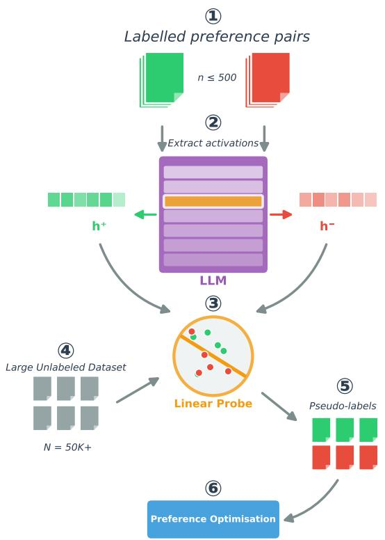  
Figure 1: Illustration of our proposed pipeline. We start with (1) a small dataset with labelled preference pairs. Using the difference in activations of an LLM (2), we train a linear probe (3). We then use the probe to label a large corpus (4, 5) and do preference optimisation (6).

## 1 Introduction

Preference optimisation has emerged as a critical technique for aligning language models with human values and expectations (Ouyang et al., 2022; Rafailov et al., 2023). Methods such as Direct Preference Optimisation (DPO) (Rafailov et al., 2023), IPO (ΨPO with identity mapping) (Gheshlaghi Azar et al., 2024), and their variants enable models to learn from human judgments about which responses are preferable. However, these methods typically require large datasets of labelled preference pairs, with annotation costs scaling linearly with dataset size.

This requirement poses challenges for adapting models to specific user populations. Different communities, organisations, and cultural contexts exhibit distinct preferences (Kirk et al., 2024; Sorensen et al., 2024): what constitutes a helpful or appropriate response varies substantially across groups. Obtaining large-scale annotations from each target population is often impractical, creating a barrier to personalised alignment.

A natural question arises: can we reduce the annotation burden while still achieving effective preference adaptation? One approach is to use an LLM (e.g., GPT-4 or newer) as an external judge (Zheng et al., 2023), but these encode their own preference biases rather than those of the target population (Li et al., 2025). Reward model distillation requires substantial labelled data for training. Therefore, we propose a way to capture population-specific preferences with minimal supervision.

First, we investigate how LLMs encode preference-relevant information in their activations. Our results show that when processing chosen versus rejected responses, the resulting representations occupy different regions of activation space, forming clusters with distinct centroids even before preference optimisation (Figure 2). When using ‘traditional’ preference optimisation datasets (i.e., datasets we expect to be similar to those used internally to train these models), this separation becomes more pronounced after supervised finetuning and preference optimisation, suggesting that instruction-following training implicitly organises representations according to response quality.

Building on this observation, we propose a simple pipeline (illustrated in Figure 1) for labelefficient preference adaptation:

1. Collect a small set of labelled preference pairs from the target population (n ≈ 100-500).

2. Train a linear probe (or similar small model) on model activations to distinguish chosen from rejected responses.

3. Apply the probe to label a large corpus of unlabelled response pairs.

4. Run standard preference optimisation using the probe-generated labels.

Our experiments show that our approach consistently outperforms traditional training when given the same amount of annotations. When traditional training is given 50 − 100× the amount of annotations, our method is still able to outperform two out of three baseline settings. Our findings lower the annotation barrier for preference adaptation, enabling effective adaptation in domains where human annotation budgets are severely constrained, including underrepresented and marginalised communities whose preferences have historically been underserved by large-scale models.

## 2 Related Work

## 2.1 Preference Optimisation

Reinforcement Learning from Human Feedback (RLHF) (Christiano et al., 2017; Ouyang et al., 2022) aligns language models with human preferences by training a reward model and optimising against it via reinforcement learning. Direct Preference Optimisation (DPO) (Rafailov et al., 2023) simplifies this by reparameterising the reward model as an implicit function of the policy, enabling direct optimisation on preference pairs. Subsequent work has proposed variants addressing limitations of DPO: IPO (Gheshlaghi Azar et al., 2024) avoids overfitting via a different loss formulation, KTO (Ethayarajh et al., 2024) operates on unpaired examples using Kahneman-Tversky’s model of utility (Tversky and Kahneman, 1992), and CPO (Xu et al., 2024) incorporates contrastive objectives. Our work studies how these methods respond to label noise, revealing substantial differences in robustness.

## 2.2 Label-Efficient Alignment

Prior work has explored reducing annotation requirements for alignment. Constitutional AI (Bai et al., 2022b) uses model self-critique, while RLAIF (Lee et al., 2024) employs LLM judges for labelling. However, these approaches inherit the preferences of the labelling model rather than the target population. Further, unlike LLM-asjudge self-labelling, which we show collapses to chance for small models on subjective datasets (Section 5.1), our approach can operate directly on pretrained activations and does not require the model to articulate its own preference judgments. Reward model distillation (Fisch et al., 2025; Askell et al., 2021) transfers preferences but still requires substantial seed data. Recent work on weak-to-strong generalisation (Burns et al., 2024) studies supervision from less capable models. Our approach differs by exploiting structure in the model’s own representations.

## 2.3 Linear Probing in LLMs

Linear probes have been used extensively to study representations in language models, revealing that models encode syntactic (Hewitt and Manning, 2019), semantic (Tenney et al., 2019), and factual (Meng et al., 2022) information in linearly accessible ways. Recent work has applied probing to detect sentiment (Tigges et al., 2024) hallucinations (Azaria and Mitchell, 2023), truthfulness (Marks and Tegmark, 2024), refusal behaviour (Arditi et al., 2024), model uncertainty (Wang et al., 2025; Dakhmouche et al., 2025) and answer accuracy (Cencerrado et al., 2025). A work that more closely aligns with ours is that of Maiya et al. (2025), where linear probes are proposed as a replacement for LLMs-as-judges. However, their work specifically requires fine-tuned LLMs and uses probes only for evaluation of performance.

We extend this line of work by showing that preference information is already encoded in pretrained models and can thus be exploited for practical label propagation for fine-tuning. To the best of our knowledge, we are the first to use probes for label propagation at scale and to apply it for preference optimisation.

## 3 Preference Geometry in Activations

We begin by characterising how preference information is organised in language model representations.

## 3.1 Experimental Setup

We analyse activations from different models of Llama 3.2 (Llama Team, AI @ Meta, 2024), Gemma 3 (Gemma Team, 2025), and Qwen 3 (Qwen Team, 2025b) at various training stages: pretrained, or after SFT and Preference Optimisation (PO). For each stage, we process preference pairs from HH-RLHF (Bai et al., 2022a), Ultra-Feedback (Cui et al., 2023), and Nectar (Zhu et al., 2024). On top of these ‘standard’ datasets, we also analyse PRISM (Kirk et al., 2024) as an example of culturally-diverse preferences, oasst21 (Köpf et al., 2023) for multilingual preferences and AfriSenti (Muhammad et al., 2023) for sentiment analysis in low-resource languages. For each sample, we extract the activations of positive and negative samples. The activations for a single sequence are then aggregated by either taking: (i) the mean of the completion tokens, (ii) only the token with maximum activations, or (iii) only the activations for the final token in the sequence.

## 3.2 Cluster Structure

We visualise activations from chosen and rejected responses using t-SNE (van der Maaten and Hinton, 2008) and PCA (Pearson, 1901), noticing that, while chosen and rejected clusters mostly overlap, their centroids are quite distinct. This separation is present even in pretrained models but becomes more pronounced (up to 40% more in distance) after SFT and PO. We show in Figure 2 one of the most prominent examples, obtained with Qwen 3 0.6B and the Nectar dataset. The pattern holds across model families and datasets, though the dataset has the largest effect on cluster separation: HH-RLHF, for instance, shows a less pronounced difference, consistent with its noisier annotations.

As a sanity check, we re-plot (and report in Appendix A.1) activations with chosen/rejected labels randomly permuted; the clusters collapse onto a shared centroid, confirming the separation reflects genuine preference structure rather than visualisation artefact.

Visual separation is statistically significant. To confirm that the observed separation is not an artefact of visualisation, we conduct a systematic battery of statistical tests across 9 settings (3 datasets × 3 model families). We project activations onto the first principal component (PC1) and apply a two-sample t-test, falling back to a Mann-Whitney U test when normality assumptions are violated. In five out of nine settings we find $p \ll 0 . 0 0 1$ ; in three of the remaining four we find $p < 0 . 0 5 ;$ only one combination fails to reach significance at the 0.05 level.

To complement the univariate analysis, we compute Cohen’s d on the full-dimensional activation space, obtaining values ranging from 2.63 to 3.75 across all settings. By standard conventions, $d > 0 . 8$ is a ‘large’ effect; our values exceed this threshold by a factor of 3–4×, indicating a very substantial separation between the chosen and rejected centroids. We additionally run a kernel two-sample test (MMD, RBF kernel with medianheuristic bandwidth, permutation-based p-values, n=250 per class) directly on the full-dimensional activations. This multivariate test corroborates the univariate finding: eight of nine settings reach significance at $p < 0 . 0 5$ , with the sole exception being Llama 3.2 tested with UltraFeedback $( p = 0 . 1 1 )$ The MMD magnitude tracks the same ordering already observed for cluster separation and probe accuracy, with Nectar showing the largest effect and UltraFeedback/HH-RLHF the smallest (full results in Appendix A.3). These results confirm that the cluster structure visible in Figure 2 reflects a statistically robust phenomenon.

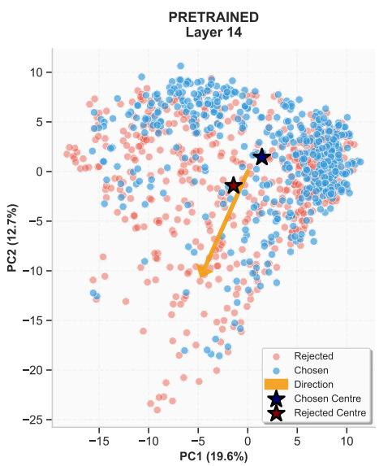

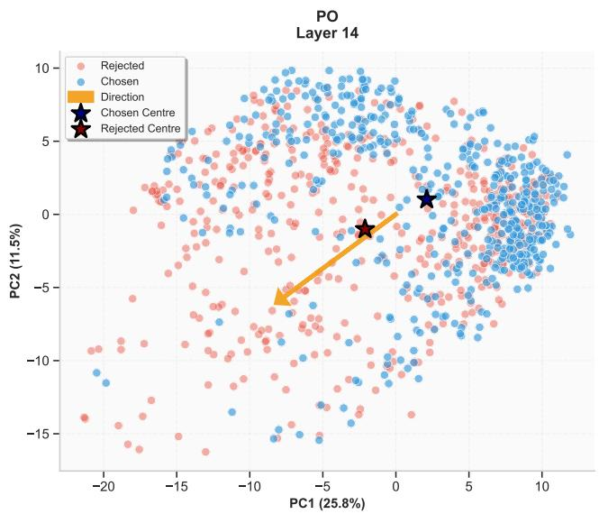  
Figure 2: Activations from chosen (blue) and rejected (orange) responses form separable clusters using Qwen 3 0.6B and Nectar. The distance between centroids increases in PO compared to pretrained.

## 3.3 Accuracy and Layer-wise Analysis

To quantify separability, we train linear probes at each layer and measure classification accuracy on held-out data.

Firstly, we find that probe accuracy peaks in the middle-to-late layers, consistent with findings on other representation probing tasks (Gurnee and Tegmark, 2024). We also find that the accuracy of pretrained and PO models is mostly similar, with some families of models showing slightly higher accuracy for pretrained (e.g., Llama 3.2), while others showing slightly higher accuracy for PO (Gemma 3, Qwen 3). Similar to before, we find that the dataset has the biggest influence on probe accuracy, with Nectar peaking above 75% while HH-RLHF plateauing around 60%.

Note that, while probe accuracy of 60% may appear low, preference annotation can be quite noisy. In HH-RLHF, the reported inter-annotator agreement is approximately 63%, indicating that our probe approaches the ceiling of human consistency. This suggests the probe may capture a genuine preference signal rather than merely failing to learn the task. Full per-setting results with confidence intervals are reported in Appendix A.5, alongside illustrations of probe accuracy across layers (A.2).

The effect is not an artefact of pretraining contamination. An important concern is whether the observed separation is an artefact of the model having memorised preference labels during pretraining. To control for this, we run an additional experiment using Llama 2 (Touvron et al., 2023) (released

July 2023) paired with the Nectar dataset (released November 2023), ensuring a strict temporal separation between the model and the data. The results closely mirror those reported for other settings: peak probe validation accuracy is $7 8 . 3 \% \pm 1 . 9$ the t-test on PC1 yields $p \ll 0 . 0 0 1$ , and Cohen’s $d = 3 . 7 3$ . This demonstrates that the preference geometry in activations is a genuine property of how language models represent response quality, not an artefact of memorisation.

Results are stable across settings. Varying the aggregation method, i.e., mean of activations vs. last token vs. max, does not affect clustering nor probe performance. However, an important aspect of computing the mean is that it should be calculated solely over the completion, excluding the prompt. Averaging over the entire input leads to clusters that are no longer distinguishable.

## 3.4 Alignment Erases Non-Canonical Preference Geometry

The main application of our findings is in lowresource scenarios and culturally specific settings, where data is too scarce. We begin by analysing multilingual capabilities in preference optimisation with oasst2 and find that all models achieve 65-69% accuracy across seven different languages (de, fr, es, zh, ru, it, jp). We also expand our experiments to sentiment analysis in low-resource languages using the AfriSenti dataset, where we find high accuracy across most languages (70 + %, up to 84% for Mozambique Portuguese), with Amharic scoring the lowest at $5 8 - 6 0 \% ;$ we attribute this to the different writing system of the language.

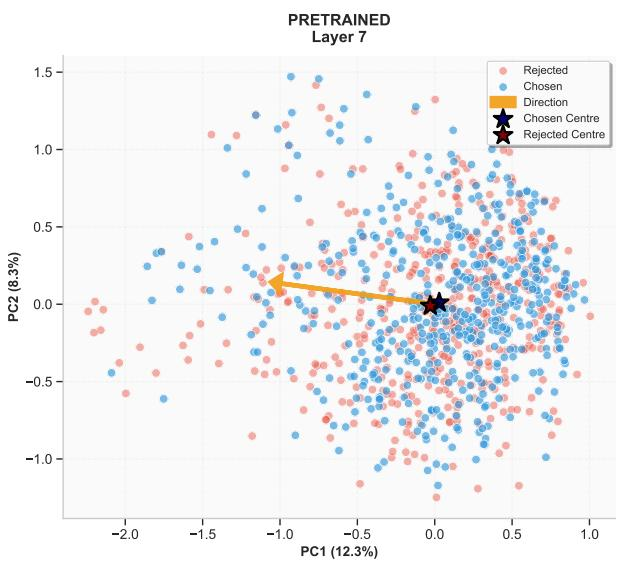

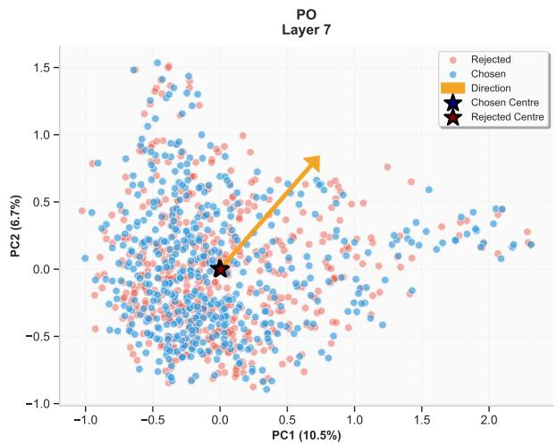  
Figure 3: Activations from chosen (blue) and rejected (orange) responses form separable clusters using Llama 3.2 1B and PRISM. Distance between centroids decreases in PO compared to pretrained.

Finally, we analyse the activations of PRISM, a preference dataset collected from a diverse range of populations where each sample is paired with the annotator’s cultural background. We begin by grouping conversations in PRISM by user location and age group, and we discover similar clustering and probe performance to those of ‘standard preference datasets. A key difference here is that, while the pretrained model shows distinct centroids for chosen and rejected samples, this distinction is much reduced or not present at all in the default SFT/PO version of the model (Figure 3). This strengthens the hypothesis that models aligned to a particular set of preferences are unable to distinguish between a different set of preferences and are thus unfit to be used as judges or annotators (Li et al., 2025).

## 4 Method

Exploiting the preference geometry presented in the previous Section, we propose a pipeline for label-efficient preference adaptation assuming access to:

• A language model $\pi _ { \theta }$ fine-tuned for instruction following (SFT model)

• A small labelled dataset $\mathcal { D } _ { L }$ $\{ ( x _ { i } , y _ { i } ^ { + } , y _ { i } ^ { - } ) \} _ { i = 1 } ^ { n }$ with n ≈ 10-500

• A large unlabelled dataset $\mathcal { D } _ { U }$ $\{ ( x _ { j } , y _ { j } ^ { a } , y _ { j } ^ { b } ) \} _ { j = 1 } ^ { N }$ with $N \gg n$

The goal is to adapt $\pi _ { \theta }$ to the preferences represented in $\mathcal { D } _ { L }$ by leveraging $\mathcal { D } _ { U }$

## 4.1 Probe Training

For each labelled example $( x , y ^ { + } , y ^ { - } )$ , we extract from $\pi _ { \theta }$ activations at layer ℓ and select those relative to the last token in the sequence:

$$
h ^ { + } = \operatorname { A c t i v a t i o n } _ { \ell } ( \pi _ { \theta } , [ x ; y ^ { + } ] )\tag{1}
$$

$$
h ^ { - } = \operatorname { A c t i v a t i o n } _ { \ell } ( \pi _ { \theta } , [ x ; y ^ { - } ] )\tag{2}
$$

We train a linear probe $f _ { \phi } ( h ) = \sigma ( W h + b )$ to predict preference:

$$
\mathcal { L } _ { \mathrm { p r o b e } } = - \sum _ { i } \left[ \log f _ { \phi } ( h _ { i } ^ { + } ) + \log ( 1 - f _ { \phi } ( h _ { i } ^ { - } ) ) \right]\tag{3}
$$

Here, the choice of ℓ can be either made through a validation set or with an ‘informed’ guess. Based on the analysis in Section 3, we believe the best layers are those starting from the middle of the model, $\mathrm { e . g . }$ , for a model with L layers, layers $\lfloor L / 2 \rfloor$ to $\lfloor 2 L / 3 \rfloor$

## 4.2 Label Propagation

For each unlabelled pair $( x , y ^ { a } , y ^ { b } ) \in { \mathcal { D } } { \boldsymbol { U } }$ , we compute:

$$
p ^ { a } = f _ { \phi } ( \mathrm { A c t i v a t i o n } _ { \ell } ( \pi _ { \theta } , [ x ; y ^ { a } ] ) )\tag{4}
$$

$$
p ^ { b } = f _ { \phi } ( \mathrm { A c t i v a t i o n } _ { \ell } ( \pi _ { \theta } , [ x ; y ^ { b } ] ) )\tag{5}
$$

We assign labels based on probe predictions:

$$
( y ^ { + } , y ^ { - } ) = { \left\{ \begin{array} { l l } { ( y ^ { a } , y ^ { b } ) } & { { \mathrm { i f ~ } } p ^ { a } > p ^ { b } } \\ { ( y ^ { b } , y ^ { a } ) } & { { \mathrm { o t h e r w i s e } } } \end{array} \right. }\tag{6}
$$

## 4.3 Preference Optimisation

We apply standard preference optimisation methods (DPO, IPO, KTO, CPO) on the probe-labelled dataset. The key question is how each method responds to the noise introduced by imperfect probe predictions.

## 5 Experiments

We conduct several experiments to validate the effectiveness of models trained on probe labels. The code for all the analysis and experiments is available at https://github.com/ alessioGalatolo/activ-pref-probe.

Models. We experiment with Llama 3, Gemma 3, Qwen 3 at varying scales from 0.6B to 14B parameters.

Probe training. Unless otherwise stated, the probe is trained on 500 examples, with activations from the three layers following the middle one (e.g., for a 16-layer model, we use layers 7, 8 and 9). The probe is then used to label (up to) 50K examples.

Datasets. We begin with a common SFT training using the instruction tuning dataset ‘Alpaca’ (Taori et al., 2023). This dataset is useful to provide the model with some instruction following behaviour without focusing on the harmlessness-helpfulness that is generally injected in the preference optimisation phase. After SFT, we proceed with preference optimisation, where we experiment with HH-RLHF (Bai et al., 2022a), UltraFeedback (Cui et al., 2023), and Nectar (Zhu et al., 2024).

Methods. We compare DPO (Rafailov et al., 2023), IPO (Gheshlaghi Azar et al., 2024), CPO (Xu et al., 2024), and KTO (Ethayarajh et al., 2024). For all the experiments, we use LoRA (Hu et al., 2022) to reduce computational demand.

Evaluation. We evaluate using LLM-as-a-judge on 500 samples from the original dataset using ‘Qwen 2.5 14B Instruct’ (Qwen Team, 2025a) as the judge. While we also tested other judges, we found this to be a good trade-off between performance, consistency and size. Our initial tests utilised Llama 3.2 1B/3B (Instruct), however, both yielded high variability and tie rates. After testing smaller models from the Qwen 2.5 family, we selected the 14B variant as the most reliable. Nevertheless, we report high consistency even among the different judges, where most judges would, on average, select the same winner model.

## Baselines.

• Original labels: Standard preference optimisation with original annotations.

• Random labels: Uniform random assignment of chosen/rejected (i.e., half the samples will have swapped labels).

• SFT checkpoint: To verify that the model actually improves compared to before training.

## 5.1 Comparison to Alternative Pseudo-Labelling Strategies

Before testing training using the probe’s pseudolabels, a natural question is whether activations provide signal beyond what is already recoverable from the model’s own output distribution, or from a supervised classifier trained on the same seed set. We compare against two additional pseudolabelling baselines using the same 500-example budget: (1) LLM-as-judge self-labelling, where the instruction-tuned model itself re-labels pairs given a rubric, optionally optimised with GEPA (Agrawal et al., 2026) over 300 rollouts; and (2) a supervised classifier head, obtained by fine-tuning a LoRA classifier on top of the base model using the same 500 labelled pairs.

Table 1: LLM-as-judge self-labelling accuracy (%) across model sizes and datasets.
<table><tr><td>Model</td><td>HH-RLHF</td><td>Nectar</td><td>UltraFeedback</td></tr><tr><td>Qwen 3 0.6B</td><td>49.6</td><td>49.8</td><td>50.2</td></tr><tr><td>Llama 3.2 1B</td><td>48.2</td><td>50.0</td><td>50.0</td></tr><tr><td>Llama 3.2 3B</td><td>48.7</td><td>66.7</td><td>54.4</td></tr><tr><td>Gemma 3 4B</td><td>51.2</td><td>85.0</td><td>63.4</td></tr><tr><td>Qwen 3 14B</td><td>47.2</td><td>89.9</td><td>71.2</td></tr></table>

Table 1 shows that small judges sit at or below chance across all three datasets; only larger variants become competitive, and none exceed chance on HH-RLHF, where our probe reaches 57– 62% (close to the ∼63% inter-annotator ceiling). GEPA optimisation does not change this picture: Qwen 3 0.6B stays within ±0.2 pp on every dataset, and Gemma 3 4B gains at most 2 pp on UltraFeedback while losing on Nectar. This indicates the failure is not a prompting artefact: small models do not expose the preference signal through their output distribution, even though it is linearly present in their activations (Section 3).

Training a classifier (Table 2) underperforms our linear probe in two of three settings, despite substantially longer training and orders of magnitude more trainable parameters. Together, these two baselines address the central question of this comparison: preference signal in the activations is not fully recoverable from the model’s output distribution, and a comparable-budget supervised classifier does not reliably recover it either.

Table 2: Pseudo-labelling accuracy (%): LoRA classifier head vs. our linear probe, both trained on the same 500 labels (Qwen 3 0.6B).
<table><tr><td>Method</td><td>HH-RLHF</td><td>Nectar</td><td>UltraFeedback</td></tr><tr><td>LoRA classifier head</td><td>56.5</td><td>85.5</td><td>57.2</td></tr><tr><td>Linear probe (ours)</td><td>57.7</td><td>75.3</td><td>62.1</td></tr></table>

## 5.2 Equal-Budget Comparison

To isolate the value of label propagation from any advantage due to dataset size, we run a head-tohead comparison in which both our method and the Original baseline receive exactly 500 labelled examples. The original-label baseline trains directly on those 500 pairs; our probe-labelled model uses the same 500 examples for probe training and then propagates labels to the full 50K unlabelled corpus. We use HH-RLHF and DPO, as the most commonly used dataset and PO method, respectively. Results are reported in Table 3.

Table 3: Equal-budget comparison (500 labelled examples each). Win/Tie/Loss rates for the probe-labelled model versus a model trained directly on 500 originallabelled examples, using DPO on HH-RLHF.
<table><tr><td>Model</td><td>Probe wins (%)</td><td>Original wins (%)</td><td>Ties (%)</td></tr><tr><td>Qwen 3 14B</td><td>47.0</td><td>28.6</td><td>24.4</td></tr><tr><td>Gemma 3 4B</td><td>38.0</td><td>37.6</td><td>24.4</td></tr><tr><td>Llama 3.2 3B</td><td>41.2</td><td>30.2</td><td>28.5</td></tr><tr><td>Llama 3.2 1B</td><td>33.8</td><td>30.4</td><td>35.8</td></tr><tr><td>Qwen 3 0.6B</td><td>27.6</td><td>30.4</td><td>42.0</td></tr></table>

The probe-labelled approach outperforms direct training on the small labelled set in 4 out of 5 model settings, with win-rate advantages of up to +11.2% (excluding ties). The only exception is Qwen 3 0.6B. We attribute this primarily to the model’s size, which likely makes it more susceptible to noise and training degeneration.

## 5.3 500 vs 50K Labels

Motivated by the success of our method over this small set of experiments, we expand our investigation to a harder setting. Now, our method is still only given 500 labelled samples but the baseline(s) are now given the full set of 50K labelled samples.

We show in Table 4 and 5 the results using HH-RLHF, while results on other datasets are presented in Table 7.

Probe labels outperform baselines, with IPO being the most robust method. Models trained using our labelling method consistently outperform two out of three baselines, showing improvement over the SFT checkpoint (Table 5) and over PO models trained with random labels. At both small and big scales, IPO with probe labels is very close and sometimes outperforms models trained on the original dataset. In contrast, DPO shows the largest gap between original and probe labels, regardless of scale. The other methods, CPO and KTO, show competitiveness between probelabelled and original-labelled variants; while the original-labelled still exhibits better performance in most cases, the margins are smaller than those observed with DPO.

Small models degenerate. The smallest model tested (Qwen 3 0.6B) is prone to degenerate outputs under both label sources. Two opposite failure modes are worth noting: IPO degenerates more often with original labels than with probe labels, while DPO degenerates more often with probe labels than with originals. This is consistent with each method’s distinct sensitivity to the structure of the label distribution.

Label smoothing improves competitiveness with DPO. Label smoothing has been proposed to improve DPO robustness (Mitchell, 2023). Table 6 compares different smoothing values.

Higher smoothing substantially improves robustness, increasing the win-tie rate from 37% to 67.2%. This aligns with the interpretation that DPO overfits to noisy labels.

Probe performance plateaus after 500 samples. Figure 4 shows a visualisation of probe performance as a function of training set size. We test the following configurations: n ∈ {10, 50, 100, 250, 500, 1000}. We plot the winrate of the probe-trained model against the SFT model. While the plot shows almost monotonically increasing win-tie rate, the biggest increase in performance happens with 250 (∼ 77% win-ties) training samples until 500 ( ∼ 81%). After this boundary, increasing training size yields diminishing results (while still improving overall performance).

Preference Optimisation Performance vs Probe Dataset Size  
Table 4: Probe labelled models win+tie rate in percentage % (tie rate also in parentheses) compared to originallabelled models or randomly labelled model after full training on HH-RLHF. Higher indicates probe labels perform better. We highlight in bold the times the probe-labelled model has a higher win-rate than its baseline (i.e., excluding ties). We mark with a ‘\*’ the runs where one or both models occasionally express degenerated outputs.
<table><tr><td></td><td></td><td colspan="4">Original</td><td colspan="4">Random</td></tr><tr><td>Family</td><td>Size</td><td>DPO</td><td>IPO</td><td>CPO</td><td>KTO</td><td>DPO</td><td>IPO</td><td>CPO</td><td>KTO</td></tr><tr><td>Qwen 3</td><td>14B</td><td>34.4 (2.8)</td><td>86 (1.4)</td><td>52.4 (17.6)</td><td>50.6 (12.2)</td><td>57.4 (9.8)</td><td>90.6 (2.2)</td><td>68.8 (26.6)</td><td>70.6 (13.8)</td></tr><tr><td>Gemma 3</td><td>4B</td><td>33 (9)</td><td>94*(73)</td><td>45.4 (17.2)</td><td>56.2 (25)</td><td>67.2 (31.2)</td><td>42.8*(20)</td><td>67.6 (25.6)</td><td>98.2 (24.4)</td></tr><tr><td>Llama 3.2</td><td>3B</td><td>39.4 (5.8)</td><td>55.2 (20.8)</td><td>38.8 (12.6)</td><td>48.2 (7.2)</td><td>67.4 (28.2)</td><td>46.2 (18)</td><td>61 (26)</td><td>63.8 (15.2)</td></tr><tr><td>Llama 3.2</td><td>1B</td><td>37.3 (11.4)</td><td>92.6 (31.8)</td><td>49.4 (21.4)</td><td>48 (23)</td><td>67.6 (29.8)</td><td>63.6 (19.2)</td><td>71.5 (30.2)</td><td>94 (15.6)</td></tr><tr><td>Qwen 3</td><td>0.6B</td><td>37 (20)</td><td>63.8*(41)</td><td>69*(49.4)</td><td>60*(32)</td><td>70.8 (45)</td><td>72.4* (29)</td><td>79 (55.2)</td><td>98.4 (44)</td></tr></table>

Table 5: Probe labelled models win+tie rate in percentage % (tie rate also in parentheses) compared to Supervised Fine-Tuned (SFT) checkpoint on HH-RLHF. Higher indicates probe labels perform better. We highlight in bold the times the probe-labelled model has a higher win-rate than its baseline (i.e., excluding ties).
<table><tr><td rowspan="2">Family</td><td rowspan="2">Size</td><td colspan="4">SFT</td></tr><tr><td>DPO</td><td>IPO</td><td>CPO</td><td>KTO</td></tr><tr><td>Qwen 3</td><td>14B</td><td>80.9 (9.80)</td><td>91.6 (0.8)</td><td>52.6 (16.8)</td><td>65 (10.4)</td></tr><tr><td>Gemma 3</td><td>4B</td><td>69.8 (30)</td><td>32.4*(11)</td><td>60.2 (21.8)</td><td>58.6 (15)</td></tr><tr><td>Llama 3.2</td><td>3B</td><td>70.4 (28.2)</td><td>50.6 (21.2)</td><td>55.2 (20.6)</td><td>62.4 (18.2)</td></tr><tr><td>Llama 3.2</td><td>1B</td><td>73.8 (33.4)</td><td>63.8 (24.6)</td><td>61.6 (22.6)</td><td>62.8 (20.2)</td></tr><tr><td>Qwen 3</td><td>0.6B</td><td>77.8 (40.6)</td><td>73 (30.6)</td><td>74.4 (44.6)</td><td>63.6 (38.6)</td></tr></table>

Table 6: Effect of label smoothing on DPO with probe labels (Qwen3 0.6B, HH-RLHF). Win rate (%) against original labels. We highlight in bold the best results for the probe.
<table><tr><td>Label Smoothing</td><td>Win Lose</td><td></td><td>Tie</td></tr><tr><td>0.0</td><td>17</td><td>63</td><td>20</td></tr><tr><td>0.1</td><td>18.4</td><td>57.2</td><td>24.4</td></tr><tr><td>0.25</td><td>25.4</td><td>40</td><td>34.6</td></tr><tr><td>0.4</td><td>24.6</td><td>32.8</td><td>42.6</td></tr></table>

Other datasets exhibit similar performance. The results on UltraFeedback and Nectar (Table 7) are very similar to those from HH-RLHF: models trained on probe labels often outperform randomly labelled datasets and, only occasionally, the models trained with the original dataset.

Where does the crossover lie? The equal-budget (Section 5.2) and 500-vs-50K comparisons above represent two extremes. To locate the crossover point, we fix the probe’s training budget at 500 and vary the original-label baseline’s budget over {500, 1k, 2.5k, 5k}, using DPO on HH-RLHF.

The crossover lies consistently between 1k and 2.5k gold labels across model scales. Since DPO represent our least noise-robust method, this crossover should be read as a conservative lower bound; other (dataset, method) combinations are likely to favour the probe at even higher gold-label budgets.

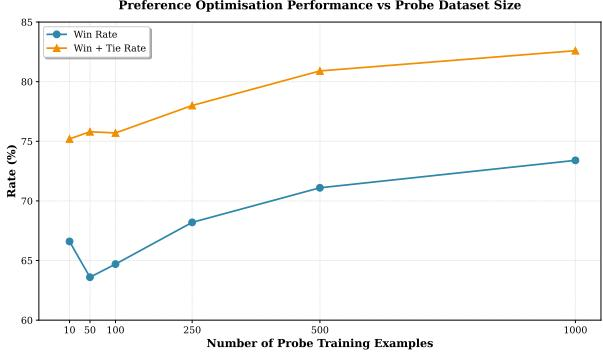  
Figure 4: Effect of probe training set size on downstream preference optimisation performance. Reported is the win-rate against the SFT model. Performance starts to rise after 100 samples.

## 5.4 Additional validation

We provide two further validation experiments in Appendix C. First, a small-scale human evaluation on HH-RLHF (250 response pairs, four annotators, three model–method configurations) confirms that the directional pattern observed in our automated evaluation holds under human judgement: IPO with probe labels outperforms both baselines, while DPO with probe labels trails the 50K original-label baseline but clearly surpasses random labelling. Second, a downstream preference optimisation experiment on the PRISM dataset assesses transfer to a culturally specific, low-resource setting, using embedding-based similarity to ground-truth completions as an evaluation proxy. The probe-trained model matches or exceeds a fully-supervised baseline in the majority of configurations, with IPO showing up to 29% relative improvement despite using only 500 labelled examples. Together, these results corroborate our central finding that probegenerated labels carry genuine preference signal across diverse evaluation regimes.

Table 7: Probe labelled models win+tie rate in percentage % (tie rate also in parentheses) on Nectar (above) and UltraFeedback (below).
<table><tr><td></td><td colspan="8">Nectar</td></tr><tr><td></td><td colspan="4"></td><td colspan="4"></td></tr><tr><td>Family</td><td>Size</td><td>DPO</td><td>IPO</td><td>CPO</td><td>DPO</td><td>IPO</td><td>CPO</td><td>KTO</td></tr><tr><td>Qwen 3</td><td>14B</td><td>26.0 (2.2)</td><td>66.8 (41.0)</td><td>37.8 (2.6)</td><td>46.6 (3.2)</td><td>63.2 (7.4)</td><td>15.2 (7.6)</td><td>73.4 (4.8)</td><td>99.0 (1.4)</td></tr><tr><td>Gemma 3</td><td>4B</td><td>18.6 (2.2)</td><td>37.4 (4.6)</td><td>27.4 (4.6)</td><td>38.4 (3.6)</td><td>64.4 (23.8)</td><td>31.0 (14.2)</td><td>52.8 (9.8)</td><td>98.0 (7.8)</td></tr><tr><td>Llama</td><td>3B</td><td>26.0 (3.6)</td><td>90.4 (75.6)</td><td>34.6 (4.2)</td><td>54.6 (5.6)</td><td>75.8 (22.2)</td><td>14.2 (5.6)</td><td>62.2 (9.8)</td><td>77.6 (3.4)</td></tr><tr><td>Llama 3.2</td><td>1B</td><td>36.8 (9.0)</td><td>99.2 (26.6)</td><td>39.2 (9.6)</td><td>36.0 (8.0)</td><td>61.0 (18.6)</td><td>30.6 (18.4)</td><td>56.4 (18.8)</td><td>70.4 (13.2)</td></tr><tr><td>Qwen 3</td><td>0.6B</td><td>38.0 (19.6)</td><td>90.6 (50.0)</td><td>54.8 (20.4)</td><td>46.8 (16.0)</td><td>72.8 (36.4)</td><td>49.8 (33.4)</td><td>70.2 (22.4)</td><td>93.2 (16.0)</td></tr><tr><td colspan="10">UltraFeedback</td></tr><tr><td>Qwen 3</td><td>14B</td><td>30.2 (3.0)</td><td>52.4 (15.8)</td><td>38.0 (2.4)</td><td>19.8 (1.6)</td><td>55.4 (6.4)</td><td>20.8 (8.2)</td><td>62.4 (3.6)</td><td>98.2 (7.4)</td></tr><tr><td>Gemma 3</td><td>4B</td><td>28.4 (8.2)</td><td>23.2 (6.0)</td><td>41.4 (4.0)</td><td>26.0 (2.0)</td><td>62.0 (17.4)</td><td>22.4 (8.4)</td><td>51.6 (5.2)</td><td>79.8 (5.0)</td></tr><tr><td>Llama</td><td>3B</td><td>32.6 (8.4)</td><td>74.0 (73.0)</td><td>40.6 (4.2)</td><td>30.6 (3.2)</td><td>61.2 (12.8)</td><td>8.2 (6.4)</td><td>55.2 (7.6)</td><td>70.2 (6.2)</td></tr><tr><td>Llama 3.2</td><td>1B</td><td>39.0 (15.2)</td><td>89.8 (34.0)</td><td>51.2 (17.0)</td><td>30.6 (6.8)</td><td>47.6 (14.6)</td><td>19.8 (14.6)</td><td>60.6 (18.2)</td><td>59.8 (13.6)</td></tr><tr><td>Qwen 3</td><td>0.6B</td><td>48.0 (24.2)</td><td>75.8 (18.6)</td><td>47.2 (15.6)</td><td>30.4 (7.2)</td><td>68.6 (32.4)</td><td>54.4 (25.4)</td><td>63.2 (25.0)</td><td>73.8 (24.0)</td></tr></table>

Table 8: Win+tie (tie) rates (%) for the probe-labelled model (fixed at 500 labels) against an original-label baseline with increasing budget, using DPO on HH-RLHF. Bold indicates the probe’s strict wins.
<table><tr><td>Family</td><td>Size</td><td>500</td><td>1K</td><td>2.5K</td><td>5K</td></tr><tr><td>Qwen 3</td><td>14B</td><td>71.4 (24.4)</td><td>58.6 (11.2)</td><td>43.6 (8.2)</td><td>42.6 (6.4)</td></tr><tr><td>Gemma 3</td><td>4B</td><td>62.4 (24.4)</td><td>60.8 (28.0)</td><td>43.8 (14.0)</td><td>34.4 (8.2)</td></tr><tr><td>Llama 3.2</td><td>3B</td><td>69.7 (28.5)</td><td>66.2 (26.4)</td><td>49.0 (15.6)</td><td>37.7 (11.0)</td></tr><tr><td>Llama 3.2</td><td>1B</td><td>69.6 (35.8)</td><td>69.6 (33.2)</td><td>57.2 (27.4)</td><td>41.0 (14.0)</td></tr><tr><td>Qwen 3</td><td>0.6B</td><td>69.6 (42.0)</td><td>72.8 (43.4)</td><td>52.6 (37.4)</td><td>40.2 (27.2)</td></tr></table>

## 5.5 Computational Overhead

A key practical advantage of our approach is its efficiency: probe training requires n forward passes to extract activations (where $n \leq 5 0 0 )$ followed by fitting a linear classifier, completing in under a minute on a single GPU. Label propagation (on 50K+ samples) in our current implementation adds approximately 70% overhead to preference optimisation training time, as we perform labelling as a separate preprocessing step for simplicity of implementation. However, this overhead can be eliminated entirely by fusing label propagation with preference optimisation. Specifically, during each training iteration, one can perform a forward pass on an unlabelled pair $( y ^ { a } , y ^ { b } )$ , extract activations to obtain probe predictions, assign labels accordingly, and then compute the preference optimisation loss using the same forward pass outputs before backpropagating. This fused approach adds only the cost of a single linear probe evaluation per batch, negligible compared to the LLM forward and backward passes. We provide a sketch of this algorithm in Appendix B.

## 6 Conclusion

We showed that language models encode preference information as geometrically separable clusters in their activations, that this geometry is reshaped, and in the case of non-canonical preferences, erased by alignment. Exploiting this structure, we proposed a method for label-efficient preference adaptation: train a linear probe on a few hundred labelled examples, propagate labels to a large unlabelled corpus, and run preference optimisation. Our systematic evaluation revealed substantial differences in method robustness: IPO tolerates noisy labels while DPO degrades unless label smoothing is used. Nevertheless, training using probe labels has shown consistent improvement over SFT models and random labelling. This work enables preference adaptation with 100× fewer annotations, making personalised alignment more accessible, especially in low-resource settings.

## 6.1 Limitations

Our work has several limitations that suggest directions for future research. First, our evaluation almost entirely relies on LLM-as-a-judge, which creates tension with our motivation that LLM judges encode their own preference biases. While our small-scale human evaluation and consistency across multiple judge models provide corroborating evidence, human evaluation at the full scale of Table 4 would further strengthen our claims. Second, although we demonstrate that PRISM exhibits similar activation geometry to standard datasets (Section 3.4) and provide initial downstream results, human evaluation on culturally diverse populations remains infeasible without access to the original annotator communities. Finally, while our empirical findings are consistent with the linear representation hypothesis (Jiang et al., 2024; Elhage et al., 2022) and probing theory (Pimentel et al., 2020), providing formal convergence guarantees for preference optimisation under probe-generated noise remains an open problem that we leave for future work.

## Acknowledgements

The computations and data handling were enabled by resources provided by the National Academic Infrastructure for Supercomputing in Sweden (NAISS) including Arrhenius and Alvis, C3SE (Chalmers) partially funded by the Swedish Research Council through grant agreement no. 2022- 06725.

## References

Lakshya A Agrawal, Shangyin Tan, Dilara Soylu, Noah Ziems, Rishi Khare, Krista Opsahl-Ong, Arnav Singhvi, Herumb Shandilya, Michael J Ryan, Meng Jiang, Christopher Potts, Koushik Sen, Alex Dimakis, Ion Stoica, Dan Klein, Matei Zaharia, and Omar Khattab. 2026. GEPA: Reflective prompt evolution can outperform reinforcement learning. In The Fourteenth International Conference on Learning Representations.

Andy Arditi, Oscar Obeso, Aaquib Syed, Daniel Paleka, Nina Panickssery, Wes Gurnee, and Neel Nanda. 2024. Refusal in language models is mediated by a single direction. Advances in Neural Information Processing Systems, 37:136037–136083.

Amanda Askell, Yuntao Bai, Anna Chen, Dawn Drain, Deep Ganguli, Tom Henighan, Andy Jones, Nicholas Joseph, Ben Mann, Nova DasSarma, and 1 others. 2021. A general language assistant as a laboratory for alignment. arXiv preprint arXiv:2112.00861.

Amos Azaria and Tom Mitchell. 2023. The internal state of an llm knows when it’s lying. In Findings of the Association for Computational Linguistics: EMNLP 2023, pages 967–976.

Yuntao Bai, Andy Jones, Kamal Ndousse, Amanda Askell, Anna Chen, Nova DasSarma, Dawn Drain, Stanislav Fort, Deep Ganguli, Tom Henighan, and 1 others. 2022a. Training a helpful and harmless assistant with reinforcement learning from human feedback. arXiv preprint arXiv:2204.05862.

Yuntao Bai, Saurav Kadavath, Sandipan Kundu, Amanda Askell, Jackson Kernion, Andy Jones, Anna Chen, Anna Goldie, Azalia Mirhoseini, Cameron McKinnon, and 1 others. 2022b. Constitutional ai: Harmlessness from ai feedback. arXiv preprint arXiv:2212.08073.

Collin Burns, Pavel Izmailov, Jan Hendrik Kirchner, Bowen Baker, Leo Gao, Leopold Aschenbrenner, Yining Chen, Adrien Ecoffet, Manas Joglekar, Jan Leike, and 1 others. 2024. Weak-to-strong generalization: eliciting strong capabilities with weak supervision. In Proceedings of the 41st International Conference on Machine Learning, pages 4971–5012.

Iván Vicente Moreno Cencerrado, Arnau Padrés Masdemont, Anton Gonzalvez Hawthorne, David Demitri Africa, and Lorenzo Pacchiardi. 2025. No answer needed: Predicting llm answer accuracy from question-only linear probes. Preprint, arXiv:2509.10625.

Paul F Christiano, Jan Leike, Tom Brown, Miljan Martic, Shane Legg, and Dario Amodei. 2017. Deep reinforcement learning from human preferences. Advances in neural information processing systems, 30.

Ganqu Cui, Lifan Yuan, Ning Ding, Guanming Yao, Wei Zhu, Yuan Ni, Guotong Xie, Zhiyuan Liu, and Maosong Sun. 2023. Ultrafeedback: Boosting language models with high-quality feedback. Preprint, arXiv:2310.01377.

Ramzi Dakhmouche, Adrien Letellier, and Hossein Gorji. 2025. Can linear probes measure LLM uncertainty ? In NeurIPS 2025 Workshop MLxOR: Mathematical Foundations and Operational Integration of Machine Learningfor Uncertainty-Aware Decision-Making.

Nelson Elhage, Tristan Hume, Catherine Olsson, Nicholas Schiefer, Tom Henighan, Shauna Kravec, Zac Hatfield-Dodds, Robert Lasenby, Dawn Drain, Carol Chen, and 1 others. 2022. Toy models of superposition. arXiv preprint arXiv:2209.10652.

Kawin Ethayarajh, Winnie Xu, Niklas Muennighoff, Dan Jurafsky, and Douwe Kiela. 2024. Model alignment as prospect theoretic optimization. In Proceedings of the 41st International Conference on Machine Learning, ICML’24. JMLR.org.

Adam Fisch, Jacob Eisenstein, Vicky Zayats, Alekh Agarwal, Ahmad Beirami, Chirag Nagpal, Peter Shaw, and Jonathan Berant. 2025. Robust preference optimization through reward model distillation. Transactions on Machine Learning Research.

Gemma Team. 2025. Gemma 3 technical report. Preprint, arXiv:2503.19786.

Mohammad Gheshlaghi Azar, Zhaohan Daniel Guo, Bilal Piot, Remi Munos, Mark Rowland, Michal Valko, and Daniele Calandriello. 2024. A general theoretical paradigm to understand learning from human preferences. In Proceedings of The 27th International

Conference on Artificial Intelligence and Statistics, volume 238 of Proceedings of Machine Learning Research, pages 4447–4455. PMLR.

Wes Gurnee and Max Tegmark. 2024. Language models represent space and time. In The Twelfth International Conference on Learning Representations.

John Hewitt and Christopher D Manning. 2019. A structural probe for finding syntax in word representations. In Proceedings of the 2019 Conference of the North American Chapter of the Association for Computational Linguistics: Human Language Technologies, Volume 1 (Long and Short Papers), pages 4129–4138.

Edward J Hu, yelong shen, Phillip Wallis, Zeyuan Allen-Zhu, Yuanzhi Li, Shean Wang, Lu Wang, and Weizhu Chen. 2022. LoRA: Low-rank adaptation of large language models. In International Conference on Learning Representations.

Yibo Jiang, Goutham Rajendran, Pradeep Kumar Ravikumar, Bryon Aragam, and Victor Veitch. 2024. On the origins of linear representations in large language models. In International Conference on Machine Learning, pages 21879–21911. PMLR.

Hannah Rose Kirk, Alexander Whitefield, Paul Röttger, Andrew Bean, Katerina Margatina, Juan Ciro, Rafael Mosquera, Max Bartolo, Adina Williams, He He, Bertie Vidgen, and Scott A. Hale. 2024. The prism alignment dataset: What participatory, representative and individualised human feedback reveals about the subjective and multicultural alignment of large language models. In Advances in Neural Information Processing Systems, volume 37, pages 105236– 105344. Curran Associates, Inc.

Andreas Köpf, Yannic Kilcher, Dimitri von Rütte, Sotiris Anagnostidis, Zhi Rui Tam, Keith Stevens, Abdullah Barhoum, Duc Nguyen, Oliver Stanley, Richárd Nagyfi, Shahul ES, Sameer Suri, David Glushkov, Arnav Dantuluri, Andrew Maguire, Christoph Schuhmann, Huu Nguyen, and Alexander Mattick. 2023. Openassistant conversations - democratizing large language model alignment. In Advances in Neural Information Processing Systems, volume 36, pages 47669–47681. Curran Associates, Inc.

Harrison Lee, Samrat Phatale, Hassan Mansoor, Thomas Mesnard, Johan Ferret, Kellie Lu, Colton Bishop, Ethan Hall, Victor Carbune, Abhinav Rastogi, and 1 others. 2024. Rlaif vs. rlhf: scaling reinforcement learning from human feedback with ai feedback. In Proceedings ofthe 41st International Conference on Machine Learning, pages 26874–26901.

Dawei Li, Bohan Jiang, Liangjie Huang, Alimohammad Beigi, Chengshuai Zhao, Zhen Tan, Amrita Bhattacharjee, Yuxuan Jiang, Canyu Chen, Tianhao Wu, Kai Shu, Lu Cheng, and Huan Liu. 2025. From generation to judgment: Opportunities and challenges of LLM-as-a-judge. In Proceedings of the 2025 Conference on Empirical Methods in Natural Language

Processing, pages 2757–2791, Suzhou, China. Association for Computational Linguistics.

Llama Team, AI @ Meta. 2024. The llama 3 herd of models. arXiv preprint arXiv:2407.21783.

Sharan Maiya, Yinhong Liu, Ramit Debnath, and Anna Korhonen. 2025. Improving preference extraction in LLMs by identifying latent knowledge through classifying probes. In Proceedings of the 63rd Annual Meeting of the Association for Computational Linguistics (Volume 1: Long Papers), pages 9061–9081, Vienna, Austria. Association for Computational Linguistics.

Samuel Marks and Max Tegmark. 2024. The geometry of truth: Emergent linear structure in large language model representations of true/false datasets. In First Conference on Language Modeling.

Kevin Meng, David Bau, Alex Andonian, and Yonatan Belinkov. 2022. Locating and editing factual associations in gpt. Advances in neural information processing systems, 35:17359–17372.

Eric Mitchell. 2023. A note on dpo with noisy preferences & relationship to ipo.

Shamsuddeen Hassan Muhammad, Idris Abdulmumin, Abinew Ali Ayele, Nedjma Ousidhoum, David Ifeoluwa Adelani, Seid Muhie Yimam, Ibrahim Sa’id Ahmad, Meriem Beloucif, Saif M. Mohammad, Sebastian Ruder, Oumaima Hourrane, Pavel Brazdil, Alipio Jorge, Felermino Dário Mário António Ali, Davis David, Salomey Osei, Bello Shehu Bello, Falalu Ibrahim, Tajuddeen Gwadabe, and 8 others. 2023. AfriSenti: A Twitter sentiment analysis benchmark for African languages. In Proceedings of the 2023 Conference on Empirical Methods in Natural Language Processing, pages 13968–13981, Singapore. Association for Computational Linguistics.

Long Ouyang, Jeffrey Wu, Xu Jiang, Diogo Almeida, Carroll Wainwright, Pamela Mishkin, Chong Zhang, Sandhini Agarwal, Katarina Slama, Alex Ray, and 1 others. 2022. Training language models to follow instructions with human feedback. Advances in neural information processing systems, 35:27730–27744.

Karl Pearson. 1901. Liii. on lines and planes of closest fit to systems of points in space. The London, Edinburgh, and Dublin philosophical magazine and journal ofscience, 2(11):559–572.

Tiago Pimentel, Josef Valvoda, Rowan Hall Maudslay, Ran Zmigrod, Adina Williams, and Ryan Cotterell. 2020. Information-theoretic probing for linguistic structure. In Proceedings of the 58th Annual Meeting of the Association for Computational Linguistics, pages 4609–4622, Online. Association for Computational Linguistics.

Qwen Team. 2025a. Qwen2.5 technical report. Preprint, arXiv:2412.15115.

Qwen Team. 2025b. Qwen3 technical report. Preprint, arXiv:2505.09388.

Rafael Rafailov, Archit Sharma, Eric Mitchell, Christopher D Manning, Stefano Ermon, and Chelsea Finn. 2023. Direct preference optimization: Your language model is secretly a reward model. Advances in neural information processing systems, 36:53728–53741.

Nils Reimers and Iryna Gurevych. 2019. Sentence-BERT: Sentence embeddings using Siamese BERTnetworks. In Proceedings ofthe 2019 Conference on Empirical Methods in Natural Language Processing and the 9th International Joint Conference on Natural Language Processing (EMNLP-IJCNLP), pages 3982–3992, Hong Kong, China. Association for Computational Linguistics.

Taylor Sorensen, Liwei Jiang, Jena D Hwang, Sydney Levine, Valentina Pyatkin, Peter West, Nouha Dziri, Ximing Lu, Kavel Rao, Chandra Bhagavatula, and 1 others. 2024. Value kaleidoscope: Engaging ai with pluralistic human values, rights, and duties. In Proceedings of the AAAI Conference on Artificial Intelligence, volume 38, pages 19937–19947.

Rohan Taori, Ishaan Gulrajani, Tianyi Zhang, Yann Dubois, Xuechen Li, Carlos Guestrin, Percy Liang, and Tatsunori B. Hashimoto. 2023. Stanford alpaca: An instruction-following llama model. https:// github.com/tatsu-lab/stanford\_alpaca.

Ian Tenney, Dipanjan Das, and Ellie Pavlick. 2019. Bert rediscovers the classical nlp pipeline. In Proceedings of the 57th Annual Meeting of the Association for Computational Linguistics, pages 4593–4601.

Curt Tigges, Oskar J. Hollinsworth, Atticus Geiger, and Neel Nanda. 2024. Language models linearly represent sentiment. In Proceedings of the 7th BlackboxNLP Workshop: Analyzing and Interpreting Neural Networksfor NLP, pages 58–87, Miami, Florida, US. Association for Computational Linguistics.

Hugo Touvron, Louis Martin, Kevin Stone, Peter Albert, Amjad Almahairi, Yasmine Babaei, Nikolay Bashlykov, Soumya Batra, Prajjwal Bhargava, Shruti Bhosale, Dan Bikel, Lukas Blecher, Cristian Canton Ferrer, Moya Chen, Guillem Cucurull, David Esiobu, Jude Fernandes, Jeremy Fu, Wenyin Fu, and 49 others. 2023. Llama 2: Open foundation and fine-tuned chat models. Preprint, arXiv:2307.09288.

Amos Tversky and Daniel Kahneman. 1992. Advances in prospect theory: Cumulative representation of uncertainty. Journal ofRisk and uncertainty, 5(4):297– 323.

Laurens van der Maaten and Geoffrey Hinton. 2008. Visualizing data using t-sne. Journal of Machine Learning Research, 9(86):2579–2605.

Yongjie Wang, Yibo Wang, Xin Zhou, and Zhiqi Shen. 2025. Response uncertainty and probe modeling: Two sides of the same coin in llm interpretability? Preprint, arXiv:2505.18575.

Haoran Xu, Amr Sharaf, Yunmo Chen, Weiting Tan, Lingfeng Shen, Benjamin Van Durme, Kenton Murray, and Young Jin Kim. 2024. Contrastive preference optimization: pushing the boundaries of llm performance in machine translation. In Proceedings of the 41st International Conference on Machine Learning, pages 55204–55224.

Lianmin Zheng, Wei-Lin Chiang, Ying Sheng, Siyuan Zhuang, Zhanghao Wu, Yonghao Zhuang, Zi Lin, Zhuohan Li, Dacheng Li, Eric Xing, and 1 others. 2023. Judging llm-as-a-judge with mt-bench and chatbot arena. Advances in neural information processing systems, 36:46595–46623.

Banghua Zhu, Evan Frick, Tianhao Wu, Hanlin Zhu, Karthik Ganesan, Wei-Lin Chiang, Jian Zhang, and Jiantao Jiao. 2024. Starling-7b: Improving helpfulness and harmlessness with RLAIF. In First Conference on Language Modeling.

## A Additional Results on Activation Geometry

## A.1 Sanity Check on Clustering

To verify that the activation separation observed in Figure 2 is driven by genuine preference signal rather than incidental distributional differences, we repeat the t-SNE and PCA visualisations with the chosen/rejected labels randomly swapped. As shown in Figure 5, the two clusters become completely indistinguishable and their centroids coincide. This confirms that the structured geometry reported in Section 3 is a direct consequence of the contrastive nature of positive and negative examples, not an artefact of unrelated activation statistics.

## A.2 Layer-wise Probe Accuracy

Figure 6 presents linear probe classification accuracy across all layers of Qwen 3 0.6B on the Nectar dataset, comparing pretrained and preferenceoptimised (PO) checkpoints. Accuracy rises steeply in the early layers, peaks in the middleto-late portion of the network (around layer 15 out of 28), and then plateaus or slightly declines towards the final layers. This pattern is consistent with findings from general representation probing studies (Gurnee and Tegmark, 2024), where taskrelevant information tends to be most linearly accessible in intermediate representations. The PO model shows consistently higher probe accuracy across most layers, suggesting that preference optimisation sharpens the linear separability of chosen and rejected responses in the activation space— though, as discussed in Section 3, the difference between pretrained and PO models is modest compared to the effect of the dataset.

These results inform our practical recommendation to extract activations from layers $\lfloor L / 2 \rfloor$ to $\lfloor 2 L / 3 \rfloor$ when a validation set is unavailable, as this range reliably captures near-peak probe performance across all model families and datasets we examined.

## A.3 Kernel-MMD Distributional Test

Table 9 reports the full kernel-MMD results across all nine (model, dataset) combinations, complementing the univariate PC1 test in Section 3.

## A.4 Full Main Results Illustration

Figure 7 provides a visual summary of the win+tie rates reported in Table 4. The figure makes the relative performance of each preference optimisation method (DPO, IPO, CPO, KTO) immediately apparent. Most strikingly, IPO with probe labels consistently reaches or exceeds the performance of models trained on 50K original labels across most model families and scales, while DPO shows the largest deficit. CPO and KTO occupy an intermediate position, where probe labels are clearly superior to random labelling but do not always close the gap to original labels.

Table 9: Kernel-MMD two-sample test between chosen and rejected activations (RBF kernel, median-heuristic bandwidth, 200 permutations, n = 250 per class).
<table><tr><td>Model</td><td>Dataset</td><td> $\mathbf { M M D ^ { 2 } }$ </td><td>Permutation p</td></tr><tr><td>Llama</td><td>UltraFeedback</td><td>0.0012</td><td>0.110</td></tr><tr><td>Llama</td><td>HH-RLHF</td><td>0.0044</td><td>0.005</td></tr><tr><td>Llama</td><td>Nectar</td><td>0.0407</td><td>0.005</td></tr><tr><td>Gemma</td><td>UltraFeedback</td><td>0.0049</td><td>0.020</td></tr><tr><td>Gemma</td><td>HH-RLHF</td><td>0.0087</td><td>0.005</td></tr><tr><td>Gemma</td><td>Nectar</td><td>0.0789</td><td>0.005</td></tr><tr><td>Qwen</td><td>UltraFeedback</td><td>0.0022</td><td>0.050</td></tr><tr><td>Qwen</td><td>HH-RLHF</td><td>0.0052</td><td>0.005</td></tr><tr><td>Qwen</td><td>Nectar</td><td>0.0334</td><td>0.005</td></tr></table>

## A.5 Probe Accuracy Across All Settings

Table 10 reports linear probe validation accuracy (with 95% confidence intervals) across all combinations of model family and dataset, for both pretrained and PO checkpoints. Several observations are consistent with the analysis in Section 3:

• The dataset is the dominant factor in probe accuracy. Nectar yields the highest accuracy across all model families (≈75–80%), while HH-RLHF is the most challenging (≈58– 62%). UltraFeedback falls in between (≈60– 63%). This ordering aligns with the visual cluster separation reported in Section 3.

• The difference between pretrained and PO checkpoints is small (<3% in most cases), with some families (Gemma 3, Qwen 3) showing slightly higher PO accuracy and others (Llama 3.2) being essentially unchanged. This confirms that preference-relevant information is already present in the pretrained model’s representations, making our pipeline applicable even before any alignment training.

• Confidence intervals are narrow (≤4%), indicating stable and reproducible probe accuracy across random seeds and training splits.

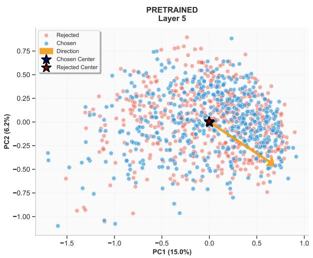

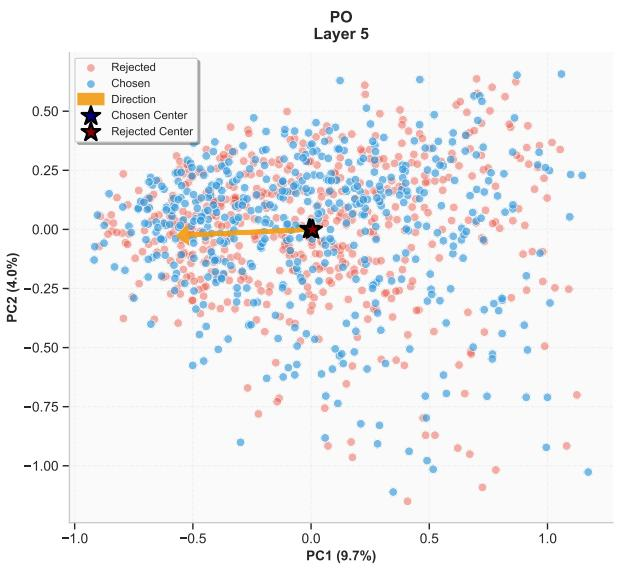  
Figure 5: Sanity check: example clustering with labels randomly swapped. The indistinguishable nature of the clusters and centroids confirms that the separation observed in Figure 2 arises from the contrastive structure of preferred and dis-preferred responses, and is not an artefact of unrelated activation statistics.

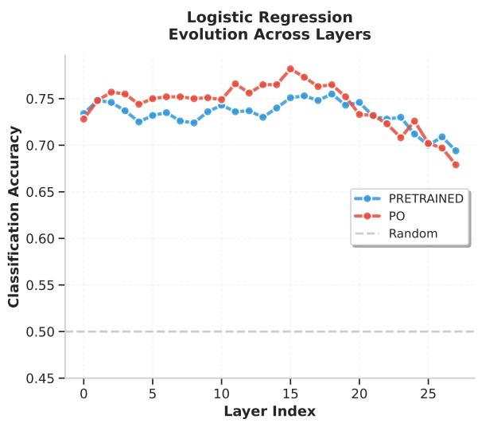  
Figure 6: Linear probe accuracy across layers on Qwen 3 0.6B (Nectar dataset) for the pretrained and PO checkpoints. Accuracy peaks around layer 15, with the PO model showing higher accuracy consistently across most layers.

The HH-RLHF ceiling of approximately 60– 62% is consistent with the reported inter-annotator agreement of ≈63% on that dataset, suggesting that our probe is approaching the fundamental noise floor of human preference annotation rather than being limited by model capacity or probe expressivity.

## B Optimised Probe Inference Algorithm

Section 5 noted that label propagation, as a separate preprocessing step, adds approximately 70% overhead to preference optimisation training time. This overhead can be entirely eliminated by fusing probe labelling with the preference optimisation forward pass, as described in Section 5.

Table 10: Linear probe validation accuracy (%) with 95% confidence intervals across model families and datasets. Results are reported for both the pretrained and PO model checkpoints. Each entry is averaged over three random seeds.
<table><tr><td>Model</td><td>Dataset</td><td>Pretrained acc ± std (%)</td><td>PO acc ± std (%)</td></tr><tr><td>Gemma 3 4B</td><td>HH-RLHF</td><td> $5 8 . 2 \pm { 1 . 8 }$ </td><td> $5 7 . 7 \pm 3 . 2 $ </td></tr><tr><td>Gemma 3 4B</td><td>Nectar</td><td> $7 7 . 7 \pm 2 . 3$ </td><td> $7 9 . 4 \pm 1 . 5$ </td></tr><tr><td>Gemma 34B</td><td>UltraFeedback</td><td> $6 2 . 6 \pm 3 . 3$ </td><td> $6 2 . 8 \pm 3 . 6$ </td></tr><tr><td>Llama 3.2 3B</td><td>HH-RLHF</td><td> $6 1 . 5 \pm 1 . 9$ </td><td> $6 1 . 0 \pm 2 . 5$ </td></tr><tr><td>Llama 3.2 3B</td><td>Nectar</td><td> $7 9 . 0 \pm 3 . 7$ </td><td> $8 0 . 4 \pm 3 . 3$ </td></tr><tr><td>Llama 3.2 3B</td><td>UltraFeedback</td><td> $6 0 . 2 \pm 2 . 4$ </td><td> $6 2 . 3 \pm { 1 . 8 }$ </td></tr><tr><td>Qwen 3 0.6B</td><td>HH-RLHF</td><td> $5 7 . 7 \pm 1 . 6$ </td><td> $5 9 . 4 \pm 2 . 4$ </td></tr><tr><td>Qwen 3 0.6B</td><td>Nectar</td><td> $7 5 . 3 \pm 4 . 0$ </td><td> $7 6 . 3 \pm 2 . 5$ </td></tr><tr><td>Qwen 3 0.6B</td><td>UltraFeedback</td><td> $6 2 . 1 \pm 3 . 1$ </td><td> $6 0 . 0 \pm 3 . 1$ </td></tr></table>

Algorithm 1 presents a concrete implementation of this fused approach. The key insight is that the LLM forward passes required to compute the preference optimisation loss already produce the intermediate activations needed for probe scoring. By caching activations at layer ℓ during the standard forward pass and evaluating the linear probe (a single matrix–vector multiplication) before backpropagation, we add negligible computational cost while eliminating the separate labelling step entirely. The resulting algorithm is also online: labels are assigned dynamically each iteration, which could in principle enable the probe to be updated jointly with the policy, though we leave this direc-

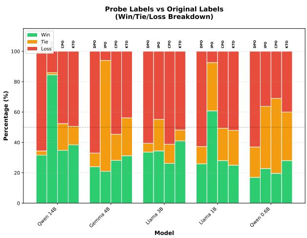

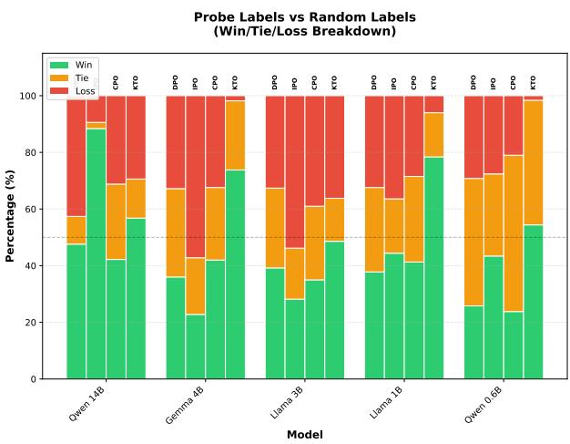  
Figure 7: Visual summary of the results from Table 4: win+tie rates for probe-labelled models vs. original-labelled (left) and randomly-labelled (right) baselines on HH-RLHF, across all model families, scales, and preference optimisation methods.

tion to future work.

## C Additional Validation

## C.1 Probe Calibration and Error Analysis

We analyse probe behaviour across the same nine (model, dataset) settings from Section 3, distinguishing pairwise accuracy (used throughout the paper: which of two responses is preferred) from piecewise accuracy (classifying a single response as chosen or rejected in isolation). The probe is a strong comparator but a poorly calibrated classifier: piecewise accuracy is 5–15 points lower than pairwise accuracy in the same setting. Confidencebased filtering yields only marginal precision gains, indicating that abstention trades away corpus size faster than it improves label quality — consistent with our decision to label every pair rather than filter by confidence (Section 4).

Manual error analysis on HH-RLHF and Ultra-Feedback shows failures concentrate on lengthmatched pairs, i.e., cases where the preference itself is most subjective; a manual check of the highest-confidence errors reveals no consistent pattern. On Nectar, errors instead show a length divergence between chosen and rejected responses, which we attribute to the dataset rather than to a probe-specific failure mode. In settings with substantial length imbalance, training the probe on a length-controlled subset may help avoid this bias; we leave this to future work.

## C.2 Human Evaluation

Automatic LLM-as-a-judge evaluation, while convenient, carries its own preference biases (Zheng et al., 2023). To validate that our results are not an artefact of the judge model’s own alignment, we conducted a small-scale human evaluation on HH-RLHF. Four non-author annotators were recruited on campus and evaluated a total of 250 response pairs across three model–method configurations: Gemma 3 4B / DPO, Llama 3.2 3B / DPO, and Llama 3.2 3B / IPO. Annotators operated during their paid work-time. For each pair, annotators were shown the prompt and two anonymised completions (one from the probe-labelled model and one from a baseline), and asked to select the better response or mark a tie.

Table 11: Human evaluation results (Win / Tie / Loss %) for the probe-labelled model versus the Original (50K labels) and Random baselines on HH-RLHF. Each cell reports results from 250 comparisons across four annotators.
<table><tr><td>Model</td><td>Method</td><td>vs. Original (W / T / L)</td><td>vs. Random (W / T / L)</td></tr><tr><td>Gemma 34B</td><td>DPO</td><td>21.7 / 17.4 / 60.9</td><td>42.0 / 30.0 / 28.0</td></tr><tr><td>Llama 3.2 3B</td><td>DPO</td><td>20.9 / 14.0 / 65.1</td><td>28.1 / 43.8 / 28.1</td></tr><tr><td>Llama 3.2 3B</td><td>IPO</td><td>76.2 / 4.8 / 19.0</td><td>52.6 / 21.1 / 26.3</td></tr></table>

The directional pattern in Table 11 is fully consistent with our automated evaluation reported in Table 4. Specifically:

• IPO with probe labels outperforms both baselines under human judgement. Against the full 50K original-label baseline, the probe-labelled IPO model wins 76.2% of comparisons—a striking result given the 100× annotation advantage of the baseline. Against random labelling, it wins 52.6% of comparisons.

Algorithm 1 Preference Optimisation with Op  
tional Fused Probe Labelling   
Require: Policy πθ, dataset D   
$\{ ( x _ { i } , y _ { i } ^ { a } , y _ { i } ^ { b } ) \} _ { i = 1 } ^ { N } ,$ PO method $\mathcal { L } _ { \mathrm { P O } }$ (e.g.,   
DPO, IPO)   
Require: Optional: trained probe $f _ { \phi } ,$ extraction   
layer ℓ   
1: for each training step do   
2: Sample batch $B \subset D$   
3: for $( x , y ^ { a } , y ^ { b } ) \in B$ do   
4: $\mathbf { h } ^ { a }$ , logitsa ← FORWARD(πθ, [x; ya]) #   
Cache activations at layer ℓ   
5: $\mathbf { h } ^ { b } , \mathrm { l o g i t s } ^ { b } \gets \mathrm { F O R W A R D } \big ( \pi _ { \theta } , [ x ; y ^ { b } ] \big )$   
6:   
7: if probe $f _ { \phi }$ provided then   
8: # Probe labelling — negligible cost rel  
ative to LLM forward pass   
9: $p ^ { a } \gets f _ { \phi } ( \mathbf { h } _ { \ell } ^ { a } ) \quad p ^ { b } \gets f _ { \phi } ( \mathbf { h } _ { \ell } ^ { b } )$ # Sin  
gle linear layer evaluation   
10: $( y ^ { + } , y ^ { - } )  ( y ^ { a } , y ^ { b } )$ if $p ^ { a } > p ^ { b }$ else   
$( y ^ { b } , y ^ { a } )$   
11: else   
12: $( y ^ { + } , y ^ { - } )$ ← original labels from D   
13: end if   
14:   
15: Compute $ { \mathcal { L } } _ { \mathrm { P O } } ( \log \mathrm { i t s } ^ { + }$ , logits−; $\pi _ { \theta } , \pi _ { \mathrm { r e f } } )$   
# Reuse cached forward pass results   
16: end for   
17: Backpropagate and update θ   
18: end for

• DPO with probe labels trails the originallabel baseline but clearly beats random labelling. This mirrors the automated results: DPO is the most sensitive to label noise, but probe labels still provide a genuine signal above chance.

• Human and automated evaluation agree directionally across all six comparisons. This corroborates the use of LLM-as-a-judge as a reliable proxy at the scales required by Table 4.

We note that the sample sizes here reflect the practical constraints of human evaluation: a fullscale study covering the scope of Table 4 (5 models × 4 methods × 2 baselines × 500 pairs) would require approximately 20,000 human judgements— precisely the annotation regime our method is designed to circumvent.

## C.3 Downstream Preference Optimisation on PRISM

Section 3.4 demonstrated that the PRISM dataset (Kirk et al., 2024) exhibits activation geometry analogous to standard preference datasets in the pretrained model, but that this geometry is substantially reduced or absent in default SFT/PO models. This finding strengthens the case for our pipeline in culturally specific settings: a pretrained (or SFT) model retains the representational structure needed to train a meaningful linear probe on population-specific labels, even if a publicly available PO model has obscured that structure through alignment to a different population’s preferences.

Experimental protocol. Since LLM-as-a-judge evaluation would encode the preferences of a population different from the target group, we design an embedding-based evaluation protocol instead. We select the “18–24 years old – Africa” subgroup as a representative low-resource minority group. We train the probe on 500 labelled samples from this subgroup and use it to annotate the full PRISM dataset (∼27K pairs) for preference optimisation. As a fully-supervised baseline, we train directly on all available group-specific labelled samples.

For held-out samples from the target group, we generate completions from both models, embed them using sentence-transformers/all-MiniLM-L6-v2 (Reimers and Gurevych, 2019), and compute cosine similarity to embeddings of the original labelled completions from that group. We report ∆ = simprobe − simoriginal; positive values indicate that the probe-trained model’s generations are closer to the target group’s preferred style.

Table 12: PRISM downstream experiment: difference in embedding similarity to target-group ground-truth completions between the probe-trained and fully-supervised models (∆ cosine similarity, with percentage change in parentheses). Positive values favour the probe-trained model.
<table><tr><td>Model</td><td>DPO</td><td>IPO</td><td>CPO</td><td>KTO</td></tr><tr><td>Gemma 3 4B</td><td>-0.006 (−3%)</td><td>+0.058 (+29%)</td><td>+0.012 (+5%)</td><td>+0.027 (+12%)</td></tr><tr><td>Llama 3.2 1B</td><td>−0.001 (−0.5%)</td><td>+0.006 (+3%)</td><td>+0.023 (+10%)</td><td>+0.013 (+6%)</td></tr></table>

Results. In 7 out of 8 configurations, the probetrained model produces completions that are more similar to the target group’s ground-truth responses than the fully-supervised baseline, despite using only 500 labelled examples while the baseline uses all available group-specific data. IPO shows the most substantial improvement, with up to 29% relative gain for Gemma 3 4B. This is consistent with $\mathrm { I P O } ^ { \circ } \mathrm { s }$ noise robustness observed throughout the main experiments. DPO shows marginal degradation in both cases (−3% and −0.5%), again mirroring its sensitivity to label noise in the main results.

We acknowledge that embedding-based cosine similarity is an imperfect proxy for human preference judgement, as it measures stylistic similarity to reference completions rather than subjective quality. Nevertheless, these results provide encouraging initial evidence that our pipeline transfers effectively to culturally specific, low-resource settings, and that the activation geometry documented in Section 3.4 translates into a usable preference signal for downstream adaptation.

## D Hyperparameters

Table 13 lists the hyperparameters used for all preference optimisation experiments. The learning rate was selected from a logarithmically spaced grid of $[ 5 \times 1 0 ^ { - 5 } , 5 \times 1 0 ^ { - 4 } ]$ using a held-out validation split of 500 examples. All other hyperparameters were fixed across all methods and model families to ensure a fair comparison. LoRA was applied to all attention projection matrices (query, key, value, output) with rank r = 16 and $\alpha = 3 2$ . Label smoothing was set to 0.0 in all experiments except those in Table 6, where it is explicitly varied.

Table 13: Hyperparameters for all preference optimisation experiments.
<table><tr><td>Hyperparameter</td><td>Value</td></tr><tr><td>Learning rate</td><td> $1 \times 1 0 ^ { - 4 }$  (selected from  $[ 5 \times 1 0 ^ { - 5 } , 5 \times 1 0 ^ { - 4 } ] )$ </td></tr><tr><td>(Virtual) batch size</td><td>64</td></tr><tr><td>β (DPO / IPO)</td><td>0.1</td></tr><tr><td>Label smoothing</td><td>0.0 (unless otherwise stated)</td></tr><tr><td>Max sequence length Training epochs</td><td>None for HH-RLHF; 4096 tokens otherwise</td></tr><tr><td>LoRA rank r</td><td>1 16</td></tr><tr><td>LoRA α</td><td>32</td></tr><tr><td>LoRA target modules</td><td></td></tr><tr><td>Optimiser</td><td>All attention projections (Q, K, V, O) AdamW  $( \beta _ { 1 } = 0 . 9 , \beta _ { 2 } = 0 . 9 9 9 , \epsilon = 1 0 ^ { - 8 } )$ </td></tr><tr><td>Warmup steps</td><td>100</td></tr><tr><td>Infrastructure</td><td></td></tr><tr><td></td><td>A100 (80 GB) for training; A40 for evaluation</td></tr><tr><td>Training time</td><td>Up to 47h for 14B model.</td></tr></table>

## E Potential Risks

While our work is primarily foundational and designed to make preference alignment more accessible to underserved communities, we identify several potential risks associated with its use.

Amplification of Harmful Preferences. Our pipeline amplifies a small seed of labelled preferences into large-scale supervision. If the seed annotations reflect harmful, discriminatory, or otherwise undesirable preferences, the probe will propagate these at scale. This is particularly concerning in adversarial settings where a bad actor deliberately seeds the labelled set with, for example, preferences for toxic or misleading outputs. Practitioners should apply content filtering and careful auditing of seed annotations before deployment, and we recommend combining probe-based labelling with standard safety classifiers as a safeguard.

Misuse for Targeted Manipulation. The ability to cheaply adapt a model to population-specific preferences could be exploited to produce highly tailored disinformation or manipulative content. For instance, an actor could collect a small set of preference labels from a target demographic and fine-tune a model to generate text that resonates specifically with that group, facilitating microtargeted propaganda or influence operations. This dual-use risk is inherent to any label-efficient alignment method and is not unique to our approach, but the low annotation cost we achieve lowers the barrier to such misuse.

Exclusion and Bias Reinforcement. Although our method is motivated by the goal of serving non-mainstream populations, it could paradoxically reinforce exclusion. If the small labelled seed is unrepresentative of the full diversity within a target community—e.g., collected only from more accessible or vocal subgroups—the propagated labels will reflect the biases of that subgroup rather than the community at large. This risk is heightened for communities where internal diversity is high and where power imbalances may cause certain voices to dominate the annotation process. We encourage practitioners to invest in representative sampling strategies and participatory data collection even when seed sizes are small.

Stability and Misalignment at Small Scales. We document that our method becomes less reliable below 1B parameters. Practitioners deploying small models in resource-constrained settings— precisely the settings our method targets—should be aware that probe-based labelling can produce degenerate outputs at this scale, potentially causing unpredictable model behaviour in deployment. We recommend extensive evaluation before deploying probe-trained models below 1B parameters in user-facing applications.