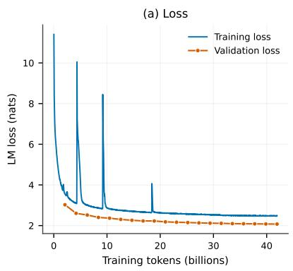
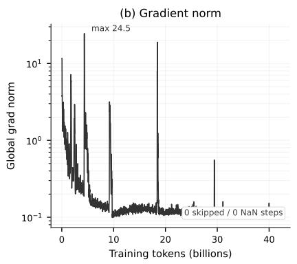
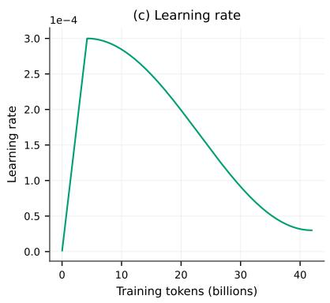
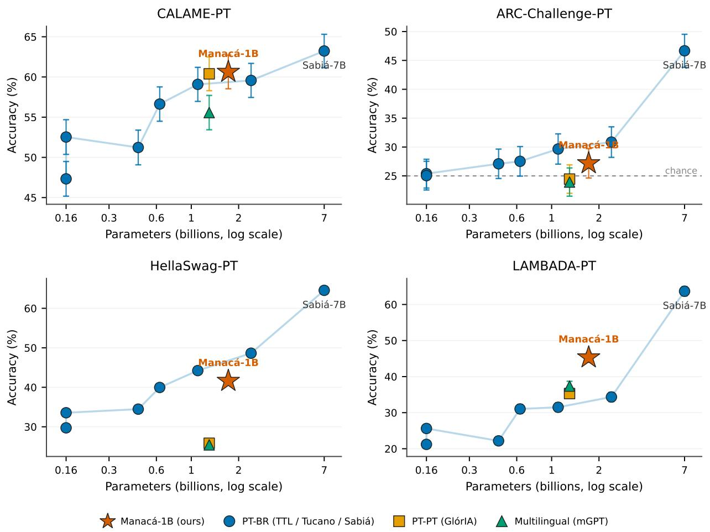

# Manacá-1B: An Open, Reproducible Brazilian-Portuguese Language Model and a Tokenizer-Aware, Paired Evaluation

Bruno Leonardo Santos Menezes1, Carlos Leonardo Souza Cardoso1, and Fabio Andre Machado Porto1

1Laboratório Nacional de Computação Científica (LNCC), Petrópolis, Brazil, {brunolsm, cardoso, fporto}@lncc.br

Preprint. September 1, 2026

## Abstract

Brazilian Portuguese remains under-served by open language models, and the few that exist are difficult to reproduce and are often compared without measures of uncertainty. We release Manacá-1B, an open decoder-only model of 1.72 billion parameters trained from scratch for Brazilian Portuguese with a fully containerized, reproducible pipeline. The pretraining is stable, with zero skipped or NaN steps and self-recovering loss spikes, and we release its full log and dynamics. We evaluate the model against nine open baselines on four Portuguese benchmarks under a single harness. Every comparison reports a standard error and a paired significance test, and the harness is validated against previously published numbers. On last-word prediction Manacá-1B is the strongest model below the 7B scale, exceeding both Tucano-1b1 and Tucano-2b4 on LAMBADA-PT with large paired margins; it is competitive on commonsense completion and near chance on multiple-choice reasoning, as are all small base models. Along the way we document a concrete evaluation pitfall: converting a SentencePiece tokenizer with case-folding normalization to the HuggingFace fast format silently drops the normalizer, routing every capitalized token to byte-fallback and depressing scores in a way that is invisible in aggregate metrics. The uncorrected tokenizer lowered LAMBADA-PT accuracy from 45.3 to 25.0; we quantify the effect and provide a one-line fix that reproduces the training tokenizer exactly. Code, raw training and evaluation logs, per-example prediction vectors, the model weights, and the corrected tokenizer are released so that every number in this paper can be recomputed.

## 1 Introduction

Open language models for Brazilian Portuguese have grown in number but not yet in reproducibility or in the rigor of their evaluation. Tucano [1] and its TeenyTinyLlama predecessor [2] released model families and the GigaVerbo corpus; Sabiá adapted LLaMA to Portuguese at the 7B scale [4]; GlórIA trained a European-Portuguese decoder and introduced the CALAME-PT last-word benchmark [3]. These works advanced the field, yet three gaps persist. The training pipelines are rarely reproducible end to end, comparisons between models are usually reported as point estimates without uncertainty, and the tokenizer, which silently governs how each model reads text, is seldom audited.

We address these gaps with a model and a protocol rather than with scale. Manacá-1B is a 1.72Bparameter Brazilian-Portuguese model trained from scratch inside a containerized Megatron-LM pipeline on a curated, openly licensed corpus of about 20 billion Brazilian-Portuguese tokens, with every configuration, log, and artifact committed to a public repository. We evaluate it against nine open baselines that span three tokenizer families and two orders of magnitude in size, on four Portuguese benchmarks, under one harness, and we attach a standard error and a paired test to every comparison. We also treat the tokenizer as a first-class object of study, and we show that a common conversion step can invalidate an evaluation without leaving a visible trace.

Our contributions are the following.

• An open, reproducible model. Manacá-1B, trained from scratch for Brazilian Portuguese, with a fully containerized pipeline and with all code, raw training and evaluation logs, and per-example prediction vectors released.

• A rigorous comparison. Manacá-1B against nine open baselines on CALAME-PT, ARC-Challenge-PT, HellaSwag-PT, and LAMBADA-PT, under a single harness, with binomial standard errors, bootstrap confidence intervals, and paired McNemar tests, validated against published numbers.

• A tokenizer-fidelity finding. We show that HuggingFace conversion drops the SentencePiece casefolding normalizer, quantify the resulting invisible penalty, and release a corrected tokenizer that reproduces the training tokenization exactly.

## 2 Model and Training Pipeline

Manacá-1B follows a modern decoder-only design and is trained by a pipeline whose every step runs inside version-pinned containers. The architecture is a Llama-style transformer with the parameters in Table 1: 24 layers, a model dimension of 2048, a SwiGLU feed-forward width of 8192, 32 attention heads with 8 key-value groups (grouped-query attention), rotary position embeddings, RMSNorm, and, unlike many recent Llama variants, learned biases in all linear layers, which we preserve through every conversion. The tokenizer is a SentencePiece model [8] with a 64k vocabulary (padded to 64,128) and nmt\_nfkc\_cf normalization, which applies NFKC and case folding; the model is therefore lowercase by construction, a design choice inherited from the LLM-jp recipe that we discuss in Section 5.

Training used the LLM-jp fork of Megatron-LM [6] with a distributed optimizer, z-loss, and bfloat16, for 20,000 optimizer steps at a global batch size of 512 and a sequence length of 4096, which corresponds to about 41.9 billion tokens, or roughly 24 tokens per parameter. This budget sits close to the compute-optimal ratio of about 20 tokens per parameter [9], so Manacá-1B is a near-compute-optimal model rather than an over-trained one. The Tucano family, by contrast, is trained on hundreds of billions of tokens, more than an order of magnitude beyond the compute-optimal point, and that difference in token budget, not architecture, is the lens through which we read the results. The run was stable: across all 2,000 logged iterations the counters report zero skipped and zero NaN steps, the training loss decreases monotonically from 11.41 at the first logged step to 2.48 at the last, and the gradient norm stays near 0.10 after two early transients that recover without a skip. The raw training log is released with the repository.

The optimization and systems configuration is chosen to reproduce the LLM-jp-3.1-1.8B recipe on modest hardware rather than to chase a novel setup, and every value is recorded twice, once in a per-run provenance file that captures the repository commit, the effective hyperparameters, and the container versions, and once in the raw log we release. Optimization uses Adam with $\beta _ { 1 } = 0 . 9 , \beta _ { 2 } = 0 . 9 9 9$ , and $\varepsilon = 1 0 ^ { - 8 }$ , a weight decay of 0.1, and gradient clipping at a global norm of 1.0. The learning rate warms up linearly over the first 2,000 steps to $3 \times 1 0 ^ { - 4 }$ and then follows a cosine decay to $3 \times 1 0 ^ { - 5 }$ over the full 20,000 steps, and a PaLM-style z-loss regularizes the output logits for numerical stability. Weights are initialized with standard deviation 0.02 and a fixed seed of 1234. The run fits on two 24 GB GPUs connected over PCIe without NVLink: because tensor parallelism would be bandwidth-bound on that interconnect, we use pure data parallelism (two-way) with a ZeRO-1 distributed optimizer and overlapped gradient reduction and parameter gathering, a micro-batch of one with gradient accumulation to the global batch of 512 (about 2.1 million tokens), full activation recomputation to fit the 24 GB budget, FlashAttention, and bfloat16 throughout. Table 2 lists the settings. The point of reporting them in full is that the entire run is a single, reproducible command over version-pinned containers, not a bespoke cluster job.

Table 1: Architecture and training summary of Manacá-1B.
<table><tr><td>Parameters</td><td> $1 , 7 2 2 , 9 5 1 , 6 8 0 \left( \approx 1 . 7 2 \mathrm { B } \right)$ </td></tr><tr><td>Layers / model dim / FFN dim</td><td> $2 4 / 2 0 4 8 / 8 1 9 2 ( \mathrm { S w i G L U } )$ </td></tr><tr><td>Heads / KV groups / head dim</td><td> $3 2 / 8 ( \mathrm { G Q A } ) / 6 4$ </td></tr><tr><td>Position / norm / bias</td><td> $\mathrm { R o P E } \left( \theta { = } 5 { \times } 1 0 ^ { 5 } \right) / \mathrm { R M S N o r m } /$  all linears</td></tr><tr><td>Tokenizer</td><td>SentencePiece, 64k (nmt_nfkc_cf)</td></tr><tr><td>Context length / precision</td><td>4096 / bfloat16</td></tr><tr><td>Framework</td><td>Megatron-LM (LLM-jp fork), distributed optimizer</td></tr><tr><td>Steps / global batch / tokens</td><td>20,000 / 512 / ≈41.9B (≈24 tok/param)</td></tr><tr><td>Stability</td><td>0 skipped, 0 NaN; loss 11.41 → 2.48</td></tr></table>

Table 2: Optimization and systems configuration. All values are echoed in the released provenance record and raw log.
<table><tr><td>Optimizer</td><td>Adam  $( \beta _ { 1 } { = } 0 . 9 , \beta _ { 2 } { = } 0 . 9 9 9 , \varepsilon { = } 1 0 ^ { - 8 } )$ </td></tr><tr><td>Weight decay / grad clip</td><td> $0 . 1 / 1 . 0 ( \mathrm { g l o b a l n o r m } )$ </td></tr><tr><td>Peak / min learning rate</td><td> $3 \times 1 0 ^ { - 4 } / 3 \times 1 0 ^ { - 5 }$ </td></tr><tr><td>Schedule / warmup</td><td>cosine decay / 2,000 steps (linear)</td></tr><tr><td>Regularization</td><td>z-loss (PaLM/LLM-jp style)</td></tr><tr><td>Init. std. / seed</td><td>0.02 / 1234</td></tr><tr><td>Global batch / micro-batch</td><td>512 (≈2.1M tokens) / 1 + accumulation</td></tr><tr><td>Parallelism</td><td> $\mathrm { D P = 2 , T P = 1 , P P = 1 ; Z e R O - 1 }$  distributed optimizer</td></tr><tr><td>Memory / attention</td><td>full activation recompute; FlashAttention</td></tr><tr><td>Hardware</td><td>2×24 GB GPU, PCIe (no NVLink)</td></tr></table>

## 3 Pretraining Data

Manacá-1B is trained on a deliberately small, fully curated, and openly licensed Brazilian-Portuguese corpus rather than on a large raw web crawl, a choice that trades scale for provenance and reproducibility. The corpus draws on three sources, each under an open license: a curated subsample of GigaVerbo [1], the largest open Brazilian-Portuguese web corpus, which supplies most of the general-domain text; the Ulysses Tesemõ collection of Brazilian legal and legislative documents, which is in the public domain; and the Portuguese Wikipedia. Table 3 reports the measured composition. After cleaning and within-source deduplication the corpus holds about 20.1 billion tokens across 33.7 million documents, dominated by general web text (73 percent) with a substantial legal component (24 percent) and an encyclopedic tail (3 percent). It is entirely Brazilian Portuguese and contains no code or English, which keeps the released model a clean single-variety base.

Each source passes a light, source-appropriate cleaning pipeline rather than one aggressive global filter. GigaVerbo, already curated by its authors, receives only sanity filters on alphabetic ratio and length; the legal collection uses a lower alphabetic threshold suited to statute text together with a domain-specific cleaner; Wikipedia is cleaned and its article titles are prefixed to their bodies. Within-source near-duplicate removal uses MinHash locality-sensitive hashing. Because the three sources are already disjoint in domain and individually curated, we skip the cross-source global deduplication that the pipeline reserves for noisier web sources, and we record that decision rather than leaving it implicit. Every cleaned shard is stored with its source, a per-document language tag, and a quality score, so the composition of the training mix stays auditable after the fact.

Table 3: Measured composition of the Manacá-1B pretraining corpus, from the corpus validation pass over 674 shards; token counts are estimated at about four characters per token.
<table><tr><td>Source</td><td>Domain</td><td>Tokens</td><td>License</td></tr><tr><td>GigaVerbo (subsample)</td><td>General web</td><td>≈14.7B (73.1%)</td><td>Apache-2.0</td></tr><tr><td>Ulysses Tesemõ</td><td>Legal, legislative</td><td>≈4.8B (23.9%)</td><td>Public domain</td></tr><tr><td>Wikipedia-pt</td><td>Encyclopedic</td><td>≈0.6B (3.1%)</td><td>CC BY-SA 4.0</td></tr><tr><td>Total</td><td>33.7M documents</td><td>≈20.1B</td><td>open</td></tr></table>

The token budget of Section 2 is best read against this corpus size. About 20.1 billion unique tokens trained for roughly 42 billion update tokens is close to two epochs rather than a single pass, and repetition at this level is known to be nearly as effective as fresh data up to about four epochs [10]. The near-computeoptimal ratio is therefore a statement about update tokens: each token is seen about twice, which sits well inside the benign-repetition regime and is the honest way to read the budget. Documents are concatenated in a fixed source order, marked with end-of-document boundaries, and then shuffled by the framework under a fixed seed; there is no curriculum, which we leave to future work.

## 4 Training Dynamics

The run was stable from scratch, and its behavior is worth showing in full because it is one of the clearer signals that the pipeline is sound. Figure 1 summarizes the entire pretraining. Across all 2,000 logged iterations the framework counters report zero skipped and zero NaN steps, so no update was ever discarded. The learning rate follows a short warmup to a peak of $3 \times 1 0 ^ { - 4 }$ and then a cosine decay to $3 \times 1 0 ^ { - 5 }$ , and the schedule completes exactly as planned.

Both loss curves fall and then plateau, and the validation curve is the more informative of the two. The per-iteration training loss drops from 11.41 to 2.48; the validation loss, measured every 1,000 steps on a held-out split, decreases in step with it and reaches 2.07 nats, a perplexity of 7.96, while still declining at the end of the schedule. The validation loss sits below the noisier per-iteration training estimate throughout, and it shows no upward turn, which indicates that the model does not overfit and that, even at a near-computeoptimal budget, a larger token allotment would likely continue to lower the loss, consistent with the training regime described in Section 2.

The gradient norm tells the most interesting part of the story. For most of training it stays near 0.10, but the run passes through a handful of sharp transients, the largest reaching a global norm of 24.5, each of which coincides with a brief spike in the training loss. Every one of these transients recovers within a step or two, without a skipped update and without producing a NaN, and the loss returns to its trajectory. Loss spikes of this kind are common in from-scratch language-model training; the point here is that they were absorbed by the optimizer and the z-loss regularization rather than destabilizing the run, which is what a healthy, reproducible pretraining looks like.

## 5 The Tokenizer as an Object of Study

The tokenizer is a SentencePiece unigram model trained on a Portuguese sample of the corpus with a vocabulary of 64,000, a character coverage of 0.9995, byte fallback enabled so that no input is ever out of vocabulary, digit splitting, and the nmt\_nfkc\_cf normalization rule, which applies NFKC and case folding before segmentation. Four control tokens (unknown, beginning, end, padding) and a small set of reserved chat-template symbols are declared explicitly. When Megatron pads the vocabulary to a multiple of 128 the working size becomes 64,128; the extra rows are padding that is never emitted, and the evaluation code masks them.

  
Figure 1: Pretraining dynamics of Manacá-1B over roughly 42 billion tokens. (a) Training loss and held-out validation loss; both fall and plateau, and the validation loss is still declining at the end. (b) Global gradient norm on a log scale; the run stays near 0.10 with a few self-recovering transients (largest 24.5) and zero skipped or NaN steps. (c) Learning rate, a warmup followed by a cosine decay to $3 \times 1 0 ^ { - 5 }$ . Regenerated from the raw log by scripts/eval/plot\_training\_dynamics.py.

A lowercase model is only evaluated fairly if the text reaches it exactly as it did in training, and this is easy to get wrong. Because nmt\_nfkc\_cf folds case, the model is lowercase by construction. When we converted the model to the HuggingFace format for evaluation with community harnesses, the resulting fast tokenizer carried no normalizer at all. As a consequence, any capitalized character fell back to byte-level tokens that never appear in training, while lowercase spans tokenized correctly. Comparing token identifiers on natural Portuguese sentences, the converted tokenizer agreed with the training SentencePiece on zero of five probe strings, all failures occurring on capitalized words and proper nouns.

The effect is severe and invisible in aggregate perplexity over long windows, which is exactly why it is dangerous. Evaluated with the uncorrected tokenizer, Manacá-1B scored 25.0 on LAMBADA-PT with a token-level perplexity near $1 0 ^ { 6 }$ , which would read as a weak model. The fix is to inject the missing normalizer at the JSON level, setting it to the sequence NFKC then Lowercase, which reproduces the training tokenization on all five probe strings. With the corrected tokenizer the same LAMBADA-PT accuracy rose to 45.3 and the perplexity fell to 17.3. We report all downstream numbers with the corrected tokenizer, release it for reuse, and note the general lesson: when a model is trained under nontrivial tokenizer normalization, the evaluation tokenizer must be verified against the training tokenizer before any score is trusted.

## 6 Model Export and Conversion

Evaluating with community harnesses requires the model in the HuggingFace format, and the conversion from the Megatron checkpoint is not mechanical for this architecture. The public saver shipped with the LLM-jp fork targets standard Llama-style models and makes two assumptions that do not hold here, so we wrote a converter that corrects both. The first is bias. Manacá-1B carries learned biases in every linear layer, and in the attention projections their magnitude is not negligible; a converter that silently drops them, as the stock saver does, produces a model that loads without error and generates fluent-looking text while being subtly wrong. Our converter copies the query, key, value, and output biases and both feed-forward biases, sets the corresponding attention\_bias and mlp\_bias flags on the target config, and aborts with an explicit message if the installed transformers is too old to represent them, so a version mismatch can never degrade into a silent partial export.

The second complication is the tensor layout. Megatron fuses the query, key, and value projections into one packed matrix and, under grouped-query attention, interleaves the eight key-value groups with their query heads; the converter unpacks each group into the separate query, key, and value matrices that the HuggingFace model expects. The SwiGLU feed-forward is stored as a single fused matrix whose two halves are the gate and up projections, and these are split at the feed-forward width. Because the model is trained with untied input and output embeddings, the output projection is copied to a separate lm\_head rather than shared with the token embeddings, and the fused RMSNorm weights that Megatron keeps inside the attention and feed-forward blocks are mapped to their standalone HuggingFace counterparts. The result is a standard LlamaForCausalLM in bfloat16 safetensors with a padded vocabulary of 64,128.

We verify the conversion at three levels rather than trusting it. First, the state dictionary is loaded with an exhaustive key check that aborts on any missing or unexpected tensor, so an incomplete or misdirected mapping cannot pass. Second, the reloaded model greedy-generates short continuations for a handful of Portuguese prompts, a qualitative check that the attention splits and biases are coherent enough to produce grammatical text. Third, and most important for evaluation, the exported tokenizer is checked identifier by identifier against the training SentencePiece on probe strings that deliberately include capitalization, which is the check that surfaced the normalizer bug of Section 5. We note honestly what this does not include: there is no numerical comparison of Megatron and HuggingFace logits on identical inputs, so the guarantee is exact key coverage and exact tokenization rather than bit-level output equivalence.

## 7 Evaluation Protocol

We evaluate every model on the same four benchmarks, with one harness and one set of prompts, and we report uncertainty for every number. CALAME-PT [3] measures last-word prediction on 2,075 native Portuguese passages and is scored by greedy generation of the final word. ARC-Challenge-PT and HellaSwag-PT are the Portuguese splits of the Okapi [14] machine translations of ARC [11] and HellaSwag [12], scored by length-normalized log-likelihood at 25-shot and 10-shot respectively, matching the protocol reported by Tucano. LAMBADA-PT [13] is the Portuguese translation used by Tucano, scored by log-likelihood at zero shot. The multiple-choice and log-likelihood tasks run through the EleutherAI lm-evaluation-harness [7]; CALAME-PT runs through our own scorer so that Manacá-1B can use its training SentencePiece directly.

The baselines span the open Portuguese and multilingual landscape at comparable scale: TeenyTinyLlama-160m and 460m [2], Tucano-160m, 630m, 1b1, and 2b4 [1], GlórIA-1b3 [3], mGPT-1b3 [5], and Sabiá-7B [4]. Uncertainty is reported as the standard error of each metric (binomial for the accuracies, the harness estimate for the log-likelihood tasks). To compare two models we use the paired McNemar test and a paired bootstrap over the shared examples, rather than the overlap of marginal confidence intervals, because the two models see identical items and their errors are correlated.

We validate the harness against previously published numbers before trusting any of our own, and Table 4 reports the check. On CALAME-PT the four Tucano models, which share the SentencePiece tokenizer family with Manacá-1B, reproduce their published accuracies within about one point. On the log-likelihood tasks Tucano-1b1 reproduces within about one to one and a half points on the two multiple-choice benchmarks and within about three points on LAMBADA-PT, the larger gap there reflecting that the published LAMBADA-PT number uses a generation-based protocol while ours uses log-likelihood. Two baselines do not reproduce cleanly, and we flag this rather than hide it: the byte-level-BPE models GlórIA-1b3 and mGPT-1b3 score about seven to eight points above their published CALAME-PT values under our generation-based scorer, because byte-level continuation tokenization favors the last-word match in that protocol. We therefore treat the CALAME-PT numbers for those two models as provisionally inflated, which if anything strengthens rather than weakens the comparisons in which Manacá-1B already leads or ties them.

Table 4: Harness validation against published numbers. CALAME-PT rows compare our scorer to the published Tucano and baseline values; the Tucano-1b1 rows compare our lm-evaluation-harness run to published log-likelihood numbers. The SentencePiece models reproduce within about one point; the two byte-level-BPE models (marked) are inflated by our generation-based CALAME-PT protocol.
<table><tr><td>Model</td><td>Benchmark</td><td>Ours</td><td>Published</td><td>Δ</td></tr><tr><td>Tucano-160m</td><td>CALAME-PT</td><td>52.53</td><td>52.31</td><td>+0.22</td></tr><tr><td>Tucano-630m</td><td>CALAME-PT</td><td>56.63</td><td>56.55</td><td>+0.08</td></tr><tr><td>Tucano-1b1</td><td>CALAME-PT</td><td>59.08</td><td>58.24</td><td>+0.84</td></tr><tr><td>Tucano-2b4</td><td>CALAME-PT</td><td>59.57</td><td>59.06</td><td>+0.51</td></tr><tr><td>GlórIA-1b3†</td><td>CALAME-PT</td><td>60.39</td><td>52.79</td><td>+7.60</td></tr><tr><td>mGPT-1b3†</td><td>CALAME-PT</td><td>55.57</td><td>47.14</td><td>+8.43</td></tr><tr><td>Tucano-1b1</td><td>ARC-Ch-PT</td><td>29.66</td><td>30.43</td><td>-0.77</td></tr><tr><td>Tucano-1b1</td><td>HellaSwag-PT</td><td>44.23</td><td>42.84</td><td>+1.39</td></tr><tr><td>Tucano-1b1</td><td>LAMBADA-PT</td><td>31.50</td><td>34.70</td><td>-3.20</td></tr></table>

† byte-level-BPE tokenizer; over-scored by the generation-based CALAME-PT protocol.

Table 5: Accuracy (%) with standard error on four Brazilian-Portuguese benchmarks, all models under one harness. CALAME-PT is scored by greedy last-word generation; ARC-Challenge-PT (25-shot), HellaSwag-PT (10-shot), and LAMBADA-PT (0-shot) by log-likelihood. Manacá-1B uses its training tokenizer. Best per column in bold.
<table><tr><td>Model</td><td>Params (B)</td><td>CALAME-PT</td><td>ARC-Ch-PT</td><td>HellaSwag-PT</td><td>LAMBADA-PT</td></tr><tr><td>TTL-160m</td><td>0.16</td><td> $4 7 . 3 3 \pm 1 . 1 0$ </td><td> $2 5 . 3 8 \pm 1 . 2 7$ </td><td>29.73 ±0.48</td><td>21.21 ±0.57</td></tr><tr><td>Tucano-160m</td><td>0.16</td><td> $5 2 . 5 3 \pm 1 . 1 0$ </td><td> $2 5 . 0 4 \pm 1 . 2 7$ </td><td>33.56 ±0.49</td><td>25.62 ±0.61</td></tr><tr><td>TTL-460m</td><td>0.46</td><td> $5 1 . 2 3 \pm 1 . 1 0$ </td><td> $2 7 . 0 9 \pm 1 . 3 0$ </td><td>34.47 ±0.49</td><td>22.18 ±0.58</td></tr><tr><td>Tucano-630m</td><td>0.63</td><td> $5 6 . 6 3 \pm 1 . 0 9$ </td><td> $2 7 . 5 2 \pm 1 . 3 1$ </td><td>39.96 ±0.51</td><td>31.03 ±0.64</td></tr><tr><td>Tucano-1b1</td><td>1.10</td><td>59.08 ±1.08</td><td>29.66±1.34</td><td>44.23 ±0.52</td><td>31.50 ±0.65</td></tr><tr><td>GlórIA-1b3</td><td>1.30</td><td>60.39 ±1.07</td><td>24.44 ±1.26</td><td>25.83 ±0.46</td><td>35.30 ±0.67</td></tr><tr><td>mGPT-1b3</td><td>1.30</td><td>55.57 ±1.09</td><td>23.93 ±1.25</td><td>25.42 ±0.45</td><td>37.38±0.67</td></tr><tr><td>Manacá-1B</td><td>1.72</td><td>60.63 ±1.07</td><td> $2 7 . 1 8 \pm 1 . 3 0$ </td><td>41.61 ±0.51</td><td>45.31 ±0.69</td></tr><tr><td>Tucano-2b4</td><td>2.40</td><td>59.57 ±1.08</td><td> $3 0 . 8 5 \pm 1 . 3 5$ </td><td>48.63 ±0.52</td><td>34.35±0.66</td></tr><tr><td>Sabiá-7B</td><td>7.00</td><td> $\mathbf { 6 3 . 2 3 \bot } 0 \mathbf { 6 }$ </td><td> $\mathbf { 4 6 . 6 7 \ } _ { \pm 1 . 4 6 }$ </td><td>64.55 ±0.50</td><td>63.67 ±0.67</td></tr></table>

## 8 Results and Discussion

The strongest result is that Manacá-1B leads every model below the 7B scale on last-word prediction, and the paired tests make this precise. On LAMBADA-PT Manacá-1B reaches 45.31, above Tucano-1b1 (31.50), Tucano-2b4 (34.35), GlórIA-1b3 (35.30), and mGPT-1b3 (37.38); the paired McNemar test rejects equality against all of them at $p < 1 0 ^ { - 4 }$ , and only Sabiá-7B, a four-times-larger model, scores higher. The pattern repeats on CALAME-PT, where Manacá-1B is the highest of the sub-7B group at 60.63, although here the margins over Tucano-1b1 and Tucano-2b4 are within noise (paired McNemar $p = 0 . 1 3$ and $p = 0 . 2 9 )$ Last-word prediction rewards fluent modeling of Portuguese morphology, and it is where the native 64k tokenizer and the from-scratch Portuguese training pay off most clearly.

The picture inverts on the tasks that reward broad training exposure. On HellaSwag-PT Manacá-1B (41.61) is significantly below Tucano-1b1 (44.23) and Tucano-2b4 (48.63), both $p < 1 0 ^ { - 4 }$ , yet significantly above the same-size GlórIA-1b3 (25.83) and mGPT-1b3 (25.42). On ARC-Challenge-PT all sub-2B models sit near the 25 percent chance line, and no pairwise difference among them is significant; Manacá-1B is indistinguishable from Tucano-1b1 (paired $p = 0 . 0 5 9 )$ and falls significantly below only Tucano-2b4 $( p = 0 . 0 0 4 7 )$ and Sabiá-7B. Two readings follow. First, the Tucano models, trained on more than an order of magnitude more tokens, convert that exposure into commonsense and reasoning accuracy that Manacá-1B, trained to a near-compute-optimal budget, does not match at equal parameter count. Second, at the same parameter budget Manacá-1B clearly outperforms the European-Portuguese and multilingual baselines, which is the comparison that isolates the value of dedicated Brazilian-Portuguese pretraining.

Table 6: Paired comparison of Manacá-1B against each baseline on the three log-likelihood benchmarks. Entries are the accuracy difference (Manacá-1B minus baseline) in percentage points; ∗ marks a paired McNemar test significant at $p < 0 . 0 5$ over the shared examples. Positive favors Manacá-1B.
<table><tr><td>Baseline</td><td>LAMBADA-PT</td><td>HellaSwag-PT</td><td>ARC-Ch-PT</td></tr><tr><td>TTL-160m</td><td> $+ 2 4 . 1 0 ^ { * }$ </td><td> $+ 1 1 . 8 9 ^ { * }$ </td><td>+1.79</td></tr><tr><td>Tucano-160m</td><td> $+ 1 9 . 7 0 ^ { * }$ </td><td> $+ 8 . 0 5 ^ { * }$ </td><td>+2.14</td></tr><tr><td>TTL-460m</td><td> $+ 2 3 . 1 3 ^ { * }$ </td><td> $+ 7 . 1 4 ^ { * }$ </td><td>+0.09</td></tr><tr><td>Tucano-630m</td><td> $+ 1 4 . 2 8 ^ { * }$ </td><td> $+ 1 . 6 5 ^ { * }$ </td><td>-0.26</td></tr><tr><td>Tucano-1b1</td><td> $+ 1 3 . 8 2 ^ { * }$ </td><td> $- 2 . 6 2 ^ { * }$ </td><td>-2.39</td></tr><tr><td>GlórIA-1b3</td><td> $+ 1 0 . 0 1 ^ { * }$ </td><td> $+ 1 5 . 7 8 ^ { * }$ </td><td>+2.56</td></tr><tr><td>mGPT-1b3</td><td> $+ 7 . 9 4 ^ { * }$ </td><td> $+ 1 6 . 3 3 ^ { * }$ </td><td>+2.82</td></tr><tr><td>Tucano-2b4</td><td> $+ 1 0 . 9 6 ^ { * }$ </td><td> $- 7 . 0 2 ^ { * }$ </td><td> $- 3 . 6 8 ^ { * }$ </td></tr><tr><td>Sabiá-7B</td><td> $- 1 8 . 3 6 ^ { * }$ </td><td> $- 2 2 . 9 4 ^ { * }$ </td><td> $- 1 9 . 4 9 ^ { * }$ </td></tr></table>

The near-chance ARC-Challenge-PT result deserves a direct explanation, because it holds for every sub-2B model in Table 5 and not only for Manacá-1B. ARC-Challenge is a deliberately hard, four-way multiple-choice science-reasoning task, and answering it requires discriminating among options whose surface forms are similar, a capability that base language models acquire late, with scale and with instruction tuning, rather than from language modeling alone. The only models that clear chance here are the ones with far more capacity or far more training: Sabiá-7B reaches 46.67 and Tucano-2b4 edges to 30.85, while everything from 0.16B to 1.72B stays inside a band around 25 percent whose internal differences are not significant. Two factors specific to this benchmark compound the effect. It is a machine translation of the English ARC, so part of its scientific vocabulary and its answer distractors are translated rather than native, and length-normalized log-likelihood over four short options is a blunt signal at this scale. The honest reading is that near-chance ARC-Challenge-PT is the expected behavior of a 1B-scale Brazilian-Portuguese base model, not a defect of this particular one, and it is consistent with the published Tucano numbers we reproduce. It is also the clearest indication of where instruction tuning and additional scale, both left to future work, would help.

Table 6 reports the paired comparisons in full on the three log-likelihood benchmarks, where per-example predictions are available. Each entry is the signed accuracy difference of Manacá-1B minus the baseline in points, with a star for a paired McNemar rejection at $p < 0 . 0 5$ . The table makes the structure of the results explicit: on LAMBADA-PT every difference is significant, positive against all sub-7B baselines and negative only against Sabiá-7B; on HellaSwag-PT the sign tracks training exposure, positive against the smaller and non-Brazilian models and negative against Tucano-1b1 and Tucano-2b4; and on ARC-Challenge-PT only the two largest and most heavily trained baselines separate from Manacá-1B at all.

Figure 2 places these numbers on a common scale. Across the four panels Manacá-1B sits on or above the Brazilian-Portuguese size trend on the two last-word tasks, slightly below it on HellaSwag-PT, and inside the near-chance cluster on ARC-Challenge-PT. The single sharpening that the paired test provides over a marginal comparison is on ARC-Challenge-PT against Tucano-2b4, which moves from borderline under the unpaired two-proportion test $( p = 0 . 0 5 )$ to significant under McNemar $( p = 0 . 0 0 4 7 )$ ; all other verdicts are unchanged. Read together, the honest summary is parity with the best open Brazilian-Portuguese models of comparable size on language modeling, a clear advantage over same-size open peers from other varieties and languages, and a reasoning gap to the far more data-rich models that is consistent with the training budget.

## Manacá-1B across Portuguese benchmarks

  
Figure 2: Manacá-1B across four Brazilian-Portuguese benchmarks. Accuracy versus parameter count (log scale) for Manacá-1B and nine open baselines under one harness; error bars are 95% confidence intervals. Marker shape encodes model family, so the figure remains readable in grayscale and under color-vision deficiency [15]. Pairwise significance is reported in the text and in the released tables.

## 9 Limitations

The scope of this release is deliberately narrow, and we state its boundaries plainly. Manacá-1B is a base model trained on about 42 billion update tokens, close to the compute-optimal ratio but far below the token counts of its strongest baselines, and those update tokens are about two epochs over a curated 20-billion-token corpus rather than a single pass over a larger one; its weaker reasoning scores should be read as a consequence of that budget difference and not as an architectural ceiling. The evaluation covers four benchmarks that emphasize last-word prediction and translated multiple-choice tasks, and it does not yet include the native Brazilian exam and inference tasks of the Open Portuguese LLM Leaderboard, which we consider essential for full comparability with the Portuguese literature. LAMBADA-PT is scored here by log-likelihood, which approximates but does not exactly reproduce the generation-based protocol of its original release, and CALAME-PT is scored by generation while the other three are scored by log-likelihood, so the four columns of Table 5 should be compared within a column rather than across. Finally, we release only a base model; no

instruction-tuned variant is evaluated here.

## 10 Future Work

The natural next steps extend the evaluation and the training rather than the architecture. We will add the native Brazilian benchmarks of the Open Portuguese LLM Leaderboard, evaluated on the base model under the same paired protocol, and general multilingual baselines such as Llama-3.2 and Qwen2.5 for external positioning. A controlled ablation of a Brazilian versus European Portuguese variant filter, whose data and training scripts are already prepared in the repository, will test whether variety-specific filtering improves downstream accuracy at fixed compute. We will also extend the token budget well beyond the compute-optimal point, into the over-trained regime that the strongest baselines occupy, to separate the effect of extra data from that of scale at a fixed parameter count, and we will train and evaluate an instruction-tuned Manacá for the tasks where following instructions is the point.

## 11 Reproducibility and Availability

Every number in this paper can be recomputed from the public repository. It contains the containerized training, conversion, and evaluation pipeline, the raw training log, the raw per-model evaluation logs, the per-example prediction vectors used for the paired tests, the scripts that produce the tables and Figure 2, and the corrected tokenizer described in Section 5. The evaluation harness version is pinned, the benchmark datasets are named by their public identifiers, and the statistical tests are implemented as small, auditable scripts rather than computed by hand. The code is released at https://github.com/Instituto-IA-LNCC/ manaca-1b-base, and the model weights, together with the corrected tokenizer of Section 5, are published under a CC BY 4.0 license at https://huggingface.co/menezesbruno/manaca-1b-base.

## 12 Conclusion

Manacá-1B shows that a small, honestly evaluated, fully reproducible model is a useful contribution to Brazilian-Portuguese natural language processing even without record-setting scale. Measured with paired significance under one harness, the model matches the best open Portuguese models of its size on language modeling and clearly surpasses same-size peers from other varieties, while an explicit token budget accounts for its reasoning gap to far larger corpora. The tokenizer-fidelity finding generalizes beyond this model: whenever a model is trained under nontrivial tokenizer normalization, the evaluation tokenizer must be verified against the training tokenizer, or otherwise-careful comparisons can be silently wrong. We hope that the released model, corrected tokenizer, and reproducible protocol make it easier for the community to build on this work and to hold it, and future Portuguese models, to a measurable standard.

## Acknowledgments

This work was carried out at the Artificial Intelligence Institute of the National Laboratory for Scientific Computing (LNCC), Brazil, an institution of the Brazilian Ministry of Science, Technology and Innovation, as part of an ongoing cooperation between LNCC and the National Institute of Informatics (NII), Japan, under a Memorandum of Understanding between the two institutions. We gratefully acknowledge the LLM-jp project, the open large-language-model initiative organized by NII, whose openly released methodology, tooling, and models made this work possible: Manacá-1B follows the LLM-jp-3.1-1.8B architecture and training recipe, is trained with the LLM-jp fork of Megatron-LM, and its evaluation design is informed by the

LLM-jp evaluation practice. We thank our colleagues at LNCC and at NII/LLM-jp for the technical exchange that shaped this effort, and LNCC for the computational infrastructure on which the model was trained. Any remaining errors are our own.

## Declaration on the Use of AI Tools

In the interest of transparency and in line with current publishing guidance on the use of generative AI in scientific writing, we disclose that an AI assistant (Claude, developed by Anthropic) was used solely to support the review of this manuscript: to check the text for clarity, consistency, and structure, and to help verify the references. Consistent with COPE and ICMJE guidance, the AI tool is not and cannot be an author, and it bears no responsibility for the work. The authors conceived and designed the study, carried out all of the experiments, wrote the manuscript, produced and verified every dataset, number, table, and figure, checked each reference against its primary source, and take full responsibility for the content and for any remaining errors. The work is original: no text or results were plagiarized, all external sources are cited, and every scientific claim reflects the authors’ own analysis and judgment.

## References

[1] N. K. Corrêa et al. Tucano: Advancing Neural Text Generation for Portuguese. arXiv:2411.07854, 2024.

[2] N. K. Corrêa et al. TeenyTinyLlama: Open-source tiny language models trained in Brazilian Portuguese. Machine Learning with Applications, 2024.

[3] R. Lopes, J. Magalhães, and D. Semedo. GlórIA: A Generative and Open Large Language Model for Portuguese. In PROPOR, 2024. arXiv:2402.12969. (Introduces CALAME-PT.)

[4] R. Pires et al. Sabiá: Portuguese Large Language Models. arXiv:2304.07880, 2023.

[5] O. Shliazhko et al. mGPT: Few-Shot Learners Go Multilingual. arXiv:2204.07580, 2022.

[6] M. Shoeybi et al. Megatron-LM: Training Multi-Billion Parameter Language Models Using Model Parallelism. arXiv:1909.08053, 2019.

[7] L. Gao et al. A framework for few-shot language model evaluation (lm-evaluation-harness). EleutherAI, version 0.4.5, 2024.

[8] T. Kudo and J. Richardson. SentencePiece: A simple and language independent subword tokenizer and detokenizer for neural text processing. In EMNLP: System Demonstrations, 2018.

[9] J. Hoffmann et al. Training Compute-Optimal Large Language Models. arXiv:2203.15556, 2022.

[10] N. Muennighoff et al. Scaling Data-Constrained Language Models. In NeurIPS, 2023. arXiv:2305.16264.

[11] P. Clark et al. Think you have Solved Question Answering? Try ARC, the AI2 Reasoning Challenge. arXiv:1803.05457, 2018.

[12] R. Zellers et al. HellaSwag: Can a Machine Really Finish Your Sentence? In ACL, 2019.

[13] D. Paperno et al. The LAMBADA dataset: Word prediction requiring a broad discourse context. In ACL, 2016.

[14] V. D. Lai et al. Okapi: Instruction-tuned Large Language Models in Multiple Languages with Reinforcement Learning from Human Feedback. arXiv:2307.16039, 2023. (Source of the translated ARC and HellaSwag.)

[15] B. Wong. Points of view: Color blindness. Nature Methods, 8(6):441, 2011. (Color-vision-safe palette.)