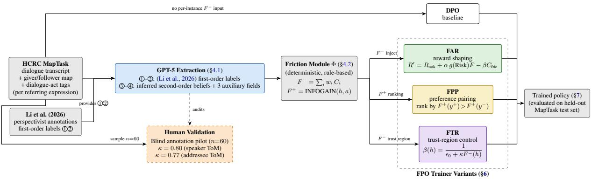

# Mind the Gap: Theory-of-Mind-Grounded Friction for Epistemic Alignment

Yifan Zhu and Kyeongmin Rim and James Pustejovsky Brandeis University, Waltham, MA, USA {zhuyifan, krim, jamesp}@brandeis.edu

## Abstract

Productive dialogue alignment requires distinguishing surface coordination (acknowledg ments and smooth task progression) from epistemic alignment (convergence of belief states); standard preference-based methods typically optimize response-level preferences without explicitly modeling the latter. We operationalize Theory-of-Mind (ToM) inference as a control signal within Frictive Policy Optimization by extracting, at each referring expression, a fourpart belief structure: the speaker’s intended referent, the addressee’s interpretation, and each participant’s model of the other’s belief. This makes friction mechanically computable from epistemic-state comparisons, capturing silent divergence, where both participants proceed confidently while grounding to different referents. We evaluate the signal at two levels. At the representation level, ablating the secondorder channel reduces misunderstanding recall from 65% to 26%. At the policy level, rewardshaping (FAR) and trust-region (FTR) variants improve intervention F1 and warranted-context calibration over DPO, with Brier scores independently supporting the calibration gains. Across three training runs, FAR and FTR remain substantially more stable, whereas DPO varies widely and can degrade intervention competence already present in the base policy. Thus, ToM-grounded friction provides a trainable signal for context-sensitive intervention under referential belief divergence.

## 1 Introduction

Recent work on epistemically asymmetric interaction has begun to expose a structural gap in how collaborative dialogue is modeled. In settings such as the Distributed Partial Information Puzzle (DPIP; Zhu et al., 2026a), each participant observes only a partial view of the environment, requiring inference not only about what others know, but also about what they can perceive and misinfer. Such interactions reveal a problem that standard turnlevel evaluation obscures: interlocutors may appear aligned through acknowledgments, uninterrupted task progression, or lexical accommodation while still grounding expressions in different referents or maintaining incompatible interpretations. We refer to this gap as the distinction between surfacelevel coordination (observable dialogue behavior) and epistemic alignment (convergence of participants’ belief states, including beliefs about others’ beliefs); alignment is therefore better viewed as ongoing regulation of epistemic states rather than as successful surface coordination.

Frictive Policy Optimization (FPO; Pustejovsky and Krishnaswamy, 2026) addresses this distinction by formalizing alignment as risk-sensitive control over belief, commitment, and uncertainty rather than turn-level optimization against a static preference signal. Existing instantiations, however, primarily operate on surface-level or indirectly represented frictive states, limiting their ability to capture latent divergence in genuinely asymmetric interaction. Such divergence can require an explicit account of the higher-order beliefs: participants may hold incompatible first-order interpretations while each presumes, at the second-order level, that the other shares their own. We therefore extend FPO with a point-in-time Theory-of-Mind (ToM) representation that tracks, for each referring expression, the speaker’s intended referent, the addressee’s interpretation, and each participant’s model of the other’s belief. Friction is then computed from this epistemic structure rather than inferred from dialogue acts alone.

We make three contributions. First, we introduce a point-in-time ToM schema for HCRC MapTask (Anderson et al., 1991) that reconstructs first- and second-order beliefs at each referring expression and converts their divergence into a computable friction signal. Second, channel attribution shows that second-order belief structure materially improves recovery of misunderstandings, including silent intent fixing. Third, across FAR and FTR, per-instance friction conditioning improves intervention behavior and warranted-context calibration over DPO while substantially increasing training stability.

  
Figure 1: Pipeline overview. GPT-5 augments Li et al. (2026)’s first-order labels with second-order ToM predictions and auxiliary fields to construct the four-identifier schema. A blind human-annotation pilot audits the inferred second-order labels. The deterministic friction module Φ computes F− and F+, which condition the FAR, FPP, and FTR objectives. Standard DPO uses friction-informed preference pairs but receives no per-instance friction value; DPO-FB removes friction from pair construction entirely.

## 2 Background

## 2.1 LLM Alignment

Mainstream alignment methods—RLHF (Christiano et al., 2017), DPO (Rafailov et al., 2023), and GRPO (Shao et al., 2024)—optimize policies toward turn-level preference signals. This paradigm is well suited to instruction following but does not explicitly represent the evolving epistemic states that determine response appropriateness in collaborative interaction. Frictive Policy Optimization (FPO; Pustejovsky and Krishnaswamy, 2025, 2026) instead formulates alignment as risk-sensitive epistemic control through a friction functional. Its prior implementation has derived friction from naturallanguage descriptions of frictive states (Nath et al., 2025) and simulated partial-information environments (Nath et al., 2026); whereas, how to compute it directly from participants’ belief structure in naturalistic asymmetric dialogue remains open.

## 2.2 Grounding, Perspective, and Epistemic Alignment

Common ground is dynamically established through grounding (Clark and Brennan, 1991; Clark, 1996), yet participants may proceed as if mutual understanding has been achieved while maintaining divergent interpretations (Zhu et al., 2026b). Work on automated common ground tracking (Khebour et al., 2024) shows that surface transcripts alone are insufficient even for tracking shared beliefs in collaborative tasks, underscoring the need for richer epistemic representations.

Theory of Mind (ToM) distinguishes first-order beliefs from beliefs about others’ beliefs (Premack and Woodruff, 1978; Wimmer and Perner, 1983; Sperber and Wilson, 1986), making such silent divergence representable. Quesque and Rossetti (2020) argue that genuine mentalizing requires both representing another’s mental state rather than relying only on behavioral or textual regularities and maintaining that perspective as distinct from one’s own. Riemer et al. (2025) distinguish literal ToM, predicting another agent’s behavior, from functional ToM, adapting one’s own behavior using a representation of another’s mental state. Our use of ToM follows this functional view: epistemic representations are constructed not only to predict beliefs, but to condition downstream intervention.

Recent benchmarks probe these capabilities in increasingly interactive settings. FANToM (Kim et al., 2023) evaluates belief attribution and information asymmetry in multi-party dialogue; MMToM-QA (Jin et al., 2024) requires joint reasoning over visual and linguistic evidence; and NegotiationToM (Chan et al., 2024) evaluates belief and intention inference during strategic negotiation. These benchmarks primarily evaluate reasoning performance over annotated mental states. Our focus is complementary: representing epistemic relations explicitly so that their divergence can be converted into a downstream control signal.

## 3 Data

We construct FPO training instances from Li et al. (2026), which augments the HCRC MapTask corpus with perspectivist grounding annotations. In MapTask, a giver guides a follower through a navigation task using mismatched maps. Giver/follower roles remain fixed across a dialogue, whereas speaker and addressee vary with each referring expression (RE), which determines the assignment of first- and second-order beliefs (§4.1). The annotations distinguish three map discrepancies: existence (a landmark appears on only one map), lexical (the same landmark has different labels), and multiplicity (a landmark is duplicated on one map only), with multiplicity providing the main source of silent misalignment.

Each RE is aligned with its perspectivist belief annotations and yields an instance containing the dialogue history, giver/follower beliefs, and a grounding status (PENDING, MISUNDERSTOOD, or ALIGNED). We treat PENDING and MISUNDER-STOOD instances as frictive for friction construction, while ALIGNED instances provide non-frictive contrasts. The resulting split contains 99 training dialogues with 2,705 REs (147 misunderstood) and 24 test dialogues with 761 REs (69 misunderstood), preserving misunderstanding rates of 5.5% and 9.1%, respectively. After the additional filtering used for policy adaptation, 663 training and 278 held-out evaluation instances remain. Details about data preprocessing and split are in Appendix C.

## 4 Theory-of-Mind-Grounded Friction Construction

We adopt the functional conception of ToM proposed by Riemer et al. (2025): the value of a mental-state representation lies not in predicting another agent’s behavior, but in guiding one’s own. Accordingly, our friction signal conditions policy intervention on an explicitly represented divergence between an agent’s own belief and its model of the interlocutor’s. This design satisfies the two requirements identified by Quesque and Rossetti (2020): it operates over explicit mental-state representations rather than surface behavioral regularities, and it maintains distinct perspectives by computing friction from the comparison between an agent’s belief and its separately represented model of the addressee’s belief.

Figure 1 gives an overview of the full pipeline described in this section. GPT-5 (Singh et al., 2026) extracts the four-identifier belief structure (§4.1)

from dialogue and map context, validated against a blind human-annotation pilot; the deterministic friction module Φ (§4.2) then converts this structure into $F ^ { - }$ and $F ^ { + }$ signals, which are injected into three FPO trainer variants (FAR, FPP, and FTR alongside a friction-blind DPO baseline for comparison (§6).

## 4.1 Point-in-Time ToM Extraction

We extend the perspectivist annotation framework of Li et al. (2026) in two ways: (1) replacing retrospective grounding outcomes with point-in-time belief attribution, and (2) augmenting first-order beliefs with explicit second-order Theory-of-Mind (ToM) beliefs. The resulting representation makes silent divergence detectable through cross-party belief comparison.

We therefore introduce a four-identifier schema that attributes, for each referring expression at time t: ⃝1 the speaker’s intended referent, ⃝2 the addressee’s inferred referent, ⃝3 the speaker’s belief about the addressee’s interpretation, and ⃝4 the addressee’s belief about the speaker’s intention. The first-order identifiers ⃝1 –⃝2 come from the perspectivist annotations of Li et al. (2026); the second-order identifiers ⃝3 –⃝4 are inferred by GPT-5 from dialogue, map, and dialogue-act context. The attributed state is indexed to time t, although the offline extractor may use later repair or contradiction evidence to reconstruct that latent state. Silent divergence therefore becomes a relation among participant-specific beliefs rather than a single grounding label.

Beyond the four identifiers, the schema extracts three auxiliary fields through GPT-5 inference: UPTAKE\_QUALITY, SURFACE\_SIGNALS, and IS\_EXISTENCE\_QUERY.

UPTAKE\_QUALITY is a categorical field in the addressee\_belief block with four values: committed, hesitant, withheld, and absent. It captures how confidently the addressee responds after an RE, ranging from confident acknowledgment to explicit non-commitment or no response. The friction module maps these categories to the uncertainty component of $F ^ { - }$ −, treating withholding as the strongest signal of unresolved uncertainty.

SURFACE\_SIGNALS is a multi-label field recording repair-oriented discourse markers in the addressee response, including acknowledge, pause, request\_clarify, repair, and contradict. The friction module uses these signals both to estimate the contradiction component of $F ^ { - }$ and to infer whether the addressee is aware of a grounding mismatch.

<table><tr><td>Configuration</td><td> $\textcircled{1} - \textcircled { 2 }$ </td><td> $\textcircled{3} – \textcircled{1}$ </td><td> $\textcircled{4} - \textcircled{2}$  Description</td><td></td></tr><tr><td>Aligned</td><td>二</td><td></td><td></td><td>Both parties land on the same landmark and correctly believe they have.</td></tr><tr><td>Silent intent fixing</td><td>≠</td><td>二</td><td></td><td>Divergence exists but neither party detects it; both proceed confidently.</td></tr><tr><td>Asymmetric (speaker-aware)</td><td>≠</td><td>≠</td><td>二</td><td>Divergence exists; speaker has detected it, addressee has not.</td></tr><tr><td>Asymmetric (addressee-aware)</td><td> $\neq$ </td><td>二</td><td> $\neq$ </td><td>Divergence exists; addressee has detected it, speaker has not.</td></tr><tr><td>Mutual awareness</td><td>≠</td><td>≠</td><td>≠</td><td>Divergence exists and both parties have detected it; repair is imminent or underway.</td></tr></table>

Table 1: The five canonical epistemic configurations produced by the four-identifier schema. Columns report pairwise agreement among the four identifiers (§4.1): $\textcircled { 1 } { - } \textcircled { 2 } = \mathrm { r e f e r e n t }$ agreement between speaker and addressee (first-order); ⃝3 -⃝1 = whether the speaker correctly anticipates the addressee’s interpretation; $\textcircled{4} - \textcircled{2} =$ whether the addressee correctly recovers the speaker’s intent. “=” is agreement, $" \ne "$ is divergence.

IS\_EXISTENCE\_QUERY is a boolean field in the speaker\_belief block identifying references that explicitly ask whether a landmark exists (e.g., “do you have a forest?”). These cases are excluded from FPO training because discovering asymmetry through questioning is treated as successful information exchange rather than grounding failure.

Pairwise comparisons among the four identifiers induce five canonical epistemic configurations shown in Table 11. Aligned is the only non-frictive configuration, while silent intent fixing, as the central friction target, captures cases where interlocutors anchor to different referents while mutually presuming agreement.

Illustrative example Consider a multiplicity discrepancy in which the giver’s map contains two instances of the same landmark while the follower’s map contains only one. When the giver refers to one of the two instances, the follower may resolve the expression to their single corresponding landmark. The intended and interpreted referents therefore diverge $\textcircled{1} \neq \textcircled{2} )$ , while the giver assumes the follower recovered the intended referent $\textcircled{3} = \textcircled{1}$ and the follower assumes their interpretation matches the giver’s intention $\textcircled{4} = \textcircled{2 } )$ . This yields silent intent fixing: first-order interpretations diverge while neither participant represents the mismatch.

## 4.2 Friction Computation

The friction module Φ maps the four-identifier schema to FPO’s productive friction signal $( F ^ { - } )$ and unproductive friction signals $( F ^ { + } )$

$$
\begin{array} { r l } & { F ^ { - } ( h ) = w _ { \mathrm { U N C } } \mathrm { U N C } ( h ) + w _ { \mathrm { C o N T R } } \mathrm { C O N T R } ( h ) } \\ & { ~ + w _ { \mathrm { H A Z } } \mathrm { H A Z } ( h ) + w _ { \mathrm { V A L C O N F } } \mathrm { V A L C O N F } ( h ) } \end{array}
$$

$$
F ^ { + } ( h , a ) = \operatorname { I N F O G A I N } ( h , a ) .\tag{1}
$$

(2)

All F− components are deterministic scalar surrogates computed from the four-identifier schema and auxiliary dialogue-observable fields, normalized to [0, 1]. UNC captures uncertainty from addressee uptake; CONTR captures surfaced contradiction or repair; HAZ estimates the propagation risk associated with map asymmetries; and VAL-CONF captures second-order belief conflict from the four-identifier structure. In particular, referential divergence is defined by $\textcircled { 1 } \neq \textcircled { 2 }$ , while speaker and addressee awareness are reflected by $\textcircled { 3 } \neq \textcircled { 1 }$ and $\textcircled{4} \neq \textcircled { 2 }$ , respectively. Thus, $F ^ { - }$ is not simply an agreement/disagreement polarity score: it combines uncertainty, surfaced repair, propagation risk, and higher-order belief conflict. Full component mappings appear in Appendix A.1.

Composition. We use $w = ( 0 . 1 5 , \ 0 . 2 0 , \ 0 . 3 0 ,$ 0.35) for (UNC, CONTR, HAZ, VALCONF), respectively, with $\textstyle \sum _ { i } w _ { i } \ = \ 1$ The weights are hand-set rather than fit to this dataset. Greater mass is assigned to HAZ and VALCONF, which target propagation-prone and potentially latent misalignment, whereas UNC and CONTR primarily reflect already-surfaced precursor signals. We do not claim these values are optimal: uniform weighting preserves the relevant friction ordering, and ±20% perturbations do not change the qualitative downstream conclusions (Appendix A.2).

Productive friction. $F ^ { + } ( h , a )$ represents the epistemic utility of an intervention over the four actions clarify, verify, redirect, and refuse, inherited from the FPO action space in Pustejovsky and Krishnaswamy (2026) rather than proposed here as a discourse taxonomy. In our offline implementation, INFOGAIN(h, a) is a hand-specified lookup over epistemic configuration and action: diagnostic actions receive greater utility in divergent states, whereas unnecessary intervention receives little value in aligned states. The full utility table are reported in Appendix A.3.

## 5 Friction Signal Validation

Before using the friction cache for trainer adaptation (§6), we validate the signal along three axes: (i) whether the schema recovers usable belief structure and misunderstanding labels, (ii) whether the composite $F ^ { - }$ monotonically separates frictive from non-frictive contexts, and (iii) whether the signal materially depends on the second-order ToM structure introduced in §4.1. Results are reported on both train and test partitions below.

## 5.1 Schema Validation and Belief Accuracy

The four-identifier schema achieves 98.5% parse success on train (2665/2705) and 100% on test (761/761); the remaining train failures are primarily API truncations due to long-dialogue and are filtered before downstream training. Belief accuracy against Li et al. (2026) is shown in Table 2. Addressee-side belief recovery substantially exceeds speaker-side recovery (80.6–81.3% vs. 59.8– 64.1% loose match), which is expected because addressee interpretations are more directly observable through uptake and repair behavior, whereas speaker intent must be inferred from productionside evidence alone. Since both friction computation and trainer adaptation primarily condition on addressee-side state, the stronger follower-side accuracy is the operationally relevant quantity.

Second-order ToM consistency is lower (35.9– 43.5% speaker ToM; 41.4–42.0% addressee ToM), but these values are reported as soft signals rather than gold-aligned accuracy because no direct annotation for second-order beliefs exists in the corpus. To directly assess the reliability of GPT-5 second-order predictions, we conducted a stratified blind manual annotation on 60 samples (details in Appendix B.2). This independent human annotation then was used as ground-truth that the GPT-5 predictions were compared against. Agreement reached 82% for speaker-ToM and 80% for addressee-ToM, corresponding to Cohen’s κ values of 0.80 and 0.77, respectively. These results indicate substantial agreement with human judgments, supporting the use of the inferred second-order beliefs as supervisory signals during training.

<table><tr><td>Quantity (loose match)</td><td>Train</td><td>Test</td></tr><tr><td>Speaker belief</td><td>59.8%</td><td>64.1%</td></tr><tr><td>Addressee belief</td><td>81.3%</td><td>80.6%</td></tr><tr><td>Speaker ToM consistency</td><td>35.9%</td><td>43.5%</td></tr><tr><td>Addressee ToM consistency</td><td>41.4%</td><td>42.0%</td></tr></table>

Table 2: Four-identifier accuracy on train and test partitions.
<table><tr><td>Partition</td><td>Status</td><td> $_ n$ </td><td> $\mathrm { M e a n } \ F ^ { - }$ </td><td>Median</td></tr><tr><td rowspan="2">Train</td><td>Pending</td><td>2521</td><td>0.185</td><td>0.182</td></tr><tr><td>Misund</td><td>145</td><td>0.375</td><td>0.340</td></tr><tr><td rowspan="2">Test</td><td>Pending</td><td>692</td><td>0.193</td><td>0.203</td></tr><tr><td>Misund</td><td>69</td><td>0.390</td><td>0.340</td></tr></table>

Table 3: $F ^ { - }$ distribution by gold status on both partitions

At the task level, the schema recovers misunderstanding labels with 67.6% recall on train (98/145) and 65.2% on test (45/69), improving more than 60 points over the cascade-based alternatives discussed in Appendix B.

## 5.2 $F ^ { - }$ Distribution and Monotonic Ordering

The composite $F ^ { - }$ is intended to function as a monotonic risk signal: genuinely frictive contexts should receive systematically higher values than non-frictive ones. This ordering holds consistently across both partitions (Table 3). Mean F− increases from 0.185 to 0.375 on train $( \Delta = 0 . 1 9 0 )$ and from 0.193 to 0.390 on test $( \Delta = 0 . 1 9 7 )$ when moving from pending to misunderstood contexts. The cross-partition gap appears minimal, as we argue the composite generalizes across the data. This monotonicity is required for downstream trainer adaptation, where $F ^ { - } ( h )$ directly controls trustregion width: a non-monotonic signal would incorrectly relax constraints on high-risk contexts or tighten them on benign ones.

## 5.3 Detection Channels and ToM Contribution

We further decompose detected misunderstandings by the channel responsible for recovery: (i) ToMdependent configurations involving silent intent fixing or asymmetric awareness, (ii) direct first-order divergence, and (iii) metadata-based multiplicity fallback. Results are summarized in Table 4.

Second-order structure accounts for a substantial share of recovered misunderstandings, including all silent-intent-fixing instances identified by our framework. Removing the ToM-dependent channel reduces recall from 67.6% to 23.4% on train and from 65.2% to 26.1% on test, while removing the multiplicity fallback as well reduces recall to 1.4% and 0%, respectively. The channels are therefore non-redundant, and the sharp drop under ToM ablation shows that the friction signal depends materially on the second-order belief structure introduced in §4.1. Most remaining misses involve underspecified or visually ambiguous references that the upstream extractor cannot disambiguate from dialogue and map evidence alone.

<table><tr><td>Detection channel</td><td>Train (%)</td><td>Test (%)</td></tr><tr><td>ToM-required configurations</td><td>44.2</td><td>39.1</td></tr><tr><td>First-order divergence</td><td>1.4</td><td></td></tr><tr><td>Multiplicity fallback</td><td>22.1</td><td>26.1</td></tr><tr><td>Total recall</td><td>67.6</td><td>65.2</td></tr></table>

Table 4: Channel decomposition of detected misunderstandings.

## 6 FPO Trainer Adaptation

We adapt a friction-blind DPO baseline (Rafailov et al., 2023) and three FPO variants (FAR, FPP, and FTR) from Pustejovsky and Krishnaswamy (2026) to offline MapTask data. We use the participantagent setting: the policy observes only its own map-derived information and dialogue history and decides whether to answer or intervene. Full crossparty ToM annotations are used offline to construct friction supervision but are never direct policy inputs. During both training and standard inference, the policy receives dialogue history plus the same compact agent-observable epistemic projection.

Training instances and observable belief input. Each instance pairs a referring expression with its immediate addressee response. The policy input consists of the dialogue history and an observable belief-state preamble: a compact projection of the schema-derived epistemic state containing only information available to the participant-agent. Full cross-party ToM annotations and the other participant’s private map are used only offline to construct friction supervision and are never direct policy inputs. The same observable input is used during training and standard inference. After filtering underspecified and existence-query cases, the policy dataset contains 663 training instances (216 divergent, 447 aligned) and 278 held-out test instances. For pair-based methods, completions are retrieved from the corpus: repair is preferred over acknowledgment in divergent contexts, whereas unnecessary intervention is dispreferred in aligned contexts.

DPO. Standard DPO uses $\beta = 0 . 1$ with a frozen reference policy and receives no friction signal.

FAR (Friction-Aware Reward). FAR incorporates friction through reward shaping,

$$
R ^ { \prime } = R _ { \mathrm { t a s k } } + \alpha g ( \mathrm { R i s k } ) F ( h , y ) - \beta C _ { \mathrm { f r i c } } ( a ) ,
$$

so intervention is encouraged when epistemic risk is high and penalized when it imposes unnecessary cost. We instantiate Risk from the friction-derived epistemic state; offline adaptation details are given in Appendix D.1.

FPP (Friction Preference Pairing). FPP applies a DPO-style preference objective in which $y ^ { + }$ must have greater productive friction $F ^ { + }$ than y−. This converts the friction signal into pairwise preference supervision while retaining the same underlying policy backbone. The offline pair-construction and weighting adjustments are described in $\mathsf { A p - }$ pendix D.2.

FTR (Friction-Conditioned Trust Region). FTR uses epistemic risk to control how far the policy may depart from the base model: high-friction contexts permit larger updates, while low-friction contexts remain more strongly anchored. We implement

$$
\begin{array} { l } { { \displaystyle { \cal L } _ { \mathrm { F T R } } ( h ) = { \cal L } _ { \mathrm { C E } } ( y _ { \mathrm { g o l d } } | h ) + \beta ( h ) \widehat { \mathrm { K L } } ( \pi _ { \theta } \| \pi _ { 0 } | h ) } } \\ { { \displaystyle \beta ( h ) = \frac { 1 } { \epsilon _ { 0 } + \kappa F ^ { - } ( h ) } . } } \end{array}
$$

Estimator and tuning details appear in Appendix D.3.

## 7 Evaluation

We evaluate three questions: whether per-instance ToM-grounded friction improves policy adaptation over static preference training; whether the gains come from friction-aware supervision or direct objective conditioning; and whether they persist under prompting baselines and removal of inference-time belief information. All experiments use the heldout MapTask test set $\scriptstyle ( n = 2 7 8 )$ , with 120 contexts where intervention is warranted and 158 aligned contexts.

Our primary measures are intervention F1 and calibration on warranted contexts. ClarifyScore/F1 rewards intervention under epistemic divergence while penalizing unnecessary intervention on aligned instances. Calibration is evaluated with both ECE (expected binned gap between first-token confidence and intervention correctness), and the Brier score, a strictly proper scoring rule. We report Brier score as an independent check that calibration conclusions do not depend on ECE alone. InfoEff, expected epistemic gain per unit intervention cost, and pairwise LLM preference provide secondary evidence.

Primary intervention labels are assigned by a rule-based classifier rather than an LLM. Warrant labels are derived from the held-out four-identifier annotations introduced in §4.1, so the principal results do not depend on LLM judging of generated responses. Pairwise comparisons use Gemma-4- 31B-IT (Gemma Team, 2026), evaluating each pair in both orders to reduce position bias.

## 7.1 Main Results and Training Stability

We compare DPO with three FPO adaptations: reward shaping (FAR), friction-based preference pairing (FPP), and friction-conditioned trust-region control (FTR). Table 5 reports the primary-run results, and Table 6 summarizes stability across three independent training runs.

FAR and FTR improve intervention F1 over DPO while substantially reducing miscalibration where intervention is warranted: ECE falls from 0.432 to 0.227 and 0.178, respectively. Brier score independently confirms this result, decreasing from 0.411 to 0.281 and 0.293. As a strictly proper scoring rule, Brier score shows that the calibration gain is not an artifact of ECE binning or an FPO-specific metric. FAR and FTR incur only a modest calibration tradeoff on aligned contexts, while InfoEff remains comparable, indicating that their gains do not arise from intervening indiscriminately.

Stability across three training runs. We repeat the full training and evaluation procedure from three independent QLoRA (Dettmers et al., 2023) initializations (seeds 42, 123, and 7). Across three independent QLoRA initializations, DPO is substantially more variable than FAR and FTR: its F1 ranges from 0.152 to 0.398 (std. 0.106), compared with standard deviations of 0.023 and 0.009 for FAR and FTR, respectively. All six same-seed FAR/FTR comparisons against DPO are significant under McNemar tests $( p \leq 3 \times 1 0 ^ { - 3 } ;$ ; full per-seed results in Appendix E.1).

Failure of preference-only friction. FPP obtains superficially high F1 by intervening on every test instance. Its perfect warranted-context scores follow mechanically from perfect recall, while its alignedcontext ECE of 1.0 and strongly negative judge preference expose the collapse. Because its pairwise objective provides no absolute signal for when intervention is unnecessary, this result shows that friction must regulate behavior at the instance level rather than only rank completions.

Secondary judge evidence. LLM pairwise judgments favor FAR and FTR in the full sample, but the differences become inconclusive after responselength control. We therefore treat judge preference as secondary to rule-based F1 and calibration.

## 7.2 Sources of the Improvement

We use staged controls to separate three potential sources of the downstream gains: friction-aware supervision, direct conditioning on per-instance friction, and the second-order ToM structure used to compute that friction.

Friction-aware supervision and objective conditioning. We compare three levels of friction use. DPO-FB is fully friction-blind: the chosen completion is the observed corpus response and the rejected completion is sampled from another dialogue without reference to epistemic configuration. Standard DPO uses friction-informed response pairs but does not receive the per-instance friction value. FAR and FTR additionally condition their objectives directly on that value.

As shown in Table 7, the staged progression increases intervention F1 from 0.282 for DPO-FB to 0.344 for DPO and 0.416–0.417 for FAR/FTR. Warranted-context Brier error likewise decreases from 0.532 to 0.411 and then to 0.281–0.293. This pattern is consistent with two separable contributions: friction-informed supervision improves over friction-blind pairing, while direct per-instance conditioning provides an additional gain.

Policy-level contribution of second-order ToM. To isolate the proposed ToM extension, we train lower-order FAR and FTR variants with the same data and objectives but compute friction using only surface and first-order channels. This removes second-order configurations such as silent intent fixing and asymmetric awareness while preserving the remaining training setup.

<table><tr><td>Policy</td><td>F1</td><td> $\mathrm { E C E } _ { \mathrm { w a r r } }$ </td><td> $\mathrm { E C E _ { a l i g n } }$ </td><td> $\mathrm { B r i e r } _ { \mathrm { w a r r } }$ </td><td>InfoEff</td><td>Net win vs. DPO</td></tr><tr><td>DPO</td><td>0.344</td><td>0.432</td><td>0.148</td><td>0.411</td><td>3.99</td><td></td></tr><tr><td>FAR</td><td>0.416</td><td>0.227</td><td>0.208</td><td>0.281</td><td>3.92</td><td> $+ 1 5 . 8$ </td></tr><tr><td>FPP†</td><td>0.603</td><td>0.000</td><td>1.000</td><td>0.000</td><td>3.78</td><td>-91.4</td></tr><tr><td>FTR</td><td>0.417</td><td>0.178</td><td>0.220</td><td>0.293</td><td>3.94</td><td>+13.3</td></tr></table>

Table 5: Primary-run evaluation on the held-out test set $( n { = } 2 7 8 ;$ 120 warranted and 158 aligned contexts). 95% bootstrap CIs (B=2,000). Net win is paired win-minus-loss percentage against DPO under Gemma-4-31B-IT.

<table><tr><td>Method</td><td>F1</td><td> $\mathrm { E C E } _ { \mathrm { w a r r } }$ </td></tr><tr><td>DPO</td><td> $0 . 2 9 8 \pm 0 . 1 0 6$ </td><td> $0 . 5 2 3 \pm 0 . 0 9 0$ </td></tr><tr><td>FAR</td><td> $0 . 4 1 1 \pm 0 . 0 2 3$ </td><td> $0 . 2 2 5 \pm 0 . 0 3 8$ </td></tr><tr><td>FTR</td><td> $\mathbf { 0 . 4 3 0 \pm 0 . 0 0 9 }$ </td><td> $\mathbf { 0 . 1 9 2 \pm 0 . 0 1 1 }$ </td></tr></table>

Table 6: Mean ± standard deviation across three independent training runs. Per-seed results appear in $\mathsf { A p - }$ pendix E.1.
<table><tr><td>Condition</td><td>F1</td><td>ECE</td><td> $\mathrm { B r i e r _ { w a r r } }$ </td></tr><tr><td>DPO-FB</td><td>0.282</td><td>0.283</td><td>0.532</td></tr><tr><td>DPO</td><td>0.344</td><td>0.174</td><td>0.411</td></tr><tr><td>FAR</td><td>0.416</td><td>0.152</td><td>0.281</td></tr><tr><td>FTR</td><td>0.417</td><td>0.189</td><td>0.293</td></tr></table>

Table 7: Staged friction controls under the primary-run evaluation protocol. DPO-FB removes friction from pair construction; DPO uses friction-informed pairs without per-instance objective conditioning; FAR and FTR incorporate the friction value directly. ECE is global; Brier score is reported on warranted contexts.

Full ToM-grounded friction improves intervention F1 under both objectives, from 0.368 to 0.416 for FAR and from 0.400 to 0.417 for FTR, corresponding to relative gains of 13.0% and 4.3%. Because the lower-order variants retain the same objectives, data, and surface and first-order channels, this provides direct policy-level evidence that second-order belief structure contributes beyond generic friction conditioning.

The calibration effects are mixed. Full ToM improves FAR’s global ECE, whereas lower-order FTR achieves lower global ECE, and both lowerorder variants obtain slightly lower warrantedcontext Brier scores. We therefore interpret the second-order contribution as an improvement in intervention behavior rather than a general calibration advantage. This complements the signal-level ablation in §5.3, where removing the second-order channel reduces misunderstanding recall from approximately 65% to 26%.

Robustness to friction-module constants. The findings are not tied to a single set of hand-specified constants. Uniform F− weighting preserves the relevant configuration ordering, while the proposed weights sharpen cross-class separation by 11.9%; perturbing component weights and scalar mappings by up to ±20% does not reverse the key ordering or downstream conclusions. Perturbations of the $F ^ { + }$ utility table likewise do not reverse the intermethod ranking. We therefore treat these values as structurally motivated surrogates rather than fitted optima; full sensitivity results appear in Appendix A.2.

<table><tr><td>Objective Friction</td><td></td><td>F1</td><td>∆F1</td><td>Rel. gain</td><td>ECE</td><td>Brierwarr</td></tr><tr><td>FAR</td><td>Lower-order</td><td>0.368</td><td></td><td></td><td>0.270</td><td>0.253</td></tr><tr><td></td><td>Full ToM</td><td>0.416</td><td></td><td>+0.048+13.0%</td><td>0.152</td><td>0.281</td></tr><tr><td>FTR</td><td>Lower-order</td><td>0.400</td><td></td><td></td><td>0.135</td><td>0.278</td></tr><tr><td></td><td>Full ToM</td><td></td><td>0.417 +0.017</td><td>+4.3%</td><td>0.189</td><td>0.293</td></tr></table>

Table 8: Primary-run policy-level ablation of secondorder ToM. Lower-order variants retain surface and firstorder friction channels but remove second-order belief configurations. ∆F1 and relative gain compare Full ToM with the corresponding lower-order variant. ECE is global; Brier score is reported on warranted contexts.

These staged controls identify three distinct effects. Friction-informed pair construction improves over friction-blind training; direct per-instance conditioning provides a further gain; and, holding the objective fixed, second-order ToM improves intervention F1 beyond lower-order friction alone. The mixed calibration results also show that the benefit of ToM is metric- and objective-dependent rather than uniform.

## 7.3 Training, Prompting, and Test-Time Belief Access

We compare friction-conditioned training with the untrained backbone and inference-time prompting. Under the standard inference condition, each input includes an observable belief-state preamble: a compact, schema-derived summary of the epistemic information available to the participantagent, appended to the dialogue history. As a prompt-engineering baseline, we also evaluate incontext learning (ICL) with the untrained Qwen3.5- 27B (Qwen Team, 2026): five worked examples (two divergent and three aligned) plus an instruction to ask for intervention, with no fine-tuning.

<table><tr><td>Condition</td><td>F1</td><td>ECE</td><td>∆F1 masked</td></tr><tr><td>Base + ToM preamble</td><td>0.410</td><td>0.146</td><td>-0.060</td></tr><tr><td>DPO</td><td>0.344</td><td>0.174</td><td>-0.014</td></tr><tr><td>FAR</td><td>0.416</td><td>0.152</td><td>-0.073</td></tr><tr><td>FTR</td><td>0.417</td><td>0.189</td><td>-0.068</td></tr><tr><td>ICL (random exemplars)</td><td>0.510</td><td>0.175</td><td></td></tr><tr><td>ICL (friction scaffold)</td><td>0.490</td><td>0.146</td><td></td></tr></table>

Table 9: Zero-shot, trained, and in-context conditions on the held-out test set. F1 and ECE use the intact belief preamble; ∆F1 reports the change when that preamble is removed from the same checkpoint. The ICL conditions use a 2–3k-token scaffold and are not included in the masking comparison.

This tests whether the intervention behavior learned through FPO can instead be elicited at inference time. Table 9 compares these conditions and reports the effect of removing the belief preamble from each trained checkpoint.

Base-policy competence and in-context learning. With the observable belief preamble, the untrained backbone reaches F1 0.410, comparable to FAR and FTR under this metric and above DPO. Thus, substantial intervention competence is already accessible to the base model when the relevant epistemic state is made explicit. ICL raises F1 further to 0.490–0.510, but random exemplars perform comparably to the friction-informed scaffold. The ICL gain therefore appears to reflect generic exemplar priming rather than a friction-specific prompting advantage. These results suggest that FAR and FTR primarily preserve and condition existing intervention competence during adaptation rather than creating it from scratch.

Belief-preamble masking. Removing the observable preamble reduces F1 by 0.060 for the base model and by 0.073 and 0.068 for FAR and FTR, respectively. The comparable drops show that these policies continue to rely on explicit epistemic information at inference rather than fully internalizing it during training. Under masking, FAR and FTR nevertheless remain slightly above DPO (0.343/0.349 vs. 0.330), indicating some residual robustness when the preamble is unavailable. DPO changes little under masking, consistent with its weaker dependence on instance-specific epistemic information.

These controls refine the role of ToM-grounded friction: friction-conditioned training preserves context-sensitive intervention behavior without requiring a long ICL scaffold, but its strongest performance still depends on the compact observable epistemic representation at test time. Full prompting specifications and masked-condition results appear in Appendix E.2.

## 8 Conclusion

Interactive systems are commonly optimized for response quality, yet successful collaboration also depends on whether interlocutors maintain sufficiently compatible interpretations throughout an interaction. Our results show that this distinction is consequential not only for evaluation, but also for representation and learning. By tracking, for each referring expression, what each participant intends, understands, and believes about the other’s interpretation, the four-identifier ToM schema renders otherwise latent misalignment computationally accessible. Within our extraction framework, removing the second-order component substantially reduces misunderstanding recovery, indicating that lower-order information alone does not capture the relational structure needed to identify many dialogue breakdowns.

Once represented explicitly, these asymmetries can serve as supervisory signals rather than merely diagnostic annotations. FAR and FTR incorporate ToM-grounded friction through distinct optimization mechanisms, yet both improve intervention behavior and warranted-context calibration relative to DPO while substantially increasing training stability. The lower-order ablations further indicate that these gains are not attributable to generic friction conditioning alone, but depend in part on second-order information about participants’ interpretations of one another.

More broadly, these findings motivate a view of dialogue alignment that extends beyond preference optimization over utterances toward the regulation of evolving belief relations. From this perspective, intervention is particularly valuable when locally coherent interaction masks incompatible interpretations that would otherwise persist. Because F− is defined over epistemic state rather than tied to a specific optimization objective, future work can investigate its use as a reweighting, reward-shaping, or control signal beyond the FPO variants considered here. Ultimately, successful dialogue alignment requires interactive systems to recognize and repair emerging misalignment before apparent coordination consolidates into shared error.

## Limitations

Our experiments are conducted on the HCRC Map-Task corpus, a controlled navigation task chosen because its dense referential grounding and mismatched participant maps provide an ideal testbed for evaluating latent epistemic alignment. While this structured environment allows for precise evaluation of the four-identifier ToM schema, exploring its generalization to less constrained open-domain or multi-party dialogue remains an objective for future work. Additionally, the misunderstanding rate in MapTask (5.5–9.1%) reflects its specific task asymmetric design and may vary in other collaborative corpora.

The corpus provides first-order perspectivist annotations but no gold second-order mental-state labels. We therefore infer the latter with GPT-5. A blind human pilot shows substantial agreement with these predictions $( \kappa = 0 . 8 0 / 0 . 7 7 )$ , supporting their use as supervisory signals, but it does not establish them as ground-truth mental states. More generally, our evidence for genuinely non-merged perspective-taking remains suggestive rather than conclusive. The signal and policy ablations show that the second-order representation contributes beyond the lower-order channels tested here, but they cannot rule out reliance on correlated linguistic or interactional cues rather than genuine mentalizing.

Friction is computed offline from reconstructed epistemic trajectories rather than estimated incrementally during live interaction. Full cross-party ToM information is used to construct this supervisory friction signal, but it is not a direct policy input: during both training and standard inference, the policy receives dialogue history plus the same compact agent-observable belief projection. The masking experiment shows that performance remains partly dependent on this representation at inference. Fully online estimation, error propagation over extended interaction, and rollout-based variants such as GRFR therefore remain outside the present evaluation.

Finally, the generality of the friction formulation remains untested beyond the objectives and intervention space studied here. Although $F ^ { - }$ is defined over epistemic state rather than a particular optimization objective, we have not established that it transfers as a reweighting, rewardshaping, or control signal to other preference- or reinforcement-learning methods. $F ^ { + }$ is more explicitly tied to the inherited FPO action space (clarify/verify/redirect/refuse); using it in other settings would require defining productive friction over the corresponding action space. The hand-set friction constants are robust to the perturbations tested here, but this does not establish their optimality.

## Acknowledgments

This research was supported by the NSF National AI Institute for Student-AI Teaming (iSAT) under grant DRL 2454151. The opinions expressed are those of the authors and do not represent views of the NSF.

We used generative AI tools during the preparation of this work. Specifically, assistance from the Claude, ChatGPT, and Gemma 4 model families was used to support literature search, researchrelated coding, and language refinement, including tone and style checking and paraphrasing. All literature identified with AI assistance was independently verified and validated by the authors for relevance, factual accuracy, and the correctness of citation content and formatting. The authors reviewed all AI-assisted outputs and take full responsibility for the accuracy and integrity of the submitted work.

## Potential Risks

The primary artifact introduced in this work is a friction signal derived from Theory-of-Mind inference over dialogue. While the immediate application is alignment training for collaborative dialogue agents, the same underlying machinery could, in principle, be deployed to detect and strategically exploit belief asymmetries between interlocutors rather than to repair them. We explicitly flag this dual-use potential for adversarial manipulation; however, we note that our framework is structurally engineered for epistemic stewardship, optimizing exclusively for transparency, verification, and mutual repair signals.

Additionally, our second-order belief inference pipeline relies on GPT-5, a proprietary model whose latent representations may reflect demographic or stylistic biases present in its training data. Systematic errors in ToM attribution—particularly speaker-side belief inference, where baseline accuracy is naturally bounded —could cascade into miscalibrated friction signals that penalize appropriate conversational progress or incentivize redundant, costly interventions. Consequently, we strongly advise that any downstream adaptation of friction-conditioned policies in high-stakes domains maintain strict human-in-the-loop oversight to audit model calibration during continuous interaction.

## References

Anne H. Anderson, Miles Bader, Ellen Gurman Bard, Elizabeth Boyle, Gwyneth Doherty, Simon Garrod, Stephen Isard, Jacqueline Kowtko, Jan McAllister, Jim Miller, Catherine Sotillo, Henry S. Thompson, and Regina Weinert. 1991. The HCRC Map Task corpus. Language and Speech, 34(4):351–366.

Chunkit Chan, Cheng Jiayang, Yauwai Yim, Zheye Deng, Wei Fan, Haoran Li, Xin Liu, Hongming Zhang, Weiqi Wang, and Yangqiu Song. 2024. NegotiationToM: A benchmark for stress-testing machine theory of mind on negotiation surrounding. In Findings of the Association for Computational Linguistics: EMNLP 2024, pages 4211–4241, Miami, Florida, USA. Association for Computational Linguistics.

Paul F Christiano, Jan Leike, Tom Brown, Miljan Martic, Shane Legg, and Dario Amodei. 2017. Deep reinforcement learning from human preferences. In Advances in Neural Information Processing Systems, volume 30. Curran Associates, Inc.

Herbert H. Clark. 1996. Using Language. Cambridge University Press.

Herbert H Clark and Susan E Brennan. 1991. Grounding in communication. In Perspectives on Socially Shared Cognition, pages 127–149. American Psychological Association.

Tim Dettmers, Artidoro Pagnoni, Ari Holtzman, and Luke Zettlemoyer. 2023. Qlora: Efficient finetuning of quantized llms. In Advances in Neural Information Processing Systems, volume 36, pages 10088–10115. Curran Associates, Inc.

Gemma Team. 2026. Gemma 4 technical report. Preprint, arXiv:2607.02770.

Chuanyang Jin, Yutong Wu, Jing Cao, Jiannan Xiang, Yen-Ling Kuo, Zhiting Hu, Tomer Ullman, Antonio Torralba, Joshua Tenenbaum, and Tianmin Shu. 2024. MMToM-QA: Multimodal theory of mind question answering. In Proceedings ofthe 62nd Annual Meeting of the Association for Computational Linguistics (Volume 1: Long Papers), pages 16077–16102, Bangkok, Thailand. Association for Computational Linguistics.

Ibrahim Khalil Khebour, Kenneth Lai, Mariah Bradford, Yifan Zhu, Richard A. Brutti, Christopher Tam, Jingxuan Tu, Benjamin A. Ibarra, Nathaniel Blanchard, Nikhil Krishnaswamy, and James Pustejovsky. 2024. Common ground tracking in multimodal dialogue. In Proceedings ofthe 2024 Joint International

Conference on Computational Linguistics, Language Resources and Evaluation (LREC-COLING 2024), pages 3587–3602, Torino, Italia. ELRA and ICCL.

Hyunwoo Kim, Melanie Sclar, Xuhui Zhou, Ronan Bras, Gunhee Kim, Yejin Choi, and Maarten Sap. 2023. FANToM: A benchmark for stress-testing machine theory of mind in interactions. In Proceedings ofthe 2023 Conference on Empirical Methods in Natural Language Processing, pages 14397–14413, Singapore. Association for Computational Linguistics.

Nan Li, Albert Gatt, and Massimo Poesio. 2026. Grounded misunderstandings in asymmetric dialogue: A perspectivist annotation scheme for Map-Task. In Proceedings of the Fifteenth Language Resources and Evaluation Conference, pages 4988– 5001, Palma de Mallorca, Spain. ELRA Language Resource Association.

Abhijnan Nath, Carine Graff, Andrei Bachinin, and Nikhil Krishnaswamy. 2025. Frictional agent alignment framework: Slow down and don’t break things. In Proceedings of the 63rd Annual Meeting of the Associationfor Computational Linguistics (Volume 1: Long Papers), pages 11042–11089, Vienna, Austria. Association for Computational Linguistics.

Abhijnan Nath, Hannah VanderHoeven, and Nikhil Krishnaswamy. 2026. CRAFT: Grounded multi-agent coordination under partial information. Preprint, arXiv:2603.25268.

David Premack and Guy Woodruff. 1978. Does the chimpanzee have a theory of mind? Behavioral and Brain Sciences, 1(4):515–526.

James Pustejovsky and Nikhil Krishnaswamy. 2025. Frictive policy optimization for LLM agent interactions. In Proceedings ofthe AAMAS-25 Workshop on Rebellion and Disobedience in AI (RaD-AI).

James Pustejovsky and Nikhil Krishnaswamy. 2026. Frictive policy optimization for LLMs: Epistemic intervention, risk-sensitive control, and reflective alignment. Preprint, arXiv:2604.25136.

François Quesque and Yves Rossetti. 2020. What do theory-of-mind tasks actually measure? theory and practice. Perspectives on Psychological Science, 15(2):384–396. PMID: 32069168.

Qwen Team. 2026. Qwen3.5: Towards native multimodal agents.

Rafael Rafailov, Archit Sharma, Eric Mitchell, Christopher D Manning, Stefano Ermon, and Chelsea Finn. 2023. Direct preference optimization: Your language model is secretly a reward model. In Advances in Neural Information Processing Systems, volume 36, pages 53728–53741. Curran Associates, Inc.

Matthew Riemer, Zahra Ashktorab, Djallel Bouneffouf, Payel Das, Miao Liu, Justin D. Weisz, and Murray Campbell. 2025. Position: Theory of mind benchmarks are broken for large language models. In Proceedings of the 42nd International Conference on

Machine Learning, volume 267 of Proceedings of Machine Learning Research, pages 82091–82130. PMLR.

Zhihong Shao, Peiyi Wang, Qihao Zhu, Runxin Xu, Junxiao Song, Xiao Bi, Haowei Zhang, Mingchuan Zhang, Y. K. Li, Y. Wu, and Daya Guo. 2024. Deepseekmath: Pushing the limits of mathematical reasoning in open language models. Preprint, arXiv:2402.03300.

Aaditya Singh, Adam Fry, Adam Perelman, Adam Tart, Adi Ganesh, Ahmed El-Kishky, Aidan McLaughlin, Aiden Low, AJ Ostrow, Akhila Ananthram, Akshay Nathan, Alan Luo, Alec Helyar, Aleksander Madry, Aleksandr Efremov, Aleksandra Spyra, Alex Baker-Whitcomb, Alex Beutel, Alex Karpenko, and 466 others. 2026. OpenAI GPT-5 system card. Preprint, arXiv:2601.03267.

Dan Sperber and Deirdre Wilson. 1986. Relevance: Communication and Cognition. Language and Thought Series. Harvard University Press.

Ronald J. Williams. 1992. Simple statistical gradientfollowing algorithms for connectionist reinforcement learning. Machine Learning, 8(3):229–256.

Heinz Wimmer and Josef Perner. 1983. Beliefs about beliefs: Representation and constraining function of wrong beliefs in young children’s understanding of deception. Cognition, 13(1):103–128.

Yifan Zhu, Mariah Bradford, Kenneth Lai, Timothy Obiso, Videep Venkatesha, James Pustejovsky, and Nikhil Krishnaswamy. 2026a. Distributed partial information puzzles: Examining common ground construction under epistemic asymmetry. In Proceedings of the Fifteenth Language Resources and Evaluation Conference, pages 4974–4987, Palma de Mallorca, Spain. ELRA Language Resource Association.

Yifan Zhu, Kyeongmin Rim, and James Pustejovsky. 2026b. From propositional to perceptual asymmetry: Extending FPO to asymmetric partial information dialogue. In Proceedings of the 27th Annual Meeting of the Special Interest Group on Discourse and Dialogue, pages 403–413, Atlanta, Georgia, USA. Association for Computational Linguistics.

## A Friction Specification and Sensitivity

## A.1 $F ^ { - }$ Component Surrogates

Table 10 gives the complete scalar mappings used to instantiate the four components of $F ^ { - }$ −. All values are deterministic surrogates normalized to [0, 1] rather than parameters fitted to the evaluation data.

UNC is derived from addressee uptake quality. CONTR uses the strongest active repair-oriented surface signal, rather than averaging multiple markers. HAZ uses the strongest applicable map-level risk condition and is additionally scaled by remaining task length using len\_mult $\in \ \{ 0 . 7 , 1 . 0 , 1 . 3 \}$ VALCONF is determined by the four-identifier belief relations: referential divergence is $\textcircled { 1 } \neq \textcircled { 2 } :$ speaker awareness is $\textcircled { 3 } \neq \textcircled { 1 } ;$ and addressee awareness is $\textcircled{4} \neq \textcircled { 2 }$ or is surfaced through repairoriented signals.

<table><tr><td>Component</td><td>Condition</td><td>Score</td></tr><tr><td rowspan="4">UNC</td><td>committed</td><td>0.05</td></tr><tr><td>hesitant</td><td>0.55</td></tr><tr><td>withheld</td><td>0.70</td></tr><tr><td>absent</td><td>0.40</td></tr><tr><td rowspan="6">CONTR</td><td>contradict</td><td>0.85</td></tr><tr><td>repair</td><td>0.65</td></tr><tr><td>request_clarify</td><td>0.55</td></tr><tr><td>pause</td><td>0.20</td></tr><tr><td>acknowledge</td><td>0.05</td></tr><tr><td>none</td><td>0.00</td></tr><tr><td rowspan="4">HAZ</td><td>existence asymmetry</td><td>0.65</td></tr><tr><td>multiplicity divergence</td><td>0.55</td></tr><tr><td>lexical variant</td><td>0.30</td></tr><tr><td>otherwise</td><td>0.00</td></tr><tr><td rowspan="3">VALCONF</td><td>no divergence diverged, neither aware</td><td>0.00</td></tr><tr><td>diverged, one aware</td><td>0.95</td></tr><tr><td>diverged, both aware</td><td>0.55 0.25</td></tr></table>

Table 10: Complete scalar mappings used by the $F ^ { - }$ friction components.

## A.2 Sensitivity to Design-Choice Constants

The friction module contains two sets of handspecified constants: the component weights $w { = } ( 0 . 1 5 , 0 . 2 0 , 0 . 3 0 , 0 . 3 5 )$ and the categorical-toscalar mappings described above. We perturb individual and joint component weights by $\delta \ \in$ $\{ - 2 0 \% , - 1 0 \% , + 1 0 \% , + 2 0 \% \}$ and separately apply uniform perturbations to the scalar mappings. For each condition, we recompute $F ^ { - }$ over all 278 held-out instances, the configuration ordering, and the FTR coefficient $\beta ( h ) = 1 / ( \epsilon _ { 0 } + \kappa F ^ { - } ( h ) )$ .

The perturbations preserve the structurally informative configuration ordering and maintain a substantial gap between silent\_intent\_fixing and aligned\_deep (Table 11). The FTR risk contrast likewise remains stable, while perturbing the $F ^ { + }$ utility values changes InfoEff quantitatively without reversing the inter-method ordering.

We additionally compare the proposed weighting with the non-informative uniform alternative $w =$ $( 0 . 2 5 , 0 . 2 5 , 0 . 2 5 , 0 . 2 5 )$ . Both preserve the pending– misunderstood ordering $( \Delta = + 0 . 2 1 8$ proposed; +0.179 uniform), while the proposed weighting increases cross-class separation by 11.9% (0.463 vs.

<table><tr><td>Perturbation</td><td>Cfg Kendall τ</td><td>Cfg gap</td><td> $\beta \mathrm { - r a t i o }$ </td><td>InfoEff rank</td></tr><tr><td>Reference</td><td> $0 . 8 6 7 ^ { \star }$ </td><td>+0.46</td><td>2.12</td><td> $\mathrm { D P O } < \mathrm { F A R } / \mathrm { F T R }$ </td></tr><tr><td>δ= − 20% (uniform W)</td><td> $0 . 8 6 7 ^ { \star }$ </td><td> $+ 0 . 3 7$ </td><td>1.93</td><td>preserved</td></tr><tr><td> $\delta { = } \mathrm { - } 1 0 \% \ ( \mathrm { u n i f o r m } \ W )$ </td><td> $0 . 8 6 7 ^ { \star }$ </td><td>+0.42</td><td>2.03</td><td>preserved</td></tr><tr><td> $\delta { = } + 1 0 \% (  { \mathrm { u n i f o r m } } W )$ </td><td> $0 . 8 6 7 ^ { \star }$ </td><td> $+ 0 . 5 1$ </td><td>2.17</td><td>preserved</td></tr><tr><td> $\delta = + 2 0 \%$  (uniform W)</td><td> $0 . 8 6 7 ^ { \star }$ </td><td> $+ 0 . 5 6$ </td><td>2.18</td><td>preserved</td></tr><tr><td> $\delta = \pm 2 0 \%$  (single wk, worst case)</td><td> $\geq 0 . 7 3 3$ </td><td> $+ 0 . 4 0$ </td><td>1.93</td><td>preserved</td></tr><tr><td> $\delta = \pm 2 0 \%$  (scalar map, uniform)</td><td> $\geq 0 . 7 3 3$ </td><td>+0.37</td><td>1.93</td><td>preserved</td></tr></table>

Table 11: Sensitivity to friction-module constants (n=278). Cfg τ : Kendall rank-correlation of perconfiguration mean F− vs. reference. Cfg gap: $F ^ { - } ( \mathsf { s i l e n t \_ i n t e n t \_ f i x i n g } ) - F ^ { - } ( \mathsf { a l }$ igned\_deep). β-ratio: β(aligned\_deep)/β(silent\_intent\_fixing) under FTR. InfoEff rank: whether DPO < {FAR,FTR} survives. ⋆Single near-zero tie between multiplicity\_suspicious and aligned\_with\_repair $\scriptstyle ( \Delta = 0 . 0 0 5 )$ ; all five structurally informative pairs are concordant in every perturbation.

<table><tr><td>Configuration</td><td></td><td></td><td></td><td>clar. verif. redir. refuse</td></tr><tr><td>Divergent:</td><td></td><td></td><td></td><td></td></tr><tr><td>silent_intent_fixing</td><td>0.85</td><td>0.95</td><td>0.55</td><td>0.20</td></tr><tr><td>asym_aware_speaker_only</td><td>0.85</td><td>0.80</td><td>0.45</td><td>0.15</td></tr><tr><td>asym_aware_addressee_only</td><td>0.85</td><td>0.70</td><td>0.45</td><td>0.15</td></tr><tr><td>open_dispute</td><td>0.70</td><td>0.80</td><td>0.50</td><td>0.10</td></tr><tr><td>multiplicity_suspicious</td><td>0.75</td><td>0.85</td><td>0.40</td><td>0.10</td></tr><tr><td>Aligned:</td><td></td><td></td><td></td><td></td></tr><tr><td>aligned_deep</td><td>0.05</td><td>0.10</td><td>0.05</td><td>0.02</td></tr><tr><td>aligned_with_repair</td><td>0.40</td><td>0.40</td><td>0.20</td><td>0.05</td></tr><tr><td>Underdetermined:</td><td></td><td></td><td></td><td></td></tr><tr><td>underspecified</td><td>0.90</td><td>0.50</td><td>0.25</td><td>0.05</td></tr><tr><td>existence_query</td><td>0.20</td><td>0.30</td><td>0.10</td><td>0.05</td></tr></table>

Table 12: $F ^ { + } ( h , a )$ values by referential configuration and intervention type.

0.414). We therefore treat the constants as robust structural surrogates rather than claiming that they are optimal.

## A.3 F+ Productive-Friction Utility

In the offline setting, INFOGAIN(h, a) is implemented as the lookup table in Table 12. Diagnostic actions (clarify, verify) receive the highest values on divergent states, especially silent\_intent\_fixing, where neither participant locally detects the mismatch. Corrective actions (redirect, refuse) are scored lower because they assume the source of divergence is already identifiable and impose greater conversational cost. Aligned states receive near-zero values, encoding that unnecessary intervention yields little epistemic gain.

## B ToM Extraction and Validation

## B.1 Preliminary Representation Alternatives

Two preliminary formulations motivated the final four-identifier schema. First, local-context belief prediction performed below a constant-True baseline. In particular, latent divergence was frequently not identifiable from the immediate referringexpression context and became attributable only after subsequent repair, contradiction, or task failure.

We therefore adapted the retrospective grounding cascade of Li et al. (2026), allowing later dialogue evidence to inform the belief state attributed at the original reference. Although this improved contextual access, the representation remained structurally insufficient: grounding was encoded as an intra-party binary outcome, whereas silent divergence occurs when two participants confidently ground the same expression to different referents.

These preliminary results motivated two properties of the final representation: beliefs are attributed to the state at the time of the reference while allowing retrospective evidence for offline reconstruction, and first- and second-order beliefs are represented separately across participants.

## B.2 Human Annotation Protocol

Because the corpus contains no native second-order belief labels, we independently evaluated GPT-5’s second-order predictions in a blind human annotation pilot. We conducted a blind human-annotation pilot on a stratified sample of 60 referring expressions drawn from the held-out test partition $( n _ { \mathrm { t e s t } } ~ = ~ 7 6 1 )$ . Sampling enforced a minimum of eight items per configuration class whenever class frequency permitted, ensuring coverage of all eight epistemic configurations, including divergent cases such as silent\_intent\_fixing and multiplicity\_suspicious. The annotator is an author of this paper, fluent in English and familiar with both the HCRC MapTask corpus and the fouridentifier ToM schema introduced in §4.1. The pilot was designed to evaluate whether GPT-5 secondorder predictions aligned with human-interpretable referential judgments under the proposed schema, rather than to establish inter-annotator agreement for the schema itself.

For each item, the annotator had access to the dialogue context preceding the target referring expression, the target expression itself, speaker role (giver or follower), dialogue and map identifiers, and the corresponding MapTask map images for both the giver and the follower. This matches the GPT-5 prompting condition (§4.1) on the dialoguetext and map-vision channels; the only information unavailable to the annotator was the inline dialogueact annotation stream additionally consumed by GPT-5 for surface-signal grounding. GPT-5 outputs were withheld throughout annotation to prevent anchoring effects. The worksheet header provided the following written instructions:

For each row, check the corresponding   
map and read the dialogue\_context   
and target\_re\_text. Second-order ToM   
refers to what each participant believes   
the other participant meant or under  
stood. Fill in predicted landmark identifiers   
for user\_speaker\_tom\_landmark and   
user\_addressee\_tom\_landmark. Use corpus   
landmark identifiers where possible (e.g.,   
m3\_sandstone\_cliffs#0@g); free-text descrip  
tions are also acceptable. Enter unknown if the   
referent cannot be determined from dialogue   
evidence alone.

No additional verbal instructions were provided. Annotation was completed in a single session of approximately two hours, producing 120 secondorder labels (60×2 identifier slots). The worksheet was edited in spreadsheet format and exported to CSV.

Agreement was computed using an automated scoring script that canonicalized map prefixes (m3\_, m10\_), instance indices (#0), map-role suffixes (@f, @g), common spelling variants (wheat\_fields/wheatfields), and leading articles before exact-match comparison. Cohen’s κ is reported over the canonicalized labels. The HCRC MapTask corpus (Anderson et al., 1991) is publicly released for academic research and contains no personally identifying or sensitive material. The annotation task involved only referential interpretation over existing corpus data. The annotator received no separate compensation and performed the work as part of routine research activity. Because the pilot involved only author annotation over publicly available data, IRB review was not sought.

## C Data Preprocessing and Split Construction

For each MapTask dialogue, inline referringexpression annotations are aligned with the corresponding giver- and follower-specific belief annotations. Referring expressions spanning multiple same-speaker continuation turns are stitched into a single target span while intervening utterances are preserved, so reconstruction does not remove conversational evidence occurring within the reference. Each resulting instance retains the dialogue history through the target expression and the following eight utterances used for completion-side evaluation.

Dialogues are partitioned at the dialogue level rather than the referring-expression level. Splitting is stratified by misunderstood-RE density to preserve a range of dialogue difficulty, with development dialogues selected near the distribution median to reduce prompt selection from being dominated by unusually easy or difficult interactions.

The representation-level split contains 2,705 training REs and 761 held-out test REs. Before policy adaptation, we remove instances that are underspecified for the required referential comparison and explicit existence-query cases, for which questioning itself reveals the relevant information asymmetry. The resulting policy cache contains 663 training instances and 278 held-out evaluation instances. Thus, the larger split is used for extraction and friction-signal validation, whereas the filtered subset defines the policy-training and downstream-evaluation setting.

## D Offline Trainer Implementation

## D.1 FAR Offline Adaptation

Applying FAR to the offline corpus requires two adaptations. First, on divergent rows the observed corpus response may itself be a silent acknowledgment. Assigning a negative task reward to this completion without an alternative target caused training collapse in pilot runs. We therefore retarget divergent rows to the corresponding corpus-retrieved repair completion and use $R _ { \mathrm { t a s k } } = + 1$ after retargeting.

Second, the original policy-gradient formulation assumes on-policy rollouts, which are unavailable in the fixed RE-level corpus. We therefore use RE-INFORCE with running-mean baseline subtraction (Williams, 1992) and reward clipping.

## D.2 FPP Offline Adaptation

Three adjustments are required for FPP in the offline setting. First, $F ^ { + } ( \mathsf { a n s w e r } )$ is not defined by the intervention lookup table. For aligned pairs we therefore use

$$
F ^ { + } ( { \mathsf { a n s w e r } } \mid { \mathsf { a l i g n e d } } ) = 1 - \operatorname* { m a x } _ { a } F ^ { + } ( h , a ) ,
$$

without modifying the underlying friction module. Second, because $F ^ { - }$ − varies substantially across epistemic configurations, we weight each pair by

$$
w ( h ) \propto F ^ { - } ( h ) + \varepsilon ,
$$

so that higher-risk rows contribute more strongly to the preference objective.

Third, only 9.3% of divergent corpus repair templates are recognized by the rule-based intervention classifier without lexical augmentation. For divergent chosen completions that do not already expose the relevant class, we prepend a minimal marker: sorry→clarify, so→veri $\mathsf { f y } .$ no→redirect, and i can’t→refuse.

## D.3 FTR Implementation

For the single-completion offline setting, exact sequence-level KL is not directly available. We use the non-negative $k _ { 3 }$ estimator

$$
{ \widehat { \mathrm { K L } } } = r - 1 - \log r ,
$$

where r is the policy/reference likelihood ratio. Pilot experiments with signed and squared log-ratio estimators did not preserve the desired asymmetry with respect to decreases in gold-completion probability.

We set $\mathrm { R i s k } ( h ) = F ^ { - } ( h )$ directly rather than fitting a separate risk predictor. With $\epsilon _ { 0 } = 1 . 0$ and $\kappa = 3 . 0$

$$
\beta ( h ) = \frac { 1 } { \epsilon _ { 0 } + \kappa F ^ { - } ( h ) }
$$

falls in approximately [0.36, 1.0] over the observed friction range. Tighter regimes over-anchored the policy in pilot runs and increased calibration error.

## E Additional Evaluation

## E.1 Per-Seed Stability

Repeating the full train-and-evaluate protocol from three independent QLoRA initializations (seeds 42, 123, and 7) yields two complementary patterns. First, the FAR/FTR advantage replicates at the individual-run level: all six same-seed comparisons against DPO are significant under McNemar tests $( p \leq 3 \times 1 0 ^ { - 3 } )$ , with net margins of +14.4–+42.5 percentage points for FAR and +13.3–+36.7 for FTR.

<table><tr><td>Method Seed</td><td></td><td>F1</td><td>ECE  $\mathrm { E C E } _ { \mathrm { w a r r } }$ </td><td>Net win vs DPO</td></tr><tr><td rowspan="3">DPO</td><td>42</td><td>0.344 0.174</td><td>0.432</td><td></td></tr><tr><td>123</td><td>0.152 0.233</td><td>0.646</td><td></td></tr><tr><td>7</td><td>0.398 0.299</td><td>0.491</td><td></td></tr><tr><td rowspan="3">FAR</td><td>42</td><td>0.439 0.147</td><td>0.234</td><td>+14.4</td></tr><tr><td>123</td><td>0.409 0.142</td><td>0.174</td><td>+24.5</td></tr><tr><td>7</td><td>0.383 0.178</td><td>0.265</td><td>+42.5</td></tr><tr><td rowspan="3">FPP</td><td>42</td><td>0.000 0.161</td><td>0.512</td><td>-38.8</td></tr><tr><td>123</td><td>0.000 0.161</td><td>0.512</td><td>-21.6</td></tr><tr><td>7</td><td>0.000 0.161</td><td>0.512</td><td>n/a</td></tr><tr><td rowspan="3">FTR</td><td>42</td><td>0.417 0.189</td><td>0.178</td><td>+13.3</td></tr><tr><td>123</td><td>0.434 0.230</td><td>0.205</td><td>+17.6</td></tr><tr><td>7</td><td>0.438 0.188</td><td>0.193</td><td>+36.7</td></tr></table>

Table 13: Per-seed breakdown of Table 6. FPP’s $\mathrm { F 1 / E C E / E C E _ { \mathrm { w a r r } } }$ are identical across seeds by construction; its win rate vs. DPO still varies because DPO’s completions change per seed.

Second, DPO is substantially more variable across initializations. Its F1 ranges from 0.152 to 0.398 (std. 0.106), and warranted-context ECE reaches 0.646 in the weakest run, whereas FAR and FTR have F1 standard deviations of 0.023 and 0.009. Because only three seeds are available, aggregate seed-paired tests are underpowered; we therefore interpret the cross-run result primarily as evidence of greater training stability rather than as a precise estimate of between-method variance.

## E.2 Prompting and Preamble Masking

Belief-state preamble. Every prompt\_user field is built from a fixed template: a first-order belief block (the speaker’s own anchoring of the current referring expression to a landmark instance on their map, derived from the schemaextracted speaker\_belief/addressee\_belief identifiers) followed by a Dialogue history: marker and the dialogue so far. No secondorder (speaker\_tom/addressee\_tom) content appears in the prompt at inference under any trained policy; those channels are used only to construct the friction-conditioned training objective. An example (test set, configuration multiplicity\_suspicious):

Your current belief state:   
- You have anchored the partner’s   
reference to the wheat fields (instance   
#1) on your map (upper).

wheat fields (instance #1) on your map   
(upper).   
Dialogue history:   
G: right so the start is at the top   
left-hand side of the page   
F: uh-huh   
[. . . ]   
G: no hold on wait a minute am i right   
under the sandstone cliffs

The masked condition removes everything before the Dialogue history: marker verbatim, leaving the dialogue turns (and all other prompt content) untouched.

In-context learning scaffold. The ICL condition prompts the untrained base policy with a fixed instruction plus N=5 few-shot examples (seed 42; 2 drawn from divergent configurations {silent\_intent\_fixing, multiplicity\_suspicious,   
asymmetric\_aware\_\*, open\_dispute}, 3 from aligned configurations, sampled from the training split), each example truncated to its dialogue and gold completion:

Below are examples of correct responses   
in a MapTask collaboration. Study them,   
then respond in the same style.   
Example 1:   
Dialogue:   
[dialogue excerpt]   
Correct response: [gold completion]   
[. . . 4 more examples. . . ]   
Now respond to the following dialogue.   
If the speaker’s reference is ambiguous   
or you cannot resolve it from the   
dialogue evidence and your map, ask a   
brief clarifying question. Otherwise   
acknowledge and proceed.

This scaffold (∼2–3k tokens) is prepended to each test row’s own belief preamble and dialogue. The generic control (ICL random exemplars) uses the same five-slot template with exemplars sampled irrespective of configuration and the final instruction sentence removed, isolating the contribution of exemplar priming from the friction-specific instruction.