# Personas Difer from Native-Language Generation: Language Pathways Shape LLM Interpersonal Advice

Jinhee Won Massachusetts Institute of Technology jinhee@mit.edu

Xinlan Emily Hu Massachusetts Institute of Technology xehu@mit.edu

## Abstract

LLMs are increasingly used for interpersonal advice and as tools for studying social behavior across languages and cultures. A common shortcut for eliciting language- or culturerelated variation is to ask a model to answer as a native speaker. We test whether this nativespeaker persona reproduces the outputs obtained when models instead generate advice in the target language and translate the response back into English. Using 600 interpersonal ad vice questions across 13 languages and eight LLMs, we compare native-language generation followed by translation (NL) with nativespeaker persona prompting (NP), measuring linguistic style, behavioral scafolding, and forced-choice action recommendations. We find that NP and NL are not interchangeable. Compared to NL, NP often increases lexical social cues, including afiliation and positive tone, while reducing qualities such as concreteness and social attunement; NP also provides less actionable scafolding in open-ended advice. In forced-choice scenarios, NP changes which action the model selects, favoring confrontation over redirection, with efect sizes varying across languages, topics, and models. Our results show that cross-lingual elicitation strategy is a consequential methodologi cal choice that can change both how advice is framed and which actions models recommend.

## 1 Introduction

Large language models (LLMs) are widely used for interpersonal guidance, from workplace communication and boundary-setting to relationship conflict and family disagreements (Chatterji et al., 2025). In these settings, models do more than produce language: they help users decide how to behave toward others. This is especially consequential in cross-lingual and culturally mismatched contexts, where users may know what they want to say but not how to say it. Because languages and cultures difer in norms of directness, formality, emotion, deference, and values, interpersonal advice tightly links linguistic form with social meaning.

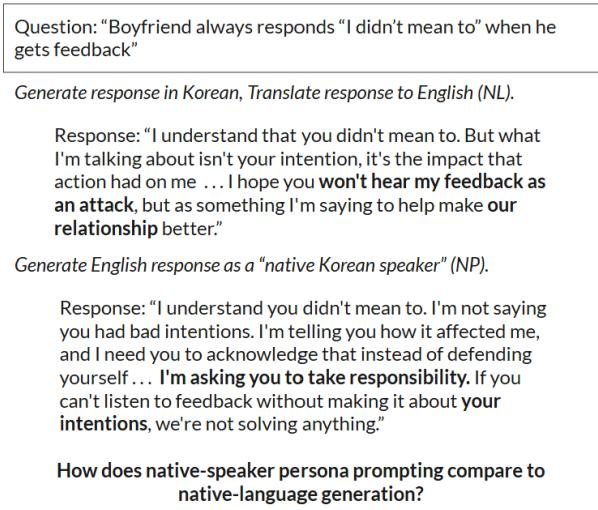  
Figure 1: Example of how GPT-5.5 varies based on prompting strategy.

However, multilingual LLM evaluation has focused largely on objective NLP benchmarks such as translation, question answering, reasoning, and instruction following (Hu et al., 2020; Ahuja et al., 2023; Lai et al., 2023; Singh et al., 2024; Üstün et al., 2024). These tasks do not fully capture interpersonal advice, where there may be no single correct answer and diferences in directness, politeness, hierarchy, and emotional expression can change the force of a response (Gofman, 1967; Brown and Levinson, 1987; Ting-Toomey and Kurogi, 1998). This limitation is especially important because LLMs are increasingly used to model human behavior through demographic backstories, persona variables, prompt language, and cultural frames (Argyle et al., 2023; Hu and Collier, 2024; Tao et al., 2024), even though recent work shows that persona prompts can influence outputs without reliably capturing the full complexity of human subjectivity or cultural variation (Hu and

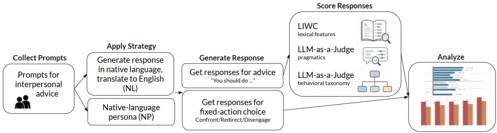  
Figure 2: Framework for evaluating how language pathways afect LLM-generated responses to interpersonal advice prompts.

Collier, 2024; Giorgi et al., 2024). In multilingual interpersonal advice, this raises a methodological question: is asking a model to respond as a ”native speaker” equivalent to asking it to process or generate advice in the target language?

This study investigates how language pathways shape LLM-generated interpersonal advice (Figure 1). Starting from English interpersonal advice questions, we translate prompts into twelve languages and compare responses from five openweight and three proprietary API models. We compare native-language generation followed by translation into English (NL) with native-speaker persona prompting in English (NP) to test whether these two elicitation pathways produce equivalent advice.

Our analysis examines both how advice is framed and what the model recommends. We measure linguistic characteristics, including tone, power, formality, and concreteness; behavioral guidance using the Behavior Change Technique Taxonomy (Michie et al., 2013); and recommended action through a forced-choice classification of confrontation, disengagement, or redirection.

This paper makes three contributions. First, we show that language pathway is not a neutral implementation detail: the same interpersonal dilemma yields diferent linguistic and behavioral outputs depending on whether the model generates in the target language or is prompted with a native-speaker persona in English. Second, we show that NP and NL diverge along both linguistic and behavioral dimensions. NP often adds lexical social cues, such as prosocial language and positive tone, while reducing concreteness, social attunement, emotional expressiveness, and structured behavioral guidance relative to NL. Third, we show that these diferences vary by language, topic, and model, suggesting structured elicitation efects rather than random variation. These patterns should be viewed as properties of model elicitation; they are not evidence about real language communities. Studying the latter would require validating which of NP or NL better aligns with responses from actual speakers of the language.

## 2 Related Work

## 2.1 Multilingual LLM Evaluation

Multilingual NLP evaluation has traditionally focused on whether models transfer across languages on standard tasks such as classification, question answering, retrieval, translation, and structured prediction. Benchmarks such as XTREME evaluate multilingual representations across many languages and task types (Hu et al., 2020). More recent LLM-oriented benchmarks such as MEGA and ChatGPT Beyond English evaluate generative models across multilingual settings (Ahuja et al., 2023; Lai et al., 2023). Multilingual instructiontuning eforts such as Aya address the Englishcentered nature of LLM development by constructing multilingual instruction datasets and models (Singh et al., 2024; Üstün et al., 2024). While existing literature shows that LLM behavior varies substantially across languages, most evaluations emphasize task correctness, benchmark performance, or instruction-following quality. Interpersonal advice difers because there may be no single correct answer; the relevant question concerns interpersonal stance, tone, and action recommendation.

## 2.2 LLMs for Interpersonal Advice and Social Judgment

A growing body of work examines LLMs in social, interpersonal, and emotional-support settings. Studies of LLM-generated advice show that advice quality is shaped not only by the recommendation itself, but also by phrasing, tone, and perceived usefulness (Wester et al., 2024). Work on social-situational judgment finds that LLMs can perform strongly on scenarios involving interpersonal conflict and social reasoning (Mittelstädt et al., 2024). Related work on emotional support studies whether LLMs can produce empathic or culturally sensitive responses, while showing that simple role-play prompts may be insuficient for cultural sensitivity (Liu et al., 2026).

## 2.3 Personas, Cultural Prompting, and Social Bias

Increasingly, LLMs are used as proxies for human respondents or social actors by conditioning them on demographic, cultural, or persona descriptions. Persona prompts afect model outputs but capture only part of human variation and context (Hu and Collier, 2024; Giorgi et al., 2024). Persona choices can shift cultural-norm judgments (Kamruzzaman et al., 2026), while broader bias research documents demographic stereotypes across languages and variation in judgments and persuasive style by gender and relationship attributes (Nadeem et al., 2021; Smith et al., 2022; Costa-jussà et al., 2023; Kotek et al., 2023; Levy et al., 2024; Pauli et al., 2026).

Prompt language and cultural framing provide additional ways of conditioning whose efects depend on how culture is represented and evaluated (AlKhamissi et al., 2024). Generating and combining culturally prompted responses across languages can increase demographic and perspective diversity (Wang et al., 2025), while structured value surveys find only limited gains in alignment with human cultural values (Bulté and Terryn, 2025).

## 3 Methodology

## 3.1 Data Collection

We collect interpersonal advice questions from the Interpersonal Skills Stack Exchange, a public forum focused on everyday interpersonal problems (Stack Exchange, 2026). We select the top 150 questions from four tags: work-environment, friends, relationships, and family, yielding 600 English questions. Sample prompts are shown in Appendix A.1. These questions are adviceseeking, socially situated, and behaviorally openended, making them suitable for evaluating diferences in tone, directness, politeness, social orientation, and recommended action.

## 3.2 Languages

We evaluate 13 languages spanning multiple scripts, language families, and regions: Japanese, Korean, Chinese, Arabic, Persian, Turkish, English, German, Dutch, Swedish, Spanish, Italian, and Portuguese. English uses the original questions, while all other languages use the translation pipeline below to construct semantically controlled non-English versions. As descriptive aids for our exploratory analysis, we group these languages into broad categories such as East Asian, Middle Eastern, Germanic, and Romance.

## 3.3 Question Translation

We translate the English questions into the 12 non-English languages using facebook/nllb-200-distilled-1.3B, a multilingual sequence-to-sequence model from No Language Left Behind (NLLB Team et al., 2022; Meta AI, 2022). For each question-language pair, we generate 32 candidate translations with temperature 0.3 and back-translate each candidate into English four times with temperature 0.7. We then select the candidate with the minimum variance among the five highest-mean candidates in cosine similarity to the original question, computed using all-MiniLM-L6-v2 (Reimers and Gurevych, 2019; Sentence Transformers, 2021). Selected translations show high semantic preservation overall, with mean similarity of 0.928 across languages and language-level means ranging from 0.876 for Japanese to 0.976 for Spanish; additional diagnostics and examples appear in Appendix A.2.

## 3.4 Response Generation

We generate responses from five open- and three proprietary models: google/gemma-4-E4B-it, google/gemma-4-26B-A4B-it, google/gemma-4-31B-it, Qwen/Qwen3.6-27B, Qwen/Qwen3.6-35B-A3B, claude-opus-4.6, gpt-4o, and gpt-5.5 (Team, 2026; Qwen Team, 2026a,b; Anthropic, 2026a; OpenAI, 2024, 2026). For each non-English language, model, and strategy, we generate responses to all 600 questions using four prompting strategies (our two primary strategies of NL and NP, plus two auxiliary strategies discussed in Appendix A.3). This yields 2,400 records per model per non-English language. For English, models answer the original English questions.

For each non-English language, our primary comparison is between native language generation (NL), where the model receives and answers the question in the target language before the answer is translated into English for analysis, and native-speaker persona prompting (NP), where the model receives the original English question and answers in English as a ”native speaker” of the target language. Exact prompts are provided in Appendix A.3.

## 3.5 Annotation and Measurement

We analyze generated responses using four measurement layers: LIWC-22 lexical features, LLM-based pragmatic annotations, LLM-based behavior-change technique classifications, and forced-choice behavioral coding.

First, we compute 12 LIWC lexical features on the English-analyzable final responses. LIWC provides dictionary-based measures of psychologically and socially meaningful word use (Tausczik and Pennebaker, 2010; Pennebaker et al., 2015; Boyd et al., 2022). We use these measures to capture social, afective, cognitive, and motivational language: afiliation, achievement, power, cognitive processes, certitude, tentativeness, emotion, positive tone, negative tone, social references, prosocial language, and conflict.

Second, we use gpt-4o to annotate holistic properties of the advice along five dimensions that are dificult to capture with lexical counts alone. Directness captures how explicitly recommendations are communicated; Formality captures how advice signals social distance and situational expectations (Biber, 1995). Emotional expressiveness captures how overtly advice conveys afect (Du Bois, 2007); Social attunement captures attention to the recipient’s feelings and relational concerns (Gofman, 1967; Brown and Levinson, 1987); and Concreteness captures the distinction between abstract guidance and specific details (Trope and Liberman, 2010). The evaluator scores each dimension on a five-point ordinal scale. A score of 1 indicates indirect, informal, emotionally restrained, task-focused, or abstract language, respectively, whereas a score of 5 indicates direct, formal, emotionally expressive, socially attuned, or concrete language. Intermediate scores represent graded positions between these endpoints. We use LLM-based annotation because these properties are context-sensitive; prior work shows that structured LLM evaluators can support scalable assessment of open-ended text, while requiring caution about evaluator bias (Liu et al., 2023; Zheng et al., 2023).

Third, we code responses using higher-level clusters adapted from the Behavior Change Technique Taxonomy (Michie et al., 2013) with an LLM-as-a-Judge. Although the taxonomy was developed for behavior-change interventions, several categories capture general forms of action guidance that also appear in interpersonal advice: identifying a problem, planning a concrete response, anticipating consequences, reframing the situation, seeking support, and monitoring outcomes. The BCT categories therefore provide a useful structure for measuring behavioral scafolding in advice, which we define as guidance that helps the recipient select, plan, carry out, and evaluate a course of action. The evaluator scores each BCT category on a five-point ordinal scale, where 1 indicates that the technique is absent and 5 indicates that it is strongly present; intermediate scores indicate increasing levels of support within that category. This complements linguistic analysis, as two responses may sound equally polite or prosocial while difering in whether they help the user decide what to do, how to do it, and what consequences to consider.

Finally, we run a separate forced-choice action task motivated by frameworks that distinguish direct engagement, avoidance, compromise, and integrative responses (Rahim, 1983; Gross and Guerrero, 2000). For each question-language-strategy condition, the model receives the same interpersonal dilemma and chooses one of three broad action families: confrontation, disengagement, or redirection. Confrontation directly addresses the issue with the other person or an authority figure; disengagement pauses, reduces, or avoids interaction; and redirection captures non-avoidant but less directly confrontational alternatives such as reframing, changing communication channels, seeking mediation, or pursuing compromise. This direct action choice is distinct from the model’s openended response.

## 3.6 Statistical Analysis

Our main analysis compares NL and NP across output measures, using English as a reference condition for scaling and visualization. For continuous LIWC, LLM-annotated, and BCT features, we report standardized treatment-minus-English diferences for the same source prompt and model. NP– NL tests use matched prompt–model observations: within each source prompt and model, we average feature scores across target languages for each strategy, compute the NP-minus-NL diference, and test whether the mean difers from zero using a onesample paired-diference t-test (Student, 1908). For exploratory language-group analyses, we compute the same NP–NL contrasts within matched observations, average them within broad language groups, and test whether the persona–generation gap difers across groups. For forced-choice action outcomes, each response is labeled as confrontation, redirection, or disengagement. We report strategy-level action distributions as percentages and test whether prompting strategy changes the overall distribution using Pearson chi-square tests over the three action categories (Pearson, 1900).

Across analyses, stars indicate significant diferences ((q<0.05)) for the comparison specified in each table or figure. We control the false discovery rate within each comparison family using the Benjamini–Hochberg procedure (Benjamini and Hochberg, 1995). Continuous efects are reported in standardized units using English as the reference for scaling; action rates are reported as percentages, and diferences in action rates as percentage points.

## 4 Linguistic Analysis

This section analyzes how the cross-lingual prompting strategy afects the linguistic features in the resulting advice using LIWC lexical features and LLM-based annotations. The motivating example in Figure 1 illustrates the diference between NP and NL linguistically. The Korean-generated response translated into English (NL) is more relationally attuned, softening with phrases like ”I hope you won’t hear my feedback as an attack.” In contrast, the native-speaker persona (NP) response uses a firmer accountability frame, warning the boyfriend that ”if you can’t listen to feedback without making it about your intentions, we’re not solving anything.” This is reflected in the LLMannotated holistic properties: NP is less formal (2 vs. 3) and less socially attuned (3 vs. 5).

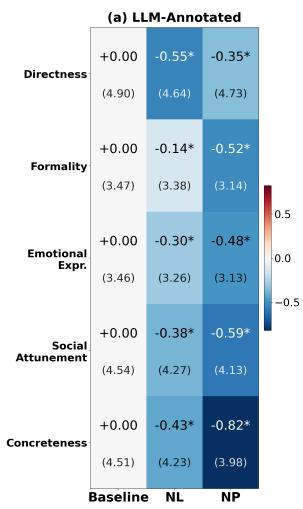

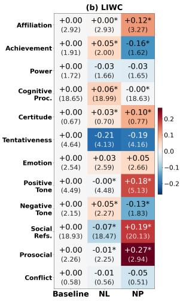  
Figure 3: Linguistic features for NP and NL (left: LLMannotated, right: LIWC), aggregated across responses from 600 questions, 12 non-English languages, and eight models. Main values are normalized relative to the English baseline; values in parentheses report mean scores on the original LLM-annotation and LIWC scales. Stars mark diferences significant at $q < 0 . 0 5$ Compared to NL, NP increases surface social cues such as afiliation and reduces action-oriented features such as achievement and concreteness.

## 4.1 Overall Linguistic Patterns

Figure 3 shows that NL and NP produce significantly diferent linguistic profiles across the 12 foreign languages we study. Overall, NP shifts advice toward an assertive-supportive style: it uses more afiliation, social references, prosocial language, and positive tone, but is less formal, less emotionally expressive, less socially attuned, and less concrete than NL. By comparison, NL produces advice with more contextual and relational elaboration, including greater attention to emotional nuance, relationship dynamics, and concrete interpersonal detail. This overall pattern is broadly consistent across LLMs, with model-level results reported in Appendix D.4.

This contrast highlights a surprising divergence between lexical social cues and pragmatic content. NP uses more language associated with support and afiliation while ofering less socially attuned and concrete advice. This indicates that these additional social cues do not translate into greater attention to the recipient’s feelings, relational concerns, or specific circumstances, highlighting another difference between NP and NL.

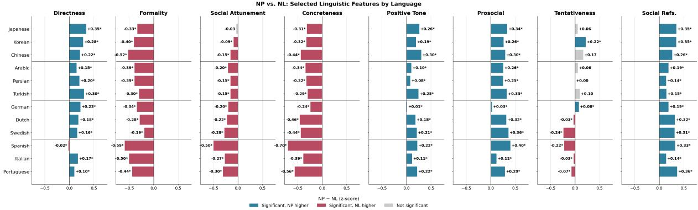  
Figure 4: NP–NL diferences in selected linguistic features by language, aggregated across responses from 600 questions and eight models. The selected features show a subset of how the advice positions the user interpersonally. Diferences vary across target languages, showing that persona prompting does not afect all linguistic contexts uniformly.

## 4.2 Strategy Diferences Across Languages

The size and direction of NP–NL diferences vary systematically by language (Figure 4). Across languages, NP generally increases directness and socially positive cues, while NL is higher on formality, social attunement, emotional expressiveness, and concreteness. However, the magnitude of these gaps is not uniform: the NP–NL difference in social attunement and concreteness is smaller for Japanese, Korean, and Chinese than for several Romance and Germanic languages. Exploratory language-group analyses confirm significant diferences in efect sizes across broad language groups; full results appear in Appendix D.5.

These uneven gaps matter for cross-language comparisons because substituting NP for NL does not afect every language equally. In downstream analyses, this substitution can widen or narrow observed diferences between languages and change conclusions about how model behavior varies across them.

## 4.3 Discussion

Together, the linguistic results show that NP and NL are distinct elicitation methods for multilingual interpersonal advice. NP tends to produce advice that is warmer, more positive, and more explicitly socially marked, while NL more often preserves the relational and pragmatic scafolding of advice: how directly the user should speak, how much emotional context is included, how carefully the relationship is managed, and how concretely next steps are specified. The diference is not just a stylistic one. Language pathway changes how the advice positions the user in the interpersonal situation.

## 5 Behavioral Analysis

This section examines whether language pathway changes not only how advice sounds, but what it helps the user do. We first analyze generated responses with the Behavior Change Technique Taxonomy (BCT), which captures behavior-guiding components such as problem-solving, planning, reframing, and consequence reasoning. We then use a forced-choice action task to test whether the model ultimately recommends confrontation, disengagement, or redirection. The motivating example in Figure 1 illustrates the distinction: NL provides more behavioral scafolding than NP—that is, more guidance for putting advice into practice. The NL response scores higher on cognitive reframing (4 vs. 2), social support (4 vs. 2), and problem solving (5 vs. 3). For example, NL frames feedback as ”I’m saying to help make our relationship better,” while NP says the boyfriend needs to ”acknowledge that instead of defending.” The forcedchoice label also reflects the diferences between NP and NL, with the Korean generation selecting ”Redirection” and the Korean-speaker persona selecting ”Confrontation.”

## 5.1 Behavioral Guidance in Generated Advice

The BCT analysis shows that NP provides less behavioral scafolding than NL across major actionguidance categories (Figure 5). The largest reductions appear in problem solving, action planning, consequence reasoning, feedback, and cognitive reframing. These categories capture the diference between advice that endorses a general stance and advice that helps a user carry it out: identifying the source ofconflict, deciding when and how to speak, anticipating how the other person might respond, and reframing the situation in a way that makes action possible. Because these reductions appear consistently across languages, they suggest a general strategy-level efect rather than a languagespecific anomaly.

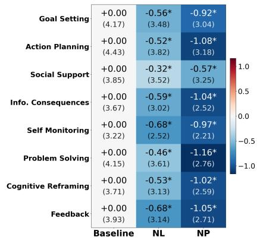  
Figure 5: BCT features for NP and NL, aggregated across responses from 600 questions, 12 non-English languages, and eight models. Overall, NP significantly difers from NL, with NP providing less behavioral scaffolding in its responses.

This result strengthens the linguistic findings. Compared to NL, NP often makes advice sound warmer or more socially positive, but the BCT results show that this tradeof can come at the cost of usable guidance. This is consequential, as a response that says to be honest, respectful, or understanding may sound appropriate, but it is less helpful if it does not help the user decide what to say, how to sequence the conversation, or how to manage the relationship after the exchange.

Topic-level results show that this loss of usable guidance is most pronounced for friendship and workplace questions (Figure 6), especially in problem solving, action planning, and cognitive reframing. These are domains where the practical and relational demands of advice are tightly linked: users often need to raise a concern without escalating conflict, coordinate expectations with someone they must continue interacting with, or preserve trust while setting a boundary. One interpretation is that persona prompting encourages a recognizable social stance, while native-language generation retains more of the step-by-step reasoning needed to make advice actionable in ongoing relationships.

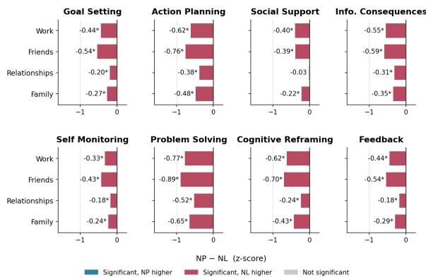  
Figure 6: NP–NL diferences in BCT features by topic, aggregated across responses from 12 non-English languages and eight models. The largest diferences between NP and NL appear in interpersonal questions about work and friends.

Forced-Choice Action Rates: NL and NP vs. English Baseline
<table><tr><td rowspan="2">Confrontation</td><td rowspan="2">+0.0 (34.1%)</td><td colspan="2">-5.3* -1.8*</td><td rowspan="2">10 5</td></tr><tr><td>(28.8%)</td><td>(32.3%)</td></tr><tr><td>Redirection</td><td>+0.0 (52.0%)</td><td>+5.7* (57.6%)</td><td>+1.4* (53.4%)</td><td>0</td></tr><tr><td rowspan="3">Disengagement</td><td>+0.0</td><td>-0.4*</td><td>+0.4*</td><td rowspan="3">-5 -10</td></tr><tr><td>(13.9%)</td><td>(13.5%)</td><td>(14.3%)</td></tr><tr><td>Baseline</td><td>NL</td><td>NP</td></tr></table>

Figure 7: Forced-choice action rates for NP and NL, aggregated across responses from 600 questions, 12 non-English languages, and eight models. NP and NL have significantly diferent distributions, with personas choosing confrontation significantly more than native language generation.

## 5.2 Forced-Choice Action Preferences

Next, the forced-choice task asks whether these differences in scafolding translate into diferent behavioral recommendations. Figure 7 shows that NL and NP produce significantly diferent action distributions: NL shifts away from confrontation and toward redirection, while NP remains closer to the English baseline and selects confrontation more often than NL.

Because the final action prompt is identical across strategies, this diference cannot be reduced to wording alone. It suggests that language pathway changes the model’s judgment of what the situation calls for. In practice, users may receive diferent behavioral guidance for the same dilemma depending on whether the system uses native-language generation or native-speaker persona prompting.

Language-level results add a more nuanced picture (Figure 8). Across most languages, NP selects confrontation more often than NL, while NL selects redirection more often. At the same time, NP is not simply random: languages with higher confrontation rates under NL often also have higher confrontation rates under NP. Persona prompting therefore preserves some relative language-level structure, but shifts the absolute recommendation toward confrontation.

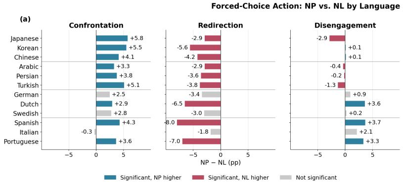

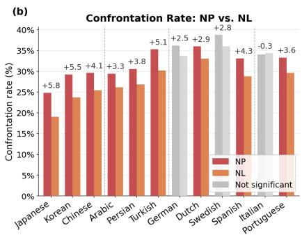  
Figure 8: NP–NL diferences in forced choice rates by language, aggregated across responses from 600 questions and eight models. Panel (a) shows NP minus NL action-rate diferences; Panel (b) compares confrontation rates under NP and NL.

This pattern is important because it suggests that the diferences between persona prompting and native language generation are not merely noisy or uninformative. Instead, it appears systematically misaligned: we cannot expect the two systems to be interchangeable with one another.

## 5.3 Discussion

Taken together, the behavioral results show that NP and NL difer in both the structure of generated advice and the final judgment about what action is appropriate. Compared to NL, NP can make advice appear more socially polished while reducing the scafolding that helps users act, and can shift recommendations for the same dilemma. The fact that NP sometimes replicates coarse languagelevel patterns while still shifting choices toward confrontation suggests that persona prompting and native language generation may sometimes appear aligned textually, but can produce completely different results with regards to concrete guidance or action suggestions.

## 6 Robustness Analysis

We conduct three additional analyses to test whether the main NP–NL findings are sensitive to persona-prompt wording, translation quality, or the choice of automated evaluator. The main directional patterns are consistent across these checks, although some efects vary in magnitude and significance.

## 6.1 Sensitivity to Persona-Prompt Wording

To assess sensitivity to persona wording, we test two controlled NP variants (additional context of ”grew up using” and ”currently use”) on 100 prompts across 12 languages and two models (google/gemma-4-E4B-it and claude-opus-4.6). The results were directionally stable: 14 of 17 linguistic dimensions retained the same NP–NL direction across all three formulations, and the three reversals were confined to nonsignificant NP–NL contrasts. All eight BCT dimensions remained negative under every formulation, indicating consistently less behavioral scafolding under NP than under NL. In the forced-choice analysis, all three formulations increased confrontation and decreased redirection relative to NL. Thus, the principal NP–NL patterns do not depend on the exact persona wording, although their magnitudes are wording-sensitive. Full results appear in Appendix G.

## 6.2 Sensitivity to Translation Quality

Because translation errors could contribute to differences between NL and NP, we repeated all main analyses on prompt–language pairs with mean back-translation similarity of at least 0.95. Retention varied substantially across the 12 translated languages, from 139 pairs for Japanese to 463 for Spanish. To account for diferences in retention rates, we calculated NP–NL contrasts within each language. Our main results were stable: 59 of 60 LLM-annotated language–dimension contrasts retained their direction; the only reversal was a negligible Spanish directness efect (-0.02 to +0.01).

Similarly, 131 of 144 LIWC contrasts retained their direction, and 12 of the 13 reversals involved near-zero efects. All 96 BCT contrasts remained negative. In the forced-choice analysis, confrontation and redirection retained their directions in all 12 languages. These findings indicate that the main NP–NL patterns persist after excluding translations with lower measured semantic similarity. Full results appear in Appendix H.

## 6.3 Cross LLM-as-a-Judge Comparison

To assess robustness to evaluator choice, we repeated the LLM-annotation pipeline using claude-sonnet-5 (Anthropic, 2026b) as a second judge. We evaluated a 100-prompt subset across all 12 non-English target languages and three generation models: gpt-4o, claude-opus-4.6, and google/gemma-4-E4B-it. We used the same rubrics and paired significance-testing procedure as in the main analysis. For the five linguistic-style dimensions, the judges agreed on the direction of every aggregate NP–NL efect. Across the eight aggregate BCT dimensions, the judges agreed on seven. The only aggregate discrepancy is feedback, where the original judge estimated a moderate negative efect and claude-sonnet-5 estimated a nonsignificant positive estimate.

Further, agreement was not weaker for the gpt-4o-generated responses, despite gpt-4o serving as the original evaluator: the judges agreed on 12 of 13 efects. The single flipped axis was directness, where the original judge’s estimate was null and claude-sonnet-5 estimated a positive efect. These results support the robustness of the central directional pattern across the two evaluators tested. Full results appear in Appendix I.

## 7 Conclusion

This paper asks whether native-language generation followed by translation (NL) and nativespeaker persona prompting (NP) produce equivalent multilingual interpersonal advice. Across 600 advice questions, 13 language conditions, and eight language models, we find that they do not: NL and NP yield systematically diferent linguistic styles, levels of behavioral scafolding, and action recommendations. Persona prompting can selectively amplify lexical social cues, such as prosocial wording, afiliation, social references, and positive tone, while changing the structure of the advice itself. Relative to NL, NP is often less concrete, less socially attuned, less emotionally expressive, and less formal; it also provides less actionable scafolding and more often shifts forcedchoice recommendations from redirection toward confrontation. These findings show that prompting strategy is a substantive methodological choice. Multilingual advice systems should evaluate elicitation pathways explicitly and validate both linguistic and behavioral outcomes.

## Limitations

This study has several limitations. First, although we exclude questions with explicit country tags, the source data comes from an English-language advice forum. The interpersonal dilemmas may therefore reflect Western, English-speaking assumptions. Our results should be interpreted as differences in how models respond to translated versions of this corpus, not as claims about how people from diferent language communities would answer these questions. Whether NL or NP is better aligned with how real speakers of these languages would respond to interpersonal scenarios is a valuable avenue for future study.

Second, our language and persona conditions are broad. A prompt such as ”You are a native Korean speaker” collapses across region, class, age, and gender. This is useful for testing a common strategy, but not for representing cultural identity. Future work should examine more specific regional, dialectal, and situational contexts.

Third, our analysis relies on automated annotation pipelines. LIWC provides reproducible lexical features, while LLM-based annotations and BCT labels allow scalable evaluation, but both may miss nuance or reflect annotator-model biases. Future work should evaluate LLM-generated responses with human raters from the relevant linguistic and cultural backgrounds.

Although we include both open- and proprietary models, diferences in training data, alignment, and English-centered development may limit generalizability. Our consistency analyses suggest that many patterns generalize across models, but not necessarily to all at all times. Expanding to systems developed primarily in non-English contexts would help clarify which efects are general properties of cross-lingual prompting and which are model-specific.

## Acknowledgments

This work was supported by the Social and Ethical Responsibilities of Computing (SERC), an initiative of the MIT Schwarzman College of Computing. We also thank the SERC Scholars Synergy Group–Alison Soong, Michael Serrano, Karen Nakamura, Julian Gullett, Johnnie Jones VI, and Meiri Anto–for their advice, feedback, and support throughout the development of this project.

## AI Assistance Disclosure

The authors used ChatGPT for writing assistance in revising, editing, and LaTeX formatting help.

## References

Kabir Ahuja, Harshita Diddee, Rishav Hada, Millicent Ochieng, Krithika Ramesh, Prachi Jain, Akshay Nambi, Tanuja Ganu, Sameer Segal, Mohamed Ahmed, Kalika Bali, and Sunayana Sitaram. 2023. MEGA: Multilingual evaluation of generative AI. In Proceedings of the 2023 Conference on Empirical Methods in Natural Language Processing, pages 4232–4267, Singapore. Association for Computational Linguistics.

Badr AlKhamissi, Muhammad ElNokrashy, Mai Alkhamissi, and Mona Diab. 2024. Investigating cultural alignment of large language models. In Proceedings of the 62nd Annual Meeting of the Association for Computational Linguistics (Volume 1: Long Papers), pages 12404–12422, Bangkok, Thailand. Association for Computational Linguistics.

Anthropic. 2026a. Claude opus 4.6 system card. Anthropic System Card.

Anthropic. 2026b. Claude sonnet 5 system card. Anthropic System Card.

Lisa P. Argyle, Ethan C. Busby, Nancy Fulda, Joshua R. Gubler, Christopher Rytting, and David Wingate. 2023. Out of one, many: Using language models to simulate human samples. Political Analysis, 31(3):337–351.

Yoav Benjamini and Yosef Hochberg. 1995. Controlling the false discovery rate: A practical and powerful approach to multiple testing. Journal of the Royal Statistical Society: Series B (Methodological), 57(1):289–300.

Douglas Biber. 1995. Dimensions ofRegister Variation: A Cross-Linguistic Comparison. Cambridge University Press.

Ryan L. Boyd, Ashwini Ashokkumar, Sarah Seraj, and James W. Pennebaker. 2022. The Development and Psychometric Properties of LIWC-22. University of Texas at Austin.

Penelope Brown and Stephen C. Levinson. 1987. Politeness: Some Universals in Language Usage. Cambridge University Press.

Bram Bulté and Ayla Rigouts Terryn. 2025. Llms and cultural values: the impact of prompt language and explicit cultural framing. Preprint, arXiv:2511.03980.

Aaron Chatterji, Thomas Cunningham, David J. Deming, Zoe Hitzig, Christopher Ong, Carl Yan Shan, and Kevin Wadman. 2025. How people use ChatGPT. Working Paper 34255, National Bureau of Economic Research.

Marta R. Costa-jussà, Pierre Andrews, Eric Smith, Prangthip Hansanti, Christophe Ropers, Elahe Kalbassi, Cynthia Gao, Daniel Licht, and Carleigh Wood. 2023. Multilingual holistic bias: Extending descriptors and patterns to unveil demographic biases in languages at scale. In Proceedings of the 2023 Conference on Empirical Methods in Natural Language Processing, pages 14141–14156, Singapore. Association for Computational Linguistics.

John W. Du Bois. 2007. The stance triangle. In Robert Englebretson, editor, Stancetaking in Discourse: Subjectivity, Evaluation, Interaction, pages 139–182. John Benjamins.

Salvatore Giorgi, Tingting Liu, Ankit Aich, Kelsey Jane Isman, Garrick Sherman, Zachary Fried, João Sedoc, Lyle Ungar, and Brenda Curtis. 2024. Modeling human subjectivity in LLMs using explicit and implicit human factors in personas. In Findings of the Association for Computational Linguistics: EMNLP 2024, pages 7174–7188. Association for Computational Linguistics.

Erving Gofman. 1967. Interaction Ritual: Essays on Face-to-Face Behavior. Anchor Books.

Michael A. Gross and Laura K. Guerrero. 2000. Managing conflict appropriately and efectively:

An application of the competence model to rahim’s organizational conflict styles. International Journal of Conflict Management, 11(3):200–226.

Junjie Hu, Sebastian Ruder, Aditya Siddhant, Graham Neubig, Orhan Firat, and Melvin Johnson. 2020. XTREME: A massively multilingual multi-task benchmark for evaluating cross-lingual generalization. In Proceedings of the 37th International Conference on Machine Learning, pages 4411–4421. PMLR.

Tiancheng Hu and Nigel Collier. 2024. Quantifying the persona efect in LLM simulations. In Proceedings of the 62nd Annual Meeting of the Association for Computational Linguistics, pages 10289–10307. Association for Computational Linguistics.

Mahammed Kamruzzaman, Hieu Minh Nguyen, Nazmul Hassan, and Gene Louis Kim. 2026. ‘a woman is more culturally knowledgeable than a man?’: The efect of personas on cultural norm interpretation in LLMs. In Proceedings of the First Workshop on Multilingual Multicultural Evaluation, pages 220–237. Association for Computational Linguistics.

Hadas Kotek, Rikker Dockum, and David Q. Sun. 2023. Gender bias and stereotypes in large language models. In Proceedings of the ACM Collective Intelligence Conference. Association for Computing Machinery.

Viet Dac Lai, Nghia Ngo, Amir Pouran Ben Veyseh, Hieu Man, Franck Dernoncourt, Trung Bui, and Thien Huu Nguyen. 2023. ChatGPT beyond english: Towards a comprehensive evaluation of large language models in multilingual learning. In Findings of the Association for Computational Linguistics: EMNLP 2023, pages 13171–13189, Singapore. Association for Computational Linguistics.

Sharon Levy, William Adler, Tahilin Sanchez Karver, Mark Dredze, and Michelle R. Kaufman. 2024. Gender bias in decision-making with large language models: A study of relationship conflicts. In Findings of the Association for Computational Linguistics: EMNLP 2024, pages 5777–5800, Miami, Florida, USA. Association for Computational Linguistics.

Chen Cecilia Liu, Hiba Arnaout, Nils Kovačić, Dana Atzil-Slonim, and Iryna Gurevych. 2026. Tailored emotional LLM-supporter: Enhancing cultural sensitivity. In Proceedings of the 19th Conference of the European Chapter of the Association for Computational Linguistics, pages 535–574. Association for Computational Linguistics.

Yang Liu, Dan Iter, Yichong Xu, Shuohang Wang, Ruochen Xu, and Chenguang Zhu. 2023. G-Eval: NLG evaluation using GPT-4 with better human alignment. In Proceedings of the 2023 Conference on Empirical Methods in Natural Language Processing, pages 2511–2522. Association for Computational Linguistics.

Meta AI. 2022. NLLB-200 Distilled 1.3B Model Card. Hugging Face Model Card.

Susan Michie, Michelle Richardson, Marie Johnston, Charles Abraham, Jill Francis, Wendy Hardeman, Martin P. Eccles, James Cane, and Caroline E. Wood. 2013. The behavior change technique taxonomy (v1) of 93 hierarchically clustered techniques: Building an international consensus for the reporting of behavior change interventions. Annals of Behavioral Medicine, 46(1):81–95.

Justin Maximilian Mittelstädt, Julia Maria Maier, Panja Goerke, Frank Zinn, and Michael E. Hermes. 2024. Large language models can outperform humans in social situational judgments. Scientific Reports, 14:27449.

Moin Nadeem, Anna Bethke, and Siva Reddy. 2021. StereoSet: Measuring stereotypical bias in pretrained language models. In Proceedings of the 59th Annual Meeting of the Association for Computational Linguistics and the 11th International Joint Conference on Natural Language Processing, pages 5356–5371. Association for Computational Linguistics.

NLLB Team, Marta R. Costa-jussà, James Cross, Onur Çelebi, Maha Elbayad, Kenneth Heafield, Kevin Hefernan, Elahe Kalbassi, Janice Lam, Daniel Licht, Jean Maillard, and 1 others. 2022. No language left behind: Scaling human-centered machine translation. Preprint, arXiv:2207.04672.

OpenAI. 2024. Gpt-4o system card. Preprint, arXiv:2410.21276.

OpenAI. 2026. Gpt-5.5 system card. OpenAI System Card.

Amalie Brogaard Pauli, Maria Barrett, Max Müller-Eberstein, Isabelle Augenstein, and Ira Assent. 2026. Analysing diferences in persuasive language in LLM-generated text: Uncovering stereotypical gender patterns. In Findings of the Association for Computational Linguistics: ACL 2026, pages 34893–34918, San Diego, California, United States. Association for Computational Linguistics.

Karl Pearson. 1900. X. on the criterion that a given system of deviations from the probable in the case of a correlated system of variables is such that it can be reasonably supposed to have arisen from random sampling. The London, Edinburgh, and Dublin Philosophical Magazine and Journal ofScience, 50(302):157–175.

James W. Pennebaker, Ryan L. Boyd, Kayla Jordan, and Kate Blackburn. 2015. The Development and Psychometric Properties of LIWC2015. University of Texas at Austin.

Qwen Team. 2026a. Qwen3.6-27B: Flagship-level coding in a 27b dense model. Qwen Blog.

Qwen Team. 2026b. Qwen3.6-35B-A3B: Agentic coding power, now open to all. Qwen Blog.

M. Afzal Rahim. 1983. A measure of styles of handling interpersonal conflict. Academy of Management Journal, 26(2):368–376.

Nils Reimers and Iryna Gurevych. 2019. Sentence-BERT: Sentence embeddings using siamese BERT-networks. In Proceedings of the 2019 Conference on Empirical Methods in Natural Language Processing, pages 3982–3992. Association for Computational Linguistics.

Sentence Transformers. 2021. all-MiniLM-L6-v2 Model Card. Hugging Face Model Card.

Shivalika Singh, Freddie Vargus, Daniel D’souza, Börje F. Karlsson, Abinaya Mahendiran, Wei-Yin Ko, Herumb Shandilya, Jay Patel, Deividas Mataciunas, Laura O’Mahony, Mike Zhang, Ramith Hettiarachchi, Joseph Wilson, Marina Machado, Luisa Moura, Dominik Krzemiński, Hakimeh Fadaei, Irem Ergun, Ifeoma Okoh, and 14 others. 2024. Aya dataset: An open-access collection for multilingual instruction tuning. In

Proceedings of the 62nd Annual Meeting of the Association for Computational Linguistics (Volume 1: Long Papers), pages 11521–11567, Bangkok, Thailand. Association for Computational Linguistics.

Eric Michael Smith, Melissa Hall, Melanie Kambadur, Eleonora Presani, and Adina Williams. 2022. “i’m sorry to hear that”: Finding new biases in language models with a holistic descriptor dataset. In Proceedings of the 2022 Conference on Empirical Methods in Natural Language Processing, pages 9180–9211, Abu Dhabi, United Arab Emirates. Association for Computational Linguistics.

Stack Exchange. 2026. Interpersonal Skills Stack Exchange. https://interpersonal. stackexchange.com/. Accessed: 2026-05-19.

Student. 1908. The probable error of a mean. Biometrika, 6(1):1–25.

Yan Tao, Olga Viberg, Ryan S. Baker, and René F. Kizilcec. 2024. Cultural bias and cultural alignment of large language models. PNAS Nexus, 3(9):pgae346.

Yla R. Tausczik and James W. Pennebaker. 2010. The psychological meaning of words: LIWC and computerized text analysis methods. Journal of Language and Social Psychology, 29(1):24–54.

Gemma Team. 2026. Gemma 4 technical report. Preprint, arXiv:2607.02770.

Stella Ting-Toomey and Atsuko Kurogi. 1998. Facework competence in intercultural conflict: An updated face-negotiation theory. International Journal of Intercultural Relations, 22(2):187–225.

Yaacov Trope and Nira Liberman. 2010. Construallevel theory of psychological distance. Psychological Review, 117(2):440–463.

Ahmet Üstün, Viraat Aryabumi, Zheng Yong, Wei-Yin Ko, Daniel D’souza, Gbemileke Onilude, Neel Bhandari, Shivalika Singh, Hui-Lee Ooi, Amr Kayid, Freddie Vargus, Phil Blunsom, Shayne Longpre, Niklas Muennighof, Marzieh Fadaee, Julia Kreutzer, and Sara Hooker. 2024.

Aya model: An instruction finetuned openaccess multilingual language model. In Proceedings of the 62nd Annual Meeting of the Association for Computational Linguistics (Volume 1: Long Papers), pages 15894–15939, Bangkok, Thailand. Association for Computational Linguistics.

Qihan Wang, Shidong Pan, Tal Linzen, and Emily Black. 2025. Multilingual prompting for improving llm generation diversity. Preprint, arXiv:2505.15229.

Joel Wester, Sander de Jong, Henning Pohl, and Niels van Berkel. 2024. Exploring people’s perceptions of LLM-generated advice. Computers in Human Behavior: Artificial Humans, 2(2):100072.

Lianmin Zheng, Wei-Lin Chiang, Ying Sheng, Siyuan Zhuang, Zhanghao Wu, Yonghao Zhuang, Zi Lin, Zhuohan Li, Dacheng Li, Eric P. Xing, Hao Zhang, Joseph E. Gonzalez, and Ion Stoica. 2023. Judging LLM-as-a-judge with MT-Bench and chatbot arena. In Advances in Neural Information Processing Systems, volume 36, pages 46595–46623.

## A Framework Setup

This appendix provides implementation details for the full cross-lingual prompting framework.

## A.1 Advice Question Samples

We begin from 600 English-language interpersonal advice questions drawn from Interpersonal Skills Stack Exchange. Questions were drawn from four topic tags: work-environment, friends, relationships, and family. These tags cover common interpersonal domains: workplace communication, friendship conflict, romantic or social relationships, and family dynamics. We exclude questions with country-specific tags to focus on broadly comparable dilemmas rather than cases tied to a named national context. Some example prompts are shown in Table 1.

## A.2 Translation Pipeline

For each of the 12 non-English target languages, we translate the original English questions using facebook/nllb-200-distilled-1.3B. We generate 32 candidate translations with temperature 0.3. We then back-translate each candidate into English four times with temperature 0.7. This produces multiple English reconstructions of each candidate translation, allowing us to estimate both mean semantic preservation and instability across back-translations.

We score each back-translation against the original English question using cosine similarity from all-MiniLM-L6-v2. For each question-language pair, we select the translation with high mean similarity and low variance across back-translations by retaining the top-5 candidates by mean similarity and choosing the one with the smallest backtranslation variance among those five. We note the translation-quality diagnostics by language in Table 3.

Table 2 shows the five retained candidates for this question, illustrating how the pipeline operates. Among the top-5 candidates, row 1 is selected because its back-translations are perfectly stable (variance = 0), even though its mean similarity difers only marginally from rows 2–3.

## A.3 Response-Generation Prompts

This subsection reports the response-generation templates. The main paper focuses on the comparison between native-language generation followed by translation (NL) and native-speaker persona prompting (NP). We also include two auxiliary strategies, translate-then-generate (TTG) and one-stage English output (OSP), to help localize where prompting efects enter the pipeline.

⟨QNL⟩

<table><tr><td>Question cat- # prompts egory</td><td></td><td>Example prompt</td></tr><tr><td>Work envi- ronment</td><td>150</td><td>How do I tell my teammate to stop replying to emails not addressed to him?</td></tr><tr><td>Friends</td><td>150</td><td>How to talk to someone about be- ing chronically late—not to fix it, just to get more accurate ETAs?</td></tr><tr><td>Relationships</td><td>150</td><td>How to talk to my wife about unre- alistic expectations?</td></tr><tr><td>Family</td><td>150</td><td>How to ask my father-in-law to stop entering our house unan- nounced?</td></tr><tr><td>Total</td><td>600</td><td></td></tr></table>

Table 1: Prompt categories used in the dataset.
<table><tr><td>#</td><td>Korean candidate translation</td><td>Mean sim.</td><td>BT var.</td></tr><tr><td>1</td><td>?</td><td>0.977745</td><td>0.000000</td></tr><tr><td>2</td><td>o?</td><td>0.973665</td><td>0.000017</td></tr><tr><td>3</td><td>合外?</td><td>0.961011</td><td>0.000109</td></tr><tr><td>4</td><td></td><td>0.931227</td><td>0.000400</td></tr><tr><td>5</td><td>? ?</td><td>0.928988</td><td>0.000016</td></tr></table>

Table 2: Back-translation candidate scores for one Korean question (”How can I ask my parents to respect my privacy?”). Candidates are ranked by mean backtranslation similarity; the top-5 are retained and the one with the lowest variance is selected. The bolded row is the selected candidate.

TTG tests whether diferences are explained primarily by translation of the input question. In TTG, the target-language question is translated back into English before the model generates advice, so the final response is produced from an English prompt. OSP tests whether target-language input alone affects the response when the model is still instructed to answer in English. NL tests the efect of generating the advice through the target language itself, followed by translation into English for analysis. NP provides a contrasting English-language elicitation pathway using a native-speaker identity instruction.

All prompts were submitted as a single user turn without a system message. For two-step strategies, the output of Step 1 was inserted into Step 2 at inference time. Here, $\langle Q _ { \mathrm { E N } } \rangle$ denotes the original English question, QNL the selected target-language translation, $\langle Q _ { \mathrm { B T } } \rangle$ the English back-translation of the target-language question, and $\langle R _ { \mathrm { N L } } \rangle$ the targetlanguage response from Step 1.

<table><tr><td>Language</td><td>Mean similarity</td><td>SD similarity</td></tr><tr><td>Japanese</td><td>0.876</td><td>0.091</td></tr><tr><td>Korean</td><td>0.879</td><td>0.121</td></tr><tr><td>Chinese</td><td>0.912</td><td>0.089</td></tr><tr><td>Arabic</td><td>0.917</td><td>0.092</td></tr><tr><td>Persian</td><td>0.877</td><td>0.112</td></tr><tr><td>Turkish</td><td>0.908</td><td>0.088</td></tr><tr><td>German</td><td>0.940</td><td>0.082</td></tr><tr><td>Dutch</td><td>0.959</td><td>0.070</td></tr><tr><td>Swedish</td><td>0.957</td><td>0.079</td></tr><tr><td>Spanish</td><td>0.976</td><td>0.063</td></tr><tr><td>Italian</td><td>0.969</td><td>0.081</td></tr><tr><td>Portuguese</td><td>0.975</td><td>0.067</td></tr><tr><td>Overall</td><td>0.928</td><td>0.094</td></tr></table>

Table 3: Translation quality diagnostics by language. Similarity is cosine similarity between the original English question and selected English back-translations.

English baseline. The model receives the original English question and answers in English.

Answer the following advice question in English. Only provide the direct answer and do not explain.

Translate-then-generate (TTG). The targetlanguage question is first translated back into English. The model then generates advice from this English back-translation. This condition tests whether translation of the input question alone explains downstream efects.

Answer the following advice question in English. Only provide the direct answer and do not explain.

Native-language generation followed by translation (NL). Step 1 generates advice in the target language from the target-language question.

Instruction in target language: answer the   
following advice question in the target   
language. Only provide the direct answer and   
do not explain.

Step 2 translates the target-language response into English for analysis.

Translate the following response into English. Only provide the translation and do not explain.

One-stage English output (OSP). The model receives the target-language question but is instructed to answer directly in English. This condition tests whether target-language input afects the response even when output language is fixed to English.

Instruction in target language: answer the following advice question in English. Only provide the direct answer and do not explain.   
⟨QNL⟩

Native-speaker persona prompting (NP). The model receives the original English question with a native-speaker persona instruction and answers in English.

You are a native Language speaker. Answer   
the following advice question in English.   
Only provide the direct answer and do not   
explain.   
QEN

<table><tr><td>Language</td><td>Respond in target language</td><td>Respond in English</td><td>Translate to English only</td></tr><tr><td>English</td><td>Respond.</td><td>Respond in English.</td><td>Translate to English. Only output the translated sentence and do not explain.</td></tr><tr><td>Japanese</td><td>答えてください。</td><td>英語で答えてください。</td><td>英語に翻訳してください。翻訳した 文のみを出力し、説明はしないでく ださい。</td></tr><tr><td>Korean</td><td></td><td></td><td>.</td></tr><tr><td>Chinese</td><td>回答。</td><td>用英语回答。</td><td>请翻译成英语。只输出翻译后的句 子，不要解释。</td></tr><tr><td>Arabic</td><td></td><td></td><td></td></tr><tr><td>Persian</td><td></td><td></td><td></td></tr><tr><td>Turkish</td><td>Yanıtlayın.</td><td>İngilizce yanıtlayın.</td><td>İngilizceye çevirin. Yalnızca çeviriyi verin, açıklama yapmayın.</td></tr><tr><td>German</td><td>Beantworten Sie.</td><td>Antworten Sie auf Englisch.</td><td>Übersetzen Sie ins Englische. Geben Sie nur die Übersetzung ohne Erk-</td></tr><tr><td>Dutch</td><td>Beantwoord.</td><td>Beantwoord in het Engels.</td><td>lärung. Vertaal naar het Engels. Geef alleen de vertaling zonder uitleg.</td></tr><tr><td>Swedish</td><td>Svara.</td><td>Svara på engelska.</td><td>Översätt till engelska. Ge endast den översättning utan förklaring.</td></tr><tr><td>Spanish</td><td>Responda.</td><td>Responda en inglés.</td><td>Traduzca al inglés. Devuelva solo la tra- ducción sin explicación.</td></tr><tr><td>Italian</td><td>Rispondi.</td><td>Rispondi in inglese.</td><td>Traduci in inglese. Fornisci solo la traduzione senza spiegazioni.</td></tr><tr><td>Portuguese</td><td>Responda.</td><td>Responda em inglês.</td><td>Traduza para o inglês. Forneça apenas a tradução sem explicação.</td></tr></table>

Table 4: In-language instruction strings used.

## B LLM-as-Judge and Forced-Choice Setup

This appendix section reports the prompts used for automated evaluation. We include the linguistic annotation prompt, the BCT annotation prompt, and the forced-choice action prompt. We also report refusal and failure rates for the forced-choice task. The annotator model used was gpt-4o at temperature 0, with max\_tokens=128.

## B.1 LLM-as-a-Judge Setup

We use an LLM-based evaluator to score generated advice along pragmatic dimensions that are dificult to capture using lexical counts alone. The annotation prompt asks the evaluator to rate each response on five dimensions: directness, formality, emotional expressiveness, social attunement, and concreteness. These annotations are used as holistic measures of interpersonal framing. The evaluator is instructed to base ratings solely on textual evidence and to return one integer per dimension in a fixed key=value format, which is then parsed deterministically.

We pass the following instructions to annotate the responses.

Rate the text below on 5 dimensions using integers 1--5.   
Base ratings solely on textual evidence.

STYLE DIMENSIONS: (1=low . . . 5=high)   
directness: 1=indirect/implicit illocution . . .   
5=direct/explicit illocution   
formality: 1=informal/colloquial register . . .   
5=formal/academic register   
emotional\_expressiveness: 1=emotionally restrained/neutral   
5=emotionally expressive/vivid   
social\_attunement: 1=task-focused/solution-oriented . . .   
5=socially attuned/relationship-aware   
concreteness: 1=abstract/figurative language . . .   
5=concrete/tangible referents   
TEXT:   
advice response   
OUTPUT: exactly 5 lines, format key=integer,   
keys in this order: directness formality emotional\_expressive   
social\_attunement concreteness

We use a second LLM-based annotation prompt to code generated advice using higher-level categories adapted from the Behavior Change Technique Taxonomy. We use these categories as measures of behavioral scafolding rather than as clinical intervention labels. The goal is to capture whether advice helps the user identify the problem, plan a response, anticipate consequences, seek support, or reframe the situation.

Disengagement = reducing, pausing, or withholding interactio 1--5.delaying, withdrawing, minimizing contact, or creating spa Redirection = addressing the issue through an alternative ro than direct confrontation, such as reframing the issue, cha communication channel, seeking mediation, or involving a t Return only one label: Confrontation, Disengagement, or Redi

5=explicit goal-setting behaviorB.4 Forced-Choice Action Failure Rates   
bct\_action\_planning: 1=no action steps given . . . 5=detailed action plan providedForced-choice labeling failed in 5,505 of 235,200   
bct\_social\_support: 1=no social support offered/encouraged . . .rows (2.34%), which we excluded. Most fail-5=strong social support leveraged   
bct\_information\_consequences: 1=no consequence information . . .ures were unlabeled paraphrases (4,123; 74.9%), 5=explicit information on consequencestypically content refusals, meta-commentary, or   
bct\_self\_monitoring: 1=no self-monitoring cues . . .explanatory responses; others involved requests 5=explicit self-monitoring encouraged   
bct\_problem\_solving: 1=no problem-solving facilitated . . .for missing context despite the provided dilemma 5=structured problem-solving guided(529; 9.6%) or responses in the target language   
bct\_reframing: 1=no cognitive reframing . . . 5=explicit cognitive reframing/restructuringrather than the required label (484; 8.8%). Rarer   
bct\_feedback: 1=no feedback on behavior . . . failures included multiple labels (226; 4.1%) and 5=explicit feedback on behavior/outcomesexplicit refusals to select any category (143; 2.6%).

TEXT: advice response

OUTPUT: exactly 8 lines, format key=integer,   
keys in this order: bct\_goal\_setting bct\_action   
bct\_social\_support bct\_information   
\_consequences   
bct\_self\_monitoring bct\_problem\_solving   
bct\_reframing bct\_feedback

We provide two further motivating examples of out-\_planningputs generated using both NL and NP in Figures 9 and 10.

## B.2 LLM-as-Judge Failure Rates

## C Further Examples

After parsing the outputs by label, we computed the number of failed annotations. The setup returned parseable output for most rows, and failures (one or more dimensions unparseable) account for 2,992 out of 235,200 rows (1.27%) for the linguistic setup and 3,246 out of235,200 rows (1.38%) for the BCT setup, which we exclude from the analysis.

## B.3 Forced-Choice Action Prompt

The forced-choice task presents each interpersonal dilemma to the model under the same prompting pathway used for response generation (see Appendix A.3), then appends the following fixed action instruction asking the model to select one of three action families: Confrontation, Disengagement, or Redirection. The action instruction is always in English regardless of target language or strategy for consistency. Parsing is performed by exact substring matching against the three label strings; if zero or more than one label appears in the output, the response is recorded as a failure. No LLM-as-judge recovery step is applied.

Choose exactly one action that is most appropriate for this situation.

<table><tr><td colspan="4">Prompt: How can I deal with my wife always changing her mind about things we already planned? NL response: It is emotionally very taxing when you have relied on something and the planning is then changed at short notice or repeatedly. The feeling of instability and frustration is completely normal in this situation. To break this pattern, it is important to address not only the matter (the changed plan) but the pattern (the constant changing). Seek a conversation in a calm moment—not at the point of a new change. Use &quot;I&quot; statements: &quot;I feel stressed and unsettled when we make plans</td></tr><tr><td colspan="6">and they are changed at short notice. Reliability is important for me to be able to relax.&quot; Ask about the why: is it fear of committing, difficulty being overwhelmed, or the hope that a better option might appear? [...] NP response: Establish a &quot;confirmation window&quot; where plans are finalized 24 to 48 hours in advance and agreed upon as locked. When she attempts to change a plan, calmly explain how the inconsistency affects you and ask her to help find a solution that balances her flexibility with your need for stability. If the changes are frequent, encourage her to express her doubts during the initial planning phase rather than after the decision is made. 4 5 5 4 3 4 4 3</td></tr><tr><td>Dir.</td><td>Form.</td><td>Emo.</td><td>Soc. Act. plan.</td><td>Prob. solv.</td><td>Reframe</td><td>Clout Tone</td></tr><tr><td>NL 4</td><td>3 4</td><td></td><td>5</td><td></td><td>37</td><td>35</td></tr><tr><td>NP 5</td><td></td><td></td><td>4</td><td></td><td>88</td><td>82</td></tr></table>

Forced-choice action: NL = Confrontation; NP = Confrontation

Figure 9: Example 1 (German, GEMMA-4-31B). Both strategies recommend confrontation, raising the issue directly with the partner, but difer in advice. NP is more direct (5 vs. 4) and produces higher LIWC clout (88 vs. 37) and positive tone (82 vs. 35), consistent with the paper’s finding that NP increases authoritative and prosocial lexical cues. NL is more emotionally expressive (4 vs. 3) and socially attuned (5 vs. 4), and provides more behavioral scafolding in action planning (5 vs. 4), problem solving (5 vs. 4), and reframing (4 vs. 3).

<table><tr><td colspan="6">Prompt: How to deal with financial inequality in a relationship? NL response: Financial inequality in a relationship can lead to tension, insecurity, and conflict. There is no single right answer, as every situation is unique, but there are strategies and principles to apply in a healthy and constructive way. Before looking for solutions, understand what is going on. Avoid accusations—&quot;You earn too much&quot; or &quot;You never spend enough&quot;—and instead use &quot;I&quot; statements: &quot;I feel insecure when we make large purchases without discussing them irst.&quot; Listen actively and try to understand whether the inequality stems from different values, fears, or life</td></tr><tr><td colspan="8">professional financial advice if the differences are significant or if you are struggling to agree on a path forward. Dir. Act. plan. Prob. solv. Reframe</td></tr><tr><td>NL 5</td><td>Form.</td><td>Emo.</td><td>Soc.</td><td></td><td></td><td></td><td>Clout</td><td>Tone</td></tr><tr><td>NP</td><td>4</td><td>3</td><td>5</td><td>5</td><td>4</td><td>4</td><td>53</td><td>1</td></tr><tr><td>5</td><td>4</td><td>3</td><td>4</td><td>4</td><td>4</td><td>3</td><td>34</td><td>55</td></tr></table>

Forced-choice action: NL = Redirection; NP = Confrontation  
Figure 10: Example 2 (Dutch, GEMMA-4-E4B). NP recommends directly negotiating a shared financial structure, confronting the inequality head-on, while NL frames the same situation as a process of gradual understanding and reframing, selecting Redirection. NP produces markedly higher positive efect (Tone 55 vs. 1), consistent with the paper’s finding that NP increases prosocial lexical cues. NL is more socially attuned (5 vs. 4) and provides greater behavioral scafolding in action planning (5 vs. 4) and reframing (4 vs. 3), consistent with NL’s tendency toward step-by-step guidance.

## D Overall Linguistic Efects

We report the linguistic analysis for all four crosslingual prompting strategies across the four selected features ”Social Attunement,” ”Emotional Expression,” ”Tentativeness,” and ”Positive Tone”. Significance is computed using pairwise comparisons to the English baseline.

We compare the diferences in selected linguistic efects across each strategy in Table 5.

## D.1 Linguistic Efects by Language

We also show in Table 6 the breakdown of the four strategies compared to the English baseline by language group.

## D.2 Linguistic Efects by Topic

We include in Table 7 the breakdown of the four strategies compared to the English baseline by topic.

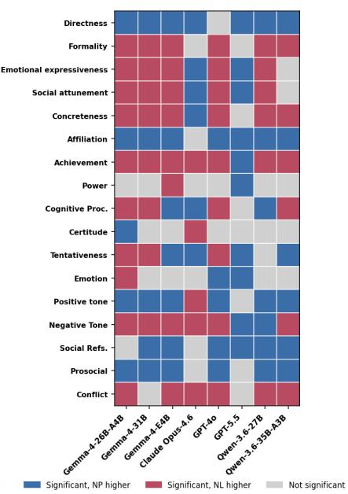  
Figure 11: NP–NL direction of linguistic efects by model, aggregated across responses from 600 questions and 12 languages. Overall, the LLMs tend to be consistent in direction across models.

## D.3 Linguistic Efects by LLM Model

Finally, we report model-level LLM-annotated linguistic scores relative to each model’s English baseline in Table 8. These results show that prompting-strategy efects vary substantially by model, suggesting that future work should examine how training data composition, model origin, alignment procedures, and multilingual coverage shape cross-cultural or multilingual behavior in LLMs.

## D.4 Cross-Model Consistency Between NP and NL

We also include the cross-model diferences between NP and NL in Figure 11 to show that the language models have consistent patterns across linguistic features.

## D.5 Linguistic Efects by Language Group

Figure 12 reports NP–NL linguistic diferences by broad language group. The main pattern is that the NP–NL diference is not uniform across language groups. Persona prompting does not introduce a single stable transformation of native-language generation. Instead, the size and direction of the gap depend on both the target-language group and the linguistic feature being measured.

<table><tr><td>Linguistic feature</td><td>TTG-Eng</td><td>NL-Eng</td><td>OSP-Eng</td><td>NP-Eng</td><td>NL-TTG</td><td>OSP-TTG</td><td>NP-TTG</td><td>OSP-NL</td><td>NP-NL</td><td>NP-OSP</td></tr><tr><td>Social attunement</td><td> $- 0 . 0 7 ^ { * }$ </td><td> $- 0 . 3 8 ^ { * }$ </td><td> $- 0 . 1 2 ^ { * }$ </td><td> $- 0 . 5 9 ^ { * }$ </td><td> $- 0 . 3 2 ^ { * }$ </td><td> $- 0 . 0 5 ^ { * }$ </td><td> $- 0 . 5 2 ^ { * }$ </td><td>+0.26*</td><td>-0.20*</td><td> $- 0 . 4 7 ^ { * }$ </td></tr><tr><td>Emotional expressiveness</td><td> $- 0 . 0 3 ^ { * }$ </td><td> $- 0 . 3 0 ^ { * }$ </td><td> $- 0 . 0 7 ^ { * }$ </td><td> $- 0 . 4 8 ^ { * }$ </td><td> $- 0 . 2 7 ^ { * }$ </td><td> $- 0 . 0 5 ^ { * }$ </td><td> $- 0 . 4 6 ^ { * }$ </td><td>+0.23*</td><td>-0.18*</td><td> $- 0 . 4 1 ^ { * }$ </td></tr><tr><td>Tentativeness</td><td>+0.01</td><td> $- 0 . 2 1 ^ { * }$ </td><td> $- 0 . 0 3 ^ { * }$ </td><td>-0.19*</td><td> $- 0 . 2 1 ^ { * }$ </td><td> $- 0 . 0 4 ^ { * }$ </td><td> $- 0 . 2 0 ^ { * }$ </td><td>+0.18*</td><td>+0.01</td><td>-0.16*</td></tr><tr><td>Positive tone</td><td>+0.01*</td><td>-0.00</td><td> $+ 0 . 0 8 ^ { * }$ </td><td>+0.18*</td><td> $- 0 . 0 1 ^ { * }$ </td><td> $+ 0 . 0 7 ^ { * }$ </td><td> $+ 0 . 1 7 ^ { * }$ </td><td>+0.08*</td><td>+0.18*</td><td>+0.10*</td></tr></table>

Table 5: Diferences in selected linguistic efects, aggregated across responses from 600 questions, 12 languages, and eight models. Compares the five language pathways with each other: English (Eng), TTG, NL, OSP, and NP.

<table><tr><td>Language group</td><td>Feature</td><td>TTG</td><td>NL</td><td>OSP</td><td>NP</td></tr><tr><td>East Asian</td><td>Social attunement</td><td> $- 0 . 1 1 ^ { * }$ </td><td> $- 0 . 4 6 ^ { * }$ </td><td> $- 0 . 1 6 ^ { * }$ </td><td>-0.55*</td></tr><tr><td></td><td>Emotional expressiveness</td><td> $- 0 . 0 7 ^ { * }$ </td><td> $- 0 . 4 0 ^ { * }$ </td><td>-0.13*</td><td>-0.48*</td></tr><tr><td></td><td>Tentativeness</td><td>+0.02</td><td> $- 0 . 3 2 ^ { * }$ </td><td>-0.05*</td><td>-0.17*</td></tr><tr><td></td><td>Positive tone</td><td>+0.02</td><td> $- 0 . 0 5 ^ { * }$ </td><td>+0.05*</td><td>+0.20*</td></tr><tr><td>Mid. East/Turkic</td><td>Social attunement</td><td>-0.09*</td><td>-0.37*</td><td>-0.13*</td><td>-0.54*</td></tr><tr><td></td><td>Emotional expressiveness</td><td>-0.07*</td><td>-0.32*</td><td>-0.10*</td><td>-0.45*</td></tr><tr><td></td><td>Tentativeness</td><td>+0.02</td><td>-0.26*</td><td>-0.03</td><td>-0.21*</td></tr><tr><td></td><td>Positive tone</td><td>+0.04*</td><td>+0.08*</td><td>+0.15*</td><td>+0.21*</td></tr><tr><td>Germanic</td><td>Social attunement</td><td>-0.06*</td><td>-0.37*</td><td>-0.08*</td><td>-0.60*</td></tr><tr><td></td><td>Emotional expressiveness</td><td>-0.00</td><td>-0.27*</td><td>-0.03</td><td>-0.49*</td></tr><tr><td></td><td>Tentativeness</td><td>+0.03</td><td>-0.11*</td><td>-0.00</td><td>-0.16*</td></tr><tr><td></td><td>Positive tone</td><td>+0.00</td><td>+0.01</td><td>+0.09*</td><td>+0.14*</td></tr><tr><td>Romance</td><td>Social attunement</td><td>+0.00</td><td>-0.31*</td><td>-0.10*</td><td>-0.66*</td></tr><tr><td></td><td>Emotional expressiveness</td><td>+0.04*</td><td>-0.20*</td><td>-0.02</td><td>-0.51*</td></tr><tr><td></td><td>Tentativeness</td><td>-0.06*</td><td>-0.14*</td><td>-0.04*</td><td>-0.24*</td></tr><tr><td></td><td>Positive tone</td><td>-0.02</td><td>-0.05*</td><td>+0.02</td><td>+0.14*</td></tr></table>

Table 6: Selected linguistic efects by language group and strategy, aggregated across responses from 600 questions and eight models.

<table><tr><td>Topic</td><td>Feature</td><td>TTG</td><td>NL</td><td>OSP</td><td>NP</td></tr><tr><td>Work</td><td>Social attunement</td><td> $- 0 . 3 9 ^ { * }$ </td><td>-0.64*</td><td>-0.45*</td><td>-0.98*</td></tr><tr><td></td><td>Emotional expressiveness</td><td> $- 0 . 5 3 ^ { * }$ </td><td>-0.68*</td><td>-0.57*</td><td>-1.10*</td></tr><tr><td></td><td>Tentativeness</td><td>-0.01</td><td>-0.19*</td><td>-0.04*</td><td>-0.18*</td></tr><tr><td></td><td>Positive tone</td><td>-0.08*</td><td>-0.10*</td><td>-0.01</td><td>+0.02</td></tr><tr><td>Friends</td><td>Social attunement</td><td>-0.00</td><td>-0.32*</td><td>-0.04*</td><td>-0.62*</td></tr><tr><td></td><td>Emotional expressiveness</td><td> $+ 0 . 0 9 ^ { * }$ </td><td>-0.24*</td><td>+0.02</td><td>-0.46*</td></tr><tr><td></td><td>Tentativeness</td><td> $+ 0 . 0 7 ^ { * }$ </td><td>-0.13*</td><td>+0.05*</td><td>-0.14*</td></tr><tr><td></td><td>Positive tone</td><td>+0.09*</td><td>+0.07*</td><td>+0.16*</td><td>+0.32*</td></tr><tr><td>Relationships</td><td>Social attunement</td><td>+0.14*</td><td>-0.24*</td><td>+0.10*</td><td>-0.24*</td></tr><tr><td></td><td>Emotional expressiveness</td><td>+0.25*</td><td>-0.09*</td><td>+0.22*</td><td>-0.03</td></tr><tr><td></td><td>Tentativeness</td><td> $- 0 . 0 4 ^ { * }$ </td><td>-0.24*</td><td>-0.07*</td><td>-0.25*</td></tr><tr><td></td><td>Positive tone</td><td>-0.01</td><td>-0.00</td><td> $+ 0 . 0 6 ^ { * }$ </td><td>+0.16*</td></tr><tr><td>Family</td><td>Social attunement</td><td>-0.00</td><td>-0.32*</td><td>-0.07*</td><td>-0.51*</td></tr><tr><td></td><td>Emotional expressiveness</td><td> $+ 0 . 1 0 ^ { * }$ </td><td>-0.18*</td><td> $+ 0 . 0 4 ^ { * }$ </td><td> $- 0 . 3 4 ^ { * }$ </td></tr><tr><td></td><td>Tentativeness</td><td>-0.00</td><td>-0.26*</td><td> $- 0 . 0 6 ^ { * }$ </td><td> $- 0 . 2 3 ^ { * }$ </td></tr><tr><td></td><td>Positive tone</td><td>+0.01</td><td>+0.01</td><td> $+ 0 . 0 7 ^ { * }$ </td><td> $+ 0 . 1 6 ^ { * }$ </td></tr><tr><td>Model</td><td>Feature</td><td>TTG</td><td>NL</td><td>OSP</td><td>NP</td></tr><tr><td>Claude Opus-4.6</td><td>Social attunement</td><td>-0.02</td><td>-0.14*</td><td>+0.05</td><td>-0.10*</td></tr><tr><td></td><td>Emotional expressiveness</td><td>-0.02</td><td>-0.16*</td><td>+0.04</td><td>-0.10*</td></tr><tr><td></td><td>Tentativeness</td><td>+0.03</td><td>-0.53*</td><td>-0.42*</td><td>-0.21*</td></tr><tr><td></td><td>Positive tone</td><td>+0.04</td><td>+0.10*</td><td>+0.32*</td><td>+0.04</td></tr><tr><td>GPT-40</td><td>Social attunement</td><td>-0.07*</td><td>-0.26*</td><td>-0.26*</td><td>-0.89*</td></tr><tr><td></td><td>Emotional expressiveness</td><td>-0.02</td><td>-0.15*</td><td>-0.08*</td><td>-0.72*</td></tr><tr><td></td><td>Tentativeness</td><td>+0.06</td><td>-0.15*</td><td>-0.09*</td><td>-0.50*</td></tr><tr><td></td><td>Positive tone</td><td>+0.04</td><td>+0.02</td><td>+0.01</td><td>+0.28*</td></tr><tr><td>GPT-5.5</td><td>Social attunement</td><td>-0.21*</td><td>-0.71*</td><td>-0.02</td><td>-0.26*</td></tr><tr><td></td><td>Emotional expressiveness</td><td>-0.18*</td><td>-0.42*</td><td>-0.04</td><td>-0.17*</td></tr><tr><td></td><td>Tentativeness</td><td>-0.03</td><td>-0.33*</td><td>-0.11*</td><td>-0.28*</td></tr><tr><td></td><td>Positive tone</td><td>+0.10*</td><td>-0.02</td><td>+0.10*</td><td>+0.07</td></tr><tr><td>Gemma-4-26B-A4B</td><td>Social attunement</td><td>-0.08*</td><td>-0.44*</td><td>-0.15*</td><td>-0.64*</td></tr><tr><td></td><td>Emotional expressiveness</td><td>-0.05</td><td>-0.37*</td><td>-0.13*</td><td>-0.55*</td></tr><tr><td></td><td>Tentativeness</td><td>+0.06*</td><td>+0.05*</td><td>+0.10*</td><td>-0.06*</td></tr><tr><td></td><td>Positive tone</td><td>+0.01</td><td>-0.00</td><td>+0.10*</td><td>+0.19*</td></tr><tr><td>Gemma-4-31B</td><td>Social attunement</td><td>-0.08*</td><td>-0.38*</td><td>-0.14*</td><td>-0.88*</td></tr><tr><td></td><td>Emotional expressiveness</td><td>-0.02</td><td>-0.36*</td><td>-0.10*</td><td>-0.77*</td></tr><tr><td></td><td>Tentativeness</td><td>+0.07*</td><td>+0.07*</td><td>+0.10*</td><td>-0.27*</td></tr><tr><td></td><td>Positive tone</td><td>+0.01</td><td>+0.01</td><td>+0.12*</td><td>+0.32*</td></tr><tr><td>Gemma-4-E4B</td><td>Social attunement</td><td>+0.04</td><td>-0.40*</td><td>-0.22*</td><td>-0.66*</td></tr><tr><td></td><td>Emotional expressiveness</td><td>+0.10*</td><td>-0.36*</td><td>-0.18*</td><td>-0.58*</td></tr><tr><td></td><td>Tentativeness</td><td>-0.11*</td><td>-0.19*</td><td>+0.22*</td><td>+0.21*</td></tr><tr><td></td><td>Positive tone</td><td>-0.06*</td><td>-0.02</td><td>-0.02</td><td>+0.26*</td></tr><tr><td>Qwen-3.6-27B</td><td>Social attunement</td><td>-0.11*</td><td>-0.80*</td><td>-0.22*</td><td>-1.15*</td></tr><tr><td></td><td>Emotional expressiveness</td><td>-0.03</td><td>-0.51*</td><td>-0.21*</td><td>-0.71*</td></tr><tr><td></td><td>Tentativeness</td><td>+0.01</td><td>-0.16*</td><td>+0.01</td><td>-0.21*</td></tr><tr><td></td><td>Positive Tone</td><td>-0.07*</td><td>-0.22*</td><td>-0.10*</td><td>-0.02</td></tr><tr><td>Qwen-3.6-35B-A3B</td><td>Social attunement</td><td>-0.03</td><td>0.09*</td><td>+0.00</td><td>-0.14*</td></tr><tr><td></td><td>Emotional expressiveness</td><td>-0.02</td><td>-0.07*</td><td>+0.14*</td><td>-0.24*</td></tr><tr><td></td><td>Tentativeness</td><td>-0.03</td><td>-0.41*</td><td>-0.05</td><td>-0.22*</td></tr><tr><td></td><td>Positive Tone</td><td>+0.01</td><td>+0.13*</td><td>+0.19*</td><td>+0.30*</td></tr></table>

Table 7: Selected linguistic efects by topic and strategy, aggregated across responses from 12 languages and eight models.

Table 8: Selected linguistic efects by model and strategy, aggregated across responses from 600 questions and 12 languages.

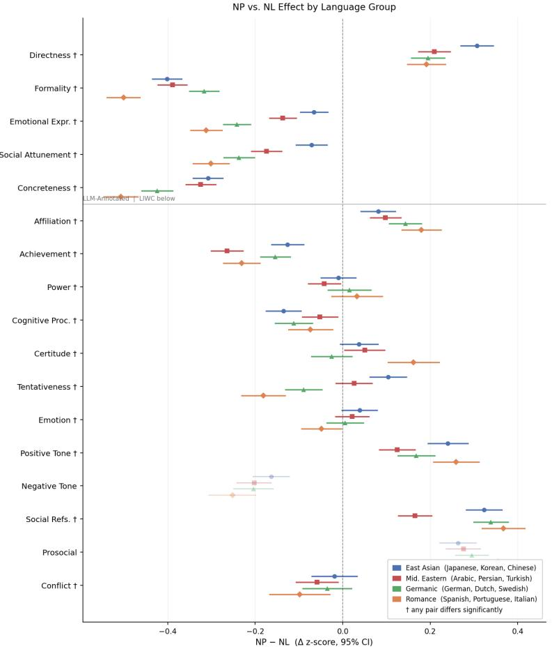

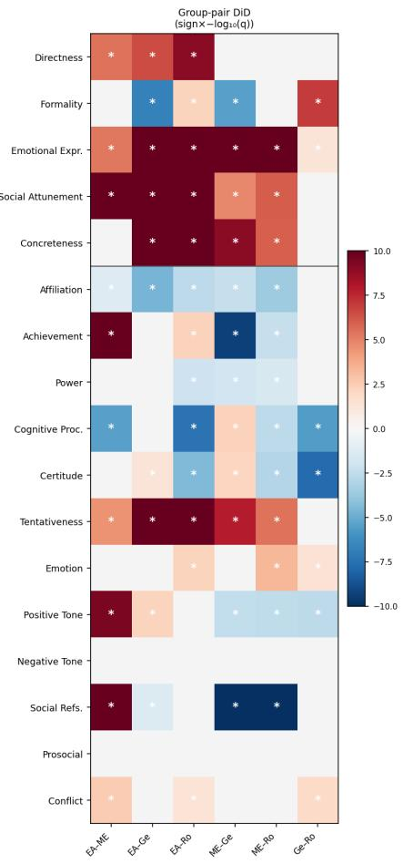  
Figure 12: NP–NL diferences in linguistic efects by language group, aggregated across responses from 600 questions and eight models. The left panel shows mean NP-minus-NL diferences for LLM-annotated pragmatic features and LIWC lexical features, with 95% confidence intervals. The right panel reports exploratory diference-in diferences tests comparing the NP–NL gap across language groups.

## E Overall BCT Efects

Table 9 reports all pairwise diferences in composite BCT across strategies. NP shows the largest overall departure from the English baseline, consistent with the linguistic results.

## E.1 BCT Efects by Language

Table 10 shows composite BCT strategy efects relative to the English baseline, pooled within each language group.

## E.2 BCT Efects by Topic

Table 11 presents composite BCT efects broken down by conversation topic.

## E.3 BCT Efects by LLM Model

Table 12 reports model-level composite BCT effects relative to each model’s own English baseline.

<table><tr><td>BCT composite</td><td>TTG-Eng NL-Eng</td><td></td><td>OSP-Eng</td><td>NP-Eng</td><td>NL-TTG</td><td>OSP-TTG</td><td>NP-TTG</td><td>OSP-NL</td><td>NP-NL</td><td>NP-OSP</td></tr><tr><td>BCT composite</td><td> $- 0 . 0 9 ^ { * }$ </td><td> $- 0 . 5 4 ^ { * }$ </td><td>-0.32*</td><td> $- 0 . 9 8 ^ { * }$ </td><td> $- 0 . 4 5 ^ { * }$ </td><td> $- 0 . 2 3 ^ { * }$ </td><td> $- 0 . 8 8 ^ { * }$ </td><td> $+ 0 . 2 2 ^ { * }$ </td><td> $- 0 . 4 4 ^ { * }$ </td><td> $- 0 . 6 5 ^ { * }$ </td></tr></table>

Table 9: Diferences in overall composite BCT efects, aggregated across responses from 600 questions, 12 languages, eight models, and all BCT features. Compares the five language pathways with each other: English (Eng), TTG, NL, OSP, and NP.

<table><tr><td>Language group</td><td>TTG</td><td>NL</td><td>OSP</td><td>NP</td></tr><tr><td>East Asian</td><td>-0.13*</td><td> $- 0 . 5 8 ^ { * }$ </td><td> $\ – 0 . 4 2 ^ { * }$ </td><td> $- 0 . 9 8 ^ { * }$ </td></tr><tr><td>Mid. East/Turkic</td><td> $- 0 . 1 3 ^ { * }$ </td><td> $- 0 . 5 4 ^ { * }$ </td><td> $- 0 . 3 7 ^ { * }$ </td><td> $- 0 . 9 3 ^ { * }$ </td></tr><tr><td>Germanic</td><td> $- 0 . 0 9 ^ { * }$ </td><td> $- 0 . 5 4 ^ { * }$ </td><td> $- 0 . 2 3 ^ { * }$ </td><td> $- 0 . 9 3 ^ { * }$ </td></tr><tr><td>Romance</td><td>+0.00</td><td> $- 0 . 5 1 ^ { * }$ </td><td> $- 0 . 2 5 ^ { * }$ </td><td> $- 1 . 0 8 ^ { * }$ </td></tr></table>

Table 10: Overall composite BCT efects by language group and strategy, aggregated across responses from 600 questions, eight models, and all BCT features.

<table><tr><td>Topic</td><td>TTG</td><td>NL</td><td>OSP</td><td>NP</td></tr><tr><td>Work</td><td> $- 0 . 1 8 ^ { * }$ </td><td> $- 0 . 6 1 ^ { * }$ </td><td> $- 0 . 4 0 ^ { * }$ </td><td> $- 1 . 1 3 ^ { * }$ </td></tr><tr><td>Friends</td><td>-0.15*</td><td> $- 0 . 5 8 ^ { * }$  1</td><td> $- 0 . 4 0 ^ { * }$  一</td><td> $- 1 . 1 9 ^ { * }$ </td></tr><tr><td>Relationships</td><td>+0.01</td><td> $- 0 . 4 7 ^ { * }$ </td><td> $- 0 . 1 9 ^ { * }$ </td><td> $- 0 . 7 2 ^ { * }$ </td></tr><tr><td>Family</td><td>-0.04*</td><td> $- 0 . 5 0 ^ { * }$ </td><td> $- 0 . 2 9 ^ { * }$ </td><td> $- 0 . 8 7 ^ { * }$ </td></tr></table>

Table 11: Overall composite BCT efects by topic and strategy, aggregated across responses from 12 languages, eight models, and all BCT features.

<table><tr><td>Model</td><td>TTG</td><td>NL</td><td>OSP</td><td>NP</td></tr><tr><td>Claude Opus-4.6</td><td> $- 0 . 0 9 ^ { * }$ </td><td> $- 0 . 2 3 ^ { * }$ </td><td> $- 0 . 0 9 ^ { * }$ </td><td> $- 0 . 1 5 ^ { * }$ </td></tr><tr><td>GPT-40</td><td>-0.09*</td><td>-0.34*</td><td>-0.44*</td><td> $- 1 . 3 0 ^ { * }$ </td></tr><tr><td>GPT-5.5</td><td>-0.27*</td><td> $- 0 . 4 6 ^ { * }$ </td><td> $- 0 . 1 6 ^ { * }$ </td><td> $- 0 . 5 1 ^ { * }$ </td></tr><tr><td>Gemma-4-26B-A4B</td><td>-0.09*</td><td> $- 0 . 7 9 ^ { * }$ </td><td> $- 0 . 3 7 ^ { * }$ </td><td> $- 1 . 1 4 ^ { * }$ </td></tr><tr><td>Gemma-4-31B</td><td>-0.09*</td><td> $- 0 . 7 5 ^ { * }$ </td><td> $- 0 . 3 8 ^ { * }$ </td><td> $- 1 . 3 9 ^ { * }$ </td></tr><tr><td>Gemma-4-E4B</td><td>+0.00</td><td> $- 0 . 6 9 ^ { * }$ </td><td> $- 0 . 5 9 ^ { * }$ </td><td> $- 1 . 2 9 ^ { * }$ </td></tr><tr><td> $\mathbf { Q } \mathrm { w e n } { - } 3 . 6 { - } 2 7 \mathbf { B }$ </td><td>-0.09*</td><td> $- 0 . 5 7 ^ { * }$ </td><td> $- 0 . 3 3 ^ { * }$ </td><td> $- 1 . 0 8 ^ { * }$ </td></tr><tr><td>Qwen-3.6-35B-A3B</td><td>-0.03</td><td> $- 0 . 4 9 ^ { * }$ </td><td> $- 0 . 2 3 ^ { * }$ </td><td> $- 0 . 9 6 ^ { * }$ </td></tr></table>

Table 12: Overall composite BCT efects by model and strategy, aggregated across responses from 600 questions, 12 languages, and all BCT features.

## F Overall Action Distribution

Table 13 reports the forced-choice action distribution (Confrontation, Redirection, Disengagement) across all strategies. The English baseline is shown for reference; NL shows the largest shift, moving responses away from Confrontation and toward Redirection relative to English. Again, significance is computed using pairwise comparisons to the English baseline.

## F.1 Action Distribution by Language

Table 14 breaks down the forced-choice action distribution by language group and strategy.

## F.2 Action Distribution by Topic

Table 15 reports action distributions by conversation topic.

We also report the NP–NL diferences conditioned on topic and language in Figure 13.

## F.3 Action Distribution by LLM Model

Table 16 reports model-level action distributions.

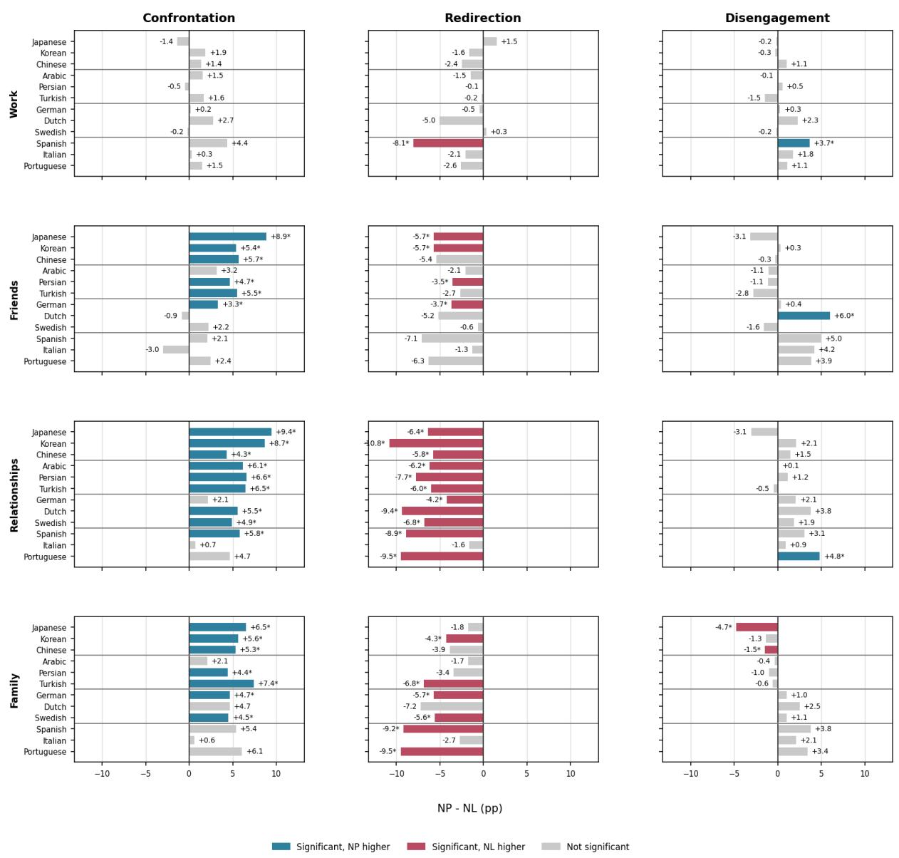  
Figure 13: NP–NL diferences in forced-choice action rates by topic and language, aggregated across responses from all eight models. With less data in each sample, many of the bars appear not significant.

<table><tr><td>Strategy</td><td>Confrontation</td><td>Redirection</td><td>Disengagement</td></tr><tr><td>English</td><td>34.1</td><td>52.0</td><td>13.9</td></tr><tr><td>TTG</td><td>35.4</td><td>50.3</td><td>14.3</td></tr><tr><td>NL</td><td> $2 8 . 8 ^ { * }$ </td><td> $5 7 . 6 ^ { * }$ </td><td> $1 3 . 5 ^ { * }$ </td></tr><tr><td>OSP</td><td> $3 0 . 1 ^ { * }$ </td><td> $5 4 . 6 ^ { * }$ </td><td> $1 5 . 3 ^ { * }$ </td></tr><tr><td>NP</td><td>32.3</td><td>53.4</td><td>14.3</td></tr></table>

Table 13: Forced choice action rates for the five language pathways, aggregated across responses from 600 questions, 12 languages, and eight models.

<table><tr><td>Language group</td><td>Action</td><td>TTG</td><td>NL</td><td>OSP</td><td>NP</td></tr><tr><td>East Asian</td><td>Confrontation</td><td>33.0</td><td> $2 3 . 0 ^ { * }$ </td><td> $2 5 . 0 ^ { * }$ </td><td> $2 8 . 0 ^ { * }$ </td></tr><tr><td></td><td>Redirection</td><td>51.6</td><td> $6 1 . 2 ^ { * }$ </td><td> $5 7 . 5 ^ { * }$ </td><td> $5 7 . 0 ^ { * }$ </td></tr><tr><td></td><td>Disengagement</td><td>15.4</td><td> $1 5 . 8 ^ { * }$ </td><td> $1 7 . 5 ^ { * }$ </td><td> $\boldsymbol { 1 5 . 0 ^ { * } }$ </td></tr><tr><td>Mid. East/Turkic</td><td>Confrontation</td><td>36.1</td><td> $2 7 . 5 ^ { * }$ </td><td> $2 8 . 7 ^ { * }$ </td><td> $3 1 . 5 ^ { * }$ </td></tr><tr><td></td><td>Redirection</td><td>50.2</td><td> $5 8 . 7 ^ { * }$ </td><td> $5 6 . 2 ^ { * }$ </td><td> $5 5 . 3 ^ { * }$ </td></tr><tr><td></td><td>Disengagement</td><td>13.7</td><td> $1 3 . 8 ^ { * }$ </td><td> $1 5 . 1 ^ { * }$ </td><td> $1 3 . 2 ^ { * }$ </td></tr><tr><td>Germanic</td><td>Confrontation</td><td> $3 7 . 2 ^ { * }$ </td><td> $3 4 . 1 ^ { * }$ </td><td>35.1</td><td> $3 7 . 0 ^ { * }$ </td></tr><tr><td></td><td>Redirection</td><td> $4 9 . 3 ^ { * }$ </td><td> $5 4 . 0 ^ { * }$ </td><td>51.7</td><td> $4 9 . 6 ^ { * }$ </td></tr><tr><td></td><td>Disengagement</td><td> $1 3 . 5 ^ { * }$ </td><td> $1 1 . 9 ^ { * }$ </td><td>13.3</td><td> $1 3 . 5 ^ { * }$ </td></tr><tr><td>Romance</td><td>Confrontation</td><td>35.3</td><td> $3 0 . 7 ^ { * }$ </td><td>32.2</td><td>33.4</td></tr><tr><td></td><td>Redirection</td><td>50.2</td><td> $5 6 . 7 ^ { * }$ </td><td>52.5</td><td>50.8</td></tr><tr><td></td><td>Disengagement</td><td>14.5</td><td> $1 2 . 7 ^ { * }$ </td><td>15.2</td><td>15.8</td></tr></table>

Table 14: Forced choice action rates by language group and strategy, aggregated across responses from 600 questions and eight models.

<table><tr><td>Topic</td><td>Action</td><td>TTG</td><td>NL</td><td>OSP</td><td>NP</td></tr><tr><td>Work</td><td>Confrontation</td><td>28.4</td><td>23.8</td><td>25.3</td><td>24.7</td></tr><tr><td></td><td>Redirection</td><td>57.8</td><td>62.9</td><td>60.2</td><td>61.3</td></tr><tr><td></td><td>Disengagement</td><td>13.8</td><td>13.3</td><td>14.5</td><td>14.0</td></tr><tr><td>Friends</td><td>Confrontation</td><td>37.3</td><td> $3 2 . 2 ^ { * }$ </td><td> $3 3 . 2 ^ { * }$ </td><td>35.4</td></tr><tr><td></td><td>Redirection</td><td>44.8</td><td> $5 0 . 6 ^ { * }$ </td><td> $4 7 . 3 ^ { * }$ </td><td>46.6</td></tr><tr><td></td><td>Disengagement</td><td>17.9</td><td> $1 7 . 2 ^ { * }$ </td><td> $1 9 . 6 ^ { * }$ </td><td>18.0</td></tr><tr><td>Relationships</td><td>Confrontation</td><td>44.0</td><td> $3 6 . 6 ^ { * }$ </td><td> $3 7 . 6 ^ { * }$ </td><td>42.0</td></tr><tr><td></td><td>Redirection</td><td>42.3</td><td> $5 0 . 6 ^ { * }$ </td><td> $4 7 . 9 ^ { * }$ </td><td>43.6</td></tr><tr><td></td><td>Disengagement</td><td>13.7</td><td> $1 2 . 9 ^ { * }$ </td><td> $1 4 . 5 ^ { * }$ </td><td>14.5</td></tr><tr><td>Family</td><td>Confrontation</td><td>32.7</td><td> $2 3 . 6 ^ { * }$ </td><td> $2 5 . 3 ^ { * }$ </td><td> $2 8 . 1 ^ { * }$ </td></tr><tr><td></td><td>Redirection</td><td>55.5</td><td> $6 5 . 5 ^ { * }$ </td><td> $6 1 . 7 ^ { * }$ </td><td> $6 0 . 7 ^ { * }$ </td></tr><tr><td></td><td>Disengagement</td><td>11.8</td><td> $1 0 . 8 ^ { * }$ </td><td> $1 3 . 0 ^ { * }$ </td><td> $1 1 . 2 ^ { * }$ </td></tr><tr><td>Model</td><td>Action</td><td>TTG</td><td>NL</td><td>OSP</td><td>NP</td></tr><tr><td>Claude Opus-4.6</td><td>Confrontation</td><td>38.4</td><td> $1 9 . 3 ^ { * }$ </td><td> $2 4 . 3 ^ { * }$ </td><td>30.4</td></tr><tr><td></td><td>Redirection</td><td>52.8</td><td> $7 4 . 3 ^ { * }$ </td><td> $6 8 . 4 ^ { * }$ </td><td>62.2</td></tr><tr><td></td><td>Disengagement</td><td>8.8</td><td> $6 . 4 ^ { * }$ </td><td> $7 . 4 ^ { * }$ </td><td>7.4</td></tr><tr><td>GPT-40</td><td>Confrontation</td><td>39.1</td><td>31.7</td><td>32.7</td><td>37.1</td></tr><tr><td></td><td>Redirection</td><td>45.9</td><td>53.8</td><td>53.1</td><td>49.6</td></tr><tr><td></td><td>Disengagement</td><td>15.0</td><td>14.6</td><td>14.3</td><td>13.3</td></tr><tr><td>GPT-5.5</td><td>Confrontation</td><td>35.2</td><td>29.4</td><td>31.1</td><td>36.8</td></tr><tr><td></td><td>Redirection</td><td>53.1</td><td>57.8</td><td>54.6</td><td>50.9</td></tr><tr><td></td><td>Disengagement</td><td>11.7</td><td>12.8</td><td>14.3</td><td>12.3</td></tr><tr><td>Gemma-4-26B-A4B</td><td>Confrontation</td><td>26.1</td><td>25.5</td><td>24.5*</td><td>28.4</td></tr><tr><td></td><td>Redirection</td><td>57.5</td><td>56.7</td><td>55.4*</td><td>55.6</td></tr><tr><td></td><td>Disengagement</td><td>16.4</td><td>17.9</td><td>20.1*</td><td>16.0</td></tr><tr><td>Gemma-4-31B</td><td>Confrontation</td><td>48.9</td><td>46.3</td><td>45.9</td><td>45.4</td></tr><tr><td></td><td>Redirection</td><td>38.7</td><td>41.7</td><td>40.7</td><td>42.1</td></tr><tr><td></td><td>Disengagement</td><td>12.4</td><td>12.0</td><td>13.4</td><td>12.5</td></tr><tr><td>Gemma-4-E4B</td><td>Confrontation</td><td>24.1*</td><td> $1 8 . 7 ^ { * }$ </td><td>20.2</td><td>18.0</td></tr><tr><td></td><td>Redirection</td><td>57.9*</td><td> $6 4 . 8 ^ { * }$ </td><td>60.8</td><td>61.7</td></tr><tr><td></td><td>Disengagement</td><td>18.0*</td><td> $1 6 . 5 ^ { * }$ </td><td>19.0</td><td>20.3</td></tr><tr><td>Qwen-3.6-27B</td><td>Confrontation</td><td>34.6</td><td>29.0</td><td>30.1</td><td>30.3</td></tr><tr><td></td><td>Redirection</td><td>49.5</td><td>57.2</td><td>53.0</td><td>53.6</td></tr><tr><td></td><td>Disengagement</td><td>15.9</td><td>13.8</td><td>16.9</td><td>16.1</td></tr><tr><td>Qwen-3.6-35B-A3B</td><td>Confrontation</td><td>36.8</td><td>30.8</td><td>32.0</td><td>32.0</td></tr><tr><td></td><td>Redirection</td><td>47.0</td><td>54.8</td><td>50.8</td><td>51.5</td></tr><tr><td></td><td>Disengagement</td><td>16.2</td><td>14.3</td><td>17.2</td><td>16.5</td></tr></table>

Table 15: Forced choice action rates by topic and strategy, aggregated across responses from 12 languages and eight models.

Table 16: Forced choice action rates by model and strategy, aggregated across responses from 600 questions and 12 languages.

## G Sensitivity to Persona-Prompt Wording

We test whether the main NP–NL findings depend on the exact wording of the native-speaker persona. In addition to the original NP formulation, we evaluate two controlled variants that modify only the native-speaker identity clause:

• Original NP: ”You are a native {Language} speaker.”

• Grew-up NP: ”You are a native {Language} speaker who grew up using that language.”

• Current-use NP: ”You are a native {Language} speaker who currently uses that language.”

We evaluate the three formulations on a stratified subset of 100 prompts, with 25 prompts per topic, across the 12 non-English languages and two models: claude-opus-4.6 and google/gemma-4-E4B-it. We use the same matched comparisons and significance-testing procedures as in the main analysis. The full NP and NL generation procedures are described earlier in Appendix A.3.

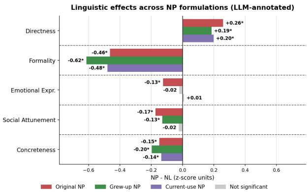  
Figure 14: NP–NL diferences in LLM-annotated linguistic features by persona formulations, aggregated across responses from 100 questions, 12 languages, and two models.

Figures 14 and 15 report the linguistic results. Several efects recur under all three formulations. Relative to NL, each NP formulation is significantly more direct, less formal, and less concrete. All three also use significantly less powerrelated language and more cognitive-process language, tentativeness, and social references. Other efects are more sensitive to wording: reductions in emotional expressiveness and social attunement weaken under Current-use NP, while efects for achievement, certitude, prosocial language, and conflict vary in significance across formulations. These results are consistent with the broader linguistic patterns.

Figure 16 shows that all eight BCT dimensions shift in the same direction under every formulation: each NP variant provides less behavioral scafolding than NL. Six dimensions are significant under all three formulations, including goal setting, action planning, consequence reasoning, self-monitoring, problem solving, and cognitive reframing.

Forced-choice efects vary more in magnitude, but all three formulations remain more confrontation-oriented and less redirectionoriented than NL, as shown in Figure 17. Overall, the principal directional findings persist across the controlled wording changes, although their magnitudes and statistical significance remain prompt-sensitive.

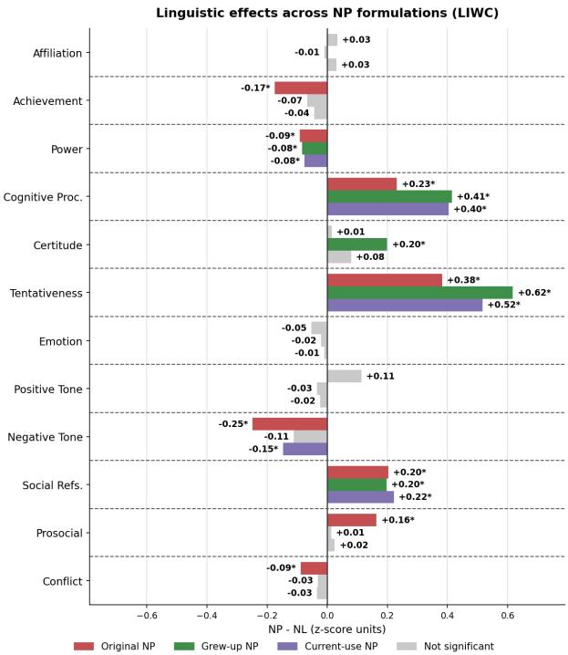  
Figure 15: NP–NL diferences in LIWC linguistic features by persona formulations, aggregated across responses from 100 questions, 12 languages, and two models.

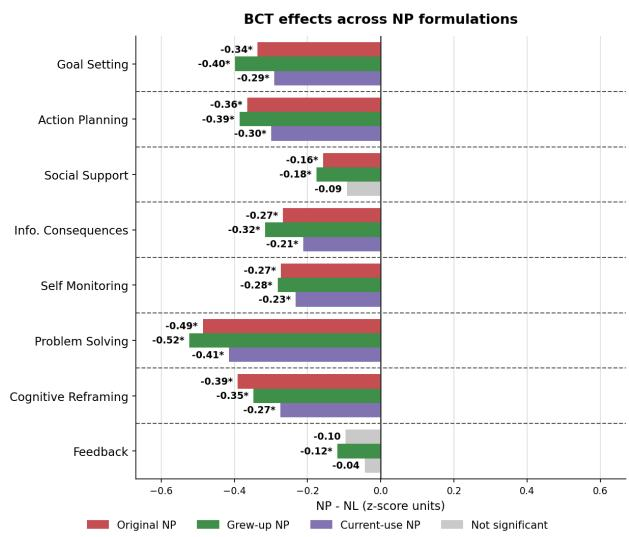  
Figure 16: NP–NL diferences in BCT features by persona formulations, aggregated across responses from 100 questions, 12 languages, and two models.

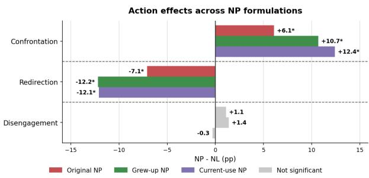  
Figure 17: NP–NL diferences in forced-choice action rates by persona formulations, aggregated across responses from 100 questions, 12 languages, and two models.

## H Sensitivity to Translation Quality

We further assess whether the observed NP–NL diferences could be driven by errors in the translated prompts. We repeat the main analyses after retaining only prompt–language pairs whose selected translation has a mean back-translation similarity of at least 0.95. The filter is applied at the prompt–language level before comparing NP and NL responses and retains 4,015 of 7,200 pairs (55.8 percent). Table 17 reports the retained sample by language.

Because retention rates difer across languages, directly pooling the filtered observations would change the language composition of the analysis. We therefore estimate NP–NL contrasts separately within each language, using the same matched prompt–model comparisons as in the main analysis.

Figure 18 compares the five LLM-annotated dimensions before and after filtering. Of the 60 language–dimension contrasts, 59 retain their direction; the mean absolute change is approximately 0.03 z-score units, and the largest change is 0.13. The broader pattern remains consistent: NP is generally more direct, while NL is generally more formal, emotionally expressive, socially attuned, and concrete.

The LIWC results are also directionally stable (Figure 19). Of the 144 language–dimension contrasts, 131 retain their direction. Twelve of the 13 reversals involve contrasts with estimates no larger than 0.09 in absolute value, indicating fluctuation around near-zero diferences rather than substantive changes. The more pronounced lexical patterns remain: NP generally uses more afiliation, positive tone, social references, and prosocial language, while using less achievement and negativetone language than NL. Most instability occurs among dimensions for which the original NP–NL diferences are already small.

<table><tr><td>Language</td><td>Retained pairs</td><td>Retained (%)</td></tr><tr><td>Japanese</td><td>139</td><td>23.2</td></tr><tr><td>Korean</td><td>261</td><td>43.5</td></tr><tr><td>Chinese</td><td>178</td><td>29.7</td></tr><tr><td>Arabic</td><td>364</td><td>60.7</td></tr><tr><td>Persian</td><td>273</td><td>45.5</td></tr><tr><td>Turkish</td><td>306</td><td>51.0</td></tr><tr><td>German</td><td>390</td><td>65.0</td></tr><tr><td>Dutch</td><td>413</td><td>68.8</td></tr><tr><td>Swedish</td><td>379</td><td>63.2</td></tr><tr><td>Spanish</td><td>463</td><td>77.2</td></tr><tr><td>Italian</td><td>414</td><td>69.0</td></tr><tr><td>Portuguese</td><td>435</td><td>72.5</td></tr><tr><td>Overall</td><td>4,015</td><td>55.8</td></tr></table>

Table 17: Prompt–language pairs retained by the translation-quality filter. Each language has 600 pairs before filtering. Retention requires mean back-translation similarity  0.95.

NP vs. NL by Language: All Data vs. Translation-Quality-Filtered Data (LLM-annotated)  
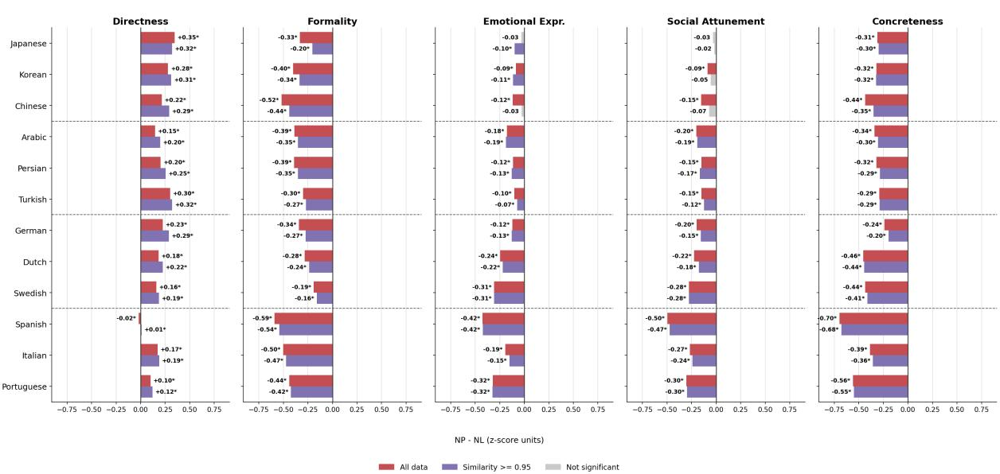  
Figure 18: NP–NL diferences in LLM-annotated linguistic features by language and translation quality, aggregated across responses from 600 questions and eight models.

Figure 20 reports the eight BCT dimensions. All 96 language–dimension contrasts remain negative after filtering, indicating less behavioral scafolding under NP than under NL in every language and dimension. The mean absolute change is approximately 0.02 z-score units, with a maximum change of 0.09.

The forced-choice results preserve the main aggregate pattern (Figure 21) as well. At the language level, the confrontation and redirection contrasts retain their directions in all 12 languages, whereas the smaller base disengagement contrasts are less stable.

Overall, restricting the analysis to highsimilarity prompt translations produces little change in the principal NP–NL patterns. Nearly all linguistic contrasts retain their direction, every BCT contrast remains negative, and the shift from redirection toward confrontation persists.

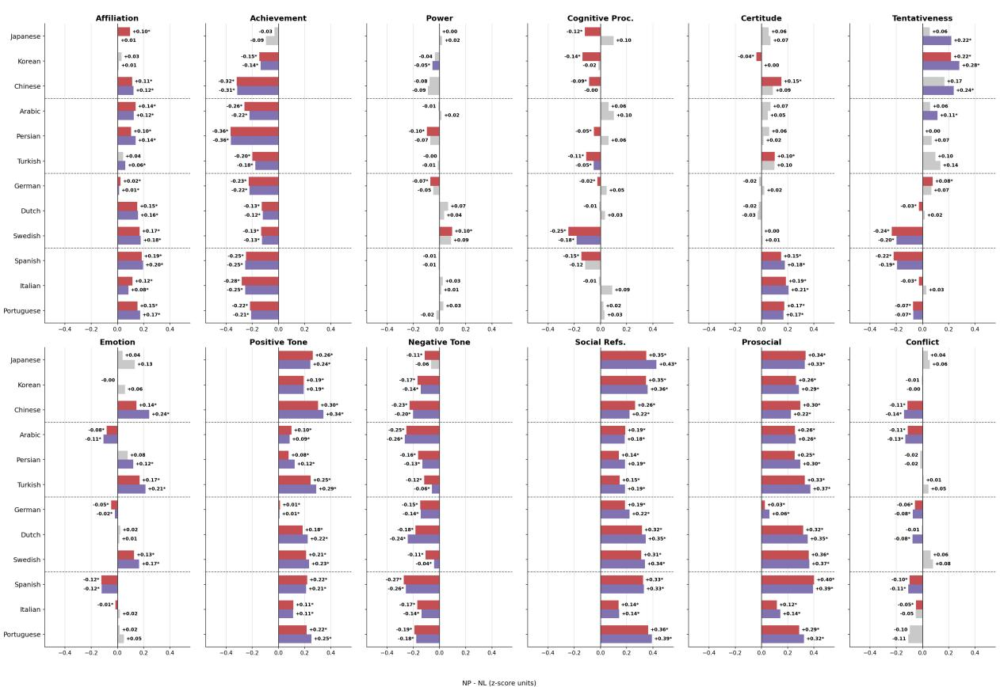  
Figure 19: NP–NL diferences in LIWC linguistic features by language and translation quality, aggregated across responses from 600 questions and eight models.

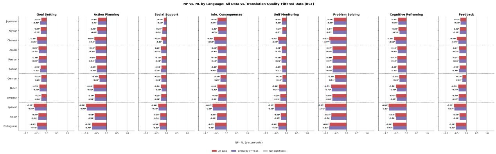  
Figure 20: NP–NL diferences in BCT features by language and translation quality, aggregated across responses from 600 questions and eight models.

Forced-Choice Action by Language: All Data vs. Translation-Quality-Filtered Data  
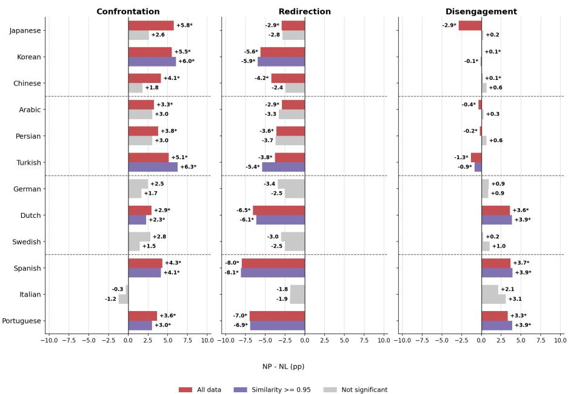  
Figure 21: NP–NL diferences in forced-choice action rates features by language and translation quality, aggregated across responses from 600 questions and eight models.

## I Cross-LLM-as-a-Judge Comparison

We test whether the LLM-annotated results depend on the choice of automated evaluator. In addition to the original gpt-4o annotations, we annotate the same responses using claude-sonnet-5 with identical linguistic-style and BCT rubrics. We evaluate a stratified subset of 100 prompts, with 25 prompts per topic, across the 12 non-English languages and three generation models: gpt-4o, claude-opus-4.6, and google/gemma-4-E4B-it. We use the same matched comparisons and significance-testing procedure as in the main analysis. Because LIWC features and forced-choice outcomes do not rely on an LLM evaluator, this robustness check applies only to the five linguistic-style and eight BCT dimensions.

Figure 22 compares the linguistic-style efects estimated by the two judges. At the aggregate level, the judges agree on the direction of all five NP– NL efects. At the language level, they agree on 58 of the 60 language-by-dimension efects (96.7%), and their standardized efect sizes are strongly correlated (r = .89). When separated by generation model, the judges agree on 13 of the 15 model-bydimension efects, with similarly correlated efect sizes (r = .90). Thus, the main linguistic diferences are largely stable across evaluators.

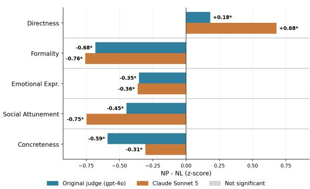  
Figure 22: NP–NL diferences in LLM-annotated linguistic features by LLM-as-a-judge model, aggregated across responses from 100 questions, 12 languages, and three models.

Figure 23 reports the BCT results. The judges agree on the direction of seven of the eight aggregate NP–NL efects. These seven dimensions indicate less behavioral scafolding under NP than under NL and are significant under both evaluators. The only discrepancy is feedback: gpt-4o estimates a moderate NP–NL reduction, whereas claude-sonnet-5 estimates a near-null efect.

Agreement is also strong when results are separated by generation model. Critically, agreement does not weaken for responses generated by gpt-4o, despite gpt-4o serving as the original evaluator (Figure 24). For these responses, the judges agree on 12 of the 13 efects (r = .77). The only directional diference is directness, for which the original evaluator estimates a near-null efect while claude-sonnet-5 estimates a positive efect.

Overall, the principal directional findings persist across the two automated evaluators, including when gpt-4o evaluates its own generated responses.

## BCT Behavioural-Scaffolding Dimensions by Judge

LLM-annotated Dimensions by Judge, GPT-4o Responses Only  
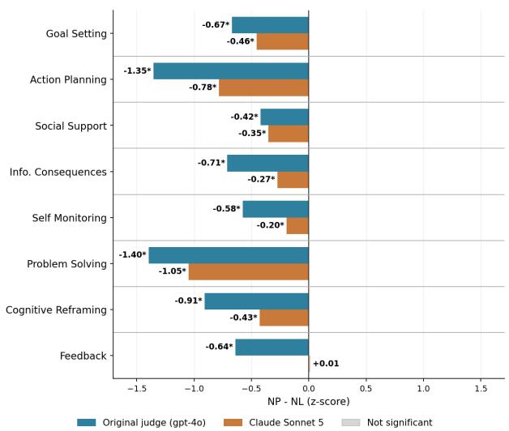  
Figure 23: NP–NL diferences in BCT features by LLM-as-a-judge model, aggregated across responses from 100 questions, 12 languages, and three models.

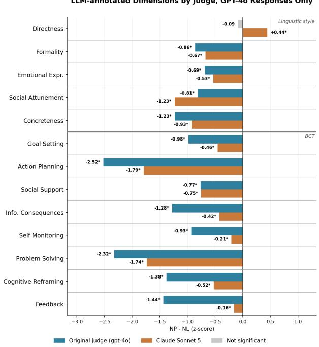  
Figure 24: NP–NL diferences in LLM-annotated (linguistic and BCT) features on gpt-4o generated responses, aggregated across responses from 100 questions and 12 languages.