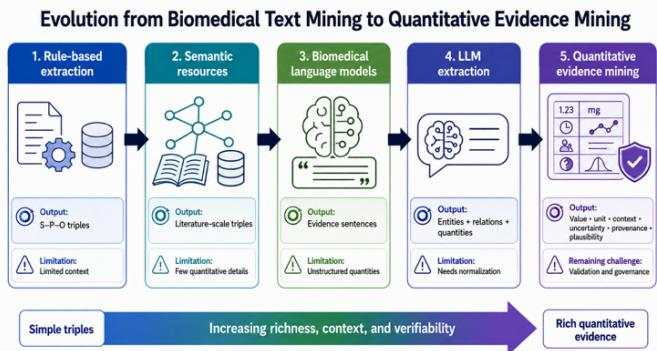
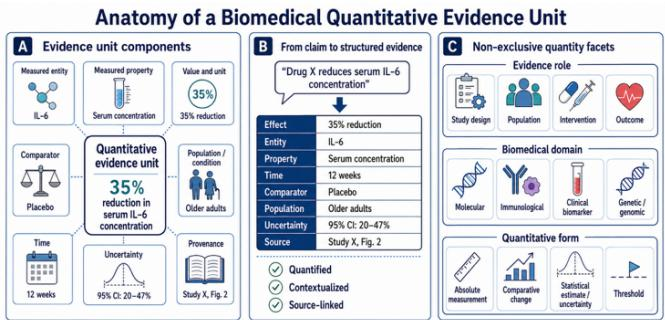
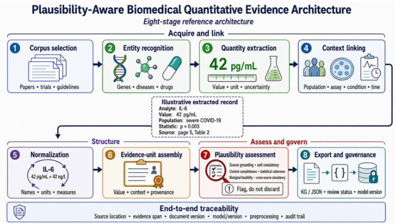

Date of publication xxxx 00, 0000, date of current version xxxx 00, 0000. Digital Object Identifier 10.1109/ACCESS.2024.Doi Number

# Quantitative Evidence Mining for Plausibility-Aware Biomedical AI

Negin Sadat Babaiha1, Stefan Geissler2, Marie-Christine Simon1, Martin Hofmann-Apitius1,3, and Marc Jacobs1,

1Department of Bioinformatics, Fraunhofer Institute for Algorithms and Scientific Computing (SCAI), Schloss Birlinghoven, Sankt Augustin, Germany

2Kairntech SAS, 29 Chemin du Vieux Chêne, Meylan 38240, France

3Bonn-Aachen International Center for Information Technology (b-it), University of Bonn, Bonn, Germany

Corresponding author: Negin Sadat Babaiha (e-mail: negin.babaiha@scai.fraunhofer.de).

This work was partly supported by the COMMUTE project, funded by the European Union under grant agreement number 101136957, which provided the collaborative context for the COVID-19–neurodegenerative disease comorbidity research discussed in this paper.

ABSTRACT Biomedical artificial intelligence (AI) systems increasingly extract, organize, and reuse scientific claims from literature, clinical trials, and regulatory documents. But automatic extraction alone does not make a claim reliable evidence: a claim becomes useful only when it can be traced to its source, linked to the quantitative details that support it, and read within its biomedical context and uncertainty. This matters as large language models (LLMs) and increasingly autonomous systems drive evidence synthesis, knowledge graph (KG) construction, and decision support. Many text-mining and LLM pipelines remain relation-centric: they capture entities and relations such as Drug–TREATS–Disease, but drop the dose, effect size, population, comparator, uncertainty, and conditions under which a claim holds. Such relations can look actionable yet remain hard to verify, compare, or reuse. In this perspective, we argue for a shift toward quantitative evidence mining—extracting values, units, measured entities and properties, context, uncertainty, provenance, and plausibility as structured evidence units that populate evidence-aware KGs and can be checked for source grounding, unit consistency, completeness, and biological plausibility. We outline a framework for plausibility-aware AI that treats extracted claims not as final answers but as auditable evidence objects, making clear what was measured, how much it changed, in which setting, with what uncertainty, and from which source. The central risk is not only incorrect extraction, but claims that look like evidence while lacking the structure needed to trust them.

INDEX TERMS Quantitative evidence mining, biomedical text mining, quantitative information extraction, large language models, evidence-aware knowledge graphs, intelligent plausibility assessment.

## I. INTRODUCTION

Biomedical artificial intelligence (AI) is at an inflection point. Extracted information is no longer just a search result shown to a human reader. It is increasingly becoming an input for downstream systems: knowledge graphs (KGs), evidence synthesis pipelines, automated discovery tools, decision-support systems, and simulation models. This means that what AI extracts from literature, clinical trial records, databases, and regulatory documents may later shape how biomedical evidence is organized, ranked, interpreted, and reused. Large Language Models (LLMs) and increasingly agentic AI systems have accelerated this shift by making large-scale information extraction more flexible and more broadly applicable. These systems can process heterogeneous biomedical content, recognize complex language patterns, and generate structured outputs for KGs, evidence synthesis, and automated discovery.

This progress changes what we should expect from information extraction. A claim used only for search or indexing can remain relatively simple. A claim reused for ranking, reasoning, decision support, regulatory assessment, or model parameterization needs more structure. It must show not only what was detected, but also what evidence supports it, under which conditions, and with what uncertainty. In biomedicine, much of this evidence is quantitative. Doses, concentrations, biomarker levels, p-values, odds ratios, hazard ratios, confidence intervals, effect sizes, fold changes, sample sizes, followup times, antibody titers, vaccine efficacy values, and clinical thresholds often determine whether a claim is weak or strong, clinically meaningful or marginal, reproducible or uncertain, plausible or questionable [1]. If these details are lost during extraction, the resulting knowledge may still support navigation or hypothesis generation, but it remains too thin for many downstream uses. It cannot easily be compared across studies, checked against its source, reused in evidence-aware KGs, or translated into clinical, regulatory, or simulation contexts.

This is the core position of this article: biomedical text mining should move beyond relation-centric extraction toward quantitative evidence mining. By this we mean the extraction of biomedical claims together with the values, units, measured entities, measured properties, biomedical context, experimental or clinical conditions, comparators, uncertainty, provenance, and plausibility information needed to judge their evidential value. The aim is not only to identify that a claim exists, but to represent what was measured, how much it changed, in which population or experiment, under which conditions, and from which source.

This perspective builds on existing work in quantity extraction, measurement extraction, unit normalization, context linking, statistical evidence extraction, and recent LLM-based quantitative information extraction. Taken together, these methods point toward a missing layer in current biomedical AI: evidence representations that are not only machine-readable, but also measurable, traceable, and open to plausibility checks.

We therefore outline a framework for plausibility-aware AI systems. In such systems, extracted claims are treated as structured evidence objects rather than final answers. They can be checked for source grounding, unit consistency, contextual completeness, uncertainty, and biological plausibility. By linking each claim to related quantitative and contextual evidence, such systems could also support comparison across studies, identification of similar evidence patterns, and reasoning by analogy. This framework is relevant to biomedical evidence synthesis, clinical trial analysis, biomarker research, systematic reviews, pharmacovigilance, regulatory assessment, evidence-aware KGs, and simulation-ready parameter extraction.

## II. FROM BIOMEDICAL TEXT MINING TO EVIDENCE REPRESENTATION

## A. SEMANTIC PREDICATIONS AND SCALABLE RELATION EXTRACTION

Early biomedical text mining focused on extracting structured semantic relations from biomedical literature. SemRep [2] was one of the foundational systems in this direction, extracting semantic predications from biomedical text using biomedical knowledge resources and linguistic rules. SemRep worked as a rule-based biomedical relation extraction system that converted biomedical text into normalized subject–predicate– object triples such as Drug — TREATS — Disease or Gene — ASSOCIATED\_WITH — Disease. SemMedDB [3] later operationalized this idea at PubMed scale by storing large numbers of subject–predicate–object-style biomedical predications extracted from the literature. These resources demonstrated that biomedical literature could be transformed into computable knowledge structures. For example, in COVID-19 drug repurposing, researchers used semantic triples extracted by SemRep via SemMedDB, filtered them for relevance, and applied KG completion methods to rank candidate drugs for repurposing [4], [5]. Yet the triples themselves carried no information about dosage, effect magnitude, or the population in which an effect was observed — information that would ultimately be needed to move any predicted candidate toward clinical evaluation.

Large-scale biomedical annotation systems then expanded the field further. PubTator [6] and PubTator 3.0 [7] provide AIassisted annotation and search over biomedical literature, including entities such as genes, proteins, diseases, chemicals, variants, species, and cell lines. PubTator 3.0 supports semantic and relation search across millions of PubMed abstracts and PubMed Central (PMC) full-text articles, making it a valuable resource for corpus generation, retrieval, and grounding.

Beyond rule-based and dictionary-driven systems, machinelearning approaches offered a more data-driven route to biomedical relation extraction. These methods can learn relation patterns from examples rather than relying only on symbolic rules, but they usually require large and wellannotated training corpora [8], [9]. In our previous work, for example, we developed a relation extraction approach that does not depend on manually defined symbolic rules. Instead, it uses a custom model trained on a large corpus of known biomedical triples [8]. The system achieved F-scores of up to 67% for well-represented relation types, but performance dropped to around 50% for relation types with fewer training examples. This illustrates both the promise and the limitation of supervised relation extraction: it can scale beyond handwritten rules, but only when enough high-quality training data are available.

These rule-based, dictionary-driven, and machine-learning systems remain important for quantitative evidence mining because they provide the entity and relation backbone needed to interpret numerical claims. They help identify which biomedical concepts are mentioned and how they may be connected. However, they were not primarily designed to extract quantitative evidence as structured objects. They usually do not fully answer the questions that determine whether a claim can be used as evidence: how much was measured, in which unit, under which condition, in which population or experiment, with what uncertainty, and whether the reported value is plausible. Figure 1 summarizes this methodological progression.

  
FIGURE 1. Conceptual evolution from biomedical text mining to quantitative evidence mining. The stages represent increasing representational richness rather than strict historical replacement; rule-based methods, semantic resources, biomedical language models, and LLM-based extraction may coexist or be combined in hybrid systems. Quantitative evidence mining extends these approaches by preserving values, units, context, uncertainty, provenance, and validation information.

## B. BIOMEDICAL LANGUAGE MODELS AND EVIDENCE EXTRACTION

The need for evidence extraction is closely linked to the growing scale and complexity of biomedical data. In precision medicine, large volumes of electronic health records, sequencing data, clinical studies, medical images, and biomedical literature are produced at high speed. This has increased interest in data-driven and automated discovery for tasks such as drug discovery, clinical decision support, hypothesis generation, drug repurposing, pharmacovigilance, and patient prioritization during public-health emergencies [8], [9], [10], [11]. However, automated discoveries are only useful if the evidence behind them can be verified.

Zhao et al. introduced the concept of biomedical evidence engineering to address this problem, arguing that insights derived from biomedical data should be checked against the published literature, while manual evidence verification remains difficult to scale [12]. Their framework combines biomedical literature retrieval with evidence-sentence extraction based on Bidirectional Encoder Representations from Transformers (BERT), showing an early direction toward systems that can automatically identify textual evidence supporting or refuting data-driven biomedical insights [13], [14]. This provides an important bridge from biomedical text mining toward evidence extraction. It also highlights the next challenge addressed in this article: evidence should not only be located in text, but also structured in a way that preserves quantitative details, biomedical context, uncertainty, and provenance.

Evidence-sentence extraction is an important step, but it does not fully solve the problem of evidence representation. In biomedical literature, a claim is rarely supported only by the presence of two related entities. Its interpretation often depends on the surrounding language and on the numerical details reported in the source. For example, it is not enough to know that a vaccine is associated with protection against COVID-19. A more useful evidence statement should capture the vaccine, dose schedule, population, endpoint, effect size, comparator, uncertainty, and time point. In the BNT162b2 vaccine trial, the main evidence was not simply that the vaccine “prevented COVID-19,” but that two doses given 21 days apart showed high efficacy against confirmed symptomatic COVID-19 in participants aged 16 years and older [15], [16]. This type of representation is closer to how biomedical evidence is actually interpreted: the claim, population, intervention, outcome, effect size, and uncertainty all matter.

LLMs have added a new layer to this progression. Their ability to process biomedical language in context makes them attractive for relation extraction, evidence sentence identification, and quantitative information extraction [17], [18], [19], [20], [21]. Compared with systems that depend mainly on predefined rules or fixed relation types, language models can often recognize when the same meaning is expressed in different ways. They can also help capture modifiers such as negation, uncertainty, comparison, dose, time point, and patient subgroup. Recent studies have shown that GPT-family models and other LLMs can perform clinical and biomedical information extraction tasks with few examples, including span detection, entity extraction, and relation extraction from clinical text [21], [22], [23]. GPT-4 has also shown strong performance on medical knowledge benchmarks, suggesting that such models can process and reason over medical language to some extent [22].

At the same time, this capability should not be confused with full reliability. Language models may miss important details, attach a value to the wrong entity, overgeneralize from a sentence, or generate fluent statements that are not fully supported by the source [24], [25]. This is especially problematic when extracted outputs are reused in downstream systems. A model may identify that an intervention is effective, but the usefulness of that claim depends on further questions: effective for whom, against which endpoint, by how much, under which condition, and according to which source?

Quantitative evidence mining addresses this gap by turning broad textual claims into structured evidence units. Instead of extracting only a relation or a supporting sentence, the system should preserve the measured entity, value, unit, comparator, population, time point, uncertainty, and source sentence. This makes extracted knowledge more transparent, easier to verify, and more useful for downstream tasks such as evidence synthesis, KG construction, clinical trial analysis, biomarker research, and automated discovery. In this sense, quantitative evidence extraction can act as a bridge between machinegenerated hypotheses and trustworthy biomedical knowledge.

## III. MEASUREMENT AND QUANTITATIVE INFORMATION EXTRACTION

Having established why evidence extraction must go beyond relations and supporting sentences, we now turn to the technical question at the center of quantitative evidence mining: how numerical information is detected, linked to what it measures, normalized, and made reusable. Many biomedical claims depend on numerical information, such as sample size, dose, biomarker concentration, effect size, confidence interval, follow-up time, or clinical threshold. Evidence extraction should therefore not stop at finding relevant sentences or semantic relations. It should also capture the quantitative structure of the claim: what was measured, how much it changed, in which unit, in which population or experimental condition, and with what uncertainty.

## A. MEASUREMENT EXTRACTION AS A SCIENTIFIC INFORMATION EXTRACTION TASK

Scientific text is full of numbers. But what does a number mean if we do not know what it measures? Is “35%” a treatment effect, a response rate, a reduction in risk, or the percentage of patients in a subgroup? Is “5.4 pg/mL” a cytokine concentration in serum, plasma, cerebrospinal fluid, or cell culture supernatant? Is “12 weeks” the treatment duration, the follow-up time, or the time point at which the outcome was measured? These examples show why quantitative information extraction is more than simply finding numbers in text. A scientific measurement usually has several parts: a value, a unit, a measured entity, a measured property, and the context in which the measurement was made.

This idea was formalized in MeasEval, SemEval-2021 Task 8 on extracting counts, measurements, and their related contexts [26]. MeasEval did not only ask systems to detect quantity spans. It also included subtasks for unit extraction, value modifier classification, measured entity and measured property detection, qualifier extraction, and relation extraction between the quantity and its context. In other words, the task already recognized that a measurement is not just a number, but a structured piece of scientific meaning.

This is highly relevant for biomedical text mining, where many claims depend on measurable changes rather than simple co-mention of biomedical entities. In complex diseases such as Alzheimer’s disease (AD), cancer, autoimmune diseases, or post-viral syndromes, the key question is often not only whether two concepts are related, but what was measured and how it changed. For AD, for example, it is not enough to extract that amyloid, tau, inflammation, or neurodegeneration are discussed in the same article. A useful evidence statement should specify whether amyloid burden increased, whether tau signal measured using positron emission tomography (PET) was higher in a specific brain region, whether a plasma biomarker crossed a diagnostic threshold, or whether cognitive decline was measured using the Mini-Mental State Examination (MMSE), the Alzheimer’s Disease Assessment Scale–Cognitive Subscale (ADAS-Cog), or another clinical score. It should also preserve whether the effect was seen in all patients or only in subgroups such as apolipoprotein E (APOE) ε4 carriers, older adults, or patients with mild cognitive impairment.

This point is supported by the AD biomarker literature. The National Institute on Aging–Alzheimer’s Association (NIA-AA) Research Framework introduced the AT(N) system [27], in which AD is described through biomarker groups for amyloid pathology, tau pathology, and neurodegeneration or neuronal injury. This shows that the disease is increasingly interpreted through measurable biomarker evidence, not only through disease names or general clinical descriptions. Longitudinal biomarker models also suggest that different markers change at different stages of disease progression, meaning that the timing and trajectory of a value can matter as much as the value itself [28], [29]. More recent longitudinal neuroimaging studies further show how amyloid, tau, and neurodegeneration change across brain regions and over time, again emphasizing the importance of spatial and temporal quantitative patterns [30]. In addition, the clinical use of blood-based Alzheimer’s biomarkers, such as plasma pTau217 and beta-amyloid 1-42 ratios, shows that thresholds and measured biomarker values are becoming relevant for diagnosis and patient stratification [31].

Comorbidity and aging research present the same challenge. COVID-19-related neurological associations and proposed mechanisms require population, comparator, follow-up, disease severity, effect-size, and biomarker context for meaningful interpretation [32], [33], [34], [35]. Similarly, inflammaging markers such as interleukin-6 (IL-6), tumor necrosis factor (TNF), interleukin-1 (IL-1), and C-reactive protein (CRP) become useful evidence only when their values, units, sample types, time points, populations, and uncertainty are preserved [36].

A similar pattern appears in intervention studies where the same broad intervention category can have different effects depending on its quantitative and biological specification. In probiotic supplementation for preventing infections acquired in an intensive care unit (ICU), for example, a recent scoping review reported that effectiveness varied by probiotic strain, intervention duration, and dosage [37]. The claim “probiotics reduce ICU-acquired infections” is therefore incomplete unless it preserves the strain, formulation, daily dose, duration, population, and outcome definition. This illustrates why intervention-related claims need to be extracted with their quantitative and contextual conditions, rather than treated as generic treatment effects.

This is why effect sizes, dosages, molecular quantities, and statistical uncertainty matter. A sentence such as “Drug X reduced inflammation” is weak as evidence. A sentence such as “Drug X reduced serum IL-6 by 35% after 12 weeks compared with placebo” is more informative because it gives the measured entity, direction, magnitude, time point, and comparator. Even then, the evidence remains incomplete unless the population, sample size, p-value or confidence interval, and source are also preserved.

## B. RULE-BASED, HYBRID, AND MACHINE-LEARNING SYSTEMS FOR QUANTITY EXTRACTION

Earlier systems for quantity extraction were often rulebased. This made sense because many quantities have visible surface patterns: a number followed by a unit, a percentage sign, a range, a p-value, or a statistical expression such as odds ratio, hazard ratio, confidence interval, or fold change. Regular expressions, unit dictionaries, and pattern-matching rules can therefore detect many useful quantities with high precision. For example, rule-based systems have been used to extract measured quantities such as “a melting point of 1370 °C” or “a body mass index (BMI) greater than 29.9 kg/m²” to link them to the properties being measured. Similar strategies have also been used in applied biomedical settings, for example, to capture clinical metrics such as hazard ratio (HR), progression-free survival (PFS), and overall survival (OS) from trial text [38]. These examples show the practical value of pattern-based extraction, while also highlighting that extracted values still need context, normalization, and uncertainty to become reusable evidence.

However, rule-based extraction also has limitations. Scientific language is variable. The unit may appear before or after the value. The measured entity may be far from the number. The value may be in a table, figure legend, or supplementary file. The same number may describe different things depending on the sentence structure. For example, in "patients received 30 mg daily for 12 weeks and showed a 20% reduction in CRP," there are several quantities, but they play different roles: dose, frequency, duration, and outcome effect. A simple pattern matcher may find the numbers, but it may not know which number belongs to which biomedical role. This challenge is compounded by document structure itself: a drug or vaccine dose is typically reported once, precisely, in the Methods section, while its relationship to an outcome is discussed separately in the Results — often without repeating the exact dose alongside the effect it produced. An extraction system that processes sentences or sections independently can therefore capture the dose and the outcome as two disconnected facts, without recovering which dose produced which result.

Hybrid systems try to solve this by combining rules with linguistic parsing, dictionaries, normalization, and machinelearning models. The Comprehensive Quantity Extractor (CQE) [39], for example, was proposed as a comprehensive quantity extraction framework that detects value-unit combinations, the behavior of the quantity such as rising or falling, and the concept associated with the quantity. It uses dependency parsing and unit dictionaries, and it also performs normalization and standardization of detected quantities. This is important because quantity extraction is not only about detection, but also about making quantities reusable.

Machine-learning systems then moved the field further by treating measurement extraction as a sequence-labeling and relation-extraction problem. In MeasEval, for example, systems used transformer-based models such as SciBERT with conditional random field (CRF) layers to identify quantities, units, measured entities, modifiers, qualifiers, and relations between them [40]. Other approaches formulated the problem as question answering, asking the model step by step to identify the quantity, unit, measured entity, measured property, and qualifiers [41], [42]. These approaches are useful because they go beyond surface patterns and try to capture the semantic structure around measurements.

GROBID-style systems also show how scientific-document processing can be connected with domain-specific quantity and property extraction. For example, Grobidsuperconductors [43] combines machine-learning and heuristic methods to extract materials and their properties from scientific texts, including superconducting critical temperature and applied pressure. It was used to build SuperCon2, a database of more than 40,000 materialproperty records from 37,700 papers. Although this is outside biomedicine, the logic is very similar: extract a scientific object, extract its measured property, attach the value and unit, and keep enough context to reuse the result.

For biomedical quantitative evidence mining, these methods provide an important technical foundation. Rulebased systems are useful for high-precision extraction of known patterns, such as p-values, confidence intervals, dosages, and units. Machine-learning systems support more flexible span detection and relation linking. Hybrid systems are especially attractive because biomedical evidence needs both flexibility and control: systems must read complex language, but also respect unit consistency, biomedical ontologies, expected value ranges, and domain-specific plausibility.

## C. LLM-BASED QUANTITATIVE INFORMATION EXTRACTION

LLMs add a new layer to quantitative information extraction because they can link numbers to context across flexible language patterns. They may recognize that “administered twice daily,” “received two doses,” and “given at baseline and day 21” all describe intervention schedules. They can also help determine whether a number refers to a dose, time point, sample size, effect size, biomarker value, or statistical uncertainty. This is important because quantitative evidence is often distributed across a sentence, paragraph, table, or figure, rather than appearing as a simple value-unit pattern.

Recent work has shown that LLMs can perform structured information extraction from clinical and scientific text [21]. Agrawal et al. showed that LLMs can act as zero- and fewshot clinical information extractors for tasks such as span identification, token-level classification, and relation extraction. In scientific domains, GPT-style models have also been used to extract structured records from complex scientific text, including outputs in JSON-like formats [44]. These studies suggest that LLMs can help transform unstructured biomedical text into structured outputs, although this does not make them reliable evidence extractors by default [22].

For quantitative evidence mining, the main value of LLMs is their ability to connect numbers with surrounding context. Given a clinical trial sentence, an LLM may extract the treatment arm, dose, population, endpoint, effect size, comparator, confidence interval, and time point in one structured output. In a biomedical paper, it may help distinguish whether “3.8 years” refers to chronological age, biological age acceleration, follow-up duration, or disease duration. In a molecular study, it may help connect “2.1- fold increase” to the correct gene, protein, cell type, stimulus, and time point. This makes LLMs attractive for constructing richer evidence units from unstructured text.

The central limitation is that fluent structure is not the same as correctness. LLMs can produce outputs that look complete and convincing but are not fully supported by the source. In quantitative extraction, small errors can change the meaning of the evidence. A model may attach the wrong unit to a value, assign an effect size to the wrong endpoint, confuse baseline and follow-up values, or report a subgroup result as if it applied to the whole cohort. Early experiments using GPT-3 for MeasEval also showed practical challenges, including prompt sensitivity and limited reliability for measurement extraction [45]. More generally, hallucination remains a known limitation of generative models, where outputs may be fluent but unsupported or factually incorrect [24].

Therefore, LLM-based quantitative extraction should not be treated as a final-answer generator, but as part of a controlled evidence-mining workflow. The model can propose structured evidence units, but these units should be checked against the source sentence, table, or figure. The workflow should verify whether the value is present, the unit is correct, the measured entity is properly linked, the comparator and time point are attached, and the uncertainty is preserved. LLM-based extraction is also affected by model-version dependence: results may change with the model, prompt, input segmentation strategy, output schema, and date of execution. For this reason, studies using LLMs for quantitative evidence mining should report these details explicitly. Otherwise, extraction results are difficult to reproduce or compare across systems.

Recent systems begin to operationalize this idea by treating quantities as structured statements rather than isolated spans. Quinex is a good example of this transition [46]. It is introduced as a domain-agnostic framework for extracting quantitative information from scientific text using open and lightweight language models. Its pipeline first identifies quantity spans, then normalizes values and units, and finally extracts the measurement context around each quantity using a multi-turn question-answering approach. For each detected quantity, Quinex asks what property is measured, which entity the property belongs to, and which qualifiers define the scope of the statement, such as temporal scope, spatial scope, reference, or determination method. In this sense, Quinex does not treat numbers as isolated values, but as parts of structured quantitative statements.

A related direction is the extraction and validation of quantitative claims, not only isolated measurements. Lenz et al. proposed a hybrid workflow for identifying and checking numerical claims in argumentative text, combining rule-based candidate detection, LLM-based structured extraction, semi-structured table information, and retrieval-augmented validation [47]. Although this work is not biomedical, it is methodologically important for quantitative evidence mining because it treats numbers as parts of claims that must be validated against external evidence, rather than as stand-alone values. It therefore supports the broader argument that future systems should not only extract quantities, but also verify whether the extracted quantitative statement is source-grounded, contextually complete, and plausible.

This leads to the central argument of this paper: quantitative information extraction is not only a technical subtask, but a missing layer between biomedical text mining and trustworthy AI. When extracted evidence includes values, units, measured entities, context, uncertainty, and provenance, we can ask whether a claim is source-grounded, biologically plausible, comparable across studies, and reusable in KGs, dashboards, systematic reviews, or simulation models. These questions define the transition from ordinary information extraction to quantitative evidence mining.

## IV. BIOMEDICAL QUANTITATIVE EVIDENCE UNITS

Section 3 showed that extracting numbers is not enough. To become usable evidence, a quantity must be connected to what it measures, where it was reported, under which biomedical conditions it holds, and how uncertain or plausible it is. We therefore define the biomedical quantitative evidence unit as the core representation for quantitative evidence mining. It acts as a structured container that links a biomedical claim to its value, unit, measured entity, measured property, biomedical context, comparator, uncertainty, provenance, multidimensional validation results, and expert-review status.

## A. COMPONENTS OF A BIOMEDICAL QUANTITATIVE EVIDENCE UNIT

A biomedical quantitative evidence unit is a structured representation that connects a scientific claim to the numerical evidence supporting it. At minimum, it should preserve the claim structure—subject or intervention, predicate or effect direction, and object or outcome—together with the measured entity, measured property, value and unit or scale, comparator, population, biological or clinical condition, temporal context, uncertainty, provenance, and exact source evidence span. Extraction confidence, multidimensional validation results, and expert-review status should be represented separately rather than collapsed into a single plausibility label. Table I summarizes the core components of the proposed biomedical quantitative evidence unit.

<table><tr><td colspan="3">TABLEI</td></tr><tr><td colspan="2"></td><td>CORE COMPONENTS OF A BIOMEDICAL QUANTITATIVE EVIDENCE UNIT</td></tr><tr><td>Component</td><td>Field</td><td>Illustrative example</td></tr><tr><td>Claim</td><td>Claim identifier</td><td>QEU-001</td></tr><tr><td>Claim</td><td>Claim structure</td><td>Drug X — REDUCES serum IL-6 concentration relative to placebo</td></tr><tr><td></td><td>Measurement Measured entity</td><td>Interleukin-6 (IL-6)</td></tr><tr><td></td><td>Measurement Measured property</td><td>Serum concentration</td></tr><tr><td></td><td>Measurement Value and unit/scale</td><td>35% relative reduction</td></tr><tr><td>Context</td><td>Intervention or exposure</td><td>Drug X</td></tr><tr><td>Context</td><td>Comparator/reference</td><td>Placebo</td></tr><tr><td>Context</td><td>Population</td><td>Older adults</td></tr><tr><td>Context</td><td>Biological material</td><td>Serum</td></tr><tr><td>Context</td><td>Experimental or clinical condition</td><td>Disease condition and assay not reported</td></tr><tr><td>Context</td><td>Temporal context</td><td>After 12 weeks</td></tr><tr><td>Uncertainty</td><td>Uncertainty measure</td><td>95% confidence interval: 20%-47%</td></tr><tr><td>Provenance</td><td>Source document and location</td><td>Illustrative Study X, source Fig. 2</td></tr><tr><td>Provenance</td><td>Source evidence span</td><td>Exact sentence, table cell, o1 figure region</td></tr></table>

<table><tr><td>Extraction</td><td>Extraction confidence</td><td>To be reported separately for extracted fields and contextual links</td><td>Component</td><td>Field</td><td>Value</td></tr><tr><td rowspan="3">Assessment</td><td rowspan="3">Multidimensional assessment</td><td>Source grounding: confirmed; unit/scale consistency: valid;</td><td>Claim</td><td>Claim identifier</td><td>QEU-BNT162b2-001</td></tr><tr><td>contextual completeness: incomplete; statistical coherence: not assessed; biological feasibility: no conflict detected; cross-</td><td>Claim</td><td>Claim structure</td><td>BNT162b2 — REDUCED protocol-defined confirmed symptomatic COVID-19 incidence relative to placebo</td></tr><tr><td>source consistency: not assessed Not reviewed</td><td>Measurement Measured</td><td>entity/outcome</td><td>Protocol-defined confirmed symptomatic COVID-19 cases</td></tr><tr><td colspan="3">All values and source labels in this example are illustrative. Assessment dimensions should remain separate because source grounding, extraction correctness, contextual</td><td>Measurement Measured</td><td>property</td><td>Case incidence and derived vaccine efficacy</td></tr><tr><td colspan="3" rowspan="2">completeness, statistical coherence, biological feasibility, and overall evidence quality represent related but distinct properties. The assessment dimensions are not assumed to be directly extracted from the source. They are generated through</td><td>Measurement</td><td>Derived estimate</td><td>95.0% vaccine efficacy</td></tr><tr><td>Measurement consistency, contextual completeness, statistical coherence,</td><td>Underlying observations</td><td>8 cases in the BNT162b2 group and 162 cases in the placebo group</td></tr><tr><td colspan="2">review, as discussed in Section 5. This unit goes beyond measurement extraction. It does not only detect a value and unit, but connects them to the biomedical claim they support. In this sense, it turns a</td><td>Context</td><td>Intervention</td><td>Two 30-μg intramuscular doses administered 21 days apart</td></tr><tr><td colspan="2">numerical statement into a structured, interpretable, and auditable evidence object. For example, a standard text-mining system may extract a broad statement such as:</td><td>Context</td><td>Comparator</td><td>Placebo</td></tr><tr><td colspan="2">In a multinational, randomized, placebo-controlled trial, two 30-μg doses of BNT162b2 administered 21 days apart showed 95.0% efficacy against confirmed COVID-19 beginning seven days after the second dose among 36,523 participants without evidence of previous SARS-CoV-2</td><td>Context</td><td>Population</td><td>Participants aged ≥16 years without evidence of previous SARS-CoV-2 infection; specified-group population N = 36,523</td></tr><tr><td colspan="3">infection. Eight cases occurred in the vaccine group and 162 in the placebo group, with a 95% credible interval of 90.3–97.6 [15], [16]. Table II shows how the BNT162b2 result can be</td><td>Context Temporal context</td><td>Confirmed COVID-19 occurring at least seven days after dose 2</td></tr><tr><td colspan="3">represented as a structured quantitative evidence unit. TABLE II</td><td>Uncertainty Uncertainty measure</td><td>95% credible interval: 90.3%— 97.6%</td></tr></table>

<table><tr><td>Provenance</td><td>Source document and location</td><td>U.S. Food and Drug Administration, FDA Briefing Document: Pfizer-BioNTech COVID-19 Vaccine, Table 6, Dec. 10, 2020</td></tr><tr><td>Provenance</td><td>Source evidence span</td><td>Table 6 and accompanying efficacy paragraph</td></tr><tr><td>Extraction</td><td>Extraction confidence</td><td>Not applicable to this manually constructed illustrative example</td></tr><tr><td>Assessment</td><td>Multidimensional assessment</td><td>Source grounding: confirmed; unit/scale consistency: valid; contextual completeness: complete for the reported endpoint; statistical coherence: internally consistent; biological feasibility: no conflict detected; cross-source consistency: not assessed</td></tr><tr><td>Governance</td><td>Expert-review status</td><td>Illustrative example; not independently reviewed</td></tr></table>

Not every field will be recoverable from every sentence, and this matters: a missing comparator, an unreported confidence interval, or an untraceable provenance link does not make an evidence unit invalid, but it does lower how much downstream confidence should be placed in it. An evidence-mining system should therefore represent incompleteness explicitly — flagging which fields are missing — rather than silently filling gaps or discarding the claim.

Given such a unit, a plausibility-aware AI system can interrogate the claim itself, rather than accept it at face value:

Is confirmed COVID-19 the correct outcome entity, and is it linked to the appropriate case definition?

Is the 95.0% value correctly identified as vaccine efficacy rather than the percentage of participants protected?

• Is the evaluable population correctly identified?

Is the seven-day post-dose-2 time window correctly linked to the efficacy estimate?

Are the vaccine and placebo event counts linked to the correct trial arms?

Is the credible interval correctly linked to the efficacy estimate?

• Is every extracted value supported by the cited source or table?

• Is the reported magnitude consistent with related evidence from other sources?

This distinction is central to the argument of this paper: biomedical text mining should move from extracting statements alone toward extracting quantitative, contextpreserving, and plausibility-checked evidence units. Section 5 outlines how such units can be produced and how dimension-specific assessment results and review flags can be generated.

## B. NON-EXCLUSIVE FACETS OF BIOMEDICALQUANTITATIVE EVIDENCE

Biomedical quantities can be characterized along several complementary and non-exclusive dimensions. The same quantitative observation may play a particular role in a study, belong to a biomedical domain, and take a particular quantitative form. Table III therefore organizes biomedical quantitative evidence along three axes: evidence role, biomedical domain, and quantitative form. These axes support multidimensional annotation rather than assignment to one mutually exclusive quantity type.

TABLE III NON-EXCLUSIVE FACETS OF BIOMEDICAL QUANTITATIVE EVIDENCE AND THEIR CONTEXTUAL REQUIREMENTS omitted or inferred. Figure 2 summarizes the anatomy of the proposed evidence unit and its three complementary, non-exclusive facets.

<table><tr><td rowspan=6 colspan=24>Axis       Category      Examples        Required            Biomedical  Clinical or     Blood         Sample type,contextual            domain      biomarker                     instrument or assay,information                                         glycatedhemoglobin    interval or cutoff,(HbA1c),      populationEvidence    Study design    Sample size,</td></tr><tr><td rowspan=1 colspan=5>biomarkerpressure,</td><td rowspan=1 colspan=1>instrument or assay,</td></tr><tr><td rowspan=1 colspan=4></td><td rowspan=1 colspan=5>glycated</td><td rowspan=1 colspan=1>unit, reference</td></tr><tr><td rowspan=1 colspan=3></td><td rowspan=1 colspan=5>hemoglobin</td><td rowspan=1 colspan=1>interval or cutoff,</td></tr><tr><td rowspan=1 colspan=2>creatinine,</td><td rowspan=1 colspan=1>subgroup, disease</td></tr><tr><td rowspan=1 colspan=13></td><td rowspan=1 colspan=2>imaging</td><td rowspan=1 colspan=1>stage, and collection</td></tr><tr><td rowspan=1 colspan=8>role                         follow-up</td><td rowspan=1 colspan=10>arm, analysis</td><td rowspan=1 colspan=3></td><td rowspan=1 colspan=2>measurement</td><td rowspan=1 colspan=1>time</td></tr><tr><td rowspan=1 colspan=8>duration,</td><td rowspan=4 colspan=10>population,denominator, andwhether the valuerefers to enrollment,        Biomedical</td><td rowspan=4 colspan=3>Genetic or</td><td rowspan=3 colspan=2></td><td rowspan=3 colspan=1></td></tr><tr><td rowspan=1 colspan=5></td><td rowspan=1 colspan=3>study</td></tr><tr><td rowspan=3 colspan=5></td><td rowspan=1 colspan=3>duration</td></tr><tr><td rowspan=1 colspan=3></td><td rowspan=1 colspan=2>Allele</td><td rowspan=1 colspan=1>Genome build,</td></tr><tr><td rowspan=1 colspan=3></td><td rowspan=1 colspan=10>follow-up, or total          domain</td><td rowspan=1 colspan=3>genomic</td><td rowspan=1 colspan=2>frequency,</td><td rowspan=1 colspan=1>variant identifier,</td></tr><tr><td rowspan=5 colspan=8>Evidence    Population</td><td rowspan=2 colspan=10>study duration</td><td rowspan=1 colspan=3></td><td rowspan=1 colspan=2>effect</td><td rowspan=1 colspan=1>effect and non-effect</td></tr><tr><td rowspan=1 colspan=1></td><td rowspan=1 colspan=3></td><td rowspan=1 colspan=2>estimate,</td><td rowspan=1 colspan=1>alleles, phenotype</td></tr><tr><td rowspan=1 colspan=10></td><td rowspan=1 colspan=7></td><td rowspan=1 colspan=1>definition, ancestry,</td></tr><tr><td></td><td></td><td></td><td></td><td></td><td></td><td></td><td></td><td></td><td></td><td rowspan=1 colspan=3></td><td rowspan=1 colspan=2>expression</td><td rowspan=1 colspan=1>tissue, sample size,</td></tr><tr><td rowspan=1 colspan=3></td><td rowspan=1 colspan=10>Exact cohort or</td><td rowspan=1 colspan=3></td><td rowspan=1 colspan=2>quantitative</td><td rowspan=1 colspan=1>model, covariates,</td></tr><tr><td rowspan=3 colspan=5>role</td><td rowspan=1 colspan=3>sex/gender</td><td rowspan=1 colspan=10>subgroup,</td><td rowspan=1 colspan=3></td><td rowspan=1 colspan=2>trait locus</td><td rowspan=1 colspan=1>and replication</td></tr><tr><td rowspan=1 colspan=3>distribution,</td><td rowspan=1 colspan=10>denominator,</td><td rowspan=1 colspan=3></td><td rowspan=1 colspan=2>effect,</td><td rowspan=1 colspan=1>status</td></tr><tr><td rowspan=1 colspan=3>ancestry,</td><td rowspan=1 colspan=10>inclusion criteria,</td><td rowspan=1 colspan=3></td><td rowspan=1 colspan=2>polygenic-</td><td rowspan=1 colspan=1></td></tr><tr><td rowspan=1 colspan=5></td><td rowspan=1 colspan=3>body mass</td><td rowspan=1 colspan=10>demographic</td><td rowspan=1 colspan=3></td><td rowspan=1 colspan=2>score</td><td rowspan=5 colspan=1>Measured</td></tr><tr><td rowspan=1 colspan=5></td><td rowspan=1 colspan=3>index, disease</td><td rowspan=1 colspan=10>definition, and</td><td rowspan=1 colspan=3></td><td rowspan=1 colspan=2>performance</td></tr><tr><td rowspan=4 colspan=5>Evidence    Intervention or</td><td rowspan=3 colspan=3>stage</td><td rowspan=2 colspan=10>disease stage</td><td rowspan=3 colspan=3>Absolute</td><td rowspan=3 colspan=2>42 pg/mL, 5</td></tr><tr><td rowspan=1 colspan=7></td></tr><tr><td rowspan=1 colspan=10>Quantitativ</td></tr><tr><td rowspan=1 colspan=3>Dose,</td><td rowspan=1 colspan=4>Intervention</td><td rowspan=1 colspan=1></td><td rowspan=1 colspan=5>e form</td><td rowspan=1 colspan=3>measurement</td><td rowspan=1 colspan=2>mg/kg, 120</td><td rowspan=1 colspan=1>entity/property, unit,</td></tr><tr><td rowspan=1 colspan=5>role         exposure</td><td rowspan=1 colspan=3>frequency,</td><td rowspan=1 colspan=4>identity, dose unit,</td><td rowspan=1 colspan=1></td><td rowspan=1 colspan=5></td><td rowspan=1 colspan=3></td><td rowspan=1 colspan=2>mmHg</td><td rowspan=1 colspan=1>biological material,</td></tr><tr><td rowspan=1 colspan=5></td><td rowspan=1 colspan=3>route,</td><td rowspan=1 colspan=4>administration route,</td><td rowspan=1 colspan=1></td><td rowspan=1 colspan=2></td><td rowspan=1 colspan=3></td><td rowspan=1 colspan=3></td><td rowspan=1 colspan=2></td><td rowspan=1 colspan=1>assay, population,</td></tr><tr><td rowspan=1 colspan=5></td><td rowspan=1 colspan=3>duration,</td><td rowspan=1 colspan=4>frequency, duration,</td><td rowspan=1 colspan=1></td><td rowspan=1 colspan=2></td><td rowspan=1 colspan=3></td><td rowspan=1 colspan=2></td><td rowspan=1 colspan=1></td><td rowspan=5 colspan=2>35%</td><td rowspan=5 colspan=1>and time pointComparator,</td></tr><tr><td rowspan=1 colspan=5></td><td rowspan=1 colspan=3>environmenta</td><td rowspan=1 colspan=7>exposure window,</td><td rowspan=1 colspan=3></td><td rowspan=4 colspan=3>Comparative</td></tr><tr><td rowspan=2 colspan=5></td><td rowspan=2 colspan=4></td><td rowspan=1 colspan=2>1 exposure</td><td rowspan=2 colspan=10>treatment arm, and</td></tr><tr><td rowspan=1 colspan=3></td><td rowspan=1 colspan=7>target population or</td></tr><tr><td rowspan=5 colspan=5>Evidence    Outcome</td><td rowspan=1 colspan=3></td><td rowspan=1 colspan=7>species</td><td rowspan=1 colspan=3>Quantitativ</td></tr><tr><td rowspan=2 colspan=3></td><td rowspan=1 colspan=4></td><td rowspan=1 colspan=3></td><td rowspan=1 colspan=3>e form</td><td rowspan=1 colspan=3>change</td><td rowspan=1 colspan=2>reduction,</td><td rowspan=1 colspan=1>baseline value,</td></tr><tr><td rowspan=1 colspan=4></td><td rowspan=1 colspan=3></td><td rowspan=1 colspan=3></td><td rowspan=1 colspan=3></td><td rowspan=1 colspan=2>twofold</td><td rowspan=1 colspan=1>absolute or relative</td></tr><tr><td rowspan=2 colspan=3></td><td></td><td></td><td rowspan=2 colspan=10>Exact endpoint</td><td rowspan=2 colspan=3></td><td rowspan=2 colspan=2>increase,</td><td rowspan=2 colspan=1>scale, effect</td></tr><tr><td rowspan=1 colspan=3>Survival,</td><td rowspan=1 colspan=2>absolute</td><td rowspan=1 colspan=1>direction, and</td></tr><tr><td rowspan=1 colspan=5>role</td><td rowspan=1 colspan=3>infection rate,</td><td rowspan=1 colspan=4>definition,</td><td rowspan=1 colspan=1></td><td rowspan=1 colspan=5></td><td rowspan=1 colspan=3></td><td rowspan=1 colspan=2>difference</td><td rowspan=1 colspan=1>comparison time</td></tr><tr><td rowspan=1 colspan=5></td><td rowspan=1 colspan=3>symptom</td><td rowspan=1 colspan=4>assessment</td><td rowspan=1 colspan=1></td><td rowspan=1 colspan=5></td><td rowspan=1 colspan=3></td><td rowspan=1 colspan=2></td><td rowspan=6 colspan=1>pointEffect measure,</td></tr><tr><td rowspan=1 colspan=5></td><td rowspan=1 colspan=3>score,</td><td rowspan=1 colspan=4>instrument, analysis</td><td rowspan=1 colspan=1></td><td rowspan=2 colspan=5></td><td rowspan=1 colspan=2></td><td rowspan=5 colspan=3>Statistical</td></tr><tr><td rowspan=1 colspan=5></td><td rowspan=1 colspan=3>adverse-event</td><td rowspan=1 colspan=4>population, follow-</td><td rowspan=1 colspan=1></td><td></td><td></td></tr><tr><td rowspan=1 colspan=5></td><td rowspan=1 colspan=3>frequency</td><td rowspan=1 colspan=4>up window, and</td><td rowspan=1 colspan=1></td><td rowspan=1 colspan=5></td><td></td><td></td></tr><tr><td rowspan=6 colspan=5></td><td rowspan=2 colspan=3></td><td rowspan=2 colspan=4>event or censoring</td><td rowspan=2 colspan=1></td><td rowspan=2 colspan=5>Quantitativ</td><td></td><td></td><td rowspan=2 colspan=2>Odds ratio,</td></tr><tr><td rowspan=1 colspan=2></td><td></td><td></td></tr><tr><td rowspan=4 colspan=3></td><td rowspan=2 colspan=4>criteria</td><td rowspan=1 colspan=1></td><td rowspan=1 colspan=5>e form</td><td rowspan=1 colspan=3>estimate and</td><td rowspan=1 colspan=2>hazard ratio,</td><td rowspan=1 colspan=1>estimate, confidence</td></tr><tr><td rowspan=1 colspan=2></td><td rowspan=1 colspan=2></td><td rowspan=1 colspan=6></td><td rowspan=1 colspan=3>uncertainty</td><td rowspan=1 colspan=2>risk ratio,</td><td rowspan=1 colspan=1>level, reference</td></tr><tr><td rowspan=1 colspan=10></td><td rowspan=1 colspan=3></td><td rowspan=1 colspan=2>confidence</td><td rowspan=1 colspan=1>group, sample size,</td></tr><tr><td rowspan=1 colspan=4></td><td rowspan=1 colspan=6></td><td rowspan=1 colspan=3></td><td rowspan=1 colspan=2>interval, p-</td><td rowspan=1 colspan=1>statistical model,</td></tr><tr><td rowspan=1 colspan=5>Biomedical  Molecular</td><td rowspan=1 colspan=3>Gene</td><td rowspan=1 colspan=4>Molecule, tissue or</td><td rowspan=1 colspan=6></td><td rowspan=1 colspan=3></td><td rowspan=1 colspan=2>value</td><td rowspan=1 colspan=1>covariates, and</td></tr><tr><td rowspan=1 colspan=5>domain</td><td rowspan=1 colspan=3>expression,</td><td rowspan=1 colspan=4>sample type, assay</td><td rowspan=1 colspan=6></td><td rowspan=1 colspan=3></td><td rowspan=1 colspan=3>multiple-testing</td></tr><tr><td rowspan=1 colspan=5></td><td rowspan=1 colspan=3>protein</td><td rowspan=1 colspan=4>platform,</td><td rowspan=5 colspan=9>Threshold or</td><td rowspan=5 colspan=3>correctionHbA1c        Comparison</td></tr><tr><td rowspan=2 colspan=5></td><td rowspan=1 colspan=3>abundance,</td><td rowspan=1 colspan=4>normalization</td></tr><tr><td rowspan=1 colspan=3>half-maximal</td><td rowspan=1 colspan=4>method, reference</td></tr><tr><td rowspan=1 colspan=5></td><td rowspan=1 colspan=3>inhibitory</td><td rowspan=1 colspan=4>condition, and</td></tr><tr><td rowspan=1 colspan=5></td><td rowspan=1 colspan=3>concentration</td><td rowspan=1 colspan=4>measurement time</td><td rowspan=1 colspan=6>Quantitativ</td></tr><tr><td rowspan=2 colspan=5></td><td rowspan=1 colspan=3>(IC50)</td><td rowspan=1 colspan=4></td><td rowspan=8 colspan=12>decisionboundary       mass index&gt;29.9 kg/m²guideline or assay,Analyte, biological                                                      and validationmatrix, assay,                                                           contextantigen or variant,vaccination/infection status, dilution orThese fields represent minimum contextual requirementspoint                    rather than information that will always be available. Whena field is absent from the source, it should be recorded</td></tr><tr><td rowspan=1 colspan=3></td><td rowspan=1 colspan=4></td><td rowspan=1 colspan=6></td><td rowspan=1 colspan=2>m² population source</td></tr><tr><td rowspan=1 colspan=2>Biomedical</td><td rowspan=1 colspan=3>Immunologica</td><td rowspan=1 colspan=3>Cytokine</td><td></td><td></td><td></td><td></td></tr><tr><td rowspan=1 colspan=2>domain</td><td rowspan=1 colspan=3>1</td><td rowspan=1 colspan=3>concentration,</td><td></td><td></td><td></td><td></td></tr><tr><td rowspan=1 colspan=5></td><td rowspan=1 colspan=3>antibody titer,</td><td></td><td></td><td></td><td></td></tr><tr><td rowspan=1 colspan=5></td><td rowspan=1 colspan=3>neutralization</td><td></td><td></td><td></td><td></td></tr><tr><td rowspan=2 colspan=8></td><td rowspan=1 colspan=3>fold change</td><td></td></tr><tr><td rowspan=1 colspan=3></td><td rowspan=1 colspan=8>threshold, and timeThese</td></tr></table>

  
FIGURE 2. Anatomy of a biomedical quantitative evidence unit. (A) Core components connect the measured entity and property with the value, comparator, population or condition, time, uncertainty, and provenance. (B) A narrative claim is converted into a quantified, contextualized, and sourcelinked structured record. (C) Quantities are described through complementary and non-exclusive facets of evidence role, biomedical domain, and quantitative form. All values and source labels shown are illustrative.

## V. PLAUSIBILITY-AWARE FRAMEWORK

Having defined the biomedical quantitative evidence unit, the next question is how such units can be produced and checked in practice. We propose a layered framework, shown in Figure 3, that transforms raw biomedical sources into structured, traceable, and plausibility-checked evidence units. The framework is not intended as a single fixed pipeline, but as a reference architecture: different implementations may use rule-based methods, machine-learning models, LLMs, or hybrid workflows at different layers.

  
FIGURE 3. Eight-stage reference architecture for plausibility-aware biomedical quantitative evidence mining. The workflow proceeds from corpus selection, entity recognition, quantity extraction, and context linking to normalization, evidence-unit assembly, multidimensional plausibility assessment, and export and governance. JavaScript Object Notation (JSON) is shown as one structured export format. End-to-end traceability preserves source location, evidence span, document version, model and software version, preprocessing, and the audit trail. Questionable evidence is flagged for review rather than automatically discarded.

## A. CORPUS GENERATION AND SOURCE SELECTION

The first layer defines the source corpus. Depending on the biomedical question, this may include PubMed abstracts, PMC full texts, clinical trial records, systematic reviews, preprints, guidelines, regulatory documents, or supplementary files. Source selection should be guided by the target evidence question, such as vaccine response, ageing biomarkers, immune-mediated disease, post-viral syndromes, drug efficacy, or neurodegenerative comorbidity.

## B. BIOMEDICAL ENTITY AND CONCEPT RECOGNITION

The second layer identifies biomedical entities and maps them to controlled vocabularies. Relevant entity types include genes, proteins, diseases, chemicals, drugs, phenotypes, biomarkers, pathways, variants, cell types, tissues, organisms, interventions, and clinical outcomes. Resources such as PubTator, Unified Medical Language System (UMLS), Medical Subject Headings (MeSH), MONDO, Human Phenotype Ontology (HPO), Chemical Entities of Biological Interest (ChEBI), DrugBank, Gene Ontology, and disease ontologies can support this step.

## C. QUANTITY AND UNIT EXTRACTION

The third layer extracts numerical values and units. This includes exact values, ranges, percentages, fold changes, pvalues, confidence intervals, odds ratios, hazard ratios, risk ratios, sample sizes, durations, concentrations, doses, titers, and thresholds. This layer can build on methods from MeasEval, GROBID-quantities, CQE, and Quinex.

## D. CONTEXT EXTRACTION

The fourth layer links quantities to their biomedical context. This includes the measured entity, measured property, population, species, tissue, cell line, assay, disease stage, treatment arm, comparator, time point, endpoint, and experimental condition. Context extraction is essential because a numerical value without context can be misleading or unusable. For quantitative genetic evidence, context extraction should additionally preserve the genome build, effect allele, phenotype definition, ancestry or genetic ancestry, sex distribution, genotyping or imputation method, tissue or cell type, statistical model, and relevant covariates.

## E. NORMALIZATION AND HARMONIZATION

The fifth layer normalizes units, quantity types, entity names, and statistical measures. For example, IL-6 and interleukin-6 should be harmonized; pg/mL and ng/L may need unit conversion; odds ratios, hazard ratios, and risk ratios should be distinguished; and fold changes should be separated from absolute concentrations. In genetic applications, normalization should also harmonize variant identifiers and genome builds, preserve effect-allele orientation, and prevent effect estimates from being compared or combined when their allele direction, phenotype definition, or population context is incompatible.

## F. EVIDENCE UNIT CONSTRUCTION

The sixth layer assembles the components defined in Section 4.1 into a structured evidence unit. This structured representation can support downstream use in dashboards, systematic reviews, evidence tables, retrieval-augmented generation (RAG) systems, biomedical knowledge resources, and decision-support tools. At this stage, the evidence unit is structurally complete enough to be inspected, compared, and checked, but it should not yet be treated as trustworthy evidence until plausibility and provenance checks have been applied.

## G. PLAUSIBILITY CHECKING

The seventh layer performs a multidimensional assessment of the evidence unit rather than assigning a single plausible/implausible label. Relevant dimensions include source grounding, extraction confidence, unit and scale consistency, contextual completeness, assay compatibility, statistical coherence, biological feasibility, cross-source consistency, outlier status, and expert-review status. The output should consist of dimension-specific results and review flags rather than a single truth score.

Applied to the illustrative IL-6 evidence unit in Fig. 2, a source-grounding check would verify whether the reported 35% reduction appears in the identified source passage or figure rather than being inferred. A contextual plausibility check would compare the result only with evidence generated using compatible populations, assays, biological materials, and time points. A missing-context check would flag the absence of essential information without automatically discarding the evidence unit.

Importantly, plausibility should not be interpreted as scientific truth. A value may be correctly extracted, traceable, and internally consistent while still originating from a biased, underpowered, or poorly designed study. Conversely, an apparent outlier may represent a genuine novel finding rather than an extraction error. Automatic plausibility assessment should therefore support screening and prioritization while preserving uncertainty and expert judgment.

This layer is critical for trustworthy biomedical AI. It helps distinguish between extracted numbers and usable evidence. Many biomedical claims are not fully stated in narrative text; the numerical evidence may appear in a table cell, axis label, figure legend, or schematic annotation. This is particularly important for LLM- and Vision Language Model (VLM)-based workflows [11], [48], where figurederived claims can be integrated into KGs but must still be checked against a source-grounded gold standard.

## H. PROVENANCE, MODALITY, AND PROCESS TRACEABILITY

In addition to checking the content of an evidence unit, the system should preserve how that unit was produced. This includes the source document, section, sentence, table, figure, caption, extraction model, prompt, model version, execution date, segmentation strategy, and postprocessing steps. This is especially important for LLMbased workflows, where the same document may produce different outputs depending on model version, prompt design, chunking strategy, and decoding parameters. Provenance standards such as PROV-O provide a useful conceptual basis for representing generated entities, activities, and agents involved in producing data, which can support auditability, reproducibility, and trustworthiness [49]. Because many biomedical claims are not fully stated in narrative text, provenance should also capture modality: whether the value came from a sentence, table cell, figure panel, axis label, caption, graphical abstract, or supplementary material.

## VI. BIOMEDICAL APPLICATIONS AND DOWNSTREAM USES OF QUANTITATIVE EVIDENCE MINING

Quantitative evidence mining is relevant wherever biomedical claims must be compared, validated, or reused across heterogeneous documents, populations, measurement platforms, and biological scales. Its applications range from evidence synthesis in clinical trials and biomarker research to the construction of evidenceaware KGs and the preparation of traceable parameters for computational models. The following subsections distinguish these uses while showing how the same evidence-unit structure can support each of them.

## A. CLINICAL TRIAL ANALYSIS

In clinical trial analysis, quantitative evidence units can capture the measurable elements needed to compare studies, including eligibility criteria, intervention dose and schedule, treatment duration, comparator, endpoints, effect estimates, confidence intervals, adverse events, and followup periods [50]. Trial KGs can organize studies, interventions, conditions, and outcomes; quantitative evidence mining adds a complementary layer by preserving the numerical evidence attached to the trial design and reported results. This helps distinguish a general claim that an intervention was tested from a reusable statement of what was tested, in whom, under which protocol, and with what result.

Probiotic studies in intensive-care settings provide a clear example. Their interpretation depends not only on whether probiotics were administered, but also on the strain or formulation, daily dose, treatment duration, comparator, and infection-related endpoint [37]. Preserving these details as one evidence unit supports more meaningful comparison across trials and reduces the risk of treating different interventions as equivalent.

## B. BIOMARKER EVIDENCE MINING

Biomarker evidence mining focuses on measurable indicators such as cytokine concentrations, antibody titres, omics-derived values, diagnostic thresholds, and subgroupspecific effects [51]. The meaning of a biomarker result often depends on the biological material, assay platform, disease stage, patient subgroup, comparator, time point, and statistical uncertainty. A statement that IL-6 is associated with disease severity, for example, is less informative than an evidence unit that preserves the IL-6 concentration, unit, sample type, patient group, comparator, endpoint, and confidence interval. Plausibility checks can then identify unit mismatches, missing sample information, unclear thresholds, or values that fall outside an expected biological range.

## C. COMPLEX DISEASE APPLICATIONS AND QUANTITATIVE EVIDENCE-AWARE KGS

Complex disease and comorbidity research is a natural application of quantitative evidence mining because an association is rarely interpretable without its magnitude and context. In COVID-19 comorbidity research, for example, estimates of neurological or neurodegenerative risk depend on cohort size, disease severity, follow-up duration, age group, vaccination status, outcome definition, comparator, and effect size. Preserving these elements makes it possible to compare findings across heterogeneous studies without reducing them to a generic disease–disease link.

These requirements also motivate a shift from conventional biomedical KGs toward quantitative, evidence-aware KGs. Conventional graphs primarily represent entities and relations, whereas an evidence-aware graph connects a claim to its value, unit, measured property, context, uncertainty, provenance, validation dimensions, and expertreview status [52]. The Comorbidity Mechanisms Utilized in Healthcare (COMMUTE) project provides an illustrative example (https://www.commute-project.eu/en/about.html ). It investigates possible links between SARS-CoV-2 infection and neurodegenerative disease comorbidities. Related studies integrated curated databases with textmining-derived KGs [9], constructed a manually curated causal network [9], and showed that multimodal LLMs can extract mechanistic triples from biomedical figures [11]. These resources support evidence navigation and hypothesis generation, but their relations do not systematically preserve the quantitative context needed for meta-analysis, model calibration, or decision support. Linking the relations to quantitative evidence units would make them more comparable and auditable.

The protein kinase inhibitor KG of Jackson et al. [38] provides an external example of this transition. It integrates ChEMBL, PubMed, ClinicalTrials.gov, and the U.S. Food and Drug Administration (FDA) Adverse Event Reporting System (FAERS), weights drug–condition edges using characteristics of the supporting literature, and attaches clinical measures such as hazard ratio, progression-free survival, and overall survival. This demonstrates the value of evidence weighting, while also showing the remaining need to normalize quantitative values, preserve their

uncertainty and measurement context, and assess their plausibility. Quantitative evidence units therefore complement source-level evidence weighting by structuring and checking the numerical evidence attached to each relation.

## D. PHARMACOVIGILANCE AND REGULATORY ASSESSMENT

Pharmacovigilance and regulatory assessment depend on quantitative evidence for both safety and benefit–risk decisions. Relevant information includes dose, exposure, adverse-event frequency and seriousness, time-to-onset, treatment duration, laboratory thresholds, efficacy outcomes, risk estimates, confidence intervals, population characteristics, and reporting context [53], [54]. A simple drug–event relation is therefore insufficient: the magnitude, denominator, uncertainty, source, and limitations of the observation must remain visible.

Representing these elements as provenance-linked evidence units could support comparison across studies and reports, identification of inconsistent or under-specified safety claims, and more transparent expert review. Such a system would organize and quality-check reported evidence; it should not replace causal assessment or regulatory judgment.

## E. FROM QUANTITATIVE EVIDENCE UNITS TO SIMULATION-READY PARAMETERS

Quantitative evidence mining can also support computational modelling, particularly agent-based modelling, by converting reported measurements into candidate model parameters. Agent-based models represent systems through interacting components such as cells, pathogens, immune mediators, or patients, and are useful when system-level behaviour emerges from many local interactions [55].

Immune-system simulation frameworks such as the Universal Immune System Simulator (UISS), UISS-TB, and COVID-19 vaccine simulations illustrate this need [56], [57], [58]. Such models require mechanistic structure together with parameter values, ranges, assumptions, and calibration targets. These may include viral load, infection rate, cytokine concentration, antibody titre, immune-cell count, response probability, dose, and time-dependent changes.

A quantitative evidence unit can make a candidate parameter traceable by preserving what was measured, in which unit and biological material, at which time point, in which population or experimental system, and with what uncertainty. Extraction is only the first step: values must also be mapped to model variables, harmonized across

units, represented as ranges where appropriate, and labelled according to their role in calibration or validation. Quantitative evidence mining does not replace mechanistic modelling; it makes the connection between source literature and modelling assumptions more transparent and reproducible.

## F. SEX- AND GENDER-AWARE EVIDENCE MINING

Sex- and gender-aware evidence mining is best understood as a cross-cutting evidence lens rather than a separate biomedical application. Sex and gender should be represented as distinct population variables when they are reported, because reference ranges, pharmacokinetics, treatment effects, and adverse-event profiles may differ across populations. A meta-analysis of 86 FDA-approved drugs found that women receiving the same dose as men often had higher blood concentrations, slower elimination, and more adverse drug reactions [59]. Persistent evidence gaps have also been reported in cardiovascular research and care [60].

A quantitative evidence-mining pipeline that preserves population composition, dose, comparator, outcome, and uncertainty can make these limitations explicit. A claim derived mainly from one population could be marked as under-validated for another, rather than being silently generalized in an evidence synthesis or decision-support workflow. In this way, population context becomes part of the evidence itself rather than optional metadata.

## G. QUANTITATIVE GENETIC EVIDENCE MINING

Quantitative genetics is particularly suitable for quantitative evidence mining; a variant–trait relation is not interpretable without its statistical and population context. A reusable evidence unit should preserve the variant identifier and genome build, effect and non-effect alleles, allele frequency, phenotype definition, effect estimate, standard error or confidence interval, p-value, sample size, ancestry, sex composition, statistical model, covariates, and replication status. For polygenic scores, it should additionally retain the variants and weights used, development and validation populations, and predictiveperformance measures [61], [62], [63], [64], [65].

Resources such as the National Human Genome Research Institute–European Bioinformatics Institute (NHGRI–EBI) Genome-Wide Association Study (GWAS) Catalog and the Polygenic Score (PGS) Catalog already provide structured association and score data [61], [63]. Quantitative evidence mining could connect variants to expression and protein quantitative trait loci, molecular pathways, phenotypes, and clinical outcomes while preserving tissue, population, ancestry, allele, effect-size, and uncertainty information [62], [65]. This context is particularly important because the predictive performance and clinical transferability of genetic associations and polygenic scores can differ substantially across populations [65].

Genetics also makes explicit a problem that other domains let us postpone: much of the quantitative evidence is not in the running text but in long tables. A single association study may discuss ten loci in its body text and report tens of thousands of rows in its supplementary spreadsheets, with column headers, allele conventions, effect scales, units, and significance thresholds that vary from study to study. Reading such files row by row with a language model is neither feasible nor necessary. We argue that extraction here should be organized in two stages. A model first reads a small sample of rows to infer what the table is: which columns carry the variant identifier, the effect and noneffect allele, the effect estimate and its scale, the standard error, the p-value, the allele frequency, and the sample size, and under which genome build the values are reported. This interpretation is then applied deterministically to the full file. The language model is used to read the schema, not to read the data.

Sampling also supports low-cost plausibility checking. Allele frequencies should fall between zero and one. When beta and standard error are reported, the corresponding test statistic, such as (z = β/SE), and p-value should be mutually consistent. Odds ratios must be positive and should be interpreted relative to the study’s sampling and significance filters rather than assumed to concentrate near unity. Effect directions should be assessed only after harmonizing effect alleles and genome builds. Deviations should be flagged for inspection rather than automatically treated as errors.

Polycystic ovary syndrome (PCOS), recently renamed polyendocrine metabolic ovarian syndrome (PMOS), provides a relevant women’s-health example [66]. Largescale genomic studies have identified reproductive, hormonal, and metabolic mechanisms while also showing the importance of diagnostic criteria, ancestry, sample composition, and quantitative traits [67], [68]. A focused application could connect GWAS effect estimates with molecular QTLs, hormone levels, metabolic biomarkers, clinical phenotypes, and intervention evidence. The purpose would be to organize evidence linking genetic susceptibility to molecular mechanisms and clinical outcomes, not to generate patient-specific risk predictions or clinical genetic advice.

## VII. EVALUATION STRATEGY AND OPEN BENCHMARKS

Quantitative evidence mining should be evaluated at several levels. A system may correctly detect a numerical value, but still attach it to the wrong biomarker, unit, endpoint, population, or source. Conversely, a system may extract the correct evidence unit but fail to detect that the value is implausible, underspecified, or inconsistent with related evidence. A plausibility-aware biomedical quantitative evidence mining system should therefore be evaluated across the levels summarized in Table IV.

TABLE IV EVALUATION LEVELS AND EXAMPLE METRICS FOR QUANTITATIVE EVIDENCE MINING
<table><tr><td>Evaluation level</td><td>Metric examples</td></tr><tr><td>Quantity span extraction</td><td>Exact-match and overlap precision, recall, and F1 score</td></tr><tr><td>Unit extraction</td><td>Unit accuracy, unit-span F1 score, and unit- type accuracy</td></tr><tr><td>Entity/property linking</td><td>Relation precision, recall, F1 score, and attachment accuracy</td></tr><tr><td>Claim reconstruction and association</td><td>Subject-predicate-object F1 score, effect- direction accuracy, and claim-evidence association accuracy</td></tr><tr><td>Context extraction</td><td>Field-level F1 score, context-attachment accuracy, and missing-field detection accuracy</td></tr><tr><td>Normalization</td><td>Canonical-unit accuracy, numerical- conversion error, and scale accuracy</td></tr><tr><td>Provenance recovery</td><td>Source sentence, table, figure, and evidence- span alignment accuracy Per-dimension macro-F1 score, calibration,</td></tr><tr><td>Multidimensional assessment</td><td>area under the receiver operating characteristic curve (AUROC), expert agreement, and false-flag rate for valid outliers</td></tr><tr><td>End-to-end evidence- unit quality</td><td>Complete-unit accuracy, field completeness, expert acceptability, correction rate, and expert-review time</td></tr></table>

F1 denotes the harmonic mean of precision and recall.

Assessment performance should be reported separately for source grounding, contextual completeness, statistical coherence, biological feasibility, and crosssource consistency rather than summarized as one overall plausibility score.

Domain-specific evaluation is also necessary. In quantitative genetics, for example, systems should be assessed for variant normalization, effect-allele alignment, effect direction, genome-build consistency, the preservation of ancestry and phenotype context, and the correct linking of effect estimates to the relevant variants and traits. Expert-in-the-loop validation remains essential, as biomedical plausibility often depends on domain knowledge that generic extraction rules cannot fully capture. Experts should therefore be able to inspect, correct, approve, or reject extracted evidence units. Their feedback can also improve entity mappings, quantity definitions, plausibility rules, and future extraction performance. Such review is particularly important when the extracted evidence may influence clinical interpretation, regulatory assessment, model parameterization, or decision-support workflows.

Evaluation should further distinguish between the quality of individual triples and that of complete quantitative evidence units. Triple-level evaluation assesses whether the subject, predicate, object, directionality, and source grounding are accurate. Evidence-unit-level evaluation considers whether the value, unit, measured entity and property, comparator, uncertainty, provenance, and context have been correctly extracted and linked to the claim. For example, a system may correctly identify that “SARS-CoV-2 infection increases neuroinflammation” while failing to preserve the measured cytokine concentration, patient subgroup, time point, or statistical uncertainty. End-to-end evaluation should therefore report both relation-level and evidence-unit-level performance.

For LLM-based workflows, evaluation should also describe how the documents were processed and how the model outputs were generated. This includes the extraction platform; whether optical character recognition (OCR) [69], which converts scanned pages or text contained in images into machine-readable text, was used; any other document-conversion method; the model name and version; the prompt and output schema; temperature or other decoding settings; the documentsegmentation strategy; post-processing steps; and the execution date. Full-document and chunk-level prompting should be evaluated separately, as they may differ in recall, precision, duplication, and the ability to link extracted information to its original source. Reporting only the final triples is not sufficient. Studies should also state how many candidate triples were generated, how many duplicates were removed, how many could be traced to supporting source content, and how many preserved the required quantitative context.

Existing benchmarks such as MeasEval provide an important starting point because they evaluate quantity spans, units, measured entities, measured properties, qualifiers, and relations between measurements and their context. However, biomedical quantitative evidence mining requires additional benchmark layers, including biomedical entity normalization, statistical-effect interpretation, source grounding, table and figure extraction, cross-sentence evidence linking, and expert assessment of plausibility. Future benchmarks should therefore evaluate complete evidence units rather than isolated quantity spans, and should include both textbased and multimodal evidence sources.

## VIII. DISCUSSION AND OUTLOOK: BEYOND BIOMEDICAL EVIDENCE

Although this perspective focuses on biomedical evidence, the underlying problem is broader. Many domains now rely on AI systems to extract claims from long, complex, and partly unstructured documents. In each case, the meaning of a claim often depends on numbers, units, thresholds, conditions, uncertainty, and provenance. The same principle therefore applies beyond biomedical text mining: extracted claims should remain measurable, traceable, contextualized, and open to plausibility checks before they are reused in downstream decisions.

Population-level and environmental health provide a useful bridge between biomedical and public-policy evidence. Public-health claims often depend on exposure levels, time windows, populations, health endpoints, effect estimates, uncertainty, and source provenance. For example, airpollution evidence is not simply a link between “air pollution” and “mortality”; it depends on exposure level, guideline threshold, location, population, time period, and estimated health effect [70], [71]. This illustrates why quantitative claims need to remain attached to their measurement context, especially when they inform policy, regulation, or public-health action.

## A. TECHNICAL INSPECTION AND CONFORMITY ASSESSMENT

Another application area is technical inspection and conformity assessment. Independent assessment bodies, including TÜV organisations, evaluate whether products, processes, management systems, and technical services comply with defined standards, safety requirements, and performance criteria. These evaluations rely on evidence distributed across technical documentation, test reports, compliance statements, risk assessments, performance measurements, and audit records. Quantitative evidence mining could help organize this information by linking each technical claim to its reported value, test conditions, acceptance threshold, uncertainty, and source. This is particularly relevant for AI systems and other safety-critical technologies. ISO/IEC 42001 defines requirements for organizational AI management systems, while the NIST AI Risk Management Framework provides guidance for identifying, measuring, and managing AIrelated risks [72], [73]. Although these frameworks serve different purposes, both emphasize documented and traceable evidence concerning system performance, limitations, risks, and controls. For example, a reported accuracy of 95% cannot be meaningfully assessed without knowing the evaluation dataset, target population, operating conditions, baseline, uncertainty, and testing protocol. A quantitative evidence-mining system could extract such claims, connect them to the applicable requirement or acceptance criterion, and identify missing test conditions, unsupported values, contradictory results, or failure to meet a defined threshold. The resulting evidence units could then be presented to inspectors or auditors together with links to the original documents. The system would not perform certification itself, but could support human assessors by making technical evidence easier to trace, compare, and review.

## B. DEFENSE, HOMELAND SECURITY, AND CRITICAL INFRASTRUCTURE

Defense, homeland security, and critical infrastructure analysis also face information overload from reports, technical alerts, incident descriptions, open-source intelligence, legal documents, and risk assessments. The goal is often to detect signals, summarize risks, compare evidence, and support human decision-making under uncertainty. Existing work on cyber threat intelligence has already explored how unstructured reports can be converted into structured KGs that preserve information about attack techniques, indicators, and defensive actions [74].

Quantitative evidence mining can add another layer to such systems. Instead of only extracting that a vulnerability, attack pattern, or threat actor is mentioned, a system could also capture severity scores, affected versions, incident frequency, time window, confidence level, geographic scope, and mitigation effectiveness. In critical infrastructure settings, this can support safer information triage: which signals are frequent, which are severe, which are uncertain, and which are supported by multiple sources. This aligns with emerging risk-management thinking for AI-enabled critical infrastructure [75].

For sensitive domains, quantitative evidence mining should be understood as a tool for lawful analysis, documentation, and risk assessment, not as an autonomous decision-maker. Its value is in making evidence more transparent: where a number came from, what it measures, how reliable it is, and what context is missing.

## C. LIMITATIONS AND RESPONSIBLE USE

Quantitative evidence mining should be used to organize evidence and support decisions, not to act as an autonomous judge of scientific truth. Errors in extracting values, converting units, attaching context, linking sources, or interpreting statistics can substantially alter the meaning of a claim. This is particularly important in clinical, regulatory, and other safety-critical settings. Extracted evidence should therefore remain linked to its original source, uncertainty should be preserved, and experts should be able to inspect and correct the results before they influence interpretation or decision-making.

In genetic applications, extracted associations should not be treated as patient-specific risk estimates or clinical genetic advice. Such uses require appropriately governed individual-level data, validation in relevant populations, specialist interpretation, and additional ethical and regulatory safeguards.

These limitations become even more important as extracted evidence is increasingly reused by other AI systems. A human reader may check a relation against the source and interpret it using domain knowledge. An AI system may reuse the same relation automatically, without performing those checks. Unless the extracted evidence already includes its context, provenance, uncertainty, dimensionspecific validation results, and review status, errors can pass unnoticed into later analyses or decisions. The closer evidence extraction comes to automated action, the greater the consequences of an incomplete or unverifiable claim.

Quantitative evidence mining is therefore not a complete solution to evidence assessment. Its role is to make claims easier to measure, compare, trace, and audit while keeping human judgement within the workflow. In biomedicine, this is closely connected to scientific reliability and patient safety. The same principle applies in other domains whenever AI systems act on evidence they did not collect or verify themselves.

## D. RESEARCH ROADMAP

The proposed framework remains conceptual and has not yet been implemented or validated as a complete end-to-end system. Its operationalization will require benchmark corpora that preserve claims, values, units, measured entities and properties, comparators, populations, experimental or clinical conditions, temporal context, uncertainty, and provenance across narrative text, tables, figures, and supplementary materials. Reference ranges and plausibility rules may not be available for every domain, and evidence generated using different assays, populations, endpoints, or study designs may not be directly comparable.

Future work should proceed in stages. First, annotation guidelines and representative benchmark datasets should be developed for different quantitative-evidence types. Second, individual components should be evaluated for quantity detection, entity and property linking, normalization, context association, claim reconstruction, and provenance recovery. Third, multidimensional assessment methods should be evaluated for calibration, sensitivity to genuine errors, and the risk of rejecting valid outliers. Finally, the complete workflow should be evaluated prospectively in clinical-trial analysis, biomarker synthesis, evidence-aware knowledge-graph construction, simulation-parameter retrieval, and quantitative genetic evidence mining.

## IX. CONCLUSION

Quantitative evidence mining extends biomedical text mining from relation extraction toward structured, sourcegrounded evidence representation. By preserving what was measured, how much it changed, under which conditions, with what uncertainty, and from which source, it can make machine-extracted biomedical claims more measurable, comparable, traceable, and auditable. The proposed framework should be understood as a research agenda rather than an already validated system. Future work must operationalize and prospectively evaluate it using domainspecific benchmarks, multidimensional validation criteria, and expert-reviewed biomedical use cases.

## FUNDING

This work was partly supported by the COMMUTE project, funded by the European Union under grant agreement number 101136957, which provided the collaborative context for the COVID-19–neurodegenerative disease comorbidity research discussed in this paper.

## DECLARATION OF GENERATIVE AI IN SCIENTIFIC WRITING

The language of this paper has been improved using AIassisted tools such as ChatGPT and Grammarly.

## ACKNOWLEDGEMENT

We thank Francesco Pappalardo and his team at the University of Catania, including Giulia Russo and Valentina Di Salvatore, for collaborative discussions on bridging quantitative evidence-based KGs with agent-based modelling approaches. We also thank Kairntech for textmining tool support within the broader collaboration underlying this work.

## REFERENCES

[1] J. P. A. Ioannidis, “Why Most Published Research Findings Are False,” PLOS Med., vol. 2, no. 8, p. e124, Aug. 2005, doi: 10.1371/journal.pmed.0020124.

[2] H. Kilicoglu, G. Rosemblat, M. Fiszman, and D. Shin, “Broadcoverage biomedical relation extraction with SemRep,” BMC Bioinformatics, vol. 21, no. 1, p. 188, May 2020, doi: 10.1186/s12859-020- 3517-7.

[3] H. Kilicoglu, D. Shin, M. Fiszman, G. Rosemblat, and T. C. Rindflesch, “SemMedDB: a PubMed-scale repository of biomedical semantic predications,” Bioinformatics, vol. 28, no. 23, pp. 3158–3160, Dec. 2012, doi: 10.1093/bioinformatics/bts591.

[4] J. Qian et al., “Drug Repurposing for COVID-19 by Constructing a Comorbidity Network with Central Nervous System Disorders,” Int. J. Mol. Sci., vol. 25, no. 16, Art. no. 16, Jan. 2024, doi: 10.3390/ijms25168917.

[5] K. McCoy et al., “Biomedical Text Link Prediction for Drug Discovery: A Case Study with COVID-19,” Pharmaceutics, vol. 13, no. 6, p. 794, Jun. 2021, doi: 10.3390/pharmaceutics13060794.

[6] “PubTator: a web-based text mining tool for assisting biocuration | Nucleic Acids Research | Oxford Academic.” Accessed: Jun. 30, 2026. [Online]. Available: https://academic.oup.com/nar/article/41/W1/W518/1105731

[7] C.-H. Wei et al., “PubTator 3.0: An AI-powered literature resource for unlocking biomedical knowledge,” Nucleic Acids Res., vol. 52, no. W1, pp. 540–546, 2024, doi: 10.1093/nar/gkae235.

[8] N. S. Babaiha et al., “A natural language processing system for the efficient updating of highly curated pathophysiology mechanism knowledge graphs,” Artif. Intell. Life Sci., vol. 4, p. 100078, Dec. 2023, doi: 10.1016/j.ailsci.2023.100078.

[9] N. S. Babaiha et al., “Unraveling the co-morbidity between COVID-19 and neurodegenerative diseases through multi-scale graph analysis: A systematic investigation of biological databases and text mining,” Artif. Intell. Life Sci., vol. 8, p. 100138, Dec. 2025, doi: 10.1016/j.ailsci.2025.100138.

[10] N. S. Babaiha, S. G. Rao, J. Klein, B. Schultz, M. Jacobs, and M. Hofmann-Apitius, “Rationalism in the face of GPT hypes: Benchmarking the output of large language models against human expert-curated biomedical knowledge graphs,” Artif. Intell. Life Sci., vol. 5, p. 100095, Jun. 2024, doi: 10.1016/j.ailsci.2024.100095.

[11] “Leveraging multimodal large language models to extract mechanistic insights from biomedical visuals: A case study on COVID-19 and neurodegenerative diseases - ScienceDirect.” Accessed: Jun. 30, 2026. [Online]. Available:

https://www.sciencedirect.com/science/article/pii/S2666827025001999

[12] S. Zhao, A. Wang, B. Qin, and F. Wang, “Biomedical evidence engineering for data-driven discovery,” Bioinformatics, vol. 38, no. 23, pp. 5270–5278, Dec. 2022, doi: 10.1093/bioinformatics/btac675.

[13] B. Bhasuran, “BioBERT and Similar Approaches for Relation Extraction. Methods in Molecular Biology,” vol. 2496. Clifton, N.J, pp. 221–235, 2022. doi: 10.1007/978-1-0716-2305-3\_12.

[14] I. Beltagy, K. Lo, and A. Cohan, “SciBERT: A Pretrained Language Model for Scientific Text,” in Proceedings of the 2019 Conference on Empirical Methods in Natural Language Processing and the 9th International Joint Conference on Natural Language Processing (EMNLP-IJCNLP), K. Inui, J. Jiang, V. Ng, and X. Wan, Eds., Hong Kong, China: Association for Computational Linguistics, Nov. 2019, pp. 3615– 3620. doi: 10.18653/v1/D19-1371.

[15] S. J. Thomas et al., “Safety and Efficacy of the BNT162b2 mRNA Covid-19 Vaccine through 6 Months,” N. Engl. J. Med., vol. 385, no. 19, pp. 1761–1773, Nov. 2021, doi: 10.1056/NEJMoa2110345.

[16] “Vaccines and Related Biological Products Advisory Committee December 10, 2020 Meeting Announcement - 12/10/2020 | FDA.” Accessed: Jun. 30, 2026. [Online]. Available: https://www.fda.gov/advisory-committees/advisory-committeecalendar/vaccines-and-related-biological-products-advisory-committeedecember-10-2020-meeting-announcement

[17] T. Kwa et al., “Measuring AI Ability to Complete Long Software Tasks,” Feb. 25, 2026, arXiv: arXiv:2503.14499. doi: 10.48550/arXiv.2503.14499.

[18] J. Wei et al., “Emergent Abilities of Large Language Models,” Oct. 26, 2022, arXiv: arXiv:2206.07682. doi: 10.48550/arXiv.2206.07682.

[19] “Large language models encode clinical knowledge | Nature.” Accessed: Jul. 02, 2026. [Online]. Available: https://www.nature.com/articles/s41586-023-06291-2

[20] H. S. Yun, D. Pogrebitskiy, I. J. Marshall, and B. C. Wallace, “Automatically Extracting Numerical Results from Randomized Controlled Trials with Large Language Models,” Jul. 25, 2024, arXiv: arXiv:2405.01686. doi: 10.48550/arXiv.2405.01686.

[21] M. Agrawal, S. Hegselmann, H. Lang, Y. Kim, and D. Sontag, “Large Language Models are Few-Shot Clinical Information Extractors,” Nov. 30, 2022, arXiv: arXiv:2205.12689. doi: 10.48550/arXiv.2205.12689.

[22] H. Nori, N. King, S. M. McKinney, D. Carignan, and E. Horvitz, “Capabilities of GPT-4 on Medical Challenge Problems,” Apr. 12, 2023, arXiv: arXiv:2303.13375. Accessed: Aug. 29, 2023. [Online]. Available: http://arxiv.org/abs/2303.13375

[23] G. L. Garcia, J. R. R. Manesco, P. H. Paiola, L. Miranda, M. P. de Salvo, and J. P. Papa, “A Review on Scientific Knowledge Extraction using Large Language Models in Biomedical Sciences,” Dec. 04, 2024, arXiv: arXiv:2412.03531. doi: 10.48550/arXiv.2412.03531.

[24] Z. Ji et al., “Survey of Hallucination in Natural Language Generation,” ACM Comput. Surv., vol. 55, no. 12, pp. 1–38, Dec. 2023, doi: 10.1145/3571730.

[25] A. Pal, L. K. Umapathi, and M. Sankarasubbu, “Med-HALT: Medical Domain Hallucination Test for Large Language Models,” Oct. 14, 2023, arXiv: arXiv:2307.15343. doi: 10.48550/arXiv.2307.15343.

[26] C. Harper, J. Cox, C. Kohler, A. Scerri, R. Daniel Jr., and P. Groth, “SemEval-2021 Task 8: MeasEval – Extracting Counts and Measurements and their Related Contexts,” in Proceedings of the 15th International Workshop on Semantic Evaluation (SemEval-2021), A. Palmer, N. Schneider, N. Schluter, G. Emerson, A. Herbelot, and X. Zhu, Eds., Online: Association for Computational Linguistics, Aug. 2021, pp. 306–316. doi: 10.18653/v1/2021.semeval-1.38.

[27] C. R. Jack Jr. et al., “NIA-AA Research Framework: Toward a biological definition of Alzheimer’s disease,” Alzheimers Dement., vol. 14, no. 4, pp. 535–562, 2018, doi: 10.1016/j.jalz.2018.02.018.

[28] C. R. Jack et al., “Hypothetical model of dynamic biomarkers of the Alzheimer’s pathological cascade,” Lancet Neurol., vol. 9, no. 1, pp. 119–128, Jan. 2010, doi: 10.1016/S1474-4422(09)70299-6.

[29] C. R. Jack et al., “Tracking pathophysiological processes in Alzheimer’s disease: an updated hypothetical model of dynamic biomarkers,” Lancet Neurol., vol. 12, no. 2, pp. 207–216, Feb. 2013, doi: 10.1016/S1474-4422(12)70291-0.

[30] L. Fischer et al., “Longitudinal biomarker studies in human neuroimaging: capturing biological change of Alzheimer’s pathology,” Alzheimers Res. Ther., vol. 18, p. 13, Dec. 2025, doi: 10.1186/s13195-025- 01920-6.

[31] N. Benina et al., “Plasma pTau 217/β-amyloid 1–42 ratio for enhanced accuracy and reduced uncertainty in detecting amyloid pathology,” Brain, vol. 149, no. 4, pp. 1168–1181, Apr. 2026, doi: 10.1093/brain/awag001.

[32] Z. Al-Aly, Y. Xie, and B. Bowe, “High-dimensional characterization of post-acute sequelae of COVID-19,” Nature, vol. 594, no. 7862, pp. 259–264, Jun. 2021, doi: 10.1038/s41586-021-03553-9.

[33] Y.-W. Fu, H.-S. Xu, and S.-J. Liu, “COVID-19 and neurodegenerative diseases,” Eur. Rev. Med. Pharmacol. Sci., vol. 26, no. 12, pp. 4535–4544, 2022, doi: 10.26355/eurrev\_202206\_29093.

[34] X. Xia, Y. Wang, and J. Zheng, “COVID-19 and Alzheimer’s disease: how one crisis worsens the other,” Transl. Neurodegener., vol. 10, no. 1, p. 15, Apr. 2021, doi: 10.1186/s40035-021-00237-2.

[35] M. A. Rahman, K. Islam, S. Rahman, and M. Alamin, “Neurobiochemical Cross-talk Between COVID-19 and Alzheimer’s Disease,” Mol. Neurobiol., vol. 58, no. 3, pp. 1017–1023, 2021, doi: 10.1007/s12035-020-02177-w.

[36] C. Franceschi, P. Garagnani, P. Parini, C. Giuliani, and A. Santoro, “Inflammaging: a new immune–metabolic viewpoint for agerelated diseases,” Nat. Rev. Endocrinol., vol. 14, no. 10, pp. 576–590, Oct. 2018, doi: 10.1038/s41574-018-0059-4.

[37] A. M. Al-Aklabi, S. M. Alotaishan, Y. Y. Al-Gindan, and R. Y. Khattab, “Effect of probiotic strain, duration, and dose on preventing ICUacquired infection: A scoping review,” Int. J. Antimicrob. Agents, vol. 67, no. 3, p. 107714, Mar. 2026, doi: 10.1016/j.ijantimicag.2026.107714.

[38] D. Jackson, M. Gertz, and J. Hesser, “Exploring Drug Safety Through Knowledge Graphs: Protein Kinase Inhibitors as a Case Study,” Feb. 17, 2026, arXiv: arXiv:2603.00097. doi: 10.48550/arXiv.2603.00097.

[39] S. Almasian, V. Kazakova, P. Göldner, and M. Gertz, “CQE: A Comprehensive Quantity Extractor,” in Proceedings of the 2023 Conference on Empirical Methods in Natural Language Processing, H. Bouamor, J. Pino, and K. Bali, Eds., Singapore: Association for Computational Linguistics, Dec. 2023, pp. 12845–12859. doi: 10.18653/v1/2023.emnlpmain.793.

[40] A. Gangwar, S. Jain, S. Sourav, and A. Modi, “Counts@IITK at SemEval-2021 Task 8: SciBERT Based Entity And Semantic Relation Extraction For Scientific Data,” in Proceedings of the 15th International Workshop on Semantic Evaluation (SemEval-2021), A. Palmer, N. Schneider, N. Schluter, G. Emerson, A. Herbelot, and X. Zhu, Eds., Online: Association for Computational Linguistics, Aug. 2021, pp. 1232–1238. doi: 10.18653/v1/2021.semeval-1.175.

[41] A.-M. Avram, G.-E. Zaharia, D.-C. Cercel, and M. Dascalu, “UPB at SemEval-2021 Task 8: Extracting Semantic Information on Measurements as Multi-Turn Question Answering,” in Proceedings of the 15th International Workshop on Semantic Evaluation (SemEval-2021), A. Palmer, N. Schneider, N. Schluter, G. Emerson, A. Herbelot, and X. Zhu, Eds., Online: Association for Computational Linguistics, Aug. 2021, pp. 534–540. doi: 10.18653/v1/2021.semeval-1.65.

[42] A. Davletov, D. Gordeev, N. Arefyev, and E. Davletov, LIORI at SemEval-2021 Task 8: Ask Transformer for measurements. 2021, p. 1254. doi: 10.18653/v1/2021.semeval-1.178.

[43] L. Foppiano, L. Romary, M. Ishii, and M. Tanifuji, “Automatic Identification and Normalisation of Physical Measurements in Scientific Literature,” in Proceedings of the ACM Symposium on Document Engineering 2019, Berlin Germany: ACM, Sep. 2019, pp. 1–4. doi: 10.1145/3342558.3345411.

[44] “Structured information extraction from scientific text with large language models | Nature Communications.” Accessed: Jul. 02, 2026. [Online]. Available: https://www.nature.com/articles/s41467-024-45563-x

[45] C. Kohler and R. Daniel Jr, “What’s in a Measurement? Using GPT-3 on SemEval 2021 Task 8 -- MeasEval,” arXiv.org. Accessed: Jul. 27, 2026. [Online]. Available: https://arxiv.org/abs/2106.14720v1

[46] J. Göpfert et al., “Quinex: Quantitative information extraction from text using open and lightweight LLMs,” The Innovation, vol. 0, no. 0, Apr. 2026, doi: 10.1016/j.xinn.2026.101391.

[47] M. Lenz, L. Dumani, R. Schenkel, and R. Bergmann, “Numbers Don’t Lie: Hybrid Extraction and Validation of Quantitative Statements in Arguments with Semi-structured Information,” in KI 2025: Advances in Artificial Intelligence, T. Braun, B. Paaßen, and F. Stolzenburg, Eds., Cham: Springer Nature Switzerland, 2026, pp. 77–90. doi: 10.1007/978-3-032- 02813-6\_6.

[48] K. Zhang et al., “BiomedGPT: A Generalist Vision-Language Foundation Model for Diverse Biomedical Tasks,” Nat. Med., vol. 30, no. 11, pp. 3129–3141, 2024, doi: 10.1038/s41591-024-03185-2.

[49] “PROV-O: The PROV Ontology.” Accessed: Jul. 02, 2026. [Online]. Available: https://www.w3.org/TR/prov-o/

[50] Z. Chen, B. Peng, V. N. Ioannidis, M. Li, G. Karypis, and X. Ning, “A knowledge graph of clinical trials (\documentclass[12pt]{minimal} \usepackage{amsmath}

\usepackage{wasysym} \usepackage{amsfonts} \usepackage{amssymb} \usepackage{amsbsy} \usepackage{mathrsfs} \usepackage{upgreek} \setlength{\oddsidemargin}{-69pt} \begin{document}\$\$\mathop {\mathtt

{CTKG}}\limits\$\$\end{document}CTKG),” Sci. Rep., vol. 12, p. 4724, Mar. 2022, doi: 10.1038/s41598-022-08454-z.

[51] M. R. Karim, L. M. Comet, O. Beyan, D. Rebholz-Schuhmann, and S. Decker, “A Biomedical Knowledge Graph for Biomarker Discovery in Cancer,” Feb. 23, 2023, arXiv: arXiv:2302.04737. doi: 10.48550/arXiv.2302.04737.

[52] C. Zong, S. Lv, S. Xue, H. Zheng, J. Wan, and L. Zhang, “Building evidence-based knowledge bases from full-text literature for

disease-specific biomedical reasoning,” Apr. 14, 2026, arXiv: arXiv:2603.28325. doi: 10.48550/arXiv.2603.28325.

[53] C. for D. E. and Research, “Enhancing Benefit-Risk Assessment in Regulatory Decision-Making,” FDA, Jul. 2022, Accessed: Jul. 06, 2026. [Online]. Available: https://www.fda.gov/industry/prescription-drug-userfee-amendments/enhancing-benefit-risk-assessment-regulatory-decisionmaking

[54] A. Angelis and L. D. Phillips, “Advancing structured decisionmaking in drug regulation at the FDA and EMA,” Br. J. Clin. Pharmacol., vol. 87, no. 2, pp. 395–405, Feb. 2021, doi: 10.1111/bcp.14425.

[55] A. L. Bauer, C. A. A. Beauchemin, and A. S. Perelson, “Agent-Based Modeling of Host-Pathogen Systems: The Successes and Challenges,” Inf. Sci., vol. 179, no. 10, pp. 1379–1389, Apr. 2009, doi: 10.1016/j.ins.2008.11.012.

[56] F. Pappalardo, M. Pennisi, and S. Motta, “Universal immune system simulator framework (UISS),” in Proceedings of the First ACM International Conference on Bioinformatics and Computational Biology, in BCB ’10. New York, NY, USA: Association for Computing Machinery, Aug. 2010, pp. 649–650. doi: 10.1145/1854776.1854900.

[57] M. Pennisi, M. A. Juarez, G. Russo, M. Viceconti, and F. Pappalardo, “Generation of digital patients for the simulation of tuberculosis with UISS-TB,” Oct. 27, 2019, arXiv: arXiv:1910.12293. doi: 10.48550/arXiv.1910.12293.

[58] G. Russo, M. Pennisi, M. Viceconti, and F. Pappalardo, “In Silico Trial to test COVID-19 candidate vaccines: a case study with UISS platform,” May 05, 2020, arXiv: arXiv:2005.02289. doi: 10.48550/arXiv.2005.02289.

[59] I. Zucker and B. J. Prendergast, “Sex differences in pharmacokinetics predict adverse drug reactions in women,” Biol. Sex Differ., vol. 11, no. 1, p. 32, Jun. 2020, doi: 10.1186/s13293-020-00308-5.

[60] S. H. Bots, N. C. Onland-Moret, and H. M. den Ruijter, “Addressing persistent evidence gaps in cardiovascular sex differences research – the potential of clinical care data,” Front. Glob. Womens Health, vol. 3, Jan. 2023, doi: 10.3389/fgwh.2022.1006425.

[61] M. Cerezo et al., “The NHGRI-EBI GWAS Catalog: standards for reusability, sustainability and diversity,” Nucleic Acids Res., vol. 53, no. D1, pp. D998–D1005, Jan. 2025, doi: 10.1093/nar/gkae1070.

[62] N. Kerimov et al., “eQTL Catalogue 2023: New datasets, X chromosome QTLs, and improved detection and visualisation of transcriptlevel QTLs,” PLOS Genet., vol. 19, no. 9, p. e1010932, Sep. 2023, doi: 10.1371/journal.pgen.1010932.

[63] S. A. Lambert et al., “The Polygenic Score Catalog as an open database for reproducibility and systematic evaluation,” Nat. Genet., vol. 53, no. 4, pp. 420–425, Apr. 2021, doi: 10.1038/s41588-021-00783-5.

[64] H. Wand et al., “Improving reporting standards for polygenic scores in risk prediction studies,” Nature, vol. 591, no. 7849, pp. 211–219, Mar. 2021, doi: 10.1038/s41586-021-03243-6.

[65] A. R. Martin, M. Kanai, Y. Kamatani, Y. Okada, B. M. Neale, and M. J. Daly, “Clinical use of current polygenic risk scores may exacerbate health disparities,” Nat. Genet., vol. 51, no. 4, pp. 584–591, Apr. 2019, doi: 10.1038/s41588-019-0379-x.

[66] J. L. Chan, I. Masini, and M. D. Pisarska, “Polyendocrine metabolic ovarian syndrome (PMOS)/polycystic ovary syndrome (PCOS): current and future trends,” J. Clin. Invest., vol. 136, no. 12, Jun. 2026, doi: 10.1172/JCI202824.

[67] F. Day et al., “Large-scale genome-wide meta-analysis of polycystic ovary syndrome suggests shared genetic architecture for different diagnosis criteria,” PLOS Genet., vol. 14, no. 12, p. e1007813, Dec. 2018, doi: 10.1371/journal.pgen.1007813.

[68] L. M. E. Moolhuijsen et al., “Genomic analyses implicate hormonal and metabolic dysregulation in polycystic ovary syndrome,” Nat. Genet., vol. 58, no. 5, pp. 1040–1050, May 2026, doi: 10.1038/s41588-026- 02543-9.

[69] R. Smith, “An Overview of the Tesseract OCR Engine,” in Ninth International Conference on Document Analysis and Recognition (ICDAR 2007) Vol 2, Curitiba, Parana, Brazil: IEEE, Sep. 2007, pp. 629–633. doi: 10.1109/ICDAR.2007.4376991.

[70] “Global Health Observatory.” Accessed: Jul. 01, 2026. [Online]. Available: https://www.who.int/data/gho

[71] “Ambient (outdoor) air pollution.” Accessed: Jul. 01, 2026. [Online]. Available: https://www.who.int/news-room/factsheets/detail/ambient-(outdoor)-air-quality-and-health

[72] “ISO/IEC 42001:2023,” ISO. Accessed: Jul. 03, 2026. [Online]. Available: https://www.iso.org/standard/42001

[73] E. Tabassi, “Artificial Intelligence Risk Management Framework (AI RMF 1.0),” National Institute of Standards and Technology, Gaithersburg, MD, NIST AI 100-1, Jan. 2023. doi: 10.6028/NIST.AI.100- 1.

[74] N. Rastogi, S. Dutta, A. Gittens, M. J. Zaki, and C. Aggarwal, “TINKER: A framework for Open source Cyberthreat Intelligence,” presented at the 2022 IEEE International Conference on Trust, Security and Privacy in Computing and Communications (TrustCom), IEEE Computer Society, Dec. 2022, pp. 1569–1574. doi: 10.1109/TrustCom56396.2022.00225.

[75] “Concept Note: AI RMF Profile on Trustworthy AI in Critical Infrastructure,” NIST, Apr. 2026, Accessed: Jul. 03, 2026. [Online]. Available: https://www.nist.gov/programs-projects/concept-note-ai-rmfprofile-trustworthy-ai-critical-infrastructure

NEGIN SADAT BABAIHA received the M.Sc. degree in computer science, with a specialization in bioinformatics, from Shahid Beheshti University, Tehran, Iran. She is currently pursuing the Ph.D. degree in life science informatics at the University of Bonn, Bonn, Germany.

Since 2022, she has been a Doctoral Researcher with the Department of Bioinformatics, Fraunhofer Institute for Algorithms and Scientific Computing (SCAI), Sankt Augustin, Germany. Her research lies at the intersection of biomedical data science and natural language processing, with a focus on biomedical text mining, multimodal information extraction, knowledge graphs, and AI-assisted mechanistic discovery in complex diseases.

STEFAN GEISSLER received the M.A. degree in linguistics and computer science from Friedrich-Alexander-Universität Erlangen-Nürnberg, Germany.

He spent seven years with the IBM Scientific Center in Heidelberg. In 2000, he co-founded TEMIS and served as Managing Director of its German branch until 2016. In 2018, he co-founded Kairntech SAS, Meylan, France. His work focuses on industrial natural language processing, machinelearning-based document analysis, information extraction, and tools that enable domain experts to build and apply language-processing models.

MARIE-CHRISTINE SIMON studied nutrition sciences at the University of Bonn, Bonn, Germany, and completed her doctoral research at the German Diabetes Center, Düsseldorf, Germany. She subsequently undertook postdoctoral training at the University of Gothenburg, Gothenburg, Sweden, and the University of Bonn.

She is currently a Junior Professor of Nutrition and Microbiota with the Institute of Nutritional and Food Sciences, University of Bonn. She also leads the Computational Microbiome & Brain Health group and serves as Deputy Head of the Department of Bioinformatics at Fraunhofer SCAI. Her research focuses on nutrition, the microbiome, metabolism, immunity, and the gut-brain axis, including computational approaches to personalized nutrition, healthy aging, longevity, and brain health.

MARTIN HOFMANN-APITIUS received the Ph.D. degree in molecular genetics (biology) from the University of Tübingen, Tübingen, Germany.

After more than a decade in experimental molecular biology and positions in academic and industrial research, he moved into applied bioinformatics. Since 2002, he has headed bioinformatics research at Fraunhofer SCAI, where he is currently Head of the Biomedical Data Intelligence business area and Head of the Department of Bioinformatics. He is also a Professor of Applied Life Science Informatics with b-it, University of Bonn. His research focuses on biomedical text mining, semantic technologies, knowledge graphs, AI-supported knowledge discovery, and computational modeling of neurodegenerative diseases.

MARC JACOBS is a computer scientist and received the Ph.D. degree in computer science.

He has worked at Fraunhofer for more than 15 years and is currently Group Leader of Software and Scientific Computing and Deputy Head of the Department of Bioinformatics at Fraunhofer SCAI, Sankt Augustin, Germany. His research interests include algorithm design, professional scientific software development, biomedical information extraction and retrieval, text mining, cheminformatics, and applications in chemistry and pharmacology.