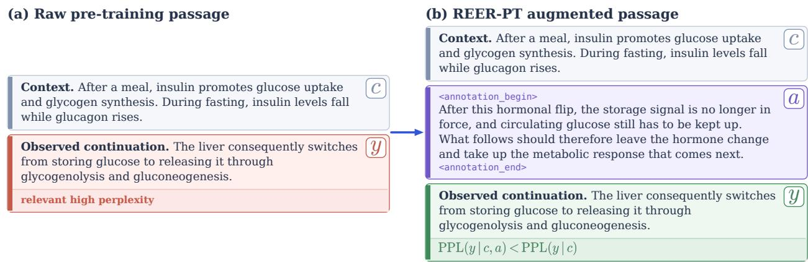
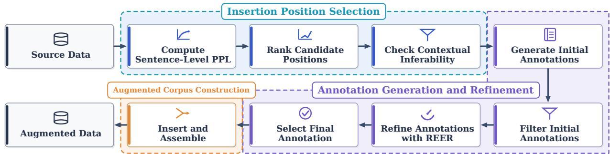
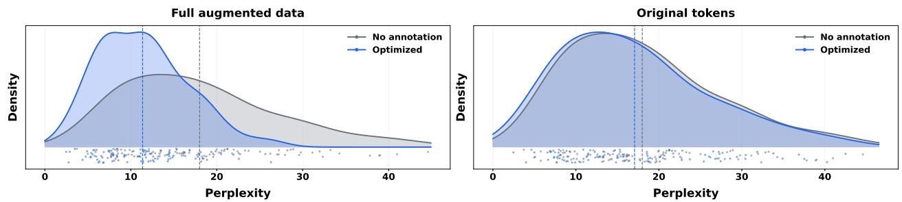
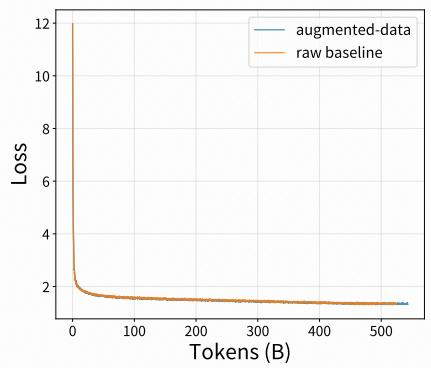
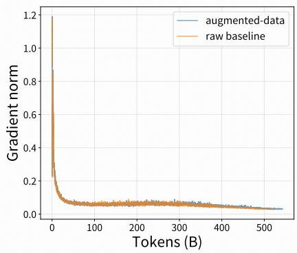
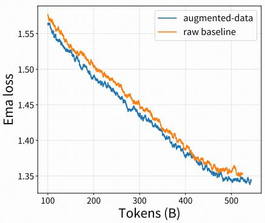

# REER-PT: Reverse-Engineered Reasoning for Perplexity-Guided Pre-training Data Augmentation

Haoran Que1,2,†,∗, Jiajun Shi2, Ting Huang2, Renming Pang2, Jiaheng Liu3,4, Ge Zhang‡,†, Wenhao Huang2, Shen Yan2, Wei Ye1,†, Shikun Zhang1

1Peking University, 2ByteDance Seed, 3Nanjing University, 4TokenWave.AI

∗Work done at ByteDance Seed, †Corresponding authors, ‡Independent Researcher

## Abstract

As language-model compute continues to scale, high-quality training data is becoming an increasingly important bottleneck. Conventional next-token prediction supervises what follows a context but leaves the intermediate reasoning behind that continuation implicit. We introduce REER-PT, a scalable framework that extends Reverse-Engineered Reasoning (REER) to raw pre-training data. REER-PT identifies continuations that are dificult to predict but can still be inferred from the preceding context, and inserts concise reasoning annotations that reconstruct the missing connection between context and continuation. Candidate annotations are generated and refined ofline, with perplexity serving as the optimization signal. Constraints on length and target leakage filter out unhelpful or trivial annotations. This sparse transformation preserves the source text and remains compatible with standard next-token prediction, avoiding online reasoning rollouts during pre-training. We apply REER-PT to transform a source pre-training corpus into an augmented one. Across augmented-data, original-token, and selected-continuation comparisons, perplexity reductions range from 0.42 to 7.29, and only about 0.05% of annotation 13-grams appear verbatim in the source text. We then train two 680M-parameter models with the same architecture and training configuration on the source and augmented corpora, respectively. The augmented-data model gains up to 2.07 percentage points on several knowledge and reasoning benchmarks. To gether, the perplexity analysis indicates improved continuation predictability, while the controlled pre-training experiments suggest that this augmentation can improve model performance without changing the standard pre-training objective.

Date: September 1, 2026

Correspondence: Haoran Que at hrque25@stu.pku.edu.cn, Ge Zhang at gezhang@umich.edu, Wei Ye at wye@pku.edu.cn

## 1 Introduction

Large language models acquire most of their capabilities through next-token prediction on massive text corpora [1, 2]. As compute continues to scale, however, high-quality training data is becoming an increasingly important bottleneck [3–5]. Conventional pre-training teaches a model what text follows a context, but rarely explains why it follows. We therefore consider explicitly annotating the intermediate reasoning that connects a context to its continuation. Chain-of-thought (CoT) supervision provides a natural mechanism for representing these dependencies explicitly [6, 7], allowing reasoning signals to be incorporated directly into the training text [8, 9]. Yet most conventional CoT datasets are built from curated question–answer pairs rather than ordinary documents, limiting their scale and domain coverage. In contrast, pre-training corpora already span diverse subjects, genres, and forms of discourse. Synthesizing reasoning annotations directly from these corpora therefore ofers a scalable way to enrich existing data and provide reasoning signals across domains without designing separate tasks for each domain [10].

Recent work has introduced reasoning signals into pre-training data, either through generated or latent intermediate thoughts [8, 9, 11, 12] or through reinforcement learning on observed continuations [13–15]. These directions establish the promise of reasoning-aware pre-training, but leave two practical challenges. First, dense or online reasoning generation can be expensive at corpus scale. Second, a fluent model-generated annotation is not necessarily useful. It may be redundant, weakly grounded, or unrelated to the actual dificulty faced by the model. Moreover, high-loss tokens are not always reasoning opportunities; some are unpredictable because they introduce arbitrary names, dates, identifiers, or external facts. Efective corpus augmentation must therefore determine both where reasoning is useful and whether a proposed annotation makes the observed continuation easier to predict.

To address these challenges, we introduce REER-PT, a scalable framework that extends Reverse-Engineered Reasoning (REER) [16] to pre-training data. REER uses the perplexity of a known reference output as an optimization signal, searching over candidate CoT trajectories for reasoning that makes the reference easier to generate. Following this principle, REER-PT uses the perplexity of observed continuations to guide the search for useful reasoning annotations in raw documents. It first identifies dificult-to-predict continuations and retains only those that are inferable from context. For each selected continuation, an annotation model produces a concise, book-note-style annotation that reconstructs the missing connection between the preceding context and the continuation. Candidate annotations are then evaluated and refined ofline, and only those that reduce continuation perplexity while satisfying constraints on length and target leakage are retained. Restricting this ofline search to a sparse set of dificult yet contextually inferable continuations keeps corpusscale augmentation eficient and selective. Because annotation generation and refinement are completed ofline and the source text is preserved, the augmented corpus can be trained with standard next-token prediction without online reasoning rollouts. Figure 1 illustrates how a reasoning annotation bridges the context and the observed continuation. In the example, the preceding discussion of insulin and glucagon supports the continuation, but the transition to hepatic metabolism remains implicit. REER-PT inserts a concise, third-person, book-note-style annotation that captures this connection without revealing the target content. Conditioning on the annotation lowers the perplexity of the unchanged continuation.

  
Figure 1 Illustration of REER-PT augmentation. Given a context c and an observed continuation y with relatively high perplexity, REER-PT inserts a concise reasoning annotation a that makes the implicit transition explicit. The original continuation is preserved, while conditioning on the annotation makes it easier to predict: $\mathrm { P P L } ( y \mid c , a ) < \mathrm { P P L } ( y \mid c )$

We apply REER-PT to transform a source pre-training corpus into an augmented one and analyze the resulting data at the augmented-data, original-token, and selected-continuation levels. Across these comparisons, perplexity reductions range from 0.42 to 7.29, and only about 0.05% of annotation 13-grams appear verbatim in the source text. We then compare two 680M-parameter models with the same architecture and training configuration, trained on the source and augmented corpora, respectively. The augmented-data model gains up to 2.07 percentage points on several knowledge and reasoning benchmarks. Together, the perplexity analysis indicates improved continuation predictability, while the controlled pre-training experiments suggest that this augmentation can improve model performance without changing the standard pre-training objective.

Our main contributions are as follows:

• We introduce REER-PT, a scalable framework that augments raw pre-training data with concise reasoning annotations that make implicit connections between context and continuation explicit. It selects dificult continuations that can be inferred from context and retains annotations that reduce continuation perplexity while preserving the original text.

• We apply REER-PT at corpus scale and analyze the resulting augmented data at the augmented-data, original-token, and selected-continuation levels. Across these comparisons, perplexity reductions range from 0.42 to 7.29, and only about 0.05% of annotation 13-grams appear verbatim in the source text. A comparison of two 680M-parameter models with the same architecture and training configuration further shows gains of up to 2.07 percentage points on several knowledge and reasoning benchmarks.

## 2 Related Work

Pre-training data selection and transformation. Existing work improves pre-training data through two broad strategies: selection and transformation. Selection-based methods prioritize specific portions of a corpus. Rho-1 applies selective language modeling, using token-level excess loss relative to a reference model to concentrate optimization on high-excess-loss portions of the corpus [17]. The Irreducible Curriculum prioritizes data estimated to have higher learnability, using a small proxy model to approximate loss trajectories [18]. Transformation-based methods instead rewrite or augment source documents. WRAP rephrases web documents in alternative styles and formats [10], while REWIRE rewrites lower-quality web documents that would otherwise be discarded [19]. Active Reading generates document-specific augmentations through self-generated learning strategies to improve factual learning [20]. SwallowCode and SwallowMath rewrite code snippets and mathematical solutions into cleaner, more self-contained forms [21]. FineInstructions converts pre-training documents into synthetic instruction–answer pairs using templates derived from real user queries [22]. In contrast, REER-PT performs a targeted local transformation. It inserts a concise reasoning annotation before a selected continuation only if the annotation reduces that continuation’s perplexity.

Reasoning-augmented pre-training. Recent methods recover or introduce intermediate reasoning in pretraining data. At the token level, Quiet-STaR [8] generates internal rationales for future-token prediction, adaptive latent CoT [23] allocates variable-length latent reasoning according to token dificulty, and ToW [24] inserts fine-grained explanations for predictable target words. At the document level, Mining Hidden Thoughts [11] reconstructs thought processes underlying STEM and legal texts, Reasoning to Learn from Latent Thoughts [12] infers latent reasoning behind mathematical text, and TPT [9] augments pre-training data with generated thinking trajectories. Reference-guided methods include REER [16], which uses reference perplexity to search for efective reasoning trajectories, and Understanding by Reconstruction [25], which recovers planning, reasoning, and debugging trajectories from software repositories. REER-PT instead inserts concise, book-note-style annotations that explain the connection between the preceding context and a continuation. These annotations resemble concise notes attached to the original document, making them more compatible with pre-training data than long task-oriented or agentic reasoning trajectories.

Reinforcement pre-training and mid-training. Recent work also brings reinforcement learning into pre-training and mid-training by deriving rewards or learning signals from pre-training corpora. In reinforcement pretraining, RPT reframes next-token prediction as a reinforcement-learning task and rewards reasoning that correctly predicts the next token [13]. RLP treats sampled chains of thought as exploratory actions and rewards them according to the increase in future-token log-likelihood [14]. RLPT extends reinforcement learning from next-token prediction to next-segment prediction, rewarding trajectories that recover subsequent text segments [15]. PretrainZero trains a reasoning policy to identify informative masked content in a general pre-training corpus and reconstruct it without external labels or verifiers [26]. At the mid-training stage, RMT combines a dynamic reasoning budget, curriculum-based adaptive sampling, and joint reinforcement and next-token training [27]. OctoThinker studies how data composition and training schedules during mid-training afect the efectiveness of subsequent reinforcement learning [28]. REER-PT, by contrast, searches for annotations ofline using continuation perplexity. This avoids policy rollouts and reward optimization during model training. The resulting corpus supports standard next-token prediction and can be constructed at pre-training scale.

## 3 Approach

## 3.1 Overview

We introduce REER-PT, a scalable framework for adding reasoning annotations to raw pre-training data. It extends Reverse-Engineered Reasoning (REER) [16] from query–response data to document continuations. Given a source document, REER-PT treats sentence boundaries as candidate insertion positions. At the i-th selected position, $c _ { i }$ denotes the local context preceding the boundary, $y _ { i }$ denotes the observed continuation following it, and $a _ { i }$ denotes the final accepted annotation inserted between them. REER-PT uses sentence-level perplexity to locate dificult transitions and continuation perplexity to guide the refinement of a concise, book-note-style annotation $a _ { i }$ that makes the connection from $c _ { i }$ to $y _ { i }$ explicit. Applying this transformation at sparsely selected positions preserves the order and content of all source tokens.

  
Figure 2 Overview of the REER-PT pipeline. REER-PT ranks candidate insertion positions by sentence-level perplexity, filters them by contextual inferability, generates and refines annotations using continuation perplexity, and inserts the selected annotations into the source documents.

Figure 2 illustrates the three stages of the REER-PT pipeline:

First, REER-PT segments each document into sentences, computes sentence-level perplexity, and ranks the sentences from highest to lowest perplexity. High perplexity identifies dificult transitions, but it does not guarantee that a continuation can be inferred from the preceding context. Some sentences instead introduce arbitrary names, dates, identifiers, or external facts. The annotation model therefore performs an inferability check and filters out candidates that cannot be supported by the context. This stage selects insertion positions that are both dificult to predict and contextually inferable.

Second, the annotation model produces multiple initial annotations for each selected position. Before refinement, REER-PT checks each initial annotation to ensure that it falls within a preset length range, typically 500–1,000 words, and does not contain target leakage. Target leakage occurs when an annotation directly repeats or closely paraphrases words or facts from the continuation. Such content can lower continuation perplexity by revealing the target in advance rather than by explaining the connection from context to continuation. REER-PT therefore removes initial annotations that fail either filter. It then splits each remaining annotation into multiple parts and refines each part separately. At each refinement step, REER-PT retains the candidate with the lowest continuation perplexity. After all refinement trajectories are completed, REER-PT selects the refined annotation with the lowest continuation perplexity across all trajectories. If this perplexity is not lower than the no-annotation baseline, REER-PT discards the position without inserting an annotation.

Third, each accepted annotation is delimited by the dedicated boundary markers <annotation\_begin> and <annotation\_end> and inserted immediately before its target continuation. All source tokens remain unchanged and in their original order. The resulting augmented corpus is fixed before pre-training and can be used directly with the standard next-token prediction objective.

## 3.2 Pipeline

Insertion Position Selection. Let $D = ( x _ { 1 } , \dots , x _ { T } )$ denote the token sequence obtained by tokenizing a document, where T is the resulting number of tokens and $x _ { t }$ is the token at position $t \in \{ 1 , \ldots , T \}$ . REER-PT involves two model roles. The PPL model provides the token-level log probabilities used to select insertion positions and evaluate annotation candidates; we denote its conditional next-token distribution by $p _ { \mathrm { p p l } }$ . The annotation model performs the inferability check and generates both initial annotations and candidate rewrites during refinement. The choice of annotation model is flexible. In contrast, the choice of PPL model determines whether data construction is on-policy or of-policy with respect to the target model. Using the target model itself as the PPL model yields on-policy selection and optimization, whereas using a separate PPL model yields an of-policy procedure. Stronger PPL models or checkpoints from diferent training stages may identify diferent insertion positions and provide diferent refinement signals. For each token, we compute

$$
\ell _ { t } = \log p _ { \mathrm { p p l } } ( x _ { t } \mid x _ { < t } ) ,\tag{1}
$$

where $\ell _ { t }$ is the token-level log probability and $\boldsymbol { x } _ { < t } = \left( x _ { 1 } , \dots , x _ { t - 1 } \right)$ is the prefix preceding $x _ { t }$ . We segment $D$ into m sentences $s _ { 1 } , \ldots , s _ { m } .$ , where $s _ { j }$ denotes the j-th sentence, and let $I _ { j }$ be the set of token indices belonging to $s _ { j }$ . We first compute the average token log probability of each sentence:

$$
\bar { \ell } _ { j } = \frac { 1 } { | I _ { j } | } \sum _ { t \in I _ { j } } \ell _ { t } .\tag{2}
$$

Here, $j \in \{ 1 , \ldots , m \} , I _ { j } \subseteq \{ 1 , \ldots , T \} , | I _ { j } |$ is the number of tokens in $s _ { j } ,$ and $\bar { \ell } _ { j }$ is the average token log probability of that sentence. We define sentence-level perplexity as

$$
P _ { j } = \exp ( - \bar { \ell } _ { j } ) ,\tag{3}
$$

where $P _ { j }$ is the perplexity of sentence $s _ { j }$ under the PPL model. A larger $P _ { j }$ indicates that the sentence is more dificult to predict from its preceding text. We therefore rank candidate sentences in descending order of $P _ { j }$ and consider the highest-perplexity sentences first.

For a document containing T tokens, we select K insertion positions, where $K = \lfloor T / 1 0 0 0 \rfloor$ . The beginning of each sentence $s _ { j }$ serves as a candidate insertion position, with the preceding text as the context and $s _ { j }$ as the continuation. Following the perplexity ranking, the annotation model retains a position only if its continuation is meaningfully related to and inferable from its context. This process continues until the target number of positions is reached or no eligible candidates remain.

Annotation Generation and Refinement. After selecting the insertion positions, we form local context– continuation pairs around them. Let $b _ { 1 } < \dots < b _ { K }$ be the token indices of the selected positions. We define $b _ { 0 } = 1$ and $b _ { K + 1 } = T + 1$ as the document boundaries. For each $i \in \{ 1 , \ldots , K \}$ , the local context and continuation are

$$
c _ { i } = ( x _ { b _ { i - 1 } } , \ldots , x _ { b _ { i } - 1 } ) , \qquad y _ { i } = ( x _ { b _ { i } } , \ldots , x _ { b _ { i + 1 } - 1 } ) .\tag{4}
$$

Thus, $c _ { i }$ is the original text between the previous selected position and the current one, while $y _ { i }$ begins with the selected sentence and ends immediately before the next selected position. For $i = 1$ , the context begins at the start of the document; for $i = K$ , the continuation extends to the end of the document.

For each pair $( c _ { i } , y _ { i } )$ , the annotation model produces multiple initial book-note-style annotations. We use this format because expository notes resemble text found in natural pre-training corpora and can be inserted without an abrupt change in voice or structure. Unlike a conventional $\mathrm { C o T }$ trace written as first-person deliberation, each annotation uses third-person or impersonal narration. It summarizes the relevant information in $c _ { i } ,$ states the missing conceptual or discourse connection, and describes why $y _ { i }$ follows. The generation prompt asks the model to explain this dependency without restating $y _ { i }$ and typically limits each annotation to 500–1,000 words. The initial annotations serve as separate starting points for subsequent REER refinement and provide alternative explanations of the same transition. Before refinement, the annotation model checks whether each initial annotation satisfies the length requirement and avoids target leakage. Any annotation that fails either check is discarded.

Following REER [16], we use the perplexity of the observed continuation $y _ { i }$ as the optimization signal. If an annotation captures a useful dependency from $c _ { i }$ to $y _ { i }$ , conditioning on that annotation should reduce the perplexity of $y _ { i }$ . Let $y _ { i } = ( y _ { i , 1 } , \dots , y _ { i , L _ { i } } )$ , where $L _ { i } = | y _ { i } |$ is the continuation length in tokens. For any candidate annotation a, we define continuation perplexity as

$$
\mathrm { P P L } _ { \mathrm { p p l } } ( y _ { i } \mid c _ { i } , a ) = \exp \left( - \frac { 1 } { L _ { i } } \sum _ { q = 1 } ^ { L _ { i } } \log p _ { \mathrm { p p l } } ( y _ { i , q } \mid c _ { i } , a , y _ { i , < q } ) \right) ,\tag{5}
$$

where $y _ { i , q }$ is the q-th token of $y _ { i }$ and $y _ { i , < q } = ( y _ { i , 1 } , \dotsc , y _ { i , q - 1 } )$ is its preceding continuation prefix. The no-annotation baseline, written as $\mathrm { P P L } _ { \mathrm { p p l } } ( y _ { i } \mid c _ { i } )$ , is computed by omitting a from the conditioning sequence. Let $A _ { i }$ denote the candidate annotation space for the i-th context–continuation pair. The perplexity objective is

$$
\widetilde { \boldsymbol a } _ { i } = \arg \operatorname* { m i n } _ { \boldsymbol a \in \mathcal { A } _ { i } } \mathrm { P P L } _ { \mathrm { p p l } } ( \boldsymbol y _ { i } \mid \boldsymbol c _ { i } , \boldsymbol a ) ,\tag{6}
$$

where $\widetilde { a } _ { i }$ denotes an annotation with minimum continuation perplexity in $A _ { i }$ . A lower objective value means that the annotation makes $y _ { i }$ easier for the PPL model to predict. Enumerating all possible annotations is infeasible, so we perform an iterative, gradient-free search. The equations below describe the refinement trajectory of one initial annotation. The initial-candidate index is omitted for clarity. We split each annotation at paragraph boundaries into an ordered sequence of segments and refine one segment at a time. Let $a _ { i } ^ { ( 0 ) }$ be the complete initial annotation before refinement, let $r \in \{ 0 , \ldots , R _ { i } - 1 \}$ index the refinement step, and let $R _ { i }$ be the maximum number of refinement steps for pair i. At step r, the annotation model generates candidate replacements for one segment while leaving the other segments unchanged. Each replacement forms a complete candidate annotation in the finite rewrite set $\mathcal { R } _ { i } ^ { ( r ) }$ . We update the annotation by

$$
a _ { i } ^ { ( r + 1 ) } = \arg \operatorname* { m i n } _ { \substack { a \in \mathcal { R } _ { i } ^ { ( r ) } \cup \{ a _ { i } ^ { ( r ) } \} } } \mathrm { P P L } _ { \mathrm { p p l } } ( y _ { i } \mid c _ { i } , a ) ,\tag{7}
$$

where $a _ { i } ^ { ( r + 1 ) }$ is the annotation retained for the next step. Including the current annotation $a _ { i } ^ { ( r ) }$ in the candidate set ensures that continuation perplexity cannot increase from one refinement step to the next. Let $r _ { i } ^ { \mathrm { s t o p } } \leq R _ { i }$ denote the step at which refinement stops because no rewrite provides the required improvement or the step budget has been reached. The same refinement procedure is applied to every initial annotation, and $a _ { i } ^ { * }$ denotes the final candidate with the lowest continuation perplexity among all resulting trajectories.

For a refined annotation $a _ { i } ^ { * }$ , define its perplexity reduction relative to no annotation as

$$
\Delta _ { i } = \mathrm { P P L } _ { \mathrm { p p l } } ( y _ { i } \mid \boldsymbol { c } _ { i } ) - \mathrm { P P L } _ { \mathrm { p p l } } ( y _ { i } \mid \boldsymbol { c } _ { i } , \boldsymbol { a } _ { i } ^ { * } ) .\tag{8}
$$

Here, $\Delta _ { i } > 0$ means that the annotation makes the continuation easier to predict. We retain $a _ { i } ^ { * }$ only if $\Delta _ { i } > 0$ Otherwise, the insertion position is discarded.

Augmented Corpus Construction. Each accepted annotation is inserted before its target continuation between the markers <annotation\_begin> and <annotation\_end>, while all source tokens retain their original order. Applying REER-PT to approximately 23B source tokens produces a 42B-token augmented corpus. The corpus remains compatible with standard next-token prediction and requires no online reasoning rollout or specialized training architecture.

  
Figure 3 PPL distributions under diferent annotation conditions and evaluation scopes.

## 4 Experiments

## 4.1 Data Analysis

We analyze the augmented data from two perspectives: predictability, measured by perplexity, and repetition, measured by exact 13-gram self-repetition and annotation-to-source overlap.

Perplexity. We compare three annotation conditions. No annotation contains only the source document, Initial inserts the filtered initial annotations before perplexity-guided refinement, and Optimized inserts the final annotations retained after refinement and comparison with the no-annotation baseline. We evaluate PPL at three scopes. Full augmented data includes all tokens in each condition, including annotation tokens when present. Original tokens includes only the unchanged source tokens, although their predictions may condition on preceding annotations. Selected continuations includes only the selected continuations $y _ { i }$ . At each scope, PPL is computed with the PPL model over the corresponding tokens. The first two scopes provide global measurements over the full data and original tokens, whereas the third provides a local measurement over the selected continuations targeted during refinement.

Table 1 Perplexity comparisons for annotation insertion and refinement. The Original tokens scope excludes annotation tokens from the evaluated positions, and the Selected continuations scope includes only the selected continuations.
<table><tr><td>Evaluation scope</td><td>Comparison</td><td>Before PPL</td><td>After PPL</td><td>PPL reduction</td></tr><tr><td>Full augmented data</td><td>No annotation → Optimized</td><td>18.68824</td><td>11.40323</td><td>7.28501</td></tr><tr><td>Original tokens</td><td>No annotation → Optimized</td><td>18.68824</td><td>17.65746</td><td>1.03078</td></tr><tr><td>Full augmented data</td><td>Initial → Optimized</td><td>11.89156</td><td>11.40323</td><td>0.48833</td></tr><tr><td>Original tokens</td><td>Initial → Optimized</td><td>18.07970</td><td>17.65746</td><td>0.42224</td></tr><tr><td>Selected continuations</td><td>No annotation → Optimized</td><td>24.78340</td><td>20.54801</td><td>4.23539</td></tr><tr><td>Selected continuations</td><td>Initial → Optimized</td><td>21.93265</td><td>20.54801</td><td>1.38464</td></tr></table>

As shown in Table 1, every comparison yields a positive PPL reduction at both the global and local scopes. At the global scope, the optimized condition reduces full augmented-data PPL by 7.28501 and original-token PPL by 1.03078 relative to no annotation. The larger reduction on the full augmented data may partly arise because the model-generated annotations are more fluent and predictable than the source text. Importantly, PPL also decreases on the original tokens, showing that the improvement extends to the unchanged source content rather than being confined to the inserted annotations. Relative to the initial condition, perplexity-guided refinement further reduces full augmented-data PPL by 0.48833 and original-token PPL by 0.42224. At the local scope, optimized annotations reduce selected-continuation PPL by 4.23539 relative to no annotation and by 1.38464 relative to the initial annotations. Together, these results support the efectiveness of both annotation insertion and perplexity-guided refinement. Figure 3 shows the corresponding PPL distributions. Each panel displays smoothed distributions and 100 sampled observations.

Repetition. We next measure repetition within each text and exact copying from a source document into its annotations. We use 13-grams throughout. By default, we construct word 13-grams after splitting text on whitespace. If whitespace splitting produces fewer than two words, as can occur in text without whitespaceseparated words such as Chinese, we instead construct character 13-grams after removing whitespace. We extract overlapping 13-grams with a sliding window and exclude text containing fewer than 13 words or characters under the applicable representation from the corresponding mean.

Let $\mathcal { G } _ { 1 3 } ( z )$ denote the multiset of all 13-gram occurrences in text z, and let uniq $\left( \mathcal { G } _ { 1 3 } ( z ) \right)$ denote the set of distinct 13-grams in that multiset. For any text z, we define the self-repetition ratio as

$$
R _ { \mathrm { s e l f } } ( z ) = \frac { | \mathcal { G } _ { 1 3 } ( z ) | - | \operatorname { u n i q } ( \mathcal { G } _ { 1 3 } ( z ) ) | } { | \mathcal { G } _ { 1 3 } ( z ) | } .\tag{9}
$$

Here, $| \mathcal { G } _ { 1 3 } ( z ) |$ counts 13-gram occurrences with multiplicity, so $R _ { \mathrm { s e l f } } ( z )$ is the fraction of occurrences beyond the first occurrence of each distinct 13-gram. For a final annotation a and its source document x, we define the directional annotation-to-source overlap as

$$
R _ { \mathrm { c r o s s } } ( a , x ) = \frac { \sum _ { g \in \mathcal { G } _ { 1 3 } ( a ) } \mathbf { 1 } [ g \in \mathcal { G } _ { 1 3 } ( x ) ] } { | \mathcal { G } _ { 1 3 } ( a ) | } ,\tag{10}
$$

where $g$ denotes an annotation 13-gram occurrence and 1[·] is the indicator function, equal to 1 when its condition is true and 0 otherwise. Because the denominator counts annotation 13-grams, $R _ { \mathrm { c r o s s } } ( a , x )$ measures the fraction of annotation 13-gram occurrences that also appear in the source. It is not a source-to-annotation coverage measure. Table 2 reports arithmetic means of the relevant per-document or per-annotation ratios.

Table 2 Mean exact 13-gram repetition and annotation-to-source overlap. Lower values indicate less repetition or exact copying.
<table><tr><td>Metric</td><td>Mean percentage</td></tr><tr><td>Source-document self-repetition</td><td>0.615%</td></tr><tr><td>Annotation self-repetition</td><td>0.203%</td></tr><tr><td>Annotation-to-source exact overlap</td><td>0.051%</td></tr></table>

As shown in Table 2, annotations have a lower mean self-repetition ratio than source documents, at 0.203% versus 0.615%. The mean annotation-to-source exact-overlap ratio is 0.051%, indicating that only a small fraction of annotation 13-gram occurrences exactly match a source span. These measurements show little repetition or verbatim copying.

## 4.2 Pre-training Experiments

Setup. We construct two pre-training mixtures. The raw mixture combines the 23B-token source corpus with a 500B-token general pre-training corpus, for approximately 523B tokens in total. The REER-PT mixture replaces the source corpus with its 42B-token augmented version and uses the same 500B-token general corpus, for approximately 542B tokens in total. We train a 680M-parameter language model from scratch on each mixture. We refer to the model trained on the raw mixture as the raw baseline and the model trained on the augmented mixture as the augmented-data model. The two runs use the same architecture, tokenizer, optimizer configuration, and other training hyperparameters. Their corpus composition and total token counts difer because REER-PT adds annotation tokens. This diference is part of the data transformation being evaluated.

Training dynamics. Figure 4 compares the optimization trajectories of the raw baseline and the augmenteddata model. The left and center panels show raw training loss and gradient norm over the complete runs. The gradient-norm trajectories are similar, while the augmented-data model generally reaches lower training loss later in training. The right panel reports the EMA-smoothed training loss after 100B consumed tokens,

$$
\widetilde { L } _ { t } = 0 . 9 5 \widetilde { L } _ { t - 1 } + 0 . 0 5 L _ { t } ,\tag{11}
$$

  
Figure 4 Training dynamics of the raw baseline and augmented-data model: raw training loss (left), gradient norm (center), and EMA-smoothed training loss after 100B consumed tokens with decay 0.95 (right).

where t indexes training steps, $L _ { t }$ is the raw training loss at step $t ,$ and $\widetilde { L } _ { t }$ is the smoothed loss, initialized with $\widetilde { L } _ { 1 } = L _ { 1 }$ . The smoothed augmented-data-model curve generally remains below the raw-baseline curve later in training.

Table 3 Evaluation of the raw baseline and augmented-data model on public benchmarks. Scores are reported on a 0–100 scale, and higher values are better. For each benchmark, $\Delta$ is the augmented-data-model score minus the raw-baseline score, measured in percentage points.
<table><tr><td>Benchmark</td><td>Augmented-data model</td><td>Raw baseline</td><td>∆</td></tr><tr><td>Knowledge</td><td></td><td></td><td></td></tr><tr><td>C-Eval [29]</td><td>77.19</td><td>76.67</td><td>+0.52</td></tr><tr><td>MMLU-Pro [30]</td><td>36.85</td><td>35.95</td><td>+0.90</td></tr><tr><td>SuperGPQA [31]</td><td>23.15</td><td>22.55</td><td>+0.60</td></tr><tr><td>Chinese SimpleQA [32]</td><td>34.24</td><td>33.71</td><td>+0.53</td></tr><tr><td>General Reasoning</td><td></td><td></td><td></td></tr><tr><td>DROP [33]</td><td>41.51</td><td>40.11</td><td>+1.40</td></tr><tr><td>BBH [34]</td><td>55.06</td><td>52.99</td><td>+2.07</td></tr><tr><td>ZebraLogic [35]</td><td>6.73</td><td>6.20</td><td>+0.53</td></tr><tr><td>ProcBench [36]</td><td>5.93</td><td>5.57</td><td>+0.36</td></tr><tr><td>STEM Reasoning</td><td></td><td></td><td></td></tr><tr><td>GPQA-Diamond [37]</td><td>27.88</td><td>25.81</td><td>+2.07</td></tr><tr><td>MATH [38]</td><td>35.70</td><td>34.20</td><td>+1.50</td></tr><tr><td>OlympiadBench [39]</td><td>13.19</td><td>11.70</td><td>+1.49</td></tr><tr><td>Code</td><td></td><td></td><td></td></tr><tr><td>MBPP+ [40]</td><td>58.20</td><td>60.85</td><td>-2.65</td></tr><tr><td>HumanEval+ [40]</td><td>58.54</td><td>60.37</td><td>-1.83</td></tr><tr><td>LiveCodeBench [41]</td><td>3.94</td><td>5.73</td><td>-1.79</td></tr></table>

Evaluation. We evaluate both pre-trained models in four categories. The knowledge category includes C-Eval [29], MMLU-Pro [30], SuperGPQA [31], and Chinese SimpleQA [32]. The general-reasoning category includes DROP [33], BBH [34], ZebraLogic [35], and ProcBench [36]. The STEM-reasoning category includes GPQA-Diamond [37], MATH [38], and OlympiadBench [39]. The code-generation category includes HumanEval+ and MBPP+ from EvalPlus [40], together with LiveCodeBench [41].

As shown in Table 3, positive gains occur across the knowledge, general-reasoning, and STEM-reasoning categories. BBH and GPQA-Diamond each improve by 2.07 percentage points, followed by MATH, Olympiad-Bench, and DROP with gains of 1.50, 1.49, and 1.40 points, respectively. MMLU-Pro improves by 0.90 points, while C-Eval, SuperGPQA, Chinese SimpleQA, ZebraLogic, and ProcBench show smaller gains of 0.36–0.60 points. However, all three code-generation benchmarks decline. The changes are −2.65 points on MBPP+, −1.83 points on HumanEval+, and −1.79 points on LiveCodeBench. Our case-level analysis suggests that inserting natural-language annotations into code documents can disrupt local program structure and encourage models to mix explanatory text with executable code. Such outputs may express a plausible solution but fail benchmarks that require concise, syntactically valid programs. These results motivate future work on reasoning-annotation formats tailored to code documents.

## 5 Conclusion

We introduced REER-PT, an ofline framework that augments raw pre-training data with concise reasoning annotations. REER-PT selects dificult continuations that remain inferable from context and retains annotations that reduce continuation perplexity while satisfying length and target-leakage constraints. The resulting corpus preserves all source tokens and remains compatible with standard next-token prediction. Across the full augmented data, original tokens, and selected continuations, the reported PPL reductions range from 0.42 to 7.29, while the mean exact annotation-to-source 13-gram overlap is only 0.05%. In controlled pre-training experiments with 680M-parameter models, the augmented-data model improves several knowledge and reasoning benchmarks by up to 2.07 percentage points. Together, these results suggest that sparse, perplexity-guided reasoning augmentation can improve continuation predictability and downstream capabilities.

## 6 Limitations and Future Work

Our experiments use a 680M-parameter model and a single pre-training recipe, so the behavior of REER-PT at larger model and data scales remains unknown. Data construction also depends on both model choices. A diferent PPL model may assign diferent perplexities, select diferent insertion positions, or provide diferent refinement signals, while a diferent annotation model may make diferent inferability judgments or produce a diferent annotation style. In addition, the current book-note-style format is designed primarily for natural-language documents. In code documents, natural-language insertions can disrupt program structure and encourage explanatory text inside generated programs, consistent with the observed code-generation regressions. Future work should study larger-scale training, annotation density, and the choices of PPL and annotation models. It should also develop structure-aware annotation formats for code and other specialized domains and identify which types of implicit dependency benefit most from explicit reasoning annotations.

## References

[1] Jared Kaplan, Sam McCandlish, Tom Henighan, Tom B. Brown, Benjamin Chess, Rewon Child, Scott Gray, Alec Radford, Jefrey Wu, and Dario Amodei. Scaling laws for neural language models. arXiv preprint arXiv:2001.08361, 2020.

[2] Tom B. Brown, Benjamin Mann, Nick Ryder, Melanie Subbiah, Jared Kaplan, Prafulla Dhariwal, Arvind Neelakantan, Pranav Shyam, Girish Sastry, Amanda Askell, Sandhini Agarwal, Ariel Herbert-Voss, Gretchen Krueger, Tom Henighan, Rewon Child, Aditya Ramesh, Daniel M. Ziegler, Jefrey Wu, Clemens Winter, Christopher Hesse, Mark Chen, Eric Sigler, Mateusz Litwin, Scott Gray, Benjamin Chess, Jack Clark, Christopher Berner, Sam McCandlish, Alec Radford, Ilya Sutskever, and Dario Amodei. Language models are few-shot learners. In Advances in Neural Information Processing Systems, volume 33, pages 1877–1901, 2020.

[3] Jordan Hofmann, Sebastian Borgeaud, Arthur Mensch, Elena Buchatskaya, Trevor Cai, Eliza Rutherford, Diego de Las Casas, Lisa Anne Hendricks, Johannes Welbl, Aidan Clark, Tom Hennigan, Eric Noland, Katie Millican, George van den Driessche, Bogdan Damoc, Aurelia Guy, Simon Osindero, Karen Simonyan, Erich Elsen, Jack W. Rae, Oriol Vinyals, and Laurent Sifre. Training compute-optimal large language models. arXiv preprint arXiv:2203.15556, 2022.

[4] Katherine Lee, Daphne Ippolito, Andrew Nystrom, Chiyuan Zhang, Douglas Eck, Chris Callison-Burch, and Nicholas Carlini. Deduplicating training data makes language models better. arXiv preprint arXiv:2107.06499, 2021.

[5] Suriya Gunasekar, Yi Zhang, Jyoti Aneja, Caio César Teodoro Mendes, Allie Del Giorno, Sivakanth Gopi, Mojan Javaheripi, Piero Kaufmann, Gustavo de Rosa, Olli Saarikivi, Adil Salim, Shital Shah, Harkirat Singh Behl, Xin Wang, Sébastien Bubeck, Ronen Eldan, Adam Tauman Kalai, Yin Tat Lee, and Yuanzhi Li. Textbooks are all you need. arXiv preprint arXiv:2306.11644, 2023.

[6] Jason Wei, Xuezhi Wang, Dale Schuurmans, Maarten Bosma, Fei Xia, Ed Chi, Quoc V. Le, and Denny Zhou. Chain-of-thought prompting elicits reasoning in large language models. In Advances in Neural Information Processing Systems, volume 35, pages 24824–24837, 2022.

[7] Eric Zelikman, Yuhuai Wu, Jesse Mu, and Noah D. Goodman. STaR: Bootstrapping reasoning with reasoning. arXiv preprint arXiv:2203.14465, 2022.

[8] Eric Zelikman, Georges Harik, Yijia Shao, Varuna Jayasiri, Nick Haber, and Noah D. Goodman. Quiet-STaR: Language models can teach themselves to think before speaking. arXiv preprint arXiv:2403.09629, 2024.

[9] Liang Wang, Nan Yang, Shaohan Huang, Li Dong, and Furu Wei. Thinking augmented pre-training. arXiv preprint arXiv:2509.20186, 2025.

[10] Pratyush Maini, Skyler Seto, He Bai, David Grangier, Yizhe Zhang, and Navdeep Jaitly. Rephrasing the web: A recipe for compute and data-eficient language modeling. arXiv preprint arXiv:2401.16380, 2024.

[11] Yoichi Ishibashi, Taro Yano, and Masafumi Oyamada. Mining hidden thoughts from texts: Evaluating continual pretraining with synthetic data for LLM reasoning. arXiv preprint arXiv:2505.10182, 2025.

[12] Yangjun Ruan, Neil Band, Chris J. Maddison, and Tatsunori Hashimoto. Reasoning to learn from latent thoughts. arXiv preprint arXiv:2503.18866, 2025.

[13] Qingxiu Dong, Li Dong, Yao Tang, Tianzhu Ye, Yutao Sun, Zhifang Sui, and Furu Wei. Reinforcement pre-training. arXiv preprint arXiv:2506.08007, 2025.

[14] Ali Hatamizadeh, Syeda Nahida Akter, Shrimai Prabhumoye, Jan Kautz, Mostofa Patwary, Mohammad Shoeybi, Bryan Catanzaro, and Yejin Choi. RLP: Reinforcement as a pretraining objective. arXiv preprint arXiv:2510.01265, 2025.

[15] Siheng Li, Kejiao Li, Zenan Xu, Guanhua Huang, Evander Yang, Kun Li, Haoyuan Wu, Jiajia Wu, Zihao Zheng, Chenchen Zhang, Kun Shi, et al. Reinforcement learning on pre-training data. arXiv preprint arXiv:2509.19249, 2025.

[16] Haozhe Wang, Haoran Que, Qixin Xu, Minghao Liu, Wangchunshu Zhou, Jiazhan Feng, Wanjun Zhong, Wei Ye, Tong Yang, Wenhao Huang, Ge Zhang, and Fangzhen Lin. Reverse-engineered reasoning for open-ended generation. arXiv preprint arXiv:2509.06160, 2025.

[17] Zhenghao Lin, Zhibin Gou, Yeyun Gong, Xiao Liu, Yelong Shen, Ruochen Xu, Chen Lin, Yujiu Yang, Jian Jiao, Nan Duan, and Weizhu Chen. Rho-1: Not all tokens are what you need. arXiv preprint arXiv:2404.07965, 2024.

[18] Simin Fan and Martin Jaggi. Irreducible curriculum for language model pretraining. arXiv preprint arXiv:2310.15389, 2023.

[19] Thao Nguyen, Yang Li, Olga Golovneva, Luke Zettlemoyer, Sewoong Oh, Ludwig Schmidt, and Xian Li. Recycling the web: A method to enhance pre-training data quality and quantity for language models. arXiv preprint arXiv:2506.04689, 2025.

[20] Jessy Lin, Vincent-Pierre Berges, Xilun Chen, Wen-Tau Yih, Gargi Ghosh, and Barlas Oğuz. Learning facts at scale with active reading. arXiv preprint arXiv:2508.09494, 2025.

[21] Kazuki Fujii, Yukito Tajima, Sakae Mizuki, Masaki Kawamura, Hinari Shimada, Taihei Shiotani, Koshiro Saito, Masanari Oi, Taishi Nakamura, Takumi Okamoto, Shigeki Ishida, Kakeru Hattori, Youmi Ma, Hiroya Takamura, Rio Yokota, Jun Sakuma, and Naoaki Okazaki. Rewriting pre-training data boosts LLM performance in math and code. arXiv preprint arXiv:2505.02881, 2025.

[22] Ajay Patel, Colin Rafel, and Chris Callison-Burch. Fineinstructions: Scaling synthetic instructions to pre-training scale. arXiv preprint arXiv:2601.22146, 2026.

[23] Boyi Zeng, Yiqin Hao, He Li, Shixiang Song, Feichen Song, Zitong Wang, Siyuan Huang, Yi Xu, Ziwei He, Xinbing Wang, and Zhouhan Lin. Pretraining with token-level adaptive latent chain-of-thought. arXiv preprint arXiv:2602.08220, 2026.

[24] Zhikun Xu, Ming Shen, Jacob Dineen, Zhaonan Li, Xiao Ye, Shijie Lu, Aswin RRV, Chitta Baral, and Ben Zhou. ToW: Thoughts of words improve reasoning in large language models. arXiv preprint arXiv:2410.16235, 2024.

[25] Zhiyuan Zeng, Yichi Zhang, Yong Shan, Kai Hua, Siyuan Fang, Zhaiyu Liu, Jiaheng Liu, Haozhe Wang, Yining Zheng, Ming Ding, Ke Shen, Ge Zhang, Wenhao Huang, and Xipeng Qiu. Understanding by reconstruction: Reversing the software development process for LLM pretraining. arXiv preprint arXiv:2603.11103, 2026.

[26] Xingrun Xing, Zhiyuan Fan, Jie Lou, Guoqi Li, Jiajun Zhang, and Debing Zhang. Pretrainzero: Reinforcement active pretraining. arXiv preprint arXiv:2512.03442, 2025.

[27] Yijun Tian, Shaoyu Chen, Zhichao Xu, Yawei Wang, Jinhe Bi, Peng Han, and Wei Wang. Reinforcement mid-training. arXiv preprint arXiv:2509.24375, 2025.

[28] Zengzhi Wang, Fan Zhou, Xuefeng Li, and Pengfei Liu. OctoThinker: Mid-training incentivizes reinforcement learning scaling. arXiv preprint arXiv:2506.20512, 2025.

[29] Yuzhen Huang, Yuzhuo Bai, Zhihao Zhu, Junlei Zhang, Jinghan Zhang, Tangjun Su, Junteng Liu, Chuancheng Lv, Yikai Zhang, Jiayi Lei, Yao Fu, Maosong Sun, and Junxian He. C-Eval: A multi-level multi-discipline chinese evaluation suite for foundation models. In Advances in Neural Information Processing Systems, 2023.

[30] Yubo Wang, Xueguang Ma, Ge Zhang, Yuansheng Ni, Abhranil Chandra, Shiguang Guo, Weiming Ren, Aaran Arulraj, Xuan He, Ziyan Jiang, Tianle Li, Max Ku, Kai Wang, Alex Zhuang, Rongqi Fan, Xiang Yue, and Wenhu Chen. MMLU-Pro: A more robust and challenging multi-task language understanding benchmark. arXiv preprint arXiv:2406.01574, 2024.

[31] M-A-P Team. SuperGPQA: Scaling LLM evaluation across 285 graduate disciplines. arXiv preprint arXiv:2502.14739, 2025.

[32] Yancheng He, Shilong Li, Jiaheng Liu, Yingshui Tan, Weixun Wang, Hui Huang, Xingyuan Bu, Hangyu Guo, Chengwei Hu, Boren Zheng, Zhuoran Lin, Xuepeng Liu, Dekai Sun, Shirong Lin, Zhicheng Zheng, Xiaoyong Zhu, Wenbo Su, and Bo Zheng. Chinese SimpleQA: A chinese factuality evaluation for large language models. arXiv preprint arXiv:2411.07140, 2024.

[33] Dheeru Dua, Yizhong Wang, Pradeep Dasigi, Gabriel Stanovsky, Sameer Singh, and Matt Gardner. DROP: A reading comprehension benchmark requiring discrete reasoning over paragraphs. In Proceedings of the 2019 Conference of the North American Chapter of the Association for Computational Linguistics, 2019.

[34] Mirac Suzgun, Nathan Scales, Nathanael Schärli, Sebastian Gehrmann, Yi Tay, Hyung Won Chung, Aakanksha Chowdhery, Quoc V. Le, Ed H. Chi, Denny Zhou, and Jason Wei. Challenging BIG-Bench tasks and whether chain-of-thought can solve them. arXiv preprint arXiv:2210.09261, 2022.

[35] Bill Yuchen Lin, Ronan Le Bras, Kyle Richardson, Ashish Sabharwal, Radha Poovendran, Peter Clark, and Yejin Choi. ZebraLogic: On the scaling limits of LLMs for logical reasoning. In Proceedings of the 42nd International Conference on Machine Learning, 2025.

[36] Ippei Fujisawa, Sensho Nobe, Hiroki Seto, Rina Onda, Yoshiaki Uchida, Hiroki Ikoma, Pei-Chun Chien, and Ryota Kanai. ProcBench: Benchmark for multi-step reasoning and following procedure. arXiv preprint arXiv:2410.03117, 2024.

[37] David Rein, Betty Li Hou, Asa Cooper Stickland, Jackson Petty, Richard Yuanzhe Pang, Julien Dirani, Julian Michael, and Samuel R. Bowman. GPQA: A graduate-level google-proof Q&A benchmark. arXiv preprint arXiv:2311.12022, 2023.

[38] Dan Hendrycks, Collin Burns, Saurav Kadavath, Akul Arora, Steven Basart, Eric Tang, Dawn Song, and Jacob Steinhardt. Measuring mathematical problem solving with the MATH dataset. arXiv preprint arXiv:2103.03874, 2021.

[39] Chaoqun He, Renjie Luo, Yuzhuo Bai, Shengding Hu, Zhen Leng Thai, Junhao Shen, Jinyi Hu, Xu Han, Yujie Huang, Yuxiang Zhang, Jie Liu, Lei Qi, Zhiyuan Liu, and Maosong Sun. OlympiadBench: A challenging benchmark for promoting AGI with olympiad-level bilingual multimodal scientific problems. arXiv preprint arXiv:2402.14008, 2024.

[40] Jiawei Liu, Chunqiu Steven Xia, Yuyao Wang, and Lingming Zhang. Is your code generated by ChatGPT really correct? rigorous evaluation of large language models for code generation. In Advances in Neural Information Processing Systems, 2023.

[41] Naman Jain, King Han, Alex Gu, Wen-Ding Li, Fanjia Yan, Tianjun Zhang, Sida Wang, Armando Solar-Lezama, Koushik Sen, and Ion Stoica. LiveCodeBench: Holistic and contamination-free evaluation of large language models for code. arXiv preprint arXiv:2403.07974, 2024.