# Reactivating Test-Time Scaling for Plane Geometry Problem Solving

Xiaoqiang Kang1,2, Shengen Wu4,5, Maizhen Ning1,2, Xiaobo Jin1,

Kaizhu Huang3, Yutao Yue4, Xiaowei Huang2, Qiufeng Wang1,\*

1School of Advanced Technology, Xi’an Jiaotong-Liverpool University

2Department of Computer Science, University of Liverpool

3Digital Innovation Research Center, Duke Kunshan University

4The Hong Kong University of Science and Technology (Guangzhou), 5Hithink Research Xiaoqiang.Kang23@student.xjtlu.edu.cn, Qiufeng.Wang@xjtlu.edu.cn

## Abstract

Plane geometry problem (PGP) solving has become a critical benchmark for multimodal reasoning because it requires accurate visual perception and precise multi-step symbolic deduction. Although test-time scaling (TTS) has demonstrated remarkable success in general mathematical reasoning, it fails to scale effectively under the symbolic-program paradigm for plane geometry. We identify two key ob stacles: limited reasoning diversity induced by rigid symbolic programs and insufficient explicit visual grounding before symbolic deduction. To address these issues, we propose Multi-Trace Synthesis (MTS), which converts each symbolic program into heterogeneous reasoning traces, including executable Python scripts and CoT-augmented variants. We further propose Perception-Augmented (PA) training, which parses diagrams into structured semantic clauses before deduction, and Consensus Guided Multi-Trace Ensemble (CG-MTE) for efficient self-adaptive inference. Experiments on three geometry benchmarks show that our method consistently improves PGP-solving across model scales and achieves strong performance against both general-purpose MLLMs and specialized geometry solvers. Under testtime scaling, CG-MTE achieves a comparable accuracy to high-budget self-consistency while reducing sampling cost by up to 8×. Code and data are publicly available at https: //github.com/Jason8Kang/ReTTS-PGPS.

## 1 Introduction

Plane geometry problem (PGP) solving is a fundamental benchmark for multimodal reasoning (Cho et al., 2026). Previous research has advanced PGP through formal symbolic systems, neuro-symbolic solvers, and, more recently, Multimodal Large Language Models (MLLMs) (Zhao et al., 2025b). However, PGP-solving remains challenging for current

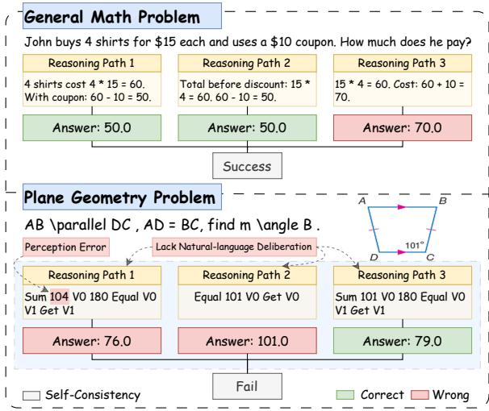  
Figure 1: Comparison of self-consistency in general math and plane geometry problems.

MLLMs, because it requires both accurate recognition of visual entities and relations and precise multi-step deduction (Xia et al., 2025). Concurrently, test-time scaling (TTS) techniques (Snell et al., 2025), particularly self-consistency (SC) (Wang et al., 2023), have emerged as a standard paradigm for improving the reasoning performance of MLLMs by aggregating multiple sampled pathways. It remains unclear, however, whether this scaling behavior transfers effectively to PGP.

Our empirical observations reveal that TTS provides only limited benefits under the symbolic program prediction paradigm for PGP. As Figure 1 illustrates, while SC in general mathematics benefits from exploring various reasoning paths that often converge to the correct answer, sampled trajectories on PGP often fail to reach a majority consensus. We attribute this failure to two main factors. First, reasoning diversity is limited. Existing geometry datasets rely heavily on rigid symbolic programs. These concise formal languages lack the naturallanguage deliberation required to explore a broad reasoning space. Second, a perceptual gap remains. As shown in Figure 1 (reasoning path 1), the model misreads visual signals, for example, by interpreting 101◦ as 104◦. These perception errors subsequently lead to incorrect deductions. Consequently, the correct program is often unique, and repeated sampling tends to produce either the same correct program or multiple inconsistent incorrect ones, which weakens the effectiveness of SC.

To address the constrained reasoning space, we propose a Multi-Trace Synthesis (MTS) framework that expands each symbolic program into semantically aligned but heterogeneous reasoning traces. Specifically, rigid programs are transformed into Python scripts. Both programs and scripts are further augmented with Chain-of-Thought (CoT) rationales in natural language, reintroducing the intermediate deliberation. Fine-tuning on the mixture of original programs and synthesized traces enables models to generate diverse reasoning pathways, thereby reactivating test-time scaling.

To bridge the gap between visual input and formal deduction, we introduce Perception-Augmented (PA) training. This training paradigm optimizes the capability of the model to first parse diagrams into structured semantic clauses before performing reasoning. It strengthens the visual-tosymbolic alignment and provides a more reliable foundation for subsequent deduction.

While MTS and PA training establish the basis for effective TTS, such scaling also exposes a practical challenge: computational efficiency. Naively increasing the sampling budget can introduce redundancy, especially for easy problems. To address this, we propose a self-adaptive inference strategy, Consensus-Guided Multi-Trace Ensemble (CG-MTE). Whereas standard MTE aggregates all trajectories from every trace type regardless of difficulty, CG-MTE checks cross-trace consensus at shallow decoding depths and expands the sampling budget only when disagreement persists. This strategy allocates additional sampling on uncertain instances, yielding a better accuracy-cost trade-off.

Based on the MTS framework, we construct MTS-All datasets for three geometry datasets, namely PGPS9K-All, Geometry3K-All, and GeoQA-All. In our experiments, we fine-tune the Qwen-VL family and evaluate on all three benchmarks. Experimental results demonstrate that PA training on the corresponding MTS-All datasets consistently surpasses baselines, including strong general-purpose MLLMs and specialized geometry solvers. On PGPS9K, our fine-tuned Qwen3- VL-8B achieves 71.2% accuracy under greedy decoding. With test-time scaling, self-consistency with beam search further improves accuracy to 76.7% using 40 samples. In comparison, CG-MTE reaches a comparable accuracy of 76.0% with an average sampling number of only 4.89, substantially improving the accuracy–compute trade-off.

Our main contributions are summarized as follows: (1) We propose a program-seeded MTS framework that transforms symbolic programs into heterogeneous reasoning traces, which enables effective test-time scaling for PGP-solving. (2) We introduce PA training that grounds symbolic deduction in structured semantic clauses parsed from diagrams. (3) We propose CG-MTE, a self-adaptive inference strategy, improving the Pareto trade-off between accuracy and computational cost. (4) Based on MTS, we construct MTS-All datasets for PGPS9K, Geometry3K, and GeoQA and achieve strong performance on all benchmarks.

## 2 Related Work

PGP Solving demands the integration of multimodal comprehension and multi-step logical deduction. Early neural-symbolic methods, such as Inter-GPS (Lu et al., 2021) and GeoDRL (Peng et al., 2023), parse diagrams and text into formal languages and use symbolic solvers to perform deduction. Though interpretable and verifiable, they are sensitive to parsing errors as symbolic deduction relies on precise problem formalization. Another line of work focuses on neural solvers, including NGS (Chen et al., 2021), Geoformer (Chen et al., 2022), PGPSNet (Zhang et al., 2023), and LANS (Li et al., 2024), which directly generate solution programs from multimodal problems.

Recent MLLM-based methods further improve geometry reasoning through visual-language pretraining and logical reasoning fine-tuning (Gao et al., 2025; Pan et al., 2025; Cheng et al., 2025). Another emerging direction is program-aided reasoning, where models generate executable programs to support symbolic computation, as exemplified by the Program-Aided Language (PAL) paradigm (Gao et al., 2023). AlphaGeometry (Trinh et al., 2024) exemplifies this synthesis by combining a neural model for intuitive auxiliary constructions with a formal deduction engine to reach Olympiad-level proficiency. Concurrently, other studies explore program-based geometry reasoning (Ning et al., 2025; Xia et al., 2025). Different from these solver-centric approaches, our work focuses on improving PGP-solving through diverse reasoning traces and adaptive TTS.

Data synthesis for PGP addresses the shortage of high-quality annotations, which is a main bottleneck in training MLLMs. Early dataset construction relied on manual effort, establishing foundational but inherently limited resources (Lu et al., 2021; Chen et al., 2021; Hao et al., 2022; Zhang et al., 2023, 2024b). UniGeo (Chen et al., 2022) and G-LLaVA (Gao et al., 2025) scaled data by empirical augmentation, but the diversity of reasoning traces is limited. To ensure mathematical rigor beyond simple data scaling, works such as Alpha-Geometry (Trinh et al., 2024) and GeoFM (Zhang et al., 2025) synthesize data through symbolic deduction and formal constraints. However, their synthesized problems often diverge linguistically from human-authored problems, limiting their effectiveness for natural language alignment. Consequently, recent research has focused on improving the quality of reasoning traces rather than simply data generation (Zhao et al., 2026; Wang et al., 2026; Chen et al., 2026). GeoThought (Shi et al., 2025) employs a teacher MLLM to generate new problems with CoT and improves process-level supervision through rejection sampling and consensus verification. TR-CoT injects theorem knowledge into the generation process, yet it remains susceptible to hallucinations (Linger et al., 2025). In contrast, our MTS framework does not synthesize new problems. Instead, it derives multiple semantically aligned traces from verified formal programs, improving reasoning diversity while preserving the rigor of the underlying symbolic reasoning.

## 3 Methodology

## 3.1 Problem Formulation

Formally, we define a geometry problem instance as a tuple $\mathcal { I } = ( D , Q , S , P , A )$ , which consists of a diagram image $D ,$ a textual question $Q ,$ semantic clauses $S ,$ a solution program $P$ (i.e., a sequence of symbolic reasoning steps), and a numeric answer $A .$ Semantic clauses describe explicit geometric relations or measurements, such as $A C \perp D B$ $A B = 3 { \sqrt { 2 } } , B C = z$ , as illustrated in Figure 2. Our objective is to train an MLLM that takes $D$ and $Q$ as input, first predicts semantic clauses $S .$ and then generates a reasoning trajectory $T$ that leads to the correct answer A.

Formal Solution Program. Our method relies on a domain-specific language for rigorous geometric deduction. Formally, a solution program is a sequence of program steps $P = \langle s _ { 1 } , \ldots , s _ { T } \rangle$ where each step $s _ { t } = ( \mathsf { o p } _ { t } , \mathsf { a r g s } _ { t } )$ applies a predefined geometric operator $\mathsf { o p } _ { t } \in \mathcal { O }$ to a list of operands, including problem variables (N), process variable (V), and constants (C). As illustrated in Figure 2, a program step $s _ { t } = { \tt G o u g u ( N 1 , N 4 , N 3 ) }$ denotes the application of the Pythagorean theorem to known side lengths N1 and N4 to calculate the hypotenuse N3. Detailed definitions of the operators and operands are in Appendix A.1.

Program Instantiation. Executing a symbolic program requires an auxiliary mapping that binds problem variables to the corresponding numerical values. To streamline execution, we render the program self-contained by (i) substituting N with values, and (ii) converting C into constants. For example, as shown in Figure 2, the program Geo\_Mean N0 N1 N4 Gougu N1 N4 N3 Get y becomes Geo\_Mean $3 { \sqrt { 2 } } \ z \ { \sqrt { 2 } }$ Gougu $z \ { \sqrt { 2 } } \ y$ Get y after instantiation. This eliminates the need to construct an auxiliary mapping during preprocessing and provide such a mapping at execution time.

## 3.2 Multi-Trace Synthesis (MTS)

To diversify PGP-solving strategies, we expand each instantiated program into three reasoning traces across two dimensions: (i) format transformation, converting symbolic programs to executable Python scripts; and (ii) rationale augmentation, integrating CoT into both formats.

## 3.2.1 Program-to-PAL Conversion

Following Gao et al. (2023), we adopt the Program-Aided Language (PAL) paradigm, where a language model solves problems by generating executable scripts (typically Python). In our setting, PAL refers to Python scripts that solve geometric problems. We generate these scripts through a rigorous pipeline consisting of a rule-based translation followed by execution-based verification.

Rule-Based Translation. This stage converts the instantiated program into a standardized Python template: (1) Environment Initialization: set up necessary imports and symbolic variables. (2) Equation Formulation: map each program step to an algebraic equation. (3) Equation Solving: append a solver block to resolve the system of equations. (4) Post-processing: filter invalid roots (e.g., negative lengths) to yield the numerical answer.

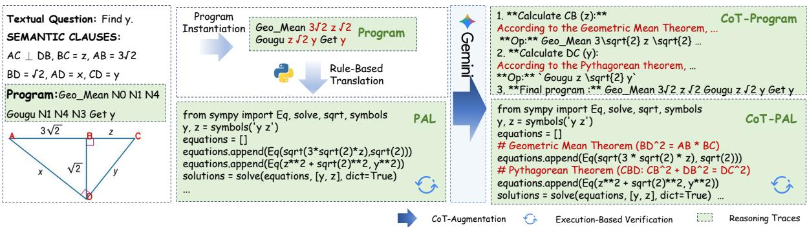  
Figure 2: Overview of the multi-trace synthesis pipeline. Starting from a solution program, we first instantiate variables and translate it into a verified executable PAL script via rule-based translation and execution-based verification. We then augment the instantiated program and the verified PAL script with natural-language rationales to obtain CoT-Program and CoT-PAL, respectively.

Execution-Based Verification. To ensure script correctness, we execute it in a sandbox with a timeout constraint. The script is valid only if it runs successfully without errors and returns a result aˆ that matches the ground-truth answer a within a relative tolerance $( \epsilon = 0 . 0 0 1 )$ .

## 3.2.2 CoT Augmentation

While the instantiated programs and derived PAL scripts are executable, they do not explicitly articulate the intermediate geometric reasoning. To bridge this gap, we introduce an MLLM-based CoT augmentation stage that rewrites them into rationale-enriched variants. This process yields the following CoT-style traces.

CoT-PAL enhances the standard PAL scripts by adding explicit natural-language rationales before each equation. As illustrated in Figure 2, the geometric rationale (e.g., “Geometric Mean Theorem $( B D ^ { 2 } = A B * B C ) ^ { \prime \prime } )$ is first articulated before formulating the corresponding equation. To improve the reliability of the generated traces, we implement a generate-and-verify pipeline. Every transformed script undergoes the same executionbased verification described in Section 3.2.1. If execution fails, the error message is returned to the MLLM as feedback, and the full loop is repeated up to three times until success. The prompts for CoT-PAL conversion and bug fixing are detailed in Tables 11 and 12 in Appendix A.2.2.

CoT-Program rewrites the solution program into a structured, step-by-step natural-language explanation aligned with each program step, following prior work (Yang et al., 2025). As shown in Figure 2, each step explains the application of geometric principles before the program step. Table 13 in Appendix A.2.2 contains the complete prompt used for CoT-Program transformation. Because CoT-Program augments the program with naturallanguage explanations, the resulting trace is not directly executable as a whole, and thus executionbased verification is not applicable. During inference, we parse the program from the generated CoT-Program and execute it to obtain the answer.

## 3.3 Perception-Augmented Training

Solving a diagram-based geometry problem requires both diagram understanding and symbolic reasoning. Recent multimodal reasoning frameworks such as LLaVA-CoT (Xu et al., 2025) and Insight-V (Dong et al., 2025) emphasize explicit visual grounding prior to complex reasoning. Inspired by this paradigm, we incorporate a perception step to bridge the visual-to-symbolic gap in geometry reasoning. Specifically, we formulate the problem-solving process as a sequential, perception-augmented pipeline, termed Perception-Augmented (PA) Training: (i) Perception, where the MLLM parses the diagram D into explicit semantic clauses S; and (ii) Reasoning, which conditions on the perceived clauses S to generate an executable reasoning trace T.

We optimize this integrated process by maximizing the joint log-likelihood $P _ { \theta } ( S , T \mid D , Q )$

$$
\begin{array} { r l } & { \mathcal { L } = - \log P _ { \theta } ( S , T \mid D , Q ) } \\ & { \quad = - \log \left[ P _ { \theta } ( S \mid D , Q ) \cdot P _ { \theta } ( T \mid S , D , Q ) \right] } \\ & { \quad = \underbrace { - \log P _ { \theta } ( S \mid D , Q ) } _ { \mathcal { L } _ { \mathrm { p e r c } } } \underbrace { - \log P _ { \theta } ( T \mid S , D , Q ) } _ { \mathcal { L } _ { \mathrm { r e a s o n } } } } \end{array}\tag{1}
$$

where $S = ( S _ { 1 } , \ldots , S _ { | S | } )$ denotes the parsed semantic clauses, and $T \overset { \cdot } { = } \left( T _ { 1 } , \ldots , T _ { | T | } \right)$ denotes the reasoning trace. The perception loss $\mathcal { L } _ { \mathrm { p e r c } }$ encourages accurate parsing of diagram semantics, while the reasoning loss $\mathcal { L } _ { \mathrm { r e a s o n } }$ trains the model to generate the reasoning trace conditioned on structured visual evidence. Both terms are optimized autoregressively with standard cross-entropy.

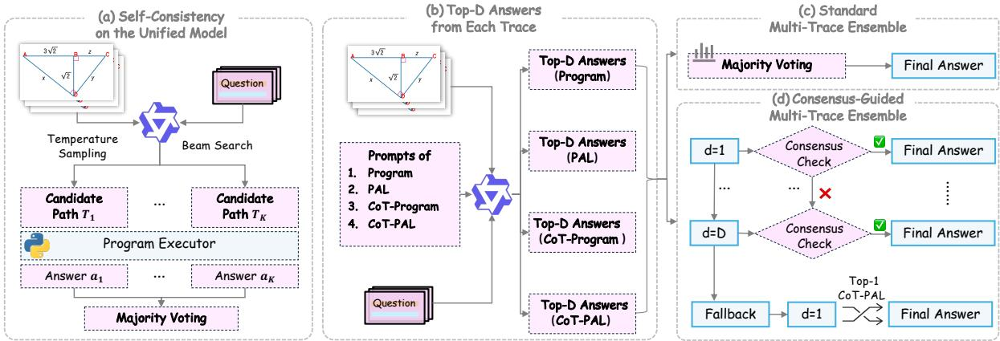  
Figure 3: Comparison of test-time scaling strategies. (a) Self-consistency on the unified model. (b) Multi-trace inference with trace-specific instructions. (c) Standard MTE. (d) CG-MTE expands depth until consensus.

## 3.4 Inference: Test-Time Scaling

Building on diverse PGP-solving strategies, we explore two strategies: (1) self-consistency (SC) on a unified model, and (2) a multi-trace ensemble that aggregates various reasoning trace types.

## 3.4.1 Self-Consistency on the Unified Model

For the model trained on a mixture of reasoning traces, the unified model can implicitly select among different reasoning strategies at test time without prompt control. We employ standard SC (Wang et al., 2023) to aggregate multiple candidate reasoning paths, as illustrated in Figure 3(a). Given an input $x = ( D , Q )$ , we generate K candidate paths $\{ T _ { 1 } , \dots , T _ { K } \}$ via beam search or temperature sampling. Each path is executed to produce an answer $a _ { i } = \operatorname { E x E C } ( T _ { i } )$ .

The final answer $a ^ { * }$ is determined by majority voting over the executed results of all K paths:

$$
a ^ { * } = \mathrm { m o d e } ( \{ a _ { i } \} _ { i = 1 } ^ { K } ) = \arg \operatorname* { m a x } _ { v \in \mathcal { V } } \sum _ { i = 1 } ^ { K } \mathbb { I } ( a _ { i } = v ) ,\tag{2}
$$

where $\mathcal { V } = \{ a _ { 1 } , . . . , a _ { K } \}$ represents the set of candidate answers and $\mathbb { I } ( \cdot )$ is the indicator function.

## 3.4.2 Multi-Trace Ensemble (MTE)

To leverage the diversity of reasoning traces, we generate $V$ distinct traces by prompting the same fine-tuned model with trace-specific instructions. Detailed prompts are provided in Appendix D.1. For each trace type $j \in \{ 1 , \ldots , V \}$ , we apply beam search to obtain the top-D paths. These trajectories are executed to produce an answer list

$$
A _ { j } ( x ) = [ a _ { j , 1 } ( x ) , \hdots , a _ { j , D } ( x ) ] .\tag{3}
$$

We consider two aggregation mechanisms displayed in Figure 3(c) and (d).

Standard MTE. A straightforward baseline pools all V D executed answers and performs majority voting as in Equation 2. While effective, this approach is computationally expensive, as it requires generating the maximum number of samples for each problem, regardless of difficulty.

Consensus-Guided MTE (CG-MTE). To improve computational efficiency, we perform consensus checking progressively from shallow to deep and terminate as soon as a unique mode emerges. Concretely, we iterate over the depth $d \in \{ 1 , \ldots , D \}$ and apply the following four steps: (1) Step-wise Ensemble: At depth d, pool the topd answers from all trace types into an answer list $\mathbb { S } _ { d } ( \boldsymbol { x } ) = \bigcup _ { j = 1 } ^ { V } \{ a _ { j , 1 } ( \boldsymbol { x } ) , \ldots , a _ { j , d } ( \boldsymbol { x } ) \}$ . (2) Consensus Check: Compute $v _ { d } ^ { * } ( x ) =$ mode $( \mathbb { S } _ { d } ( x ) )$ . If $v _ { d } ^ { * } ( x )$ exists, we terminate and output $a ^ { * } = v _ { d } ^ { * } ( x )$ (3) Depth Expansion: If $v _ { d } ^ { * } ( x )$ does not exist, increase the depth $d \gets d { + } 1$ and repeat Steps (1)–(2), until $d = D$ . (4) Fallback: If $v _ { D } ^ { * } ( x )$ still does not exist, we return the top-1 CoT-PAL answer as the fallback. Therefore, CG-MTE does not introduce an additional consensus threshold hyperparameter. It serves only as an empirical stopping rule rather than a correctness certificate, because the trace outputs may exhibit correlated errors.

Compute efficiency. We quantify inference cost by the average sampling number (ASN), the number of generated candidates per instance. For the Standard MTE, the sample cost is fixed:

$$
A S N _ { \mathrm { S t d } } ( D ) = V D .\tag{4}
$$

For the CG-MTE, let T denote the test set and let $d _ { x }$ denote the termination depth for instance $x \in \tau$

The sampling cost is

$$
A S N _ { \mathrm { C G } } ( D ) = \frac { 1 } { | T | } \sum _ { x \in \mathcal { T } } V d _ { x } = \frac { V } { | T | } \sum _ { x \in \mathcal { T } } d _ { x } ,\tag{5}
$$

which enables early termination when consensus is reached at shallow depths, reducing sampling cost.

## 4 Experiments

Dataset and Metrics. We evaluate our method on three widely used geometry problem-solving benchmarks: PGPS9K (Zhang et al., 2023), Geometry3K (Lu et al., 2021), and GeoQA (Chen et al., 2021). Since GeoQA does not provide semanticclause annotations required by PA training, we manually annotate them following the same format as PGPS9K. After applying the MTS framework, each symbolic program is expanded into four reasoning-trace variants. We denote the MTS-All datasets as PGPS9K-All, Geometry3K-All, and GeoQA-All, which contain approximately 32.1K, 33.7K, and 13.9K training instances, respectively. Detailed MTS construction procedures and dataset statistics are provided in Appendix A.2.1. Following prior work, we report answer accuracy (top-1 match). An answer is considered correct if the predicted numerical value matches the ground truth within a relative tolerance of $\epsilon = 1 0 ^ { - 3 }$

Compared Systems. We compare our method against three categories of systems: (i) Generalpurpose MLLMs: frontier and open-source multimodal large language models including GPT-4V (OpenAI, 2023), Claude 3.5 Sonnet (Anthropic, 2024), and Qwen2.5-VL (Bai et al., 2025). (ii) Neural Geometry Solvers: end-to-end geometry reasoning systems trained specifically for diagram understanding and program prediction, including NGS (Chen et al., 2021), Geoformer (Chen et al., 2022), PGPSNet (Zhang et al., 2023), PGPSNetv2-S (Zhang et al., 2024a), LANS (Li et al., 2024), and GeoX (Xia et al., 2025). (iii) Neural-symbolic Geometry Solvers: systems that integrate neural perception with symbolic geometric reasoning, including InterGPS (Lu et al., 2021), Geo-DRL (Peng et al., 2023), and Pi-GPS (Zhao et al., 2025a). We fine-tune three backbones: Qwen2-VL-2B-Instruct, Qwen2.5-VL-3B-Instruct, and Qwen3- VL-8B-Instruct. For brevity, we denote them as 2B, 3B, and 8B, respectively. To verify that improvements are not specific to Qwen-VL, additional experiments on InternVL3.5-2B and InternVL3.5-8B are provided in Appendix C.1.

<table><tr><td>Model</td><td>PGPS9K</td><td>Geometry3K</td><td>GeoQA</td></tr><tr><td colspan="4">General-purpose MLLMs</td></tr><tr><td>GPT-4V</td><td>33.3</td><td>34.8</td><td>43.4</td></tr><tr><td>Claude 3.5 Sonnet</td><td>27.6</td><td>32.0</td><td>49.2</td></tr><tr><td>Qwen2.5-VL-7B</td><td>39.4</td><td>35.8</td><td>46.2</td></tr><tr><td>Qwen2.5-VL-72B</td><td>53.3</td><td>50.5</td><td>55.5</td></tr><tr><td colspan="4">Neural Geometry Solvers</td></tr><tr><td>NGS</td><td>34.1</td><td>35.3</td><td>46.3</td></tr><tr><td>Geoformer</td><td>35.6</td><td>36.8</td><td>49.1</td></tr><tr><td>GeoX</td><td>52.7</td><td>58.6</td><td>54.9</td></tr><tr><td>PGPSNet</td><td>62.7</td><td>65.0</td><td></td></tr><tr><td>PGPSNet-v2-S</td><td>60.3</td><td>65.2</td><td></td></tr><tr><td>LANS</td><td>66.7</td><td>72.1</td><td></td></tr><tr><td colspan="4">Neural-symbolic Geometry Solvers</td></tr><tr><td>InterGPS (Diagram GT)</td><td>59.8</td><td>64.2</td><td></td></tr><tr><td>GeoDRL</td><td>55.6</td><td>57.9</td><td></td></tr><tr><td>Pi-GPS</td><td>61.4</td><td>70.6</td><td></td></tr><tr><td colspan="4">Fine-tuned Models</td></tr><tr><td colspan="4">Baseline: Direct Program Prediction on Solution Program</td></tr><tr><td>Qwen3-VL-8B</td><td>58.6</td><td>65.4</td><td>60.9</td></tr><tr><td>Qwen2.5-VL-3B</td><td>46.7</td><td>53.1</td><td>53.4</td></tr><tr><td>Qwen2-VL-2B</td><td>43.4</td><td>41.4</td><td>47.1</td></tr><tr><td colspan="4">Ours: PA Training on MTS-All</td></tr><tr><td>Qwen3-VL-8B</td><td>71.2 (+12.6)</td><td>74.5 (+9.1)</td><td>67.2 (+6.3)</td></tr><tr><td>Qwen2.5-VL-3B</td><td> $5 8 . 3 \ ( + 1 1 . 6 )$ </td><td> $6 4 . 7 \ ( + 1 1 . 6 )$ </td><td>58.7 (+5.3)</td></tr><tr><td>Qwen2-VL-2B</td><td> $5 0 . 8 \ ( + 7 . 4 )$ </td><td> $5 2 . 0 \ ( + 1 0 . 6 ) $ </td><td>53.5 (+6.4)</td></tr></table>

Table 1: Performance comparison on three benchmarks. All metrics are reported as answer accuracy (%).

Implementation Details. For multi-trace synthesis, we use Gemini-2.5-Flash (Gemini Team, Google, 2025) to generate CoT rationales. Unless otherwise specified, we report main results with greedy decoding. For each benchmark, our model is trained with PA training on its corresponding MTS-All dataset. For the test-time scaling analysis, all models are trained with PA training. For self-consistency, we use beam search or temperature sampling and set the sampling budget to K = 40. Since MTS-All includes four reasoning trace types—program, PAL, CoT-Program, and CoT-PAL—we set V = 4 in all multi-trace inference experiments. For each trace type, we keep the top-D candidates with D = 10, yielding the same maximum budget of VD = 40 for MTE. Additional training hyperparameters are provided in Appendix B.1.

## 4.1 Main Results

Table 1 reports the comparative results on three benchmarks. Our key findings are as follows:

Significantly Enhanced Reasoning Capabilities. PA training on MTS-All consistently outperforms direct program prediction across all model scales and benchmarks. On PGPS9K, it yields absolute gains of 7.4%, 11.6%, and 12.6% for the 2B, 3B, and 8B backbones, respectively, with similar gains on Geometry3K and GeoQA. These results show that structured perception and heterogeneous reasoning traces jointly improve geometric reasoning.

Strong Performance Across Benchmarks. Our fine-tuned Qwen3-VL-8B achieves 71.2%, 74.5%, and 67.2% accuracy on PGPS9K, Geometry3K, and GeoQA, respectively. Compared with generalpurpose MLLMs, it substantially outperforms Qwen2.5-VL-72B by 17.9%, 24.0%, and 11.7% on the three benchmarks. Compared with specialized geometry solvers, it also achieves the best results on PGPS9K and Geometry3K, surpassing the strongest compared solver, LANS, by 4.5% and 2.4%, respectively.

## 5 Analysis

## 5.1 Ablation Studies

Effectiveness of PA Training. The efficacy of the PA training paradigm is underscored by the comparative results in Table 2. Removing the perception step and reverting to direct program prediction leads to consistent accuracy drops across all model scales, namely 5.3%, 6.5%, and 5.8% on the 2B, 3B, and 8B backbones, respectively. This degradation shows that explicit semantic parsing bridges the visual-to-symbolic gap by grounding geometric reasoning in accurate visual signals. Qualitative case studies in Appendix C.2 show how the perception step reduces erroneous symbolic deductions caused by diagram misinterpretation.

<table><tr><td>Setting</td><td>Data Size</td><td>2B</td><td>3B</td><td>8B</td></tr><tr><td>PA Training on PGPS9K-All</td><td>32K</td><td>50.8</td><td>58.3</td><td>71.2</td></tr><tr><td>w/o PA Training</td><td>32K</td><td>45.5 (-5.3)</td><td>51.8 (-6.5)</td><td>65.4 (-5.8)</td></tr><tr><td>w/o PGPS9K-MTS</td><td>32K</td><td>46.7 (-4.1)</td><td>54.4 (-3.9)</td><td>67.6 (-3.6)</td></tr></table>

Table 2: Ablation study of PA training and the synthesized PGPS9K-MTS. Numbers in green indicate absolute accuracy drops.

Effectiveness of Diverse Reasoning Traces. To isolate the effect of reasoning diversity from data scale, we introduce a data-size-matched control by repeating the original symbolic programs of PGPS9K to 32K, matching the size of PGPS9K-All. Removing the synthesized reasoning traces (w/o PGPS9K-MTS) leads to a consistent performance degradation of approximately 4%, as shown in Table 2. To further disentangle the contributions of different reasoning formats, we analyze singletrace variants in Table 3. Compared to singletrace settings, merging all traces into PGPS9K-All achieves the best performance, suggesting that diverse reasoning traces provide complementary strategies and improve generalization.

<table><tr><td>Training Data</td><td>2B</td><td>3B</td><td>8B</td><td>Len</td><td>Correctness</td></tr><tr><td colspan="6">Single Trace (PGPS9K)</td></tr><tr><td>Program</td><td>46.2</td><td>54.2</td><td>67.5</td><td></td><td></td></tr><tr><td>CoT-Program</td><td>46.0</td><td>54.5</td><td>67.9</td><td>5.1K</td><td>93.0%</td></tr><tr><td>PAL</td><td>46.7</td><td>54.4</td><td>67.4</td><td></td><td></td></tr><tr><td>CoT-PAL</td><td>47.2</td><td>55.4</td><td>68.3</td><td>0.9K</td><td>98.5%</td></tr><tr><td colspan="6">Multi-Trace (PGPS9K-All)</td></tr><tr><td>PGPS9K-All</td><td></td><td>50.8 58.3</td><td>71.2</td><td></td><td></td></tr></table>

Table 3: Performance comparison across individual traces and multi-trace mixtures. Correctness and Len denote human-verified correctness and prompt length.

Superiority of Executable CoT-PAL. CoT-PAL consistently achieves the best performance across all model scales compared to other singletrace types. As detailed in Table 3, it achieves accuracies of 47.2%, 55.4%, and 68.3% on the 2B, 3B, and 8B backbones, respectively. This performance advantage is consistent with the higher reasoning faithfulness of the synthesized traces produced by our translate-then-rewrite pipeline. To verify this, we conduct a human evaluation on two CoT-style traces to assess the correctness of the reasoning process. The results, summarized in Table 3, reveal that CoT-PAL achieves a reasoning correctness rate of 98.5%, surpassing CoT-Program by 5.5%. Additional details regarding the human evaluation and the higher training efficiency gains of CoT-PAL are provided in Appendix C.3 and Appendix C.4, respectively.

<table><tr><td>Setting</td><td>Tokens (O/M)</td><td>2B</td><td>3B</td></tr><tr><td>MTS-All</td><td>7.2M</td><td>50.8</td><td>58.3</td></tr><tr><td>w/o CoT-Program</td><td>4.9M / 7.2M</td><td>49.7 (-1.1)</td><td>56.9 (-1.4)</td></tr><tr><td>w/o PAL</td><td>5.1M/7.2M</td><td>48.6 (-2.2)</td><td>56.6 (-1.7)</td></tr><tr><td>w/o CoT-PAL</td><td>5.0M / 7.2M</td><td>47.7 (-3.1)</td><td>55.3 (–3.0)</td></tr><tr><td>w/o Program</td><td>6.6M / 7.2M</td><td>48.9 (-1.9)</td><td>56.1 (-2.2)</td></tr></table>

Table 4: Token-controlled leave-one-out ablation of individual reasoning traces on PGPS9K. Tokens (O/M) denote the original and matched training token budgets.

Effectiveness of Individual Trace Types. While Table 3 compares single-trace and multi-trace settings, it does not reveal whether each individual trace contributes positively to the full mixture. Therefore, we conduct token-controlled leave-oneout ablations on PGPS9K. Specifically, after removing one trace type from MTS-All, we resample the remaining traces to match the MTS-All token budget. As shown in Table 4, removing any individual trace type consistently decreases performance across both backbones. This demonstrates that different trace formats provide complementary reasoning trajectories. In particular, removing CoT-PAL leads to the largest degradation, suggesting that CoT-PAL provides a particularly effective reasoning format among the four trace formats. These results also indicate that CoT-augmented traces do not fully subsume their non-CoT counterparts.

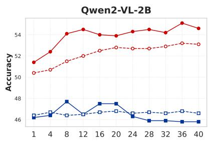

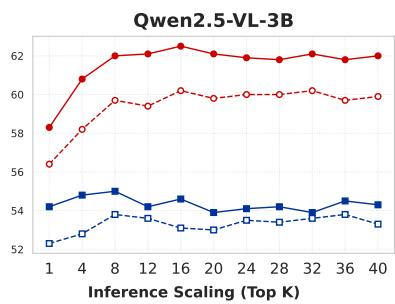

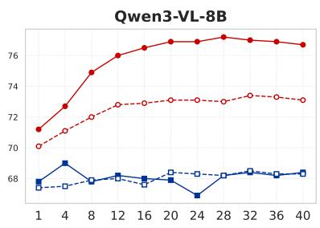  
PGPS9K-All(ours) + beam-search PGPS9K-All(ours) + temperature sampling PGPS9K-only + beam-search PGPS9K-only + temperature sampling  
Figure 4: Impact of data diversity on test-time scaling across model sizes. Models trained on PGPS9K-All scale robustly with increasing sample budget, whereas the PGPS9K-only baseline shows limited gains or even degradation.

Efficacy of Data Construction Pipeline. We further analyze why CoT-PAL outperforms CoT-Program by examining their data construction processes. CoT-Program is produced in a single pass, and the resulting traces cannot be validated through code execution. In contrast, CoT-PAL is derived through a rigorous three-stage pipeline: (1) rulebased translation preserves the program’s logical skeleton; (2) MLLM rewriting enriches it with natural language rationale; (3) execution-based verification ensures executable correctness. This decomposition reduces the difficulty of generating rationales and improves faithfulness. Moreover, constructing CoT-Program requires providing semantic definitions for all 34 geometric operators as inputs to the MLLM, whereas CoT-PAL leverages the derived PAL script as input, thereby substantially reducing the prompt length from 5.1K to 0.9K tokens.

## 5.2 Scaling Laws of Test-Time Compute

Scaling Performance of Self-Consistency. Training on the diverse reasoning traces of PGPS9K-All yields better test-time scaling behavior than the PGPS9K-only baseline, which is trained solely on symbolic programs. As illustrated in Figure 4, applying self-consistency to the PGPS9K-All model yields consistent performance gains across different inference budgets, whereas the program-only baseline shows negligible improvement or even degradation as the inference budget increases. For the Qwen3-VL-8B model, beam search improves accuracy from 71.2% at top-1 to 76.7% at top-40, while temperature sampling increases it from 69.1% to 73.1%. These results suggest that diverse reasoning traces can unlock the benefits of TTS in PGP-solving. Similar TTS trends on Geometry3K and GeoQA are provided in Appendix D.2. Furthermore, for the PGPS9K-All model, we observe that beam search consistently outperforms temperature sampling with a more detailed analysis in Appendix D.3.

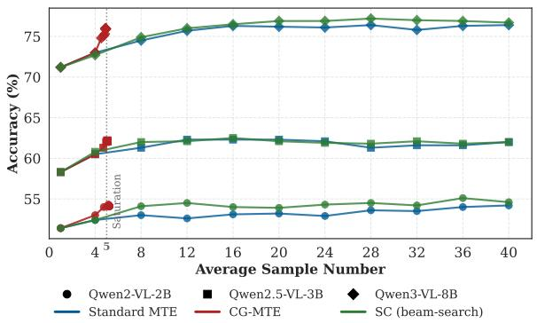  
Figure 5: Accuracy–compute trade-off on PGPS9K among Standard MTE, SC with beam search, and CG-MTE. The dashed line marks the accuracy saturation.

Pareto Efficiency of CG-MTE. We further evaluate the accuracy–compute trade-off of different test-time scaling strategies on PGPS9K. As shown in Figure 5, we compare SC with beam search, Standard MTE, and CG-MTE under increasing inference budgets. Both standard MTE and SC exhibit a relatively slow, near-linear scaling trajectory. By contrast, CG-MTE reaches its performance plateau much earlier, demonstrating better Pareto efficiency across all model scales. For the Qwen3-VL-8B model, CG-MTE attains 76.0% accuracy with $A S N _ { \mathrm { C G } } \approx 5 ,$ as indicated by the vertical dashed line in Figure 5. This matches the performance of SC with beam search at N = 12, while using approximately 2.4× fewer samples. Compared with a high-budget reference setting (N = 40), CG-MTE remains comparable in accuracy (76.7% for SC and 76.4% for Standard MTE), while reducing sampling cost by up to 8×.

Overall, CG-MTE consistently improves the accuracy–compute trade-off.

Mechanism of Efficient CG-MTE. The efficiency of CG-MTE stems from the fact that crosstrace agreement is reached very early for most instances. Moreover, early agreement is associated with higher accuracy, whereas cases requiring deeper expansion are typically more uncertain and harder. This explains why CG-MTE achieves a better accuracy–compute trade-off than standard MTE. Appendix D.4 provides an in-depth analysis of termination behavior and a representative case. However, because all four traces are derived from the same symbolic program, their errors may be correlated. We therefore interpret cross-trace consensus as an empirical early-stopping signal rather than a correctness guarantee. Appendix D.5 reports the error-coupling analysis across trace formats.

Comparison with Adaptive Beam-Search SC. To determine whether the efficiency of CG-MTE comes from grouping and early stopping, we compare it with two adaptive beam-search SC baselines. Both first generate the unified model’s top-40 beam candidates, partition them into four groups, and apply the same unique-mode stopping rule and maximum budget as CG-MTE. The rank-split baseline partitions the top-40 candidates from unified beam search into four rank blocks (1–10, 11–20, 21–30, and 31–40), whereas the pattern-split baseline groups candidates according to their generated trace patterns. As shown in Table 5, rank split achieves nearly the same ASN as CG-MTE but is 0.8 and 1.0 points less accurate on the 8B and 3B models, respectively. Pattern split attains comparable accuracy but uses 2.6× and 2.4× the ASN. Thus, grouping and early stopping account for much of the sampling reduction but do not reproduce the same accuracy–compute trade-off. We therefore view CG-MTE primarily as a sampleefficient adaptive inference strategy rather than a method for raising the high-budget accuracy ceiling over beam-search SC.

## 6 Conclusion

We investigate why test-time scaling is less effective for PGP-solving and identify two key obstacles: limited reasoning diversity and perceptioninduced symbolic errors. To address these challenges, we propose Multi-Trace Synthesis, which expands symbolic programs into heterogeneous reasoning traces, and Perception-Augmented training, which grounds symbolic deduction in structured semantic clauses parsed from diagrams. Experiments on PGPS9K, Geometry3K, and GeoQA show that our method consistently improves geometry reasoning across model scales and achieves strong performance. Finally, we introduce CG-MTE, a self-adaptive inference strategy that preserves most gains of high-budget self-consistency while reducing sampling cost by up to 8×.

<table><tr><td>Model Method</td><td></td><td>Acc. (%)</td><td>ASN</td></tr><tr><td rowspan="3">8B</td><td>SC@40 (beam)</td><td>76.7</td><td>40.00</td></tr><tr><td>Adaptive beam SC (rank) Adaptive beam SC (pattern)</td><td>75.2 75.8</td><td>4.68 12.72</td></tr><tr><td>CG-MTE</td><td>76.0</td><td>4.89</td></tr><tr><td rowspan="3">3B</td><td>SC@40 (beam)</td><td>62.0</td><td>40.00</td></tr><tr><td>Adaptive beam SC (rank)</td><td>61.1</td><td>4.94</td></tr><tr><td>Adaptive beam SC (pattern)</td><td>62.6</td><td>12.28</td></tr><tr><td colspan="2">CG-MTE</td><td>62.1</td><td>5.09</td></tr></table>

Table 5: Comparison with adaptive beam-search selfconsistency baselines on PGPS9K. ASN denotes the average sample number. All adaptive methods use the same maximum budget and unique-mode stopping rule.

## Limitations

Despite its promising performance, our framework faces three key limitations that motivate future research. First, the current method depends on structured annotations. The program-seeded MTS implementation requires reliable formal solution programs, while PA training requires semantic clauses during training. This limits direct applicability to datasets without such annotations. Extending the framework to alternative reasoning seeds or less structured intermediate representations would require task-specific conversion and verification mechanisms. Second, although we evaluate on three plane geometry benchmarks, namely PGPS9K, Geometry3K, and GeoQA, our study remains confined to 2D plane geometry. Whether the observed scaling laws and diversitydriven improvements generalize to 3D geometry, physics, or other multimodal reasoning tasks remains unverified. Finally, execution-based verification ensures that CoT-PAL scripts execute successfully and return the expected answer, but it cannot verify the semantic faithfulness of all natural-language rationales. The rationales in CoTaugmented traces may therefore occasionally be misaligned with their formal reasoning steps.

## Ethics Statement

This work uses publicly accessible geometry benchmarks, including PGPS9K, Geometry3K, and GeoQA, and does not involve private user data or sensitive personal information. Any release of derived MTS data and related artifacts complies with the licenses and redistribution terms of the source benchmarks. The human evaluation was conducted by geometry-trained undergraduate members of the research group. Participation in this internal annotation effort was voluntary, and no separate task-specific compensation was provided. Further details on the annotation and adjudication protocol are provided in Appendix C.3. Our method is intended for research and educational use. It is not designed for safety-critical or high-stakes settings, and its outputs should not be treated as authoritative without expert verification. More broadly, we hope this work contributes to more interpretable and verifiable AI systems. At the same time, stronger reasoning models may also produce more convincing but still incorrect outputs, underscoring the need for verification and human oversight.

## Acknowledgments

We thank all anonymous reviewers for their valuable comments. This work was supported by National Natural Science Foundation of China under No. 92370119, 62376113, 62436009, 62276258, and Jiangsu Science and Technology Programme BK20251812, and Open Research Fund of the State Key Laboratory of Multimodal Artificial Intelligence Systems. This work was also supported by the Top Talent Reward Project under No. RDF-TP-0019.

## References

Anthropic. 2024. Introducing claude 3.5 sonnet. https://www.anthropic.com/news/ claude-3-5-sonnet. Accessed: 2026-05-18.

Shuai Bai, Keqin Chen, Xuejing Liu, Jialin Wang, Wenbin Ge, Sibo Song, Kai Dang, Peng Wang, Shijie Wang, Jun Tang, Humen Zhong, Yuanzhi Zhu, Mingkun Yang, Zhaohai Li, Jianqiang Wan, Pengfei Wang, Wei Ding, Zheren Fu, Yiheng Xu, Jiabo Ye, Xi Zhang, Tianbao Xie, Zesen Cheng, Hang Zhang, Zhibo Yang, Haiyang Xu, and Junyang Lin. 2025. Qwen2.5-VL technical report. arXiv preprint arXiv:2502.13923.

Jianlong Chen, Daocheng Fu, Shengze Xu, Jiawei Chen, Yuan Feng, Yue Yang, Junchi Yan, Hongyuan Zha,

and Renqiu Xia. 2026. Milestones over Outcome: Unlocking Geometric Reasoning with Sub-Goal Verifiable Reward. Preprint, arXiv:2601.05073.

Jiaqi Chen, Tong Li, Jinghui Qin, Pan Lu, Liang Lin, Chongyu Chen, and Xiaodan Liang. 2022. Unigeo: Unifying geometry logical reasoning via reformulating mathematical expression. In Proceedings ofthe 2022 Conference on Empirical Methods in Natural Language Processing, pages 3313–3323.

Jiaqi Chen, Jianheng Tang, Jinghui Qin, Xiaodan Liang, Lingbo Liu, Eric Xing, and Liang Lin. 2021. Geoqa: A geometric question answering benchmark towards multimodal numerical reasoning. In Findings of the Associationfor Computational Linguistics: ACL-IJCNLP 2021, pages 513–523.

Jo-Ku Cheng, Zeren Zhang, Ran Chen, Jingyang Deng, Ziran Qin, and Jinwen Ma. 2025. Geouni: A unified model for generating geometry diagrams, problems and problem solutions. In Proceedings of the 33rd ACM International Conference on Multimedia, MM ’25, page 3057–3066, New York, NY, USA. Association for Computing Machinery.

Seunghyuk Cho, Zhenyue Qin, Yang Liu, Youngbin Choi, Seungbeom Lee, and Dongwoo Kim. 2026. Plane geometry problem solving with multi-modal reasoning: A survey. In Findings ofthe Association for Computational Linguistics: EACL 2026, pages 110–131, Rabat, Morocco. Association for Computational Linguistics.

Yuhao Dong, Zuyan Liu, Hai-Long Sun, Jingkang Yang, Winston Hu, Yongming Rao, and Ziwei Liu. 2025. Insight-v: Exploring long-chain visual reasoning with multimodal large language models. In Proceedings of the Computer Vision and Pattern Recognition Conference, pages 9062–9072.

Jiahui Gao, Renjie Pi, Jipeng Zhang, Jiacheng Ye, Wanjun Zhong, Yufei Wang, Lanqing Hong, Jianhua Han, Hang Xu, Zhenguo Li, et al. 2025. G-LLaVA: Solving geometric problem with multi-modal large language model. In International Conference on Learning Representations, volume 2025, pages 3490–3511.

Luyu Gao, Aman Madaan, Shuyan Zhou, Uri Alon, Pengfei Liu, Yiming Yang, Jamie Callan, and Graham Neubig. 2023. PAL: Program-aided language models. In Proceedings of the 40th International Conference on Machine Learning, ICML’23. JMLR.org.

Gemini Team, Google. 2025. Gemini 2.5: Pushing the frontier with advanced reasoning, multimodality, long context, and next generation agentic capabilities. arXiv preprint arXiv:2507.06261.

Yihan Hao, Mingliang Zhang, Fei Yin, and Lin-Lin Huang. 2022. PGDP5K: A Diagram Parsing Dataset for Plane Geometry Problems. In 2022 26th International Conference on Pattern Recognition (ICPR), pages 1763–1769, Montreal, QC, Canada. IEEE.

Zhong-Zhi Li, Ming-Liang Zhang, Fei Yin, and Cheng-Lin Liu. 2024. LANS: A layout-aware neural solver for plane geometry problem. In Findings ofthe Association for Computational Linguistics: ACL 2024, pages 2596–2608, Bangkok, Thailand. Association for Computational Linguistics.

Deng Linger, Linghao Zhu, Yuliang Liu, Yu Wang, Qunyi Xie, Jingjing Wu, Gang Zhang, Yingying Zhu, and Xiang Bai. 2025. Theorem-validated reverse chain-of-thought problem generation for geometric reasoning. In Proceedings ofthe 2025 Conference on Empirical Methods in Natural Language Processing, pages 718–735.

Pan Lu, Ran Gong, Shibiao Jiang, Liang Qiu, Siyuan Huang, Xiaodan Liang, and Song-Chun Zhu. 2021. Inter-gps: Interpretable geometry problem solving with formal language and symbolic reasoning. In Proceedings ofthe 59th Annual Meeting ofthe Associationfor Computational Linguistics and the 11th International Joint Conference on Natural Language Processing (Volume 1: Long Papers), pages 6774– 6786.

Maizhen Ning, Zihao Zhou, Qiufeng Wang, Xiaowei Huang, and Kaizhu Huang. 2025. GNS: Solving plane geometry problems by neural-symbolic reasoning with multi-modal llms. In Proceedings of the AAAI Conference on Artificial Intelligence, volume 39, pages 24957–24965.

OpenAI. 2023. GPT-4 technical report. arXiv preprint arXiv:2303.08774.

Yicheng Pan, Zhenrong Zhang, Pengfei Hu, Jiefeng Ma, Jun Du, Jianshu Zhang, Quan Liu, Jianqing Gao, and Feng Ma. 2025. Enhancing the geometric problem-solving ability of multimodal llms via symbolic-neural integration. In Proceedings of the 33rd ACM International Conference on Multimedia, pages 5394–5403.

Shuai Peng, Di Fu, Yijun Liang, Liangcai Gao, and Zhi Tang. 2023. GeoDRL: A self-learning framework for geometry problem solving using reinforcement learning in deductive reasoning. In Findings of the Associationfor Computational Linguistics: ACL 2023, pages 13468–13480, Toronto, Canada. Association for Computational Linguistics.

Nannan Shi, Chuanyu Qin, Shipeng Song, and Man Luo. 2025. GeoThought: A Dataset for Enhancing Mathematical Geometry Reasoning in Vision-Language Models. Preprint, arXiv:2510.21881.

Charlie Victor Snell, Jaehoon Lee, Kelvin Xu, and Aviral Kumar. 2025. Scaling llm test-time compute optimally can be more effective than scaling parameters for reasoning. In International Conference on Learning Representations.

Trieu H. Trinh, Yuhuai Wu, Quoc V. Le, He He, and Thang Luong. 2024. Solving olympiad geometry without human demonstrations. Nature, 625(7995):476–482.

Jingyun Wang, Dian Li, Xiaohan Wang, Gang Liu, Jiahong Yan, and Guoliang Kang. 2026. Concise geometric description as a bridge: Unleashing the potential of llm for plane geometry problem solving. In Proceedings ofthe IEEE/CVF Conference on Computer Vision and Pattern Recognition (CVPR) Findings, pages 5958–5967.

Xuezhi Wang, Jason Wei, Dale Schuurmans, Quoc V. Le, Ed H. Chi, Sharan Narang, Aakanksha Chowdhery, and Denny Zhou. 2023. Self-consistency improves chain of thought reasoning in language models. In The Eleventh International Conference on Learning Representations, ICLR 2023, Kigali, Rwanda, May 1-5, 2023. OpenReview.net.

Renqiu Xia, Mingsheng Li, Hancheng Ye, Wenjie Wu, Hongbin Zhou, Jiakang Yuan, Tianshuo Peng, Xinyu Cai, Xiangchao Yan, Bin Wang, Conghui He, Botian Shi, Tao Chen, Junchi Yan, and Bo Zhang. 2025. GeoX: Geometric problem solving through unified formalized vision-language pre-training. In International Conference on Learning Representations, volume 2025, pages 11670–11688.

Guowei Xu, Peng Jin, Ziang Wu, Hao Li, Yibing Song, Lichao Sun, and Li Yuan. 2025. LLaVA-CoT: Let vision language models reason step-by-step. In Proceedings ofthe IEEE/CVF International Conference on Computer Vision (ICCV), pages 2087–2098.

Tianyun Yang, Yunwen Li, Ziniu Li, Zhihang Lin, Ruoyu Sun, and Tian Ding. 2025. Bridging formal language with chain-of-thought reasoning to geometry problem solving. arXiv preprint arXiv:2508.09099.

Ming-Liang Zhang, Zhong-Zhi Li, Fei Yin, Liang Lin, and Cheng-Lin Liu. 2024a. Fuse, reason and verify: Geometry problem solving with parsed clauses from diagram. arXiv preprint arXiv:2407.07327.

Ming-Liang Zhang, Fei Yin, and Cheng-Lin Liu. 2023. A multi-modal neural geometric solver with textual clauses parsed from diagram. In Proceedings ofthe Thirty-Second International Joint Conference on Artificial Intelligence, IJCAI-23, pages 3374–3382. International Joint Conferences on Artificial Intelligence Organization. Main Track.

Xiaokai Zhang, Na Zhu, Yiming He, Jia Zou, Qike Huang, Xiaoxiao Jin, Yanjun Guo, Chenyang Mao, Yang Li, Zhe Zhu, Dengfeng Yue, Fangzhen Zhu, Yifan Wang, Yiwen Huang, Runan Wang, Cheng Qin, Zhenbing Zeng, Shaorong Xie, Xiangfeng Luo, and Tuo Leng. 2024b. FormalGeo: An Extensible Formalized Framework for Olympiad Geometric Problem Solving. Preprint, arXiv:2310.18021.

Yuhao Zhang, Dingxin Hu, Tinghao Yu, Hao Liu, and Yiting Liu. 2025. GeoFM: Enhancing Geometric Reasoning of MLLMs via Synthetic Data Generation through Formal Language. Preprint, arXiv:2510.27448.

Haiteng Zhao, Junhao Shen, Yiming Zhang, Songyang Gao, Kuikun Liu, Tianyou Ma, Fan Zheng, Dahua Lin, Wenwei Zhang, and Kai Chen. 2026. Achieving olympia-level geometry large language model agent via complexity boosting reinforcement learning. In International Conference on Learning Representations, volume 2026, pages 37892–37908.

Junbo Zhao, Ting Zhang, Jiayu Sun, Mi Tian, and Hua Huang. 2025a. Pi-gps: Enhancing geometry problem solving by unleashing the power of diagrammatic information. In Proceedings of the IEEE/CVF International Conference on Computer Vision (ICCV), pages 1526–1536.

Yurui Zhao, Xiang Wang, Jiahong Liu, Irwin King, and Zhitao Huang. 2025b. Towards geometry problem solving in the large model era: A survey. In 2nd AI for Math Workshop @ ICML 2025.

## A Method Details

## A.1 Additional Details of the Geometric Formal Language

We provide additional details of the domainspecific language used in Section 3.1.

Operators. The operator set O consists of 34 distinct geometric theorems and axioms, addressing fundamental operations involving triangles, quadrilaterals, polygons, and circles (e.g., Gougu).

Operands. The operands args are classified into three specific categories: (1) Problem Variables (N): Known measurements extracted from the textual problem Q or semantic clauses S during preprocessing and stored via an auxiliary mapping. (2) Process Variables (V): Intermediate geometric quantities (e.g., the length of an auxiliary line) computed during the deduction process. (3) Constants (C): Common numerical constants (e.g., π and 180◦) required for calculations.

## A.2 Multi-Trace Synthesis Details

## A.2.1 MTS Framework Details

To implement our MTS, we first attempt to convert the 8,021 training solution programs into executable PAL scripts. Four instances fail PAL verification because the translated solutions violate geometric constraints, such as non-negative segmentlength or non-degenerate topology requirements, as illustrated in Figure 6. These four instances are excluded only from the PAL and CoT-PAL branches, while their original Program instances and CoT-Program traces are retained.

This yields 8,017 verified PAL scripts and 8,017 CoT-PAL traces, while CoT-Program traces are constructed for all 8,021 training instances. Together, these three synthesized formats form a 24Ktrace mixture named PGPS9K-MTS. For CoT-PAL generation, 7,831 traces are obtained in a single pass, 152 require a second pass, and 34 require a third pass. We combine PGPS9K-MTS with the original PGPS9K to obtain the final training set, PGPS9K-All.

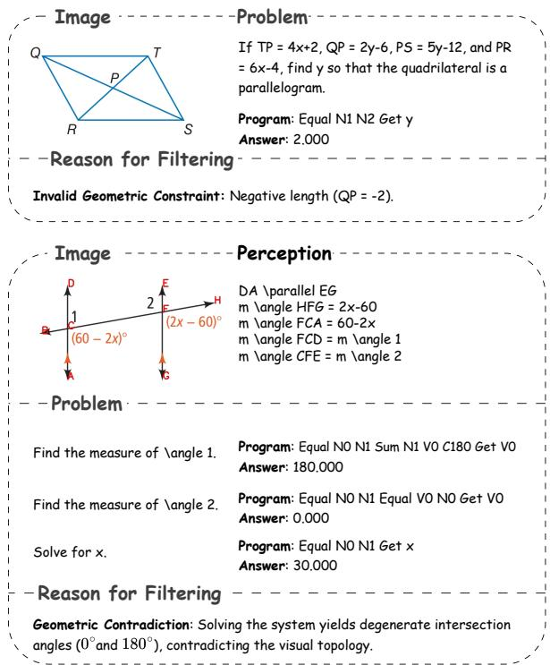  
Figure 6: Examples of filtered training samples during the program-to-PAL conversion. These cases were excluded due to inherent geometric contradictions in their problem design, such as evaluating to negative segment lengths or degenerate intersection angles.

We apply the same MTS framework to Geometry3K and GeoQA, resulting in GEOMETRY3K-MTS and GEOQA-MTS, respectively. Table 6 summarizes the statistics of the three geometry benchmarks and the resulting MTS training corpora.

<table><tr><td>Dataset</td><td>Train</td><td>Test</td><td># MTS</td><td># MTS-All</td></tr><tr><td>PGPS9K</td><td>8,021</td><td>1,000</td><td>24.1K</td><td>32.1K</td></tr><tr><td>Geometry3K</td><td>8,432</td><td>589</td><td>25.3K</td><td>33.7K</td></tr><tr><td>GeoQA</td><td>3,485</td><td>754</td><td>10.5K</td><td>13.9K</td></tr></table>

Table 6: Statistics of geometry datasets and the resulting MTS training corpora. “# MTS” denotes the number of synthesized multi-trace instances, while “# MTS-All” includes both original training and synthesized traces.

## A.2.2 Prompt Templates for RationaleAugmentation

As discussed in §3.2.2, we utilize MLLM-based rewriting to enrich executable scripts with naturallanguage rationales. This section provides the exhaustive prompt templates used to generate our diverse reasoning traces.

Table 11 presents the prompt for CoT-PAL transformation. Table 12 details the prompt for repairing CoT-PAL, which implements a self-correction loop. When a synthesized script fails execution, the MLLM receives the traceback error as feedback to iteratively refine the code and rationales. Table 13 presents the prompt for rewriting the program, designed to align structured geometric explanations with symbolic operator sequences. These instructions emphasize theorem-grounded justifications while maintaining the strict execution order of the original solution programs.

## B Additional Implementation Details

## B.1 Training Details

We implement our fine-tuning pipeline using the SFTTrainer from Hugging Face TRL with Deep-Speed ZeRO-2 on 8 NVIDIA A100 (80GB) GPUs. We fine-tune three backbones: Qwen2-VL-2B-Instruct, Qwen2.5-VL-3B-Instruct, and Qwen3- VL-8B-Instruct. We use model-specific learning rates: $2 \times 1 0 ^ { - 5 }$ for Qwen2-VL-2B-Instruct and Qwen2.5-VL-3B-Instruct, and $5 \times 1 0 ^ { - 6 }$ for Qwen3-VL-8B-Instruct. All runs use 10 training epochs, a cosine learning-rate schedule with 10% warmup, and a maximum sequence length of 1,024 tokens. Unless otherwise stated, we use greedy decoding (do\_sample=False and num\_beams=1) for the main results reported in Table 1. For test-time scaling, we evaluate deterministic beam search (do\_sample=False) and nucleus sampling (do\_sample=True) with temperature $T = 0 . 9$ and $\mathrm { t o p } { - } p = 0 . 9$

## C Additional Experimental Analyses

## C.1 Additional Results on InternVL3.5 Backbones

To further evaluate the robustness of our framework across different multimodal backbones, we additionally conduct experiments on InternVL3.5-2B and InternVL3.5-8B using the same training and evaluation protocols as the main experiments.

Table 7 shows that PA training on PGPS9K-All consistently improves performance over direct symbolic-program prediction on both InternVL backbones, achieving gains of +8.1 and +8.3 points for the 2B and 8B models, respectively. Moreover, removing either PA training or PGPS9K-MTS leads to clear performance degradation, demonstrating that both components contribute consistently across model sizes. The results demonstrate that our framework consistently improves performance across different multimodal backbones.

<table><tr><td>Setting</td><td>Training Data</td><td>2B</td><td>8B</td></tr><tr><td>Baseline: Direct Program Prediction</td><td>PGPS9K</td><td>36.7</td><td>40.2</td></tr><tr><td>Ours: PA Training on PGPS9K-All</td><td>PGPS9K-All</td><td>44.8 (+8.1)</td><td>48.5 (+8.3)</td></tr><tr><td>w/o PA Training: Direct Prediction</td><td>PGPS9K-All</td><td>38.8 (-6.0)</td><td>42.4 (-6.1)</td></tr><tr><td>w/o PGPS9K-MTS: PA Training</td><td>PGPS9K</td><td>41.7 (-3.1)</td><td>45.2 (-3.3)</td></tr></table>

Table 7: Experimental results on InternVL3.5 models.

Beyond greedy decoding, we further evaluate test-time scaling on InternVL3.5 models trained with PA training on PGPS9K-All. As shown in Table 8, self-consistency remains consistently effective under larger inference budgets. Specifically, performance improves from 44.8% to 49.9% on InternVL3.5-2B and from 48.5% to 54.9% on InternVL3.5-8B under SC@40.

<table><tr><td>Inference Budget</td><td>InternVL3.5-2B</td><td>InternVL3.5-8B</td></tr><tr><td>Top-1</td><td>44.8</td><td>48.5</td></tr><tr><td>SC@4</td><td>45.2</td><td>49.5</td></tr><tr><td>SC@8</td><td>47.5</td><td>51.6</td></tr><tr><td>SC@12</td><td>47.5</td><td>52.2</td></tr><tr><td>SC@16</td><td>49.0</td><td>53.6</td></tr><tr><td>SC@20</td><td>48.5</td><td>53.6</td></tr><tr><td>SC@24</td><td>48.9</td><td>53.8</td></tr><tr><td>SC@28</td><td>49.5</td><td>54.1</td></tr><tr><td>SC@32</td><td>49.8</td><td>54.2</td></tr><tr><td>SC@36</td><td>49.8</td><td>54.5</td></tr><tr><td>SC@40</td><td>49.9</td><td>54.9</td></tr></table>

Table 8: Test-time scaling on InternVL3.5 models under different self-consistency budgets.

## C.2 Qualitative Analysis of PA Training

We analyze representative cases in Figure 7 to understand why PA training improves PGP-solving. Without PA training, the model directly maps diagram observations into symbolic operations, often producing incomplete or weakly grounded reasoning steps. By explicitly predicting semantic clauses before reasoning, PA training provides a more reliable visual-to-symbolic interface, reducing invalid theorem applications and hallucinated geometric steps.

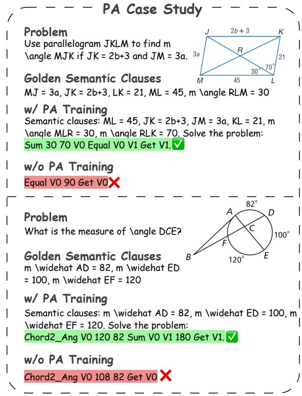  
Figure 7: Qualitative comparison between direct program prediction and PA training.

## C.3 Trace Quality Assessment

To assess the semantic fidelity of the synthesized reasoning traces of PGPS9K, we conduct a manual evaluation on 400 randomly sampled instances from each CoT-based format, namely CoT-PAL and CoT-Program. The evaluation was carried out by four high-performing undergraduate annotators with strong academic records and solid training in Euclidean geometry and mathematical problem solving. Before the formal annotation, all annotators were given a unified annotation guideline together with several calibration examples to ensure a consistent understanding of the evaluation criteria.

For each sampled trace, the annotators examine whether: (1) the natural-language rationale correctly reflects the underlying geometric theorem or algebraic operation; (2) the reasoning flow is logically consistent from premise to conclusion. A trace is judged correct only if both criteria are satisfied. During annotation, the evaluators were instructed to focus on the faithfulness of the reasoning trace to the underlying symbolic process, rather than surface-level fluency alone. Each sampled trace was independently assessed by two annotators. When the two initial labels disagreed, a third annotator adjudicated the case by comparing the rationale with the underlying symbolic program or PAL script.

Representative errors from both CoT-PAL and CoT-Program are shown in Figure 8. Specifically, in the CoT-PAL example, the model hallucinates a geometric rationale that is entirely disconnected from the actual visual topology. While it correctly formulates the algebraic equation (Eq(q + 58, 180)), it fabricates an unverified assumption that chords AB and CE are parallel to justify the 180- degree summation via consecutive interior angles. In the CoT-Program example, the generated trace fabricates a non-existent “circular balance theorem” and illogically attempts to justify a basic subtraction of arc measures (360◦ − 109◦ − 109◦) by referencing irrelevant algebraic expressions for chord lengths (3x + 2 and 5x − 7).

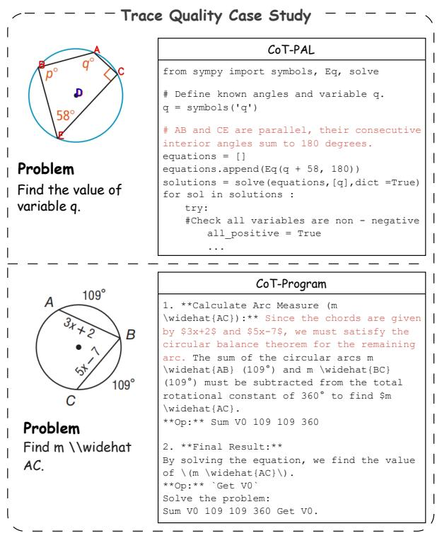  
Figure 8: Representative erroneous examples from CoT-PAL and CoT-Program in the manual trace quality assessment. Red text highlights the logically flawed or hallucinated reasoning steps generated by the models.

## C.4 Training Efficiency of CoT-PAL

The training dynamics illustrated in Figure 9 reveal that the Qwen3-VL-8B model trained on Pythonbased traces of PGPS9K (PAL and CoT-PAL) exhibits accelerated convergence and achieves lower training loss than their program-based counterparts. One possible explanation is that Python-based reasoning trajectories are closer to the code-generation tasks seen during pre-training, making them easier for the model to learn. In contrast, the solution program contains domain-specific operators whose semantics must be learned largely from task-specific data. Consequently, CoT-PAL provides a more learnable training target and leads to more efficient optimization during fine-tuning.

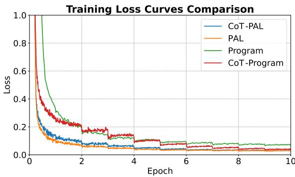  
Figure 9: Training loss trajectories on PGPS9K for single-trace models using the Qwen3-VL-8B backbone.

## D Additional Analysis of Test-Time Scaling

## D.1 Trace-Specific Inference Instructions

For Multi-Trace Ensemble (MTE), we generate diverse reasoning trajectories by applying different inference instructions to the same fine-tuned model. The underlying model parameters are shared across all trace types; only the instruction suffix appended to the question is changed. Unless otherwise specified, all decoding hyperparameters remain identical across trace types. Specifically, we use the following trace-specific inference instructions:

• Program: {question} Please solve the problem using a symbolic program.

• PAL: {question} Please solve the problem using Python code.

• CoT-Program: {question} Please reason step by step, then solve the problem using a symbolic program.

• CoT-PAL: {question} Please reason step by step, then solve the problem using Python code.

## D.2 Test-Time Scaling on Three Geometry Benchmarks

We further evaluate test-time scaling behavior on all three geometry benchmarks using Qwen3-VL-8B trained with the MTS framework. Following prior work on self-consistency, we increase the inference budget and aggregate multiple candidate solutions during decoding.

<table><tr><td>Inference Budget</td><td>PGPS9K</td><td>Geometry3K</td><td>GeoQA</td></tr><tr><td>Top-1</td><td>71.2</td><td>74.5</td><td>67.2</td></tr><tr><td>SC@4</td><td>72.7</td><td>75.4</td><td>73.2</td></tr><tr><td>SC@8</td><td>74.9</td><td>77.4</td><td>75.3</td></tr><tr><td>SC@12</td><td>76.0</td><td>79.6</td><td>74.7</td></tr><tr><td>SC@16</td><td>77.1</td><td>79.8</td><td>75.2</td></tr><tr><td>SC@20</td><td>76.9</td><td>80.3</td><td>75.4</td></tr><tr><td>SC@24</td><td>76.9</td><td>80.1</td><td>75.6</td></tr><tr><td>SC@28</td><td>77.2</td><td>80.5</td><td>75.9</td></tr><tr><td>SC@32</td><td>77.0</td><td>80.1</td><td>75.6</td></tr><tr><td>SC@36</td><td>76.9</td><td>80.7</td><td>76.0</td></tr><tr><td>SC@40</td><td>76.7</td><td>80.1</td><td>76.1</td></tr></table>

Table 9: Test-time scaling performance of Qwen3-VL-8B trained on MTS-All datasets under different selfconsistency inference budgets.

As shown in Table 9, self-consistency consistently improves performance across all benchmarks. Specifically, answer accuracy improves from 71.2% to 77.2% on PGPS9K, from 74.5% to 80.7% on Geometry3K, and from 67.2% to 76.1% on GeoQA. These results demonstrate that models trained on diverse multi-trace reasoning data constructed by the MTS framework can effectively benefit from test-time scaling beyond PGPS9K alone.

Notably, the improvements are particularly significant on GeoQA, where self-consistency yields an absolute gain of nearly 9%. We conjecture that the increased reasoning diversity introduced by MTS enables the model to generate multiple complementary solution paths, thereby improving the robustness of majority-vote decoding under larger inference budgets.

## D.3 Comparative Analysis of Decoding Strategies

To investigate the performance gap between decoding strategies on PGPS9K, we analyze Qwen3-VL-8B by tracking (i) top-k accuracy and the distribution of the four reasoning trace types within the top-40 predictions, and (ii) the frequency of unique numerical answers.

Dynamic Reasoning Distribution Shift. To understand the drivers behind this scaling success on PGPS9K, we analyze the evolution of reasoning traces for Qwen3-VL-8B in Figure 10 (a). We observe a distinct hierarchical preference. At low k (k = 4), executable traces (PAL and CoT-PAL) dominate, accounting for 77%, reflecting a preference for rigorous code in high-confidence predictions. However, as the search budget expands to k = 40, the distribution shifts significantly: CoTaugmented traces (CoT-Program and CoT-PAL) jointly constitute the vast majority (> 85%) of the candidates. In contrast, Figure 10 (b) shows that temperature sampling maintains a nearly static reasoning distribution across all k values. The reasoning process remains concentrated on program and PAL formats, lacking explicit CoT thought processes.

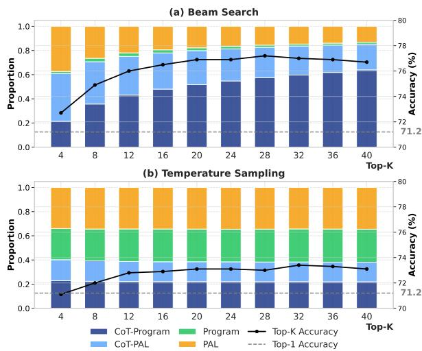  
Figure 10: Evolution of reasoning trace distributions and accuracy across top-k predictions for Qwen3-VL-8B on PGPS9K under (a) Beam Search and (b) Temperature Sampling.

Exploration Efficiency. We further investigate the distribution of unique numerical answers within the top-40 predictions on PGPS9K to assess the exploration efficiency. As illustrated in Figure 11, temperature sampling tends to concentrate on one answer. This results in less diversity and suggests that temperature sampling may be more prone to generating repetitive or similar answers. In contrast, beam search generates a broader range of answers, with a higher frequency of cases involving two or more distinct answers. This distributional shift indicates that beam search is more effective at exploring the multiple reasoning modes.

In summary, the superiority of beam search may be partly explained by its progressive activation of CoT-augmented reasoning as the search depth increases. This behavior fosters high-quality solution diversity, enabling majority voting to more effectively identify the correct solution from a heterogeneous pool of reasoning trajectories.

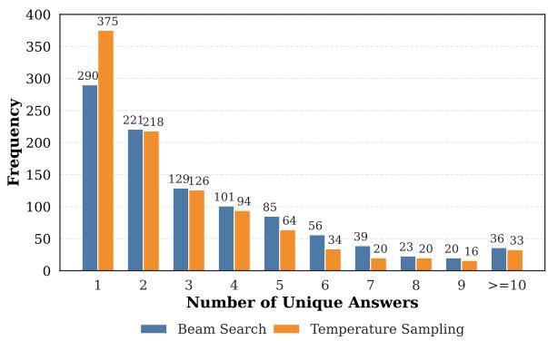  
Figure 11: Distribution of unique answer counts in top-40 predictions for Qwen3-VL-8B on PGPS9K.

## D.4 Mechanism of Efficient Scaling

To explain the Pareto efficiency gains on PGPS9K, we analyze the termination behavior of the consensus-guided ensemble in Figure 12. Figure 12(a) shows a highly skewed distribution of termination depths. Across all model scales, more than 80% of problems achieve consensus immediately at d = 1. This fast-track mechanism for strong inter-trace agreement problems accounts for the observed 8× reduction in sampling overhead. Crucially, Figure 12(b) suggests that early consensus is associated with higher accuracy. Problems terminating early at d = 1 yield the highest accuracy (∼60–80%), while deeper termination depths correspond to increased disagreement and substantially lower accuracy. This pattern indicates that the self-adaptive strategy effectively allocates additional computations for uncertain complex geometry problems. Consistent with this behavior, shallow cross-trace agreement is associated with higher accuracy, suggesting that early consensus tends to occur on easier cases with more reliable predictions.

To further illustrate how CG-MTE achieves its efficiency gain on PGPS9K, we present a representative example in Figure 13. This example qualitatively shows that CG-MTE reduces redundant decoding on high-consensus instances by terminating immediately once cross-trace consensus is reached at shallow depth.

## D.5 Error Coupling Across Trace Formats

Because the four trace outputs share the same model and program-seeded training data, their errors may not be independent. We therefore analyze the four trace-specific top-1 outputs generated by the shared model under the Program, PAL, CoT-

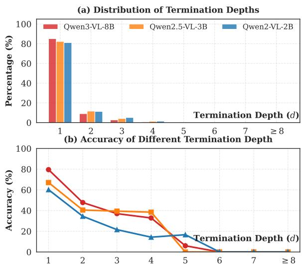  
Figure 12: Mechanism of CG-MTE on PGPS9K. (a) Distribution of termination depths across model scales. (b) Model accuracy as a function of termination depth.

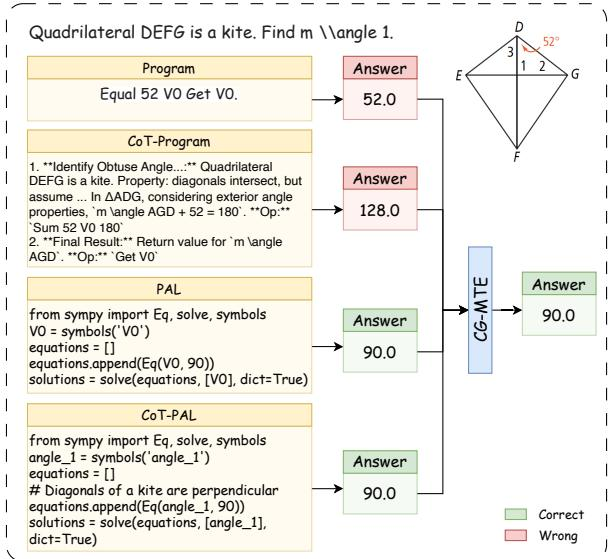  
Figure 13: Representative case study of CG-MTE. A unique cross-trace mode (90.0) emerges at d = 1, enabling immediate termination despite disagreement among individual trace formats.

Program, and CoT-PAL prompts and used by CG-MTE on PGPS9K. Pairwise same wrong is computed over trace pairs for which both predictions are incorrect and measures the percentage that produce the same normalized incorrect answer. $\geq 3$ same wrong and all four same wrong denote the percentages of test instances in which at least three, or all four, trace outputs agree on the same incorrect answer, respectively.

<table><tr><td>Model</td><td>Pairwise same wrong</td><td>≥3 same wrong</td><td>All four identical wrong</td></tr><tr><td>2B</td><td>34.3</td><td>14.9</td><td>4.9</td></tr><tr><td>3B</td><td>34.7</td><td>11.5</td><td>3.5</td></tr><tr><td>8B</td><td>39.8</td><td>8.7</td><td>2.5</td></tr></table>

Table 10: Error-coupling analysis among the four trace formats on PGPS9K. All values are percentages.

As shown in Table 10, pairwise agreement on the same wrong answer ranges from 34.3% to 39.8%, indicating non-negligible error correlation. However, higher-order incorrect agreement is substantially less frequent: at least three traces agree on the same wrong answer in 8.7–14.9% of test instances, while all four do so in only 2.5–4.9%. Thus, the shared origin introduces correlated errors but does not collapse the trace formats into identical failure modes. Cross-trace consensus should therefore be viewed as an empirical early-stopping signal rather than a correctness guarantee.

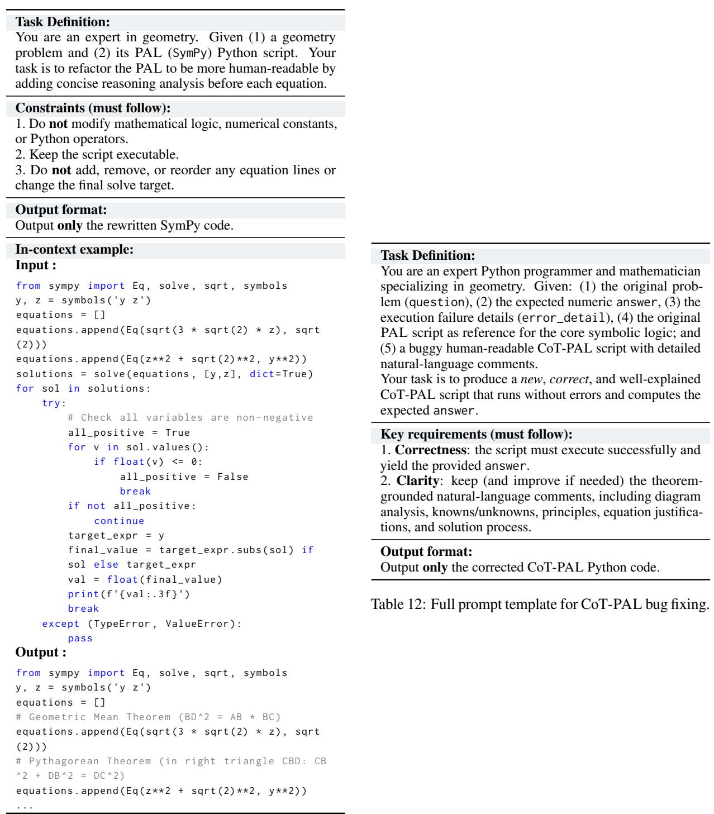  
Table 11: Prompt for CoT-PAL rationale augmentation.

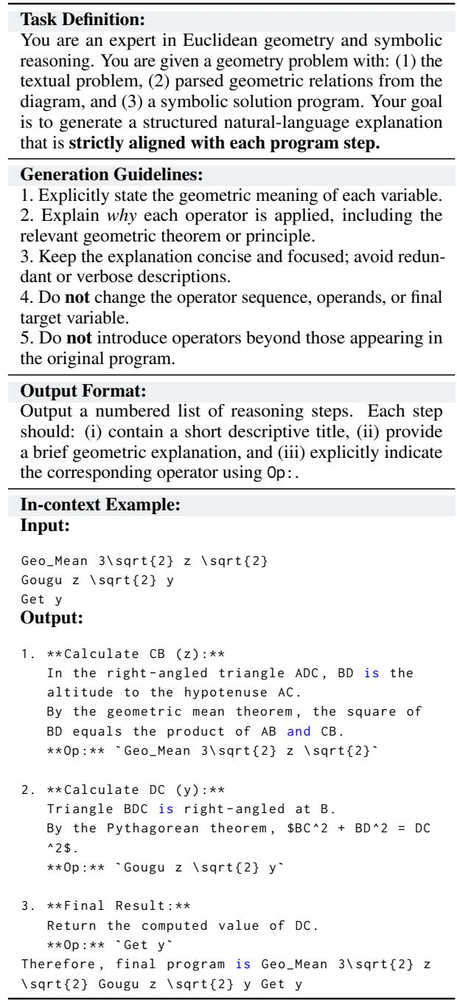  
Table 13: Prompt template for CoT-Program rewriting.