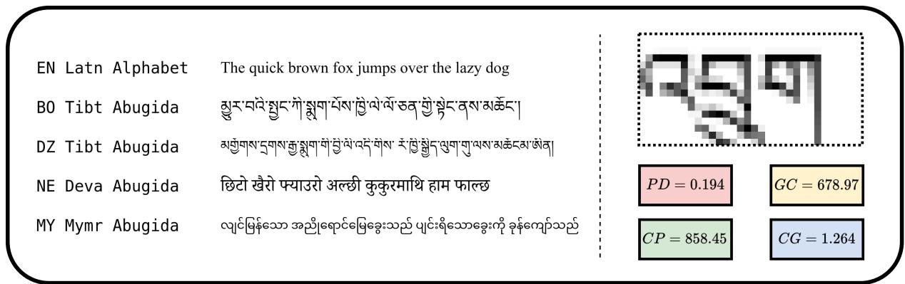
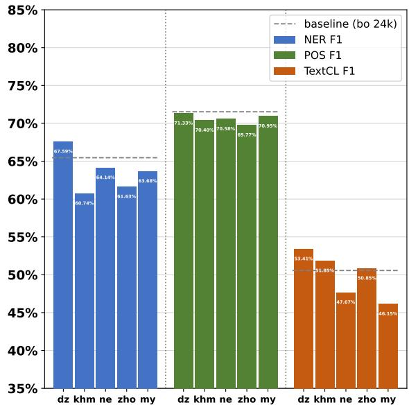
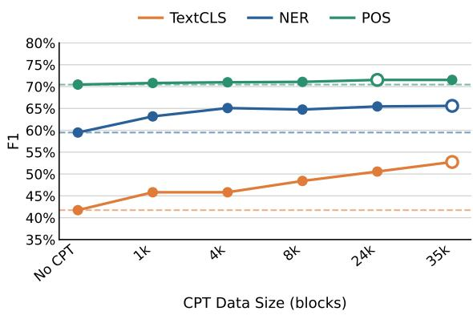
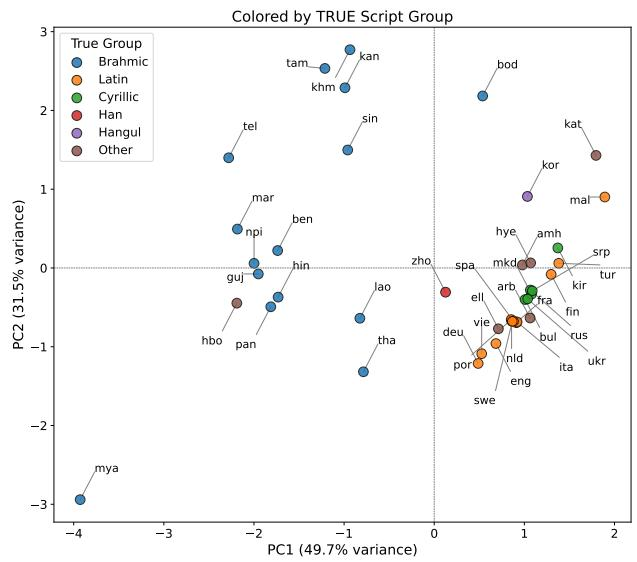
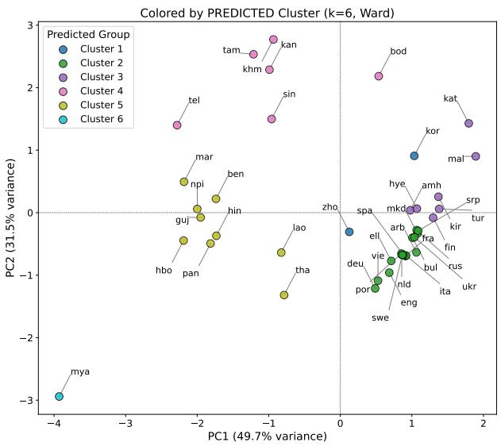

# Seeing the Unseen: Visual Similarity for Pixel Language Model Adaptation

Ran Zhang Miryam de Lhoneux Wessel Poelman LAGOM·NLP, Department of Computer Science, KU Leuven {firstname.lastname}@kuleuven.be

## Abstract

Pixel-based language models (LMs) replace traditional tokenizers by processing rendered images of text, making cross-lingual transfer heavily dependent on the visual and structural properties of writing systems. However, the dynamics of adapting these models to low- resource languages with complex morphology and written in unique scripts are not yet ex- plored. Using Tibetan as a case study, we analyze how continued pre-training of pixel- based LMs is influenced by data scale, initial script exposure, and cross-lingual transfer from languages written in other Brahmic scripts. We introduce four rendering-level metrics to quan- tify visual script similarity. We evaluate down- stream performance across three tasks. Our results show that higher orthographic proximity enhances semantic transfer, even under severe data constraints. Additionally, we find a per- formance asymmetry based on the pre-training starting point: while multilingual pre-training (pixel-m4) has stronger initial performance, its capacity for subsequent adaptation seems to be constrained, whereas adapting a monolin- ual model (pixel) with mixed scri ts ields more gains on sentence-level tasks. Our metrics and case study ofer empirical observations that could help inform data selection and script adap- tation choices when working with pixel-based models in similar low-resource settings.

RAN-rz/seeing\_the\_unseen

## 1 Introduction

Pixel-based language models (LMs) are a promising direction for multilingual language modeling. Instead of processing tokens, these models process rendered images of text. Subword-based models perform generally well on high-resource languages but often struggle with low-resource languages (Mielke et al., 2021). Languages written in Non-Latin scripts are often not only low-resource, but are also hindered by requiring more Unicode code- points to represent (Petrov et al., 2023; van der Goot, 2024). “Tokenizer-free” models do language modeling over units that are potentially fairer across languages, such as characters or bytes (Clark et al., 2022; Xue et al., 2022). A drawback of such models is their computational eficiency since they need to process long input sequences. Pixel-based lan- guages models (Salesky et al., 2021; Rust et al., 2023; Kesen et al., 2025) circumvent such limitations by rendering text as sequences of image patches. This is promising for multilingual models since cross-lingual transfer can potentially happen purely based on visual similarity of writing systems (Rahman et al., 2023). With subword-based models, transfer generally happens through token overlap across similar languages. Across scripts, this is nearly impossible, say for named entities or loan words. With ixel-based models, this restriction is potentially removed if we use visually similar scripts. However, there is no clear definition or mea- sure of “visual similarity” in previous work, apart from broad categories like Similar and Not-Similar or if writing systems belong to the same family (Brahmic for example). A more fine-grained defi-nition would help in choosing transfer languages, which is especially important for low-resource lan- guages since pre-training a model from scratch is often not feasible due to data limitations.

Existing work on pixel language models is gener- ally done on high-resource languages: the original pixel model (Rust et al., 2023), hereafter pixel-mono, is only trained on English, the subsequent pixel-m4 model (Kesen et al., 2025) uses four highresource languages (English, Chinese, Ukrainian, and Hindi), pixar (Tai et al., 2024) is a monolingual English model, and mixar (Hu et al., 2026) uses German, English, Spanish, Italian, French, Korean, Chinese, and Japanese. It is hard to disentangle the efect of visual similarity since the languages in pixel-m4 are chosen with visual diversity in mind, and in mixar there is a lot of existing script overlap.

We address two research gaps: (1) a more fine-grained definition of visual similarity, and (2) a detailed analysis of low-resource adaptation for pixel language models. We focus on Tibetan as a case study. Tibetan not only sufers from a lack of available resources,1 but also possesses unique orthographic and morphological features. Tibetan is generally written in the Tibetan script (Tibt), which is an abugida writing system belonging to the Brahmic family. Syllable clusters are the basic unit of writing. Consonant serve as the root, to which superscript and subscript and vowels may be attached; syllable clusters are separated by tsheg (syllable delimiters) rather than spaces (Wang et al., 2023). This syllabic structure, characterized by multiple consonant combinations, results in Tibetan glyphs having high visual density and complex structures, making it significantly diferent in style from related scripts from the Brahmic family. At the mor holo ical level, Tibetan features a rich agglutinative morphology with complex afixation (Lai et al., 2018; Li et al., 2022), posing additional potential challenges for modeling. Collectively, these features make Tibetan a good fit for our case study. Our contributions are:

• Quantifying visual similarity: we propose four metrics for “visual similarity” based on the rendered patches the model processes, use- ful both for analyzing pixel model behavior across scripts and for guiding language selec- tion in cross-lingual transfer.

• Exploring the feasibility of continued pretraining (CPT) for pixel-based models: there is no existing work on adapting pre- trained Pixel models to low-resource languages written in new scripts. We explore this using Tibetan as a case study.

• Quantifying the data requirements in adapting Pixel language models: we run ablation experiments to see how “low-resource” we can go with CPT for adapting a pixel-based model to an unseen script.

## 2 Related Work

Tokenization. Currently, mainstream LMs tend to rely on subword tokenizers, such as BPE (Sennrich et al., 2016) or UnigramLM (Kudo, 2018).

They have been proven to work well on high- resource languages, but bring a structural bottleneck for low-resource languages due to fixed vocabu- lary sizes and training data availability (Mielke et al., 2021). Low-resource languages are often disadvantaged, making out-of-vocabulary (OOV) issues more severe (e.g., Abbott and Martinus, 2019; Bostrom and Durrett, 2020; Mielke et al., 2021). This is often worse for languages written in non- Latin scripts (Petrov et al., 2023; van der Goot, 2024). Pixel-based models are therefore attractive for such languages, as they sidestep tokenization.

Tokenization-free. To overcome the limitation of a finite vocabulary, tokenizer-free methods have been proposed (Mielke et al., 2021). These include LMs trained directly on characters (CANINE, Clark et al. 2022) or bytes (ByT5, Xue et al. 2022), with the promise of providing a unified and fair input space across languages. Another approach is to rep- resent text as images (Salesky et al., 2021), removing the finite vocabulary of a tokenizer and instead relying solely on sequences of image patches. pixel- mono (Rust et al., 2023) is an English-only encoder model that uses a Vision Transformer (Dosovitskiy et al., 2020). pixel-m4 (Kesen et al., 2025) extends this idea to a multilingual setting, using four languages. pixar (Tai et al., 2024) is an English, decoder-only variation. mixar (Hu et al., 2026) builds on top of it and extends its language coverage. Collectively, these pixel-based models demonstrate promising cross-script transfer across diverse lan- guages and scripts, and the unique advantages of multilingual modeling with pixels.

Transfer and Visual Similarity. Cross-lingual transfer has been researched for subword-based models as a way to address the performance gap between high- and low-resource languages (e.g., Lauscher et al., 2020; Philippy et al., 2023; Muller et al., 2023). Linguistic relatedness is one of the contributing factors (Lin et al., 2019; Ogueji et al., 2021), which is even more critical in low-resource settings than increasing the scale of data (de Vries et al., 2021; Ogunremi et al., 2023). A principled selection of multilingual data can boost performance for low-resource languages, but once the number of languages and data reach a certain size, both low- and high-resource languages may face the curse of multilinguality (Chang et al., 2024).

For pixel-based models, transfer difers as inputs are not tokens but visual patches. Thus, cross- lingual transfer is more likely to be influenced by visual similarities (Rahman et al., 2023). Both pixel-mono (Rust et al., 2023) and pixel-m4 (Kesen et al., 2025) showed solid cross-script transfer to unseen languages. However, this transfer mecha- nism has not been explored; existing research often equates visual similarity to script similarity, or simply classifies such similarity to binary features. Roman and Meyer (2026) point out that cross-script similarity between writing systems should not be reduced to discrete categories. Diferences within the same script family are continuous and gradient. Addressing this is valuable both as an analytical tool for rendering and pixel-based models and as a prac- tical guide for selecting languages in cross-lingual transfer.

  
Figure 1 – We compare four settings of script similarity: in the example above, all writing systems are abugidas belonging to the Brahmic family (except English). The goal of our metrics is to capture similarity on a finer-grained level and with units the model actually processes. The visual example on the right is a single patch, in actual use our metrics are calculated over the entire input blocks.

Tibetan. We select Tibetan as our central lan-guage for several reasons. First, Tibetan is a typical case for the aforementioned situations, featuring complex morphology and limited available data re- sources (see §1). While wide-coverage, tokenizerbased models such as Glot500 (ImaniGooghari et al., 2023), and NLLB (Costa-jussà et al., 2024) include Tibetan, it has generally received little attention in NLP research. Some specialized ap- proaches include: CINO (Yang et al., 2022), an encoder pre-trained with Tibetan and seven other languages; TiBERT (Liu et al., 2022), the first monolingual Tibetan LM, and some task specific studies such as Tibetan named entity recognition (Barnett et al., 2021) and Tibetan-Chinese machine translation (Lai et al., 2018). Second, the Tibetan script (Tibt), belongs to the Brahmic script family, sharing typological roots with Hindi, used for pixel-m4 (Kesen et al., 2025) pre-training. All in all, Tibetan serves both as a language relatively overlooked by mainstream NLP systems and as a suitable test case for examining the visual similarity mechanisms that remain “unseen” in pixel-based models.

## 3 Methodology

We first introduce our visual similarity metrics, discuss how it behaves across languages and scripts, and finally outline our experimental setup.

## 3.1 Visual Similarity Metrics

Language similarity can be defined along many axes. For pixel-based models, we cannot readily use existing token or lexical measures. Our metric needs to be applicable to patches (long rendered images of text) and relevant to studying cross-lingual transfer. While we could use broad categories, like other abugidas or the Brahmic family, there has been a push for more fine-grained analyses of languages and model behavior beyond coarse typological groupings (Poelman et al., 2025).

Definitions. We define four metrics (see Figure 1 for an overview) that characterize the orthographic similarity between languages on the patch level. We calculate these based on pre-rendered data for each language. Let N be the total number of blocks in the data set, T be the fixed number of patches per block, $H = W = 1 6$ the height and width of each patch in pixels, and $x _ { i , j , k } \in [ 0$ , 255] the value of the k-th pixel in the j-th patch of block i, where 255 represents a white background. Let $c _ { i }$ be the number of Unicode code-points in block i, and $g _ { i }$ the number of grapheme clusters, human-perceived characters under Unicode text encoding in block i.

Pixel density measures the proportion of nonbackground pixels across all blocks, providing a proxy for ink coverage and glyph complexity:

$$
\sum _ { P D \ = \frac { i = 1 } { N \times T \times H \times H } } ^ { N } \sum _ { j = 1 } ^ { T } \sum _ { k = 1 } ^ { H \times W } \mathcal { k } [ x _ { i , j , k } < \tau ]\tag{1}
$$

where $\tau = 2 5 0$ is the background threshold, re- taining a small margin to account for anti-aliasing artifacts.

Average grapheme clusters per block reflects the number of human-perceived characters the renderer encodes per input block:

$$
G C = \frac { 1 } { N } \sum _ { i = 1 } ^ { N } g _ { i }\tag{2}
$$

Average code-points per block captures the raw Unicode encoding length of each input block:

$$
C P = \frac { 1 } { N } \sum _ { i = 1 } ^ { N } c _ { i }\tag{3}
$$

The code-points-to-grapheme ratio reflects the degree of glyph compositionality: scripts with frequent stacking or conjunct forms require multiple code-points per perceived character, yielding a higher ratio:

$$
C G = { \frac { C P } { G C } }\tag{4}
$$

Metric behavior. We apply our metric to 41 lan-guages. We use the Parallel Bible Corpus (PBC; Mayer and Cysouw, 2014) written in 23 diferent scripts. The corpus is aligned by verses and ren- dered into patches (see §C for details). Next, we create vectors per language that consist of the four metrics. When looking at the Euclidean distances between vectors, we see an interesting pattern: both the closest and most distant language to Tibetan come from the Brahmic family: Khmer (Khmr) and Burmese (Mymr), respectively. Table 9 in §D contains the full results for all metrics. A PCA projection of the resulting language vectors §E. We also show that clustering of these vectors can recover coherent script groups.

The metrics measure properties of the rendered patches that the model also processes. We next investigate whether this is helpful in explaining cross-lingual transfer in pixel-based models.

## 3.2 Language Selection

We select a language sample for our continued pre- training experiments. We first select three other low-resource languages2 that share broad categories with Tibetan (bo): Dzongkha (dz) is a dialect of Tibetan, also commonly written in the Tibetan script (Tibt), therefore being an abugida, and belonging to the Brahmic family. This represents a slight variation of Tibetan, written in the same script, but being mutually unintelligible (Tshering and van Driem, 2019). Nepali (ne) is normally written in Devanagari (Deva), which is also an abugida, and belongs to the Brahmic family. Burmese (my) is usually written in another Brahmic abugida: Myanmar (Mymr). Since Dzongkha is not included in the PBC, it could not be incorporated into the validation of the 41 languages mentioned above. Its inclusion reflects the fact that, like Tibetan, it is one of the few languages still written in Tibetan script. Figure 1 shows the same sentence in the diferent languages to get an idea of the similarities and diferences between the scripts.

Among the 41 languages from the PBC, Khmer (Khmr) is the language closest to Tibetan, Burmese (Mymr) is the farthest, and Chinese (Hans) the sec-ond farthest. We supplement our main experiments with a smaller follow-up study, using the two lan- guages at opposite ends of the distance distribution: Khmer and Chinese, since Burmese is already in- cluded in our main case study language sample.

<table><tr><td>Lang</td><td>Script</td><td>PD</td><td>GC</td><td> $C P$ </td><td>CG</td><td>Dist.</td></tr><tr><td>bo</td><td>Tibt</td><td>0.19</td><td>678.97</td><td>858.45</td><td>1.26</td><td></td></tr><tr><td>dz</td><td>Tibt</td><td>0.19</td><td>636.83</td><td>815.11</td><td>1.28</td><td>0.52</td></tr><tr><td>ne</td><td>Deva</td><td>0.16</td><td>502.89</td><td>782.18</td><td>1.56</td><td>2.32</td></tr><tr><td>my</td><td>Mymr</td><td>0.14</td><td>378.02</td><td>562.08</td><td>1.49</td><td>3.97</td></tr><tr><td>zh</td><td>Hans</td><td>0.25</td><td>608.31</td><td>608.31</td><td>1.00</td><td>2.70</td></tr><tr><td>km</td><td>Khmr</td><td>0.21</td><td>541.49</td><td>874.24</td><td>1.62</td><td>2.02</td></tr></table>

Table 1 – Visual similarity metrics on the patch level. For bo, dz, ne and my, distances are based on pre-training data; for zh and km, distances are based on Table E. The rankings are consistent between the two.

Table 1 shows how our metrics capture the degree of similarity between the languages written in the diferent scripts. Dzongkha is indeed at the high end (sharing the Tibt script), Nepali in the middle range, and Burmese at the lowest end, which both confirms our intuition of these scripts and aligns with their relative positions in the 41-language ranking Table 9 (see §4.2 for a detailed analysis).

Quantitatively, PD reflects coverage and vi sual complexity of glyphs. It is nearly identical for Tibetan (0.194) and Dzongkha (0.191), while Nepali (0.160) and Burmese (0.138) are notably lower. GC (Eq. 2) captures the number of human perceived characters encoded by the renderer for each block. It is substantiall hi her for Tibetan (678.97) and Dzongkha (636.83) than for Nepali (502.89) and Burmese (378.02), suggesting that the former two are also more similar in block level rendering granularity and character density. CP reflects the length of the Unicode encoding and follows the same pattern: Tibetan (858.45) and Dzongkha (815.11) are considerably higher than Nepali (782.18) and Burmese (562.08), further confirming that Dzongkha is structurally closed to Tibetan. Lastly, CG measures the complexity of glyph combinations as the average number of Unicode code- oints corres ondin to er human perceived character. It is higher for Nepali (1.555) and Burmese (1.487) than for Tibetan (1.264) and Dzongkha (1.280), implying that for Nepali and Burmese, more code oints are re uired to form a perceptible character. This structural diference at the encoding level further proves the greater or thographic distance between these two languages and Tibetan. Across all four metrics, orthographic proximit between the three languages also writ ten in Brahmic scripts and Tibetan decreased in the following order: dz > ne > my, consistent with the qualitative analysis above. Khmer (Khmr) and Chinese (Hans), the two languages selected for the follow-up experiments, exhibit similarity and di vergence. Khmer’s PD is 0.207 and CG is 1.615 both fall in the same high range as Tibetan (PD = 0.202, CG = 1.300), consistent with it being the closest language to Tibetan in the 41-language rank ing. Chinese, by contrast, has a notably higher PD (0.247) but a markedly lower CG (1.000), reflecting Chinese characters as self-contained logographic units without the multi-codepoint stacking structure of Tibetan. It suggests that its distance from Tibetan is not uniform across dimensions but rather reflects divergence of varying degree and direction across metrics, further indicating that the four metrics work in combination rather than in isolation, see §E for a more detailed analysis.

Metric consistency. The values for Tibetan, Dzongkha, Nepali and Burmese in Table 1 are com- puted on the same rendered corpora used for the continued pre-training (see §3.3 for data sources).

In contrast, the values for Chinese and Khmer in Table 1 are computed on the PBC (Mayer and Cysouw, 2014). Table 9 reports the corresponding PBC-based values for both bo, ne and my as well. Since Dzongkha is not included in the PBC, it can- not be compared across corpora. For Nepali and Burmese, however, despite the substantial domain diferences between web-crawled and religious text, their similarity ranking relative to Tibetan remains consistent across both corpora. Burmese is con- sistently ranked farther from Tibetan than Nepali. Absolute values fluctuate to some degree, most no- ticeably for Burmese, suggesting that the absolute readings of these metrics may carry some sensitivity to text domain.

## 3.3 Data

Continued pre-training. We want to see how well the pixel-based models can be adapted to Ti- betan and how the potential transfer languages can help. There is a shortage of high-quality open- source Tibetan text resources; we start with a total of 714k sentences from OPUS (Tiedemann, 2012) and NLLB (Costa-jussà et al., 2024). Dzongkha resources are even scarcer; we collected approxi- mately 97k sentences from FineWeb2 (Penedo et al., 2025) and OPUS. The Nepali and Burmese data are both sourced from OPUS and NLLB, with approx- imately 330k sentences randomly sampled from each corpus. The 41 languages used to validate the visual similarity metrics are drawn from the Parallel Bible Corpus (PBC; Mayer and Cysouw, 2014). For the follow-up continued pre-training experiment, Chinese and Khmer data are sourced from FineWeb2, with approximately 420k and 175k sentences respectively.

All corpora are normalized before render- ing: UTF-8 re-encoding, removing surrogate and private-use Unicode characters, filtering non- readable characters following pixel-m4 (Kesen et al., 2025).3 Additionally, language-specific filtering is applied: sentences with low langid scores (< 0.80) are removed (Lui and Baldwin, 2012), emoji and Latin characters are filtered, and URLs are removed.

All corpora were rendered using PangoCairoTextRenderer,4 with each patch measuring 16x16 pixels. All data is rendered continuously on the sentence level, instead of the bi-gram rendering strategy (Lotz et al., 2023)

adopted by pixel-m4 (Kesen et al., 2025), see §C for a detailed explanation. To standardize the corpus sizes across diferent languages and facilitate controlled comparison, the full Tibetan corpus (35k blocks) is used after rendering, and the other three languages are scaled to approximately 24k blocks to match the rendering results of Dzongkha, which has the smallest dataset. In all subsequent experiments, data scale is measured in rendering blocks5 rather than sentence count or token count, to align with Pixel-based models input units as rendered patches.

Downstream tasks. To evaluate the efectiveness of CPT, we evaluate on three Tibetan downstream tasks, covering both semantic and syntactic lev- els: Text Classification (12 categories) sourced from the Tibetan News Classification (TNCC; Qun et al., 2017), NER (5 entity types) sourced from the Tibetan and Mongolian Newspaper NER dataset (Barnett et al., 2021), and POS tagging (17 UPOS tags) sourced from the Tibetan dependency treebank (Hua et al., 2013).

To our knowledge, this constitutes the first eval- uation of pixel-based LMs on Tibetan, combining rendering with native Tibetan data across these three tasks. All downstream data are pre-rendered using the same strategy as the CPT corpora, but with diferent sequence lengths, following the con- figurations of pixel-mono (Rust et al., 2023) and pixel-m4 (Kesen et al., 2025). Macro-averaged F1 is used as the primary evaluation metrics across all tasks; for POS tagging, we report adjusted macro-F1 excluding four extremely low-frequency tags.6 Full dataset statistics and preprocessing are provided in §C.

## 3.4 Experiments

We conducted CPT using pixel-mono (Rust et al., 2023) and pixel-m4 (Kesen et al., 2025) as two independent starting points to examine the impact of monolingual and multilingual pre-training on subsequent Tibetan language adaptation. In the data scale experiments, we set up six CPT scale conditions based on the Tibetan corpus: no CPT, +1K, +4K, +8K, +24K and +35K blocks, to explore data scale sensitivity under very-low-resource con- ditions. In the auxiliary language experiments, all languages use approximately 24k blocks for CPT to ensure comparability of scale.

We follow the pre-training and fine-tuning recipe of pixel-mono and pixel-m4; detailed hyperparam- eter configurations are provided in §A.

We define several types of baselines: pixel-based, character-based, and subword-based. The latter two comparison models are included as reference points rather than strictly comparable baselines. Both these models were pre-trained on substantially more languages and data than the models considered here.

(1) Pixel-based. We use pixel-mono (Rust et al., 2023) and pixel-m4 (Kesen et al., 2025) without CPT as pixel-based baselines. Finetuning for down- stream tasks is conducted directly on the original pre-training weights. pixel-mono was pre-trained exclusively on English, without any exposure to any language similar to Tibetan in terms of script. pixel- m4, was pre-trained with four languages: English, Chinese, Ukrainian, and Hindi. Hindi, written in Devanagari, also belongs to the Brahmic writing system like Tibetan and thus shares a certain degree of orthographic proximity. Therefore, pixel-mono ofers a cleaner zero-proximity baseline, allowing the cross-lingual transfer experiments with auxil- iary languages to be presented more clearly. pixel- m4, on the other hand, reflects adaptation behavior within a multilingual pre-training context. A com- parison of the two can also reveal the potential influence of script exposure during pre-training phase on subsequent CPT performance. Training pixel-based models on too many scripts could be harmful (curse of multilinguality) or beneficial for transfer.

(2) Character-based. CANINE-S (Clark et al., 2022) is taken as a character-level point of comparison. The model was pre-trained on a multilingual Wikipedia corpus with 104 languages. For all the downstream tasks, we employ the same fine-tuning hyperparameter settings as the PIXEL models, see details in §B.

(3) Subword-based. Glot500-base (Imani-Googhari et al., 2023) is taken as the multilingual subword-based point of comparison. As one of the most linguistically diverse LMs, Glot500-base covers over 500 languages for pre-training, Tibetan included, serving as a strong benchmark for subword-based methods on low-resource languages. The fine-tuning settings follow those of the PIXEL models, see details in §B.

<table><tr><td>Condition</td><td>NER</td><td>POS</td><td>TextCL</td></tr><tr><td>PIXEL-MONO (no CPT)</td><td>59.49±0.11</td><td>70.46±0.23</td><td>41.73±0.20</td></tr><tr><td>PIXEL-M4 (no CPT)</td><td>69.08±0.02</td><td>70.57±0.85</td><td>44.34±0.53</td></tr><tr><td>PIXEL-M4 + bo 35k</td><td>70.19±1.28</td><td>71.44±0.11</td><td>47.72±0.81</td></tr><tr><td>PIXEL-M4 + bo 35k + dz 24k</td><td>69.68±0.66</td><td>71.76±0.20</td><td>47.48±0.14</td></tr><tr><td>PIXEL-M4 + bo 35k + my 24k</td><td>68.26±1.80</td><td>71.15±0.54</td><td>46.34±2.40</td></tr><tr><td>PIXEL-M4 + bo 35k + ne 24k</td><td>69.38±0.57</td><td>71.26±0.48</td><td>47.75±0.13</td></tr><tr><td>PIXEL-M4 + allmixed 107k</td><td>70.55±0.02</td><td>71.72±0.12</td><td>48.61±0.47</td></tr><tr><td>PIXEL-MONO + allmixed 107k</td><td>68.26±0.41</td><td>71.41±0.09</td><td>54.57±0.39</td></tr><tr><td>Glot500</td><td>82.59</td><td>72.47</td><td>62.14</td></tr><tr><td>CANINE-S</td><td>78.72</td><td>77.10</td><td>52.13</td></tr></table>

Table 2 – Results for CPT. All metrics report macro-averaged F1. Results are over three random seeds. Bold indicates best performance among PIXEL-based models. allmixed comprises bo + dz + my + ne (∼107k blocks total). The subword- and character-based models are included for reference, but are not directly comparable.

## 4 Results and Analysis

## 4.1 Continued Pre-training Results

Table 2 shows the results from our CPT experiments. In terms of base performance without CPT, pixel- m4 noticeably outperforms pixel-mono across all the three tasks (NER: 69.08 vs 59.49, POS: 70.57 vs 70.46, Text Classification: 44.34 vs 41.73), indicating that multilingual pre-training of pixel-m4 has benefited Tibetan-related tasks. This advantage may be partially attributed to Hindi used in pre-training. The Devanagari script of Hindi also belongs to the Brahmic writing system as Tibetan, and shares a certain degree of orthographic proximity, which appears to aid cross-lingual transfer.

Under the Tibetan-only (bo) CPT condition, semantic tasks again show noticeable gains (NER: +1.11; Text Classification: +3.38), while POS tag- ging remains largely unchanged (we discuss this more in §4.3). Compared to pixel-mono, the absolute gains across tasks for pixel-m4 are generally smaller; the previously discussed inclusion of Hindi may be one of the causes of this.

The three pairwise mixing conditions, bo (35k) + dz (24k), bo (35k) + my (24K) and bo (35k) + ne (24K) use identical data ratio yet yield limited performance diferences across all three tasks, with neither consistently outperforming the bo only condition. This suggests that at the current data scale, the impact of orthographic proximity of auxiliary languages may be masked by other factors, or may not yet have reached the scale threshold required to yield consistent benefits. This contrasts with finding in §4.2, where the CPT in auxiliary lan-guages brings positive cross-lingual transfer for pixel-mono (Rust et al., 2023). The divergence likely stems from diferences in pre-training cover- age: for pixel-mono, the 24k blocks of auxiliary language data constitute the primary source of non- English (non-Latin) text exposure for the model. However, the pixel-m4 pre-training data scale is aligned with that of mBERT (Devlin et al., 2019), with each of the four languages receiving a substan- tial volume of pre-training data. Kesen et al. (2025) use an estimated 50 million sentences per language, which is approximately 2 million blocks. Our 24k blocks of auxiliary language data introduced during CPT account for a relatively limited proportion of the overall representation space.

The allmixed condition (bo + dz + my + ne, 107 blocks) achieves the highest scores among all pixel-m4 configurations on Text Classification (48.61) and NER (70.55), but underperforms the bo + dz condition on POS (71.72 vs 71.76). Com-paring the corresponding pixel-mono + allmixed configuration reveals an asymmetry: pixel-mono + allmixed achieves 54.57 on Text Classification, sub- stantially higher than pixel-m4 + allmixed (48.61), whereas on NER (68.26) it falls below pixel-m4 (70.55), with POS scores remaining close (71.41 vs 71.72). This inconsistency implies that the interaction between multilingual pre-training and large-scale mixed CPT data is moderated by task type, see details in §4.3.

Comparison Models. We compare the best-performing PIXEL configuration with two larger- scale models. These comparisons are not directly fair due to much bigger model sizes and amount of pre-training data. We include these to have a point of reference for where Pixel-based models stand. Glot500 (subword-based) outperforms all PIXEL model configurations across all the three tasks (NER: 82.59, POS: 72.47, Text Classification: 62.14), demonstrating that large-scale multilingual pre-training with direct target-language coverage can yield impressive performance even for low-resource languages. Its pre-training corpus includes Tibetan, and its scale, with 511 languages, 600GB data, 1.225 billion sentences, far exceeds that of all models in this study.

CANINE-S (character-based) outperforms all PIXEL configurations on NER (78.72) and POS (77.10). However, on Text Classification (52.13), CANINE-S performs comparably to pixel-mono (Rust et al., 2023) with 35k Tibetan CPT (52.75) and 24k Dzongkha CPT (53.41). Given that CANINE-S is pre-trained on 104 languages, the ability of pixel- based models to match or exceed it on sentence- level semantic tasks suggests that leveraging or- thographic proximity may be an efective com- plementary approach for semantic transfer under low-resource settings.

## 4.2 Visual Similarity

To test the influence of visual similarity on cross- lingual transfer, we use a fixed amount of 24k ren- dered blocks for each of our three transfer languages and scripts. As discussed in §3.1, the Tibetan script is characterized primarily by horizontal and verti- cal stacking structures (Lai et al., 2018; Li et al., 2022), where superscripts and subscripts form lo-cally dense, block-wise clusters that visually appear square and compact. Dzongkha shares the Tibt script with Tibetan, and closely mirrors Tibetan in overall typographic style, making it the most orthographically proximate of the three languages. Nepali (ne) uses the Devanagari script with rel-atively consistent character widths and a similar structure of stacked consonants and thus is visually similar to Tibetan in terms of character shape and overall density. However, the śirorekha (continuous horizontal headline) distinguishes it from Tibetan’s block-wise layout, positioning Nepali in the middle range of orthographic proximity. Burmese, written in the Myanmar script, is characterized by round curves, with few acute angles of square structures, making it the most visually distant from Tibetan among the three. Beyond the three languages, we additionally incorporate two languages positioned at the extremes of the orthographic continuum, based on the quantitative validation over 41 lan- guages as mentioned in §3.1: Khmer, the closest of all 40 candidate languages to Tibetan, and Chinese, the second most distant, since the most distant lan- guage, Burmese, is already included in the primary language set.

For text classification, performance follows a clear gradient mirroring the orthographic proximity ranking: dz (53.41) > ne (47.67) > my (46.15), suggesting that visual similarity to Tibetan is a contributing factor in semantic transfer. Notably, dz even outperforms Tibetan self-CPT baseline (50.56) on Text Classification, likely due to the higher quality of the Dzongkha corpus, which is predominantly sourced from oficial government and financial reports, resulting in greater lexical diversity. NER shows a similar trend, consistent with dz (67.59) outperforming both ne (64.14) and my (63.68), consistent with its highest orthographic proximity to Tibetan. POS tagging shows minimal variation across all three conditions, as further discussed in §4.3.

  
Figure 2 – Efect of auxiliary language orthographic proximity on downstream task performance. Each bar represents a pixel-mono model with CPT on 24k blocks of the indicated auxiliary language. The dashed line indi- cates the bo 24k baseline (Tibetan self-CPT). Languages are ordered left to right by decreasing orthographic proximity to Tibetan: Dzongkha (dz) > Khmer (km) > Nepali (ne) > Chinese (zh) > Burmese (my).

The follow-up languages, Khmer and Chinese, exhibit diferent patterns. Chinese’s performance broadly aligns with its position as the second most distant language on the orthographic proximity spectrum: its scores across the three tasks (TextCL: 50.85, NER: 61.63, POS: 69.77) are generally no higher than those of Dzongkha. Khmer, by con- trast, presents a more pronounced counterexample. Despite being the closest language to Tibetan aside from Dzongkha, it has the lowest NER score among the five languages (60.74), even below the most distant, Burmese (63.68). This counterexample sug- gests that the efect of orthographic proximity on downstream performance may be task-dependent, as discussed in §4.3.

## 4.3 Data Size Ablation

Figure 3 shows the performance trends in the three downstream tasks after CPT in Tibetan datasets of varying sizes, starting with pixel-mono. Overall, the semantic tasks show an upward trends as the scale of CPT training increases, whilst the varia- tion in POS tagging is minimal. The divergence in performance across these tasks is particularly pronounced under ultra-low-resource conditions.

  
Figure 3 – Efect of CPT data scale on downstream task performance. Dashed lines indicate No CPT baseline; open circle marks best checkpoint.

Text classification benefits most from CPT. The macro-average F1 rises from 41.73 (no CPT) to 52.75 (35k bo), a cumulative improvement of ap-proximately 11 points. Gains are front-loaded: the largest single-step improvement (4.1 points) occurs between no CPT to 1k rendered blocks used for CPT. Performance then plateaus between 1k and 4k (45.82) before resuming steady growth through 8k, 24k and 35k. The curve has not yet reached a clear plateau at 35k, suggesting that given the current data scale, semantic tasks may continue to benefit from additional Tibetan pre-training data.

NER also improves overall, though with a distinct pattern. F1 rises from 59.49 ((no CPT) to 65.59 (35k bo), a cumulative gain of 6.1 points, again concentrated at early stage. The single-step im- provement from no CPT to 1k is 3.7 points. Growth continues through 4k, then shows a small drop at 8k (64.75, down from 65.09) before recovering to 65.46 at 24k and changing negligibly thereafter (65.59 at 35k). This implies NER adaptation may approach saturation around 24k.

In contrast to Text Classification and NER, POS tagging shows negligible variation across CPT with all data scales, with F1 increasing only 1.1 points, from 70.46 (no CPT) to 71.53 (35k bo). Tibetan morphological markers, such as case and tense sufixes, are realized as visually distinct characters and thus should be visible by pixel-based models theoretically. However, the higher performance of CANINE-S (77.10) suggests that character-level models may still better exploit such morphological cues for syntactic prediction.

Task Diference. The data scale ablation experi-ments reveal a consistent pattern of task diferenti- ation: with low-resource CPT, Text Classification, and NER exhibit sensitivity to CPT data scale, whereas POS tagging remains largely unafected.

In pixel-based models, one of the core functions of pre-training is to align the models’ image rep- resentation with the orthographic patterns of the target languages. Tatariya et al. (2024) discover that the PIXEL model exhibits a hierarchical division of labor: lower layers primarily capture visual and orthographic features, and deeper layers gradually shift to syntactic and semantic abstraction. Un- der this view, limited Tibetan CPT may primarily influence the quality of the model’s lower level orthographic representations, which could partly explain why semantic tasks benefit more from in- creasing CPT data. However, task dificulty may play a role and diferent model types may be better suited for diferent tasks as discussed above.

Semantic tasks rely heavily on lexical distribution and cross-word semantic associations, and may be more sensitive to increased exposure, explaining their consistent gains with increasing CPT data. In contrast, the syntactic patterns relied upon by POS tagging may benefit less directly from adjustments of Tibetan orthographic representations under the current experimental setup, leading to a relative insensitivity to changes in CPT data scale.

## 5 Conclusion

Using Tibetan as a case study, we explore the feasibility of adapting pixel-based models to low- resource and morphologically complex languages. We propose four rendering-level visual metrics (PD, GC, CP, CG) and verify that higher orthographic proximity between auxiliary languages and Tibetan tends to yield better semantic transfer. We demonstrate the feasibility of CPT for adapt- ing pixel models to new scripts, finding that even small-scale CPT data yields noticeable gains on semantic tasks. Through data ablation experiments, we quantify how low-resource we can go while still achieving meaningful adaptation. Lastly, we find that pixel-mono benefits more from auxiliary languages pre-training than pixel-m4, revealing an inherent trade-of between stronger initial represen- tation capabilities and greater potential for CPT gains.

## Limitations

We only focus on Tibetan and three other low- resource languages written in scripts belonging to the Brahmic family; as well as two additional languages, Khmer, also written in a Brahmic script, and Chinese, written in Han script. We chose to focus on depth instead of breadth with regards to language choice and analyses. Considering that (1) most languages are unseen by the models, (2) we control for amount of data across languages, and (3) there is a noticeable improvement, even with a very small amount of data, we believe this is valuable nonetheless.

## AI Usage

We used LLM models for coding assistance, help with grammar, and reviewing a draft. All the content has been verified and reviewed by the authors, who also take full responsibility. All writing is our own.

## Acknowledgments

This work is based on the first author’s master thesis at KU Leuven (Zhang, 2026). We thank Kushal Tatariya, Maria Trusca, and the anonymous reviewers for helpful feedback. W.P. is funded by a KU Leuven Bijzonder Onderzoeksfonds C1 project with reference C14/23/096. The computational resources and services used were provided by the VSC (Flemish Supercomputer Center), funded by the Research Foundation - Flanders (FWO) and the Flemish Government - department EWI.

## References

Jade Abbott and Laura Martinus. 2019. Benchmarking Neural Machine Translation for Southern African Languages. In Proceedings of the 2019 Workshop on Widening NLP, pages 98–101. Association for Computational Linguistics.

Catherine Arnett, Tyler A. Chang, and Benjamin Bergen. 2024. A bit of a problem: Measurement disparities in dataset sizes across languages. In Proceedings of the 3rd Annual Meeting of the Special Interest Group on Under-resourced Languages @ LREC-COLING 2024, pages 1–9, Torino, Italia. ELRA and ICCL.

Robert Barnett, Christian Faggionato, Marieke Meelen, Sargai Yunshaab, Tsering Samdrup, Nathan Hill, and Hildegard Diemberger. 2021. Named Entity Recogni- tion (NER) for Tibetan and Mongolian Newspapers.

Kaj Bostrom and Greg Durrett. 2020. Byte Pair Encoding is Suboptimal for Language Model Pretraining. In Findings of the Association for Computational

Linguistics: EMNLP 2020, pages 4617–4624. Asso- ciation for Computational Linguistics.

Tyler A. Chang, Catherine Arnett, Zhuowen Tu, and Ben Bergen. 2024. When Is Multilinguality a Curse? Language Modeling for 250 High- and Low-Resource Languages. In Proceedings ofthe 2024 Conference on Empirical Methods in Natural Language Processing, pages 4074–4096. Association for Computational Linguistics.

Jonathan H. Clark, Dan Garrette, Iulia Turc, and John Wieting. 2022. Canine: Pre-training an Eficient Tokenization-Free Encoder for Language Represen- tation. Transactions ofthe Associationfor Computational Linguistics, 10:73–91.

Marta R. Costa-jussà, James Cross, Onur Çelebi, Maha Elbayad, Kenneth Heafield, Kevin Hefernan, Elahe Kalbassi, Janice Lam, Daniel Licht, Jean Mail- lard, Anna Sun, Skyler Wang, Guillaume Wenzek, Al Youngblood, Bapi Akula, and 1 others. 2024. Scaling neural machine translation to 200 languages. Nature, 630(8018):841–846.

Wietse de Vries, Martijn Bartelds, Malvina Nissim, and Martijn Wieling. 2021. Adapting Monolingual Mod-els: Data can be Scarce when Language Similarity is High. In Findings of the Association for Com-putational Linguistics: ACL-IJCNLP 2021, pages 4901–4907. Association for Computational Linguis- tics.

Jacob Devlin, Ming-Wei Chang, Kenton Lee, and Kristina Toutanova. 2019. BERT: Pre-training of Deep Bidirectional Transformers for Language Un- derstanding. In Proceedings ofthe 2019 Conference of the North American Chapter of the Association for Computational Linguistics: Human Language Technologies, Volume 1 (Long and Short Papers), pages 4171–4186. Association for Computational Linguistics.

Alexey Dosovitskiy, Lucas Beyer, Alexander Kolesnikov, Dirk Weissenborn, Xiaohua Zhai, Thomas Un- terthiner, Mostafa Dehghani, Matthias Minderer, Georg Heigold, Sylvain Gelly, Jakob Uszkoreit, and Neil Houlsby. 2020. An Image is Worth 16x16 Words: Transformers for Image Recognition at Scale. In In- ternational Conference on Learning Representations.

Chen Hu, Yintao Tai, Antonio Vergari, Frank Keller, and Alessandro Suglia. 2026. MIXAR: Scaling Autore- gressive Pixel-based Language Models to Multiple Languages and Scripts. Preprint, arXiv:2604.11575.

Quacairang Hua, Wenbing Jiang, Zhao Haixing, and Qun Liu. 2013. Semi-Automatic Building Tibetan Treebank Based on Word-Pair Dependency Classifi- cation. Journal ofChinese Information Processing, 27(5):166–172.

Ayyoob ImaniGooghari, Peiqin Lin, Amir Hossein Kar- garan, Silvia Severini, Masoud Jalili Sabet, Nora Kass- ner, Chunlan Ma, Helmut Schmid, André Martins, François Yvon, and Hinrich Schütze. 2023. Glot500:

Scaling Multilingual Corpora and Language Models to 500 Languages. In Proceedings of the 61st Annual Meeting of the Association for Computational Linguistics (Volume 1: Long Papers), pages 1082–1117. Association for Computational Linguistics.

Pratik Joshi, Sebastin Santy, Amar Budhiraja, Kalika Bali, and Monojit Choudhury. 2020. The State and Fate of Linguistic Diversity and Inclusion in the NLP World. In Proceedings ofthe 58th Annual Meeting of the Association for Computational Linguistics, pages 6282–6293. Association for Computational Linguistics.

Ilker Kesen, Jonas F. Lotz, Ingo Ziegler, Phillip Rust, and Desmond Elliott. 2025. Multilingual Pretraining for Pixel Language Models. In Proceedings ofthe 2025 Conference on Empirical Methods in Natural Lan-guage Processing, pages 29594–29611. Association for Computational Linguistics.

Taku Kudo. 2018. Subword Regularization: Improving Neural Network Translation Models with Multiple Subword Candidates. In Proceedings of the 56th Annual Meeting of the Association for Computational Linguistics (Volume 1: Long Papers), pages 66–75. Association for Computational Linguistics.

Wen Lai, Xiaobing Zhao, and Wei Bao. 2018. Tibetan- Chinese Neural Machine Translation based on Syl- lable Segmentation. In Proceedings of the AMTA 2018 Workshop on Technologies for MT of Low Resource Languages (LoResMT 2018), pages 21–29. Association for Machine Translation in the Americas.

Anne Lauscher, Vinit Ravishankar, Ivan Vulić, and Goran Glavaš. 2020. From Zero to Hero: On the Limitations of Zero-Shot Language Transfer with Multilingual Transformers. In Proceedings of the 2020 Conference on Empirical Methods in Natural Language Processing (EMNLP), pages 4483–4499. Association for Computational Linguistics.

Yan Li, Xiaomin Li, Yiru Wang, Hui Lv, Fenfang Li, and La Duo. 2022. Character-based Joint Word Segmentation and Part-of-Speech Tagging for Tibetan Based on Deep Learning. Transactions on Asian and Low-Resource Language Information Processing, 21(5):95:1–95:15.

Yu-Hsiang Lin, Chian-Yu Chen, Jean Lee, Zirui Li, Yuyan Zhang, Mengzhou Xia, Shruti Rijhwani, Junxian He, Zhisong Zhang, Xuezhe Ma, Antonios Anas- tasopoulos, Patrick Littell, Graham Neubig, and 1 others. 2019. Choosing Transfer Languages for Cross- Lingual Learning. In Proceedings ofthe 57th Annual Meeting of the Association for Computational Linguistics, pages 3125–3135. Association for Computational Linguistics.

Sisi Liu, Junjie Deng, Yuan Sun, and Xiaobing Zhao. 2022. TiBERT: Tibetan Pre-trained Language Model. In 2022 IEEE International Conference on Systems, Man, and Cybernetics (SMC), pages 2956–2961.

Jonas Lotz, Elizabeth Salesky, Phillip Rust, and Desmond Elliott. 2023. Text Rendering Strategies for Pixel Language Models. In Proceedings ofthe 2023 Conference on Empirical Methods in Natural Lan-guage Processing, pages 10155–10172. Association for Computational Linguistics.

Marco Lui and Timothy Baldwin. 2012. langid.py: An Of-the-shelf Language Identification Tool. In Proceedings ofthe ACL 2012 System Demonstrations, pages 25–30, Jeju Island, Korea. Association for Computational Linguistics.

Thomas Mayer and Michael Cysouw. 2014. Creating a massively parallel Bible corpus. In Proceedings of the Ninth International Conference on Language Resources and Evaluation (LREC’14), pages 3158– 3163, Reykjavik, Iceland. European Language Resources Association (ELRA).

Sabrina J. Mielke, Zaid Alyafeai, Elizabeth Salesky, Colin Rafel, Manan Dey, Matthias Gallé, Arun Raja, Chenglei Si, Wilson Y. Lee, Benoît Sagot, and Sam- son Tan. 2021. Between words and characters: A Brief History of Open-Vocabulary Modeling and To- kenization in NLP. Preprint, arXiv:2112.10508.

Benjamin Muller, Deepanshu Gupta, Jean-Philippe Fau-connier, Siddharth Patwardhan, David Vandyke, and Sachin Agarwal. 2023. Languages You Know Influ- ence Those You Learn: Impact of Language Charac- teristics on Multi-Lingual Text-to-Text Transfer. In Proceedings ofThe 1st Transfer Learningfor Natu-ral Language Processing Workshop, pages 88–102. PMLR.

Kelechi Ogueji, Yuxin Zhu, and Jimmy Lin. 2021. Small Data? No Problem! Exploring the Viabil- ity of Pretrained Multilingual Language Models for Low-resourced Languages. In Proceedings of the 1st Workshop on Multilingual Representation Learn- ing, pages 116–126. Association for Computational Linguistics.

Tolulope Ogunremi, Dan Jurafsky, and Christopher Manning. 2023. Mini But Mighty: Eficient Multilin- gual Pretraining with Linguistically-Informed Data Selection. In Findings ofthe Associationfor Computational Linguistics: EACL 2023, pages 1251–1266. Association for Computational Linguistics.

Guilherme Penedo, Hynek Kydlíček, Vinko Sabolčec, Bettina Messmer, Negar Foroutan, Amir Hossein Kar- garan, Colin Rafel, Martin Jaggi, Leandro Von Werra, and Thomas Wolf. 2025. FineWeb2: One Pipeline to Scale Them All — Adapting Pre-Training Data Processing to Every Language. In Second Conference on Language Modeling.

Aleksandar Petrov, Emanuele La Malfa, Philip Torr, and Adel Bibi. 2023. Language Model Tokeniz- ers Introduce Unfairness Between Languages. In Thirty-Seventh Conference on Neural Information Processing Systems.

Fred Philippy, Siwen Guo, and Shohreh Haddadan. 2023. Towards a Common Understanding of Contributing Factors for Cross-Lingual Transfer in Multilingual Language Models: A Review. In Proceedings ofthe 61st Annual Meeting ofthe Associationfor Computational Linguistics (Volume 1: Long Papers), pages 5877–5891. Association for Computational Linguis- tics.

Wessel Poelman, Thomas Bauwens, and Miryam de Lhoneux. 2025. Confounding Factors in Relating Model Performance to Morphology. In Proceed- ings of the 2025 Conference on Empirical Methods in Natural Language Processing, pages 7273–7298. Association for Computational Linguistics.

Wessel Poelman, Yiyi Chen, and Miryam de Lhoneux. 2026. QQ: A Language Metadata Toolkit for Multilingual NLP. In Proceedings ofthe 2026 Conference on Empirical Methods in Natural Language Processing: System Demonstrations.

Nuo Qun, Xing Li, Xipeng Qiu, and Xuanjing Huang. 2017. End-to-end Neural Text Classification for Ti- betan. In International Symposium on Natural Lan- guage Processing Based on Naturally Annotated Big Data, pages 472–480. Springer.

Md Mushfiqur Rahman, Fardin Ahsan Sakib, Fahim Faisal, and Antonios Anastasopoulos. 2023. To token or not to token: A Comparative Study of Text Repre- sentations for Cross-Lingual Transfer. In Proceedings ofthe 3rd Workshop on Multi-lingual Representation Learning (MRL), pages 67–84. Association for Com-putational Linguistics.

Claire Roman and Philippe Meyer. 2026. Contrastive-to- Self-Supervised: A Two-Stage Framework for Script Similarity Learning. Preprint, arXiv:2603.06180.

Phillip Rust, Jonas F. Lotz, Emanuele Bugliarello, Eliz- abeth Salesky, Miryam de Lhoneux, and Desmond Elliott. 2023. Language Modelling with Pixels. In The Eleventh International Conference on Learning Representations.

Elizabeth Salesky, David Etter, and Matt Post. 2021. Robust Open-Vocabulary Translation from Visual Text Representations. In Proceedings of the 2021 Conference on Empirical Methods in Natural Lan-guage Processing, pages 7235–7252. Association for Computational Linguistics.

Rico Sennrich, Barry Haddow, and Alexandra Birch. 2016. Neural Machine Translation of Rare Words with Subword Units. In Proceedings of the 54th Annual Meeting ofthe Associationfor Computational Linguistics (Volume 1: Long Papers), pages 1715– 1725. Association for Computational Linguistics.

Yintao Tai, Xiyang Liao, Alessandro Suglia, and An- tonio Vergari. 2024. PIXAR: Auto-Regressive Lan- guage Modeling in Pixel Space. In Findings of the Associationfor Computational Linguistics: ACL 2024, pages 14673–14695. Association for Computational Linguistics.

Kushal Tatariya, Vladimir Araujo, Thomas Bauwens, and Miryam de Lhoneux. 2024. Pixology: Probing the Linguistic and Visual Capabilities of Pixel-based Language Models. In Proceedings of the 2024 Conference on Empirical Methods in Natural Language Processing, pages 3307–3320. Association for Com- putational Linguistics.

Jörg Tiedemann. 2012. Parallel Data, Tools and In- terfaces in OPUS. In Proceedings of the Eighth International Conference on Language Resources and Evaluation (LREC‘12), pages 2214–2218. European Language Resources Association (ELRA).

Karma Tshering and George van Driem. 2019. The Grammar ofDzongkha Revised and Expanded, with a Guide to Roman Dzongkha and to Phonological Dzongkha. Himalayan Linguistics.

Rob van der Goot. 2024. Where are we Still Split on Tokenization? In Findings of the Association for Computational Linguistics: EACL 2024, pages 118–137. Association for Computational Linguistics.

Rob van der Goot. 2026. From bytes to subwords: Chal- lenges of input representations in NLP. In Findings of the Association for Computational Linguistics: ACL 2026, pages 10911–10919, San Diego, Califor- nia, United States. Association for Computational Linguistics.

Danhui Wang, Man Zeng, Han Zhao, Lei Gao, Shan Li, Zibei Niu, Xuejun Bai, and Xiaolei Gao. 2023. Efects of syllable boundaries in Tibetan reading. Scientific Reports, 13(1):314.

Linting Xue, Aditya Barua, Noah Constant, Rami Al- Rfou, Sharan Narang, Mihir Kale, Adam Roberts, and Colin Rafel. 2022. ByT5: Towards a Token- Free Future with Pre-trained Byte-to-Byte Models. Transactions of the Association for Computational Linguistics, 10:291–306.

Ziqing Yang, Zihang Xu, Yiming Cui, Baoxin Wang, Min Lin, Dayong Wu, Zhigang Chen, and 1 oth- ers. 2022. CINO: A Chinese Minority Pre-trained Language Model. In Proceedings of the 29th International Conference on Computational Linguistics, pages 3937–3949. International Committee on Com- putational Linguistics.

Ran Zhang. 2026. Seeing the Unseen: Visual Similarity for Pixel Language Model Adaptation. Master’s thesis, KU Leuven.

## A CPT Details and Architecture

We provide the data statistics and hyperparameter configurations for all CPT experiments in this sec- tion. Table 4 provides the data sources and sizes for the four languages used in CPT. Table 5 lists the hyperparameter settings shared across all CPT conditions. The overall computational budget is approximately 170-190 GPU hours on NVIDIA H100 GPUs.

## B Fine-tuning Details and Architecture

We provide fine-tuning dataset statistics and hyper- parameter configurations for all downstream task experiments in this section. Table 7 summarizes the dataset resources, splits and evaluation metrics for the three downstream tasks. Table 6 lists the hyperparameter settings for each task. All models are finetuned from each CPT checkpoint, with the best checkpoint selected based on the validation macro-F1. For POS tagging, we report adjusted macro-F1 that excludes extremely low-frequency tags, CONJ, INTJ, SCONJ, and SYM.

## C Text Rendering Details

All corpora are rendered using PangorCairoTextRenderer, with the Google Noto Sans font family7 and fallback fonts. The rendered output is a greyscale image with each patch measuring 16\*16 pixels.

CPT Rendering. A continuous sentence-level rendering strategy is adopted for all four languages: multiple sentences are concatenated and packed into rendering blocks, with each block having a maximum of 511 patches and a minimum of 23 patches. pixel-m4 (Kesen et al., 2025) employed a bi-gram rendering strategy (Lotz et al., 2023) to reduce redundant patches and increase patch co- occurrence frequency, thus improving rendering and learning eficiency. However, using such a rendering strategy for Tibetan would not make sense since a single grapheme cluster typically corresponds to between 2 to 8 Unicode code-points, with complex stacked grapheme combinations. This means a bi-gram is not easily defined and may result in splitting of complete orthographic units. Continuous, sentence-level rendering is therefore more appropriate.

Fine-tuning Task Rendering. For Text Classification, sentences are rendered at the continuous sentence level with a maximum sequence length of 256 patches. For NER and POS tagging, words are rendered as a list to realize word-to-patch align- ment, enabling accurate label assignment at the patch level. The maximum sequence length is 196 patches for NER and 256 for POS tagging. These rendering settings generally follow the con- figurations of pixel-mono (Rust et al., 2023) and pixel-m4 (Kesen et al., 2025).

## D Full Experiment Results

Table 8 presents the complete experiment results for the downstream tasks under all CPT conditions. The first section covers CPT conditions starting from pixel-m4 (Kesen et al., 2025), the second section covers Tibetan data-scale ablation experi- ments starting from pixel-mono (Rust et al., 2023), and the third section covers auxiliary language ex- periments starting from pixel-mono (using 24k rendered blocks for each language).

## E 41 Language Validation

To validate the four visual similarity metrics beyond our primary case study languages, we sample 41 lan- guages from the Parallel Bible Corpus (Mayer and Cysouw, 2014), covering six major script groups, Brahmic, Latin, Cyrillic, Han, Hangul and Others, as classified with the ISO 15924 standard. We use the QQ toolkit (Poelman et al., 2026) to verify script metadata for each language, using this to automatically exclude candidates for which the corpus contains only a Latin-script transliteration rather than the language’s native script. This auto- mated screening did not flag Malayalam, for which the corpus likewise contains only a transliterated version. We identified this during subsequent man- ual verification and retain it under the Latin group accordingly (see Table 9). Languages are grouped by completeness, full-Bible (n=31) versus New-Testament-only (n=10), and within each group we restrict to a verse-aligned common set (20, 579 verses for the full-Bible group, 7,789 verses for the New-Testament-only group) to control for corpus-content confounds. Preprocessing and rendering follow the same pipeline described in §3.3.

For each langauge, we compute the four met- rics and represent it as a four-dimensional vector. Figure 4 shows the resulting PCA projection and clustering of these language vectors. Clusters are quite close to what we would expect: Latin and Cyrillic are grouped together, with the Brahmic scripts being quite spread apart. Part of this is due to the CP metric, which, due to Unicode, is consistently 1 for both Latin and Cyrillic.8 Another pattern is the higher overall GC (grapheme clusters per rendered block) being a lot higher for Latin and Cyrillic than the Brahmic scripts. This is in part due to the increased width of characters, leading to fewer characters per block. For most Brahmic script this is also reflected in higher pixel densities: characters are both wider and more complex.

Based on the resulting language vectors (full values of 41 languages and each language’s stan- dardized Euclidean distance to Tibetan reported in Table 9), we perform hierarchical clustering using Ward linkage (Euclidean distance), setting k=6 to match the six known script groups, to validate our hypothesis. The resulting clusters align with the true script groups at Purity = 0.68, $\mathrm { A R I } = 0 . 3 3$ and $\mathbf { N M I } = 0 . 5 5$ , all significantly better than a ran- domized baseline $( \mathfrak { p } < 0 . 0 0 0 1 )$ ; B-cubed evaluation yields Precision = 0.605, Recall = 0.559, $\mathrm { F 1 } = 0 . 5 8 1$ This moderate, instead of near-perfect, alignment suggests that the metrics capture finer-grained or- thographic similarity beyond script-group labels, rather than simply reproducing the known script classification.

To examine the discriminative power of each individual metric, we run a univariate analysis of variance for each metric against the six groups. GC $( F = 3 5 . 1 2 , p < 0 . 0 0 0 1 )$ and $C G \ ( F =$ $3 9 . 8 3 , p < 0 . 0 0 0 1 $ ) show significant discriminative power, while P D $( F = 0 . 5 7 , p = 0 . 6 3 7 )$ and $C P$ $( F = 0 . 0 7 , p = 0 . 9 7 7 )$ do not individually. An ablation study shows that combining all four metrics yields better clustering quality rather than any single metric or partial combination, see Table 3. This indicates that although $P D$ and $C P$ show relatively weak discriminative power individually, their signal is distributed across interactions with the other metrics, suggesting that combining all four metrics yields more robust clustering than relying on a single metric or a subset.

<table><tr><td>Metric Combination</td><td>Purity</td><td>ARI</td><td>NMI</td></tr><tr><td>PD only</td><td>0.585</td><td>0.182</td><td>0.351</td></tr><tr><td> $\mathrm { G C + C P + C G }$ </td><td>0.659</td><td>0.267</td><td>0.472</td></tr><tr><td> $\mathrm { P D + C G }$ </td><td>0.683</td><td>0.319</td><td>0.506</td></tr><tr><td>All four  $\mathrm { ( P D + G C + C P + C G ) }$ </td><td>0.683</td><td>0.325</td><td>0.548</td></tr></table>

Table 3 – Ablation of clustering quality $( k = 6$ , Ward linkage) using diferent subsets of the four metrics. All four metrics combined yield the best overall clustering quality across all three measures.

  
Figure 4 – PCA and clustering of the visual metrics. On the left we see the PCA projection and labeling of the “gold” groups. On the right we see predicted clusters based on the language vectors (using Ward clustering with $k = 6 ,$ we see $\mathrm { p u r i t y } = 0 . 6 8 , \mathrm { A R I } = 0 . 3 3 , \mathrm { N M I } = 0 . 5 5$ , all si nificantl better than randomization $p < 0 . 0 0 0 1 $ ).

<table><tr><td>Language</td><td>Source</td><td>Raw Sentences</td><td>Rendered Blocks</td></tr><tr><td>Tibetan (bo)</td><td>OPUS (Tiedemann, 2012)</td><td>714k</td><td>35k</td></tr><tr><td></td><td>NLLB (Costa-jussà et al., 2024)</td><td></td><td></td></tr><tr><td>Dzongkha (dz)</td><td>FineWeb2 (Penedo et al., 2025)</td><td>97k</td><td>24k 24k</td></tr><tr><td>Nepali (ne)</td><td>OPUS &amp; NLLB</td><td>330k</td><td>24k</td></tr><tr><td>Burmese (my)</td><td>OPUS &amp; NLLB</td><td>330k</td><td></td></tr></table>

Table 4 – CPT data statistics. Raw sentence counts are approximate. Rendered block counts reflect the actual number of blocks used for CPT after rendering.

<table><tr><td>Parameter</td><td>Value</td></tr><tr><td>Image size</td><td>(16, 8464, 1)</td></tr><tr><td>Patch size</td><td>16</td></tr><tr><td>Encoder hidden size</td><td>768</td></tr><tr><td>Encoder num attention heads</td><td>12</td></tr><tr><td>Encoder num layers</td><td>12</td></tr><tr><td>Span masking ratio</td><td>0.25</td></tr><tr><td>Span masking max length</td><td>6</td></tr><tr><td>Optimizer</td><td>AdamW</td></tr><tr><td>Adam  $\beta$ </td><td>(0.9, 0.999)</td></tr><tr><td>Adam ε</td><td>1e-8</td></tr><tr><td>Weight decay</td><td>0.05</td></tr><tr><td>Base learning rate</td><td>1.5e-4</td></tr><tr><td>Effective learning rate</td><td>base_lr × eff_bs / 256</td></tr><tr><td>Learning rate schedule</td><td>Cosine decay</td></tr><tr><td>Learning rate warmup ratio</td><td>0.05</td></tr><tr><td>Training epochs</td><td>15</td></tr><tr><td>Per-device batch size</td><td>8</td></tr><tr><td>Gradient accumulation steps</td><td>4</td></tr><tr><td>Effective batch size</td><td>32</td></tr><tr><td>Precision</td><td>BF16</td></tr><tr><td>Eval samples</td><td>2000†</td></tr><tr><td>Seed</td><td>42</td></tr></table>

Table 5 – CPT hyperparameter settings for all CPT experiments. The architecture follows Rust et al. (2023) and Kesen et al. (2025). For data scale experiments with fewer than 24k blocks, eval\_samples is scaled proportionally to training set size (1k: 100, 4k: 400, 8k: 800).
<table><tr><td>Parameter</td><td>TextCL</td><td>NER</td><td>POS</td></tr><tr><td>Optimizer</td><td>AdamW</td><td>AdamW</td><td>AdamW</td></tr><tr><td>Learning rate</td><td>3e-5</td><td>3e-5</td><td>3e-5</td></tr><tr><td>Weight decay</td><td>0.0</td><td>0.0</td><td>0.0</td></tr><tr><td>Warmup steps</td><td>100</td><td>100</td><td>100</td></tr><tr><td>LR scheduler</td><td>Linear decay</td><td>Linear decay</td><td>Linear decay</td></tr><tr><td>Max epochs</td><td>15</td><td>15</td><td>15</td></tr><tr><td>Per-device batch size</td><td>8</td><td>8</td><td>8</td></tr><tr><td>Gradient accumulation steps</td><td>4</td><td>8</td><td>8</td></tr><tr><td>Effective batch size</td><td>32</td><td>64</td><td>64</td></tr><tr><td>Max sequence length</td><td>256</td><td>196</td><td>256</td></tr><tr><td>Dropout probability</td><td></td><td>0.1</td><td>0.1</td></tr><tr><td>Early stopping patience</td><td>20</td><td>5</td><td>5</td></tr><tr><td>Metric for best model</td><td>Macro F1</td><td>Macro F1</td><td>Macro F1</td></tr></table>

Table 6 – Fine-tuning hyperparameters for the three downstream tasks. All models are finetuned from each CPT checkpoint; the best checkpoint is selected based on validation macro-F1 across all CPT conditions and evaluated on the test set of the respective downstream task.
<table><tr><td>Task</td><td>Dataset</td><td>Train</td><td>Val</td><td>Test</td><td>Metric</td></tr><tr><td>Text Classification</td><td>TNCC</td><td>7,420</td><td>928</td><td>928</td><td>Macro F1</td></tr><tr><td>NER</td><td>Tibetan-Mongolian NER</td><td>2,455</td><td>311</td><td>306</td><td>Macro F1</td></tr><tr><td>POS Tagging</td><td>TDTreebank v1.1</td><td>9,550</td><td>1,193</td><td>1,195</td><td>Macro F1</td></tr></table>

Table 7 – Downstream fine-tuning dataset statistics. Dataset resources: TNCC (Qun et al., 2017), Tibetan-Mongolian NER (Barnett et al., 2021) and TDTreebank v1.1 (Hua et al., 2013).

<table><tr><td>Condition</td><td>NER F1</td><td>POS F1</td><td>TextCL F1</td></tr><tr><td colspan="4">PIXEL-M4 Conditions (mean ± std, 3 seeds)</td></tr><tr><td>PIXEL-M4</td><td> $\overline { { 6 9 . 0 8 \pm 0 . 0 2 } }$ </td><td> $\overline { { 7 0 . 5 7 { \pm } 0 . 8 5 } }$ </td><td> $\overline { { 4 4 . 3 4 \pm 0 . 5 3 } }$ </td></tr><tr><td>+ bo (35k)</td><td> $7 0 . 1 9 { \scriptstyle \pm 1 . 2 8 }$ </td><td> $7 1 . 4 4 { \pm } 0 . 1 1$ </td><td> $4 7 . 7 2 { \scriptstyle \pm 0 . 8 1 }$ </td></tr><tr><td> $+ \mathsf { b } \mathsf { o } + \mathsf { d } z \left( 3 5 \mathbf { k } \mathsf { b } \mathsf { o } + 2 4 \mathbf { k } \mathsf { d } z \right)$ </td><td> $6 9 . 6 8 { \scriptstyle \pm 0 . 6 6 }$ </td><td> $7 1 . 7 6 { \scriptstyle \pm 0 . 2 0 }$ </td><td> $4 7 . 4 8 { \pm } 0 . 1 4$ </td></tr><tr><td> $+ \mathsf { b } 0 + \mathsf { m } \mathsf { y } ( 3 5 \mathbf { k } \mathsf { b } 0 + 2 4 \mathbf { k } \mathsf { m } \mathsf { y } )$ </td><td> $6 8 . 2 6 { \scriptstyle \pm 1 . 8 0 }$ </td><td> $7 1 . 1 5 { \scriptstyle \pm 0 . 5 4 }$ </td><td> $4 6 . 3 4 \pm 2 . 4 0$ </td></tr><tr><td> $+ \mathsf { b } 0 + \mathsf { m } \mathsf { y } ( 3 5 \mathbf { k } \mathsf { b } 0 + 3 5 \mathbf { k } \mathsf { m } \mathsf { y } )$ </td><td> $6 8 . 4 9 { \scriptstyle \pm 0 . 0 8 }$ </td><td> $7 1 . 3 8 { \pm } 0 . 0 3 $ </td><td> $4 6 . 2 7 { \scriptstyle \pm 0 . 0 8 }$ </td></tr><tr><td> $+ \mathsf { b } 0 + \mathsf { n } \mathsf { e } ( 3 5 \mathbf { k } \mathsf { b } 0 + 2 4 \mathbf { k } \mathsf { n } \mathsf { e } )$ </td><td> $6 9 . 3 8 { \scriptstyle \pm 0 . 5 7 }$ </td><td> $7 1 . 2 6 { \scriptstyle \pm 0 . 4 8 }$ </td><td> $4 7 . 7 5 { \scriptstyle \pm 0 . 1 3 }$ </td></tr><tr><td> ${ \bf \tau } + \mathrm { a l l m i x e d } \left( \mathrm { b } \circ + \mathrm { d } z + \mathrm { m } \mathrm { y } + \mathrm { n } \mathrm { e } , 1 0 7 \mathrm { k } \right)$ </td><td> $\mathbf { 7 0 . 5 5 } \pm \mathbf { 0 . 0 2 }$ </td><td> $7 1 . 7 2 { \scriptstyle \pm 0 . 1 2 }$ </td><td> ${ \bf 4 8 . 6 1 } { \scriptstyle \pm 0 . 4 7 }$ </td></tr><tr><td colspan="4">PIXEL — Data Scale Ablation (mean ±  $\overline { { s t d , 3 \ s e e d s ) } }$ </td></tr><tr><td>PIXEL-MONO</td><td> $\overline { { 5 9 . 4 9 2 0 . 1 1 } }$ </td><td> $\overline { { 7 0 . 4 6 { \pm 0 . 2 3 } } }$ </td><td> $\overline { { 4 1 . 7 3 { \pm } 0 . 2 0 } }$ </td></tr><tr><td>+ bo 1k</td><td> $6 3 . 1 8 { \scriptstyle \pm 0 . 3 3 }$ </td><td> $7 0 . 8 2 { \scriptstyle \pm 0 . 0 3 }$ </td><td> $4 5 . 8 2 { \scriptstyle \pm 0 . 7 8 }$ </td></tr><tr><td>+ bo 4k</td><td> $6 5 . 0 9 { \scriptstyle \pm 0 . 3 3 }$ </td><td> $7 0 . 9 9 { \scriptstyle \pm 0 . 0 4 }$ </td><td> $4 5 . 8 2 { \scriptstyle \pm 0 . 1 9 }$ </td></tr><tr><td>+ bo 8k</td><td> $6 4 . 7 5 { \scriptstyle \pm 1 . 7 9 }$ </td><td> $7 1 . 0 8 { \pm } 0 . 1 2 $ </td><td> $4 8 . 4 1 { \scriptstyle \pm 0 . 2 6 }$ </td></tr><tr><td>+ bo 24k</td><td> $6 5 . 4 6 { \scriptstyle \pm 0 . 5 7 }$ </td><td> $7 1 . 5 3 { \scriptstyle \pm 0 . 2 1 }$ </td><td> $5 0 . 5 6 { \scriptstyle \pm 0 . 8 1 }$ </td></tr><tr><td>+ bo 35k</td><td> ${ \bf 6 5 . 5 9 2 0 . 9 2 }$ </td><td> $7 1 . 5 3 { \pm } 0 . 2 3 $ </td><td> $5 2 . 7 5 { \scriptstyle \pm 0 . 1 0 }$ </td></tr><tr><td colspan="4">PIXEL — Related Language (mean ± std, 3 seeds)</td></tr><tr><td>PIXEL-MONO</td><td> $\overline { { 5 9 . 4 9 2 0 . 1 1 } }$ </td><td> $\overline { { 7 0 . 4 6 { \pm 0 . 2 3 } } }$ </td><td> $\overline { { 4 1 . 7 3 { \pm } 0 . 2 0 } }$ </td></tr><tr><td>+ bo 24k</td><td> $6 5 . 4 6 { \scriptstyle \pm 0 . 5 7 }$ </td><td> $7 1 . 5 3 { \scriptstyle \pm 0 . 2 1 }$ </td><td> $5 0 . 5 6 { \scriptstyle \pm 0 . 8 1 }$ </td></tr><tr><td>+ dz 24k</td><td> $6 7 . 5 9 { \pm } 1 . 0 0 $ </td><td> $7 1 . 3 3 { \scriptstyle \pm 0 . 8 0 }$ </td><td> $5 3 . 4 1 { \scriptstyle \pm 0 . 1 3 }$ </td></tr><tr><td>+ ne 24k</td><td> $6 4 . 1 4 { \pm } 1 . 5 2 $ </td><td> $7 0 . 5 8 { \scriptstyle \pm 0 . 0 8 }$ </td><td> $4 7 . 6 7 { \scriptstyle \pm 0 . 3 0 }$ </td></tr><tr><td>+ my 24k</td><td> $6 3 . 6 8 { \scriptstyle \pm 0 . 0 1 }$ </td><td> $7 0 . 9 5 { \scriptstyle \pm 0 . 5 4 }$ </td><td> $4 6 . 1 5 { \scriptstyle \pm 0 . 8 5 }$ </td></tr><tr><td>+ bo +dz  $( 3 5 \mathrm { k } \ b \circ + 2 4 \mathrm { k } \ d z )$ </td><td> ${ \bf 6 8 . 2 7 } \pm \mathrm { 0 . 9 0 }$ </td><td> $7 1 . 1 8 { \scriptstyle \pm 0 . 4 6 }$ </td><td> ${ \pm } 3 . 7 1 { \pm } 0 . 9 4 $ </td></tr><tr><td>+ bo +my  $( 3 5 \mathrm { k } \ b \circ + 2 4 \mathrm { k } \ \mathsf { m } y )$ </td><td> $6 3 . 2 7 { \scriptstyle \pm 1 . 4 1 }$ </td><td> $7 0 . 7 5 { \scriptstyle \pm 0 . 5 6 }$ </td><td> $5 1 . 1 2 { \scriptstyle \pm 1 . 2 6 }$ </td></tr><tr><td>+ bo +ne  $( 3 5 \mathrm { k } \ b \circ + 2 4 \mathrm { k } \ \mathsf { n e } )$ </td><td> $6 6 . 8 1 \pm 2 . 4 3$ </td><td> $7 1 . 3 9 { \pm } 1 . 5 1 $ </td><td> $5 1 . 3 6 { \pm } 1 . 5 8$ </td></tr><tr><td>+ km 24k</td><td> $6 0 . 7 4 \pm 1 . 2 9$ </td><td> $7 0 . 4 0 { \scriptstyle \pm 1 . 4 5 }$ </td><td> $5 1 . 8 5 { \scriptstyle \pm 0 . 7 3 }$ </td></tr><tr><td>+ zh 24k</td><td> $6 1 . 6 3 { \pm } 0 . 4 5$ </td><td> $6 9 . 7 7 { \scriptstyle \pm 0 . 8 6 }$ </td><td> $5 0 . 8 5 { \pm } 1 . 4 2 $ </td></tr></table>

Table 8 – Full experiment results across all CPT conditions for three downstream tasks, reported as mean ± std over three seeds. Bold indicates the best mean performance within each group. The first group reports results with pixel-m4 as the starting point; the second group reports data scale ablation results with pixel-mono; the third group reports auxiliary language CPT results with pixel-mono, each using 24k rendered blocks.

<table><tr><td>Language</td><td>ISO 639-3</td><td>ISO 15924</td><td>PD</td><td>GC</td><td>CP</td><td>CG</td><td>Brahmic</td><td>Dist. to bod</td></tr><tr><td>Tibetan</td><td>bod</td><td>Tibt</td><td>0.202</td><td>669.1</td><td>870.1</td><td>1.300</td><td>Yes</td><td></td></tr><tr><td>Khmer</td><td>khm</td><td>Khmr</td><td>0.207</td><td>541.5</td><td>874.2</td><td>1.615</td><td>Yes</td><td>1.589</td></tr><tr><td>Malayalam</td><td>mal</td><td>Latn†</td><td>0.186</td><td>821.5</td><td>821.5</td><td>1.000</td><td>No †</td><td>1.907</td></tr><tr><td>Kannada</td><td>kan</td><td>Knda</td><td>0.233</td><td>524.2</td><td>799.7</td><td>1.526</td><td>Yes</td><td>2.018</td></tr><tr><td>Georgian</td><td>kat</td><td>Geor</td><td>0.236</td><td>790.4</td><td>790.4</td><td>1.000</td><td>No</td><td>2.186</td></tr><tr><td>Kyrgyz</td><td>kir</td><td>Cyrl</td><td>0.182</td><td>768.0</td><td>768.0</td><td>1.000</td><td>No</td><td>2.266</td></tr><tr><td>Turkish</td><td>tur</td><td>Latn</td><td>0.166</td><td>775.7</td><td>775.7</td><td>1.000</td><td>No</td><td>2.333</td></tr><tr><td>Finnish</td><td>fin</td><td>Latn</td><td>0.162</td><td>768.2</td><td>768.2</td><td>1.000</td><td>No</td><td>2.437</td></tr><tr><td>Armenian</td><td>hye</td><td>Armn</td><td>0.193</td><td>731.1</td><td>731.1</td><td>1.000</td><td>No</td><td>2.640</td></tr><tr><td>Sinhala</td><td>sin</td><td>Sinh</td><td>0.235</td><td>521.4</td><td>738.7</td><td>1.417</td><td>Yes</td><td>2.645</td></tr><tr><td>Serbian</td><td>srp</td><td>Cyrl</td><td>0.164</td><td>745.2</td><td>745.2</td><td>1.000</td><td>No</td><td>2.648</td></tr><tr><td>Russian</td><td>rus</td><td>Cyr1</td><td>0.167</td><td>741.8</td><td>741.8</td><td>1.000</td><td>No</td><td>2.661</td></tr><tr><td>Macedonian</td><td>mkd</td><td>Cyr1</td><td>0.162</td><td>745.3</td><td>745.3</td><td>1.000</td><td>No</td><td>2.672</td></tr><tr><td>Ukrainian</td><td>ukr</td><td>Cyr1</td><td>0.161</td><td>741.1</td><td>741.1</td><td>1.000</td><td>No</td><td>2.729</td></tr><tr><td>Bulgarian</td><td>bul</td><td>Cyr1</td><td>0.163</td><td>737.3</td><td>737.3</td><td>1.000</td><td>No</td><td>2.753</td></tr><tr><td>Amharic</td><td>amh</td><td>Ethi</td><td>0.199</td><td>718.9</td><td>718.9</td><td>1.000</td><td>No</td><td>2.794</td></tr><tr><td>Tamil</td><td>tam</td><td>Taml</td><td>0.264</td><td>495.7</td><td>769.7</td><td>1.553</td><td>Yes</td><td>2.858</td></tr><tr><td>Arabic</td><td>arb</td><td>Arab</td><td>0.137</td><td>753.8</td><td>756.4</td><td>1.004</td><td>No</td><td>2.873</td></tr><tr><td>Italian</td><td>ita</td><td>Latn</td><td>0.148</td><td>733.9</td><td>733.9</td><td>1.000</td><td>No</td><td>2.954</td></tr><tr><td>French</td><td>fra</td><td>Latn</td><td>0.148</td><td>733.0</td><td>733.0</td><td>1.000</td><td>No</td><td>2.964</td></tr><tr><td>Spanish</td><td>spa</td><td>Latn</td><td>0.152</td><td>728.1</td><td>728.1</td><td>1.000</td><td>No</td><td>2.972</td></tr><tr><td>Portuguese</td><td>por</td><td>Latn</td><td>0.156</td><td>723.6</td><td>723.6</td><td>1.000</td><td>No</td><td>2.982</td></tr><tr><td>Swedish</td><td>swe</td><td>Latn</td><td>0.154</td><td>726.1</td><td>726.1</td><td>1.000</td><td>No</td><td>2.983</td></tr><tr><td>Dutch</td><td>nld</td><td>Latn</td><td>0.155</td><td>724.7</td><td>724.7</td><td>1.000</td><td>No</td><td>2.986</td></tr><tr><td>Telugu</td><td>tel</td><td>Telu</td><td>0.191</td><td>440.6</td><td>759.6</td><td>1.724</td><td>Yes</td><td>3.065</td></tr><tr><td>Bengali</td><td>ben</td><td>Beng</td><td>0.166</td><td>480.6</td><td>720.2</td><td>1.498</td><td>Yes</td><td>3.144</td></tr><tr><td>Greek</td><td>ell</td><td>Grek</td><td>0.160</td><td>707.1</td><td>707.1</td><td>1.000</td><td>No</td><td>3.162</td></tr><tr><td>Lao</td><td>lao</td><td>Laoo</td><td>0.138</td><td>563.2</td><td>715.1</td><td>1.270</td><td>Yes</td><td>3.180</td></tr><tr><td>Marathi</td><td>mar</td><td>Deva</td><td>0.149</td><td>457.0</td><td>752.5</td><td>1.646</td><td>Yes</td><td>3.215</td></tr><tr><td>English</td><td>eng</td><td>Latn</td><td>0.148</td><td>709.3</td><td>709.3</td><td>1.000</td><td>No</td><td>3.260</td></tr><tr><td>Nepali</td><td>npi</td><td>Deva</td><td>0.150</td><td>466.3</td><td>723.2</td><td>1.551</td><td>Yes</td><td>3.360</td></tr><tr><td>Gujarati</td><td>guj</td><td>Gujr</td><td>0.140</td><td>473.1</td><td>728.1</td><td>1.539</td><td>Yes</td><td>3.379</td></tr><tr><td>Korean</td><td>kor</td><td>Hang</td><td>0.262</td><td>698.5</td><td>698.5</td><td>1.000</td><td>No</td><td>3.454</td></tr><tr><td>Hindi</td><td>hin</td><td>Deva</td><td>0.140</td><td>487.7</td><td>711.6</td><td>1.459</td><td>Yes</td><td>3.460</td></tr><tr><td>Vietnamese</td><td>vie</td><td>Latn</td><td>0.151</td><td>690.9</td><td>690.9</td><td>1.000</td><td>No</td><td>3.463</td></tr><tr><td>German</td><td>deu</td><td>Latn</td><td>0.145</td><td>689.3</td><td>689.3</td><td>1.000</td><td>No</td><td>3.550</td></tr><tr><td>Punjabi</td><td>pan</td><td>Guru</td><td>0.137</td><td>481.9</td><td>705.3</td><td>1.464</td><td>Yes</td><td>3.604</td></tr><tr><td>Thai</td><td>tha</td><td>Thai</td><td>0.125</td><td>569.6</td><td>683.0</td><td>1.199</td><td>Yes</td><td>3.803</td></tr><tr><td>Ancient Hebrew</td><td>hbo</td><td>Hebr</td><td>0.095</td><td>472.1</td><td>758.2</td><td>1.606</td><td>No</td><td>3.900</td></tr><tr><td>Chinese</td><td>zho</td><td>Hans</td><td>0.247</td><td>608.3</td><td>608.3</td><td>1.000</td><td>No</td><td>4.666</td></tr><tr><td>Burmese</td><td>mya</td><td>Mymr</td><td>0.123</td><td>310.6</td><td>487.3</td><td>1.569</td><td>Yes</td><td>7.319</td></tr></table>

Table 9 – Rendering-level visual similarity metrics (PD, GC, CP, CG; §3.1) for 41 languages sampled from the Parallel Bible Corpus (PBC; Mayer and Cysouw, 2014), organized by script groups. We use the qq toolkit (Poelman et al., 2026) to gather this metadata. All languages within the same completeness group (full-Bible vs. New-Testament-only) are sampled from an identical, verse-aligned set of content, controlling for corpus-content confounds. The rightmost column reports each language’s standardized Euclidean distance to Tibetan (bod) over all four metrics. †The corpus contains only a Latin-script transliteration for Malayalam; we verified this directly against the raw corpus file and retain it under Latin accordingly.